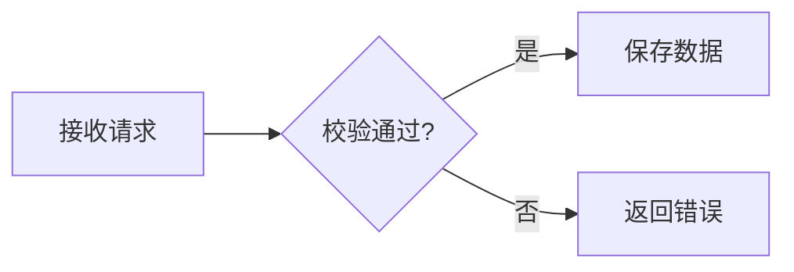

# 个人学习知识库

基于 Astro Starlight 构建的个人学习与知识管理网站，用于整理知识专题、学习路线和问题复盘。

## 当前阶段

仓库已经完成最小可运行基线：

- Astro Starlight 站点
- 知识专题、学习路线、问题复盘和关于本站四个入口
- 统一的笔记元数据校验
- GitHub Actions 自动检查和构建

现阶段只建立内容框架，具体分类将在现有笔记盘点后确定。

## 本地环境

- Node.js 22.12 或更高版本
- npm 10 或更高版本

使用 nvm 时可以执行：

```bash
nvm install
nvm use
```

## 本地运行

```bash
npm install
npm run dev -- --background
```

生产构建：

```bash
npm run check
npm run build
```

## 内容目录

```text
src/content/docs/
├── index.mdx
├── knowledge/
├── learning-paths/
├── retrospectives/
└── about.md
```

Markdown 和 MDX 文件会根据 `src/content/docs/` 下的路径生成对应页面。

## Mermaid 图表

在 Markdown 或 MDX 中使用 `mermaid` 代码围栏，页面会自动显示图表：

````markdown

````

图表进入阅读区域时按需渲染，放在 `<details>` 中的图表会在展开后渲染。支持切换原尺寸、查看源码；语法错误或加载失败时保留源码，不影响其他内容。Mermaid 随站点打包，无需在文章中引入脚本或使用外部 CDN。

## 文本选择与复制

站点正文（包括标题、代码和图表）支持正常的文本选中、复制、剪切、右键菜单和拖拽，Ctrl/Cmd+A、C、X 使用浏览器默认行为，代码块提供复制按钮。搜索框、输入框和可编辑区域支持正常粘贴，手机端可使用长按菜单。

## 英语学习模块

入口为 `/english/`，首页和侧栏均可进入。词库包含从原 HTML 提取的 500 个词汇、500 个表达与 20 个主题；英文、例句、释义、译文、用法和原编号均保留。支持今日学习、词库检索、学习历史、日期范围、优先级、状态筛选，以及笔记和备份。

### 数据与访问

词库是公开的静态内容；个人记录通过 `/api/english/session` 与 `/api/english/data` 读写，使用同一份 PostgreSQL 数据库实现多设备共享。口令仅由服务端校验，浏览器收到 30 天有效的 HttpOnly、SameSite Cookie，HTTPS 环境同时启用 Secure。更换口令会让已有会话失效；登录有数据库计数的频率限制。

每次学习保存独立事件，不因掌握状态变化而删除。日期查询与每日统计统一按 Asia/Shanghai 计算。词条更新使用版本号防止另一台设备的旧数据覆盖新数据；操作 UUID 防止网络重试重复记账。导入只补充缺失的状态和历史，不覆盖已有云端设置。旧版 v1 进度不包含学习时间，因此保留“日期未知”；v2 备份包含完整学习历史。

打开、切回页面或手动刷新时读取最新记录。断网时显示未确认保存，当前操作保留在页面和本标签页的 sessionStorage 中，可联网重试。未实现离线词库缓存、离线连续学习或多操作离线队列。请勿在待保存时清理浏览器数据。

### 本地运行

使用 Node.js 22.12+。把 `.env.example` 复制为 `.env.local`，设置：

- `DATABASE_URL`：PostgreSQL 连接串。云端可使用 Neon 的带 TLS 的连接串。
- `ENGLISH_PASSPHRASE`：至少 4 个字符的个人口令。不要提交到 Git，也不要使用 `PUBLIC_` 前缀。

初始化与后台启动：

```sh
npm run db:english
node --env-file=.env.local node_modules/astro/bin/astro.mjs dev --background
```

停止、查看状态和日志分别使用 `npx astro dev stop`、`npx astro dev status`、`npx astro dev logs`。数据库初始化是显式执行的幂等建表脚本，不在每次请求或构建时运行。缺少配置时，词库仍可浏览，个人记录接口返回 503，不会假装保存成功。

### 云端启用

1. 为此项目创建独立 PostgreSQL 数据库（推荐 Neon），为目标 Vercel 环境设置 `DATABASE_URL` 和 `ENGLISH_PASSPHRASE`。
2. 在具有该数据库连接串的受控环境执行 `node scripts/english-db.mjs`，确认建表成功。
3. 完成 `npm run check`、`npm run build` 后部署，分别在手机与电脑验证写入和读取。项目已接入 Vercel adapter；其他知识页面继续预渲染，仅两个记录接口按请求运行。

生产环境和测试环境应使用独立数据库。数据库凭据和口令不会写入静态页面；不要把 `.env.local`、`.vercel` 或 `.local` 上传到仓库。

### 集成验证

`npm run test:english` 会针对运行中的本地网站检查权限、输入校验、两端读取、重试去重、冲突保护、历史保留和备份合并，并直接读数据库确认结果。它仅允许本机名为 `english_dev` 的独立测试库，使用并清理 W497—W500 测试词条；已有这些词条的数据时拒绝运行。测试默认网站地址为 `http://127.0.0.1:4321`，可通过 `ENGLISH_TEST_URL` 调整。

可用隔离容器准备测试库：

```sh
docker run -d --name learning-notes-english-test \
  -e POSTGRES_USER=english_dev -e POSTGRES_DB=english_dev \
  -e POSTGRES_HOST_AUTH_METHOD=trust \
  -p 127.0.0.1:55439:5432 postgres:16-alpine
```

对应本地连接串为 `postgresql://english_dev@127.0.0.1:55439/english_dev`。该无密码配置仅用于绑定回环地址的本地测试容器，不用于公网数据库。容器数据在删除容器时消失，不作为个人长期存储。

```sh
npm run db:english
npm run test:english
```

重新提取原始词库：

```sh
python3 scripts/import-english.py /path/to/Java技术英语_500词汇500表达_地铁离线版.html
```

提取器只读取内容，不执行源 HTML 中的 JavaScript。迁移旧版学习进度时，使用原页面“导出进度”，再在新模块的词库或学习记录页“导入记录”。

## 笔记元数据

```yaml
---
title: Redis 分布式锁实践
description: 分析常见失效场景及验证方法
created: 2026-07-10
updated: 2026-07-10
category: distributed-systems
subcategory: consistency
tags:
  - Redis
  - 并发控制
status: verified
difficulty: intermediate
contentType: practice
source: project-practice
---
```

`status` 可选值：`draft`、`verified`、`evergreen`、`outdated`。

`contentType` 可选值：`knowledge`、`practice`、`retrospective`、`source-analysis`、`learning-path`。

## CSDN 历史文章导入

CSDN 导出文件位于 `/Users/wangyi/csdn-article-export/exports` 时，可使用项目内的可重复导入脚本：

```bash
node scripts/import-csdn.mjs
```

脚本会根据专栏和文章标题归类，生成“专题 / 二级知识域 / 文章标题”的三级结构。文章使用清理后的标题作为语义化文件名和访问路径，CSDN 文章 ID 只保留在 `sourceId` 元数据和内部图片目录中，不会再作为侧栏节点或正式文章地址。脚本还会补充统一元数据，清理 CSDN 代码行号和页面残留，并把正文引用的图片复制到二级知识域下的 `assets/<文章ID>/` 目录。首次导入的文章统一为 `status: draft`，导入报告写入 `scripts/csdn-import-report.json`。

```text
src/content/docs/knowledge/java-backend/
├── index.mdx
├── collections/
│   ├── 集合专辑-二-list实现类arraylist解读.md
│   └── assets/125694580/
├── concurrency/
├── jvm-runtime/
└── spring/
```

默认情况下已存在的文章会跳过；确认要重新生成时使用 `--force`。更换导出目录时使用 `--source /path/to/exports`。导入后运行 `npm run check` 和 `npm run build` 验收。

## 下一步

1. 按专题逐篇检查当前的 `draft` 文章。
2. 为需要长期维护的文章补充版本边界、实验条件和验证证据。
3. 将确认可靠的文章改为 `verified` 或 `evergreen`。
4. 配置 GitHub 远程仓库与线上部署。
