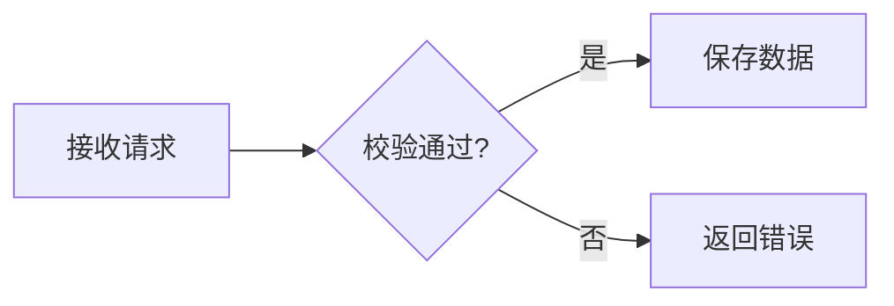

# 个人学习知识库

基于 Astro Starlight 构建的个人学习与知识管理网站，用于整理知识专题、学习路线和问题复盘。

## 当前阶段

仓库已经完成最小可运行基线：

- Astro Starlight 站点
- 知识专题、学习路线、问题复盘和关于本站四个入口
- 统一的笔记元数据校验
- GitHub Actions 自动检查和构建

现阶段只建立内容框架，具体分类将在现有笔记盘点后确定。

## 本地环境

- Node.js 22.12 或更高版本
- npm 10 或更高版本

使用 nvm 时可以执行：

```bash
nvm install
nvm use
```

## 本地运行

```bash
npm install
npm run dev -- --background
```

生产构建：

```bash
npm run check
npm run build
```

## 内容目录

```text
src/content/docs/
├── index.mdx
├── knowledge/
├── learning-paths/
├── retrospectives/
└── about.md
```

Markdown 和 MDX 文件会根据 `src/content/docs/` 下的路径生成对应页面。

## Mermaid 图表

在 Markdown 或 MDX 中使用 `mermaid` 代码围栏，页面会自动显示图表：

````markdown

````

图表进入阅读区域时按需渲染，放在 `<details>` 中的图表会在展开后渲染。支持切换原尺寸、查看源码；语法错误或加载失败时保留源码，不影响其他内容。Mermaid 随站点打包，无需在文章中引入脚本或使用外部 CDN。

## 文本选择与复制

站点正文（包括标题、代码和图表）支持正常的文本选中、复制、剪切、右键菜单和拖拽，Ctrl/Cmd+A、C、X 使用浏览器默认行为，代码块提供复制按钮。搜索框、输入框和可编辑区域支持正常粘贴，手机端可使用长按菜单。

## 英语学习模块

入口为 `/english/`，首页和侧栏均可进入。词库包含 1000 个词汇、500 个表达与 20 个主题：原 HTML 的 500 词汇与 500 表达，加上《Java英语第二册_新增500词汇.csv》的 W501—W1000。英文、例句、释义、译文、用法和原编号均保留；第二册还保留常用搭配、学习层级与主题参考（非逐词出处），按原主题合并，新词默认为未学。支持今日学习、词库检索、学习历史、日期范围、优先级、状态筛选，以及笔记和备份。

### 数据与访问

词库是公开的静态内容；个人记录通过 `/api/english/session` 与 `/api/english/data` 读写，使用同一份 PostgreSQL 数据库实现多设备共享。口令仅由服务端校验，浏览器收到 30 天有效的 HttpOnly、SameSite Cookie，HTTPS 环境同时启用 Secure。更换口令会让已有会话失效；登录有数据库计数的频率限制。

每次学习保存独立事件，不因掌握状态变化而删除。日期查询与每日统计统一按 Asia/Shanghai 计算。词条更新使用版本号防止另一台设备的旧数据覆盖新数据；操作 UUID 防止网络重试重复记账。导入只补充缺失的状态和历史，不覆盖已有云端设置。旧版 v1 进度不包含学习时间，因此保留“日期未知”；v2 备份包含完整学习历史。

打开、切回页面或手动刷新时读取最新记录。断网时显示未确认保存，当前操作保留在页面和本标签页的 sessionStorage 中，可联网重试。未实现离线词库缓存、离线连续学习或多操作离线队列。请勿在待保存时清理浏览器数据。

### 本地运行

使用 Node.js 22.12+。把 `.env.example` 复制为 `.env.local`，设置：

- `DATABASE_URL`：PostgreSQL 连接串。云端可使用 Neon 的带 TLS 的连接串。
- `ENGLISH_PASSPHRASE`：至少 4 个字符的个人口令。不要提交到 Git，也不要使用 `PUBLIC_` 前缀。

初始化与后台启动：

```sh
npm run db:english
node --env-file=.env.local node_modules/astro/bin/astro.mjs dev --background
```

停止、查看状态和日志分别使用 `npx astro dev stop`、`npx astro dev status`、`npx astro dev logs`。数据库初始化是显式执行的幂等建表脚本，不在每次请求或构建时运行。缺少配置时，词库仍可浏览，个人记录接口返回 503，不会假装保存成功。

### 云端启用

1. 为此项目创建独立 PostgreSQL 数据库（推荐 Neon），为目标 Vercel 环境设置 `DATABASE_URL` 和 `ENGLISH_PASSPHRASE`。
2. 在具有该数据库连接串的受控环境执行 `node scripts/english-db.mjs`，确认建表成功。
3. 完成 `npm run check`、`npm run build` 后部署，分别在手机与电脑验证写入和读取。项目已接入 Vercel adapter；其他知识页面继续预渲染，个人记录与巩固练习接口按请求运行。

生产环境和测试环境应使用独立数据库。数据库凭据和口令不会写入静态页面；不要把 `.env.local`、`.vercel` 或 `.local` 上传到仓库。

`vercel.json` 将接口固定在新加坡 `sin1`，与当前 Neon 数据库同区域，避免每次保存跨洲往返。如果迁移数据库，请同时调整此区域。词条保存只回传当前词条的状态与历史；刷新与备份仍读取完整记录。

### 集成验证

`npm run test:english` 会针对运行中的本地网站检查权限、输入校验、两端读取、重试去重、冲突保护、历史保留和备份合并，并直接读数据库确认结果。它仅允许本机名为 `english_dev` 的独立测试库，使用并清理 W497—W500 测试词条；已有这些词条的数据时拒绝运行。测试默认网站地址为 `http://127.0.0.1:4321`，可通过 `ENGLISH_TEST_URL` 调整。

可用隔离容器准备测试库：

```sh
docker run -d --name learning-notes-english-test \
  -e POSTGRES_USER=english_dev -e POSTGRES_DB=english_dev \
  -e POSTGRES_HOST_AUTH_METHOD=trust \
  -p 127.0.0.1:55439:5432 postgres:16-alpine
```

对应本地连接串为 `postgresql://english_dev@127.0.0.1:55439/english_dev`。该无密码配置仅用于绑定回环地址的本地测试容器，不用于公网数据库。容器数据在删除容器时消失，不作为个人长期存储。

```sh
npm run db:english
npm run test:english
```

重新提取第一册原始词库（会覆盖 `src/data/english.json`，不含第二册新增词汇，请勿直接用于当前完整词库）：

```sh
python3 scripts/import-english.py /path/to/Java技术英语_500词汇500表达_地铁离线版.html
```

提取器只读取内容，不执行源 HTML 中的 JavaScript。迁移旧版学习进度时，使用原页面“导出进度”，再在新模块的词库或学习记录页“导入记录”。

### 分析与巩固：Codex 备课，网站学习

英语页新增“分析与巩固”，包含今天、本周、本月与历史视图。报告、题目版本、首次答案、重做、提示、纠错与复测均保存在同一 PostgreSQL 数据库，通过 `/api/english/practice` 沿用个人口令访问。已保存内容不依赖 Codex 在线，新增报告也不需要重新构建网站。生成示例材料仅在隔离验收库使用，不写入公开词库。

首次启用或从仅含练习的旧版本升级，都需要执行 `npm run db:english` 并部署本次网站代码；本次迁移扩展学习事件类型。迁移可重复执行，增加报告、学习与练习事件、复测表及请求回执，并修复旧版编号约束对 W1000 的限制；不会改写旧自评、私人笔记或手工复习日期。`ENGLISH_SITE_URL` 可选配置为实际网站的 HTTPS 地址，供保存工具返回完整链接；不设置时返回相对入口。

固定工具使用流程（Node.js 22.12+）：

连接驱动由网站、读写工具和迁移脚本共用：`DATABASE_URL` 的主机为 `*.neon.tech` 时自动使用 Neon 官方 WebSocket 驱动（TLS / 443），其他 PostgreSQL 地址继续使用 `pg` TCP。驱动随项目依赖安装，后续运行不需要重新接入；现有事务、锁、参数查询和请求去重流程保持一致。数据库 CLI 仅需数据库凭据，网站登录仍需 `ENGLISH_PASSPHRASE`。

本机生产配置保存在未跟踪的 `.local/english-production.env`。自动任务使用下面的生产命令（macOS / Linux），缺少此文件时直接失败，不回退到 `.env.local` 测试库；命令会先清除继承的 `DATABASE_URL`，再从指定文件加载，避免其他环境的连接串覆盖生产配置：

```sh
npm run --silent english:context:production -- --period day --date YYYY-MM-DD --cutoff ISO时间 --mode short --out .local/english-context.json
npm run --silent english:save:production -- --schema
npm run --silent english:save:production -- --file .local/english-content.json
npm run --silent english:save:production -- --request 原请求UUID
```

生产凭据或数据库地址变更时更新该配置文件即可。已有部署不会因本地修改自动更新；网站需要部署包含此驱动的代码版本。不要把连接成功当作课程保存或网站验收成功。

1. **先说明数据范围。** Codex 首次运行前说明会读取所选词条、学习表现、自评、客观题作答、提示、反馈和已确认复测。私人笔记默认排除；连接信息由脚本使用，不能复制到模型上下文或生成文件中。
2. **读取事实。** 日、周、月均用北京时间；`--date` 选择周期内任一天，省略时取今天。读取不会新增报告或改变学习记录。

   ```sh
   mkdir -p .local
   npm run --silent english:context -- --period week --mode short --goal java --out .local/english-context.json
   ```

   可选参数：`--date YYYY-MM-DD`、`--cutoff ISO时间`、`--include W001,W1000`、`--exclude W002`。`--mode` 为 `short` 或 `standard`，`--goal` 为 `java` 或 `general`。未指定的模式与目标会返回最近已保存练习的偏好；首次默认 Java 短练习。输出包含明确截止点、观察窗口、候选排序、统计分子分母、词条级证据、原题与作答、反馈及待复测安排。没有实际记录时不允许保存个人诊断。

`generationCoverage` 按统计范围内每词最后一次自评返回全部候选、已覆盖和待处理词条。已覆盖指完整学习单元引用了该次自评；仅有旧练习、尚未保存的草稿或更早自评对应的课程均不算。已生成课程是否学完不影响其他词条的生成。词条多时可按主题分组，用每组 `--include` 固定成员和去重依据，在同一次运行中依次保存全部组，不截取前几个、不把未覆盖项推迟到下次。保存后用新的截止点读取覆盖清单，确认本次初始待处理词条已全部覆盖。

3. **按证据编写。** 阅读上下文文件，覆盖 `generationCoverage.pendingWordIds` 中全部目标词，区分事实、可能原因和建议。先导出结构规范，再编写完整 JSON（仅含练习的旧格式不再用于新发布）：

   ```sh
   npm run --silent english:save -- --schema > .local/english-save.schema.json
   ```

   顶层包含 `schemaVersion: 2`、新的 UUID `requestId`、读取结果原样保留的 `input`（放入 `context` 字段）、`contextHash`、`regenerate` 和 `content`。`content` 包含标题、总结、结论、下一步、必填的 `lesson` 学习单元和随附练习。完整字段以导出的 schema 和 `src/lib/english/practice-schema.ts` 为准；`scripts/english-practice-fixture.mjs` 是隔离测试中的完整结构示例，不能作为用户真实分析。

   目标词与事实结论使用读取结果中的 `evidenceIds`。自选补练词须先在读取时用 `--include` 声明，不能伪造薄弱依据。非扩展含义须与词库 `meaning` 一致；复测目标附 `retestId`，沿用原 `usage` 与含义，并更换已练过的语境。短练习为 80–120 个英文词、3 道题；标准练习为 150–220 个英文词、5 道题。两种模式均不限制目标词数量。选择题只允许一个正确选项，文本题预先列出全部可接受答案。文本匹配仅规范化大小写、全半角和空白，不自动猜测其他词形。

   `lesson` 必须包含 `title`、`objectives`、`estimatedMinutes`、每词一项的 `words`、`reading` 和 `takeaways`。每个词条包含 `explanation`、`usageNotes`、至少两个 `examples`（英文、译文、注释）和 `contrast`（左右对比例句与差异解释）。`reading` 包含 `passage`、`translation`、`sentences`（原句、译文、来自原句的分块及解释、理解要点）和来源。先解释为什么这样用，再用详细语料带读，不能用词库释义加题目代替教学；学习阶段的例句与题目语境必须不同。

   日报告关注当日覆盖与近期待复测；周报告结合不同日期的不稳和实际题型结果选择优先专题；月报告说明共同词条、间隔和样本量，观察积压并提出调整建议。不得仅改报告时间范围，不得从学习数量推断语言等级。生成材料标记 `source.kind: generated`；真实摘录使用 `excerpt` 并附标题和 URL。格式校验不能证明教学与技术语义正确，作者仍须检查，用户可标记题目待核对。修正内容使用新版本和可选 `replaces` 指向旧题。

4. **只在明确授权保存时发布。** 用户只要分析或草稿时，停在上一步；用户明确“生成并保存”时，执行：

   ```sh
   npm run --silent english:save -- --file .local/english-content.json
   ```

   工具在一个事务中保存报告与完整练习，之后从数据库读回，返回请求号、报告号、内容版本和入口。相同周期且学习依据相同时默认返回已有版本；只有用户主动要求更新才设置 `regenerate: true`，保留原题和作答。生成过程中新增的学习事件不会改变固定截止点；原依据因补录、纠错或安排变化而不再匹配时须重新读取。

5. **不确定时先恢复。** 超时或网络中断不能当作已保存；先用原请求 UUID 查询：

   ```sh
   npm run --silent english:save -- --request 原请求UUID
   ```

   查询已保存时使用返回入口；确实未保存时重试同一文件与请求号。重复请求、并发提交和复测重复确认不会产生重复学习次数。返回 `readbackVerified` 说明数据库已读回；实际网站入口还需在已部署环境打开确认，不能把本地测试当作线上验收。

新课程先展示学习讲解，再进入语料精读，最后开放课后练习。学习单元按目标词提供中文讲解、用法说明、至少两个带译文和注释的例句、易混对比；精读包含独立语料、全文译文、至少两个句子的分块解释和学习要点。练习使用新语境，不能照搬讲解例句。学习与练习分别标注预计时长。

“讲解已学完”和“精读已完成”保存学习进度，可以换设备继续；点击完成不计作答、不提高掌握状态。进入练习后收起教学内容，课前学习不算提示，练习时再查看讲解、译文或答案则先记录辅助使用事件。含跨日复测的内容先独立回忆，讲解可在答后阅读；提前查看会记为辅助，不用于无提示复测判断。旧报告保留原题和答案，明确提示尚无完整学习单元，新版课程另存版本。逐题提交保存，其他题目尚未提交的选择会保留并提示；断网待保存操作保存在本标签页 `sessionStorage`，刷新后可用原操作编号重试或读取服务器结果再取消。同题的并发首次提交会提示刷新，不静默覆盖。标记有误的题目立即退出后续分析，已保存报告的历史统计仍保持当时快照。

复测建议由固定规则计算并由用户确认。初次不稳建议下一自然日，独立通过后建议成功后的第 3 天、第 7 天；查看提示后的作答不计独立通过。手工日期与建议同时展示，用户可选手工日期、建议日期、自选日期或跳过。到期但缺少新语境材料显示“待准备复测练习”，不会自动生成题目或记错。网站保留原词库日期，已确认的专项复测单独展示。

### 分析与巩固的验收

```sh
npm run test:english-analysis
npm run test:english-practice
npm run check
npm run build
```

`test:english-analysis` 不需要数据库，检查去重、提示与首次计分、时区及周期比较、薄弱识别、趋稳与再遗忘、遗留状态、题目纠错、材料覆盖和手工日期。`test:english-practice` 需要已启动的网站及本机 `english_dev` 隔离库，可通过 `ENGLISH_TEST_URL` 指定地址；拒绝已含报告或 W001/W501/W1000 记录的数据库。它实际调用固定读写工具和 HTTP 接口，用两个会话检查权限、保存/读回、并发去重、原版本保留、复测日期冲突、换语境复测和 8 词覆盖，结束清理自己建立的测试记录。此测试不得连接个人或生产数据。原模块回归仍使用 `npm run test:english`。

实现保持两个固定工具与一个网站入口；日周月共用统计规则和事件事实，报告与练习共用不可变文档，复用原有登录和请求去重机制。未增加站内模型服务、后台生成队列、MCP 服务或定时任务。

## 笔记元数据

```yaml
---
title: Redis 分布式锁实践
description: 分析常见失效场景及验证方法
created: 2026-07-10
updated: 2026-07-10
category: distributed-systems
subcategory: consistency
tags:
  - Redis
  - 并发控制
status: verified
difficulty: intermediate
contentType: practice
source: project-practice
---
```

`status` 可选值：`draft`、`verified`、`evergreen`、`outdated`。

`contentType` 可选值：`knowledge`、`practice`、`retrospective`、`source-analysis`、`learning-path`。

## CSDN 历史文章导入

CSDN 导出文件位于 `/Users/wangyi/csdn-article-export/exports` 时，可使用项目内的可重复导入脚本：

```bash
node scripts/import-csdn.mjs
```

脚本会根据专栏和文章标题归类，生成“专题 / 二级知识域 / 文章标题”的三级结构。文章使用清理后的标题作为语义化文件名和访问路径，CSDN 文章 ID 只保留在 `sourceId` 元数据和内部图片目录中，不会再作为侧栏节点或正式文章地址。脚本还会补充统一元数据，清理 CSDN 代码行号和页面残留，并把正文引用的图片复制到二级知识域下的 `assets/<文章ID>/` 目录。首次导入的文章统一为 `status: draft`，导入报告写入 `scripts/csdn-import-report.json`。

```text
src/content/docs/knowledge/java-backend/
├── index.mdx
├── collections/
│   ├── 集合专辑-二-list实现类arraylist解读.md
│   └── assets/125694580/
├── concurrency/
├── jvm-runtime/
└── spring/
```

默认情况下已存在的文章会跳过；确认要重新生成时使用 `--force`。更换导出目录时使用 `--source /path/to/exports`。导入后运行 `npm run check` 和 `npm run build` 验收。

## 下一步

1. 按专题逐篇检查当前的 `draft` 文章。
2. 为需要长期维护的文章补充版本边界、实验条件和验证证据。
3. 将确认可靠的文章改为 `verified` 或 `evergreen`。
4. 配置 GitHub 远程仓库与线上部署。
