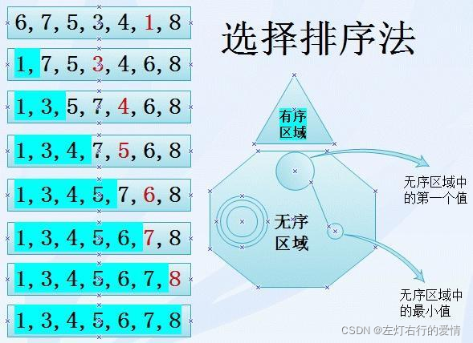
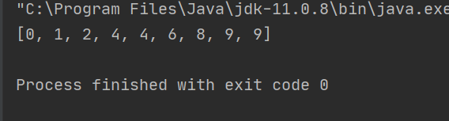
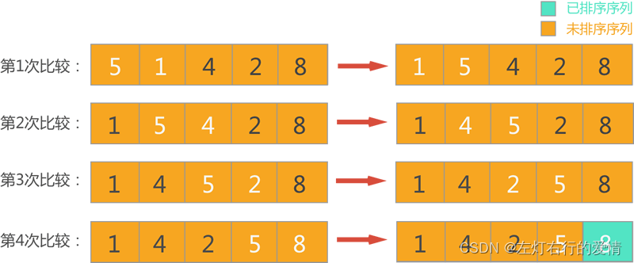
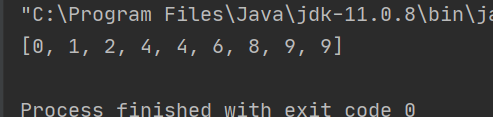
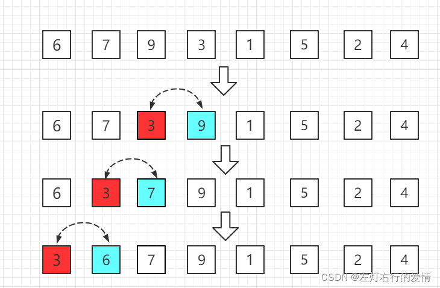
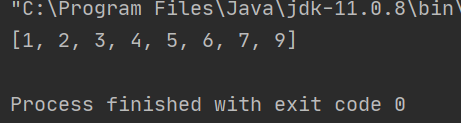
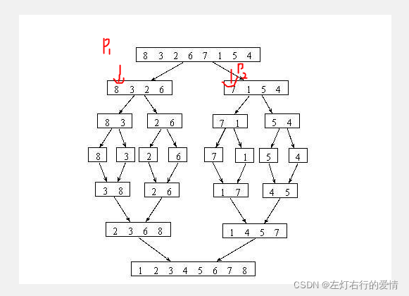
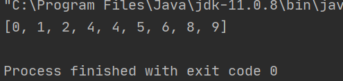
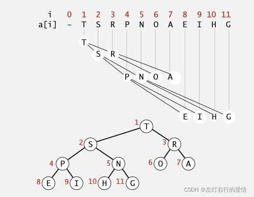
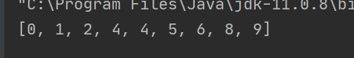

> 原文：[CSDN](https://blog.csdn.net/qq_45852626/article/details/123329485)（历史文章导入，当前状态为草稿）

#### 1：选择排序

应该是最简单的排序了，每一次从待排序的元素里挑出最小（或最大）的元素排到要放置的位置。  
详细一点如下：  
首先在未排序序列中找到元素，存放到排序序列的起始位置，  
然后，再从剩余未排序元素中继续寻找元素，然后放到第二个元素位置。  
以此类推，直到所有元素均排序完毕。  
  
排序代码如下：

```
public class SelectionSort {
    public static void main(String[] args) {
        //test
        int arr[]={9,9,8,2,4,4,6,1,0};
        selectsort(arr);
        System.out.println(Arrays.toString(arr));    //利用工具类来打印数组
    }
    public static void selectsort(int [] arr){
        if(arr==null||arr.length<2){                     //边界判定
            return;
        }
        for(int i=0;i<arr.length-1;i++){
            int minIndex =i;                                                //定义假设一个最小脚码
            for(int j=i+1;j<arr.length;j++){
                minIndex= arr[j]<arr[minIndex]?j:minIndex;                 //如果 arr[j]<arr[minIndex]，则把j赋值到minindex，否则不变。目的是挑选出最小数据的脚码
            }
            swap(arr,i,minIndex);
        }
    }
    public static void swap(int arr[],int i,int j){
        int temp=arr[i];
        arr[i]=arr[j];
        arr[j]=temp;
    }


```

测试如图：  


#### 2:冒泡排序

简言之：每一趟遍历，将一个最大或最小的数移到序列末尾。  
  
代码如下：

```
 public static void main(String[] args) {
        int arr[]={9,9,8,2,4,4,6,1,0};
        bubblesort(arr);
        System.out.println(Arrays.toString(arr));
    }

    public static void bubblesort(int[] arr){
        if (arr == null || arr.length < 2) {
            return;
        }
        //第一个for循环，每轮一圈就确定一个最大/最小 的数，最后一个数不需要确定，因为前面都排好了，最后一个数肯定在正确位置上
        for(int e= arr.length-1;e>0;e--){
            //第二个for循环：在这一轮中，要交换多少次。
            for(int i=0;i<e;i++){
                if(arr[i]>arr[i+1]){
                    swap(arr,i,i+1);
                }
            }
        }
    }
    public static void swap(int[] arr, int i, int j) {
        int tmp = arr[i];
        arr[i] = arr[j];
        arr[j] = tmp;
    }


```

测试结果：  


#### 3:插入排序

它的基本思想是将一个记录插入到已经排好序的有序表中，从而一个新的有序表  
使用双层循环，外层循环对除了第一个元素之外的所有元素，内层循环对当前元素前面有序表进行待插入位置查找，并进行移动。  
举个栗子：现在第一层for循环的i=4，图中第一行arr[4]=3,，下面箭头是3如何排序的  
  
代码如下：

```
 public static void main(String[] args) {
        //test
        int arr[]={6,7,9,3,1,5,2,4};
        insertsort(arr);
        System.out.println(Arrays.toString(arr));
    }

    public static void insertsort(int[] arr) {
        if (arr == null || arr.length < 2) {
            return;
        }
        //第一个for循环指向了该排的元素
        for(int i=1;i< arr.length;i++){
            //第二个for循环是一个逆排序，从后往前让i位置的元素找到在有序队列的位置。
            for(int j=i-1;j>=0&&arr[j]>arr[j+1];j--){   //注意这里的j>=0!!
                swap(arr, j, j + 1);
            }
        }
    }
    public static void swap(int[] arr, int i, int j) {
        int tmp = arr[i];
        arr[i] = arr[j];
        arr[j] = tmp;
    }


```

测试结果：  


#### 4:归并排序

在我刚开始学习归并排序时，真的让我很头大，现在看来，当时对分治思想和递归了解不够。  
归并根本就是：使每个子序列有序，再使子序列段间有序，先拆后合。  
如果使每个子序列有序呢？先把数组分割，直到分割为一个数，这个数就它自己，肯定是有序的（下图第四行）。  
然后将相邻的两个有序对比大小（8和3），并有序的放入辅助数组（3比8小，则先放8，辅助数组：【3,8】）中，最后把辅助数组中的数据更新到原数组中，重复多次，得到一个完整有序的数组，实现了排序。

  
代码如下：

```
  public static void main(String[] args) {
        int arr[]={5,9,8,2,4,4,6,1,0};
        mergesort(arr);
        System.out.println(Arrays.toString(arr));
    }

    public static void mergesort(int[] arr){
        if (arr == null || arr.length < 2) {
            return;
        }
        mergesort(arr,0,arr.length - 1);
    }
    public static void mergesort(int[] arr,int l,int r){
        if(l==r){
            return;
        }
        //为什么不写成int mid=(l+r)/2
        //如果数组开的比较大，l+r有可能会溢出
        int mid =l+((r-l)>>1);//这里的>>是表示位运算，向右移一位即除二
        mergesort(arr,l,mid);
        mergesort(arr,mid+1,r);
        merge(arr,l,mid,r);
    }
    public static void merge(int[] arr,int l,int m,int r){
        int[] help =new int[r-l+1];//开辟一个辅助空间，大小为r——>l的数
        int i=0;
        //为什么要声明p1，p2两个变量，他们代表了两个指针，分别指向两个假设数组空间。
        //p1指向的数组空间是被二分的左边数组的第一个空间。
        //p1指向的数组空间是被二分的右边数组的第一个空间。
        int p1=l;
        int p2=m+1;
        while(p1<=m&&p2<=r){    //对比左右边的数组所指向的数据。
            //谁小则录入辅助数组help中，注意录入后移动指针
            //比如arr[p1]<arr[p2]，将arr[p1]录入help中
            //随后help的指针和p1都加1；
            help[i++]=arr[p1]<arr[p2]?arr[p1++]:arr[p2++];
        }
        while(p1<=m){    //将另一边没有录入完全的数组录入到help中
            help[i++]=arr[p1++];
        }
        while(p2<=r){
            help[i++]=arr[p2++];
        }
        for(i=0;i<help.length;i++){
            //讲help 的数组更新到arr中
            arr[l+i]=help[i];
        }

    }


```

测试结果：  


#### 5：堆排序

关于堆排序，首先先要了解堆结构，这个比堆排序更重要，希望你在看本文之前先去了解什么是堆结构，本文只描述堆排序。  
堆排序其实非常简单，简单的三步即可：  
1:将无序序列构造成一个大顶堆（小顶堆）-------图转自网络  


2:将堆顶元素和末尾元素交换，将最大（最小）元素交换到数组末端  
3:重新调整数组结构，使其满足堆的定义，并重复执行步骤1、2  
代码如下：

```
public class HeapSort {

    public static void main(String[] args) {
        int arr[] = {5, 9, 8, 2, 4, 4, 6, 1, 0};
        heapsort(arr);
        System.out.println(Arrays.toString(arr));
    }

    public static void heapsort(int[] arr) {
        if (arr == null || arr.length < 2) {
            return;
        }
        for (int i = 0; i < arr.length; i++) {
            heapInsert(arr, i);
        }
        int size = arr.length;
        swap(arr, 0, --size);
        while (size > 0) {
            heapify(arr, 0, size);
            swap(arr, 0, --size);
        }
    }

    public static void heapInsert(int[] arr, int index) {   //构建大顶堆
        while (arr[index] > arr[(index - 1) / 2]) {    //如果新加入的节点值大于该节点的父节点。

            swap(arr, index, (index - 1) / 2);

            index = (index - 1) / 2;
        }
    }

    public static void heapify(int[] arr, int index, int size) {
        int left = index * 2 + 1;
        while (left < size) {
            //左右两个节点挑选出最大的那个节点。
            int largest = left + 1 < size && arr[left + 1] > arr[left] ? left + 1 : left;
            //记录脚码，方便后面交换
            largest = arr[largest] > arr[index] ? largest : index;
            if (largest == index) {
                break;
            }
            swap(arr, largest, index);
            index = largest;
            left = index * 2 + 1;
        }
    }

    public static void swap(int[] arr, int i, int j) {
        int tmp = arr[i];
        arr[i] = arr[j];
        arr[j] = tmp;
    }


```

测试结果：  


#### 快速排序

快速排序是归并排序算法的优化，继承了归并排序的优点，同样应用了分治思想。  
快排在归并的基础上增加了一个支点，根据这个支点去进行排序，其规则如下：  
支点的左边为小于支点的区域，简称小区  
支点的右边为大于支点的区域，简称大区  
等于支点的为中区。  
定义两个指针分别指向小区和大区，具体逻辑看 partition代码。

代码如下：

```
public class quickSort {
    public static void main(String[] args) {
        int arr[] = {9, 9, 8, 2, 4, 4, 6, 1, 0};
        quicksort(arr);
        System.out.println(Arrays.toString(arr));
    }

    public static void quicksort(int[] arr) {
        if (arr == null || arr.length < 2) {
            return;
        }
        quicksort(arr, 0, arr.length - 1);
    }

    public static void quicksort(int[] arr, int l, int r) {
        if (l < r) {
            swap(arr, l + (int) (Math.random() * (r - l + 1)), r);
            int[] p = partition(arr, l, r);
            quicksort(arr, 1, p[0] - 1);
            quicksort(arr, p[1] + 1, r);
        }
    }

    public static int[] partition(int[] arr, int l, int r) {
        int less = l - 1;//小区指针
        int more = r;//大区指针
        while (l < more) {
            if (arr[l] < arr[r]) { //当l指向的数值小于指定数值
                swap(arr, ++less, l++);//arr[l]与小区的下一个数值交换，并且l++;
            } else if (arr[l] > arr[r]) {//当l指向的数值大于指定数值
                swap(arr, --more, l);//arr[l]与大区的下一个数值交换，大区左扩，
                // 注意，此时l不能++，因为换过来的数值还没有比对！！！
            }else {
                l++;    //如果等于则指针++
            }
        }
        swap(arr, more, r);//最后，把作为标准的值，回到自己的区间（与大区的第一个值交换）。
        return new int[]{less + 1, more};//返回左边界和右边界
    }

    public static void swap(int[] arr, int i, int j) {
        int tmp = arr[i];
        arr[i] = arr[j];
        arr[j] = tmp;
    }
}


```

— 感谢收藏捧场，这篇文章是很早之前的写的了，既然有人需要，近期我会进行一次补强更新，一起好好的去深挖一下这些排序，近期一定更完！  

