> 原文：[CSDN](https://blog.csdn.net/qq_45852626/article/details/126185809)（历史文章导入，当前状态为草稿）

## 数组真的有意思
## 前言：

从不同语言角度来分析数组的一些内容，讨论一些非常有意思的问题，观看本文需要你有一些数组的基本认识和虚拟机的基本认识，希望你可以看到自己想要的内容。

### 认知部分

#### 数组的随机访问

公式：`address[i]`=base\_address+i\*data\_type\_size。  
 address[i]：下标i的地址值  
 base\_address：数组的首地址  
 data\_type\_size：数组中每个元素的大小，也就是数据类型大小（字节），例如int是4个字节。

### #数组操作的效率问题

数组在增删查这三个动作中，查询是高效的，但是增和删是低效的，查询搞笑是因为数组支持随机访问，时间复杂度是O(1)。  
 增和删的动作中，因为涉及到数据搬移，所以时间复杂度是O(n)。

#### 数组从0开始的问题

从数组存储的内存模型上来看，“下标”这个形容不太确切，更准确的定义应该是“偏移（offset）”。如果用a来表示数组的首地址，那么a[0]就是偏移为0的地址，也就是首地址，a[k]就是偏移k个type\_size的位置，所以计算a[k]的内存地址只需要用这个公式：`a[k]_address=base_address+k*type_size`加入我们数组从1开始的话，我们的内存地址计算数组a[k]的内存地址就会变成：  
 `a[k]_address=base_address+(k-1)*type_size`  
 下面的公式比上面多了一次减法的运算，对于CPU来说，就多了一个减法指令。  
 数组作为非常基础的数据结构，效率的优化就要尽可能做到极致。  
 所以，数组选择了编号从0开始，而不是从1开始。

#### 数组原理内存图理解

内存作为计算机中重要的原件，临时存储取悦，作用是当程序运行中，我们编写的程序存放在硬盘当中，硬盘当中的程序文件不会运行，存放到内存中，当程序运行完毕后程序会清空内存。  
 我们举个栗子说明：  
 一个数组的情况

```
public static void main(String[] args){
      int [] arr =new int[3];
      System.out.println(arr);
 }


```

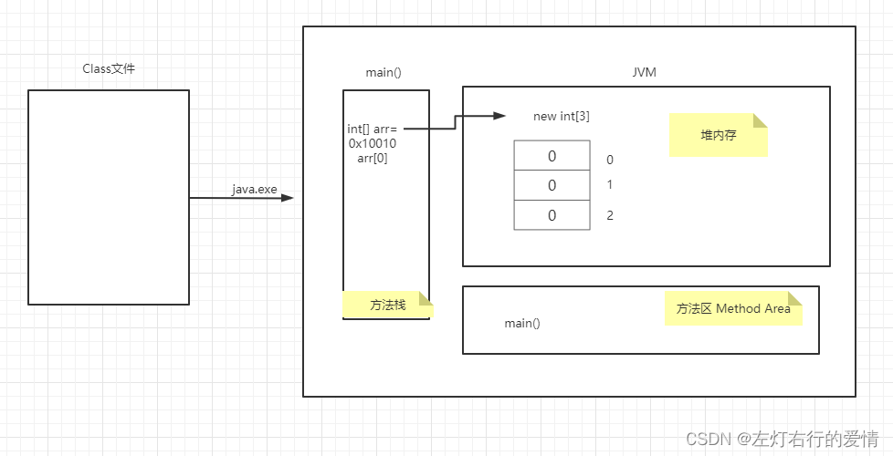  
 程序的执行流程：

1. main方法进入方法栈中执行
2. 创建数组，JVM会在堆内存中开辟空间，存储数组
3. 数组在内存当中会有自己的内存地址，以16进制表示
4. 数组当中有三个元素，默认值为0
5. JVM将数组的内存地址赋值给引用类型变量arr
6. 变量arr保存的数组时在内存当中地址，而不是一个具体的数值。

如果有两个数组的情况：

```
public static void main(String[]args){
    	//定义一个数组，动态初始化
		int [] arr =new int [3];
    	//通过索引访问数组当中的元素
    	arr[0]=10;
    	arr[1]=10;
   		arr[2]=10;
		//查看元素
    	System.out.println(arr[1]);//10
    	//定义一个数组，将上一个数组赋值该数组
    	int [] arr2=arr;
    	arr2[1] =50;
    	//查看元素
    	System.out.println(arr[1]);//50
	}
}


```

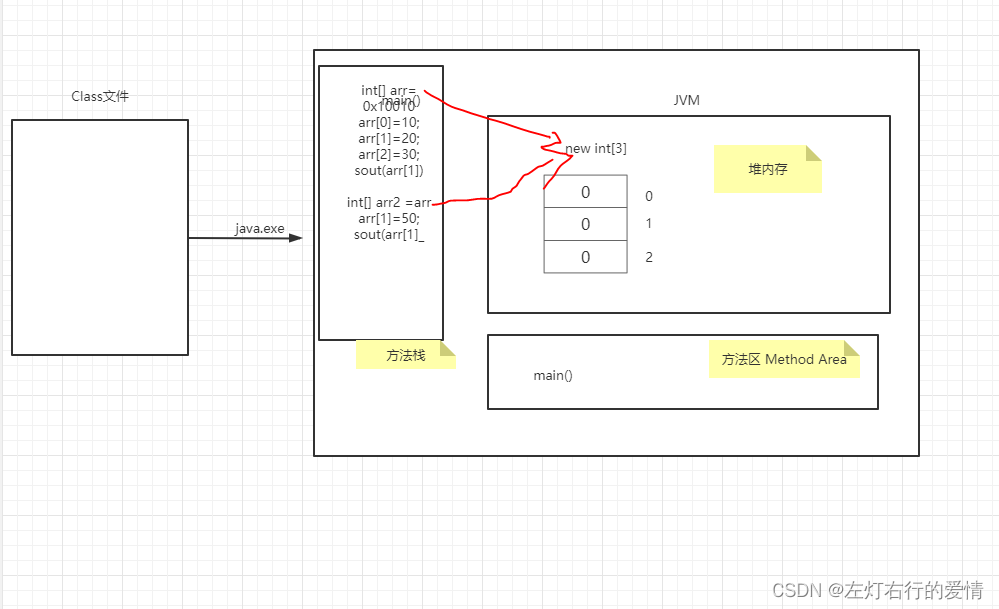  
 执行完代码后，结果如下图：  
 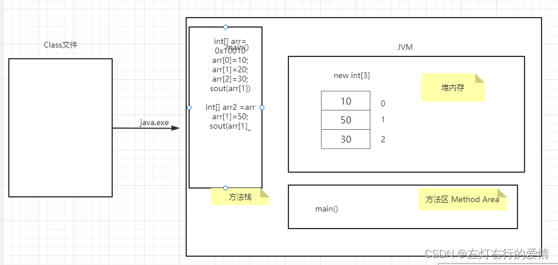

### 算法部分

处理数组和链表相关问题，双指针经常用到，双指针主要分类：左右指针和快慢指针。  
 1.左右指针：两个指针相向而行或者相背而行  
 2.快慢指针：两个指针同向而行，一块一慢  
 注意：数组并没有真正意义上的指针，但是可以把索引当做数组中的指针。

#### 快慢指针

一：数组去重  
 数组问题中常见的快慢指针技巧：原地修改数组  
 力扣26题： [删除有序数组中的重复项](https://leetcode.cn/problems/remove-duplicates-from-sorted-array/)  
 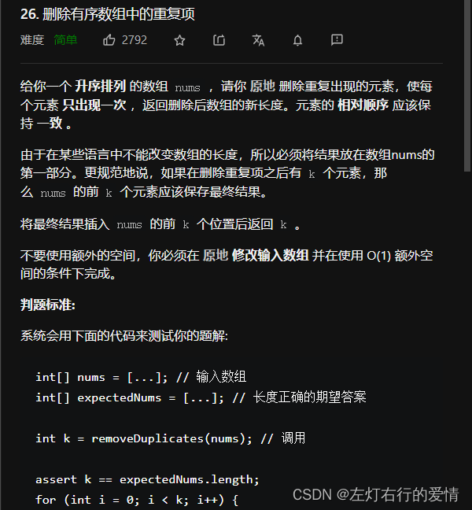  
 原地修改：只能在原数组上操作，返回一个长度，通过返回的长度和原始数组得到去重后的元素有哪些

解题思路：  
 使用快慢指针技巧，慢指针slow走在后面，快指针在前面探路，找到一个不重复的元素就让slow前进一步，并赋值给slow。（因为要保证第一个或已经修改过的元素不被覆盖，所以要先走一步）  
 保证了nums[0…slow]都是无重复的结果，当指针遍历完整个数组之后，nums[0…slow]就是整个数组去重后的结果。

核心算法：

```
while(fast<nums.length){
if(nums[fast]!=nums[slow]){
  slow++
  nums[slow]=nums[fast];   //维护了nums[0...slow]无重复
}
fast++;

}

return slow+1   //数组长度为索引+1.


```

二：根据某些元素进行数组去重  
 看力扣27题[移除元素](https://leetcode.cn/problems/remove-element/)  
 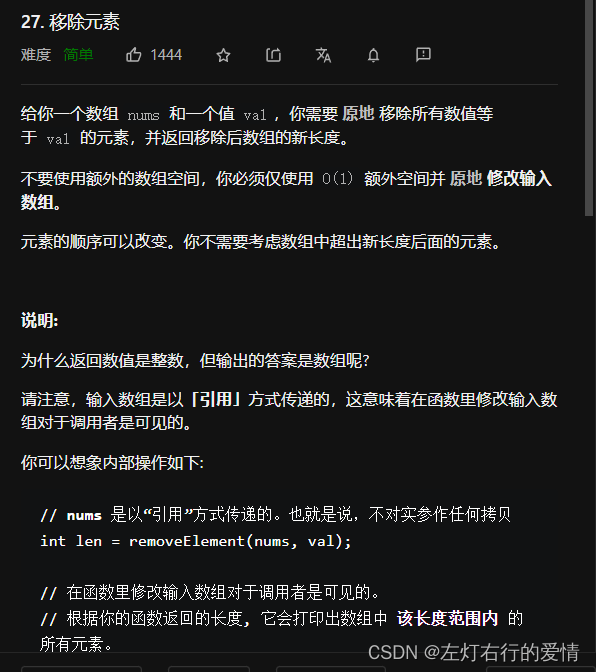  
 给的函数规范  
 `int removeElement(int[] nums,int val);`

解题思路：  
 和上面那道题基本一样，注意小细节的改变

```
while(fast<num.length){
if(nums[fast]!=val){
nums[slow]=num[fast];      ①
slow++;                              ①
}
fast++;
}
return slow;                        ②


```

第一处①：  
 先赋值还是先后移，取决于我们是否需要一上来就修改值，如果是根据去重val值，我们必须先判断数组里的值是否为要去val值（所以肯定不能先后移，这样会漏值）。

第二处②：  
 先赋值后+±—保证了数组[0-slow-1]是不包含val，数组的长度为slow  
 先++后赋值----保证了数组[o-slow]无重复结果，数组长度slow+1

注意：我们要认清返回数组的长度是多少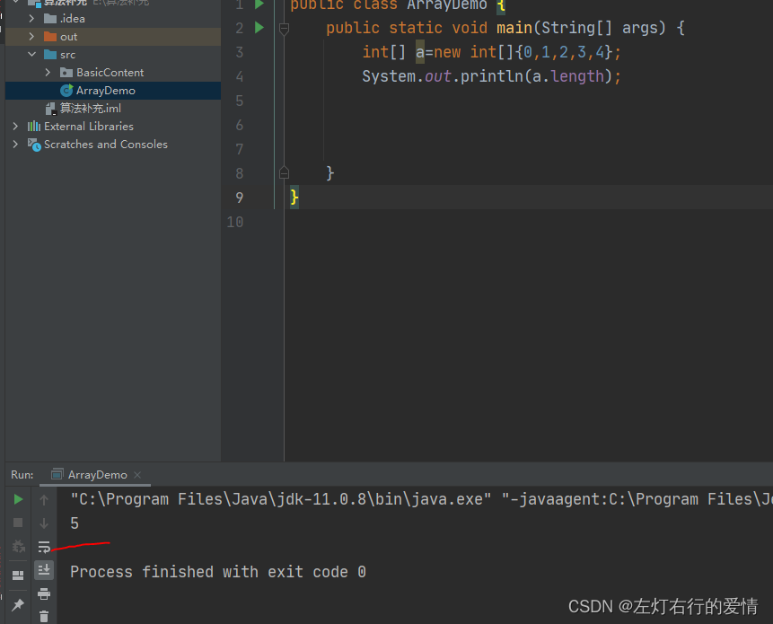

#### 左右指针

最经典的用法应用于二分查找，一左一右指针相向而行  
 （后面会更新二分查找）。  
 这里列举核心算法，展示最基础的二分查找。

```
int left =0,right=nums.length-1;左右指针
while(left<=right){
int mid =(right+left)/2;
if(nums[mid]==target)
return mid;
else if (nums[mid]<target)
left=mid+1;
else if(nums[mid]>target)
right=mid-1;
}


```

例题：力扣167题 [两数之和 II - 输入有序数组](https://leetcode.cn/problems/two-sum-ii-input-array-is-sorted/)  
 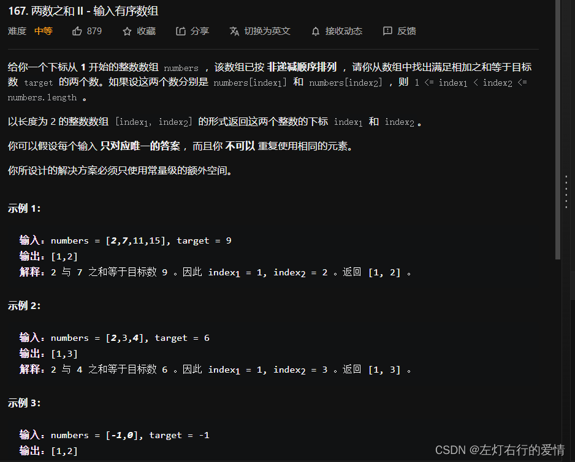  
 我们只需注意一点，如果数组是有序的，我们首先要考虑双指针技巧。  
 核心题解如下：  
 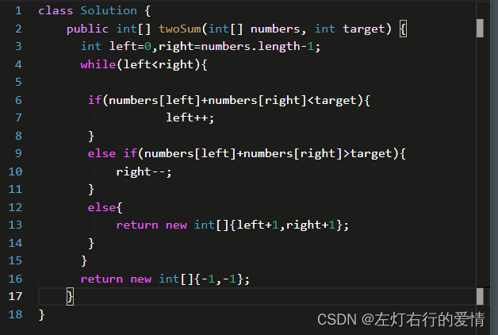  
 这里面有一个细节需要注意：  
 right设置为数组长度-1,同时在while循环里我们用的是<，这样while的终止条件就是left==right。

再来一道面试题，面科大讯飞时出的一道：344[反转字符串](https://leetcode.cn/problems/reverse-string/)  
 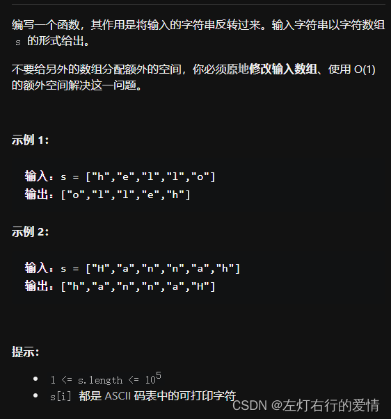  
 核心代码  
 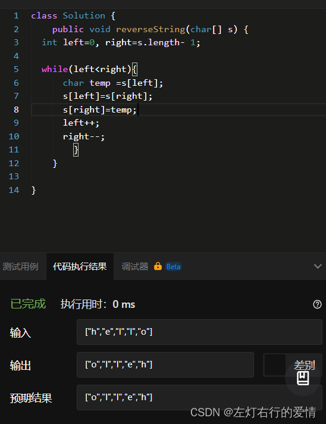  
 下面提升一点难度  
 力扣第五题[最长回文子串](https://leetcode.cn/problems/longest-palindromic-substring/)  
 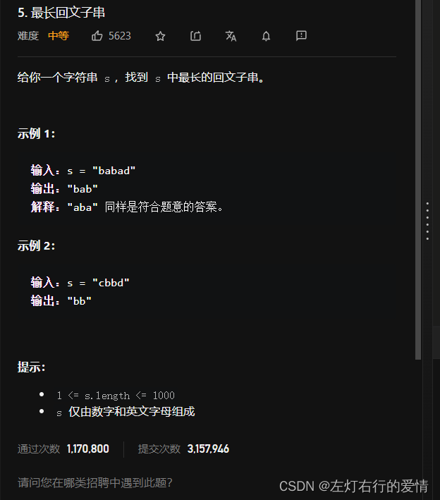  
 这道题我们需要注意的是：  
 1.回文串的长度可能是奇数或者偶数。  
 2.左右指针的运用并不是收缩，而是扩展。  
 我们可以先实现一个函数去寻找以中心为基准向两端扩展的最长回文串。  
 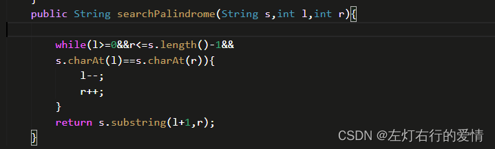  
 那么我们大致的解题思路为：

> 找到s[i]为中心的回文串（奇数）  
>  找到s[i]和s[i+1]为中心的回文串（偶数）  
>  更新答案

代码实现如下：  
 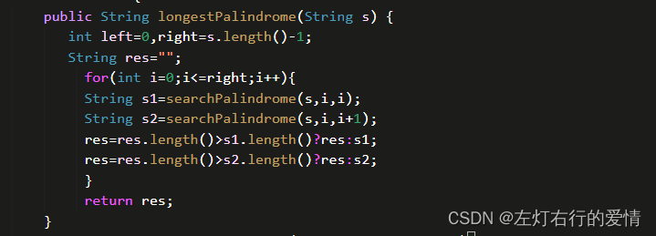  
 总结：  
 这里我们不妨想一想，我会想起我第一次接触到这种题型时，我发现我操作不了数组的下标，对此感觉无从下手，我们知道，数组arr[A]，这里的A可以是个变量，那么我们对与数组的下标就有了操作的空间，我们不妨想一想，为什么解决这类型的问题我们去用快慢指针，或者是左右指针？  
 快慢指针，我们使用它的目的是什么？  
 通过一个快指针和慢指针在一个for循环下完成两个for循环的工作。  
 定义快慢指针：

* 快指针：寻找新数组的元素，新数组就是不含有目标元素的数组。
* 慢指针：指向更新 新数组下标的位置。  
   **如果你真的从定义和目的上明白它的用法，那么你接下来理解滑动窗口也就很容易了。**  
   左右指针，我们使用它的目的是什么？  
   随着约束条件的不同，来约束数组。  
   所以我们要根据题目的要求，来合理的分析两个指针的运动情况，有可能是两头向中间或者中间向两头，如果是从一端两个指针一快一慢，就是属于快慢指针了。  
   可能你会说，我想不起来用指针呀，其实，for循环就可以认为是一个指针：

```
for(int i=0;i<nums.length;i++)
这行代码是不是可以看作，一个指针i，从数组0下标，不断接近数组最大下标值。
这也能当作指针！


```

我在这里贴几个双指针是如何写的，你大概能明白了：

* 快慢指针

```
        int slowIndex = 0;             //这里先定义一个慢指针
        for (int fastIndex = 0; fastIndex < nums.length; fastIndex++) {    //这里面定义一个快指针
            if (nums[fastIndex] != val) {
                nums[slowIndex] = nums[fastIndex];
                slowIndex++;
            }
        }
        return slowIndex;
    }


```

* 双指针

```
   int left = 0, right = nums.length - 1;    //定义一个左指针和右指针。
        while (left <= right) {
            int mid = left + ((right - left) >> 1);
            if (nums[mid] == target)
                return mid;
            else if (nums[mid] < target)
                left = mid + 1;
            else if (nums[mid] > target)
                right = mid - 1;
        }


```

再举一个双指针例子

```
 int right = nums.length - 1;
        int left = 0;                       //定义左指针
        int[] result = new int[nums.length];
        int index = result.length - 1;   //定义右指针
        while (left <= right) {
            if (nums[left] * nums[left] > nums[right] * nums[right]) {
                // 正数的相对位置是不变的， 需要调整的是负数平方后的相对位置
                result[index--] = nums[left] * nums[left];
                ++left;
            } else {
                result[index--] = nums[right] * nums[right];
                --right;
            }
        }


```

所以，你可以看出来了，不同类型的指针定义，你怎么遍历是有技巧的（快慢，双向，单指针并不能无脑for循环遍历，你要知道for遍历的本质是什么）

#### 前缀和数组

##### 一维数组中的前缀和

todo
