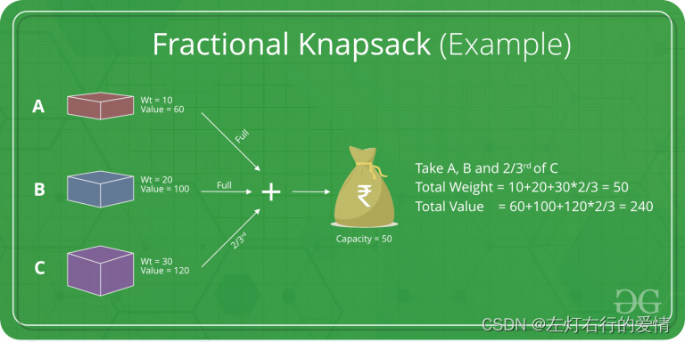

> 原文：[CSDN](https://blog.csdn.net/qq_45852626/article/details/127415551)（历史文章导入，当前状态为草稿）

## 基本概念

贪心算法又称贪婪算法，在对问题求解时，总是做出在当前看来是最好的选择。换句话说，不从整体最优这个方面考虑，算法得到的是某种意义上的局部最优解。  
 注意：贪心算法不是对所有问题都能得到整体最优解，关键是贪心策略的选择。

## 算法思想

贪心算法是对某些求最优解问题更简单更迅速的设计技术。  
 特点是一步步进行，以当前情况为基础根据某个优化测度作最优选择，而不考虑各种可能的整体情况，省去了为找最优解要穷尽所有可能而必需耗费的大量时间。  
 贪心算法采用的是自顶向下的办法，以迭代方法做出相继的贪心选择，没做一次贪心选择，就将所求问题简化为一个规模更小的子问题，通过每一步贪心选择，可得到问题的一个最优解。虽然每一步上都要保证能获得局部最优解，但由此产生的全局解有时不一定是最优的，所以贪心算法不回溯。  
 

## 贪心算法就像周六晚上的动画片一样可遇不可求

贪心算法解决最优子问题尤其有效，因为最优子结构的意思就是局部最优解决定全局最优解。  
 贪心算法与动态规划的不同在于它对每个子问题的解决方案都做出了选择，且不能回退。  
 动归会保留以前的运算结果，并根据以前的结果对当前进行选择，有回退功能。  
 贪心算法可以解决一些最优化问题：如哈夫曼编码…对于其他问题，贪心法一般不能得到我们所要求的答案。一旦一个问题可以通过贪心法来解决，那么贪心法一般就是这个问题最好的方法。

## 贪心解题步骤

* 问题分解为若干个子问题
* 找出适合的贪心策略
* 求解每一个子问题的最优解
* 将局部最优解堆叠成全局最优解

---

**这周肝完。**

## 序列问题

### 53. 最大子数组和

[53. 力扣链接-最大子数组和](https://leetcode.cn/problems/maximum-subarray/description/)  
 给你一个整数数组 nums ，请你找出一个具有最大和的连续子数组（子数组最少包含一个元素），返回其最大和。  
 子数组 是数组中的一个连续部分。

基本思想：  
 我们用贪心，一定要知道贪在哪里。  
 比如，如果-2，1在一起，计算起点的时候一定是从1开始的地方，这就是贪心贪的地方。  
 局部最优：当前“连续和”为负数的时候立刻放弃，从下一个元素重新计算“连续和”，因为负数加下一个元素“连续和”只会越来越小。  
 全局最优：选取最大“连续和”。  
 局部最优的情况下，并记录最大的“连续和”，可以推出全局最优。

用代码来描述：遍历数组，从头开始用count作为累积和，如果count加上nums[i]变为负数，那么就应该从nums[i+1]开始从0累积count了，因为已经变为负数的count，一定会拖累总和。

**我们可以看出本质来说是暴力解法中的不断调整最大子序列和区间的起始位置。**  
 那么，我们不考虑区间终止位置吗？如何才能得到最大连续和呢？  
 区间的终止位置，其实就是把count取的最大值用变量记录下来。

代码如下：

```
class Solution {
    public int maxSubArray(int[] nums) {
        if (nums.length == 1){
            return nums[0];
        }
        int sum = Integer.MIN_VALUE;
        int count = 0;
        for (int i = 0; i < nums.length; i++){
            count += nums[i];
            sum = Math.max(sum, count); // 取区间累计的最大值（相当于不断确定最大子序终止位置）
            if (count <= 0){
                count = 0; // 相当于重置最大子序起始位置，因为遇到负数一定是拉低总和
            }
        }
       return sum;
    }
}


```

这里我们要注意重置count数值（本道题的点睛之笔），因为我们之前分析了\*\*已经变为负数的count，一定会拖累总和。\*\*这个重置count真的很妙。  
 本道题也可以用dp解决，后面我们会再见到它的。

## 跳跃游戏

### 55. 跳跃游戏

[55. 力扣链接-跳跃游戏](https://leetcode.cn/problems/jump-game/description/)  
 给定一个非负整数数组 nums ，你最初位于数组的 第一个下标 。  
 数组中的每个元素代表你在该位置可以跳跃的最大长度。  
 判断你是否能够到达最后一个下标。

解题思路：  
 刚开始写的时候我在想，我到底到跳几步才能到终点，后来发现，题目要求的不是准确到终点，而是等于或超过就行，那么跳几步就无所谓了，只要我跳的覆盖范围超过终点就行。  
 于是思路就很明确了，**问题转换为了跳跃覆盖范围能不能覆盖到终点！**

贪心算法：  
 局部最优解：每次取最大跳跃步数（取最大覆盖范围）  
 整体最优解：得到整体最大覆盖范围，判断是否能覆盖终点。  
 局部最优推全局最优，找不出反例，试试贪心。

代码十分简单，主要是这个思路是否可以转换过来：

```
class Solution {
    public boolean canJump(int[] nums) {
        if (nums.length == 1) {
            return true;
        }
        //覆盖范围, 初始覆盖范围应该是0，因为下面的迭代是从下标0开始的
        int coverRange = 0;
        //在覆盖范围内更新最大的覆盖范围
        for (int i = 0; i <= coverRange; i++) {
            coverRange = Math.max(coverRange, i + nums[i]);
            if (coverRange >= nums.length - 1) {
                return true;
            }
        }
        return false;
    }
}


```

### 跳跃游戏 II

[45. 力扣链接-跳跃游戏 II](https://leetcode.cn/problems/jump-game-ii/)  
 给你一个非负整数数组 nums ，你最初位于数组的第一个位置。  
 数组中的每个元素代表你在该位置可以跳跃的最大长度。  
 你的目标是使用最少的跳跃次数到达数组的最后一个位置。  
 假设你总是可以到达数组的最后一个位置。  
 示例 1:  
 输入: nums = [2,3,1,1,4]  
 输出: 2  
 解释: 跳到最后一个位置的最小跳跃数是 2。  
 从下标为 0 跳到下标为 1 的位置，跳 1 步，然后跳 3 步到达数组的最后一个位置。

## 分发糖果

[135. 力扣链接-分发糖果](https://leetcode.cn/problems/candy/description/)  
 n 个孩子站成一排。给你一个整数数组 ratings 表示每个孩子的评分。  
 你需要按照以下要求，给这些孩子分发糖果：  
 每个孩子至少分配到 1 个糖果。  
 相邻两个孩子评分更高的孩子会获得更多的糖果。  
 请你给每个孩子分发糖果，计算并返回需要准备的 最少糖果数目 。  
 示例 1：  
 输入：ratings = [1,0,2]  
 输出：5  
 解释：你可以分别给第一个、第二个、第三个孩子分发 2、1、2 颗糖果。
