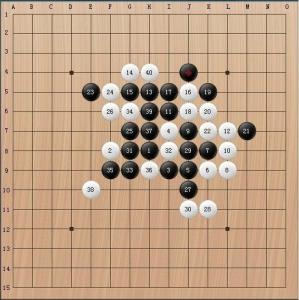
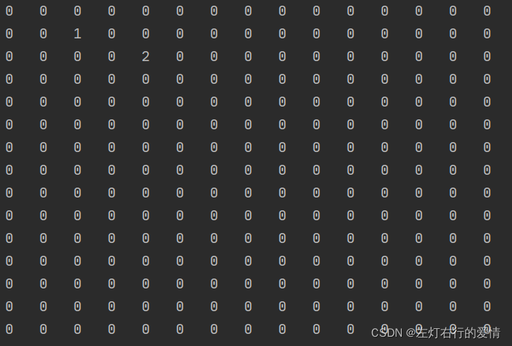
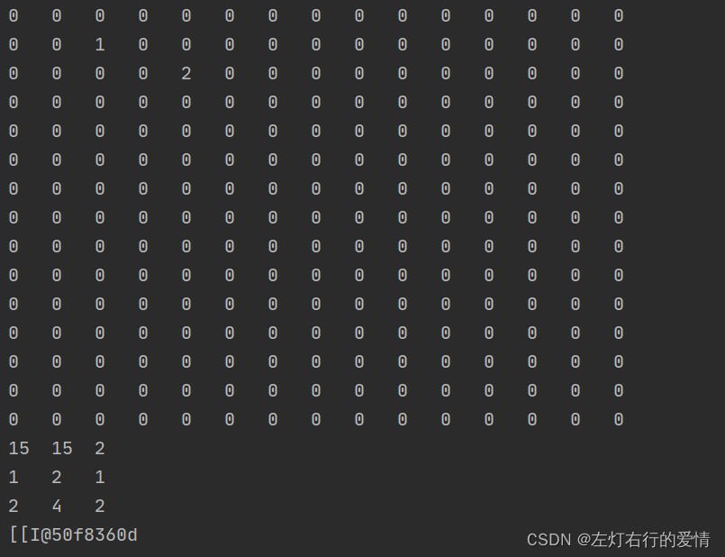
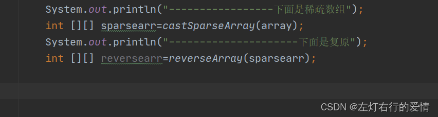

> 原文：[CSDN](https://blog.csdn.net/qq_45852626/article/details/122424649)（历史文章导入，当前状态为草稿）

## 算法基础（一）：稀疏数组与数组的关系与转化

#### 稀疏数组的应用背景：

如果一个数组中，某一个元素A出现的总数远远大于其他元素出现的次数的总和，那么这个数组可以用稀疏数组来保存。  
eg：  
这是一个五子棋盘（15\*15），如果用普通二维数组存储的话，无论是空间还是效率都不太友好，存储时非常麻烦。  
  
用简易数组举个栗子，只有两个棋子的存储情况：

```
 int[][] array = new int[15][15];
        array[1][3] = 1;
        array[2][4] = 2;
        for(int[] row : array){
            for(int item : row){
                System.out.printf("%d\t",item);//注意是printf
            }
            System.out.println();
        }


```

代码效果：  
那么怎么用更好的方法来存储里面的信息呢？

#### 稀疏数组的实现

显然在这个场景下我们存储数据是要用到数组的，那么不妨规定另外一种设计数组的存储规则来高效实现，规则如下：

```
遍历原始二维数组，得到有效数据的个数count。

根据sum就可以创建稀疏数组 sparseArr int[count+1,3]。
//count+1的原因是因为，稀疏数组的第一行是存放着low column sum，真正存放数据是在第二行，所以要+1

将二维数组的有效数据存入到稀疏数组中。


```

二维数组转稀疏数组方法如下,：

```
public static int [][] castSparseArray(int [][] arr){
        int row =arr.length;//获取行数
        int cloumn =arr[0].length;//获取列数

        int sum=0;//黑白子数量计数器

        for(int i=0;i<row;i++){
            for(int j=0;j<cloumn;j++){
                 if(arr[i][j]!=0){//每次遇见黑白棋（即不为0的数值）+1
                     sum++; 
                 }
            }
        }

        int [][] sparseArray=new int[sum+1][3]; //定义稀疏数组
        sparseArray[0][0]=row;          //表示原数组的行数
        sparseArray[0][1]=cloumn;        //表示原数组的列数
        sparseArray[0][2]=sum;            //表示原数组的有效值（黑白子）

        int sparseRow=0;   //稀疏数组的行，第0行保存的是说明信息：low，column，sum，真正的数据存放从第二行开始、（脚码为1）
        for(int i=0;i<row;i++){
            for(int j=0;j<cloumn;j++){
             if(arr[i][j]!=0){                                                   
                 sparseRow++;
                 sparseArray[sparseRow][0]=i;         
                 sparseArray[sparseRow][1]=j;
                 sparseArray[sparseRow][2]=arr[i][j];
             }
            }
        }
        for(int[] rows:sparseArray){     //打印出来
            for (int value:rows){
                System.out.printf("%d\t",value);                 
            }
            System.out.println();
        }

        return sparseArray;
    }


```

主方法里代码如下：

```
 public static void main(String[] args) {
        int[][] array = new int[15][15];
        array[1][2] = 1;
        array[2][4] = 2;
        for(int[] row : array){
            for(int item : row){
                System.out.printf("%d\t",item);
            }
            System.out.println();
        }
        System.out.println(castSparseArray(array));

    }


```

最后实现效果：  


#### 将稀疏数组复原回二维数组

规则：  
1->读取稀疏数组的第一行数据（里面存储着二维数组的基本信息行和列还有有效值）来初始化二维数组。  
2->根据稀疏数组后面行(第二行）的数据，一一赋值回原来的二维数组即可。

eg：

```
第一个规则实现：int arry2[][] =new int[sparseArr[0][0]] [sparseArr[0][1]];
第二个规则实现：
for(int i=1;i<sparseArr.length;i++){ 
arr2[sparseArr[i][0]] [sparseArr[i][1]]=sparseArr[i][2];


```

实现代码如下~：

```
  public static int[][] reverseArray(int [][] sparseArr) {
        int arry2[][] = new int[sparseArr[0][0]][sparseArr[0][1]];

        for (int i = 1; i < sparseArr.length; i++) {
            arry2[sparseArr[i][0]][sparseArr[i][1]] = sparseArr[i][2];
        }

        for(int []row :arry2){
            for(int item: row){
                System.out.printf("%d\t",item);
            }
            System.out.println();
        }
        return arry2;
    }


```

主方法里：  
  
总结：  
1：其实稀疏数组和数组之间的转化，本质来说用稀疏数组就是更好节约空间，优化io读写，初步学习时只需要记录两者之间的转化规则即可掌握大致的用法，后边更深的内容等到后边深度学习的时候再去学也不迟，先学会比葫芦画瓢为好。
