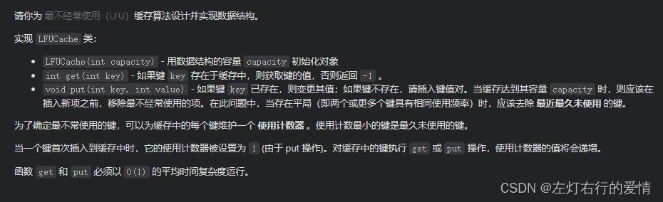
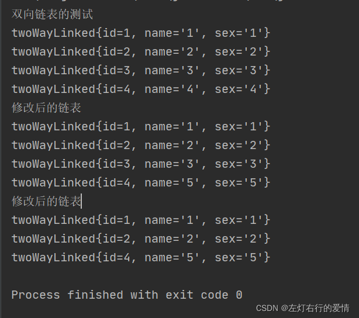

> 原文：[CSDN](https://blog.csdn.net/qq_45852626/article/details/122464194)（历史文章导入，当前状态为草稿）

文章可以帮助读者快速掌握简单的双向链表使用和基本概念

#### 为什么学习双向链表

上篇文章我们了解到了单链表的基础内容，想必学会的同学已经大呼好香了，但是单链表虽然香，但是也有它的缺点：  
1：单向链表的查找方向单一。  
2：不能够自我删除，要靠辅助节点来帮助。  
为了优化上面两个问题，这里我们引入了双向链表，不过不用紧张，我们根据了解的单链表对比学习，即可轻松掌握。

#### 双向链表—单链表的好大哥

##### 1:结构

首先学习双向之前，不妨先看看小弟单链表的身体（让叔叔来检查一下~）  
单链表的构造：  
┌───┬───┐

│data │next │

└───┴───┘  
双向链表的构造：  
┌───┬──────┬───┐

│ pre │ data │next │

└───┴──────┴───┘  
看，其实双向链表就是比单链表多了一个前置指针而已。  
它的构造：

```
 public class twoWayLinked {
    public int id;
    public String name;
    public String sex;
    public twoWayLinked next;
    public twoWayLinked pre;

    public twoWayLinked(int id, String name, String sex) {
        this.id = id;
        this.name = name;
        this.sex = sex;
    }

    @Override
    public String toString() {
        return "twoWayLinked{" +
                "id=" + id +
                ", name='" + name + '\'' +
                ", sex='" + sex + '\'' +
                '}';
    }
}


```

##### 2：基础方法

1：**增加**：  
a：先找到双向链表最后的节点  
b：temp.next =newNode  
c：newNode.pre =temp

2：**遍历**：和单链表一样，但可以前后查找

3：**修改**：思路和原理同单链表相同

4：**删除**：  
a：因为是双向链表，我们可以实现自我删除某个节点  
b：直接找到我们要删除的节点，比如temp  
c：temp.pre.next =temp.next //前连后  
d：temp.pre.next =temp.next; //后连前

代码实现：  
**添加**：

```
public void add(twoWayLinked node){
        twoWayLinked temp=head;
        while(true){
            if(temp.next==null){
                break;
            }
            temp=temp.next;
        }
        //while循环后找到了链表最后
        temp.next=node;
        //形成一个双向链表
        node.pre=temp;
    }


```

**遍历**:

```
public void list(){
     if(head.next==null){
         System.out.println("链表为空~");
         return;
     }
     twoWayLinked temp = head.next;
     while(true){
         if(temp==null){
             break;
         }
         System.out.println(temp);
         temp=temp.next;
     }
    }
    //添加
    public void add(twoWayLinked node){
        twoWayLinked temp=head;
        while(true){
            if(temp.next==null){
                break;
            }
            temp=temp.next;
        }
        //while循环后找到了链表最后
        temp.next=node;
        //形成一个双向链表
        node.pre=temp;
    }


```

**修改**:

```
public void update(twoWayLinked node){
        if(head.next==null){
            System.out.println("链表为空~");
            return;
        }
        twoWayLinked temp = head.next;
        boolean flag =false;
        while(true){
            if(temp==null){
                break;
            }
            if(temp.id == node.id){
                flag=true;
                break;
            }
            temp=temp.next;
        }

        if(flag){
            temp.name= node.name;
            temp.sex = node.sex;
        }else{
            System.out.println("没有找到相应编号的节点，不能修改~");
        }
    }


```

**删除**:

```
public void del(int id){
        if(head.next==null){
            System.out.println("链表为空~");
            return;
        }
        twoWayLinked temp =head.next;//辅助指针(变量),这里直接找head后面的节点
        boolean flag = false;//标志是否找到待删除的节点
        while(true){
            if(temp==null){ //已经到链表最后
                break;
            }
            if(temp.id==id){
                flag=true;
                break;
            }
            temp=temp.next;
        }
        if(flag){
            //双向链表的删除
            temp.pre.next=temp.next;
            //如果要删除的节点后面没有节点了，空节点是没有pre的。
            if(temp.next!=null){
                temp.next.pre=temp.pre;
            }
        }else{
            System.out.println("要删除的节点不存在");
        }
    }


```

地下城的勇士，你已经掌握基本的用法了，做一个简单的例子练练手吧。  



##### 测试例子

栗子结构：  


代码如下：  
第一个
类 
：twoWayLinked在上面贴的有，没发现的往上再仔细看看~

```
public class twoWayOperate {


    public static void main(String[] args) {

        System.out.println("双向链表的测试");
        twoWayLinked one =new twoWayLinked(1,"1","1");
        twoWayLinked two =new twoWayLinked(2,"2","2");
        twoWayLinked three =new twoWayLinked(3,"3","3");
        twoWayLinked four =new twoWayLinked(4,"4","4");

        twoWayOperate doublelist =new twoWayOperate();
        doublelist.add(one);
        doublelist.add(two);
        doublelist.add(three);
        doublelist.add(four);

        doublelist.list();

        twoWayLinked five = new twoWayLinked(4,"5","5");
        doublelist.update(five);
        System.out.println("修改后的链表");
        doublelist.list();

        doublelist.del(3);
        System.out.println("修改后的链表");
        doublelist.list();

}
 private twoWayLinked head =new twoWayLinked(0,"lv","boy");

    public twoWayLinked getHead(){
        return head;
    }
    //遍历
    public void list(){
     if(head.next==null){
         System.out.println("链表为空~");
         return;
     }
     twoWayLinked temp = head.next;
     while(true){
         if(temp==null){
             break;
         }
         System.out.println(temp);
         temp=temp.next;
     }
    }
    //添加
    public void add(twoWayLinked node){
        twoWayLinked temp=head;
        while(true){
            if(temp.next==null){
                break;
            }
            temp=temp.next;
        }
        //while循环后找到了链表最后
        temp.next=node;
        //形成一个双向链表
        node.pre=temp;
    }
    //修改
    public void update(twoWayLinked node){
        if(head.next==null){
            System.out.println("链表为空~");
            return;
        }
        twoWayLinked temp = head.next;
        boolean flag =false;
        while(true){
            if(temp==null){
                break;
            }
            if(temp.id == node.id){
                flag=true;
                break;
            }
            temp=temp.next;
        }

        if(flag){
            temp.name= node.name;
            temp.sex = node.sex;
        }else{
            System.out.println("没有找到相应编号的节点，不能修改~");
        }
    }
    //删除
    //双向链表可以直接删除要删除的节点，找到后直接删除即可
    public void del(int id){
        if(head.next==null){
            System.out.println("链表为空~");
            return;
        }
        twoWayLinked temp =head.next;//辅助指针(变量),这里直接找head后面的节点
        boolean flag = false;//标志是否找到待删除的节点
        while(true){
            if(temp==null){ //已经到链表最后
                break;
            }
            if(temp.id==id){
                flag=true;
                break;
            }
            temp=temp.next;
        }
        if(flag){
            //双向链表的删除
            temp.pre.next=temp.next;
            //如果要删除的节点后面没有节点了，空节点是没有pre的。
            if(temp.next!=null){
                temp.next.pre=temp.pre;
            }
        }else{
            System.out.println("要删除的节点不存在");
        }
    }

}


```

测试结果：



#### 总结

建议对比单链表学习，多敲敲代码熟练度上来了更好理解。  
例子不建议直接复制粘贴最好自己想一想吧.
