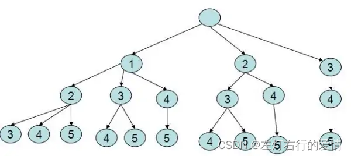
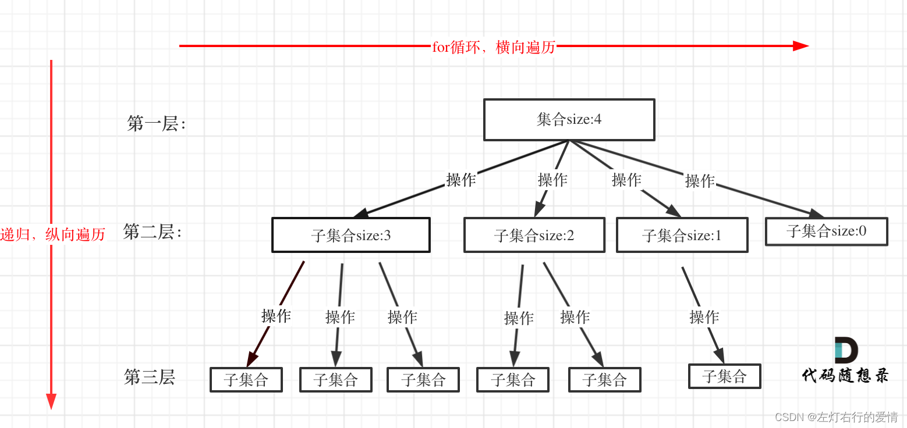
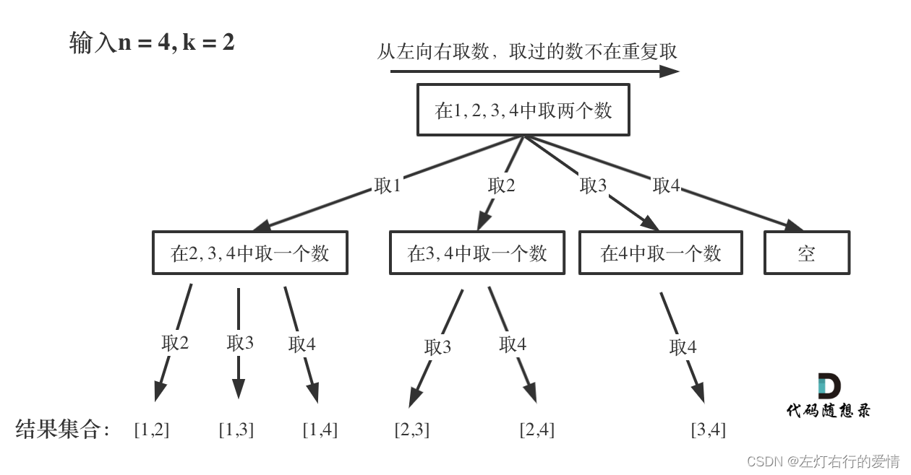
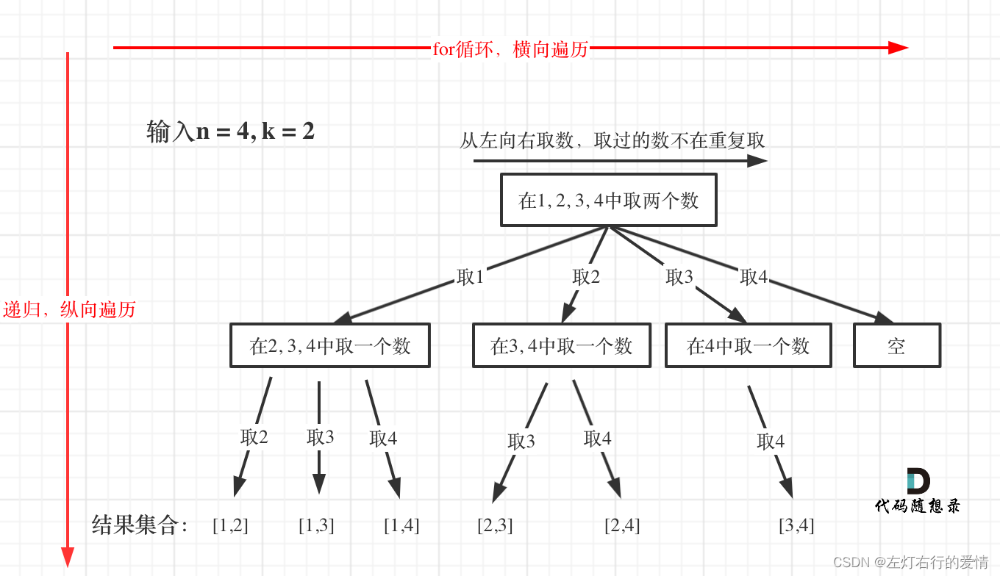
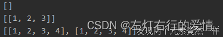
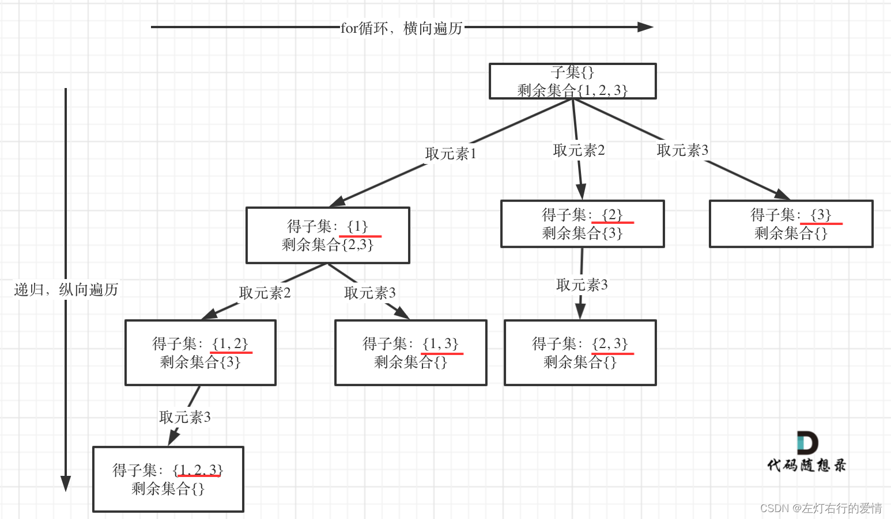
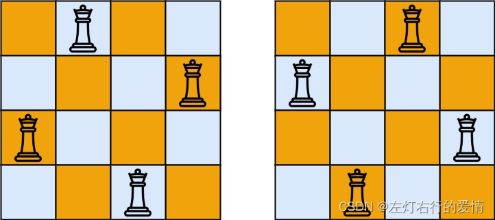
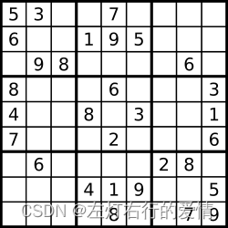

> 原文：[CSDN](https://blog.csdn.net/qq_45852626/article/details/127414653)（历史文章导入，当前状态为草稿）

##### 基本概念

属于选优搜索法，又称试探法，按选优条件向前搜索，以达到目标，  
 但当探索到某一步时，发现原先选择并不优或达不到目标，就退回一步重新选择，  
 这种走不通就退回再走的技术为回溯法，而满足回溯条件的某个状态的点成为“回溯点”。

##### 基本思想

* 状态空间树——每次扩大当前部分解时，都面临一个可选的状态集合（新的部分解就通过在该集合中选择构造而成）。这样的状态集合，结构为一颗多叉树：每个树节点代表一个可能的部分解，它的儿子是在它的基础上生成其他部分的解。  
   树根为初始状态，这样的状态集合称为状态空间树。
* 深度优先搜索——回溯法对任一解的生成，一般都采用逐步扩大解的方式（每前进一步，都试图在当前部分解的基础上扩大该部分解），从开始节点（根节点）出发，以深度优先搜索整个状态空间。
* 节点:  
   活节点：开始节点或者扩展节点向纵向方向移至一个新节点的这个新节点。  
   扩展节点：成为活节点后的节点&&退回到最近的活节点时，使这个活节成为扩展节点。  
   死节点：不满足回溯条件的节点。  
   

###### 辨析

我们都可以看出来，回溯的本质是一个穷举，穷举所有可能，选出想到的结果。  
 那么它和穷举法有什么区别呢？  
 穷举法：将一个解的各个部分全部生成后，才检查是否满足条件，如果不满足，则直接放弃这个完整解，然后再尝试另一个完整解。  
 回溯法：一个解的各个部分是逐步生成的，当发现当前生成的某部分不满足约束条件时，就放弃这一步所做的工作，退到上一步进行新的尝试。  
 所以我们可以很直观感受到，穷举法属于破釜沉舟，而回溯属于狡兔三穴。

回溯是穷举的艺术，通过剪枝可以更优化算法效率。

###### 回溯法进阶思想

回溯法所有问题都可以抽象为树形结构，回溯法解决的是在集合中递归查找子集。  
 集合的大小—树的宽度  
 递归的深度—树的深度  
 既然是递归，那么就会有终止条件，所以这棵树必然高度有限。

##### 回朔法解题步骤

我们需要注意几点：

* 回溯函数模板的返回值以及参数  
   返回值：一般为void  
   参数：不容易一次定下来，一般先写逻辑，后面需要什么参数，再去填
* 终止条件  
   一般搜到叶子节点，也就找到了满足条件的一条答案，把答案存起来，结束本层递归。  
   · 遍历过程  
   注意，我们上面说过，回溯法一般在集合中递归搜索，集合的大小构成了树的宽度，递归的深度构成了树的深度  
     
   注意：集合大小和孩子的数量是相等的！

通过上面的总结，对于回溯法，我们可以拿到一个模板：

```
void backtracking(参数){
if(终止条件){
存放结果;
return;
}

for(选择：本层集合中元素（树中节点孩子的数量就是集合的大小）){
处理节点;
backtracking(路径，选择列表);//递归
回溯,撤销处理结果
}
}


```

---

这周更完，一定肝完

##### 组合问题

###### (77. 组合)：https://leetcode.cn/problems/combinations/

[77. 力扣链接-组合](https://leetcode.cn/problems/combinations/)  
 给定两个整数 n 和 k，返回范围 [1, n] 中所有可能的 k 个数的组合。  
 你可以按 任何顺序 返回答案。

解析：  
 基本思想：  
 这个题目很经典，当k比较小时，我们直接可以暴力搜索，比如k=2，n=4

```
for(int i=1;i<=n;i++){
for(int j=i+1;j<=n;j++){
 System.out.println(i,j);
 }
 }


```

但如果n为99，k为40时，40层循环，希望我们可以有耐心慢慢写，虽然回溯法也是暴力，但我们还可以写出来，至少不用写40层循环，根据动能守恒定理，不用体力就要用脑力了，所以递归就来了。  
 如果我们硬是要脑补回溯搜索，估计你还要在脑子里加一块机械硬盘，一个不错的方法是借助抽象图形结构来进一步理解。  
 我们之前了解到抽象图片在这道题运用如下：  
   
 每次从集合中选取元素，可选取的范围随着选择进行收缩，调整可选择范围。  
 图中每搜索到叶子节点，就找到了一个结果。  
 最后我们把叶子节点的结果收集起来，就得到了最终结果。

解法：  
 按照我们之前说的解法去思考

* 递归函数的返回值以及参数  
   返回值：我们定义为void，我们不需要利用到递归函数的返回值，只需要定义一个集合，遇到合适的就加入，如果你去用返回值的话，那么无论结果如何，你都要加入了。用集合我们还有撤回的空间。  
   参数：参数一开始是定不下来的，我们需要在途中慢慢去摸索，这里根据题目我们暂定只有n和k。
* 回溯条件终止条件  
   我们上面提到过，图中每搜索到叶子节点，就找到了一种结果，那么什么时候到达所谓的叶子节点呢？  
   这里我们就需要有个数据结构来记录我们存储的路径结果，当路径结果个数（在树里对应子节点）为k大小时，返回这个数据结构，那么这里用集合是最合适的。  
   那么问题来了，这么多集合，我们选择哪个比较好呢？  
   我们想到了LinkedLIst，因为底层是双向链表，方便增删，使用它最为合适不过了。（感兴趣可以看看这个链接：[List实现类LinkedList解读](https://blog.csdn.net/qq_45852626/article/details/125743610?spm=1001.2014.3001.5501)）  
   那么问题来了 ，LinkedList这个集合只是我们用来存储单个叶子节点的结果，如果存储所有叶子节点结果呢？  
   这时候我们利用ArrayList比较合适，因为底层是数组，且自动扩容。  
   那么我们终止条件就很明显了，用LinkedList的集合大小来判断是否到达了叶子节点（猛一看不太好懂，后面看代码一下就明白了）。
* 遍历过程  
   回溯法的搜索过程就是一个树形结构的遍历过程，可以看出是用for循环来横向遍历，用递归来纵向遍历。  
     
   细节要注意，for循环里有递归，一定会伴随着递归函数中参数的变化，不然不就一直是同一个递归。。。  
   所以这里我们要处理一下递归函数的参数，我们知道了目前参数有n，k，那么我们要新加一个什么参数呢？  
   我们想一下，这个递归是纵向的，那么我们下一个递归中for循环的起点是要+1的，所以，for循环的起点我们不能写死为1。  
   这里我们记作startIndex，目前递归函数的参数为：n,k,startIndex。  
   （代码后面统一贴出）  
   而且，我们要在for循环里处理递归前后的数据。  
   在进入下一次递归前，我们要存储本次数据。  
   在退出递归前，我们要回溯处理的节点。  
   （看不明白没关系，先尽力理解一下）
* 我们经历了返回值和参数------终止条件----遍历过程，现在心里已经明白了大致的解法，一起来看看吧。

```
class Solution {
    List<List<Integer>> result = new ArrayList<>();
    LinkedList<Integer> path = new LinkedList<>();
    public List<List<Integer>> combine(int n, int k) {
        backing(n, k, 1);
        return result;
    }

    /**
     * 每次从集合中选取元素，可选择的范围随着选择的进行而收缩，调整可选择的范围，就是要靠startIndex
     * @param startIndex 用来记录本层递归的中，集合从哪里开始遍历（集合就是[1,...,n] ）。
     */
    private void backing(int n, int k, int startIndex){
        //终止条件
        if (path.size() == k){
            result.add(new ArrayList<>(path));
            return;
        }
        for (int i = startIndex; i <= n - (k - path.size()) + 1; i++){//n - (k - path.size()) + 1这里用到了剪枝，暂时不用了解，写题用n就行。
            path.add(i);
            backing(n, k, i + 1);
            path.removeLast();
        }
    }
}


```

`result.add(new ArrayList<>(path));`  
 这里这句代码,里面为什么要new一个集合？  
 **res.add(new ArrayList(path))和res.add(path)的区别在哪？**  
 `res.add(new ArrayList(path))`：开辟了一个独立的地址，地址中存放的内容为path链表，后续path的变化不会影响到res。  
 `res.add(path)`：将res尾部指向了path地址，后续path内容的变化会导致res的变化  
 网上有个例子很好，体会一下：

```
        ArrayList<Integer> list = new ArrayList<>();
        list.add(1);
        list.add(2);
        list.add(3);
        List<List<Integer>>  result = new ArrayList<>();
        //1.输出为空
        System.out.println(result);
        //2.第一次添加，res值应该为123
        result.add(list);
        System.out.println(result);
        //3.第二次添加，res值按照自己的猜想应该是123,1234
        list.add(4);
        result.add(list);
        System.out.println(result+"两个元素竟然一样");


```



###### 216. 组合总和 III

[216. 力扣链接-组合总和 III](https://leetcode.cn/problems/combination-sum-iii/description/)  
 找出所有相加之和为 n 的 k 个数的组合，且满足下列条件：  
 只使用数字1到9  
 每个数字 最多使用一次  
 返回 所有可能的有效组合的列表 。该列表不能包含相同的组合两次，组合可以以任何顺序返回。  
 示例 1:  
 输入: k = 3, n = 7  
 输出: [[1,2,4]]  
 解释:  
 1 + 2 + 4 = 7  
 没有其他符合的组合了。

##### 子集

###### 78.子集

[78.力扣链接-子集](https://leetcode.cn/problems/subsets/)  
 给你一个整数数组 nums ，数组中的元素 互不相同 。返回该数组所有可能的子集（幂集）。  
 解集 不能 包含重复的子集。你可以按 任意顺序 返回解集  
 基础思路：  
 我们看完题目发现，这道题和组合又不一样了。  
 **前面组合是收集树的叶子节点，而子集问题是找树的所有节点！**  
 子集本质来说也是一道组合问题，因为集合是无序的，既然是无序的，那么取过的元素不会重复取，写回溯时，for就从startIndex开始。  
   
 解题：我们依旧从三个部分下手去分析

* 递归函数返回值和参数  
   返回值：void  
   参数：我们之前通过组合已经了解到了，对于树取结果这样的题，我们需要两个全局变量的集合分别去收集元素和存放子集组合，在组合问题也说了，需要一个startIndex。
* 回溯条件终止条件  
   我们可以看到，当我们遍历到最后一个数组值之后，就可以返回了。
* 搜索逻辑  
   求取的是子集，不需要剪枝，遍历的就是整棵树。

其实，以组合为例，其他题目就不需要再说很多了，基本上组合这块搞懂了，其他的大差不差的。  
 我们需要注意的是，增加子集组合的位置，不要放在终止条件里，因为我们要取每一个节点。  
 代码如下：

```
class Solution {
    List<List<Integer>> result = new ArrayList<>();// 存放符合条件结果的集合
    LinkedList<Integer> path = new LinkedList<>();// 用来存放符合条件结果
    public List<List<Integer>> subsets(int[] nums) {
        subsetsHelper(nums, 0);
        return result;
    }

    private void subsetsHelper(int[] nums, int startIndex){
        result.add(new ArrayList<>(path));//「遍历这个树的时候，把所有节点都记录下来，就是要求的子集集合」。
        if (startIndex >= nums.length){ //终止条件可不加
            return;
        }
        for (int i = startIndex; i < nums.length; i++){
            path.add(nums[i]);
            subsetsHelper(nums, i + 1);
            path.removeLast();
        }
    }
}


```

###### 90. 子集 II

[90. 力扣链接-子集 II](https://leetcode.cn/problems/subsets-ii/description/)  
 给你一个整数数组 nums ，其中可能包含重复元素，请你返回该数组所有可能的子集（幂集）。  
 解集 不能 包含重复的子集。返回的解集中，子集可以按 任意顺序 排列。  
 示例 1：  
 输入：nums = [1,2,2]  
 输出：[[],[1],[1,2],[1,2,2],[2],[2,2]]

##### 全排列

###### 46. 全排列

[46. 力扣链接-全排列](https://leetcode.cn/problems/permutations/description/)  
 给定一个不含重复数字的数组 nums ，返回其 所有可能的全排列 。你可以 按任意顺序 返回答案。  
 示例 1：  
 输入：nums = [1,2,3]  
 输出：[[1,2,3],[1,3,2],[2,1,3],[2,3,1],[3,1,2],[3,2,1]]

##### 进阶—皇后，数独问题

###### N皇后

[51.力扣链接-N皇后](https://leetcode.cn/problems/n-queens/description/)  
 按照国际象棋的规则，皇后可以攻击与之处在同一行或同一列或同一斜线上的棋子。  
 n 皇后问题 研究的是如何将 n 个皇后放置在 n×n 的棋盘上，并且使皇后彼此之间不能相互攻击。  
 给你一个整数 n ，返回所有不同的 n 皇后问题 的解决方案。  
 每一种解法包含一个不同的 n 皇后问题 的棋子放置方案，该方案中 ‘Q’ 和 ‘.’ 分别代表了皇后和空位。  
   
 输入：n = 4  
 输出：[[“.Q…”,“…Q”,“Q…”,“…Q.”],[“…Q.”,“Q…”,“…Q”,“.Q…”]]  
 解释：如上图所示，4 皇后问题存在两个不同的解法。

###### 解数独

[37. 力扣链接-解数独](https://leetcode.cn/problems/sudoku-solver/description/)  
 编写一个程序，通过填充空格来解决数独问题。  
 数独的解法需 遵循如下规则：  
 数字 1-9 在每一行只能出现一次。  
 数字 1-9 在每一列只能出现一次。  
 数字 1-9 在每一个以粗实线分隔的 3x3 宫内只能出现一次。（请参考示例图）  
 数独部分空格内已填入了数字，空白格用 ‘.’ 表示。  
 
