> 原文：[CSDN](https://blog.csdn.net/qq_45852626/article/details/127416130)（历史文章导入，当前状态为草稿）

##### 基本概念

Dynamic programming，简称DP，通过把原问题分解为相对简单的子问题的方式求解复杂问题的方法。

##### 基本思想

非常简单，若要解一个问题，我们需要解其不同部分（即子问题），再根据子问题的解以得出原问题的解。  
 通常许多子问题非常相似，因此动归试图仅仅解决每个子问题一次，从而减少计算量：一旦某个给定子问题的解已经算出，则将其结构存储起来，以便下次需要同一个子问题解之时直接查表。这种做法在重复子问题的数目关于输入规模呈指数增长时特别有用。

##### 使用情况

* 最优子结构性质。如果问题的最优解所包含的子问题解也是最优的（这就是最优子结构性质）
* 无后效性。子问题的解一旦确定，就不再改变，不受在这之后，包含它的更大的问题求解决策影响。
* 子问题重叠性质。有些子问题会被重复计算多次，dp算法将计算结果存起来，当有需要时直接拿出结果，提高效率，降低时间复杂度。

##### 解题步骤

1.确定dp数组（dp table）以及下标的含义  
 2.确定递推公式  
 3.dp数组如何初始化  
 4.确定遍历顺序  
 5.举例推导dp数组

写动归问题时，最好的方式就是把dp数组打印出来，看是不是按照自己思路推导的，写代码之前一定要把状态转移在dp数组上具体情况模拟一遍，心里要有数，最后推想要的结果。  
 最好按步骤去写，不然代码一出问题，没有头绪的改来改去，防止过不了或者稀里糊涂的过了。

题目通过不了，问自己三个问题：

* 题目我举例推导状态转移公式了吗？
* 打印dp数组日志了吗？
* 打印出来的dp数组结果和我想的一样吗？

##### 背包问题

###### 二维数组解法

背包问题挺重要的，最好熟练掌握了。

有n件物品和一个最多能背重量为w 的背包。第i件物品的重量是weight[i]，得到的价值是value[i] 。每件物品只能用一次，求解将哪些物品装  
 入背包里物品价值总和最大。  
 · 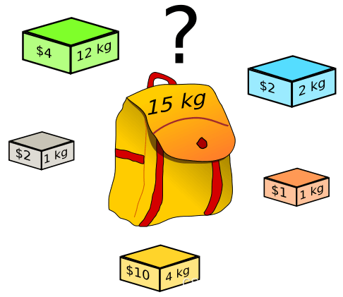  
 题目：  
 背包最大重量为4。

物品为：  
 重量 价值  
 物品0 1 15  
 物品1 3 20  
 物品2 4 30  
 问背包能背的物品最大价值是多少？

1.我们先去确定dp数组的定义以及下标的定义  
 这里我们先用二维数组，dp[i][j]表示从下标[0-i]的物品里随意取，放进容量为j的背包，价值总和最大是多少。一定要记得这个dp数组的含义，i和j分别代表什么。  
 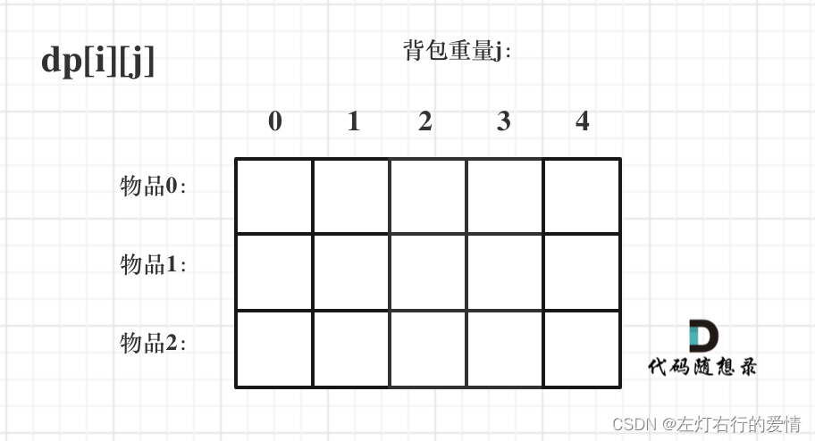  
 2.确定递推公式  
 明确两点，[状态]和[选择]。  
 状态：如果描述一个问题局面，只要给几个物品和一个背包的容量限制，就形成一个背包问题，状态有两个，就是背包的容量和可选择的物品。  
 选择：对于每件物品，选择就是装进背包或者不装进背包。  
 所以有两个状态和选择推出来

* 不放物品：由dp[i-1][j]推出，即背包容量为j，里面不放物品i的最大价值，此时dp[i][j]=dp[i-1][j]。
* 放物品：由dp[i-1][j-weight[i]]推出，dp[i-1][j-weight[i]]为背包容量为j-weight[i]的时候不放物品i的最大价值，那么dp[i-1][j-weight]+value[i]，就是背包放物品i得到的最大价值。  
   得出递推公式：dp[i][j]=max(dp[i-1][j],dp[i-1][j-weight[i]]+value[i]);

3.dp数组的初始化  
 首先从dp[i][j]的定义出发，背包容量j为0时，即dp[i][0]，无论是选哪些物品，背包价值总和一定为0.  
 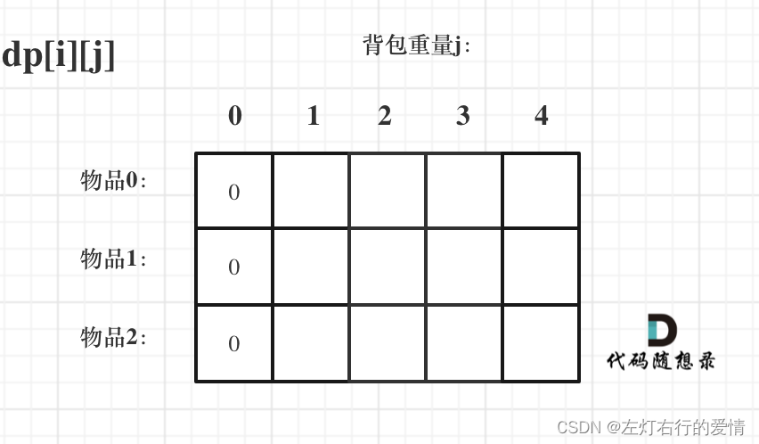  
 我们再来看状态转移方程：dp[i][j]=max(dp[i-1][j],ad[i-1][j-weight]+vallue[i])，显然看出i是由i-1推导出来的，那么i=0时一定要初始化。  
 dp[0][j]，即：i为0，存放编号0的物品时，各个容量的背包所能存放的最大价值。  
 当j<weight[0],dp[0][j]应该是0，因为背包容量比编号0的物品重量还小。  
 当j>=weight[0]时，dp[0][j]应该是value[0]，因为背包容量足够放编号0物品  
 代码如下：

```
for (int j = 0 ; j < weight[0]; j++) {  //如果把dp数组预先初始化为0了，这一步就可以省略
    dp[0][j] = 0;
}
// 正序遍历
for (int j = weight[0]; j <= bagweight; j++) {
    dp[0][j] = value[0];
}


```

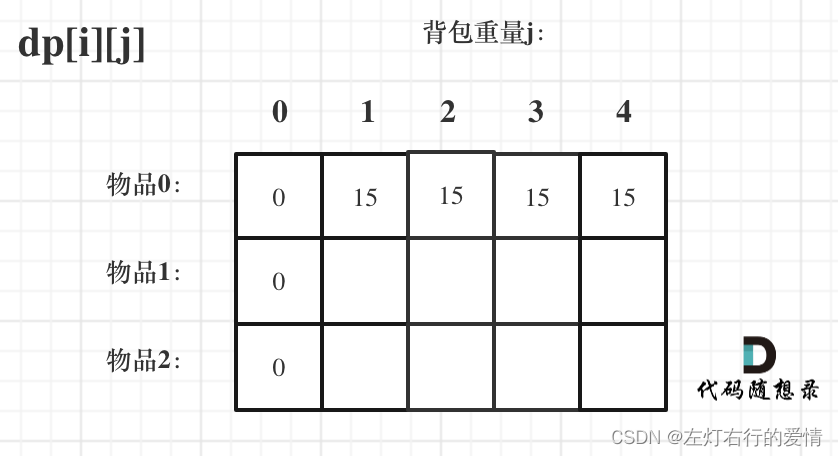  
 有一点很重要，我们要能看出，数据是从哪个方向推导出来的。  
 比如：dp[i][j] = max(dp[i - 1][j], dp[i - 1][j - weight[i]] + value[i]);  
 我们看出dp[i][j]是由左上方数值推导出来了，那么其他下标初始化什么数值都可以，因为都会被覆盖。  
 **初始化dp数组不能只靠感觉，有时候感觉不靠谱**

4.确定遍历顺序  
 我们可以看出，背包有两个遍历维度，物品和背包重量。  
 那么我们是先遍历背包还是物品呢？  
 对于二维数组来说，都可以的，因为我们所需的数据就是在左上角，所以无论你是竖着遍历，还是横着遍历，都不影响结果。  
 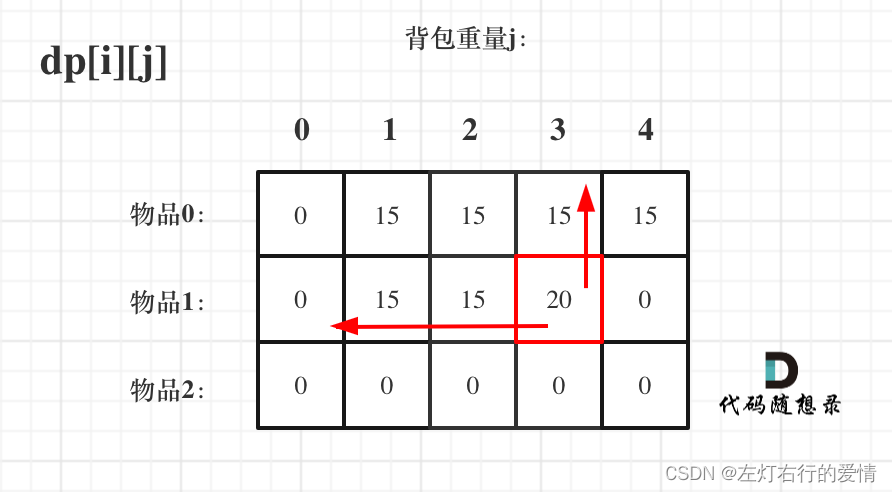  
 **但其实，在背包问题里，两个for循环先后顺序是非常有讲究的**，后面我们用一维数组的时候，到时候再探究。

5.举例推导dp数组  
 来看一下对应的dp数组的数值，如图：  
 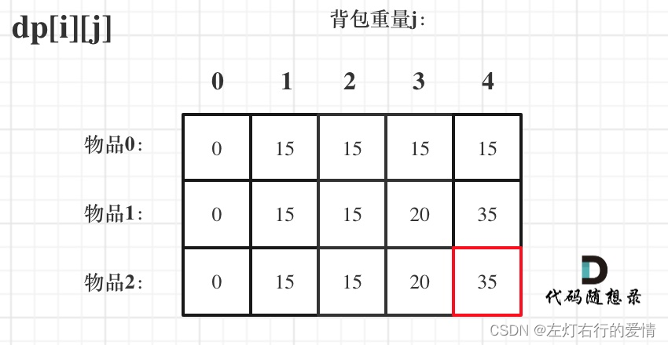  
 结果为dp[2][4]。  
 **做动归题目，最好的过程就是自己在纸上举一个例子把对应的dp数组的数值推导一下，然后再动手写代码。**

###### 一维数组解法

背包问题状态其实可以压缩，  
 我们在使用二维数组的时候，定义了两个状态，其递推公式为dp[i][j]=max(dp[i-1][j],dp[i-1][j-weight[i]]+value[i]);

细心的你有没有发现，无论我们如果选择物品，dp[i]和dp[i-1]总是相同的，所以我们可以吧dp[i-1]拷贝到dp[i]上，既然如此，那么我们就不如用一个一维数组（滚动数组）来解决背包问题。  
 同时我们也解锁了滚动数组的概念，需要满足的条件：上一层可以重复利用，直接拷贝到当前层。

这里我们再回顾一下二维数组中的状态，**dp[i][j]表示从下标为[0-i]的物品里随意取，放进容量为j的背包，价值总和最大是多少。**

接下来我们按步骤去分析：  
 1.确定dp数组的定义  
 在一维数组中，dp[j]表示：容量为j的背包，所背物品价值最大为dp[j]。  
 2.递推公式  
 我们可以做两种选择：  
 取物品：dp[j]=dp[j-weight[i]]+value[i]  
 不取物品：dp[j]=dp[j]  
 所以综上，递推公式为：dp[j]=max(dp[j]，dp[j-weight[i]]+value[i])  
 3.一维dp数组的初始化  
 **初始化一定要和dp数组的定义吻合，不然递推公式越来越乱**  
 我们再来看一下dp[j]：容量为j的背包，所背的物品价值可以最大为dp[j]，那么dp[0]就应该是0，因为背包容量为0所背的物品的最大价值就是0。  
 那么dp数组除了下标0的位置初始为0，其他下标应该初始化多少呢？  
 这时候我们要放眼于递推公式：dp[j]=max(dp[j],dp[j-weight[i]]+value[i])  
 dp数组在推导时，一定是取价值最大的数，如果题目给的价值都是正整数，那么非0下标都初始化为0就可以了。  
 目的是防止dp数组在递归公式的过程中取的都是最大价值，而不是被初始值覆盖  
 4.遍历顺序  
 A：我们在一维数组遍历中，背包是从大到小进行遍历，为什么呢？  
 **我们倒序遍历是为了保证物品i只被放入一次。**  
 假如背包从小到大正序遍历，物品0就会在不同背包被多次加入：  
 dp[1]=dp[1-weight[0]]+value[0]=15  
 dp[2]=dp[2-weight[1]+value[1]=30  
 这里dp[2]即已经是30了，意味着物品0被放入了两次，所以背包是不能正序遍历的。  
 那么为什么倒序遍历可以保证物品只放入一次呢？  
 因为是从后往前循环，每次取得状态不会和之前取得状态重合。  
 dp[2] = dp[2 - weight[0]] + value[0] = 15 （dp数组已经都初始化为0）  
 dp[1] = dp[1 - weight[0]] + value[0] = 15  
 倒序遍历的本质：还是对二维数组的遍历，并且右下角的值依赖上一层左上角的值，因此需要保证左边的值依旧是上一层的，从右到左覆盖。  
 **不知道你是否还记得，二维数组遍历时，为什么背包不用倒序呢？**  
 首先我们要明确，是否倒序，取决于我们dp[i][j]或者dp[j]的数据是如何计算来的，二维数组中的dp[i][j]是通过上一层计算而来的，所以本层的dp[i][j]并不会被覆盖。

B：那我们还可以像二维数组一样，不用考虑物品和背包的嵌套顺序吗？  
 不可以的。  
 因为一维dp的写法，背包容量是一定要倒序遍历，如果遍历背包容量是在上一层，那么每个dp[j]就只会放入一个物品，即：背包里只放入了一个物品。

综上：代码如下：

```
for(int i=0;i<weight.size();i++){//遍历物品
  for(int j=bagWeight;j>=weight[i];j--){//遍历背包容量
  dp[j]=max(dp[j],dp[j-weight[i]]+value[i]);
}
}


```

5.举例推导dp数组  
 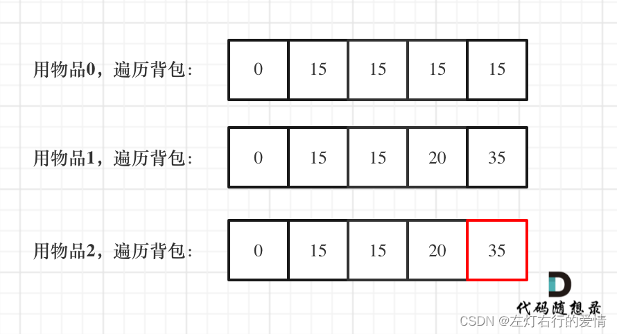  
 如果背包问题这些你都看明白了，相信你已经很熟练的掌握背包的基础内容了，后面还有完全背包，这里先更0-1，后面补上（我肯定补！）。

---

这周肯定更完题目。

##### 打家劫舍

寝室突然断电，全没了，心态炸了。后面复习再补更。

###### 213.打家劫舍II

[213.力扣链接-打家劫舍II](https://leetcode.cn/problems/house-robber-ii/)  
 你是一个专业的小偷，计划偷窃沿街的房屋，每间房内都藏有一定的现金。这个地方所有的房屋都 围成一圈 ，这意味着第一个房屋和最后一个房屋是紧挨着的。同时，相邻的房屋装有相互连通的防盗系统，如果两间相邻的房屋在同一晚上被小偷闯入，系统会自动报警 。  
 给定一个代表每个房屋存放金额的非负整数数组，计算你 在不触动警报装置的情况下 ，今晚能够偷窃到的最高金额。  
 示例 1：  
 输入：nums = [2,3,2]  
 输出：3  
 解释：你不能先偷窃 1 号房屋（金额 = 2），然后偷窃 3 号房屋（金额 = 2）, 因为他们是相邻的。

基本思路：  
 这道题和打家劫舍I的思路是基本一样的，唯一区别就是成环了。  
 针对于数组成环，影响的是头和尾，所以我们要考虑两点：去头或去尾，去头和尾。分为三种情况：  
 情况一：去头  
 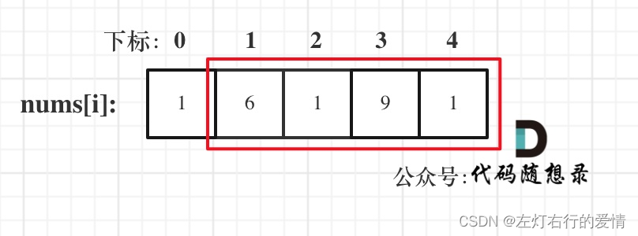  
 第二种情况：去尾  
 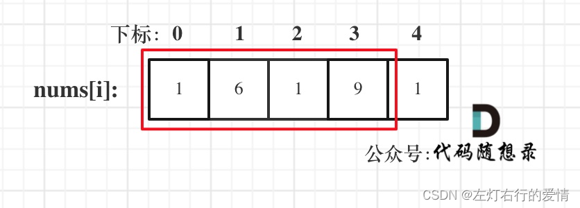  
 第三种：去头尾  
 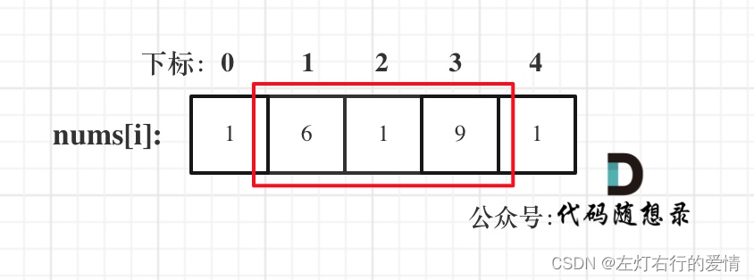  
 我们发现，第三种去头尾的情况被第一种和第二种包含了，即无论是第一种还是第二种，它们一定是大于等于第三种的。  
 综上，我们可以发现，**把复杂的环降级到了两个线性的结构**。  
 分析到这里，剩下的就和打家劫舍I情况一样了，代码如下：

```
class Solution {
    public int rob(int[] nums) {
        if (nums == null || nums.length == 0)
            return 0;
        int len = nums.length;
        if (len == 1)
            return nums[0];
        return Math.max(robAction(nums, 0, len - 1), robAction(nums, 1, len));
    }

    int robAction(int[] nums, int start, int end) {
        int x = 0, y = 0, z = 0;
        for (int i = start; i < end; i++) {
            y = z;
            z = Math.max(y, x + nums[i]);
            x = y;
        }
        return z;
    }
}


```

这里我想多说2点：  
 1：这里成环指的的逻辑上的，数组并不会成环（它一定是线性的数组）所以是否成环影响的是我们对于数组下标的处理。  
 2：robAction里没有写成dp[i]=Math.max(dp[i-1],dp[i-2]+nums[i])的原因是：  
 数组的初始脚码是不确定的，从1开始或者从0开始，如果用dp[i]要增加很多判断，同时dp数组的初始化也要加判断，防止dp[i-2]引发错误。  
 我们知道dp[i]仅仅依赖dp[i-1]和dp[i-2]，所以这里直接变成变量，空间复杂度也降了。

##### 买卖股票

###### 121. 买卖股票的最佳时机

[121. 力扣链接-买卖股票的最佳时机](https://leetcode.cn/problems/best-time-to-buy-and-sell-stock/)  
 给定一个数组 prices ，它的第 i 个元素 prices[i] 表示一支给定股票第 i 天的价格。  
 你只能选择 某一天 买入这只股票，并选择在 未来的某一个不同的日子 卖出该股票。设计一个算法来计算你所能获取的最大利润。  
 返回你可以从这笔交易中获取的最大利润。如果你不能获取任何利润，返回 0 。  
 示例 1：  
 输入：[7,1,5,3,6,4]  
 输出：5  
 解释：在第 2 天（股票价格 = 1）的时候买入，在第 5 天（股票价格 = 6）的时候卖出，最大利润 = 6-1 = 5 。  
 注意利润不能是 7-1 = 6, 因为卖出价格需要大于买入价格；同时，你不能在买入前卖出股票。

解题思路：  
 **我觉得，做dp，最最最最重要的是分析一下状态和选择，如果这两个不清楚的话，dp数组的初始化和递推公式就是在碰运气**。  
 第一次写这个题的时候，我对状态不了解，乱设dp数组，我记得设的是dp[i][j],代表了在第i天买入，第j天卖出，然而状态并不只是天，我这里默认j承担了两个状态（天数和买卖状态），所以写出来就不太正常了。

**所以写动归一定要按步骤来**：

* 确定dp数组以及下标的含义  
   确定状态：天数，股票是否持有。  
   选择：买或者卖股票。  
   所以dp[i][0],dp[i][1]分别代表第i天持有，未持有股票所得最多现金。  
   注意，持有股票之后不是没有现金（一开始现金为0，所以这里用负数表达）。
* 确定递推公式  
   我们知道dp数组的状态，下面我们做选择，  
   如果第i天持有股票dp[i][0]：  
   如果第i-1天就已经持有股票了，那么保持现状，所得现金就是昨天持有股票所得现金：dp[i-1][0];  
   如果第i天买入股票，所得现金就是买入今天的股票所得现金：-prices[i]  
   综上，dp[i][0]应该所得现金最大，所以dp[i][0]=max(dp[i-1][0],-prices[i])；  
   如果第i天不持有股票dp[i][1]：  
   第i-1天不持有股票，那么保持现状，所得现金就是昨天不持有股票的所得现金，即：dp[i-1][1]  
   第i天卖出股票，所得现金就是按照今天股票价格卖出后所得现金即：prices[i]+dp[i-1][0]  
   dp[i][1]取最大，dp[i][1]=max(dp[i-1][1],prices+dp[i-1][0])；
* dp数组初始化  
   首观察递推公式： dp[i][0] = max(dp[i - 1][0], -prices[i]);  
   dp[i][1] = max(dp[i - 1][1], prices[i] + dp[i - 1][0]);  
   它们都是从dp[0][0]和dp[0][1]推导出来的。  
   那么dp[0][0]表示第0天持有股票，此时的持有股票就一定是买入股票了，因为不可能有前一天推出来，所以dp[0][0] -= prices[0];  
   dp[0][1]表示第0天不持有股票，不持有股票那么现金就是0，所以dp[0][1] = 0;
* 遍历顺序  
   还是观察递推公式，dp[i]都是dp[i-1]推导出来的，所以肯定是从前向后的遍历。
* 举例推导dp数组  
   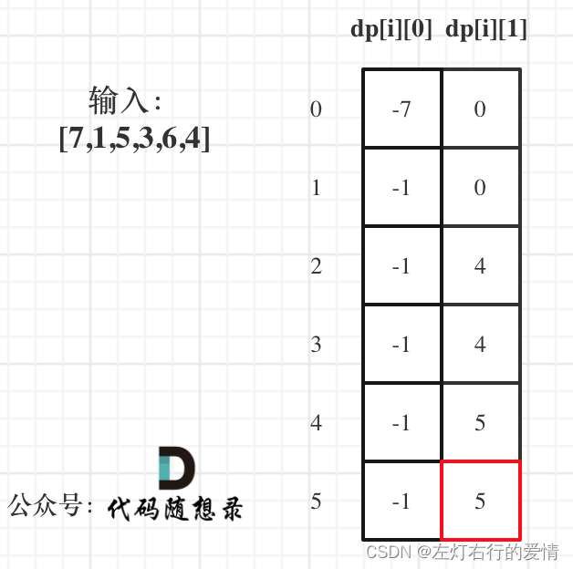  
   代码如下：

```
class Solution {
    public int maxProfit(int[] prices) {
        if (prices == null || prices.length == 0) return 0;
        int length = prices.length;
        // dp[i][0]代表第i天持有股票的最大收益
        // dp[i][1]代表第i天不持有股票的最大收益
        int[][] dp = new int[length][2];
        int result = 0;
        dp[0][0] = -prices[0];
        dp[0][1] = 0;
        for (int i = 1; i < length; i++) {
            dp[i][0] = Math.max(dp[i - 1][0], -prices[i]);
            dp[i][1] = Math.max(dp[i - 1][0] + prices[i], dp[i - 1][1]);
        }
        return dp[length - 1][1];
    }
}


```

一维数组表达，看不懂的再去回顾一下背包问题：

```
class Solution {
  public int maxProfit(int[] prices) {
    int[] dp = new int[2];
    // 记录一次交易，一次交易有买入卖出两种状态
    // 0代表持有，1代表卖出
    dp[0] = -prices[0];
    dp[1] = 0;
    // 可以参考斐波那契问题的优化方式
    // 我们从 i=1 开始遍历数组，一共有 prices.length 天，
    // 所以是 i<=prices.length
    for (int i = 1; i <= prices.length; i++) {
      // 前一天持有；或当天买入
      dp[0] = Math.max(dp[0], -prices[i - 1]);
      // 如果 dp[0] 被更新，那么 dp[1] 肯定会被更新为正数的 dp[1]
      // 而不是 dp[0]+prices[i-1]==0 的0，
      // 所以这里使用会改变的dp[0]也是可以的
      // 当然 dp[1] 初始值为 0 ，被更新成 0 也没影响
      // 前一天卖出；或当天卖出, 当天要卖出，得前一天持有才行
      dp[1] = Math.max(dp[1], dp[0] + prices[i - 1]);
    }
    return dp[1];
  }
}


```

###### 122. 买卖股票的最佳时机 II

[122. 力扣链接买卖股票的最佳时机 II](https://leetcode.cn/problems/best-time-to-buy-and-sell-stock-ii/)  
 给你一个整数数组 prices ，其中 prices[i] 表示某支股票第 i 天的价格。  
 在每一天，你可以决定是否购买和/或出售股票。你在任何时候 最多 只能持有 一股 股票。你也可以先购买，然后在 同一天 出售。  
 返回 你能获得的 最大 利润 。  
 示例 1：  
 输入：prices = [7,1,5,3,6,4]  
 输出：7  
 解释：在第 2 天（股票价格 = 1）的时候买入，在第 3 天（股票价格 = 5）的时候卖出, 这笔交易所能获得利润 = 5 - 1 = 4 。  
 随后，在第 4 天（股票价格 = 3）的时候买入，在第 5 天（股票价格 = 6）的时候卖出, 这笔交易所能获得利润 = 6 - 3 = 3 。  
 总利润为 4 + 3 = 7 。

基本思想：  
 有了之前买卖股票I的基础，我们这道题就好做了。  
 **主要我们要明确dp数组的含义**：  
 dp[i][0] 表示第i天持有股票所得现金。  
 dp[i][1] 表示第i天不持有股票所得最多现金  
 所以我们操作的是现金流。  
 那么我们由两个动作推出持有和不持有股票的两个状态。  
 持有股票：  
 第i-1天就持有股票，那么就保持现状，所得现金就是昨天持有股票的所得现金 即：dp[i - 1][0]  
 第i天买入股票，所得现金就是昨天不持有股票的所得现金减去 今天的股票价格 即：dp[i - 1][1] - prices[i]  
 注意这里和**121. 买卖股票的最佳时机** 唯一不同的地方，就是推导dp[i][0]的时候，**第i天买入股票的情况**，因为我们不是一锤子买卖，一次就没了，所以还要考虑后面的现金。

不持有股票：  
 如果第i天不持有股票即dp[i][1]的情况，可以由两个状态推出来

第i-1天就不持有股票，那么就保持现状，所得现金就是昨天不持有股票的所得现金 即：dp[i - 1][1]  
 第i天卖出股票，所得现金就是按照今天股票佳价格卖出后所得现金即：prices[i] + dp[i - 1][0]  
 剩下的就很简单了，代码如下：

```
// 动态规划
class Solution 
    // 二维数组存储
    // 可以将每天持有与否的情况分别用 dp[i][0] 和 dp[i][1] 来进行存储
    // 时间复杂度：O(n)，空间复杂度：O(n)
    public int maxProfit(int[] prices) {
        int n = prices.length;
        int[][] dp = new int[n][2];     // 创建二维数组存储状态
        dp[0][0] = 0;                   // 初始状态
        dp[0][1] = -prices[0];
        for (int i = 1; i < n; ++i) {
            dp[i][0] = Math.max(dp[i - 1][0], dp[i - 1][1] + prices[i]);    // 第 i 天，没有股票
            dp[i][1] = Math.max(dp[i - 1][1], dp[i - 1][0] - prices[i]);    // 第 i 天，持有股票
        }
        return dp[n - 1][0];    // 卖出股票收益高于持有股票收益，因此取[0]
    }


```

也可以优化一下空间，用一维滚动数组来解：

```
// 优化空间
class Solution {
    public int maxProfit(int[] prices) {
        int[] dp = new int[2];
        // 0表示持有，1表示卖出
        dp[0] = -prices[0];
        dp[1] = 0;
        for(int i = 1; i <= prices.length; i++){
            // 前一天持有; 既然不限制交易次数，那么再次买股票时，要加上之前的收益
            dp[0] = Math.max(dp[0], dp[1] - prices[i-1]);
            // 前一天卖出; 或当天卖出，当天卖出，得先持有
            dp[1] = Math.max(dp[1], dp[0] + prices[i-1]);
        }
        return dp[1];
    }
}


```

###### 123. 买卖股票的最佳时机 III

[123. 力扣链接-买卖股票的最佳时机 III](https://leetcode.cn/problems/best-time-to-buy-and-sell-stock-iii/description/)  
 给定一个数组，它的第 i 个元素是一支给定的股票在第 i 天的价格。  
 设计一个算法来计算你所能获取的最大利润。你最多可以完成 两笔 交易。  
 注意：你不能同时参与多笔交易（你必须在再次购买前出售掉之前的股票）。  
 示例 1:  
 输入：prices = [3,3,5,0,0,3,1,4]  
 输出：6  
 解释：在第 4 天（股票价格 = 0）的时候买入，在第 6 天（股票价格 = 3）的时候卖出，这笔交易所能获得利润 = 3-0 = 3 。  
 随后，在第 7 天（股票价格 = 1）的时候买入，在第 8 天 （股票价格 = 4）的时候卖出，这笔交易所能获得利润 = 4-1 = 3 。

##### 最长问题

###### 300.最长递增子序列

[300.力扣链接-最长递增子序列](https://leetcode.cn/problems/longest-increasing-subsequence/description/)  
 给你一个整数数组 nums ，找到其中最长严格递增子序列的长度。  
 子序列 是由数组派生而来的序列，删除（或不删除）数组中的元素而不改变其余元素的顺序。例如，[3,6,2,7] 是数组 [0,3,1,6,2,2,7] 的子序列。  
 示例 1：  
 输入：nums = [10,9,2,5,3,7,101,18]  
 输出：4  
 解释：最长递增子序列是 [2,3,7,101]，因此长度为 4 。

这个题目太经典了，而且也很有启发意义，跟着代码随想录二刷了，遇见这个题还是咯噔顿一下。  
 解题思路：

* 确定dp数组以及下标的含义  
   dp[i]表示i之前（包括i）的以nums[i]结尾最长上升子序列的长度。
* 递推公式  
   我们注意状态的变化，位置i的最长升序子序列=j从0到i-1各个位置的最长升序子序列+1的最大值。  
   **这里不要写dp[i]与dp[j]+1进行比较，我们要取dp[j]+1的最大值，对这点不清晰很容易写错。血的教训**  
   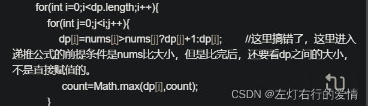
* dp数组的初始化  
   每一个i，对应的起始大小都为1，要把自己的长度算上去。
* 遍历顺序  
   dp[i]是从0到i-1各个位置的最长升序子序列推导而来，所以肯定是从前向后遍历。  
   j就是0到i-1，遍历i的在外层，j在内层。
* 举例推导dp数组  
   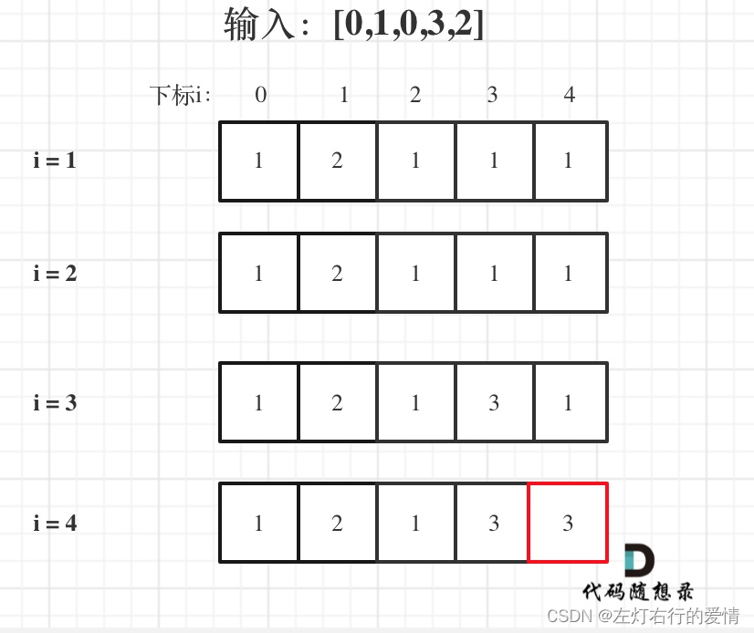

```
class Solution {
    public int lengthOfLIS(int[] nums) {
        int[] dp = new int[nums.length];
        Arrays.fill(dp, 1);
        for (int i = 0; i < dp.length; i++) {
            for (int j = 0; j < i; j++) {
                if (nums[i] > nums[j]) {
                    dp[i] = Math.max(dp[i], dp[j] + 1);
                }
            }
        }
        int res = 0;
        for (int i = 0; i < dp.length; i++) {
            res = Math.max(res, dp[i]);
        }
        return res;
    }
}


```

###### 674. 最长连续递增序列

[674. 力扣链接-最长连续递增序列](https://leetcode.cn/problems/longest-continuous-increasing-subsequence/)  
 给定一个未经排序的整数数组，找到最长且 连续递增的子序列，并返回该序列的长度。  
 连续递增的子序列 可以由两个下标 l 和 r（l < r）确定，如果对于每个 l <= i < r，都有 nums[i] < nums[i + 1] ，那么子序列 [nums[l], nums[l + 1], …, nums[r - 1], nums[r]] 就是连续递增子序列。  
 示例 1：  
 输入：nums = [1,3,5,4,7]  
 输出：3  
 解释：最长连续递增序列是 [1,3,5], 长度为3。  
 尽管 [1,3,5,7] 也是升序的子序列, 但它不是连续的，因为 5 和 7 在原数组里被 4 隔开。

基本思想：

* 确认dp数组以及下标含义  
   dp[i]:以下标i为结尾的数组的连续递增子序列长度为dp[i]。  
   这里的以下标i为结尾，但没说一定是以下标0为起始位置
* 确定递推公式  
   如果nums[i+1]>nums[i] ，那么i+1为结尾的数组的连续递增的子序列长度一定等于以i为结尾的数组的连续递增的子序列长度+1。
* dp数组如何初始化  
   以下标i为结尾的数组的连续递增的子序列长度最少也应该是1，也就是nums[i]这一个元素。  
   所以dp[i]初始为1。
* 确定遍历顺序  
   一定要观察递推公式，dp[i+1]依赖dp[i]，所以一定是从前向后遍历
* 举例推导dp数组  
   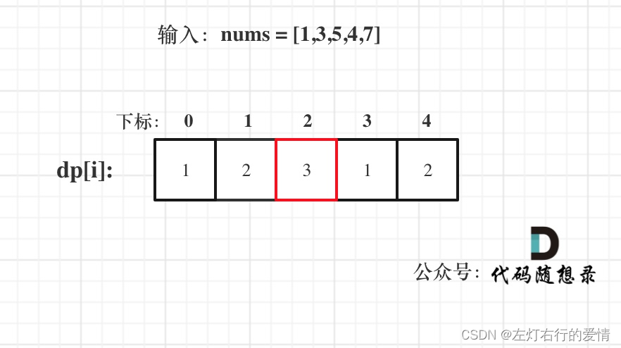  
   代码如下：

```
 /**
    * 1.dp[i] 代表当前下标最大连续值
    * 2.递推公式 if（nums[i+1]>nums[i]） dp[i+1] = dp[i]+1
    * 3.初始化 都为1
    * 4.遍历方向，从其那往后
    * 5.结果推导 。。。。
    * @param nums
    * @return
    */
   public static int findLengthOfLCIS(int[] nums) {
       int[] dp = new int[nums.length];
       for (int i = 0; i < dp.length; i++) {
           dp[i] = 1;
       }
       int res = 1;
       for (int i = 0; i < nums.length - 1; i++) {
           if (nums[i + 1] > nums[i]) {
               dp[i + 1] = dp[i] + 1;
           }
           res = res > dp[i + 1] ? res : dp[i + 1];
       }
       return res;
   }


```

###### 718. 最长重复子数组

[718. 力扣链接-最长重复子数组](https://leetcode.cn/problems/maximum-length-of-repeated-subarray/)  
 给两个整数数组 nums1 和 nums2 ，返回 两个数组中 公共的 、长度最长的子数组的长度 。  
 示例 1：  
 输入：nums1 = [1,2,3,2,1], nums2 = [3,2,1,4,7]  
 输出：3  
 解释：长度最长的公共子数组是 [3,2,1] 。

基本思想：  
 题目中说的子数组，其实就是连续子序列。

* 确定dp数组以及下标的含义  
   dp[i][j]:以下标i-1为结尾的A，以下标j-1为结尾的B，最长重复子数组为dp[i][j]。  
   dp[0][0]的含义是什么呢？为什么i，j代表i-1,和j-1呢？为了方便计算。
* 递推公式  
   **根据dp[i][j]的定义，dp[i][j]的状态只能由dp[i-1][j-1]推导而来。**  
   即当A[i-1]和B[j-1]相等的时候，dp[i][j]=dp[i-1][j-1]+1；
* dp数组如何初始化  
   根据dp[i][j]的定义，dp[i][0]和dp[0][j]其实都没有意义。  
   但是为了方便的递归，还是要初始值的。
* 确定遍历顺序
* 外层循环A，内存循环B（反过来也可以）。
* 举例推导dp数组  
   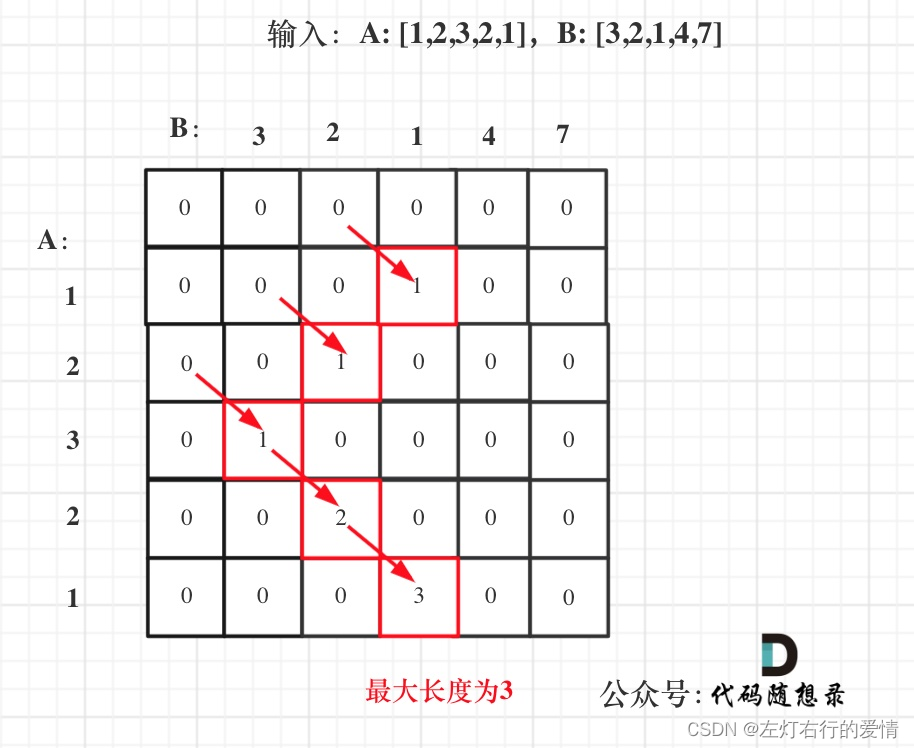  
   代码如下：

```
class Solution {
    public int findLength(int[] nums1, int[] nums2) {
        int result = 0;
        int[][] dp = new int[nums1.length + 1][nums2.length + 1];
        
        for (int i = 1; i < nums1.length + 1; i++) {
            for (int j = 1; j < nums2.length + 1; j++) {
                if (nums1[i - 1] == nums2[j - 1]) {
                    dp[i][j] = dp[i - 1][j - 1] + 1;
                    result = Math.max(result, dp[i][j]);
                }
            }
        }
        
        return result;
    }
}


```

###### 1143. 最长公共子序列

[1143. 力扣链接-最长公共子序列](https://leetcode.cn/problems/longest-common-subsequence/description/)  
 给定两个字符串 text1 和 text2，返回这两个字符串的最长 公共子序列 的长度。如果不存在 公共子序列 ，返回 0 。  
 一个字符串的 子序列 是指这样一个新的字符串：它是由原字符串在不改变字符的相对顺序的情况下删除某些字符（也可以不删除任何字符）后组成的新字符串。  
 例如，“ace” 是 “abcde” 的子序列，但 “aec” 不是 “abcde” 的子序列。  
 两个字符串的 公共子序列 是这两个字符串所共同拥有的子序列。  
 示例 1：  
 输入：text1 = “abcde”, text2 = “ace”  
 输出：3  
 解释：最长公共子序列是 “ace” ，它的长度为 3 。

基本思想：  
 与718. 最长重复子数组 (opens new window)区别在于这里不要求是连续的了，但要有相对顺序。

* 确定dp数组以及下标的含义  
   dp[i][j]：长度为[0,i-1]的字符串text1和长度[0,j-1]的字符串text2的最长公共子序列为dp[i][j]。
* 确定递推公式  
   两种情况：  
   text1[i - 1] 与 text2[j - 1]相同：找到一个公共元素，所以dp[i][j]=dp[i-1][j-1]+1;  
   text1[i - 1] 与 text2[j - 1]不相同：那么就看text1[0, i - 2]与text2[0, j - 1]的最长公共子序列 和 text1[0, i - 1]与text2[0, j - 2]的最长公共子序列，取最大的，即dp[i][j]=max(dp[i-1][j],dp[i][j-1]);
* dp数组如何初始化  
   先看dp[i][0]为多少，text1[0,i-1]和空串的最长公共子序列为0.  
   同理，dp[i][j]也是0  
   根据递推公式可以看出，其他下标都是逐步覆盖，初始为多少都可以，这里统一为0
* 确定遍历顺序
* 由递推公式可以看出，有三个可以退出dp[i][j]  
   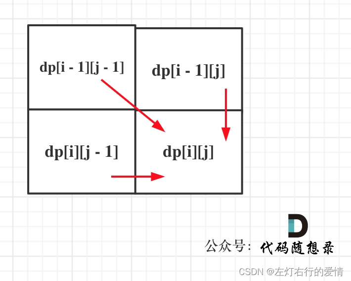  
   那么在计算左下时，要经过从前到后，从上到下。
* 举例推导dp数组  
   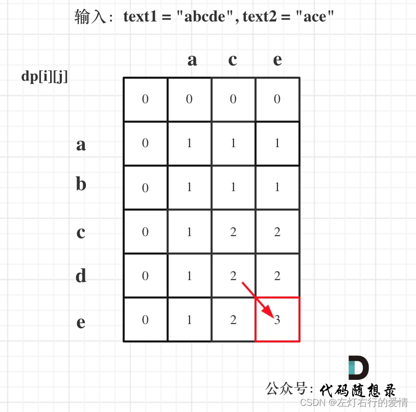  
   最后红框dp[text1.size()][text2.size()]为最终结果

代码如下：  
 class Solution {  
 public int longestCommonSubsequence(String text1, String text2) {  
 int[][] dp = new int[text1.length() + 1][text2.length() + 1]; // 先对dp数组做初始化操作  
 for (int i = 1 ; i <= text1.length() ; i++) {  
 char char1 = text1.charAt(i - 1);  
 for (int j = 1; j <= text2.length(); j++) {  
 char char2 = text2.charAt(j - 1);  
 if (char1 == char2) { // 开始列出状态转移方程  
 dp[i][j] = dp[i - 1][j - 1] + 1;  
 } else {  
 dp[i][j] = Math.max(dp[i - 1][j], dp[i][j - 1]);  
 }  
 }  
 }  
 return dp[text1.length()][text2.length()];  
 }  
 }

##### 子序列问题

###### 53. 最大子数组和

[53. 力扣链接-最大子数组和](https://leetcode.cn/problems/maximum-subarray/)  
 给你一个整数数组 nums ，请你找出一个具有最大和的连续子数组（子数组最少包含一个元素），返回其最大和。  
 子数组 是数组中的一个连续部分。  
 示例 1：  
 输入：nums = [-2,1,-3,4,-1,2,1,-5,4]  
 输出：6  
 解释：连续子数组 [4,-1,2,1] 的和最大，为 6 。

基本思想：  
 这道题我们之前用贪心实现了一次，这次我们用dp来解。

* 确定dp数组以及下标的含义  
   dp[i]:包括下标i之前的最大连续子序列和为dp[i]。
* 确定递推公式  
   dp[i]只有两个方向可以推出来：  
   dp[i-1]+nums[i]：nums[i]加入当前连续子序列和。  
   nums[i]，即：从头开始计算当前连续子序列和。  
   一定是取最大的，所以dp[i]=max(dp[i-1]+nums[i],nums[i]);
* dp数组如何初始化  
   从递推公式可以看出来dp[i]是依赖于dp[i-1]的状态，dp[0]就是递推公式的基础。  
   dp[0]很明确，就是nums[0]
* 确定遍历顺序  
   递推公式中dp[i]依赖于dp[i-1]的状态，需要从前向后遍历。
* 举例推导dp数组  
   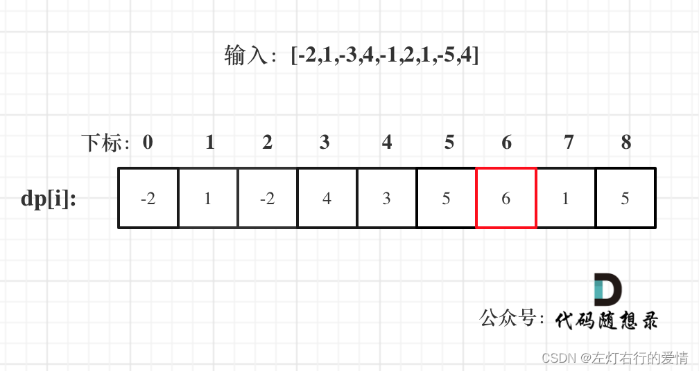  
   代码如下：

```
public static int maxSubArray(int[] nums) {
       if (nums.length == 0) {
           return 0;
       }
       int res = nums[0];
       int[] dp = new int[nums.length];
       dp[0] = nums[0];
       for (int i = 1; i < nums.length; i++) {
           dp[i] = Math.max(dp[i - 1] + nums[i], nums[i]);
           res = res > dp[i] ? res : dp[i];
       }
       return res;
   }


```

###### 392. 判断子序列

[392. 力扣链接-判断子序列](https://leetcode.cn/problems/is-subsequence/description/)  
 给定字符串 s 和 t ，判断 s 是否为 t 的子序列。  
 字符串的一个子序列是原始字符串删除一些（也可以不删除）字符而不改变剩余字符相对位置形成的新字符串。（例如，"ace"是"abcde"的一个子序列，而"aec"不是）。  
 示例 ：  
 输入：s = “abc”, t = “ahbgdc”  
 输出：true

基本思想：  
 这道题应该算是编辑距离的入门题目，因为从题意中我们也可以发现，只需要计算删除的情况，不用考虑增加和替换的情况。

* 确定dp数组以及下标含义  
   dp[i][j]表示以下标i-1为结尾的字符串s，和以下标j-1为结尾的字符串t，相同子序列的长度为dp[i][j]。
* 确定递推公式  
   考虑如下两种操作，整理如下：  
   如果s[i-1]等于t[j-1] ----t中找到了一个字符在s中也出现了  
   dp[i][j]=dp[i-1][j-1]+1；  
   如果s[i-1]不等于t[j-1] —相当于t删除元素，继续匹配  
   dp[i][j]=dp[i][j-1];
* dp数组如何初始化  
   从初始化可以看出dp[i][j]都是依赖于dp[i-1][j-1]和dp[i][j-1],所以dp[0][0]和dp[i][0]是一定要初始化的。  
   在定义dp[i][j]含义的时候为什么要表示以下标i-1为结尾的字符串s，和以下标j-1为结尾的字符串t，相同子序列的长度为dp[i][j]。  
   因为这样的定义在dp二维矩阵中可以留出初始化的区间，如下图：  
   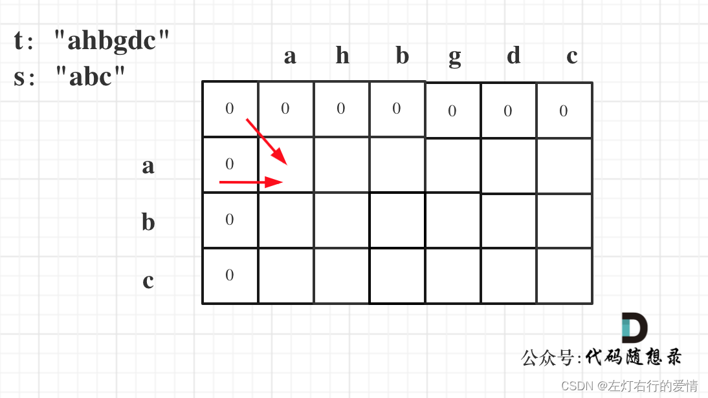  
   如果要是定义的dp[i][j]是以下标i为结尾的字符串s和以下标j为结尾的字符串t，初始化就比较麻烦了。  
   dp[i][0] 表示以下标i-1为结尾的字符串，与空字符串的相同子序列长度，所以为0. dp[0][j]同理。
* 确定遍历顺序  
   从递推公式可以看出dp[i][j]都是依赖于dp[i-1][j-1]和dp[i][j-1]，那么遍历顺序应该是从上到下，从左到右。  
   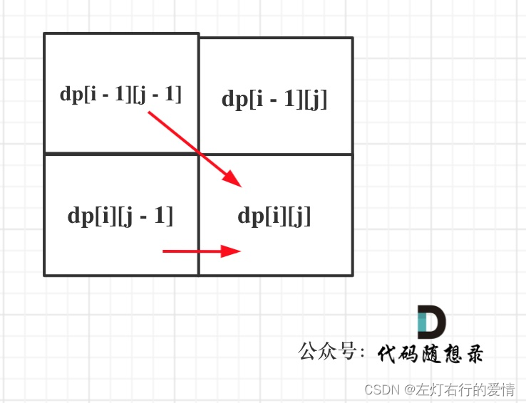
* 举例推导dp数组  
   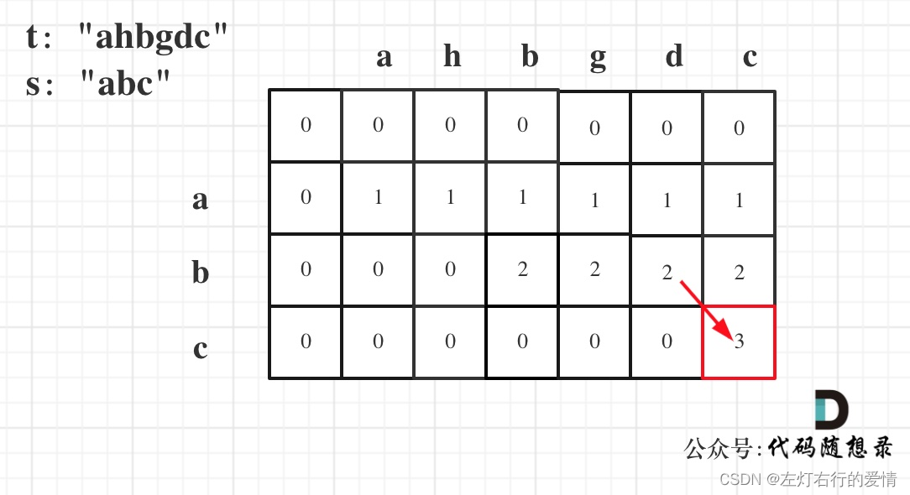  
   代码如下：

```
class Solution {
    public boolean isSubsequence(String s, String t) {
        int length1 = s.length(); int length2 = t.length();
        int[][] dp = new int[length1+1][length2+1];
        for(int i = 1; i <= length1; i++){
            for(int j = 1; j <= length2; j++){
                if(s.charAt(i-1) == t.charAt(j-1)){
                    dp[i][j] = dp[i-1][j-1] + 1;
                }else{
                    dp[i][j] = dp[i][j-1];
                }
            }
        }
        if(dp[length1][length2] == length1){
            return true;
        }else{
            return false;
        }
    }
}


```

###### 115.不同的子序列

[115.力扣链接-不同的子序列](https://leetcode.cn/problems/distinct-subsequences/description/)  
 给定一个字符串 s 和一个字符串 t ，计算在 s 的子序列中 t 出现的个数。  
 字符串的一个 子序列 是指，通过删除一些（也可以不删除）字符且不干扰剩余字符相对位置所组成的新字符串。（例如，“ACE” 是 “ABCDE” 的一个子序列，而 “AEC” 不是）  
 题目数据保证答案符合 32 位带符号整数范围。  
 示例 ：  
 输入：s = “rabbbit”, t = “rabbit”  
 输出：3  
 解释：  
 有 3 种可以从 s 中得到 “rabbit” 的方案。  
 rabbbit  
 rabbbit  
 rabbbit

基本思想：

* 确定dp数组以及下标的含义  
   dp[i][j]：以i-1为结尾的s子序列中出现以j-1为结尾的t的个数为dp[i][j]。
* 确定递推公式  
   分析两个情况：  
   当s[i - 1] 与 t[j - 1]相等：  
   dp[i][j]有两部分组成----一部分用s[i-1]来匹配，表示为dp[i-1][j-1]  
   ----一部分不用s[i-1]来匹配，个数为dp[i-1][j]  
   这里可能有人不明白了，为什么还要考虑 不用s[i - 1]来匹配，都相同了指定要匹配啊。  
   例如： s：bagg 和 t：bag ，s[3] 和 t[2]是相同的，但是字符串s也可以不用s[3]来匹配，即用s[0]s[1]s[2]组成的bag。  
   当然也可以用s[3]来匹配，即：s[0]s[1]s[3]组成的bag。  
   所以当s[i - 1] 与 t[j - 1]相等时，dp[i][j] = dp[i - 1][j - 1] + dp[i - 1][j];  
   当s[i - 1] 与 t[j - 1]不相等时，dp[i][j]只有一部分组成，不用s[i - 1]来匹配，即：dp[i - 1][j]  
   所以递推公式为：dp[i][j] = dp[i - 1][j];
* dp数组如何初始化  
   从递推公式中分析，dp[i][j] = dp[i - 1][j - 1] + dp[i - 1][j]; 和 dp[i][j] = dp[i - 1][j];  
   可以看出dp[i][0]和dp[0]一定要初始化的。  
   初始化时一定要回顾一下dp[i][j]的定义，不要凭感觉初始化。  
   dp[i][0]：以i-1为结尾的s删除所有元素，出现空字符串的个数  
   所以肯定为1。  
   再来看dp[0][j]，dp[0][j]：空字符串s可以随便删除元素，出现以j-1为结尾的字符串t的个数。  
   那么dp[0][j]一定都为0，s无论如何也变成不了t。

最后看一个特殊位置，dp[0][0]应该为多少  
 dp[0][0]应该是1，空字符串s，可以删除0个元素，变成空字符串t。

* 遍历顺序  
   从递推公式dp[i][j] = dp[i - 1][j - 1] + dp[i - 1][j]; 和 dp[i][j] = dp[i - 1][j]; 中可以看出dp[i][j]都是根据左上方和正上方推出来的。  
   所以遍历的时候一定是从上到下，从左到右，这样保证dp[i][j]可以根据之前计算出来的数值进行计算。
* 举例推导dp数组  
   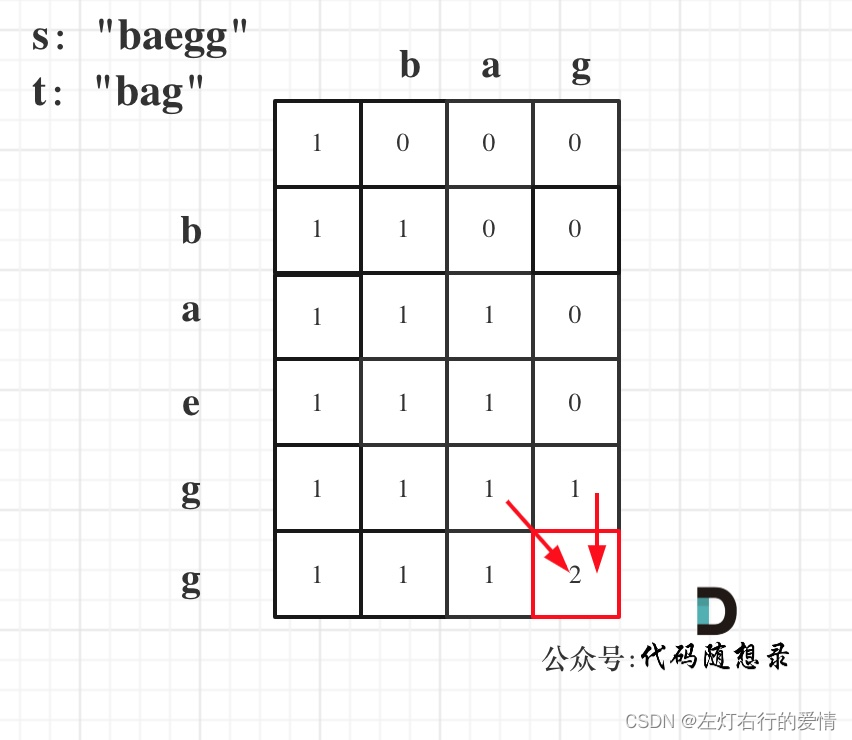  
   代码如下：

```
class Solution {
    public int numDistinct(String s, String t) {
        int[][] dp = new int[s.length() + 1][t.length() + 1];
        for (int i = 0; i < s.length() + 1; i++) {
            dp[i][0] = 1;
        }
        for (int i = 1; i < s.length() + 1; i++) {
            for (int j = 1; j < t.length() + 1; j++) {
                if (s.charAt(i - 1) == t.charAt(j - 1)) {
                    dp[i][j] = dp[i - 1][j - 1] + dp[i - 1][j];
                }else{
                    dp[i][j] = dp[i - 1][j];
                }
            }
        }
        return dp[s.length()][t.length()];
    }
}


```

###### 647. 回文子串

[647. 力扣链接-回文子串](https://leetcode.cn/problems/palindromic-substrings/)  
 给你一个字符串 s ，请你统计并返回这个字符串中 回文子串 的数目。  
 回文字符串 是正着读和倒过来读一样的字符串。  
 子字符串 是字符串中的由连续字符组成的一个序列。  
 具有不同开始位置或结束位置的子串，即使是由相同的字符组成，也会被视作不同的子串。  
 示例 1：  
 输入：s = “abc”  
 输出：3  
 解释：三个回文子串: “a”, “b”, “c”

基本思想：  
 这道题非常好，如果你对遍历顺序和dp的认知不足的话，dp数组很难定义出来，且遍历时也很头大，不过了有了前边的铺垫，我们了解起来应该不算难。

* 确定dp数组以及下标的含义  
   确定布尔类型dp[i][j]：表示区间范围[i][j](%E6%B3%A8%E6%84%8F%E6%88%91%E4%BB%AC%E6%98%AF%E5%B7%A6%E9%97%AD%E5%8F%B3%E9%97%AD)的回文子串，如果是，dp[i][j]为true，否则为false。
* 确定递推公式  
   我们要分析两种状态  
   s[i]与s[j]相等时（有三种情况）：

1. 下标i与j相同-同一个字符，当然为回文子串
2. 下标i与j相差为1，例如aa，也是回文子串
3. 下标i与j相差大于1，例如cabac，此时s[i]与s[j]已经相同了，我们要看dppi+1][j-1]是否为true。  
    s[i]与s[j]不相等的时候：直接为false，不做处理。

* dp数组如何初始化  
   默认初始化为false，肯定不能初始化为true，不然刚开始就全匹配上了。
* 确定遍历顺序  
   从递推公式我们可以看出，dp[i][j]是有依赖于dp[i+1][j-1]的。  
   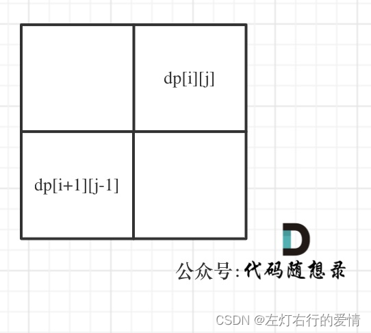  
   所以我们是从下到上，从左到右遍历，这样保证dp[i+1][j-1]都是经过计算的。  
   **有的代码是先遍历列，再遍历行，也是一个道理，都保证了dp[i+1][j-1]经过计算。**
* 举例推导dp数组  
   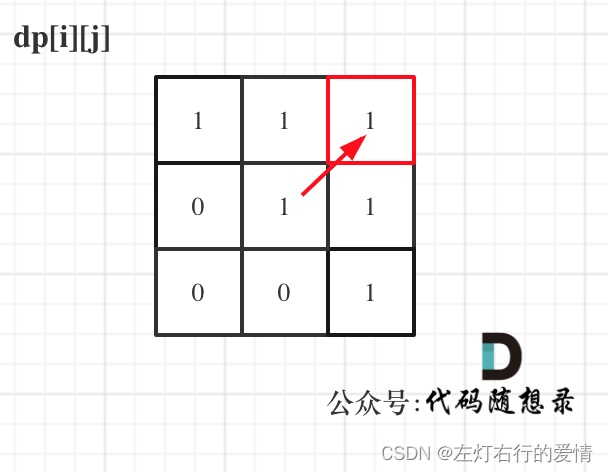  
   **因为dp[i][j]的定义。j一定是要大于i的，填充的时候只会填充上半部分。**

代码如下：

```
class Solution {
    public int countSubstrings(String s) {
          boolean[][] dp=new boolean[s.length()][s.length()];
          int count=0;
          if(s.length()==0||s==""){
              return count;
          }
          for(int j=0;j<s.length();j++){             //这里先遍历的列
              for(int i=0;i<=j;i++){
                  if(s.charAt(j)==s.charAt(i)){
                      if(j-i<3){
                          count++;
                          dp[i][j]=true;
                      }else{
                          if(dp[i+1][j-1]){
                              count++;
                              dp[i][j]=true;
                          }
                      }

                  }
              }
          }
          return count;
    }
}


```

###### 516. 最长回文子序列

[516. 力扣链接-最长回文子序列](https://leetcode.cn/problems/longest-palindromic-subsequence/description/)  
 给你一个字符串 s ，找出其中最长的回文子序列，并返回该序列的长度。  
 子序列定义为：不改变剩余字符顺序的情况下，删除某些字符或者不删除任何字符形成的一个序列。  
 示例 1：  
 输入：s = “bbbab”  
 输出：4  
 解释：一个可能的最长回文子序列为 “bbbb” 。

基本思想：  
 我们之前有了回文子串的基础，这道题理解起来就简单多了。  
 注意，回文子串要求是连续的，而回文子序列不是连续的。

* 确定dp数组以及下标的含义  
   dp[i][j]：字符串s在[i,j]范围内最长的回文子序列的长度为dp[i][j]。
* 确定递推公式  
   判断回文子串的题目中，关键逻辑就是看s[i]与s[j]是否相同  
   如果s[i]与s[j]相同，那么dp[i][j]=dp[i+1][j-1]+2；  
   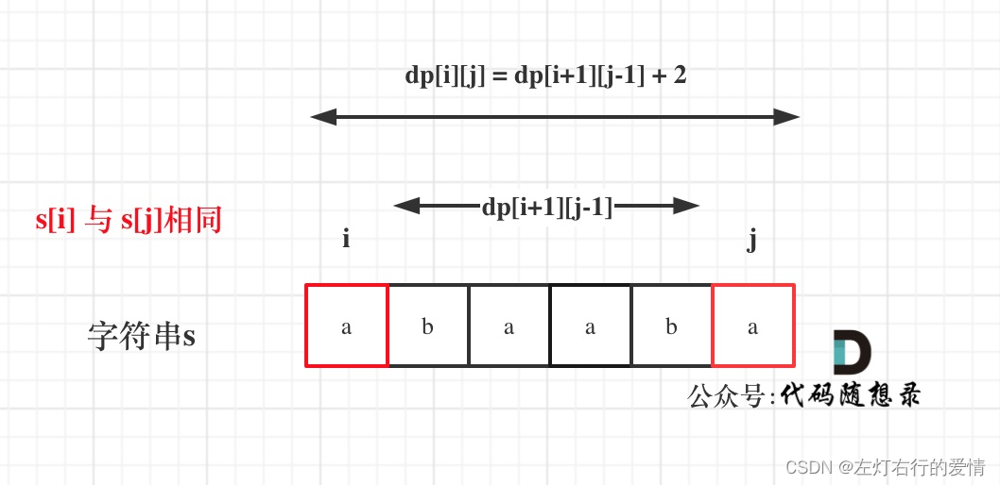  
   如果s[i]与s[j]不相同，说明他们同时加入并不能增加[i,j]区间的回文子串长度，那么分别加入s[i],s[j]看看哪一个可以组成最长的回文子序列。  
   加入s[i]的回文子序列长度为dp[i+1][j]。  
   加入s[j]的回文子序列长度为dp[i][j-1]。  
   dp[i][j]一定取最大的：dp[i][j]=max(dp[i+1][j]，dp[i][j-1])；  
   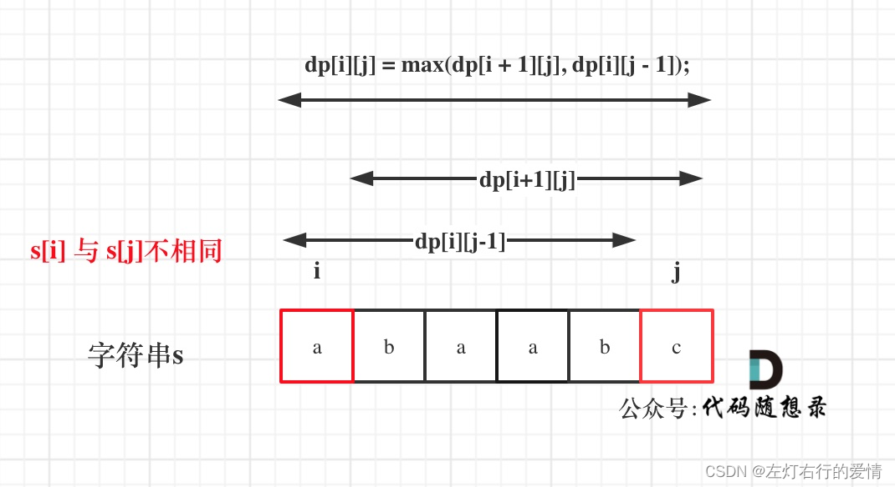
* 确定遍历顺序  
   从递推公式dp[i][j] = dp[i + 1][j - 1] + 2 和 dp[i][j] = max(dp[i + 1][j], dp[i][j - 1]) 可以看出，dp[i][j]是依赖于dp[i + 1][j - 1] 和 dp[i + 1][j]。  
   那么我们回到矩阵角度来说，我们从下到上，从左到右遍历。  
   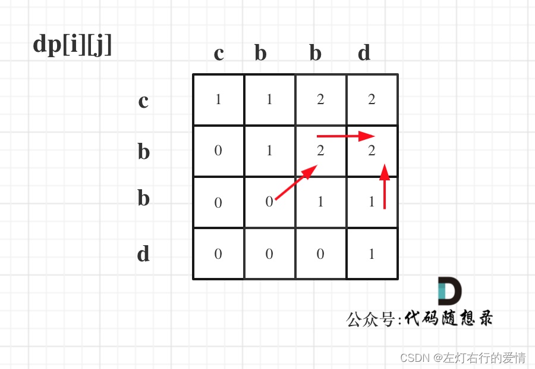
* 举例推导dp数组  
   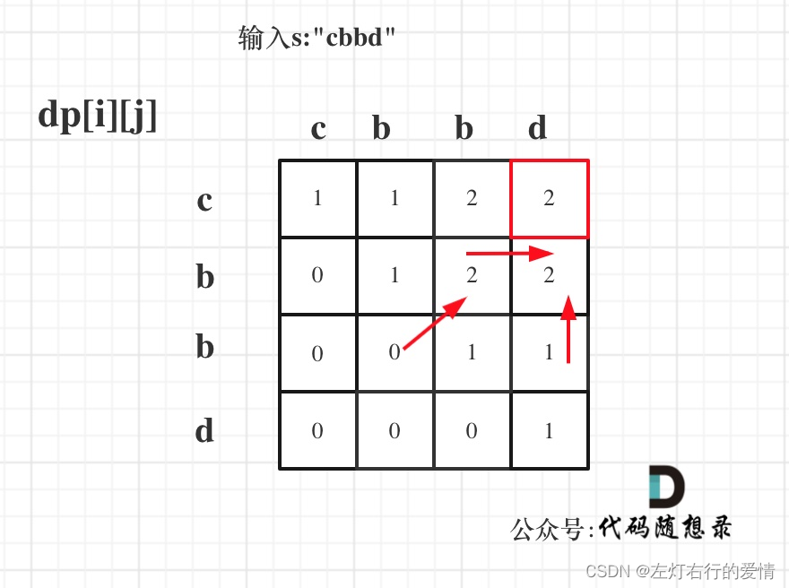  
   代码如下：

```
class Solution {
    public int longestPalindromeSubseq(String s) {
       int[][]dp=new int[s.length()][s.length()];
       if(s.length()==0||s==""){
           return 0;
       }
       for(int i=s.length()-1;i>=0;i--){
          dp[i][i]=1;
           for(int j=i+1;j<s.length();j++){
                if(s.charAt(i)==s.charAt(j)){
                    dp[i][j]=dp[i+1][j-1]+2;
                }else{
                    dp[i][j]=Math.max(dp[i][j-1],dp[i+1][j]);
                }
           }
       }
       return dp[0][s.length()-1];
    }
}


```
