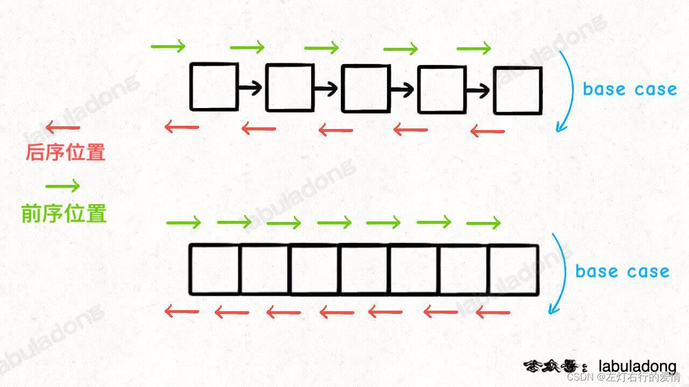
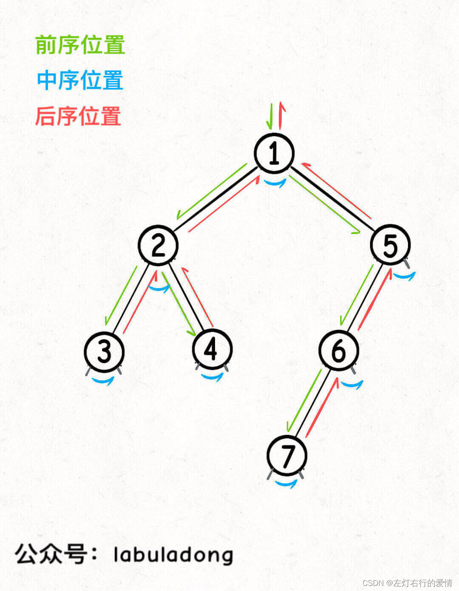
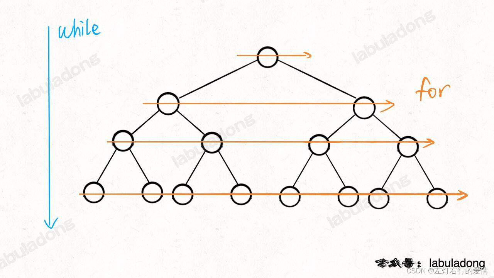

> 原文：[CSDN](https://blog.csdn.net/qq_45852626/article/details/127596461)（历史文章导入，当前状态为草稿）

**文章作为总结和加一点点自己的感悟，整体思想来自于各个大佬的总结，有雷同纯属正常。**

#### 二叉树深度分析
#### 前文

二叉树如果刷了一些题后，很容易发现解题时有固定的模板思维框架，这里大致分两类：  
 1.是否可以通过遍历一遍二叉树得到答案？这称之为【遍历】的思维模式。  
 2.是否可以定义一个递归函数，通过子问题（子树）的答案推导出原问题的答案？如果可以，写出递归函数的定义，**并充分利用递归函数的返回值**，这称之为【分解问题】的思维模式。

我们无论使用哪种思维，都需要思考一点的是：  
 如果单独抽出一个二叉树节点，它需要做什么事情？需要在什么时候（前/中/后序位置）做？其他的节点我们不需要关注，以为递归会在所有节点执行相同操作。  
 如果你看过我总结的动态规划，一定会深刻理解框架思维的强大，后面我们会更深刻的体会到框架思维在二叉树里发挥的神效。

### 基础知识

#### 前中后序到底是在说什么？

先来几个问题思考一下，看看对前中后序的理解如何：  
 1.二叉树的前中后序遍历是什么，仅仅是三个顺序不同的List吗？  
 2.后续遍历有什么特殊之处？  
 3.为什么多叉树没有中序遍历？  
 是否答出来没关系，我们慢慢都会知道。  
 首先看一下我们学习的框架：

```
void traverse(TreeNode root){
if(root==null){
  return;
}
//前序位置
traverse(root.left);
//中序位置
traverse(root.right);
//后序位置
}


```

我们先暂时不管前中后序是什么，但看这个递归函数，它在做什么事情？  
 不难发现，它目的是遍历二叉树所有节点的一个函数，和我们去遍历数组或者链表本质上没有区别，你可能会说，一个是迭代一个是遍历，怎么会在本质没区别呢？这里我们要知道，无论是迭代还是递归，**在遍历这件事情上**，是没什么区别的。  
 我们举两个例子：

```
对于数组而言
//迭代遍历数组
void traverse(int[] arr){
for(int i=0;i<arr.length;i++){

}
}

//递归遍历数组
void traverse(int[] arr,int i){
if(i==arr.length){
return;
}
//前序
traverse(arr,i+1)
//后序
}

对于链表而言
//迭代遍历链表
void traverse(ListNode head){
for(ListNode p=head;p!=null;p=p.next){

}
}
//递归遍历单链表
void traverse(ListNode head){
if(head==null){
return;
}
//前序位置
traverse(head.next);
//后序位置
}


```

我们可以很清晰的看到，单链表和数组的遍历都是可以迭代的，也是可以递归的。  
 那么对于二叉树这种结构—无非就是二叉链表，由于没办法简单改写成迭代形式，所以我们一般说二叉树遍历框架都是指递归的形式。

不知道你是否观察到了，无论是哪种数据结构的递归形式遍历，都可以有前序位置和后续位置，分别在递归之前和递归之后。

那么，前序位置——就是刚进入一个节点（元素）的时候。  
 后续位置——即将离开一个节点（元素）的时候。  
 所以，代码写在不同位置，代码的执行时机也不同。

我们来举个小例子，如果让我们来倒序打印一条单链表上所有节点的值，怎么做？  
 如果我们对递归理解透彻了，可以用后续位置来操作。  
   
 实现代码如下：

```
void traverse(ListNode head){
if(head==null){
return;
}
traverse(head.next);
//后序位置
print(head.val);

}


```

结合上面那张图，相信你已经明白了为什么可以倒序打印单链表了。  
 本质上是利用递归的堆栈来实现。  
 那么说二叉树也是一样的，只不过多了一个中序位置。

二叉树前中后序绝不仅仅只是三种顺序不同的List列表；  
 它们是遍历二叉树过程中处理每一个节点的三个特殊时间点，绝不仅仅是三个顺序不同的LIst：  
 前序位置的代码在刚刚进入一个二叉树节点的时候执行；  
 后续位置的代码在将要离开一个二叉树节点时执行；  
 中序位置的代码在一个二叉树左子树都遍历完，即将开始遍历右子树的时候执行。  
   
 我们可以发现，每个节点都有唯一属于自己的前中后序位置，所以前中后序遍历是遍历二叉树过程中处理每一个节点的三个特殊时间点。  
 到这相信你可以理解为什么多叉树没有中序位置，因为二叉树的每个节点只会进行唯一 一次左子树切换右子树，而多叉树节点可能有很多子节点，会多次切换子树去遍历，所以多叉树节点没有【唯一】的中序遍历位置。

我们要清晰的认识到：  
 **二叉树的所有问题，就是让我们在前中后序位置注入巧妙的代码逻辑，去达到自己的目的，我们只需要单独思考每一个节点应该做什么，其他的不用管，抛给二叉树遍历框架，递归会在所有节点上做相同的操作。**

#### 解题思路

二叉树的递归解法分为两种思路：  
 1.遍历一遍二叉树得到答案。对应回溯算法核心框架  
 2.通过分解问题计算出答案。对应动态规划核心框架  
 不熟悉回溯或者动规可以去看看我前面的文章，加深理解：  
 [回溯](https://blog.csdn.net/qq_45852626/article/details/127414653?spm=1001.2014.3001.5501)  
 [动态规划](https://blog.csdn.net/qq_45852626/article/details/127416130?spm=1001.2014.3001.5501)  
 后面我们会集中用题目来增加理解。  
 为什么单开一个节点说这件事，因为很重要，同时希望有一定回溯和动规基础再来看（没有也行，但是会有点吃力）。

#### 前序与中序位置探讨

前序位置：  
 1.本身并没有什么特别的性质，而且如果你做过二叉树，你会发现好像很多题都是在前序位置写代码，实际上我们只是习惯把那些对前中后序位置不敏感的代码写在前序位置上而已。  
 2.前序位置的代码执行是自顶向下的。  
 3.前序位置是刚刚进入节点的时刻（这句话大有玄妙），意味着前序位置的代码只能从函数参数中获取父节点传递来的数据。

中序位置：主要用在BST场景中，完成可以把BST的中序遍历认为是遍历有序数组。

后序位置：我们之前了解了前序位置只能从函数参数中获取父节点传递来的数据，那么后续位置不仅仅可以获取父节点传递的参数数据，还可以获取到通过子树的函数返回值传递回来的数据。

我们简单举个例子，现在给我们一颗二叉树，有两个问题需要回答一下：  
 1.如果把根节点看做第1层，如何打印每一个节点所在的层数？  
 2.如何打印每个节点的左右子树各有多少节点？

第一个问题代码如下：

```
// 二叉树遍历函数
void traverse(TreeNode root, int level) {
    if (root == null) {
        return;
    }
    // 前序位置
    printf("节点 %s 在第 %d 层", root, level);
    traverse(root.left, level + 1);
    traverse(root.right, level + 1);
}

// 这样调用
traverse(root, 1);


```

第二个问题可以这样写：

```
int count(TreeNode root){
if(root==null){
return 0;
}
int leftCount=count(root.left);
int rightCount=count(root.right);
//后序位置
    printf("节点 %s 的左子树有 %d 个节点，右子树有 %d 个节点",
            root, leftCount, rightCount);
return leftCount+rightCount+1;
}


```

这两个问题的根本在于：  
 一个节点在第几层，你从根节点遍历过来的过程就能顺带记录；  
 一个节点为根的整颗子树有多少节点，你需要遍历完子树之后才能数清楚；  
 我们可以品味一下前序和后续的特点，并且了解一下后序位置的特殊性。  
 综上：一旦我们发现题目和子树有关，那大概率要给函数设置合理的定义和返回值，在后序写代码了。

#### 层序遍历

二叉树题型主要用来培养递归思维，而层序遍历属于迭代遍历，比较简单，这里过一下框架代码：

```
//输入一颗二叉树的根节点，层序遍历这课二叉树
void levelTraverse(TreeNode root){
if(root==null) return;
Queue<TreeNode> q=new LinkedList<>();
q.offer(root);
//从上到下遍历二叉树的每一层
while(!q.isEmpty()){
int n =q.size();
//从左到右遍历每一层的每个节点
for(int i=0;i<n;i++){
TreeNode cur =q.poll();
//将下一层节点放入队列
if(cur.left!=null){
q.offer(cur,left);}

if(cur.right!=null){
q.offer(cur.right);}
    }
  }
}


```

这里面while循环和for循环从上到下和从左到右遍历：  
 

后面我会快马加鞭更新BFS和Dijkstra算法帮助更好理解，看官可以先插个眼。
