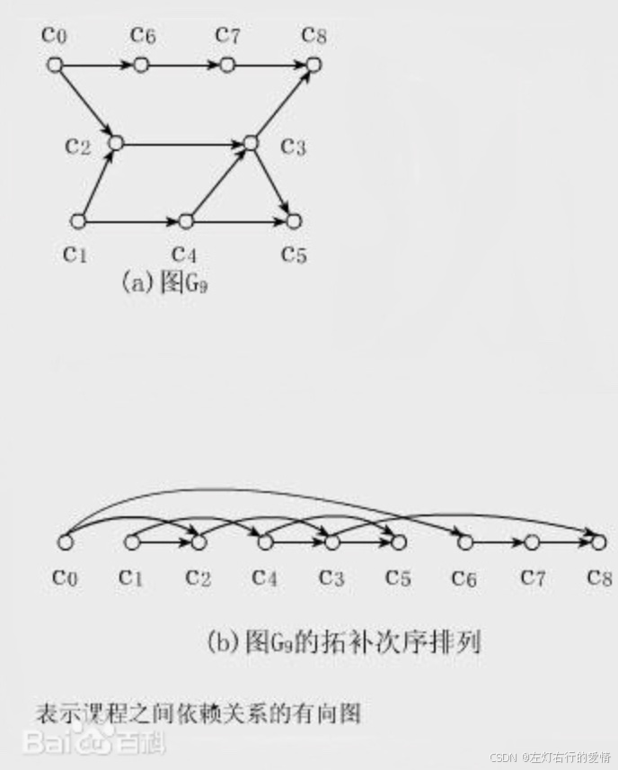
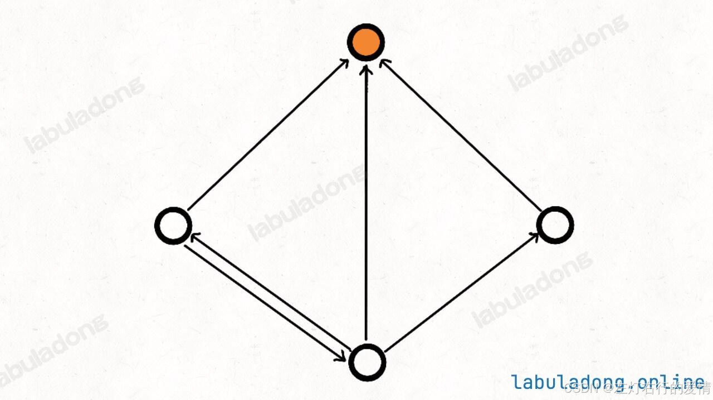
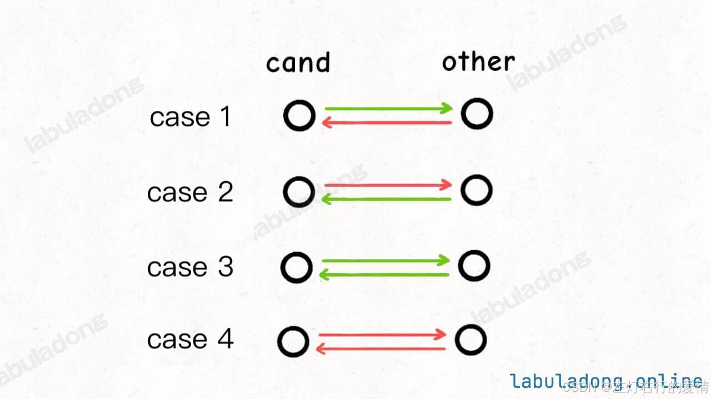
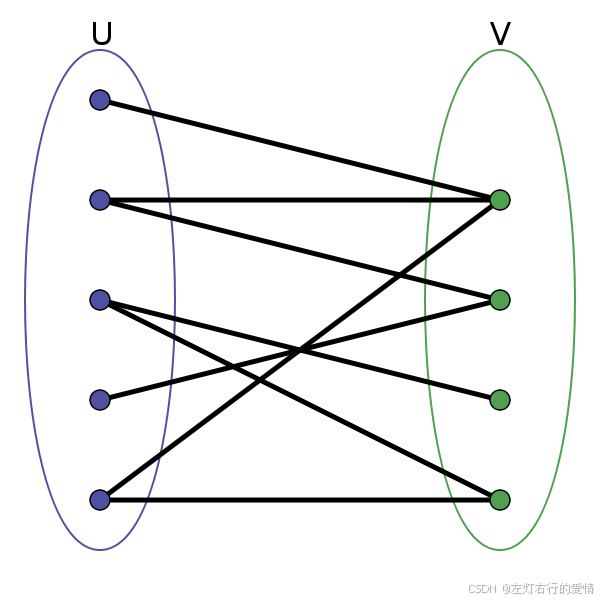
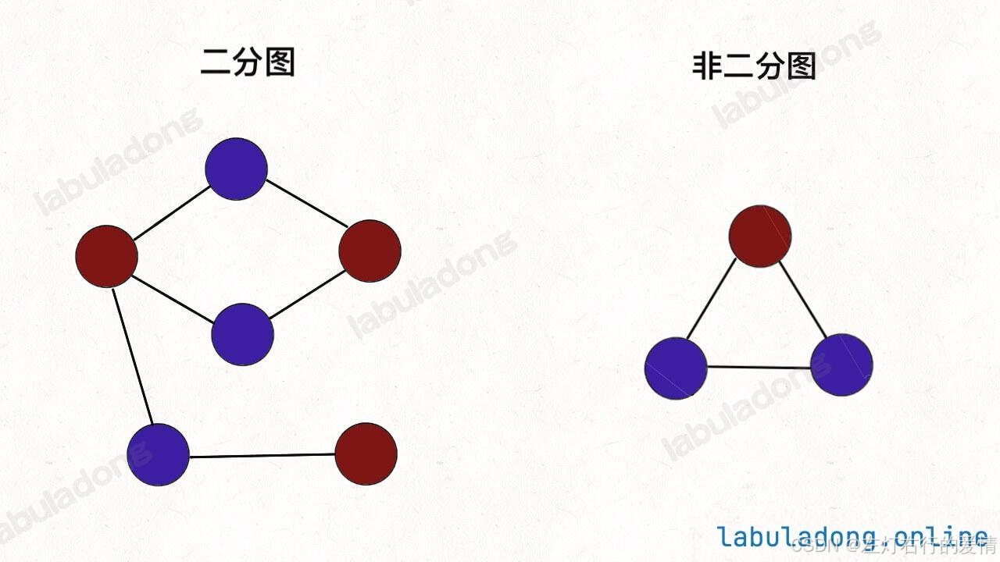

> 原文：[CSDN](https://blog.csdn.net/qq_45852626/article/details/145621525)（历史文章导入，当前状态为草稿）

### 前言

主要介绍一些有意思的小算法

### 拓扑结构

简单来说,把一幅图拉平,而且这个拉平的图里面,所有的箭头方向都是一致的.  
 比如下图所有的箭头都是朝右的.  
   
 注意: 如果是一副有向图存在环,无法进行拓扑排序,因为肯定做不到所有箭头方向一致;

那图的拓扑结构如何实现呢?  
 这个特别简单,首先你要先确认好建图时对边的定义!  
 如果有向边定义为[依赖]关系:  
 比如节点2指向节点1.含义是节点2被节点1依赖.  
 那么我们让图结构后序遍历结果即可.  
 那如果是节点1指向节点2,含义是节点1被节点2依赖  
 那么我们只需把图结构后序遍历结果进行反转即可.

### 名流问题

给你 n 个人的社交关系（你知道任意两个人之间是否认识），然后请你找出这些人中的「名人」。  
 所谓「名人」有两个条件：  
 1、所有其他人都认识「名人」。  
 2、「名人」不认识任何其他人。

如果把每个人看做图中的节点，「认识」这种关系看做是节点之间的有向边，那么名人就是这幅图中一个特殊的节点：这个节点没有一条指向其他节点的有向边；且其他所有节点都有一条指向这个节点的有向边。

  
 那么我们该如何表示这n个人的社交关系呢?  
 这个首先要看图的数据结构有两种存储形式:

* 邻接表: 优势是节约存储空间
* 临接矩阵: 优势可以迅速判断两个节点是否相邻.  
   那对于名人问题而言: 需要经常判定两个人之间是否认识,所以这里选用临接矩阵来表示人与人之间的社交关系.

#### 暴力解法

这里我们之谈思想,不聊代码.  
 我们可以暴力穷举,把每个人都看作候选人,然后判定是否符合名人的条件.  
 也就是说先选一个人,然后暴力拿其他人作比较.  
 很明显是一个双层for循环,最坏时间复杂度O(n^2).

#### 优化解法

我们紧抓定义:  
 其他人都认识名人,但名人不认识其他人.  
 换句话说,这群人里面只有一个名人.  
 再换句话说,我比较两个人,一定能确认其中一个人不是名人.  
 那么我们比较规则是什么?我们先看一下两个比较有几种情况:  
   
 对于情况一，cand 认识 other，所以 cand 肯定不是名人，排除。因为名人不可能认识别人。  
 对于情况二，other 认识 cand，所以 other 肯定不是名人，排除。  
 对于情况三，他俩互相认识，肯定都不是名人，可以随便排除一个.  
 对于情况四，他俩互不认识，肯定都不是名人，可以随便排除一个。因为名人应该被所有其他人认识。  
 综上，只要观察任意两个之间的关系，就至少能确定一个人不是名人.

我们可以不断从候选人中选两个出来，然后排除掉一个，直到最后只剩下一个候选人，这时候再使用一个 for 循环判断这个候选人是否是货真价实的「名人」。

```
class Solution extends Relation {
    public int findCelebrity(int n) {
        int cand = 0;
        for (int other = 1; other < n; other++) {
            if (!knows(other, cand) || knows(cand, other)) {
                // cand 不可能是名人，排除
                // 假设 other 是名人
                cand = other;
            } else {
                // other 不可能是名人，排除
                // 什么都不用做，继续假设 cand 是名人
            }
        }

        // 现在的 cand 是排除的最后结果，但不能保证一定是名人
        for (int other = 0; other < n; other++) {
            if (cand == other) continue;
            // 需要保证其他人都认识 cand，且 cand 不认识任何其他人
            if (!knows(other, cand) || knows(cand, other)) {
                return -1;
            }
        }

        return cand;
    }
}


```

### 二分图

二分图定义:  
 二分图的顶点集可分割为两个互不相交的子集，图中每条边依附的两个顶点都分属于这两个子集，且两个子集内的顶点不相邻。  
   
 给你一幅「图」，请你用两种颜色将图中的所有顶点着色，且使得任意一条边的两个端点的颜色都不相同，你能做到吗？  
 这就是图的「双色问题」，其实这个问题就等同于二分图的判定问题，如果你能够成功地将图染色，那么这幅图就是一幅二分图，反之则不是：  
   
 二分图的应用:二分图结构在某些场景可以更高效地存储数据。

#### 二分图判定思路

说白了遍历一遍图,一遍遍历一边染色,看看能不能用两种颜色给所有节点染色,且相邻节点的颜色都不相同.

```
// 图遍历框架
void traverse(Graph graph, boolean[] visited, int v) {
   visited[v] = true;
   // 遍历节点 v 的所有相邻节点 neighbor
   for (int neighbor : graph.neighbors(v)) {
       if (!visited[neighbor]) {
           // 相邻节点 neighbor 没有被访问过
           // 那么应该给节点 neighbor 涂上和节点 v 不同的颜色
           traverse(graph, visited, neighbor);
       } else {
           // 相邻节点 neighbor 已经被访问过
           // 那么应该比较节点 neighbor 和节点 v 的颜色
           // 若相同，则此图不是二分图
       }
   }
}


```
