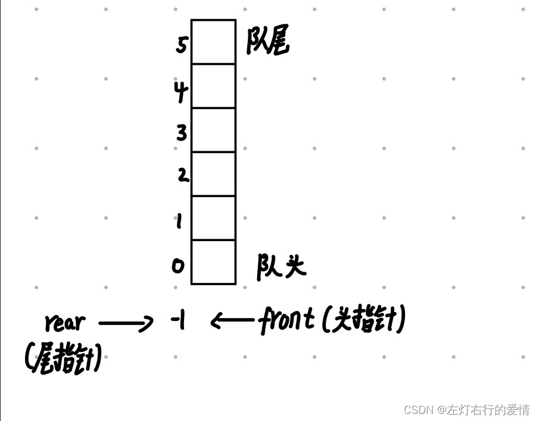
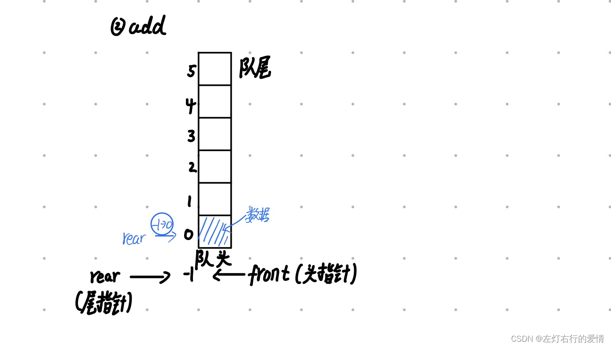
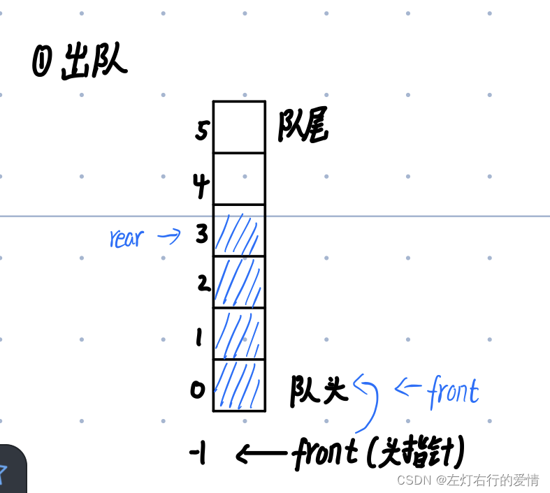
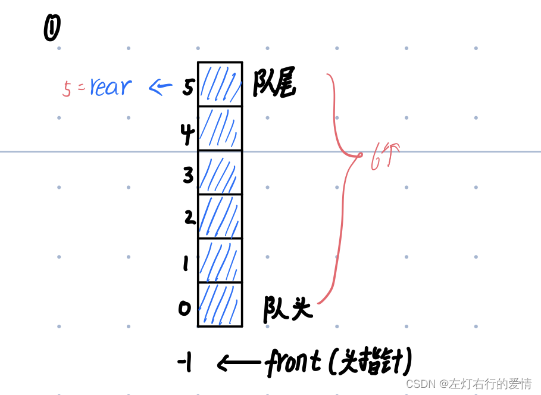
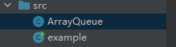

> 原文：[CSDN](https://blog.csdn.net/qq_45852626/article/details/122428951)（历史文章导入，当前状态为草稿）

## 算法（二）-数据模拟线性队列

本文的分享思路：  
1：给出一些基本概念  
2：概念之间串联（由点到线）  
3：给出方法的总结和代码实现，帮助初步掌握  
4：总结和实例

#### 简单的基本概念

1.线性结构：有序数据元素的**集合**  
2.队列：队列是一种特殊的线性表（线性结构）。  
构建结构：建立顺序队列结构必须为其静态分配或动态申请一片**连续的存储空间**，并设置**两个指针**进行管理。一个是队头指针front，它指向队头元素；另一个是队尾指针rear，它指向**下一个**入队元素的存储位置。  
特殊之处在于它只允许在表的前端（front）进行删除操作（删除操作的端称为队头）;  
例图如下：  


而在表的后端（rear）进行插入操作（插入操作的端称为队尾）  
3.数组：相同的元素序列，把具有相同类型的若干元素按无序的形式组织起来的一种形式。

#### 关系

1：队列是属于一种先进先出的线性结构  
2：无论是栈还是队列，它们属于一种逻辑结构，而数组只是它们的实现方式，所以栈和队列 与数组并不是并列结构

#### 操作方法

队列构造：

```
 private int maxSize;//数组最大容量
    private int front;//队列头
    private int rear;//队列尾
    private int[] arr;//存放数据时,模拟队列

    public ArrayQueue(int arrMaxSize){
        maxSize=arrMaxSize;
        arr=new int[maxSize];
        front=-1;//指向队列头部,front是指向队列头的前一个位置
        rear=-1;//指向队列尾,指向队列尾的数据
    }


```

1.判断队列是否满  
2.判断队列是否为空  
3.添加数据到队列  
4.获取数列的数据，出队列  
5.显示队列所有数据(遍历输出)  
6.显示队列的头数据（注意不是取出数据）  
实现方法，代码如下：

```
1: //判断队列是否满
    public boolean isFull(){
        return rear==maxSize-1;
    }
2: //判断队列是否为空
    public boolean isEmpty(){
        return rear==front;
    }
3://添加数据到队列
    public void addQueue(int n){
        if (isFull()){
            System.out.println("队列已满，不能加入数据");
            return;
        }
        rear++;
        arr[rear]=n;
    }
4: //获取数列的数据，出队列
    public int getQueue(){
        if(isEmpty()){
            System.out.println("队列为空,不能获取数据");
        }
        front++;
        return arr[front];
    }
5: public void showQueue(){
        if(isEmpty()){
            System.out.println("队列为空，没有数据可显示。");
            return;
        }
        for (int i=0;i<arr.length;i++){
            System.out.printf("arr[%d]=%d\n",i,arr[i]);
        }
    }
6://显示队列的头数据，注意不是取出数据
    public int headQueue(){
        //判断
        if(isEmpty()){
            throw new RuntimeException("队列为空，没有数据可显示。");
        }
        System.out.println(front);
        System.out.println(rear);
        return arr[front+1];   //此时注意，front并没有++
    }


```

下面有图例，配套看应该好一点，建议先看一遍代码再看图，培养读代码能力,配图如下：  
1：入队  
  
2：出队  
注意，出队时front向上走一格，从-1到0，此时指向的数据已经被弹出（图中蓝色没去掉，但实际已经没有了）  
  
最后是判满或是判空：  
判满条件和判空条件对照图一看就明白了  


#### 总结

关于队列而言，刚开始学习的时候我很迷，因为数组，栈这些一直干扰我学习队列，后来自己总结了一下，针对去学习，先理清线性结构的概念，再去看看数据的特性，最后来学习队列，后来又去学栈，最后完成这个小小的体系结构.

最后，我在看教学课程跟着敲了一个实例，分享给大家，帮助联系巩固。

#### 实例

栗子结构：  
  
ArrayQueue代码：

```
public class ArrayQueue {

    private int maxSize;//数组最大容量
    private int front;//队列头
    private int rear;//队列尾
    private int[] arr;//存放数据时,模拟队列

    public ArrayQueue(int arrMaxSize){
        maxSize=arrMaxSize;
        arr=new int[maxSize];
        front=-1;//指向队列头部,front是指向队列头的前一个位置
        rear=-1;//指向队列尾,指向队列尾的数据
    }
    //判断队列是否满
    public boolean isFull(){
        return rear==maxSize-1;
    }
    //判断队列是否为空
    public boolean isEmpty(){
        return rear==front;
    }
    //添加数据到队列
    public void addQueue(int n){
        if (isFull()){
            System.out.println("队列已满，不能加入数据");
            return;
        }
        rear++;
        arr[rear]=n;
    }
    //获取数列的数据，出队列
    public int getQueue(){
        if(isEmpty()){
            System.out.println("队列为空,不能获取数据");
        }
        front++;
        return arr[front];
    }
    //显示队列所有数据(遍历输出)
    public void showQueue(){
        if(isEmpty()){
            System.out.println("队列为空，没有数据可显示。");
            return;
        }
        for (int i=0;i<arr.length;i++){
            System.out.printf("arr[%d]=%d\n",i,arr[i]);
        }
    }
    //显示队列的头数据，注意不是取出数据
    public int headQueue(){
        //判断
        if(isEmpty()){
            throw new RuntimeException("队列为空，没有数据可显示。");
        }
        System.out.println(front);
        System.out.println(rear);
        return arr[front+1];
    }
}


```

example代码：

```
import java.util.Scanner;

public class example {
    public static void main(String[] args) {

        ArrayQueue arrayQueue =new ArrayQueue(3);
        char key =' ';//接受用户输入
        Scanner scanner =new Scanner(System.in);
        boolean loop =true;

        while(loop){
            System.out.println("s(show):显示队列");
            System.out.println("e(exit):退出程序");
            System.out.println("a(add):添加数据到队列");
            System.out.println("g(get):从队列取值");
            System.out.println("h(head):查看队列头的数据");
            key =scanner.next().charAt(0);//接受一个字符
            switch (key){
                case 's':
                    arrayQueue.showQueue();
                    break;
                case 'a':
                    System.out.println("输出一个数");
                    int value=scanner.nextInt();
                    arrayQueue.addQueue(value);
                    break;
                case 'g':
                    try {
                        int res = arrayQueue.getQueue();
                        System.out.printf("取出的数据是%d\n", res);
                    }catch (Exception e){
                        System.out.println(e.getMessage());
                    }
                    break;
                case 'h':
                    try {
                        int res = arrayQueue.headQueue();
                        System.out.printf("队列头数据是%d\n", res);
                    }catch (Exception e){
                        System.out.println(e.getMessage());
                    }
                    break;
                case 'e':
                    scanner.close();
                    loop=false;
                    break;
                default:
                    break;
            }
        }
        System.out.println("程序退出~");
    }
}


```
