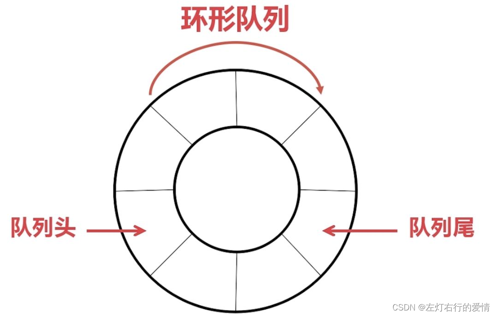
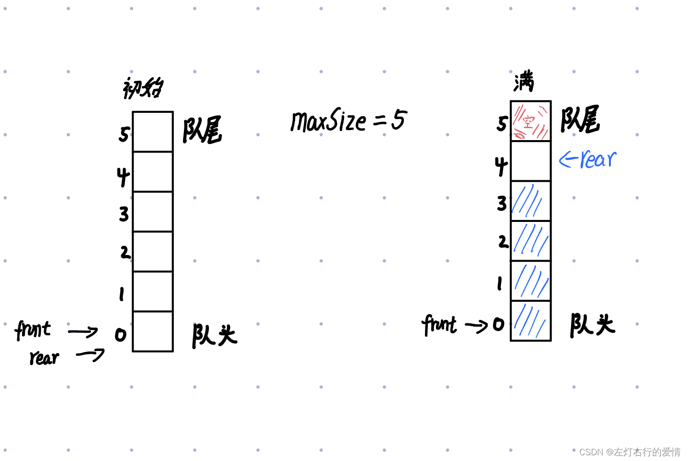
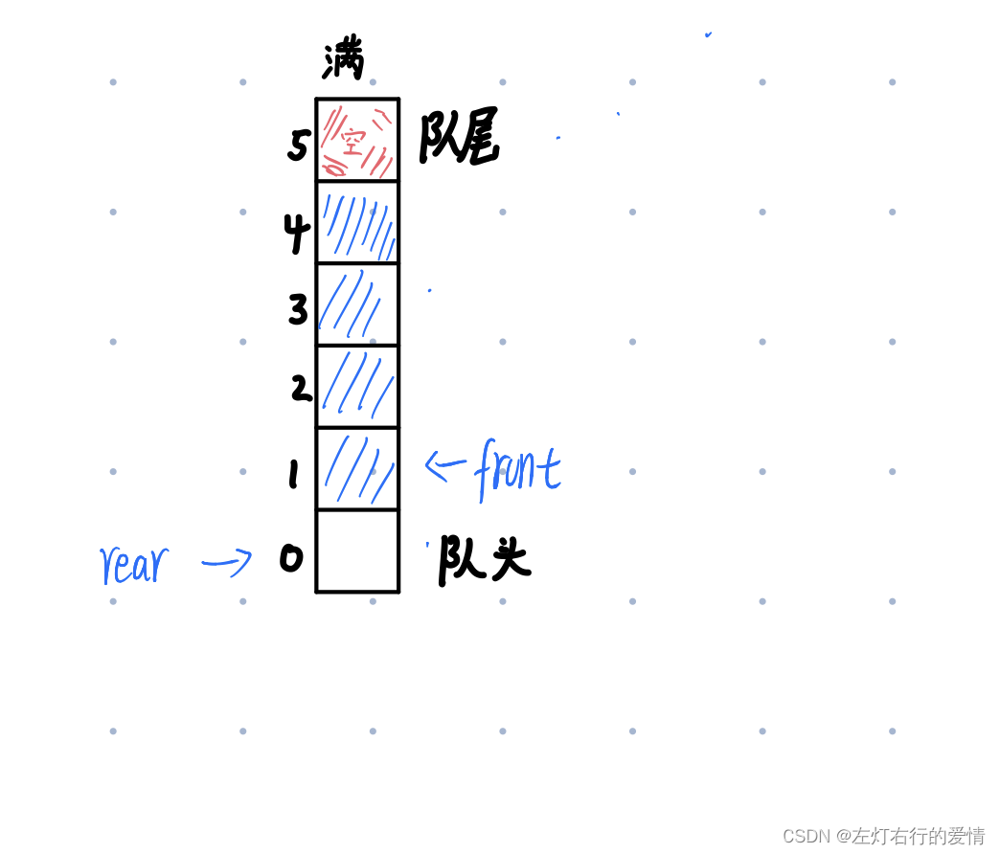

> 原文：[CSDN](https://blog.csdn.net/qq_45852626/article/details/122457698)（历史文章导入，当前状态为草稿）

本文分享思路  
1：为什么会有数组模拟环形队列的出现？  
2：理解掌握环形队列有什么用？  
3：基本概念和设计思路  
4：代码实现  
5：总结

#### 为什么会有数组模拟环形队列的出现？

当我们学习队列并开始运用后，很快就发现一个致命的问题—**数据的溢出**。  
发生溢出的原因很容易得知，一般有三种：  
1：当队尾指针rear=maxnum（队列的容量）,则会发生上溢出。  
2：当队列为空时，做出队运算产生的溢出现象  
3：由于队列的存储结构或操作方式的选择不当，容易造成假溢出（队列中有足够空间，但是元素不能入队）  
针对数据的溢出，环形队列（循环队列）可以很好解决队列这个痛点。

#### 理解掌握环形队列有什么用？

对于环形队列而言，它是一个很简单的数据结构，底层是用数组组成，逻辑上数组的首尾相连构成。  
这个"麻雀"虽小，但是用处不小，在做任务触发的时候很好用，放远了说在操作系统、数据库、中间件和各种应用系统中都有使用。

#### 基本概念和设计思路

##### 基本概念

环形队列：用数组组成，逻辑上数组的首尾相连构成。  


##### 设计思路

1：首先是两个指针的设计。  
在这里我们要清楚两个指针（变量）的指向（**java里面没有指针**，这里的指针只是一个代称，帮助更好的理解，无论是front还是rear它们都是变量而已）。  
刚开始两个指针的指向都为：0  
front指针（变量）的含义是：指向队列的第一个元素  
rear指针（变量）的含义是：指向最后一个元素的**后一个位置**，目的是：空出一个空间作为一种规则或约定  
2：出现的几种情况  
a:当队列为空时：rear==front  
b:当队列满时：（rear+1）%maxSize=front  
c:队列的有效数据个数：(rear+maxSize-front)%maxSize  
3:一些简单的数据分析（结合图一起看）  
a：队列满时的数据判断为什么是(rear+1)%maxSize=front  
如图，左边队列是初始情况，右边则为满：  
图1  
  
我们申请了int arr[5],初始情况为左边所示，当我们申请了5，实际上我们只能存储四个数据（如右图所示）。  
当我们存储了最大存储量后，我们会空出来两块空间，一块是最后尾指针指向的arr[4]，一块是循环队列的灵魂空间arr[5]，因为有了arr[5]，我们才能实现。

**不知道你心里现在有没有一个疑惑，为什么我们要空出arr[4],arr[4]感觉还能再存一块数据？**  
其实对于arr[4]而言，在此图已经存了四块数据后是不可以再存储的。  
因为arr[4]如果存储了，rear指针（rear=(rear+1)%maxSize—尾指针添加数据后的**跳转条件**）会指向arr[0]，而此时front也指向了arr[0],理论上来说当front==rear时，队列应该为空,显然arr[4]如果存入数值的话，会带来判断错误，综上我们也能得出，当申请了int[n]，只能存储n-1块数据。  
注意：当我们添加数据的时候，我们要考虑一个条件，**尾指针的跳转条件是(rear+1)%maxSize的值是多少。**  
换个形式展示一下，注意一下rear和front的位置，只有取出一个数据后，才可以向arr[4]里填数（注意，arr[5]里永远不可以填数据)：  
图2  


#### 代码实现

1:基本构造和属性

```
    private int maxSize;//最大容量

    private int front;//队列首

    private int rear; //队列尾

    private int[] arr; //模拟队列

    public CircleArray(int arrMaxSize){
        maxSize=arrMaxSize;
        arr=new int[maxSize];
        front=0;
        rear=0;
    }


```

2:几种方法

```
  //判断队列是否满
    public boolean isFull() {
        return (rear + 1) % maxSize == front; 
    }

    //判断队列是否为空
    public boolean isEmpty() {
        return rear == front;
    }

    //添加数据到队列
    public void addQueue(int n) {
        if (isFull()) {
            System.out.println("队列已满，不能加入数据");
            return;
        }
        arr[rear] = n;

        rear = (rear + 1) % maxSize;

    }

    //获取数列的数据，出队列
    public int getQueue() {
        if (isEmpty()) {
            System.out.println("队列为空,不能获取数据");
        }
        int value = arr[front];
        front = (front + 1) % maxSize;
        return value;
    }

    public int size() {
        return (rear + maxSize - front) % maxSize;//加maxSize是害怕出现复数，不太明白的可以去看一下图2中的front和rear的位置。
    }

    //显示队列所有数据(遍历输出)
    public void showQueue() {
        if (isEmpty()) {
            System.out.println("队列为空，没有数据可显示。");
            return;
        }
        for (int i = front; i < front + size(); i++) {
            System.out.printf("arr[%d]=%d\n", i % maxSize, arr[i % maxSize]);//这里的i一定要注意了，一定要取模，不然可能会超出队列最大容量
        }
    }

    //显示队列的头数据，注意不是取出数据
    public int headQueue() {
        //判断
        if (isEmpty()) {
            throw new RuntimeException("队列为空，没有数据可显示。");
        }

        return arr[front];
    }


```

#### 总结

其实环形队列很简单，只需要在学习的时候注意里面对数据的处理，还有对溢出的了解，轻轻松松就学会了
