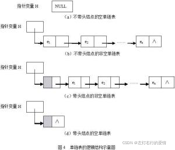

> 原文：[CSDN](https://blog.csdn.net/qq_45852626/article/details/122459760)（历史文章导入，当前状态为草稿）

本文的分享思路：  
1：为什么要链表？  
2：基本概念  
3：简单的运用  
4：学了单链表有什么用？  
5：总结

## 前言

为什么我要学链表呀，我在刚学习的时候一直不明白，明明已经有了数组，我感觉还挺方便的，为什么突然又学了一个链表，这种感觉就像很久很久之前我学了多态，结果后面又学了一个接口一样，让我摸不着头脑，不知道你有没有这样的感觉  


#### 为什么要链表

1：当我们**不确定数量的数据需要存储**时，用数组肯定是不行了，因为数组在使用前需要提前申请内存空间而且不能修改。  
2：删除和插入时需要移动大量的元素，大量消耗时间以及冗余度让人难以接受。  
3：数组这玩意它必需所有元素都得一致，这就很不灵活。  
那么问题来了，该如何解决呢？  
其实也好办，对数组进行加工封装不就完了，但是说起加工封装，也不仅仅是一句话就完事了，如何区分空闲格子和值为0的数据？每次添加是从头搜索空闲的格子吗？  
很麻烦，所以不妨用一个新的数据结构来解决，链表就是这种新的数据结构。

#### 基本概念

链表其实挺像一条锁链的，大概长这个样子  
里面一个个节点有内存可以用来存储数据，链表就是由若干个节点组成的，而节点是由数据区和指针区组成的，数据区可以来存储信息，指针区用来指向节点，从而构成链表，链表是链式存储的结构。

节点的结构：  
┌───┬───┐

│data │next │

└───┴───┘

其中DATA为自定义的数据类型，NEXT为指向下一个链表结点的指针，通过访问NEXT，可以引导我们去访问链表的下一个结点。  
单链表一览：  


###### 单链表的代码实现：

基本构造：

```
  public String data; //数据区
  public Node next;  //指针区

    public Node(String data){
        this.data=data;
    }

    public String toString(){
        return "data"+data;
    }


```

#### 简单运用

单链表的增删改查如下：  
a:遍历：只需要通过指针不断的移动节点就行

```
public Node traverseLink(Node temp) {

        while (temp.next != null) {
            temp = temp.next;
        }
        return temp;
    }


```

b:添加：只需要让指针指向新加入的节点就行  
代码：

```
public void addLink(Node node){
        Node temp = head;
        while(temp.next!=null){
            temp=temp.next;
        }
        temp.next=node;
    }


```

c:删除:设要删除的节点为node，只需让指向node的节点指向node后的节点即可，代码为temp.next(node前节点)=temp.next.next.

```
 public void deleteLink(int n){
        Node temp =head;
        for(int i=0;i<n;i++){
        if(temp.next==null){
            System.out.println("不存在该节点");
        }
        if(i==n-1){
            temp.next=temp.next.next;
        }
        temp=temp.next;
    }}


```

修改：找到要修改的节点，直接修改data区

```
 public void updateLink(Node node) {
        if (head.next == null) {
            System.out.println("链表为空~");
            return;
        }
        //找到需要修改的节点需要定义一个辅助变量
        Node temp = head.next;
        boolean flag = false;//表示是否找到节点
        while (true) {
            if (temp == null) {
                break;//已经遍历完链表
            }
            if (temp.data == "设定的条件，这里不特指") {
                //找到
                flag = true;
                break;
            }
            temp = temp.next;
        }
        //跳出了循环,根据flag判断是否找到要修改的节点
        if (flag) {
          temp.data= node.data;
        }else{
            System.out.println("没有找到~");
        }
    }


```

#### 学了单链表有什么用？

老实说，学了单链表没什么用，学了双链表也没什么用，再往后，学了二叉树其实也没什么用，如果只是学会了用法，而不学习思想，其实属于丢西瓜捡芝麻。  
如果我和其他博客一样，只是分析链表和数组的好处和坏处，完蛋，我发表这篇文章就算划水了，网上这样文章太多了，我在网上看到一种思想，具体是什么我不太记得了，但对我影响很深，我总结融合了一下，链表这玩意有没有一种可能，它是一种设计思路呢？  
首先你观察一下这个不到两寸长的玩意儿：  
┌───┬───┐

│data │next │

└───┴───┘，说白了，就一个数据域和一个指针域，猛一看真联想不到后面能改成二叉树什么的地狱模式。  
由单链表可以变化到双链表，仅仅只需要加一个前指的pre指针；或者你可以把next指针换成left/right指针改成二叉树。其实你看，链表改一改指针区，马上就变化起来了，不同的变化实用不同的数据结构，再去分析分析里面的时间和空间复杂度，可以优雅的解决不同问题。  
我觉得学了链表，最重要的是你有没有举一反三，像张三丰教张无忌学习让他全忘了一样，看过一遍都忘掉，为什么？因为学东西要学本质，对于像我这样的学生而言，学本质可能有点不切实际，但是有这样的一样想法总归是好的，将来能灵活自如的管理数据并清楚的给出时空复杂度，以最高效率完成数据的管理。

#### 总结

本文只是分享特别简单的单链表用法，后面复杂的用法包括
面试题 
我会慢慢更上，先把地基铺一下。  
我总有一种感觉，学了链表，才算入了数据结构的门，对于链表我一直有种莫名的情怀。
