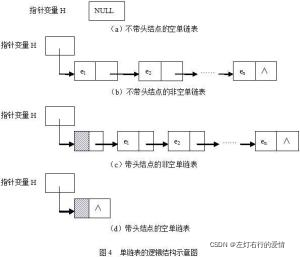
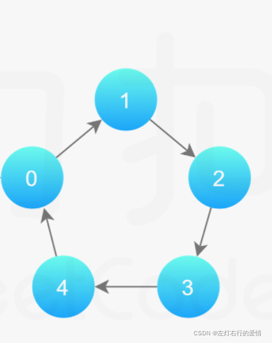
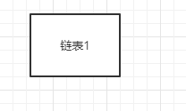
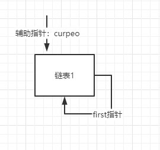
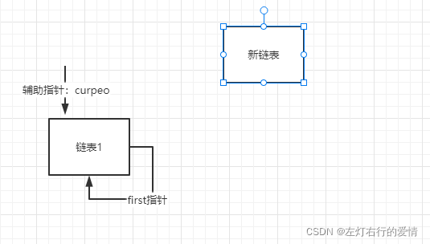
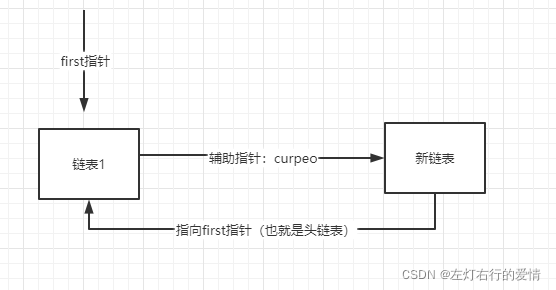
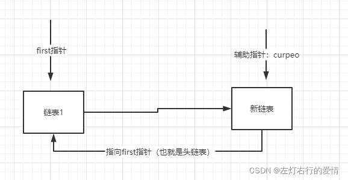
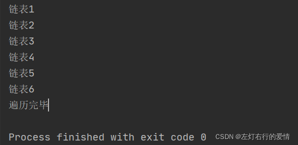
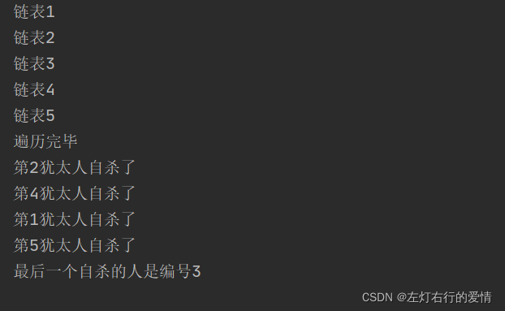

> 原文：[CSDN](https://blog.csdn.net/qq_45852626/article/details/122474868)（历史文章导入，当前状态为草稿）

本文思路：  
1：什么是环状链表，应用在哪里？  
2：如何构造环状链表  
3：双指针解决环状链表问题  
4：总结

注意，本篇只说单链表组成的环状链表

#### 什么是环状链表

首先可以先回顾一下什么是单链表，我们比葫芦画瓢去学习环状链表。  
单链表大概长这样：  
  
很容易看出来大概是以头节点领着的一条线，首尾没有串起来。  
那么环状链表就是把首尾串起来而已，大概长这样：  
  
环状链表和单链表的区别，就是他们的连接结构而已，其实双向链表也是可以组成环状链表的，以后我们在细说，饭我们一口一口吃。

#### 如何构造环状链表

构建规则：  
1：首节点和末节点被连接在一起  
2：节点为单链表的节点  
3：双指针，一个辅助指针helper，一个first指向指针。  
4：先创建第一个节点，让first指向该节点，形成环形  
5：后面每增加一个节点，就加入到该环形里。

先解释一下简单出现的情况：  
1：添加链表  
首先展示一个初始情况：  
  
这个时候我们设置指针，将它自己首尾相连，同时增加一个辅助指针，它用于后面添加指针时，first指向最新的，而此时辅助指针留在之前最后的节点，可以连接新的节点。  
  
现在假设增加一个链表：  
a:初始情况  
  
b:随后指针开始指向构建：  
1：（过程开始)first指针一直指向头链表，方便新链表指向first指针  
2：辅助指针首先将指向的本链表连接新链表（过程q），随后移动到新链表中（过程w)  
走到过程q时:  
  
走到过程w时:  
  
链表结构代码如下：

```
public class people {
    private int id;
    private String name;
    private people next;

    public people(int id, String name) {
        this.id = id;
        this.name = name;
    }

    public int getId() {
        return id;
    }

    public void setId(int id) {
        this.id = id;
    }

    public String getName() {
        return name;
    }

    public void setName(String name) {
        this.name = name;
    }

    public people getNext() {
        return next;
    }

    public void setNext(people next) {
        this.next = next;
    }
}


```

构建环状链表代码：

```
public class CircleSingleLInkedList {
    public static void main(String[] args) {
        CircleSingleLInkedList list =new CircleSingleLInkedList();
        list.addpeople(6);
        list.showPeo();
    }
 private people first =new people(-1,"-1");//这里赋值什么编号无所谓，后面会重新赋值正确的值
    //添加链表
    public void addpeople(int peos){
        if(peos<1){
            System.out.println("peos的值不规范");
            return;
        }
        people curpeo =null;//辅助指针，帮助构建环状链表
        for(int i=1;i<= peos;i++){
            people peo = new people(i,"w"+i);
            if(i==1){   //第一个链表要特殊处理，先构成环！
                first=peo;
                first.setNext(first);//构成环状
                curpeo=first;//让辅助指针指向第一个人
            }else {
                curpeo.setNext(peo);//之前最后一个节点连接新的节点
                peo.setNext(first);//新的节点连接第一个节点，重新构成环
                curpeo=peo;//最后辅助指针指向最后一个节点
            }
        }
    }
    //遍历环形链表
    public void showPeo(){
        if(first==null){
            System.out.println("没有任何数据");
            return;
        }
        //遍历节点时，first指针不动，使用辅助节点完成
        people peo= first;
        while (true){
            System.out.println("链表"+peo.getId());
            if(peo.getNext()==first){
                System.out.println("遍历完毕");
                break;
            }
            peo=peo.getNext();//辅助指针后移
        }
    }
}


```

结果：  


#### 双指针解决环状链表问题

经典案例，约瑟夫问题。  
约瑟夫问题：  
在罗马人占领乔塔帕特后，39 个犹太人与Josephus及他的朋友躲到一个洞中，39个犹太人决定宁愿死也不要被敌人抓到，于是决定了一个自杀方式，41个人排成一个圆圈，由第1个人开始报数，每报数到第3人该人就必须自杀，然后再由下一个重新报数，直到所有人都自杀身亡为止。  
用环状链表来解决或者数组也行，这里介绍环状链表的双指针解决法，个人感觉比快慢指针简单一些。  
过程如果上面看明白的话，这里应该就明白了，所以直接给出代码，有哪个地方不明白的可以看看上文，应该都提到过。  
代码如下：

```
public class CircleSingleLInkedList {


    public static void main(String[] args) {
        CircleSingleLInkedList list =new CircleSingleLInkedList();
        list.addpeople(5);
        list.showPeo();
        list.killpeo(1,2,5);
    }
    private people first =new people(-1,"-1");//这里赋值什么编号无所谓，后面会重新赋值正确的值
    //添加链表
    public void addpeople(int peos){
        if(peos<1){
            System.out.println("peos的值不规范");
            return;
        }
        people curpeo =null;//辅助指针，帮助构建环状链表
        for(int i=1;i<= peos;i++){
            people peo = new people(i,"w"+i);
            if(i==1){
                first=peo;
                first.setNext(first);//构成环状
                curpeo=first;//让辅助指针指向第一个人
            }else {
                curpeo.setNext(peo);//之前最后一个节点连接新的节点
                peo.setNext(first);//新的节点连接第一个节点，重新构成环
                curpeo=peo;//最后辅助指针指向最后一个节点
            }
        }
    }

    //遍历环形链表
    public void showPeo(){
        if(first==null){
            System.out.println("没有任何数据");
            return;
        }

        //遍历节点时，first指针不动，使用辅助节点完成
        people peo= first;
        while (true){
            System.out.println("链表"+peo.getId());
            if(peo.getNext()==first){
                System.out.println("遍历完毕");
                break;
            }
            peo=peo.getNext();//辅助指针后移
        }
    }
    //startId:表示从第几个人开始数;countNum:表示数几次;nums:表示最初有多少人
    public void killpeo(int startId,int countNum,int nums){
        if(first==null||startId<1||startId>nums){
            System.out.println("你敢戏弄我们，先鲨了你");
            return;
        }
        //辅助指针，帮助犹太人自杀
        people helper =first;
        while(true){
            if(helper.getNext()==first){  //指向最后一个犹太人
              break;
            }
            helper=helper.getNext();
        }
        for(int k=0;k<startId-1;k++){//先让first和helper指针移动k-1次，此时first指针刚好指向编号为startId的这个人，而辅助指针在它前面一位
            first=first.getNext();
            helper=helper.getNext();
        }
        //开始报数时，让first和helper指针同时移动n-1次，然后自杀
        while (true){
            if(helper==first){//圈中只剩一个人
                break;
            }
            for(int l=0;l<countNum-1;l++){
                first=first.getNext();
                helper=helper.getNext();
            }
            System.out.println("第"+first.getId()+"犹太人自杀了");
            //将自杀的人移出圈
            first=first.getNext();
            helper.setNext(first);
        }
        System.out.println("最后一个自杀的人是编号"+first.getId());
    }

}


```

结果：  


#### 总结

环形链表要明白中间的过程和指针的变换，我感觉收获挺大的，双指针的思考方法在很多地方都有应用，学习意义很好，学习的时候注意一下指针的指向问题。
