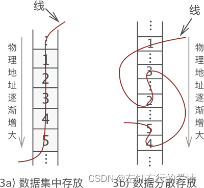
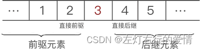
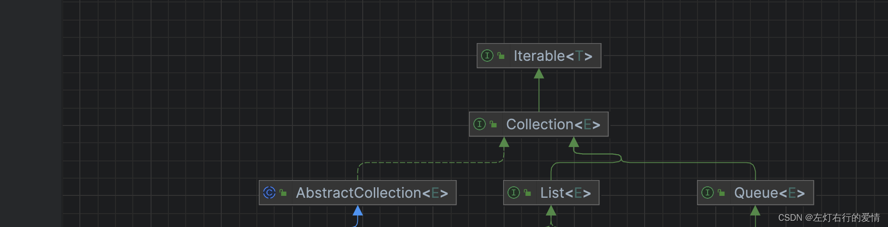
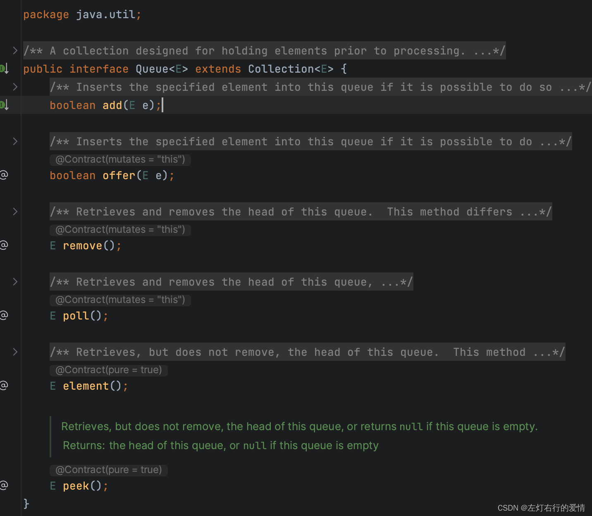
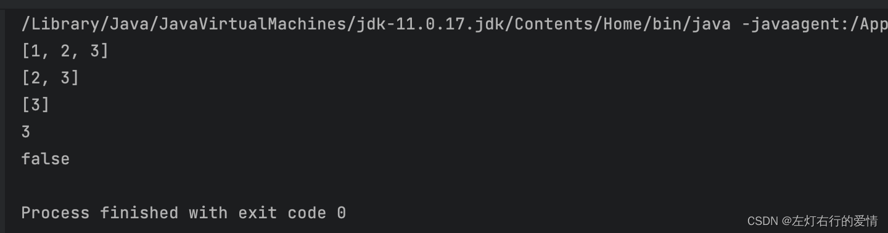

> 原文：[CSDN](https://blog.csdn.net/qq_45852626/article/details/129220415)（历史文章导入，当前状态为草稿）

#### 一文帮你看懂队列
### 什么是线性表

#### 为什么要学习线性表，它有什么用处和好处？

线性表是一种基本的数据结构，它具有以下优点：

* 线性表操作简单，易于实现，并且可以在O(1)的时间内访问某个元素。
* 线性表支持动态扩容，可以根据需要动态地增加或减少元素。
* 线性表可以方便地进行遍历和排序等操作。
* 线性表是其他高级数据结构的基础，如栈和队列等，因此学习线性表是学习其他数据结构的必要前提。  
   所以我们本篇从线性表为开端，不断去探索更高级的应用。希望我的总结可以帮助到你。

#### 基本概念

线性表是最基本、最简单、也是最常用的一种数据结构。线性表（linear list）是数据结构的一种，一个线性表是n个具有相同特性的数据元素的有限序列（数据元素是一个抽象的符号，其具体含义在不同的情况下一般不同）。  
 在稍复杂的线性表中，一个数据元素可由多个数据项（item）组成，此种情况下常把数据元素称为记录（record），含有大量记录的线性表又称文件（file）。

#### 分类

* 我们说“线性”和“非线性”，只在逻辑层次上讨论，而不考虑存储层次，所以双向链表和循环链表依旧是线性表。
* 数据结构逻辑层次上细分，线性表可分为**一般线性表和受限线性表**。  
   一般线性表也就是我们通常所说的“线性表”，可以自由的删除或添加结点。  
   受限线性表主要包括栈和队列，受限表示对结点的操作受限制。

#### 存储结构

线性表主要由顺序表示或链式表示。

* 顺序：表示指的是用**一组地址连续的存储单元**依次存储线性表的数据元素，称为线性表的顺序存储结构或顺序映像（sequential mapping）。它以“**物理位置相邻**”来表示线性表中数据元素间的逻辑关系，可随机存取表中任一元素。
* 链式：是用一组**任意的存储单元存储**线性表中的数据元素，称为线性表的链式存储结构。  
   它的存储单元可以是连续的，也可以是不连续的。  
   在表示数据元素之间的逻辑关系时，除了存储其本身的信息之外，**还需存储一个指示其直接后继的信息（即直接后继的存储位置）**，这两部分信息组成数据元素的存储映像，称为结点（node）。  
   node里面存在两个域；**存储数据元素信息的域称为数据域**；存储直接后继存储位置的域称为指针域。指针域中存储的信息称为指针或链  
     
   

#### 结构特点

* 均匀性：虽然不同数据表的数据元素可以是各种各样的，但对于同一线性表的各数据元素**必定具有相同的数据类型和长度**。
* 有序性：各数据元素在线性表中的位置只取决于它们的序号，数据元素之前的**相对位置是**线性的。  
   即存在唯一的“第一个“和“最后一个”的数据元素，除了第一个和最后一个外，其它元素前面均只有一个数据元素(直接前驱)和后面均只有一个数据元素（直接后继）。  
   

### 队列

#### 为什么要学习队列？

队列是一种常见的数据结构，它具有先进先出（FIFO）的特点，也就是说，先加入队列的元素最先被取出。学习队列数据结构可以帮助我们解决很多实际问题，例如：

**广度优先搜索**：队列常常用于广度优先搜索算法中，这种算法可以用来解决图论、树论等各种问题。  
 举个例子来说：假设我们要在一个图中查找两个节点之间的最短路径，广度优先搜索算法可以用队列来实现，首先将起点加入队列，然后不断从队列中取出元素进行扩展，直到找到目标节点为止。

**资源分配**：队列可以用来对资源进行排队，确保资源被公平地分配，不会出现某些任务一直占用资源的情况。  
 举个例子来说：假设一个银行有多个窗口，每个窗口都可以为客户办理业务，为了保证公平性，可以使用队列对客户进行排队，每当一个窗口空闲下来，就从队列中取出一个客户为其服务。

**线程池**：在并发编程中，队列可以用来实现线程池，让任务按照顺序执行。  
 举个例子来说：在一个 Web 服务器中，当有大量请求到来时，可以使用线程池来处理这些请求，将请求加入队列中，然后由线程池中的线程来处理队列中的任务。

**缓存**：队列可以用来实现缓存，将数据暂存到队列中，再从队列中取出，这样可以降低系统负载，提高响应速度。  
 举个例子来说：假设我们要从数据库中读取数据，并且这些数据是经常访问的，为了减少数据库的访问压力，可以将数据缓存到队列中，当需要访问数据时，先从队列中查找，如果队列中没有数据，则再从数据库中读取数据。

**消息传递**：队列可以用来实现消息传递，将消息加入队列中，等待被处理，这种机制被广泛用于分布式系统和消息队列中。  
 举个例子来说：在分布式系统中，不同的节点之间需要进行通信，可以使用消息队列来实现，例如一个节点需要向另一个节点发送消息，就可以将消息加入消息队列中，然后由另一个节点来处理队列中的消息。这种机制可以保证消息的可靠传递，避免消息丢失和重复传递等问题。

#### 基本概念

##### 数据结构

队列是一种操作受限制的线性表，它是一种先进先出（FIFO）的数据结构。通常使用数组或链表来存储数据。队列有两个指针，一个指向队列的头部，另一个指向队列的尾部，用于插入和删除元素。

队列的继承关系：  
 

##### 基本操作

* offer / add： 入队操作，添加元素
* poll / remove：出队操作，返回队列首元素并删除
* peek / element：出队操作，获取队列首元素不删除
* isEmpty()：判断队列是否为空  
   我们可以看到，源码部分中，Queue是一个接口抽象的类，那么它的实现类都有什么呢？  
   我们最常见的是LinkedList。所以我们用LinkedList做一个测试。

```
  Queue<Integer> queue =new LinkedList<>();
        queue.add(1);
        queue.offer(2);
        queue.offer(3);
        System.out.println(queue);  //添加3个数据后的状态
        queue.poll();
        System.out.println(queue); //出队一次后的状态
        queue.remove();
        System.out.println(queue);   //又出队一次的状态
        System.out.println(queue.peek()); //打印 输出首元素（但不删除）
        System.out.println(queue.isEmpty()); //判断是否为空


```

结果：  
 

### 待填坑
