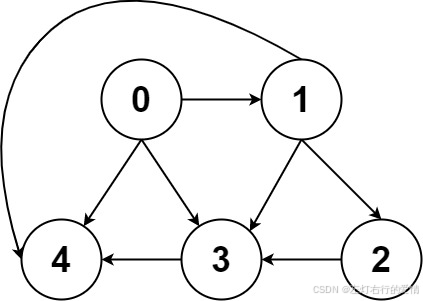
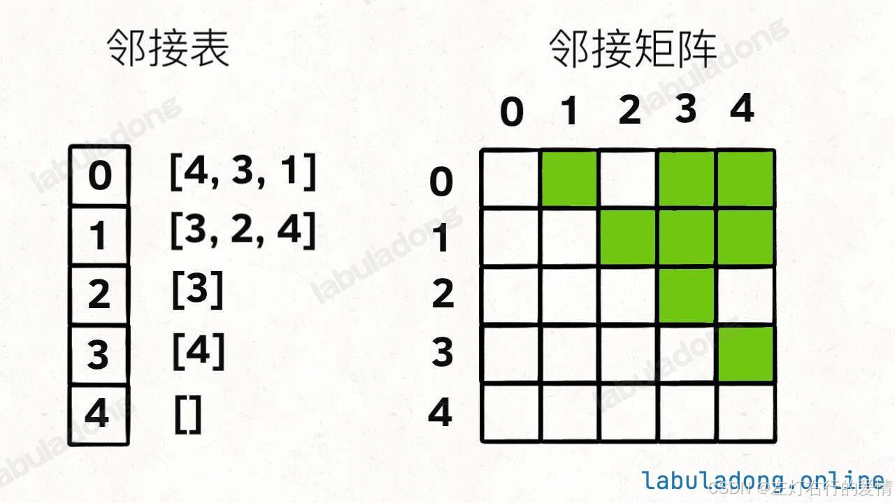

> 原文：[CSDN](https://blog.csdn.net/qq_45852626/article/details/145480935)（历史文章导入，当前状态为草稿）

#### 图
### 前言

图的力扣什么的也刷了也不少了,但是刷的时候吧老是觉得想法比较杂乱,不成章法,对此我痛定思痛,觉得是时候花时间来系统的捋一捋关于图的一些内容,文章估计比较长,如果你是初学的朋友估计会有点吃力,不过加油肯定能学会的.

### 图论数据结构

对于图的逻辑结构是很简单的,如下  
   
 可以看到是由节点(Vertex)+边(Edge)构成.  
 它的代码实现也很简单,你可以参考着多叉树来看:

```
// 图节点的逻辑结构
class Vertex {
    int id;
    Vertex[] neighbors;
}

// 基本的 N 叉树节点
class TreeNode {
    int val;
    TreeNode[] children;
}


```

树的DFS/BFS遍历都适用于图.  
 但是图比树多了一个概念-- 度(degree).  
 度是每个节点相连边的条数.  
 每个节点的度被细分为入度(indegree)与出度(outdegree).  
 上图的节点 3 的入度为 3（有三条边指向它），出度为 1（它有 1 条边指向别的节点）。

上面图结构是逻辑上这样实现,但是我们很少会用Vertex类,而是用邻接表和邻接矩阵来实现图结构.

#### 邻接表与临接矩阵

  
   
 上面的图很直观的表示出来了它们的区别.  
 我先给出它们的实现

```
// 邻接表
// graph[x] 存储 x 的所有邻居节点
List<Integer>[] graph;


// 邻接矩阵
// matrix[x][y] 记录 x 是否有一条指向 y 的边
boolean[][] matrix;


```

##### 邻接表

在学习邻接表时，我们会看到 List[] 这样的数据结构，刚开始可能会觉得很奇怪，不明白为什么要这样写。尤其是看到邻接表的示意图时，可能会误以为“链表相连，链表里面是数组”，但实际上并不是这样。  
 如果我们仔细分析 List[]，可以拆解成两个部分：

* 它首先是一个数组（[] 说明是数组）。
* 数组的每个元素都是 List（说明数组存的是列表）。

**为什么 List[] 适合表示图的邻接表？**

我们先问自己一个问题：在一个图里，哪些数据是固定的？哪些是不固定的？

* 节点的个数是固定的（假设图有 N 个节点，它的编号通常是 0 ~ N-1）。
* 每个节点的邻接边数是不确定的（比如某个点的出度可能是 2，也可能是 5）。

那么，我们就需要一个既能存固定数量的节点，又能灵活存储每个节点的邻接点的数据结构：

1. 数组适合存固定数量的节点  
    既然节点数是固定的，我们就可以用数组来存储所有节点。  
    例如 List[] graph = new ArrayList[N];，表示有 N 个节点，每个节点都有一个 List 来存邻接点。
2. 列表（List）适合存每个节点的不定邻居  
    由于每个节点的邻接点数量不同，我们不能用固定大小的数组存储邻接点，而链表（List）的动态特性完美地解决了这个问题。

```
//举个例子:
graph[0] = new ArrayList<>(Arrays.asList(1, 2)); // 0 号节点连向 1 和 2
graph[1] = new ArrayList<>(Collections.singletonList(3)); // 1 号节点连向 3


```

List[] 既有数组的优势，又有链表的灵活性，非常适合表示图的邻接表.

##### 邻接矩阵

我们可以看到是二维数据存储图,这种给人的感觉是力大砖飞,存储空间巨大,查询O(1),而且有向,无向图,有权,无权图都可以表示.  
 且二维数据也比较容易上手,一般学到图的也都有些了解,比较亲民的类型.  
 它的特点:

###### 邻接矩阵的特点

| **特点** | **分析** |
| --- | --- |
| **存储空间** | `O(N^2)`，如果 `N` 很大且边较少，会浪费大量内存 |
| **查询边** | `O(1)`，直接访问 `graph[i][j]` |
| **添加边** | `O(1)`，只需 `graph[i][j] = 1 / weight` |
| **删除边** | `O(1)`，只需 `graph[i][j] = 0 / INF` |
| **遍历邻接点** | `O(N)`，需要扫描整行 `graph[i][*]` |
| **适用于** | **稠密图**（边的数量接近 `N^2`） |

---

###### 适用算法总结

| **算法** | **邻接矩阵是否适合？** | **理由** |
| --- | --- | --- |
| **BFS / DFS** | ❌ **不适合** | 遍历邻接点太慢 `O(N)` |
| **Dijkstra（最短路径）** | ✅ **适合** | `O(N^2)` 适用于 **小规模** 图 |
| **Floyd-Warshall（全源最短路）** | ✅ **适合** | `O(N^3)` 适用于 **稠密图** |
| **Kruskal（最小生成树）** | ❌ **不适合** | 需要转换成边列表 |
| **Prim（最小生成树）** | ✅ **适合** | `O(N^2)` 适用于 **小规模** 图 |
| **拓扑排序** | ❌ **不适合** | 需要遍历所有出边 |

---

###### 什么时候用邻接矩阵？

* ✅ **当 `M ≈ N^2`（稠密图）时，存储邻接矩阵更合适。**
* ✅ **当查询两点是否相连的次数特别多时，邻接矩阵更高效 `O(1)`。**
* ✅ **当使用 Floyd-Warshall、Prim（O(N^2)）等基于矩阵运算的算法时，邻接矩阵更合适。**

###### 什么时候不用邻接矩阵？

* ❌ **当 `M ≪ N^2`（稀疏图）时，邻接矩阵浪费空间。**
* ❌ **当需要频繁遍历某个点的邻接点时，邻接表更高效。**
* ❌ **当使用 BFS / DFS / Dijkstra / Kruskal 等以遍历为主的算法时，邻接表更合适。**

---

##### 临接表

###### 邻接表的特点

| **特点** | **分析** |
| --- | --- |
| **存储空间** | `O(N + M)`，只存储实际存在的边，适合 **稀疏图** |
| **查询边** | `O(deg(i))`，需遍历 `List[i]` 查找 |
| **添加边** | `O(1)`，直接 `list[i].add(j)` |
| **删除边** | `O(deg(i))`，需遍历 `List[i]` 删除 |
| **遍历邻接点** | `O(deg(i))`，比邻接矩阵快 |
| **适用于** | **稀疏图**（边的数量远小于 `N^2`） |

---

###### 适用算法总结

| **算法** | **邻接表是否适合？** | **理由** |
| --- | --- | --- |
| **BFS / DFS** | ✅ **适合** | 访问邻接点更快 `O(deg(i))` |
| **Dijkstra（最短路径）** | ✅ **适合** | 使用 **优先队列 + 邻接表** 实现 `O(M logN)` |
| **Floyd-Warshall（全源最短路）** | ❌ **不适合** | 需要 `O(N^2)` 矩阵操作 |
| **Kruskal（最小生成树）** | ✅ **适合** | 本质是边列表，可直接排序 |
| **Prim（最小生成树）** | ✅ **适合** | 使用 **优先队列 + 邻接表** 实现 `O(M logN)` |
| **拓扑排序** | ✅ **适合** | **存出度更方便**，遍历所有出边 `O(M)` |

---

###### 什么时候用邻接表？

* ✅ **当 `M ≪ N^2`（稀疏图）时，邻接表更节省空间。**
* ✅ **当频繁遍历某个点的邻接点时，邻接表更高效。**
* ✅ **当使用 BFS / DFS / Dijkstra（堆优化）等遍历为主的算法时，邻接表更合适。**

###### 什么时候不用邻接表？

* ❌ **当 `M ≈ N^2`（稠密图）时，邻接表存储边的指针会浪费额外空间。**
* ❌ **当查询两点是否相连的次数特别多时，邻接表查找 `O(deg(i))` 比邻接矩阵 `O(1)` 慢。**
* ❌ **当使用 Floyd-Warshall 这种基于矩阵运算的算法时，邻接表不适合。**

---

##### 临接表VS临接矩阵

那我们该如何选择用哪种数据结构去解决问题呢?

###### 取决于边的数量（稀疏 vs. 稠密）

| 条件 | 适合的数据结构 | 原因 |
| --- | --- | --- |
| **边数接近 `N^2`（稠密图）** | **邻接矩阵** | 直接用二维数组存储，访问 `O(1)`，遍历 `O(N)` 也可接受 |
| **边数远小于 `N^2`（稀疏图）** | **邻接表** | 只存有效边，节省空间，遍历 `O(deg(i))` 更高效 |

---

###### 取决于执行的操作类型

| **操作** | **适用的数据结构** | **原因** |
| --- | --- | --- |
| **快速查询两点是否相连** | ✅ **邻接矩阵** | `O(1)` 直接查 `graph[i][j]` |
| **遍历所有邻接点** | ✅ **邻接表** | `O(deg(i))`，比邻接矩阵 `O(N)` 快 |
| **快速添加 / 删除边** | ✅ **邻接表** | `O(1)` 添加，`O(deg(i))` 删除（邻接矩阵删除 `O(1)` 但空间大） |
| **Dijkstra（最短路径）** | ✅ **邻接表** | **堆优化 Dijkstra** `O(M logN)` 适合 **稀疏图** |
| **Floyd-Warshall（全源最短路）** | ✅ **邻接矩阵** | `O(N^3)`，使用矩阵更高效 |
| **Kruskal（最小生成树）** | ✅ **邻接表** | Kruskal 本质是 **边列表**，邻接表方便转换 |
| **Prim（最小生成树）** | ✅ **邻接表（堆优化） or 邻接矩阵** | 邻接表 + 堆 `O(M logN)`，邻接矩阵 `O(N^2)` |
| **BFS / DFS（遍历）** | ✅ **邻接表** | `O(M)` 遍历比邻接矩阵 `O(N^2)` 快 |
| **拓扑排序** | ✅ **邻接表** | 存出度方便，遍历 `O(M)` |

---

###### 选择策略总结

###### ✅ 优先选邻接矩阵的情况

* **图是稠密图**（`M ≈ N^2`）。
* **需要快速查询两点是否相连**，时间复杂度 `O(1)`。
* **Floyd-Warshall**（`O(N^3)`）需要矩阵运算。
* **小规模问题（N < 1000）**，邻接矩阵 `O(N^2)` 可以接受。

###### ✅ 优先选邻接表的情况

* **图是稀疏图**（`M ≪ N^2`）。
* **主要操作是遍历邻接点**（BFS / DFS / Dijkstra / Prim / Kruskal）。
* **Dijkstra（堆优化）或 Prim（堆优化）**，邻接表 `O(M logN)` 效率更高。
* **适用于大规模图**（`N` 很大，`M` 远小于 `N^2`）。

---

### 图结构的通用代码实现

我们可以抽象出一个 Graph 接口，来实现图的基本增删查改：

```
interface Graph {
    // 添加一条边（带权重）
    void addEdge(int from, int to, int weight);

    // 删除一条边
    void removeEdge(int from, int to);

    // 判断两个节点是否相邻
    boolean hasEdge(int from, int to);

    // 返回一条边的权重
    int weight(int from, int to);

    // 返回某个节点的所有邻居节点和对应权重
    List<Edge> neighbors(int v);

    // 返回节点总数
    int size();
}


```

#### 有向加全图

##### 邻接表实现

```
// 加权有向图的通用实现（邻接表）
class WeightedDigraph {
    // 存储相邻节点及边的权重
    public static class Edge {
        int to;
        int weight;

        public Edge(int to, int weight) {
            this.to = to;
            this.weight = weight;
        }
    }

    // 邻接表，graph[v] 存储节点 v 的所有邻居节点及对应权重
    private List<Edge>[] graph;

    public WeightedDigraph(int n) {
        // 我们这里简单起见，建图时要传入节点总数，这其实可以优化
        // 比如把 graph 设置为 Map<Integer, List<Edge>>，就可以动态添加新节点了
        graph = new List[n];
        for (int i = 0; i < n; i++) {
            graph[i] = new ArrayList<>();
        }
    }

    // 增，添加一条带权重的有向边，复杂度 O(1)
    public void addEdge(int from, int to, int weight) {
        graph[from].add(new Edge(to, weight));
    }

    // 删，删除一条有向边，复杂度 O(V)
    public void removeEdge(int from, int to) {
        for (int i = 0; i < graph[from].size(); i++) {
            if (graph[from].get(i).to == to) {
                graph[from].remove(i);
                break;
            }
        }
    }

    // 查，判断两个节点是否相邻，复杂度 O(V)
    public boolean hasEdge(int from, int to) {
        for (Edge e : graph[from]) {
            if (e.to == to) {
                return true;
            }
        }
        return false;
    }

    // 查，返回一条边的权重，复杂度 O(V)
    public int weight(int from, int to) {
        for (Edge e : graph[from]) {
            if (e.to == to) {
                return e.weight;
            }
        }
        throw new IllegalArgumentException("No such edge");
    }

    // 上面的 hasEdge、removeEdge、weight 方法遍历 List 的行为是可以优化的
    // 比如用 Map<Integer, Map<Integer, Integer>> 存储邻接表
    // 这样就可以避免遍历 List，复杂度就能降到 O(1)

    // 查，返回某个节点的所有邻居节点，复杂度 O(1)
    public List<Edge> neighbors(int v) {
        return graph[v];
    }

    public static void main(String[] args) {
        WeightedDigraph graph = new WeightedDigraph(3);
        graph.addEdge(0, 1, 1);
        graph.addEdge(1, 2, 2);
        graph.addEdge(2, 0, 3);
        graph.addEdge(2, 1, 4);

        System.out.println(graph.hasEdge(0, 1)); // true
        System.out.println(graph.hasEdge(1, 0)); // false

        graph.neighbors(2).forEach(edge -> {
            System.out.println(2 + " -> " + edge.to + ", wight: " + edge.weight);
        });
        // 2 -> 0, wight: 3
        // 2 -> 1, wight: 4

        graph.removeEdge(0, 1);
        System.out.println(graph.hasEdge(0, 1)); // false
    }
}


```

##### 临接矩阵

```
import java.util.ArrayList;
import java.util.List;

// 加权有向图的通用实现（邻接矩阵）
public class WeightedDigraph {
    // 存储相邻节点及边的权重
    public static class Edge {
        int to;
        int weight;

        public Edge(int to, int weight) {
            this.to = to;
            this.weight = weight;
        }
    }


    // 邻接矩阵，matrix[from][to] 存储从节点 from 到节点 to 的边的权重
    // 0 表示没有连接
    private int[][] matrix;

    public WeightedDigraph(int n) {
        matrix = new int[n][n];
    }

    // 增，添加一条带权重的有向边，复杂度 O(1)
    public void addEdge(int from, int to, int weight) {
        matrix[from][to] = weight;
    }

    // 删，删除一条有向边，复杂度 O(1)
    public void removeEdge(int from, int to) {
        matrix[from][to] = 0;
    }

    // 查，判断两个节点是否相邻，复杂度 O(1)
    public boolean hasEdge(int from, int to) {
        return matrix[from][to] != 0;
    }

    // 查，返回一条边的权重，复杂度 O(1)
    public int weight(int from, int to) {
        return matrix[from][to];
    }

    // 查，返回某个节点的所有邻居节点，复杂度 O(V)
    public List<Edge> neighbors(int v) {
        List<Edge> res = new ArrayList<>();
        for (int i = 0; i < matrix[v].length; i++) {
            if (matrix[v][i] > 0) {
                res.add(new Edge(i, matrix[v][i]));
            }
        }
        return res;
    }

    public static void main(String[] args) {
        WeightedDigraph graph = new WeightedDigraph(3);
        graph.addEdge(0, 1, 1);
        graph.addEdge(1, 2, 2);
        graph.addEdge(2, 0, 3);
        graph.addEdge(2, 1, 4);

        System.out.println(graph.hasEdge(0, 1)); // true
        System.out.println(graph.hasEdge(1, 0)); // false

        graph.neighbors(2).forEach(edge -> {
            System.out.println(2 + " -> " + edge.to + ", wight: " + edge.weight);
        });
        // 2 -> 0, wight: 3
        // 2 -> 1, wight: 4

        graph.removeEdge(0, 1);
        System.out.println(graph.hasEdge(0, 1)); // false
    }
}


```

#### 有向无权图

把addEdge的权重参数默认为1即可

#### 无向加权图

无向加权图就等同于双向的有向加权图，所以直接复用上面用邻接表/领接矩阵实现的 WeightedDigraph 类就行了，只是在增加边的时候，要同时添加两条边：

```
// 无向加权图的通用实现
class WeightedUndigraph {
    private WeightedDigraph graph;

    public WeightedUndigraph(int n) {
        graph = new WeightedDigraph(n);
    }

    // 增，添加一条带权重的无向边
    public void addEdge(int from, int to, int weight) {
        graph.addEdge(from, to, weight);
        graph.addEdge(to, from, weight);
    }

    // 删，删除一条无向边
    public void removeEdge(int from, int to) {
        graph.removeEdge(from, to);
        graph.removeEdge(to, from);
    }

    // 查，判断两个节点是否相邻
    public boolean hasEdge(int from, int to) {
        return graph.hasEdge(from, to);
    }

    // 查，返回一条边的权重
    public int weight(int from, int to) {
        return graph.weight(from, to);
    }

    // 查，返回某个节点的所有邻居节点
    public List<WeightedDigraph.Edge> neighbors(int v) {
        return graph.neighbors(v);
    }

    public static void main(String[] args) {
        WeightedUndigraph graph = new WeightedUndigraph(3);
        graph.addEdge(0, 1, 1);
        graph.addEdge(1, 2, 2);
        graph.addEdge(2, 0, 3);
        graph.addEdge(2, 1, 4);

        System.out.println(graph.hasEdge(0, 1)); // true
        System.out.println(graph.hasEdge(1, 0)); // true

        graph.neighbors(2).forEach(edge -> {
            System.out.println(2 + " <-> " + edge.to + ", wight: " + edge.weight);
        });
        // 2 <-> 0, wight: 3
        // 2 <-> 1, wight: 4

        graph.removeEdge(0, 1);
        System.out.println(graph.hasEdge(0, 1)); // false
        System.out.println(graph.hasEdge(1, 0)); // false
    }
}


```

### 结论

🚀 **如果图很稀疏（M ≪ N²），或者要遍历（BFS/DFS/最短路），选** 🔹 **邻接表**  
 ⚡ **如果图很稠密（M ≈ N²），或者要频繁查询边权，选** 🔸 **邻接矩阵**  
 一定要能熟练写出构建图的模版,深刻理解数据结构!!!
