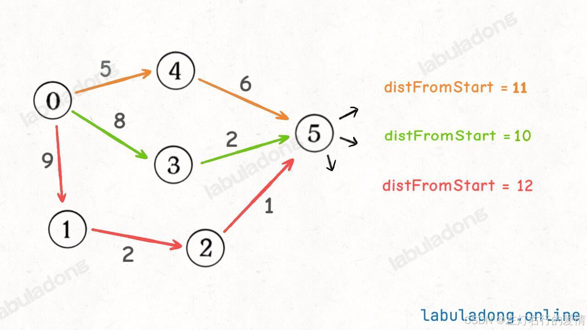
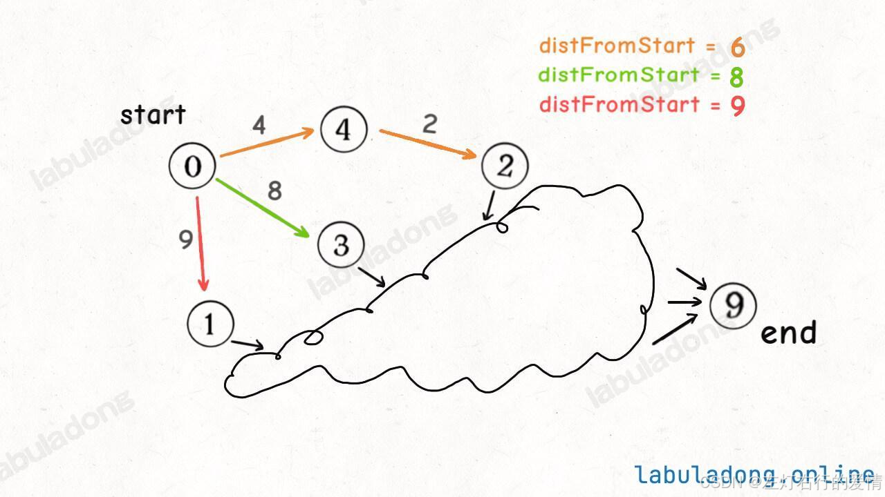

> 原文：[CSDN](https://blog.csdn.net/qq_45852626/article/details/145656720)（历史文章导入，当前状态为草稿）

### 前言

学习这个算法之间,必须要对BFS遍历比较熟悉,它的本质就是一个特殊改造过的BFS算法.

### 概念

Dijkstra算法是一种计算图中单源最短路径算法,本质上是一个经过特殊改造的BFS算法,改造点有两个:

* 使用优先队列,而不是普通队列进行BFS算法.
* 添加了一个备忘录,记录起点到每个可达节点的最短路径权重和.

### BFS基础模版

```
// 图结构的 BFS 遍历，从节点 s 开始进行 BFS，且记录路径的权重和
// 每个节点自行维护 State 类，记录从 s 走来的权重和
class State {
    // 当前节点 ID
    int node;
    // 从起点 s 到当前节点的权重和
    int weight;

    public State(int node, int weight) {
        this.node = node;
        this.weight = weight;
    }
}

void bfs(Graph graph, int s) {
    boolean[] visited = new boolean[graph.size()];
    Queue<State> q = new LinkedList<>();

    q.offer(new State(s, 0));
    visited[s] = true;

    while (!q.isEmpty()) {
        State state = q.poll();
        int cur = state.node;
        int weight = state.weight;
        System.out.println("visit " + cur + " with path weight " + weight);
        for (Edge e : graph.neighbors(cur)) {
            if (!visited[e.to]) {
                q.offer(new State(e.to, weight + e.weight));
                visited[e.to] = true;
            }
        }
    }
}


```

### Dijkstra

#### Dijkstra函数签名

输入是一幅图 graph 和一个起点 start，返回是一个记录最短路径权重的数组:

```
// 输入一幅图和一个起点 start，计算 start 到其他节点的最短距离
int[] dijkstra(int start, Graph graph);


```

#### State类

我们也需要一个 State 类来辅助 BFS 算法的运行，清晰起见，我们用 id 变量记录当前节点 ID，用 distFromStart 变量记录从起点到当前节点的距离。

```
class State {
    // 图节点的 id
    int id;
    // 从 start 节点到当前节点的距离
    int distFromStart;
    State(int id, int distFromStart) {
        this.id = id;
        this.distFromStart = distFromStart;
    }
}


```

#### distTo 记录最短路径

加权图中的 Dijkstra 算法和无权图中的普通 BFS 算法不同，在 Dijkstra 算法中，你第一次经过某个节点时的路径权重，不见得就是最小的，所以对于同一个节点，我们可能会经过多次，而且每次的 distFromStart 可能都不一样，比如下图：  
   
 当重复遍历到同一个节点时，我们可以比较一下当前的 distFromStart 和 distTo 中的值，如果当前的更小，就更新 distTo，反之，就不用再往后继续遍历了。

#### 伪代码模版

```
// 输入一幅图和一个起点 start，计算 start 到其他节点的最短距离
int[] dijkstra(int start, Graph graph) {
    // 图中节点的个数
    int V = graph.size();
    // 记录最短路径的权重，你可以理解为 dp table
    // 定义：distTo[i] 的值就是节点 start 到达节点 i 的最短路径权重
    int[] distTo = new int[V];
    // 求最小值，所以 dp table 初始化为正无穷
    Arrays.fill(distTo, Integer.MAX_VALUE);
    // base case，start 到 start 的最短距离就是 0
    distTo[start] = 0;

    // 优先级队列，distFromStart 较小的排在前面
    Queue<State> pq = new PriorityQueue<>((a, b) -> {
        return a.distFromStart - b.distFromStart;
    });

    // 从起点 start 开始进行 BFS
    pq.offer(new State(start, 0));

    while (!pq.isEmpty()) {
        State curState = pq.poll();
        int curNodeID = curState.id;
        int curDistFromStart = curState.distFromStart;

        if (curDistFromStart > distTo[curNodeID]) {
            // 已经有一条更短的路径到达 curNode 节点了
            continue;
        }
        // 将 curNode 的相邻节点装入队列
        for (int nextNodeID : graph.neighbors(curNodeID)) {
            // 看看从 curNode 达到 nextNode 的距离是否会更短
            int distToNextNode = distTo[curNodeID] + graph.weight(curNodeID, nextNodeID);
            if (distTo[nextNodeID] > distToNextNode) {
                // 更新 dp table
                distTo[nextNodeID] = distToNextNode;
                // 将这个节点以及距离放入队列
                pq.offer(new State(nextNodeID, distToNextNode));
            }
        }
    }
    return distTo;
}


```

对比普通的 BFS 算法，你可能会有以下疑问：

1、没有 visited 集合记录已访问的节点，所以一个节点会被访问多次，会被多次加入队列，那会不会导致队列永远不为空，造成死循环？

2、为什么用优先级队列 PriorityQueue 而不是 LinkedList 实现的普通队列？为什么要按照 distFromStart 的值来排序？

3、如果我只想计算起点 start 到某一个终点 end 的最短路径，是否可以修改算法，提升一些效率？

##### 第一个问题解答

循环结束的条件是队列为空，那么你就要注意看什么时候往队列里放元素（调用 offer 方法），再注意看什么时候从队列往外拿元素（调用 poll 方法）。

while 循环每执行一次，都会往外拿一个元素，但想往队列里放元素，可就有很多限制了，必须满足下面这个条件：

```
// 看看从 curNode 达到 nextNode 的距离是否会更短
if (distTo[nextNodeID] > distToNextNode) {
    // 更新 dp table
    distTo[nextNodeID] = distToNextNode;
    pq.offer(new State(nextNodeID, distToNextNode));
}


```

这也是为什么我说 distTo 数组可以理解成我们熟悉的 dp table，因为这个算法逻辑就是在不断的最小化 distTo 数组中的元素：  
 如果你能让到达 nextNodeID 的距离更短，那就更新 distTo[nextNodeID] 的值，让你入队，否则的话对不起，不让入队。  
 因为两个节点之间的最短距离（路径权重）肯定是一个确定的值，不可能无限减小下去，所以队列一定会空，队列空了之后，distTo 数组中记录的就是从 start 到其他节点的「最短距离」。

##### 第二个问题解答

如果你非要用普通队列，其实也没问题的，你可以直接把 PriorityQueue 改成 LinkedList，也能得到正确答案，但是效率会低很多。

Dijkstra 算法使用优先级队列，主要是为了效率上的优化，类似一种贪心算法的思路。

为什么说是一种贪心思路呢，比如说下面这种情况，你想计算从起点 start 到终点 end 的最短路径权重：  
   
 假设你当前只遍历了图中的这几个节点，那么你下一步准备遍历那个节点？这三条路径都可能成为最短路径的一部分，但你觉得哪条路径更有「潜力」成为最短路径中的一部分？

从目前的情况来看，显然橙色路径的可能性更大嘛，所以我们希望节点 2 排在队列靠前的位置，优先被拿出来向后遍历。

所以我们使用 PriorityQueue 作为队列，让 distFromStart 的值较小的节点排在前面，这就类似我们之前讲  
 贪心算法 说到的贪心思路，可以很大程度上优化算法的效率。

##### 第三个问题解答

肯定可以的，因为我们标准 Dijkstra 算法会算出 start 到所有其他节点的最短路径，你只想计算到 end 的最短路径，相当于减少计算量，当然可以提升效率。

需要在代码中做的修改也非常少，只要改改函数签名，再加个 if 判断就行了：

```
// 输入起点 start 和终点 end，计算起点到终点的最短距离
int dijkstra(int start, int end, List<Integer>[] graph) {

    // ...

    while (!pq.isEmpty()) {
        State curState = pq.poll();
        int curNodeID = curState.id;
        int curDistFromStart = curState.distFromStart;

        // 在这里加一个判断就行了，其他代码不用改
        if (curNodeID == end) {
            return curDistFromStart;
        }

        if (curDistFromStart > distTo[curNodeID]) {
            continue;
        }

        // ...
    }

    // 如果运行到这里，说明从 start 无法走到 end
    return Integer.MAX_VALUE;
}


```

因为优先级队列自动排序的性质，每次从队列里面拿出来的都是 distFromStart 值最小的，所以当你第一次从队列中拿出终点 end 时，此时的 distFromStart 对应的值就是从 start 到 end 的最短距离。  
 这个算法较之前的实现提前 return 了，所以效率有一定的提高。
