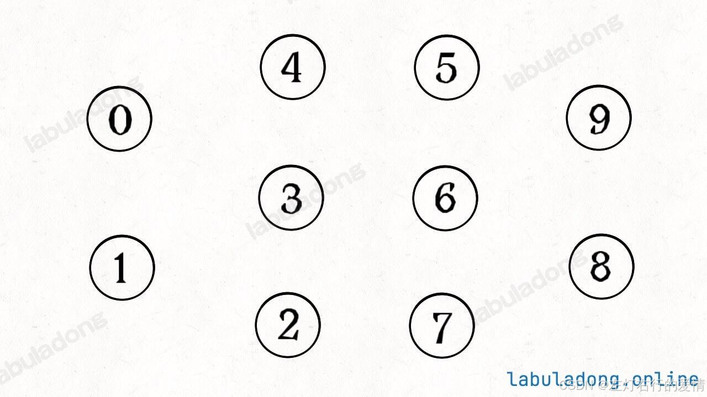
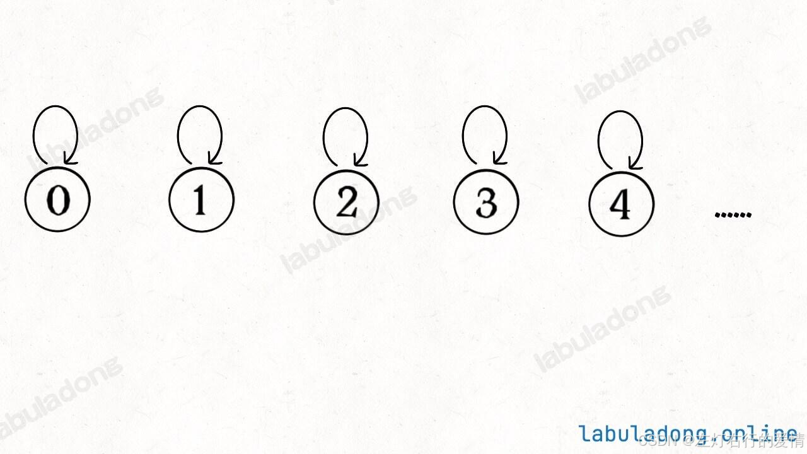
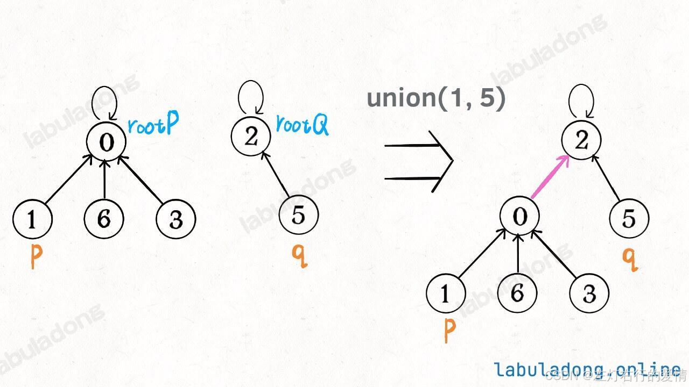
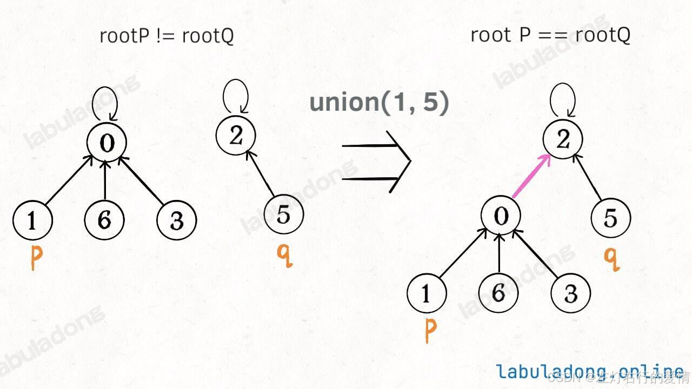
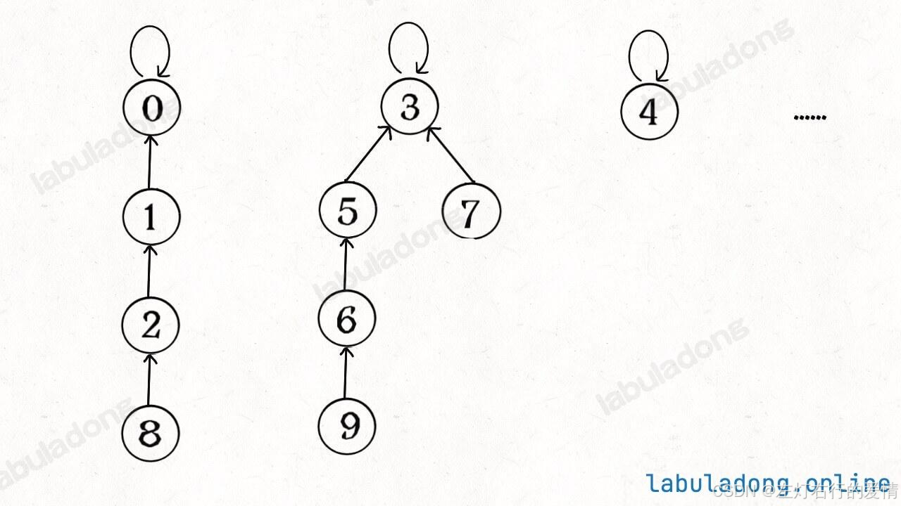
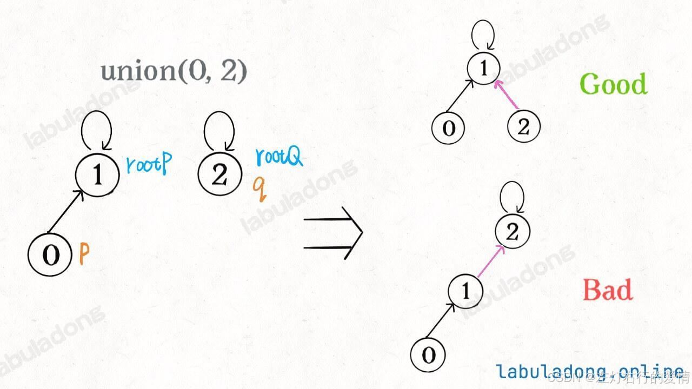
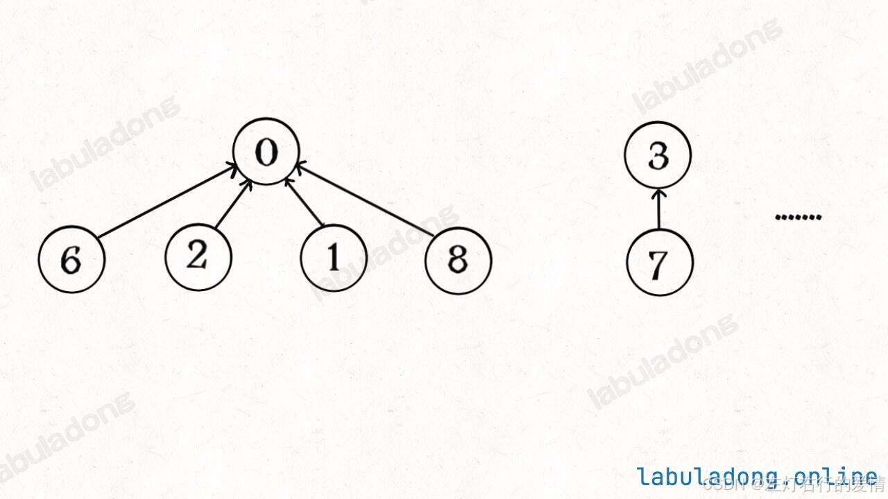
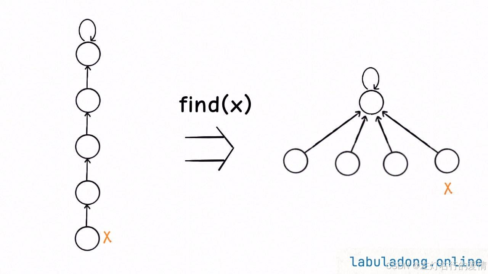

> 原文：[CSDN](https://blog.csdn.net/qq_45852626/article/details/145498578)（历史文章导入，当前状态为草稿）

## 前言

并查集（Union-Find）算法是一个专门针对「动态连通性」的算法，我之前写过两次，因为这个算法的考察频率高，而且它也是最小生成树算法的前置知识.

## 动态连通性

**动态连通性其实可以抽象成给一幅图连线。**  
 下面这幅图，总共有 10 个节点，他们互不相连，分别用 0~9 标记：  
   
 「连通」是一种等价关系，也就是说具有如下三个性质：  
 1、自反性：节点 p 和 p 是连通的。

2、对称性：如果节点 p 和 q 连通，那么 q 和 p 也连通。

3、传递性：如果节点 p 和 q 连通，q 和 r 连通，那么 p 和 r 也连通。  
 判断这种「等价关系」非常实用，比如说编译器判断同一个变量的不同引用，比如社交网络中的朋友圈计算等等。

并查集主要需要实现的API是下面这些:

```
class UF {
    // 将 p 和 q 连接
    public void union(int p, int q);
    // 判断 p 和 q 是否连通
    public boolean connected(int p, int q);
    // 返回图中有多少个连通分量
    public int count();
}


```

比如说之前那幅图，0～9 任意两个不同的点都不连通，调用 connected 都会返回 false，连通分量为 10 个。  
 如果现在调用 union(0, 1)，那么 0 和 1 被连通，连通分量降为 9 个。  
 再调用 union(1, 2)，这时 0,1,2 都被连通，调用 connected(0, 2) 也会返回 true，连通分量变为 8 个。

Union-Find 算法的关键就在于 union 和 connected 函数的效率。

## 什么是并查集

并查集是用于处理**不相交集合的合并与查询**的高效数据结构.  
 它可以在大规模的数据集合中快速进行集合的\*\*合并(Union)和查询(Find)\*\*操作,广泛应用于动态连通性问题中.

### 基本操作

理论上来说,只负责两个操作:

* 查找操作(Find)  
   判断一个元素属于哪个集合(找出元素的"根").  
   这个操作返回的是该元素所在集合的"根"元素,通常通过沿着树的路径找到根.
* 合并操作(Union)  
   将两个元素所在的集合合成一个集合.  
   通常将一个树的根节点指向另一个树的根节点.

### 初始化模版

假如有个森林(n棵树)来表示图的动态连通性,用数组来具体实现这个森林.  
 树的每个节点有一个指针,它指向它自己的父节点.  
 那如果它自己是根节点的话,这个指针指向自己.  
 比如上面10个节点的图,已开始没有互相连通,那就是这样:  
   
 代码模版:

```
class UF {
    // 记录连通分量
    private int count;
    // 节点 x 的父节点是 parent[x]
    private int[] parent;

    // 构造函数，n 为图的节点总数
    public UF(int n) {
        // 一开始互不连通
        this.count = n;
        // 父节点指针初始指向自己
        parent = new int[n];
        for (int i = 0; i < n; i++)
            parent[i] = i;
    }

    // 其他函数
}


```

### 连通节点

如果某两个节点被连通，则让其中的（任意）一个节点的根节点接到另一个节点的根节点上：  
 

```
class UF {
    // 为了节约篇幅，省略上文给出的代码部分...

    public void union(int p, int q) {
        int rootP = find(p);
        int rootQ = find(q);
        if (rootP == rootQ)
            return;
        // 将两棵树合并为一棵
        parent[rootP] = rootQ;
        // parent[rootQ] = rootP 也一样

        // 两个分量合二为一
        count--;
    }

    // 返回某个节点 x 的根节点
    private int find(int x) {
        // 根节点的 parent[x] == x
        while (parent[x] != x)
            x = parent[x];
        return x;
    }

    // 返回当前的连通分量个数
    public int count() { 
        return count;
    }
}


```

如果节点 p 和 q 连通的话，它们一定拥有相同的根节点：  
 

```
class UF {
    // 为了节约篇幅，省略上文给出的代码部分...

    public boolean connected(int p, int q) {
        int rootP = find(p);
        int rootQ = find(q);
        return rootP == rootQ;
    }
}


```

我们用数组模拟出了一片森林,巧妙解决了复杂的问题.  
 但是如果你算算复杂度的话,有点头疼了.  
 主要 API connected 和 union 中的复杂度都是 find 函数造成的，所以说它们的复杂度和 find 一样。  
 那find 主要功能就是从某个节点向上遍历到树根，其时间复杂度就是树的高度。我们可能习惯性地认为树的高度就是 logN，但这并不一定。  
 logN 的高度只存在于平衡二叉树，对于一般的树可能出现极端不平衡的情况，使得「树」几乎退化成「链表」，树的高度最坏情况下可能变成 N。  
   
 所以说上面这种解法，find , union , connected 的时间复杂度都是 O(N)。这个复杂度很不理想的，你想图论解决的都是诸如社交网络这样数据规模巨大的问题，对于 union 和 connected 的调用非常频繁，每次调用需要线性时间完全不可忍受。  
 问题的关键在于，如何想办法避免树的不平衡呢？

### 优化操作

#### 按秩合并

出现不平衡现象，关键在于 union 过程：

```
class UF {
    // 为了节约篇幅，省略上文给出的代码部分...

    public void union(int p, int q) {
        int rootP = find(p);
        int rootQ = find(q);
        if (rootP == rootQ)
            return;
        // 将两棵树合并为一棵
        parent[rootP] = rootQ;
        // parent[rootQ] = rootP 也可以
        count--;
    }
}


```

我们一开始就是简单粗暴的把 p 所在的树接到 q 所在的树的根节点下面，那么这里就可能出现「头重脚轻」的不平衡状况，比如下面这种局面：  
   
 长此以往，树可能生长得很不平衡。我们其实是希望，小一些的树接到大一些的树下面，这样就能避免头重脚轻，更平衡一些。解决方法是额外使用一个 size 数组，记录每棵树包含的节点数，我们不妨称为「重量」：

```
class UF {
    private int count;
    private int[] parent;
    // 新增一个数组记录树的“重量”
    private int[] size;

    public UF(int n) {
        this.count = n;
        parent = new int[n];
        // 最初每棵树只有一个节点
        // 重量应该初始化 1
        size = new int[n];
        for (int i = 0; i < n; i++) {
            parent[i] = i;
            size[i] = 1;
        }
    }
    // 其他函数
}


```

比如说 size[3] = 5 表示，以节点 3 为根的那棵树，总共有 5 个节点。这样我们可以修改一下 union 方法：

```
class UF {
    // 为了节约篇幅，省略上文给出的代码部分...

    public void union(int p, int q) {
        int rootP = find(p);
        int rootQ = find(q);
        if (rootP == rootQ)
            return;
        
        // 小树接到大树下面，较平衡
        if (size[rootP] > size[rootQ]) {
            parent[rootQ] = rootP;
            size[rootP] += size[rootQ];
        } else {
            parent[rootP] = rootQ;
            size[rootQ] += size[rootP];
        }
        count--;
    }
}


```

此时，find , union , connected 的时间复杂度都下降为 O(logN)，即便数据规模上亿，所需时间也非常少。

#### 路径压缩

其实我们并不在乎每棵树的结构长什么样，只在乎根节点。  
 因为无论树长啥样，树上的每个节点的根节点都是相同的，所以能不能进一步压缩每棵树的高度，使树高始终保持为常数？  
 执行查找操作时,将路径上所有节点直接连接到根节点,避免树的高度变得太高,提供后续操作的效率.  
   
 这样每个节点的父节点就是整棵树的根节点，find 就能以 O(1) 的时间找到某一节点的根节点，相应的，connected 和 union 复杂度都下降为 O(1)。

这个递归过程有点不好理解，你可以自己手画一下递归过程。我把这个函数做的事情翻译成迭代形式，方便你理解它进行路径压缩的原理：

```
  // 第二种路径压缩的 find 方法
    public int find(int x) {
        if (parent[x] != x) {
            parent[x] = find(parent[x]);
        }
        return parent[x];
    }


```

  
 这个递归一开始有点难理解,但是品味一下还是能想明白的.  
 我这个函数的目的是什么,是拉平整个树.  
 那我想拉平整个树,我肯定是一个个去拉平,最好的方式是我能直接找到根节点,然后让其他节点的父节点指向它.  
 理解了这一点,你再返回去看看就很简单了.  
 实在不理解,我的建议是背下来.

## 最终模版

```
class UF {
    // 连通分量个数
    private int count;
    // 存储每个节点的父节点
    private int[] parent;

    // n 为图中节点的个数
    public UF(int n) {
        this.count = n;
        parent = new int[n];
        for (int i = 0; i < n; i++) {
            parent[i] = i;
        }
    }
    
    // 将节点 p 和节点 q 连通
    public void union(int p, int q) {
        int rootP = find(p);
        int rootQ = find(q);
        
        if (rootP == rootQ)
            return;
        
        parent[rootQ] = rootP;
        // 两个连通分量合并成一个连通分量
        count--;
    }

    // 判断节点 p 和节点 q 是否连通
    public boolean connected(int p, int q) {
        int rootP = find(p);
        int rootQ = find(q);
        return rootP == rootQ;
    }

    public int find(int x) {
        if (parent[x] != x) {
            parent[x] = find(parent[x]);
        }
        return parent[x];
    }

    // 返回图中的连通分量个数
    public int count() {
        return count;
    }
}


```
