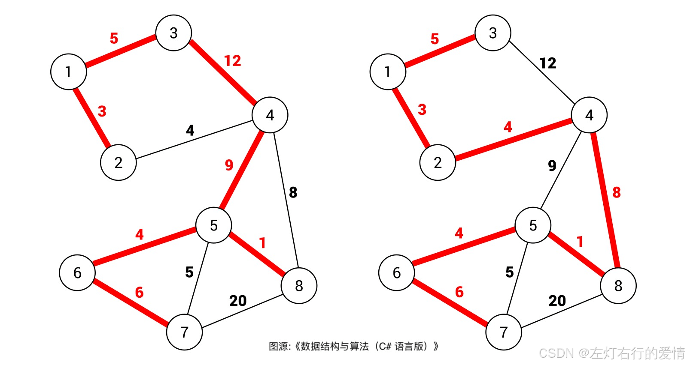
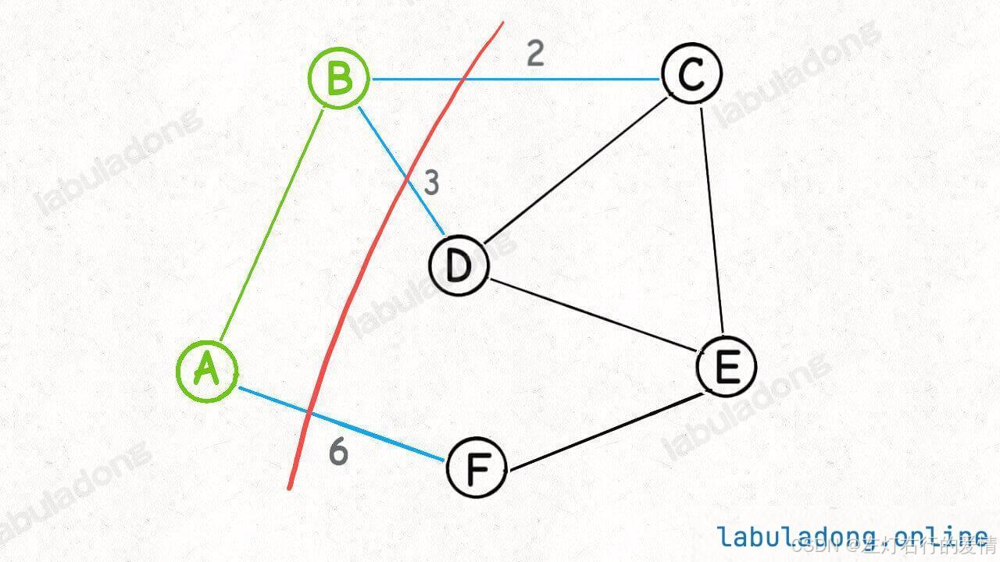
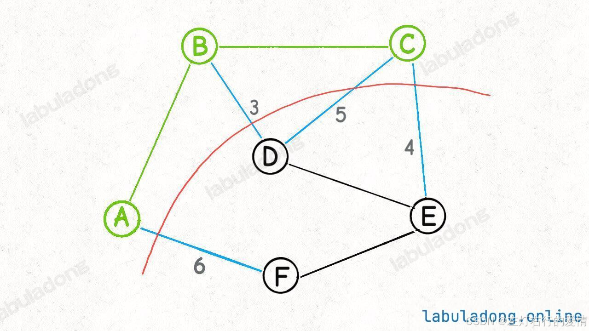
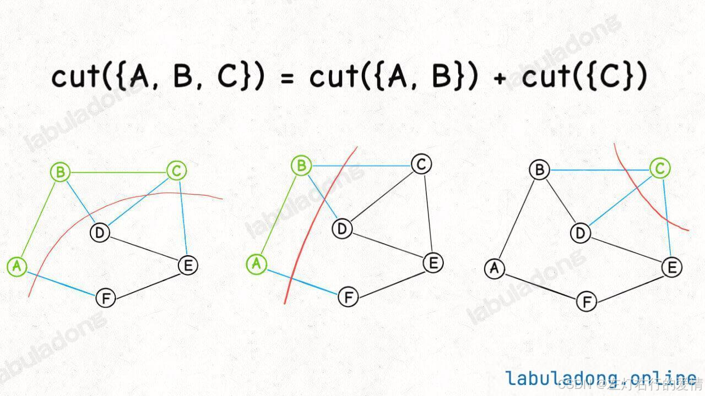

> 原文：[CSDN](https://blog.csdn.net/qq_45852626/article/details/145654066)（历史文章导入，当前状态为草稿）

## 什么是最小生成树

在图中找一棵包含图中所有节点的树, 且权重和最小的那棵树就叫最小生成树.  
 如下:右侧生成树的权重和显然比左侧生成树的权重和要小。(但是它并不是最小的,这里只是比较一下不同的树)  
 

## Kruskal算法

最小生成树是若干条边的集合(称为mst)  
 最小生成树中我们需要保证几点:

* 包含图中所有节点
* 形成的结构是树结构(不存在环)
* 权重和最小  
   前面两条很容易利用并查集算法做到  
   最后一条这里使用了贪心算法的思想:  
   将所有边按照权重从小到大排序,从权重最小的边开始遍历,如果这条边和mst中其他边不形成边,则称为mst的一部分,否则不加入.

### 关键代码实现

想学好这个算法有两个关键的点:

1. 熟悉掌握并查集算法,对于判定是否成环和连通分量如何计算要熟悉
2. 清楚贪心思想和最后如何累积权重并返回.

```


```

## Prim 最小生成树算法

它也是使用贪心思想来让生成树的权重尽可能小,它采用切分的方式去处理.  
 简单来说呢就是从一个节点开始,看这个节点有几条路径,然后选一条最短.  
 走到下一个节点的时候,同时考虑之前的节点的路径,然后选一条最短的,然后循环这样.  
 举例:  
   
 这里虽然是在B节点,但是也要考虑A节点的情况.  
 Prim 算法的逻辑就是这样，每次切分都能找到最小生成树的一条边，然后又可以进行新一轮切分，直到找到最小生成树的所有边为止。

那代码如何实现呢?  
 我们如何计算横切边有哪些,比如是否可以快速算出 cut({A, B, C})，也就是节点 A, B, C 的所有「横切边」有哪些？  
 

是可以的,因为我们发现:  
  `cut({A, B, C}) = cut({A, B}) + cut({C})`  
   
 这个特点使我们用我们写代码实现「切分」和处理「横切边」成为可能：  
 在进行切分的过程中，我们只要不断把新节点的邻边加入横切边集合，就可以得到新的切分的所有横切边。  
 当然，细心的你肯定发现了，cut({A, B}) 的横切边和 cut({C}) 的横切边中 BC 边重复了。  
 不过这很好处理，用一个布尔数组 inMST 辅助，防止重复计算横切边就行了。  
 最后一个问题，我们求横切边的目的是找权重最小的横切边，怎么做到呢？  
 很简单，用一个  
 优先级队列 存储这些横切边，就可以动态计算权重最小的横切边了。  
 所以采用inMST和优先级队列可以帮助我们实现这个算法.  
 实现如下:

```
class Prim {
    // 核心数据结构，存储「横切边」的优先级队列
    private PriorityQueue<int[]> pq;
    // 类似 visited 数组的作用，记录哪些节点已经成为最小生成树的一部分
    private boolean[] inMST;
    // 记录最小生成树的权重和
    private int weightSum = 0;
    // graph 是用邻接表表示的一幅图，
    // graph[s] 记录节点 s 所有相邻的边，
    // 三元组 int[]{from, to, weight} 表示一条边
    private List<int[]>[] graph;

    public Prim(List<int[]>[] graph) {
        this.graph = graph;
        this.pq = new PriorityQueue<>((a, b) -> {
            // 按照边的权重从小到大排序
            return a[2] - b[2];
        });
        // 图中有 n 个节点
        int n = graph.length;
        this.inMST = new boolean[n];

        // 随便从一个点开始切分都可以，我们不妨从节点 0 开始
        inMST[0] = true;
        cut(0);
        // 不断进行切分，向最小生成树中添加边
        while (!pq.isEmpty()) {
            int[] edge = pq.poll();
            int to = edge[1];
            int weight = edge[2];
            if (inMST[to]) {
                // 节点 to 已经在最小生成树中，跳过
                // 否则这条边会产生环
                continue;
            }
            // 将边 edge 加入最小生成树
            weightSum += weight;
            inMST[to] = true;
            // 节点 to 加入后，进行新一轮切分，会产生更多横切边
            cut(to);
        }
    }

    // 将 s 的横切边加入优先队列
    private void cut(int s) {
        // 遍历 s 的邻边
        for (int[] edge : graph[s]) {
            int to = edge[1];
            if (inMST[to]) {
                // 相邻接点 to 已经在最小生成树中，跳过
                // 否则这条边会产生环
                continue;
            }
            // 加入横切边队列
            pq.offer(edge);
        }
    }

    // 最小生成树的权重和
    public int weightSum() {
        return weightSum;
    }

    // 判断最小生成树是否包含图中的所有节点
    public boolean allConnected() {
        for (int i = 0; i < inMST.length; i++) {
            if (!inMST[i]) {
                return false;
            }
        }
        return true;
    }
}


```

## Kruskal 和 Prim 算法的区别

| 特点 | **Kruskal算法** | **Prim算法** |
| --- | --- | --- |
| **处理方式** | 从边出发，选择最小的边加入生成树 | 从一个节点出发，逐步扩展生成树 |
| **适用图的类型** | 适合稀疏图 | 适合稠密图 |
| **数据结构** | 使用并查集来检测环，处理边集合 | 使用优先队列（最小堆）来选择最小边 |
| **时间复杂度** | (O(E \log E)) | (O(E \log V)) |
| **边的处理方式** | 对所有边进行排序 | 按节点扩展，逐步选择最小边 |
| **图的表示方式** | 边列表 | 邻接矩阵或邻接表 |

### 为什么Prim算法不需要判断成环,但Kruskal需要

Kruskal算法需要检查是否会成环，因为它是从全局边集合出发逐步加入边，需要判断两个节点是否已经连通。  
 Prim算法不需要显式检查环，因为它是从节点逐步扩展生成树的过程，保证了每次连接的边都是新增的，不会成环。
