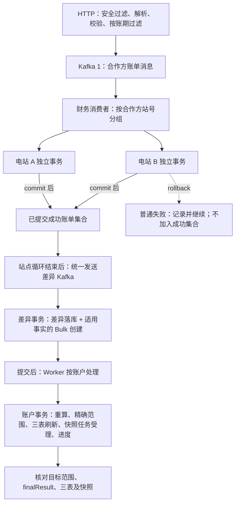

[业务逻辑](/knowledge/business-logic/) / [推送链路专辑](/knowledge/business-logic/push-pipeline/) / 合作方账单推送

沿合作方账单推送的完整链路，说明接口接收、账户与账单持久化、差异台账、精确批量刷新、事务回滚与重试，以及各层成功的证据边界，附关键源码与逐章原文对照。本文保留原文 8 章、步骤 0–18、32 段源码摘录及 F01–F21 源码索引，正文连续展开，代码摘录、原文对照与 Mermaid 源码按需展开。

**关联阅读：** [居民收益付款状态批量刷新](/knowledge/business-logic/resident-income/payment-status-refresh-bulk-task/) · [付款结果查询快照刷新](/knowledge/business-logic/resident-income/s13-付款结果查询快照刷新/)

**快速阅读：** [阅读起点](#reading-start) · [链路概览](#chapter-1) · [接口接收](#chapter-2) · [账单持久化](#chapter-3) · [差异与精确任务](#chapter-4) · [异步账户刷新](#chapter-5) · [失败与重试](#chapter-6) · [完成证据](#chapter-7) · [源码索引](#r8-h5)

<div class="business-logic-article">

<div id="reading-start"></div>

## 阅读起点与证据边界

假设合作方甲要把电站 A、B 的 8 月居民收益账单交给平台：A 报了 120 元，平台对应账单是 100 元；B 报了 90 元，平台对应账单是 80 元。平台先检查请求和账期，把允许处理的账单交给后台；后台逐站保存账户和账单，再把已经提交成功的账单交给差异处理，最后安排账户重算、付款相关状态刷新和已有账单快照（供业务读取的账单维度结果）的更新。这条链路要解决的是：**接收合作方账单，并使后续业务数据与本次有效事实相衔接**，不是直接发起银行转账。金额与时序都是说明性假设；120−100 和 90−80 不能直接当成差异台账金额、居民应付或抵扣金额。

> **阅读依据与核查边界**<br /> 本版只依据附件《合作方推送链路-业务详解与关键代码.md》改写。保留八章结构、步骤 0–18、代码 C01–C32、源码索引 F01–F21及历史定位。原文整理日期为 **2026-09-09**，其依据文档为同目录《合作方推送链路梳理-Markdown版.md》，该文档的静态梳理时间为 **2026-09-04**。本次没有额外取得该同目录文档或项目仓库，不把它们当作已重新读取的材料。<br /> 原文声明的源码基线：仓库 `zxbaif`，提交 `c4665e3ad6b180b5c572d81da13a34016856e051`。原文读取源码时，本地分支是 `zx_test_250330`，HEAD 为 `9accfcba5fd24062554c7add8ed621b965d9d454`，与基线不同；原文声明通过 `git show` 读取固定提交，没有混入其他版本。<br /> **原文证据只到源码静态核对与代码摘录校对，没有接口、Kafka、数据库或 Worker 的运行验收，也没有修改业务代码。本版没有重新执行源码核对、反编译、业务测试或环境验证。**

<div id="intro-h0"></div>

### 如何区分文中的几种说法

“原文口径”是附件所转述的原 Markdown 行为；“原文源码补充／源码校正”是附件作者声明在固定提交中确认的细节。遇到概览和实现不一致，本版保留明确的实现差异，不替作者消除矛盾。

“说明性示例”中的金额、机构、站号、主键和执行顺序均为假设，不是线上数据。“技术解释”只是把原文已有的 Java、Spring、数据库与 Kafka 语义讲清楚，不补写未知的设计动机。“暂时无法确认”表示材料不足，不表示这项能力一定不存在。

代码 C01–C32 按附件原样保留。原文声明这些是固定提交的真实源码摘录，只统一外层缩进，跨区段省略有明确标记；**它们不是可单独编译的完整类，也不是本版新写的实现**。代码后的 Fxx 与历史行号可对应第八章完整路径。

<details class="original" id="original-preface">
<summary>原文前言 · 查看附件的来源、阅读约定与证据边界</summary>

<div id="original-preface-h0"></div>

### 合作方居民收益账单推送链路：业务详解与关键代码

> 读者：懂 Java、Spring，但不熟悉这段居民收益业务的开发者。<br /> 整理日期：2026-09-09。依据同目录《合作方推送链路梳理-Markdown版.md》，保留原文八章结构及步骤编号，补充实际源码、正常与异常场景。<br /> **源码基线：`zxbaif`，提交 `c4665e3ad6b180b5c572d81da13a34016856e051`。** 原文静态梳理时间为 2026-09-04；本次通过 `git show` 读取该提交，不将其他版本代码拼入本链路。读取时本地分支为 `zx_test_250330`，HEAD 为 `9accfcba5fd24062554c7add8ed621b965d9d454`，与原文基线不同。<br /> **证据范围：源码静态核对、代码摘录校对；没有执行接口、Kafka、数据库或 Worker 的运行验收，也没有修改业务代码。**

阅读约定：

- **原文口径**：原 Markdown 已描述的行为。
- **源码补充 / 源码校正**：本次在上述固定提交中确认的细节；遇到概览与实现不一致，以这里明确标出的实现为准。
- **说明性示例**：金额、机构、站号、主键和执行时序均为假设，不代表线上数据。
- **技术解释**：用 Java、Spring、数据库、Kafka 的一般语义解释作用，不冒充作者没有写明的设计动机。
- **暂时无法确认**：附件和本次核对范围不足以支持的结论。

正文代码均为真实源码摘录，只统一外层缩进；跨区段摘录会显式标记省略。它们不是可以独立编译的完整类。代码后的 `Fxx` 与历史行号，可在文末源码索引中查找完整路径。

</details>

<div id="chapter-1"></div>

## 一、链路概览：先用一批账单建立业务画面

<div id="r1-h1"></div>

### 1.1 一个贯穿全篇的正常场景

先认清这次推送里的两个“世界”：合作方有自己的电站、账户和账单，平台也有自己的电站、账户和账单。两边描述的是关联业务对象，但它们的主键和金额口径不能直接互换。

**说明性示例：** 合作方甲在 9 月 4 日推送两座电站的 8 月居民收益账单。

| 对象 | 合作方站号 | 合作方电站 ID | 平台 `prop_station.id` | 合作方账单金额 | 平台小单账单金额 |
| --- | --- | --- | --- | --- | --- |
| 电站 A | `PA-001` | `701` | `501` | 120 元 | 100 元 |
| 电站 B | `PA-002` | `702` | `502` | 90 元 | 80 元 |

**小单**（平台侧对应的电站、账户和账单口径）在这里先这样理解。附件没有给出这个产品术语的完整定义，因此不能进一步假定它一定代表某种订单大小、合同类别或客户类型。

先把正常路径的前提说全：请求有效，两站关系能解析，账期允许重推，合作方适用付款流程，canonical 账户唯一，各项依赖可用，后续执行成功。**canonical 账户**（在相关账户中按规则确定的本次处理主体）的选择规则在步骤 12 展开；这里的“唯一”是正常示例的假设，不是所有数据天然满足的性质。

把整件事拆成八次交接，就能理解数据为什么不会同时完成：

1. **先把外部请求变成可处理的数据。** 安全过滤完成后解析 JSON，得到 `PartnerIncomeDTO`。DTO（用于在方法或系统边界传递数据的对象）承载请求内容，不等于数据库记录已经存在。
2. **再挑出这次允许处理的账单。** 接口校验项目公司、收益表头和账单明细，补充电站关系，并按账期付款锁过滤。有效部分才进入第一段 Kafka。Kafka（这里用于系统间异步交接消息的消息系统）把接口接收与财务处理分开。
3. **财务后台逐站保存。** 消费者按 `partnerStationNo` 分组，A、B 各自用独立事务更新合作方账户和账单。事务（让其内部数据库修改一起提交或一起回滚的边界）不是包住整个原始 HTTP 请求的一个大事务。
4. **只汇总已经提交成功的账单。** 每站 commit（事务提交）之后，才把本站账单加入 `billDiffPartnerList`。整个站点循环结束，成功集合统一进入第二段 Kafka。
5. **建立真正的差异记录。** 差异消费者构建差异台账并落库，再根据业务键回读数据库真实主键。假设 A、B 对应的真实差异 ID 是 `9001`、`9002`。
6. **把刷新工作也记入数据库。** 同一个差异事务里，针对适用的事实创建 Bulk（记录一批账户刷新工作的持久化任务）。差异和对应任务共同提交；后文把这套统一处理路径称为 Unified Bulk。
7. **后台执行者按账户干活。** Worker（领取并执行后台任务的执行者）重算账户统计，通过事实 ID 回读真实差异范围，再刷新小单账单、合作方账单和差异台账的付款相关状态。
8. **受理快照任务，再推进成功进度。** 快照（供读取使用的账单维度结果）仍由独立任务更新；正常路径是在快照任务受理后推进 cursor（记录账户处理进度的游标）。最终要核对任务结果、目标数据和快照结果，而不是只看游标。

这八步不是一个同步调用从头跑到底。接口返回时，可能只走到第 2 步；合作方账单已经更新时，也可能还没走到第 5 步。**“上一步完成”最多证明这次交接到达了某个位置，不能证明下游已经追上。**

下面保留原文流程图。A、B 的两个框表示独立事务边界；实际外层代码逐站循环，**不是同时并行执行的证据**。

**主链全景**

代码逐站循环；A、B 示意独立事务，不代表并行。

1. **HTTP 接收与过滤**

   安全过滤、解析、业务校验、按账期过滤 → 第一段 Kafka：合作方账单消息
2. **财务消费者按合作方站号分组**

   **电站 A · 独立事务** 账户与账单写入 → commit

   **电站 B · 独立事务** 账户与账单写入 → commit / rollback

   commit 后加入成功集合；普通失败记录并继续，不加入成功集合。
3. **站点循环结束后，统一发送差异 Kafka**

   第二段消息只携带已经提交的成功账单集合。
4. **差异事务：差异落库 + 适用事实的 Bulk 创建**

   先回读真实事实 ID；差异与对应任务一起提交。
5. **Worker 在提交后按账户处理**

   账户事务：重算 → 精确范围 → 三表刷新 → 快照任务受理 → 进度。
6. **核对目标范围、finalResult、三表及快照**

   上游成功不代表下游完成；正常进度与 skip 进度需要区分。

<details class="source-note">
<summary>展开原流程图的 Mermaid 源码</summary>



</details>

<div id="r1-h2"></div>

### 1.2 几种数据对象分别负责什么

不要先背表名。先问两个问题：“它记录原始业务事实，还是记录计算结果？”“它保存业务数据，还是保存待执行工作？”

| 对象 | 可以怎样理解 | 在本链路里实际会发生什么 |
| --- | --- | --- |
| 合作方账户 `fi_customer_account_partner` | 合作方一侧的账户及其累计信息 | 创建或更新账户，并重算相关累计值 |
| 合作方账单 `fi_customer_bill_partner` | 合作方本次推送的账单事实 | 插入记录或覆盖指定字段；重推会重置合作方校核结论 |
| 小单账单、账户 | 平台一侧的账单和账户口径 | 参与差异构建、账户重算和状态投影 |
| 差异台账 `fi_monthly_income_difference` | 持久化保存两边关系与差异的事实记录 | 按业务键 upsert，再回读真实定位信息 |
| 付款状态投影 | 根据业务事实计算出来的付款相关结果 | 刷新状态、已付、本期应付信息；原文未穷举全部结果字段 |
| `fi_async_task` 中的 Bulk | “哪些账户需要处理、处理到哪里”的工作记录 | 可能待执行、运行、重试、跳过，最后到达任务终态 |
| 账单维度快照 | 方便业务读取的账单维度结果 | 由单独的快照任务更新 |

**upsert**（不存在时插入、命中相应唯一约束时按 SQL 更新）不等于每次都新增一条，也不等于每个金额都累加。具体更新列见步骤 7。

**投影**（把业务事实计算成便于读取的结果）也不是实际资金动作。把某张账单的付款状态、已付或本期应付刷新了，不代表银行已经转账；真实资金出款不在本文链路范围内。

<div id="r1-h3"></div>

### 1.3 先知道六个由源码补充的关键条件

下面这六点是原文已经指出的实现边界。本版不会为了让故事顺畅，把它们改写成更强的保证。

| 容易形成的直觉 | 原文固定版本所支持的准确说法 | 后文位置 |
| --- | --- | --- |
| Redis 防重五分钟后一定解除 | 注释写五分钟，但实际三参数 `set` 调用了偏移写入重载，没有由这句代码设置 TTL（键的过期时间） | 步骤 0–1 |
| 一个站失败，永远继续下一个站 | 普通异常继续；外层取锁出现 `InterruptedException` 时重新抛异常 | 步骤 5 |
| 先重算账户累计抵扣，再读取账户当快照 | 实际先按平台站计算账单累计抵扣上下文，再重置校核并重算账户抵扣 | 步骤 7 |
| 每条落库差异必定带一个付款刷新任务 | 先筛选付款适用性，只有适用事实进入 Unified Bulk 提交范围 | 步骤 11–13 |
| EXACT 要分别取两个无关的月份字段 | 此路径用差异的 `shareMonth` 构造 scope 的 `billYearMonth`；EXACT 是精确事实刷新策略，scope 是实际刷新范围对象 | 步骤 16 |
| 游标前进就表示刷新成功 | 正常路径在快照受理后推进；失败达到阈值后也可以 skip（跳过当前账户）并推进，此时记录部分成功 | 步骤 18 |

<details class="original" id="original-chapter-1">
<summary>原文对照 · 展开第1章完整原文</summary>

下方是附件第1章原文，不是改写正文。原文中的“本次核对”指附件作者的工作，不代表本阅读版新增了源码或运行验证。

<div id="o1-h0"></div>

### 一、链路概览：先用一批账单建立业务画面

<div id="o1-h1"></div>

#### 1.1 一个贯穿全篇的正常场景

**说明性示例：** 合作方甲在 9 月 4 日推送两座电站的 8 月居民收益账单：

| 对象 | 合作方站号 | 合作方电站 ID | 平台 `prop_station.id` | 合作方账单金额 | 平台小单账单金额 |
| --- | --- | --- | --- | --- | --- |
| 电站 A | `PA-001` | `701` | `501` | 120 元 | 100 元 |
| 电站 B | `PA-002` | `702` | `502` | 90 元 | 80 元 |

这里的“小单”先理解为平台侧对应的电站、账户和账单口径。原文没有给出这个产品术语的完整定义。两侧金额相差 20 元、10 元，只是示例中的算术关系；**差异台账的具体金额、居民应付金额和抵扣金额不能据此直接得出**，还要经过实际规则构建与状态计算。

为便于先理解正常路径，本例假设：请求有效、两站关系可解析、账期允许重推、合作方适用付款流程、canonical 账户唯一、各项依赖可用、后续处理成功。

1. 请求经过安全过滤与 JSON 解析，形成 `PartnerIncomeDTO`。
2. 接口校验项目公司、收益表头和账单明细，补充电站关系；只有允许处理的账单进入第一段 Kafka。
3. 财务消费者收到消息后，按 `partnerStationNo` 分组。A、B 各在自己的独立事务里更新合作方账户和账单。
4. 每站提交后，成功账单才加入 `billDiffPartnerList`；整个站点循环结束后，成功集合统一进入第二段 Kafka。
5. 差异消费者构建并写入差异台账，按业务键回读真实主键。假设 A、B 的真实差异 ID 是 `9001`、`9002`。
6. 在同一个差异事务里创建携带这些事实 ID 的 Bulk 任务。差异和对应任务共同提交。
7. Worker 按账户重算统计，通过事实 ID 回读真实差异范围，刷新小单账单、合作方账单、差异台账的付款相关状态。
8. 成功路径上，账单维度快照任务受理后才推进账户游标。最终核对任务结果、目标数据和快照结果。

接口返回时，系统可能只完成第 2 步；看到合作方账单已经更新时，也可能尚未执行第 5 步。**一个阶段完成，不能证明所有下游阶段完成。**


图中 A、B 表示独立事务边界；实际外层代码逐站循环，不表示同时并行执行。

<div id="o1-h2"></div>

#### 1.2 几种数据对象分别负责什么

| 对象 | 通俗含义 | 本链路中的变化 |
| --- | --- | --- |
| 合作方账户 `fi_customer_account_partner` | 合作方一侧的账户和累计信息 | 创建或更新，重算相关累计值 |
| 合作方账单 `fi_customer_bill_partner` | 合作方推送的账单事实 | 插入或覆盖指定字段，重推后重置合作方校核结论 |
| 小单账单、账户 | 平台一侧的账单与账户口径 | 参与差异构建、账户重算及状态投影 |
| 差异台账 `fi_monthly_income_difference` | 持久化记录两侧关系和差异的事实 | 按业务键 upsert，再回读真实定位信息 |
| 付款状态投影 | 从业务事实计算出的付款相关结果 | 刷新状态、已付、本期应付等信息 |
| `fi_async_task` 中的 Bulk | 需要处理哪些账户、处理到哪里的工作记录 | 待执行、运行、重试、跳过或到达终态 |
| 账单维度快照 | 供读取使用的账单维度结果 | 通过独立的快照任务更新 |

“投影”就是把事实计算成方便业务读取的结果。更新付款状态不等于产生了一笔银行转账；实际资金出款不在本文链路范围内。

<div id="o1-h3"></div>

#### 1.3 先知道六个由源码补充的关键条件

| 原概览容易带来的理解 | 固定版本源码给出的准确边界 |
| --- | --- |
| Redis 一定在 5 分钟后解除防重 | 注释写 5 分钟，但三参数 `set` 实际调用偏移写入重载，不设置 TTL，见步骤 0–1 |
| 单站任何失败都会继续下一站 | 普通异常继续；外层取锁的 `InterruptedException` 重新抛出，见步骤 5 |
| 先重算账户累计抵扣，再从账户取快照 | 实现先按平台站计算账单累计抵扣上下文，再重置校核、重算账户抵扣，见步骤 7 |
| 所有落库差异都一定创建付款刷新任务 | 先按付款适用性筛选；只有适用事实进入 Unified Bulk，见步骤 11–13 |
| EXACT 同时取两个互不相关的月份字段 | 此路径从差异 `shareMonth` 构造 scope 的 `billYearMonth`，见步骤 16 |
| 任何情况下游标推进都说明刷新成功 | 正常路径在快照受理后推进；达到失败阈值的 skip 路径也推进，但标为部分成功，见步骤 18 |

</details>

<div id="chapter-2"></div>

## 二、阶段①：接口接收

<div id="r2-h1"></div>

### 0–1. 安全过滤与请求解析

<div id="r2-h2"></div>

#### 先理解业务入口：它只负责把请求安全地接进来

合作方调用 `POST /partnerapi/syncHouseholdIncome`。这个入口首先要判断请求是否符合协议，能不能解密、能不能通过签名检查，随后才把 JSON 转成业务对象。

这一步的数据变化是：**HTTP 请求 → 解密后的 `DecryptRequestBody` → `PartnerIncomeDTO`**。Controller（接收 HTTP 请求的控制器）是 `PartnerApiController`，前面的过滤器是 `AesRequestFilter`。安全校验只回答“请求是否符合入口要求”，不能替代后面的金额、电站或付款状态业务校验。

<div id="r2-h3"></div>

#### 进入受保护分支，要满足哪些入口要求

过滤器检查请求体大小；请求头 `X-Request-Id` **不能为空，而且长度不能超过 10**。请求体需要有 `orgCode`、`data`、`sign`。外部 `orgCode` 先通过 `InterfaceOrgCode.getCodeByToken` 转成内部组织编码，然后查询对应密钥配置。[【F01:85–180】](#source-F01)

白名单路径会直接放行。因此，上面这些规则描述的是**进入受保护处理分支**的请求，不能说所有路径都会逐项经过。目标环境到底配了哪些白名单、请求体大小上限和组织配置，原文没有核验。[【F01:74–91】](#source-F01)

原文提到 token，在这里至少能对应到组织编码转换。材料没有证明还存在一个独立的 Bearer token 校验，不能自行补上这个安全步骤。

<div id="r2-h4"></div>

#### 防重、解密、验签有固定顺序，而且实现存在明确问题

代码先用内部组织编码和请求 ID 拼出 key，检查 key 是否存在；存在就返回重复请求。不存在则写 key，**然后**才进行 AES 解密（用对应密钥还原请求数据）和验签（检查解密数据与签名是否匹配）。

<details class="source-note" id="code-C01">
<summary>C01 · F01 · L64、L167–L180</summary>

[定位 F01](#source-F01)

```java
private static final long EXPIRATION = 300L; // 设置5分钟过期时间
// ……（省略中间源码）
String key = orgCode + "_" + requestId;
if (Boolean.TRUE.equals(redisTemplate.hasKey(key))) {
    log.info("api-requestId: {} already exists", requestId);
    sendErrorResponse(response, StateCode.IDEMPOTENCY, "重复请求，请求id:" + requestId);
    return;
}
redisTemplate.opsForValue().set(key, "1", EXPIRATION);

// AES解密
String decypt = decryptData(data, requestId, response,orgCode,aesKey);
if (decypt == null) return;

// 验签
if (!verifySignature(decypt, sign, requestId, response,publicKey)) return;
```

</details>

先看业务后果，再看技术原因：同一个组织用同一个请求 ID 再请求，命中 key 时会被挡住。但是，**不能据这里的注释认为“等五分钟一定能重新发送”**。

原文指出，`redisTemplate` 声明是 Spring 的 `RedisTemplate<String, String>`。`ValueOperations.set(K, V, long)` 的第三个参数是 offset（写入字符串的偏移位置），不是过期秒数。这里的 `EXPIRATION = 300L` 命中偏移写入重载，底层调用 `RedisConnection.setRange`。设置超时要用带 `TimeUnit` 或 `Duration` 的其他重载；此处代码本身没有设置五分钟 TTL。

这是**意图与实现不一致**：原文和注释表达的是五分钟防重意图，固定版本的这条表达式没有实现该 TTL。原文作者使用本机 Spring Data Redis 2.5.1 JAR，通过 `javap -p -c` 核对标准 API 实现，证明的是重载语义，并不是部署依赖版本或线上 key TTL 的验收。本版也未重新反编译或访问线上 Redis。线上是否另有过期设置，暂时无法确认。

原文的 API 校验材料路径是 [spring-data-redis-2.5.1.jar](#source-path-1)，其中反编译的 `DefaultValueOperations.set(K, V, long)` 对应 lambda 调用 `RedisConnection.setRange`。该路径是原文作者本机定位，不是本阅读版附带的 JAR。

还有两个独立限制。第一，`hasKey` 与 `set` 是两次操作，不是原子防重（一次不可拆分地完成“检查并占用”）：两个并发请求可能都先看到不存在。第二，key 在解密和验签之前写入；后续失败时，这个过滤器没有展示删除 key 的逻辑。因此不能假设失败请求会立即解除防重，也不能假设五分钟后必然恢复。

<div id="r2-h5"></div>

#### 解析成功后，才进入业务 Service

解密数据并不保证一定能转成 `PartnerIncomeDTO`。Controller 明确分成三条路径：数据为空、JSON 解析失败、解析成功。

<details class="source-note" id="code-C02">
<summary>C02 · F02 · L107–L125</summary>

[定位 F02](#source-F02)

```java
if (StringUtils.isBlank(decryptedData.getData())) {
    result.setState(StateCode.ERROR.value);
    result.setMsg("请求参数为空");
    return result;
}
data = decryptedData.getData();
PartnerIncomeDTO incomeDTO;
String orgCode= decryptedData.getOrgCode();
try {
    //解析数据
    incomeDTO = objectMapper.readValue(data, PartnerIncomeDTO.class);
} catch (Exception e) {
    log.error("农户收益应付同步异常："+e.getMessage(),e);
    result.setState(StateCode.MSG_DATA_NOT_JSON.value);
    result.setMsg("数据解析失败");
    return result;
}
//保存数据
Result serviceResult = partnerApiService.syncHouseholdIncome(incomeDTO, orgCode);
```

</details>

| 条件 | 应用层返回或下一步 | 不要误解成什么 |
| --- | --- | --- |
| `decryptedData.getData()` 为空白 | `StateCode.ERROR`，消息“请求参数为空” | 已经保存了一份空账单 |
| `objectMapper.readValue` 抛异常 | `MSG_DATA_NOT_JSON`，消息“数据解析失败” | 后面的业务校验失败 |
| 成功得到 `PartnerIncomeDTO` | 调用 `partnerApiService.syncHouseholdIncome(incomeDTO, orgCode)` | 所有业务数据已经验证和落库 |

这里的 `Result.state` 是应用自己的状态字段，不是 HTTP 状态码，两者不能直接画等号。[【F02:107–125】](#source-F02)

<div id="r2-h6"></div>

### 2. 前置校验与电站映射

<div id="r2-h7"></div>

#### 这一层不是“全收或全拒”，而是在逐层缩小有效范围

请求已经变成对象后，系统还要判断：每份收益数据是否有效、属于哪一个合作方电站、能关联到什么平台电站、哪些账期允许重推。

调用顺序是 `syncHouseholdIncome → doSyncHouseholdIncome`。方法先生成新的 `traceId`（本次业务处理的日志追踪标识），再分层校验。输入是 `PartnerIncomeDTO.householdIncomeList`；输出是已经补齐关联信息、剔除不允许处理明细的 `kafkaIncomeList`。收益表头可以理解为带着站点级信息的一组账单明细，而不是每一张账期账单本身。

| 检查到什么 | 固定版本怎样处理 |
| --- | --- |
| 收益列表为空 | `Assert.notEmpty` 抛异常，不进入正常发送路径 |
| 合作方站号为空 | 标记当前表头失败，继续校验其他表头 |
| `validateHouseholdIncome` 返回错误 | 标记当前表头失败；代码注明账单明细有错时，整个表头不发给下游 |
| 没找到合作方电站 | 标记失败，不加入真实有效列表 |
| 找到合作方电站 | 补充 `partnerStationId`、`partnerOrgId` |
| 找到平台小单电站 | 补充 `smallStationId`、`stationNo`；这里没有因为平台映射缺失就直接 `continue` |
| 当前站只有部分账期被付款锁保护 | 剔除被锁明细，保留同站其他未锁账期 |
| 当前站所有账期都被剔除 | 当前表头不进入 Kafka |
| 付款锁检查的远程返回为空、失败或没有内容 | 视为不允许覆盖，标记失败 |

定位：[【F03:1195–1336、1433–1488】](#source-F03)。附件未展开所有基础字段校验细则，本版不凭方法名补出金额阈值或必填项。

**最容易混淆的是过滤粒度。** 基础明细校验出错可能挡住整个收益表头；付款锁过滤则明确允许“同一电站，一部分账期失败，另一部分账期继续”。不能把两者都说成“有一条失败就全站不发送”，也不能把两者都说成“只跳过出错明细”。

下面的代码只负责构造“保留未锁账期的新表头”。原始表头为空，或者账单明细为空，直接返回 null；遍历时跳过 null 明细和锁定明细。最终一个都没剩下，才标记该表头失败并返回 null；否则复制表头属性，把明细列表替换成保留下来的列表。

<details class="source-note" id="code-C03">
<summary>C03 · F03 · L1433–L1457</summary>

[定位 F03](#source-F03)

```java
private HouseholdIncomeDTO buildUnlockedHouseholdIncome(HouseholdIncomeDTO income) {
    if (income == null || CollUtil.isEmpty(income.getBillDetailsList())) {
        return null;
    }
    List<BillDetailsDTO> unlockedBillList = new ArrayList<>();
    for (BillDetailsDTO billDetailsDTO : income.getBillDetailsList()) {
        if (billDetailsDTO == null) {
            continue;
        }
        if (isPartnerBillLocked(income, billDetailsDTO)) {
            continue;
        }
        unlockedBillList.add(billDetailsDTO);
    }
    if (CollUtil.isEmpty(unlockedBillList)) {
        income.setStatusCode(InterfaceResponseItemStatusEnum.FAIL.getCode());
        income.setMessage(resolveFirstFailedBillMessage(income,
                buildPartnerBillLockedPrompt(income.getPartnerStationNo(), null)));
        return null;
    }
    HouseholdIncomeDTO kafkaIncome = new HouseholdIncomeDTO();
    BeanUtils.copyProperties(income, kafkaIncome);
    kafkaIncome.setBillDetailsList(unlockedBillList);
    return kafkaIncome;
}
```

</details>

**说明性示例：** A 同时推送 7 月、8 月账单。基础校验都通过，但 8 月已被付款锁保护，那么第一段 Kafka 中 A 只带 7 月；响应仍能给出 8 月失败信息。看到整体响应有失败，就认定“7 月也没处理”，会漏掉它已经进入异步链路的事实。

`checkPartnerBillCanUpsert` 判断的是当前付款流程是否允许覆盖这一账期。入口注释列举了待创建审核计划、审核中、审核不通过、待支付这些保护阶段。**原文没有展开锁服务内部的完整枚举和 SQL**，因此这些注释列举不是所有运行条件的穷举。

<div id="r2-h8"></div>

#### 名字都带 stationId，不代表是同一种 ID

| 字段／键 | 实际指向 | 阅读时的边界 |
| --- | --- | --- |
| `partnerStationId` | 合作方电站主键 | 不是平台电站主键 |
| `smallStationId` | 平台记录上的小单标识 | 不能只凭字段名视作 `prop_station.id` |
| `prop_station.id` | 平台电站真实主键 | 差异和 Unified Bulk 使用的可信平台键 |
| `partnerStationNo` | 合作方站号 | 后续逐站分组和外层锁使用它 |

这些值在示例里分别出现为 `701`、`501` 或 `PA-001`。数字、字符串都只是定位方式，不会因为 Java 字段名称相似就自动具有相同语义。

<div id="r2-h9"></div>

### 3. 发送账单 Kafka

<div id="r2-h10"></div>

#### 业务上的交接点：只把筛选后的内容发给财务中心

`kafkaIncomeList` 非空才构造任务并发送，空列表直接跳过。第一段消息的逻辑 topic（消息主题）是 `ASYNCHRONOUS_REVENUE_STATEMENTS_PARTNER`，任务显示名称为“同步合作方农户收益信息”。发送的不是原始全部表头，而是上一步保留下来的有效数据。

<details class="source-note" id="code-C04">
<summary>C04 · F03 · L1341–L1355、L1357–L1364</summary>

[定位 F03](#source-F03)

```java
if (CollUtil.isNotEmpty(kafkaIncomeList)) {
    ProgresstaskModelEx task = new ProgresstaskModelEx();
    task.setTaskmainid(traceId);
    task.setErrcount(0);
    long kafkaTaskCreatedAt = System.currentTimeMillis();
    task.setTasksetid(kafkaTaskCreatedAt);
    task.setTasknameshow("同步合作方农户收益信息");
    task.setIsneedfusing(true);
    task.setStarttime(kafkaTaskCreatedAt);
    task.setTopic(TopicType.ASYNCHRONOUS_REVENUE_STATEMENTS_PARTNER.value);
    task.setTasksettype(TopicType.ASYNCHRONOUS_REVENUE_STATEMENTS_PARTNER.value);
    PartnerIncomeDTO allStationsDTO = new PartnerIncomeDTO();
    allStationsDTO.setHouseholdIncomeList(kafkaIncomeList);
    task.setRequestparams(JSON.toJSONString(allStationsDTO));
    log.debug("asynchronous_revenue_statements_partner批量发送消息, 包含电站数量: {}, 电站消息 {}", kafkaIncomeList.size(),JSONUtil.toJsonStr(task));
// ……（省略中间源码）
boolean dispatchAccepted = kafkaServiceProducer.sendTaskListWithOutcome(
        Collections.singletonList(task), orgCode);
ResidentIncomePartnerPerformanceLog.info(log, traceId,
        "KAFKA_BILL_PRODUCER_DISPATCH", kafkaPublishStartedNanos,
        "stationCount=" + kafkaIncomeList.size() + ", result="
                + (dispatchAccepted ? "ACCEPTED" : "FAILED")
                + ", brokerAck="
                + (dispatchAccepted ? "ASYNC_PENDING" : "NOT_APPLICABLE"));
```

</details>

代码里几项身份和载荷关系要一起看：`taskMainId = traceId`；`tasksetid` 与 `starttime` 使用构造任务时的毫秒时间；`errcount` 初始为 0；`isneedfusing` 设为 true；`topic` 和 `tasksettype` 都使用该账单消息类型。`requestparams` 是重新装入 `PartnerIncomeDTO.householdIncomeList` 的过滤后列表。

真正传给 `sendTaskListWithOutcome` 的 key 是 **`orgCode`**。附近旧注释虽写“key 改为 null”，但调用表达式并不是 null。物理 topic 可能带分片后缀，所以不能只凭 key 就断言所有批次在所有场景下严格有序。[【F03:1341–1364】](#source-F03)

<div id="r2-h11"></div>

#### “返回 false”和“抛异常”不是同一条失败路径

| 发送或回执情况 | 固定版本的外部表现 |
| --- | --- |
| `dispatchAccepted=false` | 只影响日志中的 `ACCEPTED`／`FAILED` 表达式，没有因此转为接口返回失败 |
| 发送方法直接抛异常 | catch 标记发送失败，返回 `StateCode.ERROR` |
| 正常执行到回执汇总 | 根据逐条回执有没有失败，决定 `PARAMS_NOT_ENOUGH` 或 `SUCCESS` |

定位：[【F03:1369–1406】](#source-F03)。因此，**接口正常返回并不能排除 dispatch 返回 false；接口总体失败也不能证明所有有效明细都没发出**。

日志里的 `brokerAck=ASYNC_PENDING` 是 Broker ACK（消息服务器确认结果）尚处于异步等待的表达；它不是“消息已消费完成”。`dispatchAccepted=false` 对应 `brokerAck=NOT_APPLICABLE`。这里应分别看应用是否受理发送、Broker 是否确认、消费者是否完成，不能把三种时点合成一个“发成功了”。

<div id="r2-h12"></div>

### 4. 财务中心消费账单消息

<div id="r2-h13"></div>

#### 接口之后，另一个后台处理开始接手

财务侧 `KafkaServiceCustomerThread` 收到消息，先反序列化（把消息文本恢复成 `PartnerIncomeDTO`），再调用 `syncFiCustomerBillsPartner(incomeDTO, billTraceId)`。反序列化失败或业务调用向外抛异常，都会传播到外层消费异常处理。[【F04:307–364】](#source-F04)

<details class="source-note" id="code-C05">
<summary>C05 · F04 · L346–L354</summary>

[定位 F04](#source-F04)

```java
try (ResidentIncomePartnerPerformanceLog.TraceScope ignored =
             ResidentIncomePartnerPerformanceLog.openTrace(billTraceId)) {
    fiCustomerBillPartnerService.syncFiCustomerBillsPartner(
            incomeDTO, billTraceId);
    ResidentIncomePartnerPerformanceLog.info(log, billTraceId,
            "KAFKA_BILL_HANDLE", billHandleStartedNanos,
            "partition=" + datarecord.partition() + ", offset="
                    + datarecord.offset()
                    + ", result=SERVICE_RETURNED");
```

</details>

这段代码把处理放进 `TraceScope`（这一段调用使用的追踪上下文）中，并在 Service 正常返回后记录 `KAFKA_BILL_HANDLE`。日志还带上 Kafka `partition`（消息所在分区）和 `offset`（消息在分区中的位置），便于对应消费记录。

但 `result=SERVICE_RETURNED` **只表示方法正常返回**。因为财务方法后面允许一些单站失败被记录后继续，它不能证明每站成功；更不能证明第二段 Kafka、差异台账或付款状态已经更新。

此时已经跨过异步边界。这里的异常不是仍在原 HTTP 调用栈中等待返回的异常，不能理解成它还会同步反馈给最初的 HTTP 调用方。

<details class="original" id="original-chapter-2">
<summary>原文对照 · 展开第2章完整原文</summary>

下方是附件第2章原文，不是改写正文。原文中的“本次核对”指附件作者的工作，不代表本阅读版新增了源码或运行验证。

<div id="o2-h0"></div>

### 二、阶段①：接口接收

<div id="o2-h1"></div>

#### 0–1. 安全过滤与请求解析

**解决的问题：** 外部请求是否符合入口协议、是否可解密验签、是否能变成业务 DTO。安全校验不能代替金额、电站和付款状态的业务校验。

**输入 → 输出：** HTTP 请求 → 解密后的 `DecryptRequestBody` → `PartnerIncomeDTO`。

入口是 `PartnerApiController` 的 `POST /partnerapi/syncHouseholdIncome`。过滤器 `AesRequestFilter` 还检查请求体大小；请求头 `X-Request-Id` 不能为空且长度不能超过 10。请求体要求存在 `orgCode`、`data`、`sign`，外部 `orgCode` 通过 `InterfaceOrgCode.getCodeByToken` 转成内部组织编码，再查相应密钥配置。[【F01:85–180】](#source-F01)

过滤器对白名单路径直接放行；上述过滤规则描述进入受保护处理分支的请求。目标环境实际白名单、请求体大小和组织配置，本次未核验。[【F01:74–91】](#source-F01)

原文提到的 token 在这里至少体现为组织编码转换。不要自行扩展成“这段代码还验证了某个独立 Bearer token”：本次所读入口没有给出这样的依据。

**关键代码：防重、解密、验签的先后关系。**

**代码 C01｜F01｜历史行号 L64、L167–L180**

```java
private static final long EXPIRATION = 300L; // 设置5分钟过期时间
// ……（省略中间源码）
String key = orgCode + "_" + requestId;
if (Boolean.TRUE.equals(redisTemplate.hasKey(key))) {
    log.info("api-requestId: {} already exists", requestId);
    sendErrorResponse(response, StateCode.IDEMPOTENCY, "重复请求，请求id:" + requestId);
    return;
}
redisTemplate.opsForValue().set(key, "1", EXPIRATION);

// AES解密
String decypt = decryptData(data, requestId, response,orgCode,aesKey);
if (decypt == null) return;

// 验签
if (!verifySignature(decypt, sign, requestId, response,publicKey)) return;
```

**源码校正：这段代码不能支持“设置了 5 分钟 TTL”的结论。** `redisTemplate` 声明为 Spring 的 `RedisTemplate<String, String>`。`ValueOperations.set(K, V, long)` 的第三个参数是 offset；设置超时应使用带 `TimeUnit` 或 `Duration` 的另一种重载。此处长整型 `300L` 命中偏移写入，底层调用 `RedisConnection.setRange`，不会由这条语句设置过期时间。

本次使用本机 Spring Data Redis 2.5.1 JAR 的 `javap -p -c` 核对了该标准 API 实现；这项检查证明重载语义，不代表核验了部署依赖版本或线上 key 的 TTL。准确结论是：**原文和注释表达了 5 分钟意图，但固定版本这条语句没有实现该 TTL。线上是否另有过期设置，暂时无法确认。**

API 校验材料为本地 [spring-data-redis-2.5.1.jar](#source-path-1)：反编译的 `DefaultValueOperations.set(K, V, long)` 对应 lambda 调用 `RedisConnection.setRange`。

还要注意两点：

1. `hasKey` 和 `set` 是两次操作。两个并发请求可能都先看到不存在，因此不能把它称为原子防重。
2. 写 key 在解密和验签之前。后续失败时，这个过滤器没有展示删除该 key 的逻辑。因此不能假设失败请求会立即解除防重，更不能假设等待五分钟一定恢复。

Controller 的实际解析分支如下：

**代码 C02｜F02｜历史行号 L107–L125**

```java
if (StringUtils.isBlank(decryptedData.getData())) {
    result.setState(StateCode.ERROR.value);
    result.setMsg("请求参数为空");
    return result;
}
data = decryptedData.getData();
PartnerIncomeDTO incomeDTO;
String orgCode= decryptedData.getOrgCode();
try {
    //解析数据
    incomeDTO = objectMapper.readValue(data, PartnerIncomeDTO.class);
} catch (Exception e) {
    log.error("农户收益应付同步异常："+e.getMessage(),e);
    result.setState(StateCode.MSG_DATA_NOT_JSON.value);
    result.setMsg("数据解析失败");
    return result;
}
//保存数据
Result serviceResult = partnerApiService.syncHouseholdIncome(incomeDTO, orgCode);
```

空数据返回 `StateCode.ERROR`；JSON 解析异常返回 `MSG_DATA_NOT_JSON`；解析成功才调用业务 Service。这些是应用层 `Result.state`，不能直接当成 HTTP 状态码。

<div id="o2-h2"></div>

#### 2. 前置校验与电站映射

**解决的问题：** 数据是否有效、属于哪一侧电站、当前账期能否重推。

**输入 → 输出：** `PartnerIncomeDTO.householdIncomeList` → 填入关联信息、剔除不允许处理明细的 `kafkaIncomeList`。

调用链为 `syncHouseholdIncome → doSyncHouseholdIncome`。方法先生成新的 `traceId`，再分层校验：

| 条件 | 固定版本行为 |
| --- | --- |
| 收益列表为空 | `Assert.notEmpty` 抛异常，不按正常发送路径继续 |
| 合作方站号为空 | 标记该表头失败，继续校验其他表头 |
| `validateHouseholdIncome` 返回错误 | 标记表头失败；代码注明账单明细有错时，整个表头不发送下游 |
| 没找到合作方电站 | 标记失败，不加入真实有效列表 |
| 找到合作方电站 | 补充 `partnerStationId`、`partnerOrgId` |
| 找到平台小单电站 | 补充 `smallStationId`、`stationNo`；这里没有因平台映射缺失而直接 `continue` |
| 某些账期付款锁定 | 只剔除这些明细，保留同站其他未锁账期 |
| 全部账期被剔除 | 当前表头不进入 Kafka |
| 付款锁检查远程返回空、失败或没有内容 | 按不允许覆盖处理，标记失败 |

上表对应[【F03:1195–1336、1433–1488】](#source-F03)。**基础明细校验失败与付款锁命中，过滤粒度不同：前者可能挡住整个表头，后者明确支持保留同站其他账期。**

**代码 C03｜F03｜历史行号 L1433–L1457**

```java
private HouseholdIncomeDTO buildUnlockedHouseholdIncome(HouseholdIncomeDTO income) {
    if (income == null || CollUtil.isEmpty(income.getBillDetailsList())) {
        return null;
    }
    List<BillDetailsDTO> unlockedBillList = new ArrayList<>();
    for (BillDetailsDTO billDetailsDTO : income.getBillDetailsList()) {
        if (billDetailsDTO == null) {
            continue;
        }
        if (isPartnerBillLocked(income, billDetailsDTO)) {
            continue;
        }
        unlockedBillList.add(billDetailsDTO);
    }
    if (CollUtil.isEmpty(unlockedBillList)) {
        income.setStatusCode(InterfaceResponseItemStatusEnum.FAIL.getCode());
        income.setMessage(resolveFirstFailedBillMessage(income,
                buildPartnerBillLockedPrompt(income.getPartnerStationNo(), null)));
        return null;
    }
    HouseholdIncomeDTO kafkaIncome = new HouseholdIncomeDTO();
    BeanUtils.copyProperties(income, kafkaIncome);
    kafkaIncome.setBillDetailsList(unlockedBillList);
    return kafkaIncome;
}
```

**说明性示例：** A 推送 7 月、8 月两张账单。若基础校验都通过，但 8 月付款锁定，则 Kafka 中 A 只保留 7 月。响应中仍会给出 8 月失败信息。只看整个接口的失败状态，就把两个月全部当作“没有处理”，会误判 7 月已经进入异步链路的事实。

`checkPartnerBillCanUpsert` 的业务含义是判断当前付款流程是否允许覆盖该账期；入口注释列出待创建审核计划、审核中、审核不通过、待支付等保护阶段。本文未展开锁服务内部完整枚举和 SQL，不把注释列表当成所有运行条件的穷举。

**标识难点：** `partnerStationId` 是合作方电站主键；`smallStationId` 是平台记录上的小单标识；差异与 Unified Bulk 使用的可信平台键是 `prop_station.id`。不能因为 Java 字段都包含 `stationId` 就混用。

<div id="o2-h3"></div>

#### 3. 发送账单 Kafka

**解决的问题：** 把接口层筛选后的数据交给财务中心异步处理。

**输入 → 输出：** `kafkaIncomeList` → `ASYNCHRONOUS_REVENUE_STATEMENTS_PARTNER` 消息；空列表则跳过发送。

**代码 C04｜F03｜历史行号 L1341–L1355、L1357–L1364**

```java
if (CollUtil.isNotEmpty(kafkaIncomeList)) {
    ProgresstaskModelEx task = new ProgresstaskModelEx();
    task.setTaskmainid(traceId);
    task.setErrcount(0);
    long kafkaTaskCreatedAt = System.currentTimeMillis();
    task.setTasksetid(kafkaTaskCreatedAt);
    task.setTasknameshow("同步合作方农户收益信息");
    task.setIsneedfusing(true);
    task.setStarttime(kafkaTaskCreatedAt);
    task.setTopic(TopicType.ASYNCHRONOUS_REVENUE_STATEMENTS_PARTNER.value);
    task.setTasksettype(TopicType.ASYNCHRONOUS_REVENUE_STATEMENTS_PARTNER.value);
    PartnerIncomeDTO allStationsDTO = new PartnerIncomeDTO();
    allStationsDTO.setHouseholdIncomeList(kafkaIncomeList);
    task.setRequestparams(JSON.toJSONString(allStationsDTO));
    log.debug("asynchronous_revenue_statements_partner批量发送消息, 包含电站数量: {}, 电站消息 {}", kafkaIncomeList.size(),JSONUtil.toJsonStr(task));
// ……（省略中间源码）
boolean dispatchAccepted = kafkaServiceProducer.sendTaskListWithOutcome(
        Collections.singletonList(task), orgCode);
ResidentIncomePartnerPerformanceLog.info(log, traceId,
        "KAFKA_BILL_PRODUCER_DISPATCH", kafkaPublishStartedNanos,
        "stationCount=" + kafkaIncomeList.size() + ", result="
                + (dispatchAccepted ? "ACCEPTED" : "FAILED")
                + ", brokerAck="
                + (dispatchAccepted ? "ASYNC_PENDING" : "NOT_APPLICABLE"));
```

关键字段：`taskMainId = traceId`，`requestparams` 只包含经过过滤的列表，调用实际传入的 key 是 `orgCode`。附近旧注释写了“key 改为 null”，但调用参数是 `orgCode`，应以表达式为准。物理 topic 可能带分片后缀；仅凭 key 不能推断所有批次在所有场景下严格有序。

**成功与异常分支：**

- `dispatchAccepted=false` 只进入日志表达式，没有把它转成返回失败。
- 发送调用直接抛异常时，catch 会标记发送失败，返回 `StateCode.ERROR`。
- 正常响应最终由逐条回执是否存在失败决定 `PARAMS_NOT_ENOUGH` 或 `SUCCESS`。[【F03:1369–1406】](#source-F03)

因此“返回 false”和“抛异常”的外部表现不同；“应用层响应失败”也不必然表示所有有效明细都没发出。

<div id="o2-h4"></div>

#### 4. 财务中心消费账单消息

**输入 → 输出：** Kafka 载荷 → `PartnerIncomeDTO` → `syncFiCustomerBillsPartner(incomeDTO, billTraceId)`。

`KafkaServiceCustomerThread` 先反序列化，再调用财务 Service。反序列化失败、业务调用抛异常会向外层消费异常处理传播。[【F04:307–364】](#source-F04)

**代码 C05｜F04｜历史行号 L346–L354**

```java
try (ResidentIncomePartnerPerformanceLog.TraceScope ignored =
             ResidentIncomePartnerPerformanceLog.openTrace(billTraceId)) {
    fiCustomerBillPartnerService.syncFiCustomerBillsPartner(
            incomeDTO, billTraceId);
    ResidentIncomePartnerPerformanceLog.info(log, billTraceId,
            "KAFKA_BILL_HANDLE", billHandleStartedNanos,
            "partition=" + datarecord.partition() + ", offset="
                    + datarecord.offset()
                    + ", result=SERVICE_RETURNED");
```

日志中的 `SERVICE_RETURNED` 精确表示方法正常返回，不表示每站都成功，更不表示差异和状态已经更新。原 HTTP 请求与这里之间已跨过异步边界，后续异常不能理解为仍会同步返回给原 HTTP 调用方。

</details>

<div id="chapter-3"></div>

## 三、阶段②：账户与账单持久化

<div id="r3-h1"></div>

### 5. 按合作方站号分组，并隔离普通单站失败

<div id="r3-h2"></div>

#### 为什么要先按站分开理解

财务中心拿到的可能是一整批电站数据，但它不是把整批当成“一起成功或一起失败”的一个单元。`doSyncFiCustomerBillsPartner` 按 `partnerStationNo` 把 `HouseholdIncomeDTO` 分组，再逐站处理。最终输出的是已提交账单集合，以及各站处理日志。

收益列表为空时，方法直接返回成功并记录 `SKIPPED`。非空列表使用 `Collectors.groupingBy` 分组；不能据此假定站点有固定处理顺序。示例用 A 在前、B 在后只是方便说明，不是代码保证的顺序。

<div id="r3-h3"></div>

#### 先取得合作方站号锁，再调用单站事务方法

每站外层使用 Redisson 锁（这里用于协调多个执行者对同一业务对象并发处理的分布式锁），key 为 `zx_syncFiCustomerBillsPartner_station:{partnerStationNo}`。

实际调用是 `tryLock(18, 20, TimeUnit.SECONDS)`：**最多等待 18 秒，显式租期 20 秒**。附近注释写“等待 10 秒、持锁 12 秒”，与表达式不一致；注释还提到测试环境约 100–300ms，这不是本版取得的运行数据。读当前固定版本要以调用参数为准。[【F05:846–1008】](#source-F05)

<details class="source-note" id="code-C06">
<summary>C06 · F05 · L885–L887、L907、L920–L930</summary>

[定位 F05](#source-F05)

```java
try {
    // 加锁：等待10秒，持锁12秒（测试环境处理约100-300ms）
    locked = lock.tryLock(18, 20, TimeUnit.SECONDS);
// ……（省略中间源码）
fiCustomerBillPartnerService.processStationBillsBatch(partnerStationNo, stationHouseholdList, billDiffPartnerList);
// ……（省略中间源码）
    processedCount++;
    stationSucceeded = true;

} catch (InterruptedException e) {
    stationFailure = e;
    Thread.currentThread().interrupt();
    log.error("【锁监控】获取锁被中断! lockKey: {}, 等待时间: {}ms", lockKey, System.currentTimeMillis() - lockWaitStartTime, e);
    throw new RuntimeException("获取锁被中断", e);
} catch (Exception e) {
    stationFailure = e;
    log.error("【异常】处理电站数据失败，partnerStationNo: {}, 已处理电站数: {}/{}", partnerStationNo, processedCount, stationGroupMap.size(), e);
```

</details>

单站方法通过注入的 `fiCustomerBillPartnerService` 调用，而不是 `this.processStationBillsBatch(...)`。这个区别关系到 Spring 代理（在方法调用外包上事务拦截逻辑的对象）是否参与。不能随意改成同类内部调用，还假定下一步的代理事务会照常生效。

<div id="r3-h4"></div>

#### 遇到失败时，分清“普通异常”与“外层取锁中断”

普通单站异常被外层 `catch (Exception e)` 记录，然后继续下一站，因此 A 可以已提交、B 回滚、C 仍继续处理。

但外层取得站号锁时，如果抛出 `InterruptedException`，代码先用 `Thread.currentThread().interrupt()` 恢复线程中断标志，然后重新抛出 `RuntimeException("获取锁被中断", e)`，**循环会终止**。不能把这条链路概括为“所有失败都继续”。

这个差异会影响数据停留位置：如果中断之前 A 已提交，A 不会被撤销；但统一发送差异消息的代码在循环之后，它可能尚未执行。于是可能已经有源账单提交，却没有走到本批差异消息发送。

还有一处中断在**平台站锁内部**。那里会把中断转换为 `BusinessException`，传到外层后属于普通异常 catch，继续规则与外层站号锁的 `InterruptedException` 分支不同。[【F05:1223–1228】](#source-F05)

<div id="r3-h5"></div>

### 6. 单站独立事务与平台站锁

<div id="r3-h6"></div>

#### 一个站内部整体提交，已经提交的其他站不陪着回滚

`processStationBillsBatch` 用独立事务处理一个合作方站号下的本次数据。这样 A 事务提交后，B 的事务即使失败回滚，也不会把 A 已提交的修改撤回。

<details class="source-note" id="code-C07">
<summary>C07 · F05 · L1024–L1035</summary>

[定位 F05](#source-F05)

```java
@Override
@Transactional(rollbackFor = Exception.class, propagation = Propagation.REQUIRES_NEW, isolation = Isolation.READ_COMMITTED)
public void processStationBillsBatch(String partnerStationNo, List<HouseholdIncomeDTO> stationHouseholdList, List<FiCustomerBillPartnerModelEx> billDiffPartnerList) {
    String currentTraceId = ResidentIncomePartnerPerformanceLog.currentTraceId();
    Object traceId = currentTraceId == null
            ? ResidentIncomePartnerPerformanceLog.nextTraceId()
            : currentTraceId;
    long totalStartedNanos = ResidentIncomePartnerPerformanceLog.startNanos();
    try (ResidentIncomePartnerPerformanceLog.TraceScope ignored =
                 ResidentIncomePartnerPerformanceLog.openTrace(traceId)) {
        doProcessStationBillsBatch(partnerStationNo, stationHouseholdList,
                billDiffPartnerList, traceId);
```

</details>

这里的 `REQUIRES_NEW`（开启独立事务，若已有外层事务，通常先挂起它）是单站隔离的重要条件。`rollbackFor = Exception.class` 表示抛出的受检异常也纳入回滚规则。**返回一个失败 `Result` 并不是数据库事务的回滚指令**；调用链需要按规则把失败转成异常，事务才能按该异常路径回滚。

`READ_COMMITTED`（读已提交隔离级别）防止读到其他事务还没提交的数据，但不保证重复读取时内容不变，也不能替代业务锁。

代码优先沿用当前 `traceId`，没有时新建一个，并打开当前站处理的追踪上下文。这些是日志关联，不改变事务粒度。

<div id="r3-h7"></div>

#### 为什么还有平台站锁，而不只用合作方站号锁

原文源码注释明确给出业务原因：**同一个平台站可能对应多个合作方账户**。只按合作方站号上锁，不能协调这些账户落到同一平台站时的账单累计计算。

因此，账户已经写入、账单已经构建之后，若有账单且平台 ID 有效，还会取得 `zx_syncFiCustomerBillsPartner_platform_station:{platformStationId}` 锁。它覆盖随后账单写入和累计上下文处理的区段，**不是覆盖前面全部账户处理过程**。

平台站锁调用 `tryLock(18, TimeUnit.SECONDS)`，最多等待 18 秒，调用中没有显式给出租期。本版不根据这个表达式额外断言目标环境的续租效果或实际持锁时长。

正常事务中，不是在方法体一返回就立即放开平台站锁，而是在 `afterCompletion`（事务提交或回滚完成后执行的回调）里释放：

<details class="source-note" id="code-C08">
<summary>C08 · F05 · L1232–L1245</summary>

[定位 F05](#source-F05)

```java
if (!TransactionSynchronizationManager.isActualTransactionActive()) {
    return lock;
}
if (!TransactionSynchronizationManager.isSynchronizationActive()) {
    unlockPlatformStationBatchLock(lock, platformStationId);
    throw new IllegalStateException("合作方账单事务未启用提交同步，无法安全释放平台电站批次锁");
}
TransactionSynchronizationManager.registerSynchronization(new TransactionSynchronization() {
    @Override
    public void afterCompletion(int status) {
        unlockPlatformStationBatchLock(lock, platformStationId);
    }
});
return lock;
```

</details>

这段代码的边界要同时保留：平台 ID 无效时，源码返回 null，走既有兼容逻辑；没有活跃事务时，这段注册逻辑返回 lock；有活跃事务却没有启用事务同步时，先解锁再抛 `IllegalStateException`，不继续假装已受到正常事务回调保护。

在正常事务路径里，方法体 finally 看见事务仍活跃，不会提前解锁；注册的 `afterCompletion` 会在提交或回滚后执行释放。[【F05:1232–1245】](#source-F05)

<div id="r3-h8"></div>

#### 四种“保护”并不是同一个东西

| 机制 | 它回答的问题 | 它不保证什么 |
| --- | --- | --- |
| 付款流程锁校验 | 这个账期现在业务上允不允许被覆盖？ | 不代表当前线程获得了一段执行租约 |
| 合作方站号 Redisson 锁 | 同一个合作方站号是否正在被并发处理？ | 不保证重推只执行一次；还要注意显式租期 |
| 平台站 Redisson 锁 | 同一平台站的账单写入与累计上下文是否协调？ | 不自动撤销已经执行的数据库写入 |
| 数据库事务 | 本事务内的数据库修改是否一起提交或回滚？ | 不回滚以前已经提交的站点，也不自动回滚 Kafka |

<div id="r3-h9"></div>

### 7. 账户与账单落库：实际顺序、重推行为及两种“累计”

<div id="r3-h10"></div>

#### 这一站真正保存的是什么

输入是当前站的收益表头与账单明细。输出不只是“保存成功”四个字，而是合作方账户和账单持久化，以及一批带有**真实账单 ID、批次抵扣上下文**的成功候选账单。它们要等步骤 8 的事务提交，才真正进入对外发送的成功集合。

固定版本的执行顺序如下。尤其注意第 9 步与第 10 步不能交换成另一种叙述。

| 顺序 | 实际动作 | 阅读时要抓住的含义 |
| --- | --- | --- |
| 1 | 按合作方站号查询账户，取当前分组第一个 DTO 的账户字段，新建或沿用既有账户 ID | 不是对分组中每个 DTO 各建一个账户 |
| 2 | 保存账户，再保存账户操作日志 | 这时仍处于本站事务内部 |
| 3 | 构建账单，设置 `customerAccountId`；把 `householdDTO.getPartnerStationId()` 写入合作方账单的 `stationId` | 此处合作方账单 `stationId` 不是平台 `prop_station.id` |
| 4 | 按条件取得平台站锁；按账户、账期排序账单 | 为后面的写入和累计上下文做准备 |
| 5 | 写入前检查付款锁 | 确认本次保留账期此时仍允许覆盖 |
| 6 | 每 200 张调用一次 `batchUpsertBillOnly` | 只是分块执行 SQL，不是每 200 张单独提交事务 |
| 7 | 写入后再次检查付款锁 | 此次检查失败仍可回滚本站尚未提交的修改 |
| 8 | 回读数据库中本批账单 | 获取实际持久化对象与真实 ID |
| 9 | 按平台站计算账单累计抵扣，并给本批每张账单填入同一个 `stationBillDeductionAfterBatch` | 先形成平台站的批次账单累计上下文 |
| 10 | 重置合作方校核结论，重算合作方账户累计抵扣 | 这是另一个动作，不是第 9 步的值来源 |
| 11 | 注册提交后加入成功集合的回调 | 不是在事务提交前就宣布本站成功 |

原文对概览作了明确校正：实现是**先填平台站账单累计值，再调用账户抵扣重算**。这个上下文来自账单计算服务，不能讲成“刚重算完账户，再读账户某个字段冻结下来”。[【F05:1053–1196】](#source-F05)

<div id="r3-h11"></div>

#### 写前写后各检查一次，入口允许通过不代表以后永远允许覆盖

<details class="source-note" id="code-C09">
<summary>C09 · F05 · L1134–L1138、L1145–L1147、L1153–L1154</summary>

[定位 F05](#source-F05)

```java
allBillPartnerList.sort(Comparator.comparing(FiCustomerBillPartnerModelEx::getCustomerAccountId, Comparator.nullsLast(Comparator.naturalOrder()))
        .thenComparing(FiCustomerBillPartnerModelEx::getBillYearMonth, Comparator.nullsLast(Comparator.naturalOrder())));
//校验合作方账单是否允许被更新/插入 (Upsert)
long preUpsertLockCheckStartedNanos = ResidentIncomePartnerPerformanceLog.startNanos();
validatePartnerBillsCanUpsertInTransaction(firstDTO.getPartnerOrgId(), partnerStationNo, allBillPartnerList);
// ……（省略中间源码）
for (List<FiCustomerBillPartnerModelEx> batch : com.bzc.common.collection.ListUtil.partition(allBillPartnerList, 200)) {
    fiCustomerBillPartnerService.batchUpsertBillOnly(batch);
}
// ……（省略中间源码）
long postUpsertLockCheckStartedNanos = ResidentIncomePartnerPerformanceLog.startNanos();
validatePartnerBillsCanUpsertInTransaction(firstDTO.getPartnerOrgId(), partnerStationNo, allBillPartnerList);
```

</details>

排序顺序是先 `customerAccountId`、再 `billYearMonth`，两项都把 null 放到最后。随后前检，按每 200 张分块 upsert，最后后检。所有块仍处在同一个站点事务中。

**说明性示例：** 接口检查时 A 的 8 月还未锁定，但消息排队期间付款流程进入不允许覆盖阶段。财务前检或后检发现阻断，就抛异常回滚本站。即使 INSERT／UPDATE 已执行，只要事务还未提交，这些写入和本站此前同事务内的账户修改仍一起回滚。

这也说明两层过滤不是相同粒度：入口能够只剔除某个锁定账期，保留其他账期发送；进入财务事务后，对本站剩余任一账期发现阻断，会回滚**本次整站事务**，不是只撤销这一张账单。

还不能忽略空值处理的差异：事务内检查遇到 `partnerOrgId == null` 会直接返回；单账期检查遇到 `checkVo == null` 也放行。入口的远程检查却会在返回空、失败或没有内容时阻断。原文没有把这种差异修成统一策略，本版也不能把两处都说成“缺信息就拒绝”。[【F05:1291–1328】](#source-F05)

<div id="r3-h12"></div>

#### 同一张业务账单再推送，SQL 是覆盖指定字段，不是自动累加

<details class="source-note" id="code-C10">
<summary>C10 · F06 · L642–L654、L660–L664</summary>

[定位 F06](#source-F06)

```sql
ON DUPLICATE KEY UPDATE
	rent_pay_method = VALUES(rent_pay_method),
	settlement_amount = VALUES(settlement_amount),
	share_ratio = VALUES(share_ratio),
	period = VALUES(period),
	sharing_block_count = VALUES(sharing_block_count),
	unit_price = VALUES(unit_price),
	rent = VALUES(rent),
	pre_rent = VALUES(pre_rent),
	freeze_amount = VALUES(freeze_amount),
	remark = VALUES(remark),
	reason = VALUES(reason),
	settlement_batch_no = VALUES(settlement_batch_no),
-- ……（省略中间源码）
deduction_amount = VALUES(deduction_amount),
is_supplement = VALUES(is_supplement),
last_push_time = VALUES(last_push_time),
update_user_id = VALUES(update_user_id),
update_time = VALUES(update_time)
```

</details>

`ON DUPLICATE KEY UPDATE` 表示命中相应唯一约束时执行这些更新。此摘录里明确列出的列有：`rent_pay_method`、`settlement_amount`、`share_ratio`、`period`、`sharing_block_count`、`unit_price`、`rent`、`pre_rent`、`freeze_amount`、`remark`、`reason`、`settlement_batch_no`、`deduction_amount`、`is_supplement`、`last_push_time`、`update_user_id`、`update_time`。中间有原文明确标注的省略区段，因此这里不是完整 UPDATE 列表。

这些已展示列取本次 `VALUES(...)`，例如 `rent`、`pre_rent`、`deduction_amount` **不是 `旧值 + 新值`**。这些赋值也没有使用 `COALESCE`（空值时改取另一个值的函数）来保留旧值。是否真的触发唯一键冲突，要看实际表约束；原文没有核验部署表结构。

这份 UPDATE 列表没有比较新旧消息的业务版本或时间戳。即使列中更新了时间字段，也不等于先用时间判断“这是不是旧消息”。所以对于已经进入本 SQL 的旧消息，不能仅凭这段更新保证它不会覆盖更新的值；这只是源码能力边界，不是声称线上已经发生覆盖。[【F06:642–664】](#source-F06)

<div id="r3-h13"></div>

#### 重推不只是金额再写一遍，还会让校核重新开始

`resetPartnerVerificationAfterPush` 会把 `partnerQueryStatus` 设为 `NOT_VERIFIED`，把 `unqualifiedFlag` 设为 0，清空 `unqualifiedReason` 与 `lastUnqualifiedTime`，并设置待重新校核的标记字段。原文没有给出这些标记字段的完整名称，本版不补名。数据库记录和后续消息使用的对象都会同步更新。[【F05:1436–1475】](#source-F05)

这段逻辑对每次成功入库的推送，都会使用回读账单构建后续集合，没有按“金额完全相同”跳过。所以**相同金额再推，也不能当作没有业务副作用**：校核结论会重置，后续差异处理仍可能继续。

<div id="r3-h14"></div>

#### 两种“累计”和一个“快照”，各自指向不同对象

`stationBillDeductionAfterBatch` 保存的是本批处理时按平台站算出的账单累计抵扣上下文：

<details class="source-note" id="code-C11">
<summary>C11 · F05 · L1268–L1284</summary>

[定位 F05](#source-F05)

```java
private void fillStationBillDeductionAfterBatch(
        Long platformStationId,
        List<FiCustomerBillPartnerModelEx> pushedBillPartnerList) {
    if (platformStationId == null || platformStationId <= 0L
            || CollUtil.isEmpty(pushedBillPartnerList)) {
        return;
    }
    Map<Long, BigDecimal> stationBillDeductionMap = residentIncomeDeductionService
            .calculateStationBillDeductionByPlatformStationIds(
                    Collections.singletonList(platformStationId));
    BigDecimal stationBillDeduction = stationBillDeductionMap == null
            ? BigDecimal.ZERO
            : stationBillDeductionMap.getOrDefault(platformStationId, BigDecimal.ZERO);
    for (FiCustomerBillPartnerModelEx pushedBill : pushedBillPartnerList) {
        pushedBill.setStationBillDeductionAfterBatch(stationBillDeduction);
    }
}
```

</details>

其条件是：`platformStationId == null` **或** `platformStationId <= 0L` **或** 账单列表为空，就直接返回，不填充。平台 ID 有效且列表非空时，调用 `calculateStationBillDeductionByPlatformStationIds`；结果 map 为 null 时取 0，map 缺少该站键时用默认 0。代码并没有在这里完整展开计算服务内部的抵扣公式。

同一平台站的本批账单都携带同一个累计值。**说明性示例：** 第一批计算为 30 元，下一批计算为 35 元，那么第一批消息保留它处理时的 30 元。这个值不因“下一批又算了一次”就自动变成 35 元。

| 名称 | 表达的内容 | 不要混为一谈 |
| --- | --- | --- |
| `stationBillDeductionAfterBatch` | 本批按平台站算出的账单累计抵扣上下文 | 不是刚完成账户重算后随便读取的账户字段 |
| 合作方账户累计抵扣重算 | 后续对合作方账户累计信息进行计算和维护 | 不等于上面批次上下文的生成步骤 |
| 账单维度快照任务 | 后面专门受理和更新读取用结果的任务 | 不是本处在消息对象上填一个字段 |

批次上下文保留了某次处理时点的信息，但它本身不能解决跨批次消息乱序覆盖。

<div id="r3-h15"></div>

### 8. 只有事务 commit 后，才加入成功账单集合

<div id="r3-h16"></div>

#### SQL 执行过，不等于已经可以告诉下游“本站成功”

如果写完账单马上把对象加进公共成功集合，随后本站事务回滚，下游就可能收到一批实际未提交的“成功账单”。这段代码通过提交后回调把两者区分开。

输入是本站的持久化候选账单，输出是已经提交的 `billDiffPartnerList` 成员。代码先复制列表，再注册 `afterCommit`（仅在事务提交后执行的回调）追加成功范围：

<details class="source-note" id="code-C12">
<summary>C12 · F05 · L1408–L1428</summary>

[定位 F05](#source-F05)

```java
List<FiCustomerBillPartnerModelEx> committedBillList =
        new ArrayList<>(pushedBillPartnerList);
if (!TransactionSynchronizationManager.isActualTransactionActive()) {
    billDiffPartnerList.addAll(committedBillList);
    ResidentIncomePartnerPerformanceLog.info(log, traceId, "BILL_AFTER_COMMIT_PUBLISH",
            registerStartedNanos,
            "billCount=" + committedBillList.size() + ", transactionActive=false");
    return;
}
if (!TransactionSynchronizationManager.isSynchronizationActive()) {
    throw new IllegalStateException("合作方账单事务未启用提交同步，无法安全发布差异台账范围");
}
TransactionSynchronizationManager.registerSynchronization(new TransactionSynchronization() {
    @Override
    public void afterCommit() {
        billDiffPartnerList.addAll(committedBillList);
        ResidentIncomePartnerPerformanceLog.info(log, traceId, "BILL_AFTER_COMMIT_PUBLISH",
                registerStartedNanos,
                "billCount=" + committedBillList.size() + ", transactionActive=true");
    }
});
```

</details>

正常主链从 Spring 代理事务进入，应走提交后追加分支。回滚站点不会留下由这个回调追加的伪成功范围。

兼容分支也必须保留：没有活跃事务时立即追加；有活跃事务却没有同步上下文时抛 `IllegalStateException`。不能只截取正常分支，写成“这段方法无论如何都等提交”。

**剩下的限制是，成功集合仍只在 JVM 内存里。** `afterCommit` 追加集合不是 outbox（把待发送消息作为可恢复记录持久化保存的机制）。数据库提交后、外层差异消息发送前，进程可能退出；这段代码没有给出崩溃后的自动恢复保证。

<div id="r3-h17"></div>

### 9. 站点循环结束后，统一发送一次差异 Kafka

<div id="r3-h18"></div>

#### 不是每站提交就发一条，而是循环结束后交接成功集合

外层 `doSyncFiCustomerBillsPartner` 完成 for 循环后，才调用 `sendMonthlyIncomeDifferenceTask(..., traceId)`。成功集合非空时，发送 `UPDATE_FI_MONTHLY_INCOME_DIFF`；为空时不发。

如果发送异常，方法会记录，最后仍构造 `Result.success("success")`。Trace 的 outcome 则结合成功站点数、失败站点数和差异发送结果，标记为 `FAILED`、`PARTIAL_SUCCESS` 或 `SUCCESS`。因此方法返回 success 与本批业务 outcome 不是一回事。[【F05:951–1008】](#source-F05)

<div id="r3-h19"></div>

#### 第二段消息另有自己的身份

<details class="source-note" id="code-C13">
<summary>C13 · F07 · L720–L735、L744–L753</summary>

[定位 F07](#source-F07)

```java
long taskMainId = IdWorker.getId();
long startTime = System.currentTimeMillis();
long sendStartedNanos = ResidentIncomePartnerPerformanceLog.startNanos();
ProgresstaskModelEx task = new ProgresstaskModelEx();
task.setTaskmainid(taskMainId);
task.setErrcount(0);
task.setTasksetid(startTime);
task.setTasknameshow(tasknameshow);
task.setIsneedfusing(true);
task.setStarttime(startTime);
task.setTopic(TopicType.UPDATE_FI_MONTHLY_INCOME_DIFF.value);
task.setTasksettype(TopicType.UPDATE_FI_MONTHLY_INCOME_DIFF.value);
task.setRequestparams(JSON.toJSONString(param));
try {
    log.info("[sendMonthlyIncomeDifferenceTask] 开始发送居民收益差异台账更新任务，任务ID：{}", taskMainId);
    sendTaskList(Collections.singletonList(task));
// ……（省略中间源码）
    return taskMainId;
} catch (Exception exception) {
    if (parentTraceId != null) {
        ResidentIncomePartnerPerformanceLog.error(log, taskMainId,
                "KAFKA_DIFF_PRODUCER_DISPATCH", sendStartedNanos,
                "parentTraceId=" + parentTraceId + ", result=FAILED", exception);
    }
    log.error("[sendMonthlyIncomeDifferenceTask] 消息生成失败，任务ID：{}，原因：{}",
            taskMainId, exception.getMessage(), exception);
    return null;
```

</details>

这里重新用 `IdWorker.getId()` 生成 `taskMainId`。第一段的 `traceId` 只作为 `parentTraceId`（用于把两段日志关联起来的上游追踪 ID）出现，**不是继续充当第二段 taskMainId**。

`tasksetid` 和 `starttime` 存的是新任务创建时的毫秒时间；`errcount` 为 0，`isneedfusing` 为 true，`topic` 与 `tasksettype` 都设为差异消息类型。`requestparams` 保存差异消息参数的 JSON。Snowflake 任务 ID（这里由 ID 生成器产生的任务标识）不能当作普通毫秒时间戳直接使用。

发送包装方法正常返回时给出 taskId；catch 发生异常时记录失败并返回 null。非空 taskId 只能证明 Producer（消息发送端）包装方法返回了一个标识，**不能证明 Broker ACK，更不能证明已经消费成功**。[【F07:720–753】](#source-F07)

在这个时间点，合作方账单的单站事务已经提交。第二段消息发送失败不会让那些账单回滚，也没有把之前的内存成功集合变成可靠持久化消息。

<details class="original" id="original-chapter-3">
<summary>原文对照 · 展开第3章完整原文</summary>

下方是附件第3章原文，不是改写正文。原文中的“本次核对”指附件作者的工作，不代表本阅读版新增了源码或运行验证。

<div id="o3-h0"></div>

### 三、阶段②：账户与账单持久化

<div id="o3-h1"></div>

#### 5. 按合作方站号分组，并隔离普通单站失败

**输入 → 输出：** 一批 `HouseholdIncomeDTO` → 按 `partnerStationNo` 分组逐站处理 → 已提交账单集合及逐站日志。

`doSyncFiCustomerBillsPartner` 对空收益列表直接返回成功并记录 `SKIPPED`；非空列表使用 `Collectors.groupingBy`，不应据此假定固定处理顺序。

外层锁 key 为 `zx_syncFiCustomerBillsPartner_station:{partnerStationNo}`。实际代码是 `tryLock(18, 20, TimeUnit.SECONDS)`：最多等待 18 秒，显式租期 20 秒。附近“等待 10 秒、持锁 12 秒”的注释与表达式不一致，应以代码为准。[【F05:846–1008】](#source-F05)

**代码 C06｜F05｜历史行号 L885–L887、L907、L920–L930**

```java
try {
    // 加锁：等待10秒，持锁12秒（测试环境处理约100-300ms）
    locked = lock.tryLock(18, 20, TimeUnit.SECONDS);
// ……（省略中间源码）
fiCustomerBillPartnerService.processStationBillsBatch(partnerStationNo, stationHouseholdList, billDiffPartnerList);
// ……（省略中间源码）
    processedCount++;
    stationSucceeded = true;

} catch (InterruptedException e) {
    stationFailure = e;
    Thread.currentThread().interrupt();
    log.error("【锁监控】获取锁被中断! lockKey: {}, 等待时间: {}ms", lockKey, System.currentTimeMillis() - lockWaitStartTime, e);
    throw new RuntimeException("获取锁被中断", e);
} catch (Exception e) {
    stationFailure = e;
    log.error("【异常】处理电站数据失败，partnerStationNo: {}, 已处理电站数: {}/{}", partnerStationNo, processedCount, stationGroupMap.size(), e);
```

调用使用注入的 `fiCustomerBillPartnerService` 代理，是下一步事务能够生效的关键；不能随意改成同类内部 `this.processStationBillsBatch(...)` 并仍假定 Spring 代理事务会介入。

**异常分支不能概括成“所有失败都继续”。** 外层获取站号锁的 `InterruptedException` 会恢复线程中断标志并重新抛出 `RuntimeException`，终止该循环。其他普通异常会记录后继续下一站。若中断发生前已有电站提交，这些提交不会撤销，而循环后的差异发送也可能尚未执行。

平台站锁内部的中断则被转换为 `BusinessException`，外层会走普通异常 catch；两处中断的异常形态不同。[【F05:1223–1228】](#source-F05)

<div id="o3-h2"></div>

#### 6. 单站独立事务与平台站锁

**解决的问题：** 一个站点的数据库修改整体生效；跨合作方站号但落到同一平台站的并发批次，需要在平台维度协调。

**代码 C07｜F05｜历史行号 L1024–L1035**

```java
@Override
@Transactional(rollbackFor = Exception.class, propagation = Propagation.REQUIRES_NEW, isolation = Isolation.READ_COMMITTED)
public void processStationBillsBatch(String partnerStationNo, List<HouseholdIncomeDTO> stationHouseholdList, List<FiCustomerBillPartnerModelEx> billDiffPartnerList) {
    String currentTraceId = ResidentIncomePartnerPerformanceLog.currentTraceId();
    Object traceId = currentTraceId == null
            ? ResidentIncomePartnerPerformanceLog.nextTraceId()
            : currentTraceId;
    long totalStartedNanos = ResidentIncomePartnerPerformanceLog.startNanos();
    try (ResidentIncomePartnerPerformanceLog.TraceScope ignored =
                 ResidentIncomePartnerPerformanceLog.openTrace(traceId)) {
        doProcessStationBillsBatch(partnerStationNo, stationHouseholdList,
                billDiffPartnerList, traceId);
```

`REQUIRES_NEW` 的一般 Spring 语义是独立事务，已有外层事务通常会被挂起。A 提交后 B 回滚，不会让 A 回滚。`rollbackFor = Exception.class` 覆盖抛出的受检异常；返回一个失败 `Result` 本身不是事务回滚指令，调用链需要按规则转成异常。

`READ_COMMITTED` 防止读取别的事务尚未提交的数据，不保证重复读取期间数据不变，也不能替代业务锁。

账户已写入、账单已构建后，存在账单且平台 ID 有效时取得 `zx_syncFiCustomerBillsPartner_platform_station:{platformStationId}` 锁。源码注释明确说明：同一平台站可能对应多个合作方账户，仅按合作方站号锁不足以协调它们的累计计算。这个锁并不覆盖前面的全部账户处理，只覆盖随后账单写入和累计上下文等区段。

平台站锁使用 `tryLock(18, TimeUnit.SECONDS)`，此调用没有显式给出租期。正常事务里，通过 `afterCompletion` 释放：

**代码 C08｜F05｜历史行号 L1232–L1245**

```java
if (!TransactionSynchronizationManager.isActualTransactionActive()) {
    return lock;
}
if (!TransactionSynchronizationManager.isSynchronizationActive()) {
    unlockPlatformStationBatchLock(lock, platformStationId);
    throw new IllegalStateException("合作方账单事务未启用提交同步，无法安全释放平台电站批次锁");
}
TransactionSynchronizationManager.registerSynchronization(new TransactionSynchronization() {
    @Override
    public void afterCompletion(int status) {
        unlockPlatformStationBatchLock(lock, platformStationId);
    }
});
return lock;
```

`afterCompletion` 在提交或回滚后执行。方法体里的 finally 在事务仍活跃时不会提前释放该锁。若平台 ID 无效，源码返回 null，沿用兼容逻辑；若事务活跃但没有启用事务同步，先解锁再抛异常，不继续假装受保护。

| 机制 | 保护的问题 | 不代表什么 |
| --- | --- | --- |
| 付款流程锁校验 | 当前账期允许不允许覆盖 | 不代表当前线程取得执行租约 |
| 合作方站号 Redisson 锁 | 同站号并发处理 | 不代表重推只执行一次；显式租期也需关注 |
| 平台站 Redisson 锁 | 同平台站账单与累计上下文协调 | 不自动提供数据库回滚 |
| 数据库事务 | 本事务内写入一起提交或回滚 | 不自动回滚以前提交的站点或 Kafka |

<div id="o3-h3"></div>

#### 7. 账户与账单落库：实际顺序、重推行为及两种“累计”

**输入 → 输出：** 当前站的表头、账单明细 → 合作方账户和账单持久化 → 带真实账单 ID、批次抵扣上下文的成功候选账单。

固定版本实际顺序为：

1. 按合作方站号查询账户；取当前分组第一个 DTO 的账户字段，新建或沿用既有账户 ID。
2. 保存账户，保存账户操作日志。
3. 构建账单；设置 `customerAccountId`，并把 `householdDTO.getPartnerStationId()` 写入合作方账单的 `stationId`。
4. 按条件取得平台站锁；账单按账户与账期排序。
5. 写入前付款锁校验。
6. 每 200 张账单调用一次 `batchUpsertBillOnly`；所有分块仍在同一个站点事务中。
7. 写入后付款锁校验。
8. 回读数据库中本批账单，取得实际持久化对象。
9. 按平台站计算账单累计抵扣，把同一个值填入本批账单对象的 `stationBillDeductionAfterBatch`。
10. 重置合作方校核结论，重算合作方账户累计抵扣。
11. 注册提交后加入成功集合的回调。

**源码校正：** 原概览对“账户累计重算”和“冻结批次快照”进行了压缩排列；代码实际先填充平台站账单累计值，再调用账户抵扣重算。这个上下文来自账单计算服务，不是简单读取刚重算后的某个账户字段。[【F05:1053–1196】](#source-F05)

写账单前后两次校验的核心顺序：

**代码 C09｜F05｜历史行号 L1134–L1138、L1145–L1147、L1153–L1154**

```java
allBillPartnerList.sort(Comparator.comparing(FiCustomerBillPartnerModelEx::getCustomerAccountId, Comparator.nullsLast(Comparator.naturalOrder()))
        .thenComparing(FiCustomerBillPartnerModelEx::getBillYearMonth, Comparator.nullsLast(Comparator.naturalOrder())));
//校验合作方账单是否允许被更新/插入 (Upsert)
long preUpsertLockCheckStartedNanos = ResidentIncomePartnerPerformanceLog.startNanos();
validatePartnerBillsCanUpsertInTransaction(firstDTO.getPartnerOrgId(), partnerStationNo, allBillPartnerList);
// ……（省略中间源码）
for (List<FiCustomerBillPartnerModelEx> batch : com.bzc.common.collection.ListUtil.partition(allBillPartnerList, 200)) {
    fiCustomerBillPartnerService.batchUpsertBillOnly(batch);
}
// ……（省略中间源码）
long postUpsertLockCheckStartedNanos = ResidentIncomePartnerPerformanceLog.startNanos();
validatePartnerBillsCanUpsertInTransaction(firstDTO.getPartnerOrgId(), partnerStationNo, allBillPartnerList);
```

**说明性示例：** 接口校验时 A 的 8 月未锁定，消息等待期间付款流程变成不允许覆盖。财务事务前检或后检发现阻断，就抛异常回滚本站。即使已经执行了 INSERT/UPDATE，事务未提交时仍能回滚；这也会回滚本站此前同事务内的账户修改。

入口可以剔除个别锁定账期继续发送，但事务内对这一站保留下来的任一账期发现阻断，会抛异常回滚本次整站事务。两处保护粒度不同。

还有一个应如实保留的条件：事务内检查在 `partnerOrgId == null` 时直接返回；单账期检查对 `checkVo == null` 也放行。入口远程检查却对返回异常结构采取阻断。因此不能把两个调用位置概括成完全相同的空值处理。[【F05:1291–1328】](#source-F05)

**upsert 的具体覆盖方式由 SQL 决定。**

**代码 C10｜F06｜历史行号 L642–L654、L660–L664**

```sql
ON DUPLICATE KEY UPDATE
	rent_pay_method = VALUES(rent_pay_method),
	settlement_amount = VALUES(settlement_amount),
	share_ratio = VALUES(share_ratio),
	period = VALUES(period),
	sharing_block_count = VALUES(sharing_block_count),
	unit_price = VALUES(unit_price),
	rent = VALUES(rent),
	pre_rent = VALUES(pre_rent),
	freeze_amount = VALUES(freeze_amount),
	remark = VALUES(remark),
	reason = VALUES(reason),
	settlement_batch_no = VALUES(settlement_batch_no),
-- ……（省略中间源码）
deduction_amount = VALUES(deduction_amount),
is_supplement = VALUES(is_supplement),
last_push_time = VALUES(last_push_time),
update_user_id = VALUES(update_user_id),
update_time = VALUES(update_time)
```

这是 `ON DUPLICATE KEY UPDATE` 的摘录。`rent`、`pre_rent`、`deduction_amount` 等字段取本次 `VALUES(...)`，不做 `旧值 + 新值`；这些赋值也没有使用 `COALESCE` 保留旧值。是否产生唯一键冲突，要看实际约束，本次没有核验部署表结构。

该 UPDATE 列表没有比较新旧消息版本或时间戳。对于已经进入这条语句的旧消息，不能仅凭该 SQL 保证它不会覆盖更新的字段值。这里是源码边界，不是对线上已经发生覆盖的断言。

**重推有真实副作用。** `resetPartnerVerificationAfterPush` 把 `partnerQueryStatus` 重置为 `NOT_VERIFIED`，把 `unqualifiedFlag` 设为 0，清空 `unqualifiedReason`、`lastUnqualifiedTime`，并设置待重新校核的标记字段；数据库和下游消息所用对象同步更新。[【F05:1436–1475】](#source-F05)

代码对每次成功入库的推送都使用回读账单构建后续集合，没有在这一段按“金额完全相同”跳过。重复推送不能理解为无副作用操作。

**`stationBillDeductionAfterBatch` 是批次上下文。**

**代码 C11｜F05｜历史行号 L1268–L1284**

```java
private void fillStationBillDeductionAfterBatch(
        Long platformStationId,
        List<FiCustomerBillPartnerModelEx> pushedBillPartnerList) {
    if (platformStationId == null || platformStationId <= 0L
            || CollUtil.isEmpty(pushedBillPartnerList)) {
        return;
    }
    Map<Long, BigDecimal> stationBillDeductionMap = residentIncomeDeductionService
            .calculateStationBillDeductionByPlatformStationIds(
                    Collections.singletonList(platformStationId));
    BigDecimal stationBillDeduction = stationBillDeductionMap == null
            ? BigDecimal.ZERO
            : stationBillDeductionMap.getOrDefault(platformStationId, BigDecimal.ZERO);
    for (FiCustomerBillPartnerModelEx pushedBill : pushedBillPartnerList) {
        pushedBill.setStationBillDeductionAfterBatch(stationBillDeduction);
    }
}
```

同一平台站本批账单携带相同累计值；平台 ID 无效或列表为空时不填充。结果 map 为空或缺少该站时，此方法使用 0。计算服务内部完整抵扣公式不在本文核对范围内。

例如本批计算为 30 元，后续另一批计算为 35 元，第一批消息保留 30 元这一处理时点的信息。它与最后的“账单维度快照任务”不同，也不能独自解决跨批次乱序覆盖。

<div id="o3-h4"></div>

#### 8. 只有事务 commit 后，才加入成功账单集合

**输入 → 输出：** 本站持久化候选账单 → 已提交的 `billDiffPartnerList` 成员。

**代码 C12｜F05｜历史行号 L1408–L1428**

```java
List<FiCustomerBillPartnerModelEx> committedBillList =
        new ArrayList<>(pushedBillPartnerList);
if (!TransactionSynchronizationManager.isActualTransactionActive()) {
    billDiffPartnerList.addAll(committedBillList);
    ResidentIncomePartnerPerformanceLog.info(log, traceId, "BILL_AFTER_COMMIT_PUBLISH",
            registerStartedNanos,
            "billCount=" + committedBillList.size() + ", transactionActive=false");
    return;
}
if (!TransactionSynchronizationManager.isSynchronizationActive()) {
    throw new IllegalStateException("合作方账单事务未启用提交同步，无法安全发布差异台账范围");
}
TransactionSynchronizationManager.registerSynchronization(new TransactionSynchronization() {
    @Override
    public void afterCommit() {
        billDiffPartnerList.addAll(committedBillList);
        ResidentIncomePartnerPerformanceLog.info(log, traceId, "BILL_AFTER_COMMIT_PUBLISH",
                registerStartedNanos,
                "billCount=" + committedBillList.size() + ", transactionActive=true");
    }
});
```

代码先复制列表，再在 `afterCommit` 中追加。它保证回滚站点不会留下本回调生成的伪成功范围。

需要保留兼容分支：没有活跃事务时立即追加；有事务但没有同步上下文时抛异常。正常主链由代理事务进入，应走提交后追加路径。

`afterCommit` 回调追加的是 JVM 内存集合，不能把它称为持久化消息 outbox。进程可能在数据库提交后、外层差异消息发送前退出；这段代码没有给出崩溃自动恢复保证。

<div id="o3-h5"></div>

#### 9. 站点循环结束后，统一发送一次差异 Kafka

**输入 → 输出：** 非空成功集合 → `UPDATE_FI_MONTHLY_INCOME_DIFF`。集合为空则不发。

`doSyncFiCustomerBillsPartner` 在 for 循环后调用 `sendMonthlyIncomeDifferenceTask(..., traceId)`，发送异常被记录，最终仍构造 `Result.success("success")`。Trace 的 outcome 会根据成功站点数、失败站点数和差异发送结果标为 `FAILED`、`PARTIAL_SUCCESS` 或 `SUCCESS`。[【F05:951–1008】](#source-F05)

第二段任务身份的生成如下：

**代码 C13｜F07｜历史行号 L720–L735、L744–L753**

```java
long taskMainId = IdWorker.getId();
long startTime = System.currentTimeMillis();
long sendStartedNanos = ResidentIncomePartnerPerformanceLog.startNanos();
ProgresstaskModelEx task = new ProgresstaskModelEx();
task.setTaskmainid(taskMainId);
task.setErrcount(0);
task.setTasksetid(startTime);
task.setTasknameshow(tasknameshow);
task.setIsneedfusing(true);
task.setStarttime(startTime);
task.setTopic(TopicType.UPDATE_FI_MONTHLY_INCOME_DIFF.value);
task.setTasksettype(TopicType.UPDATE_FI_MONTHLY_INCOME_DIFF.value);
task.setRequestparams(JSON.toJSONString(param));
try {
    log.info("[sendMonthlyIncomeDifferenceTask] 开始发送居民收益差异台账更新任务，任务ID：{}", taskMainId);
    sendTaskList(Collections.singletonList(task));
// ……（省略中间源码）
    return taskMainId;
} catch (Exception exception) {
    if (parentTraceId != null) {
        ResidentIncomePartnerPerformanceLog.error(log, taskMainId,
                "KAFKA_DIFF_PRODUCER_DISPATCH", sendStartedNanos,
                "parentTraceId=" + parentTraceId + ", result=FAILED", exception);
    }
    log.error("[sendMonthlyIncomeDifferenceTask] 消息生成失败，任务ID：{}，原因：{}",
            taskMainId, exception.getMessage(), exception);
    return null;
```

**源码补充：第二段 `taskMainId` 是新生成的 ID，第一段 `traceId` 只是 `parentTraceId` 日志关联。** `tasksetid` 和 `starttime` 保存创建时间；不要把 Snowflake 任务 ID 当成普通毫秒时间戳。

返回非空 taskId 表示 Producer 包装方法返回了标识，尚不能证明 Broker ACK 或消费成功。此时合作方账单已经提交，差异消息失败不会回滚它们。

</details>

<div id="chapter-4"></div>

## 四、阶段③：差异台账与精确刷新任务

<div id="r4-h1"></div>

### 10. 固定消息上下文，区分请求身份、消息时间和业务月份

<div id="r4-h2"></div>

#### 一条消息排队到下个月，不能因此换成另一件事

第二段 Kafka 交接的是已经提交的合作方账单范围。差异消费者处理前，要先固定这条消息是谁、携带什么、事件发生在哪个月，而不是每次消费都用“现在”重建身份与月份。

输入是差异 Kafka 的原始信封和载荷；信封可以理解为任务 ID、创建时间这类消息元信息，载荷是实际业务内容。输出是 `FiMonthlyIncomeDifferenceMessageContext`（把一条差异消息的身份、时间和业务数据放在一起的上下文对象）。它保存 payload、taskMainId、startTime、原始 requestparams、recordTimestamp，并计算 requestId、eventMonth。

<details class="source-note" id="code-C14">
<summary>C14 · F08 · L96–L123</summary>

[定位 F08](#source-F08)

```java
private static String resolveRequestId(Long taskMainId, String rawRequestParams) {
    if (taskMainId != null && taskMainId > 0L) {
        return REQUEST_ID_PREFIX + taskMainId;
    }
    return REQUEST_ID_PREFIX + sha256(rawRequestParams);
}

private static String resolveEventMonth(Long startTime, Long taskMainId, long recordTimestamp) {
    Long eventTime = firstValidEpochMillis(startTime, taskMainId, recordTimestamp);
    if (eventTime == null) {
        throw new BusinessException("居民收益差异台账消息缺少有效事件时间");
    }
    return Instant.ofEpochMilli(eventTime)
            .atZone(EVENT_ZONE_ID)
            .format(EVENT_MONTH_FORMATTER);
}

private static Long firstValidEpochMillis(Long startTime, Long taskMainId, long recordTimestamp) {
    if (isValidEpochMillis(startTime)) {
        return startTime;
    }
    if (isValidEpochMillis(taskMainId)) {
        return taskMainId;
    }
    if (isValidEpochMillis(recordTimestamp)) {
        return recordTimestamp;
    }
    return null;
```

</details>

<div id="r4-h3"></div>

#### 身份和事件月使用不同规则

`requestId` 的规则是：`taskMainId != null` **且** `taskMainId > 0L` 时，用 `MONTHLY_DIFF:{taskMainId}`；否则对**原始 requestparams**做 SHA-256（把原始内容转换成固定长度摘要的算法），再加相同前缀。它不是拿账单 ID 或差异 ID 当请求身份。

`eventMonth` 的规则则是按顺序找**有效毫秒时间**：先 `startTime`，无效才看能否把 `taskMainId` 识别成有效毫秒时间，再不行看 `recordTimestamp`。找到之后，按 `Asia/Shanghai` 转成年月。三个候选都无效时，抛 `BusinessException("居民收益差异台账消息缺少有效事件时间")`，不是退回当前系统月份。[【F08:96–131、178–180】](#source-F08)

附件没有展开 `isValidEpochMillis` 的完整有效区间，不能凭“有效”二字补出最早或最晚时间阈值。尤其不能把“taskMainId 是正数，可作为身份”与“taskMainId 能被识别成毫秒时间，可作为时间”当成同一判断。

这样，同一原始消息即使拖到下个月处理，也不会**直接因为消费时间变了**就换成处理时的自然月。但全新的 HTTP 重推不同：第一段 traceId 和第二段 taskMainId 都重新生成，不保证沿用旧请求身份。

<div id="r4-h4"></div>

#### 六种 ID／月份放在一起看

| 标识或时间 | 它解决什么问题 | 不能当作什么 |
| --- | --- | --- |
| `X-Request-Id` | 外部调用的入口防重标识 | Service 新生成的 traceId |
| 第一段 `taskMainId` | 账单消息身份，等于本次 traceId | 第二段重新生成的 taskMainId |
| `MONTHLY_DIFF:{taskMainId}` | 差异消息稳定请求身份；无有效 taskMainId 时走原始参数摘要分支 | 账单主键或差异主键 |
| `eventMonth` | 固定消息事件月，并传给任务 `currentMonth` | 任意一张账单的所属月份 |
| 差异 `shareMonth` | 已持久化差异事实对应的月份 | 当前系统月份 |
| scope `billYearMonth` | 后续站点月份刷新范围的月份字段 | 本主链里它来自差异 shareMonth，不是另选一个时间来源 |

<div id="r4-h5"></div>

### 11. 构建差异事实，并回读数据库真实定位信息

<div id="r4-h6"></div>

#### 先用双方账单构建差异，不是简单做一次减法

这一步输入的是已提交的合作方账单和消息上下文，输出是持久化差异列表，以及其中本批适用付款流程的事实集合。

`updateFiDiffRental(messageContext)` 在 `READ_COMMITTED` 事务里，根据载荷选择不同入口：小单新增、合作方账单，或者小单删除归零。本文讲的是合作方推送主链，进入 `updateFiDiffRentalByStationPartner`。新消息传入 `requirePersistedLocator = true`，即要求使用持久化后的真实定位信息。[【F09:1442–1566】](#source-F09)

合作方分支依次读取差异配置、合作方账户、付款适用性、平台电站映射、小单账户和账单。然后按合作方账户与月份，把本批合作方账单和对应月份的小单账单交给 `createFiMonthlyIncomeDifference` 构建差异。[【F09:2135–2254】](#source-F09)

缺数据也分两种：**关联的合作方账户不存在会抛异常；小单账户不存在时，构造一个空的小单账户对象继续进入差异构建**。所以不能简单理解成“缺一侧就完全不处理”。至于缺失侧最终是什么状态、金额怎么组成，原文没有完整展开。

<div id="r4-h7"></div>

#### “差异需要记录”和“需要付款刷新”是两道不同判断

代码用 `paymentCycleConfigService.resolvePaymentFlowEnabled(partnerOrgId)` 解析付款适用性。关系为空或解析所依赖的服务发生异常，会失败，**不能把依赖异常当作正常 disabled（业务配置明确不适用）**。

正常 disabled 分支仍保留来源事实和差异处理，但会清除本次构建对象的 `partnerQueryStatus`、`preRentCheckResult`、`preRentCheckReason`。差异落库回读后，只有付款流程适用的差异进入 `differenceUpdateOwnedDiffList`。[【F09:2714–2778】](#source-F09)

<details class="source-note" id="code-C15">
<summary>C15 · F09 · L2271–L2275</summary>

[定位 F09](#source-F09)

```java
List<FiMonthlyIncomeDifferenceModelEx> paymentEnabledDiffList =
        filterPaymentEnabledDifferences(diffList, paymentEnabledDiffBizKeys);
if (requirePersistedLocator) {
    differenceUpdateOwnedDiffList.addAll(paymentEnabledDiffList);
}
```

</details>

可以把它理解成先记“这次两边有什么事实”，再判断“这些事实需不需要进入这套付款处理”。**全部不适用时，差异仍可以落库，付款刷新提交集合却为空**。这不等于创建任务失败。具体某个机构在目标环境是否适用，需要查环境配置，原文没有验证。

<div id="r4-h8"></div>

#### upsert 后为什么还要回读：输入 ID 不一定是真实落库 ID

`diff_biz_key`（用于识别业务上同一条差异的业务键）和 `diffId`（数据库实际主键）承担不同职责。

**说明性示例：** 业务键 `K-A` 已有一行，主键是 `9001`。重推时输入对象可能曾生成另一个 ID，但 upsert 实际更新的是 `9001`。后续要刷新这条已存在差异，就必须使用 `9001`，不能把输入对象上的候选 ID 当作真实主键。

<details class="source-note" id="code-C16">
<summary>C16 · F09 · L3170–L3194</summary>

[定位 F09](#source-F09)

```java
fiMonthlyIncomeDifferenceService.batchUpsertIncomeDifference(normalizedList);
List<FiMonthlyIncomeDifferenceModelEx> persistedList =
        fimonthlyincomedifferenceMapper.queryPersistedLocatorsByDiffBizKeys(diffBizKeys);
Map<String, FiMonthlyIncomeDifferenceModelEx> persistedByKey = new LinkedHashMap<>();
if (persistedList != null) {
    for (FiMonthlyIncomeDifferenceModelEx persisted : persistedList) {
        if (persisted == null || StringUtils.isBlank(persisted.getDiffBizKey())) {
            throw new BusinessException("持久化差异台账回读到空diff_biz_key");
        }
        if (persistedByKey.putIfAbsent(persisted.getDiffBizKey(), persisted) != null) {
            throw new BusinessException("持久化差异台账业务键重复:" + persisted.getDiffBizKey());
        }
    }
}

List<FiMonthlyIncomeDifferenceModelEx> result = new ArrayList<>();
for (FiMonthlyIncomeDifferenceModelEx input : normalizedList) {
    FiMonthlyIncomeDifferenceModelEx persisted = persistedByKey.get(input.getDiffBizKey());
    if (persisted == null) {
        throw new BusinessException("持久化差异台账业务键缺失:" + input.getDiffBizKey());
    }
    validatePersistedDiffLocator(input, persisted);
    result.add(persisted);
}
return result;
```

</details>

流程是：先 `batchUpsertIncomeDifference(normalizedList)`，再通过 `queryPersistedLocatorsByDiffBizKeys(diffBizKeys)` 按业务键回读，建立业务键到真实记录的映射，最后对每个输入业务键逐条取回并校验。

这里的 locator（供下游精确找到记录及关联对象的定位信息）不只包含 ID。完整方法会检查规范化列表非空、业务键非空、回读业务键不重复、每个输入键都有对应回读记录，以及真实 ID 与小单账单、合作方账单、合作方账户、机构关系符合 locator 规则。任一失败都会抛异常。C16 同时展示了回读到空键、重复键、输入键缺失的具体异常。[【F09:3155–3224】](#source-F09)

原文没有穷举完整业务键组成或每项 locator 判断表达式，本版保留这些检查范围，但不补出看似完整的公式。

当前事务能够读到自己的写入，因此回读不要求先提交。**差异落库、真实主键回读和任务创建仍可留在同一个事务内。**

<div id="r4-h9"></div>

#### 这个方法还会维护其他相关数据

合作方分支还维护双边数据就绪标志，并按月份和项目公司组织 `updateFiProjectDiffRental` 汇总更新。不能把整个方法理解成只向 `fi_monthly_income_difference` 插入几行。[【F09:2276–2304】](#source-F09)

本章的核查边界仍然是：没有完整展开差异构建器、全部金额公式、全量业务键组成、所有缺失侧状态规则。因此，开头的 20 元、10 元只是算术差值，不是这些实现的替代品。

<div id="r4-h10"></div>

### 12. 差异事实归属 canonical 账户，并按 25 个账户分片

<div id="r4-h11"></div>

#### 第一件事：把事实定位和本批抵扣上下文绑定好

任务创建不能只拿一个差异 ID 就开始跑。它还需要知道该差异属于哪个平台站、哪个合作方，是否带着正确的本批账单累计抵扣上下文。

`submitDifferenceFactsInDiffTransaction` 遇到空事实列表直接 no-op（不执行后续动作）。非空时，把持久化差异转换成 `ResidentIncomeDifferenceFactReference`（携带真实差异主键、平台站、机构及批次上下文的事实引用）。

<details class="source-note" id="code-C17">
<summary>C17 · F09 · L1621–L1649</summary>

[定位 F09](#source-F09)

```java
for (FiMonthlyIncomeDifferenceModelEx difference : persistedDifferenceList) {
    if (difference == null || difference.getId() == null || difference.getId() <= 0L
            || difference.getStationId() == null || difference.getStationId() <= 0L
            || difference.getPartnerOrgId() == null || difference.getPartnerOrgId() <= 0L) {
        throw new BusinessException("差异台账真实事实引用不完整，禁止创建账户统计任务");
    }
    ResidentIncomeDifferenceFactReference factReference =
            new ResidentIncomeDifferenceFactReference();
    factReference.setDiffId(difference.getId());
    factReference.setPlatformStationId(difference.getStationId());
    factReference.setPartnerOrgId(difference.getPartnerOrgId());
    BigDecimal batchDeduction = batchDeductionByPartnerBillId.get(
            difference.getPartnerBillId());
    if (!batchDeductionByPartnerBillId.isEmpty() && batchDeduction == null) {
        throw new BusinessException(
                "本次推送差异事实未匹配到批次账单累计抵扣, diffId="
                        + difference.getId() + ", partnerBillId="
                        + difference.getPartnerBillId());
    }
    factReference.setStationBillDeductionAfterBatch(batchDeduction);
    factReferences.add(factReference);
}
Result<String> submitResult = accountStatBulkTaskSubmitService.submitByDifferenceFacts(
        factReferences, requestId, REFRESH_TRIGGER_SOURCE, eventMonth);
if (submitResult == null
        || !Objects.equals(submitResult.getState(), StateCode.SUCCESS.value)) {
    throw new BusinessException("居民收益差异台账账户统计任务创建失败:"
            + (submitResult == null ? "无返回结果" : String.valueOf(submitResult.getMsg())));
}
```

</details>

每条事实都要求 `diffId`、平台 `stationId`、`partnerOrgId` **是正数**；任意一个为 null、非正数，或者事实对象本身为 null，都抛异常，不创建账户统计任务。

批次抵扣通过差异的 `partnerBillId` 去 `batchDeductionByPartnerBillId` 匹配。条件是：**map 非空，并且当前差异没有匹配到抵扣值**，才抛出“本次推送差异事实未匹配到批次账单累计抵扣”。不能改写成“抵扣值无论如何都不能为空”：map 为空并不走这个异常条件。匹配结果写入事实引用的 `stationBillDeductionAfterBatch`。[【F09:1610–1649】](#source-F09)

最后调用 `submitByDifferenceFacts(factReferences, requestId, REFRESH_TRIGGER_SOURCE, eventMonth)`。若结果为 null，**或** `Result.state` 不等于 `StateCode.SUCCESS.value`，转换成 `BusinessException`。

这些检查保证的不只是“差异主键拿对了”，还要防止它配错平台站、合作方和本批抵扣上下文。输入 DTO 里名字相似的字段不能代替真实持久化关系。

<div id="r4-h12"></div>

#### 第二件事：为每个平台站与合作方确定处理主体

`submitByDifferenceFacts` 以 `(platformStationId, partnerOrgId)` 为业务键解析账户。先查询两侧账户，并检查**各自唯一性**；然后选择 canonical 账户。

<details class="source-note" id="code-C18">
<summary>C18 · F10 · L217–L229</summary>

[定位 F10](#source-F10)

```java
for (ResidentIncomeAccountBusinessKey key : normalizedKeys) {
    String keyText = buildBusinessKey(key.getPlatformStationId(), key.getPartnerOrgId());
    FiCustomerAccountModelEx smallAccount = smallAccountByKey.get(keyText);
    if (smallAccount != null) {
        resolvedTargets.add(ResolvedAccountTarget.smallAccount(smallAccount));
        continue;
    }
    FiCustomerAccountPartnerModelEx partnerAccount = partnerAccountByKey.get(keyText);
    if (partnerAccount == null) {
        throw new BusinessException("平台账户键未命中小单或合作方账户:" + keyText);
    }
    resolvedTargets.add(ResolvedAccountTarget.partnerAccount(partnerAccount));
}
```

</details>

| 账户关系 | 处理结果 |
| --- | --- |
| 两侧已通过唯一性检查，小单账户存在 | 选择小单账户作为本次处理主体 |
| 小单不存在，合作方账户存在且唯一 | 选择合作方账户 |
| 两侧都不存在 | 失败，不能生成无主体的账户任务 |
| 同一侧出现重复账户 | 失败，不随便取第一行 |

“优先小单”发生在两侧查询与唯一性检查之后，不能理解成“小单只要有一条，就不再管另一侧重复问题”。这是失败关闭（关系不可信时拒绝继续，而不是猜一条记录）的处理方式。[【F10:140–230】](#source-F10)

canonical 只是此次处理主体的选择，不代表把两张账户表合并，也不代表所有账单金额都改用小单口径。partner-only（没有小单主体、以合作方账户作为处理主体）的后续执行还有 V4 scope 与 V2 account guard 路由要求，见步骤 15。

<div id="r4-h13"></div>

#### 第三件事：按账户数切片，不是按差异条数切片

确定目标账户后先按合作方分组，每片最多 **25 个账户目标**。片内汇总并去重差异 ID，设置 `platformAccountScopes`、`differenceFactIds`、`scopeStatusStrategy = EXACT_FACT_CHANGE`，然后为这一片创建一个任务。[【F10:53、338–386】](#source-F10)

`platformAccountScopes` 保存平台账户范围，`differenceFactIds` 保存该片真实差异主键集合；`EXACT_FACT_CHANGE` 表示后续依据真实变化事实确定刷新范围，而不是通过其他月份截止范围猜范围。

**说明性示例：** 同一合作方有 26 个 canonical 账户，每个账户对应 12 条差异，切法是“25 个账户一片，剩下 1 个账户一片”。不是每 25 条差异一片。每片携带该片全部目标事实 ID，所以一个任务里的差异 ID 数可以大于 25。

<div id="r4-h14"></div>

### 13. 差异与 Bulk 同事务提交，并区分任务去重与业务重推

<div id="r4-h15"></div>

#### 为什么要把差异和待刷新任务放进同一个事务

业务上不希望出现“差异已经提交了，但本来应该创建的刷新工作却没记下来”。此处的实现是在外层差异事务里完成任务创建；任务创建失败转成异常，当前差异和本事务中的任务一起回滚。

外层差异入口使用 `@Transactional(rollbackFor = Exception.class, isolation = READ_COMMITTED)`；提交服务也通过普通 `@Transactional` 参与该事务。**这里不是步骤 6 的 `REQUIRES_NEW` 分站处理语义**。

<details class="source-note" id="code-C19">
<summary>C19 · F09 · L1442–L1463、L1474–L1478、L1484–L1488</summary>

[定位 F09](#source-F09)

```java
@Transactional(rollbackFor = Exception.class, isolation = Isolation.READ_COMMITTED)
@Override
public Result updateFiDiffRental(FiMonthlyIncomeDifferenceMessageContext messageContext) throws Exception {
    if (messageContext == null) {
        throw new BusinessException("居民收益差异台账消息上下文不能为空");
    }
    List<FiCustomerBillPartnerModelEx> partnerBillList = messageContext.getPayload()
            .getFiCustomerBillPartnerModelExes();
    if (CollUtil.isEmpty(partnerBillList)) {
        List<FiMonthlyIncomeDifferenceModelEx> differenceUpdateOwnedDiffList = new ArrayList<>();
        Result result = updateFiDiffRental(
                messageContext.getPayload(), true, differenceUpdateOwnedDiffList,
                messageContext.getOutcomeObserver());
        submitDifferenceFactsInDiffTransaction(
                differenceUpdateOwnedDiffList,
                messageContext.getRequestId(),
                messageContext.getEventMonth(),
                null);
        return result;
    }
    return updatePartnerDiffRentalWithPerformance(messageContext, partnerBillList.size());
}
// ……（省略中间源码）
List<FiMonthlyIncomeDifferenceModelEx> differenceUpdateOwnedDiffList = new ArrayList<>();
long ledgerUpdateStartedNanos = ResidentIncomePartnerPerformanceLog.startNanos();
Result result = updateFiDiffRental(
        messageContext.getPayload(), true, differenceUpdateOwnedDiffList,
        messageContext.getOutcomeObserver());
// ……（省略中间源码）
submitDifferenceFactsInDiffTransaction(
        differenceUpdateOwnedDiffList,
        messageContext.getRequestId(),
        messageContext.getEventMonth(),
        messageContext.getPayload().getFiCustomerBillPartnerModelExes());
```

</details>

消息上下文为空会直接抛异常；合作方账单列表为空时走其他载荷入口，维护差异后以 null 合作方账单参数提交事实。合作方主链则走 `updatePartnerDiffRentalWithPerformance`，先维护差异，再把本批合作方账单交给同事务的事实任务提交。原文正文主线只展开合作方分支，不能把其他入口自动当成具有完全相同业务规则。

该任务的三个分类字段分别是：任务类型 `RESIDENT_INCOME_PAYMENT_STATUS_BULK_REFRESH`，bulkType 为 `ACCOUNT_STAT_RECALCULATE`，精确范围策略为 `EXACT_FACT_CHANGE`。后续账户处理的 `currentMonth` 使用前一步已经固定的 `eventMonth`。

<div id="r4-h16"></div>

#### 任务不是盲目插入，创建后还要回读验证

<details class="source-note" id="code-C20">
<summary>C20 · F11 · L115–L132</summary>

[定位 F11](#source-F11)

```java
try {
    applyDefaultExecutionConfig(request);
    taskData = ResidentIncomePaymentStatusBulkRefreshTaskDataSupport.buildTaskDataForCreate(request);
    applyInitialActivationStatus(taskData);
    businessKey = ResidentIncomePaymentStatusBulkRefreshTaskDataSupport.buildBusinessKey(request);
} catch (IllegalArgumentException ex) {
    return Result.failed(ex.getMessage());
}
partnerGuardRepository.ensurePartnerGuard(request.getPartnerOrgId(), request.getBulkType());
String taskCode = ResidentIncomePaymentStatusBulkRefreshTaskDataSupport.buildTaskCode(businessKey);
FiAsyncTaskModelEx task = buildPendingTask(request, taskData, businessKey, taskCode);
fiAsyncTaskMapper.insertIgnore(task);
FiAsyncTaskModelEx persistedTask = fiAsyncTaskMapper.queryByTaskCode(taskCode);
if (!isBulkTask(persistedTask) || !Objects.equals(businessKey, persistedTask.getBusinessKey())) {
    return Result.failed("批量状态刷新任务创建失败");
}
cancelOlderPendingTasks(persistedTask, parseTaskData(persistedTask), request.getOperator());
return Result.succeed(toTaskResult(persistedTask));
```

</details>

创建前先应用默认执行配置、构造 taskData、应用初始激活状态，并构建 businessKey（用于识别同一批业务工作的任务业务键）；这些步骤发生 `IllegalArgumentException` 时，返回失败 `Result`。

之后确认合作方 guard（记录和约束当前业务执行归属的守卫记录）存在，生成 taskCode（可定位任务记录的编码），构建 PENDING 任务，再执行 `insertIgnore`。`insertIgnore` 是这里采用的尝试插入方式，不意味着可以跳过后验检查：代码随后按 taskCode 查询，必须确认是 Bulk 任务，而且 businessKey 相同，否则返回创建失败。

上层 `createTaskOrThrow`／`submitDifferenceFactsInDiffTransaction` 会把失败 `Result` 转为 `BusinessException`，使当前差异及本事务创建的任务共同回滚。**这正是“失败 Result 本身不天然触发回滚，必须显式转异常”的具体应用。**

<div id="r4-h17"></div>

#### 什么情况下能复用任务身份

任务 businessKey 包含 bulkType、合作方、changeId、currentMonth、载荷版本和规范化平台范围摘要，并由 `appendExactFactDigest` 加入精确事实身份。changeId 又包含差异请求 ID、合作方和分片编号。[【F10:389–427；F20:93–122】](#source-F10)

所以准确说法是：**同一消息，在归属和规范化范围相同的条件下重复到达，可以命中相同任务身份，并回读已有任务**。它没有保证“同一张业务账单今后每次 HTTP 重推都只用一个任务”。新 HTTP 推送会产生新的消息身份；重新解析出来的事实或范围也可能改变键。

创建成功后会调用 `cancelOlderPendingTasks`，但 `ACCOUNT_STAT_RECALCULATE` 在该方法中直接返回，不会通过这条逻辑简单取消同合作方更旧的账户统计任务。附近旧注释提过“500 账户”，不能用它替换本精确分支实际的 **25 账户**常量。[【F11:381–391】](#source-F11)

这层事务保证也有上下边界：当前差异事务失败，不会回滚前面已提交的合作方账单；差异和任务同事务提交，也不代表 Kafka 此后一定重投，更不代表 Worker 最终一定执行成功。

<details class="original" id="original-chapter-4">
<summary>原文对照 · 展开第4章完整原文</summary>

下方是附件第4章原文，不是改写正文。原文中的“本次核对”指附件作者的工作，不代表本阅读版新增了源码或运行验证。

<div id="o4-h0"></div>

### 四、阶段③：差异台账与精确刷新任务

<div id="o4-h1"></div>

#### 10. 固定消息上下文，区分请求身份、消息时间和业务月份

**输入 → 输出：** 差异 Kafka 原始信封和载荷 → `FiMonthlyIncomeDifferenceMessageContext`。

上下文保存 payload、taskMainId、startTime、原始 requestparams、recordTimestamp，并计算稳定的 requestId、eventMonth。

**代码 C14｜F08｜历史行号 L96–L123**

```java
private static String resolveRequestId(Long taskMainId, String rawRequestParams) {
    if (taskMainId != null && taskMainId > 0L) {
        return REQUEST_ID_PREFIX + taskMainId;
    }
    return REQUEST_ID_PREFIX + sha256(rawRequestParams);
}

private static String resolveEventMonth(Long startTime, Long taskMainId, long recordTimestamp) {
    Long eventTime = firstValidEpochMillis(startTime, taskMainId, recordTimestamp);
    if (eventTime == null) {
        throw new BusinessException("居民收益差异台账消息缺少有效事件时间");
    }
    return Instant.ofEpochMilli(eventTime)
            .atZone(EVENT_ZONE_ID)
            .format(EVENT_MONTH_FORMATTER);
}

private static Long firstValidEpochMillis(Long startTime, Long taskMainId, long recordTimestamp) {
    if (isValidEpochMillis(startTime)) {
        return startTime;
    }
    if (isValidEpochMillis(taskMainId)) {
        return taskMainId;
    }
    if (isValidEpochMillis(recordTimestamp)) {
        return recordTimestamp;
    }
    return null;
```

**源码补充：** 有有效 taskMainId 时，requestId 为 `MONTHLY_DIFF:{taskMainId}`；否则使用原始 requestparams 的 SHA-256。eventMonth 按有效时间优先级选择 `startTime → 可识别为毫秒时间的 taskMainId → recordTimestamp`，再按 `Asia/Shanghai` 转年月。三个值都无法构成有效时间时抛异常。[【F08:96–131、178–180】](#source-F08)

这保证同一原始消息不因为消费拖到下个月就直接改用处理时的自然月。它不意味着一次全新的 HTTP 重推复用旧身份：第一段 traceId 和第二段消息 taskMainId 都重新生成。

| 标识或时间 | 作用 | 不应混同的值 |
| --- | --- | --- |
| `X-Request-Id` | 外部入口防重标识 | Service 生成的 traceId |
| 第一段 `taskMainId` | 账单消息身份，等于本次 traceId | 第二段新生成的 taskMainId |
| `MONTHLY_DIFF:{taskMainId}` | 差异消息的稳定请求身份 | 账单主键、差异主键 |
| `eventMonth` | 固定消息事件月，并传给任务 currentMonth | 任意账单的所属月份 |
| 差异 `shareMonth` | 已持久化差异事实的月份 | 当前系统月份 |
| scope `billYearMonth` | 后续站点月份刷新范围 | 此主链由差异 shareMonth 构造，详见步骤 16 |

<div id="o4-h2"></div>

#### 11. 构建差异事实，并回读数据库真实定位信息

**输入 → 输出：** 已提交成功合作方账单及消息上下文 → 持久化差异列表 → 本批适用付款流程的事实集合。

`updateFiDiffRental(messageContext)` 在 `READ_COMMITTED` 事务中，根据载荷选择小单新增、合作方账单或小单删除归零等入口。本文主链进入 `updateFiDiffRentalByStationPartner`。新消息传入 `requirePersistedLocator = true`。[【F09:1442–1566】](#source-F09)

合作方分支依次读取差异配置、合作方账户、付款适用性、平台电站映射及小单账户账单；按合作方账户和月份，把本批合作方账单与对应月份的小单账单交给 `createFiMonthlyIncomeDifference` 构建差异。合作方关联账户不存在会抛异常；小单账户缺失时会构造空的小单账户对象继续进入差异构建，不应把“缺一侧”直接理解成“本段完全不处理”。[【F09:2135–2254】](#source-F09)

**业务适用性是概览未展开的重要条件。** 固定源码调用 `paymentCycleConfigService.resolvePaymentFlowEnabled(partnerOrgId)`；关系为空或适用性解析依赖异常会失败，不能把异常当作正常 disabled。disabled 分支保留来源事实、差异处理，但清除本次构建对象的 `partnerQueryStatus`、`preRentCheckResult`、`preRentCheckReason`。回读后，只有适用付款流程的差异进入 `differenceUpdateOwnedDiffList`。[【F09:2714–2778】](#source-F09)

**代码 C15｜F09｜历史行号 L2271–L2275**

```java
List<FiMonthlyIncomeDifferenceModelEx> paymentEnabledDiffList =
        filterPaymentEnabledDifferences(diffList, paymentEnabledDiffBizKeys);
if (requirePersistedLocator) {
    differenceUpdateOwnedDiffList.addAll(paymentEnabledDiffList);
}
```

所以“差异落库后有 Bulk”具有前提：**本次有适用且有效的刷新事实。** 全部不适用时，差异仍可以落库，但这里的付款刷新提交集合为空。具体机构当前是否适用，需要读取环境配置，本次未验证。

持久化后的定位信息为什么必须回读：

**代码 C16｜F09｜历史行号 L3170–L3194**

```java
fiMonthlyIncomeDifferenceService.batchUpsertIncomeDifference(normalizedList);
List<FiMonthlyIncomeDifferenceModelEx> persistedList =
        fimonthlyincomedifferenceMapper.queryPersistedLocatorsByDiffBizKeys(diffBizKeys);
Map<String, FiMonthlyIncomeDifferenceModelEx> persistedByKey = new LinkedHashMap<>();
if (persistedList != null) {
    for (FiMonthlyIncomeDifferenceModelEx persisted : persistedList) {
        if (persisted == null || StringUtils.isBlank(persisted.getDiffBizKey())) {
            throw new BusinessException("持久化差异台账回读到空diff_biz_key");
        }
        if (persistedByKey.putIfAbsent(persisted.getDiffBizKey(), persisted) != null) {
            throw new BusinessException("持久化差异台账业务键重复:" + persisted.getDiffBizKey());
        }
    }
}

List<FiMonthlyIncomeDifferenceModelEx> result = new ArrayList<>();
for (FiMonthlyIncomeDifferenceModelEx input : normalizedList) {
    FiMonthlyIncomeDifferenceModelEx persisted = persistedByKey.get(input.getDiffBizKey());
    if (persisted == null) {
        throw new BusinessException("持久化差异台账业务键缺失:" + input.getDiffBizKey());
    }
    validatePersistedDiffLocator(input, persisted);
    result.add(persisted);
}
return result;
```

`diff_biz_key` 用于找到业务上同一条差异，`diffId` 是数据库实际主键。假设业务键 `K-A` 已有 ID `9001`，重推 upsert 更新了它，即使输入对象曾生成另一个 ID，下游也必须使用数据库实际的 `9001`。

完整方法还校验：规范化列表不能为空，业务键不能为空，回读业务键不能重复，每个输入键必须回读到记录，真实 ID 和小单账单、合作方账单、合作方账户、机构等关系必须符合 locator 规则。任一失败都抛异常。[【F09:3155–3224】](#source-F09)

当前事务可以读到自己的写入，因此不需要为了回读主键先 commit。差异与任务仍然可以在一个事务内提交。

此外，合作方分支还会维护双边数据就绪标志，并按月份和项目公司组织 `updateFiProjectDiffRental` 汇总更新。这些属于同一业务方法的附带数据维护，不能把该方法理解为仅插入一张差异表。[【F09:2276–2304】](#source-F09)

**暂时无法确认：** 本文没有完整展开差异构建器、所有金额公式、全量业务键组成和所有缺失侧状态规则。示例中的金额差值不能代替这些实现。

<div id="o4-h3"></div>

#### 12. 差异事实归属 canonical 账户，并按 25 个账户分片

**输入 → 输出：** 本批适用付款流程的持久化事实和批次抵扣值 → `ResidentIncomeDifferenceFactReference` → 账户分片创建请求。

`submitDifferenceFactsInDiffTransaction` 对空事实列表直接 no-op；非空时要求每条事实的 diffId、平台 stationId、partnerOrgId 为正数。批次抵扣按 `partnerBillId` 匹配：如果本批存在抵扣上下文，但某条差异没有匹配到该合作方账单的值，则抛异常。[【F09:1610–1649】](#source-F09)

**代码 C17｜F09｜历史行号 L1621–L1649**

```java
for (FiMonthlyIncomeDifferenceModelEx difference : persistedDifferenceList) {
    if (difference == null || difference.getId() == null || difference.getId() <= 0L
            || difference.getStationId() == null || difference.getStationId() <= 0L
            || difference.getPartnerOrgId() == null || difference.getPartnerOrgId() <= 0L) {
        throw new BusinessException("差异台账真实事实引用不完整，禁止创建账户统计任务");
    }
    ResidentIncomeDifferenceFactReference factReference =
            new ResidentIncomeDifferenceFactReference();
    factReference.setDiffId(difference.getId());
    factReference.setPlatformStationId(difference.getStationId());
    factReference.setPartnerOrgId(difference.getPartnerOrgId());
    BigDecimal batchDeduction = batchDeductionByPartnerBillId.get(
            difference.getPartnerBillId());
    if (!batchDeductionByPartnerBillId.isEmpty() && batchDeduction == null) {
        throw new BusinessException(
                "本次推送差异事实未匹配到批次账单累计抵扣, diffId="
                        + difference.getId() + ", partnerBillId="
                        + difference.getPartnerBillId());
    }
    factReference.setStationBillDeductionAfterBatch(batchDeduction);
    factReferences.add(factReference);
}
Result<String> submitResult = accountStatBulkTaskSubmitService.submitByDifferenceFacts(
        factReferences, requestId, REFRESH_TRIGGER_SOURCE, eventMonth);
if (submitResult == null
        || !Objects.equals(submitResult.getState(), StateCode.SUCCESS.value)) {
    throw new BusinessException("居民收益差异台账账户统计任务创建失败:"
            + (submitResult == null ? "无返回结果" : String.valueOf(submitResult.getMsg())));
}
```

这些检查防止“拿对了差异主键，却配错电站、合作方或抵扣上下文”。它们不能被输入 DTO 上名字相似的字段替代。

`submitByDifferenceFacts` 以 `(platformStationId, partnerOrgId)` 解析账户：先查询两侧账户并检查各自唯一性；小单存在时选小单，否则选合作方；两侧都不存在或同侧出现重复时失败关闭，不随便取第一行。[【F10:140–230】](#source-F10)

**代码 C18｜F10｜历史行号 L217–L229**

```java
for (ResidentIncomeAccountBusinessKey key : normalizedKeys) {
    String keyText = buildBusinessKey(key.getPlatformStationId(), key.getPartnerOrgId());
    FiCustomerAccountModelEx smallAccount = smallAccountByKey.get(keyText);
    if (smallAccount != null) {
        resolvedTargets.add(ResolvedAccountTarget.smallAccount(smallAccount));
        continue;
    }
    FiCustomerAccountPartnerModelEx partnerAccount = partnerAccountByKey.get(keyText);
    if (partnerAccount == null) {
        throw new BusinessException("平台账户键未命中小单或合作方账户:" + keyText);
    }
    resolvedTargets.add(ResolvedAccountTarget.partnerAccount(partnerAccount));
}
```

canonical 只是确定此次账户处理的主体，不代表两张账户表合并，更不代表账单金额都只使用小单口径。partner-only 账户后续还有 V4 scope 与 V2 account guard 路由条件，见步骤 15。

按合作方分组后，每片最多 25 个账户目标；片内汇总、去重差异 ID，设置 `platformAccountScopes`、`differenceFactIds`、`scopeStatusStrategy = EXACT_FACT_CHANGE`，创建一个任务。[【F10:53、338–386】](#source-F10)

**说明性示例：** 同一合作方有 26 个 canonical 账户，每账户有 12 条差异，应按 25 个账户与 1 个账户分成两片；不是每 25 条差异一片。每片携带的是该片所有目标事实 ID。

<div id="o4-h4"></div>

#### 13. 差异与 Bulk 同事务提交，并区分任务去重与业务重推

外层差异入口使用 `@Transactional(rollbackFor = Exception.class, isolation = READ_COMMITTED)`，提交服务也通过普通 `@Transactional` 参与该事务。它们没有采用单站阶段的 `REQUIRES_NEW` 分站语义。

**代码 C19｜F09｜历史行号 L1442–L1463、L1474–L1478、L1484–L1488**

```java
@Transactional(rollbackFor = Exception.class, isolation = Isolation.READ_COMMITTED)
@Override
public Result updateFiDiffRental(FiMonthlyIncomeDifferenceMessageContext messageContext) throws Exception {
    if (messageContext == null) {
        throw new BusinessException("居民收益差异台账消息上下文不能为空");
    }
    List<FiCustomerBillPartnerModelEx> partnerBillList = messageContext.getPayload()
            .getFiCustomerBillPartnerModelExes();
    if (CollUtil.isEmpty(partnerBillList)) {
        List<FiMonthlyIncomeDifferenceModelEx> differenceUpdateOwnedDiffList = new ArrayList<>();
        Result result = updateFiDiffRental(
                messageContext.getPayload(), true, differenceUpdateOwnedDiffList,
                messageContext.getOutcomeObserver());
        submitDifferenceFactsInDiffTransaction(
                differenceUpdateOwnedDiffList,
                messageContext.getRequestId(),
                messageContext.getEventMonth(),
                null);
        return result;
    }
    return updatePartnerDiffRentalWithPerformance(messageContext, partnerBillList.size());
}
// ……（省略中间源码）
List<FiMonthlyIncomeDifferenceModelEx> differenceUpdateOwnedDiffList = new ArrayList<>();
long ledgerUpdateStartedNanos = ResidentIncomePartnerPerformanceLog.startNanos();
Result result = updateFiDiffRental(
        messageContext.getPayload(), true, differenceUpdateOwnedDiffList,
        messageContext.getOutcomeObserver());
// ……（省略中间源码）
submitDifferenceFactsInDiffTransaction(
        differenceUpdateOwnedDiffList,
        messageContext.getRequestId(),
        messageContext.getEventMonth(),
        messageContext.getPayload().getFiCustomerBillPartnerModelExes());
```

合作方路径在维护差异后调用同事务任务提交。任务类型为 `RESIDENT_INCOME_PAYMENT_STATUS_BULK_REFRESH`，bulkType 为 `ACCOUNT_STAT_RECALCULATE`，精确策略为 `EXACT_FACT_CHANGE`。后续账户 currentMonth 使用已固定的 eventMonth。

任务落库入口：

**代码 C20｜F11｜历史行号 L115–L132**

```java
try {
    applyDefaultExecutionConfig(request);
    taskData = ResidentIncomePaymentStatusBulkRefreshTaskDataSupport.buildTaskDataForCreate(request);
    applyInitialActivationStatus(taskData);
    businessKey = ResidentIncomePaymentStatusBulkRefreshTaskDataSupport.buildBusinessKey(request);
} catch (IllegalArgumentException ex) {
    return Result.failed(ex.getMessage());
}
partnerGuardRepository.ensurePartnerGuard(request.getPartnerOrgId(), request.getBulkType());
String taskCode = ResidentIncomePaymentStatusBulkRefreshTaskDataSupport.buildTaskCode(businessKey);
FiAsyncTaskModelEx task = buildPendingTask(request, taskData, businessKey, taskCode);
fiAsyncTaskMapper.insertIgnore(task);
FiAsyncTaskModelEx persistedTask = fiAsyncTaskMapper.queryByTaskCode(taskCode);
if (!isBulkTask(persistedTask) || !Objects.equals(businessKey, persistedTask.getBusinessKey())) {
    return Result.failed("批量状态刷新任务创建失败");
}
cancelOlderPendingTasks(persistedTask, parseTaskData(persistedTask), request.getOperator());
return Result.succeed(toTaskResult(persistedTask));
```

`insertIgnore` 后按 taskCode 回读，验证任务类型和 businessKey。返回失败的 `Result` 会被上层 `createTaskOrThrow` / `submitDifferenceFactsInDiffTransaction` 转为 `BusinessException`，使差异与这一事务中创建的任务一起回滚。这是“失败 Result 不会天然回滚，需要显式转异常”的具体例子。

任务业务键包含 bulkType、合作方、changeId、currentMonth、载荷版本、规范化平台范围摘要，并调用 `appendExactFactDigest` 加入精确事实身份。changeId 包含差异请求 ID、合作方与分片编号。[【F10:389–427；F20:93–122】](#source-F10)

**同一消息、相同归属和相同规范化范围重复到达时，可以命中同一个任务身份并回读已有任务。** 不能扩大为“同一张账单以后所有重推都只用一个任务”：新的 HTTP 推送会有新的消息身份；重新解析出的事实或范围也可能影响键。

`ACCOUNT_STAT_RECALCULATE` 在 `cancelOlderPendingTasks` 中直接返回，不通过这条逻辑简单取消同合作方更旧的账户统计任务。源码注释中的旧“500 账户”数字不应覆盖本精确分支实际的 25 账户常量。[【F11:381–391】](#source-F11)

当前差异事务失败，不会回滚早已提交的合作方账单；同事务创建任务也不等于 Kafka 之后一定重投或 Worker 一定最终成功。

</details>

<div id="chapter-5"></div>

## 五、阶段④：Unified Bulk 异步账户刷新

<div id="r5-h1"></div>

### 14. Worker 抢占任务，并持续确认执行资格

<div id="r5-h2"></div>

#### 数据库里有任务，不代表任意后台线程都能执行它

差异和 Bulk 提交后，Worker 要先 claim（通过受约束的更新领取任务执行资格）。输入是待执行、满足条件的任务，输出是带 `workerId`、`runningAttempt`、`leaseExpireTime` 的运行任务。

claim 不只是把状态改成 `RUNNING`。原文所读代码还检查任务数据、激活状态、停止请求、taskCode 与 businessKey 是否对应，取得合作方 guard，再通过带配额的更新抢占任务。失败时返回冲突或无资格结果，不能假装已经领取成功。[【F12:559–627】](#source-F12)

`lease`（有有效期的执行资格）与 `runningAttempt`（本轮执行编号）用来区分旧 Worker 与当前 Worker；合作方 guard 按 `partnerOrgId`、`bulkType` 协调，并在账户处理边界续租。原文没有展开所有配额阈值，不把“带配额”补写成某个固定并发数。

<div id="r5-h3"></div>

#### 执行资格可能变化，更新进度时还要再证明“现在仍由我负责”

**说明性示例：** Worker 甲暂停后失去租约，Worker 乙拿到新轮次。甲恢复时仍然拿旧 `runningAttempt` 更新进度，不能因为它以前执行过就允许继续写。

下面的进度 SQL 同时检查任务行和合作方 guard，而不是只检查一个任务编号：

<details class="source-note" id="code-C21">
<summary>C21 · F16 · L650–L675</summary>

[定位 F16](#source-F16)

```xml
<update id="advanceStatusRefreshBulkTaskProgressWithLease">
    update fi_async_task as a
    set a.task_data = #{taskData},
        a.error_message = null,
        a.update_time = #{now,typeHandler=com.baie.financial.mybatis.type.DatabaseSecondFloorLocalDateTimeTypeHandler},
        a.update_user_id = #{updateUserId}
    where a.deleted = 0
      and a.task_type = #{taskType}
      and a.task_code = #{taskCode}
      and a.task_status = #{runningStatus}
      and json_unquote(json_extract(a.task_data, '$.workerId')) = #{workerId}
      and cast(json_unquote(json_extract(a.task_data, '$.runningAttempt')) as unsigned) = #{runningAttempt}
      and exists (
          select 1
          from fi_resident_income_payment_status_refresh_partner_guard as g
          where g.deleted = 0
            and g.partner_org_id = #{partnerOrgId}
            and g.bulk_type = #{bulkType}
            and g.guard_status = 'RUNNING'
            and g.current_task_code = #{taskCode}
            and g.worker_id = #{workerId}
            and g.running_attempt = #{runningAttempt}
            and g.lease_expire_time is not null
            and g.lease_expire_time &gt; #{now,typeHandler=com.baie.financial.mybatis.type.DatabaseSecondFloorLocalDateTimeTypeHandler}
      )
</update>
```

</details>

所有条件以 **AND** 连接。任务要未删除、类型和 taskCode 匹配、状态是当前 RUNNING 状态，task\_data 中的 `workerId` 和 `runningAttempt` 都要与当前命令一致；还必须存在一条满足全部条件的合作方 guard。

这条 guard 同样要未删除，合作方、bulkType、当前任务、worker、执行轮次均匹配，状态为 `RUNNING`，租约到期时间非空，而且 **`lease_expire_time > now`**。边界是严格大于，不是大于等于。这里不能省掉“任务匹配”或“guard 匹配”中的任意一组检查。

更新行数不足时，上层抛 fencing 异常。**fencing**（把过期或失去归属的旧执行者挡在写入入口之外的机制）的目的就是不让“曾经有资格”混成“现在仍有资格”。

这些代码展示了门禁条件，并没有证明目标环境每次都能及时续租、总有人持续调度，或者从未发生抢占冲突。配置默认值也不是线上实际配置。

<div id="r5-h4"></div>

### 15. 单账户事务：验证、持有 guard、执行，失败只回滚当前账户

<div id="r5-h5"></div>

#### 一次领取可以覆盖多个账户，但落到数据处理时按账户建立边界

对当前账户而言，系统需要先确认任务仍属于自己、账户确实属于任务范围，再做账户重算、状态刷新和快照任务受理，最后记录进度。当前账户失败时回滚的是本次账户事务，不会撤销前面已提交账户的结果。

下面保留整段核心顺序。先理解“验证 → 重算 → 定范围 → 刷状态 → 受理快照 → 推进进度”，再对应方法名阅读。

<details class="source-note" id="code-C22">
<summary>C22 · F13 · L98–L140</summary>

[定位 F13](#source-F13)

```java
@Transactional(
        rollbackFor = Exception.class,
        timeoutString = "${status.refresh.bulk.account-transaction-timeout-seconds:300}")
@Override
public ResidentIncomePaymentStatusBulkRefreshAccountResult processSingleAccount(
        ResidentIncomePaymentStatusBulkRefreshAccountCommand command) {
    validateCommandSkeleton(command);
    FiAsyncTaskModelEx task = lockRunningTask(command.getTaskCode());
    command.setTaskId(task.getId());
    FiResidentIncomePaymentStatusBulkRefreshTaskDataDto taskData =
            ResidentIncomePaymentStatusBulkRefreshTaskDataSupport.parseTaskData(task.getTaskData());
    assertPartnerGuardOwned(command, taskData);
    assertStopNotRequested(taskData);
    if (isAlreadyPastCursor(command, taskData)) {
        return buildDuplicateAccountResult(command, taskData);
    }
    String currentMonth = resolveCurrentMonth(command, taskData);
    FiCustomerAccountModelEx account = resolveAndValidateAccount(command, taskData);
    validateVersionedTargetScope(taskData, account);
    AccountGuardOwner accountGuardOwner = claimAccountGuard(command, account);
    boolean auditEnabled = !ResidentIncomePaymentStatusBulkRefreshBranchPolicy
            .shouldSkipAccountAudit(taskData);
    ResidentIncomeAccountBulkRecalculateResult recalculateResult =
            recalculateAccount(command, account, currentMonth, auditEnabled);
    validateRecalculateResult(recalculateResult);
    List<ResidentIncomePaymentStatusRefreshStationScope> scopeList =
            buildRefreshScopes(recalculateResult, taskData);
    List<ResidentIncomePaymentStatusRefreshStationScope> normalizedScopeList = normalizeScopeList(scopeList);
    boolean skipSnapshotRefresh = ResidentIncomePaymentStatusBulkRefreshBranchPolicy
            .shouldSkipSnapshotRefresh(taskData);
    if (!skipSnapshotRefresh) {
        validateSnapshotMergedTaskCapacity(normalizedScopeList);
    }
    int scopeCount = ResidentIncomePaymentStatusBulkRefreshBranchPolicy
            .isPartnerPaymentCycleFullRefresh(taskData)
            ? scopeTransactionService.refreshPartnerPaymentCycleAccountScopes(command, normalizedScopeList)
            : scopeTransactionService.refreshAccountScopes(command, normalizedScopeList);
    if (!skipSnapshotRefresh) {
        submitBillDimensionSnapshotRefreshTask(command, normalizedScopeList, scopeCount);
    }
    advanceProgress(command, taskData, scopeCount);
    releaseAccountGuard(command, account, accountGuardOwner);
    return buildResult(command, scopeCount);
```

</details>

`processSingleAccount` 的事务超时表达式默认 **300 秒**，来自 `${status.refresh.bulk.account-transaction-timeout-seconds:300}`，可以由配置改变。这个数字不是“所有任务都一定在五分钟完成”的保证。

<div id="r5-h6"></div>

#### 把方法里的每一段翻译成业务动作

| 顺序 | 代码做什么 | 业务上在确认什么 |
| --- | --- | --- |
| 1 | `validateCommandSkeleton` | 当前账户命令的基本结构可处理 |
| 2 | `lockRunningTask`，把任务 ID 放回 command，再解析 taskData | 锁住正在运行的任务行，并以数据库里的任务数据为依据 |
| 3 | `assertPartnerGuardOwned`、`assertStopNotRequested` | 当前执行者仍持有合作方 guard，而且没有停止请求 |
| 4 | 判断 `isAlreadyPastCursor`，已越过则返回重复处理结果 | 已越过的账户不按正常路径再次重算 |
| 5 | 解析 currentMonth、解析并验证账户、验证版本化目标范围 | 账户属于这个合作方和这个平台范围，并满足对应版本要求 |
| 6 | `claimAccountGuard`，计算 auditEnabled | 取得当前账户守卫，按任务分支决定是否启用逐账户审计 |
| 7 | `recalculateAccount`，再验证重算结果 | 完成账户统计重算，不能拿无效结果继续刷新 |
| 8 | 构建并规范化 scopeList | 把应刷新的真实业务范围整理出来 |
| 9 | 判断是否跳过快照；不跳过则验证快照合并任务容量 | 在状态刷新前确认相应快照请求容量条件 |
| 10 | 按分支刷新站点月份范围 | 付款周期全量分支和普通账户分支调用不同入口 |
| 11 | 不跳过快照时，提交账单维度快照任务 | 先让后续快照工作可靠受理，而不是先宣布进度完成 |
| 12 | `advanceProgress`、释放 account guard、返回结果 | 当前账户处理走到正常成功出口 |

`lockRunningTask` 使用 `SELECT ... FOR UPDATE`（读取并锁住目标记录，直到事务结束），目标是 RUNNING 任务行。[【F16:452–461】](#source-F16)停止请求可以在账户边界终止后续处理；游标已经越过当前账户时，返回重复处理结果，不再照常重算。

<div id="r5-h7"></div>

#### V1 和 V2 account guard 是路由选择，不是必然叠加两把锁

account guard（协调当前账户处理归属的守卫）有两个版本：V1 使用 `smallStationId + partnerOrgId`；V2 使用平台 `stationId + partnerOrgId`。代码按配置路由选择，并不是每次都同时持有 V1、V2 两套守卫。

V2 还记录其 guard 自身返回的 `runningAttempt`，释放时用对应 owner（归属者）轮次，不能随意拿其他轮次替换。[【F13:325–391】](#source-F13)

partner-only 路径另有要求：账户主体 ID 要与合作方账户 ID 一致，平台账户键完整，并且必须走 **V4 scope 与 V2 Account Guard 组合路由**；不满足就失败。[【F13:263–280】](#source-F13)这里的 V4、V2 是原文中的版本路由标识，不意味着可以在本版中推断未展开的其他版本全部行为。

本事务能回滚的是参与当前本地事务的数据库修改。远程调用或其他系统的副作用，不能仅凭这个 `@Transactional` 就算进本地回滚保证。

<div id="r5-h8"></div>

### 16. 精确刷新：真实事实 ID → 当前平台账户 → shareMonth → scope

<div id="r5-h9"></div>

#### 要解决的问题：知道“这次到底该刷什么”，而不是猜一个月份区间

账户重算完成后，并不是自动从某个月开始把所有历史月份刷一遍。本主链使用真实差异事实 ID，结合当前平台账户，构建本次应刷新的站点月份范围。

输入是 `differenceFactIds`、账户重算结果和批次抵扣上下文；输出是保留差异与账单定位信息的 scope 列表。scope 可以理解为一份“这个平台站、这个月份，以及这些实际关联对象需要刷新”的范围描述。

策略选择非常直接：

<details class="source-note" id="code-C23">
<summary>C23 · F13 · L147–L155</summary>

[定位 F13](#source-F13)

```java
private List<ResidentIncomePaymentStatusRefreshStationScope> buildRefreshScopes(
        ResidentIncomeAccountBulkRecalculateResult recalculateResult,
        FiResidentIncomePaymentStatusBulkRefreshTaskDataDto taskData) {
    if (ResidentIncomePaymentStatusBulkRefreshTaskDataSupport
            .SCOPE_STATUS_STRATEGY_EXACT_FACT_CHANGE.equals(taskData.getScopeStatusStrategy())) {
        return scopeService.buildByDifferenceFacts(recalculateResult, taskData);
    }
    return scopeService.buildByCutoffChange(recalculateResult, taskData);
}
```

</details>

当 `scopeStatusStrategy` 是 `EXACT_FACT_CHANGE` 时调用 `buildByDifferenceFacts`；否则走 `buildByCutoffChange`。**cutoff（通过截止边界变化构建范围的另一条策略）不是 EXACT 失败后的兜底策略**，代码没有 catch EXACT 异常再退回 cutoff 的分支。EXACT 抛异常，会沿当前账户失败路径处理。

<div id="r5-h10"></div>

#### 一片有多个账户的差异 ID，但处理当前账户时还要加归属条件

<details class="source-note" id="code-C24">
<summary>C24 · F15 · L106–L132</summary>

[定位 F15](#source-F15)

```xml
<!-- EXACT_FACT_CHANGE 必须同时绑定事实主键和当前平台账户键；空事实范围固定返回空集。 -->
<select id="queryExactDiffsByDifferenceFactIds" resultMap="baseResultMap">
    select id,
           station_id,
           share_month,
           partner_org_id,
           partner_bill_id,
           partner_customer_account_id,
           small_station_no,
           financial_version
    from fi_monthly_income_difference
    <choose>
        <when test="differenceFactIds != null and differenceFactIds.size() > 0">
            where id in
            <foreach collection="differenceFactIds" item="differenceFactId"
                     open="(" separator="," close=")">
                #{differenceFactId}
            </foreach>
              and station_id = #{platformStationId}
              and partner_org_id = #{partnerOrgId}
        </when>
        <otherwise>
            where 1 = 0
        </otherwise>
    </choose>
    order by share_month asc, id asc
</select>
```

</details>

当 `differenceFactIds != null` **且**集合大小大于 0 时，查询条件是：

```text
id 属于 differenceFactIds
AND station_id = 当前账户的 platformStationId
AND partner_org_id = 当前账户的 partnerOrgId
```

不是三者任选一个，也不是只查一串 ID。查询读取 `id`、`station_id`、`share_month`、`partner_org_id`、`partner_bill_id`、`partner_customer_account_id`、`small_station_no`、`financial_version`，并按 `share_month ASC, id ASC` 排序。

**说明性示例：** 同一分片带着 A、B 两个账户的全部事实 ID。当前处理 A 时，还限定 A 的平台站和合作方，因此不会直接把片内 B 的事实也当成 A 的刷新范围。

事实 ID 集合为空时，SQL 走 `where 1 = 0`，固定返回空集，不会把空条件变成全表查询。Service 查不到当前账户任何差异时，继续抛异常：

<details class="source-note" id="code-C25">
<summary>C25 · F14 · L78–L86</summary>

[定位 F14](#source-F14)

```java
validateExactInput(accountResult, taskData);
List<FiMonthlyIncomeDifferenceModelEx> diffList =
        fiMonthlyIncomeDifferenceMapper.queryExactDiffsByDifferenceFactIds(
                taskData.getDifferenceFactIds(),
                accountResult.getStationId(),
                accountResult.getPartnerOrgId());
if (CollUtil.isEmpty(diffList)) {
    throw new IllegalArgumentException("精确状态刷新未查询到当前账户的差异事实");
}
```

</details>

可以确认的是：**当前账户完全查不到差异事实会失败，不会静默视为完成**。不能扩大成“任何部分事实缺失都能被这段代码发现”：这段方法没有比较本账户预期命中多少条与实际查到多少条。

<div id="r5-h11"></div>

#### 月份来源只有这一条：差异 shareMonth 转成 scope.billYearMonth

<details class="source-note" id="code-C26">
<summary>C26 · F14 · L295–L315</summary>

[定位 F14](#source-F14)

```java
private ResidentIncomePaymentStatusRefreshStationScope buildDiffScope(
        FiMonthlyIncomeDifferenceModelEx diff,
        ResidentIncomeAccountBulkRecalculateResult accountResult) {
    Long platformStationId = accountResult == null ? null : accountResult.getStationId();
    if (platformStationId == null && diff != null) {
        platformStationId = diff.getStationId();
    }
    if (diff == null || platformStationId == null) {
        throw new IllegalArgumentException("批量状态刷新差异台账station_id缺失，diffId="
                + (diff == null ? null : diff.getId()));
    }
    ResidentIncomePaymentStatusRefreshStationScope scope =
            buildScope(platformStationId, diff.getShareMonth(), "shareMonth");
    scope.setPartnerOrgId(diff.getPartnerOrgId() == null
            ? accountResult.getPartnerOrgId() : diff.getPartnerOrgId());
    scope.setDiffId(diff.getId());
    scope.setPartnerBillId(diff.getPartnerBillId());
    scope.setPartnerCustomerAccountId(diff.getPartnerCustomerAccountId());
    scope.setSmallStationNo(diff.getSmallStationNo());
    scope.setFinancialVersion(diff.getFinancialVersion());
    return scope;
```

</details>

构造 scope 时，先尝试使用账户结果的 `stationId`；它为 null 且差异对象存在时，才取差异 `stationId`。差异对象为 null **或**平台站 ID 为 null 时，抛 `IllegalArgumentException`。

随后调用 `buildScope(platformStationId, diff.getShareMonth(), "shareMonth")`。该方法校验并规范化月份，再把它放到 scope 的 `billYearMonth`。**本条 EXACT 路径的来源关系是 `差异.shareMonth → scope.billYearMonth`**：不是消息 eventMonth，也不是当前系统月份，更不是随便从另一张账单拿一个同名字段。

**说明性示例：** `9001.shareMonth = 2026-08`，那么 scope 的月份就是 2026-08；消息在 9 月消费不改变这个依据。

scope 还携带 `diffId`、`partnerBillId`、`partnerCustomerAccountId`、`smallStationNo`、`financialVersion`。`partnerOrgId` 优先取差异记录上的值；差异值为 null 时才取账户结果中的值。这里是在保留真实关联，不是只留“站点＋月份”就丢掉事实身份。

还有一个一致性判断：同一个平台账户如果匹配出两个不同的 `stationBillDeductionAfterBatch`，范围服务会抛异常，不会任取一个值继续。[【F14:103–125】](#source-F14)

<div id="r5-h12"></div>

#### 精确范围不等于所有表都直接按差异 ID 更新

scope 返回后，三表刷新还要经过站点月份处理链。差异 ID 用来找准事实范围和关联关系，**不能简单改写成“三张表最终都执行 `where id in (differenceFactIds)`”**。这些 ID 属于差异表，不是小单账单或合作方账单的主键。

<div id="r5-h13"></div>

### 17. 三表状态刷新与快照受理：账户内顺序明确，快照执行仍异步

<div id="r5-h14"></div>

#### 先刷付款相关结果，再受理后续快照工作

`refreshAccountScopes` 用普通事务传播参与当前账户事务。它为规范化范围建立并锁定 scope guard（协调某一刷新范围的守卫），普通分支再调用 `refreshStationMonthScopesWithoutGuard`。[【F17:62–113】](#source-F17)

`WithoutGuard` 容易误读成“不加锁”。这里实际含义是**上层已经取得并管理 scope guard，内层入口不再重复取得同类 guard**，不是整个区段没有保护。

本链路刷新小单账单、合作方账单、差异台账的付款状态、已付、本期应付投影。原文没有穷举完整金额规则和三表每个 UPDATE 字段，本版不据方法名推算支付金额或补写状态阈值。

普通主链状态刷新之后，构造账单维度快照请求：

<details class="source-note" id="code-C27">
<summary>C27 · F13 · L493–L508</summary>

[定位 F13](#source-F13)

```java
private void submitBillDimensionSnapshotRefreshTask(
        ResidentIncomePaymentStatusBulkRefreshAccountCommand command,
        List<ResidentIncomePaymentStatusRefreshStationScope> scopeList,
        int scopeCount) {
    if (scopeCount <= 0 || scopeList == null || scopeList.isEmpty()) {
        return;
    }
    FiResidentIncomePaymentBillDimensionSnapshotRefreshDto snapshotRefreshDto =
            new FiResidentIncomePaymentBillDimensionSnapshotRefreshDto();
    snapshotRefreshDto.setWriteMode(
            ResidentIncomePaymentBillDimensionSnapshotWriteModeEnum.EXISTING_ONLY_REFRESH);
    snapshotRefreshDto.setStationMonthScopeList(buildSnapshotScopeList(scopeList));
    snapshotRefreshDto.setTriggerSource("BULK_STATUS_REFRESH_ACCOUNT");
    snapshotRefreshDto.setBusinessKey(buildSnapshotBusinessKey(command.getTaskCode(), scopeList));
    billDimensionSnapshotRefreshTaskService.submitRefreshTask(snapshotRefreshDto);
}
```

</details>

提交方法有明确跳过条件：`scopeCount <= 0` **或** `scopeList == null` **或** scope 列表为空，直接返回。不能说这个方法每次进入都会创建快照任务。

非空有效范围使用 `EXISTING_ONLY_REFRESH`（只刷新已经存在的快照），把 scope 转成 `stationMonthScopeList`，触发来源设为 `BULK_STATUS_REFRESH_ACCOUNT`，业务键由任务 taskCode 和 scopeList 构造，再调用 `submitRefreshTask`。

**只刷新已有快照，不代表缺少的快照一定在这里补建**。业务上是不是应该已经有快照，需要回到对应数据检查，原文没有替目标环境作这个判断。

<div id="r5-h15"></div>

#### “可靠受理”具体落在哪个数据库动作

快照任务服务先构建 PENDING 任务，再调用下方 `acceptRequest`。这不是只在内存里说“准备稍后处理”，而是一个事务中的持久化受理入口。

<details class="source-note" id="code-C28">
<summary>C28 · F19 · L49–L84</summary>

[定位 F19](#source-F19)

```java
@Transactional(rollbackFor = Exception.class)
public FiAsyncTaskModelEx acceptRequest(FiAsyncTaskModelEx requestTask) {
    validateRequestTask(requestTask);
    requestTask.setNextExecuteTime(ResidentIncomePaymentTaskTimeSupport.toDatabaseSecond(
            requestTask.getNextExecuteTime()));
    int inserted = taskMapper.insertIgnoreSnapshotRefreshTask(requestTask);
    if (inserted > 0) {
        return requestTask;
    }
    FiAsyncTaskModelEx existing = taskMapper.querySnapshotRefreshTaskForUpdate(
            TASK_TYPE, requestTask.getTaskCode());
    if (existing == null) {
        throw new BusinessException("账单维度快照刷新任务并发受理失败");
    }
    if (FiAsyncTaskStatusEnum.CANCELLED.getCode().equals(existing.getTaskStatus())) {
        throw new BusinessException("账单维度快照刷新任务已取消，需人工确认后重新受理");
    }
    LocalDateTime acceptedAt = ResidentIncomePaymentTaskTimeSupport.currentDatabaseSecond();
    int updated = taskMapper.acceptSnapshotRefreshRequest(
            existing.getId(), TASK_TYPE, requestTask.getTaskData(),
            FiAsyncTaskStatusEnum.RUNNING.getCode(),
            FiAsyncTaskStatusEnum.PENDING.getCode(),
            FiAsyncTaskStatusEnum.CANCELLED.getCode(),
            acceptedAt, SYSTEM_USER_ID);
    if (updated != 1) {
        throw new BusinessException("账单维度快照刷新请求代次受理失败");
    }
    existing.setRequestGeneration(safeLong(existing.getRequestGeneration()) + 1L);
    existing.setTaskData(requestTask.getTaskData());
    if (!FiAsyncTaskStatusEnum.RUNNING.getCode().equals(existing.getTaskStatus())) {
        existing.setTaskStatus(FiAsyncTaskStatusEnum.PENDING.getCode());
        existing.setRetryCount(0);
        existing.setErrorMessage(null);
        existing.setNextExecuteTime(acceptedAt);
    }
    return existing;
```

</details>

先校验请求任务，并把 `nextExecuteTime` 规范到数据库秒精度，再尝试 `insertIgnoreSnapshotRefreshTask`。插入行数大于 0 时直接返回新任务。

未插入时，并不直接认定“已经成功”。代码要用 `querySnapshotRefreshTaskForUpdate` 锁定回读旧任务。读不到旧任务，抛“并发受理失败”；旧任务是 `CANCELLED`，抛“已取消，需人工确认后重新受理”，不会悄悄把取消任务重新启用。

已有且可受理时，以数据库秒精度的当前时间调用 `acceptSnapshotRefreshRequest`，更新请求代次。更新行数必须**恰好是 1**，否则抛“请求代次受理失败”。成功后，把对象里的 `requestGeneration` 加 1，更新 taskData；旧任务若不是 RUNNING，则改为 PENDING，重置 retryCount 为 0、清空 errorMessage，并设置 nextExecuteTime 为本次受理时间。旧任务已在 RUNNING 时，不走这段改成 PENDING 的分支。

请求代次可以理解为“同一个快照任务又受理了一轮请求”的编号；本段没有完整展开后续快照 Worker 如何消费代次，因此不能把受理编号增加直接当作内容已经更新。

`acceptRequest` 参与当前账户事务。受理后，任务服务通过 `registerSnapshotKick` 注册提交后唤醒（事务真正提交之后，再提醒快照执行者处理）。[【F18:50–88；F19:49–84】](#source-F18)

所以在本条普通主链及原文采用的 Spring 事务语义下，账户修改、快照请求受理与进度推进共同受当前账户事务约束；唤醒在提交后发生。**快照请求受理完成，与快照内容刷新完成，始终是两个时点。**

<div id="r5-h16"></div>

#### 其他批量分支不能移植为本主链规则

代码还存在付款周期全量刷新分支，它可跳过快照和逐账户审计，由 `BranchPolicy` 控制。[【F21:135–145】](#source-F21)这不是合作方账单精确刷新的一般规则，不能看到其他分支可以跳过，就把本主链的正常顺序也删掉。

<div id="r5-h17"></div>

### 18. 失败重试、skip 与终态：游标推进有两种含义

<div id="r5-h18"></div>

#### 当前账户没做成，失败次数不能跟着失败事务一起丢掉

单账户方法抛普通异常后，本次账户修改已经回滚。Worker 再调用 `recordAccountFailure`，用另一次事务保存失败计数与任务进度。[【F12:704–724；F13:157–194】](#source-F12)

这一区分很重要：业务处理失败的事务负责回滚，失败记录事务负责记下“这个账户又失败了一次”。不能把它们讲成“在已经回滚的事务里顺便存一下错误”。

<details class="source-note" id="code-C29">
<summary>C29 · F13 · L587–L617</summary>

[定位 F13](#source-F13)

```java
    int failedScope = normalizeFailedScopeCount(failedScopeCount);
    int nextRetryCount = resolveNextRetryCount(command, taskData);
    taskData.setFailedAttemptCount(add(taskData.getFailedAttemptCount(), 1L));
    taskData.setFailedScopeCount(add(taskData.getFailedScopeCount(), (long) failedScope));
    taskData.setLastFailedAccountId(command.getCustomerAccountId());
    taskData.setLastErrorMessage(truncateErrorMessage(errorMessage));
    taskData.setWorkerId(command.getWorkerId());
    taskData.setRunningAttempt(command.getRunningAttempt());
    boolean shouldSkip = nextRetryCount >= resolveAccountRetryLimit(taskData);
    if (shouldSkip) {
        applySkipProgress(command, taskData, failedScope);
    } else {
        taskData.setCurrentAccountId(command.getCustomerAccountId());
        taskData.setCurrentAccountRetryCount(nextRetryCount);
        taskData.setFinalResult(ResidentIncomePaymentStatusBulkRefreshFinalResultEnum.RUNNING.getCode());
    }
    return buildFailureResult(command, taskData, failedScope, shouldSkip);
}

private void applySkipProgress(ResidentIncomePaymentStatusBulkRefreshAccountCommand command,
                               FiResidentIncomePaymentStatusBulkRefreshTaskDataDto taskData,
                               int failedScope) {
    taskData.setCursorAccountId(command.getCustomerAccountId());
    taskData.setProcessedAccountCount(add(taskData.getProcessedAccountCount(), 1L));
    taskData.setSkippedAccountCount(add(taskData.getSkippedAccountCount(), 1L));
    taskData.setSkippedScopeCount(add(taskData.getSkippedScopeCount(), (long) failedScope));
    taskData.setLastSkippedAccountId(command.getCustomerAccountId());
    taskData.setCurrentAccountId(null);
    taskData.setCurrentAccountRetryCount(0);
    taskData.setFinalResult(ResidentIncomePaymentStatusBulkRefreshFinalResultEnum.PARTIAL_SUCCESS.getCode());
}
```

</details>

每次记录失败会增加 `failedAttemptCount`、增加归一化后的 `failedScopeCount`，记录 `lastFailedAccountId`、截断后的 `lastErrorMessage`，并更新 workerId 与 runningAttempt。

然后比较：**`nextRetryCount >= accountRetryLimit`**。达到或超过上限，进入 skip；小于上限，保留当前账户与累计失败次数，并把 `finalResult` 设为 RUNNING。

默认上限是 **3**，任务配置可以覆盖。默认含义是**累计到第 3 次记录失败时跳过**，不是“首次失败以后还一定额外重试三次”。[【F13:56、650–661】](#source-F13)

<div id="r5-h19"></div>

#### 没达到阈值和达到阈值，是两种不同进度动作

| 情况 | 保留或修改什么 | 下一步意味着什么 |
| --- | --- | --- |
| 失败次数尚未达到上限 | 保留 `currentAccountId`，写入 `currentAccountRetryCount`，不把游标推进到下一账户 | Worker 根据失败结果暂停本轮，等待后续执行机会，不在当前方法里无限循环重试 |
| 失败次数达到上限，skip 当前账户 | 把 `cursorAccountId` 设为当前账户；增加 `processedAccountCount`、`skippedAccountCount`、`skippedScopeCount`；记录 `lastSkippedAccountId`；清空 currentAccountId，重置 currentAccountRetryCount 为 0；记 PARTIAL\_SUCCESS | 允许后续越过该账户，但明确留下未成功覆盖的缺口 |

因此，“快照可靠受理后才推进 cursor”只描述**正常成功路径**。skip 也会推进 cursor，此时当前账户并没有因此刷新成功。只看游标变大，会把“处理成功”和“放弃本轮账户、继续向前”混成一种结果。

停止请求和 fencing 是另外两条 Worker 分支，分别返回 `STOPPED`、`FENCED`，不等同于普通账户异常后累加重试。[【F12:692–724】](#source-F12)

<div id="r5-h20"></div>

#### 最后 task\_status 为 SUCCESS，也仍可能是部分成功

<details class="source-note" id="code-C30">
<summary>C30 · F12 · L971–L988</summary>

[定位 F12](#source-F12)

```java
private void completeTask(ClaimedBulkTask claimedTask) {
    FiResidentIncomePaymentStatusBulkRefreshTaskDataDto taskData = queryLatestTaskData(claimedTask);
    if (positive(taskData.getSkippedAccountCount()) || positive(taskData.getSkippedScopeCount())) {
        taskData.setFinalResult(ResidentIncomePaymentStatusBulkRefreshFinalResultEnum.PARTIAL_SUCCESS.getCode());
    } else {
        taskData.setFinalResult(ResidentIncomePaymentStatusBulkRefreshFinalResultEnum.FULL_SUCCESS.getCode());
    }
    taskData.setCurrentAccountId(null);
    taskData.setCurrentAccountRetryCount(0);
    updateTaskWithFencing(
            claimedTask,
            taskData,
            FiAsyncTaskStatusEnum.SUCCESS.getCode(),
            null,
            null,
            null,
            false
    );
```

</details>

完成逻辑先检查 skip 计数：`skippedAccountCount` 为正 **或** `skippedScopeCount` 为正，就把 `finalResult` 设为 `PARTIAL_SUCCESS`；两者都不为正，设为 `FULL_SUCCESS`。随后清空当前账户、重置其重试次数，并通过带 fencing 的更新把任务状态写为 `SUCCESS`。

这意味着两个结果可以同时成立：

```text
任务已走到终点：task_status = SUCCESS
但其中存在跳过：finalResult = PARTIAL_SUCCESS
```

反过来，历史上失败过并不一定最后部分成功。如果后续重试做成，最终没有 skip，仍可以 `FULL_SUCCESS`。**finalResult 描述最终实际覆盖结果，不是“整个历史从没报错”的证明。**

<details class="original" id="original-chapter-5">
<summary>原文对照 · 展开第5章完整原文</summary>

下方是附件第5章原文，不是改写正文。原文中的“本次核对”指附件作者的工作，不代表本阅读版新增了源码或运行验证。

<div id="o5-h0"></div>

### 五、阶段④：Unified Bulk 异步账户刷新

<div id="o5-h1"></div>

#### 14. Worker 抢占任务，并持续确认执行资格

**输入 → 输出：** 待执行、满足资格的任务 → 带 workerId、runningAttempt、leaseExpireTime 的运行任务。

实际 claim 不只是把状态改成 RUNNING：还会检查任务数据、激活状态、停止请求、taskCode 与 businessKey 的关系，取得合作方 guard，再通过带配额的更新抢占任务。失败则返回冲突或无资格结果。[【F12:559–627】](#source-F12)

`lease` 是有有效期的执行资格；`runningAttempt` 是当前执行轮次。它们帮助区分“曾经有权执行的旧 Worker”和“现在持有任务的 Worker”。合作方 guard 按 partnerOrgId、bulkType 协调，账户处理边界会续租。

**说明性示例：** Worker 甲因暂停失去租约，乙已取得新轮次。甲恢复后仍拿旧 runningAttempt 更新进度，数据库门禁应拒绝它。实际推进 SQL 同时检查任务与 guard：

**代码 C21｜F16｜历史行号 L650–L675**

```xml
<update id="advanceStatusRefreshBulkTaskProgressWithLease">
    update fi_async_task as a
    set a.task_data = #{taskData},
        a.error_message = null,
        a.update_time = #{now,typeHandler=com.baie.financial.mybatis.type.DatabaseSecondFloorLocalDateTimeTypeHandler},
        a.update_user_id = #{updateUserId}
    where a.deleted = 0
      and a.task_type = #{taskType}
      and a.task_code = #{taskCode}
      and a.task_status = #{runningStatus}
      and json_unquote(json_extract(a.task_data, '$.workerId')) = #{workerId}
      and cast(json_unquote(json_extract(a.task_data, '$.runningAttempt')) as unsigned) = #{runningAttempt}
      and exists (
          select 1
          from fi_resident_income_payment_status_refresh_partner_guard as g
          where g.deleted = 0
            and g.partner_org_id = #{partnerOrgId}
            and g.bulk_type = #{bulkType}
            and g.guard_status = 'RUNNING'
            and g.current_task_code = #{taskCode}
            and g.worker_id = #{workerId}
            and g.running_attempt = #{runningAttempt}
            and g.lease_expire_time is not null
            and g.lease_expire_time &gt; #{now,typeHandler=com.baie.financial.mybatis.type.DatabaseSecondFloorLocalDateTimeTypeHandler}
      )
</update>
```

这里要求 task\_data 中的 workerId、runningAttempt 匹配，并且合作方 guard 的任务、owner、轮次和有效期也匹配；更新行数不足时，上层抛出 fencing 异常。fencing 可通俗理解为“旧执行者的写入被拦在门外”。

配置默认值不是线上现状。任务是否持续有人调度、续租是否及时、是否发生抢占冲突，本次没有运行证据。

<div id="o5-h2"></div>

#### 15. 单账户事务：验证、持有 guard、执行，失败只回滚当前账户

**输入 → 输出：** 当前账户处理命令 → 本账户的数据修改、任务进度及结果。

最值得完整读的一段核心流程是：

**代码 C22｜F13｜历史行号 L98–L140**

```java
@Transactional(
        rollbackFor = Exception.class,
        timeoutString = "${status.refresh.bulk.account-transaction-timeout-seconds:300}")
@Override
public ResidentIncomePaymentStatusBulkRefreshAccountResult processSingleAccount(
        ResidentIncomePaymentStatusBulkRefreshAccountCommand command) {
    validateCommandSkeleton(command);
    FiAsyncTaskModelEx task = lockRunningTask(command.getTaskCode());
    command.setTaskId(task.getId());
    FiResidentIncomePaymentStatusBulkRefreshTaskDataDto taskData =
            ResidentIncomePaymentStatusBulkRefreshTaskDataSupport.parseTaskData(task.getTaskData());
    assertPartnerGuardOwned(command, taskData);
    assertStopNotRequested(taskData);
    if (isAlreadyPastCursor(command, taskData)) {
        return buildDuplicateAccountResult(command, taskData);
    }
    String currentMonth = resolveCurrentMonth(command, taskData);
    FiCustomerAccountModelEx account = resolveAndValidateAccount(command, taskData);
    validateVersionedTargetScope(taskData, account);
    AccountGuardOwner accountGuardOwner = claimAccountGuard(command, account);
    boolean auditEnabled = !ResidentIncomePaymentStatusBulkRefreshBranchPolicy
            .shouldSkipAccountAudit(taskData);
    ResidentIncomeAccountBulkRecalculateResult recalculateResult =
            recalculateAccount(command, account, currentMonth, auditEnabled);
    validateRecalculateResult(recalculateResult);
    List<ResidentIncomePaymentStatusRefreshStationScope> scopeList =
            buildRefreshScopes(recalculateResult, taskData);
    List<ResidentIncomePaymentStatusRefreshStationScope> normalizedScopeList = normalizeScopeList(scopeList);
    boolean skipSnapshotRefresh = ResidentIncomePaymentStatusBulkRefreshBranchPolicy
            .shouldSkipSnapshotRefresh(taskData);
    if (!skipSnapshotRefresh) {
        validateSnapshotMergedTaskCapacity(normalizedScopeList);
    }
    int scopeCount = ResidentIncomePaymentStatusBulkRefreshBranchPolicy
            .isPartnerPaymentCycleFullRefresh(taskData)
            ? scopeTransactionService.refreshPartnerPaymentCycleAccountScopes(command, normalizedScopeList)
            : scopeTransactionService.refreshAccountScopes(command, normalizedScopeList);
    if (!skipSnapshotRefresh) {
        submitBillDimensionSnapshotRefreshTask(command, normalizedScopeList, scopeCount);
    }
    advanceProgress(command, taskData, scopeCount);
    releaseAccountGuard(command, account, accountGuardOwner);
    return buildResult(command, scopeCount);
```

这段代码体现几层防护：

1. `lockRunningTask` 使用 `SELECT ... FOR UPDATE` 锁住 RUNNING 任务行。[【F16:452–461】](#source-F16)
2. `assertPartnerGuardOwned` 核对当前合作方 guard owner；停止请求可以在账户边界终止。
3. 游标已经越过当前账户时，返回重复处理结果，不再照常重复重算。
4. 验证账户与任务所属合作方、平台范围，取得 account guard。
5. 顺序执行重算、范围、状态、快照受理、进度更新和 guard 释放。

V1 与 V2 account guard **按配置路由选择**，不是必然同时持有两把锁：V1 使用 smallStationId + partnerOrgId；V2 使用平台 stationId + partnerOrgId，并记录 V2 guard 自身返回的 runningAttempt，释放时使用对应 owner 轮次。[【F13:325–391】](#source-F13)

partner-only 路径要求账户主体 ID 与合作方账户 ID 相符，平台账户键完整，且必须进入 V4 scope 与 V2 Account Guard 的组合路由；条件不满足会失败。[【F13:263–280】](#source-F13)

事务默认超时表达式为 300 秒，可由配置改变。事务保证的是参与当前事务的数据库修改；不能把远程调用或其他系统的副作用自动算进本地回滚保证。

<div id="o5-h3"></div>

#### 16. 精确刷新：真实事实 ID → 当前平台账户 → shareMonth → scope

**解决的问题：** 把本批真实变化精确关联到需要刷新的业务范围，避免凭当前月份或其他截止范围猜测。

**输入 → 输出：** `differenceFactIds`、账户重算结果、批次抵扣上下文 → 携带差异和账单定位信息的 scope 列表。

策略分支很直接：

**代码 C23｜F13｜历史行号 L147–L155**

```java
private List<ResidentIncomePaymentStatusRefreshStationScope> buildRefreshScopes(
        ResidentIncomeAccountBulkRecalculateResult recalculateResult,
        FiResidentIncomePaymentStatusBulkRefreshTaskDataDto taskData) {
    if (ResidentIncomePaymentStatusBulkRefreshTaskDataSupport
            .SCOPE_STATUS_STRATEGY_EXACT_FACT_CHANGE.equals(taskData.getScopeStatusStrategy())) {
        return scopeService.buildByDifferenceFacts(recalculateResult, taskData);
    }
    return scopeService.buildByCutoffChange(recalculateResult, taskData);
}
```

这里没有 catch 后回退 cutoff 的分支。EXACT 抛异常会沿当前账户失败路径处理。

真实 Mapper 查询把事实集合与当前账户归属同时限制：

**代码 C24｜F15｜历史行号 L106–L132**

```xml
<!-- EXACT_FACT_CHANGE 必须同时绑定事实主键和当前平台账户键；空事实范围固定返回空集。 -->
<select id="queryExactDiffsByDifferenceFactIds" resultMap="baseResultMap">
    select id,
           station_id,
           share_month,
           partner_org_id,
           partner_bill_id,
           partner_customer_account_id,
           small_station_no,
           financial_version
    from fi_monthly_income_difference
    <choose>
        <when test="differenceFactIds != null and differenceFactIds.size() > 0">
            where id in
            <foreach collection="differenceFactIds" item="differenceFactId"
                     open="(" separator="," close=")">
                #{differenceFactId}
            </foreach>
              and station_id = #{platformStationId}
              and partner_org_id = #{partnerOrgId}
        </when>
        <otherwise>
            where 1 = 0
        </otherwise>
    </choose>
    order by share_month asc, id asc
</select>
```

同一分片携带 A、B 的全部差异 ID。处理 A 时，SQL 还限定 A 的平台 stationId 与 partnerOrgId，因此不会直接把片内 B 的事实都作为 A 的范围。

空 ID 集合走 `where 1 = 0`；Service 对当前账户查不到任何差异会抛异常：

**代码 C25｜F14｜历史行号 L78–L86**

```java
validateExactInput(accountResult, taskData);
List<FiMonthlyIncomeDifferenceModelEx> diffList =
        fiMonthlyIncomeDifferenceMapper.queryExactDiffsByDifferenceFactIds(
                taskData.getDifferenceFactIds(),
                accountResult.getStationId(),
                accountResult.getPartnerOrgId());
if (CollUtil.isEmpty(diffList)) {
    throw new IllegalArgumentException("精确状态刷新未查询到当前账户的差异事实");
}
```

所以此前仅凭附件无法确定的“空事实查询如何处理”，现在可以确认：**完全为空会失败，不会静默当作已完成。** 这段方法没有比较“本账户应该命中多少条事实”与实际条数，因此不能再扩大成“任何部分缺失都会被这里发现”。

月份转换尤其容易误解：

**代码 C26｜F14｜历史行号 L295–L315**

```java
private ResidentIncomePaymentStatusRefreshStationScope buildDiffScope(
        FiMonthlyIncomeDifferenceModelEx diff,
        ResidentIncomeAccountBulkRecalculateResult accountResult) {
    Long platformStationId = accountResult == null ? null : accountResult.getStationId();
    if (platformStationId == null && diff != null) {
        platformStationId = diff.getStationId();
    }
    if (diff == null || platformStationId == null) {
        throw new IllegalArgumentException("批量状态刷新差异台账station_id缺失，diffId="
                + (diff == null ? null : diff.getId()));
    }
    ResidentIncomePaymentStatusRefreshStationScope scope =
            buildScope(platformStationId, diff.getShareMonth(), "shareMonth");
    scope.setPartnerOrgId(diff.getPartnerOrgId() == null
            ? accountResult.getPartnerOrgId() : diff.getPartnerOrgId());
    scope.setDiffId(diff.getId());
    scope.setPartnerBillId(diff.getPartnerBillId());
    scope.setPartnerCustomerAccountId(diff.getPartnerCustomerAccountId());
    scope.setSmallStationNo(diff.getSmallStationNo());
    scope.setFinancialVersion(diff.getFinancialVersion());
    return scope;
```

`buildScope(platformStationId, diff.getShareMonth(), "shareMonth")` 校验和规范化月份后，将它放入 scope 的 `billYearMonth`。**在这条 EXACT 路径中，scope.billYearMonth 来源于差异.shareMonth。** 不是从消息 eventMonth 推算，也不是任意取另一张账单的 billYearMonth。

例如差异 `9001.shareMonth = 2026-08`，则由它构建 2026-08 的刷新 scope，即使消息在 9 月消费也不改变这个依据。构造 scope 时还保留 diffId、partnerBillId、partnerCustomerAccountId、smallStationNo、financialVersion。

同一平台账户如匹配出两个不同的 `stationBillDeductionAfterBatch`，范围服务抛异常，不任取一个。[【F14:103–125】](#source-F14)

范围服务返回后，三表刷新仍经过站点月份处理链。精确事实 ID 用于找到真实范围和关系，不应被简单等同为“最终每张表都只执行 where id in (differenceFactIds)”。这些 ID 是差异表主键，无法直接当成另外两张账单表的主键。

<div id="o5-h4"></div>

#### 17. 三表状态刷新与快照受理：账户内顺序明确，快照执行仍异步

`refreshAccountScopes` 使用普通事务传播，参与当前账户事务；对规范化范围建立并锁定 scope guard，再在普通分支调用 `refreshStationMonthScopesWithoutGuard`。[【F17:62–113】](#source-F17)

方法名中的 `WithoutGuard` 不等于这一段完全不加锁。上层已经取得并管理 scope guard，所以内层执行入口不重复取得同一类 guard。

本链路刷新小单账单、合作方账单、差异台账的付款状态、已付、本期应付等投影。完整金额规则和三表每个 UPDATE 字段并未在本文穷举，不据函数名编造支付金额或状态阈值。

普通主链完成状态刷新后，构造快照请求：

**代码 C27｜F13｜历史行号 L493–L508**

```java
private void submitBillDimensionSnapshotRefreshTask(
        ResidentIncomePaymentStatusBulkRefreshAccountCommand command,
        List<ResidentIncomePaymentStatusRefreshStationScope> scopeList,
        int scopeCount) {
    if (scopeCount <= 0 || scopeList == null || scopeList.isEmpty()) {
        return;
    }
    FiResidentIncomePaymentBillDimensionSnapshotRefreshDto snapshotRefreshDto =
            new FiResidentIncomePaymentBillDimensionSnapshotRefreshDto();
    snapshotRefreshDto.setWriteMode(
            ResidentIncomePaymentBillDimensionSnapshotWriteModeEnum.EXISTING_ONLY_REFRESH);
    snapshotRefreshDto.setStationMonthScopeList(buildSnapshotScopeList(scopeList));
    snapshotRefreshDto.setTriggerSource("BULK_STATUS_REFRESH_ACCOUNT");
    snapshotRefreshDto.setBusinessKey(buildSnapshotBusinessKey(command.getTaskCode(), scopeList));
    billDimensionSnapshotRefreshTaskService.submitRefreshTask(snapshotRefreshDto);
}
```

`EXISTING_ONLY_REFRESH` 明确请求仅刷新已有快照；不能把它解释为“缺少的快照一定在这里新建”。业务是否应该已有快照，需要结合对应业务数据核对。scopeCount 不大于 0 或 scope 为空时，该提交方法直接返回。

快照受理的实际持久化入口如下：

**代码 C28｜F19｜历史行号 L49–L84**

```java
@Transactional(rollbackFor = Exception.class)
public FiAsyncTaskModelEx acceptRequest(FiAsyncTaskModelEx requestTask) {
    validateRequestTask(requestTask);
    requestTask.setNextExecuteTime(ResidentIncomePaymentTaskTimeSupport.toDatabaseSecond(
            requestTask.getNextExecuteTime()));
    int inserted = taskMapper.insertIgnoreSnapshotRefreshTask(requestTask);
    if (inserted > 0) {
        return requestTask;
    }
    FiAsyncTaskModelEx existing = taskMapper.querySnapshotRefreshTaskForUpdate(
            TASK_TYPE, requestTask.getTaskCode());
    if (existing == null) {
        throw new BusinessException("账单维度快照刷新任务并发受理失败");
    }
    if (FiAsyncTaskStatusEnum.CANCELLED.getCode().equals(existing.getTaskStatus())) {
        throw new BusinessException("账单维度快照刷新任务已取消，需人工确认后重新受理");
    }
    LocalDateTime acceptedAt = ResidentIncomePaymentTaskTimeSupport.currentDatabaseSecond();
    int updated = taskMapper.acceptSnapshotRefreshRequest(
            existing.getId(), TASK_TYPE, requestTask.getTaskData(),
            FiAsyncTaskStatusEnum.RUNNING.getCode(),
            FiAsyncTaskStatusEnum.PENDING.getCode(),
            FiAsyncTaskStatusEnum.CANCELLED.getCode(),
            acceptedAt, SYSTEM_USER_ID);
    if (updated != 1) {
        throw new BusinessException("账单维度快照刷新请求代次受理失败");
    }
    existing.setRequestGeneration(safeLong(existing.getRequestGeneration()) + 1L);
    existing.setTaskData(requestTask.getTaskData());
    if (!FiAsyncTaskStatusEnum.RUNNING.getCode().equals(existing.getTaskStatus())) {
        existing.setTaskStatus(FiAsyncTaskStatusEnum.PENDING.getCode());
        existing.setRetryCount(0);
        existing.setErrorMessage(null);
        existing.setNextExecuteTime(acceptedAt);
    }
    return existing;
```

快照任务服务先构建 PENDING 任务，再调用此 `acceptRequest`。它参与当前事务：尝试插入；已有任务则锁定回读，检查取消状态，推进请求代次；受理行数异常时抛错。受理后通过 `registerSnapshotKick` 注册提交后唤醒。[【F18:50–88；F19:49–84】](#source-F18)

因此，在这条正常主链和普通 Spring 事务语义下，账户修改、快照请求受理与进度推进共同受到当前账户事务边界约束；唤醒动作在提交后发生。**快照请求已受理，与快照内容已更新，仍然是两个时点。**

代码还存在其他批量任务分支：付款周期全量刷新可跳过快照和逐账户审计；该条件由 `BranchPolicy` 控制，不应移植成合作方账单精确刷新的一般行为。[【F21:135–145】](#source-F21)

<div id="o5-h5"></div>

#### 18. 失败重试、skip 与终态：游标推进有两种含义

Worker 在单账户方法抛普通异常后，调用 `recordAccountFailure`，在失败写入已经回滚之后，用另一次事务保存失败计数和任务进度。[【F12:704–724；F13:157–194】](#source-F12)

**代码 C29｜F13｜历史行号 L587–L617**

```java
    int failedScope = normalizeFailedScopeCount(failedScopeCount);
    int nextRetryCount = resolveNextRetryCount(command, taskData);
    taskData.setFailedAttemptCount(add(taskData.getFailedAttemptCount(), 1L));
    taskData.setFailedScopeCount(add(taskData.getFailedScopeCount(), (long) failedScope));
    taskData.setLastFailedAccountId(command.getCustomerAccountId());
    taskData.setLastErrorMessage(truncateErrorMessage(errorMessage));
    taskData.setWorkerId(command.getWorkerId());
    taskData.setRunningAttempt(command.getRunningAttempt());
    boolean shouldSkip = nextRetryCount >= resolveAccountRetryLimit(taskData);
    if (shouldSkip) {
        applySkipProgress(command, taskData, failedScope);
    } else {
        taskData.setCurrentAccountId(command.getCustomerAccountId());
        taskData.setCurrentAccountRetryCount(nextRetryCount);
        taskData.setFinalResult(ResidentIncomePaymentStatusBulkRefreshFinalResultEnum.RUNNING.getCode());
    }
    return buildFailureResult(command, taskData, failedScope, shouldSkip);
}

private void applySkipProgress(ResidentIncomePaymentStatusBulkRefreshAccountCommand command,
                               FiResidentIncomePaymentStatusBulkRefreshTaskDataDto taskData,
                               int failedScope) {
    taskData.setCursorAccountId(command.getCustomerAccountId());
    taskData.setProcessedAccountCount(add(taskData.getProcessedAccountCount(), 1L));
    taskData.setSkippedAccountCount(add(taskData.getSkippedAccountCount(), 1L));
    taskData.setSkippedScopeCount(add(taskData.getSkippedScopeCount(), (long) failedScope));
    taskData.setLastSkippedAccountId(command.getCustomerAccountId());
    taskData.setCurrentAccountId(null);
    taskData.setCurrentAccountRetryCount(0);
    taskData.setFinalResult(ResidentIncomePaymentStatusBulkRefreshFinalResultEnum.PARTIAL_SUCCESS.getCode());
}
```

`nextRetryCount >= accountRetryLimit` 时进入 skip。默认上限为 3，任务配置可覆盖。其具体含义是默认累计到第 3 次记录失败时跳过，不能说成“首次失败后还一定额外重试 3 次”。[【F13:56、650–661】](#source-F13)

未达到阈值时保留当前账户和失败次数，不推进到下一个账户；Worker 会据失败结果暂停本轮处理，等待后续执行机会。代码不是在当前方法里无限循环重试。

**源码校正：原文“快照可靠受理后才推进 cursor”描述正常成功路径。失败达到阈值后，skip 路径也会把 cursor 推过该账户，同时增加 skippedAccountCount / skippedScopeCount，并记录 PARTIAL\_SUCCESS。** 单看 cursor 变大，无法判断账户刷新成功。

停止请求和 fencing 异常在 Worker 中分别返回 STOPPED、FENCED，不等价于普通账户异常后累加重试。[【F12:692–724】](#source-F12)

最终完成逻辑：

**代码 C30｜F12｜历史行号 L971–L988**

```java
private void completeTask(ClaimedBulkTask claimedTask) {
    FiResidentIncomePaymentStatusBulkRefreshTaskDataDto taskData = queryLatestTaskData(claimedTask);
    if (positive(taskData.getSkippedAccountCount()) || positive(taskData.getSkippedScopeCount())) {
        taskData.setFinalResult(ResidentIncomePaymentStatusBulkRefreshFinalResultEnum.PARTIAL_SUCCESS.getCode());
    } else {
        taskData.setFinalResult(ResidentIncomePaymentStatusBulkRefreshFinalResultEnum.FULL_SUCCESS.getCode());
    }
    taskData.setCurrentAccountId(null);
    taskData.setCurrentAccountRetryCount(0);
    updateTaskWithFencing(
            claimedTask,
            taskData,
            FiAsyncTaskStatusEnum.SUCCESS.getCode(),
            null,
            null,
            null,
            false
    );
```

存在 skippedAccountCount 或 skippedScopeCount 就设置 `PARTIAL_SUCCESS`，否则 `FULL_SUCCESS`，随后任务状态都可以写成 `SUCCESS`。过去发生过失败但最终重试成功、没有 skip，仍可得到 FULL\_SUCCESS；finalResult 反映最终覆盖结果，不是“历史上从来没报错”。

</details>

<div id="chapter-6"></div>

## 六、异常、回滚与重试边界：用场景观察数据停在哪一层

前面已经看过正常处理的先后顺序。这一章换一个问题：**一旦某步没做成，已经写入的数据会留在哪里，下游又会缺什么？**

以下沿用 A、B 两站及账户示例，均为说明性假设。它们是对原文控制流与事务边界的解释，不是一次真实事故复盘，也不是本版运行验收结果。

<div id="r6-h1"></div>

### 6.1 正常处理的逐层证据

假设 A、B 都适用付款流程，正常完成要在每层找到与目标范围对应的证据。不能拿一个“success”替代整条链路的核对。

| 阶段 | 要确认哪些事实 | 单独看到什么仍然不够 |
| --- | --- | --- |
| 接口 | 逐条回执是什么，实际有效发送范围是什么 | 总响应 SUCCESS |
| 合作方账单 | A、B 的目标账单均已提交；重推校核状态按规则重置 | 某一站的成功日志 |
| 差异 | 对应差异的真实主键、平台站和机构关系正确 | 拿到了第二段 taskId |
| Bulk | 适用账户确实都在任务覆盖内，最终没有 skip | 只看 task\_status |
| 状态与快照 | 目标三表投影一致；需要刷新的已有快照已经完成更新 | 快照请求已经受理的日志 |

原文没有实际执行这些验收，本版也没有。这张表说明的是“每类证据能够证明什么”，不是宣布某个线上批次已经成功。

<div id="r6-h2"></div>

### 6.2 A 成功、B 单站普通失败：下游 FULL\_SUCCESS 不能替上游补齐 B

假设 A 的账户、账单已经提交，B 在本站写库时失败回滚，而这个失败属于外层捕获后继续的普通异常。成功集合只会有 A：

```text
A：账户 / 账单 commit → 进入成功集合
B：本次账户 / 账单 rollback → 不进入成功集合
差异消息：只包含 A
Bulk：只覆盖 A；A 做完后，任务可能 FULL_SUCCESS
```

这个 FULL\_SUCCESS 没有造假，它确实表示**它接到的 A 范围**最终没有 skip。但 B 根本没进任务，B 的缺失不一定体现成 Bulk 的一个 skippedAccountCount。

因此恢复 B 时，要先判断缺口发生在账单入口还是单站事务。只重跑 A 的 Bulk 不会凭空补出 B 尚未提交的源账单。

如果所有站点都普通失败，成功集合为空，不发差异 Kafka；财务方法却仍可能返回 success，Trace outcome 为 FAILED。这个极端分支进一步说明：方法正常返回不是业务全批成功。

<div id="r6-h3"></div>

### 6.3 账单都提交，但差异消息发送失败

假设 A、B 账户和账单都提交了，但第二段差异消息没有成功交接。此时前面的单站事务已经结束，消息发送失败不能倒回去撤销账单。

数据可能停在这样的状态：**合作方账单已经是新值，差异台账与付款状态仍是旧值**。

外层构造过成功集合，只说明进程曾在内存里知道哪些站成功，不代表这个集合可靠保存。尤其进程在账单提交后、消息发送前退出时，要检查实际投递证据；原文所读代码不能证明所有这种缺口都会自动补发。

<div id="r6-h4"></div>

### 6.4 差异写了，但 Bulk 创建失败

这里“差异写了”必须拆成两种时点：SQL 已经执行，还是事务已经提交？本场景说的是 SQL 可能执行了，但**当前差异事务尚未提交**。

本来应该创建的 Bulk 返回失败后，上层转成异常，当前差异和本事务里的任务一起回滚；前面已经提交的合作方账单仍保留。不能把“看见 INSERT／UPDATE 执行日志”当成差异最后存在。

同时，disabled 合作方不进入付款任务提交集合，是正常业务适用性分支，不是本场景的创建失败。排查时先区分：**本来不需要创建，还是本来应该创建但没成功**。

<div id="r6-h5"></div>

### 6.5 Kafka 消费异常，不自动等于 Kafka 重投

<div id="r6-h6"></div>

#### 为什么抛了异常，仍不能保证消息再来一次

财务消费者在 finally 中仍尝试 `consumer.commitAsync`。这里提交的是 offset（Kafka 消费进度位点），不是把业务数据库事务提交一次。

<details class="source-note" id="code-C31">
<summary>C31 · F04 · L507–L517</summary>

[定位 F04](#source-F04)

```java
} finally {
    log.info("{} 业务消息处理完毕", topicType.value);
    try {
        consumer.commitAsync((offsets, exception) -> {
            if (exception != null) {
                log.error("offset 提交失败，可能导致消费停滞", exception);
                recordOffsetCommitFailed(topicType, offsets, exception);
            } else {
                log.info("offset 提交成功: {}", offsets);
            }
        });
```

</details>

代码展示：无论如何进入 finally 后会尝试异步提交；回调里提交失败会记录日志并调用 `recordOffsetCommitFailed`，成功则记录提交成功。外层 catch 还有消费失败记录调用。

但“记录一条异常”和“错误任务被自动补偿且补偿成功”不是同一件事。原文没有继续核验错误记录系统的全部补偿执行机制，不能补写成已具备端到端恢复保证。

按照原文采用的一般 Kafka 语义，业务异常之后，如果相关位点仍成功提交，就不能只凭业务抛异常期待同一条消息自动重投；如果位点提交失败，又可能再次消费。因此既不能保证“一定重试”，也不能保证“一定不重试”。

<div id="r6-h7"></div>

#### 三种重试，从三个不同入口重新开始

| 重试方式 | 从哪里重新进入 | 仍然受哪些条件约束 |
| --- | --- | --- |
| 合作方重新发 HTTP | 安全过滤器与前置业务校验 | 入口防重、付款锁；重新生成消息身份；此前成功部分也可能再次处理 |
| Kafka 重新投递 | 对应的消费者 | 不经过 HTTP 防重；账单消费者和差异消费者是两个不同恢复位置 |
| Bulk 账户重试 | 已存在任务的单账户处理 | 不能补出未提交的源账单；受 owner、游标、重试阈值约束 |

所以“重试一下”不是一个足够明确的操作描述。要先知道缺口停在哪层，再理解哪种重试能重新经过缺失的那一步。

<div id="r6-h8"></div>

### 6.6 A 账户成功，B 账户在 EXACT 查询失败

假设差异和任务都已创建，A 账户处理已提交；轮到 B 时，按事实 ID 查当前账户范围出现异常。接下来按以下顺序发生：

1. B 本次账户事务回滚，不推进正常成功进度；已经提交的 A 不受这次回滚影响。
2. 另一个失败记录事务保存 B 的失败次数。
3. 还没达到阈值时，保留 B 为当前账户，等待后续执行机会。
4. 达到阈值时，skip B，推进游标并增加 skip 计数。
5. 任务最后即使 `task_status = SUCCESS`，`finalResult` 仍是 `PARTIAL_SUCCESS`。

EXACT 查询失败不会自动退回“从某个月开始多刷新一些”。代码没有这个兜底分支；这样回退还会改变本批工作范围，丢失以真实事实定位的边界，不能当作已有行为。

<div id="r6-h9"></div>

### 6.7 重复推送：请求防重、账单 upsert、任务去重分别解决不同问题

<div id="r6-h10"></div>

#### 同一个外部请求再发：看入口 key 是否命中

如果实际命中 `orgCode + '_' + X-Request-Id`，入口返回 `IDEMPOTENCY`。固定源码存在前述 TTL 重载问题，不能假定等五分钟后一定允许再次进入。

这个机制认的是请求 ID，不是“业务上是不是同一张账单”。而且 Kafka 重放不再经过这层 HTTP 防重。

<div id="r6-h11"></div>

#### 同一张业务账单再次通过入口：它是一次有副作用的业务推送

通过入口后，会重新走账单 upsert。命中唯一键时，SQL 更新指定金额、说明和时间字段；重推把 `partnerQueryStatus` 再设为 `NOT_VERIFIED`，`unqualifiedFlag` 归 0，清空 `unqualifiedReason` 和 `lastUnqualifiedTime`，设置待校核标记，并继续构建后续差异范围。

因此不能把“账单没有重复插成两行”理解成“这次没有任何副作用”。金额覆盖、校核重置、后续差异处理和任务身份是不同层面的行为。

<div id="r6-h12"></div>

#### 同一条差异消息重放：在条件稳定时复用任务身份

当消息身份、账户分片、月份和规范化范围都稳定，可以命中同一 businessKey／taskCode，回读已有任务。这说的是**同一条差异消息的重复处理**，不是新 HTTP 推送必然复用旧任务。

<div id="r6-h13"></div>

#### 新金额与旧消息乱序：原文没有给出“永远保留最新值”的保证

**说明性示例：** A 先推 120 元，后来修正为 130 元，之后旧 120 元消息又进入账单 upsert。已经展示的 SQL 没有新旧业务版本比较，账户统计任务也不是靠简单取消所有旧任务来解决先后顺序。

所以不能宣称仅凭入口防重、upsert 和任务去重，这个版本就一定保留最新业务版本。线上是否有其他保护，暂时无法确认；这里也不是声称该乱序事故已经真实发生。

<div id="r6-h14"></div>

### 6.8 入口部分账期失败，但其他账期已经入队

**说明性示例：** A 同时推送 7 月、8 月，8 月付款锁定，7 月仍允许发送。总体应用状态可以体现失败，7 月却已经继续进入后续异步处理。

调用方如果只看总体失败，原样重发所有明细，可能再次推动已经有效发送的 7 月账单，触发校核重置和后续任务。即使第一次接口不是总体 SUCCESS，也不代表此前所有账期都没动。

因此，原文要求的判断依据是逐条回执、具体账期和数据库事实。**不能只凭一个总返回码，推断整个请求已经全量回滚。**

<details class="original" id="original-chapter-6">
<summary>原文对照 · 展开第6章完整原文</summary>

下方是附件第6章原文，不是改写正文。原文中的“本次核对”指附件作者的工作，不代表本阅读版新增了源码或运行验证。

<div id="o6-h0"></div>

### 六、异常、回滚与重试边界：用场景观察数据停在哪一层

<div id="o6-h1"></div>

#### 6.1 正常处理的逐层证据

沿用 A、B 两站例子。在双方都适用付款流程的前提下，正常结果应同时包含：

| 阶段 | 应看到的事实 | 仅看到什么还不够 |
| --- | --- | --- |
| 接口 | 逐条回执和实际有效发送范围 | 总响应 SUCCESS |
| 合作方账单 | A、B 的目标账单均提交，重推校核状态按规则重置 | 某一站成功日志 |
| 差异 | 对应差异真实主键、站点、机构关系正确 | 只拿到第二段 taskId |
| Bulk | 适用账户均被任务覆盖，最终无 skip | 只看 task\_status |
| 状态与快照 | 目标三表投影一致，需要刷新的已有快照完成 | 仅看到快照受理日志 |

本文没有实际执行这些验收，这张表说明每层证据各自意味着什么。

<div id="o6-h2"></div>

#### 6.2 A 成功、B 单站普通失败：下游 FULL\_SUCCESS 不能替上游补齐 B

假设 A 已提交，B 因写库失败回滚：

```text
A：账户 / 账单 commit → 进入成功集合
B：本次账户 / 账单 rollback → 不进入成功集合
差异消息：只有 A
Bulk：只覆盖 A，可能 FULL_SUCCESS
```

B 不在任务范围里，所以它也不一定体现为 Bulk 的一个 skip。要恢复 B，先判断缺口在账单入口或单站事务；只重跑 A 的 Bulk 不会凭空补出 B 的源账单。

若所有站点都普通失败，成功集合为空，不发差异 Kafka；财务方法仍可能返回 success，而 Trace outcome 为 FAILED。这个分支进一步说明返回值不能替代业务结果。

<div id="o6-h3"></div>

#### 6.3 账单都提交，但差异消息发送失败

账单事务已经结束，差异消息失败不能回滚 A、B。数据可能停在“合作方账单新、差异与付款状态旧”的状态。

外层已经构造过成功集合，不等于集合已可靠保存；进程崩溃前是否完成消息交接，要看实际投递证据。本文所读代码不能证明任意这种缺口都存在自动补发。

<div id="o6-h4"></div>

#### 6.4 差异写了，但 Bulk 创建失败

SQL 可能已经执行，但当前差异事务尚未提交。任务创建失败被转成异常后，当前差异及任务一起回滚；前面已提交的合作方账单保留。

注意 disabled 合作方的差异集合不进入付款任务，是业务适用性分支，不能误判为“创建任务失败”。应先区分正常不需要创建与本应创建但失败。

<div id="o6-h5"></div>

#### 6.5 Kafka 消费异常，不自动等于 Kafka 重投

财务消费者在 finally 中仍尝试提交位点：

**代码 C31｜F04｜历史行号 L507–L517**

```java
} finally {
    log.info("{} 业务消息处理完毕", topicType.value);
    try {
        consumer.commitAsync((offsets, exception) -> {
            if (exception != null) {
                log.error("offset 提交失败，可能导致消费停滞", exception);
                recordOffsetCommitFailed(topicType, offsets, exception);
            } else {
                log.info("offset 提交成功: {}", offsets);
            }
        });
```

外层 catch 有消费失败记录调用，位点回调也会记录提交失败，但**记录异常与自动补偿成功不是同一件事**。本次没有继续核验错误记录系统的所有补偿执行机制。

一般 Kafka 语义下，业务异常后若相关位点成功提交，不能仅靠异常期待同条消息自动重投；如果位点提交失败，又可能再次消费。所以不能保证“一定重试”，也不能保证“一定不重试”。

三种重试边界应分开：

| 重试方式 | 重新进入哪里 | 仍受什么限制 |
| --- | --- | --- |
| 合作方重新发 HTTP | 过滤器和前置校验 | 防重、付款锁、重新生成消息身份，可能再次处理此前成功部分 |
| Kafka 重新投递 | 对应消费者 | 不经过 HTTP 防重；账单消费与差异消费是不同恢复位置 |
| Bulk 账户重试 | 已存在任务的账户处理 | 不能补出未提交的源账单；受 owner、游标、重试阈值限制 |

<div id="o6-h6"></div>

#### 6.6 A 账户成功，B 账户在 EXACT 查询失败

假设差异和任务均已创建，A 账户已提交；B 在事实查询抛错：

1. B 本次账户事务回滚，不推进正常成功进度；A 不受回滚影响。
2. 另一次失败记录事务保存 B 的失败次数。
3. 未达到阈值时保留 B，等待后续执行。
4. 达到阈值则 skip B，推进游标但增加 skip 计数。
5. 最终即使 task\_status 为 SUCCESS，finalResult 仍为 PARTIAL\_SUCCESS。

EXACT 不会因为 B 查询失败就回退“从某个月起多刷一些”。那会丢失本次事实边界，改变本次工作范围。

<div id="o6-h7"></div>

#### 6.7 重复推送：请求防重、账单 upsert、任务去重分别解决不同问题

**同请求再发：** 若命中实际 `orgCode + '_' + X-Request-Id` key，入口返回 `IDEMPOTENCY`。固定源码的 TTL 重载问题意味着不能假定等五分钟必然放行。

**同业务账单再次通过入口：** 它会走账单 upsert。命中唯一键时指定金额、说明和时间字段被更新；重推重新设置 NOT\_VERIFIED 等校核字段，并继续构建后续差异范围。这是一次新的业务推送，不是天然无副作用操作。

**同一差异消息重放：** 在身份、账户分片、月份和规范化范围稳定时，可命中同一任务 businessKey / taskCode，回读既有任务。它不等于新 HTTP 重推必然复用旧任务。

**金额修正与旧消息乱序的示例：** A 先推 120 元，再修正为 130 元，后来旧的 120 元消息又进入账单 upsert。本段 SQL 未展示新旧版本比较，任务也不是简单靠取消所有旧账户统计任务来解决顺序问题。因此不能宣称该版本仅凭这些机制一定保留最新业务版本；线上是否存在其他保护，暂时无法确认。

<div id="o6-h8"></div>

#### 6.8 入口部分账期失败，但其他账期已经入队

A 同时推送 7 月与 8 月，8 月被付款锁挡住，7 月仍可发送。总体应用状态可以体现失败，同时存在已经继续处理的有效明细。

如果调用方看到总体失败就原样重发所有明细，可能再次推动已成功的 7 月账单，触发重置校核和后续任务。因此排查或补偿应使用逐条回执、账期和数据库事实确认处理范围，不能只根据一个总返回码推断全量回滚。

</details>

<div id="chapter-7"></div>

## 七、成功层级与完成证据

<div id="r7-h1"></div>

### 7.1 每个成功都必须说明覆盖范围

这条链路中，许多方法和任务都可能写 SUCCESS，但它们不是在回答同一个问题。有的表示“正常返回”，有的表示“数据库已提交”，还有的只是“在任务实际范围内没有最终跳过”。

| 观察到的结果 | 能证明什么 | 不能直接证明什么 |
| --- | --- | --- |
| HTTP／Result 返回成功 | 请求执行到了该返回分支 | dispatch 一定成功；财务账单已经落库 |
| Producer ACCEPTED／返回 taskId | 发送包装或受理阶段返回了对应结果 | Broker ACK；消费者已经处理成功 |
| 财务方法返回 success | 方法正常返回 | 每站成功；差异消息已经消费 |
| 单站 commit | 该站本次事务提交 | 全批成功；下游差异已经更新 |
| 差异事务 commit | 差异与本次需要创建的任务一起提交 | Worker 已完成账户处理；快照内容已更新 |
| `task_status = SUCCESS` | 任务到达这个终态 | 任务内没有 skip |
| `finalResult = FULL_SUCCESS` | 该任务实际覆盖范围内没有最终 skip | 原始请求没有被过滤，或者上游没有失败站点 |
| 快照任务受理 | 后续快照工作已经持久化受理 | 快照内容已经生成或刷新 |
| 目标范围完整、任务结果完整、三表与快照回读一致 | 本链路对应目标数据达到完成条件 | 资金已经实际出款 |

这里有一条贯穿始终的范围变化：

```text
原始请求
→ 基础有效范围
→ 未锁账期范围
→ 已提交站点账单
→ 适用付款流程的差异
→ Bulk 实际账户范围
→ 最终成功或 skip 范围
```

每层都可能按自己的规则筛掉一部分内容，或者停在某个失败位置。所以**下游 FULL\_SUCCESS 不能反向证明原始请求全部得到处理**。要判断完整性，需要把任务实际范围与原始目标范围对上。

<div id="r7-h2"></div>

### 7.2 读日志时要对准时点

日志名有帮助，但要看它是在调用前、事务方法体内、事务真正提交后，还是异步任务受理时记录。

| 日志／进度字段 | 实际记录位置或含义 | 常见误判 |
| --- | --- | --- |
| `API_REQUEST_ACCEPTED` | 前置处理阶段记录 | 当成最终业务持久化完成 |
| `BILL_STATION_TX_BODY_TOTAL result=SUCCESS` | 单站事务方法体内部记录，后面代理还要完成提交 | 当成已经 commit |
| `BILL_AFTER_COMMIT_PUBLISH` | 提交后把账单加进成功集合 | 当成第二段消息已经可靠交付 |
| `KAFKA_BILL_HANDLE result=SERVICE_RETURNED` | 财务 Service 正常返回 | 当成每个站和下游都成功 |
| `DIFF_TRANSACTION_BODY_TOTAL` | 差异事务方法体的执行日志 | 脱离最终提交结果就认定差异已 commit |
| Bulk cursor | 可能由成功推进，也可能由 skip 推进 | 游标变大就认定当前账户刷新成功 |

读取 cursor 时还要同时看 `skippedAccountCount`、`skippedScopeCount`、`finalResult`。最终数据结果仍要实际回读，日志不能代替目标表与快照的核对。

原文只确认了日志记录位置与表达含义，没有进行运行验收；本版没有新增线上验证结论。

<details class="original" id="original-chapter-7">
<summary>原文对照 · 展开第7章完整原文</summary>

下方是附件第7章原文，不是改写正文。原文中的“本次核对”指附件作者的工作，不代表本阅读版新增了源码或运行验证。

<div id="o7-h0"></div>

### 七、成功层级与完成证据

<div id="o7-h1"></div>

#### 7.1 每个成功都必须说明覆盖范围

| 观察到的结果 | 可以证明的阶段 | 不能直接证明的阶段 |
| --- | --- | --- |
| HTTP / Result 返回成功 | 请求走到该返回分支 | dispatch 一定成功；财务账单已落库 |
| Producer ACCEPTED / 返回 taskId | Producer 包装或受理阶段返回 | Broker ACK、消费者成功 |
| 财务方法返回 success | 方法正常返回 | 每站成功；差异消息已消费 |
| 单站 commit | 该站本次事务提交 | 全批成功；下游差异已更新 |
| 差异事务 commit | 差异及本次需要创建的任务一起提交 | Worker 已处理、快照已完成 |
| task\_status = SUCCESS | 任务到达该终态 | 没有 skip |
| finalResult = FULL\_SUCCESS | 该任务实际范围无最终 skip | 原始请求未被过滤或未发生上游失败 |
| 快照任务受理 | 后续快照工作已持久化受理 | 快照内容已生成 |
| 目标范围完整、任务结果完整、三表与快照回读一致 | 本链路对应目标数据达到完成条件 | 资金已经实际出款 |

成功范围随链路逐层变化：原始请求 → 基础有效范围 → 未锁账期范围 → 已提交站点账单 → 适用付款流程的差异 → Bulk 实际账户范围 → 最终成功或 skip 范围。**下游 FULL\_SUCCESS 无法倒推上游没有遗漏。**

<div id="o7-h2"></div>

#### 7.2 读日志时要对准时点

- `API_REQUEST_ACCEPTED` 在前置处理中记录，不是最终持久化结果。
- `BILL_STATION_TX_BODY_TOTAL result=SUCCESS` 在事务方法体内记录，之后代理还需要完成提交。
- `BILL_AFTER_COMMIT_PUBLISH` 才对应已提交账单加入成功集合。
- `KAFKA_BILL_HANDLE result=SERVICE_RETURNED` 只是 Service 正常返回。
- `DIFF_TRANSACTION_BODY_TOTAL` 同样是事务方法体日志，不能脱离提交结果单独认定已经 commit。
- Bulk 的 cursor 可能因成功推进，也可能因 skip 推进，要同时读 skippedAccountCount、skippedScopeCount 和 finalResult。

这些名字能辅助定位，但最终数据结果还需要实际回读。本次只确认了记录位置和表达含义，没有进行运行验收。

</details>

<div id="chapter-8"></div>

## 八、主链、兼容支线与阅读源码的定位方式

<div id="r8-h1"></div>

### 8.1 当前文档基线中的唯一刷新职责

<div id="r8-h2"></div>

#### 先分清自己正在读新主链，还是旧兼容路径

在本文固定版本的新 Kafka 消息主链里，`requirePersistedLocator = true`。账单服务负责把有效账单写入，并把**已提交范围**交给差异链路；Unified Bulk 负责承接账户重算和精确付款状态刷新。

旧 `submitPartnerFactChangedRefreshAfterCommit` 仍然存在，但调用条件是 `!requirePersistedLocator`，属于兼容路径：

<details class="source-note" id="code-C32">
<summary>C32 · F09 · L2287–L2292</summary>

[定位 F09](#source-F09)

```java
if (!requirePersistedLocator) {
    long refreshRegisterStartedNanos = ResidentIncomePartnerPerformanceLog.startNanos();
    submitPartnerFactChangedRefreshAfterCommit(paymentEnabledDiffList);
    logPartnerPerformanceStage("DIFF_REFRESH_REGISTER", refreshRegisterStartedNanos,
            "paymentEnabledDiffCount=" + paymentEnabledDiffList.size());
}
```

</details>

因此不能看到旧 afterCommit 方法仍在项目里，就把它也接到新 Kafka 主链，画成两套重算或付款状态刷新同时处理同一批事实。要沿真实调用条件判断职责，不能把“类里存在这个方法”当成“本请求必经这个方法”。

<div id="r8-h3"></div>

#### 接收留痕是支线，不是另一张全链路完成证明

`StructuredReceiveHandler` 是接收留痕支线。Controller 在业务调用后执行 `attachStructuredReceiveRequestBody`，这能帮助定位接收记录入口。[【F02:125–127】](#source-F02)

接收记录能够说明入口留痕相关动作，不能证明财务账单、差异台账或者快照已经完成。不要把“收到过请求”的证据升级成“请求对应业务都处理完了”。

<div id="r8-h4"></div>

### 8.2 对原文及上一轮解释的修订说明

附件本身已经是一轮带源码补充的说明文档。它相对更早的概览和解释，补齐或校正了下面这些事项。本版保留这些修订关系，但不把附件作者的核查描述写成本版新取得的源码证据。

| 被补齐或校正的事项 | 本版对应的准确含义 |
| --- | --- |
| 入口回执与账期过滤 | 表头基础校验失败和单账期付款锁过滤不是同一粒度；总体失败仍可能存在已入队明细 |
| 防重 key 和重载问题 | key 用组织编码与请求 ID 拼接；三参数 `set` 没由本语句设置五分钟 TTL，检查与写入不原子，写入在解密验签之前 |
| 外层中断分支 | 外层取站号锁中断重新抛异常；普通单站异常继续；平台站锁内部中断转成 BusinessException |
| 账单 upsert 字段与每次重推重置 | 指定字段被本次值覆盖，不是自然累加；每次成功入库重置校核，并构建下游集合 |
| 批次抵扣计算顺序 | 先按平台站算账单累计抵扣上下文，再重置校核并重算合作方账户抵扣 |
| 第二段独立任务 ID | 第二段 taskMainId 新生成，第一段 traceId 是 parentTraceId 日志关联 |
| 付款适用性 | disabled 仍可以维护事实与差异，但不进入本次付款刷新集合；依赖异常不能当成 disabled |
| canonical 唯一性 | 两侧先查且各自唯一，优先小单，否则合作方；缺主体或同侧重复均失败 |
| 任务去重 | 身份、归属、分片、月份和规范化范围稳定时可复用；新 HTTP 重推不保证复用旧任务 |
| EXACT 空查询与月份转换 | 当前账户完全空查询失败，没有退回 cutoff；scope.billYearMonth 来自差异.shareMonth；未证明所有部分缺失都可检测 |
| 默认失败阈值与 skip 推进 | 默认累计到第 3 次记录失败可跳过；skip 也推进游标；任务 SUCCESS 仍可能 PARTIAL\_SUCCESS |
| 快照受理事务 | 正常主链的快照受理参与账户事务，提交后唤醒；受理不等于内容已更新；只请求刷新已有快照 |

以下结论仍不能从本文推出：当前环境配置与部署版本、线上 Kafka 位点和投递状态、实际 Redis TTL、完整差异与应付金额公式、所有表约束、所有错误任务自动补偿是否成功，以及实际资金出款结果。讲得更容易读，不会扩大这些证据边界。

<div id="r8-h5"></div>

### 8.3 源码索引与复现口径

<div id="r8-h6"></div>

#### 如何使用历史行号

正文的 Fxx 编号对应下面的完整源码路径；历史行号属于固定提交 `c4665e3ad6b180b5c572d81da13a34016856e051`（简称 `c4665e3ad`），**不保证等于当前工作区的行号**。

原文读取时的 checkout 与固定基线不同。附件声明所有摘录来自这个固定 Git 对象，没有混用其他版本方法体。本版保留的是附件提供的代码摘录，不代表本版已经获得或验证整套仓库。

在有对应本地仓库的环境，可按原文命令形态读取历史文件，不需要切换分支。这是只读命令：

```bash
git -C /Users/wangyi/BZ/zx-monitor/zxbaif show \
  c4665e3ad6b180b5c572d81da13a34016856e051:baie-business/financial-center/src/main/java/com/baie/financial/service/fi/impl/FiCustomerBillPartnerServiceImpl.java
```

下列路径均是原文作者本机路径，不是本次运行环境提供的源码文件，也不是可以通过本阅读版下载的代码附件。即使阅读器中的本机链接无法打开，Fxx、文件名、完整路径和提交号仍可用于定位。

- <span id="source-F01"></span>**F01**：[AesRequestFilter.java](#source-F01)

  `/Users/wangyi/BZ/zx-monitor/zxbaif/baie-solar/inputpieceplant-center/src/main/java/com/baif/inputpieceplant/filter/AesRequestFilter.java`
- <span id="source-F02"></span>**F02**：[PartnerApiController.java](#source-F02)

  `/Users/wangyi/BZ/zx-monitor/zxbaif/baie-solar/inputpieceplant-center/src/main/java/com/baif/inputpieceplant/controller/PartnerApiController.java`
- <span id="source-F03"></span>**F03**：[PartnerApiServiceImpl.java](#source-F03)

  `/Users/wangyi/BZ/zx-monitor/zxbaif/baie-solar/inputpieceplant-center/src/main/java/com/baif/inputpieceplant/service/impl/PartnerApiServiceImpl.java`
- <span id="source-F04"></span>**F04**：[财务 KafkaServiceCustomerThread.java](#source-F04)

  `/Users/wangyi/BZ/zx-monitor/zxbaif/baie-business/financial-center/src/main/java/com/baie/financial/kafka/KafkaServiceCustomerThread.java`
- <span id="source-F05"></span>**F05**：[FiCustomerBillPartnerServiceImpl.java](#source-F05)

  `/Users/wangyi/BZ/zx-monitor/zxbaif/baie-business/financial-center/src/main/java/com/baie/financial/service/fi/impl/FiCustomerBillPartnerServiceImpl.java`
- <span id="source-F06"></span>**F06**：[FiCustomerBillPartnerMapper.xml](#source-F06)

  `/Users/wangyi/BZ/zx-monitor/zxbaif/baie-business/financial-center/src/main/resources/mapper/FiCustomerBillPartnerMapper.xml`
- <span id="source-F07"></span>**F07**：[财务 KafkaServiceProducer.java](#source-F07)

  `/Users/wangyi/BZ/zx-monitor/zxbaif/baie-business/financial-center/src/main/java/com/baie/financial/kafka/KafkaServiceProducer.java`
- <span id="source-F08"></span>**F08**：[FiMonthlyIncomeDifferenceMessageContext.java](#source-F08)

  `/Users/wangyi/BZ/zx-monitor/zxbaif/baie-business/financial-center/src/main/java/com/baie/financial/service/fi/context/FiMonthlyIncomeDifferenceMessageContext.java`
- <span id="source-F09"></span>**F09**：[FiMonthlyIncomeDifferenceServiceImpl.java](#source-F09)

  `/Users/wangyi/BZ/zx-monitor/zxbaif/baie-business/financial-center/src/main/java/com/baie/financial/service/fi/impl/FiMonthlyIncomeDifferenceServiceImpl.java`
- <span id="source-F10"></span>**F10**：[ResidentIncomeAccountStatBulkTaskSubmitServiceImpl.java](#source-F10)

  `/Users/wangyi/BZ/zx-monitor/zxbaif/baie-business/financial-center/src/main/java/com/baie/financial/service/fi/impl/ResidentIncomeAccountStatBulkTaskSubmitServiceImpl.java`
- <span id="source-F11"></span>**F11**：[ResidentIncomePaymentStatusBulkRefreshTaskServiceImpl.java](#source-F11)

  `/Users/wangyi/BZ/zx-monitor/zxbaif/baie-business/financial-center/src/main/java/com/baie/financial/service/fi/impl/ResidentIncomePaymentStatusBulkRefreshTaskServiceImpl.java`
- <span id="source-F12"></span>**F12**：[ResidentIncomePaymentStatusBulkRefreshAsyncTaskServiceImpl.java](#source-F12)

  `/Users/wangyi/BZ/zx-monitor/zxbaif/baie-business/financial-center/src/main/java/com/baie/financial/service/fi/impl/ResidentIncomePaymentStatusBulkRefreshAsyncTaskServiceImpl.java`
- <span id="source-F13"></span>**F13**：[ResidentIncomePaymentStatusBulkRefreshAccountProcessorServiceImpl.java](#source-F13)

  `/Users/wangyi/BZ/zx-monitor/zxbaif/baie-business/financial-center/src/main/java/com/baie/financial/service/fi/impl/ResidentIncomePaymentStatusBulkRefreshAccountProcessorServiceImpl.java`
- <span id="source-F14"></span>**F14**：[ResidentIncomePaymentStatusBulkRefreshScopeServiceImpl.java](#source-F14)

  `/Users/wangyi/BZ/zx-monitor/zxbaif/baie-business/financial-center/src/main/java/com/baie/financial/service/fi/impl/ResidentIncomePaymentStatusBulkRefreshScopeServiceImpl.java`
- <span id="source-F15"></span>**F15**：[FiMonthlyIncomeDifferenceMapper.xml](#source-F15)

  `/Users/wangyi/BZ/zx-monitor/zxbaif/baie-business/financial-center/src/main/resources/mapper/FiMonthlyIncomeDifferenceMapper.xml`
- <span id="source-F16"></span>**F16**：[FiAsyncTaskMapper.xml](#source-F16)

  `/Users/wangyi/BZ/zx-monitor/zxbaif/baie-business/financial-center/src/main/resources/mapper/FiAsyncTaskMapper.xml`
- <span id="source-F17"></span>**F17**：[ResidentIncomePaymentStatusBulkRefreshScopeTransactionServiceImpl.java](#source-F17)

  `/Users/wangyi/BZ/zx-monitor/zxbaif/baie-business/financial-center/src/main/java/com/baie/financial/service/fi/impl/ResidentIncomePaymentStatusBulkRefreshScopeTransactionServiceImpl.java`
- <span id="source-F18"></span>**F18**：[ResidentIncomePaymentBillDimensionSnapshotRefreshTaskServiceImpl.java](#source-F18)

  `/Users/wangyi/BZ/zx-monitor/zxbaif/baie-business/financial-center/src/main/java/com/baie/financial/service/fi/impl/ResidentIncomePaymentBillDimensionSnapshotRefreshTaskServiceImpl.java`
- <span id="source-F19"></span>**F19**：[ResidentIncomePaymentSnapshotRefreshTransactionServiceImpl.java](#source-F19)

  `/Users/wangyi/BZ/zx-monitor/zxbaif/baie-business/financial-center/src/main/java/com/baie/financial/service/fi/impl/ResidentIncomePaymentSnapshotRefreshTransactionServiceImpl.java`
- <span id="source-F20"></span>**F20**：[ResidentIncomePaymentStatusBulkRefreshTaskDataSupport.java](#source-F20)

  `/Users/wangyi/BZ/zx-monitor/zxbaif/baie-business/financial-center/src/main/java/com/baie/financial/utils/ResidentIncomePaymentStatusBulkRefreshTaskDataSupport.java`
- <span id="source-F21"></span>**F21**：[ResidentIncomePaymentStatusBulkRefreshBranchPolicy.java](#source-F21)

  `/Users/wangyi/BZ/zx-monitor/zxbaif/baie-business/financial-center/src/main/java/com/baie/financial/utils/ResidentIncomePaymentStatusBulkRefreshBranchPolicy.java`

<div id="r8-h7"></div>

### 8.4 本文核对记录

<div id="r8-h8"></div>

#### 原文作者声明已经做过的核对

附件记录了如下工作，本版如实保留其性质，不把它们说成运行验收：原文作者完整读取其依据的 Markdown，按八章和步骤 0–18 组织解释；从固定 Git 对象提取关键 Java、Mapper XML 片段，逐段核对来源和历史行号，没有用伪代码冒充源码。

原文作者还对照源码修正了“五分钟防重”、月份来源、抵扣顺序、游标推进的易误解表述，并做过精简检查：移除无助于业务理解的完整日志块、注入字段和无关分支代码，只保留与解释对应的关键区段，没有引入额外业务抽象。

附件记录其已校对 Markdown 代码围栏、章节、源码引用和占位符；**没有执行 Maven 测试、业务接口或环境验收**。

<div id="r8-h9"></div>

#### 本阅读版的编辑核对范围

本版完整读取当前附件，按八章、全部小节和步骤 0–18 改写。代码 C01–C32保留原摘录，源码索引 F01–F21保留完整路径；数值阈值、AND／OR 条件、判断先后、事务与异步边界、失败与兼容分支、源码缺陷和未确认事项均在相应章节解释。

Markdown 是可继续编辑的完整正文，不靠附录原文补足正文。HTML 使用同一正文，并在每章末尾附上可展开的该章原文；原文前言另外保留。正文中的代码摘录也可按需展开，便于先读业务、再对照实现。

本版核对的是附件与改写结果的内容对应、代码摘录与定位保留、文件生成及阅读页面功能，不是对仓库新版本或线上数据的重新认证。**没有重新反编译 Redis JAR，没有调用业务接口、Kafka、数据库或 Worker，没有修改业务代码。**

<details class="original" id="original-chapter-8">
<summary>原文对照 · 展开第8章完整原文</summary>

下方是附件第8章原文，不是改写正文。原文中的“本次核对”指附件作者的工作，不代表本阅读版新增了源码或运行验证。

<div id="o8-h0"></div>

### 八、主链、兼容支线与阅读源码的定位方式

<div id="o8-h1"></div>

#### 8.1 当前文档基线中的唯一刷新职责

新 Kafka 消息明确传入 `requirePersistedLocator = true`，由 Unified Bulk 承接账户重算和精确付款状态刷新。账单服务的主要责任是把有效账单写入，并把已提交范围交给差异链路。

旧 `submitPartnerFactChangedRefreshAfterCommit` 只在 `!requirePersistedLocator` 的兼容路径调用：

**代码 C32｜F09｜历史行号 L2287–L2292**

```java
if (!requirePersistedLocator) {
    long refreshRegisterStartedNanos = ResidentIncomePartnerPerformanceLog.startNanos();
    submitPartnerFactChangedRefreshAfterCommit(paymentEnabledDiffList);
    logPartnerPerformanceStage("DIFF_REFRESH_REGISTER", refreshRegisterStartedNanos,
            "paymentEnabledDiffCount=" + paymentEnabledDiffList.size());
}
```

因此不能看到某个旧 afterCommit 方法还存在，就把它拼到新 Kafka 主链里，画成两套账户重算或状态刷新并行负责同一批事实。

`StructuredReceiveHandler` 是接收留痕支线。Controller 在业务调用后执行 `attachStructuredReceiveRequestBody`，这能帮助识别接收记录入口；接收留痕本身不证明财务、差异或快照已经完成。[【F02:125–127】](#source-F02)

<div id="o8-h2"></div>

#### 8.2 对原文及上一轮解释的修订说明

本次在保留业务叙述的同时，用源码补齐了原先“文档未说明”的部分：入口回执与账期过滤、防重 key 和重载问题、外层中断分支、账单 upsert 字段、每次重推重置、批次抵扣计算顺序、第二段独立任务 ID、付款适用性、canonical 唯一性、任务去重、EXACT 空查询失败和月份转换、默认失败阈值、skip 推进、快照受理事务。

以下仍不能从本文推出：当前环境配置和部署版本、线上 Kafka 位点和投递状态、实际 Redis TTL、全量差异和应付金额公式、所有表约束、所有错误任务自动补偿是否成功，以及实际资金出款结果。

<div id="o8-h3"></div>

#### 8.3 源码索引与复现口径

以下代码路径指向本地仓库；**正文行号属于固定提交 c4665e3ad，不保证与当前工作区行号一致。** 当前 checkout 与该提交不同，正文没有混用新版本方法体。所有摘录都能通过下面的命令形态复核，命令只读，不需要切换分支：

```bash
git -C /Users/wangyi/BZ/zx-monitor/zxbaif show \
  c4665e3ad6b180b5c572d81da13a34016856e051:baie-business/financial-center/src/main/java/com/baie/financial/service/fi/impl/FiCustomerBillPartnerServiceImpl.java
```

- **F01**：[AesRequestFilter.java](#source-F01)
- **F02**：[PartnerApiController.java](#source-F02)
- **F03**：[PartnerApiServiceImpl.java](#source-F03)
- **F04**：[财务 KafkaServiceCustomerThread.java](#source-F04)
- **F05**：[FiCustomerBillPartnerServiceImpl.java](#source-F05)
- **F06**：[FiCustomerBillPartnerMapper.xml](#source-F06)
- **F07**：[财务 KafkaServiceProducer.java](#source-F07)
- **F08**：[FiMonthlyIncomeDifferenceMessageContext.java](#source-F08)
- **F09**：[FiMonthlyIncomeDifferenceServiceImpl.java](#source-F09)
- **F10**：[ResidentIncomeAccountStatBulkTaskSubmitServiceImpl.java](#source-F10)
- **F11**：[ResidentIncomePaymentStatusBulkRefreshTaskServiceImpl.java](#source-F11)
- **F12**：[ResidentIncomePaymentStatusBulkRefreshAsyncTaskServiceImpl.java](#source-F12)
- **F13**：[ResidentIncomePaymentStatusBulkRefreshAccountProcessorServiceImpl.java](#source-F13)
- **F14**：[ResidentIncomePaymentStatusBulkRefreshScopeServiceImpl.java](#source-F14)
- **F15**：[FiMonthlyIncomeDifferenceMapper.xml](#source-F15)
- **F16**：[FiAsyncTaskMapper.xml](#source-F16)
- **F17**：[ResidentIncomePaymentStatusBulkRefreshScopeTransactionServiceImpl.java](#source-F17)
- **F18**：[ResidentIncomePaymentBillDimensionSnapshotRefreshTaskServiceImpl.java](#source-F18)
- **F19**：[ResidentIncomePaymentSnapshotRefreshTransactionServiceImpl.java](#source-F19)
- **F20**：[ResidentIncomePaymentStatusBulkRefreshTaskDataSupport.java](#source-F20)
- **F21**：[ResidentIncomePaymentStatusBulkRefreshBranchPolicy.java](#source-F21)

<div id="o8-h4"></div>

#### 8.4 本文核对记录

- 完整读取原 Markdown，按原八章与 0–18 步组织解释；保留条件、异常分支和说明性示例。
- 关键 Java、Mapper XML 片段直接从固定 Git 对象提取，逐段核对来源及历史行号，不用伪代码冒充源码。
- 对照代码修正“5 分钟防重”、月份来源、抵扣顺序和游标推进等易误解表述。
- 做过精简检查：移除无助于业务理解的完整日志块、注入字段和无关分支代码，只保留与解释对应的关键区段；未引入额外业务抽象。
- 校对 Markdown 代码围栏、章节、源码引用及占位符；没有执行 Maven 测试、业务接口或环境验收。

</details>

---

依据附件《合作方推送链路-业务详解与关键代码.md》改写。<br />静态分析不等于运行验收；状态刷新不等于实际资金出款。<br />[回到开头 ↑](#_top)

<div id="source-path-index"></div>

## 源码路径索引

以下保留原文的 1 个源码定位，便于从正文跳转、复制。路径和行号对应原文分析时的本地工作区，本次导入未重新核验源码。

<div id="source-path-1"></div>

**spring-data-redis-2.5.1.jar**

```text
/Users/wangyi/.m2/repository/org/springframework/data/spring-data-redis/2.5.1/spring-data-redis-2.5.1.jar
```


</div>
