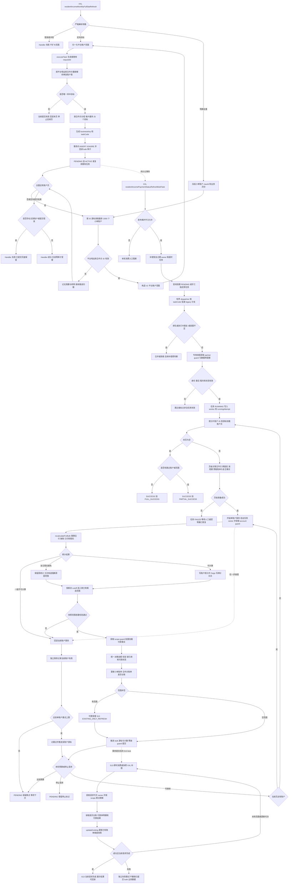

[业务逻辑专辑](/knowledge/business-logic/) / 居民收益付款 / 居民收益月度全量统计刷新

说明月度统计任务的账户范围、批量任务提交、截止账期与金额口径、逐账户事务、付款投影和已有快照刷新，以及重试与核查边界，附逐章原文对照。本文保留原文 12 章及源码定位索引，正文连续展开，原文对照与流程源码按需展开。

**前置阅读：** [S13 · 付款结果查询快照刷新](/knowledge/business-logic/resident-income/s13-付款结果查询快照刷新/)

**快速阅读：** [阅读起点](#reading-start) · [核心调用链](#chapter-3) · [统计金额与落库](#chapter-6) · [异常与重试](#chapter-8) · [完整流程](#chapter-10) · [源码索引](#source-index)

<div class="business-logic-article">

<div id="reading-start"></div>

## 阅读前：先跟着一个账户走一遍

**下面是沿用原文数据的假设场景，不是实际运行记录。** 平台电站 A 与合作方 B 对应一个小单账户，收益从 2026 年 1 月开始，约定“本月支付上月”。现在进入 2026 年 9 月，账单或人工操作即使没有发生变化，账户应统计到的月份也可能需要向前推进。

假设工作人员通过 **XXL-Job（本系统使用的任务调度平台）** 触发 `residentIncomeMonthlyFullStatRefresh`。这里假设了发起人；原文没有确认线上由谁触发，也没有确认实际调度日期和频率。这个 **Handler（供调度平台调用的 Java 入口方法）** 先固定业务月份 `202609`，再找出要处理的账户。它不当场把所有金额算完，而是把账户分组，写成 **bulk（一次承载一组账户的批量后台任务）** 。这些待执行记录也叫“任务种子”，意思是先把待办可靠地存进数据库。

随后， **worker（真正领取任务并处理账户的后台执行者）** 领取种子。对这个账户，付款统计的 **cutoff（截止账期，也就是这次金额算到哪一个月）** 应为 `202608`。假设 1—8 月租金共 800 元，累计抵扣 70 元，小单账户累计已付 500 元，并且小单统计已经就绪，那么小单账户暂扣未支付租金就是 `max(800 - 70 - 500, 0) = 230` 元。

算完账户，不等于全部历史账单都重刷。如果旧 cutoff 是 `202607`，本次主要把 `(202607, 202608]` 内、原付款状态符合条件的已有记录送去刷新。系统更新三张底表上的 **付款投影（依据现有付款事实重新算出的状态、金额、校验和锁引用字段）** ，再提交 **S13（原文对后续“账单维度展示快照刷新”处理的称呼）** 。S13 只更新已有展示快照，不补建缺失快照。

所以，主线可以读成： **提交账户待办 → 后台逐户重算 → 刷新选中账期的三表投影 → 后续更新已有展示快照** 。最终得到的是重新计算后的账户统计和相关展示，不是一次新的付款。这条链路 **不创建付款单、不提交审核、不发起司库支付，也不生成新的小单租金账单** 。入口显示成功，只说明种子已受理；金额是否落库、后台是否全部处理、展示是否更新，还要分层核对。[E01](#source-e01) [E11](#source-e11) [E12](#source-e12) [E20](#source-e20) [E33](#source-e33)

> **阅读对象** ：有 Java 开发基础，但尚不熟悉居民收益付款业务的开发者。
>
> **依据** ：附件《residentIncomeMonthlyFullStatRefresh 源码与业务链路梳理》。原文分析日期为 **2026-09-09** 。本阅读版保留原文第 1—12 章及其小节对应关系；解释只用于展开原文，不代表重新执行了源码核查或线上验证。

<div id="intro-heading-1"></div>

### 证据范围与源码版本

原文以分析时的本地源码、实际 **Mapper SQL（数据访问映射层中的真实查询和更新语句）** 及枚举为依据，仓库信息如下。

| 项目 | 原文记录 |
| --- | --- |
| 主仓库 | `/Users/wangyi/BZ/zx-monitor/zxbaif` |
| 主仓库分支 | `Ian/review/01` |
| 主仓库 HEAD | `94b0da61105a8e13da27f877b6883e4e7c495f14` |
| 关联基础服务仓库 | `/Users/wangyi/BZ/zx-monitor/zxbaie` |
| 基础服务分支 | `zx_test_250330` |
| 基础服务 HEAD | `21aac5b4821de7e7ae1bd660f896b3e890115cfc` |

两个工作区当时都有既存未提交修改，因此 **HEAD 不能单独代表原文读取到的全部文件内容** 。原文按当时实际文件分析，没有修改业务代码；没有触发 XXL Job，没有执行生产库或测试库读写，没有调用实际 **Feign（通过 Java 接口发起的跨服务调用）** ，也没有运行 Java 测试。

部署版本、线上调度参数和业务数据结果都 **暂时无法确认** 。文内 `[E01]`—`[E42]` 保留原文源码定位；这些是作者机器上的本地路径，不是本阅读版已打开或已验证的在线链接。HTML 版可先跳到页内源码定位索引，再复制完整路径。

<details class="original" id="original-intro">
<summary>展开原文标题、版本与核查范围</summary>

<div id="original-intro-heading-0"></div>

### residentIncomeMonthlyFullStatRefresh 源码与业务链路梳理

> 分析日期：2026-09-09。以当前本地源码、实际 Mapper SQL 和枚举为依据。
>
> 主仓库：`/Users/wangyi/BZ/zx-monitor/zxbaif`，分支 `Ian/review/01`，HEAD `94b0da61105a8e13da27f877b6883e4e7c495f14`。
>
> 关联基础服务仓库：`/Users/wangyi/BZ/zx-monitor/zxbaie`，分支 `zx_test_250330`，HEAD `21aac5b4821de7e7ae1bd660f896b3e890115cfc`。
>
> 两个工作区有既存未提交修改；本文按分析时实际文件读取，未修改业务代码。未触发 XXL Job、未执行生产/测试库读写、未调用实际 Feign 服务，未运行 Java 测试。部署版本、线上调度参数及业务数据结果均 **暂时无法确认** 。文中 `[E01]` 等链接可直接跳到本地源码位置。

</details>

<div id="chapter-1"></div>

## 1. 任务概览

先把这个任务的职责说准确：它是居民收益账户统计的 **批量重算种子提交入口** ，不是直接执行支付的入口，也不是在一次 Handler 调用中完成所有账户重算的同步接口。

它先确定账户范围，把账户转换成“平台电站 + 合作方”的业务身份，再按合作方拆成可以持久化保存的 bulk 任务。后台 worker 才负责计算账户金额、刷新账单付款投影，并提交账单维度展示快照任务。[E01](#source-e01) [E03](#source-e03) [E04](#source-e04)

| 要看什么 | 本任务的具体行为 |
| --- | --- |
| Java 调度入口 | `FinancialMonthJob.residentIncomeMonthlyFullStatRefresh(String param)` |
| 所在模块 | `financial-center` |
| 不指定目标时扫谁 | `fi_customer_account` 中，ID 为正且不超过本次冻结最大 ID 的小单账户；扫到以后还要校验平台电站 ID、合作方 ID |
| 可以指定谁 | 当前版本的平台账户范围；或者兼容账户 ID、电站 ID、合作方账户 ID、合作方机构 ID |
| 数据库任务类型 | `fi_async_task.task_type = RESIDENT_INCOME_PAYMENT_STATUS_BULK_REFRESH` |
| 任务载荷内的业务类型 | `task_data.bulkType = ACCOUNT_STAT_RECALCULATE`，说明这一批任务做的是账户统计重算 |
| 默认全量的触发来源 | `changeSource = MONTHLY_FULL_REFRESH` |
| 后台实际从哪里消费 | `residentIncomePaymentStatusRefreshBulkTask` → 补偿编排 → 专用 dispatcher（投递器）→ legacy bulk worker（当前普通 bulk 分支的执行者） |
| 最终可能更新什么 | 账户统计、三张底表的付款投影、已有账单维度展示快照 |
| 明确不做什么 | 不创建付款单；不提交审核；不发起司库支付；不生成新的小单租金账单 |
| 多久执行一次 | Java 只注册了 Handler，没有配置它的 cron（调度时间表达式）；每月何日运行、失败重试次数、阻塞策略均暂时无法确认 |

名字中的两个词容易误导。

**“月度”** 指本次使用一个固定业务月份，按付款周期推导统计截止账期，不能据此推断线上 cron。

**“全量”** 首先说的是账户扫描范围，不能直接翻译成“所有历史账单都重新计算付款状态”。账户金额的累计范围和账单投影的刷新范围并不相同，后面第 4.6、9.1 节会具体展开。

<details class="original" id="original-chapter-1">
<summary>展开第 1 章完整原文对照 · 原文 11—29 行</summary>

<div id="original-1-heading-0"></div>

### 1. 任务概览

`residentIncomeMonthlyFullStatRefresh` 是居民收益账户统计的 **批量重算种子提交入口** 。它先找到需要处理的账户，将目标转成平台账户业务键，按合作方拆分成持久化 bulk 任务；后续 worker 才重算账户金额、刷新账单付款投影，并提交账单维度展示快照任务。[E01](#source-e01)[E03](#source-e03)[E04](#source-e04)

| 项目 | 源码行为 |
| --- | --- |
| XXL Handler | `FinancialMonthJob.residentIncomeMonthlyFullStatRefresh(String param)` |
| 执行模块 | `financial-center` |
| 默认范围 | `fi_customer_account` 中本次冻结最大 ID 以内、正 ID 的小单账户；再校验平台电站和合作方 ID |
| 可选定向范围 | 当前版本平台账户范围；或兼容账户 ID、电站 ID、合作方账户 ID、合作方机构 ID |
| 持久化任务类型 | `fi_async_task.task_type = RESIDENT_INCOME_PAYMENT_STATUS_BULK_REFRESH` |
| 任务内部类型 | `task_data.bulkType = ACCOUNT_STAT_RECALCULATE` |
| 默认全量触发来源 | `changeSource = MONTHLY_FULL_REFRESH` |
| 实际消费入口 | `residentIncomePaymentStatusRefreshBulkTask` → 补偿编排 → 专用 dispatcher → legacy bulk worker |
| 最终影响 | 账户统计、三张底表的付款投影、已有账单维度快照 |
| 不承担的业务动作 | 本链路没有创建付款单、提交审核、发起司库支付、生成新的小单租金账单 |
| 调度频率 | Java 中仅注册 Handler，没有配置其 cron；是否每月何日运行、失败重试次数、阻塞策略， **暂时无法确认** |

“月度”体现在使用本次固定的业务月份推导付款截止账期；“全量”首先描述 **账户扫描范围** ，不能直接理解为“所有历史账单均重新刷新”。

</details>

<div id="chapter-2"></div>

## 2. 业务目的

居民收益付款不是只看一张表。小单账单提供应计租金，合作方账单提供拟付租金和抵扣；付款周期决定当前应统计到哪一月；付款结果与期初已付数据则说明已经付了多少。

问题在于： **时间自己向前走，也可能改变统计边界。** 即使没有新账单推送，没有人点击业务操作，新的自然月也可能使付款周期的截止月变化。如果账户里预先保存的应付金额、累计抵扣、已付金额、暂扣金额和缺账标记不更新，账户列表、业务校验和付款相关展示就可能继续读取旧结果。

本任务的作用，就是先生成持久化重算任务，周期性补刷账户统计，再让选中的相关账期付款投影与当前事实重新对齐。这里的“对齐”是重算现有数据的结果，不是创造新的付款事实。[E12](#source-e12) [E14](#source-e14) [E18](#source-e18)

<div id="sec-2-1"></div>

### 2.1 用一个例子串起业务

继续使用开头的 **假设案例** ：平台电站 A、合作方 B、一个小单账户，收益从 2026 年 1 月开始，付款周期为“本月支付上月”。

| 这一步在回答什么 | 假设事实与计算结果 |
| --- | --- |
| 本次按哪一个月算 | 2026 年 9 月触发，固定业务月份为 `202609`，统计截止月为 `202608` |
| 截止月内应计多少租金 | 已存在的 1—8 月账单 `rent` 合计 800 元，因此 `current_payable_amount = 800`；这是租金毛额，还没有减抵扣或已付 |
| 总共抵扣多少 | 合作方全部账单抵扣 50 元，加上最新有效期初抵扣 20 元，累计为 70 元 |
| 小单账户总共付了多少 | 小单账户期初已付 100 元，加上账户维度有效付款结果累计 400 元，因此该账户 `paid_amount = 500` |
| 暂扣未支付租金是多少 | 小单侧统计就绪时，`max(800 - 70 - 500, 0) = 230` 元 |
| 哪些月份的投影进入刷新 | 假设旧 cutoff 为 `202607`，主要选择 `(202607, 202608]` 内、状态符合条件的已有账单和差异台账；不是自动重刷 1—8 月所有投影 |

这里有两条不同的时间线。业务上，账户可能统计 1—8 月累计金额，但只刷新截止月变化所涉及的那部分账期投影。执行上，入口先提交种子，worker 成功处理账户后才推进“已提交账户断点”，相关展示快照还要由 S13 后续消费。

因此，看到入口提交成功，不能直接认定示例里的 800、70、500、230 已经落库；也不能认定已有展示快照已经变成这些结果。

<details class="original" id="original-chapter-2">
<summary>展开第 2 章完整原文对照 · 原文 31—48 行</summary>

<div id="original-2-heading-0"></div>

### 2. 业务目的

居民收益付款涉及几组不同数据：小单账单提供应计租金，合作方账单提供拟付租金和抵扣，付款周期决定当前应统计到哪个月，付款结果与期初已付数据决定已经付了多少。

随着自然月推进，即使没有新的账单推送或人工操作，付款周期的截止月也可能改变。如果账户上存储的应付金额、累计抵扣、已付金额、暂扣金额和缺账标记不更新，账户列表、校验和付款相关展示就可能继续使用旧统计。该任务通过持久化重算任务，对账户范围进行周期性补刷，再让相关账期的付款投影与当前事实重新对齐。[E12](#source-e12)[E14](#source-e14)[E18](#source-e18)

<div id="original-2-2-1"></div>

#### 2.1 用一个例子串起业务

假设平台电站 A 与合作方 B 对应一个小单账户，收益从 2026 年 1 月开始，付款周期为“本月支付上月”：

- 2026 年 9 月触发全量任务，固定业务月份为 `202609`，本次重算截止月为 `202608`。
- 已存在 1—8 月账单的 `rent` 合计为 800 元，则 `current_payable_amount = 800`。这里是 **租金毛额** 。
- 合作方全部账单抵扣为 50 元，最新有效期初抵扣为 20 元，则累计抵扣为 70 元。
- 小单账户期初已付为 100 元，账户维度有效付款结果累计为 400 元，则小单账户 `paid_amount = 500`。
- 小单侧统计就绪时，暂扣未支付租金为 `max(800 - 70 - 500, 0) = 230` 元。
- 若旧截止月为 `202607`，本次三表状态范围主要选择 `(202607, 202608]` 内符合状态条件的已有账单/差异台账。不是自动重刷 1—8 月全部付款投影。

账户金额刷新成功后，worker 将已提交账户断点向前推进；相关展示快照还需要 S13 后续消费。因此，看到入口提交成功，不能直接认定上述 800、70、500、230 已经落库。

</details>

<div id="chapter-3"></div>

## 3. 核心调用链

这条链需要分三段看： **入口提交待办、后台领取待办、逐个账户完成业务事务** 。把这三段混成一个同步方法，后面的成功、失败和重试语义就会看错。

<div id="sec-3-1"></div>

### 3.1 提交阶段：从 Handler 到持久化 bulk

业务上，这一步只是在回答“哪些账户需要处理，分别交给哪一份后台待办”。其中 **payload（任务载荷）** 就是描述目标、业务月份、来源和身份的一组参数； **业务键** 是能够表达业务对象身份的字段组合，不一定等于数据库主键。

实际调用链保留如下：

```text
FinancialMonthJob.residentIncomeMonthlyFullStatRefresh
  ├─ parseResidentIncomeTaskParam
  ├─ 有目标：ResidentIncomeRecalculateTaskServiceImpl.executeTask
  └─ 全量：executeResidentIncomeMonthlyFullStatRefresh
       ├─ FiCustomerAccountService.queryMonthlyFullRefreshMaxId
       ├─ FiCustomerAccountService.queryMonthlyFullRefreshPage
       ├─ 组装 V2_PLATFORM_ACCOUNT 平台账户范围
       └─ ResidentIncomeRecalculateTaskServiceImpl.executeTask
            ├─ normalizePayload / buildRequestId / buildBusinessKeys
            └─ ResidentIncomeAccountStatBulkTaskSubmitServiceImpl.submitByBusinessKeys
                 ├─ resolveCanonicalTargets：重新解析两张账户表
                 ├─ 按 partnerOrgId 分组，每片最多 25 个目标
                 └─ ResidentIncomePaymentStatusBulkRefreshTaskServiceImpl
                      .createStatusRefreshBulkTask
                       ├─ ensurePartnerGuard
                       ├─ fi_async_task INSERT IGNORE
                       └─ 按 task_code 回读并校验身份
```

`resolveCanonicalTargets` 的意思是重新查询账户表，确定规范、唯一的处理目标。它不是不加验证地相信上游传来的账户关联。

这里有三个不同层次的批量大小，不能把它们当成同一个参数：

| 层次 | 上限 | 在做什么 |
| --- | --- | --- |
| 全量入口每页 | 1,000 条小单账户 | 每扫描一页，最多提交一次 `executeTask` |
| 重新解析业务键时每批 | 500 个业务键 | 分批查询两张账户表，确认业务身份 |
| 最终一个 bulk 种子 | 25 个目标 | 同一个种子里的目标属于同一合作方 |

例如，不能因为业务键查询支持一次 500 个，就说这个月度入口会创建“500 个账户一片”的种子；实际分片上限是 25。[E01](#source-e01) [E04](#source-e04)

`submitByBusinessKeys` 有 **Spring 事务（这次调用里的本地数据库改动一起提交或一起回滚）** 。一个入口页面解析后生成的多个兄弟分片，会参加该次页面提交事务。如果其中某一片创建失败，异常向上抛出，该次提交回滚。

但已经成功提交的前一页不会跟着回滚。这里没有一笔包住整场全量扫描的超大事务。

<div id="sec-3-2"></div>

### 3.2 消费阶段：定时补偿、线程池与 worker

种子写入数据库后，还需要消费入口来找出可以执行的任务。 **补偿编排** 在这里指先做状态对账、过期占用和超时任务恢复，再安排待执行任务；并不是重新发起一笔支付。

**dispatcher（任务投递器）** 负责把任务交给专用线程池。 **legacy** 是代码对普通 bulk 执行分支的命名，不能因为英文里有“旧”的意思，就判断这条分支已不再使用。

```text
ResidentIncomePaymentStatusRefreshJob.residentIncomePaymentStatusRefreshBulkTask
  ├─ 金额规则发布维护开关校验
  └─ executeBulkJob
       └─ ResidentIncomePaymentStatusBulkRefreshCompensationServiceImpl
            ├─ 自动：reconcileRecoverAndDispatch
            │    ├─ 公共 PREPARED 对账、过期 guard 和超时任务恢复
            │    └─ 查待执行任务并投递
            └─ 手工：dispatchManualTaskCodes
                 ↓ 本任务属于普通 ACCOUNT_STAT_RECALCULATE 分支
            ResidentIncomePaymentStatusBulkRefreshDispatcherImpl.dispatchLegacy
                 ↓ 专用 ThreadPoolExecutor
            ResidentIncomePaymentStatusBulkRefreshAsyncTaskServiceImpl
              .executeLegacyTaskByTaskCode
               ├─ claimTaskWithResult：partner guard + task RUNNING + 配额
               └─ executeClaimedTask
                    ├─ queryNextAccountPage
                    ├─ buildPageContexts
                    └─ 逐账户 processSingleAccount
```

开始消费之前，还有“金额规则发布维护开关”的校验。自动调度走 `reconcileRecoverAndDispatch`，手工指定任务走 `dispatchManualTaskCodes`；本月度任务属于普通 `ACCOUNT_STAT_RECALCULATE` 分支。

当前 Job 已经调用补偿编排和 dispatcher。代码中虽然还存在旧方法 `executePendingTasks()`，但不能把它直接画成当前这个 XXL 入口的主调用链。[E07](#source-e07) [E08](#source-e08) [E09](#source-e09) [E10](#source-e10)

<div id="sec-3-3"></div>

### 3.3 业务处理阶段：一个账户何时算处理完成

真正按账户落业务数据的是 `processSingleAccount`。它是主要业务事务边界，默认事务超时为 **300 秒** 。[E11](#source-e11)

先解释几个保护机制。 **guard（数据库中的处理保护记录）** 用来确认当前由谁处理某个合作方、账户或电站账期范围。 **owner（当前持有处理权的执行者）** 必须与记录吻合； **lease（租约）** 表示处理权只在有效时间内成立；`runningAttempt` 是运行尝试号，用于区分旧一轮和新一轮执行者。它们不是付款单上的真实业务付款锁。

一个账户按下面的顺序处理，不能任意交换：

1. **先确认这个 worker 仍有处理权。** 锁定仍为 `RUNNING` 的任务行，核对 partner guard 中 `taskCode + workerId + runningAttempt` 的所有权组合及有效租约，并检查停止请求。
2. **再确认这个账户是否已处理过。** 如果账户已经位于持久化游标之前，就按已处理返回，避免在同一任务内重复写入。
3. **重新确认账户身份并取得账户保护。** 再查账户，校验合作方、`small_station_id` 以及版本化平台账户范围，再按路由取得 V1 或 V2 account guard。
4. **重算账户。** 调用 `ResidentIncomeAccountStatServiceImpl.recalculateForBulk(context, currentMonth, auditEnabled)`，回写统计，重算账户已付和暂扣，并写远程审计日志。不可计算时存在不同分支，不能把这一步理解为必然写入新统计，详见第 8.3 节。
5. **决定哪些账期需要重刷。** 根据新旧 cutoff 构造 **station-month / scope（电站与账期组成的刷新范围）** ，合并小单账单、合作方账单、差异台账的 **locator（定位字段，用来说明这个范围对应哪条业务记录）** 。
6. **保护范围后刷新三表。** 获取 scope guard，在当前事务中完成三张底表的付款投影刷新。
7. **范围非空时受理后续快照任务。** 可靠受理 S13 账单维度快照任务，并登记 **after-commit kick（事务成功提交后再尝试唤起后台消费）** 。登记唤起动作不是在这里同步完成快照。
8. **最后推进断点并提交。** 使用带租约条件的 SQL 更新 `cursorAccountId`、账户数和范围数，释放 account guard，然后提交事务。

同一个账户的 **统计、三表投影、本地快照种子受理和 bulk 游标推进，应在同一个本地事务内成功** 。其中任一步抛异常，这个账户业务事务中的本地改动回滚；随后 worker 用另一笔独立事务记录失败次数。

“本地事务”不包含所有事情。页级合作方抵扣刷新在单账户事务之前，远程审计写到另一个服务，S13 则在后续独立执行。它们的边界分别在第 6.4、7.3、7.4 和第 9 章展开，不能被上面的“同一事务”一并覆盖。

<details class="original" id="original-chapter-3">
<summary>展开第 3 章完整原文对照 · 原文 50—116 行</summary>

<div id="original-3-heading-0"></div>

### 3. 核心调用链

<div id="original-3-3-1"></div>

#### 3.1 提交阶段：从 Handler 到持久化 bulk

```text
FinancialMonthJob.residentIncomeMonthlyFullStatRefresh
  ├─ parseResidentIncomeTaskParam
  ├─ 有目标：ResidentIncomeRecalculateTaskServiceImpl.executeTask
  └─ 全量：executeResidentIncomeMonthlyFullStatRefresh
       ├─ FiCustomerAccountService.queryMonthlyFullRefreshMaxId
       ├─ FiCustomerAccountService.queryMonthlyFullRefreshPage
       ├─ 组装 V2_PLATFORM_ACCOUNT 平台账户范围
       └─ ResidentIncomeRecalculateTaskServiceImpl.executeTask
            ├─ normalizePayload / buildRequestId / buildBusinessKeys
            └─ ResidentIncomeAccountStatBulkTaskSubmitServiceImpl.submitByBusinessKeys
                 ├─ resolveCanonicalTargets：重新解析两张账户表
                 ├─ 按 partnerOrgId 分组，每片最多 25 个目标
                 └─ ResidentIncomePaymentStatusBulkRefreshTaskServiceImpl
                      .createStatusRefreshBulkTask
                       ├─ ensurePartnerGuard
                       ├─ fi_async_task INSERT IGNORE
                       └─ 按 task_code 回读并校验身份
```

入口每扫描最多 1,000 条小单账户，提交一次 `executeTask`。重新解析账户业务键时每批最多查询 500 个业务键；最终每个 bulk 种子最多 25 个目标，且属于同一个合作方。这三个数字对应三个不同层次，不能混用。[E01](#source-e01)[E04](#source-e04)

`submitByBusinessKeys` 有 Spring 事务。一次页面提交中创建的兄弟分片参加该提交事务；某个分片创建失败会向上抛出业务异常，使本次提交回滚。先前页面已经提交的种子不会被整场任务失败回滚。

<div id="original-3-3-2"></div>

#### 3.2 消费阶段：定时补偿、线程池与 worker

```text
ResidentIncomePaymentStatusRefreshJob.residentIncomePaymentStatusRefreshBulkTask
  ├─ 金额规则发布维护开关校验
  └─ executeBulkJob
       └─ ResidentIncomePaymentStatusBulkRefreshCompensationServiceImpl
            ├─ 自动：reconcileRecoverAndDispatch
            │    ├─ 公共 PREPARED 对账、过期 guard 和超时任务恢复
            │    └─ 查待执行任务并投递
            └─ 手工：dispatchManualTaskCodes
                 ↓ 本任务属于普通 ACCOUNT_STAT_RECALCULATE 分支
            ResidentIncomePaymentStatusBulkRefreshDispatcherImpl.dispatchLegacy
                 ↓ 专用 ThreadPoolExecutor
            ResidentIncomePaymentStatusBulkRefreshAsyncTaskServiceImpl
              .executeLegacyTaskByTaskCode
               ├─ claimTaskWithResult：partner guard + task RUNNING + 配额
               └─ executeClaimedTask
                    ├─ queryNextAccountPage
                    ├─ buildPageContexts
                    └─ 逐账户 processSingleAccount
```

当前 Job 已调用补偿编排和 dispatcher，不应把仍然存在的 `executePendingTasks()` 旧方法直接画成该 XXL 入口的当前主调用链。[E07](#source-e07)[E08](#source-e08)[E09](#source-e09)[E10](#source-e10)

<div id="original-3-3-3"></div>

#### 3.3 业务处理阶段：一个账户何时算处理完成

`processSingleAccount` 是主要业务事务边界，默认事务超时 300 秒，顺序如下：[E11](#source-e11)

1. 锁定仍为 `RUNNING` 的任务行，验证 partner guard 的 `taskCode + workerId + runningAttempt` 所有权与有效租约，检查停止请求。
2. 如果该账户已经在持久化游标之前，直接按已处理返回，避免同一任务内再次写入。
3. 重新查账户并验证合作方、`small_station_id`、版本化平台账户范围；获取 V1 或 V2 account guard。
4. 调用 `ResidentIncomeAccountStatServiceImpl.recalculateForBulk(context, currentMonth, auditEnabled)`，回写统计、重算账户已付与暂扣，并写远程审计日志。
5. 根据新旧付款截止月构造需要刷新的 station-month 范围，合并小单账单、合作方账单与差异台账 locator。
6. 获取这些范围的 scope guard，在当前事务中执行三表付款投影刷新。
7. 有非空范围时可靠受理 S13 账单维度快照任务，登记 after-commit kick。
8. 通过带租约条件的 SQL 推进 `cursorAccountId`、账户数和范围数，释放 account guard，然后提交事务。

**账户统计、该账户三表投影、本地快照种子受理和 bulk 游标推进应在同一个本地事务内成功。** 其中任一步抛异常，账户业务事务回滚，worker 再用独立事务记录失败计数。页级合作方抵扣刷新和远程日志有不同事务边界，见第 6、9 节。

</details>

<div id="chapter-4"></div>

## 4. 数据筛选规则

筛选要分清四个问题：入口参数决定找谁；账户 SQL 决定扫描什么；业务键解析决定目标是否合法；新旧 cutoff 和状态再决定哪些已有账期要刷新。

<div id="sec-4-1"></div>

### 4.1 入参决定全量还是定向

最重要的原则是： **不认识的参数不会被悄悄当成“全量”执行。** 入口对参数进行明确校验，错误 JSON、未知字段和相互冲突的意图会失败，而不是扩大处理范围。[E01](#source-e01) [E02](#source-e02)

| 输入形式 | 实际处理 |
| --- | --- |
| 空串或全是空白 | 全量 |
| `{}` | 全量 |
| `{"full":true}` | 全量；payload 中不能再混其他字段 |
| `{"data":""}`，或者带 `enterpriseid` 的兼容空 data 包装 | 全量 |
| `{"accountIds":[123]}` | 兼容定向：先读取账户，再归一化为平台业务键 |
| `{"partnerOrgIds":[456]}` | 兼容定向：先查询相应账户，再归一化 |
| 当前版本 `payloadVersion` 加 `platformAccountScopes` | 直接校验版本化目标，格式见下方示例 |
| `{"accountId":123}` | 明确失败；单数 `accountId` 不在允许字段中 |
| 非法 JSON、只有空目标数组、存在未知字段 | 失败，不转全量 |
| 有目标，同时又带 `full` 或 `errorLogId` | 意图冲突，失败 |
| 只有 `errorLogId` | 失败；本 Handler 不处理错误日志重试，且此时既没有有效目标，也不是全量 |

下面只是 **定向格式示例，没有实际执行过** ：

```json
{
  "payloadVersion": "V2_PLATFORM_ACCOUNT",
  "platformAccountScopes": [
    {"stationId": 10001, "partnerOrgId": 20001, "billYearMonth": "202609"}
  ],
  "triggerType": "MONTHLY_FULL_REFRESH",
  "requestId": "manual-monthly-stat-202609-example"
}
```

`payloadVersion = V2_PLATFORM_ACCOUNT` 表示使用平台账户范围这一版本的载荷。范围中直接给出 `stationId`、`partnerOrgId`、`billYearMonth`，而不是让一个含糊的旧 ID 自动代表全部业务身份。

这里的月份不能随意解读。指定 `MONTHLY_FULL_REFRESH` 时，各个范围的业务月份必须一致，该月份会继续作为 bulk 的 `currentMonth` 传递。其他触发类型走普通重算提交分支，bulk 用的是提交时的当前月份；不能仅凭 scope 里写了一个历史月份，就判断系统会按那个历史月重算。[E03](#source-e03) [E04](#source-e04)

未声明版本的旧载荷，会通过两类账户查询归一化。如果同一个业务键无法唯一定位，明确失败。还有一个覆盖边界：旧查询只使用一次 `SearchModel(10000)`，不是全量 Handler 那样不断推进游标的分页循环。因此，不能把全量扫描的覆盖保证直接套到大范围旧格式定向请求上。[E03](#source-e03)

<div id="sec-4-2"></div>

### 4.2 全量账户扫描：真实 SQL 没有附加业务筛选

默认全量不是“查询业务上符合付款条件的有效账户”，而是先按 ID 扫描小单账户表。SQL 如下：

```sql
SELECT MAX(id)
FROM fi_customer_account;

SELECT id, station_id AS stationId, partner_org_id AS partnerOrgId
FROM fi_customer_account
WHERE id > :lastId
  AND id <= :frozenMaxId
ORDER BY id ASC
LIMIT 1000;
```

开始时，系统只读取一次 `frozenMaxId`，把它当成本轮最大 ID 边界；`lastId` 从 0 开始，每页必须向更大的 ID 推进。因为条件是 `id > lastId AND id <= frozenMaxId`，本轮默认扫描的是这个冻结上界以内的正 ID 账户。[E05](#source-e05)

与此同时，`eventMonth` 也只在开始时固定一次，取自 `Clock.systemDefaultZone()` 对应的当前月。这里使用的是程序的系统默认时区，不是阅读者电脑时区。即使任务跨月运行，后面的页面也不会改用新的业务月份；原文没有确认部署环境的实际时区配置。

查询范围只有 `fi_customer_account`，不是小单账户和 `fi_customer_account_partner` 的并集。SQL **没有** 付款状态、是否配置付款周期、租期起止、是否已经付完的限制，也 **没有 `deleted` 条件** 。因此，不能替源码加上“只处理有效账户”的解释。

查出一行后，Java 再检查 `stationId > 0 && partnerOrgId > 0`。这是 **AND** ：平台电站和合作方 ID 必须同时有效。无效账户仍然推进扫描游标，累计到 `invalidCount`，最多记录 **20 个账户 ID 样例** ；其他合法账户继续提交，但最终 Handler 返回失败。

如果返回 ID 为空、不递增或超过冻结上界，就不是普通无效业务键，而是游标异常，扫描会终止。

最后要区分 **冻结 ID 上界** 和 **数据库快照** 。本轮没有冻结整张表的内容，扫描期间旧行仍可能被更新或删除。正常递增且超过上界的新 ID 留到下一次触发；如果历史低 ID 被回填到已经走过的游标之前，本轮也不保证能够覆盖。

<div id="sec-4-3"></div>

### 4.3 平台账户业务键解析

业务上，一个处理对象用 `(platformStationId, partnerOrgId)` 表示，即“哪个平台电站、哪个合作方”。这个身份在两张账户表里的字段名并不相同：[E04](#source-e04) [E05](#source-e05) [E06](#source-e06)

| 账户表 | 构成同一业务键的字段 |
| --- | --- |
| 小单账户 | `station_id + partner_org_id` |
| 合作方账户 | `platform_station_id + partner_org_id` |

提交服务会同时查两张表，再按命中情况选择目标。

| 查询结果 | 如何处理 |
| --- | --- |
| 小单表恰好一行；合作方表零行或一行 | 以小单账户为处理目标 |
| 小单表零行；合作方表恰好一行 | 以 partner-only 主体为目标 |
| 任意一张表中，同一业务键有多行 | 抛错，不是随便取第一行 |
| 两张表都没有命中 | 抛错，不创建一个空范围的全量任务 |

**partner-only（只有合作方账户、没有对应小单账户的处理主体）** 不是新建出来的小单账户，而是合作方账户的临时处理载体。全量入口从小单账户表产生目标，所以数据稳定时主要走小单分支；定向入口可以覆盖 partner-only。[E12](#source-e12)

partner-only 调用 `recalculatePartnerOnlyForBulk`：重算平台账户已付累计，以任务当前月作为刷新 cutoff；不计算、不写入小单当前应付和缺账统计。不存在小单侧统计事实时，不重新计算暂扣。随后从合作方账单和差异台账构造范围，继续走普通投影和 S13；它不会为了凑齐两侧而补建小单账户。

还有一个名称陷阱：本次种子的 `stationFilterMode = PARTNER_ALL`，不意味着可以扩成合作方全部账户。因为这里仍受 **非空 `accountIds` 集合** 约束。worker 的小单分页条件是：合作方相同 **AND** `id > cursorAccountId` **AND** `id IN 本分片账户集合`，按 ID 升序分页。SQL 还显式使用 `idx_account_partner_cursor` 索引。[E05](#source-e05) [E27](#source-e27)

<div id="sec-4-4"></div>

### 4.4 账户统计需要加载的事实

为了处理一页账户，`buildPageContexts` 会先批量读取资料和金额，整理成 **context（本次处理所需的上下文数据）** 。这一步不是单账户事务内部的重新现查，后面的一致性风险与此有关。[E13](#source-e13) [E37](#source-e37) [E38](#source-e38)

| 预先准备的事实 | 真正的查询或选择条件 | 用于回答什么 |
| --- | --- | --- |
| 关联合作方账户 | 当前页 `small_station_id` 集合 + 同一个 `partner_org_id`；同一小单电站 ID 命中多行直接失败 | 合作方账单和抵扣应归属于哪一个账户 |
| 合作方付款周期 | Feign 查询合作方档案，`search.id = partnerOrgId` | 读取 `payment_cycle`、`partner_config_version`；本任务不修改这些配置 |
| 小单最大生成账期 | 按 `customer_account_id + station_id` 分组，取 `MAX(bill_yearmonth)` | 支持“按已生成账单最后一期”的周期算法 |
| 小单租金累计 | 匹配 `customer_account_id`；起算月非空时要求 `bill_yearmonth >= 起算月`，并且 `bill_yearmonth <= cutoff` | 计算 `SUM(rent)`；不按付款状态筛选 |
| 已生成月份集合 | 同账户，起算月到 cutoff，月份去重、按月排序，再 JSON 聚合 | 与应有月份比较，找出缺账月份 |
| 合作方全部账单抵扣 | `customer_account_id IN 合作方账户集合`；不限制账期，不限制付款状态 | 计算 `SUM(deduction_amount)` |
| 期初抵扣 | `partner_customer_account_id IN 集合 AND status = 1`；每账户按 `update_time DESC, id DESC` 取最新一条 | 把最新有效期初抵扣加入累计抵扣 |
| 阳光复合周期事实 | property Feign 按平台电站 ID 集合读取 `record_way` | 把复合付款规则解析成基础付款周期 |
| 尚方复合周期事实 | `fi_customer_share_rule` 按 `station_id` 集合读取 `stage, rent_pay_method`，按 stage 升序；选择时 `RENT_RATE` 优先 | 与账户 `rent_pay_method_change_type` 一起解析周期 |

“最新有效期初抵扣”有两层条件：先限定 `status = 1`，再按更新时间倒序、ID 倒序择最新，不能改写成“所有期初抵扣相加”。“合作方全部账单抵扣”则恰好相反，是汇总全部符合账户集合的账单，不受当前 cutoff 和付款状态约束。

当前应付的实际批量 SQL 是 `ResidentIncomeAccountStatBatchMapper.sumRentByScopes`，不能猜成单账户的 `sumRentByAccountAndCutoff`。缺账集合查询使用 `JSON_ARRAYAGG(...) OVER (...)` 和 `ROW_NUMBER()`，即用 JSON 聚合与窗口函数整理月份集合。源码明确保留了目标 SQL 待验证标记，不能因为文档把逻辑讲清楚，就认定它已经在目标库验证通过。[E14](#source-e14)

<div id="sec-4-5"></div>

### 4.5 付款周期如何决定截止月

这个环节要分两层理解：基础付款周期算法先算出一个付款账期，账户统计再决定自己最终采用哪个截止月。 **基础算法的结果，不总是最终统计 cutoff。**

季度、半年基础算法先找到不晚于当前月份的最近支付月，下面记作 `P`。固定支付月份来自原文 [E42](#source-e42)。随后，账户统计还经过 `ResidentIncomeAmountUtils.resolveCurrentPayableCutoffMonth` 二次转换。[E15](#source-e15) [E16](#source-e16) [E36](#source-e36)

| 基础周期 | 账户最终使用的统计截止月 | 假设当前月为 `202609` |
| --- | --- | --- |
| 本月支付上月 | `cutoff = 当前月 - 1` | `202608` |
| 1/4/7/10 月支付上季度 | 基础周期先返回 `P - 1`；账户统计改为“不晚于当前月的最近季度末” | 基础 cutoff 是 `202606`，但最终统计 cutoff 是 **`202609`** |
| 1/4/7/10 月预支付本季度 | 最近支付月 `P`，`cutoff = P + 2` | `P = 202607`，cutoff 为 `202609` |
| 6/12 月支付本半年 | 最近支付月 `P`，`cutoff = P` | `P = 202606`，cutoff 为 `202606` |
| 3/6/9/12 月支付本季度 | 最近支付月 `P`，`cutoff = P` | `P = 202609`，cutoff 为 `202609` |
| 按已生成账单最后一期 | 当前账户已生成小单账单的最大账期 | 以真实账单最大月为准；没有账单时不可计算 |

“支付上季度”的特殊统计公式为：

```java
currentMonth.minusMonths(monthValue % 3)
```

按这个公式，8 月累计到 6 月，9 月累计到 9 月，10 月仍累计到 9 月。也就是说，账户统计在季度末就会变化，不必等下个月支付时才变化。这是原文确认的特殊统计口径，不应为了让周期名称听起来更直观，就把 9 月 cutoff 擅自改回 6 月。

后续比较新旧 cutoff 来选择刷新范围时，用的也正是 **这个最终统计截止月** ，不能拿基础算法返回的 `cutoffMonth` 直接替代。[E36](#source-e36)

**复合周期** 是“还需要其他业务事实，才能知道应该采用哪种基础周期”的规则。先解析，再按基础规则计算：[E17](#source-e17)

| 复合规则 | 条件 | 解析结果 |
| --- | --- | --- |
| 阳光 | 非自然人备案 | 半年支付本半年 |
| 阳光 | 自然人备案 | 季度支付本季度 |
| 阳光 | 备案方式缺失或不支持 | 复合事实缺失 |
| 尚方 | `RENT_RATE` | 按已生成账单最后一期 |
| 尚方 | `SPLIT_MODE`，且付款方式无变更 **或** 变更类型为空 | 季度支付上季度 |
| 尚方 | 发生 `RATE_TO_AMOUNT` 或 `AMOUNT_TO_RATE` | 本月支付上月 |
| 尚方 | 其他缺失或不支持的组合 | 复合事实缺失 |

尚方如果解析成“支付上季度”，同样要做上面的统计 cutoff 转换。表中保留原文的条件层次；不能把第二个尚方分支改成“只要变更类型为空，就一律按季度计算”。原文也没有说明所有复合字段冲突时的更细分行为，本阅读版不补造规则。

实际合作方配置了哪种周期、property 真实返回了什么备案事实，原文均 **暂时无法确认** 。

<div id="sec-4-6"></div>

### 4.6 需要刷新哪些账期的付款状态

账户金额算完后，还要决定哪些已有账期进入投影刷新。本任务默认策略是 `scopeStatusStrategy = BY_CUTOFF_CHANGE`，即 **按截止月变化选择范围** ，不是 `EXACT_FACT_CHANGE` 这种按精确事实变更选择范围的策略。默认值还包括 `includePaid=false`、`includeNoNeedPayWhenExpand=true`。[E20](#source-e20) [E40](#source-e40)

令旧 cutoff 为 `O`，新 cutoff 为 `N`。`refreshEndMonth = max(O, N)`；一边为空时用另一边的非空值。不同关系对应下面的区间和状态条件。

| 新旧 cutoff 关系 | 月份条件 | 允许成为候选的原付款状态 |
| --- | --- | --- |
| `O` 为空、`N` 非空 | `month <= N` | 未完结状态 + 无需付款 |
| `N > O`，向后扩展 | `O < month <= N` | 未完结状态 + 无需付款 |
| `N < O`，向前收缩 | `N < month <= O` | 仅未完结状态 |
| `N = O` | `month <= O`，没有下界 | 仅未完结状态 |
| `O` 非空、`N` 为空 | `month <= O` | 仅未完结状态；但实际执行须先通过不可计算结果校验 |
| `O`、`N` 都为空 | 没有可展开范围 | 返回空范围 |

注意两个容易误读的地方。第一，扩展时下界不包含旧月：`O < month`，不是 `O <= month`。第二，新旧月份相等时 **不是不处理** ，而是选择截止月以内全部符合未完结状态的已有账期。

“未完结状态”不是自然语言上所有“看起来没完”的状态，而是固定集合： **`20 未付款、30 付款审核、40 待付款、60 部分付款、70 付款失败、99 合作方未推送账单`** 。SQL 用 `IN` 判断，`NULL` 不属于这个集合；默认不含 `50 已付款`。表中的“无需付款”对应付款状态 `10`，只在表明包含它的分支加入。[E20](#source-e20) [E21](#source-e21)

符合月份和状态条件的候选范围，来自三张表的并集：

| 来源表 | 账户或记录定位条件 | 月份与状态字段 |
| --- | --- | --- |
| 小单账单 | `customer_account_id = 小单账户 ID` | 按 `bill_yearmonth` 和候选 `payment_status` 筛选 |
| 合作方账单 | `customer_account_id = 合作方账户 ID` | 按 `bill_yearmonth` 和候选 `payment_status` 筛选 |
| 差异台账 | 有 `small_station_no` 时优先按小单电站编号；没有编号才按 `partner_customer_account_id` | 按 `share_month` 和候选 `payment_status` 筛选；优先使用的小单编号 SQL **没有附加 `partner_org_id`** |

这些都是“找已经存在的行”。单纯缺少某个月账单，不会为那个缺月自动生成 scope，也不会新建账单。[E20](#source-e20) [E22](#source-e22)

合并后按平台电站—月份组织范围。如果同一个站月的 `diffId / partnerBillId / partnerCustomerAccountId / partnerOrgId` 定位出现冲突，会抛错，而不是任意选一条。原文用这些字段说明冲突定位，未逐一列出所有其他可能参与校验的字段，本阅读版不扩大列举。

最后， **候选状态过滤与 UPDATE 条件是两回事** 。状态过滤只是决定某个站月是否被送进刷新；进去后还会重新读取该范围的事实并决策。不能据此断言每一条 UPDATE 都带有“原状态必须属于候选集合”的条件，第 6.3 节会列出真实写入定位方式。

<details class="original" id="original-chapter-4">
<summary>展开第 4 章完整原文对照 · 原文 118—262 行</summary>

<div id="original-4-heading-0"></div>

### 4. 数据筛选规则

<div id="original-4-4-1"></div>

#### 4.1 入参决定全量还是定向

入口采用明确的参数校验，未知字段或错误 JSON 不会静默扩大成全量。[E01](#source-e01)[E02](#source-e02)

| 输入 | 行为 |
| --- | --- |
| 空串/空白 | 全量 |
| `{}` | 全量 |
| `{"full":true}` | 全量；payload 中不能再混其他字段 |
| `{"data":""}` 或带 `enterpriseid` 的兼容空 data 包装 | 全量 |
| `{"accountIds":[123]}` | 兼容定向：读取账户后归一化平台业务键 |
| `{"partnerOrgIds":[456]}` | 兼容定向：查询相应账户，再归一化 |
| 当前版本 `payloadVersion` 加 `platformAccountScopes` | 直接校验版本化目标；完整格式见下例 |
| `{"accountId":123}` | `accountId` 不是允许字段，明确失败 |
| 非法 JSON、仅空目标数组、未知字段 | 失败，不转全量 |
| 有目标同时带 `full` 或 `errorLogId` | 冲突，失败 |
| 仅 `errorLogId` | 本 Handler 不执行错误日志重试；会因没有有效目标且不是全量而失败 |

定向参数示例，仅用于解释格式，不表示本次实际执行过：

```json
{
  "payloadVersion": "V2_PLATFORM_ACCOUNT",
  "platformAccountScopes": [
    {"stationId": 10001, "partnerOrgId": 20001, "billYearMonth": "202609"}
  ],
  "triggerType": "MONTHLY_FULL_REFRESH",
  "requestId": "manual-monthly-stat-202609-example"
}
```

指定 `MONTHLY_FULL_REFRESH` 时，范围中的业务月份必须一致，会作为 bulk 的 `currentMonth` 继续传递。其他触发类型走普通重算提交分支，bulk 使用提交时的当前月份，不能仅凭 scope 的月份认为它会按历史月重算。[E03](#source-e03)[E04](#source-e04)

未声明版本的旧载荷通过两类账户查询归一化；同一业务键不能唯一定位时明确失败。旧查询使用一次 `SearchModel(10000)`，并非全量 Handler 的游标扫描循环，大范围定向覆盖不能直接套用全量扫描保证。[E03](#source-e03)

<div id="original-4-4-2"></div>

#### 4.2 全量账户扫描：真实 SQL 没有附加业务筛选

```sql
SELECT MAX(id)
FROM fi_customer_account;

SELECT id, station_id AS stationId, partner_org_id AS partnerOrgId
FROM fi_customer_account
WHERE id > :lastId
  AND id <= :frozenMaxId
ORDER BY id ASC
LIMIT 1000;
```

关键规则：[E05](#source-e05)

- `frozenMaxId` 在开始时读取一次，`lastId` 从 0 开始；每一页严格向较大 ID 推进。
- `eventMonth` 在开始时固定一次，来自 `Clock.systemDefaultZone()` 对应的当前月。跨月运行也不会在页面之间更换业务月份。
- 只扫描 `fi_customer_account`；没有扫描全部 `fi_customer_account_partner` 的并集。
- SQL 没有付款状态、是否已配置周期、租期起止、是否已付完等限制，也没有 `deleted` 条件。不能自行补充“仅有效账户”等源码中不存在的语义。
- Java 要求 `stationId > 0 && partnerOrgId > 0`。不合格账户仍推进扫描游标，累计 `invalidCount`，最多记录 20 个账户 ID 样例；其他合法账户继续提交，最终 Handler 返回失败。
- 返回 ID 为空、不递增或超过冻结上界，视为游标异常并终止。
- 冻结的是 ID 上界，不是整表数据库快照。扫描期间旧行的更新或删除仍可能影响本次结果。
- 正常递增的新 ID 超出上界，留给下一次触发；历史低 ID 回填在游标之前时也不保证本轮覆盖。

<div id="original-4-4-3"></div>

#### 4.3 平台账户业务键解析

业务键为 `(platformStationId, partnerOrgId)`：小单账户对应 `station_id + partner_org_id`，合作方账户对应 `platform_station_id + partner_org_id`。[E04](#source-e04)[E05](#source-e05)[E06](#source-e06)

提交服务同时查询两张账户表，然后执行：

| 命中结果 | 选择 |
| --- | --- |
| 小单表一行，合作方表零或一行 | 以小单账户为处理目标 |
| 小单表零行，合作方表一行 | 以 partner-only 主体为目标 |
| 任意一张表同一业务键多行 | 抛错；不能简单取第一行 |
| 两张表均无命中 | 抛错；不创建空范围全量任务 |

全量入口的目标来自小单账户表，所以稳定数据下以小单分支为主。定向入口可以覆盖 partner-only；它是合作方账户的临时处理载体，不会补建小单账户。该分支调用 `recalculatePartnerOnlyForBulk`：重算平台账户已付累计，以任务当前月作为刷新截止月，不计算或写入小单当前应付、缺账等统计；不存在小单侧统计事实时不重新计算暂扣。后续从合作方账单和差异台账构造范围，仍走普通投影与 S13。[E12](#source-e12)

`stationFilterMode = PARTNER_ALL` 在本次种子里仍受非空 `accountIds` 限制， **并不表示该种子可以扩成合作方全部账户** 。worker 的小单分页条件为合作方相同、`id > cursorAccountId`、`id IN 本分片账户集合`，按 ID 正序分页；SQL 显式使用 `idx_account_partner_cursor` 索引。[E05](#source-e05)[E27](#source-e27)

<div id="original-4-4-4"></div>

#### 4.4 账户统计需要加载的事实

页级 `buildPageContexts` 会提前批量读取和计算：[E13](#source-e13)[E37](#source-e37)[E38](#source-e38)

| 数据 | 实际查询/选择条件 | 用途 |
| --- | --- | --- |
| 关联合作方账户 | 当前页 `small_station_id` 集合 + 同一 `partner_org_id`；同小单电站 ID 多行直接失败 | 找合作方账单和抵扣归属 |
| 合作方付款周期 | Feign 查询合作方档案，`search.id = partnerOrgId` | 读取 `payment_cycle`、`partner_config_version`；本任务不修改配置 |
| 小单最大生成账期 | `customer_account_id + station_id` 分组，`MAX(bill_yearmonth)` | “按已生成账单最后一期”算法 |
| 小单租金累计 | `customer_account_id` 匹配，起算月非空时 `bill_yearmonth >= 起算月`，且 `<= cutoff` | `SUM(rent)`，与付款状态无关 |
| 已生成月份集合 | 同账户、起算月到 cutoff，月份去重、按月排序并 JSON 聚合 | 与应有月份比较，识别缺账 |
| 合作方全部账单抵扣 | `customer_account_id IN 合作方账户集合`，不限制账期和付款状态 | `SUM(deduction_amount)` |
| 期初抵扣 | `partner_customer_account_id IN 集合 AND status = 1`，按 `update_time DESC, id DESC` 每账户取最新 | 加入累计抵扣 |
| 阳光复合周期事实 | property Feign 按平台电站 ID 集合取 `record_way` | 将复合规则转换为基础周期 |
| 尚方复合周期事实 | `fi_customer_share_rule` 按 `station_id` 集合查询 `stage, rent_pay_method`，按 stage 升序；选取时 `RENT_RATE` 优先 | 联合账户 `rent_pay_method_change_type` 解析周期 |

其中，当前应付批量 SQL 在 `ResidentIncomeAccountStatBatchMapper.sumRentByScopes`，并不是推测使用了单账户 `sumRentByAccountAndCutoff`。缺账集合 SQL 使用 `JSON_ARRAYAGG(...) OVER (...)` 和 `ROW_NUMBER()`，源码明确保留了目标 SQL 待验证标记。[E14](#source-e14)

<div id="original-4-4-5"></div>

#### 4.5 付款周期如何决定截止月

需要区分 **基础周期返回的付款账期** 和 **账户最终使用的统计截止月** 。季度/半年基础算法先取不晚于当前月份的最近支付月（固定支付月份见 [E42](#source-e42)）；账户统计还会经过 `ResidentIncomeAmountUtils.resolveCurrentPayableCutoffMonth` 二次转换。[E15](#source-e15)[E16](#source-e16)[E36](#source-e36)

| 基础周期 | 账户统计截止月的实际规则 | 以 `202609` 为当前月的例子 |
| --- | --- | --- |
| 本月支付上月 | cutoff = 当前月 - 1 | `202608` |
| 1/4/7/10 月支付上季度 | 基础周期返回 P - 1，但账户统计改取不晚于当前月的最近季度末 | 基础周期 cutoff=`202606`； **最终统计 cutoff=`202609`** |
| 1/4/7/10 月预支付本季度 | 最近支付月 P，cutoff = P + 2 | P=`202607`，cutoff=`202609` |
| 6/12 月支付本半年 | 最近支付月 P，cutoff = P | P=`202606`，cutoff=`202606` |
| 3/6/9/12 月支付本季度 | 最近支付月 P，cutoff = P | P=`202609`，cutoff=`202609` |
| 按已生成账单最后一期 | cutoff = 当前账户已生成小单账单最大月 | 取真实账单最大月；没有账单时不可计算 |

**“支付上季度”的特殊统计口径** ：最终使用 `currentMonth.minusMonths(monthValue % 3)`，所以 8 月累计到 6 月、9 月累计到 9 月、10 月仍累计到 9 月。它让统计在季度末先变化，不必等下月支付时才更新。下游新旧 cutoff 范围比较也使用这个最终统计截止月，不能直接拿基础算法的 `cutoffMonth` 代替。[E36](#source-e36)

复合周期先解析为基础规则：[E17](#source-e17)

- 阳光：非自然人备案 → 半年支付本半年；自然人备案 → 季度支付本季度；备案方式缺失或不支持 → 复合事实缺失。
- 尚方：`RENT_RATE` → 按已生成账单最后一期；`SPLIT_MODE` 且付款方式无变更/变更类型为空 → 季度支付上季度；发生 `RATE_TO_AMOUNT` 或 `AMOUNT_TO_RATE` → 本月支付上月；其他缺失/不支持组合 → 复合事实缺失。

尚方若解析为“支付上季度”，同样适用上述统计截止月转换。实际合作方配置了哪种周期，以及 property 返回什么备案事实， **暂时无法确认** 。

<div id="original-4-4-6"></div>

#### 4.6 需要刷新哪些账期的付款状态

本任务默认 `scopeStatusStrategy = BY_CUTOFF_CHANGE`，不是 `EXACT_FACT_CHANGE`；默认 `includePaid=false`、`includeNoNeedPayWhenExpand=true`。[E20](#source-e20)[E40](#source-e40)

设旧截止月为 O，新截止月为 N，`refreshEndMonth = max(O,N)`，空值使用另一个非空值：

| 新旧截止月关系 | 账期区间 | 候选原付款状态 |
| --- | --- | --- |
| O 为空，N 非空 | `month <= N` | 未完结状态 + 无需付款 |
| N \> O | `O < month <= N` | 未完结状态 + 无需付款 |
| N \< O | `N < month <= O` | 未完结状态 |
| N = O | `month <= O`，无下界 | 未完结状态 |
| O 非空、N 为空 | `month <= O` | 未完结状态；实际须先通过不可计算结果校验 |
| O、N 均为空 | 无可展开范围 | 返回空范围 |

“未完结状态”在代码里是固定集合：`20 未付款、30 付款审核、40 待付款、60 部分付款、70 付款失败、99 合作方未推送账单`。SQL 使用 `IN`，`NULL` 状态不在该集合；默认不包含 `50 已付款`。[E20](#source-e20)[E21](#source-e21)

范围来自三张表的并集：

- 小单账单：`customer_account_id = 小单账户 ID`，按 `bill_yearmonth` 和候选 `payment_status` 筛选。
- 合作方账单：`customer_account_id = 合作方账户 ID`，按 `bill_yearmonth` 和候选 `payment_status` 筛选。
- 差异台账：有 `small_station_no` 时优先按其查询，按 `share_month` 和候选 `payment_status` 筛选；没有小单电站编号时才按 `partner_customer_account_id` 查询。该第一条 SQL **没有附加 partner\_org\_id** 。[E20](#source-e20)[E22](#source-e22)

这些查询选择的是“存在的账单/差异行”。只因缺少某月账单，不会自动为那个缺月生成一条 scope 或新账单。

合并按平台站月组织；遇到同站月不同 `diffId / partnerBillId / partnerCustomerAccountId / partnerOrgId` 等冲突会抛错。候选状态只决定是否把一个站月送入刷新，后续会重新读取该范围事实；不要把它理解为每条 UPDATE 都附带原状态过滤。

</details>

<div id="chapter-5"></div>

## 5. 主要状态流转

这里同时存在调度返回、后台任务状态、业务付款状态。三者描述的是不同对象，不能统一理解成“付款成功或失败”。

<div id="sec-5-1"></div>

### 5.1 调度返回、任务状态、业务状态是三套不同含义

可以把它们分成“待办有没有交出去”“后台流程走到哪里”“账单当前反映什么付款事实”。相同的“成功”字样，在不同层不作同一种保证。

| 看到的结果 | 真正能说明什么 | 不能直接推断什么 |
| --- | --- | --- |
| 月度 Handler 返回成功 | 本轮合法范围完成种子提交或幂等回读；没有无效账户，也没有遇到提交失败 | 账户金额已经更新、所有后台任务已完成 |
| bulk XXL 返回成功 | 本次补偿、恢复和异步投递完成；返回中可能有合并、拒绝或缺失计数 | 所有 worker 已经处理完 |
| bulk `task_status=2` | bulk 已经遍历到终点 | 全部账户都成功；还需要查看 `finalResult` |
| bulk `finalResult=FULL_SUCCESS` | 按代码完成判定，没有跳过账户或范围 | 每个账户统计都有效更新；S13 已完成 |
| S13 完成 | 该代请求的快照范围处理完成 | 缺失快照已经补建；本链路使用 `EXISTING_ONLY_REFRESH` |
| 账单 `payment_status=50` | 根据已经存在的付款事实，决策结果为“已付款” | 这个月度任务刚刚发起了一笔新支付 |

这里的 **幂等（重复提交同一业务身份时复用原有任务，而不是重复创建）** 也不等于“重新算一遍”。如果原任务已经成功，入口可能只是把它回读出来，详细边界见第 8.4 节。

<div id="sec-5-2"></div>

### 5.2 bulk 任务状态

`FiAsyncTaskStatusEnum` 用以下数值表示任务生命周期：[E23](#source-e23)

| 枚举 | 编码 | 本文中的含义 |
| --- | --- | --- |
| `PENDING` | `0` | 待执行，或者保留断点等待下一轮 |
| `RUNNING` | `1` | 当前有 worker 正在处理 |
| `SUCCESS` | `2` | 遍历完成，需结合 `finalResult` 看是否部分成功 |
| `FAILED` | `3` | 任务失败；普通自动候选不会直接选它 |
| `CANCELLED` | `4` | 已取消；原文列出该枚举，未把它作为本月度主处理图的常规转移分支展开 |

原文的主要状态变化如下，特别要留意“暂停回待执行”和“失败”不是同一件事。

```text
创建：PENDING + activationStatus=ACTIVE + cursorAccountId=0
  └─ 抢占成功：RUNNING + workerId + runningAttempt
       ├─ 正常处理账户：推进 cursor 与计数
       ├─ 达到本轮时间/范围预算：PENDING，保留断点，等待下一次调度
       ├─ 单账户暂时失败：PENDING，保留该账户重试计数，游标不推进
       ├─ 单账户达到重试上限：跳过该账户，推进游标并继续
       ├─ 走到末尾：SUCCESS + FULL_SUCCESS / PARTIAL_SUCCESS
       ├─ 页上下文失败或任务级不可恢复异常：FAILED
       └─ 所有权失效：旧 worker 停止，不能继续写入进度和终态
```

任务刚创建时就是 `PENDING + activationStatus=ACTIVE + cursorAccountId=0`。`ACTIVE` 表示已经激活，可以按普通分支参与执行； **本任务不需要** 合作方配置首次初始化分支那套 `PREPARED → ACTIVE` 对账。

消费入口会做公共 PREPARED 对账，不代表当前月度种子本身必须先处于 PREPARED。同样，初始化分支的“持续执行直到终态、跳过逐户审计、跳过 S13”特例也不适用于本月度任务。[E41](#source-e41)

正常执行时，预算用完或某账户暂时失败，可以回到 `PENDING` 保留断点；这不是重新从头扫描所有已提交账户。所有权失效时，旧 worker 必须停止，不能继续写进度或终态。

完成判定的实际条件是：

```java
skippedAccountCount > 0 || skippedScopeCount > 0
```

只要上式成立，最终结果就是 `PARTIAL_SUCCESS`；否则可以是 `FULL_SUCCESS`。所以，曾经失败、后来重试成功的任务，即使 `failedAttemptCount > 0`，最终仍可能完全成功。失败次数是历史尝试信息，不应直接当作“还有多少账户没有处理”。[E10](#source-e10)

<div id="sec-5-3"></div>

### 5.3 账单付款状态如何重算

刷新付款状态之前，系统会先批量加载事实：小单与合作方账单、差异台账、活跃付款锁、关联付款单与明细、成功付款结果、账户及期初已付事实，以及目标月份金额和校验结果。

随后交给 `ResidentIncomePaymentStatusDecisionServiceImpl.decide` 按顺序决策。 **这是有优先级的择一判断，不是给全部账单统一设成“未付款”，也不是把多个条件分别独立赋值。** [E24](#source-e24) [E25](#source-e25)

| 优先级 | 事实条件概要，按此顺序判断 | 决策出的付款状态 |
| --- | --- | --- |
| 1 | 活跃锁对应的主单在审核中，或者处于审核驳回状态 | `30 付款审核` |
| 2 | 活跃锁仍对付款有效，且最新可付明细没有有效的支付成功或失败终态 | `40 待付款` |
| 3 | 只有小单账单，没有合作方账单，但存在有效线下导入成功付款金额 | `50 已付款` |
| 4 | 小单账单存在，合作方账单不存在 | `99 合作方未推送账单` |
| 5 | 合作方账单拟付租金 `pre_rent = 0` | `10 无需付款` |
| 6 | 没有活跃锁，但最新可付主单或明细仍待付，且本账期已付为 0、本次付款金额为正 | `40 待付款` |
| 7 | 拟付租金为正，账期成功已付金额为正，并且达到拟付租金 | `50 已付款` |
| 8 | 成功已付金额为正，但小于拟付租金 | `60 部分付款` |
| 9 | 最新可付明细的付款结果或明细状态失败，且本次付款金额为正 | `70 付款失败` |
| 10 | 前面的条件均未满足 | `20 未付款` |

例如，第 3 条排在第 4 条之前，所以不能把“没有合作方账单”直接概括成“必定为 99”。原文还把“审核驳回”包含在第 1 条中，本阅读版保留这个行为，不按日常语感把它改成付款失败。

表内仍是原文提供的 **条件概要** ；原文没有展开“有效”“最新可付”的所有底层判定，本阅读版不自补隐藏条件。尤其不能遗漏 `pre_rent = 0` 的等号，或把“本次付款金额为正”改成“大于等于零”。

另外两套状态由各自逻辑决策，不与付款状态共用编码含义：

| 状态体系 | 编码 |
| --- | --- |
| 系统拟付校验 | `10 通过、20 不通过、30 小单未推送、40 合作方未推送` |
| 合作方校核 | `10 未校核、20 通过、30 不通过` |

它们会考虑两侧账单是否齐全、目标月可付校验、不合格审批事实，以及合作方重新推送后这些事实是否仍有效。因此，“10”在付款状态中是无需付款，在系统校验中是通过，在合作方校核中却是未校核，不能混用。

<details class="original" id="original-chapter-5">
<summary>展开第 5 章完整原文对照 · 原文 264—314 行</summary>

<div id="original-5-heading-0"></div>

### 5. 主要状态流转

<div id="original-5-5-1"></div>

#### 5.1 调度返回、任务状态、业务状态是三套不同含义

| 层级 | “成功”真正说明什么 |
| --- | --- |
| 月度 Handler 返回成功 | 本轮合法范围已完成种子提交/幂等回读；无无效账户且未遇提交失败 |
| bulk XXL 返回成功 | 本次补偿、恢复与异步投递完成；可能包含合并、拒绝或缺失计数，不等于所有 worker 完成 |
| bulk `task_status=2` | bulk 已遍历到终点；还必须查看 `finalResult`，可能是部分成功 |
| bulk `finalResult=FULL_SUCCESS` | 代码的完成判定没有跳过账户/范围；仍不证明账户统计全都有效更新，也不证明 S13 完成 |
| S13 完成 | 对该代请求的快照范围处理完成；`EXISTING_ONLY_REFRESH` 下缺快照不补建 |
| 账单 `payment_status=50` | 按已存在付款事实决策为已付款；本任务没有发起一笔新支付 |

<div id="original-5-5-2"></div>

#### 5.2 bulk 任务状态

`FiAsyncTaskStatusEnum`：`PENDING=0、RUNNING=1、SUCCESS=2、FAILED=3、CANCELLED=4`。[E23](#source-e23)

```text
创建：PENDING + activationStatus=ACTIVE + cursorAccountId=0
  └─ 抢占成功：RUNNING + workerId + runningAttempt
       ├─ 正常处理账户：推进 cursor 与计数
       ├─ 达到本轮时间/范围预算：PENDING，保留断点，等待下一次调度
       ├─ 单账户暂时失败：PENDING，保留该账户重试计数，游标不推进
       ├─ 单账户达到重试上限：跳过该账户，推进游标并继续
       ├─ 走到末尾：SUCCESS + FULL_SUCCESS / PARTIAL_SUCCESS
       ├─ 页上下文失败或任务级不可恢复异常：FAILED
       └─ 所有权失效：旧 worker 停止，不能继续写入进度和终态
```

创建时本任务直接 `ACTIVE`，不需要合作方配置首次初始化分支的 `PREPARED → ACTIVE` 对账。也不适用该分支“持续执行直到终态、跳过逐户审计、跳过 S13”的特例。[E41](#source-e41)

完成逻辑实际只通过 `skippedAccountCount > 0 || skippedScopeCount > 0` 决定 `PARTIAL_SUCCESS`；曾经失败后重试成功，即使 `failedAttemptCount > 0`，也可能最终 `FULL_SUCCESS`。失败次数是历史诊断信息，不应直接当作未处理数量。[E10](#source-e10)

<div id="original-5-5-3"></div>

#### 5.3 账单付款状态如何重算

三表刷新先批量加载账单、差异台账、活跃付款锁、关联付款单及明细、成功付款结果、账户和期初已付事实、目标月份金额与校验结果，然后交给 `ResidentIncomePaymentStatusDecisionServiceImpl.decide`。状态按顺序择一，不是简单给所有账单置“未付款”。[E24](#source-e24)[E25](#source-e25)

| 优先级 | 事实条件概要 | 付款状态 |
| --- | --- | --- |
| 1 | 活跃锁对应主单在审核中或审核驳回状态 | `30 付款审核` |
| 2 | 活跃锁仍对付款有效，且最新可付明细没有有效支付成功/失败终态 | `40 待付款` |
| 3 | 只有小单账单、没有合作方账单，但存在有效线下导入成功付款金额 | `50 已付款` |
| 4 | 小单账单存在，合作方账单不存在 | `99 合作方未推送账单` |
| 5 | 合作方账单拟付租金 `pre_rent = 0` | `10 无需付款` |
| 6 | 无活跃锁但最新可付主单/明细仍待付，本账期已付为 0、本次付款金额为正 | `40 待付款` |
| 7 | 拟付租金为正，账期成功已付金额为正且达到拟付租金 | `50 已付款` |
| 8 | 成功已付金额为正但小于拟付租金 | `60 部分付款` |
| 9 | 最新可付明细的付款结果或明细状态失败，且本次付款金额为正 | `70 付款失败` |
| 10 | 以上均不满足 | `20 未付款` |

系统拟付校验与合作方校核状态另行决策：包括两侧账单是否齐全、目标月可付校验、不合格审批事实及合作方重推后这些事实是否仍有效。系统校验编码为 `10 通过、20 不通过、30 小单未推送、40 合作方未推送`；合作方校核编码为 `10 未校核、20 通过、30 不通过`。它们不能和付款状态共用同一套成功/失败解释。

</details>

<div id="chapter-6"></div>

## 6. 数据库影响

先分清“拿什么来算”和“把什么算出来的结果写回去”。这条链大量读取业务事实，但更新的主要是账户统计与付款投影，不是在改写原始租金或制造支付结果。

<div id="sec-6-1"></div>

### 6.1 账户统计金额口径与写回

账户上的几个金额看起来相近，实际统计范围不同。最容易混淆的是：当前应付是租金毛额；累计抵扣不受付款 cutoff 限制；账户已付也没有账期上界；暂扣则需要把这些统计按公式组合。

| 字段或统计口径 | 实际计算、写入方式与边界 |
| --- | --- |
| 小单 `current_payable_cutoff_month` | 基础周期结果经过统计 cutoff 转换后的截止月；“支付上季度”采用不晚于当前月的最近季度末 |
| 小单 `current_payable_amount` | 起算月至截止月的 `SUM(fi_customer_bill.rent)`；不减抵扣、不减已付，也不因账单已付款而排除该账单 |
| 小单和合作方 `cumulative_deduction_amount` | 对应合作方账户的全部账单抵扣 + 最新 `status=1` 期初抵扣；与 cutoff 无关 |
| 合作方 `deduction_cutoff_month` | 合作方账单中 `deduction_amount != 0` 的最大账期；它不是付款周期截止月 |
| 小单 `bill_missing_months` | 从收益起算月至 `min(付款 cutoff, 租期结束月)` 检查缺失月份，结果以逗号拼接 |
| 小单 `bill_missing_flag` | 缺月字符串为空时为 0，否则为 1；起算日缺失也会返回空，不能把 0 解释为已证明没有缺账 |
| 小单 `stat_update_time` | 这次统计更新的时间 |
| 两侧账户 `payment_result_paid_amount` | 当前平台电站 + 合作方维度的成功、正常付款结果累计 |
| 两侧账户 `paid_amount` | 各自账户的 `opening_paid_amount + payment_result_paid_amount` |
| 两侧账户 `withheld_unpaid_rent_amount` | 小单统计就绪时，`max(小单当前应付 - 小单累计抵扣 - 各自账户已付总额, 0)` |
| 两侧账户 `paid_stat_update_time` | 账户已付统计更新时间 |

“各自账户”不能省略。小单和合作方账户会使用各自的 `opening_paid_amount`，因此不能仅因为付款结果累计使用同一平台业务维度，就断言两侧 `paid_amount` 或暂扣金额必然相同。[E18](#source-e18)

**租金累计范围和缺账检查范围也不完全相同。** 租金累计 SQL 没有用 `rent_end_date` 裁剪上界；租期结束月的限制用于缺账检查。如果租期结束后仍存在异常账单，金额累计与缺账识别可能涉及不同月份。原文提示要结合实际数据判断，不能把缺账的租期边界直接补进租金 SUM 中。[E12](#source-e12) [E14](#source-e14) [E18](#source-e18) [E26](#source-e26)

账户维度已付累计也不是“该截止月以前的付款结果”。它的明确条件是：[E28](#source-e28)

1. `r.station_id = platformStationId AND r.partner_org_id = partnerOrgId`，平台电站和合作方必须同时匹配。
2. `result_status = PAY_SUCCESS(30)`，且 `result_type = NORMAL_PAYMENT`，来源属于有效的司库或线下导入来源集合。`PAY_SUCCESS` 是付款结果中的支付成功，`NORMAL_PAYMENT` 是正常付款结果类型，不是上节的账单付款状态枚举。
3. 如果付款结果有 `order_bill_id`，必须能关联到站点、合作方均相符的订单明细；如果没有明细 ID，则允许计入。
4. 该累计查询没有账期上界，不能仅凭任务名含“月度”给它加月份限制。

原文只说明有效来源集合的业务类别，没有在正文逐项列出来源编码，本阅读版不补造编码。这里也不是期初已付导入，不会修改 `opening_paid_amount` 的原始值。

还要把下面两个金额放在一起区分：[E29](#source-e29)

| 名称 | 公式或含义 |
| --- | --- |
| 账户暂扣未支付租金 | 小单统计就绪时，`max(小单当前应付 - 小单累计抵扣 - 各自账户已付总额, 0)` |
| 某一账期的“本次付款金额” | `最新合作方 pre_rent - 本账期已付` |

前者是账户统计组合，后者是单账期拟付与已付之差。原文没有给后者附加 `max(..., 0)`，不能顺手套用前者的截零规则。

<div id="sec-6-2"></div>

### 6.2 按表梳理读写

以下保留所有涉及的表，并把输入、输出与保护记录区分开。表中“读 + 更新”不表示该表所有字段都会被改动。

| 表 | 读写方式 | 读取或影响的具体内容 |
| --- | --- | --- |
| `fi_customer_account` | 读 + 更新 | 读取扫描 ID、平台业务键、租期、旧 cutoff；写当前应付、累计抵扣、缺账、已付和暂扣统计 |
| `fi_customer_account_partner` | 读 + 更新 | 读取平台/小单映射及合作方账户 ID；写累计抵扣、抵扣截止月、已付和暂扣统计 |
| `fi_customer_bill` | 读 + 更新 | `customer_account_id, station_id, bill_yearmonth, rent` 是统计输入；更新付款状态、账期已付、累计已付、锁引用及状态时间 |
| `fi_customer_bill_partner` | 读 + 更新 | 读取拟付租金 `pre_rent` 和抵扣 `deduction_amount`；更新付款状态、校核状态、拟付校验、已付、累计已付、本次付款金额、锁引用、不合格标记、最近不合格来源 |
| `fi_monthly_income_difference` | 读 + 更新 | 用 `share_month` 以及平台/小单/合作方 locator 选范围；更新付款、金额、校验、校核、锁引用和不合格投影 |
| `fi_customer_deduction_opening_balance` | 读 | 读取 `partner_customer_account_id, status, update_time, id, opening_deduction_amount`，取得最新有效期初抵扣 |
| `fi_customer_share_rule` | 条件读取 | 尚方周期需要 `station_id, stage, rent_pay_method` |
| `fi_resident_income_payment_result` | 读 | 读取成功金额、来源、结果类型、结果状态、订单明细引用；本链路不新建支付结果 |
| `fi_resident_income_payment_order` | 读 | 读取主单审核、付款状态，用来判断锁是否仍有效以及最新结论是否生效 |
| `fi_resident_income_payment_order_bill` | 读 | 读取可付明细、不合格明细、明细付款终态和定位；不由本任务生成新明细 |
| `fi_resident_income_payment_bill_lock` | 读 | 读取真实活跃付款锁；底表锁引用被更新，不等于这里创建或释放了业务锁 |
| `fi_resident_income_paid_opening_balance` | 后续投影读取 | 为累计已付和目标月份校验提供期初已付事实；本任务不导入该事实 |
| `fi_async_task` | 插入、幂等回读、更新 | 保存 bulk 种子、状态、JSON 断点与错误；另行受理独立 S13 种子 |
| `fi_resident_income_payment_status_refresh_partner_guard` | 插入兜底 + 更新 | 同一合作方、同一 bulk 类型的互斥记录；保存当前 task、worker、running attempt、租约、状态 |
| `fi_resident_income_payment_status_refresh_account_guard` / `fi_resident_income_payment_status_refresh_account_guard_v2` | 按路由使用其中之一 | V1 以小单电站 + 合作方定位；V2 以平台电站 + 合作方定位，保护账户处理并核对 owner |
| `fi_resident_income_payment_status_refresh_scope_guard` | 插入兜底 + 锁定/更新 | 保护 bulk 当前事务内的站月范围写入 |
| `fi_resident_income_payment_bill_dimension_snapshot` | S13 更新已有行 | 保存按当前底表和付款事实重算的账单维度展示快照；本模式不补建缺失行 |
| `fi_resident_income_payment_snapshot_refresh_progress` | S13 读写 | 保存请求代次、运行尝试、worker 租约和 scope 断点 |
| `fi_resident_income_payment_bill_dimension_snapshot_scope_guard` | S13 读写 | 保护后续快照写入的所有权 |
| `fin_partner_profile`，位于 base | Feign 读取 | 提供合作方付款周期与版本 |
| `prop_station`，位于 property | 复合周期条件读取 | 提供平台电站备案方式；实际服务部署和数据返回暂时无法确认 |
| `base_logrecord`，位于 base | Feign 写入 | `fromid=小单账户ID`，记录居民收益来源类型、同步日志类型和统计说明 |

<div id="sec-6-3"></div>

### 6.3 三表实际 UPDATE 范围

前面提交目标按“平台电站 + 合作方”定位，不代表三张表最后都按同一个精确账户主键更新。

本月度统计走的是 **普通投影写法** 。合作方周期首次初始化有专用的“精确主键批量 DML（按明确主键批量执行数据修改语句）”分支，但不能把那个分支的结论套到这里。[E24](#source-e24) [E39](#source-e39)

| 被更新的表 | 本分支实际使用的定位方式 |
| --- | --- |
| 小单账单 | `station_id + bill_yearmonth`；不是当前账户 ID，也不是账单主键 |
| 合作方账单 | 决策里有 `partnerBillId` 时按主键；没有时回退到 `station_id + bill_yearmonth` |
| 差异台账 | 优先 `diffId`；否则 `small_station_no + share_month`；再否则 `station_id + share_month` |

每个 scope 会按顺序调用三表更新。返回的 `scopeCount` 是归一化后的范围数量，不是三张表 SQL 受影响行数的总和。这里没有逐表要求“必须恰好命中一行”的验收，所以成功范围数不能直接当作实际更新行数。

写回的是付款相关投影，不会改掉作为输入的 `rent`、合作方 `pre_rent`、原始抵扣和支付结果。底表行缺失时，普通 UPDATE 也不会自动 INSERT 一行来补齐。

<div id="sec-6-4"></div>

### 6.4 事务边界不能扩大解释

遇到失败，先问“失败发生在哪一层”，再判断哪些数据会回滚。不能笼统说“任务失败了，所有改动都会撤销”。

| 事务或处理边界 | 包含哪些事情 | 失败时怎么理解 |
| --- | --- | --- |
| 单次页面提交事务 | 该页解析后所有 bulk 分片创建，partner guard 兜底记录 | 本页异常回滚；前页已经提交的种子保留 |
| 页级上下文准备 | 批量关联账户、抵扣刷新、付款周期读取、账单统计读取 | 发生在单账户事务之前；合作方抵扣服务独立提交自己的更新 |
| 单账户业务事务 | 小单统计、账户已付与暂扣、三表投影、本地 S13 受理、bulk 断点、account/scope guard | 该账户处理失败时，这些本地改动整体回滚 |
| 失败记录事务 | `currentAccountRetryCount`、失败计数、跳过进度 | 在业务事务回滚后独立保存，保证下次知道从哪里继续 |
| 远程审计 | Feign → base → `base_logrecord` | 不受 financial 本地事务回滚控制 |
| S13 后续事务 | 快照请求代次、进度、逐 scope 快照处理 | bulk 事务提交后独立执行；失败不会撤销已提交的账户数据 |

因此，这是一条 **按页提交种子、按账户推进业务、快照后续收敛** 的流程，不存在一笔包住全部账户并跨 base/property 服务的全局事务。这里说“后续收敛”描述处理方式，不是承诺任何失败下都一定自动补齐。

<details class="original" id="original-chapter-6">
<summary>展开第 6 章完整原文对照 · 原文 316—394 行</summary>

<div id="original-6-heading-0"></div>

### 6. 数据库影响

<div id="original-6-6-1"></div>

#### 6.1 账户统计金额口径与写回

| 字段/口径 | 真实计算或写入行为 |
| --- | --- |
| 小单 `current_payable_cutoff_month` | 周期结果经过统计 cutoff 转换后的截止月；“支付上季度”按最近季度末累计 |
| 小单 `current_payable_amount` | 起算月至截止月的 `SUM(fi_customer_bill.rent)`；不减抵扣、不减已付、不按付款状态排除已付账单 |
| 小单和合作方 `cumulative_deduction_amount` | 对应合作方账户的全部账单抵扣 + 最新 `status=1` 期初抵扣；与 cutoff 无关 |
| 合作方 `deduction_cutoff_month` | 合作方账单中 `deduction_amount != 0` 的最大账期；不能当付款周期截止月 |
| 小单 `bill_missing_months` | 收益起算月至 `min(付款 cutoff, 租期结束月)` 的缺失月份，以逗号拼接 |
| 小单 `bill_missing_flag` | 缺月字符串为空为 0，否则为 1；起算日缺失也会返回空，不能解释为已证明无缺账 |
| 小单 `stat_update_time` | 此次统计更新时间 |
| 两侧账户 `payment_result_paid_amount` | 当前平台电站 + 合作方维度的成功、正常付款结果累计 |
| 两侧账户 `paid_amount` | 各自账户的 `opening_paid_amount + payment_result_paid_amount` |
| 两侧账户 `withheld_unpaid_rent_amount` | 小单统计就绪时，`max(小单当前应付 - 小单累计抵扣 - 各自账户已付总额, 0)` |
| 两侧账户 `paid_stat_update_time` | 账户已付统计更新时间 |

租金累计 SQL 没有按 `rent_end_date` 裁剪上界；租期结束月限制用于缺账检查。若租期后存在异常账单，金额累计与缺账识别的范围可能不同，需要结合数据判断。[E12](#source-e12)[E14](#source-e14)[E18](#source-e18)[E26](#source-e26)

账户已付 SQL 的明确条件是：[E28](#source-e28)

- `r.station_id = platformStationId AND r.partner_org_id = partnerOrgId`；
- `result_status = PAY_SUCCESS(30)`，`result_type = NORMAL_PAYMENT`，来源为有效的司库/线下导入来源集合；
- 付款结果若有 `order_bill_id`，必须能关联到站点、合作方相符的订单明细；无明细 ID 则允许统计；
- 该账户累计查询没有账期上界。不能凭“按月份重算”的任务名给它加月份限制。

本次不是期初已付导入，不修改 `opening_paid_amount` 的原始值。账期“本次付款金额”又是另一口径：`最新合作方 pre_rent - 本账期已付`，不能与账户暂扣金额混为一谈。[E29](#source-e29)

<div id="original-6-6-2"></div>

#### 6.2 按表梳理读写

| 表 | 读写 | 核心字段/作用 |
| --- | --- | --- |
| `fi_customer_account` | 读 + 更新 | 扫描 ID、平台业务键、租期、旧 cutoff；写当前应付、累计抵扣、缺账、已付及暂扣统计 |
| `fi_customer_account_partner` | 读 + 更新 | 平台/小单映射、合作方账户 ID；写累计抵扣、抵扣截止月、已付及暂扣统计 |
| `fi_customer_bill` | 读 + 更新 | `customer_account_id, station_id, bill_yearmonth, rent` 是统计输入；更新付款状态、账期已付、累计已付、锁引用及状态时间 |
| `fi_customer_bill_partner` | 读 + 更新 | `pre_rent, deduction_amount` 等是输入；更新付款状态、校核状态、拟付校验、已付/累计已付、本次付款金额、锁引用、不合格标记与最近不合格来源 |
| `fi_monthly_income_difference` | 读 + 更新 | 通过 `share_month`、平台/小单/合作方 locator 选择范围；更新付款、金额、校验、校核、锁引用、不合格投影 |
| `fi_customer_deduction_opening_balance` | 读 | `partner_customer_account_id, status, update_time, id, opening_deduction_amount`；最新有效期初抵扣 |
| `fi_customer_share_rule` | 条件读取 | 尚方周期需要 `station_id, stage, rent_pay_method` |
| `fi_resident_income_payment_result` | 读 | 成功金额、来源、结果类型/状态、订单明细引用；本链不新建支付结果 |
| `fi_resident_income_payment_order` | 读 | 主单审核/付款状态，决定锁是否仍有效、最新结论是否生效 |
| `fi_resident_income_payment_order_bill` | 读 | 可付/不合格明细、明细付款终态和定位；不是本任务生成的新明细 |
| `fi_resident_income_payment_bill_lock` | 读 | 真实活跃付款锁；写回底表锁引用不等于在这里创建/释放业务锁 |
| `fi_resident_income_paid_opening_balance` | 后续投影读取 | 累计已付和目标月份校验所需的期初已付事实；本任务不导入 |
| `fi_async_task` | 插入/幂等回读 + 更新 | bulk 种子、状态、JSON 断点和错误；另外受理独立 S13 种子 |
| `fi_resident_income_payment_status_refresh_partner_guard` | 插入兜底 + 更新 | 同合作方同 bulk 类型互斥；当前 task、worker、running attempt、租约、状态 |
| `fi_resident_income_payment_status_refresh_account_guard` / `_account_guard_v2` | 按路由使用其中之一 | V1 以小单电站 + 合作方；V2 以平台电站 + 合作方；账户处理互斥与 owner 校验 |
| `fi_resident_income_payment_status_refresh_scope_guard` | 插入兜底 + 锁定/更新 | bulk 当前事务内的站月范围写入保护 |
| `fi_resident_income_payment_bill_dimension_snapshot` | S13 更新既有行 | 当前底表和付款事实重算后的账单维度展示快照；本模式不补建缺失行 |
| `fi_resident_income_payment_snapshot_refresh_progress` | S13 读写 | 请求代次、运行尝试、worker 租约与 scope 断点 |
| `fi_resident_income_payment_bill_dimension_snapshot_scope_guard` | S13 读写 | 后续快照写入所有权保护 |
| `fin_partner_profile`（base） | Feign 读取 | 合作方付款周期与版本 |
| `prop_station`（property） | 复合周期条件读取 | 平台电站备案方式；实际服务部署/数据返回暂时无法确认 |
| `base_logrecord`（base） | Feign 写入 | `fromid=小单账户ID`、居民收益来源类型、同步日志类型、统计说明 |

<div id="original-6-6-3"></div>

#### 6.3 三表实际 UPDATE 范围

当前月度统计分支走普通投影写法，不能套用合作方周期首次初始化专用的“精确主键批量 DML”结论。[E24](#source-e24)[E39](#source-e39)

- 小单账单：`station_id + bill_yearmonth` 更新；不是按当前账户 ID 或账单主键更新。
- 合作方账单：决策中有 `partnerBillId` 时按主键；否则回退 `station_id + bill_yearmonth`。
- 差异台账：优先 `diffId`；否则 `small_station_no + share_month`；再否则 `station_id + share_month`。
- 每个 scope 顺序调用三表更新，返回的 `scopeCount` 是归一化范围数量，不是 SQL 受影响行数合计；这里没有逐表“必须命中一行”的验收。

写入字段是付款相关投影，不修改作为统计来源的 `rent`、合作方 `pre_rent`、原始抵扣和支付结果。底表行缺失时普通 UPDATE 也不会自动 INSERT。

<div id="original-6-6-4"></div>

#### 6.4 事务边界不能扩大解释

| 边界 | 包含内容 | 对失败的影响 |
| --- | --- | --- |
| 单次页面提交事务 | 该页解析后所有 bulk 分片创建、partner guard 兜底 | 本页异常回滚；前页种子保留 |
| 页级上下文准备 | 批量关联账户、抵扣刷新、周期/账单统计读取 | 发生在单账户事务之前；合作方抵扣服务会独立提交自己的更新 |
| 单账户业务事务 | 小单统计、账户已付/暂扣、三表投影、本地 S13 受理、bulk 断点、账户/scope guard | 账户处理失败整体回滚这些本地改动 |
| 失败记录事务 | `currentAccountRetryCount`、失败计数、跳过进度 | 业务事务回滚之后单独保存，保证下次能继续 |
| 远程审计 | Feign → base → `base_logrecord` | 不受 financial 本地事务回滚控制 |
| S13 后续事务 | 快照请求代次/进度与逐 scope 快照处理 | bulk 事务提交后独立执行，失败不撤销已提交账户数据 |

因此，这条链是按页提交、按账户推进、快照后续收敛的流程，不存在一笔包住全部账户、跨 base/property 服务的全局事务。

</details>

<div id="chapter-7"></div>

## 7. 异步/后续处理

读到“异步”，不能马上推断消息经过 Kafka；读到“可靠受理”，也不能马上推断消费者已经完成。下面分别说明任务从哪里等待、如何被执行、快照如何继续。

<div id="sec-7-1"></div>

### 7.1 Kafka 是否在这条月度链路里

`ResidentIncomeRecalculateTaskServiceImpl` 同时提供两个看起来相关、实际路径不同的方法。[E03](#source-e03)

| 方法 | 行为 |
| --- | --- |
| `sendRecalculateTask` | 向 `RESIDENT_INCOME_STAT_RECALCULATE` 发送 Kafka 任务 |
| `executeTask` | 直接执行重算种子提交逻辑；本月度 Handler 调用它 |

所以， **从本月度入口到 bulk 种子之间没有 Kafka 中转** 。真正持久化等待消费的地方是 `fi_async_task`。

类中存在 Kafka Producer（消息发送端），或旁边存在 `residentIncomeRecalculateRetryJob` 对 Kafka 错误日志的读取，都不能证明本入口经过 **MQ（消息队列）** 。判断调用链要看当前 Handler 实际调用的方法，而不是看同一个类还拥有哪种能力。

<div id="sec-7-2"></div>

### 7.2 bulk 线程池与恢复机制

消费入口会分波次找任务，再交给专用线程池；不是把所有候选都放在 XXL 调度线程里同步执行。

**候选扫描规模。** 当前自动 bulk XXL 最多执行 **9 波** 候选扫描，波次之间默认等待 **30 秒** ，没有候选时可以提前结束。空参数默认每波取 **50 条** ；显式 `maxTaskCount` 也会被规范化到硬上限 **50** 。[E08](#source-e08)

所以 `9 × 50` 只能解释为候选投递次数上界，不能解释成一定处理 450 个不同任务，更不能解释成完成 450 个账户。

自动候选 SQL 的条件保留如下：[E30](#source-e30)

```text
deleted = 0
task_type = RESIDENT_INCOME_PAYMENT_STATUS_BULK_REFRESH
task_status = PENDING
next_execute_time 为空或已到期
stopRequested 不是 true
```

上面的条件共同约束候选：没有逻辑删除、任务类型正确、处于 PENDING、执行时间已到或为空，并且没有停止请求。专门的付款周期初始化任务还有 ACTIVE 条件；当前月度任务创建时已经 ACTIVE。worker 真正抢占时，仍会再次校验激活状态和任务身份。

**线程池容量。** dispatcher 使用有界 `ThreadPoolExecutor`：默认核心线程 **1** 、最大线程 **2** 、队列容量 **64** ；代码硬上限是最大线程 **2** 、队列 **256** 。[E09](#source-e09)

`activeTaskCodeSet` 会把本进程中已排队或正在运行的相同 `taskCode` 合并，避免重复投递同一任务。队列或容量不足会拒绝投递，而不是改成在 XXL 线程内同步跑。

**跨进程并发控制。** 本地集合只能约束当前进程，数据库 partner guard 与 claim SQL 则负责跨进程所有权及并发限制。 **claim（抢占任务）** 就是在校验条件后，把任务处理权交给某个 worker。默认有效 `RUNNING` bulk 配额为 **1** ，最高规范化到 **2** 。[E09](#source-e09) [E30](#source-e30)

同一个 `(partnerOrgId, bulkType)` 的兄弟分片共享 partner guard，因此串行推进。guard 从 `IDLE` 变为 `RUNNING`；正常释放或过期恢复后回到 `IDLE`。运行尝试号用于隔离旧 owner，不能让上一轮执行者继续写新一轮进度。

**单轮预算。** 本任务默认 `maxRunSeconds=60` 秒、`maxScopePerRun=2000`。预算检查发生在 **一个账户处理之后** ，而不是处理到一半就把该账户切成新的事务。因此，一个历史很长的账户仍可能在一次业务事务里处理大量范围；这两个预算不能替代单账户容量控制。

**租约和恢复时序。** partner lease 默认 **10 分钟** ，任务超时恢复默认 **30 分钟** 。配置要求“账户事务超时 + 心跳余量”小于 lease，lease 再小于恢复超时。心跳在这里指维持执行者活性的更新；不能只比较 60 秒运行预算与 30 分钟恢复超时，就忽略中间的账户事务和租约约束。

线程池拒绝投递时，种子仍保留在数据库，等待后续补偿。超时恢复只处理真正过期、且没有仍然有效 partner owner 的任务，并保留业务断点；任务级 `retry_count` 会增加，达到上限则转为 `FAILED`。原文没有给出这个任务级重试上限的具体数值，不要把第 8.2 节的单账户 3 次直接套过来。[E08](#source-e08) [E30](#source-e30)

<div id="sec-7-3"></div>

### 7.3 S13 账单维度快照

三表是业务底表，快照是另一个用于展示的结果层。本月度任务先在账户事务内受理快照请求，再在事务提交后唤起它，因此业务数据提交与展示完成不是同一时刻。

受理时，来源为 `BULK_STATUS_REFRESH_ACCOUNT`，`writeMode=EXISTING_ONLY_REFRESH`，意思是 **仅刷新已经存在的快照** 。快照任务业务键包含 bulk `taskCode`、scope 数量、首尾范围和 scope 摘要。合并范围默认 **超过 500 个 scope 就报错** ，不是达到 500 就报错，也不会悄悄无限扩大载荷。[E11](#source-e11)

实际后续调用链如下：

```text
submitBillDimensionSnapshotRefreshTask
  → ResidentIncomePaymentBillDimensionSnapshotRefreshTaskServiceImpl.submitRefreshTask
  → SnapshotRefreshTransactionService.acceptRequest
  → 登记 S13_SNAPSHOT_REFRESH after-commit kick
  → 当前账户事务提交
  → S13 即时 kick / residentIncomePaymentBillDimensionSnapshotRefreshAsyncTask
  → claim 请求代次和运行尝试
  → resolveScopeList / nextPage
  → refreshOwnedScope
  → SnapshotService.recalculateExistingScope
  → snapshotMapper.updateExisting
  → 更新快照进度和任务状态
```

这里的 `requestGeneration` 是请求代次，`runningGeneration` 是当前执行中的代次；再配合 `runningAttempt` 与 `workerId`，区分后续请求和旧 worker。这套机制有自己的断点和重试，不能把 bulk 的游标当成 S13 的进度。[E31](#source-e31) [E32](#source-e32) [E33](#source-e33)

遇到缺失事实时，结果要分开看：差异台账不可见，会跳过该范围；快照不存在，`updateExisting=0` 时记录 `UPDATE_MISS`，但不会因此新建快照。

因此，“快照 worker 成功”也不等于“每一个账单都新建了一行展示数据”。本模式本来就不负责补建缺失展示行。

<div id="sec-7-4"></div>

### 7.4 Feign 调用的业务地位

远程调用承担不同职责，失败后的处理也不一致，不能统一概括成“远程失败就整个任务回滚”。

| 调用 | 发生在哪里 | 失败如何影响本链路 |
| --- | --- | --- |
| `IFinPartnerProfileServiceFeign.queryPartnerProfileInfo` | 页级账户统计上下文准备 | 使用 safe 查询，即异常先记日志再按无配置处理；后续账户不可计算，通常进入账户失败重试 |
| `IPropStationServiceFeign.queryPropStationList` | 阳光周期页级备案事实预取 | 异常被转成空事实，进入复合事实缺失路径 |
| `LogrecordServiceFeign.editLogrecord` | 本任务逐小单账户统计事务中 | 本分支开启 audit；网络异常可以使本地账户事务失败，但已成功写入的远程日志不能随本地事务回滚 |
| 统一投影加载中的配置与校验依赖 | 三表刷新阶段 | 按实际目标月事实计算；页级预取成功，不保证这个阶段的所有依赖也成功 |

逐户审计还有一个更细的边界：调用后 **没有检查返回的业务 `Result` 状态** 。因此，“HTTP 正常返回但业务结果失败”与“Feign 直接抛异常”的结果不同。前者不能证明日志已写入，也不会仅凭这个返回值按后一种异常路径处理。

base 当前实现会把没有 ID 的日志插入 `base_logrecord`。这次远程写入与 financial 的本地事务不是原子提交，即不存在“两边一定一起成功或一起回滚”的保证。[E12](#source-e12) [E34](#source-e34)

<details class="original" id="original-chapter-7">
<summary>展开第 7 章完整原文对照 · 原文 396—463 行</summary>

<div id="original-7-heading-0"></div>

### 7. 异步/后续处理

<div id="original-7-7-1"></div>

#### 7.1 Kafka 是否在这条月度链路里

`ResidentIncomeRecalculateTaskServiceImpl` 同时提供 `sendRecalculateTask` 和 `executeTask`。前者会向 `RESIDENT_INCOME_STAT_RECALCULATE` 发送 Kafka 任务；本月度 Handler **直接调用 `executeTask`** ，所以从本入口到 bulk 种子之间没有 Kafka 中转。[E03](#source-e03)

类中有 Kafka Producer，或者旁边存在 `residentIncomeRecalculateRetryJob` 的 Kafka 错误日志读取，都不能证明本任务走了 MQ。真正持久化等待消费的是 `fi_async_task`。

<div id="original-7-7-2"></div>

#### 7.2 bulk 线程池与恢复机制

当前 bulk XXL 自动入口最多执行 9 波候选扫描，波次之间默认等待 30 秒；没有候选可以提前结束。空参数默认每波取 50 条；显式 `maxTaskCount` 会规范化到硬上限 50。9 × 50 是候选投递次数上界，不保证是 450 个不同任务，更不是完成账户数。[E08](#source-e08)

自动候选 SQL 条件：[E30](#source-e30)

```text
deleted = 0
task_type = RESIDENT_INCOME_PAYMENT_STATUS_BULK_REFRESH
task_status = PENDING
next_execute_time 为空或已到期
stopRequested 不是 true
```

专门的付款周期初始化任务还有 ACTIVE 条件，当前月度统计任务创建时已 ACTIVE。worker 抢占时仍再次验证激活状态和任务身份。

dispatcher 使用有界 `ThreadPoolExecutor`：[E09](#source-e09)

- 默认核心线程 1、最大线程 2、队列 64；代码硬上限为最大线程 2、队列 256。
- `activeTaskCodeSet` 将本进程内已排队/运行的相同 taskCode 合并；队列或容量不足会拒绝投递，不改成 XXL 线程同步执行。
- 数据库 partner guard 与 claim SQL 提供跨进程的任务所有权和并发限制；默认有效 RUNNING bulk 配额为 1，最高规范化到 2。
- 同一个 `(partnerOrgId, bulkType)` 的兄弟分片共享 partner guard，串行推进；partner guard 从 `IDLE` 获取为 `RUNNING`，正常释放/过期恢复后回到 `IDLE`，运行尝试号用于隔离旧 owner。
- 本任务正常执行受到 `maxRunSeconds` 默认 60 秒、`maxScopePerRun` 默认 2,000 的边界限制，预算检查在账户处理之后。单账户并不会被这两个预算拆成多个独立事务。
- partner lease 默认 10 分钟，任务超时恢复默认 30 分钟，配置要求账户事务超时与心跳余量小于 lease，lease 小于恢复超时。

线程池投递失败时，种子仍在数据库等待后续补偿。超时恢复只处理真正过期、没有仍有效 partner owner 的任务，保留业务断点；任务级 `retry_count` 增加，到上限转 `FAILED`。[E08](#source-e08)[E30](#source-e30)

<div id="original-7-7-3"></div>

#### 7.3 S13 账单维度快照

bulk 账户事务中以 `BULK_STATUS_REFRESH_ACCOUNT` 来源受理快照，`writeMode=EXISTING_ONLY_REFRESH`，业务键包含 bulk taskCode、scope 数量、首尾范围和 scope 摘要。范围太大时默认超过 500 个 scope 就报错，不会偷偷无限扩大载荷。[E11](#source-e11)

```text
submitBillDimensionSnapshotRefreshTask
  → ResidentIncomePaymentBillDimensionSnapshotRefreshTaskServiceImpl.submitRefreshTask
  → SnapshotRefreshTransactionService.acceptRequest
  → 登记 S13_SNAPSHOT_REFRESH after-commit kick
  → 当前账户事务提交
  → S13 即时 kick / residentIncomePaymentBillDimensionSnapshotRefreshAsyncTask
  → claim 请求代次和运行尝试
  → resolveScopeList / nextPage
  → refreshOwnedScope
  → SnapshotService.recalculateExistingScope
  → snapshotMapper.updateExisting
  → 更新快照进度和任务状态
```

S13 用 `requestGeneration / runningGeneration / runningAttempt / workerId` 管理后续请求和旧 worker 隔离；它有自己的断点与重试。[E31](#source-e31)[E32](#source-e32)[E33](#source-e33)

本次模式只更新已有快照。差异台账不可见时会跳过；快照不存在时 `updateExisting=0` 记录 `UPDATE_MISS`，不会因此补建新快照。因此“快照 worker 成功”也不能解释为“每个账单都新建了展示行”。

<div id="original-7-7-4"></div>

#### 7.4 Feign 调用的业务地位

| 调用 | 所在位置 | 失败处理/一致性 |
| --- | --- | --- |
| `IFinPartnerProfileServiceFeign.queryPartnerProfileInfo` | 页级账户统计上下文 | 使用 safe 查询，异常记录日志后当作无配置；账户随后不可计算，通常进入账户失败重试 |
| `IPropStationServiceFeign.queryPropStationList` | 阳光周期页级备案事实预取 | 异常转换为空事实；进入复合事实缺失路径 |
| `LogrecordServiceFeign.editLogrecord` | 本任务逐小单账户统计事务中 | 本分支 audit 开启；网络异常可使本地账户事务失败，但已经成功的远程日志不能随本地事务回滚 |
| 统一投影加载中的配置/校验依赖 | 三表刷新阶段 | 取实际目标月事实计算；不能仅因页级预取成功就保证后面的所有依赖成功 |

逐户审计调用没有检查返回的业务 `Result` 状态；“HTTP 正常返回但业务结果失败”与“Feign 抛异常”的后果不同。base 当前实现把无 ID 的日志插入 `base_logrecord`，两侧不构成原子提交。[E12](#source-e12)[E34](#source-e34)

</details>

<div id="chapter-8"></div>

## 8. 异常与重复执行

这章把“入口报错”“账户失败”“任务失败”“再次点击”拆开说明。它们既不一定撤销相同的数据，也不一定触发相同的重试。

<div id="sec-8-1"></div>

### 8.1 提交阶段成功/失败

入口的返回先说明种子受理情况，不是最终业务执行结果。

| 入口遇到的情况 | Handler 怎么返回 | 已经发生什么、没有发生什么 |
| --- | --- | --- |
| 没有可扫描账户 | 成功，扫描数、有效数、批次数可以都为 0 | 没有生成种子，也没有刷新账户 |
| 全部合法范围受理 | 成功，返回冻结 ID、月份和扫描数 | 只证明种子受理，其中可以包括幂等复用旧种子 |
| 部分账户平台键无效 | 最后失败，带计数及最多 20 个样例 | 其他合法页面已提交，后续 worker 仍可以消费 |
| 某页提交失败 | 立即失败，停止后续扫描 | 前页种子保留；失败页面受该页提交事务的回滚保护 |
| 游标异常或参数异常 | 失败 | 不会用扩大扫描范围的方式兜底 |

所以，“本轮 Handler 失败”不等于“本轮什么都没做”。先前成功提交的页面是独立保留下来的。

返回计数也要按真实定义读：`validCount` 是 **提交成功页面中的合法 scope 数** ；`submittedBatchCount` 是 **页面提交次数** 。它们不是新插入任务数，不是唯一业务账户的去重数量，也不是账户刷新成功数。

<div id="sec-8-2"></div>

### 8.2 worker 单账户失败

一个账户处理抛异常后，原业务事务先回滚，再进入独立的 `recordAccountFailure`。原文给出的顺序如下：[E10](#source-e10) [E11](#source-e11)

1. `failedAttemptCount += 1`，记录当前账户、错误和该账户的重试次数。
2. 未达到默认 `accountRetryLimit=3` 时，不推进账户游标，任务暂停为 `PENDING`，下次仍从这个账户开始。
3. 达到上限时，`skippedAccountCount += 1`，推进游标越过该账户，继续处理其他账户；最终可形成 `SUCCESS + PARTIAL_SUCCESS`。
4. 当前 worker 记录失败时固定传入 `failedScopeCount=0`。因此，即使确实有账户失败或跳过，`failedScopeCount` 和 `skippedScopeCount` 也可能还是 0；必须同时看账户失败、跳过计数。成功 scope 数也只是范围数，不是受影响行数。

这里的 3 是原文给出的账户重试阈值，不应自行改写成“首次失败后再额外尝试 3 次”。实际判断围绕 `currentAccountRetryCount` 和 `accountRetryLimit` 进行。

**页级失败不是逐账户失败。** `buildPageContexts` 在逐账户重试循环之前。例如批量 SQL 失败，或关联合作方账户重复，都会直接进入任务级 `FAILED`，不是把本页每个账户各重试三次。

**FAILED 也不会因为有自动调度就自动重跑。** 自动候选只选 `PENDING`，不选普通 `FAILED`。修复原因后，可以通过 bulk Handler 用原 `taskCode` 定向手工投递，或者通过任务控制接口把失败任务恢复为待执行。不能仅反复点击月度全量 Handler，就认定原失败种子已经重新启动。

下面是 **原失败任务恢复入口的参数示意，没有实际执行过** ：

```json
{"taskCode":"BULK_STATUS_REFRESH:实际任务摘要","maxTaskCount":1}
```

这个示例用于 bulk Handler，不是前面月度全量 Handler 的参数格式。手工投递返回成功依然只说明投递结果，还要回读任务和业务数据。

<div id="sec-8-3"></div>

### 8.3 “不可计算”有一个特殊分支

“算不出来”并不只有一种处理结果。普通不可计算会触发失败，而一种特定的复合事实缺失允许继续推进。

| 不可计算情况 | 账户统计和后续处理 |
| --- | --- |
| 没有付款周期、非法周期、普通算法不可计算 | 不写入新的 cutoff；`validateRecalculateResult` 抛错，进入失败、重试、达到上限后跳过的路径 |
| `PAYMENT_CYCLE_COMPOSITE_FACTOR_MISSING`，即缺少解析复合周期所需的事实 | 处理器允许继续，但跳过账户统计回写；若已有旧 cutoff，可以把相应历史范围的校验原因刷新为“复合周期事实缺失” |
| 上述允许继续路径中，新旧 cutoff 都为空 | 范围构造为空，三表与 S13 都没有范围可做；账户进度仍可成功推进，最终甚至可能 `FULL_SUCCESS` |

第二条不能解释成“缺少配置也照样把金额重新算对”。它恰恰可能保留原统计，只传播某些范围上的缺事实原因；第三条甚至没有范围可以传播。[E11](#source-e11) [E12](#source-e12) [E20](#source-e20)

因此，`FULL_SUCCESS` 只是 worker 的流程结果。要证明账户统计完成，仍须检查 `current_payable_cutoff_month`、`stat_update_time` 和金额字段是否符合预期。原文没有把特殊分支中每一个子金额写入调用逐项展开，本阅读版也不把“统计回写被跳过”扩展成未被说明的其他写入结论。

<div id="sec-8-4"></div>

### 8.4 同月重复触发的幂等边界

直觉上容易以为“再点击一次，就会按照最新账单重新算一次”。本任务并不保证这一点，因为它先用业务身份找种子，而不是每次无条件创建新任务。

自动生成的 `requestId` 是规范化目标的确定性摘要。这里的 **SHA256 / MD5（把输入内容计算为摘要的算法）** 用来组成业务身份；重点是摘要的输入包含什么，而不是把它理解成随机任务编号。[E03](#source-e03)

```text
requestId = V2:SHA256(triggerType + sourceBizId + 排序后的平台账户站月/locator)
changeId  = requestId + :PLATFORM_ACCOUNT:PARTNER=合作方 + :CHUNK=分片序号
businessKey 包含 bulkType、partner、changeId、currentMonth、payloadVersion、scope 摘要
taskCode = BULK_STATUS_REFRESH:MD5(businessKey)
```

`INSERT IGNORE + queryByTaskCode` 依赖 taskCode 唯一身份实现幂等：插入后按 taskCode 回读并检查身份；读到已有同身份任务，也可以返回成功。但是不会重置其 `SUCCESS/FAILED` 状态，不会清空游标，也不会清除失败、跳过计数。[E04](#source-e04) [E19](#source-e19)

| 再次触发时的情况 | 实际边界 |
| --- | --- |
| 同月，页面目标集合及分组分片都保持相同 | 通常复用同一批 taskCode |
| 原任务仍为 `PENDING/RUNNING` | 复用种子，由 dispatcher 和 guard 防止并发重复推进 |
| 原任务已 `SUCCESS` | 不自动重新计算；入口成功可能只是幂等回读 |
| 原任务为 `FAILED` | 复用失败种子，不自动恢复状态 |
| 原任务为 `SUCCESS + PARTIAL_SUCCESS` | 同身份重提交不会清理跳过历史，也不会自动补算已越过的账户 |
| 同月但页面目标集合变了 | 页面级 requestId 摘要变化，可能为已经出现过的账户生成新任务；不是逐账户逐月永久唯一 |
| 下个月触发 | `eventMonth` 变化，身份变化，形成新的重算种子 |
| 调用方显式给出不同 requestId | 可以构成新的业务事件身份，可能重新处理相同目标 |

用一个 **额外的假设例子** 理解页面粒度：同一页原来包含账户 A、B，后来页面目标集合发生变化，即使 A 本身没变，整页摘要也可能变化，进而为 A 形成新的任务；相反，页面目标完全没变，但 A 的账单金额变了，本次月度提交却可能只回读上次成功种子。这个例子只是解释摘要粒度，不是实际任务记录。

本分支没有对 `ACCOUNT_STAT_RECALCULATE` 实施“新任务覆盖并取消旧兄弟分片”的策略。另外，源码里旧的“500 账户分片”注释不能覆盖实际实现：这个入口最终仍是 **每片最多 25 个目标** 。[E04](#source-e04) [E19](#source-e19) [E41](#source-e41)

<div id="sec-8-5"></div>

### 8.5 如何判定整条链路完成

不要只看 XXL 界面一次绿色返回。按原文，至少要分四层核对。

**第一层：范围受理。** 对照冻结上界、固定业务月份、扫描数、合法数、无效数和失败页面，确认目标种子的范围与应处理账户对应。种子受理成功不意味着这些账户已算完。

**第二层：bulk 终态。** 相应任务应为 `task_status=SUCCESS`、`finalResult=FULL_SUCCESS`，没有跳过，并核对 processed 数与实际目标数。失败次数非零时，需要判断是不是历史失败后已重试成功，而不是直接当成剩余失败数。

**第三层：业务数据回读。** 核对账户 cutoff、金额、缺账、统计时间，以及预期账期中三表的付款、金额、校验状态。特别检查“不可计算但允许推进”的特殊分支，以及种子创建后消失的账户。

**第四层：展示收敛。** 核对相关 S13 请求代次已完成，已有快照确实更新。原来不存在的快照要沿创建链路另行判断，不能要求本任务补建。

这些线上检查在原分析中 **全部没有执行** 。当前实际完成情况仍 **暂时无法确认** ，本阅读版也不把上述核对步骤当成已经通过的验收结果。

<details class="original" id="original-chapter-8">
<summary>展开第 8 章完整原文对照 · 原文 465—543 行</summary>

<div id="original-8-heading-0"></div>

### 8. 异常与重复执行

<div id="original-8-8-1"></div>

#### 8.1 提交阶段成功/失败

| 情形 | Handler 结果 | 已发生的业务影响 |
| --- | --- | --- |
| 没有可扫描账户 | 成功，扫描数/有效数/批次数可为 0 | 没有种子，也没有账户刷新 |
| 全部合法范围受理 | 成功，返回冻结 ID、月份、扫描数等 | 仅证明受理，包括幂等复用旧种子 |
| 部分账户平台键无效 | 最后失败，带计数和最多 20 个样例 | 其他合法页面已提交，后续 worker 可以继续消费 |
| 某页提交失败 | 立即失败，停止后续扫描 | 前页种子保留；该页受事务回滚保护 |
| 游标异常/参数异常 | 失败 | 不会兜底扩大扫描范围 |

`validCount` 是提交成功页面中的合法 scope 数，`submittedBatchCount` 是页面提交次数；不是新插入任务数、不是唯一业务账户去重数、也不是刷新成功数。

<div id="original-8-8-2"></div>

#### 8.2 worker 单账户失败

账户处理抛异常后，原事务回滚，再进入 `recordAccountFailure`：[E10](#source-e10)[E11](#source-e11)

1. `failedAttemptCount += 1`，记录当前账户、错误、账户重试次数。
2. 未达到默认 `accountRetryLimit=3`：游标不推进，任务暂停为 `PENDING`，下次仍从该账户开始。
3. 达到上限：`skippedAccountCount += 1`，推进游标越过该账户，继续其他账户；最终 `SUCCESS + PARTIAL_SUCCESS`。
4. 当前 worker 调用失败记录时固定传入 `failedScopeCount=0`。因此即使账户确实失败/跳过，`failedScopeCount`、`skippedScopeCount` 也可能仍是 0；必须同时查看账户失败/跳过计数。成功 scope 数本身也只是范围数。

页级上下文构建异常发生在逐账户重试循环之前，例如批量 SQL 失败或关联合作方账户重复，会转任务级 `FAILED`，不是逐个账户重试三次。

自动扫描只选 `PENDING`，不会自动选出普通 `FAILED` 任务。修复原因后可由 bulk Handler 使用原 `taskCode` 定向手工投递，或者通过任务控制接口将失败任务恢复待执行；不能只反复点月度全量 Handler 就认定原失败种子已被重启。

手工参数示意：

```json
{"taskCode":"BULK_STATUS_REFRESH:实际任务摘要","maxTaskCount":1}
```

这只是原失败任务的恢复入口示意，本文未实际执行。手工投递返回成功同样仅表示投递结果，需要回读任务和业务数据。

<div id="original-8-8-3"></div>

#### 8.3 “不可计算”有一个特殊分支

- 无付款周期、非法周期、普通算法不可计算等：账户统计不会写入新 cutoff；`validateRecalculateResult` 抛错，进入失败/重试/跳过。
- `PAYMENT_CYCLE_COMPOSITE_FACTOR_MISSING`：处理器允许继续。账户统计回写被跳过，已有旧 cutoff 时可以把相应历史范围的校验原因刷成“复合周期事实缺失”。
- 若新旧 cutoff 都为空，范围构造返回空列表，三表与 S13 都没有范围可做，但账户进度仍可成功推进，最终甚至是 `FULL_SUCCESS`。[E11](#source-e11)[E12](#source-e12)[E20](#source-e20)

所以 FULL\_SUCCESS 是 worker 的流程结果；要证明统计完成，仍须核对 `current_payable_cutoff_month`、`stat_update_time` 和金额字段。

<div id="original-8-8-4"></div>

#### 8.4 同月重复触发的幂等边界

自动生成的 `requestId` 是规范化目标的确定性摘要：[E03](#source-e03)

```text
requestId = V2:SHA256(triggerType + sourceBizId + 排序后的平台账户站月/locator)
changeId  = requestId + :PLATFORM_ACCOUNT:PARTNER=合作方 + :CHUNK=分片序号
businessKey 包含 bulkType、partner、changeId、currentMonth、payloadVersion、scope 摘要
taskCode = BULK_STATUS_REFRESH:MD5(businessKey)
```

`INSERT IGNORE + queryByTaskCode` 依赖 taskCode 唯一身份实现幂等。回读既有同身份 bulk 任务后返回成功， **不会重置它的 SUCCESS/FAILED、游标、失败或跳过计数** 。[E04](#source-e04)[E19](#source-e19)

| 重复场景 | 结果 |
| --- | --- |
| 同月、页面目标集合与分组分片保持相同 | 通常复用同一批 taskCode |
| 原任务仍 PENDING/RUNNING | 复用种子，由 dispatcher/guard 防并发重复推进 |
| 原任务 SUCCESS | 不自动重新计算；再次入口成功可能只是幂等回读 |
| 原任务 FAILED | 复用失败种子，不自动恢复其状态 |
| 原任务 SUCCESS + PARTIAL\_SUCCESS | 同身份重提交不会清理跳过历史，也不会自动补算已越过的账户 |
| 同月页面目标集合发生变化 | 页面级 requestId 摘要变化，可能为已有账户生成新的任务；并非逐账户逐月永久唯一 |
| 下个月再触发 | eventMonth 变化，身份变化，形成新的重算种子 |
| 调用方显式提供不同 requestId | 可形成新的业务事件身份，可能重新处理相同目标 |

没有对 ACCOUNT\_STAT\_RECALCULATE 执行“新任务覆盖并取消旧兄弟分片”的策略；源码中旧的“500 账户分片”注释不能覆盖本入口实际 25 个目标一片的实现。[E04](#source-e04)[E19](#source-e19)[E41](#source-e41)

<div id="original-8-8-5"></div>

#### 8.5 如何判定整条链路完成

至少分四层核对，而不是只看一次 XXL 的绿色结果：

1. **范围受理** ：冻结上界、业务月份、扫描/合法/无效数量、失败页面；确认目标种子范围与应处理账户对应。
2. **bulk 终态** ：相应任务 `task_status=SUCCESS`，`finalResult=FULL_SUCCESS`，没有跳过；核对 processed 数与实际目标数。失败计数若非零，判断是否只是曾经失败后成功。
3. **业务回读** ：账户 cutoff、金额、缺账、统计时间，以及预期账期三表付款/金额/校验状态；检查不可计算特例与消失账户。
4. **展示收敛** ：相关 S13 请求代次已完成，已有快照实际更新；不存在的快照需按创建链路另行判断，不能要求本任务补建。

上述线上检查本次均未执行，当前实际完成情况 **暂时无法确认** 。

</details>

<div id="chapter-9"></div>

## 9. 风险与疑点

本章保留原文能定位到代码的行为和风险。 **确认了代码这样写，不等于确认线上已经发生故障。** 对原文尚未验证的环境、数据唯一性和补偿效果，仍保持未确认状态。

<div id="sec-9-1"></div>

### 9.1 全量账户重算与历史投影覆盖不是同一范围

**遇到什么问题。** 业务希望全量补刷账户时，可能同时希望纠正旧月份的付款投影。但账户金额重算与投影选月不是同一范围。

**代码怎样处理。** 当 cutoff 从 `O` 扩展或收缩到 `N` 时，只选择变化区间；只有 `O=N` 时，才选择截止月内全部未完结账期。账户金额却会按完整累计范围重算。

**仍有什么限制。** 假设 7 月已经位于旧 cutoff 内，但它的抵扣或付款事实需要补刷；本次 cutoff 扩到 8 月，并不会仅凭这个月度种子覆盖 7 月。因此，旧 cutoff 内需要修正的历史投影可能没有被这次任务选中。[E20](#source-e20)

是否有其他事件任务确保这些月份补刷，必须结合具体事件和运行数据判断， **暂时无法确认** 。不能为了使“全量”听起来完整，就声称有其他链路兜底。

<div id="sec-9-2"></div>

### 9.2 页级预取与单账户提交不是同一快照

**遇到什么问题。** 一页账户的数据先被批量读取，真正写某个账户时，时间已经向后推进；中间可能有并发账单或账户变化。

**代码怎样处理。** 页级上下文在取得各账户 guard 之前，就读了账单汇总、旧账户信息和配置。单账户处理会重新查询并验证账户，但统计计算仍使用预取 context。合作方抵扣的页级回写也早于单账户事务。

**仍有什么限制。** 单账户 guard 不能回到过去，把此前的读取也锁住。并发更新可能使预取统计滞后；合作方抵扣页级更新已经提交后，即使后续某账户失败，也不会撤销那次页级提交。[E11](#source-e11) [E12](#source-e12) [E13](#source-e13)

是否需要更强的一致性，以及事件补偿能否最终修正，原文都 **暂时无法确认** 。

<div id="sec-9-3"></div>

### 9.3 远程失败与业务缺事实有时被合并

**遇到什么问题。** “远程服务没查到”既可能真的是业务没配置，也可能是网络或服务异常。两者原因不同，但这里可能进入相同业务分支。

**代码怎样处理。** 付款周期 safe 查询把 Feign 异常转成未配置；阳光备案预取把异常转成缺少复合事实。前者可以进入账户重试，达到上限后跳过；后者甚至可以进入“允许继续，但不写回账户统计”的特例。

**仍有什么限制。** 看到 `PAYMENT_CYCLE_NOT_CONFIGURED`，不能单凭这个结果认定基础数据确实没有配置；看到 `FULL_SUCCESS`，也不能排除远程依赖问题。处理时需要同时查看原始 Feign 日志。[E13](#source-e13) [E15](#source-e15)

<div id="sec-9-4"></div>

### 9.4 逐账户 Feign 审计增加延迟，且不能和本地写入一起回滚

**遇到什么问题。** 本月度分支对小单账户进行统计时，可能逐户同步写远程日志；量大后，网络调用会叠加到处理成本中。

**代码怎样处理。** 这里没有启用 `shouldSkipAccountAudit` 特例，每个小单账户可同步调用审计写入。远程调用处于本地账户统计事务的执行过程中，却不受该本地事务的回滚控制。

**仍有什么限制。** 大量账户会增加网络往返和本地事务持锁时间。若远程日志已经写成功，本地后续步骤失败并回滚，重试可能再次写日志，造成重复。反过来，远程正常返回但业务 Result 失败时，这里没有检查 Result，日志也不一定成功。[E12](#source-e12) [E19](#source-e19) [E34](#source-e34)

这些是源码可指向的风险，不是原文已经测得的延迟数据或线上重复日志记录。

<div id="sec-9-5"></div>

### 9.5 业务键与范围写入仍存在历史定位方式

**遇到什么问题。** 入口使用平台电站 + 合作方，容易让人以为后续所有读取和写入都严格沿这个双字段业务键隔离，但实际还有历史定位方式。

**代码怎样处理。** 页级关联合作方账户仍使用小单电站 ID；差异候选优先按小单电站编号，且这条 SQL 没有 partner 条件；scope 合并按平台站月组织；小单账单 UPDATE 也是站月条件。[E13](#source-e13) [E20](#source-e20) [E22](#source-e22) [E24](#source-e24)

**仍有什么限制。** 如果同一平台站月或同一小单电站编号跨合作方存在多条合法记录，可能因 locator 冲突而失败，也可能出现更新条件比目标账户范围更宽的情况。代码虽然有部分 locator 校验，但不能据此证明宽条件 UPDATE 天然只会影响一行。

是否存在业务数据唯一性或数据库约束，使这些情况不会出现，原文 **暂时无法确认** 。

<div id="sec-9-6"></div>

### 9.6 已知容量与目标数据库依赖

这组风险必须结合目标库和运行指标判断，不能只看 Java 代码逻辑是否完整。

| 要面对的问题 | 代码目前怎样处理 | 仍然存在的限制或待验证项 |
| --- | --- | --- |
| bulk 账户分页依赖特定索引 | SQL 使用 `FORCE INDEX(idx_account_partner_cursor)`，即明确指定索引 | 目标库缺少索引会直接报错；实际索引部署暂时无法确认 |
| 缺账批量 SQL 依赖 JSON 窗口函数 | Mapper 使用 JSON 窗口查询，并标记 `SQL_UNVERIFIED` | 目标 MySQL 版本、执行计划和实际数据规模下的性能暂时无法确认 |
| 单账户历史很长 | scope 查询取账单完整列，没有单账户分页；普通分支对每个 scope 写三张表 | 内存占用、SQL 次数和事务耗时都可能增加 |
| 抵扣事实重复读取 | 页上下文先通过合作方抵扣服务汇总并回写，再调用抵扣服务取得当前小单累计抵扣 | 同批账单抵扣与期初抵扣可能重复读取；是否成为瓶颈要看 SQL 指标 |
| 单账户快照范围过多 | S13 合并范围默认最多 500；超过上限明确失败 | 极长历史账户可能失败；每轮 2,000 scope / 60 秒预算只在账户边界检查，不能替代单账户限制 |

这些容量边界分别属于账户分页、单账户 scope、快照载荷和单轮 worker 执行，不能互相替代。[E05](#source-e05) [E11](#source-e11) [E13](#source-e13) [E14](#source-e14)

<div id="sec-9-7"></div>

### 9.7 覆盖与成功统计的边界

**遇到什么问题。** 默认“全量”未必包含业务想象中的全部平台账户；而后台遍历终点，也未必证明原始目标每个都被实际处理。

**代码怎样处理。** 全量只扫描小单账户，因此稳定存在的 partner-only 账户不在默认范围内。入口不提前排除没有配置付款周期的账户，所以不适用于当前付款流程的账户，也可能先创建种子，再在后续处理失败。这个覆盖口径是否符合产品要求， **暂时无法确认** 。

另外，worker 会按目标 ID 再查询账户。如果种子创建后账户消失，或者合作方发生变化，导致它不再返回，查询耗尽就可能完成任务。原分析未看到 `completeTask` 强制校验“原目标数必须等于已处理数”。[E01](#source-e01) [E05](#source-e05) [E10](#source-e10) [E27](#source-e27)

**仍有什么限制。** `FULL_SUCCESS` 还需要范围数量对账。它不自动证明每个最初目标都完成了有效重算，也不能替代消失账户的排查。

<div id="sec-9-8"></div>

### 9.8 同月重复运行不保证重新计算最新事实

**遇到什么问题。** 同月再次执行时，业务数据可能已经变了，但种子身份未必改变。

**代码怎样处理。** 身份摘要包含目标范围和月份；本月度提交没有把实时账单变更或付款周期配置版本加入新的事件身份。同页目标不变时，可能只回读上一次 `SUCCESS` 种子；页面目标变化时，又可能为没有变化的账户生成新种子。[E03](#source-e03) [E04](#source-e04) [E19](#source-e19)

**仍有什么限制。** 这是“页面事件幂等”与“账户逐月刷新”的差别。重复点击不是补刷证明，必须核对具体 taskCode、任务状态和业务结果。

最后保留原文的一项反向核查结论： **当前全量入口已经使用冻结上界的 ID 游标分页，没有证据支持继续把旧式 offset 不推进描述为当前任务问题。** 不能把历史版本的问题重新贴到当前实现上。

<details class="original" id="original-chapter-9">
<summary>展开第 9 章完整原文对照 · 原文 545—595 行</summary>

<div id="original-9-heading-0"></div>

### 9. 风险与疑点

以下仅列出能指向具体代码的行为或风险，不把源码可能性写成已发生的线上故障。

<div id="original-9-9-1"></div>

#### 9.1 全量账户重算与历史投影覆盖不是同一范围

**已确认行为** ：O→N 扩大/缩小时仅选择变化区间；O=N 才选择截止月内全部未完结账期。账户金额却会重算完整累计范围。

**可能影响** ：同次任务如果还需要纠正旧截止月以内的历史付款投影，变化区间策略可能漏掉这些旧月份。例如 7 月已在旧 cutoff 内，但其抵扣/付款事实需要补刷，8 月 cutoff 扩大时不会仅凭这个月度种子覆盖 7 月。是否另有事件任务保证补刷，需结合具体事件和运行数据， **暂时无法确认** 。[E20](#source-e20)

<div id="original-9-9-2"></div>

#### 9.2 页级预取与单账户提交不是同一快照

**已确认行为** ：页级上下文在获取各账户 guard 之前读取账单汇总、旧账户信息、配置等；随后单账户处理会再次验证账户，但统计使用预取的 context。合作方抵扣页级回写也早于单账户事务。

**可能影响** ：并发账单/账户更新可能使预取统计滞后；单账户 guard 不能追溯锁住此前的读取。页级合作方抵扣已更新后，该账户后续失败也不会撤销前面的页级提交。是否需要更强一致性，以及事件补偿能否最终修正， **暂时无法确认** 。[E11](#source-e11)[E12](#source-e12)[E13](#source-e13)

<div id="original-9-9-3"></div>

#### 9.3 远程失败与业务缺事实有时被合并

付款周期 safe 查询把 Feign 异常转成未配置；阳光备案预取把异常转成缺少复合事实。前者可进入账户重试后跳过，后者甚至可走“允许继续但没有统计写回”的特例。

处理时应同时看原始 Feign 日志，不能仅凭 `PAYMENT_CYCLE_NOT_CONFIGURED` 认定基础数据未配置，也不能凭 FULL\_SUCCESS 排除远程依赖问题。[E13](#source-e13)[E15](#source-e15)

<div id="original-9-9-4"></div>

#### 9.4 逐账户 Feign 审计增加延迟，且不能和本地写入一起回滚

本月度统计分支没有启用 `shouldSkipAccountAudit` 特例，每个小单账户可同步写远程日志。量大时会增加网络往返和本地事务持锁时间；本地后续失败而远程日志已落库，重试还可能产生重复日志。相反，远程返回业务失败但不抛异常时，这里没有检查 Result，日志不一定成功。[E12](#source-e12)[E19](#source-e19)[E34](#source-e34)

<div id="original-9-9-5"></div>

#### 9.5 业务键与范围写入仍存在历史定位方式

提交入口按平台电站 + 合作方定位，但页级关联合作方账户仍按小单电站 ID；差异候选优先按小单电站编号且无 partner 条件，scope 合并按平台站月；小单 UPDATE 也是站月条件。

若同一个平台站月或小单电站编号跨合作方存在多条合法记录，可能出现 locator 冲突导致失败，也可能有更新条件比目标账户更宽的问题。代码存在部分 locator 校验，但不能据此证明所有宽条件更新天然只影响一行。是否有数据唯一性/库约束使这些情况不出现， **暂时无法确认** 。[E13](#source-e13)[E20](#source-e20)[E22](#source-e22)[E24](#source-e24)

<div id="original-9-9-6"></div>

#### 9.6 已知容量与目标数据库依赖

- 当前 bulk 账户分页 SQL `FORCE INDEX(idx_account_partner_cursor)`；目标库缺索引时会直接报错，实际索引部署 **暂时无法确认** 。
- 缺账批量查询使用 JSON 窗口函数，Mapper 标记 `SQL_UNVERIFIED`。目标 MySQL 版本、执行计划、数据量下性能 **暂时无法确认** 。
- scope 查询取账单完整列且无单账户分页；随后普通分支对每个 scope 写三张表。账户历史长时，会增加内存、SQL 次数和事务耗时。
- 页上下文先通过合作方抵扣服务汇总并回写，再调用抵扣服务取当前小单累计抵扣，存在重复读取同一批账单抵扣/期初抵扣的开销。是否达到瓶颈需 SQL 指标确认。
- S13 合并范围默认 500 上限可使极长历史账户明确失败；本轮 2,000 scope/60 秒预算只在账户边界判断，不能替代单账户容量限制。[E05](#source-e05)[E11](#source-e11)[E13](#source-e13)[E14](#source-e14)

<div id="original-9-9-7"></div>

#### 9.7 覆盖与成功统计的边界

全量只扫描小单账户，稳定存在的 partner-only 账户不在默认覆盖范围；入口未配置周期也不提前排除，意味着不适用当前付款流程的账户可能仍先创建种子再失败。是否符合产品口径， **暂时无法确认** 。

另外，worker 对目标 ID 再查询，如果某些账户在种子创建后消失/改变合作方而不再返回，查询耗尽即可完成；未看到 completeTask 对原目标数与已处理数作强制相等检查。因此 `FULL_SUCCESS` 也需要范围数量对账。[E01](#source-e01)[E05](#source-e05)[E10](#source-e10)[E27](#source-e27)

<div id="original-9-9-8"></div>

#### 9.8 同月重复运行不保证重新计算最新事实

身份摘要包含目标范围/月，但本月度提交没有把实时账单变更或付款周期配置版本加入新的事件身份。同页目标不变时，即使业务数据已变化，也可能只回读上次 SUCCESS 种子；目标页变化时，又可能为未变化账户生成新种子。这是“页面事件幂等”与“账户逐月刷新”之间的差别，不能以重复点击作为补刷证明。[E03](#source-e03)[E04](#source-e04)[E19](#source-e19)

当前全量入口已经用冻结上界的 ID 游标分页， **没有证据支持继续把旧式 offset 不推进描述为当前任务问题** 。

</details>

<div id="chapter-10"></div>

## 10. 完整业务流程图（Mermaid）

下面保留原文的完整 **Mermaid（用文本描述节点和连线的流程图语法）** ，没有删掉异常、暂停、跳过、拒绝投递或后续快照分支。Markdown 中可以继续修改图源码；HTML 阅读版同时提供可查看的流程图和原始 Mermaid 文本。

阅读这张图时，先沿三条主线走，再回头看岔路。

**提交主线** 从严格解析参数开始。全量则冻结小单账户最大 ID 和业务月份，按 ID 分页；定向则归一化平台账户范围。目标重新解析后按合作方拆成最多 25 个目标一片，生成身份并持久化。入口成功停止在“种子受理”，不是业务处理完成。

**账户处理主线** 从 bulk 消费入口开始，经过维护门禁、补偿恢复、线程池投递和 partner guard 抢占。worker 先做页级准备，再进入单账户事务，重算账户、按新旧 cutoff 选范围、刷新三表、受理 S13、推进断点并提交。失败可以导致账户回滚、等待重试、达到上限后跳过；页级失败则进入任务失败。达到运行预算时暂停，遇停止请求则保留停止标记。

**展示主线** 在账户事务提交后继续。S13 获取自己的请求代次 owner，按自己的 scope 断点刷新已有快照。它失败或重试，不撤销已经提交的 bulk 业务数据。

<figure class="business-logic-flow"><a href="/diagrams/business-logic/monthly-full-stat-refresh-flow.svg" target="_blank" rel="noopener"></a><figcaption>点击流程图查看原尺寸，可使用浏览器缩放。完整 Mermaid 源码保留在下方。</figcaption></figure>

<details class="source-note">
<summary>展开完整 Mermaid 图源码（与原文一致）</summary>



</details>

图内“单账户事务”任一步抛异常，都以该账户事务回滚为准。页级抵扣、远程审计、已经提交的前序账户、后续 S13，不属于这同一笔回滚。

图以常规新种子的消费为主线。 **幂等复用 `SUCCESS/FAILED` 不代表它又变回 `PENDING`。** 不能顺着图上的常规新建流程，给已存在任务补上一条原文没有的自动重启状态转移。

图和正文分别描述流程与边界；本阅读版保留原图节点、连线及原有表达，不把简化图示当成补齐正文未说明细节的依据。

<details class="original" id="original-chapter-10">
<summary>展开第 10 章完整原文对照 · 原文 597—685 行</summary>

<div id="original-10-heading-0"></div>

### 10. 完整业务流程图（Mermaid）


图中“单账户事务”内部遇到异常，都以该账户事务回滚为准；页级抵扣、远程审计、已经提交的前序账户和后续 S13 不受同一笔回滚影响。流程图将常规新种子消费画为主线；幂等复用 SUCCESS/FAILED 不意味着它重新进入 PENDING。

</details>

<div id="chapter-11"></div>

## 11. 核查依据与验证边界

原文做过的是：对入口、实际调用路由、关键 Service、Mapper SQL、枚举和既有测试源码进行交叉核对。这里保留的是 **原分析的核查记录** ，不是声称本次改写重新打开了这些本地仓库。

已有 `FinancialMonthJobResidentIncomeMonthlyFullStatRefreshTest` 的测试源码覆盖了以下情形：非法参数关闭、兼容全量形式、冻结游标与月份、无效账户、提交失败。原文 **只阅读了测试源码，没有运行该测试，不能报告测试通过** 。[E35](#source-e35)

原文完成后还按实际主链做了删减复核：保留与本任务有关的 legacy bulk、账户统计、三表投影和 S13；没有把合作方配置首次初始化的 PREPARED 与持续 worker 特例、其他 MQ 触发链、付款创建链混作当前任务步骤。前文在对照这些相邻分支时，也仅用于说明“本任务不适用”，不把它们添加为实际执行步骤。

下表保留全部 42 项依据。编号指向文末对应的原始文件路径与行号；路径位置来自原文分析时的工作区，不保证其他版本或其他机器仍在相同行号。

| 编号 | 主要依据 |
| --- | --- |
| [E01](#source-e01) | 月度入口、冻结 ID 分页、计数和返回语义 |
| [E02](#source-e02) | 严格参数解析与兼容包装 |
| [E03](#source-e03) | 版本归一化、Kafka/直接执行差别、requestId 算法 |
| [E04](#source-e04) | 业务键解析、500 键查询、25 目标分片、提交事务 |
| [E05](#source-e05) | 小单账户扫描和 bulk 分页真实 SQL |
| [E06](#source-e06) | 合作方平台业务键/partner-only SQL |
| [E07](#source-e07) | 当前 bulk XXL 路由与维护门禁 |
| [E08](#source-e08) | 补偿编排、9 波扫描、自动/手工投递及恢复 |
| [E09](#source-e09) | 有界线程池、taskCode 合并、legacy 路由 |
| [E10](#source-e10) | claim、逐账户编排、暂停/终态/失败 |
| [E11](#source-e11) | 单账户事务、guard、范围/快照、失败计数和断点 |
| [E12](#source-e12) | 账户重算、不可计算、写回和远程审计 |
| [E13](#source-e13) | 页级预取、合作方抵扣先行、复合事实批量读取 |
| [E14](#source-e14) | 当前应付批量 SUM 与缺账 JSON 窗口查询 |
| [E15](#source-e15) | 合作方周期读取与异常降级 |
| [E16](#source-e16) | 基础付款周期算法 |
| [E17](#source-e17) | 阳光/尚方复合周期解析 |
| [E18](#source-e18) | 账户已付、两侧期初和暂扣公式 |
| [E19](#source-e19) | bulk 身份、创建、幂等与分支默认行为 |
| [E20](#source-e20) | cutoff 范围和候选状态 |
| [E21](#source-e21) | 小单和合作方账单状态范围 SQL |
| [E22](#source-e22) | 差异范围 SQL |
| [E23](#source-e23) | 异步任务状态编码 |
| [E24](#source-e24) | 投影事实加载、逐范围三表 UPDATE |
| [E25](#source-e25) | 付款状态优先级与校验决策 |
| [E26](#source-e26) | 缺账检查的租期边界 |
| [E27](#source-e27) | worker 账户查询路由与 partner-only 主体 |
| [E28](#source-e28) | 账户成功正常付款结果汇总 SQL |
| [E29](#source-e29) | 本账期本次付款金额公式 |
| [E30](#source-e30) | 自动候选、claim 配额及超时恢复 SQL |
| [E31](#source-e31) | S13 可靠受理与 after-commit kick |
| [E32](#source-e32) | S13 代次、断点与异常处理 |
| [E33](#source-e33) | S13 只更新已有快照的实际写法 |
| [E34](#source-e34) | base 远程日志真实落库 |
| [E35](#source-e35) | 月度入口已有测试源码 |
| [E36](#source-e36) | 最终统计截止月转换，支付上季度的特殊口径 |
| [E37](#source-e37) | 全部账单抵扣与最新有效期初抵扣 |
| [E38](#source-e38) | 页级合作方账户抵扣回写事务 |
| [E39](#source-e39) | scope guard 与普通三表刷新事务路由 |
| [E40](#source-e40) | 任务载荷默认字段、身份算法与策略 |
| [E41](#source-e41) | 精确识别特殊分支，防止套用其执行规则 |
| [E42](#source-e42) | 基础周期支付月份枚举 |

再次划清验证边界：没有触发实际 XXL Job，没有进行生产或测试库读写，没有调用实际 Feign 服务，没有运行 Java 测试；实际部署版本、调度参数、数据库索引与 SQL 执行效果、业务数据、全链路完成情况仍须在相应环境核实。

<details class="original" id="original-chapter-11">
<summary>展开第 11 章完整原文对照 · 原文 687—736 行</summary>

<div id="original-11-heading-0"></div>

### 11. 核查依据与验证边界

本次进行了入口、实际调用路由、关键 Service、Mapper SQL、枚举与既有测试源码的交叉核对。已有 `FinancialMonthJobResidentIncomeMonthlyFullStatRefreshTest` 覆盖非法参数关闭、兼容全量形式、冻结游标/月份、无效账户和提交失败等情形；这里只阅读测试源码， **未执行该测试，不报告测试通过** 。[E35](#source-e35)

完成文档后按实际主链做了删减复核：仅保留与本任务有关的 legacy bulk、账户统计、三表投影和 S13；未把合作方配置首次初始化的 PREPARED/持续 worker 特例、其他 MQ 触发链和付款创建链混成本任务步骤。

| 编号 | 主要依据 |
| --- | --- |
| [E01](#source-e01) | 月度入口、冻结 ID 分页、计数和返回语义 |
| [E02](#source-e02) | 严格参数解析与兼容包装 |
| [E03](#source-e03) | 版本归一化、Kafka/直接执行差别、requestId 算法 |
| [E04](#source-e04) | 业务键解析、500 键查询、25 目标分片、提交事务 |
| [E05](#source-e05) | 小单账户扫描和 bulk 分页真实 SQL |
| [E06](#source-e06) | 合作方平台业务键/partner-only SQL |
| [E07](#source-e07) | 当前 bulk XXL 路由与维护门禁 |
| [E08](#source-e08) | 补偿编排、9 波扫描、自动/手工投递及恢复 |
| [E09](#source-e09) | 有界线程池、taskCode 合并、legacy 路由 |
| [E10](#source-e10) | claim、逐账户编排、暂停/终态/失败 |
| [E11](#source-e11) | 单账户事务、guard、范围/快照、失败计数和断点 |
| [E12](#source-e12) | 账户重算、不可计算、写回和远程审计 |
| [E13](#source-e13) | 页级预取、合作方抵扣先行、复合事实批量读取 |
| [E14](#source-e14) | 当前应付批量 SUM 与缺账 JSON 窗口查询 |
| [E15](#source-e15) | 合作方周期读取与异常降级 |
| [E16](#source-e16) | 基础付款周期算法 |
| [E17](#source-e17) | 阳光/尚方复合周期解析 |
| [E18](#source-e18) | 账户已付、两侧期初和暂扣公式 |
| [E19](#source-e19) | bulk 身份、创建、幂等与分支默认行为 |
| [E20](#source-e20) | cutoff 范围和候选状态 |
| [E21](#source-e21) | 小单和合作方账单状态范围 SQL |
| [E22](#source-e22) | 差异范围 SQL |
| [E23](#source-e23) | 异步任务状态编码 |
| [E24](#source-e24) | 投影事实加载、逐范围三表 UPDATE |
| [E25](#source-e25) | 付款状态优先级与校验决策 |
| [E26](#source-e26) | 缺账检查的租期边界 |
| [E27](#source-e27) | worker 账户查询路由与 partner-only 主体 |
| [E28](#source-e28) | 账户成功正常付款结果汇总 SQL |
| [E29](#source-e29) | 本账期本次付款金额公式 |
| [E30](#source-e30) | 自动候选、claim 配额及超时恢复 SQL |
| [E31](#source-e31) | S13 可靠受理与 after-commit kick |
| [E32](#source-e32) | S13 代次、断点与异常处理 |
| [E33](#source-e33) | S13 只更新已有快照的实际写法 |
| [E34](#source-e34) | base 远程日志真实落库 |
| [E35](#source-e35) | 月度入口已有测试源码 |
| [E36](#source-e36) | 最终统计截止月转换，支付上季度的特殊口径 |
| [E37](#source-e37) | 全部账单抵扣与最新有效期初抵扣 |
| [E38](#source-e38) | 页级合作方账户抵扣回写事务 |
| [E39](#source-e39) | scope guard 与普通三表刷新事务路由 |
| [E40](#source-e40) | 任务载荷默认字段、身份算法与策略 |
| [E41](#source-e41) | 精确识别特殊分支，防止套用其执行规则 |
| [E42](#source-e42) | 基础周期支付月份枚举 |

</details>

<div id="chapter-12"></div>

## 12. 一句话总结整条链路

**`residentIncomeMonthlyFullStatRefresh` 先固定业务月份并扫描或定位居民收益账户，把目标幂等拆成数据库里的统计重算待办；受租约保护的后台 worker 再逐户更新应付、抵扣、已付、暂扣与缺账统计，按新旧截止月规则刷新已有账期的三表付款投影，并驱动已有展示快照更新，而入口成功只代表种子受理，整条链路是否完成仍要结合 bulk 终态、实际业务数据与 S13 结果确认。**

<details class="original" id="original-chapter-12">
<summary>展开第 12 章完整原文对照 · 原文 738—740 行</summary>

<div id="original-12-heading-0"></div>

### 12. 一句话总结整条链路

**该任务按固定业务月份扫描或定位居民收益账户，幂等拆分为持久化统计重算任务，由受租约保护的异步 worker 按账户更新应付、抵扣、已付与缺账统计，再按截止月规则刷新账单付款投影并驱动已有展示快照更新；入口成功只代表种子受理，整条链路完成必须结合 bulk 终态、业务数据与 S13 结果确认。**

</details>

<div id="source-index"></div>

## 源码定位索引

以下逐项保留原文 E01—E42 的完整本地文件路径和行号。它们来自原分析工作区，本页不把本地路径伪装为在线源码；可复制后在相应机器和版本中定位。第 11 章说明每项依据的用途。

- <span id="source-e01"></span>**E01** · FinancialMonthJob.java:775

  `/Users/wangyi/BZ/zx-monitor/zxbaif/baie-business/financial-center/src/main/java/com/baie/financial/xxljob/FinancialMonthJob.java:775`
- <span id="source-e02"></span>**E02** · FinancialMonthJob.java:946

  `/Users/wangyi/BZ/zx-monitor/zxbaif/baie-business/financial-center/src/main/java/com/baie/financial/xxljob/FinancialMonthJob.java:946`
- <span id="source-e03"></span>**E03** · ResidentIncomeRecalculateTaskServiceImpl.java:62

  `/Users/wangyi/BZ/zx-monitor/zxbaif/baie-business/financial-center/src/main/java/com/baie/financial/service/fi/impl/ResidentIncomeRecalculateTaskServiceImpl.java:62`
- <span id="source-e04"></span>**E04** · ResidentIncomeAccountStatBulkTaskSubmitServiceImpl.java:119

  `/Users/wangyi/BZ/zx-monitor/zxbaif/baie-business/financial-center/src/main/java/com/baie/financial/service/fi/impl/ResidentIncomeAccountStatBulkTaskSubmitServiceImpl.java:119`
- <span id="source-e05"></span>**E05** · FiCustomeraccountMapper.xml:269

  `/Users/wangyi/BZ/zx-monitor/zxbaif/baie-business/financial-center/src/main/resources/mapper/FiCustomeraccountMapper.xml:269`
- <span id="source-e06"></span>**E06** · FiCustomerAccountPartnerMapper.xml:312

  `/Users/wangyi/BZ/zx-monitor/zxbaif/baie-business/financial-center/src/main/resources/mapper/FiCustomerAccountPartnerMapper.xml:312`
- <span id="source-e07"></span>**E07** · ResidentIncomePaymentStatusRefreshJob.java:104

  `/Users/wangyi/BZ/zx-monitor/zxbaif/baie-business/financial-center/src/main/java/com/baie/financial/xxljob/ResidentIncomePaymentStatusRefreshJob.java:104`
- <span id="source-e08"></span>**E08** · ResidentIncomePaymentStatusBulkRefreshCompensationServiceImpl.java:69

  `/Users/wangyi/BZ/zx-monitor/zxbaif/baie-business/financial-center/src/main/java/com/baie/financial/service/fi/impl/ResidentIncomePaymentStatusBulkRefreshCompensationServiceImpl.java:69`
- <span id="source-e09"></span>**E09** · ResidentIncomePaymentStatusBulkRefreshDispatcherImpl.java:81

  `/Users/wangyi/BZ/zx-monitor/zxbaif/baie-business/financial-center/src/main/java/com/baie/financial/service/fi/impl/ResidentIncomePaymentStatusBulkRefreshDispatcherImpl.java:81`
- <span id="source-e10"></span>**E10** · ResidentIncomePaymentStatusBulkRefreshAsyncTaskServiceImpl.java:428

  `/Users/wangyi/BZ/zx-monitor/zxbaif/baie-business/financial-center/src/main/java/com/baie/financial/service/fi/impl/ResidentIncomePaymentStatusBulkRefreshAsyncTaskServiceImpl.java:428`
- <span id="source-e11"></span>**E11** · ResidentIncomePaymentStatusBulkRefreshAccountProcessorServiceImpl.java:97

  `/Users/wangyi/BZ/zx-monitor/zxbaif/baie-business/financial-center/src/main/java/com/baie/financial/service/fi/impl/ResidentIncomePaymentStatusBulkRefreshAccountProcessorServiceImpl.java:97`
- <span id="source-e12"></span>**E12** · ResidentIncomeAccountStatServiceImpl.java:241

  `/Users/wangyi/BZ/zx-monitor/zxbaif/baie-business/financial-center/src/main/java/com/baie/financial/service/fi/impl/ResidentIncomeAccountStatServiceImpl.java:241`
- <span id="source-e13"></span>**E13** · ResidentIncomeAccountBulkRecalculateContextServiceImpl.java:102

  `/Users/wangyi/BZ/zx-monitor/zxbaif/baie-business/financial-center/src/main/java/com/baie/financial/service/fi/impl/ResidentIncomeAccountBulkRecalculateContextServiceImpl.java:102`
- <span id="source-e14"></span>**E14** · ResidentIncomeAccountStatBatchMapper.xml:13

  `/Users/wangyi/BZ/zx-monitor/zxbaif/baie-business/financial-center/src/main/resources/mapper/ResidentIncomeAccountStatBatchMapper.xml:13`
- <span id="source-e15"></span>**E15** · ResidentIncomePaymentCycleConfigServiceImpl.java:41

  `/Users/wangyi/BZ/zx-monitor/zxbaif/baie-business/financial-center/src/main/java/com/baie/financial/service/fi/impl/ResidentIncomePaymentCycleConfigServiceImpl.java:41`
- <span id="source-e16"></span>**E16** · ResidentIncomePaymentCycleCalculateServiceImpl.java:62

  `/Users/wangyi/BZ/zx-monitor/zxbaif/baie-business/financial-center/src/main/java/com/baie/financial/service/fi/impl/ResidentIncomePaymentCycleCalculateServiceImpl.java:62`
- <span id="source-e17"></span>**E17** · ResidentIncomePaymentCycleResolveServiceImpl.java:59

  `/Users/wangyi/BZ/zx-monitor/zxbaif/baie-business/financial-center/src/main/java/com/baie/financial/service/fi/impl/ResidentIncomePaymentCycleResolveServiceImpl.java:59`
- <span id="source-e18"></span>**E18** · ResidentIncomeAccountPaidAmountServiceImpl.java:92

  `/Users/wangyi/BZ/zx-monitor/zxbaif/baie-business/financial-center/src/main/java/com/baie/financial/service/fi/impl/ResidentIncomeAccountPaidAmountServiceImpl.java:92`
- <span id="source-e19"></span>**E19** · ResidentIncomePaymentStatusBulkRefreshTaskServiceImpl.java:105

  `/Users/wangyi/BZ/zx-monitor/zxbaif/baie-business/financial-center/src/main/java/com/baie/financial/service/fi/impl/ResidentIncomePaymentStatusBulkRefreshTaskServiceImpl.java:105`
- <span id="source-e20"></span>**E20** · ResidentIncomePaymentStatusBulkRefreshScopeServiceImpl.java:53

  `/Users/wangyi/BZ/zx-monitor/zxbaif/baie-business/financial-center/src/main/java/com/baie/financial/service/fi/impl/ResidentIncomePaymentStatusBulkRefreshScopeServiceImpl.java:53`
- <span id="source-e21"></span>**E21** · FiCustomerbillMapper.xml:591

  `/Users/wangyi/BZ/zx-monitor/zxbaif/baie-business/financial-center/src/main/resources/mapper/FiCustomerbillMapper.xml:591`
- <span id="source-e22"></span>**E22** · FiMonthlyIncomeDifferenceMapper.xml:457

  `/Users/wangyi/BZ/zx-monitor/zxbaif/baie-business/financial-center/src/main/resources/mapper/FiMonthlyIncomeDifferenceMapper.xml:457`
- <span id="source-e23"></span>**E23** · FiAsyncTaskStatusEnum.java:14

  `/Users/wangyi/BZ/zx-monitor/zxbaif/baie-business/financial-client/src/main/java/com/baie/financial/enums/FiAsyncTaskStatusEnum.java:14`
- <span id="source-e24"></span>**E24** · ResidentIncomePaymentStatusRefreshServiceImpl.java:1318

  `/Users/wangyi/BZ/zx-monitor/zxbaif/baie-business/financial-center/src/main/java/com/baie/financial/service/fi/impl/ResidentIncomePaymentStatusRefreshServiceImpl.java:1318`
- <span id="source-e25"></span>**E25** · ResidentIncomePaymentStatusDecisionServiceImpl.java:41

  `/Users/wangyi/BZ/zx-monitor/zxbaif/baie-business/financial-center/src/main/java/com/baie/financial/service/fi/impl/ResidentIncomePaymentStatusDecisionServiceImpl.java:41`
- <span id="source-e26"></span>**E26** · ResidentIncomeMissingBillServiceImpl.java:35

  `/Users/wangyi/BZ/zx-monitor/zxbaif/baie-business/financial-center/src/main/java/com/baie/financial/service/fi/impl/ResidentIncomeMissingBillServiceImpl.java:35`
- <span id="source-e27"></span>**E27** · ResidentIncomePaymentStatusBulkRefreshAccountRepositoryImpl.java:35

  `/Users/wangyi/BZ/zx-monitor/zxbaif/baie-business/financial-center/src/main/java/com/baie/financial/service/fi/impl/ResidentIncomePaymentStatusBulkRefreshAccountRepositoryImpl.java:35`
- <span id="source-e28"></span>**E28** · FiResidentIncomePaymentResultMapper.xml:419

  `/Users/wangyi/BZ/zx-monitor/zxbaif/baie-business/financial-center/src/main/resources/mapper/FiResidentIncomePaymentResultMapper.xml:419`
- <span id="source-e29"></span>**E29** · ResidentIncomePaymentStatusRefreshServiceImpl.java:3891

  `/Users/wangyi/BZ/zx-monitor/zxbaif/baie-business/financial-center/src/main/java/com/baie/financial/service/fi/impl/ResidentIncomePaymentStatusRefreshServiceImpl.java:3891`
- <span id="source-e30"></span>**E30** · FiAsyncTaskMapper.xml:782

  `/Users/wangyi/BZ/zx-monitor/zxbaif/baie-business/financial-center/src/main/resources/mapper/FiAsyncTaskMapper.xml:782`
- <span id="source-e31"></span>**E31** · ResidentIncomePaymentBillDimensionSnapshotRefreshTaskServiceImpl.java:50

  `/Users/wangyi/BZ/zx-monitor/zxbaif/baie-business/financial-center/src/main/java/com/baie/financial/service/fi/impl/ResidentIncomePaymentBillDimensionSnapshotRefreshTaskServiceImpl.java:50`
- <span id="source-e32"></span>**E32** · ResidentIncomePaymentBillDimensionSnapshotAsyncTaskServiceImpl.java:211

  `/Users/wangyi/BZ/zx-monitor/zxbaif/baie-business/financial-center/src/main/java/com/baie/financial/service/fi/impl/ResidentIncomePaymentBillDimensionSnapshotAsyncTaskServiceImpl.java:211`
- <span id="source-e33"></span>**E33** · ResidentIncomePaymentBillDimensionSnapshotServiceImpl.java:359

  `/Users/wangyi/BZ/zx-monitor/zxbaif/baie-business/financial-center/src/main/java/com/baie/financial/service/fi/impl/ResidentIncomePaymentBillDimensionSnapshotServiceImpl.java:359`
- <span id="source-e34"></span>**E34** · LogrecordServiceImpl.java:106

  `/Users/wangyi/BZ/zx-monitor/zxbaie/baie-business/base-center/src/main/java/com/baie/base/service/base/impl/LogrecordServiceImpl.java:106`
- <span id="source-e35"></span>**E35** · FinancialMonthJobResidentIncomeMonthlyFullStatRefreshTest.java:56

  `/Users/wangyi/BZ/zx-monitor/zxbaif/baie-business/financial-center/src/test/java/com/baie/financial/xxljob/FinancialMonthJobResidentIncomeMonthlyFullStatRefreshTest.java:56`
- <span id="source-e36"></span>**E36** · ResidentIncomeAmountUtils.java:81

  `/Users/wangyi/BZ/zx-monitor/zxbaif/baie-business/financial-center/src/main/java/com/baie/financial/utils/ResidentIncomeAmountUtils.java:81`
- <span id="source-e37"></span>**E37** · ResidentIncomeDeductionServiceImpl.java:57

  `/Users/wangyi/BZ/zx-monitor/zxbaif/baie-business/financial-center/src/main/java/com/baie/financial/service/fi/impl/ResidentIncomeDeductionServiceImpl.java:57`
- <span id="source-e38"></span>**E38** · ResidentIncomePartnerAccountDeductionServiceImpl.java:46

  `/Users/wangyi/BZ/zx-monitor/zxbaif/baie-business/financial-center/src/main/java/com/baie/financial/service/fi/impl/ResidentIncomePartnerAccountDeductionServiceImpl.java:46`
- <span id="source-e39"></span>**E39** · ResidentIncomePaymentStatusBulkRefreshScopeTransactionServiceImpl.java:61

  `/Users/wangyi/BZ/zx-monitor/zxbaif/baie-business/financial-center/src/main/java/com/baie/financial/service/fi/impl/ResidentIncomePaymentStatusBulkRefreshScopeTransactionServiceImpl.java:61`
- <span id="source-e40"></span>**E40** · ResidentIncomePaymentStatusBulkRefreshTaskDataSupport.java:96

  `/Users/wangyi/BZ/zx-monitor/zxbaif/baie-business/financial-center/src/main/java/com/baie/financial/utils/ResidentIncomePaymentStatusBulkRefreshTaskDataSupport.java:96`
- <span id="source-e41"></span>**E41** · ResidentIncomePaymentStatusBulkRefreshBranchPolicy.java:119

  `/Users/wangyi/BZ/zx-monitor/zxbaif/baie-business/financial-center/src/main/java/com/baie/financial/utils/ResidentIncomePaymentStatusBulkRefreshBranchPolicy.java:119`
- <span id="source-e42"></span>**E42** · PaymentCycleEnum.java:14

  `/Users/wangyi/BZ/zx-monitor/zxbaie/baie-business/base-client/src/main/java/com/baie/base/enums/PaymentCycleEnum.java:14`

<details class="original">
<summary>展开原文 Markdown 引用定义</summary>

```text
[E01]: /Users/wangyi/BZ/zx-monitor/zxbaif/baie-business/financial-center/src/main/java/com/baie/financial/xxljob/FinancialMonthJob.java:775
[E02]: /Users/wangyi/BZ/zx-monitor/zxbaif/baie-business/financial-center/src/main/java/com/baie/financial/xxljob/FinancialMonthJob.java:946
[E03]: /Users/wangyi/BZ/zx-monitor/zxbaif/baie-business/financial-center/src/main/java/com/baie/financial/service/fi/impl/ResidentIncomeRecalculateTaskServiceImpl.java:62
[E04]: /Users/wangyi/BZ/zx-monitor/zxbaif/baie-business/financial-center/src/main/java/com/baie/financial/service/fi/impl/ResidentIncomeAccountStatBulkTaskSubmitServiceImpl.java:119
[E05]: /Users/wangyi/BZ/zx-monitor/zxbaif/baie-business/financial-center/src/main/resources/mapper/FiCustomeraccountMapper.xml:269
[E06]: /Users/wangyi/BZ/zx-monitor/zxbaif/baie-business/financial-center/src/main/resources/mapper/FiCustomerAccountPartnerMapper.xml:312
[E07]: /Users/wangyi/BZ/zx-monitor/zxbaif/baie-business/financial-center/src/main/java/com/baie/financial/xxljob/ResidentIncomePaymentStatusRefreshJob.java:104
[E08]: /Users/wangyi/BZ/zx-monitor/zxbaif/baie-business/financial-center/src/main/java/com/baie/financial/service/fi/impl/ResidentIncomePaymentStatusBulkRefreshCompensationServiceImpl.java:69
[E09]: /Users/wangyi/BZ/zx-monitor/zxbaif/baie-business/financial-center/src/main/java/com/baie/financial/service/fi/impl/ResidentIncomePaymentStatusBulkRefreshDispatcherImpl.java:81
[E10]: /Users/wangyi/BZ/zx-monitor/zxbaif/baie-business/financial-center/src/main/java/com/baie/financial/service/fi/impl/ResidentIncomePaymentStatusBulkRefreshAsyncTaskServiceImpl.java:428
[E11]: /Users/wangyi/BZ/zx-monitor/zxbaif/baie-business/financial-center/src/main/java/com/baie/financial/service/fi/impl/ResidentIncomePaymentStatusBulkRefreshAccountProcessorServiceImpl.java:97
[E12]: /Users/wangyi/BZ/zx-monitor/zxbaif/baie-business/financial-center/src/main/java/com/baie/financial/service/fi/impl/ResidentIncomeAccountStatServiceImpl.java:241
[E13]: /Users/wangyi/BZ/zx-monitor/zxbaif/baie-business/financial-center/src/main/java/com/baie/financial/service/fi/impl/ResidentIncomeAccountBulkRecalculateContextServiceImpl.java:102
[E14]: /Users/wangyi/BZ/zx-monitor/zxbaif/baie-business/financial-center/src/main/resources/mapper/ResidentIncomeAccountStatBatchMapper.xml:13
[E15]: /Users/wangyi/BZ/zx-monitor/zxbaif/baie-business/financial-center/src/main/java/com/baie/financial/service/fi/impl/ResidentIncomePaymentCycleConfigServiceImpl.java:41
[E16]: /Users/wangyi/BZ/zx-monitor/zxbaif/baie-business/financial-center/src/main/java/com/baie/financial/service/fi/impl/ResidentIncomePaymentCycleCalculateServiceImpl.java:62
[E17]: /Users/wangyi/BZ/zx-monitor/zxbaif/baie-business/financial-center/src/main/java/com/baie/financial/service/fi/impl/ResidentIncomePaymentCycleResolveServiceImpl.java:59
[E18]: /Users/wangyi/BZ/zx-monitor/zxbaif/baie-business/financial-center/src/main/java/com/baie/financial/service/fi/impl/ResidentIncomeAccountPaidAmountServiceImpl.java:92
[E19]: /Users/wangyi/BZ/zx-monitor/zxbaif/baie-business/financial-center/src/main/java/com/baie/financial/service/fi/impl/ResidentIncomePaymentStatusBulkRefreshTaskServiceImpl.java:105
[E20]: /Users/wangyi/BZ/zx-monitor/zxbaif/baie-business/financial-center/src/main/java/com/baie/financial/service/fi/impl/ResidentIncomePaymentStatusBulkRefreshScopeServiceImpl.java:53
[E21]: /Users/wangyi/BZ/zx-monitor/zxbaif/baie-business/financial-center/src/main/resources/mapper/FiCustomerbillMapper.xml:591
[E22]: /Users/wangyi/BZ/zx-monitor/zxbaif/baie-business/financial-center/src/main/resources/mapper/FiMonthlyIncomeDifferenceMapper.xml:457
[E23]: /Users/wangyi/BZ/zx-monitor/zxbaif/baie-business/financial-client/src/main/java/com/baie/financial/enums/FiAsyncTaskStatusEnum.java:14
[E24]: /Users/wangyi/BZ/zx-monitor/zxbaif/baie-business/financial-center/src/main/java/com/baie/financial/service/fi/impl/ResidentIncomePaymentStatusRefreshServiceImpl.java:1318
[E25]: /Users/wangyi/BZ/zx-monitor/zxbaif/baie-business/financial-center/src/main/java/com/baie/financial/service/fi/impl/ResidentIncomePaymentStatusDecisionServiceImpl.java:41
[E26]: /Users/wangyi/BZ/zx-monitor/zxbaif/baie-business/financial-center/src/main/java/com/baie/financial/service/fi/impl/ResidentIncomeMissingBillServiceImpl.java:35
[E27]: /Users/wangyi/BZ/zx-monitor/zxbaif/baie-business/financial-center/src/main/java/com/baie/financial/service/fi/impl/ResidentIncomePaymentStatusBulkRefreshAccountRepositoryImpl.java:35
[E28]: /Users/wangyi/BZ/zx-monitor/zxbaif/baie-business/financial-center/src/main/resources/mapper/FiResidentIncomePaymentResultMapper.xml:419
[E29]: /Users/wangyi/BZ/zx-monitor/zxbaif/baie-business/financial-center/src/main/java/com/baie/financial/service/fi/impl/ResidentIncomePaymentStatusRefreshServiceImpl.java:3891
[E30]: /Users/wangyi/BZ/zx-monitor/zxbaif/baie-business/financial-center/src/main/resources/mapper/FiAsyncTaskMapper.xml:782
[E31]: /Users/wangyi/BZ/zx-monitor/zxbaif/baie-business/financial-center/src/main/java/com/baie/financial/service/fi/impl/ResidentIncomePaymentBillDimensionSnapshotRefreshTaskServiceImpl.java:50
[E32]: /Users/wangyi/BZ/zx-monitor/zxbaif/baie-business/financial-center/src/main/java/com/baie/financial/service/fi/impl/ResidentIncomePaymentBillDimensionSnapshotAsyncTaskServiceImpl.java:211
[E33]: /Users/wangyi/BZ/zx-monitor/zxbaif/baie-business/financial-center/src/main/java/com/baie/financial/service/fi/impl/ResidentIncomePaymentBillDimensionSnapshotServiceImpl.java:359
[E34]: /Users/wangyi/BZ/zx-monitor/zxbaie/baie-business/base-center/src/main/java/com/baie/base/service/base/impl/LogrecordServiceImpl.java:106
[E35]: /Users/wangyi/BZ/zx-monitor/zxbaif/baie-business/financial-center/src/test/java/com/baie/financial/xxljob/FinancialMonthJobResidentIncomeMonthlyFullStatRefreshTest.java:56
[E36]: /Users/wangyi/BZ/zx-monitor/zxbaif/baie-business/financial-center/src/main/java/com/baie/financial/utils/ResidentIncomeAmountUtils.java:81
[E37]: /Users/wangyi/BZ/zx-monitor/zxbaif/baie-business/financial-center/src/main/java/com/baie/financial/service/fi/impl/ResidentIncomeDeductionServiceImpl.java:57
[E38]: /Users/wangyi/BZ/zx-monitor/zxbaif/baie-business/financial-center/src/main/java/com/baie/financial/service/fi/impl/ResidentIncomePartnerAccountDeductionServiceImpl.java:46
[E39]: /Users/wangyi/BZ/zx-monitor/zxbaif/baie-business/financial-center/src/main/java/com/baie/financial/service/fi/impl/ResidentIncomePaymentStatusBulkRefreshScopeTransactionServiceImpl.java:61
[E40]: /Users/wangyi/BZ/zx-monitor/zxbaif/baie-business/financial-center/src/main/java/com/baie/financial/utils/ResidentIncomePaymentStatusBulkRefreshTaskDataSupport.java:96
[E41]: /Users/wangyi/BZ/zx-monitor/zxbaif/baie-business/financial-center/src/main/java/com/baie/financial/utils/ResidentIncomePaymentStatusBulkRefreshBranchPolicy.java:119
[E42]: /Users/wangyi/BZ/zx-monitor/zxbaie/baie-business/base-client/src/main/java/com/baie/base/enums/PaymentCycleEnum.java:14
```

</details>

---

依据用户提供的源码梳理文档改写。示例均按假设呈现；源码行为、潜在风险与未验证事项分别保留。<br />Markdown 可继续编辑 · HTML 含完整正文与原文对照 · 不代表已执行运行验证

</div>
