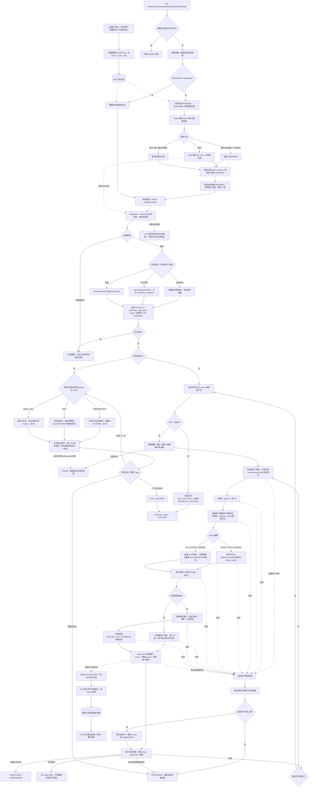

[业务逻辑专辑](/knowledge/business-logic/) / 居民收益付款 / 居民收益付款状态批量刷新

说明批量刷新任务的受理与领取、账户范围、逐户统计和付款状态重算、断点与事务、已有快照交接及历史初始化分支，附逐章原文对照。本文保留原文 13 章，正文连续展开，原文对照与流程源码按需展开。

**前置阅读：** [居民收益月度全量统计刷新](/knowledge/business-logic/resident-income/monthly-full-stat-refresh/)

**快速阅读：** [阅读起点](#reading-start) · [核心调用链](#chapter-3) · [数据筛选](#chapter-4) · [完整流程](#chapter-10) · [完成判据](#chapter-11) · [源码索引](#chapter-13) · [完整源码路径](#source-path-index)

<div class="business-logic-article">

> 对应任务：`residentIncomePaymentStatusRefreshBulkTask`<br /> 依据文档：`residentIncomePaymentStatusRefreshBulkTask-源码梳理.md`，分析日期为 **2026-09-09**。<br /> 本文解释的是附件已经记录的源码行为，不是一次新的源码审计，也不是线上运行报告。正文保留原文第 1—13 章及原有小节的对应关系。

<div id="reading-start"></div>

## 阅读起点：先看一次“账已经变了，页面结论还没跟上”的处理

**下面是为了帮助理解而设定的假设场景，不是实际运行数据。**

合作方甲名下有一批居民收益账户。系统上游的月度统计要重新计算这些账户：某个账户应该计入哪些月份的租金、累计付过多少、哪些账单还需要付款，都需要重新判断。如果把整个合作方的账户全部塞进原始业务请求中处理，请求会很重；如果只改了配置或事实，账单和页面又可能继续保留旧结论。

上游没有让这个定时任务直接付款，而是先把“需要刷新”的工作写进 `fi_async_task`，也就是**异步任务表——把要做的工作先存进数据库，稍后再执行**。例如，上游月度入口 `FinancialMonthJob.residentIncomeMonthlyFullStatRefresh` 可以接到账户统计重算提交链。

随后，`residentIncomePaymentStatusRefreshBulkTask` 被调度。这里的 **bulk（批量处理）**，指一份任务可以覆盖一批账户；**XXL-Job（调度框架）** 负责调用入口，入口则把符合条件的任务交给专用线程池。真正干活的是 **worker（执行任务的工作线程）**，不是一直占着调度请求逐账户做完所有业务。

worker 先确认自己有资格执行，再按账户推进。对于普通分支，它重算账户统计，找到需要处理的真实账单月份，读取付款结果、付款锁和拟付租金，重新计算账单状态、金额与校验结论。一个账户的业务写回和它的处理断点一起提交；前面的账户已经提交后，后面的账户失败不会把前面全部撤销。

普通分支有有效刷新范围时，还会可靠保存后续的 **snapshot（展示快照，即供页面读取的账单维度展示数据）** 刷新任务。这个后续任务只刷新已有快照，不负责第一次创建快照。调度入口返回、账户刷新完成、快照刷新完成，是三个不同时间点。

最终得到的不是一笔新支付，而是**账户、账单、差异台账，以及适用分支下已有展示快照中的数据结论重新对齐**。没有生成的账单不会凭空补出来，也不会因为这里算出“已付金额”就调用银行转账。

还要记住一个例外：同一个消费者另有历史初始化分支，固定处理 **2026 年 7 月及以前**的账单。那条分支按迁移规则直接设置部分状态为 `50 已付款`，不是按真实支付流水核验出来的。它不能与普通重算混为一谈。

<div id="heading-0-2"></div>

### 本文的证据边界与阅读方法

原文记录的主仓库是 `/Users/wangyi/BZ/zx-monitor/zxbaif`，分支 `Ian/review/01`，HEAD 为 `94b0da61105a8e13da27f877b6883e4e7c495f14`。原作者开始分析时，这个仓库的工作区是干净的。

关联 base 服务位于 `/Users/wangyi/BZ/zx-monitor/zxbaie`，分支 `zx_test_250330`，HEAD 为 `21aac5b4821de7e7ae1bd660f896b3e890115cfc`。该仓库当时已有未提交内容；原文只阅读相关源码，没有修改源码或原有文件。两个仓库不是同名分支，**不能据此认定线上部署版本一致**。

原文的验证方式是交叉查看 Java 调用链、MyBatis Mapper（SQL 映射文件）、DTO（传递参数的数据对象）的默认值、分支策略和事务声明。原文称其已检查源码链接对应文件存在、行号有效，并对 Mermaid（用文本描述流程图的语法）做了节点与引用的静态结构检查，但没有使用渲染器验证。

原文没有触发 XXL-Job，没有连接数据库、Feign（服务间远程调用接口）或 MQ（消息队列），也没有执行业务测试。线上调度频率、配置覆盖、表结构、实际数据效果均未确认。本文不会把这些“未确认”改写成“已验证”。

各章末尾的 `E01`—`E43` 对应第 13 章的源码证据索引。索引保留原始路径和行号；这些是原作者电脑上的本地路径，不是公开网站地址。部分证据编号在原文中对应多条源码记录，本文保留这种编号方式，不擅自重编号。

---

<details class="original" id="source-0">
<summary>原文 · 展开对照 · 分析边界与版本信息</summary>

### residentIncomePaymentStatusRefreshBulkTask 源码梳理

> 分析日期：2026-09-09。本文按当前检出的源码追踪，不代表线上配置或实际运行结果。
>
> 主链：`/Users/wangyi/BZ/zx-monitor/zxbaif`，分支 `Ian/review/01`，HEAD `94b0da61105a8e13da27f877b6883e4e7c495f14`；该仓库分析开始时工作区干净。
>
> 关联 base 服务：`/Users/wangyi/BZ/zx-monitor/zxbaie`，分支 `zx_test_250330`，HEAD `21aac5b4821de7e7ae1bd660f896b3e890115cfc`。此仓库存在原有未提交内容；本文仅阅读相关源码，未修改源码或原有文件。两仓库并非同名分支，不能据此认定线上部署版本一致。
>
> 验证方式：Java 调用链、MyBatis Mapper、DTO 默认值、分支策略及事务声明交叉核对；源码链接已检查文件存在及行号有效，Mermaid 已做节点与引用的静态结构检查，未使用渲染器验证。未触发 XXL-Job，未连接数据库、Feign 服务或 MQ，未执行业务测试。线上调度频率、配置覆盖、表结构和数据效果均暂时无法确认。

</details>

<div id="chapter-1"></div>

## 1. 任务概览

这个任务的主要工作是：**把已保存的居民收益批量刷新任务重新找出来，处理暂时不能执行或中断的情况，再交给专用线程池消费。** 消费时重算账户统计、刷新账单付款状态，并在适用时继续驱动已有账单维度快照刷新。

这里的“补偿”，不是资金赔付，而是把尚未激活、超时或尚未执行的工作重新推进。它本身不发起资金支付。

同一个消费者还承接“2026 年 7 月及以前历史账单付款状态初始化”。这一分支遵守固定迁移规则，不等同于普通付款事实重算，第 5.4 节会单独展开。

先解释接下来会出现的几个关键词。**PREPARED / ACTIVE** 是任务数据中的激活标记，分别表示“准备好但尚未获准执行”和“已经激活”，不是任务表的完整执行状态。**guard（业务互斥记录）** 用于限制同时处理同一业务对象的执行者；partner guard 保护合作方及任务类型，scope guard 保护具体站月。**scope（刷新范围）** 在这里最终对应平台电站与真实账期。**cursor（游标）** 记录处理到哪里，便于继续执行。**locator（精确定位信息）** 用账单或差异记录的 ID 找到真实数据，而不是只靠模糊的站月条件。

| 要辨认的项目 | 实际含义与行为 |
| --- | --- |
| XXL-Job handler（调度框架调用的入口名称） | `residentIncomePaymentStatusRefreshBulkTask` |
| 入口类 | `financial-center` 中的 `ResidentIncomePaymentStatusRefreshJob` |
| 消费的任务类型 | `fi_async_task.task_type = RESIDENT_INCOME_PAYMENT_STATUS_BULK_REFRESH` |
| 不传 taskCode 系列参数 | 先做 PREPARED 激活对账，再恢复过期 partner guard，再恢复超时 RUNNING 任务，最后分波扫描并投递 |
| 传 taskCode / taskCodes | 只查询指定编码并异步投递；不先做自动激活对账，也不做全局超时恢复 |
| 真正执行业务的线程 | 专用线程池，线程名为 `payment-cycle-bulk-dispatcher-%d` |
| 普通业务的提交单位 | 一个账户一个事务；账户内的 scope guard、底表写回、快照任务受理、游标推进一起提交 |
| 历史初始化的提交单位 | 独立 locator 页事务先提交，然后单独保存任务断点 |
| handler 返回成功 | 只说明本轮补偿或投递方法返回成功；不代表异步任务全部成功，更不代表快照刷新完毕 |
| 调度周期 | 源码只提供 `@XxlJob` 名称；cron 表达式、实例路由、阻塞策略未确认 |

普通账户事务与历史页事务的差别不是措辞：前者尽量让“数据已改”和“断点已前进”同时成立，后者允许“页数据已提交，但断点保存失败”，因此历史分支需要支持重放。

**源码定位：[E01](#evidence-e01)—[E05](#evidence-e05)、[E43](#evidence-e43)。**

<div id="s-1-1"></div>

### 1.1 参数与维护开关

传空对象表示自动扫描：

```json
{}
```

也可以限制自动处理时的两个数量：

```json
{"maxTaskCount":10,"maxActivationCount":5}
```

上面的 `maxTaskCount` 限制每波查询数量，`maxActivationCount` 限制 PREPARED 激活对账数量，它们不是“本轮一定完成多少账户”的承诺。

需要指定已有任务时，用真实 taskCode：

```json
{"taskCode":"BULK_STATUS_REFRESH:实际任务摘要","maxTaskCount":1}
```

多个任务编码放在 `taskCodes` 中；同时提供 `taskCode` 和 `taskCodes` 时，会合并并去重。入口兼容 `{"data": {...}}` 的包装形式，也兼容 `data` 本身是 JSON 字符串。

**不要把 businessKey 当成这里的定向选择器。** 公共参数类虽然包含 `businessKey/businessKeys`，但 `executeBulkJob()` 只读取 taskCode 系列参数。只传 businessKey，不是“按业务键只执行一条”，而是会进入自动扫描。

自动扫描默认每波最多取 **50 条**，最多 **9 波**。非空波之间等待 **30 秒**，最多有 **8 次等待**，合计约 **240 秒**，还要另外加上查询和投递时间。显式传入正数 `maxTaskCount` 时，最大仍限制为 **50**。这里始终是**每波查询上限**，不是所有波累计的任务完成上限，更不是账户处理上限。

手动编码去重后的硬上限为 **50 个**。但还有另一个容易漏看的限制：`maxTaskCount` 不传或为非正数时，外层默认只处理前 **40 个编码**，尾部编码本轮既不查询，也不投递。不能看到“硬上限 50”就认定默认会处理满 50 个。

`maxActivationCount` 默认 **5**，合法范围是 **1—100**。它只影响 PREPARED 对账，手动模式不使用它。

维护开关是 `resident-income.payment.amount-rule-upgrade.maintenance-enabled`，默认 `false`。为 `true` 时，入口直接返回失败，不执行本轮补偿和投递。这个检查发生在入口，**不能据此推断已经进入线程池的工作也会被中断**。

JSON 解析异常时，入口记录警告，然后按空参数处理，不是直接拒绝请求。这样会把原本想定向执行的请求扩大成自动扫描，第 9.1 节保留了这一风险。

<details class="original" id="source-1">
<summary>原文 · 展开对照 · 第 1 章原文</summary>

### 1. 任务概览

**这是居民收益付款状态 bulk 任务的补偿与消费入口：从已持久化的异步任务中找出可执行工作，经专用线程池执行账户统计重算及付款状态刷新，并在需要时继续驱动账单维度快照刷新。它本身不发起资金支付。**

当前源码还让同一消费者承接“2026 年 7 月及以前历史账单付款状态初始化”。这一分支执行固定迁移规则，与普通付款事实重算有显著区别，必须单独理解。

| 项目 | 实际行为 |
| --- | --- |
| XXL-Job handler | `residentIncomePaymentStatusRefreshBulkTask` |
| 入口类 | `ResidentIncomePaymentStatusRefreshJob`，位于 `financial-center` |
| 消费任务类型 | `fi_async_task.task_type = RESIDENT_INCOME_PAYMENT_STATUS_BULK_REFRESH` |
| 无 taskCode 参数 | PREPARED 激活对账 → 恢复过期 partner guard → 恢复超时 RUNNING → 分波扫描并投递 |
| 有 taskCode/taskCodes 参数 | 仅查询指定编码并异步投递，不先执行自动激活对账和全局超时恢复 |
| 业务执行线程 | `payment-cycle-bulk-dispatcher-%d` 专用线程池 |
| 普通业务提交单位 | 单账户事务；账户内 scope guard、底表写回、快照受理、游标推进一起提交 |
| 历史初始化提交单位 | 独立 locator 页事务先提交，之后单独保存任务断点 |
| handler 成功的含义 | 本轮补偿/投递方法返回成功；不等于异步任务全部执行成功，也不等于快照刷新完成 |
| 调度周期 | 源码只有 `@XxlJob` 名称，具体 cron、实例路由、阻塞策略暂时无法确认 |

源码入口与调度依据：[E01](#evidence-e01)—[E05](#evidence-e05)、[E43](#evidence-e43)。

#### 1.1 参数与维护开关

```json
{}
```

表示自动扫描。也可以传：

```json
{"maxTaskCount":10,"maxActivationCount":5}
```

定向执行已有任务：

```json
{"taskCode":"BULK_STATUS_REFRESH:实际任务摘要","maxTaskCount":1}
```

多个编码用 `taskCodes`；同传 `taskCode` 与 `taskCodes` 时合并去重。兼容 `{"data": {...}}` 或 `data` 为 JSON 字符串的包装。

- **bulk 入口不使用 `businessKey/businessKeys` 作为选择器。** 公共参数类虽然有这些字段，`executeBulkJob()` 只读取 taskCode 系列；仅传 businessKey 会进入自动扫描。
- 自动扫描默认每波最多 50 条，最多 9 波；非空波之间等待 30 秒，即最多包含 8 次等待、约 240 秒，另加查询和投递时间。显式正数 `maxTaskCount` 被限制到最多 50，是**每波查询上限**，不是本轮所有业务任务的完成上限。
- 手动编码去重后硬上限为 50。`maxTaskCount` 未传或非正数时外层默认只处理前 40 个编码；超过此数量的尾部编码本轮不查询、不投递。
- `maxActivationCount` 默认 5，合法范围 1—100，只影响 PREPARED 对账；手动模式不使用它。
- 开关 `resident-income.payment.amount-rule-upgrade.maintenance-enabled` 默认 false；为 true 时入口直接返回失败，不做本轮补偿投递。这里不能据此推断已经进入线程池的工作会被中断。
- JSON 解析异常会记录警告并按空参数处理；其范围扩大风险见第 9 节。

</details>

<div id="chapter-2"></div>

## 2. 业务目的

居民收益付款页面、差异台账、付款选单会使用一组已经保存的结果字段：当前应付、付款周期截止月、已付金额、剩余可付、拟付租金校验、付款状态、锁定付款单。这些字段反映系统根据当前事实计算出的结论，不是每次页面展示时都从头重算。

当账户统计、付款周期、账单或差异事实发生变化时，这些结果可能过时。若原始业务请求逐账户刷新整个合作方，请求负担会很重；若只改配置不刷新旧账单，旧结论又会一直保留。

这条链路的处理方式是：先把刷新请求保存成可恢复任务，再按账户推进；成功处理的账户记录断点，后续适用的展示快照再独立刷新，逐步与底层数据一致。这里的“最终收敛”描述这条处理链的目标和机制，不等于已经证明所有线上数据都会自动修复。

**沿用原文的假设例子：** 某账户旧的 **cutoff（本次付款计算覆盖到的截止账期）** 是 `202606`，任务重算得到的新 cutoff 是 `202608`。在普通 cutoff 扩展规则下，先重新汇总账户应付和已付，再寻找 `202606 < month <= 202608`，也就是原文 `(202606, 202608]` 内已经存在、且符合候选付款状态的真实账单或差异记录，依据付款结果、锁和拟付租金重新求值。

如果数据库没有 7 月或 8 月账单，任务不会为了凑齐范围而新建账单。若旧、新 cutoff 相同，也不是完全不工作：它仍会刷新该截止月以内的未完成候选。具体范围要按第 4.4 节的条件表判断，不能只记住“截止月变了才刷新”。

<div id="s-2-1"></div>

### 2.1 消费者之前，任务从哪里来

定时任务主要消费已经存在的工作。真正发起请求的是下面这些上游链路，不是本定时入口自己临时决定所有业务范围。

| 上游来源 | 具体接入与限制 |
| --- | --- |
| 账户统计重算、月度全量统计 | `ResidentIncomeAccountStatBulkTaskSubmitServiceImpl` 提交 `ACCOUNT_STAT_RECALCULATE`；上游入口之一是 `FinancialMonthJob.residentIncomeMonthlyFullStatRefresh` |
| 真实差异事实变更 | `FiMonthlyIncomeDifferenceServiceImpl` 调用 `submitByDifferenceFacts()`；任务保存精确差异 ID 和平台账户范围 |
| 配置或付款事实变更 | `ResidentIncomePaymentFactChangeServiceImpl.createBulkTask()` 调到 `createStatusRefreshBulkTask()`；部分小范围事件可以同步处理，不是所有事件都会创建 bulk |
| 合作方付款周期全量变更 | 分支组合为 `PAYMENT_FACT_CHANGE + PARTNER_ALL + FACT_CHANGE:PARTNER_PAYMENT_CYCLE_CHANGE`；先保存 PREPARED，base 本地提交后可通过 Feign 激活并投递，定时对账用于补漏 |
| 历史账单状态初始化 | 由专用 `initializeHistoryBillStatus()` 创建固定截止月、固定身份的任务；通用创建入口拒绝这个类型 |

表中三字段组合表示同时匹配，而不是任意命中一个就进入该特殊分支。后面说“付款周期全量”，均指相应的特定业务分支。

通用创建链先构造业务键 `businessKey`，再生成：

```text
task_code = BULK_STATUS_REFRESH:{md5(businessKey)}
```

`md5(businessKey)` 是业务键的摘要。保存时先 `insertIgnore`，再按 taskCode 回查。这里的 **幂等（同一业务请求重复提交时复用同一任务）** 依赖 `task_code` 的唯一约束，不依赖 `business_key` 唯一。重复提交不等于自动生成一份从头执行的新任务，游标是否清零要看后面的控制规则。

当前版本化账户提交器按 **25 个账户目标一片**拆分，对应常量 `VERSIONED_PAYLOAD_TARGET_CHUNK_SIZE`。另有读取或分页容量 **500**，这是不同环节的大小，不能把注释里的“500 账户分片”理解成所有创建路径都一次装 500 个账户。任务 JSON 还有 **16 KiB** 的硬限制。

**源码定位：[E06](#evidence-e06)—[E09](#evidence-e09)、[E40](#evidence-e40)。**

<div id="s-2-2"></div>

### 2.2 两种“exact”不要混淆

这里的 exact 都有“精确”的意思，但精确的对象不同。

| 名称 | 精确选择什么 | 当前适用情况 |
| --- | --- | --- |
| `shouldUseExactExecution()` | 精确到 taskCode：指定消费哪一份任务 | 当前适用于合作方付款周期全量任务、历史初始化任务 |
| `scopeStatusStrategy = EXACT_FACT_CHANGE` | 精确到差异事实 ID：由具体差异记录决定刷新哪些账期 | 常见于 `ACCOUNT_STAT_RECALCULATE` |

按 taskCode 精确执行，只是把任务找准，不意味着它在业务上只刷新一小段精确差异。合作方付款周期全量任务通常仍以 `BY_CUTOFF_CHANGE`（依据截止账期变化构造范围）进入范围构造，只是这项策略内部专门给它使用“全量历史候选”的规则。

反过来，普通账户统计任务即使不是通过特殊 exact 执行端口进入，也可以使用 `EXACT_FACT_CHANGE` 只按差异事实决定账期。不要把“任务选择方式”和“账户内部的范围策略”混成一个开关。

<details class="original" id="source-2">
<summary>原文 · 展开对照 · 第 2 章原文</summary>

### 2. 业务目的

居民收益付款页面、差异台账和付款选单依赖一组存储在账单/账户上的结果字段：当前应付、付款周期截止月、已付金额、剩余可付、拟付租金校验、付款状态、锁定付款单等。

这些字段会因账户统计、付款周期、账单和差异事实变化而过时。若在原始业务请求中逐账户刷新整个合作方，调用会过重；只更新配置又会使存量账单一直显示旧结论。本链路把刷新请求落成可恢复的任务，按账户推进，在刷新成功后记录断点，随后让展示快照最终收敛。

例如，一个账户旧截止月为 `202606`，当前任务对应的重算结果为 `202608`：它先重新汇总账户应付与已付，再找出 `(202606, 202608]` 内符合候选状态的真实账单/差异记录，依据付款结果、锁与拟付租金重新计算状态。数据库没有生成对应账单的月份不会凭空补账。若旧、新截止月相同，也仍会刷新该截止月以内的未完成候选，不是只在截止月发生变化时才工作。

#### 2.1 消费者之前，任务从哪里来

| 来源 | 当前源码中的接入 |
| --- | --- |
| 账户统计重算、月度全量统计 | `ResidentIncomeAccountStatBulkTaskSubmitServiceImpl` 提交 `ACCOUNT_STAT_RECALCULATE`；`FinancialMonthJob.residentIncomeMonthlyFullStatRefresh` 是一个上游入口 |
| 真实差异事实变更 | `FiMonthlyIncomeDifferenceServiceImpl` → `submitByDifferenceFacts()`，任务保存精确差异 ID 和平台账户范围 |
| 配置/付款事实变更 | `ResidentIncomePaymentFactChangeServiceImpl.createBulkTask()` → `createStatusRefreshBulkTask()`；部分小范围事件可走同步路径，并非所有事件必定创建 bulk |
| 合作方付款周期全量变更 | `PAYMENT_FACT_CHANGE + PARTNER_ALL + FACT_CHANGE:PARTNER_PAYMENT_CYCLE_CHANGE`，先保存 PREPARED；base 本地提交后可 Feign 激活并投递，定时对账负责补漏 |
| 历史账单状态初始化 | 专用 `initializeHistoryBillStatus()` 创建固定截止月、固定身份的任务；通用创建入口拒绝该类型 |

通用创建链先构造业务键，再生成 `task_code = BULK_STATUS_REFRESH:{md5(businessKey)}`，`insertIgnore` 后按编码回查。幂等依赖 task\_code 唯一约束，而非 business\_key 唯一。

当前版本化账户提交器每片按 **25 个账户目标**拆分（`VERSIONED_PAYLOAD_TARGET_CHUNK_SIZE`）；另有读取/页容量 500。不能把注释中的“500 账户分片”直接当成所有创建路径的实际分片数量。任务 JSON 还有 16 KiB 硬限制。依据：[E06](#evidence-e06)—[E09](#evidence-e09)、[E40](#evidence-e40)。

#### 2.2 两种“exact”不要混淆

- `shouldUseExactExecution()`：按 **taskCode 精确消费**的执行端口，当前适用于合作方付款周期全量任务和历史初始化任务。
- `scopeStatusStrategy = EXACT_FACT_CHANGE`：按 **差异事实 ID 精确决定账期**的业务策略，常见于 `ACCOUNT_STAT_RECALCULATE`。

前者不意味着后者。合作方付款周期全量任务通常仍按 `BY_CUTOFF_CHANGE` 进入 scope 构造，只是该策略内部专门走全量历史候选规则。

</details>

<div id="chapter-3"></div>

## 3. 核心调用链

先把这条链路看成四层：**入口决定怎么找任务，补偿层处理遗留状态，dispatcher 把任务送入线程池，消费者才执行账户或历史页。** dispatcher 是“任务分发器”，负责投递，不代表业务已经完成。

消费者还要验证执行资格。这里会用到 **lease（租约，即执行资格的有效期）**、**owner（本次被认可的执行者身份）**、**attempt（执行尝试轮次）**。这些信息用于区分“现在有权执行的 worker”和“之前执行过但资格已过期的 worker”。**CAS（比较并更新）** 是指只有数据库中的状态或身份仍符合预期，才允许本次修改成功，不是无条件覆盖。

下面保留完整方法调用关系。阅读时先看缩进层级，再按后续小节理解每层责任，不需要一开始记住全部长类名。

```text
ResidentIncomePaymentStatusRefreshJob.residentIncomePaymentStatusRefreshBulkTask(param)
 ├─ amountRuleUpgradeGuardService.checkStatusRefreshJobAllowed(...)
 ├─ parseJobParam / executeBulkJob
 └─ ResidentIncomePaymentStatusBulkRefreshCompensationServiceImpl
     ├─ 自动：reconcileRecoverAndDispatch
     │   ├─ reconciliationService.reconcilePreparedTasks
     │   │   └─ orchestrationService.reconcileAndKick
     │   │       └─ activationService.activatePreparedTask → base Feign 版本查询
     │   ├─ partnerGuardRepository.recoverExpiredBounded
     │   ├─ recoverStaleTasks
     │   └─ queryDispatchCandidates → dispatchCandidates（最多 9 波）
     └─ 定向：dispatchManualTaskCodes → dispatchCandidates
         └─ ResidentIncomePaymentStatusBulkRefreshDispatcherImpl
             ├─ 自动目标分支 → executePendingTaskByTaskCode
             ├─ 手动目标分支 → executeManualTasks([taskCode], 1)
             └─ 普通分支 → executeLegacyTaskByTaskCode
                 （以上均在专用线程池中执行，汇入同一个消费者实现）
                 └─ claimTaskWithResult → executeClaimedTask
                     ├─ 普通/付款周期全量：账户页 → 页级上下文 → processSingleAccount
                     │   ├─ 锁任务行、验证 owner、stop、cursor、账户范围
                     │   ├─ claimAccountGuard
                     │   ├─ residentIncomeAccountStatService.recalculateForBulk
                     │   │   └─ 或 recalculatePartnerOnlyForBulk
                     │   ├─ scopeService.buildByCutoffChange / buildByDifferenceFacts
                     │   ├─ scopeTransactionService.refreshAccountScopes
                     │   │   └─ refreshStationMonthScopesWithoutGuard
                     │   │       → loadBatchRefreshData → 统一决策 → 三表写回
                     │   ├─ 付款周期全量改走 refreshPartnerPaymentCycleAccountScopes
                     │   │   └─ prepareAccountDecisionBatches → writeAccountDecisions
                     │   ├─ 普通分支 submitBillDimensionSnapshotRefreshTask
                     │   └─ advanceProgress → releaseAccountGuard → 提交
                     └─ 历史初始化：executeClaimedHistoryInitializeTask
                         └─ executeNextSlice → 三阶段独立页事务 → 保存断点

账户/页边界：续租、检查停止、普通任务检查预算，最终 completeTask 或 pauseTask。
```

**入口层**是 `ResidentIncomePaymentStatusRefreshJob.residentIncomePaymentStatusRefreshBulkTask(param)`：先检查金额口径维护开关，再解析参数并选择自动或定向路由。

**补偿层**是 `ResidentIncomePaymentStatusBulkRefreshCompensationServiceImpl`：自动模式调用 `reconcileRecoverAndDispatch`，顺序为激活对账、过期 guard 恢复、超时任务恢复、最多 9 波候选扫描与投递；定向模式只走 `dispatchManualTaskCodes`。

**分发层**是 `ResidentIncomePaymentStatusBulkRefreshDispatcherImpl`。自动目标分支走 `executePendingTaskByTaskCode`，手动目标分支走 `executeManualTasks([taskCode], 1)`，普通分支走 `executeLegacyTaskByTaskCode`。这些入口都在线程池里执行，并汇入同一个消费者实现。

**业务层**先 `claimTaskWithResult` 抢占，再 `executeClaimedTask`。普通任务和付款周期全量任务按账户页推进，历史初始化则进入 `executeClaimedHistoryInitializeTask`，再通过 `executeNextSlice` 按三个阶段处理独立页事务。

账户或页边界会续租、检查停止；普通任务还检查运行预算。最后根据执行情况调用 `completeTask` 完成，或 `pauseTask` 暂停。预算不是截断当前 SQL 的计时器，具体边界见第 9.4 节。

<div id="s-3-1"></div>

### 3.1 自动补偿先解决“任务为什么还不能跑”

<div id="heading-3-2"></div>

#### 先对账：PREPARED 对应的配置真的提交了吗

合作方付款周期全量变更可能先在 financial 保存任务，再等待 base 配置提交。不能仅因为任务已经写进数据库，就当成新配置已经生效。

激活对账只扫描特定付款周期全量分支中的 **`PENDING` 与 `PREPARED` 同时成立**的任务，按创建时间、ID 升序处理。它通过 `IFinPartnerProfileServiceFeign.queryPartnerProfileInfo()` 查询 base 已提交的 `partnerConfigVersion`，再与任务中的 `newConfigSummary.partnerConfigVersion` 比较。

| base 实际版本与任务预期版本的关系 | 处理结果 |
| --- | --- |
| 实际版本 = 预期版本 | CAS 把 JSON 的 `activationStatus` 改成 ACTIVE；即时开关开启时可立即投递 |
| 实际版本 \< 预期版本 | 暂时等待；超过 PREPARED 最大年龄后可取消，默认最大年龄为 **3600 秒** |
| 实际版本 \> 预期版本 | 取消尚未激活的旧任务，避免继续执行已经过时的配置请求 |
| Feign 异常、结果缺失，或无法确认版本 | 保持未激活；不能认定配置已提交，也不进入“已确认版本落后且超龄”的取消分支 |

最后一行尤其重要：**“不知道版本”与“确认版本较低”不是同一种情况。** 不能因为查询失败且任务很老，就套用第二行的超龄取消逻辑。

`status.refresh.bulk.immediate.enabled` 默认 `false`。这个开关只决定激活后是否即时投递，不是整个任务的执行总开关。即使即时投递关闭，后续定时扫描仍可投递 ACTIVE 候选。

<div id="heading-3-3"></div>

#### 再恢复：上一次运行是否已经失联

自动补偿随后有界地释放租约已经到期的 RUNNING partner guard。“有界”表示一次只处理受限数量，不是保证一扫就恢复全部历史遗留记录。

之后查找任务行中仍是 RUNNING、但 `coalesce(update_time, create_time)` 已超过默认 **30 分钟**的 bulk 任务。`coalesce` 在这里优先取更新时间，更新时间为空才取创建时间。

如果同一个任务的 partner guard 仍持有有效租约，恢复会跳过它，不能只凭任务更新时间较老就认定执行者已经失联。

恢复成功时，任务行 `retry_count` 增加。达到 `max_retry_count` 则置为 FAILED；尚未达到则回到 PENDING，并把 `next_execute_time` 改成本次时间。已经提交的 cursor 保留，后续继续处理，而不是自动从第一个账户重来。

<div id="s-3-2"></div>

### 3.2 抢占既要抢任务，也要拿业务租约

找到候选只解决“有工作可做”。开始业务前，`claimTaskWithResult()` 还依次执行以下步骤。

**第一步，验证任务本身。** 检查任务状态、`task_data`、激活标记 ACTIVE、没有停止请求，以及 taskCode 是否与 businessKey 的摘要关系一致。编码与载荷不能随便拼成一对。

**第二步，确保合作方 guard 存在。** guard 的业务键是 `(partner_org_id, bulk_type)`。它保护的不是单纯一个线程名，而是这个合作方在这个 bulk 类型下的执行资格。

**第三步，抢业务租约。** 只有 guard 空闲或已过期时才可抢占；写入 `current_task_code`、`worker_id`，递增 `running_attempt`，并设置租约期限。

**第四步，抢任务状态和运行配额。** 把 owner 写入任务 JSON，对任务状态执行 CAS；同时检查所有 bulk 的有效 RUNNING 配额。默认并发配额为 **1**，配置最多取 **2**，不是每个合作方都额外获得两份配额。

**第五步，失败则释放。** 任务抢占失败时，释放刚取得的 guard，等待后续调度，不继续当成已获准执行。

因此，线程池接收了任务，不代表数据库会允许它立即 RUNNING。线程池线程数与数据库运行配额是两套限制；partner guard 或全局配额不满足时，worker 仍可能无法执行。

自动 exact 执行端口对可恢复冲突会有限重试：默认最多 **3 次**，初始退避 **100ms**，上限 **1000ms**。退避是冲突后延迟再尝试，不是无限阻塞等待，也不是后面“某账户业务失败重试三次”的同一套计数。

`query...ForUpdate()` 中的 **FOR UPDATE（数据库行锁）** 也不能代替业务 owner 验证。普通单账户事务锁住任务行，保证该账户处理和进度修改互斥；但租约身份仍要同时匹配任务编码、worker、attempt，并且时间未过期。

反过来，非事务编排方法中出现一次短暂的 `query...ForUpdate()`，也不能解释成“整个长任务始终持有数据库行锁”。需要分清查询发生在哪个事务里，锁覆盖多长时间。

<div id="s-3-3"></div>

### 3.3 普通账户事务的业务顺序

从业务上看，一个账户不是“先改一个月就提交一次”。这条普通主链希望把账户重算、站月刷新、快照任务受理和账户断点放在同一个事务里。

`processSingleAccount()` 声明对所有 `Exception` 回滚，默认事务超时为 **300 秒**。执行顺序如下。

**1．先锁任务，再确认还能处理这个账户。** 锁住 RUNNING 任务，验证 partner guard。已经收到停止请求则抛专用异常。如果当前账户 ID 已经不大于 cursor，说明这个账户已经越过处理断点，直接返回重复处理结果，不再次写业务数据。

**2．回查账户身份。** 普通账户按 ID 回查，核对合作方、小单电站身份。有 `platformAccountScopes` 时，还必须匹配其中的平台电站、合作方和 partner-only 账户目标。**partner-only（只有合作方账户、没有对应小单账户的目标）** 与普通小单账户不是同一种数据形态。

**3．抢账户 guard。** V1 使用“小单电站标识 + 合作方”，V2 使用“平台电站 + 合作方”。V2 自己返回的 attempt 必须保存；释放 V2 guard 时，不能拿 partner guard 的 attempt 来替代，即使两者都叫执行轮次。

**4．重算账户并构造范围。** 普通账户重新计算账户统计、账户已付与暂扣，再构造精确站月。合作方独有账户走 `recalculatePartnerOnlyForBulk`，不是补建一份小单账户后照搬全部计算。

**5．取得范围 guard 后刷新底表。** 获取全部待处理 scope 的 guard，随后完成付款状态、金额和校验字段写回。普通分支进入 `refreshAccountScopes`、`refreshStationMonthScopesWithoutGuard`，付款周期全量使用专门的 `refreshPartnerPaymentCycleAccountScopes` 与批量决策写入路径。

**6．适用时可靠受理快照任务。** 普通分支只有存在有效 scope 才提交账单快照请求；scope 为空时不提交。受理失败会使整个账户事务回滚，不能出现“账户已经作为成功提交，但快照请求根本没保存”的这类本地事务结果。快照真正执行则仍在提交之后。

**7．最后推进账户断点并释放 guard。** 更新 cursor、处理账户数、scope 数，清理当前账户重试字段，最后释放账户 guard。游标写回失败或 guard 释放失败，也会回滚当前账户。

内部 scope 方法和 `TransactionTemplate` 使用默认 **REQUIRED（存在外层事务就加入它）**，因此加入外层账户事务。即使 SQL 被拆成多个批次执行，也不是每批独立提交。

可以把这个边界理解为：**单账户内没有“前几个月先提交、最后再推进账户 cursor”的中间提交点。** 但这句话只描述单账户事务，不覆盖下一节的页级写入或远程日志。

**源码定位：[E10](#evidence-e10)—[E12](#evidence-e12)、[E21](#evidence-e21)。**

<div id="s-3-4"></div>

### 3.4 页级上下文不是单账户事务的一部分

worker 不是每处理一个账户才从零读取全部资料。它先读一页账户，再批量构造 `ResidentIncomeAccountBulkRecalculateContext`，即**页级重算上下文——把这一页账户共同需要的资料预先放到内存里**，然后逐账户调用事务服务。

上下文包含账户、合作方账户、周期计算结果、最大账单月、累计抵扣、租金汇总、缺账月份。它只存在内存，不写进 `task_data`，不是一个可在数据库中恢复的全页事实快照。

对于 `ACCOUNT_STAT_RECALCULATE`，页级构造阶段还会先调用 `partnerAccountDeductionService.recalculateByPartnerAccountIds()`，以**单独事务**回写这一页合作方账户的抵扣统计。

这带来两个必须保留的限制。首先，页级抵扣已经提交后，后续某个账户失败不会把它一起回滚。其次，金额资料是在抢单账户 guard 前预加载的，不能宣称从第一次读取到最后写回都受同一账户锁保护。数据新鲜度与租约风险见第 9.6 节。

所以，“普通账户内原子提交”成立，不等于“这份任务的所有写入都能由 `processSingleAccount()` 一次回滚”。

<details class="original" id="source-3">
<summary>原文 · 展开对照 · 第 3 章原文</summary>

### 3. 核心调用链

```text
ResidentIncomePaymentStatusRefreshJob.residentIncomePaymentStatusRefreshBulkTask(param)
 ├─ amountRuleUpgradeGuardService.checkStatusRefreshJobAllowed(...)
 ├─ parseJobParam / executeBulkJob
 └─ ResidentIncomePaymentStatusBulkRefreshCompensationServiceImpl
     ├─ 自动：reconcileRecoverAndDispatch
     │   ├─ reconciliationService.reconcilePreparedTasks
     │   │   └─ orchestrationService.reconcileAndKick
     │   │       └─ activationService.activatePreparedTask → base Feign 版本查询
     │   ├─ partnerGuardRepository.recoverExpiredBounded
     │   ├─ recoverStaleTasks
     │   └─ queryDispatchCandidates → dispatchCandidates（最多 9 波）
     └─ 定向：dispatchManualTaskCodes → dispatchCandidates
         └─ ResidentIncomePaymentStatusBulkRefreshDispatcherImpl
             ├─ 自动目标分支 → executePendingTaskByTaskCode
             ├─ 手动目标分支 → executeManualTasks([taskCode], 1)
             └─ 普通分支 → executeLegacyTaskByTaskCode
                 （以上均在专用线程池中执行，汇入同一个消费者实现）
                 └─ claimTaskWithResult → executeClaimedTask
                     ├─ 普通/付款周期全量：账户页 → 页级上下文 → processSingleAccount
                     │   ├─ 锁任务行、验证 owner、stop、cursor、账户范围
                     │   ├─ claimAccountGuard
                     │   ├─ residentIncomeAccountStatService.recalculateForBulk
                     │   │   └─ 或 recalculatePartnerOnlyForBulk
                     │   ├─ scopeService.buildByCutoffChange / buildByDifferenceFacts
                     │   ├─ scopeTransactionService.refreshAccountScopes
                     │   │   └─ refreshStationMonthScopesWithoutGuard
                     │   │       → loadBatchRefreshData → 统一决策 → 三表写回
                     │   ├─ 付款周期全量改走 refreshPartnerPaymentCycleAccountScopes
                     │   │   └─ prepareAccountDecisionBatches → writeAccountDecisions
                     │   ├─ 普通分支 submitBillDimensionSnapshotRefreshTask
                     │   └─ advanceProgress → releaseAccountGuard → 提交
                     └─ 历史初始化：executeClaimedHistoryInitializeTask
                         └─ executeNextSlice → 三阶段独立页事务 → 保存断点

账户/页边界：续租、检查停止、普通任务检查预算，最终 completeTask 或 pauseTask。
```

#### 3.1 自动补偿先解决“任务为什么还不能跑”

**PREPARED 版本对账。** 只扫描特定付款周期全量分支的 `PENDING + PREPARED`，按创建时间、ID 升序。通过 `IFinPartnerProfileServiceFeign.queryPartnerProfileInfo()` 查询 base 已提交的 `partnerConfigVersion`，与任务 `newConfigSummary.partnerConfigVersion` 比较：

| 比较结果 | 行为 |
| --- | --- |
| 实际版本等于预期 | CAS 将 JSON 中 activationStatus 改成 ACTIVE；即时开关开启时可立即投递 |
| 实际版本小于预期 | 等待；超过 PREPARED 最大年龄后可取消，默认 3600 秒 |
| 实际版本高于预期 | 取消尚未激活的旧任务，避免执行已经过时的配置请求 |
| Feign 异常、结果缺失、版本无法确认 | 保留未激活状态，不能视为版本已经提交；该情况不走“版本落后且超龄”的取消分支 |

`status.refresh.bulk.immediate.enabled` 默认 false 只控制激活后的即时投递；后续定时扫描仍会投递 ACTIVE 候选。

**过期恢复。** 有界释放租约已到期的 RUNNING partner guard，再找 `coalesce(update_time, create_time)` 超过默认 30 分钟的 RUNNING bulk 任务。若同任务 partner guard 仍有有效租约则跳过。恢复成功增加任务行 `retry_count`；达到 `max_retry_count` 则 FAILED，否则回 PENDING，`next_execute_time` 改为本次时间，保留已提交 cursor。

#### 3.2 抢占既要抢任务，也要拿业务租约

`claimTaskWithResult()`依次做：

1. 校验任务状态、task\_data、ACTIVE、未请求停止，以及 taskCode 与 businessKey 的摘要关系。
2. 确保 `(partner_org_id, bulk_type)` 对应的 partner guard 存在。
3. 只在 guard 空闲或过期时抢占，写 current\_task\_code、worker\_id，递增 `running_attempt`，设置租约。
4. 将 owner 写入任务 JSON，执行任务状态 CAS；同时检查所有 bulk 的有效 RUNNING 配额。默认并发配额 1，配置最多取 2。
5. 抢占任务失败时释放刚取得的 guard，等待以后调度。

数据库配额与线程池线程数是两回事：线程池接收了任务，仍可能因为 partner guard 或全局运行配额被拒绝执行。自动 exact 端口对可恢复冲突有界退避，默认最多 3 次，初始 100ms、上限 1000ms；不是无限等待。

`query...ForUpdate()` 的名字不等于业务 owner 验证。单账户事务中的任务行锁保证该账户处理与进度修改互斥；实际租约身份还必须匹配任务编码、worker、attempt 和未过期时间。非事务编排方法中的短暂查询也不能被描述为“整个任务一直持有 FOR UPDATE 锁”。

#### 3.3 普通账户事务的业务顺序

`processSingleAccount()` 声明回滚所有 Exception，默认事务超时 300 秒。

1. 锁住 RUNNING 任务，验证 partner guard；已停止则抛专用异常，账户 ID 已不大于 cursor 则直接返回重复处理结果，不重新写业务数据。
2. 普通账户按 ID 回查并核对合作方、小单电站等身份；如果存在 `platformAccountScopes`，还要匹配平台电站、合作方及 partner-only 账户目标。
3. 抢账户 guard。V1 用小单电站标识与合作方；V2 用平台电站与合作方。V2 自己返回的 attempt 需要保留，不能用 partner guard attempt 替代它进行释放。
4. 重算账户统计和账户已付/暂扣；构造精确站月范围。
5. 获取全部范围的 scope guard，完成状态、金额和校验字段写回。
6. 普通分支有有效 scope 时可靠受理账单快照任务；scope 为空则不提交，受理失败则整个账户回滚。
7. 更新 cursor、处理数、scope 数并清理当前账户重试字段；最后释放账户 guard。游标写回或 guard 释放失败，也会回滚该账户。

**单账户内没有“前几个月先提交、最后再推账户 cursor”的提交点。** scope 方法和内部 TransactionTemplate 使用默认 REQUIRED，加入外层账户事务。范围 SQL 的批次拆分不等于分事务提交。依据：[E10](#evidence-e10)—[E12](#evidence-e12)、[E21](#evidence-e21)。

#### 3.4 页级上下文不是单账户事务的一部分

worker 先读取一页账户，再批量构造 `ResidentIncomeAccountBulkRecalculateContext`，随后逐账户调用事务服务。上下文包含账户、合作方账户、周期计算结果、最大账单月、累计抵扣、租金汇总和缺账月份；它存在内存中，不写入 task\_data。

`ACCOUNT_STAT_RECALCULATE` 在此阶段还会先调用 `partnerAccountDeductionService.recalculateByPartnerAccountIds()`，以单独事务回写这一页合作方账户的抵扣统计。因此，不能声称“本任务所有写入都由 processSingleAccount 一次回滚”；页级已经提交的抵扣刷新不随后续账户失败回滚。

</details>

<div id="chapter-4"></div>

## 4. 数据筛选规则

要理解“这份任务究竟会改哪些数据”，必须分四层看：先选可投递的任务，再选账户，再为账户构造真实站月，最后加载这些站月中的事实作完整决策。

前一层筛选条件不会自动变成后一层 UPDATE 的条件。尤其是“按未完成状态选中了一个站月”，不等于“这一站月里原本已付的其他记录绝不更新”。

<div id="s-4-1"></div>

### 4.1 异步任务候选

自动扫描不是把所有 bulk 都投递。它要求任务表基础条件同时满足：

```text
deleted = 0
AND task_type = RESIDENT_INCOME_PAYMENT_STATUS_BULK_REFRESH
AND task_status = 0
AND (next_execute_time IS NULL OR next_execute_time <= now)
AND (JSON stopRequested 缺失 OR stopRequested = false)
```

这里的 `task_status=0` 就是 PENDING。未来才允许执行的任务不会进入普通自动候选；停止标记缺失或为 false 才符合这项筛选。

| 所处阶段 | 额外规则与含义 |
| --- | --- |
| 特定付款周期全量候选 | 除上述条件外，SQL 还要求 `activationStatus=ACTIVE`；必须按对应三字段组合判断该分支 |
| 非上述三字段目标分支 | SQL 层不统一强加这项激活过滤，但 worker 仍会统一验证激活资格；不能认为 SQL 查到了就必能执行 |
| 自动排序 | 按 `coalesce(next_execute_time, create_time), id` 升序，再按每波上限截取 |
| 手动查找 | 按用户提供的编码顺序逐个 `queryByTaskCode`；外层先检查任务类型和 JSON |
| 手动 worker 可执行状态 | 只接受 PENDING、FAILED；不自动重跑 SUCCESS、RUNNING、CANCELLED |
| 手动执行时间 | 在可执行状态下，不受未来 `next_execute_time` 限制；但不能绕过 PREPARED、stopRequested、owner 或运行配额 |
| 非法任务 JSON | 自动或外层候选解析失败时，会尝试将可修改状态的任务标为 FAILED 并记录原因，不进入账户处理 |

需要区分两种 JSON 错误：第 1.1 节是**调度参数解析错误**，会退为空参数并扩大成自动扫描；本节是**任务数据解析错误**，会尝试把那份任务标为 FAILED。不能把两者混在一起。

定向调用如果返回“投递 1 条”，只说明任务进入队列。例如任务实际已经 SUCCESS，外层投递后，worker 仍会拒绝再次执行业务。“进入队列”和“实际获得执行资格”不是一个状态。

**源码定位：[E02](#evidence-e02)、[E04](#evidence-e04)、[E05](#evidence-e05)。**

<div id="s-4-2"></div>

### 4.2 两侧账户怎样分页

这一阶段解决的是“合作方名下，下一页该轮到哪些账户”。**小单账户**是 `fi_customer_account` 这一侧；**合作方账户**是 `fi_customer_account_partner` 这一侧。partner-only 特指存在合作方账户、却没有同平台电站与合作方对应的小单账户。

普通小单账户按合作方和 ID 游标查询：

```sql
FROM fi_customer_account a FORCE INDEX (idx_account_partner_cursor)
WHERE a.partner_org_id = :partnerOrgId
  AND a.id > :cursorAccountId
-- 有 accountIds 则追加 a.id IN (...)
-- 依 stationFilterMode 追加平台 station_id 条件
ORDER BY a.id ASC
LIMIT :pageSize
```

这条 SQL 强制使用 `idx_account_partner_cursor` 索引。只有 `id > cursorAccountId` 的账户进入后续页；显式 `accountIds` 和电站筛选模式还会进一步收窄范围。

合作方独有账户的查询则是：

```sql
FROM fi_customer_account_partner p
WHERE p.partner_org_id = :partnerOrgId
  AND p.platform_station_id IS NOT NULL
  AND p.id > :cursorAccountId
  AND NOT EXISTS (
      SELECT 1 FROM fi_customer_account s
      WHERE s.station_id = p.platform_station_id
        AND s.partner_org_id = p.partner_org_id
  )
-- 有 partnerAccountIds 则限定 p.id；电站列表限定 platform_station_id
ORDER BY p.id ASC
LIMIT :pageSize
```

这里必须同时满足同合作方、`platform_station_id IS NOT NULL`、合作方账户 ID 大于游标，并且不存在同平台电站、同合作方的小单账户。`NOT EXISTS` 的作用是识别 partner-only，而不是所有合作方账户都再处理一遍。

Repository（数据读取与候选整理层）把两侧候选转换成统一处理对象，合并后按**主体 ID**排序并截取一页，同时检查页内 `(平台电站, 合作方)` 是否出现重复目标。根据显式账户 ID 列表，某些情况下只查询其中一侧。原文没有据此保证所有动态分页场景都已经完成环境验证。

电站过滤模式的具体条件如下。

| `stationFilterMode` | 小单账户侧 | partner-only 侧 |
| --- | --- | --- |
| `PARTNER_ALL` | 同合作方且 ID 在游标之后，可再叠加 `accountIds` | 同合作方且没有对应小单账户，可再叠加 `partnerAccountIds` |
| `SMALL_LIST` | 必须有 `stationIds`，按 `station_id` 限定 | 必须有 `stationIds`，按 `platform_station_id` 限定 |
| `CONFIG_CHANGE_QUERY` | 有 `stationIds` 则限定；空列表时 SQL 增加 `1=0`，返回空集 | 有 `stationIds` 则限定；空列表时当前 SQL **不增加 `1=0`** |

`CONFIG_CHANGE_QUERY` 的名字容易让人以为会“按配置变更 ID 还原电站清单”，但当前并非如此。`changeId` 虽传入小单 Mapper，这条 SQL 没用它关联任何变更明细表；不能把它当成隐藏的精准过滤条件。

两侧的空列表行为也确实不同，不能在改写中为了整齐而合并成一种规则。partner-only 侧空列表可能扩大到合作方全部独有账户，仍会叠加可选 `partnerAccountIds`。第 9.2 节继续解释风险。

<div id="heading-4-3"></div>

#### 页大小、动态范围和 partner-only 的额外限制

账户页默认与硬上限都是 **500**。如果任务数据里设置了正数 `accountPageSizeAutoDowngradeThreshold`，还会进一步缩小。版本化账户任务本身可能只含 **25 个目标**，所以“一页最多 500”不代表每份任务都有 500 个账户。

这两条账户 SQL 都**没有显式增加 `deleted=0`**。任务表有逻辑删除过滤，不代表业务账户查询也自动具有相同条件。

`PARTNER_ALL` 当前没有冻结最大账户 ID。执行过程中新增且 ID 大于已提交 cursor 的账户，可能被后续页包含；后来补入但 ID 低于或已越过 cursor 的数据，不会自动回头处理。因此，这不是任务创建时就完全固定的数据库账户快照。

partner-only 会被包装成临时 `FiCustomerAccountModelEx` 进入处理链，这只是适配处理对象，**不代表创建了小单账户**。它只重算平台账户已付累计，以 `currentMonth` 作为范围上界；不计算小单当前应付、缺账、抵扣、暂扣。

partner-only 执行还要求对应平台迁移开关开启，并且**同时**选择 **V4 scope 与 V2 account guard**。代码默认总开关关闭，线上是否覆盖配置、是否具备这些条件，原文没有确认。

**源码定位：[E13](#evidence-e13)—[E15](#evidence-e15)、[E19](#evidence-e19)。**

<div id="s-4-3"></div>

### 4.3 账户统计读取哪些事实

账户重算不是只读账户表自己保存的汇总值。它会结合两侧账户、账单、初始化余额、周期配置和付款结果重新组织计算输入。

| 数据来源 | 具体读取或使用口径 |
| --- | --- |
| `fi_customer_account` | 账户 ID、平台 `station_id`、`partner_org_id`、小单标识、收益起止日、旧 cutoff、旧应付和已付字段 |
| `fi_customer_account_partner` | 对应合作方账户、平台键、已付初始化值、抵扣统计；普通页上下文按小单标识与合作方批量匹配 |
| base 的 `fin_partner_profile` | Feign 读取 `payment_cycle` 和 `partner_config_version`；页内共享合作方默认配置；当前实现不再查询电站覆盖配置表 |
| `fi_customer_bill` | 按账户或电站找最大已生成账单月；从账户收益起算月到周期 cutoff 累加 `rent`；对已有账期去重，用于检查缺账 |
| `fi_customer_bill_partner` | 按合作方账户汇总全部 `deduction_amount`，并确定最近的非零抵扣月份 |
| `fi_customer_deduction_opening_balance` | 读取最新有效初始化抵扣，作为累计抵扣的一部分；累计抵扣不只是当前 cutoff 内账单抵扣 |
| 电站信息与分成规则 | 复合周期需要时，经 `IPropStationServiceFeign` 批量读取备案方式，并读取 `fi_customer_share_rule` 中的相关计算因子 |
| 付款结果 | 账户级已付服务按平台电站与合作方汇总有效付款结果，再回写账户累计已付 |

其中 `rent` 是小单租金，`deduction_amount` 是账单抵扣金额。初始化抵扣是另外一项事实，不应因为它不是普通账单字段就遗漏。

页级缺账统计 SQL 使用 `JSON_ARRAYAGG ... OVER` 与 `ROW_NUMBER`。它们在这条 SQL 中用于聚合并组织有序的已有月份，供后续识别缺失月份。代码对页级 JSON 的观测字节数设了限制，超限会尝试拆小范围，但原文没有给出此项具体阈值，不能拿任务载荷的 16 KiB 限制来代替。

目标 MySQL 是否支持这些 SQL、执行计划是否可接受，原文都没有确认。代码里存在聚合语句不等于目标环境已经跑通。

<div id="heading-4-5"></div>

#### currentMonth 与 cutoff 不是同一个月份参数

`currentMonth` 是任务携带的业务月份。周期算法会把它转换成实际付款截止账期。例如，“月付上月”取前一个月；季度或半年周期按配置支付月推算；某些按已生成账单处理的分支取最大账期。原文没有展开完整周期配置表，本文也不补造未给出的计算公式。

**currentMonth 已经持久化，任务跨月继续执行时不会自动换成机器当前月份。** 但付款周期配置是在执行时从 base 读取的；任务里的配置摘要不是整个长任务期间不变的数据库快照。这意味着要分别看“固定下来的任务参数”和“执行时重新读取的配置事实”。

**源码定位：[E16](#evidence-e16)—[E20](#evidence-e20)、[E41](#evidence-e41)。**

<div id="s-4-4"></div>

### 4.4 从账户扩大到“真实站月”的规则

账户确定后，还要确定具体刷新哪些账期。这里不是把区间内每个月都凭空建成一份账单，而是找出数据库真实存在、符合本分支条件的记录，再汇成平台电站与真实账期的 scope。

默认候选付款状态完整集合是：

| 状态码 | 含义 |
| --- | --- |
| 20 | 未付款 |
| 30 | 付款审核 |
| 40 | 待付款 |
| 60 | 部分付款 |
| 70 | 付款失败 |
| 99 | 合作方未推送 |

`includePaid` 默认 `false`；`includeNoNeedPayWhenExpand` 默认 `true`。`10 无需付款`是否加入，要看下面分支及配置；默认集合本身不含 `50 已付款`。

<div id="heading-4-7"></div>

#### 普通 BY\_CUTOFF\_CHANGE：先判断两个截止月的关系

用 `O` 表示旧 cutoff，`N` 表示新 cutoff。原文还定义 `E = max(旧 cutoff, 新 cutoff)`，只有一边有值时取有值的一边。具体月份窗口仍以下表为准，不能简单说成所有情况都查到 E。

| 旧值与新值 | 查询月份条件 | 使用的候选状态 |
| --- | --- | --- |
| O 为空，N 有值 | `month <= N` | 默认未完成集合，并可加入 `10 无需付款` |
| O 有值，N 为空 | `month <= O` | 默认未完成集合 |
| O、N 都有值，且 N \> O | `O < month <= N` | 默认未完成集合，并可加入 10，以重新判断扩展进来的月份 |
| O、N 都有值，且 N \< O | `N < month <= O` | 默认未完成集合，覆盖原范围里被缩出去的月份 |
| O、N 都有值，且 N = O | `month <= O` | 默认未完成集合，截止月未变仍然重算 |
| O、N 都为空 | 不产生范围 | 但账户不可计算通常会更早被 processor 拦截 |

表里的开闭边界不能省略。例如从 `202606` 扩到 `202608`，增量窗口不含 `202606`，但包含 `202608`。从较大 cutoff 缩小时，处理的是被缩出去的月份，而不是简单再刷新“新截止月以内全部月份”。这些例子仍是规则说明，不是实测数据。

“新 cutoff 为空”的范围构造规则确实存在，但普通账户重算不可计算时通常会先抛错，根本到不了这个构造步骤。**复合周期因子缺失**是 processor 特别允许继续的一种情况。这里保留“通常”与“例外”，不能把表中的分支写成所有任务都必然可走到。

<div id="heading-4-8"></div>

#### 范围从三类真实记录取并集

**小单账单**按 `customer_account_id`、`bill_yearmonth` 和候选 `payment_status` 查询。

**合作方账单**按合作方 `customer_account_id`、`bill_yearmonth` 和候选 `payment_status` 查询，同时保留 `partnerBillId` 供后续定位。

**差异台账**优先按 `small_station_no` 查；没有这个编号时才按 `partner_customer_account_id` 查。月份字段用的是 **`share_month`**，不是把它随意替换成账单表的 `bill_yearmonth`。结果保留 `diffId`、`partnerBillId`、`financialVersion` 这些定位或版本信息。

三类结果取并集后，按平台电站和真实账期合并。同一范围若出现相互矛盾的 `diffId`、`partnerBillId`、`partnerCustomerAccountId` 或批次抵扣值，会抛错，不会任选一条继续。

<div id="heading-4-9"></div>

#### 付款周期全量：不用普通增量窗口

这个特殊分支虽然通常通过 `BY_CUTOFF_CHANGE` 进入范围构造，但内部不按旧、新 cutoff 的差额查询。

它查询 **`month <= task_data.currentMonth`** 的默认未完成状态，并按配置加入 `10 无需付款`。默认仍不主动把 `50 已付款`放进候选集合。这里的上界是任务里的 currentMonth，不要替换成新 cutoff 或机器当前月。

<div id="heading-4-10"></div>

#### EXACT\_FACT\_CHANGE：只从给定差异事实确定账期

这个分支先查：

```text
fi_monthly_income_difference.id IN differenceFactIds
AND station_id = 当前账户平台电站
AND partner_org_id = 当前账户合作方
```

接着直接用查到记录的 `share_month` 生成 scope，**不再附加截止月过滤，也不附加旧付款状态过滤**。它的“精确”体现在事实 ID 与账户平台键，不体现在所有 scope 都必须处于未付款状态。

如果当前账户一条指定事实都查不到，则任务的该账户处理失败；禁止为了继续执行而退回一个更大范围的 cutoff 刷新。

若任务携带 `stationBillDeductionAfterBatch`，拟付租金校验使用该批账单累计抵扣快照，再加上 worker 执行时的**最新初始化抵扣**。批次保存的账单抵扣与执行时读取的初始化抵扣，是两部分输入，不能把它们都当成任务创建时完全固定的数值。

<div id="heading-4-11"></div>

#### onlyRefreshUnfinished 并不是最终写入禁区

`onlyRefreshUnfinished=true` 在本链路中，不是最终 UPDATE 的“原本已付就绝对不许修改”条件。`STATION_MONTH` 会直接采用给定 scope，底层加载这个范围当前存在的事实，然后完整重算。

例如，**假设**一条小单未完成账单使某站月进入候选，另一张表里同站月的记录已经是 50。后续这个站月的完整重算仍可能写回那条 50 记录。不能把“筛选站月时只看未完成候选”理解成“三张表各自都只更新未完成行”。

**源码定位：[E22](#evidence-e22)—[E26](#evidence-e26)。**

<div id="s-4-5"></div>

### 4.5 状态决策继续读取的事实

到这里已经知道要处理哪些站月，但还不能直接判付款状态。账户事务中的 `loadBatchRefreshData()` 会把决策需要的事实批量读出来。

**第一类是三张底表本身。** 读取 scope 内的小单账单、合作方账单、差异台账。有 locator 时，`ResidentIncomePaymentFactAssembler` 按主键装配并校验彼此关系；没有 locator 的历史范围才走站月兼容查询。这里的“历史范围”描述缺乏定位信息的范围，不应自动等同于第 5.4 节的专用历史初始化分支。

**第二类是实际付款占用情况。** 从 `fi_resident_income_payment_bill_lock` 读取 RESERVED、ACTIVE 的锁并关联付款单。锁本身与主单是否有效，要一起决定审核或待付款状态，不是表里出现锁记录就一律判待付款。

**第三类是付款单明细结论。** 从 `fi_resident_income_payment_order_bill` 读取 PAYABLE、UNQUALIFIED 两类相关明细以及对应付款单，选择最近有效的付款或不合格结论。不合格结论还要结合合作方重推、更新的有效审核结论来判断，不能只找最后一条失败描述。

**第四类是成功付款事实。** 从 `fi_resident_income_payment_result` 汇总成功、正常付款事实，来源集合包括 `TREASURY_RESERVED`、`OFFLINE_IMPORT`。另外会单独汇总线下导入成功金额，供“小单有账、合作方无账”的特殊状态判断使用。

**第五类是累计已付基础。** 读取 `fi_resident_income_paid_opening_balance`，加上按业务键归集的月度已付，形成账期累计已付口径。

**第六类是目标月独立校验所需金额。** 按每个目标月需要的周期范围聚合小单租金、平台电站已付、累计抵扣，以判断该目标月的余额与拟付租金关系。不是把同一份余额按照 scope 遍历顺序逐月扣掉。

这些表是决策输入。本 bulk 正常链路没有因此调用付款结果导入、付款单审核、司库支付，也没有因为读取锁表就取得或释放实际选单付款锁。**刷新用 guard 和真实付款占用锁，是用途不同的两类机制。**

**源码定位：[E26](#evidence-e26)—[E29](#evidence-e29)。**

<details class="original" id="source-4">
<summary>原文 · 展开对照 · 第 4 章原文</summary>

### 4. 数据筛选规则

#### 4.1 异步任务候选

| 阶段 | 条件与排序 |
| --- | --- |
| 自动投递 | `deleted=0`、目标 task\_type、`task_status=0`、`next_execute_time IS NULL OR <= now`、JSON `stopRequested` 缺失或为 false |
| 特定付款周期全量候选 | 上述条件之外，必须 `activationStatus=ACTIVE`；非该三字段目标分支不在 SQL 层强制此条件，但 worker 仍统一验证激活资格 |
| 自动排序 | `coalesce(next_execute_time, create_time), id` 升序，按每波上限截取 |
| 手动查找 | 按用户编码顺序逐条 `queryByTaskCode`，外层检查任务类型和 JSON；worker 只接受 PENDING、FAILED，不自动重跑 SUCCESS、RUNNING、CANCELLED |
| 手动时间条件 | 可执行状态下不受未来 `next_execute_time` 限制；但 PREPARED、stopRequested 和 owner/配额仍不能绕过 |
| 非法 JSON | 自动/外层候选解析失败会尝试将可修改状态标记 FAILED，记录原因；不会进入账户处理 |

定向调用返回“投递 1 条”只说明进入队列；如果该任务实际已 SUCCESS，worker 随后仍会拒绝再次执行。依据：[E02](#evidence-e02)、[E04](#evidence-e04)、[E05](#evidence-e05)。

#### 4.2 两侧账户怎样分页

普通账户 SQL：

```sql
FROM fi_customer_account a FORCE INDEX (idx_account_partner_cursor)
WHERE a.partner_org_id = :partnerOrgId
  AND a.id > :cursorAccountId
-- 有 accountIds 则追加 a.id IN (...)
-- 依 stationFilterMode 追加平台 station_id 条件
ORDER BY a.id ASC
LIMIT :pageSize
```

合作方独有账户 SQL：

```sql
FROM fi_customer_account_partner p
WHERE p.partner_org_id = :partnerOrgId
  AND p.platform_station_id IS NOT NULL
  AND p.id > :cursorAccountId
  AND NOT EXISTS (
      SELECT 1 FROM fi_customer_account s
      WHERE s.station_id = p.platform_station_id
        AND s.partner_org_id = p.partner_org_id
  )
-- 有 partnerAccountIds 则限定 p.id；电站列表限定 platform_station_id
ORDER BY p.id ASC
LIMIT :pageSize
```

Repository 对两侧候选转换、合并、按主体 ID 排序后截取一页，并检查页内 `(平台电站, 合作方)` 目标重复。根据显式账户 ID 列表，可能只查其中一侧。

| stationFilterMode | 小单账户 | partner-only 账户 |
| --- | --- | --- |
| PARTNER\_ALL | 该合作方、游标之后，叠加可选账户 ID | 同合作方且无小单账户，叠加可选合作方账户 ID |
| SMALL\_LIST | 必须有 stationIds，限定 `station_id` | 必须有 stationIds，限定 `platform_station_id` |
| CONFIG\_CHANGE\_QUERY | 有 stationIds 时限定；为空时 SQL `1=0` | 有 stationIds 时限定；为空时当前 SQL **没有追加 `1=0`** |

`changeId` 传入小单 Mapper，但这条 SQL 没有用它关联任何“变更明细表”；不能把 CONFIG\_CHANGE\_QUERY 解释成“根据 changeId 自动恢复精准站点清单”。两侧空列表行为不一致，详见风险。

其他边界：

- 账户页默认/硬上限 500；若 task\_data 设置正的 `accountPageSizeAutoDowngradeThreshold`，会进一步缩小。版本化账户小分片实际可能只有 25 个目标。
- 两条账户 SQL 均未显式增加 `deleted=0`；不能照搬任务表的条件到业务账户查询。
- PARTNER\_ALL 当前分页没有冻结最大账户 ID。执行期间新插入且 ID 大于 cursor 的账户可能被后续页包含；低于已提交 cursor 的补数据不会自动回头处理。
- partner-only 是一个包装了合作方账户的临时 `FiCustomerAccountModelEx`，不代表创建了小单账户。它只重算平台账户已付累计，并以 currentMonth 作为范围上界；不计算小单当前应付、缺账、抵扣、暂扣。
- partner-only 执行要求启用对应平台迁移开关并同时选择 V4 scope、V2 account guard。代码默认总开关关闭，线上配置暂时无法确认。

依据：[E13](#evidence-e13)—[E15](#evidence-e15)、[E19](#evidence-e19)。

#### 4.3 账户统计读取哪些事实

| 数据/来源 | 查询或使用口径 |
| --- | --- |
| `fi_customer_account` | 账户 ID、平台 station\_id、partner\_org\_id、小单标识、收益起止日、旧 cutoff、旧应付/已付字段 |
| `fi_customer_account_partner` | 对应合作方账户、平台键、已付初始化值及抵扣统计；普通页上下文批量匹配小单标识与合作方 |
| base `fin_partner_profile` | Feign 读取 `payment_cycle`、`partner_config_version`；页内共享合作方默认配置，当前实现不再查询电站覆盖配置表 |
| `fi_customer_bill` | 按账户/电站找最大生成账单月；按账户收益起算月至周期 cutoff 累加 `rent`；去重账期列表用于查缺账 |
| `fi_customer_bill_partner` | 按合作方账户汇总全部 `deduction_amount`，并确定最近非零抵扣月份 |
| `fi_customer_deduction_opening_balance` | 累计抵扣还包含最新有效初始化抵扣；不能仅按当前 cutoff 内账单抵扣理解 |
| 电站信息/分成规则 | 复合周期需要时通过 `IPropStationServiceFeign` 批量读取备案方式，读取 `fi_customer_share_rule` 等计算因子 |
| 付款结果 | 账户级已付服务按平台电站与合作方汇总有效付款结果，回写账户累计已付 |

页级缺账统计 SQL 使用 `JSON_ARRAYAGG ... OVER`、`ROW_NUMBER` 汇总有序月份，代码限制页级 JSON 观测字节数，超限时尝试拆小范围。目标 MySQL 的支持与执行计划暂时无法确认。

周期算法会把任务携带的 `currentMonth` 转成真正的付款截止账期；例如月付上月取前一月，季度/半年按配置支付月推算，按已生成账单的分支取最大账期。**currentMonth 是持久化参数，跨月续跑不会自动换成机器当前月份。** 周期配置本身则在执行时从 base 读取；配置摘要并不是整次长任务的数据库快照。依据：[E16](#evidence-e16)—[E20](#evidence-e20)、[E41](#evidence-e41)。

#### 4.4 从账户扩大到“真实站月”的规则

默认候选付款状态为：`20 未付款、30 付款审核、40 待付款、60 部分付款、70 付款失败、99 合作方未推送`。`includePaid` 默认 false；`includeNoNeedPayWhenExpand` 默认 true。

普通 `BY_CUTOFF_CHANGE` 中，`E = max(旧 cutoff, 新 cutoff)`，单边为空取另一边：

| 旧截止月 O | 新截止月 N | 查询月份 | 附加状态 |
| --- | --- | --- | --- |
| 空 | 有 | `month <= N` | 可加入 10 无需付款 |
| 有 | 空 | `month <= O` | 默认未完成集合 |
| N \> O | 有 | `O < month <= N` | 可加入 10，覆盖范围扩展后的重新判断 |
| N \< O | 有 | `N < month <= O` | 默认未完成集合，覆盖原范围中被缩出去的月份 |
| N = O | 有 | `month <= O` | 默认未完成集合，仍会重算 |
| 空 | 空 | 不产生范围 | 但账户不可计算通常会先被 processor 拦截 |

这里“新 cutoff 为空”的范围规则确实存在，但普通账户重算结果不可计算时通常会抛错而不到达它；复合周期因子缺失是 processor 特别允许继续的情形。

范围取以下三类记录的并集，再按平台电站与真实账期合并：

1. 小单账单：`customer_account_id`、`bill_yearmonth`、候选 payment\_status。
2. 合作方账单：合作方 `customer_account_id`、`bill_yearmonth`、候选 payment\_status，保留 partnerBillId。
3. 差异台账：优先按 `small_station_no`；无此编号时按 `partner_customer_account_id`；月份用 **share\_month**，并保留 diffId、partnerBillId、financialVersion 等定位字段。

同一范围出现相互矛盾的 diffId、partnerBillId、partnerCustomerAccountId 或批次抵扣值会抛错，不会随便选择一条。

**付款周期全量特殊规则：** 不按旧、新 cutoff 的增量窗口，而是查询 `month <= task_data.currentMonth` 的默认未完成状态，并按配置加入 10；默认仍不主动将 50 纳入候选。

**EXACT\_FACT\_CHANGE 特殊规则：** 查询 `fi_monthly_income_difference.id IN differenceFactIds`，再限定当前账户平台 `station_id + partner_org_id`；直接用查询结果的 share\_month 生成范围，不附加截止月或旧状态过滤。当前账户一条事实也查不到则失败，禁止退回大范围 cutoff 刷新。任务若携带 `stationBillDeductionAfterBatch`，校验使用该批账单累计抵扣快照，再加 worker 执行时的最新初始化抵扣。

`onlyRefreshUnfinished=true` 在本链路下不是最终 UPDATE 的“不得触碰已付行”条件：STATION\_MONTH 直接采用给定 scope，底层加载该范围现存事实后完整重算。若一张表的未完成记录把某站月选入，其对应其他表即使已是 50，也可能在该站月刷新中被写回。依据：[E22](#evidence-e22)—[E26](#evidence-e26)。

#### 4.5 状态决策继续读取的事实

在账户事务内，`loadBatchRefreshData()` 批量读取：

- 当前 scope 的小单账单、合作方账单与差异台账。存在 locator 的范围通过 `ResidentIncomePaymentFactAssembler` 按主键装配并校验关系；没有 locator 的历史范围才走站月兼容查询。
- `fi_resident_income_payment_bill_lock` 中 RESERVED、ACTIVE 的锁，关联付款单；锁与主单有效性共同决定审核/待付款状态。
- `fi_resident_income_payment_order_bill` 中 PAYABLE、UNQUALIFIED 两类相关明细及付款单，选择最近有效付款/不合格结论；不合格结论还要结合重推和更新的有效审核结论判断。
- `fi_resident_income_payment_result` 中成功正常付款事实，来源集合包括 TREASURY\_RESERVED、OFFLINE\_IMPORT；另单独汇总线下导入成功金额用于“小单有账、合作方无账”的特殊判定。
- `fi_resident_income_paid_opening_balance`、按业务键归集的月度已付，用于账期累计已付。
- 按目标月所需周期范围聚合的小单租金、平台电站已付、累计抵扣，用于每个目标月的独立余额校验。

这些查询读取的是重新判断所需的事实；本 bulk 正常链路没有调用付款结果导入、付款单审核或司库支付动作，也没有因读取锁表而取得/释放实际选单付款锁。依据：[E26](#evidence-e26)—[E29](#evidence-e29)。

</details>

<div id="chapter-5"></div>

## 5. 主要状态流转

这章要分清三件事：任务有没有执行完、账单当前应显示什么付款状态、金额与校验结果是什么。三者有关联，但不能互相代替。

任务 SUCCESS 不自动证明每个账户都刷新成功；账单 50 在普通重算与历史初始化中的依据也不同；账户已付汇总更不是这里刚刚发起了银行付款。

<div id="s-5-1"></div>

### 5.1 控制任务的状态

`fi_async_task.task_status` 描述任务执行生命周期，编码如下：`PENDING(0)` 待执行、`RUNNING(1)` 执行中、`SUCCESS(2)` 完成、`FAILED(3)` 失败、`CANCELLED(4)` 取消。

| 状态变化 | 触发条件与含义 |
| --- | --- |
| 新建 → PENDING(0) | 上游可靠保存任务 |
| PREPARED → ACTIVE | 只修改 JSON 激活标记；任务表状态仍是 PENDING，不是已开始处理账户 |
| PENDING → RUNNING(1) | 自动或手动消费者成功取得 guard，并完成任务状态 CAS |
| FAILED(3) → RUNNING(1) | 手动消费者允许直接继续已有 FAILED；也可先经控制接口 RETRY 回到 PENDING |
| RUNNING → PENDING | 普通运行预算用尽、当前账户仍需重试，或停止请求在安全边界被处理 |
| RUNNING → SUCCESS(2) | 账户或历史阶段已经扫描结束；普通 `finalResult` 还会区分 FULL\_SUCCESS 与 PARTIAL\_SUCCESS |
| RUNNING → FAILED(3) | 页级或任务级不可恢复异常，或者超时恢复次数达到上限 |
| PENDING → CANCELLED(4) | 人工取消、旧 PREPARED 版本过时或超龄，或者适用旧任务被新任务替代 |
| RUNNING → CANCELLED | 适用分支在账户边界发现更新任务，将旧任务标记为 SUPERSEDED |

**SUPERSEDED（被更新任务取代）** 不是把已经完成的旧账户写入全部回滚，而是结束旧任务后续处理，让适用的新任务负责新口径。哪些分支不走通用替代规则，见第 8 节。

`task_status` 和 JSON `finalResult` 必须分开看。前者是任务表的执行状态，后者是消费者记录的业务结果。当前暂停和部分失败路径不会统一把 `finalResult` 改成某个失败值，它可能仍是 RUNNING。因此排查时应先看任务行状态，再解释 finalResult 与计数，不能倒过来只看 JSON 的一个字段。

普通任务完成时，只根据 `skippedAccountCount` 或 `skippedScopeCount` 是否大于 0，判断是否为 PARTIAL\_SUCCESS。任一有跳过，就不能当成全部成功。

不过，“曾失败过”不等于“最终有遗漏”。假设某账户第一次失败，后续重试成功，没有最终跳过，仍可能得到 FULL\_SUCCESS。因此，`failedAttemptCount > 0` 只说明出现过失败尝试，不能独立证明最终缺少刷新结果。

<div id="s-5-2"></div>

### 5.2 普通重算的付款状态优先级

普通重算不是把状态机械地沿着 `20 → 30 → 40 → 50` 向前推，而是用当前事实重新求值。`resolvePaymentStatus()` 按下面的顺序检查，**前面命中后，后面的条件不再继续决定结果**。

| 判断顺序 | 必须满足的条件 | 得到的付款状态 |
| --- | --- | --- |
| 1 | 存在有效占用锁，且主单处于“审核中”或“审核驳回” | **30 付款审核** |
| 2 | 存在有效占用锁且主单状态有效，并且最近 PAYABLE 明细尚未形成成功或失败的终态事实 | **40 待付款** |
| 3 | 只有小单账单，且存在有效线下导入的成功正常付款金额 **\> 0** | **50 已付款** |
| 4 | 有小单账单，且没有合作方账单 | **99 合作方未推送** |
| 5 | 合作方最新 `pre_rent = 0` | **10 无需付款** |
| 6 | 没有活跃锁，且最新主单为 WAIT\_PAY、明细结果为 WAIT\_PAY、已付金额为 0、本次可付金额 **\> 0** | **40 待付款** |
| 7 | `pre_rent > 0`，且已付金额 **\> 0**，并且已付金额 **\>= pre\_rent** | **50 已付款** |
| 8 | 已付金额 **\> 0**，且已付金额 **\< pre\_rent** | **60 部分付款** |
| 9 | 最新明细付款结果失败 **或** 明细状态失败，且本次可付金额 **\> 0** | **70 付款失败** |
| 10 | 以上均未命中 | **20 未付款** |

`pre_rent` 是合作方最新的拟付租金金额。表里的“且”表示 AND，“或”表示 OR；尤其第 9 行应理解为 **`(结果失败 OR 状态失败) AND 本次可付 > 0`**，不能让“状态失败”绕过金额条件。

顺序会改变结论。**假设例子一：** 某账期留有失败明细，但当前有效已付已经足额满足第 7 行，则先得到 50，不会再被第 9 行改成 70。

**假设例子二：** 只有小单账单，没有合作方账单，但存在有效线下导入成功正常付款金额大于 0，会先命中第 3 行得到 50，而不是一看到“合作方无账”就统一降为 99。

这两个例子只展示原文给出的优先级，不意味着可以省略锁、主单有效性或付款事实有效性的检查。

<div id="s-5-3"></div>

### 5.3 金额和校验状态

金额字段的名字相近，但统计层级、累计区间、是否扣抵扣、是否以 0 托底都不一样。先把公式和字段一一对应，再理解状态决策。

<div id="heading-5-4"></div>

#### 账户当前应付：先汇总租金毛额

`fi_customer_account.current_payable_amount` 是从账户收益起算月到周期截止月的小单 **`rent` 毛额总和**，不是先扣完累计抵扣后的净额。

```text
账户 current_payable_amount
= 收益起算月至周期截止月的小单 rent 总和
```

累计抵扣会在其他公式里使用，不能提前从这个字段中扣掉，再在后续公式里重复扣一次。

<div id="heading-5-5"></div>

#### 账户已付：期初与付款结果分开归集

账户 `paid_amount` 保存的口径为：

```text
paid_amount = opening_paid_amount + payment_result_paid_amount
```

`opening_paid_amount` 是已付初始化值，`payment_result_paid_amount` 是付款结果累计。这里是在重算和保存汇总，不是在发起新的付款。

<div id="heading-5-6"></div>

#### 账户暂扣：有小单基数时以 0 托底

`withheld_unpaid_rent_amount` 在小单统计可用时为：

```text
max(当前应付 - 累计抵扣 - 账户已付, 0)
```

合作方账户计算暂扣时，也使用小单的应付与抵扣基数，但使用其**自身已付初始化值**形成对应已付口径。不能直接复制小单账户的已付初始化值。没有小单基数时，不覆盖合作方暂扣字段。

<div id="heading-5-7"></div>

#### 账期本次可付：允许负数，不使用账户暂扣的托底规则

账期 `current_payment_amount` 为：

```text
合作方最新 pre_rent - 本账期有效已付
```

这个结果**可以是负数**。例如，纯粹为了说明公式而假设拟付租金为 100、本账期有效已付为 120，那么这里得到 -20，而不是 0。这不是实际数据，也不是建议改变付款流程；它只说明不能把账户暂扣的 `max(..., 0)` 套到这个字段。

<div id="heading-5-8"></div>

#### 账期累计已付：累计到目标月，解析失败时有回退

账期 `cumulative_paid_amount` 的正常口径是“已付期初 + 按账户业务键累计至目标月的付款结果”。业务键无法解析时，这个方法退回为**本账期已付**，不能在这种情况下仍称它是已完整累计的账户历史已付。

<div id="heading-5-9"></div>

#### 拟付租金校验：每个目标月独立求值

对每个目标月，系统分别计算：

```text
该目标月应付基数
- 对应平台电站已付
- 平台电站累计抵扣
```

再把这个结果与该月 `pre_rent` 比较。原文未在本节展开完整布尔比较表达式，本文不自行补成某个未给出的大于、小于或等于公式。

这里三项的时间口径不能随意统一：应付累加到该目标月计算出来的 `targetMonthPayableCutoffMonth`；已付累加到**目标账期**，并包含已付期初；抵扣使用相应平台站累计抵扣口径。第 4.4 节的精确事实任务还可能携带批次账单抵扣快照，并在执行时叠加最新初始化抵扣。

每个目标月独立判断，不会“先算 7 月、消费掉余额，再用剩余余额算 8 月”。因此 scope 的遍历顺序不应被解读成余额分配顺序。

`pre_rent_check_result` 保存校验结论：

| 值 | 含义 |
| --- | --- |
| 10 | 公式校验通过 |
| 20 | 公式校验失败 |
| 30 | 小单侧缺失 |
| 40 | 合作方侧缺失 |
| null | 公式无法形成布尔结果时可能为空 |

`partner_query_status` 则是另一项展示或查询结论：它结合可见不合格结论、合作方重推后的待校验状态、特定金额原因、付款状态共同求值，**不是 payment\_status 的简单数值转换**。不合格字段、锁引用、付款结果也分别表达不同事实，不能用一个状态码替代全部判断。

这些字段可以理解为**投影——系统把底层事实计算成便于业务使用的结果字段**。本任务会改写投影，但不会把某个账户汇总值当成“银行刚刚完成付款”的证明。

**源码定位：[E18](#evidence-e18)、[E20](#evidence-e20)、[E27](#evidence-e27)—[E29](#evidence-e29)。**

<div id="s-5-4"></div>

### 5.4 历史初始化：固定 202607 截止的另一套规则

历史初始化不是普通重算中的一个金额分支，而是一套独立的历史状态设置规则。必须同时匹配下面三个值才进入：

```text
bulkType = HISTORY_BILL_STATUS_INITIALIZE
AND stationFilterMode = PARTNER_ALL
AND changeSource = HISTORY_BILL_STATUS_INITIALIZE
```

截止常量固定为 **`CUTOFF_MONTH=202607`**。SQL 使用 **`bill_yearmonth/share_month < 202608`**，即包含 2026 年 7 月及以前，不会随着机器日期自动往后滚动。

<div id="heading-5-11"></div>

#### 第一阶段：PARTNER\_BILL

先遍历合作方账户及其历史账单，把目标 `payment_status` 直接设为 **50**。这里的“直接”很关键：不是先查询付款流水，达到拟付金额才设 50。

<div id="heading-5-12"></div>

#### 第二阶段：DIFF

按合作方和 diff ID 游标遍历历史差异台账。用 `small_bill_id/partner_bill_id` 精确关联两侧账单，并核对关联账单的账户属于同一合作方。

| 定位后两侧账单的有效情况 | 账单与差异台账怎么写 | diff 校验结果与原因 |
| --- | --- | --- |
| 两侧都有效 | 小单账单、合作方账单、diff 都设为 50 | 校验结果、原因均设为 null |
| 只有合作方侧有效 | 合作方账单和 diff 设为 50 | `30`、`SMALL_BILL_MISSING` |
| 只有小单侧有效 | 小单账单和 diff 设为 99 | `40`、`PARTNER_BILL_MISSING` |
| 两侧都没有有效账单，或定位关系矛盾 | 抛错 | 不把这一页静默跳过并伪装完成 |

这里的“有效”包含定位关系校验，不能简化成 ID 字段非空就算有效账单。

<div id="heading-5-13"></div>

#### 第三阶段：SMALL\_BILL

再遍历没有有效合作方 locator 的历史小单账单，设置为 **99 合作方未推送**。这一阶段**不新建 diff**。

三个阶段固定按 `PARTNER_BILL → DIFF → SMALL_BILL → COMPLETED` 推进，续跑时从已保存的阶段与对应游标继续，不是每次都重新从第一阶段开始。

<div id="heading-5-14"></div>

#### 它不做什么，以及“完成”能证明什么

历史初始化不查询金额、付款结果或付款锁来判定 50；不重算普通账户统计；不提交账单快照。因此历史任务的 FULL\_SUCCESS，只说明这些初始化阶段按迁移规则执行完成，**不能证明账单发生过真实支付**。

默认账户页大小 **500**，locator 页大小 **5000**，UPDATE 批次 **1000**。每轮最多处理 **50000 个 locator**或运行 **60 秒**，在页边界检查预算，不应把它理解成每条 DML 都会精确在 60 秒前强制中断。三个阶段到 COMPLETED 后，才设置任务 SUCCESS 与 FULL\_SUCCESS。

<div id="heading-5-15"></div>

#### 提交断点与普通账户不同

每一页采用 **REQUIRES\_NEW（开启独立事务，先独立提交这一页业务）**。业务提交后，才通过 owner/lease CAS 保存 phase 与各层游标，这一步称为 **checkpoint（保存执行断点）**。

因此可能出现：页内状态已经写好，但保存断点失败。下次执行会再次读取这一页。SQL 通过“目标字段已经相等就不更新”支持重放，不会仅因为重复读取而必须再产生一次字段变化。

这不是普通账户的“业务与 cursor 同一事务”。此外，阻止旧 owner 保存 checkpoint，不等于保证旧 owner 在租约失效后绝对不能写出历史页；其保护边界见第 9.7 节。

**源码定位：[E30](#evidence-e30)—[E33](#evidence-e33)。**

<details class="original" id="source-5">
<summary>原文 · 展开对照 · 第 5 章原文</summary>

### 5. 主要状态流转

#### 5.1 控制任务的状态

| 变化 | 触发 |
| --- | --- |
| 新建 → PENDING(0) | 上游可靠保存任务 |
| PREPARED → ACTIVE | 仅激活标记变化，任务仍是 PENDING |
| PENDING → RUNNING(1) | 自动或手动成功取得 guard 和任务 CAS |
| FAILED(3) → RUNNING(1) | 手动消费者允许直接续跑已有 FAILED；也可先走控制接口 RETRY 回 PENDING |
| RUNNING → PENDING | 普通预算用尽、账户仍需重试、或 stopRequested 到达安全边界 |
| RUNNING → SUCCESS(2) | 所有账户/阶段扫描结束；普通 finalResult 区分 FULL\_SUCCESS 与 PARTIAL\_SUCCESS |
| RUNNING → FAILED(3) | 页级/任务级不可恢复异常；或恢复超时次数达到上限 |
| PENDING → CANCELLED(4) | 人工取消、旧 PREPARED 版本过时/超龄、适用的旧任务被新任务替代 |
| RUNNING → CANCELLED | 适用分支在账户边界发现更新任务，标记 SUPERSEDED |

`task_status` 与 JSON `finalResult` 是两个维度。当前暂停及部分失败路径不会把 finalResult 改成一个统一的失败值，它可能仍为 RUNNING。应先判断任务行状态，再解释 finalResult 和明细计数。

普通完成方法仅根据 skippedAccountCount / skippedScopeCount 是否大于 0 判断 PARTIAL\_SUCCESS；它不会因为曾经有失败、后来重试成功，就永久阻止 FULL\_SUCCESS。因此 `failedAttemptCount > 0` 本身不能证明最终仍有遗漏。

#### 5.2 普通重算的付款状态优先级

状态不是固定“20 → 30 → 40 → 50”的流程推进，而是根据当前事实**重新求值**。下面是 `resolvePaymentStatus()` 的实际判断顺序，前面命中就不继续：

| 顺序 | 条件概括 | 结果 |
| --- | --- | --- |
| 1 | 存在有效占用锁，主单处于审核中或审核驳回状态 | 30 付款审核 |
| 2 | 存在有效占用锁及有效主单状态，且最近 PAYABLE 明细未形成成功/失败终态事实 | 40 待付款 |
| 3 | 只有小单账单，但有有效线下导入成功正常付款金额 \> 0 | 50 已付款 |
| 4 | 有小单账单、没有合作方账单 | 99 合作方未推送 |
| 5 | 合作方最新 pre\_rent = 0 | 10 无需付款 |
| 6 | 无活跃锁，但最新主单 WAIT\_PAY、明细结果 WAIT\_PAY、已付为 0 且本次可付 \> 0 | 40 待付款 |
| 7 | pre\_rent \> 0，已付 \> 0 且已付 \>= pre\_rent | 50 已付款 |
| 8 | 已付 \> 0 且已付 \< pre\_rent | 60 部分付款 |
| 9 | 最新明细付款结果或明细状态失败，且本次可付 \> 0 | 70 付款失败 |
| 10 | 其余 | 20 未付款 |

例如“有失败记录”并不一定得到 70；若金额已足额支付，则前面的 50 优先。小单独有的线下付款也不会仅因为合作方没推账就被统一降为 99。

#### 5.3 金额和校验状态

- 账户 `current_payable_amount`：收益起算月至周期截止月的小单 **rent 毛额总和**，不先扣掉累计抵扣。
- 账户 `paid_amount`：该账户保存的 `opening_paid_amount + payment_result_paid_amount`。
- 账户 `withheld_unpaid_rent_amount`：小单统计可用时为 `max(当前应付 - 累计抵扣 - 账户已付, 0)`。合作方账户也使用小单应付和抵扣基数，但使用自身已付初始化值；无小单基数时不覆盖暂扣。
- 账期 `current_payment_amount`：合作方最新 `pre_rent - 本账期有效已付`。可以是负值，不能将它与账户暂扣的 0 托底公式混同。
- 账期 `cumulative_paid_amount`：已付期初 + 按账户业务键累计至目标月的付款结果；键无法解析时该方法退为本账期已付。
- 拟付租金校验：对每个目标月独立计算“该目标月应付基数 - 对应平台站已付 - 平台站累计抵扣”，与该月 pre\_rent 比较。应付累加到该目标月计算出的 targetMonthPayableCutoffMonth，已付累加到目标账期并包含已付期初；不会按 scope 遍历顺序逐月消费余额。
- `pre_rent_check_result`：公式通过 10、失败 20；小单侧缺失 30、合作方侧缺失 40；公式无法形成布尔结果时可为 null。
- `partner_query_status`：由可见不合格结论、合作方重推后的待校验状态、特定金额原因及付款状态共同求值；不是 payment\_status 的简单数值转换。不合格、锁引用和付款结果也各有自己的含义。

本任务会改写上述投影，但不把账户汇总字段当成“银行已经付款”的证明。依据：[E18](#evidence-e18)、[E20](#evidence-e20)、[E27](#evidence-e27)—[E29](#evidence-e29)。

#### 5.4 历史初始化：固定 202607 截止的另一套规则

准确命中 `HISTORY_BILL_STATUS_INITIALIZE + PARTNER_ALL + HISTORY_BILL_STATUS_INITIALIZE` 才进入此分支。常量固定 `CUTOFF_MONTH=202607`，SQL 用 `bill_yearmonth/share_month < 202608`。

执行三阶段：

1. **PARTNER\_BILL**：遍历合作方账户及其历史账单，目标 payment\_status 直接设为 50。
2. **DIFF**：按合作方及 diff ID 游标遍历历史台账，以 `small_bill_id/partner_bill_id` 精确关联两侧，并核对账单账户属于同合作方：
   - 双边有效：两侧账单及 diff 都设为 50，diff 校验结果/原因设 null。
   - 仅合作方有效：合作方及 diff 为 50，diff 校验结果 30、原因 SMALL\_BILL\_MISSING。
   - 仅小单有效：小单及 diff 为 99，diff 校验结果 40、原因 PARTNER\_BILL\_MISSING。
   - 两侧都无有效账单或定位关系矛盾：抛错，不跳过该页继续伪装完成。
3. **SMALL\_BILL**：遍历没有有效合作方 locator 的历史小单账单，设为 99；不新建 diff。

此分支不查询金额、付款结果或付款锁来判断 50，也不重算普通账户统计、不提交账单快照。它是历史初始化业务规则，**历史任务 FULL\_SUCCESS 不能证明这些账单发生过真实支付**。

默认账户页 500、locator 页 5000、UPDATE 批次 1000；每轮最多 50000 locator 或 60 秒，在页边界检查。三个阶段到 COMPLETED 后，才设置任务 SUCCESS + FULL\_SUCCESS。

每页 `REQUIRES_NEW` 提交之后，再以 owner/lease CAS 保存 phase 和各层游标。若业务提交后保存断点失败，下一次会重读这一页；SQL 通过“目标字段已经相等则不更新”支持重放。该模型与普通单账户原子游标不同。依据：[E30](#evidence-e30)—[E33](#evidence-e33)。

</details>

<div id="chapter-6"></div>

## 6. 数据库影响

看数据库影响时，要区分“本轮 bulk 直接写入”“普通分支可靠创建的后续快照任务再写入”“只是拿来判断的输入表”。不能因为调用链读了付款单，就把付款单审核或实际支付画成这里的写入动作。

<div id="s-6-1"></div>

### 6.1 实际写入

下表按表列出本链路的主要影响。字段名保留原样，方便回查数据库或定位源码；“普通”与“历史”使用不同写入口径的地方也单独标出。

这里的 **S13** 是原文对后续账单维度快照异步链路的称呼。**代次**用于区分同一个快照任务不断收到的新刷新请求，以及当前 worker 已经领取的那一轮请求，不要把它套到父 bulk JSON owner 的所有字段上。

| 表 | 主要写入内容与作用 |
| --- | --- |
| `fi_async_task` | 消费 bulk，处理激活、抢占、恢复、暂停、成功、失败、取消；修改 `task_data`、`retry_count`、`next_execute_time`、`error_message`、`update_time`；普通分支还可靠创建或合并 S13 快照任务 |
| `fi_resident_income_payment_status_refresh_partner_guard` | 以 `(partner_org_id, bulk_type)` 互斥；维护 `current_task_code`、`worker_id`、`running_attempt`、`lease_expire_time`、`heartbeat_time`、成功或错误摘要 |
| `fi_resident_income_payment_status_refresh_account_guard` / `fi_resident_income_payment_status_refresh_account_guard_v2` | 保护普通账户处理期间的业务互斥；根据迁移路由选用，不是每个账户都同时写两张表 |
| `fi_resident_income_payment_status_refresh_scope_guard` | 按平台站月确保 guard 记录存在，排序加锁，设置 RUNNING，成功后释放并发生版本变化；保护普通三表刷新 |
| `fi_customer_account` | 更新 `current_payable_amount`、`current_payable_cutoff_month`、`cumulative_deduction_amount`、`bill_missing_flag/months`、`stat_update_time`；更新付款结果累计、`paid_amount`、暂扣和 `paid_stat_update_time` |
| `fi_customer_account_partner` | 更新账户已付累计与时间；有小单基数时更新暂扣；`ACCOUNT_STAT_RECALCULATE` 页级可更新 `cumulative_deduction_amount`、`deduction_cutoff_month`、`deduction_stat_update_time` |
| `fi_customer_bill` | 普通：`payment_status`、`paid_amount`、`cumulative_paid_amount`、`locked_payment_order_id`、`locked_order_bill_id`、`payment_status_update_time`；历史：仅付款状态与状态时间 |
| `fi_customer_bill_partner` | 普通：上述账单付款字段，加 `current_payment_amount`、`partner_query_status`、`pre_rent_check_result/reason`、`unqualified_flag/reason`、`last_unqualified_order_id/time`；历史：仅付款状态与状态时间 |
| `fi_monthly_income_difference` | 普通：付款状态、金额、锁引用、校验、查询状态、不合格字段；历史：付款状态、状态时间、`pre_rent_check_result/reason` |
| `fi_resident_income_payment_snapshot_refresh_progress` | 后续 S13 使用的冻结代次、owner、游标、租约进度，不是父 bulk 普通账户游标本身 |
| `fi_resident_income_payment_snapshot_scope_guard` | 后续 S13 的站月刷新互斥 |
| `fi_resident_income_payment_bill_dimension_snapshot` | S13 更新原有快照记录中的展示金额、状态；本入口提交的是 `EXISTING_ONLY_REFRESH`，没有首次创建快照的权限 |

表里用 `/` 连写的名称沿用原文，例如 `pre_rent_check_result/reason` 指校验结果与原因这一组字段，`last_unqualified_order_id/time` 指最后不合格付款单与时间这一组信息；它们不是一个带斜杠的 SQL 字段名。原文没有在所有连写处逐一展开物理列名，本文不补造新的列定义。

**并非每个任务都会写到上面全部表。** 历史初始化跳过账户统计、普通 guard 和快照链；付款周期全量跳过快照；partner-only 跳过小单统计。普通更新没有命中底表时，也可能影响 0 行。因此这是一张“整个链路可能影响什么”的表，不是“每次任务一定全部写一遍”的清单。

<div id="s-6-2"></div>

### 6.2 读取但不由该正常消费路径推进的业务表

以下六张表主要提供判断输入：

| 表 | 在本链路里的定位 |
| --- | --- |
| `fi_resident_income_payment_order` | 提供付款主单事实 |
| `fi_resident_income_payment_order_bill` | 提供付款明细、可付或不合格相关结论 |
| `fi_resident_income_payment_bill_lock` | 提供实际付款占用锁信息 |
| `fi_resident_income_payment_result` | 提供有效付款结果 |
| `fi_resident_income_paid_opening_balance` | 提供已付期初 |
| `fi_customer_deduction_opening_balance` | 提供初始化抵扣 |

读取这些表，不意味着本任务在正常消费路径中负责推进付款单审核、执行支付、导入结果或操作实际付款锁。

`ResidentIncomePaymentStatusRefreshServiceImpl` 这个类同时包含付款单汇总修复方法，但**类里有方法，不等于本任务调用了它**。本链路调用的是：

```text
refreshStationMonthScopesWithoutGuard()
    → doTargetMonthRefresh()
```

它没有进入普通公开刷新入口中的付款单对账后处理。画调用链或评估影响时，不能把整个类的能力全部算在此任务头上。

base 的 `fin_partner_profile` 和电站资料，在消费者中通过远程调用读取。另一个单独的边界是普通账户审计，它会调用 base 日志接口。远端日志是否成功写入、日志数据是否与 financial 本地回滚保持一致，原文没有做环境读回核验；第 7.3 节进一步说明。

<div id="s-6-3"></div>

### 6.3 task\_data 中值得重点查看的字段

`task_data` 是这份任务保存的参数、范围、身份与处理进度。**payload（任务载荷，即随任务持久化的数据）** 不能理解成所有被查询业务表的一次完整快照。

| 字段组 | 阅读与排查时应怎样理解 |
| --- | --- |
| `bulkType`、`changeSource`、`stationFilterMode` | 决定业务分支与账户扫描范围；特殊分支要检查组合，而不是只看一个字段 |
| `activationStatus`、`newConfigSummary.partnerConfigVersion` | 决定付款周期全量任务是否已经具备激活资格 |
| `payloadVersion`、`platformAccountScopes` | 当前载荷为 `V2_PLATFORM_ACCOUNT`；保存目标平台账户的约定范围，不是整个数据库快照 |
| `accountIds`、`partnerAccountIds`、`stationIds` | 显式限定账户、电站；两侧空列表的处理并不总一致 |
| `currentMonth`、`scopeStatusStrategy`、`differenceFactIds` | 决定业务月份、cutoff 或精确事实策略；currentMonth 跨月续跑不自动变化 |
| `cursorAccountId`、`lastProcessedAccountId` | 已安全提交或明确跳过的账户断点，不能一概解释为全部成功的最后账户 |
| `processedAccountCount`、`processedScopeCount`、`successScopeCount` | 累计处理数量；scope 数不是三张表的影响行数 |
| `failedAttemptCount`、`failedScopeCount` | 失败尝试与不完整 scope 统计，不能忽略实际记录调用传入的 scope 数可能为 0 |
| `skippedAccountCount`、`skippedScopeCount`、`lastSkippedAccountId` | 判断最终遗漏的重要字段；只记录最后一个 skipped ID，不是一份完整跳过账户清单 |
| `currentAccountId`、`currentAccountRetryCount` | 标记当前失败账户与后续续跑时的账户失败次数 |
| `workerId`、`runningAttempt` | 当前执行者身份；普通 bulk owner 在 JSON 中维护，不能套用 S13 顶层代次字段的解释 |
| `stopRequested`、`stopRequestReason` | 请求在安全边界停止；暂停后仍保留停止请求 |
| `finalResult`、`lastErrorMessage`、`lastFailedAccountId` | 业务结果及最后失败线索，要结合任务表状态与计数解释 |
| `historyInitializePhase` 与历史阶段游标 | 历史分支按不同阶段维护独立位置，具体字段见下文 |

历史阶段游标不只是一个 `cursorAccountId`。合作方账单阶段使用 `lastPartnerAccountId/currentPartnerAccountId/lastPartnerBillId`；差异阶段使用 `lastDiffId`；小单账单阶段使用 `lastSmallAccountId/currentSmallAccountId/lastSmallBillId`。这些字段与 `historyInitializePhase` 合起来，才能知道应该从哪一阶段、哪一账户、哪一页继续。

检查数据库时，至少要把“任务范围”“当前身份”“提交断点”“失败与跳过计数”对应起来。单看 processed 很大、cursor 很靠后，并不足以证明业务数据已经全部修复。

<details class="original" id="source-6">
<summary>原文 · 展开对照 · 第 6 章原文</summary>

### 6. 数据库影响

#### 6.1 实际写入

| 表 | 本链路主要影响 |
| --- | --- |
| `fi_async_task` | 消费 bulk、激活、抢占、恢复、暂停/成功/失败/取消；更新 task\_data、retry\_count、next\_execute\_time、error\_message、update\_time；普通分支还可靠创建/合并 S13 快照任务 |
| `fi_resident_income_payment_status_refresh_partner_guard` | `(partner_org_id, bulk_type)` 互斥；current\_task\_code、worker\_id、running\_attempt、lease\_expire\_time、heartbeat\_time、成功/错误摘要 |
| `fi_resident_income_payment_status_refresh_account_guard` / `_account_guard_v2` | 普通账户处理期间的业务互斥；依迁移路由选择，不是两张都必写 |
| `fi_resident_income_payment_status_refresh_scope_guard` | 按平台站月确保记录、排序加锁、RUNNING、成功释放及版本变化，保护普通三表刷新 |
| `fi_customer_account` | current\_payable\_amount、current\_payable\_cutoff\_month、cumulative\_deduction\_amount、bill\_missing\_flag/months、stat\_update\_time；已付结果累计、paid\_amount、暂扣、paid\_stat\_update\_time |
| `fi_customer_account_partner` | 账户已付累计/时间；有小单基数时暂扣；ACCOUNT\_STAT\_RECALCULATE 页级可更新 cumulative\_deduction\_amount、deduction\_cutoff\_month、deduction\_stat\_update\_time |
| `fi_customer_bill` | 普通：payment\_status、paid\_amount、cumulative\_paid\_amount、locked\_payment\_order\_id、locked\_order\_bill\_id、payment\_status\_update\_time；历史：仅付款状态/状态时间 |
| `fi_customer_bill_partner` | 普通：上述付款字段，加 current\_payment\_amount、partner\_query\_status、pre\_rent\_check\_result/reason、unqualified\_flag/reason、last\_unqualified\_order\_id/time；历史：付款状态/时间 |
| `fi_monthly_income_difference` | 普通：付款、金额、锁引用、校验、查询状态及不合格字段；历史：付款状态/时间、pre\_rent\_check\_result/reason |
| `fi_resident_income_payment_snapshot_refresh_progress` | S13 后续任务的冻结代次、owner、游标、租约等进度 |
| `fi_resident_income_payment_snapshot_scope_guard` | S13 站月刷新互斥 |
| `fi_resident_income_payment_bill_dimension_snapshot` | S13 按原有快照记录刷新展示金额/状态等；本入口提交的是 EXISTING\_ONLY\_REFRESH，不具备首次创建权限 |

这些写入不是每个任务都会全部发生：历史初始化跳过账户统计与普通 guard/快照链，付款周期全量跳过快照，partner-only 跳过小单统计。底表没有命中时，普通更新也可能影响 0 行。

#### 6.2 读取但不由该正常消费路径推进的业务表

`fi_resident_income_payment_order`、`fi_resident_income_payment_order_bill`、`fi_resident_income_payment_bill_lock`、`fi_resident_income_payment_result`、`fi_resident_income_paid_opening_balance`、`fi_customer_deduction_opening_balance` 主要提供决策输入。

不要因为 `ResidentIncomePaymentStatusRefreshServiceImpl` 同时包含付款单汇总修复方法，就把它画到本任务链上：这里调用的是 `refreshStationMonthScopesWithoutGuard()` → `doTargetMonthRefresh()`，并未进入普通公开刷新入口的付款单对账后处理。

base 的 `fin_partner_profile`、电站资料在本消费者内是远程读取；普通账户审计则会另行调用 base 日志接口。远端日志是否成功写入、对应日志数据是否与本地回滚一致，当前未做环境读回。

#### 6.3 task\_data 中值得重点查看的字段

| 字段组 | 用途 |
| --- | --- |
| bulkType、changeSource、stationFilterMode | 决定业务分支和账户扫描范围 |
| activationStatus、newConfigSummary.partnerConfigVersion | 付款周期全量任务能否被消费 |
| payloadVersion、platformAccountScopes | 当前载荷为 V2\_PLATFORM\_ACCOUNT；保存目标平台账户合同，不是整个数据库快照 |
| accountIds、partnerAccountIds、stationIds | 显式账户/电站约束 |
| currentMonth、scopeStatusStrategy、differenceFactIds | 重算月份、cutoff/精确事实策略 |
| cursorAccountId、lastProcessedAccountId | 已经安全提交或明确跳过的账户断点 |
| processedAccountCount、processedScopeCount、successScopeCount | 累计处理计数；scope 数不是三张表影响行数 |
| failedAttemptCount、failedScopeCount | 失败尝试计数与不完整 scope 统计 |
| skippedAccountCount、skippedScopeCount、lastSkippedAccountId | 最终遗漏的重要判断依据；只保留最后一个 skipped ID，不是完整跳过清单 |
| currentAccountId、currentAccountRetryCount | 当前账户后续续跑时的失败次数 |
| workerId、runningAttempt | 当前执行者身份；普通 bulk owner 在 JSON 中维护，不能套用 S13 顶层代次字段的解释 |
| stopRequested、stopRequestReason | 在安全边界停止的请求，暂停后仍保留 |
| finalResult、lastErrorMessage、lastFailedAccountId | 业务完成结果与最后失败线索 |
| historyInitializePhase 及各阶段游标 | 历史分支另用 lastPartnerAccountId/currentPartnerAccountId/lastPartnerBillId、lastDiffId、lastSmallAccountId/currentSmallAccountId/lastSmallBillId |

</details>

<div id="chapter-7"></div>

## 7. 异步/后续处理

这条链路不止一层异步。第一层是 bulk 从数据库任务进入专用线程池；第二层是普通账户提交后，由 S13 继续刷新已有展示快照。两层都有持久化任务作为恢复基础，但它们的失败边界不同。

<div id="s-7-1"></div>

### 7.1 本任务的线程池与持久化保障

bulk dispatcher 默认线程池参数为 **core=1、max=2、队列容量 64**，使用 `ArrayBlockingQueue + AbortPolicy`。`ArrayBlockingQueue` 是有界队列，`AbortPolicy` 表示无法接收时拒绝投递，而不是把重业务临时交回 XXL 调度线程同步执行。

同一个 JVM 内，通过 `activeTaskCodeSet` 合并相同 taskCode 的排队或执行请求。**JVM（当前 Java 进程）** 内的这个集合只能本机去重，不能协调另一台实例。

队列拒绝不会在投递层把 PENDING 改成 RUNNING，也不会删除数据库里的任务。仍符合条件的持久化任务，可以被后续扫描再次发现。是否真能获得执行资格，还要经过 worker 的状态 CAS、partner guard 和全局配额检查。

跨实例去重与互斥依靠数据库任务 CAS、partner guard、账户 guard 与 scope guard，不靠 `activeTaskCodeSet`。

普通账户在消费者中是**逐一执行**的。任务 JSON 即使出现 `parallelShardEnabled`，也不能据此认定账户已经并行处理；当前核心消费者没有据此创建账户线程池。

正常停机时，先默认等待 **30 秒**，然后尝试中断，再等待 **5 秒**。这是停机等待与中断尝试，不是保证所有长事务必定在这个时间内结束。进程中断不会回滚此前已提交的账户；仍停留在 RUNNING 的未完成任务，要依赖后续补偿与租约超时恢复。

<div id="s-7-2"></div>

### 7.2 普通分支提交 S13 快照任务

普通账户处理完底表，还需要让已有展示快照跟上。这里先**可靠受理请求**，再在提交后尝试唤醒 S13；“受理”与“刷新完成”不是同一件事。

完整后续调用链如下。

```text
processSingleAccount
 → submitBillDimensionSnapshotRefreshTask
 → ResidentIncomePaymentBillDimensionSnapshotRefreshTaskServiceImpl.submitRefreshTask
 → ResidentIncomePaymentSnapshotRefreshTransactionServiceImpl.acceptRequest
 → 与账户事务一起提交
 → afterCommit：S13_SNAPSHOT_REFRESH signal
 → ResidentIncomePaymentKickDispatcherImpl / residentIncomePaymentKickExecutor
 → ResidentIncomePaymentBillDimensionSnapshotAsyncTaskServiceImpl.kickExact
    或 residentIncomePaymentBillDimensionSnapshotRefreshAsyncTask 定时补偿
 → claim / 冻结请求代次与 owner
 → 分页 refreshOwnedScope
 → snapshotService.refreshScope → recalculateExistingScope
 → 更新已有账单维度快照 / 保存快照游标 / 后续页或 SUCCESS
```

`submitBillDimensionSnapshotRefreshTask` 将普通账户的多个 scope 合成一个快照请求。业务键包含父 bulk taskCode、scope 数、首尾站月、规范化范围摘要，用来识别该请求对应的范围。

这个请求固定写入：

```text
triggerSource = BULK_STATUS_REFRESH_ACCOUNT
写入模式 = EXISTING_ONLY_REFRESH
```

**EXISTING\_ONLY\_REFRESH（只更新已经存在的快照）** 不具备首次创建权限。即使已有差异记录，但此前没有通过首次审核创建过相应快照，也不会只靠这次 bulk 请求生成新快照。

<div id="heading-7-3"></div>

#### acceptRequest：保存请求，也记录新请求代次

`ResidentIncomePaymentSnapshotRefreshTransactionServiceImpl.acceptRequest` 按 taskCode 幂等落库。这里的幂等指复用对应任务记录，不是把重复刷新意图全部丢掉：重复受理会增加 `request_generation`。

| 快照任务当时的状态 | 受理行为 |
| --- | --- |
| 已经 RUNNING | 保留正在执行的代次，后续再追赶新请求，不把当前轮次随意覆盖 |
| 非 RUNNING，且不是 CANCELLED | 回到 PENDING，并重置重试信息 |
| 已经 CANCELLED | 拒绝受理，不自动重新打开 |

受理和父账户事务一起提交。提交成功后产生 **afterCommit（本地事务提交成功后的回调）** 信号 `S13_SNAPSHOT_REFRESH`，经 `ResidentIncomePaymentKickDispatcherImpl` 与 `residentIncomePaymentKickExecutor` 尝试即时唤醒。这里的 **kick（唤醒投递）** 只是加快已保存任务的启动，不是唯一可靠载体。

<div id="heading-7-4"></div>

#### S13 自己处理代次、租约与进度

S13 使用独立的 `running_generation + running_attempt + worker` 和 scope guard，默认每次处理 **100 个 scope**。它先领取并冻结本轮请求代次和 owner，再分页 `refreshOwnedScope`，进入 `snapshotService.refreshScope → recalculateExistingScope`，更新已有快照，保存自己的游标，继续后续页或完成。

父账户与父 cursor 已经提交后，S13 的失败和重试不会倒过来回滚父账户。快照是否完成，需要另看它自己的任务状态和请求代次。

如果 afterCommit kick 被禁用、队列拒绝，或进程在提交后退出，已持久化的快照任务仍可由 `residentIncomePaymentBillDimensionSnapshotRefreshAsyncTask` 的定时扫描继续消费，不必把父任务从头重做。

<div id="heading-7-5"></div>

#### 两个不提交快照的分支

付款周期全量明确跳过快照；历史初始化走另一套处理，也不提交快照。普通分支还要求有效 scope 非空才受理请求，不能把流程图中的快照节点理解成所有任务无条件必经。

因此，完成至少分三层：**XXL 本轮调度返回 → bulk 账户与底表写回完成 → 适用的 S13 请求代次完成**。只看到第一层成功，不能替代后面两层验收。

**源码定位：[E34](#evidence-e34)—[E38](#evidence-e38)。**

<div id="s-7-3"></div>

### 7.3 Feign 与 MQ 边界

关键路径中的 Feign 包括三类：激活 PREPARED 和计算周期时读取 base 合作方档案；需要时读取电站备案方式；普通小单账户重算时调用 `ILogrecordServiceFeign.editLogrecord()` 写审计日志。

付款周期全量为了降低逐账户远程开销，明确关闭逐账户 audit（审计日志调用）。普通路径保留该调用，并且调用处没有把日志接口返回值转成一个独立的“日志已经成功保存”确认。

同步 Feign 抛异常，可能导致普通账户处理失败；但如果远端日志已经写出，它不属于 financial 的本地数据库事务，不能因为本地账户回滚就认定远端日志也被撤销。远端日志最终内容与一致性，原文没有环境读回证据。

对于消息队列，原文能支持的结论是：**已追踪到的 bulk 消费、底表写回、S13 kick 主链使用数据库任务与本地线程池，没有发现完成此链路必须新发 Kafka/RabbitMQ 消息。**

上游事件可能来自系统其他 MQ 流程，但不能据此把这个定时任务称为 MQ 消费者，也不能把整个系统的消息链路都排除掉。这里只描述本次已经追踪的主链。它同样不会调用外部银行完成付款。

<details class="original" id="source-7">
<summary>原文 · 展开对照 · 第 7 章原文</summary>

### 7. 异步/后续处理

#### 7.1 本任务的线程池与持久化保障

bulk dispatcher 默认 core=1、max=2、队列 64，`ArrayBlockingQueue + AbortPolicy`，并用本 JVM 的 activeTaskCodeSet 合并相同 taskCode 的排队/执行。队列拒绝不会让 XXL 线程同步执行重业务，也不会在投递层把 PENDING 改成 RUNNING；数据库任务可以由后续扫描再次发现。

该集合只能在单 JVM 去重；跨实例靠数据库任务 CAS、partner guard 和账户/scope guard。普通账户逐一执行，不因 JSON 中出现 `parallelShardEnabled` 就变成并行；当前核心消费者没有据此创建账户线程池。

正常停机先等默认 30 秒，再尝试中断并等 5 秒。进程中断后的已提交账户不回滚；未完成 RUNNING 的恢复依赖后续补偿和租约超时。

#### 7.2 普通分支提交 S13 快照任务

```text
processSingleAccount
 → submitBillDimensionSnapshotRefreshTask
 → ResidentIncomePaymentBillDimensionSnapshotRefreshTaskServiceImpl.submitRefreshTask
 → ResidentIncomePaymentSnapshotRefreshTransactionServiceImpl.acceptRequest
 → 与账户事务一起提交
 → afterCommit：S13_SNAPSHOT_REFRESH signal
 → ResidentIncomePaymentKickDispatcherImpl / residentIncomePaymentKickExecutor
 → ResidentIncomePaymentBillDimensionSnapshotAsyncTaskServiceImpl.kickExact
    或 residentIncomePaymentBillDimensionSnapshotRefreshAsyncTask 定时补偿
 → claim / 冻结请求代次与 owner
 → 分页 refreshOwnedScope
 → snapshotService.refreshScope → recalculateExistingScope
 → 更新已有账单维度快照 / 保存快照游标 / 后续页或 SUCCESS
```

关键行为：

- 普通账户的多个 scope 合并为一个快照请求；业务键包含父 bulk taskCode、scope 数、首尾站月和规范化范围摘要。
- `triggerSource=BULK_STATUS_REFRESH_ACCOUNT`，写入模式固定 **EXISTING\_ONLY\_REFRESH**。已有差异但没有首次审核创建过的快照，不会仅靠这个请求创建新快照。
- acceptRequest 按 taskCode 幂等落库；重复受理增加 `request_generation`。已经 RUNNING 时保留正在执行的代次，后续再追新请求；非 RUNNING 则回 PENDING 并重置重试信息；已 CANCELLED 则拒绝受理。
- S13 自己维护 `running_generation + running_attempt + worker` 和 scope guard，默认每次处理 100 个 scope；其失败和重试不回滚已经提交的父账户。
- 如果 afterCommit kick 被禁用/拒绝或进程退出，持久化快照任务仍可由 S13 定时扫描继续消费。
- **付款周期全量分支明确跳过快照；历史初始化走另一套处理，也不提交快照。**

因此整链完成至少分三个层次：XXL 调度结束、bulk 任务与账户写回完成、需要的 S13 快照代次完成。依据：[E34](#evidence-e34)—[E38](#evidence-e38)。

#### 7.3 Feign 与 MQ 边界

本任务关键路径中的 Feign 包括：PREPARED 激活/周期配置读取 base 合作方档案，必要时读取电站备案方式，以及普通小单账户重算中的 `ILogrecordServiceFeign.editLogrecord()` 审计。

付款周期全量为降低逐账户远程开销，明确关闭逐账户 audit；普通路径保留审计调用，调用处没有把日志返回值转成独立的成功确认。同步 Feign 抛异常可导致普通账户失败；远端已经写出的日志不属于 financial 本地事务。

**已追踪到的 bulk 消费、底表写回、S13 kick 主链使用数据库任务与本地线程池，没有发现该链路必须新发 Kafka/RabbitMQ 消息才能完成。** 上游事件可能来自系统其他 MQ 流程，但不能据此把本定时任务描述成 MQ 消费者；它也不会调用外部银行完成付款。

</details>

<div id="chapter-8"></div>

## 8. 异常与重复执行

恢复机制的关键不是“失败就全部重来”，而是判断：这次失败发生在账户事务内、页级预加载时、业务页提交后，还是后续快照任务中。不同位置留下的已提交数据和游标并不一样。

先解释一个失败身份：**FENCED（旧执行者已被隔离，不能再以原身份推进任务）** 表示 worker 不再拥有有效 owner 或租约。它与普通业务计算失败不同，不能简单当成同一个账户的第几次业务重试。

| 遇到的情况 | 已提交业务数据如何处理 | 任务与游标如何变化 | 下次如何继续 |
| --- | --- | --- | --- |
| 所有普通账户正常完成 | 各账户分别提交并保留 | SUCCESS + FULL\_SUCCESS | 自动扫描不再选择；同编码手动也不重跑 SUCCESS |
| 普通运行预算用尽 | 保留已处理账户 | 回 PENDING，cursor 保留，`next_execute_time=now` | 后续波次或以后调度可继续 |
| 普通单账户异常，未到重试上限 | 当前账户事务回滚，前面账户保留 | 独立失败记录事务增加 `failedAttemptCount/currentAccountRetryCount`，不推进 cursor，然后暂停回 PENDING | 从该账户重试；默认第 **3 次失败**才跳过 |
| 单账户失败达到上限 | 当前账户业务没有刷新成功 | 推进 cursor，同时增加 `processedAccountCount` 与 `skippedAccountCount` | 本任务不回头补这一账户，最终可能 SUCCESS + PARTIAL\_SUCCESS |
| **新建付款周期全量任务**的账户异常 | 当前账户回滚 | 创建时强制 `accountRetryLimit=1`，第一次账户异常即可记为跳过 | 继续其他账户，最终可能 PARTIAL\_SUCCESS |
| 页上下文构造、账户查询或任务级异常 | 保留前页已提交数据；页级抵扣也可能已提交 | 通常直接 FAILED，任务行 `retry_count` 设到任务上限；不经过单账户三次重试 | 自动扫描不选 FAILED，需要定向重试或控制接口 |
| 旧 worker 丧失 owner 或租约 | 普通当前账户未通过最终写回时回滚 | 进入 FENCED，不允许旧 worker 正常推进任务终态 | 合法 owner 或超时恢复接管 |
| RUNNING 超时 | 保留历史已经提交的 cursor | 自动恢复增加任务行 `retry_count`；根据上限回 PENDING 或置 FAILED | 还有次数则继续，否则人工处理 |
| `stopRequested` 被处理 | 已完成账户或历史页保留 | 到安全边界回 PENDING，停止标记仍为 true | 自动和普通定向投递都会拒绝；需控制接口显式 TRIGGER 清除停止 |
| 适用旧任务被更新任务替代 | 已完成账户保留 | CANCELLED / SUPERSEDED | 新任务负责新口径，不回滚旧任务已写内容 |
| 后续 S13 失败 | 父账户与父 cursor 已经提交 | 由快照任务维护自己的重试或失败状态 | S13 独立补偿，不重新执行整个父任务 |
| 历史页业务已提交，但断点保存失败 | 该业务页已经保留 | cursor 未推进，可能报 FENCED / FAILED | 重读该页，目标值相同的 UPDATE 会被跳过 |

普通账户的 owner 与 stop 专用异常按专门分支处理，**不消耗普通业务异常的账户失败重试次数**。不能把表中的身份失效、停止请求全算成“账户已经失败一次”。

<div id="heading-8-1"></div>

### 两套 retry 计数不能混用

任务表的 `retry_count` 与 JSON 的 `currentAccountRetryCount` 不是一回事。普通账户失败主要累计 JSON 内账户计数；RUNNING 超时恢复主要增加任务行计数。

新建任务的 `max_retry_count` 来自 `accountRetryLimit`。新建付款周期全量任务强制账户上限为 1，因此它的任务上限通常也为 1。排查“为什么很快 FAILED”或“为什么首次账户异常就跳过”时，要分别看发生在哪条计数路径。

<div id="heading-8-2"></div>

### scope 失败数为 0，不保证没有账户失败

当前调用 `recordAccountFailure(command, 0, ...)` 传入的失败 scope 数是 **0**。原文据此指出，这条链路的 `failedScopeCount/skippedScopeCount` 都是 0，仍可能存在失败或跳过账户。

最终是否有遗漏，必须同时看 `failedAttemptCount`、`skippedAccountCount`。`processedAccountCount` 包含被明确跳过的账户，不能直接当作成功账户数；`scopeCount` 是范围数，也不是 UPDATE 影响行数。

普通任务即使本轮经历失败并最终跳过，数据库仍可保存 SUCCESS + PARTIAL\_SUCCESS；与此同时，worker 返回枚举还可能是 FAILED。dispatcher 的一条结束日志、任务表状态、JSON 业务结果可能表达不同层面的事情，不能只拿其中一个代替整体验收。

<div id="heading-8-3"></div>

### 重复创建或重试，不等于从头重刷

同一业务键重复创建，会复用原任务，不自动清空 cursor。定向执行 FAILED 也是从已有断点继续，不是把第一账户到末尾全部重算。

控制接口 RETRY 会重置任务重试数与停止标记，但不会清零已经越过的账户游标。原文另外明确指出，停止后的普通投递不能直接绕过 `stopRequested`，可通过显式 TRIGGER 清除停止。本文保留这两项行为，不把 TRIGGER 与 RETRY 的全部状态适用条件自行补成一致。

已经跳过并越过 cursor 的账户，不会因为重复提交相同业务键或简单续跑而自动补回。特别是 SUCCESS 任务，同 taskCode 的手动消费也不会再跑一次。

<div id="heading-8-4"></div>

### 不是所有同合作方任务都会互相替代

付款周期全量、历史初始化、账户统计兄弟分片、特定备案方式小范围分支，不按通用 supersede 规则互相取消。其余适用 bulk 才按同合作方、同类型中的更新任务进行替代。

这里的“兄弟分片”指同一类账户统计提交拆出的相关分片任务。不能为了去重而推断它们会互相取消，否则可能把本应分别处理的账户目标误认为重复工作。

<div id="heading-8-5"></div>

### guard 的成功摘要也不能作为成功凭据

partner guard 的 `last_success_task_code` 名称看起来像成功标记，但 worker 的 finally 安静释放在暂停或失败退出时，也可能带入这个字段。

因此判断真正完成，仍以 `fi_async_task` 终态、`finalResult`、业务计数与数据回查为准，不能只看到 guard 的 last\_success 字段就认为所有账户成功。

**源码定位：[E04](#evidence-e04)—[E06](#evidence-e06)、[E10](#evidence-e10)、[E30](#evidence-e30)、[E42](#evidence-e42)。**

<details class="original" id="source-8">
<summary>原文 · 展开对照 · 第 8 章原文</summary>

### 8. 异常与重复执行

| 情况 | 已提交业务数据 | 任务/游标行为 | 下次执行 |
| --- | --- | --- | --- |
| 所有账户正常完成 | 各账户分别提交 | SUCCESS + FULL\_SUCCESS | 自动扫描不再选中；相同编码手动也不重跑 SUCCESS |
| 普通预算耗尽 | 已处理账户保留 | PENDING，cursor 保留，next\_execute\_time=now | 可被后续波次或以后调度续跑 |
| 普通单账户异常，次数未达上限 | 此账户事务回滚，前面账户保留 | 独立失败记录事务增加 failedAttemptCount/currentAccountRetryCount，不推进 cursor；随后暂停回 PENDING | 从该账户重试，默认第 3 次失败才跳过 |
| 单账户达到重试上限 | 该账户业务未刷新成功 | 推进 cursor，同时增加 processedAccountCount 和 skippedAccountCount | 本任务后续不回头；最终可能 SUCCESS + PARTIAL\_SUCCESS |
| **新建付款周期全量账户异常** | 此账户回滚 | 创建时强制 accountRetryLimit=1，首次账户异常即可记跳过 | 继续处理其他账户；最终可能 PARTIAL\_SUCCESS |
| 页上下文构造/账户查询/任务级异常 | 前页已提交保留；页级抵扣可能已提交 | 通常直接 FAILED，retry\_count 设至任务上限；不经单账户三次重试 | 自动扫描不选 FAILED；需定向重试或控制接口 |
| 旧 worker 丧失 owner/租约 | 普通当前账户未通过最终写回会回滚 | FENCED，不允许旧 worker 推进正常终态 | 由合法 owner 或超时恢复接管 |
| 超时 RUNNING | 历史已提交 cursor 保留 | 自动恢复增加任务 retry\_count，PENDING 或 FAILED | 有剩余次数则续跑，否则人工处理 |
| stopRequested | 已完成账户/历史页保留 | 在边界回 PENDING，stopRequested 保留 true | 自动和普通定向投递拒绝；需控制接口显式 TRIGGER 清除停止 |
| 任务被更新任务替代 | 已完成账户保留 | 适用分支 CANCELLED/SUPERSEDED | 由新任务负责新口径；不把历史已写内容回滚 |
| S13 后续失败 | 父账户、父 cursor 已提交 | 快照任务自己的重试/失败状态 | 由 S13 独立补偿，不重新执行整个父任务 |
| 历史页提交后断点写失败 | 业务页已提交 | cursor 未推进，可能报 FENCED/FAILED | 重读该页，目标值相等的 UPDATE 被跳过 |

还需注意：

1. **任务 retry\_count 与账户 currentAccountRetryCount 不同。** 普通账户失败重试主要用 JSON 计数；RUNNING 超时恢复使用任务行计数。新建任务的 max\_retry\_count 来源于 accountRetryLimit，付款周期全量任务因此通常为 1。
2. `recordAccountFailure(command, 0, ...)` 当前传入失败 scope 数为 0。所以 failedScopeCount/skippedScopeCount 都是 0，仍可能存在失败或跳过账户；必须看 failedAttemptCount/skippedAccountCount。
3. `processedAccountCount` 包含明确跳过的账户，不能直接当作成功账户数；同样 scopeCount 是范围数，不是 UPDATE 行数。
4. 普通任务完结时即使本轮经历过失败、随后达到跳过条件，数据库可记 SUCCESS + PARTIAL\_SUCCESS；worker 的返回枚举还可能是 FAILED。最终判断以任务行和业务计数共同解释，不能只看 dispatcher 的一条结束日志。
5. 重复创建同业务键是复用原任务，不自动清空 cursor；定向执行 FAILED 也是续跑，不是从第一个账户重刷。控制 RETRY 会重置任务重试数和停止标记，但不把已越过的账户游标清零。
6. 付款周期全量、历史初始化、账户统计兄弟分片及特定备案方式小范围分支不会按通用 supersede 互相取消；其他适用 bulk 按同合作方/类型的更新任务进行替代。
7. partner guard 的 `last_success_task_code` 不是业务成功证明：worker finally 的安静释放可在暂停/失败退出时也带入该字段；应以 fi\_async\_task 终态、finalResult 和结果回查为准。

依据：[E04](#evidence-e04)—[E06](#evidence-e06)、[E10](#evidence-e10)、[E30](#evidence-e30)、[E42](#evidence-e42)。

</details>

<div id="chapter-9"></div>

## 9. 风险与疑点

下面保留的是原文能够直接从当前代码指出的行为和边界。**它们不是本次已经确认发生的线上事故。** 哪些创建请求真实存在、线上开关如何配置、数据是否受影响，都需要目标环境证据。

<div id="s-9-1"></div>

### 9.1 定向参数错误可能变成自动批量扫描

**遇到的问题：** 原本只想补跑一条任务，但 JSON 写错，或者误把 `businessKey` 当成定向字段。

**当前怎样处理：** `parseJobParam()` 遇到解析异常返回空对象；`executeBulkJob()` 没看到 taskCode 就进入自动补偿。只传 businessKey 也会走这条自动路径。

**仍有什么限制或风险：** 这不是“参数无效，所以什么也没做”。实际范围可能扩大成 PREPARED 对账、过期恢复、多波自动投递。原本的一条定向操作，变成一次自动批量扫描，是源码明确存在的入口范围扩大。

**源码定位：[E01](#evidence-e01)。**

<div id="s-9-2"></div>

### 9.2 CONFIG\_CHANGE\_QUERY 两侧空 stationIds 不一致

**遇到的问题：** 任务使用 `CONFIG_CHANGE_QUERY`，但 `stationIds` 是空列表。

**当前怎样处理：** 小单账户 SQL 增加 `1=0`，返回空集；partner-only SQL 不增加电站限制。任务数据校验只对 `SMALL_LIST` 强制非空，`changeId` 又没参与账户查询过滤。

**仍有什么限制或风险：** 因而一个合法载荷可能扫描合作方全部 partner-only 账户，仍叠加可选 `partnerAccountIds`。不能依赖模式名字或 changeId 来认定范围必定精准。

原文要求核对是否存在这类创建请求。单看源码无法证明目前没有这种请求，也无法证明目标环境已经因此发生过错误刷新。

**源码定位：[E13](#evidence-e13)—[E15](#evidence-e15)、[E08](#evidence-e08)。**

<div id="s-9-3"></div>

### 9.3 新付款周期全量任务一次账户失败就跳过，且不自动补回

**遇到的问题：** 某账户遇到一次远程依赖异常、guard 冲突、SQL 异常或数据异常。

**当前怎样处理：** 新建付款周期全量分支强制 `accountRetryLimit=1`。首次账户异常就可能记为跳过并推进 cursor，后续账户继续处理，最终任务可能是 SUCCESS + PARTIAL\_SUCCESS。

**仍有什么限制或风险：** 任务只保存最后失败或跳过的账户 ID，没有完整失败清单；成功任务又不能通过同 taskCode 手动重跑自动补齐遗漏。

因此需要结合日志或业务数据明确补偿范围，不能把“父任务 SUCCESS”或“再点一次同编码”当成自动补回机制。原文没有证明线上是否已出现这些遗漏。

**源码定位：[E06](#evidence-e06)、[E10](#evidence-e10)。**

<div id="s-9-4"></div>

### 9.4 单账户范围并未由 scopeChunkSize 切成独立小事务

**遇到的问题：** 某个账户对应很多历史站月，单账户事实集可能很大。

**当前怎样处理：** scope 查询没有 LIMIT。虽然任务保存了 `scopeChunkSize`，当前执行主链没有用它把账户范围做成可续跑的分段提交。`maxRunSeconds/maxScopePerRun` 也只在账户完成后检查，不能限制一个正在处理中的巨大账户只做半段就安全保存账户内断点。

普通快照请求默认在 scope **超过 500**时硬失败。这是容量限制，不是自动把 501 个 scope 拆成几份并继续完成。付款周期全量又跳过普通预算与快照容量检查，所以不受这两项普通限制约束。

**仍有什么限制或风险：** 大账户可能形成很大的事实集和较长持锁时间。已有的账户游标、页预加载、付款结果分批、scope guard 分批，以及付款周期 DML（数据库写入语句）默认 **200 条**批次，确实减少 SQL 次数或单条 SQL 的体积；但它们不等于把账户拆成小事务。

不能从“有批次配置”推断单账户总内存或总事务时间已经有严格上限，也不能把 300 秒的账户事务超时解释成对全部页级预加载与持久化流程的总时长保证。

**源码定位：[E04](#evidence-e04)、[E10](#evidence-e10)—[E12](#evidence-e12)、[E16](#evidence-e16)、[E39](#evidence-e39)。**

<div id="s-9-5"></div>

### 9.5 普通底表写回仍有非主键范围与影响行数边界

**遇到的问题：** 一个站月可能存在重复底账、混用跨合作方口径，或者目标行在处理期间消失。原文将它们列为可能情形，没有确认线上数据实际存在这些问题。

**当前怎样处理：** 普通 `updateSmallBill()` 按平台站月更新；合作方未解析出 `partnerBillId` 时，也会回退到 `station_id + bill_yearmonth`；diff 没有 `diffId` 时，会回退到小单编号或站月条件。普通方法不检查影响行数。

**仍有什么限制或风险：** 在上述异常数据情形下，可能更新多行，也可能更新 0 行，但 scope 计数仍会推进。因此 scope 处理数不是“每张表准确更新一行”的证据。

付款周期全量专用 writer 的保护不同：按固定表序处理三表，按目标表 ID 升序加锁，核对返回 ID 集合，再批量更新；同时允许“目标值已经相同，所以 `changedCount=0`”。这里的 0 变化可以有明确业务解释，但不能把这套保护推及所有普通 bulk。

**类里存在精确批量 writer，不表示每个分支都使用它。** 普通与付款周期全量两条写入路径需要分别判断。

**源码定位：[E26](#evidence-e26)、[E39](#evidence-e39)。**

<div id="s-9-6"></div>

### 9.6 页级事实读取与本地事务存在边界

**遇到的问题：** 一页账户预加载完成后，可能要过一段时间才轮到页末账户；与此同时，其他链路可能修改账户或账单。

**当前怎样处理：** 页级上下文在抢单账户 guard 前生成。普通账户处理时会重新核对身份，但金额计算仍可能使用先前页上下文。guard 并没有从全页首次读取开始覆盖到每个账户写回。

**仍有什么限制或风险：** 长页处理期间的金额新鲜度需要运行时验证。不能因为有账户 guard，就断言所有输入都是加锁后读取的最新事实。

此外，`ACCOUNT_STAT_RECALCULATE` 的页级合作方抵扣写入、普通远程审计，不与每个账户完全同事务。页级预加载耗时也不直接受单账户事务 timeout 约束。

partner 心跳在账户或历史 slice（历史处理切片）边界发送。长时间预加载或停顿仍可能造成租约失效，不能据此推断整个计算过程一直持续成功续租。

**源码定位：[E16](#evidence-e16)、[E18](#evidence-e18)、[E20](#evidence-e20)、[E04](#evidence-e04)。**

<div id="s-9-7"></div>

### 9.7 历史初始化的状态含义与防旧 worker 能力要分开看

**遇到的问题一：把历史 50 当成真实支付结论。** 历史分支固定重写截止范围内的 50 或 99；SQL 不以“仅未付款”为前提，也不验证支付金额。这是迁移口径，不是付款流水核验。

这里保留原文一处措辞差异：第 9.7 节概述写“202607 以前”，但第 5.4 节明确固定 `CUTOFF_MONTH=202607`，SQL 是 `< 202608`，即**包括 202607**。本文同时标出两种表达，精确边界仍按原文明确给出的 SQL 理解，不能悄悄改成 `< 202607`。

**遇到的问题二：旧 worker 丢了租约，能否还写出一页历史状态？** 历史页事务入参没有 taskCode、worker、attempt，页内 DML 不校验 bulk owner。owner fencing 的检查是在业务提交后的 checkpoint 上执行。

**当前能证明的保护：** 旧 owner 无法保存新的断点。

**仍然不能证明的保护：** 旧 owner 在失去租约之后绝对不可能继续写出这一页业务状态。两者不是等价结论。特别是历史初始化与实时普通状态刷新并行时，两套写入如何协调，原文没有确认。

因此不能把普通账户的最终 owner 检查和原子 cursor 机制，原封不动套到历史页提交模型上。

**源码定位：[E30](#evidence-e30)—[E33](#evidence-e33)。**

<div id="s-9-8"></div>

### 9.8 数据库兼容与部署依赖仍需环境证据

**遇到的问题：** 代码依赖特定 SQL 能力、索引和 guard 约束，但本次分析没有连接目标库。

**当前实现：** `queryBillMonthsByScopes` 仍标注 `SQL_UNVERIFIED`，使用窗口 JSON 聚合；账户查询强制索引 `idx_account_partner_cursor`。

**仍待确认：** 目标数据库版本是否支持这些语句，强制索引是否存在，JSON 查询成本如何，各 guard 约束是否符合预期，运行配额 SQL 在并发下是否有效。原文的源码核对没有完成这些环境验证。

页级构建失败通常会直接把任务置为 FAILED，不进入普通单账户三次重试。排查时不能把一次页级 SQL 兼容错误误判成“某一个账户刷新失败，等自动重试就行”。

**源码定位：[E05](#evidence-e05)、[E14](#evidence-e14)、[E17](#evidence-e17)。**

<details class="original" id="source-9">
<summary>原文 · 展开对照 · 第 9 章原文</summary>

### 9. 风险与疑点

以下只列可直接从当前代码指出的行为及边界。是否已在目标环境造成事故，暂时无法确认。

#### 9.1 定向参数错误可能变成自动批量扫描

`parseJobParam()` 解析异常回空对象，`executeBulkJob()` 在没有 taskCode 时进入自动补偿；只传 businessKey 也一样。因此本想补跑一条，误写 JSON/字段后可能实际触发 PREPARED 对账、过期恢复和多波自动投递。这是明确的入口范围扩大，不是普通的“参数被拒绝”。[E01](#evidence-e01)。

#### 9.2 CONFIG\_CHANGE\_QUERY 两侧空 stationIds 不一致

小单账户 SQL 返回空集；partner-only SQL 不加站点限制。任务数据校验只对 SMALL\_LIST 强制非空，且 changeId 在账户查询里未参与过滤。因此合法载荷中的 CONFIG\_CHANGE\_QUERY 空站点列表有可能扫描该合作方全部 partner-only 账户（仍叠加可选 partnerAccountIds）。应核对是否存在该类创建请求；源码本身无法证明当前没有。[E13](#evidence-e13)—[E15](#evidence-e15)、[E08](#evidence-e08)。

#### 9.3 新付款周期全量任务一次账户失败就跳过，且不自动补回

新建该分支时强制 accountRetryLimit=1。一次远程依赖、guard 冲突、SQL 或数据异常可能导致账户被跳过并推进 cursor；最终 SUCCESS + PARTIAL\_SUCCESS。任务只保存最后失败/跳过账户 ID，没有完整失败清单。成功任务也不能通过相同 taskCode 手动重跑来自动修复这些遗漏，需要根据日志/业务数据明确补偿范围。[E06](#evidence-e06)、[E10](#evidence-e10)。

#### 9.4 单账户范围并未由 scopeChunkSize 切成独立小事务

scope 查询没有 LIMIT；默认普通快照任务在 scope 超过 500 时硬失败。`scopeChunkSize` 虽被保存，当前这条执行主链未用它对账户范围做续跑式分段；maxRunSeconds/maxScopePerRun 也只在账户完成后检查。付款周期全量还跳过普通预算和快照容量检查，所以超大单账户仍可能形成较大的事实集和持锁时间。

已有优化包括账户游标、页预加载、付款结果分批、scope guard 分批、付款周期 DML 默认 200 条批次。它们改善 SQL 次数/单条大小，但不能推导出单账户总内存、总事务时间已经有严格范围上限。[E04](#evidence-e04)、[E10](#evidence-e10)—[E12](#evidence-e12)、[E16](#evidence-e16)、[E39](#evidence-e39)。

#### 9.5 普通底表写回仍有非主键范围与影响行数边界

普通 `updateSmallBill()` 按平台站月更新；合作方没有解析出 partnerBillId 时也有 station\_id + bill\_yearmonth 回退；diff 没有 diffId 时回退小单编号或站月。普通方法不检查影响行数。若一站月存在重复底账、跨合作方口径混用，或目标行在处理中消失，可能多更新或 0 行更新而仍推进 scope 计数。

付款周期全量专用 writer 则按目标表 ID 升序锁定，核对返回 ID 集合，再批量更新，并允许“已是目标值所以 changedCount=0”。两条路径的保护强度不同。不要因为类里有精确批量 writer，就断言所有 bulk 都使用它。[E26](#evidence-e26)、[E39](#evidence-e39)。

#### 9.6 页级事实读取与本地事务存在边界

页级上下文在抢单账户 guard 之前生成；普通账户处理虽然回查身份，但金额计算仍可使用先前页上下文。因此 guard 不是“从首次读取到写回覆盖全页”的一致性锁。长页处理期间若其他链路改变账户/账单，金额新鲜度需要运行时验证。

此外，ACCOUNT\_STAT\_RECALCULATE 页级合作方抵扣写入和普通远程审计不与每个账户完全同事务。页上下文构造耗时也不受单账户事务 timeout 直接约束；partner 心跳在账户/历史 slice 边界发送，长时间预加载或停顿仍可能导致租约失效。[E16](#evidence-e16)、[E18](#evidence-e18)、[E20](#evidence-e20)、[E04](#evidence-e04)。

#### 9.7 历史初始化的状态含义与防旧 worker 能力要分开看

历史分支固定重写 202607 以前的 50/99，SQL 不以“仅未付款”为前提，也不验证支付金额。这是源码确认的迁移口径，使用和验收时不能把 50 当成付款流水证明。

其页事务入参没有 taskCode/worker/attempt，页内 DML 不校验 bulk owner，owner fencing 在业务提交后的 checkpoint 上完成。因此可以证明“旧 owner 不能保存新断点”，不能证明“旧 owner 不可能在失去租约后继续写出这一页历史状态”。尤其与实时普通状态刷新并行时，两套写入如何协调，暂时无法确认。[E30](#evidence-e30)—[E33](#evidence-e33)。

#### 9.8 数据库兼容与部署依赖仍需环境证据

`queryBillMonthsByScopes` 源码仍标注 SQL\_UNVERIFIED，并使用窗口 JSON 聚合；账户查询强制 `idx_account_partner_cursor`。目标库版本、索引是否存在、JSON 查询成本、各 guard 约束和运行配额 SQL 的并发效果，均未通过本次源码分析验证。不能将页级构建失败误判为“某个账户刷新失败”，前者会直接把任务打到 FAILED。[E05](#evidence-e05)、[E14](#evidence-e14)、[E17](#evidence-e17)。

</details>

<div id="chapter-10"></div>

## 10. 完整业务流程图（Mermaid）

本章保留原文完整 Mermaid 流程图，不删异常边、不把历史初始化合并成普通重算。先按下面的文字流程走一遍，再看图中的方法名，就能把业务动作与技术节点对应起来。

<div id="heading-10-1"></div>

### 第一段：上游先留下可以继续处理的任务

账户统计、差异事实、配置变更或历史初始化上游，创建确定性 taskCode 并保存到 `fi_async_task`。定时入口不是从页面临时参数里重新推测全部范围，而是消费这些已持久化的工作。

入口先检查金额口径维护开关：开启则本轮 handler 失败；未开启才解析参数。解析失败会回空参数，之后按有没有 taskCode / taskCodes 分路。

有编码就按编码读取。没有编码就先有限扫描 PENDING + PREPARED 的付款周期全量任务，查询 base 已提交配置版本。版本相同可 CAS 激活，并在即时开关打开时尝试投递；确认版本落后且未超龄，或版本无法确认，保留 PREPARED；版本更高，或确认落后且已超龄，取消未激活任务。

自动路径继续释放过期 partner guard，恢复超时 RUNNING，再按到期 PENDING、未停止条件最多扫描 9 波。手动路径不经过这组全局补偿动作。

<div id="heading-10-2"></div>

### 第二段：进入线程池，还要再次争取执行资格

两条路径都要检查类型、JSON 与停止标记，再交给 dispatcher 本机 taskCode 去重和有界线程池。重复或被拒绝时记录投递摘要，仍可执行的数据库任务等待后续扫描。

进入队列后，根据自动目标、手动目标、普通分支进入对应执行端口。自动目标在可恢复冲突时有限退避；手动目标允许 PENDING / FAILED；普通走 legacy 端口。最终都校验 ACTIVE 与 taskCode，抢 partner guard，并在配额内 CAS 为 RUNNING。

抢占失败不开始业务；成功后才区分历史初始化与账户处理。与此同时，XXL 的投递阶段结束后就可以返回摘要，**不会一直等这些账户和快照全部完成**。

<div id="heading-10-3"></div>

### 第三段：普通或付款周期全量按账户向前推进

先按合作方与 ID cursor 读一页账户。没有下一页，按是否存在跳过决定 FULL\_SUCCESS 或 PARTIAL\_SUCCESS，并将 bulk 标为 SUCCESS。

有账户时，先预加载页级配置、抵扣、租金、缺账事实。此阶段异常直接进入任务失败处理，保留此前已提交进度；它不是单账户三次重试的一部分。

随后进入单账户事务：任务行锁、owner、stop、cursor、身份检查，抢 V1 或 V2 账户 guard。普通账户重算应付、缺账、已付、暂扣；partner-only 只重算已付。

按 `EXACT_FACT_CHANGE` 用指定 differenceFactIds 的真实 share\_month 构造范围，或者按 `BY_CUTOFF_CHANGE` 使用普通窗口；付款周期全量在后者内部取 currentMonth 以内候选。规范化 scope 后抢站月 guard。

付款周期全量一次加载账户事实、统一决策、按三表主键分批写回；普通路径批量加载事实，再逐站月决策并写回三表。普通且有有效 scope 时可靠受理 EXISTING\_ONLY\_REFRESH 快照请求；全量分支跳过快照。

最后通过租约条件 CAS 推进账户 cursor，释放对应 guard，提交账户事务。事务中的正常业务异常会回滚当前账户，再用独立事务记录失败次数：未到上限则暂停回 PENDING、不越过该账户；达到上限则跳过并推进 cursor、skippedCount。owner 或 stop 专用异常仍按第 8 节处理，不应一律送进普通账户失败计数。

账户边界续租，检查停止、supersede 和普通预算。停止或普通预算耗尽则暂停；被更新任务替代则 CANCELLED / SUPERSEDED；失去租约时旧 worker 不得推进普通账户进度；还能继续就处理页内下一个账户，或者读取下一页。

<div id="heading-10-4"></div>

### 第四段：历史初始化按阶段和页推进

从保存的 phase 和游标进入 `PARTNER_BILL`、`DIFF` 或 `SMALL_BILL`：合作方历史账单 `< 202608` 设 50；历史差异按有效两侧 locator 写 50/99 与缺失校验；无有效合作方 locator 的历史小单设 99。

每页先独立提交业务，再 CAS 保存游标。当前阶段耗尽才转下一阶段，顺序固定为 `PARTNER_BILL → DIFF → SMALL_BILL → COMPLETED`。

三个阶段都完成才 FULL\_SUCCESS、任务 SUCCESS；预算或停止则暂停；还有工作则继续下一页。业务异常或 checkpoint 失败进入失败处理，但页已经提交时，不能倒推该页也随 checkpoint 一起回滚。

<div id="heading-10-5"></div>

### 第五段：普通已提交账户的快照由 S13 继续

只有适用的普通账户请求，在父事务提交后尝试 afterCommit S13 kick，或者由 S13 定时补偿接手。S13 独立抢代次和租约，逐 scope 刷新已有账单维度快照，推进自己的游标，并记录成功、重试或失败。

它与父 bulk 的进度相关，但不是父账户事务还没提交的后半段。父账户已提交后，快照失败由 S13 自己恢复。

<div id="heading-10-6"></div>

### 保留的完整流程图源码

下面的 Mermaid 与原文保持一致，便于复制到支持 Mermaid 的编辑器。HTML 另提供由同一组节点与连线生成的离线 SVG 排版视图；图形排版不构成源码或线上行为验证。

图是结构概括，精确例外仍以对应章节为准：普通 scope 为空不提交快照；owner/stop 专用异常不消耗普通业务失败重试；历史 checkpoint 的 owner 检查发生在页业务提交之后。不能只看一条图中连线就覆盖这些文字边界。

***完整流程 · 离线排版视图**保留原文 67 个节点与 95 条连线；点击流程图可查看原尺寸并缩放。*

<figure class="business-logic-flow"><a href="/diagrams/business-logic/payment-status-refresh-bulk-task-flow.svg" target="_blank" rel="noopener"></a><figcaption>点击流程图查看原尺寸，可使用浏览器缩放。完整 Mermaid 源码保留在下方。</figcaption></figure>

这是对原 Mermaid 节点和连线的离线 SVG 排版，不代表执行过业务验证。先读本章文字，再放大查看细节；也可展开下方源码。

<details class="source-note">
<summary>展开完整 Mermaid 源码（与附件保持一致）</summary>



</details>

原文只做过 Mermaid 节点与引用静态结构检查，没有用 Mermaid 渲染器验证。本阅读版保留这项验证边界；HTML 的离线图是对原有节点和连线的另行排版，不声称重新验证了业务源码。

<details class="original" id="source-10">
<summary>原文 · 展开对照 · 第 10 章原文</summary>

### 10. 完整业务流程图（Mermaid）


历史阶段按 PARTNER\_BILL → DIFF → SMALL\_BILL → COMPLETED 顺序推进；每次续跑按保存的 phase 和该阶段 cursor 进入。普通账户 owner/stop 专用异常按第 8 节处理，不消耗普通业务异常的账户失败重试。

</details>

<div id="chapter-11"></div>

## 11. 如何判断整条链路完成

验收不是只看调度平台绿色，也不是只看任务行 SUCCESS。原文支持的是沿着目标范围、账户结果、底表数据、后续快照逐层确认。

**第一步，先确定检查的是正确任务。** 找到目标 bulk taskCode，核对任务类型与范围、`currentMonth`、scope 策略是否对应本次需求。定向找到一个编码，不等于其内部账户范围或月份一定设置正确。

**第二步，确认任务终态和业务结果。** 检查 `task_status=2`。普通分支还要看 `finalResult=FULL_SUCCESS`；若为 PARTIAL\_SUCCESS，应继续追 `skippedAccountCount` 与日志，不能按全部刷新完成验收。

**第三步，把应处理范围与实际进度对上。** 核对实际应处理账户与 cursor、processedCount。计数可能包含明确跳过的账户，PARTNER\_ALL 扫描范围还可能随执行期间新增账户而变化。不能因为 cursor 很靠后，或 processed 数量很大，就认定覆盖没有缺口。

**第四步，回查真实业务字段。** 检查账户应付、已付、暂扣，以及对应真实账期的小单账单、合作方账单、差异台账三表字段。复合周期因子缺失被允许继续、scope 为空、普通 UPDATE 影响 0 行，都可能使“处理流程结束”与“期望数据已经修好”不一致。

**第五步，按分支确认快照。** 普通分支继续检查关联 S13 的请求代次已经处理完，且已有快照金额和状态正确。付款周期全量与历史初始化按自身跳过快照的规则验收，不应凭空要求它们已经做了未实现的快照刷新。

**第六步，历史初始化增加阶段与含义检查。** 必须确认 `historyInitializePhase=COMPLETED`，并把账单 50 理解为历史初始化规则的结论，不是流水核验已完成。

到这一步，才把“任务被调度过”“任务没有继续待处理账户”“数据确实符合本次目标”区分清楚。即使某层技术状态已完成，也不能替代下一层的数据核查。

**原文只完成源码梳理与文档核对，没有执行以上环境验收。** 本次阅读版也没有额外连接数据库或运行任务，实际任务、数据与部署效果仍无法确认。

<details class="original" id="source-11">
<summary>原文 · 展开对照 · 第 11 章原文</summary>

### 11. 如何判断整条链路完成

源码支持的验收口径是：

1. 找到目标 bulk taskCode，确认类型和范围、currentMonth、scope 策略符合目标需求。
2. 确认 task\_status=2，普通分支 finalResult=FULL\_SUCCESS；若 PARTIAL\_SUCCESS，应追 skippedAccountCount 和日志，不能作为全部刷新完成。
3. 核对实际应处理账户范围与 cursor/processedCount；计数包含跳过且扫描可动态变化，不能只看到“数量很大”就确认覆盖。
4. 回查账户应付/已付/暂扣及对应真实账期的三表字段；付款周期因子缺失被允许继续、scope 为空或 UPDATE 0 行，都可能让“处理完成”和“期望数据已修好”出现差异。
5. 普通分支继续确认关联 S13 的请求代次处理完毕、已有快照值正确；付款周期全量及历史初始化按各自跳过快照规则验收。
6. 历史初始化还必须确认 phase=COMPLETED，理解其 50 是初始化结论，而非流水核验。

本次只完成源码梳理和文档核对，未执行以上环境验收；实际任务、数据与部署效果暂时无法确认。

</details>

<div id="chapter-12"></div>

## 12. 一句话总结整条链路

**这个定时任务把已经保存的居民收益批量刷新请求，经过激活对账、超时恢复和受控异步消费，按账户重算统计、刷新账单付款投影并记录可继续执行的断点；适用普通分支再刷新已有展示快照，历史分支则执行固定状态初始化——它负责让业务数据逐步对齐，不负责发起资金支付，也不能仅凭任务成功就证明没有遗漏或已经真实付款。**

<details class="original" id="source-12">
<summary>原文 · 展开对照 · 第 12 章原文</summary>

### 12. 一句话总结整条链路

**这个定时任务把已落库的居民收益批量刷新请求，经激活对账、超时恢复和受控异步消费，按账户重算统计并同步账单付款投影、可靠推进断点，再按分支刷新已有展示快照或执行固定历史状态初始化，最终实现可续跑的业务数据收敛。**

</details>

<div id="chapter-13"></div>

## 13. 源码证据索引

下表保留原文全部证据记录、编号、源码路径与起始行。可以先在正文中理解业务，再用 E 编号回到对应 Java 类或 Mapper，继续查看实际实现。

路径属于原作者本地工作区。主链大多位于 `zxbaif`，关联 base 的几处定位于 `zxbaie`；两仓库的分支与版本边界见开头说明。原文称检查时文件存在、行号有效，后续代码变化可能使行号移动；本次改写没有重新访问这些本地仓库。

原文一个编号可能对应多条记录，例如 E09、E12、E20、E25、E26、E29、E33、E38、E40、E41、E42、E43。这里完整保留，不把其中任何一条当成重复而删除。

索引中的 `UPDATE_MISS` 沿用原文的源码支撑条目；原文正文没有展开它的完整处理条件，本文也没有补造该分支行为。

| 编号 | 源码位置 | 支撑内容 |
| --- | --- | --- |
| <span id="evidence-e01"></span>E01 | [ResidentIncomePaymentStatusRefreshJob.java:101](#source-path-1) | 任务入口、参数解析、自动/定向路由 |
| <span id="evidence-e02"></span>E02 | [ResidentIncomePaymentStatusBulkRefreshCompensationServiceImpl.java:69](#source-path-2) | 自动补偿、9波投递、手动数量与恢复 |
| <span id="evidence-e03"></span>E03 | [ResidentIncomePaymentStatusBulkRefreshDispatcherImpl.java:95](#source-path-3) | 专用线程池、排队合并与拒绝 |
| <span id="evidence-e04"></span>E04 | [ResidentIncomePaymentStatusBulkRefreshAsyncTaskServiceImpl.java:559](#source-path-4) | 任务抢占、账户页执行、完成与异常 |
| <span id="evidence-e05"></span>E05 | [FiAsyncTaskMapper.xml:599](#source-path-5) | 任务CAS、配额、租约写回、超时及候选SQL |
| <span id="evidence-e06"></span>E06 | [ResidentIncomePaymentStatusBulkRefreshTaskServiceImpl.java:48](#source-path-6) | 创建、重试上限、控制接口和旧任务替代 |
| <span id="evidence-e07"></span>E07 | [ResidentIncomeAccountStatBulkTaskSubmitServiceImpl.java:53](#source-path-7) | 25目标分片、平台目标选择、差异事实提交 |
| <span id="evidence-e08"></span>E08 | [ResidentIncomePaymentStatusBulkRefreshTaskDataSupport.java:83](#source-path-8) | 业务键、16KiB载荷、解析和范围校验 |
| <span id="evidence-e09"></span>E09 | [ResidentIncomePaymentFactChangeServiceImpl.java:184](#source-path-9) | 付款事实变更创建bulk |
| <span id="evidence-e09-2"></span>E09 | [FinancialMonthJob.java:775](#source-path-10) | 月度统计上游 |
| <span id="evidence-e10"></span>E10 | [ResidentIncomePaymentStatusBulkRefreshAccountProcessorServiceImpl.java:102](#source-path-11) | 单账户事务、guard、快照受理、失败与跳过 |
| <span id="evidence-e11"></span>E11 | [ResidentIncomePaymentStatusBulkRefreshScopeTransactionServiceImpl.java:64](#source-path-12) | scope guard、普通刷新和付款周期专用写入 |
| <span id="evidence-e12"></span>E12 | [FiResidentIncomePaymentStatusRefreshPartnerGuardMapper.xml:40](#source-path-13) | partner租约获取、心跳、owner与释放 |
| <span id="evidence-e12-2"></span>E12 | [FiResidentIncomePaymentStatusRefreshAccountGuardV2Mapper.xml:3](#source-path-14) | V2账户guard的主键与owner条件 |
| <span id="evidence-e13"></span>E13 | [ResidentIncomePaymentStatusBulkRefreshAccountRepositoryImpl.java:35](#source-path-15) | 双侧账户合并、partner-only包装和重复键校验 |
| <span id="evidence-e14"></span>E14 | [FiCustomeraccountMapper.xml:392](#source-path-16) | 小单账户游标查询与强制索引 |
| <span id="evidence-e15"></span>E15 | [FiCustomerAccountPartnerMapper.xml:338](#source-path-17) | 无小单合作方账户查询及过滤差异 |
| <span id="evidence-e16"></span>E16 | [ResidentIncomeAccountBulkRecalculateContextServiceImpl.java:102](#source-path-18) | 页级预加载与独立抵扣回写 |
| <span id="evidence-e17"></span>E17 | [ResidentIncomeAccountStatBatchMapper.xml:13](#source-path-19) | 账户租金与窗口JSON缺账聚合 |
| <span id="evidence-e18"></span>E18 | [ResidentIncomeAccountStatServiceImpl.java:197](#source-path-20) | 账户重算、cutoff和审计 |
| <span id="evidence-e19"></span>E19 | [ResidentIncomePlatformAccountMigrationProperties.java:26](#source-path-21) | 平台账户V4/V2路由及默认开关 |
| <span id="evidence-e20"></span>E20 | [ResidentIncomeAccountPaidAmountServiceImpl.java:92](#source-path-22) | 账户已付与暂扣回写 |
| <span id="evidence-e20-2"></span>E20 | [ResidentIncomeDeductionServiceImpl.java:57](#source-path-23) | 全部账单抵扣加初始化抵扣 |
| <span id="evidence-e20-3"></span>E20 | [ResidentIncomePartnerAccountDeductionServiceImpl.java:105](#source-path-24) | 合作方抵扣统计写回 |
| <span id="evidence-e21"></span>E21 | [ResidentIncomePaymentStatusBulkRefreshWorkerProperties.java:20](#source-path-25) | 账户页、SQL批次、事务超时和租约配置 |
| <span id="evidence-e22"></span>E22 | [ResidentIncomePaymentStatusBulkRefreshScopeServiceImpl.java:55](#source-path-26) | cutoff与EXACT\_FACT\_CHANGE真实范围 |
| <span id="evidence-e23"></span>E23 | [ResidentIncomePaymentStatusBulkRefreshMonthSupport.java:20](#source-path-27) | 旧新cutoff取最大值 |
| <span id="evidence-e24"></span>E24 | [FiCustomerBillMapper.xml:591](#source-path-28) | 小单候选月份和状态条件 |
| <span id="evidence-e25"></span>E25 | [FiCustomerBillPartnerMapper.xml:677](#source-path-29) | 合作方候选条件 |
| <span id="evidence-e25-2"></span>E25 | [FiMonthlyIncomeDifferenceMapper.xml:107](#source-path-30) | 精确差异事实查询；同文件含cutoff候选SQL |
| <span id="evidence-e26"></span>E26 | [ResidentIncomePaymentStatusRefreshServiceImpl.java:2445](#source-path-31) | 批量事实加载、决策输入、普通底表更新 |
| <span id="evidence-e26-2"></span>E26 | [ResidentIncomePaymentFactAssembler.java:38](#source-path-32) | 定位事实装配及一致性校验 |
| <span id="evidence-e27"></span>E27 | [ResidentIncomePaymentStatusDecisionServiceImpl.java:420](#source-path-33) | 付款状态实际优先级；同文件含校验/查询状态 |
| <span id="evidence-e28"></span>E28 | [FiResidentIncomePaymentResultMapper.xml:419](#source-path-34) | 有效成功正常付款汇总 |
| <span id="evidence-e29"></span>E29 | [ResidentIncomeAvailablePayableCalculator.java:32](#source-path-35) | 独立目标月余额公式 |
| <span id="evidence-e29-2"></span>E29 | [ResidentIncomePreRentTargetMonthFactAssembler.java:332](#source-path-36) | 目标截止月应付及累计至目标月已付 |
| <span id="evidence-e30"></span>E30 | [ResidentIncomeHistoryBillStatusInitializeSliceServiceImpl.java:44](#source-path-37) | 历史三阶段及提交后checkpoint |
| <span id="evidence-e31"></span>E31 | [ResidentIncomeHistoryBillStatusInitializeTransactionServiceImpl.java:44](#source-path-38) | 历史独立业务页事务 |
| <span id="evidence-e32"></span>E32 | [ResidentIncomeHistoryBillStatusInitializeMapper.xml:5](#source-path-39) | 历史月份、定位和幂等UPDATE |
| <span id="evidence-e33"></span>E33 | [ResidentIncomeHistoryBillStatusInitializeDecisionPolicy.java:18](#source-path-40) | 固定历史状态矩阵 |
| <span id="evidence-e33-2"></span>E33 | [ResidentIncomeHistoryBillStatusInitializeConstants.java:13](#source-path-41) | 202607固定截止及状态值 |
| <span id="evidence-e33-3"></span>E33 | [ResidentIncomeHistoryBillStatusInitializeProperties.java:21](#source-path-42) | 历史页/批次/预算默认值 |
| <span id="evidence-e34"></span>E34 | [ResidentIncomePaymentBillDimensionSnapshotRefreshTaskServiceImpl.java:50](#source-path-43) | 快照可靠受理与S13 afterCommit信号 |
| <span id="evidence-e35"></span>E35 | [ResidentIncomePaymentSnapshotRefreshTransactionServiceImpl.java:50](#source-path-44) | 快照请求代次、独立owner与scope事务 |
| <span id="evidence-e36"></span>E36 | [ResidentIncomePaymentBillDimensionSnapshotAsyncTaskServiceImpl.java:211](#source-path-45) | S13代次抢占、分页处理及失败 |
| <span id="evidence-e37"></span>E37 | [ResidentIncomePaymentBillDimensionSnapshotServiceImpl.java:359](#source-path-46) | 仅刷新已有快照及UPDATE\_MISS行为 |
| <span id="evidence-e38"></span>E38 | [ResidentIncomePaymentAfterCommitKickServiceImpl.java:33](#source-path-47) | 提交后投递，失败不撤销已提交业务 |
| <span id="evidence-e38-2"></span>E38 | [ResidentIncomePaymentKickDispatcherImpl.java:49](#source-path-48) | S13使用的本地kick线程池 |
| <span id="evidence-e39"></span>E39 | [ResidentIncomePartnerPaymentCycleBatchWriterImpl.java:50](#source-path-49) | 三表固定表序、主键锁定和有界DML |
| <span id="evidence-e40"></span>E40 | [ResidentIncomePaymentStatusBulkRefreshActivationReconciliationServiceImpl.java:48](#source-path-50) | PREPARED有界对账 |
| <span id="evidence-e40-2"></span>E40 | [ResidentIncomePaymentStatusBulkRefreshActivationServiceImpl.java:43](#source-path-51) | base已提交版本比较与CAS激活/取消 |
| <span id="evidence-e40-3"></span>E40 | [ResidentIncomePaymentStatusBulkRefreshActivationOrchestrationServiceImpl.java:36](#source-path-52) | 过期处理与即时开关 |
| <span id="evidence-e40-4"></span>E40 | [ResidentIncomePaymentStatusBulkRefreshAfterCommitWakeService.java:107](#source-path-53) | base提交后Feign唤醒 |
| <span id="evidence-e41"></span>E41 | [ResidentIncomePaymentCycleConfigServiceImpl.java:43](#source-path-54) | 执行时查询合作方周期 |
| <span id="evidence-e41-2"></span>E41 | [ResidentIncomePaymentCycleCalculateServiceImpl.java:62](#source-path-55) | 周期转换为账期范围 |
| <span id="evidence-e41-3"></span>E41 | [FinPartnerProfileMapper.xml:50](#source-path-56) | base档案真实表与周期字段 |
| <span id="evidence-e42"></span>E42 | [ResidentIncomePaymentStatusBulkRefreshBranchPolicy.java:117](#source-path-57) | 完整分支策略：连续执行、跳快照/audit、supersede |
| <span id="evidence-e42-2"></span>E42 | [FiAsyncTaskStatusEnum.java:15](#source-path-58) | 任务状态编码 |
| <span id="evidence-e42-3"></span>E42 | [ResidentIncomeBillPaymentStatusEnum.java:14](#source-path-59) | 账单付款状态编码 |
| <span id="evidence-e42-4"></span>E42 | [FiResidentIncomePaymentStatusRefreshScopeGuardMapper.xml:189](#source-path-60) | scope成功释放并递增版本 |
| <span id="evidence-e43"></span>E43 | [ResidentIncomePaymentStatusBulkRefreshImmediateProperties.java:100](#source-path-61) | 即时投递及激活默认配置 |
| <span id="evidence-e43-2"></span>E43 | [ResidentIncomePaymentStatusBulkRefreshDispatcher.java:93](#source-path-62) | 线程池默认容量 |
| <span id="evidence-e43-3"></span>E43 | [ResidentIncomePaymentStatusBulkRefreshExactTaskExecutionService.java:90](#source-path-63) | exact冲突退避默认值 |
| <span id="evidence-e43-4"></span>E43 | [ResidentIncomePaymentAmountRuleUpgradeGuardServiceImpl.java:32](#source-path-64) | handler维护开关 |

---

**来源与范围说明：** 本阅读版依据附件逐章展开业务含义、条件、执行顺序、事务边界、异常和风险。新增场景与数值示例均标为假设；未增加线上验证结论。HTML 中每章末尾可以展开该章原文，开头也保留了原始分析边界，方便逐段对照。

<details class="original" id="source-13">
<summary>原文 · 展开对照 · 第 13 章原文</summary>

### 13. 源码证据索引

以下链接指向本次核对的当前主工作区文件和关键起始行；行号随后续代码变化可能移动。

| 编号 | 源码位置 | 支撑内容 |
| --- | --- | --- |
| [E01](#evidence-e01) | [ResidentIncomePaymentStatusRefreshJob.java:101](#source-path-1) | 任务入口、参数解析、自动/定向路由 |
| [E02](#evidence-e02) | [ResidentIncomePaymentStatusBulkRefreshCompensationServiceImpl.java:69](#source-path-2) | 自动补偿、9波投递、手动数量与恢复 |
| [E03](#evidence-e03) | [ResidentIncomePaymentStatusBulkRefreshDispatcherImpl.java:95](#source-path-3) | 专用线程池、排队合并与拒绝 |
| [E04](#evidence-e04) | [ResidentIncomePaymentStatusBulkRefreshAsyncTaskServiceImpl.java:559](#source-path-4) | 任务抢占、账户页执行、完成与异常 |
| [E05](#evidence-e05) | [FiAsyncTaskMapper.xml:599](#source-path-5) | 任务CAS、配额、租约写回、超时及候选SQL |
| [E06](#evidence-e06) | [ResidentIncomePaymentStatusBulkRefreshTaskServiceImpl.java:48](#source-path-6) | 创建、重试上限、控制接口和旧任务替代 |
| [E07](#evidence-e07) | [ResidentIncomeAccountStatBulkTaskSubmitServiceImpl.java:53](#source-path-7) | 25目标分片、平台目标选择、差异事实提交 |
| [E08](#evidence-e08) | [ResidentIncomePaymentStatusBulkRefreshTaskDataSupport.java:83](#source-path-8) | 业务键、16KiB载荷、解析和范围校验 |
| [E09](#evidence-e09) | [ResidentIncomePaymentFactChangeServiceImpl.java:184](#source-path-9) | 付款事实变更创建bulk |
| [E09](#evidence-e09) | [FinancialMonthJob.java:775](#source-path-10) | 月度统计上游 |
| [E10](#evidence-e10) | [ResidentIncomePaymentStatusBulkRefreshAccountProcessorServiceImpl.java:102](#source-path-11) | 单账户事务、guard、快照受理、失败与跳过 |
| [E11](#evidence-e11) | [ResidentIncomePaymentStatusBulkRefreshScopeTransactionServiceImpl.java:64](#source-path-12) | scope guard、普通刷新和付款周期专用写入 |
| [E12](#evidence-e12) | [FiResidentIncomePaymentStatusRefreshPartnerGuardMapper.xml:40](#source-path-13) | partner租约获取、心跳、owner与释放 |
| [E12](#evidence-e12) | [FiResidentIncomePaymentStatusRefreshAccountGuardV2Mapper.xml:3](#source-path-14) | V2账户guard的主键与owner条件 |
| [E13](#evidence-e13) | [ResidentIncomePaymentStatusBulkRefreshAccountRepositoryImpl.java:35](#source-path-15) | 双侧账户合并、partner-only包装和重复键校验 |
| [E14](#evidence-e14) | [FiCustomeraccountMapper.xml:392](#source-path-16) | 小单账户游标查询与强制索引 |
| [E15](#evidence-e15) | [FiCustomerAccountPartnerMapper.xml:338](#source-path-17) | 无小单合作方账户查询及过滤差异 |
| [E16](#evidence-e16) | [ResidentIncomeAccountBulkRecalculateContextServiceImpl.java:102](#source-path-18) | 页级预加载与独立抵扣回写 |
| [E17](#evidence-e17) | [ResidentIncomeAccountStatBatchMapper.xml:13](#source-path-19) | 账户租金与窗口JSON缺账聚合 |
| [E18](#evidence-e18) | [ResidentIncomeAccountStatServiceImpl.java:197](#source-path-20) | 账户重算、cutoff和审计 |
| [E19](#evidence-e19) | [ResidentIncomePlatformAccountMigrationProperties.java:26](#source-path-21) | 平台账户V4/V2路由及默认开关 |
| [E20](#evidence-e20) | [ResidentIncomeAccountPaidAmountServiceImpl.java:92](#source-path-22) | 账户已付与暂扣回写 |
| [E20](#evidence-e20) | [ResidentIncomeDeductionServiceImpl.java:57](#source-path-23) | 全部账单抵扣加初始化抵扣 |
| [E20](#evidence-e20) | [ResidentIncomePartnerAccountDeductionServiceImpl.java:105](#source-path-24) | 合作方抵扣统计写回 |
| [E21](#evidence-e21) | [ResidentIncomePaymentStatusBulkRefreshWorkerProperties.java:20](#source-path-25) | 账户页、SQL批次、事务超时和租约配置 |
| [E22](#evidence-e22) | [ResidentIncomePaymentStatusBulkRefreshScopeServiceImpl.java:55](#source-path-26) | cutoff与EXACT\_FACT\_CHANGE真实范围 |
| [E23](#evidence-e23) | [ResidentIncomePaymentStatusBulkRefreshMonthSupport.java:20](#source-path-27) | 旧新cutoff取最大值 |
| [E24](#evidence-e24) | [FiCustomerBillMapper.xml:591](#source-path-28) | 小单候选月份和状态条件 |
| [E25](#evidence-e25) | [FiCustomerBillPartnerMapper.xml:677](#source-path-29) | 合作方候选条件 |
| [E25](#evidence-e25) | [FiMonthlyIncomeDifferenceMapper.xml:107](#source-path-30) | 精确差异事实查询；同文件含cutoff候选SQL |
| [E26](#evidence-e26) | [ResidentIncomePaymentStatusRefreshServiceImpl.java:2445](#source-path-31) | 批量事实加载、决策输入、普通底表更新 |
| [E26](#evidence-e26) | [ResidentIncomePaymentFactAssembler.java:38](#source-path-32) | 定位事实装配及一致性校验 |
| [E27](#evidence-e27) | [ResidentIncomePaymentStatusDecisionServiceImpl.java:420](#source-path-33) | 付款状态实际优先级；同文件含校验/查询状态 |
| [E28](#evidence-e28) | [FiResidentIncomePaymentResultMapper.xml:419](#source-path-34) | 有效成功正常付款汇总 |
| [E29](#evidence-e29) | [ResidentIncomeAvailablePayableCalculator.java:32](#source-path-35) | 独立目标月余额公式 |
| [E29](#evidence-e29) | [ResidentIncomePreRentTargetMonthFactAssembler.java:332](#source-path-36) | 目标截止月应付及累计至目标月已付 |
| [E30](#evidence-e30) | [ResidentIncomeHistoryBillStatusInitializeSliceServiceImpl.java:44](#source-path-37) | 历史三阶段及提交后checkpoint |
| [E31](#evidence-e31) | [ResidentIncomeHistoryBillStatusInitializeTransactionServiceImpl.java:44](#source-path-38) | 历史独立业务页事务 |
| [E32](#evidence-e32) | [ResidentIncomeHistoryBillStatusInitializeMapper.xml:5](#source-path-39) | 历史月份、定位和幂等UPDATE |
| [E33](#evidence-e33) | [ResidentIncomeHistoryBillStatusInitializeDecisionPolicy.java:18](#source-path-40) | 固定历史状态矩阵 |
| [E33](#evidence-e33) | [ResidentIncomeHistoryBillStatusInitializeConstants.java:13](#source-path-41) | 202607固定截止及状态值 |
| [E33](#evidence-e33) | [ResidentIncomeHistoryBillStatusInitializeProperties.java:21](#source-path-42) | 历史页/批次/预算默认值 |
| [E34](#evidence-e34) | [ResidentIncomePaymentBillDimensionSnapshotRefreshTaskServiceImpl.java:50](#source-path-43) | 快照可靠受理与S13 afterCommit信号 |
| [E35](#evidence-e35) | [ResidentIncomePaymentSnapshotRefreshTransactionServiceImpl.java:50](#source-path-44) | 快照请求代次、独立owner与scope事务 |
| [E36](#evidence-e36) | [ResidentIncomePaymentBillDimensionSnapshotAsyncTaskServiceImpl.java:211](#source-path-45) | S13代次抢占、分页处理及失败 |
| [E37](#evidence-e37) | [ResidentIncomePaymentBillDimensionSnapshotServiceImpl.java:359](#source-path-46) | 仅刷新已有快照及UPDATE\_MISS行为 |
| [E38](#evidence-e38) | [ResidentIncomePaymentAfterCommitKickServiceImpl.java:33](#source-path-47) | 提交后投递，失败不撤销已提交业务 |
| [E38](#evidence-e38) | [ResidentIncomePaymentKickDispatcherImpl.java:49](#source-path-48) | S13使用的本地kick线程池 |
| [E39](#evidence-e39) | [ResidentIncomePartnerPaymentCycleBatchWriterImpl.java:50](#source-path-49) | 三表固定表序、主键锁定和有界DML |
| [E40](#evidence-e40) | [ResidentIncomePaymentStatusBulkRefreshActivationReconciliationServiceImpl.java:48](#source-path-50) | PREPARED有界对账 |
| [E40](#evidence-e40) | [ResidentIncomePaymentStatusBulkRefreshActivationServiceImpl.java:43](#source-path-51) | base已提交版本比较与CAS激活/取消 |
| [E40](#evidence-e40) | [ResidentIncomePaymentStatusBulkRefreshActivationOrchestrationServiceImpl.java:36](#source-path-52) | 过期处理与即时开关 |
| [E40](#evidence-e40) | [ResidentIncomePaymentStatusBulkRefreshAfterCommitWakeService.java:107](#source-path-53) | base提交后Feign唤醒 |
| [E41](#evidence-e41) | [ResidentIncomePaymentCycleConfigServiceImpl.java:43](#source-path-54) | 执行时查询合作方周期 |
| [E41](#evidence-e41) | [ResidentIncomePaymentCycleCalculateServiceImpl.java:62](#source-path-55) | 周期转换为账期范围 |
| [E41](#evidence-e41) | [FinPartnerProfileMapper.xml:50](#source-path-56) | base档案真实表与周期字段 |
| [E42](#evidence-e42) | [ResidentIncomePaymentStatusBulkRefreshBranchPolicy.java:117](#source-path-57) | 完整分支策略：连续执行、跳快照/audit、supersede |
| [E42](#evidence-e42) | [FiAsyncTaskStatusEnum.java:15](#source-path-58) | 任务状态编码 |
| [E42](#evidence-e42) | [ResidentIncomeBillPaymentStatusEnum.java:14](#source-path-59) | 账单付款状态编码 |
| [E42](#evidence-e42) | [FiResidentIncomePaymentStatusRefreshScopeGuardMapper.xml:189](#source-path-60) | scope成功释放并递增版本 |
| [E43](#evidence-e43) | [ResidentIncomePaymentStatusBulkRefreshImmediateProperties.java:100](#source-path-61) | 即时投递及激活默认配置 |
| [E43](#evidence-e43) | [ResidentIncomePaymentStatusBulkRefreshDispatcher.java:93](#source-path-62) | 线程池默认容量 |
| [E43](#evidence-e43) | [ResidentIncomePaymentStatusBulkRefreshExactTaskExecutionService.java:90](#source-path-63) | exact冲突退避默认值 |
| [E43](#evidence-e43) | [ResidentIncomePaymentAmountRuleUpgradeGuardServiceImpl.java:32](#source-path-64) | handler维护开关 |

</details>

---

居民收益付款状态批量刷新 · 通俗阅读版<br />原文与改写逐章对应。没有执行调度、数据库验证或业务测试。

<div id="source-path-index"></div>

## 源码路径索引

以下保留原文的 64 个源码定位，便于从正文跳转、复制。路径和行号对应原文分析时的本地工作区，本次导入未重新核验源码。

<div id="source-path-1"></div>

**ResidentIncomePaymentStatusRefreshJob.java:101**

```text
/Users/wangyi/BZ/zx-monitor/zxbaif/baie-business/financial-center/src/main/java/com/baie/financial/xxljob/ResidentIncomePaymentStatusRefreshJob.java:101
```

<div id="source-path-2"></div>

**ResidentIncomePaymentStatusBulkRefreshCompensationServiceImpl.java:69**

```text
/Users/wangyi/BZ/zx-monitor/zxbaif/baie-business/financial-center/src/main/java/com/baie/financial/service/fi/impl/ResidentIncomePaymentStatusBulkRefreshCompensationServiceImpl.java:69
```

<div id="source-path-3"></div>

**ResidentIncomePaymentStatusBulkRefreshDispatcherImpl.java:95**

```text
/Users/wangyi/BZ/zx-monitor/zxbaif/baie-business/financial-center/src/main/java/com/baie/financial/service/fi/impl/ResidentIncomePaymentStatusBulkRefreshDispatcherImpl.java:95
```

<div id="source-path-4"></div>

**ResidentIncomePaymentStatusBulkRefreshAsyncTaskServiceImpl.java:559**

```text
/Users/wangyi/BZ/zx-monitor/zxbaif/baie-business/financial-center/src/main/java/com/baie/financial/service/fi/impl/ResidentIncomePaymentStatusBulkRefreshAsyncTaskServiceImpl.java:559
```

<div id="source-path-5"></div>

**FiAsyncTaskMapper.xml:599**

```text
/Users/wangyi/BZ/zx-monitor/zxbaif/baie-business/financial-center/src/main/resources/mapper/FiAsyncTaskMapper.xml:599
```

<div id="source-path-6"></div>

**ResidentIncomePaymentStatusBulkRefreshTaskServiceImpl.java:48**

```text
/Users/wangyi/BZ/zx-monitor/zxbaif/baie-business/financial-center/src/main/java/com/baie/financial/service/fi/impl/ResidentIncomePaymentStatusBulkRefreshTaskServiceImpl.java:48
```

<div id="source-path-7"></div>

**ResidentIncomeAccountStatBulkTaskSubmitServiceImpl.java:53**

```text
/Users/wangyi/BZ/zx-monitor/zxbaif/baie-business/financial-center/src/main/java/com/baie/financial/service/fi/impl/ResidentIncomeAccountStatBulkTaskSubmitServiceImpl.java:53
```

<div id="source-path-8"></div>

**ResidentIncomePaymentStatusBulkRefreshTaskDataSupport.java:83**

```text
/Users/wangyi/BZ/zx-monitor/zxbaif/baie-business/financial-center/src/main/java/com/baie/financial/utils/ResidentIncomePaymentStatusBulkRefreshTaskDataSupport.java:83
```

<div id="source-path-9"></div>

**ResidentIncomePaymentFactChangeServiceImpl.java:184**

```text
/Users/wangyi/BZ/zx-monitor/zxbaif/baie-business/financial-center/src/main/java/com/baie/financial/service/fi/impl/ResidentIncomePaymentFactChangeServiceImpl.java:184
```

<div id="source-path-10"></div>

**FinancialMonthJob.java:775**

```text
/Users/wangyi/BZ/zx-monitor/zxbaif/baie-business/financial-center/src/main/java/com/baie/financial/xxljob/FinancialMonthJob.java:775
```

<div id="source-path-11"></div>

**ResidentIncomePaymentStatusBulkRefreshAccountProcessorServiceImpl.java:102**

```text
/Users/wangyi/BZ/zx-monitor/zxbaif/baie-business/financial-center/src/main/java/com/baie/financial/service/fi/impl/ResidentIncomePaymentStatusBulkRefreshAccountProcessorServiceImpl.java:102
```

<div id="source-path-12"></div>

**ResidentIncomePaymentStatusBulkRefreshScopeTransactionServiceImpl.java:64**

```text
/Users/wangyi/BZ/zx-monitor/zxbaif/baie-business/financial-center/src/main/java/com/baie/financial/service/fi/impl/ResidentIncomePaymentStatusBulkRefreshScopeTransactionServiceImpl.java:64
```

<div id="source-path-13"></div>

**FiResidentIncomePaymentStatusRefreshPartnerGuardMapper.xml:40**

```text
/Users/wangyi/BZ/zx-monitor/zxbaif/baie-business/financial-center/src/main/resources/mapper/FiResidentIncomePaymentStatusRefreshPartnerGuardMapper.xml:40
```

<div id="source-path-14"></div>

**FiResidentIncomePaymentStatusRefreshAccountGuardV2Mapper.xml:3**

```text
/Users/wangyi/BZ/zx-monitor/zxbaif/baie-business/financial-center/src/main/resources/mapper/FiResidentIncomePaymentStatusRefreshAccountGuardV2Mapper.xml:3
```

<div id="source-path-15"></div>

**ResidentIncomePaymentStatusBulkRefreshAccountRepositoryImpl.java:35**

```text
/Users/wangyi/BZ/zx-monitor/zxbaif/baie-business/financial-center/src/main/java/com/baie/financial/service/fi/impl/ResidentIncomePaymentStatusBulkRefreshAccountRepositoryImpl.java:35
```

<div id="source-path-16"></div>

**FiCustomeraccountMapper.xml:392**

```text
/Users/wangyi/BZ/zx-monitor/zxbaif/baie-business/financial-center/src/main/resources/mapper/FiCustomeraccountMapper.xml:392
```

<div id="source-path-17"></div>

**FiCustomerAccountPartnerMapper.xml:338**

```text
/Users/wangyi/BZ/zx-monitor/zxbaif/baie-business/financial-center/src/main/resources/mapper/FiCustomerAccountPartnerMapper.xml:338
```

<div id="source-path-18"></div>

**ResidentIncomeAccountBulkRecalculateContextServiceImpl.java:102**

```text
/Users/wangyi/BZ/zx-monitor/zxbaif/baie-business/financial-center/src/main/java/com/baie/financial/service/fi/impl/ResidentIncomeAccountBulkRecalculateContextServiceImpl.java:102
```

<div id="source-path-19"></div>

**ResidentIncomeAccountStatBatchMapper.xml:13**

```text
/Users/wangyi/BZ/zx-monitor/zxbaif/baie-business/financial-center/src/main/resources/mapper/ResidentIncomeAccountStatBatchMapper.xml:13
```

<div id="source-path-20"></div>

**ResidentIncomeAccountStatServiceImpl.java:197**

```text
/Users/wangyi/BZ/zx-monitor/zxbaif/baie-business/financial-center/src/main/java/com/baie/financial/service/fi/impl/ResidentIncomeAccountStatServiceImpl.java:197
```

<div id="source-path-21"></div>

**ResidentIncomePlatformAccountMigrationProperties.java:26**

```text
/Users/wangyi/BZ/zx-monitor/zxbaif/baie-business/financial-center/src/main/java/com/baie/financial/config/ResidentIncomePlatformAccountMigrationProperties.java:26
```

<div id="source-path-22"></div>

**ResidentIncomeAccountPaidAmountServiceImpl.java:92**

```text
/Users/wangyi/BZ/zx-monitor/zxbaif/baie-business/financial-center/src/main/java/com/baie/financial/service/fi/impl/ResidentIncomeAccountPaidAmountServiceImpl.java:92
```

<div id="source-path-23"></div>

**ResidentIncomeDeductionServiceImpl.java:57**

```text
/Users/wangyi/BZ/zx-monitor/zxbaif/baie-business/financial-center/src/main/java/com/baie/financial/service/fi/impl/ResidentIncomeDeductionServiceImpl.java:57
```

<div id="source-path-24"></div>

**ResidentIncomePartnerAccountDeductionServiceImpl.java:105**

```text
/Users/wangyi/BZ/zx-monitor/zxbaif/baie-business/financial-center/src/main/java/com/baie/financial/service/fi/impl/ResidentIncomePartnerAccountDeductionServiceImpl.java:105
```

<div id="source-path-25"></div>

**ResidentIncomePaymentStatusBulkRefreshWorkerProperties.java:20**

```text
/Users/wangyi/BZ/zx-monitor/zxbaif/baie-business/financial-center/src/main/java/com/baie/financial/config/ResidentIncomePaymentStatusBulkRefreshWorkerProperties.java:20
```

<div id="source-path-26"></div>

**ResidentIncomePaymentStatusBulkRefreshScopeServiceImpl.java:55**

```text
/Users/wangyi/BZ/zx-monitor/zxbaif/baie-business/financial-center/src/main/java/com/baie/financial/service/fi/impl/ResidentIncomePaymentStatusBulkRefreshScopeServiceImpl.java:55
```

<div id="source-path-27"></div>

**ResidentIncomePaymentStatusBulkRefreshMonthSupport.java:20**

```text
/Users/wangyi/BZ/zx-monitor/zxbaif/baie-business/financial-center/src/main/java/com/baie/financial/utils/ResidentIncomePaymentStatusBulkRefreshMonthSupport.java:20
```

<div id="source-path-28"></div>

**FiCustomerBillMapper.xml:591**

```text
/Users/wangyi/BZ/zx-monitor/zxbaif/baie-business/financial-center/src/main/resources/mapper/FiCustomerBillMapper.xml:591
```

<div id="source-path-29"></div>

**FiCustomerBillPartnerMapper.xml:677**

```text
/Users/wangyi/BZ/zx-monitor/zxbaif/baie-business/financial-center/src/main/resources/mapper/FiCustomerBillPartnerMapper.xml:677
```

<div id="source-path-30"></div>

**FiMonthlyIncomeDifferenceMapper.xml:107**

```text
/Users/wangyi/BZ/zx-monitor/zxbaif/baie-business/financial-center/src/main/resources/mapper/FiMonthlyIncomeDifferenceMapper.xml:107
```

<div id="source-path-31"></div>

**ResidentIncomePaymentStatusRefreshServiceImpl.java:2445**

```text
/Users/wangyi/BZ/zx-monitor/zxbaif/baie-business/financial-center/src/main/java/com/baie/financial/service/fi/impl/ResidentIncomePaymentStatusRefreshServiceImpl.java:2445
```

<div id="source-path-32"></div>

**ResidentIncomePaymentFactAssembler.java:38**

```text
/Users/wangyi/BZ/zx-monitor/zxbaif/baie-business/financial-center/src/main/java/com/baie/financial/service/fi/ResidentIncomePaymentFactAssembler.java:38
```

<div id="source-path-33"></div>

**ResidentIncomePaymentStatusDecisionServiceImpl.java:420**

```text
/Users/wangyi/BZ/zx-monitor/zxbaif/baie-business/financial-center/src/main/java/com/baie/financial/service/fi/impl/ResidentIncomePaymentStatusDecisionServiceImpl.java:420
```

<div id="source-path-34"></div>

**FiResidentIncomePaymentResultMapper.xml:419**

```text
/Users/wangyi/BZ/zx-monitor/zxbaif/baie-business/financial-center/src/main/resources/mapper/FiResidentIncomePaymentResultMapper.xml:419
```

<div id="source-path-35"></div>

**ResidentIncomeAvailablePayableCalculator.java:32**

```text
/Users/wangyi/BZ/zx-monitor/zxbaif/baie-business/financial-center/src/main/java/com/baie/financial/service/fi/impl/ResidentIncomeAvailablePayableCalculator.java:32
```

<div id="source-path-36"></div>

**ResidentIncomePreRentTargetMonthFactAssembler.java:332**

```text
/Users/wangyi/BZ/zx-monitor/zxbaif/baie-business/financial-center/src/main/java/com/baie/financial/service/fi/impl/ResidentIncomePreRentTargetMonthFactAssembler.java:332
```

<div id="source-path-37"></div>

**ResidentIncomeHistoryBillStatusInitializeSliceServiceImpl.java:44**

```text
/Users/wangyi/BZ/zx-monitor/zxbaif/baie-business/financial-center/src/main/java/com/baie/financial/service/fi/impl/ResidentIncomeHistoryBillStatusInitializeSliceServiceImpl.java:44
```

<div id="source-path-38"></div>

**ResidentIncomeHistoryBillStatusInitializeTransactionServiceImpl.java:44**

```text
/Users/wangyi/BZ/zx-monitor/zxbaif/baie-business/financial-center/src/main/java/com/baie/financial/service/fi/impl/ResidentIncomeHistoryBillStatusInitializeTransactionServiceImpl.java:44
```

<div id="source-path-39"></div>

**ResidentIncomeHistoryBillStatusInitializeMapper.xml:5**

```text
/Users/wangyi/BZ/zx-monitor/zxbaif/baie-business/financial-center/src/main/resources/mapper/ResidentIncomeHistoryBillStatusInitializeMapper.xml:5
```

<div id="source-path-40"></div>

**ResidentIncomeHistoryBillStatusInitializeDecisionPolicy.java:18**

```text
/Users/wangyi/BZ/zx-monitor/zxbaif/baie-business/financial-center/src/main/java/com/baie/financial/utils/ResidentIncomeHistoryBillStatusInitializeDecisionPolicy.java:18
```

<div id="source-path-41"></div>

**ResidentIncomeHistoryBillStatusInitializeConstants.java:13**

```text
/Users/wangyi/BZ/zx-monitor/zxbaif/baie-business/financial-client/src/main/java/com/baie/financial/constant/ResidentIncomeHistoryBillStatusInitializeConstants.java:13
```

<div id="source-path-42"></div>

**ResidentIncomeHistoryBillStatusInitializeProperties.java:21**

```text
/Users/wangyi/BZ/zx-monitor/zxbaif/baie-business/financial-center/src/main/java/com/baie/financial/config/ResidentIncomeHistoryBillStatusInitializeProperties.java:21
```

<div id="source-path-43"></div>

**ResidentIncomePaymentBillDimensionSnapshotRefreshTaskServiceImpl.java:50**

```text
/Users/wangyi/BZ/zx-monitor/zxbaif/baie-business/financial-center/src/main/java/com/baie/financial/service/fi/impl/ResidentIncomePaymentBillDimensionSnapshotRefreshTaskServiceImpl.java:50
```

<div id="source-path-44"></div>

**ResidentIncomePaymentSnapshotRefreshTransactionServiceImpl.java:50**

```text
/Users/wangyi/BZ/zx-monitor/zxbaif/baie-business/financial-center/src/main/java/com/baie/financial/service/fi/impl/ResidentIncomePaymentSnapshotRefreshTransactionServiceImpl.java:50
```

<div id="source-path-45"></div>

**ResidentIncomePaymentBillDimensionSnapshotAsyncTaskServiceImpl.java:211**

```text
/Users/wangyi/BZ/zx-monitor/zxbaif/baie-business/financial-center/src/main/java/com/baie/financial/service/fi/impl/ResidentIncomePaymentBillDimensionSnapshotAsyncTaskServiceImpl.java:211
```

<div id="source-path-46"></div>

**ResidentIncomePaymentBillDimensionSnapshotServiceImpl.java:359**

```text
/Users/wangyi/BZ/zx-monitor/zxbaif/baie-business/financial-center/src/main/java/com/baie/financial/service/fi/impl/ResidentIncomePaymentBillDimensionSnapshotServiceImpl.java:359
```

<div id="source-path-47"></div>

**ResidentIncomePaymentAfterCommitKickServiceImpl.java:33**

```text
/Users/wangyi/BZ/zx-monitor/zxbaif/baie-business/financial-center/src/main/java/com/baie/financial/service/fi/impl/ResidentIncomePaymentAfterCommitKickServiceImpl.java:33
```

<div id="source-path-48"></div>

**ResidentIncomePaymentKickDispatcherImpl.java:49**

```text
/Users/wangyi/BZ/zx-monitor/zxbaif/baie-business/financial-center/src/main/java/com/baie/financial/service/fi/impl/ResidentIncomePaymentKickDispatcherImpl.java:49
```

<div id="source-path-49"></div>

**ResidentIncomePartnerPaymentCycleBatchWriterImpl.java:50**

```text
/Users/wangyi/BZ/zx-monitor/zxbaif/baie-business/financial-center/src/main/java/com/baie/financial/service/fi/impl/ResidentIncomePartnerPaymentCycleBatchWriterImpl.java:50
```

<div id="source-path-50"></div>

**ResidentIncomePaymentStatusBulkRefreshActivationReconciliationServiceImpl.java:48**

```text
/Users/wangyi/BZ/zx-monitor/zxbaif/baie-business/financial-center/src/main/java/com/baie/financial/service/fi/impl/ResidentIncomePaymentStatusBulkRefreshActivationReconciliationServiceImpl.java:48
```

<div id="source-path-51"></div>

**ResidentIncomePaymentStatusBulkRefreshActivationServiceImpl.java:43**

```text
/Users/wangyi/BZ/zx-monitor/zxbaif/baie-business/financial-center/src/main/java/com/baie/financial/service/fi/impl/ResidentIncomePaymentStatusBulkRefreshActivationServiceImpl.java:43
```

<div id="source-path-52"></div>

**ResidentIncomePaymentStatusBulkRefreshActivationOrchestrationServiceImpl.java:36**

```text
/Users/wangyi/BZ/zx-monitor/zxbaif/baie-business/financial-center/src/main/java/com/baie/financial/service/fi/impl/ResidentIncomePaymentStatusBulkRefreshActivationOrchestrationServiceImpl.java:36
```

<div id="source-path-53"></div>

**ResidentIncomePaymentStatusBulkRefreshAfterCommitWakeService.java:107**

```text
/Users/wangyi/BZ/zx-monitor/zxbaie/baie-business/base-center/src/main/java/com/baie/base/service/files/ResidentIncomePaymentStatusBulkRefreshAfterCommitWakeService.java:107
```

<div id="source-path-54"></div>

**ResidentIncomePaymentCycleConfigServiceImpl.java:43**

```text
/Users/wangyi/BZ/zx-monitor/zxbaif/baie-business/financial-center/src/main/java/com/baie/financial/service/fi/impl/ResidentIncomePaymentCycleConfigServiceImpl.java:43
```

<div id="source-path-55"></div>

**ResidentIncomePaymentCycleCalculateServiceImpl.java:62**

```text
/Users/wangyi/BZ/zx-monitor/zxbaif/baie-business/financial-center/src/main/java/com/baie/financial/service/fi/impl/ResidentIncomePaymentCycleCalculateServiceImpl.java:62
```

<div id="source-path-56"></div>

**FinPartnerProfileMapper.xml:50**

```text
/Users/wangyi/BZ/zx-monitor/zxbaie/baie-business/base-center/src/main/resources/mapper/FinPartnerProfileMapper.xml:50
```

<div id="source-path-57"></div>

**ResidentIncomePaymentStatusBulkRefreshBranchPolicy.java:117**

```text
/Users/wangyi/BZ/zx-monitor/zxbaif/baie-business/financial-center/src/main/java/com/baie/financial/utils/ResidentIncomePaymentStatusBulkRefreshBranchPolicy.java:117
```

<div id="source-path-58"></div>

**FiAsyncTaskStatusEnum.java:15**

```text
/Users/wangyi/BZ/zx-monitor/zxbaif/baie-business/financial-client/src/main/java/com/baie/financial/enums/FiAsyncTaskStatusEnum.java:15
```

<div id="source-path-59"></div>

**ResidentIncomeBillPaymentStatusEnum.java:14**

```text
/Users/wangyi/BZ/zx-monitor/zxbaif/baie-business/financial-client/src/main/java/com/baie/financial/enums/ResidentIncomeBillPaymentStatusEnum.java:14
```

<div id="source-path-60"></div>

**FiResidentIncomePaymentStatusRefreshScopeGuardMapper.xml:189**

```text
/Users/wangyi/BZ/zx-monitor/zxbaif/baie-business/financial-center/src/main/resources/mapper/FiResidentIncomePaymentStatusRefreshScopeGuardMapper.xml:189
```

<div id="source-path-61"></div>

**ResidentIncomePaymentStatusBulkRefreshImmediateProperties.java:100**

```text
/Users/wangyi/BZ/zx-monitor/zxbaif/baie-business/financial-center/src/main/java/com/baie/financial/config/ResidentIncomePaymentStatusBulkRefreshImmediateProperties.java:100
```

<div id="source-path-62"></div>

**ResidentIncomePaymentStatusBulkRefreshDispatcher.java:93**

```text
/Users/wangyi/BZ/zx-monitor/zxbaif/baie-business/financial-center/src/main/java/com/baie/financial/service/fi/ResidentIncomePaymentStatusBulkRefreshDispatcher.java:93
```

<div id="source-path-63"></div>

**ResidentIncomePaymentStatusBulkRefreshExactTaskExecutionService.java:90**

```text
/Users/wangyi/BZ/zx-monitor/zxbaif/baie-business/financial-center/src/main/java/com/baie/financial/service/fi/ResidentIncomePaymentStatusBulkRefreshExactTaskExecutionService.java:90
```

<div id="source-path-64"></div>

**ResidentIncomePaymentAmountRuleUpgradeGuardServiceImpl.java:32**

```text
/Users/wangyi/BZ/zx-monitor/zxbaif/baie-business/financial-center/src/main/java/com/baie/financial/service/fi/impl/ResidentIncomePaymentAmountRuleUpgradeGuardServiceImpl.java:32
```


</div>
