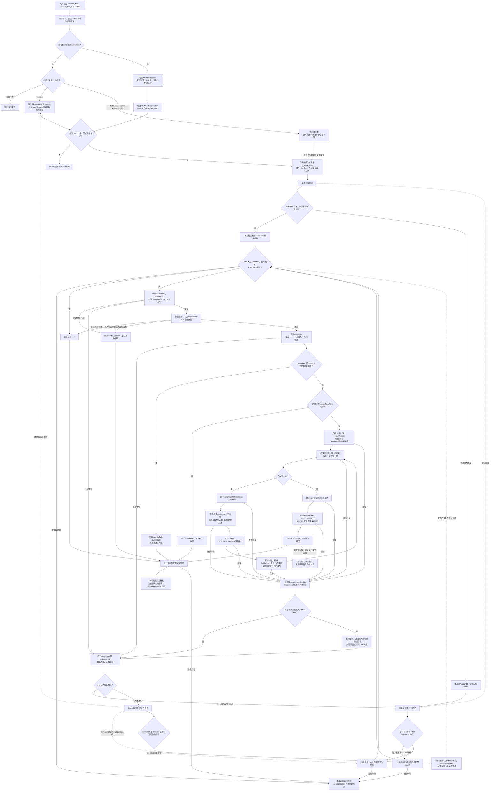

[业务逻辑专辑](/knowledge/business-logic/) / 居民收益付款 / S02

已经准备好的清单，怎样跨页批量调整、核对结果并处理失败？先理解业务，再读执行权、版本与事务边界。本文保留原文 13 章及逐章原文对照；正文连续展开，原文对照与大型流程源码按需展开。

**前置阅读：** [S01 · 选单工作集构建](/knowledge/business-logic/resident-income/s01-选单工作集构建/)

**快速阅读：** [先分清五个对象](#start) · [筛选规则](#s4) · [事务边界](#s5) · [失败与重试](#s8) · [完整流程](#s11) · [源码路径索引](#ref-index)

<div class="business-logic-article">

## 源码基线与核验边界

> 对应任务：`residentIncomePaymentSelectionFilterAllAsyncTask`。原文：《residentIncomePaymentSelectionFilterAllAsyncTask 源码梳理》。
>
> 本文是对用户提供文档的通俗改写，不是一次新的源码审查。文中的“当前代码”“已确认”均沿用原文的分析范围；没有重新读取项目源码、运行任务、连接数据库或核验线上环境。
>
> 原文分析日期：2026-09-08；证据级别：`SOURCE_VERIFIED`。分析目录：`/Users/wangyi/BZ/zx-monitor/zxbaif`；分支：`Ian/review/01`；HEAD：`a1bfacbeb6dfc239d577bd66bf78cd9eb2482efa`。原文按当前工作区分析，包含相关类已有的未提交内容，没有用其他 worktree 替代。因此，不能仅凭 HEAD 就认为部署包与文档完全一致。
>
> 表结构和状态语义来自原文核对的 Java、Mapper XML 与仓库 SQL。线上数据量、实际索引、执行计划、配置开关、部署情况和故障是否发生，原文均未确认。下文账单数量、批次和执行者小故事只用于解释，不是运行测量结果。

<div id="start"></div>

## 阅读起点：这是“批量调整清单”，不是“重新算账”

把选单页面想成一个工作台：里面已经有本次操作的账单明细，一部分在“待付款”，另一部分在“不合格”。现在用户筛出某项目公司、某些月份的数据，要求把**所有页中符合条件的记录**批量移到另一边。

**S02 的工作就是执行这次批量调整。它调整已有工作集的最终归类，不重新从差异台账构建清单，也不直接付款。**

先认识五个对象，后面遇到字段就不会混在一起：

| 名称 | 可以怎样理解 | 它负责什么 |
| --- | --- | --- |
| `selection_session` | 本次选单的工作台档案 | 记录工作台当前能不能调整、正在进行哪次调整 |
| `selection_session_item` | 工作台上的一条条明细 | 保存金额、付款状态、分流和人工调整结果 |
| `selection_adjustment_operation` | 用户这一次批量调整的操作单 | 保存筛选条件、反选项、目标、计数、进度和业务执行权 |
| `fi_async_task` | 交给后台的待办记录 | 决定何时执行、由哪轮执行、失败后什么时候再试 |
| XXL Job | 定期来取待办的调度入口 | 一轮可以选择多条 task，不等于一次用户操作 |

主线只有一条：

```text
用户筛选并跨页全选
→ 冻结本次调整条件，保存 operation
→ 按规模决定同步处理还是创建异步 task
→ 后台取得执行权
→ 按工作集主键分批更新归类
→ 核对计数，结束 operation，恢复 Session 可操作状态
→ 用户另行提交/重提，才进入后续付款流程
```

**先记住本篇最容易误读的一点：有“分批 SQL”和“游标”，不自动等于“每批独立提交”。原文指出，S02 在默认事务传播条件下，所有批次仍加入同一个外层事务。** 这会影响实时进度、故障回滚和接管，详见第 5、8、10 节。

下文保留原文的 13 节顺序。先读每节的解释，再按需要查看字段表、完整调用链和源码位置。

<div id="s1"></div>

## 1. 任务概览：它究竟改什么、不改什么？

*批量改归类，不是重新算账，也不是直接付款。*

**一句话：按照用户已经提交的筛选快照，把当前 Session 内的明细批量归到“待付款”或“不合格”。**

这里的 `FILTER_ALL` 是“当前会话、当前筛选条件下，跨页全选”。它不是“扫描全部合作方的所有账单”。操作范围由一个 `selection_adjustment_operation` 指定的 `session_id` 限定。

任务主要写入明细的最终分流、最终状态和人工调整标记，同时更新 operation、session 和 task 的状态。正常结束时是：

```text
operation = DONE          这一次批量调整做完了
session   = READY         工作台恢复可操作状态
task      = SUCCESS(2)    后台待办成功收尾
```

这里的正常结束，不包括“已放弃操作的残留任务也被收敛为 SUCCESS”这种特殊情况；后文会单独解释。

完整定位与默认参数如下：

| 项目 | 当前源码行为 |
| --- | --- |
| XXL Handler | `residentIncomePaymentSelectionFilterAllAsyncTask` |
| 入口类 | `ResidentIncomePaymentSelectionFilterAllJob` |
| 核心服务 | `SelectionFilterAllAsyncTaskServiceImpl` |
| 调度任务类型 | `RESIDENT_INCOME_PAYMENT_FILTER_ALL` |
| 主动唤醒路由 | `S02_FILTER_ALL` |
| 操作范围 | 一个 `selection_adjustment_operation` 指定的 `session_id` 工作集 |
| 主要业务写入 | `selection_session_item` 的最终归类、明细状态、人工调整标记，以及操作和会话状态 |
| 默认调度上限 | 一次选取 100 个异步任务；参数最大限制为 500 个 |
| 默认 SQL 批次 | 5,000 条符合条件的工作集记录，可读取 operation 中的 `batch_size` |
| 执行方式 | XXL 路径逐个任务串行执行；主动 kick 路径使用本地线程池 |
| 完成边界 | 正常完成为 operation=`DONE`、session=`READY`、task=`SUCCESS(2)` |
| 是否直接付款 | 否。此链路不创建付款提交版本、不激活账单付款锁、不发起审核或银行付款 |

**两种数量不要混淆。** “默认选 100 个任务”说的是 `fi_async_task` 行数；“一批默认 5,000 条”说的是一个 operation 内每批处理的工作集明细。一次调度的明细总量并不被限制为 100 条或 5,000 条。

**三个同名概念也不要混淆。** Job 是一轮调度；task 是一条后台待办；operation 是一次用户业务操作，保存冻结条件、业务租约和处理进度。

本链路不创建付款提交版本、不激活账单付款锁、不发起审核、不调用银行支付。它为了操作一致性而锁 task/session 行，与“激活账单付款锁”不是一回事。

源码对照：<abbr title="/Users/wangyi/BZ/zx-monitor/zxbaif/baie-business/financial-center/src/main/java/com/baie/financial/xxljob/ResidentIncomePaymentSelectionFilterAllJob.java:40">Job 入口</abbr>、<abbr title="/Users/wangyi/BZ/zx-monitor/zxbaif/baie-business/financial-center/src/main/java/com/baie/financial/service/fi/impl/SelectionFilterAllAsyncTaskServiceImpl.java:72">消费服务与默认参数</abbr>、<abbr title="/Users/wangyi/BZ/zx-monitor/zxbaif/baie-business/financial-client/src/main/java/com/baie/financial/enums/FiAsyncTaskTypeEnum.java:34">任务类型</abbr>。

<details class="original">
<summary>对照原文 · 第 1 节 任务概览</summary>

**这是一项居民收益付款“选单工作集批量调整”的后台消费任务。它按照用户已经提交并冻结的筛选条件，把当前会话中的账单移到“待付款”或“不合格”，记录操作进度，完成后释放会话的调整占用。**

| 项目 | 当前源码行为 |
| --- | --- |
| XXL Handler | `residentIncomePaymentSelectionFilterAllAsyncTask` |
| 入口类 | `ResidentIncomePaymentSelectionFilterAllJob` |
| 核心服务 | `SelectionFilterAllAsyncTaskServiceImpl` |
| 调度任务类型 | `RESIDENT_INCOME_PAYMENT_FILTER_ALL` |
| 主动唤醒路由 | `S02_FILTER_ALL` |
| 操作范围 | 一个 `selection_adjustment_operation` 指定的 `session_id` 工作集 |
| 主要业务写入 | `selection_session_item` 的最终归类、明细状态、人工调整标记，以及操作和会话状态 |
| 默认调度上限 | 一次选取 100 个异步任务；参数最大限制为 500 个 |
| 默认 SQL 批次 | 5,000 条符合条件的工作集记录，可读取 operation 中的 `batch_size` |
| 执行方式 | XXL 路径逐个任务串行执行；主动 kick 路径使用本地线程池 |
| 完成边界 | 正常完成为 operation=`DONE`、session=`READY`、task=`SUCCESS(2)` |
| 是否直接付款 | 否。此链路不创建付款提交版本、不激活账单付款锁、不发起审核或银行付款 |

特别注意三个同名“任务/操作”概念：

- **Job**：XXL-Job 的一次调度，可以消费多条异步任务。
- **task**：`fi_async_task` 的一行，负责何时执行、抢占和调度重试。
- **operation**：用户的一次批量调整，保存筛选快照、目标归类、业务租约和处理进度。

`FILTER_ALL` 表示“本会话当前筛选结果跨页全选”，不是扫描所有合作方的全部收益账单。

依据：<abbr title="/Users/wangyi/BZ/zx-monitor/zxbaif/baie-business/financial-center/src/main/java/com/baie/financial/xxljob/ResidentIncomePaymentSelectionFilterAllJob.java:40">Job 入口</abbr>、<abbr title="/Users/wangyi/BZ/zx-monitor/zxbaif/baie-business/financial-center/src/main/java/com/baie/financial/service/fi/impl/SelectionFilterAllAsyncTaskServiceImpl.java:72">消费服务与参数常量</abbr>、<abbr title="/Users/wangyi/BZ/zx-monitor/zxbaif/baie-business/financial-client/src/main/java/com/baie/financial/enums/FiAsyncTaskTypeEnum.java:34">任务类型</abbr>。

</details>

<div id="s2"></div>

## 2. 业务目的与任务来源：用户的一次点击，怎样变成后台待办？

*保存本次意图，超过阈值才进入异步；显式退出重提是例外。*

### 2.1 为什么不让前端把所有 ID 一次传回来？

假设用户筛出了几万条账单，但页面一页只展示其中一小部分。

只提交当前页 ID，会漏掉其他页；先把全部 ID 拉到浏览器或 JVM，再逐条更新，会放大请求体、内存和逐条处理成本。

当前方式是保存一张 operation：“这个 Session，按这些条件，除去这些反选的 diff\_id，调整到这个目标”。数据库按工作集主键分批找记录，页面通过 `sessionId + operationId` 查询结果。

**这里冻结的是过滤条件、少量反选 ID 和相关统计，不是把全部命中 ID 枚举后存下来。** 后台不再向页面索要条件，而是读取已经保存的业务快照。

沿用原文的假设例子：用户筛出 60,000 条不合格账单转待付款，其中 200 条资料缺失，另有 100 条金额不大于 0。

```text
命中范围：60,000
资料缺失：   200
无硬阻断但金额非正：100
可转换： 60,000 - 200 - 100 = 59,700
```

正常成功是 59,700 条完成转换，另外 300 条保持原状，并由冻结计数说明原因。**不是所有 60,000 条都能被强行改成可付款。**

### 2.2 谁创建操作，什么时候才进入异步？

上游接口是 `POST /fiResidentIncomePaymentOrder/adjustSelectionSessionByFilterAll`。完整转发链保留如下，读业务时先关注“创建 operation → 占用 session → 受理 task → 提交后唤醒”四步即可。

```text
POST /fiResidentIncomePaymentOrder/adjustSelectionSessionByFilterAll
  → FiResidentIncomePaymentOrderController.adjustSelectionSessionByFilterAll
  → FiResidentIncomePaymentOrderServiceImpl.adjustSelectionSessionByFilterAll
  → SelectionSessionServiceImpl.adjustSelectionSessionByFilterAll
  → SelectionAdjustmentServiceImpl.adjustByFilterAll
    → createFilterAllOperation / doCreateFilterAllOperation
    → createOperationAndStartSession
    → submitFilterAllAsyncTask
    → ResidentIncomePaymentSelectionTaskAcceptanceServiceImpl.accept
      → SafeSeedService.acceptOrReuse
      → 记录异步受理追溯
      → registerAfterCommit
```

创建前的检查可以理解成六道边界：

| 检查 | 通俗含义 |
| --- | --- |
| `sessionId`、`adjustRequestId`、方向合法，正常目标为 10/20 | 先确认是哪张工作台、哪次请求、往哪一边调整 |
| 当前登录用户拥有该 Session | 不能调整别人的工作台 |
| 新操作要求 Session 为 READY 且未失效，使用行锁和 `state_version` CAS | 工作台必须可操作，并且只允许符合当前版本的占用 |
| REVISE 来源校验 | 核对原付款单创建人、合作方、审核不通过状态、有效发布版本、来源版本和提交轮次 |
| `session_id + adjust_request_id` 幂等 | 同一请求重复发送时找回原 operation；模式、来源、目标、过滤 JSON、反选 JSON 必须一致 |
| 反选集合校验 | `excludedIds` 是差异台账 `diff_id`；必须属于当前 Session，去重排序后最多 5,000 个 |

CAS 可理解成“只有数据库中的版本还等于我预期的版本，才允许改”，而不是直接覆盖最新状态。

并非所有 FILTER\_ALL 都进入后台。分流依据是创建时聚合得到的 `estimated_count`：

| 条件 | 执行方式 |
| --- | --- |
| `estimated_count <= 5000` | 同步集合 UPDATE |
| `5000 < estimated_count <= 50000` | 同步按主键分批 |
| `estimated_count > 50000` | 创建本任务，后台处理 |
| 请求显式 `includedInRevise=false` | 当前代码不走异步，仍走同步路径，即使超过 50,000 |

两个细节不能省略。

**第一，转待付款的预估数也包含硬阻断和金额非正的记录。** 上面 60,000 条的例子会按 60,000 判断是否异步，不是按 59,700 判断。

**第二，请求显式 `includedInRevise=false` 是例外。** 当前不走本异步 worker，即使超过 50,000 也走同步路径。不要把这个请求级分流条件，与 `viewFilter.includedInRevise` 作为查询条件的作用混在一起。

新建 operation 时，数据库直接保存 `RUNNING`，Session 从 READY 转为 ADJUSTING。**没有“先插入 INIT，再启动”的实际数据库步骤。** 枚举或追溯语义出现 INIT，不等于创建流程经过它。

### 2.3 哪些东西需要保存下来，避免重试时变卦？

| 持久化位置 | 冻结内容 |
| --- | --- |
| `selection_adjustment_operation` | `session_id`、`adjust_request_id`、`operation_version`、`operation_mode=FILTER_ALL` |
| 同上 | `source_final_split_type`、`target_final_split_type` |
| 同上 | `view_filter_json`、`excluded_ids_snapshot_json` |
| 同上 | `estimated_count`、`transfer_data_missing_count`、`transfer_amount_not_positive_count` |
| `fi_async_task.task_data` | `sessionId`、`operationId`、`taskScene=FILTER_ALL` |

operation 保存的是业务意图和统计；taskData 保存的是定位这次操作所需的身份。对应规则是：

```text
business_key = FILTER_ALL:<operationId>
task_code    = RIPFA:<MD5小写32位摘要(business_key)>
task_data    = {"sessionId":...,"operationId":...,"taskScene":"FILTER_ALL"}
```

`business_key` 便于按 operation 找任务；`task_code` 是固定的幂等编码。worker 先解析 `task_data`，重新计算并核对 businessKey/taskCode，再读取 operation，不从页面重新取条件，也不拆业务键猜 sessionId。

`SafeSeedService.acceptOrReuse` 使用 `INSERT IGNORE` 尝试插入，再按 taskCode 回读并核验身份。已有任务就复用，**不会因为“再次受理”自动覆盖旧进度、旧重试次数或终态**。用户重试有另外的处理分支，且当前传值存在问题，见第 10.2 节。

这些幂等行为依赖实际唯一约束；原文没有核验目标环境是否正确部署了该约束。

源码对照：<abbr title="/Users/wangyi/BZ/zx-monitor/zxbaif/baie-business/financial-client/src/main/java/com/baie/financial/feign/client/IFiResidentIncomePaymentOrderServiceFeign.java:329">接口</abbr>、<abbr title="/Users/wangyi/BZ/zx-monitor/zxbaif/baie-business/financial-center/src/main/java/com/baie/financial/service/fi/impl/FiResidentIncomePaymentOrderServiceImpl.java:1749">service 转发</abbr>、<abbr title="/Users/wangyi/BZ/zx-monitor/zxbaif/baie-business/financial-center/src/main/java/com/baie/financial/service/fi/impl/SelectionAdjustmentServiceImpl.java:140">调整入口</abbr>、<abbr title="/Users/wangyi/BZ/zx-monitor/zxbaif/baie-business/financial-center/src/main/java/com/baie/financial/service/fi/impl/SelectionAdjustmentServiceImpl.java:296">operation 创建与恢复</abbr>、<abbr title="/Users/wangyi/BZ/zx-monitor/zxbaif/baie-business/financial-center/src/main/java/com/baie/financial/service/fi/impl/SelectionAdjustmentServiceImpl.java:674">输入检查</abbr>、<abbr title="/Users/wangyi/BZ/zx-monitor/zxbaif/baie-business/financial-center/src/main/java/com/baie/financial/service/fi/impl/SelectionAdjustmentServiceImpl.java:856">会话受理检查</abbr>、<abbr title="/Users/wangyi/BZ/zx-monitor/zxbaif/baie-business/financial-center/src/main/java/com/baie/financial/service/fi/impl/SelectionAdjustmentServiceImpl.java:538">任务提交</abbr>、<abbr title="/Users/wangyi/BZ/zx-monitor/zxbaif/baie-business/financial-center/src/main/java/com/baie/financial/utils/ResidentIncomePaymentSelectionAsyncTaskSupport.java:33">任务编码</abbr>、<abbr title="/Users/wangyi/BZ/zx-monitor/zxbaif/baie-business/financial-center/src/main/java/com/baie/financial/service/fi/impl/ResidentIncomePaymentSafeSeedServiceImpl.java:71">安全受理</abbr>、<abbr title="/Users/wangyi/BZ/zx-monitor/zxbaif/baie-business/financial-center/src/main/java/com/baie/financial/service/fi/impl/SelectionFilterAllAsyncTaskServiceImpl.java:441">任务身份检查</abbr>。

<details class="original">
<summary>对照原文 · 第 2 节 业务目的与任务来源</summary>

### 2.1 解决什么业务问题

用户在居民收益付款选单页面，可能需要把某项目公司、某账期或某类差异状态下的几万条账单批量移入另一页签。只传当前页 ID 会漏掉跨页记录；把全部 ID 拉到前端或 JVM，再逐条更新，也会放大请求和内存开销。

当前实现把这次意图持久化为 operation，冻结过滤条件和少量反选 ID，再由数据库按工作集主键分批执行。这样，页面只需持有 `sessionId + operationId` 查询结果；任务可通过原 operation 找回已有进度。

例如：用户筛出 60,000 条“不合格”账单，要求转入“待付款”。其中 200 条资料缺失、100 条金额不大于 0，则实际可转换 59,700 条。任务成功意味着这 59,700 条转换完成，另外 300 条保留原状并通过冻结计数说明原因；不意味着全部 60,000 条都已经变成可付款账单。

### 2.2 谁创建这条异步任务

上游调用链：

```text
POST /fiResidentIncomePaymentOrder/adjustSelectionSessionByFilterAll
  → FiResidentIncomePaymentOrderController.adjustSelectionSessionByFilterAll
  → FiResidentIncomePaymentOrderServiceImpl.adjustSelectionSessionByFilterAll
  → SelectionSessionServiceImpl.adjustSelectionSessionByFilterAll
  → SelectionAdjustmentServiceImpl.adjustByFilterAll
    → createFilterAllOperation / doCreateFilterAllOperation
    → createOperationAndStartSession
    → submitFilterAllAsyncTask
    → ResidentIncomePaymentSelectionTaskAcceptanceServiceImpl.accept
      → SafeSeedService.acceptOrReuse
      → 记录异步受理追溯
      → registerAfterCommit
```

创建前的关键检查：

1. `sessionId`、`adjustRequestId`、调整方向必须合法；正常目标只允许 10、20。
2. 当前登录用户必须拥有该 session。
3. 新操作要求 session=`READY` 且未失效，并通过行锁及 `state_version` CAS 占用会话。
4. REVISE 模式还检查来源付款单的创建人、合作方、审核不通过状态、有效发布版本、来源版本和提交轮次。
5. 按 `session_id + adjust_request_id` 查幂等记录。已有操作必须与本次的模式、来源、目标、过滤 JSON、反选 JSON 一致。
6. `excludedIds` 是差异台账 `diff_id`，会校验属于当前会话，去重排序后最多 5,000 个。

分流依据是创建时聚合得到的 `estimated_count`：

| 条件 | 执行方式 |
| --- | --- |
| `estimated_count <= 5000` | 同步集合 UPDATE |
| `5000 < estimated_count <= 50000` | 同步按主键分批 |
| `estimated_count > 50000` | 创建本任务，后台处理 |
| 请求显式 `includedInRevise=false` | 当前代码不走异步，仍走同步路径，即使超过 50,000 |

转待付款时，预估数包含命中范围内被硬阻断、金额非正的记录，所以“是否进入异步”的判断不只看最终可转换数量。

**当前新 operation 直接写入 `RUNNING`，并没有先落 `INIT` 再启动的数据库步骤。** `INIT` 虽存在于枚举和追溯语义中，不应据此画出不存在的创建流程。

依据：<abbr title="/Users/wangyi/BZ/zx-monitor/zxbaif/baie-business/financial-client/src/main/java/com/baie/financial/feign/client/IFiResidentIncomePaymentOrderServiceFeign.java:329">接口定义</abbr>、<abbr title="/Users/wangyi/BZ/zx-monitor/zxbaif/baie-business/financial-center/src/main/java/com/baie/financial/service/fi/impl/FiResidentIncomePaymentOrderServiceImpl.java:1749">上游 service 转发</abbr>、<abbr title="/Users/wangyi/BZ/zx-monitor/zxbaif/baie-business/financial-center/src/main/java/com/baie/financial/service/fi/impl/SelectionAdjustmentServiceImpl.java:140">调整入口</abbr>、<abbr title="/Users/wangyi/BZ/zx-monitor/zxbaif/baie-business/financial-center/src/main/java/com/baie/financial/service/fi/impl/SelectionAdjustmentServiceImpl.java:296">创建及恢复 operation</abbr>、<abbr title="/Users/wangyi/BZ/zx-monitor/zxbaif/baie-business/financial-center/src/main/java/com/baie/financial/service/fi/impl/SelectionAdjustmentServiceImpl.java:674">输入校验</abbr>、<abbr title="/Users/wangyi/BZ/zx-monitor/zxbaif/baie-business/financial-center/src/main/java/com/baie/financial/service/fi/impl/SelectionAdjustmentServiceImpl.java:856">会话受理检查</abbr>。

### 2.3 冻结什么内容

| 持久化位置 | 冻结内容 |
| --- | --- |
| `selection_adjustment_operation` | `session_id`、`adjust_request_id`、`operation_version`、`operation_mode=FILTER_ALL` |
| 同上 | `source_final_split_type`、`target_final_split_type` |
| 同上 | `view_filter_json`、`excluded_ids_snapshot_json` |
| 同上 | `estimated_count`、`transfer_data_missing_count`、`transfer_amount_not_positive_count` |
| `fi_async_task.task_data` | `sessionId`、`operationId`、`taskScene=FILTER_ALL` |

任务身份按 operation 固定：

```text
business_key = FILTER_ALL:<operationId>
task_code    = RIPFA:<MD5小写32位摘要(business_key)>
task_data    = {"sessionId":...,"operationId":...,"taskScene":"FILTER_ALL"}
```

worker 不从页面重新取条件，也不通过拆分业务键猜测 session。它解析 `task_data`，重新计算业务键和任务编码核对身份，再读取 operation 的业务快照。

`SafeSeedService.acceptOrReuse` 使用 `INSERT IGNORE` 后按任务编码回读并验证身份；已存在时复用旧任务，不覆盖其进度、次数或终态。数据库唯一约束是否已在目标环境正确部署，暂时无法确认。

依据：<abbr title="/Users/wangyi/BZ/zx-monitor/zxbaif/baie-business/financial-center/src/main/java/com/baie/financial/service/fi/impl/SelectionAdjustmentServiceImpl.java:538">operation 构造和任务提交</abbr>、<abbr title="/Users/wangyi/BZ/zx-monitor/zxbaif/baie-business/financial-center/src/main/java/com/baie/financial/utils/ResidentIncomePaymentSelectionAsyncTaskSupport.java:33">任务键规则</abbr>、<abbr title="/Users/wangyi/BZ/zx-monitor/zxbaif/baie-business/financial-center/src/main/java/com/baie/financial/service/fi/impl/ResidentIncomePaymentSafeSeedServiceImpl.java:71">安全受理</abbr>、<abbr title="/Users/wangyi/BZ/zx-monitor/zxbaif/baie-business/financial-center/src/main/java/com/baie/financial/service/fi/impl/SelectionFilterAllAsyncTaskServiceImpl.java:441">任务快照校验</abbr>。

</details>

<div id="s3"></div>

## 3. 核心调用链：先证明“这是我的任务”，再证明“我能改这次操作”

*任务轮次、业务租约、调整版本和会话版本分别承担不同责任。*

### 3.1 先看业务顺序，再看完整方法名

后台工作可以分成四段：

```text
找 task 并抢占本轮执行权
→ 核对 taskData、REVISE 身份，进入带 owner 行锁的执行事务
→ 找 operation 并领取业务租约，确认 Session 仍属于本次调整
→ 循环更新明细，完成 operation/session/task，再做巡检与汇总
```

完整调用链保留如下。`executeFencedWrite` 包住的不只是一次身份检查，还包含 operation 执行、所有批次和收尾；这正是第 5 节事务问题的来源。

```text
ResidentIncomePaymentSelectionFilterAllJob
  .residentIncomePaymentSelectionFilterAllAsyncTask(param)
    → parseJobParam / unwrapPayload
    → executeJob
      ├─ 无 taskCode/businessKey 选择器
      │   → SelectionFilterAllAsyncTaskServiceImpl.executePendingTasks
      │     → queryAutoExecutableTaskList
      └─ 有选择器
          → executeManualRetry
            → queryManualRetryTaskList
    → executeTaskList：for 循环串行处理
      → executeSingleTask
        → claimTask
          → FencedExecutionTemplate.claim
            → FiAsyncTaskMapper.claimResidentIncomePaymentFencedTask
        → parseTaskDto / validateTaskIdentity
        → reviseInvariantGuard.requireSessionInvariant
        → FencedExecutionTemplate.executeFencedWrite
          → lockResidentIncomePaymentFencedTaskOwner：FOR UPDATE
          → 再次校验 REVISE 身份
          → executeFilterAllOperation
            → 读取并校验 operation/session
            ├─ DONE / ABANDONED → 仅收敛 task SUCCESS
            └─ claimOperationLease
              → ensureSessionAdjusting
              → executeFilterAllBatches
                → executeOneFilterAllBatch，循环至没有下一批
                  → queryNextFilterAllBatchEndId
                  → countFilterAllMatched
                  → countFilterAllChanged
                  → updateSelectionByFilterAllWithLease
                  → validateTransferBatch
                  → updateOperationProgress
              → completeOperation
                → 校验累计数量
                → markOperationDoneByLease
                → SelectionSessionMapper.markAdjustmentDone
                → recordEditSaved（仅 REVISE）
              → markTaskSuccess
    → inspectInvariants
    → 生成选中/成功/失败/跳过摘要
    → 映射为 XXL ReturnT
```

### 3.2 第一层：任务领取，相当于领取“本轮执行票”

自动扫描查到 task，只说明它是候选，不说明当前 worker 已经获得执行权。真正领取依靠带条件 UPDATE：

| 条件 | 作用 |
| --- | --- |
| 当前 task ID、指定任务类型、`deleted=0` | 不能领错任务或已删除任务 |
| 状态为 PENDING(0)、FAILED(3) 或 RUNNING(1) | 不重新执行成功或取消的任务 |
| `running_attempt` 等于查询时的旧值 | 防止另一个 worker 已先领走 |
| 自动触发检查执行时间和重试上限 | 未到时间或次数耗尽就不能自动执行 |
| RUNNING 的 `update_time <= 当前时间 - 10分钟` | 运行中任务只有达到超时条件，才允许重新抢占 |

领取成功后，task 变为 RUNNING，`running_attempt + 1`，清理旧错误、更新执行者和时间，并返回携带本轮 attempt 的 `ClaimToken`。

随后真正执行业务时，再按 token `SELECT ... FOR UPDATE` 锁住 task owner。旧 worker 拿过时 attempt 找不到对应 owner，会抛 `FencedOutException` 并按跳过处理。

可以把 attempt 看作轮次：A 拿第 7 轮，后来 B 获得第 8 轮，A 不能继续以第 7 轮身份写当前任务状态。**至于接管是否会被长事务行锁阻塞，需要结合第 5.3 节理解，不能只看超时数字。**

S02 调用 `claim` 时传入的 `BusinessLeaseClaim` 是 **null**。它没有在领取 task 的同一步领取 operation 租约；业务租约是在后面另外获取的，不能套用其他任务的组合领取模式。

### 3.3 第二层：operation 租约，相当于本次操作的“业务写权限”

取得 task 执行权后，先读取 operation，确认 `taskData.sessionId == operation.sessionId`，再读取 Session。REVISE 还要核对来源付款单与 Session 的持久化创建人一致。

如果 operation 已是 DONE 或 ABANDONED，就只把残留 task 收敛为 SUCCESS，不再改明细。否则尝试 `claimFilterAllLease`。

领取业务租约需要同时满足：操作模式是 FILTER\_ALL，状态为 RUNNING/FAILED，`next_retry_time` 已到或为空，并满足 SQL 中的 REVISE 身份约束。持有人方面，允许 worker 为空、是相同 worker、租约为空/已过期，或 operation 已 FAILED 等情况。

领取成功后，写新的 `worker_id`、递增 `lease_version`，租约设为当前时间加 10 分钟，更新心跳，清理近期错误码/信息与 `next_retry_time`。**旧 `failed_reason` 此时不会清空。**

领不到租约不等于业务执行失败：task 回到 PENDING，约 5 秒后再试，不增加 task.retryCount，摘要计为跳过。

### 3.4 Session 还必须绑定着这一次调整

有 task、有 operation 租约，还需要确认 Session 没有转到别的业务阶段。

| session 状态 | 必须匹配 |
| --- | --- |
| ADJUSTING | `active_operation_id=当前operationId`，且 `current_operation_version=当前operationVersion` |
| ADJUST\_FAILED | operationVersion 相等，activeOperationId 为空或为当前 operation |

ADJUST\_FAILED 只有符合本次绑定关系时，才能通过 CAS 恢复到 ADJUSTING。READY、已提交、已取消等其他状态不会被强行拉回可调整状态。

几个版本字段的含义不同，不是同一个“万能版本号”：

| 字段 | 用途 |
| --- | --- |
| `fi_async_task.running_attempt` | 区分不同调度执行轮次，拒绝旧 task owner |
| `operation.lease_version` | 区分不同 operation worker，约束业务写入 |
| `operation.operation_version` | 标识会话中的第几次调整 |
| `item.operation_version` | 标识该工作集行已应用到哪个调整版本 |
| `session.state_version` | 会话状态变化的 CAS 版本 |

通俗记法：**attempt 管哪轮 task 执行；leaseVersion 管哪个业务 worker；operationVersion 管哪次调整；item.operationVersion 记录哪次调整已经应用；stateVersion 管会话状态变更。**

源码对照：<abbr title="/Users/wangyi/BZ/zx-monitor/zxbaif/baie-business/financial-center/src/main/java/com/baie/financial/xxljob/ResidentIncomePaymentSelectionFilterAllJob.java:40">Job 路由</abbr>、<abbr title="/Users/wangyi/BZ/zx-monitor/zxbaif/baie-business/financial-center/src/main/java/com/baie/financial/service/fi/impl/SelectionFilterAllAsyncTaskServiceImpl.java:275">worker 主流程</abbr>、<abbr title="/Users/wangyi/BZ/zx-monitor/zxbaif/baie-business/financial-center/src/main/java/com/baie/financial/service/fi/impl/SelectionFilterAllAsyncTaskServiceImpl.java:596">批次与完成</abbr>、<abbr title="/Users/wangyi/BZ/zx-monitor/zxbaif/baie-business/financial-center/src/main/java/com/baie/financial/service/fi/impl/SelectionFilterAllAsyncTaskServiceImpl.java:403">claim 调用</abbr>、<abbr title="/Users/wangyi/BZ/zx-monitor/zxbaif/baie-business/financial-center/src/main/resources/mapper/FiAsyncTaskMapper.xml:90">task CAS SQL</abbr>、<abbr title="/Users/wangyi/BZ/zx-monitor/zxbaif/baie-business/financial-center/src/main/java/com/baie/financial/service/fi/impl/ResidentIncomePaymentFencedExecutionTemplateImpl.java:119">fenced 事务</abbr>、<abbr title="/Users/wangyi/BZ/zx-monitor/zxbaif/baie-business/financial-center/src/main/java/com/baie/financial/service/fi/impl/SelectionFilterAllAsyncTaskServiceImpl.java:529">operation 领取</abbr>、<abbr title="/Users/wangyi/BZ/zx-monitor/zxbaif/baie-business/financial-center/src/main/resources/mapper/SelectionAdjustmentOperationMapper.xml:257">业务租约 SQL</abbr>、<abbr title="/Users/wangyi/BZ/zx-monitor/zxbaif/baie-business/financial-center/src/main/java/com/baie/financial/service/fi/impl/SelectionFilterAllAsyncTaskServiceImpl.java:549">Session 绑定</abbr>、<abbr title="/Users/wangyi/BZ/zx-monitor/zxbaif/baie-business/financial-center/src/main/resources/mapper/SelectionSessionMapper.xml:840">Session 状态 SQL</abbr>。

<details class="original">
<summary>对照原文 · 第 3 节 核心调用链</summary>

### 3.1 从 XXL 入口到业务完成

```text
ResidentIncomePaymentSelectionFilterAllJob
  .residentIncomePaymentSelectionFilterAllAsyncTask(param)
    → parseJobParam / unwrapPayload
    → executeJob
      ├─ 无 taskCode/businessKey 选择器
      │   → SelectionFilterAllAsyncTaskServiceImpl.executePendingTasks
      │     → queryAutoExecutableTaskList
      └─ 有选择器
          → executeManualRetry
            → queryManualRetryTaskList
    → executeTaskList：for 循环串行处理
      → executeSingleTask
        → claimTask
          → FencedExecutionTemplate.claim
            → FiAsyncTaskMapper.claimResidentIncomePaymentFencedTask
        → parseTaskDto / validateTaskIdentity
        → reviseInvariantGuard.requireSessionInvariant
        → FencedExecutionTemplate.executeFencedWrite
          → lockResidentIncomePaymentFencedTaskOwner：FOR UPDATE
          → 再次校验 REVISE 身份
          → executeFilterAllOperation
            → 读取并校验 operation/session
            ├─ DONE / ABANDONED → 仅收敛 task SUCCESS
            └─ claimOperationLease
              → ensureSessionAdjusting
              → executeFilterAllBatches
                → executeOneFilterAllBatch，循环至没有下一批
                  → queryNextFilterAllBatchEndId
                  → countFilterAllMatched
                  → countFilterAllChanged
                  → updateSelectionByFilterAllWithLease
                  → validateTransferBatch
                  → updateOperationProgress
              → completeOperation
                → 校验累计数量
                → markOperationDoneByLease
                → SelectionSessionMapper.markAdjustmentDone
                → recordEditSaved（仅 REVISE）
              → markTaskSuccess
    → inspectInvariants
    → 生成选中/成功/失败/跳过摘要
    → 映射为 XXL ReturnT
```

依据：<abbr title="/Users/wangyi/BZ/zx-monitor/zxbaif/baie-business/financial-center/src/main/java/com/baie/financial/xxljob/ResidentIncomePaymentSelectionFilterAllJob.java:40">调度路由</abbr>、<abbr title="/Users/wangyi/BZ/zx-monitor/zxbaif/baie-business/financial-center/src/main/java/com/baie/financial/service/fi/impl/SelectionFilterAllAsyncTaskServiceImpl.java:275">逐条消费</abbr>、<abbr title="/Users/wangyi/BZ/zx-monitor/zxbaif/baie-business/financial-center/src/main/java/com/baie/financial/service/fi/impl/SelectionFilterAllAsyncTaskServiceImpl.java:596">批次与完成逻辑</abbr>。

### 3.2 第一层：抢占调度任务

扫描得到一行，不代表已经拥有执行权。真正抢占使用带条件的 UPDATE：

- 必须是当前任务 ID、类型、`deleted=0`。
- 状态属于 `PENDING(0)、FAILED(3)、RUNNING(1)`。
- `running_attempt` 必须等于查询时取得的旧值。
- 自动触发还检查到期时间和重试次数。
- RUNNING 记录必须满足 `update_time <= 当前时间-10分钟`，才允许再次抢占。

成功后，`task_status=RUNNING`、`running_attempt+1`、清空旧错误，更新执行者和时间。返回的 `ClaimToken` 携带本轮 attempt。

真正执行业务前还会按此 token `SELECT ... FOR UPDATE` 锁住 task。旧 worker 持过时 attempt 找不到 owner，抛出 `FencedOutException`，按跳过处理。

**这条 S02 调用传给 `claim` 的 `BusinessLeaseClaim` 是 null。** operation 租约在后续取得；不能把其他任务的“业务租约与 task 一起 claim”模式套到这里。

依据：<abbr title="/Users/wangyi/BZ/zx-monitor/zxbaif/baie-business/financial-center/src/main/java/com/baie/financial/service/fi/impl/SelectionFilterAllAsyncTaskServiceImpl.java:403">claim 调用</abbr>、<abbr title="/Users/wangyi/BZ/zx-monitor/zxbaif/baie-business/financial-center/src/main/resources/mapper/FiAsyncTaskMapper.xml:90">task CAS SQL</abbr>、<abbr title="/Users/wangyi/BZ/zx-monitor/zxbaif/baie-business/financial-center/src/main/java/com/baie/financial/service/fi/impl/ResidentIncomePaymentFencedExecutionTemplateImpl.java:119">fenced 事务模板</abbr>。

### 3.3 第二层：抢占业务 operation

通过 task 身份校验后：

1. 读取 operation，验证 `taskData.sessionId == operation.sessionId`。
2. 读取 session；REVISE 时核对来源付款单与 session 的持久化创建人一致。
3. operation 已是 `DONE/ABANDONED` 时，仅把残留 task 收敛为 SUCCESS，不再改工作集。
4. 否则使用 `claimFilterAllLease` 尝试取得业务租约。

业务租约条件包括：

- `operation_mode=FILTER_ALL`。
- 状态为 `RUNNING/FAILED`。
- `next_retry_time` 为空或已到期。
- worker 为空、相同 worker、租约为空/已过期，或 operation 为 FAILED。
- SQL 的 REVISE 身份约束仍成立。

抢到后设置新的 `worker_id`、递增 `lease_version`、续期至当前时间加 10 分钟，更新心跳，清理近期错误码/错误信息和 `next_retry_time`。旧 `failed_reason` 并不会在此清空。

抢不到时，task 回到 PENDING，下次执行时间设为约 5 秒后；不增加 task 重试次数，摘要计为跳过。

依据：<abbr title="/Users/wangyi/BZ/zx-monitor/zxbaif/baie-business/financial-center/src/main/java/com/baie/financial/service/fi/impl/SelectionFilterAllAsyncTaskServiceImpl.java:529">operation 领取与会话检查</abbr>、<abbr title="/Users/wangyi/BZ/zx-monitor/zxbaif/baie-business/financial-center/src/main/resources/mapper/SelectionAdjustmentOperationMapper.xml:257">operation 租约 SQL</abbr>。

### 3.4 session 必须仍属于本次操作

worker 对 session 的允许状态是：

| session 状态 | 必须匹配 |
| --- | --- |
| ADJUSTING | `active_operation_id=当前operationId`，且 `current_operation_version=当前operationVersion` |
| ADJUST\_FAILED | operationVersion 相等，activeOperationId 为空或为当前 operation |

ADJUST\_FAILED 会通过 CAS 切回 ADJUSTING。其他状态，包括 READY、已提交、已取消等，不会被强行改成可调整。

这里核对的是本次调整版本 `current_operation_version`，它与以下字段各司其职：

| 字段 | 用途 |
| --- | --- |
| `fi_async_task.running_attempt` | 区分不同调度执行轮次，拒绝旧 task owner |
| `operation.lease_version` | 区分不同 operation worker，约束业务写入 |
| `operation.operation_version` | 标识会话中的第几次调整 |
| `item.operation_version` | 标识该工作集行已应用到哪个调整版本 |
| `session.state_version` | 会话状态变化的 CAS 版本 |

依据：<abbr title="/Users/wangyi/BZ/zx-monitor/zxbaif/baie-business/financial-center/src/main/java/com/baie/financial/service/fi/impl/SelectionFilterAllAsyncTaskServiceImpl.java:549">session 绑定检查</abbr>、<abbr title="/Users/wangyi/BZ/zx-monitor/zxbaif/baie-business/financial-center/src/main/resources/mapper/SelectionSessionMapper.xml:840">session 状态 SQL</abbr>。

</details>

<div id="s4"></div>

## 4. 数据筛选规则：先选后台任务，再选工作台明细

*当前工作集 + 冻结筛选 + 方向规则，决定真正处理哪些明细。*

### 4.1 自动调度选的是哪些 task？

实际代码使用 MyBatis-Plus QueryWrapper。原文给出的等价 SQL 是：

```sql
SELECT *
FROM fi_async_task
WHERE deleted = 0
  AND task_type = 'RESIDENT_INCOME_PAYMENT_FILTER_ALL'
  AND task_status IN (0, 3, 1)
  AND (next_execute_time IS NULL OR next_execute_time <= :now)
  AND IFNULL(retry_count, 0) < IFNULL(max_retry_count, 3)
ORDER BY next_execute_time ASC, retry_count ASC, id ASC
LIMIT :maxTaskCount;
```

`maxTaskCount` 为空或不大于 0，按 100；超过 500，截为 500。这里限制的是任务条数，不是账单条数。

注意，扫描把 RUNNING 也纳入候选，**扫描 SQL 自己不检查是否已超时 10 分钟**。真正的超时判断在随后的 claim UPDATE 中。这既解释了恢复入口，也带来“未超时 RUNNING 占据候选名额”的性能关注点。

### 4.2 手工定向重跑，究竟放宽了什么？

支持裸 JSON：

```json
{"businessKey":"FILTER_ALL:123456789","maxTaskCount":1}
```

也支持 `data` 包装：

```json
{"data":{"taskCodes":["RIPFA:数据库中实际摘要"],"maxTaskCount":10}}
```

上面只是格式示例。实际使用数据库中精确的业务键和编码，不把示例数字当作可执行对象。

单值 `taskCode` 与列表 `taskCodes` 合并；`businessKey` 与 `businessKeys` 也合并。Job 去空并 trim，service 再去重。**编码和业务键同时传入，按 OR 命中，不是 AND。**

手工查询仍限定类型、`deleted=0`，按 ID 升序取上限，但查询阶段不限定状态、时间和次数。到了 claim，仍拒绝 SUCCESS、CANCELLED 和未超时 RUNNING。

因此 MANUAL 只是绕过 **task 层**到期时间和重试次数，不绕过 operation.nextRetryTime、业务租约、Session 版本，也不让 ABANDONED 重新执行。

**坏 JSON 是一个实际陷阱。** 当前解析失败会退为空参数，随后进入自动扫描；不是报“定向参数不合法后什么也不做”。

### 4.3 真正被修改的是哪张表？

核心 SELECT、COUNT、UPDATE 的主体都是 `selection_session_item`，而不是实时差异台账。

固定执行条件如下：

```text
session_id = operation.session_id
visible_flag = 1
removed_in_revise = 0
operation_version < operation.operation_version
id > last_item_id
当前批次统计/更新时：id <= batch_end_id
```

再叠加 operation 来源分流、冻结 viewFilter 和排除集。

这里有两个 ID 口径：**翻批使用工作集主键 `selection_session_item.id`（item.id）；反选使用 diff\_id。** `last_item_id` 不能拿反选的 diff\_id 代替。

worker 根据工作集已经保存的 `payment_status`、`current_payment_amount`、`hard_block_flag` 等字段处理。它不在每批 JOIN `fi_monthly_income_difference` 重算收益、付款状态、金额，也不重新拉上游账单。

更新中的 EXISTS 会读取 Session、operation 来验证执行资格；REVISE 身份条件还涉及来源付款单。这不等于“每批重新构建源账单事实”。

### 4.4 页面筛选条件会怎样落到 SQL？

原文核对的是 worker 实际引用的 `selectionViewFilterWhereNoAlias`，不是只看 DTO 有哪些字段。下面是完整映射，条件有值才叠加，大部分条件之间为 AND。

| 条件类别 | DTO 字段 → 工作集字段/规则 |
| --- | --- |
| 项目公司 | `projectCompanyIdList → project_company_id IN` |
| 账期 | `startYearMonth/endYearMonth → bill_yearmonth >= / <=`，包含边界 |
| 平台电站 | `stationId → station_id`；`stationNo/stationNoList → station_no` |
| 小租电站 | `smallStationId → small_station_id_text`；`smallStationNo → small_station_no` |
| 账单定位 | `smallBillId → small_bill_id`；`partnerBillId → partner_bill_id`；`diffBizKey → diff_biz_key` |
| 付款状态 | `paymentStatusList/paymentStatus → payment_status`；非空列表优先于单值 |
| REVISE 来源 | `reviseOriginList/reviseOrigin → revise_origin`；非空列表优先 |
| REVISE 加入/可用性 | `includedInRevise → included_in_revise`；`retainedUnavailableFlag → retained_unavailable_flag` |
| 业务状态 | `businessStatusList/businessStatus → business_status`；非空列表优先 |
| 合作方查询状态 | `partnerQueryStatusList/partnerQueryStatus → partner_query_status`；非空列表优先 |
| 补录 | `isSupplement → is_supplement` |
| 拟付校验结果 | `preRentCheckResultList/preRentCheckResult → pre_rent_check_result`；非空列表优先 |
| 差异项 | `settlementAmountDifferent/shareRatioDifferent/cardNumberDifferent/farmerRentDifferent/panelCountDifferent/annualIncomePerPanelDifferent/holisticDifferent` 对应同名 snake\_case 字段 |
| 分流/人工调整 | `initialSplitType/finalSplitType/manualAdjusted → initial_split_type/final_split_type/manual_adjusted` |
| 来源分流 | operation 的 `source_final_split_type` 非空时，额外限制 `final_split_type` |
| keyword | 对电站编号、小租电站编号/ID、平台电站 ID、diffId、diffBizKey 进行多个 OR 的 `LIKE '%关键词%'`；数字 ID 有 CAST |
| 排除项 | operation 的 `excluded_ids_snapshot_json → diff_id NOT IN` |

列表和单值都存在时，以表中规定的非空列表为优先，不是二者随意合并。

页签条件如下：

| tabType | 额外 SQL 条件 |
| --- | --- |
| FINAL\_PAYABLE / FINAL\_QUALIFIED | `final_split_type=10` |
| FINAL\_UNQUALIFIED | `final_split_type=20` |
| INITIAL\_PAYABLE / INITIAL\_QUALIFIED | `initial_split_type=10` |
| INITIAL\_UNQUALIFIED | `initial_split_type=20` |
| MANUAL\_ADJUSTED | `manual_adjusted=1` |

特别留意 `FINAL_PAYABLE / FINAL_QUALIFIED`：这里仅增加 `final_split_type=10`，**没有额外增加 `final_item_status='PAYABLE'`**。页签归类、明细状态与实际支付状态不是同一个字段。

keyword 是多个字段之间的 OR 模糊匹配，其中包括对数字 ID 的 CAST 和 `LIKE '%关键词%'`。它是查询条件，不是新的精确主键定位机制。

### 4.5 转待付款与转不合格，并不是完全对称的操作

| 目标 | 可执行条件 | 处理结果 |
| --- | --- | --- |
| 10：待付款 | 在上述范围内再要求 `hard_block_flag=0`、`current_payment_amount>0`、当前 `final_split_type=20` | 转为待付款；符合条件时 `final_item_status=PAYABLE` |
| 20：不合格 | 不额外套用“无硬阻断、金额为正、当前为20”的谓词；仍受来源/页签等条件限制 | 最终分流为20；硬阻断行仍显示 BLOCKED，其余为 UNQUALIFIED |

**转待付款（10）：** 在范围条件之上，必须原来是最终分流 20、无硬阻断、金额大于 0。允许人工覆盖某些初始“不合格”判断，但仍保留资料完整性和正金额门槛；不会在这里重跑所有初始分流规则，例如不重查付款周期配置。

**转不合格（20）：** 不额外套用上述“无硬阻断、金额为正、当前为20”的谓词，仍受来源/页签等条件约束。硬阻断记录改完后依然展示 BLOCKED；其他记录为 UNQUALIFIED。

转待付款时，不能转换的计数互斥计算：

```text
资料缺失：hard_block_flag = 1
金额非正：hard_block_flag = 0 AND COALESCE(current_payment_amount, 0) <= 0
可转换：estimated_count - transfer_data_missing_count
                       - transfer_amount_not_positive_count
```

同一行既资料缺失又金额为 0，只计资料缺失，避免同一行扣两次。硬阻断原因可能涉及小租/合作方账户、账单、映射缺失或电站映射冲突，worker 消费已有结果，不在这里重判来源事实。

源码对照：<abbr title="/Users/wangyi/BZ/zx-monitor/zxbaif/baie-business/financial-center/src/main/java/com/baie/financial/service/fi/impl/SelectionFilterAllAsyncTaskServiceImpl.java:231">任务查询</abbr>、<abbr title="/Users/wangyi/BZ/zx-monitor/zxbaif/baie-business/financial-center/src/main/java/com/baie/financial/xxljob/ResidentIncomePaymentSelectionFilterAllJob.java:40">Job 参数</abbr>、<abbr title="/Users/wangyi/BZ/zx-monitor/zxbaif/baie-business/financial-center/src/main/resources/mapper/FiAsyncTaskMapper.xml:90">claim SQL</abbr>、<abbr title="/Users/wangyi/BZ/zx-monitor/zxbaif/baie-business/financial-center/src/main/resources/mapper/SelectionSessionItemMapper.xml:2271">批次主体 SQL</abbr>、<abbr title="/Users/wangyi/BZ/zx-monitor/zxbaif/baie-business/financial-center/src/main/resources/mapper/SelectionSessionItemMapper.xml:3209">共同条件</abbr>、<abbr title="/Users/wangyi/BZ/zx-monitor/zxbaif/baie-business/financial-center/src/main/resources/mapper/SelectionSessionItemMapper.xml:3010">viewFilter</abbr>、<abbr title="/Users/wangyi/BZ/zx-monitor/zxbaif/baie-business/financial-center/src/main/resources/mapper/SelectionSessionItemMapper.xml:177">目标状态表达式</abbr>、<abbr title="/Users/wangyi/BZ/zx-monitor/zxbaif/baie-business/financial-center/src/main/java/com/baie/financial/service/fi/impl/SelectionFilterAllAsyncTaskServiceImpl.java:787">转换完成校验</abbr>。

<details class="original">
<summary>对照原文 · 第 4 节 数据筛选规则</summary>

### 4.1 自动调度查哪些任务

等价条件如下，实际由 MyBatis-Plus QueryWrapper 生成：

```sql
SELECT *
FROM fi_async_task
WHERE deleted = 0
  AND task_type = 'RESIDENT_INCOME_PAYMENT_FILTER_ALL'
  AND task_status IN (0, 3, 1)
  AND (next_execute_time IS NULL OR next_execute_time <= :now)
  AND IFNULL(retry_count, 0) < IFNULL(max_retry_count, 3)
ORDER BY next_execute_time ASC, retry_count ASC, id ASC
LIMIT :maxTaskCount;
```

`maxTaskCount` 为空或不大于 0 时用 100，超过 500 时截为 500。它限制的是“异步任务行数”，不是本次最多修改的账单数。

扫描 SQL 本身没有过滤“RUNNING 已超过 10 分钟”；这一步由随后 claim 的 SQL 判断。

### 4.2 手工定向重跑查哪些任务

支持裸 JSON 或 `data` 包装，例如：

```json
{"businessKey":"FILTER_ALL:123456789","maxTaskCount":1}
```

```json
{"data":{"taskCodes":["RIPFA:数据库中实际摘要"],"maxTaskCount":10}}
```

示例 ID/编码仅表示格式。实际重跑应使用数据库中的精确值。

- `taskCode` 与 `taskCodes` 合并；`businessKey` 与 `businessKeys` 合并。
- Job 去空、trim；service 进一步去重。
- 同时传任务编码和业务键时按 **OR** 命中，不是 AND。
- 查询仍限制任务类型、`deleted=0`，按 ID 升序取上限。
- 查询阶段不限制状态、到期时间、重试上限。
- claim 时仍拒绝 SUCCESS、CANCELLED 和未超时的 RUNNING。
- MANUAL 只绕过 task 层的到期/重试次数门槛，**不会绕过 operation.next\_retry\_time、业务租约、会话版本或 ABANDONED 终态**。

参数 JSON 解析失败会变成空参数，随后进入自动扫描；这是现有行为，并非定向重跑校验通过。

依据：<abbr title="/Users/wangyi/BZ/zx-monitor/zxbaif/baie-business/financial-center/src/main/java/com/baie/financial/service/fi/impl/SelectionFilterAllAsyncTaskServiceImpl.java:231">任务查询</abbr>、<abbr title="/Users/wangyi/BZ/zx-monitor/zxbaif/baie-business/financial-center/src/main/java/com/baie/financial/xxljob/ResidentIncomePaymentSelectionFilterAllJob.java:40">Job 参数解析</abbr>、<abbr title="/Users/wangyi/BZ/zx-monitor/zxbaif/baie-business/financial-center/src/main/resources/mapper/FiAsyncTaskMapper.xml:90">claim SQL</abbr>。

### 4.3 真正处理的是工作集，不是实时重扫差异台账

核心批次 SELECT/COUNT/UPDATE 的主体表均为 `selection_session_item`。固定条件为：

```text
session_id = operation.session_id
visible_flag = 1
removed_in_revise = 0
operation_version < operation.operation_version
id > last_item_id
当前批次统计/更新时：id <= batch_end_id
```

再叠加来源分流、冻结的 viewFilter 和排除集。

- 游标使用工作集主键 `selection_session_item.id`。
- 反选使用 `diff_id NOT IN (...)`，两者不是同一种 ID。
- 核心 SQL 没有每批 JOIN `fi_monthly_income_difference` 重新核算收益、付款状态或金额。
- 工作集中的 `payment_status/current_payment_amount/hard_block_flag` 等是已持久化值；本任务据此决定调整，不重新拉取上游账单。
- 更新语句的 EXISTS 会额外读取 session、operation；REVISE 身份约束涉及来源付款单。

依据：<abbr title="/Users/wangyi/BZ/zx-monitor/zxbaif/baie-business/financial-center/src/main/resources/mapper/SelectionSessionItemMapper.xml:2271">批次 SELECT/COUNT/UPDATE</abbr>、<abbr title="/Users/wangyi/BZ/zx-monitor/zxbaif/baie-business/financial-center/src/main/resources/mapper/SelectionSessionItemMapper.xml:3209">共同执行条件</abbr>。

### 4.4 viewFilter 支持的业务条件

以下均来自 worker 实际引用的 `selectionViewFilterWhereNoAlias`，有值才叠加，大部分条件之间为 AND。

| 条件类别 | DTO 字段 → 工作集字段/规则 |
| --- | --- |
| 项目公司 | `projectCompanyIdList → project_company_id IN` |
| 账期 | `startYearMonth/endYearMonth → bill_yearmonth >= / <=`，包含边界 |
| 平台电站 | `stationId → station_id`；`stationNo/stationNoList → station_no` |
| 小租电站 | `smallStationId → small_station_id_text`；`smallStationNo → small_station_no` |
| 账单定位 | `smallBillId → small_bill_id`；`partnerBillId → partner_bill_id`；`diffBizKey → diff_biz_key` |
| 付款状态 | `paymentStatusList/paymentStatus → payment_status`；非空列表优先于单值 |
| REVISE 来源 | `reviseOriginList/reviseOrigin → revise_origin`；非空列表优先 |
| REVISE 加入/可用性 | `includedInRevise → included_in_revise`；`retainedUnavailableFlag → retained_unavailable_flag` |
| 业务状态 | `businessStatusList/businessStatus → business_status`；非空列表优先 |
| 合作方查询状态 | `partnerQueryStatusList/partnerQueryStatus → partner_query_status`；非空列表优先 |
| 补录 | `isSupplement → is_supplement` |
| 拟付校验结果 | `preRentCheckResultList/preRentCheckResult → pre_rent_check_result`；非空列表优先 |
| 差异项 | `settlementAmountDifferent/shareRatioDifferent/cardNumberDifferent/farmerRentDifferent/panelCountDifferent/annualIncomePerPanelDifferent/holisticDifferent` 对应同名 snake\_case 字段 |
| 分流/人工调整 | `initialSplitType/finalSplitType/manualAdjusted → initial_split_type/final_split_type/manual_adjusted` |
| 来源分流 | operation 的 `source_final_split_type` 非空时，额外限制 `final_split_type` |
| keyword | 对电站编号、小租电站编号/ID、平台电站 ID、diffId、diffBizKey 进行多个 OR 的 `LIKE '%关键词%'`；数字 ID 有 CAST |
| 排除项 | operation 的 `excluded_ids_snapshot_json → diff_id NOT IN` |

页签条件：

| tabType | 额外 SQL 条件 |
| --- | --- |
| FINAL\_PAYABLE / FINAL\_QUALIFIED | `final_split_type=10` |
| FINAL\_UNQUALIFIED | `final_split_type=20` |
| INITIAL\_PAYABLE / INITIAL\_QUALIFIED | `initial_split_type=10` |
| INITIAL\_UNQUALIFIED | `initial_split_type=20` |
| MANUAL\_ADJUSTED | `manual_adjusted=1` |

这些是对工作集字段的过滤。例如 FINAL\_PAYABLE 的 SQL 条件是 `final_split_type=10`，不是额外检查 `final_item_status='PAYABLE'`。

依据：<abbr title="/Users/wangyi/BZ/zx-monitor/zxbaif/baie-business/financial-center/src/main/resources/mapper/SelectionSessionItemMapper.xml:3010">过滤 SQL</abbr>、<abbr title="/Users/wangyi/BZ/zx-monitor/zxbaif/baie-business/financial-center/src/main/resources/mapper/SelectionSessionItemMapper.xml:3209">来源与排除条件</abbr>。

### 4.5 两个调整方向的业务区别

| 目标 | 可执行条件 | 处理结果 |
| --- | --- | --- |
| 10：待付款 | 在上述范围内再要求 `hard_block_flag=0`、`current_payment_amount>0`、当前 `final_split_type=20` | 转为待付款；符合条件时 `final_item_status=PAYABLE` |
| 20：不合格 | 不额外套用“无硬阻断、金额为正、当前为20”的谓词；仍受来源/页签等条件限制 | 最终分流为20；硬阻断行仍显示 BLOCKED，其余为 UNQUALIFIED |

转待付款时，失败原因按以下互斥口径冻结：

- 资料缺失：`hard_block_flag=1`。
- 金额非正：`hard_block_flag=0 AND COALESCE(current_payment_amount,0)<=0`。
- 可转换数量：`estimated_count - transfer_data_missing_count - transfer_amount_not_positive_count`。

同一行同时资料缺失且金额为 0，按资料缺失计算，避免重复扣减。硬阻断内部原因可包含小租/合作方账户、账单或映射缺失、电站映射冲突等；worker 本身不重新判断这些来源事实。

转待付款没有再次检查所有初始分流规则，例如 SQL 不在此重查付款周期配置。它允许人工调整可覆盖的“不合格”结果，但保留硬阻断和正金额门槛。

依据：<abbr title="/Users/wangyi/BZ/zx-monitor/zxbaif/baie-business/financial-center/src/main/resources/mapper/SelectionSessionItemMapper.xml:177">目标状态计算与可转换谓词</abbr>、<abbr title="/Users/wangyi/BZ/zx-monitor/zxbaif/baie-business/financial-center/src/main/resources/mapper/SelectionSessionItemMapper.xml:2271">冻结聚合</abbr>、<abbr title="/Users/wangyi/BZ/zx-monitor/zxbaif/baie-business/financial-center/src/main/java/com/baie/financial/service/fi/impl/SelectionFilterAllAsyncTaskServiceImpl.java:787">转待付款完成校验</abbr>。

</details>

<div id="s5"></div>

## 5. 分批处理与事务边界：每批做什么，与每批是否提交，是两件事

*SQL 分批不等于事务分批，这是进度与恢复能力的关键边界。*

### 5.1 一批不是“随便更新 5,000 条”，而是先固定处理区间

可以把 `last_item_id` 想成书签：已经确认走到这个位置，下一批从它后面继续。

第一步，按工作集 ID 升序，取最多 `batch_size` 个符合执行条件的 ID，再用外层 MAX 得到本批终点 `batch_end_id`。找不到下一批，就退出循环。

第二步，在同一个 `(last_item_id, batch_end_id]` 区间做两次 COUNT：

| 计数 | 含义 |
| --- | --- |
| matched | 本批符合执行条件、可处理的行数 |
| changed | 其中最终分流、状态、人工标记或加入态将发生业务变化的行数 |
| processed | 累计处理进度；每批增加 matched |

其中 processed 对应持久化字段 `processed_count`；matched、changed 则分别记录命中与业务变化数量。不要把进度条数与主键水位混用。

第三步，带 operation 的业务租约条件执行集合 UPDATE。转待付款时必须满足：

```text
本批 matched = 本批 changed = 实际 UPDATE 数量
```

第四步，累加 matched、changed、processed，推进 `last_item_id`，携带同一个 `worker_id + lease_version` 更新 operation 进度，并续租 10 分钟。更新不到一行，就视为租约丢失。

**转不合格不要求每行都有业务值变化。** 一行原本就是目标结果，仍可能被本轮处理，matched/processed 增加而 changed 为 0；SQL 可以只把它的 `operation_version` 更新到本轮，让同一轮不再应用它。

**ID 是位置，不是条数。** 中间缺号不会破坏按主键前进的算法，不能用 `last_item_id` 的数值代表已处理数量。

### 5.2 没有下一批后，怎样确认这次操作真正结束？

完成方法重新读取 operation 的累计计数。

目标为 10 时，累计 matched、changed、processed 都必须等于创建时冻结的可转换数量。这是“没有下一批”之外的总量核对，不能只因为循环结束就认定全量完成。

随后按当前租约把 operation 写为 DONE，清空租约到期时间；把 Session 从 ADJUSTING 写回 READY，释放 activeOperationId、清理 failurePhase、递增 stateVersion。

失效原因只清理由本次调整引起的 `invalidated_reason=ADJUSTMENT_OPERATION`，**其他失效原因保留**。REVISE 还需写“编辑保存付款单”日志，最后按本轮 attempt 把 task 写为 SUCCESS。

这个过程不删除工作集、不创建付款单，也不发布后续付款任务。

### 5.3 本篇最重要的实现边界：当前是 SQL 分批，不保证事务分批

**原文的判断是：在当前源码、Spring 默认传播规则、内外层使用同一事务管理器的条件下，整个 operation 处于一个外层事务内。**

调用结构是：

```text
跨 Bean 调用 executeFencedWrite
  @Transactional（默认 REQUIRED）
    → 锁定 fi_async_task 行
    → executeFilterAllOperation
      → ensureSessionAdjusting
      → 循环 new TransactionTemplate(manager).execute(...)
      → completeOperation
      → markTaskSuccess
```

为什么内层写了 `TransactionTemplate`，还不算独立事务？因为它没有指定 `REQUIRES_NEW` 或其他独立传播方式，默认会加入已经存在的外层事务。

用一个只说明事务边界的例子：假设 15,000 条被分成三批。

```text
容易误以为的过程：
第一批更新 → 提交 → 第二批更新 → 提交 → 第三批更新 → 提交

原文所指出的默认行为：
开始外层事务并锁 task
  → 第一批更新、写进度
  → 第二批更新、写进度
  → 第三批更新、写进度
  → 写 operation/session/task 完成状态
外层统一提交
```

由此带来四个具体影响：

| 常见理解 | 本实现需要加上的边界 |
| --- | --- |
| 一批更新完，就释放本批锁 | 每条 SQL 的行数有限，但已更新行的锁、task 行锁和事务成本会持续到外层结束 |
| 数据库每批写了进度，页面就能看到 | 进度和心跳在事务内部变化，其他普通数据库连接不能据此实时读到已提交进度 |
| 第二批失败，第一批一定保留 | 外层回滚时，本次执行内的前面批次和游标也会回滚 |
| 有游标，就能从崩溃前最后一批续跑 | 只能保证使用数据库中**已有、已提交**的水位；不保证本次每一批都已持久提交 |

所以，代码有断点恢复逻辑，与实际能以多细的粒度恢复，是两件事。

上述是原文根据源码和默认规则作出的判断，不是一次线上事务实测。实际代理是否生效、使用哪个事务管理器、数据库连接如何绑定，仍待目标环境确认。现有 worker 单测 mock 了 fenced 回调，不能证明真实 Spring/数据库环境中的独立分批提交。

源码对照：<abbr title="/Users/wangyi/BZ/zx-monitor/zxbaif/baie-business/financial-center/src/main/java/com/baie/financial/service/fi/impl/SelectionFilterAllAsyncTaskServiceImpl.java:596">批次实现</abbr>、<abbr title="/Users/wangyi/BZ/zx-monitor/zxbaif/baie-business/financial-center/src/main/java/com/baie/financial/service/fi/impl/ResidentIncomePaymentFencedExecutionTemplateImpl.java:119">外层事务</abbr>、<abbr title="/Users/wangyi/BZ/zx-monitor/zxbaif/baie-business/financial-center/src/main/java/com/baie/financial/service/fi/impl/SelectionFilterAllAsyncTaskServiceImpl.java:275">事务包围范围</abbr>、<abbr title="/Users/wangyi/BZ/zx-monitor/zxbaif/baie-business/financial-center/src/main/java/com/baie/financial/service/fi/impl/SelectionFilterAllAsyncTaskServiceImpl.java:1012">内层 TransactionTemplate</abbr>、<abbr title="/Users/wangyi/BZ/zx-monitor/zxbaif/baie-business/financial-center/src/test/java/com/baie/financial/service/fi/impl/SelectionFilterAllAsyncTaskServiceImplTest.java:93">mock 测试</abbr>。

<details class="original">
<summary>对照原文 · 第 5 节 分批处理与事务边界</summary>

### 5.1 一个批次具体做什么

1. 从 `last_item_id` 之后，按 ID 升序取最多 `batch_size` 个满足执行条件的 ID，外层取 MAX 得到 `batch_end_id`。查不到则退出循环。
2. 对同一 `(last_item_id, batch_end_id]` 范围执行两次 COUNT：

   - matched：本批可处理行数。
   - changed：最终分流、状态、人工标记或加入态会发生业务变化的行数。
3. 执行带 operation 租约条件的集合 UPDATE。
4. 转待付款方向要求 `matched == changed == 实际UPDATE数量`，不等即报错。
5. 将 matched、changed 累加；`processed_count` 累加 matched；更新 `last_item_id` 为批次上界。
6. 携带相同 `worker_id + lease_version` 写入 operation 进度并续租 10 分钟。更新不足一行视为租约丢失。

转不合格方向可能“处理了记录但业务值本来就相同”：这时 matched/processed 增加，changed 可以为 0。SQL 仍可刷新其 `operation_version`，使其不会被同一轮再次应用。

`last_item_id` 是主键水位，不是“已处理第几条”；ID 不连续也不影响此算法。

### 5.2 完成操作

循环结束后，重新读取 operation 中的累计进度：

- 目标为10时，matched、changed、processed 都必须等于冻结的可转换数量。
- 通过租约 CAS 将 operation 改为 DONE，并清空租约到期时间。
- session 从 ADJUSTING 改为 READY，释放 activeOperationId、清理 failurePhase，递增 stateVersion。
- 只清理由本次调整导致的 `invalidated_reason=ADJUSTMENT_OPERATION`；其他失效原因保留。
- REVISE 模式插入“编辑保存付款单”日志。
- task 按本轮 attempt 改为 SUCCESS。

没有直接删除工作集、创建付款单或发布后续付款任务。

### 5.3 当前代码并不保证每批独立提交

**必须把“SQL 分批”和“事务分批”分开理解。当前 Spring 默认事务语义下，整个 operation 处于一个外层事务中。**

源码组合是：

```text
跨 Bean 调用 executeFencedWrite
  @Transactional（默认 REQUIRED）
    → 锁定 fi_async_task 行
    → executeFilterAllOperation
      → ensureSessionAdjusting
      → 循环 new TransactionTemplate(manager).execute(...)
      → completeOperation
      → markTaskSuccess
```

内层 TransactionTemplate 没有设置 `REQUIRES_NEW` 或其他独立传播方式，在与外层使用同一事务管理器时会加入已有事务。

因此：

- 每批 SQL 的行数被限制了，但已更新行的锁、task 行锁以及整个事务的成本会持续到外层完成。
- 每批写出的进度和心跳在事务内变化；其他普通数据库连接不能据此实时看到已提交进度。
- 批次中断导致整个外层事务回滚时，本次执行内的已处理批次和游标也会一起回滚。
- 恢复代码确实支持从“数据库中已有、已提交的水位”继续，但不能保证本次进程崩溃前的每一批水位已提交。

上述为当前源码结合 Spring 默认传播规则的判断；线上具体事务代理、事务管理器和数据库连接绑定，暂时无法确认。现有 worker 单测用 mock 直接执行 fenced 回调，不能用该单测证明真实事务分批。

依据：<abbr title="/Users/wangyi/BZ/zx-monitor/zxbaif/baie-business/financial-center/src/main/java/com/baie/financial/service/fi/impl/ResidentIncomePaymentFencedExecutionTemplateImpl.java:119">外层事务</abbr>、<abbr title="/Users/wangyi/BZ/zx-monitor/zxbaif/baie-business/financial-center/src/main/java/com/baie/financial/service/fi/impl/SelectionFilterAllAsyncTaskServiceImpl.java:275">调用包围范围</abbr>、<abbr title="/Users/wangyi/BZ/zx-monitor/zxbaif/baie-business/financial-center/src/main/java/com/baie/financial/service/fi/impl/SelectionFilterAllAsyncTaskServiceImpl.java:1012">内层 TransactionTemplate</abbr>、<abbr title="/Users/wangyi/BZ/zx-monitor/zxbaif/baie-business/financial-center/src/test/java/com/baie/financial/service/fi/impl/SelectionFilterAllAsyncTaskServiceImplTest.java:93">单测的 mock 回调</abbr>。

</details>

<div id="s6"></div>

## 6. 主要状态流转：任务完成、业务完成、明细可付不能混为一谈

*task、operation、Session 和 item 是不同层次的状态。*

### 6.1 task 状态：后台待办现在怎么样？

| 场景 | 状态/字段变化 |
| --- | --- |
| 上游首次创建 | PENDING=0，retryCount=0，maxRetryCount=3，nextExecuteTime 为立即可执行时间 |
| 抢占成功 | PENDING/FAILED/超时RUNNING → RUNNING=1；runningAttempt+1 |
| 正常结束 | RUNNING → SUCCESS=2 |
| operation 已 DONE/ABANDONED | task 收敛为 SUCCESS；终态 operation 不变 |
| 业务租约未获得 | RUNNING → PENDING；约5秒后再试；不加 retryCount |
| 普通失败 | RUNNING → FAILED=3；retryCount+1；写退避时间和错误 |
| 明确的 REVISE 身份不变量错误 | RUNNING → CANCELLED=4；retryCount 置为最大值 |
| owner/token 已失效 | 当前 worker 跳过，不能覆盖新 owner 的状态 |

task 成功后不会把 retryCount 归零。`next_execute_time` 写回用 COALESCE，成功时传 null 可能保留旧时间。因此，该时间仍有值，并不说明任务还没完成。

`error_message` 也不一定是错误：成功时可能保存完成说明。判断时要结合状态，而不是只看字段名称。

### 6.2 operation 与 Session：这次用户操作和整张工作台怎么样？

| 阶段 | operation | session |
| --- | --- | --- |
| 接受新操作 | 直接 RUNNING；新 operationVersion；计数为0 | READY → ADJUSTING；绑定 activeOperationId/currentOperationVersion；失效原选择状态 |
| worker 领取 | RUNNING；写 workerId、leaseVersion、心跳和到期时间 | 保持 ADJUSTING，或把对应 ADJUST\_FAILED 恢复为 ADJUSTING |
| 批次处理 | 更新累计计数、lastItemId、心跳、租约 | 无每批 session 状态切换 |
| 成功 | DONE；leaseExpireTime 清空 | READY；activeOperationId 清空；stateVersion+1 |
| 可持久化的业务失败 | FAILED；保存错误与 nextRetryTime | ADJUST\_FAILED；activeOperationId 清空；failurePhase 写 FILTER\_ALL\_ASYNC\_FAILED |
| 原操作续跑 | FAILED → RUNNING | ADJUST\_FAILED → ADJUSTING |
| 用户放弃失败操作 | FAILED → ABANDONED | ADJUST\_FAILED → READY |

新操作直接是 RUNNING，不是 INIT。接受操作时 Session 被占用，并使原选择状态失效；每个批次只更新操作进度，不让 Session 在多个状态间来回切换。

**这张表描述各个写方法打算写出的状态，不能保证所有失败场景都已提交出对应组合。** 如果外层事务回滚，FAILED/ADJUST\_FAILED 也可能一起回滚，详见第 8.2 节。

“用户放弃失败操作”也不是撤销。它结束该 operation、恢复工作台可操作，**不会逆向恢复以前已经提交的 item 修改**。代码里没有按初始状态把所有行恢复一遍的流程。

### 6.3 item 状态：具体一条明细怎样改变？

| 字段 | 本任务的实际写入规则 |
| --- | --- |
| `final_split_type` | 正常目标10/20；金额为null或不大于0时取20。转10的执行谓词已提前排除了此类金额 |
| `final_item_status` | 硬阻断优先为 BLOCKED；否则目标20为 UNQUALIFIED；目标10且金额为正为 PAYABLE |
| `manual_adjusted` | 比较“最终结果”与 `initial_split_type`；相同写0，不同写1 |
| `manual_adjust_direction` | 回到初始分流则清空；否则记录 QUALIFIED\_TO\_UNQUALIFIED 或 UNQUALIFIED\_TO\_QUALIFIED |
| `included_in_revise` | 仅 `REVISE_NEW_CANDIDATE` 行更新；本 worker 正常目标10/20时设为1 |
| `operation_version` | 写为本轮 operationVersion，阻止同轮重复应用 |
| `update_time` | 当前数据库时间 |

可以按顺序记忆：先决定最终分流；硬阻断优先显示 BLOCKED，否则根据目标显示 UNQUALIFIED/PAYABLE；然后比较最终分流与初始分流，计算人工调整标记。

`manual_adjusted` 不是“用户是否曾经点击过”的历史标记，而是“**现在的最终分流是否偏离初始分流**”。例如初始为 10，第一次改成 20，再改回 10，标记重新为 0，方向清空。之前的动作仍由 operation/log 留痕。

`included_in_revise` 只对 `REVISE_NEW_CANDIDATE` 行更新；本 worker 正常目标 10/20 时设为 1。前面提到的请求显式 `includedInRevise=false` 不走本异步路径，不能拿它推导 worker 会在这里批量写 0。

本任务不修改 `initial_split_type`、`current_payment_amount`、`payment_status`、`hard_block_flag` 或来源账单金额。**这次调整改变的是工作集处理结果，不是重新计算来源金额或消除硬阻断事实。**

源码对照：<abbr title="/Users/wangyi/BZ/zx-monitor/zxbaif/baie-business/financial-center/src/main/resources/mapper/SelectionSessionItemMapper.xml:177">item 赋值表达式</abbr>、<abbr title="/Users/wangyi/BZ/zx-monitor/zxbaif/baie-business/financial-center/src/main/resources/mapper/FiAsyncTaskMapper.xml:127">task 状态 SQL</abbr>、<abbr title="/Users/wangyi/BZ/zx-monitor/zxbaif/baie-business/financial-center/src/main/resources/mapper/SelectionAdjustmentOperationMapper.xml:257">operation 状态与租约</abbr>、<abbr title="/Users/wangyi/BZ/zx-monitor/zxbaif/baie-business/financial-center/src/main/resources/mapper/SelectionSessionMapper.xml:840">Session 状态</abbr>。

<details class="original">
<summary>对照原文 · 第 6 节 主要状态流转</summary>

### 6.1 异步任务 fi\_async\_task

| 场景 | 状态/字段变化 |
| --- | --- |
| 上游首次创建 | PENDING=0，retryCount=0，maxRetryCount=3，nextExecuteTime 为立即可执行时间 |
| 抢占成功 | PENDING/FAILED/超时RUNNING → RUNNING=1；runningAttempt+1 |
| 正常结束 | RUNNING → SUCCESS=2 |
| operation 已 DONE/ABANDONED | task 收敛为 SUCCESS；终态 operation 不变 |
| 业务租约未获得 | RUNNING → PENDING；约5秒后再试；不加 retryCount |
| 普通失败 | RUNNING → FAILED=3；retryCount+1；写退避时间和错误 |
| 明确的 REVISE 身份不变量错误 | RUNNING → CANCELLED=4；retryCount 置为最大值 |
| owner/token 已失效 | 当前 worker 跳过，不能覆盖新 owner 的状态 |

task 成功写回不会重置重试次数。`next_execute_time` 的 SQL 使用 COALESCE，成功时传 null 会保留旧时间；因此不能只看该时间是否非空判断任务未完成。`error_message` 在成功写回时也可能保存完成说明，并非只存错误。

### 6.2 业务 operation 与 session

| 阶段 | operation | session |
| --- | --- | --- |
| 接受新操作 | 直接 RUNNING；新 operationVersion；计数为0 | READY → ADJUSTING；绑定 activeOperationId/currentOperationVersion；失效原选择状态 |
| worker 领取 | RUNNING；写 workerId、leaseVersion、心跳和到期时间 | 保持 ADJUSTING，或把对应 ADJUST\_FAILED 恢复为 ADJUSTING |
| 批次处理 | 更新累计计数、lastItemId、心跳、租约 | 无每批 session 状态切换 |
| 成功 | DONE；leaseExpireTime 清空 | READY；activeOperationId 清空；stateVersion+1 |
| 可持久化的业务失败 | FAILED；保存错误与 nextRetryTime | ADJUST\_FAILED；activeOperationId 清空；failurePhase 写 FILTER\_ALL\_ASYNC\_FAILED |
| 原操作续跑 | FAILED → RUNNING | ADJUST\_FAILED → ADJUSTING |
| 用户放弃失败操作 | FAILED → ABANDONED | ADJUST\_FAILED → READY |

这个表描述各状态写方法的行为，最终是否提交仍受第5.3节的事务边界约束。**批次失败后不能保证数据库一定同时呈现 FAILED + ADJUST\_FAILED**，详见第8.2节。

放弃操作不会把以前已提交的工作集修改撤销。源码没有“根据初始状态逆向恢复全部 item”的步骤。

### 6.3 工作集每行怎样变化

| 字段 | 本任务的实际写入规则 |
| --- | --- |
| `final_split_type` | 正常目标10/20；金额为null或不大于0时取20。转10的执行谓词已提前排除了此类金额 |
| `final_item_status` | 硬阻断优先为 BLOCKED；否则目标20为 UNQUALIFIED；目标10且金额为正为 PAYABLE |
| `manual_adjusted` | 比较“最终结果”与 `initial_split_type`；相同写0，不同写1 |
| `manual_adjust_direction` | 回到初始分流则清空；否则记录 QUALIFIED\_TO\_UNQUALIFIED 或 UNQUALIFIED\_TO\_QUALIFIED |
| `included_in_revise` | 仅 `REVISE_NEW_CANDIDATE` 行更新；本 worker 正常目标10/20时设为1 |
| `operation_version` | 写为本轮 operationVersion，阻止同轮重复应用 |
| `update_time` | 当前数据库时间 |

因此，`manual_adjusted=0` 不等于“用户从未点击调整”：初始为10，先改到20，再改回10，当前结果与初始一致，标记就回到0。历史操作仍由 operation/log 表留痕。

本任务不会修改 `initial_split_type`、`current_payment_amount`、`payment_status`、`hard_block_flag` 或来源账单金额。

依据：<abbr title="/Users/wangyi/BZ/zx-monitor/zxbaif/baie-business/financial-center/src/main/resources/mapper/SelectionSessionItemMapper.xml:177">工作集赋值表达式</abbr>、<abbr title="/Users/wangyi/BZ/zx-monitor/zxbaif/baie-business/financial-center/src/main/resources/mapper/FiAsyncTaskMapper.xml:127">任务状态写回</abbr>、<abbr title="/Users/wangyi/BZ/zx-monitor/zxbaif/baie-business/financial-center/src/main/resources/mapper/SelectionAdjustmentOperationMapper.xml:257">operation 终态 SQL</abbr>、<abbr title="/Users/wangyi/BZ/zx-monitor/zxbaif/baie-business/financial-center/src/main/resources/mapper/SelectionSessionMapper.xml:840">session 状态 SQL</abbr>。

</details>

<div id="s7"></div>

## 7. 数据库影响：哪些表是业务数据，哪些表只是留痕？

*四张核心表承担不同责任，两类日志也不能混为一谈。*

先按责任读：task 管调度；operation 管本次调整；session 管工作台状态；item 保存真正的调整结果。REVISE 的原付款单用于身份检查，日志用于留下操作记录。

完整表清单与字段范围如下：

| 表 | 本链路的作用 | 关键字段/读写范围 |
| --- | --- | --- |
| `fi_async_task` | 上游插入/复用；worker 查询、抢占和写状态 | taskCode、taskType、businessKey、taskData、taskStatus、runningAttempt、retryCount、maxRetryCount、nextExecuteTime、errorMessage、updateTime |
| `selection_adjustment_operation` | 上游冻结用户意图；worker 的业务操作权威记录 | sessionId、operationVersion、source/targetFinalSplitType、viewFilterJson、excludedIdsSnapshotJson、estimatedCount、冻结失败计数、matched/changed/processed、lastItemId、workerId、leaseVersion、leaseExpireTime、heartbeatTime、错误和重试字段 |
| `selection_session` | 限制当前允许操作和调整版本，避免并发调整/提交冲突 | mode、creatorUserId、targetPaymentOrderId；status、activeOperationId、currentOperationVersion、stateVersion、invalidatedFlag/Reason、failurePhase、heartbeatTime |
| `selection_session_item` | 主业务工作集；按筛选批量更新 | 查询字段见第4节；写入字段见第6.3节 |
| `fi_resident_income_payment_order` | REVISE 的来源付款单身份检查；成功记录编辑日志时读取 | id、deleted、createUserId；上游还读 partnerOrgId、status、buildStatus、currentPublishVersion、submitRound；worker不修改主单 |
| `fi_resident_income_payment_order_log` | REVISE 调整成功后插入编辑保存日志 | id=operationId、paymentOrderId、rootOrderId、operationType=EDIT\_SAVE、操作人/时间；日志fromStatus和toStatus均为审核不通过 |
| `fi_resident_income_payment_async_operation_log` | 上游受理、复用、用户重试的追溯记录 | eventId、taskId/taskCode、业务对象、operationType、状态、操作者、traceId、detailJson；按eventId幂等写入 |

表中 camelCase 对应 Java 属性，数据库字段采用 snake\_case。

两类日志不是一回事。

**异步操作追溯日志**记录上游创建、复用任务和用户重试的受理情况，按 eventId 幂等写入。不要理解成 worker 每处理一批，就必然在这张表追加事件。

**付款单编辑保存日志**只在 REVISE 完成时写入，使用 operation 创建时保存的操作人和操作时间，日志 ID 使用 operationId。记录的是审核不通过 → 审核不通过，并不表示 SQL 改了付款单主表状态。日志写失败会让完成流程抛错。

`fi_monthly_income_difference`、小租/合作方账单、付款锁表不是本 worker 的主要读写对象。工作集怎么构建是其他任务的责任；后续真正提交，还有独立的校验和发布链路。

源码对照：<abbr title="/Users/wangyi/BZ/zx-monitor/zxbaif/baie-business/financial-center/src/main/resources/mapper/SelectionSessionItemMapper.xml:2271">批次 SQL</abbr>、<abbr title="/Users/wangyi/BZ/zx-monitor/zxbaif/baie-business/financial-center/src/main/java/com/baie/financial/service/fi/impl/ResidentIncomePaymentOrderEditLogRecorder.java:42">REVISE 编辑日志</abbr>、<abbr title="/Users/wangyi/BZ/zx-monitor/zxbaif/baie-business/financial-center/src/main/java/com/baie/financial/service/fi/impl/ResidentIncomePaymentSelectionTaskAcceptanceServiceImpl.java:56">受理追溯</abbr>、<abbr title="/Users/wangyi/BZ/zx-monitor/zxbaif/baie-business/financial-center/src/main/java/com/baie/financial/service/fi/impl/ResidentIncomePaymentAsyncOperationLogRepositoryImpl.java:27">追溯持久化</abbr>。

<details class="original">
<summary>对照原文 · 第 7 节 数据库影响</summary>

| 表 | 本链路的作用 | 关键字段/读写范围 |
| --- | --- | --- |
| `fi_async_task` | 上游插入/复用；worker 查询、抢占和写状态 | taskCode、taskType、businessKey、taskData、taskStatus、runningAttempt、retryCount、maxRetryCount、nextExecuteTime、errorMessage、updateTime |
| `selection_adjustment_operation` | 上游冻结用户意图；worker 的业务操作权威记录 | sessionId、operationVersion、source/targetFinalSplitType、viewFilterJson、excludedIdsSnapshotJson、estimatedCount、冻结失败计数、matched/changed/processed、lastItemId、workerId、leaseVersion、leaseExpireTime、heartbeatTime、错误和重试字段 |
| `selection_session` | 限制当前允许操作和调整版本，避免并发调整/提交冲突 | mode、creatorUserId、targetPaymentOrderId；status、activeOperationId、currentOperationVersion、stateVersion、invalidatedFlag/Reason、failurePhase、heartbeatTime |
| `selection_session_item` | 主业务工作集；按筛选批量更新 | 查询字段见第4节；写入字段见第6.3节 |
| `fi_resident_income_payment_order` | REVISE 的来源付款单身份检查；成功记录编辑日志时读取 | id、deleted、createUserId；上游还读 partnerOrgId、status、buildStatus、currentPublishVersion、submitRound；worker不修改主单 |
| `fi_resident_income_payment_order_log` | REVISE 调整成功后插入编辑保存日志 | id=operationId、paymentOrderId、rootOrderId、operationType=EDIT\_SAVE、操作人/时间；日志fromStatus和toStatus均为审核不通过 |
| `fi_resident_income_payment_async_operation_log` | 上游受理、复用、用户重试的追溯记录 | eventId、taskId/taskCode、业务对象、operationType、状态、操作者、traceId、detailJson；按eventId幂等写入 |

表中 camelCase 用于对应 Java 属性，数据库列使用 snake\_case。

两类日志的含义不同：

- 异步追溯日志来自创建/复用任务的受理链路；不要把 worker 的每批进度误认为都会在此追加事件。
- 编辑保存日志只在 REVISE 完成时写入，用的是 operation 创建时的操作人和时间快照。日志写入失败会使完成流程抛错。日志固定记录审核不通过→审核不通过，不等于 SQL 修改了付款单主表状态。

`fi_monthly_income_difference`、小租/合作方账单、付款锁表不是本 worker 的主要读写对象。工作集最初如何构建属于另一项会话构建任务；后续真正提交时另有校验和发布链路。

依据：<abbr title="/Users/wangyi/BZ/zx-monitor/zxbaif/baie-business/financial-center/src/main/resources/mapper/SelectionSessionItemMapper.xml:2271">批次 SQL</abbr>、<abbr title="/Users/wangyi/BZ/zx-monitor/zxbaif/baie-business/financial-center/src/main/java/com/baie/financial/service/fi/impl/ResidentIncomePaymentOrderEditLogRecorder.java:42">REVISE 编辑日志</abbr>、<abbr title="/Users/wangyi/BZ/zx-monitor/zxbaif/baie-business/financial-center/src/main/java/com/baie/financial/service/fi/impl/ResidentIncomePaymentSelectionTaskAcceptanceServiceImpl.java:56">异步受理追溯</abbr>、<abbr title="/Users/wangyi/BZ/zx-monitor/zxbaif/baie-business/financial-center/src/main/java/com/baie/financial/service/fi/impl/ResidentIncomePaymentAsyncOperationLogRepositoryImpl.java:27">追溯持久化</abbr>。

</details>

<div id="s8"></div>

## 8. 成功、失败与重复执行：到底成功了什么，失败后又能做什么？

*先问“哪一层成功”，再看失败发生在哪一步、状态是否提交。*

### 8.1 三层“成功”，不能拿最外层替代最里面一层

| 层次 | 真正含义 | 不能据此断言 |
| --- | --- | --- |
| XXL 返回 SUCCESS | `executePendingTasks/executeManualRetry` 返回 Result.succeed | 本轮每个 task 都成功 |
| task 为 SUCCESS | 这条技术待办已成功收尾，或发现 operation 已 DONE/ABANDONED 后不再执行 | 这次全量转换正常做完 |
| 正常业务完成 | operation=DONE、Session=READY、数量符合目标 | 已经生成正式付款单或实际付款 |

原文给出的例子是：摘要“选中 10 条，成功 8 条，失败 2 条”，外层没有异常时仍可能返回 XXL 成功。failedCount 大于 0，不会自动把整体 Result 改为失败；没有待处理任务也返回成功。

ABANDONED 是用户放弃，不是全量转换成功。task 收敛为 SUCCESS，只表示不再需要这条后台待办继续干活。

### 8.2 失败写到哪里，要看它发生在哪一步

完整异常分类如下：

| 失败位置 | 处理行为 |
| --- | --- |
| taskData 为空、解析失败、任务编码/业务键不一致 | task 标 FAILED，增加重试次数；尚未取得 operation 租约，不改 operation/session |
| session 不存在等一般读取错误 | 保持可重试语义；不按明确身份违规永久拒绝 |
| REVISE 身份不变量检查明确失败 | task 永久拒绝为 CANCELLED，次数置满 |
| operation 不存在、与 taskData 的 session 不一致 | task 失败；不申请/修改该 operation 租约 |
| 已持有租约后的解析/业务错误 | 尝试按租约写 operation FAILED 和 session ADJUST\_FAILED，再标记 task FAILED |
| 当前 task owner 失效 | FencedOut，当前 worker跳过，避免覆盖他人状态 |
| operation 租约CAS失败 | 普通业务异常路径；失败写回也必须匹配 workerId/leaseVersion，不能覆盖新 owner 或终态 |
| 查询列表或 claim 的数据库异常 | 可直接冒泡至本次调度外层，返回失败；可能中止剩余任务 |

核心区别是：任务参数坏了，不应随便修改别的 operation；明确的 REVISE 身份违规不能无限重试；拿到租约后的业务错误才尝试写该 operation 的失败状态。失败写回也要匹配 owner/版本，不能覆盖其他 worker 或终态。

**还有事务回滚这个例外。** 假设异常发生在内层 TransactionTemplate 中，参加的外层事务可能已经被标记为 rollback-only，也就是“后面最终只能回滚”。

业务 catch 即使继续执行 operation=FAILED、Session=ADJUST\_FAILED 的 SQL，这些状态也可能在外层结束时一起被回滚。提交阶段抛出 `UnexpectedRollbackException`，外侧 `executeSingleTask` 再尝试把 task 标记 FAILED。

因此数据库可能呈现：

```text
task = FAILED
operation = 本次执行前的状态
session = 本次执行前的状态（例如仍为 ADJUSTING）
本次执行产生的 item 修改和游标全部回滚
```

这不是“Java 调用了 markOperationFailed，所以数据库一定已失败”的简单关系。**是否进入可供用户放弃的 ADJUST\_FAILED，必须回读实际已提交状态。** 原文没有用真实事务验证这一组合，现有 mock 单测也没有覆盖该传播场景。

“单条失败不影响后续任务”同样有边界。只有单条处理层成功捕获了异常、失败写回也成功，循环才会继续。`claimTask` 在单条业务 try 外面；claim 数据库异常或失败状态写回再次异常，都可能提前中止本轮后面的任务。

### 8.3 默认到底可以自动执行几次？

新 task 的 `retry_count=0`，`max_retry_count=3`。普通失败后先把失败次数加一，再计算下一次时间：

```text
延迟分钟 = min(60, max(1, 新retryCount + 1) × 5)
```

| 第几次失败 | 失败后的 task.retryCount | 写入的下次时间 | 默认自动扫描是否还允许 |
| --- | --- | --- | --- |
| 第1次 | 1 | 约10分钟后 | 允许 |
| 第2次 | 2 | 约15分钟后 | 允许 |
| 第3次 | 3 | 约20分钟后 | 不允许，次数已到上限 |

**准确理解是：默认累计三次失败后停止自动执行，不是首次失败以后还额外重试三次。** 第三次失败虽然写了约 20 分钟后的时间，自动筛选仍因次数达到上限而拒绝。任务行若配置其他 maxRetryCount，则以该行值为准。

operation 还有独立的 retryCount/nextRetryTime。人工 XXL 重跑绕开 task 的时间和次数，不代表 operation 的时间门槛也被跳过；若 operation 尚未到时，仍拿不到业务租约，task 会被放回 PENDING。

### 8.4 为什么重复执行通常不会反复调整同一批？

可以把幂等理解成“同一次意图被重复送达，也不应该重复制造业务变化”。这里有七层对应机制：

| 层次 | 当前做法 |
| --- | --- |
| 请求 | 相同 sessionId + adjustRequestId 找回原 operation，参数不同则幂等冲突 |
| 任务创建 | 固定 taskCode，通过数据库唯一键竞争并复用已有任务 |
| 调度执行 | task 状态与 runningAttempt CAS 限定当前 owner |
| 业务写权限 | operation 的 workerId、leaseVersion、租约到期时间约束写入 |
| 行级应用 | 只修改 `item.operation_version < operation.operation_version` 的记录 |
| 断点 | 从已有、已提交的 lastItemId 和累计计数恢复，不从零重新累加 |
| 终态 | DONE/ABANDONED 不再改明细；SUCCESS/CANCELLED task 不能由本 handler 普通 claim 再领取 |

上述依赖实际唯一索引和正常事务配置。目标环境索引未验证，外层大事务带来的恢复粒度限制也仍然存在。**不能把“设计了幂等机制”扩写成“任意部署下已实测绝不重复、绝不丢失”。**

### 8.5 放弃、接口续跑、XXL 手工重跑，分别做什么？

| 操作 | 做什么 | 不做什么 |
| --- | --- | --- |
| 放弃 | 仅针对当前失败版本，把 operation 写为 ABANDONED、Session 恢复 READY | 不撤销以前已提交的部分修改 |
| 接口续跑 | 用原 adjustRequestId，验证原参数，恢复原 FAILED operation/session，再受理同一 taskCode | 不是随意新建一个操作来替代旧事实；当前 userRetry 标志有反向传值问题 |
| XXL 手工重跑 | 用已有 taskCode/businessKey 定位技术任务 | 不新建 operation、不改变过滤快照、不绕过业务租约与终态 |

ABANDONED 的残留 task 以后被消费，只会成功收尾。源码没有“重新触发 Job，自动重做已放弃操作”的通道。

源码对照：<abbr title="/Users/wangyi/BZ/zx-monitor/zxbaif/baie-business/financial-center/src/main/java/com/baie/financial/service/fi/impl/SelectionFilterAllAsyncTaskServiceImpl.java:275">worker 异常边界</abbr>、<abbr title="/Users/wangyi/BZ/zx-monitor/zxbaif/baie-business/financial-center/src/main/java/com/baie/financial/service/fi/impl/SelectionFilterAllAsyncTaskServiceImpl.java:693">失败写回</abbr>、<abbr title="/Users/wangyi/BZ/zx-monitor/zxbaif/baie-business/financial-center/src/main/java/com/baie/financial/service/fi/impl/ResidentIncomePaymentFencedExecutionTemplateImpl.java:119">fenced 事务</abbr>、<abbr title="/Users/wangyi/BZ/zx-monitor/zxbaif/baie-business/financial-center/src/main/java/com/baie/financial/utils/ResidentIncomePaymentSelectionAsyncTaskSupport.java:297">退避规则</abbr>、<abbr title="/Users/wangyi/BZ/zx-monitor/zxbaif/baie-business/financial-center/src/main/resources/mapper/SelectionAdjustmentOperationMapper.xml:257">业务租约</abbr>、<abbr title="/Users/wangyi/BZ/zx-monitor/zxbaif/baie-business/financial-center/src/main/java/com/baie/financial/service/fi/impl/SelectionAdjustmentServiceImpl.java:296">请求幂等与续跑</abbr>、<abbr title="/Users/wangyi/BZ/zx-monitor/zxbaif/baie-business/financial-center/src/main/java/com/baie/financial/service/fi/impl/SelectionAdjustmentServiceImpl.java:432">放弃</abbr>、<abbr title="/Users/wangyi/BZ/zx-monitor/zxbaif/baie-business/financial-center/src/main/java/com/baie/financial/service/fi/impl/SelectionFilterAllAsyncTaskServiceImpl.java:511">终态处理</abbr>。

<details class="original">
<summary>对照原文 · 第 8 节 成功、失败与重复执行</summary>

### 8.1 “成功”必须区分三个层次

1. **XXL 调度成功**：`executePendingTasks/executeManualRetry` 返回 `Result.succeed`，Job 就给 XXL SUCCESS。
2. **task 成功**：该调度记录到 SUCCESS。正常处理、发现 operation 已 DONE、发现 operation 已 ABANDONED，都可能出现。
3. **业务完成**：正常转换应核对 operation=DONE、session=READY、计数符合本次目标。ABANDONED 表示放弃，不代表全量转换完成。

`executeTaskList` 的 `failedCount>0` 并不会自动将整体 Result 改成失败。外层没有异常时，摘要完全可能是“选中10条、成功8条、失败2条”，而 XXL 返回成功。无待处理任务也返回成功。

### 8.2 普通失败发生什么

不同失败位置处理不同：

| 失败位置 | 处理行为 |
| --- | --- |
| taskData 为空、解析失败、任务编码/业务键不一致 | task 标 FAILED，增加重试次数；尚未取得 operation 租约，不改 operation/session |
| session 不存在等一般读取错误 | 保持可重试语义；不按明确身份违规永久拒绝 |
| REVISE 身份不变量检查明确失败 | task 永久拒绝为 CANCELLED，次数置满 |
| operation 不存在、与 taskData 的 session 不一致 | task 失败；不申请/修改该 operation 租约 |
| 已持有租约后的解析/业务错误 | 尝试按租约写 operation FAILED 和 session ADJUST\_FAILED，再标记 task FAILED |
| 当前 task owner 失效 | FencedOut，当前 worker跳过，避免覆盖他人状态 |
| operation 租约CAS失败 | 普通业务异常路径；失败写回也必须匹配 workerId/leaseVersion，不能覆盖新 owner 或终态 |
| 查询列表或 claim 的数据库异常 | 可直接冒泡至本次调度外层，返回失败；可能中止剩余任务 |

**事务回滚是失败状态中的重要例外。** 如果异常在内层 TransactionTemplate 中抛出，参与的外层事务可能已被标记 rollback-only。业务 catch 中即使又执行了 FAILED/ADJUST\_FAILED 的 SQL，它们也可能随整个外层事务回滚。外层提交再抛 `UnexpectedRollbackException`，`executeSingleTask` 外侧会重新尝试标记 task FAILED。

这时可能看到：

```text
task = FAILED
operation = 本次执行前的状态
session = 本次执行前的状态（例如仍为 ADJUSTING）
本次执行产生的 item 修改和游标全部回滚
```

因此，不能只凭 Java 里“调用了 markOperationFailed”就认定数据库已进入可供用户放弃的 ADJUST\_FAILED。上述组合需要通过真实事务回读验证，现有源码单测没有覆盖这一传播场景。

另外，“单条失败不影响后面的任务”仅对被单条处理层成功捕获的异常成立。`claimTask` 位于单条业务 try 之外；claim 抛错或失败状态写回再次抛错时，可以提前结束该批调度。

依据：<abbr title="/Users/wangyi/BZ/zx-monitor/zxbaif/baie-business/financial-center/src/main/java/com/baie/financial/service/fi/impl/SelectionFilterAllAsyncTaskServiceImpl.java:275">单条任务异常边界</abbr>、<abbr title="/Users/wangyi/BZ/zx-monitor/zxbaif/baie-business/financial-center/src/main/java/com/baie/financial/service/fi/impl/SelectionFilterAllAsyncTaskServiceImpl.java:693">失败状态写回</abbr>、<abbr title="/Users/wangyi/BZ/zx-monitor/zxbaif/baie-business/financial-center/src/main/java/com/baie/financial/service/fi/impl/ResidentIncomePaymentFencedExecutionTemplateImpl.java:119">fenced 事务</abbr>。

### 8.3 自动重试与退避

task 新建时 `retry_count=0`、`max_retry_count=3`。失败时先计算下一次次数，再使用：

```text
延迟分钟 = min(60, max(1, 新retryCount + 1) × 5)
```

| 第几次失败 | 失败后的 task.retryCount | 写入的下次时间 | 默认自动扫描是否还允许 |
| --- | --- | --- | --- |
| 第1次 | 1 | 约10分钟后 | 允许 |
| 第2次 | 2 | 约15分钟后 | 允许 |
| 第3次 | 3 | 约20分钟后 | 不允许，次数已到上限 |

这里默认是“累计三次失败后停止自动执行”，不能按文字把它理解为“首次失败后还会再重试三次”。task 行若配置了不同 maxRetryCount，则以该行值为准。

operation 也有自己的 retryCount/nextRetryTime。两层时间必须分别检查；手工 XXL 重跑跳过的是 task 层时间和次数，operation 仍可能因未到 nextRetryTime 而领不到租约，task 被放回 PENDING。

依据：<abbr title="/Users/wangyi/BZ/zx-monitor/zxbaif/baie-business/financial-center/src/main/java/com/baie/financial/utils/ResidentIncomePaymentSelectionAsyncTaskSupport.java:297">退避公式</abbr>、<abbr title="/Users/wangyi/BZ/zx-monitor/zxbaif/baie-business/financial-center/src/main/java/com/baie/financial/service/fi/impl/SelectionFilterAllAsyncTaskServiceImpl.java:693">task 失败写回</abbr>、<abbr title="/Users/wangyi/BZ/zx-monitor/zxbaif/baie-business/financial-center/src/main/resources/mapper/SelectionAdjustmentOperationMapper.xml:257">operation 租约门槛</abbr>。

### 8.4 重复执行为什么通常不会重复调整

- **请求层**：相同 sessionId + adjustRequestId 找回原 operation；参数不同返回幂等冲突。
- **任务创建层**：固定 taskCode + 数据库唯一键竞争，复用已有任务。
- **调度层**：task 状态和 runningAttempt CAS 只让当前轮 owner 继续。
- **业务层**：operation workerId + leaseVersion + 租约到期时间约束写入。
- **行级层**：只有 `item.operation_version < operation.operation_version` 的行才可修改；已应用本轮的行跳过。
- **断点层**：从已提交的 lastItemId 和累计计数恢复，不把已有计数从0重新累加。
- **终态层**：DONE/ABANDONED 不再执行工作集更新；SUCCESS/CANCELLED task 无法被本 handler 的普通 claim 重新抢到。

幂等保证依赖真实唯一索引与正常事务配置；该索引的生产落地情况暂时无法确认。当前外层大事务导致的恢复粒度限制，仍适用第5.3节。

### 8.5 放弃、接口续跑和 XXL 手工重跑的区别

- **放弃**：只允许当前失败版本的 operation，写 ABANDONED，session 恢复 READY；不撤销以前已提交的部分修改。历史 task 后续若再次被消费，只会收敛成功。
- **接口续跑**：使用原 adjustRequestId，验证原参数，恢复原 FAILED operation/session，再受理相同 taskCode。当前 userRetry 标志存在反向传值问题，见第10.2节。
- **XXL 手工重跑**：按已有 taskCode/businessKey 定位；不创建 operation，不改变过滤快照；仍受业务租约和终态限制。

源码没有“通过重新触发 Job 自动重做 ABANDONED 操作”的通道。

依据：<abbr title="/Users/wangyi/BZ/zx-monitor/zxbaif/baie-business/financial-center/src/main/java/com/baie/financial/service/fi/impl/SelectionAdjustmentServiceImpl.java:296">请求幂等及恢复</abbr>、<abbr title="/Users/wangyi/BZ/zx-monitor/zxbaif/baie-business/financial-center/src/main/java/com/baie/financial/service/fi/impl/SelectionAdjustmentServiceImpl.java:432">放弃逻辑</abbr>、<abbr title="/Users/wangyi/BZ/zx-monitor/zxbaif/baie-business/financial-center/src/main/java/com/baie/financial/service/fi/impl/SelectionFilterAllAsyncTaskServiceImpl.java:511">业务终态收敛</abbr>。

</details>

<div id="s9"></div>

## 9. 异步与后续处理：谁来唤醒后台，完成后会不会自动付款？

*kick 缩短等待，数据库任务承载恢复；线上启用情况仍未确认。*

### 9.1 两个入口，处理同一份数据库待办

原文的双入口调用如下：

```text
上游事务提交
  → AfterCommitKickService
  → KickDispatcher
  → residentIncomePaymentKickExecutor
  → S02_FILTER_ALL.kickExact(taskCode)
  → 查询这一条 fi_async_task
  → 复用相同的 claim / operation / 分批更新流程

XXL 定时扫描或手工触发
  → 批量查询 fi_async_task
  → 复用相同的 claim / operation / 分批更新流程
```

`afterCommit kick` 可以理解成：保存成功以后，立即叫后台来取这一条任务。XXL 则定期扫描，或者接受人工定向触发。两边复用同一套 claim、operation 和批次更新流程。

kick 是内存中的即时通知，可能因进程退出、通知丢失、线程池拒绝而未执行；已经提交的 task 仍留在数据库里。后续 XXL 扫描可以处理它，**前提是目标环境的这个 XXL 任务确实部署且启用**。原文没有确认这一前提，不能只凭存在 Job 类就断言补偿已经生效。

### 9.2 线程池、去重与开关：哪些只是默认值？

| 配置 | 默认值/行为 |
| --- | --- |
| 前缀 | `resident-income.payment.active-kick` |
| 总开关、准入开关 | enabled=true、admissionEnabled=true |
| 阶段开关 | 各阶段默认 enabled=false、grayPercent=0；S02 要通过阶段开关及灰度判断 |
| 线程池 | core=2、max=4、queueCapacity=128 |
| 线程名前缀 | `resident-income-kick-` |
| 拒绝策略 | AbortPolicy，记录失败/拒绝，保留数据库任务等待补偿 |
| hint | 按 route + 稳定 bucket 管理；排队重复 hint 合并；执行中的相同 hint 最多保留一次后续唤醒 |
| roundBudgetMillis | 5,000毫秒；在两个 hint 之间检查时间，不中断正在运行的一次完整 operation |

需要把下面三组概念拆开。

**总开关开，不等于 S02 已开。** 配置类注释写“默认关闭”，但实际总开关和准入开关字段为 true；阶段默认 enabled=false、grayPercent=0。S02 还需要通过自己的阶段开关和灰度判断，应以字段赋值和运行配置为准。

**线程池存在，不等于 XXL 任务并行。** 本地线程池用于主动 kick。XXL 路径直接在 Job 调用线程中，用 for 循环逐个完成 operation；没有把每条扫描结果自动扔进 kick 线程池。一个 worker 内的批次也不是并行执行。

**5 秒预算，不等于 operation 超过 5 秒就被中断。** `roundBudgetMillis=5000` 在两个 hint 之间检查时间，一旦某次完整 operation 已经开始，就不会靠这个预算中断它。

hint 可理解为一次待处理的唤醒提示。按 route + 稳定 bucket 管理，排队中的重复 hint 合并；相同 hint 正在执行时，最多留下一个后续唤醒。线程池拒绝策略为 AbortPolicy，记录失败/拒绝，数据库待办仍保留。

### 9.3 没有 MQ、没有后台远程付款，也不会自动进入提交

在原文核对的这条直接调用链中，没有发现发送 MQ、调用远端 Feign 或银行付款的步骤。

`IFiResidentIncomePaymentOrderServiceFeign` 声明了上游 HTTP 接口，Controller 实现这个契约；这只是接口组织方式，不能据此推断后台 worker 又发了一次 Feign 请求。

kick 是本进程线程池分发，持久化恢复依赖 `fi_async_task`。正常结束主要是状态写回、REVISE 编辑日志、指标和巡检入口。

用户后续另行提交或重提，才进入 `SelectionSessionServiceImpl.submitSelectionSession/resubmitSelectionSession` 和 `SelectionSubmitStartService`。S02 不会自动调用这些入口。

**工作集的一行变为 PAYABLE，不代表已通过后续提交校验，也不代表实际支付。**

### 9.4 有巡检调用，不等于已有具体规则，更不等于自动修复

自动/手工 XXL 和 exact kick 结束后都会调用 `inspectInvariants`。框架按注入规则列表逐项只读检查，发现问题后记录指标和告警日志。

但原文在 `zxbaif/baie-business` 生产源码中只找到 `ResidentIncomePaymentInvariantRule` 接口和调用框架，没有找到具体规则实现；规则列表初始化为空，注入也不是必须的。

因此只能说“调用了巡检框架”，**不能说“已完成具体数据库一致性校验并自动修复”**。运行依赖包是否另行提供规则，未确认。已有告警实现是日志输出，不是付款动作或 MQ 后续任务。

### 9.5 定时任务到底多久执行一次？

Java 入口只有 `@XxlJob` 名称，没有写死 cron。

仓库初始化 SQL 曾给这个 handler 配置 `10 * * * * ?`，含义为每分钟第 10 秒；同一脚本按停止态插入任务。它只能证明初始化意图，不能证明线上已经执行脚本、cron 未变、任务已启用。

实际启停、路由、阻塞策略、执行频率和最近运行记录，原文均未确认。

源码对照：<abbr title="/Users/wangyi/BZ/zx-monitor/zxbaif/baie-business/financial-center/src/main/java/com/baie/financial/service/fi/impl/ResidentIncomePaymentAfterCommitKickServiceImpl.java:33">afterCommit</abbr>、<abbr title="/Users/wangyi/BZ/zx-monitor/zxbaif/baie-business/financial-center/src/main/java/com/baie/financial/service/fi/impl/ResidentIncomePaymentKickDispatcherImpl.java:73">dispatcher</abbr>、<abbr title="/Users/wangyi/BZ/zx-monitor/zxbaif/baie-business/financial-center/src/main/java/com/baie/financial/config/ResidentIncomePaymentKickExecutorConfig.java:16">线程池</abbr>、<abbr title="/Users/wangyi/BZ/zx-monitor/zxbaif/baie-business/financial-center/src/main/java/com/baie/financial/config/ResidentIncomePaymentActiveKickProperties.java:23">配置默认值</abbr>、<abbr title="/Users/wangyi/BZ/zx-monitor/zxbaif/baie-business/financial-center/src/main/java/com/baie/financial/service/fi/impl/SelectionFilterAllAsyncTaskServiceImpl.java:173">exact kick</abbr>、<abbr title="/Users/wangyi/BZ/zx-monitor/zxbaif/baie-business/financial-client/src/main/java/com/baie/financial/feign/client/IFiResidentIncomePaymentOrderServiceFeign.java:329">HTTP 契约</abbr>、<abbr title="/Users/wangyi/BZ/zx-monitor/zxbaif/baie-business/financial-center/src/main/java/com/baie/financial/service/fi/impl/SelectionFilterAllAsyncTaskServiceImpl.java:663">完成方法</abbr>、<abbr title="/Users/wangyi/BZ/zx-monitor/zxbaif/baie-business/financial-center/src/main/java/com/baie/financial/service/fi/impl/SelectionSessionServiceImpl.java:880">独立提交</abbr>、<abbr title="/Users/wangyi/BZ/zx-monitor/zxbaif/baie-business/financial-center/src/main/java/com/baie/financial/service/fi/impl/ResidentIncomePaymentInvariantInspectionServiceImpl.java:49">巡检框架</abbr>、<abbr title="/Users/wangyi/BZ/zx-monitor/zxbaif/baie-business/financial-center/src/main/java/com/baie/financial/service/fi/impl/ResidentIncomePaymentInvariantLoggingAlertPublisher.java:18">告警实现</abbr>、<abbr title="/Users/wangyi/BZ/zx-monitor/docs/sql/2026-07-15-resident-income-payment-control-xxl-direct-insert-stopped.sql:63">XXL 初始化 SQL</abbr>。

<details class="original">
<summary>对照原文 · 第 9 节 异步与后续处理</summary>

### 9.1 持久化任务有两个执行入口

```text
上游事务提交
  → AfterCommitKickService
  → KickDispatcher
  → residentIncomePaymentKickExecutor
  → S02_FILTER_ALL.kickExact(taskCode)
  → 查询这一条 fi_async_task
  → 复用相同的 claim / operation / 分批更新流程

XXL 定时扫描或手工触发
  → 批量查询 fi_async_task
  → 复用相同的 claim / operation / 分批更新流程
```

主动 kick 的作用是缩短等待下一轮调度的时间。内存通知丢失、进程退出、线程池拒绝时，已提交的 task 仍在数据库中，可由后续 XXL 扫描处理。前提是该 XXL 任务在目标环境确实部署并启用，当前暂时无法确认。

### 9.2 线程池、去重与配置

源码默认值：

| 配置 | 默认值/行为 |
| --- | --- |
| 前缀 | `resident-income.payment.active-kick` |
| 总开关、准入开关 | enabled=true、admissionEnabled=true |
| 阶段开关 | 各阶段默认 enabled=false、grayPercent=0；S02 要通过阶段开关及灰度判断 |
| 线程池 | core=2、max=4、queueCapacity=128 |
| 线程名前缀 | `resident-income-kick-` |
| 拒绝策略 | AbortPolicy，记录失败/拒绝，保留数据库任务等待补偿 |
| hint | 按 route + 稳定 bucket 管理；排队重复 hint 合并；执行中的相同 hint 最多保留一次后续唤醒 |
| roundBudgetMillis | 5,000毫秒；在两个 hint 之间检查时间，不中断正在运行的一次完整 operation |

注意配置类注释写“默认关闭”，实际总开关字段为 true，而阶段默认关闭。应按赋值和实际配置判断。

XXL 路径直接在 Job 调用线程串行完成各 operation；没有把扫描结果中的每条任务自动提交到上述 kick 线程池。worker 的批次循环也没有并行化。

依据：<abbr title="/Users/wangyi/BZ/zx-monitor/zxbaif/baie-business/financial-center/src/main/java/com/baie/financial/service/fi/impl/ResidentIncomePaymentAfterCommitKickServiceImpl.java:33">afterCommit 注册</abbr>、<abbr title="/Users/wangyi/BZ/zx-monitor/zxbaif/baie-business/financial-center/src/main/java/com/baie/financial/service/fi/impl/ResidentIncomePaymentKickDispatcherImpl.java:73">dispatcher</abbr>、<abbr title="/Users/wangyi/BZ/zx-monitor/zxbaif/baie-business/financial-center/src/main/java/com/baie/financial/config/ResidentIncomePaymentKickExecutorConfig.java:16">线程池配置</abbr>、<abbr title="/Users/wangyi/BZ/zx-monitor/zxbaif/baie-business/financial-center/src/main/java/com/baie/financial/config/ResidentIncomePaymentActiveKickProperties.java:23">默认配置值</abbr>、<abbr title="/Users/wangyi/BZ/zx-monitor/zxbaif/baie-business/financial-center/src/main/java/com/baie/financial/service/fi/impl/SelectionFilterAllAsyncTaskServiceImpl.java:173">exact kick</abbr>。

### 9.3 MQ、Feign 和真正付款的边界

本次直接调用链没有发现发送 MQ、调用远端 Feign 或调用银行付款接口的步骤：

- `IFiResidentIncomePaymentOrderServiceFeign` 声明了上游 HTTP 接口，Controller 实现这个契约；这不能说明后台 worker 会再发出 Feign 请求。
- kick 是本进程线程池分发，持久化补偿依赖 fi\_async\_task。
- 成功后主要是状态写回、REVISE 编辑日志、指标和巡检入口。
- 后续“提交/重提”需要用户发起另一项操作，才进入 `SelectionSessionServiceImpl.submitSelectionSession/resubmitSelectionSession`、`SelectionSubmitStartService`。S02 不会自动调用它们。

转为 PAYABLE 是工作集内的结果，不代表已通过后续提交检查或已实际支付。

依据：<abbr title="/Users/wangyi/BZ/zx-monitor/zxbaif/baie-business/financial-client/src/main/java/com/baie/financial/feign/client/IFiResidentIncomePaymentOrderServiceFeign.java:329">HTTP 契约</abbr>、<abbr title="/Users/wangyi/BZ/zx-monitor/zxbaif/baie-business/financial-center/src/main/java/com/baie/financial/service/fi/impl/SelectionFilterAllAsyncTaskServiceImpl.java:663">worker 完成方法</abbr>、<abbr title="/Users/wangyi/BZ/zx-monitor/zxbaif/baie-business/financial-center/src/main/java/com/baie/financial/service/fi/impl/SelectionSessionServiceImpl.java:880">独立提交入口</abbr>。

### 9.4 完成后的巡检不应被过度解读

XXL 自动/手工路径和 exact kick 结束后调用 `inspectInvariants`。实现按注入的规则列表逐项只读检查，发现问题时记录指标和日志告警。

但当前 `zxbaif/baie-business` 的生产源码中，只找到规则接口和调用框架，没有找到具体 `ResidentIncomePaymentInvariantRule` 实现；列表初始化为空，注入也不是必需。

因此，不能把这一步说成“已执行具体数据库一致性校验并自动修复”。运行时是否通过依赖包另行提供规则，暂时无法确认。已有告警实现只是日志输出，不是付款或 MQ 后续任务。

依据：<abbr title="/Users/wangyi/BZ/zx-monitor/zxbaif/baie-business/financial-center/src/main/java/com/baie/financial/service/fi/impl/ResidentIncomePaymentInvariantInspectionServiceImpl.java:49">巡检框架</abbr>、<abbr title="/Users/wangyi/BZ/zx-monitor/zxbaif/baie-business/financial-center/src/main/java/com/baie/financial/service/fi/impl/ResidentIncomePaymentInvariantLoggingAlertPublisher.java:18">日志告警实现</abbr>。

### 9.5 XXL 执行频率能确认到哪一步

Java 入口只有 `@XxlJob` 名称，没有写死 cron。

仓库的初始化 SQL 为该 handler 配置过 `10 * * * * ?`，即每分钟第10秒；同一脚本按“停止态”插入任务。该文件只能说明初始化意图，不能证明线上已执行该脚本、当前 cron 未变或任务已启用。

线上启停、路由、阻塞策略、调度频率与最近运行记录，暂时无法确认。

依据：<abbr title="/Users/wangyi/BZ/zx-monitor/docs/sql/2026-07-15-resident-income-payment-control-xxl-direct-insert-stopped.sql:63">仓库 XXL 初始化 SQL</abbr>。

</details>

<div id="s10"></div>

## 10. 风险与疑点：哪些是源码行为，哪些还只是待验证影响？

*保留原文的代码异常、运行推导和证据边界，不把风险写成既成事故。*

本节不是新增评审结论，而是把原文的五组风险换成容易理解的说法。**可定位的代码问题、按默认语义推导的影响、线上是否发生，是不同证据层次。**

### 10.1 外层长事务：看起来分批，实际可能最后一起提交

**原文定性：源码结构已确认，具体运行影响需要目标配置验证。**

所有批次处于 `executeFencedWrite` 的外层事务中，内层默认 REQUIRED。SQL 的行数分批了，但锁、事务成本和进度可见性并没有因此按批释放。

这也影响接管：其他 worker 看到 RUNNING 超过 10 分钟，即使满足 claim 的时间条件，也可能先被原事务持有的 task 行锁阻塞。**“符合超时接管条件”不等于“此时必然立刻接管成功”。**

若内层异常让事务进入 rollback-only，业务失败状态也可能一起回滚。内层 catch 已把 failedCount 加一次，外层提交再异常时又可能加一次，于是同一 task 在摘要里重复计失败。

原文建议优先验证真实 Spring 事务中的一个具体场景：第二批故意失败后，回读第一批 item、lastItemId、operation、Session、task，逐个确认到底提交了什么。mock 单测不能证明这些结果。

**不能不看锁顺序和 fencing，就直接把所有内层事务改成 REQUIRES\_NEW。** 原文提出的是需要先验证边界，不是已经证明一个可直接套用的修复方案。

### 10.2 userRetry 传反：点击续跑，却可能没把后台任务重新激活

**原文定性：可定位的反向传值问题；目标环境是否已命中，未确认。**

当前返回值恰好与名字表达的业务相反：

```text
doCreateFilterAllOperation：新建 operation 后
  return OperationExecutionContext.userRetry(operation)   // userRetry=true

resumeFailedOperation：恢复 FAILED operation 后
  return OperationExecutionContext.created(operation)     // userRetry=false
```

`accept` 只有在 userRetry=true 时才进入 `handleUserRetry`。这个分支不只是记日志，还会把已有 FAILED task 重新设为 PENDING、retryCount 清零并安排立即执行。

于是出现两种相反结果：

| 场景 | 当前标志 | 后果 |
| --- | --- | --- |
| 新建 operation | true | 走 USER\_RETRY 追溯分支，日志业务含义错误 |
| 恢复失败 operation | false | 走 REUSE，不重置旧 task 的重试次数和时间 |

最值得理解的卡住场景是：

```text
旧 task 已 FAILED，失败次数达到上限
→ 用户用原请求点击续跑
→ operation / Session 恢复为 RUNNING / ADJUSTING
→ 但 userRetry=false，只复用旧 task，没有重新激活
→ 主动 kick 的 USER 来源和 XXL 自动扫描仍按自动门槛判断
→ 旧 task 因次数耗尽被拒绝，业务状态恢复了，后台却不执行
```

即使次数没耗尽，也可能继续等旧 nextExecuteTime，而不是立刻执行。**不能看到“USER 来源”就理解成拥有 XXL MANUAL 那种绕过 task 门槛的能力。**

### 10.3 operation 重试次数：SQL 后面的判断可能看不到旧状态

**原文定性：SQL 赋值顺序可疑；目标 MySQL 实际结果未验证。**

租约领取语句先把 operation\_status 改为 RUNNING，后面才判断 operation\_status 是否仍是 FAILED：

```sql
operation_status = 'RUNNING',
...
retry_count = CASE
    WHEN operation_status = 'FAILED' THEN COALESCE(retry_count, 0) + 1
    ELSE retry_count
END
```

通俗理解是：代码想做“原来失败过，这次接管就加一次计数”，但前面可能已经把“原来失败”这个状态改掉了。

按原文引用的 MySQL 单表 UPDATE 通常从左到右求值语义，后面的 CASE 可能读到 RUNNING，导致从 FAILED 接管时 operation.retryCount 没有增加。本文保留这一疑点，不把它升级为目标数据库上的已验证结果。

受影响的是 operation 层的重试诊断与 nextRetryTime 计算。task.retryCount 有独立递增和上限检查，**不能据此断言 task 自动重试上限也失效。**

### 10.4 运维看到了“成功”，但实际行为可能不符合预期

**原文定性：以下都是现有控制流，不是假设。**

坏 JSON 会退化为自动扫描，可能把原本只想重跑一条的操作变成扫描一批。摘要有 failedCount，XXL 仍可能返回 SUCCESS，仅监控 XXL 返回码会漏掉业务失败。task SUCCESS 也可能是对 ABANDONED 的残留任务收尾，并非全量调整成功。

判断正常转换，应继续看 operation、Session 和计数，而不是把外层成功码当作付款结果。

### 10.5 性能关注点：有理由关注，不等于线上已经慢

| 关注点 | 为什么值得检查 |
| --- | --- |
| 未超时 RUNNING 也占自动查询 limit | 这些任务随后会 claim 失败；若长期占据排序前列，可能挤掉真正待执行任务的名额 |
| 单个大 operation 一直执行到结束 | XXL 串行路径中，它会推迟同一轮后面的 task；maxTaskCount 不是明细总量预算 |
| kick 的 5 秒预算 | 不会中断已经开始的完整 operation，不能当作单任务时限 |
| 每批多个 SQL | 需要边界查询、两个 COUNT、一个 UPDATE、一次进度写回；总成本不能只看 UPDATE |
| keyword 过滤 | 多个 CAST 和前置通配符 LIKE 可能增加大工作集扫描成本 |
| 创建 operation 时持有 Session 行锁做预估聚合 | 数据多、筛选复杂时，受理事务可能变长 |

原文同时指出三个有利条件：没有 OFFSET 深分页；没有把全量账单 ID 拉进 JVM 循环；没有每条账单一次远程调用。

是否需要优化，应依据目标索引、EXPLAIN、单批耗时、锁等待和任务分布。原文没有这些环境数据，所以不能给出“线上必慢”或某个吞吐量结论。

源码对照：<abbr title="/Users/wangyi/BZ/zx-monitor/zxbaif/baie-business/financial-center/src/main/java/com/baie/financial/service/fi/impl/SelectionFilterAllAsyncTaskServiceImpl.java:275">worker 外层执行</abbr>、<abbr title="/Users/wangyi/BZ/zx-monitor/zxbaif/baie-business/financial-center/src/main/java/com/baie/financial/service/fi/impl/ResidentIncomePaymentFencedExecutionTemplateImpl.java:119">fenced 事务</abbr>、<abbr title="/Users/wangyi/BZ/zx-monitor/zxbaif/baie-business/financial-center/src/main/java/com/baie/financial/service/fi/impl/SelectionFilterAllAsyncTaskServiceImpl.java:1012">内层事务</abbr>、<abbr title="/Users/wangyi/BZ/zx-monitor/zxbaif/baie-business/financial-center/src/test/java/com/baie/financial/service/fi/impl/SelectionFilterAllAsyncTaskServiceImplTest.java:93">mock 测试</abbr>、<abbr title="/Users/wangyi/BZ/zx-monitor/zxbaif/baie-business/financial-center/src/main/java/com/baie/financial/service/fi/impl/SelectionAdjustmentServiceImpl.java:296">新建/恢复 operation</abbr>、<abbr title="/Users/wangyi/BZ/zx-monitor/zxbaif/baie-business/financial-center/src/main/java/com/baie/financial/service/fi/impl/SelectionAdjustmentServiceImpl.java:1413">上下文标志</abbr>、<abbr title="/Users/wangyi/BZ/zx-monitor/zxbaif/baie-business/financial-center/src/main/java/com/baie/financial/service/fi/impl/ResidentIncomePaymentSelectionTaskAcceptanceServiceImpl.java:56">受理分支</abbr>、<abbr title="/Users/wangyi/BZ/zx-monitor/zxbaif/baie-business/financial-center/src/main/resources/mapper/FiAsyncTaskMapper.xml:374">FAILED task 激活 SQL</abbr>、<abbr title="/Users/wangyi/BZ/zx-monitor/zxbaif/baie-business/financial-center/src/main/resources/mapper/SelectionAdjustmentOperationMapper.xml:257">operation 租约 SQL</abbr>、<abbr title="/Users/wangyi/BZ/zx-monitor/zxbaif/baie-business/financial-center/src/main/java/com/baie/financial/service/fi/impl/SelectionFilterAllAsyncTaskServiceImpl.java:693">失败时间计算</abbr>、<abbr title="/Users/wangyi/BZ/zx-monitor/zxbaif/baie-business/financial-center/src/main/java/com/baie/financial/xxljob/ResidentIncomePaymentSelectionFilterAllJob.java:40">参数路由</abbr>、<abbr title="/Users/wangyi/BZ/zx-monitor/zxbaif/baie-business/financial-center/src/main/java/com/baie/financial/service/fi/impl/SelectionFilterAllAsyncTaskServiceImpl.java:72">任务摘要</abbr>、<abbr title="/Users/wangyi/BZ/zx-monitor/zxbaif/baie-business/financial-center/src/main/java/com/baie/financial/service/fi/impl/SelectionFilterAllAsyncTaskServiceImpl.java:511">终态处理</abbr>、<abbr title="/Users/wangyi/BZ/zx-monitor/zxbaif/baie-business/financial-center/src/main/java/com/baie/financial/service/fi/impl/SelectionFilterAllAsyncTaskServiceImpl.java:231">自动查询</abbr>、<abbr title="/Users/wangyi/BZ/zx-monitor/zxbaif/baie-business/financial-center/src/main/resources/mapper/SelectionSessionItemMapper.xml:2271">批次 SQL</abbr>、<abbr title="/Users/wangyi/BZ/zx-monitor/zxbaif/baie-business/financial-center/src/main/resources/mapper/SelectionSessionItemMapper.xml:3010">筛选 SQL</abbr>。

<details class="original">
<summary>对照原文 · 第 10 节 风险与疑点</summary>

### 10.1 优先关注：外层长事务削弱分批和断点续跑效果

**源码事实已确认，运行影响需要结合目标配置验证。**

外层 `executeFencedWrite` 的事务涵盖全部批次，内层默认 REQUIRED。结果是 SQL 分批但锁和事务不随批次释放，外部也无法实时读取每批进度；任务超时后其他 worker 即使满足10分钟接管条件，也可能先被原事务的 task 行锁阻塞。

批次异常将事务标记 rollback-only 后，内部失败写回可能一起回滚。内层 catch 已增加一次 failedCount，外层提交异常又增加一次，摘要还可能对同一 task 重复记失败。

优先验证应针对真实 Spring 事务：第二批失败后，第一批 item、lastItemId、operation/session/task 各自到底提交了什么。当前 mock 单测不能证明这几个结果。不能在未验证锁顺序和 fencing 的情况下，仅凭“需要分批”就直接把所有内层事务改成 REQUIRES\_NEW。

依据：<abbr title="/Users/wangyi/BZ/zx-monitor/zxbaif/baie-business/financial-center/src/main/java/com/baie/financial/service/fi/impl/SelectionFilterAllAsyncTaskServiceImpl.java:275">外层调用</abbr>、<abbr title="/Users/wangyi/BZ/zx-monitor/zxbaif/baie-business/financial-center/src/main/java/com/baie/financial/service/fi/impl/ResidentIncomePaymentFencedExecutionTemplateImpl.java:119">事务模板</abbr>、<abbr title="/Users/wangyi/BZ/zx-monitor/zxbaif/baie-business/financial-center/src/main/java/com/baie/financial/service/fi/impl/SelectionFilterAllAsyncTaskServiceImpl.java:1012">内层事务</abbr>、<abbr title="/Users/wangyi/BZ/zx-monitor/zxbaif/baie-business/financial-center/src/test/java/com/baie/financial/service/fi/impl/SelectionFilterAllAsyncTaskServiceImplTest.java:93">mock 测试</abbr>。

### 10.2 明显逻辑异常：新建和失败续跑的 userRetry 标志反了

当前源码：

```text
doCreateFilterAllOperation：新建 operation 后
  return OperationExecutionContext.userRetry(operation)   // userRetry=true

resumeFailedOperation：恢复 FAILED operation 后
  return OperationExecutionContext.created(operation)     // userRetry=false
```

该标志并非只影响日志。`accept` 仅在 userRetry=true 时进入 `handleUserRetry`，将已有 FAILED task 改回 PENDING、retryCount 清0、安排立即执行。

可由源码推导的后果：

1. 新建操作会走 USER\_RETRY 追溯分支，受理日志的业务含义不正确。
2. 真正失败续跑却走 REUSE，不重置任务重试次数/时间。
3. 如果旧 task 已 `FAILED且retry_count>=max_retry_count`，用户的 operation/session 可以恢复为 RUNNING/ADJUSTING，但主动 kick 的 USER 来源和 XXL 自动扫描仍按自动规则拒绝执行该 task，导致续跑停住。
4. 如果次数尚未耗尽，也可能仍等旧 task 的 nextExecuteTime，而不是立即执行。

这是源码中可定位的反向传值问题；目标环境是否已有命中数据，暂时无法确认。

依据：<abbr title="/Users/wangyi/BZ/zx-monitor/zxbaif/baie-business/financial-center/src/main/java/com/baie/financial/service/fi/impl/SelectionAdjustmentServiceImpl.java:296">新建与恢复的返回值</abbr>、<abbr title="/Users/wangyi/BZ/zx-monitor/zxbaif/baie-business/financial-center/src/main/java/com/baie/financial/service/fi/impl/SelectionAdjustmentServiceImpl.java:1413">上下文标志构造</abbr>、<abbr title="/Users/wangyi/BZ/zx-monitor/zxbaif/baie-business/financial-center/src/main/java/com/baie/financial/service/fi/impl/ResidentIncomePaymentSelectionTaskAcceptanceServiceImpl.java:56">accept 分支</abbr>、<abbr title="/Users/wangyi/BZ/zx-monitor/zxbaif/baie-business/financial-center/src/main/resources/mapper/FiAsyncTaskMapper.xml:374">FAILED task 重新激活 SQL</abbr>。

### 10.3 operation.retry\_count 的 SQL 赋值顺序可疑

`claimFilterAllLease` 中先执行：

```sql
operation_status = 'RUNNING',
...
retry_count = CASE
    WHEN operation_status = 'FAILED' THEN COALESCE(retry_count, 0) + 1
    ELSE retry_count
END
```

按 MySQL 单表 UPDATE 通常从左到右求值的语义，后面的 CASE 可能读到已经赋成 RUNNING 的值，导致从 FAILED 接管时没有增加 operation.retryCount。

这会影响 operation 层重试诊断和 nextRetryTime 计算。task.retryCount 有独立递增及上限判断，不能据此认定 task 的自动重试上限也失效。目标 MySQL 的实际执行结果，本次未验证。

依据：<abbr title="/Users/wangyi/BZ/zx-monitor/zxbaif/baie-business/financial-center/src/main/resources/mapper/SelectionAdjustmentOperationMapper.xml:257">租约领取 SQL</abbr>、<abbr title="/Users/wangyi/BZ/zx-monitor/zxbaif/baie-business/financial-center/src/main/java/com/baie/financial/service/fi/impl/SelectionFilterAllAsyncTaskServiceImpl.java:693">operation 失败时间计算</abbr>。

### 10.4 运维结果容易误判：坏参数自动扫描，部分失败仍报 XXL 成功

这两点都是现有控制流，而非假设：

- JSON 解析失败返回空参数，随后自动扫描，可能与原本只想定向重跑一条任务的意图不符。
- failedCount 大于0不会使整体 Result 失败，监控若只读 XXL 成功码，会遗漏业务失败。
- task SUCCESS 也可能只是收敛 ABANDONED operation，不能算作全量调整成功。

依据：<abbr title="/Users/wangyi/BZ/zx-monitor/zxbaif/baie-business/financial-center/src/main/java/com/baie/financial/xxljob/ResidentIncomePaymentSelectionFilterAllJob.java:40">参数解析与路由</abbr>、<abbr title="/Users/wangyi/BZ/zx-monitor/zxbaif/baie-business/financial-center/src/main/java/com/baie/financial/service/fi/impl/SelectionFilterAllAsyncTaskServiceImpl.java:72">执行摘要</abbr>、<abbr title="/Users/wangyi/BZ/zx-monitor/zxbaif/baie-business/financial-center/src/main/java/com/baie/financial/service/fi/impl/SelectionFilterAllAsyncTaskServiceImpl.java:511">终态快捷返回</abbr>。

### 10.5 有依据的性能关注点，不能直接认定线上慢

- 自动查询把未超时 RUNNING 也选入 limit；这些任务随后 claim 被跳过。如果它们长期占据排序靠前的位置，可能挤占真正待执行任务的名额。
- 一个 operation 在当前线程内循环到结束，maxTaskCount 不是账单总量预算；大 operation 会延迟同一 XXL 轮次的后续任务。kick 的5秒预算同样不会中断正在处理的 operation。
- 每批需查主键边界、两个 COUNT、一次 UPDATE、一次进度写回；keyword 的多个 CAST 和前置通配符 LIKE 会增加大工作集扫描成本。
- 上游持有 session 行锁期间执行预估聚合，命中数据多且过滤复杂时，会延长受理事务。

有利的一面是：没有 OFFSET 深分页、没有把全量账单 ID 带回 JVM 循环，也没有每条账单一次远程调用。

是否需要优化，应看目标库索引、EXPLAIN、单批耗时、锁等待和任务分布；这些数据本次暂时无法确认，不能给出无证据的吞吐结论。

依据：<abbr title="/Users/wangyi/BZ/zx-monitor/zxbaif/baie-business/financial-center/src/main/java/com/baie/financial/service/fi/impl/SelectionFilterAllAsyncTaskServiceImpl.java:231">自动查询排序</abbr>、<abbr title="/Users/wangyi/BZ/zx-monitor/zxbaif/baie-business/financial-center/src/main/resources/mapper/SelectionSessionItemMapper.xml:2271">批次 SQL</abbr>、<abbr title="/Users/wangyi/BZ/zx-monitor/zxbaif/baie-business/financial-center/src/main/resources/mapper/SelectionSessionItemMapper.xml:3010">keyword 条件</abbr>、<abbr title="/Users/wangyi/BZ/zx-monitor/zxbaif/baie-business/financial-center/src/main/java/com/baie/financial/service/fi/impl/SelectionAdjustmentServiceImpl.java:296">operation 创建聚合</abbr>。

</details>

<div id="s11"></div>

## 11. 完整业务流程图：先看主路，再看失败岔路

*先串受理、调度、执行、完成，再沿失败分支读完整原图。*

原图分支多，第一次可以按五段阅读，不必一次记住所有方法名。

```text
受理：用户请求 → 校验 → 新建或复用 operation → 按规模分流
调度：数据库 task → 提交后 kick / XXL 自动 / XXL 手工
执行：task attempt → 身份检查 → operation lease → Session 绑定 → 批次更新
结束：累计数量核对 → operation DONE → Session READY → task SUCCESS
失败：区分普通异常/身份错误/owner 失效/事务回滚 → 重试、续跑或放弃
```

完整 Mermaid 源码沿用原文，保留所有例外路径。Markdown 阅读器支持 Mermaid 时可显示为图；HTML 版将其作为可展开的源码保留，主线无需依赖图形渲染。

读图时有两个前提：**按批次写进度不等于按批次独立提交**；各单条分支汇入“巡检/摘要”，表示这一轮列表处理完的汇总，并不表示 XXL 每处理一条就立刻结束整个列表。查询/claim 等向外冒泡的异常则可能中止后续任务。

<details class="diagram-code">
<summary>展开完整 Mermaid 流程源码</summary>



</details>

图中的“成功后用户提交”是另一项用户操作，不是 S02 自动触发付款。

<details class="original">
<summary>对照原文 · 第 11 节 完整业务流程图（Mermaid）</summary>

下图包含任务创建、双入口调度、身份/租约校验、批次处理、结束、失败、续跑与放弃。图中“按批次写进度”不等于“按批次独立提交”，实际事务边界见第5.3节。单条任务分支汇入“巡检/摘要”表示本轮任务列表处理结束后的汇总；XXL 串行循环会先继续处理列表中的其他任务。

<details class="diagram-code">
<summary>展开完整 Mermaid 流程源码</summary>


</details>

</details>

<div id="s12"></div>

## 12. 一句话总结整条链路

*用一条业务主线和六个问题，把前面的知识连起来。*

**用户把“这个工作台中，符合这些条件的账单，改到另一种归类”保存为 operation；大规模操作交给持久化 task，由 kick 或 XXL 领取执行权，按工作集主键分批更新归类和版本，正常完成后释放工作台；失败围绕原 operation 重试或放弃，真正付款由用户后续独立提交。**

这段话需要配上一个实现边界：**按原文分析的默认事务传播方式，S02 当前 SQL 分批不等于每批独立提交；进度可见性和续跑粒度必须按实际事务理解。**

用六句话检查是否真正理解：

| 问题 | 该怎样回答 |
| --- | --- |
| S02 处理哪里？ | 当前 Session 的已有工作集，不重新扫源账单算钱 |
| FILTER\_ALL 是什么范围？ | 本会话的冻结筛选结果，跨页，不是全部合作方 |
| 转待付款是否全部成功转换？ | 硬阻断、非正金额不转换，按冻结可转换数量核对 |
| 三类“版本”能混用吗？ | task attempt、operation lease、调整 operationVersion 各管不同边界，Session 另有 stateVersion |
| task 成功是不是付款成功？ | 不是，甚至可能只是已放弃 operation 的残留任务收尾 |
| 分批失败能不能从上一批接着做？ | 只能从已提交水位恢复；当前外层事务可能把本次所有批次一起回滚 |

<details class="original">
<summary>对照原文 · 第 12 节 一句话总结整条链路</summary>

**用户把一次跨页账单归类调整冻结为 operation 和异步任务，XXL 扫描或提交后 kick 取得任务与业务执行权，按会话工作集主键批量更新最终归类并记录版本和进度，正常结束后恢复会话可操作状态；失败按原操作重试或放弃，真正付款由后续独立提交链路完成。**

</details>

<div id="s13"></div>

## 13. 核查边界与源码索引

*所有结论沿用原文基线；本文没有重新运行源码或验证环境。*

### 13.1 原文确认过什么，本文又做了什么？

原文核对了入口、任务生产、实际消费、MyBatis 动态筛选与写入 SQL、fencing 与事务传播、kick 分发、状态/日志收尾和失败恢复路径。

原文没有修改业务代码，没有执行真实付款、任务触发或数据库写入，也没有把已有 mock 单测当作真实数据库验证。本文在此基础上改写说明、拆分概念并保留规则，没有重新核验代码或运行环境。

仍待确认的事项包括：线上 handler 是否启用及实际 cron，S02 kick 的生效配置，部署制品是否与包含未提交内容的工作区一致，目标库唯一索引及普通索引，真实数据分布、执行计划、耗时、事务代理/管理器/连接绑定，以及实际故障样本。

因此，“原文定位到一处逻辑异常”不等于“线上已出现该故障”；“源码存在某个接口或巡检框架”也不等于“环境中已经部署、启用并产生预期效果”。

### 13.2 按什么顺序回到代码？

| 优先阅读顺序 | 源码位置 | 阅读目的 |
| --- | --- | --- |
| 1 | <abbr title="/Users/wangyi/BZ/zx-monitor/zxbaif/baie-business/financial-center/src/main/java/com/baie/financial/xxljob/ResidentIncomePaymentSelectionFilterAllJob.java:40">ResidentIncomePaymentSelectionFilterAllJob</abbr> | 入口参数、自动与手工路由、XXL 返回结果 |
| 2 | <abbr title="/Users/wangyi/BZ/zx-monitor/zxbaif/baie-business/financial-center/src/main/java/com/baie/financial/service/fi/impl/SelectionAdjustmentServiceImpl.java:140">SelectionAdjustmentServiceImpl</abbr> | 理解 operation 的来源、阈值、冻结和幂等 |
| 3 | <abbr title="/Users/wangyi/BZ/zx-monitor/zxbaif/baie-business/financial-center/src/main/java/com/baie/financial/service/fi/impl/SelectionFilterAllAsyncTaskServiceImpl.java:275">SelectionFilterAllAsyncTaskServiceImpl</abbr> | 跟随单条任务执行顺序 |
| 4 | <abbr title="/Users/wangyi/BZ/zx-monitor/zxbaif/baie-business/financial-center/src/main/resources/mapper/FiAsyncTaskMapper.xml:90">FiAsyncTaskMapper.xml</abbr> | 验证任务抢占与 attempt 条件 |
| 5 | <abbr title="/Users/wangyi/BZ/zx-monitor/zxbaif/baie-business/financial-center/src/main/java/com/baie/financial/service/fi/impl/ResidentIncomePaymentFencedExecutionTemplateImpl.java:119">ResidentIncomePaymentFencedExecutionTemplateImpl</abbr> | 验证实际事务范围 |
| 6 | <abbr title="/Users/wangyi/BZ/zx-monitor/zxbaif/baie-business/financial-center/src/main/resources/mapper/SelectionAdjustmentOperationMapper.xml:257">SelectionAdjustmentOperationMapper.xml</abbr> | 验证业务租约、心跳、终态约束 |
| 7 | <abbr title="/Users/wangyi/BZ/zx-monitor/zxbaif/baie-business/financial-center/src/main/resources/mapper/SelectionSessionItemMapper.xml:2271">SelectionSessionItemMapper.xml</abbr> | 验证批次边界、COUNT 与 UPDATE 共用条件 |
| 8 | <abbr title="/Users/wangyi/BZ/zx-monitor/zxbaif/baie-business/financial-center/src/main/resources/mapper/SelectionSessionMapper.xml:840">SelectionSessionMapper.xml</abbr> | 验证会话状态及版本变化 |
| 9 | <abbr title="/Users/wangyi/BZ/zx-monitor/zxbaif/baie-business/financial-center/src/main/java/com/baie/financial/service/fi/impl/ResidentIncomePaymentSelectionTaskAcceptanceServiceImpl.java:56">ResidentIncomePaymentSelectionTaskAcceptanceServiceImpl</abbr> | 验证任务复用、重试与提交后唤醒 |
| 10 | <abbr title="/Users/wangyi/BZ/zx-monitor/zxbaif/baie-business/financial-center/src/main/java/com/baie/financial/service/fi/impl/ResidentIncomePaymentKickDispatcherImpl.java:73">ResidentIncomePaymentKickDispatcherImpl</abbr> | 验证本地线程池和 exact kick 执行方式 |

这些链接保留原文的本地源码路径和行号，用来帮助在对应项目中定位；独立打开本文时，不代表该路径在当前设备上存在，也不代表本文携带了项目源码。

### 13.3 原文对照说明

本通俗版沿用原文 1—13 节，保留筛选字段、阈值、状态、例外、完整调用链、SQL/JSON 示例、Mermaid 流程与全部源码索引。HTML 阅读版另外提供各章的原文对照，展开后可核对原始表述。原文中的证据限制和待验证判断仍按原级别保留。

<details class="original">
<summary>对照原文 · 第 13 节 核查边界与源码索引</summary>

本次核对了入口、任务生产、实际消费、MyBatis 动态筛选/写入 SQL、fencing 与事务传播、kick 分发、状态/日志收尾和失败恢复路径。未修改业务代码，未执行真实付款、任务触发或数据库写入；没有把已有 mock 单测当成真实数据库验证。

以下内容暂时无法确认：线上 handler 是否启用及实际 cron，S02 kick 的生效配置，部署制品是否与当前工作区一致，目标库唯一索引/普通索引，真实数据分布、执行计划、耗时、事务及故障样本。需要运行环境证据才能进一步判断风险是否已实际发生。

| 优先阅读顺序 | 源码位置 | 阅读目的 |
| --- | --- | --- |
| 1 | <abbr title="/Users/wangyi/BZ/zx-monitor/zxbaif/baie-business/financial-center/src/main/java/com/baie/financial/xxljob/ResidentIncomePaymentSelectionFilterAllJob.java:40">ResidentIncomePaymentSelectionFilterAllJob</abbr> | 入口参数、自动与手工路由、XXL 返回结果 |
| 2 | <abbr title="/Users/wangyi/BZ/zx-monitor/zxbaif/baie-business/financial-center/src/main/java/com/baie/financial/service/fi/impl/SelectionAdjustmentServiceImpl.java:140">SelectionAdjustmentServiceImpl</abbr> | 理解 operation 的来源、阈值、冻结和幂等 |
| 3 | <abbr title="/Users/wangyi/BZ/zx-monitor/zxbaif/baie-business/financial-center/src/main/java/com/baie/financial/service/fi/impl/SelectionFilterAllAsyncTaskServiceImpl.java:275">SelectionFilterAllAsyncTaskServiceImpl</abbr> | 跟随单条任务执行顺序 |
| 4 | <abbr title="/Users/wangyi/BZ/zx-monitor/zxbaif/baie-business/financial-center/src/main/resources/mapper/FiAsyncTaskMapper.xml:90">FiAsyncTaskMapper.xml</abbr> | 验证任务抢占与 attempt 条件 |
| 5 | <abbr title="/Users/wangyi/BZ/zx-monitor/zxbaif/baie-business/financial-center/src/main/java/com/baie/financial/service/fi/impl/ResidentIncomePaymentFencedExecutionTemplateImpl.java:119">ResidentIncomePaymentFencedExecutionTemplateImpl</abbr> | 验证实际事务范围 |
| 6 | <abbr title="/Users/wangyi/BZ/zx-monitor/zxbaif/baie-business/financial-center/src/main/resources/mapper/SelectionAdjustmentOperationMapper.xml:257">SelectionAdjustmentOperationMapper.xml</abbr> | 验证业务租约、心跳、终态约束 |
| 7 | <abbr title="/Users/wangyi/BZ/zx-monitor/zxbaif/baie-business/financial-center/src/main/resources/mapper/SelectionSessionItemMapper.xml:2271">SelectionSessionItemMapper.xml</abbr> | 验证批次边界、COUNT 与 UPDATE 共用条件 |
| 8 | <abbr title="/Users/wangyi/BZ/zx-monitor/zxbaif/baie-business/financial-center/src/main/resources/mapper/SelectionSessionMapper.xml:840">SelectionSessionMapper.xml</abbr> | 验证会话状态及版本变化 |
| 9 | <abbr title="/Users/wangyi/BZ/zx-monitor/zxbaif/baie-business/financial-center/src/main/java/com/baie/financial/service/fi/impl/ResidentIncomePaymentSelectionTaskAcceptanceServiceImpl.java:56">ResidentIncomePaymentSelectionTaskAcceptanceServiceImpl</abbr> | 验证任务复用、重试与提交后唤醒 |
| 10 | <abbr title="/Users/wangyi/BZ/zx-monitor/zxbaif/baie-business/financial-center/src/main/java/com/baie/financial/service/fi/impl/ResidentIncomePaymentKickDispatcherImpl.java:73">ResidentIncomePaymentKickDispatcherImpl</abbr> | 验证本地线程池和 exact kick 执行方式 |

</details>

<div id="ref-index"></div>

## 完整源码路径索引 · 保留原文全部 50 项定位

这些是原文作者的本地项目路径，不是网页地址；使用相应项目与源码基线定位。行号未在本文重新核验。

| 引用标识 | 原文路径与行号 |
| --- | --- |
| `src-job` | `/Users/wangyi/BZ/zx-monitor/zxbaif/baie-business/financial-center/src/main/java/com/baie/financial/xxljob/ResidentIncomePaymentSelectionFilterAllJob.java:40` |
| `src-worker-entry` | `/Users/wangyi/BZ/zx-monitor/zxbaif/baie-business/financial-center/src/main/java/com/baie/financial/service/fi/impl/SelectionFilterAllAsyncTaskServiceImpl.java:72` |
| `src-task-type` | `/Users/wangyi/BZ/zx-monitor/zxbaif/baie-business/financial-client/src/main/java/com/baie/financial/enums/FiAsyncTaskTypeEnum.java:34` |
| `src-api` | `/Users/wangyi/BZ/zx-monitor/zxbaif/baie-business/financial-client/src/main/java/com/baie/financial/feign/client/IFiResidentIncomePaymentOrderServiceFeign.java:329` |
| `src-order-service` | `/Users/wangyi/BZ/zx-monitor/zxbaif/baie-business/financial-center/src/main/java/com/baie/financial/service/fi/impl/FiResidentIncomePaymentOrderServiceImpl.java:1749` |
| `src-adjust-entry` | `/Users/wangyi/BZ/zx-monitor/zxbaif/baie-business/financial-center/src/main/java/com/baie/financial/service/fi/impl/SelectionAdjustmentServiceImpl.java:140` |
| `src-create-op` | `/Users/wangyi/BZ/zx-monitor/zxbaif/baie-business/financial-center/src/main/java/com/baie/financial/service/fi/impl/SelectionAdjustmentServiceImpl.java:296` |
| `src-input-check` | `/Users/wangyi/BZ/zx-monitor/zxbaif/baie-business/financial-center/src/main/java/com/baie/financial/service/fi/impl/SelectionAdjustmentServiceImpl.java:674` |
| `src-ready-check` | `/Users/wangyi/BZ/zx-monitor/zxbaif/baie-business/financial-center/src/main/java/com/baie/financial/service/fi/impl/SelectionAdjustmentServiceImpl.java:856` |
| `src-submit-task` | `/Users/wangyi/BZ/zx-monitor/zxbaif/baie-business/financial-center/src/main/java/com/baie/financial/service/fi/impl/SelectionAdjustmentServiceImpl.java:538` |
| `src-task-support` | `/Users/wangyi/BZ/zx-monitor/zxbaif/baie-business/financial-center/src/main/java/com/baie/financial/utils/ResidentIncomePaymentSelectionAsyncTaskSupport.java:33` |
| `src-safe-seed` | `/Users/wangyi/BZ/zx-monitor/zxbaif/baie-business/financial-center/src/main/java/com/baie/financial/service/fi/impl/ResidentIncomePaymentSafeSeedServiceImpl.java:71` |
| `src-worker-identity` | `/Users/wangyi/BZ/zx-monitor/zxbaif/baie-business/financial-center/src/main/java/com/baie/financial/service/fi/impl/SelectionFilterAllAsyncTaskServiceImpl.java:441` |
| `src-worker-run` | `/Users/wangyi/BZ/zx-monitor/zxbaif/baie-business/financial-center/src/main/java/com/baie/financial/service/fi/impl/SelectionFilterAllAsyncTaskServiceImpl.java:275` |
| `src-worker-batch` | `/Users/wangyi/BZ/zx-monitor/zxbaif/baie-business/financial-center/src/main/java/com/baie/financial/service/fi/impl/SelectionFilterAllAsyncTaskServiceImpl.java:596` |
| `src-worker-claim` | `/Users/wangyi/BZ/zx-monitor/zxbaif/baie-business/financial-center/src/main/java/com/baie/financial/service/fi/impl/SelectionFilterAllAsyncTaskServiceImpl.java:403` |
| `src-task-cas` | `/Users/wangyi/BZ/zx-monitor/zxbaif/baie-business/financial-center/src/main/resources/mapper/FiAsyncTaskMapper.xml:90` |
| `src-fenced-template` | `/Users/wangyi/BZ/zx-monitor/zxbaif/baie-business/financial-center/src/main/java/com/baie/financial/service/fi/impl/ResidentIncomePaymentFencedExecutionTemplateImpl.java:119` |
| `src-worker-lease` | `/Users/wangyi/BZ/zx-monitor/zxbaif/baie-business/financial-center/src/main/java/com/baie/financial/service/fi/impl/SelectionFilterAllAsyncTaskServiceImpl.java:529` |
| `src-op-lease` | `/Users/wangyi/BZ/zx-monitor/zxbaif/baie-business/financial-center/src/main/resources/mapper/SelectionAdjustmentOperationMapper.xml:257` |
| `src-worker-session` | `/Users/wangyi/BZ/zx-monitor/zxbaif/baie-business/financial-center/src/main/java/com/baie/financial/service/fi/impl/SelectionFilterAllAsyncTaskServiceImpl.java:549` |
| `src-session-state` | `/Users/wangyi/BZ/zx-monitor/zxbaif/baie-business/financial-center/src/main/resources/mapper/SelectionSessionMapper.xml:840` |
| `src-worker-query` | `/Users/wangyi/BZ/zx-monitor/zxbaif/baie-business/financial-center/src/main/java/com/baie/financial/service/fi/impl/SelectionFilterAllAsyncTaskServiceImpl.java:231` |
| `src-item-batch` | `/Users/wangyi/BZ/zx-monitor/zxbaif/baie-business/financial-center/src/main/resources/mapper/SelectionSessionItemMapper.xml:2271` |
| `src-item-where` | `/Users/wangyi/BZ/zx-monitor/zxbaif/baie-business/financial-center/src/main/resources/mapper/SelectionSessionItemMapper.xml:3209` |
| `src-view-filter` | `/Users/wangyi/BZ/zx-monitor/zxbaif/baie-business/financial-center/src/main/resources/mapper/SelectionSessionItemMapper.xml:3010` |
| `src-item-cases` | `/Users/wangyi/BZ/zx-monitor/zxbaif/baie-business/financial-center/src/main/resources/mapper/SelectionSessionItemMapper.xml:177` |
| `src-worker-transfer` | `/Users/wangyi/BZ/zx-monitor/zxbaif/baie-business/financial-center/src/main/java/com/baie/financial/service/fi/impl/SelectionFilterAllAsyncTaskServiceImpl.java:787` |
| `src-worker-complete` | `/Users/wangyi/BZ/zx-monitor/zxbaif/baie-business/financial-center/src/main/java/com/baie/financial/service/fi/impl/SelectionFilterAllAsyncTaskServiceImpl.java:663` |
| `src-worker-tx` | `/Users/wangyi/BZ/zx-monitor/zxbaif/baie-business/financial-center/src/main/java/com/baie/financial/service/fi/impl/SelectionFilterAllAsyncTaskServiceImpl.java:1012` |
| `src-worker-test` | `/Users/wangyi/BZ/zx-monitor/zxbaif/baie-business/financial-center/src/test/java/com/baie/financial/service/fi/impl/SelectionFilterAllAsyncTaskServiceImplTest.java:93` |
| `src-task-status-sql` | `/Users/wangyi/BZ/zx-monitor/zxbaif/baie-business/financial-center/src/main/resources/mapper/FiAsyncTaskMapper.xml:127` |
| `src-worker-fail` | `/Users/wangyi/BZ/zx-monitor/zxbaif/baie-business/financial-center/src/main/java/com/baie/financial/service/fi/impl/SelectionFilterAllAsyncTaskServiceImpl.java:693` |
| `src-edit-log` | `/Users/wangyi/BZ/zx-monitor/zxbaif/baie-business/financial-center/src/main/java/com/baie/financial/service/fi/impl/ResidentIncomePaymentOrderEditLogRecorder.java:42` |
| `src-acceptance` | `/Users/wangyi/BZ/zx-monitor/zxbaif/baie-business/financial-center/src/main/java/com/baie/financial/service/fi/impl/ResidentIncomePaymentSelectionTaskAcceptanceServiceImpl.java:56` |
| `src-trace-repo` | `/Users/wangyi/BZ/zx-monitor/zxbaif/baie-business/financial-center/src/main/java/com/baie/financial/service/fi/impl/ResidentIncomePaymentAsyncOperationLogRepositoryImpl.java:27` |
| `src-retry-support` | `/Users/wangyi/BZ/zx-monitor/zxbaif/baie-business/financial-center/src/main/java/com/baie/financial/utils/ResidentIncomePaymentSelectionAsyncTaskSupport.java:297` |
| `src-abandon` | `/Users/wangyi/BZ/zx-monitor/zxbaif/baie-business/financial-center/src/main/java/com/baie/financial/service/fi/impl/SelectionAdjustmentServiceImpl.java:432` |
| `src-worker-terminal` | `/Users/wangyi/BZ/zx-monitor/zxbaif/baie-business/financial-center/src/main/java/com/baie/financial/service/fi/impl/SelectionFilterAllAsyncTaskServiceImpl.java:511` |
| `src-after-commit` | `/Users/wangyi/BZ/zx-monitor/zxbaif/baie-business/financial-center/src/main/java/com/baie/financial/service/fi/impl/ResidentIncomePaymentAfterCommitKickServiceImpl.java:33` |
| `src-dispatcher` | `/Users/wangyi/BZ/zx-monitor/zxbaif/baie-business/financial-center/src/main/java/com/baie/financial/service/fi/impl/ResidentIncomePaymentKickDispatcherImpl.java:73` |
| `src-kick-executor` | `/Users/wangyi/BZ/zx-monitor/zxbaif/baie-business/financial-center/src/main/java/com/baie/financial/config/ResidentIncomePaymentKickExecutorConfig.java:16` |
| `src-kick-properties` | `/Users/wangyi/BZ/zx-monitor/zxbaif/baie-business/financial-center/src/main/java/com/baie/financial/config/ResidentIncomePaymentActiveKickProperties.java:23` |
| `src-worker-kick` | `/Users/wangyi/BZ/zx-monitor/zxbaif/baie-business/financial-center/src/main/java/com/baie/financial/service/fi/impl/SelectionFilterAllAsyncTaskServiceImpl.java:173` |
| `src-submit-boundary` | `/Users/wangyi/BZ/zx-monitor/zxbaif/baie-business/financial-center/src/main/java/com/baie/financial/service/fi/impl/SelectionSessionServiceImpl.java:880` |
| `src-inspection` | `/Users/wangyi/BZ/zx-monitor/zxbaif/baie-business/financial-center/src/main/java/com/baie/financial/service/fi/impl/ResidentIncomePaymentInvariantInspectionServiceImpl.java:49` |
| `src-alert` | `/Users/wangyi/BZ/zx-monitor/zxbaif/baie-business/financial-center/src/main/java/com/baie/financial/service/fi/impl/ResidentIncomePaymentInvariantLoggingAlertPublisher.java:18` |
| `src-xxl-sql` | `/Users/wangyi/BZ/zx-monitor/docs/sql/2026-07-15-resident-income-payment-control-xxl-direct-insert-stopped.sql:63` |
| `src-op-context` | `/Users/wangyi/BZ/zx-monitor/zxbaif/baie-business/financial-center/src/main/java/com/baie/financial/service/fi/impl/SelectionAdjustmentServiceImpl.java:1413` |
| `src-task-reactivate` | `/Users/wangyi/BZ/zx-monitor/zxbaif/baie-business/financial-center/src/main/resources/mapper/FiAsyncTaskMapper.xml:374` |

---

依据用户上传的 S02 源码梳理改写 · 原文分析日期 2026-09-08 · 未重新运行任务、连接数据库或验证生产环境

</div>
