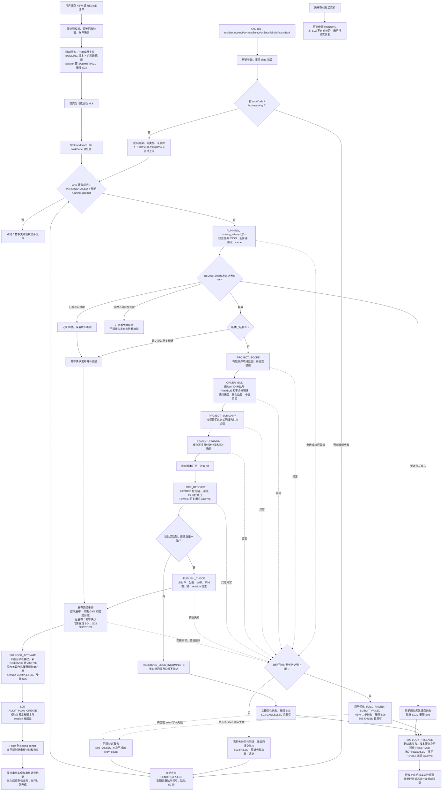

[业务逻辑专辑](/knowledge/business-logic/) / 居民收益付款 / S03

从选单结果到正式付款申请，说明提交身份、分阶段构建、预占锁、原子发布、后续交接与失败补偿，附逐章原文对照。本文保留原文 13 章，正文连续展开，原文对照与流程源码按需展开。

**前置阅读：** [S02 · 选单工作集批量调整](/knowledge/business-logic/resident-income/s02-选单工作集批量调整/)

**快速阅读：** [任务概览](#chapter-1) · [事务边界](#sec-6-2) · [完整流程](#chapter-10) · [源码索引](#chapter-13)

<div class="business-logic-article">

<div id="chapter-0"></div>

> 对应原文：`S03-residentIncomePaymentSelectionSubmitBuildAsyncTask-源码梳理.md`。下文保留原文第 1～13 章及各小节的对应关系，开头另加一个阅读场景。
>
> **证据边界**：原文核对日期为 **2026-09-08**，证据等级为 **SOURCE\_VERIFIED（已根据源码核对，但未通过实际运行验证）**。本阅读版依据该文改写，没有另外核对源码、连接数据库或运行任务。原文的“当前实现”均指其核对时的工作区实现，不是本阅读版对现网的重新确认。

<div id="chapter-0-heading-1"></div>

## 阅读前：先跟着一笔付款申请走一遍

**以下是假设场景，不是实际运行数据。** 一名用户准备为某项目公司的居民收益发起付款申请。他已在上游完成选单和人工调整，最后留下 3 条账单：两条可以申请付款，金额分别为 100 元、200 元；另一条被付款周期规则挡住，本次不能付款。

这里的 **session（选单会话）** 可以先理解成“用户这一次选单操作的工作区”；其中的 **item（选单行）** 是一条选单结果。工作区里的最终结果集合叫 **工作集**。它不仅包含可付款行，也可能包含需要留存原因的不合格行。

用户点击提交后，系统并不是马上支付 300 元。上游先给这次提交建立一个固定身份，保存 **快照（把提交时使用的数据或配置值记录下来，供后续使用和核对）**，并写入数据库任务记录。接着，后台的 S03 接手，把这批已经确定的选单结果做成一份正式付款单版本。

S03 先确定项目公司范围，再生成 3 条正式明细、项目汇总和一条计划付款 300 元的付款分录。这里的 **付款分录** 是“某项目公司计划从哪个账户付多少钱”的记录，不是银行已经打款的凭证。两条能付款的明细叫 **PAYABLE（可付款）**；被周期限制挡住的一条叫 **CYCLE\_BLOCKED（付款周期阻断）**，它仍作为不合格明细保留在正式单据里。

随后，S03 尝试给需要新增占用的可付款账单拿到 **RESERVED（预占、尚未激活）锁**。这种锁是数据库中的业务占用记录，用来约束“同一电站、同一月份不能被另一付款单同时占用”，不是 Java 的 `synchronized` 锁。最后，S03 再检查来源数据、配置、明细数量和锁覆盖是否仍然符合要求。

检查通过后才 **发布**：主单的 `current_publish_version`（当前对外可见的正式数据版本）切换到本次的 `target_data_version`（本次准备发布的数据版本）。同时，系统可靠地受理 S04 的后续任务，并把 S03 标成成功。这几件事在同一事务中完成；这里的 **原子发布** 指这组操作共同提交或共同回滚，**不是前面所有批次都放在一个大事务里**。

接下来才轮到 S04：把锁变成 **ACTIVE（已激活的业务占用）**，并把占用结果同步到账单相关底表。然后由 S05 创建审核计划。审核人员操作、审核回调和实际付款还在更后面的业务链路中。

假设其中一条账单已经被另一付款单占用，S03 不能悄悄把它排除后改成另一份金额继续发布。缺锁会触发失败分支；S06 负责在满足未发布条件时，精确释放本轮提交的 RESERVED 锁。S03 失败和 S06 释放完成仍是两件不同的事。

**带着这条主线阅读：S03 把“用户确认的选单结果”变成“已发布、可交给后续流程的正式付款数据”。它不重新全库筛选，不在数据过期后自动换一套金额，更不直接付款。**

<div id="chapter-0-heading-2"></div>

### 原文的核对环境与限制

| 项目 | 原文记录 |
| --- | --- |
| 主仓库 | `/Users/wangyi/BZ/zx-monitor/zxbaif` |
| 主仓库分支 / HEAD | `Ian/review/01` / `a1bfacbeb6dfc239d577bd66bf78cd9eb2482efa` |
| 跨服务核对仓库 | `/Users/wangyi/BZ/zx-monitor/zxbaie` |
| 跨服务仓库分支 / HEAD | `zx_test_250330` / `21aac5b4821de7e7ae1bd660f896b3e890115cfc` |
| 使用的实现 | 当时工作区实际源码，包含未提交修改；不以历史说明文档代替实现 |
| 没有验证的内容 | 没有执行任务、连接业务数据库、验证实际部署包、XXL-Job 配置或线上数据 |

因此，下文的 SQL 条件、状态和唯一约束说明，不能理解成目标数据库已经具备全部结构，也不能理解成线上运行结果已经得到验证。

<details class="original" id="compare-0">
<summary>文首说明 · 原文对照</summary>

<div id="original-chapter-0-heading-1"></div>

### S03：residentIncomePaymentSelectionSubmitBuildAsyncTask 源码梳理

> 核对日期：2026-09-08。本文依据当前工作区源码，包括未提交修改，不以历史说明文档代替实现。
>
> 主仓库：`/Users/wangyi/BZ/zx-monitor/zxbaif`，分支 `Ian/review/01`，HEAD：`a1bfacbeb6dfc239d577bd66bf78cd9eb2482efa`。跨服务核对仓库：`/Users/wangyi/BZ/zx-monitor/zxbaie`，分支 `zx_test_250330`，HEAD：`21aac5b4821de7e7ae1bd660f896b3e890115cfc`。
>
> 证据范围为 **SOURCE\_VERIFIED**：未执行任务、未连接业务数据库、未验证实际部署包、XXL-Job 配置或线上数据。下文 SQL 条件和状态表示源码行为，不代表目标数据库已经满足全部结构要求。

</details>

<div id="chapter-1"></div>

<div id="chapter-1-heading-1"></div>

## 1. 任务概览

<div id="chapter-1-heading-2"></div>

### 先说业务：它接的是已经确认的选单结果

S03 的起点不是“去数据库找哪些居民可以拿钱”，而是“用户已经确认了一批居民收益选单，现在要把它正式提交出去”。

它围绕**一个持久化提交版本**完成构建：生成正式付款数据，为最终可付款账单中需要新增占用的明细预占锁，然后发布这个版本，交给后续锁激活任务。**持久化**是指身份和任务已经写进数据库，不只存在于当前请求或内存中。

可选数据准备、人工调整和提交前检查主要由上游完成。S03 使用的是已绑定到提交版本的选单结果，并在发布前复核关键事实。它既不重新全库筛选居民收益，也不是银行付款执行器。

<div id="chapter-1-heading-3"></div>

### 再看技术：一条任务到底代表什么

| 项目 | 当前源码实现及通俗含义 |
| --- | --- |
| XXL-Job Handler | `residentIncomePaymentSelectionSubmitBuildAsyncTask`。**XXL-Job** 是调度框架，**Handler** 是调度时要调用的处理入口名称。 |
| 入口类 | `ResidentIncomePaymentSelectionSubmitBuildJob`，接收调度参数并选择自动扫描或人工定向执行。 |
| 消费服务 | `SelectionSubmitBuildAsyncTaskServiceImpl`，负责读取、领取并执行任务。这里的“消费”不等于使用消息队列。 |
| 核心业务服务 | `SelectionSubmitBuildServiceImpl`，负责正式数据构建、锁预占与发布相关业务。 |
| 消费的任务类型 | `RESIDENT_INCOME_PAYMENT_SUBMIT_BUILD`。 |
| 唯一构建对象 | `paymentOrderVersionId`，即提交版本表的主键。不是主单 ID，也不是直接拿主单当前版本推断本次目标。 |
| 任务业务键 | `SUBMIT_BUILD:<paymentOrderVersionId>`，把任务和具体提交版本绑定起来。 |
| 任务编码 | `RIPST:` + 上述业务键按 UTF-8 编码后得到的 MD5 十六进制值。**MD5** 在这里用于生成编码，不应把任务编码与业务键当成同一字符串。 |
| 一轮最多处理的任务数 | 默认 **50**，最大 **200**；数量参数为空或 **≤ 0** 时用默认值。这里数的是版本任务，不是账单明细。 |
| 明细 / 预占锁的批量大小 | 优先使用阶段记录里的 `batch_size`；缺失或 **≤ 0** 时使用 **1000**。 |
| S03 的成功边界 | 正式版本已发布、S04 的可靠任务记录已受理、S03 已标记 `SUCCESS（成功）`。 |
| 后续顺序 | S04 锁激活及占用状态同步 → S05 审核计划创建。 |
| 构建失败补偿 | S06 按版本身份释放本轮 RESERVED 锁；具体适用条件见第 7、8 章。 |

一个版本任务内部可以连续完成很多个 1000 行批次。因此，“这一轮扫描 50 个任务”和“这一批写 1000 条明细”不是一个层级的限制。

**尚不能确认调度平台是否真的在运行它。** 原文没有验证 XXL-Job 的实际 cron（定时表达式）、启停状态、路由策略、调度超时和运行频率。源码里存在 `@XxlJob` 注册，只能证明代码提供了入口，不能证明调度平台已经启用。

源码定位：[任务入口](#src-job)、[消费者及数量默认值](#src-worker)、[任务键生成和退避规则](#src-support)。

<details class="original" id="compare-1">
<summary>第 1 章 · 原文对照</summary>

<div id="original-chapter-1-heading-1"></div>

### 1. 任务概览

**这个任务把用户已经确认的居民收益选单工作集，构建成一个可发布的正式付款单版本，为最终可付款账单预占锁，再原子发布该版本并交给后续锁激活任务。**

| 项目 | 当前实现 |
| --- | --- |
| XXL-Job Handler | `residentIncomePaymentSelectionSubmitBuildAsyncTask` |
| 入口类 | `ResidentIncomePaymentSelectionSubmitBuildJob` |
| 消费服务 | `SelectionSubmitBuildAsyncTaskServiceImpl` |
| 核心业务服务 | `SelectionSubmitBuildServiceImpl` |
| 消费的任务类型 | `RESIDENT_INCOME_PAYMENT_SUBMIT_BUILD` |
| 唯一构建对象 | `paymentOrderVersionId`：提交版本表的主键 |
| 任务业务键 | `SUBMIT_BUILD:<paymentOrderVersionId>` |
| 任务编码 | `RIPST:` + 上述业务键 UTF-8 内容的 MD5 十六进制值 |
| 一轮任务数量 | 默认 50，最大 200；参数为空或小于等于 0 时用默认值 |
| 明细/预占锁批量 | 优先用阶段记录的 `batch_size`，缺失或非正数时用 1000 |
| S03 成功边界 | 正式版本发布成功，S04 的可靠任务记录已受理，S03 标记 SUCCESS |
| 后续顺序 | S04 锁激活及占用状态同步 → S05 审核计划创建 |
| 失败补偿 | S06 按版本身份释放本轮 RESERVED 锁 |

S03 既不是“重新全库筛选居民收益”，也不是银行付款执行器。可选数据的准备、人工调整和提交前检查主要在上游完成；S03 消费的是已经绑定到提交版本的选单结果，并在发布前复核关键事实。

XXL-Job 的实际 cron、启停、路由策略、调度超时和运行频率，**暂时无法确认**；源码中的 `@XxlJob` 注册不等于调度平台已经启用。

入口源码：[任务入口](#src-job)、[消费者及数量默认值](#src-worker)、[任务键生成和退避规则](#src-support)。

</details>

<div id="chapter-2"></div>

<div id="chapter-2-heading-1"></div>

## 2. 业务目的

<div id="sec-2-1"></div>

### 2.1 为什么不能在用户点击提交时直接完成全部工作

一次付款申请可能包含大量电站、多个月份和很多账单。提交时不只是保存一行主单，还需要形成项目公司范围、付款明细、项目汇总、付款分录和账单占用关系。

这些事情若全塞进一次 **HTTP 请求（用户点击提交后，浏览器发给后端的那次调用）**，请求耗时就会同时受到数据库大批量写入和外部服务响应的影响。原文描述的目的，是把这些工作与用户提交请求拆开；没有提供具体的同步耗时或性能提升数值。

当前实现分成两步。上游先建立提交身份和可靠任务；S03 再在后台逐步推进正式数据。用户可以查询提交进度；失败后，也能定位失败的版本、阶段和最后成功批次。

“后台处理”不等于把事情扔进内存就不管了。可靠任务写在数据库中，后面会用任务状态、阶段记录和批次游标跟踪执行情况。

<div id="sec-2-2"></div>

### 2.2 解决的三个业务一致性问题

**第一个问题：正式数据只生成一半时，不能把半成品当成新版本展示。**

做法是把本轮正式数据写到 `target_data_version`，准备完成后再切换主单的 `current_publish_version`。两者分别表示“正在准备的目标数据版本”和“主单当前对外可见的数据版本”。这样，正常按当前发布版本读取的数据，不会因为某个明细批次刚写完就变成半份新单。

**第二个问题：同一电站、同一月份，不能被另一付款单重复占用。**

最终 PAYABLE 明细必须被相应锁覆盖。需要新占用的明细要获得 RESERVED 锁；预占不完整时禁止发布。这里不能一概理解成“每一条 PAYABLE 都必须新建一把锁”，因为修订场景允许符合条件的保留行复用旧 ACTIVE 锁。

**第三个问题：审核不通过后，需要修改原申请并重新提交。**

原文区分 **NEW（新建提交）** 和 **REVISE（修订重提）**。NEW 新建主单；REVISE 复用原付款单，为它构建新的正式数据版本。REVISE 构建过程中仍保留原发布版本，不提前切换发布指针。

对于原来就是 PAYABLE、此次仍保留且符合条件的行，可以复用来源版本的 ACTIVE 锁，不重新争抢同一个业务锁。具体身份、版本、轮次和占用条件仍需要校验，并非“只要是旧明细就可复用”。

**限制仍然存在：发布成功只代表付款申请进入后续处理。** 底层账单的审核占用投影此时可能还没同步，审核计划也可能还没创建。**投影**在这里是指把同一业务占用结果写到账单相关底表的状态和引用字段中，便于这些表体现当前占用情况。

<details class="original" id="compare-2">
<summary>第 2 章 · 原文对照</summary>

<div id="original-chapter-2-heading-1"></div>

### 2. 业务目的

<div id="original-sec-2-1"></div>

#### 2.1 为什么不能在用户点击提交时直接完成全部工作

一次提交可能包含大量电站、月份和账单。它需要同时形成项目公司范围、付款明细、项目汇总、付款分录和账单占用关系。全部放在 HTTP 提交请求里，会把请求耗时、数据库大批量写入和外部服务响应耦合在一起。

当前实现把提交分为两步：上游先建立提交身份和可靠任务；S03 在后台推进正式数据。用户可以查询提交进度，失败时也能知道失败版本、阶段和最后成功批次。

<div id="original-sec-2-2"></div>

#### 2.2 解决的三个业务一致性问题

1. **避免只构建一半的数据对外可见。** 正式数据都写到 `target_data_version`，准备完成后才切换主单的 `current_publish_version`。
2. **避免同一电站同一月份被另一付款单占用。** 最终 PAYABLE 明细需要获得 RESERVED 锁；预占不完整时禁止发布。
3. **支持审核不通过后的修订重提。** REVISE 复用原付款单，构建新版本时保留原发布版本；原 PAYABLE 保留行符合条件时复用旧 ACTIVE 锁，不重新抢同一业务锁。

发布成功仅表示付款申请进入后续处理。此时底层账单的审核占用投影可能尚未同步，审核计划也可能还没有创建。

</details>

<div id="chapter-3"></div>

<div id="chapter-3-heading-1"></div>

## 3. 核心调用链

<div id="sec-3-1"></div>

### 3.1 上游如何产生 S03 任务

先从用户动作看：用户提交新申请，或者把审核不通过的申请修订后重提。接口把请求逐层交给选单会话服务和提交启动服务，后者在同一个启动事务中建立本次提交身份和 S03 任务。

\*\*幂等（同一次请求重复到达时复用已有结果，而不是重复制造业务数据）\*\*首先在上游处理。系统按 `sessionId + submitToken`，结合请求快照检查是不是已经受理过同一次提交。已存在就返回已有版本，不会因为用户重试按钮而每次都创建新版本。

完整调用顺序保留如下，阅读时可以先看箭头右侧的业务动作，再定位类和方法：

```text
FiResidentIncomePaymentOrderController
  ├─ submitFiResidentIncomePaymentOrder
  └─ resubmitFiResidentIncomePaymentOrder
      ↓
FiResidentIncomePaymentOrderServiceImpl
      ↓
SelectionSessionServiceImpl
  ├─ submitSelectionSession
  └─ resubmitSelectionSession
      ↓
SelectionSubmitStartServiceImpl
  ├─ startNewSubmit
  └─ startReviseSubmit
      ↓ 同一提交启动事务
预校验 / 账户快照 → 主单或原主单 → 提交版本 → 阶段记录
→ session READY 改为 SUBMITTING → 受理 S03 fi_async_task
      ↓ 事务提交之后
可选主动 kick；XXL-Job 扫描仍是待执行任务的后备入口
```

其中 **READY（选单已就绪）** → **SUBMITTING（本会话正在提交）** 是 session 的状态变化。\*\*kick（主动唤醒）\*\*是在事务提交后尝试加速执行任务的通知，不是替代数据库任务的另一套可靠存储。

NEW 与 REVISE 的区别必须保留：

| 提交模式 | 主单如何处理 | 数据版本和提交轮次如何处理 |
| --- | --- | --- |
| NEW | 新建主单。 | 来源数据版本为 **0**，目标数据版本为 **1**，目标提交轮次为 **1**。 |
| REVISE | 复用原主单。 | 读取原发布版本和来源轮次，再依据已经占用的版本 / 轮次分配新的目标值。构建期间不切换主单发布指针。原文没有把分配规则简化成固定“原值加一”，本阅读版也不这样补写。 |

提交版本记录会保存 `session_id`、`mode`、`submit_token`、`submit_attempt`、来源 / 目标数据版本、来源 / 目标提交轮次、请求快照和汇总。这些内容用于固定“这次提交来自谁、处理哪一版数据、属于哪一次尝试”。

启动时还会初始化 **八个阶段记录**。S03 使用前六个；`LOCK_ACTIVATE（锁激活）` 给 S04；`LOCK_RELEASE（锁释放）` 给补偿流程。**八个阶段预先建立，不等于 S03 依次执行八个阶段。**

`fi_async_task.task_data` 保存提交版本 ID，以及 `taskScene=SUBMIT_BUILD` 这样的场景信息。消费者从任务数据里的版本 ID 开始处理，不从主单当前发布版本反推这次该构建哪个版本。

源码定位：[提交接口转发](#src-api)、[会话提交入口](#src-session-submit)、[NEW / REVISE 启动](#src-start)、[阶段与任务初始化](#src-seed)。

<div id="sec-3-2"></div>

### 3.2 从定时入口到发布交接

调度入口先解析参数，再选择“扫描待执行任务”或“人工指定任务”。消费服务取得候选记录后，逐条尝试领取，领取成功才有资格继续。

这里有两个容易混淆的机制。\*\*CAS（比较并交换：只有数据库中的条件仍符合预期，才执行更新）\*\*用于竞争任务执行权；`running_attempt` 是每次领取后增加的执行代数，用来区分新旧执行者。\*\*worker（实际执行这条任务的工作线程或执行实例）\*\*拿着本次代数继续工作。

\*\*fenced（执行权隔离检查：写入前确认自己仍是当前合法执行者）\*\*用于后续写入入口。具体做法是用“任务 ID + 类型 + RUNNING + `running_attempt`”锁住任务行并确认执行权，再执行写入回调。这里 **RUNNING** 表示任务正在运行。旧 worker 的凭证失效后，不能再通过这个入口继续写业务状态；这并不自动带来超时接管能力，第 9.1 节会单独解释。

下面是原文的完整执行链：

```text
ResidentIncomePaymentSelectionSubmitBuildJob
  residentIncomePaymentSelectionSubmitBuildAsyncTask(param)
    → parseJobParam / executeJob
    → executePendingTasks 或 executeManualRetry

SelectionSubmitBuildAsyncTaskServiceImpl
    → 查询 fi_async_task
    → executeTaskList：逐条执行
    → executeSingleTask
        → claimTask：CAS 抢占任务，取得 running_attempt
        → parseTaskDto / validateTaskIdentity
        → REVISE 持久化身份检查
        → executeSubmitBuildBeforePublish
            → fenced：buildFormalTables
                1. PROJECT_SCOPE
                2. ORDER_BILL
                3. PROJECT_SUMMARY
                4. PROJECT_PAYMENT
                → refreshBuildSummary
            → fenced：reservePayableLocks
                5. LOCK_RESERVE
        → executePublishAndHandoff
            → fenced：ResidentIncomePaymentSubmitHandoffServiceImpl.publishAndHandoff
                6. publishBuiltVersion / PUBLISH_CHECK
                → 创建或复用 S04 LOCK_ACTIVATE 任务
                → S03 task_status=SUCCESS
                → 注册提交后的 S04 kick
    → inspectInvariants
    → 返回选中/成功/失败/跳过数量
```

从业务角度串起来，就是：领取并验证任务身份 → REVISE 额外验证持久化身份 → 构建四类正式数据并刷新版本汇总 → 预占锁 → 检查和发布 → 受理 S04 → 标记 S03 成功 → 注册提交后的 S04 kick。

末尾的 `inspectInvariants` 是**不变量巡检入口（检查本应始终成立的业务关系）**。它不能直接证明系统具备自动修复能力；原文对具体规则是否装配还有未确认事项，见第 7.5 节。

源码定位：[逐条执行及阶段顺序](#src-execute)、[执行权行锁](#src-fence)、[发布与交接](#src-handoff)。

<div id="sec-3-3"></div>

### 3.3 六个核心阶段实际做什么

可以把这六步理解为“先把正式申请做完整，再占住应占的账单，最后一次性对外发布”。每一步的完成条件并不相同。

| 顺序 / 阶段 | 先理解业务动作 | 再对应技术完成条件 |
| --- | --- | --- |
| 1. `PROJECT_SCOPE`（项目范围） | 从本次会话的有效项目账户快照中，确定这轮申请涉及哪些项目公司。 | 缺少编号 / 名称时查询档案补齐；范围数量必须 **\> 0**。即使阶段已完成，仍可能补齐缺失名称。 |
| 2. `ORDER_BILL`（正式账单明细） | 把选单结果变成正式付款单中的逐条明细，保留来源事实和不合格原因。 | 按 item ID 分批；来源匹配数、已存在数、新增数、物化数要相互核对。**物化**就是实际落成正式明细行。总明细数必须 **\> 0**。 |
| 3. `PROJECT_SUMMARY`（项目汇总） | 按项目公司汇总账单情况。 | 以项目范围关联目标版本明细；统计总账单数、PAYABLE 数、不合格数；付款金额只累计 PAYABLE。 |
| 4. `PROJECT_PAYMENT`（项目付款分录） | 为每个项目公司记录默认付款安排和付款账户快照。 | 每个项目一条默认分录，`payment_seq=1`。缺账户、账户阻断、账户重复会拒绝构建。 |
| 5. `LOCK_RESERVE`（锁预占） | 为需要新增占用的 PAYABLE 明细预留业务锁。 | 每批先查缺锁，再推进游标；最后核对本版本预期新增锁数。**游标**记录已经成功处理到哪里，用于续跑。 |
| 6. `PUBLISH_CHECK`（发布检查） | 再确认数据和归属没有失效，然后发布并交接。 | 复核来源 / 配置、数量、锁和会话归属；主单、提交版本、会话状态、提交日志及后续任务交接必须共同成功。 |

不要把“某个阶段 DONE（已完成）”当成整条业务成功。四类正式数据完成后还要预占锁，预占完成后还要发布与交接。

源码定位：[正式表构建](#src-formal)、[明细分批与校验](#src-bill-build)、[项目汇总 / 分录和锁预占](#src-reserve)、[发布校验](#src-publish-check)。

<details class="original" id="compare-3">
<summary>第 3 章 · 原文对照</summary>

<div id="original-chapter-3-heading-1"></div>

### 3. 核心调用链

<div id="original-sec-3-1"></div>

#### 3.1 上游如何产生 S03 任务

```text
FiResidentIncomePaymentOrderController
  ├─ submitFiResidentIncomePaymentOrder
  └─ resubmitFiResidentIncomePaymentOrder
      ↓
FiResidentIncomePaymentOrderServiceImpl
      ↓
SelectionSessionServiceImpl
  ├─ submitSelectionSession
  └─ resubmitSelectionSession
      ↓
SelectionSubmitStartServiceImpl
  ├─ startNewSubmit
  └─ startReviseSubmit
      ↓ 同一提交启动事务
预校验 / 账户快照 → 主单或原主单 → 提交版本 → 阶段记录
→ session READY 改为 SUBMITTING → 受理 S03 fi_async_task
      ↓ 事务提交之后
可选主动 kick；XXL-Job 扫描仍是待执行任务的后备入口
```

上游先按 `sessionId + submitToken` 及请求快照检查幂等结果。已经存在的同一次提交返回已有版本；它不会为每次按钮重试重新创建一个版本。

- **NEW**：新建主单，源数据版本为 0，目标数据版本为 1，目标提交轮次为 1。
- **REVISE**：复用原主单，读取原发布版本和来源轮次，依据已占用版本/轮次分配新的目标值。构建期间不切主单发布指针。
- 提交版本记录保存 `session_id`、`mode`、`submit_token`、`submit_attempt`、源/目标数据版本、源/目标提交轮次、请求快照和汇总。
- 初始化八个阶段记录：S03 使用前六个，`LOCK_ACTIVATE` 给 S04 使用，`LOCK_RELEASE` 给补偿使用。并不是 S03 顺序执行全部八个阶段。
- `fi_async_task.task_data` 包含提交版本 ID 和 `taskScene=SUBMIT_BUILD` 等信息。消费端从其中的版本 ID 出发，不从主单当前版本反推本次构建对象。

证据：[提交接口转发](#src-api)、[会话提交入口](#src-session-submit)、[NEW/REVISE 启动](#src-start)、[阶段与任务初始化](#src-seed)。

<div id="original-sec-3-2"></div>

#### 3.2 从定时入口到发布交接

```text
ResidentIncomePaymentSelectionSubmitBuildJob
  residentIncomePaymentSelectionSubmitBuildAsyncTask(param)
    → parseJobParam / executeJob
    → executePendingTasks 或 executeManualRetry

SelectionSubmitBuildAsyncTaskServiceImpl
    → 查询 fi_async_task
    → executeTaskList：逐条执行
    → executeSingleTask
        → claimTask：CAS 抢占任务，取得 running_attempt
        → parseTaskDto / validateTaskIdentity
        → REVISE 持久化身份检查
        → executeSubmitBuildBeforePublish
            → fenced：buildFormalTables
                1. PROJECT_SCOPE
                2. ORDER_BILL
                3. PROJECT_SUMMARY
                4. PROJECT_PAYMENT
                → refreshBuildSummary
            → fenced：reservePayableLocks
                5. LOCK_RESERVE
        → executePublishAndHandoff
            → fenced：ResidentIncomePaymentSubmitHandoffServiceImpl.publishAndHandoff
                6. publishBuiltVersion / PUBLISH_CHECK
                → 创建或复用 S04 LOCK_ACTIVATE 任务
                → S03 task_status=SUCCESS
                → 注册提交后的 S04 kick
    → inspectInvariants
    → 返回选中/成功/失败/跳过数量
```

这里的 **fenced** 表示：先用 `任务 ID + 类型 + RUNNING + running_attempt` 锁住任务行并确认执行权，然后执行写入回调。旧 worker 的凭证失效后，不能继续通过这个入口写业务状态。

证据：[逐条执行及阶段顺序](#src-execute)、[执行权行锁](#src-fence)、[发布与交接](#src-handoff)。

<div id="original-sec-3-3"></div>

#### 3.3 六个核心阶段实际做什么

| 阶段 | 业务动作 | 完成条件/要点 |
| --- | --- | --- |
| PROJECT\_SCOPE | 从会话有效项目账户快照提取本轮项目公司范围；缺少编号/名称时查询档案补齐 | 范围数量必须大于 0；已完成阶段仍可能补齐缺失名称 |
| ORDER\_BILL | 按选单 item ID 分批生成正式付款明细，同时搬运来源事实和处理不合格原因 | 来源匹配数、已存在数、新增数、物化数相互校验；明细总数必须大于 0 |
| PROJECT\_SUMMARY | 以项目范围关联目标版本明细，按项目公司汇总 | 统计总账单数、PAYABLE 数、不合格数；付款金额只累计 PAYABLE |
| PROJECT\_PAYMENT | 每个项目公司生成一条默认付款分录，保存付款账户快照 | `payment_seq=1`；缺账户、账户阻断、账户重复等情况拒绝构建 |
| LOCK\_RESERVE | 只为需要新增占用的 PAYABLE 明细预占 RESERVED 锁 | 每批先查漏锁，再推进游标；最后核对本版本预期锁数 |
| PUBLISH\_CHECK | 复核来源/配置、数量、锁、会话归属，然后切换主单发布版本 | 主单、提交版本、会话状态、提交日志和后续任务交接必须共同成功 |

证据：[正式表构建](#src-formal)、[明细分批与校验](#src-bill-build)、[项目汇总/分录和锁预占](#src-reserve)、[发布校验](#src-publish-check)。

</details>

<div id="chapter-4"></div>

<div id="chapter-4-heading-1"></div>

## 4. 数据筛选规则

这一章要分清四次“筛选”：先找可执行的**任务**，再确定进入正式数据的**选单行**，然后筛选需要新增预占的**可付款明细**，最后检查整个版本能否**发布**。它们的条件不能互相替代。

<div id="sec-4-1"></div>

### 4.1 自动查询任务

自动扫描只处理本类型、未删除、处于可领取状态、已经到执行时间且失败次数没耗尽的任务。

原文给出的等价 SQL 如下。它用于解释条件；真实代码通过 \*\*MyBatis-Plus QueryWrapper（用 Java 对象组装查询条件的工具）\*\*生成查询，并不是把下面这段说明 SQL 直接执行：

```sql
SELECT *
FROM fi_async_task
WHERE deleted = 0
  AND task_type = 'RESIDENT_INCOME_PAYMENT_SUBMIT_BUILD'
  AND task_status IN (0, 3) -- PENDING、FAILED
  AND (next_execute_time IS NULL OR next_execute_time <= :now)
  AND IFNULL(retry_count, 0) < IFNULL(max_retry_count, 3)
ORDER BY next_execute_time ASC, retry_count ASC, id ASC
LIMIT :maxTaskCount;
```

这些外层条件是 **AND（同时满足）**。其中状态允许 `PENDING(0，待执行)` **或** `FAILED(3，失败)`；执行时间允许为空 **或** `≤ 当前时间`。`IFNULL` 表示数据库值为 NULL 时使用右边的默认值：失败次数按 0，最大失败次数按 3。

排序依次是 `next_execute_time ASC`、`retry_count ASC`、`id ASC`，最后用 `maxTaskCount` 限制本轮版本任务数。

**RUNNING、SUCCESS 和 CANCELLED(4，已取消) 不在查询范围内。** 即使任务已经运行很久，也不能仅凭这条自动扫描逻辑重新领取。一个任务内部仍可处理很多个 1000 行批次，这里的 LIMIT 不限制单个版本的账单行数。

<div id="sec-4-2"></div>

### 4.2 定向人工重跑

人工重跑是“先精确找到指定记录，再尝试按允许的状态领取”，不是“无条件把指定任务重新执行一遍”。

选择器支持 `taskCode/taskCodes` 和 `businessKey/businessKeys`。输入会先去空、去重；**两组都传时使用 OR（命中任务编码组或业务键组中的任意一组即可），不是 AND**。候选查询只约束任务类型、未删除和选择器，再按 ID 排序。

| 检查点 | 自动执行 | MANUAL（人工执行） |
| --- | --- | --- |
| 候选查询 | 检查 PENDING / FAILED、到期时间、失败次数上限。 | 候选查询不靠这些条件排除记录，所以可能查到成功或运行中的任务。 |
| 真正领取时的状态 | 只允许 PENDING / FAILED。 | 仍只允许 PENDING / FAILED。 |
| `running_attempt` | 领取时必须与预期值匹配。 | 同样必须匹配。 |
| 计划时间 / 重试上限 | 领取时还要再次满足。 | 可以跳过。 |
| 能否复活已终结业务版本 | 不能靠扫描完成。 | 不会把 `BUILD_FAILED（构建已失败）` 版本恢复成 `BUILDING（构建中）`。 |

所以，人工可以跳过“还没到重试时间”和“任务失败次数已耗尽”，但**不能重启 RUNNING、SUCCESS 或 CANCELLED**。任务层允许领取，也不代表业务版本层一定允许继续构建。

只指定本轮数量的参数示例：

```json
{"maxTaskCount": 20}
```

指定一个业务键的参数示例，其中“实际提交版本ID”需要替换成真实值：

```json
{"businessKey": "SUBMIT_BUILD:实际提交版本ID", "maxTaskCount": 1}
```

也支持 `{"data": {...}}`，或者把 `data` 写成 JSON 字符串的包装形式。

**特别注意解析失败的行为。** 如果参数 JSON 解析失败，代码退回空参数，然后进入默认自动扫描。这不是“参数错误，所以什么也不做”；原本只想处理一个版本，实际却可能按默认范围扫描其他到期任务。第 9.5 节会保留这一操作风险。

<div id="sec-4-3"></div>

### 4.3 查询后的领取条件

任务刚刚被查询出来时，还不代表当前 worker 已经拥有它。查询和更新之间，另一个调度实例也可能看到同一行。

因此数据库领取更新必须同时匹配：正确的任务 ID、任务类型、未删除标记、允许状态，以及预期 `running_attempt`。自动执行还会再次检查到期时间和重试额度。

成功领取后的更新如下：

```text
task_status → RUNNING(1)
running_attempt → running_attempt + 1
error_message → NULL
update_time / update_user_id → 当前时间 / worker 标识
```

这相当于“只有仍处在我刚才看到的那一代任务状态，才允许我接手”。两个调度实例，或者主动 kick 与定时扫描同时查到同一记录，并不意味着它们都能成功领取并执行。

源码定位：[自动与人工查询](#src-task-query)、[领取入口](#src-claim)、[领取 / 状态 CAS SQL](#src-task-sql)。

<div id="sec-4-4"></div>

### 4.4 正式明细采用哪些选单行

从业务上说，S03 接收的是“本提交版本所属 session 中，本轮仍然有效的选单行”。并不是 session 中所有行，也不是只拿 PAYABLE 行。

核心集合条件必须原样保留括号：

```sql
i.session_id = :versionSessionId
AND i.visible_flag = 1
AND i.removed_in_revise = 0
AND (i.revise_origin = 'RETAINED_ORIGINAL' OR i.included_in_revise = 1)
```

按顺序读，就是：属于本版本绑定的 session；可见；没有在 REVISE 中被移除；并且满足“`RETAINED_ORIGINAL（从原付款单保留的行）` **或** `included_in_revise=1（已纳入本轮修订）`”。最后这组 OR 不能拆掉前面的 AND，也不能理解成保留行可以不受可见或移除条件限制。

取批次时先按 item ID 升序取最多 `batch_size` 条，得到本批上界 `batchEndId`。本批范围是：

```sql
i.id > last_item_id AND i.id <= batchEndId
```

左边是严格大于，右边是小于等于。它是**游标分页（从最后成功处理的位置继续）**，不是 OFFSET（按偏移量跳过前面若干行）翻页。

最终状态只允许以下五种：

| `final_item_status` | 业务含义 | 正式 `line_type` | 初始 `line_status` | 锁处理 |
| --- | --- | --- | --- | --- |
| `PAYABLE` | 可付款。 | **10**，可付款。 | **10**。 | 需要锁覆盖；REVISE 符合条件时可复用旧 ACTIVE。 |
| `UNQUALIFIED` | 不合格。 | **20**，不合格。 | **50**。 | 不预占。 |
| `CYCLE_BLOCKED` | 被付款周期限制阻断。 | **20**，不合格。 | **50**。 | 不预占。 |
| `AMOUNT_BLOCKED` | 被金额规则阻断。 | **20**，不合格。 | **50**。 | 不预占。 |
| `BLOCKED` | 阻断状态；本表不额外推定具体原因。 | **20**，不合格。 | **50**。 | 不预占。 |

`final_item_status` 为 NULL 或未知值会直接阻断构建。**不合格行仍进入正式付款单**，用于说明本次选单中哪些行没有进入付款金额、为什么被分流，而不是在构建时全部丢弃。

写明细还要核对“应有多少、来源能匹配多少、实际落了多少”。原文的变量和公式如下：

```text
expected = 本批有效工作集条数
matched = 来源快照匹配条数
existed = 本批已存在正式明细条数
inserted = 本次新增条数
materialized = 插入后本批正式明细条数

要求 expected > 0
要求 matched = expected
要求 existed + inserted = expected
要求 materialized = expected
```

`matched = expected` 检查来源是否齐全；`existed + inserted = expected` 检查已有行加新增行能否覆盖本批；`materialized = expected` 再检查写入后的真实正式行数。它们各自检查不同环节，不能只保留“插入没有报错”一个判断。

源码定位：[有效集合及 insert-select](#src-bill-sql)、[数量校验](#src-bill-build)、[允许的最终状态](#src-source-check-sql)。

<div id="sec-4-5"></div>

### 4.5 明细字段到底来自哪里

正式明细不是简单复制一张表，而是“当前选单决定 + 来源事实快照 + 关联关系校验”的组合。特别是 REVISE 保留行，有些数据沿用旧正式明细，有些数据仍以当前 item 为准。

| 数据内容 | 来源与适用限制 |
| --- | --- |
| 当前选单结果、最终状态、本次付款金额 | 来自 `selection_session_item`。例如 `current_payment_amount` **即使是保留行，也取当前 item**，不是一律照抄旧金额。 |
| NEW / REVISE 新增候选的账单事实 | 来自 `fi_monthly_income_difference`，要求 `financial_version = source_financial_version`，也就是当前资金版本仍匹配选单时记录的来源版本。 |
| RETAINED\_ORIGINAL 的大部分历史事实快照 | 来自原 `fi_resident_income_payment_order_bill`；原明细必须属于同一主单、来源 `data_version` 和 `submit_round`，而且未删除。这里是“大部分”，不是所有字段都复制。 |
| 电站与合作方账单的关系 | 关联差异台账、`fi_customer_bill_partner`、`fi_customer_account_partner`，核对合作方、账户、电站和月份关系。 |
| 展示标识与辅助字段 | 来自 `fi_customer_account`、`fi_customer_account_partner`、选单快照和差异台账中的相应字段。原文没有在此表逐项列出所有辅助字段，不能自行补造清单。 |
| 项目公司编号 / 名称 | 来自账户快照或已经构建的项目范围；保留行优先复制旧正式明细。 |
| 付款银行账户 | 来自有效的 `selection_session_project_account`。兼容旧表头单账户选择时，还会重新校验项目公司档案。 |

**保留行也不是无条件复制旧单。** 真正的 \*\*insert-select（根据查询结果批量插入正式表）\*\*仍要求当前差异记录、合作方账单和合作方账户存在，并检查以下关系：

1. 差异记录的 `partner_bill_id`、`partner_customer_account_id`、`partner_org_id` 必须与 item 相符。
2. 合作方账单归属的账户必须正确；账单与合作方账户的 `station_id` 必须相符。
3. 合作方账户的 `platform_station_id` 必须对应 item 中表示平台电站的 `station_id`。
4. 账单月份必须一致，使用 MySQL 的 `<=>`，即 **NULL 安全比较（能够明确处理两边是否为 NULL，而不是按普通等号处理空值）**。

较早执行的 `countBuildBatchSourceMatchedItems` 是来源版本检查。实际插入还带有上面更严格的关系条件，所以“matched 已经通过”不等于“插入一定不会漏行”。如果真实插入因为关系不满足而少了行，后面的物化数量校验仍会发现。

不合格原因先从旧明细或 item 搬运，再由 Java 归一化成中文业务原因。未经手工调整的保留行保留旧来源；手工从合格改成不合格，来源码为 **20**；规则判定的不合格，来源码为 **10**。这里的来源码与 `line_type`、`line_status` 是不同字段，不能因为数值相同就混用。

`paid_amount` 初始化为 **0**；支付结果、支付时间初始化为空。原文还概括提到其他支付相关字段为空，但没有逐项列名。**这些是构建初始化值，不是已经发生付款的证据。**

<div id="sec-4-6"></div>

### 4.6 项目范围与付款账户

项目范围来自本 session 的账户快照：要求 `active_flag=1` **且** `project_company_id` 非空，再按项目公司分组。它不是扫描整个项目公司档案库，也不是只从有 PAYABLE 的明细中提取项目。

项目汇总以范围表为起点关联目标版本明细，因此没有 PAYABLE 的项目也会保留。生成付款分录时，仍然逐项目检查有效账户快照；不能因为某项目本轮付款金额是 0，就理解成无需账户检查。

| 项目是否有 PAYABLE | 是否生成分录 | 计划金额与初始状态 |
| --- | --- | --- |
| 没有 PAYABLE | 仍生成。 | 计划金额 **0**，`NO_NEED_PAYMENT(10，不需要付款)`。 |
| 有 PAYABLE | 生成。 | 按可付款金额形成计划，初始 `UNPAID(20，未付款)`。 |

账户选择优先沿用提交启动时保存的逐项目账户快照。如果请求快照里有 `projectPayAccountList`，就不再按旧表头的 `paymentOrder.payBankAccountId` 处理。

旧表头单账户兼容路径只允许**单项目公司**，并校验所选账户属于该项目公司的可用基本户 / 可选银行账户。不能把旧单账户路径扩展理解成“一个表头账户可以直接替所有项目付款”。

源码定位：[项目范围 SQL](#src-scope-sql)、[项目汇总 SQL](#src-project-sql)、[账户选择与快照](#src-account)、[分录初始化](#src-payment-row)。

<div id="sec-4-7"></div>

### 4.7 RESERVED 锁筛选

先从本主单、目标版本、未删除且 `line_type=10` 的正式明细开始找，也就是本轮正式数据中的 PAYABLE 行。处理顺序固定为：

```text
station_id ASC → bill_yearmonth ASC → id ASC
```

这时 `last_item_id` 虽然名字仍带 item，但保存的是**最后一条正式明细 ID**。SQL 会根据这条明细回查电站和月份，再按上面的复合顺序继续。**锁阶段不能简化成 `id > 上次ID`**，它与明细构建阶段的游标含义不同。

要新增 RESERVED 锁，还必须满足下面的身份、状态和冲突约束；最后一项说明何时复用旧锁而不新增：

| 检查 | 必须满足的条件 |
| --- | --- |
| 1. 提交仍在构建 | 持久化版本仍为 BUILDING；session 仍为 SUBMITTING，且 `active_submit_id`、`submit_attempt`、`mode` 与版本匹配。 |
| 2. 主单边界没有变化 | 主单未删除，发布指针还没切到目标版本；REVISE 额外核对目标主单和首次创建人身份。 |
| 3. 差异台账付款状态允许 | `payment_status IN (20,60,70)`，分别为未付款、部分付款、付款失败。不能自行扩大成其他状态。 |
| 4. 底表占用不冲突 | `locked_payment_order_id` 为空，**或**属于本付款单。 |
| 5. 业务锁不被其他付款单占用 | 相同 `lock_key` 不存在其他付款单的 RESERVED / ACTIVE 锁。 |
| 6. 本次明细没有重复预占 | 本提交身份下，该正式明细尚无 RESERVED 锁。 |
| 7. 旧锁复用例外 | 若来源明细原本是 PAYABLE，且持有来源版本 / 轮次的 ACTIVE 锁，则复用原锁，不新增 RESERVED。 |

锁键格式为 `station_id:bill_yearmonth`。新锁写入 `lock_status=RESERVED`、`lock_scene=BUILDING_RESERVE`。NEW 的锁来源是 `NEW_SUBMIT`；REVISE 新预占的来源是 `REVISE_NEW_RESERVED`。

每批插入后，都会查询第一条仍缺锁的 PAYABLE 明细。发现缺失就抛出 `RESERVED_LOCK_INCOMPLETE（预占锁覆盖不完整）`，**当前批次回滚，并且不推进游标**。这不是只记一条警告然后继续发布。

REVISE 的最终预期新增锁数要扣除可复用旧 ACTIVE 的保留行。因此，不能把“全部 PAYABLE 数”直接拿来和“本轮新 RESERVED 数”比较。

源码定位：[锁插入、身份、冲突与缺锁检查 SQL](#src-lock-sql)、[锁数量校验](#src-lock-count)。

<div id="sec-4-8"></div>

### 4.8 发布前最后一道检查

前面的构建使用提交时固定的工作集和快照，发布前要检查这些依据是否仍然有效。这里的目的不是重新选一次单，而是决定“这次已经准备好的版本，还能不能按原来的依据发布”。

发布前的检查包括以下全部内容：

| 检查对象 | 原文保留的条件与错误边界 |
| --- | --- |
| 新候选的来源资金版本 | 不能发生变化。差异记录缺失、版本缺失或版本不一致，返回 `SOURCE_VERSION_CHANGED（来源版本变化）`。 |
| PAYABLE 的账户快照 | 必须存在、未阻断，且账户配置版本一致；新候选相关配置版本必须非空。 |
| 合作方规则与周期配置 | 通过配置检查服务查询当前合作方账单年月规则和付款周期配置，再比较快照版本；变化返回 `CONFIG_VERSION_CHANGED（配置版本变化）`。读取异常与版本比较的局限见第 9.3 节，不能因为这里列了检查就忽略该风险。 |
| 明细数量 | 正式明细总数与 PAYABLE 数，都要与有效工作集一致；总明细数必须 **\> 0**。 |
| 三类项目记录数量 | 项目范围数 = 项目汇总数 = 项目付款分录数；范围与汇总都必须非空。 |
| RESERVED 覆盖 | 本次应新增的 RESERVED 锁数必须完全覆盖应新增集合，保留旧锁复用的例外仍适用。 |
| 会话归属 | session 为 SUBMITTING，且 `active_submit_id` 指向本提交版本。 |
| 主单发布 CAS | 主单仍指向来源数据版本，并匹配预期状态与首次创建人。NEW 预期主单的构建状态为 BUILDING **且**审核状态为审核中；REVISE 预期原主单的构建状态为 PUBLISHED **且**审核状态为审核不通过。两组都是不同状态维度共同满足，不是二选一。 |

**检测到版本变化，不会自动刷新整个工作集，也不会换一批金额继续发布。** 它使用原有快照，并检查快照是否过期；把校验失败改写成“系统会自动更新后继续”，会改变原文业务含义。

源码定位：[发布检查](#src-publish-check)、[配置检查实现](#src-config-check)、[主单发布 SQL](#src-order-publish)。

<details class="original" id="compare-4">
<summary>第 4 章 · 原文对照</summary>

<div id="original-chapter-4-heading-1"></div>

### 4. 数据筛选规则

<div id="original-sec-4-1"></div>

#### 4.1 自动查询任务

等价条件如下，便于理解；原实现通过 MyBatis-Plus QueryWrapper 生成查询：

```sql
SELECT *
FROM fi_async_task
WHERE deleted = 0
  AND task_type = 'RESIDENT_INCOME_PAYMENT_SUBMIT_BUILD'
  AND task_status IN (0, 3) -- PENDING、FAILED
  AND (next_execute_time IS NULL OR next_execute_time <= :now)
  AND IFNULL(retry_count, 0) < IFNULL(max_retry_count, 3)
ORDER BY next_execute_time ASC, retry_count ASC, id ASC
LIMIT :maxTaskCount;
```

**该查询不包含 RUNNING、SUCCESS 和 CANCELLED。** 这里的任务上限是版本任务数，不是账单行数；一个任务内部可以连续完成很多个 1000 行批次。

<div id="original-sec-4-2"></div>

#### 4.2 定向人工重跑

支持 `taskCode/taskCodes` 和 `businessKey/businessKeys`，去空、去重后查询。两组都传时采用 **OR**。候选查询只限定任务类型、未删除和选择器，按 ID 排序。

但“查出来”不等于“能执行”：领取时仍只允许 PENDING/FAILED，并比较 `running_attempt`。MANUAL 可以跳过计划执行时间和重试次数上限，**不能重启 RUNNING、SUCCESS 或 CANCELLED，也不会把 BUILD\_FAILED 版本恢复为 BUILDING**。

示例参数：

```json
{"maxTaskCount": 20}
```

```json
{"businessKey": "SUBMIT_BUILD:实际提交版本ID", "maxTaskCount": 1}
```

也支持 `{"data": {...}}` 或 `data` 为 JSON 字符串的包装格式。参数解析失败时，代码会退回空参数，随后进入默认自动扫描；这点不能理解为“参数错误则不执行”。

<div id="original-sec-4-3"></div>

#### 4.3 查询后的领取条件

数据库更新必须同时命中：正确 ID、类型、未删除、允许状态、预期 `running_attempt`；自动执行还会再次检查到期时间和重试额度。成功后：

```text
task_status → RUNNING(1)
running_attempt → running_attempt + 1
error_message → NULL
update_time / update_user_id → 当前时间 / worker 标识
```

因此两个调度实例或主动 kick 与定时扫描同时看到同一记录，并不代表会同时成功执行。

证据：[自动与人工查询](#src-task-query)、[领取入口](#src-claim)、[领取/状态 CAS SQL](#src-task-sql)。

<div id="original-sec-4-4"></div>

#### 4.4 正式明细采用哪些选单行

核心集合条件是：

```sql
i.session_id = :versionSessionId
AND i.visible_flag = 1
AND i.removed_in_revise = 0
AND (i.revise_origin = 'RETAINED_ORIGINAL' OR i.included_in_revise = 1)
```

分批条件为 `i.id > last_item_id AND i.id <= batchEndId`。通过按 ID 升序取最多 `batch_size` 条，求出下一批边界；不是 OFFSET 翻页。

只允许五种最终状态：

| `final_item_status` | 正式 `line_type` | 初始 `line_status` | 是否预占锁 |
| --- | --- | --- | --- |
| PAYABLE | 10，可付款 | 10 | 需要；REVISE 可复用旧 ACTIVE |
| UNQUALIFIED | 20，不合格 | 50 | 否 |
| CYCLE\_BLOCKED | 20，不合格 | 50 | 否 |
| AMOUNT\_BLOCKED | 20，不合格 | 50 | 否 |
| BLOCKED | 20，不合格 | 50 | 否 |

NULL 或未知最终状态直接阻断。**不合格行也进入正式付款单**，用于解释这次选单的分流结果，不是构建时一律丢弃。

正式明细写入前后校验：

```text
expected = 本批有效工作集条数
matched = 来源快照匹配条数
existed = 本批已存在正式明细条数
inserted = 本次新增条数
materialized = 插入后本批正式明细条数

要求 expected > 0
要求 matched = expected
要求 existed + inserted = expected
要求 materialized = expected
```

证据：[有效集合及 insert-select](#src-bill-sql)、[数量校验](#src-bill-build)、[允许的最终状态](#src-source-check-sql)。

<div id="original-sec-4-5"></div>

#### 4.5 明细字段到底来自哪里

| 数据 | 来源与限制 |
| --- | --- |
| 当前选单结果、最终状态、本次付款金额 | `selection_session_item`；例如 `current_payment_amount` 即使是保留行也取当前 item |
| NEW/REVISE 新增候选的账单事实 | `fi_monthly_income_difference`，要求 `financial_version = source_financial_version` |
| RETAINED\_ORIGINAL 的大部分历史事实快照 | 原 `fi_resident_income_payment_order_bill`，必须同一主单、来源 `data_version` 和 `submit_round` 且未删除 |
| 电站/合作方账单关系 | 差异台账、`fi_customer_bill_partner`、`fi_customer_account_partner`；核对合作方、账户、电站和月份关系 |
| 展示标识等辅助字段 | `fi_customer_account`、`fi_customer_account_partner`、选单快照及差异台账的相应字段 |
| 项目公司编号/名称 | 账户快照，或已构建项目范围；保留行优先复制旧正式明细 |
| 付款银行账户 | 有效 `selection_session_project_account`；兼容旧表头单账户选择时重新校验项目公司档案 |

保留行不是无条件复制旧单：插入 SQL 仍要求当前差异记录、合作方账单和合作方账户存在，并检查以下关系：

- 差异记录的 `partner_bill_id / partner_customer_account_id / partner_org_id` 与 item 相符。
- 合作方账单归属账户正确，账单与合作方账户的 `station_id` 相符。
- 合作方账户的 `platform_station_id` 对应 item 的平台电站 `station_id`。
- 账单月份一致；使用 MySQL NULL 安全比较 `<=>`。

`countBuildBatchSourceMatchedItems` 是较早的来源版本检查；真正 insert-select 还包含上述更严格的关系约束。即使前面的 matched 通过，插入漏行仍会被后续物化数量校验发现。

不合格原因先从旧明细或 item 搬运，再由 Java 归一化成中文业务原因。未经手工调整的保留行保留旧来源；手工从合格改为不合格时来源码为 20，规则判定的不合格来源码为 10。`paid_amount` 初始化为 0，支付结果、支付时间等初始化为空，不代表已发生付款。

<div id="original-sec-4-6"></div>

#### 4.6 项目范围与付款账户

范围来自当前 session 的 `active_flag=1` 且 `project_company_id` 非空的账户快照，按项目公司分组，不是从整个项目公司档案库扫描。

项目汇总以范围表为起点关联目标版本明细，因此没有 PAYABLE 的项目也保留。生成付款分录时逐项目检查有效账户快照；没有 PAYABLE 的项目仍生成分录，计划金额为 0、状态为 `NO_NEED_PAYMENT(10)`。有 PAYABLE 时初始状态为 `UNPAID(20)`。

优先沿用提交启动时保存的逐项目账户快照。如果请求快照里有 `projectPayAccountList`，不再按旧表头 `paymentOrder.payBankAccountId` 处理。旧表头单账户只允许单项目公司，并校验所选账户属于该项目公司的可用基本户/可选银行账户。

证据：[项目范围 SQL](#src-scope-sql)、[项目汇总 SQL](#src-project-sql)、[账户选择与快照](#src-account)、[分录初始化](#src-payment-row)。

<div id="original-sec-4-7"></div>

#### 4.7 RESERVED 锁筛选

预占的起点是本主单、目标版本、未删除且 `line_type=10` 的正式明细，顺序固定为：

```text
station_id ASC → bill_yearmonth ASC → id ASC
```

`last_item_id` 在这个阶段保存的是最后一条正式明细 ID，SQL 会回查它的电站/月来比较复合顺序，不能把它理解成简单 `id > 上次ID`。

新增锁还必须满足：

1. 持久化版本仍 BUILDING；session 仍 SUBMITTING，`active_submit_id/submit_attempt/mode` 与版本匹配。
2. 主单未删除，发布指针尚未切到目标版本；REVISE 额外核对目标主单和首次创建人身份。
3. 差异台账 `payment_status IN (20,60,70)`，即未付款、部分付款或付款失败。
4. `locked_payment_order_id` 为空或属于本付款单。
5. 相同 `lock_key` 不存在其他付款单的 RESERVED/ACTIVE 锁。
6. 本提交身份下该正式明细尚无 RESERVED 锁。
7. 若来源明细是原 PAYABLE 且持有来源版本/轮次的 ACTIVE 锁，则复用原锁，不新增 RESERVED。

锁键为 `station_id:bill_yearmonth`。新锁写入 `lock_status=RESERVED`、`lock_scene=BUILDING_RESERVE`；NEW 的来源为 `NEW_SUBMIT`，REVISE 新预占来源为 `REVISE_NEW_RESERVED`。

每批插入后查询首条缺锁 PAYABLE 明细。发现缺失，抛 `RESERVED_LOCK_INCOMPLETE`，当前批次回滚，**不推进游标**。REVISE 最终预期锁数会扣除可复用旧 ACTIVE 的保留行，不能用全部 PAYABLE 数直接比较新增 RESERVED 数。

证据：[锁插入、身份、冲突与缺锁检查 SQL](#src-lock-sql)、[锁数量校验](#src-lock-count)。

<div id="original-sec-4-8"></div>

#### 4.8 发布前最后一道检查

- 新候选来源资金版本未变化；缺少差异记录/版本或版本不一致时返回 `SOURCE_VERSION_CHANGED`。
- PAYABLE 的账户快照存在、未阻断，账户配置版本一致；新候选相关配置版本非空。
- 通过配置检查服务查询当前合作方账单年月规则、付款周期配置，比较快照版本；变化时返回 `CONFIG_VERSION_CHANGED`。
- 正式明细总数、PAYABLE 数与有效工作集一致，总明细必须大于 0。
- 项目范围数、项目汇总数、项目付款分录数相等，范围和汇总均非空。
- 本次应新增的 RESERVED 锁数完全覆盖。
- session 为 SUBMITTING，且 `active_submit_id` 指向本提交版本。
- 发布 CAS 再限制主单仍指向来源数据版本，并匹配预期状态和首次创建人。NEW 预期主单 BUILDING/审核中；REVISE 预期原主单 PUBLISHED/审核不通过。

检查采用原有快照并验证是否过期；S03 不会因为检测到版本变化就自动刷新整个工作集并换一批金额发布。

证据：[发布检查](#src-publish-check)、[配置检查实现](#src-config-check)、[主单发布 SQL](#src-order-publish)。

</details>

<div id="chapter-5"></div>

<div id="chapter-5-heading-1"></div>

## 5. 主要状态流转

<div id="sec-5-1"></div>

### 5.1 需要分开的状态维度

同一次提交会同时改变任务、提交版本、session、主单、阶段记录和锁。它们回答的是不同问题：任务跑完没有、数据发布没有、整个选单流程完成没有、账单占用激活没有。

因此不能拿一个对象的“成功”代替所有对象的状态。先把各对象并排看：

| 对象 | 开始状态 | S03 成功后 | 普通可重试失败 | 构建最终失败 |
| --- | --- | --- | --- | --- |
| `fi_async_task` | `PENDING(0)`，或允许重试的 `FAILED(3)`。 | `RUNNING(1) → SUCCESS(2)`。 | 写 `FAILED(3)`，累计失败次数并设置退避时间。**退避**是失败后等待一段时间再尝试。 | 普通失败耗尽仍为 FAILED；缺锁或特定身份问题为 `CANCELLED(4)`。 |
| 提交版本 | BUILDING。 | `PUBLISHED（已发布）`，`build_progress=100`。 | 正式表 / 预占锁阶段失败通常保留 BUILDING，供后续续跑。 | BUILD\_FAILED，记录失败阶段和错误。 |
| session | 上游从 READY 改为 SUBMITTING。 | `PUBLISHING（正在发布） → PUBLISHED_LOCK_SYNCING（已发布，正在同步锁）`。 | 通常仍是 SUBMITTING。 | `SUBMIT_FAILED（提交失败）`；无效 REVISE 还有专门失效及清理处理。 |
| NEW 主单 | `build_status=BUILDING`，发布版本为 **0**。 | PUBLISHED，并指向目标数据版本。 | 保持构建中。 | BUILD\_FAILED。 |
| REVISE 原主单 | 保留原发布版本，审核不通过。 | 指向新版本，重新进入审核链路。 | 仍保留原发布版本。 | 不把原主单改成 NEW 场景的构建失败状态。 |
| S03 阶段记录 | `INIT（尚未开始）`。 | RUNNING → DONE。 | 当前阶段 FAILED，可续跑。 | 记录失败；已 DONE 的阶段保留。 |
| 本次新增锁 | 尚无。 | RESERVED，尚不等于 ACTIVE。 | 先前已提交批次的 RESERVED 保留。 | 受理 S06；实际释放后才变为 `RELEASED（已释放）`。 |

表中的“通常”“一般”和场景限定都不能删掉。无效身份、已发布边界、缺锁和普通阶段失败，在第 8 章有不同处理分支。

session 的 PUBLISHING 与 PUBLISHED\_LOCK\_SYNCING 在**同一个发布事务**中连续更新。正常外部查询不必然能看到 PUBLISHING 中间态，不能因为没看到就断言代码没有经过它。

发布时，主单同时更新这些字段：

```text
status = 20                    -- UNDER_REVIEW，审核中
business_status = 10           -- PENDING_AUDIT_PLAN，待创建审核计划
audit_plan_status = NOT_CREATED
build_status = PUBLISHED
current_publish_version = target_data_version
submit_round = target_submit_round
version = version + 1
```

`status=20` 的业务含义是 `UNDER_REVIEW（审核中）`；`business_status=10` 是 `PENDING_AUDIT_PLAN（待创建审核计划）`；`audit_plan_status=NOT_CREATED` 则明确表示审核计划尚未创建。这是不同维度的状态同时存在，不是仅凭字段中文就能判断矛盾。

**只看到“审核中”，不能认定远程审核计划已经存在。** 同样，S03 发布成功也不能替代后续 S04、S05 的完成状态。

REVISE 发布时不会用修订会话创建人覆盖主单的首次创建人，发布后还会回读确认。这是原主单身份的保持要求，不应误写成“重提后主单创建人换成这次提交人”。

<div id="sec-5-2"></div>

### 5.2 版本号、轮次和执行次数的区别

可以先问一句：“这个数字是在标识业务数据，还是在标识执行过程？”同一任务重跑时，执行代数会变化，但它处理的仍然可以是同一个提交版本。

| 字段 | 业务含义 | 阅读时不要混成什么 |
| --- | --- | --- |
| `paymentOrderVersionId` | 本次持久化提交版本记录的 ID，是 S03 唯一处理对象。 | 不是主单 ID，也不是 `target_data_version` 的数值。 |
| `target_data_version` | 本次正式数据集版本，发布后成为主单可见版本。 | 不是任务跑了几次。 |
| `target_submit_round` | 本次付款提交轮次。 | 不是本次任务的失败次数。 |
| `submit_attempt` | 会话提交尝试身份，用来精确归属阶段与锁。 | 不能替代 `running_attempt`。 |
| `running_attempt` | 异步任务每次领取时增加的执行权代数，用来防止旧 worker 回写。 | 不表示创建了一个新的正式数据版本。 |
| `retry_count` | 异步任务累计失败次数，用于判断自动重试是否耗尽。 | 不等于领取次数；领取成功但未失败不能直接算一次失败。 |
| `last_item_id` | 当前阶段最后成功提交的游标。明细阶段记录选单 item 位置；锁阶段记录正式明细 ID 并按电站 / 月份复合顺序继续。 | 两个阶段不能套用同一分页条件。 |

这些值不能互相替换。人工重跑同一 S03，如果成功领取，会增加执行代数，但不会因此重新分配正式数据版本。

源码定位：[会话状态 SQL](#src-session-state)、[版本发布 SQL](#src-version-publish)、[任务状态 SQL](#src-task-sql)。

<details class="original" id="compare-5">
<summary>第 5 章 · 原文对照</summary>

<div id="original-chapter-5-heading-1"></div>

### 5. 主要状态流转

<div id="original-sec-5-1"></div>

#### 5.1 需要分开的状态维度

| 对象 | 开始状态 | S03 成功后 | 普通可重试失败 | 构建最终失败 |
| --- | --- | --- | --- | --- |
| `fi_async_task` | PENDING(0)，或可重试 FAILED(3) | RUNNING(1) → SUCCESS(2) | FAILED(3)，累计失败次数、设置退避 | 普通耗尽保持 FAILED；缺锁/特定身份问题为 CANCELLED(4) |
| 提交版本 | BUILDING | PUBLISHED，`build_progress=100` | 正式表/预占锁阶段失败保留 BUILDING 供续跑 | BUILD\_FAILED，记录失败阶段和错误 |
| session | 上游 READY → SUBMITTING | PUBLISHING → PUBLISHED\_LOCK\_SYNCING | 通常仍 SUBMITTING | SUBMIT\_FAILED；无效 REVISE 另有失效及清理处理 |
| NEW 主单 | `build_status=BUILDING`，发布版本为 0 | PUBLISHED，指向目标数据版本 | 保持构建中 | BUILD\_FAILED |
| REVISE 原主单 | 原发布版本，审核不通过 | 指向新版本，重新进入审核链路 | 仍保留原发布版本 | 不把原主单改成 NEW 构建失败 |
| S03 阶段记录 | INIT | RUNNING → DONE | 当前阶段 FAILED，可续跑 | 记录失败；已经 DONE 的阶段保留 |
| 本次新增锁 | 无 | RESERVED | 已提交批次的 RESERVED 保留 | 投递 S06，实际释放后为 RELEASED |

**PUBLISHING 和 PUBLISHED\_LOCK\_SYNCING 在同一发布事务中连续更新**，正常外部查询不必然能观察到 PUBLISHING 中间态。

发布时主单同时写入：

```text
status = 20                    -- UNDER_REVIEW，审核中
business_status = 10           -- PENDING_AUDIT_PLAN，待创建审核计划
audit_plan_status = NOT_CREATED
build_status = PUBLISHED
current_publish_version = target_data_version
submit_round = target_submit_round
version = version + 1
```

这几个字段表达不同维度。只看到 `status=20` 不能据此认定远程审核计划已存在。主单首次创建人不会被 REVISE 会话创建人覆盖；发布后还会回读确认。

<div id="original-sec-5-2"></div>

#### 5.2 版本号、轮次和执行次数的区别

| 字段 | 业务含义 |
| --- | --- |
| `paymentOrderVersionId` | 本次持久化提交版本记录 ID，S03 唯一处理对象 |
| `target_data_version` | 本次正式数据集版本，发布后成为主单可见版本 |
| `target_submit_round` | 本次付款提交轮次 |
| `submit_attempt` | 会话提交尝试身份，用于阶段与锁的精确归属 |
| `running_attempt` | 异步任务每次领取的执行权代数，防止旧 worker 回写 |
| `retry_count` | 异步任务累计失败次数，决定自动重试是否耗尽 |
| `last_item_id` | 当前阶段最后成功提交的游标；明细阶段和锁阶段含义不同 |

以上值不能相互替换。人工重跑同一 S03 会增加执行代数，但不会重新分配正式数据版本。

证据：[会话状态 SQL](#src-session-state)、[版本发布 SQL](#src-version-publish)、[任务状态 SQL](#src-task-sql)。

</details>

<div id="chapter-6"></div>

<div id="chapter-6-heading-1"></div>

## 6. 数据库影响

<div id="sec-6-1"></div>

### 6.1 S03 直接读写的主要表

理解这一章，可以把表分成三组：一组记录“谁在提交、执行到哪一步”；一组保存“正式付款数据及锁”；一组提供“账单来源事实和关联关系”。下面仍逐表保留原文的全部主要字段与作用。

| 表 | 业务作用 | 核心字段及影响 |
| --- | --- | --- |
| `fi_async_task` | 记录和驱动后台任务。S03 查询、领取、写执行结果，并受理 S04；失败分支受理 S06。 | `task_type`、`task_code`、`business_key`、`task_data`、`task_status`、`running_attempt`、`retry_count`、`max_retry_count`、`next_execute_time`、`error_message`。 |
| `selection_session` | 表示本次选单工作区和提交归属；发布 / 失败时更新会话。 | `status`、`mode`、`creator_user_id`、`target_payment_order_id`、`active_submit_id`、`submit_attempt`、`state_version`、`heartbeat_time`、`failure_phase`；无效 REVISE 还涉及失效标志。 |
| `selection_session_item` | 正式明细的工作集来源，也是发布校验依据。 | 可见 / 纳入 / 移除标记；`final_item_status`、`revise_origin`、`source_order_bill_id`；来源资金版本、配置版本、金额和关联 ID。**S03 主流程不重新分类这些行。** |
| `selection_session_project_account` | 保存项目范围依据和付款账户快照。 | `active_flag`、`project_company_id`、`account_config_version`、`payment_account_block_flag` 及银行账户快照。S03 读取；应用用户选定账户由上游提交启动负责。 |
| `selection_submit_batch` | 记录阶段进度和续跑位置。 | `batch_phase`、`batch_status`、`batch_size`、`last_item_id`、`processed_count`、`payable_count`、`unqualified_count`、`worker_id`、`heartbeat_time`、`last_error_*`。最后一个是原文保留的错误字段组写法，不是单独推定的新字段。 |
| `fi_resident_income_payment_order_version` | 本次构建的固定定位点，保存提交身份和发布状态。 | 来源 / 目标版本、轮次、模式、session、提交身份；刷新金额与数量汇总。正式表构建完成时进度设为 **80**，发布时设为 **100**。 |
| `fi_resident_income_payment_order` | 付款主单。读取原单，发布时切换可见版本并更新主单上的汇总副本。 | `current_publish_version`、`submit_round`、`build_status`、`status`、`business_status`、`audit_plan_status`、`version` 及金额数量汇总；NEW 最终失败时更新构建状态。 |
| `fi_resident_income_payment_order_project_scope` | 新增本目标版本涉及的项目公司范围。 | `session_id`、`data_version`、`submit_round`、`project_company_id` 及名称快照。 |
| `fi_resident_income_payment_order_bill` | 新增目标版本正式明细；REVISE 也读取旧版本明细。 | `selection_session_item_id`、`source_order_bill_id`、`data_version`、`line_type`、`line_status`、`current_payment_amount`，以及来源账单与事实快照；批量补写中文不合格原因。 |
| `fi_resident_income_payment_order_project` | 新增项目公司汇总。 | `data_version`、`project_company_id`、`bill_count`、`payable_bill_count`、`unqualified_bill_count`、`total_payment_amount`。 |
| `fi_resident_income_payment_order_project_payment` | 新增项目公司付款分录。 | `data_version`、`order_project_id`、`payment_seq`、`planned_pay_amount`、`payment_status`、`paid_amount`；付款银行账户及快照版本 / 哈希。**哈希**在这里是快照对应的计算标识，原文没有展开算法，不能自行推定。 |
| `fi_resident_income_payment_bill_lock` | 查冲突、查旧 ACTIVE、插入新 RESERVED。 | `lock_key`、`order_bill_id`、`session_id`、`submit_attempt`、`data_version`、`submit_round`、`lock_status`、`lock_origin`、`lock_scene`。 |
| `fi_resident_income_payment_order_log` | 在发布事务中新增提交操作日志。 | NEW 记 `CREATE_SUBMIT`，REVISE 记 `RESUBMIT`；记录操作人、操作时间、前后状态。 |
| `fi_monthly_income_difference` | 读取资金 / 配置依赖相关事实、付款状态和占用关系。 | `financial_version`、`payment_status`、`locked_payment_order_id`，以及电站账单关系和金额事实。**S03 本身不把这里改成付款审核状态。** |
| `fi_customer_bill_partner` | 校验正式明细的账单关联是否合法。 | 原文明确列出 `customer_account_id`、`station_id`、`bill_yearmonth`；没有逐项展开其余字段。 |
| `fi_customer_account`、`fi_customer_account_partner` | 补齐电站展示字段，核对合作方归属。 | 原文明确列出 `small_station_id`、`partner_org_id`、`station_id`、`platform_station_id`；没有逐项展开其余字段。 |

S03 失败补偿的任务受理还会经过业务追踪适配器，记录 `COMPENSATE（补偿）`。上游受理 S03 时记录 `ACCEPT（新受理）` 或 `REUSE（复用）`。这些追踪信息用于追溯，不能代替业务表上的真实状态。

<div id="sec-6-2"></div>

### 6.2 事务边界决定了“失败后留下什么”

最容易误解的一点是：“整个 S03 都加了事务，所以失败时整张单应该全部回滚。”原文明确不是这样。它既有控制执行权的外层事务，也有按构建单元单独提交的内部事务。

\*\*REQUIRES\_NEW（新开独立事务）\*\*表示内部单元有自己的提交边界。因此，后面的单元失败，不会自动撤销前面已经独立提交的批次。

| 事务边界 | 在这个边界里做什么 | 对失败理解的影响 |
| --- | --- | --- |
| 1. 领取事务 | 原子取得 RUNNING 和新的 `running_attempt`。 | 先明确执行权，再开展业务处理。 |
| 2. 正式表构建外层事务 | 锁住当前任务 owner（执行权持有者）；内部构建单元使用 REQUIRES\_NEW，分别提交项目范围、明细批次、项目汇总、付款分录和版本汇总。 | 某个内部单元失败时，已成功提交的其他单元仍可能保留。 |
| 3. 锁预占外层事务 | 同样锁住任务 owner；内部逐批独立提交锁和游标。 | 已完成批次的 RESERVED 和对应游标保留；失败批次回滚。 |
| 4. 发布交接事务 | 锁任务 owner，并按 **版本 → 主单 → session** 的顺序读取业务行锁。发布检查、主单 / 版本 / 会话 CAS、提交日志、S04 可靠任务受理和 S03 SUCCESS 一起提交。 | 这组发布与交接操作不能拆成“主单先成功、任务以后再说”。交接抛错时整组可能回滚。 |
| 5. 最终失败补偿事务 | 在 fenced 事务内，一起固化失败状态、受理 S06、写当前 S03 的失败 / 取消状态。 | 业务终态和补偿受理不能任意只成功一半；受理失败时有专门回滚恢复逻辑，见第 8.3 节。 |

所以，**失败不等于删除已经生成的正式数据**。已成功的明细批次仍在目标版本下面；只要主单发布指针还没切换，正常的当前版本查询就不会把它们当成已发布数据。

失败后的处理主要依赖状态和 S06 释放占用，不是由 S03 立即清空所有构建表。判断是否异常残留，需要结合任务、版本、阶段、发布指针及补偿结果，而不能只看“目标版本下还有明细”。

还有一个必须保留的事务细节：`publishBuiltVersion` 内部确实存在失败状态写入，但在 **S03 这条调用入口**中，它参加外层发布交接事务。交接抛错后，这些失败状态写入也可能一起回滚。

因此，看到 `markBuildFailedSafely` 这个方法名，不能断言“每一次发布异常都已经永久把版本写成 BUILD\_FAILED”。最终失败是否真正落库，应以 worker 的原子终态处理和数据库回读为准。这里是原文对代码入口及事务范围的限定，不是对其他入口的统一结论。

源码定位：[REQUIRES\_NEW 构建单元](#src-build-tx)、[执行权事务](#src-fence)、[事务性交接](#src-handoff)、[最终失败处理](#src-failure)。

<details class="original" id="compare-6">
<summary>第 6 章 · 原文对照</summary>

<div id="original-chapter-6-heading-1"></div>

### 6. 数据库影响

<div id="original-sec-6-1"></div>

#### 6.1 S03 直接读写的主要表

| 表 | 主要作用 | 核心字段及影响 |
| --- | --- | --- |
| `fi_async_task` | 查询、领取、写任务结果；受理 S04 或失败时 S06 | `task_type/task_code/business_key/task_data/task_status/running_attempt/retry_count/max_retry_count/next_execute_time/error_message` |
| `selection_session` | 读取选单归属；发布/失败更新会话 | `status/mode/creator_user_id/target_payment_order_id/active_submit_id/submit_attempt/state_version/heartbeat_time/failure_phase`；无效 REVISE 涉及失效标志 |
| `selection_session_item` | 正式明细的工作集来源和发布校验依据 | 可见/纳入/移除标记、`final_item_status/revise_origin/source_order_bill_id`、来源资金/配置版本、金额及关联 ID；S03 主流程不重新分类这些行 |
| `selection_session_project_account` | 项目范围和付款账户快照 | `active_flag/project_company_id/account_config_version/payment_account_block_flag` 及银行账户快照；S03 读取，上游提交启动负责应用选定账户 |
| `selection_submit_batch` | 阶段续跑和进度 | `batch_phase/batch_status/batch_size/last_item_id/processed_count/payable_count/unqualified_count/worker_id/heartbeat_time/last_error_*` |
| `fi_resident_income_payment_order_version` | 构建锚点及发布状态 | 源/目标版本、轮次、模式、session、提交身份；刷新金额数量汇总，正式表完成时进度设为 80，发布时设为 100 |
| `fi_resident_income_payment_order` | 读取原主单；发布时切换可见数据及镜像汇总 | `current_publish_version/submit_round/build_status/status/business_status/audit_plan_status/version` 及金额数量汇总；NEW 最终失败时更新构建状态 |
| `fi_resident_income_payment_order_project_scope` | 新增目标版本项目公司范围 | `session_id/data_version/submit_round/project_company_id` 和名称快照 |
| `fi_resident_income_payment_order_bill` | 新增目标版本正式明细；REVISE 也读取旧版本 | `selection_session_item_id/source_order_bill_id/data_version/line_type/line_status/current_payment_amount`、来源账单及事实快照；批量补写中文不合格原因 |
| `fi_resident_income_payment_order_project` | 新增项目公司汇总 | `data_version/project_company_id/bill_count/payable_bill_count/unqualified_bill_count/total_payment_amount` |
| `fi_resident_income_payment_order_project_payment` | 新增项目公司付款分录 | `data_version/order_project_id/payment_seq/planned_pay_amount/payment_status/paid_amount`、付款银行账户及快照版本/哈希 |
| `fi_resident_income_payment_bill_lock` | 查询冲突和旧 ACTIVE，新增 RESERVED | `lock_key/order_bill_id/session_id/submit_attempt/data_version/submit_round/lock_status/lock_origin/lock_scene` |
| `fi_resident_income_payment_order_log` | 发布事务中新增提交操作日志 | NEW 为 CREATE\_SUBMIT，REVISE 为 RESUBMIT，记录操作人、操作时间、前后状态 |
| `fi_monthly_income_difference` | 读取资金/配置依赖相关事实、付款状态和占用关系 | `financial_version/payment_status/locked_payment_order_id`、电站账单关系和金额事实；S03 本身不把这里的状态改成付款审核 |
| `fi_customer_bill_partner` | 正式明细关联合法性校验 | `customer_account_id/station_id/bill_yearmonth` 等 |
| `fi_customer_account`、`fi_customer_account_partner` | 补齐电站展示字段、核对合作方归属 | `small_station_id/partner_org_id/station_id/platform_station_id` 等 |

S03 失败补偿任务受理还经过业务追踪适配器记录 COMPENSATE；上游 S03 受理记录 ACCEPT/REUSE。它们用于追溯，不代替上述业务表状态。

<div id="original-sec-6-2"></div>

#### 6.2 事务边界决定了“失败后留下什么”

1. **领取事务**：原子取得 RUNNING 和新的 `running_attempt`。
2. **正式表构建外层事务**：锁住当前任务 owner；内部各构建单元使用 `REQUIRES_NEW`，单独提交范围、明细批次、项目汇总、付款分录和版本汇总。
3. **锁预占外层事务**：同样锁任务 owner，内部逐批独立提交锁和游标。
4. **发布交接事务**：锁任务 owner，并按版本 → 主单 → session 的顺序读取业务行锁。发布检查、主单/版本/会话 CAS、提交日志、S04 可靠任务受理、S03 SUCCESS 共同提交。
5. **最终失败补偿事务**：固化失败状态、受理 S06、写当前 S03 失败/取消状态在 fenced 事务内一起提交。

所以失败不等于删除已经生成的正式数据。已成功批次仍在目标版本下；发布指针没切换时，这些构建数据不会被正常的当前版本查询当成已发布数据。失败后主要依赖状态和 S06 释放占用，不是 S03 立即清空全部构建表。

`publishBuiltVersion` 内部有失败状态写入，但在 **S03 这条入口**中它参与发布交接外层事务；交接抛错后这些写入也可能一并回滚。不能看到 `markBuildFailedSafely` 方法名，就断言每次发布异常都已经把版本永久置为 BUILD\_FAILED。最终失败以 worker 的原子终态处理及数据库回读为准。

证据：[REQUIRES\_NEW 构建单元](#src-build-tx)、[执行权事务](#src-fence)、[事务性交接](#src-handoff)、[最终失败处理](#src-failure)。

</details>

<div id="chapter-7"></div>

<div id="chapter-7-heading-1"></div>

## 7. 异步/后续处理

<div id="sec-7-1"></div>

### 7.1 主动 kick 与 XXL-Job 的关系

遇到的问题是：数据库任务已经提交了，但如果只等下一轮定时扫描，可能不能立刻开始。当前实现提供主动 kick 来加速通知，同时保留数据库任务作为可靠依据。

S03 实现 `ResidentIncomePaymentKickStageAdapter`，路由是 `S03_SUBMIT_BUILD`。主动 kick 按 `taskCode` 精确读取**已经提交**的任务，再走同一套领取和执行逻辑。它不是绕过 CAS、另开一条不受状态控制的执行路径。

提交后通知的顺序如下。其中 \*\*afterCommit（事务提交之后的回调）\*\*说明通知发生在事务成功提交之后：

```text
registerAfterCommit
  → 事务提交回调
  → ResidentIncomePaymentKickDispatcherImpl
  → residentIncomePaymentKickExecutor
  → 对应 stageAdapter.kickExact
```

内存队列只负责加速通知，可靠记录仍在 `fi_async_task`。队列拒绝或通知失败，不会撤销已经提交的业务任务；待执行记录可以被后续调度扫描到。不能反过来说“通知丢了，数据库任务就丢了”，也不能说“通知存在，任务一定已经执行成功”。

线程池和开关的源码默认值如下，均不代表部署环境实际配置：

| 配置 | 源码默认值 / 行为 |
| --- | --- |
| 核心线程数 | **2**。 |
| 最大线程数 | **4**。 |
| 队列容量 | **128**。 |
| 线程名前缀 | `resident-income-kick-`。 |
| 拒绝策略 | `AbortPolicy（线程池无法接收任务时采用拒绝抛错的策略）`。 |
| 通知合并 | 调度器按路由 / 桶归并通知，并限制桶内提示数量。**桶**在这里是通知归并的分组，不是另一个付款业务对象；原文没有给出桶内数量上限的具体值。 |
| 总开关 | 默认开启。 |
| 各阶段开关 | 默认关闭。 |
| 灰度比例 | 默认 **0**。**灰度比例**是控制部分范围启用的配置，本阅读版不推定具体分流算法。 |

**部署环境是否启用 S03 / S04 / S05 主动 kick，暂时无法确认。** 不能只看到总开关默认开启，就忽略阶段开关和灰度比例。

XXL-Job 的一次 `executeTaskList` 使用普通 `for` 循环，逐条串行消费；不是在这个方法里再为每个版本创建一个线程。但定时扫描、主动 kick 或其他实例可能同时触发，所以数据库领取竞争和 owner 检查仍有必要。

<div id="sec-7-2"></div>

### 7.2 S04：发布后的锁激活和底表同步

S03 结束时，新锁只是 RESERVED。S04 接手后，才处理“锁正式激活，以及相关账单表显示被这张付款单占用”的工作。

S04 的任务类型为 `RESIDENT_INCOME_PAYMENT_LOCK_ACTIVATE`，Handler 为 `residentIncomePaymentSelectionLockActivateAsyncTask`。完整调用和执行顺序如下：

```text
SelectionLockActivateAsyncTaskServiceImpl
  → SelectionSubmitBuildServiceImpl.activatePublishedLocks
    → 校验发布边界
    → REVISE 保留旧 ACTIVE 锁迁移到新明细/版本身份
    → REVISE 删除的旧可付款明细释放原 ACTIVE 锁
    → 新 RESERVED 分批转 ACTIVE
    → 同步差异台账、小账单、合作方账单的占用引用
    → 校验 ACTIVE 覆盖和投影一致性
    → session PUBLISHED_LOCK_SYNCING → COMPLETED
  → ResidentIncomePaymentLockActivateHandoffServiceImpl.completeAndHandoff
    → 受理 S05 AUDIT_PLAN_CREATE
    → S04 SUCCESS
```

这个顺序尤其要注意 REVISE 的两种旧明细：仍保留的旧 PAYABLE，其 ACTIVE 锁迁移到新明细 / 新版本身份；已被本次修订删除的旧可付款明细，释放原 ACTIVE 锁。之后才是把本轮新 RESERVED 分批转成 ACTIVE，并同步占用引用、核对覆盖和投影一致性。

底表同步涉及 **`fi_monthly_income_difference`、`fi_customer_bill`、`fi_customer_bill_partner`**，分别是差异台账、小账单、合作方账单。PAYABLE 对应记录进入 `PAYMENT_REVIEW(30，付款审核)`，写入 `locked_payment_order_id`、`locked_order_bill_id` 这样的占用引用；原文没有逐项列出全部引用字段。

差异台账只有发生**实际变化**时才增加 `financial_version`，不能改写成“每次调用 S04 都必定增加”。REVISE 释放旧占用时还会另行清理引用。

**这些是 S04 的更新，不是 S03 的直接数据库更新。** 锁激活和投影检查完成后，session 从 PUBLISHED\_LOCK\_SYNCING 变为 `COMPLETED（会话流程完成）`，再由交接服务可靠受理 S05，并把 S04 标为成功。

session 完成时会清理 `active_submit_id`、`active_scope_key` 这类占用字段。无效 REVISE 已发布事故有专门保留规则；原文没有在这里展开规则全文，不能自行补写成“任何情况都全部清空”。

<div id="sec-7-3"></div>

### 7.3 S05：创建审核计划

S05 的工作不是付款，也不是自动审核通过，而是准备后续审核业务所需要的计划、节点和相关记录。

任务类型为 `RESIDENT_INCOME_PAYMENT_AUDIT_PLAN_CREATE`，Handler 为 `residentIncomePaymentSelectionAuditPlanCreateAsyncTask`。

这里会用到 **Feign（以 Java 接口形式调用另一个服务的工具）**。财务中心通过它调用另一仓库 `zxbaie` 下的 `setting-center` 审核中心。

```text
SelectionAuditPlanCreateAsyncTaskServiceImpl
  → FiResidentIncomePaymentOrderServiceImpl.createPublishedOrderAuditPlan
    → 校验版本已发布且是主单当前版本、轮次一致、session 已 COMPLETED
    → 检查是否已经创建成功
    → 标记审核计划创建中
    → IReviewBusinessPlanServiceFeign.initInfo
        → zxbaie / setting-center
        → ReviewBusinessPlanController.initInfo
        → ReviewBusinessPlanServiceImpl.initInfo
        → 查询/复用已有计划，或创建计划、节点、关系、角色、用户和审核日志
    → 补审核节点人员
    → 保存付款审批实例履历，回写审核计划状态及 review_plan_id
```

进入远程创建之前，要先验证：版本已经发布；它仍是主单当前版本；提交轮次一致；session 已 COMPLETED。然后检查是否已经创建成功，再标记创建中。不能跳过前置状态直接把“已发布版本”理解成“随时都可为它建审核计划”。

远程审核中心会查询 / 复用已有计划，或者创建计划、节点、关系、角色、用户和审核日志。财务端随后补审核节点人员，保存付款审批实例履历，再回写审核计划状态和 `review_plan_id`。

**远程审核中心使用自己的数据库事务，不与财务中心组成一个本地事务。** 原文的远程实现包含“居民收益计划并发唯一冲突后，回查赢家记录”的处理：也就是并发下另一调用已经成功创建时，尝试找回那条成功结果。财务端也检查已有审核计划完成状态。这些都是重复调用保护。

限制是：这些代码保护不能证明所有目标环境已经部署所需唯一索引，也不能把两个服务的事务合成描述成“一次本地原子提交”。

至此才进入后续审核业务。审核人员操作、审核回调和真实付款都不是 S03 自动完成的步骤；**审核计划创建成功不能扩写成审核通过或付款成功**。

<div id="sec-7-4"></div>

### 7.4 S06：失败时的精确释放

遇到的问题是：前面某些锁批次已经独立提交，后面的构建却失败了。这些本轮预占不能只靠当前失败批次回滚来清除，因此需要可靠的补偿任务。

失败分支通过 `ResidentIncomePaymentLockReleaseTaskServiceImpl.submit` 受理 `RESIDENT_INCOME_PAYMENT_LOCK_RELEASE`。业务键包含**版本 ID 和释放原因**；Handler 为 `residentIncomePaymentSelectionLockReleaseAsyncTask`。

S06 调用 `releaseSubmitLocks`。对于构建失败相关原因，只释放以下身份组合对应的锁：

```text
payment_order_id + session_id + submit_attempt + data_version + RESERVED
```

这里的加号表示**这些条件共同限定范围**：同一付款单、同一 session、同一次提交尝试、同一数据版本，而且锁仍为 RESERVED。它不是“找到这张付款单，把所有锁一并释放”。

释放时写入 `lock_status=RELEASED`、`release_time`、`release_reason`，并把锁键改成带 `:RELEASED:<锁ID>` 的历史键。

SQL 还要求**版本未发布，而且主单发布指针未切到本版本**，避免失败补偿误释放已发布业务锁。因此，已发布边界不清楚时，不能粗暴沿用普通失败释放路径。

`INVALID_REVISE_SESSION（无效修订会话）`还有单独收尾：S06 先确认本提交身份下没有 RESERVED / ACTIVE 残留，再取消未完成阶段，把版本从 BUILD\_FAILED 改成 CANCELLED，清除 session 的 `active_submit_id`，并保留 SUBMIT\_FAILED / 失效标志。

这是**无效修订**的专门规则，不适用于所有普通构建失败。不能把“普通失败版本最后一定变成 CANCELLED”写成统一结论。

**S03 已失败不代表锁已释放。** 必须等待 S06 真正执行成功并验证没有残留。REVISE 来源版本的 ACTIVE 锁不能因为本轮构建失败而被释放；审核拒绝也被显式禁止作为这种锁释放原因。

<div id="sec-7-5"></div>

### 7.5 Feign、MQ 与其他处理边界

“异步”只说明某些工作不在原提交请求中同步做完，并不自动说明使用了 **MQ（消息队列）**。在原文核对的提交构建和任务交接链中，任务驱动依靠数据库记录、afterCommit 内存通知和 XXL-Job，未发现 MQ 投递。

| 场景 | 真实调用 | 负责什么，以及不能据此推断什么 |
| --- | --- | --- |
| 补项目公司名称；兼容旧账户选择校验 | `IFinProjectCompanyArchivesServiceFeign.queryFinProjectCompanyArchivesList` → `base-center` 档案服务。 | 同步读取档案；根据参数可附带银行账户 / 开票信息。 |
| 发布前核对合作方规则与付款周期版本 | `IFinPartnerProfileServiceFeign.queryPartnerProfileInfo`。 | 同步远程读取；异常降级行为仍有第 9.3 节的风险。 |
| S05 创建审核计划 | `IReviewBusinessPlanServiceFeign.initInfo` → `setting-center`。 | 远程数据库事务及幂等复用，不是财务中心一个本地事务包办。 |
| S03 / S04 / S05 / S06 任务驱动 | 数据库任务记录 + afterCommit 内存 kick + XXL-Job。 | 原文核对范围内未发现 MQ 投递；不能因类名带 `Async` 就推断用 MQ，也不能扩展成整个系统都不用 MQ。 |
| `inspectInvariants` | 遍历注入的规则，记录指标并调用告警发布器。 | 有巡检入口不等于能自动修复。当前 `financial-center` 主源码检索未发现具体规则实现，运行时规则装配暂时无法确认。 |

源码定位：[无效 REVISE 释放收尾](#src-release-finalize)、[主动通知](#src-after-commit)、[分发器](#src-dispatcher)、[线程池](#src-pool)、[配置默认值](#src-kick-config)、[S04 处理](#src-activate)、[S04→S05](#src-activate-handoff)、[底表占用更新](#src-projection)、[S05 创建](#src-audit)、[远程审核中心](#src-review-remote)、[S06 受理](#src-release-seed)、[精确释放 SQL](#src-release-sql)。

<details class="original" id="compare-7">
<summary>第 7 章 · 原文对照</summary>

<div id="original-chapter-7-heading-1"></div>

### 7. 异步/后续处理

<div id="original-sec-7-1"></div>

#### 7.1 主动 kick 与 XXL-Job 的关系

S03 同时实现 `ResidentIncomePaymentKickStageAdapter`，路由为 `S03_SUBMIT_BUILD`。主动 kick 根据 taskCode 精确读取已提交任务，再走同样的领取和执行逻辑。

提交后的通知路径为：

```text
registerAfterCommit
  → 事务提交回调
  → ResidentIncomePaymentKickDispatcherImpl
  → residentIncomePaymentKickExecutor
  → 对应 stageAdapter.kickExact
```

内存队列只是加速执行的通知；可靠记录仍是 `fi_async_task`。队列拒绝或通知失败不会撤销已经提交的业务任务，待执行记录可以由后续调度扫描。

源码线程池默认值：核心 2、最大 4、队列 128、线程名前缀 `resident-income-kick-`，使用 `AbortPolicy`。调度器还按路由/桶归并通知，并限制桶内提示数量。总开关默认开启，但每阶段默认关闭、灰度比例默认 0；**部署环境是否启用 S03/S04/S05 主动 kick 暂时无法确认**。

XXL 的一次 `executeTaskList` 是普通 for 循环串行消费，不是在该方法内为每个版本再新建线程。多路触发仍可能带来并发，因此数据库领取和 owner 检查仍必要。

<div id="original-sec-7-2"></div>

#### 7.2 S04：发布后的锁激活和底表同步

任务类型 `RESIDENT_INCOME_PAYMENT_LOCK_ACTIVATE`，Handler 为 `residentIncomePaymentSelectionLockActivateAsyncTask`。

```text
SelectionLockActivateAsyncTaskServiceImpl
  → SelectionSubmitBuildServiceImpl.activatePublishedLocks
    → 校验发布边界
    → REVISE 保留旧 ACTIVE 锁迁移到新明细/版本身份
    → REVISE 删除的旧可付款明细释放原 ACTIVE 锁
    → 新 RESERVED 分批转 ACTIVE
    → 同步差异台账、小账单、合作方账单的占用引用
    → 校验 ACTIVE 覆盖和投影一致性
    → session PUBLISHED_LOCK_SYNCING → COMPLETED
  → ResidentIncomePaymentLockActivateHandoffServiceImpl.completeAndHandoff
    → 受理 S05 AUDIT_PLAN_CREATE
    → S04 SUCCESS
```

底表同步涉及 `fi_monthly_income_difference`、`fi_customer_bill`、`fi_customer_bill_partner`。PAYABLE 对应记录进入 `PAYMENT_REVIEW(30)`，写 `locked_payment_order_id/locked_order_bill_id` 等引用；差异台账发生实际变化时增加 `financial_version`。REVISE 释放的旧占用另行清理引用。

这些更新属于 **S04**，不能记成 S03 的直接数据库更新。session 完成时会清理 `active_submit_id/active_scope_key` 等占用字段；无效 REVISE 已发布事故有专门保留规则。

<div id="original-sec-7-3"></div>

#### 7.3 S05：创建审核计划

任务类型 `RESIDENT_INCOME_PAYMENT_AUDIT_PLAN_CREATE`，Handler 为 `residentIncomePaymentSelectionAuditPlanCreateAsyncTask`。

```text
SelectionAuditPlanCreateAsyncTaskServiceImpl
  → FiResidentIncomePaymentOrderServiceImpl.createPublishedOrderAuditPlan
    → 校验版本已发布且是主单当前版本、轮次一致、session 已 COMPLETED
    → 检查是否已经创建成功
    → 标记审核计划创建中
    → IReviewBusinessPlanServiceFeign.initInfo
        → zxbaie / setting-center
        → ReviewBusinessPlanController.initInfo
        → ReviewBusinessPlanServiceImpl.initInfo
        → 查询/复用已有计划，或创建计划、节点、关系、角色、用户和审核日志
    → 补审核节点人员
    → 保存付款审批实例履历，回写审核计划状态及 review_plan_id
```

远程审核中心创建计划采用自身数据库事务，不与财务中心构成一个本地事务。当前远程实现包含居民收益计划并发唯一冲突后的赢家回查，财务端也检查已有审核计划完成状态。这些是重复调用的保护，不能从中推断所有环境都已经具备所需唯一索引。

至此进入审核业务。审核人员操作、审核回调以及实际付款不是 S03 自动完成的步骤，本文不把“计划创建成功”扩展成“审核通过/付款成功”。

<div id="original-sec-7-4"></div>

#### 7.4 S06：失败时的精确释放

失败分支通过 `ResidentIncomePaymentLockReleaseTaskServiceImpl.submit` 可靠受理 `RESIDENT_INCOME_PAYMENT_LOCK_RELEASE`；业务键包含版本 ID 和释放原因，Handler 为 `residentIncomePaymentSelectionLockReleaseAsyncTask`。

S06 调用 `releaseSubmitLocks`，构建失败相关原因只释放：

```text
payment_order_id + session_id + submit_attempt + data_version + RESERVED
```

释放后写 `lock_status=RELEASED/release_time/release_reason`，并把锁键改为带 `:RELEASED:<锁ID>` 的历史键。SQL 还要求版本未发布、主单发布指针未切到本版本，避免失败补偿误释放已发布业务锁。

对于 `INVALID_REVISE_SESSION`，S06 确认本提交身份无 RESERVED/ACTIVE 残留后，还会取消未完成阶段，将版本 BUILD\_FAILED 改成 CANCELLED，清除 session 的 `active_submit_id` 并保留 SUBMIT\_FAILED/失效标志。这是无效修订的专门收尾，不适用于所有普通构建失败。

因此：S03 已经失败不等于锁已经释放；需要 S06 执行成功并验证无残留。REVISE 来源版本的 ACTIVE 锁不能因为本轮构建失败而被释放。审核拒绝也被显式禁止作为这种锁释放原因。

<div id="original-sec-7-5"></div>

#### 7.5 Feign、MQ 与其他处理边界

| 场景 | 实际调用 | 边界 |
| --- | --- | --- |
| 项目公司名称补齐、兼容旧选择账户验证 | `IFinProjectCompanyArchivesServiceFeign.queryFinProjectCompanyArchivesList` → base-center 档案服务 | 同步读取档案；根据参数可附带银行账户/开票信息 |
| 发布前合作方规则和周期版本检查 | `IFinPartnerProfileServiceFeign.queryPartnerProfileInfo` | 同步远程读取；异常处理风险见下节 |
| S05 审核计划创建 | `IReviewBusinessPlanServiceFeign.initInfo` → setting-center | 远程数据库事务与幂等复用 |
| S03/S04/S05/S06 任务驱动 | 数据库任务记录 + afterCommit 内存 kick + XXL-Job | 本文核对的提交构建与任务交接链没有发现 MQ 投递；不能因类名带 Async 就推断为 MQ |
| `inspectInvariants` | 遍历注入的规则，记录指标并调用告警发布器 | 调用入口不是自动修复证明；当前 financial-center 主源码检索未发现具体规则实现，运行时规则装配暂时无法确认 |

证据：[无效 REVISE 释放收尾](#src-release-finalize)、[主动通知](#src-after-commit)、[分发器](#src-dispatcher)、[线程池](#src-pool)、[配置默认值](#src-kick-config)、[S04 处理](#src-activate)、[S04→S05](#src-activate-handoff)、[底表占用更新](#src-projection)、[S05 创建](#src-audit)、[远程审核中心](#src-review-remote)、[S06 受理](#src-release-seed)、[精确释放 SQL](#src-release-sql)。

</details>

<div id="chapter-8"></div>

<div id="chapter-8-heading-1"></div>

## 8. 异常与重复执行

<div id="sec-8-1"></div>

### 8.1 成功有四个不同层次

排查任务时，首先要问“看到的是哪一层成功”。同样一个“成功”字样，证明的事情可能完全不同。

| 看到的结果 | 可以确认 | 不能据此确认 |
| --- | --- | --- |
| XXL-Job 返回成功 | 扫描执行方法正常返回了执行汇总。 | 不能确认每个版本都成功；汇总中可能仍有失败条数。 |
| S03 的 `fi_async_task=SUCCESS` | 本入口已经发布，并可靠受理 S04。 | 不能确认锁已 ACTIVE、session 已完成、审核计划已创建。 |
| S04 成功 / session COMPLETED | 发布后的锁同步已完成，并交到审核计划阶段。 | 不能确认审核已经通过。 |
| S05 成功 | 审核计划创建链已完成。 | 不能确认真实付款完成。 |

为什么 XXL-Job 能成功而里面还有失败？因为 `executePendingTasks` / `executeManualRetry` 会对执行摘要返回 `Result.succeed`，不是看到 `failedCount>0` 就把整个 Job 置为失败。

查询、外层执行或巡检抛出的异常，如果到达外层，才会导致整体失败。还有极端情况：领取操作或失败状态回写本身抛错，没有被单条逻辑消化时，仍可能中断这一轮。

所以代码注释里的“单条失败不影响其他任务”不能当成绝对保证。正常单条业务失败和“连领取 / 回写机制本身都抛错”，不是同一种错误边界。

<div id="sec-8-2"></div>

### 8.2 普通阶段失败如何重试

本节讲正式表构建或预占锁阶段的**普通可重试异常**。缺锁和特定身份问题有专门终止规则，不能混进普通重试路径。

发生普通异常后，当前独立事务回滚，之前已提交批次保留；系统尝试把当前阶段记为 FAILED，版本一般仍保留 BUILDING。任务写为 FAILED，`retry_count+1`，记录最多 **1000 字符**的错误。

之后按失败次数计算等待时间：

```text
delayMinutes = min(60, max(1, 失败后的 retry_count + 1) × 5)
```

注意公式使用的是**失败后的** `retry_count`。在默认 `max_retry_count=3` 下：

| 这是第几次累计失败 | 失败后的 `retry_count` | 记录的等待时间 | 默认还能否自动再次领取 |
| --- | --- | --- | --- |
| 第 1 次 | **1**。 | **10 分钟**。 | 可以，满足到期时间和其他条件后再执行。 |
| 第 2 次 | **2**。 | **15 分钟**。 | 可以，满足到期时间和其他条件后再执行。 |
| 第 3 次 | **3**。 | 仍会记录 **20 分钟**后的下次时间。 | 正常不会，因为自动查询要求失败次数严格小于最大值，`3 < 3` 不成立。 |

公式的等待时间上限为 **60 分钟**。默认含义是“最多累计三次失败”，**不是首次失败之外再自动重试三次**。数据库记录可以覆盖默认最大值，所以具体任务仍要看自己的 `max_retry_count`。

<div id="sec-8-3"></div>

### 8.3 最终失败和补偿

当**版本任务的身份已经验证清楚**，并达到失败上限时，需要同时把业务失败固化下来、安排释放和更新任务结果，而不是只把任务重试次数加满。

在当前 owner 事务内，处理顺序是：

1. 把版本固化为 BUILD\_FAILED、session 固化为 SUBMIT\_FAILED；NEW 主单同时标记 BUILD\_FAILED。
2. 可靠受理 S06，释放原因通常为 `BUILD_FAILED`。
3. 更新当前 S03 的失败次数和状态。

如果失败状态固化失败，或者补偿任务受理失败，**整个终态事务回滚**。随后尝试把 S03 记为 FAILED，但**不增加这次重试次数**，以保留自动恢复入口。不能改写成“补偿受理失败也照样耗尽任务，然后不再处理”。

`RESERVED_LOCK_INCOMPLETE` 不等待三次失败。它会立即走终态补偿，并把 S03 置为 **CANCELLED，`retry_count` 耗尽**。同一个构建版本反复重跑，不能代替释放后重新发起业务提交。

还有一类错误不能安全释放业务锁：任务数据为空、JSON 错误，或者 `taskCode` / `businessKey` / `scene` 身份不匹配。worker 不会拿未经验证的版本 ID 去操作业务补偿，而是先记录任务失败。

这类任务即使失败次数耗尽，也**不能承诺业务终态补偿已经完成**。需要核实任务与版本的真实关系。这里“耗尽”只说明任务层失败次数达到上限，不足以证明它已正确找到业务版本并释放占用。

<div id="sec-8-4"></div>

### 8.4 REVISE 身份或发布边界异常

REVISE 复用原主单，所以还要确认“这确实是允许修订该主单的那次会话”。检查包括：session 和 version 都是 REVISE；版本归属正确；目标主单正确；session 创建人和原主单首次创建人均有效，而且一致。

处理要按是否越过发布边界区分：

| 情况 | 当前代码的处理边界 |
| --- | --- |
| 无效身份，且尚未发布 | 固化无效提交失败；受理 `INVALID_REVISE_SESSION` 的 RESERVED 释放；取消 S03。 |
| 无效身份，但已经越过发布边界 | 记录事故，继续完成必要的 S04 交接，不逆向释放已发布锁。 |
| 版本发布标志与主单发布指针不一致 | 按可判定的发布边界分别处理；不能证明可以继续时，记录事故并阻断。不能简单归类成普通构建失败后直接释放。 |

也就是说，发现身份问题不等于一律回滚到“从未发布”。一旦已经形成发布事实，必须保留专门处理，不能为了让流程讲起来更顺而把分支合并。

源码定位：[REVISE 检查与边界决策](#src-revise-guard)、[worker 异常分支](#src-failure)。

<div id="sec-8-5"></div>

### 8.5 重复触发分别有什么结果

重复触发有的是正常竞争，有的是续跑，有的是已经终止后不允许重启。逐项对照，比笼统说一句“系统支持幂等”更准确。

| 场景 | 实际结果 |
| --- | --- |
| 多实例、定时扫描与 kick 同时命中同一任务 | 通过领取 CAS 竞争，只有预期执行代数命中的执行者可以继续。 |
| 同一任务正在 RUNNING | S03 自动和人工领取都会跳过；**不是超过 10 分钟就自动接管**。 |
| 当前阶段已经 DONE | 通常跳过；PROJECT\_SCOPE 仍可补齐缺失档案快照。 |
| 某个明细批次或锁批次失败后再次执行 | 从最后成功提交的游标继续；已有目标行不重复插入，并检查是否完整覆盖。 |
| 版本已 PUBLISHED，但任务仍处于可领取状态 | 构建及预占返回“已发布”；发布阶段幂等结束，并补齐可靠的 S04 交接。 |
| S03 已 SUCCESS | 人工候选查询可能查到，但领取不允许，所以跳过。 |
| S03 已 CANCELLED | 不能通过本入口重新激活。 |
| 任务 FAILED，版本却已 BUILD\_FAILED | 人工可以领取任务，但业务构建校验仍拒绝；需要重新发起业务提交。 |
| 重复受理 S04 / S06 | 使用 safe-seed，即**安全受理后续任务**：通过 insert-ignore（尝试插入，冲突时忽略本次插入）后回读身份，复用已有任务，不盲目覆盖任务状态。 |
| 外层事务失败，但内部已有若干批次提交 | 已提交数据和对应游标保留，按阶段续跑；不保证整张单回滚。 |

正常主链的幂等依赖**任务身份、执行代数、阶段状态、目标版本隔离、存在性检查和数据库唯一约束**共同实现，不是单靠一个“是否存在”判断。

目标环境是否已经部署所需唯一约束，原文暂时无法确认。因此可以说明源码具备这些配套逻辑，但不能据此保证实际环境的全部幂等前提已经成立。

<details class="original" id="compare-8">
<summary>第 8 章 · 原文对照</summary>

<div id="original-chapter-8-heading-1"></div>

### 8. 异常与重复执行

<div id="original-sec-8-1"></div>

#### 8.1 成功有四个不同层次

| 看到的结果 | 可以确认 | 不能据此确认 |
| --- | --- | --- |
| XXL-Job 返回成功 | 扫描执行方法正常返回了汇总 | 每个版本都成功；汇总可能含失败条数 |
| S03 `fi_async_task=SUCCESS` | 本入口已经发布并可靠受理 S04 | 锁已 ACTIVE、session 已完成、审核计划已创建 |
| S04 成功 / session COMPLETED | 发布后锁同步已完成并交给审核计划阶段 | 审核已经通过 |
| S05 成功 | 审核计划创建链完成 | 真实付款完成 |

`executePendingTasks/executeManualRetry` 对执行摘要返回 `Result.succeed`，不因 `failedCount>0` 就把整个 Job 置失败。查询、外层执行、巡检等抛到外层的异常才会返回整体失败。极端情况下，领取或失败回写自身抛错未被单条逻辑消化，仍可能中断这一轮；不能把注释“单条失败不影响其他任务”当作绝对保证。

<div id="original-sec-8-2"></div>

#### 8.2 普通阶段失败如何重试

正式表或预占锁阶段异常：当前独立事务回滚；之前已提交批次保留；当前阶段尝试记 FAILED；版本一般保持 BUILDING。任务写 FAILED，`retry_count+1`，记录最多 1000 字符的错误。

退避公式是：

```text
delayMinutes = min(60, max(1, 失败后的 retry_count + 1) × 5)
```

默认 `max_retry_count=3`：第一次失败后等待 10 分钟，第二次失败后等待 15 分钟，第三次失败后会记录 20 分钟的下次时间，但已达到自动查询上限，正常不会自动再执行。**默认是最多累计三次失败，不是首次之外再自动重试三次。** 数据库记录可以覆盖默认最大值。

<div id="original-sec-8-3"></div>

#### 8.3 最终失败和补偿

对已经验证身份的版本任务，达到失败上限时，在当前 owner 事务内：

1. 固化版本 BUILD\_FAILED、session SUBMIT\_FAILED；NEW 主单标记 BUILD\_FAILED。
2. 可靠受理 S06，释放原因通常为 BUILD\_FAILED。
3. 更新当前 S03 的失败次数和状态。

如果固化失败或补偿任务受理失败，整个终态事务回滚，并尝试把 S03 记为 FAILED **但不增加这次重试次数**，保留自动恢复入口。

`RESERVED_LOCK_INCOMPLETE` 不等待三次失败：立即走上述终态补偿，并将 S03 置为 **CANCELLED，retry\_count 耗尽**。反复重跑同一构建版本不能代替释放和重新发起业务提交。

任务数据为空、JSON 错误、taskCode/businessKey/scene 身份不匹配时，worker 不会按未经验证的版本 ID 去释放业务锁；先记录任务失败。此类任务即使重试耗尽，也不能承诺已经完成业务终态补偿，需要核实任务与版本的真实关系。

<div id="original-sec-8-4"></div>

#### 8.4 REVISE 身份或发布边界异常

校验包括：session 与 version 都是 REVISE、版本归属正确、目标主单正确、session 创建人和原主单首次创建人均有效且一致。

- 未发布的无效身份：固化无效提交失败、受理 `INVALID_REVISE_SESSION` 的 RESERVED 释放并取消 S03。
- 已越过发布边界的无效身份：记录事故，继续完成必要的 S04 交接，不逆向释放已发布锁。
- 版本发布标志与主单指针不一致：代码按可判定的发布边界区分处理；不能证明可继续时，记录事故并阻断，不能粗暴当成普通构建失败释放。

证据：[REVISE 检查与边界决策](#src-revise-guard)、[worker 异常分支](#src-failure)。

<div id="original-sec-8-5"></div>

#### 8.5 重复触发分别有什么结果

| 场景 | 实际结果 |
| --- | --- |
| 多实例/定时与 kick 同时命中同一任务 | 领取 CAS 竞争，只允许预期执行代数命中者继续 |
| 同一任务正在 RUNNING | 当前 S03 自动/人工领取都跳过；不因超过 10 分钟就自动接管 |
| 当前阶段已 DONE | 通常跳过；PROJECT\_SCOPE 可补缺失档案快照 |
| 明细或锁某批失败后再次执行 | 从最后成功提交游标继续；已存在目标行不重复插入，并检查完整覆盖 |
| 版本已 PUBLISHED，任务仍是可领取状态 | 构建及预占返回“已发布”；发布阶段幂等结束并补齐可靠 S04 交接 |
| S03 已 SUCCESS | 人工查询可以查到，但领取不允许，跳过 |
| S03 已 CANCELLED | 不可通过本入口重新激活 |
| 任务 FAILED 但版本已 BUILD\_FAILED | 人工可领取任务，但业务构建校验仍拒绝；需要重新发起业务提交 |
| 重复受理 S04/S06 任务 | safe-seed 使用 insert-ignore 后回读身份，复用已有任务，不盲目覆盖其状态 |
| 外层事务失败但内部若干批次已提交 | 保留已提交数据和对应游标，按阶段续跑；不保证全单回滚 |

正常主链的幂等由任务身份、执行代数、阶段状态、目标版本隔离、存在性检查和数据库唯一约束共同实现。唯一约束是否已在目标环境部署，暂时无法确认。

</details>

<div id="chapter-9"></div>

<div id="chapter-9-heading-1"></div>

## 9. 风险与疑点

本章保留原文中有具体源码依据、且与 S03 直接相关的风险。**原文没有据此改动业务代码，也没有完成线上验证。** 下文的改进方向是原文提出的建议，不是已经落实的能力。

<div id="sec-9-1"></div>

### 9.1 RUNNING 任务缺少本入口内的崩溃恢复

**遇到什么问题？** 进程成功领取任务后宕机，数据库可能留下 RUNNING 任务、BUILDING 版本和部分 RESERVED 锁。再次执行 Job，是否就能把它接起来？按当前入口的条件，不能这样保证。

**已经确认的代码行为是什么？** 自动查询与 `CLAIMABLE_TASK_STATUS_LIST` 都只允许 PENDING / FAILED。虽然存在 `TASK_RUNNING_TIMEOUT_MINUTES=10` 常量，领取 SQL 也有超时参数，但 RUNNING 已经被前面的允许状态集合排除了。

因此，**“有 10 分钟超时常量”不等于“10 分钟后自动接管”**。只运行同一个 Job，或传人工选择器，都不会让仍处于 RUNNING 的这条任务通过领取。

**仍有什么未知？** 原文检索没有找到针对 S03 的陈旧 RUNNING 恢复路径。其他状态刷新任务有独立恢复逻辑，但不能用其他任务的实现推断 S03 也有。线上是否配置了外部恢复机制，暂时无法确认。

源码定位：[S03 查询](#src-task-query)、[领取参数](#src-claim)、[数据库领取条件](#src-task-sql)。

<div id="sec-9-2"></div>

### 9.2 发布事务内按电站重复远程查询合作方配置

**遇到什么问题？** 很多电站可能属于同一个合作方，但当前发布检查仍可能重复读取同一合作方档案，使远程调用量随电站分组数增长。

`queryConfigVersionCompareItems` 按**合作方、电站和快照版本**分组。Java 遍历每个分组，分别调用账单月规则服务和默认付款周期服务。两者最终都会调用 `queryPartnerProfileInfo(partnerOrgId)`，这里没有按合作方复用查询结果。

**原文的规模推算，不是实测数据：** 同一合作方如果有 **G** 个待比较电站分组，在正常通过全部比较的情况下，约会发起 **2G 次**合作方档案调用。条件“正常通过全部比较”要保留，不能改写成任何执行都会精确调用 2G 次。

这些调用位于已经取得主单、版本和 session 行锁的发布事务中，所以可能增加事务持续时间和远程调用量。实际耗时、外围缓存是否吸收部分调用、连接池表现，都暂时无法确认，不能把源码推算写成现网性能结论。

原文建议的优化方向是：优先在**一次发布校验内**按合作方复用一致的档案结果，避免先增加通用缓存基础设施。这是建议，不是当前已经实现。

源码定位：[配置比较分组](#src-config-items)、[逐组比较](#src-config-check)、[月份规则读取](#src-month-config)、[付款周期读取](#src-cycle-config)。

<div id="sec-9-3"></div>

### 9.3 配置读取异常被降为缺省值，版本比较不等于读取成功

**遇到什么问题？** 系统想知道“合作方配置是否变了”，但如果远程读取失败后被换成默认值，后面只比较版本数字，就可能分不清“真实配置变化”和“这次根本没读到”。

月份规则服务和周期服务的安全查询都会捕获远程异常，并返回 null。后续结果里的版本可能归为 **0**。S03 主要比较版本数值，没有同时要求 `configured=true（配置被标记为已配置）`。

| 原快照情况 | 原文指出的可能路径 |
| --- | --- |
| 相应快照版本原来非 0 | 远程故障后版本可能变成默认 0，从而容易表现为 `CONFIG_VERSION_CHANGED`，看上去像配置变更。 |
| 相应快照版本也为 0 | 数值可能相等，但这次远程读取失败没有被识别出来。 |

**限制必须保留：** 是否存在真实业务数据能够走完整条路径，暂时无法确认。不能声称线上已经发生错误发布，也不能因为看到“版本一致”就证明本次远程读取成功。

原文指出，应区分“配置不存在 / 未配置”和“远程读取失败”。尤其不能把一次 Feign 失败解释成配置版本真的变成了 0。这是问题与改进方向，不是本文替代码补上的现成能力。

<div id="sec-9-4"></div>

### 9.4 每批明细都重新校验整个 session 的最终状态

**遇到什么问题？** 明细按批次写入，但某项校验不是只检查本批，而是每批重新检查整个 session。数据量大时，可能重复做很多相同工作。

`executeNextOrderBillBatch` 每批都会调用 `queryFirstUnsupportedBuildItemStatusItemId(sessionId)`。该 SQL 没有当前批次 ID 范围，使用 `idx_session_item_cursor` 在整个 session 中查找未知状态。正常不存在未知状态时，可能反复扫描同一有效工作集。

**以下是原文的假设规模例子，不是实际运行数据：** **10 万条**明细，每批 **1000 条**，约 **100 个批次**都会重复执行这项检查，末尾还会再次检查。

实际扫描行数与开销仍要看目标环境执行计划。原文没有声称它一定是当前性能瓶颈，本阅读版也不把“可能重复扫描”改写成“线上已确认慢查询”。

可评估的方向是：在**可证明工作集被冻结**的边界统一校验，或者减少重复检查。前提“可证明被冻结”不能删掉，不能直接说把检查搬到前面一次就一定安全。

源码定位：[每批调用](#src-bill-build)、[全会话检查 SQL](#src-source-check-sql)。

<div id="sec-9-5"></div>

### 9.5 人工补偿参数错误可能意外触发自动扫描

**遇到什么问题？** 操作者本来只想重跑某个版本，但传入的 JSON 写错了。当前代码解析异常后返回空参数，空参数触发默认自动执行，最多扫描 **50 个到期任务**。

因此，错误参数可能扩大本次实际执行范围，而不是安全地停下来不执行。

默认自动扫描的业务过滤条件并没有改变，仍然需要满足第 4.1 节中的任务类型、未删除、状态、到期时间和重试额度。但是从“定向补偿”的操作语义看，它已经不是原本指定的一条任务，风险仍然存在。

精确重跑前应确认实际解析参数；实现上可以考虑让解析错误直接失败。后者是原文建议，不是源码当前行为。

源码定位：[Job 参数处理](#src-job)。

<div id="sec-9-6"></div>

### 9.6 容易误读但不应直接判为缺陷的地方

以下情况需要按真实边界理解，不能见到表面现象就判错：

| 容易误读的现象 | 原文的准确解释 |
| --- | --- |
| 阶段成功、S03 成功、session 完成、审核计划创建、付款成功，看上去都叫“成功”。 | 它们是不同边界，不能互相代替。 |
| 看到某些阶段 DONE，就认为八阶段都已执行。 | DONE 只说明对应阶段；LOCK\_RELEASE 是补偿备用阶段，不是正常 S03 必做的最后一步。 |
| 失败后仍有正式明细和 RESERVED。 | 已提交数据暂存是分批续跑设计的一部分；是否属于异常残留，要结合终态和 S06 结果判断。 |
| 主单同时是“审核中”和“待创建审核计划”。 | `status` 与 `business_status` 是当前双字段写法，单看一个字段不能推断远程计划状态。 |
| SUCCESS 任务的 `error_message` 非空。 | 成功时也可能写“已发布，后续 seed 已可靠受理”的说明。这里 seed 指可靠任务受理；非空不一定表示失败。 |
| 正式分录数量一致，看上去就证明账户内容全部一致。 | 正式分录存在性重放主要核对数量。正常事务保证整体写入，但在人工篡改 / 历史脏数据的假设下，数量相等不等于全部账户内容相同。原文没有把这种假设列为已发生问题。 |

这节既不把正常设计误判成缺陷，也不把数量检查拔高成能覆盖所有数据篡改的完整内容校验。

<details class="original" id="compare-9">
<summary>第 9 章 · 原文对照</summary>

<div id="original-chapter-9-heading-1"></div>

### 9. 风险与疑点

以下仅列出源码中有具体依据、与本任务直接相关的点；没有据此改动业务代码。

<div id="original-sec-9-1"></div>

#### 9.1 RUNNING 任务缺少本入口内的崩溃恢复

**已确认的行为**：自动查询和 `CLAIMABLE_TASK_STATUS_LIST` 都只有 PENDING/FAILED。虽然常量存在 `TASK_RUNNING_TIMEOUT_MINUTES=10`，领取 SQL 也有超时参数，但 RUNNING 已在前面的状态集合中排除，该常量不能使 S03 超时自动接管。

**影响**：进程在领取成功后宕机，可能留下 RUNNING、BUILDING 和部分 RESERVED。仅再次运行同一 Job 或传人工选择器，不会继续这个任务。

当前检索没有找到针对 S03 的陈旧 RUNNING 恢复路径；其他状态刷新任务有独立恢复逻辑，不能据此推断 S03 也有。线上是否存在外部恢复机制，**暂时无法确认**。

证据：[S03 查询](#src-task-query)、[领取参数](#src-claim)、[数据库领取条件](#src-task-sql)。

<div id="original-sec-9-2"></div>

#### 9.2 发布事务内按电站重复远程查询合作方配置

`queryConfigVersionCompareItems` 按合作方、电站和快照版本分组。Java 遍历每组，分别调用账单月规则服务和默认付款周期服务；两者最终都调用 `queryPartnerProfileInfo(partnerOrgId)`，这里没有按合作方复用查询结果。

若同一合作方有 G 个待比较电站分组，正常通过全部比较时会发起约 **2G 次**合作方档案调用。这个逻辑发生在主单/版本/session 已取得行锁的发布事务中，可能显著增加事务时间和远程调用量。实际耗时、是否被外围缓存吸收以及连接池表现，**暂时无法确认**。

若优化，优先在一次发布校验内按合作方复用一致的档案结果，避免先增加通用缓存基础设施。

证据：[配置比较分组](#src-config-items)、[逐组比较](#src-config-check)、[月份规则读取](#src-month-config)、[付款周期读取](#src-cycle-config)。

<div id="original-sec-9-3"></div>

#### 9.3 配置读取异常被降为缺省值，版本比较不等于读取成功

月份规则服务和周期服务的安全查询都捕获远程异常并返回 null。后续结果中的版本可能归为 0，而 S03 配置校验主要比较版本数值，没有同时要求 `configured=true`。

**可能后果**：快照原版本非 0 时，远程故障容易表现为 CONFIG\_VERSION\_CHANGED；若相应快照版本也为 0，则存在数值相等而未识别本次远程读取失败的路径。是否有真实业务数据能走完整条路径，**暂时无法确认**，不能声称已经发生错误发布。

应区分“配置不存在/未配置”和“远程读取失败”，尤其不能把一次 Feign 失败当成配置版本确实变成 0。

<div id="original-sec-9-4"></div>

#### 9.4 每批明细都重新校验整个 session 的最终状态

`executeNextOrderBillBatch` 每批都会调用 `queryFirstUnsupportedBuildItemStatusItemId(sessionId)`。该 SQL 没有当前批次的 ID 范围，使用 `idx_session_item_cursor` 在整个 session 中找未知状态。正常没有未知状态时，可能重复扫描同一个有效工作集。

例如 10 万条、每批 1000 条，约 100 个批次会重复执行该检查，末尾还会再次检查。实际扫描行数和开销需以目标执行计划为准；这里不声称它一定是当前性能瓶颈。可以评估在可证明工作集被冻结的边界统一校验，或减少重复检查。

证据：[每批调用](#src-bill-build)、[全会话检查 SQL](#src-source-check-sql)。

<div id="original-sec-9-5"></div>

#### 9.5 人工补偿参数错误可能意外触发自动扫描

Job 参数解析异常返回空参数，空参数意味着默认自动执行 50 个到期任务。若原意是只重跑某个版本，但 JSON 写错，实际执行范围可能扩大。

这不改变默认消费的业务过滤条件，但对定向补偿有明显操作语义风险。精确重跑前需要确认实际解析参数；实现上可考虑解析错误直接失败。

证据：[Job 参数处理](#src-job)。

<div id="original-sec-9-6"></div>

#### 9.6 容易误读但不应直接判为缺陷的地方

- 阶段标记成功、S03 成功、session 完成、审核计划创建和付款成功是不同边界。
- DONE 阶段记录不代表所有八个阶段都完成；LOCK\_RELEASE 是补偿备用阶段。
- 已提交明细和 RESERVED 在失败后暂存，是分批续跑设计的一部分；是否异常残留要看终态和 S06。
- `status=审核中` 与 `business_status=待创建审核计划` 同时存在，是当前双字段写法，不应单看一个字段推断远程状态。
- 任务 `error_message` 在 SUCCESS 时也可能写入“已发布，后续 seed 已可靠受理”的说明，非空不一定是失败。
- 正式分录存在性重放主要核对数量；正常事务保证整体写入，但面对人工篡改/历史脏数据，数量一致不等于全部账户内容一致。本文没有把这种假设场景列为已发生问题。

</details>

<div id="chapter-10"></div>

<div id="chapter-10-heading-1"></div>

## 10. 完整业务流程图（Mermaid）

\*\*Mermaid（用文本描述节点和箭头的流程图语法）\*\*适合继续维护文档。下面保留原文完整流程的节点、分支和连接，不把异常后半段压缩成一个“失败处理”框。

阅读时可分三条线。正常线是“上游固定身份 → S03 构建四类正式数据 → 预占 → 发布交接 → S04 → S05”。可重试线保留成功批次和游标，失败后退避再领取。终止线处理已确认身份的未发布失败版本，可靠受理 S06；缺锁立即终止，无效 REVISE 还要看是否越过发布边界。

保留原流程的全部节点与分支；点击流程图可查看原尺寸并缩放。下方可查看 Mermaid 源码。

<figure class="business-logic-flow"><a href="/diagrams/business-logic/s03-flow.svg" target="_blank" rel="noopener"></a><figcaption>点击流程图查看原尺寸，可使用浏览器缩放。完整 Mermaid 源码保留在下方。</figcaption></figure>

<details class="source-note">
<summary>查看、复制 Mermaid 源码</summary>



</details>

图中有几个箭头不能脱离正文单独理解。失败终态针对**身份明确且未发布**的构建版本；已经发布或发布边界异常时，要按前文专门分支处理，不能顺着普通失败箭头释放锁。

身份未验证的任务即使耗尽，也不能由图中的简化失败分流推断业务补偿完成，仍需遵守第 8.3 节的限制。终态固化或后续任务受理失败时，图中也保留了“终态事务回滚，本次不增加 `retry_count`”的恢复路径。

图最下方单列“领取后宕机，可能停留 RUNNING”：这是本入口不自动接管的风险，不是普通 FAILED 退避重试的一部分。

单条任务的成功、失败、跳过都会进入调度汇总。调度汇总正常返回，仍不代表每一条任务都成功。

<details class="original" id="compare-10">
<summary>第 10 章 · 原文对照</summary>

<div id="original-chapter-10-heading-1"></div>

### 10. 完整业务流程图（Mermaid）


图中失败终态针对身份明确且未发布的构建版本；已发布或发布边界异常按前文专门分支处理。单条任务成功/失败/跳过会进入调度汇总；汇总返回成功不代表所有单条任务成功。

</details>

<div id="chapter-11"></div>

<div id="chapter-11-heading-1"></div>

## 11. 一个业务例子

<div id="chapter-11-heading-2"></div>

### 先走一遍正常的新建提交

**以下是原文的示意业务例子，不是实际运行数据。** 用户选中某项目公司的 **3 条账单**。最终 **2 条 PAYABLE**，本次付款金额分别为 **100 元、200 元**；另 **1 条 CYCLE\_BLOCKED**，本次被周期规则挡住。

**第一步，点击提交，固定本次身份。** 上游创建提交版本 V，写入 S03 任务，并冻结 session 的提交身份。S03 后续处理的是版本 V 所绑定的结果，不会再自己重新从全库挑账单。

**第二步，构建正式明细与汇总。** S03 生成 **3 条正式明细**，不是只生成两条可付款明细。其中两条可付款，一条不合格。项目汇总是：账单数 **3**、可付款数 **2**、不合格数 **1**、付款金额 **300 元**。

**第三步，形成付款安排并预占。** 为该项目公司生成一条计划付款 **300 元**的分录，并为两条 PAYABLE 预占锁。在这个新建提交例子里没有旧 ACTIVE 可复用。

**第四步，校验后发布。** 校验通过，版本 V 发布；S03 标记成功，并可靠受理 S04。此时能确认的是“计划付款 300 元的申请版本已经发布并交接”，不能认定已经支付 300 元。

**第五步，后续任务继续。** S04 激活锁、同步底表的审核占用，并完成 session；然后交 S05 创建审核计划。审核与真实付款还在后面。

<div id="chapter-11-heading-3"></div>

### 如果其中一条账单已经被别的付款单占用

仍是假设场景：第二条 PAYABLE 已被另一付款单占用。当前预占批次查出缺锁，整批回滚，游标不推进。S03 立即终止本次构建，走终态补偿，而不是等默认三次失败耗尽。

S06 随后负责释放此前已经提交的、属于本轮提交身份的 RESERVED。**如果前面没有已提交的锁批次，就不能凭这个例子虚构已有多少残留锁**；关键规则是释放范围只针对本轮符合条件的预占。

原工作集和正式构建行不会因为失败自动变成另一套可付款结果。不能解释成“系统自动剔除被占用账单，把 300 元改成剩余金额继续发布”。

<div id="chapter-11-heading-4"></div>

### 换成 REVISE，为什么两条 PAYABLE 可能只新增一把锁

再看原文给出的修订示意：本轮保留 **1 条原 PAYABLE**，并符合复用其旧 ACTIVE 的条件；另外新加 **1 条 PAYABLE**。

这次共有两条 PAYABLE，但本轮新增 RESERVED 的预期是 **1 条**，不是 **2 条**。原保留行仍由符合来源版本 / 轮次条件的旧 ACTIVE 覆盖；新加行需要新 RESERVED。发布后，S04 再把旧锁迁移到新版本明细身份。

因此，核对锁数量时必须看“需要本轮新增的集合”，而不能直接套用全部可付款明细数。

<details class="original" id="compare-11">
<summary>第 11 章 · 原文对照</summary>

<div id="original-chapter-11-heading-1"></div>

### 11. 一个业务例子

用户选中某项目公司 3 条账单，最终 2 条 PAYABLE，分别支付 100 元、200 元，另 1 条 CYCLE\_BLOCKED。

1. 提交启动创建版本 V，写 S03 任务并冻结 session 提交身份。
2. S03 生成 3 条正式明细：2 条可付款、1 条不合格；项目汇总为账单 3、可付款 2、不合格 1、付款金额 300 元。
3. 生成该项目公司一条计划付款 300 元的分录；为两条 PAYABLE 预占锁。
4. 校验通过后发布 V，S03 成功并受理 S04。此时不能认定已经支付 300 元。
5. S04 激活锁、同步底表审核占用，session 完成，再交 S05 创建审核计划。

若第二条 PAYABLE 已被另一付款单占用，当前预占批次查出缺锁并回滚，S03 立即终止本次构建并交 S06 释放此前批次已经提交的本轮 RESERVED。原工作集和正式构建行不会因为任务失败自动改成另一套可付款结果。

REVISE 则可能是：保留 1 条原 PAYABLE 并继续复用其 ACTIVE，新加 1 条 PAYABLE。新 RESERVED 预期为 1 条，而不是 2 条；发布后再由 S04 把原锁指向新版本明细。

</details>

<div id="chapter-12"></div>

<div id="chapter-12-heading-1"></div>

## 12. 一句话总结整条链路

**用户提交先固定选单版本并落可靠任务；S03 分批把选单结果变成正式付款数据，预占需要新增占用的可付款账单，再原子发布并交给 S04；S04 完成锁激活与底表同步后，由 S05 创建审核计划；身份明确且未发布的构建失败，按相应失败分支交给 S06 精确释放本轮 RESERVED，而不是释放 REVISE 来源版本的 ACTIVE。**

这条链路的终点是进入后续审核业务，不是自动审核通过或付款完成；任务受理、实际执行和最终完成仍是不同边界。

<details class="original" id="compare-12">
<summary>第 12 章 · 原文对照</summary>

<div id="original-chapter-12-heading-1"></div>

### 12. 一句话总结整条链路

**用户提交先固定选单版本并落可靠任务，S03 分批把选单结果变成正式付款数据、预占应付账单并原子发布，再交 S04 完成锁与底表同步、S05 创建审核计划；未发布构建失败时由 S06 精确释放本轮占用。**

</details>

<div id="chapter-13"></div>

<div id="chapter-13-heading-1"></div>

## 13. 源码定位与核对说明

<div id="chapter-13-heading-2"></div>

### 这些源码位置应该怎样使用

下面完整保留原文 **47 个源码定位**。路径指向原文核对时的本地工作区；行号是阅读入口，代码后续修改后不保证仍然对应同一行。本阅读版没有访问这些路径，也没有把这些定位当成自己再次验证过的源码证据。

原文说明，当时存在未提交的共享 fenced 模板及 S02 文件修改，核对按实际文件内容进行；原文作者没有修改这些业务文件，也没有运行构建或业务任务。

原文完成后做过删繁检查，保留影响选单范围、金额、版本发布、锁和失败恢复的实现；没有展开普通 DTO 转换、日志 / 指标封装、加密实现、审核后支付执行这些非核心路径。\*\*DTO（用于在调用或层之间传递数据的对象）\*\*只在核查边界中出现，原文未给出其转换细节，不能在阅读版里假装这些细节也经过核查。

流程图与正文采用同样的成功边界。本阅读版保留原文组织、规则、风险和不确定性；新增场景均作示意说明，不增加线上验证结论。

<div id="chapter-13-heading-3"></div>

### 源码索引：保留完整路径、行号和引用键

Markdown 正文中的“源码定位”使用原文引用键，可与下面逐项对应。HTML 将正文定位链接跳转到本章对应条目，完整本地路径可复制；这些路径不是公网网页，也不会在普通手机浏览器中直接打开你的电脑文件。

| 引用键 | 阅读用途 | 原文完整路径与行号 |
| --- | --- | --- |
| <span id="src-job"></span>`job` | 任务入口 | `/Users/wangyi/BZ/zx-monitor/zxbaif/baie-business/financial-center/src/main/java/com/baie/financial/xxljob/ResidentIncomePaymentSelectionSubmitBuildJob.java:40` |
| <span id="src-worker"></span>`worker` | 消费者及数量默认值 | `/Users/wangyi/BZ/zx-monitor/zxbaif/baie-business/financial-center/src/main/java/com/baie/financial/service/fi/impl/SelectionSubmitBuildAsyncTaskServiceImpl.java:54` |
| <span id="src-support"></span>`support` | 任务键生成和退避规则 | `/Users/wangyi/BZ/zx-monitor/zxbaif/baie-business/financial-center/src/main/java/com/baie/financial/utils/ResidentIncomePaymentSelectionAsyncTaskSupport.java:156` |
| <span id="src-api"></span>`api` | 提交接口转发 | `/Users/wangyi/BZ/zx-monitor/zxbaif/baie-business/financial-center/src/main/java/com/baie/financial/controller/FiResidentIncomePaymentOrderController.java:472` |
| <span id="src-session-submit"></span>`session-submit` | 会话提交入口 | `/Users/wangyi/BZ/zx-monitor/zxbaif/baie-business/financial-center/src/main/java/com/baie/financial/service/fi/impl/SelectionSessionServiceImpl.java:880` |
| <span id="src-start"></span>`start` | NEW/REVISE 启动 | `/Users/wangyi/BZ/zx-monitor/zxbaif/baie-business/financial-center/src/main/java/com/baie/financial/service/fi/impl/SelectionSubmitStartServiceImpl.java:145` |
| <span id="src-seed"></span>`seed` | 阶段与任务初始化 | `/Users/wangyi/BZ/zx-monitor/zxbaif/baie-business/financial-center/src/main/java/com/baie/financial/service/fi/impl/SelectionSubmitStartServiceImpl.java:601` |
| <span id="src-execute"></span>`execute` | 逐条执行及阶段顺序 | `/Users/wangyi/BZ/zx-monitor/zxbaif/baie-business/financial-center/src/main/java/com/baie/financial/service/fi/impl/SelectionSubmitBuildAsyncTaskServiceImpl.java:244` |
| <span id="src-fence"></span>`fence` | 执行权行锁 | `/Users/wangyi/BZ/zx-monitor/zxbaif/baie-business/financial-center/src/main/java/com/baie/financial/service/fi/impl/ResidentIncomePaymentFencedExecutionTemplateImpl.java:120` |
| <span id="src-handoff"></span>`handoff` | 发布与交接 | `/Users/wangyi/BZ/zx-monitor/zxbaif/baie-business/financial-center/src/main/java/com/baie/financial/service/fi/impl/ResidentIncomePaymentSubmitHandoffServiceImpl.java:49` |
| <span id="src-formal"></span>`formal` | 正式表构建 | `/Users/wangyi/BZ/zx-monitor/zxbaif/baie-business/financial-center/src/main/java/com/baie/financial/service/fi/impl/SelectionSubmitBuildServiceImpl.java:159` |
| <span id="src-bill-build"></span>`bill-build` | 明细分批与校验 | `/Users/wangyi/BZ/zx-monitor/zxbaif/baie-business/financial-center/src/main/java/com/baie/financial/service/fi/impl/SelectionSubmitBuildServiceImpl.java:577` |
| <span id="src-reserve"></span>`reserve` | 项目汇总/分录和锁预占 | `/Users/wangyi/BZ/zx-monitor/zxbaif/baie-business/financial-center/src/main/java/com/baie/financial/service/fi/impl/SelectionSubmitBuildServiceImpl.java:788` |
| <span id="src-publish-check"></span>`publish-check` | 发布校验 | `/Users/wangyi/BZ/zx-monitor/zxbaif/baie-business/financial-center/src/main/java/com/baie/financial/service/fi/impl/SelectionSubmitBuildServiceImpl.java:1541` |
| <span id="src-claim"></span>`claim` | 领取入口 | `/Users/wangyi/BZ/zx-monitor/zxbaif/baie-business/financial-center/src/main/java/com/baie/financial/service/fi/impl/SelectionSubmitBuildAsyncTaskServiceImpl.java:507` |
| <span id="src-task-query"></span>`task-query` | 自动与人工查询 | `/Users/wangyi/BZ/zx-monitor/zxbaif/baie-business/financial-center/src/main/java/com/baie/financial/service/fi/impl/SelectionSubmitBuildAsyncTaskServiceImpl.java:200` |
| <span id="src-task-sql"></span>`task-sql` | 领取/状态 CAS SQL | `/Users/wangyi/BZ/zx-monitor/zxbaif/baie-business/financial-center/src/main/resources/mapper/FiAsyncTaskMapper.xml:90` |
| <span id="src-bill-sql"></span>`bill-sql` | 有效集合及 insert-select | `/Users/wangyi/BZ/zx-monitor/zxbaif/baie-business/financial-center/src/main/resources/mapper/FiResidentIncomePaymentOrderBillMapper.xml:356` |
| <span id="src-source-check-sql"></span>`source-check-sql` | 允许的最终状态 | `/Users/wangyi/BZ/zx-monitor/zxbaif/baie-business/financial-center/src/main/resources/mapper/SelectionSessionItemMapper.xml:2018` |
| <span id="src-scope-sql"></span>`scope-sql` | 项目范围 SQL | `/Users/wangyi/BZ/zx-monitor/zxbaif/baie-business/financial-center/src/main/resources/mapper/FiResidentIncomePaymentOrderProjectScopeMapper.xml:41` |
| <span id="src-project-sql"></span>`project-sql` | 项目汇总 SQL | `/Users/wangyi/BZ/zx-monitor/zxbaif/baie-business/financial-center/src/main/resources/mapper/FiResidentIncomePaymentOrderProjectMapper.xml:37` |
| <span id="src-account"></span>`account` | 账户选择与快照 | `/Users/wangyi/BZ/zx-monitor/zxbaif/baie-business/financial-center/src/main/java/com/baie/financial/service/fi/impl/SelectionSubmitBuildServiceImpl.java:1907` |
| <span id="src-payment-row"></span>`payment-row` | 分录初始化 | `/Users/wangyi/BZ/zx-monitor/zxbaif/baie-business/financial-center/src/main/java/com/baie/financial/service/fi/impl/SelectionSubmitBuildServiceImpl.java:2238` |
| <span id="src-lock-sql"></span>`lock-sql` | 锁插入、身份、冲突与缺锁检查 SQL | `/Users/wangyi/BZ/zx-monitor/zxbaif/baie-business/financial-center/src/main/resources/mapper/FiResidentIncomePaymentBillLockMapper.xml:141` |
| <span id="src-lock-count"></span>`lock-count` | 锁数量校验 | `/Users/wangyi/BZ/zx-monitor/zxbaif/baie-business/financial-center/src/main/java/com/baie/financial/service/fi/impl/SelectionSubmitBuildServiceImpl.java:1608` |
| <span id="src-config-check"></span>`config-check` | 配置检查实现 | `/Users/wangyi/BZ/zx-monitor/zxbaif/baie-business/financial-center/src/main/java/com/baie/financial/service/fi/impl/SelectionSessionConfigVersionCheckServiceImpl.java:39` |
| <span id="src-order-publish"></span>`order-publish` | 主单发布 SQL | `/Users/wangyi/BZ/zx-monitor/zxbaif/baie-business/financial-center/src/main/resources/mapper/FiResidentIncomePaymentOrderMapper.xml:286` |
| <span id="src-session-state"></span>`session-state` | 会话状态 SQL | `/Users/wangyi/BZ/zx-monitor/zxbaif/baie-business/financial-center/src/main/resources/mapper/SelectionSessionMapper.xml:964` |
| <span id="src-version-publish"></span>`version-publish` | 版本发布 SQL | `/Users/wangyi/BZ/zx-monitor/zxbaif/baie-business/financial-center/src/main/resources/mapper/FiResidentIncomePaymentOrderVersionMapper.xml:314` |
| <span id="src-build-tx"></span>`build-tx` | REQUIRES\_NEW 构建单元 | `/Users/wangyi/BZ/zx-monitor/zxbaif/baie-business/financial-center/src/main/java/com/baie/financial/service/fi/impl/SelectionSubmitBuildServiceImpl.java:913` |
| <span id="src-failure"></span>`failure` | 最终失败处理 | `/Users/wangyi/BZ/zx-monitor/zxbaif/baie-business/financial-center/src/main/java/com/baie/financial/service/fi/impl/SelectionSubmitBuildAsyncTaskServiceImpl.java:339` |
| <span id="src-after-commit"></span>`after-commit` | 主动通知 | `/Users/wangyi/BZ/zx-monitor/zxbaif/baie-business/financial-center/src/main/java/com/baie/financial/service/fi/impl/ResidentIncomePaymentAfterCommitKickServiceImpl.java:33` |
| <span id="src-dispatcher"></span>`dispatcher` | 分发器 | `/Users/wangyi/BZ/zx-monitor/zxbaif/baie-business/financial-center/src/main/java/com/baie/financial/service/fi/impl/ResidentIncomePaymentKickDispatcherImpl.java:78` |
| <span id="src-pool"></span>`pool` | 线程池 | `/Users/wangyi/BZ/zx-monitor/zxbaif/baie-business/financial-center/src/main/java/com/baie/financial/config/ResidentIncomePaymentKickExecutorConfig.java:15` |
| <span id="src-kick-config"></span>`kick-config` | 配置默认值 | `/Users/wangyi/BZ/zx-monitor/zxbaif/baie-business/financial-center/src/main/java/com/baie/financial/config/ResidentIncomePaymentActiveKickProperties.java:19` |
| <span id="src-activate"></span>`activate` | S04 处理 | `/Users/wangyi/BZ/zx-monitor/zxbaif/baie-business/financial-center/src/main/java/com/baie/financial/service/fi/impl/SelectionSubmitBuildServiceImpl.java:934` |
| <span id="src-activate-handoff"></span>`activate-handoff` | S04→S05 | `/Users/wangyi/BZ/zx-monitor/zxbaif/baie-business/financial-center/src/main/java/com/baie/financial/service/fi/impl/ResidentIncomePaymentLockActivateHandoffServiceImpl.java:56` |
| <span id="src-projection"></span>`projection` | 底表占用更新 | `/Users/wangyi/BZ/zx-monitor/zxbaif/baie-business/financial-center/src/main/resources/mapper/FiMonthlyIncomeDifferenceMapper.xml:1115` |
| <span id="src-audit"></span>`audit` | S05 创建 | `/Users/wangyi/BZ/zx-monitor/zxbaif/baie-business/financial-center/src/main/java/com/baie/financial/service/fi/impl/FiResidentIncomePaymentOrderServiceImpl.java:2187` |
| <span id="src-review-remote"></span>`review-remote` | 远程审核中心 | `/Users/wangyi/BZ/zx-monitor/zxbaie/baie-business/setting-center/src/main/java/com/baie/setting/service/review/impl/ReviewBusinessPlanServiceImpl.java:191` |
| <span id="src-release-seed"></span>`release-seed` | S06 受理 | `/Users/wangyi/BZ/zx-monitor/zxbaif/baie-business/financial-center/src/main/java/com/baie/financial/service/fi/impl/ResidentIncomePaymentLockReleaseTaskServiceImpl.java:54` |
| <span id="src-release-sql"></span>`release-sql` | 精确释放 SQL | `/Users/wangyi/BZ/zx-monitor/zxbaif/baie-business/financial-center/src/main/resources/mapper/FiResidentIncomePaymentBillLockMapper.xml:700` |
| <span id="src-revise-guard"></span>`revise-guard` | REVISE 检查与边界决策 | `/Users/wangyi/BZ/zx-monitor/zxbaif/baie-business/financial-center/src/main/java/com/baie/financial/service/fi/impl/ResidentIncomePaymentReviseInvariantGuard.java:99` |
| <span id="src-config-items"></span>`config-items` | 配置比较分组 | `/Users/wangyi/BZ/zx-monitor/zxbaif/baie-business/financial-center/src/main/resources/mapper/SelectionSessionItemMapper.xml:1479` |
| <span id="src-month-config"></span>`month-config` | 月份规则读取 | `/Users/wangyi/BZ/zx-monitor/zxbaif/baie-business/financial-center/src/main/java/com/baie/financial/service/fi/impl/ResidentIncomePaymentBillMonthRuleConfigServiceImpl.java:59` |
| <span id="src-cycle-config"></span>`cycle-config` | 付款周期读取 | `/Users/wangyi/BZ/zx-monitor/zxbaif/baie-business/financial-center/src/main/java/com/baie/financial/service/fi/impl/ResidentIncomePaymentCycleConfigServiceImpl.java:83` |
| <span id="src-release-finalize"></span>`release-finalize` | 无效 REVISE 释放收尾 | `/Users/wangyi/BZ/zx-monitor/zxbaif/baie-business/financial-center/src/main/java/com/baie/financial/service/fi/impl/SelectionSubmitBuildServiceImpl.java:1324` |

<div id="chapter-13-heading-4"></div>

### 原文未覆盖或未验证的范围

仍需记住原文的证据边界：没有运行任务、连接业务数据库、验证实际部署包、XXL-Job 配置或线上数据；没有确认目标环境的相关唯一约束 / 索引；没有确认主动 kick 的部署开关、运行时巡检规则装配、外部 RUNNING 恢复机制、远程配置查询的实际耗时或风险路径是否真实发生。

这些限制分别在原章节中保留，不因为已经生成完整阅读版而变成“已验证”。

<details class="original" id="compare-13">
<summary>第 13 章 · 原文对照</summary>

<div id="original-chapter-13-heading-1"></div>

### 13. 源码定位与核对说明

以下链接指向本次工作区源码，行号是阅读入口，不保证后续修改后仍保持不变。当前存在未提交的共享 fenced 模板及 S02 文件修改，本次按实际文件读取；没有修改这些业务文件，也没有运行构建或业务任务。

文档完成后做了删繁检查：保留影响选单范围、金额、版本发布、锁和失败恢复的实现；未展开普通 DTO 转换、日志/指标封装、加密实现、审核后支付执行等非核心路径。流程图与正文采用相同成功边界。

#### 原文源码链接定义（完整保留）

```text
[job]: /Users/wangyi/BZ/zx-monitor/zxbaif/baie-business/financial-center/src/main/java/com/baie/financial/xxljob/ResidentIncomePaymentSelectionSubmitBuildJob.java:40
[worker]: /Users/wangyi/BZ/zx-monitor/zxbaif/baie-business/financial-center/src/main/java/com/baie/financial/service/fi/impl/SelectionSubmitBuildAsyncTaskServiceImpl.java:54
[support]: /Users/wangyi/BZ/zx-monitor/zxbaif/baie-business/financial-center/src/main/java/com/baie/financial/utils/ResidentIncomePaymentSelectionAsyncTaskSupport.java:156
[api]: /Users/wangyi/BZ/zx-monitor/zxbaif/baie-business/financial-center/src/main/java/com/baie/financial/controller/FiResidentIncomePaymentOrderController.java:472
[session-submit]: /Users/wangyi/BZ/zx-monitor/zxbaif/baie-business/financial-center/src/main/java/com/baie/financial/service/fi/impl/SelectionSessionServiceImpl.java:880
[start]: /Users/wangyi/BZ/zx-monitor/zxbaif/baie-business/financial-center/src/main/java/com/baie/financial/service/fi/impl/SelectionSubmitStartServiceImpl.java:145
[seed]: /Users/wangyi/BZ/zx-monitor/zxbaif/baie-business/financial-center/src/main/java/com/baie/financial/service/fi/impl/SelectionSubmitStartServiceImpl.java:601
[execute]: /Users/wangyi/BZ/zx-monitor/zxbaif/baie-business/financial-center/src/main/java/com/baie/financial/service/fi/impl/SelectionSubmitBuildAsyncTaskServiceImpl.java:244
[fence]: /Users/wangyi/BZ/zx-monitor/zxbaif/baie-business/financial-center/src/main/java/com/baie/financial/service/fi/impl/ResidentIncomePaymentFencedExecutionTemplateImpl.java:120
[handoff]: /Users/wangyi/BZ/zx-monitor/zxbaif/baie-business/financial-center/src/main/java/com/baie/financial/service/fi/impl/ResidentIncomePaymentSubmitHandoffServiceImpl.java:49
[formal]: /Users/wangyi/BZ/zx-monitor/zxbaif/baie-business/financial-center/src/main/java/com/baie/financial/service/fi/impl/SelectionSubmitBuildServiceImpl.java:159
[bill-build]: /Users/wangyi/BZ/zx-monitor/zxbaif/baie-business/financial-center/src/main/java/com/baie/financial/service/fi/impl/SelectionSubmitBuildServiceImpl.java:577
[reserve]: /Users/wangyi/BZ/zx-monitor/zxbaif/baie-business/financial-center/src/main/java/com/baie/financial/service/fi/impl/SelectionSubmitBuildServiceImpl.java:788
[publish-check]: /Users/wangyi/BZ/zx-monitor/zxbaif/baie-business/financial-center/src/main/java/com/baie/financial/service/fi/impl/SelectionSubmitBuildServiceImpl.java:1541
[claim]: /Users/wangyi/BZ/zx-monitor/zxbaif/baie-business/financial-center/src/main/java/com/baie/financial/service/fi/impl/SelectionSubmitBuildAsyncTaskServiceImpl.java:507
[task-query]: /Users/wangyi/BZ/zx-monitor/zxbaif/baie-business/financial-center/src/main/java/com/baie/financial/service/fi/impl/SelectionSubmitBuildAsyncTaskServiceImpl.java:200
[task-sql]: /Users/wangyi/BZ/zx-monitor/zxbaif/baie-business/financial-center/src/main/resources/mapper/FiAsyncTaskMapper.xml:90
[bill-sql]: /Users/wangyi/BZ/zx-monitor/zxbaif/baie-business/financial-center/src/main/resources/mapper/FiResidentIncomePaymentOrderBillMapper.xml:356
[source-check-sql]: /Users/wangyi/BZ/zx-monitor/zxbaif/baie-business/financial-center/src/main/resources/mapper/SelectionSessionItemMapper.xml:2018
[scope-sql]: /Users/wangyi/BZ/zx-monitor/zxbaif/baie-business/financial-center/src/main/resources/mapper/FiResidentIncomePaymentOrderProjectScopeMapper.xml:41
[project-sql]: /Users/wangyi/BZ/zx-monitor/zxbaif/baie-business/financial-center/src/main/resources/mapper/FiResidentIncomePaymentOrderProjectMapper.xml:37
[account]: /Users/wangyi/BZ/zx-monitor/zxbaif/baie-business/financial-center/src/main/java/com/baie/financial/service/fi/impl/SelectionSubmitBuildServiceImpl.java:1907
[payment-row]: /Users/wangyi/BZ/zx-monitor/zxbaif/baie-business/financial-center/src/main/java/com/baie/financial/service/fi/impl/SelectionSubmitBuildServiceImpl.java:2238
[lock-sql]: /Users/wangyi/BZ/zx-monitor/zxbaif/baie-business/financial-center/src/main/resources/mapper/FiResidentIncomePaymentBillLockMapper.xml:141
[lock-count]: /Users/wangyi/BZ/zx-monitor/zxbaif/baie-business/financial-center/src/main/java/com/baie/financial/service/fi/impl/SelectionSubmitBuildServiceImpl.java:1608
[config-check]: /Users/wangyi/BZ/zx-monitor/zxbaif/baie-business/financial-center/src/main/java/com/baie/financial/service/fi/impl/SelectionSessionConfigVersionCheckServiceImpl.java:39
[order-publish]: /Users/wangyi/BZ/zx-monitor/zxbaif/baie-business/financial-center/src/main/resources/mapper/FiResidentIncomePaymentOrderMapper.xml:286
[session-state]: /Users/wangyi/BZ/zx-monitor/zxbaif/baie-business/financial-center/src/main/resources/mapper/SelectionSessionMapper.xml:964
[version-publish]: /Users/wangyi/BZ/zx-monitor/zxbaif/baie-business/financial-center/src/main/resources/mapper/FiResidentIncomePaymentOrderVersionMapper.xml:314
[build-tx]: /Users/wangyi/BZ/zx-monitor/zxbaif/baie-business/financial-center/src/main/java/com/baie/financial/service/fi/impl/SelectionSubmitBuildServiceImpl.java:913
[failure]: /Users/wangyi/BZ/zx-monitor/zxbaif/baie-business/financial-center/src/main/java/com/baie/financial/service/fi/impl/SelectionSubmitBuildAsyncTaskServiceImpl.java:339
[after-commit]: /Users/wangyi/BZ/zx-monitor/zxbaif/baie-business/financial-center/src/main/java/com/baie/financial/service/fi/impl/ResidentIncomePaymentAfterCommitKickServiceImpl.java:33
[dispatcher]: /Users/wangyi/BZ/zx-monitor/zxbaif/baie-business/financial-center/src/main/java/com/baie/financial/service/fi/impl/ResidentIncomePaymentKickDispatcherImpl.java:78
[pool]: /Users/wangyi/BZ/zx-monitor/zxbaif/baie-business/financial-center/src/main/java/com/baie/financial/config/ResidentIncomePaymentKickExecutorConfig.java:15
[kick-config]: /Users/wangyi/BZ/zx-monitor/zxbaif/baie-business/financial-center/src/main/java/com/baie/financial/config/ResidentIncomePaymentActiveKickProperties.java:19
[activate]: /Users/wangyi/BZ/zx-monitor/zxbaif/baie-business/financial-center/src/main/java/com/baie/financial/service/fi/impl/SelectionSubmitBuildServiceImpl.java:934
[activate-handoff]: /Users/wangyi/BZ/zx-monitor/zxbaif/baie-business/financial-center/src/main/java/com/baie/financial/service/fi/impl/ResidentIncomePaymentLockActivateHandoffServiceImpl.java:56
[projection]: /Users/wangyi/BZ/zx-monitor/zxbaif/baie-business/financial-center/src/main/resources/mapper/FiMonthlyIncomeDifferenceMapper.xml:1115
[audit]: /Users/wangyi/BZ/zx-monitor/zxbaif/baie-business/financial-center/src/main/java/com/baie/financial/service/fi/impl/FiResidentIncomePaymentOrderServiceImpl.java:2187
[review-remote]: /Users/wangyi/BZ/zx-monitor/zxbaie/baie-business/setting-center/src/main/java/com/baie/setting/service/review/impl/ReviewBusinessPlanServiceImpl.java:191
[release-seed]: /Users/wangyi/BZ/zx-monitor/zxbaif/baie-business/financial-center/src/main/java/com/baie/financial/service/fi/impl/ResidentIncomePaymentLockReleaseTaskServiceImpl.java:54
[release-sql]: /Users/wangyi/BZ/zx-monitor/zxbaif/baie-business/financial-center/src/main/resources/mapper/FiResidentIncomePaymentBillLockMapper.xml:700
[revise-guard]: /Users/wangyi/BZ/zx-monitor/zxbaif/baie-business/financial-center/src/main/java/com/baie/financial/service/fi/impl/ResidentIncomePaymentReviseInvariantGuard.java:99
[config-items]: /Users/wangyi/BZ/zx-monitor/zxbaif/baie-business/financial-center/src/main/resources/mapper/SelectionSessionItemMapper.xml:1479
[month-config]: /Users/wangyi/BZ/zx-monitor/zxbaif/baie-business/financial-center/src/main/java/com/baie/financial/service/fi/impl/ResidentIncomePaymentBillMonthRuleConfigServiceImpl.java:59
[cycle-config]: /Users/wangyi/BZ/zx-monitor/zxbaif/baie-business/financial-center/src/main/java/com/baie/financial/service/fi/impl/ResidentIncomePaymentCycleConfigServiceImpl.java:83
[release-finalize]: /Users/wangyi/BZ/zx-monitor/zxbaif/baie-business/financial-center/src/main/java/com/baie/financial/service/fi/impl/SelectionSubmitBuildServiceImpl.java:1324
```

</details>

---

依据附件《S03-residentIncomePaymentSelectionSubmitBuildAsyncTask-源码梳理.md》改写。<br />保留原文的规则、源码定位与未验证边界；无外部资源依赖。

</div>
