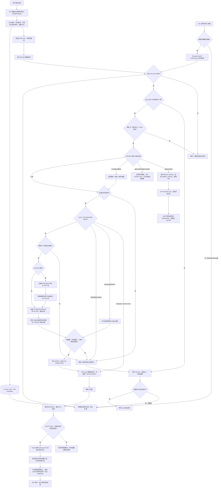

[业务逻辑专辑](/knowledge/business-logic/) / 居民收益付款 / S04

说明正式发布后的账单锁激活、底表同步、执行权与事务边界，以及向审核计划创建交接的条件，附逐章原文对照。本文保留原文 13 章，正文连续展开，原文对照与流程源码按需展开。

**前置阅读：** [S03 · 居民收益提交构建](/knowledge/business-logic/resident-income/s03-居民收益提交构建/)

**快速阅读：** [任务概览](#sec-1) · [事务与执行权](#sec-7) · [完整流程](#sec-11) · [源码索引](#sec-12)

<div class="business-logic-article">

<div id="intro"></div>

> 对应原文：`S04-residentIncomePaymentSelectionLockActivateAsyncTask-源码梳理.md`。正文保留原文第 1—13 章及其小节对应关系；文中的“源码已核对”来自原文的证据声明，不表示本次改写重新核查了源码或运行环境。

<div id="intro-heading"></div>

## 阅读起点：先跟着一张付款单走一遍

**以下是假设业务场景，用于说明原文规则，不是实际运行数据。** 用户正在重新编辑一张居民收益付款单。旧版本 V1 里，A、B、C 三条账单都列在本次应付明细中。新版本 V2 中，A 仍要付，B 被移出这张付款单，C 被改为不合格，另加了一条要付款的 D。这就是 **REVISE（修订已有付款单后再次提交）**；原文另一个模式 **NEW（新建付款单的提交）** 不涉及这套旧锁迁移。

用户提交选单后，上游 S03 先把选择结果构建成正式付款明细，为本轮需要新增占用的账单建立 **RESERVED（构建期预占）** 锁，然后发布 V2。“发布”表示付款单当前展示和使用的版本指向 V2，不表示已经付款。预占也不是“不占用”：账单从预占阶段就已经受占用关系约束。

接着 S04 接到数据库里的锁激活任务，处理这个版本的占用关系。A 继续使用原来那条 **ACTIVE（已激活、正式生效）** 锁，但锁要改为指向 V2 的正式明细；B、C 的旧锁需要按规则释放；D 的新预占锁转为 ACTIVE。与此同时，差异台账、小单账单、合作方账单上的付款状态和锁引用也要对齐。B、C 能否清空旧引用，还要通过“没有当前 ACTIVE 锁、引用没有被其他付款占用接管”的保护条件；C 恢复为“无需付款”还是“未付款”，还取决于新明细的拟付租金。

只有锁和三张业务表都通过一致性校验，S04 才完成 **selection session（选单会话，即这次选单及提交过程的状态记录）**，受理或复用 S05 的审核计划创建任务，最后将自己标为成功。S05 再去创建或复用审核计划，后面才轮到人工审核及付款。**S04 不重新筛账单、不重新算付款金额、不发起银行付款；S04 成功也不等于审核计划已经创建。**

### 阅读与证据边界

原文核对日期为 **2026-09-08**，证据级别为 **SOURCE\_VERIFIED（当前本地源码已核对）**。这里的“已核对”限定在原作者当时读取的本地源码，不能扩大成线上已验证。

| 范围 | 原文记录的实际依据 |
| --- | --- |
| 主链源码仓库 | `/Users/wangyi/BZ/zx-monitor/zxbaif` |
| 主链分支 | `Ian/review/01` |
| 主链 HEAD | `a1bfacbeb6dfc239d577bd66bf78cd9eb2482efa` |
| 工作区限制 | 分析使用工作区实际文件；共享执行模板及 S02 当时已有未提交修改，因此不是上述 HEAD 的纯提交快照 |
| 下游审核中心仓库 | `/Users/wangyi/BZ/zx-monitor/zxbaie` |
| 下游分支 | `zx_test_250330` |
| 下游 HEAD | `21aac5b4821de7e7ae1bd660f896b3e890115cfc` |
| 部署组合限制 | 这两个本地分支不能代表线上实际部署组合 |

原文只做了源码分析与文档生成，**没有运行定时任务、没有调用业务接口、没有连接数据库、没有执行测试**。生产调度周期、线程池有效配置、实际索引、数据规模、耗时、部署版本均暂时无法确认。本次阅读版也没有增加上述验证。

下文的“会写入”“会回滚”沿用原文结论，依据是当时源码及 Spring 默认事务传播语义，不是目标环境实验结果。新增例子均明确标为假设；源码位置保留在第 12 章，完整条件仍以原文指向的方法及 Mapper SQL 为准。

<details class="original" id="original-0">
<summary>查看原文的证据声明</summary>

### S04：residentIncomePaymentSelectionLockActivateAsyncTask 源码梳理

> 核对日期：2026-09-08。证据级别：**SOURCE\_VERIFIED（当前本地源码已核对）**。
>
> 主链源码：`/Users/wangyi/BZ/zx-monitor/zxbaif`，分支 `Ian/review/01`，HEAD `a1bfacbeb6dfc239d577bd66bf78cd9eb2482efa`。分析采用工作区实际文件；其中共享执行模板及 S02 有已有未提交修改，不能把本报告等同于该 HEAD 的纯提交快照。
>
> 下游审核中心源码：`/Users/wangyi/BZ/zx-monitor/zxbaie`，分支 `zx_test_250330`，HEAD `21aac5b4821de7e7ae1bd660f896b3e890115cfc`。两个仓库的本地分支不代表线上部署组合。
>
> 本次只做源码分析和文档生成，没有运行定时任务、调用业务接口、连接数据库或执行测试。生产调度周期、线程池有效配置、实际索引、数据规模、耗时和部署版本均**暂时无法确认**。文中“会写入”“会回滚”描述的是当前源码及 Spring 默认事务传播语义，不代表已经做过目标环境验证。

<details class="source-note">
<summary>查看这一部分的原始 Markdown</summary>

```text
# S04：residentIncomePaymentSelectionLockActivateAsyncTask 源码梳理

> 核对日期：2026-09-08。证据级别：**SOURCE_VERIFIED（当前本地源码已核对）**。
>
> 主链源码：`/Users/wangyi/BZ/zx-monitor/zxbaif`，分支 `Ian/review/01`，HEAD `a1bfacbeb6dfc239d577bd66bf78cd9eb2482efa`。分析采用工作区实际文件；其中共享执行模板及 S02 有已有未提交修改，不能把本报告等同于该 HEAD 的纯提交快照。
>
> 下游审核中心源码：`/Users/wangyi/BZ/zx-monitor/zxbaie`，分支 `zx_test_250330`，HEAD `21aac5b4821de7e7ae1bd660f896b3e890115cfc`。两个仓库的本地分支不代表线上部署组合。
>
> 本次只做源码分析和文档生成，没有运行定时任务、调用业务接口、连接数据库或执行测试。生产调度周期、线程池有效配置、实际索引、数据规模、耗时和部署版本均**暂时无法确认**。文中“会写入”“会回滚”描述的是当前源码及 Spring 默认事务传播语义，不代表已经做过目标环境验证。
```

</details>

</details>

<div id="sec-1"></div>

## 1. 任务概览

先把 S04 当成“发布后的占用关系收尾”，而不是“再做一次选单”。上游已经给出了正式付款明细和当前发布版本，S04 要让账单锁、业务表和选单会话与这一结果一致，再把后续审核工作交出去。

它消费的是**数据库中的锁激活任务**。一条任务针对一个 `paymentOrderVersionId`，即一条付款单提交版本记录的 ID，不是一条任务只处理一张账单。

工作顺序可以分成四段。第一段，NEW 提交把本次提交的 RESERVED 锁激活。第二段，REVISE 提交先迁移仍需付款的旧 ACTIVE 锁，再释放被删除或转为不合格明细的旧锁，随后激活本轮新增预占锁。第三段，同步差异台账、小单账单、合作方账单的付款状态和锁引用，并检查一致性。第四段，把会话推进到 **COMPLETED（选单提交会话已完成）**，受理或复用 S05 任务，再把 S04 标为成功。

这里的“可靠交接”指后续数据库任务受理与 S04 成功标记一起提交，不承诺后续任务已经执行；任务复用的限制见第 8.2 节。

### 把业务职责对应到代码入口

**XXL-Job handler（调度平台调用的任务处理入口）** 是调度侧识别这项任务的名字。调度入口、消费服务、核心业务服务不是三个不同任务，而是同一次处理沿途经过的代码层次。

| 项目 | 原文事实与阅读说明 |
| --- | --- |
| XXL-Job handler | `residentIncomePaymentSelectionLockActivateAsyncTask` |
| 入口类 | `ResidentIncomePaymentSelectionLockActivateJob`：接收、解析调度参数并选择执行路径 |
| 消费服务 | `SelectionLockActivateAsyncTaskServiceImpl`：查任务、尝试取得执行权、逐条处理、记录结果 |
| 核心业务服务 | `SelectionSubmitBuildServiceImpl.activatePublishedLocks`：处理已发布版本的账单锁与业务表 |
| 任务类型 | `RESIDENT_INCOME_PAYMENT_LOCK_ACTIVATE` |
| businessKey（业务键，用业务身份标识任务） | `LOCK_ACTIVATE:<paymentOrderVersionId>` |
| taskCode（任务编码，用于任务记录识别与复用） | `RIPLA:` 加上业务键的 32 位小写 MD5；这里 MD5 用于生成稳定编码 |
| 业务阶段 | `selection_submit_batch.batch_phase = 'LOCK_ACTIVATE'` |
| 单轮任务数 `maxTaskCount` | 默认 50，上限 200；空值或非正数用默认值 |
| 每批锁／明细数量 `batch_size` | 读取批次表的值；空值或非正数默认 1000；该读取位置没有再次限制上限 |
| 执行方式 | XXL 入口逐条串行消费；也可在上游提交后，通过专用线程池精确唤醒同一个消费者 |

**50／200 是一轮取多少条任务，1000 是一条任务内部一批处理多少锁或明细。** 不要把这两层数量混成“整个版本最多处理 1000 条”。同样，“分批处理”没有自动带来“每批单独提交事务”，第 7 章会展开。

源码依据：[E01 任务入口](#e01)、[E02 消费者](#e02)、[E04 任务身份与重试](#e04)、[E08 锁激活业务](#e08)。

<details class="original" id="original-1">
<summary>查看第 1 章原文对照</summary>

### 1. 任务概览

**S04 负责在付款单版本发布后，使该版本的账单占用锁及业务表锁引用达到一致状态，完成选单会话，再可靠交接 S05 创建审核计划。**

它消费的是数据库中的锁激活任务，一条任务对应一个 `paymentOrderVersionId`。业务处理包含四件事：

1. NEW 提交：将本次提交预占的 `RESERVED` 锁改成 `ACTIVE`。
2. REVISE 提交：迁移仍需付款的旧 `ACTIVE` 锁，释放被删除或转为不合格明细的旧锁，再激活本轮新增预占锁。
3. 同步差异台账、小单账单、合作方账单上的付款状态与锁引用，并检查一致性。
4. 将会话推进至 `COMPLETED`，受理或复用 S05 任务，再将 S04 标为成功。

| 项目 | 源码事实 |
| --- | --- |
| XXL-Job handler | `residentIncomePaymentSelectionLockActivateAsyncTask` |
| 入口类 | `ResidentIncomePaymentSelectionLockActivateJob` |
| 消费服务 | `SelectionLockActivateAsyncTaskServiceImpl` |
| 核心业务服务 | `SelectionSubmitBuildServiceImpl.activatePublishedLocks` |
| 任务类型 | `RESIDENT_INCOME_PAYMENT_LOCK_ACTIVATE` |
| 业务键 | `LOCK_ACTIVATE:<paymentOrderVersionId>` |
| 任务编码 | `RIPLA:` + 业务键的 32 位小写 MD5 |
| 业务阶段 | `selection_submit_batch.batch_phase = 'LOCK_ACTIVATE'` |
| 单轮任务数 | 默认 50，上限 200；空值或非正数使用默认值 |
| 每批锁/明细数量 | 使用批次表 `batch_size`；空值或非正数默认 1000，读取处未再限制上限 |
| 执行方式 | XXL 入口逐条串行消费；也支持提交后通过专用线程池精确唤醒同一消费者 |

依据：[任务入口](#e01)、[消费者](#e02)、[任务身份与重试规则](#e04)、[锁激活业务](#e08)。

<details class="source-note">
<summary>查看这一部分的原始 Markdown</summary>

```text
## 1. 任务概览

**S04 负责在付款单版本发布后，使该版本的账单占用锁及业务表锁引用达到一致状态，完成选单会话，再可靠交接 S05 创建审核计划。**

它消费的是数据库中的锁激活任务，一条任务对应一个 `paymentOrderVersionId`。业务处理包含四件事：

1. NEW 提交：将本次提交预占的 `RESERVED` 锁改成 `ACTIVE`。
2. REVISE 提交：迁移仍需付款的旧 `ACTIVE` 锁，释放被删除或转为不合格明细的旧锁，再激活本轮新增预占锁。
3. 同步差异台账、小单账单、合作方账单上的付款状态与锁引用，并检查一致性。
4. 将会话推进至 `COMPLETED`，受理或复用 S05 任务，再将 S04 标为成功。

| 项目 | 源码事实 |
| --- | --- |
| XXL-Job handler | `residentIncomePaymentSelectionLockActivateAsyncTask` |
| 入口类 | `ResidentIncomePaymentSelectionLockActivateJob` |
| 消费服务 | `SelectionLockActivateAsyncTaskServiceImpl` |
| 核心业务服务 | `SelectionSubmitBuildServiceImpl.activatePublishedLocks` |
| 任务类型 | `RESIDENT_INCOME_PAYMENT_LOCK_ACTIVATE` |
| 业务键 | `LOCK_ACTIVATE:<paymentOrderVersionId>` |
| 任务编码 | `RIPLA:` + 业务键的 32 位小写 MD5 |
| 业务阶段 | `selection_submit_batch.batch_phase = 'LOCK_ACTIVATE'` |
| 单轮任务数 | 默认 50，上限 200；空值或非正数使用默认值 |
| 每批锁/明细数量 | 使用批次表 `batch_size`；空值或非正数默认 1000，读取处未再限制上限 |
| 执行方式 | XXL 入口逐条串行消费；也支持提交后通过专用线程池精确唤醒同一消费者 |

依据：[任务入口][E01]、[消费者][E02]、[任务身份与重试规则][E04]、[锁激活业务][E08]。
```

</details>

</details>

<div id="sec-2"></div>

## 2. 业务目的

<div id="sec-2-1"></div>

### 2.1 它位于付款流程的什么位置

从用户动作往后看，完整主线如下：

```text
用户提交选单
  → S03 构建正式付款明细、建立 RESERVED 预占锁
  → S03 发布付款单版本，并在同一个交接事务中受理 S04
  → S04 同步账单锁和三张业务表的付款状态，完成会话
  → S05 创建审核计划
  → 后续人工审核和付款流程
```

**版本发布**解决的是“这张付款单现在应该看哪一版明细”；**锁同步**解决的是“账单目前由谁占用、业务表应指向哪条正式明细”。两件事相关，但不是同一个动作。

例如新明细已经成为当前版本，业务表却还引用旧明细，查询方看到的付款状态和占用关系就可能不一致。S04 正是要把这些关系对齐，并避免旧锁一直占用已移除账单，或在收尾完成前就交给审核流程。

锁表使用 `lock_key` 表示业务占用键。项目建表脚本定义了 `uk_lock_key` **唯一索引（数据库层面不允许该索引键重复）**。这一点也说明 RESERVED 是构建期的预占，不是尚未占用。S04 主要改变锁的生命周期和归属，不是在发布后才第一次考虑占用。索引是否实际部署到目标库，原文未验证。

责任边界保持不变：S04 不重新决定付款金额，不重新筛选全量候选账单，也不发起银行付款。**S03 的发布事务和 S04 是不同阶段；S04 内部的分批循环仍不等于每批独立提交。**

<div id="sec-2-2"></div>

### 2.2 用一个 REVISE 例子理解

继续使用开头的**假设例子**。旧版本 V1 中，A、B、C 都是 **PAYABLE（本次付款单中应付款的正式明细，`line_type=10`）**，都有 ACTIVE 锁。重新编辑后发布 V2，C 变为 **UNQUALIFIED（本次付款单中不合格的正式明细，`line_type=20`）**，新增 D。

| 账单 | V2 的结果 | S04 对锁做什么 | 业务表如何处理 |
| --- | --- | --- | --- |
| A | 保留，仍为 PAYABLE | 保留原锁和 `lock_key`，把锁归属迁移到 V2 的正式明细 | 刷新为新明细、新锁引用及付款审核态 |
| B | 从本次付款单删除 | 释放 V1 的旧锁 | 在没有当前 ACTIVE 锁、现有引用为空或仍属于本付款单／源明细的保护条件下，清空旧引用并恢复未付款 |
| C | 保留但改为 UNQUALIFIED | 释放旧 PAYABLE 锁 | 同样通过清理保护条件后，依目标明细 `pre_rent` 恢复未付款或无需付款；仅保留白名单允许展示的不合格原因 |
| D | 新增 PAYABLE | 把 S03 已为 V2 插入的 RESERVED 锁激活 | 指向 V2 的正式明细，进入付款审核态 |

A 的迁移不是只改一个版本号。原文明确列出的迁移字段包括 `order_bill_id`、`submit_round`、`session_id`、`submit_attempt`、`data_version` 以及三种业务表 ID；还会更新锁保存的来源状态并清空旧释放信息，详见第 6.1 节。

B、C 的“释放锁”和“清业务表旧引用”也不是无条件一起做。清理前必须确认锁已释放且原因为 `REVISE_REMOVED`、目标没有对应 PAYABLE、业务记录没有当前 ACTIVE 锁，并校验既有引用的归属，完整条件见第 4.5 节。

正常完成后，A、D 对齐到 V2 的正式明细并进入付款审核态；B、C 不再被原来的 PAYABLE 锁占用。S04 在检查完成后才交接审核计划任务。C 不合格并不自动等于“无需付款”，也不等于合作方查询状态已经变成“校核不通过”。

源码依据：[E10 锁 SQL](#e10)、[E11 业务表同步](#e11)、[E12 差异台账 SQL](#e12)。

<details class="original" id="original-2">
<summary>查看第 2 章原文对照</summary>

### 2. 业务目的

#### 2.1 它位于付款流程的什么位置

```text
用户提交选单
  → S03 构建正式付款明细、预占 RESERVED 锁
  → S03 发布付款单版本，并在同一交接事务受理 S04
  → S04 同步账单锁和业务表付款状态，完成会话
  → S05 创建审核计划
  → 后续人工审核和付款流程
```

发布使目标版本成为付款单当前可见版本；锁同步使账单占用关系和各查询表与该版本一致。S04 不重新决定付款金额、不重新筛选全量候选账单，也不发起银行付款。

`RESERVED` 是构建期预占，并非“不占用”。锁表使用业务 `lock_key`，项目建表脚本定义了 `uk_lock_key` 唯一索引。S04 改变锁的生命周期和归属，避免新版本正式明细已经发布，但业务表仍指向旧明细、旧锁迟迟不释放，或审核提前开始。

注意：发布事务与 S04 是不同阶段；但**当前 S04 内部的分批循环并不等于每批独立提交**，详见第 7 节。

#### 2.2 用一个 REVISE 例子理解

原付款单版本 V1 有 A、B、C 三条 PAYABLE 明细，均有 `ACTIVE` 锁。重新编辑后发布 V2：

| 账单 | 新版本结果 | S04 实际动作 |
| --- | --- | --- |
| A | 保留，仍是 PAYABLE | 保留同一锁及 `lock_key`，将 `order_bill_id`、版本、会话、提交轮次等迁移到 V2 |
| B | 从本次付款单删除 | 释放 V1 旧锁；无其他 ACTIVE 锁等保护条件满足时，清空业务表旧锁引用、恢复未付款 |
| C | 保留但改为 UNQUALIFIED | 释放旧锁；按目标明细拟付租金等规则恢复未付款或无需付款，保留允许展示的不合格原因 |
| D | 新增 PAYABLE | 激活 S03 已为 V2 插入的 RESERVED 锁 |

完成后，V2 的 A、D 指向新正式付款明细并进入付款审核态，B、C 不再由旧 PAYABLE 锁占用，随后才交接审核计划任务。

依据：[锁 SQL](#e10)、[业务表同步](#e11)、[差异台账 SQL](#e12)。

<details class="source-note">
<summary>查看这一部分的原始 Markdown</summary>

````text
## 2. 业务目的

### 2.1 它位于付款流程的什么位置

```text
用户提交选单
  → S03 构建正式付款明细、预占 RESERVED 锁
  → S03 发布付款单版本，并在同一交接事务受理 S04
  → S04 同步账单锁和业务表付款状态，完成会话
  → S05 创建审核计划
  → 后续人工审核和付款流程
```

发布使目标版本成为付款单当前可见版本；锁同步使账单占用关系和各查询表与该版本一致。S04 不重新决定付款金额、不重新筛选全量候选账单，也不发起银行付款。

`RESERVED` 是构建期预占，并非“不占用”。锁表使用业务 `lock_key`，项目建表脚本定义了 `uk_lock_key` 唯一索引。S04 改变锁的生命周期和归属，避免新版本正式明细已经发布，但业务表仍指向旧明细、旧锁迟迟不释放，或审核提前开始。

注意：发布事务与 S04 是不同阶段；但**当前 S04 内部的分批循环并不等于每批独立提交**，详见第 7 节。

### 2.2 用一个 REVISE 例子理解

原付款单版本 V1 有 A、B、C 三条 PAYABLE 明细，均有 `ACTIVE` 锁。重新编辑后发布 V2：

| 账单 | 新版本结果 | S04 实际动作 |
| --- | --- | --- |
| A | 保留，仍是 PAYABLE | 保留同一锁及 `lock_key`，将 `order_bill_id`、版本、会话、提交轮次等迁移到 V2 |
| B | 从本次付款单删除 | 释放 V1 旧锁；无其他 ACTIVE 锁等保护条件满足时，清空业务表旧锁引用、恢复未付款 |
| C | 保留但改为 UNQUALIFIED | 释放旧锁；按目标明细拟付租金等规则恢复未付款或无需付款，保留允许展示的不合格原因 |
| D | 新增 PAYABLE | 激活 S03 已为 V2 插入的 RESERVED 锁 |

完成后，V2 的 A、D 指向新正式付款明细并进入付款审核态，B、C 不再由旧 PAYABLE 锁占用，随后才交接审核计划任务。

依据：[锁 SQL][E10]、[业务表同步][E11]、[差异台账 SQL][E12]。
````

</details>

</details>

<div id="sec-3"></div>

## 3. 核心调用链

<div id="sec-3-1"></div>

### 3.1 上游如何产生 S04

业务上，S03 不能只把新版本发布出去就结束，还要确保后续锁同步确实有数据库任务承接。原文把“发布版本、受理 S04、S03 成功”放在同一个交接事务中，就是为了避免已经报告提交成功，却没有后续锁同步任务。

技术上，`SelectionSubmitBuildAsyncTaskServiceImpl` 调用 `ResidentIncomePaymentSubmitHandoffServiceImpl.publishAndHandoff`，顺序如下。

**第一步，发布版本。** `publishBuiltVersion` 使用 **CAS（Compare-And-Set，只有数据库仍满足预期条件才更新）**，更新付款单的 `current_publish_version`、`submit_round`、`build_status`。版本标为 **PUBLISHED（版本已发布）**；会话进入 **PUBLISHED\_LOCK\_SYNCING（版本已发布、账单锁仍在同步中）**。

**第二步，准备 S04 数据库任务。** 初始状态是 **PENDING（待执行）**，`retry_count=0`、`max_retry_count=3`，下次执行时间设为可以立即执行；`task_data` 保存版本 ID 和任务场景。

**第三步，受理或复用任务。** `SafeSeedService.acceptOrReuse` 通过 `INSERT IGNORE` 尝试插入，再按任务编码回读并校验身份，决定使用新任务还是复用已存在的记录。这里的 **seed（任务落库受理）** 不是直接执行 S04，也不是无条件把旧任务重置成待执行。

**第四步，完成上游交接。** 标记 S03 成功，并注册事务提交后的 **kick（主动唤醒，提示消费者尽快处理指定任务）**。只有交接事务提交后，才尝试发出这个唤醒提示。

下面只是 `task_data` 的**结构示例**，`123456789` 不是生产版本 ID，不能直接据此操作实际环境：

```json
{
  "paymentOrderVersionId": 123456789,
  "taskScene": "LOCK_ACTIVATE"
}
```

源码依据：[E03 S03 发布与 S04 任务交接](#e03)。

<div id="sec-3-2"></div>

### 3.2 从定时任务入口向下追踪

先用业务语言看：入口决定是“扫描到期任务”还是“按指定身份重跑”；消费者逐条争取任务执行权；取得执行权后校验提交身份与发布状态；核心业务完成锁和三表同步；最后受理审核计划任务、写追溯、标记成功。

调用链里的几个词先说明白：**claim（抢占任务，原子地取得本次处理资格）**；**runningAttempt（当前执行尝试编号，对应任务表 `running_attempt`）**；**fenced write（带执行权检查的写操作，过期执行者不能继续冒用身份写回）**；**lease（租约，在一定时间内授权某个 worker 处理批次）**；**worker（实际执行处理逻辑的工作线程／实例）**；**水位（已经处理到的 ID 边界）**。这些概念在第 7 章会与真实字段逐一对应。

```text
ResidentIncomePaymentSelectionLockActivateJob
└─ residentIncomePaymentSelectionLockActivateAsyncTask(param)
   ├─ parseJobParam / unwrapPayload：解析并解包参数
   └─ executeJob：按参数选择路径
      ├─ 无选择器 → executePendingTasks(maxTaskCount)
      └─ 有 taskCode/businessKey → executeManualRetry(...)
         两条路径均查询 fi_async_task，再进入：
         └─ executeTaskList：逐条串行执行
            └─ executeSingleTask
               ├─ claimTask：CAS 抢占，取得新的 runningAttempt
               ├─ parseTaskDto + validateTaskIdentity：解析并验证任务身份
               └─ executeFencedWrite：锁任务行，检查当前执行权
                  ├─ ReviseInvariantGuard.inspectVersion
                  ├─ 处理身份异常、发布状态异常分支
                  ├─ activatePublishedLocks(versionId)
                  │  ├─ requireBuildContext：取得构建上下文，再查发布边界
                  │  └─ runLockActivatePhase
                  │     ├─ 取 LOCK_ACTIVATE 批次，处理 DONE 重入
                  │     ├─ 抢占批次租约
                  │     ├─ REVISE：先迁移保留旧锁，再释放移除旧锁
                  │     ├─ 分批 RESERVED → ACTIVE，推进锁 ID 水位
                  │     ├─ 同步三张业务表；REVISE 清理旧引用
                  │     ├─ 校验锁数量、旧锁残留、业务表引用一致性
                  │     └─ 批次 DONE，会话 COMPLETED
                  └─ completeAndHandoff
                     ├─ 受理／复用 AUDIT_PLAN_CREATE 任务
                     ├─ 写 ACCEPT／REUSE 追溯记录
                     ├─ S04 → SUCCESS
                     └─ 注册事务提交后的 S05 kick
```

其中 **DONE（业务批次完成）** 和 **SUCCESS（异步任务成功）** 是不同对象的状态；**ACCEPT／REUSE（新受理／复用已有任务）** 是追溯记录中的交接动作，不是审核结论。

每轮消费结束后还会调用 `inspectInvariants`。**Invariant（不变量，即业务期望始终成立的规则）巡检** 在这里是可扩展的只读检查和日志告警入口，不替代锁同步中必须通过的强制一致性校验。

原文在当前 `financial-center/src/main` 中没有检出具体的 `ResidentIncomePaymentInvariantRule` 实现。因此，**如果运行时也没有额外注入规则，规则列表就是空的，这个巡检入口不会实际发现业务异常**。不能因为看见调用了巡检方法，就认为已有完整业务巡检能力。

源码依据：[E02 消费者](#e02)、[E06 执行模板](#e06)、[E08 核心处理](#e08)、[E17 后续交接](#e17)、[E23 只读巡检](#e23)。

<details class="original" id="original-3">
<summary>查看第 3 章原文对照</summary>

### 3. 核心调用链

#### 3.1 上游如何产生 S04

`SelectionSubmitBuildAsyncTaskServiceImpl` 调用 `ResidentIncomePaymentSubmitHandoffServiceImpl.publishAndHandoff`：

1. 调用 `publishBuiltVersion`；发布 CAS 更新付款单 `current_publish_version`、`submit_round`、`build_status`，版本标记 `PUBLISHED`，会话进入 `PUBLISHED_LOCK_SYNCING`。
2. 构造 S04 任务：`PENDING`、`retry_count=0`、`max_retry_count=3`，执行时间设为可立即执行，`task_data` 保存版本 ID 和场景。
3. `SafeSeedService.acceptOrReuse` 通过 `INSERT IGNORE`、按任务编码回读及身份校验，受理新任务或复用已有任务。
4. 将 S03 标记成功，注册事务提交后的 S04 kick。

发布、S04 任务受理和 S03 成功标记在交接事务中一起完成，避免先报告提交成功却没有后续锁同步任务。[E03](#e03)

任务数据示意如下；这是结构示例，版本 ID 不是实际生产数据：

```json
{
  "paymentOrderVersionId": 123456789,
  "taskScene": "LOCK_ACTIVATE"
}
```

#### 3.2 从定时任务入口向下追踪

```text
ResidentIncomePaymentSelectionLockActivateJob
└─ residentIncomePaymentSelectionLockActivateAsyncTask(param)
   ├─ parseJobParam / unwrapPayload
   └─ executeJob
      ├─ 无选择器 → executePendingTasks(maxTaskCount)
      └─ 有 taskCode/businessKey → executeManualRetry(...)
         └─ 查询 fi_async_task
            └─ executeTaskList：逐条串行
               └─ executeSingleTask
                  ├─ claimTask：CAS 抢占任务，获得新 runningAttempt
                  ├─ parseTaskDto + validateTaskIdentity
                  └─ executeFencedWrite：锁任务行并核对当前执行权
                     ├─ ReviseInvariantGuard.inspectVersion
                     ├─ 异常身份/发布状态分支
                     ├─ activatePublishedLocks(versionId)
                     │  ├─ requireBuildContext + 再检查发布边界
                     │  └─ runLockActivatePhase
                     │     ├─ 查询 LOCK_ACTIVATE 批次，处理 DONE 重入
                     │     ├─ 抢占批次租约
                     │     ├─ REVISE：迁移保留旧锁、释放移除旧锁
                     │     ├─ 循环 RESERVED → ACTIVE，更新锁 ID 水位
                     │     ├─ 同步三张业务表；REVISE 清理旧引用
                     │     ├─ 锁数量、旧锁残留、业务表引用一致性校验
                     │     └─ 批次 DONE，会话 COMPLETED
                     └─ completeAndHandoff
                        ├─ 受理/复用 AUDIT_PLAN_CREATE 任务
                        ├─ 写 ACCEPT/REUSE 追溯记录
                        ├─ S04 → SUCCESS
                        └─ 注册提交后 S05 kick
```

每轮消费完成后还调用 `inspectInvariants`。它是规则扩展式只读巡检与日志告警入口，不替代核心业务里的强制一致性校验。当前 `financial-center/src/main` 未检出具体 `ResidentIncomePaymentInvariantRule` 实现；如果运行时没有额外注入规则，规则列表为空，不会实际发现业务异常。[E23](#e23)

<details class="source-note">
<summary>查看这一部分的原始 Markdown</summary>

````text
## 3. 核心调用链

### 3.1 上游如何产生 S04

`SelectionSubmitBuildAsyncTaskServiceImpl` 调用 `ResidentIncomePaymentSubmitHandoffServiceImpl.publishAndHandoff`：

1. 调用 `publishBuiltVersion`；发布 CAS 更新付款单 `current_publish_version`、`submit_round`、`build_status`，版本标记 `PUBLISHED`，会话进入 `PUBLISHED_LOCK_SYNCING`。
2. 构造 S04 任务：`PENDING`、`retry_count=0`、`max_retry_count=3`，执行时间设为可立即执行，`task_data` 保存版本 ID 和场景。
3. `SafeSeedService.acceptOrReuse` 通过 `INSERT IGNORE`、按任务编码回读及身份校验，受理新任务或复用已有任务。
4. 将 S03 标记成功，注册事务提交后的 S04 kick。

发布、S04 任务受理和 S03 成功标记在交接事务中一起完成，避免先报告提交成功却没有后续锁同步任务。[E03]

任务数据示意如下；这是结构示例，版本 ID 不是实际生产数据：

```json
{
  "paymentOrderVersionId": 123456789,
  "taskScene": "LOCK_ACTIVATE"
}
```

### 3.2 从定时任务入口向下追踪

```text
ResidentIncomePaymentSelectionLockActivateJob
└─ residentIncomePaymentSelectionLockActivateAsyncTask(param)
   ├─ parseJobParam / unwrapPayload
   └─ executeJob
      ├─ 无选择器 → executePendingTasks(maxTaskCount)
      └─ 有 taskCode/businessKey → executeManualRetry(...)
         └─ 查询 fi_async_task
            └─ executeTaskList：逐条串行
               └─ executeSingleTask
                  ├─ claimTask：CAS 抢占任务，获得新 runningAttempt
                  ├─ parseTaskDto + validateTaskIdentity
                  └─ executeFencedWrite：锁任务行并核对当前执行权
                     ├─ ReviseInvariantGuard.inspectVersion
                     ├─ 异常身份/发布状态分支
                     ├─ activatePublishedLocks(versionId)
                     │  ├─ requireBuildContext + 再检查发布边界
                     │  └─ runLockActivatePhase
                     │     ├─ 查询 LOCK_ACTIVATE 批次，处理 DONE 重入
                     │     ├─ 抢占批次租约
                     │     ├─ REVISE：迁移保留旧锁、释放移除旧锁
                     │     ├─ 循环 RESERVED → ACTIVE，更新锁 ID 水位
                     │     ├─ 同步三张业务表；REVISE 清理旧引用
                     │     ├─ 锁数量、旧锁残留、业务表引用一致性校验
                     │     └─ 批次 DONE，会话 COMPLETED
                     └─ completeAndHandoff
                        ├─ 受理/复用 AUDIT_PLAN_CREATE 任务
                        ├─ 写 ACCEPT/REUSE 追溯记录
                        ├─ S04 → SUCCESS
                        └─ 注册提交后 S05 kick
```

每轮消费完成后还调用 `inspectInvariants`。它是规则扩展式只读巡检与日志告警入口，不替代核心业务里的强制一致性校验。当前 `financial-center/src/main` 未检出具体 `ResidentIncomePaymentInvariantRule` 实现；如果运行时没有额外注入规则，规则列表为空，不会实际发现业务异常。[E23]
````

</details>

</details>

<div id="sec-4"></div>

## 4. 数据筛选规则

这一章回答三个不同问题：哪些任务能被找到、找到后谁有资格执行、真正执行时能改哪些锁和业务记录。三层条件不能互相代替。

<div id="sec-4-1"></div>

### 4.1 XXL 参数与任务记录筛选

入口支持三种参数包装：直接传裸 JSON；用 `{"data": {...}}` 包一层 JSON 对象；或者用 `{"data":"JSON字符串"}` 把 JSON 放在字符串中。

精确选择器有四个字段：`taskCode`、`taskCodes`、`businessKey`、`businessKeys`。它们分别对应单个／多个任务编码、单个／多个业务键；消费服务会去掉空值和重复值。

自动扫描的参数示例：

```json
{"maxTaskCount": 50}
```

定向重跑的**假设格式示例**：

```json
{"businessKey": "LOCK_ACTIVATE:123456789", "maxTaskCount": 1}
```

第二个示例仅说明格式，版本 ID 不是实际生产数据，不代表可以直接拿去执行。

#### 先查询：自动扫描与手工重跑的差别

**PENDING(0)** 是待执行，**RUNNING(1)** 是执行中，**SUCCESS(2)** 是成功，**FAILED(3)** 是失败。**CANCELLED（已取消）** 是另一种终止状态；原文没有在这里给它标数值，本阅读版也不补写。

下表各条件在同一查询中共同起作用。只有标出的 OR 是“满足其一”，不能把整张表理解成任选一项就能命中。

| 条件 | 自动扫描 | 手工重跑查询 |
| --- | --- | --- |
| 删除标记 | `deleted=0` | `deleted=0` |
| 任务类型 | `task_type` 固定为 `RESIDENT_INCOME_PAYMENT_LOCK_ACTIVATE` | 相同 |
| 任务状态 `task_status` | 只查 `PENDING(0)`、`FAILED(3)`、`RUNNING(1)` | 查询阶段不限制状态 |
| 执行时间 | `next_execute_time IS NULL OR next_execute_time <= now` | 查询和手工 claim 都不受这一时间条件限制 |
| 失败次数 | `IFNULL(retry_count,0) < IFNULL(max_retry_count,3)` | 手工 claim 可以越过次数限制 |
| 任务选择 | 没有精确选择器 | 按任务编码列表、业务键列表查询；两种列表同时提供时，编码命中 **OR** 业务键命中 |
| 排序 | 执行时间升序，再失败次数升序，再 ID 升序 | ID 升序 |
| 返回条数 | 规范化后的 `maxTaskCount`：默认 50，上限 200，空值或非正数回到默认值 | 相同 |

`IFNULL(x,默认值)` 可以直接理解成“数据库值为空时，使用给定默认值”。因此失败次数为空按 0 看，最大失败次数为空按 3 看；条件是严格小于 `<`，不是小于等于 `<=`。

#### 再 claim：查到不代表能执行

查询结果只是一个读取时刻的 **snapshot（快照，当时读到的记录状态）**。真正 claim 时，任务仍必须处于 `0/3/1` 中的某一种状态，且 `running_attempt` 还要等于快照中的值。若任务已经是 RUNNING，`update_time` 必须至少比当前时间早 **10 分钟**，才符合超时恢复条件。

自动扫描和普通系统 kick 在 claim SQL 中还会再次检查执行时间与失败次数。手工重跑只绕过时间和次数限制，**不绕过状态、attempt 和 RUNNING 超时条件**。

所以手工查询即使查到了 SUCCESS 或 CANCELLED，也不能强制重启它；同样不能抢走尚未超时的 RUNNING。手工重跑确实可以提前执行失败任务，或处理已经耗尽自动失败次数的任务，但不是“无条件强制执行”。

还有一个入口风险必须提前知道：XXL 参数解析失败时，当前源码会退回空参数对象，从而执行默认 50 条自动扫描，而不是拒绝执行。详细后果见第 10.3 节。

源码依据：[E01 参数入口](#e01)、[E02 查询与消费](#e02)、[E05 claim SQL](#e05)。

<div id="sec-4-2"></div>

### 4.2 任务身份与版本上下文

任务不能只凭一个看起来像版本 ID 的值就开始改锁。它要证明：任务数据、任务编码、业务键说的确实是同一个提交版本和同一种任务。

执行前，从 `task_data.paymentOrderVersionId` 重新生成业务键与任务编码，逐项和任务表比较；同时要求 `taskScene=LOCK_ACTIVATE`，而且版本 ID 必须是正数。**空 JSON、非法 JSON、身份错配都进入失败重试，不能转而从付款单主表猜一个当前版本来继续执行。**

身份通过后，取得 **build context（构建上下文，确定这次提交属于哪张付款单、哪个会话、哪些源／目标版本的关联数据）**：

| 数据表 | 怎么找到 | 读取后用于什么 |
| --- | --- | --- |
| `fi_resident_income_payment_order_version` | 按 `paymentOrderVersionId` 找版本 | 付款单、会话、模式、源／目标数据版本、源／目标提交轮次、本次提交尝试、发布状态 |
| `fi_resident_income_payment_order` | 用版本的 `payment_order_id` 找主单 | 当前发布指针 `current_publish_version`、付款单首次创建人 |
| `selection_session` | 用版本的 `session_id` 找会话 | 会话状态、模式、创建人、目标付款单、提交尝试、活动提交 ID |
| `selection_submit_batch` | `payment_order_version_id` **AND** `batch_phase='LOCK_ACTIVATE'` | 阶段批次状态、批量大小、水位、租约 |

S04 不会为了再选一次单而重新读取整个 `selection_session_item` 工作集，也不会重新计算金额。PAYABLE 和 UNQUALIFIED 的结论来自已经构建好的正式付款明细。

#### 四个容易看混的版本／提交字段

| 字段 | 真实含义 | 不能替代什么 |
| --- | --- | --- |
| `paymentOrderVersionId` | 提交版本记录的主键 ID | 不能当成正式明细的数据版本号 |
| `target_data_version` | 目标正式明细和主单发布指针使用的数据版本号 | 不能直接当作提交版本记录主键 |
| `submit_attempt` | 会话本次提交的身份标识 | 不能拿来替代付款单业务轮次 |
| `submit_round` | 付款单业务上的提交轮次 | 不能替代会话本次提交身份 |

读 SQL 时要按实际条件传值，不能因为它们都带着“版本／提交”的含义，就全部当作一个版本数字。锁激活、旧锁迁移、业务表同步的筛选字段并不完全相同，后两节会分别列出。

源码依据：[E06 共享执行模板](#e06)、[E07 身份与边界](#e07)、[E08 构建上下文和锁激活](#e08)。

<div id="sec-4-3"></div>

### 4.3 REVISE 身份和发布边界决策

这里有两个独立问题：**修订的人及关联关系是否合法**，以及**版本到底发布到了哪一步**。源码不会只判断一个“已发布”布尔值就处理所有情况。

#### REVISE 的身份看数据库，不看 worker 当前登录人

身份检查要求以下持久化条件共同成立：版本和会话都为 REVISE；二者关联的付款单一致；`session.creator_user_id` 与付款单首次 `create_user_id` 都是正数，且二者相等。

异步 worker 不是根据“当前登录的是谁”来判断修订是否合法，而是比较这次会话与付款单的持久化身份。

#### 用 P 和 V 拆开“发布”

| 符号 | 判断式 | 通俗含义 |
| --- | --- | --- |
| P | `order.current_publish_version == version.target_data_version` | 主单当前发布指针已经指向这个目标数据版本 |
| V | `version.version_build_status == PUBLISHED` | 版本记录自身已经标记为已发布 |

两者都为真最容易理解；真正容易误读的是“一真一假”。下面保留原文的全部决策分支。

| 模式及条件 | 业务上如何理解 | S04 实际行为 |
| --- | --- | --- |
| NEW | 不套用 REVISE 身份限制 | 核心业务仍必须通过发布边界检查 |
| REVISE 身份合法，P=true **AND** V=true | 身份合法，两个发布信号也一致 | 正常做锁同步 |
| REVISE 身份合法，P=false **AND** V=false | 还没有发布 | 核心业务失败，走普通重试 |
| REVISE 身份非法，P=false **AND** V=false | 无效修订，而且还没有发布 | 固定版本／会话失败事实，受理 S06 精确释放预占锁，永久取消 S04 |
| REVISE，V=true **AND** P=false | 版本说已发布，但主单没指向它 | 记录发布事故，永久取消 S04；不自动激活，也不受理“未发布失败释放” |
| REVISE，P=true **AND** V=false | 主单已经指向目标版本，但版本状态未标发布 | 记录事故，继续锁一致性收尾；不按未发布执行破坏性补偿 |
| REVISE 身份非法，P=true **AND** V=true | 身份有问题，但版本已经发布 | 记录事故，继续已发布版本收尾 |

**判断顺序不能调换：先看 P/V 是否不一致，再判断身份是否合法。** 所以上表中两个 P/V 不一致分支，不只适用于非法身份；身份合法的 REVISE 也可能进入发布状态事故分支。

NEW 的 `ensurePublishedBoundary` 实际检查的是 **V OR P**：只要其中一个为真就通过。它没有 REVISE 那一套 P/V 不一致分类。不能把 REVISE 的分支表反过来套到 NEW，也不能把 NEW 改写成“V 和 P 必须同时为真”。

还要保留一个后续问题：P 真、V 假时允许 S04 收尾，不等于源码会顺便把版本改成 PUBLISHED。S05 后面仍要求版本已发布，所以这一事故可能在审核计划前继续卡住，第 10.5 节会再说明。

源码依据：[E07 REVISE 身份及发布边界](#e07)。

<div id="sec-4-4"></div>

### 4.4 激活哪些锁

业务上，S04 不能把“同一张付款单的所有预占锁”都激活，只能处理**这个会话、这次提交尝试、这个目标数据版本**所属的 RESERVED 锁。

下面所有条件是 **AND**，即同时满足；最后一行本身也包含两个边界判断：

```text
payment_order_id = 本版本付款单
AND session_id   = 本版本会话
AND submit_attempt = 本次提交尝试
AND data_version = target_data_version
AND lock_status  = RESERVED
AND id > 上次锁水位
AND id <= 本批最大锁 ID
```

先按锁 ID 升序查询最多 `batch_size` 条，取出本批最大锁 ID，再更新这个 ID 范围。这是按 ID 水位向前推进，不是 **OFFSET 分页（每页通过跳过前 N 行定位）**。

**假设例子，仅用于解释开闭边界：** 上次水位为 1000，这批查出的最大锁 ID 为 1800，那么更新区间是 `id > 1000 AND id <= 1800`，再叠加前面的付款单、会话、尝试、版本和状态条件。它不意味着 1001—1800 的每个整数 ID 都存在，也不意味着这个区间里别的会话的锁会被更新。

这里实际激活 SQL 使用 `submit_attempt`，**没有单独筛选 `submit_round`**。目标提交轮次已经在预占锁构建时写入；阅读版不能因为“多加一个条件看起来更严谨”就把源码不存在的筛选条件补进去。

#### REVISE 的旧锁：先按源版本找到旧占用，再决定保留或释放

处理旧锁的锚点是：**源数据版本、源提交轮次、ACTIVE 状态**。不是用目标版本去找尚未迁移的旧锁。

| 分支 | 条件 | 对应开头例子 |
| --- | --- | --- |
| 保留并迁移 | 源正式明细 `line_type=10`；目标版本存在 `source_order_bill_id=源明细ID` **AND** `line_type=10` **AND** 未删除的明细 | A 仍要付款 |
| 释放 | 源正式明细仍为 PAYABLE，但目标版本不存在对应 PAYABLE | B 被删除，或 C 变成 `line_type=20`，都属于这一分支 |

`source_order_bill_id` 可以理解成“目标明细记住它从哪条旧正式明细修订而来”，这是源、目标明细之间的对应关系。

两类旧锁查询都按**旧锁 ID**分批。迁移与释放 SQL 关联目标明细时使用目标数据版本，**没有额外传入目标提交轮次进行筛选**；而下一节的三张业务表同步会同时约束目标数据版本与目标提交轮次。这是原文指出的真实差别，不应把它们统一改写成相同筛选范围。

源码依据：[E10 预占锁激活及旧锁 SQL](#e10)。

<div id="sec-4-5"></div>

### 4.5 业务表同步和清理条件

锁表改完还不够。实际查询还会看到差异台账、小单账单、合作方账单；这些表保存了付款状态和锁引用。原文把它们称作 **projection（投影，即从正式明细与锁关系同步出来、供业务查询使用的状态字段）**。这里的投影具体就是三张已有业务表上的字段，不是新增了一套存储平台。

#### 新引用刷新：目标明细和目标锁都必须匹配

以目标正式明细为驱动，同时要求：属于本付款单、目标数据版本、目标提交轮次；`line_type=10`；`deleted=0`；当前要更新的业务表 ID 非空。

在此基础上，还必须关联到**同版本、同轮次、同会话、同提交尝试的 ACTIVE 锁**。只找到目标 PAYABLE 明细，或者只看到一个 ACTIVE 锁，都不够。

| 业务表 | 从正式明细拿哪个关联 ID | 刷新结果 |
| --- | --- | --- |
| `fi_monthly_income_difference`（差异台账） | `diff_id` | 付款状态变成 30（付款审核态），写入新锁引用，清除不合格标识及原因，`financial_version + 1` |
| `fi_customer_bill`（小单账单） | `small_bill_id` | 付款状态变成 30，写入新锁引用 |
| `fi_customer_bill_partner`（合作方账单） | `partner_bill_id` | 付款状态变成 30，写入新锁引用，清除不合格标识及原因 |

所有刷新 SQL 都要求“要写的字段与当前字段确实不一致”才更新。这是 **幂等（同样的结果重复处理，不应反复制造新的变化）** 的一部分：相同数据重放不会反复刷新状态时间；差异台账也不会每调用一次就无条件增加 `financial_version`。

#### 旧引用清理：已经放弃占用，也要防止误清别人的新占用

REVISE 的旧引用清理，还必须同时满足以下事实：旧锁已是 **RELEASED（已释放）**；释放原因为 `REVISE_REMOVED`；目标没有对应 PAYABLE；这条业务记录当前没有 ACTIVE 锁。

此外，已有锁引用必须为空，**或**仍然属于本付款单／源明细。这个保护条件防止把另一个付款占用已经接管的引用清掉。不要将它简化成“目标没有 PAYABLE 就清空引用”。

通过清理条件后，状态恢复按下表执行：

| 要处理的字段或状态 | 精确规则 |
| --- | --- |
| `payment_status` | 目标有对应 UNQUALIFIED 明细 **AND** `pre_rent = 0`，才设为 `payment_status=10`（无需付款）；否则设为 `payment_status=20`（未付款） |
| `locked_payment_order_id` | 清空 |
| `locked_order_bill_id` | 清空 |
| 差异台账与合作方账单的 `partner_query_status` | 目标转为不合格时设为 `partner_query_status=10`（未校核）；目标行被删除时保留原查询状态 |
| 差异台账与合作方账单的不合格标识／原因 | 只有目标不合格原因位于 `partnerVisibleUnqualifiedReasons()` 的四项白名单内，才保留相应标识与原因；其他原因不直接写入合作方可见投影 |

`pre_rent` 是目标明细的拟付租金。判断是**恰好等于 0**，不是 `<=0`，也不是“不合格就设为无需付款”。原文只给出上述条件；这里不补充未说明的金额兜底规则。

四项可展示原因必须完整保留：

| 白名单项 | 原文给出的内容 |
| --- | --- |
| 1 | 农户租金异常 |
| 2 | 拟付租金校验不通过 |
| 3 | “农户租金异常”与“拟付租金校验不通过”两者组合；原文没有给出组合字符串的具体拼接格式 |
| 4 | 用户手动选到不合格 |

因此，对开头 C 的处理需要分两层理解：释放旧 PAYABLE 占用是一回事，是否恢复为无需付款、合作方能看到哪条原因是另一回事。**本处理不会提前把合作方查询状态标成“校核不通过”；审核结论何时生效属于后续流程。**

源码依据：[E11 同步调用](#e11)、[E12 差异台账 SQL](#e12)、[E13 小单账单 SQL](#e13)、[E14 合作方账单 SQL](#e14)。

<details class="original" id="original-4">
<summary>查看第 4 章原文对照</summary>

### 4. 数据筛选规则

#### 4.1 XXL 参数与任务记录筛选

支持裸 JSON，以及 `{"data": {...}}` 或 `{"data":"JSON字符串"}`。选择字段是 `taskCode`、`taskCodes`、`businessKey`、`businessKeys`；消费服务会去空、去重。

```json
{"maxTaskCount": 50}
```

```json
{"businessKey": "LOCK_ACTIVATE:123456789", "maxTaskCount": 1}
```

第二个例子只是在说明定向重跑格式，不代表可以直接用于实际环境。

| 条件 | 自动扫描 | 手工重跑查询 |
| --- | --- | --- |
| `deleted` | 必须为 0 | 必须为 0 |
| `task_type` | 固定 LOCK\_ACTIVATE 类型 | 相同 |
| `task_status` | `PENDING(0)`、`FAILED(3)`、`RUNNING(1)` | 查询阶段不限制 |
| 执行时间 | `next_execute_time IS NULL OR <= now` | 查询及手工 claim 均不受该时间限制 |
| 自动失败次数 | `IFNULL(retry_count,0) < IFNULL(max_retry_count,3)` | 手工 claim 可越过次数限制 |
| 任务选择 | 无精确选择器 | 编码列表、业务键列表；两种都有时为 OR |
| 排序 | 执行时间、失败次数、ID 升序 | ID 升序 |
| 数量 | 规范化后的 `maxTaskCount` | 相同 |

**查询命中不代表能够执行。** 实际 claim 还要求：任务状态仍在 0/3/1，`running_attempt` 等于读取快照；若已是 RUNNING，`update_time` 必须至少落后当前时间 10 分钟。自动及普通系统 kick 还会在 claim SQL 中再次检查执行时间与失败次数。

因此，手工重跑可以提前执行失败任务或处理自动次数耗尽任务，却不能强制重启 `SUCCESS/CANCELLED`，也不能抢走尚未超时的 RUNNING 任务。[E02](#e02) [E05](#e05)

#### 4.2 任务身份与版本上下文

执行前，从 `task_data.paymentOrderVersionId` 生成业务键和任务编码，与任务表逐项比较，并要求 `taskScene=LOCK_ACTIVATE`。版本 ID 必须为正数。空 JSON、非法 JSON、错配身份进入失败重试，不能转而从付款单主表猜测要处理哪个版本。

随后查询：

| 数据 | 关键使用字段与规则 |
| --- | --- |
| `fi_resident_income_payment_order_version` | 按版本 ID 取版本；使用付款单、会话、模式、源/目标数据版本、源/目标提交轮次、本次提交尝试、发布状态 |
| `fi_resident_income_payment_order` | 通过版本的 `payment_order_id` 读取；使用 `current_publish_version`、首次创建人等 |
| `selection_session` | 通过版本的 `session_id` 读取；使用状态、模式、创建人、目标付款单、提交尝试及活动提交 ID |
| `selection_submit_batch` | 按 `payment_order_version_id + batch_phase='LOCK_ACTIVATE'` 定位；读取批次状态、大小、水位和租约 |

这里不重新读取整个 `selection_session_item` 工作集进行选单，也不重新计算金额。PAYABLE/UNQUALIFIED 取自已经构建的正式明细。[E06](#e06) [E07](#e07) [E08](#e08)

`paymentOrderVersionId` 是提交版本记录的主键；`target_data_version` 是正式明细和主单发布指针使用的数据版本号，二者不能混用。`submit_attempt` 用于会话本次提交身份，`submit_round` 用于付款单业务提交轮次；S04 按各 SQL 明确要求的字段传值。

#### 4.3 REVISE 身份和发布边界决策

身份检查比较持久化数据：版本和会话均为 REVISE，关联付款单一致，`session.creator_user_id` 与付款单首次 `create_user_id` 均为正数且相等。异步 worker 不依靠当前登录人决定 REVISE 合法性。

定义：P 表示 `order.current_publish_version == version.target_data_version`；V 表示 `version.version_build_status == PUBLISHED`。

| 情况 | S04 行为 |
| --- | --- |
| NEW | 不执行 REVISE 身份限制；业务服务仍要求越过发布边界 |
| REVISE 身份合法，P/V 都为真 | 正常同步 |
| REVISE 身份合法，P/V 都为假 | 尚未发布，业务服务失败，走普通重试 |
| REVISE 身份非法，P/V 都为假 | 固定版本/会话失败事实，投递 S06 精确释放预占锁，永久取消 S04 |
| REVISE，V 真而 P 假 | 记录发布事故，永久取消 S04；不自动激活，也不投递“未发布失败释放” |
| REVISE，P 真而 V 假 | 记录事故，继续锁一致性收尾；不把它当成未发布进行破坏性补偿 |
| REVISE 身份非法，P/V 都为真 | 记录事故，继续已发布版本收尾 |

P/V 不一致判断先于身份合法判断，因此身份合法的 REVISE 也可能进入发布状态事故分支。NEW 的 `ensurePublishedBoundary` 实际使用“V 或 P”为真即通过，没有同一套 REVISE 不一致分类。[E07](#e07)

#### 4.4 激活哪些锁

普通激活范围严格限定：

```text
payment_order_id = 本版本付款单
session_id       = 本版本会话
submit_attempt   = 本次提交尝试
data_version     = target_data_version
lock_status      = RESERVED
id               > 上次锁水位，且 <= 本批最大锁 ID
```

查询先按 ID 升序取最多 `batch_size` 条，再取这批最大 ID，更新该范围。不是 OFFSET 分页。注意 `submit_attempt` 与 `submit_round` 含义不同，实际激活 SQL 使用前者；目标提交轮次已随预占锁构建写入，本 SQL 不单独筛选 `submit_round`。[E10](#e10)

REVISE 旧锁处理以源数据版本、源提交轮次和 `ACTIVE` 状态为锚点：

- **保留旧锁**：源正式明细 `line_type=10`，目标版本存在 `source_order_bill_id=源明细ID` 且仍为 `line_type=10` 的未删除明细。
- **释放旧锁**：源正式明细仍为 PAYABLE，但目标版本不存在对应 PAYABLE。目标行被删除或变为 `line_type=20` 均满足该分支。
- 两类查询均按旧锁 ID 分批。锁迁移和释放 SQL 的目标明细关联使用目标数据版本，没有额外传入目标提交轮次筛选；三张业务表同步则同时约束目标数据版本与目标轮次。

#### 4.5 业务表同步和清理条件

新引用刷新以目标正式明细为驱动：付款单、目标数据版本、目标提交轮次、`line_type=10`、`deleted=0`、对应业务表 ID 非空；还须关联到同版本、同轮次、同会话、同尝试的 ACTIVE 锁。

| 业务表 | 明细关联字段 | 刷新结果 |
| --- | --- | --- |
| `fi_monthly_income_difference` | `diff_id` | 付款审核态 30、新锁引用、清除不合格标识/原因，`financial_version + 1` |
| `fi_customer_bill` | `small_bill_id` | 付款审核态 30、新锁引用 |
| `fi_customer_bill_partner` | `partner_bill_id` | 付款审核态 30、新锁引用、清除不合格标识/原因 |

所有刷新 SQL 都有“字段确实不一致”的条件，因此相同数据重放不会反复更新状态时间；差异台账也不会无条件增加 `financial_version`。

REVISE 清旧引用还要求旧锁已经 `RELEASED`、原因为 `REVISE_REMOVED`，目标没有对应 PAYABLE，且该业务记录没有当前 ACTIVE 锁。已有锁引用必须为空或仍属于本付款单/源明细，防止清掉别的付款占用。

清理后的具体规则：

- 目标有对应 UNQUALIFIED 明细且 `pre_rent = 0`：`payment_status=10`（无需付款）。否则为 `20`（未付款）；不能把所有不合格都理解为无需付款。
- `locked_payment_order_id`、`locked_order_bill_id` 清空。
- 对差异台账和合作方账单：目标转不合格则 `partner_query_status=10`（未校核）；目标行被删除则保持原查询状态。
- 只有目标不合格原因在 `partnerVisibleUnqualifiedReasons()` 的四项白名单中才保留标识和原因：“农户租金异常”“拟付租金校验不通过”、两者组合，以及“用户手动选到不合格”。其余原因不直接写入合作方可见投影。
- 该处理不把合作方查询状态提前标为“校核不通过”；审核结论生效属于后续流程。

依据：[差异台账](#e12)、[小单账单](#e13)、[合作方账单](#e14)。

<details class="source-note">
<summary>查看这一部分的原始 Markdown</summary>

````text
## 4. 数据筛选规则

### 4.1 XXL 参数与任务记录筛选

支持裸 JSON，以及 `{"data": {...}}` 或 `{"data":"JSON字符串"}`。选择字段是 `taskCode`、`taskCodes`、`businessKey`、`businessKeys`；消费服务会去空、去重。

```json
{"maxTaskCount": 50}
```

```json
{"businessKey": "LOCK_ACTIVATE:123456789", "maxTaskCount": 1}
```

第二个例子只是在说明定向重跑格式，不代表可以直接用于实际环境。

| 条件 | 自动扫描 | 手工重跑查询 |
| --- | --- | --- |
| `deleted` | 必须为 0 | 必须为 0 |
| `task_type` | 固定 LOCK_ACTIVATE 类型 | 相同 |
| `task_status` | `PENDING(0)`、`FAILED(3)`、`RUNNING(1)` | 查询阶段不限制 |
| 执行时间 | `next_execute_time IS NULL OR <= now` | 查询及手工 claim 均不受该时间限制 |
| 自动失败次数 | `IFNULL(retry_count,0) < IFNULL(max_retry_count,3)` | 手工 claim 可越过次数限制 |
| 任务选择 | 无精确选择器 | 编码列表、业务键列表；两种都有时为 OR |
| 排序 | 执行时间、失败次数、ID 升序 | ID 升序 |
| 数量 | 规范化后的 `maxTaskCount` | 相同 |

**查询命中不代表能够执行。** 实际 claim 还要求：任务状态仍在 0/3/1，`running_attempt` 等于读取快照；若已是 RUNNING，`update_time` 必须至少落后当前时间 10 分钟。自动及普通系统 kick 还会在 claim SQL 中再次检查执行时间与失败次数。

因此，手工重跑可以提前执行失败任务或处理自动次数耗尽任务，却不能强制重启 `SUCCESS/CANCELLED`，也不能抢走尚未超时的 RUNNING 任务。[E02][E05]

### 4.2 任务身份与版本上下文

执行前，从 `task_data.paymentOrderVersionId` 生成业务键和任务编码，与任务表逐项比较，并要求 `taskScene=LOCK_ACTIVATE`。版本 ID 必须为正数。空 JSON、非法 JSON、错配身份进入失败重试，不能转而从付款单主表猜测要处理哪个版本。

随后查询：

| 数据 | 关键使用字段与规则 |
| --- | --- |
| `fi_resident_income_payment_order_version` | 按版本 ID 取版本；使用付款单、会话、模式、源/目标数据版本、源/目标提交轮次、本次提交尝试、发布状态 |
| `fi_resident_income_payment_order` | 通过版本的 `payment_order_id` 读取；使用 `current_publish_version`、首次创建人等 |
| `selection_session` | 通过版本的 `session_id` 读取；使用状态、模式、创建人、目标付款单、提交尝试及活动提交 ID |
| `selection_submit_batch` | 按 `payment_order_version_id + batch_phase='LOCK_ACTIVATE'` 定位；读取批次状态、大小、水位和租约 |

这里不重新读取整个 `selection_session_item` 工作集进行选单，也不重新计算金额。PAYABLE/UNQUALIFIED 取自已经构建的正式明细。[E06][E07][E08]

`paymentOrderVersionId` 是提交版本记录的主键；`target_data_version` 是正式明细和主单发布指针使用的数据版本号，二者不能混用。`submit_attempt` 用于会话本次提交身份，`submit_round` 用于付款单业务提交轮次；S04 按各 SQL 明确要求的字段传值。

### 4.3 REVISE 身份和发布边界决策

身份检查比较持久化数据：版本和会话均为 REVISE，关联付款单一致，`session.creator_user_id` 与付款单首次 `create_user_id` 均为正数且相等。异步 worker 不依靠当前登录人决定 REVISE 合法性。

定义：P 表示 `order.current_publish_version == version.target_data_version`；V 表示 `version.version_build_status == PUBLISHED`。

| 情况 | S04 行为 |
| --- | --- |
| NEW | 不执行 REVISE 身份限制；业务服务仍要求越过发布边界 |
| REVISE 身份合法，P/V 都为真 | 正常同步 |
| REVISE 身份合法，P/V 都为假 | 尚未发布，业务服务失败，走普通重试 |
| REVISE 身份非法，P/V 都为假 | 固定版本/会话失败事实，投递 S06 精确释放预占锁，永久取消 S04 |
| REVISE，V 真而 P 假 | 记录发布事故，永久取消 S04；不自动激活，也不投递“未发布失败释放” |
| REVISE，P 真而 V 假 | 记录事故，继续锁一致性收尾；不把它当成未发布进行破坏性补偿 |
| REVISE 身份非法，P/V 都为真 | 记录事故，继续已发布版本收尾 |

P/V 不一致判断先于身份合法判断，因此身份合法的 REVISE 也可能进入发布状态事故分支。NEW 的 `ensurePublishedBoundary` 实际使用“V 或 P”为真即通过，没有同一套 REVISE 不一致分类。[E07]

### 4.4 激活哪些锁

普通激活范围严格限定：

```text
payment_order_id = 本版本付款单
session_id       = 本版本会话
submit_attempt   = 本次提交尝试
data_version     = target_data_version
lock_status      = RESERVED
id               > 上次锁水位，且 <= 本批最大锁 ID
```

查询先按 ID 升序取最多 `batch_size` 条，再取这批最大 ID，更新该范围。不是 OFFSET 分页。注意 `submit_attempt` 与 `submit_round` 含义不同，实际激活 SQL 使用前者；目标提交轮次已随预占锁构建写入，本 SQL 不单独筛选 `submit_round`。[E10]

REVISE 旧锁处理以源数据版本、源提交轮次和 `ACTIVE` 状态为锚点：

- **保留旧锁**：源正式明细 `line_type=10`，目标版本存在 `source_order_bill_id=源明细ID` 且仍为 `line_type=10` 的未删除明细。
- **释放旧锁**：源正式明细仍为 PAYABLE，但目标版本不存在对应 PAYABLE。目标行被删除或变为 `line_type=20` 均满足该分支。
- 两类查询均按旧锁 ID 分批。锁迁移和释放 SQL 的目标明细关联使用目标数据版本，没有额外传入目标提交轮次筛选；三张业务表同步则同时约束目标数据版本与目标轮次。

### 4.5 业务表同步和清理条件

新引用刷新以目标正式明细为驱动：付款单、目标数据版本、目标提交轮次、`line_type=10`、`deleted=0`、对应业务表 ID 非空；还须关联到同版本、同轮次、同会话、同尝试的 ACTIVE 锁。

| 业务表 | 明细关联字段 | 刷新结果 |
| --- | --- | --- |
| `fi_monthly_income_difference` | `diff_id` | 付款审核态 30、新锁引用、清除不合格标识/原因，`financial_version + 1` |
| `fi_customer_bill` | `small_bill_id` | 付款审核态 30、新锁引用 |
| `fi_customer_bill_partner` | `partner_bill_id` | 付款审核态 30、新锁引用、清除不合格标识/原因 |

所有刷新 SQL 都有“字段确实不一致”的条件，因此相同数据重放不会反复更新状态时间；差异台账也不会无条件增加 `financial_version`。

REVISE 清旧引用还要求旧锁已经 `RELEASED`、原因为 `REVISE_REMOVED`，目标没有对应 PAYABLE，且该业务记录没有当前 ACTIVE 锁。已有锁引用必须为空或仍属于本付款单/源明细，防止清掉别的付款占用。

清理后的具体规则：

- 目标有对应 UNQUALIFIED 明细且 `pre_rent = 0`：`payment_status=10`（无需付款）。否则为 `20`（未付款）；不能把所有不合格都理解为无需付款。
- `locked_payment_order_id`、`locked_order_bill_id` 清空。
- 对差异台账和合作方账单：目标转不合格则 `partner_query_status=10`（未校核）；目标行被删除则保持原查询状态。
- 只有目标不合格原因在 `partnerVisibleUnqualifiedReasons()` 的四项白名单中才保留标识和原因：“农户租金异常”“拟付租金校验不通过”、两者组合，以及“用户手动选到不合格”。其余原因不直接写入合作方可见投影。
- 该处理不把合作方查询状态提前标为“校核不通过”；审核结论生效属于后续流程。

依据：[差异台账][E12]、[小单账单][E13]、[合作方账单][E14]。
````

</details>

</details>

<div id="sec-5"></div>

## 5. 主要状态流转

<div id="sec-5-1"></div>

### 5.1 正常状态

同一次 S04 处理会修改多个对象，每个对象回答的问题不同：任务状态说“消费者处理得怎样”，批次状态说“锁激活阶段做完没有”，锁状态说“账单如何被占用”，会话状态说“这次选单提交是否结束”。因此，不能只读其中一个状态就判断整条付款流程已完成。

| 对象 | 开始／中间状态 | 正常完成后的状态或字段 |
| --- | --- | --- |
| S04 的 `fi_async_task` | `0/3`，或超时的 `1`，claim 后成为 `1`；`running_attempt + 1` | `2`（SUCCESS）；成功本身不增加失败次数 |
| `LOCK_ACTIVATE` 批次 | **INIT（初始）**、FAILED，或租约超时的 RUNNING，claim 后成为 RUNNING；`lease_version + 1` | DONE，清空 `lease_expire_time` |
| 本轮新增预占锁 | RESERVED | ACTIVE；`lock_scene=PUBLISHED_ACTIVE` |
| REVISE 保留锁 | 源版本 ACTIVE | 目标版本 ACTIVE；`lock_origin=REVISE_KEEP_ACTIVE`，`lock_scene=PUBLISHED_REFRESH` |
| REVISE 移除锁 | 源版本 ACTIVE | RELEASED；`lock_scene=PUBLISHED_RELEASE`，`release_reason=REVISE_REMOVED` |
| 选单会话 | PUBLISHED\_LOCK\_SYNCING | COMPLETED |
| S05 异步任务 | 原先不存在，或已经存在 | 不存在时插入 PENDING；已存在时复用原状态，不保证改成待执行 |

`lock_scene` 记录这次锁变化所处的业务场景，`lock_origin` 在保留锁迁移时记录 `REVISE_KEEP_ACTIVE`，`release_reason` 说明为什么释放。保留锁不是先释放再重新插入，它仍然是同一条锁。

#### 会话完成也要校验“还是不是这次提交”

会话完成 CAS 同时要求：

```text
status = PUBLISHED_LOCK_SYNCING
AND active_submit_id = 当前版本记录 ID
AND submit_attempt = 本次提交尝试
```

这里的当前版本 ID 对应提交版本记录身份，不是 `target_data_version`。成功时，清空 `failure_phase`、`active_submit_id`、`active_scope_key`，增加 `state_version`，并更新时间。

正常情况下还会清空 `active_revise_key`。但有一个必须保留的例外：**REVISE 会话的 `invalidated_flag=1`，且原因为 `INVALID_REVISE_SESSION_PUBLISHED_INCIDENT` 时，会保留 `active_revise_key`。** 也就是说，会话可以已经 COMPLETED，同时仍保留发布事故相关的活动修订键。

因此，“会话完成”只说明这次锁同步收尾已推进到完成状态，**不代表发布事故已经解除**。

源码依据：[E15 会话完成与发布事故 SQL](#e15)。

<div id="sec-5-2"></div>

### 5.2 完成前的强制校验

S04 不是看见几条 UPDATE 返回成功就收工。它要证明：该占用的没有漏，不该留的旧占用没有残留，三张业务表也没有和锁表相互矛盾。

**第一项，PAYABLE 明细数与 ACTIVE 锁数相等。** PAYABLE 计数 SQL 按付款单、数据版本、`line_type=10`、未删除过滤。与之比较的 ACTIVE 锁数，范围是本付款单、本会话、本提交尝试、目标版本。这里保留两边各自的过滤范围，不额外把“目标提交轮次”补进原文未列出的 PAYABLE 计数条件。

**第二项，REVISE 旧锁没有漏迁移或漏释放。** 源版本不能还残留应该迁移却没迁移、应该释放却没释放的 ACTIVE 锁。数量碰巧相等，不足以替代这项旧锁残留检查。

**第三项，三张业务表中的 PAYABLE 引用完整且正确。** 关联锁缺失、业务记录缺失、付款状态不对、锁引用不对，都会被视为不一致，而不是“没查到就跳过”。

**第四项，REVISE 的旧引用与恢复状态正确。** 差异台账、小单账单、合作方账单不能还保留本次应清掉的旧锁引用，也不能恢复成错误付款状态。

两个边界尤其容易看错。**零 PAYABLE、零 ACTIVE 可以通过数量校验**，原文没有规定必须至少有一条 PAYABLE。另一方面，**没有新增 RESERVED 也不代表没有工作**：REVISE 仍可能需要迁移／释放旧锁、同步三表并做最终检查。

源码依据：[E16 数量、残留和一致性校验](#e16)。

<details class="original" id="original-5">
<summary>查看第 5 章原文对照</summary>

### 5. 主要状态流转

#### 5.1 正常状态

| 对象 | 开始/中间状态 | 完成状态或字段变化 |
| --- | --- | --- |
| S04 `fi_async_task` | 0/3，或超时的 1 → 1；`running_attempt + 1` | 2（SUCCESS）；不增加失败次数 |
| `LOCK_ACTIVATE` 批次 | INIT/FAILED，或租约超时 RUNNING → RUNNING；`lease_version + 1` | DONE；清空 `lease_expire_time` |
| 新预占账单锁 | RESERVED | ACTIVE，`lock_scene=PUBLISHED_ACTIVE` |
| REVISE 保留锁 | 源版本 ACTIVE | 目标版本 ACTIVE，`lock_origin=REVISE_KEEP_ACTIVE`、`lock_scene=PUBLISHED_REFRESH` |
| REVISE 移除锁 | 源版本 ACTIVE | RELEASED，`lock_scene=PUBLISHED_RELEASE`、`release_reason=REVISE_REMOVED` |
| 选单会话 | PUBLISHED\_LOCK\_SYNCING | COMPLETED |
| S05 异步任务 | 不存在或已存在 | 不存在则插入 PENDING；存在则复用原状态 |

会话完成 CAS 要求 `status=PUBLISHED_LOCK_SYNCING`、`active_submit_id=当前版本ID`、`submit_attempt=本次尝试`。成功时清空 `failure_phase`、`active_submit_id`、`active_scope_key`，增加 `state_version` 并更新时间。

正常情况下也清空 `active_revise_key`；但对于 `invalidated_flag=1` 且原因为 `INVALID_REVISE_SESSION_PUBLISHED_INCIDENT` 的 REVISE，会保留该键。**会话 COMPLETED 不代表发布事故已解除。**[E15](#e15)

#### 5.2 完成前的强制校验

1. 目标版本 PAYABLE 正式明细数，必须等于本付款单/会话/尝试/目标版本的 ACTIVE 锁数。PAYABLE 计数 SQL 按付款单、数据版本、`line_type=10`、未删除过滤。
2. REVISE 源版本不再残留“应迁移却未迁移”或“应释放却未释放”的 ACTIVE 锁。
3. 三张业务表的 PAYABLE 锁引用必须完整：关联的锁或业务记录缺失、付款状态不对、锁引用不对等都算不一致。
4. REVISE 三张业务表不能仍有本次应该清理的旧锁引用或错误恢复状态。

因此，不是只看一个 `UPDATE` 返回成功就结束。零 PAYABLE、零 ACTIVE 可以通过数量校验；REVISE 即使没有新 RESERVED，仍可能必须处理旧锁矩阵与业务表，不能一概视为无事可做。[E16](#e16)

<details class="source-note">
<summary>查看这一部分的原始 Markdown</summary>

```text
## 5. 主要状态流转

### 5.1 正常状态

| 对象 | 开始/中间状态 | 完成状态或字段变化 |
| --- | --- | --- |
| S04 `fi_async_task` | 0/3，或超时的 1 → 1；`running_attempt + 1` | 2（SUCCESS）；不增加失败次数 |
| `LOCK_ACTIVATE` 批次 | INIT/FAILED，或租约超时 RUNNING → RUNNING；`lease_version + 1` | DONE；清空 `lease_expire_time` |
| 新预占账单锁 | RESERVED | ACTIVE，`lock_scene=PUBLISHED_ACTIVE` |
| REVISE 保留锁 | 源版本 ACTIVE | 目标版本 ACTIVE，`lock_origin=REVISE_KEEP_ACTIVE`、`lock_scene=PUBLISHED_REFRESH` |
| REVISE 移除锁 | 源版本 ACTIVE | RELEASED，`lock_scene=PUBLISHED_RELEASE`、`release_reason=REVISE_REMOVED` |
| 选单会话 | PUBLISHED_LOCK_SYNCING | COMPLETED |
| S05 异步任务 | 不存在或已存在 | 不存在则插入 PENDING；存在则复用原状态 |

会话完成 CAS 要求 `status=PUBLISHED_LOCK_SYNCING`、`active_submit_id=当前版本ID`、`submit_attempt=本次尝试`。成功时清空 `failure_phase`、`active_submit_id`、`active_scope_key`，增加 `state_version` 并更新时间。

正常情况下也清空 `active_revise_key`；但对于 `invalidated_flag=1` 且原因为 `INVALID_REVISE_SESSION_PUBLISHED_INCIDENT` 的 REVISE，会保留该键。**会话 COMPLETED 不代表发布事故已解除。**[E15]

### 5.2 完成前的强制校验

1. 目标版本 PAYABLE 正式明细数，必须等于本付款单/会话/尝试/目标版本的 ACTIVE 锁数。PAYABLE 计数 SQL 按付款单、数据版本、`line_type=10`、未删除过滤。
2. REVISE 源版本不再残留“应迁移却未迁移”或“应释放却未释放”的 ACTIVE 锁。
3. 三张业务表的 PAYABLE 锁引用必须完整：关联的锁或业务记录缺失、付款状态不对、锁引用不对等都算不一致。
4. REVISE 三张业务表不能仍有本次应该清理的旧锁引用或错误恢复状态。

因此，不是只看一个 `UPDATE` 返回成功就结束。零 PAYABLE、零 ACTIVE 可以通过数量校验；REVISE 即使没有新 RESERVED，仍可能必须处理旧锁矩阵与业务表，不能一概视为无事可做。[E16]
```

</details>

</details>

<div id="sec-6"></div>

## 6. 数据库影响

<div id="sec-6-1"></div>

### 6.1 S04 主链直接影响

这一节把“哪个阶段改了哪张表”落到数据库。排障时，首先区分 S04 本轮改动、已经提交的 S03 发布结果，以及后续 S05 才会写的审核信息。

| 表 | 读写性质 | 在 S04 中承担的职责及字段 |
| --- | --- | --- |
| `fi_async_task` | 读、写、插入 | 扫描并 claim S04；写任务状态、执行尝试、错误、失败次数、执行时间；受理 S05，特殊分支受理 S06 |
| `selection_submit_batch` | 读写 | 定位 LOCK\_ACTIVATE 阶段；维护 `batch_status`、`worker_id`、`lease_version`、租约／心跳、`last_item_id`、`processed_count`、错误字段 |
| `fi_resident_income_payment_bill_lock` | 读写 | 激活锁、迁移旧锁、释放锁；更新归属、场景、状态及释放信息 |
| `fi_resident_income_payment_order_bill` | 主要只读 | 读取源／目标 PAYABLE、UNQUALIFIED、`source_order_bill_id`、业务表 ID、`pre_rent`、不合格原因；不重建正式明细 |
| `selection_session` | 读写 | 完成会话；异常分支写失效／发布事故信息；维护状态版本、活动键、心跳 |
| `fi_resident_income_payment_order_version` | 正常只读，特殊分支写 | 提供提交身份、发布状态；无效且未发布的 REVISE 会写 BUILD\_FAILED 和错误 |
| `fi_resident_income_payment_order` | 正常只读 | 读取发布指针、首次创建人；正常 S04 不重新切发布版本，也不改总金额 |
| `fi_monthly_income_difference` | 读写 | 付款状态、锁引用、不合格字段、合作方查询状态、更新时间、`financial_version` |
| `fi_customer_bill` | 读写 | 付款状态、锁引用、状态更新时间 |
| `fi_customer_bill_partner` | 读写 | 付款状态、锁引用、不合格字段、合作方查询状态、更新时间 |
| `fi_resident_income_payment_async_operation_log` | 插入／幂等复用 | 记录 S05 的 ACCEPT／REUSE，以及异常补偿交接的追溯信息 |

#### 释放锁不是删除历史

原文的释放动作不是 DELETE。源码会把 `lock_key` 改成一个**包含 `RELEASED:<锁ID>`** 的值，并记录释放时间和原因。这样既腾出原业务占用键，又保留这条锁的历史。

“包含”二字也有边界：原文没有说释放后的完整键就等于 `RELEASED:<锁ID>`，这里不编造剩余拼接格式。

#### 保留锁迁移不是换一把新锁

A 仍需付款时，保留原锁与 `lock_key`，把这些归属字段改为目标明细对应值：`order_bill_id`、`submit_round`、`session_id`、`submit_attempt`、`data_version`、`diff_id`、`small_bill_id`、`partner_bill_id`。

同时，从目标明细的 **before 字段（明细保存的变更前状态字段）** 更新锁上的 `source_payment_status`、`source_partner_query_status`，并清空旧释放时间和原因。原文没有在这里逐一给出 before 字段的完整列名，因此阅读版保留到这个精度，不自行补字段名。

#### 进度字段不能直接当作总工作量

`processed_count` 主要累计本轮 `RESERVED → ACTIVE` 的更新行数，不是旧锁迁移数量、旧锁释放数量、三张业务表更新数量的总和。

`last_item_id` 在 LOCK\_ACTIVATE 阶段存的是**锁表 ID**。虽然名字含 `item`，它不是 `selection_session_item` 的 ID，也不是正式付款明细 ID。按错误对象解释水位，会直接误判处理进度。

源码依据：[E08 锁激活阶段](#e08)、[E09 批次字段](#e09)、[E10 锁 SQL](#e10)、[E12 差异台账](#e12)、[E13 小单账单](#e13)、[E14 合作方账单](#e14)、[E17 交接追溯](#e17)、[E25 异常失败固定](#e25)。

<div id="sec-6-2"></div>

### 6.2 不应混淆的后续影响

审核计划相关的几个写操作是 **S05** 的职责，不是 S04 锁 SQL 的职责：更新主单及版本的 `audit_plan_status`，更新主单 `review_plan_id`，插入 `fi_resident_income_payment_order_approval_instance` 审批实例履历，并使主单 `business_status` 进入 **UNDER\_REVIEW（审核中）**。

主单有两种容易混淆的状态字段。S03 发布时，`status` 已使用 UNDER\_REVIEW，但 `business_status` 使用 **PENDING\_AUDIT\_PLAN（等待审核计划）**。因此，看见 `status=UNDER_REVIEW`，不能直接推出审核计划已创建。

| 观察点 | 原文中的阶段事实 |
| --- | --- |
| S03 发布后的主单 `status` | 已使用 UNDER\_REVIEW |
| S03 发布后的主单 `business_status` | 使用 PENDING\_AUDIT\_PLAN |
| S04 完成 | 完成锁与三表同步，受理后续任务，不等同于创建审核计划 |
| S05 完成相关写回 | 写审核计划状态、计划 ID、审批实例，`business_status` 进入 UNDER\_REVIEW |

所以排障应把业务状态与审核计划状态一起看，而不是只看一个 `status` 字段。

审核中心还会持久化它自己的计划、节点、连线、角色、节点用户、审核日志。这些是 S05 通过 **Feign（服务间 HTTP 调用的客户端方式）** 触发的远端影响，不是 S04 在本地改账单锁时直接写的表。

源码依据：[E03 S03 发布](#e03)、[E21 S05 审核计划入口](#e21)、[E22 远端审核中心](#e22)。

<details class="original" id="original-6">
<summary>查看第 6 章原文对照</summary>

### 6. 数据库影响

#### 6.1 S04 主链直接影响

| 表 | 读/写 | 主要用途及字段 |
| --- | --- | --- |
| `fi_async_task` | 读写/插入 | 扫描和 claim S04；写任务状态、执行尝试、错误、失败次数和执行时间；受理 S05，特殊分支受理 S06 |
| `selection_submit_batch` | 读写 | 定位 LOCK\_ACTIVATE 阶段；维护 `batch_status`、`worker_id`、`lease_version`、租约/心跳、`last_item_id`、`processed_count`、错误字段 |
| `fi_resident_income_payment_bill_lock` | 读写 | 激活、旧锁迁移、释放；更新归属、场景、状态及释放信息 |
| `fi_resident_income_payment_order_bill` | 主要只读 | 确认源/目标 PAYABLE、UNQUALIFIED、`source_order_bill_id`、业务表 ID、`pre_rent` 和不合格原因；S04 不重建正式明细 |
| `selection_session` | 读写 | 完成会话；异常分支写失效/发布事故信息；维护状态版本、活动键和心跳 |
| `fi_resident_income_payment_order_version` | 正常只读；特殊分支写 | 提供提交身份和发布状态；无效且未发布 REVISE 写 BUILD\_FAILED 及错误 |
| `fi_resident_income_payment_order` | 正常只读 | 发布指针、首次创建人等；正常 S04 不重新切发布版本或修改总金额 |
| `fi_monthly_income_difference` | 读写 | 付款状态、锁引用、不合格字段、合作方查询状态、更新时间、`financial_version` |
| `fi_customer_bill` | 读写 | 付款状态、锁引用、状态更新时间 |
| `fi_customer_bill_partner` | 读写 | 付款状态、锁引用、不合格字段、合作方查询状态、更新时间 |
| `fi_resident_income_payment_async_operation_log` | 插入/幂等复用 | S05 ACCEPT/REUSE，以及异常补偿交接的追溯记录 |

锁释放不是删除行，而是将 `lock_key` 改写为包含 `RELEASED:<锁ID>` 的值并记录释放时间、原因，腾出原业务键且保留历史。保留锁迁移时不换 `lock_key`，更新其 `order_bill_id`、`submit_round`、`session_id`、`submit_attempt`、`data_version` 及三种业务表 ID；同时从目标明细的 before 字段更新 `source_payment_status`、`source_partner_query_status`，清空旧释放时间/原因。

`processed_count` 主要累计本轮 `RESERVED → ACTIVE` 的更新行数，**不代表迁移旧锁、释放旧锁、同步三张业务表的总工作量**；`last_item_id` 在该阶段是锁表 ID，不能当成 session item ID 或正式明细 ID。

#### 6.2 不应混淆的后续影响

S05 才更新主单和版本的 `audit_plan_status`、主单 `review_plan_id`，插入 `fi_resident_income_payment_order_approval_instance` 审批实例履历，并使主单 `business_status` 进入 UNDER\_REVIEW。S03 发布时主单 `status` 已使用 UNDER\_REVIEW，而 `business_status` 使用 PENDING\_AUDIT\_PLAN，所以排障时应同时看业务状态及审核计划状态。[E03](#e03) [E21](#e21)

审核中心还有自己的计划、节点、连线、角色、节点用户和审核日志持久化；这些是 S05 Feign 触发的远端影响，不是 S04 的锁 SQL。[E22](#e22)

<details class="source-note">
<summary>查看这一部分的原始 Markdown</summary>

```text
## 6. 数据库影响

### 6.1 S04 主链直接影响

| 表 | 读/写 | 主要用途及字段 |
| --- | --- | --- |
| `fi_async_task` | 读写/插入 | 扫描和 claim S04；写任务状态、执行尝试、错误、失败次数和执行时间；受理 S05，特殊分支受理 S06 |
| `selection_submit_batch` | 读写 | 定位 LOCK_ACTIVATE 阶段；维护 `batch_status`、`worker_id`、`lease_version`、租约/心跳、`last_item_id`、`processed_count`、错误字段 |
| `fi_resident_income_payment_bill_lock` | 读写 | 激活、旧锁迁移、释放；更新归属、场景、状态及释放信息 |
| `fi_resident_income_payment_order_bill` | 主要只读 | 确认源/目标 PAYABLE、UNQUALIFIED、`source_order_bill_id`、业务表 ID、`pre_rent` 和不合格原因；S04 不重建正式明细 |
| `selection_session` | 读写 | 完成会话；异常分支写失效/发布事故信息；维护状态版本、活动键和心跳 |
| `fi_resident_income_payment_order_version` | 正常只读；特殊分支写 | 提供提交身份和发布状态；无效且未发布 REVISE 写 BUILD_FAILED 及错误 |
| `fi_resident_income_payment_order` | 正常只读 | 发布指针、首次创建人等；正常 S04 不重新切发布版本或修改总金额 |
| `fi_monthly_income_difference` | 读写 | 付款状态、锁引用、不合格字段、合作方查询状态、更新时间、`financial_version` |
| `fi_customer_bill` | 读写 | 付款状态、锁引用、状态更新时间 |
| `fi_customer_bill_partner` | 读写 | 付款状态、锁引用、不合格字段、合作方查询状态、更新时间 |
| `fi_resident_income_payment_async_operation_log` | 插入/幂等复用 | S05 ACCEPT/REUSE，以及异常补偿交接的追溯记录 |

锁释放不是删除行，而是将 `lock_key` 改写为包含 `RELEASED:<锁ID>` 的值并记录释放时间、原因，腾出原业务键且保留历史。保留锁迁移时不换 `lock_key`，更新其 `order_bill_id`、`submit_round`、`session_id`、`submit_attempt`、`data_version` 及三种业务表 ID；同时从目标明细的 before 字段更新 `source_payment_status`、`source_partner_query_status`，清空旧释放时间/原因。

`processed_count` 主要累计本轮 `RESERVED → ACTIVE` 的更新行数，**不代表迁移旧锁、释放旧锁、同步三张业务表的总工作量**；`last_item_id` 在该阶段是锁表 ID，不能当成 session item ID 或正式明细 ID。

### 6.2 不应混淆的后续影响

S05 才更新主单和版本的 `audit_plan_status`、主单 `review_plan_id`，插入 `fi_resident_income_payment_order_approval_instance` 审批实例履历，并使主单 `business_status` 进入 UNDER_REVIEW。S03 发布时主单 `status` 已使用 UNDER_REVIEW，而 `business_status` 使用 PENDING_AUDIT_PLAN，所以排障时应同时看业务状态及审核计划状态。[E03][E21]

审核中心还有自己的计划、节点、连线、角色、节点用户和审核日志持久化；这些是 S05 Feign 触发的远端影响，不是 S04 的锁 SQL。[E22]
```

</details>

</details>

<div id="sec-7"></div>

## 7. 事务与执行权边界

这一章决定了失败之后“哪些东西已经落库、哪些会撤销、是否能接着上次水位继续”。对有 Java 基础的读者，最关键的区别是：**循环里分批调用 SQL，不代表 Spring 为每一批开了新事务。**

<div id="sec-7-1"></div>

### 7.1 两层执行权

S04 同时存在任务执行权和批次执行权。可以把它们理解为两次不同范围的授权，但具体是否能写回，要看真实数据库条件，而不能只靠“某线程还在跑”。

#### 第一层：任务记录上的本次执行权

先在独立的 claim 事务中原子更新 `fi_async_task`，拿到新的 `running_attempt`。随后执行业务时，`executeFencedWrite` 按**任务 ID、任务类型、RUNNING 状态、当前 attempt**执行 `SELECT ... FOR UPDATE`。

**SELECT ... FOR UPDATE（读取匹配行并持有写保护行锁）** 在这里既确认身份，也锁住任务行。查不到满足条件的任务行，就抛 `FencedOutException`，表示这次执行已经没有写入资格，不应覆盖新执行者的状态。

#### 第二层：LOCK\_ACTIVATE 批次上的租约

`claimLockActivateBatch` 使用批次 ID、LOCK\_ACTIVATE 阶段、旧 `lease_version` 进行抢占。只有 INIT、FAILED，或**租约已过期的 RUNNING**批次才能进入；成功后得到 `worker_id`、新的 `lease_version`、**10 分钟租约**。

写回规则还要分成两类，不能一概说“owner 对就能写”：

| 写回动作 | 必须匹配的执行权条件 | 是否要求租约还有效 |
| --- | --- | --- |
| 水位更新／成功完成 | RUNNING、当前 `worker_id`、当前 `lease_version` | 是，要求租约未过期 |
| 失败写回 | 同样核对当前 owner（执行权所有者） | 不要求租约仍有效 |

这里的水位／成功写回有效期判断是 `lease_expire_time > now`。任务层使用 `running_attempt`，批次层使用 `worker_id + lease_version`，不要把两个版本号当成同一个编号。

最后还有一个调用细节：S04 调用共享模板 `claim` 时，传入的**业务租约回调是 `null`**。也就是说，任务 claim 和批次租约不是一次合并操作；批次租约在后续核心业务方法中单独取得。

源码依据：[E05 任务 claim 与 owner 行锁](#e05)、[E06 共享执行模板](#e06)、[E09 批次租约 SQL](#e09)。

<div id="sec-7-2"></div>

### 7.2 当前完整 S04 路径的事务范围

**REQUIRED（默认事务传播：外层已有事务时加入它）** 与 **REQUIRES\_NEW（开启独立新事务）** 的区别，在这条链路里会改变失败后的真实结果。

原文沿实际 Spring 调用边界得出的完整范围如下：

```text
事务 A：claim fi_async_task
  → 写 RUNNING 和新的 running_attempt
  → 提交事务 A

事务 B：executeFencedWrite，@Transactional，默认 REQUIRED
  → 锁任务行，核对本次执行权
  → 检查身份／发布边界
  → claim 业务批次
  → 全部锁处理循环
  → 全部业务表同步循环
  → 最终一致性校验
  → 批次 DONE、会话 COMPLETED
  → S05 seed、追溯记录、S04 SUCCESS
  → 提交事务 B
  → 提交成功后尝试 kick S05

如果事务 B 失败并回滚：
事务 C：markTaskFailed → updateStatus
  → 尝试写 S04 FAILED
  → 记录失败次数、错误和下次执行时间
```

`activatePublishedLocks` 里的分批循环没有独立的 REQUIRES\_NEW 边界。`completeAndHandoff`、SafeSeed、追溯写入、状态写回的默认 REQUIRED 会加入事务 B。于是，不能把代码里的“一批处理完了”当成“一批数据已经独立提交了”。

#### 正常成功：一组业务结果一起提交

锁更新、三表同步、会话完成、S05 受理、S04 成功在事务 B 中一起提交。这是当前交接原子性的范围，不包含 S05 未来通过 Feign 在审核中心创建计划的整个过程。

#### 普通业务异常：内部写了 FAILED，也可能一起回滚

`activatePublishedLocks` 内部遇到异常时，会尝试写批次 FAILED，然后返回 `Result.failed`。外层 worker 的 `assertSuccess` 看到失败结果，再抛异常离开事务 B。

关键就在外层这次抛异常：本轮锁更新、水位写回、内部刚写的批次失败标记都处于事务 B 中，会随它回滚。因此，**不能保证 `selection_submit_batch` 最终持久留下 FAILED**。事务 B 外面对 S04 任务写 FAILED，才是这条普通失败路径的主要失败记录；该写回本身也可能失败，见第 9.1 节。

**假设例子，仅说明事务边界：** 某版本分成三批执行，第一、第二批 SQL 都执行成功，第三批后的一致性校验失败。当前完整调用路径下，不能认为前两批已成为可以永久续接的进度；它们与本轮水位都在同一个事务 B 中，回滚后不能保留为这次运行的已提交断点。

#### 不会撤销什么，又会留下什么

S03 的版本发布已经在此前提交，S04 本轮失败不会自动撤销那个已发布版本。发生硬中断时，未提交的事务 B 由数据库回滚；事务 A 已经留下的 RUNNING 仍在，之后依超时规则恢复。

这些是原文根据源码和默认事务传播语义给出的结论，不是目标环境实测。已有 worker 单测对 `executeFencedWrite` 做了 **mock（用替代实现模拟依赖）**，直接执行 lambda，因此只能说明模拟调用下的分支意图，不能证明真实 Spring 事务中“每批成功后都会独立落库”。

源码依据：[E06 事务模板](#e06)、[E08 核心循环](#e08)、[E17 交接事务](#e17)、[E24 单测中的模板 mock](#e24)。

<details class="original" id="original-7">
<summary>查看第 7 章原文对照</summary>

### 7. 事务与执行权边界

这是理解本任务失败、重跑和性能的关键。

#### 7.1 两层执行权

- **任务层**：先在独立 `claim` 事务中原子更新 `fi_async_task`，获得新的 `running_attempt`。执行业务时，`executeFencedWrite` 按任务 ID、类型、RUNNING、当前 attempt 执行 `SELECT ... FOR UPDATE`，查不到则抛 `FencedOutException`。
- **批次层**：`claimLockActivateBatch` 按批次 ID、LOCK\_ACTIVATE、旧 `lease_version` 抢占；仅 INIT、FAILED 或租约已过期的 RUNNING 可进入。获得 `worker_id`、新 `lease_version` 和 10 分钟租约。
- 水位/成功写回需匹配 RUNNING、当前 worker、当前租约版本，且租约尚未过期；失败写回也核对 owner，但不要求租约仍有效。

S04 调用共享模板 `claim` 时传入的业务租约回调是 `null`。批次租约是在后续业务方法里单独取得，不与最开始的任务 claim 合成一次操作。[E05](#e05) [E06](#e06) [E09](#e09)

#### 7.2 当前完整 S04 路径的事务范围

```text
事务 A：claim fi_async_task，提交 RUNNING 和 running_attempt

事务 B：executeFencedWrite（@Transactional，默认 REQUIRED）
  锁住任务行
  → 检查身份/发布边界
  → 批次 claim、所有锁循环、所有业务表循环、最终校验
  → 批次 DONE、会话 COMPLETED
  → S05 seed + 追溯记录 + S04 SUCCESS
  → 提交后 kick S05

若事务 B 失败并回滚：
事务 C：markTaskFailed → updateStatus，将 S04 写为 FAILED 并安排重试
```

当前代码中，`activatePublishedLocks` 的这些循环没有独立 `REQUIRES_NEW` 边界；`completeAndHandoff`、SafeSeed、追溯及状态写回的默认 REQUIRED 会加入事务 B。由此可得：

- 成功时，锁、业务表、会话完成、S05 受理和 S04 成功一起提交。
- 普通异常时，`activatePublishedLocks` 内部尝试写批次 FAILED 后返回 `Result.failed`；worker 的 `assertSuccess` 再抛异常离开事务 B。\*\*本轮锁更新、水位、批次失败标记等会随事务 B 回滚，不能保证批次 FAILED 持久留下。\*\*事务外的 S04 FAILED 写回才是这条路径的主要失败记录。
- 已发布版本属于此前已提交的 S03，不会因本轮 S04 失败而被撤销。
- 硬中断时，数据库回滚未提交的事务 B；事务 A 已留下的 RUNNING，需以后按超时规则恢复。

这些结论是沿实际 Spring 调用边界得出的。已有 worker 单测 mock 了 `executeFencedWrite`，直接执行 lambda，不能证明真实事务中“每批成功后都落库”。[E06](#e06) [E08](#e08) [E17](#e17) [E24](#e24)

<details class="source-note">
<summary>查看这一部分的原始 Markdown</summary>

````text
## 7. 事务与执行权边界

这是理解本任务失败、重跑和性能的关键。

### 7.1 两层执行权

- **任务层**：先在独立 `claim` 事务中原子更新 `fi_async_task`，获得新的 `running_attempt`。执行业务时，`executeFencedWrite` 按任务 ID、类型、RUNNING、当前 attempt 执行 `SELECT ... FOR UPDATE`，查不到则抛 `FencedOutException`。
- **批次层**：`claimLockActivateBatch` 按批次 ID、LOCK_ACTIVATE、旧 `lease_version` 抢占；仅 INIT、FAILED 或租约已过期的 RUNNING 可进入。获得 `worker_id`、新 `lease_version` 和 10 分钟租约。
- 水位/成功写回需匹配 RUNNING、当前 worker、当前租约版本，且租约尚未过期；失败写回也核对 owner，但不要求租约仍有效。

S04 调用共享模板 `claim` 时传入的业务租约回调是 `null`。批次租约是在后续业务方法里单独取得，不与最开始的任务 claim 合成一次操作。[E05][E06][E09]

### 7.2 当前完整 S04 路径的事务范围

```text
事务 A：claim fi_async_task，提交 RUNNING 和 running_attempt

事务 B：executeFencedWrite（@Transactional，默认 REQUIRED）
  锁住任务行
  → 检查身份/发布边界
  → 批次 claim、所有锁循环、所有业务表循环、最终校验
  → 批次 DONE、会话 COMPLETED
  → S05 seed + 追溯记录 + S04 SUCCESS
  → 提交后 kick S05

若事务 B 失败并回滚：
事务 C：markTaskFailed → updateStatus，将 S04 写为 FAILED 并安排重试
```

当前代码中，`activatePublishedLocks` 的这些循环没有独立 `REQUIRES_NEW` 边界；`completeAndHandoff`、SafeSeed、追溯及状态写回的默认 REQUIRED 会加入事务 B。由此可得：

- 成功时，锁、业务表、会话完成、S05 受理和 S04 成功一起提交。
- 普通异常时，`activatePublishedLocks` 内部尝试写批次 FAILED 后返回 `Result.failed`；worker 的 `assertSuccess` 再抛异常离开事务 B。**本轮锁更新、水位、批次失败标记等会随事务 B 回滚，不能保证批次 FAILED 持久留下。**事务外的 S04 FAILED 写回才是这条路径的主要失败记录。
- 已发布版本属于此前已提交的 S03，不会因本轮 S04 失败而被撤销。
- 硬中断时，数据库回滚未提交的事务 B；事务 A 已留下的 RUNNING，需以后按超时规则恢复。

这些结论是沿实际 Spring 调用边界得出的。已有 worker 单测 mock 了 `executeFencedWrite`，直接执行 lambda，不能证明真实事务中“每批成功后都落库”。[E06][E08][E17][E24]
````

</details>

</details>

<div id="sec-8"></div>

## 8. 异步/后续处理

<div id="sec-8-1"></div>

### 8.1 XXL 扫描与主动 kick 的关系

可以把数据库任务记录看成已经受理的待办，把 kick 看成提醒处理者尽快查看这条待办。提醒发不出去，不会自动撤销已提交的待办；但能否以后被扫描处理，仍有调度和自动执行资格的前提。

#### 两条进入同一消费者的路径

第一条是 XXL 扫描。入口查出本轮任务后，`executeTaskList` **逐条串行**消费，没有把默认选中的 50 条任务再统一并发扔进线程池。

第二条是上游事务提交后的主动唤醒：

```text
上游事务提交
  → ResidentIncomePaymentAfterCommitKickServiceImpl
  → ResidentIncomePaymentKickDispatcherImpl
  → residentIncomePaymentKickExecutor
  → S04／S05 的 kickExact
  → 按 taskCode 查询任务
  → 同一套 claim、身份校验、业务入口
```

因此，精确 kick 不是绕过任务表状态直接调核心方法。任务仍要符合普通系统 claim 条件，包括时间和失败次数限制。

#### 线程池默认值，以及它没有承诺的能力

| 配置／机制 | 原文中的源码默认值或行为 |
| --- | --- |
| 核心线程数 | 2 |
| 最大线程数 | 4 |
| 队列容量 | 128 |
| 线程名前缀 | `resident-income-kick-` |
| 拒绝策略 | `AbortPolicy`，无法接收时按该拒绝策略处理 |
| dispatcher 提示合并 | 合并同一路由／桶的提示，桶内容量有界；原文没有在此提供桶容量数字 |
| 时间片 | 5 秒，只在准备调用下一条任务前判断 |

**5 秒时间片不是单条任务的强制超时。** 某条任务一旦已经进入执行，dispatcher 不会因为它超过 5 秒就中断它。线程池大小与时间片都不能直接证明业务处理一定很快。

原文还保留了配置与注释的差别：总开关和 `admission` 字段默认 `true`，但未配置阶段的 `enabled=false`、`grayPercent=0`。其中 `admission` 是准入配置字段，`grayPercent` 是灰度比例；原文没有把它们概括成“一开总开关就全量启用”。类注释写“默认关闭”，也不能只凭这句注释推断实际有效配置。

**生产中 S04／S05 是否开启主动唤醒，目前无法确认。** 有效线程池参数也未验证，不能把源码默认值当成线上配置。

#### 提醒失败后，数据库任务仍在，但扫描补偿有前提

线程池拒绝、线程池关闭、灰度未命中、提交后通知失败，都不会撤销已提交的数据库任务。后续依靠 XXL 到期扫描，前提是：**调度实际启用 AND 任务仍满足自动执行条件**。次数耗尽或被取消的任务，不会因为“数据库里还有一条任务”就自动恢复。

已经追踪的 S04 → S05 主链使用数据库任务记录和进程内线程池，未见 **MQ（消息队列）** 发布／消费；S04 正常锁处理也没有 Feign 调用。这个结论限定在已追踪主链，不能扩大成整个项目没有 MQ 或服务调用。

源码依据：[E19 提交后 kick](#e19)、[E20 分派与线程池](#e20)。

<div id="sec-8-2"></div>

### 8.2 S04 交接成功的准确含义

`completeAndHandoff` 的顺序是：先受理或复用 S05，再写追溯记录，最后把 S04 设为 SUCCESS。S05 的业务键为 `AUDIT_PLAN_CREATE:<versionId>`，编码为 `RIPAP:<MD5>`。

SafeSeed 的“复用”意思是接受已有任务的现状。它校验已存储任务的类型与业务键，但不会把旧任务覆盖成 PENDING，也不会重置原失败次数、原执行时间、原任务数据。

| 复用到的 S05 状态 | 是否再次 kick | 对业务进展的准确含义 |
| --- | --- | --- |
| 已成功 | 不重复 kick | 复用已有成功任务，不重新发起同一任务 |
| CANCELLED | 不重复 kick | S04 仍可成功，但不能据此说审核会继续自动执行 |
| 失败次数已耗尽 | 可以注册普通系统 kick | 自动 claim 仍受次数限制，不能靠这次 kick 自动恢复 |

**S04 SUCCESS = 锁同步完成 + 后续任务已受理或复用。** 它不保证 S05 已经执行，也不保证复用到的 S05 仍有自动执行资格。

回到开头的例子，即使 A、D 的占用及三表引用已经对齐，审核计划仍可能因为 S05 被取消或次数耗尽而没有进展。这不是“锁没有同步”的同一个问题，必须分别看两个任务。

源码依据：[E17 S04 完成与 S05 交接](#e17)、[E18 SafeSeed 复用语义](#e18)。

<div id="sec-8-3"></div>

### 8.3 继续追踪 S05 到审核计划落地

S04 交出去的是“为这个已发布版本创建审核计划”的任务。S05 才会检查是否可以进入审核，调用审核中心，并在本地保存计划与审批实例信息。

完整顺序如下，保留到远端接口与本地回写：

```text
SelectionAuditPlanCreateAsyncTaskServiceImpl
  → createPublishedOrderAuditPlan(versionId)
  → 校验版本、当前发布指针、目标提交轮次、会话 COMPLETED
  → 将审核计划状态标为 CREATING
  → buildSubmitReviewPlan / initSubmitReviewPlan
  → IReviewBusinessPlanServiceFeign.initInfo
  → setting-center：POST /reviewBusinessPlan/initInfo
  → ReviewBusinessPlanController.initInfo
  → ReviewBusinessPlanServiceImpl.initInfo
  → 查已有有效计划；没有可复用计划才读取审核配置并持久化计划和节点链
  → 返回 planId
  → financial-center 补齐运营经理 A／B 节点审批人
  → 写本地审批实例、审核计划 CREATED、主单 UNDER_REVIEW
  → S05 SUCCESS
```

**CREATING（审核计划创建中）**、**CREATED（审核计划已创建）** 是审核计划状态，不要与 S04 的批次 DONE 或会话 COMPLETED 混用。前置检查包括版本本身应为 PUBLISHED；这也解释了第 4.3 节的 P 真／V 假事故为什么可能在这里卡住。

#### 发给审核中心的业务身份

原文明确列出的请求信息是：`fromId=付款单ID`、`fromNum=付款单号`、`type=RESIDENT_INCOME_PAYMENT_REVIEW`，以及项目组织和提交人信息。

运营经理来自通过 Feign 查询的合作方档案。补审批人时，通过固定的 **node code（节点编码，用来定位特定审核节点）** 找到运营经理 A／B 节点。原文没有在这里列出具体节点编码字符串，本阅读版不补造。

#### 远端如何复用计划、如何处理并发冲突

审核中心按 **`fromId + type + epctenantid` 这一组合**查询居民收益有效活动计划。组合中的 `epctenantid` 是租户字段；这里的加号表示组合查询条件，不是算术相加。可复用状态为 \*\*NO\_START（尚未启动）\*\*或 **DOING（进行中）**。

找到 NO\_START 时继续启动；找到 DOING 时直接复用。没有可复用计划时，读取配置中的节点、连线、角色、用户，写入业务计划、业务节点、关联和“发起审核”日志。

源码还处理居民收益活动计划的唯一冲突：如果并发创建发生冲突，创建事务回滚后，用一个新事务回读并发赢家已经创建的计划。

**这仍不等于“任意跨服务故障下绝对只创建一次”。** 目标库唯一索引是否实际部署、远端已提交而本地写回失败时的组合行为，原文都暂时无法确认。不能仅凭回读并发赢家这条分支，就把跨服务可靠性扩大成已经验证的绝对保证。

#### S05 失败，不回头撤销已经成功的 S04

S05 使用自己的任务表失败次数与 **退避（失败后延迟到将来再试）** 机制补偿。S05 失败不会撤销已提交的 S04 锁同步结果，也不会自动释放对应 ACTIVE 锁。

S05 内部的 `CREATE_FAILED` 业务标记也受自身外层 `executeFencedWrite` 事务影响。不能只看内部 catch 的注释，就断言失败标记必定以独立事务落库；这与第 7 章强调的真实事务边界问题相同。

源码依据：[E21 S05 审核计划业务入口](#e21)、[E22 审核中心初始化与并发复用](#e22)。

<div id="sec-8-4"></div>

### 8.4 未发布无效 REVISE 的 S06 分支

并不是所有异常都走普通失败重试。第 4.3 节中，**REVISE 身份无效 AND P=false AND V=false** 表示这次无效修订尚未发布，源码选择固定失败事实并精确释放本轮预占，而不是继续激活。

S04 依次把版本标成 **BUILD\_FAILED（版本构建失败）**，会话标成 \*\*SUBMIT\_FAILED（提交失败）\*\*并记录 `INVALID_REVISE_SESSION`；然后受理业务键为 `LOCK_RELEASE:<versionId>:INVALID_REVISE_SESSION` 的 S06，最后将 S04 标成 CANCELLED。

真正循环释放锁的是 S06，不是 S04 直接执行补偿循环。S06 的范围由本版本付款单、session、`submit_attempt`、`target_data_version` 共同限定。

针对 `INVALID_REVISE_SESSION` 这个原因，S06 **只释放本次提交的 RESERVED，保留旧版本 ACTIVE**。释放后检查残留，再进入无效提交的终止收尾。这个范围不能扩大成“付款单所有锁都释放”，否则就不再是原文描述的精确补偿。

源码依据：[E25 未发布无效 REVISE 的失败固定与补偿交接](#e25)。

<details class="original" id="original-8">
<summary>查看第 8 章原文对照</summary>

### 8. 异步/后续处理

#### 8.1 XXL 扫描与主动 kick 的关系

XXL 入口自身没有把选中的 50 条任务再次并发提交线程池，`executeTaskList` 是串行循环。

另一条路径是：上游事务提交 → `ResidentIncomePaymentAfterCommitKickServiceImpl` → `ResidentIncomePaymentKickDispatcherImpl` → `residentIncomePaymentKickExecutor` → S04/S05 的 `kickExact`。精确唤醒按 `taskCode` 查任务，最终仍走同一 claim、身份校验和业务入口。

线程池源码默认核心 2、最大 4、队列 128，线程名前缀 `resident-income-kick-`，拒绝策略 `AbortPolicy`。dispatcher 对同一路由/桶的提示合并，桶内容量有界；5 秒时间片只在调用下一条任务前判断，**不会中断一个已经进入执行的长任务**。

总开关和 admission 字段当前默认 `true`，但未配置的阶段默认 `enabled=false`、`grayPercent=0`。类注释写“默认关闭”，不能单看注释推断实际生效配置。生产 S04/S05 是否启用主动唤醒**暂时无法确认**。

线程池拒绝、关闭、灰度未命中或提交后通知失败，不会撤销已经提交的数据库任务。后续依靠 XXL 到期扫描；前提是调度实际启用且任务仍满足自动执行条件。[E19](#e19) [E20](#e20)

本条 S04 → S05 交接使用数据库任务记录和进程内线程池，在已追踪主链中未见 MQ 发布/消费，S04 正常锁处理也没有 Feign 调用。

#### 8.2 S04 交接成功的准确含义

`completeAndHandoff` 先受理/复用业务键 `AUDIT_PLAN_CREATE:<versionId>`、编码 `RIPAP:<MD5>` 的 S05，再写追溯，然后将 S04 设为 SUCCESS。

SafeSeed 不会把已有任务覆盖成 PENDING，也不重置原失败次数、执行时间或任务数据；它校验已存储任务的类型/业务键后复用现状。因此：

- 复用已成功的 S05：不重复 kick。
- 复用 CANCELLED 的 S05：也不重复 kick；S04 仍可成功。
- 复用失败次数已耗尽的 S05：可注册普通系统 kick，但自动 claim 仍受失败次数限制，不会因此自动恢复。

**S04 SUCCESS 表示锁同步与后续任务受理完成，不保证 S05 已执行或仍可自动执行。**[E17](#e17) [E18](#e18)

#### 8.3 继续追踪 S05 到审核计划落地

```text
SelectionAuditPlanCreateAsyncTaskServiceImpl
  → createPublishedOrderAuditPlan(versionId)
  → 校验版本、当前发布指针、目标提交轮次、会话 COMPLETED
  → 标记审核计划 CREATING
  → buildSubmitReviewPlan / initSubmitReviewPlan
  → IReviewBusinessPlanServiceFeign.initInfo
  → setting-center POST /reviewBusinessPlan/initInfo
  → ReviewBusinessPlanController.initInfo
  → ReviewBusinessPlanServiceImpl.initInfo
  → 查已有有效计划；否则读取审核配置并持久化计划和节点链
  → 返回 planId
  → financial-center 补齐运营经理 A/B 节点审批人
  → 写本地审批实例、审核计划 CREATED、主单 UNDER_REVIEW
  → S05 SUCCESS
```

S05 发送 `fromId=付款单ID`、`fromNum=付款单号`、`type=RESIDENT_INCOME_PAYMENT_REVIEW`、项目组织及提交人等信息。运营经理取自通过 Feign 查询的合作方档案，节点通过固定 node code 定位。

审核中心按 `fromId + type + epctenantid` 查询居民收益的 NO\_START/DOING 计划；NO\_START 继续启动，DOING 直接复用。没有可复用计划时，读取配置节点、连线、角色、用户等，写业务计划、业务节点、关联及“发起审核”日志。源码还处理居民收益活动计划唯一冲突：创建事务回滚后用新事务回读并发赢家。不能据此宣称任意跨服务故障下绝对只创建一次计划；唯一索引实际落库情况、远端提交与本地写回故障组合**暂时无法确认**。[E21](#e21) [E22](#e22)

S05 失败由自己的任务表次数/退避补偿，不撤销已提交 S04 的锁同步结果，也不自动释放其 ACTIVE 锁。S05 的 `CREATE_FAILED` 业务标记也受到自身外层 `executeFencedWrite` 事务影响，不能只依据内部 catch 注释认定它必然独立落库。

#### 8.4 未发布无效 REVISE 的 S06 分支

S04 先把版本设为 BUILD\_FAILED、会话设为 SUBMIT\_FAILED 并标记 `INVALID_REVISE_SESSION`，再受理业务键 `LOCK_RELEASE:<versionId>:INVALID_REVISE_SESSION` 的 S06，最后把 S04 标为 CANCELLED。

S06 以本版本的付款单、session、submit\_attempt、target\_data\_version 精确限定范围，针对这一原因只释放 RESERVED，保留旧版本 ACTIVE 锁；释放完成后校验残留并进入无效提交终止收尾。S04 不直接循环执行该补偿。[E25](#e25)

<details class="source-note">
<summary>查看这一部分的原始 Markdown</summary>

````text
## 8. 异步/后续处理

### 8.1 XXL 扫描与主动 kick 的关系

XXL 入口自身没有把选中的 50 条任务再次并发提交线程池，`executeTaskList` 是串行循环。

另一条路径是：上游事务提交 → `ResidentIncomePaymentAfterCommitKickServiceImpl` → `ResidentIncomePaymentKickDispatcherImpl` → `residentIncomePaymentKickExecutor` → S04/S05 的 `kickExact`。精确唤醒按 `taskCode` 查任务，最终仍走同一 claim、身份校验和业务入口。

线程池源码默认核心 2、最大 4、队列 128，线程名前缀 `resident-income-kick-`，拒绝策略 `AbortPolicy`。dispatcher 对同一路由/桶的提示合并，桶内容量有界；5 秒时间片只在调用下一条任务前判断，**不会中断一个已经进入执行的长任务**。

总开关和 admission 字段当前默认 `true`，但未配置的阶段默认 `enabled=false`、`grayPercent=0`。类注释写“默认关闭”，不能单看注释推断实际生效配置。生产 S04/S05 是否启用主动唤醒**暂时无法确认**。

线程池拒绝、关闭、灰度未命中或提交后通知失败，不会撤销已经提交的数据库任务。后续依靠 XXL 到期扫描；前提是调度实际启用且任务仍满足自动执行条件。[E19][E20]

本条 S04 → S05 交接使用数据库任务记录和进程内线程池，在已追踪主链中未见 MQ 发布/消费，S04 正常锁处理也没有 Feign 调用。

### 8.2 S04 交接成功的准确含义

`completeAndHandoff` 先受理/复用业务键 `AUDIT_PLAN_CREATE:<versionId>`、编码 `RIPAP:<MD5>` 的 S05，再写追溯，然后将 S04 设为 SUCCESS。

SafeSeed 不会把已有任务覆盖成 PENDING，也不重置原失败次数、执行时间或任务数据；它校验已存储任务的类型/业务键后复用现状。因此：

- 复用已成功的 S05：不重复 kick。
- 复用 CANCELLED 的 S05：也不重复 kick；S04 仍可成功。
- 复用失败次数已耗尽的 S05：可注册普通系统 kick，但自动 claim 仍受失败次数限制，不会因此自动恢复。

**S04 SUCCESS 表示锁同步与后续任务受理完成，不保证 S05 已执行或仍可自动执行。**[E17][E18]

### 8.3 继续追踪 S05 到审核计划落地

```text
SelectionAuditPlanCreateAsyncTaskServiceImpl
  → createPublishedOrderAuditPlan(versionId)
  → 校验版本、当前发布指针、目标提交轮次、会话 COMPLETED
  → 标记审核计划 CREATING
  → buildSubmitReviewPlan / initSubmitReviewPlan
  → IReviewBusinessPlanServiceFeign.initInfo
  → setting-center POST /reviewBusinessPlan/initInfo
  → ReviewBusinessPlanController.initInfo
  → ReviewBusinessPlanServiceImpl.initInfo
  → 查已有有效计划；否则读取审核配置并持久化计划和节点链
  → 返回 planId
  → financial-center 补齐运营经理 A/B 节点审批人
  → 写本地审批实例、审核计划 CREATED、主单 UNDER_REVIEW
  → S05 SUCCESS
```

S05 发送 `fromId=付款单ID`、`fromNum=付款单号`、`type=RESIDENT_INCOME_PAYMENT_REVIEW`、项目组织及提交人等信息。运营经理取自通过 Feign 查询的合作方档案，节点通过固定 node code 定位。

审核中心按 `fromId + type + epctenantid` 查询居民收益的 NO_START/DOING 计划；NO_START 继续启动，DOING 直接复用。没有可复用计划时，读取配置节点、连线、角色、用户等，写业务计划、业务节点、关联及“发起审核”日志。源码还处理居民收益活动计划唯一冲突：创建事务回滚后用新事务回读并发赢家。不能据此宣称任意跨服务故障下绝对只创建一次计划；唯一索引实际落库情况、远端提交与本地写回故障组合**暂时无法确认**。[E21][E22]

S05 失败由自己的任务表次数/退避补偿，不撤销已提交 S04 的锁同步结果，也不自动释放其 ACTIVE 锁。S05 的 `CREATE_FAILED` 业务标记也受到自身外层 `executeFencedWrite` 事务影响，不能只依据内部 catch 注释认定它必然独立落库。

### 8.4 未发布无效 REVISE 的 S06 分支

S04 先把版本设为 BUILD_FAILED、会话设为 SUBMIT_FAILED 并标记 `INVALID_REVISE_SESSION`，再受理业务键 `LOCK_RELEASE:<versionId>:INVALID_REVISE_SESSION` 的 S06，最后把 S04 标为 CANCELLED。

S06 以本版本的付款单、session、submit_attempt、target_data_version 精确限定范围，针对这一原因只释放 RESERVED，保留旧版本 ACTIVE 锁；释放完成后校验残留并进入无效提交终止收尾。S04 不直接循环执行该补偿。[E25]
````

</details>

</details>

<div id="sec-9"></div>

## 9. 异常与重复执行

<div id="sec-9-1"></div>

### 9.1 成功、失败和跳过分别意味着什么

先看结果对应的业务含义，再看异常从哪一层抛出。一个任务没执行，可能是查不到、claim 没抢到、执行权过期，不能全部算成失败；一个任务显示失败，也不能马上断言批次表已经写下 FAILED。

| 场景 | 原文结果与对应含义 |
| --- | --- |
| 本轮没有查到任务 | 返回成功摘要，“选中 0 条”；不代表执行过业务 |
| 正常激活完成 | 锁和三表一致、批次 DONE、会话 COMPLETED、S05 已受理，S04 SUCCESS |
| claim 没有命中 | 跳过，不执行业务，不增加失败次数 |
| 进入业务前发现任务 owner 失效 | 抛 `FencedOutException`，按跳过统计，不覆盖新 owner 状态 |
| `task_data` 非法、业务校验失败、SQL 异常、交接失败 | 进入普通失败路径；对已进入事务 B 的业务异常，本轮业务事务回滚；尝试写 S04 FAILED，失败次数加 1，错误最多截取 1000 字符，并安排退避 |
| 无效且未发布的 REVISE | 失败状态与 S06 受理一起提交，S04 CANCELLED，只做精确预占锁补偿 |
| REVISE 的版本已 PUBLISHED，但主单指针未切换 | 记录发布事故，S04 CANCELLED，等待调查，不自动释放已发布范围 |
| S05 受理成功后，提交后的 kick 失败 | S04 已经成功；S05 任务留在数据库，等待其自动扫描或人工处理，自动扫描仍受执行资格限制 |
| 连任务失败状态写回也出错 | 异常可能传播到本轮入口；不能认定一定留下 FAILED，应回读任务状态与 attempt |

**原文表述边界：** 原文结果表把 `task_data` 非法与业务异常合在一行，概括为“本轮业务事务回滚”；但原文调用链同时把 `parseTaskDto + validateTaskIdentity` 放在 `executeFencedWrite` 前。按这两个位置阅读，若解析在进入事务 B 前已失败，就没有本次已开启的业务事务 B 需要回滚。这里明确保留这一表述差别，不将它悄悄改成“所有错误都已进入事务 B”；本次也未运行代码验证。

#### 为什么有些单条异常会影响整轮

`claimTask` 位于单条任务的 try/catch **之前**。竞争导致 claim 影响 0 行，是正常跳过；但 claim 自身的 SQL 或模板抛异常，会直接中断本轮循环。

普通业务异常通常只影响本条，后续任务仍可能继续处理；这不能概括为“任何一条任务异常都不影响其他任务”。除了 claim 抛错，失败状态写回也可能出错并传播到入口。

源码依据：[E01 入口返回](#e01)、[E02 消费及异常处理](#e02)、[E05 任务状态写回](#e05)、[E07 发布事故分类](#e07)。

<div id="sec-9-2"></div>

### 9.2 自动重试次数和时间

任务初始 `retry_count=0`，默认 `max_retry_count=3`。每次普通失败成功写回后，失败次数加 1，下次执行时间使用**新的失败次数**计算：

```text
now + min(60, max(1, 新 retry_count + 1) × 5) 分钟
```

也就是先取 `max(1, 新 retry_count + 1)`，乘 5 分钟，再与 60 分钟取较小值，最后加到当前时间上。不能直接简化成“固定 5 分钟后重试”。

| 失败后 `retry_count` | 写入的下次执行时间 | 在默认最大次数 3 下，还有自动资格吗 |
| --- | --- | --- |
| 1 | 10 分钟后 | 有，`1 < 3` |
| 2 | 15 分钟后 | 有，`2 < 3` |
| 3 | 20 分钟后 | 没有，`3 < 3` 不成立 |

因此，从初始 0 开始连续普通失败，通常最多执行 **3 次总尝试**，不是“首次执行再加 3 次重试”。第 3 次失败后即使写了一个将来的执行时间，次数条件仍会把它排除在自动执行之外。

手工定向重跑可以越过执行时间和失败次数限制，但**不重置原次数**。手工再次失败，次数还会继续累加；它也不绕过 SUCCESS／CANCELLED 状态限制和未超时 RUNNING 的保护。

S04 普通失败耗尽后，原文没有自动退回 S03 的分支，也没有自动释放全部锁的分支。不能把“次数达到上限”理解成系统会自行撤销已发布版本或自动解锁。

源码依据：[E04 任务键及退避规则](#e04)、[E05 自动／手工 claim 条件](#e05)。

<div id="sec-9-3"></div>

### 9.3 重复执行如何控制

这里不是靠一个开关保证“只执行一次”，而是多个层次限制重复执行和重复写入的影响。

**稳定任务身份。** 同一提交版本生成相同的业务键和任务编码；后续任务受理按编码回读、校验并复用已有记录。

**任务 CAS。** 多个实例即使扫描到同一任务，也只有仍匹配旧 attempt 的 claim 能成功；成功后 attempt 已改变，其他持有旧快照的执行者不能按原身份抢占成功。

**任务行锁。** 进入事务 B 后，其他实例对同一任务的写操作需要等待本事务结束。“RUNNING 超过 10 分钟”不意味着可以无视数据库行锁，强行抢走仍在事务中的任务。

**批次租约。** 旧 worker 不能拿旧的 `worker_id + lease_version` 更新水位或完成状态；水位和成功写回还要求租约未过期。

**业务更新幂等。** 新锁激活只修改 RESERVED；旧锁迁移后不再匹配源版本；旧锁释放后不再匹配 ACTIVE；三表投影只有字段确实不一致才写。重复进入同一逻辑不等于每次都重复制造相同变化。

**DONE 重入恢复。** 核心方法看到批次已完成，会按会话状态继续区分，而不是直接一律退出：

| 已有状态 | 核心业务怎样处理 |
| --- | --- |
| 批次 DONE **AND** 会话 COMPLETED | 核心业务直接返回，再由外层补交接 |
| 批次 DONE **AND** 会话 PUBLISHED\_LOCK\_SYNCING | 重新补齐 REVISE 旧锁矩阵和业务表，执行校验，再完成会话 |
| 批次 DONE **AND** 会话是其他状态 | 报错 |

“旧锁矩阵”在这里就是第 4.4 节的保留／释放对应关系，不是新加一种数据库结构。

这项恢复能力属于核心业务方法，**不代表 XXL 手工重跑可以重新打开 SUCCESS 任务**，因为外层 claim 已经排除 SUCCESS。

另一个限制也不能省略：DONE 但会话未完成，不是当前整条成功事务自然产生的“中间已提交状态”。它可能来自历史实现、其他调用方式或已有异常数据；原文没有验证实际来源，不能据此反推当前实现会正常地先提交 DONE，再单独完成会话。

源码依据：[E04 稳定身份](#e04)、[E05 任务执行权](#e05)、[E08 DONE 恢复](#e08)、[E09 批次租约](#e09)、[E10 锁幂等更新](#e10)、[E11 三表同步](#e11)、[E18 任务复用](#e18)。

<details class="original" id="original-9">
<summary>查看第 9 章原文对照</summary>

### 9. 异常与重复执行

#### 9.1 成功、失败和跳过分别意味着什么

| 场景 | 结果 |
| --- | --- |
| 本轮没查到任务 | 返回成功摘要：选中 0 条 |
| 正常激活完成 | 锁/业务表一致、批次 DONE、会话 COMPLETED、S05 已受理，S04 SUCCESS |
| claim 未命中 | 跳过，不执行业务，不增加失败次数 |
| 进入业务前发现任务 owner 已失效 | `FencedOutException`，按跳过统计，不覆盖新 owner 状态 |
| task\_data 非法、业务校验失败、SQL 异常或交接失败 | 本轮业务事务回滚；尝试将 S04 写为 FAILED，失败次数加 1、错误截取最多 1000 字符并退避 |
| 未发布无效 REVISE | 失败状态与 S06 受理一起提交，S04 CANCELLED；只走精确预占锁补偿 |
| REVISE 版本已 PUBLISHED 但主单指针未切换 | 发布事故标记，S04 CANCELLED，等待调查，不自动释放已发布范围 |
| S05 受理成功后 kick 失败 | S04 已成功；S05 留库等待其自动扫描/人工处理 |
| 任务失败状态写回也出错 | 异常可能传播到本轮入口；不能认为一定已留下 FAILED，应回读任务状态与 attempt |

`claimTask` 位于单条任务 try/catch 之前。因竞争导致影响 0 行是正常跳过；但 claim 自身 SQL/模板抛错，会直接中断本轮循环。普通业务异常通常只影响本条，不能概括为“任何单条异常都不影响其他任务”。

#### 9.2 自动重试次数和时间

初始 `retry_count=0`，默认 `max_retry_count=3`；每次普通失败写回加 1。下次时间为：

```text
now + min(60, max(1, 新 retry_count + 1) × 5) 分钟
```

| 失败后次数 | 记录的下次时间 | 默认自动资格 |
| --- | --- | --- |
| 1 | 10 分钟后 | 有 |
| 2 | 15 分钟后 | 有 |
| 3 | 20 分钟后 | 无：次数已达到 3 |

从初始 0 开始，连续失败情况下通常最多执行 3 次，并非“首次加 3 次重试”。第 3 次失败虽仍写了未来时间，自动条件会将它排除。手工定向重跑可越过这个时间/次数限制，但不重置原次数；再次失败仍继续累加。S04 一般失败耗尽后没有自动退回 S03 或自动释放全部锁的分支。[E04](#e04) [E05](#e05)

#### 9.3 重复执行如何控制

1. **任务身份稳定**：同一提交版本生成同一业务键/任务编码；后续任务受理按编码复用。
2. **任务 CAS**：多个实例扫描到同一任务时，只有匹配旧 attempt 的 claim 能获胜。
3. **任务行锁**：进入事务 B 后，其他实例对该任务的写操作需等待本事务结束；10 分钟超时不是可以无视行锁强行接管。
4. **批次租约**：旧 worker 不能使用旧 `worker_id + lease_version` 更新水位或完成状态。
5. **业务更新幂等**：激活只改 RESERVED；旧锁迁移后不再匹配源版本，释放后不再匹配 ACTIVE；投影只有不一致才写。
6. **DONE 重入**：批次 DONE 且会话 COMPLETED 时，核心业务直接返回，再由外层补交接；批次 DONE 但会话仍是 PUBLISHED\_LOCK\_SYNCING 时，重新补齐 REVISE 锁矩阵和业务表、做校验并完成会话；其他会话状态报错。

第 6 项是核心方法的恢复能力，不能理解为 XXL 手工重跑会主动重开 SUCCESS 任务：任务 claim 已排除了 SUCCESS。并且 DONE/会话未完成这一残留状态，不是当前整条成功事务自然产生的中间提交状态；可能来自历史实现、其他调用方式或既有异常数据，本次没有验证其实际来源。

<details class="source-note">
<summary>查看这一部分的原始 Markdown</summary>

````text
## 9. 异常与重复执行

### 9.1 成功、失败和跳过分别意味着什么

| 场景 | 结果 |
| --- | --- |
| 本轮没查到任务 | 返回成功摘要：选中 0 条 |
| 正常激活完成 | 锁/业务表一致、批次 DONE、会话 COMPLETED、S05 已受理，S04 SUCCESS |
| claim 未命中 | 跳过，不执行业务，不增加失败次数 |
| 进入业务前发现任务 owner 已失效 | `FencedOutException`，按跳过统计，不覆盖新 owner 状态 |
| task_data 非法、业务校验失败、SQL 异常或交接失败 | 本轮业务事务回滚；尝试将 S04 写为 FAILED，失败次数加 1、错误截取最多 1000 字符并退避 |
| 未发布无效 REVISE | 失败状态与 S06 受理一起提交，S04 CANCELLED；只走精确预占锁补偿 |
| REVISE 版本已 PUBLISHED 但主单指针未切换 | 发布事故标记，S04 CANCELLED，等待调查，不自动释放已发布范围 |
| S05 受理成功后 kick 失败 | S04 已成功；S05 留库等待其自动扫描/人工处理 |
| 任务失败状态写回也出错 | 异常可能传播到本轮入口；不能认为一定已留下 FAILED，应回读任务状态与 attempt |

`claimTask` 位于单条任务 try/catch 之前。因竞争导致影响 0 行是正常跳过；但 claim 自身 SQL/模板抛错，会直接中断本轮循环。普通业务异常通常只影响本条，不能概括为“任何单条异常都不影响其他任务”。

### 9.2 自动重试次数和时间

初始 `retry_count=0`，默认 `max_retry_count=3`；每次普通失败写回加 1。下次时间为：

```text
now + min(60, max(1, 新 retry_count + 1) × 5) 分钟
```

| 失败后次数 | 记录的下次时间 | 默认自动资格 |
| --- | --- | --- |
| 1 | 10 分钟后 | 有 |
| 2 | 15 分钟后 | 有 |
| 3 | 20 分钟后 | 无：次数已达到 3 |

从初始 0 开始，连续失败情况下通常最多执行 3 次，并非“首次加 3 次重试”。第 3 次失败虽仍写了未来时间，自动条件会将它排除。手工定向重跑可越过这个时间/次数限制，但不重置原次数；再次失败仍继续累加。S04 一般失败耗尽后没有自动退回 S03 或自动释放全部锁的分支。[E04][E05]

### 9.3 重复执行如何控制

1. **任务身份稳定**：同一提交版本生成同一业务键/任务编码；后续任务受理按编码复用。
2. **任务 CAS**：多个实例扫描到同一任务时，只有匹配旧 attempt 的 claim 能获胜。
3. **任务行锁**：进入事务 B 后，其他实例对该任务的写操作需等待本事务结束；10 分钟超时不是可以无视行锁强行接管。
4. **批次租约**：旧 worker 不能使用旧 `worker_id + lease_version` 更新水位或完成状态。
5. **业务更新幂等**：激活只改 RESERVED；旧锁迁移后不再匹配源版本，释放后不再匹配 ACTIVE；投影只有不一致才写。
6. **DONE 重入**：批次 DONE 且会话 COMPLETED 时，核心业务直接返回，再由外层补交接；批次 DONE 但会话仍是 PUBLISHED_LOCK_SYNCING 时，重新补齐 REVISE 锁矩阵和业务表、做校验并完成会话；其他会话状态报错。

第 6 项是核心方法的恢复能力，不能理解为 XXL 手工重跑会主动重开 SUCCESS 任务：任务 claim 已排除了 SUCCESS。并且 DONE/会话未完成这一残留状态，不是当前整条成功事务自然产生的中间提交状态；可能来自历史实现、其他调用方式或既有异常数据，本次没有验证其实际来源。
````

</details>

</details>

<div id="sec-10"></div>

## 10. 风险与疑点

这一章保留原文确认的结构性风险、实际语义边界和未验证事项。**“从代码能推导出风险”不是“线上已经发生”；“有恢复分支”也不是“所有异常都已得到完整治理”。**

<div id="sec-10-1"></div>

### 10.1 明确的事务范围风险：分批 SQL 仍是整轮事务

**遇到什么问题：** `executeFencedWrite` 覆盖整个版本的锁处理和业务表同步。数据多时，任务行锁和业务行锁会持有更久，失败回滚的代价也会增大。即使前面已经跑完很多批，只要后续校验、S05 seed 或追溯写入失败，本轮之前执行的 SQL 仍随事务 B 回滚。

**当前怎样处理：** 源码在一个整体事务里维持锁、三表、会话、后续任务受理与 S04 成功的一致提交，并在外层记录失败和安排重试。分批主要体现在 SQL 循环，不是分批提交。

**仍有什么限制：** 当前不能承诺每处理 1000 行就留下一个可持久恢复的断点。这是从调用边界确认的结构性风险，不是原文已经测得的线上慢任务。

原文的优化边界是：先核验真实 Spring 事务与数据库提交边界，再决定是否拆批次事务。不能只把 `batch_size` 调小，就认定长事务问题已经解决。本阅读版没有把“未来可考虑拆事务”写成当前已实现能力。

源码依据：[E06 事务模板](#e06)、[E08 全部处理循环](#e08)、[E17 同事务交接](#e17)。

<div id="sec-10-2"></div>

### 10.2 租约心跳存在较长空档

**遇到什么问题：** 批次租约只有 10 分钟，但不是每一个默认 1000 行小批次结束都会续租。

**当前怎样处理：** REVISE 要等“保留旧锁全部迁移 + 移除旧锁全部释放”完成后，才第一次续租。业务表同步也在每**整张表**循环结束后续租，而不是每一个小批次后续租。这里的 **心跳／续租（更新有效期，表明当前执行者仍在工作）** 存在较长空档。

**仍有什么限制：** 只要某个无心跳区间超过租约，下一次水位／续租 SQL 就会因为 `lease_expire_time > now` 不成立而失败，哪怕根本没有其他 worker 接管。

结合整轮事务回滚，重试可能再次从相同长阶段重做，然后再次碰到租约问题。原文没有测量该阶段是否实际达到 10 分钟，因此不能写成“线上一定超时”或“生产已发生循环失败”。

源码依据：[E08 阶段与续租位置](#e08)、[E09 租约 SQL](#e09)、[E11 三表循环](#e11)。

<div id="sec-10-3"></div>

### 10.3 参数解析失败会退回自动扫描

**遇到什么问题：** 操作者可能想只重跑一个版本，但写错了 XXL JSON 参数。

**当前怎样处理：** 解析异常被捕获后，入口返回空参数对象；随后没有精确选择器，进入默认 50 条自动扫描。

**仍有什么限制：** 实际可能处理其他到期任务，而不是目标版本。它不是“参数错误即拒绝执行”的接口。原文要求定向执行前验证参数格式，并检查返回摘要，以确认实际选中与执行的范围。

这条风险说的是 **XXL 入口参数解析失败**，不要与第 4.2 节的 **数据库 `task_data` 非法进入失败重试**混在一起；两者输入位置和处理分支不同。

源码依据：[E01 参数解析与路由](#e01)。

<div id="sec-10-4"></div>

### 10.4 调度成功和业务成功不能混用

`executePendingTasks` 和 `executeManualRetry` 在逐条处理结束后，无论 `failedCount` 是不是 0，都返回 `Result.succeed(摘要)`。

因此可能出现：XXL 显示成功，摘要却写“失败 N 条”。这是入口返回成功与任务执行结果之间的差别，不表示那些失败任务已变成 SUCCESS。

反过来也可能出现：任务事务都已提交，末尾 `inspectInvariants` 巡检抛异常，导致 XXL 显示失败。此前已经完成并提交的业务不会因此撤销。

原文要求一起检查六个观察点：**S04 任务状态、LOCK\_ACTIVATE 批次、会话状态、业务表一致性、S05 任务、审核计划**。只看 XXL 的成功标志，无法判断链路走到哪一步。

源码依据：[E01 调度入口返回](#e01)、[E02 消费结果汇总](#e02)。

<div id="sec-10-5"></div>

### 10.5 两个需要保留的业务边界

**边界一：完成锁收尾，不等于修好发布元数据。** REVISE 的 P 真／V 假分支允许继续锁一致性收尾，但本链路没有自动把版本改成 PUBLISHED。S05 又要求版本 PUBLISHED，所以 S04 之后仍可能卡在审核计划创建前，需要调查发布状态。不能把这条异常分支写成“自动修复了发布事故”。

**边界二：复用后续任务，不等于将后续任务自动解冻。** CANCELLED 或失败次数耗尽的 S05 可以被复用，S04 也可以成功，但审核仍可能没有自动进展。“S05 已受理”不能误报成“审核计划已创建”。

这两个边界分别对应“发布状态没有修复”和“后续任务没有自动执行资格”，是不同原因，不能混成一个笼统的“偶尔会失败”。

源码依据：[E07 发布边界](#e07)、[E21 S05 前置检查](#e21)、[E17 交接](#e17)、[E18 复用语义](#e18)。

<div id="sec-10-6"></div>

### 10.6 暂时无法确认

下面每项都属于原文保留的核查边界，不因阅读版讲得更清楚就变成已验证事实。

| 待确认范围 | 原文未确认的内容／不能据此下的结论 |
| --- | --- |
| 生产调度 | XXL cron（调度时间表达式）、实例数、路由策略、阻塞策略；handler 注解不能证明实际运行频率 |
| 生效配置 | 有效线程池配置、S04／S05 阶段开关、灰度比例 |
| 实际性能 | 真实数据量、执行计划、耗时；不能直接认定已经存在慢 SQL |
| SQL 与数据库兼容性 | 投影 SQL 使用 `FORCE INDEX(idx_order_round_id/idx_order_version_id)`、`STRAIGHT_JOIN`；目标库索引和 MySQL 版本兼容性需要现场确认 |
| 索引实际部署 | 任务唯一键、锁唯一键、相关索引是否真的在目标库落地 |
| 运行时扩展与事务配置 | 是否额外注入巡检规则，数据库／事务中间件配置是否改变默认事务行为 |
| 测试证据 | 已有 mock 单测只能说明分支意图，不能代替真实数据库回滚、并发接管、跨服务重试验证；原文没有执行这些测试 |

`FORCE INDEX` 是要求优化器使用指定索引的 SQL 提示，`STRAIGHT_JOIN` 是限定连接顺序的写法。原文括号中的 `idx_order_round_id/idx_order_version_id` 是在列示涉及的索引名，不应把它自行改写成一个带斜杠的真实索引名称。即使 SQL 中出现了这些提示，也不能据此直接证明“查询一定慢”或“性能一定可控”。

到这里，能确定的是原文所追踪源码的逻辑和结构；不能确定的是这些条件在目标部署、真实索引、实际规模下的运行结果。

<details class="original" id="original-10">
<summary>查看第 10 章原文对照</summary>

### 10. 风险与疑点

#### 10.1 明确的事务范围风险：分批 SQL 仍是整轮事务

`executeFencedWrite` 覆盖整个版本的锁处理和业务表同步。大量数据会延长任务行锁及业务行锁持有时间、增加回滚代价；后面某次校验或 S05 seed/追溯写入失败，本轮前面已执行的 SQL 也会回滚。当前不能承诺按每 1000 行断点持久恢复。

这是由调用边界直接确认的结构性风险，不是已经测得线上慢。若以后优化，优先核验真实 Spring 事务与数据库提交边界，再决定是否拆批次事务；不能只将 `batch_size` 调小便认为解决了长事务问题。[E06](#e06) [E08](#e08) [E17](#e17)

#### 10.2 租约心跳存在较长空档

批次租约为 10 分钟，但 REVISE 的“保留旧锁全部迁移 + 移除旧锁全部释放”结束后才第一次续租；业务表同步也是每整张表循环结束后续租，并非每个 1000 行小批次都续租。

只要其中一个无心跳区间超过租约，下一次水位/续租 SQL 因 `lease_expire_time > now` 条件失效而失败，即使没有其他 worker 接管。结合整轮事务回滚，重试可能再次重复相同长阶段。实际是否达到 10 分钟**暂时无法确认**。[E08](#e08) [E09](#e09) [E11](#e11)

#### 10.3 参数解析失败会退回自动扫描

非法 XXL 参数被捕获后返回空参数对象，最终进入默认 50 条自动扫描。如果本意是精确补偿一个版本，但 JSON 写错，实际可能处理其他到期任务。定向执行应先验证参数格式，并检查返回摘要；源码当前不是解析失败就拒绝执行。[E01](#e01)

#### 10.4 调度成功和业务成功不能混用

`executePendingTasks/executeManualRetry` 在逐条处理结束后，无论 `failedCount` 是否为 0，都返回 `Result.succeed(摘要)`。因此 XXL 可能显示成功，同时摘要写“失败 N 条”。反过来，全部任务已经提交完成后，末尾巡检若抛错，XXL 也可能失败，已完成业务不会因此撤销。

应联合检查：S04 任务状态、LOCK\_ACTIVATE 批次、会话状态、业务表一致性、S05 任务与审核计划，而非只看 XXL 的成功标志。[E01](#e01) [E02](#e02)

#### 10.5 两个需要保留的业务边界

- **异常发布指针的收尾不等于修复发布元数据。** REVISE 的 P 真/V 假分支允许 S04 一致性收尾，但本链路没有将版本自动改为 PUBLISHED；S05 又要求版本 PUBLISHED。因此 S04 后仍可能卡在审核计划创建前，需要调查发布状态。[E07](#e07) [E21](#e21)
- **后续任务复用不等于自动解冻。** 已 CANCELLED 或失败次数耗尽的 S05 可被复用，S04 成功后仍可能没有自动审核进展。这是当前受理逻辑的真实语义，不应误报为审核已创建。[E17](#e17) [E18](#e18)

#### 10.6 暂时无法确认

- 生产 XXL cron、实例数、路由和阻塞策略；handler 注解不能证明运行频率。
- 有效线程池配置、S04/S05 阶段开关和灰度比例。
- 实际数据量、执行计划和耗时。投影 SQL 使用 `FORCE INDEX(idx_order_round_id/idx_order_version_id)`、`STRAIGHT_JOIN` 等，目标库索引与 MySQL 版本兼容性需现场确认，不能据此直接认定有慢 SQL。
- 目标库任务唯一键、锁唯一键和相关索引的实际部署状态。
- 运行时是否额外注入巡检规则，以及数据库/事务中间件配置是否改变默认事务行为。
- 已有 mock 单测可以说明代码分支意图，不能代替真实数据库回滚、并发接管和跨服务重试验证；本次未执行这些测试。

<details class="source-note">
<summary>查看这一部分的原始 Markdown</summary>

```text
## 10. 风险与疑点

### 10.1 明确的事务范围风险：分批 SQL 仍是整轮事务

`executeFencedWrite` 覆盖整个版本的锁处理和业务表同步。大量数据会延长任务行锁及业务行锁持有时间、增加回滚代价；后面某次校验或 S05 seed/追溯写入失败，本轮前面已执行的 SQL 也会回滚。当前不能承诺按每 1000 行断点持久恢复。

这是由调用边界直接确认的结构性风险，不是已经测得线上慢。若以后优化，优先核验真实 Spring 事务与数据库提交边界，再决定是否拆批次事务；不能只将 `batch_size` 调小便认为解决了长事务问题。[E06][E08][E17]

### 10.2 租约心跳存在较长空档

批次租约为 10 分钟，但 REVISE 的“保留旧锁全部迁移 + 移除旧锁全部释放”结束后才第一次续租；业务表同步也是每整张表循环结束后续租，并非每个 1000 行小批次都续租。

只要其中一个无心跳区间超过租约，下一次水位/续租 SQL 因 `lease_expire_time > now` 条件失效而失败，即使没有其他 worker 接管。结合整轮事务回滚，重试可能再次重复相同长阶段。实际是否达到 10 分钟**暂时无法确认**。[E08][E09][E11]

### 10.3 参数解析失败会退回自动扫描

非法 XXL 参数被捕获后返回空参数对象，最终进入默认 50 条自动扫描。如果本意是精确补偿一个版本，但 JSON 写错，实际可能处理其他到期任务。定向执行应先验证参数格式，并检查返回摘要；源码当前不是解析失败就拒绝执行。[E01]

### 10.4 调度成功和业务成功不能混用

`executePendingTasks/executeManualRetry` 在逐条处理结束后，无论 `failedCount` 是否为 0，都返回 `Result.succeed(摘要)`。因此 XXL 可能显示成功，同时摘要写“失败 N 条”。反过来，全部任务已经提交完成后，末尾巡检若抛错，XXL 也可能失败，已完成业务不会因此撤销。

应联合检查：S04 任务状态、LOCK_ACTIVATE 批次、会话状态、业务表一致性、S05 任务与审核计划，而非只看 XXL 的成功标志。[E01][E02]

### 10.5 两个需要保留的业务边界

- **异常发布指针的收尾不等于修复发布元数据。** REVISE 的 P 真/V 假分支允许 S04 一致性收尾，但本链路没有将版本自动改为 PUBLISHED；S05 又要求版本 PUBLISHED。因此 S04 后仍可能卡在审核计划创建前，需要调查发布状态。[E07][E21]
- **后续任务复用不等于自动解冻。** 已 CANCELLED 或失败次数耗尽的 S05 可被复用，S04 成功后仍可能没有自动审核进展。这是当前受理逻辑的真实语义，不应误报为审核已创建。[E17][E18]

### 10.6 暂时无法确认

- 生产 XXL cron、实例数、路由和阻塞策略；handler 注解不能证明运行频率。
- 有效线程池配置、S04/S05 阶段开关和灰度比例。
- 实际数据量、执行计划和耗时。投影 SQL 使用 `FORCE INDEX(idx_order_round_id/idx_order_version_id)`、`STRAIGHT_JOIN` 等，目标库索引与 MySQL 版本兼容性需现场确认，不能据此直接认定有慢 SQL。
- 目标库任务唯一键、锁唯一键和相关索引的实际部署状态。
- 运行时是否额外注入巡检规则，以及数据库/事务中间件配置是否改变默认事务行为。
- 已有 mock 单测可以说明代码分支意图，不能代替真实数据库回滚、并发接管和跨服务重试验证；本次未执行这些测试。
```

</details>

</details>

<div id="sec-11"></div>

## 11. 完整业务流程图（Mermaid）

**Mermaid（用文本描述节点和连线的流程图语法）** 的原始图代码完整保留在下面。阅读时先找“事务 B 提交”这条正常主线，再看两类偏离主线的分支：普通失败回滚并退避，发布／身份事故取消任务或转交 S06。

图中三种入口最终汇合到任务 claim：XXL 自动扫描、XXL 精确手工执行、提交后的精确 kick。只有 claim 成功，才会继续校验任务身份和业务状态；不能把入口被调用当成已经执行业务。

<div id="diagram-card"></div>

<div id="diagram-window"></div>

<figure class="business-logic-flow"><a href="/diagrams/business-logic/s04-flow.svg" target="_blank" rel="noopener"></a><figcaption>点击流程图查看原尺寸，可使用浏览器缩放。完整 Mermaid 源码保留在下方。</figcaption></figure>

*按原文 Mermaid 的节点与连线离线渲染。可缩放并滚动查看；下方保留可编辑的完整 Mermaid 代码。*

<details class="source-note">
<summary>查看／复制完整 Mermaid 代码</summary>



</details>

图中没有给每一条 SQL 单独画异常连线。事务 B 内任何普通处理、校验或交接异常，都进入“事务 B 回滚 → 尝试写 S04 FAILED”。图里的 `CLAIM` 如果自身抛异常，可能直接使整轮失败，不是一定进入普通单条失败分支。

S05 没有被成功唤醒时，数据库任务仍保留，后续依靠其扫描补偿；这仍受调度实际启用、时间到期、失败次数未耗尽、状态允许 claim 的限制。图中的主线箭头表示处理顺序，不应当作 S05 一定会执行成功的保证。

读图时还要保留三个细节：身份解析位于事务 B 入口前；DONE 重入并不允许外层重开 SUCCESS 任务；已发布事故的锁收尾，不一定修复 S05 所需的发布元数据。它们分别在第 9.1、9.3、10.5 节解释。

<details class="original" id="original-11">
<summary>查看第 11 章原文对照</summary>

### 11. 完整业务流程图（Mermaid）


图中未为每条 SQL 单独绘制异常边；事务 B 内任一普通处理、校验或交接异常均进入“事务 B 回滚 → S04 FAILED”。CLAIM 自身抛错可能直接使整轮失败。S05 没有被成功唤醒时保留数据库任务，由其扫描补偿。

<details class="source-note">
<summary>查看这一部分的原始 Markdown</summary>

````text
## 11. 完整业务流程图（Mermaid）


图中未为每条 SQL 单独绘制异常边；事务 B 内任一普通处理、校验或交接异常均进入“事务 B 回滚 → S04 FAILED”。CLAIM 自身抛错可能直接使整轮失败。S05 没有被成功唤醒时保留数据库任务，由其扫描补偿。
````

</details>

</details>

<div id="sec-12"></div>

## 12. 源码定位索引

下面保留原文全部 25 个证据编号及其本地源码位置。它们指向原文当时读取的实际文件，不表示本次改写重新访问过这些仓库。行号是入口定位点，完整筛选条件和更新语义要看对应方法及 Mapper SQL，不能只读某一行就下结论。

Markdown 中的引用保留原始绝对路径；HTML 中的正文引用跳到本章，完整路径可展开查看和复制。本机没有相同目录时，这些路径不会自动变成可访问的在线源码。

| 编号 | 要定位的业务／技术问题 | 文件及行号 |
| --- | --- | --- |
| <span id="e01"></span>E01 | [XXL 参数解析、路由与返回值](#e01) | `ResidentIncomePaymentSelectionLockActivateJob.java:40` |
| <span id="e02"></span>E02 | [S04 查询、逐条执行、异常处理](#e02) | `SelectionLockActivateAsyncTaskServiceImpl.java:95` |
| <span id="e03"></span>E03 | [S03 发布与 S04 任务交接](#e03) | `ResidentIncomePaymentSubmitHandoffServiceImpl.java:48` |
| <span id="e04"></span>E04 | [任务键生成和退避规则](#e04) | `ResidentIncomePaymentSelectionAsyncTaskSupport.java:283` |
| <span id="e05"></span>E05 | [任务 claim、owner 行锁、状态回写 SQL](#e05) | `FiAsyncTaskMapper.xml:90` |
| <span id="e06"></span>E06 | [共享执行模板的事务边界](#e06) | `ResidentIncomePaymentFencedExecutionTemplateImpl.java:118` |
| <span id="e07"></span>E07 | [REVISE 身份和发布边界分类](#e07) | `ResidentIncomePaymentReviseInvariantGuard.java:99` |
| <span id="e08"></span>E08 | [锁激活主循环及 DONE 恢复](#e08) | `SelectionSubmitBuildServiceImpl.java:934` |
| <span id="e09"></span>E09 | [批次租约、水位、成功/失败 SQL](#e09) | `SelectionSubmitBatchMapper.xml:186` |
| <span id="e10"></span>E10 | [预占锁激活及 REVISE 旧锁 SQL](#e10) | `FiResidentIncomePaymentBillLockMapper.xml:494` |
| <span id="e11"></span>E11 | [三张业务表同步调用顺序](#e11) | `SelectionSubmitBuildServiceImpl.java:1109` |
| <span id="e12"></span>E12 | [差异台账锁引用刷新/清理 SQL](#e12) | `FiMonthlyIncomeDifferenceMapper.xml:1098` |
| <span id="e13"></span>E13 | [小单账单锁引用 SQL](#e13) | `FiCustomerBillMapper.xml:666` |
| <span id="e14"></span>E14 | [合作方账单锁引用 SQL](#e14) | `FiCustomerBillPartnerMapper.xml:759` |
| <span id="e15"></span>E15 | [会话完成与发布事故 SQL](#e15) | `SelectionSessionMapper.xml:1008` |
| <span id="e16"></span>E16 | [完成前数量、残留、一致性校验](#e16) | `SelectionSubmitBuildServiceImpl.java:1639` |
| <span id="e17"></span>E17 | [S04 完成与 S05 可靠交接](#e17) | `ResidentIncomePaymentLockActivateHandoffServiceImpl.java:55` |
| <span id="e18"></span>E18 | [SafeSeed 插入、回读、复用语义](#e18) | `ResidentIncomePaymentSafeSeedServiceImpl.java:68` |
| <span id="e19"></span>E19 | [提交后 kick](#e19) | `ResidentIncomePaymentAfterCommitKickServiceImpl.java:35` |
| <span id="e20"></span>E20 | [kick 线程池分派与时间片](#e20) | `ResidentIncomePaymentKickDispatcherImpl.java:192` |
| <span id="e21"></span>E21 | [S05 审核计划业务入口](#e21) | `FiResidentIncomePaymentOrderServiceImpl.java:2187` |
| <span id="e22"></span>E22 | [审核中心初始化与并发复用](#e22) | `ReviewBusinessPlanServiceImpl.java:191` |
| <span id="e23"></span>E23 | [扩展式只读不变量巡检](#e23) | `ResidentIncomePaymentInvariantInspectionServiceImpl.java:47` |
| <span id="e24"></span>E24 | [worker 单测的事务模板 mock](#e24) | `SelectionLockActivateAsyncTaskServiceImplTest.java:98` |
| <span id="e25"></span>E25 | [无效未发布 REVISE 失败固定](#e25) | `SelectionSubmitBuildServiceImpl.java:401` |

E22 位于下游 `zxbaie` 仓库的 `setting-center`；其余证据位于主链 `zxbaif` 仓库的 `financial-center`，其中 E24 是 `src/test` 下的单测，其余为 `src/main`。主链工作区含共享模板及 S02 的已有未提交修改，两个仓库本地分支也不能代表线上部署组合。

<details class="source-note">
<summary>展开全部 25 处完整源码路径</summary>

以下为原文提供的本地绝对路径及行号，并非在线源码地址。

**E01**

`/Users/wangyi/BZ/zx-monitor/zxbaif/baie-business/financial-center/src/main/java/com/baie/financial/xxljob/ResidentIncomePaymentSelectionLockActivateJob.java:40`

**E02**

`/Users/wangyi/BZ/zx-monitor/zxbaif/baie-business/financial-center/src/main/java/com/baie/financial/service/fi/impl/SelectionLockActivateAsyncTaskServiceImpl.java:95`

**E03**

`/Users/wangyi/BZ/zx-monitor/zxbaif/baie-business/financial-center/src/main/java/com/baie/financial/service/fi/impl/ResidentIncomePaymentSubmitHandoffServiceImpl.java:48`

**E04**

`/Users/wangyi/BZ/zx-monitor/zxbaif/baie-business/financial-center/src/main/java/com/baie/financial/utils/ResidentIncomePaymentSelectionAsyncTaskSupport.java:283`

**E05**

`/Users/wangyi/BZ/zx-monitor/zxbaif/baie-business/financial-center/src/main/resources/mapper/FiAsyncTaskMapper.xml:90`

**E06**

`/Users/wangyi/BZ/zx-monitor/zxbaif/baie-business/financial-center/src/main/java/com/baie/financial/service/fi/impl/ResidentIncomePaymentFencedExecutionTemplateImpl.java:118`

**E07**

`/Users/wangyi/BZ/zx-monitor/zxbaif/baie-business/financial-center/src/main/java/com/baie/financial/service/fi/impl/ResidentIncomePaymentReviseInvariantGuard.java:99`

**E08**

`/Users/wangyi/BZ/zx-monitor/zxbaif/baie-business/financial-center/src/main/java/com/baie/financial/service/fi/impl/SelectionSubmitBuildServiceImpl.java:934`

**E09**

`/Users/wangyi/BZ/zx-monitor/zxbaif/baie-business/financial-center/src/main/resources/mapper/SelectionSubmitBatchMapper.xml:186`

**E10**

`/Users/wangyi/BZ/zx-monitor/zxbaif/baie-business/financial-center/src/main/resources/mapper/FiResidentIncomePaymentBillLockMapper.xml:494`

**E11**

`/Users/wangyi/BZ/zx-monitor/zxbaif/baie-business/financial-center/src/main/java/com/baie/financial/service/fi/impl/SelectionSubmitBuildServiceImpl.java:1109`

**E12**

`/Users/wangyi/BZ/zx-monitor/zxbaif/baie-business/financial-center/src/main/resources/mapper/FiMonthlyIncomeDifferenceMapper.xml:1098`

**E13**

`/Users/wangyi/BZ/zx-monitor/zxbaif/baie-business/financial-center/src/main/resources/mapper/FiCustomerBillMapper.xml:666`

**E14**

`/Users/wangyi/BZ/zx-monitor/zxbaif/baie-business/financial-center/src/main/resources/mapper/FiCustomerBillPartnerMapper.xml:759`

**E15**

`/Users/wangyi/BZ/zx-monitor/zxbaif/baie-business/financial-center/src/main/resources/mapper/SelectionSessionMapper.xml:1008`

**E16**

`/Users/wangyi/BZ/zx-monitor/zxbaif/baie-business/financial-center/src/main/java/com/baie/financial/service/fi/impl/SelectionSubmitBuildServiceImpl.java:1639`

**E17**

`/Users/wangyi/BZ/zx-monitor/zxbaif/baie-business/financial-center/src/main/java/com/baie/financial/service/fi/impl/ResidentIncomePaymentLockActivateHandoffServiceImpl.java:55`

**E18**

`/Users/wangyi/BZ/zx-monitor/zxbaif/baie-business/financial-center/src/main/java/com/baie/financial/service/fi/impl/ResidentIncomePaymentSafeSeedServiceImpl.java:68`

**E19**

`/Users/wangyi/BZ/zx-monitor/zxbaif/baie-business/financial-center/src/main/java/com/baie/financial/service/fi/impl/ResidentIncomePaymentAfterCommitKickServiceImpl.java:35`

**E20**

`/Users/wangyi/BZ/zx-monitor/zxbaif/baie-business/financial-center/src/main/java/com/baie/financial/service/fi/impl/ResidentIncomePaymentKickDispatcherImpl.java:192`

**E21**

`/Users/wangyi/BZ/zx-monitor/zxbaif/baie-business/financial-center/src/main/java/com/baie/financial/service/fi/impl/FiResidentIncomePaymentOrderServiceImpl.java:2187`

**E22**

`/Users/wangyi/BZ/zx-monitor/zxbaie/baie-business/setting-center/src/main/java/com/baie/setting/service/review/impl/ReviewBusinessPlanServiceImpl.java:191`

**E23**

`/Users/wangyi/BZ/zx-monitor/zxbaif/baie-business/financial-center/src/main/java/com/baie/financial/service/fi/impl/ResidentIncomePaymentInvariantInspectionServiceImpl.java:47`

**E24**

`/Users/wangyi/BZ/zx-monitor/zxbaif/baie-business/financial-center/src/test/java/com/baie/financial/service/fi/impl/SelectionLockActivateAsyncTaskServiceImplTest.java:98`

**E25**

`/Users/wangyi/BZ/zx-monitor/zxbaif/baie-business/financial-center/src/main/java/com/baie/financial/service/fi/impl/SelectionSubmitBuildServiceImpl.java:401`

</details>

<details class="original" id="original-12">
<summary>查看第 12 章原文对照</summary>

### 12. 源码定位索引

以下链接均指向本次读取的本地实际源码，行号用于快速定位入口；完整条件以对应方法和 Mapper SQL 为准。

| 编号 | 关键证据 |
| --- | --- |
| E01 | [XXL 参数解析、路由与返回值](#e01) |
| E02 | [S04 查询、逐条执行、异常处理](#e02) |
| E03 | [S03 发布与 S04 任务交接](#e03) |
| E04 | [任务键生成和退避规则](#e04) |
| E05 | [任务 claim、owner 行锁、状态回写 SQL](#e05) |
| E06 | [共享执行模板的事务边界](#e06) |
| E07 | [REVISE 身份和发布边界分类](#e07) |
| E08 | [锁激活主循环及 DONE 恢复](#e08) |
| E09 | [批次租约、水位、成功/失败 SQL](#e09) |
| E10 | [预占锁激活及 REVISE 旧锁 SQL](#e10) |
| E11 | [三张业务表同步调用顺序](#e11) |
| E12 | [差异台账锁引用刷新/清理 SQL](#e12) |
| E13 | [小单账单锁引用 SQL](#e13) |
| E14 | [合作方账单锁引用 SQL](#e14) |
| E15 | [会话完成与发布事故 SQL](#e15) |
| E16 | [完成前数量、残留、一致性校验](#e16) |
| E17 | [S04 完成与 S05 可靠交接](#e17) |
| E18 | [SafeSeed 插入、回读、复用语义](#e18) |
| E19 | [提交后 kick](#e19) |
| E20 | [kick 线程池分派与时间片](#e20) |
| E21 | [S05 审核计划业务入口](#e21) |
| E22 | [审核中心初始化与并发复用](#e22) |
| E23 | [扩展式只读不变量巡检](#e23) |
| E24 | [worker 单测的事务模板 mock](#e24) |
| E25 | [无效未发布 REVISE 失败固定](#e25) |

<details class="source-note">
<summary>查看这一部分的原始 Markdown</summary>

```text
## 12. 源码定位索引

以下链接均指向本次读取的本地实际源码，行号用于快速定位入口；完整条件以对应方法和 Mapper SQL 为准。

| 编号 | 关键证据 |
| --- | --- |
| E01 | [XXL 参数解析、路由与返回值][E01] |
| E02 | [S04 查询、逐条执行、异常处理][E02] |
| E03 | [S03 发布与 S04 任务交接][E03] |
| E04 | [任务键生成和退避规则][E04] |
| E05 | [任务 claim、owner 行锁、状态回写 SQL][E05] |
| E06 | [共享执行模板的事务边界][E06] |
| E07 | [REVISE 身份和发布边界分类][E07] |
| E08 | [锁激活主循环及 DONE 恢复][E08] |
| E09 | [批次租约、水位、成功/失败 SQL][E09] |
| E10 | [预占锁激活及 REVISE 旧锁 SQL][E10] |
| E11 | [三张业务表同步调用顺序][E11] |
| E12 | [差异台账锁引用刷新/清理 SQL][E12] |
| E13 | [小单账单锁引用 SQL][E13] |
| E14 | [合作方账单锁引用 SQL][E14] |
| E15 | [会话完成与发布事故 SQL][E15] |
| E16 | [完成前数量、残留、一致性校验][E16] |
| E17 | [S04 完成与 S05 可靠交接][E17] |
| E18 | [SafeSeed 插入、回读、复用语义][E18] |
| E19 | [提交后 kick][E19] |
| E20 | [kick 线程池分派与时间片][E20] |
| E21 | [S05 审核计划业务入口][E21] |
| E22 | [审核中心初始化与并发复用][E22] |
| E23 | [扩展式只读不变量巡检][E23] |
| E24 | [worker 单测的事务模板 mock][E24] |
| E25 | [无效未发布 REVISE 失败固定][E25] |
```

</details>

</details>

<div id="sec-13"></div>

## 13. 一句话总结整条链路

**S04 接手付款单版本发布后的锁同步：按本次提交身份激活新锁，迁移或释放 REVISE 的旧锁，再对齐差异台账、小单账单、合作方账单；校验通过后完成选单会话，并把审核计划创建任务交给 S05，异常则依据发布边界分别进入重试、永久阻断或 S06 精确预占锁补偿。**

套回假设例子，就是让 A 的旧占用对齐到 V2，让 B、C 按规则退出旧 PAYABLE 占用，让 D 的预占转为正式占用，再核对三张业务表。这一步收尾成功，不等于钱已经付出，也不等于审核计划一定已经创建；发布事故、S05 已取消或自动次数耗尽，仍有各自独立的处理边界。

<details class="original" id="original-13">
<summary>查看第 13 章原文对照</summary>

### 13. 一句话总结整条链路

**S04 消费已发布付款版本的锁同步任务，按本次提交身份激活新锁、迁移或释放 REVISE 旧锁并同步三张业务表，校验一致后完成会话、可靠交接审核计划创建；异常则按发布边界进入重试、永久阻断或精确预占锁补偿。**

<details class="source-note">
<summary>查看这一部分的原始 Markdown</summary>

```text
## 13. 一句话总结整条链路

**S04 消费已发布付款版本的锁同步任务，按本次提交身份激活新锁、迁移或释放 REVISE 旧锁并同步三张业务表，校验一致后完成会话、可靠交接审核计划创建；异常则按发布边界进入重试、永久阻断或精确预占锁补偿。**

[E01]: /Users/wangyi/BZ/zx-monitor/zxbaif/baie-business/financial-center/src/main/java/com/baie/financial/xxljob/ResidentIncomePaymentSelectionLockActivateJob.java:40

[E02]: /Users/wangyi/BZ/zx-monitor/zxbaif/baie-business/financial-center/src/main/java/com/baie/financial/service/fi/impl/SelectionLockActivateAsyncTaskServiceImpl.java:95

[E03]: /Users/wangyi/BZ/zx-monitor/zxbaif/baie-business/financial-center/src/main/java/com/baie/financial/service/fi/impl/ResidentIncomePaymentSubmitHandoffServiceImpl.java:48

[E04]: /Users/wangyi/BZ/zx-monitor/zxbaif/baie-business/financial-center/src/main/java/com/baie/financial/utils/ResidentIncomePaymentSelectionAsyncTaskSupport.java:283

[E05]: /Users/wangyi/BZ/zx-monitor/zxbaif/baie-business/financial-center/src/main/resources/mapper/FiAsyncTaskMapper.xml:90

[E06]: /Users/wangyi/BZ/zx-monitor/zxbaif/baie-business/financial-center/src/main/java/com/baie/financial/service/fi/impl/ResidentIncomePaymentFencedExecutionTemplateImpl.java:118

[E07]: /Users/wangyi/BZ/zx-monitor/zxbaif/baie-business/financial-center/src/main/java/com/baie/financial/service/fi/impl/ResidentIncomePaymentReviseInvariantGuard.java:99

[E08]: /Users/wangyi/BZ/zx-monitor/zxbaif/baie-business/financial-center/src/main/java/com/baie/financial/service/fi/impl/SelectionSubmitBuildServiceImpl.java:934

[E09]: /Users/wangyi/BZ/zx-monitor/zxbaif/baie-business/financial-center/src/main/resources/mapper/SelectionSubmitBatchMapper.xml:186

[E10]: /Users/wangyi/BZ/zx-monitor/zxbaif/baie-business/financial-center/src/main/resources/mapper/FiResidentIncomePaymentBillLockMapper.xml:494

[E11]: /Users/wangyi/BZ/zx-monitor/zxbaif/baie-business/financial-center/src/main/java/com/baie/financial/service/fi/impl/SelectionSubmitBuildServiceImpl.java:1109

[E12]: /Users/wangyi/BZ/zx-monitor/zxbaif/baie-business/financial-center/src/main/resources/mapper/FiMonthlyIncomeDifferenceMapper.xml:1098

[E13]: /Users/wangyi/BZ/zx-monitor/zxbaif/baie-business/financial-center/src/main/resources/mapper/FiCustomerBillMapper.xml:666

[E14]: /Users/wangyi/BZ/zx-monitor/zxbaif/baie-business/financial-center/src/main/resources/mapper/FiCustomerBillPartnerMapper.xml:759

[E15]: /Users/wangyi/BZ/zx-monitor/zxbaif/baie-business/financial-center/src/main/resources/mapper/SelectionSessionMapper.xml:1008

[E16]: /Users/wangyi/BZ/zx-monitor/zxbaif/baie-business/financial-center/src/main/java/com/baie/financial/service/fi/impl/SelectionSubmitBuildServiceImpl.java:1639

[E17]: /Users/wangyi/BZ/zx-monitor/zxbaif/baie-business/financial-center/src/main/java/com/baie/financial/service/fi/impl/ResidentIncomePaymentLockActivateHandoffServiceImpl.java:55

[E18]: /Users/wangyi/BZ/zx-monitor/zxbaif/baie-business/financial-center/src/main/java/com/baie/financial/service/fi/impl/ResidentIncomePaymentSafeSeedServiceImpl.java:68

[E19]: /Users/wangyi/BZ/zx-monitor/zxbaif/baie-business/financial-center/src/main/java/com/baie/financial/service/fi/impl/ResidentIncomePaymentAfterCommitKickServiceImpl.java:35

[E20]: /Users/wangyi/BZ/zx-monitor/zxbaif/baie-business/financial-center/src/main/java/com/baie/financial/service/fi/impl/ResidentIncomePaymentKickDispatcherImpl.java:192

[E21]: /Users/wangyi/BZ/zx-monitor/zxbaif/baie-business/financial-center/src/main/java/com/baie/financial/service/fi/impl/FiResidentIncomePaymentOrderServiceImpl.java:2187

[E22]: /Users/wangyi/BZ/zx-monitor/zxbaie/baie-business/setting-center/src/main/java/com/baie/setting/service/review/impl/ReviewBusinessPlanServiceImpl.java:191

[E23]: /Users/wangyi/BZ/zx-monitor/zxbaif/baie-business/financial-center/src/main/java/com/baie/financial/service/fi/impl/ResidentIncomePaymentInvariantInspectionServiceImpl.java:47

[E24]: /Users/wangyi/BZ/zx-monitor/zxbaif/baie-business/financial-center/src/test/java/com/baie/financial/service/fi/impl/SelectionLockActivateAsyncTaskServiceImplTest.java:98

[E25]: /Users/wangyi/BZ/zx-monitor/zxbaif/baie-business/financial-center/src/main/java/com/baie/financial/service/fi/impl/SelectionSubmitBuildServiceImpl.java:401
```

</details>

</details>

---

**S04 · 阅读版结束**来源为用户提供的源码梳理文档。正文解释与原文对照分开呈现；示例不是生产数据，源码结论不等于线上验证。

[返回顶部 ↑](#_top)

</div>
