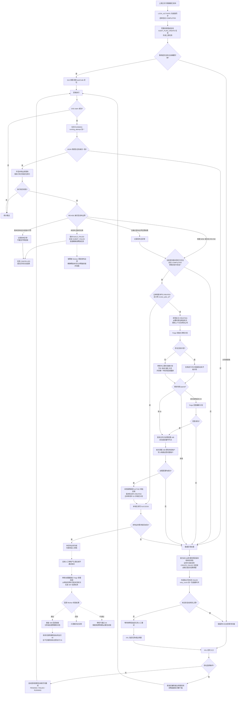

[业务逻辑专辑](/knowledge/business-logic/) / 居民收益付款 / S05

说明锁同步后的审核计划创建、远程配置、本地审批实例、状态推进、重试与回调边界，附逐章原文对照。本文保留原文 12 章，正文连续展开，原文对照与流程源码按需展开。

**前置阅读：** [S04 · 账单锁激活任务](/knowledge/business-logic/resident-income/s04-账单锁激活任务/)

**快速阅读：** [任务概览](#ch-1) · [异常与重复执行](#ch-8) · [完整流程](#ch-10) · [证据边界](#ch-11) · [源码索引](#source-path-index)

<div class="business-logic-article">

<div id="story"></div>

<div id="intro-extra-1"></div>

## 先用一笔付款单串起主线

**以下是帮助理解的假设场景，不是实际运行数据。** 一名业务用户此前提交了居民收益付款单。假设这次提交对应的版本主键是 `3003`，付款单归属于某个合作方，合作方档案中配置了运营经理 A 和运营经理 B。

此时，上游已经把这次付款的正式数据构建并发布，也完成了**锁同步**——把发布后需要同步的账单锁处理到位。选单会话已经进入 `COMPLETED`，但这只说明上游完成，并不说明审核流程已经准备好。系统还需要给这次已发布版本建立审核计划、找到 A/B 对应的审批节点、配置审批人，并在金融服务本地记录“这份计划审核的是哪一版付款数据、哪一轮提交”。

这就是本任务接手的位置。上游完成锁同步时，会在数据库里留下一条审核创建任务。事务提交后，系统可以主动唤醒执行者；主动唤醒不可用时，任务仍在数据库里，后续可以由定时扫描处理，也可以按任务编码或业务键指定重试。

执行者不会直接冲去创建计划。它先争取这条任务的执行权，再确认：版本确实已经发布、主单当前生效的还是这一版、提交轮次对应、选单会话已完成。通过后，才向审核中心创建或复用计划，先配置运营经理 A，再配置运营经理 B。远程配置和本地写入都成功后，系统建立或复用**审批实例**——金融服务用来关联付款版本、审批轮次和审核计划的一条本地记录，并将付款单推进到 `UNDER_REVIEW(20)`，即“审核中”。

**走到这里，本任务就结束了：它没有审核通过这张付款单，也没有支付任何款项。** 后面要由审核操作产生结论，再由独立的审核回调任务继续处理。中间失败时，数据库任务通常会记录失败次数并等待重试；但远程审核中心已经提交的修改，不会随着金融服务本地事务一起撤销。

下面仍按原文的 **1—12 章**展开。先理解每一步在业务上做什么，再对照真实方法、字段和状态。

> **阅读依据**：附件《S05-residentIncomePaymentSelectionAuditPlanCreateAsyncTask-源码梳理.md》，原文分析日期为 **2026-09-08**。本阅读版只改写附件，没有重新读取项目仓库、连接数据库、调用接口或运行任务。文中的“源码结论”“已核对”“未验证”均指原文的分析范围，而不是本次新增验证。
>
> **编号提醒**：原文明确说“按要求归档到 S03”，但源码阶段是 **S05 / S05\_AUDIT\_PLAN\_CREATE**，附件文件名也使用 S05。本版保留这个差异，不替原文统一编号；它不是同目录里的提交构建任务。

<details class="original">
<summary>原文对照 · 标题与分析说明 · 保留归档 S03 与源码 S05 的差异</summary>

<div id="original-meta-extra-1"></div>

### residentIncomePaymentSelectionAuditPlanCreateAsyncTask 源码梳理

> 分析日期：2026-09-08。依据当前本地源码、Mapper XML、枚举和 SQL 脚本；未连接数据库、未调用线上接口、未触发任务。
>
> 本文按要求归档到 **S03**。源码中的阶段编号是 **S05 / S05\_AUDIT\_PLAN\_CREATE**，不能与同目录中的提交构建任务混为一谈。

</details>

<div id="ch-1"></div>

## 1. 任务概览

这条链路可以理解成：**给已经发布、并且锁同步已经完成的付款版本办理“进入审核”的手续。**

它采用的是**持久化异步任务**：待办事项先保存到数据库，而不是只留在某个线程的内存里；之后再由执行者读取并处理。这里的 **XXL-Job** 是定时任务调度入口，既支持批量扫描，也支持指定任务补偿。源码中的 **Handler** 是供调度平台识别、调用的处理器名称，不代表已知线上调度频率。

| 要了解的事情 | 原文对应的实现与边界 |
| --- | --- |
| 调度处理器名称 | `residentIncomePaymentSelectionAuditPlanCreateAsyncTask` |
| 调度入口类 | `ResidentIncomePaymentSelectionAuditPlanCreateJob` |
| 真正消费任务的服务 | `SelectionAuditPlanCreateAsyncTaskServiceImpl` |
| 创建审核计划的主业务方法 | `FiResidentIncomePaymentOrderServiceImpl.createPublishedOrderAuditPlan(paymentOrderVersionId)` |
| 数据库任务类型 | `RESIDENT_INCOME_PAYMENT_AUDIT_PLAN_CREATE` |
| 任务业务场景 | `AUDIT_PLAN_CREATE` |
| 一次处理的业务单位 | 一条 `fi_resident_income_payment_order_version` 提交版本，**不是一张电站账单** |
| 正常接手条件 | 主单和版本都已发布；选单会话已经完成发布后的锁同步 |
| 正常完成结果 | 审核计划与 A/B 审批人准备完成；本地审批实例为 `ACTIVE`；主单为 `UNDER_REVIEW(20)`；任务为 `SUCCESS(2)` |
| 一批任务怎样执行 | 先查有限条候选任务，再用普通 `for` 循环一条一条处理；不是批内并行执行 |
| 每批数量 | 默认 **50**；`maxTaskCount <= 0` 也按 **50**；上限 **200** |
| 自动失败上限 | 默认累计失败 **3 次**，实际以任务行的 `max_retry_count` 为准 |
| 运行中任务何时有资格被接管 | `update_time <= 当前时间 - 10 分钟`，而且必须通过数据库 **CAS（比较并交换：只有数据库中的旧值仍符合条件，才允许更新）** |
| 线上每多久调一次、有几个实例、开关是否启用 | **暂时无法确认**。Java 的 `@XxlJob` 只声明 Handler，没有提供 XXL 管理端实际配置 |

这里的 `ACTIVE` 表示本地审批实例处于活动状态；`SUCCESS` 表示这条异步任务处理成功。任务状态还包括 `PENDING(0)`（待执行）、`RUNNING(1)`（执行中）、`FAILED(3)`（失败）和 `CANCELLED`（取消）。这些任务状态与审批实例状态不是同一张表上的同一个字段，也都不代表已经付款。

<div id="chapter-1-extra-1"></div>

### 原文读取的代码基线

原文分析使用了两个本地仓库：

| 仓库 | 分支 | HEAD |
| --- | --- | --- |
| `zxbaif` | `Ian/review/01` | `a1bfacbeb6dfc239d577bd66bf78cd9eb2482efa` |
| `zxbaie` | `zx_test_250330` | `21aac5b4821de7e7ae1bd660f896b3e890115cfc` |

**HEAD** 是当时仓库指向的提交标识。审核中心与合作方档案的实现位于 `zxbaie`。

但仅拿这两个提交标识，不能完整还原原文的分析现场：`zxbaif` 当时有未提交修改，涉及 `ResidentIncomePaymentFencedExecutionTemplate.java`、其实现类和 `SelectionFilterAllAsyncTaskServiceImpl.java`。原文使用的是读取时的**工作区内容**，尤其是本任务实际调用的事务模板，而不只是 HEAD 中已经提交的内容。

这两份本地源码可以解释调用方和服务端怎样实现，**不能证明部署环境用了同一组代码，也不能证明对应 DDL（数据库表结构、索引变更脚本）已经执行**。

**原文源码定位**：[Job](#source-path-1)；[消费服务](#source-path-2)。

<details class="original" id="source-1">
<summary>原文对照 · 第 1 章：任务概览</summary>

<div id="original-ch-1"></div>

### 1. 任务概览

**这是一条“付款单已经发布且锁同步完成后，把该版本送入审核”的持久化异步消费链路：创建或复用审核中心计划、配置运营经理 A/B 审批人、建立本地审批实例，并把付款单推进为“审核中”。XXL-Job 提供定时扫描和指定任务补偿入口。**

| 项目 | 源码结论 |
| --- | --- |
| XXL Handler | `residentIncomePaymentSelectionAuditPlanCreateAsyncTask` |
| 入口类 | `ResidentIncomePaymentSelectionAuditPlanCreateJob` |
| 消费服务 | `SelectionAuditPlanCreateAsyncTaskServiceImpl` |
| 主业务方法 | `FiResidentIncomePaymentOrderServiceImpl.createPublishedOrderAuditPlan(paymentOrderVersionId)` |
| 持久化任务类型 | `RESIDENT_INCOME_PAYMENT_AUDIT_PLAN_CREATE` |
| 任务业务场景 | `AUDIT_PLAN_CREATE` |
| 处理单位 | 一条 `fi_resident_income_payment_order_version` 提交版本，不是一张电站账单 |
| 正常业务起点 | 主单、版本均已发布，选单会话已完成发布后的锁同步 |
| 正常业务终点 | 审核计划和 A/B 审批人准备完成，本地审批实例为 `ACTIVE`，主单进入 `UNDER_REVIEW(20)`，任务为 `SUCCESS(2)` |
| 批量执行方式 | 单次先取有限条任务，再用普通 `for` 循环逐条执行 |
| 单次条数 | 默认 50；`maxTaskCount <= 0` 也使用 50；最高 200 |
| 自动失败上限 | 默认累计失败 3 次；具体以任务行 `max_retry_count` 为准 |
| RUNNING 接管门槛 | `update_time <= 当前时间 - 10 分钟`，并且仍须通过数据库 CAS |
| 调度频率、实例数、线上开关 | **暂时无法确认**，Java 的 `@XxlJob` 只定义 Handler，未给出 XXL 管理端的实际调度配置 |

本次读取的代码基线：

- `zxbaif`：分支 `Ian/review/01`，HEAD `a1bfacbeb6dfc239d577bd66bf78cd9eb2482efa`。
- `zxbaie`：分支 `zx_test_250330`，HEAD `21aac5b4821de7e7ae1bd660f896b3e890115cfc`；审核中心和合作方档案实现位于该仓库。
- `zxbaif` 存在未提交修改，包括 `ResidentIncomePaymentFencedExecutionTemplate.java`、其实现类和 `SelectionFilterAllAsyncTaskServiceImpl.java`。本文采用读取时的工作区内容，尤其是当前任务真实调用的事务模板，不能仅用 HEAD 还原全文结论。
- 两个仓库的本地源码能说明调用方和服务端实现，但不能证明部署环境使用了这一组代码或已执行相应 DDL。

入口证据：[Job](#source-path-1)、[消费服务](#source-path-2)。

</details>

<div id="ch-2"></div>

## 2. 业务目的

先把两个容易混淆的完成条件拆开：

| 完成条件 | 实际说明了什么 | 没有说明什么 |
| --- | --- | --- |
| 正式付款数据已生成并发布 | 本次提交的正式数据已就位 | 审核中心的计划和审批人未必已准备好 |
| 审核流程已创建好 | 审核计划、审批人以及本地审核关联已准备好 | 还没有得出审批结论，更不代表付款完成 |

当前链路的顺序是：**先构建并发布正式数据，再同步锁，最后创建审核计划。** 因而，大批量正式明细不必一直留在提交请求中，等待审核中心调用成功。这里是在解释原文已经描述的处理顺序，不是在推测其他设计动机。

本任务具体承担三件事。

**第一，把已发布付款单交给正确的人审核。** 审核计划存在还不够，运营经理 A/B 两个业务节点也必须绑定到付款单所属合作方档案中的运营经理。审批人不是本任务随意选择的用户，而是来自合作方档案的配置。

**第二，让审核创建失败后有地方继续接着做。** 审核中心、合作方档案、节点用户接口或者本地写入失败时，数据库中仍有任务记录。之后可以靠定时扫描，或指定任务重试继续处理，而不是只能依赖第一次调用成功。

**第三，记清本次审核究竟审核哪一版、哪一轮。** 本地审批实例保存 `data_version`（付款数据版本）、`submit_round`（付款单提交轮次）、`approval_attempt`（审批创建轮次）、`review_plan_id`（审核计划 ID）。后续回调借助这些字段，区分当前审核与历史审核，避免把旧结论直接套到新版本上。

源码注释多次称它为“补偿”，但**它也负责首次创建**。上游锁激活完成后会直接生成 `PENDING` 任务，不要求主单先进入 `CREATE_FAILED`（审核计划创建失败）。自动扫描也没有 `audit_plan_status = CREATE_FAILED` 这个筛选条件。

正常路径的职责边界同样重要：它**不重新选单、不重新计算居民收益、不重建付款单正式明细、不在本任务中完成付款**。业务终点就是“进入审核”。

<details class="original" id="source-2">
<summary>原文对照 · 第 2 章：业务目的</summary>

<div id="original-ch-2"></div>

### 2. 业务目的

付款单的“正式数据已经生成并发布”和“审核流程已经创建好”是两个不同的完成条件。当前链路先构建、发布正式数据，再同步锁，最后创建审核计划。这样，大批量正式明细无需在审核中心调用成功之前一直停留在提交请求中。

本任务解决三个具体问题：

1. **把已发布付款单交给正确的人审核。** 除了创建审核计划，还必须将运营经理 A/B 业务节点绑定到付款单所属合作方档案中的运营经理。
2. **承接审核创建故障的重试。** 审核中心、合作方档案、节点用户接口或本地写入出错时，留下任务事实，后续通过定时扫描或指定任务重试继续处理。
3. **固定本次审核对应的版本与轮次。** 本地审批实例保存 `data_version`、`submit_round`、`approval_attempt`、`review_plan_id`，后续审核回调据此识别当前审核和历史回调。

虽然类注释多次使用“补偿”一词，但它**也负责首次创建**：锁激活完成后直接生成 `PENDING` 的审核创建任务，并不要求主单先发生 `CREATE_FAILED`。自动扫描也没有 `audit_plan_status = CREATE_FAILED` 条件。

正常路径不会重新选单、重新计算居民收益、重建付款单正式明细，也不会在本任务中完成付款。它的业务完成点是“进入审核”。

</details>

<div id="ch-3"></div>

## 3. 核心调用链

<div id="sec-3-1"></div>

### 3.1 上游：任务记录从哪里来

这条任务不是扫描器临时“猜”出来的，而是上一步处理完成时正式交接下来的。

上一步是锁激活任务。它完成已发布版本的锁同步后，一边交接审核创建任务，一边把自己标记为成功。真实调用顺序如下：

```text
SelectionLockActivateAsyncTaskServiceImpl.executeSingleTask
  → SelectionSubmitBuildService.activatePublishedLocks(versionId)
  → ResidentIncomePaymentLockActivateHandoffServiceImpl.completeAndHandoff
      → buildAuditPlanCreateSeed(versionId)
      → ResidentIncomePaymentSafeSeedServiceImpl.acceptOrReuse
          → FiAsyncTaskMapper.insertIgnore
          → queryByTaskCode 回读、校验 taskType/businessKey
      → 写交接审计记录
      → 将 LOCK_ACTIVATE 任务改为 SUCCESS
      → registerAfterCommit(S05_AUDIT_PLAN_CREATE, taskCode)
```

这里的 **Seed（任务种子：用于可靠受理一条任务的初始信息）** 最终会落成数据库任务。`acceptOrReuse` 表示“受理新任务，或者复用已经存在的任务”。`insertIgnore` 之后还要回读并校验身份，不是忽略插入冲突以后就不管了。

交接有一个本地事务边界：**审核创建任务可靠受理、交接审计记录、上一步任务成功，放在同一个事务中。** 事务提交以后，才尝试在当前进程中主动唤醒后续执行者。唤醒失败不会撤销已经提交的数据库任务记录。

任务身份稳定地由提交版本 ID 生成：

```text
business_key = AUDIT_PLAN_CREATE:<paymentOrderVersionId>
task_code    = RIPAP:<business_key 的 UTF-8 小写 32 位 MD5>
task_data    = {"paymentOrderVersionId": <版本主键>, "taskScene": "AUDIT_PLAN_CREATE"}
```

`business_key` 是业务层识别这次待办的键；`task_code` 是任务编码。**MD5** 在这里用于把业务键生成固定长度的标识：对 UTF-8 编码的业务键计算摘要，使用小写 32 位表示，再加 `RIPAP:` 前缀。

沿用开头的假设版本 `3003`，它的业务键就是 `AUDIT_PLAN_CREATE:3003`。这只是示例，不表示真实环境存在该版本。

生产者创建任务时会设置：`task_status=0`、`retry_count=0`、`max_retry_count=3`、立即可执行时间、`deleted=0`。

重复交接时，系统复用原任务，而不是把任务重新初始化。因此，**已经成功或取消的任务不会被改回待执行；失败任务原有的失败次数和退避时间也不会重置**。所谓**退避**，就是失败后先延迟一段时间，再允许自动重试。

**原文源码定位**：[锁激活后的交接](#source-path-3)；[任务生产者](#source-path-4)；[安全受理及复用](#source-path-5)。

<div id="sec-3-2"></div>

### 3.2 定时入口：解析参数并选择消费方式

调度入口先判断这次是“扫描一批到期任务”，还是“只处理指定身份的任务”：

```text
ResidentIncomePaymentSelectionAuditPlanCreateJob
  .residentIncomePaymentSelectionAuditPlanCreateAsyncTask(param)
  → parseJobParam / unwrapPayload
  → executeJob
      ├─ 没有 taskCode、businessKey 选择条件
      │    → executePendingTasks(maxTaskCount)
      └─ 任一选择条件存在
           → executeManualRetry(taskCodes, businessKeys, maxTaskCount)
```

Job 接受直接 JSON，也接受由 `data` 包装的 JSON 对象或字符串。例如：

```json
{"maxTaskCount": 50}
```

这是批量扫描的参数示例。下面是指定一个业务键的示例：

```json
{"businessKey": "AUDIT_PLAN_CREATE:3003", "maxTaskCount": 1}
```

也可以使用 `data` 包装：

```json
{"data": {"businessKeys": ["AUDIT_PLAN_CREATE:3003"], "maxTaskCount": 1}}
```

这些示例中的 `3003` 都是假设值。**调度参数的合法名称是 `taskCode/taskCodes/businessKey/businessKeys`，不是服务方法中的 `taskCodeList/businessKeyList`。** 方法形参叫什么，与外部 JSON 应该写什么，是两回事。

单值和多值参数都会去掉空白，服务层还会进一步去重。同时指定任务编码与业务键时，规则是 **OR 并集**：满足其中任意一个维度就能命中，并不要求两者同时匹配。

这里还有一个不能忽略的异常行为：**参数解析失败只记警告，然后按空参数继续执行，最终进入默认自动扫描；不是拒绝执行。** 例如，原本想精确重试，JSON 却写错了，就可能变成扫描默认的 50 条任务。业务任务内部的 `task_data` JSON 无效则是另外一种错误，处理结果见第 8.1 节，不能与 Job 入参解析失败混淆。

<div id="sec-3-3"></div>

### 3.3 Worker：取得执行权，再进入业务事务

**Worker（任务执行者）** 是真正处理任务的那段消费逻辑。它面对的第一个问题是：主动唤醒和定时扫描可能都看见同一条任务，谁有资格实际执行？

处理办法是先 **claim（认领：在数据库中抢到本次执行权）**，再进入受保护的业务事务。整体顺序是：

```text
executePendingTasks / executeManualRetry / kickExact
  → 查询候选任务
  → executeTaskList（逐条循环）
  → executeSingleTask
      → claimTask
          → FencedExecutionTemplate.claim
          → claimResidentIncomePaymentFencedTask（原子 UPDATE）
      → parseTaskDto + validateTaskIdentity
      → executeFencedWrite（本地事务 + 任务行 FOR UPDATE）
          → reviseInvariantGuard.inspectVersion
          → 异常 REVISE 分流，或继续
          → createPublishedOrderAuditPlan(versionId)
          → assertSuccess
          → markTaskSuccess
      → 汇总成功 / 失败 / 跳过
  → inspectInvariants
  → 返回本轮执行摘要
```

`REVISE` 在这里表示修订模式，与普通新建模式 `NEW` 区别开；具体守卫规则见第 4.5 节。`inspectInvariants` 是一致性约束巡检的调用，但“调用了巡检”不等于一定配置了有效检查规则，第 9.6 节会保留这个限制。

认领成功后，任务的 `running_attempt` 增加 1，并生成 **ClaimToken（本次执行权凭证）**。后续重要写入会核对：任务 ID、任务类型、状态仍为 `RUNNING`，并且 `running_attempt` 仍是本次认领取得的值。

这种机制叫 **fencing（执行权隔离：用变化的执行轮次，阻止旧执行者覆盖新执行者的结果）**。可以把 `running_attempt` 理解成这次执行拿到的号码，但它不是业务上的审批轮次。

`executeFencedWrite` 还会执行 **`FOR UPDATE`（在当前事务中锁住查询到的任务行）**，任务行锁一直持有到业务事务结束。不能只看“有 token”，却漏掉它同时持有数据库行锁这一事实。

本任务实际调用的是 `claim(..., null)`，**没有取得选单会话的额外业务租约**。这里的**租约**指另一套与选单会话相关的执行资格机制；原文只强调它没有在本任务中使用。不能把 `SESSION_BUILD` 的 session 构建租约机制套到这里，也不能把技术执行轮次与业务审批轮次混成一个字段。

**原文源码定位**：[单条执行与异常分支](#source-path-6)；[事务模板](#source-path-7)；[claim 与 fencing SQL](#source-path-8)。

<div id="sec-3-4"></div>

### 3.4 主业务：从版本校验到审核中

拿到执行权后，业务方法还要逐步确认“这份待办仍然对应当前应该审核的付款版本”。`createPublishedOrderAuditPlan` 的实际顺序如下，不能随意调换。

**第 1 步：加载并验证当前发布身份。** 读取版本、付款单和会话，检查它们是否匹配、是否已达到可建流状态。详细条件见第 4 章。这里的**建流**就是建立审核流程，不是建立付款明细。

**第 2 步：判断本地是否已经完成。** 必须同时满足：主单有 `review_plan_id`，主单 `audit_plan_status=CREATED`，版本 `audit_plan_status=CREATED`，才直接返回成功。它发生在上下文合法性校验**之后**，不是看到一个计划 ID 就无条件跳过。

**第 3 步：本地标记“创建中”。** 主单和版本的 `audit_plan_status` 更新为 `CREATING`；版本在需要时递增 `approval_attempt`。主单设置 `business_status=10`，并递增 `version`。这里的 **乐观锁字段 `version`** 是写入时识别记录是否被别人修改的计数，不是正式付款数据版本。

**第 4 步：重新读取上下文。** 因为审批轮次可能刚刚变过，后续审批实例要使用更新后的轮次，不能继续拿进入方法时读取的旧对象。

**第 5 步：确定项目公司。** 查询这张付款单全部未删除的项目汇总，在 Java 中保留 `data_version=target_data_version` 的记录，然后取第一条的 `project_company_id`。它不是“每个项目公司都建一条审核计划”。排序和空结果规则见第 4.4 节。

**第 6 步：组装并初始化远程计划。** 请求包含 `fromId=付款单ID`、`fromNum=付款单号`、`type=RESIDENT_INCOME_PAYMENT_REVIEW`、`stationid=0`、资产管理应用类型，还会带上项目公司和提交用户上下文。这里的 **Feign（服务间远程接口调用）** 把请求发送给审核中心；金融服务本地写数据库，与审核中心写数据库不是同一个事务。

**第 7 步：取得审核计划 ID。** 优先使用远程成功响应中的 `planId`。只有“响应成功但缺 ID”时，才调用 `queryLatestReviewBusinessPlan` 回查。回查后仍没有 ID，就算失败；不能把所有失败响应都理解成会进入回查补救。

**第 8 步：替换运营经理 A/B 审批人。** 实时读取合作方档案中的用户 ID，通过固定节点编号定位 A/B 业务节点。清理节点原角色、原用户后，写入各自的档案用户，先 A 后 B。

**第 9 步：保存本地审核结果。** 幂等写入审批实例，版本改为 `CREATED`，主单改为 `CREATED`，保存 `review_plan_id`，并进入 `UNDER_REVIEW(20)`。**幂等**在这里指按审核身份识别重复记录，避免相同处理直接重复插入；它不等于跨服务“恰好执行一次”。

**第 10 步：完成数据库任务。** Worker 在同一个本地业务事务中将异步任务写为 `SUCCESS`。

所以，“审核中心初始化接口返回成功”只是其中一步。**计划 ID 没拿到、A/B 配置没完成、本地结果没写成功，任何一项缺失，任务都不能算正常完成。**

**原文源码定位**：[主业务入口](#source-path-9)；[上下文及创建中状态](#source-path-10)；[本地创建成功写入](#source-path-11)。

<details class="original" id="source-3">
<summary>原文对照 · 第 3 章：核心调用链</summary>

<div id="original-ch-3"></div>

### 3. 核心调用链

<div id="original-sec-3-1"></div>

#### 3.1 上游：任务记录从哪里来

```text
SelectionLockActivateAsyncTaskServiceImpl.executeSingleTask
  → SelectionSubmitBuildService.activatePublishedLocks(versionId)
  → ResidentIncomePaymentLockActivateHandoffServiceImpl.completeAndHandoff
      → buildAuditPlanCreateSeed(versionId)
      → ResidentIncomePaymentSafeSeedServiceImpl.acceptOrReuse
          → FiAsyncTaskMapper.insertIgnore
          → queryByTaskCode 回读、校验 taskType/businessKey
      → 写交接审计记录
      → 将 LOCK_ACTIVATE 任务改为 SUCCESS
      → registerAfterCommit(S05_AUDIT_PLAN_CREATE, taskCode)
```

交接方法有本地事务：审核创建任务的可靠受理、交接记录和上一步任务成功处于同一个事务内。事务提交后才发起进程内主动唤醒；唤醒失败不撤销已提交的任务记录。

任务身份由提交版本 ID 稳定生成：

```text
business_key = AUDIT_PLAN_CREATE:<paymentOrderVersionId>
task_code    = RIPAP:<business_key 的 UTF-8 小写 32 位 MD5>
task_data    = {"paymentOrderVersionId": <版本主键>, "taskScene": "AUDIT_PLAN_CREATE"}
```

生产者设置 `task_status=0`、`retry_count=0`、`max_retry_count=3`、立即可执行时间及 `deleted=0`。重复投递时使用原任务，不会把已成功、已取消任务重新置为待执行，也不会重置已失败任务的次数和退避时间。

证据：[锁激活后的交接](#source-path-3)、[任务生产者](#source-path-4)、[安全受理及复用](#source-path-5)。

<div id="original-sec-3-2"></div>

#### 3.2 定时入口：解析参数并选择消费方式

```text
ResidentIncomePaymentSelectionAuditPlanCreateJob
  .residentIncomePaymentSelectionAuditPlanCreateAsyncTask(param)
  → parseJobParam / unwrapPayload
  → executeJob
      ├─ 没有 taskCode、businessKey 选择条件
      │    → executePendingTasks(maxTaskCount)
      └─ 任一选择条件存在
           → executeManualRetry(taskCodes, businessKeys, maxTaskCount)
```

支持直接 JSON，也支持 `data` 包装后的 JSON 对象或字符串：

```json
{"maxTaskCount": 50}
```

```json
{"businessKey": "AUDIT_PLAN_CREATE:3003", "maxTaskCount": 1}
```

```json
{"data": {"businessKeys": ["AUDIT_PLAN_CREATE:3003"], "maxTaskCount": 1}}
```

上面的 `3003` 仅为参数示例，不代表环境中真实存在的版本。Job 支持的参数名是 `taskCode/taskCodes/businessKey/businessKeys`，不是服务方法参数名 `taskCodeList/businessKeyList`。

单值、多值都会去掉空白；服务层进一步去重。两个维度同时指定时是 **OR 并集**。参数解析异常时仅记录警告，随后使用空参数，最终进入默认自动扫描；不会直接拒绝执行。

<div id="original-sec-3-3"></div>

#### 3.3 Worker：取得执行权，再进入业务事务

```text
executePendingTasks / executeManualRetry / kickExact
  → 查询候选任务
  → executeTaskList（逐条循环）
  → executeSingleTask
      → claimTask
          → FencedExecutionTemplate.claim
          → claimResidentIncomePaymentFencedTask（原子 UPDATE）
      → parseTaskDto + validateTaskIdentity
      → executeFencedWrite（本地事务 + 任务行 FOR UPDATE）
          → reviseInvariantGuard.inspectVersion
          → 异常 REVISE 分流，或继续
          → createPublishedOrderAuditPlan(versionId)
          → assertSuccess
          → markTaskSuccess
      → 汇总成功 / 失败 / 跳过
  → inspectInvariants
  → 返回本轮执行摘要
```

`claim` 成功后，`running_attempt` 加一，生成 `ClaimToken`。后续关键写入按任务 ID、类型、`RUNNING` 状态和本次 `running_attempt` 验证执行权。`executeFencedWrite` 还会锁住这条任务记录，直到业务事务结束。

本任务调用 `claim(..., null)`，**没有取得选单会话的额外业务租约**。不能把 `SESSION_BUILD` 的 session 构建租约机制套用到这里。任务的数据库执行轮次与业务的审批轮次也是不同字段，见第 5 节。

证据：[单条执行与异常分支](#source-path-6)、[事务模板](#source-path-7)、[claim 与 fencing SQL](#source-path-8)。

<div id="original-sec-3-4"></div>

#### 3.4 主业务：从版本校验到审核中

`createPublishedOrderAuditPlan` 按以下顺序完成处理：

1. **加载版本、付款单、会话并验证当前发布身份。** 具体规则见第 4 节。
2. **检查本地是否已完成。** 主单有 `review_plan_id`，且主单、版本的 `audit_plan_status` 都为 `CREATED` 时，直接返回成功。这个检查发生在上下文合法性校验之后。
3. **标记创建中。** 版本和主单的 `audit_plan_status` 更新为 `CREATING`；版本需要时递增 `approval_attempt`；主单设置 `business_status=10` 并递增乐观锁字段 `version`。
4. **重新读取上下文。** 后续审批实例使用刚更新后的审批轮次，而非进入方法时的旧对象。
5. **确定项目公司。** 查询本付款单全部未删除项目汇总，在 Java 中保留 `data_version=target_data_version` 的记录，再取第一条 `project_company_id`。
6. **组装并初始化远程计划。** `fromId=付款单ID`、`fromNum=付款单号`、`type=RESIDENT_INCOME_PAYMENT_REVIEW`、`stationid=0`、资产管理应用类型，并带上项目公司和提交用户上下文。
7. **取得计划 ID。** 优先取远程成功响应中的 `planId`；成功响应缺 ID 时调用 `queryLatestReviewBusinessPlan` 回查；仍无 ID 则失败。
8. **替换运营经理 A/B 的审批人。** 从合作方档案实时取用户 ID，按固定节点编号定位业务节点，清理原角色和原用户，再写入各自的档案用户。
9. **落本地审核结果。** 幂等写入审批实例，版本改 `CREATED`，主单改 `CREATED`、`review_plan_id` 和 `UNDER_REVIEW(20)`。
10. **完成任务。** Worker 在同一本地业务事务中把异步任务写为 `SUCCESS`。

因此，“远程初始化接口成功”还不足以说明本任务成功；计划 ID 获取、A/B 配置和本地落库缺少任何一项，任务都不能完成。

证据：[主业务入口](#source-path-9)、[上下文及创建中状态](#source-path-10)、[本地创建成功写入](#source-path-11)。

</details>

<div id="ch-4"></div>

## 4. 数据筛选规则

这一章要分清三道关：**先查出候选任务，再争取任务执行权，最后校验业务对象。** 第一关查到了，不代表后两关一定通过；手工指定任务也不会绕过全部检查。

<div id="sec-4-1"></div>

### 4.1 自动扫描 `fi_async_task`

自动扫描查的是任务表，不是账单表，也不是“所有还没审核的付款单”。下面 SQL 是原文根据 **QueryWrapper（Java 代码中的查询条件构造器）** 还原的逻辑表达，**不是从真实数据库抓取的查询结果**：

```sql
SELECT *
FROM fi_async_task
WHERE deleted = 0
  AND task_type = 'RESIDENT_INCOME_PAYMENT_AUDIT_PLAN_CREATE'
  AND task_status IN (0, 3, 1)
  AND (next_execute_time IS NULL OR next_execute_time <= :now)
  AND IFNULL(retry_count, 0) < IFNULL(max_retry_count, 3)
ORDER BY next_execute_time ASC, retry_count ASC, id ASC
LIMIT :maxTaskCount;
```

把括号和边界展开看，任务必须**同时**满足以下条件：没有删除、类型正是审核创建任务、状态属于 `PENDING(0)` / `FAILED(3)` / `RUNNING(1)` 三者之一、执行时间已到或未设置、累计失败次数严格小于上限。

其中只有执行时间这一组内部是 **OR**：`next_execute_time IS NULL` **或** `next_execute_time <= :now`。刚好等于当前时间可以入选。失败次数则用严格的 **`<`**，达到上限就不再自动入选；`retry_count` 为空按 0，`max_retry_count` 为空按 3。

排序顺序不能省略：先按下次执行时间升序，再按失败次数升序，最后按 ID 升序；然后取 `maxTaskCount` 限定的候选窗口。数量规则仍是默认 50、非正数按 50、最多 200。

这里**没有**联表筛付款单，**没有**账单月份、付款金额、电站范围条件，也**没有**在 SELECT 阶段排除尚未超时的 `RUNNING`。运行中任务能否被接管，要等下一步 claim 的 UPDATE 判断。这也是第 9.3 节候选窗口风险的来源。

<div id="sec-4-2"></div>

### 4.2 手工指定任务

手工入口解决的是：“我已经知道这条任务，想立即再处理一次，不想等退避时间，或者它已经耗尽自动次数。”

它放宽的是时间和次数，不是发布身份、任务状态和并发执行权的全部限制。

| 比较项 | 自动扫描 | 手工指定 |
| --- | --- | --- |
| 删除标识与任务类型 | 必须 `deleted=0`，且为固定审核创建类型 | 同样必须满足 |
| 按什么选任务 | 不指定身份，扫描到期任务 | `task_code IN (...) OR business_key IN (...)`；只传一种，就只按那一种 |
| SELECT 阶段状态 | 限 `PENDING/FAILED/RUNNING` | 不限制，可能查到 `SUCCESS/CANCELLED` |
| SELECT 阶段退避时间和失败次数 | 都限制 | 都不限制 |
| claim 阶段状态 | 仍只允许 `PENDING/FAILED/RUNNING` | **同样**只允许这三个状态 |
| claim 阶段到期时间和失败次数 | 再检查一遍 | 跳过这两项 |
| claim 阶段接管 RUNNING | 必须 `update_time <= 当前时间 - 10 分钟` | 相同门槛，不强抢仍活跃的 Worker |
| 排序 | 下次执行时间、失败次数、ID，均升序 | ID 升序 |

沿用假设场景，`AUDIT_PLAN_CREATE:3003` 任务若已经 `FAILED`，即使仍在退避期，或者失败次数已经达到上限，手工入口也可以尝试认领。

但任务若已经 `SUCCESS` 或 `CANCELLED`，手工查询虽然可能查得到，claim 仍不会放行，最终统计为**跳过**。所以它不是“强制重建”或“复活已完成任务”的入口。

<div id="sec-4-3"></div>

### 4.3 claim 的最终条件

查询与更新之间可能发生竞争，所以数据库 UPDATE 会再检查一次条件。只有以下条件**同时成立**，认领才成功：

| 必须核对的内容 | 精确规则 |
| --- | --- |
| 任务身份 | ID、任务类型匹配，`deleted=0` |
| 当前状态 | 仍属于允许的 `PENDING/FAILED/RUNNING` 集合 |
| 执行轮次 | 数据库 `running_attempt` 等于本次查询时读到的值 |
| 自动入口的时间和次数 | 到期，且未达到失败上限；`MANUAL` 入口豁免这两项 |
| 已经 RUNNING 的任务 | 额外要求 `update_time <= 当前时间 - 10 分钟` |

“10 分钟门槛”包含恰好到达边界的情况，不能写成只有严格超过 10 分钟才允许。它只是取得接管资格的条件，还必须通过上面的其他检查。

成功后会写入 `RUNNING`，将 `running_attempt` 加 1，清空 `error_message`，更新 `update_time/update_user_id`。

这里的 `update_user_id` 比较特殊：写入的是形如 `audit-plan-create-<taskId>-<nanoTime>` 的 Worker 标识。**不能因为字段名含 user，就把它解释成操作人的业务用户 ID。**

还有一个原文未确认的数据库前提：Java 读取到 `running_attempt=null` 时会按 0 处理，但 SQL 使用直接比较和加一；数据库里的 null 并不等于 0。因此，Java 的空值处理不能保证数据库 UPDATE 就能匹配。该列是否满足非空和默认值约定，**暂时无法确认**，原文没有读取实际表结构。

**原文源码定位**：[自动与手工查询](#source-path-12)；[claim 参数](#source-path-13)。

<div id="sec-4-4"></div>

### 4.4 业务上下文校验

拿到任务执行权，只表示“可以尝试处理”，还不表示“这次版本可以送审”。业务层必须继续核对版本、主单、会话和审核状态。

| 数据对象 | 查询方式与放行条件 |
| --- | --- |
| 任务 JSON | `paymentOrderVersionId` 合法；`taskScene=AUDIT_PLAN_CREATE`；按版本 ID 重新计算的业务键、任务编码，必须与任务行完全一致 |
| 提交版本 | 按主键加载；必须存在，并且 `version_build_status=PUBLISHED` |
| 付款单主单 | 按版本的 `payment_order_id` 加载；必须存在；`build_status=PUBLISHED`；`current_publish_version=target_data_version`；`submit_round=target_submit_round` |
| 选单会话 | 按版本的 `session_id` 加载；`status=COMPLETED`；会话 `submit_attempt=版本.submit_attempt`；不能还在 `PUBLISHED_LOCK_SYNCING`（已发布、锁同步中） |
| 审核计划状态 | 主单与版本各自的状态，都必须属于 `NOT_CREATED/CREATING/CREATE_FAILED/CREATED`；其他值或 null 不放行 |
| 项目汇总 | SQL 查询相同 `payment_order_id` 且 `deleted=0` 的记录，按 `project_company_id,id` 升序；Java 再筛目标数据版本，取第一条；没有记录时项目公司为 null |
| 审批实例去重 | 按 `payment_order_id + data_version + approval_attempt + review_plan_id` 查一条；已有则不再插入；查询没有额外按 `approval_status` 限制 |

同一行中的条件需要**同时满足**。例如，主单“已经发布”不够，当前生效版本和提交轮次也必须分别匹配。否则，旧任务可能试图为不再当前生效的版本建立审核流程。

会话还有一个容易额外加错的限制：`COMPLETED` 校验检查状态和提交尝试，**不要求 `active_submit_id` 继续指向这个版本**。上游完成后，活动提交指针可以已经清空，不能把指针为空直接视为不合法。

项目公司选择也不是在 SQL 里直接按目标数据版本取一条：它先查主单的未删除项目汇总，**随后由 Java 筛版本，再取第一条**。没有目标版本的汇总时传入 null，这是当前行为；原文没有据此承诺后续审核初始化一定成功或一定失败。

审批实例的身份组合中包含 `approval_attempt` 和 `review_plan_id`，但去重查询没有 `approval_status=ACTIVE` 条件。这一点要与第 5 章正常路径的“ACTIVE 实例”描述一起保留，不能改写成系统一定会查出并修复一条 ACTIVE 实例。

**原文源码定位**：[会话完成校验](#source-path-14)；[项目汇总 SQL](#source-path-15)；[审批实例去重 SQL](#source-path-16)。

<div id="sec-4-5"></div>

### 4.5 REVISE 身份及发布边界

`REVISE` 修订模式多一道守卫：它不仅关心数据是否已经发布，还检查修订会话、版本、原付款单是否属于同一组合法身份。

触发条件是：**版本或会话任意一个 `mode=REVISE`**。一旦触发，必须同时满足：版本和会话都为 REVISE；版本、会话、付款单关联一致；会话 `creator_user_id` 与原单 `create_user_id` 都是正数，并且两者相等。

这不是只检查“两边用户 ID 相等”。两个非正数即使相等，也不满足原文规则。

**发布边界**可以理解成：版本发布事实、主单指针切换是否已经发生。守卫会根据这一边界，决定是允许失败补偿，还是只能记录事故并做非破坏性收尾。

| 遇到的情形 | 当前 Worker 的实际处理 | 不能误读成什么 |
| --- | --- | --- |
| 普通 `NEW`，或合法 `REVISE` | 继续校验发布上下文，再创建审核计划 | 不代表可以跳过后续校验 |
| 身份不合法，版本未发布，且主单指针未切换 | 原子标记版本 `BUILD_FAILED`、会话 `SUBMIT_FAILED`；投递 `INVALID_REVISE_SESSION` 锁释放任务；审核创建任务永久 `CANCELLED` | 不是继续自动重试这个审核创建任务 |
| 版本已经 `PUBLISHED`，但主单指针不是该版本 | 写发布异常标记；任务 `CANCELLED`；不创建计划、不释放已发布锁 | 不能为了补偿而释放已发布锁 |
| 身份不合法，但版本发布与主单指针切换均已完成 | 记录发布后权限事故，继续一致性收尾；仍须通过会话完成这类后续校验 | 不是忽略权限事故，也不是保证建流成功 |
| 主单指针已切换，但版本尚非 `PUBLISHED` | 守卫允许记录事故并继续非破坏性处理；随后主业务“版本必须已发布”的校验仍会失败 | 不能直接进入审核计划创建成功路径 |

永久拒绝分支返回的是 `false`，而不是通过抛异常回滚。这样，已经成功写入的补偿状态和任务取消结果可以提交。

这个提交能力也有条件：**分支内部的 CAS 与任务投递必须成功**。其中任何一步失败，仍然会进入普通异常回滚和任务失败路径，不能保证一定留下 `CANCELLED`。

**原文源码定位**：[REVISE 判断](#source-path-17)；[未发布失败补偿](#source-path-18)。

<details class="original" id="source-4">
<summary>原文对照 · 第 4 章：数据筛选规则</summary>

<div id="original-ch-4"></div>

### 4. 数据筛选规则

<div id="original-sec-4-1"></div>

#### 4.1 自动扫描 `fi_async_task`

以下 SQL 是按 QueryWrapper 还原的逻辑表达，不是数据库抓取结果：

```sql
SELECT *
FROM fi_async_task
WHERE deleted = 0
  AND task_type = 'RESIDENT_INCOME_PAYMENT_AUDIT_PLAN_CREATE'
  AND task_status IN (0, 3, 1)
  AND (next_execute_time IS NULL OR next_execute_time <= :now)
  AND IFNULL(retry_count, 0) < IFNULL(max_retry_count, 3)
ORDER BY next_execute_time ASC, retry_count ASC, id ASC
LIMIT :maxTaskCount;
```

注意：此处没有联表筛付款单，没有账单月份、付款金额或电站范围条件，也没有在 SELECT 阶段排除尚未超时的 `RUNNING` 任务。是否能接管正在运行的任务，要到后面的 claim UPDATE 才判断。

<div id="original-sec-4-2"></div>

#### 4.2 手工指定任务

| 条件 | 自动扫描 | 手工指定 |
| --- | --- | --- |
| `deleted=0`、固定任务类型 | 必须 | 必须 |
| 选择键 | 无，扫描到期任务 | `task_code IN (...) OR business_key IN (...)`；仅传一种就只按该维度 |
| SELECT 阶段状态限制 | `PENDING/FAILED/RUNNING` | 不限制，因而也可能查到成功或取消任务 |
| SELECT 阶段退避时间/失败次数 | 限制 | 不限制 |
| claim 阶段允许状态 | `PENDING/FAILED/RUNNING` | 同样仅允许这三个状态 |
| claim 阶段到期和失败次数 | 再校验一次 | 跳过这两项 |
| claim 阶段 RUNNING 超时门槛 | 仍须超过 10 分钟 | 同样必须满足，不强抢活跃 Worker |
| 排序 | 下次执行时间、失败次数、ID | ID 升序 |

所以，手工重试可以立即处理尚在退避期或已经耗尽次数的 `FAILED`，但不能通过这个入口复活 `SUCCESS/CANCELLED`。查询命中成功任务时，实际统计为跳过。

<div id="original-sec-4-3"></div>

#### 4.3 claim 的最终条件

数据库 UPDATE 同时要求：

- 任务 ID、任务类型、`deleted=0` 匹配；状态仍属于允许集合。
- `running_attempt` 等于查询时读到的值。
- 自动入口必须满足到期时间和次数上限；`MANUAL` 入口豁免这两项。
- 若当前状态已经是 `RUNNING`，则 `update_time` 必须早于或等于 10 分钟前。

成功写入 `RUNNING`、`running_attempt+1`、清空 `error_message`，更新 `update_time/update_user_id`。`update_user_id` 写入形如 `audit-plan-create-<taskId>-<nanoTime>` 的 Worker 标识；不要将其解释成操作人的业务用户 ID。

SQL 对 `running_attempt` 使用直接比较和加一，Java 虽把读取到的 null 当成 0，但数据库 null 并不等于 0。数据列是否符合非空及默认值约定，**暂时无法确认**；本次未读取实际表结构。

证据：[自动与手工查询](#source-path-12)、[claim 参数](#source-path-13)。

<div id="original-sec-4-4"></div>

#### 4.4 业务上下文校验

| 数据对象 | 查询和放行规则 |
| --- | --- |
| 任务 JSON | `paymentOrderVersionId` 合法；`taskScene=AUDIT_PLAN_CREATE`；按版本 ID 重算的业务键、任务编码必须与任务行完全一致 |
| 提交版本 | 按主键加载，必须存在，`version_build_status=PUBLISHED` |
| 付款单 | 按版本的 `payment_order_id` 加载，必须存在；`build_status=PUBLISHED`；`current_publish_version=target_data_version`；`submit_round=target_submit_round` |
| 选单会话 | 按版本的 `session_id` 加载，`status=COMPLETED`，`submit_attempt=版本.submit_attempt`。不能仍停留在 `PUBLISHED_LOCK_SYNCING` |
| 审核计划状态 | 主单、版本均须属于 `NOT_CREATED/CREATING/CREATE_FAILED/CREATED`，其他值或 null 不放行 |
| 项目汇总 | SQL：`payment_order_id` 相同且 `deleted=0`，按 `project_company_id,id` 升序；Java 再筛目标数据版本，取第一条；没有记录则项目公司为 null |
| 审批实例去重 | `payment_order_id + data_version + approval_attempt + review_plan_id` 查一条；存在则不再次插入。该查询没有额外按 `approval_status` 筛选 |

`COMPLETED` 校验只检查会话状态与提交尝试，不要求 `active_submit_id` 继续指向版本；上游完成后该活动指针可以已清空。

证据：[会话完成校验](#source-path-14)、[项目汇总 SQL](#source-path-15)、[审批实例去重 SQL](#source-path-16)。

<div id="original-sec-4-5"></div>

#### 4.5 REVISE 身份及发布边界

若版本或会话任一 `mode=REVISE`，守卫要求两者均为 REVISE，版本、会话、付款单关联一致，且会话 `creator_user_id` 与原单 `create_user_id` 均为正数并相等。

| 结果 | 当前 Worker 的实际行为 |
| --- | --- |
| 普通 NEW 或合法 REVISE | 继续校验发布上下文并创建审核计划 |
| 身份不合法，版本未发布且主单指针未切换 | 原子标记版本 `BUILD_FAILED`、会话 `SUBMIT_FAILED`，投递 `INVALID_REVISE_SESSION` 锁释放任务，审核创建任务永久置为 `CANCELLED` |
| 版本已经 `PUBLISHED`，但主单指针不是该版本 | 写发布异常标记，审核创建任务置 `CANCELLED`；不创建计划、不释放已发布锁 |
| 身份不合法，但版本发布与主单指针均已完成 | 记录发布后权限事故，继续完成一致性收尾；仍须通过会话已完成等后续校验 |
| 主单指针已切换，但版本尚非 `PUBLISHED` | 守卫允许记录事故并继续非破坏性处理，但随后主业务的“版本必须已发布”校验仍会失败；不能解读为可直接建流 |

永久拒绝分支会返回 `false`，而不是抛异常回滚，因此其成功写入的补偿状态、任务取消可以提交。若分支内部 CAS 或任务投递失败，则仍会进入普通异常回滚和任务失败路径。

证据：[REVISE 判断](#source-path-17)、[未发布失败补偿](#source-path-18)。

</details>

<div id="ch-5"></div>

## 5. 主要状态流转

一条审核创建任务同时涉及任务表、付款主单、提交版本、选单会话和审批实例。它们各有状态字段，不能把“任务运行中”“计划创建中”“付款单审核中”当成同一个概念。

<div id="sec-5-1"></div>

### 5.1 正常成功路径

先看正常完成时，各对象发生了什么：

| 对象 | 处理前允许的情况 | 中间动作 | 本地业务事务成功后 |
| --- | --- | --- | --- |
| 异步任务 | `PENDING(0)`、`FAILED(3)` 或满足超时门槛的 `RUNNING(1)` | claim 为 `RUNNING`，`running_attempt+1` | `SUCCESS(2)` |
| 版本审核状态 | `NOT_CREATED`、`CREATE_FAILED`，也兼容 `CREATING/CREATED` | 必要时转为 `CREATING`，递增 `approval_attempt` | `CREATED`，清空版本错误字段 |
| 主单审核状态 | 处于可恢复审核状态 | 必要时转为 `CREATING` | `CREATED`，保存 `review_plan_id` |
| 主单业务状态 | 通常为 `PENDING_AUDIT_PLAN(10)`，即等待创建审核计划 | 写 `business_status=10`；创建中方法不同时修改 `status` | `status/business_status=UNDER_REVIEW(20)` |
| 审批实例 | 可能还不存在 | 按审核身份查重 | 原文正常目标为新增或复用 `ACTIVE` 实例 |
| 主单、版本发布状态 | 已经发布 | 保留发布事实 | 仍为 `PUBLISHED`，不改发布指针 |
| 正常选单会话 | `COMPLETED` | 读取并校验 | 正常路径不再修改 |

`NOT_CREATED` 是尚未创建审核计划；`CREATING` 是创建中；`CREATE_FAILED` 是创建失败；`CREATED` 是已创建。它们是审核计划状态，不应与版本构建状态 `PUBLISHED` 混用。

审批轮次不是每次技术重试都必然增加。**版本已经 `CREATING`，并且 `approval_attempt>0` 时，不再增加；版本已是 `CREATED` 时，也不增加。** 这两个条件都要保留，不能简化成“重试不加轮次”或“每重试一次加一”。

当主单与版本都为 `CREATED`，且主单已有计划 ID，同时上下文校验通过，业务方法会直接返回。这里与正常新增审批实例路径不同：短路不会重新检查 ACTIVE 履历是否存在，原文对此的风险说明见第 9.6 节。

另外，第 4.4 节的审批实例查重没有按状态筛选，存在就不再次插入。因此，本表“新增或复用 ACTIVE”是原文的正常路径描述，**不能外推为已存在的任意异常实例都会被自动修复成 ACTIVE**。

<div id="sec-5-2"></div>

### 5.2 “版本/轮次”字段不要混淆

下面六类字段都可能出现“版本”“尝试”“轮次”字样，但它们回答的是不同问题。

| 字段 | 它回答的问题 | 业务含义 |
| --- | --- | --- |
| `fi_async_task.running_attempt` | 现在是哪一次 Worker 有执行权？ | 每次认领任务的技术轮次，用于阻止旧 Worker 写回 |
| `order_version.submit_attempt`、`selection_session.submit_attempt` | 版本与会话是不是同一次提交尝试？ | 会话本次提交的身份 |
| `target_data_version/current_publish_version` | 目标付款数据版本，是否还是当前生效版本？ | 正式付款数据的版本对应关系 |
| `target_submit_round/order.submit_round` | 这次目标提交轮次，是否与主单当前轮次一致？ | 付款单的提交轮次对应关系 |
| `order_version.approval_attempt` | 该付款版本是哪一轮审批创建？ | 审批创建轮次，用于审批实例和回调定位 |
| `order.version` | 主单自上次读取后是否发生了并发修改？ | 主单乐观锁计数，不是正式付款数据版本 |

例如，假设版本 `3003` 的同一条任务先后被两个 Worker 认领，技术上的 `running_attempt` 会变化。但这并不能直接推导出正式数据换了一版，也不能推导出审批轮次必然增加；审批轮次仍按上一节的状态条件处理。

<div id="sec-5-3"></div>

### 5.3 失败状态必须结合事务理解

这是原文最容易读反的一处：**业务方法写了“失败时更新 CREATE\_FAILED”，不等于数据库最后一定能看到 CREATE\_FAILED。**

业务方法的代码意图是，失败时把主单与版本写为 `CREATE_FAILED`，主单停留在等待创建审核计划的状态。但是在当前 Worker 调用链中，这些失败更新加入了外层 `executeFencedWrite` 的本地业务事务。

实际事务边界要分开看：

```text
事务 A：认领任务
  claim 提交
  → 任务已经 RUNNING

事务 B：执行本地业务，同时调用远程审核服务
  锁住任务行
  → 本地标记 CREATING，必要时增加 approval_attempt
  → Feign 远程调用
  → 尝试写本地结果

  业务方法遇到错误
    → catch 中尝试写 CREATE_FAILED
    → 返回 Result.failed

  Worker 的 assertSuccess 检查失败返回
    → 抛出 IllegalStateException
    → 事务 B 整体回滚
      （CREATING、approval_attempt 增量、CREATE_FAILED 都可能被撤销）

事务 C：Worker 外层处理失败
  catch 调用 updateStatus
  → 尝试将任务改为 FAILED
  → 失败次数加一，写下次执行时间和错误
```

换句话说，失败标记并没有因为“写在 catch 中”就自动变成独立提交。后面仍在同一事务内抛异常，就可能把这个失败标记一起回滚。

因此，普通失败后，通常明确能够留下的结果是**任务表 `FAILED`**；主单和版本则恢复到本轮业务事务开始前的状态。不能承诺它们一定停在 `CREATE_FAILED`。若外层任务失败写回本身也异常，连任务最终是否已变 `FAILED` 都不能保证，第 8.1 节会继续说明。

两类已经提交的数据不会被事务 B 撤销：**本轮任务开始之前已经提交的发布数据，以及远程审核中心已经提交的数据。** 所以本地回到旧状态时，远程计划或审批人可能已经改过了。

以上是原文依据当前 Spring 事务注解与调用边界得出的源码结论，**没有经过实际数据库故障注入验证**。不能改写成已经观测到的线上事故，也不能因为方法名叫“失败安全回写”就忽略外层事务。

<details class="original" id="source-5">
<summary>原文对照 · 第 5 章：主要状态流转</summary>

<div id="original-ch-5"></div>

### 5. 主要状态流转

<div id="original-sec-5-1"></div>

#### 5.1 正常成功路径

| 对象 | 进入处理前 | 中间动作 | 事务成功后 |
| --- | --- | --- | --- |
| 异步任务 | `PENDING(0)`、`FAILED(3)` 或超时 `RUNNING(1)` | claim 为 `RUNNING`，`running_attempt+1` | `SUCCESS(2)` |
| 版本审核状态 | `NOT_CREATED` 或 `CREATE_FAILED`；也兼容 `CREATING/CREATED` | 必要时转 `CREATING`，递增 `approval_attempt` | `CREATED`，清空版本错误字段 |
| 主单审核状态 | 可恢复状态 | 必要时转 `CREATING` | `CREATED`，保存 `review_plan_id` |
| 主单业务状态 | 通常为 `PENDING_AUDIT_PLAN(10)` | `business_status=10`；创建中方法不同时改 `status` | `status/business_status=UNDER_REVIEW(20)` |
| 审批实例 | 可能不存在 | 按审核身份查重 | 新增或复用 `ACTIVE` 实例 |
| 主单、版本的发布状态 | 已发布 | 保持发布事实 | 仍为 `PUBLISHED`，不改发布指针 |
| 正常会话 | `COMPLETED` | 读取校验 | 正常路径不再改变 |

版本已是 `CREATING` 且 `approval_attempt>0` 时不再次加审批轮次；版本已 `CREATED` 时也不加。主单、版本状态和计划 ID 均满足完成条件时，业务方法直接返回。

<div id="original-sec-5-2"></div>

#### 5.2 “版本/轮次”字段不要混淆

| 字段 | 业务含义 |
| --- | --- |
| `fi_async_task.running_attempt` | 每次任务取得执行权的技术轮次，阻止旧 Worker 写回 |
| `order_version.submit_attempt`、`selection_session.submit_attempt` | 会话的本次提交尝试身份 |
| `target_data_version/current_publish_version` | 正式付款数据的目标版本及当前生效版本 |
| `target_submit_round/order.submit_round` | 付款单目标提交轮次与当前提交轮次 |
| `order_version.approval_attempt` | 此版本的审批创建轮次，用于审批实例和回调定位 |
| `order.version` | 主单乐观锁计数，和正式数据版本不是同一概念 |

<div id="original-sec-5-3"></div>

#### 5.3 失败状态必须结合事务理解

业务方法的代码意图是：失败时将主单和版本写成 `CREATE_FAILED`，主单停留在待创建审核计划状态。但**在本任务当前调用链中，这些失败态更新会加入 `executeFencedWrite` 的事务**。

```text
事务 A：claim 提交，任务已经 RUNNING

事务 B：锁任务行 → 本地 CREATING → Feign → 本地结果写入
  业务方法遇到错误
    → catch 中尝试写 CREATE_FAILED
    → 返回 Result.failed
  Worker 的 assertSuccess 再抛 IllegalStateException
    → 事务 B 整体回滚（含 CREATING、approval_attempt 增量、CREATE_FAILED）

事务 C：Worker catch 调用 updateStatus
  → 任务 FAILED，失败次数加一，写下次时间与错误
```

因此，普通失败后可持久化的明确事实通常是任务表 `FAILED`，主单/版本恢复到本次事务开始前的状态；不能承诺一定看到 `CREATE_FAILED`。之前已提交的发布数据不会被事务 B 撤销。远程调用已经提交的审核数据也不受本地回滚控制。

这是依据当前 Spring 事务注解和调用边界得出的源码结论，尚未通过实际数据库故障注入验证。详细证据和影响见第 9.1 节。

</details>

<div id="ch-6"></div>

## 6. 数据库影响

理解数据库影响时，先区分三块：金融服务本地直接读写、Feign 导致远程服务读写、仅在上游交接或异常后续中发生的修改。不能把整条生态链的所有表，都算成本任务每次正常执行必写的表。

<div id="sec-6-1"></div>

### 6.1 当前审核创建主链直接涉及的表

| 表 | 正常或异常下的读写范围 | 关键字段与作用 |
| --- | --- | --- |
| `fi_async_task` | 查询、认领、状态更新；任务由上游生产 | `task_code/task_type/business_key/task_data` 定位身份与参数；`task_status/running_attempt/retry_count/max_retry_count/next_execute_time/error_message/update_time/update_user_id` 保存执行状态 |
| `fi_resident_income_payment_order_version` | 查询、更新 | 读取版本、会话、模式、目标版本与轮次；更新 `audit_plan_status/approval_attempt/last_error_code/last_error_message/update_time`；异常未发布 REVISE 还会更新 `version_build_status/failure_phase` |
| `fi_resident_income_payment_order` | 查询、CAS 更新 | 校验 `build_status/current_publish_version/submit_round`，读取合作方与提交人；更新 `audit_plan_status/status/business_status/review_plan_id/version/update_time`；`submit_time` 原来为空时补填 |
| `selection_session` | 正常路径只读；异常分支可能写入 | 读取 `status/submit_attempt/mode/creator_user_id/target_payment_order_id`；异常分支可写 `invalidated_flag/invalidated_reason/failure_phase/state_version/heartbeat_time/update_time`，必要时修改会话状态 |
| `fi_resident_income_payment_order_project` | 只读 | 从付款单项目汇总中，选择目标版本的第一家项目公司，作为审核上下文 |
| `fi_resident_income_payment_order_approval_instance` | 查重、新增 | 保存 `payment_order_id/payment_order_no/submit_round/data_version/approval_attempt/review_plan_id/approval_status=ACTIVE/submit_time`，并以提交人作为创建人 |

任务成功以后，还有两个字段表现与名称直觉不一致。

**一是 `error_message` 并不是成功时一定清空。** `markTaskSuccess` 实际传入的是“居民收益付款审核计划创建补偿完成”这段成功说明。看到该列有文本，不能仅凭列名断言任务失败；要结合 `task_status`。

**二是成功时传入 null，不会清空旧的 `next_execute_time`。** SQL 使用 `coalesce(传入值, 原值)`：传入值为空，就保留原值。任务之所以不再被自动扫描命中，是状态已经变成 `SUCCESS`，不是因为旧调度时间被删除。

<div id="sec-6-2"></div>

### 6.2 Feign 间接访问的表

审核计划、节点、授权不在金融服务这几张本地表里完成。远程调用会进一步涉及以下数据：

| 服务或表 | 查询、创建或修改的实际内容 |
| --- | --- |
| base-center 的 `fin_partner_profile` | 按 `id=order.partner_org_id` 查询合作方档案，读取 `ops_manager_a_id/ops_manager_b_id`；本任务不修改档案 |
| setting-center 的 `review_config_node` | 按审核 `type` 和传入租户查配置节点；需要存在开始节点及有效后继节点 |
| `review_config_node_rel` | 查询配置节点之间的连线，决定最初激活哪些节点 |
| `review_config_node_role/review_config_node_user/review_config_node_editbotton` | 读取角色、用户、编辑开关配置，复制到业务审核实例 |
| `review_business_plan` | 按来源身份查重；必要时插入计划，初始 `status=DOING(20)`；记录 `from_id/from_num/type/epctenantid/projectorgid/node_name`；已有未开始计划会被启动 |
| `review_business_node` | 插入业务节点；开始节点为“通过”，初始后继节点为“进行中”，其他节点为“未开始”；保存 `node_code` 以识别 A/B |
| `review_business_node_rel` | 插入业务节点之间的连线 |
| `review_business_node_role` | 初始化角色授权；随后按计划、节点、租户清除 A/B 节点旧角色授权 |
| `review_business_node_user` | 初始化用户授权；随后清除 A/B 旧用户授权，各写入档案用户，设置 `must_review=1/review_status=0` |
| `review_business_node_editbotton` | 复制业务编辑开关 |
| `review_business_log` | 新建计划时写“发起审核”日志 |

这里的**租户**是审核数据上下文中的隔离维度，对应字段 `epctenantid`；本任务的租户取值及回查条件风险见第 7.2 和 9.5 节。`editbotton` 是原文表名中的真实拼写，本版不改成另一个名称。

远程初始化本身有 setting-center 的事务，计划和初始化节点数据在它自己的事务中一起处理。但是，**后续清理、写入 A/B 授权是多次独立 Feign 请求，不属于金融服务本地事务的原子写入**，也不能理解成它们都包含在最初那次远程初始化事务里。

“原子写入”在这里指一组修改整体成功或整体撤销。当前跨服务链路并没有把远程计划初始化、A/B 替换和金融侧结果统一包成这样一个整体。

**原文源码定位**：[审核中心初始化](#source-path-19)；[A/B 替换过程](#source-path-20)；[档案查询 SQL](#source-path-21)。

<div id="sec-6-3"></div>

### 6.3 不能记在正常建流头上的数据库修改

**正常建流不写付款单账单明细表 `fi_resident_income_payment_order_bill`。** 它也不直接刷新底层账单、差异台账或付款结果。这里处理的是已发布版本进入审核的衔接，不是重新处理一遍付款明细。

**审计记录与运行日志不是同一种东西。** 审核创建任务的上游受理、异常补偿会通过审计适配器写 `fi_resident_income_payment_async_operation_log`，记录任务身份、业务对象、操作类型、来源、结果以及 `detail_json`；按 `event_id` 幂等插入并回读。这些是数据库里的审计事实，不等同于 `executeSingleTask` 的日志打印或指标计数。

**锁释放只出现在异常未发布 REVISE 分支的后续处理中。** 本任务在该分支投递锁释放任务，由另一个 Worker 处理 `selection_submit_batch` 和 `fi_resident_income_payment_bill_lock` 所涉及的锁与进度。不能改写成“每次创建审核计划都会释放锁”。允许释放的精确范围见第 7.4 节。

**审核完成后的明细和状态更新属于回调链。** 它有自己的任务、进度和更新动作，下一章继续展开；不要把这些结果算成本任务创建计划成功时已经完成。

**原文源码定位**：[审计日志 SQL](#source-path-22)。

<details class="original" id="source-6">
<summary>原文对照 · 第 6 章：数据库影响</summary>

<div id="original-ch-6"></div>

### 6. 数据库影响

<div id="original-sec-6-1"></div>

#### 6.1 当前审核创建主链直接涉及的表

| 表 | 读写 | 关键字段与影响 |
| --- | --- | --- |
| `fi_async_task` | 查询、claim、状态更新；上游生产 | `task_code/task_type/business_key/task_data` 定位任务；`task_status/running_attempt/retry_count/max_retry_count/next_execute_time/error_message/update_time/update_user_id` 承载执行状态 |
| `fi_resident_income_payment_order_version` | 查询、更新 | 读取版本、会话、模式及目标版本/轮次；更新 `audit_plan_status/approval_attempt/last_error_code/last_error_message/update_time`。异常未发布 REVISE 还会更新 `version_build_status/failure_phase` |
| `fi_resident_income_payment_order` | 查询、CAS 更新 | 校验 `build_status/current_publish_version/submit_round`；读取合作方和提交人；更新 `audit_plan_status/status/business_status/review_plan_id/version/update_time`，`submit_time` 原为空时补填 |
| `selection_session` | 正常只读；异常分支写入 | 读取 `status/submit_attempt/mode/creator_user_id/target_payment_order_id`。异常分支可写 `invalidated_flag/invalidated_reason/failure_phase/state_version/heartbeat_time/update_time`，必要时改变会话状态 |
| `fi_resident_income_payment_order_project` | 只读 | 从付款单项目汇总选择目标版本的第一家项目公司供审核上下文使用 |
| `fi_resident_income_payment_order_approval_instance` | 查重、新增 | `payment_order_id/payment_order_no/submit_round/data_version/approval_attempt/review_plan_id/approval_status=ACTIVE/submit_time`，并保存提交人作为创建人 |

`markTaskSuccess` 传给状态更新的错误字段实际上是“居民收益付款审核计划创建补偿完成”成功说明，并不是清空该列。SQL 对 `next_execute_time` 使用 `coalesce(传入值, 原值)`，因此成功时传 null **不会清空旧调度时间**；任务不再被自动选中是因为状态变为 SUCCESS。

<div id="original-sec-6-2"></div>

#### 6.2 Feign 间接访问的表

| 服务/表 | 影响 |
| --- | --- |
| base-center：`fin_partner_profile` | 按 `id=order.partner_org_id` 查询；读取 `ops_manager_a_id/ops_manager_b_id`，此任务不修改档案 |
| setting-center：`review_config_node` | 按审核 `type`、传入租户查配置节点；需存在开始节点及有效后继 |
| `review_config_node_rel` | 查询配置连线，决定初始激活节点 |
| `review_config_node_role/review_config_node_user/review_config_node_editbotton` | 查询角色、用户、编辑开关配置，复制到业务审核实例 |
| `review_business_plan` | 按来源身份查重；必要时插入计划，初始 `status=DOING(20)`，记录 `from_id/from_num/type/epctenantid/projectorgid/node_name` 等；已有未开始计划会被启动 |
| `review_business_node` | 插入节点实例；开始节点为通过，初始后继为进行中，其他节点为未开始；保存 `node_code` 用于识别 A/B |
| `review_business_node_rel` | 插入业务节点连线 |
| `review_business_node_role` | 初始化角色授权；随后 A/B 节点旧角色授权按计划、节点、租户清除 |
| `review_business_node_user` | 初始化用户授权；随后 A/B 节点旧用户授权清除，并各写入档案用户，`must_review=1/review_status=0` |
| `review_business_node_editbotton` | 复制业务编辑开关 |
| `review_business_log` | 新建计划时写“发起审核”日志 |

远程计划初始化本身使用 setting-center 的事务，计划及其初始化节点数据一起处理。**后续 A/B 清理、写入是多次独立 Feign 请求，不属于金融服务本地事务的原子写入。**

证据：[审核中心初始化](#source-path-19)、[A/B 替换过程](#source-path-20)、[档案查询 SQL](#source-path-21)。

<div id="original-sec-6-3"></div>

#### 6.3 不能记在正常建流头上的数据库修改

- 正常建流不写 `fi_resident_income_payment_order_bill`，也不直接刷新底层账单、差异台账或付款结果。
- 审核创建任务的上游受理/异常补偿会通过审计适配器写 `fi_resident_income_payment_async_operation_log`，记录任务身份、业务对象、操作类型、来源、结果及 `detail_json`，按 `event_id` 幂等插入并回读。这与 `executeSingleTask` 中的日志打印、指标计数不同。证据：[审计日志 SQL](#source-path-22)。
- 只有异常未发布 REVISE 分支会再投递锁释放任务。后者另行处理 `selection_submit_batch`、`fi_resident_income_payment_bill_lock` 等；不能把它描述成每次创建审核计划都会释放锁。
- 审核完成后的回调链有自己的任务、进度和明细更新，见下一节。

</details>

<div id="ch-7"></div>

## 7. 异步/后续处理

本章区分“谁来执行这条审核创建任务”和“审核创建完成后，谁继续推进付款业务”。前者是主动唤醒与 XXL 扫描，后者是审核操作、回调任务和回调进度任务。

<div id="sec-7-1"></div>

### 7.1 主动唤醒与 XXL 补偿使用同一个 Worker

上游把任务提交到数据库以后，可以尝试立刻叫醒执行者，减少只等待下一次定时扫描的机会。这条路径是**进程内主动唤醒**，真实调用如下：

```text
本地事务提交
  → ResidentIncomePaymentAfterCommitKickServiceImpl.afterCommit
  → ResidentIncomePaymentKickDispatcherImpl.kick
  → residentIncomePaymentKickExecutor
  → 对应阶段 adapter.kickExact(signal)
  → SelectionAuditPlanCreateAsyncTaskServiceImpl.kickExact
  → queryByTaskCode → 校验类型 → executeTaskList
```

`kickExact` 表示按传入的**一个** `taskCode` 精确定位，不是顺带再扫描一批任务。主动唤醒最终仍走同一个 Worker，仍然必须通过 claim；它不能绕过失败退避，也不能绕过运行中任务的超时接管条件。

主动唤醒是否能成功进入执行，还受阶段开关、灰度和内存容量约束。**灰度**在这里指用配置控制某个阶段放行多少执行请求，不能只看到总开关打开，就认定该阶段一定在运行。

| 配置项 | 当前 Java 默认值与含义 |
| --- | --- |
| 配置前缀 | `resident-income.payment.active-kick` |
| 总开关、准入开关 | `enabled=true`、`admissionEnabled=true` |
| 单阶段默认配置 | `enabled=false`、`grayPercent=0`；没有阶段配置时，不能仅凭总开关推断 S05 已启用 |
| 线程数 | core **2**、max **4** |
| 线程池队列容量 | **128** |
| 每桶 hint 容量 | **64**；这里的 hint 是主动唤醒机制保留的任务提示，其容量仍受限 |
| 每轮时间预算 | **5000ms**；循环在调用前检查预算，不会强行中断已经开始的一次远程建流 |
| 拒绝策略 | `AbortPolicy`；不能正常派发时，数据库任务仍保留，依靠后续消费 |

**AbortPolicy** 是线程池拒绝提交任务时采用的策略。对这条链路而言，关键不是“线程池接不下也会自动执行”，而是**可靠待办仍在数据库中**；后续还要靠可用的消费入口继续处理。

XXL 路径本身并不把每条任务再投到这个线程池，而是在调用线程中用普通循环**串行处理**。主动唤醒与 XXL 可以竞争同一条任务，但双方必须通过相同的数据库执行权检查。

原文在这条直接建流链中**没有发现 Kafka/RabbitMQ/RocketMQ 的任务发送或消费**。这里的异步载体是数据库任务表，主动唤醒载体是进程内线程池。部署环境是否在外部额外包裹 MQ（消息队列），**暂时无法确认**，不能直接扩展成“整个系统都没有使用 MQ”。

**原文源码定位**：[提交后唤醒](#source-path-23)；[线程池配置](#source-path-24)；[属性实际默认值](#source-path-25)。

<div id="sec-7-2"></div>

### 7.2 Feign 建流的关键行为

金融服务调用的是 `IReviewBusinessPlanServiceFeign.initInfo`，远程实际接口为 setting-center 的 `/reviewBusinessPlan/initInfo`。

<div id="chapter-7-extra-1"></div>

#### 先看计划怎样复用

对于居民收益审核类型，审核中心按 **`from_id + type + epctenantid`** 查找活动计划，并且只在 `NO_START(10)` / `DOING(20)` 这两个状态中找。

`NO_START(10)` 是“未开始”，`DOING(20)` 是“进行中”。发现进行中的计划就直接复用；发现未开始的计划就启动它。历史已完成计划保留，允许后续新一轮创建。

这意味着远程去重以“付款单来源、审核类型、租户”为核心，**不是以付款数据版本或审批创建轮次作为远程幂等键**。其中 `from_id` 来自付款单 ID，不是本地提交版本主键。

<div id="chapter-7-extra-2"></div>

#### 并发创建时还有唯一约束防线

若发生并发，源码会识别 `uk_rbp_rip_active` 唯一冲突：原创建事务回滚，再开一个新事务查找本次并发中已经成功创建的“赢家”。这一恢复路径允许复用未开始、进行中，或者已经快速完成的赢家计划。

这一点与普通查找要分开：**常规活动计划查找限制状态 10/20；唯一冲突后的恢复查找还允许已经快速完成的并发赢家。** 不能把两条路径压成一个完全相同的状态条件。

对应迁移脚本使用 **生成列 `rip_active_from_id`（由数据库表达式产生值的列）**：仅当记录属于该审核类型，且状态为 10/20 时，该列承载来源 ID；再建立 `(epctenantid,type,rip_active_from_id)` 唯一索引。

**这是源码和迁移脚本里的防重措施，不是实际数据库索引已经验收通过的结论。** 原文没有连接环境核查该约束是否真实存在。

<div id="chapter-7-extra-3"></div>

#### 计划创建后，才继续配置 A/B

计划创建成功后，金融侧继续查询 `fin_partner_profile`。合作方两个运营经理 ID 都必须 **大于 0**，不是任意一个有效就行。两个固定节点编号也必须都存在：

```text
RESIDENT_INCOME_OPS_MANAGER_A
RESIDENT_INCOME_OPS_MANAGER_B
```

每个节点都按 `plan_id + node_id + epctenantid` 定位授权数据，依次查询并删除原角色授权、查询并删除原用户授权，再写入新的档案用户。

以下问题都会使本轮任务失败：**节点缺失、查询异常、用户为空、删除失败、写入失败**。同时要保留前面的两个经理 ID 都大于 0 这一校验条件，不能只看节点是否存在。

执行顺序是 **A 在前，B 在后**。因此，若 A 已经写好而 B 失败，远程会存在部分完成状态；下次重试会重新执行替换，不是自动从 B 的中断位置继续。

<div id="chapter-7-extra-4"></div>

#### 用户身份与租户上下文来源不同

| 上下文内容 | 取值优先级与回退 |
| --- | --- |
| 审核用户 ID、姓名 | 优先使用付款单 `submit_user_id/submit_user_name`；没有相应快照时再使用线程登录人上下文；两者都没有时回退为 `1/系统管理员` |
| 审核租户、组织、代理商上下文 | 优先来自线程登录上下文；没有时使用 **0** |

不能因为提交人 ID 有快照，就推断租户、组织和代理商上下文也全部从同一份快照恢复。原文认为：实际异步线程的租户上下文是否满足业务部署要求，**暂时无法确认**。

**原文源码定位**：[Feign 定义](#source-path-26)；[活动计划复用与并发恢复](#source-path-27)；[唯一约束脚本](#source-path-28)；[提交人及租户构造](#source-path-29)。

<div id="sec-7-3"></div>

### 7.3 审核完成后如何接回付款业务

审核创建成功之后，系统不会自动调用“审核通过”。必须由后续审核操作产生结论，再进入独立回调链。

真实衔接点如下，类名中的 `Hanler` 是原文源码拼写，予以保留：

```text
ReviewBusinessPlanPlantServiceImpl 的审核来源处理
  → ReviewHanler.reviewHandlerMap 按居民收益审核类型路由
  → ResidentIncomePaymentReviewHanler.sourceFromInfoProcess
  → Feign submitReviewCallbackFiResidentIncomePaymentOrder
  → 金融服务补齐 dataVersion / approvalAttempt / submitRound
  → ResidentIncomePaymentReviewCallbackTaskAcceptanceService.accept
  → 新的审核回调 fi_async_task + afterCommit S07_REVIEW_CALLBACK
  → ResidentIncomePaymentReviewCallbackAsyncTaskServiceImpl
  → reviewCallbackFiResidentIncomePaymentOrderTask
```

**审核回调**就是审核侧把结果通知付款业务侧。最初传过来的信息只有付款单 ID、审核计划 ID、是否通过、意见和时间，并不直接包含完整的付款数据版本及轮次。

金融服务会从本任务建立的审批实例中补齐版本和轮次，检查实例是否匹配、是否已经存在相反结论，然后才受理回调任务。这也解释了本地审批实例为什么不是可有可无的附属日志：它承担着审核计划与付款版本的对应关系。

回调处理必须区分以下结果：

| 回调情形 | 后续实际处理 |
| --- | --- |
| 迟到回调 | 更新对应历史审批实例的结果，跳过当前主单，避免影响新发布版本 |
| 审核不通过 | 进入 `REVIEW_REJECTED(30)`；更新审批实例；保留来源正式明细和本单应保留的活动锁，供 `REVISE` 使用 |
| 审核通过，且有待付款明细 | 按当前版本正式明细统计，目标状态为 `WAIT_PAY(40)` |
| 审核通过，且全部为不合格明细 | 目标状态为 `NO_NEED_PAY(55)` |
| 审核通过，但总数为空或统计不一致 | 处理失败，不能直接推到待付款或无需付款 |

`WAIT_PAY(40)` 是待付款，`NO_NEED_PAY(55)` 是无需付款。这里描述的是统计确定的**目标状态**，不能把它改写成回调受理瞬间已经完成所有明细更新。

当前通过入口会创建或复用 `fi_resident_income_payment_review_callback_progress`，再唤醒 `S08_REVIEW_PROGRESS`，由后续阶段完成明细及状态处理。**回调任务已受理、进度已准备，不等于已经付款，也不等于所有刷新都完成了。**

在实际审核操作入口，还会校验付款单与审核计划对应的**唯一 ACTIVE 审批实例**，以及主单当前 `review_plan_id`。因此，即使远程计划已存在，也不能直接认定金融侧已经允许审核。这项入口保护，与第 9.4 节的远程部分完成窗口有关。

**原文源码定位**：[审核处理器](#source-path-30)；[回调受理](#source-path-31)；[回调执行分支](#source-path-32)；[通过后的进度交接](#source-path-33)。

<div id="sec-7-4"></div>

### 7.4 异常 REVISE 触发的锁释放后续

这条后续只针对**未发布且身份异常**的 REVISE 分支，不属于正常建流的固定步骤。投递的业务键为：

```text
LOCK_RELEASE:<versionId>:INVALID_REVISE_SESSION
```

锁释放 Worker 接到任务后，还会再次检查发布边界。只要**主单指针已切换，或版本已发布**，就永久拒绝这种失败补偿释放。这是 OR 条件，任意一个已经发生，都不能按该失败场景继续释放。

允许释放时才进入 `releaseSubmitLocks`。在 `INVALID_REVISE_SESSION` 场景下，可释放的状态集合**只有 `RESERVED`**，即本轮保留状态的锁，不包括 `ACTIVE` 活动锁。

释放范围同时限定本付款单、会话、提交尝试和目标数据版本。Worker 会分批处理对应锁，更新 `selection_submit_batch` 的进度；确认没有残留以后，完成异常提交清理。

因此，这条补偿链只能处理对应的未发布版本，**不能释放旧发布版本仍需保留的 ACTIVE 锁**。既不能把它理解成按付款单无差别清锁，也不能把“投递了锁释放任务”当成“锁已经释放完”。

**原文源码定位**：[锁释放 Worker](#source-path-34)；[按版本释放及批次进度](#source-path-35)。

<details class="original" id="source-7">
<summary>原文对照 · 第 7 章：异步/后续处理</summary>

<div id="original-ch-7"></div>

### 7. 异步/后续处理

<div id="original-sec-7-1"></div>

#### 7.1 主动唤醒与 XXL 补偿使用同一个 Worker

```text
本地事务提交
  → ResidentIncomePaymentAfterCommitKickServiceImpl.afterCommit
  → ResidentIncomePaymentKickDispatcherImpl.kick
  → residentIncomePaymentKickExecutor
  → 对应阶段 adapter.kickExact(signal)
  → SelectionAuditPlanCreateAsyncTaskServiceImpl.kickExact
  → queryByTaskCode → 校验类型 → executeTaskList
```

`kickExact` 只定位传入的一个 `taskCode`。主动唤醒仍受阶段开关、灰度、内存容量和任务 claim 规则约束，不能绕过失败退避和超时接管。

| 配置项 | 当前 Java 默认值 |
| --- | --- |
| 配置前缀 | `resident-income.payment.active-kick` |
| 总开关、准入开关 | `enabled=true`、`admissionEnabled=true` |
| 单阶段默认 | `enabled=false`、`grayPercent=0`，因此没有阶段配置时不能仅凭总开关认定 S05 已启用 |
| 线程数 | core 2、max 4 |
| 线程池队列 | 128 |
| 每桶 hint 容量 | 64 |
| 每轮时间预算 | 5000ms；循环在调用前判断预算，并不强行中断正在执行的一次远程建流 |
| 拒绝策略 | `AbortPolicy`；不能正常派发时保留数据库任务，依赖后续消费 |

XXL 路径本身没有把每条任务再次提交到这个线程池，而是在调用线程中串行处理。这两个入口可以竞争同一条任务，但必须经过相同的数据库执行权检查。

本次直接建流链中没有发现 Kafka/RabbitMQ/RocketMQ 的任务发送或消费；这里的异步载体是数据库任务表，主动唤醒是进程内线程池。部署环境是否额外包裹了 MQ，**暂时无法确认**。

证据：[提交后唤醒](#source-path-23)、[线程池配置](#source-path-24)、[属性实际默认值](#source-path-25)。

<div id="original-sec-7-2"></div>

#### 7.2 Feign 建流的关键行为

调用 `IReviewBusinessPlanServiceFeign.initInfo`，实际接口为 setting-center 的 `/reviewBusinessPlan/initInfo`。

居民收益类型使用 `from_id + type + epctenantid` 寻找活动计划，状态限定 `NO_START(10)/DOING(20)`：已进行中直接复用；未开始则启动；历史完成计划保留，允许新一轮创建。

并发时，源码还识别 `uk_rbp_rip_active` 唯一冲突：原创建事务回滚，再开新事务查找本次并发赢家，允许复用未开始、进行中或已经快速完成的赢家。SQL 脚本用生成列 `rip_active_from_id` 仅在该类型的状态 10/20 时承载来源 ID，并建立 `(epctenantid,type,rip_active_from_id)` 唯一索引。**这是源码和迁移脚本中的防重措施，不是实际环境的索引验收结论。**

计划创建成功后金融侧继续查询 `fin_partner_profile`。两个经理 ID 都需要大于 0，两个固定节点编号都必须存在：

```text
RESIDENT_INCOME_OPS_MANAGER_A
RESIDENT_INCOME_OPS_MANAGER_B
```

每个节点按 `plan_id + node_id + epctenantid` 查删角色、查删用户、写新用户。节点缺失、查询异常、用户为空、删除失败或写入失败，都会导致本轮任务失败。A 先执行，B 后执行，所以 A 已写好而 B 失败时远程存在部分完成状态，重试会再次替换。

审核用户的 ID/姓名优先使用付款单 `submit_user_id/submit_user_name`，但审核租户、组织和代理商上下文优先来自线程登录上下文，没有时使用 0；用户 ID/姓名没有快照和登录人时回退 `1/系统管理员`。实际异步线程的租户上下文是否满足业务部署要求，**暂时无法确认**。

证据：[Feign 定义](#source-path-26)、[活动计划复用与并发恢复](#source-path-27)、[唯一约束脚本](#source-path-28)、[提交人及租户构造](#source-path-29)。

<div id="original-sec-7-3"></div>

#### 7.3 审核完成后如何接回付款业务

创建成功后不会自动调用“审核通过”。需要后续审核操作产出结论，关键连接为：

```text
ReviewBusinessPlanPlantServiceImpl 的审核来源处理
  → ReviewHanler.reviewHandlerMap 按居民收益审核类型路由
  → ResidentIncomePaymentReviewHanler.sourceFromInfoProcess
  → Feign submitReviewCallbackFiResidentIncomePaymentOrder
  → 金融服务补齐 dataVersion / approvalAttempt / submitRound
  → ResidentIncomePaymentReviewCallbackTaskAcceptanceService.accept
  → 新的审核回调 fi_async_task + afterCommit S07_REVIEW_CALLBACK
  → ResidentIncomePaymentReviewCallbackAsyncTaskServiceImpl
  → reviewCallbackFiResidentIncomePaymentOrderTask
```

回调最初只有付款单 ID、审核计划 ID、通过与否、意见和时间。金融服务从本任务建立的审批实例中补齐版本和轮次，检查实例是否匹配以及是否存在相反结论，再受理回调任务。

后续处理分支：

- 迟到回调：更新对应历史实例结果，跳过当前主单，避免污染新发布版本。
- 审核不通过：进入 `REVIEW_REJECTED(30)`，更新审批实例；保留来源正式明细及本单应保留的活动锁，供 REVISE 使用。
- 审核通过：按当前版本正式明细统计确定目标状态。有待付款明细则目标为 `WAIT_PAY(40)`，全为不合格明细则目标为 `NO_NEED_PAY(55)`；总数为空或统计不一致会失败。
- 当前通过入口创建/复用 `fi_resident_income_payment_review_callback_progress` 并唤醒 `S08_REVIEW_PROGRESS`，后续分阶段完成明细及状态处理。**回调任务已受理、进度已准备，也不等于已经付款或所有刷新已完成。**

审核操作入口还会验证付款单与审核计划对应的唯一 ACTIVE 审批实例及主单当前 `review_plan_id`，因此不能仅凭远程计划存在就认为金融侧已经允许审核。

证据：[审核处理器](#source-path-30)、[回调受理](#source-path-31)、[回调执行分支](#source-path-32)、[通过后的进度交接](#source-path-33)。

<div id="original-sec-7-4"></div>

#### 7.4 异常 REVISE 触发的锁释放后续

未发布身份异常时，本任务投递 `LOCK_RELEASE:<versionId>:INVALID_REVISE_SESSION`。锁释放 Worker 再校验发布边界，若主单指针已切换或版本已发布，就永久拒绝这种失败补偿释放。

允许释放时进入 `releaseSubmitLocks`，`INVALID_REVISE_SESSION` 对应的释放状态集合只有 `RESERVED`。按本付款单、会话、提交尝试和目标数据版本分批处理对应锁，更新 `selection_submit_batch` 的进度，校验无残留后完成异常提交清理。这条补偿链用于处理未发布版本，不能释放旧发布版本保留的 ACTIVE 锁。

证据：[锁释放 Worker](#source-path-34)、[按版本释放及批次进度](#source-path-35)。

</details>

<div id="ch-8"></div>

## 8. 异常与重复执行

这里不能只问“任务成功了吗”，还要问：是整轮调度返回成功、单条数据库任务成功，还是付款业务进入审核成功？这几种成功的含义并不相同。

<div id="sec-8-1"></div>

### 8.1 成功、失败、跳过分别代表什么

| 实际场景 | 本轮处理结果与边界 |
| --- | --- |
| 没有查到候选任务 | 返回“选中 0 条”的成功摘要；不代表环境中所有付款单都已创建审核流程 |
| 正常创建完成 | 本地业务结果与任务 `SUCCESS` 在同一个本地业务事务中提交 |
| 业务上下文已经完成，但任务仍能被 claim | 不再远程建流，补齐当前任务为 `SUCCESS` |
| 任务参数 JSON 无效、任务身份无效、发布上下文不满足、Feign 失败、A/B 配置失败、本地 CAS 失败 | 已进入的本地业务事务回滚；外层尝试写任务 `FAILED`、增加失败次数并退避。若任务 JSON 在进入业务事务前就失败，则没有本轮业务事务可回滚 |
| 其他 Worker 已取得执行权，或者任务已经成功、取消 | claim 影响 0 行，统计为跳过，不调用核心业务 |
| 旧 Worker 持有已经失效的 `running_attempt` | 触发 `FencedOutException`，统计跳过，禁止用过期执行权覆盖新结果 |
| 确认未发布无效 REVISE，或者命中版本发布指针的保守阻断 | 专门分支完成必要补偿或异常标记后，任务永久 `CANCELLED`；汇总计入失败 |
| Worker 在 claim 后进程退出 | 任务留在 `RUNNING`；后续满足 10 分钟门槛以及自动时间、次数条件时，可以被其他执行者接管 |
| 失败状态写回本身异常 | 异常可能继续抛到整轮外层，整轮返回失败；不能保证任务已变成 `FAILED` |
| claim 或后置巡检抛异常 | 整轮可以返回失败；此前其他任务已经提交的业务，不会因此整批回滚 |

`FencedOutException` 可以理解成“你持有的执行权已经失效”的专用异常。它不等同于远程建流失败：处理结果是跳过，不能让旧 Worker 再写失败状态覆盖新 Worker 的处理结果。

第 3.2 节的 **Job 入参解析失败**则有另一套行为：记录警告，退回默认自动扫描。不能把上表的“任务自身 JSON/身份错误导致单条失败”，套到 Job 参数解析上。

还要特别注意外层摘要：`executePendingTasks/executeManualRetry` 只要完成循环以及后置调用，就构造 `Result.succeed(摘要)`，**不会因为 `failedCount>0` 自动返回整轮失败**。

因此，XXL 页面显示成功，同时摘要里写“失败若干条”，在当前实现中是可能出现的。排障要一起看**执行摘要、具体任务行、业务状态**，不能只看调度平台上的绿色成功标记。

<div id="sec-8-2"></div>

### 8.2 失败重试时间

失败后，系统先增加累计失败次数，再按新的次数算等待时间：

```text
nextRetryCount = 原 retry_count + 1（原值为空按 1）
delayMinutes  = min(60, max(1, nextRetryCount + 1) × 5)
nextExecuteTime = 失败时当前时间 + delayMinutes
```

这个公式的结果不是第一次失败等 5 分钟，而是**第一次失败等 10 分钟**。结合默认上限来看：

| 本次失败后累计次数 | 写入的下次执行时间 | 默认 `max_retry_count=3` 时是否还会自动执行 |
| --- | --- | --- |
| 1 | 失败时刻的 **10 分钟后** | 会，到期后可再次入选 |
| 2 | 失败时刻的 **15 分钟后** | 会，到期后可再次入选 |
| 3 | 失败时刻的 **20 分钟后** | 不会；累计次数已经达到上限，写了时间也不再自动入选 |
| 人工继续重试以后再次失败 | 按累计次数继续计算，延迟最多 **60 分钟** | 人工入口本身不受时间、次数门槛限制；自动入口仍按上限筛选 |

默认任务从 `retry_count=0` 开始，每次失败增加 1，因此通常是**包含首次尝试在内，最多 3 次失败执行机会**。不是“第一次失败之后，还能额外自动重试 3 次”。

“3 次”也不是不可变常量：具体上限以任务行 `max_retry_count` 为准。成功时不会把已有 `retry_count` 清零，重复投递也不会重置该次数和旧退避时间。

**原文源码定位**：[失败及取消写入](#source-path-36)；[退避计算](#source-path-37)。

<div id="sec-8-3"></div>

### 8.3 重复执行的防线与边界

重复可能出现在不同位置，所以系统分层处理，而不是只有一个“防重开关”。

| 重复发生在哪里 | 当前防线 | 仍然存在的边界 |
| --- | --- | --- |
| 同一版本重复投递任务 | 确定性任务编码、`insertIgnore`、回读身份校验，复用同一版本任务 | 复用不代表重置任务状态、失败次数或退避时间 |
| 两个执行者同时消费 | 原子 claim、`running_attempt`，关键写入阶段持有任务行锁 | 查询命中并不代表认领成功，失去执行权必须跳过 |
| 本地业务重复处理 | 校验当前发布版本；主单和版本已完成时短路；审批实例按审核身份查重 | 短路不是通用数据修复，第 9.6 节保留履历缺失风险 |
| 重复初始化远程计划 | 优先复用同一来源活动计划；实际部署了唯一索引时，还能阻止并发插入两条活动计划 | 不能把脚本中的约束当成环境已部署事实；它限制活动计划，不保证历史计划只有一条 |
| 远程成功、本地失败以后重试 | 下一次仍调用 `initInfo`，由远程决定复用；再次读取档案并替换 A/B | 远程幂等键不包含版本 ID 或 `approval_attempt`；远程已提交修改不受本地回滚控制 |

这套机制可以降低重复执行的影响，但**不能据此宣称跨服务“恰好执行一次”**。金融服务不能回滚远程已经提交的审核计划或审批人修改；远程活动计划唯一，也不等于每个付款数据版本永远只有一个历史计划。

<details class="original" id="source-8">
<summary>原文对照 · 第 8 章：异常与重复执行</summary>

<div id="original-ch-8"></div>

### 8. 异常与重复执行

<div id="original-sec-8-1"></div>

#### 8.1 成功、失败、跳过分别代表什么

| 场景 | 实际结果 |
| --- | --- |
| 没查到任务 | 返回选中 0 条的成功摘要，不代表环境中所有付款单均已建流 |
| 正常创建完成 | 本地业务结果和任务 SUCCESS 在同一业务事务提交 |
| 已完成的业务上下文，任务仍可被 claim | 不再远程建流，补齐当前任务为 SUCCESS |
| 参数 JSON/任务身份无效、发布上下文不满足、Feign 失败、A/B 配置失败、本地 CAS 失败 | 本地业务事务回滚；外层尝试将任务改为 FAILED、增加失败次数并退避 |
| 其他 Worker 已 claim，或任务已成功/取消 | claim 影响 0 行，统计跳过；不调用核心业务 |
| 旧 Worker 持有失效 `running_attempt` | `FencedOutException`，统计跳过，禁止用旧执行权覆盖新结果 |
| 确认未发布无效 REVISE，或版本发布指针保守阻断 | 在专门分支完成必要补偿/标记后，将任务永久改为 CANCELLED；汇总计入失败 |
| Worker 进程在 claim 后退出 | 任务留在 RUNNING；满足 10 分钟门槛和自动时间/次数条件后，可以被后续执行者接管 |
| 失败状态写回本身异常 | 异常可能继续抛到整轮外层，整轮返回失败；不能保证此时任务已成为 FAILED |
| claim 或后置巡检抛异常 | 整轮可返回失败，但此前各条已提交的业务不会整体回滚 |

`executePendingTasks/executeManualRetry` 只要完成循环及后置调用，就构造 `Result.succeed(摘要)`，**不会因为 `failedCount>0` 自动改成整轮失败**。因此 XXL 显示成功可以同时伴随“失败若干条”。排障必须读摘要、任务行和业务状态。

<div id="original-sec-8-2"></div>

#### 8.2 失败重试时间

```text
nextRetryCount = 原 retry_count + 1（原值为空按 1）
delayMinutes  = min(60, max(1, nextRetryCount + 1) × 5)
nextExecuteTime = 失败时当前时间 + delayMinutes
```

| 连续失败次数 | 写入的退避时间 | 默认 max\_retry\_count=3 时是否还自动执行 |
| --- | --- | --- |
| 1 | 10 分钟后 | 是，到期后可再选 |
| 2 | 15 分钟后 | 是，到期后可再选 |
| 3 | 20 分钟后 | 否，次数已达到上限，即使写了时间也不再自动选 |
| 人工继续重试后失败 | 按累计次数递增，最大 60 分钟 | 人工入口本身不受时间/次数门槛限制，自动入口仍按上限判断 |

默认流程从 0 开始、每次失败加一，所以通常是**最多 3 次失败执行机会，包含首次尝试**，不是“首次失败后再重试 3 次”。成功不会把已有 `retry_count` 清零。

证据：[失败及取消写入](#source-path-36)、[退避计算](#source-path-37)。

<div id="original-sec-8-3"></div>

#### 8.3 重复执行的防线与边界

1. **重复投递**：确定性任务编码 + `insertIgnore` + 回读身份校验，复用同一版本的任务。
2. **并发消费**：原子 claim + `running_attempt`；关键写入阶段持有任务行锁。
3. **本地业务重复处理**：校验当前发布版本；主单/版本已完成则短路；审批实例按审核身份查重。
4. **远程重复初始化**：优先复用同一来源的活动计划；部署了唯一索引时还能阻止并发插入两条活动计划。
5. **远程成功而本地失败**：下一次仍调用 `initInfo`，由远程决定复用；它没有把版本 ID 或 `approval_attempt` 作为远程幂等键。重试也会重新读取档案并替换 A/B。

这套机制能降低重复执行影响，但不能据此声称跨服务“恰好执行一次”。金融本地事务无法回滚远程已提交计划或审批人修改；远程只有活动计划唯一性，并不代表每个付款数据版本永远只有一个历史计划。

</details>

<div id="ch-9"></div>

## 9. 风险与疑点

这一章保留原文的问题、矛盾和未验证事项。每项都分清“代码已显示的行为”“触发影响所需的条件”“环境中是否发生过”。没有把源码风险升级为已经确认的线上故障，也没有替原文悄悄修补实现。

<div id="sec-9-1"></div>

### 9.1 明确的事务语义不一致：CREATE\_FAILED 回写被外层回滚

**遇到什么问题？** 业务方法试图在失败时留下 `CREATE_FAILED`，但当前 Worker 外层事务可能把这个失败标记一起撤销。

原文证据链是：

```text
executeFencedWrite
  带 @Transactional(rollbackFor=Exception.class)
  → Lambda 调用 createPublishedOrderAuditPlan
  → 后者 catch 调用私有 markAuditPlanCreateFailedSafely
  → 返回失败结果
  → Lambda 的 assertSuccess 抛出 IllegalStateException
  → 外层事务回滚
```

**当前怎样处理？** 业务失败后，Worker 外层会再尝试把任务表写成 `FAILED`，并记录错误、失败次数和下次执行时间。但主单、版本的失败回写没有独立的新事务边界。

**仍有什么限制？** 注释所描述的“失败稳定停在 CREATE\_FAILED”在这条定时任务路径上不能得到保证。版本错误字段与审批轮次增量也可能一起回滚。依赖 `audit_plan_status=CREATE_FAILED` 的界面提示或巡检，可能与任务表呈现不同结果。

原文查看过的 Worker 测试，把事务模板 **mock（替身模拟）** 成直接执行 Lambda。这样的测试可以运行分支，却不能验证真实 Spring 事务的提交与回滚效果。确认实际影响需要真实 Spring 事务和数据库故障注入；**原文没有进行这些验证，也没有修改代码或执行任务**。

**原文源码定位**：[事务包裹](#source-path-7)；[失败返回及 assert](#source-path-38)；[失败态方法](#source-path-39)；[测试中的事务 mock](#source-path-40)。

<div id="sec-9-2"></div>

### 9.2 性能及资源风险：持数据库事务和行锁进行多次远程请求

**遇到什么问题？** Worker 进入 `executeFencedWrite` 后会先锁任务行，再修改主单和版本的创建中状态，随后进行多次 Feign 调用。在远程等待期间，金融侧数据库连接、本地事务和已取得的锁仍被占用。

正常建流至少涉及：计划初始化、合作方档案查询、节点列表查询，以及 A/B 各自的角色查询、用户查询、新用户写入。存在原授权时还会额外执行删除；成功响应没有计划 ID 时，还要回查计划。不能把整个过程当成只有一次远程调用。

**当前怎样执行？** XXL 一批任务串行处理，一个远程慢调用可能拖长整批。主动唤醒入口则会占用共享的 kick 执行线程。

**仍有什么限制？** `RUNNING` 的 **10 分钟**只是接管条件，**不是**业务调用超时时间，也**不是**数据库锁到了这个时间就强制释放。每轮 kick 的 **5000ms**预算同样不会中断正在执行的一次建流。

实际 Feign 超时、数据库锁等待、吞吐能力、连接池余量，原文均**暂时无法确认**。这里说明的是持有资源跨远程调用的风险，不能仅凭源码认定已经发生线上性能故障。

<div id="sec-9-3"></div>

### 9.3 候选窗口可能被未超时 RUNNING 占用

**遇到什么问题？** 自动 SELECT 会把“到期但尚未达到 10 分钟接管门槛”的 RUNNING 任务也放入前 50/200 条候选。SELECT 与 claim 的放行条件并不完全相同。

**当前怎样处理？** 执行者逐条 claim，发现这些任务仍不能接管，就统计跳过。当前这轮不会继续向后查询，补足空出来的候选位置。

**仍有什么限制？** 排在后面的 PENDING 可能因此延迟到后续轮次。举一个纯假设：本轮上限是 50，前 50 条刚好都是尚不能接管的 RUNNING，真正可执行的 PENDING 排在后面，这一轮就可能没有处理到它们。

这是由查询与认领条件差异推导出的可达情形。环境里是否真的积累了足够多的这类记录、是否已造成实际延迟，**暂时无法确认**。

<div id="sec-9-4"></div>

### 9.4 远程 A/B 配置有部分完成窗口

**遇到什么问题？** 先有远程审核计划，随后才读取合作方档案并逐项替换 A/B。于是，档案缺配置时，计划可能已经创建了；角色删除、用户删除、新用户写入也不是一个远程原子操作。

中途失败可能留下两类状态：某个节点原授权已删除但新用户尚未写入，形成空授权；或者 A 已配置完成、B 还没有完成。

**当前怎样恢复？** 重试会尝试复用活动计划，并重新执行 A/B 替换。审核业务入口还会校验 ACTIVE 审批实例与主单计划 ID，这能限制尚未本地完成的计划进入业务审核。

**仍有什么限制？** 这些入口校验并不能让远程修改与金融侧本地写入变成同一原子事务。

同类里还有一个旧同步提交路径使用的 `registerSubmitReviewPlanRollbackGuard`，其作用与“本地回滚后停止远程计划”有关。**本任务没有调用它。** 不能因为这个私有方法存在，就把那项回滚保护说成本任务已经具备的能力。

<div id="sec-9-5"></div>

### 9.5 最新计划回查的租户条件没有落到当前 Mapper SQL

**遇到什么问题？** 金融侧构造 `ReviewBusinessPlanSearch` 时设置了 `epctenantid`，但当前 `queryLatestReviewBusinessPlan` 的 Mapper XML 查询没有实际使用这个租户参数。

原文看到的 SQL 只按 `from_id/type` 筛选，按 `create_time DESC, plan_id DESC` 排序取第一条。调用参数里“带了租户”，不等于 SQL 最终“按租户过滤”。

**现有注解是否解决了这个问题？** 服务方法虽然有 `@EPCFilter`，但已查看的 `EPCFilterAspect` 只在参数租户为空时补值，不直接改写这条 SQL。因此，不能把这个注解自动理解成已给查询加上租户条件。

**仍有什么限制？** 只有在以下前提同时成立时，才可能回查到别的租户的计划：不同租户能够出现相同来源 ID 和审核类型，并且没有其他拦截器补充租户条件。实际是否满足这些触发条件，**暂时无法确认**。

本节保留的是调用契约与 SQL 的差异，**不是断言已经发生串租户**。也不能为了让说明读起来顺畅，就自行补成“系统会自动按租户过滤”。

**原文源码定位**：[回查参数](#source-path-41)；[回查 SQL](#source-path-42)；[EPC 参数处理](#source-path-43)。

<div id="sec-9-6"></div>

### 9.6 几处容易误读的行为

下面几项是容易直接影响使用与排障判断的边界，需要逐项保留。

| 容易形成的误解 | 当前实际行为与限制 |
| --- | --- |
| 精确重试 JSON 写错了，最多只是这次没执行 | 参数解析失败可能退回默认 **50 条自动扫描**；应检查日志与最终摘要 |
| XXL 成功，说明这一批都成功 | 外层按返回状态映射 XXL 成功，摘要中仍可能有失败任务 |
| 多个项目公司分别建立审核计划 | 当前只在目标版本项目汇总中取排序后的第一条，通常是 ID 最小的项目公司；没有按每家公司各建一条计划。是否符合所有审核权限隔离要求，**暂时无法确认** |
| 调用了巡检，就已经做了完整一致性检查 | 原文扫描到的 financial-center 主源码只有 `ResidentIncomePaymentInvariantRule` 接口和可选规则集合注入，没有找到具体规则实现；默认集合为空。运行时是否有外部组件注入规则，**暂时无法确认** |
| 远程计划存在，本地审批实例缺失时任务会自动补齐 | 本地已完成短路只检查主单、版本状态与计划 ID，不再校验 ACTIVE 履历是否存在；成功任务也不能通过普通手工入口强制重跑。当前任务没有提供针对不完整历史数据的通用自动修复承诺 |

最后，也不能把别的任务的问题套进来。原文**没有依据认为正常路径存在逐账单 N+1 查询，或 MQ 重复投递问题**。这里的 **N+1 查询**指先查一批记录，再为每条记录额外查询的模式；原文正常读取主要围绕单个付款版本、少量项目汇总和审核配置，而不是逐账单循环查询。

这并不否认第 9.2 节的远程请求与事务资源风险，只是在划清证据范围：有哪些风险就说明哪些，不为了“分析全面”而增加没有依据的问题。

<details class="original" id="source-9">
<summary>原文对照 · 第 9 章：风险与疑点</summary>

<div id="original-ch-9"></div>

### 9. 风险与疑点

<div id="original-sec-9-1"></div>

#### 9.1 明确的事务语义不一致：CREATE\_FAILED 回写被外层回滚

**证据链**：`executeFencedWrite` 带 `@Transactional(rollbackFor=Exception.class)` → Lambda 调用 `createPublishedOrderAuditPlan` → 后者 catch 调用私有 `markAuditPlanCreateFailedSafely` 并返回失败 → Lambda 的 `assertSuccess` 抛 `IllegalStateException` → 事务回滚。

失败回写没有独立新事务边界。结果是代码注释描述的“失败稳定留在 CREATE\_FAILED”在这条定时任务路径上不能得到保证，版本错误字段和审批轮次增量也可能一起回滚。依赖 `audit_plan_status=CREATE_FAILED` 的界面提示或巡检容易与任务表状态不一致。

已查看的 Worker 测试把事务模板 mock 成直接执行 Lambda，不能验证真实提交/回滚效果。确认影响应做真实 Spring 事务及数据库故障注入；本次只做分析，未修改代码或执行任务。

证据：[事务包裹](#source-path-7)、[失败返回及 assert](#source-path-38)、[失败态方法](#source-path-39)、[测试中的事务 mock](#source-path-40)。

<div id="original-sec-9-2"></div>

#### 9.2 性能及资源风险：持数据库事务和行锁进行多次远程请求

进入 `executeFencedWrite` 后先锁任务行，并在标记本地主单、版本创建中之后执行多次 Feign。整个期间金融侧连接、事务及已取得的数据库锁持续占用。正常建流至少涉及计划初始化、合作方档案、节点列表以及 A/B 各自的角色查询、用户查询、新用户写入；若原授权存在还要额外删除，缺计划 ID 时还需回查。

XXL 单批串行执行，远程慢会拖长整批；线程池入口则会占用共享的 kick 执行线程。10 分钟是 RUNNING 接管条件，不是业务调用超时或数据库锁强制释放期限。实际超时、锁等待、吞吐和连接池余量 **暂时无法确认**，不能仅凭源码认定已发生线上性能故障。

<div id="original-sec-9-3"></div>

#### 9.3 候选窗口可能被未超时 RUNNING 占用

自动 SELECT 把所有到期的 RUNNING 放进前 50/200 条，却没有在查询里筛 10 分钟超时。若排序靠前的大量 RUNNING 尚不能接管，本轮逐条 claim 失败后只统计跳过，不继续向后补足候选。后面的 PENDING 可能推迟到后续轮次。

这是查询和执行条件不一致带来的可达情形；是否有足够多的此类数据造成实际延迟 **暂时无法确认**。

<div id="original-sec-9-4"></div>

#### 9.4 远程 A/B 配置有部分完成窗口

流程先创建远程计划，再查询档案和逐项替换 A/B 用户。A/B 缺配置会在计划已经创建后失败；角色删除、用户删除、用户新增也不是一个远程原子操作。中途失败可能留下空授权或仅一个节点完成的远程状态。

重试会通过活动计划复用并重新执行替换来恢复。审核业务入口对 ACTIVE 审批实例和主单计划 ID 有额外校验，这能限制尚未本地完成的计划被业务审核；但它不使远程修改与本地结果具备事务原子性。

本任务没有调用同类中旧同步提交路径的 `registerSubmitReviewPlanRollbackGuard`。不能把那个私有方法的“本地回滚后停止远程计划”能力视为本任务已有保护。

<div id="original-sec-9-5"></div>

#### 9.5 最新计划回查的租户条件没有落到当前 Mapper SQL

金融侧构造 `ReviewBusinessPlanSearch` 时设置了 `epctenantid`，但当前 `queryLatestReviewBusinessPlan` XML 只按 `from_id/type` 查询，按 `create_time DESC, plan_id DESC` 取第一条，没有使用传入租户。服务方法虽有 `@EPCFilter`，已查看的 `EPCFilterAspect` 只在参数租户为空时补值，不直接改写这条 SQL。

若不同租户能够出现相同来源 ID 和审核类型，且没有额外拦截器补租户条件，就可能回查到别的租户计划。是否满足这些触发条件 **暂时无法确认**，因此这里只记录 SQL 与调用契约的差异，不断言已发生串租户。

证据：[回查参数](#source-path-41)、[回查 SQL](#source-path-42)、[EPC 参数处理](#source-path-43)。

<div id="original-sec-9-6"></div>

#### 9.6 几处容易误读的行为

- **参数解析失败变成自动扫描**：原本想精确重试但 JSON 写错，可能执行默认 50 条扫描；应检查日志和最终摘要。
- **调度成功不等于全部任务成功**：外层按返回状态映射 XXL 成功，汇总里仍可能有失败。
- **多项目只取一家公司作为审核上下文**：当前 SQL 排序后取目标版本第一条，通常是 ID 最小的项目公司；代码未按每家公司各建一条计划。该规则是否符合所有审核权限隔离要求，**暂时无法确认**。
- **巡检调用不等于已经做完整一致性检查**：当前扫描到的 financial-center 主源码只有 `ResidentIncomePaymentInvariantRule` 接口和可选规则集合注入，没有找到具体规则实现；默认集合为空。运行时是否有外部组件注入规则，**暂时无法确认**。
- **审批实例不是由远程计划自动反建**：本地“已完成”短路只检查主单、版本状态和计划 ID，没有再次校验 ACTIVE 履历是否存在；成功任务也不能通过普通手工入口强制重跑。历史数据若不完整，当前任务未提供通用自动修复承诺。

没有依据认为本任务正常路径存在逐账单 N+1 查询或 MQ 重复投递问题；正常读取主要围绕单个付款版本、少量汇总和审核配置，不能为了分析完整而将其他任务的问题套进来。

</details>

<div id="ch-10"></div>

## 10. 完整业务流程图（Mermaid）

前面把条件与异常分开讲，这里把它们重新放回同一条链路。**Mermaid** 是用文本描述节点和连线的流程图语法；下面完整保留原文的流程图源码，便于继续修改。

读图时先抓住三段：上游锁同步完成后可靠交接任务；当前 Worker 认领并校验，完成远程审核配置与本地落库；本任务结束后，人工审核和其他异步任务继续处理结果。

**实线**覆盖本任务主路径及异常分支；**虚线**表示后续人工审核或其他任务继续推进。图里的“进入审核”不是“已通过审核”，末尾“目标待支付/无需支付”也不是本任务已经付款。

实线：本任务；虚线：人工或其他任务。点击流程图可查看原尺寸并缩放。仅重新排版，未改变业务节点和连线。

<figure class="business-logic-flow"><a href="/diagrams/business-logic/s05-flow.svg" target="_blank" rel="noopener"></a><figcaption>点击流程图查看原尺寸，可使用浏览器缩放。完整 Mermaid 源码保留在下方。</figcaption></figure>

<details class="source-note">
<summary>展开 Mermaid 原始代码（可复制、可修改）</summary>



</details>

图中的异常汇总箭头表示故障最终走向，**不表示所有底层方法都抛出同一种异常**。失去执行权时应统计跳过；失败状态写回再次异常时，整轮可能返回失败，不能保证任务已经写成 FAILED。第 8 章的细分规则仍然有效。

图里“已越过发布边界且需收尾”的路径，也不等于守卫放行后必定可以建流。例如，主单指针已切换而版本尚未 PUBLISHED，后续版本校验仍会失败，具体边界以第 4.5 节为准。

<details class="original" id="source-10">
<summary>原文对照 · 第 10 章：完整业务流程图（Mermaid）</summary>

<div id="original-ch-10"></div>

### 10. 完整业务流程图（Mermaid）

实线覆盖本任务的主路径及异常分支；虚线表示本任务完成后，由人工审核或其他异步任务继续推进。


图中的异常汇总箭头表达故障结果，不表示所有底层方法都抛出同一种异常。失去执行权会跳过；失败状态写回再次异常时，本轮可能整体返回失败，详见第 8 节。

</details>

<div id="ch-11"></div>

## 11. 证据边界与阅读复核

本版的“完整”指把附件提供的知识信息完整解释出来，不代表重新验证了附件提到的代码与环境。下面保留原文自身的核查范围。

<div id="chapter-11-extra-1"></div>

### 原文已核对的范围

原文核对了任务入口和生产者，自动扫描、手工指定、kick 的路由，claim SQL 与事务边界，版本和会话校验，远程计划初始化，A/B 审批人写入，本地审批实例，重试与取消，以及后续审核回调的衔接。

这些结论依据原文当时读取的本地源码、Mapper XML、枚举和 SQL 脚本。Mapper XML 是保存实际映射 SQL 的文件；枚举提供源码使用的状态或类型定义。它们不是线上运行快照。

<div id="chapter-11-extra-2"></div>

### 原文未验证的范围

| 未验证事项 | 不能据此作出的承诺 |
| --- | --- |
| 真实数据库行 | 不能把示例版本、任务状态或历史数据完整性当成真实环境事实 |
| 实际 DDL 与索引 | 不能承诺迁移脚本中的唯一约束已部署，或 running\_attempt 列一定满足约定 |
| SQL 执行计划 | 不能认定数据库已经采用了某种访问路径或实测性能表现 |
| 线上租户上下文 | 不能确认异步线程上下文满足部署要求，也不能断言已发生串租户 |
| Feign 超时与重试配置 | 不能给出真实调用时限或把接管门槛当成接口超时 |
| XXL 调度周期 | 不能根据 Handler 注解推断线上频率 |
| 部署版本 | 不能证明线上使用了原文读取的这组源码与工作区修改 |
| 线上运行结果 | 不能宣称这条链路已经在实际环境验证通过 |

以上全部仍为**暂时无法确认**。本版也没有新增这些验证。

<div id="chapter-11-extra-3"></div>

### 测试、实现与文档展开的边界

原文没有运行 Java 测试，没有部署，也没有触发业务任务。查看测试源码，只是为了判断现有测试覆盖到哪里，不能作为事务行为或环境验证已经通过的证据。

原文复核保留了真实执行链必需的模块，但没有逐行展开通用 JSON、日志、指标和通用审核引擎配置复制。本版保留这些已声明的核查边界，没有用常识补写原文未提供的实现。

原文没有提出新表、新队列或额外框架设计。本版同样是在解释当前文档，不把风险描述改写成一套新的开发方案。

本次改写按原章号保留规则、状态、字段、边界、异常、后续衔接和源码定位。HTML 每章后的“原文对照”用于逐章核查，不替代这里的完整解释。源码位置仍是原文提供的本地绝对路径和行号，不代表本版重新确认这些路径可访问。

<details class="original" id="source-11">
<summary>原文对照 · 第 11 章：证据边界与阅读复核</summary>

<div id="original-ch-11"></div>

### 11. 证据边界与阅读复核

- 已核对：任务入口、生产者、自动/手工/kick 路由、claim SQL、事务边界、版本与会话校验、远程计划初始化、A/B 审批人写入、本地审批实例、重试/取消和后续审核回调连接。
- 未验证：真实数据库行、实际 DDL/索引、SQL 执行计划、线上租户上下文、Feign 超时及重试配置、XXL 调度周期、部署版本、线上运行结果。以上内容均为 **暂时无法确认**。
- 本次没有运行 Java 测试、部署或业务任务。查看测试源码仅用于判断现有测试覆盖的边界，不作为事务或环境验证通过的证据。
- 文档复核保留真实执行链必需的模块；省略通用 JSON、日志、指标、通用审核引擎配置复制的逐行展开，没有提出新表、新队列或额外框架设计。

</details>

<div id="ch-12"></div>

## 12. 一句话总结整条链路

**锁同步完成后，系统为已经发布的付款版本持久化一条审核创建任务，由主动唤醒或 XXL 扫描取得执行权，校验版本与会话，创建或复用审核计划、配置合作方运营经理 A/B，随后保存本地审批实例并将付款单推进到“审核中”；失败主要由任务表记录并退避补偿，真正的审批结论仍交给独立回调链继续处理。**

<details class="original" id="source-12">
<summary>原文对照 · 第 12 章：一句话总结整条链路</summary>

<div id="original-ch-12"></div>

### 12. 一句话总结整条链路

**锁同步完成后，系统为已发布付款版本持久化一条审核创建任务，通过主动唤醒或 XXL 扫描取得执行权，校验版本与会话、创建或复用审核计划并配置合作方运营经理 A/B，最后落本地审批实例并将付款单推进为审核中；失败由任务表退避补偿，实际审批结论再交给独立回调链处理。**

</details>

---

来源：S05-residentIncomePaymentSelectionAuditPlanCreateAsyncTask-源码梳理.md。此阅读版只改写附件；没有重新读取项目仓库或验证运行环境。流程图仅对原文节点和连线进行离线排版。原文标题、分析说明及全部 12 章均随页保存。

<div id="source-path-index"></div>

## 源码路径索引

以下保留原文的 43 个源码定位，便于从正文跳转、复制。路径和行号对应原文分析时的本地工作区，本次导入未重新核验源码。

<div id="source-path-1"></div>

**Job**

```text
/Users/wangyi/BZ/zx-monitor/zxbaif/baie-business/financial-center/src/main/java/com/baie/financial/xxljob/ResidentIncomePaymentSelectionAuditPlanCreateJob.java:40
```

<div id="source-path-2"></div>

**消费服务**

```text
/Users/wangyi/BZ/zx-monitor/zxbaif/baie-business/financial-center/src/main/java/com/baie/financial/service/fi/impl/SelectionAuditPlanCreateAsyncTaskServiceImpl.java:56
```

<div id="source-path-3"></div>

**锁激活后的交接**

```text
/Users/wangyi/BZ/zx-monitor/zxbaif/baie-business/financial-center/src/main/java/com/baie/financial/service/fi/impl/SelectionLockActivateAsyncTaskServiceImpl.java:277
```

<div id="source-path-4"></div>

**任务生产者**

```text
/Users/wangyi/BZ/zx-monitor/zxbaif/baie-business/financial-center/src/main/java/com/baie/financial/service/fi/impl/ResidentIncomePaymentLockActivateHandoffServiceImpl.java:55
```

<div id="source-path-5"></div>

**安全受理及复用**

```text
/Users/wangyi/BZ/zx-monitor/zxbaif/baie-business/financial-center/src/main/java/com/baie/financial/service/fi/impl/ResidentIncomePaymentSafeSeedServiceImpl.java:68
```

<div id="source-path-6"></div>

**单条执行与异常分支**

```text
/Users/wangyi/BZ/zx-monitor/zxbaif/baie-business/financial-center/src/main/java/com/baie/financial/service/fi/impl/SelectionAuditPlanCreateAsyncTaskServiceImpl.java:245
```

<div id="source-path-7"></div>

**事务模板**

```text
/Users/wangyi/BZ/zx-monitor/zxbaif/baie-business/financial-center/src/main/java/com/baie/financial/service/fi/impl/ResidentIncomePaymentFencedExecutionTemplateImpl.java:118
```

<div id="source-path-8"></div>

**claim 与 fencing SQL**

```text
/Users/wangyi/BZ/zx-monitor/zxbaif/baie-business/financial-center/src/main/resources/mapper/FiAsyncTaskMapper.xml:90
```

<div id="source-path-9"></div>

**主业务入口**

```text
/Users/wangyi/BZ/zx-monitor/zxbaif/baie-business/financial-center/src/main/java/com/baie/financial/service/fi/impl/FiResidentIncomePaymentOrderServiceImpl.java:2187
```

<div id="source-path-10"></div>

**上下文及创建中状态**

```text
/Users/wangyi/BZ/zx-monitor/zxbaif/baie-business/financial-center/src/main/java/com/baie/financial/service/fi/impl/FiResidentIncomePaymentOrderServiceImpl.java:9084
```

<div id="source-path-11"></div>

**本地创建成功写入**

```text
/Users/wangyi/BZ/zx-monitor/zxbaif/baie-business/financial-center/src/main/java/com/baie/financial/service/fi/impl/FiResidentIncomePaymentOrderServiceImpl.java:9270
```

<div id="source-path-12"></div>

**自动与手工查询**

```text
/Users/wangyi/BZ/zx-monitor/zxbaif/baie-business/financial-center/src/main/java/com/baie/financial/service/fi/impl/SelectionAuditPlanCreateAsyncTaskServiceImpl.java:195
```

<div id="source-path-13"></div>

**claim 参数**

```text
/Users/wangyi/BZ/zx-monitor/zxbaif/baie-business/financial-center/src/main/java/com/baie/financial/service/fi/impl/SelectionAuditPlanCreateAsyncTaskServiceImpl.java:318
```

<div id="source-path-14"></div>

**会话完成校验**

```text
/Users/wangyi/BZ/zx-monitor/zxbaif/baie-business/financial-center/src/main/java/com/baie/financial/service/fi/impl/FiResidentIncomePaymentOrderServiceImpl.java:9134
```

<div id="source-path-15"></div>

**项目汇总 SQL**

```text
/Users/wangyi/BZ/zx-monitor/zxbaif/baie-business/financial-center/src/main/resources/mapper/FiResidentIncomePaymentOrderProjectMapper.xml:160
```

<div id="source-path-16"></div>

**审批实例去重 SQL**

```text
/Users/wangyi/BZ/zx-monitor/zxbaif/baie-business/financial-center/src/main/resources/mapper/FiResidentIncomePaymentOrderApprovalInstanceMapper.xml:123
```

<div id="source-path-17"></div>

**REVISE 判断**

```text
/Users/wangyi/BZ/zx-monitor/zxbaif/baie-business/financial-center/src/main/java/com/baie/financial/service/fi/impl/ResidentIncomePaymentReviseInvariantGuard.java:99
```

<div id="source-path-18"></div>

**未发布失败补偿**

```text
/Users/wangyi/BZ/zx-monitor/zxbaif/baie-business/financial-center/src/main/java/com/baie/financial/service/fi/impl/SelectionSubmitBuildServiceImpl.java:401
```

<div id="source-path-19"></div>

**审核中心初始化**

```text
/Users/wangyi/BZ/zx-monitor/zxbaie/baie-business/setting-center/src/main/java/com/baie/setting/service/review/impl/ReviewBusinessPlanServiceImpl.java:191
```

<div id="source-path-20"></div>

**A/B 替换过程**

```text
/Users/wangyi/BZ/zx-monitor/zxbaif/baie-business/financial-center/src/main/java/com/baie/financial/service/fi/impl/FiResidentIncomePaymentOrderServiceImpl.java:9839
```

<div id="source-path-21"></div>

**档案查询 SQL**

```text
/Users/wangyi/BZ/zx-monitor/zxbaie/baie-business/base-center/src/main/resources/mapper/FinPartnerProfileMapper.xml:315
```

<div id="source-path-22"></div>

**审计日志 SQL**

```text
/Users/wangyi/BZ/zx-monitor/zxbaif/baie-business/financial-center/src/main/resources/mapper/FiResidentIncomePaymentAsyncOperationLogMapper.xml:41
```

<div id="source-path-23"></div>

**提交后唤醒**

```text
/Users/wangyi/BZ/zx-monitor/zxbaif/baie-business/financial-center/src/main/java/com/baie/financial/service/fi/impl/ResidentIncomePaymentAfterCommitKickServiceImpl.java:33
```

<div id="source-path-24"></div>

**线程池配置**

```text
/Users/wangyi/BZ/zx-monitor/zxbaif/baie-business/financial-center/src/main/java/com/baie/financial/config/ResidentIncomePaymentKickExecutorConfig.java:15
```

<div id="source-path-25"></div>

**属性实际默认值**

```text
/Users/wangyi/BZ/zx-monitor/zxbaif/baie-business/financial-center/src/main/java/com/baie/financial/config/ResidentIncomePaymentActiveKickProperties.java:19
```

<div id="source-path-26"></div>

**Feign 定义**

```text
/Users/wangyi/BZ/zx-monitor/zxbaie/baie-business/setting-client/src/main/java/com/baie/setting/feign/client/IReviewBusinessPlanServiceFeign.java:22
```

<div id="source-path-27"></div>

**活动计划复用与并发恢复**

```text
/Users/wangyi/BZ/zx-monitor/zxbaie/baie-business/setting-center/src/main/java/com/baie/setting/service/review/impl/ReviewBusinessPlanServiceImpl.java:320
```

<div id="source-path-28"></div>

**唯一约束脚本**

```text
/Users/wangyi/BZ/zx-monitor/zxbaie/sql/2026-07/V20260711_01__resident_income_async_base_forward.sql:38
```

<div id="source-path-29"></div>

**提交人及租户构造**

```text
/Users/wangyi/BZ/zx-monitor/zxbaif/baie-business/financial-center/src/main/java/com/baie/financial/service/fi/impl/FiResidentIncomePaymentOrderServiceImpl.java:9505
```

<div id="source-path-30"></div>

**审核处理器**

```text
/Users/wangyi/BZ/zx-monitor/zxbaif/baie-solar/investmentplant-center/src/main/java/com/baie/investment/service/review/ResidentIncomePaymentReviewHanler.java:132
```

<div id="source-path-31"></div>

**回调受理**

```text
/Users/wangyi/BZ/zx-monitor/zxbaif/baie-business/financial-center/src/main/java/com/baie/financial/service/fi/impl/FiResidentIncomePaymentOrderServiceImpl.java:7546
```

<div id="source-path-32"></div>

**回调执行分支**

```text
/Users/wangyi/BZ/zx-monitor/zxbaif/baie-business/financial-center/src/main/java/com/baie/financial/service/fi/impl/FiResidentIncomePaymentOrderServiceImpl.java:7605
```

<div id="source-path-33"></div>

**通过后的进度交接**

```text
/Users/wangyi/BZ/zx-monitor/zxbaif/baie-business/financial-center/src/main/java/com/baie/financial/service/fi/impl/FiResidentIncomePaymentOrderServiceImpl.java:11077
```

<div id="source-path-34"></div>

**锁释放 Worker**

```text
/Users/wangyi/BZ/zx-monitor/zxbaif/baie-business/financial-center/src/main/java/com/baie/financial/service/fi/impl/SelectionLockReleaseAsyncTaskServiceImpl.java:251
```

<div id="source-path-35"></div>

**按版本释放及批次进度**

```text
/Users/wangyi/BZ/zx-monitor/zxbaif/baie-business/financial-center/src/main/java/com/baie/financial/service/fi/impl/SelectionSubmitBuildServiceImpl.java:1296
```

<div id="source-path-36"></div>

**失败及取消写入**

```text
/Users/wangyi/BZ/zx-monitor/zxbaif/baie-business/financial-center/src/main/java/com/baie/financial/service/fi/impl/SelectionAuditPlanCreateAsyncTaskServiceImpl.java:381
```

<div id="source-path-37"></div>

**退避计算**

```text
/Users/wangyi/BZ/zx-monitor/zxbaif/baie-business/financial-center/src/main/java/com/baie/financial/utils/ResidentIncomePaymentSelectionAsyncTaskSupport.java:297
```

<div id="source-path-38"></div>

**失败返回及 assert**

```text
/Users/wangyi/BZ/zx-monitor/zxbaif/baie-business/financial-center/src/main/java/com/baie/financial/service/fi/impl/SelectionAuditPlanCreateAsyncTaskServiceImpl.java:284
```

<div id="source-path-39"></div>

**失败态方法**

```text
/Users/wangyi/BZ/zx-monitor/zxbaif/baie-business/financial-center/src/main/java/com/baie/financial/service/fi/impl/FiResidentIncomePaymentOrderServiceImpl.java:9385
```

<div id="source-path-40"></div>

**测试中的事务 mock**

```text
/Users/wangyi/BZ/zx-monitor/zxbaif/baie-business/financial-center/src/test/java/com/baie/financial/service/fi/impl/SelectionAuditPlanCreateAsyncTaskServiceImplTest.java:96
```

<div id="source-path-41"></div>

**回查参数**

```text
/Users/wangyi/BZ/zx-monitor/zxbaif/baie-business/financial-center/src/main/java/com/baie/financial/service/fi/impl/FiResidentIncomePaymentOrderServiceImpl.java:9663
```

<div id="source-path-42"></div>

**回查 SQL**

```text
/Users/wangyi/BZ/zx-monitor/zxbaie/baie-business/setting-center/src/main/resources/mapper/ReviewBusinessPlanMapper.xml:518
```

<div id="source-path-43"></div>

**EPC 参数处理**

```text
/Users/wangyi/BZ/zx-monitor/zxbaie/baie-business/base-client/src/main/java/com/baie/base/aspect/EPCFilterAspect.java:52
```


</div>
