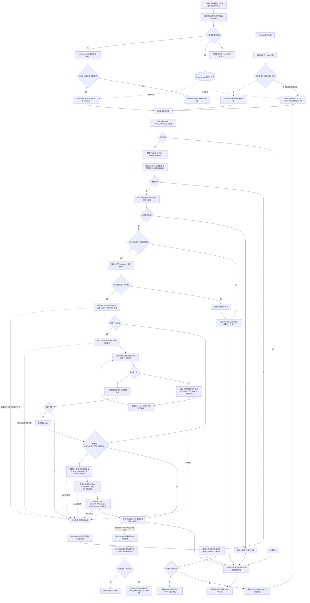

[业务逻辑专辑](/knowledge/business-logic/) / 居民收益付款 / S06

说明失败提交的账单锁释放补偿、精确身份与释放范围、领取和事务边界、重试及最终清理，附逐章原文对照和源码附录。本文保留原文 11 章及源码附录，正文连续展开，原文对照与流程源码按需展开。

**前置阅读：** [S03 · 居民收益提交构建](/knowledge/business-logic/resident-income/s03-居民收益提交构建/)

**快速阅读：** [任务概览](#ch-1) · [释放规则](#ch-4) · [异常与重试](#ch-8) · [完整流程](#ch-10) · [源码附录](#appendix)

<div class="business-logic-article">

<div id="intro"></div>

<div id="title-intro"></div>

## 导读：先跟着业务走一遍

**以下是帮助理解的假设场景，不是实际运行数据。** 一次居民收益付款提交选中了若干账单。系统准备据此构建正式付款数据，先给这些账单登记“本次提交正在占用”的业务记录。这样的记录叫**账单业务占用锁**；处于 `RESERVED`（已预占）状态时，可以阻止同一业务账单被另一次付款提交重复使用。

后来，这次提交构建失败了。如果失败仍允许重试，上游先重试构建，并不马上拆掉已经预占的锁。只有到了最终失败，或者遇到必须立即终止构建的锁预占不完整问题，上游才把失败事实写入数据库，并创建或复用一张“释放本次提交占用”的补偿任务单。**这里的补偿，是补做失败后的清理，不是重新付款，也不是重新构建付款单。**

任务单提交成功后，有两种方式让后台来处理：XXL-Job（定时任务调度器）扫描到它，或者事务提交后的主动 Kick（向后台发出一次“尽快来处理”的唤醒信号）精确找到它。后台先确认“现在确实轮到我处理”，再确认任务身份与付款发布边界，然后只释放本次提交、指定状态的锁。锁记录不会删除，而是改成 `RELEASED`（已释放），并改用包含锁记录 ID 的历史键，把原业务锁键让出来。

正常释放要检查目标状态的锁没有残留，再写回任务结果；但原文还存在“批次已经 `DONE` 就跳过释放与普通残留校验”的分支，不能把所有成功记录都理解为重新核清过锁。如果原因是 `INVALID_REVISE_SESSION`（修订会话身份无效），还要额外终止相关版本、解除当前提交引用；会话最后的安全清理交给另一项独立任务。**本任务不自动付钱、不发起审核、不刷新付款金额，也不会主动扫描全库找出所有孤立锁。**

<div id="intro-sub-1"></div>

### 先认清四个容易混在一起的对象

| 对象 | 通俗理解 | 本文中的真实载体或字段 |
| --- | --- | --- |
| 付款版本 | 这次要处理的付款数据版本记录 | `fi_resident_income_payment_order_version`；其主键是 `paymentOrderVersionId`，业务数据版本号是 `target_data_version`，两者不是一个值 |
| session（选单会话） | 记录选单、提交及其身份关系的操作上下文 | `selection_session`；`REVISE` 是修订模式，`NEW` 是新建模式，具体校验只按原文展开 |
| 异步任务单 | 告诉后台“哪个付款版本，因为什么原因，需要释放锁” | `fi_async_task`；身份是“付款版本 ID＋释放原因” |
| 提交阶段批次 | 记录某个付款版本的锁释放阶段走到哪里 | `selection_submit_batch`；这里按“付款版本＋`LOCK_RELEASE` 阶段”查找，而不是按释放原因查找 |

另一个必须区分的概念是**数据库行锁**：消费者执行 `fi_async_task FOR UPDATE`，即在事务中锁住这条任务记录，是为了保护补偿任务的执行权。它不是正在被释放的账单业务占用锁。前者管“谁可以执行补偿”，后者管“账单被哪次提交占用”。

下文保留原文 **第 1～11 章及源码附录**的对应关系。补充例子均明确标为假设，不能作为运行数据或已发生事故的证据。

<details class="source-note">
<summary>版本、分支与核查边界</summary>

> **阅读依据与核查边界**<br /> 本文完整改写附件《S06-residentIncomePaymentSelectionLockReleaseAsyncTask-源码梳理.md》，业务事实、源码判断与未确认事项均以该附件为依据。本次改写没有重新检查项目源码、执行 Java 测试、触发任务、连接数据库或做补偿操作；文中的“源码确认”指原文的核查结论，不代表本次或线上验证通过。
>
> 原文分析日期为 **2026-09-08**，工作目录为 `/Users/wangyi/BZ/zx-monitor/zxbaif`，分支为 `Ian/review/01`，HEAD 为 `a1bfacbeb6dfc239d577bd66bf78cd9eb2482efa`，分析包含当时已经存在的未提交修改。原文此次分析是只读的：不修改业务代码、不触发任务、不连接数据库执行补偿。
>
> 原文写明文档按要求保存到 `S03` 目录，但这里讲的任务在代码中的阶段是 **S06**，路由是 `S06_LOCK_RELEASE`。它可以被 S03 提交构建失败触发，**并不是 S03 提交构建任务本身**。

</details>

<details class="original" id="compare-intro">
<summary>原文开头说明 · 原文 1–8 行</summary>

<div id="original-intro-1"></div>

#### residentIncomePaymentSelectionLockReleaseAsyncTask 源码梳理

> 分析日期：2026-09-08。依据当前工作目录 `/Users/wangyi/BZ/zx-monitor/zxbaif` 的实际源码，包含已存在的未提交修改。
>
> 分支：`Ian/review/01`；HEAD：`a1bfacbeb6dfc239d577bd66bf78cd9eb2482efa`。本次只读分析，不修改业务代码、不触发任务、不连接数据库执行补偿。
>
> 本文按要求保存到 `S03` 目录；该锁释放任务在当前代码中的阶段编号是 **S06**，路由为 `S06_LOCK_RELEASE`。它可以由 S03 提交构建失败触发，但不是 S03 提交构建任务本身。

</details>

<div id="ch-1"></div>

<div id="title-ch-1"></div>

## 1. 任务概览

这项任务的工作对象不是“所有失败的付款单”，而是**已经写入数据库的付款提交版本锁释放补偿单**。它根据补偿单上的原因，清理指定提交持有的账单业务锁，避免失败提交继续占着账单；同时通过身份条件与发布边界保护，避免碰到其他会话、其他提交轮次或已经发布业务的锁。

可以把它理解为“按单清理”：上游先开出清理单，消费者才处理。它不会自己在全库发现异常后凭空补开任务。

| 项目 | 真实名称或规则 | 应当怎样理解 |
| --- | --- | --- |
| XXL-Job Handler（调度入口名称） | `residentIncomePaymentSelectionLockReleaseAsyncTask` | XXL-Job 找到这项工作的入口 |
| 入口类 | `ResidentIncomePaymentSelectionLockReleaseJob` | 解析参数，决定自动扫描还是定向处理 |
| 消费服务 | `SelectionLockReleaseAsyncTaskServiceImpl` | 领取任务、校验、调用释放逻辑、记录结果 |
| 主要业务方法 | `SelectionSubmitBuildServiceImpl.releaseSubmitLocks` | 真正组织锁释放和必要收尾的方法 |
| 任务载体 | `fi_async_task` | 任务已持久化，不只是内存通知 |
| 固定任务类型 | `RESIDENT_INCOME_PAYMENT_LOCK_RELEASE` | 限定这类消费者处理的任务类别 |
| 固定任务场景 | `task_data.taskScene = LOCK_RELEASE` | JSON（结构化文本数据）中的场景也必须匹配 |
| 业务身份 | `paymentOrderVersionId + lockReleaseReason` | 一个版本、一个释放原因，确定一项任务身份 |
| 业务键 | `LOCK_RELEASE:<paymentOrderVersionId>:<releaseReason>` | 把上述身份编码为稳定字符串 |
| 任务编码 | `RIPLR:` 加业务键的 32 位小写 MD5 | MD5 在此作为字符串摘要，参与生成稳定的任务编码 |
| 自动模式 | 先查到期且未耗尽失败次数的候选，再在领取时检查状态、执行轮次和超时 | 查出来不等于一定执行 |
| 手工模式 | 按任务编码或业务键查询 | 可以绕过到期时间与重试上限，不能绕过终态、执行轮次和运行超时 |
| 单次任务数量 | 默认 50；传入值小于等于 0 时仍为 50；最大 200 | 这是候选任务数量，不是单条 SQL 释放的锁数量 |
| 锁 SQL 批大小 | 读取 `selection_submit_batch.batch_size`；缺失或小于等于 0 时用 1,000 | 控制每批锁 ID 的处理边界，不代表每批独立提交事务 |
| 运行超时接管 | `RUNNING` 任务满足 `update_time <= 当前时间 - 10 分钟` 才可重新领取 | 恰好到 10 分钟的边界包含在内 |
| 默认失败计数上限 | `max_retry_count = 3` | 不是“初次执行之后额外重试 3 次”；失败计数达到 3 即不再自动领取 |
| 主动触发 | 上游事务提交后，专用线程池按 `taskCode` 精确触发同一消费者 | 这是另一种进入方式，不是另一套释放逻辑 |
| 频率与实例数量 | 由 XXL-Job 控制台与部署配置决定 | 原文没有运行环境证据，暂时无法确认 |

**源码定位：**[S01 入口](#source-s01)、[S02 消费者](#source-s02)、[S03 身份与退避规则](#source-s03)。

<details class="original" id="compare-ch-1">
<summary>本章原文 · 原文 9–35 行</summary>

<div id="original-ch-1-1"></div>

### 1. 任务概览

**该任务消费已落库的“付款提交版本锁释放补偿单”，根据释放原因，精确释放该次提交持有的账单业务锁，防止失败提交持续占住账单，同时保护其他会话、提交轮次及已发布业务的锁。**

| 项目 | 源码确认的行为 |
| --- | --- |
| XXL-Job Handler | `residentIncomePaymentSelectionLockReleaseAsyncTask` |
| 入口类 | `ResidentIncomePaymentSelectionLockReleaseJob` |
| 消费服务 | `SelectionLockReleaseAsyncTaskServiceImpl` |
| 主要业务服务 | `SelectionSubmitBuildServiceImpl.releaseSubmitLocks` |
| 任务载体 | `fi_async_task` |
| 固定任务类型 | `RESIDENT_INCOME_PAYMENT_LOCK_RELEASE` |
| 固定任务场景 | `task_data.taskScene = LOCK_RELEASE` |
| 业务身份 | `paymentOrderVersionId + lockReleaseReason` |
| 业务键 | `LOCK_RELEASE:<paymentOrderVersionId>:<releaseReason>` |
| 任务编码 | `RIPLR:` 加业务键的 32 位小写 MD5 |
| 自动模式 | 查到期且未耗尽重试次数的候选任务；领取时再检查执行状态、轮次和运行超时 |
| 手工模式 | 按任务编码或业务键定向查询；可绕过到期时间和重试上限，但不能绕过终态、执行轮次和运行超时约束 |
| 单次任务数量 | 默认 50；小于等于 0 也按 50；最大 200 |
| 锁 SQL 批大小 | 使用 `selection_submit_batch.batch_size`；缺失或小于等于 0 时按 1,000 |
| 运行超时接管 | `RUNNING` 任务的 `update_time <= 当前时间 - 10 分钟` 才能重新领取 |
| 默认失败计数上限 | `max_retry_count = 3`；不是“初次执行之后再重试 3 次” |
| 主动触发 | 上游事务提交后可经专用线程池按 `taskCode` 精确触发相同消费者 |
| 执行频率、实例数 | XXL-Job 控制台和部署配置决定，**暂时无法确认** |

依据：[S01 任务入口](#source-s01)、[S02 消费者](#source-s02)、[S03 身份及退避规则](#source-s03)。

</details>

<div id="ch-2"></div>

<div id="title-ch-2"></div>

## 2. 业务目的

<div id="sec-2-1"></div>

### 2.1 为什么需要补偿释放

付款提交需要根据选单结果构建正式付款数据。在构建过程中，系统会先预占账单锁，把锁标记为 `RESERVED`。这一步解决的是“同一业务账单不能同时被另一笔付款提交重复使用”的问题。

问题在于，**失败状态与锁占用是两份不同的数据**。后来即使已经把付款版本、会话或构建任务标成失败，之前的预占锁也不会因此自动消失。构建最终失败，或者发现 REVISE 会话身份无效时，这些锁可能仍存在，需要独立补偿任务在失败事实提交后清理。

清理也不是只改一个状态。成功释放会同时做两件事：把 `lock_status` 改为 `RELEASED`，把原有 `lock_key` 改成包含该锁记录 ID 的历史键。这样旧记录保留历史信息，原业务锁键则被让出。

这里清理的始终是数据库里表达账单占用关系的业务锁。执行过程中另外使用的 `fi_async_task FOR UPDATE` 行锁，只是保护补偿执行权。两种锁的用途不能互相替代。

<div id="sec-2-2"></div>

### 2.2 当前源码中，哪些流程实际创建这个任务

不是出现一个名称叫“释放原因”的枚举值，就能证明系统某处一定会创建对应任务。原文全局检索了 `ResidentIncomePaymentLockReleaseTaskService` 与 `releaseSubmitLocks` 的调用点，在当前主源码里确认了以下生产方。

| 谁创建任务 | 什么情况下创建 | 释放原因 | 创建之前做什么 |
| --- | --- | --- | --- |
| `SelectionSubmitBuildAsyncTaskServiceImpl.handleTaskFailure` | 本次失败后，构建任务重试次数已耗尽；**或者**出现 `RESERVED_LOCK_INCOMPLETE`（预占锁不完整），需要立即终止构建 | 通常是 `BUILD_FAILED` | 在持有构建任务执行权的事务内，先固化最终失败，再创建锁补偿任务 |
| 同一个构建消费者中的身份异常处理 | 确认这是**未发布且身份无效**的 REVISE 提交 | `INVALID_REVISE_SESSION` | 将版本和 session 固化为失败，并终止原构建任务 |
| `SelectionLockActivateAsyncTaskServiceImpl` | 激活锁之前，发现**未发布且身份无效**的 REVISE 提交 | `INVALID_REVISE_SESSION` | 固化失败、提交补偿任务，并永久终止这次激活任务 |
| `SelectionAuditPlanCreateAsyncTaskServiceImpl` | 创建审核计划之前，发现**未发布且身份无效**的 REVISE 提交 | `INVALID_REVISE_SESSION` | 固化失败、提交补偿任务，并永久终止这次审核计划任务 |

这里的顺序和范围都很重要。普通构建失败，只要还允许重试，就先走原构建任务的重试；**并不是每次构建失败都会立即释放锁**。只有最终失败，或锁预占不完整这类明确要求终止的条件成立，才投递补偿。

消费者还支持 `SUBMIT_CANCEL`、`PAYMENT_SUCCESS`、`ORDER_VOID` 这些其他原因，但“支持消费”不等于“已确认有业务入口生产”。原文检索确认的主要是上表中的 `BUILD_FAILED` 与 `INVALID_REVISE_SESSION`；其余原因实际由哪些入口投递给本任务，暂时无法确认。

系统其他地方还存在逐锁释放、审核回调锁释放的独立路径。那些路径不能因为也叫“释放锁”，就被接到本任务的调用链上。

**源码定位：**[S04 构建失败投递](#source-s04)、[S05 激活阶段身份异常](#source-s05)、[S06 审核计划阶段身份异常](#source-s06)。

<div id="sec-2-3"></div>

### 2.3 创建补偿单时如何避免重复受理

上游可能重复提出“为同一个付款版本、按同一个原因释放锁”。这里采用**幂等受理（同一业务身份重复请求时，复用已存在的任务，而不是再创建一项）**。但它的幂等范围是“版本＋原因”，不是仅凭版本。

`ResidentIncomePaymentLockReleaseTaskServiceImpl.submit` 按下面的顺序工作，不能把后面的步骤挪到前面理解。

1. **先校验身份。** 校验版本 ID 与释放原因，直接拒绝 `REVIEW_REJECTED`（审核拒绝）。
2. **再生成 seed（准备落库的初始任务记录）。** 用版本 ID 和释放原因生成稳定业务键、任务编码，构造状态为 `PENDING`（待执行）的任务。
3. **安全受理并回读。** `safeSeedService.acceptOrReuse` 执行 `INSERT IGNORE`，随后按 `taskCode` 回读记录，再核对 `task_type/business_key`。
4. **已有任务就原样复用。** 发现同编码任务时，不重置任务状态、重试计数、任务参数，也不重置执行轮次。
5. **最后记录受理并注册唤醒。** 写入补偿受理审计记录，再注册事务提交后的主动唤醒。

下面沿用原文的字段关系示例。**版本 ID `123456789` 是假设值，不是实际任务数据。**

```json
{
  "taskType": "RESIDENT_INCOME_PAYMENT_LOCK_RELEASE",
  "businessKey": "LOCK_RELEASE:123456789:BUILD_FAILED",
  "taskCode": "RIPLR:<businessKey的32位小写MD5>",
  "taskStatus": 0,
  "retryCount": 0,
  "maxRetryCount": 3,
  "taskData": {
    "paymentOrderVersionId": 123456789,
    "lockReleaseReason": "BUILD_FAILED",
    "taskScene": "LOCK_RELEASE"
  }
}
```

数据库中的 `task_data` 实际保存的是 JSON 字符串，不是把上面嵌套对象原样当成多个数据库字段。创建时间与下次执行时间由 `AsyncTaskTimeProvider` 生成。

还有一个不能省略的前提：**避免重复受理依赖数据库的 `task_code` 唯一约束。** 仓库结构检查脚本要求 `uk_task_code_business(task_code)`。这能证明代码仓库提出了这个结构要求，但目标数据库是否确实已有该约束，暂时无法确认。不能直接把“调用了 `INSERT IGNORE`”说成“任何环境都一定不会生成重复任务”。

**源码定位：**[S07 生产者](#source-s07)、[S08 安全受理](#source-s08)、[S09 异步任务 SQL](#source-s09)、[S25 结构约束要求](#source-s25)。

<details class="original" id="compare-ch-2">
<summary>本章原文 · 原文 36–98 行</summary>

<div id="original-ch-2-1"></div>

### 2. 业务目的

<div id="original-ch-2-2"></div>

#### 2.1 为什么需要补偿释放

居民收益付款提交时，会按选单结果构建正式付款数据并预占账单锁。预占后的 `RESERVED` 锁可以阻止同一业务账单被另一次付款提交重复使用。

如果后续提交构建最终失败，或者发现 REVISE 会话身份无效，之前预占的锁可能仍然存在。单纯把付款版本、会话或构建任务改成失败，并不会自动释放锁。需要一条独立补偿任务，在失败事实已经提交后清理这次提交的占用。

成功释放不仅把 `lock_status` 改为 `RELEASED`，还会把原有 `lock_key` 改成包含锁记录 ID 的历史键，使旧锁保留历史信息并让出原业务锁键。

这属于数据库中的**账单业务占用锁**。消费过程另外使用的 `fi_async_task FOR UPDATE` 行锁，是为了保证补偿执行权，两者用途不同。

<div id="original-ch-2-3"></div>

#### 2.2 当前源码中，哪些流程实际创建这个任务

全局检索 `ResidentIncomePaymentLockReleaseTaskService` 及 `releaseSubmitLocks` 的调用点，当前主源码中确认的生产方如下。

| 生产方 | 触发条件 | 创建的释放原因 | 创建前的处理 |
| --- | --- | --- | --- |
| `SelectionSubmitBuildAsyncTaskServiceImpl.handleTaskFailure` | 本次失败后耗尽构建任务重试次数；或出现 `RESERVED_LOCK_INCOMPLETE`，需要立即终止构建 | 通常为 `BUILD_FAILED` | 在持有构建任务执行权的事务内固化最终失败，再创建锁补偿任务 |
| 同一服务的身份异常处理 | 确认是未发布、身份无效的 REVISE 提交 | `INVALID_REVISE_SESSION` | 将版本/session 固化为失败，并终止原构建任务 |
| `SelectionLockActivateAsyncTaskServiceImpl` | 激活前发现未发布、身份无效的 REVISE 提交 | `INVALID_REVISE_SESSION` | 固化失败，提交补偿任务，永久终止本次激活任务 |
| `SelectionAuditPlanCreateAsyncTaskServiceImpl` | 创建审核计划前发现未发布、身份无效的 REVISE 提交 | `INVALID_REVISE_SESSION` | 固化失败，提交补偿任务，永久终止本次审核计划任务 |

**不是每次构建失败都会立即投递释放任务。** 普通、尚可重试的构建失败先走原构建任务重试；最终失败或者锁预占不完整等明确终止条件成立后，才投递补偿。

`SUBMIT_CANCEL`、`PAYMENT_SUCCESS`、`ORDER_VOID` 等其他原因虽然被此消费者支持，但不能据此认定对应业务入口都会创建本任务。当前检索到的生产调用主要是上述两种原因；其他原因在此任务上的实际投递入口，**暂时无法确认**。系统其他地方还存在逐锁释放、审核回调锁释放等独立路径，不应混为一条调用链。

依据：[S04 构建失败的投递逻辑](#source-s04)、[S05 激活阶段发现无效会话](#source-s05)、[S06 审核计划阶段发现无效会话](#source-s06)。

<div id="original-ch-2-4"></div>

#### 2.3 创建补偿单时如何避免重复受理

`ResidentIncomePaymentLockReleaseTaskServiceImpl.submit` 的实际顺序是：

1. 校验版本 ID 和释放原因；直接拒绝 `REVIEW_REJECTED`。
2. 根据版本 ID、原因生成稳定业务键与任务编码，构造 `PENDING` seed。
3. `safeSeedService.acceptOrReuse` 执行 `INSERT IGNORE`，随后按 `taskCode` 回读，并核对 `task_type/business_key`。
4. 已有同编码任务时原样复用，不重置状态、重试计数、任务参数和执行轮次。
5. 写入补偿受理审计记录，再注册事务提交后的主动唤醒。

新任务的核心内容可以表示为：

```json
{
  "taskType": "RESIDENT_INCOME_PAYMENT_LOCK_RELEASE",
  "businessKey": "LOCK_RELEASE:123456789:BUILD_FAILED",
  "taskCode": "RIPLR:<businessKey的32位小写MD5>",
  "taskStatus": 0,
  "retryCount": 0,
  "maxRetryCount": 3,
  "taskData": {
    "paymentOrderVersionId": 123456789,
    "lockReleaseReason": "BUILD_FAILED",
    "taskScene": "LOCK_RELEASE"
  }
}
```

上例是字段关系示意；数据库中的 `task_data` 实际保存 JSON 字符串，版本 ID 为示例值。创建时间和下次执行时间由 `AsyncTaskTimeProvider` 生成。

幂等受理依赖数据库存在 `task_code` 唯一约束。仓库结构检查脚本要求 `uk_task_code_business(task_code)`，但目标数据库是否已具备该约束，**暂时无法确认**。

依据：[S07 补偿任务生产者](#source-s07)、[S08 安全受理服务](#source-s08)、[S09 异步任务 SQL](#source-s09)、[S25 结构约束检查](#source-s25)。

</details>

<div id="ch-3"></div>

<div id="title-ch-3"></div>

## 3. 核心调用链

<div id="sec-3-1"></div>

### 3.1 从 XXL-Job 入口向下

先从业务上把流程拆开：**找到任务 → 领取执行权 → 验明身份 → 在事务中检查边界并释放 → 记录结果 → 汇总本轮情况**。找到任务只是挑候选，后面仍可能跳过、失败或永久取消。

代码里的 `fenced` 可以理解为**执行轮次防护**：每次重新领取都会换一个轮次，后续写入必须持有当前轮次，旧执行者不能凭旧凭证覆盖新执行结果。`FencedOutException` 就是“本执行者已失去执行权”的异常。`inspectInvariants` 则是“检查业务应保持成立的约束”的只读巡检入口，其当前覆盖能力还有限，见第 7.4 节。

下面保留从入口到数据库写回的完整方法对应关系：

```text
ResidentIncomePaymentSelectionLockReleaseJob
  .residentIncomePaymentSelectionLockReleaseAsyncTask(param)
  ├─ parseJobParam / unwrapPayload                 解析参数及包装
  └─ executeJob
      ├─ 无有效 taskCode/businessKey → executePendingTasks
      │   └─ queryAutoExecutableTaskList           查询自动候选
      └─ 有有效 taskCode/businessKey → executeManualRetry
          └─ queryManualRetryTaskList              查询指定任务
              ↓
      executeTaskList                             顺序遍历本次候选
        └─ executeSingleTask
            ├─ claimTask
            │   └─ fencedExecutionTemplate.claim
            │       └─ claimResidentIncomePaymentFencedTask  原子 UPDATE 领取
            ├─ parseTaskDto + validateTaskIdentity
            └─ fencedExecutionTemplate.executeFencedWrite
                ├─ lockResidentIncomePaymentFencedTaskOwner  FOR UPDATE 锁任务行
                ├─ REVIEW_REJECTED → 永久取消，停止业务处理
                ├─ reviseInvariantGuard.inspectVersion
                ├─ 失败补偿越过发布边界 → 拒绝，必要时记录事故
                └─ selectionSubmitBuildService.releaseSubmitLocks
                    ├─ requireBuildContext
                    ├─ rejectFailureCompensationAfterPublish
                    ├─ runLockReleasePhase
                    │   ├─ prepareBatch / markRunning
                    │   ├─ resolveReleaseStatusList
                    │   ├─ queryNextLockIdByStatus
                    │   ├─ releaseBatchByVersion
                    │   ├─ updateProgress → 循环处理下一批
                    │   ├─ countByVersionAndStatus → 目标状态锁必须无残留
                    │   └─ markDone
                    ├─ INVALID_REVISE_SESSION 专用版本/session 收尾
                    └─ 返回成功
                └─ markTaskSuccess → fi_async_task.SUCCESS
              ↓
      inspectInvariants → 汇总本轮选中/成功/失败/跳过数量
              ↓
      Result → XXL-Job ReturnT
```

普通失败时，退出业务事务后调用 `markTaskFailed` 记录任务失败。失去执行权时，不把它当作本 worker（执行任务的工作者）的一次业务失败，而是按跳过处理。第 8 章会区分这些异常的事务后果。

<div id="sec-3-2"></div>

### 3.2 参数决定的是消费范围，不是释放内容

Job 参数回答的是“本轮挑哪些已经存在的任务”，而不是“本轮想释放哪个新版本”。支持的字段完整如下：`maxTaskCount`、`taskCode`、`taskCodes`、`businessKey`、`businessKeys`。

单值字段与数组字段会合并，清理空白内容；服务层再去重。数量规则仍是默认 50、小于等于 0 按 50、最大 200。

```json
{"maxTaskCount":50}
```

这表示自动消费候选任务。下面是**定向操作的假设参数**，用原文示例业务键挑一条已有任务：

```json
{"businessKey":"LOCK_RELEASE:123456789:BUILD_FAILED","maxTaskCount":1}
```

入口也支持 `{"data":{...}}` 包装，或者 `data` 的值本身就是 JSON 字符串。

传入这些参数**不会新建任务**，也不能直接替换既有任务的释放原因、会话或版本。真正的释放身份必须从已经落库的 `task_data` 读取，并与那条记录的业务键、任务编码一致。

**现有的异常行为要单独记住：非法 JSON 不会让入口报参数错误后停止。** `parseJobParam` 只记录警告，随后回退为空参数；空参数会进入默认自动扫描。也就是说，本来打算精确处理一条任务，却把 JSON 写坏，可能变成自动消费默认最多 50 条候选任务。这里是在描述现状，不是在推荐这种操作。

<div id="sec-3-3"></div>

### 3.3 单条任务先领取执行权，再做业务校验

消费者并不是先充分检查业务数据、再把任务标为运行。实际顺序是先领取任务，领取成功之后才解析和校验任务内容。

领取成功会完成以下更新：`task_status` 变为 `RUNNING(1)`；`running_attempt` 加 1；清空 `error_message`；刷新 `update_time`；把 `update_user_id` 写为 `lock-release-<任务ID>-<nanoTime>` 形式的 worker 标识。

然后生成 `ClaimToken`（携带本轮执行身份的凭证），其中包含新的 `runningAttempt`。后续写入不是仅检查任务是不是“运行中”，还必须匹配这个轮次。

**假设例子：** 某 worker 拿到轮次 5 后停滞，任务符合超时条件后被另一 worker 以轮次 6 接管。那么旧 worker 恢复后，不能继续拿轮次 5 的 token 写成功或覆盖轮次 6 的结果。这只是解释轮次关系，不是已经发生的运行记录。

本路径还有一个明确的能力边界：`claimTask` 传入的业务租约回调是 `null`。**租约**在这里指额外的业务执行占用凭据；该路径没有再领取 selection session 的业务租约，也没有从这个调用接入集群并发配额。不能因为使用了执行轮次模板，就认为这些能力也已经接上。

<div id="sec-3-4"></div>

### 3.4 业务事务中的保护顺序

领到任务后，进入真正的业务事务。以下顺序决定了哪些数据会被读取、什么情况下提前停止。

1. **先锁任务行并验证执行权。** 按任务 ID、任务类型、`RUNNING` 状态与新的 `running_attempt` 执行 `fi_async_task FOR UPDATE`。查不到匹配记录就抛 `FencedOutException`。
2. **先处理历史审核拒绝任务。** 若释放原因是历史 `REVIEW_REJECTED`，直接永久取消任务，不再查询版本、批次或账单锁。前提是此前的任务身份校验已通过。
3. **再读付款上下文。** 读取付款版本、会话和付款主单，检查 REVISE 身份及发布边界。
4. **检查失败补偿是否越过发布边界。** 对 `BUILD_FAILED`、`INVALID_REVISE_SESSION`、`SUBMIT_CANCEL`、`REVISE_FAILED` 这四种失败补偿原因，只要主单发布指针已指向目标版本，**或者**版本已经 `PUBLISHED`（已发布），就禁止释放。
5. **业务层与 SQL 再保护。** 进入 `releaseSubmitLocks` 后再次检查发布边界；实际 UPDATE 内也有失败补偿发布条件。不是仅靠一次 Java 判断。
6. **释放与结果一起完成。** 分批释放、检查残留、完成批次、必要的无效 REVISE 收尾，以及异步任务成功写回，都在这笔业务事务中执行。

这里有一个原文明确指出的实现差异，不能为了叙述整齐而抹平：`inspectVersion` 对普通 NEW 返回的发布标志都是 `false`，所以消费者层的提前永久取消主要覆盖 REVISE。NEW 已发布版本仍受 `releaseSubmitLocks` 和 UPDATE SQL 保护，但被拒绝后通常走失败重试，而不一定直接永久取消。**两种模式都有锁保护，任务终态却不完全一致。** 详细影响在第 9.6 节。

**源码定位：**[S02 单任务流程](#source-s02)、[S10 执行权与事务模板](#source-s10)、[S11 发布边界检查](#source-s11)、[S12 锁释放业务服务](#source-s12)。

<details class="original" id="compare-ch-3">
<summary>本章原文 · 原文 99–191 行</summary>

<div id="original-ch-3-1"></div>

### 3. 核心调用链

<div id="original-ch-3-2"></div>

#### 3.1 从 XXL-Job 入口向下

```text
ResidentIncomePaymentSelectionLockReleaseJob
  .residentIncomePaymentSelectionLockReleaseAsyncTask(param)
  ├─ parseJobParam / unwrapPayload
  └─ executeJob
      ├─ 无有效 taskCode/businessKey → executePendingTasks
      │   └─ queryAutoExecutableTaskList
      └─ 有有效 taskCode/businessKey → executeManualRetry
          └─ queryManualRetryTaskList
              ↓
      executeTaskList                         // 顺序遍历候选任务
        └─ executeSingleTask
            ├─ claimTask
            │   └─ fencedExecutionTemplate.claim
            │       └─ claimResidentIncomePaymentFencedTask  // 原子 UPDATE
            ├─ parseTaskDto + validateTaskIdentity
            └─ fencedExecutionTemplate.executeFencedWrite
                ├─ lockResidentIncomePaymentFencedTaskOwner // FOR UPDATE
                ├─ REVIEW_REJECTED → 永久取消，停止
                ├─ reviseInvariantGuard.inspectVersion
                ├─ 失败补偿越过发布边界 → 拒绝，必要时记事故
                └─ selectionSubmitBuildService.releaseSubmitLocks
                    ├─ requireBuildContext
                    ├─ rejectFailureCompensationAfterPublish
                    ├─ runLockReleasePhase
                    │   ├─ prepareBatch / markRunning
                    │   ├─ resolveReleaseStatusList
                    │   ├─ queryNextLockIdByStatus
                    │   ├─ releaseBatchByVersion
                    │   ├─ updateProgress → 循环处理下一批
                    │   ├─ countByVersionAndStatus → 必须无残留
                    │   └─ markDone
                    ├─ INVALID_REVISE_SESSION 专用版本/session 收尾
                    └─ 返回成功
                └─ markTaskSuccess → fi_async_task.SUCCESS
              ↓
      inspectInvariants → 汇总本轮选中/成功/失败/跳过数量
              ↓
      Result → XXL-Job ReturnT
```

失败时，业务事务退出后调用 `markTaskFailed`；失去执行权时按跳过处理。具体边界见第 8 节。

<div id="original-ch-3-3"></div>

#### 3.2 参数决定的是消费范围，不是释放内容

支持字段：`maxTaskCount`、`taskCode`、`taskCodes`、`businessKey`、`businessKeys`。单值与数组值合并，去空白；服务层再去重。

```json
{"maxTaskCount":50}
```

表示自动消费候选任务。

```json
{"businessKey":"LOCK_RELEASE:123456789:BUILD_FAILED","maxTaskCount":1}
```

表示定向重跑现有任务；也支持 `{"data":{...}}` 或 `data` 为 JSON 字符串的包装。

传入参数不会新建任务，也不能通过 Job 参数直接更换释放原因、会话或版本。实际释放身份必须来自既有 `task_data`，并与任务的业务键、任务编码一致。

**解析非法 JSON 时，入口只记录警告并回退到空参数，接着进入默认自动扫描。** 它不会返回“参数错误后终止”。这一点对手工操作尤其需要注意。

<div id="original-ch-3-4"></div>

#### 3.3 单条任务先领取执行权，再做业务校验

领取成功后：

- `task_status` 改为 `RUNNING(1)`。
- `running_attempt` 加 1。
- 清空 `error_message`，刷新 `update_time`。
- `update_user_id` 写入 `lock-release-<任务ID>-<nanoTime>` 形式的 worker 标识。

随后生成携带新 `runningAttempt` 的 `ClaimToken`。这不是单纯的“执行中标志”：后续写入必须匹配这个执行轮次。旧 worker 即使恢复运行，也不能用旧轮次完成当前任务。

`claimTask` 传入的业务租约回调为 `null`，本路径没有额外领取 selection session 的业务租约，也没有从这个调用接入集群并发配额。

<div id="original-ch-3-5"></div>

#### 3.4 业务事务中的保护顺序

1. 按任务 ID、类型、`RUNNING` 状态及新 `running_attempt` 查询 `fi_async_task FOR UPDATE`；查不到就抛 `FencedOutException`。
2. 若释放原因是历史 `REVIEW_REJECTED`，直接将任务永久取消；不会继续查询版本、批次或锁。
3. 读取付款版本、会话、付款主单，检查 REVISE 身份和发布边界。
4. 对四种失败补偿原因，禁止在主单发布指针已指向目标版本、或版本已 `PUBLISHED` 时释放。
5. 进入业务服务，再次检查发布边界；实际释放 SQL 内也有失败补偿的发布条件。
6. 分批释放、校验残留、批次完成、必要的无效 REVISE 收尾、异步任务成功写回，一并在业务事务中执行。

需区分当前实现的两层检查：`inspectVersion` 对普通 NEW 返回的发布标志均为 `false`，它的提前永久取消主要覆盖 REVISE；NEW 的已发布保护仍由 `releaseSubmitLocks` 的检查和实际 UPDATE SQL 完成。两种模式都存在保护，但拒绝后任务状态未必相同，详见第 9 节。

依据：[S02 消费者单任务流程](#source-s02)、[S10 执行权及事务模板](#source-s10)、[S11 发布边界检查](#source-s11)、[S12 锁释放业务服务](#source-s12)。

</details>

<div id="ch-4"></div>

<div id="title-ch-4"></div>

## 4. 数据筛选规则

这一章要分别回答三个问题：**后台先选中哪些任务、选中的任务能不能被领取、领到任务后究竟更新哪些锁**。这三个筛选层次不同，不能把其中一层的条件套到另一层上。

<div id="sec-4-1"></div>

### 4.1 自动模式：先查询候选，再做领取条件过滤

自动模式先找“到期、失败次数还没用完、状态仍可能执行”的任务。原文把查询还原成下面的 SQL；它是阅读说明，**不是可直接执行的运维脚本**。

```sql
SELECT *
FROM fi_async_task
WHERE deleted = 0
  AND task_type = 'RESIDENT_INCOME_PAYMENT_LOCK_RELEASE'
  AND task_status IN (0, 3, 1)           -- PENDING、FAILED、RUNNING
  AND (next_execute_time IS NULL OR next_execute_time <= :now)
  AND IFNULL(retry_count, 0) < IFNULL(max_retry_count, 3)
ORDER BY next_execute_time ASC, retry_count ASC, id ASC
LIMIT :maxTaskCount;
```

把条件读成自然语言时，必须保留它们之间的连接关系。

**记录没有删除，并且类型正确，并且状态为待执行、失败、运行中三者之一，并且执行时间为空或已到期，并且失败计数严格小于上限。** 只有“执行时间为空”和“执行时间小于等于当前时间”之间是 OR；它们作为整体与其他条件相连。`IFNULL` 的含义是空值用后面的默认值代替：失败次数为空时取 0，上限为空时取 3。

结果按 `next_execute_time ASC, retry_count ASC, id ASC` 排序后取数量上限。因此，这一轮并不是把所有符合条件的任务都搬进来。

查询不看付款金额、账期、锁创建时间、锁有效期、会话过期时间，也不看账单是否已经付款。它消费的是**已有补偿任务**，不会自行找出全部孤立锁，更不会扫描所有失败付款版本来补建任务。

这段函数还没有显式按租户、项目公司、站点划分，也没有 XXL 分片过滤。按这段源码，它按任务类型全局取候选。部署中是否有统一拦截器再追加范围限制，暂时无法确认，不能直接说整个系统绝无范围隔离。

**候选查出来以后，领取还要重新过一遍门槛：**

| 领取时的条件 | 为什么候选仍可能被跳过 |
| --- | --- |
| ID、任务类型、`deleted=0` 匹配 | 防止查完后任务被删除，或者匹配到的不是目标任务 |
| 状态仍属于 `PENDING/FAILED/RUNNING` | `SUCCESS/CANCELLED` 是不能从这个入口复活的终态 |
| `running_attempt = 查询时的期望值` | 别的 worker 在查询之后接管了任务，本 worker 就不再拥有这轮领取资格 |
| 自动触发时仍满足到期时间和重试上限 | 查询到领取之间，调度字段也可能发生变化 |
| **不是** `RUNNING`，**或者** `update_time <= now - 10 分钟` | 运行中的任务必须达到超时边界才能接管；不是一查到就能抢走 |

容易忽略的是：**未超时的 `RUNNING` 可以进入候选列表，只是在领取时跳过。它已经占用了本轮候选数量。** 这也是第 9.4 节调度吞吐风险的来源。

<div id="sec-4-2"></div>

### 4.2 手工模式：按 selector 查询，领取仍有限制

selector（定向选择条件）就是传入的任务编码或业务键。手工模式先按它们找现有任务，查询条件比自动模式宽。

基础条件仍为 `deleted=0` **并且**固定 `task_type`。在此基础上，只有任务编码时用 `task_code IN (...)`；只有业务键时用 `business_key IN (...)`；两者都有时用以下条件：

```sql
AND (task_code IN (...) OR business_key IN (...))
```

这是**并集**：命中任意一组就可以，不要求同一条记录同时命中两组。结果按 `id ASC` 排序，数量上限与自动模式相同。

手工查询阶段不筛状态、重试次数和到期时间。领取时传入 `automaticScheduleRequired=false`，仅放开自动调度的时间与重试次数约束，其他执行权保护仍保留。

| 任务现在的情况 | 手工定向执行的结果 |
| --- | --- |
| `FAILED`，且已耗尽自动重试次数 | 可以定向再试 |
| 还没到 `next_execute_time` | 可以提前定向再试 |
| `RUNNING`，但尚未超时 | 不能抢走，仍会跳过 |
| `SUCCESS` 或 `CANCELLED` | 查询可能找到，但领取不允许执行，因此跳过 |
| 手工执行再次失败 | 不会先把 `retry_count` 重置为 0，而是在原计数上继续累计 |

所以“手工重试”不是“无条件强制执行”。尤其不能把它理解成可以重跑已成功或永久取消的任务。

<div id="sec-4-3"></div>

### 4.3 task\_data 身份校验

领到任务以后，消费者要确认“数据库任务身份”和“任务内容说的身份”是一致的。`DTO`（用于承载和传递数据的 Java 对象）在此是 `ResidentIncomePaymentSelectionSessionAsyncTaskDto`。

下列六项**必须同时成立**，不是任选其一。

1. `task_data` 非空，而且能够解析成 `ResidentIncomePaymentSelectionSessionAsyncTaskDto`。
2. `paymentOrderVersionId > 0`，严格大于 0。
3. `lockReleaseReason` 能匹配当前释放原因枚举。
4. `taskScene` 严格等于 `LOCK_RELEASE`。
5. 根据 DTO 重新计算的业务键，与数据库 `business_key` 相等。
6. 再根据业务键计算的任务编码，与数据库 `task_code` 相等。

这相当于核对“任务单封面写的版本与原因”和“单据正文写的版本与原因”是否指向同一个对象。只有正文合法还不够，键和编码也必须对得上。

不一致时不会进入释放 SQL，但处理方式是**普通失败并按规则重试**，不是一律永久取消。因此不能把“数据非法”概括成“立即进入 `CANCELLED`”。历史 `REVIEW_REJECTED` 的永久取消也发生在这组身份校验通过之后。

<div id="sec-4-4"></div>

### 4.4 付款上下文与提交批次

确认任务身份之后，还必须把真正的付款业务上下文找齐。消费者不是只凭 DTO 中一个版本 ID 就直接更新锁表。

| 要读的数据 | 怎么找 | 找到后用于什么 |
| --- | --- | --- |
| `fi_resident_income_payment_order_version` | 按 DTO 中的版本主键读取 | 取得 `payment_order_id/session_id/submit_attempt/target_data_version/mode/version_build_status` |
| `fi_resident_income_payment_order` | 按版本记录中的 `payment_order_id` 读取 | 检查 `current_publish_version`；REVISE 身份校验还使用 `create_user_id` |
| `selection_session` | 按版本记录中的 `session_id` 读取 | REVISE 检查使用 `mode/target_payment_order_id/creator_user_id` |
| `selection_submit_batch` | 按 `payment_order_version_id + batch_phase='LOCK_RELEASE'` 查询，`ORDER BY batch_no,id LIMIT 1` | 找到本版本锁释放阶段的批次和已有进度 |

版本、付款主单、session 任何一个缺失都会失败；`LOCK_RELEASE` 批次缺失也会失败。消费者**不会在发现缺失时临时创建这个批次**。批次是在提交启动服务初始化全部提交阶段时创建的，初始状态是 `INIT`（尚未开始）。

这里再次强调两个 ID 的区别：`paymentOrderVersionId` 是付款版本记录的数据库主键；`target_data_version` 是该记录携带的业务数据版本号。发布指针检查、锁身份匹配与查询版本记录分别使用各自对应的值，不能互换。

<div id="sec-4-5"></div>

### 4.5 锁记录的四项身份条件

到了锁表，消费者不是把某个付款单的全部锁都释放，也不是直接用 `payment_order_version_id` 去匹配锁。它先从付款版本中取出四项提交身份，再要求锁记录**四项全部一致**。

```sql
payment_order_id = :version.payment_order_id
AND session_id = :version.session_id
AND submit_attempt = :version.submit_attempt
AND data_version = :version.target_data_version
AND lock_status IN (:本次释放状态集合)
AND id > COALESCE(:lastLockId, 0)
```

前四项分别限定“哪个付款主单、哪个会话、哪次提交尝试、哪个业务数据版本”。后两项分别限定允许释放的状态和从哪里继续处理。`COALESCE` 在这里表示游标为空时用 0。

`lastLockId` 是读取批次 `last_item_id` 得到的。字段名虽然叫 item ID，在 `LOCK_RELEASE` 阶段存的却是**锁表主键 ID**，不是付款明细 ID。

每一批先选出满足条件的前 `batchSize` 个锁 ID，再把其中最大的 ID 作为 `batchEndId`。真正更新的是 **`(lastLockId, batchEndId]`**，即左边不包含、右边包含的范围。

**假设例子：** 游标为 100，本批选到符合身份和状态条件的锁 ID 为 105、109、120，那么本批结束边界为 120，更新范围为 `(100,120]`，且仍要满足对应的身份、状态与适用的发布条件。它不是把 101～120 的所有记录不加区别地释放，处理数量也不能直接算成 `120-100`。

原文明确指出，实际 SQL **没有**额外要求 `submit_token`、`submit_round` 或 `lock_scene` 匹配。即使这些字段看起来也与提交有关，也不能把它们补写成当前已经具备的筛选条件。

<div id="sec-4-6"></div>

### 4.6 释放原因与目标状态矩阵

释放原因在这里首先决定**允许处理哪些锁状态**，并不自动生成细到某条账单的付款结果筛选。

`ACTIVE` 是激活状态的业务锁；`RESERVED` 是预占状态。以下保留消费者实际使用的完整原因集合与范围。

| 释放原因 | 这个消费者实际释放哪些状态 | 额外限制或容易误读的地方 |
| --- | --- | --- |
| `BUILD_FAILED` | 仅 `RESERVED` | 禁止释放已发布版本 |
| `INVALID_REVISE_SESSION` | 仅 `RESERVED` | 禁止释放已发布版本；释放后还要执行无效 REVISE 专用收尾 |
| `SUBMIT_CANCEL` | 仅 `RESERVED` | 禁止释放已发布版本 |
| `REVISE_FAILED` | 仅 `RESERVED` | 禁止释放已发布版本 |
| `REVIEW_REJECTED` | 不释放 | 生产端拒绝；身份合法的历史任务在消费时永久取消 |
| `REVIEW_APPROVED_UNQUALIFIED` | `RESERVED` 与 `ACTIVE` | 这里没有逐账单“不合格”筛选 |
| `PAYMENT_SUCCESS`、`PARTIAL_PAYMENT`、`PAYMENT_FAIL` | `RESERVED` 与 `ACTIVE` | 这里没有逐账单付款结果筛选 |
| `ORDER_VOID`、`RESUBMIT_REFRESH`、`REVISE_REMOVED`、`COMPENSATION_RELEASE` | `RESERVED` 与 `ACTIVE` | 仍限定本次提交的四项身份，而不是据名称再生成更细筛选 |

后面几组走的是 `resolveReleaseStatusList` 默认分支。**不能用原因名称代替 SQL 条件。** 例如，`PARTIAL_PAYMENT` 在此不表示“仅释放付款成功那部分账单”；`REVIEW_APPROVED_UNQUALIFIED` 也不表示“SQL 已关联不合格账单”。某类业务究竟应不应该投递给这个任务，需要结合真实生产方判断。

对于前四种失败补偿原因，实际 UPDATE 还同时要求：关联版本不是 `PUBLISHED`；主单 `current_publish_version` 不等于该版本的 `target_data_version`；关联主单满足 `deleted=0`。上层 Java 判断通过后，最终写入仍受这组 SQL 条件限制。

正常释放循环结束后，`countByVersionAndStatus` 会检查四项身份下的**全部目标状态锁**。这个统计**不带游标限制**，不是只查最后一批后面的 ID；只要还有目标锁残留，本次业务就失败。已经 `DONE` 的批次直接跳过循环与该普通残留校验，是第 8.1 节和第 9.2 节必须另看待的例外。

**源码定位：**[S02 查询与校验](#source-s02)、[S09 领取 SQL](#source-s09)、[S13 锁分页、更新与统计](#source-s13)、[S14 批次 SQL](#source-s14)、[S15 批次初始化](#source-s15)、[S16 释放原因枚举](#source-s16)。

<details class="original" id="compare-ch-4">
<summary>本章原文 · 原文 192–310 行</summary>

<div id="original-ch-4-1"></div>

### 4. 数据筛选规则

<div id="original-ch-4-2"></div>

#### 4.1 自动模式：先查询候选，再做领取条件过滤

自动查询等价于以下规则，SQL 为便于阅读的还原，不是可直接执行的运维脚本：

```sql
SELECT *
FROM fi_async_task
WHERE deleted = 0
  AND task_type = 'RESIDENT_INCOME_PAYMENT_LOCK_RELEASE'
  AND task_status IN (0, 3, 1)           -- PENDING、FAILED、RUNNING
  AND (next_execute_time IS NULL OR next_execute_time <= :now)
  AND IFNULL(retry_count, 0) < IFNULL(max_retry_count, 3)
ORDER BY next_execute_time ASC, retry_count ASC, id ASC
LIMIT :maxTaskCount;
```

此查询不按付款金额、账期、锁创建时间、锁有效期、会话过期时间或者账单是否付款来筛选。它处理的是**既有补偿任务**，不会自行发现所有孤立锁或扫描所有失败付款版本补建任务。

这段查询没有显式按租户、项目公司、站点划分，也没有 XXL 分片过滤；当前函数按上述任务类型全局取候选。部署是否还有统一拦截器附加范围，**暂时无法确认**。

实际领取还要再次验证：

| 条件 | 业务含义 |
| --- | --- |
| ID、任务类型、`deleted=0` 匹配 | 没有领错任务或已删除任务 |
| 状态仍在 `PENDING/FAILED/RUNNING` | `SUCCESS/CANCELLED` 不能被复活 |
| `running_attempt = 查询时的期望值` | 查询后已被别的 worker 接管时，本 worker 退出 |
| 自动触发仍满足到期时间和重试上限 | 防止候选查询与领取之间状态发生变化 |
| 不是 `RUNNING`，或 `update_time <= now - 10 分钟` | 运行中任务必须超时才允许接管 |

**未超时的 RUNNING 任务可以进入候选列表，但领取时会跳过；它也会占用本轮的候选数量额度。**

<div id="original-ch-4-3"></div>

#### 4.2 手工模式：按 selector 查询，领取仍有限制

手工查询只加以下条件：

- `deleted=0`。
- 固定 `task_type`。
- 仅传 taskCode：`task_code IN (...)`。
- 仅传 businessKey：`business_key IN (...)`。
- 两者都传：`task_code IN (...) OR business_key IN (...)`，是并集。
- 按 `id ASC` 排序，使用相同数量上限。

查询阶段不筛任务状态、重试次数和到期时间；领取时设置 `automaticScheduleRequired=false`，只放开时间和重试次数限制。

因此：

- `FAILED` 且已经耗尽自动重试次数：可以定向再试。
- 尚未到 `next_execute_time`：可以提前定向再试。
- `RUNNING` 尚未超时：仍不能抢走。
- `SUCCESS` 或 `CANCELLED`：可能被查询选中，但会跳过。
- 手工执行不会先把 `retry_count` 重置为 0；再次失败继续累计计数。

<div id="original-ch-4-4"></div>

#### 4.3 task\_data 身份校验

必须同时满足：

1. `task_data` 非空且可以解析为 `ResidentIncomePaymentSelectionSessionAsyncTaskDto`。
2. `paymentOrderVersionId > 0`。
3. `lockReleaseReason` 可以匹配当前枚举。
4. `taskScene` 严格等于 `LOCK_RELEASE`。
5. 按 DTO 重算的业务键等于数据库 `business_key`。
6. 按业务键重算的任务编码等于数据库 `task_code`。

身份不一致不会进入释放 SQL，而是按普通失败记录并重试；不是所有非法参数都会被立即永久取消。

<div id="original-ch-4-5"></div>

#### 4.4 付款上下文与提交批次

| 数据 | 查询方式与用途 |
| --- | --- |
| `fi_resident_income_payment_order_version` | 按 DTO 的版本主键读版本，取得 `payment_order_id/session_id/submit_attempt/target_data_version/mode/version_build_status` |
| `fi_resident_income_payment_order` | 按版本中的 `payment_order_id` 读主单，检查 `current_publish_version`；REVISE 身份校验还用到 `create_user_id` |
| `selection_session` | 按版本中的 `session_id` 读会话；REVISE 检查 `mode/target_payment_order_id/creator_user_id` |
| `selection_submit_batch` | 按 `payment_order_version_id + batch_phase='LOCK_RELEASE'`，`ORDER BY batch_no,id LIMIT 1` |

版本、付款单或 session 缺失即失败。`LOCK_RELEASE` 批次缺失也会失败，消费者不临时创建；该批次由提交启动服务在初始化所有提交阶段时创建为 `INIT`。

`paymentOrderVersionId` 是版本记录的主键，`target_data_version` 是业务数据版本号，不能把两个值混用。

<div id="original-ch-4-6"></div>

#### 4.5 锁记录的四项身份条件

每批先选符合条件的前 `batchSize` 个锁 ID，再取其中最大的 ID 作为本批结束边界。真正更新范围为 `(lastLockId, batchEndId]`。

```sql
payment_order_id = :version.payment_order_id
AND session_id = :version.session_id
AND submit_attempt = :version.submit_attempt
AND data_version = :version.target_data_version
AND lock_status IN (:本次释放状态集合)
AND id > COALESCE(:lastLockId, 0)
```

`lastLockId` 来自批次的 `last_item_id`。该字段名叫 item ID，但在 `LOCK_RELEASE` 阶段实际存的是**锁表主键 ID**。

实际释放 SQL 不按 `payment_order_version_id` 直接匹配锁，因为这里从版本展开四项业务身份。它也没有额外要求 `submit_token`、`submit_round` 或 `lock_scene` 匹配，不能把这些字段写成已经存在的筛选条件。

<div id="original-ch-4-7"></div>

#### 4.6 释放原因与目标状态矩阵

| 释放原因 | 此消费者的实际目标状态 | 补充限制 |
| --- | --- | --- |
| `BUILD_FAILED` | 仅 `RESERVED` | 禁止释放已发布版本 |
| `INVALID_REVISE_SESSION` | 仅 `RESERVED` | 禁止释放已发布版本；随后执行无效 REVISE 收尾 |
| `SUBMIT_CANCEL` | 仅 `RESERVED` | 禁止释放已发布版本 |
| `REVISE_FAILED` | 仅 `RESERVED` | 禁止释放已发布版本 |
| `REVIEW_REJECTED` | 不释放 | 生产端禁止；合法身份的历史任务消费时永久取消 |
| `REVIEW_APPROVED_UNQUALIFIED` | `RESERVED` 和 `ACTIVE` | 此方法没有逐账单“不合格”筛选 |
| `PAYMENT_SUCCESS`、`PARTIAL_PAYMENT`、`PAYMENT_FAIL` | `RESERVED` 和 `ACTIVE` | 此方法没有逐账单付款结果筛选 |
| `ORDER_VOID`、`RESUBMIT_REFRESH`、`REVISE_REMOVED`、`COMPENSATION_RELEASE` | `RESERVED` 和 `ACTIVE` | 仍限定该提交版本的四项身份 |

后几类原因走的是 `resolveReleaseStatusList` 的默认分支。**原因名称不会自动转换为细粒度的账单筛选条件。** 例如 `PARTIAL_PAYMENT` 在这里并不意味着“只释放付款成功的那部分账单”。是否应当由这个任务处理某类业务，必须结合实际生产方判断。

对于四种失败补偿原因，实际 UPDATE 还要求关联版本不是 `PUBLISHED`，且主单 `current_publish_version` 不等于该版本的 `target_data_version`，关联主单必须 `deleted=0`。即便上层检查通过，写入时仍受 SQL 条件限制。

最后的 `countByVersionAndStatus` 不带游标限制，会检查四项身份下全部目标状态锁是否归零。仍有锁则本次业务失败。

依据：[S02 查询和校验](#source-s02)、[S09 领取 SQL](#source-s09)、[S13 锁表分页及更新 SQL](#source-s13)、[S14 批次 SQL](#source-s14)、[S15 批次初始化](#source-s15)、[S16 释放原因枚举](#source-s16)。

</details>

<div id="ch-5"></div>

<div id="title-ch-5"></div>

## 5. 主要状态流转

同一次补偿会涉及任务、批次、账单锁，有时还涉及付款版本和 session。它们的状态表达的是不同事情：**任务成功，不等于付款成功；版本取消，也不等于补偿任务取消。**

<div id="sec-5-1"></div>

### 5.1 fi\_async\_task 状态

异步任务状态回答的是“这张补偿任务单执行得怎样”。

| 情形 | 状态变化 | 计数、时间和记录如何变化 |
| --- | --- | --- |
| 首次受理 | 新建 `PENDING(0)` | `retry_count=0`，默认 `max_retry_count=3`，下次执行时间设置为立即执行时间 |
| 正常领取 | `PENDING/FAILED → RUNNING(1)` | `running_attempt+1`，刷新 `update_time` |
| 超时接管 | `RUNNING → RUNNING` | 再次 `running_attempt+1`，后续写回只能由新轮次持有人完成 |
| 完成释放 | `RUNNING → SUCCESS(2)` | 不增加失败计数；保留原 `next_execute_time`；`error_message` 实际写入的是成功摘要 |
| 普通业务异常 | `RUNNING → FAILED(3)` | `retry_count+1`，设置下一次执行时间，保存最多 1,000 字符的错误信息 |
| 禁止继续补偿 | `RUNNING → CANCELLED(4)` | 将 `retry_count` 设为最大值；最大值缺失则补为 3；保留或补齐 `next_execute_time` |
| 领取冲突或执行权失效 | 本执行者不写业务成功/失败终态 | 本轮摘要记为跳过，数据库当前状态由有效执行者决定 |

两个字段名很容易导致误解。第一，`error_message` 并不是只有失败才写，成功分支也写成功摘要。第二，永久取消**不是把下次执行时间清空**：Mapper 用的是 `COALESCE(原时间, 当前时间)`，即已有时间则保留，没有则补当前时间。停止自动消费主要靠终态和重试上限，而不是靠时间为空。

<div id="sec-5-2"></div>

### 5.2 selection\_submit\_batch 状态

批次状态回答的是“这个付款版本的 `LOCK_RELEASE` 阶段完成没有”。它的正常推进方式是：

```text
INIT / FAILED / RUNNING
    → markRunning
RUNNING
    → 按锁 ID 推进 last_item_id
    → 累计 processed_count
    → 检查全部目标状态锁已归零
DONE
```

`DONE`（阶段已完成）会直接跳过释放循环。`CANCELLED`（阶段已取消）不允许恢复为 `RUNNING`。

普通异常处理会调用 `markFailed`，但**调用了失败更新，不等于失败状态一定已持久化**。沿当前任务的外层业务事务，随后异常会触发回滚，刚写的批次失败状态通常也会回滚。看到任务失败而批次仍为原状态，不一定就是漏写，事务边界见第 8.2 节。

`markRunning` 还会增加 `lease_version`（批次租约版本号）。不过，后续进度 SQL 与完成 SQL 没有把这个 lease 版本作为匹配条件。因此，不能把它解释成锁激活阶段那种独立的批次租约防护已经完整接入。本任务对**同一个异步任务**的核心防护来自 `fi_async_task.running_attempt + FOR UPDATE`。

<div id="sec-5-3"></div>

### 5.3 账单锁状态

锁状态回答的是“这次提交对账单的业务占用是否解除”。实际变化如下：

```text
失败补偿：本次提交的 RESERVED → RELEASED
其他允许原因：本次提交的 RESERVED / ACTIVE → RELEASED
历史 REVIEW_REJECTED：保留原锁状态，不释放
```

原付款来源版本的 `ACTIVE` 锁，只要不匹配本次提交的四项身份，就不在本次 SQL 更新范围。对四种失败补偿原因还多一层限制：只选 `RESERVED`，即使本次身份下存在 `ACTIVE`，普通失败释放矩阵也不会把它当作目标状态。

不能把“保留原付款来源版本的锁”理解为额外存在一个未写出的来源版本字段过滤；这里成立的依据仍然是四项身份与状态条件。

<div id="sec-5-4"></div>

### 5.4 INVALID\_REVISE\_SESSION 的额外收尾

这个原因表示无效 REVISE 提交的补偿。它不只要释放预占锁，还要把相关版本和会话整理到后续能够安全清理的状态。

**先释放，再重新验证。** 释放循环完成后，服务重新读取并锁定版本、付款主单与 session，确认它仍属于可补偿的、未发布的无效 REVISE。同时要求本次提交的 `RESERVED` **和** `ACTIVE` 两类锁都为零。

这比普通释放矩阵更严格：矩阵仅释放 `RESERVED`，但收尾还检查 `ACTIVE`。若本次提交意外仍有 `ACTIVE`，收尾不能直接成功，也不会为了把流程做完而强行释放这些 `ACTIVE`。

**假设例子：** 本次提交的 `RESERVED` 已清空，但还残留一条同身份 `ACTIVE`。这不满足两类都为零的条件，补偿不能宣告完成。沿本任务的事务边界，业务失败还会使本轮已经做出的锁更新回滚，不能把前面的“清空”当成已经单独提交。

满足收尾前提后，依次执行以下步骤：

1. **取消尚未结束的提交阶段。** 将该版本四项身份下、尚未处于 `DONE/CANCELLED` 的批次设为 `CANCELLED`。已经完成的 `LOCK_RELEASE` 批次仍保留 `DONE`。
2. **终止付款版本。** 版本原状态必须是 `BUILD_FAILED`，再通过 CAS（比较并更新：旧状态或版本条件仍符合预期时才允许写入）改为 `CANCELLED`；同时写入错误码 `INVALID_REVISE_SESSION`、失败阶段 `AUTH_REVISE_INVARIANT_RESERVED_RELEASED`。
3. **解除当前提交引用并标记会话失效。** session 必须仍是对应提交的 `SUBMIT_FAILED`。清空 `active_submit_id`，设置 `invalidated_flag=1`，写入失效原因和阶段，并增加 `state_version`。
4. **保留尚未达到清理条件的状态与键。** 此时 session 的 `status` 仍是 `SUBMIT_FAILED`，`active_revise_key` 仍未清空。
5. **把补偿任务写成 `SUCCESS`。** 它表示补偿完成，不表示原付款版本成功。原版本变为 `CANCELLED`，不能据此把这张锁释放任务也说成取消。

`active_revise_key` 的最终解除属于后续 **AUTH-16 安全清理**。这是原文给出的独立清理流程标识，不是在本任务里继续直接调用下一步；对应边界见第 7.5 节。

**源码定位：**[S09 异步任务状态 SQL](#source-s09)、[S12 业务服务](#source-s12)、[S14 批次状态 SQL](#source-s14)、[S17 版本取消](#source-s17)、[S18 session 补偿](#source-s18)。

<details class="original" id="compare-ch-5">
<summary>本章原文 · 原文 311–369 行</summary>

<div id="original-ch-5-1"></div>

### 5. 主要状态流转

<div id="original-ch-5-2"></div>

#### 5.1 fi\_async\_task 状态

| 情形 | 状态变化 | 计数与时间 |
| --- | --- | --- |
| 首次受理 | 新建 `PENDING(0)` | `retry_count=0`、默认 `max_retry_count=3`，下次执行时间设为立即执行时间 |
| 正常领取 | `PENDING/FAILED → RUNNING(1)` | `running_attempt+1`，刷新 `update_time` |
| 超时接管 | `RUNNING → RUNNING` | `running_attempt+1`；只有新轮次持有人可以写回 |
| 完成释放 | `RUNNING → SUCCESS(2)` | 不增加失败计数；保留原 `next_execute_time`；`error_message` 实际写入成功摘要 |
| 普通业务异常 | `RUNNING → FAILED(3)` | `retry_count+1`，设置下一次执行时间，保存最多 1,000 字符错误信息 |
| 禁止继续的补偿 | `RUNNING → CANCELLED(4)` | `retry_count` 设为最大值；缺失的最大值补为 3；保留或补齐 `next_execute_time` |
| 领取冲突或执行权失效 | 本执行者不写业务成功/失败终态 | 摘要记为跳过，当前数据库状态由有效执行者决定 |

永久取消没有把 `next_execute_time` 写成 NULL。当前 Mapper 使用 `COALESCE(原时间, 当前时间)`；停止自动消费主要依赖终态和重试上限。

<div id="original-ch-5-3"></div>

#### 5.2 selection\_submit\_batch 状态

```text
INIT / FAILED / RUNNING
    → markRunning
RUNNING
    → 按锁 ID 推进 last_item_id，累计 processed_count
    → 全部目标状态锁归零
DONE
```

`DONE` 批次会直接跳过释放循环。`CANCELLED` 不允许恢复为 `RUNNING`。普通错误处理中虽然调用了 `markFailed`，但在本任务的外层业务事务回滚后，这次失败标记通常也会回滚，不能把它描述成必然持久化的 `FAILED`，详见第 8 节。

这条路径的 `markRunning` 会增加 `lease_version`，但后续进度和完成 SQL 没有匹配该 lease 版本；它不等价于锁激活阶段单独实现的批次租约防护。此任务对同一异步任务的核心防护来自 `fi_async_task.running_attempt + FOR UPDATE`。

<div id="original-ch-5-4"></div>

#### 5.3 账单锁状态

```text
失败补偿：该次提交的 RESERVED → RELEASED
其他允许原因：该次提交的 RESERVED / ACTIVE → RELEASED
历史 REVIEW_REJECTED：保留原锁状态
```

原付款来源版本的 ACTIVE 锁，只要不匹配本次提交的四项身份，就不在更新范围内；失败补偿额外只选 `RESERVED`。

<div id="original-ch-5-5"></div>

#### 5.4 INVALID\_REVISE\_SESSION 的额外收尾

释放循环完成后，再读取并锁定版本、主单、session，重新确认是可补偿的未发布无效 REVISE，并要求**本次提交的 RESERVED 和 ACTIVE 都为零**。

即使释放矩阵只处理 RESERVED，若本次提交意外还存在 ACTIVE，也不能直接把补偿宣布完成。这里不会为了收尾强行释放 ACTIVE。

通过后依次执行：

1. 将该版本四项身份下尚未 `DONE/CANCELLED` 的批次设为 `CANCELLED`。已经完成的 `LOCK_RELEASE` 批次保留 `DONE`。
2. 版本必须原本为 `BUILD_FAILED`，然后 CAS 更新为 `CANCELLED`，写入 `INVALID_REVISE_SESSION` 错误码与 `AUTH_REVISE_INVARIANT_RESERVED_RELEASED` 失败阶段。
3. session 必须仍为对应提交的 `SUBMIT_FAILED`，清空 `active_submit_id`，标记 `invalidated_flag=1`，写入失效原因与阶段，并增加 `state_version`。
4. session 的 `status` 此时仍是 `SUBMIT_FAILED`，`active_revise_key` 此时仍未清空。
5. 锁释放异步任务本身写 `SUCCESS`：表示补偿成功，不能因为版本变为 `CANCELLED` 就把补偿任务也解释成取消。

最终解除 session 的 `active_revise_key` 属于后续 AUTH-16 安全清理，见第 7 节。

依据：[S09 异步状态 SQL](#source-s09)、[S12 业务服务](#source-s12)、[S14 批次状态 SQL](#source-s14)、[S17 版本取消 SQL](#source-s17)、[S18 session 补偿 SQL](#source-s18)。

</details>

<div id="ch-6"></div>

<div id="title-ch-6"></div>

## 6. 数据库影响

这一章按“读来判断什么、实际改了什么、没有改什么”分开看。一个服务类注入了某个 Mapper（数据库访问映射接口），不代表这项任务就调用了它；必须沿当前方法调用链确认。

<div id="sec-6-1"></div>

### 6.1 消费器直接涉及的主要表

| 表 | 读取内容 | 实际写入内容或分支 | 对业务的意义 |
| --- | --- | --- | --- |
| `fi_async_task` | 类型、状态、业务键、`taskData`、失败计数、下次执行时间、执行轮次 | 按分支更新 `task_status/running_attempt/retry_count/max_retry_count/next_execute_time/error_message/update_time/update_user_id` | 决定谁能执行、拒绝旧 worker 写回，并保存补偿结果 |
| `fi_resident_income_payment_bill_lock` | 四项提交身份、锁状态、主键游标 | `lock_status/lock_key/release_time/release_reason` | 解除本次提交的账单占用，同时保留历史记录 |
| `selection_submit_batch` | 该版本 `LOCK_RELEASE` 阶段的状态、游标、批大小 | 原文明确列出的进度与运行字段为 `batch_status/worker_id/lease_version/heartbeat_time/last_item_id/processed_count/update_time`；第 6.3 节补充相关计数字段的零增量行为 | 记录阶段推进和完成；无效 REVISE 收尾还会取消未完成阶段 |
| `fi_resident_income_payment_order_version` | 版本与会话身份、目标数据版本、模式、发布或构建状态 | 仅无效 REVISE 专用收尾更新 `version_build_status/failure_phase/last_error_code/last_error_message/update_time` | 普通释放不改版本状态；无效 REVISE 补偿后终止该版本 |
| `fi_resident_income_payment_order` | `current_publish_version/create_user_id` 以及前文所述付款上下文 | 本消费路径没有直接更新主单 | 用主单信息保护已经发布的业务，不让失败补偿破坏它 |
| `selection_session` | 身份、模式、提交关系、状态 | 无效 REVISE 收尾或发布事故标记分支更新相应字段，详见第 5.4、6.4 节 | 清除当前提交引用，或者记录已发布异常；不是每次普通释放都更新 |

上表沿用原文能够确认的写入范围，没有把源文未逐一列出的字段补成一个猜测的“完整字段全集”。尤其要区分**普通释放**与**无效 REVISE/发布事故**这两类条件性分支。

<div id="sec-6-2"></div>

### 6.2 一条锁的实际更新

锁释放本身采用 UPDATE，不是 DELETE。核心写入保留如下：

```sql
SET lock_status = 'RELEASED',
    lock_key = CONCAT(
        COALESCE(station_id, 0), ':',
        COALESCE(bill_yearmonth, ''), ':RELEASED:', id
    ),
    release_time = NOW(),
    release_reason = :releaseReason
```

这里 `CONCAT` 是拼接字符串。新 `lock_key` 按“站点 ID：账单年月：RELEASED：锁记录 ID”组成；`station_id` 为空时用 0，`bill_yearmonth` 为空时用空字符串。记录 ID 被带进历史键，既保留旧锁信息，也让出原业务锁键。

**假设例子：** 若某条锁的 `station_id=8`、`bill_yearmonth='202608'`、`id=9001`，新键按这段表达式得到 `8:202608:RELEASED:9001`。这个年月格式只是本例假设，不是原文对真实字段格式的额外约束。

这条 SQL 不会改写 `payment_order_id/session_id/submit_attempt/data_version/order_bill_id/submit_round/lock_scene` 这些已列明的历史归属字段。所谓释放，是占用状态和相关释放信息变化，不是把锁的历史归属挪给另一笔提交。

还存在两个时间来源：`release_time` 使用数据库 `NOW()`；任务调度与领取时间主要使用应用服务器时钟。两边实际时区是否一致、时钟是否同步，原文没有运行证据，暂时无法确认。

<div id="sec-6-3"></div>

### 6.3 批次进度字段

每次处理一批锁，批次记录会推进游标与计数。字段含义不能只看名字猜。

| 字段 | 在锁释放阶段的实际含义或行为 |
| --- | --- |
| `last_item_id` | 已处理到的锁表主键 ID，不是付款单明细 ID |
| `processed_count` | 累计 UPDATE 实际影响的锁数量；不是结束 ID 减开始 ID，也不是查询边界跨度 |
| `payable_count/unqualified_count` | 释放时传入的增量均为 0，不在这一步计算新增可付或不合格数量 |
| `heartbeat_time/update_time` | 每次推进时刷新；前者是记录任务仍在推进的心跳时间 |
| `lease_version` | 每次 `markRunning` 加 1，但后续 SQL 没有用它匹配写入资格 |
| `lease_expire_time` | 普通释放路径没有设置它 |
| 批次 `retry_count/next_retry_time` | 普通释放路径不靠这两个字段调度重试；重试调度依赖 `fi_async_task` 的对应调度字段 |

所以，批次有进度、心跳、租约字段，不等于这里同时实现了独立批次租约控制、逐批提交和批次级重试调度。第 5.2、8.2 节描述的限制仍然成立。

<div id="sec-6-4"></div>

### 6.4 发布事故分支也可能修改 session 状态

这里有一处原文保留的**注释与实际 SQL 不一致**：`markPublishedIncident` 的 Java 注释说“只记录事故”，但 Mapper 不止记录标记，还可能改变 session 状态。

实际改变状态需要两个条件**同时成立**：`continueCloseout=true`，**并且** session 当前为 `SUBMITTING/SUBMIT_FAILED/PUBLISHING` 三种状态之一。这里分别表示提交中、提交失败、发布中的会话阶段。条件满足时，SQL 将 session 改为 `PUBLISHED_LOCK_SYNCING`（已发布、锁同步中的会话状态）。

此外，该事故记录会设置以下内容：

| 字段或动作 | 实际写入 |
| --- | --- |
| `invalidated_flag` | `1` |
| `invalidated_reason` | `INVALID_REVISE_SESSION_PUBLISHED_INCIDENT` |
| `failure_phase` | `AUTH_REVISE_INVARIANT_LOCK_RELEASE_AFTER_PUBLISH_REJECTED` |
| `state_version` | 加 1 |
| 时间 | 刷新心跳和更新时间 |

这条 SQL **不会回退付款主单发布指针，也不会清除活动键**。因此，既不能把它说成“只记日志、完全不改 session 状态”，也不能把它说成“回滚已发布业务”。当前实际行为以 Mapper 为准，原文中的注释差异仍保留。

<div id="sec-6-5"></div>

### 6.5 上游受理审计与未发生的写入

上游受理补偿任务时，会把“谁因为什么对象提出了什么补偿”留下审计记录。调用链是：

```text
manualTraceAdapter.compensate
  → asyncTraceService.append
  → operationLogRepository.append
  → fi_resident_income_payment_async_operation_log
```

受理审计的核心信息包括任务身份、对象类型 `PAYMENT_ORDER_VERSION`、操作 `COMPENSATE`、状态描述 `RELEASE_REQUIRED → LOCK_RELEASE_PENDING`、释放原因与追踪详情。事件 ID 用于幂等写入，避免同一事件被重复写入审计。

这里的 `from_status/to_status` 是**审计描述**，不是把付款主单或付款版本实际改成 `RELEASE_REQUIRED` 和 `LOCK_RELEASE_PENDING` 这两个同名状态。消费成功本身也没有再调用这一条“补偿受理审计”链路。

沿本消费者实际调用的释放方法，**不会继续写入** `fi_customer_bill`、`fi_customer_bill_partner`、`fi_monthly_income_difference`，也不会刷新付款金额或重建付款单明细。

虽然 `SelectionSubmitBuildServiceImpl` 注入了这些 Mapper 和 Feign（服务间 HTTP 调用客户端），它们出现在其他业务方法中，不属于本任务的实际调用。不能用“类里存在依赖”推导“这个任务会更新所有这些数据”。

**源码定位：**[S13 锁表 SQL](#source-s13)、[S14 批次 SQL](#source-s14)、[S18 session SQL](#source-s18)、[S26 审计持久化 SQL](#source-s26)。

<details class="original" id="compare-ch-6">
<summary>本章原文 · 原文 370–430 行</summary>

<div id="original-ch-6-1"></div>

### 6. 数据库影响

<div id="original-ch-6-2"></div>

#### 6.1 消费器直接涉及的主要表

| 表 | 读什么 | 写什么 | 业务含义 |
| --- | --- | --- | --- |
| `fi_async_task` | 类型、状态、业务键、taskData、失败计数、下次执行时间、执行轮次 | `task_status/running_attempt/retry_count/max_retry_count/next_execute_time/error_message/update_time/update_user_id`，具体按分支 | 领取补偿任务、防止旧 worker 写回、保存执行结果 |
| `fi_resident_income_payment_bill_lock` | 四项提交身份、锁状态、主键游标 | `lock_status/lock_key/release_time/release_reason` | 释放该次提交的业务占用，保留锁历史 |
| `selection_submit_batch` | 该版本的 `LOCK_RELEASE` 阶段、状态、游标、批大小 | `batch_status/worker_id/lease_version/heartbeat_time/last_item_id/processed_count/update_time` 等 | 保存本阶段进度与完成事实；无效 REVISE 时还取消未完成阶段 |
| `fi_resident_income_payment_order_version` | 版本与会话身份、目标数据版本、模式、发布/构建状态 | 仅无效 REVISE 专用收尾更新 `version_build_status/failure_phase/last_error_code/last_error_message/update_time` | 一般释放不变更版本状态；无效 REVISE 补偿后版本终止 |
| `fi_resident_income_payment_order` | `current_publish_version/create_user_id` 等上下文 | 本消费路径未直接更新主单 | 防止已发布业务被失败补偿破坏 |
| `selection_session` | 身份、模式、提交关系、状态 | 无效 REVISE 收尾或发布事故标记分支更新相应字段 | 清除当前提交引用，或记录已发布异常；不是普通释放每次都会更新 |

<div id="original-ch-6-3"></div>

#### 6.2 一条锁的实际更新

```sql
SET lock_status = 'RELEASED',
    lock_key = CONCAT(
        COALESCE(station_id, 0), ':',
        COALESCE(bill_yearmonth, ''), ':RELEASED:', id
    ),
    release_time = NOW(),
    release_reason = :releaseReason
```

这里是更新，不是删除。`payment_order_id/session_id/submit_attempt/data_version/order_bill_id/submit_round/lock_scene` 等历史归属没有在这条 SQL 中被改写。

其中 `release_time` 使用数据库 `NOW()`，任务调度与领取时间主要来自应用服务器时钟。两者的实际时区和时钟同步状况，**暂时无法确认**。

<div id="original-ch-6-4"></div>

#### 6.3 批次进度字段

- `last_item_id`：本次已处理到的锁表 ID。
- `processed_count`：累计 UPDATE 实际影响的锁数量，不是查询边界跨度。
- `payable_count/unqualified_count`：释放时传入的增量均为 0。
- `heartbeat_time/update_time`：每次推进刷新。
- `lease_version`：每次 `markRunning` 加 1。
- 普通释放路径没有设置 `lease_expire_time`，也没有通过批次的 `retry_count/next_retry_time` 调度重试；它依赖 `fi_async_task` 的调度字段。

<div id="original-ch-6-5"></div>

#### 6.4 发布事故分支也可能修改 session 状态

`markPublishedIncident` 的 Java 注释称只记录事故，但实际 Mapper 还包含如下行为：当 `continueCloseout=true` 且 session 为 `SUBMITTING/SUBMIT_FAILED/PUBLISHING` 时，把状态改成 `PUBLISHED_LOCK_SYNCING`。

此外会设置：

- `invalidated_flag=1`。
- `invalidated_reason=INVALID_REVISE_SESSION_PUBLISHED_INCIDENT`。
- `failure_phase=AUTH_REVISE_INVARIANT_LOCK_RELEASE_AFTER_PUBLISH_REJECTED`。
- `state_version+1`，刷新心跳及更新时间。

不会在该 SQL 中回退主单发布指针或清除活动键。本文按实际 SQL 描述，不能照搬“完全不改 session 状态”的注释。

<div id="original-ch-6-6"></div>

#### 6.5 上游受理审计与未发生的写入

上游生产者通过 `manualTraceAdapter.compensate → asyncTraceService.append → operationLogRepository.append`，向 `fi_resident_income_payment_async_operation_log` 写受理审计。核心信息包括任务身份、`PAYMENT_ORDER_VERSION` 对象、`COMPENSATE` 操作、`RELEASE_REQUIRED → LOCK_RELEASE_PENDING`、释放原因及追踪详情。事件 ID 用于幂等写入。

这些 `from_status/to_status` 是审计描述，不是将付款主单或版本直接改成两个同名状态。消费成功本身没有再调用这条补偿受理审计链。

本消费者实际调用的释放方法，没有继续写 `fi_customer_bill`、`fi_customer_bill_partner`、`fi_monthly_income_difference`，也没有刷新付款金额或重建付款单明细。`SelectionSubmitBuildServiceImpl` 虽然注入了这些 Mapper 和 Feign，但它们出现在其他业务方法，不能算成本任务的实际调用。

依据：[S13 锁表 SQL](#source-s13)、[S14 批次 SQL](#source-s14)、[S18 session SQL](#source-s18)、[S26 审计写入 SQL](#source-s26)。

</details>

<div id="ch-7"></div>

<div id="title-ch-7"></div>

## 7. 异步/后续处理

“异步”在这里首先是指任务已从上游业务请求中分离并持久化，再由后台处理；它不是对所有代码执行方式的统一描述。XXL 内部顺序遍历、主动线程池唤醒、独立 session 清理，是三种不同的关系。

<div id="sec-7-1"></div>

### 7.1 XXL-Job 内部是顺序执行

从定时任务入口进入后，`executeTaskList` 用 `for` 循环逐条处理本轮候选。一条走完，再处理下一条。这个位置没有把每条任务再投递线程池，没有 `@Async`（Spring 异步调用注解）、MQ（消息队列）发送，也没有并行流。

因此，名字带 `AsyncTask`，不意味着 Job 方法只是发出通知后立刻结束。对这条定时任务调用路径而言，Job 会实际执行所选任务列表的处理流程。一个大版本处理较久，就可能延迟本轮排在后面的任务。

<div id="sec-7-2"></div>

### 7.2 主动 Kick 是另一种进入同一消费者的方式

上游已经把任务写进数据库后，不一定只能等待下一次定时扫描。它还能在事务成功提交以后发送主动唤醒。`afterCommit`（事务成功提交后的回调）确保这次唤醒发生在提交之后，而不是抢在失败事实落库之前。

完整路径是：

```text
上游失败事实 + 锁释放 seed + 补偿审计在事务中提交
  → ResidentIncomePaymentAfterCommitKickService.registerAfterCommit
  → Spring TransactionSynchronization.afterCommit
  → ResidentIncomePaymentKickDispatcher.kick
  → residentIncomePaymentKickExecutor
  → drain
  → S06_LOCK_RELEASE 的 adapter.kickExact(signal)
  → 按 signal.businessHint（taskCode）查询 fi_async_task
  → 校验任务类型
  → 复用 executeTaskList / claim / 释放 / 状态写回
```

这里 `businessHint` 是提供精确定位线索的字段，在 S06 这条路径中放的是 `taskCode`；`drain` 是从待处理唤醒中取出并执行的处理循环。**进入方式不同，真正消费的是同一类数据库任务，释放逻辑并没有另起一套。**

主动唤醒只为加快消费，不放宽业务安全条件。`SYSTEM` 来源仍执行自动模式的到期时间、重试上限与超时约束。例如，任务正在失败退避期，收到即时通知也不会被强制执行。

若上游事务回滚，`afterCommit` 不执行。若事务已经提交，但 Kick 关闭、未命中阶段灰度，或者线程池拒绝接收通知，数据库里的任务不会因此撤销；后续仍依赖 XXL 定时扫描补偿。

可以把这两者的关系读成：**数据库任务是持久依据，Kick 是加速提示。** 提示丢弃不等于任务单被删除，也不等于任务已经成功执行。

<div id="sec-7-3"></div>

### 7.3 线程池与开关：区分默认值和运行值

相关配置前缀为 `resident-income.payment.active-kick`。以下全部是**当前源码字段默认值**，不能直接当作部署环境实际配置。

| 配置项 | 字段默认值 | 阅读时需要注意的边界 |
| --- | --- | --- |
| 总开关 `enabled` | `true` | 总开关开着，不代表 S06 阶段一定可执行 |
| 准入开关 `admissionEnabled` | `true` | 是否实际放行仍受相关配置约束 |
| 核心线程数 / 最大线程数 | 2 / 4 | 是线程池配置，不是已确认的部署实例数 |
| 队列容量 | 128 | 线程池排队容量 |
| 桶内 hint 容量 | 64 | 每个内存分组中可保留的提示容量；不是数据库任务上限 |
| 一轮 drain 时间预算 | 5,000 毫秒 | 在两次 `kickExact` 调用之间检查，不中断正在执行的一次调用 |
| 阶段默认开关 | `enabled=false` | 还要给具体阶段放行 |
| 阶段默认灰度比例 | 0 | 灰度指按配置仅让部分请求进入；默认比例为 0 |
| 线程名前缀 | `resident-income-kick-` | 排查线程与日志时用于辨认 |
| 拒绝策略 | `AbortPolicy` | 线程池无法接收时采用拒绝策略，由此路径处理拒绝并记录日志 |

所以，**总开关默认开启，并不代表 S06 默认就能主动消费**。阶段开关与灰度也要通过。原文还指出注释中的“默认关闭”不能替代字段真实值；部署是否通过配置中心覆盖上述默认值，暂时无法确认。

Dispatcher（唤醒分发器）会合并同路由、同桶中的重复 hint。线程池拒绝时，会清理相应的内存通知并记日志；数据库中已经存在的任务仍是持久依据。

5 秒预算也不能解释为“每个版本最多处理 5 秒”。它只在 drain 循环的相邻 `kickExact` 之间检查。一个 `kickExact` 已经开始处理大版本时，预算不会在中途把它打断，长事务风险仍存在。

<div id="sec-7-4"></div>

### 7.4 释放后没有自动发送付款、审核或刷新请求

本任务完成后的直接动作只有异步结果写回、指标记录与 `inspectInvariants`。它没有继续调用银行付款、MQ、Feign 审核接口，也没有启动付款状态刷新任务。

`inspectInvariants` 是只读规则框架：遍历已注入的规则、记录指标，再通过日志告警发布器输出发现项。它解决的是“观察规则检查结果”，不是直接执行修复。

还必须把框架与实际规则区分开。原文在当前主源码中全局检索，没有发现 `ResidentIncomePaymentInvariantRule` 的具体业务实现；测试里存在临时规则。这只能证明巡检框架和测试用规则存在，**不能证明当前已覆盖所有锁残留或缺失补偿任务**。运行时是否由额外依赖注入规则，暂时无法确认。

框架本身不创建补偿任务、不释放锁、不修复数据。即使某条规则返回发现项，也只是记录，不会自动让本轮 `Result` 失败；但**规则执行抛出异常**是另一回事，可能影响本轮 Job 返回结果，见第 8.6 节。

<div id="sec-7-5"></div>

### 7.5 无效 REVISE 的 session 最终清理

第 5.4 节的补偿成功以后，session 只清空了 `active_submit_id`，`active_revise_key` 仍然保留。也就是说，本任务已经解除当前失败提交的引用，但还没有把这个无效修订会话完全清理掉。

后面由独立任务 `residentIncomePaymentSelectionSessionCleanupTask` 查询无效 REVISE 候选，并走下面的链路：

```text
SelectionSessionCleanupAsyncTaskServiceImpl.cleanupInvalidReviseSessions
  → InvalidReviseSessionCleanupServiceImpl.cleanupIfSafe
  → 分类并核对活动任务、操作、版本、批次、租约及剩余锁
  → SelectionSessionMapper.cancelInvalidReviseSessionByAuth16Cas
```

这里不是看到 `invalidated_flag=1` 就立即取消。必须通过安全条件检查，并通过 `state_version` CAS，才把 session 设为 `CANCELLED`，清空 `active_revise_key/active_scope_key` 这些原文点名的活动引用。原文未在此节逐一列出其他活动引用，不能据此猜测一份额外字段清单。

最关键的是调用关系：**锁释放任务没有直接调用这套最终清理方法。** 它留下一个可被后续独立清理任务发现的状态，由清理任务再判断是否安全。何时真正执行，取决于独立清理任务的调度；原文暂时无法确认具体时间。

**源码定位：**[S19 afterCommit 注册](#source-s19)、[S20 Kick 分发](#source-s20)、[S21 线程池](#source-s21)、[S22 开关参数](#source-s22)、[S23 巡检框架](#source-s23)、[S24 日志告警](#source-s24)、[S27 独立清理服务](#source-s27)、[S28 AUTH-16 安全清理](#source-s28)、[S29 最终 session CAS](#source-s29)。

<details class="original" id="compare-ch-7">
<summary>本章原文 · 原文 431–501 行</summary>

<div id="original-ch-7-1"></div>

### 7. 异步/后续处理

<div id="original-ch-7-2"></div>

#### 7.1 XXL-Job 内部是顺序执行

从定时任务入口进入后，`executeTaskList` 用 `for` 循环顺序处理候选任务，没有在这里逐条投递线程池，也没有 `@Async`、MQ 发送或并行流。

“AsyncTask”首先表示业务请求已被持久化为异步任务单，由后台消费；并不表示 Job 方法发出任务后就立即结束。

<div id="original-ch-7-3"></div>

#### 7.2 主动 Kick 是另一种进入同一消费者的方式

```text
上游失败事实 + 锁释放 seed + 补偿审计在事务中提交
  → ResidentIncomePaymentAfterCommitKickService.registerAfterCommit
  → Spring TransactionSynchronization.afterCommit
  → ResidentIncomePaymentKickDispatcher.kick
  → residentIncomePaymentKickExecutor
  → drain
  → S06_LOCK_RELEASE 的 adapter.kickExact(signal)
  → 按 signal.businessHint（taskCode）查询 fi_async_task
  → 校验任务类型
  → 复用 executeTaskList / claim / 释放 / 状态写回
```

主动唤醒只是加快消费。SYSTEM 来源仍执行自动模式的到期时间、重试上限与超时约束，不会因为是即时通知就强行执行失败退避中的任务。

上游事务回滚时不会执行 afterCommit。事务提交后如果 Kick 被关闭、未命中阶段灰度或线程池拒绝，已有数据库任务不会被撤销，后续仍依赖 XXL 定时扫描补偿。

<div id="original-ch-7-4"></div>

#### 7.3 线程池与开关：区分默认值和运行值

源码配置前缀：`resident-income.payment.active-kick`。

| 配置 | 当前字段默认值 |
| --- | --- |
| 总开关 `enabled` | `true` |
| 准入开关 `admissionEnabled` | `true` |
| 核心/最大线程数 | 2 / 4 |
| 队列容量 | 128 |
| 桶内 hint 容量 | 64 |
| 一轮 drain 时间预算 | 5,000 毫秒 |
| 阶段默认开关 | `enabled=false` |
| 阶段默认灰度比例 | 0 |
| 线程名前缀 | `resident-income-kick-` |
| 拒绝策略 | `AbortPolicy` |

所以总开关默认开启，不代表 S06 默认能主动执行；阶段开关和灰度也必须通过。注释中的“默认关闭”不能替代字段实际值。部署是否通过配置中心覆盖了这些值，**暂时无法确认**。

Dispatcher 会合并同路由、同桶的重复 hint；线程池拒绝时清理相应内存通知并记录日志，任务的持久化依据仍是数据库。5 秒预算只在循环调用 `kickExact` 之间检查，不能中途打断正在处理的一个大版本。

<div id="original-ch-7-5"></div>

#### 7.4 释放后没有自动发送付款、审核或刷新请求

本任务完成后的直接动作是异步结果写回、指标记录和 `inspectInvariants`。没有继续调用银行付款、MQ、Feign 审核接口或付款状态刷新任务。

`inspectInvariants` 是只读规则框架：遍历注入的规则，记录指标，通过日志告警发布器输出发现结果。当前主源码全局检索未发现 `ResidentIncomePaymentInvariantRule` 的具体业务实现；测试中存在临时规则。因此不能声称当前巡检已经覆盖“所有锁残留/缺失补偿任务”。运行时是否由额外依赖注入规则，**暂时无法确认**。

框架本身不创建补偿任务、不释放锁、不修复数据。即使有规则返回发现项，也只是记录，不会自动让本轮 `Result` 失败；规则执行抛异常则另当别论。

<div id="original-ch-7-6"></div>

#### 7.5 无效 REVISE 的 session 最终清理

本任务清空 `active_submit_id` 后，session 的 `active_revise_key` 仍保留。独立任务 `residentIncomePaymentSelectionSessionCleanupTask` 会查询无效 REVISE 候选，再调用：

```text
SelectionSessionCleanupAsyncTaskServiceImpl.cleanupInvalidReviseSessions
  → InvalidReviseSessionCleanupServiceImpl.cleanupIfSafe
  → 分类并核对活动任务、操作、版本、批次、租约及剩余锁
  → SelectionSessionMapper.cancelInvalidReviseSessionByAuth16Cas
```

只有安全条件及 `state_version` CAS 通过后，才将 session 设为 `CANCELLED`，清空 `active_revise_key/active_scope_key` 等活动引用。这不是锁释放任务直接调用的下游方法，而是**由独立清理任务后续发现并处理的状态衔接**。何时实际执行取决于清理任务调度，暂时无法确认。

依据：[S19 afterCommit 注册](#source-s19)、[S20 Kick 调度器](#source-s20)、[S21 线程池配置](#source-s21)、[S22 Kick 参数](#source-s22)、[S23 巡检框架](#source-s23)、[S27 独立清理服务](#source-s27)、[S28 AUTH-16 清理](#source-s28)。

</details>

<div id="ch-8"></div>

<div id="title-ch-8"></div>

## 8. 异常与重复执行

这一章不能只记“失败会重试、重复执行安全”。要进一步分清：业务写入是否提交、任务执行权是否还在、失败计数有没有写成、批次是否已被标为完成，以及 Job 返回值究竟表达哪一层成功。

<div id="sec-8-1"></div>

### 8.1 成功究竟意味着什么

正常业务成功需要下列条件依次成立。

1. 当前执行者仍持有该异步任务的执行权。
2. 任务身份合法，且没有触发禁止释放条件。
3. `LOCK_RELEASE` 批次可执行，按目标状态释放后没有残留；**或者**批次已经是 `DONE`，直接跳过释放循环。
4. 原因为 `INVALID_REVISE_SESSION` 时，额外收尾也成功。
5. 业务写入与异步任务 `SUCCESS` 写回一起提交成功。

**没有命中任何锁，不自动等于异常。** 只要版本、主单、session 和批次这些上下文存在、检查通过，零锁也可以完成。这样，锁已经被其他合法路径释放完的情况，不需要因为“本次 UPDATE 为零”就永远失败。

但有一个重要例外：`batch=DONE` 分支不会重新检查普通锁残留。因此，不能在所有情况下把 `fi_async_task.SUCCESS` 无条件解释为“这个原因要求释放的锁，本轮都重新扫描并核清过”。无效 REVISE 即使跳过循环，仍要进入专用收尾；普通原因则可能直接走任务成功。

**假设对照：** 第一次处理完成了 `RESERVED` 的释放，并把批次写成 `DONE`。后来同版本另一原因需要处理 `ACTIVE`，却复用了这条 `DONE` 批次，就可能跳过它原本需要的检查。这只是说明源文指出的条件性风险，不是已经发现的线上数据，详见第 9.2 节。

<div id="sec-8-2"></div>

### 8.2 事务边界：SQL 分批，事务并未逐批提交

从本 Job 的实际调用路径与 Spring 事务声明看，可以把一次消费分成 A、B、C 三个事务边界。下面的字母是阅读标记，不是数据库里新增的业务字段。

```text
事务 A：claim
  原子领取任务
  task_status = RUNNING
  running_attempt 加 1
  提交

事务 B：executeFencedWrite
  锁住当前 fi_async_task 记录并验证执行轮次
  检查发布边界
  推进 LOCK_RELEASE 批次
  循环执行该版本的全部释放 SQL
  检查剩余目标锁
  必要时完成 INVALID_REVISE_SESSION 收尾
  写 fi_async_task.SUCCESS，或者在合法拒绝分支写永久取消
  一起提交

若事务 B 抛出普通异常：
  事务 B 回滚
  事务 C：markTaskFailed / updateStatus
    按原 claim token 记录 FAILED
    增加失败计数
    设置下次执行时间
    提交
```

这里最容易误读的是“每批 1,000”。它限定锁 SQL 的分批处理边界，**不代表每批提交一次事务**。`releaseSubmitLocks` 没有给每批开启 `REQUIRES_NEW`（强制开启独立新事务）；无效 REVISE 收尾使用的 `TransactionTemplate`（编程式事务执行工具）也没有设置独立新事务传播。沿此调用链，它们默认加入外层事务 B。

这个边界带来四个具体后果。

**第一，第 N 批失败，前 N−1 批也回滚。** 回滚的不只是锁状态，还包括本轮已经推进的游标。不能把此前几批执行过 UPDATE 说成“这些锁已经永久释放”。

**第二，批次失败标记也通常跟着回滚。** `markPhaseFailedSafely` 会先尝试写批次失败，但服务返回失败结果后，消费者的 `assertSuccess` 再抛出异常，导致整个外层业务事务回滚。这个失败标记不是单独提交的错误记录。

**第三，异步任务的领取不会被事务 B 一起撤销。** A 已经提交，所以 B 回滚后仍能通过 C 按执行凭证写任务失败、增加计数和设置下次时间。前提仍是相应写回能够匹配有效执行权并成功完成。

**第四，历史游标与本轮游标要分开。** 某次先前已经提交的批次游标会在本轮读到；但本轮循环里刚推进的游标，不是每批都会成为持久化断点。只有外层事务提交成功，才是本轮真正落定的业务结果。

**假设例子：** 一个版本需要执行三批 SQL，前两批都更新成功，第三批遇到普通异常。按这里的源码事务关系，事务 B 回滚时，前两批锁更新和本轮游标推进也一起回滚；随后事务 C 记录任务失败。不能只看到“第二批处理完成”的过程日志，就认定已有两批清理结果保留在数据库。

以上是根据当前事务声明和调用关系得出的**源码结论**。目标环境事务管理器的实际装配、数据库隔离级别，以及故障注入时是否表现一致，原文暂时无法确认；本次改写也没有做运行验证。

<div id="sec-8-3"></div>

### 8.3 普通失败与重试

普通异常包括：任务 JSON 无法解析、任务身份不一致、版本缺失、session 缺失、付款主单缺失、批次不存在、批次已经取消、数据库异常、释放后仍有残留，以及收尾 CAS 未命中。它们不是全部都转成永久取消，而是通常走任务失败记录与退避。

**退避**就是失败后先等待一段时间，再允许后台重试。失败计数和等待时间的完整公式是：

```text
nextRetryCount = 原 retry_count + 1（原值为空则取 1）
delayMinutes = min(60, max(1, nextRetryCount + 1) × 5)
next_execute_time = 本次失败时间 + delayMinutes
```

注意公式用的是**增加后的**计数。默认从 `retry_count=0` 开始，并且 `max_retry_count=3` 时，结果如下。

| 本次失败之后的计数 | 本次写入的下次执行时间 | 之后是否仍可自动领取 |
| --- | --- | --- |
| 1 | 本次失败时间 + 10 分钟 | 可以，计数仍小于 3 |
| 2 | 本次失败时间 + 15 分钟 | 可以，计数仍小于 3 |
| 3 | 本次失败时间 + 20 分钟 | 不可以，已经不满足 `retry_count < max_retry_count` |

因此，第一次失败后等的是 **10 分钟，不是 5 分钟**。第三次失败仍会写一个将来的时间，但有时间不代表会自动执行；失败计数门槛已经不允许领取。任务保留 `FAILED`，仍可通过已有 selector 手工定向再试。

这也解释了 `max_retry_count=3` 为什么不是“首次执行加三次额外重试”。在默认计数、普通失败都正常写回的情况下，第一次失败就占用了一个计数。手工继续执行不会重置计数，等待公式仍受最大 60 分钟限制。

另一个例外是进程崩溃或退出。如果没有走到失败写回，`retry_count` **不一定增加**，任务可能继续停留在 `RUNNING`，达到超时领取条件后才由另一个 worker 接管。不能只按调度器触发次数反推出失败计数。

<div id="sec-8-4"></div>

### 8.4 永久取消

当前消费者明确使用 `CANCELLED` 的业务分支只有原文点明的两类。

一类是任务身份校验通过后，发现它是历史 `REVIEW_REJECTED` 任务。另一类是失败补偿原因命中了**消费者层**的已发布边界禁止条件，必要时先记录发布事故再取消。

取消会把失败计数设到最大值。之后自动扫描不会再挑选它；手工定向即使查询到它，也因状态不在可执行集合而跳过。

“永久”是说**当前消费者的正常入口不再接受它继续执行**，不是说数据库绝对不可能被任何外部工具改动。本说明不涉及直接改库复活任务，也没有把这种操作当作正常重试能力。

NEW 已发布失败补偿可能在业务服务层才被拒绝，因而走普通 `FAILED` 与退避，不一定命中这里的永久取消分支。这是原文保留的实现差异，第 9.6 节继续说明。

<div id="sec-8-5"></div>

### 8.5 重复执行如何收敛

所谓收敛，是重复请求或竞争发生后，处理能否停留在一致、可解释的结果。这里要按重复发生在哪个层次逐一看，不能只用一句“有幂等”概括。

| 重复或竞争发生的位置 | 当前实际行为 | 不能扩大的理解 |
| --- | --- | --- |
| 上游重复提交同一版本、同一原因 | 生成相同稳定任务编码，安全受理原样复用 | 成功、取消、失败次数耗尽都不会因此自动重置 |
| XXL 与主动 Kick 同时选中同一任务 | 竞争基于 `running_attempt` 的原子领取，通常只有一个成功，另一方跳过 | 不是两个入口可以各自独立完成同一条任务 |
| 超时接管以后，旧 worker 恢复 | 旧 token 无法通过当前轮次校验，抛 `FencedOutException` | 旧执行者不被允许继续写锁或覆盖新结果 |
| 同一条锁再次进入更新 | 已为 `RELEASED`，不再满足 `RESERVED/ACTIVE` 条件 | 不会因为同一释放 SQL 重跑就反复改写释放时间与原因 |
| 同一批次已经 `DONE` | 跳过释放循环；普通原因继续写任务成功，无效 REVISE 仍做专用收尾 | 跳过不等于重新按这次原因核清过全部锁 |
| 新会话或新提交持有的锁 | 四项身份不同，不命中旧任务释放 SQL | 保护依据是实际身份条件，不能补出额外未实现的条件 |
| 同一版本，但释放原因不同 | 生成不同 `fi_async_task`，却会查询同一版本级 `LOCK_RELEASE` 批次 | 存在任务幂等范围和批次复用范围不一致的问题，详见第 9.2 节 |

还要补上运行超时与数据库行锁的关系：`executeFencedWrite` 已持有任务行锁时，另一事务的超时接管 UPDATE 必须等待该行锁。因此，**10 分钟超时不是强制中断正在运行的业务事务**，也不是时间一到就能绕开行锁另开一次释放。

<div id="sec-8-6"></div>

### 8.6 单条失败与 XXL-Job 失败不是同一个概念

消费者会统计本轮选中、成功、失败、跳过数量。`executePendingTasks/executeManualRetry` 只要遍历和巡检正常返回，就会调用 `Result.succeed(summary)`，**并不要求 `failedCount=0`**。

所以可能出现下面这样的结果。**这是原文提供的说明性示例，不是本次执行记录。**

```text
XXL-Job：成功
摘要：选中 10 条，成功 7 条，失败 2 条，跳过 1 条
```

两条失败任务仍要看它们各自的数据库状态，再决定等待重试或其他处理。XXL 的绿色状态只说明这轮调度调用按其返回规则结束，不能证明全部账单锁已经释放。

反过来，Job 失败也不等于前面已经完成的释放全部回滚。原文列出三种要特别区分的情况。

**领取 SQL 本身异常。** `claimTask` 位于单任务 `try` 外部，领取抛异常会中止本轮遍历，并由外层返回 Job 失败。但此前已经完成提交的任务不会因此回滚。

**失败写回又失败。** 普通异常处理中，若 `markTaskFailed` 自身再次抛异常，也会中止后续遍历。不能假定每次业务异常最后都能顺利落成 `FAILED`。

**最后巡检抛异常。** 前面的业务任务可能已经提交成功，末尾巡检却抛异常，导致 Job 返回失败。已经提交的锁释放结果仍然有效。

因此，排查至少要把**本轮摘要、具体 `fi_async_task`、提交批次、账单锁记录**放到一起看。只盯 Job 成功或失败的一个颜色，会把调度层结果和业务层结果混为一谈。

<details class="original" id="compare-ch-8">
<summary>本章原文 · 原文 502–620 行</summary>

<div id="original-ch-8-1"></div>

### 8. 异常与重复执行

<div id="original-ch-8-2"></div>

#### 8.1 成功究竟意味着什么

正常业务成功要求：

1. 当前执行者仍持有任务执行权。
2. 任务身份合法，且未触发禁止释放条件。
3. `LOCK_RELEASE` 批次可执行，按目标状态释放后没有残留；或者该批次已经 `DONE` 而被直接跳过。
4. 如为 `INVALID_REVISE_SESSION`，额外收尾成功。
5. 异步任务 `SUCCESS` 写回与业务事务提交成功。

没有命中锁并不自动表示异常。只要相关上下文与批次存在、检查通过，零锁也可以完成。这让“已经由其他合法路径释放完”的情形能够收敛。

但 `batch=DONE` 分支不重新验证锁残留；因此不能在所有情况下把 `fi_async_task.SUCCESS` 无条件等同于“已经执行过本次原因的完整残留校验”。

<div id="original-ch-8-3"></div>

#### 8.2 事务边界：SQL 分批，事务并未逐批提交

从本 Job 的调用路径看，Spring 事务声明形成以下边界：

```text
事务 A：claim
  原子领取任务，RUNNING + running_attempt 加 1
  提交

事务 B：executeFencedWrite
  锁住当前 fi_async_task 记录
  检查发布边界
  推进 LOCK_RELEASE 批次
  循环执行该版本全部释放 SQL
  检查剩余锁
  必要时完成 INVALID_REVISE_SESSION 收尾
  写 fi_async_task.SUCCESS 或合法的永久取消
  一起提交

若事务 B 抛普通异常：
  事务 B 回滚
  事务 C：markTaskFailed / updateStatus
    按原 claim token 写 FAILED、失败计数和下次执行时间
    提交
```

`releaseSubmitLocks` 没有为每一批打开 `REQUIRES_NEW`；无效 REVISE 收尾中的 `TransactionTemplate` 也没有设置独立新事务传播。因此沿本路径，默认加入外层事务 B。

这意味着：

- 第 N 批失败时，本轮前 N−1 批的锁更新、游标推进也会回滚。
- 当前调用中的 `markPhaseFailedSafely` 先尝试写批次失败，但服务返回失败后，消费者 `assertSuccess` 再抛异常，导致外层事务回滚；该批次失败标记并不是独立提交的错误记录。
- `fi_async_task` 的领取已在事务 A 提交，所以事务 B 回滚后仍可通过事务 C 写任务失败。
- 某次先前已经提交的批次游标会被读取；不能把本轮循环中的游标推进理解成每批都已经持久化的断点。

以上是依据当前事务声明和调用关系得出的源码结论；目标环境事务管理器实际装配、数据库隔离级别和故障注入结果，暂时无法确认。

<div id="original-ch-8-4"></div>

#### 8.3 普通失败与重试

普通异常包括：任务 JSON 无法解析、任务身份不一致、版本/session/主单缺失、批次不存在或已取消、数据库异常、释放后残留、收尾 CAS 未命中等。

失败计数增加后，延迟公式为：

```text
nextRetryCount = 原 retry_count + 1（原值为空则取 1）
delayMinutes = min(60, max(1, nextRetryCount + 1) × 5)
next_execute_time = 本次失败时间 + delayMinutes
```

默认从 `retry_count=0` 开始：

| 本次失败后计数 | 写入的下次时间 | 默认是否还能自动执行 |
| --- | --- | --- |
| 1 | 失败时间 + 10 分钟 | 可以 |
| 2 | 失败时间 + 15 分钟 | 可以 |
| 3 | 失败时间 + 20 分钟 | 不可以，已不满足 `retry_count < max_retry_count` |

所以首次失败后的等待是 **10 分钟**。第三次失败虽然仍写了一个将来时间，但默认不会再自动领取。它保持 `FAILED`，可以通过已有 selector 手工定向再试。

进程崩溃或退出并不必然增加 `retry_count`：如果没有走到失败写回，任务保留 `RUNNING`，等超时后再被接管。

<div id="original-ch-8-5"></div>

#### 8.4 永久取消

当前消费者明确使用 `CANCELLED` 的业务分支是：

- 身份校验通过后，发现历史 `REVIEW_REJECTED` 任务。
- 失败补偿原因触发消费者层的已发布边界禁止条件，必要时先记录发布事故。

永久取消将失败计数置到上限。以后自动扫描不选它，手工定向即使查出它，也因状态不在可执行集合而跳过。

“永久”指当前消费者的正常入口不再接受它；不代表数据库绝对不可被外部工具修改。本文不涉及直接改库复活任务。

<div id="original-ch-8-6"></div>

#### 8.5 重复执行如何收敛

| 重复情形 | 实际行为 |
| --- | --- |
| 上游重复提交同一版本、同一原因 | 相同稳定任务编码，安全受理原样复用；成功、取消或耗尽失败次数不会被自动重置 |
| XXL 与主动 Kick 同时选中同一任务 | 竞争 `running_attempt` 的原子领取；通常只有一个成功，另一方跳过 |
| worker 超时后旧执行者恢复 | 旧 token 无法通过当前轮次校验，抛 `FencedOutException`；不允许继续写锁或覆盖新结果 |
| 同一锁再次进入更新 | 已为 `RELEASED`，不再满足 `RESERVED/ACTIVE` 条件；不会反复改写释放时间和原因 |
| 同一批次已 `DONE` | 跳过释放循环；普通原因继续回写任务成功；无效 REVISE 仍会进入其专用收尾 |
| 新会话或新提交的锁 | 四项身份不同，不命中旧任务的释放 SQL |
| 同一版本、不同释放原因 | 不同 `fi_async_task`，却会查询同一个版本级 `LOCK_RELEASE` 批次；存在第 9 节的问题 |

在 `executeFencedWrite` 已持有任务行锁期间，另一事务的超时接管 UPDATE 需要等待行锁；“10 分钟超时”不是强制中断正在运行的业务事务。

<div id="original-ch-8-7"></div>

#### 8.6 单条失败与 XXL-Job 失败不是同一个概念

`executePendingTasks/executeManualRetry` 只要遍历和巡检正常返回，就调用 `Result.succeed(summary)`，不要求 `failedCount=0`。

因此可能出现：

```text
XXL-Job：成功
摘要：选中 10 条，成功 7 条，失败 2 条，跳过 1 条
```

失败任务会依据各自数据库状态继续处理，不能仅凭 XXL 的绿色状态认定全部锁已经释放。

另一方面，`claimTask` 位于单任务 `try` 外部。如果领取 SQL 抛异常，会中止本轮遍历并由外层返回 Job 失败；已完成的前面任务不会因此回滚。普通异常处理中若 `markTaskFailed` 自身又异常，也会中止后续遍历。

如果业务任务已提交成功，而最后巡检抛异常，Job 也可能返回失败；前面已提交的锁释放结果仍然有效。排查应同时看摘要、具体 `fi_async_task`、批次和锁记录。

</details>

<div id="ch-9"></div>

<div id="title-ch-9"></div>

## 9. 风险与疑点

本章保留原文的风险判断范围：**有源码依据的行为不等于已经发生的生产事故，存在条件性风险不等于当前环境一定触发。** 原文没有数据库、配置中心和运行实测证据的部分，仍明确标为无法确认。

<div id="sec-9-1"></div>

### 9.1 一个版本全部锁处在同一个事务，批大小不能限制总事务时长

**遇到的问题：** 看到默认每批 1,000，就容易误以为一次数据库事务只处理 1,000 条锁，整体耗时受这个数字约束。

**源码实际怎样处理：** 每次 UPDATE 默认按最多 1,000 个目标锁 ID 的边界推进，但 `runLockReleasePhase` 的 `while` 会一直执行，直到这个版本的释放阶段结束。外层 `executeFencedWrite` 持有异步任务行锁，并把所有循环包在同一事务里。

**仍有什么限制：** 大版本可能形成长事务，累积数据库锁、undo（用于事务回滚的撤销记录）和回滚成本。XXL 顺序消费会让后续任务等待；主动 Kick 的 5 秒 drain 预算也不能打断一个正在执行的 `kickExact`。

这能支持“存在长事务风险”，不能直接支持“线上一定慢”。实际锁数量、耗时、索引使用和压力程度，原文暂时无法确认。

**证据：**[S10 事务声明](#source-s10)、[S12 runLockReleasePhase](#source-s12)、[S20 drain 循环](#source-s20)。

<div id="sec-9-2"></div>

### 9.2 任务按“版本＋原因”区分，批次却只按“版本＋LOCK\_RELEASE”区分

**遇到的问题：** 两条不同释放原因的任务，在任务表中有不同身份，但在批次表中可能复用同一个阶段结果。

**源码实际怎样处理：** 任务编码由版本加原因生成；`queryByVersionAndPhase` 却只按版本和阶段查询，不包含释放原因。查到批次是 `DONE`，`runLockReleasePhase` 就直接返回，不重新计算释放状态矩阵，也不重新检查普通残留。

可以用一个**假设场景**看清条件性后果：同一版本先用一种仅释放 `RESERVED` 的原因完成批次；随后另一条任务的原因要求释放 `ACTIVE`。第二条任务可能读到同一个 `DONE`，跳过实际释放就返回成功。这时它需要处理的 `ACTIVE` **不一定已经释放**。

此外，两条任务各有自己的 `running_attempt`。保护单个异步任务的执行轮次，不等于已经隔离了两个不同异步任务对同一批次的操作。

**仍有什么限制和未知：** 当前已检索到的主要生产原因是 `BUILD_FAILED/INVALID_REVISE_SESSION`，它们都在仅释放 `RESERVED` 的那组。是否存在同一版本实际先后进入不同状态矩阵的业务数据，暂时无法确认。不能据此宣称当前线上必然漏释放，但也不能用“重复执行安全”盖过这个明确的幂等范围不一致。

**证据：**[S03 任务身份](#source-s03)、[S14 批次查询](#source-s14)、[S12 runLockReleasePhase](#source-s12)。

<div id="sec-9-3"></div>

### 9.3 部分原因名很细，但实际释放范围是整次提交

**遇到的问题：** `REVIEW_APPROVED_UNQUALIFIED` 看起来只涉及不合格账单，`PARTIAL_PAYMENT` 看起来只涉及部分付款，`REVISE_REMOVED` 看起来只涉及修订删除项。业务名称容易让调用方以为 SQL 已具备相应的逐条筛选。

**源码实际怎样处理：** 这条路径没有关联账单行类型、付款结果或删除差集条件；这些原因仍然按四项提交身份释放 `RESERVED/ACTIVE`。第 4.6 节列出的其他默认分支原因也应按实际矩阵理解，不能只看名字。

**仍有什么限制：** 如果未来直接把细粒度事件投给这个通用的版本补偿任务，就可能比业务预期多释放锁。原文没有据此确认现有生产入口已经用错；实际审核回调流程有自己的专门释放方法，不能混成同一条路径来下结论。

**证据：**[S16 原因枚举](#source-s16)、[S12 resolveReleaseStatusList](#source-s12)、[S13 UPDATE 条件](#source-s13)。

<div id="sec-9-4"></div>

### 9.4 候选查询包含尚未超时的 RUNNING，可能挤占自动扫描额度

**遇到的问题：** 本轮明明选中了不少任务，却有大量跳过，真正到期的待执行或失败任务可能迟迟排不到。

**源码实际怎样处理：** 查询先排序并 `LIMIT`，没有剔除尚未超时的 `RUNNING`；直到领取才检查运行超时。较早排序的运行中任务如果占满本轮额度，后面的到期 `PENDING/FAILED` 就只能延后。发生领取冲突时，诊断还可能额外回读任务以记录日志。

**仍有什么限制：** 这是可能降低调度吞吐的问题，不是重复释放。是否已经严重到影响处理效率，需要实际任务分布证明，原文没有确认这种程度。

**证据：**[S02 queryAutoExecutableTaskList/claimTask](#source-s02)、[S09 领取 SQL](#source-s09)。

<div id="sec-9-5"></div>

### 9.5 非法手工参数回退为自动扫描

**遇到的问题：** 操作者原计划定向重跑一条任务，但传入 JSON 无法解析。

**源码实际怎样处理：** Job 记录警告后回退到空参数，进入默认自动模式，最多选择 50 条候选任务，而不是直接以参数错误终止。

**仍有什么限制：** 操作意图与实际消费范围可能不一致。参数拼错或内容不符合预期时，特别需要看开始日志与执行摘要。这里描述的是当前已有行为，不是建议用错误参数触发扫描。

**证据：**[S01 parseJobParam/executeJob](#source-s01)。

<div id="sec-9-6"></div>

### 9.6 NEW 与 REVISE 的已发布拒绝终态不同

**遇到的问题：** 同样是“已经发布，不能再按失败补偿释放”，两种模式的任务记录和后续重试表现可能不同。

**源码实际怎样处理：** `inspectVersion` 的 `newVersion` 分支对 NEW 返回的发布标志均为 `false`。因此，NEW 的已发布失败补偿不会在消费者前置检查直接取消；进入业务服务后才被拒绝，通常记录为 `FAILED` 并按退避重试，直到耗尽次数。

REVISE 若在前置检查中识别到发布边界，则直接进入 `CANCELLED`。

| 同样面对已发布的失败补偿 | NEW | REVISE |
| --- | --- | --- |
| 消费者前置检查 | 返回的发布标志均为 `false`，这里通常不会直接取消 | 识别到发布边界时可直接拒绝并永久取消 |
| 后续锁保护 | 业务层检查与 SQL 继续保护 | 仍有相应发布保护 |
| 常见任务结果 | `FAILED`＋退避，直到次数耗尽 | 命中前置边界时 `CANCELLED` |

**仍有什么限制：** 差异在任务终态、自动重试次数和排障体验，不是“NEW 已发布锁就会被错误释放”。底层检查与 SQL 仍保护 NEW 的锁，不能把原文的风险放大成不存在依据的误释放结论。

**证据：**[S11 newVersion](#source-s11)、[S02 永久拒绝分支](#source-s02)、[S12 业务层发布检查](#source-s12)。

<div id="sec-9-7"></div>

### 9.7 两个排障上的证据缺口

**第一个缺口：批次失败记录可能被回滚。** 出现 `fi_async_task=FAILED`，但批次仍为原来的 `INIT`、`FAILED` 或其他已经提交的状态，并不一定是批次失败漏写。第 8.2 节说明了为什么 `markFailed` 调用过，最终仍可能随业务事务回滚。任务记录与批次记录要结合事务边界解释。

**第二个缺口：巡检框架不等于已上线具体业务规则。** 当前主源码未找到具体规则实现，仅知道框架与测试中的临时规则存在。一次 `inspectInvariants` 调用，不能证明系统能自动发现、覆盖并修复所有残锁。框架本身也不承担自动修复。

这两项都影响“凭什么证据判断系统处理完成”，不能在改写时为了让流程完整而补成“异常一定落批次失败、巡检一定自动兜底”。

<div id="sec-9-8"></div>

### 9.8 暂时无法确认的运行环境信息

原文没有数据库、配置中心或运行环境证据，以下范围完整保留为**暂时无法确认**。

| 需要运行证据才能确认的范围 | 当前缺少确认的具体内容 |
| --- | --- |
| XXL-Job 配置与部署 | Handler 的启停状态、Cron（定时执行表达式）、路由策略、阻塞策略、失败重试配置、实例数、执行超时 |
| S06 主动 Kick | 实际阶段开关和灰度配置 |
| 目标数据库结构与执行条件 | 实际建表、唯一键、联合索引、触发器、隔离级别、执行计划 |
| 历史任务与脏数据分布 | 计数或执行轮次为 NULL 的历史任务、缺失批次、损坏 `taskData`、孤立锁的数量 |
| 部署与实际问题 | 当前分支是否已部署，目标环境是否存在本章提及的条件性问题 |

测试证据也不能越界。原文**没有执行 Java 测试或数据库回归**；只是查看了已有测试覆盖入口，包括释放状态矩阵、历史审核拒绝取消、旧执行者拒绝、无效 REVISE 收尾。这只能说明仓库里存在相应用例，不能改写成“本次测试已通过”。

前文另外保留的未知项同样有效：应用与数据库时钟及时区是否一致、运行时是否由额外依赖注入巡检规则、独立 session 清理何时执行，以及目标环境事务装配与故障验证结果，都没有在本次源码文档中得到运行确认。

<details class="original" id="compare-ch-9">
<summary>本章原文 · 原文 621–689 行</summary>

<div id="original-ch-9-1"></div>

### 9. 风险与疑点

以下只列源码中有直接依据的行为与条件性风险；没有将其视为已经发生的生产故障。

<div id="original-ch-9-2"></div>

#### 9.1 一个版本全部锁处在同一个事务，批大小不能限制总事务时长

**确认事实：** 每次 UPDATE 默认最多按 1,000 个目标锁 ID 的边界推进，但 `while` 会一直跑到整个版本结束；外层 `executeFencedWrite` 持有任务行锁并包住全部循环。

**影响：** 大版本可能形成长事务，累积锁、undo 和回滚成本；在 XXL 顺序消费时还会延迟后续任务。Kick 的 5 秒轮转预算也无法打断正在执行的单个 `kickExact`。

**证据：** [S10](#source-s10) 的事务声明，[S12](#source-s12) 的 `runLockReleasePhase`，[S20](#source-s20) 的 drain 循环。实际锁数量、耗时、索引使用和压力程度暂时无法确认，不能直接断言线上一定慢。

<div id="original-ch-9-3"></div>

#### 9.2 任务按“版本＋原因”区分，批次却只按“版本＋LOCK\_RELEASE”区分

**确认事实：** 两个不同原因会生成两个任务编码，但 `queryByVersionAndPhase` 只查版本及阶段，没有释放原因；批次 `DONE` 时直接返回，既不重新计算状态矩阵，也不检查残留。

**条件性后果：** 同一版本如果先以只释放 RESERVED 的原因完成批次，再出现需要释放 ACTIVE 的另一原因，第二条任务可能复用 `DONE` 批次而直接成功；它应处理的 ACTIVE 不一定真的被释放。类似地，任务自身的执行轮次也不能隔离两个不同任务对同一批次的操作。

当前检索到的实际生产者主要使用 `BUILD_FAILED/INVALID_REVISE_SESSION`；是否存在同一版本先后进入不同矩阵的真实业务数据，**暂时无法确认**。这是明确的幂等范围不一致，不能只用“重复执行安全”一句话覆盖。

**证据：** [S03](#source-s03)、[S14](#source-s14)、[S12](#source-s12) 的 `runLockReleasePhase`。

<div id="original-ch-9-4"></div>

#### 9.3 部分原因名很细，但实际释放范围是整次提交

`REVIEW_APPROVED_UNQUALIFIED/PARTIAL_PAYMENT/REVISE_REMOVED` 等原因在此路径都没有关联账单行类型、付款结果或删除差集条件，只按提交身份释放 `RESERVED/ACTIVE`。

如果未来把细粒度事件直接投递给这个通用版本补偿任务，可能释放比业务预期更多的锁。当前没有据此确认已有生产入口用错；实际审核回调等流程存在自己的专门释放方法。

**证据：** [S16](#source-s16)、[S12](#source-s12) 的 `resolveReleaseStatusList`、[S13](#source-s13) 的 UPDATE 条件。

<div id="original-ch-9-5"></div>

#### 9.4 候选查询包含尚未超时的 RUNNING，可能挤占自动扫描额度

候选查询先 `LIMIT`，没有剔除未超时的 RUNNING；领取才过滤。如果较早排序的运行中任务占满额度，本轮可能大量跳过，后面的到期 PENDING/FAILED 延后处理。冲突诊断还可能额外回读任务用于日志。

这不是重复释放，但可能降低调度吞吐。是否达到明显程度需要实际任务分布确认。

**证据：** [S02](#source-s02) 的 `queryAutoExecutableTaskList/claimTask`、[S09](#source-s09) 的领取 SQL。

<div id="original-ch-9-6"></div>

#### 9.5 非法手工参数回退为自动扫描

计划定向重跑一条任务时，如果参数 JSON 解析失败，Job 会按默认自动模式消费最多 50 条候选任务。参数拼错或内容不符合预期，应特别留意开始日志和执行摘要。

**证据：** [S01](#source-s01) 的 `parseJobParam` 与 `executeJob`。这是现有行为，不是本文建议这样操作。

<div id="original-ch-9-7"></div>

#### 9.6 NEW 与 REVISE 的已发布拒绝终态不同

`inspectVersion` 对 NEW 返回的发布标志均为 `false`，导致 NEW 的已发布失败补偿不会在消费者前置检查直接取消；随后业务服务会拒绝，通常走 `FAILED` 及退避，直到耗尽次数。REVISE 若前置检查识别到发布边界，则直接 `CANCELLED`。

底层检查和 SQL 仍保护 NEW 的锁，不能把它说成“NEW 已发布锁会被误释放”；真正的差异是任务终态、自动重试次数和排障体验不一致。

**证据：** [S11](#source-s11) 的 `newVersion`、[S02](#source-s02) 的永久拒绝分支、[S12](#source-s12) 的业务层发布检查。

<div id="original-ch-9-8"></div>

#### 9.7 两个排障上的证据缺口

- **批次失败记录可能被回滚。** 本任务异常后，`fi_async_task=FAILED` 但批次仍是原来的 INIT/FAILED/其他已提交状态，不必然是漏写；需要结合第 8.2 节的事务边界理解。
- **巡检框架不等于已上线具体规则。** 当前主源码未找到规则实现；“执行了 inspectInvariants”不足以证明系统自动发现并修复所有残锁。

<div id="original-ch-9-9"></div>

#### 9.8 暂时无法确认的运行环境信息

以下内容本次没有数据库、配置中心或运行环境证据，统一标记为**暂时无法确认**：

- Handler 在 XXL-Job 的启停状态、Cron、路由策略、阻塞策略、失败重试、实例数及执行超时。
- S06 主动 Kick 的实际阶段开关和灰度配置。
- 目标数据库实际建表、唯一键、联合索引、触发器、隔离级别及执行计划。
- 历史任务中 NULL 计数/执行轮次、缺失批次、损坏 taskData、孤立锁的数量。
- 当前分支是否已部署，以及目标环境是否存在本文提及的条件性问题。

本次没有执行 Java 测试或数据库回归。已查看现有测试的覆盖入口，包括释放状态矩阵、历史审核拒绝取消、旧执行者拒绝及无效 REVISE 收尾；这只能说明仓库中存在相应用例，不能写成“本次测试通过”。

</details>

<div id="ch-10"></div>

<div id="title-ch-10"></div>

## 10. 完整业务流程图（Mermaid）

Mermaid 是用文本描述节点和箭头的流程图语法。下面保留原文完整节点、条件、异常分支与事务标记，便于继续编辑；图不是对前九章的替代。阅读时可以分成五段，而不是一次记住所有类名。

**第一段，任务先落库，再谈如何被唤醒。** 上游提交失败事实、初始补偿任务和审计；事务回滚就没有这次成功提交，也不触发 Kick。提交成功后，数据库任务可供定时扫描，主动 Kick 则还要通过开关、阶段灰度和容量检查。

**第二段，任务被选中之后，还要竞争执行权。** 自动查询与定向查询的条件不同，但都进入顺序处理列表。事务 A 原子领取成功，才持有新的执行轮次；领取冲突就跳过。随后校验 taskData，身份不合法走失败记录，不进入释放 SQL。

**第三段，事务 B 先防越界，再实际释放。** 锁住任务行并确认本轮身份；历史审核拒绝任务直接永久取消；失败补偿若命中消费者层发布边界，必要时记录事故后取消。通过后，业务层和 SQL 继续检查适用的发布条件，再按四项身份逐批推进。

**第四段，完整释放与无效修订收尾一起提交。** 普通循环要确认目标锁残留为零，再完成批次；已为 `DONE` 则直接跳过这个循环。无效 REVISE 还要复验未发布、身份无效以及 `RESERVED/ACTIVE` 都为零，才能取消未完成批次、终止版本、解除提交引用。发生普通异常时，事务 B 的业务修改整体回滚，由事务 C 尝试写失败和退避。

**第五段，继续处理本轮列表；会话最终清理由另一任务接手。** 正常完成单条处理以后，继续下一条，最后做只读巡检并返回摘要。这里不是重新查询、无限消费。无效 REVISE 的 session 清理属于独立任务的后续状态衔接，只有 AUTH-16 安全检查与最终 CAS 通过，才会取消会话并清活动引用。

***完整业务流程图**保留原文全部节点与连线 · 离线可用*

<figure class="business-logic-flow"><a href="/diagrams/business-logic/s06-flow.svg" target="_blank" rel="noopener"></a><figcaption>点击流程图查看原尺寸，可使用浏览器缩放。完整 Mermaid 源码保留在下方。</figcaption></figure>

<details class="source-note">
<summary>Mermaid 源码 · 完整保留，可复制后继续编辑</summary>



</details>

图中事务 B 内的异常，都要结合“该事务整体回滚”理解。领取异常、失败写回自身异常、巡检异常，可能让整轮 Job 提前失败；**此前已经成功提交的其他任务结果仍然保留**。单条业务失败不必然等于 XXL-Job 返回失败，反过来 Job 返回失败也不意味着所有已提交释放都撤销。

<details class="original" id="compare-ch-10">
<summary>本章原文 · 原文 690–777 行</summary>

<div id="original-ch-10-1"></div>

### 10. 完整业务流程图（Mermaid）


图中事务 B 内的异常均应按事务回滚理解。领取异常、失败写回自身异常、巡检异常可能使整轮提前失败；此前已经完成提交的其他任务仍然保留结果。正常完成每条任务后继续处理列表，不是重新查询并无限消费。

</details>

<div id="ch-11"></div>

<div id="title-ch-11"></div>

## 11. 一句话总结整条链路

**上游把“哪个付款版本、因为什么原因需要清理锁”持久化为补偿任务，由 XXL-Job 或提交后的主动唤醒领取并核对执行权与发布边界，再按本次提交身份和允许状态释放账单锁、按正常循环检查残留并记录结果；已 `DONE` 批次存在跳过普通残留复核的例外，无效 REVISE 还要终止版本和解除当前提交引用，而会话最后的安全取消与活动键清理由独立清理任务完成。**

用业务语言收束：它负责让失败提交在安全边界内退出账单占用，不负责重新完成付款业务；它执行的是已收到的补偿单，不负责自动发现全库所有遗漏。

<details class="original" id="compare-ch-11">
<summary>本章原文 · 原文 778–781 行</summary>

<div id="original-ch-11-1"></div>

### 11. 一句话总结整条链路

**上游把失败提交的锁清理需求按“付款版本＋释放原因”持久化后，由 XXL-Job 或事务提交后的主动唤醒领取任务，校验当前执行权与发布边界，按本次提交身份释放允许状态的账单锁、确认无残留并回写结果；无效 REVISE 额外终止版本和解除提交引用，最终会话清理由独立安全清理流程完成。**

</details>

<div id="appendix"></div>

<div id="title-appendix"></div>

## 附录：源码定位

以下全部保留原文的源码引用身份、文件路径与行号，方便从阅读版回到代码。路径指向原文核查时的本地主工作目录，不是在线仓库地址；行号可能随着后续修改变化，查阅时应同时使用方法名定位。

引用编号 `S01`～`S29` 是本说明中的源码证据编号，不要与业务阶段 S03、S06 混淆。例如引用 `[S06]` 指审核计划消费者的源码，而本任务的流程阶段仍为 `S06_LOCK_RELEASE`。

共同目录：

```text
/Users/wangyi/BZ/zx-monitor/zxbaif
```

<div id="appendix-sub-1"></div>

### 按问题找到对应源码

| 引用 | 对应文件 | 在这个文件重点看什么 |
| --- | --- | --- |
| [S01](#source-s01) | `ResidentIncomePaymentSelectionLockReleaseJob.java:40` | Job 入口、参数解析、自动/手工路由；定位 parseJobParam、unwrapPayload、executeJob。 |
| [S02](#source-s02) | `SelectionLockReleaseAsyncTaskServiceImpl.java:89` | 锁释放消费者全链路：筛选、领取、任务身份、普通失败、永久取消与汇总。 |
| [S03](#source-s03) | `ResidentIncomePaymentSelectionAsyncTaskSupport.java:176` | 任务类型、业务键、任务编码、最大失败次数与退避公式。 |
| [S04](#source-s04) | `SelectionSubmitBuildAsyncTaskServiceImpl.java:397` | 提交构建最终失败、RESERVED\_LOCK\_INCOMPLETE 与补偿投递。 |
| [S05](#source-s05) | `SelectionLockActivateAsyncTaskServiceImpl.java:265` | 锁激活前发现无效 REVISE 后，如何终止原任务并投递补偿。 |
| [S06](#source-s06) | `SelectionAuditPlanCreateAsyncTaskServiceImpl.java:245` | 创建审核计划前发现无效 REVISE 后，如何投递补偿。 |
| [S07](#source-s07) | `ResidentIncomePaymentLockReleaseTaskServiceImpl.java:52` | 补偿任务受理、复用、审计与 afterCommit 注册。 |
| [S08](#source-s08) | `ResidentIncomePaymentSafeSeedServiceImpl.java:68` | 安全 seed 受理：INSERT IGNORE、按 taskCode 回读与身份核对。 |
| [S09](#source-s09) | `FiAsyncTaskMapper.xml:90` | fi\_async\_task 的实际 SQL：领取、执行轮次匹配、状态与计数写回。 |
| [S10](#source-s10) | `ResidentIncomePaymentFencedExecutionTemplateImpl.java:68` | 执行权模板和 Spring 事务边界：claim、executeFencedWrite、FOR UPDATE。 |
| [S11](#source-s11) | `ResidentIncomePaymentReviseInvariantGuard.java:99` | REVISE 身份、发布边界与 NEW/newVersion 分支的差异。 |
| [S12](#source-s12) | `SelectionSubmitBuildServiceImpl.java:371` | releaseSubmitLocks；核心 runLockReleasePhase 循环约 1296 行，resolveReleaseStatusList 状态矩阵约 1763 行。 |
| [S13](#source-s13) | `FiResidentIncomePaymentBillLockMapper.xml:494` | 锁分页查询约 494 行，实际释放约 700 行，残留统计约 735 行。 |
| [S14](#source-s14) | `SelectionSubmitBatchMapper.xml:157` | 提交批次查询、运行/完成状态、进度推进及无效批次取消。 |
| [S15](#source-s15) | `SelectionSubmitStartServiceImpl.java:601` | 提交启动时初始化全部阶段批次，LOCK\_RELEASE 初始为 INIT。 |
| [S16](#source-s16) | `ResidentIncomePaymentLockReleaseReasonEnum.java:13` | 当前完整释放原因枚举集合。 |
| [S17](#source-s17) | `FiResidentIncomePaymentOrderVersionMapper.xml:268` | 无效 REVISE 的版本收尾：BUILD\_FAILED → CANCELLED。 |
| [S18](#source-s18) | `SelectionSessionMapper.xml:1148` | session 补偿收尾 SQL；发布事故 SQL 另见约 1030 行。 |
| [S19](#source-s19) | `ResidentIncomePaymentAfterCommitKickServiceImpl.java:32` | 事务提交后的唤醒注册。 |
| [S20](#source-s20) | `ResidentIncomePaymentKickDispatcherImpl.java:73` | Kick 分发、同桶 hint 合并、线程池内 drain 循环与预算边界。 |
| [S21](#source-s21) | `ResidentIncomePaymentKickExecutorConfig.java:15` | 专用线程池配置、线程名前缀与拒绝策略。 |
| [S22](#source-s22) | `ResidentIncomePaymentActiveKickProperties.java:19` | 主动 Kick 开关、阶段灰度、容量与预算的字段默认值。 |
| [S23](#source-s23) | `ResidentIncomePaymentInvariantInspectionServiceImpl.java:47` | 只读巡检框架；不要把框架本身当成全部具体业务规则。 |
| [S24](#source-s24) | `ResidentIncomePaymentInvariantLoggingAlertPublisher.java:15` | 巡检结果的日志告警发布。 |
| [S25](#source-s25) | `resident_income_payment_retained_original_unavailable_structure_gate.sql:378` | 结构约束检查脚本对 uk\_task\_code\_business(task\_code) 的要求。 |
| [S26](#source-s26) | `FiResidentIncomePaymentAsyncOperationLogMapper.xml:41` | 上游补偿受理审计的持久化 SQL 与事件幂等写入。 |
| [S27](#source-s27) | `SelectionSessionCleanupAsyncTaskServiceImpl.java:104` | 独立 session 清理任务服务，查询并处理无效 REVISE 候选。 |
| [S28](#source-s28) | `InvalidReviseSessionCleanupServiceImpl.java:94` | AUTH-16 安全分类与 cleanupIfSafe：核查任务、操作、版本、批次、租约及剩余锁。 |
| [S29](#source-s29) | `SelectionSessionMapper.xml:351` | AUTH-16 最终 session CAS，取消会话并解除活动引用。 |

<div id="appendix-sub-2"></div>

### 完整本地路径与原始行号

以下路径与原文逐项对应。HTML 中正文的源码引用会跳到这里；它们不是可公开访问的网页。

<span id="source-s01"></span>

**S01**

```text
/Users/wangyi/BZ/zx-monitor/zxbaif/baie-business/financial-center/src/main/java/com/baie/financial/xxljob/ResidentIncomePaymentSelectionLockReleaseJob.java:40
```

<span id="source-s02"></span>

**S02**

```text
/Users/wangyi/BZ/zx-monitor/zxbaif/baie-business/financial-center/src/main/java/com/baie/financial/service/fi/impl/SelectionLockReleaseAsyncTaskServiceImpl.java:89
```

<span id="source-s03"></span>

**S03**

```text
/Users/wangyi/BZ/zx-monitor/zxbaif/baie-business/financial-center/src/main/java/com/baie/financial/utils/ResidentIncomePaymentSelectionAsyncTaskSupport.java:176
```

<span id="source-s04"></span>

**S04**

```text
/Users/wangyi/BZ/zx-monitor/zxbaif/baie-business/financial-center/src/main/java/com/baie/financial/service/fi/impl/SelectionSubmitBuildAsyncTaskServiceImpl.java:397
```

<span id="source-s05"></span>

**S05**

```text
/Users/wangyi/BZ/zx-monitor/zxbaif/baie-business/financial-center/src/main/java/com/baie/financial/service/fi/impl/SelectionLockActivateAsyncTaskServiceImpl.java:265
```

<span id="source-s06"></span>

**S06**

```text
/Users/wangyi/BZ/zx-monitor/zxbaif/baie-business/financial-center/src/main/java/com/baie/financial/service/fi/impl/SelectionAuditPlanCreateAsyncTaskServiceImpl.java:245
```

<span id="source-s07"></span>

**S07**

```text
/Users/wangyi/BZ/zx-monitor/zxbaif/baie-business/financial-center/src/main/java/com/baie/financial/service/fi/impl/ResidentIncomePaymentLockReleaseTaskServiceImpl.java:52
```

<span id="source-s08"></span>

**S08**

```text
/Users/wangyi/BZ/zx-monitor/zxbaif/baie-business/financial-center/src/main/java/com/baie/financial/service/fi/impl/ResidentIncomePaymentSafeSeedServiceImpl.java:68
```

<span id="source-s09"></span>

**S09**

```text
/Users/wangyi/BZ/zx-monitor/zxbaif/baie-business/financial-center/src/main/resources/mapper/FiAsyncTaskMapper.xml:90
```

<span id="source-s10"></span>

**S10**

```text
/Users/wangyi/BZ/zx-monitor/zxbaif/baie-business/financial-center/src/main/java/com/baie/financial/service/fi/impl/ResidentIncomePaymentFencedExecutionTemplateImpl.java:68
```

<span id="source-s11"></span>

**S11**

```text
/Users/wangyi/BZ/zx-monitor/zxbaif/baie-business/financial-center/src/main/java/com/baie/financial/service/fi/impl/ResidentIncomePaymentReviseInvariantGuard.java:99
```

<span id="source-s12"></span>

**S12**

```text
/Users/wangyi/BZ/zx-monitor/zxbaif/baie-business/financial-center/src/main/java/com/baie/financial/service/fi/impl/SelectionSubmitBuildServiceImpl.java:371
```

<span id="source-s13"></span>

**S13**

```text
/Users/wangyi/BZ/zx-monitor/zxbaif/baie-business/financial-center/src/main/resources/mapper/FiResidentIncomePaymentBillLockMapper.xml:494
```

<span id="source-s14"></span>

**S14**

```text
/Users/wangyi/BZ/zx-monitor/zxbaif/baie-business/financial-center/src/main/resources/mapper/SelectionSubmitBatchMapper.xml:157
```

<span id="source-s15"></span>

**S15**

```text
/Users/wangyi/BZ/zx-monitor/zxbaif/baie-business/financial-center/src/main/java/com/baie/financial/service/fi/impl/SelectionSubmitStartServiceImpl.java:601
```

<span id="source-s16"></span>

**S16**

```text
/Users/wangyi/BZ/zx-monitor/zxbaif/baie-business/financial-client/src/main/java/com/baie/financial/enums/ResidentIncomePaymentLockReleaseReasonEnum.java:13
```

<span id="source-s17"></span>

**S17**

```text
/Users/wangyi/BZ/zx-monitor/zxbaif/baie-business/financial-center/src/main/resources/mapper/FiResidentIncomePaymentOrderVersionMapper.xml:268
```

<span id="source-s18"></span>

**S18**

```text
/Users/wangyi/BZ/zx-monitor/zxbaif/baie-business/financial-center/src/main/resources/mapper/SelectionSessionMapper.xml:1148
```

<span id="source-s19"></span>

**S19**

```text
/Users/wangyi/BZ/zx-monitor/zxbaif/baie-business/financial-center/src/main/java/com/baie/financial/service/fi/impl/ResidentIncomePaymentAfterCommitKickServiceImpl.java:32
```

<span id="source-s20"></span>

**S20**

```text
/Users/wangyi/BZ/zx-monitor/zxbaif/baie-business/financial-center/src/main/java/com/baie/financial/service/fi/impl/ResidentIncomePaymentKickDispatcherImpl.java:73
```

<span id="source-s21"></span>

**S21**

```text
/Users/wangyi/BZ/zx-monitor/zxbaif/baie-business/financial-center/src/main/java/com/baie/financial/config/ResidentIncomePaymentKickExecutorConfig.java:15
```

<span id="source-s22"></span>

**S22**

```text
/Users/wangyi/BZ/zx-monitor/zxbaif/baie-business/financial-center/src/main/java/com/baie/financial/config/ResidentIncomePaymentActiveKickProperties.java:19
```

<span id="source-s23"></span>

**S23**

```text
/Users/wangyi/BZ/zx-monitor/zxbaif/baie-business/financial-center/src/main/java/com/baie/financial/service/fi/impl/ResidentIncomePaymentInvariantInspectionServiceImpl.java:47
```

<span id="source-s24"></span>

**S24**

```text
/Users/wangyi/BZ/zx-monitor/zxbaif/baie-business/financial-center/src/main/java/com/baie/financial/service/fi/impl/ResidentIncomePaymentInvariantLoggingAlertPublisher.java:15
```

<span id="source-s25"></span>

**S25**

```text
/Users/wangyi/BZ/zx-monitor/zxbaif/baie-business/financial-center/src/main/resources/sql/resident_income_payment_retained_original_unavailable_structure_gate.sql:378
```

<span id="source-s26"></span>

**S26**

```text
/Users/wangyi/BZ/zx-monitor/zxbaif/baie-business/financial-center/src/main/resources/mapper/FiResidentIncomePaymentAsyncOperationLogMapper.xml:41
```

<span id="source-s27"></span>

**S27**

```text
/Users/wangyi/BZ/zx-monitor/zxbaif/baie-business/financial-center/src/main/java/com/baie/financial/service/fi/impl/SelectionSessionCleanupAsyncTaskServiceImpl.java:104
```

<span id="source-s28"></span>

**S28**

```text
/Users/wangyi/BZ/zx-monitor/zxbaif/baie-business/financial-center/src/main/java/com/baie/financial/service/fi/impl/InvalidReviseSessionCleanupServiceImpl.java:94
```

<span id="source-s29"></span>

**S29**

```text
/Users/wangyi/BZ/zx-monitor/zxbaif/baie-business/financial-center/src/main/resources/mapper/SelectionSessionMapper.xml:351
```

---

来源：附件《S06-residentIncomePaymentSelectionLockReleaseAsyncTask-源码梳理.md》。正文按原章节完整改写；HTML 在每章末提供该章原文的可展开对照。原文未验证事项与条件性风险在对应章节保留，未另行补成实现结论。

<details class="original" id="compare-appendix">
<summary>本章原文 · 原文 782–836 行</summary>

<div id="original-appendix-1"></div>

### 原文 · 附录：源码定位

下列链接指向本次读取的当前主工作目录；行号随后续代码修改可能变化。关键方法名已经在正文给出，查阅时应同时按方法名定位。

| 引用 | 文件及重点 |
| --- | --- |
| [S01](#source-s01) | Job 入口、参数解析、自动/手工路由 |
| [S02](#source-s02) | 锁释放消费者全链路、筛选、任务身份、失败与永久取消 |
| [S03](#source-s03) | 类型、业务键、任务编码、最大次数、退避公式 |
| [S04](#source-s04) | 提交构建最终失败与补偿投递 |
| [S05](#source-s05) / [S06](#source-s06) | 锁激活/审核计划中发现无效 REVISE 后的补偿投递 |
| [S07](#source-s07) / [S08](#source-s08) | 补偿任务受理、复用、审计与 afterCommit 注册 |
| [S09](#source-s09) / [S10](#source-s10) | fi\_async\_task 实际 SQL 和 Spring 事务边界 |
| [S11](#source-s11) | REVISE 身份、发布边界以及 NEW 分支 |
| [S12](#source-s12) | 锁释放业务服务；核心循环约 1296 行，状态矩阵约 1763 行 |
| [S13](#source-s13) | 锁分页查询约 494 行，实际释放约 700 行，残留统计约 735 行 |
| [S14](#source-s14) | 提交批次查询、状态、进度及无效批次取消 |
| [S15](#source-s15) | 提交启动时初始化全部阶段批次 |
| [S16](#source-s16) | 当前释放原因集合 |
| [S17](#source-s17) / [S18](#source-s18) | 无效 REVISE 版本/session 收尾 SQL；session 事故 SQL 约 1030 行 |
| [S19](#source-s19) / [S20](#source-s20) | 事务后唤醒与线程池内分发 |
| [S21](#source-s21) / [S22](#source-s22) | 线程池与开关默认值 |
| [S23](#source-s23) / [S24](#source-s24) | 只读巡检框架和日志告警 |
| [S25](#source-s25) / [S26](#source-s26) | 结构约束要求和上游审计持久化 |
| [S27](#source-s27) / [S28](#source-s28) / [S29](#source-s29) | 独立 session 清理与 AUTH-16 最终 CAS |

</details>

---

**S06 · 账单锁释放补偿任务**<br />来源为所附源码梳理文档；示例、事实、推断与未验证事项分别标明。<br />本文件无需联网，目录、原文展开与流程图均可离线使用。<br />[回到导读 ↑](#intro)

</div>
