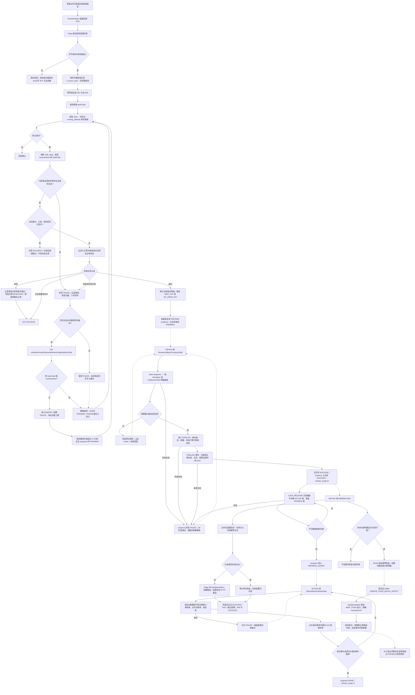

[业务逻辑专辑](/knowledge/business-logic/) / 居民收益付款 / S07

说明审核结果的持久化受理、回调消费、明细分批处理与主业务生效，以及失败重试和独立后续处理的边界，附逐章原文对照。本文保留原文 12 章，正文连续展开，原文对照与流程源码按需展开。

**前置阅读：** [S05 · 审核计划创建任务](/knowledge/business-logic/resident-income/s05-审核计划创建任务/)

**快速阅读：** [任务概览](#chapter-1) · [核心调用链](#chapter-3) · [异常与重复执行](#chapter-8) · [完整流程](#chapter-10) · [源码索引](#chapter-11)

<div class="business-logic-article">

从“审核结果已经收到”，走到明细分批处理、主单生效与独立后续支线。读懂每一步做什么，也分清每一个“成功”究竟证明了什么。

S07 受理后消费 → S08 分批改明细 → FINALIZE 主业务生效。

主任务成功 ≠ 底层刷新完成 ≠ 通知送达或最终付款。

每章末尾可展开对应原文；C01—C33 可跳转完整源码定位。

<div id="opening"></div>

<div id="intro-intro-heading-0"></div>

## 开场：跟着一张付款单走一遍

**以下是贯穿全文的假设例子，不是实际运行数据。** 假设付款单 A 的当前发布版本是 5，审核计划是 P，审批轮次是 2，提交轮次是 3。它有 2,500 条正式明细：2,300 条是待付款明细，200 条是不合格明细。这里的“待付款”表示明细类型，并不表示钱已经付出。

上游审核流程已经形成“通过”结论。现在的问题不是再审批一次，而是：**怎样把这个结论落实到付款单、明细和后续业务，又不要求审核请求一直等到所有处理完成？**

上游审核处理器把结果发送给财务服务，这叫 **审核回调（把已经确定的审核结果通知给财务系统）**。财务服务先确认这份结果对应哪张单、哪个版本和哪次审核，再把处理任务保存到数据库。接口返回受理成功，只相当于说“这份结果已经登记，后面可以按记录处理”，不是“2,500 条明细、通知和付款全都完成”。

接着，S07 消费这条任务。它先核对任务内容和业务身份。如果付款单 A 已经换成版本 6，旧版本 5 的回调不能直接覆盖当前单据；代码会按旧回调分支处理。只有身份仍有效，才进入通过或驳回的业务分支。

这次假设结果为通过，S07 不在自己这一轮里更新全部明细，而是建立 **progress（进度记录：保存处理到哪个阶段、哪个明细 ID、累计处理了多少条）**，交给 S08。S08 分批把待付款明细改为已审核通过，把不合格明细改为不合格生效。在这些批次执行期间，主单仍可能显示“审核中”。

等明细批次完成，进入 **FINALIZE（主业务收尾：复核并正式提交主单审核结果的阶段）**。付款前检查通过后，付款单 A 从审核中变成待支付；审批实例记为通过，主任务记为成功。**此刻钱仍未必已经付出，不合格锁释放和底层刷新也还没有全部结束。**

随后，不合格明细的占用被分批释放；S12 刷新底层账单状态，并提交 S13 快照任务。另一边，S09 可以在 FINALIZE 成功后处理合作方结果通知，以及适用的司库付款批次。这些支线并不统一等到全部结束才让主任务成功，通知失败也可能与任务成功并存。

换成另外两种情况，路线会不同：审核被驳回时，本分支直接处理主单和审批实例，不释放本单锁、不删除正式明细，也不走审核通过的进度链；审核通过但全部明细不合格时，主单最终是“无需支付”，不创建司库付款批次，但仍有不合格锁释放、底层刷新和适用的合作方通知。

因此，这个任务的职责是**落实已经收到的审核结论并保留可继续处理的记录**，不是重新决定通过或驳回，也不是保证银行最终付款成功。回调根本没被财务服务受理、数据库里没有留下任务时，S07 也没有东西可消费。

<div id="intro-intro-heading-1"></div>

### 阅读依据与核查边界

> 对应原文：`residentIncomePaymentReviewCallbackRetryTask 源码梳理`。本阅读版保留原文第 1—12 章及全部小节的对应关系；开场业务故事和通俗解释是为阅读增加的内容，不代表新增业务规则。
>
> **事实来源与核查边界**：原文分析日期为 **2026-09-08**，依据 `/Users/wangyi/BZ/zx-monitor/zxbaif` 当前工作区，分支 `Ian/review/01`，HEAD 为 `a1bfacbeb6dfc239d577bd66bf78cd9eb2482efa`。原文标注 **SOURCE\_VERIFIED（源码核实：核对了 Java 实现、Mapper SQL（数据库映射文件中的查询/更新语句）、状态枚举及 DDL（数据库结构定义脚本））**，但没有连接数据库、运行调度或调用外部接口。部署版本、XXL-Job 配置、配置中心取值、实际数据结果均未确认。
>
> **不能把工作区结论直接当成线上结论**：原工作区不是干净提交，分析包含 `ResidentIncomePaymentFencedExecutionTemplateImpl` 在内的当前文件，因此不等同于这个 HEAD 提交的行为，也不等同于生产环境行为。本阅读版仅依据附件改写，没有另行读取工程源码或验证运行环境；文中的“源码事实”均指原文已经记录的核对结果。
>
> **编号提醒**：原文记录的文档存放目录是 S03，代码中的审核回调消费路由是 `S07_REVIEW_CALLBACK`，两者不是同一套编号。以下沿用代码链路中的 S07、S08、S09、S12、S13。

<details class="original">
<summary>原文对照 · 展开原文标题与核查边界</summary>

<div id="original-intro-intro-heading-0"></div>

### residentIncomePaymentReviewCallbackRetryTask 源码梳理

> 分析日期：2026-09-08。依据：`/Users/wangyi/BZ/zx-monitor/zxbaif` 当前工作区源码，分支 `Ian/review/01`，HEAD `a1bfacbeb6dfc239d577bd66bf78cd9eb2482efa`。
>
> 本文属于 **SOURCE\_VERIFIED（源码核实）**：核对了 Java 实现、Mapper SQL、状态枚举及相关 DDL 文件；未连接数据库、未运行调度、未调用外部接口。部署版本、XXL-Job 配置、配置中心取值和实际数据结果均暂时无法确认。工作区不是干净提交，分析使用了包括 `ResidentIncomePaymentFencedExecutionTemplateImpl` 在内的当前文件；不能把本文等同于该 HEAD 提交或生产环境的行为。
>
> 文档存放目录为 S03；当前代码将审核回调消费路由命名为 **S07\_REVIEW\_CALLBACK**。二者不是同一套编号。

</details>

<div id="chapter-1"></div>

## 1. 任务概览

<div id="chapter-1-heading-1"></div>

### 先理解它管什么，再看它叫什么

名字里虽然有 `RetryTask`，但不能把它理解成“只处理失败任务”。当前它处理三类事情：首次入库的审核回调、失败回调的重试，以及少量已经进入 `RUNNING`（运行中）但还没有进度记录的卡住任务。

这里的 **XXL-Job handler（被调度平台按名称调用的 Java 任务入口）** 是 `residentIncomePaymentReviewCallbackRetryTask`。**消费（读取持久化记录并执行其业务）** 不一定意味着用消息队列；这一轮 XXL 调用顺序遍历候选任务，不会为每一条临时创建线程，也不会为每一条临时发送 **MQ（消息队列消息）**。

另一个入口叫 **kick（主动触发：任务持久化后尝试马上唤起对应处理器）**。它不是另一套业务，而是按 `taskCode`（任务编码，用来定位任务的标识）精确调用同一消费服务。kick 与定时扫描可以同时存在。

| 项目 | 当前源码事实 |
| --- | --- |
| XXL-Job handler | `residentIncomePaymentReviewCallbackRetryTask` |
| 入口类 | `ResidentIncomePaymentReviewCallbackJob` |
| 执行服务 | `ResidentIncomePaymentReviewCallbackAsyncTaskServiceImpl` |
| 所在服务 | `financial-center` |
| 主任务存储 | `fi_async_task` |
| 精确任务类型 | `RESIDENT_INCOME_PAYMENT_REVIEW_CALLBACK_RETRY`，数据库代码为大写 |
| 一条任务代表什么 | 某付款单、某发布版本、某审核计划、某审批轮次和提交轮次下的一次 PASS/REJECT 结论 |
| 默认消费量 | 100 条；非正数回落到 100，最大 500 |
| 本次 XXL 执行方式 | 顺序遍历候选任务，不为每条任务现场建立线程或发 MQ |
| 同一逻辑的其他入口 | 提交成功后的主动 kick，按 `taskCode` 精确执行同一消费服务 |
| 调度频率 | Java 仅注册 handler；实际 cron、路由、阻塞策略和部署实例数暂时无法确认 |

一条任务不是“某付款单以后所有审核的总任务”，而是某付款单、某发布版本、某审核计划、某审批轮次、某提交轮次下的一个 `PASS` 或 `REJECT` 结论。身份为什么要拆这么细，第 3.1 节会解释。

默认一轮最多取 100 条，传入非正数仍回落到 100，上限是 500。这个数量是任务消费量，不是每批更新明细的数量；明细批次的 1,000 与它是两套限制。

审核通过的大量明细交给进度任务分批推进。主业务成功后，还有不合格占用释放、底层账单刷新、快照，以及适用的合作方通知和司库付款。它不重新提交审批，也不重新计算审核人员的意见。真实 cron、调度路由、阻塞策略及部署实例数不能从 Java 入口注册本身得出，原文未确认。

源码定位：[C01](#source-c01)、[C02](#source-c02)、[C03](#source-c03)。

<details class="original" id="original-chapter-1">
<summary>原文对照 · 展开第 1 章原文</summary>

以下为附件本章原文，未按阅读版重写。引用编号可跳转到第 11 章的完整源码定位。

<div id="original-1-1"></div>

### 1. 任务概览

**这个任务把已经收到的居民收益付款审核结论，可靠地落实到财务业务数据。当前它既消费首次入库的回调，也重试失败回调，并修复少量卡在 RUNNING、尚未建立进度记录的任务。**

它不重新提交审批，也不重新计算审核人员的通过/驳回意见。审核通过后的大量明细处理交由进度任务分批推进；达到主业务成功后，还会释放不合格明细占用、刷新底层账单状态、生成快照，并触发合作方通知及适用的司库付款链路。

| 项目 | 当前源码事实 |
| --- | --- |
| XXL-Job handler | `residentIncomePaymentReviewCallbackRetryTask` |
| 入口类 | `ResidentIncomePaymentReviewCallbackJob` |
| 执行服务 | `ResidentIncomePaymentReviewCallbackAsyncTaskServiceImpl` |
| 所在服务 | `financial-center` |
| 主任务存储 | `fi_async_task` |
| 精确任务类型 | `RESIDENT_INCOME_PAYMENT_REVIEW_CALLBACK_RETRY`，数据库代码为大写 |
| 一条任务代表什么 | 某付款单、某发布版本、某审核计划、某审批轮次和提交轮次下的一次 PASS/REJECT 结论 |
| 默认消费量 | 100 条；非正数回落到 100，最大 500 |
| 本次 XXL 执行方式 | 顺序遍历候选任务，不为每条任务现场建立线程或发 MQ |
| 同一逻辑的其他入口 | 提交成功后的主动 kick，按 `taskCode` 精确执行同一消费服务 |
| 调度频率 | Java 仅注册 handler；实际 cron、路由、阻塞策略和部署实例数暂时无法确认 |

依据：[C01](#source-c01)、[C02](#source-c02)、[C03](#source-c03)。

</details>

<div id="chapter-2"></div>

## 2. 业务目的

<div id="chapter-2-1"></div>

### 2.1 解决审核完成与财务落地之间的间隙

“审核系统已经给出结论”和“财务业务数据已经全部落好”是两件事。大单需要更新大量明细、释放部分锁、计算状态；直接让审核请求一直等到这些动作全部完成，并不是当前实现。

技术上，上游是 `investmentplant-center` 的 `ResidentIncomePaymentReviewHanler.sourceFromInfoProcess`。它组装 **DTO（Data Transfer Object，跨方法或服务传递的一组数据）**，通过 **Feign（以 Java 接口方式发起的跨服务调用）** 调用财务服务的 `submitReviewCallbackFiResidentIncomePaymentOrder`。

财务接口先校验身份，然后把异步任务持久化，再返回。**异步（先接受工作、由后续执行入口推进，而不是在当前请求中全部完成）** 在这里的关键是先留下记录。因此，回调提交成功表示财务服务已经接受处理任务，不表示整张付款单的明细、底层账单、通知和付款都完成。[C04](#source-c04)、[C05](#source-c05)、[C06](#source-c06)

这条链路要解决三类问题。

第一，大单的明细更新、锁释放、状态计算工作多，不适合一直占着审核请求。第二，进程退出、数据库异常，或者业务处理依赖的前置事实暂时不满足时，需要能查到处理记录，并从已有进度继续。第三，同一原单重新提交会改变版本、审核计划或轮次，迟到的旧结果不能覆盖新的付款单。

“留下可续跑记录”也有适用范围：这里只覆盖已经成功受理、实际留下任务的回调，不代表上游所有未送达情况都已经有完整兜底。

<div id="chapter-2-2"></div>

### 2.2 通过与驳回的业务结果不同

先分清两个维度：**审核结果**是对这张付款单的审核结论；**明细合格性**是单内各行是否属于待付款或不合格。付款单审核通过，可以同时包含不合格明细。

| 审核结果 | 付款单业务结果 | 明细与占用 |
| --- | --- | --- |
| 驳回 | `审核中(20) → 审核不通过(30)`，更新对应审批实例为 `REJECTED` | 本分支不释放本单锁、不删除正式明细、不创建审核通过进度，也不调用底层状态刷新 |
| 通过，存在待付款明细 | 分批处理完成后，`审核中(20) → 待支付(40)` | 待付款行进入已审核通过；不合格行进入不合格生效，后续仅释放不合格行关联的 ACTIVE 锁 |
| 通过，全部是不合格明细 | 分批处理完成后，`审核中(20) → 无需支付(55)` | 不进入司库付款批次生成，但仍需处理不合格锁释放、底层刷新及适用的合作方结果通知 |

`UNDER_REVIEW(20)` 是主单“审核中”，`REVIEW_REJECTED(30)` 是“审核不通过”，`WAIT_PAY(40)` 是“待支付”，`NO_NEED_PAY(55)` 是“无需支付”。后文单独使用 `ACTIVE` 时，指仍然生效的付款占用锁，不是任务状态。

沿用假设例子，付款单 A 有 2,300 条待付款行，所以通过后的主单目标是 `WAIT_PAY(40)`；那 200 条不合格明细不会被当成待付款行处理。如果假设改为 2,500 条全部不合格，主单目标才是 `NO_NEED_PAY(55)`。

驳回不是“审核通过后清理不合格行”的另一个名字。驳回分支不释放本单锁、不删除正式明细、不创建通过进度、不调用底层状态刷新；全部不合格但审核通过的分支仍会继续执行释放不合格占用和刷新工作。

**审核通过既不代表所有明细合格，也不代表居民已经收到钱。** [C07](#source-c07)、[C08](#source-c08)、[C09](#source-c09)

<details class="original" id="original-chapter-2">
<summary>原文对照 · 展开第 2 章原文</summary>

以下为附件本章原文，未按阅读版重写。引用编号可跳转到第 11 章的完整源码定位。

<div id="original-2-2"></div>

### 2. 业务目的

<div id="original-2-2-1"></div>

#### 2.1 解决审核完成与财务落地之间的间隙

审核操作来自 `investmentplant-center` 的 `ResidentIncomePaymentReviewHanler.sourceFromInfoProcess`。它组装回调 DTO，通过 Feign 调用财务服务的 `submitReviewCallbackFiResidentIncomePaymentOrder`。

当前提交接口先完成身份校验，再持久化异步任务后返回。它没有在这个 Feign 请求里同步更新整张付款单的所有明细。因此，“审核回调提交成功”首先表示财务服务已经接受处理任务，而不是全部账单状态、通知和付款都已完成。[C04](#source-c04)、[C05](#source-c05)、[C06](#source-c06)

这解决三类实际问题：

1. 大付款单的明细更新、锁释放和状态计算较多，不适合占住审核请求等待全部完成。
2. 进程退出、数据库异常或前置事实暂时不满足时，需要留下可查询、可续跑的处理记录。
3. 付款单原单重提会改变版本、审核计划或轮次，迟到的旧审核结果不能覆盖当前付款单。

<div id="original-2-2-2"></div>

#### 2.2 通过与驳回的业务结果不同

| 审核结果 | 付款单业务结果 | 明细与占用 |
| --- | --- | --- |
| 驳回 | `审核中(20) → 审核不通过(30)`，更新对应审批实例为 `REJECTED` | 本分支不释放本单锁、不删除正式明细、不创建审核通过进度，也不调用底层状态刷新 |
| 通过，存在待付款明细 | 分批处理完成后，`审核中(20) → 待支付(40)` | 待付款行进入已审核通过；不合格行进入不合格生效，后续仅释放不合格行关联的 ACTIVE 锁 |
| 通过，全部是不合格明细 | 分批处理完成后，`审核中(20) → 无需支付(55)` | 不进入司库付款批次生成，但仍需处理不合格锁释放、底层刷新及适用的合作方结果通知 |

“审核通过”是对该付款单审核结果的确认，**不代表付款单所有明细都合格，也不代表居民已经收到款项**。[C07](#source-c07)、[C08](#source-c08)、[C09](#source-c09)

</details>

<div id="chapter-3"></div>

## 3. 核心调用链

<div id="chapter-3-1"></div>

### 3.1 上游：回调如何变成任务

<div id="chapter-3-heading-2"></div>

#### 第一步：先确认“这是谁的哪一次结果”

同一张付款单可以经历多次发布和审核。仅靠 `paymentOrderId` 找到付款单，还不能证明这次回调应当落到当前版本。因此，财务服务需要把一次回调的业务身份补齐。

| 字段 | 在这条链路中的含义 | 上游是否直接提供 |
| --- | --- | --- |
| `paymentOrderId` | 付款单 ID，来自 `planInfo.fromId` | 是 |
| `reviewPlanId` | 审核计划 ID，来自 `planInfo.planId` | 是 |
| `reviewPassed` | 通过还是驳回，决定 `PASS` / `REJECT` | 是 |
| `reviewRemark` | 审核备注 | 是 |
| `reviewTime` | 审核时间 | 是 |
| `dataVersion` | 这次回调对应的发布版本 | 没提供时由财务补齐 |
| `approvalAttempt` | 审批轮次，用于定位审批实例 | 没提供时由财务补齐 |
| `submitRound` | 提交轮次，用于区分本单的提交身份 | 没提供时由财务补齐 |

**审批实例（某次具体审批的身份与结果记录）** 是补齐身份的依据。对于上游没有传入的三个字段，财务服务按“该付款单＋该审核计划”查最新审批实例，不是直接拿当前付款单版本套在旧回调上。[C04](#source-c04)、[C05](#source-c05)、[C10](#source-c10)

补齐查询的优先级明确为 `data_version DESC, approval_attempt DESC, id DESC LIMIT 1`：先看较大版本，再看较大审批轮次，再看较大 ID，只取一条。补齐后，又按付款单、版本、审批轮次、审核计划这四项精确查询实例。实例不存在，或者已经有相反审核结论，都不能正常接受新任务。

注意这不是五字段实例查询：实例精确查询本身没有 `submit_round` 条件，提交轮次另与主单核对。原文没有把“审批轮次”与“提交轮次”定义为同一个概念，本阅读版也不合并它们。

<div id="chapter-3-heading-3"></div>

#### 第二步：给同一个审核结论生成稳定任务身份

**business\_key（业务键：描述这次业务处理身份的字符串）** 包含六项；**task\_code（任务编码：用于定位和去重的任务标识）** 根据业务键生成：

```text
business_key = REVIEW_CALLBACK:{paymentOrderId}:{reviewPlanId}:{dataVersion}:
               {approvalAttempt}:{submitRound}:{PASS或REJECT}

task_code = RIPRC:{MD5(business_key)}
```

这里的 `MD5` 是用于生成摘要的算法；本处用途是从业务键形成任务编码，不是用于解释后面合作方 HTTP 的加密和签名。

六项身份全部相同，任务编码就相同。审核备注和审核时间不参与业务键，因此“同一次审核只是换了备注/时间再提交”也不会生成一条新身份任务。[C03](#source-c03)

这使用了 **幂等（相同业务身份重复操作时复用已有结果，而不是无限重复创建）**。具体不是覆盖式更新：重复提交复用旧任务，**不覆盖第一次保存的 `task_data`，不把 `SUCCESS`（成功）重置成 `PENDING`（待处理），也不清零失败次数**。[C06](#source-c06)、[C11](#source-c11)

<div id="chapter-3-heading-4"></div>

#### 第三步：任务和受理轨迹一起入库，提交后再唤起执行

**seed（持久化任务种子：已经落库、可供后续执行的任务记录）** 在这里不是另一个审批结果，而是后续处理的起点。接受服务通过 `insertIgnore` 尝试插入，再用 `queryByTaskCode` 回读并核对身份；不能把“插入被忽略”理解成无条件接受任意既有任务。

完整调用顺序如下：

```text
ResidentIncomePaymentReviewHanler.sourceFromInfoProcess(planInfo, isSuccess)
  → buildReviewCallbackDto
  → IFiResidentIncomePaymentOrderServiceFeign.submitReviewCallbackFiResidentIncomePaymentOrder
  → FiResidentIncomePaymentOrderController.submitReviewCallbackFiResidentIncomePaymentOrder
  → FiResidentIncomePaymentOrderServiceImpl.submitReviewCallbackFiResidentIncomePaymentOrder
      → completeReviewCallbackIdentity
      → 校验付款单存在、审批实例身份和相反审核结论
      → ResidentIncomePaymentReviewCallbackTaskAcceptanceServiceImpl.accept
          → ResidentIncomePaymentSafeSeedServiceImpl.acceptOrReuse
              → FiAsyncTaskMapper.insertIgnore
              → queryByTaskCode 回读并校验身份
          → 写入异步业务轨迹
          → registerAfterCommit(S07_REVIEW_CALLBACK, taskCode)
```

`submitReviewCallback...` 使用本地事务，`accept` 要求加入已有事务。**本地事务（同一数据库事务内的相关写入一起提交或回滚）** 把任务接受与异步业务轨迹一起处理。`registerAfterCommit` 表示等事务提交之后才尝试 S07 kick；kick 没派发成功，已落库的任务仍然保留，后续 XXL 可以扫描。[C05](#source-c05)、[C06](#source-c06)、[C11](#source-c11)

**限制**：Feign 根本没到财务服务，或者提交事务失败而没有留下任务时，S07 无记录可消费。上游怎么完整兜底这种“未受理回调”，原文没有确认，不能用这里的重试机制代替。

<div id="chapter-3-2"></div>

### 3.2 本任务入口：选择任务、抢占、校验、分流

<div id="chapter-3-heading-6"></div>

#### 先选候选，再取得处理资格

自动扫描与手工选择的区别是“怎么选到候选”，不是“选到以后就一定执行”。候选还要经过 **claim（抢占：用数据库条件更新争取本次处理资格）**。只有抢占成功，才进入任务内容和业务身份检查。

```text
ResidentIncomePaymentReviewCallbackJob.residentIncomePaymentReviewCallbackRetryTask(param)
  → parseJobParam / unwrapPayload
  → executeJob
      ├─ 无 taskCode/businessKey 选择器：executePendingTasks(maxTaskCount)
      │   → queryAutoExecutableTaskList
      │   → appendRunningTaskWithoutProgressForRepair
      └─ 有选择器：executeManualRetry(taskCodes, businessKeys, maxTaskCount)
          → queryManualRetryTaskList
  → executeTaskList：顺序逐条执行
  → executeSingleTask
      → claimTask → fencedExecutionTemplate.claim → 条件 UPDATE 抢占
      → parseCallbackDto：解析 task_data
      → validateTaskIdentity：重建业务键和 taskCode，核对持久化身份
      → isExpiredCallbackTask：查审批实例和当前付款单
          ├─ 身份记录缺失：失败，留错误和重试信息
          ├─ 旧版本/旧计划/旧提交轮次：SUCCESS + 跳过说明
          └─ 当前有效：reviewCallbackFiResidentIncomePaymentOrderTask(callbackDto, task)
```

`fencedExecutionTemplate.claim` 中的 **fencing（隔离旧执行者：用执行代次/条件判断约束写入，避免过时执行者继续推进受保护数据）** 并不表示整个系统都被同一个令牌保护，具体保护缺口见第 9.6 节。

抢占成功时，任务状态变为 `RUNNING`，`running_attempt` 增加 1，并生成执行令牌。**running\_attempt（运行代次：区别前后两次执行者的计数）** 不是失败次数 `retry_count`。抢占失败通常意味着已经被其他执行者处理、任务状态不允许、时间未到，或者次数到上限；本轮计为跳过。[C02](#source-c02)、[C12](#source-c12)

<div id="chapter-3-heading-7"></div>

#### 再检查任务内容没有“张冠李戴”

`parseCallbackDto` 从 `task_data` 解析回调 DTO；JSON 能解析只是第一关。`validateTaskIdentity` 还会根据 DTO 重新构造 `business_key` 和 `task_code`，与任务行里的持久化身份逐一比较，任意一项不一致都失败，不能把错误的任务数据当作正常回调处理。

<div id="chapter-3-heading-8"></div>

#### 最后检查是不是迟到的旧结果

`isExpiredCallbackTask` 的顺序不能倒过来：先要求历史审批实例确实存在，再读取未删除的当前主单，最后比较以下三个条件：

```text
order.current_publish_version == callback.dataVersion
AND order.review_plan_id == callback.reviewPlanId
AND order.submit_round == callback.submitRound
```

三个条件必须全部相同，才属于这里的当前身份；**任意一个不同**就走旧回调快速跳过。此时主任务记 `SUCCESS`，`error_message` 写“旧审核计划或旧发布版本回调已跳过”，摘要的跳过数增加。[C02](#source-c02)

沿用假设例子，任务属于版本 5，但当前主单已变成版本 6，在历史实例真实存在的前提下就会跳过。这个 `SUCCESS` 表示旧回调已经按规则处理完，并不表示它又审批通过了当前版本。

快速跳过分支不再调用业务回调，也**不会更新历史审批实例结论**。反过来，历史审批实例根本不存在属于失败，不会直接被当成“旧了就忽略”。

<div id="chapter-3-3"></div>

### 3.3 驳回：本次调用直接处理业务状态

驳回不需要先走一轮审核通过明细批次。业务入口 `reviewCallbackFiResidentIncomePaymentOrderTask → doReviewCallbackFiResidentIncomePaymentOrder` 再次核验身份与相反结论后，按下面顺序处理。[C07](#source-c07)

1. 同一审核计划的主单已经是 `REVIEW_REJECTED`：按幂等成功返回，并尝试补齐审批实例终态。
2. 不属于上面的已处理情况时，主单必须仍为 `UNDER_REVIEW`，且审核计划、提交轮次匹配。
3. `executeReviewRejectedCallback` 先条件更新主单，再更新审批实例。
4. 主单写 `status=30`、`review_finish_time`、`update_time`；审批实例写 `approval_status=REJECTED`、`finish_time`、`update_time`。
5. 消费服务将 `fi_async_task` 记为 `SUCCESS`。

这条路没有明细状态修改，没有锁释放，没有审核通过副作用任务，也没有底层状态刷新。**副作用任务（主业务之外另行执行的后续工作）** 在本文指合作方通知、司库付款批次构建这一类支线，不是说它们不重要。

普通驳回也没有另写一条像通过分支 `REVIEW_APPROVED` 那样的付款单业务操作日志；此前的异步受理轨迹仍然存在。受理轨迹与正式业务日志不是同一张表、同一种记录。

**这里有原文保留的缺口**：当前业务回调入口和驳回私有方法没有把主单、审批实例两次写入包进明确的共同事务。可能出现主单先成功、实例后失败的窗口，不能仅因为后续有重试就认为两张表一定原子一致。第 9.2 节进一步说明。

<div id="chapter-3-4"></div>

### 3.4 通过：S07 当前只准备 progress，交给 S08

通过分支的第一件事仍然不是盲目修改明细，而是先看主单是否已经处理、当前状态是否允许处理，再统计当前发布版本的明细。[C07](#source-c07)、[C08](#source-c08)

统计结果必须同时满足：

```text
totalCount > 0
AND totalCount = payableCount + unqualifiedCount
```

即总数必须大于零，而且所有明细都要落在这两类统计里。不能把第二个等式省略成“只要有待付款行就继续”。满足统计要求后，有待付款行就以 `WAIT_PAY(40)` 为目标；没有待付款行则以 `NO_NEED_PAY(55)` 为目标。

调用链如下：

```text
queryReviewCallbackBillStat(paymentOrderId, dataVersion)
  → resolveReviewApprovedTargetStatus
  → executeReviewApprovedBillUpdateCallback
      → buildReviewApprovedCallbackProgress
      → prepareReviewApprovedProgress
      → kickCommittedSeed(S08_REVIEW_PROGRESS, progressId)
      → 返回业务成功
```

`executeReviewApprovedBillUpdateCallback` 名字虽然含 `BillUpdate`，当前实现却只负责准备进度和交接，**没有在 S07 里面直接运行明细更新批次**。

首次进度初始化如下；`phase` 是处理阶段，`phase_status` 是该阶段状态，`main_task_status` 是进度记录对主业务状态的标记，这三者不能混为一个“总状态”。

```text
phase=PREPARE，phase_status=SUCCESS，main_task_status=RUNNING
payable_updated_count=0，unqualified_updated_count=0
payable_cursor_id=0，unqualified_cursor_id=0，lock_cursor_id=0
refresh_ready=0，batch_size=1000
worker_id=null，running_attempt=0，lease_expire_time=null
```

两个明细游标分别记待付款行、不合格行处理到了哪个 ID；锁游标记锁释放到了哪里。`refresh_ready=0` 表示底层刷新尚未就绪。`worker_id` 是当前进度执行者标识，`lease_expire_time` 是 **lease（租约：处理资格的有效期）** 的到期时间；初始都尚未赋予某个运行中的工作者。

重复 PREPARE 按五字段审核身份复用 progress：付款单、版本、审核计划、提交轮次、审批轮次。复用时核对总数、待付款数、不合格数是否一致，**不会把已有进度游标归零**。[C13](#source-c13)

业务入口返回成功且这个 progress 的 `main_task_status=RUNNING` 时，S07 执行摘要会加一条“成功”，但 `fi_async_task` **有意保留 `RUNNING`**。这次成功只证明准备工作/交接完成，主业务要等 FINALIZE 收尾。

<div id="chapter-3-5"></div>

### 3.5 S08：明细分批处理

S08 接手之后，每次消费只推进一个明细子批次，不是一次消费就把整张单处理完。入口可以是 `residentIncomePaymentReviewCallbackProgressTask`，也可以是 S08 kick，执行服务是 `ResidentIncomePaymentReviewCallbackProgressTaskServiceImpl`。[C14](#source-c14)

<div id="chapter-3-heading-12"></div>

#### 遇到什么问题：大单不能只靠“全部做完才记进度”

如果每次都从头处理，进程中途退出就难以准确续接。这里用独立 ID 游标记录已经提交的位置，处理顺序固定为**先 PAYABLE，后 UNQUALIFIED**。

```text
executeProgress
  → executeOneBillUpdateBatch
      → claimBillUpdate：取得 progress 的 worker_id / running_attempt / lease
      → ResidentIncomePaymentReviewCallbackBillUpdateServiceImpl.executeNextBillUpdateBatch
          → SELECT progress FOR UPDATE
          → 校验阶段、执行者、尝试版本和租约
          → 先处理 PAYABLE，再处理 UNQUALIFIED
          → 找下一批明细 ID 上界
          → 批量更新明细
          → 同事务推进对应游标和累计处理数
      ├─ 未完成：让出 owner，BILL_UPDATE/INIT，继续 kick
      └─ 全部完成：FINALIZE/INIT，释放 owner，继续 kick
```

`SELECT progress FOR UPDATE` 是 **行锁查询（读取进度行时取得数据库行锁，供本事务核验和修改）**。拿到 progress 后，要校验阶段、执行者、运行代次和租约，再找下一批明细的 ID 上界。

**cursor（游标：已经处理到的 ID 位置）** 与本批最大 ID 一起界定本次更新范围。当前入口把 `batch_size` 写为 1,000；待付款行与不合格行各有自己的游标，不是混用一个游标。

<div id="chapter-3-heading-13"></div>

#### 怎样处理：明细和游标必须一起提交

`ResidentIncomePaymentReviewCallbackBillUpdateServiceImpl.executeNextBillUpdateBatch` 使用 **`REQUIRES_NEW`（以独立新事务执行这一批）**。本批明细更新、对应游标推进和累计处理数增加，都在同一事务中提交。[C15](#source-c15)

这样约束的是“这一批”的一致性：不能只改明细却不推进游标，也不能只推进游标却跳过尚未更新的明细。它不意味着后面 FINALIZE 失败时，会把此前所有已经提交的批次一起撤销。

| 明细类型 | 本阶段写入结果 | 时间处理 |
| --- | --- | --- |
| `line_type=PAYABLE(10)` | `line_status → REVIEW_APPROVED(20)`，即已审核通过 | 处理时间优先采用 DTO 的 `reviewTime`；缺失才用当前时间 |
| `line_type=UNQUALIFIED(20)` | `line_status → UNQUALIFIED_EFFECTIVE(50)`，即不合格生效；写 `unqualified_effective_time` | 同样优先采用 DTO 的 `reviewTime`，缺失才用当前时间 |

假设例子的 2,300 条待付款行，按 1,000 上限可分成 1,000、1,000、300 的明细子批次，然后处理 200 条不合格行。**这只是按数量解释明细切批，不代表调度恰好执行四次就能完成所有阶段**；抢占、阶段切换和 FINALIZE 是另外的流程。

未全部完成时，让出 **owner（当前阶段处理权的持有者）**，写回 `BILL_UPDATE/INIT`，再继续 kick。全部明细完成则转为 `FINALIZE/INIT`，释放 owner，继续 kick。

**仍有什么限制**：本步骤只改变明细，主单尚不变为待支付，仍是审核中。两种明细数值里的 `20` 分别可能表示主单审核中、待付款明细已审核通过、或不合格的明细类型；必须连同字段名看，不能只看数字。

<div id="chapter-3-6"></div>

### 3.6 FINALIZE：确认主业务生效并落后续任务

明细全部处理完，还不能直接宣布主单生效。需要重新确认审核身份没有变、数量对得上，并对待支付单做付款前复核，最后在一个事务内提交主业务结果。

`ResidentIncomePaymentReviewCallbackFinalizeServiceImpl.executeFinalize` 先单独抢占进度，再在事务外构造 **刷新分片范围计划（把需要刷新的明细范围切成多个后续处理单元）**，然后进入 `doFinalizeTransaction`。[C16](#source-c16)

事务里的顺序是：

1. 锁定 progress，检查执行者、租约、阶段和明细累计数；原文要求三个累计数与 PREPARE 的统计精确一致。
2. 锁定付款单主表，确认仍是审核中，当前发布版本、审核计划、提交轮次都未变化。
3. 查验审批实例身份。
4. 目标为待支付时，执行付款前复核，并确定付款方式。
5. 条件更新主单目标状态、`payment_type`、`review_finish_time`；选择司库付款时同时写 `push_status=NOT_PUSHED`。
6. 更新审批实例为 `APPROVED`。
7. 插入 `REVIEW_APPROVED` 付款单操作日志，记录前后状态、明细数和审核意见。
8. 插入 `source_type=REVIEW_APPROVED`、`source_id=progress.id` 的状态刷新分片，并核对实际分片数。
9. 插入适用的审核通过副作用任务。
10. 统计待释放的不合格 `ACTIVE` 锁，将 progress 推进为 `LOCK_RELEASE/INIT`、`main_task_status=SUCCESS`，写 `finalize_time`，仍保留 `refresh_ready=0`。
11. 将关联 `fi_async_task.task_status` 更新为 `SUCCESS`，清空错误信息。

三个累计数必须与准备时的总数、待付款数、不合格数统计精确对应，而不是近似相等；原文没有在此逐一列出这三个累计数的完整字段公式。

<div id="chapter-3-heading-15"></div>

#### 付款前复核：不是只确认“单据还是审核中”

这一检查会按 ID 分页读取该版本 PAYABLE 明细，循环检查付款事实。[C17](#source-c17)

| 检查范围 | 原文明确记录的检查 |
| --- | --- |
| 本次待付款明细 | 本次付款金额必须大于零；账期必须合法；拟付租金必须存在 |
| 是否属于“小单账单未推送”场景 | 按该场景分流：检查小单账户，或检查合作方账单/账户的对应关系 |
| 需要合作方事实的情况 | 检查账期、收款信息，以及付款明细中的收款快照 |
| 特定无小单付款场景 | 还检查拟付金额、合作方机构一致性；受迁移开关控制 |
| 需要平台电站对应关系的情况 | 通过 Feign 查询，并要求能唯一定位电站 |

这些条件都有适用范围，不能改成“所有单据无条件检查全部外部信息”。同时，原文没有给出账期合法的完整表达式、迁移开关名称/当前取值，或这些场景的全部判定细节，本阅读版不补造。

<div id="chapter-3-heading-16"></div>

#### 付款方式：按本轮项目付款信息确定

付款方式读取本单**当前版本、当前提交轮次**的项目公司付款信息，排除 `NO_NEED_PAYMENT` 项目项，再通过 Feign 查询项目公司档案和资产经理字典。资产经理必须满足代码中的一致性要求；字典状态正常选择司库付款，否则选择线下付款。[C16](#source-c16)

这里的 **司库付款（交由后续司库付款推送链处理的付款方式）** 不等于 FINALIZE 已经付款。原文没有展开资产经理一致性的完整代码条件，也没有确认运行环境的字典值，不能另行假设。

全部不合格、目标为 `NO_NEED_PAY` 的单据，跳过上述“付款前复核”和“付款方式确定”两项待支付专属处理。

<div id="chapter-3-heading-17"></div>

#### 仍有什么限制：主业务事务不是整条链的总事务

FINALIZE 失败，事务内部的主单、审批实例、日志、后续 seed、progress 和主任务成功写入会回滚；**此前已经提交的 BILL\_UPDATE 批次不整体回滚**。

所以，“明细已审核通过，主单还在审核中，FINALIZE 等待重试”是代码允许出现的技术中间态。不能只看明细状态，就认为主单早已完成生效。

<div id="chapter-3-7"></div>

### 3.7 LOCK\_RELEASE：只释放不合格行占用

主业务已经成功后，接下来处理的是“哪些占用该释放”。审核通过单据里，不合格行不继续承担待付款占用；但待付款行仍需要保留付款占用约束。

`ResidentIncomePaymentReviewCallbackLockReleaseServiceImpl.executeNextLockReleaseBatch` 在独立事务中锁定 progress，先校验 `main_task_status=SUCCESS`、`phase=LOCK_RELEASE`、执行者和租约。[C18](#source-c18)

它按锁 ID 游标找本单、本版本、通过 `order_bill_id` 关联到 UNQUALIFIED 明细的 `ACTIVE` 锁，释放时准确写入：

```text
lock_status = RELEASED
lock_key = station_id:bill_yearmonth:RELEASED:锁记录ID
release_time = now()
release_reason = REVIEW_APPROVED_UNQUALIFIED
```

`lock_key` 变为包含 `RELEASED` 与锁记录 ID 的键，不只是把 `lock_status` 改一下。锁状态修改与 `lock_cursor_id`、`lock_release_success` 的增量推进在同一事务中。

全部锁处理完，progress 转为 `REFRESH_SHARD/INIT`。待释放锁数量为零时，也必须经过这一步阶段转换，不能据此直接跳到 DONE。

**范围不能扩大**：此阶段不释放 PAYABLE 明细的 ACTIVE 锁，也不是扫描全部账单锁。它与“驳回后保留本单明细和占用”的规则不同。

<details class="original" id="original-chapter-3">
<summary>原文对照 · 展开第 3 章原文</summary>

以下为附件本章原文，未按阅读版重写。引用编号可跳转到第 11 章的完整源码定位。

<div id="original-3-3"></div>

### 3. 核心调用链

<div id="original-3-3-1"></div>

#### 3.1 上游：回调如何变成任务

```text
ResidentIncomePaymentReviewHanler.sourceFromInfoProcess(planInfo, isSuccess)
  → buildReviewCallbackDto
  → IFiResidentIncomePaymentOrderServiceFeign.submitReviewCallbackFiResidentIncomePaymentOrder
  → FiResidentIncomePaymentOrderController.submitReviewCallbackFiResidentIncomePaymentOrder
  → FiResidentIncomePaymentOrderServiceImpl.submitReviewCallbackFiResidentIncomePaymentOrder
      → completeReviewCallbackIdentity
      → 校验付款单存在、审批实例身份和相反审核结论
      → ResidentIncomePaymentReviewCallbackTaskAcceptanceServiceImpl.accept
          → ResidentIncomePaymentSafeSeedServiceImpl.acceptOrReuse
              → FiAsyncTaskMapper.insertIgnore
              → queryByTaskCode 回读并校验身份
          → 写入异步业务轨迹
          → registerAfterCommit(S07_REVIEW_CALLBACK, taskCode)
```

上游实际提供 `paymentOrderId=planInfo.fromId`、`reviewPlanId=planInfo.planId`、`reviewPassed`、`reviewRemark` 和 `reviewTime`。没有提供的 `dataVersion`、`approvalAttempt`、`submitRound`，财务服务从该付款单、该审核计划的最新审批实例补齐；不是简单取当前付款单的版本替代历史身份。[C04](#source-c04)、[C05](#source-c05)、[C10](#source-c10)

审批实例补齐查询按 `data_version DESC, approval_attempt DESC, id DESC LIMIT 1` 排序。补齐后，再按付款单、版本、审批轮次、审核计划四个字段精确查实例。查不到，或已经存在相反结论，提交失败，不会正常产生新任务。

任务身份如下：[C03](#source-c03)

```text
business_key = REVIEW_CALLBACK:{paymentOrderId}:{reviewPlanId}:{dataVersion}:
               {approvalAttempt}:{submitRound}:{PASS或REJECT}

task_code = RIPRC:{MD5(business_key)}
```

六项身份相同就使用同一任务编码。审核备注和审核时间不在业务键中；重复提交会复用原任务，**不会覆盖首次持久化的 task\_data，不会把 SUCCESS 重置成 PENDING，也不会清零失败次数**。[C06](#source-c06)、[C11](#source-c11)

`submitReviewCallback...` 有本地事务，`accept` 要求加入已有事务。任务接受与异步操作轨迹在提交阶段一起处理；事务提交后才尝试 kick。kick 没有成功派发时，任务仍保存在数据库，供 XXL 扫描。

边界：如果 Feign 调用根本没有到达财务服务，或者提交事务没有成功留下任务，本定时任务没有记录可以消费。上游如何兜底这种“未受理回调”，不由这个任务解决，其完整调度机制暂时无法确认。

<div id="original-3-3-2"></div>

#### 3.2 本任务入口：选择任务、抢占、校验、分流

```text
ResidentIncomePaymentReviewCallbackJob.residentIncomePaymentReviewCallbackRetryTask(param)
  → parseJobParam / unwrapPayload
  → executeJob
      ├─ 无 taskCode/businessKey 选择器：executePendingTasks(maxTaskCount)
      │   → queryAutoExecutableTaskList
      │   → appendRunningTaskWithoutProgressForRepair
      └─ 有选择器：executeManualRetry(taskCodes, businessKeys, maxTaskCount)
          → queryManualRetryTaskList
  → executeTaskList：顺序逐条执行
  → executeSingleTask
      → claimTask → fencedExecutionTemplate.claim → 条件 UPDATE 抢占
      → parseCallbackDto：解析 task_data
      → validateTaskIdentity：重建业务键和 taskCode，核对持久化身份
      → isExpiredCallbackTask：查审批实例和当前付款单
          ├─ 身份记录缺失：失败，留错误和重试信息
          ├─ 旧版本/旧计划/旧提交轮次：SUCCESS + 跳过说明
          └─ 当前有效：reviewCallbackFiResidentIncomePaymentOrderTask(callbackDto, task)
```

抢占成功后，`task_status=RUNNING`，`running_attempt` 加一，生成执行令牌。抢占失败通常表示另一个执行者已经处理、状态不可执行、还未到时间或次数已达上限，本轮记为跳过。[C02](#source-c02)、[C12](#source-c12)

任务数据校验不仅要求 JSON 能解析，还会重新生成 `business_key` 和 `task_code` 与任务行比较。任一不一致即失败，防止错误 task\_data 被当成正常回调使用。

旧回调判断先要求历史审批实例真实存在，再读取未删除的当前主单，比较：

- `order.current_publish_version == callback.dataVersion`
- `order.review_plan_id == callback.reviewPlanId`
- `order.submit_round == callback.submitRound`

任一不相同，则主任务标记 SUCCESS，`error_message` 写“旧审核计划或旧发布版本回调已跳过”，摘要增加跳过数。**此快速跳过分支不再调用业务回调，也不会更新历史审批实例结论。**

<div id="original-3-3-3"></div>

#### 3.3 驳回：本次调用直接处理业务状态

`reviewCallbackFiResidentIncomePaymentOrderTask → doReviewCallbackFiResidentIncomePaymentOrder` 再次校验业务身份及相反结论，随后进入驳回分支。[C07](#source-c07)

1. 同计划主单已经是 `REVIEW_REJECTED`：按幂等成功返回，并尝试补齐审批实例终态。
2. 否则必须仍处于 `UNDER_REVIEW`，且计划、提交轮次匹配。
3. `executeReviewRejectedCallback` 先条件更新主单，再更新审批实例。
4. 主单设置 `status=30`、`review_finish_time`、`update_time`；审批实例设置 `approval_status=REJECTED`、`finish_time`、`update_time`。
5. 消费服务将 `fi_async_task` 标记 SUCCESS。

本分支没有明细状态修改、锁释放、审核通过副作用任务和底层状态刷新。普通驳回处理也没有另写一条 `REVIEW_APPROVED` 那样的付款单业务操作日志；上游的异步受理轨迹仍存在。

需要特别注意：当前这个业务回调入口及其驳回私有方法没有包住两次业务写入的事务，见第 9 节。

<div id="original-3-3-4"></div>

#### 3.4 通过：S07 当前只准备 progress，交给 S08

通过分支先检查主单幂等和可处理状态，再统计当前发布版本明细：[C07](#source-c07)、[C08](#source-c08)

```text
queryReviewCallbackBillStat(paymentOrderId, dataVersion)
  → resolveReviewApprovedTargetStatus
  → executeReviewApprovedBillUpdateCallback
      → buildReviewApprovedCallbackProgress
      → prepareReviewApprovedProgress
      → kickCommittedSeed(S08_REVIEW_PROGRESS, progressId)
      → 返回业务成功
```

这里的方法名包含 `BillUpdate`，但当前实际实现只准备进度并交接，**没有在 S07 里直接跑明细批次更新**。

统计必须满足 `totalCount > 0` 且 `totalCount = payableCount + unqualifiedCount`。存在待付款行就以 `WAIT_PAY(40)` 为目标，否则以 `NO_NEED_PAY(55)` 为目标。

进度表初始化为：

```text
phase=PREPARE，phase_status=SUCCESS，main_task_status=RUNNING
payable_updated_count=0，unqualified_updated_count=0
payable_cursor_id=0，unqualified_cursor_id=0，lock_cursor_id=0
refresh_ready=0，batch_size=1000
worker_id=null，running_attempt=0，lease_expire_time=null
```

重复 PREPARE 按五字段审核身份复用 progress，并核对总数、待付款数、不合格数是否一致；不会把既有进度游标归零。[C13](#source-c13)

当业务入口返回成功、且该 progress 的 `main_task_status=RUNNING` 时，S07 的执行摘要会增加“成功”数，但**有意保持 fi\_async\_task 为 RUNNING**，等 FINALIZE 统一完成主业务。

<div id="original-3-3-5"></div>

#### 3.5 S08：明细分批处理

后续通过 `residentIncomePaymentReviewCallbackProgressTask` 或 S08 主动 kick 进入 `ResidentIncomePaymentReviewCallbackProgressTaskServiceImpl`。[C14](#source-c14)

```text
executeProgress
  → executeOneBillUpdateBatch
      → claimBillUpdate：取得 progress 的 worker_id / running_attempt / lease
      → ResidentIncomePaymentReviewCallbackBillUpdateServiceImpl.executeNextBillUpdateBatch
          → SELECT progress FOR UPDATE
          → 校验阶段、执行者、尝试版本和租约
          → 先处理 PAYABLE，再处理 UNQUALIFIED
          → 找下一批明细 ID 上界
          → 批量更新明细
          → 同事务推进对应游标和累计处理数
      ├─ 未完成：让出 owner，BILL_UPDATE/INIT，继续 kick
      └─ 全部完成：FINALIZE/INIT，释放 owner，继续 kick
```

每次消费只处理一个明细子批次，当前入口写入的 `batch_size=1000`；两个明细类型使用独立 ID 游标。`executeNextBillUpdateBatch` 使用 `REQUIRES_NEW`，**明细更新和进度游标写入在同一事务中提交**，避免明细改了而游标没动，或游标越过未处理数据。[C15](#source-c15)

- `line_type=PAYABLE(10)`：`line_status → REVIEW_APPROVED(20)`。
- `line_type=UNQUALIFIED(20)`：`line_status → UNQUALIFIED_EFFECTIVE(50)`，写 `unqualified_effective_time`。
- 处理时间优先沿用任务 DTO 的 `reviewTime`；缺少时才使用当前时间。
- 这一步尚不改变主单为待支付，主单仍是审核中。

<div id="original-3-3-6"></div>

#### 3.6 FINALIZE：确认主业务生效并落后续任务

`ResidentIncomePaymentReviewCallbackFinalizeServiceImpl.executeFinalize` 先单独抢占进度，再在事务外构造状态刷新分片范围计划，然后进入 `doFinalizeTransaction`。[C16](#source-c16)

事务内依次执行：

1. 锁定 progress，检查当前执行者及租约、阶段和明细累计数；三个累计数必须与 PREPARE 统计精确一致。
2. 锁定付款单主表，确认仍为审核中，当前版本、审核计划、提交轮次均未变。
3. 查验审批实例身份。
4. 若目标是待支付，执行付款前复核，并确定付款方式。
5. 条件更新主单目标状态、`payment_type`、`review_finish_time`；司库付款同时写 `push_status=NOT_PUSHED`。
6. 更新审批实例为 `APPROVED`。
7. 插入付款单操作日志，操作类型 `REVIEW_APPROVED`，记录前后状态、明细数和审核意见。
8. 插入 `source_type=REVIEW_APPROVED`、`source_id=progress.id` 的刷新分片，并核对实际分片数。
9. 插入适用的审核通过副作用任务。
10. 统计待释放的不合格 ACTIVE 锁，推进 progress 为 `LOCK_RELEASE/INIT`、`main_task_status=SUCCESS`，写 `finalize_time`，保留 `refresh_ready=0`。
11. 将关联 `fi_async_task.task_status` 更新为 SUCCESS，清空错误信息。

上述事务失败时，其内部写入回滚；**此前已经提交的 BILL\_UPDATE 批次不会整体回滚**。因此可出现“明细已审核通过、主单仍审核中、FINALIZE 等待重试”的技术中间态。

付款前复核不是简单检查状态：[C17](#source-c17)

- 按 ID 分页读取该版本 PAYABLE 明细，检查本次付款金额大于零、账期合法、拟付租金存在。
- 根据是否属于“小单账单未推送”场景，检查小单账户，或检查合作方账单/账户的对应关系。
- 需要合作方事实时，检查账期、收款信息及付款明细中的收款快照；特定无小单付款场景还检查拟付金额和合作方机构一致性，并受迁移开关控制。
- 需要平台电站对应关系时通过 Feign 查询，要求能够唯一定位电站。

付款方式确定读取当前版本、当前提交轮次的项目公司付款信息，排除 `NO_NEED_PAYMENT` 项目项，再通过 Feign 查询项目公司档案、资产经理字典。资产经理必须满足代码中的一致性要求；字典状态正常选择司库付款，否则选择线下付款。全部不合格的 `NO_NEED_PAY` 单据跳过这两项待支付专属处理。[C16](#source-c16)

<div id="original-3-3-7"></div>

#### 3.7 LOCK\_RELEASE：只释放不合格行占用

`ResidentIncomePaymentReviewCallbackLockReleaseServiceImpl.executeNextLockReleaseBatch` 在独立事务中锁定 progress，并校验 `main_task_status=SUCCESS`、`phase=LOCK_RELEASE`、执行者和租约。[C18](#source-c18)

它按锁 ID 游标查找本单、本版本、关联 UNQUALIFIED 明细的 ACTIVE 锁。释放时：

```text
lock_status = RELEASED
lock_key = station_id:bill_yearmonth:RELEASED:锁记录ID
release_time = now()
release_reason = REVIEW_APPROVED_UNQUALIFIED
```

锁释放与 `lock_cursor_id`、`lock_release_success` 增量更新在同一事务。全部处理完后，progress 进入 `REFRESH_SHARD/INIT`。即使待释放锁数为零，也要经过这个阶段转换。

**PAYABLE 明细的 ACTIVE 锁不在本阶段释放范围内**，仍承担付款占用约束。驳回与审核通过后释放不合格锁也不是同一件事。

</details>

<div id="chapter-4"></div>

## 4. 数据筛选规则

本章回答“什么记录会被选中、选中之后是否一定执行”。需要始终把**候选查询**与**真正 claim**分开：查询命中，不等于已经拥有处理资格。

<div id="chapter-4-1"></div>

### 4.1 XXL 参数与路由

<div id="chapter-4-heading-2"></div>

#### 支持什么参数形状

入口可以接裸 JSON；也可以接外层有 `data` 的 JSON，其中 `data` 可以是 JSON 对象，也可以是 JSON 字符串。原文列出的常见参数如下。

自动扫描，最多取 100 条：

```json
{"maxTaskCount":100}
```

按一条任务编码选择：

```json
{"taskCode":"RIPRC:<实际任务摘要>","maxTaskCount":1}
```

按多个任务编码、多个业务键选择：

```json
{"taskCodes":["RIPRC:<任务1>","RIPRC:<任务2>"],"businessKeys":["<数据库中的完整业务键>"],"maxTaskCount":100}
```

这里 `RIPRC:<实际任务摘要>` 和尖括号内容是占位写法，不是能直接查询到真实任务的值。

<div id="chapter-4-heading-3"></div>

#### 怎样决定自动扫描还是手工重跑

单数参数与复数参数会合并，去掉空值，执行 `trim`（去掉字符串首尾空白），服务层再去重。也就是说，`taskCode` 与 `taskCodes` 不互相覆盖，`businessKey` 与 `businessKeys` 也会一起参与选择。[C01](#source-c01)、[C02](#source-c02)

同时提供两类选择器时，匹配关系为：

```text
命中任一个 taskCode
OR 命中任一个 businessKey
```

不是必须同时匹配任务编码和业务键。没有选择器就走自动扫描。数量参数归一化规则仍是默认 100、非正数回到 100、最高 500。

**异常边界**：JSON 解析失败时，代码记录日志并返回空参数，随后进入自动扫描，而不是以“参数非法”终止。选择器字段名传错也可能等同于没传选择器。原本只想操作一条任务的参数错误，可能变成扫描默认 100 条；风险保留在第 9.5 节。

<div id="chapter-4-2"></div>

### 4.2 自动扫描主任务

自动扫描先找“当前可以尝试的正常任务”，条件必须一起满足。下面是原文从 **QueryWrapper（Java 中组装查询条件的对象）** 还原的等价 SQL，用来说明逻辑，**不是已经在目标数据库执行过的查询结果**。[C02](#source-c02)

```sql
SELECT *
FROM fi_async_task
WHERE deleted = 0
  AND task_type = 'RESIDENT_INCOME_PAYMENT_REVIEW_CALLBACK_RETRY'
  AND task_status IN (0, 3) -- PENDING、FAILED
  AND (next_execute_time IS NULL OR next_execute_time <= :now)
  AND IFNULL(retry_count, 0) < IFNULL(max_retry_count, 3)
ORDER BY next_execute_time ASC, retry_count ASC, id ASC
LIMIT :normalizedMaxTaskCount;
```

把这段 SQL 用业务语言逐项展开：

| 条件 | 精确含义 |
| --- | --- |
| `deleted = 0` | 只查未删除任务 |
| 固定大写 `task_type` | 只查审核回调类型，不混入 S09、S13 或其他异步任务 |
| `task_status IN (0, 3)` | 只查 `PENDING` 待处理、`FAILED` 失败任务；本次主查询不查 RUNNING |
| `next_execute_time IS NULL OR next_execute_time <= :now` | 没设下次时间，或者已经到时间；**等于当前时间也符合** |
| `IFNULL(retry_count, 0) < IFNULL(max_retry_count, 3)` | 已记录失败数必须严格小于最大值；等于上限就不符合 |
| 三字段排序 | 先 `next_execute_time` 升序，再 `retry_count` 升序，最后 `id` 升序 |
| `LIMIT` | 使用归一化后的本轮数量上限 |

**`IFNULL`（只在值为 NULL 时提供替代值）** 不会把零也当成空。因此 `max_retry_count=0` 仍然是零，不会被替换成 3；正常生产者写入的是 3。不能把“NULL 默认 3”误写成“非正数一律默认 3”。

该查询没有显式的付款单号、账期、合作方、`tenantId` 或 XXL 分片编号限制，也没有在入口先找全体审核中付款单再逐单补建任务。全局 SQL 拦截器在目标环境是否附加额外条件，原文未确认。

<div id="chapter-4-3"></div>

### 4.3 补扫 RUNNING 且无 progress 的任务

<div id="chapter-4-heading-6"></div>

#### 遇到什么问题

S07 可能已经把任务抢占成 RUNNING，但进程在创建 progress 之前退出。这种任务不属于前面的 `PENDING/FAILED` 主查询，所以需要另一条有限范围的修复查询。

<div id="chapter-4-heading-7"></div>

#### 怎样选

**只有主查询没有用满本轮额度，才使用剩余额度**执行下列补扫：

```sql
SELECT *
FROM fi_async_task t
WHERE t.deleted = 0
  AND t.task_type = 'RESIDENT_INCOME_PAYMENT_REVIEW_CALLBACK_RETRY'
  AND t.task_status = 1
  AND t.update_time < :nowMinus10Minutes
  AND NOT EXISTS (
    SELECT 1
    FROM fi_resident_income_payment_review_callback_progress p
    WHERE p.deleted = 0 AND p.async_task_id = t.id
  )
ORDER BY t.update_time ASC, t.id ASC
LIMIT :remainingCapacity;
```

命中条件是：未删除、固定审核回调类型、`task_status=1`，并且 `update_time` **严格早于**当前时间减 10 分钟，同时不存在未删除且 `async_task_id=t.id` 的 progress。恰好等于这个十分钟前时间点，不满足原文的 `<` 条件。

优先选择 `update_time` 更早的，再按 `id` 升序，最多使用剩余名额。

<div id="chapter-4-heading-8"></div>

#### 仍有什么限制

方法注释提到审核通过任务，但 SQL 本身**没有 PASS/REJECT 过滤条件**。符合这些条件的驳回任务也可能被补扫选到，不能按注释擅自缩小查询范围。[C02](#source-c02)

这条查询没有写下次执行时间和最大次数条件；不过进入后面的**自动 claim SQL 时仍会再次检查这两项**。所以，被补扫查出来也可能抢占失败。[C12](#source-c12)

有 progress 的 RUNNING 不由这个补扫接管。如果正常待执行任务每轮持续占满额度，无 progress 的修复任务也可能一直拿不到名额，见第 9.4 节。

<div id="chapter-4-4"></div>

### 4.4 手工重跑

手工重跑是用指定任务编码/业务键选记录，不是“强制无条件再执行”。

查询条件为 `deleted=0`、固定任务类型，加上 `task_code IN (...) OR business_key IN (...)`，按 ID 升序并限制数量。**查询阶段不限制任务状态**，所以 `SUCCESS`、`RUNNING`、`CANCELLED` 都可能出现在候选中。

但真正的手工 claim **只允许 `PENDING` 或 `FAILED`**。它绕过自动执行时间和失败次数上限，却不绕过任务状态、`running_attempt`、业务身份以及付款单业务状态检查。[C02](#source-c02)、[C12](#source-c12)

因此，这个入口既不会强制重跑 SUCCESS，也不能接管已有 progress 的 RUNNING。后一种情况应继续查 S08 的阶段、租约和错误，而不是反复提交 S07 手工选择器。

<div id="chapter-4-5"></div>

### 4.5 核心业务查询及约束

这里把容易混淆的“按哪几项查”和“没有按哪几项查”放在同一张表中。**缺少某个 SQL 条件是原文的核查事实，不在改写时悄悄补上。**

| 查询对象 | 关键条件 | 用途和边界 |
| --- | --- | --- |
| 当前付款单 | `id=paymentOrderId AND deleted=0` | 判定存在性、当前发布版本、计划、提交轮次和主状态 |
| 审批实例 | `payment_order_id + data_version + approval_attempt + review_plan_id`，`LIMIT 1` | 四字段精确核验；该查询本身没有 `submit_round` 条件，提交轮次另与主单核对 |
| 审核通过 progress | `payment_order_id + data_version + review_plan_id + submit_round + approval_attempt`，未删除 | 幂等创建/复用、判断是否继续保留主任务 RUNNING |
| 明细统计 | 本单 + 本版本 + `deleted=0` | 总数及 PAYABLE/UNQUALIFIED 数；不按旧 `line_status` 筛选 |
| 一批明细的范围 | 本单 + 本版本 + `line_type` + 未删除 + `id > cursor`，ID 升序，最多 1000 行 | 取本批最大 ID 作为边界；更新 `cursor < id <= endId` |
| 明细更新 SQL | 同上范围 | **没有旧 line\_status 条件，也没有 submit\_round 条件**，主要依赖发布版本隔离和 progress 约束 |
| FINALIZE 的项目付款信息 | 本单 + 当前发布版本 + 当前提交轮次 + 未删除；Java 排除无需付款项 | 决定资产经理一致性和付款方式 |
| 不合格 ACTIVE 锁 | 锁和明细关联 `order_bill_id`，双方本单、本版本；明细 UNQUALIFIED、未删除；锁 ACTIVE | 不扫描所有账单锁，不释放待付款行占用 |
| 状态刷新分片范围 | 本单 + 本版本 + 未删除明细，ID 游标分段，每段约 1000 行 | 分片包含起止明细 ID、审核身份和范围数量 |

这张表有四个尤其需要连起来理解的地方。

首先，审批实例精确查询是四字段，没有 `submit_round`；审核通过 progress 的幂等身份是五字段，包含提交轮次。两种查询用途不同，不要互换。

其次，明细统计只看本单、本版本和未删除，不按旧 `line_status` 筛选。明细更新 SQL 同样没有旧 `line_status`，也没有 `submit_round`；它主要依赖发布版本隔离与 progress 约束，不能自行加一句“只会更新审核中的明细”。

再次，每批先按 `id > cursor`、ID 升序取最多 1,000 行，以最大 ID 为上界，实际更新范围是 **`cursor < id <= endId`**。左边严格大于，右边包含等于，两端边界不能改写成同一种比较符。

最后，锁与明细通过 `order_bill_id` 关联，并要求双方都属于本单、本版本；明细是未删除的 UNQUALIFIED，锁是 ACTIVE。它不是拿到付款单 ID 就释放整张单所有锁。

状态刷新分片按本单、本版本、未删除明细用 ID 游标分段，每段约 1,000 行，并保存起止 ID、审核身份和范围数量。这里“每段约 1,000”不能扩张成所有下游请求都保证最多 1,000 行，合作方通知就不是同一种切批方式。

源码定位：[C08](#source-c08)、[C10](#source-c10)、[C13](#source-c13)、[C15](#source-c15)、[C18](#source-c18)、[C19](#source-c19)。

<div id="chapter-4-6"></div>

### 4.6 后续进度与分片的筛选

<div id="chapter-4-heading-12"></div>

#### S08：按阶段顺序争取本轮处理机会

S08 默认一轮最多处理 **50 次进度**，上限 **200 次**。循环每次重新查询一条，优先 BILL\_UPDATE，再 FINALIZE，最后 LOCK\_RELEASE。同一条 progress 可能在一个循环中被处理多次，所以不能把“50 次”解释成“50 张互不相同的付款单”。[C14](#source-c14)、[C20](#source-c20)

以下把条件明确加上括号，避免把 OR 错看成解除主状态限制：

| 阶段候选 | 该阶段内部条件 |
| --- | --- |
| BILL\_UPDATE | `main_task_status=RUNNING` **AND**〔`phase=PREPARE AND phase_status=SUCCESS`，**OR** `phase=BILL_UPDATE` 且阶段状态是 INIT/FAILED，**OR** `phase=BILL_UPDATE` 且阶段状态 RUNNING、租约已到期〕 |
| FINALIZE | `main_task_status=RUNNING AND phase=FINALIZE` **AND**〔阶段状态 INIT/FAILED，**OR** 阶段状态 RUNNING 且租约到期〕 |
| LOCK\_RELEASE | `main_task_status=SUCCESS AND phase=LOCK_RELEASE` **AND**〔阶段状态 INIT/FAILED，**OR** 阶段状态 RUNNING 且租约到期〕 |

这三类还都要求：记录未删除，`next_retry_time` 为空**或**已到时间；按 `update_time,id` 升序。

S08 租约为 **10 分钟**，阶段失败后等待 **30 秒**。当前筛选 SQL 不限制 progress 累计重试次数，因此不能把 S07 的最多自动 3 次套到这里。

<div id="chapter-4-heading-13"></div>

#### S12：不是建好分片就立即允许刷新

S12 的 **shard（分片：一份待刷新的明细范围任务）** 必须关联符合条件的 progress：`main_task_status=SUCCESS`、`phase=REFRESH_SHARD`，并且锁释放计数一致。它还受分片自身并发数，以及和通用刷新共享的总并发数约束。[C21](#source-c21)

任务状态可以是 PENDING/FAILED，或者租约到期的 RUNNING。**SubBatch（子批次：将分片中的范围按更小批次推进的刷新模式）** 是否启用，与旧单范围模式的选择一起受配置和 `scope_builder_version` 约束；目标环境实际取值没有确认，不能只按看到某段实现就认定线上正在使用该模式。

<details class="original" id="original-chapter-4">
<summary>原文对照 · 展开第 4 章原文</summary>

以下为附件本章原文，未按阅读版重写。引用编号可跳转到第 11 章的完整源码定位。

<div id="original-4-4"></div>

### 4. 数据筛选规则

<div id="original-4-4-1"></div>

#### 4.1 XXL 参数与路由

支持裸 JSON，也支持 `data` 包装的 JSON 对象或 JSON 字符串。常见参数：

```json
{"maxTaskCount":100}
```

```json
{"taskCode":"RIPRC:<实际任务摘要>","maxTaskCount":1}
```

```json
{"taskCodes":["RIPRC:<任务1>","RIPRC:<任务2>"],"businessKeys":["<数据库中的完整业务键>"],"maxTaskCount":100}
```

单数和复数参数会合并、去空、trim，并在服务层去重；同时提供两类选择器时，按 **taskCode 命中或 businessKey 命中** 处理，不是要求两者同时匹配。没有选择器就执行自动扫描。[C01](#source-c01)、[C02](#source-c02)

参数解析失败会记录日志并返回空参数，随后转入自动扫描，不会直接以“参数非法”终止，具体影响见第 9 节。

<div id="original-4-4-2"></div>

#### 4.2 自动扫描主任务

以下为从 QueryWrapper 还原的等价 SQL，用来解释条件，不代表已经在目标数据库执行：[C02](#source-c02)

```sql
SELECT *
FROM fi_async_task
WHERE deleted = 0
  AND task_type = 'RESIDENT_INCOME_PAYMENT_REVIEW_CALLBACK_RETRY'
  AND task_status IN (0, 3) -- PENDING、FAILED
  AND (next_execute_time IS NULL OR next_execute_time <= :now)
  AND IFNULL(retry_count, 0) < IFNULL(max_retry_count, 3)
ORDER BY next_execute_time ASC, retry_count ASC, id ASC
LIMIT :normalizedMaxTaskCount;
```

该查询没有付款单号、账期、合作方、tenantId、XXL 分片编号等显式限制；也没有在入口先查所有审核中的付款单再逐单补建。全局 SQL 拦截器是否在目标环境附加条件暂时无法确认。

`max_retry_count=0` 不会被上述 SQL 替换成 3，因为 SQL 只对 NULL 兜底。正常生产者写入的是 3。

<div id="original-4-4-3"></div>

#### 4.3 补扫 RUNNING 且无 progress 的任务

只有主查询未用满本次额度，才用剩余额度补查：

```sql
SELECT *
FROM fi_async_task t
WHERE t.deleted = 0
  AND t.task_type = 'RESIDENT_INCOME_PAYMENT_REVIEW_CALLBACK_RETRY'
  AND t.task_status = 1
  AND t.update_time < :nowMinus10Minutes
  AND NOT EXISTS (
    SELECT 1
    FROM fi_resident_income_payment_review_callback_progress p
    WHERE p.deleted = 0 AND p.async_task_id = t.id
  )
ORDER BY t.update_time ASC, t.id ASC
LIMIT :remainingCapacity;
```

这用于修复“抢占后尚未创建 progress 就退出”的间隙。虽然方法注释写的是审核通过任务，**查询本身没有过滤 PASS/REJECT**，符合条件的驳回任务也可能被选到。

补扫查询未写执行时间和最大次数条件，但后面的自动 claim SQL 仍重新检查这两项；所以“选中”不等于一定能抢占。[C02](#source-c02)、[C12](#source-c12)

<div id="original-4-4-4"></div>

#### 4.4 手工重跑

查询条件为 `deleted=0`、固定任务类型，以及指定 `task_code IN (...) OR business_key IN (...)`，按 ID 升序并限制数量。查询阶段不限制状态，因此可能选到 SUCCESS/RUNNING/CANCELLED；**真正 claim 只允许 PENDING、FAILED**。

手工重跑绕过自动执行时间和次数上限，但仍遵守状态、`running_attempt`、业务身份及付款单状态校验。不会强制重跑 SUCCESS，也不能用这个入口接管已有 progress 的 RUNNING 任务。[C02](#source-c02)、[C12](#source-c12)

<div id="original-4-4-5"></div>

#### 4.5 核心业务查询及约束

| 查询对象 | 关键条件 | 用途和边界 |
| --- | --- | --- |
| 当前付款单 | `id=paymentOrderId AND deleted=0` | 判定存在性、当前发布版本、计划、提交轮次和主状态 |
| 审批实例 | `payment_order_id + data_version + approval_attempt + review_plan_id`，`LIMIT 1` | 四字段精确核验；该查询本身没有 `submit_round` 条件，提交轮次另与主单核对 |
| 审核通过 progress | `payment_order_id + data_version + review_plan_id + submit_round + approval_attempt`，未删除 | 幂等创建/复用、判断是否继续保留主任务 RUNNING |
| 明细统计 | 本单 + 本版本 + `deleted=0` | 总数及 PAYABLE/UNQUALIFIED 数；不按旧 `line_status` 筛选 |
| 一批明细的范围 | 本单 + 本版本 + `line_type` + 未删除 + `id > cursor`，ID 升序，最多 1000 行 | 取本批最大 ID 作为边界；更新 `cursor < id <= endId` |
| 明细更新 SQL | 同上范围 | **没有旧 line\_status 条件，也没有 submit\_round 条件**，主要依赖发布版本隔离和 progress 约束 |
| FINALIZE 的项目付款信息 | 本单 + 当前发布版本 + 当前提交轮次 + 未删除；Java 排除无需付款项 | 决定资产经理一致性和付款方式 |
| 不合格 ACTIVE 锁 | 锁和明细关联 `order_bill_id`，双方本单、本版本；明细 UNQUALIFIED、未删除；锁 ACTIVE | 不扫描所有账单锁，不释放待付款行占用 |
| 状态刷新分片范围 | 本单 + 本版本 + 未删除明细，ID 游标分段，每段约 1000 行 | 分片包含起止明细 ID、审核身份和范围数量 |

依据：[C08](#source-c08)、[C10](#source-c10)、[C13](#source-c13)、[C15](#source-c15)、[C18](#source-c18)、[C19](#source-c19)。

<div id="original-4-4-6"></div>

#### 4.6 后续进度与分片的筛选

S08 每次默认最多处理 50 次进度，最大 200。循环每次重新查询一条，优先查 BILL\_UPDATE，再查 FINALIZE，最后查 LOCK\_RELEASE，因此计数不是“50 张互不相同的付款单”。[C14](#source-c14)、[C20](#source-c20)

- BILL\_UPDATE：`main_task_status=RUNNING`，PREPARE/SUCCESS，或 BILL\_UPDATE 的 INIT/FAILED，或租约到期的 RUNNING。
- FINALIZE：`main_task_status=RUNNING`、`phase=FINALIZE`，INIT/FAILED 或租约到期的 RUNNING。
- LOCK\_RELEASE：`main_task_status=SUCCESS`、`phase=LOCK_RELEASE`，INIT/FAILED 或租约到期的 RUNNING。
- 三类都要求未删除、`next_retry_time` 为空或已到时间；按 `update_time,id` 升序。
- S08 租约为 10 分钟；失败等待 30 秒。当前筛选 SQL 未限制 progress 的累计重试次数。

S12 刷新分片还要关联到 `main_task_status=SUCCESS`、`phase=REFRESH_SHARD`、锁释放计数一致的 progress，并受分片并发数和与通用刷新共享的总并发数约束。可选 PENDING/FAILED 或租约到期 RUNNING；具体采用旧单范围模式还是 SubBatch 模式受配置和 `scope_builder_version` 约束，目标环境取值暂时无法确认。[C21](#source-c21)

</details>

<div id="chapter-5"></div>

## 5. 主要状态流转

<div id="chapter-5-1"></div>

### 5.1 主任务与业务状态

这条链路同时在记录三类进度：`fi_async_task` 记录主任务处理状态；主单/审批实例记录业务结果；progress 记录审核通过之后处理到了哪个阶段。它们的状态可能暂时不同步，但不是所有差异都意味着同一种问题。

| 触发点 | fi\_async\_task | 主单/审批实例 | progress |
| --- | --- | --- | --- |
| 接受新审核回调 | PENDING=0，retry\_count=0 | 尚未由回调改变 | 尚无 |
| 抢占 | RUNNING=1，running\_attempt+1 | 不变 | 尚无或既有 |
| 旧身份回调 | SUCCESS=2，写跳过说明 | 不变 | 不创建 |
| 驳回处理成功 | SUCCESS=2 | UNDER\_REVIEW=20 → REVIEW\_REJECTED=30；实例 → REJECTED | 不创建 |
| 通过 PREPARE 成功 | 继续 RUNNING=1；摘要可记成功 | 仍审核中 | PREPARE/SUCCESS；main\_task\_status=RUNNING |
| 明细分批更新 | 继续 RUNNING=1 | 主单仍审核中；明细逐批变更 | BILL\_UPDATE，游标和计数推进 |
| FINALIZE 成功 | SUCCESS=2 | 主单 → WAIT\_PAY=40 或 NO\_NEED\_PAY=55；实例 → APPROVED | LOCK\_RELEASE/INIT；main\_task\_status=SUCCESS；refresh\_ready=0 |
| 不合格锁释放完成 | 保持 SUCCESS=2 | 主状态不变 | REFRESH\_SHARD/INIT；refresh\_ready=0 |
| 全部刷新分片成功 | 保持 SUCCESS=2 | 底层账单状态已按该刷新链计算落库 | DONE/SUCCESS；refresh\_ready=1；done\_time 写入 |
| S09 或 S13 仍在执行/失败 | 主任务可已 SUCCESS=2 | 不据此回滚主单审批结果 | DONE 不代表这两条独立支线全部成功 |

读表时，先问自己当前要判断哪件事。比如：

- `fi_async_task=RUNNING`、progress 为 `PREPARE/SUCCESS`，可能是正常交接，不一定是 S07 卡死。
- `fi_async_task=SUCCESS`、progress 为 `LOCK_RELEASE/INIT` 且 `refresh_ready=0`，表示主业务已生效，后面仍有释放占用和刷新工作。
- progress 为 `DONE/SUCCESS`，仍不能据此断言合作方已经收到通知、司库已经付款或 S13 快照已生成完。

这里的 **快照（按来源明细生成的一份账单维度结果记录）** 由 S13 独立任务处理；它不是把 progress 改成 DONE 的同一次同步写入。

旧回调被跳过也会让主任务 SUCCESS，但主单不变、progress 不创建。判断主任务成功的业务含义，必须连同分支和错误/跳过说明一起看。

<div id="chapter-5-2"></div>

### 5.2 必须区分的成功口径

“成功”没有一个覆盖整条链的统一定义。下面六个层次，既不能互相代替，也不能用后一个的含义解释前一个。

| 成功口径 | 能说明什么 | 不能直接推出什么 |
| --- | --- | --- |
| Feign 受理成功 | 回调任务已经接受或复用 | 明细、主单、刷新、通知与付款全部完成 |
| XXL 本轮成功 | 扫描和执行汇总正常返回 | 每条任务都执行成功 |
| S07 摘要中的一条成功 | 可能是业务分支完成，也可能只是 PREPARE 成功、S08 已接手 | 该任务行一定已经 SUCCESS |
| 主任务 SUCCESS / `progress.main_task_status=SUCCESS` | 结合分支，可能是通过主业务 FINALIZE 已提交，或驳回已处理，或旧回调已跳过；驳回/旧回调不创建通过 progress | 所有后续支线成功；也不能脱离分支断言当前单据被审批通过 |
| `progress.refresh_ready=1` / DONE | 不合格锁释放和底层状态刷新分片完成 | S09 外部结果或 S13 快照也完成 |
| 外部接收、司库付款、页面快照完成 | 分别需要对应外部日志、推送/付款结果链、S13 快照任务的证据 | 不能只由主任务状态推断 |

业务侧还有 `ResidentIncomePaymentReviewCallbackVisibilityGateServiceImpl`，这是 **visibility gate（可见性门禁：在部分业务调用继续前检查刷新是否就绪）**。对于确实调用它的方法，progress 的 `refresh_ready!=1` 会返回“审核通过回调状态刷新未完成”。[C22](#source-c22)

它的适用范围是“调用该门禁的方法”，原文没有证明所有接口、所有外部副作用都接了这个门禁。后文的合作方通知就不等 `refresh_ready=1`，不能假设整个系统按这个字段统一排队。

<details class="original" id="original-chapter-5">
<summary>原文对照 · 展开第 5 章原文</summary>

以下为附件本章原文，未按阅读版重写。引用编号可跳转到第 11 章的完整源码定位。

<div id="original-5-5"></div>

### 5. 主要状态流转

<div id="original-5-5-1"></div>

#### 5.1 主任务与业务状态

| 触发点 | fi\_async\_task | 主单/审批实例 | progress |
| --- | --- | --- | --- |
| 接受新审核回调 | PENDING=0，retry\_count=0 | 尚未由回调改变 | 尚无 |
| 抢占 | RUNNING=1，running\_attempt+1 | 不变 | 尚无或既有 |
| 旧身份回调 | SUCCESS=2，写跳过说明 | 不变 | 不创建 |
| 驳回处理成功 | SUCCESS=2 | UNDER\_REVIEW=20 → REVIEW\_REJECTED=30；实例 → REJECTED | 不创建 |
| 通过 PREPARE 成功 | 继续 RUNNING=1；摘要可记成功 | 仍审核中 | PREPARE/SUCCESS；main\_task\_status=RUNNING |
| 明细分批更新 | 继续 RUNNING=1 | 主单仍审核中；明细逐批变更 | BILL\_UPDATE，游标和计数推进 |
| FINALIZE 成功 | SUCCESS=2 | 主单 → WAIT\_PAY=40 或 NO\_NEED\_PAY=55；实例 → APPROVED | LOCK\_RELEASE/INIT；main\_task\_status=SUCCESS；refresh\_ready=0 |
| 不合格锁释放完成 | 保持 SUCCESS=2 | 主状态不变 | REFRESH\_SHARD/INIT；refresh\_ready=0 |
| 全部刷新分片成功 | 保持 SUCCESS=2 | 底层账单状态已按该刷新链计算落库 | DONE/SUCCESS；refresh\_ready=1；done\_time 写入 |
| S09 或 S13 仍在执行/失败 | 主任务可已 SUCCESS=2 | 不据此回滚主单审批结果 | DONE 不代表这两条独立支线全部成功 |

<div id="original-5-5-2"></div>

#### 5.2 必须区分的成功口径

1. **Feign 受理成功**：回调任务已被接受或复用。
2. **XXL 本轮成功**：扫描和执行汇总正常返回；不保证每条任务成功。
3. **S07 汇总里的单条成功**：也可能只是 PREPARE 成功、S08 已接手，任务行仍 RUNNING。
4. **主任务 SUCCESS / progress.main\_task\_status=SUCCESS**：审核通过主业务已在 FINALIZE 提交，或驳回已处理，或旧回调被跳过；具体含义需结合分支。
5. **progress.refresh\_ready=1 / DONE**：不合格锁释放及底层状态刷新分片完成。
6. **外部接收、司库付款、页面快照完成**：分别查看外部日志、推送/付款结果链和 S13 快照任务，不能由主任务状态推断。

业务侧存在 `ResidentIncomePaymentReviewCallbackVisibilityGateServiceImpl`，对调用该门禁的方法，在 progress 的 `refresh_ready!=1` 时返回“审核通过回调状态刷新未完成”提示；不能由此推断所有接口、所有外部副作用都使用这个门禁。[C22](#source-c22)

</details>

<div id="chapter-6"></div>

## 6. 数据库影响

本章把“哪些表真的会变”与“只是读了哪些事实”分开。读取账户、修改付款状态、创建推送批次，都不能被直接描述成“已经扣钱”。

<div id="chapter-6-1"></div>

### 6.1 直接业务与任务表

| 表 | 主要读写字段 | 本链路影响 |
| --- | --- | --- |
| `fi_async_task` | `task_code,task_type,business_key,task_data,task_status,retry_count,max_retry_count,next_execute_time,running_attempt,error_message,deleted,update_time,update_user_id` | 受理/复用 S07；claim；成功/失败写回；另插 S09、S13 任务 |
| `fi_resident_income_payment_async_operation_log` | 任务、业务对象、版本/轮次、操作结果、轨迹信息 | 任务接受/复用时写异步业务轨迹；不等于正式审批流程日志 |
| `fi_resident_income_payment_order` | `status,current_publish_version,review_plan_id,submit_round,business_status,payment_type,push_status,review_finish_time,update_time` | 读当前身份；驳回或 FINALIZE 更新状态；后续司库批次创建可更新推送状态。本回调不重新发布版本、不增加提交轮次 |
| `fi_resident_income_payment_order_approval_instance` | `payment_order_id,data_version,approval_attempt,review_plan_id,submit_round,approval_status,finish_time,update_time` | 补齐回调身份；核验；当前有效回调更新 APPROVED/REJECTED |
| `fi_resident_income_payment_order_bill` | `payment_order_id,data_version,submit_round,line_type,line_status,unqualified_effective_time,id,station_id,bill_yearmonth` | 统计/分批读；通过分批改 line\_status；读取后续锁、刷新、通知和付款快照来源 |
| `fi_resident_income_payment_review_callback_progress` | 审核身份、`async_task_id,phase,phase_status,main_task_status,target_order_status,target_business_status`，两类明细游标/计数，锁游标/计数，分片计数，`refresh_ready,worker_id,running_attempt,lease_expire_time,retry_count,next_retry_time,last_error_code,last_error_message,finalize_time,done_time` | 审核通过可续跑进度及最终可见性标记；`target_business_status` 被保存为上下文，不代表 FINALIZE 会修改主单 business\_status |
| `fi_resident_income_payment_bill_lock` | `order_bill_id,payment_order_id,data_version,lock_status,lock_key,release_time,release_reason` | 仅释放当前版本不合格明细关联的 ACTIVE 锁 |
| `fi_resident_income_payment_order_log` | `operation_type,from_status,to_status,operation_time,operation_remark,review_plan_id` | FINALIZE 插入 REVIEW\_APPROVED 业务日志；不是逐明细插日志 |
| `fi_resident_income_payment_order_project_payment` | 本单、版本、提交轮次、项目公司、付款状态及付款账户 | FINALIZE 确定付款方式、后续生成推送批次时读取 |
| `fi_resident_income_payment_status_refresh_shard` | `source_type,source_id,审核身份,start_order_bill_id,end_order_bill_id,scope_count,processed_scope_count,task_status,worker_id,running_attempt,lease_expire_time,scope_builder_version` | FINALIZE 建分片；S12 分片消费、游标推进和成功/失败回写 |

<div id="chapter-6-heading-2"></div>

#### 主任务与 progress：一个记录处理工作，一个记录阶段推进

`fi_async_task` 既存 S07，也会存后续 S09、S13 任务，区分时必须看 `task_type`。`running_attempt` 用于执行代次约束，`retry_count/max_retry_count/next_execute_time` 用于失败后的可执行性，`task_data` 保存受理时的回调内容。

`fi_resident_income_payment_review_callback_progress` 保存更细的审核通过进度：审核身份、关联 `async_task_id`、阶段/阶段状态/主业务状态、目标主单状态、两类明细游标与计数、锁游标与计数、分片计数、就绪标记、执行者和租约、重试/错误、FINALIZE 与 DONE 时间。不是在主任务的一个状态字段里塞下所有处理细节。

**`target_business_status` 被存下来作为上下文，不代表 FINALIZE 会修改主单的 `business_status`。** 不能看到 progress 有这个目标字段，就补写出原文没确认的主单更新。

<div id="chapter-6-heading-3"></div>

#### 主单与明细：改变审核结果，不重新发布这张单

主单读取当前身份，并在驳回或 FINALIZE 时改变业务状态；后续创建司库批次还可能更新推送状态。本回调不重新发布版本，也不增加 `submit_round`。

正式明细是统计、批量状态更新、锁定位、刷新范围、合作方通知和付款快照的数据来源。通过分批修改 `line_status` 与不合格生效时间；驳回没有这一批明细更新。

<div id="chapter-6-heading-4"></div>

#### 三种“日志/锁”不要混成一类

异步操作日志在任务接受或复用时记业务轨迹，不等于正式审批流程日志。付款单业务日志在 FINALIZE 插入 `REVIEW_APPROVED`，记的是这次付款单操作，不是每一行明细各写一条。

付款占用锁表用来约束本单明细占用，审核通过后仅释放当前版本不合格行关联的 ACTIVE 锁。下一节里的刷新 guard 则是在计算/写回状态时协调执行者，不是再次给付款单加一套占用锁。

主要依据：[C05](#source-c05)—[C21](#source-c21)。

<div id="chapter-6-2"></div>

### 6.2 后续刷新的基础表、技术表与外部表

| 表/表组 | 影响 |
| --- | --- |
| `fi_customer_account`、`fi_customer_account_partner` | 付款前复核以及底层状态事实读取；不能把账户读取描述成资金扣款 |
| `fi_customer_bill` | 按刷新计算结果更新 `payment_status`、`paid_amount`、`cumulative_paid_amount`、`locked_payment_order_id/locked_order_bill_id`、`payment_status_update_time` |
| `fi_customer_bill_partner` | 更新付款状态、合作方查询状态、金额、占用、不合格标记/原因/最近不合格来源，以及相关检查结果和时间 |
| `fi_monthly_income_difference` | 按相同业务决策更新付款/合作方查询状态、金额、占用、不合格与检查结果等 |
| `fi_resident_income_payment_status_refresh_scope_guard`、`fi_resident_income_payment_status_refresh_account_guard` / `_v2` | 后续刷新按所选模式取得范围或账户处理权，防止并发刷新互相覆盖；不是再次创建付款单占用锁 |
| `fi_resident_income_payment_external_log` | 合作方结果推送保留幂等键、请求快照、响应、状态和错误；旧不合格推送分支也可能写该表 |
| `fi_resident_income_payment_push_batch`、`fi_resident_income_payment_push_batch_detail` | 司库付款支线按项目/拆分规则建立待推送批次与明细，后续记录推送和付款处理结果 |
| `fi_resident_income_payment_bill_dimension_snapshot` | S13 根据审核通过来源生成/更新待付款明细的账单维度快照 |
| `fi_resident_income_payment_snapshot_refresh_progress`、`fi_resident_income_payment_snapshot_scope_guard` | S13 独立执行进度和写入控制，与本审核 progress 分开 |

<div id="chapter-6-heading-6"></div>

#### 三张底层表是按事实计算，不是统一刷成“已付款”

小单账单 `fi_customer_bill`、合作方账单 `fi_customer_bill_partner`、月收入差异表 `fi_monthly_income_difference` 会按状态刷新链的业务决策更新相应结果。原文对合作方账单列出了付款状态、合作方查询状态、金额、占用、不合格标记/原因/最近不合格来源、检查结果和时间；差异表也按相同业务决策写付款/查询状态、金额、占用、不合格及检查结果。原文未逐一给出这些字段的全部数据库列名，本版不自行补列名。

`ResidentIncomePaymentStatusDecisionServiceImpl` 综合的是：现有账单、有效付款单/明细、ACTIVE 锁、付款事实、拟付计算、不合格结论。它不是简单把三张表无条件设置成“已付款”。因此同一次审核回调里，不同站点账期可能得到不同的状态。[C23](#source-c23)、[C24](#source-c24)、[C25](#source-c25)

**scope（处理范围：此处通常围绕站点与账期定位的一组账单事实）** 和账户级 **guard（处理权保护记录：防止并发刷新互相覆盖）** 是刷新协调机制。`status_refresh_scope_guard`、`status_refresh_account_guard` 或 `_v2` 取哪种处理权，依所选刷新模式而定，不是再次创建付款单占用锁。

<div id="chapter-6-heading-7"></div>

#### 后续表分别证明各自的事情

`fi_customer_account`、`fi_customer_account_partner` 在这条链里是付款前复核和状态决策的事实来源；账户被读取，不能写成资金被扣除。

`fi_resident_income_payment_external_log` 保留合作方投递的幂等键、请求快照、响应、状态和错误；旧不合格推送分支也可能写这张表，因此“出现外部日志”不自动证明已经有真实 HTTP 投递。

`fi_resident_income_payment_push_batch` 与 `_detail` 是后续司库推送批次和明细，还会记录推送与付款处理结果。`fi_resident_income_payment_bill_dimension_snapshot` 是 S13 对审核通过来源的 PAYABLE 明细生成/更新的账单维度快照；它自己的 snapshot progress 和 snapshot scope guard 与审核回调 progress 相互独立。

<div id="chapter-6-3"></div>

### 6.3 事务及幂等边界

<div id="chapter-6-heading-9"></div>

#### 遇到什么问题：跨阶段、跨服务工作不能只用一句“有事务”概括

这里的原子性分散在多个边界内。**原子性（某一确定事务边界内，要么一起提交、要么一起回滚）** 必须说清覆盖哪些写入，不能扩展到不在该事务里的远程调用和历史批次。

| 边界 | 当前实现 |
| --- | --- |
| 回调受理 | 本地事务内写/复用 seed 与轨迹，提交后 kick |
| S07 claim 与状态回写 | 各自使用事务及条件 UPDATE；并不把整段业务回调包成一个原子事务 |
| 驳回 | 主单与审批实例顺序写入，没有明确的共同事务包裹 |
| PREPARE | 独立服务事务，创建/复用 progress |
| BILL\_UPDATE | 每批 `REQUIRES_NEW`；明细变更和 progress 游标同事务 |
| FINALIZE | `TransactionTemplate` 包主单、实例、日志、后续 seed、progress 和主任务成功；不包含此前所有明细批次 |
| LOCK\_RELEASE | 每批 `REQUIRES_NEW`；锁状态与游标同事务 |
| S12 | 单范围事务或 SubBatch 事务；最后批次/分片成功阶段同事务提交 S13 快照任务 |
| 合作方 HTTP | 先事务内保留外部日志，再事务外 Feign 投递，再事务内回写日志；本地事务不能保证对方处理与本地提交原子一致 |

`TransactionTemplate` 是程序式事务控制工具；在本链中它包住 FINALIZE 的主单、实例、日志、后续 seed、progress 和主任务成功写入，不包含已经提交的明细批次。

**COALESCE（取第一个非 NULL 值的 SQL 函数）** 会在后面的任务状态回写中影响字段保留，不能简单把传入 NULL 理解成清空；第 8.1 节具体说明。这里提前说明该术语，方便后续区分 Java 兜底和 SQL 兜底。

<div id="chapter-6-heading-10"></div>

#### 怎样防止库内重复

库内幂等依赖三个方向：`task_code` 唯一性、progress 的审核身份唯一性、相关状态条件。仓库中的 `review_callback_consistency_ddl_gate.sql` 包含 progress 五字段唯一键、明细游标索引和锁释放索引要求。[C26](#source-c26)

**唯一键（数据库不允许指定身份重复出现的约束）** 与 **索引（支持按相关字段定位数据的数据库结构）** 是真实数据库结构要求，不能仅凭仓库里有脚本就认定已部署。

<div id="chapter-6-heading-11"></div>

#### 仍有什么限制

目标数据库是否具备这些结构，以及实际查询执行计划，原文没有验证。驳回缺少主单和实例明确的共同事务；S07 的 claim/终态事务也没有自动覆盖整个业务回调。

合作方 HTTP 采用“事务内保留日志→事务外投递→事务内回写结果”。它的本地事务不能把对方处理与本地提交变成一次跨系统原子动作；不能因此宣称通知一定且仅一次到达。

<details class="original" id="original-chapter-6">
<summary>原文对照 · 展开第 6 章原文</summary>

以下为附件本章原文，未按阅读版重写。引用编号可跳转到第 11 章的完整源码定位。

<div id="original-6-6"></div>

### 6. 数据库影响

<div id="original-6-6-1"></div>

#### 6.1 直接业务与任务表

| 表 | 主要读写字段 | 本链路影响 |
| --- | --- | --- |
| `fi_async_task` | `task_code,task_type,business_key,task_data,task_status,retry_count,max_retry_count,next_execute_time,running_attempt,error_message,deleted,update_time,update_user_id` | 受理/复用 S07；claim；成功/失败写回；另插 S09、S13 任务 |
| `fi_resident_income_payment_async_operation_log` | 任务、业务对象、版本/轮次、操作结果、轨迹信息 | 任务接受/复用时写异步业务轨迹；不等于正式审批流程日志 |
| `fi_resident_income_payment_order` | `status,current_publish_version,review_plan_id,submit_round,business_status,payment_type,push_status,review_finish_time,update_time` | 读当前身份；驳回或 FINALIZE 更新状态；后续司库批次创建可更新推送状态。本回调不重新发布版本、不增加提交轮次 |
| `fi_resident_income_payment_order_approval_instance` | `payment_order_id,data_version,approval_attempt,review_plan_id,submit_round,approval_status,finish_time,update_time` | 补齐回调身份；核验；当前有效回调更新 APPROVED/REJECTED |
| `fi_resident_income_payment_order_bill` | `payment_order_id,data_version,submit_round,line_type,line_status,unqualified_effective_time,id,station_id,bill_yearmonth` | 统计/分批读；通过分批改 line\_status；读取后续锁、刷新、通知和付款快照来源 |
| `fi_resident_income_payment_review_callback_progress` | 审核身份、`async_task_id,phase,phase_status,main_task_status,target_order_status,target_business_status`，两类明细游标/计数，锁游标/计数，分片计数，`refresh_ready,worker_id,running_attempt,lease_expire_time,retry_count,next_retry_time,last_error_code,last_error_message,finalize_time,done_time` | 审核通过可续跑进度及最终可见性标记；`target_business_status` 被保存为上下文，不代表 FINALIZE 会修改主单 business\_status |
| `fi_resident_income_payment_bill_lock` | `order_bill_id,payment_order_id,data_version,lock_status,lock_key,release_time,release_reason` | 仅释放当前版本不合格明细关联的 ACTIVE 锁 |
| `fi_resident_income_payment_order_log` | `operation_type,from_status,to_status,operation_time,operation_remark,review_plan_id` | FINALIZE 插入 REVIEW\_APPROVED 业务日志；不是逐明细插日志 |
| `fi_resident_income_payment_order_project_payment` | 本单、版本、提交轮次、项目公司、付款状态及付款账户 | FINALIZE 确定付款方式、后续生成推送批次时读取 |
| `fi_resident_income_payment_status_refresh_shard` | `source_type,source_id,审核身份,start_order_bill_id,end_order_bill_id,scope_count,processed_scope_count,task_status,worker_id,running_attempt,lease_expire_time,scope_builder_version` | FINALIZE 建分片；S12 分片消费、游标推进和成功/失败回写 |

主要依据：[C05](#source-c05)—[C21](#source-c21)。

<div id="original-6-6-2"></div>

#### 6.2 后续刷新的基础表、技术表与外部表

| 表/表组 | 影响 |
| --- | --- |
| `fi_customer_account`、`fi_customer_account_partner` | 付款前复核以及底层状态事实读取；不能把账户读取描述成资金扣款 |
| `fi_customer_bill` | 按刷新计算结果更新 `payment_status`、`paid_amount`、`cumulative_paid_amount`、`locked_payment_order_id/locked_order_bill_id`、`payment_status_update_time` |
| `fi_customer_bill_partner` | 更新付款状态、合作方查询状态、金额、占用、不合格标记/原因/最近不合格来源，以及相关检查结果和时间 |
| `fi_monthly_income_difference` | 按相同业务决策更新付款/合作方查询状态、金额、占用、不合格与检查结果等 |
| `fi_resident_income_payment_status_refresh_scope_guard`、`fi_resident_income_payment_status_refresh_account_guard` / `_v2` | 后续刷新按所选模式取得范围或账户处理权，防止并发刷新互相覆盖；不是再次创建付款单占用锁 |
| `fi_resident_income_payment_external_log` | 合作方结果推送保留幂等键、请求快照、响应、状态和错误；旧不合格推送分支也可能写该表 |
| `fi_resident_income_payment_push_batch`、`fi_resident_income_payment_push_batch_detail` | 司库付款支线按项目/拆分规则建立待推送批次与明细，后续记录推送和付款处理结果 |
| `fi_resident_income_payment_bill_dimension_snapshot` | S13 根据审核通过来源生成/更新待付款明细的账单维度快照 |
| `fi_resident_income_payment_snapshot_refresh_progress`、`fi_resident_income_payment_snapshot_scope_guard` | S13 独立执行进度和写入控制，与本审核 progress 分开 |

底层刷新不是把三张表统一无条件设置成“已付款”。`ResidentIncomePaymentStatusDecisionServiceImpl` 会综合现有账单、有效付款单/明细、ACTIVE 锁、付款事实、拟付计算和不合格结论确定结果；同一次审核回调，不同站点账期可能得到不同状态。[C23](#source-c23)、[C24](#source-c24)、[C25](#source-c25)

<div id="original-6-6-3"></div>

#### 6.3 事务及幂等边界

| 边界 | 当前实现 |
| --- | --- |
| 回调受理 | 本地事务内写/复用 seed 与轨迹，提交后 kick |
| S07 claim 与状态回写 | 各自使用事务及条件 UPDATE；并不把整段业务回调包成一个原子事务 |
| 驳回 | 主单与审批实例顺序写入，没有明确的共同事务包裹 |
| PREPARE | 独立服务事务，创建/复用 progress |
| BILL\_UPDATE | 每批 `REQUIRES_NEW`；明细变更和 progress 游标同事务 |
| FINALIZE | `TransactionTemplate` 包主单、实例、日志、后续 seed、progress 和主任务成功；不包含此前所有明细批次 |
| LOCK\_RELEASE | 每批 `REQUIRES_NEW`；锁状态与游标同事务 |
| S12 | 单范围事务或 SubBatch 事务；最后批次/分片成功阶段同事务提交 S13 快照任务 |
| 合作方 HTTP | 先事务内保留外部日志，再事务外 Feign 投递，再事务内回写日志；本地事务不能保证对方处理与本地提交原子一致 |

库内幂等依赖 `task_code` 唯一性、progress 审核身份唯一性及相关状态条件。仓库有 `review_callback_consistency_ddl_gate.sql`，包含 progress 五字段唯一键、明细游标索引、锁释放索引等要求；目标数据库是否已具备这些结构及实际执行计划，暂时无法确认。[C26](#source-c26)

</details>

<div id="chapter-7"></div>

## 7. 异步/后续处理

到 FINALIZE 成功为止，“审核主业务生效”已完成，但后续并不是一条严格串到底的单线。释放不合格锁之后才进入 S12 底层刷新；S12 又提交 S13 快照。与此同时，S09 的当前合作方通知和适用的司库批次工作可以先走。

<div id="chapter-7-1"></div>

### 7.1 主动 kick 与 XXL 是两种驱动方式

<div id="chapter-7-heading-2"></div>

#### 两种入口，消费同一份已落库工作

主动 kick 是“现在尝试唤起”，XXL 是“调度触发后扫描”。S07、S08、S09、S12、S13 的 kick 由 `ResidentIncomePaymentAfterCommitKickServiceImpl` 和 `ResidentIncomePaymentKickDispatcherImpl` 路由，提交给 `residentIncomePaymentKickExecutor`。[C27](#source-c27)

原文记录的线程池默认值如下：

| 配置 | 源码默认值 |
| --- | --- |
| 核心线程数 | 2 |
| 最大线程数 | 4 |
| 队列容量 | 128 |
| 线程名前缀 | `resident-income-kick-` |
| 拒绝策略 | `AbortPolicy`，即任务无法接收时触发拒绝 |
| 全局 `enabled/admissionEnabled` | 默认 true |
| 单阶段 `enabled` | 默认 false |
| 单阶段 `grayPercent` | 默认 0 |

dispatcher 会按路由/桶和业务提示做排队及合并。**灰度（只让符合配置的一部分业务进入某个执行路径）** 未命中、入口关闭或线程池拒绝时，依赖已经持久化的任务以及后续 XXL 扫描推进，不是把持久化任务一起撤销。

<div id="chapter-7-heading-3"></div>

#### 限制：默认配置不等于环境实值

全局默认 true 与单阶段默认关闭可以同时存在。不能只看到全局开关，就说所有 kick 在目标环境都已开启；原文没有确认运行环境的线程池、开关和灰度取值。

S07 在一次 XXL 调用内顺序循环，也不代表全系统串行。其他实例、线程池可以同时争取任务；最终依靠 claim 和各阶段令牌协调，不能省掉并发分析。

<div id="chapter-7-2"></div>

### 7.2 S12：刷新底层状态，完成审核 progress

S12 解决的问题是：主单与明细已经生效，不合格占用已经释放后，底层账单怎样按当前事实重新计算状态。

```text
residentIncomePaymentStatusRefreshShardTask / S12 kick
  → ResidentIncomePaymentStatusRefreshShardWorkerServiceImpl
  → 校验 progress 已 FINALIZE 成功且不合格锁释放完成
  → 抢占 shard
      ├─ 旧模式：逐 station_id + bill_yearmonth
      │   → ScopeRefreshTransactionService.refreshSingleScope
      │   → StatusRefreshService.refreshSingleScopeWithoutGuard
      └─ SubBatch 模式：构造范围列表、核对 hash/版本、按游标处理
          → BatchScopeRefreshTransactionService.refreshSubBatch
          → 构造状态决策 → StatusBatchRepository.updateBottomTables
  → 分片成功阶段提交审核来源 S13 快照任务
  → 汇总成功/失败分片数
  → markRefreshReadyDoneIfAllShardsSucceeded
```

旧模式按 `station_id + bill_yearmonth` 逐个站点账期范围刷新，调用 `ScopeRefreshTransactionService.refreshSingleScope`，再到 `StatusRefreshService.refreshSingleScopeWithoutGuard`。

SubBatch 模式构造范围列表，核对 **hash（内容摘要：用于核对范围内容身份）** 与版本，再按游标推进，进入 `BatchScopeRefreshTransactionService.refreshSubBatch`，构造状态决策并通过 `StatusBatchRepository.updateBottomTables` 写底层表。方法名 `WithoutGuard` 的存在，不能被延伸为“整条刷新链不需要处理权保护”；具体外围处理权约束仍以原文调用链为边界。

分片成功阶段会提交审核来源的 S13 快照任务，再汇总分片成功/失败数。最终 `markRefreshReadyDoneIfAllShardsSucceeded` 不是无条件改 DONE，其 SQL 同时要求：[C20](#source-c20)、[C21](#source-c21)、[C23](#source-c23)

```text
progress 仍在 REFRESH_SHARD
AND 锁释放计数相等
AND 预期分片数 > 0
AND 实际分片数 = 预期分片数
AND 实际分片全部 SUCCESS
```

全部满足，才写 `refresh_ready=1`、`phase=DONE`、`phase_status=SUCCESS` 和 `done_time`。预期分片数为零不满足这段条件；不能自行解释成“没有分片也直接成功”。

S12 的完成含义是底层状态刷新这一段已按条件完成，不是司库付款或合作方接收的最终完成证明。

<div id="chapter-7-3"></div>

### 7.3 S13：账单维度快照仍单独执行

底层刷新时把快照任务放好，与快照任务已经执行完，是两个时间点。

S12 在分片完成时调用 `ResidentIncomePaymentBillDimensionSnapshotReviewTaskServiceImpl.submitLockedShard`，提交模式为 `REVIEW_APPROVED_CREATE` 的刷新任务，携带 progress、shard、版本/轮次、FINALIZE 时间和明细 ID 范围。[C25](#source-c25)

S13 再由 `ResidentIncomePaymentBillDimensionSnapshotAsyncTaskServiceImpl` 消费，取得自己的运行代次与租约，按 scope 调用快照事务服务。审核通过分支最终进入 `ResidentIncomePaymentBillDimensionSnapshotServiceImpl.refreshReviewApprovedScope`，读取范围内的 **PAYABLE 正式明细**生成快照，不是把不合格行也描述成待付款快照来源。

所以审核 progress 被 S12 标为 DONE，只证明快照任务已经按这条链提交，不证明 S13 已全部执行完。S13 失败应检查它自己的 `fi_async_task`、snapshot progress 和错误信息，不能只查审核 progress。

<div id="chapter-7-4"></div>

### 7.4 S09：当前实际生成哪两类副作用

先区分“代码里还保留某个枚举”与“当前正常链路真的会产生这个类型”。当前 `buildFinalizeSideEffectSeeds` 实际生成两类任务：[C28](#source-c28)

| 副作用 | 创建条件 | 执行门禁 |
| --- | --- | --- |
| `PARTNER_BILL_REVIEW_RESULT_PUSH` | PAYABLE 或 UNQUALIFIED 数大于零；正常通过单据满足 | progress 主业务 SUCCESS 且有 finalize\_time |
| `PAYMENT_RESULT_BASE_DATA_BUILD` | 非 NO\_NEED\_PAY、有 PAYABLE，且主单为司库付款 | 同上；执行时再检查司库付款是否适用 |

`PARTNER_BILL_REVIEW_RESULT_PUSH` 的创建条件是待付款数大于零**或**不合格数大于零。正常通过单据已经要求总数大于零且等于两类之和，所以正常通过单据会满足这个数量条件。

`PAYMENT_RESULT_BASE_DATA_BUILD` 则必须同时满足：**不是 `NO_NEED_PAY`、存在 PAYABLE、主单采用司库付款**。执行时还会再确认司库付款是否适用；不能把它理解成所有通过单据都必须创建付款批次。

两类当前任务都要等 progress 主业务 SUCCESS 且有 `finalize_time`，但不要求审核 progress 先 DONE。

<div id="chapter-7-heading-7"></div>

#### 保留的旧类型，不是当前真实通知主路径

`UNQUALIFIED_PARTNER_BILL_PUSH` 的枚举和处理代码仍在，但当前 seed writer 不再生成它。[C29](#source-c29)

历史任务进入这个类型时，要先满足锁释放计数已完成。它只创建/刷新 `UNQUALIFIED_PUSH_PARTNER_RESERVED` 外部日志为 `WAIT_PROCESS`，不能把这条旧分支写成当前主路径的真实合作方 HTTP 推送。`WAIT_PROCESS` 在这里表示待处理记录，不证明实际外发已经发生。

<div id="chapter-7-heading-8"></div>

#### 重建任务不等于重发通知

S09 有独立 handler `residentIncomePaymentReviewCallbackSideEffectTask`。另有 `residentIncomePaymentReviewCallbackSideEffectRebuildTask` 扫描已经 FINALIZE 的 progress，补建缺失 seed。

“补建”只补不存在的任务，不等于把已经失败或成功的外部投递再发一次。外部是否再次发送，还受下一节的外部日志幂等规则约束。

<div id="chapter-7-5"></div>

### 7.5 合作方校核结果推送：真实 Feign 与 HTTP 链

<div id="chapter-7-heading-10"></div>

#### 发送的是什么

发送内容来自本单、本发布版本、本提交轮次的全部正式付款明细快照，不是等到底层三表刷新后再读它们的最终结果。[C30](#source-c30)、[C31](#source-c31)

| 正式明细条件 | 发给合作方的校核结果 |
| --- | --- |
| PAYABLE **且**已审核通过 | 校核通过 |
| UNQUALIFIED **且**不合格生效 | 校核不通过，并带不合格原因 |

因此它可以在 FINALIZE 成功后，与 S08 的锁释放、S12 的底层刷新并行。当前新增的这个通知类型**不等 `refresh_ready=1`，也不要求先完成不合格锁释放**；不要把历史 `UNQUALIFIED_PARTNER_BILL_PUSH` 的锁门禁套到它身上。

<div id="chapter-7-heading-11"></div>

#### 真实调用顺序

```text
S09 executeSideEffectWithFence
  → ResidentIncomePartnerReviewResultPushServiceImpl.reserve
      → 查询本单、本版本、本提交轮次全部正式明细
      → 构造合作方校核结果请求
      → 外部幂等日志保留 WAIT_PROCESS
  → deliver：IPartnerBillReviewResultPushFeign.push
      → inputpieceplant-center PartnerBillReviewResultPushController
      → PartnerBillReviewResultPushService.push
          → 查 PAYMENT_ORDER_APPROVAL_RESULT_URL 字典，按合作方名称选择地址
          → 按合作方编号选系统配置
          → 加密、签名，HTTP POST
          → 解密验签并检查业务 state=1
  → complete：外部日志记 SUCCESS 或 FAIL
  → S09 主任务状态写 SUCCESS
```

这里有三个边界。

`reserve` 是先保留请求与外部幂等日志，状态为 `WAIT_PROCESS`。`deliver` 通过 `IPartnerBillReviewResultPushFeign.push` 发送到 `inputpieceplant-center`，由其控制器与服务处理真实 HTTP。`complete` 再记录外部结果。

接收服务查 `PAYMENT_ORDER_APPROVAL_RESULT_URL` 字典，**按合作方名称**选择地址，再**按合作方编号**选系统配置，随后加密、签名，发 HTTP POST。收到响应后还要解密、验签，并检查业务 `state=1`。不能把“HTTP 请求返回了”直接等同于业务成功。

<div id="chapter-7-heading-12"></div>

#### 遇到失败，究竟重试什么

这是容易误判的一段，原文记录的实际语义如下。

| 情况 | 当前实现怎么处理 | 不能据此声称什么 |
| --- | --- | --- |
| Feign/HTTP 失败 | 转换成失败结果；`complete` 将外部日志记 FAIL，但不因这个业务失败抛异常；S09 仍可能 SUCCESS | S09 SUCCESS 不证明合作方收到了 |
| 相同外部幂等键已有日志 | 不论该日志成功还是失败，`reserve` 都返回“不需再投递” | 失败日志不会自然触发同一通知持续重发 |
| 已有日志遗留为 WAIT\_PROCESS | 记为未知结果失败，再停止投递 | 不能把未知结果当成已收到，也不能假定会自动补发 |
| 接口地址未配置、停用或空地址 | 接收服务返回 skipped | skipped 不代表合作方已接收 |

这里的 **外部幂等键（标识一次对外投递身份的键）** 和任务 `task_code` 是不同层次的去重依据；本阅读版不补造原文未列出的外部键组成。

“任务有重试能力”不能扩展成“同一条外部通知会一直发到对方收到”。本段的最终事实要看外部日志和响应。它会减少结果未知时重复外发的可能，但也留下失败/未知结果的人工处理边界；业务是否接受及如何处理，原文未确认。

另一个容量限制是：本支线一次性 `selectList` 加载这轮全部正式明细，构建完整请求，再序列化存日志和发 Feign，没有像 BILL\_UPDATE 一样分页投递。大单的内存、日志体积和 HTTP 请求大小风险仍然存在，不能用明细更新已经切批来证明这里也安全。

<div id="chapter-7-6"></div>

### 7.6 司库付款：建批次之后确实有 Kafka 和真实推送

`PAYMENT_RESULT_BASE_DATA_BUILD` 名字看起来像“准备基础数据”，但当前实现实际调用 `FiResidentIncomePaymentPushBatchServiceImpl.createResidentIncomePaymentPushBatch(paymentOrderId)`，会创建真实推送批次，不是只写一个完成标记。[C32](#source-c32)

<div id="chapter-7-heading-14"></div>

#### 先建批次，再通知推送侧

处理顺序如下：

1. 按付款单取得 **Redis 分布式锁（多个执行实例之间协调同一付款单处理的锁）**，最多等待 **5 秒**，租约 **300 秒**。
2. 检查付款单存在，且确实采用司库付款。
3. 如果已有同来源付款单 ID/付款单号的推送批次，按幂等成功处理。**当前这个来源比较没有加入发布版本和提交轮次。**
4. 检查司库推送放行条件，读取合作方拆分配置，按项目公司、明细和拆分规则建立批次与批次明细，默认待推送。
5. 主单 `push_status` 改为 `PUSHING`。
6. 事务提交后发送 `RESIDENT_INCOME_PAYMENT_CREATE_PUSH_BATCH_NOTIFY` **Kafka 通知（通过 Kafka 消息系统通知后续服务开始处理）**。

Kafka 发送如果抛异常，只记录日志，已经提交的批次不回滚。不能把“发送失败”解释成批次没有生成，也不能把“批次已经生成”解释成消息一定送达。

<div id="chapter-7-heading-15"></div>

#### Kafka 后面继续有真实推送动作

```text
inputpieceplant-center KafkaServiceCustomerThread
  → case RESIDENT_INCOME_PAYMENT_CREATE_PUSH_BATCH_NOTIFY
  → PaymentPushBatchServiceImpl.handlePushBatchCreateNotify
      → Feign 查询本付款单 WAIT_PUSH 批次
      → 逐批 pushPayment
          → 读取待推送明细
          → 查询付款策略配置、获取策略实现
          → strategy.executePush
          → 根据结果回写 PUSH_SUCCESS / PUSH_PARTIAL_SUCCESS /
             WAIT_DATA_FIX / PUSH_FAIL 及对应批次明细
      → Feign 汇总回写主单推送状态
```

`inputpieceplant-center` 的 `KafkaServiceCustomerThread` 收到指定事件后，进入 `PaymentPushBatchServiceImpl.handlePushBatchCreateNotify`，Feign 查询本付款单 `WAIT_PUSH` 批次，然后逐批 `pushPayment`。[C33](#source-c33)

每批读取待推送明细，查询付款策略配置、获取策略实现，再执行 `strategy.executePush`。根据结果回写 `PUSH_SUCCESS`、`PUSH_PARTIAL_SUCCESS`、`WAIT_DATA_FIX`、`PUSH_FAIL` 以及对应明细，最后通过 Feign 汇总回写主单推送状态。这些分别是推送成功、部分成功、等待数据修复、推送失败的结果类别，不能统称为最终付款成功。

<div id="chapter-7-heading-16"></div>

#### 通知丢失后有没有恢复路径

源码还存在 `paymentPushBatchPushRetry`。它筛选已经到 `nextHandleTime`、处理状态为 `WAIT_PUSH/PUSH_FAIL`，并带 `pushCountLimit=10` 条件的批次再次推送。

原文没有展开 `pushCountLimit=10` 的具体比较符和累计口径，因此不能据此判断是“总共十次”还是“首次执行之外再试十次”。Kafka 通知丢失后能否自动恢复，还取决于这个后续推送重试调度是否实际配置并运行。

原文追踪到了真实付款策略执行和推送状态回写，但**实际选用哪种策略、外部司库是否受理、最终银行付款结果、后续付款结果同步是否完成，都没有确认**。这些不属于 S07 的成功判定。

<details class="original" id="original-chapter-7">
<summary>原文对照 · 展开第 7 章原文</summary>

以下为附件本章原文，未按阅读版重写。引用编号可跳转到第 11 章的完整源码定位。

<div id="original-7-7"></div>

### 7. 异步/后续处理

<div id="original-7-7-1"></div>

#### 7.1 主动 kick 与 XXL 是两种驱动方式

S07、S08、S09、S12、S13 的主动 kick 由 `ResidentIncomePaymentAfterCommitKickServiceImpl` 和 `ResidentIncomePaymentKickDispatcherImpl` 路由，交给 `residentIncomePaymentKickExecutor`。[C27](#source-c27)

代码默认线程池参数：核心线程 2、最大线程 4、队列容量 128、线程名前缀 `resident-income-kick-`，拒绝策略为 `AbortPolicy`。dispatcher 对路由/桶和业务提示做排队及合并；拒绝、灰度未命中、入口关闭等情况下依赖已持久化任务与 XXL 后续扫描。

这些是源码默认值：全局 `enabled/admissionEnabled` 默认 true，但单阶段默认 `enabled=false, grayPercent=0`。**不能据此认定当前环境所有主动 kick 已开启**。XXL 的顺序循环也不等于整个系统没有并行执行：其他实例和线程池仍可能同时竞争，最终依靠 claim 和阶段令牌协调。

<div id="original-7-7-2"></div>

#### 7.2 S12：刷新底层状态，完成审核 progress

```text
residentIncomePaymentStatusRefreshShardTask / S12 kick
  → ResidentIncomePaymentStatusRefreshShardWorkerServiceImpl
  → 校验 progress 已 FINALIZE 成功且不合格锁释放完成
  → 抢占 shard
      ├─ 旧模式：逐 station_id + bill_yearmonth
      │   → ScopeRefreshTransactionService.refreshSingleScope
      │   → StatusRefreshService.refreshSingleScopeWithoutGuard
      └─ SubBatch 模式：构造范围列表、核对 hash/版本、按游标处理
          → BatchScopeRefreshTransactionService.refreshSubBatch
          → 构造状态决策 → StatusBatchRepository.updateBottomTables
  → 分片成功阶段提交审核来源 S13 快照任务
  → 汇总成功/失败分片数
  → markRefreshReadyDoneIfAllShardsSucceeded
```

最后一步 SQL 同时要求：progress 仍在 REFRESH\_SHARD、锁计数相等、预期分片数大于零、实际分片数等于预期且全部 SUCCESS。满足才写 `refresh_ready=1,phase=DONE,phase_status=SUCCESS,done_time`。[C20](#source-c20)、[C21](#source-c21)、[C23](#source-c23)

<div id="original-7-7-3"></div>

#### 7.3 S13：账单维度快照仍单独执行

S12 完成分片时通过 `ResidentIncomePaymentBillDimensionSnapshotReviewTaskServiceImpl.submitLockedShard` 提交 `REVIEW_APPROVED_CREATE` 模式的刷新任务，携带 progress、shard、版本/轮次、FINALIZE 时间和明细 ID 范围。[C25](#source-c25)

随后 S13 的 `ResidentIncomePaymentBillDimensionSnapshotAsyncTaskServiceImpl` 获取独立运行代次与租约，按 scope 调用快照事务服务；审核通过分支最终到 `ResidentIncomePaymentBillDimensionSnapshotServiceImpl.refreshReviewApprovedScope`，读取该范围的 **PAYABLE** 正式明细生成快照。

因此 S12 把审核 progress 标为 DONE 时，证明快照任务已经按该链提交，不证明 S13 已经全部生成完毕。S13 失败应检查它自己的 `fi_async_task`、snapshot progress 和错误信息。

<div id="original-7-7-4"></div>

#### 7.4 S09：当前实际生成哪两类副作用

当前 `buildFinalizeSideEffectSeeds` 实际生成的是：[C28](#source-c28)

| 副作用 | 创建条件 | 执行门禁 |
| --- | --- | --- |
| `PARTNER_BILL_REVIEW_RESULT_PUSH` | PAYABLE 或 UNQUALIFIED 数大于零；正常通过单据满足 | progress 主业务 SUCCESS 且有 finalize\_time |
| `PAYMENT_RESULT_BASE_DATA_BUILD` | 非 NO\_NEED\_PAY、有 PAYABLE，且主单为司库付款 | 同上；执行时再检查司库付款是否适用 |

`UNQUALIFIED_PARTNER_BILL_PUSH` 枚举和处理代码仍保留，但**当前 seed writer 不再生成它**。如处理历史该类型，服务要求锁释放计数完成，只创建/刷新 `UNQUALIFIED_PUSH_PARTNER_RESERVED` 外部日志为 WAIT\_PROCESS，不能把它当成当前主路径的真实合作方 HTTP 推送。[C29](#source-c29)

S09 有独立 handler `residentIncomePaymentReviewCallbackSideEffectTask`，并有 `residentIncomePaymentReviewCallbackSideEffectRebuildTask` 扫描已 FINALIZE 的 progress 补建缺失 seed。补建只补不存在任务，不等价于把已经失败/成功的外部投递重新发一次。

<div id="original-7-7-5"></div>

#### 7.5 合作方校核结果推送：真实 Feign 与 HTTP 链

```text
S09 executeSideEffectWithFence
  → ResidentIncomePartnerReviewResultPushServiceImpl.reserve
      → 查询本单、本版本、本提交轮次全部正式明细
      → 构造合作方校核结果请求
      → 外部幂等日志保留 WAIT_PROCESS
  → deliver：IPartnerBillReviewResultPushFeign.push
      → inputpieceplant-center PartnerBillReviewResultPushController
      → PartnerBillReviewResultPushService.push
          → 查 PAYMENT_ORDER_APPROVAL_RESULT_URL 字典，按合作方名称选择地址
          → 按合作方编号选系统配置
          → 加密、签名，HTTP POST
          → 解密验签并检查业务 state=1
  → complete：外部日志记 SUCCESS 或 FAIL
  → S09 主任务状态写 SUCCESS
```

发送内容来自正式付款明细快照：PAYABLE 且已审核通过映射校核通过；UNQUALIFIED 且不合格生效映射校核不通过，并带不合格原因。不是重新读取底层三表的最终刷新结果后再推送。[C30](#source-c30)、[C31](#source-c31)

该支线门禁不等待 `refresh_ready=1`，也不要求当前新增类型先完成不合格锁释放，因而可以在 FINALIZE 成功后与 S08/S12 并行。

关键失败语义：

- Feign/HTTP 失败被转换为失败结果，`complete` 将外部日志写 FAIL，但不因这个业务失败抛异常；所以 S09 仍可能 SUCCESS。
- 相同外部幂等键已经有日志时，无论日志成功还是失败，`reserve` 返回“不需再投递”。遗留 WAIT\_PROCESS 会记为未知结果失败，再停止投递。
- 接口地址未配置、停用或空地址时，接收服务返回 skipped；这不是对方已接收。
- 因此“任务会自动重试”不能延伸解释成“相同外部通知会一直重发直到合作方收到”。实际接收结果要看外部日志和响应。

<div id="original-7-7-6"></div>

#### 7.6 司库付款：建批次之后确实有 Kafka 和真实推送

`PAYMENT_RESULT_BASE_DATA_BUILD` 的当前实现调用 `FiResidentIncomePaymentPushBatchServiceImpl.createResidentIncomePaymentPushBatch(paymentOrderId)`，不只是写一个抽象“基础数据完成”标记。[C32](#source-c32)

1. 按付款单取得 Redis 分布式锁，等待最多 5 秒、租约 300 秒。
2. 检查付款单存在、确实为司库付款。
3. 已存在同来源付款单 ID/付款单号的推送批次则幂等成功；当前这个判定未把发布版本、提交轮次加入来源比较。
4. 检查司库推送放行条件，读取合作方拆分配置，按项目公司、明细和拆分规则建立推送批次及明细，默认待推送。
5. 主单 `push_status → PUSHING`。
6. 事务提交后发送 `RESIDENT_INCOME_PAYMENT_CREATE_PUSH_BATCH_NOTIFY` Kafka 通知；发送抛异常时仅记日志，已提交批次不回滚。

Kafka 后续链：[C33](#source-c33)

```text
inputpieceplant-center KafkaServiceCustomerThread
  → case RESIDENT_INCOME_PAYMENT_CREATE_PUSH_BATCH_NOTIFY
  → PaymentPushBatchServiceImpl.handlePushBatchCreateNotify
      → Feign 查询本付款单 WAIT_PUSH 批次
      → 逐批 pushPayment
          → 读取待推送明细
          → 查询付款策略配置、获取策略实现
          → strategy.executePush
          → 根据结果回写 PUSH_SUCCESS / PUSH_PARTIAL_SUCCESS /
             WAIT_DATA_FIX / PUSH_FAIL 及对应批次明细
      → Feign 汇总回写主单推送状态
```

源码还有 `paymentPushBatchPushRetry`：筛选到达 `nextHandleTime`、处理状态 WAIT\_PUSH/PUSH\_FAIL、`pushCountLimit=10` 的批次再次推送；因此 Kafka 通知丢失后是否能自动恢复，也取决于后续推送重试调度是否配置运行。

本文追踪到实际付款策略执行及推送状态回写。**策略实际选择、外部司库受理结果、最终银行付款结果以及后续付款结果同步是否完成，暂时无法确认**；这些不属于 S07 的成功判定。

</details>

<div id="chapter-8"></div>

## 8. 异常与重复执行

本章按层次看恢复：S07 失败看主任务，S08 失败看 progress，外部投递失败看外部日志。不能把一个层次的重试次数和成功状态套给整条链。

<div id="chapter-8-1"></div>

### 8.1 S07 失败与自动重试

<div id="chapter-8-heading-2"></div>

#### 哪些情况会记失败

DTO 缺失、DTO 解析失败、业务键不符、审批实例不存在、主单不存在、业务状态不允许、业务调用返回 null、业务 `Result` 表示失败，以及普通异常，都会进入 S07 失败写回。[C02](#source-c02)、[C03](#source-c03)、[C12](#source-c12)

失败写回为 `FAILED(3)`，`retry_count` 增加 1，保存错误信息并截断到**最多 1,000 字符**，然后计算下次执行时间。

<div id="chapter-8-heading-3"></div>

#### 正常任务到底会自动试几次

正常 seed 初始是 `retry_count=0,max_retry_count=3`。这里按已记录的失败次数控制自动准入，所以正常情况最多自动尝试 3 次，而不是“首次执行＋再重试 3 次”。

| 执行 | 失败后 retry\_count | 写入的等待时间 | 之后是否仍符合自动筛选 |
| --- | --- | --- | --- |
| 首次消费失败 | 1 | 10 分钟 | 是，1 \< 3 |
| 第二次消费失败 | 2 | 15 分钟 | 是，2 \< 3 |
| 第三次消费失败 | 3 | 20 分钟 | 否，3 \< 3 不成立 |

**退避（失败后先等待一段时间再尝试）** 的公式为：

```text
等待分钟数 = min(60, max(1, 失败后 retryCount + 1) * 5)
```

第一次失败后 `retryCount=1`，所以写 10 分钟；第二次写 15 分钟；第三次写 20 分钟。但第三次后 `3 < 3` 已不成立，即使把下次时间写成 20 分钟后，也不代表届时能继续自动执行。

次数到上限后记录仍是 FAILED，不会自动变为 CANCELLED。指定任务的手工选择器可以绕过自动时间/次数限制，但仍要符合第 4.4 节的状态与业务校验。

<div id="chapter-8-heading-4"></div>

#### 成功不会自动“擦掉所有历史字段”

成功状态写回不清零 `retry_count`，也不保证清空旧 `next_execute_time`。Mapper 对传入 NULL 的下次时间使用 COALESCE 保留旧值。

因此，看到非空 `next_execute_time` 不能直接判断它仍在待执行；必须结合 `task_status`。反过来，成功任务仍保留失败次数，也不意味着当前状态还是失败。

<div id="chapter-8-2"></div>

### 8.2 S08 失败与恢复

<div id="chapter-8-heading-6"></div>

#### 单批失败：只撤销本批，之前的进度保留

某个明细批次失败，该批事务回滚；此前已经提交的明细和游标不回退。progress 写阶段 FAILED、错误信息和 `retry_count+1`，**30 秒**后可以再被选中。

FINALIZE 事务失败，也不会留下该事务中“一半主单、一半日志或一半 seed”的已提交结果，但会保留此前的明细批次。修复问题后从 FINALIZE 再继续，不是回到第一条明细重做。

<div id="chapter-8-heading-7"></div>

#### 执行者直接退出：靠租约到期接管

worker 异常退出而没来得及写失败，等待 progress 的 **10 分钟租约**到期后，续跑任务可以接管。超过租约或失去 owner 的旧执行者，不能正常推进受保护的 progress 游标。

这说的是受阶段保护的写入，不是保证原文中所有本地/远程动作都接受同一个保护令牌。

<div id="chapter-8-heading-8"></div>

#### S08 和 S07 的重试规则不同

当前 S08 没有 S07 同样的“最多 3 次”筛选上限。主任务的 `max_retry_count` 不能用来判断某个阶段已经停止重试。

如果主任务是 RUNNING，而且 progress 已存在，S07 的“RUNNING 且无 progress”自动修复分支不会接管。应检查 S08 的 `phase`、租约与错误；反复手工执行 S07 不能代替阶段恢复。[C14](#source-c14)、[C15](#source-c15)、[C20](#source-c20)

<div id="chapter-8-3"></div>

### 8.3 重复执行和竞争

| 场景 | 实际处理 |
| --- | --- |
| 相同审核结论重复提交 | 同 taskCode 复用原任务；不覆盖原始 DTO，不重置状态/次数 |
| XXL 和主动 kick 同时命中 | 条件 claim 比较状态及 running\_attempt，只有抢占成功者正常进入处理 |
| 明细批次提交后进程退出 | 游标与明细同事务，后续从已提交游标继续 |
| 旧版本/计划/提交轮次回调 | 主任务 SUCCESS + 跳过说明，当前主单不修改 |
| 实例记录根本不存在 | 失败，不直接当旧回调跳过 |
| 同实例收到相反审核结论 | 提交/业务处理检查 APPROVED 对 REJECT、REJECTED 对 PASS 的冲突，拒绝覆盖 |
| 通过时主单已 WAIT\_PAY/PAID | 同计划幂等成功；尝试补齐审批实例 |
| 驳回时主单已 REVIEW\_REJECTED | 同计划幂等成功；尝试补齐审批实例 |
| SUCCESS 主任务手工重跑 | 查询可能选到，但 claim 不允许，摘要记跳过 |
| 通过主单已 NO\_NEED\_PAY | 当前通过幂等方法只列 WAIT\_PAY/PAID，没有列 NO\_NEED\_PAY；普通相同回调会先复用 SUCCESS seed，不会自然再次进入业务处理。异常数据下强制重放是否需要支持 55，属于需明确的边界 |
| 外部合作方已有幂等日志 | 当前合作方推送不再次投递，包括既有 FAIL/未知结果场景 |

<div id="chapter-8-heading-10"></div>

#### 幂等命中不代表所有表都已补齐

通过分支里，同计划主单已 `WAIT_PAY/PAID` 会按幂等成功处理，并尝试补齐审批实例；驳回分支里，同计划主单已 `REVIEW_REJECTED` 也类似。这里的 `PAID` 是已付款状态名称，原文未在本处给出数值，本版不另补数字。

“尝试补齐”不等于“无条件保证补齐”。驳回幂等分支的实例更新容忍条件更新未命中，具体风险在第 9.2 节。

<div id="chapter-8-heading-11"></div>

#### 通过后的 NO\_NEED\_PAY 是原文保留的兼容边界

当前通过幂等方法只列 `WAIT_PAY/PAID`，没有列 `NO_NEED_PAY`。正常重复提交会先复用已有 SUCCESS seed，通常不会再次自然进入这个业务分支；但异常数据下强制重放是否需要支持 `55`，仍需明确。

准确的当前支持范围仍是 `WAIT_PAY/PAID`，不是 `WAIT_PAY/PAID/NO_NEED_PAY`；原文没有确认这一边界已在生产中造成故障。[C07](#source-c07)

<div id="chapter-8-heading-12"></div>

#### 不是全链路 exactly-once

**exactly-once（严格且仅一次的效果保证）** 不能从“有任务去重、条件更新和租约”直接推出来。当前是一套带条件更新、租约和幂等记录的补偿机制，不是所有数据库写入与远程调用共享一个统一的仅一次保证。

<div id="chapter-8-4"></div>

### 8.4 XXL 返回成功是否可信

可信与否取决于你把它当成哪种成功。它能表示本轮扫描/汇总流程正常返回，不能保证每条候选的业务都完成。

S07 对逐条处理中的普通业务失败增加 `failedCount`，最终仍返回 `Result.succeed(摘要)`。所以 XXL 显示成功，摘要却完全可能是“成功 0 条、失败 10 条”。这是原文解释返回语义的例子，不是本次实际执行记录。[C01](#source-c01)、[C02](#source-c02)

只有外层扫描、执行流程或不变量检查抛出异常，才使整体 Result 失败。**不变量（处理过程中必须始终成立的约束）** 被破坏可能不只是单条普通业务失败。

还要注意异常捕获的边界：`claimTask` 位于 `executeSingleTask` 的业务 try 块外。claim 自己发生数据库异常，或捕获业务异常后的失败写回再次抛异常，都可能结束本轮外层执行。

因此，注释里“单条失败不影响后续”只适用于它确实捕获和处理到的失败，不覆盖所有异常路径。

<details class="original" id="original-chapter-8">
<summary>原文对照 · 展开第 8 章原文</summary>

以下为附件本章原文，未按阅读版重写。引用编号可跳转到第 11 章的完整源码定位。

<div id="original-8-8"></div>

### 8. 异常与重复执行

<div id="original-8-8-1"></div>

#### 8.1 S07 失败与自动重试

DTO 缺失/解析失败、业务键不符、实例/主单不存在、业务状态不允许、返回 null、业务 Result 失败以及普通异常，都会进入失败写回：`FAILED(3)`、`retry_count+1`、错误信息截断到最多 1000 字符，并计算下次执行时间。[C02](#source-c02)、[C03](#source-c03)、[C12](#source-c12)

正常 seed 从 `retry_count=0,max_retry_count=3` 起步。源码按失败次数控制自动准入，实际为：

| 执行 | 失败后 retry\_count | 写入的等待时间 | 之后是否仍符合自动筛选 |
| --- | --- | --- | --- |
| 首次消费失败 | 1 | 10 分钟 | 是，1 \< 3 |
| 第二次消费失败 | 2 | 15 分钟 | 是，2 \< 3 |
| 第三次消费失败 | 3 | 20 分钟 | 否，3 \< 3 不成立 |

退避公式是 `min(60, max(1,失败后retryCount+1)*5)` 分钟。**正常情况下最多自动尝试 3 次，不是首次加 3 次再重试**。到达次数上限后行仍是 FAILED，不会自动改成 CANCELLED；手工选择器可以绕过时间/次数限制重试。

成功状态写回不会把 `retry_count` 清零，也不会必然清空旧 `next_execute_time`：Mapper 对传入 NULL 的下一次时间使用 COALESCE 保留原值，因此判断是否待执行必须同时看 task\_status。

<div id="original-8-8-2"></div>

#### 8.2 S08 失败与恢复

- 单批失败时回滚该批事务，保留此前已提交游标；progress 写阶段 FAILED、错误、`retry_count+1`，30 秒后可再选。
- FINALIZE 事务失败时，不留下该事务的一半主单/日志/seed，但保留已完成的明细批次；修复问题后从 FINALIZE 重试。
- worker 异常退出、来不及写失败时，待 progress 的 10 分钟租约到期，由续跑任务接管。
- 超租约或失去 owner 的旧执行者不能正常推进受保护的 progress 游标。
- S08 当前没有和 S07 相同的“最多 3 次”筛选上限，不能用主任务的 max\_retry\_count 推断阶段已经停止重试。
- progress 已经存在的 RUNNING 主任务，自动补扫无 progress 分支不接管；应查看 S08 的 phase、lease 和错误，而不是反复手动跑 S07。

<div id="original-8-8-3"></div>

#### 8.3 重复执行和竞争

| 场景 | 实际处理 |
| --- | --- |
| 相同审核结论重复提交 | 同 taskCode 复用原任务；不覆盖原始 DTO，不重置状态/次数 |
| XXL 和主动 kick 同时命中 | 条件 claim 比较状态及 running\_attempt，只有抢占成功者正常进入处理 |
| 明细批次提交后进程退出 | 游标与明细同事务，后续从已提交游标继续 |
| 旧版本/计划/提交轮次回调 | 主任务 SUCCESS + 跳过说明，当前主单不修改 |
| 实例记录根本不存在 | 失败，不直接当旧回调跳过 |
| 同实例收到相反审核结论 | 提交/业务处理检查 APPROVED 对 REJECT、REJECTED 对 PASS 的冲突，拒绝覆盖 |
| 通过时主单已 WAIT\_PAY/PAID | 同计划幂等成功；尝试补齐审批实例 |
| 驳回时主单已 REVIEW\_REJECTED | 同计划幂等成功；尝试补齐审批实例 |
| SUCCESS 主任务手工重跑 | 查询可能选到，但 claim 不允许，摘要记跳过 |
| 通过主单已 NO\_NEED\_PAY | 当前通过幂等方法只列 WAIT\_PAY/PAID，没有列 NO\_NEED\_PAY；普通相同回调会先复用 SUCCESS seed，不会自然再次进入业务处理。异常数据下强制重放是否需要支持 55，属于需明确的边界 |
| 外部合作方已有幂等日志 | 当前合作方推送不再次投递，包括既有 FAIL/未知结果场景 |

这里是带条件更新、租约及幂等记录的补偿机制，不能理解为所有本地/远程行为具有统一的 exactly-once 保证。

<div id="original-8-8-4"></div>

#### 8.4 XXL 返回成功是否可信

S07 逐条处理时把普通业务失败计入 `failedCount`，批次最后仍 `Result.succeed(摘要)`。因此 XXL 显示成功的同时，摘要完全可能是“成功 0 条、失败 10 条”。只有外层扫描、执行流程或不变量检查等抛出的异常，才使整个 Result 失败。[C01](#source-c01)、[C02](#source-c02)

另外 `claimTask` 在 `executeSingleTask` 的业务 try 块外；claim 本身发生数据库异常，或异常处理中的失败写回又抛异常，可能结束本轮外层执行，不能把“单条失败不影响后续”的注释理解为覆盖一切异常。

</details>

<div id="chapter-9"></div>

## 9. 风险与疑点

原文没有压测、故障复现或目标环境验证，因此下列风险不等于已经发生的生产故障；以下分别说明**已经看见的代码语义**、**由条件推导出的风险**和**尚待核查的环境事实**。

<div id="chapter-9-1"></div>

### 9.1 FINALIZE 仍可能是长事务：完整复核与 Feign 在持锁区间

**遇到什么问题**：明细更新拆成小批事务之后，是否整条审核链就没有长事务了？答案不能从“已经分批”直接得出。

**当前怎样执行**：`doFinalizeTransaction` 已经锁住 progress 和付款单主单后，才调用付款前完整复核和 `buildPaymentType`。这段依据在原文中明确。[C16](#source-c16)、[C17](#source-c17)

付款前复核虽然分页，但会循环全部 PAYABLE 明细。普通小单账户、合作方账单和账户按 ID 查询；缓存只在单次分页复核内部复用，而不是原文已经证明存在覆盖整张单的全量缓存。大量不同账户、账单可能带来大量查询。

持锁期间还可能通过 Feign 查询平台电站、项目公司档案和字典。远程等待同样处在这个阶段里，不能把“数据库写入量不大”当成事务一定短的理由。

**仍有什么限制**：FINALIZE 可能受整体数据量和远程延迟影响，持续占用主单/进度行锁，并遇到租约过期。实际耗时、执行计划、调用次数没有确认；本文不声称线上已经出现过长事务或租约失效。

<div id="chapter-9-2"></div>

### 9.2 驳回主单与审批实例缺少明确的共同事务

**遇到什么问题**：驳回要改变两张表，是否有明确事务保证它们一起成功？原文在当前调用路径中没有找到这种共同事务包裹。

**当前怎样执行**：业务回调入口没有 `@Transactional`；驳回是在私有方法中先更新主单、后更新审批实例；S07 也没有通过 `executeFencedWrite` 把整段业务写入包进去。[C07](#source-c07)、[C12](#source-c12)

**以下是说明部分成功窗口的假设，不是已复现事故**：主单先变为 `REVIEW_REJECTED`，随后审批实例更新抛异常。任务会失败，但主单此前的修改可能已经提交。

下次重试可以命中“主单已经驳回”的幂等分支，尝试补实例。不过这个分支使用 `requireUpdated=false`；如果实例状态不允许，或条件更新没有命中，可以直接返回，不让任务因此失败。

**仍有什么限制**：再次重试成功不总能证明主单与审批实例已经一致。要证明严格原子性或自动修复保证，需要进一步确认事务和失败契约。原文没有修改代码，本版也不补造“重试一定修好”的结论。

<div id="chapter-9-3"></div>

### 9.3 合作方通知失败会与任务成功并存，且不会自动再次投递

这不是只存在于理论里的猜测，而是原文明确记录的当前实现语义：`deliver` 把远程失败转成结果，`complete` 写外部日志 FAIL 后正常返回，S09 仍可标成功；已有幂等日志时不再次发送。[C30](#source-c30)

**它怎样处理风险**：这种做法降低了结果未知时重复外发的可能。它没有选择“失败就无限再次通知”。

**留下什么边界**：主业务已经成功，但合作方通知失败或结果未知，需要另外处置。业务是否接受不自动重推、怎样处理未知结果，尚未确认；排障不能只看 S07/S09 的 `task_status`。

本支线还会一次性 `selectList` 读取该轮全部正式明细，构建一个完整请求，序列化写日志并通过 Feign 发送。它没有 BILL\_UPDATE 那样的分页投递。

因此，大单仍可能给内存、日志体积和 HTTP 请求大小造成压力。实际容量上限没有确认；不能因为明细更新每批 1,000，就推断合作方请求也自动被切成每批 1,000。

<div id="chapter-9-4"></div>

### 9.4 任务恢复与阶段调度存在优先级导致的等待边界

**S07 的等待来自剩余额度**。无 progress 的 RUNNING 修复排在正常待执行任务之后，只用剩余容量。正常任务持续占满本轮额度，卡住任务的修复可能持续等待。[C02](#source-c02)

**S08 的等待来自阶段优先级**。每轮先找明细更新，再找 FINALIZE，最后找锁释放；同一轮循环还可能多次处理同一条 progress。在 kick 关闭且前阶段积压持续较大的条件下，后阶段可能一直拿不到足够处理机会。[C14](#source-c14)

这两个结论是由调度选择条件推导出的可能性，不是已经验证目标环境出现了积压。原文没有核实真实积压与等待时长。

<div id="chapter-9-5"></div>

### 9.5 参数错误会把预期手工操作变成自动扫描

原文确认：JSON 解析失败返回空参数，随后自动消费默认 100 条；选择器字段名传错，也可能等同于没有选择器。[C01](#source-c01)

**遇到什么问题**：操作人员只想重试某一条任务，却把参数写成了程序无法识别的格式。

**当前怎样处理**：不是直接返回参数错误，而是按“没有手工选择器”走自动扫描。这个自动扫描仍遵守它自己的状态、时间和次数筛选，但作用范围已经不再是原本指定的一条。

**操作边界**：不能把“我提交了一个看起来带 taskCode 的字符串”当成范围保证，应核对程序真正接收的参数，以及本轮实际选中和执行摘要。

<div id="chapter-9-6"></div>

### 9.6 部分约束没有覆盖所有业务写入，不能过度宣称 fencing

首先确认已有的保护：S07 claim 和终态回写使用 `task_type + task_status + running_attempt` 条件；S08 的明细/进度阶段使用自己的 worker、attempt、lease 保护。**这两套不是同一个执行令牌。** [C12](#source-c12)、[C15](#source-c15)

再看未被统一覆盖的部分：S07 调用业务回调本身，没有全程持有任务 owner 行锁。FINALIZE 的 `markAsyncTaskSuccess` 只按 `id + deleted=0` 更新主任务，**不检查该主任务的 `running_attempt`，也不检查影响行数**。[C16](#source-c16)

所以，准确说法是“当前有主单条件与 progress fencing 的多层约束”，不是“每一次业务状态写入都受同一任务令牌保护”。

异常并发下是否要加强，需要结合具体竞态复现和任务状态契约判断；原文并未认定已经发生过过期执行者覆盖新结果的事故。

<div id="chapter-9-7"></div>

### 9.7 源码兼容边界与环境项

<div id="chapter-9-heading-8"></div>

#### 边界一：NO\_NEED\_PAY 未列入通过幂等分支

当前通过幂等判断包含 `WAIT_PAY/PAID`，未包含 `NO_NEED_PAY`。正常 seed 去重能挡住常规重复投递，但异常重放时 55 应怎样处理，需要明确，不能在改写时自动补进支持列表。[C07](#source-c07)

<div id="chapter-9-heading-9"></div>

#### 边界二：Java 的 NULL 兜底不等于所有 SQL 都兜底

Java 对历史 NULL 的 retry/runningAttempt 有部分兜底；共享 SQL 却仍有：

```sql
running_attempt = :expected
running_attempt + 1
retry_count + 1
```

这些表达式没有全部使用 COALESCE。正常结构和新任务应满足非空默认；如果真实旧数据存在 NULL，可能 claim 失败，或者次数不累计。[C12](#source-c12)

目标数据有没有这类 NULL，原文没有确认。不能把“可能遇到历史 NULL”写成已查出脏数据，也不能因为 Java 做了兜底就声称 SQL 层没有问题。

<div id="chapter-9-heading-10"></div>

#### 边界三：只监控一个成功字段会混淆业务完成度

主任务 SUCCESS、审核 progress DONE、S13 快照成功、合作方接收成功、最终付款成功是不同口径。它们可能处在不同时间点，只取某一个字段会误判整条链是否完成。

<div id="chapter-9-heading-11"></div>

#### 边界四：仓库有实现，不等于环境已配齐

数据库唯一键、游标索引、XXL 后续 handler、kick 阶段灰度、外部接口配置，都需要目标环境核验。存在 DDL 文件不等于已上线，存在 Java handler 不等于对应调度正在运行。[C26](#source-c26)、[C27](#source-c27)

<details class="original" id="original-chapter-9">
<summary>原文对照 · 展开第 9 章原文</summary>

以下为附件本章原文，未按阅读版重写。引用编号可跳转到第 11 章的完整源码定位。

<div id="original-9-9"></div>

### 9. 风险与疑点

以下仅列当前调用链有直接依据的事项；未进行压测或故障复现，不把风险写成已经发生的生产故障。

<div id="original-9-9-1"></div>

#### 9.1 FINALIZE 仍可能是长事务：完整复核与 Feign 在持锁区间

**依据明确。** `doFinalizeTransaction` 已锁 progress 和主单，随后调用付款前完整复核及 `buildPaymentType`。[C16](#source-c16)、[C17](#source-c17)

付款前复核虽然分页，但循环全部 PAYABLE；普通小单账户、合作方账单及账户按 ID 查询，缓存仅在单次分页复核内部复用。大量不同账户/账单可能产生大量查询。与此同时还可能调用平台电站、项目公司档案和字典 Feign。

影响：明细更新虽然已经拆成短事务，FINALIZE 仍可能受整体数据量、远程延迟影响，占用主单/进度行锁，并遇到租约过期。实际耗时、SQL 计划、调用次数暂时无法确认。

<div id="original-9-9-2"></div>

#### 9.2 驳回主单与审批实例缺少明确的共同事务

**源码中有可见的部分成功窗口。** 当前业务回调入口没有 `@Transactional`，驳回是私有方法里顺序更新主单、实例，S07 也没有在 `executeFencedWrite` 中包住这一段。[C07](#source-c07)、[C12](#source-c12)

例如主单先变为 REVIEW\_REJECTED，实例更新抛异常，则任务失败但主单可能已提交。下次重试可以走驳回幂等分支补实例；不过该分支使用 `requireUpdated=false`，实例状态不允许或条件更新未命中时可直接返回而不使任务失败。

这意味着重试并不总能证明两张表已一致。若需要严格原子性或自动修复保证，需要另行确认事务与失败契约；本文未修改代码。

<div id="original-9-9-3"></div>

#### 9.3 合作方通知失败会与任务成功并存，且不会自动再次投递

**这是当前代码的实际语义。** `deliver` 将远程失败转成结果，`complete` 记外部日志 FAIL 后正常返回，S09 标成功。已有日志时不再发送。[C30](#source-c30)

这降低了结果未知时重复外发的可能性，但留下“主业务已成功、通知失败/未知”的人工处理边界。业务是否接受不自动重推、如何处置未知结果，暂时无法确认。排障不能只盯 S07/S09 的 task\_status。

另外，合作方支线一次性 `selectList` 加载该轮次全部正式明细，构建一个完整请求并序列化写日志、发送 Feign；没有像 BILL\_UPDATE 那样分页投递。大单仍可能形成内存、日志体积和 HTTP 请求大小压力，实际容量限额暂时无法确认。

<div id="original-9-9-4"></div>

#### 9.4 任务恢复与阶段调度存在优先级导致的等待边界

**条件可由代码直接推导。** S07 无 progress 的 RUNNING 修复只使用正常待执行任务后的剩余额度。如果正常任务持续占满额度，卡住的 RUNNING 修复可能持续等待。[C02](#source-c02)

S08 每轮先查明细更新，再查 FINALIZE，再查锁释放，且同一次循环可多次处理一条 progress。在主动 kick 关闭、积压持续较大时，后阶段可能被前阶段挤占处理机会。是否已经形成积压暂时无法确认。[C14](#source-c14)

<div id="original-9-9-5"></div>

#### 9.5 参数错误会把预期手工操作变成自动扫描

**代码明确如此。** JSON 解析失败返回空参数，然后自动消费默认 100 条；选择器字段传错同样可能变成没有选择器。[C01](#source-c01)

操作人员如果本来只想重试某一条，不能把“提交了一个看似有 taskCode 的字符串”当成作用范围保证，应核对真实参数与本轮选中摘要。

<div id="original-9-9-6"></div>

#### 9.6 部分约束没有覆盖所有业务写入，不能过度宣称 fencing

S07 claim 和终态写回有 `task_type + task_status + running_attempt` 条件；S08 的明细/进度阶段有自己的 worker/attempt/lease 保护，两套令牌不是同一个。[C12](#source-c12)、[C15](#source-c15)

但 S07 调用业务回调本身没有整体持有任务 owner 行锁；FINALIZE 的 `markAsyncTaskSuccess` 只按 `id + deleted=0` 更新主任务，不校验该任务的 running\_attempt，也不检查影响行数。[C16](#source-c16)

当前主单条件和 progress fencing 已提供多层约束，但“所有业务状态都受到同一任务令牌保护”并不成立。异常并发下是否需要加强，以具体竞态复现和任务状态契约为准，暂不认定已发生覆盖。

<div id="original-9-9-7"></div>

#### 9.7 源码兼容边界与环境项

- `NO_NEED_PAY` 没包含在通过幂等判断中，常规 seed 去重能挡住正常重复投递，但异常重放的预期需要明确。[C07](#source-c07)
- Java 对历史 NULL retry/runningAttempt 有部分兜底，但共享 SQL 使用 `running_attempt = :expected`、`running_attempt + 1`、`retry_count + 1`，未全部使用 COALESCE。正常结构/新任务应满足非空默认；若真实旧数据存在 NULL，可能 claim 失败或次数不累计。目标数据是否存在此情况暂时无法确认。[C12](#source-c12)
- 主任务 SUCCESS、审核 progress DONE、S13 快照成功、合作方接收成功和最终付款成功是不同口径。监控只取一个字段会误判业务完成。
- 数据库唯一键、游标索引、XXL 后续 handler、kick 阶段灰度和外部配置是否齐备，均需目标环境核验；不能由仓库存在 DDL 文件认定已上线。[C26](#source-c26)、[C27](#source-c27)

</details>

<div id="chapter-10"></div>

## 10. 完整业务流程图（Mermaid）

**Mermaid（把文本描述渲染成流程图的语法）** 保留了原文完整节点与连线。实线表示调用或当前分支状态推进，虚线表示独立调度/异步交接。HTML 阅读版同时提供渲染图与可查看的图源码。

读图可以先抓住三处分岔，而不是一上来记所有类名。

第一处是身份检查：没有成功受理就无任务可消费；实例或主单缺失是失败；版本、计划、提交轮次变化则按旧回调跳过，不修改当前主单。

第二处是审核结果：驳回直接处理主单与实例；通过先 PREPARE，再由 S08 改明细并 FINALIZE。主业务 SUCCESS 位于 FINALIZE 后，不在所有支线终点。

第三处是 FINALIZE 之后：不合格锁释放→S12 状态刷新是有先后顺序的；S12 成功分片提交 S13 快照，但 S13 独立完成；S09 的合作方通知、适用的司库批次可以与释放/刷新并行。**不存在一个统一的“全部完成之后才成功”的总提交点。**

完整流程如下，其中同时包含异常、重试、外部日志停止再次投递和司库推送分支：

点击流程图可查看原尺寸并缩放。图中保留全部原文节点和连线，原始 Mermaid 文本见下方。

<figure class="business-logic-flow"><a href="/diagrams/business-logic/s07-flow.svg" target="_blank" rel="noopener"></a><figcaption>点击流程图查看原尺寸，可使用浏览器缩放。完整 Mermaid 源码保留在下方。</figcaption></figure>

<details class="source-note">
<summary>查看完整 Mermaid 图源码</summary>



</details>

<details class="original" id="original-chapter-10">
<summary>原文对照 · 展开第 10 章原文</summary>

以下为附件本章原文，未按阅读版重写。引用编号可跳转到第 11 章的完整源码定位。

<div id="original-10-10"></div>

### 10. 完整业务流程图（Mermaid）

图中实线表示调用或当前分支的状态推进，虚线表示独立调度/异步交接。合作方推送、司库推送与底层刷新在 FINALIZE 后可并行，并不存在统一的“全部完成再成功”提交点。


</details>

<div id="chapter-11"></div>

## 11. 源码定位与阅读边界

原文 `[Cxx]` 指向当时本地工作区核对的文件与行号。本版保留全部 33 个定位，便于你回到代码查看，但这些是**原文提供的定位，不是本版再次检出的源码证据**。

文件可能继续变化，行号要以当前工作区实际内容为准。本地绝对路径也不是可公开访问的网址：在别的电脑或 HTML 浏览器里不能直接跳转，不代表源码定位被删除。

<div id="chapter-11-1"></div>

### 11.1 原文证据编号与核对范围

| 编号 | 核心依据 |
| --- | --- |
| [C01](#source-c01) | XXL 入口、参数解包、自动/手工分流及返回值 |
| [C02](#source-c02) | S07 查询、claim、身份校验、过期跳过、保持 RUNNING、失败写回 |
| [C03](#source-c03) | 任务类型、businessKey/taskCode、最大次数和退避公式 |
| [C04](#source-c04) | investment 审核处理器真实 Feign 调用及 DTO 来源 |
| [C05](#source-c05) | 财务回调提交事务、实例补齐和校验 |
| [C06](#source-c06) | 当前任务接受服务：safe seed、轨迹及 afterCommit kick |
| [C07](#source-c07) | 业务回调通过/驳回/幂等分支 |
| [C08](#source-c08) | 明细统计、下一批 ID 边界和明细批量状态更新 SQL |
| [C09](#source-c09) | 主单状态数值 |
| [C10](#source-c10) | 审批实例精确身份查询与缺失身份补齐查询 |
| [C11](#source-c11) | 安全 seed 的 insert-ignore、回读和状态复用 |
| [C12](#source-c12) | 共享 claim 与状态回写 Mapper 条件 |
| [C13](#source-c13) | PREPARE 创建/复用、初始化及统计兼容性 |
| [C14](#source-c14) | S08 调度选择及一批执行/继续 kick |
| [C15](#source-c15) | BILL\_UPDATE 独立事务与进度游标 |
| [C16](#source-c16) | FINALIZE 事务、付款方式、审批与主任务成功写入 |
| [C17](#source-c17) | 付款前复核的分页循环、事实读取与 Feign |
| [C18](#source-c18) | 不合格锁范围和释放 SQL |
| [C19](#source-c19) | 刷新分片规划与 seed 内容 |
| [C20](#source-c20) | progress 阶段流转、重试准入及 DONE 条件 |
| [C21](#source-c21) | 刷新分片关联 progress 的门禁与并发限制 |
| [C22](#source-c22) | 审核回调刷新可见性门禁 |
| [C23](#source-c23) | S12 消费、失败处理和 progress 汇总 |
| [C24](#source-c24) | 底层状态决策与三表刷新落库 |
| [C25](#source-c25) | 审核来源快照任务提交及身份 |
| [C26](#source-c26) | progress 唯一约束、明细和锁索引 DDL 依据 |
| [C27](#source-c27) | afterCommit/已提交 seed 的 kick，失败不回滚既有 seed |
| [C28](#source-c28) | 当前实际生成的副作用类型 |
| [C29](#source-c29) | 副作用执行门禁与分支 |
| [C30](#source-c30) | 合作方请求构造、外部幂等日志、投递和结果处理 |
| [C31](#source-c31) | inputpieceplant 合作方 HTTP 路由及响应验证 |
| [C32](#source-c32) | 司库批次创建与 Kafka afterCommit 通知 |
| [C33](#source-c33) | Kafka 后实际批次推送及重试链 |

<div id="chapter-11-2"></div>

### 11.2 逐项完整源码路径

下表保留原文每一项绝对路径和行号。Markdown 中的 `[Cxx]` 沿用原文引用定义；HTML 中的 `[Cxx]` 跳转到本表定位项，避免把本地路径误当成网页地址。

| 编号 | 原文提供的本地源码路径与行号 |
| --- | --- |
| <span id="source-c01"></span>C01 | `/Users/wangyi/BZ/zx-monitor/zxbaif/baie-business/financial-center/src/main/java/com/baie/financial/xxljob/ResidentIncomePaymentReviewCallbackJob.java:41` |
| <span id="source-c02"></span>C02 | `/Users/wangyi/BZ/zx-monitor/zxbaif/baie-business/financial-center/src/main/java/com/baie/financial/service/fi/impl/ResidentIncomePaymentReviewCallbackAsyncTaskServiceImpl.java:103` |
| <span id="source-c03"></span>C03 | `/Users/wangyi/BZ/zx-monitor/zxbaif/baie-business/financial-center/src/main/java/com/baie/financial/utils/ResidentIncomePaymentReviewCallbackTaskSupport.java:38` |
| <span id="source-c04"></span>C04 | `/Users/wangyi/BZ/zx-monitor/zxbaif/baie-solar/investmentplant-center/src/main/java/com/baie/investment/service/review/ResidentIncomePaymentReviewHanler.java:132` |
| <span id="source-c05"></span>C05 | `/Users/wangyi/BZ/zx-monitor/zxbaif/baie-business/financial-center/src/main/java/com/baie/financial/service/fi/impl/FiResidentIncomePaymentOrderServiceImpl.java:7544` |
| <span id="source-c06"></span>C06 | `/Users/wangyi/BZ/zx-monitor/zxbaif/baie-business/financial-center/src/main/java/com/baie/financial/service/fi/impl/ResidentIncomePaymentReviewCallbackTaskAcceptanceServiceImpl.java:49` |
| <span id="source-c07"></span>C07 | `/Users/wangyi/BZ/zx-monitor/zxbaif/baie-business/financial-center/src/main/java/com/baie/financial/service/fi/impl/FiResidentIncomePaymentOrderServiceImpl.java:7605` |
| <span id="source-c08"></span>C08 | `/Users/wangyi/BZ/zx-monitor/zxbaif/baie-business/financial-center/src/main/resources/mapper/FiResidentIncomePaymentOrderBillMapper.xml:1107` |
| <span id="source-c09"></span>C09 | `/Users/wangyi/BZ/zx-monitor/zxbaif/baie-business/financial-client/src/main/java/com/baie/financial/enums/ResidentIncomePaymentOrderStatusEnum.java:14` |
| <span id="source-c10"></span>C10 | `/Users/wangyi/BZ/zx-monitor/zxbaif/baie-business/financial-center/src/main/resources/mapper/FiResidentIncomePaymentOrderApprovalInstanceMapper.xml:123` |
| <span id="source-c11"></span>C11 | `/Users/wangyi/BZ/zx-monitor/zxbaif/baie-business/financial-center/src/main/java/com/baie/financial/service/fi/impl/ResidentIncomePaymentSafeSeedServiceImpl.java:69` |
| <span id="source-c12"></span>C12 | `/Users/wangyi/BZ/zx-monitor/zxbaif/baie-business/financial-center/src/main/resources/mapper/FiAsyncTaskMapper.xml:90` |
| <span id="source-c13"></span>C13 | `/Users/wangyi/BZ/zx-monitor/zxbaif/baie-business/financial-center/src/main/java/com/baie/financial/service/fi/impl/ResidentIncomePaymentReviewCallbackProgressServiceImpl.java:177` |
| <span id="source-c14"></span>C14 | `/Users/wangyi/BZ/zx-monitor/zxbaif/baie-business/financial-center/src/main/java/com/baie/financial/service/fi/impl/ResidentIncomePaymentReviewCallbackProgressTaskServiceImpl.java:153` |
| <span id="source-c15"></span>C15 | `/Users/wangyi/BZ/zx-monitor/zxbaif/baie-business/financial-center/src/main/java/com/baie/financial/service/fi/impl/ResidentIncomePaymentReviewCallbackBillUpdateServiceImpl.java:46` |
| <span id="source-c16"></span>C16 | `/Users/wangyi/BZ/zx-monitor/zxbaif/baie-business/financial-center/src/main/java/com/baie/financial/service/fi/impl/ResidentIncomePaymentReviewCallbackFinalizeServiceImpl.java:264` |
| <span id="source-c17"></span>C17 | `/Users/wangyi/BZ/zx-monitor/zxbaif/baie-business/financial-center/src/main/java/com/baie/financial/service/fi/impl/ResidentIncomePaymentBeforePayRecheckServiceImpl.java:70` |
| <span id="source-c18"></span>C18 | `/Users/wangyi/BZ/zx-monitor/zxbaif/baie-business/financial-center/src/main/resources/mapper/FiResidentIncomePaymentBillLockMapper.xml:773` |
| <span id="source-c19"></span>C19 | `/Users/wangyi/BZ/zx-monitor/zxbaif/baie-business/financial-center/src/main/java/com/baie/financial/service/fi/impl/ResidentIncomePaymentStatusRefreshShardSeedServiceImpl.java:35` |
| <span id="source-c20"></span>C20 | `/Users/wangyi/BZ/zx-monitor/zxbaif/baie-business/financial-center/src/main/resources/mapper/FiResidentIncomePaymentReviewCallbackProgressMapper.xml:246` |
| <span id="source-c21"></span>C21 | `/Users/wangyi/BZ/zx-monitor/zxbaif/baie-business/financial-center/src/main/resources/mapper/FiResidentIncomePaymentStatusRefreshShardMapper.xml:110` |
| <span id="source-c22"></span>C22 | `/Users/wangyi/BZ/zx-monitor/zxbaif/baie-business/financial-center/src/main/java/com/baie/financial/service/fi/impl/ResidentIncomePaymentReviewCallbackVisibilityGateServiceImpl.java:19` |
| <span id="source-c23"></span>C23 | `/Users/wangyi/BZ/zx-monitor/zxbaif/baie-business/financial-center/src/main/java/com/baie/financial/service/fi/impl/ResidentIncomePaymentStatusRefreshShardWorkerServiceImpl.java:475` |
| <span id="source-c24"></span>C24 | `/Users/wangyi/BZ/zx-monitor/zxbaif/baie-business/financial-center/src/main/java/com/baie/financial/service/fi/impl/ResidentIncomePaymentStatusDecisionServiceImpl.java:41` |
| <span id="source-c25"></span>C25 | `/Users/wangyi/BZ/zx-monitor/zxbaif/baie-business/financial-center/src/main/java/com/baie/financial/service/fi/impl/ResidentIncomePaymentBillDimensionSnapshotReviewTaskServiceImpl.java:29` |
| <span id="source-c26"></span>C26 | `/Users/wangyi/BZ/zx-monitor/zxbaif/baie-business/financial-center/src/main/resources/sql/review_callback_consistency_ddl_gate.sql:15` |
| <span id="source-c27"></span>C27 | `/Users/wangyi/BZ/zx-monitor/zxbaif/baie-business/financial-center/src/main/java/com/baie/financial/service/fi/impl/ResidentIncomePaymentAfterCommitKickServiceImpl.java:33` |
| <span id="source-c28"></span>C28 | `/Users/wangyi/BZ/zx-monitor/zxbaif/baie-business/financial-center/src/main/java/com/baie/financial/service/fi/impl/ResidentIncomePaymentReviewCallbackSideEffectSeedWriterImpl.java:42` |
| <span id="source-c29"></span>C29 | `/Users/wangyi/BZ/zx-monitor/zxbaif/baie-business/financial-center/src/main/java/com/baie/financial/service/fi/impl/ResidentIncomePaymentReviewCallbackSideEffectTaskServiceImpl.java:423` |
| <span id="source-c30"></span>C30 | `/Users/wangyi/BZ/zx-monitor/zxbaif/baie-business/financial-center/src/main/java/com/baie/financial/service/fi/impl/ResidentIncomePartnerReviewResultPushServiceImpl.java:62` |
| <span id="source-c31"></span>C31 | `/Users/wangyi/BZ/zx-monitor/zxbaif/baie-solar/inputpieceplant-center/src/main/java/com/baif/inputpieceplant/service/PartnerBillReviewResultPushService.java:49` |
| <span id="source-c32"></span>C32 | `/Users/wangyi/BZ/zx-monitor/zxbaif/baie-business/financial-center/src/main/java/com/baie/financial/service/fi/impl/FiResidentIncomePaymentPushBatchServiceImpl.java:230` |
| <span id="source-c33"></span>C33 | `/Users/wangyi/BZ/zx-monitor/zxbaif/baie-solar/inputpieceplant-center/src/main/java/com/baif/inputpieceplant/service/impl/PaymentPushBatchServiceImpl.java:482` |

<div id="chapter-11-3"></div>

### 11.3 仍然没有核实的事项

原文没有核实实际数据库结构、实际数据量和索引执行计划；没有核实 XXL cron 与调度开关；没有核实线程池、灰度、刷新模式的运行配置。

上游未受理回调的完整兜底调度没有确认；目标合作方与司库的真实响应没有确认。实际策略选择、银行最终付款结果和付款结果同步完成情况，也不能由本链成功状态推断。

原文没有用旧说明文档代替源码核验，也没有把未执行测试描述成已经通过。工作区不是干净提交，因此即使分支与 HEAD 标识相同，也不能把本版描述直接等同于该提交或生产环境行为。

对于原文只概述而没有展开的细节，例如完整账期合法性表达式、资产经理一致性具体条件、迁移开关实值及真实配置，请回到对应源码和目标环境核查，不能直接从这份材料确定。

<details class="original" id="original-chapter-11">
<summary>原文对照 · 展开第 11 章原文</summary>

以下为附件本章原文，未按阅读版重写。引用编号可跳转到第 11 章的完整源码定位。

<div id="original-11-11"></div>

### 11. 源码定位与阅读边界

文中 `[Cxx]` 链接指向当前本地源码的已核对行；文件可能继续变更，阅读时以工作区实际内容为准。

| 编号 | 核心依据 |
| --- | --- |
| [C01](#source-c01) | XXL 入口、参数解包、自动/手工分流及返回值 |
| [C02](#source-c02) | S07 查询、claim、身份校验、过期跳过、保持 RUNNING、失败写回 |
| [C03](#source-c03) | 任务类型、businessKey/taskCode、最大次数和退避公式 |
| [C04](#source-c04) | investment 审核处理器真实 Feign 调用及 DTO 来源 |
| [C05](#source-c05) | 财务回调提交事务、实例补齐和校验 |
| [C06](#source-c06) | 当前任务接受服务：safe seed、轨迹及 afterCommit kick |
| [C07](#source-c07) | 业务回调通过/驳回/幂等分支 |
| [C08](#source-c08) | 明细统计、下一批 ID 边界和明细批量状态更新 SQL |
| [C09](#source-c09) | 主单状态数值 |
| [C10](#source-c10) | 审批实例精确身份查询与缺失身份补齐查询 |
| [C11](#source-c11) | 安全 seed 的 insert-ignore、回读和状态复用 |
| [C12](#source-c12) | 共享 claim 与状态回写 Mapper 条件 |
| [C13](#source-c13) | PREPARE 创建/复用、初始化及统计兼容性 |
| [C14](#source-c14) | S08 调度选择及一批执行/继续 kick |
| [C15](#source-c15) | BILL\_UPDATE 独立事务与进度游标 |
| [C16](#source-c16) | FINALIZE 事务、付款方式、审批与主任务成功写入 |
| [C17](#source-c17) | 付款前复核的分页循环、事实读取与 Feign |
| [C18](#source-c18) | 不合格锁范围和释放 SQL |
| [C19](#source-c19) | 刷新分片规划与 seed 内容 |
| [C20](#source-c20) | progress 阶段流转、重试准入及 DONE 条件 |
| [C21](#source-c21) | 刷新分片关联 progress 的门禁与并发限制 |
| [C22](#source-c22) | 审核回调刷新可见性门禁 |
| [C23](#source-c23) | S12 消费、失败处理和 progress 汇总 |
| [C24](#source-c24) | 底层状态决策与三表刷新落库 |
| [C25](#source-c25) | 审核来源快照任务提交及身份 |
| [C26](#source-c26) | progress 唯一约束、明细和锁索引 DDL 依据 |
| [C27](#source-c27) | afterCommit/已提交 seed 的 kick，失败不回滚既有 seed |
| [C28](#source-c28) | 当前实际生成的副作用类型 |
| [C29](#source-c29) | 副作用执行门禁与分支 |
| [C30](#source-c30) | 合作方请求构造、外部幂等日志、投递和结果处理 |
| [C31](#source-c31) | inputpieceplant 合作方 HTTP 路由及响应验证 |
| [C32](#source-c32) | 司库批次创建与 Kafka afterCommit 通知 |
| [C33](#source-c33) | Kafka 后实际批次推送及重试链 |

未核实项集中包括：实际数据库结构/数据量及索引计划、XXL cron 和调度开关、线程池/灰度/刷新模式运行配置、审批上游未受理回调的完整兜底、目标合作方与司库真实响应。本文没有使用旧说明文档替代上述源码核验，也没有把未执行的测试描述为已通过。

</details>

<div id="chapter-12"></div>

## 12. 一句话总结整条链路

**已经形成的审核结论先登记成可追踪任务，S07 核验身份后处理驳回或把通过交给 S08；S08 分批改明细，并在 FINALIZE 让主单审核结果生效，再释放不合格占用，由 S12 刷新底层状态、S13 独立生成快照、S09 独立通知合作方或构建适用的司库付款批次——各段分别记录成功和失败，不用某一个“成功”字段代表整条链全部完成。**

回到开场的假设付款单 A：审核通过说明这次审核结论可以按规则落地；2,300 条待付款明细与 200 条不合格明细走各自状态更新，只有后 200 条关联的 ACTIVE 占用在本次锁释放阶段被解除。主单到待支付以后，底层刷新、快照、合作方通知和司库付款仍需分别核对自己的完成情况。这个例子只用于理解流程，不是实际业务数量、线上结果或付款承诺。

<details class="original" id="original-chapter-12">
<summary>原文对照 · 展开第 12 章原文</summary>

以下为附件本章原文，未按阅读版重写。引用编号可跳转到第 11 章的完整源码定位。

<div id="original-12-12"></div>

### 12. 一句话总结整条链路

**审核结果先落为可追踪任务，S07 校验身份并处理驳回或交接审核通过进度，S08 分批改明细后在 FINALIZE 使主单生效，再由锁释放、S12 状态刷新、S13 快照及 S09 外部通知/司库付款支线分别完成后续工作，各阶段独立记录成功与失败。**

</details>

---

阅读版依据用户提供的《residentIncomePaymentReviewCallbackRetryTask 源码梳理》制作。原文分析基于非干净工作区，并未验证数据库、调度与外部结果；本版不将这些源码结论替换成线上保证。开场数量与单据身份均为假设示例。<br />Markdown 与本 HTML 阅读正文一致；HTML 另内嵌原文逐章对照和离线完整流程图。

</div>
