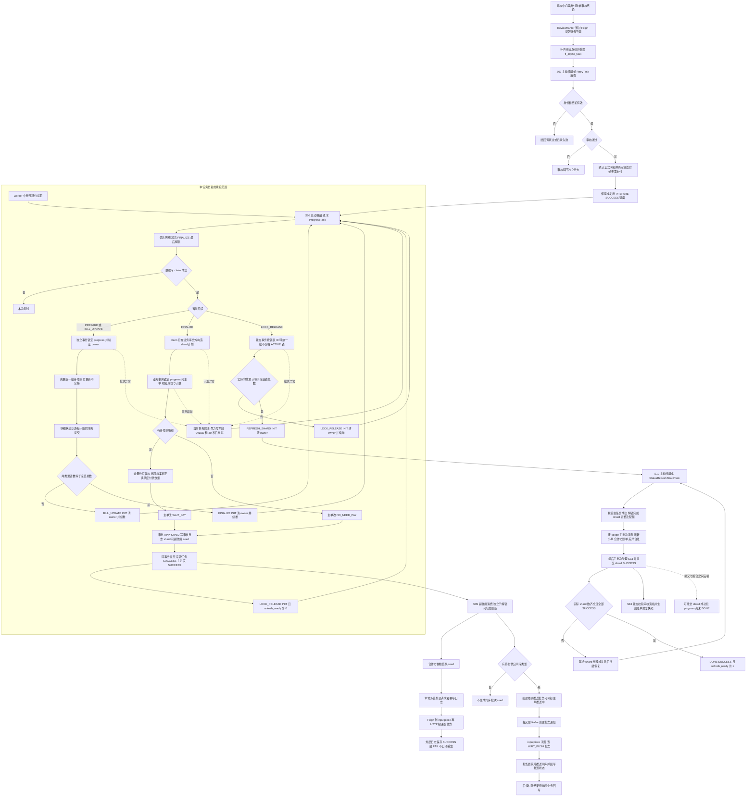

[业务逻辑专辑](/knowledge/business-logic/) / 居民收益付款 / S08

说明审核回调的分批明细推进、主业务生效、状态刷新、执行权与恢复机制，区分各阶段成功的含义，附逐章原文对照。本文保留原文 13 章，正文连续展开，原文对照与流程源码按需展开。

**前置阅读：** [S07 · 审核回调任务](/knowledge/business-logic/resident-income/s07-审核回调任务/)

**快速阅读：** [阅读起点](#start) · [核心调用链](#chapter-3) · [异常与重复执行](#chapter-8) · [完整流程](#chapter-11) · [源码索引](#chapter-12)

<div class="business-logic-article">

> 对应任务：`residentIncomePaymentReviewCallbackProgressTask`<br /> 阅读基础：具有 Java 开发基础，但不熟悉居民收益付款业务。<br /> 依据：附件《residentIncomePaymentReviewCallbackProgressTask 源码梳理》。原文分析日期为 **2026-09-08**；本阅读版保留原文第 1—13 章的对应关系。

<div id="start"></div>

## 先看一个业务场景：审核通过以后，系统还没忙完

**假设场景，不是实际运行数据：** 一张居民收益付款单里有 2,800 条正式明细，其中 2,200 条属于待付款明细，600 条属于不合格明细。审核中心已经给出“审核通过”的结论，随后向财务系统提交审核回调，也就是把审核结果通知给财务系统。

这里的“通过”不表示 2,800 条明细都要付款，也不表示银行已经把钱打出去。它表示财务系统要开始落实这次审核结果：待付款明细确认通过，不合格明细确认不合格；因为这张假设单仍有待付款明细，主单随后应进入“待支付”，而不是“已支付”。

为了不把大量操作挤在一次回调请求里，系统先把回调受理到数据库，再建立一条 `progress`（技术进度记录，用来保存当前做到哪一步、已经处理多少条）。本任务 S08 接着按步骤续跑：先分批让明细生效，再最终确认主单和审批结果，最后分批释放不合格明细占用的账单锁。**待付款明细的占用不能跟着一起释放。**

按这条假设 progress 的 `batch_size=1000`，明细阶段至少要执行四批：待付款 1,000 条、1,000 条、200 条，然后不合格 600 条。主单最终确认以后，S08 继续解锁；解锁完成，交给 S12 状态刷新任务，让小单账单、合作方账单和差异台账按当前事实重新计算并写入状态。S12 的分片全部成功且完成汇总后，progress 才能进入 `DONE`。

还有两条不能混进“本任务完成”的支线：主单最终确认后，S09 可以独立处理合作方通知，以及符合司库条件的付款推送批次；底表刷新过程中，S12 又会受理 S13 账单快照任务。**progress 的 `DONE` 不等待这些支线全部成功，更不代表实际到账。** 本任务不重新发起审核、不决定审核结论，也不负责完成整个银行支付生命周期。[E01](#source-E01) [E02](#source-E02) [E08](#source-E08) [E20](#source-E20) [E23](#source-E23) [E25](#source-E25)

<div id="intro-sub-1"></div>

### 阅读依据与证据边界

原文依据工作区中的 Java、MyBatis XML（数据库映射语句）、枚举和仓库 DDL（表结构及索引定义）进行静态分析。主仓库为 `/Users/wangyi/BZ/zx-monitor/zxbaif`，分支为 `Ian/review/01`，HEAD 为 `a1bfacbeb6dfc239d577bd66bf78cd9eb2482efa`。原文还补充核对了 `zxbaie` 的 Topic（消息主题）和 Feign（以 Java 接口形式调用远程服务的方式）声明，对应分支 `zx_test_250330`，HEAD 为 `21aac5b4821de7e7ae1bd660f896b3e890115cfc`。

原文读取的是**工作区实际文件**，不只是 HEAD 提交中的内容；当时已有的未提交修改被保留，原分析只生成文档。其证据等级 `SOURCE_VERIFIED` 表示源码静态核对，**不表示任务已经部署、调度配置已经启用，或者生产数据已经验证**。原分析没有执行调度、远程接口、付款、数据库读写或故障注入。

本阅读版只依据所给文档改写，没有重新访问上述仓库，也没有补做环境、数据库或测试验证。后文“源码可确认”“源码推导风险”沿用的是原文的证据分级，不提升证据强度。

原文另外说明：文档按要求存放在 **S03**，但源码中的监控阶段和主动唤醒路由叫 **S08 / `S08_REVIEW_PROGRESS`**。文档目录编号不能替代代码任务编号。

<details class="original">
<summary>对照原文 · 标题、分析背景与证据边界</summary>

### residentIncomePaymentReviewCallbackProgressTask 源码梳理

> 分析日期：2026-09-08。依据当前工作区 Java、MyBatis XML、枚举及仓库 DDL；未执行调度、远程接口、付款、数据库读写或故障注入。
>
> 主仓库：`/Users/wangyi/BZ/zx-monitor/zxbaif`，分支 `Ian/review/01`，HEAD `a1bfacbeb6dfc239d577bd66bf78cd9eb2482efa`。补充核对 `zxbaie` 的 Topic 和 Feign 声明，分支 `zx_test_250330`，HEAD `21aac5b4821de7e7ae1bd660f896b3e890115cfc`。
>
> 读取的是工作区实际文件，不是仅以 HEAD 为准。工作区原有未提交修改已保留，本次只生成本文。证据等级为 **SOURCE\_VERIFIED**，不代表任务已部署、定时配置已启用或生产数据已验证。
>
> 文档按要求存放在 S03；源码中的监控阶段和主动唤醒路由称为 **S08 / S08\_REVIEW\_PROGRESS**。目录编号不能替代代码任务编号。

<details class="source-note">
<summary>查看原始 Markdown</summary>

```text
# residentIncomePaymentReviewCallbackProgressTask 源码梳理

> 分析日期：2026-09-08。依据当前工作区 Java、MyBatis XML、枚举及仓库 DDL；未执行调度、远程接口、付款、数据库读写或故障注入。
>
> 主仓库：`/Users/wangyi/BZ/zx-monitor/zxbaif`，分支 `Ian/review/01`，HEAD `a1bfacbeb6dfc239d577bd66bf78cd9eb2482efa`。补充核对 `zxbaie` 的 Topic 和 Feign 声明，分支 `zx_test_250330`，HEAD `21aac5b4821de7e7ae1bd660f896b3e890115cfc`。
>
> 读取的是工作区实际文件，不是仅以 HEAD 为准。工作区原有未提交修改已保留，本次只生成本文。证据等级为 **SOURCE_VERIFIED**，不代表任务已部署、定时配置已启用或生产数据已验证。
>
> 文档按要求存放在 S03；源码中的监控阶段和主动唤醒路由称为 **S08 / S08_REVIEW_PROGRESS**。目录编号不能替代代码任务编号。
```

</details>

</details>

<div id="chapter-1"></div>

## 1. 任务概览

可以把这个任务看成“审核结果落地的续跑器”：数据库里记着哪张单的审核通过处理还没完成，它就接着做一批或者做一个阶段，而不是从头再审核一次。

它直接负责的主线是：**分批生效付款单明细 → 最终确认主单和审批结果 → 分批释放不合格账单锁 → 交接底层状态刷新。** 因此，它不只是故障后的补偿工具；主动唤醒没有开启或者没有成功时，正常业务也靠它继续推进。[E01](#source-E01) [E02](#source-E02)

先分清两个容器。`fi_resident_income_payment_review_callback_progress` 保存“这次审核通过处理已经走到哪”；`fi_async_task` 保存异步任务。本任务**扫描的是前一张 progress 表**。来源 `fi_async_task` 在这里主要提供原始审核时间、审核意见，并在最终确认时被回写为成功，不是本 Job 的主要扫描对象。

| 项目 | 真实行为与阅读方式 |
| --- | --- |
| XXL-Job 名称 | `residentIncomePaymentReviewCallbackProgressTask`。XXL-Job 是任务调度框架；这里的名称用于定位调度 Handler。 |
| Java 入口 | `ResidentIncomePaymentReviewCallbackJob.residentIncomePaymentReviewCallbackProgressTask(String param)`。 |
| 主服务 | `ResidentIncomePaymentReviewCallbackProgressTaskServiceImpl.executePendingProgresses(Integer)`。 |
| 直接消费的阶段 | `PREPARE`：准备好的进度；`BILL_UPDATE`：分批更新明细；`FINALIZE`：最终确认本次审核的业务结果；`LOCK_RELEASE`：释放不合格占用锁。 |
| 交接阶段 | 到 `REFRESH_SHARD`（等待状态刷新分片处理）后，交给 `residentIncomePaymentStatusRefreshShardTask`，也可以由 S12 主动唤醒继续。`shard` 就是拆出的一份持久化刷新任务。 |
| 每轮扫描预算 | 默认 50 次；传入正数时最多 200 次；空值、0、负数均按默认 50 次。不是按付款单数量计费或计数。 |
| 常规每批明细/锁数量 | 新 progress 的上游通常写入 `batch_size=1000`；续跑读取这条记录自己保存的批大小，历史值和兜底值见第 4.3 节。 |
| 租约 | 每次 `claim`（通过数据库条件更新领取执行权）创建约 10 分钟租约，`running_attempt` 加 1。租约是处理权的有效期限，不是方法执行超时限制。 |
| progress 失败重试 | 固定延迟 30 秒，没有最大重试次数条件。 |
| 执行线程 | 本次 XXL 执行线程串行推进；主动唤醒则通过独立的共享线程池调用同一个阶段服务。 |
| 环境调度配置 | 注解只声明 Handler。目标环境的 Cron（定时表达式）、实际运行实例、调度频率、分片/路由、阻塞策略和是否启用，原文均暂时无法确认。 |

<div id="ch1-sub-1"></div>

### 1.1 参数不要与同类中的其他 Job 混用

这个 Job 接受裸 JSON，例如：

```json
{"maxTaskCount": 50}
```

也接受用 `data` 包一层的形式，`data` 可以是 JSON 对象，也可以是装着 JSON 的字符串。参数解析失败时只记录日志并使用默认参数，**不会仅因为格式错误就拒绝执行**。[E01](#source-E01)

共用参数类虽然有 `taskCode`、`taskCodes`、`businessKey`、`businessKeys`，但这个 Progress Job **只取 `maxTaskCount`**。给它传某个 `taskCode`，不能定向执行那条 progress，它仍然全局扫描。按任务编码或业务键定向选择，是同类中的 Retry Job、SideEffect Job 的行为，不能套到这里。

“最多处理 50 条”也容易误读。循环每次重新查询一条 progress，做完一批或者一个阶段后，同一 progress 还可以再次入选。因此，50 是本轮最多选择、调用的次数；一次成功计数只说明这次阶段或批次调用成功，不说明一张付款单全链路完成，也不说明处理了 50 张不同付款单。

<details class="original">
<summary>对照原文 · 第 1 章 · 点击展开 / 收起</summary>

### 1. 任务概览

**这个任务负责续跑“居民收益付款审核通过”后尚未完成的技术进度：分批生效付款单明细 → 最终确认主单和审批结果 → 分批释放不合格账单锁 → 交接底层状态刷新。** 它既能恢复中断，也能在主动唤醒未开启或未成功时推进正常业务。[E01](#source-E01) [E02](#source-E02)

它扫描的主表是 `fi_resident_income_payment_review_callback_progress`，不是以 `fi_async_task` 为主表扫描。后者在这里主要用于还原原始审核时间、意见，以及在 FINALIZE 中回写来源任务成功。

| 项目 | 实际行为 |
| --- | --- |
| XXL-Job 名称 | `residentIncomePaymentReviewCallbackProgressTask` |
| Java 入口 | `ResidentIncomePaymentReviewCallbackJob.residentIncomePaymentReviewCallbackProgressTask(String param)` |
| 主服务 | `ResidentIncomePaymentReviewCallbackProgressTaskServiceImpl.executePendingProgresses(Integer)` |
| 直接消费阶段 | `PREPARE`、`BILL_UPDATE`、`FINALIZE`、`LOCK_RELEASE` |
| 交接阶段 | 到达 `REFRESH_SHARD` 后，由 `residentIncomePaymentStatusRefreshShardTask` 或 S12 主动唤醒继续 |
| 每轮扫描预算 | 默认 50，传入正数最多 200；空值、0、负数按默认 50 |
| 常规每批明细/锁数量 | 新 progress 的上游写入 `batch_size=1000`；续跑实际读取该字段 |
| 租约 | 每次抢占创建约 10 分钟租约，`running_attempt` 加 1 |
| progress 失败重试 | 固定延迟 30 秒，无最大重试次数条件 |
| 调度线程 | 当前 XXL 执行线程串行推进；主动唤醒通过独立共享线程池执行同一个阶段服务 |
| Cron、运行实例和阻塞策略 | 注解只声明 Handler；目标环境实际调度频率、分片/路由和启用情况：**暂时无法确认** |

#### 1.1 参数不要与同类中的其他 Job 混用

支持裸 JSON，例如 `{"maxTaskCount":50}`，也支持 `data` 包装的 JSON 对象或 JSON 字符串。解析失败只记日志并使用默认参数，不会直接因参数格式错误拒绝执行。[E01](#source-E01)

虽然共用参数类包含 `taskCode/taskCodes/businessKey/businessKeys`，**这个 Progress Job 只取 `maxTaskCount`**。传入某个 taskCode 不会定向执行某条 progress，仍然全局扫描。定向任务选择是同类 Retry Job、SideEffect Job 的行为。

“最多处理 50 条”也不是 50 张不同付款单：循环每次重新查询一条 progress，处理一批或一个阶段后，同一 progress 可以再次入选；成功计数表示本次阶段/批次调用成功，不表示整张付款单已完成。

<details class="source-note">
<summary>查看本章原始 Markdown</summary>

```text
## 1. 任务概览

**这个任务负责续跑“居民收益付款审核通过”后尚未完成的技术进度：分批生效付款单明细 → 最终确认主单和审批结果 → 分批释放不合格账单锁 → 交接底层状态刷新。** 它既能恢复中断，也能在主动唤醒未开启或未成功时推进正常业务。[E01] [E02]

它扫描的主表是 `fi_resident_income_payment_review_callback_progress`，不是以 `fi_async_task` 为主表扫描。后者在这里主要用于还原原始审核时间、意见，以及在 FINALIZE 中回写来源任务成功。

| 项目 | 实际行为 |
| --- | --- |
| XXL-Job 名称 | `residentIncomePaymentReviewCallbackProgressTask` |
| Java 入口 | `ResidentIncomePaymentReviewCallbackJob.residentIncomePaymentReviewCallbackProgressTask(String param)` |
| 主服务 | `ResidentIncomePaymentReviewCallbackProgressTaskServiceImpl.executePendingProgresses(Integer)` |
| 直接消费阶段 | `PREPARE`、`BILL_UPDATE`、`FINALIZE`、`LOCK_RELEASE` |
| 交接阶段 | 到达 `REFRESH_SHARD` 后，由 `residentIncomePaymentStatusRefreshShardTask` 或 S12 主动唤醒继续 |
| 每轮扫描预算 | 默认 50，传入正数最多 200；空值、0、负数按默认 50 |
| 常规每批明细/锁数量 | 新 progress 的上游写入 `batch_size=1000`；续跑实际读取该字段 |
| 租约 | 每次抢占创建约 10 分钟租约，`running_attempt` 加 1 |
| progress 失败重试 | 固定延迟 30 秒，无最大重试次数条件 |
| 调度线程 | 当前 XXL 执行线程串行推进；主动唤醒通过独立共享线程池执行同一个阶段服务 |
| Cron、运行实例和阻塞策略 | 注解只声明 Handler；目标环境实际调度频率、分片/路由和启用情况：**暂时无法确认** |

### 1.1 参数不要与同类中的其他 Job 混用

支持裸 JSON，例如 `{"maxTaskCount":50}`，也支持 `data` 包装的 JSON 对象或 JSON 字符串。解析失败只记日志并使用默认参数，不会直接因参数格式错误拒绝执行。[E01]

虽然共用参数类包含 `taskCode/taskCodes/businessKey/businessKeys`，**这个 Progress Job 只取 `maxTaskCount`**。传入某个 taskCode 不会定向执行某条 progress，仍然全局扫描。定向任务选择是同类 Retry Job、SideEffect Job 的行为。

“最多处理 50 条”也不是 50 张不同付款单：循环每次重新查询一条 progress，处理一批或一个阶段后，同一 progress 可以再次入选；成功计数表示本次阶段/批次调用成功，不表示整张付款单已完成。
```

</details>

</details>

<div id="chapter-2"></div>

## 2. 业务目的

审核中心解决的是“本次审核结论是什么”。财务系统还需要把这个结论转成可继续付款、可展示、可校核的持久化事实。

具体要完成五件事，不能把它们压缩成“改一个审核状态”：

1. **让正式明细生效。** 待付款明细变成“已审核通过”；不合格明细变成“不合格生效”。
2. **确认主单和审批结果。** 根据正式明细的组成，把主单从“审核中”改成“待支付”或“无需支付”，同时记录审批实例结果和付款单业务日志。
3. **释放该释放的占用。** 只释放不合格明细对账单的占用。待付款明细还在后续付款流程中，仍需保留占用，不能一起解锁。
4. **更新底层状态。** 让小单账单、合作方账单和差异台账重新反映付款状态、锁关联和不合格事实。
5. **推进独立后续动作。** 通知合作方账单校核结果；符合司库条件时，创建付款推送批次。

如果把这些操作都塞进审核回调请求，或者放进一个覆盖全程的大事务，耗时和失败影响会被放大。原文描述的实现是先持久化回调，再用 progress 保存阶段、游标和计数。`cursor`（游标）在这里是“已经处理到哪个 ID 的位置标记”；进程中断后，重新领取进度，从持久化位置继续，而不是依赖之前那个 Java 线程还活着。[E13](#source-E13) [E15](#source-E15) [E04](#source-E04) [E08](#source-E08)

但必须保留三条边界。第一，本任务处理的是**审核通过结果的落地**，不重新发起审核，也不决定结论。第二，`WAIT_PAY(40)` 表示可以进入后续付款流程，`NO_NEED_PAY(55)` 表示全不合格、无需支付，两者都不是 `PAID(50)`。第三，**明细提交、主单审核确认、底表刷新、外部通知、实际支付**是五种不同的事实，需要分别判断，不能用一个“成功”把它们打包。

<details class="original">
<summary>对照原文 · 第 2 章 · 点击展开 / 收起</summary>

### 2. 业务目的

居民收益付款单可能有大量正式明细。审核中心给出“通过”后，财务侧仍要完成以下事情：

1. 将待付款明细置为“已审核通过”，将不合格明细置为“不合格生效”。
2. 根据正式明细的组成，把主单从“审核中”转为“待支付”或“无需支付”，记录审批实例结果和业务日志。
3. 释放不合格明细对账单的占用；待付款明细仍需要保留占用，不能一起解锁。
4. 让底层小单账单、合作方账单、差异台账重新反映付款状态、锁关联及不合格事实。
5. 独立通知合作方校核结果；符合司库条件的付款单还会创建付款推送批次。

这些操作若集中在审核回调请求或一个大事务内，容易放大耗时和失败影响。当前代码先持久化审核回调，再用 progress 保存各阶段游标和计数；进程中断后重新领取当前阶段继续执行。[E13](#source-E13) [E15](#source-E15) [E04](#source-E04) [E08](#source-E08)

注意业务上的三个边界：

- 本任务处理的是**审核通过结果的落地**，不会重新发起审核，也不决定审核结论。
- `WAIT_PAY(40)` 表示可进入后续付款流程，`NO_NEED_PAY(55)` 表示全不合格而无需支付；两者都不是 `PAID(50)`。
- 明细状态已提交、主单审核确认完成、底表刷新完成、外部通知成功、实际支付成功，是不同事实，必须分别判断。

<details class="source-note">
<summary>查看本章原始 Markdown</summary>

```text
## 2. 业务目的

居民收益付款单可能有大量正式明细。审核中心给出“通过”后，财务侧仍要完成以下事情：

1. 将待付款明细置为“已审核通过”，将不合格明细置为“不合格生效”。
2. 根据正式明细的组成，把主单从“审核中”转为“待支付”或“无需支付”，记录审批实例结果和业务日志。
3. 释放不合格明细对账单的占用；待付款明细仍需要保留占用，不能一起解锁。
4. 让底层小单账单、合作方账单、差异台账重新反映付款状态、锁关联及不合格事实。
5. 独立通知合作方校核结果；符合司库条件的付款单还会创建付款推送批次。

这些操作若集中在审核回调请求或一个大事务内，容易放大耗时和失败影响。当前代码先持久化审核回调，再用 progress 保存各阶段游标和计数；进程中断后重新领取当前阶段继续执行。[E13] [E15] [E04] [E08]

注意业务上的三个边界：

- 本任务处理的是**审核通过结果的落地**，不会重新发起审核，也不决定审核结论。
- `WAIT_PAY(40)` 表示可进入后续付款流程，`NO_NEED_PAY(55)` 表示全不合格而无需支付；两者都不是 `PAID(50)`。
- 明细状态已提交、主单审核确认完成、底表刷新完成、外部通知成功、实际支付成功，是不同事实，必须分别判断。
```

</details>

</details>

<div id="chapter-3"></div>

## 3. 核心调用链

<div id="ch3-sub-1"></div>

### 3.1 上游：progress 是怎样产生的

本任务不是收到审核消息后立刻从零执行。先由上游受理审核回调，确认可以处理，再创建或复用 progress，S08 才接手。

下面保留真实调用链，方便从业务描述回到源码。类名 `ResidentIncomePaymentReviewHanler` 按原文保留：

```text
investmentplant-center
  ResidentIncomePaymentReviewHanler.sourceFromInfoProcess
    → Feign.submitReviewCallbackFiResidentIncomePaymentOrder
financial-center
  FiResidentIncomePaymentOrderController
    → FiResidentIncomePaymentOrderServiceImpl.submitReviewCallbackFiResidentIncomePaymentOrder
    → ReviewCallbackTaskAcceptanceService.accept
    → fi_async_task 中受理/复用审核回调补偿任务
    → 提交后 S07 主动唤醒，或 residentIncomePaymentReviewCallbackRetryTask 扫描
    → ReviewCallbackAsyncTaskService.executeSingleTask
    → reviewCallbackFiResidentIncomePaymentOrderTask
    → doReviewCallbackFiResidentIncomePaymentOrder
    → 审核通过分支统计正式明细
    → executeReviewApprovedBillUpdateCallback
    → prepareReviewApprovedProgress
    → progress=PREPARE/SUCCESS，main_task_status=RUNNING
    → 主动唤醒 S08，或等待本任务扫描
```

审核 Handler 传入付款单 ID、审核计划 ID、审核结论、审核意见和审核时间。财务入口补齐并校验数据版本、审批轮次、提交轮次，检查主单、审批实例，以及是否与相反审核结论冲突。来源异步任务的类型为 `RESIDENT_INCOME_PAYMENT_REVIEW_CALLBACK_RETRY`。[E17](#source-E17) [E13](#source-E13) [E47](#source-E47) [E18](#source-E18)

真正创建 progress 以前，上游还会判断是否为迟到回调，以及当前主单是否仍在审核中。**审核驳回有自己的处理分支，不创建这里的审核通过 progress。** 上游对旧身份的跳过规则，也不能直接套用于已经生成的 progress：后者的限制见第 9.3 节。

**目标主单状态怎样确定？** 不是看“审核通过”这四个字就直接写成待支付，而是先统计当前版本的正式明细，再冻结这次进度使用的总数。冻结统计的含义是把本次要完成的数量保存下来，后续按它验收进度。

| 按顺序需要理解的统计条件 | 实际处理 |
| --- | --- |
| `total_count <= 0` | 抛错，不能创建空进度。 |
| `total_count != payable_count + unqualified_count` | 抛错：正式明细不完全属于待付款、不合格这两类，或者统计异常。 |
| 统计合法且 `payable_count > 0` | 目标状态是 `WAIT_PAY(40)`。有待付款也有不合格的混合单，仍属于这一分支。 |
| 统计合法，`payable_count = 0`，且全部明细为不合格 | 目标状态是 `NO_NEED_PAY(55)`。 |

progress 不是每次重复回调都新建一条，而是按下面的五元组查询并复用：

```text
(payment_order_id, data_version, review_plan_id, submit_round, approval_attempt)
付款单 ID          数据版本       审核计划 ID      提交轮次      审批轮次
```

这里的 `approval_attempt` 是审批身份的一部分，不是 worker 每次领取增加的 `running_attempt`。仓库 DDL 为这个五元组定义了唯一索引；这只能说明仓库设计，不能证明线上已部署该索引。

重复 PREPARE 时，会核对 `total_count`、`payable_count`、`unqualified_count` 三项统计是否一致；已经推进到后续阶段的记录，不会被退回 PREPARE。[E15](#source-E15) [E16](#source-E16) [E37](#source-E37)

PREPARE 保存目标状态、来源任务身份、两类总数，并把对应游标和累计数初始化为零。它**不在此阶段更新主单、不解锁、不插入状态刷新分片**。

还有一个容易被字段名误导的地方：`target_business_status` 保存了主单的业务状态快照，但当前 FINALIZE 的主单 UPDATE 没有写 `business_status`。所以“保存目标业务状态快照”不能解释成“审核后自动修改主单的 `business_status`”。[E08](#source-E08) [E16](#source-E16)

<div id="ch3-sub-2"></div>

### 3.2 本任务入口与阶段分派

S08 每次从数据库选择一个可处理进度，再按阶段派给不同服务。`worker` 是实际执行一批工作的方法或执行者；`owner` 是该次领取的处理权标识，用来避免其他执行者冒用这次领取。

```text
ResidentIncomePaymentReviewCallbackJob.residentIncomePaymentReviewCallbackProgressTask
  → parseJobParam
  → ProgressTaskService.executePendingProgresses(maxTaskCount)
    → 最多循环 normalizeMaxProgressCount 次
      → queryNextProgress
        → queryNextBillUpdateProgress
        → 无结果再 queryNextFinalizeProgress
        → 再无结果则 queryNextLockReleaseProgress
      → executeProgress
        ├─ PREPARE / BILL_UPDATE → executeOneBillUpdateBatch
        ├─ FINALIZE             → executeFinalize
        └─ LOCK_RELEASE         → executeOneLockReleaseBatch
    → inspectInvariants
    → Result.succeed(选中 / 成功 / 跳过 / 失败摘要)
  → Result 成功则返回 XXL SUCCESS
```

`inspectInvariants` 是不变量巡检：检查本应保持成立的数据关系，并告警；它不是自动修复步骤。

**选择顺序有严格优先级。** 先查明细更新阶段；只有没找到，才查 FINALIZE；前两类都没找到，才查解锁。并不是把三类记录查出来后统一按时间混排。每个阶段内部才使用 `update_time ASC, id ASC LIMIT 1`，取更新时间最早、再按 ID 排序的那一条。[E02](#source-E02) [E03](#source-E03)

事务也没有覆盖整个扫描循环。领取之后，明细批次和解锁批次各自使用 `REQUIRES_NEW`（每批开启独立新事务，按批提交或回滚）；FINALIZE 使用 `TransactionTemplate`（通过 Spring 事务模板显式管理事务）。因此后面某一批失败，不会撤销前面已经提交的所有批次。[E04](#source-E04) [E07](#source-E07) [E11](#source-E11)

<div id="ch3-sub-3"></div>

### 3.3 BILL\_UPDATE：先待付款，再不合格，每次只推进一批

这一阶段的业务动作很直接：先把本次要付款的明细标成审核通过，再确认不合格明细生效。技术上的难点是大单要分批，而且每批业务写入必须与“处理到哪”的记录一致。

**第一步，领取。** 生成 `RIPRC:BILL_UPDATE:<UUID>` 形式的 workerId，用带阶段、状态、重试时间条件的 UPDATE 抢占 progress。更新成功后，再读回 owner 和 `running_attempt`。`running_attempt` 是领取轮次；同一个 progress 被重新领取后，旧 worker 不能只凭自己曾经领过，就继续当作现任处理者。

**第二步，还原时间。** 读取来源 `fi_async_task.task_data` 中的 `reviewTime`，作为本次明细更新时间。没有来源任务，或者缺少该字段，使用当前时间；但 `task_data` 的 JSON 非法时是失败，不是统一吞掉错误后用当前时间。

**第三步，进入本批独立事务。** `executeNextBillUpdateBatch` 对 progress 执行 `SELECT ... FOR UPDATE`，也就是锁住进度行，再校验阶段、owner、attempt，以及租约尚未过期。

**第四步，选择一类明细。** 只要待付款已更新数小于待付款总数，就推进一批 `line_type=10` 的待付款明细。只有待付款全部完成后，才处理 `line_type=20` 的不合格明细。一次调用不会同时各处理一批。

**第五步，用 ID 范围写入。** 先按对应明细游标查下一批的最大 ID，再更新这个区间：待付款写 `line_status=20`；不合格写 `line_status=50`，并写 `unqualified_effective_time`。实际查询和缺失的旧状态条件见第 4.2 节。

**第六步，同事务记账。** 业务明细更新、对应累计数增加、对应明细游标推进，在同一事务里提交。阶段让出或阶段切换在本批事务提交后进行。

**第七步，决定下一步。** 还有明细时，保持 `BILL_UPDATE`，改 `phase_status=INIT` 并清 owner；全部完成时，改成 `FINALIZE/INIT` 并清 owner。之后主动唤醒 S08，尝试继续下一批或下一阶段。[E02](#source-E02) [E04](#source-E04) [E06](#source-E06)

阶段完成不能只看“看起来都处理了”。切换 SQL 要求下面三个等式 **同时成立（AND）** ：

```text
payable_count     = payable_updated_count
AND
unqualified_count = unqualified_updated_count
AND
 total_count      = payable_updated_count + unqualified_updated_count
```

Java 的“已经完成”判断使用 `总数 <= 累计更新数`，而最终 SQL 使用严格相等。**这两层判断不完全相同。** 累计数超过总数时，不能静默当成正常完成；会在完成更新处失败。

回到开头的**假设**：`batch_size=1000`，2,200 条待付款加 600 条不合格，至少需要四次明细批次调用，分别是 1,000、1,000、200、600。最后那 600 条不合格之前，必须先把待付款全部完成，然后才可能进入 FINALIZE。

<div id="ch3-sub-4"></div>

### 3.4 FINALIZE：确认审核业务结果并建立后续任务

`FINALIZE` 是这条链路里**主单审核业务结果正式生效**的关键点。前面的明细批次即使已经提交，主单也可能仍在审核中；要完成这里的事务，主单和审批结果才一起确认下来。[E07](#source-E07) [E08](#source-E08)

先分清两段事务和中间的准备工作。

**领取与业务事务之前：** 先用一个事务领取 FINALIZE 并回读；claim 以后如果回读失败，本次领取事务会回滚。领取成功后，解析原始回调上下文，并读取 progress 对应付款单版本的正式明细。按每 1,000 条明细的 ID 范围生成状态刷新分片计划。**此时计划只在内存里，还没有正式插入 shard 表。**

**真正的最终业务事务内，按以下顺序执行：**

1. **锁定并核对 progress。** 检查 owner、attempt、阶段、租约，以及第 3.3 节的三个计数等式。
2. **锁定付款单主记录。** 要求未删除、`status=20`，并要求主单的 `review_plan_id`、`current_publish_version`、`submit_round` 与 progress 对应审核身份一致。
3. **定位并核对审批实例。** 按付款单 ID、数据版本、审批轮次、审核计划查询，确认实例身份匹配。
4. **有待支付目标才做付款准备检查。** 仅目标为待支付时执行付款前复核，并构造付款类型。全不合格单不走这一步的两项处理。
5. **条件更新主单。** 把 `status` 改为 `target_order_status`，写 `payment_type`、`review_finish_time`、`update_time`；属于司库付款时，把 `push_status` 初始化为 `NOT_PUSHED(1)`。这里不写 `business_status`。
6. **确认审批实例。** 写 `approval_status=APPROVED`、`finish_time`、`update_time`。实例原为 `APPROVED` 时直接复用；`CREATING/ACTIVE` 可以推进；其他非空终态抛错；空状态走兼容更新分支，不能漏掉这个例外。
7. **插入付款单操作日志。** 操作为“审核通过”，记录从审核中到目标状态、待付款和不合格数量，以及审核意见。
8. **插入并验收刷新分片。** 用幂等批量插入方式落库，再查询实际 shard 数量，要求 **实际数大于 0 AND 实际数等于计划数**。幂等是指重复执行时按既有身份复用，而不是无条件新增一套。
9. **写入副作用 seed。** `seed` 是已经持久化、等待后续 worker 消费的任务起点。审核通过副作用 seed 写入 `fi_async_task`，具体类型见第 7.4、7.5 节。
10. **冻结待释放锁总数。** 统计该版本不合格明细实际拥有的 ACTIVE 锁，保存到 `lock_release_total`。这个数字来自实际锁，不是直接拿不合格明细条数替代。
11. **交接 progress。** 改为 `main_task_status=SUCCESS, phase=LOCK_RELEASE, phase_status=INIT`，保存 shard 总数和 `finalize_time`。`refresh_ready` 仍为 0；清 owner，并按阶段初始化游标与计数。
12. **标记来源回调任务成功。** 只有 `async_task_id` 非空时才更新来源任务，写 `task_status=SUCCESS(2)`，清 `error_message`。

第 12 步的实现还有一个必须保留的限制：`markAsyncTaskSuccess` 只按来源任务 ID 和 `deleted=0` 更新，没有使用该异步任务自己的 `running_attempt` 条件，也没有检查更新影响行数。因此，来源任务已经不存在时，这里不会主动阻断 FINALIZE；判断业务确认情况仍要结合主单、审批实例和 progress，不能只看来源异步任务。

上述本地业务写入在**同一个 FINALIZE 业务事务**内提交。只要有异常抛出，该事务整体回滚；之后在事务外尽力写 FINALIZE 阶段失败。**之前提交的 BILL\_UPDATE 批次不随它一起回滚。**

提交成功后，分别尝试唤醒 S09 副作用和 S08 解锁。`kick`（主动唤醒）只是“现在就试着处理”的加速信号；数据库中的 seed 和 progress 才是恢复依据。特别是 S09 唤醒失败，不会把已提交的 FINALIZE 改回失败。[E07](#source-E07)

<div id="ch3-sub-5"></div>

#### 付款前复核实际检查什么

业务上，这一步是在主单准备进入待支付以前，再检查当前付款事实是否完整、是否一致，而不是简单地给主单盖一个状态章。

`recheckPaymentOrderBeforePay` 每次最多读取 1,000 条待付款明细，但会在**同一次 FINALIZE 调用、同一个业务事务里**循环检查全部待付款明细。分页只是分批读取，不代表每页独立提交事务。[E10](#source-E10)

原文明确列出的复核内容如下：

| 检查范围 | 原文支持的检查内容 |
| --- | --- |
| 基础付款事实 | 本次付款金额大于零；账期有效；拟付租金存在。 |
| 不同明细来源 | 根据来源检查小单账户，或者合作方账单/合作方账户。 |
| 合作方分支 | 检查账单与账户、账期、收款信息和付款明细快照之间是否一致。 |
| 真实无小单分支 | 受平台账户迁移相关开关控制，并通过事实组装服务校验定位关系。原文没有展开开关的全部取值和事实组装规则。 |
| 部分需要电站定位的分支 | 通过 property Feign，根据小单业务 ID 查询唯一平台电站。 |

不能把这一步多解释成两种并不存在的能力。第一，当前方法没有直接因为“实时余额不足”而执行一条余额门禁。第二，不能根据注释说它会重新计算并写回所有应付金额。

方法会给加载出的 `bill` 对象补上 `stationId`、`smallStationId`；原文核对的这段代码**没有把这两个补充值写回明细表**。给内存对象补字段，与持久化更新数据库不是一回事。

<div id="ch3-sub-6"></div>

#### 付款类型如何决定

仅在 `target_order_status=WAIT_PAY` 时调用 `buildPaymentType`。这套判断决定走司库付款还是线下付款，不适用于全不合格单。[E09](#source-E09) [E45](#source-E45) [E46](#source-E46)

先查询当前付款单发布版本、提交轮次下未删除的项目付款记录，再排除 `payment_status=NO_NEED_PAYMENT` 的项目记录。然后通过 base-center Feign 批量读取项目公司档案，通过 setting-center Feign 查询 `PROJECT_ASSET_MANAGER` 字典，用**字典名称**匹配档案里的资产经理。

资产经理为空、已返回档案对应多个资产经理、字典没有命中，都会抛错。原文没有提供其余所有错误分支，不能据此自行补齐校验。

| 字典判断结果 | 写入的付款类型 |
| --- | --- |
| 字典状态正常 | `payment_type=SIKU_PAYMENT(2)`，司库付款。 |
| 字典记录存在，但状态非正常 | `payment_type=OFFLINE_PAYMENT(1)`，线下付款。 |

注意，“字典记录存在但不正常”与“根本没找到字典”处理不同：前者可以落到线下付款，后者抛错。全不合格单跳过付款类型构造和付款前复核，直接做无需支付的最终确认。

代码对“项目公司档案只返回了一部分”的处理存在缺口，不能在本节把它改写为“所有项目公司档案一定齐全才会通过”。这个问题完整保留在第 10.5 节。

<div id="ch3-sub-7"></div>

### 3.5 LOCK\_RELEASE：仅释放不合格 ACTIVE 锁

主单最终确认以后，不合格明细不再需要占住对应账单。这个阶段把它们的占用分批释放，但仍然保留待付款明细的保护。

`executeOneLockReleaseBatch` 会重新领取 progress，再调用 `executeNextLockReleaseBatch`。每批开启独立事务，锁定 progress，并校验 owner。[E02](#source-E02) [E11](#source-E11)

**先判断是否已经释放够数。** 当 `lock_release_success >= lock_release_total`，直接尝试进入刷新阶段。总锁数为零也走这个分支，不会因为“没有锁可释放”就取消后续状态刷新分片。

**需要继续解锁时，按锁表 ID 分批。** `lock_cursor_id` 保存的是**锁表自身的 ID**，不是付款明细 ID。下一批定位的是与不合格明细关联的 ACTIVE 锁。

**释放不是删除。** 匹配锁改成 `RELEASED`，`lock_key` 重写为带本行 ID 的历史键，并写释放时间和原因 `REVIEW_APPROVED_UNQUALIFIED`。同一个事务内增加 `lock_release_success`，推进 `lock_cursor_id`。

**再决定交接。** 本批完成全部解锁时，在本批事务内把 progress 改为 `REFRESH_SHARD/INIT`；尚未解完时，提交后让出 owner，再次唤醒 S08。已经进入 `REFRESH_SHARD` 时，查询持久化 shard，逐个发送 S12 唤醒信号。

虽然前置“够数”判断使用 `>=`，最终切换 SQL 要求的是严格相等：

```text
lock_release_success = lock_release_total
```

因此，累计数大于总数不能直接解释成正常完成。并且这里始终只释放不合格明细的 ACTIVE 锁，**待付款明细的 ACTIVE 锁保留**，等待后续支付结果或者其他业务动作处理。[E12](#source-E12) [E23](#source-E23)

<details class="original">
<summary>对照原文 · 第 3 章 · 点击展开 / 收起</summary>

### 3. 核心调用链

#### 3.1 上游：progress 是怎样产生的

```text
investmentplant-center
  ResidentIncomePaymentReviewHanler.sourceFromInfoProcess
    → Feign.submitReviewCallbackFiResidentIncomePaymentOrder
financial-center
  FiResidentIncomePaymentOrderController
    → FiResidentIncomePaymentOrderServiceImpl.submitReviewCallbackFiResidentIncomePaymentOrder
    → ReviewCallbackTaskAcceptanceService.accept
    → fi_async_task 中受理/复用审核回调补偿任务
    → 提交后 S07 主动唤醒，或 residentIncomePaymentReviewCallbackRetryTask 扫描
    → ReviewCallbackAsyncTaskService.executeSingleTask
    → reviewCallbackFiResidentIncomePaymentOrderTask
    → doReviewCallbackFiResidentIncomePaymentOrder
    → 审核通过分支统计正式明细
    → executeReviewApprovedBillUpdateCallback
    → prepareReviewApprovedProgress
    → progress=PREPARE/SUCCESS，main_task_status=RUNNING
    → 主动唤醒 S08，或等待本任务扫描
```

审核 Handler 传付款单 ID、审核计划 ID、结论、意见和审核时间；金融入口补齐并校验数据版本、审批轮次和提交轮次，检查主单、审批实例及相反结论冲突。来源任务类型为 `RESIDENT_INCOME_PAYMENT_REVIEW_CALLBACK_RETRY`。[E17](#source-E17) [E13](#source-E13) [E47](#source-E47) [E18](#source-E18)

真正创建 progress 前还会判断迟到回调、当前主单是否仍处于审核中等。审核驳回走自己的处理分支，不创建这里的审核通过 progress。上游任务的旧身份跳过逻辑不能直接套用到已经生成的 progress，见第 9 节。

审核通过的目标状态按当前版本正式明细统计决定：

| 冻结统计 | 处理 |
| --- | --- |
| `total_count<=0` | 抛错，不允许创建空进度 |
| `total_count != payable_count + unqualified_count` | 抛错，说明存在不符合两类组成的明细或统计异常 |
| `payable_count>0` | 目标主单状态 `WAIT_PAY(40)`；混合单也走此分支 |
| `payable_count=0` 且全部是不合格 | 目标主单状态 `NO_NEED_PAY(55)` |

progress 按 `(payment_order_id,data_version,review_plan_id,submit_round,approval_attempt)` 查询并复用，仓库 DDL 为该五元组定义唯一索引。重复 PREPARE 会检查三项统计是否一致，不会把已推进的进度回退到 PREPARE。[E15](#source-E15) [E16](#source-E16) [E37](#source-E37)

PREPARE 保存目标状态、来源任务身份、两类总数、零游标和零累计数，不在这个阶段更新主单、解锁或插入刷新分片。`target_business_status` 保存了主单的业务状态快照，但当前 FINALIZE 的主单 UPDATE 没有写 `business_status`，不能解释为会随审核自动修改该字段。[E08](#source-E08) [E16](#source-E16)

#### 3.2 本任务入口与阶段分派

```text
ResidentIncomePaymentReviewCallbackJob.residentIncomePaymentReviewCallbackProgressTask
  → parseJobParam
  → ProgressTaskService.executePendingProgresses(maxTaskCount)
    → 最多循环 normalizeMaxProgressCount 次
      → queryNextProgress
        → queryNextBillUpdateProgress
        → 无结果再 queryNextFinalizeProgress
        → 再无结果则 queryNextLockReleaseProgress
      → executeProgress
        ├─ PREPARE/BILL_UPDATE → executeOneBillUpdateBatch
        ├─ FINALIZE           → executeFinalize
        └─ LOCK_RELEASE       → executeOneLockReleaseBatch
    → inspectInvariants
    → Result.succeed(选中/成功/跳过/失败摘要)
  → Result 成功则返回 XXL SUCCESS
```

每轮不是把三个阶段都查出来混排，而是**明细更新优先，其次 FINALIZE，最后解锁**；每个阶段内部按 `update_time ASC,id ASC LIMIT 1` 取最早记录。[E02](#source-E02) [E03](#source-E03)

整个循环外没有包一个业务大事务。抢占之后，明细批次和解锁批次各自用 `REQUIRES_NEW` 事务；FINALIZE 用 `TransactionTemplate` 管理事务。[E04](#source-E04) [E07](#source-E07) [E11](#source-E11)

#### 3.3 BILL\_UPDATE：先待付款，再不合格，每次只推进一批

1. 生成 `RIPRC:BILL_UPDATE:<UUID>` workerId，以带阶段、状态和重试时间条件的 UPDATE 抢占；成功后回读 owner 和 `running_attempt`。
2. 从来源 `fi_async_task.task_data` 中取 `reviewTime`，作为本次明细更新时间；不存在任务或字段时使用当前时间，JSON 非法则失败。
3. `executeNextBillUpdateBatch` 开启独立事务，对 progress `SELECT ... FOR UPDATE`，校验阶段、owner、attempt 和未过期租约。
4. 若待付款已更新数小于待付款总数，推进一批 `line_type=10`；只有待付款全部完成后，才推进 `line_type=20` 的不合格明细。
5. 先以明细 ID 游标查下一批最大 ID，再更新该 ID 区间；待付款改 `line_status=20`，不合格改 `line_status=50` 并写 `unqualified_effective_time`。
6. 在同一事务中增加对应累计数、推进对应明细游标；提交后才进行阶段让出或切换。
7. 还有明细：保持 `BILL_UPDATE`，改 `phase_status=INIT` 并清 owner；全部完成：改 `FINALIZE/INIT` 并清 owner。随后主动唤醒 S08 继续。

阶段切换 SQL 要求三个等式同时成立：

```text
payable_count     = payable_updated_count
unqualified_count = unqualified_updated_count
total_count       = payable_updated_count + unqualified_updated_count
```

Java 的“已完成”判断用 `<=`，最终 SQL 用严格相等。因此累计数超过总数不会被静默当成正常完成，会在完成更新处失败。[E02](#source-E02) [E04](#source-E04) [E06](#source-E06)

例如常规批大小 1000，一张付款单含 2200 条待付款、600 条不合格，至少需四次明细批次调用：待付款 1000、1000、200，然后不合格 600；接着才进入 FINALIZE。不是一次循环同时各处理 1000 条。

#### 3.4 FINALIZE：确认审核业务结果并建立后续任务

这是主单业务生效的关键点。[E07](#source-E07) [E08](#source-E08)

**事务外/前置步骤：**

- 先用一个事务抢占 FINALIZE 并回读，claim 后回读失败会回滚本次领取。
- 解析原始回调上下文，读取 progress 对应付款单版本的明细，按每 1000 条明细 ID 范围生成状态刷新分片计划。此时仅在内存形成计划，正式分片插入在后面的业务事务内。

**最终业务事务内按顺序执行：**

1. 锁定 progress，校验 owner/attempt/阶段/租约和上述三个计数等式。
2. 锁定付款单主记录，要求：未删除、`status=20`、`review_plan_id/current_publish_version/submit_round` 与 progress 一致。
3. 根据付款单 ID、版本、审批轮次、审核计划查询并核对审批实例。
4. 仅目标为待支付时执行付款前复核，并构造付款类型，详见下文。
5. 条件更新主单为 `target_order_status`，写 `payment_type/review_finish_time/update_time`；若是司库付款，初始化 `push_status=NOT_PUSHED(1)`。
6. 将审批实例置为 `APPROVED` 并写 `finish_time/update_time`。原为 `APPROVED` 直接复用，`CREATING/ACTIVE` 可以推进；其他非空终态抛错，空状态走兼容更新分支。
7. 插入“审核通过”付款单操作日志，记录从审核中到目标状态、待付款/不合格数量和审核意见。
8. 幂等批量插入状态刷新 shard，查询实际 shard 数，要求大于 0 且等于计划数。
9. 写入审核通过副作用 seed 到 `fi_async_task`。
10. 统计该版本不合格明细的实际 ACTIVE 锁数量，冻结为 `lock_release_total`。
11. progress 改为 `main_task_status=SUCCESS, phase=LOCK_RELEASE, phase_status=INIT`，保存 shard 总数、`finalize_time`，`refresh_ready` 仍为 0，清 owner、游标计数按阶段初始化。
12. 若 `async_task_id` 非空，将来源审核回调任务标记 `task_status=SUCCESS(2)`，清 `error_message`。

`markAsyncTaskSuccess` 仅按来源任务 ID 和 `deleted=0` 更新，没有使用该异步任务的 running\_attempt 条件，也未核对更新影响行数；来源任务不存在时不会在这里主动阻断 FINALIZE。因此业务确认仍应以主单、审批实例和 progress 共同判断。

这些本地业务写入在同一 FINALIZE 事务内提交；任何抛出的异常导致该事务整体回滚，随后在事务外尽力标记 FINALIZE 阶段失败。之前已经提交的 BILL\_UPDATE 批次不会一起回滚。

提交后分别尝试唤醒 S09 副作用和 S08 解锁。唤醒是加速机制，数据库中的 seed/progress 才是恢复依据。特别是 S09 唤醒失败，不会把已经提交的 FINALIZE 改回失败。[E07](#source-E07)

##### 付款前复核实际检查什么

`recheckPaymentOrderBeforePay` 每次读取最多 1000 条待付款明细，但在同一次 FINALIZE 调用中循环检查全量待付款明细，分页不等于分事务。[E10](#source-E10)

主要检查：本次付款金额大于零、账期有效、拟付租金存在；根据明细来源检查小单账户或合作方账单/账户；合作方分支还检查账单与账户、账期、收款信息及付款明细快照一致性。真实无小单分支受平台账户迁移相关开关控制，并通过事实组装服务校验定位关系。部分分支通过 property Feign 根据小单业务 ID 查询唯一平台电站。

这里的关键作用是检查当前付款事实是否完整且一致。当前方法没有直接因为“实时余额不足”而执行一条余额门禁，也不能根据注释把它描述为重新计算并写回所有应付金额。方法给加载出的 bill 对象补 `stationId/smallStationId`，本段代码未把这些补充值写回明细表。

##### 付款类型如何决定

仅 `target_order_status=WAIT_PAY` 才执行 `buildPaymentType`：[E09](#source-E09) [E45](#source-E45) [E46](#source-E46)

1. 查当前付款单发布版本、提交轮次、未删除的项目付款记录，排除 `payment_status=NO_NEED_PAYMENT` 的项目记录。
2. 经 base-center Feign 批量查询项目公司档案。
3. 经 setting-center Feign 查询 `PROJECT_ASSET_MANAGER` 字典，按字典名称与档案中的资产经理匹配。
4. 资产经理为空、已返回档案对应多个资产经理、字典未命中等情况抛错。
5. 字典状态正常：`payment_type=SIKU_PAYMENT(2)`；字典记录存在但状态非正常：`OFFLINE_PAYMENT(1)`。

全不合格单跳过这套付款类型构造和付款前复核，直接走无需支付的最终确认。代码里项目档案“部分缺失”的处理有缺口，见第 10 节。

#### 3.5 LOCK\_RELEASE：仅释放不合格 ACTIVE 锁

`executeOneLockReleaseBatch` 重新抢占 progress，调用 `executeNextLockReleaseBatch`，每批独立事务锁定 progress 并校验 owner。[E02](#source-E02) [E11](#source-E11)

- `lock_release_success >= lock_release_total` 时直接尝试进入刷新阶段。零锁也走这个路径，不会因此取消后续刷新分片。
- 否则，用 **锁表自身 ID** 作为 `lock_cursor_id`，定位下一批关联不合格明细的 ACTIVE 锁。
- 将匹配锁改为 `RELEASED`，重写 `lock_key` 为带本行 ID 的历史键，写释放时间和 `REVIEW_APPROVED_UNQUALIFIED` 原因。
- 同一事务内增加 `lock_release_success`、推进 `lock_cursor_id`；本批全部解完时将 progress 改为 `REFRESH_SHARD/INIT`。
- 未解完则提交后让出 owner、再次唤醒 S08；已进入 `REFRESH_SHARD` 则查询持久化 shard 并逐个发 S12 信号。

最终切换 SQL 要求 `lock_release_success = lock_release_total`。这里释放的是不合格明细的占用，**待付款明细的 ACTIVE 锁保留**；它们要等后续支付结果或其他业务动作处理。[E12](#source-E12) [E23](#source-E23)

<details class="source-note">
<summary>查看本章原始 Markdown</summary>

````text
## 3. 核心调用链

### 3.1 上游：progress 是怎样产生的

```text
investmentplant-center
  ResidentIncomePaymentReviewHanler.sourceFromInfoProcess
    → Feign.submitReviewCallbackFiResidentIncomePaymentOrder
financial-center
  FiResidentIncomePaymentOrderController
    → FiResidentIncomePaymentOrderServiceImpl.submitReviewCallbackFiResidentIncomePaymentOrder
    → ReviewCallbackTaskAcceptanceService.accept
    → fi_async_task 中受理/复用审核回调补偿任务
    → 提交后 S07 主动唤醒，或 residentIncomePaymentReviewCallbackRetryTask 扫描
    → ReviewCallbackAsyncTaskService.executeSingleTask
    → reviewCallbackFiResidentIncomePaymentOrderTask
    → doReviewCallbackFiResidentIncomePaymentOrder
    → 审核通过分支统计正式明细
    → executeReviewApprovedBillUpdateCallback
    → prepareReviewApprovedProgress
    → progress=PREPARE/SUCCESS，main_task_status=RUNNING
    → 主动唤醒 S08，或等待本任务扫描
```

审核 Handler 传付款单 ID、审核计划 ID、结论、意见和审核时间；金融入口补齐并校验数据版本、审批轮次和提交轮次，检查主单、审批实例及相反结论冲突。来源任务类型为 `RESIDENT_INCOME_PAYMENT_REVIEW_CALLBACK_RETRY`。[E17] [E13] [E47] [E18]

真正创建 progress 前还会判断迟到回调、当前主单是否仍处于审核中等。审核驳回走自己的处理分支，不创建这里的审核通过 progress。上游任务的旧身份跳过逻辑不能直接套用到已经生成的 progress，见第 9 节。

审核通过的目标状态按当前版本正式明细统计决定：

| 冻结统计 | 处理 |
| --- | --- |
| `total_count<=0` | 抛错，不允许创建空进度 |
| `total_count != payable_count + unqualified_count` | 抛错，说明存在不符合两类组成的明细或统计异常 |
| `payable_count>0` | 目标主单状态 `WAIT_PAY(40)`；混合单也走此分支 |
| `payable_count=0` 且全部是不合格 | 目标主单状态 `NO_NEED_PAY(55)` |

progress 按 `(payment_order_id,data_version,review_plan_id,submit_round,approval_attempt)` 查询并复用，仓库 DDL 为该五元组定义唯一索引。重复 PREPARE 会检查三项统计是否一致，不会把已推进的进度回退到 PREPARE。[E15] [E16] [E37]

PREPARE 保存目标状态、来源任务身份、两类总数、零游标和零累计数，不在这个阶段更新主单、解锁或插入刷新分片。`target_business_status` 保存了主单的业务状态快照，但当前 FINALIZE 的主单 UPDATE 没有写 `business_status`，不能解释为会随审核自动修改该字段。[E08] [E16]

### 3.2 本任务入口与阶段分派

```text
ResidentIncomePaymentReviewCallbackJob.residentIncomePaymentReviewCallbackProgressTask
  → parseJobParam
  → ProgressTaskService.executePendingProgresses(maxTaskCount)
    → 最多循环 normalizeMaxProgressCount 次
      → queryNextProgress
        → queryNextBillUpdateProgress
        → 无结果再 queryNextFinalizeProgress
        → 再无结果则 queryNextLockReleaseProgress
      → executeProgress
        ├─ PREPARE/BILL_UPDATE → executeOneBillUpdateBatch
        ├─ FINALIZE           → executeFinalize
        └─ LOCK_RELEASE       → executeOneLockReleaseBatch
    → inspectInvariants
    → Result.succeed(选中/成功/跳过/失败摘要)
  → Result 成功则返回 XXL SUCCESS
```

每轮不是把三个阶段都查出来混排，而是**明细更新优先，其次 FINALIZE，最后解锁**；每个阶段内部按 `update_time ASC,id ASC LIMIT 1` 取最早记录。[E02] [E03]

整个循环外没有包一个业务大事务。抢占之后，明细批次和解锁批次各自用 `REQUIRES_NEW` 事务；FINALIZE 用 `TransactionTemplate` 管理事务。[E04] [E07] [E11]

### 3.3 BILL_UPDATE：先待付款，再不合格，每次只推进一批

1. 生成 `RIPRC:BILL_UPDATE:<UUID>` workerId，以带阶段、状态和重试时间条件的 UPDATE 抢占；成功后回读 owner 和 `running_attempt`。
2. 从来源 `fi_async_task.task_data` 中取 `reviewTime`，作为本次明细更新时间；不存在任务或字段时使用当前时间，JSON 非法则失败。
3. `executeNextBillUpdateBatch` 开启独立事务，对 progress `SELECT ... FOR UPDATE`，校验阶段、owner、attempt 和未过期租约。
4. 若待付款已更新数小于待付款总数，推进一批 `line_type=10`；只有待付款全部完成后，才推进 `line_type=20` 的不合格明细。
5. 先以明细 ID 游标查下一批最大 ID，再更新该 ID 区间；待付款改 `line_status=20`，不合格改 `line_status=50` 并写 `unqualified_effective_time`。
6. 在同一事务中增加对应累计数、推进对应明细游标；提交后才进行阶段让出或切换。
7. 还有明细：保持 `BILL_UPDATE`，改 `phase_status=INIT` 并清 owner；全部完成：改 `FINALIZE/INIT` 并清 owner。随后主动唤醒 S08 继续。

阶段切换 SQL 要求三个等式同时成立：

```text
payable_count     = payable_updated_count
unqualified_count = unqualified_updated_count
total_count       = payable_updated_count + unqualified_updated_count
```

Java 的“已完成”判断用 `<=`，最终 SQL 用严格相等。因此累计数超过总数不会被静默当成正常完成，会在完成更新处失败。[E02] [E04] [E06]

例如常规批大小 1000，一张付款单含 2200 条待付款、600 条不合格，至少需四次明细批次调用：待付款 1000、1000、200，然后不合格 600；接着才进入 FINALIZE。不是一次循环同时各处理 1000 条。

### 3.4 FINALIZE：确认审核业务结果并建立后续任务

这是主单业务生效的关键点。[E07] [E08]

**事务外/前置步骤：**

- 先用一个事务抢占 FINALIZE 并回读，claim 后回读失败会回滚本次领取。
- 解析原始回调上下文，读取 progress 对应付款单版本的明细，按每 1000 条明细 ID 范围生成状态刷新分片计划。此时仅在内存形成计划，正式分片插入在后面的业务事务内。

**最终业务事务内按顺序执行：**

1. 锁定 progress，校验 owner/attempt/阶段/租约和上述三个计数等式。
2. 锁定付款单主记录，要求：未删除、`status=20`、`review_plan_id/current_publish_version/submit_round` 与 progress 一致。
3. 根据付款单 ID、版本、审批轮次、审核计划查询并核对审批实例。
4. 仅目标为待支付时执行付款前复核，并构造付款类型，详见下文。
5. 条件更新主单为 `target_order_status`，写 `payment_type/review_finish_time/update_time`；若是司库付款，初始化 `push_status=NOT_PUSHED(1)`。
6. 将审批实例置为 `APPROVED` 并写 `finish_time/update_time`。原为 `APPROVED` 直接复用，`CREATING/ACTIVE` 可以推进；其他非空终态抛错，空状态走兼容更新分支。
7. 插入“审核通过”付款单操作日志，记录从审核中到目标状态、待付款/不合格数量和审核意见。
8. 幂等批量插入状态刷新 shard，查询实际 shard 数，要求大于 0 且等于计划数。
9. 写入审核通过副作用 seed 到 `fi_async_task`。
10. 统计该版本不合格明细的实际 ACTIVE 锁数量，冻结为 `lock_release_total`。
11. progress 改为 `main_task_status=SUCCESS, phase=LOCK_RELEASE, phase_status=INIT`，保存 shard 总数、`finalize_time`，`refresh_ready` 仍为 0，清 owner、游标计数按阶段初始化。
12. 若 `async_task_id` 非空，将来源审核回调任务标记 `task_status=SUCCESS(2)`，清 `error_message`。

`markAsyncTaskSuccess` 仅按来源任务 ID 和 `deleted=0` 更新，没有使用该异步任务的 running_attempt 条件，也未核对更新影响行数；来源任务不存在时不会在这里主动阻断 FINALIZE。因此业务确认仍应以主单、审批实例和 progress 共同判断。

这些本地业务写入在同一 FINALIZE 事务内提交；任何抛出的异常导致该事务整体回滚，随后在事务外尽力标记 FINALIZE 阶段失败。之前已经提交的 BILL_UPDATE 批次不会一起回滚。

提交后分别尝试唤醒 S09 副作用和 S08 解锁。唤醒是加速机制，数据库中的 seed/progress 才是恢复依据。特别是 S09 唤醒失败，不会把已经提交的 FINALIZE 改回失败。[E07]

#### 付款前复核实际检查什么

`recheckPaymentOrderBeforePay` 每次读取最多 1000 条待付款明细，但在同一次 FINALIZE 调用中循环检查全量待付款明细，分页不等于分事务。[E10]

主要检查：本次付款金额大于零、账期有效、拟付租金存在；根据明细来源检查小单账户或合作方账单/账户；合作方分支还检查账单与账户、账期、收款信息及付款明细快照一致性。真实无小单分支受平台账户迁移相关开关控制，并通过事实组装服务校验定位关系。部分分支通过 property Feign 根据小单业务 ID 查询唯一平台电站。

这里的关键作用是检查当前付款事实是否完整且一致。当前方法没有直接因为“实时余额不足”而执行一条余额门禁，也不能根据注释把它描述为重新计算并写回所有应付金额。方法给加载出的 bill 对象补 `stationId/smallStationId`，本段代码未把这些补充值写回明细表。

#### 付款类型如何决定

仅 `target_order_status=WAIT_PAY` 才执行 `buildPaymentType`：[E09] [E45] [E46]

1. 查当前付款单发布版本、提交轮次、未删除的项目付款记录，排除 `payment_status=NO_NEED_PAYMENT` 的项目记录。
2. 经 base-center Feign 批量查询项目公司档案。
3. 经 setting-center Feign 查询 `PROJECT_ASSET_MANAGER` 字典，按字典名称与档案中的资产经理匹配。
4. 资产经理为空、已返回档案对应多个资产经理、字典未命中等情况抛错。
5. 字典状态正常：`payment_type=SIKU_PAYMENT(2)`；字典记录存在但状态非正常：`OFFLINE_PAYMENT(1)`。

全不合格单跳过这套付款类型构造和付款前复核，直接走无需支付的最终确认。代码里项目档案“部分缺失”的处理有缺口，见第 10 节。

### 3.5 LOCK_RELEASE：仅释放不合格 ACTIVE 锁

`executeOneLockReleaseBatch` 重新抢占 progress，调用 `executeNextLockReleaseBatch`，每批独立事务锁定 progress 并校验 owner。[E02] [E11]

- `lock_release_success >= lock_release_total` 时直接尝试进入刷新阶段。零锁也走这个路径，不会因此取消后续刷新分片。
- 否则，用 **锁表自身 ID** 作为 `lock_cursor_id`，定位下一批关联不合格明细的 ACTIVE 锁。
- 将匹配锁改为 `RELEASED`，重写 `lock_key` 为带本行 ID 的历史键，写释放时间和 `REVIEW_APPROVED_UNQUALIFIED` 原因。
- 同一事务内增加 `lock_release_success`、推进 `lock_cursor_id`；本批全部解完时将 progress 改为 `REFRESH_SHARD/INIT`。
- 未解完则提交后让出 owner、再次唤醒 S08；已进入 `REFRESH_SHARD` 则查询持久化 shard 并逐个发 S12 信号。

最终切换 SQL 要求 `lock_release_success = lock_release_total`。这里释放的是不合格明细的占用，**待付款明细的 ACTIVE 锁保留**；它们要等后续支付结果或其他业务动作处理。[E12] [E23]
````

</details>

</details>

<div id="chapter-4"></div>

## 4. 数据筛选规则

<div id="ch4-sub-1"></div>

### 4.1 progress 扫描及 claim 条件

数据库里存在一条 progress，不代表本任务现在就有资格处理它。要先满足扫描条件，再领取成功，才能执行。

三类扫描共同要求以下两个条件**同时成立**：[E03](#source-E03)

```text
deleted = 0
AND
(next_retry_time IS NULL OR next_retry_time <= now)
```

也就是说，记录不能逻辑删除；重试时间要么没有设置，要么已经到点。在此基础上，再按明细、最终确认、解锁的优先级选择。

下面的分组是对原文条件的逻辑展开，不是从仓库重新提取的完整 SQL：

| 优先级 | 必须先满足的主状态/阶段 | 还必须满足的可领取条件；同格中的分支为 OR |
| --- | --- | --- |
| 1：明细 | `main_task_status=RUNNING` | ① `phase=PREPARE AND phase_status=SUCCESS`；或 ② `phase=BILL_UPDATE AND phase_status IN (INIT,FAILED)`；或 ③ `phase=BILL_UPDATE AND phase_status=RUNNING AND 租约已过期`。 |
| 2：最终确认 | `main_task_status=RUNNING AND phase=FINALIZE` | `phase_status IN (INIT,FAILED)`；或 `phase_status=RUNNING AND 租约已过期`。 |
| 3：解锁 | `main_task_status=SUCCESS AND phase=LOCK_RELEASE` | `phase_status IN (INIT,FAILED)`；或 `phase_status=RUNNING AND 租约已过期`。 |

每一类都用 `ORDER BY update_time ASC, id ASC LIMIT 1` 选候选。**查询本身不抢占执行权。** 后面带条件的 UPDATE 必须成功，并且回读 owner 核对通过，才能真正处理。可以把这种阶段条件更新理解为 `CAS`（比较当前条件，仍符合预期才更新），但这里的门禁落在数据库 SQL 上，不是仅靠 Java 内存变量。

以下记录不在本任务的处理范围内：

- 阶段为 `VALIDATE`、`REFRESH_SHARD` 或 `DONE`。
- 状态为 `RUNNING`，租约尚未过期；或者虽然为 `RUNNING`，但 `lease_expire_time=NULL`。后者也不满足 SQL 的“租约已过期”判断，不能被当成自然可接管的任务。
- 尚未到 `next_retry_time`、已经逻辑删除，或者阶段与 `main_task_status` 的组合不符合上表。

还有一组“源码没有写”的筛选条件同样重要：SQL **没有按月份、合作方、付款单号、taskCode 或 `review_passed=1` 重新筛选，也没有把来源异步任务状态关联进来当门禁**。

所以，不能说“扫描 SQL 会确认它一定是当前有效的审核通过回调”。审核通过身份依赖 progress 的生产约束和后续业务校验；这些前提不是扫描 SQL 自带的条件。

<div id="ch4-sub-2"></div>

### 4.2 明细、锁及业务上下文的查询

不同步骤使用的身份条件并不完全相同。尤其是“按版本查明细”与“按版本、轮次核对当前主单”不能混成一套查询条件。

| 查什么/做什么 | 必须保留的条件、边界与用途 |
| --- | --- |
| PREPARE 正式明细统计 | `payment_order_id + data_version + deleted=0`。总数用 COUNT，待付款和不合格分别按 `line_type=10/20` 做 SUM。 |
| BILL\_UPDATE 定位下一批 | 同一付款单、同一数据版本、指定明细类型、未删除；`id > 对应游标`。按 ID 升序取 `batch_size` 条，再取这批的最大 ID。 |
| BILL\_UPDATE 更新区间 | 同一付款单、版本、明细类型、未删除，且 `对应游标 < id <= 本批最大ID`。**没有旧 `line_status` 条件，也没有 `submit_round` 条件。** |
| 原始审核回调上下文 | 按 `fi_async_task.id=progress.async_task_id` 读取 `task_data.reviewTime/reviewRemark`。时间缺失与 JSON 非法的区别见第 3.3 节。 |
| FINALIZE 主单 | 按主单 ID 加行锁，再核对审核中状态、审核计划、当前发布版本和提交轮次。 |
| 审批实例 | 按付款单、版本、审批轮次、审核计划定位，再核对身份和允许的状态。 |
| 付款前复核明细 | 指定付款单、数据版本、待付款类型，按明细 ID 分页，每页 1,000 条。 |
| 项目付款记录 | 指定付款单、当前发布版本、提交轮次、未删除；随后在 Java 中排除无需付款的项目记录。 |
| 不合格锁统计与批次 | 锁表通过 `order_bill_id` 关联正式明细；两边的付款单和版本匹配；明细必须 `line_type=20 AND deleted=0`；锁必须 `lock_status=ACTIVE`。 |
| 刷新分片计划 | 指定付款单、版本、未删除的**全部**正式明细。每 1,000 条按 ID 形成起止范围，不只给待付款明细创建分片。 |
| S12 刷新范围 | 取分片 ID **闭区间**内的明细；`station_id` 非空，且 `bill_yearmonth` 非空并匹配 6 位数字。左连小单账户/合作方账户补定位信息，再由 Java 按版本化规则归一化。 |

`scope`（一次状态刷新使用的业务定位范围）在这里由站点、账期及账户定位信息形成，不是简单等于一条付款明细。`归一化`是按既定规则把定位信息整理成可比较、可执行的统一形式；V3/V4 的全部规则没有在原文展开，不能自行补写。[E05](#source-E05) [E06](#source-E06) [E12](#source-E12) [E19](#source-E19) [E21](#source-E21)

锁表查询还有一个明确边界：**扫描 SQL 没有锁表自身的 `deleted=0` 条件**。它实际依赖锁的 ACTIVE 状态，以及关联正式明细的未删除条件。不能为了“看起来更合理”而在改写后的 SQL 条件中加上原文没有的过滤。

<div id="ch4-sub-3"></div>

### 4.3 三种“1000”与总预算不同

看到多个批大小时，要先问“这个数字数的是什么”。明细条数、锁条数、刷新 scope 数和 Job 循环次数，不是同一个量。

| 数值所在位置 | 数的是什么 | 当前源码描述与边界 |
| --- | --- | --- |
| 新 progress 的上游赋值 | BILL\_UPDATE/LOCK\_RELEASE 每批明细或锁的数量 | 常规写 `batch_size=1000`，两个阶段消费这个字段。历史记录继续使用自己保存的批大小。 |
| progress 归一化服务、仓库 DDL 的缺省值 | 缺省批大小 | 缺省为 **5000**，并不是所有入口都统一缺省 1000。 |
| 两个批次 worker 的字段兜底 | 字段缺失/非正数时每批处理量 | `batch_size` 为空或非正数时，worker 兜底为 **1000**。实际处理应先看该条 progress 的有效 `batch_size`，不能宣称所有历史任务固定 1000。 |
| FINALIZE 分片计划 | 每个 shard 对应的正式明细条数 | 明确每 **1000** 条正式明细形成一个 ID 范围，单独于 progress 的批大小。 |
| S12 子批次 | 一次刷新事务的 scope 数 | 当前默认 **100**，可配置，最大 **200**；scope 数不一定等于明细条数。 |
| Progress Job 的 `maxTaskCount` | 本轮选择/处理循环的次数 | 默认 **50**，正数最多 **200**；不是明细上限、scope 上限，也不是完成付款单数。 |

主动唤醒还可以在本轮 Job 返回以后继续执行，不受该次扫描计数限制。因此，不能用 `50 × 1000` 直接推断“一轮系统只能更新多少条明细”，也不能把不同环节的 200 当成同一个配置。

<details class="original">
<summary>对照原文 · 第 4 章 · 点击展开 / 收起</summary>

### 4. 数据筛选规则

#### 4.1 progress 扫描及 claim 条件

三类扫描都要求 `deleted=0`，并要求 `next_retry_time IS NULL OR next_retry_time<=now`。扫描顺序和 claim 的主要资格条件如下：[E03](#source-E03)

| 优先级 | 阶段和主任务状态 | 可领取状态 |
| --- | --- | --- |
| 1 | `main_task_status=RUNNING` | `PREPARE/SUCCESS`；或 `BILL_UPDATE` 的 `INIT/FAILED`；或 `BILL_UPDATE/RUNNING` 且租约已过期 |
| 2 | `main_task_status=RUNNING, phase=FINALIZE` | `INIT/FAILED`；或 `RUNNING` 且租约已过期 |
| 3 | `main_task_status=SUCCESS, phase=LOCK_RELEASE` | `INIT/FAILED`；或 `RUNNING` 且租约已过期 |

各自 `ORDER BY update_time ASC,id ASC LIMIT 1`。查询本身不抢占，必须后续带条件 UPDATE 成功并校验回读 owner 才能处理。

因此下列记录不在本任务处理范围：

- `VALIDATE`、`REFRESH_SHARD`、`DONE`。
- `RUNNING` 且租约尚未过期；`RUNNING` 但 `lease_expire_time=NULL` 也不满足 SQL 的过期条件。
- 未到 `next_retry_time`、逻辑删除、阶段与 `main_task_status` 组合不符的记录。

SQL 没有按月份、合作方、付款单号、taskCode 或 `review_passed=1` 再筛一遍，也没有关联来源异步任务状态作为扫描门禁。审核通过身份依赖 progress 的生产约束及后续业务校验，不能把这些隐含前提写成扫描 SQL 本身的条件。

#### 4.2 明细、锁及业务上下文的查询

| 数据 | 关键条件/用途 |
| --- | --- |
| PREPARE 统计 | 正式明细 `payment_order_id + data_version + deleted=0`；总数 COUNT，按 `line_type=10/20` 分别 SUM |
| BILL\_UPDATE 下一批 | 同付款单、版本、类型、未删除，`id>对应游标`，升序取 `batch_size` 条后取最大 ID |
| BILL\_UPDATE 更新 | 同上述条件，`游标<id<=本批最大ID`；**没有旧 `line_status` 条件，也没有 `submit_round` 条件** |
| 原始回调 | `fi_async_task.id=progress.async_task_id`，读取 `task_data.reviewTime/reviewRemark` |
| FINALIZE 主单 | 按 ID 加行锁；再核对审核中、计划、当前发布版本和提交轮次 |
| 审批实例 | 按付款单、版本、审批轮次、审核计划定位；再核对身份及允许状态 |
| 付款前复核明细 | 指定付款单、版本、待付款类型，按明细 ID 分页，每页 1000 |
| 项目付款记录 | 指定付款单、当前发布版本、提交轮次、未删除；Java 排除无需付款项目 |
| 不合格锁统计/批次 | 锁表与正式明细 `order_bill_id` 关联，二者付款单/版本匹配，明细 `line_type=20,deleted=0`，锁 `lock_status=ACTIVE` |
| 刷新分片计划 | 同付款单、版本、未删除的全部正式明细，按 ID 每 1000 条形成起止范围，不只待付款明细 |
| S12 刷新范围 | 分片 ID 闭区间内明细，`station_id` 非空，`bill_yearmonth` 非空且匹配 6 位数字；左连小单/合作方账户补定位信息，再由 Java 按版本化规则归一化 |

锁表扫描 SQL 没有锁表 `deleted=0` 条件，实际依赖 ACTIVE 状态以及所关联明细的未删除条件；不能自行补画一个源码没有的删除过滤。[E05](#source-E05) [E06](#source-E06) [E12](#source-E12) [E19](#source-E19) [E21](#source-E21)

#### 4.3 三种“1000”与总预算不同

- 新 progress 常规 `batch_size=1000`：BILL\_UPDATE、LOCK\_RELEASE 消费此值；历史记录会继续用自身保存的批大小。
- progress 归一化服务及 DDL 的缺省值是 5000；两个批次 worker 在字段空/非正数时的兜底又是 1000。**实际以该条 progress 的有效 `batch_size` 为准**，不能笼统说所有历史任务都固定 1000。
- FINALIZE 分片计划明确按每 1000 条正式明细建 shard。
- S12 当前默认每个子批次 100 个刷新 scope，可配置，最大 200；scope 数不一定等于明细条数。
- Job 的 50/200 是本次循环次数预算。主动唤醒可在 Job 返回之后继续工作，不受这次扫描计数限制。

<details class="source-note">
<summary>查看本章原始 Markdown</summary>

```text
## 4. 数据筛选规则

### 4.1 progress 扫描及 claim 条件

三类扫描都要求 `deleted=0`，并要求 `next_retry_time IS NULL OR next_retry_time<=now`。扫描顺序和 claim 的主要资格条件如下：[E03]

| 优先级 | 阶段和主任务状态 | 可领取状态 |
| --- | --- | --- |
| 1 | `main_task_status=RUNNING` | `PREPARE/SUCCESS`；或 `BILL_UPDATE` 的 `INIT/FAILED`；或 `BILL_UPDATE/RUNNING` 且租约已过期 |
| 2 | `main_task_status=RUNNING, phase=FINALIZE` | `INIT/FAILED`；或 `RUNNING` 且租约已过期 |
| 3 | `main_task_status=SUCCESS, phase=LOCK_RELEASE` | `INIT/FAILED`；或 `RUNNING` 且租约已过期 |

各自 `ORDER BY update_time ASC,id ASC LIMIT 1`。查询本身不抢占，必须后续带条件 UPDATE 成功并校验回读 owner 才能处理。

因此下列记录不在本任务处理范围：

- `VALIDATE`、`REFRESH_SHARD`、`DONE`。
- `RUNNING` 且租约尚未过期；`RUNNING` 但 `lease_expire_time=NULL` 也不满足 SQL 的过期条件。
- 未到 `next_retry_time`、逻辑删除、阶段与 `main_task_status` 组合不符的记录。

SQL 没有按月份、合作方、付款单号、taskCode 或 `review_passed=1` 再筛一遍，也没有关联来源异步任务状态作为扫描门禁。审核通过身份依赖 progress 的生产约束及后续业务校验，不能把这些隐含前提写成扫描 SQL 本身的条件。

### 4.2 明细、锁及业务上下文的查询

| 数据 | 关键条件/用途 |
| --- | --- |
| PREPARE 统计 | 正式明细 `payment_order_id + data_version + deleted=0`；总数 COUNT，按 `line_type=10/20` 分别 SUM |
| BILL_UPDATE 下一批 | 同付款单、版本、类型、未删除，`id>对应游标`，升序取 `batch_size` 条后取最大 ID |
| BILL_UPDATE 更新 | 同上述条件，`游标<id<=本批最大ID`；**没有旧 `line_status` 条件，也没有 `submit_round` 条件** |
| 原始回调 | `fi_async_task.id=progress.async_task_id`，读取 `task_data.reviewTime/reviewRemark` |
| FINALIZE 主单 | 按 ID 加行锁；再核对审核中、计划、当前发布版本和提交轮次 |
| 审批实例 | 按付款单、版本、审批轮次、审核计划定位；再核对身份及允许状态 |
| 付款前复核明细 | 指定付款单、版本、待付款类型，按明细 ID 分页，每页 1000 |
| 项目付款记录 | 指定付款单、当前发布版本、提交轮次、未删除；Java 排除无需付款项目 |
| 不合格锁统计/批次 | 锁表与正式明细 `order_bill_id` 关联，二者付款单/版本匹配，明细 `line_type=20,deleted=0`，锁 `lock_status=ACTIVE` |
| 刷新分片计划 | 同付款单、版本、未删除的全部正式明细，按 ID 每 1000 条形成起止范围，不只待付款明细 |
| S12 刷新范围 | 分片 ID 闭区间内明细，`station_id` 非空，`bill_yearmonth` 非空且匹配 6 位数字；左连小单/合作方账户补定位信息，再由 Java 按版本化规则归一化 |

锁表扫描 SQL 没有锁表 `deleted=0` 条件，实际依赖 ACTIVE 状态以及所关联明细的未删除条件；不能自行补画一个源码没有的删除过滤。[E05] [E06] [E12] [E19] [E21]

### 4.3 三种“1000”与总预算不同

- 新 progress 常规 `batch_size=1000`：BILL_UPDATE、LOCK_RELEASE 消费此值；历史记录会继续用自身保存的批大小。
- progress 归一化服务及 DDL 的缺省值是 5000；两个批次 worker 在字段空/非正数时的兜底又是 1000。**实际以该条 progress 的有效 `batch_size` 为准**，不能笼统说所有历史任务都固定 1000。
- FINALIZE 分片计划明确按每 1000 条正式明细建 shard。
- S12 当前默认每个子批次 100 个刷新 scope，可配置，最大 200；scope 数不一定等于明细条数。
- Job 的 50/200 是本次循环次数预算。主动唤醒可在 Job 返回之后继续工作，不受这次扫描计数限制。
```

</details>

</details>

<div id="chapter-5"></div>

## 5. 主要状态流转

<div id="ch5-sub-1"></div>

### 5.1 progress 与主单不是同一个状态机

先看状态“属于谁”。主单 `status` 说明付款单处在什么业务环节；progress 的 `phase/phase_status` 说明审核通过的技术处理做到哪；`main_task_status` 说明主业务确认是否成功；`refresh_ready` 说明后续刷新是否通过完成汇总。

来源 `fi_async_task.task_status` 又是原始审核回调异步任务自己的状态。几个字段都可能出现 `SUCCESS`，但成功范围不同。[E18](#source-E18) [E23](#source-E23)

| 时点 | progress `phase / phase_status` | progress `main_task_status` | 主单 `status` | 来源回调 `fi_async_task.task_status` | `refresh_ready` |
| --- | --- | --- | --- | --- | --- |
| PREPARE 完成 | `PREPARE/SUCCESS` | `RUNNING` | `20 审核中` | 正常异步路径仍是 `1 RUNNING` | 0 |
| 明细领取及处理中 | `BILL_UPDATE/RUNNING` | `RUNNING` | 20 | 1 | 0 |
| 本批明细结束，但尚未全部完成 | `BILL_UPDATE/INIT` | `RUNNING` | 20 | 1 | 0 |
| 明细全部完成 | `FINALIZE/INIT` | `RUNNING` | 20 | 1 | 0 |
| FINALIZE 已领取 | `FINALIZE/RUNNING` | `RUNNING` | 20 | 1 | 0 |
| FINALIZE 事务已提交 | `LOCK_RELEASE/INIT` | **`SUCCESS`** | **`40 待支付` 或 `55 无需支付`** | **`2 SUCCESS`** | **0** |
| 分批解锁 | `LOCK_RELEASE/RUNNING`；未完让出时为 `INIT` | `SUCCESS` | 保持业务状态；后续付款链路可能继续改变主单状态 | 2 | 0 |
| 解锁全部完成 | `REFRESH_SHARD/INIT` | `SUCCESS` | 同上 | 2 | 0 |
| shard 全部成功且完成聚合 | `DONE/SUCCESS` | `SUCCESS` | 同上 | 2 | **1** |

表中“来源回调任务”一列，描述正常绑定了 `async_task_id` 的路径。直接调用服务时可能没有来源任务，不能要求每一条 progress 都有同样的异步任务记录。

最值得注意的是 FINALIZE 提交这一行：**主任务已经成功，主单也已经不再审核中，但解锁和刷新仍没有完成。** 这不是改写造成的矛盾，而是源码中的真实阶段划分。

后续账单快照、合作方外部通知、司库任务各有自己的成功/失败状态，不能从这张状态表推导出它们全部完成。

<div id="ch5-sub-2"></div>

### 5.2 明细与占用锁

同样要分清“审核明细的状态”和“账单占用锁的状态”。确认明细不合格，不代表在同一时刻已经释放了它的锁。

| 对象 | 本链路写入的结果 | 对应的业务含义 |
| --- | --- | --- |
| 待付款明细，`line_type=10` | `line_status=20 REVIEW_APPROVED` | 本次审核通过，准备付款；不是支付成功。 |
| 不合格明细，`line_type=20` | `line_status=50 UNQUALIFIED_EFFECTIVE`，并写不合格生效时间 | 确认本次审核的不合格事实。 |
| 待付款明细的占用锁 | 本任务不释放 | 保留后续付款中的保护。 |
| 不合格明细的 ACTIVE 锁 | FINALIZE 之后分批改为 `RELEASED` | 解除本付款单不合格账单的占用。 |

典型的明细前态是 `LOCKED(10)`，但当前 UPDATE **没有把旧 `line_status` 限定为 10**。准确描述应该是“把匹配 ID 区间内的明细写成目标状态”，而不是“仅允许 LOCKED 状态迁移到审核通过/不合格生效”。

也不要仅凭数值 20 或 50 理解含义：主单 `status=20` 是审核中，而待付款明细 `line_status=20` 是已审核通过；主单 `PAID(50)` 与不合格明细 `UNQUALIFIED_EFFECTIVE(50)` 更是两回事。它们属于不同对象、不同字段。[E06](#source-E06) [E40](#source-E40)

<details class="original">
<summary>对照原文 · 第 5 章 · 点击展开 / 收起</summary>

### 5. 主要状态流转

#### 5.1 progress 与主单不是同一个状态机

| 时点 | progress.phase / phase\_status | progress.main\_task\_status | 主单 `status` | 来源回调 `fi_async_task.task_status` | `refresh_ready` |
| --- | --- | --- | --- | --- | --- |
| PREPARE 完成 | `PREPARE/SUCCESS` | `RUNNING` | `20 审核中` | 正常异步路径保持 `1 RUNNING` | 0 |
| 明细领取及处理中 | `BILL_UPDATE/RUNNING` | `RUNNING` | 20 | 1 | 0 |
| 单批结束、仍有明细 | `BILL_UPDATE/INIT` | `RUNNING` | 20 | 1 | 0 |
| 明细全部完成 | `FINALIZE/INIT` | `RUNNING` | 20 | 1 | 0 |
| FINALIZE 领取 | `FINALIZE/RUNNING` | `RUNNING` | 20 | 1 | 0 |
| FINALIZE 提交 | `LOCK_RELEASE/INIT` | **`SUCCESS`** | **`40 待支付` 或 `55 无需支付`** | **`2 SUCCESS`** | **0** |
| 分批解锁 | `LOCK_RELEASE/RUNNING`，未完让出为 INIT | `SUCCESS` | 维持业务状态，后续付款链路可能再改变 | 2 | 0 |
| 解锁完成 | `REFRESH_SHARD/INIT` | `SUCCESS` | 同上 | 2 | 0 |
| shard 全成功并聚合完成 | `DONE/SUCCESS` | `SUCCESS` | 同上 | 2 | **1** |

表中来源异步任务列描述正常绑定 `async_task_id` 的路径；直接服务调用可能没有来源任务。后续快照、外部通知及司库任务有自己的成功/失败状态，不由这张表推导。[E18](#source-E18) [E23](#source-E23)

#### 5.2 明细与占用锁

| 对象 | 本链路写入结果 | 业务含义 |
| --- | --- | --- |
| 待付款明细 `line_type=10` | `line_status=20 REVIEW_APPROVED` | 审核通过，准备付款，不等于支付成功 |
| 不合格明细 `line_type=20` | `line_status=50 UNQUALIFIED_EFFECTIVE`，写生效时间 | 本次审核确认不合格事实 |
| 待付款明细的占用锁 | 不由本任务释放 | 保留付款中的保护 |
| 不合格明细的 ACTIVE 锁 | FINALIZE 后分批改 `RELEASED` | 解除本单不合格账单的占用 |

典型前态为明细 `LOCKED(10)`，但当前明细 UPDATE 没有把旧状态限定为 LOCKED；严格说代码是把匹配区间写成目标状态，而非执行一个带 `line_status=10` 条件的状态迁移。

<details class="source-note">
<summary>查看本章原始 Markdown</summary>

```text
## 5. 主要状态流转

### 5.1 progress 与主单不是同一个状态机

| 时点 | progress.phase / phase_status | progress.main_task_status | 主单 `status` | 来源回调 `fi_async_task.task_status` | `refresh_ready` |
| --- | --- | --- | --- | --- | --- |
| PREPARE 完成 | `PREPARE/SUCCESS` | `RUNNING` | `20 审核中` | 正常异步路径保持 `1 RUNNING` | 0 |
| 明细领取及处理中 | `BILL_UPDATE/RUNNING` | `RUNNING` | 20 | 1 | 0 |
| 单批结束、仍有明细 | `BILL_UPDATE/INIT` | `RUNNING` | 20 | 1 | 0 |
| 明细全部完成 | `FINALIZE/INIT` | `RUNNING` | 20 | 1 | 0 |
| FINALIZE 领取 | `FINALIZE/RUNNING` | `RUNNING` | 20 | 1 | 0 |
| FINALIZE 提交 | `LOCK_RELEASE/INIT` | **`SUCCESS`** | **`40 待支付` 或 `55 无需支付`** | **`2 SUCCESS`** | **0** |
| 分批解锁 | `LOCK_RELEASE/RUNNING`，未完让出为 INIT | `SUCCESS` | 维持业务状态，后续付款链路可能再改变 | 2 | 0 |
| 解锁完成 | `REFRESH_SHARD/INIT` | `SUCCESS` | 同上 | 2 | 0 |
| shard 全成功并聚合完成 | `DONE/SUCCESS` | `SUCCESS` | 同上 | 2 | **1** |

表中来源异步任务列描述正常绑定 `async_task_id` 的路径；直接服务调用可能没有来源任务。后续快照、外部通知及司库任务有自己的成功/失败状态，不由这张表推导。[E18] [E23]

### 5.2 明细与占用锁

| 对象 | 本链路写入结果 | 业务含义 |
| --- | --- | --- |
| 待付款明细 `line_type=10` | `line_status=20 REVIEW_APPROVED` | 审核通过，准备付款，不等于支付成功 |
| 不合格明细 `line_type=20` | `line_status=50 UNQUALIFIED_EFFECTIVE`，写生效时间 | 本次审核确认不合格事实 |
| 待付款明细的占用锁 | 不由本任务释放 | 保留付款中的保护 |
| 不合格明细的 ACTIVE 锁 | FINALIZE 后分批改 `RELEASED` | 解除本单不合格账单的占用 |

典型前态为明细 `LOCKED(10)`，但当前明细 UPDATE 没有把旧状态限定为 LOCKED；严格说代码是把匹配区间写成目标状态，而非执行一个带 `line_status=10` 条件的状态迁移。
```

</details>

</details>

<div id="chapter-6"></div>

## 6. 数据库影响

<div id="ch6-sub-1"></div>

### 6.1 本任务直接读写的主要表

这一章用于回答“运行到这个阶段，会实际改哪些数据”。先看本任务直接触碰的财务侧表，再看后续任务的影响；不能把后续表更新都算成 S08 同步完成。

| 表 | 读写方式 | 关键字段、变化与限制 |
| --- | --- | --- |
| `fi_resident_income_payment_review_callback_progress` | 查询、行锁、条件更新 | 保存审核身份、阶段、主任务状态；两类明细游标与累计数；锁游标与数量；shard 总数；owner、attempt、租约、心跳；重试时间、错误；FINALIZE 时间。 |
| `fi_resident_income_payment_order_bill` | 统计、批次及范围查询；批量更新 | 改 `line_status`、不合格 `unqualified_effective_time`、`update_time`。本阶段不修改金额，包括 `current_payment_amount`。 |
| `fi_resident_income_payment_order` | FINALIZE 加锁、条件更新 | 改 `status`、`payment_type`、`review_finish_time`、`update_time`；司库初始化 `push_status=1`。**不写 `business_status`。** |
| `fi_resident_income_payment_order_approval_instance` | 查询身份、更新 | 写 `approval_status=APPROVED`、`finish_time/update_time`，受允许状态检查约束。 |
| `fi_resident_income_payment_order_log` | 插入 | 记录审核通过操作、来源/目标状态、付款单和审核计划、审核意见以及明细数量。 |
| `fi_resident_income_payment_bill_lock` | 统计、按 ID 分批更新 | 不合格 ACTIVE 锁改为 RELEASED；改 `lock_key`，写 `release_time/release_reason`；不物理删除。 |
| `fi_resident_income_payment_status_refresh_shard` | 计划插入、计数、交接查询 | `source_type=REVIEW_APPROVED`、`source_id=progress.id`；保存审核身份、分片号、起止明细 ID、scope 信息，初始 `task_status=PENDING`。 |
| `fi_async_task` | 读取原回调；更新来源任务成功；插入副作用 seed | 来源任务写 `task_status=2` 并清错误；新副作用任务为 `PENDING(0)`，保存业务键、taskCode、payload（任务携带的数据）和重试配置。 |
| `fi_resident_income_payment_order_project_payment` | 读取 | 读取付款单、版本、提交轮次、项目公司、项目付款状态，用于付款类型判断。 |
| `fi_customer_account` / `fi_customer_account_partner` / `fi_customer_bill_partner` | 付款前复核读取 | 核对账户、电站、账期、拟付租金和收款快照关联。当前复核本身不更新这些表。 |

对应源码定位为 [E04](#source-E04) [E08](#source-E08) [E10](#source-E10) [E11](#source-E11) [E19](#source-E19) [E24](#source-E24)。

这里还有事务归属上的边界：base-center 的公司档案、setting-center 的字典、property-center 的电站信息，都是远程读取，**不是财务本地事务中的另一组本地表查询**。这也是 FINALIZE 长事务风险需要单独讨论的原因之一。

<div id="ch6-sub-2"></div>

### 6.2 后续任务造成的主要影响

FINALIZE 建立任务以后，后续 worker 才继续修改底层状态、快照、外部日志和推送批次。它们与 S08 的阶段完成标志不能画等号。

| 后续环节 | 主要表与字段影响 |
| --- | --- |
| S12 刷新进度 | `fi_resident_income_payment_status_refresh_shard`：owner、attempt、租约、scope 集合版本/hash、累计游标、成功/失败数、`task_status`。`hash` 是按规则生成的集合摘要，不是金额或条数。 |
| S12 并发保护 | `fi_resident_income_payment_status_refresh_scope_guard`；按路由使用原文简写的 `..._account_guard` 或 `..._account_guard_v2`，领取和释放范围、账户保护。`guard` 是保护同一业务范围或账户不被不相容的刷新同时处理的记录/机制。 |
| S12 小单账单 | `fi_customer_bill`：`payment_status`、`paid_amount`、`cumulative_paid_amount`、`locked_payment_order_id`、`locked_order_bill_id`、`payment_status_update_time`。 |
| S12 合作方账单 | `fi_customer_bill_partner`：付款状态、合作方查询状态、拟付租金校验结果及原因、已付/累计已付、锁关联。原文未在此展开所有字段名。 |
| S12 差异台账 | `fi_monthly_income_difference`：付款/查询状态、拟付租金校验结果、已付/累计已付、本次付款金额、锁关联、不合格标记及原因。原文未在此展开所有字段名。 |
| S12 完成聚合 | 回写 progress 的 `refresh_shard_success/failed`；满足全部完成条件后，写 `refresh_ready=1`、`phase=DONE`、`phase_status=SUCCESS`、`done_time`。 |
| S13 账单快照 | `fi_async_task`、`fi_resident_income_payment_snapshot_refresh_progress`、快照 scope guard、`fi_resident_income_payment_bill_dimension_snapshot`；独立推进审核新增快照。原文没有给出快照 guard 的完整表名。 |
| 合作方校核通知 | `fi_resident_income_payment_external_log`：请求快照、幂等凭据、响应、`WAIT_PROCESS/SUCCESS/FAIL` 状态和错误。 |
| 司库批次创建/推送 | `fi_resident_income_payment_push_batch` 和原文简写的 `..._push_batch_detail`；主单 `push_status` 后续可变为 `2 推送中`，并继续按推送结果汇总。 |

S12 不是对三张底表执行“统一改成审核通过”这样的固定赋值。它会实时加载账单、账户、付款锁、付款单、明细、付款结果和校验事实，构造状态决策，再按目标行 ID 批量更新。正常待付款明细和不合格明细的表现由各自事实决定；历史已付、其他有效明细也会影响结果。[E22](#source-E22) [E39](#source-E39) [E42](#source-E42) [E43](#source-E43) [E44](#source-E44)

因此，从“这次审核通过了”不能直接推出三张表最终都写某个相同常量；要结合决策所读取的事实判断。

**数据库核查边界：** 原分析没有连接数据库。实际行数、索引是否部署、执行计划、历史脏数据、SQL 受影响行计数和耗时，均暂时无法确认。表名和字段来自源码/XML 核对；仓库 DDL 只能证明设计，不能证明线上结构一致。

<details class="original">
<summary>对照原文 · 第 6 章 · 点击展开 / 收起</summary>

### 6. 数据库影响

#### 6.1 本任务直接读写的主要表

| 表 | 读/写 | 关键字段及变化 |
| --- | --- | --- |
| `fi_resident_income_payment_review_callback_progress` | 查询、行锁、条件更新 | 审核身份、阶段、主任务状态；两类明细游标/累计数；锁游标/数量；shard 总数；owner、attempt、租约、心跳；重试时间和错误；FINALIZE 时间 |
| `fi_resident_income_payment_order_bill` | 查询统计/批次/范围；批量更新 | `line_status`；不合格 `unqualified_effective_time`；`update_time`。本阶段不修改 `current_payment_amount` 等金额 |
| `fi_resident_income_payment_order` | FINALIZE 加锁、条件更新 | `status`、`payment_type`、`review_finish_time`、`update_time`；司库初始化 `push_status=1`。不写 `business_status` |
| `fi_resident_income_payment_order_approval_instance` | 查身份、更新 | `approval_status=APPROVED`、`finish_time/update_time` |
| `fi_resident_income_payment_order_log` | 插入 | 审核通过操作、来源/目标状态、付款单和审核计划、审核意见/明细数量 |
| `fi_resident_income_payment_bill_lock` | 统计、ID 分批更新 | 不合格 ACTIVE 锁改 RELEASED；改 `lock_key`，写 `release_time/release_reason`；不物理删除 |
| `fi_resident_income_payment_status_refresh_shard` | 计划插入、计数、交接查询 | `source_type=REVIEW_APPROVED,source_id=progress.id`，审核身份、分片号、起止明细 ID、scope 信息、`task_status=PENDING` |
| `fi_async_task` | 原始回调读取；来源任务成功更新；副作用 seed 插入 | 来源任务 `task_status=2`，清错误；新副作用任务 `PENDING(0)`、业务键、taskCode、payload、重试配置 |
| `fi_resident_income_payment_order_project_payment` | 读取 | 付款单、版本、提交轮次、项目公司、项目付款状态，用于付款类型判断 |
| `fi_customer_account` / `fi_customer_account_partner` / `fi_customer_bill_partner` | 付款前复核读取 | 账户、电站、账期、拟付租金和收款快照关联等；当前复核本身不更新这些表 |

引用：[E04](#source-E04) [E08](#source-E08) [E10](#source-E10) [E11](#source-E11) [E19](#source-E19) [E24](#source-E24)。base-center 档案、setting-center 字典以及 property-center 电站是远程读取，不是上述财务事务的一组本地查询。

#### 6.2 后续任务造成的主要影响

| 后续环节 | 主要表及字段 |
| --- | --- |
| S12 刷新进度 | `fi_resident_income_payment_status_refresh_shard`：owner、attempt、租约、scope 集合版本/hash、累计游标、成功/失败数、`task_status` |
| S12 并发保护 | `fi_resident_income_payment_status_refresh_scope_guard`；按路由使用 `..._account_guard` 或 `..._account_guard_v2`，领取/释放范围与账户保护 |
| S12 小单账单 | `fi_customer_bill`：`payment_status,paid_amount,cumulative_paid_amount,locked_payment_order_id,locked_order_bill_id,payment_status_update_time` |
| S12 合作方账单 | `fi_customer_bill_partner`：付款状态、合作方查询状态、拟付租金校验结果/原因、已付/累计已付、锁关联等 |
| S12 差异台账 | `fi_monthly_income_difference`：付款/查询状态、拟付租金校验结果、已付/累计已付、本次付款金额、锁关联、不合格标记/原因等 |
| S12 完成聚合 | 回写 progress 的 `refresh_shard_success/failed`；满足全部条件后 `refresh_ready=1,phase=DONE,phase_status=SUCCESS,done_time` |
| S13 账单快照 | `fi_async_task`、`fi_resident_income_payment_snapshot_refresh_progress`、快照 scope guard，以及 `fi_resident_income_payment_bill_dimension_snapshot`；独立推进审核新增快照 |
| 合作方校核通知 | `fi_resident_income_payment_external_log` 保存请求快照、幂等凭据、响应、`WAIT_PROCESS/SUCCESS/FAIL` 和错误 |
| 司库批次创建/推送 | `fi_resident_income_payment_push_batch`、`..._push_batch_detail`；主单 `push_status` 后续可变为 2 推送中及后续汇总状态 |

S12 使用实时加载的账单、账户、付款锁、付款单、明细、付款结果及校验事实构造状态决策，再以目标行 ID 批量更新。**不能把它写成“三张底表统一改为某一个常量”** ；审核后正常待付款与不合格的表现由各自事实决定，历史已付、其他有效明细等也会影响结果。[E22](#source-E22) [E39](#source-E39) [E42](#source-E42) [E43](#source-E43) [E44](#source-E44)

本次未连接数据库：实际行数、索引是否部署、执行计划、历史脏数据、SQL 受影响行计数及耗时均**暂时无法确认**。表名/字段由源码和 XML 核对，DDL 只证明仓库设计，不能证明线上结构相同。

<details class="source-note">
<summary>查看本章原始 Markdown</summary>

```text
## 6. 数据库影响

### 6.1 本任务直接读写的主要表

| 表 | 读/写 | 关键字段及变化 |
| --- | --- | --- |
| `fi_resident_income_payment_review_callback_progress` | 查询、行锁、条件更新 | 审核身份、阶段、主任务状态；两类明细游标/累计数；锁游标/数量；shard 总数；owner、attempt、租约、心跳；重试时间和错误；FINALIZE 时间 |
| `fi_resident_income_payment_order_bill` | 查询统计/批次/范围；批量更新 | `line_status`；不合格 `unqualified_effective_time`；`update_time`。本阶段不修改 `current_payment_amount` 等金额 |
| `fi_resident_income_payment_order` | FINALIZE 加锁、条件更新 | `status`、`payment_type`、`review_finish_time`、`update_time`；司库初始化 `push_status=1`。不写 `business_status` |
| `fi_resident_income_payment_order_approval_instance` | 查身份、更新 | `approval_status=APPROVED`、`finish_time/update_time` |
| `fi_resident_income_payment_order_log` | 插入 | 审核通过操作、来源/目标状态、付款单和审核计划、审核意见/明细数量 |
| `fi_resident_income_payment_bill_lock` | 统计、ID 分批更新 | 不合格 ACTIVE 锁改 RELEASED；改 `lock_key`，写 `release_time/release_reason`；不物理删除 |
| `fi_resident_income_payment_status_refresh_shard` | 计划插入、计数、交接查询 | `source_type=REVIEW_APPROVED,source_id=progress.id`，审核身份、分片号、起止明细 ID、scope 信息、`task_status=PENDING` |
| `fi_async_task` | 原始回调读取；来源任务成功更新；副作用 seed 插入 | 来源任务 `task_status=2`，清错误；新副作用任务 `PENDING(0)`、业务键、taskCode、payload、重试配置 |
| `fi_resident_income_payment_order_project_payment` | 读取 | 付款单、版本、提交轮次、项目公司、项目付款状态，用于付款类型判断 |
| `fi_customer_account` / `fi_customer_account_partner` / `fi_customer_bill_partner` | 付款前复核读取 | 账户、电站、账期、拟付租金和收款快照关联等；当前复核本身不更新这些表 |

引用：[E04] [E08] [E10] [E11] [E19] [E24]。base-center 档案、setting-center 字典以及 property-center 电站是远程读取，不是上述财务事务的一组本地查询。

### 6.2 后续任务造成的主要影响

| 后续环节 | 主要表及字段 |
| --- | --- |
| S12 刷新进度 | `fi_resident_income_payment_status_refresh_shard`：owner、attempt、租约、scope 集合版本/hash、累计游标、成功/失败数、`task_status` |
| S12 并发保护 | `fi_resident_income_payment_status_refresh_scope_guard`；按路由使用 `..._account_guard` 或 `..._account_guard_v2`，领取/释放范围与账户保护 |
| S12 小单账单 | `fi_customer_bill`：`payment_status,paid_amount,cumulative_paid_amount,locked_payment_order_id,locked_order_bill_id,payment_status_update_time` |
| S12 合作方账单 | `fi_customer_bill_partner`：付款状态、合作方查询状态、拟付租金校验结果/原因、已付/累计已付、锁关联等 |
| S12 差异台账 | `fi_monthly_income_difference`：付款/查询状态、拟付租金校验结果、已付/累计已付、本次付款金额、锁关联、不合格标记/原因等 |
| S12 完成聚合 | 回写 progress 的 `refresh_shard_success/failed`；满足全部条件后 `refresh_ready=1,phase=DONE,phase_status=SUCCESS,done_time` |
| S13 账单快照 | `fi_async_task`、`fi_resident_income_payment_snapshot_refresh_progress`、快照 scope guard，以及 `fi_resident_income_payment_bill_dimension_snapshot`；独立推进审核新增快照 |
| 合作方校核通知 | `fi_resident_income_payment_external_log` 保存请求快照、幂等凭据、响应、`WAIT_PROCESS/SUCCESS/FAIL` 和错误 |
| 司库批次创建/推送 | `fi_resident_income_payment_push_batch`、`..._push_batch_detail`；主单 `push_status` 后续可变为 2 推送中及后续汇总状态 |

S12 使用实时加载的账单、账户、付款锁、付款单、明细、付款结果及校验事实构造状态决策，再以目标行 ID 批量更新。**不能把它写成“三张底表统一改为某一个常量”**；审核后正常待付款与不合格的表现由各自事实决定，历史已付、其他有效明细等也会影响结果。[E22] [E39] [E42] [E43] [E44]

本次未连接数据库：实际行数、索引是否部署、执行计划、历史脏数据、SQL 受影响行计数及耗时均**暂时无法确认**。表名/字段由源码和 XML 核对，DDL 只证明仓库设计，不能证明线上结构相同。
```

</details>

</details>

<div id="chapter-7"></div>

## 7. 异步/后续处理

这一章把“本任务做完以后，谁继续接手”展开。S08 负责续跑审核通过进度；S12 负责底表状态刷新和 progress 完成聚合；S13 负责账单维度快照；S09 处理独立副作用。它们不是必须一条串到底的四步流程。

<div id="ch7-sub-1"></div>

### 7.1 S08 主动续推与线程池

如果每做完一批都等下一次定时扫描，大单会在批次间产生等待。原文中的主动唤醒，就是在已有任务事实提交后，尽快让执行器尝试领取下一步。**它加速推进，但不取代持久化任务和数据库领取条件。**

以下时点都可能发出 `S08_REVIEW_PROGRESS` 信号：正常 PREPARE 提交、一个明细批次让出、明细阶段全部完成、FINALIZE 完成、一次解锁后尚未全部解完。`businessHint` 保存 progress ID，告诉路由应尝试处理哪条进度。[E02](#source-E02) [E34](#source-E34)

```text
afterCommitKickService.kickCommittedSeed / registerAfterCommit
  → ResidentIncomePaymentKickDispatcherImpl
  → residentIncomePaymentKickExecutor
  → 对应 route 的 adapter.kickExact
  → ProgressTaskServiceImpl.kickExact
  → 按 progress ID 查数据库并重新 claim
  → 执行一批/一个阶段，再发下一次信号
```

这里的 `route` 是唤醒阶段的路由，`adapter` 是把路由对接到具体阶段服务的适配器；`kickExact` 按给定身份精确尝试领取，不是跳过数据库资格校验后直接执行。

**事务内外的调用方式不能混。** `kickCommittedSeed` 不允许在激活事务内调用；事务内应该通过 `registerAfterCommit` 注册提交后动作。这样，正式尝试唤醒发生在持久化事务提交之后。[E34](#source-E34)

Dispatcher（唤醒分发器）按 route、灰度桶和业务 hint 合并去重，再通过有界队列向线程池提交。灰度桶用于按配置决定一部分任务是否启用主动唤醒；真正防止多个线程或实例同时处理同一 progress 的，仍是数据库 claim。[E35](#source-E35)

| 配置层面 | 代码中的默认值 | 不能据此推导的结论 |
| --- | --- | --- |
| 总开关与 admission | 都为 `true`；admission 可理解为是否允许接收唤醒工作的入口开关。 | 不表示每个业务阶段都启用了主动唤醒。 |
| 线程池核心/最大线程数 | `core=2`、`max=4`。 | 不是每张付款单各分配四个线程。 |
| 有界队列 | 容量 `128`。 | 队列满时不能保证信号仍会立即执行。 |
| 每桶 hint 上限 | `64`。 | 不改变数据库中的实际任务数量。 |
| 轮次处理预算 | `5000ms`。 | 不是对单次 FINALIZE 的强制超时。 |
| 每个 stage 的缺省配置 | `enabled=false`、`grayPercent=0`。 | 仅凭总开关为 true，不能说 S08/S09/S12 已经全部开启。 |

线程池使用 `AbortPolicy`（无法接收时拒绝提交的策略）。拒绝、执行器关闭或灰度未命中，都不会删除数据库里的任务；相应扫描任务仍是恢复路径。但目标环境是否已正确启用这些扫描与路由，原文没有验证。[E36](#source-E36) [E49](#source-E49)

5000ms 的含义尤其要分清：Dispatcher 在相邻信号之间检查预算，**不能在某个 FINALIZE 已经运行很久时强制中断它**。

XXL 扫描本身没有调用这个线程池并行处理本轮批次；当前扫描线程仍是串行执行。不过扫描过程发出的 kick 可能与扫描并行，两边会竞争同一个 progress owner。

<div id="ch7-sub-2"></div>

### 7.2 S12：从 REFRESH\_SHARD 到 DONE

S08 解锁完成后，后续入口是 `residentIncomePaymentStatusRefreshShardTask`，也可以由 S12 主动唤醒。它处理的是 FINALIZE 已经建立、等待刷新的 shard，而不是让 S08 再把 `REFRESH_SHARD` 扫一遍。

当前代码默认启用 `SubBatch`（把一个 shard 的业务范围继续分成小批事务处理），旧的单 scope worker 默认关闭；目标环境真正生效的配置暂时无法确认。[E20](#source-E20)

**领取审核 shard 必须同时满足以下条件，不能只满足其中一项：** [E21](#source-E21)

| 条件范围 | 必须成立的内容 |
| --- | --- |
| shard 自身 | 未删除，且 `source_type=REVIEW_APPROVED`。 |
| 来源 progress | 未删除，且 `main_task_status=SUCCESS AND phase=REFRESH_SHARD`。 |
| 解锁进度 | `lock_release_success = lock_release_total`。 |
| shard 可执行状态 | `PENDING` 或 `FAILED`，或者 `RUNNING` 且租约已经过期。 |
| 路由及并发 | 满足版本化 scope 路由条件和全局并发配额。 |

S12 与通用 `RESIDENT_INCOME_PAYMENT_STATUS_REFRESH` 异步任务共享额度判断。默认审核 shard 并发是 **4**，总并发是 **5**；不能把它们理解成分别互不影响的额度。

失败恢复策略也与 S08 不同。当前 S12 扫描 SQL **没有套用 S08 的 30 秒 `next_retry_time` 门禁**。S12 主动精确路由只接收 `PENDING`；`FAILED` 和超时 `RUNNING` 主要靠扫描恢复，不能说所有失败 shard 都会被同一种精确 kick 接走。

**一个 SubBatch worker 主要怎样工作？** [E20](#source-E20) [E22](#source-E22) [E39](#source-E39)

1. **整理这个 shard 要刷新的业务范围。** 从正式明细 ID 范围得到站点、账期、账户定位 scope，再按 V3/V4 契约归一化、排序并生成 hash。原文没有完整展开 V3/V4 契约的每项规则。
2. **领取一个子批次并建立保护。** 默认每批 100 个 scope，进入 `REQUIRES_NEW` 事务，锁定 shard，校验旧游标和 owner，再领取 scope guard 与账户 guard。
3. **按事实刷新三类底表。** 读取当前业务事实，调用统一状态决策服务，再更新小单账单、合作方账单和差异台账。不是按审核结论写统一常量。
4. **同事务释放保护并推进游标。** 释放 guard，推进 scope 游标。最后一批还会在同一事务内受理 S13 审核新增快照任务，并把 shard 收敛为成功。
5. **异常时缩小隔离范围。** 批次异常有进一步缩小到单 scope 的隔离处理；已提交的前序 scope 游标保留。失败不会把付款单审核状态退回“审核中”。
6. **单独汇总 progress。** worker 查询真实 shard 的成功数与失败数，调用 `markRefreshReadyDoneIfAllShardsSucceeded`，尝试关闭 progress。

第 6 步不是“收到某个 shard 成功消息就置 DONE”。它的 SQL 要求下面条件**全部成立**：[E23](#source-E23)

```text
progress.main_task_status = SUCCESS
AND progress.phase = REFRESH_SHARD
AND progress.refresh_ready = 0
AND lock_release_success = lock_release_total
AND 计划 shard 总数 > 0
AND 实际 shard 总数 = 计划 shard 总数
AND 成功 shard 数 = 计划 shard 总数
AND FAILED shard 数 = 0
```

只有通过上述检查，才同时写 `refresh_ready=1`、`phase=DONE`、`phase_status=SUCCESS` 和 `done_time`。最后一个 shard 成功与这次聚合不在同一事务里的恢复风险，见第 10.4 节。

**S08 不直接扫描 `REFRESH_SHARD`。** 因此，无论把本 Progress Job 重跑多少次，都不能替代 S12 的 shard 消费与最终聚合。

<div id="ch7-sub-3"></div>

### 7.3 S13：底表刷新后的账单维度快照

`快照`可以理解为把符合该任务资格的账单维度结果单独保存下来，供相应业务使用；它不是 progress 阶段表本身，也不等于底表状态刷新。原文没有展开快照的全部业务用途，不能据此补出报表、审计或付款计算用途。

S12 最后一批事务里，`SnapshotReviewTaskService.submitLockedShard` 构造 `writeMode=REVIEW_APPROVED_CREATE` 的审核新增请求。请求携带 progress ID、shard ID、审核身份、FINALIZE 时间，以及明细 ID 边界。

随后，`SnapshotRefreshTaskService.submitRefreshTask` 把任务受理到 `fi_async_task`，并注册事务提交后的 S13 kick。[E31](#source-E31) [E52](#source-E52)

真正处理它的是 `residentIncomePaymentBillDimensionSnapshotRefreshAsyncTask`。worker 要重新核对 progress、审批实例、当前主单和来源 shard 的持久化事实，再在受保护的 scope 事务里写快照，推进自己的进度。[E32](#source-E32) [E41](#source-E41)

**progress 的 DONE 条件既不等 S13 任务 SUCCESS，也不检查快照实际行。** 因此，`refresh_ready=1` 的付款单，账单维度快照仍可能排队或失败，不能用 DONE 代替快照任务验收。

全不合格单还存在生产任务与消费资格不匹配的问题，第 10.7 节会保留其触发条件和未验证边界；不能在这里为了流程顺畅而默认所有 S13 任务都合格。

<div id="ch7-sub-4"></div>

### 7.4 S09 分支一：合作方账单校核结果通知

这条支线解决的是“将账单校核结果通知合作方”。当前 seed writer 在 `payable_count>0 OR unqualified_count>0` 时生成 `PARTNER_BILL_REVIEW_RESULT_PUSH`。合法 progress 的总数本来就必须大于零，因此正常审核通过进度会建立这一类 seed。[E24](#source-E24)

不要因为看到旧枚举，就把当前流程讲成“不合格账单推送”。两类的语义和门禁不同：

| 类型 | 在当前代码中的位置 | 执行门禁差别 |
| --- | --- | --- |
| `PARTNER_BILL_REVIEW_RESULT_PUSH` | 当前 seed writer 实际生成的合作方账单校核结果推送。 | 只要求 FINALIZE 成功，不等待锁释放，也不等待 `refresh_ready=1`。 |
| `UNQUALIFIED_PARTNER_BILL_PUSH` | 旧类型，仍保留兼容消费分支。 | 要求 FINALIZE 和解锁都完成。不能拿它替代当前主路径。 |

当前通知的主要调用链如下：[E25](#source-E25) [E26](#source-E26) [E27](#source-E27)

```text
residentIncomePaymentReviewCallbackSideEffectTask / S09 kick
  → 领取 fi_async_task
  → 校验 payload 与 progress 的审核身份、幂等键
  → validateExecuteGate：main_task_status=SUCCESS AND finalize_time 非空
  → fenced 本地事务：partnerReviewResultPushService.reserve
      查询当前版本/轮次正式明细
      冻结请求，插入外部日志 WAIT_PROCESS
  → 本地事务外：deliver
      Feign inputpiece-plant /partnerBillReviewPush/push
      → PartnerBillReviewResultPushService.push
      → 查询合作方路由/系统配置
      → 构造加密签名请求，HTTP 投递并处理响应
  → fenced 本地事务：complete
      写外部日志 SUCCESS/FAIL
  → 副作用 fi_async_task 标记 SUCCESS
```

`fenced` 在这里指带领取身份约束的本地事务处理，避免旧执行者不受约束地写本地结果。`reserve` 是先把请求及幂等日志留在数据库；`deliver` 才是实际对外投递；`complete` 再记录结果。三者不能混成一个覆盖外部 HTTP 的本地事务。

这条支线的“成功”有特殊业务语义，必须逐种理解：

| 遇到的情况 | 实际处理 | 应怎样读结果 |
| --- | --- | --- |
| 缺地址、配置停用或空地址 | 按“已判断跳过”返回。 | 任务成功不能证明执行过 HTTP 发送。 |
| HTTP 或 Feign 失败 | 转换成结果，外部日志写 `FAIL`，并写 `retry_count=0, next_retry_time=NULL`。 | 不靠这条任务自动重发合作方请求。 |
| 已存在幂等日志 | `reserve` 不再次投递。 | 重复消费不意味着重新发一遍请求。 |
| 上一次日志仍为 `WAIT_PROCESS`，结果未知 | 将未知结果关闭为失败，并禁止自动重发。 | 不能把“不知道上次是否发成”解释成“自动再发一次保证送达”。 |

因此，S09 任务 `SUCCESS` 可能仅表示 **“失败结果已经可靠保存，当前任务按结果语义处理完了”** ，不表示合作方一定收到并接受了通知。[E26](#source-E26) [E27](#source-E27)

外部请求失败，不回滚已经通过的付款单，也不阻止 S12 把 progress 推进到 DONE。合作方是否真的收到、业务上是否接受，原文暂时无法确认。

<div id="ch7-sub-5"></div>

### 7.5 S09 分支二：司库付款批次及 Kafka 后续

第二种 seed 叫 `PAYMENT_RESULT_BASE_DATA_BUILD`。这个名称容易让人以为它只生成付款结果基础数据，但实际调用是 `createResidentIncomePaymentPushBatch`：**创建付款推送批次，并发送后续通知**。[E24](#source-E24) [E25](#source-E25) [E28](#source-E28)

创建这类新 seed 的条件是：**有待付款明细 AND 目标不是 `NO_NEED_PAY` AND 主单付款类型为司库**。线下付款和全不合格单不生成这类新 seed。

实际业务继续经过下面八步：

1. **在 S09 owner 保护下调用创建服务。** 进入 `FiResidentIncomePaymentPushBatchServiceImpl.createResidentIncomePaymentPushBatch`。
2. **按付款单加锁并查已有批次。** 取得 Redisson 锁（通过 Redis 实现的分布式锁），确认是司库类型；已有批次按来源付款单 ID/单号幂等复用。**这里不是 progress 五元组那种版本幂等。**
3. **读取配置并构造批次。** 校验司库升级开关，读取拆分配置、项目付款记录和公司档案；按项目公司的待付款正式明细构造批次及明细，期间再次复核付款事实。
4. **保存批次和明细。** 写 `fi_resident_income_payment_push_batch` 与对应明细；批次初始为待推送，主单 `push_status=PUSHING(2)`。
5. **事务提交后发送 Kafka 通知。** Kafka 是消息系统；这里的 Topic 为 `resident_income_payment_create_push_batch_notify`，消息携带来源付款单 ID。发送异常只记日志，**不回滚已创建的批次**。
6. **inputpieceplant 消费通知。** `KafkaServiceCustomerThread` 调用 `PaymentPushBatchServiceImpl.handlePushBatchCreateNotify`。
7. **查批次并逐个推送。** 通过财务 Feign 查询该付款单的 `WAIT_PUSH` 批次，再逐个 `pushPayment(batchId)`。后者持有批次 Redisson 锁，要求处理状态为 `WAIT_PUSH/PUSH_FAIL`，并且存在 `WAIT_PUSH` 明细，然后按配置选择付款策略。
8. **调用策略并写回推送状态。** Batch/TJB 策略分别调用 `treasureBankService.batchPayment/tjbPayment`；根据返回结果，经财务 Feign 更新批次、明细推送状态，并汇总主单推送状态。

第 7 步有两层条件：通知处理先查询 `WAIT_PUSH` 批次，而 `pushPayment` 方法自身允许 `WAIT_PUSH/PUSH_FAIL`；不能把方法允许的状态反过来写成通知查询一定会捞取所有失败批次。[E29](#source-E29) [E30](#source-E30)

上述 S09 门禁**不等待 `refresh_ready=1`**。所以源码允许底层状态刷新/快照与司库推送批次/通知并行推进，而不是“先所有刷新和快照完成，再开始推送司库”。[E25](#source-E25) [E28](#source-E28)

本文沿原文追踪到付款策略的推送，以及推送状态回写。真正的银行支付结果查询和业务回写属于付款生命周期的另一个阶段；`batchPayment/tjbPayment` 的推送接口受理，不等于钱已到账。[E29](#source-E29) [E30](#source-E30) [E50](#source-E50) [E51](#source-E51)

实际使用哪种策略、Kafka 是否成功投递、司库是否受理、最终是否到账，原文暂时无法确认。

<details class="original">
<summary>对照原文 · 第 7 章 · 点击展开 / 收起</summary>

### 7. 异步/后续处理

#### 7.1 S08 主动续推与线程池

正常 PREPARE 提交、一个明细批次让出、明细阶段完成、FINALIZE 完成、未全部解锁时，都可能发 `S08_REVIEW_PROGRESS` 信号，`businessHint` 为 progress ID。[E02](#source-E02) [E34](#source-E34)

```text
afterCommitKickService.kickCommittedSeed / registerAfterCommit
  → ResidentIncomePaymentKickDispatcherImpl
  → residentIncomePaymentKickExecutor
  → 对应 route 的 adapter.kickExact
  → ProgressTaskServiceImpl.kickExact
  → 按 progress ID 查数据库并重新 claim
  → 执行一批/一个阶段，再发下一次信号
```

`kickCommittedSeed` 不允许在激活事务内调用；事务内应注册 `registerAfterCommit`。Dispatcher 对 route、灰度桶和业务 hint 合并去重，通过有界队列提交线程池；数据库 claim 仍然是多个线程/实例之间的实际执行门禁。[E34](#source-E34) [E35](#source-E35)

配置类代码默认：总开关和 admission 为 true，core=2、max=4、队列=128、每桶 hint 上限 64、轮次预算 5000ms；但每个 stage 的缺省 `enabled=false,grayPercent=0`。不能仅凭总开关认为 S08/S09/S12 都已经启用。线程池使用 AbortPolicy；拒绝、关闭或灰度未命中不会删除持久化任务，由扫描恢复。[E36](#source-E36) [E49](#source-E49)

5000ms 是 Dispatcher 在相邻信号之间检查的处理预算，不能强制中断一个耗时很长的 FINALIZE 调用。XXL 扫描本身没有调用该线程池来并行跑当前批次，但它发出的 kick 可能与扫描并行，双方要竞争同一 progress owner。

#### 7.2 S12：从 REFRESH\_SHARD 到 DONE

后续入口为 `residentIncomePaymentStatusRefreshShardTask`；也能被 S12 主动唤醒。当前默认启用 SubBatch，旧单 scope worker 默认关闭，具体生效配置**暂时无法确认**。[E20](#source-E20)

领取审核 shard 必须同时满足：[E21](#source-E21)

- shard 未删除，`source_type=REVIEW_APPROVED`。
- 对应 progress 未删除，`main_task_status=SUCCESS,phase=REFRESH_SHARD`。
- `lock_release_success=lock_release_total`。
- shard 是 PENDING/FAILED 或 RUNNING 租约过期，且满足版本化 scope 路由和全局并发配额。

S12 与通用 `RESIDENT_INCOME_PAYMENT_STATUS_REFRESH` 异步任务共享额度判断；默认审核 shard 并发 4、总并发 5。当前扫描 SQL 没有套用 S08 的 30 秒 next\_retry\_time 门禁，不能把两种失败策略混为一谈。主动 S12 精确路由只接收 PENDING，FAILED/超时 RUNNING 主要靠扫描恢复。

当前 SubBatch 主要链路：[E20](#source-E20) [E22](#source-E22) [E39](#source-E39)

1. 从 shard 的正式明细 ID 范围得到站点/账期及账户定位 scope，按 V3/V4 契约归一化、排序和生成 hash。
2. 每个子批次默认 100 个 scope，在 `REQUIRES_NEW` 事务中锁定 shard 并验证旧游标/owner；领取 scope 和账户 guard。
3. 读取当前业务事实，调用统一状态决策服务，更新小单账单、合作方账单和差异台账。
4. 释放 guard，同事务推进 scope 游标；最后一批同时受理 S13 审核新增快照任务并将 shard 收敛为成功。
5. 批次异常有进一步缩小到单 scope 的隔离处理；已提交的前序 scope 游标保留。失败不会把付款单审核状态改回审核中。
6. worker 查询真实 shard 成功/失败数，调用 `markRefreshReadyDoneIfAllShardsSucceeded` 尝试关闭 progress。

最后一步 SQL 要求：progress 为 `SUCCESS/REFRESH_SHARD` 且 `refresh_ready=0`；锁计数相等；计划 shard 总数大于 0；实际总数=计划数；成功数=计划数；FAILED 数为 0。才会同时写 `refresh_ready=1,DONE/SUCCESS,done_time`。[E23](#source-E23)

S08 不直接扫描 REFRESH\_SHARD，因此反复运行本任务不能替代 S12 消费与完成聚合。

#### 7.3 S13：底表刷新后的账单维度快照

S12 最后一批事务中，`SnapshotReviewTaskService.submitLockedShard` 构造 `writeMode=REVIEW_APPROVED_CREATE` 请求，带 progress/shard ID、审核身份、FINALIZE 时间和明细 ID 边界；`SnapshotRefreshTaskService.submitRefreshTask` 受理到 `fi_async_task`，注册提交后 S13 kick。[E31](#source-E31) [E52](#source-E52)

`residentIncomePaymentBillDimensionSnapshotRefreshAsyncTask` 的 worker 校验 progress、审批实例、当前主单、来源 shard 的持久化事实，再按受保护的 scope 事务写快照并推进自己的进度。[E32](#source-E32) [E41](#source-E41)

**progress 的 DONE 条件不等待 S13 任务 SUCCESS，也不检查快照实际行。** 一张单即便 `refresh_ready=1`，其账单维度快照仍可能在队列中或失败。全不合格单的审核新增资格另有不匹配点，见风险章节。

#### 7.4 S09 分支一：合作方账单校核结果通知

当前 seed writer 在待付款或不合格数大于零时生成 `PARTNER_BILL_REVIEW_RESULT_PUSH`。因为合法 progress 总数大于零，正常通过进度会建立这一类 seed。[E24](#source-E24)

不要把旧枚举 `UNQUALIFIED_PARTNER_BILL_PUSH` 当成当前主路径：旧类型要求 FINALIZE 和解锁完成，当前仍有兼容消费分支；但新 seed writer 生成的是**合作方账单校核结果推送**，门禁只要求 FINALIZE 成功，并不等待锁释放或 `refresh_ready=1`。[E25](#source-E25)

关键链路：

```text
residentIncomePaymentReviewCallbackSideEffectTask / S09 kick
  → 领取 fi_async_task，校验 payload 与 progress 的审核身份和幂等键
  → validateExecuteGate：main_task_status=SUCCESS 且 finalize_time 非空
  → fenced 本地事务：partnerReviewResultPushService.reserve
      查询当前版本/轮次正式明细，冻结请求，插入外部日志 WAIT_PROCESS
  → 本地事务外：deliver
      Feign inputpiece-plant /partnerBillReviewPush/push
      → PartnerBillReviewResultPushService.push
      → 查询合作方路由/系统配置，构造加密签名请求，HTTP 投递并处理响应
  → fenced 本地事务：complete，写外部日志 SUCCESS/FAIL
  → 副作用 fi_async_task 标记 SUCCESS
```

这里有特殊的业务结果语义：[E26](#source-E26) [E27](#source-E27)

- 缺地址、停用或空地址按“已判断跳过”返回；不能据任务 SUCCESS 宣称发生过 HTTP 发送。
- HTTP/Feign 失败转换成结果，在外部日志记 FAIL、`retry_count=0,next_retry_time=NULL`，不靠该任务自动重发合作方请求。
- 如果幂等日志已存在，reserve 不再次投递；上次 WAIT\_PROCESS 结果未知会关闭为失败并禁止自动重发。
- 因此，副作用任务 SUCCESS 可能表示“失败结果已经可靠保存”，而不是合作方收到成功。

外部请求失败不回滚已经通过的付款单，也不阻止 S12 到 DONE。合作方是否真实收到、业务上是否接受，**暂时无法确认**。

#### 7.5 S09 分支二：司库付款批次及 Kafka 后续

`PAYMENT_RESULT_BASE_DATA_BUILD` 名称容易让人以为只生成付款结果基础数据；实际调用的是 `createResidentIncomePaymentPushBatch`，会建立付款推送批次并发通知。[E24](#source-E24) [E25](#source-E25) [E28](#source-E28)

创建 seed 条件：有待付款明细、目标不是 NO\_NEED\_PAY，且主单付款类型为司库。线下付款和全不合格单不生成这类新 seed。

实际链路：

1. 在 S09 owner 保护下调用 `FiResidentIncomePaymentPushBatchServiceImpl.createResidentIncomePaymentPushBatch`。
2. 按付款单取得 Redisson 锁，确认司库类型；已有批次按来源付款单 ID/单号幂等复用。这里不是五元组版本幂等。
3. 校验司库升级开关，读取拆分配置、项目付款记录、公司档案，按项目公司的待付款正式明细构造批次和明细；期间再次复核付款事实。
4. 保存 `fi_resident_income_payment_push_batch` 和明细；批次初始待推送，主单 `push_status=PUSHING(2)`。
5. 事务提交后发送 Kafka topic **`resident_income_payment_create_push_batch_notify`**，消息携带来源付款单 ID。发送异常只记日志，不回滚已经创建的批次。
6. inputpieceplant 的 `KafkaServiceCustomerThread` 消费此通知，调用 `PaymentPushBatchServiceImpl.handlePushBatchCreateNotify`。
7. 通过财务 Feign 查该付款单 WAIT\_PUSH 批次，逐个 `pushPayment(batchId)`；后者持有批次 Redisson 锁，要求处理状态 WAIT\_PUSH/PUSH\_FAIL、存在 WAIT\_PUSH 明细，再按配置选择付款策略。
8. Batch/TJB 策略分别调用 `treasureBankService.batchPayment/tjbPayment`，根据返回结果通过财务 Feign 更新批次/明细推送状态，并汇总主单推送状态。

上述 S09 门禁没有等待 `refresh_ready=1`。因此源码允许“底层状态刷新/快照”与“司库推送批次/通知”并行推进。后续真正的银行支付结果查询、回写属于付款生命周期的另一个阶段；本文追踪到策略推送及推送状态回写，不把推送接口受理误写成款项到账。[E29](#source-E29) [E30](#source-E30) [E50](#source-E50) [E51](#source-E51)

实际选用哪种策略、Kafka 是否投递成功、目标司库是否受理以及最终到账情况，**暂时无法确认**。

<details class="source-note">
<summary>查看本章原始 Markdown</summary>

````text
## 7. 异步/后续处理

### 7.1 S08 主动续推与线程池

正常 PREPARE 提交、一个明细批次让出、明细阶段完成、FINALIZE 完成、未全部解锁时，都可能发 `S08_REVIEW_PROGRESS` 信号，`businessHint` 为 progress ID。[E02] [E34]

```text
afterCommitKickService.kickCommittedSeed / registerAfterCommit
  → ResidentIncomePaymentKickDispatcherImpl
  → residentIncomePaymentKickExecutor
  → 对应 route 的 adapter.kickExact
  → ProgressTaskServiceImpl.kickExact
  → 按 progress ID 查数据库并重新 claim
  → 执行一批/一个阶段，再发下一次信号
```

`kickCommittedSeed` 不允许在激活事务内调用；事务内应注册 `registerAfterCommit`。Dispatcher 对 route、灰度桶和业务 hint 合并去重，通过有界队列提交线程池；数据库 claim 仍然是多个线程/实例之间的实际执行门禁。[E34] [E35]

配置类代码默认：总开关和 admission 为 true，core=2、max=4、队列=128、每桶 hint 上限 64、轮次预算 5000ms；但每个 stage 的缺省 `enabled=false,grayPercent=0`。不能仅凭总开关认为 S08/S09/S12 都已经启用。线程池使用 AbortPolicy；拒绝、关闭或灰度未命中不会删除持久化任务，由扫描恢复。[E36] [E49]

5000ms 是 Dispatcher 在相邻信号之间检查的处理预算，不能强制中断一个耗时很长的 FINALIZE 调用。XXL 扫描本身没有调用该线程池来并行跑当前批次，但它发出的 kick 可能与扫描并行，双方要竞争同一 progress owner。

### 7.2 S12：从 REFRESH_SHARD 到 DONE

后续入口为 `residentIncomePaymentStatusRefreshShardTask`；也能被 S12 主动唤醒。当前默认启用 SubBatch，旧单 scope worker 默认关闭，具体生效配置**暂时无法确认**。[E20]

领取审核 shard 必须同时满足：[E21]

- shard 未删除，`source_type=REVIEW_APPROVED`。
- 对应 progress 未删除，`main_task_status=SUCCESS,phase=REFRESH_SHARD`。
- `lock_release_success=lock_release_total`。
- shard 是 PENDING/FAILED 或 RUNNING 租约过期，且满足版本化 scope 路由和全局并发配额。

S12 与通用 `RESIDENT_INCOME_PAYMENT_STATUS_REFRESH` 异步任务共享额度判断；默认审核 shard 并发 4、总并发 5。当前扫描 SQL 没有套用 S08 的 30 秒 next_retry_time 门禁，不能把两种失败策略混为一谈。主动 S12 精确路由只接收 PENDING，FAILED/超时 RUNNING 主要靠扫描恢复。

当前 SubBatch 主要链路：[E20] [E22] [E39]

1. 从 shard 的正式明细 ID 范围得到站点/账期及账户定位 scope，按 V3/V4 契约归一化、排序和生成 hash。
2. 每个子批次默认 100 个 scope，在 `REQUIRES_NEW` 事务中锁定 shard 并验证旧游标/owner；领取 scope 和账户 guard。
3. 读取当前业务事实，调用统一状态决策服务，更新小单账单、合作方账单和差异台账。
4. 释放 guard，同事务推进 scope 游标；最后一批同时受理 S13 审核新增快照任务并将 shard 收敛为成功。
5. 批次异常有进一步缩小到单 scope 的隔离处理；已提交的前序 scope 游标保留。失败不会把付款单审核状态改回审核中。
6. worker 查询真实 shard 成功/失败数，调用 `markRefreshReadyDoneIfAllShardsSucceeded` 尝试关闭 progress。

最后一步 SQL 要求：progress 为 `SUCCESS/REFRESH_SHARD` 且 `refresh_ready=0`；锁计数相等；计划 shard 总数大于 0；实际总数=计划数；成功数=计划数；FAILED 数为 0。才会同时写 `refresh_ready=1,DONE/SUCCESS,done_time`。[E23]

S08 不直接扫描 REFRESH_SHARD，因此反复运行本任务不能替代 S12 消费与完成聚合。

### 7.3 S13：底表刷新后的账单维度快照

S12 最后一批事务中，`SnapshotReviewTaskService.submitLockedShard` 构造 `writeMode=REVIEW_APPROVED_CREATE` 请求，带 progress/shard ID、审核身份、FINALIZE 时间和明细 ID 边界；`SnapshotRefreshTaskService.submitRefreshTask` 受理到 `fi_async_task`，注册提交后 S13 kick。[E31] [E52]

`residentIncomePaymentBillDimensionSnapshotRefreshAsyncTask` 的 worker 校验 progress、审批实例、当前主单、来源 shard 的持久化事实，再按受保护的 scope 事务写快照并推进自己的进度。[E32] [E41]

**progress 的 DONE 条件不等待 S13 任务 SUCCESS，也不检查快照实际行。** 一张单即便 `refresh_ready=1`，其账单维度快照仍可能在队列中或失败。全不合格单的审核新增资格另有不匹配点，见风险章节。

### 7.4 S09 分支一：合作方账单校核结果通知

当前 seed writer 在待付款或不合格数大于零时生成 `PARTNER_BILL_REVIEW_RESULT_PUSH`。因为合法 progress 总数大于零，正常通过进度会建立这一类 seed。[E24]

不要把旧枚举 `UNQUALIFIED_PARTNER_BILL_PUSH` 当成当前主路径：旧类型要求 FINALIZE 和解锁完成，当前仍有兼容消费分支；但新 seed writer 生成的是**合作方账单校核结果推送**，门禁只要求 FINALIZE 成功，并不等待锁释放或 `refresh_ready=1`。[E25]

关键链路：

```text
residentIncomePaymentReviewCallbackSideEffectTask / S09 kick
  → 领取 fi_async_task，校验 payload 与 progress 的审核身份和幂等键
  → validateExecuteGate：main_task_status=SUCCESS 且 finalize_time 非空
  → fenced 本地事务：partnerReviewResultPushService.reserve
      查询当前版本/轮次正式明细，冻结请求，插入外部日志 WAIT_PROCESS
  → 本地事务外：deliver
      Feign inputpiece-plant /partnerBillReviewPush/push
      → PartnerBillReviewResultPushService.push
      → 查询合作方路由/系统配置，构造加密签名请求，HTTP 投递并处理响应
  → fenced 本地事务：complete，写外部日志 SUCCESS/FAIL
  → 副作用 fi_async_task 标记 SUCCESS
```

这里有特殊的业务结果语义：[E26] [E27]

- 缺地址、停用或空地址按“已判断跳过”返回；不能据任务 SUCCESS 宣称发生过 HTTP 发送。
- HTTP/Feign 失败转换成结果，在外部日志记 FAIL、`retry_count=0,next_retry_time=NULL`，不靠该任务自动重发合作方请求。
- 如果幂等日志已存在，reserve 不再次投递；上次 WAIT_PROCESS 结果未知会关闭为失败并禁止自动重发。
- 因此，副作用任务 SUCCESS 可能表示“失败结果已经可靠保存”，而不是合作方收到成功。

外部请求失败不回滚已经通过的付款单，也不阻止 S12 到 DONE。合作方是否真实收到、业务上是否接受，**暂时无法确认**。

### 7.5 S09 分支二：司库付款批次及 Kafka 后续

`PAYMENT_RESULT_BASE_DATA_BUILD` 名称容易让人以为只生成付款结果基础数据；实际调用的是 `createResidentIncomePaymentPushBatch`，会建立付款推送批次并发通知。[E24] [E25] [E28]

创建 seed 条件：有待付款明细、目标不是 NO_NEED_PAY，且主单付款类型为司库。线下付款和全不合格单不生成这类新 seed。

实际链路：

1. 在 S09 owner 保护下调用 `FiResidentIncomePaymentPushBatchServiceImpl.createResidentIncomePaymentPushBatch`。
2. 按付款单取得 Redisson 锁，确认司库类型；已有批次按来源付款单 ID/单号幂等复用。这里不是五元组版本幂等。
3. 校验司库升级开关，读取拆分配置、项目付款记录、公司档案，按项目公司的待付款正式明细构造批次和明细；期间再次复核付款事实。
4. 保存 `fi_resident_income_payment_push_batch` 和明细；批次初始待推送，主单 `push_status=PUSHING(2)`。
5. 事务提交后发送 Kafka topic **`resident_income_payment_create_push_batch_notify`**，消息携带来源付款单 ID。发送异常只记日志，不回滚已经创建的批次。
6. inputpieceplant 的 `KafkaServiceCustomerThread` 消费此通知，调用 `PaymentPushBatchServiceImpl.handlePushBatchCreateNotify`。
7. 通过财务 Feign 查该付款单 WAIT_PUSH 批次，逐个 `pushPayment(batchId)`；后者持有批次 Redisson 锁，要求处理状态 WAIT_PUSH/PUSH_FAIL、存在 WAIT_PUSH 明细，再按配置选择付款策略。
8. Batch/TJB 策略分别调用 `treasureBankService.batchPayment/tjbPayment`，根据返回结果通过财务 Feign 更新批次/明细推送状态，并汇总主单推送状态。

上述 S09 门禁没有等待 `refresh_ready=1`。因此源码允许“底层状态刷新/快照”与“司库推送批次/通知”并行推进。后续真正的银行支付结果查询、回写属于付款生命周期的另一个阶段；本文追踪到策略推送及推送状态回写，不把推送接口受理误写成款项到账。[E29] [E30] [E50] [E51]

实际选用哪种策略、Kafka 是否投递成功、目标司库是否受理以及最终到账情况，**暂时无法确认**。
````

</details>

</details>

<div id="chapter-8"></div>

## 8. 异常与重复执行

<div id="ch8-sub-1"></div>

### 8.1 成功分别意味着什么

排查任务时，最危险的误判不是没看到“成功”，而是把一层成功当成整个流程成功。下面按标志属于哪一层来区分。

| 成功标志 | 可以确认什么 | 不能据此确认什么 |
| --- | --- | --- |
| XXL 返回 `SUCCESS` | 主循环返回了成功 `Result`，通常附带选中、成功、跳过、失败摘要。 | 不能证明所有选中的阶段都成功，也不能证明付款单最终完成。 |
| 摘要里的某次 `successCount+1` | 一批明细、一批解锁，或者一次阶段调用成功。 | 不能当作不同付款单数量，也不能证明所有下游成功。 |
| `main_task_status=SUCCESS` / 来源回调任务 `SUCCESS` | 按正常绑定路径，FINALIZE 已确认业务结果，并写入后续 seed。来源任务缺失和更新行数未核对的限制仍适用。 | 不能证明锁已解完、底表已刷新、付款已完成。 |
| `phase=DONE, refresh_ready=1` | 锁计数对齐，真实 shard 全部成功，并通过最终聚合 SQL。 | 不能证明 S09 外部通知、S13 快照或真实支付成功。 |
| S09 任务 `SUCCESS` | 相应副作用服务按自己的结果语义完成本次处理。 | 不能证明合作方一定收到通知，也不能证明司库资金到账。 |

例如，看到“XXL 成功 + failedCount 大于 0”，并不与代码矛盾；逐条失败可以被捕获，而整个循环仍返回 `Result.succeed`。看到“progress DONE + S13 失败”，也不能直接说 progress 的状态机错误，因为它的完成条件本来就不等待 S13。

<div id="ch8-sub-2"></div>

### 8.2 失败写回及重试

失败后要分两件事看：**本次业务事务回滚了什么，以及进度错误状态有没有成功写回。** 这两件事并非总能同时完成。

| 遇到的情况 | 实际后果及恢复边界 |
| --- | --- |
| 某条 progress 领取冲突 | 记为跳过，继续循环，不按业务失败处理。看到候选不等于获得处理权。 |
| BILL\_UPDATE 批次报错 | 当前独立事务回滚，已提交批次保留；owner 条件命中时写 `BILL_UPDATE/FAILED`，`retry_count+1`，约 30 秒后可再次扫描。 |
| FINALIZE 报错 | 本轮 FINALIZE 业务事务回滚，前面明细批次保留；另外尽力写 `FINALIZE/FAILED`，并设置 30 秒后重试。 |
| LOCK\_RELEASE 报错 | 当前锁批次和锁游标一起回滚，历史已释放批次保留；owner 条件命中时写 `LOCK_RELEASE/FAILED`。此时主任务仍为 `SUCCESS`。 |
| 失败写回本身也失败，或 owner/租约已经不匹配 | 记录日志，不能保证立刻看见 `FAILED`；若还停在 `RUNNING`，通常要等租约过期再领取。`lease_expire_time=NULL` 的例外见第 10.6 节。 |
| 进程在 claim 后退出 | 租约到期后可由扫描重新领取，`running_attempt` 增加；旧 owner 后续写入受条件限制。 |
| 主动 kick 被拒绝或未启用 | 持久化任务仍在数据库，等待对应 XXL 扫描。不能据此证明目标环境的扫描一定已经启用。 |
| 查询下一条 progress 时抛异常 | 查询在逐条处理的 catch 外，可能直接终止本轮 Job；不会为尚未领取的记录自动补 `FAILED`。 |
| 循环后的 invariant 巡检抛异常 | 已提交业务不回滚，但异常可能向 Job 执行器传播。巡检只读检查并告警，不自动修复。[E38](#source-E38) |

三个阶段写回的错误类型分别是 `BILL_UPDATE_FAILED`、`FINALIZE_FAILED`、`LOCK_RELEASE_FAILED`。错误消息截断到 **1000 个字符**。[E02](#source-E02) [E03](#source-E03) [E07](#source-E07)

成功让出或者成功切换阶段时，会清错误、清下次重试时间，并把 `retry_count` 重置为 **0**。因此这个字段不是“此 progress 从创建到现在总共失败多少次”的终身累计值。

**本 Progress Job 没有“三次就停止”的规则，也没有最大重试次数条件。** 来源审核回调异步任务、副作用异步任务各自的最大自动重试配置，不能移植成 progress 的限制。[E48](#source-E48)

固定 30 秒也不是“失败后第 30 秒必定运行”。它表示最早再次可被选中的时间；真正执行还受 XXL 周期、阶段优先级、系统负载影响。对主单身份已变化、计数长期不一致这类问题，反复到点并不意味着问题会自动消失。

<div id="ch8-sub-3"></div>

### 8.3 重复执行为什么通常能续跑

“通常能续跑”来自几层配合，而不是仅凭一个锁。沿着一次中断后重新执行的过程看，会更容易理解。

**生产端先避免生成另一套进度。** 同一审核五元组复用 progress，重复回调不会正常地再建立一套独立技术进度。这里的身份是付款单、版本、审核计划、提交轮次、审批轮次。

**消费端再争取当前执行权。** 数据库阶段、状态、租约条件决定能否领取，回读 owner 后才能继续。查到候选不代表当前线程已经有权执行。

**批次内保证业务写入和游标一起提交。** 明细更新与明细游标同事务，锁释放与锁游标同事务。宕机后按已经提交的游标续跑，避免“业务成功了但这一批游标没有保存”被当成正常提交方式。

**正常状态只往后走。** FINALIZE 成功后，主任务改为 `SUCCESS`，阶段进入 `LOCK_RELEASE`，不再满足 FINALIZE 的领取条件。因此常规重跑不会再次插入审核通过日志。

**后续任务也有自己的重复保护。** shard 幂等插入并核对数量；副作用 seed 用稳定任务编码复用。唤醒信号可以重复，但不意味着数据库任务必须重复创建。

这些保护不等于外部调用“恰好一次”。合作方通知采用外部日志控制、并不自动重发的策略；司库推送还要看批次状态和下游协议。更不能据此认为手工把数据库状态改回初始值以后，仍然可以无条件安全重放整条链路。

<details class="original">
<summary>对照原文 · 第 8 章 · 点击展开 / 收起</summary>

### 8. 异常与重复执行

#### 8.1 成功分别意味着什么

| 成功标志 | 能确认的事实 | 不能据此确认 |
| --- | --- | --- |
| XXL 返回 SUCCESS | 主循环返回成功 Result；通常附选中/成功/跳过/失败摘要 | 所有选中阶段都成功、付款单最终完成 |
| 摘要某次 `successCount+1` | 一批明细、一批解锁或一次阶段调用成功 | 独立付款单数、所有下游成功 |
| `main_task_status=SUCCESS` / 来源回调任务 SUCCESS | FINALIZE 已确认业务结果并写入后续 seed | 解锁完、底表刷新完、付款完 |
| `phase=DONE,refresh_ready=1` | 锁计数对齐，实际 shard 全成功并通过聚合 SQL | S09 外部通知、S13 快照、真实付款成功 |
| S09 任务 SUCCESS | 相应副作用服务已按其结果语义收敛 | 合作方一定收到了通知；司库资金一定到账 |

#### 8.2 失败写回及重试

| 场景 | 实际后果 |
| --- | --- |
| 某条 progress 领取冲突 | 计跳过，继续循环，不按业务失败处理 |
| BILL\_UPDATE 批次报错 | 当前独立事务回滚，已提交批次保留；owner 条件命中时置 BILL\_UPDATE/FAILED，retry\_count+1，约 30 秒后可扫描 |
| FINALIZE 报错 | 本轮 FINALIZE 业务事务回滚；前序明细批次保留；另行尽力写 FINALIZE/FAILED 和 30 秒后重试 |
| LOCK\_RELEASE 报错 | 当前锁批次与游标一起回滚，历史已释放批次保留；owner 条件命中时置 LOCK\_RELEASE/FAILED；主任务仍 SUCCESS |
| 失败写回自身失败、或 owner/租约已不匹配 | 记日志，不能保证马上看到 FAILED；仍为 RUNNING 时通常待租约过期重领 |
| 进程在 claim 后退出 | 租约到期后扫描重新领取，running\_attempt 增加，旧 owner 写入会受条件限制 |
| 主动 kick 被拒绝/未启用 | 任务事实仍在数据库，等待相应 XXL 扫描 |
| 查询下一条 progress 抛异常 | 查询在逐条处理 catch 外，可能直接终止本轮 Job，不会为尚未领取的记录自动补 FAILED |
| 循环后的 invariant 巡检抛异常 | 已提交业务不回滚，但异常可能向 Job 执行器传播；该巡检是只读检查和告警，不等于自动修复 [E38](#source-E38) |

三个 progress 阶段失败分别写 `BILL_UPDATE_FAILED/FINALIZE_FAILED/LOCK_RELEASE_FAILED`，错误消息截断至 1000 字符。成功让出/切阶段会清错误、清下次重试时间，并把 `retry_count` 重置为 0，所以它不是终身累计失败次数。[E02](#source-E02) [E03](#source-E03) [E07](#source-E07)

**本 Progress Job 没有“三次就停止”的规则。** 来源回调异步任务和副作用任务的最大自动重试配置不能移植成 progress 的限制。[E48](#source-E48) 30 秒也不是精准调度，代表最早再次可选时间，实际还受 XXL 周期、阶段优先级和负载影响。

#### 8.3 重复执行为什么通常能续跑

1. **生产幂等：** 同一审核五元组复用 progress，不随重复回调新增另一套技术进度。
2. **领取条件：** 数据库阶段/状态/租约 UPDATE 只允许符合条件的 owner 获得处理权，读取到候选不代表获得执行权。
3. **批次原子性：** 明细更新与明细游标、锁释放与锁游标在各自批次事务内一起提交；宕机后重新执行时从已提交游标继续。
4. **阶段单向推进：** FINALIZE 成功后主任务为 SUCCESS、阶段进入 LOCK\_RELEASE，不再符合 FINALIZE 的领取条件；常规重跑不会再次写审核通过日志。
5. **后续 seed：** shard 采用幂等插入并核对数量，副作用 seed 用稳定任务编码复用；唤醒信号可以重复，数据库任务不因此必须重复创建。

但这些保护不等于外部调用的“恰好一次”：合作方通知采用不自动重发的外部日志策略；司库推送需要看批次状态和下游协议。也不能认为把数据库状态手工改回初始值后仍可无条件安全重放。

<details class="source-note">
<summary>查看本章原始 Markdown</summary>

```text
## 8. 异常与重复执行

### 8.1 成功分别意味着什么

| 成功标志 | 能确认的事实 | 不能据此确认 |
| --- | --- | --- |
| XXL 返回 SUCCESS | 主循环返回成功 Result；通常附选中/成功/跳过/失败摘要 | 所有选中阶段都成功、付款单最终完成 |
| 摘要某次 `successCount+1` | 一批明细、一批解锁或一次阶段调用成功 | 独立付款单数、所有下游成功 |
| `main_task_status=SUCCESS` / 来源回调任务 SUCCESS | FINALIZE 已确认业务结果并写入后续 seed | 解锁完、底表刷新完、付款完 |
| `phase=DONE,refresh_ready=1` | 锁计数对齐，实际 shard 全成功并通过聚合 SQL | S09 外部通知、S13 快照、真实付款成功 |
| S09 任务 SUCCESS | 相应副作用服务已按其结果语义收敛 | 合作方一定收到了通知；司库资金一定到账 |

### 8.2 失败写回及重试

| 场景 | 实际后果 |
| --- | --- |
| 某条 progress 领取冲突 | 计跳过，继续循环，不按业务失败处理 |
| BILL_UPDATE 批次报错 | 当前独立事务回滚，已提交批次保留；owner 条件命中时置 BILL_UPDATE/FAILED，retry_count+1，约 30 秒后可扫描 |
| FINALIZE 报错 | 本轮 FINALIZE 业务事务回滚；前序明细批次保留；另行尽力写 FINALIZE/FAILED 和 30 秒后重试 |
| LOCK_RELEASE 报错 | 当前锁批次与游标一起回滚，历史已释放批次保留；owner 条件命中时置 LOCK_RELEASE/FAILED；主任务仍 SUCCESS |
| 失败写回自身失败、或 owner/租约已不匹配 | 记日志，不能保证马上看到 FAILED；仍为 RUNNING 时通常待租约过期重领 |
| 进程在 claim 后退出 | 租约到期后扫描重新领取，running_attempt 增加，旧 owner 写入会受条件限制 |
| 主动 kick 被拒绝/未启用 | 任务事实仍在数据库，等待相应 XXL 扫描 |
| 查询下一条 progress 抛异常 | 查询在逐条处理 catch 外，可能直接终止本轮 Job，不会为尚未领取的记录自动补 FAILED |
| 循环后的 invariant 巡检抛异常 | 已提交业务不回滚，但异常可能向 Job 执行器传播；该巡检是只读检查和告警，不等于自动修复 [E38] |

三个 progress 阶段失败分别写 `BILL_UPDATE_FAILED/FINALIZE_FAILED/LOCK_RELEASE_FAILED`，错误消息截断至 1000 字符。成功让出/切阶段会清错误、清下次重试时间，并把 `retry_count` 重置为 0，所以它不是终身累计失败次数。[E02] [E03] [E07]

**本 Progress Job 没有“三次就停止”的规则。** 来源回调异步任务和副作用任务的最大自动重试配置不能移植成 progress 的限制。[E48] 30 秒也不是精准调度，代表最早再次可选时间，实际还受 XXL 周期、阶段优先级和负载影响。

### 8.3 重复执行为什么通常能续跑

1. **生产幂等：** 同一审核五元组复用 progress，不随重复回调新增另一套技术进度。
2. **领取条件：** 数据库阶段/状态/租约 UPDATE 只允许符合条件的 owner 获得处理权，读取到候选不代表获得执行权。
3. **批次原子性：** 明细更新与明细游标、锁释放与锁游标在各自批次事务内一起提交；宕机后重新执行时从已提交游标继续。
4. **阶段单向推进：** FINALIZE 成功后主任务为 SUCCESS、阶段进入 LOCK_RELEASE，不再符合 FINALIZE 的领取条件；常规重跑不会再次写审核通过日志。
5. **后续 seed：** shard 采用幂等插入并核对数量，副作用 seed 用稳定任务编码复用；唤醒信号可以重复，数据库任务不因此必须重复创建。

但这些保护不等于外部调用的“恰好一次”：合作方通知采用不自动重发的外部日志策略；司库推送需要看批次状态和下游协议。也不能认为把数据库状态手工改回初始值后仍可无条件安全重放。
```

</details>

</details>

<div id="chapter-9"></div>

## 9. 容易误解的边界

<div id="ch9-sub-1"></div>

### 9.1 审核中有已审核通过明细，可能是正常中间态

**假设**一张单的前两批待付款明细已经提交，最后一批还没做；或者所有明细已更新，但 FINALIZE 尚未提交。这时主单依然是“审核中”，部分或全部正式明细却已经是“已审核通过”或者“不合格生效”。

这可能是正常分阶段执行的结果，不应仅凭这一组状态就判定数据损坏。BILL\_UPDATE 分批提交，本来就早于主单最终确认。

业务边界由后续主单确认、progress，以及可见性门禁共同控制；代码没有要求每一个阶段都同时把所有表更新到终态。至于某条实际记录是正常进行中还是已经停滞，还需要看其进度事实，原文没有运行数据可代替判断。[E04](#source-E04) [E08](#source-E08) [E33](#source-E33)

<div id="ch9-sub-2"></div>

### 9.2 DONE 不以支付成功为前提

对于正常待付款单，即使尚无付款结果，也可以完成底表状态刷新并进入 `DONE`。对于全不合格单，主单可以进入 `NO_NEED_PAY`，再经过解锁和刷新到达 `DONE`。

两种情况都不需要主单先变成 `PAID`。所以这里的 DONE 应读成“本次审核通过的技术刷新进度结束”，不能读成“这张付款单整个支付生命周期结束”。

<div id="ch9-sub-3"></div>

### 9.3 已存在 progress 不会自动按上游“旧回调”规则作废

S07 上游会判断回调是否已过期；但 progress 一旦建立，本任务扫描时**不连接当前主单做旧身份过滤**。

BILL\_UPDATE 按 progress 保存的付款单 ID 和数据版本写明细，直到 FINALIZE 才严格核对当前主单的审核计划、版本和轮次。

因此，若当前主单身份已经变化，可能出现的行为是：旧 progress 的明细阶段仍按自身版本继续，FINALIZE 时因身份不匹配报错，再按固定间隔重试。它不会自动转成“旧任务，成功跳过”。不能用 S07 的行为替它补出一个自动作废分支。[E02](#source-E02) [E08](#source-E08) [E18](#source-E18)

<div id="ch9-sub-4"></div>

### 9.4 refresh\_ready 是部分业务入口的保护条件

`VisibilityGate`（可见性门禁，决定某些业务入口现在是否允许继续）在 progress 存在、并且 `refresh_ready!=1` 时，返回“审核通过回调状态刷新未完成”。

付款结果导入、小单变更、合作方账单相关检查中存在对该门禁的调用。因此，主单业务上已经审核通过，并不意味着这些入口可以立刻放行。[E33](#source-E33)

但它只是**部分入口**的保护条件。不能从这些调用点推导“所有读接口”或“全部司库入口”都统一等待 `refresh_ready=1`。原文追踪到的 S09 执行门禁就是 FINALIZE 成功，不等待底表刷新。[E25](#source-E25)

<details class="original">
<summary>对照原文 · 第 9 章 · 点击展开 / 收起</summary>

### 9. 容易误解的边界

#### 9.1 审核中有已审核通过明细，可能是正常中间态

BILL\_UPDATE 已分批提交，FINALIZE 尚未提交时，主单仍为审核中，但部分/全部正式明细已经是已审核通过或不合格生效。代码用后续主单确认、progress 和可见性门禁控制业务边界，不要求每一阶段都把所有表同时改完。[E04](#source-E04) [E08](#source-E08) [E33](#source-E33)

#### 9.2 DONE 不以支付成功为前提

正常待付款单可以在还没有付款结果时完成状态刷新而进入 DONE。全不合格单主单可以进入 NO\_NEED\_PAY，并经过解锁和刷新到 DONE。它们都不需要先变成 PAID。

#### 9.3 已存在 progress 不会自动按上游“旧回调”规则作废

上游 S07 会判断回调是否已过期；本任务的 progress 扫描不连接当前主单做旧身份过滤。BILL\_UPDATE 按 progress 的付款单 ID/版本写明细，直到 FINALIZE 才严格核对当前主单计划、版本和轮次。若身份已变化，FINALIZE 报错并按固定间隔继续重试，不会自行标记“旧任务成功跳过”。[E02](#source-E02) [E08](#source-E08) [E18](#source-E18)

#### 9.4 refresh\_ready 是部分业务入口的保护条件

可见性门禁服务在 progress 存在且 `refresh_ready!=1` 时返回“审核通过回调状态刷新未完成”；付款结果导入、小单变更和合作方账单相关检查中存在调用。不能据此推断所有读接口或所有司库入口都统一受该门禁限制；本次追到的 S09 执行门禁就是 FINALIZE 成功。[E33](#source-E33) [E25](#source-E25)

<details class="source-note">
<summary>查看本章原始 Markdown</summary>

```text
## 9. 容易误解的边界

### 9.1 审核中有已审核通过明细，可能是正常中间态

BILL_UPDATE 已分批提交，FINALIZE 尚未提交时，主单仍为审核中，但部分/全部正式明细已经是已审核通过或不合格生效。代码用后续主单确认、progress 和可见性门禁控制业务边界，不要求每一阶段都把所有表同时改完。[E04] [E08] [E33]

### 9.2 DONE 不以支付成功为前提

正常待付款单可以在还没有付款结果时完成状态刷新而进入 DONE。全不合格单主单可以进入 NO_NEED_PAY，并经过解锁和刷新到 DONE。它们都不需要先变成 PAID。

### 9.3 已存在 progress 不会自动按上游“旧回调”规则作废

上游 S07 会判断回调是否已过期；本任务的 progress 扫描不连接当前主单做旧身份过滤。BILL_UPDATE 按 progress 的付款单 ID/版本写明细，直到 FINALIZE 才严格核对当前主单计划、版本和轮次。若身份已变化，FINALIZE 报错并按固定间隔继续重试，不会自行标记“旧任务成功跳过”。[E02] [E08] [E18]

### 9.4 refresh_ready 是部分业务入口的保护条件

可见性门禁服务在 progress 存在且 `refresh_ready!=1` 时返回“审核通过回调状态刷新未完成”；付款结果导入、小单变更和合作方账单相关检查中存在调用。不能据此推断所有读接口或所有司库入口都统一受该门禁限制；本次追到的 S09 执行门禁就是 FINALIZE 成功。[E33] [E25]
```

</details>

</details>

<div id="chapter-10"></div>

## 10. 风险与疑点

本章不把“源码存在风险”写成“线上已经出事故”。下面各项都有原文给出的代码位置与触发条件，但原分析没有做运行环境压测或故障复现。

<div id="ch10-sub-1"></div>

### 10.1 FINALIZE 仍可能成为长事务

**证据性质：源码可确认事务与调用顺序；实际耗时没有验证。**

遇到的问题是：大单、账户分散，或者远程服务变慢时，最终确认可能长时间持有数据库锁。

`doFinalizeTransaction` 先锁住 progress 和付款单主单，再进行付款前的全量分页复核和付款类型构造。复核虽然每页最多 1,000 条，但全部页仍在同一个事务里；各页还有账户/账单查询。部分条件会调用 property Feign，付款类型构造还会调用 base/setting Feign。[E08](#source-E08) [E09](#source-E09) [E10](#source-E10)

当前实现把 shard 计划生成移到了业务事务外，这减少了该部分工作占用事务的时间，**但不能据此证明 FINALIZE 整体已经是短事务**。数据量大、账户离散或者远程调用慢，仍可能扩大行锁和连接占用时间。

约 10 分钟的 progress 租约也不是远程调用的耗时上限，不能说“一到 10 分钟事务就会自动结束”。

<div id="ch10-sub-2"></div>

### 10.2 严格阶段优先级可能延后 FINALIZE 和解锁

**证据性质：源码可确认调度偏向，实际延迟程度未验证。**

遇到的问题是：前面的明细更新任务持续很多，后面已经准备好的最终确认和解锁可能一直排不到。

原因不是阶段内部排序不合理，而是 `queryNextProgress` 每次都先查 PREPARE/BILL\_UPDATE。只要还有可领取的明细阶段进度，这一次就不会继续查询 FINALIZE/LOCK\_RELEASE。[E02](#source-E02)

一轮预算又只有默认 50 次、最多 200 次。当大量新审核单持续进入，且主动 kick 不工作时，后阶段可能长期等待，导致主单迟迟不能确认，或者不合格账单的占用迟迟不能释放。

阶段内部按 `update_time` 轮转，只能影响同一阶段候选的先后，**不能消除跨阶段优先级**。同一 progress 还能重复入选，所以 `maxTaskCount` 也不能用来估算“每轮完成多少张付款单”。

<div id="ch10-sub-3"></div>

### 10.3 XXL SUCCESS 会掩盖逐条失败数量

**证据性质：源码可确认。**

遇到的问题是：调度平台显示绿色成功，但部分业务阶段实际失败了。

`executeProgress` 捕获单条异常并累计 `failedCount`；`executePendingProgresses` 循环结束仍然返回 `Result.succeed`。因此，XXL 的 SUCCESS 主要表示该层调用按成功 Result 返回，不能替代逐条处理结果。[E01](#source-E01) [E02](#source-E02)

原文明确要求同时看处理摘要、progress 的阶段错误和停留时间。仅看调度平台绿色状态会漏掉业务失败；但也不能反过来说所有 XXL SUCCESS 都存在失败，要看本次实际摘要。

<div id="ch10-sub-4"></div>

### 10.4 最后一个 shard 成功与 progress DONE 之间存在恢复空窗

**证据性质：源码推导风险，未做宕机复现。**

遇到的问题是：三类底表可能已经刷新，所有 shard 也都是 SUCCESS，但 progress 还停留在 `REFRESH_SHARD`，`refresh_ready` 仍为 0。

关键事务边界是：最后一个子批次在 `refreshSubBatch` 事务内提交 shard SUCCESS；之后，worker 才另行调用 `aggregateProgressRefreshReady`。这两件事不在同一事务中。[E20](#source-E20) [E22](#source-E22) [E23](#source-E23)

因此存在下面这个**假设故障时序，不是已发生记录**：

```text
所有 shard 的 SUCCESS 已提交
→ 进程在汇总 progress 之前退出
→ progress 仍是 REFRESH_SHARD，refresh_ready=0
```

正常恢复入口为什么不一定补上这一步？S08 不扫描 REFRESH\_SHARD；S12 自动扫描只选 PENDING、FAILED、租约过期的 RUNNING；S12 主动精确唤醒也只收 PENDING。**已经 SUCCESS 的 shard 不在这些普通领取集合里。**

原文的源码搜索中，专门置 `refresh_ready=1` 的 SQL 只由 shard worker 的聚合方法调用，没有找到独立的“全部 shard 成功，但 progress 尚未关闭”的自动补偿入口。这是“当前搜索未找到”，不是对一切外部运行机制的绝对断言。

已有 `compensateFinalSuccess` 针对的是领取中的 shard 的成功补偿，不能据此证明它能重新捞出一组早已 SUCCESS 的 shard 来补聚合。

可能的后果是：底表已经刷新，部分业务入口却仍被 `refresh_ready` 门禁阻挡。是否另有外部运维修复任务，原文暂时无法确认。

<div id="ch10-sub-5"></div>

### 10.5 项目公司档案部分缺失未在付款类型判断处失败关闭

**证据性质：源码可确认检查缺口；具体是否有这种数据未验证。**

遇到的问题是：一次查询涉及多个项目公司，base-center 只返回其中一部分档案，FINALIZE 的付款类型判断却没有因此整体失败。

`buildPaymentType` 只要求批量档案返回列表非空。逐个项目公司取档案时，代码结构是：

```java
if (finProjectCompanyArchivesModelEx != null) {
    // 检查这条已返回档案
}
// 原文指出：缺失档案没有对应的 else 抛错。
```

这段代码是对原文所示分支的解释性片段，不是新增修复实现。缺失公司的档案会被跳过，“所有公司属于同一资产经理”的检查实际上只覆盖已返回的部分。[E09](#source-E09)

可能出现的顺序是：主单先完成审核确认；进入后续司库批次创建时，该服务对某个单独公司缺档又会抛错，于是留下“主单已通过，但付款批次创建失败”的情况。

因此不能把当前能力写成“FINALIZE 已严格保证所有公司档案齐全”。实际是否存在部分缺档数据，原文暂时无法确认。

<div id="ch10-sub-6"></div>

### 10.6 永久性 progress 异常没有自动终止分支

**证据性质：源码中重试与领取条件可确认；具体异常记录未验证。**

固定 30 秒重试、没有最大次数，对短暂的数据库/网络故障有恢复价值。但有些问题不是多执行几遍就会消失：主单审核身份变化、冻结统计与实际明细不一致、锁计数无法对齐，都可能持续触发同样的失败。[E03](#source-E03) [E08](#source-E08) [E11](#source-E11)

当前源码没有给这类 progress 一个“重试达到次数后自动终止”的分支，也不能直接借用来源任务的旧回调跳过逻辑。所以必须区分“等待临时故障恢复”和“需要修复数据或状态”。原文不支持“重跑几次总会完成”的结论。

另有一类甚至不按普通失败重试恢复：`RUNNING + lease_expire_time=NULL`。因为它不满足租约过期 SQL 条件，普通扫描无法接管。不能把空租约自动解释为过期租约。

<div id="ch10-sub-7"></div>

### 10.7 全不合格单仍可能生成不具备资格的 S13 审核新增任务

**证据性质：后续链路的源码不一致，未做场景运行验证。**

问题发生在“谁生产任务”和“谁允许执行任务”没有完全对齐，而不是全不合格单不能正常完成主单审核。

S12 正常最后一个子批次会无条件调用 `submitLockedShard`，创建 `REVIEW_APPROVED_CREATE` 快照任务。原文核对的提交链**没有检查 `payable_count`**。[E22](#source-E22) [E31](#source-E31)

但 S13 的审核新增资格明确要求：

```text
payable_count > 0
AND
目标状态 = WAIT_PAY
```

不满足时，会抛出 `PAYABLE_EMPTY` 或资格错误。[E41](#source-E41)

因此，全不合格、目标为 `NO_NEED_PAY` 的付款单，**在存在正常刷新 scope 的路径上**，可能已经让 progress 到达 DONE，却生成后续持续失败的审核新增快照任务。这个适用范围不能省略，不能扩大成“任何全不合格单必定触发”。

原文指出的是任务生产端与消费资格需要对齐。它**不表示应该给不合格账单创建付款金额快照**，也不意味着当前缺口已经修复。

<div id="ch10-sub-8"></div>

### 10.8 幂等依赖的数据契约与证据缺口

前面的领取、游标和幂等机制有适用前提。以下四项不能因为系统有 owner、有唯一索引设计就忽略。

**第一，明细业务内容还依赖阶段内稳定。** 明细区间 UPDATE 没有旧状态保护，依赖发布版本下的明细、游标和计数在这个阶段保持稳定。外部如果并发改变同版本明细的状态或组成，progress owner 本身不能保证业务内容仍然正确。原文暂未据此确认存在正常入口导致的实际并发覆盖，不能直接写成已发生覆盖事故。[E06](#source-E06)

**第二，扫描索引有设计层面的疑点，但没有线上执行计划证据。** 仓库 DDL 的 progress 扫描相关索引没有直接完整覆盖 `main_task_status + phase + deleted + update_time/id` 这一组查询条件。三段优先查询可能放大积压下的扫描成本。实际索引、选择率和 EXPLAIN（数据库执行计划）没有验证，不能下结论说“线上一定全表扫描”。[E37](#source-E37)

**第三，回退时间不一定是原始审核时间。** 来源任务缺失或缺少 `reviewTime` 时，代码使用当前时间。历史补偿的明细生效时间、FINALIZE 时间可能因此成为补偿执行时间，而不是审核中心原始发生时间。这是明确的回退语义，不能把所有时间列都解释成审核中心当时的时间。[E02](#source-E02) [E07](#source-E07)

**第四，Kafka 通知不是 FINALIZE/DONE 的成功条件。** 付款批次提交以后，通知发送异常只记日志。Kafka 是否成功发送，不在 FINALIZE 或 progress DONE 的判断中；仅凭 S09 SUCCESS，不能证明消息已经被消费。[E28](#source-E28)

<details class="original">
<summary>对照原文 · 第 10 章 · 点击展开 / 收起</summary>

### 10. 风险与疑点

以下是能指出具体代码与触发条件的事项；未开展运行环境压测或故障复现，不把源码风险描述为已发生生产事故。

#### 10.1 FINALIZE 仍可能成为长事务

**源码可确认。** `doFinalizeTransaction` 先锁住 progress 和主单，再调用付款前全量分页复核及付款类型构造。复核按页循环，但所有页仍在该事务里；每页还有账户/账单查询，部分条件触发 property Feign，付款类型构造触发 base/setting Feign。[E08](#source-E08) [E09](#source-E09) [E10](#source-E10)

数据量大、账户离散或远程服务慢时，数据库行锁和连接占用时间会扩大。将 shard 计划移出事务，只解决了计划生成这一段，不能证明 FINALIZE 整体是短事务。当前 10 分钟 progress 租约也不是远程调用耗时上限。

#### 10.2 严格阶段优先级可能延后 FINALIZE 和解锁

**源码可确认的调度偏向，实际程度未验证。** `queryNextProgress` 每次先查明细阶段，只要持续存在可领取 PREPARE/BILL\_UPDATE，就不会查询 FINALIZE/LOCK\_RELEASE。一轮最多 50/200 次，大量新审核单持续进入且主动 kick 不工作时，后阶段可能长期等待，主单或不合格占用迟迟不能完成。[E02](#source-E02)

阶段内部按更新时间轮转不能消除跨阶段优先级；同一 progress 被重复选中计数也意味着 `maxTaskCount` 不可用来估算“每轮完成多少付款单”。

#### 10.3 XXL SUCCESS 会掩盖逐条失败数量

**源码可确认。** `executeProgress` 捕获单条异常并累计 failedCount，`executePendingProgresses` 最后仍返回 `Result.succeed`。所以只看调度平台绿色成功会漏掉业务失败；必须同时看摘要、progress 的阶段错误和停留时间。[E01](#source-E01) [E02](#source-E02)

#### 10.4 最后一个 shard 成功与 progress DONE 之间存在恢复空窗

**源码推导风险，未做宕机复现。** 最后一批在 `refreshSubBatch` 事务内提交 shard SUCCESS，`aggregateProgressRefreshReady` 随后在 worker 中另行调用；两者不是同一事务。[E20](#source-E20) [E22](#source-E22) [E23](#source-E23)

若所有 shard 已经 SUCCESS，而进程恰在完成聚合前退出，则可能留下 `phase=REFRESH_SHARD,refresh_ready=0`。本 Progress Job 不选 REFRESH\_SHARD；S12 自动扫描只选 PENDING/FAILED/过期 RUNNING，主动精确唤醒也只接收 PENDING。当前源码搜索中，置 `refresh_ready=1` 的专用 SQL 只由 shard worker 的聚合方法调用，未找到独立的“全 shard 成功但 progress 未关闭”自动补偿入口。

结果可能是底表已刷新，但部分业务入口仍被 refresh\_ready 门禁阻挡。现有 `compensateFinalSuccess` 针对领取中的 shard 做成功补偿，不能直接证明能够重新捞取已 SUCCESS 的全部 shard。是否另有外部运维修复任务：**暂时无法确认**。

#### 10.5 项目公司档案部分缺失未在付款类型判断处失败关闭

**源码可确认。** `buildPaymentType` 只要求批量档案返回列表非空；逐个项目公司取档案后，代码是 `if (finProjectCompanyArchivesModelEx != null) { ... }`，缺失的公司被跳过，没有 else 抛错。[E09](#source-E09)

若请求多个公司只返回部分档案，“所有公司属于同一资产经理”的检查只覆盖已返回部分，主单可能先确认审核通过。后续司库批次创建对单家公司缺档又会抛错，出现“主单已通过、后续批次创建失败”的状态。具体是否存在这种数据：**暂时无法确认**。

#### 10.6 永久性 progress 异常没有自动终止分支

固定 30 秒重试且无最大次数，适合短暂数据库/网络故障，但主单身份变化、冻结统计与实际明细不一致、锁计数无法对齐等问题不会因继续运行而自然修复。[E03](#source-E03) [E08](#source-E08) [E11](#source-E11)

另外，`RUNNING + lease_expire_time=NULL` 不满足过期条件，普通扫描也无法接管。这里需要明确区分可恢复失败和需要修复数据/状态的异常；源码没有证据支持“重跑几次总会完成”。

#### 10.7 全不合格单仍可能生成不具备资格的 S13 审核新增任务

**后续链路的源码不一致，未做场景运行验证。** S12 正常最后子批次无条件调用 `submitLockedShard` 创建 `REVIEW_APPROVED_CREATE` 快照任务；该提交链未检查 payable\_count。但 S13 的审核新增资格明确要求 `payable_count>0` 且目标为 WAIT\_PAY，否则抛出 `PAYABLE_EMPTY` 或资格错误。[E22](#source-E22) [E31](#source-E31) [E41](#source-E41)

因此，全不合格 NO\_NEED\_PAY 单在有正常刷新 scope 的路径上，可能做到 progress DONE，却产生后续持续失败的审核新增快照任务。这不表示应给不合格账单创建付款金额快照，而是任务生产端与消费资格需要对齐。

#### 10.8 幂等依赖的数据契约与证据缺口

- 明细区间 UPDATE 没有旧状态保护，依赖发布版本明细及游标计数在该阶段稳定。若外部并发更改同版本明细状态或组成，不能只靠 progress owner 保证业务内容正确；暂未据此确认存在正常入口的实际并发覆盖。[E06](#source-E06)
- 仓库 DDL 的 progress 扫描相关索引没有直接完整覆盖 `main_task_status + phase + deleted + update_time/id` 这组查询条件；三段优先查询可能放大积压下的扫描成本。实际索引、选择率和 EXPLAIN 未验证，不能直接下结论“线上全表扫描”。[E37](#source-E37)
- 来源任务缺失/缺少 reviewTime 时使用当前时间，历史补偿的明细生效时间、FINALIZE 时间可能变成补偿时间；这属于明确的回退语义，不能把所有时间列都解释成审核中心原始发生时间。[E02](#source-E02) [E07](#source-E07)
- Kafka 发送成功与否不在 FINALIZE 或 progress DONE 的判断中；付款批次提交后通知发送失败只记日志，不能仅凭 S09 SUCCESS 证明消息已消费。[E28](#source-E28)

<details class="source-note">
<summary>查看本章原始 Markdown</summary>

```text
## 10. 风险与疑点

以下是能指出具体代码与触发条件的事项；未开展运行环境压测或故障复现，不把源码风险描述为已发生生产事故。

### 10.1 FINALIZE 仍可能成为长事务

**源码可确认。** `doFinalizeTransaction` 先锁住 progress 和主单，再调用付款前全量分页复核及付款类型构造。复核按页循环，但所有页仍在该事务里；每页还有账户/账单查询，部分条件触发 property Feign，付款类型构造触发 base/setting Feign。[E08] [E09] [E10]

数据量大、账户离散或远程服务慢时，数据库行锁和连接占用时间会扩大。将 shard 计划移出事务，只解决了计划生成这一段，不能证明 FINALIZE 整体是短事务。当前 10 分钟 progress 租约也不是远程调用耗时上限。

### 10.2 严格阶段优先级可能延后 FINALIZE 和解锁

**源码可确认的调度偏向，实际程度未验证。** `queryNextProgress` 每次先查明细阶段，只要持续存在可领取 PREPARE/BILL_UPDATE，就不会查询 FINALIZE/LOCK_RELEASE。一轮最多 50/200 次，大量新审核单持续进入且主动 kick 不工作时，后阶段可能长期等待，主单或不合格占用迟迟不能完成。[E02]

阶段内部按更新时间轮转不能消除跨阶段优先级；同一 progress 被重复选中计数也意味着 `maxTaskCount` 不可用来估算“每轮完成多少付款单”。

### 10.3 XXL SUCCESS 会掩盖逐条失败数量

**源码可确认。** `executeProgress` 捕获单条异常并累计 failedCount，`executePendingProgresses` 最后仍返回 `Result.succeed`。所以只看调度平台绿色成功会漏掉业务失败；必须同时看摘要、progress 的阶段错误和停留时间。[E01] [E02]

### 10.4 最后一个 shard 成功与 progress DONE 之间存在恢复空窗

**源码推导风险，未做宕机复现。** 最后一批在 `refreshSubBatch` 事务内提交 shard SUCCESS，`aggregateProgressRefreshReady` 随后在 worker 中另行调用；两者不是同一事务。[E20] [E22] [E23]

若所有 shard 已经 SUCCESS，而进程恰在完成聚合前退出，则可能留下 `phase=REFRESH_SHARD,refresh_ready=0`。本 Progress Job 不选 REFRESH_SHARD；S12 自动扫描只选 PENDING/FAILED/过期 RUNNING，主动精确唤醒也只接收 PENDING。当前源码搜索中，置 `refresh_ready=1` 的专用 SQL 只由 shard worker 的聚合方法调用，未找到独立的“全 shard 成功但 progress 未关闭”自动补偿入口。

结果可能是底表已刷新，但部分业务入口仍被 refresh_ready 门禁阻挡。现有 `compensateFinalSuccess` 针对领取中的 shard 做成功补偿，不能直接证明能够重新捞取已 SUCCESS 的全部 shard。是否另有外部运维修复任务：**暂时无法确认**。

### 10.5 项目公司档案部分缺失未在付款类型判断处失败关闭

**源码可确认。** `buildPaymentType` 只要求批量档案返回列表非空；逐个项目公司取档案后，代码是 `if (finProjectCompanyArchivesModelEx != null) { ... }`，缺失的公司被跳过，没有 else 抛错。[E09]

若请求多个公司只返回部分档案，“所有公司属于同一资产经理”的检查只覆盖已返回部分，主单可能先确认审核通过。后续司库批次创建对单家公司缺档又会抛错，出现“主单已通过、后续批次创建失败”的状态。具体是否存在这种数据：**暂时无法确认**。

### 10.6 永久性 progress 异常没有自动终止分支

固定 30 秒重试且无最大次数，适合短暂数据库/网络故障，但主单身份变化、冻结统计与实际明细不一致、锁计数无法对齐等问题不会因继续运行而自然修复。[E03] [E08] [E11]

另外，`RUNNING + lease_expire_time=NULL` 不满足过期条件，普通扫描也无法接管。这里需要明确区分可恢复失败和需要修复数据/状态的异常；源码没有证据支持“重跑几次总会完成”。

### 10.7 全不合格单仍可能生成不具备资格的 S13 审核新增任务

**后续链路的源码不一致，未做场景运行验证。** S12 正常最后子批次无条件调用 `submitLockedShard` 创建 `REVIEW_APPROVED_CREATE` 快照任务；该提交链未检查 payable_count。但 S13 的审核新增资格明确要求 `payable_count>0` 且目标为 WAIT_PAY，否则抛出 `PAYABLE_EMPTY` 或资格错误。[E22] [E31] [E41]

因此，全不合格 NO_NEED_PAY 单在有正常刷新 scope 的路径上，可能做到 progress DONE，却产生后续持续失败的审核新增快照任务。这不表示应给不合格账单创建付款金额快照，而是任务生产端与消费资格需要对齐。

### 10.8 幂等依赖的数据契约与证据缺口

- 明细区间 UPDATE 没有旧状态保护，依赖发布版本明细及游标计数在该阶段稳定。若外部并发更改同版本明细状态或组成，不能只靠 progress owner 保证业务内容正确；暂未据此确认存在正常入口的实际并发覆盖。[E06]
- 仓库 DDL 的 progress 扫描相关索引没有直接完整覆盖 `main_task_status + phase + deleted + update_time/id` 这组查询条件；三段优先查询可能放大积压下的扫描成本。实际索引、选择率和 EXPLAIN 未验证，不能直接下结论“线上全表扫描”。[E37]
- 来源任务缺失/缺少 reviewTime 时使用当前时间，历史补偿的明细生效时间、FINALIZE 时间可能变成补偿时间；这属于明确的回退语义，不能把所有时间列都解释成审核中心原始发生时间。[E02] [E07]
- Kafka 发送成功与否不在 FINALIZE 或 progress DONE 的判断中；付款批次提交后通知发送失败只记日志，不能仅凭 S09 SUCCESS 证明消息已消费。[E28]
```

</details>

</details>

<div id="chapter-11"></div>

## 11. 完整业务流程图（Mermaid）

先按三条线读这张图，再看方法名，会更容易定位自己关心的步骤。

**主线从审核中心出发。** 审核回调被受理后，上游先判断审核身份和结论；旧回调可能跳过或失败，驳回走独立分支。通过且统计合法，才创建/复用 progress，由 S08 分批推进明细、最终确认和不合格解锁。

**底表刷新线接在解锁完成以后。** S12 领取满足资格与配额的 shard，按 scope 子批次刷新三类底表；最后子批次受理 S13 快照任务并提交 shard SUCCESS。S12 再汇总全部 shard，满足计数与状态条件后，progress 才进入 DONE。shard 提交与 progress 汇总之间的宕机空窗没有因为画成箭头而消失。

**副作用线从 FINALIZE 提交以后独立分出。** S09 可以通知合作方校核结果；符合条件的司库单还会创建批次，经 Kafka 通知触发实际推送。S09 不必等 S12 刷新完成，S13 也不属于 progress 的 DONE 验收条件。

下面保留原文完整 Mermaid 图。Mermaid 是用文本节点和箭头描述流程的格式；这份 Markdown 中可以继续编辑图的源码，HTML 阅读版另提供离线可缩放的流程图。图用于把握关系，精确的 AND/OR、等式和前置校验仍以第 3—8 章为准，不能用流程图中的简写替代它们。

<figure class="business-logic-flow"><a href="/diagrams/business-logic/s08-flow.svg" target="_blank" rel="noopener"></a><figcaption>点击流程图查看原尺寸，可使用浏览器缩放。完整 Mermaid 源码保留在下方。</figcaption></figure>

*点击流程图查看原尺寸，可使用浏览器缩放阅读节点文字。图的分支与原文一致，精确条件见正文。*

<details class="source-note">
<summary>展开可编辑的 Mermaid 源码</summary>



</details>

S09 和 S12 都从 FINALIZE 之后的业务链路继续，但进入条件不同：S09 可以在最终确认后执行；S12 要等不合格锁全部释放。只有 S12 的完成聚合决定 progress DONE；S13、合作方投递、司库付款结果都不属于这个 DONE 条件。

<details class="original">
<summary>对照原文 · 第 11 章 · 点击展开 / 收起</summary>

### 11. 完整业务流程图（Mermaid）


图中 S09 和 S12 是从 FINALIZE 后分出的两条链，只有 S12 完成聚合才决定 progress DONE；S13、合作方投递、司库付款结果都不是该 DONE 条件的一部分。

<details class="source-note">
<summary>查看本章原始 Markdown</summary>

````text
## 11. 完整业务流程图（Mermaid）


图中 S09 和 S12 是从 FINALIZE 后分出的两条链，只有 S12 完成聚合才决定 progress DONE；S13、合作方投递、司库付款结果都不是该 DONE 条件的一部分。
````

</details>

</details>

<div id="chapter-12"></div>

## 12. 验证说明与源码索引

原文已完成的工作是**静态交叉核对**：入口、调用点、SQL、枚举、事务边界，以及影响业务结果的下游消费者。这与启动任务、访问远程服务、连接数据库验证不是同一种证据。

原文检查到现有测试源码涉及以下场景：明细游标推进、过期租约拒绝、零待付款明细、不合格锁游标、固定 30 秒重试、FINALIZE 原子动作，以及事务提交后 kick 失败。**原分析没有运行这些测试，也没有把 mock 测试当成真实事务或生产验证。** mock 是测试中用来替代真实依赖的模拟对象；即使看到相关测试代码，也不能说运行环境已经验证通过。

原文还做了文档消减复核：保留本任务主线、直接读写、决定业务结果的后续链路；不继续展开通用日志、DTO（用于传递数据的对象）复制、加密算法、司库支付结果完整生命周期，以及非本任务的开发方案。这个边界在本阅读版中保持不变，没有用一般经验补出原文未展开的实现。

原分析没有修改业务代码、配置、DDL 或现有任务文档。本次改写也只生成阅读文档，不意味着执行过业务修复、环境验证或部署。

<div id="ch12-sub-1"></div>

### 怎样使用源码索引

下面保留全部 **E01—E52** 定位，并在文件名旁显示原文给出的起始行号。E30 另外保留“通知入口在 482 行”的提示，不能把服务起始定位 95 行误当成通知方法起始行。

完整路径保存在本 Markdown 的引用定义中；HTML 的每条源码索引也可展开并复制完整路径。这些路径属于原作者核查时的本地仓库位置，不是公开网址；当前阅读设备没有相同目录时，不能保证直接点击打开。代码后续修改也可能导致行号变化。

| 编号 | 源码文件与起始行 | 原文核对内容 |
| --- | --- | --- |
| <span id="source-E01"></span>[E01](#source-E01) | `ResidentIncomePaymentReviewCallbackJob.java:64`<details class="source-note"><summary>完整路径</summary><code>/Users/wangyi/BZ/zx-monitor/zxbaif/baie-business/financial-center/src/main/java/com/baie/financial/xxljob/ResidentIncomePaymentReviewCallbackJob.java:64</code></details> | Job 入口、参数与返回码 |
| <span id="source-E02"></span>[E02](#source-E02) | `ResidentIncomePaymentReviewCallbackProgressTaskServiceImpl.java:79`<details class="source-note"><summary>完整路径</summary><code>/Users/wangyi/BZ/zx-monitor/zxbaif/baie-business/financial-center/src/main/java/com/baie/financial/service/fi/impl/ResidentIncomePaymentReviewCallbackProgressTaskServiceImpl.java:79</code></details> | 扫描预算、阶段分派、批次领取、失败及续推 |
| <span id="source-E03"></span>[E03](#source-E03) | `FiResidentIncomePaymentReviewCallbackProgressMapper.xml:244`<details class="source-note"><summary>完整路径</summary><code>/Users/wangyi/BZ/zx-monitor/zxbaif/baie-business/financial-center/src/main/resources/mapper/FiResidentIncomePaymentReviewCallbackProgressMapper.xml:244</code></details> | progress 扫描、领取和阶段 CAS SQL |
| <span id="source-E04"></span>[E04](#source-E04) | `ResidentIncomePaymentReviewCallbackBillUpdateServiceImpl.java:48`<details class="source-note"><summary>完整路径</summary><code>/Users/wangyi/BZ/zx-monitor/zxbaif/baie-business/financial-center/src/main/java/com/baie/financial/service/fi/impl/ResidentIncomePaymentReviewCallbackBillUpdateServiceImpl.java:48</code></details> | 明细与游标的独立批次事务 |
| <span id="source-E05"></span>[E05](#source-E05) | `FiResidentIncomePaymentOrderBillMapper.xml:1107`<details class="source-note"><summary>完整路径</summary><code>/Users/wangyi/BZ/zx-monitor/zxbaif/baie-business/financial-center/src/main/resources/mapper/FiResidentIncomePaymentOrderBillMapper.xml:1107</code></details> | PREPARE 正式明细统计 SQL |
| <span id="source-E06"></span>[E06](#source-E06) | `FiResidentIncomePaymentOrderBillMapper.xml:1204`<details class="source-note"><summary>完整路径</summary><code>/Users/wangyi/BZ/zx-monitor/zxbaif/baie-business/financial-center/src/main/resources/mapper/FiResidentIncomePaymentOrderBillMapper.xml:1204</code></details> | 明细边界、状态更新及 shard scope SQL |
| <span id="source-E07"></span>[E07](#source-E07) | `ResidentIncomePaymentReviewCallbackFinalizeServiceImpl.java:141`<details class="source-note"><summary>完整路径</summary><code>/Users/wangyi/BZ/zx-monitor/zxbaif/baie-business/financial-center/src/main/java/com/baie/financial/service/fi/impl/ResidentIncomePaymentReviewCallbackFinalizeServiceImpl.java:141</code></details> | FINALIZE 领取、事务划分与异常写回 |
| <span id="source-E08"></span>[E08](#source-E08) | `ResidentIncomePaymentReviewCallbackFinalizeServiceImpl.java:264`<details class="source-note"><summary>完整路径</summary><code>/Users/wangyi/BZ/zx-monitor/zxbaif/baie-business/financial-center/src/main/java/com/baie/financial/service/fi/impl/ResidentIncomePaymentReviewCallbackFinalizeServiceImpl.java:264</code></details> | 主单、审批、日志、seed、来源任务原子提交 |
| <span id="source-E09"></span>[E09](#source-E09) | `ResidentIncomePaymentReviewCallbackFinalizeServiceImpl.java:320`<details class="source-note"><summary>完整路径</summary><code>/Users/wangyi/BZ/zx-monitor/zxbaif/baie-business/financial-center/src/main/java/com/baie/financial/service/fi/impl/ResidentIncomePaymentReviewCallbackFinalizeServiceImpl.java:320</code></details> | 项目档案、资产经理字典与付款类型 |
| <span id="source-E10"></span>[E10](#source-E10) | `ResidentIncomePaymentBeforePayRecheckServiceImpl.java:71`<details class="source-note"><summary>完整路径</summary><code>/Users/wangyi/BZ/zx-monitor/zxbaif/baie-business/financial-center/src/main/java/com/baie/financial/service/fi/impl/ResidentIncomePaymentBeforePayRecheckServiceImpl.java:71</code></details> | 付款前复核查询与业务校验 |
| <span id="source-E11"></span>[E11](#source-E11) | `ResidentIncomePaymentReviewCallbackLockReleaseServiceImpl.java:47`<details class="source-note"><summary>完整路径</summary><code>/Users/wangyi/BZ/zx-monitor/zxbaif/baie-business/financial-center/src/main/java/com/baie/financial/service/fi/impl/ResidentIncomePaymentReviewCallbackLockReleaseServiceImpl.java:47</code></details> | 不合格锁批次事务与结束判断 |
| <span id="source-E12"></span>[E12](#source-E12) | `FiResidentIncomePaymentBillLockMapper.xml:773`<details class="source-note"><summary>完整路径</summary><code>/Users/wangyi/BZ/zx-monitor/zxbaif/baie-business/financial-center/src/main/resources/mapper/FiResidentIncomePaymentBillLockMapper.xml:773</code></details> | 不合格 ACTIVE 锁统计、游标与释放 SQL |
| <span id="source-E13"></span>[E13](#source-E13) | `FiResidentIncomePaymentOrderServiceImpl.java:7546`<details class="source-note"><summary>完整路径</summary><code>/Users/wangyi/BZ/zx-monitor/zxbaif/baie-business/financial-center/src/main/java/com/baie/financial/service/fi/impl/FiResidentIncomePaymentOrderServiceImpl.java:7546</code></details> | 回调异步受理入口 |
| <span id="source-E14"></span>[E14](#source-E14) | `FiResidentIncomePaymentOrderServiceImpl.java:7605`<details class="source-note"><summary>完整路径</summary><code>/Users/wangyi/BZ/zx-monitor/zxbaif/baie-business/financial-center/src/main/java/com/baie/financial/service/fi/impl/FiResidentIncomePaymentOrderServiceImpl.java:7605</code></details> | 审核身份、迟到/重复回调及通过/驳回分支 |
| <span id="source-E15"></span>[E15](#source-E15) | `FiResidentIncomePaymentOrderServiceImpl.java:11077`<details class="source-note"><summary>完整路径</summary><code>/Users/wangyi/BZ/zx-monitor/zxbaif/baie-business/financial-center/src/main/java/com/baie/financial/service/fi/impl/FiResidentIncomePaymentOrderServiceImpl.java:11077</code></details> | 创建 PREPARE 及 batch\_size=1000 |
| <span id="source-E16"></span>[E16](#source-E16) | `ResidentIncomePaymentReviewCallbackProgressServiceImpl.java:177`<details class="source-note"><summary>完整路径</summary><code>/Users/wangyi/BZ/zx-monitor/zxbaif/baie-business/financial-center/src/main/java/com/baie/financial/service/fi/impl/ResidentIncomePaymentReviewCallbackProgressServiceImpl.java:177</code></details> | PREPARE 幂等、统计校验与默认值 |
| <span id="source-E17"></span>[E17](#source-E17) | `ResidentIncomePaymentReviewHanler.java:132`<details class="source-note"><summary>完整路径</summary><code>/Users/wangyi/BZ/zx-monitor/zxbaif/baie-solar/investmentplant-center/src/main/java/com/baie/investment/service/review/ResidentIncomePaymentReviewHanler.java:132</code></details> | 审核 Handler 通过 Feign 受理回调 |
| <span id="source-E18"></span>[E18](#source-E18) | `ResidentIncomePaymentReviewCallbackAsyncTaskServiceImpl.java:307`<details class="source-note"><summary>完整路径</summary><code>/Users/wangyi/BZ/zx-monitor/zxbaif/baie-business/financial-center/src/main/java/com/baie/financial/service/fi/impl/ResidentIncomePaymentReviewCallbackAsyncTaskServiceImpl.java:307</code></details> | 来源任务领取与 progress 交接 |
| <span id="source-E19"></span>[E19](#source-E19) | `ResidentIncomePaymentStatusRefreshShardSeedServiceImpl.java:35`<details class="source-note"><summary>完整路径</summary><code>/Users/wangyi/BZ/zx-monitor/zxbaif/baie-business/financial-center/src/main/java/com/baie/financial/service/fi/impl/ResidentIncomePaymentStatusRefreshShardSeedServiceImpl.java:35</code></details> | 按正式明细 ID 形成 shard 计划 |
| <span id="source-E20"></span>[E20](#source-E20) | `ResidentIncomePaymentStatusRefreshShardWorkerServiceImpl.java:126`<details class="source-note"><summary>完整路径</summary><code>/Users/wangyi/BZ/zx-monitor/zxbaif/baie-business/financial-center/src/main/java/com/baie/financial/service/fi/impl/ResidentIncomePaymentStatusRefreshShardWorkerServiceImpl.java:126</code></details> | S12 扫描、子批次执行及完成聚合 |
| <span id="source-E21"></span>[E21](#source-E21) | `FiResidentIncomePaymentStatusRefreshShardMapper.xml:149`<details class="source-note"><summary>完整路径</summary><code>/Users/wangyi/BZ/zx-monitor/zxbaif/baie-business/financial-center/src/main/resources/mapper/FiResidentIncomePaymentStatusRefreshShardMapper.xml:149</code></details> | S12 资格、scope 版本和配额 SQL |
| <span id="source-E22"></span>[E22](#source-E22) | `ResidentIncomePaymentBatchScopeRefreshTransactionServiceImpl.java:64`<details class="source-note"><summary>完整路径</summary><code>/Users/wangyi/BZ/zx-monitor/zxbaif/baie-business/financial-center/src/main/java/com/baie/financial/service/fi/impl/ResidentIncomePaymentBatchScopeRefreshTransactionServiceImpl.java:64</code></details> | 底表写入、guard、S13 受理与 shard 游标事务 |
| <span id="source-E23"></span>[E23](#source-E23) | `FiResidentIncomePaymentReviewCallbackProgressMapper.xml:600`<details class="source-note"><summary>完整路径</summary><code>/Users/wangyi/BZ/zx-monitor/zxbaif/baie-business/financial-center/src/main/resources/mapper/FiResidentIncomePaymentReviewCallbackProgressMapper.xml:600</code></details> | 真实 shard 聚合与 refresh\_ready DONE SQL |
| <span id="source-E24"></span>[E24](#source-E24) | `ResidentIncomePaymentReviewCallbackSideEffectSeedWriterImpl.java:42`<details class="source-note"><summary>完整路径</summary><code>/Users/wangyi/BZ/zx-monitor/zxbaif/baie-business/financial-center/src/main/java/com/baie/financial/service/fi/impl/ResidentIncomePaymentReviewCallbackSideEffectSeedWriterImpl.java:42</code></details> | 当前实际生成的两类副作用 seed |
| <span id="source-E25"></span>[E25](#source-E25) | `ResidentIncomePaymentReviewCallbackSideEffectTaskServiceImpl.java:288`<details class="source-note"><summary>完整路径</summary><code>/Users/wangyi/BZ/zx-monitor/zxbaif/baie-business/financial-center/src/main/java/com/baie/financial/service/fi/impl/ResidentIncomePaymentReviewCallbackSideEffectTaskServiceImpl.java:288</code></details> | S09 门禁、幂等及副作用执行 |
| <span id="source-E26"></span>[E26](#source-E26) | `ResidentIncomePartnerReviewResultPushServiceImpl.java:62`<details class="source-note"><summary>完整路径</summary><code>/Users/wangyi/BZ/zx-monitor/zxbaif/baie-business/financial-center/src/main/java/com/baie/financial/service/fi/impl/ResidentIncomePartnerReviewResultPushServiceImpl.java:62</code></details> | 合作方请求预留、投递、外部结果写回 |
| <span id="source-E27"></span>[E27](#source-E27) | `PartnerBillReviewResultPushService.java:49`<details class="source-note"><summary>完整路径</summary><code>/Users/wangyi/BZ/zx-monitor/zxbaif/baie-solar/inputpieceplant-center/src/main/java/com/baif/inputpieceplant/service/PartnerBillReviewResultPushService.java:49</code></details> | 合作方路由、HTTP 与跳过语义 |
| <span id="source-E28"></span>[E28](#source-E28) | `FiResidentIncomePaymentPushBatchServiceImpl.java:232`<details class="source-note"><summary>完整路径</summary><code>/Users/wangyi/BZ/zx-monitor/zxbaif/baie-business/financial-center/src/main/java/com/baie/financial/service/fi/impl/FiResidentIncomePaymentPushBatchServiceImpl.java:232</code></details> | 司库批次、来源幂等及提交后 Kafka |
| <span id="source-E29"></span>[E29](#source-E29) | `KafkaServiceCustomerThread.java:247`<details class="source-note"><summary>完整路径</summary><code>/Users/wangyi/BZ/zx-monitor/zxbaif/baie-solar/inputpieceplant-center/src/main/java/com/baif/inputpieceplant/kafka/KafkaServiceCustomerThread.java:247</code></details> | Kafka 创建批次通知消费 |
| <span id="source-E30"></span>[E30](#source-E30) | `PaymentPushBatchServiceImpl.java:95`<details class="source-note"><summary>完整路径</summary><code>/Users/wangyi/BZ/zx-monitor/zxbaif/baie-solar/inputpieceplant-center/src/main/java/com/baif/inputpieceplant/service/impl/PaymentPushBatchServiceImpl.java:95</code></details> | 司库批次推送、策略及状态回写；通知入口在 482 行 |
| <span id="source-E31"></span>[E31](#source-E31) | `ResidentIncomePaymentBillDimensionSnapshotReviewTaskServiceImpl.java:30`<details class="source-note"><summary>完整路径</summary><code>/Users/wangyi/BZ/zx-monitor/zxbaif/baie-business/financial-center/src/main/java/com/baie/financial/service/fi/impl/ResidentIncomePaymentBillDimensionSnapshotReviewTaskServiceImpl.java:30</code></details> | S12 构造审核新增快照请求 |
| <span id="source-E32"></span>[E32](#source-E32) | `ResidentIncomePaymentBillDimensionSnapshotAsyncTaskServiceImpl.java:211`<details class="source-note"><summary>完整路径</summary><code>/Users/wangyi/BZ/zx-monitor/zxbaif/baie-business/financial-center/src/main/java/com/baie/financial/service/fi/impl/ResidentIncomePaymentBillDimensionSnapshotAsyncTaskServiceImpl.java:211</code></details> | S13 领取、资格检查、快照 scope 执行 |
| <span id="source-E33"></span>[E33](#source-E33) | `ResidentIncomePaymentReviewCallbackVisibilityGateServiceImpl.java:21`<details class="source-note"><summary>完整路径</summary><code>/Users/wangyi/BZ/zx-monitor/zxbaif/baie-business/financial-center/src/main/java/com/baie/financial/service/fi/impl/ResidentIncomePaymentReviewCallbackVisibilityGateServiceImpl.java:21</code></details> | refresh\_ready 可见性门禁 |
| <span id="source-E34"></span>[E34](#source-E34) | `ResidentIncomePaymentAfterCommitKickServiceImpl.java:33`<details class="source-note"><summary>完整路径</summary><code>/Users/wangyi/BZ/zx-monitor/zxbaif/baie-business/financial-center/src/main/java/com/baie/financial/service/fi/impl/ResidentIncomePaymentAfterCommitKickServiceImpl.java:33</code></details> | 事务提交后的主动唤醒规则 |
| <span id="source-E35"></span>[E35](#source-E35) | `ResidentIncomePaymentKickDispatcherImpl.java:73`<details class="source-note"><summary>完整路径</summary><code>/Users/wangyi/BZ/zx-monitor/zxbaif/baie-business/financial-center/src/main/java/com/baie/financial/service/fi/impl/ResidentIncomePaymentKickDispatcherImpl.java:73</code></details> | 有界队列、桶合并与 adapter 调用 |
| <span id="source-E36"></span>[E36](#source-E36) | `ResidentIncomePaymentActiveKickProperties.java:19`<details class="source-note"><summary>完整路径</summary><code>/Users/wangyi/BZ/zx-monitor/zxbaif/baie-business/financial-center/src/main/java/com/baie/financial/config/ResidentIncomePaymentActiveKickProperties.java:19</code></details> | 主动唤醒和分阶段灰度默认配置 |
| <span id="source-E37"></span>[E37](#source-E37) | `review_callback_consistency_ddl_gate.sql:22`<details class="source-note"><summary>完整路径</summary><code>/Users/wangyi/BZ/zx-monitor/zxbaif/baie-business/financial-center/src/main/resources/sql/review_callback_consistency_ddl_gate.sql:22</code></details> | progress 与 shard 仓库 DDL 及索引 |
| <span id="source-E38"></span>[E38](#source-E38) | `ResidentIncomePaymentInvariantInspectionServiceImpl.java:49`<details class="source-note"><summary>完整路径</summary><code>/Users/wangyi/BZ/zx-monitor/zxbaif/baie-business/financial-center/src/main/java/com/baie/financial/service/fi/impl/ResidentIncomePaymentInvariantInspectionServiceImpl.java:49</code></details> | 只读 invariant 检查及告警 |
| <span id="source-E39"></span>[E39](#source-E39) | `ResidentIncomePaymentStatusRefreshServiceImpl.java:435`<details class="source-note"><summary>完整路径</summary><code>/Users/wangyi/BZ/zx-monitor/zxbaif/baie-business/financial-center/src/main/java/com/baie/financial/service/fi/impl/ResidentIncomePaymentStatusRefreshServiceImpl.java:435</code></details> | 刷新事实装载、纯状态决策和 DML 项构造 |
| <span id="source-E40"></span>[E40](#source-E40) | `ResidentIncomePaymentOrderStatusEnum.java:16`<details class="source-note"><summary>完整路径</summary><code>/Users/wangyi/BZ/zx-monitor/zxbaif/baie-business/financial-client/src/main/java/com/baie/financial/enums/ResidentIncomePaymentOrderStatusEnum.java:16</code></details> | 主单业务状态编码 |
| <span id="source-E41"></span>[E41](#source-E41) | `ResidentIncomePaymentBillDimensionSnapshotReviewEligibilityServiceImpl.java:44`<details class="source-note"><summary>完整路径</summary><code>/Users/wangyi/BZ/zx-monitor/zxbaif/baie-business/financial-center/src/main/java/com/baie/financial/service/fi/impl/ResidentIncomePaymentBillDimensionSnapshotReviewEligibilityServiceImpl.java:44</code></details> | S13 审核新增资格，含 PAYABLE\_EMPTY |
| <span id="source-E42"></span>[E42](#source-E42) | `FiCustomerBillMapper.xml:913`<details class="source-note"><summary>完整路径</summary><code>/Users/wangyi/BZ/zx-monitor/zxbaif/baie-business/financial-center/src/main/resources/mapper/FiCustomerBillMapper.xml:913</code></details> | 小单账单批量状态字段 SQL |
| <span id="source-E43"></span>[E43](#source-E43) | `FiCustomerBillPartnerMapper.xml:1083`<details class="source-note"><summary>完整路径</summary><code>/Users/wangyi/BZ/zx-monitor/zxbaif/baie-business/financial-center/src/main/resources/mapper/FiCustomerBillPartnerMapper.xml:1083</code></details> | 合作方账单批量状态字段 SQL |
| <span id="source-E44"></span>[E44](#source-E44) | `FiMonthlyIncomeDifferenceMapper.xml:1424`<details class="source-note"><summary>完整路径</summary><code>/Users/wangyi/BZ/zx-monitor/zxbaif/baie-business/financial-center/src/main/resources/mapper/FiMonthlyIncomeDifferenceMapper.xml:1424</code></details> | 差异台账批量状态字段 SQL |
| <span id="source-E45"></span>[E45](#source-E45) | `IFinProjectCompanyArchivesServiceFeign.java:28`<details class="source-note"><summary>完整路径</summary><code>/Users/wangyi/BZ/zx-monitor/zxbaie/baie-business/base-client/src/main/java/com/baie/base/feign/client/IFinProjectCompanyArchivesServiceFeign.java:28</code></details> | base-center 档案 Feign 与接口路径 |
| <span id="source-E46"></span>[E46](#source-E46) | `IDictionarydataServiceFeign.java:20`<details class="source-note"><summary>完整路径</summary><code>/Users/wangyi/BZ/zx-monitor/zxbaie/baie-business/setting-client/src/main/java/com/baie/setting/feign/client/IDictionarydataServiceFeign.java:20</code></details> | setting-center 字典 Feign 与接口路径 |
| <span id="source-E47"></span>[E47](#source-E47) | `ResidentIncomePaymentReviewCallbackTaskAcceptanceServiceImpl.java:51`<details class="source-note"><summary>完整路径</summary><code>/Users/wangyi/BZ/zx-monitor/zxbaif/baie-business/financial-center/src/main/java/com/baie/financial/service/fi/impl/ResidentIncomePaymentReviewCallbackTaskAcceptanceServiceImpl.java:51</code></details> | S07 受理、稳定业务键与事务后唤醒 |
| <span id="source-E48"></span>[E48](#source-E48) | `ResidentIncomePaymentReviewCallbackProgressService.java:14`<details class="source-note"><summary>完整路径</summary><code>/Users/wangyi/BZ/zx-monitor/zxbaif/baie-business/financial-center/src/main/java/com/baie/financial/service/fi/ResidentIncomePaymentReviewCallbackProgressService.java:14</code></details> | 固定 30 秒 progress 失败延迟 |
| <span id="source-E49"></span>[E49](#source-E49) | `ResidentIncomePaymentKickExecutorConfig.java:15`<details class="source-note"><summary>完整路径</summary><code>/Users/wangyi/BZ/zx-monitor/zxbaif/baie-business/financial-center/src/main/java/com/baie/financial/config/ResidentIncomePaymentKickExecutorConfig.java:15</code></details> | 线程池及 AbortPolicy |
| <span id="source-E50"></span>[E50](#source-E50) | `BatchPaymentPushStrategy.java:61`<details class="source-note"><summary>完整路径</summary><code>/Users/wangyi/BZ/zx-monitor/zxbaif/baie-solar/inputpieceplant-center/src/main/java/com/baif/inputpieceplant/strategy/payment/impl/BatchPaymentPushStrategy.java:61</code></details> | 批量付款策略实际外部调用 |
| <span id="source-E51"></span>[E51](#source-E51) | `TjbPaymentPushStrategy.java:61`<details class="source-note"><summary>完整路径</summary><code>/Users/wangyi/BZ/zx-monitor/zxbaif/baie-solar/inputpieceplant-center/src/main/java/com/baif/inputpieceplant/strategy/payment/impl/TjbPaymentPushStrategy.java:61</code></details> | 条件付款策略实际外部调用 |
| <span id="source-E52"></span>[E52](#source-E52) | `ResidentIncomePaymentBillDimensionSnapshotRefreshTaskServiceImpl.java:50`<details class="source-note"><summary>完整路径</summary><code>/Users/wangyi/BZ/zx-monitor/zxbaif/baie-business/financial-center/src/main/java/com/baie/financial/service/fi/impl/ResidentIncomePaymentBillDimensionSnapshotRefreshTaskServiceImpl.java:50</code></details> | S13 持久化受理与 afterCommit 注册 |

<details class="original">
<summary>对照原文 · 第 12 章 · 点击展开 / 收起</summary>

### 12. 验证说明与源码索引

本次已完成入口、调用点、SQL、枚举、事务边界及下游消费者的静态交叉核对。现有测试源码覆盖了明细游标推进/过期租约拒绝、零待付款明细、不合格锁游标、固定 30 秒重试、FINALIZE 原子动作以及提交后 kick 失败等场景；**本次未运行这些测试，也未把 mock 测试当成真实事务或生产验证**。

已做文档消减复核：保留本任务主线、直接读写和决定业务结果的后续链路；通用日志、DTO 复制、加密算法、司库支付结果全生命周期及非本任务开发方案不继续展开。未修改业务代码、配置、DDL 或现有任务文档。

以下索引链接到本次核对的实际源码起始位置；行号随后续修改可能变化。

| 编号 | 源码 | 核对内容 |
| --- | --- | --- |
| [E01](#source-E01) | `ResidentIncomePaymentReviewCallbackJob.java` | Job 入口、参数与返回码 |
| [E02](#source-E02) | `ResidentIncomePaymentReviewCallbackProgressTaskServiceImpl.java` | 扫描预算、阶段分派、批次领取、失败及续推 |
| [E03](#source-E03) | `FiResidentIncomePaymentReviewCallbackProgressMapper.xml` | progress 扫描、领取和阶段 CAS SQL |
| [E04](#source-E04) | `ResidentIncomePaymentReviewCallbackBillUpdateServiceImpl.java` | 明细与游标的独立批次事务 |
| [E05](#source-E05) | `FiResidentIncomePaymentOrderBillMapper.xml` | PREPARE 正式明细统计 SQL |
| [E06](#source-E06) | `FiResidentIncomePaymentOrderBillMapper.xml` | 明细边界、状态更新及 shard scope SQL |
| [E07](#source-E07) | `ResidentIncomePaymentReviewCallbackFinalizeServiceImpl.java` | FINALIZE 领取、事务划分与异常写回 |
| [E08](#source-E08) | `ResidentIncomePaymentReviewCallbackFinalizeServiceImpl.java` | 主单、审批、日志、seed、来源任务原子提交 |
| [E09](#source-E09) | `ResidentIncomePaymentReviewCallbackFinalizeServiceImpl.java` | 项目档案、资产经理字典与付款类型 |
| [E10](#source-E10) | `ResidentIncomePaymentBeforePayRecheckServiceImpl.java` | 付款前复核查询与业务校验 |
| [E11](#source-E11) | `ResidentIncomePaymentReviewCallbackLockReleaseServiceImpl.java` | 不合格锁批次事务与结束判断 |
| [E12](#source-E12) | `FiResidentIncomePaymentBillLockMapper.xml` | 不合格 ACTIVE 锁统计、游标与释放 SQL |
| [E13](#source-E13) | `FiResidentIncomePaymentOrderServiceImpl.java` | 回调异步受理入口 |
| [E14](#source-E14) | `FiResidentIncomePaymentOrderServiceImpl.java` | 审核身份、迟到/重复回调及通过/驳回分支 |
| [E15](#source-E15) | `FiResidentIncomePaymentOrderServiceImpl.java` | 创建 PREPARE 及 batch\_size=1000 |
| [E16](#source-E16) | `ResidentIncomePaymentReviewCallbackProgressServiceImpl.java` | PREPARE 幂等、统计校验与默认值 |
| [E17](#source-E17) | `ResidentIncomePaymentReviewHanler.java` | 审核 Handler 通过 Feign 受理回调 |
| [E18](#source-E18) | `ResidentIncomePaymentReviewCallbackAsyncTaskServiceImpl.java` | 来源任务领取与 progress 交接 |
| [E19](#source-E19) | `ResidentIncomePaymentStatusRefreshShardSeedServiceImpl.java` | 按正式明细 ID 形成 shard 计划 |
| [E20](#source-E20) | `ResidentIncomePaymentStatusRefreshShardWorkerServiceImpl.java` | S12 扫描、子批次执行及完成聚合 |
| [E21](#source-E21) | `FiResidentIncomePaymentStatusRefreshShardMapper.xml` | S12 资格、scope 版本和配额 SQL |
| [E22](#source-E22) | `ResidentIncomePaymentBatchScopeRefreshTransactionServiceImpl.java` | 底表写入、guard、S13 受理与 shard 游标事务 |
| [E23](#source-E23) | `FiResidentIncomePaymentReviewCallbackProgressMapper.xml` | 真实 shard 聚合与 refresh\_ready DONE SQL |
| [E24](#source-E24) | `ResidentIncomePaymentReviewCallbackSideEffectSeedWriterImpl.java` | 当前实际生成的两类副作用 seed |
| [E25](#source-E25) | `ResidentIncomePaymentReviewCallbackSideEffectTaskServiceImpl.java` | S09 门禁、幂等及副作用执行 |
| [E26](#source-E26) | `ResidentIncomePartnerReviewResultPushServiceImpl.java` | 合作方请求预留、投递、外部结果写回 |
| [E27](#source-E27) | `PartnerBillReviewResultPushService.java` | 合作方路由、HTTP 与跳过语义 |
| [E28](#source-E28) | `FiResidentIncomePaymentPushBatchServiceImpl.java` | 司库批次、来源幂等及提交后 Kafka |
| [E29](#source-E29) | `KafkaServiceCustomerThread.java` | Kafka 创建批次通知消费 |
| [E30](#source-E30) | `PaymentPushBatchServiceImpl.java` | 司库批次推送、策略及状态回写；通知入口在 482 行 |
| [E31](#source-E31) | `ResidentIncomePaymentBillDimensionSnapshotReviewTaskServiceImpl.java` | S12 构造审核新增快照请求 |
| [E32](#source-E32) | `ResidentIncomePaymentBillDimensionSnapshotAsyncTaskServiceImpl.java` | S13 领取、资格检查、快照 scope 执行 |
| [E33](#source-E33) | `ResidentIncomePaymentReviewCallbackVisibilityGateServiceImpl.java` | refresh\_ready 可见性门禁 |
| [E34](#source-E34) | `ResidentIncomePaymentAfterCommitKickServiceImpl.java` | 事务提交后的主动唤醒规则 |
| [E35](#source-E35) | `ResidentIncomePaymentKickDispatcherImpl.java` | 有界队列、桶合并与 adapter 调用 |
| [E36](#source-E36) | `ResidentIncomePaymentActiveKickProperties.java` | 主动唤醒和分阶段灰度默认配置 |
| [E37](#source-E37) | `review_callback_consistency_ddl_gate.sql` | progress 与 shard 仓库 DDL 及索引 |
| [E38](#source-E38) | `ResidentIncomePaymentInvariantInspectionServiceImpl.java` | 只读 invariant 检查及告警 |
| [E39](#source-E39) | `ResidentIncomePaymentStatusRefreshServiceImpl.java` | 刷新事实装载、纯状态决策和 DML 项构造 |
| [E40](#source-E40) | `ResidentIncomePaymentOrderStatusEnum.java` | 主单业务状态编码 |
| [E41](#source-E41) | `ResidentIncomePaymentBillDimensionSnapshotReviewEligibilityServiceImpl.java` | S13 审核新增资格，含 PAYABLE\_EMPTY |
| [E42](#source-E42) | `FiCustomerBillMapper.xml` | 小单账单批量状态字段 SQL |
| [E43](#source-E43) | `FiCustomerBillPartnerMapper.xml` | 合作方账单批量状态字段 SQL |
| [E44](#source-E44) | `FiMonthlyIncomeDifferenceMapper.xml` | 差异台账批量状态字段 SQL |
| [E45](#source-E45) | `IFinProjectCompanyArchivesServiceFeign.java` | base-center 档案 Feign 与接口路径 |
| [E46](#source-E46) | `IDictionarydataServiceFeign.java` | setting-center 字典 Feign 与接口路径 |
| [E47](#source-E47) | `ResidentIncomePaymentReviewCallbackTaskAcceptanceServiceImpl.java` | S07 受理、稳定业务键与事务后唤醒 |
| [E48](#source-E48) | `ResidentIncomePaymentReviewCallbackProgressService.java` | 固定 30 秒 progress 失败延迟 |
| [E49](#source-E49) | `ResidentIncomePaymentKickExecutorConfig.java` | 线程池及 AbortPolicy |
| [E50](#source-E50) | `BatchPaymentPushStrategy.java` | 批量付款策略实际外部调用 |
| [E51](#source-E51) | `TjbPaymentPushStrategy.java` | 条件付款策略实际外部调用 |
| [E52](#source-E52) | `ResidentIncomePaymentBillDimensionSnapshotRefreshTaskServiceImpl.java` | S13 持久化受理与 afterCommit 注册 |

<details class="source-note">
<summary>查看本章原始 Markdown</summary>

```text
## 12. 验证说明与源码索引

本次已完成入口、调用点、SQL、枚举、事务边界及下游消费者的静态交叉核对。现有测试源码覆盖了明细游标推进/过期租约拒绝、零待付款明细、不合格锁游标、固定 30 秒重试、FINALIZE 原子动作以及提交后 kick 失败等场景；**本次未运行这些测试，也未把 mock 测试当成真实事务或生产验证**。

已做文档消减复核：保留本任务主线、直接读写和决定业务结果的后续链路；通用日志、DTO 复制、加密算法、司库支付结果全生命周期及非本任务开发方案不继续展开。未修改业务代码、配置、DDL 或现有任务文档。

以下索引链接到本次核对的实际源码起始位置；行号随后续修改可能变化。

| 编号 | 源码 | 核对内容 |
| --- | --- | --- |
| [E01] | `ResidentIncomePaymentReviewCallbackJob.java` | Job 入口、参数与返回码 |
| [E02] | `ResidentIncomePaymentReviewCallbackProgressTaskServiceImpl.java` | 扫描预算、阶段分派、批次领取、失败及续推 |
| [E03] | `FiResidentIncomePaymentReviewCallbackProgressMapper.xml` | progress 扫描、领取和阶段 CAS SQL |
| [E04] | `ResidentIncomePaymentReviewCallbackBillUpdateServiceImpl.java` | 明细与游标的独立批次事务 |
| [E05] | `FiResidentIncomePaymentOrderBillMapper.xml` | PREPARE 正式明细统计 SQL |
| [E06] | `FiResidentIncomePaymentOrderBillMapper.xml` | 明细边界、状态更新及 shard scope SQL |
| [E07] | `ResidentIncomePaymentReviewCallbackFinalizeServiceImpl.java` | FINALIZE 领取、事务划分与异常写回 |
| [E08] | `ResidentIncomePaymentReviewCallbackFinalizeServiceImpl.java` | 主单、审批、日志、seed、来源任务原子提交 |
| [E09] | `ResidentIncomePaymentReviewCallbackFinalizeServiceImpl.java` | 项目档案、资产经理字典与付款类型 |
| [E10] | `ResidentIncomePaymentBeforePayRecheckServiceImpl.java` | 付款前复核查询与业务校验 |
| [E11] | `ResidentIncomePaymentReviewCallbackLockReleaseServiceImpl.java` | 不合格锁批次事务与结束判断 |
| [E12] | `FiResidentIncomePaymentBillLockMapper.xml` | 不合格 ACTIVE 锁统计、游标与释放 SQL |
| [E13] | `FiResidentIncomePaymentOrderServiceImpl.java` | 回调异步受理入口 |
| [E14] | `FiResidentIncomePaymentOrderServiceImpl.java` | 审核身份、迟到/重复回调及通过/驳回分支 |
| [E15] | `FiResidentIncomePaymentOrderServiceImpl.java` | 创建 PREPARE 及 batch_size=1000 |
| [E16] | `ResidentIncomePaymentReviewCallbackProgressServiceImpl.java` | PREPARE 幂等、统计校验与默认值 |
| [E17] | `ResidentIncomePaymentReviewHanler.java` | 审核 Handler 通过 Feign 受理回调 |
| [E18] | `ResidentIncomePaymentReviewCallbackAsyncTaskServiceImpl.java` | 来源任务领取与 progress 交接 |
| [E19] | `ResidentIncomePaymentStatusRefreshShardSeedServiceImpl.java` | 按正式明细 ID 形成 shard 计划 |
| [E20] | `ResidentIncomePaymentStatusRefreshShardWorkerServiceImpl.java` | S12 扫描、子批次执行及完成聚合 |
| [E21] | `FiResidentIncomePaymentStatusRefreshShardMapper.xml` | S12 资格、scope 版本和配额 SQL |
| [E22] | `ResidentIncomePaymentBatchScopeRefreshTransactionServiceImpl.java` | 底表写入、guard、S13 受理与 shard 游标事务 |
| [E23] | `FiResidentIncomePaymentReviewCallbackProgressMapper.xml` | 真实 shard 聚合与 refresh_ready DONE SQL |
| [E24] | `ResidentIncomePaymentReviewCallbackSideEffectSeedWriterImpl.java` | 当前实际生成的两类副作用 seed |
| [E25] | `ResidentIncomePaymentReviewCallbackSideEffectTaskServiceImpl.java` | S09 门禁、幂等及副作用执行 |
| [E26] | `ResidentIncomePartnerReviewResultPushServiceImpl.java` | 合作方请求预留、投递、外部结果写回 |
| [E27] | `PartnerBillReviewResultPushService.java` | 合作方路由、HTTP 与跳过语义 |
| [E28] | `FiResidentIncomePaymentPushBatchServiceImpl.java` | 司库批次、来源幂等及提交后 Kafka |
| [E29] | `KafkaServiceCustomerThread.java` | Kafka 创建批次通知消费 |
| [E30] | `PaymentPushBatchServiceImpl.java` | 司库批次推送、策略及状态回写；通知入口在 482 行 |
| [E31] | `ResidentIncomePaymentBillDimensionSnapshotReviewTaskServiceImpl.java` | S12 构造审核新增快照请求 |
| [E32] | `ResidentIncomePaymentBillDimensionSnapshotAsyncTaskServiceImpl.java` | S13 领取、资格检查、快照 scope 执行 |
| [E33] | `ResidentIncomePaymentReviewCallbackVisibilityGateServiceImpl.java` | refresh_ready 可见性门禁 |
| [E34] | `ResidentIncomePaymentAfterCommitKickServiceImpl.java` | 事务提交后的主动唤醒规则 |
| [E35] | `ResidentIncomePaymentKickDispatcherImpl.java` | 有界队列、桶合并与 adapter 调用 |
| [E36] | `ResidentIncomePaymentActiveKickProperties.java` | 主动唤醒和分阶段灰度默认配置 |
| [E37] | `review_callback_consistency_ddl_gate.sql` | progress 与 shard 仓库 DDL 及索引 |
| [E38] | `ResidentIncomePaymentInvariantInspectionServiceImpl.java` | 只读 invariant 检查及告警 |
| [E39] | `ResidentIncomePaymentStatusRefreshServiceImpl.java` | 刷新事实装载、纯状态决策和 DML 项构造 |
| [E40] | `ResidentIncomePaymentOrderStatusEnum.java` | 主单业务状态编码 |
| [E41] | `ResidentIncomePaymentBillDimensionSnapshotReviewEligibilityServiceImpl.java` | S13 审核新增资格，含 PAYABLE_EMPTY |
| [E42] | `FiCustomerBillMapper.xml` | 小单账单批量状态字段 SQL |
| [E43] | `FiCustomerBillPartnerMapper.xml` | 合作方账单批量状态字段 SQL |
| [E44] | `FiMonthlyIncomeDifferenceMapper.xml` | 差异台账批量状态字段 SQL |
| [E45] | `IFinProjectCompanyArchivesServiceFeign.java` | base-center 档案 Feign 与接口路径 |
| [E46] | `IDictionarydataServiceFeign.java` | setting-center 字典 Feign 与接口路径 |
| [E47] | `ResidentIncomePaymentReviewCallbackTaskAcceptanceServiceImpl.java` | S07 受理、稳定业务键与事务后唤醒 |
| [E48] | `ResidentIncomePaymentReviewCallbackProgressService.java` | 固定 30 秒 progress 失败延迟 |
| [E49] | `ResidentIncomePaymentKickExecutorConfig.java` | 线程池及 AbortPolicy |
| [E50] | `BatchPaymentPushStrategy.java` | 批量付款策略实际外部调用 |
| [E51] | `TjbPaymentPushStrategy.java` | 条件付款策略实际外部调用 |
| [E52] | `ResidentIncomePaymentBillDimensionSnapshotRefreshTaskServiceImpl.java` | S13 持久化受理与 afterCommit 注册 |

[E01]: /Users/wangyi/BZ/zx-monitor/zxbaif/baie-business/financial-center/src/main/java/com/baie/financial/xxljob/ResidentIncomePaymentReviewCallbackJob.java:64
[E02]: /Users/wangyi/BZ/zx-monitor/zxbaif/baie-business/financial-center/src/main/java/com/baie/financial/service/fi/impl/ResidentIncomePaymentReviewCallbackProgressTaskServiceImpl.java:79
[E03]: /Users/wangyi/BZ/zx-monitor/zxbaif/baie-business/financial-center/src/main/resources/mapper/FiResidentIncomePaymentReviewCallbackProgressMapper.xml:244
[E04]: /Users/wangyi/BZ/zx-monitor/zxbaif/baie-business/financial-center/src/main/java/com/baie/financial/service/fi/impl/ResidentIncomePaymentReviewCallbackBillUpdateServiceImpl.java:48
[E05]: /Users/wangyi/BZ/zx-monitor/zxbaif/baie-business/financial-center/src/main/resources/mapper/FiResidentIncomePaymentOrderBillMapper.xml:1107
[E06]: /Users/wangyi/BZ/zx-monitor/zxbaif/baie-business/financial-center/src/main/resources/mapper/FiResidentIncomePaymentOrderBillMapper.xml:1204
[E07]: /Users/wangyi/BZ/zx-monitor/zxbaif/baie-business/financial-center/src/main/java/com/baie/financial/service/fi/impl/ResidentIncomePaymentReviewCallbackFinalizeServiceImpl.java:141
[E08]: /Users/wangyi/BZ/zx-monitor/zxbaif/baie-business/financial-center/src/main/java/com/baie/financial/service/fi/impl/ResidentIncomePaymentReviewCallbackFinalizeServiceImpl.java:264
[E09]: /Users/wangyi/BZ/zx-monitor/zxbaif/baie-business/financial-center/src/main/java/com/baie/financial/service/fi/impl/ResidentIncomePaymentReviewCallbackFinalizeServiceImpl.java:320
[E10]: /Users/wangyi/BZ/zx-monitor/zxbaif/baie-business/financial-center/src/main/java/com/baie/financial/service/fi/impl/ResidentIncomePaymentBeforePayRecheckServiceImpl.java:71
[E11]: /Users/wangyi/BZ/zx-monitor/zxbaif/baie-business/financial-center/src/main/java/com/baie/financial/service/fi/impl/ResidentIncomePaymentReviewCallbackLockReleaseServiceImpl.java:47
[E12]: /Users/wangyi/BZ/zx-monitor/zxbaif/baie-business/financial-center/src/main/resources/mapper/FiResidentIncomePaymentBillLockMapper.xml:773
[E13]: /Users/wangyi/BZ/zx-monitor/zxbaif/baie-business/financial-center/src/main/java/com/baie/financial/service/fi/impl/FiResidentIncomePaymentOrderServiceImpl.java:7546
[E14]: /Users/wangyi/BZ/zx-monitor/zxbaif/baie-business/financial-center/src/main/java/com/baie/financial/service/fi/impl/FiResidentIncomePaymentOrderServiceImpl.java:7605
[E15]: /Users/wangyi/BZ/zx-monitor/zxbaif/baie-business/financial-center/src/main/java/com/baie/financial/service/fi/impl/FiResidentIncomePaymentOrderServiceImpl.java:11077
[E16]: /Users/wangyi/BZ/zx-monitor/zxbaif/baie-business/financial-center/src/main/java/com/baie/financial/service/fi/impl/ResidentIncomePaymentReviewCallbackProgressServiceImpl.java:177
[E17]: /Users/wangyi/BZ/zx-monitor/zxbaif/baie-solar/investmentplant-center/src/main/java/com/baie/investment/service/review/ResidentIncomePaymentReviewHanler.java:132
[E18]: /Users/wangyi/BZ/zx-monitor/zxbaif/baie-business/financial-center/src/main/java/com/baie/financial/service/fi/impl/ResidentIncomePaymentReviewCallbackAsyncTaskServiceImpl.java:307
[E19]: /Users/wangyi/BZ/zx-monitor/zxbaif/baie-business/financial-center/src/main/java/com/baie/financial/service/fi/impl/ResidentIncomePaymentStatusRefreshShardSeedServiceImpl.java:35
[E20]: /Users/wangyi/BZ/zx-monitor/zxbaif/baie-business/financial-center/src/main/java/com/baie/financial/service/fi/impl/ResidentIncomePaymentStatusRefreshShardWorkerServiceImpl.java:126
[E21]: /Users/wangyi/BZ/zx-monitor/zxbaif/baie-business/financial-center/src/main/resources/mapper/FiResidentIncomePaymentStatusRefreshShardMapper.xml:149
[E22]: /Users/wangyi/BZ/zx-monitor/zxbaif/baie-business/financial-center/src/main/java/com/baie/financial/service/fi/impl/ResidentIncomePaymentBatchScopeRefreshTransactionServiceImpl.java:64
[E23]: /Users/wangyi/BZ/zx-monitor/zxbaif/baie-business/financial-center/src/main/resources/mapper/FiResidentIncomePaymentReviewCallbackProgressMapper.xml:600
[E24]: /Users/wangyi/BZ/zx-monitor/zxbaif/baie-business/financial-center/src/main/java/com/baie/financial/service/fi/impl/ResidentIncomePaymentReviewCallbackSideEffectSeedWriterImpl.java:42
[E25]: /Users/wangyi/BZ/zx-monitor/zxbaif/baie-business/financial-center/src/main/java/com/baie/financial/service/fi/impl/ResidentIncomePaymentReviewCallbackSideEffectTaskServiceImpl.java:288
[E26]: /Users/wangyi/BZ/zx-monitor/zxbaif/baie-business/financial-center/src/main/java/com/baie/financial/service/fi/impl/ResidentIncomePartnerReviewResultPushServiceImpl.java:62
[E27]: /Users/wangyi/BZ/zx-monitor/zxbaif/baie-solar/inputpieceplant-center/src/main/java/com/baif/inputpieceplant/service/PartnerBillReviewResultPushService.java:49
[E28]: /Users/wangyi/BZ/zx-monitor/zxbaif/baie-business/financial-center/src/main/java/com/baie/financial/service/fi/impl/FiResidentIncomePaymentPushBatchServiceImpl.java:232
[E29]: /Users/wangyi/BZ/zx-monitor/zxbaif/baie-solar/inputpieceplant-center/src/main/java/com/baif/inputpieceplant/kafka/KafkaServiceCustomerThread.java:247
[E30]: /Users/wangyi/BZ/zx-monitor/zxbaif/baie-solar/inputpieceplant-center/src/main/java/com/baif/inputpieceplant/service/impl/PaymentPushBatchServiceImpl.java:95
[E31]: /Users/wangyi/BZ/zx-monitor/zxbaif/baie-business/financial-center/src/main/java/com/baie/financial/service/fi/impl/ResidentIncomePaymentBillDimensionSnapshotReviewTaskServiceImpl.java:30
[E32]: /Users/wangyi/BZ/zx-monitor/zxbaif/baie-business/financial-center/src/main/java/com/baie/financial/service/fi/impl/ResidentIncomePaymentBillDimensionSnapshotAsyncTaskServiceImpl.java:211
[E33]: /Users/wangyi/BZ/zx-monitor/zxbaif/baie-business/financial-center/src/main/java/com/baie/financial/service/fi/impl/ResidentIncomePaymentReviewCallbackVisibilityGateServiceImpl.java:21
[E34]: /Users/wangyi/BZ/zx-monitor/zxbaif/baie-business/financial-center/src/main/java/com/baie/financial/service/fi/impl/ResidentIncomePaymentAfterCommitKickServiceImpl.java:33
[E35]: /Users/wangyi/BZ/zx-monitor/zxbaif/baie-business/financial-center/src/main/java/com/baie/financial/service/fi/impl/ResidentIncomePaymentKickDispatcherImpl.java:73
[E36]: /Users/wangyi/BZ/zx-monitor/zxbaif/baie-business/financial-center/src/main/java/com/baie/financial/config/ResidentIncomePaymentActiveKickProperties.java:19
[E37]: /Users/wangyi/BZ/zx-monitor/zxbaif/baie-business/financial-center/src/main/resources/sql/review_callback_consistency_ddl_gate.sql:22
[E38]: /Users/wangyi/BZ/zx-monitor/zxbaif/baie-business/financial-center/src/main/java/com/baie/financial/service/fi/impl/ResidentIncomePaymentInvariantInspectionServiceImpl.java:49
[E39]: /Users/wangyi/BZ/zx-monitor/zxbaif/baie-business/financial-center/src/main/java/com/baie/financial/service/fi/impl/ResidentIncomePaymentStatusRefreshServiceImpl.java:435
[E40]: /Users/wangyi/BZ/zx-monitor/zxbaif/baie-business/financial-client/src/main/java/com/baie/financial/enums/ResidentIncomePaymentOrderStatusEnum.java:16
[E41]: /Users/wangyi/BZ/zx-monitor/zxbaif/baie-business/financial-center/src/main/java/com/baie/financial/service/fi/impl/ResidentIncomePaymentBillDimensionSnapshotReviewEligibilityServiceImpl.java:44
[E42]: /Users/wangyi/BZ/zx-monitor/zxbaif/baie-business/financial-center/src/main/resources/mapper/FiCustomerBillMapper.xml:913
[E43]: /Users/wangyi/BZ/zx-monitor/zxbaif/baie-business/financial-center/src/main/resources/mapper/FiCustomerBillPartnerMapper.xml:1083
[E44]: /Users/wangyi/BZ/zx-monitor/zxbaif/baie-business/financial-center/src/main/resources/mapper/FiMonthlyIncomeDifferenceMapper.xml:1424
[E45]: /Users/wangyi/BZ/zx-monitor/zxbaie/baie-business/base-client/src/main/java/com/baie/base/feign/client/IFinProjectCompanyArchivesServiceFeign.java:28
[E46]: /Users/wangyi/BZ/zx-monitor/zxbaie/baie-business/setting-client/src/main/java/com/baie/setting/feign/client/IDictionarydataServiceFeign.java:20
[E47]: /Users/wangyi/BZ/zx-monitor/zxbaif/baie-business/financial-center/src/main/java/com/baie/financial/service/fi/impl/ResidentIncomePaymentReviewCallbackTaskAcceptanceServiceImpl.java:51
[E48]: /Users/wangyi/BZ/zx-monitor/zxbaif/baie-business/financial-center/src/main/java/com/baie/financial/service/fi/ResidentIncomePaymentReviewCallbackProgressService.java:14
[E49]: /Users/wangyi/BZ/zx-monitor/zxbaif/baie-business/financial-center/src/main/java/com/baie/financial/config/ResidentIncomePaymentKickExecutorConfig.java:15
[E50]: /Users/wangyi/BZ/zx-monitor/zxbaif/baie-solar/inputpieceplant-center/src/main/java/com/baif/inputpieceplant/strategy/payment/impl/BatchPaymentPushStrategy.java:61
[E51]: /Users/wangyi/BZ/zx-monitor/zxbaif/baie-solar/inputpieceplant-center/src/main/java/com/baif/inputpieceplant/strategy/payment/impl/TjbPaymentPushStrategy.java:61
[E52]: /Users/wangyi/BZ/zx-monitor/zxbaif/baie-business/financial-center/src/main/java/com/baie/financial/service/fi/impl/ResidentIncomePaymentBillDimensionSnapshotRefreshTaskServiceImpl.java:50
```

</details>

</details>

<div id="chapter-13"></div>

## 13. 一句话总结整条链路

**审核中心通过后，先把回调和技术进度保存到数据库；S08 按游标分批让明细生效、确认主单审核结果并释放不合格锁，再交给 S12 刷新底表并汇总为 DONE；合作方通知、账单快照和符合条件的司库付款链路分别由后续任务推进，不能把 DONE 当成这些支线全部成功或资金已经到账。**

<details class="original">
<summary>对照原文 · 第 13 章 · 点击展开 / 收起</summary>

### 13. 一句话总结整条链路

**审核通过回调先冻结技术进度，本任务按游标完成明细生效、主单审核确认和不合格锁释放，再由状态刷新分片把底表结果收敛为 DONE，同时独立推进合作方通知、账单快照和符合条件的司库付款链路。**

<details class="source-note">
<summary>查看本章原始 Markdown</summary>

```text
## 13. 一句话总结整条链路

**审核通过回调先冻结技术进度，本任务按游标完成明细生效、主单审核确认和不合格锁释放，再由状态刷新分片把底表结果收敛为 DONE，同时独立推进合作方通知、账单快照和符合条件的司库付款链路。**
```

</details>

</details>

---

依据附件《residentIncomePaymentReviewCallbackProgressTask 源码梳理》改写。<br />业务规则、风险和验证边界沿用原文；未重新访问仓库或验证运行环境。<br />原文分析日期：2026-09-08 · 本阅读版与 Markdown 正文同源。

</div>
