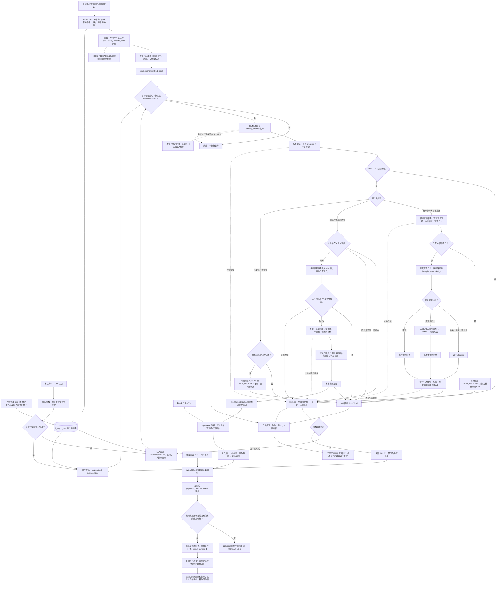

[业务逻辑专辑](/knowledge/business-logic/) / 居民收益付款 / S09

说明审核通过后的独立后续任务、通知与付款批次准备、失败重试和实际支付边界，附逐章原文对照与源码索引。本文保留原文 12 章，正文连续展开，原文对照与流程源码按需展开。

**前置阅读：** [S08 · 审核回调进度任务](/knowledge/business-logic/resident-income/s08-审核回调进度任务/)

**快速阅读：** [任务概览](#chapter-1) · [核心调用链](#chapter-3) · [异常与重复执行](#chapter-8) · [完整流程](#chapter-10) · [源码索引](#chapter-12)

<div class="business-logic-article">

<div id="intro"></div>

<div id="intro-story"></div>

## 先用一张付款单串起主线

**下面是假设场景，只用于理解，不是实际运行数据。** 有一张居民收益付款单：两条账单可以付款，一条账单不合格；付款方式是司库付款。审核主流程已经完成明细更新，现在要把审核通过的结果提交下来，同时安排后面的合作方通知和付款准备。

这里并不是“审核通过以后，在同一个事务里把所有事情做完”。上游先执行 **FINALIZE（审核主流程的收尾提交阶段）** ：把审核结果、审批实例、审核日志、状态刷新分片，以及后续待办一起落库。这里的 **分片** 是把后续刷新工作拆出的处理单元；这里的 **副作用（side effect）** 不是指程序出错，而是审核结果确定之后还要另外执行的通知、付款准备工作。

后续待办以 **种子/seed（已写入 `fi_async_task`、等待消费的任务记录）** 保存。对于这个假设场景，上游可以生成两条不同类型的任务：一条把可付款行和不合格行的校核结论一起通知合作方；另一条为司库生成付款推送批次和推送明细。它们是两项独立待办，不应理解成一条任务里必须依次完成两种操作。

审核事务提交后，可以尝试 **Kick（主动唤醒消费者，减少等待下一轮扫描的时间）** ；也可以由 XXL-Job（定时任务调度平台）扫描持久化任务。S09 领到任务后，先核对它属于哪张付款单、哪个版本、哪次提交和审批，再检查 FINALIZE 是否完成，然后处理该条任务对应的那一种副作用。

合作方分支会构建通知、预留外部日志、调用合作方适配服务，再记录返回结果。司库分支则先把“准备支付什么、拆成几笔、由哪些批次发送”保存下来，提交后通过 **Kafka（消息中间件，用来通知另一个服务继续处理）** 发送创建通知。之后的司库推送、查证和实际结果回写，属于后续链路，不是 S09 当场完成付款。

**主线的终点要分三层看：S09 本地任务处理完了、合作方通知获得成功结果、钱实际支付成功，是三个不同结论。** 例如合作方调用失败，只要失败结果成功写进外部日志，S09 仍可能是成功；生成司库批次，也不代表已经产生真实付款结果。

### 阅读依据与核验边界

> **阅读依据与核验边界** ：本阅读版仅改写附件《residentIncomePaymentReviewCallbackSideEffectTask 源码梳理》，没有重新访问项目源码、连接数据库、运行任务或验证外部付款结果。下文“源码确认”“当前实现”均指原文核验时的工作区，不代表现在的生产环境。
>
> 原文分析日期为 **2026-09-08** ；主仓库工作区为 `/Users/wangyi/BZ/zx-monitor/zxbaif`，分支为 `Ian/review/01`，HEAD 为 `a1bfacbeb6dfc239d577bd66bf78cd9eb2482efa`。公共执行模板存在已有的未提交修改，原文读取的是 **工作区实际内容** ，不能只拿该 HEAD 的提交内容代替。原文分析没有修改业务代码、运行任务、调用外部付款接口，也没有连接数据库验证。
>
> 原文标记为 **SOURCE\_VERIFIED（经过源码核验）** 。调度周期、实际配置、数据库索引是否部署、线上执行结果均未进行环境核验。原文按当时要求保存到 **S03** 目录，但本任务的源码阶段是 **S09** ，主动触发路由是 `S09_REVIEW_SIDE_EFFECT`；目录名不能当成任务阶段。

<details class="source-note">
<summary>12 章阅读地图 · 每章分别解决什么问题</summary>

正文沿用原文的 12 章及原小节编号，便于逐章对照。HTML 版在每章末尾提供该章原文的展开入口。

| 章节 | 这一章帮助你回答什么 |
| --- | --- |
| 1. 任务概览 | 这是什么任务、怎么触发、一次处理多少、成功意味着什么？ |
| 2. 业务目的 | 为什么拆成后续任务，上游什么时候生成它？ |
| 3. 核心调用链 | 一条任务从领取到三种分支结束，具体经过什么步骤？ |
| 4. 数据筛选规则 | 哪些任务会被选中，身份和执行条件怎样核对？ |
| 5. 主要状态流转 | 任务状态、失败次数、外部日志状态如何变化？ |
| 6. 数据库影响 | 哪些表在 S09 里读写，哪些表要等付款结果回来才更新？ |
| 7. 异步/后续处理 | Kick、合作方 HTTP、Kafka、司库查证怎样接起来？ |
| 8. 异常与重复执行 | 失败、跳过、重复执行和进程崩溃分别会怎样？ |
| 9. 风险与疑点 | 哪些是代码明确缺口，哪些只是有前提的风险？ |
| 10. 完整业务流程图（Mermaid） | 把分支、事务和后续链路放进同一张图里看。 |
| 11. 一句话总结整条链路 | 用一句话确认是否真正理解了主线。 |
| 12. 源码索引与核验边界 | 去哪里定位源码，哪些环境事实仍然不能确认？ |

</details>

<details class="original">
<summary>展开原文对照 · 文首说明</summary>

> 分析日期：2026-09-08。以 `/Users/wangyi/BZ/zx-monitor/zxbaif` 当前工作区源码为准。
>
> 分支：`Ian/review/01`；HEAD：`a1bfacbeb6dfc239d577bd66bf78cd9eb2482efa`。公共执行模板有已有的未提交修改，本文读取的是工作区实际内容。本次未修改业务代码、未运行任务、未调用外部付款接口、未连接数据库验证。
>
> 按要求保存到 **S03** 目录；本任务在源码中的阶段为 **S09**，主动触发路由为 `S09_REVIEW_SIDE_EFFECT`。文中的“种子/seed”就是已写入 `fi_async_task`、等待消费的任务记录。
>
> 结论证据为源码核验（SOURCE\_VERIFIED）。调度周期、实际配置、数据库索引部署情况、线上执行结果，未做环境核验，暂时无法确认。

</details>

<div id="chapter-1"></div>

<div id="chapter-1-title"></div>

## 1. 任务概览

可以把这个任务理解成“审核结果已经提交以后，领取并处理后续待办的执行器”。它不是审核入口，也不是直接把钱付出去的入口。

它主要做两类当前仍在生成的工作： **向合作方发送账单校核结果** ，或者 **为司库付款生成推送批次及明细，并通知后续服务** 。消费器还保留第三种历史类型，但那个分支只登记“不合格账单推送合作方”的预留外部日志，没有实际 HTTP（通过网络发送接口请求所用的通信协议）发送。

**XXL-Job Handler（调度平台调用的任务处理入口）** 名为 `residentIncomePaymentReviewCallbackSideEffectTask`。业务处理集中在消费服务里；“一次调度”可以处理多条任务，但“一条任务”只对应某个审核身份下的一种副作用。

| 项目 | 原文确认的实现及通俗含义 |
| --- | --- |
| XXL-Job Handler | `residentIncomePaymentReviewCallbackSideEffectTask`。这是调度平台识别的入口名。 |
| 入口类 | `ResidentIncomePaymentReviewCallbackJob`。接收参数并决定自动扫描还是定向手工处理。 |
| 消费服务 | `ResidentIncomePaymentReviewCallbackSideEffectTaskServiceImpl`。负责筛选、领取、校验、分支执行和任务状态写回。 |
| 任务表 | `fi_async_task`。待办以数据库记录保存，不只存在于线程池内存里。 |
| 固定任务类型 | `RESIDENT_INCOME_PAYMENT_REVIEW_CALLBACK_SIDE_EFFECT`。自动查询和领取都需要匹配这个类型。 |
| 执行单位 | 一条任务对应一个审核身份下的一种副作用；一张付款单可以生成两条不同类型任务。不能把它理解成“一张付款单只能有一条任务”。 |
| 触发方式 | XXL-Job 自动扫描、XXL-Job 定向手工重跑、事务提交后的主动 Kick。 |
| 单次数量 | 默认 100；`maxTaskCount <= 0` 时仍按 100；最大限制为 500。限制的是候选任务数，不是处理成功数。 |
| 自动候选状态 | `PENDING(0)`（待执行）或 `FAILED(3)`（执行失败），并且已经到期、累计失败次数未耗尽。 |
| 默认失败次数上限 | `max_retry_count=3`，表示最多累计失败三次。 **不是首次失败以后还可以再失败三次。** |
| XXL-Job 内部执行方式 | 普通 `for` 循环逐条处理；本方法没有再把各条任务提交到线程池。 |
| 主动 Kick 执行方式 | 使用 `residentIncomePaymentKickExecutor` 线程池，按任务编码精确消费同一条持久化任务。 |
| S09 成功的含义 | 本地副作用处理闭环已经完成；不等于合作方已收到通知，也不等于司库已付款。 |
| Cron、实例数、分片策略 | Handler 没有定义 Cron（调度时间表达式），也没有读取 XXL 分片参数；控制台调度和部署设置无法从本次核验确认。 |

源码定位：[任务入口 S01](#source-s01)、[消费服务 S02](#source-s02)、[任务身份规则 S03](#source-s03)。

<details class="original" id="original-1">
<summary>展开原文对照 · 第 1 章</summary>

附件原文 · 第 11–35 行 · 原文中的源码核验结论不代表环境验证

### 1. 任务概览

**这个任务消费“居民收益付款审核通过后待办事项”，在审核结果已经提交的前提下，向合作方发送账单校核结果，或者为司库付款生成推送批次及明细，并通知后续付款服务继续处理。**

它也保留一种历史类型：仅登记“不合格账单推送合作方”的预留外部日志。该历史分支并没有实际发送 HTTP。

| 项目 | 源码确认的行为 |
| --- | --- |
| XXL-Job Handler | `residentIncomePaymentReviewCallbackSideEffectTask` |
| 入口类 | `ResidentIncomePaymentReviewCallbackJob` |
| 消费服务 | `ResidentIncomePaymentReviewCallbackSideEffectTaskServiceImpl` |
| 任务表 | `fi_async_task` |
| 固定任务类型 | `RESIDENT_INCOME_PAYMENT_REVIEW_CALLBACK_SIDE_EFFECT` |
| 执行单位 | 一条任务对应一个审核身份下的一种副作用；一张付款单可生成两条不同类型任务 |
| 触发方式 | XXL-Job 自动扫描、XXL-Job 定向手工重跑、事务提交后的主动 Kick |
| 单次数量 | 默认 100；`maxTaskCount <= 0` 也按 100；最多 500 |
| 自动候选状态 | `PENDING(0)`、`FAILED(3)`，且到期、未耗尽失败次数 |
| 默认失败次数上限 | `max_retry_count=3`，即默认最多累计失败三次；不是首次失败后再重试三次 |
| XXL-Job 内部执行 | 普通 `for` 循环逐条处理，没有在此方法内再提交线程池 |
| 主动 Kick 执行 | 使用 `residentIncomePaymentKickExecutor`，精确消费同一任务 |
| 本任务成功的含义 | 本地副作用处理闭环；不等同于合作方已接收，更不等同于司库已付款 |
| Cron、实例数、分片策略 | Handler 没有定义 Cron，也没有读取 XXL 分片参数；控制台和部署设置暂时无法确认 |

依据：[任务入口](#source-s01)、[消费服务](#source-s02)、[任务身份规则](#source-s03)。

<details class="source-note">
<summary>查看本章原始 Markdown 文本</summary>

```text
## 1. 任务概览

**这个任务消费“居民收益付款审核通过后待办事项”，在审核结果已经提交的前提下，向合作方发送账单校核结果，或者为司库付款生成推送批次及明细，并通知后续付款服务继续处理。**

它也保留一种历史类型：仅登记“不合格账单推送合作方”的预留外部日志。该历史分支并没有实际发送 HTTP。

| 项目 | 源码确认的行为 |
| --- | --- |
| XXL-Job Handler | `residentIncomePaymentReviewCallbackSideEffectTask` |
| 入口类 | `ResidentIncomePaymentReviewCallbackJob` |
| 消费服务 | `ResidentIncomePaymentReviewCallbackSideEffectTaskServiceImpl` |
| 任务表 | `fi_async_task` |
| 固定任务类型 | `RESIDENT_INCOME_PAYMENT_REVIEW_CALLBACK_SIDE_EFFECT` |
| 执行单位 | 一条任务对应一个审核身份下的一种副作用；一张付款单可生成两条不同类型任务 |
| 触发方式 | XXL-Job 自动扫描、XXL-Job 定向手工重跑、事务提交后的主动 Kick |
| 单次数量 | 默认 100；`maxTaskCount <= 0` 也按 100；最多 500 |
| 自动候选状态 | `PENDING(0)`、`FAILED(3)`，且到期、未耗尽失败次数 |
| 默认失败次数上限 | `max_retry_count=3`，即默认最多累计失败三次；不是首次失败后再重试三次 |
| XXL-Job 内部执行 | 普通 `for` 循环逐条处理，没有在此方法内再提交线程池 |
| 主动 Kick 执行 | 使用 `residentIncomePaymentKickExecutor`，精确消费同一任务 |
| 本任务成功的含义 | 本地副作用处理闭环；不等同于合作方已接收，更不等同于司库已付款 |
| Cron、实例数、分片策略 | Handler 没有定义 Cron，也没有读取 XXL 分片参数；控制台和部署设置暂时无法确认 |

依据：[任务入口][S01]、[消费服务][S02]、[任务身份规则][S03]。
```

</details>

</details>

<div id="chapter-2"></div>

<div id="chapter-2-title"></div>

## 2. 业务目的

<div id="section-2-1"></div>

### 2.1 为什么审核通过后还需要这个任务

要解决的问题是： **“审核结果能否稳定提交”和“后面的外部通知、批次构建能否完成”，不是同一件事。** 合作方接口可能超时，批次构建也可能失败。如果把这些工作全部塞进审核回调事务，就可能拖长事务，甚至影响审核结果提交。

原文中的实现把它拆成两个阶段。第一阶段由上游 FINALIZE 固化付款单审核结果、审批实例、审核日志、刷新分片和副作用任务记录。第二阶段由 S09 独立消费这些任务记录；遇到可重试的本地错误，就保存失败原因，留给后续消费。

这样拆分以后，观察业务时就必须接受一种中间状态：审核已经成功，但合作方通知还没有成功，或者司库批次还没有生成。它们需要分开观察，不能只看审核状态。

同时，“拆成异步任务”并不意味着“每种外部操作都会自动重试到成功”。这里的合作方校核结果通知采用的是： **只要已有投递凭据，就不再次投递。** 外部日志是这种凭据。它可能记录成功，也可能记录失败或尚未确定结果；处理策略见第 3.3、5.2、8.3 节。

<div id="section-2-2"></div>

### 2.2 上游怎样产生任务

先看业务顺序：上游要先确定这是哪次审核、结果是否具备提交条件，再提交审核结果和后续待办。S09 不负责替上游补做整套审核。

对应的方法是 `ResidentIncomePaymentReviewCallbackFinalizeServiceImpl.doFinalizeTransaction`。以下动作在 **同一个事务** 中按顺序执行：[S04](#source-s04)

1. 锁定回调进度和付款单，核对审核身份，以及明细实际更新数量。
2. 校验付款条件，确定付款方式，更新付款单审核通过结果。
3. 更新审批实例，写审核日志，写状态刷新分片。
4. 调用 `sideEffectSeedWriter.writeFinalizeSideEffectSeeds(lockedProgress)`，把副作用种子写入任务表。
5. 将进度的 `main_task_status` 改为 `SUCCESS`，写入 `finalize_time`；进度接着进入 `LOCK_RELEASE/INIT`。
6. 事务提交后尝试主动 Kick S09。Kick 失败只记录日志，不回滚已经提交的审核结果。

这里的 `LOCK_RELEASE/INIT` 表示后面还有锁释放阶段需要继续处理。 **`main_task_status=SUCCESS` 只说明主任务已经成功，不代表所有技术后处理都结束。** 此时 `lock_release_success`、`refresh_shard_success` 所表示的锁释放和刷新分片完成情况，都可能还没有全部完成。[S05](#source-s05)

当前种子生成器的实际条件如下。表中的 AND 表示必须同时成立，OR 表示任意一项成立即可。

| 副作用类型 | 种子生成条件 | 生成后要做什么 |
| --- | --- | --- |
| `PARTNER_BILL_REVIEW_RESULT_PUSH` | `payable_count > 0` **OR** `unqualified_count > 0` | 把待付款行和不合格行的校核结论一起通知合作方；不要求两类行同时存在。 |
| `PAYMENT_RESULT_BASE_DATA_BUILD` | 目标状态不是 `NO_NEED_PAY(55)` **AND** `payable_count > 0` **AND** 付款单存在 **AND** `payment_type=SIKU_PAYMENT(2)` | 为司库付款生成推送批次和推送明细。 |
| `UNQUALIFIED_PARTNER_BILL_PUSH` | 当前生成器 **没有创建该类型的分支** | 只是消费器仍兼容的历史类型，用于预留外部日志。不能说当前每次 FINALIZE 都会产生它。 |

`payable_count` 是可付款行数量，`unqualified_count` 是不合格行数量；`NO_NEED_PAY(55)` 是无需付款目标状态，`SIKU_PAYMENT(2)` 是司库付款方式。它们对应不同维度，不能互相替代。[S06](#source-s06)

重复 FINALIZE 或补建任务时，生成器并不会把旧任务“重置成待执行”。`writeFinalizeSideEffectSeeds` 会先按确定性的 `task_code` 查询；存在就跳过，不存在才执行 `insert ignore`（数据库插入时使用忽略冲突的写法）。因此，已有成功任务不会被重新初始化，已有失败任务也不会被清空失败状态。并发防重仍依赖数据库唯一约束是否正确部署，不能单凭这条 SQL 断言绝无重复。[S06](#source-s06) [S07](#source-s07)

另有独立的 `residentIncomePaymentReviewCallbackSideEffectRebuildTask`，调用 `rebuildMissingTasks` 补写缺失种子。 **补建器负责“有没有待办记录”，本 Handler 负责“消费已经存在的记录”** ，这不是同一条自动分支。补建扫描自身还有固定窗口问题，见第 9.2 节。

<details class="original" id="original-2">
<summary>展开原文对照 · 第 2 章</summary>

附件原文 · 第 36–73 行 · 原文中的源码核验结论不代表环境验证

### 2. 业务目的

#### 2.1 为什么审核通过后还需要这个任务

审核通过需要先把财务内部审核结果稳定落库，再进行合作方通知和付款推送准备。如果把外部调用、大量批次构建都放进审核回调事务，外部超时或构建失败会拖长甚至破坏审核结果提交。

当前实现把这件事拆为两个业务阶段：

1. 上游 `FINALIZE` 固化付款单审核结果、审批实例、审核日志、刷新分片以及副作用任务记录。
2. 本任务独立消费副作用记录；出现可重试的本地错误时，保留任务失败信息，等待后续消费。

因此，审核成功而合作方通知失败、审核成功而司库批次尚未生成，都是需要分别观察的状态。当前实现并不保证每一种副作用都会自动重试到外部成功，尤其合作方校核结果推送明确采用“已有投递凭据就不再次投递”的处理方式。

#### 2.2 上游怎样产生任务

`ResidentIncomePaymentReviewCallbackFinalizeServiceImpl.doFinalizeTransaction` 在同一事务中执行：[S04](#source-s04)

1. 锁定回调进度和付款单，核对审核身份及明细更新数量。
2. 校验付款条件、确定付款方式，更新付款单审核通过结果。
3. 更新审批实例，写审核日志，写状态刷新分片。
4. `sideEffectSeedWriter.writeFinalizeSideEffectSeeds(lockedProgress)` 写副作用种子。
5. 将进度 `main_task_status` 改为 `SUCCESS`，写 `finalize_time`；进度继续进入 `LOCK_RELEASE/INIT`。
6. 提交后尝试主动 Kick S09；Kick 失败只留日志，不回滚已提交的审核结果。

**`main_task_status=SUCCESS` 不代表所有技术后处理结束。** 此时 `lock_release_success`、`refresh_shard_success` 都可能尚未完成。[S05](#source-s05)

当前种子生成器只生成以下两种类型：[S06](#source-s06)

| 副作用类型 | 生成条件 | 业务结果 |
| --- | --- | --- |
| `PARTNER_BILL_REVIEW_RESULT_PUSH` | `payable_count > 0` 或 `unqualified_count > 0` | 把待付款行和不合格行的校核结论一起通知合作方 |
| `PAYMENT_RESULT_BASE_DATA_BUILD` | 目标状态不是 `NO_NEED_PAY(55)`，`payable_count > 0`，付款单存在且 `payment_type=SIKU_PAYMENT(2)` | 为司库付款生成推送批次和推送明细 |
| `UNQUALIFIED_PARTNER_BILL_PUSH` | 当前生成器没有创建此类型的分支 | 消费器保留的历史预留日志处理 |

`writeFinalizeSideEffectSeeds` 先按确定性的 `task_code` 查询，存在则不重新初始化；不存在再 `insert ignore`。所以重复 FINALIZE 或补建不会主动重置已有成功/失败任务。[S06](#source-s06) [S07](#source-s07)

还有独立的 `residentIncomePaymentReviewCallbackSideEffectRebuildTask` 调用 `rebuildMissingTasks` 补写种子。它不是本 Handler 的自动消费分支，不能把“消费已有任务”和“补建缺失任务”混为一件事。

<details class="source-note">
<summary>查看本章原始 Markdown 文本</summary>

```text
## 2. 业务目的

### 2.1 为什么审核通过后还需要这个任务

审核通过需要先把财务内部审核结果稳定落库，再进行合作方通知和付款推送准备。如果把外部调用、大量批次构建都放进审核回调事务，外部超时或构建失败会拖长甚至破坏审核结果提交。

当前实现把这件事拆为两个业务阶段：

1. 上游 `FINALIZE` 固化付款单审核结果、审批实例、审核日志、刷新分片以及副作用任务记录。
2. 本任务独立消费副作用记录；出现可重试的本地错误时，保留任务失败信息，等待后续消费。

因此，审核成功而合作方通知失败、审核成功而司库批次尚未生成，都是需要分别观察的状态。当前实现并不保证每一种副作用都会自动重试到外部成功，尤其合作方校核结果推送明确采用“已有投递凭据就不再次投递”的处理方式。

### 2.2 上游怎样产生任务

`ResidentIncomePaymentReviewCallbackFinalizeServiceImpl.doFinalizeTransaction` 在同一事务中执行：[S04]

1. 锁定回调进度和付款单，核对审核身份及明细更新数量。
2. 校验付款条件、确定付款方式，更新付款单审核通过结果。
3. 更新审批实例，写审核日志，写状态刷新分片。
4. `sideEffectSeedWriter.writeFinalizeSideEffectSeeds(lockedProgress)` 写副作用种子。
5. 将进度 `main_task_status` 改为 `SUCCESS`，写 `finalize_time`；进度继续进入 `LOCK_RELEASE/INIT`。
6. 提交后尝试主动 Kick S09；Kick 失败只留日志，不回滚已提交的审核结果。

**`main_task_status=SUCCESS` 不代表所有技术后处理结束。** 此时 `lock_release_success`、`refresh_shard_success` 都可能尚未完成。[S05]

当前种子生成器只生成以下两种类型：[S06]

| 副作用类型 | 生成条件 | 业务结果 |
| --- | --- | --- |
| `PARTNER_BILL_REVIEW_RESULT_PUSH` | `payable_count > 0` 或 `unqualified_count > 0` | 把待付款行和不合格行的校核结论一起通知合作方 |
| `PAYMENT_RESULT_BASE_DATA_BUILD` | 目标状态不是 `NO_NEED_PAY(55)`，`payable_count > 0`，付款单存在且 `payment_type=SIKU_PAYMENT(2)` | 为司库付款生成推送批次和推送明细 |
| `UNQUALIFIED_PARTNER_BILL_PUSH` | 当前生成器没有创建此类型的分支 | 消费器保留的历史预留日志处理 |

`writeFinalizeSideEffectSeeds` 先按确定性的 `task_code` 查询，存在则不重新初始化；不存在再 `insert ignore`。所以重复 FINALIZE 或补建不会主动重置已有成功/失败任务。[S06][S07]

还有独立的 `residentIncomePaymentReviewCallbackSideEffectRebuildTask` 调用 `rebuildMissingTasks` 补写种子。它不是本 Handler 的自动消费分支，不能把“消费已有任务”和“补建缺失任务”混为一件事。
```

</details>

</details>

<div id="chapter-3"></div>

<div id="chapter-3-title"></div>

## 3. 核心调用链

<div id="section-3-1"></div>

### 3.1 从定时入口到单条任务

先把流程分成三层：入口负责解析“要处理谁”，消费服务负责领取和校验，具体业务服务负责真正的通知或批次构建。最后再汇总本轮处理结果。

```text
ResidentIncomePaymentReviewCallbackJob
  .residentIncomePaymentReviewCallbackSideEffectTask(param)
  ├─ parseJobParam / unwrapPayload：解析并拆开包装参数
  └─ executeSideEffectJob：选择执行模式
     ├─ 无 taskCode/businessKey 选择条件
     │  → executePendingTasks(maxTaskCount)
     └─ 有选择条件
        → executeManualRetry(taskCodes, businessKeys, maxTaskCount)
        ↓
ResidentIncomePaymentReviewCallbackSideEffectTaskServiceImpl
  查询候选任务 → executeTaskList → executeSingleTask
  ├─ claimTask → FencedExecutionTemplate.claim → 原子领取任务
  ├─ parsePayload → validateSideEffectType
  ├─ validateTaskIdentity → 读取并匹配回调 progress
  ├─ validateExecuteGate → 检查 FINALIZE/历史类型锁释放条件
  ├─ executeSideEffectWithFence → 按副作用类型执行
  └─ markTaskSuccess / markTaskFailed / 执行权失效后跳过
        ↓
inspectInvariants → 汇总选择/成功/失败/跳过数量 → 返回 XXL-Job
```

这里的 **payload（任务携带的数据）** 包含身份和业务参数； **progress（审核回调进度记录）** 是后面核对身份和 FINALIZE 状态的依据； **执行门禁** 就是执行前必须满足的条件。方法名 `inspectInvariants` 指一致性巡检入口，但当前是否有实际巡检规则要单独看，第 8.1 节会说明，不能仅凭名字认定已做全面检查。

参数支持三种包装：裸 JSON、`{"data":{...}}`、以及 `data` 的值本身是 JSON 字符串。`taskCode/taskCodes` 和 `businessKey/businessKeys` 的单值、数组形式会合并，去除空值并去重。两类手工选择条件之间是 **OR** ，不是 AND。[S01](#source-s01) [S02](#source-s02)

以下仅是原文的参数格式示例，没有执行：

```json
{"maxTaskCount":100}
```

```json
{"taskCodes":["RIPRCSE:<实际32位MD5>"],"maxTaskCount":10}
```

其中 `MD5` 是把完整身份键变成固定长度摘要的算法；这里用它生成稳定编码，并不是在描述密码安全能力。

这里的 **幂等键（用来识别同一业务操作、避免重复处理的稳定身份键）** 与普通展示单号要分开看。`businessKey` 必须使用数据库 **实际存储** 的业务键。完整业务键过长时，存储值会被摘要化，所以直接传付款单号，或者把超长的完整幂等键直接当成存储业务键，都不能保证命中。具体长度边界在第 4.3 节。

还有一个容易误操作的分支：参数 JSON 解析失败，入口不是直接报错终止，而是记录日志并返回空参数；空选择条件会转成自动扫描。第 9.3 节保留了这一风险。

<div id="section-3-2"></div>

### 3.2 任务领取与执行权保护

**遇到的问题：** 两个执行者可能同时查到同一条待执行任务。查询到不代表已经拥有执行权，因此还需要一个“只有一个人能领走”的步骤。

**处理方式：** 使用 SQL **原子更新（条件匹配和状态修改在一次数据库操作里完成）** 领取任务。核心条件同时包括：任务 ID 匹配、固定任务类型匹配、未删除、状态是 `PENDING/FAILED`，以及 `running_attempt` 等于查询时读到的期望轮次。自动来源还要检查到期时间和次数限制，手工来源的差异见第 4.2 节。[S07](#source-s07) [S08](#source-s08)

领取成功后，任务变成 `task_status=RUNNING(1)`；`running_attempt=running_attempt+1`，即执行轮次加 1；`error_message` 清空；`update_time/update_user_id` 更新。方法返回一个 **ClaimToken（领取凭证）** ，里面带着新的执行轮次。

其他执行者即使此前也查到了这条记录，再领取时也会因为状态或轮次已变化而失败，计入“跳过”，不执行业务。

领取不是唯一一道保护。主要本地写入之前，`executeFencedWrite` 会执行 `SELECT ... FOR UPDATE`（查询并锁住该任务行），再次核对以下组合：

```text
id 匹配
AND task_type 匹配
AND task_status = RUNNING
AND running_attempt 匹配本次领取凭证
AND deleted = 0
```

这就是 **fencing（执行权隔离：用轮次阻止旧执行者继续写入）** 。校验不通过时抛出 `FencedOutException`，旧执行者不能继续进行受保护的业务写入，也不能覆盖新执行者的状态。

**仍然存在的限制：** 这里锁的是异步任务行，而不是付款单的当前审核版本。它回答的是“你还是不是这条任务的合法执行者”，并不自动回答“付款单现在是否仍然处于当时的版本和业务状态”。审核身份、当前付款业务状态是另一层校验，第 9.4 节正是围绕这个区别展开。

<div id="section-3-3"></div>

### 3.3 合作方账单校核结果分支

这个分支要告诉合作方的不是“这笔钱已经付了”，而是“本次正式明细里，每条账单的校核结论是什么”。它会把本次查询到的全部正式明细一起组装成报文，不是只发送不合格行，也不是每个电站单独调用一次。

实现把数据库工作与网络工作分开，顺序如下：

```text
executeSideEffectWithFence
  ├─ 事务一：executeFencedWrite → partnerReviewResultPushService.reserve(payload)
  │  ├─ 查询该审核版本/提交轮次的正式付款明细
  │  ├─ 校验合作方快照、账单维度、行审核状态
  │  ├─ 构建校核结果报文和外部幂等键
  │  └─ 新增 WAIT_PROCESS 外部日志，或命中已有日志并返回无需投递
  ├─ 事务外：deliver → IPartnerBillReviewResultPushFeign.push(command)
  │  └─ inputpiece-plant：解析地址、加密签名、HTTP、验签解密
  ├─ 事务二：executeFencedWrite → complete → 外部日志 SUCCESS/FAIL
  └─ 独立状态事务：markTaskSuccess
```

**Feign（Java 服务之间发起远程调用的客户端方式）** 先把请求交给内部 `inputpiece-plant` 服务，再由该服务使用 HTTP 调用合作方。`WAIT_PROCESS` 是等待处理的外部日志状态。`reserve` 是预留投递日志，`deliver` 是实际调用，`complete` 是记录调用结果。HTTP 不在前述两个本地数据库事务内部，但已经发出去的 HTTP 也不能靠数据库回滚撤销。

正式付款明细取自 `fi_resident_income_payment_order_bill`。在发整份报文之前，要确认全部明细属于同一个 **合作方快照（正式明细保存的合作方身份信息）** ：`partner_org_id/partner_no/partner_name` 都必须一致。每行还必须有 `partner_station_no`（合作方电站编号）和 `bill_yearmonth`（账期）。[S09](#source-s09)

行类型与行状态必须成对匹配，不能只看其中一个字段：

| 正式明细必须同时满足的条件 | 对外结果 | 原因字段 |
| --- | --- | --- |
| `line_type=PAYABLE(10)` **AND** `line_status=REVIEW_APPROVED(20)` | `partnerQueryStatus=VERIFIED_PASS(20)`，即校核通过 | 原因为空。 |
| `line_type=UNQUALIFIED(20)` **AND** `line_status=UNQUALIFIED_EFFECTIVE(50)` | `partnerQueryStatus=VERIFIED_FAIL(30)`，即校核不通过 | 携带 `unqualified_reason`。 |
| 其他任何组合 | 抛异常，不发送这份报文 | 不能自行把不认识的状态当成通过或不通过。 |

`billList` 装入全部查询结果。明细先按 `line_no,id` 升序排列，然后对外行号重新从 1 编号；不是直接假定原来的行号连续可用。

回到开头的 **假设场景** ：只有在两条可付款行都是 `PAYABLE + REVIEW_APPROVED`、不合格行是 `UNQUALIFIED + UNQUALIFIED_EFFECTIVE`，并且合作方快照和账单维度也都合格时，才会把三行一起构造成通知。任何一行出现其他组合，都会使这份报文不能发送。

外部请求使用独立的 **幂等键** ，用于识别同一次合作方投递：

```text
PARTNER_BILL_REVIEW_RESULT:<paymentOrderId>:<dataVersion>:<submitRound>:<partnerOrgId>
requestNo = SHA-256(上述键) 的完整十六进制字符串
X-Request-Id = 上述摘要前 10 位
```

`SHA-256` 在这里也是摘要算法。`requestNo` 使用完整摘要，`X-Request-Id` 使用前 10 位，两者不能混写。

**外部键与异步任务键不是同一个身份范围。** 外部键不包含 `reviewPlanId/approvalAttempt`。因此，同一付款单、数据版本、提交轮次、合作方下，即使内部审批身份变化，已有外部日志仍会阻止再次投递。这里并不是“新建了内部任务就一定能再发一遍”。

已有日志怎样处理也要区分：已有 `SUCCESS/FAIL` 就保留终态，不再投递；已有 `WAIT_PROCESS` 会关闭成“上次结果未知”的失败记录，同样不重发。这种策略降低重复投递，但不提供自动补送能力。

<div id="section-3-4"></div>

### 3.4 司库付款批次生成分支

这个分支解决的是“审核已经通过，后面的付款服务应该拿什么数据去推送”。它把正式明细加工成推送批次和推送明细。

副作用类型叫 `PAYMENT_RESULT_BASE_DATA_BUILD`，实际调用 `createResidentIncomePaymentPushBatch(paymentOrderId)`。[S10](#source-s10) **名称里虽然有“付款结果基础数据”，这里并没有直接创建 `fi_resident_income_payment_result` 的真实付款结果。** 真实结果要等后续推送、查证得到终态后再写。

执行顺序完整展开如下：

1. **先判断是否适用。** 消费器查询付款单；不存在则失败。对于历史遗留的非司库类型任务，直接按“不适用”成功结束，不继续构建。
2. **再查询并加创建锁。** 批次服务再次查询付款单，使用 Redis 锁 `fi_resident_income_payment_push_batch:create:<paymentOrderId>`。Redis 锁是跨执行者协调同一付款单创建操作的锁；最多等待 5 秒，租约（锁的有效时长）为 300 秒。
3. **先查已有批次，再决定是否新建。** 查询该付款单未删除的既有批次。被选中的既有批次，来源 ID 和来源单号都一致，就直接成功返回；有冲突则失败。
4. **没有历史批次时检查维护开关。** 金额口径升级维护开关开启，就抛异常。注意这一检查在“无历史批次”的路径上，不是在已有批次直接返回之前。
5. **读取合作方拆分配置。** 通过 Feign 查询启用的付款拆分配置。查不到配置允许继续，表示不拆分；这不等于配置远程调用异常也能忽略。
6. **读取当前版本的公司付款分录。** 按付款单 **当前** 的 `current_publish_version + submit_round` 查询项目公司付款分录。没有分录则失败。
7. **补齐项目公司档案。** 批量查询这些项目公司的档案，某个公司找不到档案就失败。
8. **读取可付明细并付款前复核。** 按项目公司查询同一当前版本、提交轮次下的 `PAYABLE` 明细，检查必要的付款事实。
9. **按配置拆分单条金额。** 有配置时，用 `split_amount` 拆分单条 `current_payment_amount`，每一笔不超过配置的拆分金额；无配置时，一条付款明细对应一条推送明细。
10. **按公司组批保存。** 每个项目公司按每批最多 1,000 条推送明细分批保存；批次号由编号 Feign 生成。
11. **更新推送状态并安排通知。** 付款单改为 `push_status=PUSHING(2)`；本地事务提交以后发送 Kafka 创建通知。
12. **最后写 S09 成功。** 批次创建方法成功返回以后，S09 再把自己的 `fi_async_task` 置为成功。

**假设例子，非实际数据：** 同一个项目公司有两条可付款明细，`current_payment_amount` 分别为 1,200 元和 500 元；启用配置的 `split_amount=1,000` 元。在其他复核都通过的前提下，第一条拆成 1,000 元和 200 元两笔，第二条仍为 500 元一笔，一共形成三条推送明细。若没有拆分配置，则两条正式明细各形成一条推送明细。示例中的金额不是系统固定阈值， **固定批次容量仍是每批最多 1,000 条明细** 。

付款前复核检查正付款金额、合法账期、拟付租金、账户和账单是否存在，以及必要的收款信息是否一致。遇到“小单未推送”或者“真实无小单”的具体场景，还会涉及合作方底账事实、平台电站映射。原文没有把所有分支内部规则展开，因此不能自行补出具体阈值或统一查询顺序；可以确认的是： **并非所有行都统一查询所有底账** 。[S11](#source-s11)

**事务边界不能被“每批 1,000 条”误导。** 整次批次创建加入 `executeFencedWrite` 的本地事务；每 1,000 条保存一次，不等于每 1,000 条提交一次。拆分配置、项目公司档案、编号服务这些 Feign 读取也发生在该业务事务中。付款单越大，事务、内存和远程等待的影响越需要单独观察，但原文没有实测耗时。

<div id="section-3-5"></div>

### 3.5 历史不合格推送分支

这个分支名称也很容易让人误以为“已经推送给合作方”。实际做的只是预留日志。

`UNQUALIFIED_PARTNER_BILL_PUSH` 满足门禁后，调用 `writeUnqualifiedPartnerPushExternalLog`：[S02](#source-s02)

1. 用 `payload.idempotentKey` 查外部日志。
2. 没有记录时，新增 `external_type=30`、`status=WAIT_PROCESS(10)`、`retry_count=0`、`next_retry_time=null` 的日志。
3. 已有记录时，更新业务 ID、业务键和请求 JSON，并把状态重新设成 `WAIT_PROCESS`。
4. 不调用 Feign，不发送 HTTP，也不发送 MQ（消息队列）消息，随后 S09 记为成功。

原文在当前仓库中没有找到该类型对应的实际投递消费链路。后续谁来把这条预留日志发给合作方， **暂时无法确认** 。这与当前统一合作方通知分支是两种不同实现，不能因为两者都涉及合作方、不合格账单，就合并理解。

<details class="original" id="original-3">
<summary>展开原文对照 · 第 3 章</summary>

附件原文 · 第 74–199 行 · 原文中的源码核验结论不代表环境验证

### 3. 核心调用链

#### 3.1 从定时入口到单条任务

```text
ResidentIncomePaymentReviewCallbackJob
  .residentIncomePaymentReviewCallbackSideEffectTask(param)
  ├─ parseJobParam / unwrapPayload
  └─ executeSideEffectJob
     ├─ 无 taskCode/businessKey 选择条件 → executePendingTasks(maxTaskCount)
     └─ 有选择条件 → executeManualRetry(taskCodes, businessKeys, maxTaskCount)
        ↓
ResidentIncomePaymentReviewCallbackSideEffectTaskServiceImpl
  查询候选任务 → executeTaskList → executeSingleTask
  ├─ claimTask → FencedExecutionTemplate.claim → 原子领取任务
  ├─ parsePayload → validateSideEffectType
  ├─ validateTaskIdentity → 读取并匹配回调 progress
  ├─ validateExecuteGate → 检查 FINALIZE/历史类型锁释放条件
  ├─ executeSideEffectWithFence → 按类型执行
  └─ markTaskSuccess / markTaskFailed / fencing 失效后跳过
        ↓
inspectInvariants → 汇总选择/成功/失败/跳过数量 → 返回 XXL-Job
```

参数支持裸 JSON、`{"data":{...}}` 和 `data` 为 JSON 字符串的包装。单值和数组形式都会合并、去空、去重，手工列表两类条件是 **OR**。[S01](#source-s01) [S02](#source-s02)

示例仅用于说明参数格式，本文没有执行：

```json
{"maxTaskCount":100}
```

```json
{"taskCodes":["RIPRCSE:<实际32位MD5>"],"maxTaskCount":10}
```

`businessKey` 要使用数据库里实际存储的值，超长业务键会被摘要化。传付款单号或把完整超长幂等键直接当成存储业务键，不能保证命中。

#### 3.2 任务领取与执行权保护

领取通过 SQL 原子更新完成，核心条件是：任务 ID、固定类型、未删除、状态为 `PENDING/FAILED`、`running_attempt` 等于读取时的期望值。[S07](#source-s07) [S08](#source-s08)

领取成功后：

- `task_status=RUNNING(1)`。
- `running_attempt=running_attempt+1`。
- 清空 `error_message`，更新 `update_time/update_user_id`。
- 返回包含新执行轮次的 `ClaimToken`。

其他执行者即使查到了同一条任务，也会因状态或执行轮次不匹配而领取失败，计入“跳过”。

主要本地写入前，`executeFencedWrite` 执行 `SELECT ... FOR UPDATE`，再次检查 `id + task_type + RUNNING + running_attempt + deleted=0`。校验失败抛出 `FencedOutException`，旧执行者不能继续写业务数据。

这里锁的是**异步任务行**，不能把它理解成“同时锁定付款单当前审核版本”。审核身份校验和付款业务状态校验是另外一层逻辑。

#### 3.3 合作方账单校核结果分支

```text
executeSideEffectWithFence
  ├─ 事务一：executeFencedWrite → partnerReviewResultPushService.reserve(payload)
  │  ├─ 查询该审核版本/提交轮次的正式付款明细
  │  ├─ 校验合作方快照、账单维度、行审核状态
  │  ├─ 构建校核结果报文和外部幂等键
  │  └─ 新增 WAIT_PROCESS 外部日志，或命中既有日志并返回无需投递
  ├─ 事务外：deliver → IPartnerBillReviewResultPushFeign.push(command)
  │  └─ inputpiece-plant → 合作方地址解析、加密签名、HTTP、验签解密
  ├─ 事务二：executeFencedWrite → complete → 外部日志 SUCCESS/FAIL
  └─ 独立状态事务：markTaskSuccess
```

正式付款明细来自 `fi_resident_income_payment_order_bill`。所有行必须属于同一个合作方快照，`partner_org_id/partner_no/partner_name` 必须一致。每行必须具有 `partner_station_no` 和 `bill_yearmonth`，并满足以下组合：[S09](#source-s09)

| 正式明细 | 对外校核结果 |
| --- | --- |
| `line_type=PAYABLE(10)` 且 `line_status=REVIEW_APPROVED(20)` | `partnerQueryStatus=VERIFIED_PASS(20)`，原因为空 |
| `line_type=UNQUALIFIED(20)` 且 `line_status=UNQUALIFIED_EFFECTIVE(50)` | `partnerQueryStatus=VERIFIED_FAIL(30)`，携带 `unqualified_reason` |
| 其他组合 | 抛异常，不发送该份报文 |

报文 `billList` 包含本次查询到的全部明细，行号按排序结果重新从 1 编号；不是只推送不合格行，也不是按电站逐条调用。

外部请求的业务幂等键为：

```text
PARTNER_BILL_REVIEW_RESULT:<paymentOrderId>:<dataVersion>:<submitRound>:<partnerOrgId>
requestNo = SHA-256(上述键) 的完整十六进制字符串
X-Request-Id = 上述摘要前 10 位
```

它与异步任务幂等键不同：外部键不包含 `reviewPlanId/approvalAttempt`。同一付款单、版本、提交轮次、合作方下，即使内部审批身份变化，既有外部记录仍会阻止再次投递。

#### 3.4 司库付款批次生成分支

`PAYMENT_RESULT_BASE_DATA_BUILD` 调用的是 `createResidentIncomePaymentPushBatch(paymentOrderId)`。[S10](#source-s10)

**这里没有直接创建 `fi_resident_income_payment_result` 的真实付款结果。** 方法名中的“付款结果基础数据”实际指推送批次及其明细；真实付款结果要等后续推送/查证终态回写。

执行步骤如下：

1. 消费器查询付款单。不存在则失败；历史非司库类型任务直接按“不适用”成功结束。
2. 批次服务再次查询付款单，并使用 Redis 锁 `fi_resident_income_payment_push_batch:create:<paymentOrderId>`，最多等待 5 秒，租约 300 秒。
3. 查询此付款单已有的未删除批次。选中的既有批次来源 ID 和来源单号一致就直接成功返回；不一致则失败。
4. 无历史批次时，检查金额口径升级维护开关；开启维护则抛异常。
5. Feign 查询合作方启用的付款拆分配置；查不到可继续，表示没有拆分配置。
6. 查询付款单**当前** `current_publish_version + submit_round` 的项目公司付款分录；没有分录则失败。
7. 批量查询项目公司档案；缺档案则失败。
8. 按项目公司查询同一当前版本/轮次下的 `PAYABLE` 明细，执行付款前事实复核。
9. 有拆分配置时按 `split_amount` 把单条 `current_payment_amount` 拆为多笔；每笔不超过拆分金额。没有配置时一条付款明细生成一条推送明细。
10. 按项目公司、每批最多 1,000 条推送明细分批保存，批次号由编号 Feign 生成。
11. 付款单 `push_status=PUSHING(2)`；事务提交后发送 Kafka 创建通知。
12. 批次构建方法返回成功，S09 再将自己的 `fi_async_task` 置为成功。

付款前复核会检查正付款金额、合法账期、拟付租金、账户/账单存在性及必要的收款信息一致性。小单未推送、真实无小单场景还涉及合作方底账事实及平台电站映射；这些是具体分支校验，并非所有行都统一查询所有底账。[S11](#source-s11)

**事务边界：** 整次批次创建加入 `executeFencedWrite` 的本地事务。每 1,000 条保存一次不等于每 1,000 条提交一次；其中的配置、档案、编号等 Feign 读取也位于这个业务事务中。

#### 3.5 历史不合格推送分支

`UNQUALIFIED_PARTNER_BILL_PUSH` 满足门禁后，只调用 `writeUnqualifiedPartnerPushExternalLog`：[S02](#source-s02)

- 以 `payload.idempotentKey` 查外部日志。
- 不存在则写 `external_type=30`、`status=WAIT_PROCESS(10)`、`retry_count=0`、`next_retry_time=null`。
- 已存在则更新业务 ID、业务键、请求 JSON，并把状态重新设为 `WAIT_PROCESS`。
- 没有 Feign、HTTP 或 MQ 发送，随后 S09 记为成功。

当前仓库中没有找到该类型对应的实际投递消费链路；后续如何把这条预留日志发给合作方，**暂时无法确认**。不能把预留日志写入当作实际推送成功。

<details class="source-note">
<summary>查看本章原始 Markdown 文本</summary>

````text
## 3. 核心调用链

### 3.1 从定时入口到单条任务

```text
ResidentIncomePaymentReviewCallbackJob
  .residentIncomePaymentReviewCallbackSideEffectTask(param)
  ├─ parseJobParam / unwrapPayload
  └─ executeSideEffectJob
     ├─ 无 taskCode/businessKey 选择条件 → executePendingTasks(maxTaskCount)
     └─ 有选择条件 → executeManualRetry(taskCodes, businessKeys, maxTaskCount)
        ↓
ResidentIncomePaymentReviewCallbackSideEffectTaskServiceImpl
  查询候选任务 → executeTaskList → executeSingleTask
  ├─ claimTask → FencedExecutionTemplate.claim → 原子领取任务
  ├─ parsePayload → validateSideEffectType
  ├─ validateTaskIdentity → 读取并匹配回调 progress
  ├─ validateExecuteGate → 检查 FINALIZE/历史类型锁释放条件
  ├─ executeSideEffectWithFence → 按类型执行
  └─ markTaskSuccess / markTaskFailed / fencing 失效后跳过
        ↓
inspectInvariants → 汇总选择/成功/失败/跳过数量 → 返回 XXL-Job
```

参数支持裸 JSON、`{"data":{...}}` 和 `data` 为 JSON 字符串的包装。单值和数组形式都会合并、去空、去重，手工列表两类条件是 **OR**。[S01][S02]

示例仅用于说明参数格式，本文没有执行：

```json
{"maxTaskCount":100}
```

```json
{"taskCodes":["RIPRCSE:<实际32位MD5>"],"maxTaskCount":10}
```

`businessKey` 要使用数据库里实际存储的值，超长业务键会被摘要化。传付款单号或把完整超长幂等键直接当成存储业务键，不能保证命中。

### 3.2 任务领取与执行权保护

领取通过 SQL 原子更新完成，核心条件是：任务 ID、固定类型、未删除、状态为 `PENDING/FAILED`、`running_attempt` 等于读取时的期望值。[S07][S08]

领取成功后：

- `task_status=RUNNING(1)`。
- `running_attempt=running_attempt+1`。
- 清空 `error_message`，更新 `update_time/update_user_id`。
- 返回包含新执行轮次的 `ClaimToken`。

其他执行者即使查到了同一条任务，也会因状态或执行轮次不匹配而领取失败，计入“跳过”。

主要本地写入前，`executeFencedWrite` 执行 `SELECT ... FOR UPDATE`，再次检查 `id + task_type + RUNNING + running_attempt + deleted=0`。校验失败抛出 `FencedOutException`，旧执行者不能继续写业务数据。

这里锁的是**异步任务行**，不能把它理解成“同时锁定付款单当前审核版本”。审核身份校验和付款业务状态校验是另外一层逻辑。

### 3.3 合作方账单校核结果分支

```text
executeSideEffectWithFence
  ├─ 事务一：executeFencedWrite → partnerReviewResultPushService.reserve(payload)
  │  ├─ 查询该审核版本/提交轮次的正式付款明细
  │  ├─ 校验合作方快照、账单维度、行审核状态
  │  ├─ 构建校核结果报文和外部幂等键
  │  └─ 新增 WAIT_PROCESS 外部日志，或命中既有日志并返回无需投递
  ├─ 事务外：deliver → IPartnerBillReviewResultPushFeign.push(command)
  │  └─ inputpiece-plant → 合作方地址解析、加密签名、HTTP、验签解密
  ├─ 事务二：executeFencedWrite → complete → 外部日志 SUCCESS/FAIL
  └─ 独立状态事务：markTaskSuccess
```

正式付款明细来自 `fi_resident_income_payment_order_bill`。所有行必须属于同一个合作方快照，`partner_org_id/partner_no/partner_name` 必须一致。每行必须具有 `partner_station_no` 和 `bill_yearmonth`，并满足以下组合：[S09]

| 正式明细 | 对外校核结果 |
| --- | --- |
| `line_type=PAYABLE(10)` 且 `line_status=REVIEW_APPROVED(20)` | `partnerQueryStatus=VERIFIED_PASS(20)`，原因为空 |
| `line_type=UNQUALIFIED(20)` 且 `line_status=UNQUALIFIED_EFFECTIVE(50)` | `partnerQueryStatus=VERIFIED_FAIL(30)`，携带 `unqualified_reason` |
| 其他组合 | 抛异常，不发送该份报文 |

报文 `billList` 包含本次查询到的全部明细，行号按排序结果重新从 1 编号；不是只推送不合格行，也不是按电站逐条调用。

外部请求的业务幂等键为：

```text
PARTNER_BILL_REVIEW_RESULT:<paymentOrderId>:<dataVersion>:<submitRound>:<partnerOrgId>
requestNo = SHA-256(上述键) 的完整十六进制字符串
X-Request-Id = 上述摘要前 10 位
```

它与异步任务幂等键不同：外部键不包含 `reviewPlanId/approvalAttempt`。同一付款单、版本、提交轮次、合作方下，即使内部审批身份变化，既有外部记录仍会阻止再次投递。

### 3.4 司库付款批次生成分支

`PAYMENT_RESULT_BASE_DATA_BUILD` 调用的是 `createResidentIncomePaymentPushBatch(paymentOrderId)`。[S10]

**这里没有直接创建 `fi_resident_income_payment_result` 的真实付款结果。** 方法名中的“付款结果基础数据”实际指推送批次及其明细；真实付款结果要等后续推送/查证终态回写。

执行步骤如下：

1. 消费器查询付款单。不存在则失败；历史非司库类型任务直接按“不适用”成功结束。
2. 批次服务再次查询付款单，并使用 Redis 锁 `fi_resident_income_payment_push_batch:create:<paymentOrderId>`，最多等待 5 秒，租约 300 秒。
3. 查询此付款单已有的未删除批次。选中的既有批次来源 ID 和来源单号一致就直接成功返回；不一致则失败。
4. 无历史批次时，检查金额口径升级维护开关；开启维护则抛异常。
5. Feign 查询合作方启用的付款拆分配置；查不到可继续，表示没有拆分配置。
6. 查询付款单**当前** `current_publish_version + submit_round` 的项目公司付款分录；没有分录则失败。
7. 批量查询项目公司档案；缺档案则失败。
8. 按项目公司查询同一当前版本/轮次下的 `PAYABLE` 明细，执行付款前事实复核。
9. 有拆分配置时按 `split_amount` 把单条 `current_payment_amount` 拆为多笔；每笔不超过拆分金额。没有配置时一条付款明细生成一条推送明细。
10. 按项目公司、每批最多 1,000 条推送明细分批保存，批次号由编号 Feign 生成。
11. 付款单 `push_status=PUSHING(2)`；事务提交后发送 Kafka 创建通知。
12. 批次构建方法返回成功，S09 再将自己的 `fi_async_task` 置为成功。

付款前复核会检查正付款金额、合法账期、拟付租金、账户/账单存在性及必要的收款信息一致性。小单未推送、真实无小单场景还涉及合作方底账事实及平台电站映射；这些是具体分支校验，并非所有行都统一查询所有底账。[S11]

**事务边界：** 整次批次创建加入 `executeFencedWrite` 的本地事务。每 1,000 条保存一次不等于每 1,000 条提交一次；其中的配置、档案、编号等 Feign 读取也位于这个业务事务中。

### 3.5 历史不合格推送分支

`UNQUALIFIED_PARTNER_BILL_PUSH` 满足门禁后，只调用 `writeUnqualifiedPartnerPushExternalLog`：[S02]

- 以 `payload.idempotentKey` 查外部日志。
- 不存在则写 `external_type=30`、`status=WAIT_PROCESS(10)`、`retry_count=0`、`next_retry_time=null`。
- 已存在则更新业务 ID、业务键、请求 JSON，并把状态重新设为 `WAIT_PROCESS`。
- 没有 Feign、HTTP 或 MQ 发送，随后 S09 记为成功。

当前仓库中没有找到该类型对应的实际投递消费链路；后续如何把这条预留日志发给合作方，**暂时无法确认**。不能把预留日志写入当作实际推送成功。
````

</details>

</details>

<div id="chapter-4"></div>

<div id="chapter-4-title"></div>

## 4. 数据筛选规则

<div id="section-4-1"></div>

### 4.1 自动扫描

自动扫描先回答“有哪些任务看起来可以领取”，并不在这一刻完成全部业务校验。付款单状态、审核身份和进度门禁的核对在后面进行。

下面保留原文的 SQL：它是 **QueryWrapper（Java 中组装查询条件的对象）** 的逻辑等价表达，用于阅读，不是本文运行过的 SQL。[S02](#source-s02)

```sql
SELECT *
FROM fi_async_task
WHERE deleted = 0
  AND task_type = 'RESIDENT_INCOME_PAYMENT_REVIEW_CALLBACK_SIDE_EFFECT'
  AND task_status IN (0, 3)
  AND (next_execute_time IS NULL OR next_execute_time <= :now)
  AND IFNULL(retry_count, 0) < IFNULL(max_retry_count, 3)
ORDER BY next_execute_time ASC, retry_count ASC, id ASC
LIMIT :normalizedMaxTaskCount;
```

把条件按业务顺序读出来，就是：记录未删除 **AND** 类型是 S09 副作用任务 **AND** 状态为待执行或失败 **AND** 已经可以执行 **AND** 累计失败次数没有达到上限。

其中有两处不能读错。第一，时间条件是 `next_execute_time IS NULL` **OR** `next_execute_time <= :now`，所以未设置时间也满足时间条件，恰好等于当前时间也算到期。第二，次数使用严格小于 `<`，不是 `<=`；`retry_count` 为空按 0，`max_retry_count` 为空按 3。

候选任务依次按执行时间、失败次数、ID 升序排列，最后取规范化数量：默认 100，传入非正数仍为 100，最高 500。SQL 没有额外按付款单业务状态、租户、合作方、账期或 `review_passed` 过滤。运行环境是否还存在平台级数据拦截，原文没有核验，不能据此补出额外规则，也不能断言一定没有。

一次执行 **只查询这一批** ，没有连续翻页直到积压清空。`maxTaskCount` 包含后面领取失败、身份异常、门禁不满足的记录，所以“本轮最多查询 100 条”不等于“本轮一定完成 100 条业务”。

<div id="section-4-2"></div>

### 4.2 手工重跑与主动 Kick

三个入口最终都会走单条任务处理，但“能查询到谁”和“允许领取谁”必须分开看。手工查到了成功任务，不代表能强制重做成功任务。

| 比较项 | 自动扫描 | 手工重跑 | 主动 Kick |
| --- | --- | --- | --- |
| 根据什么选择任务 | 到期且失败次数未耗尽的任务 | `task_code IN (...)` **OR** `business_key IN (...)` | 按一个 `taskCode` 查询。 |
| 初次查询是否限制状态 | 只选 `PENDING/FAILED`。 | 初查不限制状态。 | 初查不限制状态。 |
| 最终可以领取的状态 | 仍只有 `PENDING/FAILED`。 | 仍只有 `PENDING/FAILED`。 | 仍只有 `PENDING/FAILED`。 |
| 到期时间、失败次数上限 | 查询、领取都检查。 | 领取时绕过这两项限制。 | 普通 `SYSTEM/XXL` 来源领取时检查；底层以来源是否为 `MANUAL` 决定是否绕过。 |
| 排序 | 执行时间、失败次数、ID 升序。 | ID 升序。 | 只有单条，无排序需求。 |
| 对成功、取消记录的处理 | 不选中。 | 可查到，但领取失败后跳过。 | 查到也无法领取。 |

**手工模式可以再次处理已耗尽次数的 FAILED，但不会先把累计失败次数清零。** 它仍然要核对审核身份、FINALIZE 门禁和执行权；它绕过的是时间、次数限制，不是绕过所有业务规则。

同样，手工重跑不能重新执行 `SUCCESS`（成功）、`CANCELLED`（取消）或 `RUNNING`（运行中）。对于 RUNNING 遗留任务，当前入口没有超时接管路径；这个缺口不能用“有手工重跑”来掩盖。

<div id="section-4-3"></div>

### 4.3 任务身份与进度门禁

这一步要确认“任务携带的身份，与它声称对应的那次审核进度，是不是同一个身份”，而不是重新寻找最新审核记录。

消费器解析 `task_data` 后，按 `payload.progressId` 查询未删除的 progress，再逐项比对下面五个字段：[S02](#source-s02) [S03](#source-s03)

| 字段 | 在身份核对中的含义 |
| --- | --- |
| `paymentOrderId` | 付款单 ID，确认是哪张付款单。 |
| `dataVersion` | 数据版本，确认使用哪一版业务数据。 |
| `reviewPlanId` | 审核计划 ID，是审核身份的一部分。 |
| `submitRound` | 提交轮次，区分同一付款单的不同提交轮次。 |
| `approvalAttempt` | 审批尝试次数/轮次标识，是审核身份的一部分。 |

随后基于 progress 重建完整幂等键：

```text
REVIEW_CALLBACK_SIDE_EFFECT:<paymentOrderId>:<dataVersion>:<reviewPlanId>:<submitRound>:<approvalAttempt>:<sideEffectType>
```

`sideEffectType` 表示本条任务要处理哪一种副作用。前面五个身份字段与类型一起，决定该条内部待办的完整身份。还必须 **同时** 满足以下三条：

```text
payload.idempotentKey = 完整幂等键

task_code = RIPRCSE:<完整幂等键的 MD5>

完整幂等键长度 <= 128：business_key = 完整幂等键
完整幂等键长度 > 128 ：business_key = RIPRCSE_BK:<MD5>
```

因此，长度 **恰好为 128** 时仍保存完整键；超过 128 才改为带 `RIPRCSE_BK:` 前缀的摘要键。内部任务的幂等键包含 `reviewPlanId/approvalAttempt`，第 3.3 节的合作方外部幂等键不包含这两个字段，这是两套防重范围。

身份正确之后再检查执行门禁。三种类型都要求：

```text
progress.main_task_status = 'SUCCESS'
AND finalize_time IS NOT NULL
```

只有历史类型 `UNQUALIFIED_PARTNER_BILL_PUSH` 额外要求：

```text
lock_release_success >= lock_release_total
```

这里两个空计数都按 0 处理。当前统一合作方推送和司库批次生成， **不要求** `LOCK_RELEASE` 完成，也 **不要求** `refresh_ready=1`。不能自行给它们加上“必须全量刷新、全部解锁以后才能执行”的解释。

载荷中的 `executeGate/rebuildScanContract/sideEffectName` 是描述性数据。实际怎么选分支、检查什么条件，由 Java 枚举和代码决定；修改这些描述字段不会改变执行规则。

还有一项边界：消费器没有单独校验 `payload.reviewPassed` 或 `progress.review_passed`。当前“这是审核通过后的任务”主要依赖上游生产链和 FINALIZE 门禁，不能改写成“消费时再次明确判断了审核通过标志”。

<div id="section-4-4"></div>

### 4.4 下游关键查询

理解版本、状态和重复处理问题时，要看每个查询实际用了哪些字段。不能因为上一步核对了载荷身份，就假定后面所有查询都使用载荷版本。

| 查询对象 | 实际主要条件 | 需要保留的边界 |
| --- | --- | --- |
| 回调进度 | `id=payload.progressId AND deleted=0` | 找的是载荷指定的进度，不是“最新一次”进度。 |
| 合作方推送正式明细 | `payment_order_id/data_version/submit_round` 等于载荷，`deleted=0`；按 `line_no,id` 升序。 | SQL 不提前过滤行状态，查询以后逐行校验；没有按数量分片。 |
| 外部日志 | 使用完整外部 `idempotent_key`，`limit 1`。 | 命中既有记录，就会阻止当前统一合作方通知再次投递。 |
| 付款单 | `selectById/getById(paymentOrderId)`。 | 司库批次生成读付款单当前字段，不直接用载荷版本筛选批次明细。 |
| 历史推送批次 | `source_payment_order_id=order.id AND deleted=0`。 | 取服务返回列表第一条；幂等比较只核对来源 ID 和单号。 |
| 项目公司付款分录 | 付款单 ID、当前发布版本、当前提交轮次、`deleted=0`。 | 没有额外按项目分录支付状态过滤。 |
| 项目公司可付明细 | 同一付款单当前版本/轮次，加 `project_company_id`、`line_type=PAYABLE(10)`。 | 没有设置 `line_status`，也没有设置 `publishedVisibleOnly` 筛选。不能把“可付类型”自动理解成又过滤了审核通过状态。 |
| 拆分配置 | `partnerId=order.partnerOrgId`，`enabled=StateEnum.NORMAL`。 | 仅查询该合作方的启用配置；无配置允许不拆分。 |
| 项目公司档案 | 按项目公司 ID 集合查询。 | 每一个需要处理的公司都必须找到档案。 |
| 编号服务 | 传入批次编号前缀、该公司的预计批次数。 | 返回编号数量必须等于请求数量。 |
| 付款前复核底账 | 按正式明细携带的小单账户、合作方账户、合作方账单 ID 查询；部分场景按站点和账期组装事实。 | 缺少必要结构事实时失败；这不是重新生成审核结论。 |

源码定位：[合作方服务 S09](#source-s09)、[批次服务 S10](#source-s10)、[付款前复核 S11](#source-s11)、[明细 Mapper S12](#source-s12)、[项目公司分录 Mapper S13](#source-s13)、[批次 Mapper S14](#source-s14)。 **Mapper** 是实际执行数据库查询的映射层，最终 SQL 是否包含某个筛选字段，要以这一层为准。

<details class="original" id="original-4">
<summary>展开原文对照 · 第 4 章</summary>

附件原文 · 第 200–282 行 · 原文中的源码核验结论不代表环境验证

### 4. 数据筛选规则

#### 4.1 自动扫描

以下 SQL 是 QueryWrapper 的逻辑等价表达，供阅读使用：[S02](#source-s02)

```sql
SELECT *
FROM fi_async_task
WHERE deleted = 0
  AND task_type = 'RESIDENT_INCOME_PAYMENT_REVIEW_CALLBACK_SIDE_EFFECT'
  AND task_status IN (0, 3)
  AND (next_execute_time IS NULL OR next_execute_time <= :now)
  AND IFNULL(retry_count, 0) < IFNULL(max_retry_count, 3)
ORDER BY next_execute_time ASC, retry_count ASC, id ASC
LIMIT :normalizedMaxTaskCount;
```

没有按付款单业务状态、租户、合作方、账期、`review_passed` 在候选查询中额外筛选；后面才做任务身份和进度门禁校验。实际是否还存在平台级数据拦截，应以运行环境为准，本文不推断。

一次执行只查这一批，没有持续翻页清空积压。`maxTaskCount` 限制的是候选数量，包含领取失败、身份异常和门禁不满足的记录，不是最终业务成功数量。

#### 4.2 手工重跑与主动 Kick

| 项目 | 自动扫描 | 手工重跑 | 主动 Kick |
| --- | --- | --- | --- |
| 选择依据 | 到期且未耗尽次数的任务 | `task_code IN (...) OR business_key IN (...)` | 按一个 `taskCode` 查任务 |
| 初查状态限制 | 仅 PENDING/FAILED | 初查不限制状态 | 初查不限制状态 |
| 最终领取状态 | 仅 PENDING/FAILED | 仍仅 PENDING/FAILED | 仍仅 PENDING/FAILED |
| 到期和次数限制 | 查询、领取都检查 | 领取时绕过 | 普通 SYSTEM/XXL 来源领取时检查；底层按来源是否 MANUAL 判断 |
| 排序 | 执行时间、失败次数、ID 升序 | ID 升序 | 单条无排序需求 |
| 成功/取消记录 | 不选中 | 可选中，但领取失败后跳过 | 查询到也无法领取 |

**手工模式可以处理已耗尽次数的 FAILED，但不会自动清零失败次数；也不能重新执行 SUCCESS、CANCELLED 或 RUNNING。**

#### 4.3 任务身份与进度门禁

解析 `task_data` 后读取 `progressId` 对应的未删除进度，逐项核对：[S02](#source-s02) [S03](#source-s03)

```text
paymentOrderId
dataVersion
reviewPlanId
submitRound
approvalAttempt
```

随后基于 progress 重建完整幂等键：

```text
REVIEW_CALLBACK_SIDE_EFFECT:<paymentOrderId>:<dataVersion>:<reviewPlanId>:<submitRound>:<approvalAttempt>:<sideEffectType>
```

还必须同时满足：

- `payload.idempotentKey` 等于完整键。
- `task_code = RIPRCSE:<完整键的MD5>`。
- 完整键长度不超过 128 时 `business_key` 就是完整键；否则为 `RIPRCSE_BK:<MD5>`。

共同执行门禁是 `progress.main_task_status='SUCCESS' AND finalize_time IS NOT NULL`。只有历史 `UNQUALIFIED_PARTNER_BILL_PUSH` 额外要求 `lock_release_success >= lock_release_total`，空计数按 0。

当前统一合作方推送、付款批次生成都**不要求** `LOCK_RELEASE` 已完成，也不要求 `refresh_ready=1`。

载荷里的 `executeGate/rebuildScanContract/sideEffectName` 是描述性数据，实际分支和门禁由 Java 枚举及代码判断；不能通过改变描述字段改变规则。消费器没有单独校验 `payload.reviewPassed` 或 `progress.review_passed`，其审核通过来源主要依赖上游生产链和 FINALIZE 门禁。

#### 4.4 下游关键查询

| 查询对象 | 本链路使用的主要条件 | 注意点 |
| --- | --- | --- |
| 回调进度 | `id=payload.progressId AND deleted=0` | 不是重新查询“最新一次”进度 |
| 合作方推送正式明细 | `payment_order_id/data_version/submit_round` 等于载荷，`deleted=0`；按 `line_no,id` 升序 | SQL 不提前过滤行状态，后续逐行校验；没有数量分片 |
| 外部日志 | 完整外部 `idempotent_key`，`limit 1` | 命中已有记录便阻止新型合作方再次投递 |
| 付款单 | `selectById/getById(paymentOrderId)` | 批次生成读取付款单当前字段，不直接使用载荷版本来选批次明细 |
| 历史推送批次 | `source_payment_order_id=order.id AND deleted=0` | 服务返回列表第一条；幂等比较仅来源 ID 和单号 |
| 项目公司付款分录 | 付款单 ID、当前发布版本、当前提交轮次、`deleted=0` | 此处没有额外按项目分录支付状态筛选 |
| 项目公司可付明细 | 同上，加 `project_company_id`、`line_type=PAYABLE(10)` | 没有设置 `line_status` 或 `publishedVisibleOnly` 筛选 |
| 拆分配置 | `partnerId=order.partnerOrgId`，`enabled=StateEnum.NORMAL` | 无配置允许不拆分 |
| 项目公司档案 | 项目公司 ID 集合 | 逐个公司必须能找到档案 |
| 编号服务 | 批次编号前缀、该公司预计批次数 | 返回数量必须等于请求数量 |
| 付款前复核底账 | 按正式明细携带的小单账户、合作方账户、合作方账单 ID 等查询；部分场景按站点账期组装事实 | 缺结构事实时失败，不是重新生成审核结论 |

依据：[合作方服务](#source-s09)、[批次服务](#source-s10)、[付款前复核](#source-s11)、[明细 Mapper](#source-s12)、[项目公司分录 Mapper](#source-s13)、[批次 Mapper](#source-s14)。

<details class="source-note">
<summary>查看本章原始 Markdown 文本</summary>

````text
## 4. 数据筛选规则

### 4.1 自动扫描

以下 SQL 是 QueryWrapper 的逻辑等价表达，供阅读使用：[S02]

```sql
SELECT *
FROM fi_async_task
WHERE deleted = 0
  AND task_type = 'RESIDENT_INCOME_PAYMENT_REVIEW_CALLBACK_SIDE_EFFECT'
  AND task_status IN (0, 3)
  AND (next_execute_time IS NULL OR next_execute_time <= :now)
  AND IFNULL(retry_count, 0) < IFNULL(max_retry_count, 3)
ORDER BY next_execute_time ASC, retry_count ASC, id ASC
LIMIT :normalizedMaxTaskCount;
```

没有按付款单业务状态、租户、合作方、账期、`review_passed` 在候选查询中额外筛选；后面才做任务身份和进度门禁校验。实际是否还存在平台级数据拦截，应以运行环境为准，本文不推断。

一次执行只查这一批，没有持续翻页清空积压。`maxTaskCount` 限制的是候选数量，包含领取失败、身份异常和门禁不满足的记录，不是最终业务成功数量。

### 4.2 手工重跑与主动 Kick

| 项目 | 自动扫描 | 手工重跑 | 主动 Kick |
| --- | --- | --- | --- |
| 选择依据 | 到期且未耗尽次数的任务 | `task_code IN (...) OR business_key IN (...)` | 按一个 `taskCode` 查任务 |
| 初查状态限制 | 仅 PENDING/FAILED | 初查不限制状态 | 初查不限制状态 |
| 最终领取状态 | 仅 PENDING/FAILED | 仍仅 PENDING/FAILED | 仍仅 PENDING/FAILED |
| 到期和次数限制 | 查询、领取都检查 | 领取时绕过 | 普通 SYSTEM/XXL 来源领取时检查；底层按来源是否 MANUAL 判断 |
| 排序 | 执行时间、失败次数、ID 升序 | ID 升序 | 单条无排序需求 |
| 成功/取消记录 | 不选中 | 可选中，但领取失败后跳过 | 查询到也无法领取 |

**手工模式可以处理已耗尽次数的 FAILED，但不会自动清零失败次数；也不能重新执行 SUCCESS、CANCELLED 或 RUNNING。**

### 4.3 任务身份与进度门禁

解析 `task_data` 后读取 `progressId` 对应的未删除进度，逐项核对：[S02][S03]

```text
paymentOrderId
dataVersion
reviewPlanId
submitRound
approvalAttempt
```

随后基于 progress 重建完整幂等键：

```text
REVIEW_CALLBACK_SIDE_EFFECT:<paymentOrderId>:<dataVersion>:<reviewPlanId>:<submitRound>:<approvalAttempt>:<sideEffectType>
```

还必须同时满足：

- `payload.idempotentKey` 等于完整键。
- `task_code = RIPRCSE:<完整键的MD5>`。
- 完整键长度不超过 128 时 `business_key` 就是完整键；否则为 `RIPRCSE_BK:<MD5>`。

共同执行门禁是 `progress.main_task_status='SUCCESS' AND finalize_time IS NOT NULL`。只有历史 `UNQUALIFIED_PARTNER_BILL_PUSH` 额外要求 `lock_release_success >= lock_release_total`，空计数按 0。

当前统一合作方推送、付款批次生成都**不要求** `LOCK_RELEASE` 已完成，也不要求 `refresh_ready=1`。

载荷里的 `executeGate/rebuildScanContract/sideEffectName` 是描述性数据，实际分支和门禁由 Java 枚举及代码判断；不能通过改变描述字段改变规则。消费器没有单独校验 `payload.reviewPassed` 或 `progress.review_passed`，其审核通过来源主要依赖上游生产链和 FINALIZE 门禁。

### 4.4 下游关键查询

| 查询对象 | 本链路使用的主要条件 | 注意点 |
| --- | --- | --- |
| 回调进度 | `id=payload.progressId AND deleted=0` | 不是重新查询“最新一次”进度 |
| 合作方推送正式明细 | `payment_order_id/data_version/submit_round` 等于载荷，`deleted=0`；按 `line_no,id` 升序 | SQL 不提前过滤行状态，后续逐行校验；没有数量分片 |
| 外部日志 | 完整外部 `idempotent_key`，`limit 1` | 命中已有记录便阻止新型合作方再次投递 |
| 付款单 | `selectById/getById(paymentOrderId)` | 批次生成读取付款单当前字段，不直接使用载荷版本来选批次明细 |
| 历史推送批次 | `source_payment_order_id=order.id AND deleted=0` | 服务返回列表第一条；幂等比较仅来源 ID 和单号 |
| 项目公司付款分录 | 付款单 ID、当前发布版本、当前提交轮次、`deleted=0` | 此处没有额外按项目分录支付状态筛选 |
| 项目公司可付明细 | 同上，加 `project_company_id`、`line_type=PAYABLE(10)` | 没有设置 `line_status` 或 `publishedVisibleOnly` 筛选 |
| 拆分配置 | `partnerId=order.partnerOrgId`，`enabled=StateEnum.NORMAL` | 无配置允许不拆分 |
| 项目公司档案 | 项目公司 ID 集合 | 逐个公司必须能找到档案 |
| 编号服务 | 批次编号前缀、该公司预计批次数 | 返回数量必须等于请求数量 |
| 付款前复核底账 | 按正式明细携带的小单账户、合作方账户、合作方账单 ID 等查询；部分场景按站点账期组装事实 | 缺结构事实时失败，不是重新生成审核结论 |

依据：[合作方服务][S09]、[批次服务][S10]、[付款前复核][S11]、[明细 Mapper][S12]、[项目公司分录 Mapper][S13]、[批次 Mapper][S14]。
````

</details>

</details>

<div id="chapter-5"></div>

<div id="chapter-5-title"></div>

## 5. 主要状态流转

<div id="section-5-1"></div>

### 5.1 异步任务状态

任务状态描述的是 S09 这条待办的处理进度，不是整张付款单的支付结果。领取次数和失败次数也不是同一个计数：`running_attempt` 每次领取递增，`retry_count` 在普通失败时递增。

```text
创建：PENDING(0)
  retry_count=0
  max_retry_count=3
  next_execute_time=当前秒
        ↓ 原子领取
运行：RUNNING(1)，running_attempt+1
  ├─ 本地副作用处理完成 → SUCCESS(2)
  ├─ 普通异常 → FAILED(3)
  │             retry_count+1
  │             记录错误原因和下次执行时间
  └─ 执行权失效 → 当前执行者跳过，不覆盖新所有者状态
```

失败后的 **退避（失败后隔一段时间再尝试，而不是立即反复执行）** 公式为：

```text
min(3600, 2^(retryCount-1) × 60) 秒
```

也就是等待时间按失败次数指数增长，但上限为 3,600 秒。默认最多累计失败三次时，常见过程如下：

| 累计失败次数 | 本次写入的等待时间 | 默认自动扫描还能否再选中 |
| --- | --- | --- |
| 第一次失败，`retry_count=1` | 1 分钟。 | 到期后可以，因为 `1 < 3`。 |
| 第二次失败，`retry_count=2` | 2 分钟。 | 到期后可以，因为 `2 < 3`。 |
| 第三次失败，`retry_count=3` | 仍会写入约 4 分钟后的时间。 | 不可以，因为 `3 < 3` 不成立；继续等待不会自动恢复它。 |

第三次失败以后，需要明确的手工重跑或其他人工处理。手工重跑可以绕过上限，但不会自动把计数归零。

成功写回既不增加 `retry_count`，也不清零之前的失败次数。另外，源码 SQL 对 `next_execute_time` 使用 `coalesce(传入值, 原值)`：成功时传 null，意思是保留原来的执行时间， **不是清空** 。由于任务已是 SUCCESS，保留旧时间不会让它重新进入自动候选集合。[S07](#source-s07)

<div id="section-5-2"></div>

### 5.2 外部日志与真实业务状态

同一个词 `SUCCESS` 出现在不同表里，含义不同。异步任务的 `SUCCESS(2)` 是 S09 完成；外部日志的 `SUCCESS(20)` 是该次适配结果处理成功，里面也可能记录“配置不需要投递”；真正付款完成还要看后续支付终态。

| 场景 | 外部日志或准备数据 | S09 状态 | 到底能够证明什么 |
| --- | --- | --- | --- |
| 合作方正确返回成功，且结果写回成功 | 外部日志 `SUCCESS(20)`。 | SUCCESS。 | 本次适配调用获得成功结果。对方实际库内是否完成处理，仍需要对方证据。 |
| 地址未配置、已停用、地址为空 | 外部日志 `SUCCESS(20)`，响应记录 skipped。 | SUCCESS。 | 系统判断无需投递；没有发送 HTTP。 |
| 合作方业务失败、超时或 Feign 异常 | 外部日志 `FAIL(30)`，不设置重试时间。 | **只要日志结果写回成功，仍是 SUCCESS。** | 失败被记录了，不能证明合作方收到通知。 |
| 再执行时已有 `WAIT_PROCESS` | 改为 FAIL，记录“上次合作方投递结果未知，已禁止自动重发”。 | **只要关闭记录成功，仍是 SUCCESS。** | 系统避免再次投递；第一次是否已到达对方无法确认。 |
| 再执行时已有 `SUCCESS` 或 `FAIL` | 保留原终态，不再投递。 | SUCCESS。 | 没有创建第二次投递，不表示失败被补送成功。 |
| 历史不合格预留分支 | 外部日志为 `WAIT_PROCESS`。 | SUCCESS。 | 只证明预留日志已落库。 |
| 司库批次创建完成 | 批次和明细为待推送，订单为推送中。 | SUCCESS。 | 付款准备数据完成，实际支付尚未完成。 |

所以排查时应分别提问：“S09 结束了吗？”“合作方适配调用发生了吗、结果是什么？”“司库受理了吗？”“最终支付成功了吗？”不能只用一个成功标志回答所有问题。

<details class="original" id="original-5">
<summary>展开原文对照 · 第 5 章</summary>

附件原文 · 第 283–310 行 · 原文中的源码核验结论不代表环境验证

### 5. 主要状态流转

#### 5.1 异步任务状态

```text
创建：PENDING(0)，retry_count=0，max_retry_count=3，next_execute_time=当前秒
  → 原子领取：RUNNING(1)，running_attempt+1
    → 本地副作用处理完成：SUCCESS(2)
    → 普通异常：FAILED(3)，retry_count+1，设置下次执行时间及错误原因
    → 执行权失效：当前执行者跳过，不覆盖新的所有者状态
```

失败退避为 `min(3600, 2^(retryCount-1) × 60)` 秒。默认失败次数上限为 3 时，常见过程是：第一次失败等 1 分钟，第二次失败等 2 分钟，第三次失败虽写入约 4 分钟后的时间，但自动扫描已不再选它。后续需明确手工重跑或其他人工处理。

成功写回不增加 `retry_count`，也不归零已累计失败次数。源码 SQL 对 `next_execute_time` 使用 `coalesce(传入值, 原值)`，成功传入 null 时会**保留原执行时间**，并非清空；由于状态已经为 SUCCESS，不会因此继续被自动选中。[S07](#source-s07)

#### 5.2 外部日志与真实业务状态

| 场景 | 外部日志 | S09 任务 | 能证明什么 |
| --- | --- | --- | --- |
| 合作方正确返回成功且结果写回成功 | `SUCCESS(20)` | SUCCESS | 本次适配调用获得成功结果；对方实际库内处理仍需对方证据 |
| 未配置/已停用/空地址 | `SUCCESS(20)`，响应中记录 skipped | SUCCESS | 已判断无需投递，没有发送 HTTP |
| 合作方业务失败、超时、Feign 异常 | `FAIL(30)`，不设置重试时间 | SUCCESS，只要日志结果写回成功 | 失败已被记录，不能据此说合作方收到通知 |
| 再执行时已有 WAIT\_PROCESS | 改为 FAIL，记录“上次合作方投递结果未知，已禁止自动重发” | SUCCESS，只要关闭记录成功 | 避免再次投递；是否第一次到达对方暂时无法确认 |
| 再执行时已有 SUCCESS 或 FAIL | 保留终态，不再次投递 | SUCCESS | 没有创建第二次投递 |
| 历史不合格预留分支 | WAIT\_PROCESS | SUCCESS | 仅预留日志落库 |
| 司库批次创建 | 批次/明细为待推送，订单推送中 | SUCCESS | 付款准备数据已完成，实际支付尚未完成 |

<details class="source-note">
<summary>查看本章原始 Markdown 文本</summary>

````text
## 5. 主要状态流转

### 5.1 异步任务状态

```text
创建：PENDING(0)，retry_count=0，max_retry_count=3，next_execute_time=当前秒
  → 原子领取：RUNNING(1)，running_attempt+1
    → 本地副作用处理完成：SUCCESS(2)
    → 普通异常：FAILED(3)，retry_count+1，设置下次执行时间及错误原因
    → 执行权失效：当前执行者跳过，不覆盖新的所有者状态
```

失败退避为 `min(3600, 2^(retryCount-1) × 60)` 秒。默认失败次数上限为 3 时，常见过程是：第一次失败等 1 分钟，第二次失败等 2 分钟，第三次失败虽写入约 4 分钟后的时间，但自动扫描已不再选它。后续需明确手工重跑或其他人工处理。

成功写回不增加 `retry_count`，也不归零已累计失败次数。源码 SQL 对 `next_execute_time` 使用 `coalesce(传入值, 原值)`，成功传入 null 时会**保留原执行时间**，并非清空；由于状态已经为 SUCCESS，不会因此继续被自动选中。[S07]

### 5.2 外部日志与真实业务状态

| 场景 | 外部日志 | S09 任务 | 能证明什么 |
| --- | --- | --- | --- |
| 合作方正确返回成功且结果写回成功 | `SUCCESS(20)` | SUCCESS | 本次适配调用获得成功结果；对方实际库内处理仍需对方证据 |
| 未配置/已停用/空地址 | `SUCCESS(20)`，响应中记录 skipped | SUCCESS | 已判断无需投递，没有发送 HTTP |
| 合作方业务失败、超时、Feign 异常 | `FAIL(30)`，不设置重试时间 | SUCCESS，只要日志结果写回成功 | 失败已被记录，不能据此说合作方收到通知 |
| 再执行时已有 WAIT_PROCESS | 改为 FAIL，记录“上次合作方投递结果未知，已禁止自动重发” | SUCCESS，只要关闭记录成功 | 避免再次投递；是否第一次到达对方暂时无法确认 |
| 再执行时已有 SUCCESS 或 FAIL | 保留终态，不再次投递 | SUCCESS | 没有创建第二次投递 |
| 历史不合格预留分支 | WAIT_PROCESS | SUCCESS | 仅预留日志落库 |
| 司库批次创建 | 批次/明细为待推送，订单推送中 | SUCCESS | 付款准备数据已完成，实际支付尚未完成 |
````

</details>

</details>

<div id="chapter-6"></div>

<div id="chapter-6-title"></div>

## 6. 数据库影响

<div id="section-6-1"></div>

### 6.1 本任务及同步业务调用直接影响

先把“本次执行直接读写的表”与“以后付款结果回来才更新的表”分开。S09 直接管理任务状态、通知日志和司库付款准备数据；它只读回调进度，不负责推进该进度的阶段，也不在创建批次时把付款单标成已支付。

| 表 | 操作 | 字段及业务影响 |
| --- | --- | --- |
| `fi_async_task` | S09 查询、领取、更新状态；上游/补建器负责插入。 | `task_type/task_code/business_key/task_data` 定位并描述任务；修改 `task_status/running_attempt/retry_count/next_execute_time/error_message/update_time/update_user_id`。 |
| `fi_resident_income_payment_review_callback_progress` | S09 只读。 | 读取审核身份，以及 `main_task_status/finalize_time/lock_release_total/lock_release_success`；本任务不推进 progress 阶段。 |
| `fi_resident_income_payment_order` | 查询；司库分支更新。 | 读取付款类型、合作方、当前版本/轮次、结算月；批次创建后更新 `push_status=2`，不是直接更新为已支付。 |
| `fi_resident_income_payment_order_bill` | 查询。 | 合作方分支读取审核结论和合作方快照；司库分支读取付款金额、收款账户和来源关系。S09 不直接更新这些明细的审核结论。 |
| `fi_resident_income_payment_order_project_payment` | 查询。 | 按项目公司读取 `pay_account_number/pay_account_name/pay_open_bank`，分别对应付款账号、户名、开户行，以及版本/轮次。 |
| `fi_resident_income_payment_external_log` | 插入、查询、更新。 | `external_type=50` 表示真实合作方校核通知，`30` 表示历史预留；写入 `business_id/business_key/idempotent_key/request_json/response_json/status/retry_count/next_retry_time/error_message`。其中请求、响应 JSON 用于留痕。 |
| `fi_resident_income_payment_push_batch` | 查询、插入。 | 保存来源付款单 ID/号、项目公司、合作方、付款账户、`batch_no/detail_count/batch_payment_amount`。初始值为 `push_status=1`、`handle_status=1`、`push_count=0`、`query_count=0`、`next_handle_time=now`、`push_success_amount=0`。 |
| `fi_resident_income_payment_push_batch_detail` | 插入。 | 保存 `batch_id/batch_no/source_order_bill_id`、站点账期、小单/合作方账单 ID、收款信息、`payment_amount`；初始 `payment_status=WAIT_PUSH(20)`、`result_synced=0`，即等待推送、付款结果尚未归集同步。 |
| `fi_customer_account`、`fi_customer_account_partner`、`fi_customer_bill_partner` | 付款前复核时按分支读取。 | 核对账户、合作方账单、拟付租金、收款信息、站点关系。查询范围取决于小单是否已推送以及无小单开关，不是所有行统一查全套底账。 |

推送明细的收款信息取自 **正式明细保存的合作方收款快照** ，不是在这里随意换成其他账户字段：

| 收款信息 | 正式明细来源字段 |
| --- | --- |
| 收款户名 | `sharing_card_account_name_partner` |
| 收款银行 | `sharing_card_bank_partner` |
| 收款卡号 | `sharing_card_number_partner` |

推送明细还有 `external_request_serial_no`，生成方式是 `batchNo + 批内从1开始的四位序号`。它后续用于匹配付款结果和构造幂等身份，不只是展示用流水号。[S10](#source-s10)

并发正确性还依赖数据库结构。原文指出，种子的 `insertIgnore` 没有显式写入 `running_attempt`，但领取 SQL 直接比较并自增这一列，因此它的 **非空默认值** 很重要；任务的唯一约束也很重要。目标环境是否已经部署正确的默认值和唯一索引， **暂时无法确认** 。仅看到 Java 里的防重查询和 `insert ignore`，不能下结论说并发下绝不会出现重复。

<div id="section-6-2"></div>

### 6.2 通过 Feign 读取的主要配置和档案

S09 及后续链路还要依赖其他服务提供配置、档案和协议参数。表名能说明本地关联代码如何映射，但不能证明远端实际环境一定使用同一份数据库和配置。

| 信息 | 源码对应表/来源 | 用途及匹配规则 |
| --- | --- | --- |
| 合作方付款拆分配置 | `fin_rent_payment_split_config` | 决定单笔支付拆分金额。 |
| 项目公司档案 | `fin_project_company_archives` | 校验公司档案，并填充项目资产管理人。 |
| 合作方结果通知地址 | `sys_dictionarydata`，`dicno=PAYMENT_ORDER_APPROVAL_RESULT_URL` | 从启用记录中，用 `dicdataname` 精确匹配合作方名称，取 `dicdatavalue` 作为 URL（接口地址）。 |
| 司库付款策略 | `sys_config`，FUNCTION / SK\_PAYMENT\_STRATEGY | 供后续 inputpiece 服务选择支付策略。不是 S09 本地直接完成支付。 |
| 外部加密配置 | `InputpieceConfig.systems` | 按合作方编号匹配系统配置，读取出站机构编码及 AES/RSA 配置。AES 用于加密数据，RSA 用于这里的签名处理；具体工具内部实现不在原文展开范围内。 |

这些表名来自当前关联仓库 `zxbaie` 的模型映射；该仓库 HEAD 为 `21aac5b4821de7e7ae1bd660f896b3e890115cfc`。远端服务实际连接哪个数据库、配置取什么值、部署代码是否与本地一致，都暂时无法确认。[S26](#source-s26) [S27](#source-s27)

<div id="section-6-3"></div>

### 6.3 实际付款结果回写时的后续影响

下面这些动作发生在 **司库推送或查证结果回来以后** ，不是 S09 创建批次时。把这一点分开，才能避免看到批次记录就误判为业务已付款。

| 表或数据范围 | 后续动作 |
| --- | --- |
| `fi_resident_income_payment_result` | 新增终态付款结果，保存 `order_bill_id/result_status/planned_amount/paid_amount/fail_reason/idempotent_key` 及司库流水信息，分别关联正式明细、结果状态、计划金额、实际付款金额、失败原因和防重身份。 |
| `fi_resident_income_payment_push_batch_detail` | 更新实际支付状态和处理结果；付款结果已归集后设 `result_synced=1`。 |
| `fi_resident_income_payment_order_bill` | 同一正式明细的全部拆分结果到齐后，更新 `paid_amount/sk_payment_status/payment_result_status/sk_fail_reason`。 |
| `fi_customer_account`、`fi_customer_account_partner` | 重算并回写 `payment_result_paid_amount/paid_amount/paid_stat_update_time`；满足计算条件时更新 `withheld_unpaid_rent_amount`。原文未展开该计算条件，不能补成所有行都一定更新。 |
| `fi_resident_income_payment_bill_lock` | 按电站账期查询活动锁，根据付款成功、失败或部分付款的原因释放。 |
| 付款状态和账单维度快照相关表 | 由 `refreshCoreSteps` 独立刷新链路处理，不能归入 S09 自身事务。 |

这里的 **终态** 是已经得到最终处理结论的状态，而不是“请求已受理、还需要查证”。从结果记录到明细汇总、账户金额和锁释放的顺序，见第 7.4 节。

源码定位：[结果回写入口 S25](#source-s25)、[底层状态刷新 S28](#source-s28)、[账户已付金额回写 S30](#source-s30)。

<details class="original" id="original-6">
<summary>展开原文对照 · 第 6 章</summary>

附件原文 · 第 311–357 行 · 原文中的源码核验结论不代表环境验证

### 6. 数据库影响

#### 6.1 本任务及同步业务调用直接影响

| 表 | 操作 | 主要字段和影响 |
| --- | --- | --- |
| `fi_async_task` | 查询、领取、状态更新；上游/补建插入 | `task_type/task_code/business_key/task_data` 定位任务；修改 `task_status/running_attempt/retry_count/next_execute_time/error_message/update_time/update_user_id` |
| `fi_resident_income_payment_review_callback_progress` | S09 只读 | 读取审核身份、`main_task_status/finalize_time/lock_release_total/lock_release_success`；本任务不推进 progress 阶段 |
| `fi_resident_income_payment_order` | 查询；司库分支更新 | 读取付款类型、合作方、当前版本/轮次、结算月等；创建批次后更新 `push_status=2`；本步骤不直接改“已支付” |
| `fi_resident_income_payment_order_bill` | 查询 | 合作方分支读取审核结论和合作方快照；司库分支读取付款金额、收款账户和来源关系，S09 不直接更新其审核结论 |
| `fi_resident_income_payment_order_project_payment` | 查询 | 按公司读取 `pay_account_number/pay_account_name/pay_open_bank` 以及版本/轮次 |
| `fi_resident_income_payment_external_log` | 插入、查询、更新 | `external_type=50` 为真实合作方校核通知；`30` 为历史预留；写 `business_id/business_key/idempotent_key/request_json/response_json/status/retry_count/next_retry_time/error_message` |
| `fi_resident_income_payment_push_batch` | 查询、插入 | 来源付款单 ID/号、项目公司、合作方、付款账户、`batch_no/detail_count/batch_payment_amount`；初始 `push_status=1`、`handle_status=1`、`push_count=0`、`query_count=0`、`next_handle_time=now`、`push_success_amount=0` |
| `fi_resident_income_payment_push_batch_detail` | 插入 | `batch_id/batch_no/source_order_bill_id`、站点账期、小单/合作方账单 ID、收款信息、`payment_amount`；初始 `payment_status=WAIT_PUSH(20)`、`result_synced=0` |
| `fi_customer_account`、`fi_customer_account_partner`、`fi_customer_bill_partner` | 付款前复核按分支读取 | 账户、合作方账单、拟付租金、收款信息、站点关系；具体查询范围取决于小单是否已推送及无小单开关 |

推送明细的收款户名、银行、卡号取自正式明细的合作方收款快照 `sharing_card_account_name_partner/sharing_card_bank_partner/sharing_card_number_partner`。`external_request_serial_no` 是 `batchNo + 批内从1开始的四位序号`，后续用于匹配付款结果及幂等键。[S10](#source-s10)

数据库唯一约束及 `running_attempt` 的非空默认值是并发行为的重要依赖。种子 `insertIgnore` 未显式插入 `running_attempt`，领取 SQL 却直接比较并自增该列；目标环境是否已正确部署默认值和唯一索引，**暂时无法确认**，不能仅凭 `insert ignore` 宣称并发下绝无重复。

#### 6.2 通过 Feign 读取的主要配置和档案

| 信息 | 源码对应表/来源 | 业务用途 |
| --- | --- | --- |
| 合作方付款拆分配置 | `fin_rent_payment_split_config` | 决定每笔支付拆分金额 |
| 项目公司档案 | `fin_project_company_archives` | 校验公司档案并填充项目资产管理人 |
| 合作方结果通知地址 | `sys_dictionarydata`，`dicno=PAYMENT_ORDER_APPROVAL_RESULT_URL` | 启用记录中以 `dicdataname` 精确匹配合作方名称，取 `dicdatavalue` 为 URL |
| 司库付款策略 | `sys_config`，FUNCTION / SK\_PAYMENT\_STRATEGY | 后续 inputpiece 服务选择支付策略 |
| 外部加密配置 | `InputpieceConfig.systems` | 按合作方编号匹配系统配置，读取出站机构编码及 AES/RSA 配置 |

表名来自当前关联仓库 `zxbaie` 的模型映射；其 HEAD 为 `21aac5b4821de7e7ae1bd660f896b3e890115cfc`。远端服务实际连接数据库、配置取值和是否与本地代码一致，暂时无法确认。[S26](#source-s26) [S27](#source-s27)

#### 6.3 实际付款结果回写时的后续影响

以下发生在司库推送/查证结果回来以后，不是在 S09 创建批次时：

| 表 | 后续影响 |
| --- | --- |
| `fi_resident_income_payment_result` | 新增终态付款结果，包含 `order_bill_id/result_status/planned_amount/paid_amount/fail_reason/idempotent_key` 及司库流水信息 |
| `fi_resident_income_payment_push_batch_detail` | 更新实际支付状态、处理结果；结果已归集后 `result_synced=1` |
| `fi_resident_income_payment_order_bill` | 全部分拆结果到齐后更新 `paid_amount/sk_payment_status/payment_result_status/sk_fail_reason` |
| `fi_customer_account`、`fi_customer_account_partner` | 重算并回写 `payment_result_paid_amount/paid_amount/paid_stat_update_time`；满足计算条件时更新 `withheld_unpaid_rent_amount` |
| `fi_resident_income_payment_bill_lock` | 按电站账期查活动锁，依付款成功、失败或部分付款原因释放 |
| 付款状态和账单维度快照相关表 | 由 `refreshCoreSteps` 的独立刷新链路处理，不能把它们算入 S09 自身事务 |

依据：[结果回写入口](#source-s25)、[底层状态刷新](#source-s28)、[账户已付金额回写](#source-s30)。

<details class="source-note">
<summary>查看本章原始 Markdown 文本</summary>

```text
## 6. 数据库影响

### 6.1 本任务及同步业务调用直接影响

| 表 | 操作 | 主要字段和影响 |
| --- | --- | --- |
| `fi_async_task` | 查询、领取、状态更新；上游/补建插入 | `task_type/task_code/business_key/task_data` 定位任务；修改 `task_status/running_attempt/retry_count/next_execute_time/error_message/update_time/update_user_id` |
| `fi_resident_income_payment_review_callback_progress` | S09 只读 | 读取审核身份、`main_task_status/finalize_time/lock_release_total/lock_release_success`；本任务不推进 progress 阶段 |
| `fi_resident_income_payment_order` | 查询；司库分支更新 | 读取付款类型、合作方、当前版本/轮次、结算月等；创建批次后更新 `push_status=2`；本步骤不直接改“已支付” |
| `fi_resident_income_payment_order_bill` | 查询 | 合作方分支读取审核结论和合作方快照；司库分支读取付款金额、收款账户和来源关系，S09 不直接更新其审核结论 |
| `fi_resident_income_payment_order_project_payment` | 查询 | 按公司读取 `pay_account_number/pay_account_name/pay_open_bank` 以及版本/轮次 |
| `fi_resident_income_payment_external_log` | 插入、查询、更新 | `external_type=50` 为真实合作方校核通知；`30` 为历史预留；写 `business_id/business_key/idempotent_key/request_json/response_json/status/retry_count/next_retry_time/error_message` |
| `fi_resident_income_payment_push_batch` | 查询、插入 | 来源付款单 ID/号、项目公司、合作方、付款账户、`batch_no/detail_count/batch_payment_amount`；初始 `push_status=1`、`handle_status=1`、`push_count=0`、`query_count=0`、`next_handle_time=now`、`push_success_amount=0` |
| `fi_resident_income_payment_push_batch_detail` | 插入 | `batch_id/batch_no/source_order_bill_id`、站点账期、小单/合作方账单 ID、收款信息、`payment_amount`；初始 `payment_status=WAIT_PUSH(20)`、`result_synced=0` |
| `fi_customer_account`、`fi_customer_account_partner`、`fi_customer_bill_partner` | 付款前复核按分支读取 | 账户、合作方账单、拟付租金、收款信息、站点关系；具体查询范围取决于小单是否已推送及无小单开关 |

推送明细的收款户名、银行、卡号取自正式明细的合作方收款快照 `sharing_card_account_name_partner/sharing_card_bank_partner/sharing_card_number_partner`。`external_request_serial_no` 是 `batchNo + 批内从1开始的四位序号`，后续用于匹配付款结果及幂等键。[S10]

数据库唯一约束及 `running_attempt` 的非空默认值是并发行为的重要依赖。种子 `insertIgnore` 未显式插入 `running_attempt`，领取 SQL 却直接比较并自增该列；目标环境是否已正确部署默认值和唯一索引，**暂时无法确认**，不能仅凭 `insert ignore` 宣称并发下绝无重复。

### 6.2 通过 Feign 读取的主要配置和档案

| 信息 | 源码对应表/来源 | 业务用途 |
| --- | --- | --- |
| 合作方付款拆分配置 | `fin_rent_payment_split_config` | 决定每笔支付拆分金额 |
| 项目公司档案 | `fin_project_company_archives` | 校验公司档案并填充项目资产管理人 |
| 合作方结果通知地址 | `sys_dictionarydata`，`dicno=PAYMENT_ORDER_APPROVAL_RESULT_URL` | 启用记录中以 `dicdataname` 精确匹配合作方名称，取 `dicdatavalue` 为 URL |
| 司库付款策略 | `sys_config`，FUNCTION / SK_PAYMENT_STRATEGY | 后续 inputpiece 服务选择支付策略 |
| 外部加密配置 | `InputpieceConfig.systems` | 按合作方编号匹配系统配置，读取出站机构编码及 AES/RSA 配置 |

表名来自当前关联仓库 `zxbaie` 的模型映射；其 HEAD 为 `21aac5b4821de7e7ae1bd660f896b3e890115cfc`。远端服务实际连接数据库、配置取值和是否与本地代码一致，暂时无法确认。[S26][S27]

### 6.3 实际付款结果回写时的后续影响

以下发生在司库推送/查证结果回来以后，不是在 S09 创建批次时：

| 表 | 后续影响 |
| --- | --- |
| `fi_resident_income_payment_result` | 新增终态付款结果，包含 `order_bill_id/result_status/planned_amount/paid_amount/fail_reason/idempotent_key` 及司库流水信息 |
| `fi_resident_income_payment_push_batch_detail` | 更新实际支付状态、处理结果；结果已归集后 `result_synced=1` |
| `fi_resident_income_payment_order_bill` | 全部分拆结果到齐后更新 `paid_amount/sk_payment_status/payment_result_status/sk_fail_reason` |
| `fi_customer_account`、`fi_customer_account_partner` | 重算并回写 `payment_result_paid_amount/paid_amount/paid_stat_update_time`；满足计算条件时更新 `withheld_unpaid_rent_amount` |
| `fi_resident_income_payment_bill_lock` | 按电站账期查活动锁，依付款成功、失败或部分付款原因释放 |
| 付款状态和账单维度快照相关表 | 由 `refreshCoreSteps` 的独立刷新链路处理，不能把它们算入 S09 自身事务 |

依据：[结果回写入口][S25]、[底层状态刷新][S28]、[账户已付金额回写][S30]。
```

</details>

</details>

<div id="chapter-7"></div>

<div id="chapter-7-title"></div>

## 7. 异步/后续处理

<div id="section-7-1"></div>

### 7.1 主动 Kick：减少等待下一轮扫描的延迟

**遇到的问题：** 审核事务已经提交，待办也已经写进数据库，但距离下一轮定时扫描可能还有等待时间。

**处理方式：** 提交后发起一次主动唤醒，尽快消费指定任务。它没有另外创建一套业务任务，最终仍然调用同一个 `executeSingleTask`。

```text
FINALIZE 事务提交 / 补建任务完成
  → AfterCommitKickService.kickCommittedSeed
  → KickDispatcher.kick
  → 全局准入、阶段开关、灰度检查
  → residentIncomePaymentKickExecutor
  → S09 adapter.kickExact(taskCode)
  → 同一个 executeSingleTask
```

**afterCommit（事务成功提交之后执行的回调）** 意味着前面的数据库事务已经提交。Kick 失败不能把已提交的审核结果撤销。 **灰度检查** 是在阶段开关之外，继续判断本次触发是否符合该阶段的放行范围；不能把“存在这段代码”理解成“线上已全量启用”。

原文确认的线程池与开关默认值如下：[S15](#source-s15) [S16](#source-s16)

| 配置 | 代码默认值 |
| --- | --- |
| 核心线程数 | 2 |
| 最大线程数 | 4 |
| 队列容量 | 128 |
| 拒绝策略 | `AbortPolicy`，即无法接收任务时采用拒绝策略，而不是把队列无限扩长。 |
| 线程名前缀 | `resident-income-kick-` |
| 总开关、准入 | 默认 true。 |
| 未配置的具体阶段 | 默认 `enabled=false/grayPercent=0`。 |

总开关为 true，并不能推出 S09 阶段已开启。还要看阶段配置和灰度是否放行；这些实际环境值原文没有确认。

Dispatcher 会按路由/桶管理提示、合并重复触发。这里的 **桶** 是分发器管理唤醒提示的归组单位，原文没有展开归桶算法；这些提示属于内存唤醒，不是持久化任务本身。

**仍然存在的限制：** 进程重启、队列已满、灰度未命中时，可靠的待办依据仍然是 `fi_async_task`。后续扫描可以继续处理仍处于 `PENDING/FAILED` 的任务；它不能顺带解决已经遗留成 RUNNING 的任务。RUNNING 恢复缺口见第 9.1 节。

<div id="section-7-2"></div>

### 7.2 合作方 Feign → HTTP

这条链路分成内部服务调用和对外 HTTP 两段。S09 通过 `IPartnerBillReviewResultPushFeign` 请求 `inputpiece-plant` 的 `POST /partnerBillReviewPush/push`，进入 `PartnerBillReviewResultPushService.push`，由后者完成地址选择与协议适配。[S17](#source-s17) [S18](#source-s18)

具体顺序如下，配置不满足时的不同结论不能合并成“都是失败”：

1. 查询启用的地址字典，用合作方名称精确匹配。
2. 无匹配、记录停用或地址为空时，返回 **skipped（按配置判断无需实际投递）** ；同名有多条启用地址，或者 URL 非法时，返回失败。
3. 用 `partnerNo` 在 `InputpieceConfig.systems` 中匹配唯一的 `partnerCode`。配置缺失或不唯一，返回失败。
4. 构造 AES 加密数据、RSA 签名和 `orgCode`（出站机构编码），再发送 HTTP POST。
5. HTTP 仅接受 2xx 状态；随后解密响应 `msg`、核对 `sign`，并要求业务响应 `state=1`，才认定成功。HTTP 层返回 2xx 本身还不够。

超时也分三类：HTTP 建立连接超时为 10 秒，从连接池等待可用连接的超时为 10 秒，读取响应超时为 30 秒。[S19](#source-s19)

业务服务没有编写自动重发循环，但不能因此推出“网络上严格只发送一次”。Feign、底层 HTTP 库或部署层是否另有传输重试配置，原文没有核验。

最重要的状态规则是： **外部失败既不会回滚审核结果，也不会仅因为返回 FAIL 就把 S09 标为 FAILED。** `deliver` 把调用异常转换成失败结果，`complete` 将结果写入外部日志；只要结果落库成功，任务就可以正常成功结束。[S09](#source-s09)

之后即使手工重跑 S09，已失败的外部日志也不会因此再次发送。这里的“异步任务失败重试”和“合作方通知补送”不是同一能力。

<div id="section-7-3"></div>

### 7.3 Kafka → 司库推送 → 查询付款结果

S09 创建完批次以后，只是把付款准备数据交给了后续链路。真正调用司库、获取受理结果、查询最终付款结果，都由后面的服务和 Job 继续完成。

批次创建的本地事务提交后，发送下面的逻辑 **Topic（Kafka 中承载某类消息的主题）** ：

```text
resident_income_payment_create_push_batch_notify
消息业务载荷：sourcePaymentOrderId
```

发送方法把付款单 ID 这个业务载荷包装到 `ProgresstaskModelEx.requestparams`。`ProgresstaskModelEx` 在这里是消息包装对象， **不能因为名字包含 task，就理解成又往 `fi_async_task` 插入了任务** 。[S20](#source-s20)

`inputpieceplant-center.KafkaServiceCustomerThread` 消费消息后，执行如下链路：[S21](#source-s21) [S22](#source-s22)

```text
handlePushBatchCreateNotify(sourcePaymentOrderId)
  → Feign 查此付款单 push_status=WAIT_PUSH 的批次
  → 逐批 pushPayment(batchId)
  → Redis PAYMENT_BATCH_LOCK:<batchId>，等待5秒、租约180秒
  → 锁内重新查询批次，仅 WAIT_PUSH/PUSH_FAIL 处理态允许推送
  → Feign 查 payment_status=WAIT_PUSH 的推送明细
  → 查询付款策略 → strategy.executePush
  → TjbPaymentPushStrategy / BatchPaymentPushStrategy
  → TreasureBankService.tjbPayment / batchPayment
  → Feign 回财务更新批次和明细
```

这里有两个不同的筛选层次：通知入口先查付款单下 `push_status=WAIT_PUSH` 的批次；进入单批推送后，又在锁内重新核对批次处理态，只允许 `WAIT_PUSH/PUSH_FAIL` 继续。再往下，查的是 `payment_status=WAIT_PUSH` 的推送明细。不能把批次推送状态、批次处理态、明细付款状态都当成同一个字段。

创建批次时的 Redis 锁按付款单 ID 加锁、租约为 300 秒；这里真正推送时的锁按批次 ID 加锁、租约为 180 秒。两个锁的用途和范围不同。

付款策略配置查不到或查询异常时，代码默认选 `TJB_PAYMENT`。实际环境最终选择哪种策略、调用哪个外部地址、司库是否受理，原文无法确认。[S22](#source-s22) [S23](#source-s23)

推送后的状态也不是立刻“付款成功”：受理后的明细一般进入 `WAIT_QUERY`（等待查证），被明确拒绝的明细写 `PUSH_PAY_FAIL`（推送付款失败）。批次处理态根据结果进入推送成功、部分成功或失败；付款账户类数据异常则进入 `WAIT_DATA_FIX`（等待修复数据）。 **受理成功以后仍需查证，不能直接说钱已经支付。**

后续另有两个独立 Job：

| Job | 扫描与处理内容 | 代码传入的次数参数 |
| --- | --- | --- |
| `paymentPushBatchPushRetry` | 查询已经到处理时间、处于 `WAIT_PUSH/PUSH_FAIL` 的批次，继续推送。 | `pushCountLimit=10`。 |
| `paymentPushBatchQueryRetry` | 查询已经到处理时间、符合待查证状态的批次，继续查询付款结果。 | `queryCountLimit=10`。 |

但是，当前财务 Mapper **没有把 `pushCountLimit/queryCountLimit` 写进 SQL 次数上限条件** 。所以这两个参数只是被传递了，不能描述成“已实现最多十次重试”。第 9.6 节会说明实际缺口。[S14](#source-s14) [S22](#source-s22)

这两个 Job 是否实际启用、运行频率如何，仍然无法确认。对于已经 SUCCESS 的 S09，创建通知消息即使丢失，也不会靠重新执行该成功任务再发一次；需要后续批次扫描发挥作用。[S22](#source-s22) [S24](#source-s24)

<div id="section-7-4"></div>

### 7.4 实际付款结果如何回到财务业务数据

这一步才进入真正的付款结果归集。批次推送或查证回写会调用财务的 `updatePaymentPushCallbackStatus` 或 `updatePaymentQueryCallbackStatus`。它们先提交批次和明细状态，再在 afterCommit 中调用 `FiResidentIncomePaymentOrderServiceImpl.paymentQueryCallback`。[S10](#source-s10) [S25](#source-s25)

`paymentQueryCallback` 使用 **REQUIRES\_NEW（为这次结果归集新开一个独立事务）** ，不是接着复用已经结束的 S09 事务。

整个结果闭环按以下顺序进行：

1. **重查批次，挑选尚未同步的终态明细。** 查询该批次 `result_synced=0` 的明细，只处理 `PAY_SUCCESS/PAY_FAIL/PUSH_PAY_FAIL`。仍等待查证的记录，不会在这里直接当成最终付款结果。
2. **核对当前发布快照。** 把明细与付款单当前发布快照比较。迟到的旧版本明细，只标记已同步并留日志，不往当前付款结果里写。
3. **写真实付款结果。** 校验来源明细，以及平台站、账期、合作方事实后，写 `fi_resident_income_payment_result`。成功行记录实际付款金额；失败行记金额 0 和失败原因。幂等键使用该推送明细的 `external_request_serial_no`。
4. **重算账户金额并标记归集完成。** 按 `stationId + partnerOrgId` 去重，重算账户级已付金额，再将推送明细 `result_synced=1`。
5. **等待同一正式明细的全部拆分结果。** 只有全部拆分结果到齐，才汇总更新正式明细的 `paid_amount/sk_payment_status/payment_result_status/sk_fail_reason`，区分全部成功、部分付款和失败。
6. **提交后继续刷新、核对和解锁。** 按电站账期调用 `refreshCoreSteps`，刷新底层付款状态、重新核对付款单状态、刷新账单维度快照，然后依支付结果释放活动账单锁。[S28](#source-s28)

延续第 3.4 节的 **假设例子** ：那条 1,200 元正式明细被拆成了 1,000 元和 200 元两笔。不能只因为其中一笔已有结果，就把整条 1,200 元明细当成“全部支付成功”；它的支付摘要要等该条明细的全部拆分结果到齐后再汇总。这只是用例说明，不代表真实支付样本。

此外，通知处理或推送重试结束时，还会调用 `paymentPushCallbackStatusUpdatePaymentOrder`。它等待该付款单 **全部批次收到推送结果** 之后，汇总 `push_success_amount`，再回写付款单、项目公司付款分录的推送状态和金额。

这里的 `push_success_amount` 是推送结果口径，最终实际支付金额是付款终态口径，两者必须分别看待。不能因为汇总了推送成功金额，就省掉后续查证和付款结果归集。

到这里，原文追踪的主要后续链路已经到达“实际付款结果记录、正式明细摘要、账户金额、状态刷新与锁释放”的业务边界。底层状态计算器、银行协议工具和所有刷新子表算法没有在原文展开；上述后续动作也不包含在 S09 自身的成功事务内。

<details class="original" id="original-7">
<summary>展开原文对照 · 第 7 章</summary>

附件原文 · 第 358–445 行 · 原文中的源码核验结论不代表环境验证

### 7. 异步/后续处理

#### 7.1 主动 Kick：减少等待下一轮扫描的延迟

```text
FINALIZE 事务提交 / 补建任务完成
 → AfterCommitKickService.kickCommittedSeed
 → KickDispatcher.kick
 → 全局准入、阶段开关、灰度检查
 → residentIncomePaymentKickExecutor
 → S09 adapter.kickExact(taskCode)
 → 同一个 executeSingleTask
```

代码默认线程池核心 2、最大 4、队列 128，拒绝策略为 `AbortPolicy`，线程名前缀 `resident-income-kick-`。总开关和准入默认 true，但未配置的阶段默认 `enabled=false/grayPercent=0`；不能只看总开关就断言 S09 已开启。[S15](#source-s15) [S16](#source-s16)

Dispatcher 按路由/桶管理提示并合并重复触发；这属于内存唤醒。进程重启、队列满或灰度未命中时，真正的持久化依据仍是 `fi_async_task`。这种扫描兜底对仍为 PENDING/FAILED 的任务有效，RUNNING 遗留问题另见风险章节。

#### 7.2 合作方 Feign → HTTP

`IPartnerBillReviewResultPushFeign` 调用服务 `inputpiece-plant` 的 `POST /partnerBillReviewPush/push`，随后进入 `PartnerBillReviewResultPushService.push`。[S17](#source-s17) [S18](#source-s18)

1. 查询启用的地址字典，以合作方名称精确匹配。
2. 无匹配、停用、空地址：返回 skipped；同名多条启用地址或非法 URL：返回失败。
3. 用 `partnerNo` 匹配 `InputpieceConfig.systems` 中唯一的 `partnerCode`；配置缺失或不唯一则失败。
4. 构造 AES 加密数据、RSA 签名和 `orgCode`，发送 HTTP POST。
5. HTTP 仅接受 2xx，随后解密响应 `msg`、核对 `sign`，业务响应 `state=1` 才认定成功。

HTTP 连接及连接池等待超时各 10 秒，读取超时 30 秒。业务服务没有编写自动重发循环；Feign、底层 HTTP 库或部署层是否存在额外传输重试，不能仅凭业务层推断为严格单次网络发送。[S19](#source-s19)

**外部失败不会回滚审核结果，也不会仅因返回 FAIL 就把 S09 置 FAILED。** `deliver` 将调用异常转成失败结果，`complete` 把结果落外部日志，落库成功后任务仍正常成功结束。已失败的外部日志不因手工重跑 S09 而再次发送。

#### 7.3 Kafka → 司库推送 → 查询付款结果

批次创建的本地事务提交后，发送逻辑 Topic：

```text
resident_income_payment_create_push_batch_notify
消息业务载荷：sourcePaymentOrderId
```

发送方法把业务载荷包装进 `ProgresstaskModelEx.requestparams`。这是 Kafka 消息包装对象，不能因为名称里有 task 就认为又插入一条 `fi_async_task`。[S20](#source-s20)

`inputpieceplant-center.KafkaServiceCustomerThread` 消费后执行：[S21](#source-s21) [S22](#source-s22)

```text
handlePushBatchCreateNotify(sourcePaymentOrderId)
 → Feign 查此付款单 push_status=WAIT_PUSH 的批次
 → 逐批 pushPayment(batchId)
 → Redis PAYMENT_BATCH_LOCK:<batchId>，等待5秒、租约180秒
 → 锁内重新查询批次，仅 WAIT_PUSH/PUSH_FAIL 处理态允许推送
 → Feign 查 payment_status=WAIT_PUSH 的推送明细
 → 查询付款策略 → strategy.executePush
 → TjbPaymentPushStrategy / BatchPaymentPushStrategy
 → TreasureBankService.tjbPayment / batchPayment
 → Feign 回财务更新批次和明细
```

策略配置查询为空或异常时，代码默认选 `TJB_PAYMENT`。实际运行选择哪种策略、外部地址及司库受理结果，暂时无法确认。[S22](#source-s22) [S23](#source-s23)

推送受理后的明细一般进入 `WAIT_QUERY`；被明确拒绝的行写 `PUSH_PAY_FAIL`。批次处理态分别进入推送成功、部分成功、失败，付款账户类数据异常进入 `WAIT_DATA_FIX`。**受理成功后仍需查证，不能直接说钱已支付。**

有两个独立后续 Job：

- `paymentPushBatchPushRetry`：查询到处理时间、`WAIT_PUSH/PUSH_FAIL` 的批次继续推送；服务还传入 `pushCountLimit=10`。
- `paymentPushBatchQueryRetry`：查询到处理时间、符合待查证状态的批次继续查证；服务还传入 `queryCountLimit=10`。

但当前财务 Mapper **没有使用 `pushCountLimit/queryCountLimit` 生成次数上限条件**，因此不能把这两条后续链路描述成已经实现“最多十次”；详见 9.6。

其实际调度是否启用、运行频率暂时无法确认。S09 已成功的批次不会因为消息丢失而由 S09 重新发送创建通知；需要后续批次扫描发挥作用。[S22](#source-s22) [S24](#source-s24)

#### 7.4 实际付款结果如何回到财务业务数据

批次推送/查证回写调用财务的 `updatePaymentPushCallbackStatus` 或 `updatePaymentQueryCallbackStatus`。先提交批次和明细状态，再在 afterCommit 调用 `FiResidentIncomePaymentOrderServiceImpl.paymentQueryCallback`，该方法使用 `REQUIRES_NEW` 新事务。[S10](#source-s10) [S25](#source-s25)

关键闭环为：

1. 重查批次，以及该批次 `result_synced=0` 的明细，仅处理 `PAY_SUCCESS/PAY_FAIL/PUSH_PAY_FAIL` 终态。
2. 与付款单当前发布快照比对；迟到旧版本明细只标记已同步并留日志，不写当前付款结果。
3. 校验来源明细及平台站、账期、合作方事实，写 `fi_resident_income_payment_result`。成功行写实际付款金额，失败行写 0 和失败原因；幂等键用推送明细的 `external_request_serial_no`。
4. 按 `stationId + partnerOrgId` 去重重算账户级已付金额，将推送明细 `result_synced=1`。
5. 同一正式付款明细的全部拆分结果到齐后，汇总更新 `paid_amount/sk_payment_status/payment_result_status/sk_fail_reason`，区分全部成功、部分付款、失败。
6. 提交后按电站账期调用 `refreshCoreSteps` 刷新底层付款状态、重新核对付款单状态、刷新账单维度快照，然后按支付结果释放活动账单锁。[S28](#source-s28)

此外，通知处理或推送重试结束时还调用 `paymentPushCallbackStatusUpdatePaymentOrder`，等待该付款单全部批次收到推送结果后，汇总 `push_success_amount` 并回写付款单及项目公司付款分录的推送状态/金额。该金额口径与最终实际支付金额应分别看待。

至此主要后续链路已到“实际结果记录、正式明细摘要、账户金额、状态刷新与锁释放”的业务边界。底层状态计算器、银行协议工具和所有刷新子表算法不在本文展开；上述后续动作也不包含在 S09 自身的成功事务内。

<details class="source-note">
<summary>查看本章原始 Markdown 文本</summary>

````text
## 7. 异步/后续处理

### 7.1 主动 Kick：减少等待下一轮扫描的延迟

```text
FINALIZE 事务提交 / 补建任务完成
 → AfterCommitKickService.kickCommittedSeed
 → KickDispatcher.kick
 → 全局准入、阶段开关、灰度检查
 → residentIncomePaymentKickExecutor
 → S09 adapter.kickExact(taskCode)
 → 同一个 executeSingleTask
```

代码默认线程池核心 2、最大 4、队列 128，拒绝策略为 `AbortPolicy`，线程名前缀 `resident-income-kick-`。总开关和准入默认 true，但未配置的阶段默认 `enabled=false/grayPercent=0`；不能只看总开关就断言 S09 已开启。[S15][S16]

Dispatcher 按路由/桶管理提示并合并重复触发；这属于内存唤醒。进程重启、队列满或灰度未命中时，真正的持久化依据仍是 `fi_async_task`。这种扫描兜底对仍为 PENDING/FAILED 的任务有效，RUNNING 遗留问题另见风险章节。

### 7.2 合作方 Feign → HTTP

`IPartnerBillReviewResultPushFeign` 调用服务 `inputpiece-plant` 的 `POST /partnerBillReviewPush/push`，随后进入 `PartnerBillReviewResultPushService.push`。[S17][S18]

1. 查询启用的地址字典，以合作方名称精确匹配。
2. 无匹配、停用、空地址：返回 skipped；同名多条启用地址或非法 URL：返回失败。
3. 用 `partnerNo` 匹配 `InputpieceConfig.systems` 中唯一的 `partnerCode`；配置缺失或不唯一则失败。
4. 构造 AES 加密数据、RSA 签名和 `orgCode`，发送 HTTP POST。
5. HTTP 仅接受 2xx，随后解密响应 `msg`、核对 `sign`，业务响应 `state=1` 才认定成功。

HTTP 连接及连接池等待超时各 10 秒，读取超时 30 秒。业务服务没有编写自动重发循环；Feign、底层 HTTP 库或部署层是否存在额外传输重试，不能仅凭业务层推断为严格单次网络发送。[S19]

**外部失败不会回滚审核结果，也不会仅因返回 FAIL 就把 S09 置 FAILED。** `deliver` 将调用异常转成失败结果，`complete` 把结果落外部日志，落库成功后任务仍正常成功结束。已失败的外部日志不因手工重跑 S09 而再次发送。

### 7.3 Kafka → 司库推送 → 查询付款结果

批次创建的本地事务提交后，发送逻辑 Topic：

```text
resident_income_payment_create_push_batch_notify
消息业务载荷：sourcePaymentOrderId
```

发送方法把业务载荷包装进 `ProgresstaskModelEx.requestparams`。这是 Kafka 消息包装对象，不能因为名称里有 task 就认为又插入一条 `fi_async_task`。[S20]

`inputpieceplant-center.KafkaServiceCustomerThread` 消费后执行：[S21][S22]

```text
handlePushBatchCreateNotify(sourcePaymentOrderId)
 → Feign 查此付款单 push_status=WAIT_PUSH 的批次
 → 逐批 pushPayment(batchId)
 → Redis PAYMENT_BATCH_LOCK:<batchId>，等待5秒、租约180秒
 → 锁内重新查询批次，仅 WAIT_PUSH/PUSH_FAIL 处理态允许推送
 → Feign 查 payment_status=WAIT_PUSH 的推送明细
 → 查询付款策略 → strategy.executePush
 → TjbPaymentPushStrategy / BatchPaymentPushStrategy
 → TreasureBankService.tjbPayment / batchPayment
 → Feign 回财务更新批次和明细
```

策略配置查询为空或异常时，代码默认选 `TJB_PAYMENT`。实际运行选择哪种策略、外部地址及司库受理结果，暂时无法确认。[S22][S23]

推送受理后的明细一般进入 `WAIT_QUERY`；被明确拒绝的行写 `PUSH_PAY_FAIL`。批次处理态分别进入推送成功、部分成功、失败，付款账户类数据异常进入 `WAIT_DATA_FIX`。**受理成功后仍需查证，不能直接说钱已支付。**

有两个独立后续 Job：

- `paymentPushBatchPushRetry`：查询到处理时间、`WAIT_PUSH/PUSH_FAIL` 的批次继续推送；服务还传入 `pushCountLimit=10`。
- `paymentPushBatchQueryRetry`：查询到处理时间、符合待查证状态的批次继续查证；服务还传入 `queryCountLimit=10`。

但当前财务 Mapper **没有使用 `pushCountLimit/queryCountLimit` 生成次数上限条件**，因此不能把这两条后续链路描述成已经实现“最多十次”；详见 9.6。

其实际调度是否启用、运行频率暂时无法确认。S09 已成功的批次不会因为消息丢失而由 S09 重新发送创建通知；需要后续批次扫描发挥作用。[S22][S24]

### 7.4 实际付款结果如何回到财务业务数据

批次推送/查证回写调用财务的 `updatePaymentPushCallbackStatus` 或 `updatePaymentQueryCallbackStatus`。先提交批次和明细状态，再在 afterCommit 调用 `FiResidentIncomePaymentOrderServiceImpl.paymentQueryCallback`，该方法使用 `REQUIRES_NEW` 新事务。[S10][S25]

关键闭环为：

1. 重查批次，以及该批次 `result_synced=0` 的明细，仅处理 `PAY_SUCCESS/PAY_FAIL/PUSH_PAY_FAIL` 终态。
2. 与付款单当前发布快照比对；迟到旧版本明细只标记已同步并留日志，不写当前付款结果。
3. 校验来源明细及平台站、账期、合作方事实，写 `fi_resident_income_payment_result`。成功行写实际付款金额，失败行写 0 和失败原因；幂等键用推送明细的 `external_request_serial_no`。
4. 按 `stationId + partnerOrgId` 去重重算账户级已付金额，将推送明细 `result_synced=1`。
5. 同一正式付款明细的全部拆分结果到齐后，汇总更新 `paid_amount/sk_payment_status/payment_result_status/sk_fail_reason`，区分全部成功、部分付款、失败。
6. 提交后按电站账期调用 `refreshCoreSteps` 刷新底层付款状态、重新核对付款单状态、刷新账单维度快照，然后按支付结果释放活动账单锁。[S28]

此外，通知处理或推送重试结束时还调用 `paymentPushCallbackStatusUpdatePaymentOrder`，等待该付款单全部批次收到推送结果后，汇总 `push_success_amount` 并回写付款单及项目公司付款分录的推送状态/金额。该金额口径与最终实际支付金额应分别看待。

至此主要后续链路已到“实际结果记录、正式明细摘要、账户金额、状态刷新与锁释放”的业务边界。底层状态计算器、银行协议工具和所有刷新子表算法不在本文展开；上述后续动作也不包含在 S09 自身的成功事务内。
````

</details>

</details>

<div id="chapter-8"></div>

<div id="chapter-8-title"></div>

## 8. 异常与重复执行

<div id="section-8-1"></div>

### 8.1 成功、失败和跳过分别是什么

最容易混淆的是“任务失败”“合作方业务失败”和“整轮 XXL-Job 失败”。这三者在代码里分别处理，不会自动同步成同一种红绿状态。

| 发生什么 | 当前任务怎样处理 | 本轮 Job 怎样处理 |
| --- | --- | --- |
| 没有候选任务 | 无任务写入。 | 通常成功，选择 0 条。 |
| 领取冲突或任务状态不可领取 | 跳过，不执行业务。 | `skipped` 加一，继续其他任务。 |
| payload 为空、JSON 错误、类型未知、progress 不存在或身份不一致 | 任务已领取后记 FAILED，增加失败次数、设置退避时间。 | `failed` 加一，通常继续其他任务。 |
| FINALIZE 未成功；历史类型锁未释放完 | 作为普通失败消耗次数， **不是延迟跳过** 。 | `failed` 加一。 |
| 司库构建校验失败、加锁失败、Feign 配置读取失败或批次写入失败 | 本地业务事务回滚，任务另行写 FAILED。 | `failed` 加一。 |
| 合作方调用失败，但外部日志结果落库成功 | 外部日志 FAIL，任务 SUCCESS。 | `success` 加一。 |
| 合作方日志预留失败或结果回写失败 | 任务 FAILED；已经发生的 HTTP 无法靠数据库回滚撤销。 | 后续再执行时仍受已有日志的防重规则限制，不能假定一定补送。 |
| 在受保护执行或成功写回时发生 `FencedOutException` | 旧执行者跳过，不抢写新的状态。 | `skipped` 加一。 |
| 领取 SQL 抛异常、失败状态写回又抛异常，或末尾巡检抛异常 | 可能提前终止整个列表；此前已提交的任务不回滚。 | 外层返回失败。 |

注意两种参数错误发生在不同阶段： **入口的手工参数 JSON 解析错误** 可能退化成自动扫描；而 **已经领取任务后的 `task_data` JSON 错误** 会让那条任务 FAILED。它们不是同一个异常路径。

只要 `executePendingTasks/executeManualRetry` 正常返回摘要，就使用 `Result.succeed(...)`。 **即使摘要里 failed 大于 0，入口仍据此返回 XXL 成功。** 因此，不能只看调度平台的绿色状态，还必须看摘要、任务表、外部日志以及批次结果。[S01](#source-s01) [S02](#source-s02)

末尾的 `inspectInvariants` 是可插拔的只读巡检入口：遍历注入规则，发布发现，不负责修复数据。原文在当前主源码中没有找到具体 `ResidentIncomePaymentInvariantRule` 实现，所以这次调用不能当成“所有业务一致性都已检查过”的证据。[S29](#source-s29)

<div id="section-8-2"></div>

### 8.2 重复执行的实际效果

“支持幂等”不等于“重复执行一定能补齐所有缺失工作”。不同层的防重身份不同，命中后的动作也不同。

| 重复场景 | 实际效果 |
| --- | --- |
| 多实例同时读到同一条任务 | 原子领取让一个执行者成功，其余跳过。 |
| 同一审核身份重复生成种子 | 确定性 `taskCode`、先查询、再 `insert ignore`；已有记录不重置，并发兜底依赖数据库唯一约束。 |
| 手工重跑 FAILED | 可以绕过执行时间和次数上限，但仍检查身份、门禁和执行权。 |
| 手工重跑 SUCCESS | 查询可以命中，领取仍会失败；这不是强制再执行接口。 |
| 当前统一合作方任务发生业务重复 | 已有外部日志为 SUCCESS 或 FAIL 都不再投递；WAIT\_PROCESS 被改成“结果未知”的 FAIL 后关闭。 |
| 司库基础数据重复构建 | 命中来源 ID、来源单号相符的已有批次就成功返回；不补齐缺失明细，也不重新发送创建通知。 |
| 历史不合格预留分支重复执行 | 将既有日志刷新成 WAIT\_PROCESS，没有真实发送。 |
| 进程在领取任务以后崩溃 | 任务可能残留 RUNNING；当前任务没有自动接管能力，详见第 9.1 节。 |

特别是司库分支，当前的既有批次检查只能说明“已经存在符合判重条件的批次”，不能自动证明“所有预期明细都齐了、消息已送达、付款也已完成”。

<div id="section-8-3"></div>

### 8.3 两个重要崩溃窗口

#### 合作方日志已预留，但 HTTP 未发生或结果未写回

**遇到什么问题：** 事务一已经留下 WAIT\_PROCESS 外部日志，随后进程崩溃。可能是 HTTP 还没发出去，也可能是已经发到了合作方，但本地没有记录到结果。

**怎样处理：** 只有在该任务后来被恢复到可领取状态的前提下，才会发生再执行。再次进入 `reserve` 时，发现既有 WAIT\_PROCESS，就将其关闭为 FAIL，禁止重发。

**仍有什么限制：** “从未发送”和“已经送达但结果未知”被归入同一种关闭策略。它可以降低重复通知，却不能保证未发送的通知获得补送。当前任务没有自动补送能力；如果遗留状态是 RUNNING，还先面临没有接管入口的问题。

#### 司库批次已提交，但任务 SUCCESS 还没写入

**遇到什么问题：** 批次和明细已经提交到本地数据库，但 S09 自己还没有成功写终态，进程就出问题了。

**怎样处理：** 即使以后任务被恢复并重跑，批次构建也会命中既有批次的幂等判断，直接结束。

**仍有什么限制：** 再跑 S09 不等于再发创建通知，也不会补齐缺失推送明细。Kafka 是否投递、后续是否完成付款，必须沿批次状态单独追踪，不能期待 S09 再做一次创建来覆盖所有问题。

<details class="original" id="original-8">
<summary>展开原文对照 · 第 8 章</summary>

附件原文 · 第 446–484 行 · 原文中的源码核验结论不代表环境验证

### 8. 异常与重复执行

#### 8.1 成功、失败和跳过分别是什么

| 情形 | 当前任务行为 | 本轮 Job 行为 |
| --- | --- | --- |
| 没有候选 | 无写入 | 通常成功，选择 0 条 |
| 领取冲突或不可领取状态 | 跳过，不执行业务 | 累加 skipped，继续其他任务 |
| payload 空、JSON 错误、类型未知、progress 不存在或身份不一致 | 已领取后记 FAILED，增加失败次数和退避时间 | 累加 failed，通常继续其他任务 |
| FINALIZE 未成功；历史类型锁未释放完 | 同样作为普通失败消耗次数，不是延迟跳过 | 累加 failed |
| 司库构建校验失败、锁失败、Feign 配置读取失败、批次写入失败 | 本地业务事务回滚；任务另记 FAILED | 累加 failed |
| 合作方调用失败但外部日志落库成功 | 外部日志 FAIL，任务 SUCCESS | 累加 success |
| 合作方日志预留/结果回写失败 | 任务 FAILED；已发生的 HTTP 无法靠数据库回滚撤销 | 后续执行受既有日志防重逻辑限制 |
| `FencedOutException` 在受保护执行/成功写回发生 | 旧执行者跳过，不抢写新的状态 | 累加 skipped |
| 领取 SQL 抛异常、失败状态写回再抛异常、末尾巡检抛异常 | 可能提前终止列表；之前提交的任务不回滚 | 外层返回失败 |

`executePendingTasks/executeManualRetry` 只要正常返回摘要，就使用 `Result.succeed(...)`，**即使摘要里失败数大于零**。入口据此返回 XXL 成功。判断业务健康必须同时看摘要、任务状态、外部日志和批次结果，不能只看 XXL 的绿色成功。[S01](#source-s01) [S02](#source-s02)

末尾 `inspectInvariants` 是可插拔只读巡检入口：遍历注入规则并发布发现，不修复数据。当前主源码未找到具体 `ResidentIncomePaymentInvariantRule` 实现，不能把此调用理解成已提供所有业务一致性检查。[S29](#source-s29)

#### 8.2 重复执行的实际效果

| 重复场景 | 实际效果 |
| --- | --- |
| 多实例同时读到同一任务 | 原子领取使一个成功，其余跳过 |
| 同一审核身份重复生成种子 | 确定性 taskCode + 查询 + insert ignore；已有记录不重置，依赖数据库唯一约束兜底 |
| FAILED 手工重跑 | 可以绕过时间/次数上限；仍校验身份、门禁和执行权 |
| SUCCESS 手工重跑 | 查询可命中，但领取失败；不是强制再执行接口 |
| 新型合作方任务业务重复 | 既有外部日志不论 SUCCESS/FAIL 都不再投递；WAIT\_PROCESS 改为“结果未知”失败后关闭 |
| 司库基础数据业务重复 | 命中既有来源 ID/单号批次则直接成功，不补齐缺失明细，也不重新发送创建通知 |
| 历史不合格预留重复 | 刷新既有日志为 WAIT\_PROCESS，没有真实发送 |
| 进程在领取后崩溃 | 任务可能残留 RUNNING；本任务当前不能自动接管，详见风险 9.1 |

#### 8.3 两个重要崩溃窗口

**合作方日志已预留、HTTP 未发生或结果未写回：** 如果任务后来被恢复为可领取状态，`reserve` 发现 WAIT\_PROCESS 会将其关闭为 FAIL，并禁止重发。这样能降低重复通知，但也会把“从未发送”和“已送达但结果未知”归入同一种关闭策略。当前任务不提供自动补送能力。

**司库批次已提交、任务 SUCCESS 尚未写入：** 本地批次已经存在，任务状态可能未完成。即使以后恢复重跑，也会命中批次幂等并直接结束。Kafka 投递和后续付款应通过批次状态单独追踪，不能依赖 S09 再做一次创建。

<details class="source-note">
<summary>查看本章原始 Markdown 文本</summary>

```text
## 8. 异常与重复执行

### 8.1 成功、失败和跳过分别是什么

| 情形 | 当前任务行为 | 本轮 Job 行为 |
| --- | --- | --- |
| 没有候选 | 无写入 | 通常成功，选择 0 条 |
| 领取冲突或不可领取状态 | 跳过，不执行业务 | 累加 skipped，继续其他任务 |
| payload 空、JSON 错误、类型未知、progress 不存在或身份不一致 | 已领取后记 FAILED，增加失败次数和退避时间 | 累加 failed，通常继续其他任务 |
| FINALIZE 未成功；历史类型锁未释放完 | 同样作为普通失败消耗次数，不是延迟跳过 | 累加 failed |
| 司库构建校验失败、锁失败、Feign 配置读取失败、批次写入失败 | 本地业务事务回滚；任务另记 FAILED | 累加 failed |
| 合作方调用失败但外部日志落库成功 | 外部日志 FAIL，任务 SUCCESS | 累加 success |
| 合作方日志预留/结果回写失败 | 任务 FAILED；已发生的 HTTP 无法靠数据库回滚撤销 | 后续执行受既有日志防重逻辑限制 |
| `FencedOutException` 在受保护执行/成功写回发生 | 旧执行者跳过，不抢写新的状态 | 累加 skipped |
| 领取 SQL 抛异常、失败状态写回再抛异常、末尾巡检抛异常 | 可能提前终止列表；之前提交的任务不回滚 | 外层返回失败 |

`executePendingTasks/executeManualRetry` 只要正常返回摘要，就使用 `Result.succeed(...)`，**即使摘要里失败数大于零**。入口据此返回 XXL 成功。判断业务健康必须同时看摘要、任务状态、外部日志和批次结果，不能只看 XXL 的绿色成功。[S01][S02]

末尾 `inspectInvariants` 是可插拔只读巡检入口：遍历注入规则并发布发现，不修复数据。当前主源码未找到具体 `ResidentIncomePaymentInvariantRule` 实现，不能把此调用理解成已提供所有业务一致性检查。[S29]

### 8.2 重复执行的实际效果

| 重复场景 | 实际效果 |
| --- | --- |
| 多实例同时读到同一任务 | 原子领取使一个成功，其余跳过 |
| 同一审核身份重复生成种子 | 确定性 taskCode + 查询 + insert ignore；已有记录不重置，依赖数据库唯一约束兜底 |
| FAILED 手工重跑 | 可以绕过时间/次数上限；仍校验身份、门禁和执行权 |
| SUCCESS 手工重跑 | 查询可命中，但领取失败；不是强制再执行接口 |
| 新型合作方任务业务重复 | 既有外部日志不论 SUCCESS/FAIL 都不再投递；WAIT_PROCESS 改为“结果未知”失败后关闭 |
| 司库基础数据业务重复 | 命中既有来源 ID/单号批次则直接成功，不补齐缺失明细，也不重新发送创建通知 |
| 历史不合格预留重复 | 刷新既有日志为 WAIT_PROCESS，没有真实发送 |
| 进程在领取后崩溃 | 任务可能残留 RUNNING；本任务当前不能自动接管，详见风险 9.1 |

### 8.3 两个重要崩溃窗口

**合作方日志已预留、HTTP 未发生或结果未写回：** 如果任务后来被恢复为可领取状态，`reserve` 发现 WAIT_PROCESS 会将其关闭为 FAIL，并禁止重发。这样能降低重复通知，但也会把“从未发送”和“已送达但结果未知”归入同一种关闭策略。当前任务不提供自动补送能力。

**司库批次已提交、任务 SUCCESS 尚未写入：** 本地批次已经存在，任务状态可能未完成。即使以后恢复重跑，也会命中批次幂等并直接结束。Kafka 投递和后续付款应通过批次状态单独追踪，不能依赖 S09 再做一次创建。
```

</details>

</details>

<div id="chapter-9"></div>

<div id="chapter-9-title"></div>

## 9. 风险与疑点

本章保留原文能对应到具体执行条件的问题。下面的“明确缺口”指源码中可以定位的缺失，不代表已经在生产发生事故；“条件性风险”还要求相应业务前提成立。原文没有把未压测之类的泛化事项列成已发生故障。

<div id="section-9-1"></div>

### 9.1 明确缺口：遗留 RUNNING 没有接管路径

**问题在哪里：** 自动查询只选 `PENDING(0)/FAILED(3)`；手工虽然可以查到 RUNNING，最后仍向 claim 传入同样的可领取状态列表；Kick 也一样。

SQL 虽然有 30 分钟超时相关条件，调用也传入 `now.minusMinutes(30)`，但超时判断只是追加条件。前面的 `task_status IN (0,3)` 已经把 RUNNING 排除了，后面的超时条件不能再把它放回来。[S02](#source-s02) [S07](#source-s07)

**可能产生什么结果：** 进程领取后崩溃，或者数据库异常导致失败状态无法写回，任务可能一直停在 RUNNING。自动扫描和手工 Handler 都不会处理它。

**核验到什么程度：** 原文找到的其他超时恢复方法面向状态刷新这类其他 taskType，没有找到 S09 的对应恢复入口。所以不能把“有执行轮次保护”或“传入了 30 分钟阈值”解释成“已经支持超时接管”。

<div id="section-9-2"></div>

### 9.2 明确缺口：补建扫描可能长期停留在最早一批

**问题在哪里：** 补建查询 `queryFinalizedReviewPassedForSideEffectRebuild` 只根据以下条件取固定 limit：[S05](#source-s05)

```text
deleted = 0
AND review_passed = 1
AND main_task_status = SUCCESS
AND finalize_time 非空
ORDER BY update_time ASC, id ASC
固定 limit
```

查询没有 `NOT EXISTS` 缺失任务条件，也没有推进扫描游标。 **游标** 指“已经扫到哪里”的位置；没有推进位置，就不能仅凭反复执行保证扫到后面的历史记录。

**当前怎样处理：** 选中进度之后，种子写入器发现任务已经存在就跳过；补建本身也不更新 progress 的扫描位置。

**仍有什么限制：** 如果最早 100 条长期不变，每次都会再扫它们，后面真正缺种子的 progress 可能一直轮不到。提高单次数量只会扩大固定窗口，不会从算法上保证遍历全部历史数据。这里的“如果”是触发前提，不是原文已经查到线上确有这种积压。

<div id="section-9-3"></div>

### 9.3 明确行为风险：错误手工参数会退化为自动扫描

**问题在哪里：** JSON 解析失败时，入口仅记录日志并返回空参数。空选择条件随后进入自动模式，而不是停止并要求修正参数。[S01](#source-s01)

**可能产生什么结果：** 原本想定向修复一条任务，却因为参数格式错误，意外消费了最多默认 100 条到期任务。这里不是“没有执行目标任务而已”，还可能处理其他自动候选任务。

这是入口错误处理的实际行为，不能为了让手工重跑显得安全而改写成“参数不合法会直接报错”。

<div id="section-9-4"></div>

### 9.4 条件性风险：司库分支的版本保护弱于任务身份保护

**已做的校验：** payload 的版本、轮次会与它指向的原 progress 严格比对。

**没有同样覆盖到的地方：** 批次创建只接收 `paymentOrderId`，之后读取付款单 **此刻** 的 `current_publish_version/submit_round`；已有批次判重只看来源 ID、来源单号。[S02](#source-s02) [S10](#source-s10)

在这条调用链中，没有再次要求付款单当前身份等于 payload；创建前没有明确要求当前主状态仍为待支付；项目公司明细查询也没有设置审核行状态过滤。

**何时会变成风险：** 如果副作用延迟期间，同一付款单的身份或业务状态发生变化，旧任务就可能处理新的当前数据，也可能被已有旧批次阻止生成预期数据。前者是读取范围问题，后者是幂等范围问题。

**不能扩大成什么结论：** FINALIZE 当时做过身份检查，只能证明当时合法，不能替代延迟消费时的当前身份检查。但现行业务是否允许出现上述变化、线上是否已有样本，原文都无法确认。因此，这是代码缺少约束带来的 **条件性风险** ，不是已经证实的错付事故。

<div id="section-9-5"></div>

### 9.5 明确性能边界：限任务条数不限制单笔工作量

限制一轮最多选多少条任务，不等于限制每条任务要装载多少明细、拆出多少付款记录，或者占用多长事务。

**合作方分支：一条任务可能装载一整张大付款单。** 它一次读取该身份全部正式明细，构建完整 `billList` 并序列化整份请求；预留日志过程还位于任务行锁事务中。大付款单会增加内存占用、事务耗时和报文体积。[S09](#source-s09)

**司库分支：1,000 条只是批次保存容量，不是全部在内存里的数据上限。** `companyBillList` 一次持有该项目公司查询返回的整份明细，没有游标分页推进。`buildSingleDetail` 还会先构建一条账单的全部拆分记录，再加入 buffer（暂存待保存记录的缓冲集合）。所以注释所称“同一时刻最多持有 1,000 条、与明细总量无关”，与实际对象生命周期不符。[S10](#source-s10)

**事务和查询成本仍会增长。** 整张付款单构建在一个事务中，包含多个 Feign 读取。普通账户、账单复核虽然有 Map 缓存，但大量不同 ID 仍可能逐个查询。当批次多、单个公司账单多、拆分金额过小时，耗时和内存都会明显增长。[S11](#source-s11)

以上是代码结构能够确认的扩展性限制。实际峰值数据量、SQL 耗时、数据库连接占用，以及是否曾经超出 Redis 的 300 秒租约，原文没有验证。不能改写成“已经发生内存溢出”或“线上一定超时”。

<div id="section-9-6"></div>

### 9.6 后续链路的明确缺口：十次重试上限未进入 SQL

**看上去做了什么：** inputpiece 的推送重试方法设置 `pushCountLimit=10`，查证重试方法设置 `queryCountLimit=10`；参数经过 Feign、财务 Controller 和 Service，一直传到 `FiResidentIncomePaymentPushBatchMapper.queryPage`。[S14](#source-s14) [S22](#source-s22)

**实际缺少什么：** Mapper 的 `whereColumn` 只处理 `pushCount/queryCount` 等值条件，没有处理上述两个 Limit 字段，也就没有生成对应次数上限条件。

**可能造成什么：** 只要批次仍满足状态和到期时间要求，即使次数达到十次，也可能再次被扫描进入推送或查证。不能把“方法传了 10”写成“系统已经限制最多十次”。

这属于 S09 创建批次后的消费者问题。S09 自身按 `retry_count < max_retry_count` 控制默认三次累计失败，是另一套机制；不能把两者混成“整个付款链路只重试三次”或“所有链路最多十次”。

<div id="section-9-7"></div>

### 9.7 容易误判的业务边界

**通知必须送达，与当前任务成功规则未必一致。** 合作方失败、配置跳过、历史日志预留，都可能得到 S09 SUCCESS。这是明确代码行为；是否符合业务对“通知必须送达”的要求，需要另行确认。

**提交后发 Kafka，不等于消息与批次同生共死。** Kafka 在本地提交后发送，发送工具及 afterCommit 都有捕获、记录异常的逻辑；消息发送失败不会回滚批次，也不会让该次 S09 必然失败。后续批次扫描是关键兜底，但其是否启用仍未确认。

**默认三次累计失败，包含门禁和配置问题。** FINALIZE 门禁不满足、基础配置错误也消耗失败次数。耗尽以后只是增加等待时间，不会让自动扫描重新选中。

**FINALIZE 完成，不等于解锁和刷新完成。** 当前两类仍在生成的副作用，在共同 FINALIZE 门禁满足后就允许执行，不等待全量状态刷新、账单解锁结束。排查先后关系必须按实际代码门禁理解，不能按想当然的“全部前置动作都结束后才执行”排列。

<details class="original" id="original-9">
<summary>展开原文对照 · 第 9 章</summary>

附件原文 · 第 485–533 行 · 原文中的源码核验结论不代表环境验证

### 9. 风险与疑点

以下仅保留能对应到执行条件的问题；没有把未做压测等泛化事项当作已发生故障。

#### 9.1 明确缺口：遗留 RUNNING 没有接管路径

自动查询只选 `0/3`；手工虽然可查到 RUNNING，最终也把同一个 `PENDING/FAILED` 列表传给 claim；Kick 同样如此。SQL 的 30 分钟超时条件只是追加条件，前面 `task_status IN (0,3)` 已排除了 RUNNING，所以传入 `now.minusMinutes(30)` 并不能让它超时接管。[S02](#source-s02) [S07](#source-s07)

结果：进程领取后崩溃、数据库异常导致失败状态无法写回，可能留下自动扫描和手工 Handler 都不会处理的 RUNNING。当前找到的其他超时恢复方法面向状态刷新等其他 taskType，未找到 S09 对应恢复入口。

#### 9.2 明确缺口：补建扫描可能长期停留在最早一批

`queryFinalizedReviewPassedForSideEffectRebuild` 仅按 `deleted=0/review_passed=1/main_task_status=SUCCESS/finalize_time非空`，按 `update_time,id` 升序取固定 limit；没有 `NOT EXISTS` 缺失条件，没有推进扫描游标。[S05](#source-s05)

种子已经存在时写入器直接跳过，补建过程也不更新 progress 扫描位置。如果最早 100 条长期不变，每次仍扫描它们，后面的缺种子进度可能一直轮不到。提高单次上限只能扩大固定窗口，不能从算法上保证遍历全部历史数据。

#### 9.3 明确行为风险：错误手工参数会退化为自动扫描

JSON 解析失败只记录日志并返回空参数；空选择条件随即进入自动模式。原本想定向修一条任务，却输入格式错误，有可能消费最多默认 100 条到期任务，而不是直接报参数错误。[S01](#source-s01)

#### 9.4 条件性风险：司库分支的版本保护弱于任务身份保护

任务 payload 与原 progress 的版本/轮次会严格比对，但批次创建只接收 `paymentOrderId`，又读取付款单**此刻**的 `current_publish_version/submit_round`；既有批次判重只看来源 ID/单号。[S02](#source-s02) [S10](#source-s10)

在该调用链中，没有再次要求当前付款单身份等于 payload，也没有在创建批次前明确要求当前主状态仍为待支付，项目公司明细查询也没有设置审核行状态。如果副作用延迟期间同一付款单身份或业务状态发生变化，旧任务可能处理新的当前数据，或被旧批次阻止生成预期数据。

上游 FINALIZE 的身份检查只能证明当时合法，不能替代延迟消费时检查。现行业务是否允许触发上述变化、线上是否已有样本，**暂时无法确认**；这里是代码缺少约束带来的条件性风险，不是已证实的错付事故。

#### 9.5 明确性能边界：限任务条数不限制单笔工作量

- 合作方分支一次加载该身份全部正式明细，组装完整列表并序列化整份请求，且预留日志过程位于任务行锁事务中。大付款单会增加内存、事务耗时和报文体积。[S09](#source-s09)
- 司库分支按公司保存 1,000 条批次，但 `companyBillList` 一次持有该公司查询返回的整份明细列表，没有游标分页推进；`buildSingleDetail` 也先构建一条账单的全部拆分记录，再加入 buffer。注释所称“同一时刻最多持有 1,000 条、与明细总量无关”不符合实际对象生命周期。[S10](#source-s10)
- 整张付款单的构建处于一个事务，并包含多个 Feign 读取。普通账户/账单复核虽有 Map 缓存，仍可能对大量不同 ID 逐个查询。批次多、单公司账单多或拆分金额过小时，耗时和内存会明显增长。[S11](#source-s11)

这些是代码结构上能确认的扩展性限制。实际峰值数据量、SQL 耗时、连接占用和是否已超出 Redis 300 秒租约，暂时无法确认。

#### 9.6 后续链路的明确缺口：十次重试上限未进入 SQL

inputpiece 的重试方法分别设置 `pushCountLimit=10` 和 `queryCountLimit=10`，经 Feign、财务 Controller 和 Service 进入 `FiResidentIncomePaymentPushBatchMapper.queryPage`。但实际 `whereColumn` 只处理 `pushCount/queryCount` 的等值条件，没有处理这两个 Limit 字段。[S14](#source-s14) [S22](#source-s22)

因此，当前源码不能用这两个参数阻止次数已达到十次的批次再次被扫描；只要仍满足状态和到期时间条件，就可能继续进入推送/查证。这属于 S09 创建批次后的消费者问题，和 S09 自身的三次失败上限是两套机制。

#### 9.7 容易误判的业务边界

- 合作方失败、配置跳过、历史日志预留都可能得到 S09 SUCCESS；这是明确代码行为，是否符合通知必须送达的业务要求需另行确认。
- Kafka 在本地提交后发送，发送工具及 afterCommit 都有捕获记录逻辑；即使消息失败，也不会回滚批次或让本次 S09 必然失败。后续批次扫描是关键兜底，其启用状态暂时无法确认。
- 本任务默认只容忍三次累计失败，门禁未满足和基础配置错误也消耗次数；增加等待时间不等于恢复已耗尽次数的任务。
- FINALIZE 只要成功就允许当前两类副作用执行，并不等待全量状态刷新、账单解锁完成；排查顺序应以代码门禁为准。

<details class="source-note">
<summary>查看本章原始 Markdown 文本</summary>

```text
## 9. 风险与疑点

以下仅保留能对应到执行条件的问题；没有把未做压测等泛化事项当作已发生故障。

### 9.1 明确缺口：遗留 RUNNING 没有接管路径

自动查询只选 `0/3`；手工虽然可查到 RUNNING，最终也把同一个 `PENDING/FAILED` 列表传给 claim；Kick 同样如此。SQL 的 30 分钟超时条件只是追加条件，前面 `task_status IN (0,3)` 已排除了 RUNNING，所以传入 `now.minusMinutes(30)` 并不能让它超时接管。[S02][S07]

结果：进程领取后崩溃、数据库异常导致失败状态无法写回，可能留下自动扫描和手工 Handler 都不会处理的 RUNNING。当前找到的其他超时恢复方法面向状态刷新等其他 taskType，未找到 S09 对应恢复入口。

### 9.2 明确缺口：补建扫描可能长期停留在最早一批

`queryFinalizedReviewPassedForSideEffectRebuild` 仅按 `deleted=0/review_passed=1/main_task_status=SUCCESS/finalize_time非空`，按 `update_time,id` 升序取固定 limit；没有 `NOT EXISTS` 缺失条件，没有推进扫描游标。[S05]

种子已经存在时写入器直接跳过，补建过程也不更新 progress 扫描位置。如果最早 100 条长期不变，每次仍扫描它们，后面的缺种子进度可能一直轮不到。提高单次上限只能扩大固定窗口，不能从算法上保证遍历全部历史数据。

### 9.3 明确行为风险：错误手工参数会退化为自动扫描

JSON 解析失败只记录日志并返回空参数；空选择条件随即进入自动模式。原本想定向修一条任务，却输入格式错误，有可能消费最多默认 100 条到期任务，而不是直接报参数错误。[S01]

### 9.4 条件性风险：司库分支的版本保护弱于任务身份保护

任务 payload 与原 progress 的版本/轮次会严格比对，但批次创建只接收 `paymentOrderId`，又读取付款单**此刻**的 `current_publish_version/submit_round`；既有批次判重只看来源 ID/单号。[S02][S10]

在该调用链中，没有再次要求当前付款单身份等于 payload，也没有在创建批次前明确要求当前主状态仍为待支付，项目公司明细查询也没有设置审核行状态。如果副作用延迟期间同一付款单身份或业务状态发生变化，旧任务可能处理新的当前数据，或被旧批次阻止生成预期数据。

上游 FINALIZE 的身份检查只能证明当时合法，不能替代延迟消费时检查。现行业务是否允许触发上述变化、线上是否已有样本，**暂时无法确认**；这里是代码缺少约束带来的条件性风险，不是已证实的错付事故。

### 9.5 明确性能边界：限任务条数不限制单笔工作量

- 合作方分支一次加载该身份全部正式明细，组装完整列表并序列化整份请求，且预留日志过程位于任务行锁事务中。大付款单会增加内存、事务耗时和报文体积。[S09]
- 司库分支按公司保存 1,000 条批次，但 `companyBillList` 一次持有该公司查询返回的整份明细列表，没有游标分页推进；`buildSingleDetail` 也先构建一条账单的全部拆分记录，再加入 buffer。注释所称“同一时刻最多持有 1,000 条、与明细总量无关”不符合实际对象生命周期。[S10]
- 整张付款单的构建处于一个事务，并包含多个 Feign 读取。普通账户/账单复核虽有 Map 缓存，仍可能对大量不同 ID 逐个查询。批次多、单公司账单多或拆分金额过小时，耗时和内存会明显增长。[S11]

这些是代码结构上能确认的扩展性限制。实际峰值数据量、SQL 耗时、连接占用和是否已超出 Redis 300 秒租约，暂时无法确认。

### 9.6 后续链路的明确缺口：十次重试上限未进入 SQL

inputpiece 的重试方法分别设置 `pushCountLimit=10` 和 `queryCountLimit=10`，经 Feign、财务 Controller 和 Service 进入 `FiResidentIncomePaymentPushBatchMapper.queryPage`。但实际 `whereColumn` 只处理 `pushCount/queryCount` 的等值条件，没有处理这两个 Limit 字段。[S14][S22]

因此，当前源码不能用这两个参数阻止次数已达到十次的批次再次被扫描；只要仍满足状态和到期时间条件，就可能继续进入推送/查证。这属于 S09 创建批次后的消费者问题，和 S09 自身的三次失败上限是两套机制。

### 9.7 容易误判的业务边界

- 合作方失败、配置跳过、历史日志预留都可能得到 S09 SUCCESS；这是明确代码行为，是否符合通知必须送达的业务要求需另行确认。
- Kafka 在本地提交后发送，发送工具及 afterCommit 都有捕获记录逻辑；即使消息失败，也不会回滚批次或让本次 S09 必然失败。后续批次扫描是关键兜底，其启用状态暂时无法确认。
- 本任务默认只容忍三次累计失败，门禁未满足和基础配置错误也消耗次数；增加等待时间不等于恢复已耗尽次数的任务。
- FINALIZE 只要成功就允许当前两类副作用执行，并不等待全量状态刷新、账单解锁完成；排查顺序应以代码门禁为准。
```

</details>

</details>

<div id="chapter-10"></div>

<div id="chapter-10-title"></div>

## 10. 完整业务流程图（Mermaid）

前面各章分开说明了任务处理和付款后续链路，这里把它们接回一张图。 **Mermaid（用文本描述节点与连线的流程图格式）** 代码完整保留原文，便于继续修改；HTML 阅读版同时提供可阅读的图示与原始代码。

读图时先沿“FINALIZE → 任务表 → 领取 → 身份与门禁 → 副作用类型”看主线，再分别沿三条分支向下读。合作方分支的终点是本地投递结果留痕；司库分支先结束在批次准备，再进入 Kafka、推送、查证和付款归集；历史分支只写预留日志。不要把这些并列分支看成同一条任务必须顺序执行的步骤。

图中的普通异常箭头指向 FAILED，表示当前本地执行没有正常完成。合作方返回 FAIL 本身走的是“外部结果落库 → S09 SUCCESS”，两者不能互换。图中后续付款结果链路也不属于 S09 自身事务。

***完整业务流程图**节点与连线来自原文；本页重排图形布局，未更改规则。*

点击流程图可查看原尺寸并缩放。下方保留完整 Mermaid 源码。

<figure class="business-logic-flow"><a href="/diagrams/business-logic/s09-flow.svg" target="_blank" rel="noopener"></a><figcaption>点击流程图查看原尺寸，可使用浏览器缩放。完整 Mermaid 源码保留在下方。</figcaption></figure>

<details class="source-note">
<summary>展开完整 Mermaid 源码（与原文一致）</summary>



</details>

<details class="original" id="original-10">
<summary>展开原文对照 · 第 10 章</summary>

附件原文 · 第 534–619 行 · 原文中的源码核验结论不代表环境验证

### 10. 完整业务流程图（Mermaid）


图中普通异常写 FAILED 的箭头表示当前本地执行未正常完成；合作方返回 FAIL 本身走的是“外部结果落库 → S09 SUCCESS”，两者不能互换。

<details class="source-note">
<summary>查看本章原始 Markdown 文本</summary>

````text
## 10. 完整业务流程图（Mermaid）


图中普通异常写 FAILED 的箭头表示当前本地执行未正常完成；合作方返回 FAIL 本身走的是“外部结果落库 → S09 SUCCESS”，两者不能互换。
````

</details>

</details>

<div id="chapter-11"></div>

<div id="chapter-11-title"></div>

## 11. 一句话总结整条链路

**审核通过后的 FINALIZE 先把后续事项存成持久化待办，S09 领取并核对审核身份后，独立完成合作方校核通知的结果留痕或司库付款批次准备，再由 Kafka、司库推送和查证把真实付款结果写回来；任务成功、外部通知成功、实际支付成功，是三个不同层次。**

<details class="original" id="original-11">
<summary>展开原文对照 · 第 11 章</summary>

附件原文 · 第 620–623 行 · 原文中的源码核验结论不代表环境验证

### 11. 一句话总结整条链路

**审核通过的 FINALIZE 先把后续事项写成持久化任务，S09 领取并核对审核身份后，独立完成合作方校核通知的结果留痕或司库付款批次准备，再由 Kafka、司库推送与查证回写真实付款结果；任务成功、外部通知成功和实际支付成功是三个不同层次。**

<details class="source-note">
<summary>查看本章原始 Markdown 文本</summary>

```text
## 11. 一句话总结整条链路

**审核通过的 FINALIZE 先把后续事项写成持久化任务，S09 领取并核对审核身份后，独立完成合作方校核通知的结果留痕或司库付款批次准备，再由 Kafka、司库推送与查证回写真实付款结果；任务成功、外部通知成功和实际支付成功是三个不同层次。**
```

</details>

</details>

<div id="chapter-12"></div>

<div id="chapter-12-title"></div>

## 12. 源码索引与核验边界

<div id="section-12-extra-1"></div>

### 原文核验了什么，本阅读版依据什么

原文已按实际调用点核对任务入口、任务生成、Java 条件、Mapper SQL、枚举、事务边界和后续消费者，并做过去冗余复核。原文省略的是不影响业务结论的日志工具、通用集合方法和加密工具内部实现，而不是前文列出的业务规则、状态或异常分支。

原文没有新增抽象、提出跨范围重构，也没有为了写文档运行真实付款任务。本阅读版依据该文进行解释与逐章对照，没有重新核验项目源码。因此，下列索引仍然是原文核对时的源码定位；后续源码修改可能使行号发生移动。

**路径保留原始绝对路径和行号。** `/Users/wangyi/...` 指原作者本地工作区，不是本阅读文件附带的源码，也不是可公开访问的网址。HTML 中的源码编号可跳到本章，完整定位可在这里复制。不要因为浏览器无法直接打开本地路径，就认为文档缺少了源码定位。

<div id="section-12-extra-2"></div>

### 30 个源码定位

<span id="source-s01"></span>

**S01｜XXL-Job 入口、参数解析、自动/手工路由**

`/Users/wangyi/BZ/zx-monitor/zxbaif/baie-business/financial-center/src/main/java/com/baie/financial/xxljob/ResidentIncomePaymentReviewCallbackJob.java:88`

<span id="source-s02"></span>

**S02｜S09 消费服务、筛选、领取、门禁、三分支及失败处理**

`/Users/wangyi/BZ/zx-monitor/zxbaif/baie-business/financial-center/src/main/java/com/baie/financial/service/fi/impl/ResidentIncomePaymentReviewCallbackSideEffectTaskServiceImpl.java:107`

<span id="source-s03"></span>

**S03｜任务类型、完整幂等键、MD5 编码、默认次数**

`/Users/wangyi/BZ/zx-monitor/zxbaif/baie-business/financial-center/src/main/java/com/baie/financial/utils/ResidentIncomePaymentReviewCallbackSideEffectTaskSupport.java:14`

<span id="source-s04"></span>

**S04｜FINALIZE 事务及提交后唤醒**

`/Users/wangyi/BZ/zx-monitor/zxbaif/baie-business/financial-center/src/main/java/com/baie/financial/service/fi/impl/ResidentIncomePaymentReviewCallbackFinalizeServiceImpl.java:264`

<span id="source-s05"></span>

**S05｜progress 查询、补建扫描、FINALIZE 状态 SQL**

`/Users/wangyi/BZ/zx-monitor/zxbaif/baie-business/financial-center/src/main/resources/mapper/FiResidentIncomePaymentReviewCallbackProgressMapper.xml:226`

<span id="source-s06"></span>

**S06｜当前实际生成的种子类型**

`/Users/wangyi/BZ/zx-monitor/zxbaif/baie-business/financial-center/src/main/java/com/baie/financial/service/fi/impl/ResidentIncomePaymentReviewCallbackSideEffectSeedWriterImpl.java:42`

<span id="source-s07"></span>

**S07｜任务领取、任务行锁、状态写回、insert ignore SQL**

`/Users/wangyi/BZ/zx-monitor/zxbaif/baie-business/financial-center/src/main/resources/mapper/FiAsyncTaskMapper.xml:90`

<span id="source-s08"></span>

**S08｜公共事务和执行权模板**

`/Users/wangyi/BZ/zx-monitor/zxbaif/baie-business/financial-center/src/main/java/com/baie/financial/service/fi/impl/ResidentIncomePaymentFencedExecutionTemplateImpl.java:68`

<span id="source-s09"></span>

**S09｜合作方 reserve/deliver/complete、明细与幂等规则**

`/Users/wangyi/BZ/zx-monitor/zxbaif/baie-business/financial-center/src/main/java/com/baie/financial/service/fi/impl/ResidentIncomePartnerReviewResultPushServiceImpl.java:62`

<span id="source-s10"></span>

**S10｜司库批次构建、Kafka 通知、批次结果回写**

`/Users/wangyi/BZ/zx-monitor/zxbaif/baie-business/financial-center/src/main/java/com/baie/financial/service/fi/impl/FiResidentIncomePaymentPushBatchServiceImpl.java:232`

<span id="source-s11"></span>

**S11｜付款前结构事实复核**

`/Users/wangyi/BZ/zx-monitor/zxbaif/baie-business/financial-center/src/main/java/com/baie/financial/service/fi/impl/ResidentIncomePaymentBeforePayRecheckServiceImpl.java:104`

<span id="source-s12"></span>

**S12｜付款明细实际查询条件**

`/Users/wangyi/BZ/zx-monitor/zxbaif/baie-business/financial-center/src/main/resources/mapper/FiResidentIncomePaymentOrderBillMapper.xml:1465`

<span id="source-s13"></span>

**S13｜项目公司付款分录查询**

`/Users/wangyi/BZ/zx-monitor/zxbaif/baie-business/financial-center/src/main/resources/mapper/FiResidentIncomePaymentOrderProjectPaymentMapper.xml:210`

<span id="source-s14"></span>

**S14｜推送批次查询条件**

`/Users/wangyi/BZ/zx-monitor/zxbaif/baie-business/financial-center/src/main/resources/mapper/FiResidentIncomePaymentPushBatchMapper.xml:150`

<span id="source-s15"></span>

**S15｜主动 Kick 提交及分发**

`/Users/wangyi/BZ/zx-monitor/zxbaif/baie-business/financial-center/src/main/java/com/baie/financial/service/fi/impl/ResidentIncomePaymentAfterCommitKickServiceImpl.java:74`

<span id="source-s16"></span>

**S16｜线程池参数和阶段开关**

`/Users/wangyi/BZ/zx-monitor/zxbaif/baie-business/financial-center/src/main/java/com/baie/financial/config/ResidentIncomePaymentActiveKickProperties.java:20`

<span id="source-s17"></span>

**S17｜合作方内部 Feign 接口**

`/Users/wangyi/BZ/zx-monitor/zxbaif/baie-business/financial-client/src/main/java/com/baie/financial/feign/client/IPartnerBillReviewResultPushFeign.java:12`

<span id="source-s18"></span>

**S18｜合作方地址选择及协议适配**

`/Users/wangyi/BZ/zx-monitor/zxbaif/baie-solar/inputpieceplant-center/src/main/java/com/baif/inputpieceplant/service/PartnerBillReviewResultPushService.java:49`

<span id="source-s19"></span>

**S19｜合作方 HTTP 边界及超时**

`/Users/wangyi/BZ/zx-monitor/zxbaif/baie-solar/inputpieceplant-center/src/main/java/com/baif/inputpieceplant/service/impl/PartnerBillReviewHttpClientImpl.java:20`

<span id="source-s20"></span>

**S20｜Kafka 消息包装与发送**

`/Users/wangyi/BZ/zx-monitor/zxbaif/baie-business/financial-center/src/main/java/com/baie/financial/kafka/KafkaServiceProducer.java:675`

<span id="source-s21"></span>

**S21｜Kafka 创建通知消费分支**

`/Users/wangyi/BZ/zx-monitor/zxbaif/baie-solar/inputpieceplant-center/src/main/java/com/baif/inputpieceplant/kafka/KafkaServiceCustomerThread.java:247`

<span id="source-s22"></span>

**S22｜后续司库推送、查询和重试服务**

`/Users/wangyi/BZ/zx-monitor/zxbaif/baie-solar/inputpieceplant-center/src/main/java/com/baif/inputpieceplant/service/impl/PaymentPushBatchServiceImpl.java:95`

<span id="source-s23"></span>

**S23｜司库付款策略调用**

`/Users/wangyi/BZ/zx-monitor/zxbaif/baie-solar/inputpieceplant-center/src/main/java/com/baif/inputpieceplant/strategy/payment/impl/TjbPaymentPushStrategy.java:61`

<span id="source-s24"></span>

**S24｜后续推送/查证定时入口**

`/Users/wangyi/BZ/zx-monitor/zxbaif/baie-solar/inputpieceplant-center/src/main/java/com/baif/inputpieceplant/xxljob/FinancialCommonJob.java:21`

<span id="source-s25"></span>

**S25｜真实付款结果写入、明细汇总与后处理**

`/Users/wangyi/BZ/zx-monitor/zxbaif/baie-business/financial-center/src/main/java/com/baie/financial/service/fi/impl/FiResidentIncomePaymentOrderServiceImpl.java:5617`

<span id="source-s26"></span>

**S26｜地址字典表映射**

`/Users/wangyi/BZ/zx-monitor/zxbaie/baie-business/setting-client/src/main/java/com/baie/setting/model/auto/DictionarydataModel.java:16`

<span id="source-s27"></span>

**S27｜拆分配置表映射**

`/Users/wangyi/BZ/zx-monitor/zxbaie/baie-business/base-client/src/main/java/com/baie/base/model/auto/FinRentPaymentSplitConfigModel.java:19`

<span id="source-s28"></span>

**S28｜底层状态及快照刷新入口**

`/Users/wangyi/BZ/zx-monitor/zxbaif/baie-business/financial-center/src/main/java/com/baie/financial/service/fi/impl/ResidentIncomePaymentStatusRefreshServiceImpl.java:359`

<span id="source-s29"></span>

**S29｜可插拔巡检实现**

`/Users/wangyi/BZ/zx-monitor/zxbaif/baie-business/financial-center/src/main/java/com/baie/financial/service/fi/impl/ResidentIncomePaymentInvariantInspectionServiceImpl.java:48`

<span id="source-s30"></span>

**S30｜账户已付金额字段回写**

`/Users/wangyi/BZ/zx-monitor/zxbaif/baie-business/financial-center/src/main/java/com/baie/financial/service/fi/impl/ResidentIncomeAccountPaidAmountServiceImpl.java:350`

<div id="section-12-extra-3"></div>

### 仍待环境核验的内容

| 待核验项 | 不能仅凭源码得出的结论 |
| --- | --- |
| XXL-Job 实际启用状态与周期 | 不能确认这些 Job 现在是否执行、多久执行一次，也不能由 Handler 推出实例数和部署分片策略。 |
| S09 灰度开关 | 不能仅凭总开关默认 true 就确认 S09 阶段已经开放。 |
| 共享依赖、分页默认行为 | 不能把本地可见调用条件扩展成对所有运行时依赖行为的确认。 |
| Feign 和 HTTP 传输重试配置 | 不能仅凭业务服务没有重发循环，断言网络严格只发送一次。 |
| 实际唯一索引、列默认值 | 不能确认目标环境的幂等约束和 `running_attempt` 非空默认值都已部署。 |
| 历史异常任务 | 没有连接数据库核验历史 FAILED、遗留 RUNNING 或缺失种子的实际分布。 |
| 合作方投递凭据 | 不能仅凭 S09 SUCCESS 证明合作方已经收到、已经完成库内处理。 |
| 司库最终付款结果 | 不能用批次准备成功、消息发送或受理成功代替实际支付终态证据。 |

主仓库和关联仓库的源码快照、远端服务实际配置是否一致，同样未获环境确认。本文保留的是原文支持的实现行为、条件性风险和核查边界，没有把设计目标、源码推断或待核验事项升级成线上事实。

<details class="original" id="original-12">
<summary>展开原文对照 · 第 12 章</summary>

附件原文 · 第 624–692 行 · 原文中的源码核验结论不代表环境验证

### 12. 源码索引与核验边界

本文已按实际调用点核对入口、任务生成、Java 条件、Mapper SQL、枚举、事务边界及后续消费者；并做去冗余复核，省略不影响业务结论的日志工具、通用集合方法和加密工具内部实现。没有新增抽象或提出跨范围重构，也没有为了文档运行真实付款任务。

重点源码入口如下；链接包含绝对路径与核对时行号，后续源码修改可能导致行号移动。

- [S01：XXL-Job 入口、参数解析、自动/手工路由](#source-s01)
- [S02：S09 消费服务、筛选、领取、门禁、三分支及失败处理](#source-s02)
- [S03：任务类型、完整幂等键、MD5 编码、默认次数](#source-s03)
- [S04：FINALIZE 事务及提交后唤醒](#source-s04)
- [S05：progress 查询、补建扫描、FINALIZE 状态 SQL](#source-s05)
- [S06：当前实际生成的种子类型](#source-s06)
- [S07：任务领取、任务行锁、状态写回、insert ignore SQL](#source-s07)
- [S08：公共事务和执行权模板](#source-s08)
- [S09：合作方 reserve/deliver/complete、明细与幂等规则](#source-s09)
- [S10：司库批次构建、Kafka 通知、批次结果回写](#source-s10)
- [S11：付款前结构事实复核](#source-s11)
- [S12：付款明细实际查询条件](#source-s12)
- [S13：项目公司付款分录查询](#source-s13)
- [S14：推送批次查询条件](#source-s14)
- [S15：主动 Kick 提交及分发](#source-s15)
- [S16：线程池参数和阶段开关](#source-s16)
- [S17：合作方内部 Feign 接口](#source-s17)
- [S18：合作方地址选择及协议适配](#source-s18)
- [S19：合作方 HTTP 边界及超时](#source-s19)
- [S20：Kafka 消息包装与发送](#source-s20)
- [S21：Kafka 创建通知消费分支](#source-s21)
- [S22：后续司库推送、查询和重试服务](#source-s22)
- [S23：司库付款策略调用](#source-s23)
- [S24：后续推送/查证定时入口](#source-s24)
- [S25：真实付款结果写入、明细汇总与后处理](#source-s25)
- [S26：地址字典表映射](#source-s26)
- [S27：拆分配置表映射](#source-s27)
- [S28：底层状态及快照刷新入口](#source-s28)
- [S29：可插拔巡检实现](#source-s29)
- [S30：账户已付金额字段回写](#source-s30)

待环境核验的内容：XXL-Job 实际启用状态与周期、S09 灰度开关、共享依赖/分页默认行为、Feign 和 HTTP 传输重试配置、实际唯一索引及列默认值、历史异常任务、合作方投递凭据及司库最终付款结果。本文没有把这些内容当作已经验证的事实。

<details class="source-note">
<summary>查看本章原始 Markdown 文本</summary>

```text
## 12. 源码索引与核验边界

本文已按实际调用点核对入口、任务生成、Java 条件、Mapper SQL、枚举、事务边界及后续消费者；并做去冗余复核，省略不影响业务结论的日志工具、通用集合方法和加密工具内部实现。没有新增抽象或提出跨范围重构，也没有为了文档运行真实付款任务。

重点源码入口如下；链接包含绝对路径与核对时行号，后续源码修改可能导致行号移动。

- [S01：XXL-Job 入口、参数解析、自动/手工路由][S01]
- [S02：S09 消费服务、筛选、领取、门禁、三分支及失败处理][S02]
- [S03：任务类型、完整幂等键、MD5 编码、默认次数][S03]
- [S04：FINALIZE 事务及提交后唤醒][S04]
- [S05：progress 查询、补建扫描、FINALIZE 状态 SQL][S05]
- [S06：当前实际生成的种子类型][S06]
- [S07：任务领取、任务行锁、状态写回、insert ignore SQL][S07]
- [S08：公共事务和执行权模板][S08]
- [S09：合作方 reserve/deliver/complete、明细与幂等规则][S09]
- [S10：司库批次构建、Kafka 通知、批次结果回写][S10]
- [S11：付款前结构事实复核][S11]
- [S12：付款明细实际查询条件][S12]
- [S13：项目公司付款分录查询][S13]
- [S14：推送批次查询条件][S14]
- [S15：主动 Kick 提交及分发][S15]
- [S16：线程池参数和阶段开关][S16]
- [S17：合作方内部 Feign 接口][S17]
- [S18：合作方地址选择及协议适配][S18]
- [S19：合作方 HTTP 边界及超时][S19]
- [S20：Kafka 消息包装与发送][S20]
- [S21：Kafka 创建通知消费分支][S21]
- [S22：后续司库推送、查询和重试服务][S22]
- [S23：司库付款策略调用][S23]
- [S24：后续推送/查证定时入口][S24]
- [S25：真实付款结果写入、明细汇总与后处理][S25]
- [S26：地址字典表映射][S26]
- [S27：拆分配置表映射][S27]
- [S28：底层状态及快照刷新入口][S28]
- [S29：可插拔巡检实现][S29]
- [S30：账户已付金额字段回写][S30]

待环境核验的内容：XXL-Job 实际启用状态与周期、S09 灰度开关、共享依赖/分页默认行为、Feign 和 HTTP 传输重试配置、实际唯一索引及列默认值、历史异常任务、合作方投递凭据及司库最终付款结果。本文没有把这些内容当作已经验证的事实。


[S01]: /Users/wangyi/BZ/zx-monitor/zxbaif/baie-business/financial-center/src/main/java/com/baie/financial/xxljob/ResidentIncomePaymentReviewCallbackJob.java:88
[S02]: /Users/wangyi/BZ/zx-monitor/zxbaif/baie-business/financial-center/src/main/java/com/baie/financial/service/fi/impl/ResidentIncomePaymentReviewCallbackSideEffectTaskServiceImpl.java:107
[S03]: /Users/wangyi/BZ/zx-monitor/zxbaif/baie-business/financial-center/src/main/java/com/baie/financial/utils/ResidentIncomePaymentReviewCallbackSideEffectTaskSupport.java:14
[S04]: /Users/wangyi/BZ/zx-monitor/zxbaif/baie-business/financial-center/src/main/java/com/baie/financial/service/fi/impl/ResidentIncomePaymentReviewCallbackFinalizeServiceImpl.java:264
[S05]: /Users/wangyi/BZ/zx-monitor/zxbaif/baie-business/financial-center/src/main/resources/mapper/FiResidentIncomePaymentReviewCallbackProgressMapper.xml:226
[S06]: /Users/wangyi/BZ/zx-monitor/zxbaif/baie-business/financial-center/src/main/java/com/baie/financial/service/fi/impl/ResidentIncomePaymentReviewCallbackSideEffectSeedWriterImpl.java:42
[S07]: /Users/wangyi/BZ/zx-monitor/zxbaif/baie-business/financial-center/src/main/resources/mapper/FiAsyncTaskMapper.xml:90
[S08]: /Users/wangyi/BZ/zx-monitor/zxbaif/baie-business/financial-center/src/main/java/com/baie/financial/service/fi/impl/ResidentIncomePaymentFencedExecutionTemplateImpl.java:68
[S09]: /Users/wangyi/BZ/zx-monitor/zxbaif/baie-business/financial-center/src/main/java/com/baie/financial/service/fi/impl/ResidentIncomePartnerReviewResultPushServiceImpl.java:62
[S10]: /Users/wangyi/BZ/zx-monitor/zxbaif/baie-business/financial-center/src/main/java/com/baie/financial/service/fi/impl/FiResidentIncomePaymentPushBatchServiceImpl.java:232
[S11]: /Users/wangyi/BZ/zx-monitor/zxbaif/baie-business/financial-center/src/main/java/com/baie/financial/service/fi/impl/ResidentIncomePaymentBeforePayRecheckServiceImpl.java:104
[S12]: /Users/wangyi/BZ/zx-monitor/zxbaif/baie-business/financial-center/src/main/resources/mapper/FiResidentIncomePaymentOrderBillMapper.xml:1465
[S13]: /Users/wangyi/BZ/zx-monitor/zxbaif/baie-business/financial-center/src/main/resources/mapper/FiResidentIncomePaymentOrderProjectPaymentMapper.xml:210
[S14]: /Users/wangyi/BZ/zx-monitor/zxbaif/baie-business/financial-center/src/main/resources/mapper/FiResidentIncomePaymentPushBatchMapper.xml:150
[S15]: /Users/wangyi/BZ/zx-monitor/zxbaif/baie-business/financial-center/src/main/java/com/baie/financial/service/fi/impl/ResidentIncomePaymentAfterCommitKickServiceImpl.java:74
[S16]: /Users/wangyi/BZ/zx-monitor/zxbaif/baie-business/financial-center/src/main/java/com/baie/financial/config/ResidentIncomePaymentActiveKickProperties.java:20
[S17]: /Users/wangyi/BZ/zx-monitor/zxbaif/baie-business/financial-client/src/main/java/com/baie/financial/feign/client/IPartnerBillReviewResultPushFeign.java:12
[S18]: /Users/wangyi/BZ/zx-monitor/zxbaif/baie-solar/inputpieceplant-center/src/main/java/com/baif/inputpieceplant/service/PartnerBillReviewResultPushService.java:49
[S19]: /Users/wangyi/BZ/zx-monitor/zxbaif/baie-solar/inputpieceplant-center/src/main/java/com/baif/inputpieceplant/service/impl/PartnerBillReviewHttpClientImpl.java:20
[S20]: /Users/wangyi/BZ/zx-monitor/zxbaif/baie-business/financial-center/src/main/java/com/baie/financial/kafka/KafkaServiceProducer.java:675
[S21]: /Users/wangyi/BZ/zx-monitor/zxbaif/baie-solar/inputpieceplant-center/src/main/java/com/baif/inputpieceplant/kafka/KafkaServiceCustomerThread.java:247
[S22]: /Users/wangyi/BZ/zx-monitor/zxbaif/baie-solar/inputpieceplant-center/src/main/java/com/baif/inputpieceplant/service/impl/PaymentPushBatchServiceImpl.java:95
[S23]: /Users/wangyi/BZ/zx-monitor/zxbaif/baie-solar/inputpieceplant-center/src/main/java/com/baif/inputpieceplant/strategy/payment/impl/TjbPaymentPushStrategy.java:61
[S24]: /Users/wangyi/BZ/zx-monitor/zxbaif/baie-solar/inputpieceplant-center/src/main/java/com/baif/inputpieceplant/xxljob/FinancialCommonJob.java:21
[S25]: /Users/wangyi/BZ/zx-monitor/zxbaif/baie-business/financial-center/src/main/java/com/baie/financial/service/fi/impl/FiResidentIncomePaymentOrderServiceImpl.java:5617
[S26]: /Users/wangyi/BZ/zx-monitor/zxbaie/baie-business/setting-client/src/main/java/com/baie/setting/model/auto/DictionarydataModel.java:16
[S27]: /Users/wangyi/BZ/zx-monitor/zxbaie/baie-business/base-client/src/main/java/com/baie/base/model/auto/FinRentPaymentSplitConfigModel.java:19
[S28]: /Users/wangyi/BZ/zx-monitor/zxbaif/baie-business/financial-center/src/main/java/com/baie/financial/service/fi/impl/ResidentIncomePaymentStatusRefreshServiceImpl.java:359
[S29]: /Users/wangyi/BZ/zx-monitor/zxbaif/baie-business/financial-center/src/main/java/com/baie/financial/service/fi/impl/ResidentIncomePaymentInvariantInspectionServiceImpl.java:48
[S30]: /Users/wangyi/BZ/zx-monitor/zxbaif/baie-business/financial-center/src/main/java/com/baie/financial/service/fi/impl/ResidentIncomeAccountPaidAmountServiceImpl.java:350
```

</details>

</details>

---

阅读版依据附件改写；所有“源码确认”均限于原文核验的工作区。<br />假设例子不是运行数据，未验证事项仍保留为未验证。<br />[回到业务场景与目录 ↑](#intro)

</div>
