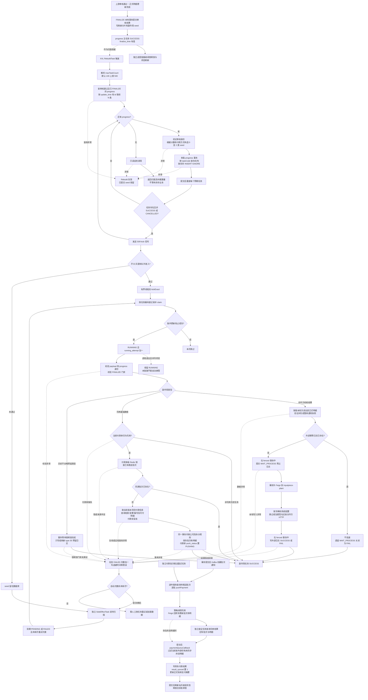

[业务逻辑专辑](/knowledge/business-logic/) / 居民收益付款 / S10

说明审核回调后续任务的缺失补建、候选筛选、幂等受理、事务边界，以及补建器、消费者和实际付款之间的分工，附逐章原文对照。本文保留原文 12 章，正文连续展开，原文对照与流程源码按需展开。

**前置阅读：** [S09 · 审核后续任务](/knowledge/business-logic/resident-income/s09-审核后续任务/)

**快速阅读：** [任务概览](#chapter-01) · [筛选规则](#chapter-04) · [异常与重复执行](#chapter-08) · [完整流程](#chapter-10) · [源码索引](#chapter-12) · [完整源码路径](#source-path-index)

<div class="business-logic-article">

> 对应任务：`residentIncomePaymentReviewCallbackSideEffectRebuildTask`<br /> 改写依据：附件《S10-residentIncomePaymentReviewCallbackSideEffectRebuildTask-源码梳理.md》。<br /> 本文解释附件中的源码分析，不是对项目源码或运行环境重新开展的一次验证。第 1～12 章与原文章节逐一对应，源码证据编号沿用 S1～S23。

<div id="reading-start"></div>

## 阅读起点：用一张付款单串起整条链路

**下面是假设场景，只用于理解流程，不是实际运行数据。**

假设有一张居民收益付款单，审核结果里有 8 条可付明细、2 条不合格明细，当前采用司库付款，并且不是“无需支付”。**司库** 在本文中可以先理解为后续承接付款请求、返回处理结果的支付系统；原文没有展开它的完整业务背景。

审核回调已经完成 **FINALIZE（审核收尾：把审核结果和相关后续任务一起提交的步骤）**。此时应该留下两项后续工作：把明细校核结果通知合作方，以及用适用的可付明细生成司库付款批次，交给后续支付链路。这里需要的是两类任务，不是每条明细各建一个任务。

正常代码会在 FINALIZE 的同一个本地事务（一起提交、按事务边界回滚的数据库操作）里写好这些任务。现在再假设，其中一项任务记录缺失了。这只是说明补建器的设计用途，**不能据此认定当前环境确实发生过缺失，也不能认定缺失原因已经查明**。

由 **XXL-Job（定时任务调度平台）** 触发本文的补建任务后，它会读取 **progress（审核回调的技术进度记录）**，找出“审核通过且 FINALIZE 已完成”的进度，根据可付明细数、不合格明细数及付款方式，推导应该有哪些后续任务，再去任务表检查是否存在。

缺少的任务会以 **seed（供执行者领取的一条任务记录，不是业务结果）** 形式写入 `fi_async_task`。提交后，补建器尝试发出 **kick（主动唤醒信号：提醒消费者尽快来领取任务）**。**消费者** 就是领取任务并执行业务的代码，它与补建扫描不是同一个完成阶段。

消费者随后走两条业务分支：合作方分支读取对应版本、对应提交轮次的正式明细（付款单对应的具体账单行），记录通知的投递判断及结果；司库分支创建付款批次与明细，再交给 **Kafka（消息队列：把批次创建通知传给下游的通道）**、司库推送与查证、财务结果回写继续处理。

所以，本文任务解决的是“审核结果已有，但应有的后续任务记录可能缺少”的问题。它不重新发起审批，不重新判断明细是否合格，不直接完成合作方 HTTP（网络接口请求）通知，更不直接把居民收益支付成功。它返回成功，只表示扫描、补建及最后的巡检调用正常结束；后续业务各有成功条件。

### 先分清几个容易混淆的对象

| 名称 | 通俗解释 | 不能由它直接推断的结论 |
| --- | --- | --- |
| 付款单 | 本次居民收益付款业务的单据 | 不是任务记录，也不是实际付款结果 |
| progress | 记录审核身份、结果与技术阶段的进度 | 主任务成功不代表全部技术阶段完成 |
| 副作用（Side Effect） | 审核主结果之外要继续完成的业务动作 | 这里不是“程序产生不良副作用”的含义 |
| seed / 异步任务 | 数据库里可以被领取的一条待办 | 有任务不等于业务已经完成 |
| kick | 提醒执行者处理已提交任务的信号 | 不是新任务，也不是事务提交凭据 |
| 合作方外部日志 | 记录通知预占、投递判断与结果 | 日志失败可以与异步任务成功同时存在 |
| 司库付款批次 | 给后续支付准备的主表和明细数据 | 建批、推送成功都不等于支付成功 |

### 分析基线与证据边界

原文分析日期为 **2026-09-08**；源码工作区为 `/Users/wangyi/BZ/zx-monitor/zxbaif`；分支为 `Ian/review/01`；HEAD 为 `a1bfacbeb6dfc239d577bd66bf78cd9eb2482efa`。

原文依据读取时工作区内的 Java、Mapper XML（数据库访问语句映射文件）、枚举及相关测试源码。工作区已有未提交修改，包含共用 **fencing（执行权隔离：用任务状态及执行轮次挡住过期执行者的写入）** 模板，因此分析基线是当时实际文件，不能只用 HEAD 代表全部文件内容。

原文没有修改业务源码，没有连接数据库，没有执行任务，没有调用外部接口，也没有运行测试。历史分析只用于定位，原文作者重新核对了当时源码，但这仍不是部署或生产验证。本次改写只依赖附件，没有重新取得源码或运行证据。

编号也要分清：原文说文档按指定位置存入 **S03**，而源码指标把本补建扫描标为 **S-10**，把后续副作用消费标为 **S-09**。本文使用 S10，不把它与 S09 混为一谈。

<details class="original" id="original-meta">
<summary>原文对照 · 原文前言与分析基线</summary>

### residentIncomePaymentReviewCallbackSideEffectRebuildTask 源码梳理

> 分析日期：2026-09-08。源码位置：`/Users/wangyi/BZ/zx-monitor/zxbaif`，分支 `Ian/review/01`，HEAD `a1bfacbeb6dfc239d577bd66bf78cd9eb2482efa`。
>
> 本文依据当前工作区 Java、Mapper XML、枚举和相关测试源码。工作区存在已有未提交修改，其中包括共用 fencing 模板；本文按读取时的实际文件分析，没有修改业务源码。未连接数据库、未执行任务、未调用外部接口，也未运行测试，因此不代表部署或生产验证结论。历史分析只用于定位，以下结论均重新核对当前源码。
>
> 文档按指定位置存入 S03；源码指标把本补建扫描标为 **S-10**，把后续副作用消费标为 **S-09**，两者不要混淆。文末提供源码索引。

</details>

<div id="chapter-01"></div>

## 1. 任务概览

这个任务像“后续工作检查员”：先确认审核收尾已完成，再判断应该留下哪些后续工作，把不存在的任务记录补进去，然后提醒执行者处理。

**它补的是任务记录，不是直接补通知结果或付款结果。** 当前只补建两类业务：合作方账单校核结果推送，以及司库付款批次基础数据生成。前者把本次付款单的可付、不合格明细整理为一份校核通知；后者为适用的司库付款单准备推送批次和明细。

| 项目 | 实际行为 |
| --- | --- |
| XXL-Job 名称 | `residentIncomePaymentReviewCallbackSideEffectRebuildTask` |
| 入口类 | `ResidentIncomePaymentReviewCallbackJob` |
| 核心服务 | `ResidentIncomePaymentReviewCallbackSideEffectTaskServiceImpl.rebuildMissingTasks` |
| 扫描对象 | `fi_resident_income_payment_review_callback_progress` |
| 直接持久化对象 | `fi_async_task` 中的副作用任务 seed；seed 就是一条可供消费者领取的任务记录 |
| 创建的任务类型 | `RESIDENT_INCOME_PAYMENT_REVIEW_CALLBACK_SIDE_EFFECT` |
| 一次扫描数量 | 默认 100 条 progress，上限 500；不是最多创建 100/500 条异步任务 |
| 一条 progress 的产出 | 0～2 条当前类型的 seed；已存在时不新增 |
| 完成标准 | 扫描、补建循环及最后的巡检调用正常返回；不等待外部通知或司库支付结束 |
| 调度周期、路由、阻塞策略 | **暂时无法确认**；该入口只有 `@XxlJob` 注册，实际调度配置需查 XXL-Job 平台 |

阅读数量时要特别注意单位：默认 100、最多 500，都是 **progress 条数**。一条 progress 可以推导出 0～2 条当前类型的 seed，因此不能把扫描上限当成异步任务条数上限。已有任务则跳过新增，扫描了很多进度也可能补建 0 条。

调度周期、路由、阻塞策略暂时无法确认。`@XxlJob` 只是入口注册，不能从它推导 XXL-Job 平台的实际调度配置。

源码定位：[S1](#source-s1)、[S2](#source-s2)。

<details class="original" id="original-01">
<summary>原文对照 · 第 1 章完整原文</summary>

### 1. 任务概览

**这是一个“审核通过后的后续任务补建器”：扫描已经完成 FINALIZE 的审核回调进度，按业务条件补齐 `fi_async_task` 中缺失的任务记录，再尝试唤醒消费者。**

当前会补建的业务有两类：

1. **合作方账单校核结果推送**：把本次付款单的可付和不合格明细整理成一份校核结果通知。
2. **司库付款批次基础数据生成**：为需要走司库的付款单创建付款推送批次及明细，衔接后续司库支付。

| 项目 | 实际行为 |
| --- | --- |
| XXL-Job 名称 | `residentIncomePaymentReviewCallbackSideEffectRebuildTask` |
| 入口类 | `ResidentIncomePaymentReviewCallbackJob` |
| 核心服务 | `ResidentIncomePaymentReviewCallbackSideEffectTaskServiceImpl.rebuildMissingTasks` |
| 扫描对象 | `fi_resident_income_payment_review_callback_progress` |
| 直接持久化对象 | `fi_async_task` 中的副作用任务 seed；seed 就是一条可供消费者领取的任务记录 |
| 创建的任务类型 | `RESIDENT_INCOME_PAYMENT_REVIEW_CALLBACK_SIDE_EFFECT` |
| 一次扫描数量 | 默认 100 条 progress，上限 500；不是最多创建 100/500 条异步任务 |
| 一条 progress 的产出 | 0～2 条当前类型的 seed；已存在时不新增 |
| 完成标准 | 扫描、补建循环及最后的巡检调用正常返回；不等待外部通知或司库支付结束 |
| 调度周期、路由、阻塞策略 | **暂时无法确认**；该入口只有 `@XxlJob` 注册，实际调度配置需查 XXL-Job 平台 |

入口及补建主循环见 [S1](#source-s1)、[S2](#source-s2)。

</details>

<div id="chapter-02"></div>

## 2. 业务目的

<div id="chapter-02-s01"></div>

### 2.1 要解决的问题

审核通过不是业务终点。财务侧形成审核结论后，还需要通知合作方；满足条件、走司库的付款单还要准备后续付款批次。

如果审核结论已经生效，相应任务却没有留下，就会出现“单据已审核通过，后续通知或付款准备没有启动”的断点。

补建任务以已落库的进度为依据，重新推导应有任务，用固定的**幂等身份（同一个业务动作反复计算仍得到同一识别标记，用来防止重复创建）** 补齐缺口。它不重新审批，也不重新判定明细合格与否。

<div id="chapter-02-s02"></div>

### 2.2 正常链路已在哪里写入这些任务

正常 FINALIZE 本来就会建好任务，不能为了说明补建器的作用，把正常链路改写成“审核先提交，任务以后再补”。

`ResidentIncomePaymentReviewCallbackFinalizeServiceImpl.doFinalizeTransaction` 在**同一个本地事务（同一数据库事务内一起提交、按事务边界回滚）** 中，依次完成以下关键动作。

**第一步，锁定并核对处理对象。** 锁住 progress 和付款单，验证执行权、明细更新计数，以及付款单和审批实例身份。

**第二步，落下审核业务结论。** 做付款前复核、确定付款方式，更新付款单审核结果、审批实例和审核日志。

**第三步，写审核通过后的状态刷新分片 seed，并校验分片数量。** “分片”是拆开的状态刷新任务单元，不要把它与本文两类副作用任务混在一起。

**第四步，调用 `writeFinalizeSideEffectSeeds` 写副作用 seed。** 补建器复用的也是这个写入组件。

**第五步，标记审核主结果完成。** progress 被设为 `main_task_status=SUCCESS`，填写 `finalize_time`，进入 `phase=LOCK_RELEASE`；审核回调主任务记成功。

因此，**当前正常路径把审核结果与副作用 seed 一起提交**，补建是额外的一致性兜底。注释中“历史异常缺失”只能说明设计用途；实际环境是否有缺口、如何形成，暂时无法确认。[S6](#source-s6)

<div id="chapter-02-s03"></div>

### 2.3 与其他任务的分工

名字相近的任务分别处理不同阶段。

| 任务 | 负责的阶段 |
| --- | --- |
| `residentIncomePaymentReviewCallbackRetryTask` | 消费审核回调主补偿任务，推进审核结果处理 |
| `residentIncomePaymentReviewCallbackProgressTask` | 续跑审核回调技术进度 |
| **本 RebuildTask** | 根据已 FINALIZE 的 progress 补建副作用 seed，并尝试 kick |
| `residentIncomePaymentReviewCallbackSideEffectTask` | 扫描、领取和执行已存在的副作用任务；也支持按任务编码/业务键手工重试 |

可以把 Rebuild 与 SideEffect 理解为“补登记待办”和“领取待办去办事”。对应回代码，就是前者向 `fi_async_task` 补记录，后者消费指定类型的已有记录。

本文重点是后两个任务及其业务出口。上游锁释放、审核通过后的状态刷新分片属于并行进度链路，不是 RebuildTask 直接执行的动作。[S1](#source-s1)、[S6](#source-s6)

<details class="original" id="original-02">
<summary>原文对照 · 第 2 章完整原文</summary>

### 2. 业务目的

#### 2.1 要解决的问题

审核通过以后，财务侧除了形成审核结论，还要通知合作方，并在适用时生成司库付款批次。如果审核结论已经生效，但相应后续任务缺失，业务会出现“单据已经审核通过，后续通知或付款准备没有启动”的断点。

本任务以已经落库的审核进度为依据，重新推导应该有哪些后续任务，并使用固定幂等身份补齐缺口。它不会重新发起审批，也不会重新判定哪些明细合格。

#### 2.2 正常链路已在哪里写入这些任务

`ResidentIncomePaymentReviewCallbackFinalizeServiceImpl.doFinalizeTransaction` 在同一个本地事务内完成以下关键动作：

1. 锁定 progress 和付款单，验证执行权、明细更新计数、付款单和审批实例身份。
2. 做付款前复核、确定付款方式，更新付款单审核结果、审批实例及审核日志。
3. 写入审核通过后的状态刷新分片 seed，并校验分片数量。
4. 调用同一个 `writeFinalizeSideEffectSeeds` 写副作用 seed。
5. 将 progress 置为 `main_task_status=SUCCESS`、填写 `finalize_time`，进入 `phase=LOCK_RELEASE`；审核回调主任务记成功。

因此，**当前正常 FINALIZE 路径本身就把审核结果与副作用 seed 一起提交**。补建任务是额外的一致性兜底。代码注释所说的“历史异常缺失”等场景，只能说明设计用途；某个环境是否真的有缺口、缺口如何形成，**暂时无法确认**。[S6](#source-s6)

#### 2.3 与其他任务的分工

| 任务 | 负责的阶段 |
| --- | --- |
| `residentIncomePaymentReviewCallbackRetryTask` | 消费审核回调主补偿任务，推进审核结果处理 |
| `residentIncomePaymentReviewCallbackProgressTask` | 续跑审核回调技术进度 |
| **本 RebuildTask** | 根据已 FINALIZE 的 progress 补建副作用 seed，并尝试 kick |
| `residentIncomePaymentReviewCallbackSideEffectTask` | 扫描、领取和执行已存在的副作用任务；也支持按任务编码/业务键手工重试 |

本次重点为后两者及其业务出口；上游锁释放、审核通过后的状态刷新分片属于并行的进度链路，不是 RebuildTask 直接执行的动作。[S1](#source-s6)

</details>

<div id="chapter-03"></div>

## 3. 核心调用链

<div id="chapter-03-s01"></div>

### 3.1 补建阶段：XXL-Job 线程内顺序执行

本次 XXL-Job 调用先读一批进度，再逐条推导、写入、尝试唤醒，最后巡检并返回。这里是顺序循环，不是把所有 progress 并发提交。

```text
ResidentIncomePaymentReviewCallbackJob
  .residentIncomePaymentReviewCallbackSideEffectRebuildTask(param)
  ├─ parseJobParam(param)
  └─ ResidentIncomePaymentReviewCallbackSideEffectTaskServiceImpl
       .rebuildMissingTasks(maxTaskCount)
       ├─ normalizeMaxProgressCount
       ├─ ProgressMapper.queryFinalizedReviewPassedForSideEffectRebuild(limit)
       ├─ 对每条 progress 顺序处理
       │   ├─ SeedWriter.buildFinalizeSideEffectSeeds(progress)
       │   ├─ SeedWriter.writeFinalizeSideEffectSeeds(progress) [单条 progress 的事务]
       │   │   ├─ 再次 buildFinalizeSideEffectSeeds
       │   │   └─ 每个 seed：queryByTaskCode → 缺失时 insertIgnore
       │   └─ 每个预期 seed：kickSideEffect(taskCode)
       │       ├─ 重新查实际任务
       │       └─ 非 SUCCESS/CANCELLED → kickCommittedSeed(S09_REVIEW_SIDE_EFFECT)
       ├─ inspectInvariants(S10, XXL_JOB)
       └─ 返回“扫描 X 条，补建 Y 条”
```

**构造对象不等于落库。** `buildFinalizeSideEffectSeeds` 只构造 Java 对象，真正写表的是 `writeFinalizeSideEffectSeeds`。在内存中看到 seed，不能认为数据库已有任务。

**两次 build 的身份一致，但随机属性未必相同。** 外层先 build 用来获得待唤醒的 `taskCode`；writer 内部再次 build 用于事务写入。两次随机 ID、时间可能不同，但 `taskCode` 由同一业务身份计算，仍可据此定位真实落库记录。不要把外层对象的随机 ID 当作数据库实际 ID。

**kick 不只针对新插入的任务。** 本次推导出的所有预期 seed 都会尝试 kick；旧的 `PENDING`（待执行）或 `FAILED`（失败）也在范围内。但真正能否领取，还要重新检查状态、执行时间和重试次数。

`inspectInvariants` 的实际巡检边界见第 7.6 节，不能仅凭方法名认定已经验证所有缺口补齐。[S2](#source-s2)、[S3](#source-s3)

<div id="chapter-03-s02"></div>

### 3.2 消费阶段：主动 kick 或另一个 XXL-Job

已经提交的任务有两种触发处理的路径：主动 kick 尝试尽快唤醒，或者由独立副作用定时任务扫描。两条路径最终进入同一套领取和执行业务逻辑。

```text
主动路径：AfterCommitKickService.kickCommittedSeed
  → KickDispatcher.kick
  → residentIncomePaymentKickExecutor
  → SideEffectTaskService.kickExact

定时兜底：residentIncomePaymentReviewCallbackSideEffectTask
  → SideEffectTaskService.executePendingTasks

两条路径汇合：
  executeTaskList → executeSingleTask
  → claimTask [原子抢占并增加 running_attempt]
  → parsePayload / validateTaskIdentity / validateExecuteGate
  → executeSideEffectWithFence
       ├─ PARTNER_BILL_REVIEW_RESULT_PUSH
       │   → reserve → deliver → complete
       └─ PAYMENT_RESULT_BASE_DATA_BUILD
           → createResidentIncomePaymentPushBatch
  → markTaskSuccess / markTaskFailed
```

`claimTask` 是**原子抢占（由数据库一次带条件更新决定谁能领取任务）**。领取成功会增加 `running_attempt`，作为此次执行权轮次。

`payload` 是**任务携带的数据内容**，包含这次处理的业务身份。消费者先解析它，再核对它与 progress、任务编码、业务键的一致性，然后检查执行门禁，也就是“现在是否具备执行前提”。

`executeSideEffectWithFence` 表示带执行权隔离进行本地关键写入。合作方分支的 `reserve → deliver → complete` 分别是预占日志、投递、记录结果；司库分支调用批次创建方法。

具体业务见第 7 章。**Rebuild 不会等待这条异步路径完成**，补建返回成功不能作为后续任务已写 `SUCCESS` 的证据。[S2](#source-s2)、[S7](#source-s7)、[S8](#source-s8)

<details class="original" id="original-03">
<summary>原文对照 · 第 3 章完整原文</summary>

### 3. 核心调用链

#### 3.1 补建阶段：XXL-Job 线程内顺序执行

```text
ResidentIncomePaymentReviewCallbackJob
  .residentIncomePaymentReviewCallbackSideEffectRebuildTask(param)
  ├─ parseJobParam(param)
  └─ ResidentIncomePaymentReviewCallbackSideEffectTaskServiceImpl
       .rebuildMissingTasks(maxTaskCount)
       ├─ normalizeMaxProgressCount
       ├─ ProgressMapper.queryFinalizedReviewPassedForSideEffectRebuild(limit)
       ├─ 对每条 progress 顺序处理
       │   ├─ SeedWriter.buildFinalizeSideEffectSeeds(progress)
       │   ├─ SeedWriter.writeFinalizeSideEffectSeeds(progress) [单条 progress 的事务]
       │   │   ├─ 再次 buildFinalizeSideEffectSeeds
       │   │   └─ 每个 seed：queryByTaskCode → 缺失时 insertIgnore
       │   └─ 每个预期 seed：kickSideEffect(taskCode)
       │       ├─ 重新查实际任务
       │       └─ 非 SUCCESS/CANCELLED → kickCommittedSeed(S09_REVIEW_SIDE_EFFECT)
       ├─ inspectInvariants(S10, XXL_JOB)
       └─ 返回“扫描 X 条，补建 Y 条”
```

三个容易误读的细节：

- `buildFinalizeSideEffectSeeds` 只构造 Java 对象；真正写表的是 `writeFinalizeSideEffectSeeds`。
- 外层先 build 一次用来获得待唤醒的 taskCode，writer 内部再 build 一次。两次生成的随机 ID、时间可能不同，但 taskCode 由同一业务身份计算，因此可以定位实际落库的记录。
- kick 针对本次推导出的所有预期 seed，不只针对新插入的 seed。旧的 PENDING/FAILED 也会被尝试唤醒；不过能否真正领取还要重新检查状态、时间和重试次数。[S2](#source-s3)

#### 3.2 消费阶段：主动 kick 或另一个 XXL-Job

```text
主动路径：AfterCommitKickService.kickCommittedSeed
  → KickDispatcher.kick
  → residentIncomePaymentKickExecutor
  → SideEffectTaskService.kickExact

定时兜底：residentIncomePaymentReviewCallbackSideEffectTask
  → SideEffectTaskService.executePendingTasks

两条路径汇合：
  executeTaskList → executeSingleTask
  → claimTask [原子抢占并增加 running_attempt]
  → parsePayload / validateTaskIdentity / validateExecuteGate
  → executeSideEffectWithFence
       ├─ PARTNER_BILL_REVIEW_RESULT_PUSH
       │   → reserve → deliver → complete
       └─ PAYMENT_RESULT_BASE_DATA_BUILD
           → createResidentIncomePaymentPushBatch
  → markTaskSuccess / markTaskFailed
```

副作用具体处理见第 7 节。补建调用本身不会等待此处的异步路径结束。[S2](#source-s7)[S8](#source-s8)

</details>

<div id="chapter-04"></div>

## 4. 数据筛选规则

这一章分清四层问题：一次取多少条 progress、哪些 progress 能取到、一条 progress 应该生成什么任务，以及已有任务何时能被消费者执行。这不是同一组筛选条件。

<div id="chapter-04-s01"></div>

### 4.1 本任务参数

这个入口真正读取的数量字段是 `maxTaskCount`。参数使用 **JSON（表达结构化数据的文本格式）**，例如：

```json
{"maxTaskCount": 100}
```

也支持外层 `data` 包装，`data` 可以是 JSON 对象，也可以是 JSON 字符串。空参数、解析失败、缺少数量、数量小于等于 0，都会采用默认 **100 条 progress**；数量大于 **500** 时截为 500；处于有效范围内则使用传入数量。

复用的 **DTO（Data Transfer Object，承载参数的数据对象）** 虽然还有 `taskCode/taskCodes/businessKey/businessKeys`，但 **RebuildTask 只读取 `maxTaskCount`，不会按这些编码定向补建**。编码选择只在同类的主补偿入口、副作用消费入口生效。

因此，误把任务编码传给本入口，不会把范围缩小到那一条任务；错误 JSON 也不会让扫描自动停止，而可能回退为默认范围执行。[S1](#source-s1)、[S2](#source-s2)

<div id="chapter-04-s02"></div>

### 4.2 progress 初筛：实际 SQL

初筛只确认这条进度有效、审核通过、主结果成功，而且有 FINALIZE 完成时间。**它没有先确认这条 progress 缺任务。**

下面与原文一样省略完整 SELECT 列清单，其他筛选、排序与限制保持不变。**SQL（数据库查询与更新语句）** 是这里真实数据范围的依据。

```sql
SELECT ...
FROM fi_resident_income_payment_review_callback_progress
WHERE deleted = 0
  AND review_passed = 1
  AND main_task_status = 'SUCCESS'
  AND finalize_time IS NOT NULL
ORDER BY update_time ASC, id ASC
LIMIT :limit;
```

WHERE 中四个条件全部通过 **AND（同时满足）** 连接，不是任选一个就可以。

| 条件 | 业务含义 |
| --- | --- |
| `deleted=0` | 有效进度 |
| `review_passed=1` | 只处理审核通过 |
| `main_task_status='SUCCESS'` | 审核回调主结果已完成 |
| `finalize_time IS NOT NULL` | 有 FINALIZE 完成时间 |
| `update_time ASC,id ASC` | 先取更新最早的进度 |
| `LIMIT` | 本轮最多读取指定数量 |

`ORDER BY update_time ASC,id ASC` 表示先按更新时间从早到晚取，更新时间相同再按 ID 升序。`LIMIT` 控制的是本轮读取上限，不代表整个历史范围能够被自动遍历。

SQL 不关联 `fi_async_task`，没有 `NOT EXISTS`（只选不存在相应任务的记录）判断，也没有扫描游标。真正的任务存在性检查在逐条 writer 中进行。

它还不限制 `phase`、`phase_status`、`refresh_ready`、锁释放计数、付款单当前版本或日期范围。因此，查到 progress 不代表缺任务，不代表全部技术阶段已完成，也不代表它仍是付款单当前审核身份。固定取前 N 条的风险见 R1。[S5](#source-s5)

<div id="chapter-04-s03"></div>

### 4.3 seed 生成规则

先验证“这究竟是哪一次审核”，再判断“这次审核需要哪些后续工作”。

首先，`progress.id` 必须非空，审核身份中的 `payment_order_id/data_version/review_plan_id/submit_round/approval_attempt` 必须完整。实际构造幂等键时，这些业务身份数值还要求 **大于 0**。不要把“非空”与“大于 0”混为一谈，也不要把业务身份的正数要求擅自套到原文只说非空的 `progress.id` 上。计数字段为空时按 0 处理。[S3](#source-s3)、[S4](#source-s4)

| 副作用类型 | 当前生成条件 | 产物 |
| --- | --- | --- |
| `PARTNER_BILL_REVIEW_RESULT_PUSH` | `payable_count>0` **或** `unqualified_count>0` | 一条合作方校核结果任务，后续合并可付和不合格明细 |
| `PAYMENT_RESULT_BASE_DATA_BUILD` | `target_order_status` 不是 `NO_NEED_PAY(55)`；`payable_count>0`；按 progress 的付款单 ID 查询到付款单，且当前 `payment_type=SIKU_PAYMENT(2)` | 一条司库付款批次生成任务 |
| `UNQUALIFIED_PARTNER_BILL_PUSH` | **当前 writer 不生成** | 仅在枚举和消费者中保留历史任务执行分支 |

合作方任务的条件是 OR：`payable_count>0` **或者** `unqualified_count>0`。两者都满足时，仍是一个合并可付与不合格明细的校核结果任务，不是各建一个。

司库基础数据任务的条件是同时满足：目标状态不是 `NO_NEED_PAY(55)`，**并且** 可付数大于 0，**并且** 能查到 progress 所指向的付款单，**并且** 该付款单当前 `payment_type=SIKU_PAYMENT(2)`。判定用到了 progress，也用到了付款单的当前付款方式。

判断顺序有实际影响：无需支付，或者没有可付行时，不会为了付款基础数据再去查询付款单。只有先满足前两个基础条件，才继续读付款单。

**若已满足前两个条件却查不到付款单，整次 build 会抛异常。** 本条 progress 的合作方条件即使满足，也不会在这次失败里被单独补出来，因为构造方法尚未正常完成。

合作方 seed 生成前并不检查通知地址配置，也不检查正式明细的合作方快照（该次业务保存的合作方信息）是否完整。这些检查留到执行阶段，所以“能生成任务”不等于“已经具备投递条件”。

另一个边界是 `target_order_status` 为空不等于 `NO_NEED_PAY`。当前 writer 没有要求目标状态必须显式为“待付款”，不能把“不是无需支付”收窄改写成“必须等于待付款”。

历史 `UNQUALIFIED_PARTNER_BILL_PUSH` 仅保留枚举与消费分支，当前 writer 不生成，不能把它算为第三类当前补建产物。[S3](#source-s3)

<div id="chapter-04-s04"></div>

### 4.4 缺失判断和幂等身份

同一张付款单在不同版本、审批计划、提交轮次、审批轮次中，可能对应不同审核动作。任务用这些身份字段加副作用类型，构造“这一次、这一种后续动作”的固定标识。

```text
idempotentKey = REVIEW_CALLBACK_SIDE_EFFECT
               :paymentOrderId:dataVersion:reviewPlanId
               :submitRound:approvalAttempt:sideEffectType

taskCode = RIPRCSE:MD5(idempotentKey)
businessKey = 原始 idempotentKey（长度 <= 128）
              或 RIPRCSE_BK:MD5(idempotentKey)（超长）
```

这里的 **MD5（摘要算法：把原始键计算成固定长度标识）** 用于生成任务编码，不是在加密业务内容。`businessKey` 长度 **小于等于 128** 时保留原始键，超长时改用带 `RIPRCSE_BK:` 前缀的摘要；完整幂等键同时保存在 `task_data.idempotentKey` 中。

缺失检查先执行 `queryByTaskCode`：只查询 `deleted=0` 且 taskCode 相同的记录，按 `update_time DESC,id DESC LIMIT 1` 取最新一条。**只要查到记录就跳过插入，不区分待执行、失败、成功或取消。** 补建不是根据旧状态再开一个新任务。

查不到才执行 `INSERT IGNORE`，新增计数使用 SQL 实际影响行数，而不是把预期 seed 数量直接当作新增数。

两个扫描并发处理时，应用层可能同时查出“没有记录”。最终防重依赖数据库确实存在适用的唯一约束。仓库结构检查脚本要求 `fi_async_task.task_code` 是唯一键；原文没有核验实库，不能把脚本要求写成线上已生效事实。

查询只看有效记录，逻辑删除记录（记录保留、用删除标记使其失效）是否仍会阻挡 `INSERT IGNORE`，也要看真实数据库约束。补建没有为“插入被忽略，但实际有效任务仍不存在”设置单独错误，不能默认所有忽略都等于已有可用任务。

源码定位：[S3](#source-s3)、[S4](#source-s4)、[S9](#source-s9)、[S19](#source-s19)。

<div id="chapter-04-s05"></div>

### 4.5 后续消费与业务查询

补建完成后，领取任务和读取业务数据还有各自的范围。

| 查询 | 核心条件 |
| --- | --- |
| 自动扫描副作用任务 | `deleted=0`、指定副作用 `task_type`、`task_status IN (0,3)`、`next_execute_time IS NULL OR <= now`、`IFNULL(retry_count,0)<IFNULL(max_retry_count,3)`；按执行时间、重试数、ID 升序，默认 100、最多 500 |
| 定向 kick | 先按 taskCode 查询；真正 claim 仍校验状态、到期时间、重试次数和 `running_attempt` |
| 手工消费重试 | 按 taskCode 或存储态 businessKey 查询；两组同时传时是 OR。claim 仍仅允许 PENDING/FAILED，但跳过到期时间及次数限制 |
| 执行身份 | 按 `progressId` 读取有效 progress；比对 payload 的付款单、数据版本、审批计划、提交轮次、审批轮次，并重新计算校验 taskCode/businessKey/幂等键 |
| 合作方正式明细 | `payment_order_id=payload.paymentOrderId`、`data_version=payload.dataVersion`、`submit_round=payload.submitRound`、`deleted=0`；按 `line_no,id` 升序，一次读取全部 |
| 司库项目付款信息 | 付款单 ID + **付款单当前** `current_publish_version` + 当前 `submit_round` + `deleted=0` |
| 司库可付明细 | 上述当前版本、轮次 + 项目公司 + `line_type=PAYABLE` + `deleted=0`；随后付款前复核 |
| 已有司库批次 | 先按 `source_payment_order_id` 查询有效批次；命中后校验来源付款单 ID 和单号 |

自动扫描条件应按下面的括号理解：有效记录 **AND** 指定任务类型 **AND** 状态为 0 或 3 **AND**（下次执行时间为空 **OR** 已到期）**AND** 未耗尽重试次数。`IFNULL(retry_count,0)` 是空值按 0，`IFNULL(max_retry_count,3)` 是空值按 3；比较使用严格的小于号。

手工消费重试中，任务编码组与业务键组同时传入时是 **OR**。手工入口跳过时间与次数限制，但没有放开状态、身份、执行门禁，也仍受领取条件约束。若 `businessKey` 因超长已存成摘要键，应按实际存储值查询，不能假定传原始完整幂等键会自动匹配。

合作方明细查询没有在 SQL 中按 `line_status` 过滤。所有查询出来的行都必须通过 Java 的审核结论校验，不能理解成数据库已经只留下合规行。司库明细构建处也没有显式传入 `line_status=REVIEW_APPROVED`，不能从方法名字补出该限制。

还有一个贯穿 R3 的差异：合作方按 payload 的版本、轮次查明细；司库按付款单**当前** 发布版本、当前提交轮次查项目付款信息和可付明细。两条分支不具备同样的版本范围，不能统称为“都严格按任务旧版本执行”。[S2](#source-s2)、[S10](#source-s10)、[S13](#source-s13)、[S20](#source-s20)

<details class="original" id="original-04">
<summary>原文对照 · 第 4 章完整原文</summary>

### 4. 数据筛选规则

#### 4.1 本任务参数

支持以下参数形式：

```json
{"maxTaskCount": 100}
```

也支持外层 `data` 包装；`data` 可以是 JSON 对象，也可以是 JSON 字符串。空参数、解析失败、缺少数量、数量小于等于 0，都按默认 100 条 progress 处理；大于 500 时截为 500。

虽然复用的参数 DTO 有 `taskCode/taskCodes/businessKey/businessKeys`，**RebuildTask 只读取 `maxTaskCount`，不会按这些编码定向补建**。编码选择只在同类的主补偿/副作用消费入口生效。误传编码或错误 JSON 不会让本扫描停止，而可能按默认范围执行。[S1](#source-s2)

#### 4.2 progress 初筛：实际 SQL

下面省略了完整列清单，其余筛选、排序和限制与 Mapper 一致：

```sql
SELECT ...
FROM fi_resident_income_payment_review_callback_progress
WHERE deleted = 0
  AND review_passed = 1
  AND main_task_status = 'SUCCESS'
  AND finalize_time IS NOT NULL
ORDER BY update_time ASC, id ASC
LIMIT :limit;
```

| 条件 | 业务含义 |
| --- | --- |
| `deleted=0` | 有效进度 |
| `review_passed=1` | 只处理审核通过 |
| `main_task_status='SUCCESS'` | 审核回调主结果已完成 |
| `finalize_time IS NOT NULL` | 有 FINALIZE 完成时间 |
| `update_time ASC,id ASC` | 先取更新最早的进度 |
| `LIMIT` | 本轮最多读取指定数量 |

**SQL 没有“缺少副作用任务”的条件。** 它不关联 `fi_async_task`，没有 `NOT EXISTS`，也没有扫描游标。缺失检查发生在逐条 writer 中。它还不限制 `phase`、`phase_status`、`refresh_ready`、锁释放计数、付款单当前版本或日期范围。[S5](#source-s5)

#### 4.3 seed 生成规则

首先要求 `progress.id` 非空；审核身份中的 `payment_order_id/data_version/review_plan_id/submit_round/approval_attempt` 完整。实际构造幂等键时，还要求这些业务身份数值大于 0。计数字段为空按 0 处理。[S3](#source-s4)

| 副作用类型 | 当前生成条件 | 产物 |
| --- | --- | --- |
| `PARTNER_BILL_REVIEW_RESULT_PUSH` | `payable_count>0` **或** `unqualified_count>0` | 一条合作方校核结果任务，后续合并可付和不合格明细 |
| `PAYMENT_RESULT_BASE_DATA_BUILD` | `target_order_status` 不是 `NO_NEED_PAY(55)`；`payable_count>0`；按 progress 的付款单 ID 查询到付款单，且当前 `payment_type=SIKU_PAYMENT(2)` | 一条司库付款批次生成任务 |
| `UNQUALIFIED_PARTNER_BILL_PUSH` | **当前 writer 不生成** | 仅在枚举和消费者中保留历史任务执行分支 |

补充说明：

- 无需支付/没有可付行时，不会为了付款基础数据再查询付款单。
- 满足前两个付款基础条件，却查不到付款单，会抛异常；本条 progress 的合作方 seed 也不会因此单独补出来，因为 build 尚未正常完成。
- 合作方任务的生成不先检查合作方地址配置，也不检查正式明细的合作方快照是否完整；这些校验在后续执行阶段。
- `target_order_status` 为空不等于 `NO_NEED_PAY`；writer 并没有要求目标状态必须显式为“待付款”。[S3](#source-s3)

#### 4.4 缺失判断和幂等身份

```text
idempotentKey = REVIEW_CALLBACK_SIDE_EFFECT
               :paymentOrderId:dataVersion:reviewPlanId
               :submitRound:approvalAttempt:sideEffectType

taskCode = RIPRCSE:MD5(idempotentKey)
businessKey = 原始 idempotentKey（长度 <= 128）
              或 RIPRCSE_BK:MD5(idempotentKey)（超长）
```

完整幂等键同时保存在 `task_data.idempotentKey`。

`queryByTaskCode` 仅查 `deleted=0` 的相同 taskCode，按 `update_time DESC,id DESC LIMIT 1` 返回。**只要查到记录就跳过插入，不区分它是待执行、失败、成功还是取消。** 没有记录时使用 `INSERT IGNORE`，新增计数取 SQL 实际影响行数。[S3](#source-s4)[S9](#source-s9)

并发防重依赖数据库实际存在适用的唯一约束。仓库结构检查脚本要求 `fi_async_task.task_code` 为唯一键；本次没有实库验证，不能把脚本要求当作线上约束已经生效。[S19](#source-s19)

#### 4.5 后续消费与业务查询

| 查询 | 核心条件 |
| --- | --- |
| 自动扫描副作用任务 | `deleted=0`、指定副作用 `task_type`、`task_status IN (0,3)`、`next_execute_time IS NULL OR <= now`、`IFNULL(retry_count,0)<IFNULL(max_retry_count,3)`；按执行时间、重试数、ID 升序，默认 100、最多 500 |
| 定向 kick | 先按 taskCode 查询；真正 claim 仍校验状态、到期时间、重试次数和 `running_attempt` |
| 手工消费重试 | 按 taskCode 或存储态 businessKey 查询；两组同时传时是 OR。claim 仍仅允许 PENDING/FAILED，但跳过到期时间及次数限制 |
| 执行身份 | 按 `progressId` 读取有效 progress；比对 payload 的付款单、数据版本、审批计划、提交轮次、审批轮次，并重新计算校验 taskCode/businessKey/幂等键 |
| 合作方正式明细 | `payment_order_id=payload.paymentOrderId`、`data_version=payload.dataVersion`、`submit_round=payload.submitRound`、`deleted=0`；按 `line_no,id` 升序，一次读取全部 |
| 司库项目付款信息 | 付款单 ID + **付款单当前** `current_publish_version` + 当前 `submit_round` + `deleted=0` |
| 司库可付明细 | 上述当前版本、轮次 + 项目公司 + `line_type=PAYABLE` + `deleted=0`；随后付款前复核 |
| 已有司库批次 | 先按 `source_payment_order_id` 查询有效批次；命中后校验来源付款单 ID 和单号 |

合作方查询没有在 SQL 中按 `line_status` 过滤；所有选中行都必须能通过 Java 中的审核结论校验。司库明细构建处也没有显式传 `line_status=REVIEW_APPROVED` 条件，不能从方法名称推断存在这一限制。[S2](#source-s10)[S13](#source-s20)

</details>

<div id="chapter-05"></div>

## 5. 主要状态流转

遇到 `SUCCESS` 时，先问“哪个对象成功了”。progress、异步任务、合作方日志、司库批次与付款单分别有状态，不能互相替代。

<div id="chapter-05-s01"></div>

### 5.1 progress：本任务读取，不负责推进

审核主结果完成后，技术处理还可能继续。

```text
上游 FINALIZE 执行中
  → 同事务提交审核结果、刷新分片 seed、副作用 seed
  → main_task_status=SUCCESS，finalize_time 有值
  → phase=LOCK_RELEASE，phase_status=INIT，refresh_ready=0
  → 后续独立进度链路继续锁释放、状态刷新、完成
```

`phase` 是技术阶段，`phase_status` 是该阶段状态，`refresh_ready` 是状态刷新准备标记。FINALIZE 后进入锁释放阶段，`phase_status=INIT`、`refresh_ready=0`。

**`main_task_status=SUCCESS` 不等于整个技术进度已经 DONE。** Rebuild 读取 progress，不负责把它的阶段继续向前推进。

当前两类新副作用只要求 FINALIZE 成功，不等待 `refresh_ready=1`，也不等待锁全部释放。只有历史 `UNQUALIFIED_PARTNER_BILL_PUSH` 额外要求 `lock_release_success>=lock_release_total`，两项计数为空按 0。这里是“大于等于”，不能改成严格相等，更不能把这条历史分支门禁扩展到所有新任务。[S2](#source-s2)、[S5](#source-s5)、[S6](#source-s6)

<div id="chapter-05-s02"></div>

### 5.2 `fi_async_task`：seed 与执行结果

任务状态表达的是一条执行记录的生命周期。

| 时点 | 字段变化 |
| --- | --- |
| 补建插入 | `task_status=0(PENDING)`，`retry_count=0`，`max_retry_count=3`，`next_execute_time=当前数据库秒精度时间`，`deleted=0`；创建/更新用户为 `"0"` |
| 抢占成功 | `task_status=1(RUNNING)`，`running_attempt=running_attempt+1`，清空 `error_message`，更新执行时间及 worker 标识 |
| 执行成功 | `task_status=2(SUCCESS)`，不增加 `retry_count`，清空错误；传入的 nextExecuteTime 为空，但 SQL 用 COALESCE，**不会清空原执行时间** |
| 执行异常 | `task_status=3(FAILED)`，`retry_count+1`，设置退避后的 `next_execute_time` 和最多 1000 字符的错误信息 |
| 已取消 | `task_status=4(CANCELLED)`；本补建任务不恢复它 |

`running_attempt` 与 `retry_count` 不是同一种计数。前者在领取成功时增加，识别本次执行权；后者在失败时增加，限制自动重试。成功不会增加失败重试数。

**退避** 指失败后先等一段时间，再允许重试。延迟和次数的严格边界见第 8.1 节。**worker** 指领取并执行任务的工作者，其标识在抢占成功时更新。

成功时传入的 `nextExecuteTime` 为空，但 SQL 使用 `COALESCE`（此处在新值为空时保留原值），不会清空原执行时间。因此，成功记录仍有 `next_execute_time`，不一定表示状态写回有误。

seed 插入 SQL 没有显式写 `running_attempt`。后续 claim 要依赖它已有正确默认值或初始化值，这需要真实数据库结构保证，原文没有做实库验证。[S3](#source-s3)、[S9](#source-s9)

<div id="chapter-05-s03"></div>

### 5.3 外部通知及司库批次

执行进入业务出口后，需要分别观察下列对象。

| 对象 | 主要流转 |
| --- | --- |
| 合作方外部日志 | 预占 `WAIT_PROCESS(10)` → 成功或配置跳过时 `SUCCESS(20)`；接口失败时 `FAIL(30)` |
| 遗留合作方 WAIT\_PROCESS 日志 | 重放发现后改为 FAIL，记录“上次合作方投递结果未知，已禁止自动重发”，不再次发 HTTP |
| 司库批次 | 创建时 `push_status=WAIT_PUSH(1)`、`handle_status=WAIT_PUSH(1)`，推送/查证后进入相应成功、失败、处理中或待修正状态 |
| 司库批次明细 | 创建时 `payment_status=WAIT_PUSH(20)`、`result_synced=0`；司库受理后等待查证，结果进入付款终态后再同步财务结果 |
| 付款单 | 基础数据创建成功后 `push_status=PUSHING(2)`；后续批次回调负责汇总推送情况 |

`result_synced` 表示批次明细的付款结果是否已完成同步处理。**终态** 指付款状态已结束、可以进入结果处理；原文没有在此列出全部终态编码，本文不补造。

两个最容易混淆的判断是：**外部日志 FAIL 与异步任务 SUCCESS 可以同时存在；司库批次已创建或推送成功，也不代表实际支付成功。** 这些不是措辞差别，而是各层完成条件本来就不同。[S10](#source-s10)、[S13](#source-s13)、[S15](#source-s15)、[S16](#source-s16)

<details class="original" id="original-05">
<summary>原文对照 · 第 5 章完整原文</summary>

### 5. 主要状态流转

#### 5.1 progress：本任务读取，不负责推进

```text
上游 FINALIZE 执行中
  → 同事务提交审核结果、刷新分片 seed、副作用 seed
  → main_task_status=SUCCESS，finalize_time 有值
  → phase=LOCK_RELEASE，phase_status=INIT，refresh_ready=0
  → 后续独立进度链路继续锁释放、状态刷新、完成
```

因此 `main_task_status=SUCCESS` **不等于** 整个技术进度已经 DONE。当前两类新生成副作用只要求 FINALIZE 成功，不等待 `refresh_ready=1`，也不等待锁全部释放。只有历史 `UNQUALIFIED_PARTNER_BILL_PUSH` 额外要求 `lock_release_success>=lock_release_total`，计数空值按 0。[S2](#source-s5)[S6](#source-s6)

#### 5.2 `fi_async_task`：seed 与执行结果

| 时点 | 字段变化 |
| --- | --- |
| 补建插入 | `task_status=0(PENDING)`，`retry_count=0`，`max_retry_count=3`，`next_execute_time=当前数据库秒精度时间`，`deleted=0`；创建/更新用户为 `"0"` |
| 抢占成功 | `task_status=1(RUNNING)`，`running_attempt=running_attempt+1`，清空 `error_message`，更新执行时间及 worker 标识 |
| 执行成功 | `task_status=2(SUCCESS)`，不增加 `retry_count`，清空错误；传入的 nextExecuteTime 为空，但 SQL 用 COALESCE，**不会清空原执行时间** |
| 执行异常 | `task_status=3(FAILED)`，`retry_count+1`，设置退避后的 `next_execute_time` 和最多 1000 字符的错误信息 |
| 已取消 | `task_status=4(CANCELLED)`；本补建任务不恢复它 |

seed 插入 SQL 未显式写 `running_attempt`，后续 claim 依赖该字段已有正确默认值/初始化值。这是需由实际数据库结构保证的条件。[S3](#source-s9)

#### 5.3 外部通知及司库批次

| 对象 | 主要流转 |
| --- | --- |
| 合作方外部日志 | 预占 `WAIT_PROCESS(10)` → 成功或配置跳过时 `SUCCESS(20)`；接口失败时 `FAIL(30)` |
| 遗留合作方 WAIT\_PROCESS 日志 | 重放发现后改为 FAIL，记录“上次合作方投递结果未知，已禁止自动重发”，不再次发 HTTP |
| 司库批次 | 创建时 `push_status=WAIT_PUSH(1)`、`handle_status=WAIT_PUSH(1)`，推送/查证后进入相应成功、失败、处理中或待修正状态 |
| 司库批次明细 | 创建时 `payment_status=WAIT_PUSH(20)`、`result_synced=0`；司库受理后等待查证，结果进入付款终态后再同步财务结果 |
| 付款单 | 基础数据创建成功后 `push_status=PUSHING(2)`；后续批次回调负责汇总推送情况 |

外部日志 FAIL 与异步任务 SUCCESS 可以同时存在；批次已经创建或推送成功也不等于已经支付成功。[S10](#source-s13)[S15](#source-s16)

</details>

<div id="chapter-06"></div>

## 6. 数据库影响

这一章区分“补建器直接写了什么”和“消费者及付款结果回调还会写什么”。不能因为完整链路涉及多张表，就认为一次补建扫描会把它们全部更新。

<div id="chapter-06-s01"></div>

### 6.1 本任务及直接消费者

补建器主要读审核进度，判断应有任务，向任务表补记录。真正执行副作用时，才进一步涉及合作方日志或司库批次。

| 表 | 读写方式 | 关键字段与目的 |
| --- | --- | --- |
| `fi_resident_income_payment_review_callback_progress` | 补建、消费只读 | 审核身份、`review_passed/main_task_status/finalize_time`、`payable_count/unqualified_count/target_order_status`；历史分支还读锁释放计数 |
| `fi_async_task` | 补建插入；消费者抢占和写终态 | `task_code/task_type/business_key/task_data/task_status/retry_count/max_retry_count/next_execute_time/running_attempt/error_message` |
| `fi_resident_income_payment_order` | seed 条件及执行读取；司库基础数据分支更新 | `payment_type`；司库分支使用 `current_publish_version/submit_round/partner_org_id/payment_order_no`，更新 `push_status` |
| `fi_resident_income_payment_order_bill` | 两类当前副作用读取 | `payment_order_id/data_version/submit_round/line_type/line_status`，合作方快照、电站/月度、不合格原因、本次付款金额、项目公司及收款账户快照 |
| `fi_resident_income_payment_external_log` | 合作方分支插入并回写 | `external_type=50`、付款单业务标识、`idempotent_key/request_json/response_json/status/retry_count/next_retry_time/error_message` |
| `fi_resident_income_payment_order_project_payment` | 司库构建读取 | 当前发布版本、提交轮次下的项目公司、付款账号/户名/开户行 |
| `fi_resident_income_payment_push_batch` | 司库构建插入 | 来源付款单、项目公司、付款账户、批次数量/金额、推送与处理状态、处理时间、推送/查询次数 |
| `fi_resident_income_payment_push_batch_detail` | 司库构建插入 | 来源正式账单 ID、批次 ID/编号、电站/月度/底账 ID、收款账户、拆分金额、外部明细流水、`payment_status/result_synced` |

表中的**快照** 指正式明细或单据中保存的该次业务信息，例如合作方信息和收款账户信息。读取快照不代表可以跳过完整性、一致性或付款事实检查。

付款前复核还会按明细情况读取小单账户、合作方账户和合作方底账事实。原文明示涉及 `fi_customer_account`、`fi_customer_account_partner`、`fi_customer_bill_partner`。这些是司库批次生成的校验依赖，**不是 RebuildTask 的初筛表**。原文没有在这里展开全部事实字段，本文不补造。[S21](#source-s21)

<div id="chapter-06-s02"></div>

### 6.2 进一步的司库结果回写

司库批次准备好后，还要推送、查证，才可能获得最终付款结果。这属于更下游业务，不在补建扫描事务里。

司库推送或查证回调先更新批次及明细。事务提交后，`paymentQueryCallback` 开启新事务，只处理 **`result_synced=0` AND 付款状态已终结** 的明细，并核对当前发布快照。

**先形成财务付款结果。** 写入 `fi_resident_income_payment_result`，`result_source=TREASURY_RESERVED`。保存结果状态、计划金额、实付金额、失败原因、司库批次及明细流水；幂等键使用外部明细流水，不是直接沿用副作用任务键。

**再标记明细已处理。** 已处理的批次明细设为 `result_synced=1`。迟到的旧版本明细也会置 1，但跳过当前业务结果写入。因此，看到 `result_synced=1`，不能单独认定它一定写入了当前版本的付款结果。

**按正式账单汇总摘要。** 原文明示更新 `paid_amount/sk_payment_status/payment_result_status/sk_fail_reason`，分别承载付款金额、司库支付状态、付款结果状态和失败原因。结果未收齐时，暂不汇总更新该账单。原文没有在此提供这些字段之外的完整更新列清单。

**事务提交后再刷新底层状态、释放锁。** 按站月调用 `refreshCoreSteps`；“站月”是电站与账单月份组成的业务范围。并按支付成功、失败或部分付款结果释放活跃账单锁。

底层刷新是共用链路，原文只核查到明确入口及业务职责，没有展开全部居民收益重算过程；本阅读版保持相同边界。[S16](#source-s16)、[S17](#source-s17)

<div id="chapter-06-s03"></div>

### 6.3 事务边界

整条链路不是一个从扫描持续到支付结果的大事务，而是多个提交点与异步衔接。

**第一层：整个补建循环没有大事务。** writer 每次调用使用 `@Transactional(rollbackFor=Exception.class)`，使同一条 progress 本次写入的 seed 一起提交或回滚；不同 progress 不是全部一起提交。

**第二层：一条出错会中断后面的循环，但前面已提交的不会整体回滚。** 外层统一 catch 异常，后续 progress 不再处理。若外层 build 就失败，该条 progress 还可能根本没进入 writer 事务，不应把所有异常都说成插入之后发生。

**第三层：kick 在 writer 返回、事务提交后执行。** 它是唤醒信号，不是数据库提交凭据。已提交却未成功 kick，不等于任务没有落库。

**第四层：领取、业务写入、任务终态写回是分开的。** 消费者先独立 claim，再在 `executeFencedWrite` 中锁住任务记录进行本地业务，最后独立写任务状态。领取成功、本地业务完成、任务终态写成功，是三个不能互相替代的时点。

**第五层：合作方投递用两个 fenced 事务夹住事务外调用。** 预占外部日志、回写外部日志结果分别在带执行权隔离的事务中，中间的 Feign/HTTP 在事务外。**Feign（用 Java 接口调用另一个服务的客户端方式）** 在这里衔接财务与进件服务。

**第六层：司库批次创建加入 fenced 本地事务。** 这个事务不仅包含批量落库，还包含 Redis 锁等待和相关 Feign 查询。**Redis 锁（用 Redis 协调多个执行者互斥访问某个业务对象的锁）** 不等于数据库事务，也不意味着事务中的网络等待不占资源。Kafka 注册为事务提交后的动作。

这些边界解释了为何 Rebuild 最后失败时，前面的 seed 可能仍已提交；也解释了为何批次提交后消息发送失败，不会自动回滚批次。

源码定位：[S2](#source-s2)、[S3](#source-s3)、[S7](#source-s7)、[S9](#source-s9)、[S10](#source-s10)、[S13](#source-s13)。

<details class="original" id="original-06">
<summary>原文对照 · 第 6 章完整原文</summary>

### 6. 数据库影响

#### 6.1 本任务及直接消费者

| 表 | 读写方式 | 关键字段与目的 |
| --- | --- | --- |
| `fi_resident_income_payment_review_callback_progress` | 补建、消费只读 | 审核身份、`review_passed/main_task_status/finalize_time`、`payable_count/unqualified_count/target_order_status`；历史分支还读锁释放计数 |
| `fi_async_task` | 补建插入；消费者抢占和写终态 | `task_code/task_type/business_key/task_data/task_status/retry_count/max_retry_count/next_execute_time/running_attempt/error_message` |
| `fi_resident_income_payment_order` | seed 条件及执行读取；司库基础数据分支更新 | `payment_type`；司库分支使用 `current_publish_version/submit_round/partner_org_id/payment_order_no`，更新 `push_status` |
| `fi_resident_income_payment_order_bill` | 两类当前副作用读取 | `payment_order_id/data_version/submit_round/line_type/line_status`，合作方快照、电站/月度、不合格原因、本次付款金额、项目公司及收款账户快照 |
| `fi_resident_income_payment_external_log` | 合作方分支插入并回写 | `external_type=50`、付款单业务标识、`idempotent_key/request_json/response_json/status/retry_count/next_retry_time/error_message` |
| `fi_resident_income_payment_order_project_payment` | 司库构建读取 | 当前发布版本、提交轮次下的项目公司、付款账号/户名/开户行 |
| `fi_resident_income_payment_push_batch` | 司库构建插入 | 来源付款单、项目公司、付款账户、批次数量/金额、推送与处理状态、处理时间、推送/查询次数 |
| `fi_resident_income_payment_push_batch_detail` | 司库构建插入 | 来源正式账单 ID、批次 ID/编号、电站/月度/底账 ID、收款账户、拆分金额、外部明细流水、`payment_status/result_synced` |

付款前复核还按明细情况读取小单账户、合作方账户和合作方底账等事实，涉及 `fi_customer_account`、`fi_customer_account_partner`、`fi_customer_bill_partner`。这些属于司库批次生成的校验依赖，不是 RebuildTask 的初筛表。[S21](#source-s21)

#### 6.2 进一步的司库结果回写

司库推送或查证回调先更新批次及明细；提交后 `paymentQueryCallback` 开新事务，只处理 `result_synced=0` 且付款状态已终结的明细，并核对当前发布快照：

- 写 `fi_resident_income_payment_result`：`result_source=TREASURY_RESERVED`，保存结果状态、计划/实付金额、失败原因、司库批次及明细流水；幂等键使用外部明细流水。
- 将已处理批次明细 `result_synced` 置为 1；迟到旧版本明细也会置 1，但跳过当前业务结果写入。
- 按正式账单汇总，写 `paid_amount/sk_payment_status/payment_result_status/sk_fail_reason` 等字段。结果未收齐时暂不汇总更新该账单。
- 事务提交后按站月调用 `refreshCoreSteps` 刷新底层业务状态，并按支付成功、失败或部分付款结果释放活跃账单锁。

这是更下游付款结果业务，不发生在补建扫描事务内；底层刷新是一条共用链路，本文止于其明确入口及业务职责，不扩展为全部居民收益重算说明。[S16](#source-s17)

#### 6.3 事务边界

1. **整个补建循环没有大事务**。writer 每次调用有 `@Transactional(rollbackFor=Exception.class)`，保证同一条 progress 本次写入的 seed 一起提交或回滚。
2. 某条 progress 失败，异常被外层统一 catch，后续 progress 不再处理；前面已提交的 seed 不会整体回滚。
3. kick 在 writer 返回、事务提交后执行；它是唤醒信号，不是数据库提交凭据。
4. 消费者先独立 claim，再在 `executeFencedWrite` 中锁住任务记录执行本地业务，最后独立写任务状态。
5. 合作方分支把“预占日志”和“回写日志结果”分别放在 fenced 事务内，中间的 Feign/HTTP 在事务外。
6. 司库批次创建加入 fenced 本地事务，事务内包括 Redis 锁等待、相关 Feign 查询和批量落库；Kafka 注册为事务提交后的动作。[S2](#source-s3)[S7](#source-s9)[S10](#source-s13)

</details>

<div id="chapter-07"></div>

## 7. 异步/后续处理

从本章开始，重点转为“任务已有以后如何执行”。主动唤醒、任务领取、合作方通知和司库支付是不同层次，不能统称为补建扫描本身已经完成的能力。

<div id="chapter-07-s01"></div>

### 7.1 主动唤醒与线程池

`kickSideEffect` 先重查数据库真实任务。如果找不到，或者状态是 `SUCCESS/CANCELLED`，就返回；其余任务交给 `kickCommittedSeed`，路由是 `S09_REVIEW_SIDE_EFFECT`，`businessHint` 为 `taskCode`。**businessHint（告诉调度器本次优先处理哪个任务的提示值）** 不是另起一套业务身份。

**Dispatcher（唤醒信号分发器）** 依次检查总开关、准入开关、阶段开关、灰度分桶，合并重复信号后，经 `residentIncomePaymentKickExecutor` 执行 `kickExact`。**灰度分桶** 可以先理解为按配置只放行部分范围，而不是所有收到的信号都必定执行。

| 默认配置项 | 数值或机制 |
| --- | --- |
| 核心线程数 | 2 |
| 最大线程数 | 4 |
| 队列容量 | 128 |
| 拒绝策略 | `AbortPolicy`，无法接纳时抛拒绝异常，由安全包装处理 |
| 每桶最多排队 hint | 64 个 |
| 轮转预算 | 5000ms |

5000ms 预算在循环边界检查，**不是单个业务调用的强制超时**。不能据此断言慢业务最多占用线程 5 秒。

配置类实际字段为总开关 `enabled=true`、`admissionEnabled=true`，但各阶段默认 `enabled=false,grayPercent=0`。类头“默认关闭”的注释不能替代字段及阶段准入逻辑。实际环境是否开启 S09，暂时无法确认。

准入拒绝、队列拒绝及其他 dispatch 异常由安全包装记录日志，不撤销 seed。独立的 `residentIncomePaymentReviewCallbackSideEffectTask` 可在以后扫描领取。

限制是：**只有补建任务，没有可工作的消费者，任务记录仍不会自己办完业务。** 主动唤醒失败后有数据库待办，并不自动证明定时消费者配置和运行正常。[S7](#source-s7)、[S8](#source-s8)

<div id="chapter-07-s02"></div>

### 7.2 消费者领取和执行权校验

多个执行者可能同时看到任务，因此查询之后还要争取执行权。

claim 是数据库条件更新：任务 ID、类型、有效标记、可执行状态及预期 `running_attempt` 必须匹配；自动触发还要求到期且没有耗尽重试。成功后改为 `RUNNING`，执行轮次加 1。

本地关键写入随后用 `SELECT ... FOR UPDATE` 锁住任务，核验相同任务、RUNNING 状态及执行轮次。最终状态写回也受这组条件约束。旧执行者不能仅凭手中还有一个 Java 对象就覆盖新执行者结果。

失去身份时抛 `FencedOutException`，按跳过统计，不会夺回执行权。

**执行权隔离不等于超时接管已经接通。** 允许领取的状态始终只有 `PENDING/FAILED`。虽然 claim 参数带“30 分钟以前”的时间值，`RUNNING` 却先被允许状态集合排除。因此，不能凭 `now.minusMinutes(30)` 宣称运行中任务会在 30 分钟后自动恢复。详见 R2。[S2](#source-s2)、[S9](#source-s9)

<div id="chapter-07-s03"></div>

### 7.3 合作方账单校核结果推送

这条分支先构造整单内容，再判断能否投递，最后记录本次判断和结果。它不是“拿到 seed 就直接发 HTTP”。

#### 第一步：读取审核身份对应的正式明细，构造整单快照

按 payload 的付款单、数据版本、提交轮次查有效正式明细，按 `line_no,id` 排序，一次读取全部。这里不会自动改用付款单当前版本。

要求明细非空，合作方组织 ID、编号、名称完整，整单属于同一个合作方快照，每行都有合作方电站编号和账单年月。

然后逐行转换审核结论。

| 正式明细组合：类型与状态必须同时满足 | 对外校核结果 | 原因处理 |
| --- | --- | --- |
| `PAYABLE` **AND** `REVIEW_APPROVED(20)` | `VERIFIED_PASS(20)` | 不带不合格原因 |
| `UNQUALIFIED` **AND** `UNQUALIFIED_EFFECTIVE(50)` | `VERIFIED_FAIL(30)` | 携带正式明细上的不合格原因 |
| 其他行类型、状态组合 | 直接失败，整单不发 | 不会自动忽略异常行再发剩余行 |

可付与不合格行汇合成同一个 `billList`，行号重新从 1 编排。

沿用开头的**假设场景**：8 条可付、2 条不合格明细要全部通过快照与状态检查，才能继续投递判断；这只是解释整单合并，不代表每单限制 10 条。[S10](#source-s10)

#### 第二步：预占外部日志，决定这次是否允许发

外部通知使用自己的幂等键：

```text
PARTNER_BILL_REVIEW_RESULT:paymentOrderId:dataVersion:submitRound:partnerOrgId
```

它与任务幂等键不同：任务键包含 `reviewPlanId`、`approvalAttempt`；合作方外部日志键**不包含这两个字段**，而是包含付款单、数据版本、提交轮次和 `partnerOrgId`。两层防重身份不能当成同一个键。

外部键的 **SHA-256 摘要（把原键计算为固定长度摘要）** 作为 `requestNo`，摘要前 10 位作为 `X-Request-Id`。这也不是生成 taskCode 所用的 MD5。

| 已有外部日志情况 | 本次处理 | 是否再投递 |
| --- | --- | --- |
| `SUCCESS` | 已有处理结论 | 不投递 |
| `FAIL` | 同样不打开新投递机会 | 不投递 |
| `WAIT_PROCESS` | 关闭为 FAIL，说明前次结果未知，禁止自动重发 | 不投递 |
| 无日志 | 插入 `external_type=50,status=10` 的预占记录 | 预占成功后进入投递 |
| 插入时唯一键冲突 | 返回无需投递 | 不投递 |

`WAIT_PROCESS` 在重放时不是“接着发送”的意思，而是“前次是否已送出无法确认”。当前代码选择关闭它，不再次发送。这个取舍的代价见 R4。[S10](#source-s10)

#### 第三步：跨服务调用，按配置跳过或对外发送

保留真实调用入口和协议路径如下。

```text
financial-center：ResidentIncomePartnerReviewResultPushServiceImpl.deliver
  → IPartnerBillReviewResultPushFeign.push
  → inputpiece-plant：POST /partnerBillReviewPush/push
  → PartnerBillReviewResultPushService.push
  → 查字典 PAYMENT_ORDER_APPROVAL_RESULT_URL
  → 按合作方名称匹配启用地址；按 partnerNo 匹配出站系统配置
  → AES 加密 / RSA 签名
  → PartnerBillReviewHttpClientImpl.post
  → 合作方返回后解密、验签、校验业务 state=1
```

财务侧 `financial-center` 调用进件侧 `inputpiece-plant`，由后者衔接合作方 HTTP。**字典** 在这里指存放合作方通知地址的配置项，不是 Java 集合。

地址按**合作方名称** 匹配启用项，出站系统配置按 **partnerNo** 匹配，不能互换依据。请求使用 **AES 加密（保护内容）**、**RSA 签名（提供签名校验依据）**。响应返回后还要解密、验签、校验业务 `state=1`，不是仅 HTTP 返回就算业务成功。

| 情况 | 处理结果 |
| --- | --- |
| 字典缺失、停用或地址为空 | 按跳过成功处理 |
| 多条启用地址、非法 URL | 失败结果 |
| 密钥配置缺失或不唯一 | 失败结果 |
| HTTP 异常、验签失败或业务失败 | 失败结果 |

HTTP 连接超时、连接池等待超时均为 **10 秒**，读取超时为 **30 秒**。它们作用于不同等待环节，不能合并解读成“整条通知必定 30 秒内完成”。[S11](#source-s11)、[S12](#source-s12)

#### 第四步：记录结果，结束任务

`complete` 只更新对应 `WAIT_PROCESS` 日志：成功或配置跳过写 SUCCESS，失败写 FAIL；设置 `retry_count=0,next_retry_time=NULL`。

**只要结果成功落日志，消费者随后就把异步任务置为 SUCCESS，即使外部日志是 FAIL。** 此任务的完成标准是投递判断与结果记录结束，不保证合作方业务成功，外部失败不会触发任务自动重投。

如果日志完成回写本身失败，任务会失败重试；但重试遇到已预占日志，仍不会再次发 HTTP。任务重试不等于通知重新投递。

这样减少重复投递，但存在预占日志提交后、真正发送前进程退出的窗口：通知可能根本没发出，下次重放却会关闭为 FAIL 并禁止重发。这不是保证最终送达的机制。[S2](#source-s2)、[S10](#source-s10)

<div id="chapter-07-s04"></div>

### 7.4 司库付款批次基础数据生成

`PAYMENT_RESULT_BASE_DATA_BUILD` 实际调用 `createResidentIncomePaymentPushBatch(paymentOrderId)`。**此时不是直接写付款结果表，而是准备付款批次和明细。**

执行顺序如下。

**第一步，再读付款单，确认是否适用。** 不存在则失败；当前已经不是司库付款，历史任务按不适用成功结束。

**第二步，获取付款单级 Redis 锁。** 最多等 **5 秒**，租期 **300 秒**。等待时间与租期是不同参数，不能当成整个事务的超时承诺。

**第三步，查询已有批次。** 来源付款单 ID、来源单号相同就直接成功返回；来源冲突则失败。没有校验版本、提交轮次或既有明细完整性。因此，幂等命中不是“所有历史批次数据已经完整核验”。

**第四步，检查金额规则升级门禁。** 再通过 Feign 查询合作方启用的金额拆分配置。原文没有给出该门禁全部内部规则，本文不补造。

**第五步，读当前发布版本、当前提交轮次的项目公司付款信息。** 通过 Feign 批量查询项目公司档案。这里采用付款单当前身份，不是直接沿用旧 payload 的版本与轮次。

**第六步，按公司读取全部 PAYABLE 正式明细并复核。** 明确检查金额必须 **大于 0**，以及账期、拟付租金、相应账户、底账和电站事实。金额等于 0 不满足；其他检查的完整内部条件原文未逐项给出，不应自行增加阈值。

**第七步，按拆分规则生成推送明细。** 有配置时按拆分金额生成；无配置时一条有效正式明细生成一条推送明细。每批最多 **1000 条生成明细**，批次号由编号服务批量提供。

1000 限制的是一个批次生成后的明细数，不是每张付款单的总量，也不是一次读取正式明细的内存上限。按公司一次读取全部正式明细的行为仍然存在。

**第八步，保存批次主表和明细。** 收款信息来自正式明细的合作方分成账户快照；外部明细流水是批次号加四位序号。项目公司付款信息用于付款侧，正式明细账户快照用于收款侧，不要混淆。

**第九步，更新付款单并衔接消息。** 付款单 `push_status=PUSHING`，事务提交后发送 Kafka 通知；本地业务完成后，副作用任务记 SUCCESS。

这个 SUCCESS 只对应本地创建、幂等命中或适用性判断的完成，不同时证明消息消费、司库受理和实际付款成功。[S13](#source-s13)、[S21](#source-s21)

<div id="chapter-07-s05"></div>

### 7.5 Kafka、司库推送与结果处理

批次创建后，由消息通知衔接后续支付处理。

```text
提交后发送 RESIDENT_INCOME_PAYMENT_CREATE_PUSH_BATCH_NOTIFY
  → inputpiece-plant KafkaServiceCustomerThread 对应 topic 分支
  → PaymentPushBatchServiceImpl.handlePushBatchCreateNotify
  → 按来源付款单查询 WAIT_PUSH 批次，逐批 pushPayment
  → Redis 批次锁 + 状态校验 + 查询待推送明细
  → PaymentPushStrategy.executePush
  → 司库接口
  → Feign 回财务更新批次/明细状态
  → 后续查证任务 queryPayment → multiplePaymentQuery
  → Feign 更新查证结果
  → 提交后 paymentQueryCallback：写财务付款结果、更新账单摘要
  → 提交后刷新站月底层状态、释放活跃账单锁
```

**topic（消息主题）** 是 Kafka 中按业务分组的消息通道。**查证** 是后续再查询司库的实际处理结果，不能把发出请求当成查证完成。

**控制点一：批次与明细有不同筛选。** 通知消费者按 `source_payment_order_id`、`push_status=WAIT_PUSH` 查询批次。推送前重读批次，只有 `handle_status=WAIT_PUSH/PUSH_FAIL` 可以发送，并只取 `payment_status=WAIT_PUSH` 的明细。这是三个不同状态字段，不是只核对一个“待推送”。

**控制点二：策略依赖配置，且有回退。** 从系统配置 `FUNCTION/SK_PAYMENT_STRATEGY` 读取推送策略。配置为空或查询异常时，代码回退到 TJB；策略实现调用 `TreasureBankService` 的相应付款接口。TJB 是原文使用的策略名，原文没有解释其完整名称。实际部署使用哪种策略，暂时无法确认。

**控制点三：推送重试、查证重试是独立任务。** `paymentPushBatchPushRetry` 扫描已到处理时间的 WAIT\_PUSH/PUSH\_FAIL 批次；`paymentPushBatchQueryRetry` 对已经推送、处理中、待提交、查询失败的批次继续查证。原文以这些状态说明范围，并未给出完整状态枚举，本文不补造。两个都是独立 XXL-Job，要有独立调度配置。

**控制点四：消息失败不回滚批次，幂等返回也不重发新建通知。** Kafka 发送异常只记录日志。批次已提交就不回滚；再次执行基础数据任务命中已有批次，会提前成功返回，无法进入新建分支再次发通知。因此，可推送扫描是关键补偿入口。

**控制点五：每层分别判断成功。** 合作方校核通知、付款批次生成、司库受理、司库最终支付、财务结果同步各有完成条件。后续状态回写失败还可能引出再次推送风险，见 R6。[S13](#source-s13)～[S18](#source-s18)

<div id="chapter-07-s06"></div>

### 7.6 历史类型与巡检边界

**历史预留类型不能当成已经通知。** `UNQUALIFIED_PARTNER_BILL_PUSH` 在 FINALIZE 且锁释放完成后，只写入或刷新 `external_type=30,status=WAIT_PROCESS` 的预留外部日志。

当前 writer 不生成此类任务。原文在检索范围内没有找到此分支直接发送合作方 HTTP 的代码，所以只能说“写或刷新预留日志”，不能描述成“已经完成对外通知”。它与当前 `external_type=50` 的校核结果分支不是同一范围。

**巡检调用不能当成已核验所有缺口。** `inspectInvariants` 是**不变量巡检（检查应当始终成立的业务约束）** 的可选规则集合框架，用于只读巡检和告警。

原文在 financial-center 生产源码只找到规则接口、注册执行器，没有找到具体规则实现。实际环境是否通过额外依赖注入规则，暂时无法确认。

因此，调用了巡检不等于“自动确认所有副作用缺口补齐”；也不能反向断言所有环境一定没有规则，因为运行环境依赖仍未核查。[S2](#source-s2)、[S22](#source-s22)

<details class="original" id="original-07">
<summary>原文对照 · 第 7 章完整原文</summary>

### 7. 异步/后续处理

#### 7.1 主动唤醒与线程池

`kickSideEffect` 先重查数据库任务；找不到，或已 SUCCESS/CANCELLED，就返回。其余任务交给 `kickCommittedSeed`，路由为 `S09_REVIEW_SIDE_EFFECT`，businessHint 为 taskCode。

Dispatcher 依次校验总开关、准入开关、阶段开关和灰度分桶；合并重复信号后，通过 `residentIncomePaymentKickExecutor` 执行 `kickExact`。代码默认线程池核心 2、最大 4、队列 128，使用 `AbortPolicy`，每桶最多排队 64 个 hint，轮转预算 5000ms。预算是在循环边界检查，不是单个业务调用的强制超时。

配置类实际字段是总开关 `enabled=true`、`admissionEnabled=true`，但各阶段默认 `enabled=false,grayPercent=0`。类头“默认关闭”注释不能代替字段和阶段准入逻辑；实际环境是否开启 S09，**暂时无法确认**。

准入拒绝、队列拒绝等 dispatch 异常会被安全包装记录日志，不撤销 seed。可由 `residentIncomePaymentReviewCallbackSideEffectTask` 后续扫描领取。只有补建任务而没有可工作的消费者，seed 仍然不会完成业务。[S7](#source-s8)

#### 7.2 消费者领取和执行权校验

claim 使用数据库条件更新：任务 ID、类型、有效标记、可执行状态及预期 `running_attempt` 必须匹配；自动触发还要求到期且未耗尽重试。成功后状态改 RUNNING，执行轮次加 1。

之后本地关键写入使用 `SELECT ... FOR UPDATE` 检查相同任务、RUNNING 状态及执行轮次；状态写回同样受此条件约束。旧执行者失去身份时抛 `FencedOutException`，按跳过统计，不能覆盖新执行者的结果。

**本服务允许领取的状态始终只有 PENDING/FAILED。虽然 claim 参数有“30 分钟以前”的时间值，但当前状态集合不含 RUNNING，因此不能据此认定具备 RUNNING 超时接管能力。** 详见风险 R2。[S2](#source-s9)

#### 7.3 合作方账单校核结果推送

**第一步：读取审核身份对应的正式明细并构造整单快照。**

- 要求明细非空、合作方组织 ID/编号/名称完整，整单必须属于相同合作方快照。
- 每行必须有合作方电站编号和账单年月。
- `PAYABLE + REVIEW_APPROVED(20)` 转成合作方 `VERIFIED_PASS(20)`，不带不合格原因。
- `UNQUALIFIED + UNQUALIFIED_EFFECTIVE(50)` 转成 `VERIFIED_FAIL(30)`，携带正式明细上的不合格原因。
- 其他行状态直接失败，整单不发；可付与不合格行汇合到同一个 `billList`，重新编排从 1 开始的行号。[S10](#source-s10)

**第二步：预占外部日志。**

外部通知幂等键是：

```text
PARTNER_BILL_REVIEW_RESULT:paymentOrderId:dataVersion:submitRound:partnerOrgId
```

它与异步任务幂等键不同，**不包含 reviewPlanId、approvalAttempt**。键的 SHA-256 摘要作为 `requestNo`，前 10 位作为 `X-Request-Id`。

先查该键的外部日志：已有 SUCCESS/FAIL 则不再投递；已有 WAIT\_PROCESS 则关闭为 FAIL，说明前次投递结果未知，也不再投递。没有日志才写 `external_type=50,status=10` 的预占记录；唯一键冲突同样返回无需投递。[S10](#source-s10)

**第三步：跨服务及对外调用。**

```text
financial-center：ResidentIncomePartnerReviewResultPushServiceImpl.deliver
  → IPartnerBillReviewResultPushFeign.push
  → inputpiece-plant：POST /partnerBillReviewPush/push
  → PartnerBillReviewResultPushService.push
  → 查字典 PAYMENT_ORDER_APPROVAL_RESULT_URL
  → 按合作方名称匹配启用地址；按 partnerNo 匹配出站系统配置
  → AES 加密 / RSA 签名
  → PartnerBillReviewHttpClientImpl.post
  → 合作方返回后解密、验签、校验业务 state=1
```

字典缺失、停用或地址空，按跳过成功处理；多条启用地址、非法 URL、密钥配置缺失/不唯一、HTTP 异常、验签失败或业务失败，形成失败结果。HTTP 连接/连接池等待超时 10 秒，读取超时 30 秒。[S11](#source-s12)

**第四步：可靠记录本次结果，结束任务。**

`complete` 只更新对应 WAIT\_PROCESS 日志：成功/跳过写 SUCCESS，失败写 FAIL；`retry_count=0,next_retry_time=NULL`。只要该结果成功落日志，消费者随后将异步任务置 SUCCESS，**外部业务失败不会据此触发任务自动重投**。

如果完成日志回写本身失败，会走任务失败重试；但重试遇到已预占日志仍不会再次发 HTTP。这样减少了重复投递，同时保留“发送前进程退出导致该通知从未发出”的可能性，见 R4。[S2](#source-s10)

#### 7.4 司库付款批次基础数据生成

`PAYMENT_RESULT_BASE_DATA_BUILD` 实际调用的是 `createResidentIncomePaymentPushBatch(paymentOrderId)`，**此时不是直接写付款结果表**。

1. 再次读取付款单：不存在失败；当前已不是司库付款，历史任务按不适用成功结束。
2. 创建服务取得付款单级 Redis 锁：最多等 5 秒，租期 300 秒。
3. 查询既有推送批次：存在且来源 ID、来源单号相同，直接返回成功；来源冲突失败。这里没有校验版本、提交轮次或既有明细完整性。
4. 新建前检查金额规则升级门禁；通过 Feign 查询合作方启用的金额拆分配置。
5. 查询当前发布版本/当前提交轮次的项目公司付款信息；Feign 批量查询项目公司档案。
6. 按公司读取全部 PAYABLE 正式明细，做付款前复核，包括金额必须大于 0、账期、拟付租金及相应账户/底账/电站事实。
7. 按拆分金额生成明细；未配置拆分时，一条有效正式明细生成一条推送明细。每个推送批次最多 1000 条生成明细；批次号由编号服务批量提供。
8. 保存批次主表和明细。收款信息来自正式明细的合作方分成账户快照；外部明细流水为批次号加四位序号。
9. 更新付款单 `push_status=PUSHING`，事务提交后发送 Kafka 通知；本地业务完成后副作用任务记 SUCCESS。[S13](#source-s21)

#### 7.5 Kafka、司库推送与结果处理

```text
提交后发送 RESIDENT_INCOME_PAYMENT_CREATE_PUSH_BATCH_NOTIFY
  → inputpiece-plant KafkaServiceCustomerThread 对应 topic 分支
  → PaymentPushBatchServiceImpl.handlePushBatchCreateNotify
  → 按来源付款单查询 WAIT_PUSH 批次，逐批 pushPayment
  → Redis 批次锁 + 状态校验 + 查询待推送明细
  → PaymentPushStrategy.executePush
  → 司库接口
  → Feign 回财务更新批次/明细状态
  → 后续查证任务 queryPayment → multiplePaymentQuery
  → Feign 更新查证结果
  → 提交后 paymentQueryCallback：写财务付款结果、更新账单摘要
  → 提交后刷新站月底层状态、释放活跃账单锁
```

关键控制点：

- 通知消费者按 `source_payment_order_id`、`push_status=WAIT_PUSH` 查询批次；推送前重新读取批次，只有 `handle_status=WAIT_PUSH/PUSH_FAIL` 可发，并读取 `payment_status=WAIT_PUSH` 的明细。
- 推送策略从系统配置 `FUNCTION/SK_PAYMENT_STRATEGY` 读取；配置为空或查询异常时，代码回退到 TJB 策略。策略实现分别调用 `TreasureBankService` 的相应付款接口；实际部署选用哪一种，**暂时无法确认**。
- `paymentPushBatchPushRetry` 扫描到处理时间的 WAIT\_PUSH/PUSH\_FAIL 批次；`paymentPushBatchQueryRetry` 对已经推送、处理中、待提交、查询失败等批次继续查证。它们是独立 XXL-Job，需要独立调度配置。
- Kafka 发送异常仅记录日志，已经提交的批次不回滚；再次执行基础数据任务若命中已有批次，会提前成功返回，不会走新建分支重新发通知。后续可推送扫描是关键补偿入口。
- 合作方校核通知、付款批次生成、司库受理、司库最终支付、财务结果同步分别有自己的成功条件。[S13](#source-s13)—[S18](#source-s18)

#### 7.6 历史类型与巡检边界

历史 `UNQUALIFIED_PARTNER_BILL_PUSH` 在 FINALIZE 且锁释放完成后，只写/刷新 `external_type=30`、`status=WAIT_PROCESS` 的预留外部日志。当前 writer 不补建这种类型，在检索范围内没有找到这个分支直接发送合作方 HTTP 的代码，不能把它描述成实际完成了对外通知。

扫描结尾的 `inspectInvariants` 是可选规则集合的只读巡检与告警框架。本次在 financial-center 生产源码中只找到规则接口和注册执行器，没有找到具体规则实现；因此不能因为调用了巡检就声称已自动核验“所有副作用缺口都补齐”。运行环境是否由额外依赖注入规则，**暂时无法确认**。[S2](#source-s22)

</details>

<div id="chapter-08"></div>

## 8. 异常与重复执行

判断异常时要问三件事：发生在哪一层、此前哪些数据已提交、下一次执行还能做什么。不能一律理解成“失败就全部回滚，再跑就全部重做”。

下表保留原文列出的全部场景。

| 场景 | 实际结果 |
| --- | --- |
| 没有符合条件的 progress | 返回成功，扫描 0、补建 0；仍调用巡检 |
| 扫到已全部补齐的 progress | 新增 0；仅非终态任务可能被尝试 kick |
| 同一 progress 重复执行 | 固定 taskCode 命中后不重复插入，也不清空已有状态或重试次数 |
| 两个扫描同时处理同一 progress | 应用查询可能同时发现缺失；最终依赖唯一约束和 INSERT IGNORE 防重；实库约束未验证 |
| 当前一条 progress 身份不完整/付款单缺失/插入失败 | 当前 writer 事务失败；主循环中断，Rebuild 返回失败；前面已经提交的记录保留 |
| seed 已落库但进程在 kick 前退出 | seed 保留，后续副作用消费扫描可以处理；补建任务下次若仍扫到该 progress，也会再次尝试 kick |
| kick 开关未开、灰度未中、队列满 | dispatch 记录失败，seed 不回滚；Rebuild 通常仍返回成功 |
| 领取冲突 | 不执行业务，消费者统计跳过 |
| 身份/执行门禁校验失败或本地业务异常 | 已领取任务写 FAILED，次数加 1，设置退避时间；不撤销既有审核结论 |
| 执行者失去 fencing 身份 | 关键本地写入/状态覆盖被拒绝，按跳过处理；不会夺回执行权 |
| 合作方接口失败，但失败日志写入成功 | 外部日志 FAIL，副作用任务 SUCCESS，后续不会自动重发 |
| 合作方发送结果未知 | 重放发现 WAIT\_PROCESS 后置 FAIL 并禁止自动重发 |
| 司库基础数据已经存在 | 来源 ID/单号相同就成功返回；不重建、不补验所有批次明细、不重新发送新建通知 |
| 已有任务 FAILED 且重试耗尽 | 补建不创建替代任务、不重置次数；自动 kick/自动消费也无法领取 |
| 已有任务 SUCCESS/CANCELLED | 不新增、不重新执行；Rebuild 不等于“强制重跑” |
| 已有任务卡在 RUNNING | 本服务正常扫描和手工入口均不能领取；本补建也不负责恢复 |
| 最后巡检抛异常 | Rebuild 返回失败，但此前 seed 可能已提交，甚至已开始异步执行 |

这里最值得连起来理解的是四种边界。

**补建的失败是本轮调用失败，不是整轮数据归零。** 某条身份不完整、付款单缺失或插入失败，会中断后续 progress；前面提交过的 seed 仍保留。如果异常发生在外层 build，该条甚至尚未进入 writer；如果发生在 writer 内，则按该条事务回滚。最后巡检失败时，之前的 seed 还可能已经开始异步执行。

**唤醒失败不等于任务丢失。** 进程在提交后、kick 前退出，或者开关、灰度、队列不允许 dispatch，数据库任务仍在。后续消费扫描可以领取；下次补建若再次扫到该 progress，也会再尝试 kick，但仍要通过领取条件。

**已有记录不等于还可执行。** FAILED 且重试耗尽，不会因补建而重置次数或获得替代任务；SUCCESS/CANCELLED 不重建、不重跑；RUNNING 在本服务的正常扫描与手工入口都不能领取。Rebuild 不是“强制重跑”入口。

**业务结果失败与任务执行失败不一定相同。** 合作方接口失败但日志落库成功，任务可以 SUCCESS；司库已有同源批次可以幂等返回成功，但不会重建、全面补验明细或重发新建通知。

<div id="chapter-08-s01"></div>

### 8.1 自动重试次数的准确含义

新 seed 初始为 `retry_count=0,max_retry_count=3`。失败一次，失败计数加 1，并按新计数计算退避时间。

| 连续失败到哪一次 | 失败后的 retry\_count | 写入的延迟 | 后续自动领取是否还满足次数条件 |
| --- | --- | --- | --- |
| 第 1 次失败 | 1 | 60 秒 | 满足 `1 < 3`；仍需到期且满足其他领取条件 |
| 第 2 次失败 | 2 | 120 秒 | 满足 `2 < 3`；仍需到期且满足其他领取条件 |
| 第 3 次失败 | 3 | 240 秒 | 不满足 `3 < 3`，不再自动领取 |

通用退避上限是 **3600 秒**。但默认自动领取要求 `retry_count<max_retry_count`，所以连续失败场景下，最多走到第三次失败，**不是初次执行后额外再重试三次**。

第三次失败即使写了下次执行时间，也不代表到点还会自动执行；次数条件已经不允许。手工消费重试可以绕过次数和时间限制，但仍受任务状态、身份、执行门禁与外部日志防重约束。尤其合作方任务的手工重试，不能理解为必定重新发送 HTTP。[S2](#source-s2)、[S9](#source-s9)

<div id="chapter-08-s02"></div>

### 8.2 如何读任务的成功日志

同一个 SUCCESS，放在不同层级含义不同。

| 看到什么成功 | 可以确认什么 | 不能据此确认什么 |
| --- | --- | --- |
| Rebuild SUCCESS | 补建方法正常完成 | 副作用已完成、通知已送达、付款已成功 |
| 副作用自动或手工批次返回 SUCCESS | 服务返回了该批执行摘要 | 摘要中的每条任务都成功；仍需读失败数及任务表 |
| 合作方副作用 task SUCCESS | 投递判断与日志记录结束 | 合作方业务一定成功；需查看外部日志及响应内容 |
| 付款基础数据 task SUCCESS | 批次创建或幂等命中完成 | Kafka 消费成功，更不代表实际付款成功 |

读日志时应先确定自己处于哪一层，再找对应记录。只看到最外层成功，就宣布整条付款业务完成，会把下游失败和未完成状态遮住。

<details class="original" id="original-08">
<summary>原文对照 · 第 8 章完整原文</summary>

### 8. 异常与重复执行

| 场景 | 实际结果 |
| --- | --- |
| 没有符合条件的 progress | 返回成功，扫描 0、补建 0；仍调用巡检 |
| 扫到已全部补齐的 progress | 新增 0；仅非终态任务可能被尝试 kick |
| 同一 progress 重复执行 | 固定 taskCode 命中后不重复插入，也不清空已有状态或重试次数 |
| 两个扫描同时处理同一 progress | 应用查询可能同时发现缺失；最终依赖唯一约束和 INSERT IGNORE 防重；实库约束未验证 |
| 当前一条 progress 身份不完整/付款单缺失/插入失败 | 当前 writer 事务失败；主循环中断，Rebuild 返回失败；前面已经提交的记录保留 |
| seed 已落库但进程在 kick 前退出 | seed 保留，后续副作用消费扫描可以处理；补建任务下次若仍扫到该 progress，也会再次尝试 kick |
| kick 开关未开、灰度未中、队列满 | dispatch 记录失败，seed 不回滚；Rebuild 通常仍返回成功 |
| 领取冲突 | 不执行业务，消费者统计跳过 |
| 身份/执行门禁校验失败或本地业务异常 | 已领取任务写 FAILED，次数加 1，设置退避时间；不撤销既有审核结论 |
| 执行者失去 fencing 身份 | 关键本地写入/状态覆盖被拒绝，按跳过处理；不会夺回执行权 |
| 合作方接口失败，但失败日志写入成功 | 外部日志 FAIL，副作用任务 SUCCESS，后续不会自动重发 |
| 合作方发送结果未知 | 重放发现 WAIT\_PROCESS 后置 FAIL 并禁止自动重发 |
| 司库基础数据已经存在 | 来源 ID/单号相同就成功返回；不重建、不补验所有批次明细、不重新发送新建通知 |
| 已有任务 FAILED 且重试耗尽 | 补建不创建替代任务、不重置次数；自动 kick/自动消费也无法领取 |
| 已有任务 SUCCESS/CANCELLED | 不新增、不重新执行；Rebuild 不等于“强制重跑” |
| 已有任务卡在 RUNNING | 本服务正常扫描和手工入口均不能领取；本补建也不负责恢复 |
| 最后巡检抛异常 | Rebuild 返回失败，但此前 seed 可能已提交，甚至已开始异步执行 |

#### 8.1 自动重试次数的准确含义

初始 `retry_count=0,max_retry_count=3`。第 1、2、3 次失败后分别得到 1、2、3，计算出的延迟为 60、120、240 秒；通用退避上限 3600 秒。

但自动领取要求 `retry_count<max_retry_count`，所以**默认最多执行到第三次失败，不是“初次执行后额外再重试三次”**。第三次失败即使写了下次时间，也不再自动领取。手工消费重试可以绕过次数和时间限制，但仍受任务状态、身份、门禁和外部日志防重约束。[S2](#source-s9)

#### 8.2 如何读任务的成功日志

- **Rebuild SUCCESS**：补建方法完成，不代表副作用完成。
- **副作用自动/手工批次返回 SUCCESS**：该服务按执行摘要返回；摘要中仍可能包含单条任务失败数，应读取摘要及任务表。
- **合作方副作用 task SUCCESS**：投递判断及日志记录结束，不保证合作方业务成功；需看外部日志和响应内容。
- **付款基础数据 task SUCCESS**：批次创建或幂等命中完成，不保证 Kafka 消费成功，更不保证实际付款成功。

</details>

<div id="chapter-09"></div>

## 9. 风险与疑点

本章保留原文基于实际执行代码指出的问题、限制与未确认事项。**源码支持存在风险，不代表风险已经在目标环境的数据上发生。** 是否发生、发生规模及影响，需要运行证据。

<div id="chapter-09-s01"></div>

### R1：固定前 N 条扫描会阻挡后续缺口——明确的逻辑风险

**遇到什么问题？** 每次 SQL 固定 `ORDER BY update_time,id LIMIT N`，又不排除已有 seed 的 progress。补建与消费都不更新这些 progress 的 `update_time`，因而前排记录不会因为已处理就自动让位。

**假设场景，非实际运行数据：** 有 1000 条已 FINALIZE 进度，最早的 100 条任务都已补齐，而真正缺口在第 101 条之后。默认每次仍取前 100 条，后面的缺口可能一直得不到补建机会。这个例子是说明排序和上限共同造成的覆盖问题，不是报告线上有 1000 条异常。

如果前排还有永久无效身份或缺失付款单，循环会反复在它那里中断，后面的进度更加难以被处理。

**当前如何处理、仍有什么限制？** 当前实现依然固定取前 N 条，并没有推进式遍历。提高调度频率只是更频繁地查同一批；把数量加大到上限 500 也不等于能遍历全部。

原文提出的修正方向是只筛真正缺失的预期类型，或者用可持续推进的游标遍历。这是建议，不是已实现能力；原文未修改实现，本次改写也未改代码。[S2](#source-s2)、[S5](#source-s5)

<div id="chapter-09-s02"></div>

### R2：RUNNING 超时恢复在本链路没有接通——明确的恢复缺口

**遇到什么问题？** worker 在 claim 成功后退出，任务可能停在 RUNNING，来不及写成功或失败。

**为什么不能凭 30 分钟参数认定会恢复？** 自动查询、手工 claim、kick claim 都只允许 PENDING/FAILED。通用 claim SQL 即使包含超时判断，RUNNING 也先被状态集合排除了。

因此，本服务不能自动接管这条运行中记录；Rebuild 也不会为已有 taskCode 建替代任务，它可能长期保持 RUNNING。

**核查边界是什么？** 原文检索未确认另有专门恢复这一任务类型的生产代码。不能仅凭 `now.minusMinutes(30)` 宣称“30 分钟后自动恢复”，也不能把本链路未接通扩展成“已经证实全系统绝无任何其他恢复方式”。[S2](#source-s2)、[S9](#source-s9)

<div id="chapter-09-s03"></div>

### R3：历史 progress 与当前付款单版本的业务校验不对称——需结合生命周期确认

**当前核验了什么？** 消费者验证的是 payload 与 progress 一致，没有进一步统一核验这条 progress 是否仍是付款单当前审核身份。

合作方分支按 payload 的旧版本、旧轮次读取正式明细；司库分支最终只传付款单 ID，然后按付款单当前发布版本、当前轮次构建批次。已有批次也只按来源 ID 和单号做幂等判断。

**因此可能出现什么？** 如果已 FINALIZE 的旧 progress 还存在，而同一付款单后来更换了发布身份，补建旧任务可能发送旧轮次通知，或者驱动当前轮次的批次构建。

这是带前提的可能性，不是断言环境中一定存在这种生命周期。是否有完整上游约束，使这种场景绝不发生，暂时无法确认。仅因 taskCode 包含版本，就认定整条业务完全版本隔离，是把任务身份与业务查询范围混为一谈。[S2](#source-s2)、[S10](#source-s10)、[S13](#source-s13)

<div id="chapter-09-s04"></div>

### R4：合作方通知采用“一次投递判断”，存在未投递即封闭的窗口——明确的交付取舍

**遇到什么窗口？** 预占外部日志先提交，HTTP 后发送。进程在两者之间退出时，日志存在，但 HTTP 可能根本没有发出。

**当前怎样处理？** 重放见到 WAIT\_PROCESS，不再试发，而是视为前次结果未知，置 FAIL 并禁止重发。这是代码明确采用的防重复策略。

**仍有什么限制？** 接口失败、超时或缺配置跳过，都不会由本补建自动纠正。配置恢复后直接跑 Rebuild，通常不能让已存在的 SUCCESS 任务或对应外部日志重新打开通知机会。

这是一种交付取舍，不应被写成“保证最终送达”的补偿机制。任务完成与通知送达仍需分开判断。[S10](#source-s10)～[S12](#source-s12)

<div id="chapter-09-s05"></div>

### R5：异步不代表小事务，也不代表明细内存有严格上限——明确的性能关注点

**合作方分支的问题是整单装入内存。** 它在预占日志之前一次读取整单全部正式明细，构建整单对象并序列化（转换为可存储或发送的数据形式）。即使是重复执行，也是先构造快照，之后才查已有外部日志，不会因为最终不投递就省掉前面的全部读取与构造。

**司库分支的问题是批次上限不等于读取上限。** 每批落库最多 1000 条生成明细，但它先把单个项目公司的正式明细列表全部读入内存；同一付款单的所有项目公司仍在一次本地事务里。

**这个事务还持有任务行锁并包含等待。** 它持有 `fi_async_task` 行锁，同时包含 Redis 锁等待、配置、档案、编号相关 Feign 请求。大单或慢响应会延长连接、锁和线程的占用。

所以，注释“内存始终最多 1000 条、与总量无关”不能按字面作为结论。原文没有执行 **EXPLAIN（查看数据库执行计划）** 或压测，实际耗时、扫描行数、内存峰值暂时无法确认。不能把结构性性能关注点写成已测得的性能故障。[S10](#source-s10)、[S13](#source-s13)

<div id="chapter-09-s06"></div>

### R6：司库发送后状态回写失败被吞掉，存在再次推送的可能——后续链路风险

**问题出在哪里？** 进件侧 `pushPayment` 在远端成功后调用 `updatePushStatusAndDetail`。后者遭遇 Feign 失败或异常只记录日志，上层仍可能返回成功。

发送请求前在数据库里“置推送中”的代码当前被注释，当前只用带固定租期的 Redis 锁进行串行化。因此，不能假定发请求前数据库状态已经可靠改为推送中。

**可能产生什么后果？** 司库已接受请求，而财务批次、明细仍为 WAIT\_PUSH，后续扫描就可能再次发送。

代码复用了批次号和外部明细流水，但司库端是否根据它们保证幂等，暂时无法确认。不能只看到请求有业务编号，就宣布远端必定不会重复处理。

这是更下游风险，并不意味着 Rebuild 本身一定重复插入了 seed；任务插入防重与远端付款请求防重是两层问题。[S15](#source-s15)、[S18](#source-s18)

<div id="chapter-09-s07"></div>

### 其他需要保留的证据边界

**数据库结构未实测。** 索引、唯一键、字段默认值，以及逻辑删除记录是否阻挡 `INSERT IGNORE`，都需要真实数据库核对。补建没有为“插入被忽略，但有效任务仍不存在”设置单独错误。

**运行配置与外部可用性未验证。** 实际调度、active-kick 配置、Kafka 投递与消费、合作方字典、司库接口状态均未验证。源码里有入口、有默认值、有重试分支，不等于部署后一定运行。

**测试只阅读，没有运行。** 原文读取的测试源码覆盖了“合作方失败后任务成功结束”这样的行为；Rebuild 测试把查询结果 mock 成一条 progress。**mock（模拟依赖的返回结果进行测试）** 并不验证真实 SQL 如何遍历历史数据，所以不能证明实际扫描能覆盖全部缺口。本次改写也没有把这些测试当成已运行通过的证据。[S23](#source-s23)

<details class="original" id="original-09">
<summary>原文对照 · 第 9 章完整原文</summary>

### 9. 风险与疑点

以下是能从实际执行代码支持的问题或限制；是否已在目标数据上发生，需要运行证据。

#### R1：固定前 N 条扫描会阻挡后续缺口——明确的逻辑风险

查询固定 `ORDER BY update_time,id LIMIT N`，不排除已经存在 seed 的 progress。补建和消费又不更新这些 progress 的 `update_time`。

假设有 1000 条已 FINALIZE 进度，最早的 100 条早已补齐，真正缺口位于第 101 条以后：每次默认扫描仍取前 100 条，后面的缺口可能一直没有机会被补建。前排若有永久无效身份或缺失付款单，还会反复中断循环。

这个问题不是简单增加调度频率能解决的；数量参数最大 500 也不等于能遍历全部。修正方向可以是只筛选真正缺失的预期类型，或用可持续推进的游标遍历；本文没有修改实现。[S2](#source-s5)

#### R2：RUNNING 超时恢复在本链路没有接通——明确的恢复缺口

自动查询、手工 claim、kick claim 都只允许 PENDING/FAILED；通用 claim SQL 虽有超时判断，但 RUNNING 先被状态集合排除。worker 在 claim 成功后退出，记录可能长期保持 RUNNING，本补建不会创建替代任务。

当前检索未确认另有专门恢复该任务类型的生产代码。不能仅凭 `now.minusMinutes(30)` 宣称“30 分钟后自动恢复”。[S2](#source-s9)

#### R3：历史 progress 与当前付款单版本的业务校验不对称——需结合生命周期确认

消费者核对的是 **payload 与 progress 一致**；没有进一步统一核对该 progress 是否仍是付款单当前审核身份。

- 合作方分支按 payload 中的旧版本/轮次读明细。
- 司库分支最终只传付款单 ID，按付款单当前发布版本/轮次构建，已有批次也只按来源 ID 和单号幂等。

如果已 FINALIZE 的旧 progress 仍存在，而同一付款单后来变更了发布身份，补建旧任务可能发送旧轮次通知，或驱动当前轮次批次构建。是否有完整上游约束使这一场景绝不发生，**暂时无法确认**，不能只凭 taskCode 包含版本认定整个业务都被版本隔离。[S2](#source-s10)[S13](#source-s13)

#### R4：合作方通知采用“一次投递判断”，存在未投递即封闭的窗口——明确的交付取舍

外部日志先提交，HTTP 后发送。进程若在这两步之间退出，下次重放会把 WAIT\_PROCESS 视为结果未知，置 FAIL 且禁止重发；此前实际可能根本没有发出 HTTP。

接口失败、超时或缺配置跳过也不会由本补建自动纠正。配置恢复后直接再跑 Rebuild 通常不能让已存在 SUCCESS 任务/外部日志重新通知。这是代码明确选择的防重复策略，不应将其误当成“保证最终送达”的补偿机制。[S10](#source-s10)—[S12](#source-s12)

#### R5：异步不代表小事务，也不代表明细内存有严格上限——明确的性能关注点

- 合作方分支在外部日志预占前，一次读取整单全部正式明细，构建整单对象并序列化；重复执行也是先构造快照再查已有外部日志。
- 司库分支虽然每批落库最多 1000 条生成明细，却先把单个项目公司的正式明细列表读入内存；同一付款单的所有项目公司仍处于一次本地事务内。
- 该事务持有 fi\_async\_task 行锁，并包含 Redis 锁等待、配置/档案/编号 Feign 请求。慢响应或大单会延长连接、锁和线程占用。

所以注释中的“内存始终最多 1000 条、与总量无关”不能按字面采用。本次未执行 EXPLAIN 或压测，实际耗时、扫描行数及内存峰值**暂时无法确认**。[S10](#source-s13)

#### R6：司库发送后状态回写失败被吞掉，存在再次推送的可能——后续链路风险

进件 `pushPayment` 在远端成功后调用 `updatePushStatusAndDetail`，后者遇到 Feign 失败/异常仅记录日志；上层仍可返回成功。发请求前的数据库“置推送中”代码当前被注释，只用带固定租期的 Redis 锁串行化。

若司库已接受请求，而财务批次/明细仍保留 WAIT\_PUSH，后续扫描可能再次发送。代码复用了批次号及外部明细流水，但司库端是否据此保证幂等，**暂时无法确认**。这是更下游风险，不意味着本补建本身一定重复插入 seed。[S15](#source-s18)

#### 其他需要保留的证据边界

- 索引、唯一键、字段默认值、逻辑删除记录是否阻挡 INSERT IGNORE，需实库核对。补建查询没有对“插入被忽略但实际任务仍不存在”设置单独错误。
- 实际调度、active-kick 配置、Kafka 投递与消费、合作方字典和司库接口状态均未验证。
- 已读取的测试源码覆盖了合作方失败后任务成功结束等行为；Rebuild 测试将查询结果 mock 为一条 progress，不能证明实际 SQL 能遍历全部缺口。本次未运行这些测试。[S23](#source-s23)

</details>

<div id="chapter-10"></div>

## 10. 完整业务流程图（Mermaid）

**Mermaid（用文本描述节点和连线的流程图格式）** 可以把方法调用与业务分支放在同一张图里。下面保留原文全部节点、条件分支和连线，不删减异常路径。

阅读时先找三条边界：上游 FINALIZE 把审核结果和 seed 一起提交；本次 Rebuild 的同步结束点是“返回扫描及补建数量”；后面的任务消费、对外通知、司库支付和结果回写独立推进。

再沿两个业务出口阅读。合作方分支重点看“已有外部日志就不投递”和“写 FAIL 日志仍可结束任务”；司库分支重点看“按当前版本建批”“提交后 Kafka”和“独立推送、查证补偿”。RUNNING 卡住以及失败次数耗尽，分别有自己的停止位置。

图中上游和后续任务用于说明衔接，不表示 Rebuild 会同步执行完这些动作。图里的主路径也不能替代第 4～9 章列出的详细条件，例如司库幂等只核对来源 ID/单号、手工重试仍不能领取 RUNNING、巡检没有确认存在具体规则实现。

按原文 Mermaid 节点与连线生成。点击流程图可查看原尺寸并缩放。原始源码完整保留在下方。

<figure class="business-logic-flow"><a href="/diagrams/business-logic/s10-flow.svg" target="_blank" rel="noopener"></a><figcaption>点击流程图查看原尺寸，可使用浏览器缩放。完整 Mermaid 源码保留在下方。</figcaption></figure>

<details class="source-note">
<summary>查看 / 复制完整 Mermaid 源码</summary>



</details>

<details class="original" id="original-10">
<summary>原文对照 · 第 10 章完整原文</summary>

### 10. 完整业务流程图（Mermaid）

图中上游和后续独立任务用于说明完整业务衔接；Rebuild 的同步完成边界止于“返回补建摘要”。


</details>

<div id="chapter-11"></div>

## 11. 一句话总结整条链路

**它从审核通过且已完成 FINALIZE 的进度中，推导本该存在的后续任务，按幂等身份补齐并尝试唤醒消费者；消费者记录合作方校核通知结果、生成适用的司库付款批次，再交给 Kafka、司库推送与查证、财务结果回写继续处理，而补建成功只说明这次补建调用完成。**

回到开头的假设付款单：补建器确认“该留的待办是否留了”，消费者负责“按规则办待办”，真正送达与支付还要分别看对应日志、批次及结果。把这三层分清，就不会把一个外层 SUCCESS 当成整条业务已结束。

<details class="original" id="original-11">
<summary>原文对照 · 第 11 章完整原文</summary>

### 11. 一句话总结整条链路

**它从已审核通过且完成 FINALIZE 的进度中推导应有的后续任务，按幂等键补齐并唤醒消费者，由消费者记录合作方校核通知结果、生成适用的司库付款批次，再交给 Kafka、司库推送查证及财务结果回写链路继续处理；补建成功只代表补建调用完成。**

</details>

<div id="chapter-12"></div>

## 12. 源码索引与验证说明

<div id="chapter-12-s01"></div>

### 如何使用下面的源码索引

正文 S1～S23 沿用原文证据编号。每个编号指向原文分析时的工作区文件和行号，不是本次重新扫描代码得到的新定位。

路径中的 `/Users/wangyi/BZ/zx-monitor/zxbaif` 属于原分析工作区。行号也以读取时实际文件为准；包含未提交修改的工作区不能仅用 HEAD 替代。网页中的这些本地路径不代表可公开访问的网页；可以复制到本地 IDE 定位。

| 编号 | 证据范围 | 源码位置 |
| --- | --- | --- |
| <span id="source-s1"></span>S1 | XXL 入口、参数及任务分工 | [ResidentIncomePaymentReviewCallbackJob.java:111](#source-path-1) |
| <span id="source-s2"></span>S2 | 补建、消费、门禁和失败重试 | [ResidentIncomePaymentReviewCallbackSideEffectTaskServiceImpl.java:149](#source-path-2)；[ResidentIncomePaymentReviewCallbackSideEffectTaskServiceImpl.java:288](#source-path-3) |
| <span id="source-s3"></span>S3 | seed 生成条件与事务写入 | [ResidentIncomePaymentReviewCallbackSideEffectSeedWriterImpl.java:42](#source-path-4) |
| <span id="source-s4"></span>S4 | 幂等键、任务编码和次数上限 | [ResidentIncomePaymentReviewCallbackSideEffectTaskSupport.java:40](#source-path-5) |
| <span id="source-s5"></span>S5 | 扫描 SQL 和 FINALIZE 后状态 | [FiResidentIncomePaymentReviewCallbackProgressMapper.xml:226](#source-path-6)；[FiResidentIncomePaymentReviewCallbackProgressMapper.xml:426](#source-path-7) |
| <span id="source-s6"></span>S6 | 上游 FINALIZE 正常事务 | [ResidentIncomePaymentReviewCallbackFinalizeServiceImpl.java:264](#source-path-8) |
| <span id="source-s7"></span>S7 | 提交后 kick 的约束和异常处理 | [ResidentIncomePaymentAfterCommitKickServiceImpl.java:74](#source-path-9) |
| <span id="source-s8"></span>S8 | 线程池、准入、合并与执行 | [ResidentIncomePaymentKickDispatcherImpl.java:73](#source-path-10)；[ResidentIncomePaymentActiveKickProperties.java:19](#source-path-11)；[ResidentIncomePaymentKickExecutorConfig.java:15](#source-path-12) |
| <span id="source-s9"></span>S9 | 数据库领取、fencing、状态和幂等插入 | [FiAsyncTaskMapper.xml:90](#source-path-13)；[FiAsyncTaskMapper.xml:309](#source-path-14)；[FiAsyncTaskMapper.xml:485](#source-path-15)；[ResidentIncomePaymentFencedExecutionTemplateImpl.java:118](#source-path-16) |
| <span id="source-s10"></span>S10 | 合作方快照、日志、投递及不重发规则 | [ResidentIncomePartnerReviewResultPushServiceImpl.java:62](#source-path-17) |
| <span id="source-s11"></span>S11 | 合作方 Feign 和接收入口 | [IPartnerBillReviewResultPushFeign.java:12](#source-path-18)；[PartnerBillReviewResultPushController.java:18](#source-path-19) |
| <span id="source-s12"></span>S12 | 合作方地址、密钥匹配、HTTP 与响应判断 | [PartnerBillReviewResultPushService.java:49](#source-path-20)；[PartnerBillReviewHttpClientImpl.java:32](#source-path-21) |
| <span id="source-s13"></span>S13 | 司库批次幂等、构建与提交后 Kafka | [FiResidentIncomePaymentPushBatchServiceImpl.java:231](#source-path-22)；[FiResidentIncomePaymentPushBatchServiceImpl.java:334](#source-path-23)；[FiResidentIncomePaymentPushBatchServiceImpl.java:519](#source-path-24) |
| <span id="source-s14"></span>S14 | Kafka 通知消费 | [KafkaServiceCustomerThread.java:247](#source-path-25) |
| <span id="source-s15"></span>S15 | 司库推送、结果回传与独立重试扫描 | [PaymentPushBatchServiceImpl.java:95](#source-path-26)；[PaymentPushBatchServiceImpl.java:384](#source-path-27)；[PaymentPushBatchServiceImpl.java:482](#source-path-28) |
| <span id="source-s16"></span>S16 | 财务批次回调与提交后的结果处理入口 | [FiResidentIncomePaymentPushBatchServiceImpl.java:591](#source-path-29)；[FiResidentIncomePaymentPushBatchServiceImpl.java:768](#source-path-30) |
| <span id="source-s17"></span>S17 | 结果入账、版本过滤、账单摘要和后续刷新 | [FiResidentIncomePaymentOrderServiceImpl.java:5619](#source-path-31)；[FiResidentIncomePaymentOrderServiceImpl.java:5881](#source-path-32)；[ResidentIncomePaymentStatusRefreshServiceImpl.java:359](#source-path-33) |
| <span id="source-s18"></span>S18 | 司库补偿任务入口和策略出口 | [FinancialCommonJob.java:21](#source-path-34)；[TjbPaymentPushStrategy.java:61](#source-path-35)；[BatchPaymentPushStrategy.java:61](#source-path-36) |
| <span id="source-s19"></span>S19 | 仓库 DDL/索引契约，未执行实库核验 | [review\_callback\_consistency\_ddl\_gate.sql:22](#source-path-37)；[resident\_income\_payment\_cycle\_bulk\_financial\_structure\_gate.sql:131](#source-path-38) |
| <span id="source-s20"></span>S20 | 正式明细和推送批次实际查询条件 | [FiResidentIncomePaymentOrderBillMapper.xml:1478](#source-path-39)；[FiResidentIncomePaymentPushBatchMapper.xml:150](#source-path-40) |
| <span id="source-s21"></span>S21 | 批次生成前付款事实复核 | [ResidentIncomePaymentBeforePayRecheckServiceImpl.java:104](#source-path-41) |
| <span id="source-s22"></span>S22 | 可选巡检规则集合及只读执行框架 | [ResidentIncomePaymentInvariantInspectionServiceImpl.java:27](#source-path-42) |
| <span id="source-s23"></span>S23 | 相关测试源码，只阅读未运行 | [ResidentIncomePaymentReviewCallbackSideEffectTaskServiceImplTest.java:228](#source-path-43)；[ResidentIncomePaymentReviewCallbackSideEffectTaskServiceImplTest.java:371](#source-path-44)；[ResidentIncomePartnerReviewResultPushServiceImplTest.java:148](#source-path-45) |

<div id="chapter-12-s02"></div>

### 原文如何核对，以及没有核对什么

原文说明，其核对方式是逐一比对入口、Java 分支、Mapper 条件、枚举值、事务注解与后续调用，检查流程图分支及文档术语是否一致。完成后做了删减复核，保留会影响业务结论的身份校验、事务与异步边界、真实风险；没有展开日志工具、哈希工具、加解密工具的内部实现。

这里的**哈希** 是将数据计算成摘要的技术类别；前文 MD5、SHA-256 是本文出现的具体算法。原文没有展开它们的实现，阅读版也不新增算法实现或安全能力结论。

分页默认行为还额外对照过本地依赖 `bzc-common-core/V.2.0.260506` 的 `BaseModel/PagePlus` 字节码。**字节码** 是 Java 编译后供虚拟机执行的形式；此处用来核对依赖真实默认行为。该证据显示默认空分页对象 `pageSize=-1`，但这是本地依赖证据，实际运行配置仍未核验。

原文没有修改项目代码，也没有把现有测试源码当作本次运行通过的证据。它没有连接数据库、执行任务、调用外部接口或运行测试。本次改写同样没有新增这些验证，因此不能将以上核查方法描述为“本阅读版重新跑过并确认线上正确”。

<div id="chapter-12-s03"></div>

### 在阅读版中查找原文

HTML 每章下方的“原文对照”可展开该章完整原文，来源前言也可展开查看。正文中的 S1～S23 可跳到本章的源码定位表。

<details class="original" id="original-12">
<summary>原文对照 · 第 12 章完整原文</summary>

### 12. 源码索引与验证说明

以下编号对应正文证据；行号以本次读取的工作区文件为准。

| 编号 | 证据范围 | 源码位置 |
| --- | --- | --- |
| S1 | XXL 入口、参数及任务分工 | [ResidentIncomePaymentReviewCallbackJob.java:111](#source-path-1) |
| S2 | 补建、消费、门禁和失败重试 | [ResidentIncomePaymentReviewCallbackSideEffectTaskServiceImpl.java:149](#source-path-2)；[ResidentIncomePaymentReviewCallbackSideEffectTaskServiceImpl.java:288](#source-path-3) |
| S3 | seed 生成条件与事务写入 | [ResidentIncomePaymentReviewCallbackSideEffectSeedWriterImpl.java:42](#source-path-4) |
| S4 | 幂等键、任务编码和次数上限 | [ResidentIncomePaymentReviewCallbackSideEffectTaskSupport.java:40](#source-path-5) |
| S5 | 扫描 SQL 和 FINALIZE 后状态 | [FiResidentIncomePaymentReviewCallbackProgressMapper.xml:226](#source-path-6)；[FiResidentIncomePaymentReviewCallbackProgressMapper.xml:426](#source-path-7) |
| S6 | 上游 FINALIZE 正常事务 | [ResidentIncomePaymentReviewCallbackFinalizeServiceImpl.java:264](#source-path-8) |
| S7 | 提交后 kick 的约束和异常处理 | [ResidentIncomePaymentAfterCommitKickServiceImpl.java:74](#source-path-9) |
| S8 | 线程池、准入、合并与执行 | [ResidentIncomePaymentKickDispatcherImpl.java:73](#source-path-10)；[ResidentIncomePaymentActiveKickProperties.java:19](#source-path-11)；[ResidentIncomePaymentKickExecutorConfig.java:15](#source-path-12) |
| S9 | 数据库领取、fencing、状态和幂等插入 | [FiAsyncTaskMapper.xml:90](#source-path-13)；[FiAsyncTaskMapper.xml:309](#source-path-14)；[FiAsyncTaskMapper.xml:485](#source-path-15)；[ResidentIncomePaymentFencedExecutionTemplateImpl.java:118](#source-path-16) |
| S10 | 合作方快照、日志、投递及不重发规则 | [ResidentIncomePartnerReviewResultPushServiceImpl.java:62](#source-path-17) |
| S11 | 合作方 Feign 和接收入口 | [IPartnerBillReviewResultPushFeign.java:12](#source-path-18)；[PartnerBillReviewResultPushController.java:18](#source-path-19) |
| S12 | 合作方地址、密钥匹配、HTTP 与响应判断 | [PartnerBillReviewResultPushService.java:49](#source-path-20)；[PartnerBillReviewHttpClientImpl.java:32](#source-path-21) |
| S13 | 司库批次幂等、构建与提交后 Kafka | [FiResidentIncomePaymentPushBatchServiceImpl.java:231](#source-path-22)；[FiResidentIncomePaymentPushBatchServiceImpl.java:334](#source-path-23)；[FiResidentIncomePaymentPushBatchServiceImpl.java:519](#source-path-24) |
| S14 | Kafka 通知消费 | [KafkaServiceCustomerThread.java:247](#source-path-25) |
| S15 | 司库推送、结果回传与独立重试扫描 | [PaymentPushBatchServiceImpl.java:95](#source-path-26)；[PaymentPushBatchServiceImpl.java:384](#source-path-27)；[PaymentPushBatchServiceImpl.java:482](#source-path-28) |
| S16 | 财务批次回调与提交后的结果处理入口 | [FiResidentIncomePaymentPushBatchServiceImpl.java:591](#source-path-29)；[FiResidentIncomePaymentPushBatchServiceImpl.java:768](#source-path-30) |
| S17 | 结果入账、版本过滤、账单摘要和后续刷新 | [FiResidentIncomePaymentOrderServiceImpl.java:5619](#source-path-31)；[FiResidentIncomePaymentOrderServiceImpl.java:5881](#source-path-32)；[ResidentIncomePaymentStatusRefreshServiceImpl.java:359](#source-path-33) |
| S18 | 司库补偿任务入口和策略出口 | [FinancialCommonJob.java:21](#source-path-34)；[TjbPaymentPushStrategy.java:61](#source-path-35)；[BatchPaymentPushStrategy.java:61](#source-path-36) |
| S19 | 仓库 DDL/索引契约，未执行实库核验 | [review\_callback\_consistency\_ddl\_gate.sql:22](#source-path-37)；[resident\_income\_payment\_cycle\_bulk\_financial\_structure\_gate.sql:131](#source-path-38) |
| S20 | 正式明细和推送批次实际查询条件 | [FiResidentIncomePaymentOrderBillMapper.xml:1478](#source-path-39)；[FiResidentIncomePaymentPushBatchMapper.xml:150](#source-path-40) |
| S21 | 批次生成前付款事实复核 | [ResidentIncomePaymentBeforePayRecheckServiceImpl.java:104](#source-path-41) |
| S22 | 可选巡检规则集合及只读执行框架 | [ResidentIncomePaymentInvariantInspectionServiceImpl.java:27](#source-path-42) |
| S23 | 相关测试源码，只阅读未运行 | [ResidentIncomePaymentReviewCallbackSideEffectTaskServiceImplTest.java:228](#source-path-43)；[ResidentIncomePaymentReviewCallbackSideEffectTaskServiceImplTest.java:371](#source-path-44)；[ResidentIncomePartnerReviewResultPushServiceImplTest.java:148](#source-path-45) |

文档核对方式：逐一比对入口、Java 分支、Mapper 条件、枚举值、事务注解和后续调用；检查流程图分支及文档内部术语一致性。完成后做了删减复核，保留会影响业务结论的身份校验、事务/异步边界及真实风险，不展开日志、哈希、加解密工具的实现细节。分页默认行为另外对照了本地依赖 `bzc-common-core/V.2.0.260506` 的 BaseModel/PagePlus 字节码，默认空分页对象的 pageSize 为 -1；这属于本地依赖证据，实际运行配置仍未核验。没有修改项目代码，也没有把现有测试源码当作本次运行通过的证据。

</details>

---

依据用户提供的源码梳理文档改写。保留原文分析范围与未验证事项；没有重新连接数据库、运行任务或执行测试。<br />源码链接可跳转完整路径索引并复制；其目录与行号属于原分析工作区。表格和调用链可横向滚动，点击流程图可查看原尺寸。

<div id="source-path-index"></div>

## 源码路径索引

以下保留原文的 45 个源码定位，便于从正文跳转、复制。路径和行号对应原文分析时的本地工作区，本次导入未重新核验源码。

<div id="source-path-1"></div>

**ResidentIncomePaymentReviewCallbackJob.java:111**

```text
/Users/wangyi/BZ/zx-monitor/zxbaif/baie-business/financial-center/src/main/java/com/baie/financial/xxljob/ResidentIncomePaymentReviewCallbackJob.java:111
```

<div id="source-path-2"></div>

**ResidentIncomePaymentReviewCallbackSideEffectTaskServiceImpl.java:149**

```text
/Users/wangyi/BZ/zx-monitor/zxbaif/baie-business/financial-center/src/main/java/com/baie/financial/service/fi/impl/ResidentIncomePaymentReviewCallbackSideEffectTaskServiceImpl.java:149
```

<div id="source-path-3"></div>

**ResidentIncomePaymentReviewCallbackSideEffectTaskServiceImpl.java:288**

```text
/Users/wangyi/BZ/zx-monitor/zxbaif/baie-business/financial-center/src/main/java/com/baie/financial/service/fi/impl/ResidentIncomePaymentReviewCallbackSideEffectTaskServiceImpl.java:288
```

<div id="source-path-4"></div>

**ResidentIncomePaymentReviewCallbackSideEffectSeedWriterImpl.java:42**

```text
/Users/wangyi/BZ/zx-monitor/zxbaif/baie-business/financial-center/src/main/java/com/baie/financial/service/fi/impl/ResidentIncomePaymentReviewCallbackSideEffectSeedWriterImpl.java:42
```

<div id="source-path-5"></div>

**ResidentIncomePaymentReviewCallbackSideEffectTaskSupport.java:40**

```text
/Users/wangyi/BZ/zx-monitor/zxbaif/baie-business/financial-center/src/main/java/com/baie/financial/utils/ResidentIncomePaymentReviewCallbackSideEffectTaskSupport.java:40
```

<div id="source-path-6"></div>

**FiResidentIncomePaymentReviewCallbackProgressMapper.xml:226**

```text
/Users/wangyi/BZ/zx-monitor/zxbaif/baie-business/financial-center/src/main/resources/mapper/FiResidentIncomePaymentReviewCallbackProgressMapper.xml:226
```

<div id="source-path-7"></div>

**FiResidentIncomePaymentReviewCallbackProgressMapper.xml:426**

```text
/Users/wangyi/BZ/zx-monitor/zxbaif/baie-business/financial-center/src/main/resources/mapper/FiResidentIncomePaymentReviewCallbackProgressMapper.xml:426
```

<div id="source-path-8"></div>

**ResidentIncomePaymentReviewCallbackFinalizeServiceImpl.java:264**

```text
/Users/wangyi/BZ/zx-monitor/zxbaif/baie-business/financial-center/src/main/java/com/baie/financial/service/fi/impl/ResidentIncomePaymentReviewCallbackFinalizeServiceImpl.java:264
```

<div id="source-path-9"></div>

**ResidentIncomePaymentAfterCommitKickServiceImpl.java:74**

```text
/Users/wangyi/BZ/zx-monitor/zxbaif/baie-business/financial-center/src/main/java/com/baie/financial/service/fi/impl/ResidentIncomePaymentAfterCommitKickServiceImpl.java:74
```

<div id="source-path-10"></div>

**ResidentIncomePaymentKickDispatcherImpl.java:73**

```text
/Users/wangyi/BZ/zx-monitor/zxbaif/baie-business/financial-center/src/main/java/com/baie/financial/service/fi/impl/ResidentIncomePaymentKickDispatcherImpl.java:73
```

<div id="source-path-11"></div>

**ResidentIncomePaymentActiveKickProperties.java:19**

```text
/Users/wangyi/BZ/zx-monitor/zxbaif/baie-business/financial-center/src/main/java/com/baie/financial/config/ResidentIncomePaymentActiveKickProperties.java:19
```

<div id="source-path-12"></div>

**ResidentIncomePaymentKickExecutorConfig.java:15**

```text
/Users/wangyi/BZ/zx-monitor/zxbaif/baie-business/financial-center/src/main/java/com/baie/financial/config/ResidentIncomePaymentKickExecutorConfig.java:15
```

<div id="source-path-13"></div>

**FiAsyncTaskMapper.xml:90**

```text
/Users/wangyi/BZ/zx-monitor/zxbaif/baie-business/financial-center/src/main/resources/mapper/FiAsyncTaskMapper.xml:90
```

<div id="source-path-14"></div>

**FiAsyncTaskMapper.xml:309**

```text
/Users/wangyi/BZ/zx-monitor/zxbaif/baie-business/financial-center/src/main/resources/mapper/FiAsyncTaskMapper.xml:309
```

<div id="source-path-15"></div>

**FiAsyncTaskMapper.xml:485**

```text
/Users/wangyi/BZ/zx-monitor/zxbaif/baie-business/financial-center/src/main/resources/mapper/FiAsyncTaskMapper.xml:485
```

<div id="source-path-16"></div>

**ResidentIncomePaymentFencedExecutionTemplateImpl.java:118**

```text
/Users/wangyi/BZ/zx-monitor/zxbaif/baie-business/financial-center/src/main/java/com/baie/financial/service/fi/impl/ResidentIncomePaymentFencedExecutionTemplateImpl.java:118
```

<div id="source-path-17"></div>

**ResidentIncomePartnerReviewResultPushServiceImpl.java:62**

```text
/Users/wangyi/BZ/zx-monitor/zxbaif/baie-business/financial-center/src/main/java/com/baie/financial/service/fi/impl/ResidentIncomePartnerReviewResultPushServiceImpl.java:62
```

<div id="source-path-18"></div>

**IPartnerBillReviewResultPushFeign.java:12**

```text
/Users/wangyi/BZ/zx-monitor/zxbaif/baie-business/financial-client/src/main/java/com/baie/financial/feign/client/IPartnerBillReviewResultPushFeign.java:12
```

<div id="source-path-19"></div>

**PartnerBillReviewResultPushController.java:18**

```text
/Users/wangyi/BZ/zx-monitor/zxbaif/baie-solar/inputpieceplant-center/src/main/java/com/baif/inputpieceplant/controller/PartnerBillReviewResultPushController.java:18
```

<div id="source-path-20"></div>

**PartnerBillReviewResultPushService.java:49**

```text
/Users/wangyi/BZ/zx-monitor/zxbaif/baie-solar/inputpieceplant-center/src/main/java/com/baif/inputpieceplant/service/PartnerBillReviewResultPushService.java:49
```

<div id="source-path-21"></div>

**PartnerBillReviewHttpClientImpl.java:32**

```text
/Users/wangyi/BZ/zx-monitor/zxbaif/baie-solar/inputpieceplant-center/src/main/java/com/baif/inputpieceplant/service/impl/PartnerBillReviewHttpClientImpl.java:32
```

<div id="source-path-22"></div>

**FiResidentIncomePaymentPushBatchServiceImpl.java:231**

```text
/Users/wangyi/BZ/zx-monitor/zxbaif/baie-business/financial-center/src/main/java/com/baie/financial/service/fi/impl/FiResidentIncomePaymentPushBatchServiceImpl.java:231
```

<div id="source-path-23"></div>

**FiResidentIncomePaymentPushBatchServiceImpl.java:334**

```text
/Users/wangyi/BZ/zx-monitor/zxbaif/baie-business/financial-center/src/main/java/com/baie/financial/service/fi/impl/FiResidentIncomePaymentPushBatchServiceImpl.java:334
```

<div id="source-path-24"></div>

**FiResidentIncomePaymentPushBatchServiceImpl.java:519**

```text
/Users/wangyi/BZ/zx-monitor/zxbaif/baie-business/financial-center/src/main/java/com/baie/financial/service/fi/impl/FiResidentIncomePaymentPushBatchServiceImpl.java:519
```

<div id="source-path-25"></div>

**KafkaServiceCustomerThread.java:247**

```text
/Users/wangyi/BZ/zx-monitor/zxbaif/baie-solar/inputpieceplant-center/src/main/java/com/baif/inputpieceplant/kafka/KafkaServiceCustomerThread.java:247
```

<div id="source-path-26"></div>

**PaymentPushBatchServiceImpl.java:95**

```text
/Users/wangyi/BZ/zx-monitor/zxbaif/baie-solar/inputpieceplant-center/src/main/java/com/baif/inputpieceplant/service/impl/PaymentPushBatchServiceImpl.java:95
```

<div id="source-path-27"></div>

**PaymentPushBatchServiceImpl.java:384**

```text
/Users/wangyi/BZ/zx-monitor/zxbaif/baie-solar/inputpieceplant-center/src/main/java/com/baif/inputpieceplant/service/impl/PaymentPushBatchServiceImpl.java:384
```

<div id="source-path-28"></div>

**PaymentPushBatchServiceImpl.java:482**

```text
/Users/wangyi/BZ/zx-monitor/zxbaif/baie-solar/inputpieceplant-center/src/main/java/com/baif/inputpieceplant/service/impl/PaymentPushBatchServiceImpl.java:482
```

<div id="source-path-29"></div>

**FiResidentIncomePaymentPushBatchServiceImpl.java:591**

```text
/Users/wangyi/BZ/zx-monitor/zxbaif/baie-business/financial-center/src/main/java/com/baie/financial/service/fi/impl/FiResidentIncomePaymentPushBatchServiceImpl.java:591
```

<div id="source-path-30"></div>

**FiResidentIncomePaymentPushBatchServiceImpl.java:768**

```text
/Users/wangyi/BZ/zx-monitor/zxbaif/baie-business/financial-center/src/main/java/com/baie/financial/service/fi/impl/FiResidentIncomePaymentPushBatchServiceImpl.java:768
```

<div id="source-path-31"></div>

**FiResidentIncomePaymentOrderServiceImpl.java:5619**

```text
/Users/wangyi/BZ/zx-monitor/zxbaif/baie-business/financial-center/src/main/java/com/baie/financial/service/fi/impl/FiResidentIncomePaymentOrderServiceImpl.java:5619
```

<div id="source-path-32"></div>

**FiResidentIncomePaymentOrderServiceImpl.java:5881**

```text
/Users/wangyi/BZ/zx-monitor/zxbaif/baie-business/financial-center/src/main/java/com/baie/financial/service/fi/impl/FiResidentIncomePaymentOrderServiceImpl.java:5881
```

<div id="source-path-33"></div>

**ResidentIncomePaymentStatusRefreshServiceImpl.java:359**

```text
/Users/wangyi/BZ/zx-monitor/zxbaif/baie-business/financial-center/src/main/java/com/baie/financial/service/fi/impl/ResidentIncomePaymentStatusRefreshServiceImpl.java:359
```

<div id="source-path-34"></div>

**FinancialCommonJob.java:21**

```text
/Users/wangyi/BZ/zx-monitor/zxbaif/baie-solar/inputpieceplant-center/src/main/java/com/baif/inputpieceplant/xxljob/FinancialCommonJob.java:21
```

<div id="source-path-35"></div>

**TjbPaymentPushStrategy.java:61**

```text
/Users/wangyi/BZ/zx-monitor/zxbaif/baie-solar/inputpieceplant-center/src/main/java/com/baif/inputpieceplant/strategy/payment/impl/TjbPaymentPushStrategy.java:61
```

<div id="source-path-36"></div>

**BatchPaymentPushStrategy.java:61**

```text
/Users/wangyi/BZ/zx-monitor/zxbaif/baie-solar/inputpieceplant-center/src/main/java/com/baif/inputpieceplant/strategy/payment/impl/BatchPaymentPushStrategy.java:61
```

<div id="source-path-37"></div>

**review\_callback\_consistency\_ddl\_gate.sql:22**

```text
/Users/wangyi/BZ/zx-monitor/zxbaif/baie-business/financial-center/src/main/resources/sql/review_callback_consistency_ddl_gate.sql:22
```

<div id="source-path-38"></div>

**resident\_income\_payment\_cycle\_bulk\_financial\_structure\_gate.sql:131**

```text
/Users/wangyi/BZ/zx-monitor/zxbaif/baie-business/financial-center/src/main/resources/sql/resident_income_payment_cycle_bulk_financial_structure_gate.sql:131
```

<div id="source-path-39"></div>

**FiResidentIncomePaymentOrderBillMapper.xml:1478**

```text
/Users/wangyi/BZ/zx-monitor/zxbaif/baie-business/financial-center/src/main/resources/mapper/FiResidentIncomePaymentOrderBillMapper.xml:1478
```

<div id="source-path-40"></div>

**FiResidentIncomePaymentPushBatchMapper.xml:150**

```text
/Users/wangyi/BZ/zx-monitor/zxbaif/baie-business/financial-center/src/main/resources/mapper/FiResidentIncomePaymentPushBatchMapper.xml:150
```

<div id="source-path-41"></div>

**ResidentIncomePaymentBeforePayRecheckServiceImpl.java:104**

```text
/Users/wangyi/BZ/zx-monitor/zxbaif/baie-business/financial-center/src/main/java/com/baie/financial/service/fi/impl/ResidentIncomePaymentBeforePayRecheckServiceImpl.java:104
```

<div id="source-path-42"></div>

**ResidentIncomePaymentInvariantInspectionServiceImpl.java:27**

```text
/Users/wangyi/BZ/zx-monitor/zxbaif/baie-business/financial-center/src/main/java/com/baie/financial/service/fi/impl/ResidentIncomePaymentInvariantInspectionServiceImpl.java:27
```

<div id="source-path-43"></div>

**ResidentIncomePaymentReviewCallbackSideEffectTaskServiceImplTest.java:228**

```text
/Users/wangyi/BZ/zx-monitor/zxbaif/baie-business/financial-center/src/test/java/com/baie/financial/service/fi/impl/ResidentIncomePaymentReviewCallbackSideEffectTaskServiceImplTest.java:228
```

<div id="source-path-44"></div>

**ResidentIncomePaymentReviewCallbackSideEffectTaskServiceImplTest.java:371**

```text
/Users/wangyi/BZ/zx-monitor/zxbaif/baie-business/financial-center/src/test/java/com/baie/financial/service/fi/impl/ResidentIncomePaymentReviewCallbackSideEffectTaskServiceImplTest.java:371
```

<div id="source-path-45"></div>

**ResidentIncomePartnerReviewResultPushServiceImplTest.java:148**

```text
/Users/wangyi/BZ/zx-monitor/zxbaif/baie-business/financial-center/src/test/java/com/baie/financial/service/fi/impl/ResidentIncomePartnerReviewResultPushServiceImplTest.java:148
```


</div>
