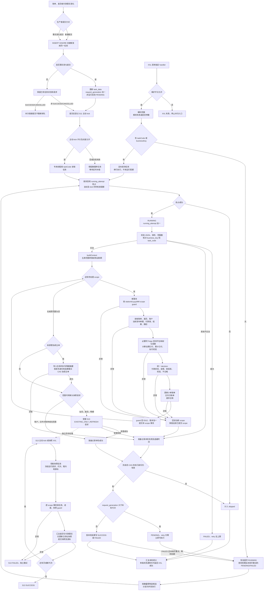

[业务逻辑专辑](/knowledge/business-logic/) / 居民收益付款 / S11

说明付款状态刷新请求的受理、三张底表状态重算、付款主单聚合与查询快照交接，以及执行权和失败重试边界，附逐章原文对照。本文保留原文 12 章，正文连续展开，原文对照与流程源码按需展开。

**前置阅读：** [S08 · 审核回调进度任务](/knowledge/business-logic/resident-income/s08-审核回调进度任务/)

**快速阅读：** [阅读起点](#reading-start) · [核心调用链](#chapter-3) · [筛选规则](#chapter-4) · [完整流程](#chapter-10) · [源码索引](#chapter-11) · [完整源码路径](#source-path-index)

<div class="business-logic-article">

从刷新请求，到三表投影、付款主单与查询快照

<div id="reading-start"></div>

> **阅读对象：有 Java 开发基础、但还不熟悉居民收益付款业务的开发者。**<br /> **依据：附件《residentIncomePaymentStatusRefreshAsyncTask 源码梳理》，分析日期 2026-09-09。** 本文是对该报告的完整改写，不是重新审计源码，也没有补做数据库或线上验证。原报告的结论级别为 `SOURCE_VERIFIED`（依据当时本地工作区源码核对过）；不能把这个级别理解成“线上运行已验证”。

<div id="intro-heading-1"></div>

## 阅读起点：先跟着一笔付款变化走一遍

**下面是一组假设数据，只用来解释流程，不是实际运行记录。**

假设电站 `100` 的 `202609` 账期，也就是 2026 年 9 月，已经有小单账单、合作方账单和差异台账。这里的“小单账单”对应 `fi_customer_bill`，“合作方账单”对应 `fi_customer_bill_partner`，“差异台账”对应 `fi_monthly_income_difference`；不要把“小单”自行理解成“金额比较小的付款单”。

合作方账单的拟付金额 `pre_rent` 是 1,000 元。已有付款导入链路让一笔符合本任务统计条件的 400 元成功付款生效，并通过事实变更入口提交这个站月的刷新请求。发起刷新的是业务代码，S11（本报告对应的普通付款状态刷新任务）负责后续处理；S11 不是让人再提交一次付款申请。

假设这次请求合法、相关数据关系完整、没有会优先命中“付款审核”或“待付款”的有效锁条件，且金额计算所需事实齐全。消费者取得请求后，会重新查询付款结果，而不是直接相信请求里写了“已经付款”。它算出当前账期已付 `paid_amount=400`，当前付款金额 `current_payment_amount=1,000-400=600`；依照状态判断顺序，这种拟付 1,000 元、已付 400 元的情况会落到 `60 部分付款`。

接着，同一个电站账期内，小单账单、合作方账单、差异台账会使用同一份计算结论更新。这里更新的是 **付款投影**：从已有事实推导出来、供展示和后续业务判断使用的金额、付款状态、锁占用展示、校验结果。它不是再生成一笔真实支付。

如果触发来源符合白名单，还会继续协调相关付款单的主状态。如果这次使用的是可转换为快照范围的 `STATION_MONTH` 请求，还会登记 S13（独立的账单维度快照刷新任务）的请求。这里的 **账单维度快照** 是供查询使用的已有汇总记录，由另一条异步链路更新。登记成功不等于快照已经更新完成，更不等于缺少的快照会自动补建。

最后，S11 消费者记录这一轮任务的处理结果。失败时可能稍后重试；同一范围在执行期间又发生事实变化时，会根据请求代次决定再排队处理。**整条主线是“事实已变化 → 登记刷新 → 重新读事实 → 重算三表投影 → 按需协调主单 → 按范围提交快照任务”，不是“发起付款 → 调用司库打钱”。**

后文仍按原文第 1—12 章展开。代码、字段、枚举、数值、执行顺序和证据编号保留在对应章节；新增的解释性例子都会明确标为假设。

<div id="intro-heading-2"></div>

### 阅读边界与原报告现场

原报告主仓库是 `/Users/wangyi/BZ/zx-monitor/zxbaif`，分支 `Ian/review/01`，HEAD（当时分支指向的提交）为 `a1bfacbeb6dfc239d577bd66bf78cd9eb2482efa`。跨服务补充源码来自 `/Users/wangyi/BZ/zx-monitor/zxbaie`，分支 `zx_test_250330`，HEAD 为 `21aac5b4821de7e7ae1bd660f896b3e890115cfc`。

**当时工作区存在未提交修改。** 报告读取的是当时文件内容，而不只是这两个提交里的内容。原分析没有修改业务代码，没有执行任务，没有调用业务接口，也没有查询数据库。

实际部署版本、XXL 调度配置、运行时开关、线上数据量、索引效果均暂时无法确认。本文后面提到的“默认值”“代码允许”“可能发生”都必须放在这个边界里理解。第 11 章保留原工作区源码位置；这些本地路径和行号不代表当前浏览器能够打开，也不保证后续源码变更后行号不变。

<details class="original">
<summary>原文对照 · 展开原报告的分析范围与工作区说明</summary>

> 分析日期：2026-09-09。依据当前本地工作区源码，结论级别为 **SOURCE\_VERIFIED**。
>
> 主仓库：`/Users/wangyi/BZ/zx-monitor/zxbaif`，分支 `Ian/review/01`，HEAD `a1bfacbeb6dfc239d577bd66bf78cd9eb2482efa`。跨服务补充源码：`/Users/wangyi/BZ/zx-monitor/zxbaie`，分支 `zx_test_250330`，HEAD `21aac5b4821de7e7ae1bd660f896b3e890115cfc`。
>
> 工作区存在未提交修改，本报告读取的是当前文件内容，并非只读取上述提交。未修改业务代码，未执行任务、调用业务接口或查询数据库。实际部署版本、XXL 调度配置、运行时开关、线上数据量和索引效果，**暂时无法确认**。文末提供可点击的源码位置。

</details>

<div id="chapter-1"></div>

<div id="chapter-title-1"></div>

## 1. 任务概览

<div id="chapter-1-heading-1"></div>

### 先认识它究竟在做哪一段工作

这项任务不是付款发起者，而是付款事实变化后的“状态重算者”。数据库已经登记了需要刷新的请求，它把请求取出来，重新读取付款结果、付款锁、付款单和账单金额，再更新三张底层表里的付款投影。

它还会根据触发来源决定是否协调付款单主状态，并在范围能够转换时登记独立的账单维度快照刷新任务。“按来源”和“能够转换”是实质限制，不是每个请求都会执行所有后续动作。

<div id="chapter-1-heading-2"></div>

### 对应到 Java 和调度配置

`XXL handler` 是 XXL-Job 调度系统注册的执行入口名称；调度端调用这个名字，才会进入这里讨论的方法。`Job` 类负责接收调度请求，消费服务负责领取和管理任务，业务刷新服务负责读取事实、计算和写业务表。

| 项目 | 真实名称或规则 | 通俗理解 |
| --- | --- | --- |
| XXL handler | `residentIncomePaymentStatusRefreshAsyncTask` | 调度端指定的执行方法名 |
| 入口类 | `ResidentIncomePaymentStatusRefreshJob` | 接收和解析调度参数 |
| 消费服务 | `ResidentIncomePaymentStatusRefreshAsyncTaskServiceImpl` | 找任务、抢占、执行、记录成功失败 |
| 业务刷新服务 | `ResidentIncomePaymentStatusRefreshServiceImpl` | 做实际的事实查询、重算和业务写入 |
| 任务表 | `fi_async_task` | 已登记请求的持久化载体 |
| 仅消费的任务类型 | `RESIDENT_INCOME_PAYMENT_STATUS_REFRESH` | 不把同表其他类型的任务一起处理 |
| 任务编码 | `RIPSR:`＋完整业务键的 MD5 | `MD5` 是把业务键计算成摘要的算法，这里用于组成任务身份 |
| 自动选取数量 | 默认选 50 条候选，最终取 `maxTaskCount` 与自动目标值的较小值 | “候选数”不等于“本轮成功处理数” |
| 业务执行单位 | 一条任务可包含若干刷新范围，真正写业务数据时逐个电站＋账期执行事务 | 一条任务不是一个覆盖所有账期的大事务 |
| 两种 XXL 入口模式 | 无选择器自动扫描；有 `taskCode(s)` 或 `businessKey(s)` 人工定向重试 | 人工模式并不等于任意状态强制重跑 |
| 真实调度频率 | 源码只注册 handler | 实际 cron（调度时间表达式）、路由、阻塞策略、实例数暂时无法确认 |

同一个 Job 类还注册了审核刷新分片、bulk 刷新、作废刷新这些 handler。`bulk` 在这里指另一类批量刷新入口；它们不是本任务顺手一起执行的工作。审核刷新分片表在本链路里主要用于统计总并发配额，而不是由 S11 领取这些分片执行。[\[E01\]](#evidence-e01)[\[E02\]](#evidence-e02)[\[E04\]](#evidence-e04)

<details class="original" id="original-1">
<summary>原文对照 · 展开第 1 章原文</summary>

原附件 · 第 1 章 · 保留原文内容

<div id="original-1-h-1"></div>

### 1. 任务概览

**这个任务消费数据库中已登记的居民收益付款状态刷新请求，重新读取付款事实，更新小单账单、合作方账单、差异台账的付款投影，并按触发来源协调付款单主状态、提交账单维度快照刷新。**

这里的“付款投影”，指由付款结果、付款锁、付款单和账单金额计算得到的展示及业务判断字段，例如已付金额、待付款/已付款状态、当前付款金额、校验结果等。

| 项目 | 源码中的实际行为 |
| --- | --- |
| XXL handler | `residentIncomePaymentStatusRefreshAsyncTask` |
| 入口类 | `ResidentIncomePaymentStatusRefreshJob` |
| 消费服务 | `ResidentIncomePaymentStatusRefreshAsyncTaskServiceImpl` |
| 业务刷新服务 | `ResidentIncomePaymentStatusRefreshServiceImpl` |
| 任务表 | `fi_async_task` |
| 仅消费的任务类型 | `RESIDENT_INCOME_PAYMENT_STATUS_REFRESH` |
| 任务编码 | `RIPSR:`＋完整业务键的 MD5 |
| 自动处理数量 | 默认选 50 条候选；取 `maxTaskCount` 与自动目标值的较小值 |
| 执行单位 | 一条异步任务包含若干刷新范围；实际写业务数据按电站＋账期逐个事务执行 |
| 两种入口模式 | 无任务选择器：自动扫描；有 `taskCode(s)` 或 `businessKey(s)`：人工定向重试 |
| 定时频率 | 源码只注册 handler，真实 cron、路由、阻塞策略、实例数暂时无法确认 |

同一 Job 类还注册了审核刷新分片、bulk 刷新、作废刷新等 handler。**本任务不会顺带消费这些任务类型**；审核分片表在本链路中主要参与并发配额统计。[\[E01\]](#evidence-e01)[\[E02\]](#evidence-e02)[\[E04\]](#evidence-e04)

</details>

<div id="chapter-2"></div>

<div id="chapter-title-2"></div>

## 2. 业务目的

<div id="chapter-2-heading-1"></div>

### 为什么事实变化后还需要“再刷新一次”

居民收益付款状态不是只看一个字段就能确定。合作方有没有推送账单、拟付金额有没有变化、付款单是不是处于审核或待支付、付款结果是否成功、是否已有不合格结论、线下导入有没有生效，都会影响最终结果。

因此，底层事实变化后，要重新计算三张业务表和查询快照，才能继续支持选单、审核占用判断、付款查询、合作方查询。这个任务承担的是其中的状态刷新和后续协调，并不包办所有支付业务。

它主要解决两类问题。第一，把关联查询、远程配置读取、金额计算和多表更新从原业务触发链路中移出去：生产者先登记请求，由异步消费者处理。这里的 **生产者** 就是提交刷新请求的业务代码，**消费者** 就是把请求取出并执行的代码。

第二，让失败和后续变化有机会继续处理。失败后保留任务与错误，到期重试；运行太久的任务可以被恢复；同一范围又有事实变化时，用请求代次告诉消费者“你执行期间又来了更新，需要再处理一轮”。

**本任务不创建付款申请，不调用司库打款，不发起新的审批。** 它读取已有事实并回写状态；真正需要支付时，由其他付款执行链路负责。

<div id="section-2-1"></div>

### 2.1 请求从哪里来

<div id="chapter-2-heading-2"></div>

#### 先看已经核对到的真实调用，而不是只看枚举名字

`triggerSource` 是请求里记录触发来源的字段。枚举中出现某个来源，并不能单独证明生产者已经接入、线上正在使用，或者它占了多少请求量。

原报告确认了下面这些代表性接入点。它们不是全部生产者，也不是生产环境触发比例统计。[\[E05\]](#evidence-e05)[\[E20\]](#evidence-e20)

| 来源 | 实际接入方式 | 为什么提交到这里 |
| --- | --- | --- |
| 小单账单事实变化 | `FiCustomerBillServiceImpl.submitStationMonthFactChangeRefreshTasks`；先按电站账期去重，再按每组最多 100 个范围分组，调用 `submitRefreshTaskForFactChange` | 新事实需要推进请求代次，不能只复用旧成功任务 |
| 合作方差异事实提交 | `FiMonthlyIncomeDifferenceServiceImpl.submitPartnerFactChangedRefreshAfterCommit`，最终调用 `submitRefreshTaskForFactChange` | 从实际差异台账提取刷新范围；来源可为 `PARTNER_DIFF_COMMITTED` |
| 付款导入这类事实变化 | `FiResidentIncomePaymentOrderServiceImpl` 中存在事实变更提交调用，最终进入 `submitRefreshTaskForFactChange` | 付款事实变化后，重新刷新对应范围 |
| 司库占位结果处理 | `ResidentIncomePaymentTreasuryResultAdapterServiceImpl.submitStatusRefreshTask`，调用普通 `submitRefreshTask` | 登记普通状态刷新请求；其入参完整性存在第 9.5 节所述风险 |
| 付款失败兜底 | `ResidentIncomePaymentFailFallbackAsyncTaskServiceImpl.submitRefreshTask`，调用普通 `submitRefreshTask` | 兜底事实产生后，更新底层状态 |
| 同步刷新失败补偿 | 公共 `refresh` 入口失败后调用 `recordRefreshFailureTask` | 把失败留成任务，后续可由本消费者处理 |

这里已经能看出一个重要区别：有些来源调用普通提交，有些来源明确调用“事实变更提交”。两者对旧任务的处理不一样，下一节单独比较。

<div id="section-2-2"></div>

### 2.2 同一范围是否会重复建任务

<div id="chapter-2-heading-3"></div>

#### 先把“请求长什么样”变成稳定的任务身份

`DTO` 是承载一次请求参数的数据对象。`buildContext` 会解释 DTO 中的范围，做归一化、排序和去重，然后生成 **业务键**：用一段字符串表示这条任务要处理的业务范围及模式。

原文给出的典型业务键如下；这些是格式示例，不是本次查询到的真实运行数据：

```text
STATION_MONTH:100:202609|MODE=ALL
DIFF:10001,10002|MODE=ALL
ORDER_BILL:20001|MODE=UNFINISHED
ACCOUNT_SCOPE:SMALL=101|PARTNER=201|MONTH_END=202609|MODE=ALL
```

任务编码始终按完整业务键计算：

```text
task_code = RIPSR:MD5(完整业务键)
```

完整业务键的长度 **不超过 128 个字符** 时，直接存入 `business_key`；**超过 128 个字符** 时，`business_key` 保存为 `RIPSR_BK:MD5(...)`。`task_data` 保存原始刷新 DTO 的 JSON（用于保存请求数据的文本格式），也就是任务实际执行时读取的请求数据。[\[E04\]](#evidence-e04)[\[E05\]](#evidence-e05)

<div id="chapter-2-heading-4"></div>

#### “普通提交”与“事实变化提交”必须分开理解

`SafeSeedService.acceptOrReuse` 是安全创建或复用入口，内部沿 `INSERT IGNORE` 路径创建或复用任务。这里关键不是方法名字，而是它遇到已存在任务时究竟改不改数据。

| 对比项 | `submitRefreshTask`：普通提交 | `submitRefreshTaskForFactChange`：事实变化提交 |
| --- | --- | --- |
| 起始处理 | `SafeSeedService.acceptOrReuse → INSERT IGNORE` | 先执行同样的安全创建或复用 |
| 已有任务的数据 | 不覆盖旧 `task_data` | 用 SQL 更新 `task_data` |
| 请求代次 | 普通受理不会按事实变化方式推进 | `request_generation + 1` |
| 旧任务不在运行中 | 不因为这次普通提交而重置状态 | 改回 `PENDING`，清空错误，重试归零，立即可执行 |
| 旧任务正在 `RUNNING` | 仍只是复用原任务 | 保持 `RUNNING`，让本轮完成时检查是否有新代次 |
| 旧任务为 `SUCCESS/CANCELLED` | 不登记主动 kick，也不重新排队 | 属于非运行态，可重新转成待执行 |

`request_generation` 即 **请求代次**，可以理解为“同一任务范围已经收到第几代新事实请求”。`kick` 是主动唤起消费者的一次进程内加速通知，不是任务本体；任务本体仍保存在数据库里。

**假设例子：** 一个站月任务已经 `SUCCESS`，后来账单拟付金额变了。再次调用普通 `submitRefreshTask`，可能只复用旧成功任务，不能保证再刷新一次；调用 `submitRefreshTaskForFactChange`，才会按这里确认的实现推进代次并重新排队。

普通提交方法的旧注释写过“重置为待执行”，但当前 safe seed 实现不是这样。本文保留这个矛盾，采用实际调用与 SQL 的结论，不把注释改写成已实现能力。[\[E03\]](#evidence-e03)[\[E06\]](#evidence-e06)

<details class="original" id="original-2">
<summary>原文对照 · 展开第 2 章原文</summary>

原附件 · 第 2 章 · 保留原文内容

<div id="original-2-h-1"></div>

### 2. 业务目的

居民收益付款状态由多类事实共同决定：合作方是否推送账单、账单拟付金额是否变化、付款单是否处于审核或待支付、付款结果是否成功、是否发生不合格结论、线下导入是否生效等。业务事实变化后，三张底层业务表和查询快照需要重新计算，才能继续支持选单、审核占用判断、付款查询和合作方查询。

该任务解决两个问题：

1. \*\*把刷新工作从业务触发链路中移出。\*\*生产者先登记请求，异步消费者承担关联查询、远程配置读取、金额计算和多表更新。
2. \*\*让失败和后续变化可继续处理。\*\*失败保留任务和错误信息；到时重试；长期运行中的任务可恢复；同一刷新范围再次发生事实变化时，通过请求代次让消费者再跑一次。

本任务的业务执行没有创建付款申请、调用司库打款或发起新的审批。它读取已有事实并回写状态；是否需要实际支付，由其他付款执行链路负责。

<div id="original-2-h-2"></div>

#### 2.1 请求从哪里来

本次确认的代表性调用点如下，不能只凭 `triggerSource` 枚举推断所有来源都已接入。

| 来源 | 实际接入方式 | 对本任务的意义 |
| --- | --- | --- |
| 小单账单事实变化 | `FiCustomerBillServiceImpl.submitStationMonthFactChangeRefreshTasks`；电站账期去重后按最多 100 个范围分组，调用 `submitRefreshTaskForFactChange` | 新事实会推进请求代次 |
| 合作方差异事实提交 | `FiMonthlyIncomeDifferenceServiceImpl.submitPartnerFactChangedRefreshAfterCommit`，最终调用 `submitRefreshTaskForFactChange` | 刷新范围来自实际差异台账，来源可为 `PARTNER_DIFF_COMMITTED` |
| 付款导入等事实变化 | `FiResidentIncomePaymentOrderServiceImpl` 中存在事实变更提交调用，最终转入 `submitRefreshTaskForFactChange` | 付款事实变化后再次刷新对应范围 |
| 司库占位结果处理 | `ResidentIncomePaymentTreasuryResultAdapterServiceImpl.submitStatusRefreshTask`，调用普通 `submitRefreshTask` | 登记普通状态刷新请求；入参完整性见风险章节 |
| 付款失败兜底 | `ResidentIncomePaymentFailFallbackAsyncTaskServiceImpl.submitRefreshTask`，调用普通 `submitRefreshTask` | 兜底事实产生后更新底层状态 |
| 同步刷新失败补偿 | 公共 `refresh` 入口失败后调用 `recordRefreshFailureTask` | 留存可由本消费者处理的失败任务 |

生产者还有其他调用点；以上是已核对的接入示例，不代表生产环境实际触发比例。[\[E05\]](#evidence-e05)[\[E20\]](#evidence-e20)

<div id="original-2-h-3"></div>

#### 2.2 同一范围是否会重复建任务

`buildContext` 归一化范围、排序去重，再生成业务键。典型形式：

```text
STATION_MONTH:100:202609|MODE=ALL
DIFF:10001,10002|MODE=ALL
ORDER_BILL:20001|MODE=UNFINISHED
ACCOUNT_SCOPE:SMALL=101|PARTNER=201|MONTH_END=202609|MODE=ALL
```

`task_code = RIPSR:MD5(完整业务键)`。完整业务键不超过 128 个字符时直接保存；超过时，`business_key` 保存为 `RIPSR_BK:MD5(...)`。`task_data` 保存原始刷新 DTO JSON。[\[E04\]](#evidence-e04)[\[E05\]](#evidence-e05)

需要区分两个受理方法：

- `submitRefreshTask`：通过 `SafeSeedService.acceptOrReuse → INSERT IGNORE` 创建或复用任务。**已有任务不会因此重置状态，也不会覆盖旧任务数据**；已有 `SUCCESS/CANCELLED` 不登记主动 kick。
- `submitRefreshTaskForFactChange`：先执行相同的安全创建，再用 SQL 更新 `task_data` 并令 `request_generation + 1`。若旧任务不在运行中，则改回 `PENDING`、清空错误、重试次数归零、立即可执行；若正在运行，则保留 `RUNNING`，等待当前执行完成时判断是否需要追赶新代次。

普通提交方法的旧注释说“重置为待执行”，与当前 safe seed 实现不一致；本报告采用实际调用和 SQL 的结论。[\[E03\]](#evidence-e03)[\[E06\]](#evidence-e06)

</details>

<div id="chapter-3"></div>

<div id="chapter-title-3"></div>

## 3. 核心调用链

<div id="section-3-1"></div>

### 3.1 从 XXL 入口到单条任务

<div id="chapter-3-heading-1"></div>

#### 先判断能不能运行，再决定自动找任务还是人工点名

XXL 入口首先检查维护限制，然后解析参数。没有任务选择器时走自动扫描；提供任务编码或业务键时走人工定向重试。自动模式先恢复超时运行任务，再选候选，并按波次并发执行；人工模式按选择器查询后串行执行，不使用运行配额。

`CAS` 是“比较后再更新”：SQL 更新时同时检查旧状态和版本仍符合预期，只有检查通过才认领成功。这里用它避免两个执行者同时把同一条任务当成自己的任务。

```text
ResidentIncomePaymentStatusRefreshJob.residentIncomePaymentStatusRefreshAsyncTask(param)
  → AmountRuleUpgradeGuardService.checkStatusRefreshJobAllowed
  → parseJobParam / unwrapPayload
  → executeJob
      ├─ 无选择器：executePendingTasks(maxTaskCount)
      │   → recoverStaleRunningTasks
      │   → queryAutoExecutableTaskList
      │   → executeTaskList（分波次并发）
      └─ 有选择器：executeManualRetry(taskCodes, businessKeys, maxTaskCount)
          → queryManualRetryTaskList
          → executeTaskList（串行，不用配额）
  → executeSingleTask
      → claimTask（状态和 running_attempt 条件更新）
      → 校验 JSON 体积、范围数量、task_data 和任务身份
      → StatusRefreshService.refreshFromAsyncTask
      → markTaskSuccess / markTaskFailed（执行代次校验＋请求代次判断）
  → 汇总 selected / success / failed / skipped / recovered
  → inspectInvariants
  → XXL ReturnT
```

`running_attempt` 是执行代次，表示这条任务当前是哪一轮执行。它参与领取和完成态校验，与记录“又来了新事实”的 `request_generation` 不是一回事，第 5.1 节会对照解释。

汇总字段分别表示选中的候选、成功、失败、跳过和超时恢复的数量。`ReturnT` 是返回给 XXL 的结果对象；它不直接等于每张业务表的数据验收结果。

<div id="chapter-3-heading-2"></div>

#### 参数不仅支持一种 JSON 外形

参数可以直接是 JSON，也可以包成 `{"data": ...}`。其中 `data` 可以是对象，也可以是 JSON 字符串。

**解析失败不会直接拒绝本次运行。** 它会记日志并退回空参数，于是进入自动扫描。假设原本想人工点名重试却传错 JSON，实际可能变成自动扫描，而不是安全地什么也不做。[\[E01\]](#evidence-e01)

保留原文的参数格式示例，里面的任务摘要是占位内容，不是可直接使用的真实任务编码：

```json
{"maxTaskCount":20}
```

```json
{"taskCode":"RIPSR:实际任务摘要","maxTaskCount":1}
```

```json
{"businessKeys":["STATION_MONTH:100:202609|MODE=ALL"],"maxTaskCount":1}
```

人工选择器会把单值和数组合并，再去空、去重。任务编码列表和业务键列表同时存在时，按 **OR** 查询：符合任意一侧即可被查到，不要求两侧同时匹配。

人工点名也仍然只能抢占 `PENDING/FAILED`。它不是对 `RUNNING/SUCCESS/CANCELLED` 的强制重跑入口。[\[E02\]](#evidence-e02)

<div id="section-3-2"></div>

### 3.2 单条任务的主要业务处理

<div id="chapter-3-heading-3"></div>

#### 一条合法请求进入业务服务后的实际顺序

这里的入口是 `refreshFromAsyncTask`。它按下列顺序做事，前面的步骤正常完成后，才继续后面的步骤。[\[E05\]](#evidence-e05)

| 顺序 | 业务上在做什么 | 对应方法 |
| --- | --- | --- |
| 1 | 解释请求表达的范围，建立统一上下文 | `buildContext` |
| 2 | 把范围转换成电站账期，排序去重后逐个刷新 | `executeRefreshWithScopeGuard` |
| 3 | 只有触发来源在白名单中，才协调相关付款单主状态 | `reconcilePaymentOrderStatusAfterFactChange` |
| 4 | 只有范围可转换，才登记独立快照任务 | `submitBillDimensionSnapshotRefreshTask` |
| 5 | 返回消费者，由消费者记录本条异步任务结果 | 消费服务回写任务状态 |

`scope` 指一份具体刷新范围；在执行保护这一层，它会落到电站＋账期。`guard` 指互斥保护记录：通过锁定数据库中的保护行，避免同一站月的刷新同时写入。

**不要把 `refreshFromAsyncTask` 和公共 `refresh` 混成同一个入口。** 消费者调用前者；它不会再另建一条状态刷新失败任务，也不在业务服务内把当前任务标成功。这些任务管理职责交给消费者，避免与公共入口的失败补偿行为混在一起。

<div id="section-3-3"></div>

### 3.3 单个电站账期如何刷新

<div id="chapter-3-heading-4"></div>

#### 遇到什么问题：两个请求可能同时刷新同一站月

范围不同的两条任务，也可能都包含同一电站同一月份。如果各自直接读写，可能互相交错。当前实现先取得该站月的 guard 行锁，再读取事实、形成决策并更新三表，使这个站月的刷新串行进行。

`@Transactional(REQUIRES_NEW)` 表示这里为单个 scope 开启独立事务。`decision` 是统一决策结果：先根据同一份事实算好状态和金额，再用这份结果更新不同业务表，而不是每张表各算一套。

```text
executeRefreshWithScopeGuard
  → ScopeRefreshTransactionService.refreshSingleScope(command)
      @Transactional(REQUIRES_NEW)
      → upsertForLock：准备 scope guard
      → queryByScopeForUpdate：锁定 stationId:yyyyMM 对应的 guard 行
      → markRunning
      → StatusRefreshService.refreshSingleScopeWithoutGuard
          → executeRefreshInTransaction
          → doRefresh
          → doTargetMonthRefresh
              → loadBatchRefreshData
              → buildPureRefreshDecision
                  → StatusDecisionService.decide
              → applyRefreshDecision
                  → updateSmallBill
                  → updatePartnerBill
                  → updateDiff
      → releaseSuccess：guard 回到 IDLE，refresh_version + 1
      → 提交本电站账期事务
```

guard 从 `IDLE` 进入 `RUNNING`，成功时回到 `IDLE` 并增加 `refresh_version`。本 scope 内任意步骤抛异常，guard 和三张业务表的写入一起回滚。[\[E07\]](#evidence-e07)[\[E08\]](#evidence-e08)

<div id="chapter-3-heading-5"></div>

#### 仍有什么限制：独立事务不是整条任务一起回滚

外层是逐个站月调用 `REQUIRES_NEW`，没有覆盖全部账期的总事务，也没有 S11 自己的已完成账期游标。**游标** 是记录“已经处理到哪里”的进度位置；这里没有这样的任务级续跑位置。

**假设例子：** 一条请求含 3 个站月，第 1 个提交成功，第 2 个抛异常，那么第 2 个回滚，第 3 个不再处理，第 1 个仍保留。下次重试会从范围头部重新来，不能直接把它理解为从第 2 个继续。

另一个容易被方法名误导的地方是 `loadBatchRefreshData`。虽然名字里有 Batch，但普通任务经过 guard 拆分后，一次传入的通常只有一个站月，不能据此断言 S11 已经完成跨账期批量预取。

当前必经业务主线是：

```text
doTargetMonthRefresh → loadBatchRefreshData → buildPureRefreshDecision → decide
```

同类里仍存在 `loadRefreshData`、旧 `buildRefreshDecision` 和旧 `resolvePaymentStatus`，它们不是本 handler 当前主线的必经方法。后面的状态优先级采用独立决策服务中的现行实现，不能沿这些旧方法拼出另一套规则。[\[E05\]](#evidence-e05)

<details class="original" id="original-3">
<summary>原文对照 · 展开第 3 章原文</summary>

原附件 · 第 3 章 · 保留原文内容

<div id="original-3-h-1"></div>

### 3. 核心调用链

<div id="original-3-h-2"></div>

#### 3.1 从 XXL 入口到单条任务

```text
ResidentIncomePaymentStatusRefreshJob.residentIncomePaymentStatusRefreshAsyncTask(param)
  → AmountRuleUpgradeGuardService.checkStatusRefreshJobAllowed
  → parseJobParam / unwrapPayload
  → executeJob
      ├─ 无选择器：executePendingTasks(maxTaskCount)
      │   → recoverStaleRunningTasks
      │   → queryAutoExecutableTaskList
      │   → executeTaskList（分波次并发）
      └─ 有选择器：executeManualRetry(taskCodes, businessKeys, maxTaskCount)
          → queryManualRetryTaskList
          → executeTaskList（串行，不用配额）
  → executeSingleTask
      → claimTask（状态和 running_attempt 条件更新）
      → 校验 JSON 体积、范围数量、task_data 和任务身份
      → StatusRefreshService.refreshFromAsyncTask
      → markTaskSuccess / markTaskFailed（执行代次校验＋请求代次判断）
  → 汇总 selected / success / failed / skipped / recovered
  → inspectInvariants
  → XXL ReturnT
```

XXL 入参支持裸 JSON，也支持 `{"data": ...}`，`data` 可以是对象或 JSON 字符串。解析失败会记录日志并退回空参数，从而走自动扫描，而非直接拒绝执行。[\[E01\]](#evidence-e01)

示例：

```json
{"maxTaskCount":20}
```

```json
{"taskCode":"RIPSR:实际任务摘要","maxTaskCount":1}
```

```json
{"businessKeys":["STATION_MONTH:100:202609|MODE=ALL"],"maxTaskCount":1}
```

人工选择器中单值和数组合并、去空去重；任务编码列表与业务键列表同时存在时按 **OR** 查询。人工模式也只能抢占 `PENDING/FAILED`，不是任意状态强制重跑。[\[E02\]](#evidence-e02)

<div id="original-3-h-3"></div>

#### 3.2 单条任务的主要业务处理

`refreshFromAsyncTask` 的真实顺序是：[\[E05\]](#evidence-e05)

1. `buildContext`：解释 DTO 的范围类型，建立标准化上下文。
2. `executeRefreshWithScopeGuard`：将范围转换为电站账期，排序、去重，逐个刷新。
3. `reconcilePaymentOrderStatusAfterFactChange`：符合触发来源白名单时，协调受影响付款单主状态。
4. `submitBillDimensionSnapshotRefreshTask`：范围能够转换时，登记独立的快照任务。
5. 返回消费者，由消费者回写本条异步任务状态。

\*\*消费者调用的是 `refreshFromAsyncTask`，不是公共 `refresh`。\*\*前者不再另建一条状态刷新失败任务，也不在业务服务里把当前任务标成功；这些职责由消费服务处理，避免把两个入口的补偿行为混在一起。

<div id="original-3-h-4"></div>

#### 3.3 单个电站账期如何刷新

```text
executeRefreshWithScopeGuard
  → ScopeRefreshTransactionService.refreshSingleScope(command)
      @Transactional(REQUIRES_NEW)
      → upsertForLock：准备 scope guard
      → queryByScopeForUpdate：锁定 stationId:yyyyMM 对应的 guard 行
      → markRunning
      → StatusRefreshService.refreshSingleScopeWithoutGuard
          → executeRefreshInTransaction
          → doRefresh
          → doTargetMonthRefresh
              → loadBatchRefreshData
              → buildPureRefreshDecision
                  → StatusDecisionService.decide
              → applyRefreshDecision
                  → updateSmallBill
                  → updatePartnerBill
                  → updateDiff
      → releaseSuccess：guard 回到 IDLE，refresh_version + 1
      → 提交本电站账期事务
```

业务含义：先串行化同一电站账期的刷新，读取事实，生成同一份决策，再把它投影到三张业务表。任意一步抛出异常，本电站账期的 guard 和三表写入一起回滚。[\[E07\]](#evidence-e07)[\[E08\]](#evidence-e08)

注意两个边界：

- 外层会逐个电站账期调用 `REQUIRES_NEW`。因此多范围任务**没有覆盖全部账期的总事务**，也没有本任务自己的已完成账期游标。
- 方法叫 `loadBatchRefreshData`，但当前普通任务经过 guard 之后，每次传入通常只有一个电站账期。不能据此认定整条普通任务已做到跨账期批量预取。

当前真实主线是 `doTargetMonthRefresh → loadBatchRefreshData → buildPureRefreshDecision → decide`。同类中仍有 `loadRefreshData`、旧 `buildRefreshDecision`、旧 `resolvePaymentStatus` 等方法，不能把它们当成本 handler 当前必经路径。[\[E05\]](#evidence-e05)

</details>

<div id="chapter-4"></div>

<div id="chapter-title-4"></div>

## 4. 数据筛选规则

这一章要分开回答三个问题：**任务表里哪些请求能被执行，请求本身是否合法，以及请求最终会读哪些业务事实。** 三层条件不能互相替代，也不能把某张表的过滤规则推广到所有表。

<div id="section-4-1"></div>

### 4.1 自动扫描异步任务

<div id="chapter-4-heading-1"></div>

#### 先找“这个类型、可以开始、还有自动机会”的任务

自动扫描只查本任务类型，要求未删除，状态为待执行或失败，同时已经到可执行时间，而且没有达到重试上限。下面各行通过 **AND** 组合；只有括号里的分支是 **OR**。

`queryAutoExecutableTaskList` 的等价查询保留如下：

```sql
SELECT *
FROM fi_async_task
WHERE deleted = 0
  AND task_type = 'RESIDENT_INCOME_PAYMENT_STATUS_REFRESH'
  AND task_status IN (0, 3)
  AND (next_execute_time IS NULL OR next_execute_time <= :now)
  AND IFNULL(retry_count, 0) < IFNULL(max_retry_count, 3)
ORDER BY next_execute_time ASC, retry_count ASC, id ASC
LIMIT :targetCount;
```

`task_status IN (0, 3)` 对应 `PENDING/FAILED`。`next_execute_time` 为空或者不晚于当前时间都可以；重试次数必须 **严格小于** 上限，等于上限就不满足。查询把空重试次数按 0、空最大重试次数按 3 比较。

排序依次是下次执行时间升序、重试次数升序、ID 升序，最后才按目标数量截取候选。

<div id="chapter-4-heading-2"></div>

#### 数量由两道限制一起决定

| 限制来源 | 归一化规则 |
| --- | --- |
| XXL 参数 `maxTaskCount` | 缺失或 `<= 0` 时按 100；超过 500 时截断到 500 |
| 自动目标配置 `status.refresh.generic.auto-target-per-run` | 默认 50；最大截断到 200 |
| 最终候选数 | 取以上两个有效值的较小值 |

因此，单独把 XXL 参数设为 500，在自动目标仍为默认 50 的情况下，仍只选 50 条候选。候选被查到后还要抢占；抢占冲突、配额不足都会跳过。本轮不会为了填补这些跳过位置而持续补选新任务。[\[E02\]](#evidence-e02)[\[E03\]](#evidence-e03)

<div id="chapter-4-heading-3"></div>

#### 扫描之前还会恢复超时的 RUNNING

恢复范围仍限定同一任务类型、`deleted=0`。它用 `COALESCE(update_time,create_time)` 判断任务最后记录时间：优先取更新时间，否则取创建时间；与当前的间隔达到运行超时时间就进入恢复，默认阈值是 **30 分钟**。

恢复动作是改成 `FAILED`、`retry_count + 1`、`next_execute_time=now`，并写入超时错误。恢复后不是必然马上执行：它还要通过本轮自动扫描的重试次数限制。假设这次恢复正好把重试次数加到上限，那么虽写了“当前可执行”，仍不会自动选中。

<div id="section-4-2"></div>

### 4.2 抢占条件与配额

<div id="chapter-4-heading-4"></div>

#### 查到候选，不等于已经拥有执行权

自动执行用 `claimResidentIncomePaymentStatusRefreshTaskWithQuota` 抢占。它要求任务 ID、类型、未删除条件都匹配，旧状态为 `PENDING/FAILED`，数据库 `running_attempt` 与刚才读取的值一致，并且同时满足两项并发配额。

| 配额 | 怎样计数 | 默认要求 |
| --- | --- | --- |
| 普通刷新并发 | 同类型 `RUNNING`，且更新时间未超过运行超时窗口的任务数 | 领取前计数 `< 10` |
| 普通＋审核分片总并发 | 上述普通运行数，加上 `fi_resident_income_payment_status_refresh_shard` 中 `REVIEW_APPROVED/RUNNING` 且租约未过期的分片数 | 领取前总数 `< 14` |

**租约** 是在一段有效时间内认可某个执行占用的机制。这里审核分片只有租约未过期才计入总并发；本 handler 不因此去执行审核分片。

`review-shard.concurrency` 默认 4，但普通任务的领取 SQL 没有单独拿这个值限制审核分片数量。总配额如果配置得低于“审核配额＋普通配额”，Java 会把总配额提升到两者之和，不能只看一个偏小的总配额配置就认定实际按该值执行。

抢占成功后，任务改为 `RUNNING`，`running_attempt + 1`，清空错误并更新操作时间。抢占竞争失败或配额不满足，则计入 `skipped`，不执行业务。

<div id="chapter-4-heading-5"></div>

#### 自动、人工和主动 kick 的约束不是同一套

人工模式绕过运行配额，也绕过执行时间和重试上限限制，但仍要求可领取状态，并通过执行代次 CAS。

自动配额 claim SQL 本身 **不重新检查** `next_execute_time/retry_count`。自动模式依赖前面的查询先做这两项过滤；主动 kick 直接按任务编码查任务，可能没有这层前置过滤。第 9.1 节会说明因此可能绕过什么限制。[\[E02\]](#evidence-e02)[\[E03\]](#evidence-e03)

<div id="section-4-3"></div>

### 4.3 task\_data 的限制与身份检查

<div id="chapter-4-heading-6"></div>

#### 拿到任务后，先检查请求，再碰业务数据

检查发生在抢占之后、读取业务事实之前。不能理解成“坏请求根本没有进入 RUNNING”；它可能先领取成功，再因校验失败写回失败状态。

| 检查顺序 | 要求 | 需要保留的边界 |
| --- | --- | --- |
| 1 | `task_data` 非空，且是可解析 JSON | 空内容或解析错误不进入业务刷新 |
| 2 | JSON 体积合规 | UTF-8 字节数默认不超过 **16,384**；JSON 节点数默认不超过 **1,200**。字节数不是字符数 |
| 3 | 输入范围数量合规 | 默认不超过 **200**，但各范围类型的计数口径不同 |
| 4 | `buildContext(task_data)` 能构造合法范围和业务键 | 能解析 JSON 不代表业务范围合法 |
| 5 | 任务身份一致 | 重算的存储业务键必须等于 `task.business_key`，重算任务编码必须等于 `task.task_code`，两项都要成立 |

范围数量这样计数：`STATION_MONTH` 按输入列表长度；ID 类范围按去重后的 ID 数；`ACCOUNT_SCOPE` 按两侧账户 ID 数之和。账户数不等于账户展开后的站月数，第 9.4 节保留了由此带来的规模风险。

**超体积或超范围数量** 会直接写 `FAILED`，并令 `retry_count=max_retry_count`，停止自动重试。JSON 错误、身份不一致这类其他错误则走普通失败重试，不要把两类失败的重试策略混为一谈。[\[E02\]](#evidence-e02)[\[E04\]](#evidence-e04)

<div id="section-4-4"></div>

### 4.4 五种业务范围如何转换

<div id="chapter-4-heading-7"></div>

#### 请求可以有五种表达方式，最后都要定位实际站月

`locator` 是精确定位信息：它不只说“某电站某月份”，还指定要关联哪条差异、哪张合作方账单或哪个合作方账户。它的作用与合法性限制都比“辅助提示”更强。

| 范围类型 | 怎么取得业务范围 | 必须满足的条件或限制 |
| --- | --- | --- |
| `STATION_MONTH(10)` | DTO 直接给 `stationId + billYearMonth`，可附差异、合作方账单、账户定位信息 | 电站不能为空，月份必须合法；标准化后排序去重 |
| `PARTNER_BILL(20)` | 按 ID 查 `fi_customer_bill_partner`，再查合作方账户，再按 `partner_bill_id` 查差异台账 | 平台站取账户的 `platform_station_id`；映射缺失报错；一张合作方账单必须命中唯一差异台账，缺失或多条都报错 |
| `DIFF(30)` | 按 ID 查 `fi_monthly_income_difference` | 从实际记录的 `station_id/share_month` 和真实 locator 字段构造范围 |
| `ORDER_BILL(40)` | 按 ID 查询当前已发布付款单明细 | 主单 `build_status=PUBLISHED`；主单和明细的当前发布版本、`submit_round` 一致；主单、明细都未删除 |
| `ACCOUNT_SCOPE(50)` | 按小单账户展开小单账单，按合作方账户展开合作方账单 | 至少有一侧账户；必须给 `accountScopeBillYearMonthEnd`；只展开 `bill_yearmonth <= 上限` 的账单；可限定未完成状态 |

“当前发布身份”可以理解为“这条明细是否属于主单当前这次正式发布、这轮提交”。它不是仅凭付款单 ID 就认定明细有效，还要核对发布版本和 `submit_round`（提交轮次）。

<div id="chapter-4-heading-8"></div>

#### “只刷新未完成”实际只在哪里生效

`onlyRefreshUnfinished` 缺省归一为 `false`。只有账户范围展开 SQL 使用这个标志，其他四类范围当前不会因为它为真就过滤掉已付款记录。账户展开以后，最终 UPDATE 也不会再次加上“仍然未完成”的条件。

账户范围认定的未完成状态完整集合是：

| 包含 | 不包含 |
| --- | --- |
| `20 未付款`、`30 付款审核`、`40 待付款`、`60 部分付款`、`70 付款失败`、`99 合作方未推送账单` | `10 无需付款`、`50 已付款` |

因此，业务键出现 `MODE=UNFINISHED`，并不能单凭名字就断言所有范围都不会重刷已付款账单。必须结合范围类型和当前 SQL 理解。[\[E05\]](#evidence-e05)

<div id="chapter-4-heading-9"></div>

#### 去重不是只比较电站和月份

scope 去重还比较 `partnerOrgId/partnerBillId/partnerCustomerAccountId/diffId`。同一电站同一账期，只要这些定位信息不同，就仍可能保留多个 scope。执行时它们会依次取得同一个站月 guard，仍然可能产生多轮读取和写入。

<div id="section-4-5"></div>

### 4.5 每个电站账期读取的付款事实

<div id="chapter-4-heading-10"></div>

#### 先把来源不同的事实放到一起，再计算状态

下面是当前主线读取的数据和用途。这里讨论的是“计算依据”，不是说本任务会修改每一张读到的表。

| 数据 | 读取规则 | 用途 |
| --- | --- | --- |
| 小单账单 | `fi_customer_bill` 按 `(station_id,bill_yearmonth)` 精确查询 | 判断小单是否存在、所属账户和应付事实 |
| 合作方账单与差异 | 无 locator 时按电站账期查；有 locator 时由 `PaymentFactAssembler` 按差异、合作方账单、合作方账户 ID 精确加载并校验关系 | 找到参与本次计算的合作方账单和差异记录 |
| 付款锁 | `fi_resident_income_payment_bill_lock.lock_status IN ('RESERVED','ACTIVE')`，并联结当前已发布主单、明细，核对单据、版本、提交轮次 | 判断当前审核和付款占用是否有效 |
| 付款单明细 | 当前发布身份中的 `PAYABLE/UNQUALIFIED` 两类明细，并左联 `selection_session_item` | 读取可付款、不合格以及人工调整事实 |
| 最新付款结果 | 按明细 `latest_result_id` 批量加载 | 判断明细结果来源的优先级 |
| 付款主单 | 读取有效锁及相关明细引用的主单 | 参与付款审核、待支付、已付款判断 |
| 当前账期已付 | 结果表按 `(station_id,bill_yearmonth)` 聚合，同时限定 `result_status=PAY_SUCCESS(30)`、`result_type=NORMAL_PAYMENT(10)`、来源为 `10 司库` 或 `20 线下导入` | 计算本账期成功正常付款总额 |
| 当前账期线下已付 | 在上项条件下再单独限定来源 `OFFLINE_IMPORT(20)` | 判断“只有小单但已发生线下成功支付”的分支 |
| 累计已付 | 按业务账户键聚合截至目标月的成功结果，再叠加 `fi_resident_income_paid_opening_balance.opening_paid_amount` | 取得业务账户的累计已付 |
| 应付与抵扣 | 聚合小单账单 `rent`，读取合作方账单抵扣和有效初始化抵扣 | 供目标月拟付校验使用 |

`PAYABLE` 表示这里参与可付款判断的明细类别，`UNQUALIFIED` 表示不合格明细类别。`RESERVED/ACTIVE` 是本次付款锁查询认可的两种锁状态。`LEFT JOIN`（左联）让明细关联人工调整信息，不能据此推断每条明细都一定有对应调整记录。

<div id="chapter-4-heading-11"></div>

#### 有 locator 就进入精确校验，不是“找不到再随便找一条”

只要 scope 的 `diffId/partnerBillId/partnerCustomerAccountId` **任意一项存在**，就进入 locator 分支。进入后要求 `diffId`、合作方身份和对应关系成立；通常存在合作方账单的情形，还需要账单 ID、账户 ID 完整。

对差异台账明确没有合作方账单的情况，实现有单独的缺失侧处理分支。原报告没有把这个分支进一步拆成全部内部条件，本文也不补造。

所以不能把规则理解成“定位字段没给全，就自动回退按站月找最新”。是否进入 locator 分支由“任一定位项存在”决定，进入后缺少必要身份可能直接失败。[\[E09\]](#evidence-e09)

<div id="chapter-4-heading-12"></div>

#### 多条候选事实如何选代表记录

无 locator 时，多记录选择使用更新时间、创建时间和 ID 的稳定比较。`PAYABLE` 明细还先考虑所关联结果的来源优先级：

| 结果来源条件 | 优先级 |
| --- | --- |
| 未作废的司库或线下结果 | 2 |
| 失败兜底结果 | 1 |
| 其他 | 0 |

先按来源优先级，再比较明细时间、ID。这里说的是“所选明细的来源优先级”，不要把它与当前已付金额聚合的成功条件混成一条规则。有效不合格明细必须为 `UNQUALIFIED_EFFECTIVE`。[\[E05\]](#evidence-e05)

<div id="chapter-4-heading-13"></div>

#### 两种已付聚合的过滤口径并不完全相同

当前账期已付要求 `result_type=NORMAL_PAYMENT`；但累计业务月已付所用的 `aggregatePaidAmountByBusinessMonth/aggregatePaidAmountByPlatformAccountMonth` **没有同样的 `result_type` 条件**。

两者都与已付有关，但不能为了好理解而说成“只是一个按月、一个累计，其他条件完全相同”。这正是需要保留的 SQL 差异。[\[E10\]](#evidence-e10)

<div id="chapter-4-heading-14"></div>

#### 业务账户键取决于运行时路由

默认账户键是 `smallStationId + partnerOrgId`。只有 **平台账户迁移总入口启用 AND `accountReadRoute=PLATFORM`**，才改用 `platformStationId + partnerOrgId`。

平台键查询期初数据时，命中重复记录会报错；旧键路径则按更新时间和 ID 选定记录。实际启用了哪条账户读路由，原报告暂时无法确认。[\[E05\]](#evidence-e05)[\[E21\]](#evidence-e21)

<div id="chapter-4-heading-15"></div>

#### 累计抵扣不是“只算到目标月”

实现按平台站找到合作方账户，再汇总这些账户全部合作方账单的 `deduction_amount`，叠加有效初始化抵扣。

`sumDeductionByAccountIds` **没有目标月份上限条件**。因此，这里的累计抵扣使用当前累计抵扣事实，不应被改写成“截至目标账期的抵扣”。即使它参与目标月校验，查询口径本身也没有因此变成目标月截止。[\[E12\]](#evidence-e12)

<details class="original" id="original-4">
<summary>原文对照 · 展开第 4 章原文</summary>

原附件 · 第 4 章 · 保留原文内容

<div id="original-4-h-1"></div>

### 4. 数据筛选规则

<div id="original-4-h-2"></div>

#### 4.1 自动扫描异步任务

`queryAutoExecutableTaskList` 的条件等价于：

```sql
SELECT *
FROM fi_async_task
WHERE deleted = 0
  AND task_type = 'RESIDENT_INCOME_PAYMENT_STATUS_REFRESH'
  AND task_status IN (0, 3)
  AND (next_execute_time IS NULL OR next_execute_time <= :now)
  AND IFNULL(retry_count, 0) < IFNULL(max_retry_count, 3)
ORDER BY next_execute_time ASC, retry_count ASC, id ASC
LIMIT :targetCount;
```

数量规则：

- `maxTaskCount` 缺失或不大于 0：按 100；最大截断至 500。
- 自动目标配置 `status.refresh.generic.auto-target-per-run` 默认 50，最大截断至 200。
- 最终候选数取两者较小值。因此只把 XXL 参数改成 500，默认仍只选 50 条候选。
- 候选不等于实际处理成功数：抢占冲突或配额不足都会跳过，当前轮不会为这些跳过任务持续补选。

扫描前先恢复超时 `RUNNING`：匹配相同类型、`deleted=0`，且 `COALESCE(update_time,create_time)` 距当前达到超时时间，默认 30 分钟。恢复时置 `FAILED`、`retry_count + 1`、`next_execute_time=now` 并写超时错误；之后仍要满足重试次数限制才会被本轮选中。[\[E02\]](#evidence-e02)[\[E03\]](#evidence-e03)

<div id="original-4-h-3"></div>

#### 4.2 抢占条件与配额

自动执行使用 `claimResidentIncomePaymentStatusRefreshTaskWithQuota`，条件包括：任务 ID、类型、未删除、旧状态为 `PENDING/FAILED`、`running_attempt` 与读取值一致，以及以下配额。

| 配额 | 统计条件 | 默认阈值 |
| --- | --- | --- |
| 普通刷新并发 | 同类型 `RUNNING` 且更新时间未超过运行超时窗口 | `< 10` |
| 普通＋审核分片总并发 | 上述普通运行数＋`fi_resident_income_payment_status_refresh_shard` 中 `REVIEW_APPROVED/RUNNING` 且租约未过期的分片数 | `< 14` |

`review-shard.concurrency` 默认 4；普通领取 SQL 没有单独用它限制审核分片数量。总配额配置若低于“审核配额＋普通配额”，Java 会将总配额提升至两者之和。

成功抢占：`task_status=RUNNING`，`running_attempt + 1`，清空错误并更新操作时间。竞争失败：计入 `skipped`，不执行业务。

人工模式绕过运行配额和执行时间/重试上限限制，仍有状态及执行代次 CAS。**自动配额 SQL 本身没有重查 `next_execute_time/retry_count`；它依赖前面的自动查询，这与主动 kick 的行为差异见风险章节。**[\[E02\]](#evidence-e02)[\[E03\]](#evidence-e03)

<div id="original-4-h-4"></div>

#### 4.3 task\_data 的限制与身份检查

抢占之后、读取业务数据之前执行：

1. 非空且是可解析 JSON。
2. UTF-8 字节数默认不超过 16,384，JSON 节点数默认不超过 1,200。
3. 输入范围数量默认不超过 200。`STATION_MONTH` 按列表长度计，ID 类按去重 ID 数计，`ACCOUNT_SCOPE` 按两侧账户 ID 数之和计。
4. `buildContext(task_data)` 能得到合法范围及业务键。
5. 重算的存储业务键与 `task.business_key` 相等，重算的任务编码与 `task.task_code` 相等。

超体积/超范围任务直接写 `FAILED` 并令 `retry_count=max_retry_count`，停止自动重试。JSON 错误、身份不一致等走普通失败重试。[\[E02\]](#evidence-e02)[\[E04\]](#evidence-e04)

<div id="original-4-h-5"></div>

#### 4.4 五种业务范围如何转换

| 范围类型 | 输入及查询 | 关键限制 |
| --- | --- | --- |
| `STATION_MONTH(10)` | DTO 直接提供 `stationId + billYearMonth`，可附差异/合作方账单/账户定位信息 | 电站不能为空、月份必须合法；标准化后排序去重 |
| `PARTNER_BILL(20)` | 按 ID 查 `fi_customer_bill_partner`，查合作方账户，再按 `partner_bill_id` 查差异台账 | 平台站取账户的 `platform_station_id`；映射缺失报错；一张合作方账单必须命中唯一差异台账，缺失或多条均报错 |
| `DIFF(30)` | 按 ID 查 `fi_monthly_income_difference` | 从 `station_id/share_month` 和真实 locator 字段构造范围 |
| `ORDER_BILL(40)` | 按 ID 查询当前已发布付款单明细 | 主单 `build_status=PUBLISHED`，主明细的当前发布版本及 `submit_round` 一致；主单、明细未删除 |
| `ACCOUNT_SCOPE(50)` | 按小单账户查小单账单、按合作方账户查合作方账单 | 至少有一侧账户；必须给 `accountScopeBillYearMonthEnd`；只展开 `bill_yearmonth <= 上限` 的账单；可限定未完成状态 |

账户范围的未完成状态集合为：`20未付款、30付款审核、40待付款、60部分付款、70付款失败、99合作方未推送账单`，不包含 `10无需付款、50已付款`。

`onlyRefreshUnfinished` 缺省归一为 `false`。\*\*当前主链路中仅账户范围展开 SQL 使用该标志；其他四类范围不会因此过滤掉已付款记录。\*\*账户展开后也没有在最终 UPDATE 中再次添加未完成条件。

范围去重不仅比较电站账期，还比较 `partnerOrgId/partnerBillId/partnerCustomerAccountId/diffId`。同一电站账期带不同定位信息时仍可能保留多个 scope，并依次获得同一 guard。[\[E05\]](#evidence-e05)

<div id="original-4-h-6"></div>

#### 4.5 每个电站账期读取的付款事实

| 数据 | 读取规则及用途 |
| --- | --- |
| 小单账单 | `fi_customer_bill` 按 `(station_id,bill_yearmonth)` 精确查询；用于小单存在性、所属账户和应付事实 |
| 合作方账单、差异 | 不带 locator 时按电站账期查；带 locator 时由 `PaymentFactAssembler` 按差异、合作方账单、合作方账户 ID 精确加载并校验关系 |
| 付款锁 | `fi_resident_income_payment_bill_lock.lock_status IN ('RESERVED','ACTIVE')`，并联结当前已发布主单/明细，核对单据、版本及提交轮次 |
| 付款单明细 | 当前发布身份中的 `PAYABLE/UNQUALIFIED` 两类明细，并左联 `selection_session_item` 读取人工调整事实 |
| 最新付款结果 | 根据明细 `latest_result_id` 批量加载，用于判断结果来源优先级 |
| 付款主单 | 读取锁和相关明细引用的主单，参与审核、待支付、已付款等判断 |
| 当前账期已付 | 结果表按 `(station_id,bill_yearmonth)` 聚合，限定 `result_status=PAY_SUCCESS(30)`、`result_type=NORMAL_PAYMENT(10)`、来源 `10司库/20线下导入` |
| 当前账期线下已付 | 相同聚合再单独限定来源 `OFFLINE_IMPORT(20)`，识别“只有小单但已经线下支付”的情况 |
| 累计已付 | 按业务账户键聚合截至目标月的成功结果，叠加 `fi_resident_income_paid_opening_balance.opening_paid_amount` |
| 应付与抵扣 | 聚合小单账单 `rent`，读取合作方账单抵扣和有效初始化抵扣，供目标月拟付校验 |

定位式组装要求：只要 scope 带 `diffId/partnerBillId/partnerCustomerAccountId` 中任一项，就进入 locator 分支，要求 `diffId`、合作方身份及对应关系成立；一般有合作方账单的场景还需账单 ID、账户 ID 完整。对差异台账明确没有合作方账单的情形，有单独的缺失侧处理分支。不能笼统理解成“locator 缺失就回退按站月找最新”。[\[E09\]](#evidence-e09)

不带 locator 的多记录选择采用更新时间/创建时间及 ID 的稳定比较。`PAYABLE` 明细的选择另有来源优先级：未作废的司库/线下结果优先级 2，失败兜底结果优先级 1，其他 0；再比较明细时间、ID。有效不合格明细必须为 `UNQUALIFIED_EFFECTIVE`。[\[E05\]](#evidence-e05)

\*\*SQL 口径需要分别看：\*\*当前账期已付限定 `NORMAL_PAYMENT`，而累计业务月已付的 `aggregatePaidAmountByBusinessMonth/aggregatePaidAmountByPlatformAccountMonth` 没有相同的 `result_type` 条件。不能把两个聚合解释为完全相同的过滤口径。[\[E10\]](#evidence-e10)

账户键有运行时分支：默认是 `smallStationId + partnerOrgId`；启用平台账户迁移总入口且 `accountReadRoute=PLATFORM` 后，改用 `platformStationId + partnerOrgId`。平台键期初命中重复记录会报错，旧键路径按更新时间和 ID 选定记录。实际启用哪条路由暂时无法确认。[\[E05\]](#evidence-e05)[\[E21\]](#evidence-e21)

累计抵扣按平台站找到合作方账户，再汇总账户全部合作方账单的 `deduction_amount` 并叠加有效初始化抵扣。`sumDeductionByAccountIds` 没有目标月份上限条件，因此这里使用的是当前累计抵扣事实，不能解释成只累计到目标月的抵扣。[\[E12\]](#evidence-e12)

</details>

<div id="chapter-5"></div>

<div id="chapter-title-5"></div>

## 5. 主要状态流转

这一章有三种不同含义的“状态”：异步任务是否执行完、账单现在算不算已付款、合作方查询页面显示什么校核结论。它们属于不同对象，不能互相代替。

<div id="section-5-1"></div>

### 5.1 异步任务状态

<div id="chapter-5-heading-1"></div>

#### 任务状态回答的是“这次刷新请求处理到哪一步”

`fi_async_task` 的状态不直接表示付款是否成功。一个 `SUCCESS` 的刷新任务，完全可能正确地把业务账单写成“未付款”或“付款失败”。

| 场景 | 任务状态和字段变化 | 需要注意 |
| --- | --- | --- |
| 新任务受理 | `PENDING(0)`；通常 `retry_count=0`、`max_retry_count=3`，立即可执行 | “通常”是原报告口径，不替代历史记录实际字段 |
| 抢占成功 | `PENDING/FAILED → RUNNING(1)`；`running_attempt + 1` | 开始一轮新的执行身份 |
| 业务成功，且没有新请求代次 | `RUNNING → SUCCESS(2)`，清除错误 | 成功写回不会强制把历史重试次数清零 |
| 业务失败，且没有新请求代次 | `RUNNING → FAILED(3)`，增加重试，记录错误和下次时间 | 是否还会自动执行取决于扫描条件 |
| 运行期间收到更新请求代次 | 完成本轮时，只要数据库 `request_generation > 本轮读取代次`，原本准备写成功或普通失败都改为 `PENDING`；重试归零、清空错误、立即可执行 | 这是“当前轮之后还有新事实要追赶”，不是把新请求直接判成功 |
| 自动恢复超时运行 | `RUNNING → FAILED`；重试次数加一，当前时间可重试 | 仍受重试上限约束 |
| 超体积或超范围数量 | `RUNNING → FAILED`；重试次数直接达到上限 | 使用独立拒绝写回，不套用普通成功/失败的代次分支 |
| 执行身份已过期 | 本轮完成更新被 `running_attempt` 或状态条件拒绝 | 不能覆盖新执行者的任务结果；业务写入是否受同等保护另见第 9.2 节 |

<div id="chapter-5-heading-2"></div>

#### 两个“代次”分别保护什么

| 字段 | 它在记录什么 | 解决的问题 |
| --- | --- | --- |
| `running_attempt` | 当前是谁的这一轮执行有权完成任务 | 旧执行者不能随意覆盖新执行者的任务完成态 |
| `request_generation` | 同一任务范围后来收到第几代新事实请求 | 消费期间发生的新变化，不被本轮结束直接吞掉 |

**假设例子：** 消费者读取请求代次 5 开始执行，期间生产者把新事实提交为代次 6。即使消费者顺利处理完自己这轮读取的请求，完成 SQL 看到 `6 > 5`，也会把任务转回 `PENDING`，让后续再跑。这解释了为什么“本轮统计成功”和“数据库任务仍待执行”可以同时成立。

本消费者没有新建或推进 `CANCELLED(4)` 的逻辑，普通自动领取和人工领取也不领取它。事实变更提交却明确允许把已取消任务重新转为待执行：这是生产者的受理行为，不是消费者强行执行取消任务。[\[E02\]](#evidence-e02)[\[E03\]](#evidence-e03)

<div id="section-5-2"></div>

### 5.2 三表付款状态的判断顺序

<div id="chapter-5-heading-3"></div>

#### 它是一组按优先级返回的判断，不是只能前进的状态机

`ResidentIncomePaymentStatusDecisionServiceImpl.resolvePaymentStatus` 按下面顺序检查，**先命中哪一行，就返回哪一行的状态**。所有更靠后的规则都只有在前面没有命中时才有机会执行。[\[E11\]](#evidence-e11)

表中“且”表示 AND；同一条件中的“或”表示 OR。不能把后面的金额状态提到有效锁判断之前，也不能仅凭某个单独字段决定状态。

| 优先级 | 命中条件 | `payment_status` |
| --- | --- | --- |
| 1 | 存在当前有效锁及主单，且主单为审核中 **或** 审核不通过 | `30 付款审核` |
| 2 | 存在有效锁；主单为待支付 **或** 已付款；所选 payable 明细尚无支付成功/失败终态事实 | `40 待付款` |
| 3 | 有小单 **且** 无合作方账单 **且** 当前账期线下成功已付 `> 0` | `50 已付款` |
| 4 | 有小单 **且** 无合作方账单 | `99 合作方未推送账单` |
| 5 | 合作方账单 `pre_rent = 0` | `10 无需付款` |
| 6 | 无活跃锁；最新 payable 主单为待支付；明细结果为待付款；已付 `= 0`；当前付款金额 `> 0`，以上同时成立 | `40 待付款` |
| 7 | 合作方拟付金额 `> 0`；成功已付 `> 0`；已付 `>= 拟付`，以上同时成立 | `50 已付款` |
| 8 | 成功已付 `> 0` **且** 合作方拟付金额 `> 已付` | `60 部分付款` |
| 9 | 最新 payable 明细结果 **或** 明细状态表示失败，**且** 当前付款金额 `> 0` | `70 付款失败` |
| 10 | 前面都不满足 | `20 未付款` |

**终态事实** 指这里用于判断支付已经成功或失败的结果。主单状态、明细结果状态和账单付款状态是不同维度，不能互相抄一个值就当作完整决策。

<div id="chapter-5-heading-4"></div>

#### 把几种反直觉情况放在一起看

付款单审核不通过，但当前有效锁还在，仍可能优先命中第 1 行，底层账单显示“付款审核”。“审核不通过”不自动意味着底层账单已解除审核占用。

主单为已付款，也不表示每张账单都完成支付。有效锁下，所选 payable 明细还没有支付成功/失败终态事实时，仍可能命中“待付款”。

已经成功支付一部分、剩余付款失败时，第 8 行“部分付款”先于第 9 行“付款失败”。只盯失败明细会得出不同于实际代码的结论。

只有小单、没有合作方账单，但当前账期线下成功已付大于 0 时，可以得到“已付款”。**这条特殊分支并没有比较小单应付是否全部被覆盖。** 不能替原文加上“线下付款足额才已付款”的条件。

最后，所有状态都是根据最新事实重算。以后拟付金额或结果事实变化，状态可能从已付款回到部分付款、未付款，并不是只允许往终态走。

<div id="section-5-3"></div>

### 5.3 金额与目标月拟付校验

<div id="chapter-5-heading-5"></div>

#### 先区分三种金额：本月已付、当前还差多少、账户累计已付

```text
paid_amount = 当前电站、当前账期的成功正常付款结果之和

current_payment_amount = 合作方账单 pre_rent - 当前账期 paid_amount

cumulative_paid_amount = 业务账户初始化已付 + 截至目标账期的业务账户成功已付
```

`pre_rent` 是合作方账单当前账期的拟付金额。`paid_amount` 只看当前站月，`cumulative_paid_amount` 则跨账期按业务账户累计，并包含初始化已付。累计查询与当期查询的结果类型条件差异仍以第 4.5 节为准，不能从这组解释公式反推出两者 SQL 完全一致。

**当前付款金额不会强行截断为 0，可以为负。** 假设 `pre_rent=1,000`，当前账期已付 1,200，差额就是 -200；这是解释公式的假设，不是线上样本。

合作方账单或 `pre_rent` 缺失时，金额计算结果为空；原报告明确指出，这时决策中的当前付款金额为空，累计已付按零处理。另一个独立边界是：业务账户身份不能确定时，累计已付计算可回退成当前账期已付。不要把不同条件下的空值处理与回退合并成“累计已付永远正常累计”。[\[E05\]](#evidence-e05)

<div id="chapter-5-heading-6"></div>

#### 拟付校验问的是另一件事：目标月的可用应付能不能覆盖当前月拟付

```text
目标月可用应付 = 按目标月截止口径累计的小单 rent
                - 目标月电站累计已付（含初始化已付）
                - 电站累计抵扣

系统校验通过 ⇔ 目标月可用应付 >= 当前账期合作方 pre_rent
```

`rent` 是这项校验累计的小单应付事实。比较右侧是当前月原始拟付 `pre_rent`，**不是** 已经减去本月已付后的 `current_payment_amount`。

**假设例子：** 当前月拟付 1,000、本月已付 400、当前付款金额 600，而公式算出的目标月可用应付是 800。校验比较 `800 >= 1,000`，因此不通过；不能自行替换成 `800 >= 600` 后说通过。

每个目标月独立校验，不是依次处理多个月份、每通过一个月就从同一份共享余额扣掉一次。抵扣仍按第 4.5 节的当前累计事实读取，不能把公式里的“目标月”扩大解释为所有输入都必然带相同月份上限。[\[E12\]](#evidence-e12)

<div id="chapter-5-heading-7"></div>

#### 截止月怎么定，以及什么时候空结果、什么时候失败

实现先读取合作方付款周期，再计算对应截止月。

| 情形 | 本校验分支的处理 |
| --- | --- |
| 配置为 `MONTH_PAY_PREVIOUS_MONTH` | 直接使用目标月作为这条拟付校验分支的截止依据；不要仅凭枚举名称自行减一个月 |
| 其他周期配置 | 取“由目标月推导出的截止月”和账户 `current_payable_cutoff_month` 中较早的一个 |
| 小单 `rent` 累计区间 | 从收益起算月累计到上述截止月 |
| 配置确实缺失，或没有合法付款周期 | 可以跳过公式，返回空校验 |
| 周期不可计算，或所需截止月为空 | 抛异常，不能直接视为通过或无配置 |

这是源码中不同分支的实际处理。原报告还指出，远程 fallback 可能把故障伪装成“配置为空”，第 9.3 节会保留这个未验证风险。[\[E05\]](#evidence-e05)[\[E13\]](#evidence-e13)

<div id="chapter-5-heading-8"></div>

#### `pre_rent_check_result` 表达什么

| 事实情况 | 校验结果及原因 |
| --- | --- |
| 小单侧所需账单、账户缺失 | `30 小单未推送`，并记录具体缺失原因 |
| 合作方侧所需账单、账户缺失 | `40 合作方未推送`，并记录具体缺失原因 |
| 有公式结果且余额足够 | `10`，表示通过 |
| 有公式结果但余额不足 | `20`，原因 `AVAILABLE_PAYABLE_NOT_ENOUGH` |
| 没有公式结果 | 校验值和原因可以都为空，并不是默认通过 |

原报告未枚举这两侧全部具体缺失原因，本文不补充未提供的原因码。最重要的是把“没法形成校验结论”与“已经验证通过”分开。

<div id="section-5-4"></div>

### 5.4 合作方查询与不合格字段

<div id="chapter-5-heading-9"></div>

#### 付款状态和对合作方展示的校核状态不是同一个字段

`partner_query_status` 是合作方查询所用的校核状态。它由同一份决策维护，但不能直接把 `payment_status` 的值原样替过去。

原报告给出的判断次序如下：

| 顺序 | 先看什么 | 对合作方查询的结论 |
| --- | --- | --- |
| 1 | 有合作方可见的不合格结论 | `30 校核不通过` |
| 2 | 只有内部不合格结论 | `10 未校核` |
| 3 | 合作方重推后待重新验证标记 `last_unqualified_order_id=0` | 有重推后的有效可付审批占用才通过，否则未校核 |
| 4 | 命中“拟付低于已付”这类特定原因 | 校核不通过；原文只列出“拟付低于已付”这个例子，没有给出完整原因清单 |
| 5 | 只有小单且线下已付 | 未校核 |
| 6 | 付款状态为无需付款、待付款、已付款或付款失败 | 通常校核通过；其余未校核 |

第 6 行的“通常”需要保留，因为它处在前面多项规则之后，不能改成“只要已付款就一定校核通过”。例如“只有小单且线下已付”的情形，付款状态可以是已付款，合作方查询却可以仍是未校核。

不合格结论还会受到合作方重推时间，以及更新后的有效 payable 结论覆盖规则影响。`unqualified_flag/reason` 只表达 **合作方可见** 的不合格原因；合作方账单另外记录最后一次不合格主单和时间。

系统拟付校验失败，并不直接等于合作方查询“校核不通过”。这是两个结论体系，不应为了简化讲解把它们合并。[\[E11\]](#evidence-e11)

<details class="original" id="original-5">
<summary>原文对照 · 展开第 5 章原文</summary>

原附件 · 第 5 章 · 保留原文内容

<div id="original-5-h-1"></div>

### 5. 主要状态流转

<div id="original-5-h-2"></div>

#### 5.1 异步任务状态

| 场景 | `fi_async_task` 变化 |
| --- | --- |
| 新任务受理 | `PENDING(0)`，通常 `retry_count=0`、`max_retry_count=3`、立即可执行 |
| 抢占成功 | `PENDING/FAILED → RUNNING(1)`，`running_attempt + 1` |
| 业务成功、没有新请求代次 | `RUNNING → SUCCESS(2)`，清除错误；成功写回不会强制把历史重试次数归零 |
| 业务失败、没有新请求代次 | `RUNNING → FAILED(3)`，增加重试次数，写错误和下次时间 |
| 处理过程中收到更新请求代次 | 本轮结束时，无论准备写成功还是普通失败，只要数据库 `request_generation > 本轮读取代次`，均转 `PENDING`、重试归零、清空错误、立即可执行 |
| 自动恢复超时运行 | `RUNNING → FAILED`，重试次数加一，当前时间可重试 |
| 超体积/超范围 | `RUNNING → FAILED`，重试次数直接达到上限 |
| 执行身份已过期 | 本轮完成写回被 `running_attempt`/状态条件拒绝；不覆盖新执行者结果 |

`running_attempt` 是“谁有权完成本次执行”的版本；`request_generation` 是“同一任务范围后来又收到几代新事实”的版本，二者不是同一个概念。

本消费者没有新建或推进 `CANCELLED(4)` 的逻辑；普通自动/人工领取也不领取它。事实变更受理方法明确允许将已取消任务重新转为待执行，这是生产者行为。[\[E02\]](#evidence-e02)[\[E03\]](#evidence-e03)

<div id="original-5-h-3"></div>

#### 5.2 三表付款状态的判断顺序

下表严格按 `ResidentIncomePaymentStatusDecisionServiceImpl.resolvePaymentStatus` 的先后顺序排列。**先命中者优先返回**，不是允许状态只能单向推进的状态机。[\[E11\]](#evidence-e11)

| 优先级 | 判断条件 | 写入 `payment_status` |
| --- | --- | --- |
| 1 | 有当前有效锁及主单，主单为审核中或审核不通过 | `30 付款审核` |
| 2 | 有有效锁，主单为待支付或已付款，且所选 payable 明细尚无支付成功/失败终态事实 | `40 待付款` |
| 3 | 有小单、无合作方账单，且当前账期线下成功已付大于 0 | `50 已付款` |
| 4 | 有小单、无合作方账单 | `99 合作方未推送账单` |
| 5 | 合作方账单 `pre_rent=0` | `10 无需付款` |
| 6 | 无活跃锁，但最新 payable 主单为待支付，明细结果为待付款，已付为 0 且当前付款金额大于 0 | `40 待付款` |
| 7 | 合作方拟付金额大于 0，成功已付大于 0 且已付不小于拟付 | `50 已付款` |
| 8 | 成功已付大于 0，且合作方拟付金额大于已付 | `60 部分付款` |
| 9 | 最新 payable 明细结果或明细状态表示失败，且当前付款金额大于 0 | `70 付款失败` |
| 10 | 其他情况 | `20 未付款` |

几个容易误读的结论：

- 审核不通过的付款单只要仍有当前有效锁，底层账单仍可显示“付款审核”。
- 主单已付款不表示每张账单都已支付；未完成账单仍可能保持“待付款”。
- 已成功支付一部分且剩余支付失败时，“部分付款”判断先于“付款失败”。
- 当前账期有线下成功支付但合作方账单缺失时，可以得到“已付款”；此规则未比较小单应付金额是否全部覆盖。
- 状态由最新事实重算，未来可能从已付款回到部分付款/未付款，不是只向终态推进。

<div id="original-5-h-4"></div>

#### 5.3 金额与目标月拟付校验

三种金额不要混淆：

```text
paid_amount = 当前电站、当前账期的成功正常付款结果之和

current_payment_amount = 合作方账单 pre_rent - 当前账期 paid_amount

cumulative_paid_amount = 业务账户初始化已付 + 截至目标账期的业务账户成功已付
```

当前付款金额不强制截断为 0，可以为负。合作方账单或 `pre_rent` 缺失时，金额计算结果为空；决策中的当前付款金额为空、累计已付按零处理。业务账户身份不能确定时，累计已付计算可回退为当前账期已付。[\[E05\]](#evidence-e05)

拟付校验则用目标月事实单独计算：

```text
目标月可用应付 = 按目标月截止口径累计的小单 rent
                - 目标月电站累计已付（含初始化已付）
                - 电站累计抵扣

系统校验通过 ⇔ 目标月可用应付 >= 当前账期合作方 pre_rent
```

这里比较的是当前月拟付 `pre_rent`，并非扣除当前月已付后的 `current_payment_amount`；各目标月独立校验，不逐月扣减共享余额。[\[E12\]](#evidence-e12)

截止月先读合作方付款周期并计算：配置为 `MONTH_PAY_PREVIOUS_MONTH` 时，该拟付校验分支直接使用目标月；其他配置取“目标月推导截止月”和账户 `current_payable_cutoff_month` 的较早者。读取的小单 `rent` 自收益起算月起累计至截止月。配置确实缺失/无合法付款周期时可跳过公式，返回空校验；周期不可计算或需要的截止月为空则抛异常。[\[E05\]](#evidence-e05)[\[E13\]](#evidence-e13)

`pre_rent_check_result` 的核心规则：

- 小单账单、账户等缺失：`30 小单未推送`及具体缺失原因。
- 合作方账单、账户等缺失：`40 合作方未推送`及具体缺失原因。
- 具备公式结果：通过为 `10`，余额不足为 `20`，原因 `AVAILABLE_PAYABLE_NOT_ENOUGH`。
- 没有公式结果：校验值和原因可以为空，并非默认通过。

<div id="original-5-h-5"></div>

#### 5.4 合作方查询与不合格字段

同一份决策还维护 `partner_query_status`，不能直接用 `payment_status` 等值替代：

1. 存在合作方可见的不合格结论：`30 校核不通过`。
2. 只有内部不合格结论：`10 未校核`。
3. 合作方重推待重新验证标记 `last_unqualified_order_id=0`：有重推后的有效可付审批占用则通过，否则未校核。
4. 拟付低于已付等特定原因：校核不通过。
5. 只有小单且线下已付：未校核。
6. 付款状态为无需付款、待付款、已付款、付款失败：通常校核通过；其余未校核。

不合格结论还会被重推时间、更新后的有效 payable 结论覆盖规则影响。`unqualified_flag/reason` 只表达合作方可见的不合格原因；合作方账单额外保存最后不合格主单和时间。系统拟付校验失败并不直接等于合作方查询“校核不通过”。[\[E11\]](#evidence-e11)

</details>

<div id="chapter-6"></div>

<div id="chapter-title-6"></div>

## 6. 数据库影响

理解写表时，先区分三件事：**更新账单投影、管理任务与互斥、交给下游更新快照。** 这些动作有不同的事务边界，也不是全部由本 handler 直接完成。

<div id="section-6-1"></div>

### 6.1 核心业务写表

<div id="chapter-6-heading-1"></div>

#### 它覆盖的是最新结论，不是在旧金额上再加一次

三表更新使用本 scope 的统一决策。已付金额先从事实聚合，再覆盖字段，因此普通重跑不会天然把同一笔钱累计两次。

| 表 | 用什么条件定位更新 | 本链路主要更新字段 |
| --- | --- | --- |
| `fi_customer_bill` | `station_id + bill_yearmonth` | `payment_status`、`paid_amount`、`cumulative_paid_amount`、`locked_payment_order_id`、`locked_order_bill_id`、`payment_status_update_time` |
| `fi_customer_bill_partner` | 优先用决策中 `partner_bill_id` 对应的 `id`；否则用 `station_id + bill_yearmonth` | 小单表上述付款字段；另外更新 `partner_query_status`、`pre_rent_check_result/reason`、`current_payment_amount`、`unqualified_flag/reason`、`last_unqualified_order_id/time` |
| `fi_monthly_income_difference` | 优先 `diffId`；否则 `small_station_no + share_month`；再否则 `station_id + share_month` | 付款字段、合作方查询状态、拟付校验、当前付款金额、不合格标志及原因 |

`locked_payment_order_id/locked_order_bill_id` 是展示和判断所用的锁占用投影，分别指向付款主单和明细。决策里 `locked_*` 为空时，会清掉旧的展示占用字段。

**清空这些字段不等于释放真实付款锁。** `fi_resident_income_payment_bill_lock` 在本普通刷新业务链中只是只读事实，本任务不因为清了投影就修改或释放锁本体。

更新找不到业务行时，不会在这里自动插入新行。三个 UPDATE 的影响行数也没有在本路径断言“必须等于 1”。所以任务成功不证明三张表各更新了且只更新了 1 行；可能没有命中，也可能按较宽的站月条件更新多行。[\[E05\]](#evidence-e05)

<div id="section-6-2"></div>

### 6.2 调度、协同及后续写表

<div id="chapter-6-heading-2"></div>

#### 哪些是本轮工作，哪些是独立下游

| 表 | 影响与边界 |
| --- | --- |
| `fi_async_task` | 消费者更新任务状态、执行代次、重试、错误、时间；生产者受理事实变化时推进请求代次。后续快照任务也登记在这张表，但任务类型不同 |
| `fi_resident_income_payment_status_refresh_scope_guard` | 本链路的站月互斥记录，`IDLE → RUNNING → IDLE`；成功时 `refresh_version+1`，记录最后成功来源和时间，清除 owner/lease 字段 |
| `fi_resident_income_payment_order_bill` | 仅在导入生效这类特定分支，补写 `latest_result_id/payment_result_status/paid_amount/paid_time/fail_reason/update_time` |
| `fi_resident_income_payment_order` | 来源、状态符合条件时，按当前发布身份 CAS 更新主状态以及更新人、更新时间 |
| `fi_resident_income_payment_snapshot_refresh_progress` | 下游 S13 保存运行代次、执行者、租约、运行请求快照和站月游标 |
| `fi_resident_income_payment_snapshot_scope_guard` | 下游快照独立使用的站月互斥行，不是 S11 的同一张 guard 表 |
| `fi_resident_income_payment_bill_dimension_snapshot` | 下游刷新已有快照的已付/失败金额、次数、状态、最新支付时间、来源、刷新版本；原报告未把全部更新列逐一展开 |

`owner/lease` 分别表示执行占用者与租约信息。这里需要保留一个区分：S11 的站月 guard 会记录运行和成功，但它并没有因此获得第 9.2 节讨论的“与真实任务执行身份绑定”的业务写入保护。

`fi_resident_income_payment_status_refresh_shard` 在本消费者中用于查询总并发，不是本 handler 领取和执行的任务表。快照进度、快照 guard、快照行的更新则属于 S13 独立后续链路。[\[E03\]](#evidence-e03)[\[E08\]](#evidence-e08)[\[E15\]](#evidence-e15)[\[E17\]](#evidence-e17)

<div id="section-6-3"></div>

### 6.3 主要只读表和远程数据

<div id="chapter-6-heading-3"></div>

#### 这些数据参与决策，但不要据此推断它们都被本任务修改

| 来源 | 读取内容及原报告给出的限制 |
| --- | --- |
| `fi_customer_account` | 小单账户归属、收益起算日期、当前应付截止月、支付方式变更事实 |
| `fi_customer_account_partner` | 合作方账户、平台站映射、合作方机构、抵扣账户归属 |
| `fi_resident_income_payment_result` | 真实支付结果和有效来源；本任务不新增付款结果 |
| `fi_resident_income_paid_opening_balance` | 初始化已付金额；当前主链不在这张表改金额 |
| `fi_customer_deduction_opening_balance` | 初始化抵扣；筛选 `status=1`；同账户按更新时间、ID 选最新 |
| `fi_customer_share_rule` | 尚方复合周期需要的 `rent_pay_method` 以及原报告未进一步列举的相关事实 |
| `selection_session_item` | 关联明细的人工调整信息 |
| base-center 的 `fin_partner_profile` | `payment_cycle`、`partner_config_version` |
| property-center 的电站及合作方站点数据 | 平台映射、备案方式；调用依赖见第 7.2 节 |

核心三张账单、差异表的站月查询 SQL **没有统一加 `deleted=0`**；付款主单和明细查询则明确有自己的删除条件。因此，任务表查未删除任务，并不等于本次所有事实查询都统一排除了逻辑删除数据。[\[E10\]](#evidence-e10)

<details class="original" id="original-6">
<summary>原文对照 · 展开第 6 章原文</summary>

原附件 · 第 6 章 · 保留原文内容

<div id="original-6-h-1"></div>

### 6. 数据库影响

<div id="original-6-h-2"></div>

#### 6.1 核心业务写表

| 表 | 定位条件 | 本链路主要更新字段 |
| --- | --- | --- |
| `fi_customer_bill` | `station_id + bill_yearmonth` | `payment_status`、`paid_amount`、`cumulative_paid_amount`、`locked_payment_order_id`、`locked_order_bill_id`、`payment_status_update_time` |
| `fi_customer_bill_partner` | 优先决策中 `partner_bill_id` 对应的 `id`，否则 `station_id + bill_yearmonth` | 小单表上述付款字段，加 `partner_query_status`、`pre_rent_check_result/reason`、`current_payment_amount`、`unqualified_flag/reason`、`last_unqualified_order_id/time` |
| `fi_monthly_income_difference` | 优先 `diffId`；否则 `small_station_no + share_month`；再否则 `station_id + share_month` | 付款字段、合作方查询状态、拟付校验、当前付款金额、不合格标志及原因 |

这些更新是按最新事实**覆盖投影值**，不是给已付金额累加一次。没有命中的业务行不会在这里自动插入。三个 UPDATE 的影响行数未在这条路径断言必须为 1，因此任务成功不能证明三张表各有且仅有一行更新。[\[E05\]](#evidence-e05)

`locked_*` 为空时会清空旧展示占用字段，但**不代表修改或释放 `fi_resident_income_payment_bill_lock` 本体**。付款锁在本条普通刷新业务链中作为只读事实使用。

<div id="original-6-h-3"></div>

#### 6.2 调度、协同及后续写表

| 表 | 影响 |
| --- | --- |
| `fi_async_task` | 消费端更新任务状态、执行代次、重试、错误、时间；生产者受理时推进请求代次；后续快照任务也登记在此表但类型不同 |
| `fi_resident_income_payment_status_refresh_scope_guard` | 电站账期互斥；`IDLE → RUNNING → IDLE`；成功时 `refresh_version+1`，记录最后成功来源与时间并清除 owner/lease 字段 |
| `fi_resident_income_payment_order_bill` | 仅导入生效等特定分支补写 `latest_result_id/payment_result_status/paid_amount/paid_time/fail_reason/update_time` |
| `fi_resident_income_payment_order` | 符合来源和状态条件时，按当前发布身份 CAS 更新主状态及更新人、时间 |
| `fi_resident_income_payment_snapshot_refresh_progress` | 下游快照任务保存运行代次、执行者、租约、运行请求快照和站月游标 |
| `fi_resident_income_payment_snapshot_scope_guard` | 下游快照独立使用的站月互斥行 |
| `fi_resident_income_payment_bill_dimension_snapshot` | 下游刷新已有快照的已付/失败金额、次数、状态、最新支付时间、来源及刷新版本等 |

`fi_resident_income_payment_status_refresh_shard` 在本普通消费者中被查询以控制总并发，不是由本 handler 领取执行。[\[E03\]](#evidence-e03)[\[E08\]](#evidence-e08)[\[E15\]](#evidence-e15)[\[E17\]](#evidence-e17)

<div id="original-6-h-4"></div>

#### 6.3 主要只读表和远程数据

- `fi_customer_account`：小单账户归属、收益起算日期、当前应付截止月、支付方式变更事实。
- `fi_customer_account_partner`：合作方账户、平台站映射、合作方机构、抵扣账户归属。
- `fi_resident_income_payment_result`：真实支付结果及有效来源。此任务不新增付款结果。
- `fi_resident_income_paid_opening_balance`：初始化已付金额。当前主链不在此表改金额。
- `fi_customer_deduction_opening_balance`：初始化抵扣，筛选 `status=1`，同账户按更新时间、ID 选最新。
- `fi_customer_share_rule`：尚方复合周期需要的 `rent_pay_method` 等事实。
- `selection_session_item`：关联明细的人工调整信息。
- base-center 的 `fin_partner_profile`：`payment_cycle`、`partner_config_version`。
- property-center 电站及合作方站点数据：平台映射、备案方式等，详细依赖见下一节。

核心三张账单/差异表的站月查询 SQL 没有统一加 `deleted=0`；付款主单、明细查询则显式包含其删除条件。不能把任务表的 `deleted=0` 推广成所有表统一的筛选规则。[\[E10\]](#evidence-e10)

</details>

<div id="chapter-7"></div>

<div id="chapter-title-7"></div>

## 7. 异步与后续处理

这一章解释：谁在什么线程执行、为什么可能没看到 XXL 日志却仍发生刷新、远程查询是否占着锁，以及 S11 后面还接了什么链路。

<div id="section-7-1"></div>

### 7.1 线程池和主动 kick

<div id="chapter-7-heading-1"></div>

#### 自动并发是“按波次”，不是一直有空位就补一个

自动任务从候选列表分波次提交给 `CompletableFuture.supplyAsync`。`CompletableFuture` 是 Java 的异步计算对象；这里每一波都要全部 `join()`，也就是等待这一波全部结束，再开始下一波。

默认并行度 10，配置上限 20，并且不会超过普通并发配额。没有注入执行器，或者并行度 `<= 1` 时，改为串行。人工定向重试固定串行。[\[E02\]](#evidence-e02)

实际注入的 `threadPoolExecutor` 是共享线程池：核心线程 **5**，最大线程 **10**，队列 **20**，拒绝策略为 `CallerRunsPolicy`（任务无法按池的正常方式接收时，让提交任务的线程来执行）。

因此，配置并行度 10 并不等于稳定存在 10 个工作线程同时处理。队列未满时通常先用核心线程；拥塞时还可能占用提交线程。一个很慢的任务也可能让整波迟迟结束不了，下一波必须继续等待。[\[E14\]](#evidence-e14)

<div id="chapter-7-heading-2"></div>

#### 主动 kick 是“提前叫醒”，数据库任务才是持久化依据

生产者在提交事务后，还可以走以下加速路径：

```text
submitRefreshTask / submitRefreshTaskForFactChange
  → registerStatusRefreshKick
  → AfterCommitKickService
  → KickDispatcher
  → 专用 resident-income-kick-* 线程池
  → S11_STATUS_REFRESH.kickExact(taskCode)
  → 同一 executeSingleTask 主线
```

`AfterCommit` 表示事务提交之后。这里先把任务落库，再用进程内通知让消费者尽快按任务编码处理；通知不是代替任务表的另一份可靠任务存储。

这条路径直接按任务编码查单条任务，不调用 XXL 方法，也不先做批量扫描和超时恢复。通知关闭、被拒绝或者丢失时，已经落库的请求仍可以由 XXL 扫描补偿；原报告没有发现 S11 消费者通过 MQ（消息队列）派发普通刷新工作。[\[E16\]](#evidence-e16)

主动 kick 受总开关、准入、阶段开关和灰度条件控制。当前配置类里，总开关、准入默认 `true`；阶段默认关闭；灰度为 0。真实运行配置暂时无法确认。

因此，“看不到 XXL 日志”不能单独证明没人执行消费者；反过来，也不能因为配置类总开关默认真，就断言 S11 kick 实际已经开启。

<div id="section-7-2"></div>

### 7.2 Feign 依赖继续追踪

`Feign` 是这里用于调用其他 Java 服务接口的客户端机制。原报告继续追踪了三个查询方向：付款周期、复合周期计算所需事实、平台站点映射。它们都是查询依赖，不是发起支付的调用。

<div id="chapter-7-heading-3"></div>

#### 付款周期：最终读取合作方档案，而不是历史周期表

```text
loadBatchRefreshData
  → loadTargetMonthAvailablePayableValidationItemResultMap
  → resolveTargetMonthPaymentCycleBasis
  → PaymentCycleConfigService.queryEffectiveConfigStrict
  → IFinPartnerProfileServiceFeign.queryPartnerProfileInfo
  → base-center POST /partnerProfile/queryPartnerProfileInfo
  → FinPartnerProfileController
  → FinFinPartnerProfileServiceImpl.queryPartnerProfileInfo
  → queryPartnerProfileList → queryPartnerProfilePage
  → FinPartnerProfileMapper.queryPage
  → fin_partner_profile，按 id=partnerOrgId 查询
```

实际读的是合作方档案的默认周期。虽然方法参数保留了 `stationId/currentMonth`，当前实现没有据此查询历史生效周期表；目标月用于后续周期计算。方法名和参数外形不能替代对实际查询路径的判断。[\[E13\]](#evidence-e13)

<div id="chapter-7-heading-4"></div>

#### 复合周期：还要结合备案或租金、分成事实

阳光复合周期必要时调用 `IPropStationServiceFeign.queryPropStationInfoById` 取得 `record_way`，据此区分非自然人半年付、自然人季度付。

尚方复合周期会读取小单账户和 `fi_customer_share_rule`，根据租金/分成模式、变更类型决定周期，必要时查询已生成账单的最大月份。原报告未列出所有变更类型及其完整分支，本文不自行补齐。

这些相关方法的部分异常会被转换为空事实，最终可能表现为“周期不可计算”。不能一概理解成所有远程异常都原样向外抛，或所有空事实都被当作配置缺失跳过。[\[E13\]](#evidence-e13)

<div id="chapter-7-heading-5"></div>

#### 平台站点映射：不仅查站点，还要校验关联一致

带 locator 的事实组装会调用：

```text
ResidentIncomePlatformStationDomainService
  → ResidentIncomePlatformStationResolver
  → IPropStationServiceFeign.queryPropStationList
    与 IPropStationPartnerServiceFeign.queryStationAndPatner
```

这些查询取得小单业务号、候选站点和合作方站点关联，再校验解析出的平台站是否等于 scope 中的平台站。依赖不可用或关联不一致，会让当前 scope 失败。[\[E09\]](#evidence-e09)[\[E22\]](#evidence-e22)

**这些网络等待发生在当前 scope 事务和 guard 行锁持有期间。** 它们不是在事务开始前统一预取好的数据。接口真实部署情况、超时、熔断配置暂时无法确认；第 9 章会继续区分可确认的代码风险和不能确认的线上后果。

<div id="section-7-3"></div>

### 7.3 付款单主状态协调

<div id="chapter-7-heading-6"></div>

#### 三表刷完以后，不是每个请求都继续改主单

只有 `triggerSource` 属于以下完整集合，才执行主状态协调：

```text
PAYMENT_IMPORT_EFFECTIVE
PAYMENT_IMPORT_DELETE
TREASURY_PLACEHOLDER_RESERVED
TREASURY_RESULT_WRITEBACK
PAYMENT_FAIL_FALLBACK
PAYMENT_STATUS_ASYNC_REFRESH
PAYMENT_ORDER_STATUS_DATA_REPAIR
```

它重新解析受影响范围，查询当前发布身份的 payable 明细，再对主单 ID 去重，逐单调用 `ResidentIncomePaymentOrderStatusReconcileService.reconcile`。这里的 **reconcile（协调）** 是根据已有明细结算事实，重新判断主单应该显示待支付还是已付款，不是重新发起审批或支付。[\[E05\]](#evidence-e05)[\[E15\]](#evidence-e15)

<div id="chapter-7-heading-7"></div>

#### 导入生效有一段额外的明细补写

导入生效时，先按 `order_bill_id` 汇总 **成功 AND 正常付款 AND 来源为司库或线下导入** 的结果，补写明细最新结果、累计已付、支付时间、结果状态；主要写入字段见第 6.2 节。

没有成功结果时，跳过这一段补写。不能把“没有成功结果不补写”扩大成“整个主状态协调一定不做”。

<div id="chapter-7-heading-8"></div>

#### 主单规则要按付款方式区分

首先取得已发布主单快照，核对 `current_publish_version/submit_round`，再统计 payable 明细的结算事实。“快照”在这里是本次协调读到的主单状态视图，不是第 7.4 节的账单维度快照表。

| 项目 | 当前规则 |
| --- | --- |
| 允许协调的主单状态 | 只处理 `WAIT_PAY(40)` 和 `PAID(50)`；审核中、不通过、作废、无需支付这些状态受保护，原报告未逐一列出其余受保护状态 |
| 非司库付款单 | **存在任一成功明细 OR 全部 payable 明细都有结算终态**，目标为已付款；否则待支付 |
| 司库付款单原本已付款 | 保持已付款 |
| 司库付款单原本待支付 | 存在统计项 **AND** 未付数 `= 0` 才转已付款；部分付款、失败也属于这段统计的已结束分类 |
| 写回保护 | 使用主单 ID、发布版本、提交轮次、旧状态做 CAS 更新 |
| 冲突处理 | 最多尝试两轮，仍冲突则报错 |

这里“主单已付款”不是严格的“所有金额已足额付清”。非司库只要有任一成功明细就可能满足已付款条件；司库待支付转已付款时，部分付款和失败也可能被统计为已结束。不要把账单状态表里的“足额已付款”条件搬过来替换主单规则。

主单协调有自己的单据事务。它失败时，前面已提交的站月三表刷新不会被撤销；已完成的其他主单事务也不是因此整体回滚。

<div id="section-7-4"></div>

### 7.4 账单维度快照后续链路

<div id="chapter-7-heading-9"></div>

#### S11 交给下游的是请求，而且只覆盖能转换的范围

普通刷新完成后，构造 `writeMode=EXISTING_ONLY_REFRESH` 的快照请求。这个模式的意思是“只刷新已有快照”，不是“补建所有缺失快照”。

| S11 范围 | 是否提交 S13 快照任务 | 转换方式 |
| --- | --- | --- |
| `STATION_MONTH` | 是 | 取电站＋账期 |
| `DIFF` | 是 | 传差异 ID 列表 |
| `ORDER_BILL` | 是 | 将当前已发布明细重新解析为电站＋账期 |
| `PARTNER_BILL` | 否 | 当前方法返回空，没有这个范围的转换分支 |
| `ACCOUNT_SCOPE` | 否 | 当前方法返回空，没有这个范围的转换分支 |

这张表描述的是 S11 当前这一步是否提交快照，不是断言整个系统再没有其他快照触发路径。

<div id="chapter-7-heading-10"></div>

#### 快照由独立的 S13 消费者执行

```text
BillDimensionSnapshotRefreshTaskService.submitRefreshTask
  → SnapshotRefreshTransactionService.acceptRequest
      → fi_async_task：RESIDENT_INCOME_PAYMENT_BILL_DIMENSION_SNAPSHOT_REFRESH
      → 相同快照任务推进 request_generation
  → S13_SNAPSHOT_REFRESH 主动 kick
      或 residentIncomePaymentBillDimensionSnapshotRefreshAsyncTask 定时消费
  → SnapshotAsyncTaskService.executeTask
      → claim：冻结运行代次、请求 JSON、worker、attempt 和租约
      → resolveScopeList / nextPage
      → refreshOwnedScope
          → 锁任务、进度、快照 scope guard
          → SnapshotService.refreshScope
          → 查询差异、有效单据和结果，汇总账单维度
          → snapshotMapper.updateExisting
          → 提交快照＋游标
      → transition：后续分页/新代次则 PENDING，否则 SUCCESS；异常 FAILED
```

这里“冻结运行请求”是把这一轮执行所使用的请求内容、代次和执行身份固定下来；后续请求变化不能与当前页随意混用。S13 有自己的进度游标和执行身份保护，不应把这些能力反向算成 S11 也具备。

下游默认每轮最多处理 **100 个 scope**，租约默认 **10 分钟**。后面还有分页，或者执行期间来了新代次，就转回 `PENDING` 继续处理；没有后续工作才成功，异常则由 S13 记失败。

**对会提交快照的范围，S11 成功只说明快照请求已受理，不说明 S13 已更新完成。** 对 `PARTNER_BILL/ACCOUNT_SCOPE`，当前根本没有这次快照提交，不能强行套用“已经受理”。[\[E17\]](#evidence-e17)

<div id="chapter-7-heading-11"></div>

#### 即使 S13 成功，也不等于新建了缺失快照

`EXISTING_ONLY_REFRESH` 通过 `updateExisting` 更新已有快照，不创建新行，也不重写审核冻结的计划金额。支付金额差额按以下口径计算：

```text
支付金额差额 = 最新实际已付 - 已有计划金额
```

找不到差异或者快照行时，可能跳过，或者更新 0 行后继续成功。因此，下游成功也不能证明每张账单都有了新建的查询快照。[\[E18\]](#evidence-e18)

<div id="section-7-5"></div>

### 7.5 消费结束后的巡检

<div id="chapter-7-heading-12"></div>

#### 巡检记录发现，不替代业务数据验收

自动消费、人工消费以及 S11 kick 消费结束后，都会调用 `InvariantInspectionService.inspect`。`Invariant` 是应当维持的业务约束；这里按实际注入规则检查，记录指标并发布发现。原报告没有列出所有注入规则，本文不补充具体检查清单。

当前告警发布实现 `ResidentIncomePaymentInvariantLoggingAlertPublisher` **只写日志，不发送 MQ**。

自动、人工方法把巡检放在外层 try 中。因此，巡检本身抛异常时，本轮可以返回失败，但此前已提交的业务结果不会回滚。巡检也不能替代对目标三表和快照的回读验收：它不能让“任务正常结束”自动等价于“所有目标数据正确”。

<details class="original" id="original-7">
<summary>原文对照 · 展开第 7 章原文</summary>

原附件 · 第 7 章 · 保留原文内容

<div id="original-7-h-1"></div>

### 7. 异步与后续处理

<div id="original-7-h-2"></div>

#### 7.1 线程池和主动 kick

自动任务从候选列表按波次提交 `CompletableFuture.supplyAsync`，每一波全部 `join()` 后才提交下一波。默认并行度 10，配置上限 20，且不会超过普通并发配额。未注入执行器或并行度不大于 1 时串行；人工定向重试固定串行。[\[E02\]](#evidence-e02)

实际注入的 `threadPoolExecutor` 是共享池：核心线程 5、最大 10、队列 20、拒绝策略 `CallerRunsPolicy`。因此“配置并行度 10”不等于“稳定有 10 个工作线程同时处理”；队列未满时通常先使用核心线程，拥塞时还可能由提交线程执行。[\[E14\]](#evidence-e14)

生产者在提交事务后还可走：

```text
submitRefreshTask / submitRefreshTaskForFactChange
  → registerStatusRefreshKick
  → AfterCommitKickService
  → KickDispatcher
  → 专用 resident-income-kick-* 线程池
  → S11_STATUS_REFRESH.kickExact(taskCode)
  → 同一 executeSingleTask 主线
```

这条路径通过任务编码直接查单条任务，不调用 XXL 方法，也不先运行批量扫描和超时恢复。主链依靠数据库任务持久化，kick 是进程内加速通知；关闭、拒绝或丢失加速通知后，已落库请求仍可由 XXL 扫描补偿。未发现本消费者通过 MQ 派发普通刷新工作。[\[E16\]](#evidence-e16)

主动 kick 有总开关、准入、阶段开关和灰度条件。当前配置类字段：总开关与准入默认 `true`，阶段默认关闭、灰度 0；真实配置暂时无法确认。不能因为没看到 XXL 日志就断定没有消费者执行。

<div id="original-7-h-3"></div>

#### 7.2 Feign 依赖继续追踪

**付款周期：**

```text
loadBatchRefreshData
  → loadTargetMonthAvailablePayableValidationItemResultMap
  → resolveTargetMonthPaymentCycleBasis
  → PaymentCycleConfigService.queryEffectiveConfigStrict
  → IFinPartnerProfileServiceFeign.queryPartnerProfileInfo
  → base-center POST /partnerProfile/queryPartnerProfileInfo
  → FinPartnerProfileController
  → FinFinPartnerProfileServiceImpl.queryPartnerProfileInfo
  → queryPartnerProfileList → queryPartnerProfilePage
  → FinPartnerProfileMapper.queryPage
  → fin_partner_profile，按 id=partnerOrgId 查询
```

配置服务实际读合作方档案默认周期；虽然参数保留 `stationId/currentMonth`，该实现没有据此读取历史生效周期表。目标月用于后续周期计算。[\[E13\]](#evidence-e13)

\*\*复合周期：\*\*阳光复合周期必要时调用 `IPropStationServiceFeign.queryPropStationInfoById` 取得 `record_way`，区分非自然人半年付、自然人季度付；尚方复合周期读取小单账户和 `fi_customer_share_rule`，根据租金/分成模式及变更类型决定周期，必要时查询已生成账单最大月份。相关方法部分异常会被转为空事实，最终可能表现为“周期不可计算”。[\[E13\]](#evidence-e13)

\*\*平台站点映射：\*\*带 locator 的事实组装调用 `ResidentIncomePlatformStationDomainService → ResidentIncomePlatformStationResolver`，经 `IPropStationServiceFeign.queryPropStationList` 与 `IPropStationPartnerServiceFeign.queryStationAndPatner` 查询小单业务号、候选站点和合作方站点关联，校验解析后的平台站是否等于 scope 中平台站。依赖不可用、关系不一致会使当前 scope 失败。[\[E09\]](#evidence-e09)[\[E22\]](#evidence-e22)

这些是查询依赖；其网络等待发生在当前 scope 事务及 guard 行锁持有期间。远程接口实际部署、超时及熔断配置暂时无法确认。

<div id="original-7-h-4"></div>

#### 7.3 付款单主状态协调

只有 `triggerSource` 属于以下集合才执行：

```text
PAYMENT_IMPORT_EFFECTIVE
PAYMENT_IMPORT_DELETE
TREASURY_PLACEHOLDER_RESERVED
TREASURY_RESULT_WRITEBACK
PAYMENT_FAIL_FALLBACK
PAYMENT_STATUS_ASYNC_REFRESH
PAYMENT_ORDER_STATUS_DATA_REPAIR
```

它重新解析受影响范围，查询当前发布身份的 payable 明细，去重主单 ID 后逐单调用 `ResidentIncomePaymentOrderStatusReconcileService.reconcile`。[\[E05\]](#evidence-e05)[\[E15\]](#evidence-e15)

导入生效时，还先按 `order_bill_id` 汇总成功、正常、司库/线下来源结果，补写明细最新结果、累计已付、支付时间及结果状态；无成功结果则跳过这一补写。

主状态协调的关键规则：

- 先取得已发布主单快照，核对 `current_publish_version/submit_round`，统计 payable 明细的结算事实。
- 只协调主单 `WAIT_PAY(40)` 与 `PAID(50)`；审核中、不通过、作废、无需支付等状态受保护。
- 非司库付款单：存在任一成功明细，或者全部 payable 明细都有结算终态，目标主状态为已付款；否则待支付。因此此处“主单已付款”不严格等于所有金额足额支付。
- 司库付款单：已付款保持已付款；待支付时根据账单统计判断，存在统计项且未付数为 0 才转已付款，部分付款/失败也属于这段汇总的已结束分类。
- 用主单 ID、发布版本、提交轮次和旧状态 CAS 更新；冲突最多尝试两轮，仍冲突则报错。

这一步有自己的单据事务，失败不会撤销前面已提交的电站账期刷新。

<div id="original-7-h-5"></div>

#### 7.4 账单维度快照后续链路

普通刷新完成后构造 `writeMode=EXISTING_ONLY_REFRESH` 的快照请求：

| 普通刷新范围 | 是否提交快照 | 范围转换 |
| --- | --- | --- |
| STATION\_MONTH | 是 | 取电站＋账期 |
| DIFF | 是 | 传差异 ID 列表 |
| ORDER\_BILL | 是 | 当前已发布明细重新解析为电站＋账期 |
| PARTNER\_BILL | 否 | 当前方法返回空，没有转换分支 |
| ACCOUNT\_SCOPE | 否 | 当前方法返回空，没有转换分支 |

后续链路：

```text
BillDimensionSnapshotRefreshTaskService.submitRefreshTask
  → SnapshotRefreshTransactionService.acceptRequest
      → fi_async_task：RESIDENT_INCOME_PAYMENT_BILL_DIMENSION_SNAPSHOT_REFRESH
      → 相同快照任务推进 request_generation
  → S13_SNAPSHOT_REFRESH 主动 kick
      或 residentIncomePaymentBillDimensionSnapshotRefreshAsyncTask 定时消费
  → SnapshotAsyncTaskService.executeTask
      → claim：冻结运行代次、请求 JSON、worker、attempt 和租约
      → resolveScopeList / nextPage
      → refreshOwnedScope
          → 锁任务、进度、快照 scope guard
          → SnapshotService.refreshScope
          → 查询差异、有效单据和结果，汇总账单维度
          → snapshotMapper.updateExisting
          → 提交快照＋游标
      → transition：后续分页/新代次则 PENDING，否则 SUCCESS；异常 FAILED
```

下游默认每轮最多 100 个 scope，租约默认 10 分钟，有自己的进度游标和执行身份保护。**普通 S11 成功只说明快照请求已受理，不说明 S13 快照已经更新完成。**[\[E17\]](#evidence-e17)

`EXISTING_ONLY_REFRESH` 的 `updateExisting` 更新已有快照，不创建新行，不重写审核冻结的计划金额；支付金额差额用“最新实际已付－已有计划金额”计算。找不到差异或快照行时可能跳过/更新 0 行并继续成功。因此即使下游任务成功，也不能断言所有账单已新建查询快照。[\[E18\]](#evidence-e18)

<div id="original-7-h-6"></div>

#### 7.5 消费结束后的巡检

自动、人工和 S11 kick 完成消费后都调用 `InvariantInspectionService.inspect`，按实际注入的规则检查并记录指标、发布发现。当前告警发布实现 `ResidentIncomePaymentInvariantLoggingAlertPublisher` 只写日志，不发送 MQ。该调用位于自动/人工方法的外层 try 中，巡检自身抛异常时，本轮可返回失败，而此前已提交的业务结果不回滚；它也不能替代目标数据回读验收。

</details>

<div id="chapter-8"></div>

<div id="chapter-title-8"></div>

## 8. 异常与重复执行

<div id="section-8-1"></div>

### 8.1 成功的三个层次

<div id="chapter-8-heading-1"></div>

#### 先问“哪一层成功”，再判断它能证明什么

| 成功层次 | 真正含义 | 不能单独证明什么 |
| --- | --- | --- |
| XXL 成功 | 本轮消费服务返回 `Result.succeed`；单条任务失败通常只是增加 `failedCount`，不必然让整轮 XXL 失败 | 不能证明所有候选任务成功，更不能证明全部业务数据与页面一致 |
| 普通任务本轮成功 | 范围处理、需要的主单协调、快照受理都正常返回，完成写回没有被 fencing 拒绝 | 运行期间有新代次时，数据库状态仍可能是 `PENDING`，但这轮统计成功；也不能证明 S13 已完成 |
| 业务与下游全部完成 | 要核对目标三表、普通任务最新请求代次、相关 S13 任务及快照 | 源码报告本身不提供这一级运行证明 |

`fencing` 是拒绝过期执行者写回的保护；在这里，任务完成态通过执行代次和状态条件识别旧执行者。它的保护范围不能扩展成“旧执行者先前所有业务写入都已经被阻断”，第 9.2 节会详细说明。

范围解析为空可以直接返回，三表 UPDATE 命中 0 行也没有强制失败。因此，即使是一条 S11 `SUCCESS`，也要结合实际命中范围与落库结果理解，而不能直接当作业务验收通过。[\[E02\]](#evidence-e02)[\[E05\]](#evidence-e05)

<div id="section-8-2"></div>

### 8.2 失败如何处理

<div id="chapter-8-heading-2"></div>

#### 失败发生在哪一步，决定哪些结果会留下

| 失败点 | 当前后果 |
| --- | --- |
| 维护开关打开 | 在查询任务前返回 XXL 失败；任务表不由这个入口继续推进 |
| claim 竞争失败或配额不满足 | 跳过；不计普通业务失败，不增加重试 |
| JSON、范围身份校验失败 | 记录任务失败和错误，等待普通重试 |
| 超体积或超范围数量的超大任务 | 记录失败，耗尽自动重试额度 |
| scope 查询、Feign、计算或写库抛异常 | 当前 scope 事务回滚，后续 scope 不执行；前面已提交的 scope 保留 |
| 主单协调抛异常 | S11 任务失败；前面三表和已经完成的主单事务保留 |
| 快照请求受理抛异常 | S11 任务失败；已提交的三表和主单结果保留 |
| S13 受理后，独立异步执行失败 | 写 S13 自己的失败状态，不反向把已成功的 S11 改成失败 |
| 进程退出或无法回写任务结果 | 可能停留在 `RUNNING`；自动扫描前的超时恢复负责转失败 |
| 旧执行代次试图写完成态 | CAS 更新 0 行，拒绝旧完成结果；不能据此保证之前业务写入都被阻止 |

这张表需要与第 5.1 节一起看：正常成功/普通失败准备写回时，如果请求代次已经前进，还可能转成 `PENDING` 追赶新事实。超大任务是独立拒绝分支，不把它与普通失败混用。

<div id="chapter-8-heading-3"></div>

#### 普通失败的等待时间不是固定五分钟

普通错误信息最多保留 **1,000 个字符**。下次执行时间按新重试次数计算：

```text
next_execute_time = 当前时间 + min(60, max(1, 新retry_count+1) × 5) 分钟
```

先用本次失败写入后的新 `retry_count` 加 1，与 1 取较大值，再乘 5 分钟，最后与 60 分钟取较小值。保留公式是为了避免把“每次增加五分钟”误讲成“首次一定等五分钟”。

对于正常新建、`retry_count=0`、默认 `max_retry_count=3` 的任务：

| 发生的失败 | 写入后的 `retry_count` | 计算出的等待时间 | 之后是否仍满足自动扫描重试条件 |
| --- | --- | --- | --- |
| 第 1 次失败 | 1 | 10 分钟 | 是，`1 < 3` |
| 第 2 次失败 | 2 | 15 分钟 | 是，`2 < 3` |
| 第 3 次失败 | 3 | 20 分钟 | 否，`3 < 3` 不成立 |

因此，默认最大重试次数 3，不能解释成“首次执行之外一定还有 3 次自动重试”。第 3 次失败虽然计算了 20 分钟，但已经过不了次数过滤。

历史任务从空重试值进入时，退避计算存在不同起点；原报告没有给出其完整展开，本文不拿上面从 0 开始的表替代所有历史情况。[\[E02\]](#evidence-e02)[\[E04\]](#evidence-e04)

<div id="section-8-3"></div>

### 8.3 重复调度、重复请求和新事实

<div id="chapter-8-heading-4"></div>

#### 重复不是一种情况，要分别看任务身份与业务范围

| 情形 | 当前实际行为 |
| --- | --- |
| 同一任务被多实例同时扫描 | 用状态＋`running_attempt` CAS 竞争，领取成功者执行 |
| 人工指定已成功或已取消任务 | 查询可能命中，但领取失败后跳过，不强行重跑 |
| 已超过自动重试上限的 `FAILED` 任务 | 人工模式仍可领取；成功后转成功；再次失败继续增加次数，不自动清零 |
| 同一成功范围再次普通提交 | 复用已成功任务，不重置，不能保证产生新刷新 |
| 同一范围再次提交事实变化 | 推进请求代次；非运行任务重新排队，运行任务在本轮结束时追赶 |
| 部分 scope 成功后整条任务失败 | 下次从范围头部重来；已完成 scope 也重新查询、覆盖，guard 刷新版本和状态更新时间继续前进 |
| 两条任务范围不完全相同但有重叠 | 任务编码不同，可以同时存在；重叠站月通过 guard 串行，但仍有重复查询和覆盖更新开销 |
| 同一范围被重复执行 | 已付金额从结果聚合后覆盖，不因重跑自动加倍 |
| 结果表自身已存在重复付款事实 | 重复事实仍会被聚合；这是原始数据层的问题，不是“覆盖式刷新”能自动去掉的问题 |

**假设例子：** 任务 A 刷新 8 月和 9 月，任务 B 只刷新 9 月。它们不是同一个业务键，但 9 月会争用同一 guard。guard 能让刷新排队，不能把两条不同任务自动合并成只做一次 9 月查询。

<details class="original" id="original-8">
<summary>原文对照 · 展开第 8 章原文</summary>

原附件 · 第 8 章 · 保留原文内容

<div id="original-8-h-1"></div>

### 8. 异常与重复执行

<div id="original-8-h-2"></div>

#### 8.1 成功的三个层次

1. **XXL 成功**：本轮消费服务返回 `Result.succeed`。单条任务失败只增加 `failedCount`，通常不使整轮 XXL 失败。
2. **普通任务本轮成功**：范围处理、需要的主单协调、快照任务受理都返回正常，完成写回未被 fencing 拒绝。若运行期间来了新代次，数据库状态仍可能是 `PENDING`，但本轮统计为成功。
3. **业务和下游全部完成**：需要确认目标三表数据、普通任务最新代次以及相关 S13 任务与快照。源码分析本身不提供这一级运行证明。

范围解析为空可以直接返回；三表更新 0 行也未强制失败。所以成功还应结合命中范围和落库结果判断。[\[E02\]](#evidence-e02)[\[E05\]](#evidence-e05)

<div id="original-8-h-3"></div>

#### 8.2 失败如何处理

| 失败点 | 后果 |
| --- | --- |
| 维护开关打开 | 在查询任务前返回 XXL 失败，任务表不由该入口推进 |
| claim 竞争/配额不满足 | 跳过；不计普通业务失败，不增加重试 |
| JSON、范围身份校验失败 | 写任务失败及错误，等待重试 |
| 超大任务 | 写失败并耗尽自动重试额度 |
| scope 查询/Feign/计算/写库异常 | 当前 scope 事务回滚，后续 scope 不再执行；前面已提交 scope 保留 |
| 主单协调异常 | 普通任务失败；前面三表及已完成主单事务保留 |
| 快照请求受理异常 | 普通任务失败；三表、主单已提交的结果保留 |
| S13 受理后异步执行失败 | 写 S13 自己的失败状态，不反向把已成功 S11 改失败 |
| 进程退出或未能回写 | 可能留在 RUNNING，自动扫描前的超时恢复负责转失败 |
| 旧执行代次写完成态 | CAS 更新 0 行，拒绝旧完成结果；业务写入保护边界见风险章节 |

普通错误信息最多保留 1,000 字符。下次时间计算为：

```text
next_execute_time = 当前时间 + min(60, max(1, 新retry_count+1) × 5) 分钟
```

正常新建任务 `retry_count=0`：第 1 次失败写 1，等待 10 分钟；第 2 次失败写 2，等待 15 分钟；第 3 次失败写 3，时间虽算出 20 分钟，但默认 `max_retry_count=3` 已不满足自动扫描条件。不要将默认值解释成“首次执行之外必有三次自动重试”。历史记录从空重试值进入的退避计算存在不同起点。[\[E02\]](#evidence-e02)[\[E04\]](#evidence-e04)

<div id="original-8-h-4"></div>

#### 8.3 重复调度、重复请求和新事实

- 同一任务被多实例同时扫描：领取通过状态＋`running_attempt` CAS 竞争，成功者执行。
- 已成功/已取消任务再次被人工指定：查询可能命中，但领取失败后跳过，不强行重跑。
- 失败超过上限：人工模式仍可领取 `FAILED`，成功后转成功；失败则继续增加次数，不自动清零。
- 同一成功范围再次普通提交：复用已成功任务，不重置，不能保证产生一次新刷新。
- 同一范围再次提交事实变化：请求代次前进，让任务重新排队或在运行结束后追赶。
- 部分 scope 成功后整条失败：下次从范围头部重新执行，已完成 scope 也会重查、覆盖，guard 刷新版本和状态更新时间继续推进。
- 范围不同但有重叠：任务编码不同，两条都可存在；相同站月通过 guard 串行刷新，仍有重复查询和覆盖更新开销。
- 实际已付金额由结果聚合后覆盖，不因重跑自动加倍；若原始结果表本身重复，重复事实会被聚合，这是另一层数据问题。

</details>

<div id="chapter-9"></div>

<div id="chapter-title-9"></div>

## 9. 风险与疑点

本章保留原报告发现的缺陷、矛盾和未验证事项。**确认的是当时源码中的调用或 SQL 行为；是否已在线上发生、影响多少数据，均暂时无法确认。** 原报告没有实施修复，本文也不把可能问题讲成已发生事故或已修复能力。

<div id="section-9-1"></div>

### 9.1 主动 kick 与自动扫描的调度约束不一致

<div id="chapter-9-heading-1"></div>

#### 遇到什么问题：同一条 FAILED 任务可能通过两条不同路径进入消费

自动扫描先检查 `next_execute_time` 和重试上限；`kickExact` 则直接按 `taskCode` 找任务，再使用同一套配额 claim SQL。

<div id="chapter-9-heading-2"></div>

#### 当前怎样处理：claim 检查状态、执行代次和配额，但不检查到期与次数

这意味着，S11 主动 kick 开启后，一条 `FAILED` 任务如果再次被 kick，**可能绕过退避等待，甚至绕过已经耗尽的自动重试额度**。不能把自动扫描 SQL 中的过滤条件想当然地认为也存在于主动 kick 路径。

<div id="chapter-9-heading-3"></div>

#### 仍有什么限制：只暂停 XXL 不代表所有入口停了

维护开关只在 XXL 入口看到调用；S11 kick 入口及 dispatcher 准入检查没有调用同一个维护服务。因此，仅暂停这个 XXL handler，不能证明状态刷新全部暂停，还要看主动 kick 的真实运行配置。该配置本次没有线上核验。[\[E01\]](#evidence-e01)[\[E02\]](#evidence-e02)[\[E03\]](#evidence-e03)[\[E16\]](#evidence-e16)

<div id="section-9-2"></div>

### 9.2 任务完成态有执行代次保护，业务写入没有同等绑定

<div id="chapter-9-heading-4"></div>

#### 遇到什么问题：超时恢复后，旧执行者可能还活着

任务领取和完成 SQL 会检查真实 `running_attempt`，可以拒绝旧执行者修改任务完成态。但普通任务没有周期性更新任务运行时间的 `heartbeat`（心跳，用于持续表明执行仍在推进）。

一个执行时间很长的任务可能被默认 30 分钟超时恢复，再由新 worker 领取。`worker` 是实际执行任务的工作线程或执行者；这里不能假设数据库标记恢复时，旧 worker 的业务代码就自动停止。

<div id="chapter-9-heading-5"></div>

#### 当前怎样处理：站月 guard 能排队，完成态 CAS 能拒绝旧结果

`refreshFromAsyncTask` 只接收 DTO，没有接收 `ClaimToken`（携带当前领取身份的令牌）。普通 scope 命令中的 `workerId` 固定为 `STATUS_REFRESH_PUBLIC_ENTRY`，`runningAttempt=0`，业务事务没有锁定并核对相应 `fi_async_task` 的真实 owner。

因此，旧 worker 仍可能继续进入业务刷新；scope guard 只能把同站月的写入串行化，不能判断当前 worker 的任务身份是否已过期。

<div id="chapter-9-heading-6"></div>

#### 仍有什么限制：拒绝最终完成态，不等于阻止此前所有业务写入

这里的保护是分层的：任务状态写回有真实执行代次保护，业务事务没有同等绑定。不能把“旧 worker 完成 SQL 更新 0 行”讲成“旧 worker 整轮执行完全没有产生业务影响”。这是一条由当前代码推导出的风险路径，原报告没有验证线上已经发生。[\[E02\]](#evidence-e02)[\[E05\]](#evidence-e05)[\[E07\]](#evidence-e07)

<div id="section-9-3"></div>

### 9.3 “严格查询配置”可能被远程 fallback 变为空结果

<div id="chapter-9-heading-7"></div>

#### 遇到什么问题：调用方以为故障会抛出，客户端却可能返回 null

`queryEffectiveConfigStrict` 自身不吞 Feign 异常；异常若直接抛到这里，会让任务失败。但是，当前跨服务仓库 `zxbaie` 的 `IFinPartnerProfileServiceFeign` 配置了 `FinPartnerProfileFeignFallback`。

`fallback` 是调用失败后的降级处理。它的 `queryPartnerProfileInfo` 出错时返回 `null`。客户端的 `decode404=true` 也要结合运行时处理理解空结果语义，不能仅凭静态参数认定实际行为。

<div id="chapter-9-heading-8"></div>

#### 当前可能怎样处理：远程故障变成“未配置”

如果该 fallback 在实际依赖版本和运行配置下生效，故障就可能被表现为 `configured=false`。后面可能跳过拟付公式、清空校验结果，而不是进入失败重试。

<div id="chapter-9-heading-9"></div>

#### 仍有什么不能确认：客户端源码存在，不代表当前部署必然启用

本地客户端源码证明有这份降级实现，但 financial-center 实际依赖版本以及熔断是否启用暂时无法确认。不能把风险改写成“线上远程失败一定会清空校验”，也不能因为方法名带 Strict 就删除这项风险。[\[E13\]](#evidence-e13)

<div id="section-9-4"></div>

### 9.4 逐 scope 事务中的重复读取及远程等待

<div id="chapter-9-heading-10"></div>

#### 遇到什么问题：输入范围不大，展开后的工作量仍可能很大

普通任务逐站月执行，每个 scope 都可能重新查询事实、初始化金额、累计支付、累计抵扣、付款周期。同一账户跨多个月份时，也会重复处理这些内容。

账户范围没有业务分页。“最多 200 个输入范围”在账户类型中限制的实际是账户数，不是展开后的账单月份数；因此不能用 200 直接推断单条任务最多刷新 200 个站月。

<div id="chapter-9-heading-11"></div>

#### 当前怎样执行：事务内查询，线程池按波次等待

Feign 调用发生在 guard 行锁事务内，依赖响应慢就会拉长锁占用。共享线程池实际核心线程为 5，再叠加每波全部等待，一个慢任务会拖住同波结束和后续波次。

<div id="chapter-9-heading-12"></div>

#### 仍有什么不能据此下结论：这是开销来源，不是运行测量

这些都能从源码看到，但原报告没有运行测量、没有 EXPLAIN（查看 SQL 执行计划），所以不能给出实际耗时，也不能据此断言哪条 SQL 就是线上慢 SQL。[\[E02\]](#evidence-e02)[\[E05\]](#evidence-e05)[\[E07\]](#evidence-e07)[\[E14\]](#evidence-e14)

<div id="section-9-5"></div>

### 9.5 精确定位契约与部分生产者入参不一致

<div id="chapter-9-heading-13"></div>

#### 遇到什么问题：生产者只填了一部分 locator

当前司库占位生产者构造 scope 时，设置了 `stationId/billYearMonth/partnerOrgId/partnerBillId`，没有设置 `diffId/partnerCustomerAccountId`。

<div id="chapter-9-heading-14"></div>

#### 消费者怎样处理：任一定位项存在就进 locator 分支

如果 `partnerBillId` 非空，消费者会进入 locator 分支，而第一阶段就要求 `diffId`，因此可能抛出 `DIFF_LOCATOR_MISSING`。

这不是泛泛猜测“可能有空指针”，而是由已核对调用点的入参和消费者明确校验拼接出来的条件分支。

<div id="chapter-9-heading-15"></div>

#### 仍有什么不能确认：实际入参是否满足触发条件

这个生产者线上实际收到的 DTO 是否有非空合作方账单 ID、是否已经触发该错误，暂时无法确认。不能省掉“`partnerBillId` 非空”这个前提，也不能直接描述成所有司库占位请求都会失败。[\[E09\]](#evidence-e09)[\[E20\]](#evidence-e20)

<div id="section-9-6"></div>

### 9.6 范围参数、身份键与写入粒度需结合业务约束理解

<div id="chapter-9-heading-16"></div>

#### 三种“范围”并不完全一致

第一，`onlyRefreshUnfinished` 对非账户范围当前没有最终过滤作用，不能凭相同的任务文案认定“已付款账单不会被重刷”。

第二，站月业务键只编码站点、月份和模式，不编码 `triggerSource`、locator 身份。同一个站月，即使合作方或差异定位信息不同，也可能复用同一任务，或者通过事实变更提交覆盖 `task_data`。它是否适合实际业务，依赖“同一站月是否只允许一个业务目标”的约束。

第三，小单查询在多记录中选一个代表记录生成决策，但小单 UPDATE 按站月更新全部匹配行。同站月若存在多张小单账单，就可能一起写入同一份决策。差异表带 locator 时更精确，不带 locator 时仍可能按站月更新多行。

<div id="chapter-9-heading-17"></div>

#### 必须保留的边界

源码能确认这些身份键、查询和写入的粒度差异；当前数据库是否存在保证唯一性的约束，是否真的有重复记录，暂时无法确认。不能擅自补上一条“数据库唯一索引已经保证没问题”，也不能反过来断言已有数据一定被误更新。[\[E04\]](#evidence-e04)[\[E05\]](#evidence-e05)

<div id="section-9-7"></div>

### 9.7 成功口径及快照覆盖范围容易被误判

<div id="chapter-9-heading-18"></div>

#### 遇到什么问题：一个成功标记，被当成所有页面已同步

单条任务失败不必然让 XXL 失败；空范围和更新 0 行也可能成功。`PARTNER_BILL/ACCOUNT_SCOPE` 当前不提交快照，其余可转换范围提交的也只是“更新已有快照”。

<div id="chapter-9-heading-19"></div>

#### 当前结果怎样理解

XXL 成功、S11 本轮成功、S13 成功和实际业务查询结果一致，是不同层次。不能仅看 XXL 成功或一条 S11 `SUCCESS`，就断言三表和全部查询页面都已同步完成。[\[E02\]](#evidence-e02)[\[E05\]](#evidence-e05)[\[E17\]](#evidence-e17)[\[E18\]](#evidence-e18)

<div id="section-9-8"></div>

### 9.8 注释与现行实现存在差异

<div id="chapter-9-heading-20"></div>

#### 排查时更容易误读的是旧说明和仍留在类里的旧方法

普通 seed 的旧注释仍说复用后重置，实际只复用。自动任务注释写过“默认每分钟推进 50 条”，但源码没有为该 handler 设定 cron，因此“每分钟”不是本次确认的运行频率。

类中还保留旧查询和旧判断方法。应以当前入口真正能到达的调用链和 Mapper 为准，不能因为方法名看起来相关，就拿旧规则解释当前行为。

<div id="chapter-9-heading-21"></div>

#### 原报告刻意没有并入的内容

原报告已做过一次精简复核，只保留本 handler 可达主线与必要后续处理。它没有把 bulk/account guard、审核分片内部实现、同步 `refreshCoreSteps` 或旧金额方法并入本任务主链。

其中 account guard 是另一条账户粒度保护相关实现，原报告没有在这里展开其内部机制。本文同样不借助这些未纳入主线的代码，替 S11 补充并不存在于本报告证据范围内的能力。

<details class="original" id="original-9">
<summary>原文对照 · 展开第 9 章原文</summary>

原附件 · 第 9 章 · 保留原文内容

<div id="original-9-h-1"></div>

### 9. 风险与疑点

以下依据实际调用或 SQL 提出。已确认的是代码行为；是否已在线上发生、影响多少数据，均暂时无法确认。本次没有实施修复。

<div id="original-9-h-2"></div>

#### 9.1 主动 kick 与自动扫描的调度约束不一致

自动扫描先过滤到期时间和重试上限；`kickExact` 则直接按 taskCode 查询，随后使用同一配额 claim SQL。该 SQL 只检查状态、执行代次、配额，**没有执行时间和重试上限条件**。因此开启 S11 主动 kick 后，某条 `FAILED` 任务被再次 kick，可能绕过退避时间乃至已耗尽的自动重试额度。

另外维护开关只见于 XXL 入口，S11 kick 入口及 dispatcher 的准入检查未调用这个维护服务。仅暂停此 XXL handler 不能证明状态刷新全部暂停；还要考虑主动 kick 的运行配置。[\[E01\]](#evidence-e01)[\[E02\]](#evidence-e02)[\[E03\]](#evidence-e03)[\[E16\]](#evidence-e16)

<div id="original-9-h-3"></div>

#### 9.2 任务完成态有执行代次保护，业务写入没有同等绑定

任务 claim/完成 SQL 校验真实 `running_attempt`；但 `refreshFromAsyncTask` 只收到 DTO，没有接收 ClaimToken。构造普通 scope 命令时，`workerId` 固定为 `STATUS_REFRESH_PUBLIC_ENTRY`、`runningAttempt=0`，业务事务没有锁定并核对对应 `fi_async_task` 的实际 owner。

同时本普通任务没有周期性更新任务运行时间的 heartbeat。长任务被 30 分钟超时恢复、再被新 worker 领取后，旧 worker 仍可能继续进入业务刷新；scope guard 能串行化同站月，但不能判断该 worker 的任务执行身份是否已经过期。完成态拒绝旧写入，不等于前面的业务写入已被阻止。[\[E02\]](#evidence-e02)[\[E05\]](#evidence-e05)[\[E07\]](#evidence-e07)

<div id="original-9-h-4"></div>

#### 9.3 “严格查询配置”可能被远程 fallback 变为空结果

`queryEffectiveConfigStrict` 自身不吞 Feign 异常，异常若直接抛出会使任务失败。但当前 `zxbaie` 的 `IFinPartnerProfileServiceFeign` 配置了 `FinPartnerProfileFeignFallback`，其 `queryPartnerProfileInfo` 出错时返回 `null`；`decode404=true` 也需要结合运行时处理看空结果语义。

若该 fallback 在实际依赖版本及运行配置下生效，远程故障可能表现为 `configured=false`，继而跳过拟付公式并清空校验结果，而非失败重试。**本地客户端源码证明存在这种降级实现，当前 financial-center 实际使用的依赖版本和熔断是否启用暂时无法确认。**[\[E13\]](#evidence-e13)

<div id="original-9-h-5"></div>

#### 9.4 逐 scope 事务中的重复读取及远程等待

普通任务逐站月执行，每个 scope 重新查询事实、初始化金额、累计支付、累计抵扣及付款周期；相同账户跨多个账期仍重复处理。Feign 调用位于 guard 行锁事务内，慢依赖会拉长锁占用。账户范围没有业务分页，且“最多 200 个输入范围”对它实际限制的是账户数，不能限制这些账户展开出的账单月份数。

共享池实际核心线程为 5、采用波次等待，也会使慢任务拖住同波下一批。上述均是源码可见的开销来源，但不能在未做运行测量和 EXPLAIN 时给出耗时或认定具体慢 SQL。[\[E02\]](#evidence-e02)[\[E05\]](#evidence-e05)[\[E07\]](#evidence-e07)[\[E14\]](#evidence-e14)

<div id="original-9-h-6"></div>

#### 9.5 精确定位契约与部分生产者入参不一致

当前司库占位生产者构造 scope 时设置 `stationId/billYearMonth/partnerOrgId/partnerBillId`，未设置 `diffId/partnerCustomerAccountId`。若 `partnerBillId` 非空，消费者会进入 locator 分支，第一阶段就要求 `diffId`，可能抛出 `DIFF_LOCATOR_MISSING`。

这是可从当前调用点与校验代码拼接出的明确条件分支；该生产者实际收到的 DTO 是否有非空合作方账单 ID、线上是否已触发，暂时无法确认。[\[E09\]](#evidence-e09)[\[E20\]](#evidence-e20)

<div id="original-9-h-7"></div>

#### 9.6 范围参数、身份键与写入粒度需结合业务约束理解

- `onlyRefreshUnfinished` 对非账户范围当前没有最终过滤作用；同样的任务文案不能据此认定“已付款账单不会被重刷”。
- 站月业务键只编码站点、月份和模式，不编码 `triggerSource` 以及 locator 身份。带不同合作方/差异定位信息的同一站月请求，可能复用同一任务或由事实变更覆盖 `task_data`；这依赖“该站月是否只允许一个业务目标”的约束。
- 小单 UPDATE 按站月更新全部匹配行，查询决策却选定一个代表记录；若同站月存在多条小单账单，都会被写入同一份决策。差异表有 locator 时更精确，但没有 locator 时仍可能按站月更新多行。

源码能确认这些粒度差异；当前数据库是否有保证唯一性的约束或实际重复记录，暂时无法确认。[\[E04\]](#evidence-e04)[\[E05\]](#evidence-e05)

<div id="original-9-h-8"></div>

#### 9.7 成功口径及快照覆盖范围容易被误判

单条失败不必然使 XXL 失败；空范围和更新 0 行也可能成功。`PARTNER_BILL/ACCOUNT_SCOPE` 当前不提交快照，其他范围提交的也是“只更新已有快照”。因此不能仅以 XXL 成功或一条 S11 `SUCCESS` 判断三表与全部查询页面已同步完成。[\[E02\]](#evidence-e02)[\[E05\]](#evidence-e05)[\[E17\]](#evidence-e17)[\[E18\]](#evidence-e18)

<div id="original-9-h-9"></div>

#### 9.8 注释与现行实现存在差异

普通 seed 注释仍描述复用后重置，实际只复用；自动任务注释写“默认每分钟推进 50 条”，源码并没有设定该 handler 的 cron；类中旧查询/判断方法也仍存在。排查时应以当前入口可达调用及 Mapper 为准，避免沿旧方法得出错误业务规则。

本报告已做一次精简复核：正文只保留本 handler 可达主线和必要后续处理，没有把 bulk/account guard、审核分片内部实现、同步 `refreshCoreSteps` 或旧金额方法并入主链。

</details>

<div id="chapter-10"></div>

<div id="chapter-title-10"></div>

## 10. 完整业务流程图（Mermaid）

<div id="chapter-10-heading-1"></div>

### 先用文字找到图里的五段路径

这张图保留原文全部节点和分支。`Mermaid` 是用文本描述节点、箭头和分支，再渲染为流程图的格式；下方代码可以继续保存和修改。

**第一段：请求怎么登记。** 普通提交和事实变化提交都先安全创建或复用任务；只有事实变化提交会更新请求数据并推进代次。普通提交碰到 `SUCCESS/CANCELLED`，这次不重新排队；其他可唤起情形再登记主动 kick。

**第二段：从哪条入口取得执行机会。** XXL 先检查维护开关，再解析参数；解析失败退回空参数，走自动扫描。自动模式先恢复超时，再选到期、未耗尽重试的任务；人工模式点名查询、串行执行。主动 kick 则在开关和灰度允许时按任务编码直接查询，不经过自动扫描的到期和次数过滤。三条入口最终进入抢占，自动和 kick 检查配额，人工不使用配额。

**第三段：真正更新业务数据。** 抢占成功后先检查 JSON、体积、范围数与任务身份。超大请求直接耗尽自动重试；其他非法请求走普通失败。合法请求转成站月范围，每个 scope 开独立事务，锁 guard、查事实和必要远程数据、算统一决策、更新三表、提交后再处理下一个。当前 scope 异常只回滚当前事务，已提交 scope 保留。

**第四段：主单和本轮任务如何收尾。** 范围处理结束后，符合来源才协调主单；可转换范围才登记只更新已有快照的 S13 请求。需要的后续动作正常完成后准备记成功，异常则准备记失败；普通成功与失败都要检查完成态执行身份和新请求代次。身份过期拒绝写回；有新代次则重新待执行；没有新代次才按本轮结果写成功或失败。超大任务使用独立拒绝写回，不经过同一个普通完成分支。

**第五段：快照是图外并行推进的独立下游。** S13 通过主动 kick 或自己的 XXL 入口执行，冻结运行身份和请求，逐 scope 锁任务、进度与快照 guard，更新已有快照并提交游标。还有页或新代次就继续，完成才成功，异常则独立失败重试；不会把已成功 S11 反向改成失败。

图中的“回到自动扫描”表示以后继续处理的调度去向，不应理解为 S11 在当前轮里对所有跳过任务无限补选。原文也明确：超大任务独立终止自动重试，主动 kick 不经过到期/次数的自动查询过滤。

<div id="chapter-10-heading-2"></div>

### 原图完整可编辑代码

<div id="flow-panel"></div>

保留原 Mermaid 的节点与连线；仅转换排版。点击流程图可查看原尺寸并缩放阅读分支文字。

<figure class="business-logic-flow"><a href="/diagrams/business-logic/s11-flow.svg" target="_blank" rel="noopener"></a><figcaption>点击流程图查看原尺寸，可使用浏览器缩放。完整 Mermaid 源码保留在下方。</figcaption></figure>

<details class="source-note">
<summary>展开完整 Mermaid 源码（可复制、可继续修改）</summary>



</details>

流程图中的普通失败与成功共用完成态校验；超大任务直接终止自动重试，采用独立拒绝写回。第 9.1 节所述主动 kick 的过滤差异不能从图中略去。消费后的巡检及其自身异常边界，仍按第 7.5 节理解。

<details class="original" id="original-10">
<summary>原文对照 · 展开第 10 章原文</summary>

原附件 · 第 10 章 · 保留原文内容

<div id="original-10-h-1"></div>

### 10. 完整业务流程图（Mermaid）


流程图中的失败与成功分支共用完成态校验；超大任务直接终止自动重试，使用独立的拒绝写回。主动 kick 未经过自动查询的到期/次数过滤，详见 9.1。

</details>

<div id="chapter-11"></div>

<div id="chapter-title-11"></div>

## 11. 源码证据索引

<div id="chapter-11-heading-1"></div>

### 这份索引怎样使用

下面保留原报告的全部 **E01—E22** 证据、文件路径和行号。它们指向原分析读取的本地工作区，不是本文新查到的源码，也不是在线代码仓库链接。由于工作区当时有未提交修改，只看 HEAD 未必能复现报告读取的全部文件内容；后续改代码后，行号也可能移动。

按问题找入口时，可以先看这张对照表，再打开后面的完整定位：

| 想弄清的问题 | 先看哪些证据 |
| --- | --- |
| 调度参数怎么路由、为何只选到这些任务 | E01、E02、E03、E04；维护限制另见 E19 |
| 同一范围为何没有重新排队 | E05 的受理入口、E06、E03 |
| 同站月怎样加锁、哪些事务会回滚 | E05、E07、E08 |
| locator 为何报错、实际读到了哪些事实 | E09、E10、E20、E22 |
| 金额、付款状态和拟付校验如何算 | E05、E10、E11、E12、E13、E21 |
| 谁在执行、为何没有 XXL 日志仍会刷新 | E02、E14、E16 |
| 主单或查询页面为何没有同步变化 | E15、E17、E18，结合 E05 的来源与范围转换 |

<div id="chapter-11-heading-2"></div>

### 原工作区完整定位

下列链接指向本次读取的当前工作区，行号后续随源码变更可能移动。

- <span id="evidence-e01"></span>**E01 任务入口及参数路由**：[ResidentIncomePaymentStatusRefreshJob.java](#source-path-1)，自动/人工路由 154 行起，参数解析 221 行附近。
- <span id="evidence-e02"></span>**E02 消费、抢占、完成及数量限制**：[ResidentIncomePaymentStatusRefreshAsyncTaskServiceImpl.java](#source-path-2)，kick 187 行起，查询 245 行起，执行 289 行起，完成 603 行起，数量归一 760 行起。
- <span id="evidence-e03"></span>**E03 任务状态 SQL**：[FiAsyncTaskMapper.xml](#source-path-3)，通用 claim 90 行起，代次完成 420 行起，配额 claim 1005 行起，超时恢复 1073 行起。
- <span id="evidence-e04"></span>**E04 任务键、重试及体积合同**：[ResidentIncomePaymentStatusRefreshTaskSupport.java](#source-path-4)。
- <span id="evidence-e05"></span>**E05 业务刷新主线**：[ResidentIncomePaymentStatusRefreshServiceImpl.java](#source-path-5)，受理 732/745 行，scope 事务调用 1029 行，目标月主线 1318 行，范围转换 1958 行，事实加载 2450 行，目标月金额与校验 3892/4028 行，决策 4748 行，三表更新 5117 行起。
- <span id="evidence-e06"></span>**E06 安全创建或复用**：[ResidentIncomePaymentSafeSeedServiceImpl.java](#source-path-6)。
- <span id="evidence-e07"></span>**E07 单 scope 事务**：[ResidentIncomePaymentScopeRefreshTransactionServiceImpl.java](#source-path-7)。
- <span id="evidence-e08"></span>**E08 scope guard SQL**：[FiResidentIncomePaymentStatusRefreshScopeGuardMapper.xml](#source-path-8)。
- <span id="evidence-e09"></span>**E09 定位式付款事实校验**：[ResidentIncomePaymentFactAssembler.java](#source-path-9)。
- <span id="evidence-e10"></span>**E10 查询 Mapper**：[小单查询](#source-path-10)、[合作方账单查询](#source-path-11)、[差异查询](#source-path-12)、[有效锁查询](#source-path-13)、[发布明细查询](#source-path-14)、[结果聚合](#source-path-15)。
- <span id="evidence-e11"></span>**E11 统一状态决策**：[ResidentIncomePaymentStatusDecisionServiceImpl.java](#source-path-16)，拟付校验 288 行起，合作方查询状态 367 行起，付款状态顺序 420 行起。
- <span id="evidence-e12"></span>**E12 目标月校验及抵扣**：[ResidentIncomeAvailablePayableCalculator.java](#source-path-17)、[ResidentIncomePreRentTargetMonthFactAssembler.java](#source-path-18)、[ResidentIncomeDeductionServiceImpl.java](#source-path-19)。
- <span id="evidence-e13"></span>**E13 周期与远程档案**：[PaymentCycleConfigService](#source-path-20)、[复合周期解析](#source-path-21)、[Feign 定义](#source-path-22)、[fallback](#source-path-23)、[档案服务](#source-path-24)、[档案查询 SQL](#source-path-25)。
- <span id="evidence-e14"></span>**E14 自动执行线程池**：[ThreadExecutorConfig.java](#source-path-26)。
- <span id="evidence-e15"></span>**E15 主单协调**：[ResidentIncomePaymentOrderStatusReconcileServiceImpl.java](#source-path-27)。
- <span id="evidence-e16"></span>**E16 主动 kick**：[AfterCommitKickService](#source-path-28)、[KickDispatcher](#source-path-29)、[ActiveKickProperties](#source-path-30)。
- <span id="evidence-e17"></span>**E17 快照任务与事务**：[快照受理入口](#source-path-31)、[快照消费者](#source-path-32)、[快照事务服务](#source-path-33)。
- <span id="evidence-e18"></span>**E18 已有快照刷新**：[快照重算](#source-path-34)、[updateExisting SQL](#source-path-35)。
- <span id="evidence-e19"></span>**E19 维护开关**：[ResidentIncomePaymentAmountRuleUpgradeGuardServiceImpl.java](#source-path-36)。
- <span id="evidence-e20"></span>**E20 生产者示例**：[小单事实变更](#source-path-37)、[差异事实变更](#source-path-38)、[付款单事实变更受理](#source-path-39)、[司库占位提交](#source-path-40)、[失败兜底提交](#source-path-41)。
- <span id="evidence-e21"></span>**E21 账户键路由**：[ResidentIncomePlatformAccountMigrationProperties.java](#source-path-42)。
- <span id="evidence-e22"></span>**E22 平台站点解析**：[ResidentIncomePlatformStationDomainServiceImpl.java](#source-path-43)、[ResidentIncomePlatformStationResolver.java](#source-path-44)。

<details class="original" id="original-11">
<summary>原文对照 · 展开第 11 章原文</summary>

原附件 · 第 11 章 · 保留原文内容

<div id="original-11-h-1"></div>

### 11. 源码证据索引

下列链接指向本次读取的当前工作区，行号后续随源码变更可能移动。

- **E01 任务入口及参数路由**：[ResidentIncomePaymentStatusRefreshJob.java](#source-path-1)，自动/人工路由 154 行起，参数解析 221 行附近。
- **E02 消费、抢占、完成及数量限制**：[ResidentIncomePaymentStatusRefreshAsyncTaskServiceImpl.java](#source-path-2)，kick 187 行起，查询 245 行起，执行 289 行起，完成 603 行起，数量归一 760 行起。
- **E03 任务状态 SQL**：[FiAsyncTaskMapper.xml](#source-path-3)，通用 claim 90 行起，代次完成 420 行起，配额 claim 1005 行起，超时恢复 1073 行起。
- **E04 任务键、重试及体积合同**：[ResidentIncomePaymentStatusRefreshTaskSupport.java](#source-path-4)。
- **E05 业务刷新主线**：[ResidentIncomePaymentStatusRefreshServiceImpl.java](#source-path-5)，受理 732/745 行，scope 事务调用 1029 行，目标月主线 1318 行，范围转换 1958 行，事实加载 2450 行，目标月金额与校验 3892/4028 行，决策 4748 行，三表更新 5117 行起。
- **E06 安全创建或复用**：[ResidentIncomePaymentSafeSeedServiceImpl.java](#source-path-6)。
- **E07 单 scope 事务**：[ResidentIncomePaymentScopeRefreshTransactionServiceImpl.java](#source-path-7)。
- **E08 scope guard SQL**：[FiResidentIncomePaymentStatusRefreshScopeGuardMapper.xml](#source-path-8)。
- **E09 定位式付款事实校验**：[ResidentIncomePaymentFactAssembler.java](#source-path-9)。
- **E10 查询 Mapper**：[小单查询](#source-path-10)、[合作方账单查询](#source-path-11)、[差异查询](#source-path-12)、[有效锁查询](#source-path-13)、[发布明细查询](#source-path-14)、[结果聚合](#source-path-15)。
- **E11 统一状态决策**：[ResidentIncomePaymentStatusDecisionServiceImpl.java](#source-path-16)，拟付校验 288 行起，合作方查询状态 367 行起，付款状态顺序 420 行起。
- **E12 目标月校验及抵扣**：[ResidentIncomeAvailablePayableCalculator.java](#source-path-17)、[ResidentIncomePreRentTargetMonthFactAssembler.java](#source-path-18)、[ResidentIncomeDeductionServiceImpl.java](#source-path-19)。
- **E13 周期与远程档案**：[PaymentCycleConfigService](#source-path-20)、[复合周期解析](#source-path-21)、[Feign 定义](#source-path-22)、[fallback](#source-path-23)、[档案服务](#source-path-24)、[档案查询 SQL](#source-path-25)。
- **E14 自动执行线程池**：[ThreadExecutorConfig.java](#source-path-26)。
- **E15 主单协调**：[ResidentIncomePaymentOrderStatusReconcileServiceImpl.java](#source-path-27)。
- **E16 主动 kick**：[AfterCommitKickService](#source-path-28)、[KickDispatcher](#source-path-29)、[ActiveKickProperties](#source-path-30)。
- **E17 快照任务与事务**：[快照受理入口](#source-path-31)、[快照消费者](#source-path-32)、[快照事务服务](#source-path-33)。
- **E18 已有快照刷新**：[快照重算](#source-path-34)、[updateExisting SQL](#source-path-35)。
- **E19 维护开关**：[ResidentIncomePaymentAmountRuleUpgradeGuardServiceImpl.java](#source-path-36)。
- **E20 生产者示例**：[小单事实变更](#source-path-37)、[差异事实变更](#source-path-38)、[付款单事实变更受理](#source-path-39)、[司库占位提交](#source-path-40)、[失败兜底提交](#source-path-41)。
- **E21 账户键路由**：[ResidentIncomePlatformAccountMigrationProperties.java](#source-path-42)。
- **E22 平台站点解析**：[ResidentIncomePlatformStationDomainServiceImpl.java](#source-path-43)、[ResidentIncomePlatformStationResolver.java](#source-path-44)。

</details>

<div id="chapter-12"></div>

<div id="chapter-title-12"></div>

## 12. 一句话总结整条链路

**业务事实变化后，生产者先登记刷新请求；XXL 定时消费或主动 kick 取得执行权后，按电站账期读取最新事实、计算统一结论并覆盖三表付款投影，再按触发来源协调付款单、按可转换范围受理“只更新已有快照”的 S13 请求，最后依靠失败重试和请求代次继续处理未完成工作与后续变化。**

把它对应回开头的假设故事：已有成功付款进入系统，S11 负责让账单状态与这些事实重新对齐，而不是再打一笔钱。站月事务成功不等于整条任务所有步骤成功，S11 成功也不等于 S13 完成；真正核查完成情况，还要看最新请求代次、目标三表和相关快照的实际结果。

<details class="original" id="original-12">
<summary>原文对照 · 展开第 12 章原文</summary>

原附件 · 第 12 章 · 保留原文内容

<div id="original-12-h-1"></div>

### 12. 一句话总结整条链路

**业务事实变化先登记刷新请求，定时任务或主动 kick 抢占请求后按电站账期读取最新事实、重算并写回三表付款投影，再按需协调付款单与异步刷新已有查询快照，依靠失败重试和请求代次追赶后续变化。**

</details>

---

S11 阅读版 · 基于附件源码梳理报告 · 示例为假设，未补做线上验证

<div id="source-path-index"></div>

## 源码路径索引

以下保留原文的 44 个源码定位，便于从正文跳转、复制。路径和行号对应原文分析时的本地工作区，本次导入未重新核验源码。

<div id="source-path-1"></div>

**ResidentIncomePaymentStatusRefreshJob.java**

```text
/Users/wangyi/BZ/zx-monitor/zxbaif/baie-business/financial-center/src/main/java/com/baie/financial/xxljob/ResidentIncomePaymentStatusRefreshJob.java:49
```

<div id="source-path-2"></div>

**ResidentIncomePaymentStatusRefreshAsyncTaskServiceImpl.java**

```text
/Users/wangyi/BZ/zx-monitor/zxbaif/baie-business/financial-center/src/main/java/com/baie/financial/service/fi/impl/ResidentIncomePaymentStatusRefreshAsyncTaskServiceImpl.java:127
```

<div id="source-path-3"></div>

**FiAsyncTaskMapper.xml**

```text
/Users/wangyi/BZ/zx-monitor/zxbaif/baie-business/financial-center/src/main/resources/mapper/FiAsyncTaskMapper.xml:388
```

<div id="source-path-4"></div>

**ResidentIncomePaymentStatusRefreshTaskSupport.java**

```text
/Users/wangyi/BZ/zx-monitor/zxbaif/baie-business/financial-center/src/main/java/com/baie/financial/utils/ResidentIncomePaymentStatusRefreshTaskSupport.java:61
```

<div id="source-path-5"></div>

**ResidentIncomePaymentStatusRefreshServiceImpl.java**

```text
/Users/wangyi/BZ/zx-monitor/zxbaif/baie-business/financial-center/src/main/java/com/baie/financial/service/fi/impl/ResidentIncomePaymentStatusRefreshServiceImpl.java:335
```

<div id="source-path-6"></div>

**ResidentIncomePaymentSafeSeedServiceImpl.java**

```text
/Users/wangyi/BZ/zx-monitor/zxbaif/baie-business/financial-center/src/main/java/com/baie/financial/service/fi/impl/ResidentIncomePaymentSafeSeedServiceImpl.java:71
```

<div id="source-path-7"></div>

**ResidentIncomePaymentScopeRefreshTransactionServiceImpl.java**

```text
/Users/wangyi/BZ/zx-monitor/zxbaif/baie-business/financial-center/src/main/java/com/baie/financial/service/fi/impl/ResidentIncomePaymentScopeRefreshTransactionServiceImpl.java:46
```

<div id="source-path-8"></div>

**FiResidentIncomePaymentStatusRefreshScopeGuardMapper.xml**

```text
/Users/wangyi/BZ/zx-monitor/zxbaif/baie-business/financial-center/src/main/resources/mapper/FiResidentIncomePaymentStatusRefreshScopeGuardMapper.xml:60
```

<div id="source-path-9"></div>

**ResidentIncomePaymentFactAssembler.java**

```text
/Users/wangyi/BZ/zx-monitor/zxbaif/baie-business/financial-center/src/main/java/com/baie/financial/service/fi/ResidentIncomePaymentFactAssembler.java:68
```

<div id="source-path-10"></div>

**小单查询**

```text
/Users/wangyi/BZ/zx-monitor/zxbaif/baie-business/financial-center/src/main/resources/mapper/FiCustomerBillMapper.xml:51
```

<div id="source-path-11"></div>

**合作方账单查询**

```text
/Users/wangyi/BZ/zx-monitor/zxbaif/baie-business/financial-center/src/main/resources/mapper/FiCustomerBillPartnerMapper.xml:75
```

<div id="source-path-12"></div>

**差异查询**

```text
/Users/wangyi/BZ/zx-monitor/zxbaif/baie-business/financial-center/src/main/resources/mapper/FiMonthlyIncomeDifferenceMapper.xml:87
```

<div id="source-path-13"></div>

**有效锁查询**

```text
/Users/wangyi/BZ/zx-monitor/zxbaif/baie-business/financial-center/src/main/resources/mapper/FiResidentIncomePaymentBillLockMapper.xml:39
```

<div id="source-path-14"></div>

**发布明细查询**

```text
/Users/wangyi/BZ/zx-monitor/zxbaif/baie-business/financial-center/src/main/resources/mapper/FiResidentIncomePaymentOrderBillMapper.xml:33
```

<div id="source-path-15"></div>

**结果聚合**

```text
/Users/wangyi/BZ/zx-monitor/zxbaif/baie-business/financial-center/src/main/resources/mapper/FiResidentIncomePaymentResultMapper.xml:264
```

<div id="source-path-16"></div>

**ResidentIncomePaymentStatusDecisionServiceImpl.java**

```text
/Users/wangyi/BZ/zx-monitor/zxbaif/baie-business/financial-center/src/main/java/com/baie/financial/service/fi/impl/ResidentIncomePaymentStatusDecisionServiceImpl.java:41
```

<div id="source-path-17"></div>

**ResidentIncomeAvailablePayableCalculator.java**

```text
/Users/wangyi/BZ/zx-monitor/zxbaif/baie-business/financial-center/src/main/java/com/baie/financial/service/fi/impl/ResidentIncomeAvailablePayableCalculator.java:86
```

<div id="source-path-18"></div>

**ResidentIncomePreRentTargetMonthFactAssembler.java**

```text
/Users/wangyi/BZ/zx-monitor/zxbaif/baie-business/financial-center/src/main/java/com/baie/financial/service/fi/impl/ResidentIncomePreRentTargetMonthFactAssembler.java:60
```

<div id="source-path-19"></div>

**ResidentIncomeDeductionServiceImpl.java**

```text
/Users/wangyi/BZ/zx-monitor/zxbaif/baie-business/financial-center/src/main/java/com/baie/financial/service/fi/impl/ResidentIncomeDeductionServiceImpl.java:81
```

<div id="source-path-20"></div>

**PaymentCycleConfigService**

```text
/Users/wangyi/BZ/zx-monitor/zxbaif/baie-business/financial-center/src/main/java/com/baie/financial/service/fi/impl/ResidentIncomePaymentCycleConfigServiceImpl.java:53
```

<div id="source-path-21"></div>

**复合周期解析**

```text
/Users/wangyi/BZ/zx-monitor/zxbaif/baie-business/financial-center/src/main/java/com/baie/financial/service/fi/impl/ResidentIncomePaymentCycleResolveServiceImpl.java:47
```

<div id="source-path-22"></div>

**Feign 定义**

```text
/Users/wangyi/BZ/zx-monitor/zxbaie/baie-business/base-client/src/main/java/com/baie/base/feign/client/IFinPartnerProfileServiceFeign.java:27
```

<div id="source-path-23"></div>

**fallback**

```text
/Users/wangyi/BZ/zx-monitor/zxbaie/baie-business/base-client/src/main/java/com/baie/base/feign/fallback/FinPartnerProfileFeignFallback.java:65
```

<div id="source-path-24"></div>

**档案服务**

```text
/Users/wangyi/BZ/zx-monitor/zxbaie/baie-business/base-center/src/main/java/com/baie/base/service/files/impl/FinFinPartnerProfileServiceImpl.java:361
```

<div id="source-path-25"></div>

**档案查询 SQL**

```text
/Users/wangyi/BZ/zx-monitor/zxbaie/baie-business/base-center/src/main/resources/mapper/FinPartnerProfileMapper.xml:315
```

<div id="source-path-26"></div>

**ThreadExecutorConfig.java**

```text
/Users/wangyi/BZ/zx-monitor/zxbaif/baie-business/financial-center/src/main/java/com/baie/financial/config/ThreadExecutorConfig.java:23
```

<div id="source-path-27"></div>

**ResidentIncomePaymentOrderStatusReconcileServiceImpl.java**

```text
/Users/wangyi/BZ/zx-monitor/zxbaif/baie-business/financial-center/src/main/java/com/baie/financial/service/fi/impl/ResidentIncomePaymentOrderStatusReconcileServiceImpl.java:68
```

<div id="source-path-28"></div>

**AfterCommitKickService**

```text
/Users/wangyi/BZ/zx-monitor/zxbaif/baie-business/financial-center/src/main/java/com/baie/financial/service/fi/impl/ResidentIncomePaymentAfterCommitKickServiceImpl.java:32
```

<div id="source-path-29"></div>

**KickDispatcher**

```text
/Users/wangyi/BZ/zx-monitor/zxbaif/baie-business/financial-center/src/main/java/com/baie/financial/service/fi/impl/ResidentIncomePaymentKickDispatcherImpl.java:73
```

<div id="source-path-30"></div>

**ActiveKickProperties**

```text
/Users/wangyi/BZ/zx-monitor/zxbaif/baie-business/financial-center/src/main/java/com/baie/financial/config/ResidentIncomePaymentActiveKickProperties.java:19
```

<div id="source-path-31"></div>

**快照受理入口**

```text
/Users/wangyi/BZ/zx-monitor/zxbaif/baie-business/financial-center/src/main/java/com/baie/financial/service/fi/impl/ResidentIncomePaymentBillDimensionSnapshotRefreshTaskServiceImpl.java:50
```

<div id="source-path-32"></div>

**快照消费者**

```text
/Users/wangyi/BZ/zx-monitor/zxbaif/baie-business/financial-center/src/main/java/com/baie/financial/service/fi/impl/ResidentIncomePaymentBillDimensionSnapshotAsyncTaskServiceImpl.java:211
```

<div id="source-path-33"></div>

**快照事务服务**

```text
/Users/wangyi/BZ/zx-monitor/zxbaif/baie-business/financial-center/src/main/java/com/baie/financial/service/fi/impl/ResidentIncomePaymentSnapshotRefreshTransactionServiceImpl.java:49
```

<div id="source-path-34"></div>

**快照重算**

```text
/Users/wangyi/BZ/zx-monitor/zxbaif/baie-business/financial-center/src/main/java/com/baie/financial/service/fi/impl/ResidentIncomePaymentBillDimensionSnapshotServiceImpl.java:359
```

<div id="source-path-35"></div>

**updateExisting SQL**

```text
/Users/wangyi/BZ/zx-monitor/zxbaif/baie-business/financial-center/src/main/resources/mapper/FiResidentIncomePaymentBillDimensionSnapshotMapper.xml:182
```

<div id="source-path-36"></div>

**ResidentIncomePaymentAmountRuleUpgradeGuardServiceImpl.java**

```text
/Users/wangyi/BZ/zx-monitor/zxbaif/baie-business/financial-center/src/main/java/com/baie/financial/service/fi/impl/ResidentIncomePaymentAmountRuleUpgradeGuardServiceImpl.java:23
```

<div id="source-path-37"></div>

**小单事实变更**

```text
/Users/wangyi/BZ/zx-monitor/zxbaif/baie-business/financial-center/src/main/java/com/baie/financial/service/fi/impl/FiCustomerBillServiceImpl.java:1801
```

<div id="source-path-38"></div>

**差异事实变更**

```text
/Users/wangyi/BZ/zx-monitor/zxbaif/baie-business/financial-center/src/main/java/com/baie/financial/service/fi/impl/FiMonthlyIncomeDifferenceServiceImpl.java:2696
```

<div id="source-path-39"></div>

**付款单事实变更受理**

```text
/Users/wangyi/BZ/zx-monitor/zxbaif/baie-business/financial-center/src/main/java/com/baie/financial/service/fi/impl/FiResidentIncomePaymentOrderServiceImpl.java:6684
```

<div id="source-path-40"></div>

**司库占位提交**

```text
/Users/wangyi/BZ/zx-monitor/zxbaif/baie-business/financial-center/src/main/java/com/baie/financial/service/fi/impl/ResidentIncomePaymentTreasuryResultAdapterServiceImpl.java:435
```

<div id="source-path-41"></div>

**失败兜底提交**

```text
/Users/wangyi/BZ/zx-monitor/zxbaif/baie-business/financial-center/src/main/java/com/baie/financial/service/fi/impl/ResidentIncomePaymentFailFallbackAsyncTaskServiceImpl.java:895
```

<div id="source-path-42"></div>

**ResidentIncomePlatformAccountMigrationProperties.java**

```text
/Users/wangyi/BZ/zx-monitor/zxbaif/baie-business/financial-center/src/main/java/com/baie/financial/config/ResidentIncomePlatformAccountMigrationProperties.java:16
```

<div id="source-path-43"></div>

**ResidentIncomePlatformStationDomainServiceImpl.java**

```text
/Users/wangyi/BZ/zx-monitor/zxbaif/baie-business/financial-center/src/main/java/com/baie/financial/service/fi/impl/ResidentIncomePlatformStationDomainServiceImpl.java:36
```

<div id="source-path-44"></div>

**ResidentIncomePlatformStationResolver.java**

```text
/Users/wangyi/BZ/zx-monitor/zxbaif/baie-business/financial-center/src/main/java/com/baie/financial/utils/ResidentIncomePlatformStationResolver.java:192
```


</div>
