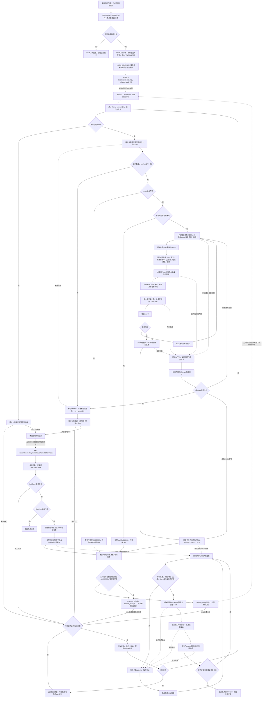

[业务逻辑专辑](/knowledge/business-logic/) / 居民收益付款 / S12

说明审核后的付款状态分片刷新、精确处理范围、三张底表的状态规则、事务与执行权、聚合放行及独立快照交接，附逐章原文对照。本文保留原文 13 章，正文连续展开，原文对照与流程源码按需展开。

**前置阅读：** [S08 · 审核回调进度任务](/knowledge/business-logic/resident-income/s08-审核回调进度任务/)

**快速阅读：** [阅读起点](#intro) · [核心调用链](#chapter-3) · [事务边界](#chapter-6) · [完整流程](#chapter-10) · [源码索引](#chapter-13)

<div class="business-logic-article">

<div id="intro"></div>

<div id="intro-heading-1"></div>

## 阅读前：先跟着一次审核通过走一遍

**下面是假设场景，仅用于理解流程，不是实际运行数据。** 一张居民收益付款单包含多个电站、多个账期的明细。现在审批通过，审核回调开始让这张付款单正式生效。原文明确的技术发起方是“审核通过回调”，并未交代最初由哪个岗位发起审批，因此这里不补写具体人员角色。

问题在于：付款单已经生效，并不代表所有相关账单都已经更新好了。页面和后续操作依赖的小单账单、合作方账单、差异台账，可能还保留着旧的付款状态。这里把这三张实际存储业务状态的表称为**底表**。原文使用“小单”作为业务称谓，本阅读版沿用它，不自行把它解释成发票或其他业务单据。

系统没有把大量账单重算全塞进审核回调。审核主流程先完成正式明细更新和 **FINALIZE（让审核主业务最终生效并落下后续工作记录的阶段）**，把需要刷新的明细范围写成若干 **shard（分片，一份有持久化记录的刷新工作）**。接着，独立的锁释放阶段先释放应释放的不合格明细占用锁。注意，这不是把所有付款占用锁都释放掉。

轮到本文的 S12 任务时，它领取一个分片，从明细范围中找出要处理的 **scope（业务范围，默认以“一个平台电站＋一个账期”为单位）**。再把多个 scope 组成 **SubBatch（子批次，一起提交或回滚的一小组范围）**，分批读取最新账单、付款结果、有效占用锁和校验事实，重算三张底表。它不是看到“审核通过”就统一改成“待付款”：如果当前真实付款结果已经发生变化，状态可能是已付款、部分付款、付款失败，也可能是无需付款或合作方未推送。

全部分片成功后，审核进度的 `refresh_ready` 才能置为 `1`，表示这一轮底表刷新已经闭环，后续操作可以通过相应门禁。正常的每个非空分片，在最后一个子批次还会受理一条**快照任务（为账单维度展示创建或更新一份专用展示记录的异步工作）**，交给独立的 S13 消费者执行。S12 完成与 S13 完成不是同一件事。

**因此，这条主线是：审核主业务生效 → 释放应释放的锁 → 分片重算三张底表 → 全分片成功后放行 → 独立完成展示快照。** S12 不调用银行或司库付款接口，不产生成功付款流水，也不再次发起审批。[E01](#evidence-e02)[E04](#evidence-e05)[E06](#evidence-e22)[E36](#evidence-e36)

<div id="intro-heading-2"></div>

### 阅读依据与证据边界

> 对应任务：`residentIncomePaymentStatusRefreshShardTask`<br /> 改写依据：附件《S12-residentIncomePaymentStatusRefreshShardTask-源码梳理.md》。保留原文第 1—13 章及各小节的对应关系。<br /> 原文分析日期：2026-09-09。原文证据级别为 **SOURCE\_VERIFIED（在当时工作区核实了源码）**。本阅读版解释这份源码梳理文档，没有重新访问 Java 仓库、连接数据库、运行任务或验证线上行为。

原文主仓库为 `/Users/wangyi/BZ/zx-monitor/zxbaif`，HEAD 为 `a1bfacbeb6dfc239d577bd66bf78cd9eb2482efa`；跨服务追踪的 `zxbaie` 中 base-center，HEAD 为 `21aac5b4821de7e7ae1bd660f896b3e890115cfc`。HEAD 可以理解为原文记录的代码提交位置，但原文同时说明工作区已有其他未提交修改，因此不能把“当前工作区”简单等同于这个提交的纯净内容。

原文以当时工作区的 Java、MyBatis XML（定义数据库映射与 SQL 的配置文件）、枚举及配置为依据，未修改业务源码。实际调度周期、线上配置、索引是否执行、实际数据量、运行结果和部署情况都未确认。下文的“源码已确认”指原文报告的源码结论，**不是本次线上验证结果**。[E01](#evidence-e38)[E40](#evidence-e40)

<details class="original">
<summary>原文对照 · 原文开篇 · 证据与核查范围</summary>

以下为附件原文，不是阅读版的补充结论。正文中的 \[E\] 编号可跳到本页源码索引。

### residentIncomePaymentStatusRefreshShardTask 源码梳理

> 分析日期：2026-09-09。证据级别：**SOURCE\_VERIFIED（当前工作区源码核实）**。
>
> 主仓库：`/Users/wangyi/BZ/zx-monitor/zxbaif`，HEAD：`a1bfacbeb6dfc239d577bd66bf78cd9eb2482efa`。跨服务追踪到 `zxbaie` 的 base-center，HEAD：`21aac5b4821de7e7ae1bd660f896b3e890115cfc`。
>
> 本文以当前工作区 Java、MyBatis XML、枚举及配置为准。未连接数据库、未运行定时任务、未验证部署；实际调度周期、线上配置、索引是否执行、实际数据量和运行结果均暂时无法确认。工作区已有其他未提交修改，本次未修改业务源码。

<details class="source-note">
<summary>查看本章原文 Markdown</summary>

```text
# residentIncomePaymentStatusRefreshShardTask 源码梳理

> 分析日期：2026-09-09。证据级别：**SOURCE_VERIFIED（当前工作区源码核实）**。
>
> 主仓库：`/Users/wangyi/BZ/zx-monitor/zxbaif`，HEAD：`a1bfacbeb6dfc239d577bd66bf78cd9eb2482efa`。跨服务追踪到 `zxbaie` 的 base-center，HEAD：`21aac5b4821de7e7ae1bd660f896b3e890115cfc`。
>
> 本文以当前工作区 Java、MyBatis XML、枚举及配置为准。未连接数据库、未运行定时任务、未验证部署；实际调度周期、线上配置、索引是否执行、实际数据量和运行结果均暂时无法确认。工作区已有其他未提交修改，本次未修改业务源码。
```

</details>

</details>

<div id="chapter-1"></div>

<div id="chapter-title-1"></div>

## 1. 任务概览

<details class="source-note">
<summary>本章小节  · 2</summary>

1. [先明确它做什么、不做什么](#chapter-1-heading-1)
2. [参数到底能控制什么](#chapter-1-heading-2)

</details>

<div id="chapter-1-heading-1"></div>

### 先明确它做什么、不做什么

这个任务是居民收益付款审核通过后，负责把底层付款状态补齐的分片消费者。这里的**最终一致刷新**，意思是审核主单和相关底表不要求在同一个大事务里同时完成，而是通过后续分片工作把状态同步起来。这个名称不代表源码已经覆盖所有故障补偿；第 9.2 节就保留了一个可能无法自行闭环的汇总窗口。

它同时承担定时补偿入口的角色：上游可以主动通知它处理，但主动通知失效、分片失败或执行者崩溃时，定时扫描仍有机会发现符合条件的工作。默认的一轮执行是“查一条、领一条、同步做完一条，再查下一条”，本方法没有自行创建并行线程池。[E01](#evidence-e02)

| 需要辨认的项目 | 原文的确切结论 | 用业务语言理解 |
| --- | --- | --- |
| XXL 注册名 | `residentIncomePaymentStatusRefreshShardTask` | 调度系统注册和调用这个任务时使用的名字；XXL-Job 是这里的定时任务调度机制。 |
| Java 入口 | `ResidentIncomePaymentStatusRefreshJob.residentIncomePaymentStatusRefreshShardTask(String param)` | 接收调度参数并转交给实际执行服务。 |
| 执行服务 | `ResidentIncomePaymentStatusRefreshShardWorkerServiceImpl.executePendingShards(Integer)` | 决定本轮尝试多少次，领取并处理候选分片。 |
| 分片工作队列 | `fi_resident_income_payment_status_refresh_shard` | 要做的工作存在这张专用表，不是把 `fi_async_task` 当成本任务的队列。 |
| 来源类型 | 只消费 `source_type='REVIEW_APPROVED'` | 只处理审核通过产生的这一类分片。 |
| 代码路由 | `S12_STATUS_REFRESH_SHARD` | 进程内主动唤醒使用的路由名；原文特别提醒，用户文档目录 S03 与这里的代码路由编号不是同一套编号。 |
| 单轮处理方式 | 每次查询、领取、同步处理一条，再查询下一条 | 一次方法调用内部串行；不等于整个部署只能同时跑一个 worker。worker 指执行分片的工作实例。 |
| 唯一生效参数 | `maxTaskCount` | 一轮扫描/处理尝试的次数上限，不是成功数量承诺。 |
| 参数默认值/上限 | 空值、0、负数都按 50；正数最大截为 200 | 传 300 实际按 200；反复命中同一失败分片也会消耗次数，所以不能理解成处理 50 个不同分片。 |
| 默认实现 | SubBatch 开启，旧单 scope worker 关闭 | 仓库 `application.yml` 也是这组配置；不据此断言线上配置相同。 |
| 主要完成信号 | shard 为 `SUCCESS`；对应 progress 为 `refresh_ready=1, phase=DONE` | progress 是这次审核回调的持久化进度记录；快照另有自己的成功状态。 |
| 职责之外 | 不付款、不生成成功付款流水、不再次审批 | 它读取付款事实后刷新状态，不创造付款事实。 |

表中结论对应 [E01](#evidence-e02)[E03](#evidence-e04)。

<div id="chapter-1-heading-2"></div>

### 参数到底能控制什么

以下普通形式有效：

```json
{"maxTaskCount":20}
```

也支持对象形式的 `data` 包装：

```json
{"data":{"maxTaskCount":20}}
```

以及字符串形式的 `data` 包装，例如：

```json
{"data":"{\"maxTaskCount\":20}"}
```

第三段只是对原文所述“字符串 data 包装”的格式示例，不是实际调度记录。入口会通过 `parseJobParam / unwrapPayload` 解析参数。**解析异常被捕获后，不会直接拒绝本轮执行，而是使用空参数，进而按默认 50 次执行。**

共用参数类虽然还有 `taskCode`、`taskCodes`、`businessKey`、`businessKeys`、`maxActivationCount`，这个入口没有读取它们。传这些字段不能定向重跑某个 shard；把格式错误的参数当成“不会执行”同样不成立。[E01](#evidence-e01)

<details class="original">
<summary>原文对照 · 第 1 章</summary>

以下为附件原文，不是阅读版的补充结论。正文中的 \[E\] 编号可跳到本页源码索引。

<div id="original-1-heading-1"></div>

### 1. 任务概览

**这是居民收益付款“审核通过后，底层付款状态最终一致刷新”的分片消费者，也是主动唤醒失效后的定时补偿入口。**

它读取审核回调创建的分片，按付款单明细主键范围找到电站账期，再依据当前账单、付款结果、占用锁及校验事实，刷新小单账单、合作方账单和差异台账。全部分片成功后，将审核进度的 `refresh_ready` 置为 `1`；每个非空分片末批还会受理一条账单维度快照异步任务。[E01](#evidence-e02)[E03](#evidence-e04)

| 项目 | 源码结论 |
| --- | --- |
| XXL 注册名 | `residentIncomePaymentStatusRefreshShardTask` |
| 入口 | `ResidentIncomePaymentStatusRefreshJob.residentIncomePaymentStatusRefreshShardTask(String param)` |
| 执行服务 | `ResidentIncomePaymentStatusRefreshShardWorkerServiceImpl.executePendingShards(Integer)` |
| 工作队列 | `fi_resident_income_payment_status_refresh_shard`；不是以 `fi_async_task` 为本任务队列 |
| 来源类型 | 只消费 `source_type='REVIEW_APPROVED'` |
| 代码内路由名 | `S12_STATUS_REFRESH_SHARD`；用户文档目录 S03 与这个代码路由编号不是同一套编号 |
| 一轮工作方式 | 每次查一条、领取一条、同步处理完一条，再查下一条；本方法没有创建并行线程池 |
| 生效参数 | 仅 `maxTaskCount`，在这里表示一轮分片扫描/处理尝试上限 |
| 默认/上限 | 空值、0、负数按 50；正数最大截为 200；并不保证处理了这么多条不同分片 |
| 默认实现 | SubBatch 开启，旧单 scope worker 关闭；仓库 `application.yml` 也是此配置 |
| 主要完成信号 | shard `SUCCESS`、对应 progress `refresh_ready=1, phase=DONE`；快照另有自己的成功状态 |
| 是否付款 | 该任务不调用银行/司库付款接口，不产生成功付款流水，也不负责再次发起审批 |

可用参数：`{"maxTaskCount":20}`，也支持 `{"data":{"maxTaskCount":20}}` 或字符串形式的 `data` 包装。解析异常被捕获后使用空参数，因而会按默认 50 执行。虽然共用参数类包含 `taskCode/taskCodes/businessKey/businessKeys/maxActivationCount`，**这个入口没有读取这些字段，不能用它们定向重跑某个 shard**。[E01](#evidence-e01)

<details class="source-note">
<summary>查看本章原文 Markdown</summary>

```text
## 1. 任务概览


**这是居民收益付款“审核通过后，底层付款状态最终一致刷新”的分片消费者，也是主动唤醒失效后的定时补偿入口。**

它读取审核回调创建的分片，按付款单明细主键范围找到电站账期，再依据当前账单、付款结果、占用锁及校验事实，刷新小单账单、合作方账单和差异台账。全部分片成功后，将审核进度的 `refresh_ready` 置为 `1`；每个非空分片末批还会受理一条账单维度快照异步任务。[E01][E02][E03][E04]

| 项目 | 源码结论 |
|---|---|
| XXL 注册名 | `residentIncomePaymentStatusRefreshShardTask` |
| 入口 | `ResidentIncomePaymentStatusRefreshJob.residentIncomePaymentStatusRefreshShardTask(String param)` |
| 执行服务 | `ResidentIncomePaymentStatusRefreshShardWorkerServiceImpl.executePendingShards(Integer)` |
| 工作队列 | `fi_resident_income_payment_status_refresh_shard`；不是以 `fi_async_task` 为本任务队列 |
| 来源类型 | 只消费 `source_type='REVIEW_APPROVED'` |
| 代码内路由名 | `S12_STATUS_REFRESH_SHARD`；用户文档目录 S03 与这个代码路由编号不是同一套编号 |
| 一轮工作方式 | 每次查一条、领取一条、同步处理完一条，再查下一条；本方法没有创建并行线程池 |
| 生效参数 | 仅 `maxTaskCount`，在这里表示一轮分片扫描/处理尝试上限 |
| 默认/上限 | 空值、0、负数按 50；正数最大截为 200；并不保证处理了这么多条不同分片 |
| 默认实现 | SubBatch 开启，旧单 scope worker 关闭；仓库 `application.yml` 也是此配置 |
| 主要完成信号 | shard `SUCCESS`、对应 progress `refresh_ready=1, phase=DONE`；快照另有自己的成功状态 |
| 是否付款 | 该任务不调用银行/司库付款接口，不产生成功付款流水，也不负责再次发起审批 |

可用参数：`{"maxTaskCount":20}`，也支持 `{"data":{"maxTaskCount":20}}` 或字符串形式的 `data` 包装。解析异常被捕获后使用空参数，因而会按默认 50 执行。虽然共用参数类包含 `taskCode/taskCodes/businessKey/businessKeys/maxActivationCount`，**这个入口没有读取这些字段，不能用它们定向重跑某个 shard**。[E01]
```

</details>

</details>

<div id="chapter-2"></div>

<div id="chapter-title-2"></div>

## 2. 业务目的

<details class="source-note">
<summary>本章小节  · 3</summary>

1. [2.1 解决“审核已生效，账单展示与后续操作尚未同步”的窗口](#chapter-2-heading-1)
2. [2.2 为什么 refresh\_ready 不能省略](#chapter-2-heading-2)
3. [2.3 刷新的是当前事实，不是机械改成“待付款”](#chapter-2-heading-3)

</details>

<div id="chapter-2-heading-1"></div>

### 2.1 解决“审核已生效，账单展示与后续操作尚未同步”的窗口

审核通过首先要更新付款单和正式明细，并释放应释放的账单占用锁。随后，相关电站和账期还要重新查金额、读远程配置、更新三张底表。如果都在审核回调里同步做，原文指出会让回调事务变长，失败后也难以从中间恢复。

当前代码把工作拆成五个阶段，顺序不能颠倒：

| 顺序 | 这一阶段做什么 | 做完后还剩什么 |
| --- | --- | --- |
| 1 | 审核主流程完成正式明细更新与 FINALIZE，生成持久化刷新分片。 | 分片已经落库，但还不能跳过锁释放直接刷新。 |
| 2 | 独立阶段释放不合格明细中应释放的占用锁。 | 底表付款状态仍需按当前事实重算。 |
| 3 | S12 按分片重算并写回底表。 | 只有部分分片成功时，不能提前宣布整次刷新完成。 |
| 4 | 所有分片成功后，关闭“状态仍在刷新”的窗口。 | 展示快照不因此自动完成。 |
| 5 | 独立快照消费者创建或更新付款结果账单维度展示数据。 | 以快照任务自己的状态判断这部分是否结束。 |

这里的**账单占用锁**是一项业务占用事实，用来表示账单正被审核或待付款流程占用；不要把它与数据库行锁、后文用于并发互斥的 guard（互斥控制记录）混成同一件事。

“锁释放完成”的确切含义是：上游要求释放的那批不合格明细占用锁已处理完。**仍有效的待付款占用锁可以继续存在，并继续参与 S12 的付款状态判断。**[E05](#evidence-e06)[E12](#evidence-e12)

<div id="chapter-2-heading-2"></div>

### 2.2 为什么 `refresh_ready` 不能省略

假设主单已经生效，而部分底表还是旧状态。这时立即处理新付款结果、提交新选单或重推账单，就可能跨过这个尚未同步好的中间窗口。

`ResidentIncomePaymentReviewCallbackVisibilityGateServiceImpl` 承担\*\*门禁（业务操作开始前判断是否允许继续）\*\*的职责：**进度存在 AND `refresh_ready!=1`** 时，返回阻断信息。原文追踪到的实际使用方包括付款结果处理、选单提交、小单变更、合作方账单重推。这里必须保留“进度存在”这一适用前提，不能改写为所有场景都无条件只查一个字段。[E24](#evidence-e25)

付款单查询也会展示对应提示：正常刷新期间是“付款单已生效，底层状态刷新中”；发现失败分片时变成“等待后台重试或人工处理”。

所以 S12 卡住不只是“页面暂时不更新”。它还可能使后续业务操作持续无法通过门禁。第 9.2 节的“分片全成功，但进度未聚合完成”尤其需要按这个后果理解。[E25](#evidence-e25)

<div id="chapter-2-heading-3"></div>

### 2.3 刷新的是当前事实，不是机械改成“待付款”

审核通过只是产生这次刷新的原因。真正决定写什么状态时，系统会重新读取当前有效付款单、真实付款结果和最新合作方拟付金额。

\*\*假设示例：\*\*某范围进入分片队列时尚未付款，但执行刷新前已经导入了真实成功付款结果，那么刷新应当按执行时的事实判断，而不能只因为任务来自审核通过就强制写“待付款”。反过来，当前存在有效占用锁，也可能让状态先命中审核中或待付款分支。

最终状态可能是待付款、已付款、部分付款、付款失败、无需付款、合作方未推送；还要同步校核及不合格信息。具体条件与优先级以第 5.2 节为准，不能只根据这些状态名称自行补规则。[E10](#evidence-e11)

<details class="original">
<summary>原文对照 · 第 2 章</summary>

以下为附件原文，不是阅读版的补充结论。正文中的 \[E\] 编号可跳到本页源码索引。

<div id="original-2-heading-1"></div>

### 2. 业务目的

<div id="original-2-heading-2"></div>

#### 2.1 解决“审核已生效，账单展示与后续操作尚未同步”的窗口

审核通过需要先更新付款单及正式明细，再释放应释放的账单占用锁。如果在审核回调内同步遍历大量站月、查询金额和远程配置、回写三张底表，回调事务会变长，失败后也难以从中间恢复。因此当前代码将流程拆为：

1. 审核主流程完成正式明细更新与 FINALIZE，生成持久化刷新分片。
2. 独立阶段完成不合格明细的占用锁释放。
3. 本任务分片重算并写回底表状态。
4. 所有分片成功后，关闭“状态仍在刷新”的窗口。
5. 独立快照消费者完成付款结果账单维度展示数据的创建或更新。

**锁释放完成不是“所有付款锁均释放”。** 上游阶段针对应释放的不合格明细占用锁；仍有效的待付款占用锁会参与本任务的状态判定。[E05](#evidence-e06)[E12](#evidence-e12)

<div id="original-2-heading-3"></div>

#### 2.2 为什么 `refresh_ready` 不能省略

`ResidentIncomePaymentReviewCallbackVisibilityGateServiceImpl` 在进度存在且 `refresh_ready!=1` 时返回阻断信息。付款结果处理、选单提交、小单变更、合作方账单重推等实际调用处使用该门禁，避免新操作跨过“主单已生效、底表未刷新”的中间状态。[E24](#evidence-e25)

付款单查询还会展示“付款单已生效，底层状态刷新中”，发现失败分片时改为“等待后台重试或人工处理”。因此本任务卡住的影响不仅是页面状态旧，还可能使后续业务操作持续被阻断。[E25](#evidence-e25)

<div id="original-2-heading-4"></div>

#### 2.3 刷新的是当前事实，不是机械改成“待付款”

审核通过是任务产生原因，不是唯一决策依据。执行时会重新读取当前有效付款单、真实付款结果和最新合作方拟付金额。因此结果可能是待付款、已付款、部分付款、付款失败、无需付款、合作方未推送等，并同步校核及不合格信息。[E10](#evidence-e11)

<details class="source-note">
<summary>查看本章原文 Markdown</summary>

```text
## 2. 业务目的


### 2.1 解决“审核已生效，账单展示与后续操作尚未同步”的窗口

审核通过需要先更新付款单及正式明细，再释放应释放的账单占用锁。如果在审核回调内同步遍历大量站月、查询金额和远程配置、回写三张底表，回调事务会变长，失败后也难以从中间恢复。因此当前代码将流程拆为：

1. 审核主流程完成正式明细更新与 FINALIZE，生成持久化刷新分片。
2. 独立阶段完成不合格明细的占用锁释放。
3. 本任务分片重算并写回底表状态。
4. 所有分片成功后，关闭“状态仍在刷新”的窗口。
5. 独立快照消费者完成付款结果账单维度展示数据的创建或更新。

**锁释放完成不是“所有付款锁均释放”。** 上游阶段针对应释放的不合格明细占用锁；仍有效的待付款占用锁会参与本任务的状态判定。[E05][E06][E12]

### 2.2 为什么 `refresh_ready` 不能省略

`ResidentIncomePaymentReviewCallbackVisibilityGateServiceImpl` 在进度存在且 `refresh_ready!=1` 时返回阻断信息。付款结果处理、选单提交、小单变更、合作方账单重推等实际调用处使用该门禁，避免新操作跨过“主单已生效、底表未刷新”的中间状态。[E24][E25]

付款单查询还会展示“付款单已生效，底层状态刷新中”，发现失败分片时改为“等待后台重试或人工处理”。因此本任务卡住的影响不仅是页面状态旧，还可能使后续业务操作持续被阻断。[E25]

### 2.3 刷新的是当前事实，不是机械改成“待付款”

审核通过是任务产生原因，不是唯一决策依据。执行时会重新读取当前有效付款单、真实付款结果和最新合作方拟付金额。因此结果可能是待付款、已付款、部分付款、付款失败、无需付款、合作方未推送等，并同步校核及不合格信息。[E10][E11]
```

</details>

</details>

<div id="chapter-3"></div>

<div id="chapter-title-3"></div>

## 3. 核心调用链

<details class="source-note">
<summary>本章小节  · 3</summary>

1. [3.1 上游：分片从哪里产生](#chapter-3-heading-1)
2. [3.2 本任务默认执行链](#chapter-3-heading-2)
3. [3.3 三个处理粒度](#chapter-3-heading-3)

</details>

<div id="chapter-3-heading-1"></div>

### 3.1 上游：分片从哪里产生

先理解分片为什么可靠存在：上游不是只发一个“稍后刷新”的内存消息，而是在审核 FINALIZE 流程中写入分片记录。\*\*seed（种子记录）\*\*就是这里预先落库、供消费者以后领取的工作记录。

生成计划时，系统按正式明细 ID 向后翻页，每批最多 1000 条，再把这一批的最小和最大 ID 记成一个**闭区间（起点和终点都包含）**。随后，FINALIZE 事务校验审核身份和完成数量，让审核主业务生效，并插入这些分片。[E05](#evidence-e06)[E07](#evidence-e07)

```text
审核通过回调的正式明细更新完成
  → ResidentIncomePaymentReviewCallbackFinalizeServiceImpl.executeFinalize
    → buildReviewApprovedShardSeedPlan(progress, 1000)
      → queryNextStatusRefreshShardBoundary
      → 用明细 ID 游标切分闭区间
    → doFinalizeTransaction
      → 校验 progress owner、付款单版本、审批实例、明细处理数量
      → 更新审核生效主单/审批实例/日志
      → insertShardSeedBatch → INSERT IGNORE 刷新分片
      → 实际 shard 数量必须等于生成计划数量
      → 写后续副作用 seed
      → progress.main_task_status=SUCCESS，进入 LOCK_RELEASE
      → 回调主异步任务成功
  → 独立 LOCK_RELEASE 阶段完成
    → progress.phase=REFRESH_SHARD
    → 尝试主动唤醒 S12 分片
```

其中，\*\*owner（当前持有执行权的实例身份）\*\*用于防止不是本次执行者的代码继续推进进度；**游标**是在顺序处理时记录“已经走到哪里”的位置。这里生成明细范围的 ID 游标，与后文按 scope 数量推进的处理游标不是同一个计量单位。

`INSERT IGNORE` 是插入时对重复约束冲突使用忽略处理的写法，但这里并非“插入不报错就算完成”：插入后还必须核对实际 shard 数量与生成计划数量相等。唯一键与线上 DDL 是否已执行的边界见第 8.4 节。[E05](#evidence-e06)[E38](#evidence-e38)

每个 seed 记录下列身份和范围，后续不能只认付款单 ID 而丢掉审核版本信息：

| seed 内容 | 含义 |
| --- | --- |
| `source_id=review progress.id` | 指向产生它的审核进度。 |
| 付款单 | 指明它属于哪张付款单。 |
| `data_version` | 付款单数据版本。 |
| `submit_round` | 提交轮次。 |
| `approval_attempt` | 审批尝试身份。 |
| `review_plan_id` | 审核计划身份。 |
| 明细起止 ID | 本分片覆盖的正式明细闭区间。 |

初始状态为 `PENDING`，`running_attempt=0`，处理游标、成功计数和失败计数均为 0。\*\*一个付款单版本完全没有明细时，seed 生成直接抛异常；不能把“无明细”当作正常 FINALIZE 成功。\*\*这与“后来重建 scope 后为空”的情况不同，后者见第 8.5 节。[E05](#evidence-e06)[E07](#evidence-e07)

<div id="chapter-3-heading-2"></div>

### 3.2 本任务默认执行链

进入 S12 后，可以把默认执行过程理解为六步：找候选、取得执行权、重建业务范围、分子批次刷新、标记分片完成、汇总父进度。候选只是“看起来可以做”，只有领取成功才真正获得处理资格。

\*\*claim（原子领取）\*\*是用带条件的数据库更新争取执行权；\*\*lease（租约）\*\*是这个执行权的有效期限；`running_attempt` 是本分片被领取的尝试编号，用于区分新旧执行者。**scope 合同**不是业务合同，而是冻结本次遍历规则的数量、摘要、版本、子批大小信息，保证断点恢复仍在同一份范围上进行。

\*\*guard（互斥控制记录）\*\*用于防止同站月或同账户范围被不兼容地同时刷新。\*\*DML（数据写入语句）\*\*在本链路主要就是三张底表的更新。\*\*CAS（比较后更新）\*\*表示推进游标时还要核对旧状态、旧游标或持有身份，不是无条件覆盖。

下面保留真实方法名，方便理解后回到源码定位：[E02](#evidence-e08)[E09](#evidence-e10)

```text
ResidentIncomePaymentStatusRefreshJob.residentIncomePaymentStatusRefreshShardTask
  → parseJobParam / unwrapPayload
  → ShardWorker.executePendingShards(maxTaskCount)
    → executePendingBatchShards
      → queryNextClaimableReviewApprovedBatchShard：查询一条可执行候选
      → claimBatchShard
        → claimReviewApprovedBatchShard：原子领取并增加 running_attempt
        → queryById：回读确认实际 owner
      → executeClaimedBatchShard
        → queryStatusRefreshShardScopeList：由明细范围重建 scope
        → normalizeScopeList / normalizeV4ScopeList
        → 计算并校验 scope 数量、hash、构建版本及子批大小
        → 从 processed_scope_count 开始循环子批次
          → BatchScopeRefreshTransactionService.refreshSubBatch [REQUIRES_NEW]
            → 锁住 RUNNING shard，验证 owner、attempt、旧游标及有效租约
            → 续租；首次初始化 scope 合同
            → 领取站月 scope guard 和账户 guard
            → StatusRefreshService.buildStatusRefreshBatchDmlItems
              → loadBatchRefreshData：批量加载第 4.5 节逐项列出的账单、付款、锁、账户及其他事实
              → buildPureRefreshDecision → StatusDecisionService.decide
            → StatusBatchRepository.updateBottomTables
              → 更新小单账单
              → 更新合作方账单
              → 更新差异台账
            → 释放账户 guard、scope guard
            → 若末批：submitLockedShard → 受理快照 fi_async_task
            → CAS 推进游标；末批同时将 shard 标记 SUCCESS
      → aggregateProgressRefreshReady
        → 统计成功/失败分片
        → 再以数据库真实 shard 集合校验是否全部成功
        → 符合条件时 progress.refresh_ready=1, phase=DONE
    → 返回 selected/success/failed/skipped 摘要
  → 将 Result 状态转为 XXL ReturnT
```

`hash` 是范围的摘要，后文会说明它究竟包含哪些字段，不能只看到“有 hash”就认为所有业务事实都已冻结。`REQUIRES_NEW` 表示每次子批刷新使用独立事务，该批成功就提交，该批失败就回滚；它不把整张付款单的所有分片包在一个事务里。

还要避免按类名误读：`ResidentIncomePaymentStatusBatchDecisionBuilder` 的实现就是 `ResidentIncomePaymentStatusRefreshServiceImpl`，不是另一套独立的批量状态规则。本文调用的是 `buildStatusRefreshBatchDmlItems`。同一个大类里的普通 `refresh()` 可能还有其他副作用，不能把那些副作用全部搬到这条调用链上。[E02](#evidence-e08)[E09](#evidence-e10)

<div id="chapter-3-heading-3"></div>

### 3.3 三个处理粒度

| 粒度 | 业务上是什么 | 数量限制/恢复边界 |
| --- | --- | --- |
| shard | 一个付款单版本中，最多 1000 条正式明细构成的 ID 闭区间。 | 在分片层领取、维护租约和尝试次数，并记录成功/失败状态。 |
| scope | 默认 V3（scope 构建规则的版本标识）为“平台电站 ID＋账期”，同时携带账户、合作方、差异及账单定位字段。 | 是一次状态重算的业务范围，不等于一行数据库记录。 |
| SubBatch | 一组在归一化顺序中连续的 scope。 | 默认 100，最大 200；每组独立事务，底表写入和游标一起提交或回滚。 |

\*\*假设示例：\*\*某个分片重建后得到 230 个 scope，默认会拆成 `100 + 100 + 30` 三次事务。第一批 100 个提交成功，第二批整体失败，第一批不会被撤销；第二批先回滚，再从该批起点进入单 scope 定位重试。这个例子不是实际批次数量或运行结果。[E02](#evidence-e06)[E08](#evidence-e08)

务必把三个数字分开：\*\*一轮默认尝试 50 次、每个 shard 最多覆盖 1000 条正式明细、每个 SubBatch 默认处理 100 个 scope。\*\*它们分别限制调度尝试、明细切片和事务大小，不能直接相乘后当成“本轮保证处理多少业务记录”。

<details class="original">
<summary>原文对照 · 第 3 章</summary>

以下为附件原文，不是阅读版的补充结论。正文中的 \[E\] 编号可跳到本页源码索引。

<div id="original-3-heading-1"></div>

### 3. 核心调用链

<div id="original-3-heading-2"></div>

#### 3.1 上游：分片从哪里产生

```text
审核通过回调的正式明细更新完成
  → ResidentIncomePaymentReviewCallbackFinalizeServiceImpl.executeFinalize
    → buildReviewApprovedShardSeedPlan(progress, 1000)
      → queryNextStatusRefreshShardBoundary
      → 用明细 ID 游标切分闭区间
    → doFinalizeTransaction
      → 校验 progress owner、付款单版本、审批实例、明细处理数量
      → 更新审核生效主单/审批实例/日志
      → insertShardSeedBatch → INSERT IGNORE 刷新分片
      → 实际 shard 数量必须等于生成计划数量
      → 写后续副作用 seed
      → progress.main_task_status=SUCCESS，进入 LOCK_RELEASE
      → 回调主异步任务成功
  → 独立 LOCK_RELEASE 阶段完成
    → progress.phase=REFRESH_SHARD
    → 尝试主动唤醒 S12 分片
```

每个 seed 保存 `source_id=review progress.id`，以及付款单、`data_version`、`submit_round`、`approval_attempt`、`review_plan_id` 和明细起止 ID。初始为 `PENDING`，`running_attempt=0`，游标和成功/失败计数为 0。若一个付款单版本没有任何明细，seed 生成直接抛异常；不能将“无明细”当正常 FINALIZE 成功。[E05](#evidence-e06)[E07](#evidence-e07)

<div id="original-3-heading-3"></div>

#### 3.2 本任务默认执行链

```text
ResidentIncomePaymentStatusRefreshJob.residentIncomePaymentStatusRefreshShardTask
  → parseJobParam / unwrapPayload
  → ShardWorker.executePendingShards(maxTaskCount)
    → executePendingBatchShards
      → queryNextClaimableReviewApprovedBatchShard：查询一条可执行候选
      → claimBatchShard
        → claimReviewApprovedBatchShard：原子领取并增加 running_attempt
        → queryById：回读确认实际 owner
      → executeClaimedBatchShard
        → queryStatusRefreshShardScopeList：由明细范围重建 scope
        → normalizeScopeList / normalizeV4ScopeList
        → 计算并校验 scope 数量、hash、构建版本及子批大小
        → 从 processed_scope_count 开始循环子批次
          → BatchScopeRefreshTransactionService.refreshSubBatch [REQUIRES_NEW]
            → 锁住 RUNNING shard，验证 owner、attempt、旧游标及有效租约
            → 续租；首次初始化 scope 合同
            → 领取站月 scope guard 和账户 guard
            → StatusRefreshService.buildStatusRefreshBatchDmlItems
              → loadBatchRefreshData：批量查询账单、付款、锁、账户等事实
              → buildPureRefreshDecision → StatusDecisionService.decide
            → StatusBatchRepository.updateBottomTables
              → 更新小单账单
              → 更新合作方账单
              → 更新差异台账
            → 释放账户 guard、scope guard
            → 若末批：submitLockedShard → 受理快照 fi_async_task
            → CAS 推进游标；末批同时将 shard 标记 SUCCESS
      → aggregateProgressRefreshReady
        → 统计成功/失败分片
        → 再以数据库真实 shard 集合校验是否全部成功
        → 符合条件时 progress.refresh_ready=1, phase=DONE
    → 返回 selected/success/failed/skipped 摘要
  → 将 Result 状态转为 XXL ReturnT
```

接口名 `ResidentIncomePaymentStatusBatchDecisionBuilder` 的实现就是 `ResidentIncomePaymentStatusRefreshServiceImpl`，没有另一套独立的批量状态规则。这里走的是 `buildStatusRefreshBatchDmlItems`，不能把同一个大类中普通 `refresh()` 的全部副作用照搬到本链路。[E02](#evidence-e08)[E09](#evidence-e10)

<div id="original-3-heading-4"></div>

#### 3.3 三个处理粒度

| 粒度 | 含义 | 恢复边界 |
| --- | --- | --- |
| shard | 一个付款单版本内，最多 1000 条正式明细对应的 ID 闭区间 | 领取、租约、尝试次数、成功/失败状态 |
| scope | 默认 V3 为“平台电站 ID + 账期”；携带账户、合作方、差异/账单定位字段 | 状态重算的业务范围，不等于一行数据库记录 |
| SubBatch | 一组连续 scope，默认 100，最大 200 | 独立事务；底表写入与游标一起提交/回滚 |

例如范围归一化后有 230 个 scope，默认分为 `100 + 100 + 30` 三次事务。前 100 个成功后第二批失败，第一批保持已提交；第二批回滚并进入单 scope 定位重试。**一轮 50 个 shard、每 shard 1000 条明细、每子批 100 个 scope 是三个不同的限制。**[E02](#evidence-e06)[E08](#evidence-e08)

<details class="source-note">
<summary>查看本章原文 Markdown</summary>

````text
## 3. 核心调用链


### 3.1 上游：分片从哪里产生

```text
审核通过回调的正式明细更新完成
  → ResidentIncomePaymentReviewCallbackFinalizeServiceImpl.executeFinalize
    → buildReviewApprovedShardSeedPlan(progress, 1000)
      → queryNextStatusRefreshShardBoundary
      → 用明细 ID 游标切分闭区间
    → doFinalizeTransaction
      → 校验 progress owner、付款单版本、审批实例、明细处理数量
      → 更新审核生效主单/审批实例/日志
      → insertShardSeedBatch → INSERT IGNORE 刷新分片
      → 实际 shard 数量必须等于生成计划数量
      → 写后续副作用 seed
      → progress.main_task_status=SUCCESS，进入 LOCK_RELEASE
      → 回调主异步任务成功
  → 独立 LOCK_RELEASE 阶段完成
    → progress.phase=REFRESH_SHARD
    → 尝试主动唤醒 S12 分片
```

每个 seed 保存 `source_id=review progress.id`，以及付款单、`data_version`、`submit_round`、`approval_attempt`、`review_plan_id` 和明细起止 ID。初始为 `PENDING`，`running_attempt=0`，游标和成功/失败计数为 0。若一个付款单版本没有任何明细，seed 生成直接抛异常；不能将“无明细”当正常 FINALIZE 成功。[E05][E06][E07]

### 3.2 本任务默认执行链

```text
ResidentIncomePaymentStatusRefreshJob.residentIncomePaymentStatusRefreshShardTask
  → parseJobParam / unwrapPayload
  → ShardWorker.executePendingShards(maxTaskCount)
    → executePendingBatchShards
      → queryNextClaimableReviewApprovedBatchShard：查询一条可执行候选
      → claimBatchShard
        → claimReviewApprovedBatchShard：原子领取并增加 running_attempt
        → queryById：回读确认实际 owner
      → executeClaimedBatchShard
        → queryStatusRefreshShardScopeList：由明细范围重建 scope
        → normalizeScopeList / normalizeV4ScopeList
        → 计算并校验 scope 数量、hash、构建版本及子批大小
        → 从 processed_scope_count 开始循环子批次
          → BatchScopeRefreshTransactionService.refreshSubBatch [REQUIRES_NEW]
            → 锁住 RUNNING shard，验证 owner、attempt、旧游标及有效租约
            → 续租；首次初始化 scope 合同
            → 领取站月 scope guard 和账户 guard
            → StatusRefreshService.buildStatusRefreshBatchDmlItems
              → loadBatchRefreshData：批量查询账单、付款、锁、账户等事实
              → buildPureRefreshDecision → StatusDecisionService.decide
            → StatusBatchRepository.updateBottomTables
              → 更新小单账单
              → 更新合作方账单
              → 更新差异台账
            → 释放账户 guard、scope guard
            → 若末批：submitLockedShard → 受理快照 fi_async_task
            → CAS 推进游标；末批同时将 shard 标记 SUCCESS
      → aggregateProgressRefreshReady
        → 统计成功/失败分片
        → 再以数据库真实 shard 集合校验是否全部成功
        → 符合条件时 progress.refresh_ready=1, phase=DONE
    → 返回 selected/success/failed/skipped 摘要
  → 将 Result 状态转为 XXL ReturnT
```

接口名 `ResidentIncomePaymentStatusBatchDecisionBuilder` 的实现就是 `ResidentIncomePaymentStatusRefreshServiceImpl`，没有另一套独立的批量状态规则。这里走的是 `buildStatusRefreshBatchDmlItems`，不能把同一个大类中普通 `refresh()` 的全部副作用照搬到本链路。[E02][E08][E09][E10]

### 3.3 三个处理粒度

| 粒度 | 含义 | 恢复边界 |
|---|---|---|
| shard | 一个付款单版本内，最多 1000 条正式明细对应的 ID 闭区间 | 领取、租约、尝试次数、成功/失败状态 |
| scope | 默认 V3 为“平台电站 ID + 账期”；携带账户、合作方、差异/账单定位字段 | 状态重算的业务范围，不等于一行数据库记录 |
| SubBatch | 一组连续 scope，默认 100，最大 200 | 独立事务；底表写入与游标一起提交/回滚 |

例如范围归一化后有 230 个 scope，默认分为 `100 + 100 + 30` 三次事务。前 100 个成功后第二批失败，第一批保持已提交；第二批回滚并进入单 scope 定位重试。**一轮 50 个 shard、每 shard 1000 条明细、每子批 100 个 scope 是三个不同的限制。**[E02][E06][E08]
````

</details>

</details>

<div id="chapter-4"></div>

<div id="chapter-title-4"></div>

## 4. 数据筛选规则

<details class="source-note">
<summary>本章小节  · 5</summary>

1. [4.1 查询下一条 shard 的完整门槛](#chapter-4-heading-1)
2. [4.2 如何防止查到候选后被其他 worker 抢走](#chapter-4-heading-4)
3. [4.3 明细分片边界查询](#chapter-4-heading-5)
4. [4.4 执行时重新构建 scope](#chapter-4-heading-6)
5. [4.5 每批加载哪些业务事实](#chapter-4-heading-8)

</details>

<div id="chapter-4-heading-1"></div>

### 4.1 查询下一条 shard 的完整门槛

不是分片表里有记录就会执行。系统要先确认审核主业务已经完成、该释放的锁已经释放、分片本身允许领取，而且当前运行额度还有空位。

`queryNextClaimableReviewApprovedBatchShard` 会联合查看分片、审核进度和运行配额。**下表各行之间是 AND，必须同时满足；只有“分片状态”这一行内部包含 OR。**[E03](#evidence-e03)

| 检查对象 | 完整条件 | 实际含义 |
| --- | --- | --- |
| 分片有效性与来源 | `s.deleted=0` AND `source_type='REVIEW_APPROVED'` | 仅有效的审核通过刷新分片。 |
| 来源进度 | `p.id=s.source_id` AND `p.deleted=0` | 关联的审核进度必须存在且有效。 |
| 审核主阶段 | `p.main_task_status='SUCCESS'` | 审核主业务已提交成功。 |
| 当前阶段 | `p.phase='REFRESH_SHARD'` | 不能越过正式明细处理、FINALIZE 和锁释放阶段。 |
| 锁释放数量 | `coalesce(lock_release_success,0)=coalesce(lock_release_total,0)` | 需要释放的锁已经全部完成；`coalesce(...,0)` 是把 null 当作 0 比较。 |
| 分片状态 | `PENDING` OR `FAILED` OR（`RUNNING` AND 租约已到期） | 新待办、失败补偿和超时接管都可以候选；租约未到期的 RUNNING 不在其中。 |
| 范围构建版本 | `scope_builder_version IS NULL` OR 等于当前配置解析出的版本 | 尚未初始化合同，或者已初始化合同与当前 worker 兼容。 |
| 审核分片额度 | 未过期的 RUNNING 审核分片数 `< reviewConcurrency` | 是严格小于，不是小于等于。 |
| 总额度 | 上述审核分片数＋最近有效 RUNNING 普通刷新任务数 `< totalConcurrency` | 审核分片和普通付款状态刷新共享总额度。 |

全部条件满足后，按 `s.update_time ASC, s.id ASC LIMIT 1` 取一条：先选较早更新的候选，更新时间相同时再按 ID 升序。

计入“普通运行任务”的记录来自 `fi_async_task`，其条件也需要同时成立：`deleted=0`、`task_type='RESIDENT_INCOME_PAYMENT_STATUS_REFRESH'`、`task_status=1`，以及 `coalesce(update_time,create_time)>now-普通运行超时时间`。普通运行超时默认 30 分钟，这里比较的是严格的 `>`。[E03](#evidence-e03)

<div id="chapter-4-heading-2"></div>

#### 配额有一个容易被名字误导的细节

本 worker 的 Java 默认值为：`reviewConcurrency=4`、`genericConcurrency=1`、`totalConcurrency=5`。但审核消费者 SQL 实际检查的是**审核分片额度 AND 总额度**，没有独立检查 `generic_running < genericConcurrency`。

`genericConcurrency` 还参与总额度配置归一化。若配置的总额度小于“审核额度＋普通额度”，代码会回退到**固定默认值 5**，而不是自动取两者之和。

\*\*假设配置示例，仅用于说明分支：\*\*参与这一步比较的审核额度为 6、普通额度为 2、总额度为 7，因为 `7 < 6+2`，按原文描述会回退为 5，不是补成 8。这个例子不表示真实环境采用了这些配置。部署中的实际值尚未确认。[E02](#evidence-e02)

<div id="chapter-4-heading-3"></div>

#### 以下条件没有出现在候选 SQL 中

| 看起来可能会有的限制 | 本入口的实际情况 |
| --- | --- |
| `next_retry_time <= now`；`retry_count < 上限` | 都没有，不能据此假定存在退避或最大重试次数。 |
| `refresh_ready=0`；某个 `phase_status`；`review_passed=1` | 没有单独检查；这里依赖前面列出的上游阶段事实。注意，这与最后聚合时的门槛不同。 |
| 指定用户、合作方、付款单号或 `taskCode` | 没有这些人工定向筛选。 |
| 只刷新“未付款账单” | 没有底表付款状态的这种过滤条件。 |

因此，“没有候选”既可能是没工作，也可能只是上游阶段、配额或版本不满足；“有失败任务”也不等于要等到下次调度才重试。[E03](#evidence-e03)

<div id="chapter-4-heading-4"></div>

### 4.2 如何防止查到候选后被其他 worker 抢走

两个执行者可能同时查到同一个候选，所以查询结果只是线索，不是执行许可证。接下来的 claim UPDATE 会重新校验上游进度、配额、版本和可执行状态，符合条件才更新领取信息。[E02](#evidence-e03)

| 领取时改变的字段 | 作用 |
| --- | --- |
| `task_status=RUNNING` | 分片进入运行状态。 |
| `worker_id=RIPRC:REFRESH_SHARD:<随机值>` | 记录这次领取的执行者身份。 |
| `running_attempt=coalesce(running_attempt,0)+1` | 产生新的尝试编号。 |
| 新的 `lease_expire_time`、`heartbeat_time`、`start_time` | 更新租约到期时间、心跳时间和本次开始时间；心跳表示执行者最近维护运行状态的时间。 |
| 清空错误和 `finish_time` | 不沿用上次结束状态作为本次结果。 |
| 清零 `failed_scope_count` | 本次失败范围计数重新开始。 |
| 保留 `processed_scope_count` 和已初始化合同 | 正常重试从已提交断点继续，不把已经成功的范围无条件清零重做。 |

claim 成功后，还要用 `queryById` 回读，确认实际 owner 确实是自己，才继续处理。接管超时 RUNNING 分片时，还会比较旧 `running_attempt`。

每个子批次开始时，会再次锁住 shard 行，校验 owner、attempt、旧游标和租约。这些检查共同防止旧执行者在被接管后继续提交。它们不是“查到后先做业务，最后再随便写一个成功状态”。[E02](#evidence-e03)[E08](#evidence-e08)

<div id="chapter-4-heading-5"></div>

### 4.3 明细分片边界查询

seed 阶段从 `fi_resident_income_payment_order_bill` 取正式明细，条件与顺序如下：[E06](#evidence-e07)

```sql
payment_order_id = 当前付款单
AND data_version = 当前审核版本
AND deleted = 0
AND id > 上一批最大明细ID
ORDER BY id ASC
LIMIT 1000
```

每批用最小、最大明细 ID 组成闭区间。下一批查询用 `id > 上一批最大明细ID`，所以翻页处不重复包含上一批最后一条；执行时使用闭区间，又能包含本批两个端点。这两个边界不能混淆。

这里**没有按 `line_type` 过滤**，待付款正式明细和不合格正式明细都可以贡献刷新范围。也就是说，刷新范围不是“只从合格待付款明细里挑出来”。

初始 `scope_count` 记录的是这一批有效站月的去重数量。执行 SubBatch 时，首次初始化 scope 合同还会写入实际归一化后的 scope 数量；不能把 seed 阶段计数直接当成最终执行范围合同。[E06](#evidence-e07)

<div id="chapter-4-heading-6"></div>

### 4.4 执行时重新构建 scope

消费者不是完全照搬 seed 时缓存的一张业务清单，而是按 seed 保存的付款单、版本和 ID 范围重新查正式明细。

`queryStatusRefreshShardScopeList` 的查询约束为：同一 `payment_order_id + data_version`，`deleted=0`，并且 `start_order_bill_id <= id <= end_order_bill_id`。还要求 `station_id` 非空，`bill_yearmonth` 非空且匹配六位数字正则。六位数字格式要求与后续归一化的合法年月过滤是两层处理，不能只凭正则就宣称所有值都已是有效月份。[E07](#evidence-e13)

账户补充采用 **LEFT JOIN（左连接，右侧关联不命中时仍保留左侧明细）**：连接小单账户、合作方账户，优先使用明细自带的 `small_station_id/partner_org_id`，缺失时依次回退到账户字段。查询还返回 `diff_id`、`partner_bill_id`、`partner_customer_account_id`、`small_station_no`、`source_financial_version` 这些定位信息。

SQL 按原文所述的站月、账户及定位字段组合分组，并按最早明细 ID 排序；Java 随后按所选版本进一步归一化，得到稳定顺序。**两个账户 LEFT JOIN 没有额外写账户 `deleted` 条件**，不能因为其他表通常检查软删除，就擅自给这两个连接补上同样的过滤。[E07](#evidence-e13)

<div id="chapter-4-heading-7"></div>

#### V3 与 V4 冻结的“范围身份”不相同

\*\*locator（精确定位信息）\*\*是 `diffId/partnerBillId/partnerCustomerAccountId` 这类指向具体差异或账单记录的标识。它与“站月范围”相关，但不等同；知道一个站月，不一定就已经唯一认定了哪一行账单。

**SHA-256 摘要**在这里相当于给一份排序后的范围清单生成指纹，以便恢复时检查清单是否改变。但指纹只覆盖参与生成的字段，不会自动保护未加入的账户、定位或金额事实。

| 对照项 | 默认 V3 | V4 |
| --- | --- | --- |
| 使用前提 | 仓库默认采用 V3 scope/V1 账户 guard 路线。 | 实际配置解析结果必须同时为 `scopeRoute=V4` AND `accountGuardRoute=V2`；解析还受迁移总入口约束。不是随便设置一个字段就生效。 |
| 范围冲突检查 | 同站月出现不同 `smallStationId\|partnerOrgId`，立即报错。 | 严格要求平台站和合作方，拒绝同站月多合作方。 |
| 归一化 | 按站月去重、排序；非法或空年月经归一化后可被过滤。 | 保留 locator，并建立对应的稳定范围。 |
| hash 覆盖内容 | 站月列表。 | 平台站、账期、合作方的去重列表。 |
| hash 不覆盖什么 | 账户 guard 键、locator；也不能据此证明金额未变化。 | locator、金额值。 |

原文明确仓库默认仍为 V3/V1。后文涉及 V4 的能力都是条件分支，不应写成当前默认处理方式。[E02](#evidence-e13)[E26](#evidence-e26)

<div id="chapter-4-heading-8"></div>

### 4.5 每批加载哪些业务事实

scope 确定后，只知道“处理哪个范围”，还不知道“应该写什么”。系统要把当前有效的账单、正式明细、锁、付款结果和金额基础加载出来，再统一做状态决策。

这里的**pairs** 指精确的 `(station_id,bill_yearmonth)` 配对集合，不是把电站集合与月份集合任意交叉拼接。

| 事实来源 | 查询/选择规则 | 用来回答什么问题 |
| --- | --- | --- |
| `fi_customer_bill` | 按明确的站月 pairs 查询；同站月多记录按时间、ID 选最新。 | 小单账户从哪里来、该更新哪条小单账单、应付事实是什么。 |
| `fi_customer_bill_partner` | 没有 locator 的兼容范围按站月查；有 locator 时走主键事实组装；兼容路径还能根据 diff 上的 partner bill ID 补齐。 | 最新 `pre_rent`、合作方账户、历史校核和不合格信息。`pre_rent` 是合作方拟付租金/拟付金额字段。 |
| `fi_monthly_income_difference` | 兼容路径按站月，精确路径按 `diff_id`；还用其合作方账单关联校验双边绑定。 | 差异台账写回主键和两边账单是否按要求关联。 |
| `fi_customer_account`、`fi_customer_account_partner` | 根据账单账户 ID 批量加载。 | 账户业务键、起算日期、应付截止月、平台站信息。业务键是金额归集和互斥使用的业务身份，不等同于表主键。 |
| `fi_resident_income_payment_bill_lock` | 精确站月；锁状态为 `RESERVED/ACTIVE`；关联当前已发布付款单、明细版本和提交轮次。 | 是否存在有效审核占用或待付占用，以及要写回哪组锁引用。 |
| `fi_resident_income_payment_order_bill` | 精确站月；`PAYABLE/UNQUALIFIED`；主单未删，`build_status=PUBLISHED`，并与当前发布版本、提交轮次一致。 | 当前有效的待付款与不合格结论。`PAYABLE` 是可付款正式明细，`UNQUALIFIED` 是不合格正式明细。 |
| `selection_session_item` | 用正式明细上的 item ID 与 session ID 做 LEFT JOIN。 | 补充人工调整事实，不是仅靠当前账单猜测是否调整过。 |
| `fi_resident_income_payment_order` | 从有效锁、相关正式明细中收集主单 ID。 | 主单当前状态是什么，是否应优先判定为审核中或待付款。 |
| `fi_resident_income_payment_result` | 读取明细 `latest_result_id`；另按站月或业务键月份聚合真实付款结果。 | 单月已付、累计已付和最新付款结果来源。 |
| `fi_resident_income_paid_opening_balance` | 先按相关 smallStationId 或平台站集合加载，再按账户业务键分组；按更新时间/ID 选当前记录，不按截止月裁剪。 | 累计已付的期初基数。 |
| 小单月度租金、合作方全部账单抵扣、`fi_customer_deduction_opening_balance` | 聚合目标月应付；整站累计抵扣包含各合作方账户全部账单抵扣＋最新有效初始化抵扣。 | 拟付租金是否超过目标月可用余额。 |
| 远程合作方配置、平台站事实 | 经 base-center、property-center 的 **Feign（服务间远程接口调用）** 查询。 | 付款周期、备案类型、平台站映射；调用与异常边界见第 7 节。 |

数据范围对应 [E10](#evidence-e12)[E14](#evidence-e15)[E16](#evidence-e17)。

<div id="chapter-4-heading-9"></div>

#### “当前有效事实”不是只看产生 shard 的那张付款单

产生 shard 的付款单决定了待刷新的明细范围。但重新判断该范围的状态时，付款单明细查询**不限于那一张付款单**，而是接受范围内各付款单自己的**当前发布版本**。

最新 `PAYABLE` 明细的比较顺序，先考虑来源：真实司库结果、线下导入结果优先于定时兜底，再按时间和 ID 排序。因此不能简化为“ID 最大的永远是最新有效付款结论”。已生效的不合格结论取 `UNQUALIFIED_EFFECTIVE` 明细。[E10](#evidence-e12)[E14](#evidence-e14)

<div id="chapter-4-heading-10"></div>

#### 一旦带精确定位，就不能定位失败后退回猜测

只要 `diffId`、`partnerBillId`、`partnerCustomerAccountId` **任意一个已经出现（OR）**，就进入 locator 合同。`ResidentIncomePaymentFactAssembler` 要求必要的 diff 与关联关系完整；定位失败时不允许退回按站月猜一条记录继续做。

合作方底账存在时，还要校验其平台站映射。另一方面，业务上合法的“合作方账单缺失”分支，可以只有差异定位，而没有合作方账单。严格定位不等于强制伪造一条本来不存在的合作方账单。[E15](#evidence-e15)

<details class="original">
<summary>原文对照 · 第 4 章</summary>

以下为附件原文，不是阅读版的补充结论。正文中的 \[E\] 编号可跳到本页源码索引。

<div id="original-4-heading-1"></div>

### 4. 数据筛选规则

<div id="original-4-heading-2"></div>

#### 4.1 查询下一条 shard 的完整门槛

`queryNextClaimableReviewApprovedBatchShard` 联查分片、审核进度和运行配额：[E03](#evidence-e03)

| 检查对象 | 筛选条件 | 业务解释 |
| --- | --- | --- |
| 分片 | `s.deleted=0`；`source_type='REVIEW_APPROVED'` | 只处理有效审核通过刷新分片 |
| 关联进度 | `p.id=s.source_id` 且 `p.deleted=0` | 来源审核进度必须存在 |
| 审核主阶段 | `p.main_task_status='SUCCESS'` | 审核主业务已提交成功 |
| 阶段 | `p.phase='REFRESH_SHARD'` | 不越过正式明细、FINALIZE、释放锁阶段 |
| 锁释放 | `coalesce(lock_release_success,0)=coalesce(lock_release_total,0)` | 该释放的锁均已完成 |
| 分片状态 | `PENDING` 或 `FAILED`；或 `RUNNING` 且租约已到期 | 待办、失败补偿、崩溃后接管 |
| scope 版本 | `scope_builder_version IS NULL` 或等于当前配置解析出的版本 | 未初始化合同，或与当前 worker 兼容 |
| 审核分片额度 | 未过期 RUNNING 审核分片数 `< reviewConcurrency` | 限制并行执行的审核刷新数 |
| 总额度 | 上述审核分片数 + 最近有效 RUNNING 普通刷新任务数 `< totalConcurrency` | 与普通付款状态刷新共享总额度 |
| 取数顺序 | `s.update_time ASC, s.id ASC LIMIT 1` | 先处理较早更新的候选 |

配额中的普通任务来自 `fi_async_task`：`deleted=0`、`task_type='RESIDENT_INCOME_PAYMENT_STATUS_REFRESH'`、`task_status=1`，且 `coalesce(update_time,create_time)>now-普通运行超时时间`。默认超时 30 分钟。[E03](#evidence-e03)

本 worker 的 Java 默认值为：审核分片额度 4、普通额度 1、总额度 5。SQL 对审核消费者实际判断的是“审核额度”和“总额度”，**没有独立判断 `generic_running < genericConcurrency`**。`genericConcurrency` 还用于总额度配置归一化；若配置的总额度小于“审核额度+普通额度”，当前代码回退固定默认值 5，并非自动取两者之和。实际部署配置暂时无法确认。[E02](#evidence-e02)

以下条件**没有**出现在该候选 SQL 中：

- `next_retry_time <= now`、`retry_count < 上限`。
- `refresh_ready=0`、`phase_status=某值`、`review_passed=1` 的单独校验；这里依赖上游阶段事实。
- 某个用户、合作方、付款单号或 `taskCode` 的人工筛选。
- “只查未付款账单”的底表状态条件。

<div id="original-4-heading-3"></div>

#### 4.2 如何防止查到候选后被其他 worker 抢走

候选查询不等于获得执行权。claim UPDATE 会重新校验上游进度、配额、版本和可执行状态，再设置：

- `task_status=RUNNING`，`worker_id=RIPRC:REFRESH_SHARD:<随机值>`。
- `running_attempt=coalesce(running_attempt,0)+1`。
- 新的 `lease_expire_time`、`heartbeat_time`、`start_time`，清空错误和 `finish_time`。
- 清零 `failed_scope_count`；**正常重试保留 `processed_scope_count` 和已初始化合同**。

只有 claim 和回读确认当前 worker 持有之后才继续。对超时 RUNNING 的接管还比较旧 `running_attempt`。每个 SubBatch 再锁定 shard 行并验证 owner、attempt、旧游标和租约，阻止旧 worker 继续提交。[E02](#evidence-e03)[E08](#evidence-e08)

<div id="original-4-heading-4"></div>

#### 4.3 明细分片边界查询

seed 阶段查询 `fi_resident_income_payment_order_bill`：

```sql
payment_order_id = 当前付款单
AND data_version = 当前审核版本
AND deleted = 0
AND id > 上一批最大明细ID
ORDER BY id ASC
LIMIT 1000
```

以批次最小/最大明细 ID 组成闭区间。这里没有按 `line_type` 过滤，因此待付款及不合格等正式明细都可贡献刷新范围。初始 `scope_count` 是批内有效站月去重数，SubBatch 首次初始化合同会写入实际归一化 scope 数。[E06](#evidence-e07)

<div id="original-4-heading-5"></div>

#### 4.4 执行时重新构建 scope

`queryStatusRefreshShardScopeList` 的条件是：

- 同一 `payment_order_id + data_version`，`deleted=0`。
- `start_order_bill_id <= id <= end_order_bill_id`。
- `station_id` 非空；`bill_yearmonth` 非空且满足六位数字正则。
- 左联小单账户、合作方账户：优先采用明细自带 `small_station_id/partner_org_id`，缺失时依次回退到账户字段。
- 返回 `diff_id/partner_bill_id/partner_customer_account_id/small_station_no/source_financial_version` 等定位信息。

SQL 按上述组合分组，并用最早明细 ID 排序；Java 随后按版本重新归一化为稳定顺序。两个账户 LEFT JOIN 没有额外写账户 `deleted` 条件，不应凭其他表的习惯补出这个条件。[E07](#evidence-e13)

\*\*默认 V3：\*\*同站月如果出现不同的 `smallStationId|partnerOrgId`，立即报错；按站月去重和排序。非法/空年月经归一化后可被过滤。SHA-256 摘要冻结的是站月列表，未包含账户 guard 键和 locator。[E02](#evidence-e13)

\*\*V4：\*\*仅当平台账户迁移配置的实际解析结果同时为 `scopeRoute=V4`、`accountGuardRoute=V2` 才使用；配置解析还受迁移总入口约束。严格要求平台站和合作方，拒绝同站月多合作方，保留 locator；hash 冻结平台站、账期、合作方的去重列表，仍不包含 locator 或金额值。仓库默认仍为 V3/V1。[E13](#evidence-e26)

<div id="original-4-heading-6"></div>

#### 4.5 每批加载哪些业务事实

| 数据 | 查询与选择规则 | 用途 |
| --- | --- | --- |
| `fi_customer_bill` | 按明确的 `(station_id,bill_yearmonth)` pairs 查询；同站月多记录按时间、ID 选择最新 | 小单账户来源、底表目标、应付事实 |
| `fi_customer_bill_partner` | 无 locator 的兼容范围按站月查；有 locator 的走主键事实组装；兼容路径还可由 diff 的 partner bill ID 补齐 | 最新 `pre_rent`、合作方账户、校核/不合格历史 |
| `fi_monthly_income_difference` | 兼容站月或精确 `diff_id`；用其合作方账单关联校验双边绑定 | 差异台账写回主键、定位事实 |
| `fi_customer_account` / `_partner` | 根据账单账户 ID 批量加载 | 业务账户键、起算日期、应付截止月、平台站等 |
| `fi_resident_income_payment_bill_lock` | 精确站月；`RESERVED/ACTIVE`；关联当前已发布付款单、明细版本和提交轮次 | 是否审核占用/待付占用；写回锁引用 |
| `fi_resident_income_payment_order_bill` | 精确站月；`PAYABLE/UNQUALIFIED`；主单未删、`build_status=PUBLISHED`、当前发布版本及提交轮次一致 | 最新有效付款/不合格结论 |
| `selection_session_item` | 通过正式明细的 item ID 与 session ID LEFT JOIN | 补充人工调整事实 |
| `fi_resident_income_payment_order` | 由有效锁和相关正式明细收集主单 ID | 主单当前状态，影响状态优先级 |
| `fi_resident_income_payment_result` | 读取明细 `latest_result_id`；另按站月/业务键月份聚合真实付款结果 | 单月已付、累计已付和最新结果来源 |
| `fi_resident_income_paid_opening_balance` | 按相关 smallStationId 或平台站集合加载，再按账户业务键分组；按更新时间/ID 选当前记录，不按截止月裁剪 | 累计已付初始基数 |
| 小单月度租金、合作方全部账单抵扣、`fi_customer_deduction_opening_balance` | 目标月应付聚合；整站累计抵扣包括各合作方账户全部账单抵扣+最新有效初始化抵扣 | 拟付租金可用余额校验 |
| 远程合作方配置/平台站事实 | base-center、property-center 的 Feign；详见第 7 节 | 付款周期、备案类型、平台站映射 |

这里查询的是**当前范围内的当前有效事实**：用于重算状态的付款单明细查询不限于产生 shard 的那一个付款单，但只接受各付款单自己的当前发布版本。最新 PAYABLE 明细的比较优先级为真实司库/线下导入结果高于定时兜底，再按时间、ID 排序；已生效不合格取 `UNQUALIFIED_EFFECTIVE` 明细。[E10](#evidence-e12)[E14](#evidence-e14)

当 `diffId/partnerBillId/partnerCustomerAccountId` 任一已出现，就进入 locator 合同；`ResidentIncomePaymentFactAssembler` 要求必要 diff 及关系完整，不允许因定位失败退回站月猜测。合作方底账存在时还校验其平台站映射；合法的“合作方账单缺失”分支可只带差异定位，不能伪造合作方账单。[E15](#evidence-e15)

<details class="source-note">
<summary>查看本章原文 Markdown</summary>

````text
## 4. 数据筛选规则


### 4.1 查询下一条 shard 的完整门槛

`queryNextClaimableReviewApprovedBatchShard` 联查分片、审核进度和运行配额：[E03]

| 检查对象 | 筛选条件 | 业务解释 |
|---|---|---|
| 分片 | `s.deleted=0`；`source_type='REVIEW_APPROVED'` | 只处理有效审核通过刷新分片 |
| 关联进度 | `p.id=s.source_id` 且 `p.deleted=0` | 来源审核进度必须存在 |
| 审核主阶段 | `p.main_task_status='SUCCESS'` | 审核主业务已提交成功 |
| 阶段 | `p.phase='REFRESH_SHARD'` | 不越过正式明细、FINALIZE、释放锁阶段 |
| 锁释放 | `coalesce(lock_release_success,0)=coalesce(lock_release_total,0)` | 该释放的锁均已完成 |
| 分片状态 | `PENDING` 或 `FAILED`；或 `RUNNING` 且租约已到期 | 待办、失败补偿、崩溃后接管 |
| scope 版本 | `scope_builder_version IS NULL` 或等于当前配置解析出的版本 | 未初始化合同，或与当前 worker 兼容 |
| 审核分片额度 | 未过期 RUNNING 审核分片数 `< reviewConcurrency` | 限制并行执行的审核刷新数 |
| 总额度 | 上述审核分片数 + 最近有效 RUNNING 普通刷新任务数 `< totalConcurrency` | 与普通付款状态刷新共享总额度 |
| 取数顺序 | `s.update_time ASC, s.id ASC LIMIT 1` | 先处理较早更新的候选 |

配额中的普通任务来自 `fi_async_task`：`deleted=0`、`task_type='RESIDENT_INCOME_PAYMENT_STATUS_REFRESH'`、`task_status=1`，且 `coalesce(update_time,create_time)>now-普通运行超时时间`。默认超时 30 分钟。[E03]

本 worker 的 Java 默认值为：审核分片额度 4、普通额度 1、总额度 5。SQL 对审核消费者实际判断的是“审核额度”和“总额度”，**没有独立判断 `generic_running < genericConcurrency`**。`genericConcurrency` 还用于总额度配置归一化；若配置的总额度小于“审核额度+普通额度”，当前代码回退固定默认值 5，并非自动取两者之和。实际部署配置暂时无法确认。[E02]

以下条件**没有**出现在该候选 SQL 中：

- `next_retry_time <= now`、`retry_count < 上限`。
- `refresh_ready=0`、`phase_status=某值`、`review_passed=1` 的单独校验；这里依赖上游阶段事实。
- 某个用户、合作方、付款单号或 `taskCode` 的人工筛选。
- “只查未付款账单”的底表状态条件。

### 4.2 如何防止查到候选后被其他 worker 抢走

候选查询不等于获得执行权。claim UPDATE 会重新校验上游进度、配额、版本和可执行状态，再设置：

- `task_status=RUNNING`，`worker_id=RIPRC:REFRESH_SHARD:<随机值>`。
- `running_attempt=coalesce(running_attempt,0)+1`。
- 新的 `lease_expire_time`、`heartbeat_time`、`start_time`，清空错误和 `finish_time`。
- 清零 `failed_scope_count`；**正常重试保留 `processed_scope_count` 和已初始化合同**。

只有 claim 和回读确认当前 worker 持有之后才继续。对超时 RUNNING 的接管还比较旧 `running_attempt`。每个 SubBatch 再锁定 shard 行并验证 owner、attempt、旧游标和租约，阻止旧 worker 继续提交。[E02][E03][E08]

### 4.3 明细分片边界查询

seed 阶段查询 `fi_resident_income_payment_order_bill`：

```sql
payment_order_id = 当前付款单
AND data_version = 当前审核版本
AND deleted = 0
AND id > 上一批最大明细ID
ORDER BY id ASC
LIMIT 1000
```

以批次最小/最大明细 ID 组成闭区间。这里没有按 `line_type` 过滤，因此待付款及不合格等正式明细都可贡献刷新范围。初始 `scope_count` 是批内有效站月去重数，SubBatch 首次初始化合同会写入实际归一化 scope 数。[E06][E07]

### 4.4 执行时重新构建 scope

`queryStatusRefreshShardScopeList` 的条件是：

- 同一 `payment_order_id + data_version`，`deleted=0`。
- `start_order_bill_id <= id <= end_order_bill_id`。
- `station_id` 非空；`bill_yearmonth` 非空且满足六位数字正则。
- 左联小单账户、合作方账户：优先采用明细自带 `small_station_id/partner_org_id`，缺失时依次回退到账户字段。
- 返回 `diff_id/partner_bill_id/partner_customer_account_id/small_station_no/source_financial_version` 等定位信息。

SQL 按上述组合分组，并用最早明细 ID 排序；Java 随后按版本重新归一化为稳定顺序。两个账户 LEFT JOIN 没有额外写账户 `deleted` 条件，不应凭其他表的习惯补出这个条件。[E07][E13]

**默认 V3：**同站月如果出现不同的 `smallStationId|partnerOrgId`，立即报错；按站月去重和排序。非法/空年月经归一化后可被过滤。SHA-256 摘要冻结的是站月列表，未包含账户 guard 键和 locator。[E02][E13]

**V4：**仅当平台账户迁移配置的实际解析结果同时为 `scopeRoute=V4`、`accountGuardRoute=V2` 才使用；配置解析还受迁移总入口约束。严格要求平台站和合作方，拒绝同站月多合作方，保留 locator；hash 冻结平台站、账期、合作方的去重列表，仍不包含 locator 或金额值。仓库默认仍为 V3/V1。[E13][E26]

### 4.5 每批加载哪些业务事实

| 数据 | 查询与选择规则 | 用途 |
|---|---|---|
| `fi_customer_bill` | 按明确的 `(station_id,bill_yearmonth)` pairs 查询；同站月多记录按时间、ID 选择最新 | 小单账户来源、底表目标、应付事实 |
| `fi_customer_bill_partner` | 无 locator 的兼容范围按站月查；有 locator 的走主键事实组装；兼容路径还可由 diff 的 partner bill ID 补齐 | 最新 `pre_rent`、合作方账户、校核/不合格历史 |
| `fi_monthly_income_difference` | 兼容站月或精确 `diff_id`；用其合作方账单关联校验双边绑定 | 差异台账写回主键、定位事实 |
| `fi_customer_account` / `_partner` | 根据账单账户 ID 批量加载 | 业务账户键、起算日期、应付截止月、平台站等 |
| `fi_resident_income_payment_bill_lock` | 精确站月；`RESERVED/ACTIVE`；关联当前已发布付款单、明细版本和提交轮次 | 是否审核占用/待付占用；写回锁引用 |
| `fi_resident_income_payment_order_bill` | 精确站月；`PAYABLE/UNQUALIFIED`；主单未删、`build_status=PUBLISHED`、当前发布版本及提交轮次一致 | 最新有效付款/不合格结论 |
| `selection_session_item` | 通过正式明细的 item ID 与 session ID LEFT JOIN | 补充人工调整事实 |
| `fi_resident_income_payment_order` | 由有效锁和相关正式明细收集主单 ID | 主单当前状态，影响状态优先级 |
| `fi_resident_income_payment_result` | 读取明细 `latest_result_id`；另按站月/业务键月份聚合真实付款结果 | 单月已付、累计已付和最新结果来源 |
| `fi_resident_income_paid_opening_balance` | 按相关 smallStationId 或平台站集合加载，再按账户业务键分组；按更新时间/ID 选当前记录，不按截止月裁剪 | 累计已付初始基数 |
| 小单月度租金、合作方全部账单抵扣、`fi_customer_deduction_opening_balance` | 目标月应付聚合；整站累计抵扣包括各合作方账户全部账单抵扣+最新有效初始化抵扣 | 拟付租金可用余额校验 |
| 远程合作方配置/平台站事实 | base-center、property-center 的 Feign；详见第 7 节 | 付款周期、备案类型、平台站映射 |

这里查询的是**当前范围内的当前有效事实**：用于重算状态的付款单明细查询不限于产生 shard 的那一个付款单，但只接受各付款单自己的当前发布版本。最新 PAYABLE 明细的比较优先级为真实司库/线下导入结果高于定时兜底，再按时间、ID 排序；已生效不合格取 `UNQUALIFIED_EFFECTIVE` 明细。[E10][E12][E14]

当 `diffId/partnerBillId/partnerCustomerAccountId` 任一已出现，就进入 locator 合同；`ResidentIncomePaymentFactAssembler` 要求必要 diff 及关系完整，不允许因定位失败退回站月猜测。合作方底账存在时还校验其平台站映射；合法的“合作方账单缺失”分支可只带差异定位，不能伪造合作方账单。[E15]
````

</details>

</details>

<div id="chapter-5"></div>

<div id="chapter-title-5"></div>

## 5. 主要状态流转

<details class="source-note">
<summary>本章小节  · 4</summary>

1. [5.1 分片和审核进度](#chapter-5-heading-1)
2. [5.2 底表付款状态：按以下优先顺序命中](#chapter-5-heading-3)
3. [5.3 金额不是在旧冗余字段上累加](#chapter-5-heading-5)
4. [5.4 校核和不合格状态与付款状态分开](#chapter-5-heading-9)

</details>

<div id="chapter-5-heading-1"></div>

### 5.1 分片和审核进度

先分清两个状态对象：shard 记录“这一片范围做完没有”，review progress 记录“这次审核的底表刷新整体闭环没有”。一个分片成功，不能直接推出整次审核可以放行。[E03](#evidence-e04)

```text
shard：
PENDING ─领取─> RUNNING ─全部 scope 成功─> SUCCESS
                    ├─异常─> FAILED ─再次领取─> RUNNING
                    └─租约过期─> 新 worker 接管为 RUNNING（attempt + 1）

review progress：
审核主阶段成功 → LOCK_RELEASE → REFRESH_SHARD，refresh_ready=0
全部真实分片 SUCCESS → DONE，phase_status=SUCCESS，refresh_ready=1
```

`PENDING` 是待领取，`RUNNING` 是正在运行，`FAILED` 是失败待恢复，`SUCCESS` 是分片完成。`SUCCESS` 和 `CANCELLED`（取消）分片都不进入自动扫描。V3→V4 迁移服务确实存在“先 CANCELLED，再清空合同、重建为 PENDING”的独立操作，但本定时入口不会自动执行这种迁移。[E03](#evidence-e04)

<div id="chapter-5-heading-2"></div>

#### 整体完成不是只看缓存计数

`markRefreshReadyDoneIfAllShardsSucceeded` 会再查数据库中的真实 shard 集合。以下条件全部满足，才可以写 DONE：

| 检查项 | 条件 |
| --- | --- |
| 主阶段 | 已成功。 |
| 当前阶段 | 仍为 `REFRESH_SHARD`。 |
| 当前完成标志 | `refresh_ready=0`。 |
| 锁释放 | 成功释放数与应释放总数相等。 |
| 声明的分片总数 | `refresh_shard_total>0`。 |
| 实际有效分片总数 | 等于 `refresh_shard_total`。 |
| 实际成功分片数 | 等于 `refresh_shard_total`。 |
| 失败分片数 | 为 0。 |

这些条件之间是 AND。成功时写 `refresh_ready=1`、`phase=DONE`、`phase_status=SUCCESS` 和 `done_time`，并清理 progress 的 owner 和租约。它不会因为“缓存中的 success 看起来够了”，就忽略真实分片集合缺片或失败。[E04](#evidence-e04)

<div id="chapter-5-heading-3"></div>

### 5.2 底表付款状态：按以下优先顺序命中

底表上的 `payment_status` 是“账单现在处在什么付款状态”，与 shard 是否运行成功无关。其规则是按优先顺序判断，**不是按状态数字大小逐级升级**。

下面按 `ResidentIncomePaymentStatusDecisionServiceImpl.resolvePaymentStatus` 的真实顺序展开。可以把它理解为从上到下依次检查：前面的条件已命中，就采用前面的结果；不能把表格重新排序成自己觉得更合理的业务流程。[E11](#evidence-e11)

| 优先级 | 必须满足的条件 | 写入 `payment_status` | 通俗理解 |
| --- | --- | --- | --- |
| 1 | 有有效占用锁 AND 锁对应主单处于审核中或审核不通过。 | `30 PAYMENT_REVIEW`，付款审核 | 有这类审核占用事实时，优先表现为付款审核。原文把“审核不通过”也放在此处，不能擅自删掉。 |
| 2 | 有有效占用锁 AND 主单属于锁有效状态 AND 最新 PAYABLE 明细没有成功/失败终态事实。 | `40 WAIT_PAYMENT`，待付款 | 有有效待付占用，同时没有终态结果推翻它。 |
| 3 | 有小单 AND 无合作方账单 AND 存在成功正常付款的线下导入正金额。 | `50 PAID`，已付款 | 即便缺合作方账单，这一特定的真实线下已付事实也会优先命中。 |
| 4 | 有小单 AND 无合作方账单 AND 没命中以上规则。 | `99 PARTNER_BILL_NOT_PUSHED`，合作方未推送 | 缺合作方账单，但没有更高优先级事实。 |
| 5 | 合作方 `pre_rent=0`。 | `10 NO_NEED_PAYMENT`，无需付款 | 拟付金额恰好为 0；不能改成“小于等于 0”。 |
| 6 | 无有效锁的补充分支：最新付款单为 `WAIT_PAY` AND 明细结果为 `WAIT_PAY` AND 单月已付=0 AND 本次付款金额\>0。 | `40 WAIT_PAYMENT`，待付款 | 没有有效锁，也可能由主单、明细和金额共同证明待付款。 |
| 7 | 合作方 `pre_rent>0` AND 已付\>0 AND 已付≥`pre_rent`。 | `50 PAID`，已付款 | 已付达到或超过拟付。 |
| 8 | 已付\>0 AND `pre_rent`\>已付。 | `60 PARTIAL_PAYMENT`，部分付款 | 确实付过一部分，但未达到拟付。 |
| 9 | 最新 PAYABLE 明细的付款结果或行状态为失败 AND 本次付款金额\>0。 | `70 PAYMENT_FAILED`，付款失败 | 在未命中前面分支的前提下，采用失败事实。 |
| 10 | 以上全部不满足。 | `20 UNPAID`，未付款 | 兜底状态，不代表前面的事实查询可以省略。 |

第 9 条的逻辑分组是“（付款结果为失败 OR 行状态为失败）AND 本次付款金额\>0”，不是只要任意金额或状态条件满足就失败。第 1 条中的主单状态、以及第 2 条“锁有效状态”的完整枚举集合，原文没有在表中逐值展开；本阅读版不自行补造，定位见 [E11](#evidence-e11) 和第 13 章的主单状态枚举。

<div id="chapter-5-heading-4"></div>

#### 两个常见误读

\*\*第一，旧锁不一定把状态拉回待付款。\*\*主单和锁可能仍在，但明细已有真实成功或失败终态时，第 2 条会避开“陈旧锁”的待付款判断。这不等于所有有锁分支都一律跳过，仍要保留第 1 条的更高优先级。

\*\*第二，失败不一定显示为付款失败。\*\*部分付款在失败之前判断。假设 `pre_rent=100`、已付 `40`，剩余付款失败，且没有命中更前面的规则，那么第 8 条可能先命中，仍显示部分付款，而不是第 9 条的付款失败。金额是假设数据，只用于说明优先级，不是线上样本。[E11](#evidence-e11)

<div id="chapter-5-heading-5"></div>

### 5.3 金额不是在旧冗余字段上累加

默认 SubBatch 先批量加载事实，再做纯计算。这里的**冗余字段**是为了查询或展示而保存的计算结果；本任务不是拿旧 `paid_amount` 再加一笔，而是按付款事实重新计算后覆盖。这样重跑刷新与“重新记一笔付款”是两回事，但不代表所有版本和时间字段都不变化。[E10](#evidence-e14)

<div id="chapter-5-heading-6"></div>

#### 三个金额字段分别怎样来

| 字段 | 当前链路的口径 | 必须保留的边界 |
| --- | --- | --- |
| `paid_amount`，单月已付 | 该平台站月下，`PAY_SUCCESS` AND `NORMAL_PAYMENT`，来源为 `TREASURY_RESERVED(10)` OR `OFFLINE_IMPORT(20)` 的金额汇总。 | 只计成功正常付款；兜底失败、作废、非正常付款不会按此口径计入。 |
| `current_payment_amount`，本次付款金额 | 合作方最新 `pre_rent - paid_amount`。 | 负数保留并生成相应原因，不强行截成 0；合作方账单或 `pre_rent` 缺失时，金额结果可为空。 |
| `cumulative_paid_amount`，累计已付 | 账户业务键对应的期初已付＋截至目标账期的按月真实结果金额。 | 缺少业务键时退回当前站月已付；整个金额结果缺失时，决策器将累计金额归一为 0，但本次金额仍保留 null。 |

`PAY_SUCCESS` 表示成功付款结果，`NORMAL_PAYMENT` 表示正常付款类型；来源 10 是 `TREASURY_RESERVED`，来源 20 是 `OFFLINE_IMPORT`。这些是结果状态、结果类型、结果来源三个不同维度，不能只保留“付款成功”四个字就忽略其他过滤。

迁移前，累计账户业务键为 `smallStationId + partnerOrgId`；启用平台账户读取后，为 `platformStationId + partnerOrgId`。平台账户读取是否生效要看配置解析，不能把这两个键混成一个恒定口径。[E10](#evidence-e14)[E26](#evidence-e26)

<div id="chapter-5-heading-7"></div>

#### 单月聚合与账户累计聚合并不是同一条 SQL

这一点原文特别指出，不能为了讲得顺而统一掉：单月 `paid_amount` 的 SQL 显式限制 `NORMAL_PAYMENT`。账户月份累计 SQL 除账户键、月份范围外，也限制成功状态和来源，但**没有相同的 `result_type` 条件**。

平台账户分支还核对存在的 `order_bill_id` 与电站、合作方归属。这里保留“存在的 `order_bill_id`”这一表述，不扩写成所有付款结果都必然具有正式明细关联。

期初已付记录也不会按目标截止月做生效过滤；存在异常重复记录时，按更新时间和 ID 选择当前记录。不能自行补一个“期初日期必须不晚于目标账期”的条件。[E14](#evidence-e14)

<div id="chapter-5-heading-8"></div>

#### 拟付租金是否足够支付，要再算一套可用应付公式

这套校验与上面的“已经付了多少”有关，但不是同一个结果字段：

```text
目标月可用应付 = 目标月规则下的累计小单应付
             - 整站累计已付
             - 整站累计抵扣

校验通过条件：目标月可用应付 >= 本月 pre_rent
```

等于拟付金额时通过，只有小于时才不满足这个公式。整站累计抵扣的范围包括各合作方账户的全部账单抵扣与最新有效初始化抵扣，不应悄悄缩小为当前月抵扣。[E10](#evidence-e16)[E17](#evidence-e17)

\*\*假设示例：\*\*目标月规则下累计小单应付为 1000、整站累计已付为 300、整站累计抵扣为 100，则可用应付是 600。本月 `pre_rent=600` 时满足 `>=`，`pre_rent=601` 时不满足。该例只演示边界，不表示实际数据或完整业务入选资格。

当前应付截止月按合作方付款周期计算。对于直接配置“本月支付上月”的正泰校验，使用账单月 M；其他分支还受账户当前应付截止月限制。原文只描述了这些差异，没有在此展开全部付款周期算法，具体源码定位保留在第 13 章。

每个目标月独立做这项校验，**不是按月份顺序从一个共享余额里逐笔扣减**。付款周期未配置时跳过公式，校验结果和原因可以写 null；如果周期不可计算，或者按规则应有的截止月缺失，则抛异常。这三个分支——未配置、不可计算、应有值缺失——不能全部改写为“失败时跳过”。[E10](#evidence-e16)[E17](#evidence-e17)

<div id="chapter-5-heading-9"></div>

### 5.4 校核和不合格状态与付款状态分开

一个账单是否已付、拟付租金是否通过校验、合作方看到什么校核状态，是不同问题。它们会互相参考事实，但不是同一套枚举，更不是一个字段自动推导出另一个字段。

| 字段 | 用途与规则 |
| --- | --- |
| `pre_rent_check_result` | 拟付租金检查结果：缺小单侧=30；缺合作方侧=40；余额公式通过=10，不通过=20；公式未执行可为 null。 |
| `pre_rent_check_reason` | 保存检查原因，区分账单缺失、账户缺失、映射缺失；余额不足的原因码为 `AVAILABLE_PAYABLE_NOT_ENOUGH`。 |
| `unqualified_flag/reason` | 不合格标识与原因，依据有效的不合格正式明细以及对合作方可见的原因；不是只看账单有没有历史不合格标记。 |
| `partner_query_status` | 合作方查询时的校核状态，按下面的独立分支处理。 |
| `locked_payment_order_id/locked_order_bill_id` | 当前有效占用锁对应的付款单、正式明细引用。没有锁时可以写 null，清除旧引用。 |

`partner_query_status` 中，10/20/30 分别表示**未校核/校核通过/校核不通过**。原文给出的分支信息如下：[E11](#evidence-e18)

| 情况 | `partner_query_status` |
| --- | --- |
| 有对外可见的不合格原因 | 30。 |
| 内部不合格，但没有对外原因 | 10。 |
| 重推待校验 | 有专门规则；原文未展开完整条件和结果，不自行补成固定状态。 |
| 拟付小于已付 | 可为 30；保留“可”，不能写成无条件一定为 30。 |
| 仅小单线下已付 | 仍为 10。 |
| 无需付款、待付款、已付款、付款失败 | 通常映射 20；不能删掉“通常”并覆盖前面的特殊分支。 |
| 其他默认情况 | 10。 |

这个表保留原文的规则摘要，不冒充与第 5.2 节相同粒度的完整优先级枚举。原文未展开的专门规则仍然是未展开状态，而不是由阅读版推测补齐。

因此，`payment_status=30` 是“付款审核”，而 `partner_query_status=30` 是“校核不通过”；同样的数字不能跨字段套用。`pre_rent_check_result=20` 也不自动等于 `partner_query_status=30`，两者由不同判断分别决策。[E11](#evidence-e18)

<details class="original">
<summary>原文对照 · 第 5 章</summary>

以下为附件原文，不是阅读版的补充结论。正文中的 \[E\] 编号可跳到本页源码索引。

<div id="original-5-heading-1"></div>

### 5. 主要状态流转

<div id="original-5-heading-2"></div>

#### 5.1 分片和审核进度

```text
shard:
PENDING ─领取─> RUNNING ─全部 scope 成功─> SUCCESS
                    ├─异常─> FAILED ─再次领取─> RUNNING
                    └─租约过期─> 被新 worker 接管为 RUNNING（attempt + 1）

review progress:
审核主阶段成功 → LOCK_RELEASE → REFRESH_SHARD，refresh_ready=0
全部真实分片 SUCCESS → DONE，phase_status=SUCCESS，refresh_ready=1
```

SUCCESS、CANCELLED 分片不在自动扫描范围内。V3→V4 迁移服务存在 CANCELLED 后清空合同并重建为 PENDING 的独立操作，但本定时入口不自动执行该迁移。[E03](#evidence-e04)

`markRefreshReadyDoneIfAllShardsSucceeded` 不是只比较缓存计数，它再次要求：主阶段成功、当前阶段 REFRESH\_SHARD、`refresh_ready=0`、锁释放数相等、`refresh_shard_total>0`、实际有效分片总数等于 total、实际成功分片数等于 total、失败分片数为 0。成功时同时写 `done_time` 并清理 progress owner/租约。[E04](#evidence-e04)

<div id="original-5-heading-3"></div>

#### 5.2 底表付款状态：按以下优先顺序命中

下表是 `ResidentIncomePaymentStatusDecisionServiceImpl.resolvePaymentStatus` 的真实判断顺序，不是按数值大小流转。[E11](#evidence-e11)

| 优先级 | 条件 | 写入 payment\_status |
| --- | --- | --- |
| 1 | 有有效占用锁，锁对应主单处于审核中或审核不通过 | `30 PAYMENT_REVIEW` 付款审核 |
| 2 | 有有效占用锁，主单属于锁有效状态，且最新 PAYABLE 明细没有成功/失败终态事实 | `40 WAIT_PAYMENT` 待付款 |
| 3 | 有小单、无合作方账单，但存在成功正常付款的线下导入正金额 | `50 PAID` 已付款 |
| 4 | 有小单、无合作方账单，且未命中上面规则 | `99 PARTNER_BILL_NOT_PUSHED` |
| 5 | 合作方 `pre_rent=0` | `10 NO_NEED_PAYMENT` 无需付款 |
| 6 | 无有效锁的补充分支：最新付款单 `WAIT_PAY`，明细结果 `WAIT_PAY`，单月已付=0，本次付款金额\>0 | `40 WAIT_PAYMENT` |
| 7 | 合作方 `pre_rent>0`，已付\>0 且已付≥pre\_rent | `50 PAID` |
| 8 | 已付\>0 且 pre\_rent\>已付 | `60 PARTIAL_PAYMENT` 部分付款 |
| 9 | 最新 PAYABLE 明细的付款结果或行状态为失败，且本次付款金额\>0 | `70 PAYMENT_FAILED` |
| 10 | 以上均不满足 | `20 UNPAID` 未付款 |

若主单/锁仍在，但明细已有真实成功或失败终态，第 2 条会避开“陈旧锁把状态拉回待付款”。部分付款的优先级高于失败，因此一笔剩余付款失败但已付金额为正时，最终可能仍显示部分付款。[E11](#evidence-e11)

<div id="original-5-heading-4"></div>

#### 5.3 金额不是在旧冗余字段上累加

默认 SubBatch 使用批量加载后的纯计算路径：[E10](#evidence-e14)

- `paid_amount`：该平台站月下，`PAY_SUCCESS + NORMAL_PAYMENT`，来源只包括 `TREASURY_RESERVED(10)`、`OFFLINE_IMPORT(20)` 的金额汇总；兜底失败、作废及非正常付款不会按这个口径计入。
- `current_payment_amount = 合作方最新 pre_rent - paid_amount`。负数保留并产生相应原因，不强行截为 0；合作方账单或 `pre_rent` 缺失时，金额结果可为空。
- `cumulative_paid_amount`：账户业务键对应的期初已付 + 截至目标账期的按月真实结果金额；缺少业务键时退回当前站月已付。若整个金额结果缺失，决策器将累计金额归一为 0，本次金额保留 null。
- 迁移前累计账户键为 `smallStationId + partnerOrgId`，启用平台账户读取后为 `platformStationId + partnerOrgId`。

注意：单月 `paid_amount` 的聚合显式限定 NORMAL\_PAYMENT；账户月份累计聚合的 SQL 除账户键及月份范围外限定成功状态和来源，没有相同的 `result_type` 条件；平台账户分支还核对存在的 order\_bill\_id 与站、合作方归属，不能直接把两者描述为同一条金额 SQL。初始化已付不按目标截止月生效过滤；异常重复记录按更新时间/ID 选择。[E14](#evidence-e14)

拟付租金校验还单独计算：

```text
目标月可用应付 = 目标月规则下的累计小单应付
             - 整站累计已付
             - 整站累计抵扣
校验通过条件：目标月可用应付 >= 本月 pre_rent
```

当前应付截止月按合作方付款周期计算；直接配置“本月支付上月”的正泰校验使用账单月 M，其他分支还受账户当前应付截止月限制。每个目标月独立校验，不按月份顺序逐笔消耗一个共享余额。付款周期未配置时跳过该公式，校验结果/原因可写 null；周期不可计算或应有截止月缺失则抛异常。[E10](#evidence-e16)[E17](#evidence-e17)

<div id="original-5-heading-5"></div>

#### 5.4 校核和不合格状态与付款状态分开

| 字段 | 规则摘要 |
| --- | --- |
| `pre_rent_check_result` | 缺小单侧=30；缺合作方侧=40；余额公式通过=10、不通过=20；公式未执行可为 null |
| `pre_rent_check_reason` | 区分账单、账户、映射缺失；余额不足为 `AVAILABLE_PAYABLE_NOT_ENOUGH` |
| `unqualified_flag/reason` | 依据有效不合格正式明细及对合作方可见的原因；不是只看账单是否有历史标识 |
| `partner_query_status` | 有对外可见不合格=30；内部不合格但无对外原因=10；重推待校验有专门规则；拟付小于已付可为30；仅小单线下已付仍为10；无需付款/待付款/已付款/付款失败通常映射20，其他默认10 |
| `locked_payment_order_id/locked_order_bill_id` | 来自当前有效占用锁；没有锁时可写 null，清除旧引用 |

`10/20/30` 在 `partner_query_status` 分别是未校核/校核通过/校核不通过；不能套用付款状态的编码含义。`pre_rent_check_result=20` 也不自动等于 `partner_query_status=30`，两者分别决策。[E11](#evidence-e18)

<details class="source-note">
<summary>查看本章原文 Markdown</summary>

````text
## 5. 主要状态流转


### 5.1 分片和审核进度

```text
shard:
PENDING ─领取─> RUNNING ─全部 scope 成功─> SUCCESS
                    ├─异常─> FAILED ─再次领取─> RUNNING
                    └─租约过期─> 被新 worker 接管为 RUNNING（attempt + 1）

review progress:
审核主阶段成功 → LOCK_RELEASE → REFRESH_SHARD，refresh_ready=0
全部真实分片 SUCCESS → DONE，phase_status=SUCCESS，refresh_ready=1
```

SUCCESS、CANCELLED 分片不在自动扫描范围内。V3→V4 迁移服务存在 CANCELLED 后清空合同并重建为 PENDING 的独立操作，但本定时入口不自动执行该迁移。[E03][E04]

`markRefreshReadyDoneIfAllShardsSucceeded` 不是只比较缓存计数，它再次要求：主阶段成功、当前阶段 REFRESH_SHARD、`refresh_ready=0`、锁释放数相等、`refresh_shard_total>0`、实际有效分片总数等于 total、实际成功分片数等于 total、失败分片数为 0。成功时同时写 `done_time` 并清理 progress owner/租约。[E04]

### 5.2 底表付款状态：按以下优先顺序命中

下表是 `ResidentIncomePaymentStatusDecisionServiceImpl.resolvePaymentStatus` 的真实判断顺序，不是按数值大小流转。[E11]

| 优先级 | 条件 | 写入 payment_status |
|---|---|---|
| 1 | 有有效占用锁，锁对应主单处于审核中或审核不通过 | `30 PAYMENT_REVIEW` 付款审核 |
| 2 | 有有效占用锁，主单属于锁有效状态，且最新 PAYABLE 明细没有成功/失败终态事实 | `40 WAIT_PAYMENT` 待付款 |
| 3 | 有小单、无合作方账单，但存在成功正常付款的线下导入正金额 | `50 PAID` 已付款 |
| 4 | 有小单、无合作方账单，且未命中上面规则 | `99 PARTNER_BILL_NOT_PUSHED` |
| 5 | 合作方 `pre_rent=0` | `10 NO_NEED_PAYMENT` 无需付款 |
| 6 | 无有效锁的补充分支：最新付款单 `WAIT_PAY`，明细结果 `WAIT_PAY`，单月已付=0，本次付款金额>0 | `40 WAIT_PAYMENT` |
| 7 | 合作方 `pre_rent>0`，已付>0 且已付≥pre_rent | `50 PAID` |
| 8 | 已付>0 且 pre_rent>已付 | `60 PARTIAL_PAYMENT` 部分付款 |
| 9 | 最新 PAYABLE 明细的付款结果或行状态为失败，且本次付款金额>0 | `70 PAYMENT_FAILED` |
| 10 | 以上均不满足 | `20 UNPAID` 未付款 |

若主单/锁仍在，但明细已有真实成功或失败终态，第 2 条会避开“陈旧锁把状态拉回待付款”。部分付款的优先级高于失败，因此一笔剩余付款失败但已付金额为正时，最终可能仍显示部分付款。[E11]

### 5.3 金额不是在旧冗余字段上累加

默认 SubBatch 使用批量加载后的纯计算路径：[E10][E14]

- `paid_amount`：该平台站月下，`PAY_SUCCESS + NORMAL_PAYMENT`，来源只包括 `TREASURY_RESERVED(10)`、`OFFLINE_IMPORT(20)` 的金额汇总；兜底失败、作废及非正常付款不会按这个口径计入。
- `current_payment_amount = 合作方最新 pre_rent - paid_amount`。负数保留并产生相应原因，不强行截为 0；合作方账单或 `pre_rent` 缺失时，金额结果可为空。
- `cumulative_paid_amount`：账户业务键对应的期初已付 + 截至目标账期的按月真实结果金额；缺少业务键时退回当前站月已付。若整个金额结果缺失，决策器将累计金额归一为 0，本次金额保留 null。
- 迁移前累计账户键为 `smallStationId + partnerOrgId`，启用平台账户读取后为 `platformStationId + partnerOrgId`。

注意：单月 `paid_amount` 的聚合显式限定 NORMAL_PAYMENT；账户月份累计聚合的 SQL 除账户键及月份范围外限定成功状态和来源，没有相同的 `result_type` 条件；平台账户分支还核对存在的 order_bill_id 与站、合作方归属，不能直接把两者描述为同一条金额 SQL。初始化已付不按目标截止月生效过滤；异常重复记录按更新时间/ID 选择。[E14]

拟付租金校验还单独计算：

```text
目标月可用应付 = 目标月规则下的累计小单应付
             - 整站累计已付
             - 整站累计抵扣
校验通过条件：目标月可用应付 >= 本月 pre_rent
```

当前应付截止月按合作方付款周期计算；直接配置“本月支付上月”的正泰校验使用账单月 M，其他分支还受账户当前应付截止月限制。每个目标月独立校验，不按月份顺序逐笔消耗一个共享余额。付款周期未配置时跳过该公式，校验结果/原因可写 null；周期不可计算或应有截止月缺失则抛异常。[E10][E16][E17]

### 5.4 校核和不合格状态与付款状态分开

| 字段 | 规则摘要 |
|---|---|
| `pre_rent_check_result` | 缺小单侧=30；缺合作方侧=40；余额公式通过=10、不通过=20；公式未执行可为 null |
| `pre_rent_check_reason` | 区分账单、账户、映射缺失；余额不足为 `AVAILABLE_PAYABLE_NOT_ENOUGH` |
| `unqualified_flag/reason` | 依据有效不合格正式明细及对合作方可见的原因；不是只看账单是否有历史标识 |
| `partner_query_status` | 有对外可见不合格=30；内部不合格但无对外原因=10；重推待校验有专门规则；拟付小于已付可为30；仅小单线下已付仍为10；无需付款/待付款/已付款/付款失败通常映射20，其他默认10 |
| `locked_payment_order_id/locked_order_bill_id` | 来自当前有效占用锁；没有锁时可写 null，清除旧引用 |

`10/20/30` 在 `partner_query_status` 分别是未校核/校核通过/校核不通过；不能套用付款状态的编码含义。`pre_rent_check_result=20` 也不自动等于 `partner_query_status=30`，两者分别决策。[E11][E18]
````

</details>

</details>

<div id="chapter-6"></div>

<div id="chapter-title-6"></div>

## 6. 数据库影响与事务边界

<details class="source-note">
<summary>本章小节  · 3</summary>

1. [6.1 直接更新的三张业务表](#chapter-6-heading-1)
2. [6.2 控制表及异步表](#chapter-6-heading-3)
3. [6.3 哪些写入一起提交](#chapter-6-heading-4)

</details>

<div id="chapter-6-heading-1"></div>

### 6.1 直接更新的三张业务表

前面算出的付款状态和校核结果，需要写回供后续业务读取的表。但不是“一个 scope 给三张表各写同样的一行”，也不是所有表都拥有并更新同一组字段。[E09](#evidence-e09)

| 表 | 本链路实际写入字段 |
| --- | --- |
| `fi_customer_bill`，小单账单 | `payment_status`、`paid_amount`、`cumulative_paid_amount`、`locked_payment_order_id`、`locked_order_bill_id`、`payment_status_update_time`。 |
| `fi_customer_bill_partner`，合作方账单 | `payment_status`、`paid_amount`、`cumulative_paid_amount`、`locked_payment_order_id`、`locked_order_bill_id`、`payment_status_update_time`；另写 `partner_query_status`、`pre_rent_check_result`、`pre_rent_check_reason`、`current_payment_amount`、`unqualified_flag`、`unqualified_reason`、`last_unqualified_order_id`、`last_unqualified_time`。 |
| `fi_monthly_income_difference`，差异台账 | `payment_status`、`paid_amount`、`cumulative_paid_amount`、`locked_payment_order_id`、`locked_order_bill_id`、`payment_status_update_time`；另写 `partner_query_status`、`pre_rent_check_result`、`pre_rent_check_reason`、`current_payment_amount`、`unqualified_flag`、`unqualified_reason`；并执行 `financial_version=coalesce(financial_version,0)+1`。 |

`payment_status_update_time` 记录付款状态刷新时间；`last_unqualified_order_id/last_unqualified_time` 是合作方账单上最后不合格记录的订单引用和时间字段。差异表的 `financial_version` 则在本链路成功 DML 时增加，旧值为 null 时先按 0 处理。[E19](#evidence-e20)[E21](#evidence-e21)

更新 SQL 使用 `CASE id WHEN ...` 配合 ID 集合：同一条批量更新语句可以按不同 ID 写各自的值。按 ID 升序执行，表顺序固定为**小单 → 合作方 → 差异**。

两个不能补写的差异是：小单表在本批量 SQL 中**不写** `current_payment_amount` 或校核字段；差异表在这里**不写**合作方表上的 `last_unqualified_order_id/last_unqualified_time`。[E09](#evidence-e19)[E20](#evidence-e21)

<div id="chapter-6-heading-2"></div>

#### 目标必须存在，但值没变化不算失败

每张表更新前，先核对目标 ID 实际存在数量，要求 `matchedCount==expectedCount`。这里的 expectedCount 是预期目标数，matchedCount 是实际匹配数。目标缺失不能靠“UPDATE 没报错”混过去。

更新后允许 `changedCount<expectedCount`，因为重复刷新可能写入与旧值相同的内容，实际变更行数可以少于目标数；但不能超过预期。不能错误地把“改变的行数必须等于目标数”当成本链路合同。[E09](#evidence-e09)

无小单账单时，可以没有小单更新目标；无合作方账单时，可以没有合作方更新目标。\*\*diff ID 是必需目标。\*\*因此三张表不是每个 scope 都一律更新一行；更新数也不能被直接当作 scope 数。[E09](#evidence-e09)

<div id="chapter-6-heading-3"></div>

### 6.2 控制表及异步表

除了三张底表，系统还要记录“谁在执行、做到哪里、是否需要后续工作”。这些控制信息不是新的付款结果。[E08](#evidence-e09)[E22](#evidence-e23)

| 表 | 在这条链路中的变化和职责 |
| --- | --- |
| `fi_resident_income_payment_status_refresh_shard` | 保存 owner、attempt、租约、scope 合同、断点游标、成功/失败数、错误定位、重试数、起止时间、任务状态。 |
| `fi_resident_income_payment_review_callback_progress` | 更新 `refresh_shard_success/failed`；全部成功后写 `refresh_ready=1`、`phase=DONE`、`phase_status=SUCCESS`、`done_time`。 |
| `fi_resident_income_payment_status_refresh_scope_guard` | 按站月持有 `RUNNING` 执行权；提交时回到 `IDLE`，增加 `refresh_version`，记录最后成功来源并清理当前 owner。 |
| `fi_resident_income_payment_status_refresh_account_guard` | V3 按 `smallStationId+partnerOrgId` 互斥，释放时归还执行权；缺失完整旧账户键的项会被归一化过滤。 |
| `fi_resident_income_payment_status_refresh_account_guard_v2` | V4 按 `platformStationId+partnerOrgId` 互斥；释放时使用该 guard 领取结果自己的 attempt，不能拿 shard attempt 冒充。 |
| `fi_async_task` | 一方面查询普通付款状态刷新 RUNNING 数，供配额判断；另一方面，正常每个非空 shard 末批受理快照类型任务。它不是 S12 分片本身的工作队列。 |
| `fi_resident_income_payment_snapshot_refresh_progress`、`fi_resident_income_payment_snapshot_scope_guard` | 用于后续快照处理的代次、租约、游标与站月互斥；请求受理与实际消费要按第 7.3 节区分，不应当作 S12 已直接完成的快照结果。 |
| `fi_resident_income_payment_bill_dimension_snapshot` | 后续快照消费者按合格审核身份与 diff 定位，创建或更新展示快照。 |

付款单主表、正式明细、付款结果、账单占用锁、账户与期初表，在**默认 SubBatch 刷新主链路中主要作为读取事实**。这个范围限定很重要，不能把其他调用链或旧分支的行为也合并进来。

尤其是账户 guard：它是互斥控制表。**领取账户 guard 只说明拿到了该账户范围的刷新执行权，不代表 S12 重新计算账户统计，也不代表修改账户余额。**“为计算读取账户”与“写账户汇总”必须分开。[E08](#evidence-e09)[E22](#evidence-e23)

<div id="chapter-6-heading-4"></div>

### 6.3 哪些写入一起提交

一个 SubBatch 的 `REQUIRES_NEW` 事务覆盖如下顺序：[E08](#evidence-e22)[E23](#evidence-e27)

```text
锁定 shard 行并续租
  → 领取 scope guard 和账户 guard
  → 查询事实并做决策
  → 更新三张底表
  → 释放 guard
  → 若为末批，受理快照任务
  → CAS 推进游标；末批同时写 shard SUCCESS
  → 提交本子批次
```

其中任意一步失败，整个**当前子批次**回滚。本批三张底表的写入、差异表 `financial_version` 增加、以及本批新受理的快照任务都在回滚范围内。前面已经成功提交的子批次不会跟着回滚。

末批快照受理方法 `acceptRequest` 默认使用 **REQUIRED（有现成事务时加入它）**，因此加入当前子批事务，而不是先独立提交一条与本批无关的任务。真正通知快照消费者的动作注册为 **afterCommit（当前事务提交成功后再尝试唤醒）**，本批回滚时不投递这个唤醒。[E08](#evidence-e22)[E23](#evidence-e27)

但是，shard 的**领取**、**失败标记**、最终的 **progress 聚合**不在这个子批次事务里。不能据此宣称“整笔审核的所有分片、底表更新、父进度和全部快照，都由一个大事务保证同时成功或失败”。

正是因为末批提交与父进度聚合分开，才存在第 9.2 节中的窗口：分片可以已成功提交，而父进度尚未被置为 DONE。[E02](#evidence-e08)

<details class="original">
<summary>原文对照 · 第 6 章</summary>

以下为附件原文，不是阅读版的补充结论。正文中的 \[E\] 编号可跳到本页源码索引。

<div id="original-6-heading-1"></div>

### 6. 数据库影响与事务边界

<div id="original-6-heading-2"></div>

#### 6.1 直接更新的三张业务表

| 表 | 本链路实际写入字段 |
| --- | --- |
| `fi_customer_bill` | `payment_status, paid_amount, cumulative_paid_amount, locked_payment_order_id, locked_order_bill_id, payment_status_update_time` |
| `fi_customer_bill_partner` | 上述公共字段 + `partner_query_status, pre_rent_check_result, pre_rent_check_reason, current_payment_amount, unqualified_flag, unqualified_reason, last_unqualified_order_id, last_unqualified_time` |
| `fi_monthly_income_difference` | 公共付款/锁/时间字段 + `partner_query_status, pre_rent_check_result, pre_rent_check_reason, current_payment_amount, unqualified_flag, unqualified_reason`；另 `financial_version=coalesce(financial_version,0)+1` |

更新采用 `CASE id WHEN ...` 和 ID 集合，按 ID 升序执行，表顺序固定为小单→合作方→差异。小单表在本批量 SQL 中**不写** `current_payment_amount` 或校核字段；差异表也没有在这里写合作方表的 `last_unqualified_*` 字段。[E09](#evidence-e19)[E20](#evidence-e21)

每张表更新前先核对目标 ID 实际存在数，要求 `matchedCount==expectedCount`；允许 `changedCount<expectedCount` 的重复同值写入，但不允许超过预期。无小单或无合作方账单时可缺对应目标，diff ID 则是必需目标。三张表不是一律每个 scope 都更新一行。[E09](#evidence-e09)

<div id="original-6-heading-3"></div>

#### 6.2 控制表及异步表

| 表 | 变化 |
| --- | --- |
| `fi_resident_income_payment_status_refresh_shard` | owner/attempt/租约、scope 合同、断点游标、成功/失败数、错误定位、重试数、起止时间、任务状态 |
| `fi_resident_income_payment_review_callback_progress` | 更新 `refresh_shard_success/failed`；全部成功后 `refresh_ready=1, phase=DONE, phase_status=SUCCESS, done_time` |
| `fi_resident_income_payment_status_refresh_scope_guard` | 按站月持有 RUNNING；提交时回到 IDLE，增加 `refresh_version`，记录最后成功来源并清理当前 owner |
| `fi_resident_income_payment_status_refresh_account_guard` | V3 按 `smallStationId+partnerOrgId` 互斥，释放时归还执行权；缺失完整旧账户键的项会被归一化过滤 |
| `fi_resident_income_payment_status_refresh_account_guard_v2` | V4 按 `platformStationId+partnerOrgId` 互斥；释放使用领取结果自己的 attempt，不冒用 shard attempt |
| `fi_async_task` | 查询普通状态刷新 RUNNING 数作额度判断；每个非空 shard 末批另受理快照类型任务 |
| `fi_resident_income_payment_snapshot_refresh_progress` / `fi_resident_income_payment_snapshot_scope_guard` | 后续快照消费者的代次、租约、游标与站月互斥 |
| `fi_resident_income_payment_bill_dimension_snapshot` | 后续快照消费者按合格审核身份和 diff 定位创建/更新展示快照 |

付款单主表、正式明细、付款结果、账单占用锁、账户与期初表，在默认 SubBatch 刷新主链路中主要作为读取事实。账户 guard 是互斥控制表，**领取账户 guard 并不代表本任务重新计算账户统计或修改账户余额**。[E08](#evidence-e09)[E22](#evidence-e23)

<div id="original-6-heading-4"></div>

#### 6.3 哪些写入一起提交

一个 SubBatch 的 `REQUIRES_NEW` 事务覆盖：shard 行锁及续租 → scope/账户 guard → 事实查询和决策 → 三表更新 → guard 释放 → 末批快照任务受理 → 游标 CAS/成功写回。

其中任一步失败都会回滚本子批次，包含本批的 `financial_version` 增加与新受理快照任务。已经提交的前序子批次不会回滚。末批快照任务的 `acceptRequest` 是默认 REQUIRED，加入该事务；实际主动唤醒注册为 afterCommit，回滚时不投递。[E08](#evidence-e22)[E23](#evidence-e27)

**shard 领取、失败标记、最终 progress 聚合不属于这个子批次事务。** 对“整笔审核”的一致性，不能声称所有分片和快照都在一个大事务内完成。[E02](#evidence-e08)

<details class="source-note">
<summary>查看本章原文 Markdown</summary>

```text
## 6. 数据库影响与事务边界


### 6.1 直接更新的三张业务表

| 表 | 本链路实际写入字段 |
|---|---|
| `fi_customer_bill` | `payment_status, paid_amount, cumulative_paid_amount, locked_payment_order_id, locked_order_bill_id, payment_status_update_time` |
| `fi_customer_bill_partner` | 上述公共字段 + `partner_query_status, pre_rent_check_result, pre_rent_check_reason, current_payment_amount, unqualified_flag, unqualified_reason, last_unqualified_order_id, last_unqualified_time` |
| `fi_monthly_income_difference` | 公共付款/锁/时间字段 + `partner_query_status, pre_rent_check_result, pre_rent_check_reason, current_payment_amount, unqualified_flag, unqualified_reason`；另 `financial_version=coalesce(financial_version,0)+1` |

更新采用 `CASE id WHEN ...` 和 ID 集合，按 ID 升序执行，表顺序固定为小单→合作方→差异。小单表在本批量 SQL 中**不写** `current_payment_amount` 或校核字段；差异表也没有在这里写合作方表的 `last_unqualified_*` 字段。[E09][E19][E20][E21]

每张表更新前先核对目标 ID 实际存在数，要求 `matchedCount==expectedCount`；允许 `changedCount<expectedCount` 的重复同值写入，但不允许超过预期。无小单或无合作方账单时可缺对应目标，diff ID 则是必需目标。三张表不是一律每个 scope 都更新一行。[E09]

### 6.2 控制表及异步表

| 表 | 变化 |
|---|---|
| `fi_resident_income_payment_status_refresh_shard` | owner/attempt/租约、scope 合同、断点游标、成功/失败数、错误定位、重试数、起止时间、任务状态 |
| `fi_resident_income_payment_review_callback_progress` | 更新 `refresh_shard_success/failed`；全部成功后 `refresh_ready=1, phase=DONE, phase_status=SUCCESS, done_time` |
| `fi_resident_income_payment_status_refresh_scope_guard` | 按站月持有 RUNNING；提交时回到 IDLE，增加 `refresh_version`，记录最后成功来源并清理当前 owner |
| `fi_resident_income_payment_status_refresh_account_guard` | V3 按 `smallStationId+partnerOrgId` 互斥，释放时归还执行权；缺失完整旧账户键的项会被归一化过滤 |
| `fi_resident_income_payment_status_refresh_account_guard_v2` | V4 按 `platformStationId+partnerOrgId` 互斥；释放使用领取结果自己的 attempt，不冒用 shard attempt |
| `fi_async_task` | 查询普通状态刷新 RUNNING 数作额度判断；每个非空 shard 末批另受理快照类型任务 |
| `fi_resident_income_payment_snapshot_refresh_progress` / `fi_resident_income_payment_snapshot_scope_guard` | 后续快照消费者的代次、租约、游标与站月互斥 |
| `fi_resident_income_payment_bill_dimension_snapshot` | 后续快照消费者按合格审核身份和 diff 定位创建/更新展示快照 |

付款单主表、正式明细、付款结果、账单占用锁、账户与期初表，在默认 SubBatch 刷新主链路中主要作为读取事实。账户 guard 是互斥控制表，**领取账户 guard 并不代表本任务重新计算账户统计或修改账户余额**。[E08][E09][E22][E23]

### 6.3 哪些写入一起提交

一个 SubBatch 的 `REQUIRES_NEW` 事务覆盖：shard 行锁及续租 → scope/账户 guard → 事实查询和决策 → 三表更新 → guard 释放 → 末批快照任务受理 → 游标 CAS/成功写回。

其中任一步失败都会回滚本子批次，包含本批的 `financial_version` 增加与新受理快照任务。已经提交的前序子批次不会回滚。末批快照任务的 `acceptRequest` 是默认 REQUIRED，加入该事务；实际主动唤醒注册为 afterCommit，回滚时不投递。[E08][E22][E23][E27]

**shard 领取、失败标记、最终 progress 聚合不属于这个子批次事务。** 对“整笔审核”的一致性，不能声称所有分片和快照都在一个大事务内完成。[E02][E08]
```

</details>

</details>

<div id="chapter-7"></div>

<div id="chapter-title-7"></div>

## 7. 异步/后续处理

<details class="source-note">
<summary>本章小节  · 4</summary>

1. [7.1 主动 kick 与 XXL 扫描共同消费 S12](#chapter-7-heading-1)
2. [7.2 事务中实际存在的 Feign 查询](#chapter-7-heading-2)
3. [7.3 每个非空 shard 末批产生的 S13 快照任务](#chapter-7-heading-8)
4. [7.4 MQ、付款和其他副作用的边界](#chapter-7-heading-10)

</details>

<div id="chapter-7-heading-1"></div>

### 7.1 主动 kick 与 XXL 扫描共同消费 S12

\*\*kick（主动唤醒）\*\*可以理解为上游在工作记录落库后，主动提示消费者“这条分片现在可以试着处理了”。这个提示不是工作本身，真正的工作仍保存在分片表里，执行权仍要通过数据库 claim 取得。

LOCK\_RELEASE 将进度推进到 REFRESH\_SHARD 后，上游按持久化 shard ID 发出 `S12_STATUS_REFRESH_SHARD` 信号。worker 的 `kickExact` **只接收 PENDING 分片**，复用相同的领取和业务处理逻辑。一个分片成功后，还可以继续唤醒同 progress 的下一条 PENDING 分片。

FAILED 和租约到期 RUNNING 的恢复依赖扫描路径，不能因为存在主动唤醒就认为它也会主动恢复所有失败任务。[E02](#evidence-e06)

真实唤醒链为：

```text
ResidentIncomePaymentAfterCommitKickServiceImpl
  → ResidentIncomePaymentKickDispatcherImpl
  → residentIncomePaymentKickExecutor
  → adapter.kickExact
```

这里使用的是**进程内线程池，不是 MQ（消息队列）**。它按路由和桶合并重复提示；桶是唤醒调度中对提示分组、限制容量的单位。合并提示不等于取得业务执行权，最终防重门槛仍是数据库 claim。[E27](#evidence-e28)

| 配置项目 | 源码默认值/行为 |
| --- | --- |
| 核心线程数 | 2。 |
| 最大线程数 | 4。 |
| 线程池队列容量 | 128。 |
| 拒绝策略 | `AbortPolicy`，任务不能被接收时按拒绝方式处理。 |
| 每桶提示容量 | 64。 |
| 主动唤醒总入口 | 默认 `enabled=true`。 |
| 各 stage | 默认 `enabled=false`、`grayPercent=0`。stage 是某个业务处理阶段，grayPercent 是该阶段灰度命中的配置比例。 |

总入口开启与具体阶段开启不是同一层条件，所以“仓库有 kick 代码”或“总 enabled=true”都不能证明当前环境的 S12 主动唤醒已开启。

关闭、灰度未命中、队列满时会记录投递失败。已经提交的 seed 留给 XXL 扫描恢复，不撤销已提交业务数据。是否启用、灰度是否命中，应以实际部署配置为准；原文没有确认线上情况。[E28](#evidence-e29)

<div id="chapter-7-heading-2"></div>

### 7.2 事务中实际存在的 Feign 查询

本任务不是把所有数据都从本地几张表读取完再开启事务。默认子批事务已经持有 shard 行锁、scope guard 和账户 guard 后，还会在加载事实时进行部分远程查询。这会影响事务持锁时间，具体风险在第 9.3 节说明。[E08](#evidence-e10)

<div id="chapter-7-heading-3"></div>

#### 合作方付款周期：去 base-center 查配置

为了算目标月可用应付，需要先确定合作方的付款周期。真实调用链如下：

```text
loadTargetMonthAvailablePayableValidationItemResultMap
  → resolveTargetMonthPaymentCycleBasis
  → queryEffectiveConfigStrict
  → IFinPartnerProfileServiceFeign.queryPartnerProfileInfo
  → base-center /partnerProfile/queryPartnerProfileInfo
  → FinFinPartnerProfileServiceImpl
  → Mapper
```

按 partner ID 读取 `fin_partner_profile` 中的 `payment_cycle`、`partner_config_version`。周期基础在**每个子批次内按小单账户缓存一次**，不是整轮全局缓存，也不是按合作方去重一次。[E10](#evidence-e16)[E31](#evidence-e31)

<div id="chapter-7-heading-4"></div>

#### locator 对应的平台站：去 property-center 交叉核对

精确定位到合作方底账后，还需要确认其平台站映射与当前业务身份一致：

```text
ResidentIncomePaymentFactAssembler
  → ResidentIncomePlatformStationDomainServiceImpl.resolve
  → ResidentIncomePlatformStationResolver
  → IPropStationServiceFeign.queryPropStationList
     / IPropStationPartnerServiceFeign.queryStationAndPatner
  → property-center
```

这里查询 `prop_station`、`prop_station_partner`，从小单业务 ID 与合作方站定位交叉确认平台站。冲突、缺失、依赖不可用都可能使事实组装失败，而不是自动按站月另找一条“差不多的”记录。[E15](#evidence-e30)[E32](#evidence-e33)

<div id="chapter-7-heading-5"></div>

#### 阳光复合付款周期：还要读取备案类型

复合付款周期是需要结合额外业务事实才能确定的周期分支，不是只读取一个固定配置值：

```text
PaymentCycleCalculateService
  → PaymentCycleResolveService.resolveSungrowComposite
  → IPropStationServiceFeign.queryPropStationInfoById
  → PropStationServiceImpl
  → Mapper.queryById
```

这一分支读取 `prop_station.record_way`。查询异常会被解析服务转为空事实，但后续因为周期不可计算，仍会使本批失败。**“异常被转为空”不等于本分支最终成功或跳过所有校验。**[E17](#evidence-e32)

<div id="chapter-7-heading-6"></div>

#### 尚方复合付款周期：主要读取本地事实

该分支走 `resolveShangfangComposite → FiCustomerShareRuleMapper`，主要读取本地 `fi_customer_share_rule.rent_pay_method`、账户租金方式变更事实，必要时查账户或最大账期。

原文没有说这个分支必然远程调用，因此不能把“复合付款周期”全部描述成一次远程请求。[E17](#evidence-e17)

<div id="chapter-7-heading-7"></div>

#### 严格查询方法也可能收到 fallback 返回的 null

\*\*fallback（远程调用失败时启用的降级处理）\*\*位于远程客户端一侧。financial-center 的 `queryEffectiveConfigStrict` 本身不吞远程异常，但 base-client 的 `FinPartnerProfileFeignFallback.queryPartnerProfileInfo` 实现为“记录错误后返回 null”。

所以，**若实际环境启用该 fallback**，远程故障可能表现成空配置，上层可能把它识别为“付款周期未配置”，然后跳过公式、把结果和原因写成 null。

这与上面的阳光复合周期分支不能混为一谈：一个可能转成未配置后跳过公式，另一个转为空事实后可能导致周期不可计算而失败。实际熔断、降级开关是否生效尚未确认，不能把这种可能性写成已发生的线上行为。[E16](#evidence-e34)

<div id="chapter-7-heading-8"></div>

### 7.3 每个非空 shard 末批产生的 S13 快照任务

S12 写三张底表，S13 写账单维度展示快照。二者通过持久化任务衔接，而不是 S12 必须等快照全部生成完才返回。

正常的非空 shard 在最后一个子批事务内，先受理快照请求，再与末游标和 shard SUCCESS 一起提交。具体链路如下：[E22](#evidence-e23)[E35](#evidence-e35)

```text
末批事务
  → ResidentIncomePaymentBillDimensionSnapshotReviewTaskService.submitLockedShard
    → 读取 progress.finalize_time
    → 构造 writeMode=REVIEW_APPROVED_CREATE
    → 附带完整审核身份、当前 shard ID、付款明细 ID 闭区间
  → ResidentIncomePaymentBillDimensionSnapshotRefreshTaskService.submitRefreshTask
    → SnapshotRefreshTransactionService.acceptRequest
    → fi_async_task 持久化
    → 事务提交后尝试 S13_SNAPSHOT_REFRESH kick
```

| 快照请求身份 | 确切值/范围 |
| --- | --- |
| 任务类型 | `RESIDENT_INCOME_PAYMENT_BILL_DIMENSION_SNAPSHOT_REFRESH`。 |
| 触发来源 | `REVIEW_CALLBACK_SUB_BATCH_FINAL`。 |
| 写入模式 | `REVIEW_APPROVED_CREATE`，审核通过新增快照分支。 |
| 业务键包含的身份段 | `PROGRESS/SHARD/ORDER/VERSION/ROUND/ATTEMPT/PLAN`。 |
| 任务覆盖范围 | 当前 shard 的付款明细 ID 闭区间，并携带完整审核身份及 `progress.finalize_time`。 |
| 正常受理粒度 | 每个非空 shard 的末批；不是每个 SubBatch 都一条，也不是整个 progress 只一条。 |

相同任务编码通过 insert-ignore/行锁受理，重复请求会增加 `request_generation`。\*\*generation（请求代次）\*\*用于区分同一任务后来又收到的新请求，与单次执行尝试 attempt 不是同一个概念。任务正在运行时保留当前执行代次；没有运行时重置为 PENDING。[E22](#evidence-e23)[E35](#evidence-e35)

<div id="chapter-7-heading-9"></div>

#### S13 不是拿到请求就直接写快照

后续由 `residentIncomePaymentBillDimensionSnapshotRefreshAsyncTask` 定时任务或 S13 主动唤醒消费。处理顺序为：[E36](#evidence-e37)

| 顺序 | S13 做什么 | 限制或失败语义 |
| --- | --- | --- |
| 1 | 领取快照任务，保存并校验 `running_generation + running_attempt + worker` 以及租约。 | 要确认自己持有当前这代请求的执行权。 |
| 2 | 校验审核与发布身份。 | 原文称“四方事实校验”：审核进度已通过并 FINALIZE；存在 PAYABLE 明细且目标 WAIT\_PAY；审批实例 APPROVED；主单当前发布身份、分片身份与明细边界一致。不能只验证其中一项。 |
| 3 | 按 scope/分页刷新。 | 只有正式 PAYABLE 明细进入此审核新增快照分支，并要求每条定位到唯一 diff。 |
| 4 | 比较已有快照与候选审核身份。 | 迟到候选跳过，身份冲突失败，合格候选执行 upsert。upsert 是记录不存在则新增、符合更新条件则更新的写入方式。 |
| 5 | 快照写入与该消费者的游标推进同事务。 | 有下一页则回 PENDING 续跑；完成才 SUCCESS；异常记 FAILED，并按 S13 自己的退避规则重试。 |

原文用“四方”作为机制名称，同时列出了正式明细与边界约束。这里保留它的称谓和全部检查项，不为了凑四行而删掉资格条件，也不自行重新定义其分组。

S13 失败不会回滚已经提交的 S12 底表事务，这条链路也不会自动把 `refresh_ready` 改回 0。\*\*`refresh_ready=1` 证明底表分片闭环，不证明所有快照任务成功。\*\*主动 kick 未配置时，独立快照定时任务仍可发现持久化任务。[E04](#evidence-e23)[E36](#evidence-e36)

<div id="chapter-7-heading-10"></div>

### 7.4 MQ、付款和其他副作用的边界

在本文追踪的默认分片执行以及直接快照后续链路中，没有直接发送 MQ，也没有发起新付款或审批。不能因为同一个审核流程里存在其他发送动作，就把它算作 S12 的直接行为。

扫描循环结束后还会运行**只读不变量巡检（只检查本应成立的状态关系是否被破坏）**。当前告警发布实现为日志记录；这个巡检不会把未完成 progress 自动修成 DONE。

审核 FINALIZE 还会写入 S09 副作用任务，但那是同一审核流程的其他分支。原文只追踪了它们与 S12 的关系以及 `refresh_ready` 门禁，没有展开整套司库付款生命周期。本文同样不把未追踪分支的 MQ、付款、审批行为归入本 XXL 方法。[E05](#evidence-e08)[E27](#evidence-e27)

<details class="original">
<summary>原文对照 · 第 7 章</summary>

以下为附件原文，不是阅读版的补充结论。正文中的 \[E\] 编号可跳到本页源码索引。

<div id="original-7-heading-1"></div>

### 7. 异步/后续处理

<div id="original-7-heading-2"></div>

#### 7.1 主动 kick 与 XXL 扫描共同消费 S12

LOCK\_RELEASE 推进到 REFRESH\_SHARD 后，上游按持久化 shard ID 发 `S12_STATUS_REFRESH_SHARD` 信号；worker 的 `kickExact` 只接收 PENDING 分片，复用相同 claim 和业务处理。成功后可继续唤醒同 progress 下一条 PENDING 分片。FAILED 和超时 RUNNING 的恢复仍依赖扫描路径。[E02](#evidence-e06)

主动唤醒通过 `ResidentIncomePaymentAfterCommitKickServiceImpl → ResidentIncomePaymentKickDispatcherImpl → residentIncomePaymentKickExecutor → adapter.kickExact`。这是进程内线程池，不是 MQ。它按路由及桶合并重复提示，实际数据库 claim 仍是防重的执行门槛。[E27](#evidence-e28)

源码线程池默认核心 2、最大 4、队列 128，拒绝策略 `AbortPolicy`；每桶提示容量 64。总入口默认 enabled=true，但各 stage 默认 enabled=false、grayPercent=0，因此**有代码不代表当前环境主动 kick 已开启**。关闭、灰度未命中、队列满时记录投递失败，已提交 seed 留给 XXL 扫描恢复，不撤销已提交业务数据。[E28](#evidence-e29)

<div id="original-7-heading-3"></div>

#### 7.2 事务中实际存在的 Feign 查询

| 场景 | 真实调用链 | 核心数据/异常行为 |
| --- | --- | --- |
| 合作方付款周期 | `loadTargetMonthAvailablePayableValidationItemResultMap → resolveTargetMonthPaymentCycleBasis → queryEffectiveConfigStrict → IFinPartnerProfileServiceFeign.queryPartnerProfileInfo → base-center /partnerProfile/queryPartnerProfileInfo → FinFinPartnerProfileServiceImpl → Mapper` | 按 partner ID 读 `fin_partner_profile.payment_cycle/partner_config_version` 等；每个子批次按小单账户缓存一次周期基础 |
| locator 对应平台站 | `ResidentIncomePaymentFactAssembler → ResidentIncomePlatformStationDomainServiceImpl.resolve → ResidentIncomePlatformStationResolver → IPropStationServiceFeign.queryPropStationList / IPropStationPartnerServiceFeign.queryStationAndPatner → property-center` | 查询 `prop_station`、`prop_station_partner`，从小单业务 ID 和合作方站定位交叉确认平台站；冲突、缺失、依赖不可用会使事实组装失败 |
| 阳光复合付款周期 | `PaymentCycleCalculateService → PaymentCycleResolveService.resolveSungrowComposite → IPropStationServiceFeign.queryPropStationInfoById → PropStationServiceImpl → Mapper.queryById` | 读取 `prop_station.record_way`；查询异常被解析服务转为空事实，随后周期不可计算会使本批失败 |
| 尚方复合付款周期 | `resolveShangfangComposite → FiCustomerShareRuleMapper`，必要时查账户/最大账期 | 主要读取本地 `fi_customer_share_rule.rent_pay_method`、账户租金方式变更等事实；不是必然远程调用 |

来源：[E10](#evidence-e15)[E16](#evidence-e17)[E30](#evidence-e31)[E32](#evidence-e33)。

需要保留一个边界：financial-center 的 `queryEffectiveConfigStrict` 自身不吞远程异常，但 base-client 的 `FinPartnerProfileFeignFallback.queryPartnerProfileInfo` 写的是“记录错误后返回 null”。若环境启用了该 fallback，远程故障可能被上层识别为未配置付款周期，导致公式跳过并写 null；实际熔断/降级是否生效暂时无法确认。[E34](#evidence-e34)

<div id="original-7-heading-4"></div>

#### 7.3 每个非空 shard 末批产生的 S13 快照任务

```text
末批事务
  → ResidentIncomePaymentBillDimensionSnapshotReviewTaskService.submitLockedShard
    → 读取 progress.finalize_time
    → 构造 writeMode=REVIEW_APPROVED_CREATE
    → 附带完整审核身份、当前 shard ID、付款明细 ID 闭区间
  → ResidentIncomePaymentBillDimensionSnapshotRefreshTaskService.submitRefreshTask
    → SnapshotRefreshTransactionService.acceptRequest
    → fi_async_task 持久化
    → 事务提交后尝试 S13_SNAPSHOT_REFRESH kick
```

任务类型是 `RESIDENT_INCOME_PAYMENT_BILL_DIMENSION_SNAPSHOT_REFRESH`，触发来源为 `REVIEW_CALLBACK_SUB_BATCH_FINAL`。业务键含 `PROGRESS/SHARD/ORDER/VERSION/ROUND/ATTEMPT/PLAN`。相同任务编码通过 insert-ignore/行锁受理，重复请求增加 `request_generation`；正在运行的保留当前执行代次，未运行的重置 PENDING。不是每个子批次都创建，也不是整个 progress 只创建一条。[E22](#evidence-e23)[E35](#evidence-e35)

后续由 `residentIncomePaymentBillDimensionSnapshotRefreshAsyncTask` 定时任务或 S13 主动唤醒消费：[E36](#evidence-e37)

1. 领取快照任务，保存/校验 `running_generation + running_attempt + worker` 和租约。
2. 校验四方事实：审核进度已通过并 FINALIZE、存在 PAYABLE 明细且目标 WAIT\_PAY、审批实例 APPROVED、主单当前发布身份、分片身份及明细边界一致。
3. 按 scope/分页刷新；只让正式 PAYABLE 明细进入该审核新增快照分支，要求每条定位到唯一 diff。
4. 比较已有与候选审核身份，迟到候选跳过、冲突失败，合格候选 upsert 快照。
5. 快照写入与该消费者游标推进同事务；有下一页则回 PENDING 续跑，完成才 SUCCESS，异常写 FAILED 并按自身退避规则重试。

快照任务失败不会回滚已经提交的 S12 底表事务，也不会由这条链路自动把 `refresh_ready` 改回 0。**`refresh_ready=1` 证明底表分片闭环，不证明所有 S13 快照已成功。** 未配置主动 kick 时仍可由独立定时任务发现快照任务。[E04](#evidence-e23)[E36](#evidence-e36)

<div id="original-7-heading-5"></div>

#### 7.4 MQ、付款和其他副作用的边界

本任务默认分片执行及上述直接快照后续链路没有直接发送 MQ，也没有发起新的付款或审批。循环末尾还运行只读不变量巡检，当前告警发布实现为日志记录；它不负责将未完成 progress 自动修成 DONE。审核 FINALIZE 另外写入的 S09 副作用任务属于同一审核流程的其他分支；不能把它们的发送行为当作本 XXL 方法直接调用。这里追踪到其与 S12 的关系及 `refresh_ready` 门禁，不展开整套司库付款生命周期。[E05](#evidence-e08)[E27](#evidence-e27)

<details class="source-note">
<summary>查看本章原文 Markdown</summary>

````text
## 7. 异步/后续处理


### 7.1 主动 kick 与 XXL 扫描共同消费 S12

LOCK_RELEASE 推进到 REFRESH_SHARD 后，上游按持久化 shard ID 发 `S12_STATUS_REFRESH_SHARD` 信号；worker 的 `kickExact` 只接收 PENDING 分片，复用相同 claim 和业务处理。成功后可继续唤醒同 progress 下一条 PENDING 分片。FAILED 和超时 RUNNING 的恢复仍依赖扫描路径。[E02][E06]

主动唤醒通过 `ResidentIncomePaymentAfterCommitKickServiceImpl → ResidentIncomePaymentKickDispatcherImpl → residentIncomePaymentKickExecutor → adapter.kickExact`。这是进程内线程池，不是 MQ。它按路由及桶合并重复提示，实际数据库 claim 仍是防重的执行门槛。[E27][E28]

源码线程池默认核心 2、最大 4、队列 128，拒绝策略 `AbortPolicy`；每桶提示容量 64。总入口默认 enabled=true，但各 stage 默认 enabled=false、grayPercent=0，因此**有代码不代表当前环境主动 kick 已开启**。关闭、灰度未命中、队列满时记录投递失败，已提交 seed 留给 XXL 扫描恢复，不撤销已提交业务数据。[E28][E29]

### 7.2 事务中实际存在的 Feign 查询

| 场景 | 真实调用链 | 核心数据/异常行为 |
|---|---|---|
| 合作方付款周期 | `loadTargetMonthAvailablePayableValidationItemResultMap → resolveTargetMonthPaymentCycleBasis → queryEffectiveConfigStrict → IFinPartnerProfileServiceFeign.queryPartnerProfileInfo → base-center /partnerProfile/queryPartnerProfileInfo → FinFinPartnerProfileServiceImpl → Mapper` | 按 partner ID 读 `fin_partner_profile.payment_cycle/partner_config_version` 等；每个子批次按小单账户缓存一次周期基础 |
| locator 对应平台站 | `ResidentIncomePaymentFactAssembler → ResidentIncomePlatformStationDomainServiceImpl.resolve → ResidentIncomePlatformStationResolver → IPropStationServiceFeign.queryPropStationList / IPropStationPartnerServiceFeign.queryStationAndPatner → property-center` | 查询 `prop_station`、`prop_station_partner`，从小单业务 ID 和合作方站定位交叉确认平台站；冲突、缺失、依赖不可用会使事实组装失败 |
| 阳光复合付款周期 | `PaymentCycleCalculateService → PaymentCycleResolveService.resolveSungrowComposite → IPropStationServiceFeign.queryPropStationInfoById → PropStationServiceImpl → Mapper.queryById` | 读取 `prop_station.record_way`；查询异常被解析服务转为空事实，随后周期不可计算会使本批失败 |
| 尚方复合付款周期 | `resolveShangfangComposite → FiCustomerShareRuleMapper`，必要时查账户/最大账期 | 主要读取本地 `fi_customer_share_rule.rent_pay_method`、账户租金方式变更等事实；不是必然远程调用 |

来源：[E10][E15][E16][E17][E30][E31][E32][E33]。

需要保留一个边界：financial-center 的 `queryEffectiveConfigStrict` 自身不吞远程异常，但 base-client 的 `FinPartnerProfileFeignFallback.queryPartnerProfileInfo` 写的是“记录错误后返回 null”。若环境启用了该 fallback，远程故障可能被上层识别为未配置付款周期，导致公式跳过并写 null；实际熔断/降级是否生效暂时无法确认。[E34]

### 7.3 每个非空 shard 末批产生的 S13 快照任务

```text
末批事务
  → ResidentIncomePaymentBillDimensionSnapshotReviewTaskService.submitLockedShard
    → 读取 progress.finalize_time
    → 构造 writeMode=REVIEW_APPROVED_CREATE
    → 附带完整审核身份、当前 shard ID、付款明细 ID 闭区间
  → ResidentIncomePaymentBillDimensionSnapshotRefreshTaskService.submitRefreshTask
    → SnapshotRefreshTransactionService.acceptRequest
    → fi_async_task 持久化
    → 事务提交后尝试 S13_SNAPSHOT_REFRESH kick
```

任务类型是 `RESIDENT_INCOME_PAYMENT_BILL_DIMENSION_SNAPSHOT_REFRESH`，触发来源为 `REVIEW_CALLBACK_SUB_BATCH_FINAL`。业务键含 `PROGRESS/SHARD/ORDER/VERSION/ROUND/ATTEMPT/PLAN`。相同任务编码通过 insert-ignore/行锁受理，重复请求增加 `request_generation`；正在运行的保留当前执行代次，未运行的重置 PENDING。不是每个子批次都创建，也不是整个 progress 只创建一条。[E22][E23][E35]

后续由 `residentIncomePaymentBillDimensionSnapshotRefreshAsyncTask` 定时任务或 S13 主动唤醒消费：[E36][E37]

1. 领取快照任务，保存/校验 `running_generation + running_attempt + worker` 和租约。
2. 校验四方事实：审核进度已通过并 FINALIZE、存在 PAYABLE 明细且目标 WAIT_PAY、审批实例 APPROVED、主单当前发布身份、分片身份及明细边界一致。
3. 按 scope/分页刷新；只让正式 PAYABLE 明细进入该审核新增快照分支，要求每条定位到唯一 diff。
4. 比较已有与候选审核身份，迟到候选跳过、冲突失败，合格候选 upsert 快照。
5. 快照写入与该消费者游标推进同事务；有下一页则回 PENDING 续跑，完成才 SUCCESS，异常写 FAILED 并按自身退避规则重试。

快照任务失败不会回滚已经提交的 S12 底表事务，也不会由这条链路自动把 `refresh_ready` 改回 0。**`refresh_ready=1` 证明底表分片闭环，不证明所有 S13 快照已成功。** 未配置主动 kick 时仍可由独立定时任务发现快照任务。[E04][E23][E36]

### 7.4 MQ、付款和其他副作用的边界

本任务默认分片执行及上述直接快照后续链路没有直接发送 MQ，也没有发起新的付款或审批。循环末尾还运行只读不变量巡检，当前告警发布实现为日志记录；它不负责将未完成 progress 自动修成 DONE。审核 FINALIZE 另外写入的 S09 副作用任务属于同一审核流程的其他分支；不能把它们的发送行为当作本 XXL 方法直接调用。这里追踪到其与 S12 的关系及 `refresh_ready` 门禁，不展开整套司库付款生命周期。[E05][E08][E27]
````

</details>

</details>

<div id="chapter-8"></div>

<div id="chapter-title-8"></div>

## 8. 异常与重复执行

<details class="source-note">
<summary>本章小节  · 5</summary>

1. [8.1 执行结果分层看](#chapter-8-heading-1)
2. [8.2 SubBatch 失败如何定位](#chapter-8-heading-2)
3. [8.3 失败标记与重试](#chapter-8-heading-3)
4. [8.4 重复触发与崩溃恢复](#chapter-8-heading-4)
5. [8.5 空范围和旧 worker](#chapter-8-heading-5)

</details>

<div id="chapter-8-heading-1"></div>

### 8.1 执行结果分层看

看这条链路时，先问“谁成功了”。调度成功、业务分片成功、父进度放行、快照成功不是同一个信号。[E01](#evidence-e02)[E04](#evidence-e36)

| 看到的现象 | 它实际证明什么 | 它不证明什么 |
| --- | --- | --- |
| 查询不到 candidate | 本轮找不到符合所有门槛的候选，因此停止。 | 不证明数据库没有待处理工作；可能是阶段、配额或版本挡住了。 |
| claim 冲突 | 该候选记为 skipped，不执行它的业务事务。 | 不等于业务数据异常，也不等于当前执行者已经做过这个分片。 |
| shard `SUCCESS` | 这一分片的 scope 处理已闭环；正常非空末批已同时受理快照任务。 | 不代表整次 progress 的全部分片都成功；空 scope 和 final-success 补偿还有快照例外。 |
| progress `DONE / refresh_ready=1` | 真实 shard 集合全部成功，锁释放完成，相应后续操作门禁可以通过。 | 不代表所有 S13 展示快照已完成。 |
| S13 `SUCCESS` | 该快照异步任务处理完成。 | 这是独立的成功信号，不能拿 S12 调度结果代替。 |
| XXL `ReturnT.SUCCESS` | `executePendingShards` 返回的 Result 是成功包装。 | 不代表 `failedCount=0`。 |

默认 worker 与旧 worker 的扫描循环都会捕获逐 shard 异常，增加 failedCount，最后仍可能执行 `Result.succeed(summary)`。所以某些分片本轮失败，XXL 页面仍可能显示成功。

但不能反过来夸大为“所有异常都被吞掉”：候选查询本身在逐 shard 的 try 之外；循环后的只读不变量巡检、失败写回再次抛错，也可能直接把异常交给框架。**被内部按分片处理掉的失败，与逃出方法的异常，需要分开判断。**[E01](#evidence-e02)

<div id="chapter-8-heading-2"></div>

### 8.2 SubBatch 失败如何定位

一组范围一起更新失败时，系统先回滚这一组，再用单 scope 执行来定位具体失败点。不是把批量失败中的某些数据跳过去，仍把整片标成功。[E02](#evidence-e08)

| 情况/步骤 | 实际动作 |
| --- | --- |
| 失败子批原本只有 1 个 scope，即 N=1 | 将分片标记 FAILED，记录该 scope 的位置后抛出。 |
| 失败子批有多个 scope，即 N\>1 | 从这个失败子批起点开始，一个 scope 一个 scope 重试；每个仍调用同一个子批事务服务，只是列表大小变成 1。 |
| 某个单 scope 成功 | 独立提交并推进游标，再试下一个。 |
| 遇到第一个仍失败的单 scope | 立即停止，并把分片标记 FAILED。不会继续跨过它处理后面的范围。 |
| 逐个重试全部成功 | 原来的批量异常可被恢复，分片继续后续子批。 |

失败定位保存 `last_failed_station_id/bill_yearmonth`、`last_failed_sub_batch_start`、`last_failed_sub_batch_end`。单 scope 的错误下标区间是 `[i,i+1)`：包含 i、不包含 i+1。这里是范围列表下标的半开区间，不是正式明细 ID 的闭区间。

\*\*假设示例：\*\*前一批 100 个已成功，第二批 100 个失败。第二批改为逐条执行后，前 7 个提交，第 8 个仍失败，那么游标只推进到累计已成功的 107 个 scope，不能跳过第 108 个去完成后面的范围。这个例子仅说明“游标之前全部成功”的连续性，不是实际故障记录。

数据库的 `processed_scope_count` 是**已经成功处理的 scope 数量**，不是正式明细 ID，也不是三张底表合计更新行数。保住这个含义，断点恢复才不会出现中间空洞。[E02](#evidence-e08)

<div id="chapter-8-heading-3"></div>

### 8.3 失败标记与重试

`markShardFailed` 不是无条件按 ID 把任务改失败。它只对当前仍满足 `RUNNING + worker_id + running_attempt` 的分片写入，避免失去执行权的旧执行者覆盖新执行者状态。[E02](#evidence-e03)

命中后会设置 FAILED，释放 owner 和租约，执行 `retry_count+1`，保存错误与计数。错误码统一为 `REFRESH_SHARD_FAILED`，详细错误文本截到 **1000 字符**，不是无限保存完整堆栈文本。

内层已成功写 FAILED 后，外层 catch 有时会再调用失败标记。第二次通常因 WHERE 仍要求 RUNNING 而不再命中，因此**不能说必然重复增加两次 retry\_count**。

与此同时，失败更新的返回值没有检查。失败写回本身抛异常，或旧 owner 已被接管时，到底写成了什么状态，要结合实际记录判断；不能只根据日志进入了 catch 就断定数据库已是 FAILED。[E02](#evidence-e03)

扫描没有检查下次重试时间，也没有重试次数上限。\*\*重试可以发生在同一轮，不必等下一次定时调度。\*\*只有一条失败分片符合条件时，本轮剩余次数可能持续重新领取它，直到耗尽 `maxTaskCount` 限制。[E03](#evidence-e03)

<div id="chapter-8-heading-4"></div>

### 8.4 重复触发与崩溃恢复

| 场景 | 源码行为与边界 |
| --- | --- |
| 重复 FINALIZE 插入 seed | 用 `INSERT IGNORE`；DDL 定义唯一键 `(source_type,source_id,shard_no)`，插入后还核验实际数量。线上唯一索引是否存在未确认。 |
| XXL 与主动 kick 同时发现同一分片 | 由 claim UPDATE 和 owner 回读决定谁执行；冲突方跳过。 |
| 正常重复执行 XXL | SUCCESS 不再入选；FAILED 可重试；租约过期 RUNNING 可被接管。 |
| 子批事务未提交时崩溃 | 当前子批回滚，已提交旧游标保留；租约到期后新 worker 可接管。 |
| 子批提交后进程崩溃 | 底表与游标已一起提交；重建 scope 合同一致时，从已提交游标续跑。 |
| 记录有旧游标，但没有 hash | 记录 `LEGACY_CURSOR_INCOMPATIBLE` 这类迁移诊断，清零旧处理计数后重建；不能盲信旧游标。 |
| 重建 scope 数量/hash/版本/子批大小不一致 | 抛合同异常并停止该分片，不随意跳到一份新范围上继续。 |
| 游标已经等于非空 scope 总数，但分片仍未成功 | 进入 final-success 补偿分支，直接补写 shard SUCCESS；不重做 DML，也不再次受理快照任务。 |
| 重复处理同一站月 | 按当前事实覆盖冗余字段，不会因此重复记一笔付款；但时间戳、guard 版本和差异表 `financial_version` 仍可能变化。 |

这里的 **final-success 补偿**只补分片最终成功标记，不是重新跑末批全部操作。不能把“正常末批受理快照与成功写回同事务”的保证，扩展到这个补偿分支。[E02](#evidence-e03)[E13](#evidence-e38)

V3 scope hash 仅覆盖站月列表。它保护的是稳定遍历范围，不能证明账户键、locator、金额这三类事实均未变。执行时重读最新业务事实本来就是设计的一部分，不是每次恢复都要求整份业务数据完全冻结。[E02](#evidence-e13)

<div id="chapter-8-heading-5"></div>

### 8.5 空范围和旧 worker

<div id="chapter-8-heading-6"></div>

#### 重建后没有 scope：可以成功，但没有底表写入和快照 seed

SubBatch 重建后 scope 数为 0，会写 `scope_count=0` 和空集合 hash，直接把 shard 标为 SUCCESS，再参与 progress 聚合。**不会执行三表 DML，也不会提交末批快照任务。**

这种成功仅说明代码走完空范围分支，不证明原始明细都得到有效刷新。需要核对原始明细是否因为没有站号、年月格式错误、归一化过滤而失去范围。第 3.1 节“一个付款单版本没有任何明细，seed 生成就失败”是上游的另一种空，不要与这里混用。[E02](#evidence-e07)[E13](#evidence-e13)

<div id="chapter-8-heading-7"></div>

#### 切到旧 worker：恢复和事务结构都不同

只有 `sub-batch.enabled=false` **AND** `legacy-scope-worker.enabled=true` 时，才走原文所述的旧 worker 路径。[E02](#evidence-e39)

旧路径每个 scope 单独开事务刷新，之后 heartbeat；全部 scope 完成后，再用独立 finalize 事务受理审核快照并写 shard SUCCESS。

它的循环不会按持久化 processed 游标切片恢复，所以重试可能重新处理已完成 scope。旧合同也没有使用当前 SubBatch 这套完整的“shard 行锁＋游标同事务推进”结构。不能只把两种实现理解为“一个批量、一个逐条，其他保证完全相同”。

两开关均关闭时，任务直接返回“跳过”的成功结果。默认仍然是 SubBatch 开、旧 worker 关；上述旧分支不是当前仓库默认行为。[E02](#evidence-e39)

<details class="original">
<summary>原文对照 · 第 8 章</summary>

以下为附件原文，不是阅读版的补充结论。正文中的 \[E\] 编号可跳到本页源码索引。

<div id="original-8-heading-1"></div>

### 8. 异常与重复执行

<div id="original-8-heading-2"></div>

#### 8.1 执行结果分层看

| 现象 | 实际含义 |
| --- | --- |
| 查询不到 candidate | 本轮停止；可能没有工作，也可能被上游阶段、配额或版本门槛挡住 |
| claim 冲突 | skipped；不执行该候选的业务事务 |
| shard SUCCESS | 该分片的 scope 处理闭环；正常非空末批已同时受理快照任务 |
| progress DONE / refresh\_ready=1 | 真实 shard 集合已全部成功，锁释放已完成；后续操作门禁可通过 |
| S13 SUCCESS | 该快照异步任务处理完成，与 S12 是独立成功信号 |
| XXL ReturnT.SUCCESS | `executePendingShards` 返回的 Result 是成功包装；不代表 failedCount=0 |

默认和旧 worker 的扫描循环均会捕获逐 shard 异常、增加 failedCount，然后最后 `Result.succeed(summary)`。所以本轮失败若被内部处理，XXL 仍显示成功。候选查询本身在逐 shard try 之外，循环结束后的只读不变量巡检、失败写回若再次抛错等情况，也可能把异常直接抛给框架；不能理解成任何异常都会被吞。[E01](#evidence-e02)

<div id="original-8-heading-3"></div>

#### 8.2 SubBatch 失败如何定位

若一批 N 个 scope 的事务失败：

- N=1：写分片 FAILED，记录该 scope 位置后抛出。
- N\>1：从这个失败子批的起点开始，逐个 scope 重试；每个仍走同一个子批事务服务，只是本次列表大小为 1。
- 前面的 scope 成功就提交并推进游标；遇到第一个继续失败的 scope 即停止，写 FAILED。
- 保存 `last_failed_station_id/bill_yearmonth`、`last_failed_sub_batch_start`、`last_failed_sub_batch_end`；单 scope 错误对应下标区间 `[i,i+1)`。
- 若逐个重试全部成功，原批量异常可被恢复，本 shard 继续处理后续批次。

这不是“跳过坏数据并把后面的都做完”，而是保证游标之前都已经成功，避免出现断点空洞。数据库中的 `processed_scope_count` 是 scope 个数，不是明细 ID，也不是三张底表的更新行数。[E02](#evidence-e08)

<div id="original-8-heading-4"></div>

#### 8.3 失败标记与重试

`markShardFailed` 仅对当前 `RUNNING + worker_id + running_attempt` 写入，设置 FAILED、释放 owner/租约、`retry_count+1`、保存错误和计数。错误代码统一 `REFRESH_SHARD_FAILED`，详细文本截到 1000 字符。[E02](#evidence-e03)

内层已成功标记 FAILED 后，外层 catch 有时还会再调用一次失败标记；第二次因 WHERE 要求 RUNNING 不再命中，所以不能简单说必然重复增加 retry\_count。失败更新返回值未检查；若失败写回本身异常，或旧 owner 已被接管，需结合实际行状态判断。[E02](#evidence-e03)

**扫描不检查下次重试时间和次数上限。** 重试无需等到下一轮：只有一条失败分片可执行时，同一轮余下循环可能反复领取它，直到达到本轮上限。[E03](#evidence-e03)

<div id="original-8-heading-5"></div>

#### 8.4 重复触发与崩溃恢复

| 场景 | 源码行为 |
| --- | --- |
| 重复 FINALIZE 插入 seed | `INSERT IGNORE`，DDL 定义唯一键 `(source_type,source_id,shard_no)`；实际数量再校验。线上唯一索引是否存在暂时无法确认 |
| XXL 与主动 kick 同时发现 | claim UPDATE + owner 回读决定谁执行；冲突方跳过 |
| 正常重复跑 XXL | SUCCESS 不再入选；FAILED 可重试，过期 RUNNING 可接管 |
| 子批事务未提交就崩溃 | 本批回滚；已提交旧游标保留，租约过期后新 worker 接管 |
| 子批提交后进程崩溃 | 底表和游标一起提交；后续重建 scope 合同一致时从已提交游标续跑 |
| 无 hash 却有旧游标 | 记录 `LEGACY_CURSOR_INCOMPATIBLE` 等迁移诊断，清零旧处理计数后重新构建，不能盲信旧游标 |
| 重建 scope 数量/hash/版本/子批大小不一致 | 抛合同异常，停止该分片；不随意跳到新的范围 |
| 游标已等于非空 scope 总数但仍未成功 | 进入 final-success 补偿分支，直接补写 shard SUCCESS；该分支不重做 DML，也不再次受理快照任务 |
| 重复处理同一站月 | 重新依据当前事实覆盖冗余字段，不重复记一笔付款；但时间戳、guard 版本、diff `financial_version` 仍可能变化 |

V3 的 scope hash 只覆盖站月，不能证明账户键/locator/金额等所有事实完全未变。它保护的是稳定遍历范围；执行时重新读取最新业务事实是该设计的一部分。[E02](#evidence-e03)[E13](#evidence-e38)

<div id="original-8-heading-6"></div>

#### 8.5 空范围和旧 worker

SubBatch 重建后 scope 数为 0，会写 `scope_count=0` 和空集合 hash，直接把 shard 标记 SUCCESS 并参与 progress 聚合，**不会走三表 DML，也不会提交末批快照任务**。应核对原始明细是否因无站号、格式错误或归一化过滤而丢失范围。[E02](#evidence-e07)[E13](#evidence-e13)

当 `sub-batch.enabled=false` 且 `legacy-scope-worker.enabled=true` 时，旧 worker 每个 scope 独立事务刷新、之后 heartbeat，全部完成后以独立 finalize 事务受理审核快照并写 shard SUCCESS。其循环不按持久化 processed 游标切片重试，可能重做已完成 scope；旧合同也不使用当前 SubBatch 的完整 shard 行锁+游标事务结构。两开关均关闭时任务直接返回“跳过”成功。旧实现默认关闭，不应描述为当前默认行为。[E02](#evidence-e39)

<details class="source-note">
<summary>查看本章原文 Markdown</summary>

```text
## 8. 异常与重复执行


### 8.1 执行结果分层看

| 现象 | 实际含义 |
|---|---|
| 查询不到 candidate | 本轮停止；可能没有工作，也可能被上游阶段、配额或版本门槛挡住 |
| claim 冲突 | skipped；不执行该候选的业务事务 |
| shard SUCCESS | 该分片的 scope 处理闭环；正常非空末批已同时受理快照任务 |
| progress DONE / refresh_ready=1 | 真实 shard 集合已全部成功，锁释放已完成；后续操作门禁可通过 |
| S13 SUCCESS | 该快照异步任务处理完成，与 S12 是独立成功信号 |
| XXL ReturnT.SUCCESS | `executePendingShards` 返回的 Result 是成功包装；不代表 failedCount=0 |

默认和旧 worker 的扫描循环均会捕获逐 shard 异常、增加 failedCount，然后最后 `Result.succeed(summary)`。所以本轮失败若被内部处理，XXL 仍显示成功。候选查询本身在逐 shard try 之外，循环结束后的只读不变量巡检、失败写回若再次抛错等情况，也可能把异常直接抛给框架；不能理解成任何异常都会被吞。[E01][E02]

### 8.2 SubBatch 失败如何定位

若一批 N 个 scope 的事务失败：

- N=1：写分片 FAILED，记录该 scope 位置后抛出。
- N>1：从这个失败子批的起点开始，逐个 scope 重试；每个仍走同一个子批事务服务，只是本次列表大小为 1。
- 前面的 scope 成功就提交并推进游标；遇到第一个继续失败的 scope 即停止，写 FAILED。
- 保存 `last_failed_station_id/bill_yearmonth`、`last_failed_sub_batch_start`、`last_failed_sub_batch_end`；单 scope 错误对应下标区间 `[i,i+1)`。
- 若逐个重试全部成功，原批量异常可被恢复，本 shard 继续处理后续批次。

这不是“跳过坏数据并把后面的都做完”，而是保证游标之前都已经成功，避免出现断点空洞。数据库中的 `processed_scope_count` 是 scope 个数，不是明细 ID，也不是三张底表的更新行数。[E02][E08]

### 8.3 失败标记与重试

`markShardFailed` 仅对当前 `RUNNING + worker_id + running_attempt` 写入，设置 FAILED、释放 owner/租约、`retry_count+1`、保存错误和计数。错误代码统一 `REFRESH_SHARD_FAILED`，详细文本截到 1000 字符。[E02][E03]

内层已成功标记 FAILED 后，外层 catch 有时还会再调用一次失败标记；第二次因 WHERE 要求 RUNNING 不再命中，所以不能简单说必然重复增加 retry_count。失败更新返回值未检查；若失败写回本身异常，或旧 owner 已被接管，需结合实际行状态判断。[E02][E03]

**扫描不检查下次重试时间和次数上限。** 重试无需等到下一轮：只有一条失败分片可执行时，同一轮余下循环可能反复领取它，直到达到本轮上限。[E03]

### 8.4 重复触发与崩溃恢复

| 场景 | 源码行为 |
|---|---|
| 重复 FINALIZE 插入 seed | `INSERT IGNORE`，DDL 定义唯一键 `(source_type,source_id,shard_no)`；实际数量再校验。线上唯一索引是否存在暂时无法确认 |
| XXL 与主动 kick 同时发现 | claim UPDATE + owner 回读决定谁执行；冲突方跳过 |
| 正常重复跑 XXL | SUCCESS 不再入选；FAILED 可重试，过期 RUNNING 可接管 |
| 子批事务未提交就崩溃 | 本批回滚；已提交旧游标保留，租约过期后新 worker 接管 |
| 子批提交后进程崩溃 | 底表和游标一起提交；后续重建 scope 合同一致时从已提交游标续跑 |
| 无 hash 却有旧游标 | 记录 `LEGACY_CURSOR_INCOMPATIBLE` 等迁移诊断，清零旧处理计数后重新构建，不能盲信旧游标 |
| 重建 scope 数量/hash/版本/子批大小不一致 | 抛合同异常，停止该分片；不随意跳到新的范围 |
| 游标已等于非空 scope 总数但仍未成功 | 进入 final-success 补偿分支，直接补写 shard SUCCESS；该分支不重做 DML，也不再次受理快照任务 |
| 重复处理同一站月 | 重新依据当前事实覆盖冗余字段，不重复记一笔付款；但时间戳、guard 版本、diff `financial_version` 仍可能变化 |

V3 的 scope hash 只覆盖站月，不能证明账户键/locator/金额等所有事实完全未变。它保护的是稳定遍历范围；执行时重新读取最新业务事实是该设计的一部分。[E02][E03][E13][E38]

### 8.5 空范围和旧 worker

SubBatch 重建后 scope 数为 0，会写 `scope_count=0` 和空集合 hash，直接把 shard 标记 SUCCESS 并参与 progress 聚合，**不会走三表 DML，也不会提交末批快照任务**。应核对原始明细是否因无站号、格式错误或归一化过滤而丢失范围。[E02][E07][E13]

当 `sub-batch.enabled=false` 且 `legacy-scope-worker.enabled=true` 时，旧 worker 每个 scope 独立事务刷新、之后 heartbeat，全部完成后以独立 finalize 事务受理审核快照并写 shard SUCCESS。其循环不按持久化 processed 游标切片重试，可能重做已完成 scope；旧合同也不使用当前 SubBatch 的完整 shard 行锁+游标事务结构。两开关均关闭时任务直接返回“跳过”成功。旧实现默认关闭，不应描述为当前默认行为。[E02][E39]
```

</details>

</details>

<div id="chapter-9"></div>

<div id="chapter-title-9"></div>

## 9. 风险与疑点

<details class="source-note">
<summary>本章小节  · 8</summary>

1. [9.1 已确认：失败无退避，且调度成功可掩盖失败分片](#chapter-9-heading-1)
2. [9.2 已确认：最后一片成功后的汇总存在独立失败窗口](#chapter-9-heading-2)
3. [9.3 已确认：事务持锁期间包含远程调用](#chapter-9-heading-3)
4. [9.4 已确认：维护开关与人工参数行为和同类任务不同](#chapter-9-heading-4)
5. [9.5 已确认：配置切换和 scope 合同可能使历史任务不再被选中](#chapter-9-heading-5)
6. [9.6 已确认：跨 shard 重复站月会重复刷新](#chapter-9-heading-6)
7. [9.7 已确认的完成边界：空 scope、final-success 补偿与快照](#chapter-9-heading-7)
8. [9.8 需要环境核实：远程 fallback 和数据库执行计划](#chapter-9-heading-8)

</details>

本章保留原文对证据层级的区分：\*\*“源码确定存在这种机制或缺口”，不等于“已经发生线上故障”。\*\*需要生产配置、实际数据、日志或执行计划才能确认的影响，不在阅读版中升级成事实。

<div id="chapter-9-heading-1"></div>

### 9.1 已确认：失败无退避，且调度成功可掩盖失败分片

\*\*遇到的问题：\*\*一个分片若遇到持续性数据错误或 Feign 故障，可能每次执行都在同一个位置失败。

\*\*代码怎样处理：\*\*FAILED 与 PENDING 一样进入候选扫描，不检查 `next_retry_time/retry_count`；逐分片失败通常仍由 `Result.succeed(summary)` 包装整轮结果。批量失败后还会逐 scope 定位。

\*\*仍有什么限制：\*\*同一轮可以反复命中同一分片，重复支付“批量尝试＋逐条定位”的访问成本，而 XXL 仍可能是绿色。因此判断运行情况应结合摘要里的失败数和 shard 实际状态，不能只看调度成功。是否已经造成明显压力，原文没有线上数据证明。[E01](#evidence-e02)[E03](#evidence-e03)

<div id="chapter-9-heading-2"></div>

### 9.2 已确认：最后一片成功后的汇总存在独立失败窗口

\*\*遇到的问题：\*\*最后一个子批事务先提交 shard SUCCESS，worker 才在事务外执行 `aggregateProgressRefreshReady`。进程在两步之间退出，或者聚合 SQL 失败，都可能留下“全部 shard 已 SUCCESS，但 progress 仍为 REFRESH\_SHARD、`refresh_ready=0`”的状态。

\*\*现有路径能做什么：\*\*S12 扫描只找非成功分片，active kick 只接受 PENDING；已经成功的分片不会靠这两条普通入口再次被选中。原文检索到 `ResidentIncomePaymentReviewCallbackProgressTaskServiceImpl.queryNextProgress` 只扫描 `BILL_UPDATE`、`FINALIZE`、`LOCK_RELEASE`，不扫描这个已经进入 REFRESH\_SHARD 的收尾窗口。

\*\*仍有什么缺口：\*\*对 `markRefreshReadyDoneIfAllShardsSucceeded` 的调用检索只命中本 shard worker。在本次原文已追踪源码中，**未发现独立的“全分片已成功 progress 再聚合”消费路径**。不能把只读不变量巡检当作自动修复。

若没有外部补偿，该 progress 可能持续挡住后续操作。生产是否有额外运维脚本、其他补偿机制，原文无法确认。这里保留的是“已追踪源码未发现”和“可能持续阻断”，不是宣称所有环境都必然永久卡住。[E02](#evidence-e04)[E06](#evidence-e24)

<div id="chapter-9-heading-3"></div>

### 9.3 已确认：事务持锁期间包含远程调用

\*\*遇到的问题：\*\*子批先持有 shard 行锁、scope guard 和账户 guard，然后才加载平台站映射、合作方周期、部分复合周期所需的远程事实。

\*\*当前处理方式：\*\*付款周期基础在子批内部按账户缓存一次。但同一合作方下面的不同账户，仍可能重复查询同一合作方配置；跨子批也会再次读取。不能把“有缓存”理解为整轮只查每个合作方一次。

\*\*仍有什么限制：\*\*子批账户多或远程服务慢时，会延长数据库事务和 guard 占用。租约默认 **10 分钟**，在子批开始和游标提交时维护，并不是每个远程调用期间都有独立续租。最终 CAS 检查租约，长耗时可能导致本批回滚。

真实子批耗时、锁等待、超时配置、吞吐量均未确认；不能从 10 分钟租约直接推算实际单批耗时或系统吞吐。[E08](#evidence-e10)[E15](#evidence-e16)[E30](#evidence-e30)

<div id="chapter-9-heading-4"></div>

### 9.4 已确认：维护开关与人工参数行为和同类任务不同

\*\*遇到的问题：\*\*使用相邻普通状态刷新或 bulk 任务的运维经验，可能误以为相同维护开关也能暂停 S12。bulk 指同类的批量刷新入口，不是这里 SubBatch 的别名。

\*\*源码区别：\*\*相邻普通刷新和 bulk 入口调用 `amountRuleUpgradeGuardService.checkStatusRefreshJobAllowed`；本 shard 入口没有这个检查。

\*\*仍有什么限制：\*\*开启普通刷新维护开关不能据此认为 S12 已暂停。`taskCode/businessKey` 在这个入口也不生效；错误格式参数会退回默认全局扫描，不是拒绝执行。不能把同类任务的维护门禁或定向重跑能力套在本任务上。[E01](#evidence-e01)

<div id="chapter-9-heading-5"></div>

### 9.5 已确认：配置切换和 scope 合同可能使历史任务不再被选中

\*\*遇到的问题：\*\*历史 V3 分片已经初始化合同，但当前 worker 的配置解析结果切换成 V4。

\*\*代码怎样处理：\*\*候选与 claim SQL 仅接受合同版本为空，或等于当前配置版本的分片。已经初始化的 V3 shard 不会自动被 V4 worker 领取；独立迁移服务存在，不代表改开关时自动完成迁移。

\*\*仍有什么限制：\*\*仅修改配置可能留下不再被选中的历史任务。V3 hash 只冻结站月，旧账户键缺失会被过滤；同站月具有相同旧账户键但不同 locator 时，也会先按站月去重。因此 V3 恢复校验不是完整业务身份冻结。

是否存在这些历史数据，需要真实查询确认。原文没有提供历史分片样本，不能据此宣称迁移已经失败，也不能宣称一切历史分片都会自动兼容。[E02](#evidence-e03)[E13](#evidence-e26)

<div id="chapter-9-heading-6"></div>

### 9.6 已确认：跨 shard 重复站月会重复刷新

\*\*遇到的问题：\*\*seed 按正式明细条数和 ID 切片，不是先对整张付款单做全局站月去重，再按站月切片。同站月的明细若跨越两个分片边界，就可能进入两个 shard。

\*\*代码怎样处理：\*\*每个 shard 内部再归一化站月；scope guard 和账户 guard 使相应范围串行化，但没有“别的 shard 做过这个站月，本 shard 永久跳过”的机制。

\*\*仍有什么限制：\*\*同站月可能被反复依据当前事实覆盖，差异表 `financial_version` 在每次成功 DML 都增加。串行互斥不是全局只执行一次。是否构成明显性能负担取决于正式明细的分布，不能仅凭 shard 总数下结论。[E06](#evidence-e07)[E09](#evidence-e21)

<div id="chapter-9-heading-7"></div>

### 9.7 已确认的完成边界：空 scope、final-success 补偿与快照

\*\*遇到的问题：\*\*不同成功分支，不一定都创建审核新增快照请求；创建了请求，也不等于一定满足 S13 的审核资格。

\*\*代码怎样处理：\*\*空 scope 直接 SUCCESS，没有快照 seed；final-success 补偿只补 shard 成功状态，不重新受理快照；正常非空末批才把快照受理与成功写回放进同一事务。

\*\*仍有什么限制：\*\*全不合格、无需支付这类进度仍可能完成底表刷新；但若仍提交审核新增快照，而又不满足 S13 的 `PAYABLE/WAIT_PAY` 资格，该快照会在资格门槛处失败。是否应该提前跳过这类审核的快照，原文没有确认业务期望，本文不把它改写成已实施的跳过规则。

即使 `refresh_ready=1`，快照仍可能是 PENDING 或 FAILED。底表门禁放行与展示快照闭环必须分别核对。[E02](#evidence-e04)[E08](#evidence-e22)[E36](#evidence-e37)

<div id="chapter-9-heading-8"></div>

### 9.8 需要环境核实：远程 fallback 和数据库执行计划

**远程配置方面：**`queryEffectiveConfigStrict` 的名字不能证明底层 Feign fallback 必然抛异常。当前 base-client fallback 返回 null；若启用，远程不可用与业务未配置可能混在一起。实际是否生效，要看环境配置，不能只看 financial-center 这一层方法名。[E16](#evidence-e34)

\*\*数据库方面：\*\*候选查询和 claim 会反复统计运行任务，并按 `update_time,id` 一次取一条。底层事实查询虽然以精确 pairs 限定业务范围，仍可能包含历史范围聚合。

但仅凭 MyBatis XML 不能确认某条 SQL 在线上很慢。实际索引、表规模、EXPLAIN（数据库执行计划）、连接池、事务隔离级别和部署参数都未确认。原文没有给出可用的真实耗时或生产性能结论，阅读版也不补造这些数字。

<details class="original">
<summary>原文对照 · 第 9 章</summary>

以下为附件原文，不是阅读版的补充结论。正文中的 \[E\] 编号可跳到本页源码索引。

<div id="original-9-heading-1"></div>

### 9. 风险与疑点

以下分为能从源码确定的行为和需要环境/数据验证的影响，不表示已经发生线上故障。

<div id="original-9-heading-2"></div>

#### 9.1 已确认：失败无退避，且调度成功可掩盖失败分片

扫描 PENDING/FAILED 都不检查 `next_retry_time/retry_count`；逐分片失败通常仍返回 `Result.succeed`。持续性数据错误或 Feign 故障可能在一轮内被重复尝试，叠加“批量失败→逐条定位”的访问成本，而 XXL 仍是绿色。查看日志摘要和 shard 实际状态比只看调度结果可靠。[E01](#evidence-e02)[E03](#evidence-e03)

<div id="original-9-heading-3"></div>

#### 9.2 已确认：最后一片成功后的汇总存在独立失败窗口

末批事务先提交 shard SUCCESS，worker 再调用 `aggregateProgressRefreshReady`。如果进程在两者之间退出，或聚合 SQL 失败，可能出现“全部 shard 已 SUCCESS，progress 仍 REFRESH\_SHARD/refresh\_ready=0”。

本 worker 只扫描非成功 shard；active kick 也要求 PENDING。当前 `ResidentIncomePaymentReviewCallbackProgressTaskServiceImpl.queryNextProgress` 只扫描 BILL\_UPDATE、FINALIZE、LOCK\_RELEASE。对 `markRefreshReadyDoneIfAllShardsSucceeded` 的调用检索仅命中此 shard worker。因此**在本次已追踪源码中未发现独立的全成功 progress 再聚合消费路径**；若没有外部补偿，该进度可能持续阻断后续操作。外部运维脚本/生产补偿是否存在暂时无法确认。[E02](#evidence-e04)[E06](#evidence-e24)

<div id="original-9-heading-4"></div>

#### 9.3 已确认：事务持锁期间包含远程调用

子批事务先锁 shard、scope guard 和账户 guard，再加载事实，其中包含平台站映射、合作方周期，以及部分复合周期远程查询。单个子批账户较多或远程服务慢时，会延长数据库事务和 guard 占用。周期基础按账户缓存一次，不能去重同一合作方下不同账户的同一配置查询；多个子批也会再次读取。[E08](#evidence-e10)[E15](#evidence-e16)[E30](#evidence-e30)

租约默认 10 分钟，子批在开始和游标提交时维护，不是在每个远程调用期间独立续租。最终 CAS 会检查租约；长耗时可能导致本批回滚。真实耗时、锁等待、超时配置和吞吐量暂时无法确认。

<div id="original-9-heading-5"></div>

#### 9.4 已确认：维护开关与人工参数行为和同类任务不同

相邻的普通状态刷新、bulk 入口调用了 `amountRuleUpgradeGuardService.checkStatusRefreshJobAllowed`，本 shard 入口没有这个检查。不能以为开启普通刷新维护开关就暂停了本任务。`taskCode/businessKey` 参数也没有在此入口生效；格式错误会退回默认全局扫描而不是拒绝执行。[E01](#evidence-e01)

<div id="original-9-heading-6"></div>

#### 9.5 已确认：配置切换和 scope 合同可能使历史任务不再被选中

claim SQL 只接受空合同版本或当前配置版本。已初始化的 V3 shard 在切为 V4 后不会自动被 V4 worker 领取；单纯修改开关不完成历史任务迁移。V3 hash 只冻结站月，旧账户键缺失会被过滤，同站月相同旧账户键的不同 locator 也会先按站月去重；不能把 V3 的恢复校验理解为完整业务身份冻结。是否存在相关历史数据需要实际查询。[E02](#evidence-e03)[E13](#evidence-e26)

<div id="original-9-heading-7"></div>

#### 9.6 已确认：跨 shard 重复站月会重复刷新

seed 按正式明细条数/ID 切片，各 shard 内才归一化站月；同站月明细跨越两个边界时，可以进入两个 shard。scope/账户 guard 提供串行化，但没有“其他 shard 已做过该站月就永久跳过”的机制。字段按当前事实覆盖，而差异表 `financial_version` 每次成功 DML 都增加。是否形成明显性能负担取决于正式明细分布，不能仅凭分片数判断。[E06](#evidence-e07)[E09](#evidence-e21)

<div id="original-9-heading-8"></div>

#### 9.7 已确认的完成边界：空 scope、final-success 补偿与快照

空 scope 直接成功但没有快照 seed；final-success 补偿也只补分片状态；正常非空末批才把快照受理与成功写回绑在同一事务。全不合格/无需支付等进度仍可能完成底表刷新，而其提交的审核新增快照在 S13 的 PAYABLE/WAIT\_PAY 资格门槛处失败。是否需要对这类审核预先跳过快照，业务期望暂时无法确认。[E02](#evidence-e08)[E22](#evidence-e37)

即使 `refresh_ready=1`，快照仍可能处于 PENDING/FAILED，不能据此证明展示快照闭环。[E04](#evidence-e36)

<div id="original-9-heading-9"></div>

#### 9.8 需要环境核实：远程 fallback 和数据库执行计划

`queryEffectiveConfigStrict` 名称不代表调用的 Feign fallback 一定抛异常，当前 base-client fallback 返回 null。若启用，远程不可用与业务未配置可能混在一起。[E16](#evidence-e34)

候选查找和 claim 会反复统计运行任务，并按 `update_time,id` 取一条；底层多次事实查询虽有 pair 限界，但仍可能有历史范围聚合。仅凭 XML 不能确认慢 SQL：实际索引、表规模、EXPLAIN、连接池/隔离级别、部署参数都暂时无法确认。本次不虚构耗时或生产性能结论。

<details class="source-note">
<summary>查看本章原文 Markdown</summary>

```text
## 9. 风险与疑点


以下分为能从源码确定的行为和需要环境/数据验证的影响，不表示已经发生线上故障。

### 9.1 已确认：失败无退避，且调度成功可掩盖失败分片

扫描 PENDING/FAILED 都不检查 `next_retry_time/retry_count`；逐分片失败通常仍返回 `Result.succeed`。持续性数据错误或 Feign 故障可能在一轮内被重复尝试，叠加“批量失败→逐条定位”的访问成本，而 XXL 仍是绿色。查看日志摘要和 shard 实际状态比只看调度结果可靠。[E01][E02][E03]

### 9.2 已确认：最后一片成功后的汇总存在独立失败窗口

末批事务先提交 shard SUCCESS，worker 再调用 `aggregateProgressRefreshReady`。如果进程在两者之间退出，或聚合 SQL 失败，可能出现“全部 shard 已 SUCCESS，progress 仍 REFRESH_SHARD/refresh_ready=0”。

本 worker 只扫描非成功 shard；active kick 也要求 PENDING。当前 `ResidentIncomePaymentReviewCallbackProgressTaskServiceImpl.queryNextProgress` 只扫描 BILL_UPDATE、FINALIZE、LOCK_RELEASE。对 `markRefreshReadyDoneIfAllShardsSucceeded` 的调用检索仅命中此 shard worker。因此**在本次已追踪源码中未发现独立的全成功 progress 再聚合消费路径**；若没有外部补偿，该进度可能持续阻断后续操作。外部运维脚本/生产补偿是否存在暂时无法确认。[E02][E04][E06][E24]

### 9.3 已确认：事务持锁期间包含远程调用

子批事务先锁 shard、scope guard 和账户 guard，再加载事实，其中包含平台站映射、合作方周期，以及部分复合周期远程查询。单个子批账户较多或远程服务慢时，会延长数据库事务和 guard 占用。周期基础按账户缓存一次，不能去重同一合作方下不同账户的同一配置查询；多个子批也会再次读取。[E08][E10][E15][E16][E30]

租约默认 10 分钟，子批在开始和游标提交时维护，不是在每个远程调用期间独立续租。最终 CAS 会检查租约；长耗时可能导致本批回滚。真实耗时、锁等待、超时配置和吞吐量暂时无法确认。

### 9.4 已确认：维护开关与人工参数行为和同类任务不同

相邻的普通状态刷新、bulk 入口调用了 `amountRuleUpgradeGuardService.checkStatusRefreshJobAllowed`，本 shard 入口没有这个检查。不能以为开启普通刷新维护开关就暂停了本任务。`taskCode/businessKey` 参数也没有在此入口生效；格式错误会退回默认全局扫描而不是拒绝执行。[E01]

### 9.5 已确认：配置切换和 scope 合同可能使历史任务不再被选中

claim SQL 只接受空合同版本或当前配置版本。已初始化的 V3 shard 在切为 V4 后不会自动被 V4 worker 领取；单纯修改开关不完成历史任务迁移。V3 hash 只冻结站月，旧账户键缺失会被过滤，同站月相同旧账户键的不同 locator 也会先按站月去重；不能把 V3 的恢复校验理解为完整业务身份冻结。是否存在相关历史数据需要实际查询。[E02][E03][E13][E26]

### 9.6 已确认：跨 shard 重复站月会重复刷新

seed 按正式明细条数/ID 切片，各 shard 内才归一化站月；同站月明细跨越两个边界时，可以进入两个 shard。scope/账户 guard 提供串行化，但没有“其他 shard 已做过该站月就永久跳过”的机制。字段按当前事实覆盖，而差异表 `financial_version` 每次成功 DML 都增加。是否形成明显性能负担取决于正式明细分布，不能仅凭分片数判断。[E06][E07][E09][E21]

### 9.7 已确认的完成边界：空 scope、final-success 补偿与快照

空 scope 直接成功但没有快照 seed；final-success 补偿也只补分片状态；正常非空末批才把快照受理与成功写回绑在同一事务。全不合格/无需支付等进度仍可能完成底表刷新，而其提交的审核新增快照在 S13 的 PAYABLE/WAIT_PAY 资格门槛处失败。是否需要对这类审核预先跳过快照，业务期望暂时无法确认。[E02][E08][E22][E37]

即使 `refresh_ready=1`，快照仍可能处于 PENDING/FAILED，不能据此证明展示快照闭环。[E04][E36]

### 9.8 需要环境核实：远程 fallback 和数据库执行计划

`queryEffectiveConfigStrict` 名称不代表调用的 Feign fallback 一定抛异常，当前 base-client fallback 返回 null。若启用，远程不可用与业务未配置可能混在一起。[E16][E34]

候选查找和 claim 会反复统计运行任务，并按 `update_time,id` 取一条；底层多次事实查询虽有 pair 限界，但仍可能有历史范围聚合。仅凭 XML 不能确认慢 SQL：实际索引、表规模、EXPLAIN、连接池/隔离级别、部署参数都暂时无法确认。本次不虚构耗时或生产性能结论。
```

</details>

</details>

<div id="chapter-10"></div>

<div id="chapter-title-10"></div>

## 10. 完整业务流程图（Mermaid）

下面保留原文完整的 **Mermaid（用文本描述节点和连线的流程图语法）**，便于在支持 Mermaid 的 Markdown 编辑器中继续修改。图中的正常主线是仓库默认 SubBatch。原文导语把虚线解释为事务提交后的异步唤醒或独立消费关系。

\*\*原文图示还存在一个表达上的不一致：\*\*同一份图中的“构建异常”“查询或校验失败”“写入失败”连线也使用了虚线，所以不能只看线型，就把每一条虚线都认定为异步。这里保留原图，不擅自统一改线；具体含义结合连线文字与第 6—9 章的事务说明判断。

阅读时可以先沿着“审核完成 → seed → 锁释放 → S12 领取 → scope 合同 → 子批事务 → 分片成功 → progress 聚合”走一遍，再看三个分叉：空 scope 直接成功、子批失败后的逐 scope 定位、末批提交后的 S13 独立消费。这样不会把整张图误读为一个从头包到尾的事务。

图中 `refresh_ready=1` 与快照 SUCCESS 是两个终点。对于子批事务中的 CAS、末批快照受理、失败回滚、final-success 补偿和父进度独立汇总，仍应结合第 6—9 章的边界阅读，不能仅凭箭头相连就推断它们同事务、同步执行或失败时共同回滚。

<figure class="business-logic-flow"><a href="/diagrams/business-logic/s12-flow.svg" target="_blank" rel="noopener"></a><figcaption>点击流程图查看原尺寸，可使用浏览器缩放。完整 Mermaid 源码保留在下方。</figcaption></figure>

*离线静态图：原文节点与连线全部保留，仅调整排版。线型含义结合连线文字阅读；原文 Mermaid 代码如下。*

<details class="source-note">
<summary>查看 / 复制完整 Mermaid 代码</summary>



</details>

<details class="original">
<summary>原文对照 · 第 10 章</summary>

以下为附件原文，不是阅读版的补充结论。正文中的 \[E\] 编号可跳到本页源码索引。

<div id="original-10-heading-1"></div>

### 10. 完整业务流程图（Mermaid）

图中的“正常主线”为仓库默认 SubBatch。虚线表示事务提交后的异步唤醒/独立消费关系；progress 完成与快照完成是两个独立结果。


<details class="source-note">
<summary>查看本章原文 Markdown</summary>

````text
## 10. 完整业务流程图（Mermaid）


图中的“正常主线”为仓库默认 SubBatch。虚线表示事务提交后的异步唤醒/独立消费关系；progress 完成与快照完成是两个独立结果。


````

</details>

</details>

<div id="chapter-11"></div>

<div id="chapter-title-11"></div>

## 11. 阅读和验证边界

原文做的是源码调用链、SQL、状态、字段和事务语义的交叉核对；它没有运行 Maven 测试，也没有连接生产数据库。本阅读版以这份文档为依据，没有新增测试结果或线上核查证据。

仓库已有 shard worker、seed、SubBatch 事务、状态决策、scope builder 和 Mapper 合同测试。\*\*存在测试文件，不等于原文分析时运行过，也不等于测试已通过。\*\*测试入口保留在 [E40](#evidence-e40)。

原文的复核重点包括：默认新旧分支区分；参数实际生效范围；付款状态判断顺序；成功返回与业务成功分离；异步快照受理与实际完成分离。普通刷新/bulk 的配额、维护门禁和额外副作用，没有因此被套到本任务上。

以下问题原文仍未确认，本阅读版也不把它们填成肯定结论：

| 未确认事项 | 为什么阅读时要留这个边界 |
| --- | --- |
| 生产 XXL cron、路由策略、阻塞策略、任务是否启用 | 知道 Java 入口，不代表知道生产多久调度一次、如何分配执行器或处理重叠触发。 |
| Nacos 覆盖后的配置、主动 kick 灰度 | 仓库默认配置不能代替运行环境实际解析结果。 |
| Feign 超时、降级开关 | 影响远程慢调用、抛异常或返回 null 的真实表现。 |
| DDL 执行情况 | 仓库里有唯一键和索引脚本，不等于线上已执行。 |
| 实际积压、错误样本、各批真实耗时 | 无法据此判断真实吞吐、失败频率和性能影响。 |
| 是否存在源码外的聚合修复脚本 | 第 9.2 节只说明已追踪源码中未发现独立补偿，不能排除外部运维措施。 |
| 最终页面与数据库是否一致 | 源码链路成立与实际展示验证是不同证据层级，特别是 S12 与 S13 分开完成。 |

原文没有明确列出的完整枚举集合、专门分支细则或设计动机，也不会在阅读版中靠常识补齐；应按第 13 章定位原文提供的代码入口继续核查。

<details class="original">
<summary>原文对照 · 第 11 章</summary>

以下为附件原文，不是阅读版的补充结论。正文中的 \[E\] 编号可跳到本页源码索引。

<div id="original-11-heading-1"></div>

### 11. 阅读和验证边界

本次完成的是源码调用链、SQL、状态、字段及事务语义的交叉核对，没有运行 Maven 测试或连接生产数据库。仓库中已有 shard worker、seed、SubBatch 事务、状态决策、scope builder 和 Mapper 合同测试，但“测试文件存在”不等于本次测试通过。[E40](#evidence-e40)

文档复核重点包括：默认新旧分支区分、参数实际生效范围、付款状态判断顺序、成功返回与业务成功分离、异步快照受理与实际完成分离。未将同类普通刷新/bulk 的配额、维护门禁和额外副作用误套到本任务。

以下内容暂时无法确认：生产 XXL cron 与路由/阻塞策略、任务是否启用、Nacos 覆盖后的配置、主动 kick 灰度、Feign 超时/降级开关、DDL 执行情况、实际积压与错误样本、各批真实耗时、是否存在源码外的聚合修复脚本，以及最终页面和数据库是否一致。

<details class="source-note">
<summary>查看本章原文 Markdown</summary>

```text
## 11. 阅读和验证边界


本次完成的是源码调用链、SQL、状态、字段及事务语义的交叉核对，没有运行 Maven 测试或连接生产数据库。仓库中已有 shard worker、seed、SubBatch 事务、状态决策、scope builder 和 Mapper 合同测试，但“测试文件存在”不等于本次测试通过。[E40]

文档复核重点包括：默认新旧分支区分、参数实际生效范围、付款状态判断顺序、成功返回与业务成功分离、异步快照受理与实际完成分离。未将同类普通刷新/bulk 的配额、维护门禁和额外副作用误套到本任务。

以下内容暂时无法确认：生产 XXL cron 与路由/阻塞策略、任务是否启用、Nacos 覆盖后的配置、主动 kick 灰度、Feign 超时/降级开关、DDL 执行情况、实际积压与错误样本、各批真实耗时、是否存在源码外的聚合修复脚本，以及最终页面和数据库是否一致。
```

</details>

</details>

<div id="chapter-12"></div>

<div id="chapter-title-12"></div>

## 12. 一句话总结整条链路

**审核通过先持久化刷新分片，并在独立阶段释放应释放的不合格占用锁；S12 再按正式明细范围重建站月 scope，用子批事务依据当前事实重算三张底表的付款、金额、校核和不合格信息；全部真实分片成功后，父进度才可置 `refresh_ready=1`，而正常非空分片末批受理的账单维度快照，仍交由独立 S13 任务完成。**[E02](#evidence-e04)[E05](#evidence-e06)[E08](#evidence-e22)[E36](#evidence-e36)

<details class="original">
<summary>原文对照 · 第 12 章</summary>

以下为附件原文，不是阅读版的补充结论。正文中的 \[E\] 编号可跳到本页源码索引。

<div id="original-12-heading-1"></div>

### 12. 一句话总结整条链路

**审核通过先落刷新分片并完成不合格锁释放，本任务再按明细范围分批重算并同步三张底表的付款与校核状态，全部分片成功后置 `refresh_ready=1`，同时交由独立快照任务完成账单维度展示数据。**

<details class="source-note">
<summary>查看本章原文 Markdown</summary>

```text
## 12. 一句话总结整条链路


**审核通过先落刷新分片并完成不合格锁释放，本任务再按明细范围分批重算并同步三张底表的付款与校核状态，全部分片成功后置 `refresh_ready=1`，同时交由独立快照任务完成账单维度展示数据。**
```

</details>

</details>

<div id="chapter-13"></div>

<div id="chapter-title-13"></div>

## 13. 源码证据索引

<details class="source-note">
<summary>本章小节  · 2</summary>

1. [补充定位](#chapter-13-heading-1)
2. [如何对应前文阅读](#chapter-13-heading-2)

</details>

下面沿用原文 [E01](#evidence-e01)—[E40](#evidence-e40) 编号，并保留全部源码路径、行号和补充定位。编号用于把前面的业务解释对应回原文的核查入口；不是本阅读版重新读取这些源码后建立的新证据。

路径属于原文作者的本地工作区，未保证能在其他机器直接打开。行号用于快速找到入口或规则，详细行为仍要看对应方法及相邻调用，不能把一个行号当成整条链路的全部实现。

| 编号 | 原文核对内容与阅读提示 | 原始源码定位 |
| --- | --- | --- |
| <span id="evidence-e01"></span>[E01](#evidence-e01) | XXL 入口、真实入参和维护开关差异。 | `/Users/wangyi/BZ/zx-monitor/zxbaif/baie-business/financial-center/src/main/java/com/baie/financial/xxljob/ResidentIncomePaymentStatusRefreshJob.java:77` |
| <span id="evidence-e02"></span>[E02](#evidence-e02) | 扫描、claim、SubBatch、失败定位、汇总、默认值。 | `/Users/wangyi/BZ/zx-monitor/zxbaif/baie-business/financial-center/src/main/java/com/baie/financial/service/fi/impl/ResidentIncomePaymentStatusRefreshShardWorkerServiceImpl.java:126` |
| <span id="evidence-e03"></span>[E03](#evidence-e03) | 资格 SQL、配额、claim、租约、游标、成功/失败及迁移写入。 | `/Users/wangyi/BZ/zx-monitor/zxbaif/baie-business/financial-center/src/main/resources/mapper/FiResidentIncomePaymentStatusRefreshShardMapper.xml:149` |
| <span id="evidence-e04"></span>[E04](#evidence-e04) | 父进度计数、全分片成功门槛、DONE 写回。 | `/Users/wangyi/BZ/zx-monitor/zxbaif/baie-business/financial-center/src/main/resources/mapper/FiResidentIncomePaymentReviewCallbackProgressMapper.xml:600` |
| <span id="evidence-e05"></span>[E05](#evidence-e05) | 上游 FINALIZE 事务与持久化 seed。 | `/Users/wangyi/BZ/zx-monitor/zxbaif/baie-business/financial-center/src/main/java/com/baie/financial/service/fi/impl/ResidentIncomePaymentReviewCallbackFinalizeServiceImpl.java:264` |
| <span id="evidence-e06"></span>[E06](#evidence-e06) | 明细 ID 分片和 seed 初始字段。 | `/Users/wangyi/BZ/zx-monitor/zxbaif/baie-business/financial-center/src/main/java/com/baie/financial/service/fi/impl/ResidentIncomePaymentStatusRefreshShardSeedServiceImpl.java:35` |
| <span id="evidence-e07"></span>[E07](#evidence-e07) | 分片边界、scope 明细范围；文件开头另有当前发布事实查询。 | `/Users/wangyi/BZ/zx-monitor/zxbaif/baie-business/financial-center/src/main/resources/mapper/FiResidentIncomePaymentOrderBillMapper.xml:1234` |
| <span id="evidence-e08"></span>[E08](#evidence-e08) | 子批事务、guard、决策、快照受理和游标 CAS。 | `/Users/wangyi/BZ/zx-monitor/zxbaif/baie-business/financial-center/src/main/java/com/baie/financial/service/fi/impl/ResidentIncomePaymentBatchScopeRefreshTransactionServiceImpl.java:64` |
| <span id="evidence-e09"></span>[E09](#evidence-e09) | 三表 DML、目标数校验；同文件前部为 guard 实现。 | `/Users/wangyi/BZ/zx-monitor/zxbaif/baie-business/financial-center/src/main/java/com/baie/financial/service/fi/impl/ResidentIncomePaymentStatusBatchRepositoryImpl.java:287` |
| <span id="evidence-e10"></span>[E10](#evidence-e10) | 批量事实装配、最新记录选择、金额和校验计算、DML 决策项。 | `/Users/wangyi/BZ/zx-monitor/zxbaif/baie-business/financial-center/src/main/java/com/baie/financial/service/fi/impl/ResidentIncomePaymentStatusRefreshServiceImpl.java:435` |
| <span id="evidence-e11"></span>[E11](#evidence-e11) | 付款状态优先级、校核、不合格及缺失侧判定。 | `/Users/wangyi/BZ/zx-monitor/zxbaif/baie-business/financial-center/src/main/java/com/baie/financial/service/fi/impl/ResidentIncomePaymentStatusDecisionServiceImpl.java:41` |
| <span id="evidence-e12"></span>[E12](#evidence-e12) | 占用锁、当前发布版本和轮次关联条件。 | `/Users/wangyi/BZ/zx-monitor/zxbaif/baie-business/financial-center/src/main/resources/mapper/FiResidentIncomePaymentBillLockMapper.xml:39` |
| <span id="evidence-e13"></span>[E13](#evidence-e13) | V3/V4 scope 排序、过滤、hash 和账户键合同。 | `/Users/wangyi/BZ/zx-monitor/zxbaif/baie-business/financial-center/src/main/java/com/baie/financial/utils/ResidentIncomePaymentStatusRefreshScopeListBuilder.java:43` |
| <span id="evidence-e14"></span>[E14](#evidence-e14) | 单月及账户月份成功付款聚合 SQL。 | `/Users/wangyi/BZ/zx-monitor/zxbaif/baie-business/financial-center/src/main/resources/mapper/FiResidentIncomePaymentResultMapper.xml:264` |
| <span id="evidence-e15"></span>[E15](#evidence-e15) | locator 主键装配、关系与平台站核对。 | `/Users/wangyi/BZ/zx-monitor/zxbaif/baie-business/financial-center/src/main/java/com/baie/financial/service/fi/ResidentIncomePaymentFactAssembler.java:68` |
| <span id="evidence-e16"></span>[E16](#evidence-e16) | 合作方付款周期严格查询与缺失配置处理。 | `/Users/wangyi/BZ/zx-monitor/zxbaif/baie-business/financial-center/src/main/java/com/baie/financial/service/fi/impl/ResidentIncomePaymentCycleConfigServiceImpl.java:53` |
| <span id="evidence-e17"></span>[E17](#evidence-e17) | 阳光/尚方复合付款周期事实查询。 | `/Users/wangyi/BZ/zx-monitor/zxbaif/baie-business/financial-center/src/main/java/com/baie/financial/service/fi/impl/ResidentIncomePaymentCycleResolveServiceImpl.java:47` |
| <span id="evidence-e18"></span>[E18](#evidence-e18) | 账单付款状态编码。 | `/Users/wangyi/BZ/zx-monitor/zxbaif/baie-business/financial-client/src/main/java/com/baie/financial/enums/ResidentIncomeBillPaymentStatusEnum.java:14` |
| <span id="evidence-e19"></span>[E19](#evidence-e19) | 小单账单实际写入字段。 | `/Users/wangyi/BZ/zx-monitor/zxbaif/baie-business/financial-center/src/main/resources/mapper/FiCustomerBillMapper.xml:913` |
| <span id="evidence-e20"></span>[E20](#evidence-e20) | 合作方账单实际写入字段。 | `/Users/wangyi/BZ/zx-monitor/zxbaif/baie-business/financial-center/src/main/resources/mapper/FiCustomerBillPartnerMapper.xml:1083` |
| <span id="evidence-e21"></span>[E21](#evidence-e21) | 差异台账实际写入字段和 financial\_version 增加。 | `/Users/wangyi/BZ/zx-monitor/zxbaif/baie-business/financial-center/src/main/resources/mapper/FiMonthlyIncomeDifferenceMapper.xml:1424` |
| <span id="evidence-e22"></span>[E22](#evidence-e22) | 审核新增快照请求的身份和明细边界。 | `/Users/wangyi/BZ/zx-monitor/zxbaif/baie-business/financial-center/src/main/java/com/baie/financial/service/fi/impl/ResidentIncomePaymentBillDimensionSnapshotReviewTaskServiceImpl.java:30` |
| <span id="evidence-e23"></span>[E23](#evidence-e23) | 快照请求代次受理、领取、scope 事务和状态迁移。 | `/Users/wangyi/BZ/zx-monitor/zxbaif/baie-business/financial-center/src/main/java/com/baie/financial/service/fi/impl/ResidentIncomePaymentSnapshotRefreshTransactionServiceImpl.java:50` |
| <span id="evidence-e24"></span>[E24](#evidence-e24) | refresh\_ready 后续操作门禁。 | `/Users/wangyi/BZ/zx-monitor/zxbaif/baie-business/financial-center/src/main/java/com/baie/financial/service/fi/impl/ResidentIncomePaymentReviewCallbackVisibilityGateServiceImpl.java:20` |
| <span id="evidence-e25"></span>[E25](#evidence-e25) | 页面进度文案；同文件付款结果、变更、重推和提交门禁调用。 | `/Users/wangyi/BZ/zx-monitor/zxbaif/baie-business/financial-center/src/main/java/com/baie/financial/service/fi/impl/FiResidentIncomePaymentOrderServiceImpl.java:2043` |
| <span id="evidence-e26"></span>[E26](#evidence-e26) | 平台账户读取/guard/scope 配置解析门槛。 | `/Users/wangyi/BZ/zx-monitor/zxbaif/baie-business/financial-center/src/main/java/com/baie/financial/config/ResidentIncomePlatformAccountMigrationProperties.java:41` |
| <span id="evidence-e27"></span>[E27](#evidence-e27) | 提交后唤醒、异常不反写已提交事务。 | `/Users/wangyi/BZ/zx-monitor/zxbaif/baie-business/financial-center/src/main/java/com/baie/financial/service/fi/impl/ResidentIncomePaymentAfterCommitKickServiceImpl.java:33` |
| <span id="evidence-e28"></span>[E28](#evidence-e28) | 专用线程池调度、合并、灰度与拒绝。 | `/Users/wangyi/BZ/zx-monitor/zxbaif/baie-business/financial-center/src/main/java/com/baie/financial/service/fi/impl/ResidentIncomePaymentKickDispatcherImpl.java:73` |
| <span id="evidence-e29"></span>[E29](#evidence-e29) | 线程数、队列、桶容量和阶段默认关闭。 | `/Users/wangyi/BZ/zx-monitor/zxbaif/baie-business/financial-center/src/main/java/com/baie/financial/config/ResidentIncomePaymentActiveKickProperties.java:23` |
| <span id="evidence-e30"></span>[E30](#evidence-e30) | 平台站远程解析和依赖不可用分支。 | `/Users/wangyi/BZ/zx-monitor/zxbaif/baie-business/financial-center/src/main/java/com/baie/financial/service/fi/impl/ResidentIncomePlatformStationDomainServiceImpl.java:36` |
| <span id="evidence-e31"></span>[E31](#evidence-e31) | base-center 合作方资料远程接口服务实现。 | `/Users/wangyi/BZ/zx-monitor/zxbaie/baie-business/base-center/src/main/java/com/baie/base/service/files/impl/FinFinPartnerProfileServiceImpl.java:361` |
| <span id="evidence-e32"></span>[E32](#evidence-e32) | property-center 平台站信息查询。 | `/Users/wangyi/BZ/zx-monitor/zxbaif/baie-business/property-center/src/main/java/com/baie/property/service/prop/impl/PropStationServiceImpl.java:1660` |
| <span id="evidence-e33"></span>[E33](#evidence-e33) | 合作方电站与主站关联查询。 | `/Users/wangyi/BZ/zx-monitor/zxbaif/baie-business/property-center/src/main/java/com/baie/property/service/prop/impl/PropStationPartnerServiceImpl.java:747` |
| <span id="evidence-e34"></span>[E34](#evidence-e34) | Feign fallback 返回 null 的源码边界。 | `/Users/wangyi/BZ/zx-monitor/zxbaie/baie-business/base-client/src/main/java/com/baie/base/feign/fallback/FinPartnerProfileFeignFallback.java:65` |
| <span id="evidence-e35"></span>[E35](#evidence-e35) | 快照持久化受理和 S13 afterCommit kick。 | `/Users/wangyi/BZ/zx-monitor/zxbaif/baie-business/financial-center/src/main/java/com/baie/financial/service/fi/impl/ResidentIncomePaymentBillDimensionSnapshotRefreshTaskServiceImpl.java:50` |
| <span id="evidence-e36"></span>[E36](#evidence-e36) | S13 消费、四方校验、分页和失败恢复。 | `/Users/wangyi/BZ/zx-monitor/zxbaif/baie-business/financial-center/src/main/java/com/baie/financial/service/fi/impl/ResidentIncomePaymentBillDimensionSnapshotAsyncTaskServiceImpl.java:211` |
| <span id="evidence-e37"></span>[E37](#evidence-e37) | 四方审核资格校验，包括 PAYABLE/WAIT\_PAY 门槛；完整检查项见第 7.3 节。 | `/Users/wangyi/BZ/zx-monitor/zxbaif/baie-business/financial-center/src/main/java/com/baie/financial/service/fi/impl/ResidentIncomePaymentBillDimensionSnapshotReviewEligibilityServiceImpl.java:47` |
| <span id="evidence-e38"></span>[E38](#evidence-e38) | 分片唯一键和索引 DDL；不代表线上已执行。 | `/Users/wangyi/BZ/zx-monitor/zxbaif/baie-business/financial-center/src/main/resources/sql/review_callback_consistency_ddl_gate.sql:77` |
| <span id="evidence-e39"></span>[E39](#evidence-e39) | 默认关闭的旧单 scope 事务。 | `/Users/wangyi/BZ/zx-monitor/zxbaif/baie-business/financial-center/src/main/java/com/baie/financial/service/fi/impl/ResidentIncomePaymentScopeRefreshTransactionServiceImpl.java:47` |
| <span id="evidence-e40"></span>[E40](#evidence-e40) | 现有分片测试入口；本次未执行。 | `/Users/wangyi/BZ/zx-monitor/zxbaif/baie-business/financial-center/src/test/java/com/baie/financial/service/fi/impl/ResidentIncomePaymentStatusRefreshShardWorkerServiceImplTest.java:355` |

<div id="chapter-13-heading-1"></div>

### 补充定位

这些补充位置覆盖上游推进、锁释放、旧分支、迁移、金额算法、快照身份、线程池、默认配置、远程接口和枚举，保留原文每一条定位。

| 补充核对内容 | 原始源码定位 |
| --- | --- |
| <span id="locator-1"></span>上游进度扫描阶段与 S12 唤醒 | `/Users/wangyi/BZ/zx-monitor/zxbaif/baie-business/financial-center/src/main/java/com/baie/financial/service/fi/impl/ResidentIncomePaymentReviewCallbackProgressTaskServiceImpl.java:153` |
| <span id="locator-2"></span>不合格占用锁释放 | `/Users/wangyi/BZ/zx-monitor/zxbaif/baie-business/financial-center/src/main/java/com/baie/financial/service/fi/impl/ResidentIncomePaymentReviewCallbackLockReleaseServiceImpl.java:29` |
| <span id="locator-3"></span>旧 worker 末批 finalize | `/Users/wangyi/BZ/zx-monitor/zxbaif/baie-business/financial-center/src/main/java/com/baie/financial/service/fi/impl/ResidentIncomePaymentStatusRefreshShardFinalizeTransactionServiceImpl.java:32` |
| <span id="locator-4"></span>独立 V3/V4 分片迁移 | `/Users/wangyi/BZ/zx-monitor/zxbaif/baie-business/financial-center/src/main/java/com/baie/financial/service/fi/impl/ResidentIncomePaymentStatusRefreshShardMigrationServiceImpl.java:19` |
| <span id="locator-5"></span>付款周期截止月算法 | `/Users/wangyi/BZ/zx-monitor/zxbaif/baie-business/financial-center/src/main/java/com/baie/financial/service/fi/impl/ResidentIncomePaymentCycleCalculateServiceImpl.java:37` |
| <span id="locator-6"></span>目标月余额公式 | `/Users/wangyi/BZ/zx-monitor/zxbaif/baie-business/financial-center/src/main/java/com/baie/financial/service/fi/impl/ResidentIncomeAvailablePayableCalculator.java:86` |
| <span id="locator-7"></span>整站累计抵扣 | `/Users/wangyi/BZ/zx-monitor/zxbaif/baie-business/financial-center/src/main/java/com/baie/financial/service/fi/impl/ResidentIncomeDeductionServiceImpl.java:81` |
| <span id="locator-8"></span>平台站映射 Feign 路径 | `/Users/wangyi/BZ/zx-monitor/zxbaif/baie-business/financial-center/src/main/java/com/baie/financial/utils/ResidentIncomePlatformStationResolver.java:114` |
| <span id="locator-9"></span>快照 PAYABLE 明细定位及审核身份 upsert | `/Users/wangyi/BZ/zx-monitor/zxbaif/baie-business/financial-center/src/main/java/com/baie/financial/service/fi/impl/ResidentIncomePaymentBillDimensionSnapshotServiceImpl.java:455` |
| <span id="locator-10"></span>快照审核业务键 | `/Users/wangyi/BZ/zx-monitor/zxbaif/baie-business/financial-center/src/main/java/com/baie/financial/service/fi/impl/ResidentIncomePaymentBillDimensionSnapshotServiceImpl.java:1360` |
| <span id="locator-11"></span>kick 线程池与拒绝策略 | `/Users/wangyi/BZ/zx-monitor/zxbaif/baie-business/financial-center/src/main/java/com/baie/financial/config/ResidentIncomePaymentKickExecutorConfig.java:15` |
| <span id="locator-12"></span>仓库默认 SubBatch 和 V3/V1 配置 | `/Users/wangyi/BZ/zx-monitor/zxbaif/baie-business/financial-center/src/main/resources/application.yml:18` |
| <span id="locator-13"></span>站月 guard 释放及版本 | `/Users/wangyi/BZ/zx-monitor/zxbaif/baie-business/financial-center/src/main/resources/mapper/FiResidentIncomePaymentStatusRefreshScopeGuardMapper.xml:216` |
| <span id="locator-14"></span>base-center Feign 接口 | `/Users/wangyi/BZ/zx-monitor/zxbaie/baie-business/base-client/src/main/java/com/baie/base/feign/client/IFinPartnerProfileServiceFeign.java:56` |
| <span id="locator-15"></span>合作方配置表和字段 | `/Users/wangyi/BZ/zx-monitor/zxbaie/baie-business/base-center/src/main/resources/mapper/FinPartnerProfileMapper.xml:32` |
| <span id="locator-16"></span>合作方站映射关联 SQL | `/Users/wangyi/BZ/zx-monitor/zxbaif/baie-business/property-center/src/main/resources/mapper/PropStationPartnerMapper.xml:424` |
| <span id="locator-17"></span>独立快照 XXL 入口 | `/Users/wangyi/BZ/zx-monitor/zxbaif/baie-business/financial-center/src/main/java/com/baie/financial/xxljob/ResidentIncomePaymentBillDimensionSnapshotRefreshJob.java:33` |
| <span id="locator-18"></span>不变量巡检为只读检查 | `/Users/wangyi/BZ/zx-monitor/zxbaif/baie-business/financial-center/src/main/java/com/baie/financial/service/fi/impl/ResidentIncomePaymentInvariantInspectionServiceImpl.java:48` |
| <span id="locator-19"></span>ResidentIncomePreRentCheckResultEnum | `/Users/wangyi/BZ/zx-monitor/zxbaif/baie-business/financial-client/src/main/java/com/baie/financial/enums/ResidentIncomePreRentCheckResultEnum.java:12` |
| <span id="locator-20"></span>ResidentIncomePartnerQueryStatusEnum | `/Users/wangyi/BZ/zx-monitor/zxbaif/baie-business/financial-client/src/main/java/com/baie/financial/enums/ResidentIncomePartnerQueryStatusEnum.java:12` |
| <span id="locator-21"></span>ResidentIncomePaymentOrderStatusEnum | `/Users/wangyi/BZ/zx-monitor/zxbaif/baie-business/financial-client/src/main/java/com/baie/financial/enums/ResidentIncomePaymentOrderStatusEnum.java:12` |
| <span id="locator-22"></span>ResidentIncomePaymentResultStatusEnum | `/Users/wangyi/BZ/zx-monitor/zxbaif/baie-business/financial-client/src/main/java/com/baie/financial/enums/ResidentIncomePaymentResultStatusEnum.java:12` |
| <span id="locator-23"></span>ResidentIncomePaymentResultSourceEnum | `/Users/wangyi/BZ/zx-monitor/zxbaif/baie-business/financial-client/src/main/java/com/baie/financial/enums/ResidentIncomePaymentResultSourceEnum.java:12` |

<div id="chapter-13-heading-2"></div>

### 如何对应前文阅读

追主线时看第 3 章与 [E01](#evidence-e01)—[E09](#evidence-e09)；核对状态和金额看第 4—5 章与 [E10](#evidence-e10)—[E18](#evidence-e18)；核对底表实际字段看 [E19](#evidence-e19)—[E21](#evidence-e21)；快照受理和独立执行分别看 [E22](#evidence-e22)、[E23](#evidence-e23)、[E35](#evidence-e35)—[E37](#evidence-e37)。这只是阅读顺序提示，不替代上表中的完整证据索引和补充源码定位。

<details class="original">
<summary>原文对照 · 第 13 章</summary>

以下为附件原文，不是阅读版的补充结论。正文中的 \[E\] 编号可跳到本页源码索引。

<div id="original-13-heading-1"></div>

### 13. 源码证据索引

下列链接定位本次工作区实际源码；行号用于快速找到入口或规则，详细规则以对应方法及相邻调用为准。

| 编号 | 核对内容 |
| --- | --- |
| [E01](#evidence-e01) | XXL 入口、真实入参和维护开关差异 |
| [E02](#evidence-e02) | 扫描、claim、SubBatch、失败定位、汇总、默认值 |
| [E03](#evidence-e03) | 资格 SQL、配额、claim、租约、游标、成功/失败及迁移写入 |
| [E04](#evidence-e04) | 父进度计数、全分片成功门槛、DONE 写回 |
| [E05](#evidence-e05) | 上游 FINALIZE 事务与持久化 seed |
| [E06](#evidence-e06) | 明细 ID 分片和 seed 初始字段 |
| [E07](#evidence-e07) | 分片边界、scope 明细范围；文件开头另有当前发布事实查询 |
| [E08](#evidence-e08) | 子批事务、guard、决策、快照受理和游标 CAS |
| [E09](#evidence-e09) | 三表 DML、目标数校验；同文件前部为 guard 实现 |
| [E10](#evidence-e10) | 批量事实装配、最新记录选择、金额和校验计算、DML 决策项 |
| [E11](#evidence-e11) | 付款状态优先级、校核、不合格及缺失侧判定 |
| [E12](#evidence-e12) | 占用锁、当前发布版本和轮次关联条件 |
| [E13](#evidence-e13) | V3/V4 scope 排序、过滤、hash 和账户键合同 |
| [E14](#evidence-e14) | 单月及账户月份成功付款聚合 SQL |
| [E15](#evidence-e15) | locator 主键装配、关系与平台站核对 |
| [E16](#evidence-e16) | 合作方付款周期严格查询与缺失配置处理 |
| [E17](#evidence-e17) | 阳光/尚方复合付款周期事实查询 |
| [E18](#evidence-e18) | 账单付款状态编码 |
| [E19](#evidence-e19) | 小单账单实际写入字段 |
| [E20](#evidence-e20) | 合作方账单实际写入字段 |
| [E21](#evidence-e21) | 差异台账实际写入字段和 financial\_version 增加 |
| [E22](#evidence-e22) | 审核新增快照请求的身份和明细边界 |
| [E23](#evidence-e23) | 快照请求代次受理、领取、scope 事务和状态迁移 |
| [E24](#evidence-e24) | refresh\_ready 后续操作门禁 |
| [E25](#evidence-e25) | 页面进度文案；同文件付款结果、变更、重推和提交门禁调用 |
| [E26](#evidence-e26) | 平台账户读取/guard/scope 配置解析门槛 |
| [E27](#evidence-e27) | 提交后唤醒、异常不反写已提交事务 |
| [E28](#evidence-e28) | 专用线程池调度、合并、灰度与拒绝 |
| [E29](#evidence-e29) | 线程数、队列、桶容量和阶段默认关闭 |
| [E30](#evidence-e30) | 平台站远程解析和依赖不可用分支 |
| [E31](#evidence-e31) | base-center 合作方资料远程接口服务实现 |
| [E32](#evidence-e32) | property-center 平台站信息查询 |
| [E33](#evidence-e33) | 合作方电站与主站关联查询 |
| [E34](#evidence-e34) | Feign fallback 返回 null 的源码边界 |
| [E35](#evidence-e35) | 快照持久化受理和 S13 afterCommit kick |
| [E36](#evidence-e36) | S13 消费、四方校验、分页和失败恢复 |
| [E37](#evidence-e37) | PAYABLE/WAIT\_PAY 等四方审核资格校验 |
| [E38](#evidence-e38) | 分片唯一键和索引 DDL；不代表线上已执行 |
| [E39](#evidence-e39) | 默认关闭的旧单 scope 事务 |
| [E40](#evidence-e40) | 现有分片测试入口；本次未执行 |

补充定位：

- [上游进度扫描阶段与 S12 唤醒](#locator-1)
- [不合格占用锁释放](#locator-2)
- [旧 worker 末批 finalize](#locator-3)
- [独立 V3/V4 分片迁移](#locator-4)
- [付款周期截止月算法](#locator-5)
- [目标月余额公式](#locator-6)
- [整站累计抵扣](#locator-7)
- [平台站映射 Feign 路径](#locator-8)
- [快照 PAYABLE 明细定位及审核身份 upsert](#locator-9)
- [快照审核业务键](#locator-10)
- [kick 线程池与拒绝策略](#locator-11)
- [仓库默认 SubBatch 和 V3/V1 配置](#locator-12)
- [站月 guard 释放及版本](#locator-13)
- [base-center Feign 接口](#locator-14)
- [合作方配置表和字段](#locator-15)
- [合作方站映射关联 SQL](#locator-16)
- [独立快照 XXL 入口](#locator-17)
- [不变量巡检为只读检查](#locator-18)
- [ResidentIncomePreRentCheckResultEnum](#locator-19)
- [ResidentIncomePartnerQueryStatusEnum](#locator-20)
- [ResidentIncomePaymentOrderStatusEnum](#locator-21)
- [ResidentIncomePaymentResultStatusEnum](#locator-22)
- [ResidentIncomePaymentResultSourceEnum](#locator-23)

<details class="source-note">
<summary>查看本章原文 Markdown</summary>

```text
## 13. 源码证据索引


下列链接定位本次工作区实际源码；行号用于快速找到入口或规则，详细规则以对应方法及相邻调用为准。

| 编号 | 核对内容 |
|---|---|
| [E01] | XXL 入口、真实入参和维护开关差异 |
| [E02] | 扫描、claim、SubBatch、失败定位、汇总、默认值 |
| [E03] | 资格 SQL、配额、claim、租约、游标、成功/失败及迁移写入 |
| [E04] | 父进度计数、全分片成功门槛、DONE 写回 |
| [E05] | 上游 FINALIZE 事务与持久化 seed |
| [E06] | 明细 ID 分片和 seed 初始字段 |
| [E07] | 分片边界、scope 明细范围；文件开头另有当前发布事实查询 |
| [E08] | 子批事务、guard、决策、快照受理和游标 CAS |
| [E09] | 三表 DML、目标数校验；同文件前部为 guard 实现 |
| [E10] | 批量事实装配、最新记录选择、金额和校验计算、DML 决策项 |
| [E11] | 付款状态优先级、校核、不合格及缺失侧判定 |
| [E12] | 占用锁、当前发布版本和轮次关联条件 |
| [E13] | V3/V4 scope 排序、过滤、hash 和账户键合同 |
| [E14] | 单月及账户月份成功付款聚合 SQL |
| [E15] | locator 主键装配、关系与平台站核对 |
| [E16] | 合作方付款周期严格查询与缺失配置处理 |
| [E17] | 阳光/尚方复合付款周期事实查询 |
| [E18] | 账单付款状态编码 |
| [E19] | 小单账单实际写入字段 |
| [E20] | 合作方账单实际写入字段 |
| [E21] | 差异台账实际写入字段和 financial_version 增加 |
| [E22] | 审核新增快照请求的身份和明细边界 |
| [E23] | 快照请求代次受理、领取、scope 事务和状态迁移 |
| [E24] | refresh_ready 后续操作门禁 |
| [E25] | 页面进度文案；同文件付款结果、变更、重推和提交门禁调用 |
| [E26] | 平台账户读取/guard/scope 配置解析门槛 |
| [E27] | 提交后唤醒、异常不反写已提交事务 |
| [E28] | 专用线程池调度、合并、灰度与拒绝 |
| [E29] | 线程数、队列、桶容量和阶段默认关闭 |
| [E30] | 平台站远程解析和依赖不可用分支 |
| [E31] | base-center 合作方资料远程接口服务实现 |
| [E32] | property-center 平台站信息查询 |
| [E33] | 合作方电站与主站关联查询 |
| [E34] | Feign fallback 返回 null 的源码边界 |
| [E35] | 快照持久化受理和 S13 afterCommit kick |
| [E36] | S13 消费、四方校验、分页和失败恢复 |
| [E37] | PAYABLE/WAIT_PAY 等四方审核资格校验 |
| [E38] | 分片唯一键和索引 DDL；不代表线上已执行 |
| [E39] | 默认关闭的旧单 scope 事务 |
| [E40] | 现有分片测试入口；本次未执行 |

补充定位：

- [上游进度扫描阶段与 S12 唤醒](/Users/wangyi/BZ/zx-monitor/zxbaif/baie-business/financial-center/src/main/java/com/baie/financial/service/fi/impl/ResidentIncomePaymentReviewCallbackProgressTaskServiceImpl.java:153)
- [不合格占用锁释放](/Users/wangyi/BZ/zx-monitor/zxbaif/baie-business/financial-center/src/main/java/com/baie/financial/service/fi/impl/ResidentIncomePaymentReviewCallbackLockReleaseServiceImpl.java:29)
- [旧 worker 末批 finalize](/Users/wangyi/BZ/zx-monitor/zxbaif/baie-business/financial-center/src/main/java/com/baie/financial/service/fi/impl/ResidentIncomePaymentStatusRefreshShardFinalizeTransactionServiceImpl.java:32)
- [独立 V3/V4 分片迁移](/Users/wangyi/BZ/zx-monitor/zxbaif/baie-business/financial-center/src/main/java/com/baie/financial/service/fi/impl/ResidentIncomePaymentStatusRefreshShardMigrationServiceImpl.java:19)
- [付款周期截止月算法](/Users/wangyi/BZ/zx-monitor/zxbaif/baie-business/financial-center/src/main/java/com/baie/financial/service/fi/impl/ResidentIncomePaymentCycleCalculateServiceImpl.java:37)
- [目标月余额公式](/Users/wangyi/BZ/zx-monitor/zxbaif/baie-business/financial-center/src/main/java/com/baie/financial/service/fi/impl/ResidentIncomeAvailablePayableCalculator.java:86)
- [整站累计抵扣](/Users/wangyi/BZ/zx-monitor/zxbaif/baie-business/financial-center/src/main/java/com/baie/financial/service/fi/impl/ResidentIncomeDeductionServiceImpl.java:81)
- [平台站映射 Feign 路径](/Users/wangyi/BZ/zx-monitor/zxbaif/baie-business/financial-center/src/main/java/com/baie/financial/utils/ResidentIncomePlatformStationResolver.java:114)
- [快照 PAYABLE 明细定位及审核身份 upsert](/Users/wangyi/BZ/zx-monitor/zxbaif/baie-business/financial-center/src/main/java/com/baie/financial/service/fi/impl/ResidentIncomePaymentBillDimensionSnapshotServiceImpl.java:455)
- [快照审核业务键](/Users/wangyi/BZ/zx-monitor/zxbaif/baie-business/financial-center/src/main/java/com/baie/financial/service/fi/impl/ResidentIncomePaymentBillDimensionSnapshotServiceImpl.java:1360)
- [kick 线程池与拒绝策略](/Users/wangyi/BZ/zx-monitor/zxbaif/baie-business/financial-center/src/main/java/com/baie/financial/config/ResidentIncomePaymentKickExecutorConfig.java:15)
- [仓库默认 SubBatch 和 V3/V1 配置](/Users/wangyi/BZ/zx-monitor/zxbaif/baie-business/financial-center/src/main/resources/application.yml:18)
- [站月 guard 释放及版本](/Users/wangyi/BZ/zx-monitor/zxbaif/baie-business/financial-center/src/main/resources/mapper/FiResidentIncomePaymentStatusRefreshScopeGuardMapper.xml:216)
- [base-center Feign 接口](/Users/wangyi/BZ/zx-monitor/zxbaie/baie-business/base-client/src/main/java/com/baie/base/feign/client/IFinPartnerProfileServiceFeign.java:56)
- [合作方配置表和字段](/Users/wangyi/BZ/zx-monitor/zxbaie/baie-business/base-center/src/main/resources/mapper/FinPartnerProfileMapper.xml:32)
- [合作方站映射关联 SQL](/Users/wangyi/BZ/zx-monitor/zxbaif/baie-business/property-center/src/main/resources/mapper/PropStationPartnerMapper.xml:424)
- [独立快照 XXL 入口](/Users/wangyi/BZ/zx-monitor/zxbaif/baie-business/financial-center/src/main/java/com/baie/financial/xxljob/ResidentIncomePaymentBillDimensionSnapshotRefreshJob.java:33)
- [不变量巡检为只读检查](/Users/wangyi/BZ/zx-monitor/zxbaif/baie-business/financial-center/src/main/java/com/baie/financial/service/fi/impl/ResidentIncomePaymentInvariantInspectionServiceImpl.java:48)
- [ResidentIncomePreRentCheckResultEnum](/Users/wangyi/BZ/zx-monitor/zxbaif/baie-business/financial-client/src/main/java/com/baie/financial/enums/ResidentIncomePreRentCheckResultEnum.java:12)
- [ResidentIncomePartnerQueryStatusEnum](/Users/wangyi/BZ/zx-monitor/zxbaif/baie-business/financial-client/src/main/java/com/baie/financial/enums/ResidentIncomePartnerQueryStatusEnum.java:12)
- [ResidentIncomePaymentOrderStatusEnum](/Users/wangyi/BZ/zx-monitor/zxbaif/baie-business/financial-client/src/main/java/com/baie/financial/enums/ResidentIncomePaymentOrderStatusEnum.java:12)
- [ResidentIncomePaymentResultStatusEnum](/Users/wangyi/BZ/zx-monitor/zxbaif/baie-business/financial-client/src/main/java/com/baie/financial/enums/ResidentIncomePaymentResultStatusEnum.java:12)
- [ResidentIncomePaymentResultSourceEnum](/Users/wangyi/BZ/zx-monitor/zxbaif/baie-business/financial-client/src/main/java/com/baie/financial/enums/ResidentIncomePaymentResultSourceEnum.java:12)

[E01]: /Users/wangyi/BZ/zx-monitor/zxbaif/baie-business/financial-center/src/main/java/com/baie/financial/xxljob/ResidentIncomePaymentStatusRefreshJob.java:77
[E02]: /Users/wangyi/BZ/zx-monitor/zxbaif/baie-business/financial-center/src/main/java/com/baie/financial/service/fi/impl/ResidentIncomePaymentStatusRefreshShardWorkerServiceImpl.java:126
[E03]: /Users/wangyi/BZ/zx-monitor/zxbaif/baie-business/financial-center/src/main/resources/mapper/FiResidentIncomePaymentStatusRefreshShardMapper.xml:149
[E04]: /Users/wangyi/BZ/zx-monitor/zxbaif/baie-business/financial-center/src/main/resources/mapper/FiResidentIncomePaymentReviewCallbackProgressMapper.xml:600
[E05]: /Users/wangyi/BZ/zx-monitor/zxbaif/baie-business/financial-center/src/main/java/com/baie/financial/service/fi/impl/ResidentIncomePaymentReviewCallbackFinalizeServiceImpl.java:264
[E06]: /Users/wangyi/BZ/zx-monitor/zxbaif/baie-business/financial-center/src/main/java/com/baie/financial/service/fi/impl/ResidentIncomePaymentStatusRefreshShardSeedServiceImpl.java:35
[E07]: /Users/wangyi/BZ/zx-monitor/zxbaif/baie-business/financial-center/src/main/resources/mapper/FiResidentIncomePaymentOrderBillMapper.xml:1234
[E08]: /Users/wangyi/BZ/zx-monitor/zxbaif/baie-business/financial-center/src/main/java/com/baie/financial/service/fi/impl/ResidentIncomePaymentBatchScopeRefreshTransactionServiceImpl.java:64
[E09]: /Users/wangyi/BZ/zx-monitor/zxbaif/baie-business/financial-center/src/main/java/com/baie/financial/service/fi/impl/ResidentIncomePaymentStatusBatchRepositoryImpl.java:287
[E10]: /Users/wangyi/BZ/zx-monitor/zxbaif/baie-business/financial-center/src/main/java/com/baie/financial/service/fi/impl/ResidentIncomePaymentStatusRefreshServiceImpl.java:435
[E11]: /Users/wangyi/BZ/zx-monitor/zxbaif/baie-business/financial-center/src/main/java/com/baie/financial/service/fi/impl/ResidentIncomePaymentStatusDecisionServiceImpl.java:41
[E12]: /Users/wangyi/BZ/zx-monitor/zxbaif/baie-business/financial-center/src/main/resources/mapper/FiResidentIncomePaymentBillLockMapper.xml:39
[E13]: /Users/wangyi/BZ/zx-monitor/zxbaif/baie-business/financial-center/src/main/java/com/baie/financial/utils/ResidentIncomePaymentStatusRefreshScopeListBuilder.java:43
[E14]: /Users/wangyi/BZ/zx-monitor/zxbaif/baie-business/financial-center/src/main/resources/mapper/FiResidentIncomePaymentResultMapper.xml:264
[E15]: /Users/wangyi/BZ/zx-monitor/zxbaif/baie-business/financial-center/src/main/java/com/baie/financial/service/fi/ResidentIncomePaymentFactAssembler.java:68
[E16]: /Users/wangyi/BZ/zx-monitor/zxbaif/baie-business/financial-center/src/main/java/com/baie/financial/service/fi/impl/ResidentIncomePaymentCycleConfigServiceImpl.java:53
[E17]: /Users/wangyi/BZ/zx-monitor/zxbaif/baie-business/financial-center/src/main/java/com/baie/financial/service/fi/impl/ResidentIncomePaymentCycleResolveServiceImpl.java:47
[E18]: /Users/wangyi/BZ/zx-monitor/zxbaif/baie-business/financial-client/src/main/java/com/baie/financial/enums/ResidentIncomeBillPaymentStatusEnum.java:14
[E19]: /Users/wangyi/BZ/zx-monitor/zxbaif/baie-business/financial-center/src/main/resources/mapper/FiCustomerBillMapper.xml:913
[E20]: /Users/wangyi/BZ/zx-monitor/zxbaif/baie-business/financial-center/src/main/resources/mapper/FiCustomerBillPartnerMapper.xml:1083
[E21]: /Users/wangyi/BZ/zx-monitor/zxbaif/baie-business/financial-center/src/main/resources/mapper/FiMonthlyIncomeDifferenceMapper.xml:1424
[E22]: /Users/wangyi/BZ/zx-monitor/zxbaif/baie-business/financial-center/src/main/java/com/baie/financial/service/fi/impl/ResidentIncomePaymentBillDimensionSnapshotReviewTaskServiceImpl.java:30
[E23]: /Users/wangyi/BZ/zx-monitor/zxbaif/baie-business/financial-center/src/main/java/com/baie/financial/service/fi/impl/ResidentIncomePaymentSnapshotRefreshTransactionServiceImpl.java:50
[E24]: /Users/wangyi/BZ/zx-monitor/zxbaif/baie-business/financial-center/src/main/java/com/baie/financial/service/fi/impl/ResidentIncomePaymentReviewCallbackVisibilityGateServiceImpl.java:20
[E25]: /Users/wangyi/BZ/zx-monitor/zxbaif/baie-business/financial-center/src/main/java/com/baie/financial/service/fi/impl/FiResidentIncomePaymentOrderServiceImpl.java:2043
[E26]: /Users/wangyi/BZ/zx-monitor/zxbaif/baie-business/financial-center/src/main/java/com/baie/financial/config/ResidentIncomePlatformAccountMigrationProperties.java:41
[E27]: /Users/wangyi/BZ/zx-monitor/zxbaif/baie-business/financial-center/src/main/java/com/baie/financial/service/fi/impl/ResidentIncomePaymentAfterCommitKickServiceImpl.java:33
[E28]: /Users/wangyi/BZ/zx-monitor/zxbaif/baie-business/financial-center/src/main/java/com/baie/financial/service/fi/impl/ResidentIncomePaymentKickDispatcherImpl.java:73
[E29]: /Users/wangyi/BZ/zx-monitor/zxbaif/baie-business/financial-center/src/main/java/com/baie/financial/config/ResidentIncomePaymentActiveKickProperties.java:23
[E30]: /Users/wangyi/BZ/zx-monitor/zxbaif/baie-business/financial-center/src/main/java/com/baie/financial/service/fi/impl/ResidentIncomePlatformStationDomainServiceImpl.java:36
[E31]: /Users/wangyi/BZ/zx-monitor/zxbaie/baie-business/base-center/src/main/java/com/baie/base/service/files/impl/FinFinPartnerProfileServiceImpl.java:361
[E32]: /Users/wangyi/BZ/zx-monitor/zxbaif/baie-business/property-center/src/main/java/com/baie/property/service/prop/impl/PropStationServiceImpl.java:1660
[E33]: /Users/wangyi/BZ/zx-monitor/zxbaif/baie-business/property-center/src/main/java/com/baie/property/service/prop/impl/PropStationPartnerServiceImpl.java:747
[E34]: /Users/wangyi/BZ/zx-monitor/zxbaie/baie-business/base-client/src/main/java/com/baie/base/feign/fallback/FinPartnerProfileFeignFallback.java:65
[E35]: /Users/wangyi/BZ/zx-monitor/zxbaif/baie-business/financial-center/src/main/java/com/baie/financial/service/fi/impl/ResidentIncomePaymentBillDimensionSnapshotRefreshTaskServiceImpl.java:50
[E36]: /Users/wangyi/BZ/zx-monitor/zxbaif/baie-business/financial-center/src/main/java/com/baie/financial/service/fi/impl/ResidentIncomePaymentBillDimensionSnapshotAsyncTaskServiceImpl.java:211
[E37]: /Users/wangyi/BZ/zx-monitor/zxbaif/baie-business/financial-center/src/main/java/com/baie/financial/service/fi/impl/ResidentIncomePaymentBillDimensionSnapshotReviewEligibilityServiceImpl.java:47
[E38]: /Users/wangyi/BZ/zx-monitor/zxbaif/baie-business/financial-center/src/main/resources/sql/review_callback_consistency_ddl_gate.sql:77
[E39]: /Users/wangyi/BZ/zx-monitor/zxbaif/baie-business/financial-center/src/main/java/com/baie/financial/service/fi/impl/ResidentIncomePaymentScopeRefreshTransactionServiceImpl.java:47
[E40]: /Users/wangyi/BZ/zx-monitor/zxbaif/baie-business/financial-center/src/test/java/com/baie/financial/service/fi/impl/ResidentIncomePaymentStatusRefreshShardWorkerServiceImplTest.java:355
```

</details>

</details>

---

**依据附件改写，不替代代码和环境验证。**<br />原文：《S12-residentIncomePaymentStatusRefreshShardTask-源码梳理.md》。所有原始章节均随文保留，阅读格式适配知识平台。源码路径属于原文作者的本地工作区，可复制后按自己的仓库位置查找。

</div>
