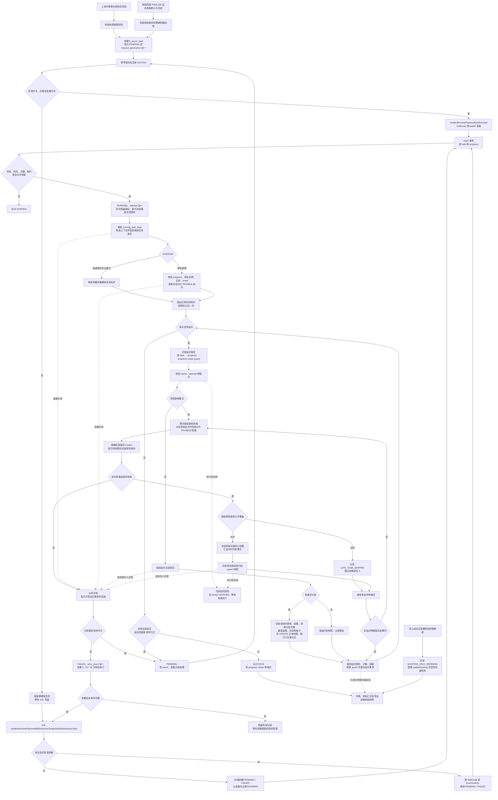

[业务逻辑专辑](/knowledge/business-logic/) / 居民收益付款 / S13

说明付款结果查询快照的审核资格、创建与刷新范围、付款事实聚合、金额与状态判断，以及失败重试和证据边界，附逐章原文对照。本文保留原文 13 章，正文连续展开，原文对照与流程源码按需展开。

**前置阅读：** [S12 · 付款状态分片刷新](/knowledge/business-logic/resident-income/s12-付款状态分片刷新/)

**快速阅读：** [阅读起点](#overview) · [核心调用链](#chapter-3) · [筛选规则](#chapter-4) · [完整流程](#chapter-11) · [源码索引](#chapter-13)

<div class="business-logic-article">

<div id="overview"></div>

<div id="intro-heading-1"></div>

`residentIncomePaymentBillDimensionSnapshotRefreshAsyncTask`

<div id="intro-heading-2"></div>

## 阅读起点：先跟着一笔账单走一遍

**下面的电站、月份和金额都是假设，用来串起源码规则，不是实际运行数据。**

假设电站 A 有一笔 2026 年 8 月的居民收益账单，付款单上的本次计划付款额是 100 元。审核通过以后，业务不仅要继续办理付款，还要让“付款结果查询”页面里出现这笔已经获准展示的账单。

但页面要看的信息不在一张业务表里：计划金额在付款单明细中，实际付了多少钱要看付款结果，成功或失败有几笔也要另算。 **快照（把页面需要的多处事实整理后存成一份查询数据）** 就是为这个问题准备的。这里的快照不是银行流水，也不是另一份付款指令，而是付款结果的查询记录。

这条主线有两个时刻。

**第一个时刻是“这笔账单获准进入查询集合”。** 审核回调完成 `FINALIZE`（最终收尾事实）后，上游的状态刷新 `shard`（把一批处理范围拆成的分片）完成到相应受理点，提交一个带有完整审核身份和精确明细边界的快照请求。S13 校验这些身份和持久化事实，读取正式 `PAYABLE` 明细（`line_type=10`，即这次审核认可的应付明细），才有权限创建或更新审核快照。假设这一步成功，查询记录中的计划额就是候选正式明细的 100 元。

**第二个时刻是“已经进入查询集合的账单，付款事实又变了”。** 假设后来出现一笔符合本链路统计条件的正常成功付款，金额为 60 元。上游状态刷新链路提交普通快照请求；S13 重读付款事实，把已有记录的实付改成 60 元。普通刷新保留数据库里的计划额 100 元，因此金额差是 `60 - 100 = -40`，金额异常标识为 `20`。

有一个反直觉的细节必须从一开始就记住：在当前代码里，这笔记录仍会被算成付款成功，`bill_dimension_payment_status=30`、`external_payment_status=5`。原因不是“100 元已经全付完”，而是状态判断中存在至少一笔有效正常成功付款就优先判成功。 **金额异常和付款成功是两套判断，不能把它们合并理解。**

这些请求先存进 `fi_async_task`（数据库里的异步任务记录）。执行可以由 `XXL-Job`（定时调度入口）发起，也可以由事务提交后的 `Kick`（主动发送一次唤醒信号，尽快让消费者领取任务）发起。消费者按“电站＋账单年月”处理，一组这样的组合称为 **站月** 。它每次领取处理一页站月，每个站月单独提交；处理到哪里，由游标保存。

最后，账单维度列表、电站维度汇总和导出按需读取落库快照。事实变化后、快照刷新前，页面可能仍显示旧数据。 **S13 本身不向银行付款、不创建司库支付请求，也不负责直接修改底层账单、差异台账或付款结果的业务付款状态。**

这段故事对应原文第 1、2、5、6、8、9 章。下面保留原文的 13 章及子章节对应关系，把每一处筛选、状态、事务和风险展开。

<div id="intro-heading-3"></div>

### 这份文档的事实边界

| 项目 | 原文记录及本阅读版的使用边界 |
| --- | --- |
| 原文分析日期 | 2026-09-09 |
| 原文结论级别 | `SOURCE_VERIFIED`，表示原作者依据当时本地源码作出的核对结论，不表示线上验证通过 |
| 原文仓库 | `/Users/wangyi/BZ/zx-monitor/zxbaif` |
| 原文分支 | `Ian/review/01` |
| 原文 HEAD | `a1bfacbeb6dfc239d577bd66bf78cd9eb2482efa` |
| 工作区状态 | 原文记录原有 3 处未提交修改，位于 `FencedExecutionTemplate` 及 `SelectionFilterAll` 服务；原分析没有修改这些文件或任何业务代码 |
| 原分析未做的事 | 未启动服务、执行任务或查询业务数据库；运行中的调度配置、表结构、数据量、实际处理结果不能确认 |
| 本次改写依据 | 仅使用用户提供的源码梳理文档；没有重新访问上述仓库，也没有把原文的源码判断升级成线上事实 |

正文的 `[Sxx]` 是原文源码定位编号。第 13 章保留完整路径和行号；这些路径指向原作者的本地工作区，不是本阅读版附带的源码文件。HTML 版每章末尾可以展开对应原文。

<details class="original" id="original-meta">
<summary>原文 · <strong>分析元信息对照</strong></summary>

<div id="original-meta-heading-1"></div>

### residentIncomePaymentBillDimensionSnapshotRefreshAsyncTask 源码梳理

> 分析日期：2026-09-09。依据当前本地源码，结论级别：SOURCE\_VERIFIED。
>
> 仓库：/Users/wangyi/BZ/zx-monitor/zxbaif；分支：Ian/review/01；HEAD：a1bfacbeb6dfc239d577bd66bf78cd9eb2482efa。
>
> 本次分析读取实际工作区文件。工作区原有 3 处未提交修改，位于 FencedExecutionTemplate 及 SelectionFilterAll 服务，未修改这些文件或任何业务代码。本次未启动服务、执行任务或查询业务数据库；运行中的调度配置、表结构、数据量和实际处理结果，暂时无法确认。

<details class="source-note">
<summary>查看 Markdown 原文</summary>

```text
# residentIncomePaymentBillDimensionSnapshotRefreshAsyncTask 源码梳理

> 分析日期：2026-09-09。依据当前本地源码，结论级别：SOURCE_VERIFIED。
>
> 仓库：/Users/wangyi/BZ/zx-monitor/zxbaif；分支：Ian/review/01；HEAD：a1bfacbeb6dfc239d577bd66bf78cd9eb2482efa。
>
> 本次分析读取实际工作区文件。工作区原有 3 处未提交修改，位于 FencedExecutionTemplate 及 SelectionFilterAll 服务，未修改这些文件或任何业务代码。本次未启动服务、执行任务或查询业务数据库；运行中的调度配置、表结构、数据量和实际处理结果，暂时无法确认。
```

</details>

</details>

<div id="chapter-1"></div>

## 1. 任务概览

<div id="body-1-heading-2"></div>

### 先理解它接手了哪一段工作

上游已经产生审核、付款、导入或状态变化的事实，S13 接手的是 **把这些事实整理成页面能直接读取的展示记录** 。它不是付款流程的发起人，而是付款结果查询快照的维护者。

它从 `fi_async_task` 中消费指定类型的任务。“消费”在这里就是读取、领取并执行数据库里的待办记录，不表示这一段一定使用消息队列。

一次领取不是“做完这个任务的全部范围”，而是处理一页站月。一个站月内可能有多个合作方、多张合作方账单、多条差异记录，所以站月数量也不是账单数量或快照行数。没有处理完的部分，通过游标在后续领取时继续。

<div id="body-1-heading-3"></div>

### 入口、输出和容量设置放在一起看

| 项目 | 实际实现与含义 |
| --- | --- |
| XXL Handler（调度器识别的处理入口名称） | `residentIncomePaymentBillDimensionSnapshotRefreshAsyncTask` |
| 入口类 | `ResidentIncomePaymentBillDimensionSnapshotRefreshJob` |
| 消费实现 | `ResidentIncomePaymentBillDimensionSnapshotAsyncTaskServiceImpl` |
| 任务类型 | `RESIDENT_INCOME_PAYMENT_BILL_DIMENSION_SNAPSHOT_REFRESH` |
| 主动唤醒路由 | `S13_SNAPSHOT_REFRESH` |
| 最终业务输出表 | `fi_resident_income_payment_bill_dimension_snapshot` |
| 一次领取的处理单位 | 一页站月；每页默认 100 个，最多 500 个 |
| 单次 XXL 调用的循环上限 | 默认 100 次，最多 500 次；限制的是循环次数，不是固定 100／500 张账单，也不保证每次都是不同的 `taskId` |
| 租约（某个执行者暂时持有执行权的有效期） | 配置项 `resident-income.payment.snapshot-refresh.lease-minutes`，默认 10 分钟 |
| 两种写入模式 | `REVIEW_APPROVED_CREATE`：审核通过精确同步；`EXISTING_ONLY_REFRESH`：普通事实刷新 |
| 事务边界 | 请求受理、任务领取、单站月刷新、任务状态转换，分别由事务服务执行 |
| 调度配置边界 | 入口只看到 `@XxlJob`。真实 Cron（调度时间表达式）、部署实例数、路由策略暂时无法确认 |

<div id="body-1-heading-4"></div>

### 三种“成功”不是一回事

| 听到的“成功” | 它实际说明什么 | 它没有证明什么 |
| --- | --- | --- |
| 业务付款成功 | 付款结果表存在成功结果，S13 把它作为输入事实 | 不证明快照已经刷新 |
| 快照任务成功 | 某个请求代次的处理范围已完成，`fi_async_task.task_status=2` | 不证明每条记录都新增或更新；缺失快照也可能只记日志 |
| XXL 调用成功 | 本次消费循环正常返回 | 即使循环中有业务任务失败，也可能返回成功 |

这里的 **请求代次** 指同一任务记录先后承接的第几版刷新请求。它不是第几次付款，也不是第几次审核，后面第 3、5、7 章会展开。

源码定位：[S01](#source-S01)、[S02](#source-S02)、[S03](#source-S03)。

<details class="original" id="original-1">
<summary>原文 · <strong>第 1 章 · 展开对照</strong></summary>

以下是附件对应章节的原文，保留原有表述与证据边界。正文中的解释位于上方。

<div id="original-1-heading-1"></div>

#### 1. 任务概览

**这个任务负责把居民收益付款事实整理成“付款结果查询快照”，让账单维度列表、电站维度汇总及导出能够读取已落库的展示数据。**

它消费 `fi_async_task` 中的指定类型任务。一次领取处理一页“电站＋账单年月”，每个站月独立提交；未完成的范围通过游标续跑。它也能被业务事务提交后的主动 Kick 唤醒，XXL-Job 不是唯一执行入口。

| 项目 | 实际实现 |
| --- | --- |
| XXL Handler | `residentIncomePaymentBillDimensionSnapshotRefreshAsyncTask` |
| 入口类 | `ResidentIncomePaymentBillDimensionSnapshotRefreshJob` |
| 消费实现 | `ResidentIncomePaymentBillDimensionSnapshotAsyncTaskServiceImpl` |
| 任务类型 | `RESIDENT_INCOME_PAYMENT_BILL_DIMENSION_SNAPSHOT_REFRESH` |
| 主动唤醒路由 | `S13_SNAPSHOT_REFRESH` |
| 最终业务输出 | `fi_resident_income_payment_bill_dimension_snapshot` |
| 调度处理单位 | 一次领取处理一页站月，每页默认 100 个、最多 500 个 |
| 单次 XXL 循环限制 | 默认 100 次、最多 500 次；不是固定处理 100/500 张账单，也不保证是不同 taskId |
| 任务租约 | `resident-income.payment.snapshot-refresh.lease-minutes`，默认 10 分钟 |
| 两种写入模式 | 审核通过精确同步 `REVIEW_APPROVED_CREATE`；普通事实刷新 `EXISTING_ONLY_REFRESH` |
| 事务边界 | 请求受理、任务领取、单站月刷新、任务状态转换分别由事务服务执行 |
| Cron、部署实例数、路由策略 | 入口仅有 `@XxlJob`，实际调度配置暂时无法确认 |

源码：[入口与参数路由](#source-S01)、[消费者](#source-S02)、[事务服务](#source-S03)。

这里需要区分三件事：

- **业务付款成功** ：付款结果表中的成功结果，供本任务读取。
- **快照任务成功** ：某个请求代次的范围已处理完成，`fi_async_task.task_status=2`。
- **XXL 调用成功** ：本次消费循环正常返回；即使循环内有业务任务失败，也可能返回成功。

<details class="source-note">
<summary>查看本章 Markdown 原文</summary>

```text
## 1. 任务概览

**这个任务负责把居民收益付款事实整理成“付款结果查询快照”，让账单维度列表、电站维度汇总及导出能够读取已落库的展示数据。**

它消费 `fi_async_task` 中的指定类型任务。一次领取处理一页“电站＋账单年月”，每个站月独立提交；未完成的范围通过游标续跑。它也能被业务事务提交后的主动 Kick 唤醒，XXL-Job 不是唯一执行入口。

| 项目 | 实际实现 |
|---|---|
| XXL Handler | `residentIncomePaymentBillDimensionSnapshotRefreshAsyncTask` |
| 入口类 | `ResidentIncomePaymentBillDimensionSnapshotRefreshJob` |
| 消费实现 | `ResidentIncomePaymentBillDimensionSnapshotAsyncTaskServiceImpl` |
| 任务类型 | `RESIDENT_INCOME_PAYMENT_BILL_DIMENSION_SNAPSHOT_REFRESH` |
| 主动唤醒路由 | `S13_SNAPSHOT_REFRESH` |
| 最终业务输出 | `fi_resident_income_payment_bill_dimension_snapshot` |
| 调度处理单位 | 一次领取处理一页站月，每页默认 100 个、最多 500 个 |
| 单次 XXL 循环限制 | 默认 100 次、最多 500 次；不是固定处理 100/500 张账单，也不保证是不同 taskId |
| 任务租约 | `resident-income.payment.snapshot-refresh.lease-minutes`，默认 10 分钟 |
| 两种写入模式 | 审核通过精确同步 `REVIEW_APPROVED_CREATE`；普通事实刷新 `EXISTING_ONLY_REFRESH` |
| 事务边界 | 请求受理、任务领取、单站月刷新、任务状态转换分别由事务服务执行 |
| Cron、部署实例数、路由策略 | 入口仅有 `@XxlJob`，实际调度配置暂时无法确认 |

源码：[入口与参数路由][S01]、[消费者][S02]、[事务服务][S03]。

这里需要区分三件事：

- **业务付款成功**：付款结果表中的成功结果，供本任务读取。
- **快照任务成功**：某个请求代次的范围已处理完成，`fi_async_task.task_status=2`。
- **XXL 调用成功**：本次消费循环正常返回；即使循环内有业务任务失败，也可能返回成功。
```

</details>

</details>

<div id="chapter-2"></div>

## 2. 业务目的

<div id="section-2-1"></div>

### 2.1 为什么需要这层快照

真实信息分散在六类地方：差异台账、付款单、付款单明细、付款结果、导入原始记录、司库推送批次明细。页面却需要把它们放在同一行或同一个电站汇总里展示。

这些展示内容包括：账单定位、计划金额、实际金额、成功笔数、失败笔数、付款状态、异常标识、收款信息、最近付款时间。快照把这些查询结果整理并持久化，也就是保存到数据库里。

原文核实的实际读取入口是 `FiResidentIncomePaymentOrderServiceImpl.queryFiResidentIncomePaymentBillDimensionPage`，它直接查询快照表；电站维度查询也在快照表上聚合。因此， **底层付款事实已改变，不等于这些页面立即显示新值** 。刷新还没完成时，页面可能读到旧快照。[S12](#source-S12)

本任务处理的业务目的分成两个阶段。

**阶段一：决定哪些账单首次进入付款结果查询集合。** 这不是随便扫到一条差异就加一条记录，而是依靠最终审核通过的正式明细、审核身份和状态刷新分片，受控地新增快照。

**阶段二：让已存在的查询记录跟上事实变化。** 支付结果变化、线下导入及删除、付款状态刷新、作废后的刷新，都可能使已有展示过期。普通模式会重算这些快照的实际金额、付款状态和统计字段。

<div id="section-2-2"></div>

### 2.2 两种写入权限的业务差异

先区分两种数据库操作：`upsert`（记录不存在时插入，命中重复键时更新）可以新增；`updateExisting`（仅更新已存在记录）不能新增。它们的区别不只是性能或实现写法，而是 **谁有资格让账单进入查询集合** 。

| 模式 | 范围从哪里来 | 能写什么 | 业务权限 |
| --- | --- | --- | --- |
| `REVIEW_APPROVED_CREATE` | 审核回调 `progress`（持久化进度记录）＋状态刷新 `shard`＋付款单版本／轮次＋明细 ID 闭区间 | `upsert`，允许新增及更新审核快照 | 正式审核事实与 `PAYABLE` 明细决定是否允许进入查询集合 |
| `EXISTING_ONLY_REFRESH` | 差异 ID、站月、付款单、导入批次，或者年月／公司／合作方范围 | 仅 `updateExisting` | 只能更新已有付款事实展示，不能借普通刷新新增记录 |
| 历史载荷缺少 `writeMode` | 按历史请求中原有的范围解析 | 自动降为 `EXISTING_ONLY_REFRESH` | 保留旧业务键算法，兼容任务身份校验，但不补发新增权限 |

**闭区间** 的意思是起点和终点都包含。例如审核明细边界是起 ID 到末 ID，则满足 `startOrderBillId <= id <= endOrderBillId` 的明细才在边界内，还必须同时满足其他审核筛选条件。

“历史回填”这个入口名称容易误导。当前 `Backfill`（历史回填入口）提交的仍是 `EXISTING_ONLY_REFRESH`。它可以刷新已有记录，却不能靠扫描差异台账补出从未存在的快照。[S04](#source-S04) [S11](#source-S11)

还要把职责划清：本任务不发起银行付款，不创建司库支付请求，不直接修改底层账单、差异台账或付款结果的业务付款状态。底层事实主要由上游产生，它这里只负责读取和整理。

<details class="original" id="original-2">
<summary>原文 · <strong>第 2 章 · 展开对照</strong></summary>

以下是附件对应章节的原文，保留原有表述与证据边界。正文中的解释位于上方。

<div id="original-2-heading-1"></div>

#### 2. 业务目的

<div id="original-2-heading-2"></div>

##### 2.1 为什么需要这层快照

真实信息分散在差异台账、付款单、付款单明细、付款结果、导入原始记录和司库推送批次明细中。页面需要同时展示账单定位、计划金额、实际金额、成功/失败笔数、付款状态、异常标识、收款信息及最近付款时间。

源码中，`FiResidentIncomePaymentOrderServiceImpl.queryFiResidentIncomePaymentBillDimensionPage` 直接查快照表；电站维度查询也在快照表上聚合。因此，付款事实已经改变而快照尚未刷新时，这些页面可能仍显示旧结果。[S12](#source-S12)

本任务解决两类问题：

1. **审核通过后首次进入付款结果查询集合** ：根据已经最终审核通过的正式明细、审核身份和状态刷新分片，受控地新增快照。
2. **已有查询记录随付款事实变化更新** ：支付结果变化、线下导入及删除、付款状态刷新、作废后的刷新等，重新计算已有快照的实际金额、付款状态和统计字段。

<div id="original-2-heading-3"></div>

##### 2.2 两种写入权限的业务差异

| 模式 | 范围来源 | 写入能力 | 关键业务含义 |
| --- | --- | --- | --- |
| `REVIEW_APPROVED_CREATE` | 审核回调 progress＋状态刷新 shard＋付款单版本/轮次＋明细 ID 闭区间 | `upsert`，允许新增及更新审核快照 | 是否进入查询集合，由正式审核事实和 PAYABLE 明细决定 |
| `EXISTING_ONLY_REFRESH` | 差异 ID、站月、付款单、导入批次、年月/公司/合作方范围 | 仅 `updateExisting` | 更新已经存在的付款事实展示，不能借普通刷新新增记录 |
| 历史载荷没有 `writeMode` | 按原载荷范围解析 | 自动降为 `EXISTING_ONLY_REFRESH` | 保留旧业务键算法，维持身份校验兼容性，但不给新增权限 |

**“历史回填”入口当前同样只提交 EXISTING\_ONLY\_REFRESH。它不能靠扫描差异台账补出原本没有的快照。** [S04](#source-S04) [S11](#source-S11)

任务不发起银行付款，不创建司库支付请求，也不直接修改底层账单、差异台账或付款结果的业务付款状态。那些事实主要由上游链路产生；这里消费事实并维护查询快照。

<details class="source-note">
<summary>查看本章 Markdown 原文</summary>

```text
## 2. 业务目的

### 2.1 为什么需要这层快照

真实信息分散在差异台账、付款单、付款单明细、付款结果、导入原始记录和司库推送批次明细中。页面需要同时展示账单定位、计划金额、实际金额、成功/失败笔数、付款状态、异常标识、收款信息及最近付款时间。

源码中，`FiResidentIncomePaymentOrderServiceImpl.queryFiResidentIncomePaymentBillDimensionPage` 直接查快照表；电站维度查询也在快照表上聚合。因此，付款事实已经改变而快照尚未刷新时，这些页面可能仍显示旧结果。[S12]

本任务解决两类问题：

1. **审核通过后首次进入付款结果查询集合**：根据已经最终审核通过的正式明细、审核身份和状态刷新分片，受控地新增快照。
2. **已有查询记录随付款事实变化更新**：支付结果变化、线下导入及删除、付款状态刷新、作废后的刷新等，重新计算已有快照的实际金额、付款状态和统计字段。

### 2.2 两种写入权限的业务差异

| 模式 | 范围来源 | 写入能力 | 关键业务含义 |
|---|---|---|---|
| `REVIEW_APPROVED_CREATE` | 审核回调 progress＋状态刷新 shard＋付款单版本/轮次＋明细 ID 闭区间 | `upsert`，允许新增及更新审核快照 | 是否进入查询集合，由正式审核事实和 PAYABLE 明细决定 |
| `EXISTING_ONLY_REFRESH` | 差异 ID、站月、付款单、导入批次、年月/公司/合作方范围 | 仅 `updateExisting` | 更新已经存在的付款事实展示，不能借普通刷新新增记录 |
| 历史载荷没有 `writeMode` | 按原载荷范围解析 | 自动降为 `EXISTING_ONLY_REFRESH` | 保留旧业务键算法，维持身份校验兼容性，但不给新增权限 |

**“历史回填”入口当前同样只提交 EXISTING_ONLY_REFRESH。它不能靠扫描差异台账补出原本没有的快照。**[S04][S11]

任务不发起银行付款，不创建司库支付请求，也不直接修改底层账单、差异台账或付款结果的业务付款状态。那些事实主要由上游链路产生；这里消费事实并维护查询快照。
```

</details>

</details>

<div id="chapter-3"></div>

## 3. 核心调用链

<div id="section-3-1"></div>

### 3.1 从 XXL 入口到业务写入

先按“接单—领单—找范围—逐站月写入—收尾”理解，再对应代码。

**第一步，接到一次执行请求。** XXL 入口解析参数。没有合法的 `taskCode`／`businessKey` 选择器时，扫描自动可执行任务；有选择器时，先按指定身份查 `PENDING`／`FAILED` 任务。`PENDING` 是待处理，`FAILED` 是失败待后续处理。选择出来还不等于已经拥有执行权。

**第二步，在事务里领取任务。** `claim`（原子领取，即锁定并复核后取得执行权）先锁任务行，再锁定或创建快照刷新进度，把任务设为 `RUNNING`（执行中），并增加 `running_attempt`（本任务执行权的尝试编号）。本次使用哪一代载荷、从哪个站月后续跑，也在这里确定。

**第三步，把冻结请求解析成业务上下文。** `running_task_data` 是本代实际执行的 JSON 载荷，也就是请求参数内容。消费者先解析它，再建立 `context`（后续执行共用的规范化上下文），并核对任务的 `taskCode` 和 `businessKey`。审核模式还要验证审核资格。

**第四步，确定这一页做哪些站月。** 系统解析完整站月范围，排序后取游标之后的最多 N 个站月。这个完整范围是本次执行重新查询出来的，不是已经持久化的一张固定分页清单。

**第五步，每个站月进入独立事务。** 事务按 `task → progress → scope guard` 的顺序加锁。`scope guard`（站月范围占用保护记录）用来防止经过这条受控路径的不同任务同时刷新同一站月。普通模式重算后只更新已有快照；审核模式重新校验资格、分页读取正式明细、精确定位差异，并检查候选审核身份能否覆盖已有记录。

审核写入前，还会执行 `fencing`（执行权隔离检查：拒绝已经过期或被接管的旧执行者继续写入）。对应检查内容包括 owner（当前执行权持有者）、尝试编号与租约。

**第六步，提交这个站月的进度。** 快照处理成功后，推进游标、把 `processed_scope_count` 加 1、续租、释放范围占用，再提交本次站月事务。前面的站月已经提交，不会因为后面的站月失败而一起撤销。

**第七步，决定任务还要不要继续。** 有后续页或出现新请求代次，就转回 `PENDING`；本代全部完成且没有新代次，才转 `SUCCESS`；本代发生普通异常且没有新代次，则转 `FAILED` 并安排重试。转回 `PENDING` 的任务还会尝试发出同一个 S13 的尾部 Kick。

下面保留完整方法级调用对应，便于从业务解释回到源码。

```text
ResidentIncomePaymentBillDimensionSnapshotRefreshJob
  .residentIncomePaymentBillDimensionSnapshotRefreshAsyncTask(param)
    → parseJobParam / executeJob
      ├─ 无 taskCode/businessKey 选择器
      │    → AsyncTaskService.executePendingTasks(maxTaskCount)
      │      → FiAsyncTaskMapper.queryNextSnapshotRefreshExecutableTask
      └─ 有选择器
           → AsyncTaskService.executeManualRetry(...)
             → 按 taskCode/businessKey 查询 PENDING/FAILED

    → AsyncTaskService.executeTask(selectedTask, triggerSource, ...)
      → TransactionService.claim(taskId, workerId, leaseExpireTime)
        → 锁 fi_async_task
        → 锁/创建 snapshot_refresh_progress
        → RUNNING，running_attempt + 1，确定本代 running_task_data 与游标

      → parseRequest(progress.running_task_data)
      → SnapshotService.buildContext(request)
      → validateIdentity：核对 taskCode/businessKey
      → 审核模式：ReviewEligibilityService.validate(context)
      → SnapshotService.resolveScopeList(context)
      → nextPage：选游标后的最多 N 个站月

      → 对每个站月 TransactionService.refreshOwnedScope(...)
        → 锁 task → progress → 专用 snapshot scope guard
        → SnapshotService.refreshScope(scope, context, beforeWriteFenceCheck)
          ├─ EXISTING_ONLY_REFRESH
          │    → recalculateExistingScope
          │    → queryDifferenceList
          │    → 对每条差异 recalculateExistingDifference
          │      → 有效付款单明细/主单、付款结果、金额/收款汇总、批次明细计数
          │      → buildSnapshot
          │      → SnapshotMapper.updateExisting
          └─ REVIEW_APPROVED_CREATE
               → refreshReviewApprovedScope
               → 校验审核资格、按站月分页读取审核分片 PAYABLE 明细
               → synchronizeReviewApprovedPage
               → 精确匹配差异台账、锁已有快照、比较审核身份
               → buildReviewApprovedSnapshot
               → 写前再次校验 owner/租约
               → SnapshotMapper.upsert

        → progress.advanceCursor，processed_scope_count + 1，续租
        → guard.releaseOwner
        → 提交当前站月事务

      → TransactionService.transition(...)
        ├─ 还有页 / 出现新请求代次 → PENDING
        ├─ 本代全部完成 → SUCCESS
        └─ 本代异常且无新代次 → FAILED，设置重试时间
      → 若 PENDING，kickIfPending → S13 再次精准唤醒
```

源码定位：[S01](#source-S01)—[S08](#source-S08)。范围保护只覆盖经过对应事务路径的执行者；同步导入删除刷新存在另外的写入入口，不能据此推断所有写入都被保护，见第 8.3、10.5 节。

<div id="section-3-2"></div>

### 3.2 请求从哪里来

不能只看 `task_type` 就判定任务是哪种业务发起的：多条链路会提交同一种任务类型。原文核实到的直接创建路径如下。

| 创建入口 | 业务时机、范围、写入模式与来源 |
| --- | --- |
| `ResidentIncomePaymentStatusRefreshServiceImpl.refresh` | 底层状态刷新和主单状态协调完成后提交。`STATION_MONTH` 直接转为站月；`DIFF` 转为 `diffIds`；`ORDER_BILL` 转为对应明细的站月；该转换函数不会为其他范围生成快照任务。模式为 `EXISTING_ONLY_REFRESH`，继承 `triggerSource`（触发来源标记） |
| `ResidentIncomePaymentStatusBulkRefreshAccountProcessorServiceImpl` | 单账户底层范围刷新成功后、推进账户游标之前提交。无有效范围不提交，特定业务分支可跳过。模式为 `EXISTING_ONLY_REFRESH`，来源 `BULK_STATUS_REFRESH_ACCOUNT`，使用自定义合并业务键。原文没有展开哪些特定分支会跳过 |
| `ResidentIncomePaymentOrderVoidRefreshScopeTransactionServiceImpl.refreshScopeChunk` | 作废范围的底层状态刷新之后，在同一事务中受理已有快照刷新。来源 `PAYMENT_ORDER_VOID` |
| `ResidentIncomePaymentBatchScopeRefreshTransactionServiceImpl` | 审核状态刷新 shard 的最后子批或累计范围完成时，先受理快照任务，再推进 shard 的最终游标，两者处于同一事务。来源 `REVIEW_CALLBACK_SUB_BATCH_FINAL` |
| `ResidentIncomePaymentStatusRefreshShardFinalizeTransactionServiceImpl.finalizeLegacyShard` | 旧版 shard 路径在分片成功写回的事务中受理任务。来源 `REVIEW_CALLBACK_LEGACY_SHARD_FINAL` |
| `ResidentIncomePaymentBillDimensionSnapshotReviewTaskServiceImpl.submitLockedShard` | 上述两条审核路径共用。读取 `lockedShard`（已经锁定的分片记录）以及已 `FINALIZE` 的 progress，构造完整审核身份，提交 `REVIEW_APPROVED_CREATE` |
| `ResidentIncomePaymentBillDimensionSnapshotBackfillServiceImpl` | 按付款单／导入批次直接提交，或者按差异 ID 分批提交。仍然是 `EXISTING_ONLY_REFRESH`，默认来源 `SNAPSHOT_BACKFILL` |

这里的 `bulk` 是批量处理路径；“单账户处理成功后提交”与“整个批量任务全部成功后提交”不是同一句话，不要把时机改大。

另有一条相邻的 **同步刷新入口** ：删除导入成功记录后，`FiResidentIncomePaymentOrderServiceImpl` 会调用 `RefreshTaskService.refresh`，立即重算已有快照，而且可能修改同业务键的任务状态。它不是 XXL 消费链路的下游，却会动到同一批快照和任务身份，详见第 8.3、10.5 节。[S17](#source-S17) [S09](#source-S09)

其他创建路径的源码定位：[S09](#source-S09)—[S11](#source-S11)、[S13](#source-S13)—[S16](#source-S16)，以及 [S15L](#source-S15L)、[S16R](#source-S16R)。

<div id="section-3-3"></div>

### 3.3 请求如何变成稳定任务

**这里不是“每来一个请求就一定新增一行任务”。** `businessKey`（业务键，用来代表一次业务范围或审核身份）相同的请求，可以复用同一任务记录，通过代次区分前后的刷新要求。

`submitRefreshTask` 先规范化上下文，再按以下规则受理。

| 顺序 | 处理规则 |
| --- | --- |
| 1. 生成任务编码 | `task_code = "RIPBDS:" + MD5(businessKey)`。`MD5` 在这里用来生成摘要，不代表付款金额或业务流水号 |
| 2. 处理业务键长度 | 长度不超过 128 时原样保存；超过时保存 `RIPBDS_BK:MD5(...)` |
| 3. 尝试首次插入 | 使用 `insert ignore`（尝试插入，命中相应约束时忽略插入）；新任务为 `task_status=0`、`retry_count=0`、`max_retry_count=3`、`request_generation=1`、`running_attempt=0`，立即可执行 |
| 4. 没插入成功时找旧任务 | 按 `task_type + task_code` 锁住原任务，再进行重复受理 |
| 5. 接纳同键新请求 | 覆盖 `task_data`，同时让 `request_generation + 1` |
| 6. 按原状态区别处理 | 旧任务不是 `RUNNING` 时恢复 `PENDING`，清除错误和重试次数；旧任务正在运行时，保留其运行状态和当前执行载荷 |
| 7. 特殊终止状态 | `CANCELLED`（已取消）任务不会自动复活，重复受理会报错 |

`task_data` 与 `running_task_data` 要分开理解：前者是最新受理的请求，后者是当前代次冻结下来正在执行的请求。所以新请求到达时，不会把旧执行跑到一半所使用的参数直接改掉。

**普通模式的默认业务键** 包含写入模式和范围。单站月、单 diff、付款单 ID、导入批次分别有专门格式；组合范围生成摘要。普通请求还允许外部直接提供 `businessKey`。

**审核模式的业务键** 包含 `progressId`、`shardId`、`paymentOrderId`、`dataVersion`、`submitRound`、`approvalAttempt`、`reviewPlanId`。审核模式外部传入的 `businessKey` 必须为空，或与系统计算值完全一致。

即使审核业务键一致，也不能仅凭它认定拥有新增权限。明细起止边界与 `finalizeTime` 还要另外对照持久化审核事实核验。

因此，系统做的是“同一任务记录承接多代刷新请求”，不是“每次请求独立落一条待办”。反过来，业务键不同，即使最后覆盖同一个站月，仍可能生成不同任务；它们靠站月占用保护串行处理，而不是自动合并。

这些插入／更新机制是否真正具备预期幂等性，还依赖数据库相应的唯一约束；目标环境是否存在这些约束，原文未确认，见第 6.1 节。源码定位：[S03](#source-S03) [S04](#source-S04) [S09](#source-S09)。

<details class="original" id="original-3">
<summary>原文 · <strong>第 3 章 · 展开对照</strong></summary>

以下是附件对应章节的原文，保留原有表述与证据边界。正文中的解释位于上方。

<div id="original-3-heading-1"></div>

#### 3. 核心调用链

<div id="original-3-heading-2"></div>

##### 3.1 从 XXL 入口到业务写入

```text
ResidentIncomePaymentBillDimensionSnapshotRefreshJob
  .residentIncomePaymentBillDimensionSnapshotRefreshAsyncTask(param)
    → parseJobParam / executeJob
      ├─ 无 taskCode/businessKey 选择器
      │    → AsyncTaskService.executePendingTasks(maxTaskCount)
      │      → FiAsyncTaskMapper.queryNextSnapshotRefreshExecutableTask
      └─ 有选择器
           → AsyncTaskService.executeManualRetry(...)
             → 按 taskCode/businessKey 查询 PENDING/FAILED

    → AsyncTaskService.executeTask(selectedTask, triggerSource, ...)
      → TransactionService.claim(taskId, workerId, leaseExpireTime)
        → 锁 fi_async_task
        → 锁/创建 snapshot_refresh_progress
        → RUNNING，running_attempt + 1，确定本代 running_task_data 与游标

      → parseRequest(progress.running_task_data)
      → SnapshotService.buildContext(request)
      → validateIdentity：核对 taskCode/businessKey
      → 审核模式：ReviewEligibilityService.validate(context)
      → SnapshotService.resolveScopeList(context)
      → nextPage：选游标后的最多 N 个站月

      → 对每个站月 TransactionService.refreshOwnedScope(...)
        → 锁 task → progress → 专用 snapshot scope guard
        → SnapshotService.refreshScope(scope, context, beforeWriteFenceCheck)
          ├─ EXISTING_ONLY_REFRESH
          │    → recalculateExistingScope
          │    → queryDifferenceList
          │    → 对每条差异 recalculateExistingDifference
          │      → 有效付款单明细/主单、付款结果、金额/收款汇总、批次明细计数
          │      → buildSnapshot
          │      → SnapshotMapper.updateExisting
          └─ REVIEW_APPROVED_CREATE
               → refreshReviewApprovedScope
               → 校验审核资格、按站月分页读取审核分片 PAYABLE 明细
               → synchronizeReviewApprovedPage
               → 精确匹配差异台账、锁已有快照、比较审核身份
               → buildReviewApprovedSnapshot
               → 写前再次校验 owner/租约
               → SnapshotMapper.upsert

        → progress.advanceCursor，processed_scope_count + 1，续租
        → guard.releaseOwner
        → 提交当前站月事务

      → TransactionService.transition(...)
        ├─ 还有页 / 出现新请求代次 → PENDING
        ├─ 本代全部完成 → SUCCESS
        └─ 本代异常且无新代次 → FAILED，设置重试时间
      → 若 PENDING，kickIfPending → S13 再次精准唤醒
```

源码：[S01](#source-S01)—[S08](#source-S08)。

<div id="original-3-heading-3"></div>

##### 3.2 请求从哪里来

这些是当前源码中核实到的直接创建路径；不能仅从 task\_type 判断是哪种业务触发。

| 创建入口 | 创建时机、范围与模式 |
| --- | --- |
| `ResidentIncomePaymentStatusRefreshServiceImpl.refresh` | 底层状态刷新和主单状态协调完成后提交。STATION\_MONTH 直接转站月，DIFF 转 diffIds，ORDER\_BILL 转明细对应站月；其他范围不会在该转换函数中生成快照任务。模式为 EXISTING\_ONLY\_REFRESH，继承 triggerSource |
| `ResidentIncomePaymentStatusBulkRefreshAccountProcessorServiceImpl` | 单账户底层范围刷新成功、推进账户游标之前提交；无有效范围不提交，特定业务分支可跳过。EXISTING\_ONLY\_REFRESH，来源 `BULK_STATUS_REFRESH_ACCOUNT`，使用自定义合并业务键 |
| `ResidentIncomePaymentOrderVoidRefreshScopeTransactionServiceImpl.refreshScopeChunk` | 作废范围的底层状态刷新后，在同一事务中受理已有快照刷新；来源 `PAYMENT_ORDER_VOID` |
| `ResidentIncomePaymentBatchScopeRefreshTransactionServiceImpl` | 审核状态刷新 shard 的最后子批或累计范围完成时，先受理快照任务，再推进 shard 最终游标；同一事务。来源 `REVIEW_CALLBACK_SUB_BATCH_FINAL` |
| `ResidentIncomePaymentStatusRefreshShardFinalizeTransactionServiceImpl.finalizeLegacyShard` | 旧版 shard 路径在 shard 成功写回的事务中受理；来源 `REVIEW_CALLBACK_LEGACY_SHARD_FINAL` |
| `ResidentIncomePaymentBillDimensionSnapshotReviewTaskServiceImpl.submitLockedShard` | 上述两条审核路径共用：从 lockedShard 和已 FINALIZE 的 progress 构造完整审核身份，提交 REVIEW\_APPROVED\_CREATE |
| `ResidentIncomePaymentBillDimensionSnapshotBackfillServiceImpl` | 按付款单/导入批次直接提交，或按差异 ID 分批提交；模式仍为 EXISTING\_ONLY\_REFRESH，默认来源 `SNAPSHOT_BACKFILL` |

参考：[S09](#source-S09)—[S11](#source-S11)、[S13](#source-S13)—[S16](#source-S16)。

另有一条 **同步刷新入口** ：删除导入成功记录后，`FiResidentIncomePaymentOrderServiceImpl` 会调用 `RefreshTaskService.refresh`，立即重算已有快照，并可能修改同业务键任务状态。它不是本 XXL 的下游调用，但会操作同一批数据，见第 8.3、10.5 节。[S17](#source-S17) [S09](#source-S09)

<div id="original-3-heading-4"></div>

##### 3.3 请求如何变成稳定任务

`submitRefreshTask` 先规范化上下文，再构造任务：

- `task_code = "RIPBDS:" + MD5(businessKey)`。
- 业务键长度不超过 128 时原样保存；超过时保存 `RIPBDS_BK:MD5(...)`。
- 首次写入：`task_status=0`、`retry_count=0`、`max_retry_count=3`、`request_generation=1`、`running_attempt=0`，立即可执行。
- 通过 `insert ignore` 尝试创建；未插入时按 `task_type + task_code` 锁住旧任务再受理。
- 重复请求覆盖 `task_data` 并令 `request_generation + 1`。如果旧任务不是 RUNNING，则恢复 PENDING，清错误和重试次数；如果旧任务正在运行，则保留其运行状态及当前执行载荷。
- CANCELLED 任务不自动复活，受理时报错。

普通默认业务键包含写入模式和范围；单站月、单 diff、付款单 ID、导入批次有专门格式，组合范围生成摘要。普通请求也允许外部提供 businessKey；审核模式的外部 businessKey 必须为空或与系统计算值完全一致。

审核业务键包含 progressId、shardId、paymentOrderId、dataVersion、submitRound、approvalAttempt、reviewPlanId。明细边界和 finalizeTime 则另外通过持久化事实核对，不能仅凭业务键认定权限。

这是 **同一任务记录承接多代刷新请求** ，并不是每次请求一定插入新记录。不同业务键即使最终覆盖同一站月，仍可能产生不同任务。[S03](#source-S03) [S04](#source-S04) [S09](#source-S09)

<details class="source-note">
<summary>查看本章 Markdown 原文</summary>

```text
## 3. 核心调用链

### 3.1 从 XXL 入口到业务写入

~~~text
ResidentIncomePaymentBillDimensionSnapshotRefreshJob
  .residentIncomePaymentBillDimensionSnapshotRefreshAsyncTask(param)
    → parseJobParam / executeJob
      ├─ 无 taskCode/businessKey 选择器
      │    → AsyncTaskService.executePendingTasks(maxTaskCount)
      │      → FiAsyncTaskMapper.queryNextSnapshotRefreshExecutableTask
      └─ 有选择器
           → AsyncTaskService.executeManualRetry(...)
             → 按 taskCode/businessKey 查询 PENDING/FAILED

    → AsyncTaskService.executeTask(selectedTask, triggerSource, ...)
      → TransactionService.claim(taskId, workerId, leaseExpireTime)
        → 锁 fi_async_task
        → 锁/创建 snapshot_refresh_progress
        → RUNNING，running_attempt + 1，确定本代 running_task_data 与游标

      → parseRequest(progress.running_task_data)
      → SnapshotService.buildContext(request)
      → validateIdentity：核对 taskCode/businessKey
      → 审核模式：ReviewEligibilityService.validate(context)
      → SnapshotService.resolveScopeList(context)
      → nextPage：选游标后的最多 N 个站月

      → 对每个站月 TransactionService.refreshOwnedScope(...)
        → 锁 task → progress → 专用 snapshot scope guard
        → SnapshotService.refreshScope(scope, context, beforeWriteFenceCheck)
          ├─ EXISTING_ONLY_REFRESH
          │    → recalculateExistingScope
          │    → queryDifferenceList
          │    → 对每条差异 recalculateExistingDifference
          │      → 有效付款单明细/主单、付款结果、金额/收款汇总、批次明细计数
          │      → buildSnapshot
          │      → SnapshotMapper.updateExisting
          └─ REVIEW_APPROVED_CREATE
               → refreshReviewApprovedScope
               → 校验审核资格、按站月分页读取审核分片 PAYABLE 明细
               → synchronizeReviewApprovedPage
               → 精确匹配差异台账、锁已有快照、比较审核身份
               → buildReviewApprovedSnapshot
               → 写前再次校验 owner/租约
               → SnapshotMapper.upsert

        → progress.advanceCursor，processed_scope_count + 1，续租
        → guard.releaseOwner
        → 提交当前站月事务

      → TransactionService.transition(...)
        ├─ 还有页 / 出现新请求代次 → PENDING
        ├─ 本代全部完成 → SUCCESS
        └─ 本代异常且无新代次 → FAILED，设置重试时间
      → 若 PENDING，kickIfPending → S13 再次精准唤醒
~~~

源码：[S01]—[S08]。

### 3.2 请求从哪里来

这些是当前源码中核实到的直接创建路径；不能仅从 task_type 判断是哪种业务触发。

| 创建入口 | 创建时机、范围与模式 |
|---|---|
| `ResidentIncomePaymentStatusRefreshServiceImpl.refresh` | 底层状态刷新和主单状态协调完成后提交。STATION_MONTH 直接转站月，DIFF 转 diffIds，ORDER_BILL 转明细对应站月；其他范围不会在该转换函数中生成快照任务。模式为 EXISTING_ONLY_REFRESH，继承 triggerSource |
| `ResidentIncomePaymentStatusBulkRefreshAccountProcessorServiceImpl` | 单账户底层范围刷新成功、推进账户游标之前提交；无有效范围不提交，特定业务分支可跳过。EXISTING_ONLY_REFRESH，来源 `BULK_STATUS_REFRESH_ACCOUNT`，使用自定义合并业务键 |
| `ResidentIncomePaymentOrderVoidRefreshScopeTransactionServiceImpl.refreshScopeChunk` | 作废范围的底层状态刷新后，在同一事务中受理已有快照刷新；来源 `PAYMENT_ORDER_VOID` |
| `ResidentIncomePaymentBatchScopeRefreshTransactionServiceImpl` | 审核状态刷新 shard 的最后子批或累计范围完成时，先受理快照任务，再推进 shard 最终游标；同一事务。来源 `REVIEW_CALLBACK_SUB_BATCH_FINAL` |
| `ResidentIncomePaymentStatusRefreshShardFinalizeTransactionServiceImpl.finalizeLegacyShard` | 旧版 shard 路径在 shard 成功写回的事务中受理；来源 `REVIEW_CALLBACK_LEGACY_SHARD_FINAL` |
| `ResidentIncomePaymentBillDimensionSnapshotReviewTaskServiceImpl.submitLockedShard` | 上述两条审核路径共用：从 lockedShard 和已 FINALIZE 的 progress 构造完整审核身份，提交 REVIEW_APPROVED_CREATE |
| `ResidentIncomePaymentBillDimensionSnapshotBackfillServiceImpl` | 按付款单/导入批次直接提交，或按差异 ID 分批提交；模式仍为 EXISTING_ONLY_REFRESH，默认来源 `SNAPSHOT_BACKFILL` |

参考：[S09]—[S11]、[S13]—[S16]。

另有一条**同步刷新入口**：删除导入成功记录后，`FiResidentIncomePaymentOrderServiceImpl` 会调用 `RefreshTaskService.refresh`，立即重算已有快照，并可能修改同业务键任务状态。它不是本 XXL 的下游调用，但会操作同一批数据，见第 8.3、10.5 节。[S17][S09]

### 3.3 请求如何变成稳定任务

`submitRefreshTask` 先规范化上下文，再构造任务：

- `task_code = "RIPBDS:" + MD5(businessKey)`。
- 业务键长度不超过 128 时原样保存；超过时保存 `RIPBDS_BK:MD5(...)`。
- 首次写入：`task_status=0`、`retry_count=0`、`max_retry_count=3`、`request_generation=1`、`running_attempt=0`，立即可执行。
- 通过 `insert ignore` 尝试创建；未插入时按 `task_type + task_code` 锁住旧任务再受理。
- 重复请求覆盖 `task_data` 并令 `request_generation + 1`。如果旧任务不是 RUNNING，则恢复 PENDING，清错误和重试次数；如果旧任务正在运行，则保留其运行状态及当前执行载荷。
- CANCELLED 任务不自动复活，受理时报错。

普通默认业务键包含写入模式和范围；单站月、单 diff、付款单 ID、导入批次有专门格式，组合范围生成摘要。普通请求也允许外部提供 businessKey；审核模式的外部 businessKey 必须为空或与系统计算值完全一致。

审核业务键包含 progressId、shardId、paymentOrderId、dataVersion、submitRound、approvalAttempt、reviewPlanId。明细边界和 finalizeTime 则另外通过持久化事实核对，不能仅凭业务键认定权限。

这是**同一任务记录承接多代刷新请求**，并不是每次请求一定插入新记录。不同业务键即使最终覆盖同一站月，仍可能产生不同任务。[S03][S04][S09]
```

</details>

</details>

<div id="chapter-4"></div>

## 4. 数据筛选规则

<div id="section-4-1"></div>

### 4.1 自动消费：先筛任务

自动执行首先不是查付款账单，而是找“现在可以领取的快照任务”。查询方法为 `queryNextSnapshotRefreshExecutableTask`。

下面保留原文的核心 SQL 条件。`AND` 表示两边都满足，`OR` 表示两边满足其一即可；括号决定各组条件的适用范围，不能拆开理解。

```sql
a.deleted = 0
AND a.task_type = 'RESIDENT_INCOME_PAYMENT_BILL_DIMENSION_SNAPSHOT_REFRESH'
AND (
  (
    a.task_status IN (0, 3)
    AND (a.next_execute_time IS NULL OR a.next_execute_time <= :now)
    AND COALESCE(a.retry_count, 0) < COALESCE(a.max_retry_count, 3)
  )
  OR (
    a.task_status = 1
    AND p.lease_expire_time IS NOT NULL
    AND p.lease_expire_time <= :now
  )
)
```

其中 `a` 是任务表；`p` 是按 `task_id` 左连接的 `fi_resident_income_payment_snapshot_refresh_progress`。`COALESCE` 的意思是取第一个非空值，因此这里把空的 `retry_count` 当作 0，把空的 `max_retry_count` 当作 3。

可以把筛选读成“两个共同前提，加上二选一的执行资格”。共同前提是 `deleted=0`，并且任务类型必须是本 S13 类型。

**第一组资格：待处理或失败任务到了执行时间，且次数没有耗尽。** 状态必须在 `0、3` 中；`next_execute_time` 为空或不晚于当前时间；实际失败计数严格小于最大次数。三个条件之间全部是 AND。

**第二组资格：运行中的任务租约已过期。** 状态必须是 `1`；关联 progress 的 `lease_expire_time` 非空，且不晚于当前时间。这一组走的是 OR 分支，不能把第一组的到期时间和重试次数条件直接搬过来解释候选筛选。

候选排序是： **租约过期的 RUNNING 优先；其余按 `next_execute_time`、`id` 升序** 。每次只取 `limit 1`。这只是选中候选，之后还必须在领取事务中锁行并重新检查，才能获得执行权。[S05](#source-S05)

一个重要恢复边界是：某条 RUNNING 记录如果没有 progress，或者 progress 的租约为 NULL，就不满足“过期接管”条件。不能说所有卡住的 RUNNING 都会被自动捞回来。

另外，这个消费者入口 **没有调用** 另一个状态刷新任务所使用的 `amount-rule-upgrade maintenance guard`（金额规则升级维护保护开关）。不能把那个任务的维护开关规则套到 S13 上。主动 Kick 有独立的阶段开关与灰度规则，见第 8 章。

<div id="section-4-2"></div>

### 4.2 手工选择器的真实含义

XXL 参数可以只控制循环上限，例如：

```json
{"maxTaskCount":100}
```

也可以指定任务编码或已存储的业务键，例如：

```json
{"taskCodes":["RIPBDS:实际摘要"],"businessKeys":["实际已存储业务键"],"maxTaskCount":20}
```

这里的“实际摘要”“实际已存储业务键”是参数格式示意，不是真实可执行的任务身份。还支持单值 `taskCode`、`businessKey`；也支持 `{"data": {...}}` 包装，以及 `data` 本身为 JSON 字符串的包装。

**选择器的组合规则** 是：单值和数组先合并，剔除空白项；服务层再去重。`taskCode` 与 `businessKey` 同时给出时，匹配关系是 **OR** 。也就是“编码匹配，或者业务键匹配”，不是要求两者同时匹配。

**手工查询的公共限制** 仍然是本任务类型、`deleted=0`、状态仅 `PENDING／FAILED`，结果按 ID 升序并限制数量。它不会直接查询 `RUNNING`、`SUCCESS`、`CANCELLED` 作为手工重试对象。

最容易理解错的是“指定了任务，就一定强制执行”。实际分两层：

| 层次 | 是否检查 `next_execute_time` 与重试次数 |
| --- | --- |
| 手工选择任务时 | 不限制这两个条件，所以可能把尚未到期或次数耗尽的任务查出来 |
| `claim` 真正领取时 | 仍执行与正常消费相同的到期及次数检查 |

所以手工选择器 **不能强制执行未到期任务、重试耗尽任务、SUCCESS 或 CANCELLED 任务，也不能用来手工选择 RUNNING 进行租约接管** 。

参数错误还有一条操作风险：没有合法选择器会走自动消费；JSON 解析异常也会回退成默认参数。于是错误参数可能变成全队列自动扫描，而不是返回“参数失败”。默认 `maxTaskCount=100`、最多 500 次的含义仍是第 1 章说的消费循环次数。

源码定位：[S01](#source-S01) [S02](#source-S02) [S03](#source-S03)。

<div id="section-4-3"></div>

### 4.3 普通刷新：业务范围如何展开

普通模式要先回答“这次涉及哪些站月”。`resolveScopeList` 把多种定位条件转成 `stationId + billYearMonth`，然后 **取并集、去重，再按 stationId、月份升序排序** 。

| 请求提供的条件 | 怎样转成站月 | 限制或例外 |
| --- | --- | --- |
| `stationMonthScopeList` | 直接使用传入的电站与账单月份组合 | 电站 ID 必须为正数；账期统一为 `yyyyMM`，允许输入 `yyyy-MM` |
| `diffId / diffIds` | 用 `fi_monthly_income_difference.selectBatchIds` 读取差异，取其中 `station_id / share_month` | 此时的 diff ID 是定位入口，不是后续所有查询的永久过滤条件 |
| 请求中的某些 diff ID 找不到差异 | 再按这些缺失 ID 查询快照表的 `diff_id`，借已有快照找回站月 | 只是恢复范围，不会凭空补出差异记录 |
| `paymentOrderId / paymentOrderNo` | 按 ID 或单号找到付款单 ID，再读取这些付款单的明细，取明细对应站月 | 这个范围定位步骤没有显式限制主单状态、明细类型、明细状态或数据版本 |
| `importBatchNo` | 查询导入原始记录的 `import_batch_no`，取 `station_id / bill_yearmonth` | 范围定位阶段不限制 `record_status` |
| 起止年月、项目公司、合作方 | 查询差异台账：`share_month` 落在含两端的起止范围，`project_company_id IN` 指定公司，`partner_org_id` 等于指定合作方 | 在这一组宽范围查询内部，已提供的这些条件共同作 AND |

“多种来源取并集”与“宽范围内部条件作 AND”必须同时保留。

**假设例子：** 请求同时给了 `diffIds=[101]` 和“某月份＋公司 C”。系统会加入 diff 101 定位出的站月，也会加入满足月份与公司 C 的站月。它不是先找到 diff 101，再判断这条 diff 是否属于公司 C。这里的编号与公司只是解释规则的假设，不是实际数据。

下一步进入 `queryDifferenceList(scope)` 后，查询条件变成该站月的 `station_id + share_month`。 **系统会读取这个站月的全部差异，不再用原始 `diffIds` 或 `partnerOrgId` 再缩一次范围。** 因此同站月下多个合作方、多个合作方账单都会逐条处理；最终快照按 `diff_id` 区分，不是“一个站月只对应一条快照”。

范围至少需要有一类条件，但不要求必须给月份上下界。只指定公司或只指定合作方，也可以形成范围。这使请求可以很宽，不能把它理解为始终有一个固定月份窗口。

还有一个分页边界：系统只持久化请求载荷与游标，没有把全部站月存成固定分页表。`allScopes`（本次解析出的全部站月集合）每次执行都会重新查询并在内存构造，然后才从游标后取一页。它不是第一次解析后永久冻结的一份完整站月清单。

源码定位：[S04](#source-S04)，原文特别标注该文件第 186—201、252—357、725—734、1305—1321 行。

<div id="section-4-4"></div>

### 4.4 普通刷新：单条差异的数据来源

找到了站月以后，系统才逐条处理该站月内的差异。`fi_monthly_income_difference` 是差异台账；在这里既提供账单定位，也提供与付款明细、结果连接所需的字段。

要先区分 **付款单主单** 与 **付款单明细** ：主单是一张付款单的整体记录，明细是其中具体的应付账单行。`diff_id`、合作方、账期、合作方账单 ID 用来寻找与当前差异对应的明细和付款结果。

<div id="body-4-heading-6"></div>

#### 先找差异，再找可用的最新付款明细

| 步骤 | 精确条件与执行顺序 |
| --- | --- |
| 读取站月差异 | 按 `station_id + share_month` 精确查询，按 `update_time、id` 降序取列表；之后遍历全部记录，不是只取最新一条差异 |
| 明细优先查询 | 同时满足 `deleted=0`、`diff_id + station_id + partner_org_id + bill_yearmonth` 对应匹配、`line_type=10(PAYABLE)`、`line_status IN (20,30,40)` |
| 明细备用查询 | **只有前一查询结果为空 AND `partner_bill_id` 非空** ，才改按 `station_id + partner_org_id + partner_bill_id + bill_yearmonth` 查询；明细类型与状态条件不变 |
| 筛有效主单 | 明细所属主单必须 `deleted=0`，且 `status IN (40 待支付, 50 已付款)` |
| 确定最新明细 | 过滤掉不属于有效主单的明细后，取明细 ID 最大的一条，作为“最新明细”，再读取其对应主单 |

备用查询的触发点是 **前一查询本身为空** 。不能把它改写成“后续任何一步没选出合适明细，就一定回退到合作方账单查询”。原文明确的是查询结果为空时的分支。

<div id="body-4-heading-7"></div>

#### 状态查询与金额查询，不使用完全相同的结果集合

`locator`（账单定位条件组合）不是单独一张新表，而是查找同一笔业务账单所用的字段组合。不同读取方法对它的要求并不相同，这正是第 10.2 节不一致风险的来源。

| 用途 | 付款结果筛选条件 |
| --- | --- |
| 构造展示状态的结果列表 | `station_id + partner_org_id + bill_yearmonth`；`partner_bill_id` 有值时按其匹配，否则按 `small_station_no` 匹配；`result_status IN (10,20,30,40)`，按 ID 升序 |
| 汇总实际付款金额 | `summarizeBillDimensionByLocator` 必须同时具有 `stationId`、`partnerOrgId`、`partnerBillId`、账期，精确匹配这四类字段；仅取 `result_status=30`、`result_type=10`、`result_source IN (10,20)` |

结果状态中的 `10、20、30、40` 分别对应待付款、支付中、成功、失败。金额统计中的 `result_type=10` 表示正常付款；`result_source=10、20` 对应司库和线下来源。不要把这些 `10` 与明细的 `line_type=10(PAYABLE)` 当成同一个字段或同一套枚举。

**成功笔数** 不是把展示列表中所有“成功”简单计数，而是继续过滤“正常付款＋司库／线下来源”。 **失败笔数** 则只按失败状态统计，没有给它加上与成功笔数相同的来源、类型限制。

实际金额是有效成功付款结果中 `paid_amount` 的累加，不是直接对导入文件金额求和。有效主单筛选主要用于最新主单及计划金额查询；实付金额不会再通过连接主单状态去排除历史成功结果。

源付款结果被删除后就不再参与统计。当前结果 Mapper 使用物理 `DELETE`，即直接删除结果行；不能擅自给本链路补一条“付款结果表必须 `deleted=0`”的 SQL 条件。第 13 章还会说明对此的依赖检查边界。[S10](#source-S10) [S18R](#source-S18R)

<div id="body-4-heading-8"></div>

#### 司库批次数与收款信息从哪里补齐

| 数据 | 条件与用途 |
| --- | --- |
| 司库推送批次明细数量 | 在 **非线下付款 AND 有最新主单／明细** 时，按 `source_order_bill_id=最新明细ID AND deleted=0` 计数；这是后续外部状态判断所用的数量之一 |
| 导入来源的收款信息 | 先通过成功结果 ID 查导入原始记录，要求 `record_status=20` |
| 正式明细补足收款信息 | 再通过成功结果关联的 `order_bill_id` 找正式明细，对各个缺失字段分别回退取值，不是必须整组替换 |

这里的 `sharing_card_*` 是源码中的分享卡字段，后续会用作收款信息回退来源；原文没有展开分享卡的完整业务定义，不能自行补出更多规则。

服务层存在重复读取主单、付款结果的情况；它不会改变“实际金额来源是有效成功结果 `paid_amount` 累加”这一事实，但会增加查询成本。源码定位：[S04](#source-S04) [S10](#source-S10) [S18](#source-S18)。

<div id="section-4-5"></div>

### 4.5 审核新增：先证明具备资格

普通刷新只更新，审核模式却能把记录放入查询集合，所以不能仅凭调用方说“已经审核通过”就新增。审核模式先要求一套完整的 **冻结身份** ：绑定具体进度、分片、订单版本和审核轮次，不在执行过程中随意改成另一轮。

请求必须携带以下全部字段：

| 字段 | 在这次审核授权中指什么 |
| --- | --- |
| `reviewProgressId` | 审核回调进度 ID |
| `statusRefreshShardId` | 状态刷新分片 ID |
| `paymentOrderId` | 付款单 ID |
| `dataVersion` | 冻结的数据版本 |
| `submitRound` | 提交轮次 |
| `approvalAttempt` | 审批轮次 |
| `reviewPlanId` | 审核计划 ID |
| `finalizeTime` | 审核回调最终收尾时间，用来与持久化事实精确核对 |
| `startOrderBillId` | 本分片允许处理的明细起 ID |
| `endOrderBillId` | 本分片允许处理的明细末 ID，必须不小于起 ID |

审核模式禁止混入 `diffIds`、站月列表、付款单号、导入批次以及宽范围选择器。它不是“带一点审核信息，再随便指定其他范围”，而是只能沿被冻结的审核分片找明细。[S04](#source-S04)

随后，要核对四类持久化事实，而且不是四选一。

| 必须核对的事实 | 具体条件 |
| --- | --- |
| `fi_resident_income_payment_review_callback_progress` | `review_passed=1`；`main_task_status=SUCCESS`；`finalize_time` 非空且与载荷完全相同；`payable_count>0`；`target_order_status=40(WAIT_PAY)`；订单、数据版本、提交轮次、审批轮次、审核计划与请求一致 |
| `fi_resident_income_payment_order_approval_instance` | 按订单＋版本＋审批轮次＋审核计划查询；`approval_status=APPROVED`（审批通过）；包含 `submit_round` 在内的完整身份一致 |
| `fi_resident_income_payment_order` | 主单存在且 `deleted=0`；`current_publish_version`、`submit_round`、`review_plan_id` 与载荷一致 |
| `fi_resident_income_payment_status_refresh_shard` | 分片存在且 `deleted=0`；`source_type=REVIEW_APPROVED`、`source_id=progressId`；审核身份一致，明细 ID 起止边界完全一致 |

这里有两个“看起来应该有、实际并没有”的条件，不能代替源码补上：

**其一，资格校验没有要求当前主单仍是 `status=WAIT_PAY`。** 它校验的是 progress 的目标状态，以及当前订单的发布版本、提交轮次、审核计划。

**其二，资格校验没有检查 `shard.status=SUCCESS`。** 正常上游路径靠“分片成功写回＋快照任务受理处于同一事务”来保证先后关系，但这不等于该校验函数又查了一遍分片状态。注释中提到“成功分片”，不能被扩写成不存在的 SQL 或 Java 判断。[S07](#source-S07)

审核资格不是只检查一次。检查发生在：任务解析之后、每个审核站月开始时、每个非空明细页处理之前。每一层开始处理前都要重新确认相关审核事实仍满足要求。

<div id="section-4-6"></div>

### 4.6 审核新增：实际选哪些明细

通过资格校验，只表示这次请求被允许继续找明细。它不会改用普通范围解析；审核模式只从 `fi_resident_income_payment_order_bill` 派生站月。

明细要同时满足：

```text
payment_order_id = 指定订单
AND data_version = 冻结版本
AND submit_round = 冻结提交轮次
AND deleted = 0
AND line_type = 10（PAYABLE）
AND startOrderBillId <= id <= endOrderBillId
AND station_id / bill_yearmonth 非空（派生站月时）
```

处理某个站月时，再加上“明细站月等于当前站月”，以及 `id > lastOrderBillId`（只取本次明细游标之后的记录）。每个明细页请求 500 条。

这与“一页最多 100 个默认站月”是两级不同的分页：外层按站月分页；一个站月内部，审核正式明细又按 500 条请求分页。后者仍然全部位于这个站月的同一个事务中。

SQL 实际按 `line_no ASC, id ASC` 排序，Java 游标却取当前页最大 ID。两者不保证一致，相关漏处理条件见第 10.4 节。这里也 **没有 `line_status` 条件** ，不能改写成“仅选择 line\_status 为审核通过的明细”。[S19](#source-S19)

<div id="body-4-heading-11"></div>

#### 一条正式明细怎样精确找到差异台账

定位有严格的优先顺序，不能遇到多个匹配就任选最新的一条。

| 优先级 | 条件 | 匹配方式 |
| --- | --- | --- |
| 1 | 明细有 `diffId` | 按差异主键读取，再验证站点、合作方、规范化账期；明细有 `partnerBillId` 时，还验证合作方账单 ID |
| 2 | 没有 `diffId`，但有 `partnerBillId` | 按站点＋合作方＋合作方账单 ID＋账期匹配 |
| 3 | `diffId` 与 `partnerBillId` 都没有 | 要求 `smallStationNo` 非空；按站点＋合作方＋小单电站编号＋账期匹配，并且要求差异的 `partner_bill_id IS NULL` |

找不到对应差异，报 `LOCATOR_MISSING`（账单定位缺失）；匹配到多条，报 `LOCATOR_AMBIGUOUS`（账单定位不唯一）。这里不是“尽量选一条继续”。

执行顺序是： **先完成当前明细页的定位和审核身份判断，再进行该页写入** 。任意一条明细出现异常，回滚单位仍是整个站月事务，包括该站月前面已经执行过、但尚未随站月提交的其他明细页。不能把内部明细分页误认为每页独立提交。

源码定位：[S04](#source-S04) [S20](#source-S20)。

<details class="original" id="original-4">
<summary>原文 · <strong>第 4 章 · 展开对照</strong></summary>

以下是附件对应章节的原文，保留原有表述与证据边界。正文中的解释位于上方。

<div id="original-4-heading-1"></div>

#### 4. 数据筛选规则

<div id="original-4-heading-2"></div>

##### 4.1 自动消费：先筛任务

`queryNextSnapshotRefreshExecutableTask` 的核心条件如下：

```sql
a.deleted = 0
AND a.task_type = 'RESIDENT_INCOME_PAYMENT_BILL_DIMENSION_SNAPSHOT_REFRESH'
AND (
  (
    a.task_status IN (0, 3)
    AND (a.next_execute_time IS NULL OR a.next_execute_time <= :now)
    AND COALESCE(a.retry_count, 0) < COALESCE(a.max_retry_count, 3)
  )
  OR (
    a.task_status = 1
    AND p.lease_expire_time IS NOT NULL
    AND p.lease_expire_time <= :now
  )
)
```

`p` 是按 task\_id 左连接的 `fi_resident_income_payment_snapshot_refresh_progress`。

排序为： **过期 RUNNING 优先，其余按 next\_execute\_time、id 升序** ，每次 `limit 1`。选中后并不代表已获得执行权；还要在事务内锁行并重新检查。没有 progress 或租约为 NULL 的 RUNNING，不满足过期接管条件。[S05](#source-S05)

消费者入口未调用状态刷新任务使用的 amount-rule-upgrade maintenance guard。不能把另一个任务的开关规则套到本任务上。主动 Kick 则有独立阶段开关和灰度，见第 8 节。

<div id="original-4-heading-3"></div>

##### 4.2 手工选择器的真实含义

XXL 支持：

```json
{"maxTaskCount":100}
```

```json
{"taskCodes":["RIPBDS:实际摘要"],"businessKeys":["实际已存储业务键"],"maxTaskCount":20}
```

也支持单值 `taskCode`、`businessKey`，以及 `{"data": {...}}` 或 data 为 JSON 字符串的包装。

规则：

- 单值和数组合并，空白项去掉；服务层进一步去重。
- taskCode 与 businessKey 同时传入时，是 **OR** ，不是 AND。
- 查询只取本类型、`deleted=0`、状态 PENDING/FAILED，按 ID 升序限量。
- 手工选择阶段不限制 next\_execute\_time 和 retry\_count， **但 claim 仍执行与正常消费相同的到期及次数检查** 。
- 因此它不能强制执行未到期任务、重试耗尽任务、SUCCESS、CANCELLED，也不能手工选择 RUNNING 做租约接管。
- 没有合法选择器时走自动消费；JSON 解析异常也回退成默认参数，可能转成全队列自动扫描，而不是报参数失败。

源码：[S01](#source-S01) [S02](#source-S02) [S03](#source-S03)。

<div id="original-4-heading-4"></div>

##### 4.3 普通刷新：业务范围如何展开

`resolveScopeList` 将以下来源转成 `stationId + billYearMonth`，取并集、去重，按 stationId、月份升序排序：

| 选择条件 | 实际查询及限制 |
| --- | --- |
| `stationMonthScopeList` | 直接用传入站月；站 ID 必须为正数，年月规范为 yyyyMM，允许输入 yyyy-MM |
| `diffId / diffIds` | `fi_monthly_income_difference.selectBatchIds`；命中的差异取 station\_id/share\_month |
| 缺失 diff ID | 对缺失 ID 再查快照表 diff\_id，借已有快照恢复站月；不凭空补差异数据 |
| `paymentOrderId / paymentOrderNo` | 按 ID 或单号找付款单 ID，再查这些付款单的明细取站月。这个“定位范围”步骤没有显式主单状态、明细类型/状态、数据版本限制 |
| `importBatchNo` | 查导入原始记录的 import\_batch\_no，取 station\_id/bill\_yearmonth；范围定位阶段没有 record\_status 限制 |
| 起止年月、项目公司、合作方 | 查差异台账：share\_month 起止包含边界，project\_company\_id IN 指定公司，partner\_org\_id 等于指定合作方；这里的已提供条件共同作 AND |

注意：

1. **不同来源之间是并集** 。例如同时传 diffIds 和年月/公司，不代表先选 diffIds 再套公司条件，而是两部分各自查到的站月都加入。
2. **diffId 只是定位站月的入口** 。进入 `queryDifferenceList(scope)` 后，按 station\_id＋share\_month 查询这个站月的全部差异记录，未再次限定最初 diffIds 或 partnerOrgId。
3. 因此同站月的多个合作方、多个合作方账单都会逐条处理；最终快照按 diff\_id 区分，不是每站月只有一条。
4. 范围至少有一类条件，但可以只指定公司或合作方，不要求一定指定年月上下界。
5. 只持久化请求载荷和游标；`allScopes` 每次执行重新查询并在内存构建， **没有把完整站月列表持久化成固定分页表** 。

源码：[S04](#source-S04)，特别是 186—201、252—357、725—734、1305—1321 行。

<div id="original-4-heading-5"></div>

##### 4.4 普通刷新：单条差异的数据来源

| 数据 | 筛选与用途 |
| --- | --- |
| 差异台账 | 精确 station\_id＋share\_month，按 update\_time、id 降序取列表；遍历全部记录 |
| 付款单明细优先查询 | `deleted=0`；diff\_id＋station\_id＋partner\_org\_id＋bill\_yearmonth；`line_type=10(PAYABLE)`；`line_status IN (20,30,40)` |
| 明细备用查询 | 只有前一查询结果为空，且 partner\_bill\_id 非空时，改按 station\_id＋partner\_org\_id＋partner\_bill\_id＋bill\_yearmonth 查询；类型/状态相同 |
| 有效主单 | `deleted=0`、`status IN (40 待支付,50 已付款)`。过滤明细所属主单后，以明细 ID 最大者作为“最新明细”，再读对应主单 |
| 展示状态用结果列表 | station\_id＋partner\_org\_id＋bill\_yearmonth；partner\_bill\_id 有值时按其匹配，否则按 small\_station\_no 匹配；`result_status IN (10,20,30,40)`，按 ID 升序 |
| 金额汇总用结果列表 | `summarizeBillDimensionByLocator`：必须有 stationId、partnerOrgId、partnerBillId、账期；精确匹配这些字段，只取 `result_status=30`、`result_type=10`、`result_source IN (10,20)` |
| 司库批次明细数量 | 非线下付款且有最新主单/明细时，按 `source_order_bill_id=最新明细ID AND deleted=0` 计数 |
| 收款信息 | 成功结果 ID → 导入原始记录 `record_status=20`；再用成功结果关联的 order\_bill\_id 查正式明细，逐字段兜底 |

两个容易混淆的点：

- 展示状态结果列表覆盖待付款/支付中/成功/失败； **成功笔数** 再过滤“正常付款＋司库/线下来源”。失败笔数则仅按失败状态统计，没有同样的来源、类型限制。
- 实付金额不连接主单状态去排除历史成功结果；有效主单过滤主要用于最新主单与计划金额查询。源结果删除后不再参与统计。结果 Mapper 使用物理 DELETE，本链路不能擅自增加“结果表 deleted=0”的 SQL 条件。

服务层两套读取有重复，但实际金额来自成功结果的 `paid_amount` 累加，不来自导入文件金额直接求和。[S04](#source-S04) [S10](#source-S10) [S18](#source-S18)

<div id="original-4-heading-6"></div>

##### 4.5 审核新增：先证明具备资格

必须先携带完整冻结身份：reviewProgressId、statusRefreshShardId、paymentOrderId、dataVersion、submitRound、approvalAttempt、reviewPlanId、finalizeTime、startOrderBillId、endOrderBillId。末 ID 不得小于起 ID；禁止混入 diffIds、站月列表、付款单号、导入批次和宽范围选择器。[S04](#source-S04)

随后校验四类持久化事实：

| 数据表/事实 | 校验内容 |
| --- | --- |
| `fi_resident_income_payment_review_callback_progress` | `review_passed=1`；main\_task\_status=SUCCESS；finalize\_time 非空且与载荷相同；payable\_count\>0；target\_order\_status=40(WAIT\_PAY)；订单、版本、提交轮次、审批轮次、审核计划一致 |
| `fi_resident_income_payment_order_approval_instance` | 按订单＋版本＋审批轮次＋审核计划查询；approval\_status=APPROVED；包括 submit\_round 在内的完整身份一致 |
| `fi_resident_income_payment_order` | 存在、deleted=0；current\_publish\_version、submit\_round、review\_plan\_id 与载荷一致 |
| `fi_resident_income_payment_status_refresh_shard` | 存在、deleted=0；source\_type=REVIEW\_APPROVED，source\_id=progressId；审核身份一致，明细 ID 起止边界完全一致 |

**该校验函数没有要求当前主单仍然 status=WAIT\_PAY，也没有检查 shard.status=SUCCESS。** 它要求的是 progress 的目标状态及 FINALIZE 事实、当前订单身份、分片来源和边界；上游正常路径通过“分片成功写回＋任务受理同事务”保证先后关系。不要把注释中的“成功分片”扩写成不存在的检查。[S07](#source-S07)

资格在任务解析后、每个审核站月开始、每个非空明细页处理前都会检查。

<div id="original-4-heading-7"></div>

##### 4.6 审核新增：实际选哪些明细

审核模式只从 `fi_resident_income_payment_order_bill` 派生站月：

```text
payment_order_id = 指定订单
data_version = 冻结版本
submit_round = 冻结提交轮次
deleted = 0
line_type = 10（PAYABLE）
startOrderBillId <= id <= endOrderBillId
station_id / bill_yearmonth 非空（派生站月时）
```

处理某个站月时，再加该站月相等条件及 `id > lastOrderBillId`，每页请求 500 条。SQL 排序实际是 `line_no ASC, id ASC`，游标推进取页内最大 id，相关疑点见第 10.4 节。这里没有 line\_status 筛选，不能误写成“只取 line\_status=审核通过”。[S19](#source-S19)

明细到差异台账的匹配优先级：

1. 有 diffId：按差异主键读取，再验证站点、合作方、规范化账期；明细有 partnerBillId 时还验证合作方账单 ID。
2. 没 diffId、有 partnerBillId：按站点＋合作方＋合作方账单 ID＋账期匹配。
3. 两者都没有：要求 smallStationNo 非空，匹配站点＋合作方＋小单电站编号＋账期，并要求差异的 partner\_bill\_id 为 NULL。

无匹配报 `LOCATOR_MISSING`，多匹配报 `LOCATOR_AMBIGUOUS`；不是任选最新一条。先完成当前明细页的定位和审核身份判断，再进行该页写入。任一异常仍会让整个站月事务回滚，包括该站月内之前已执行的明细页。[S04](#source-S04) [S20](#source-S20)

<details class="source-note">
<summary>查看本章 Markdown 原文</summary>

```text
## 4. 数据筛选规则

### 4.1 自动消费：先筛任务

`queryNextSnapshotRefreshExecutableTask` 的核心条件如下：

~~~sql
a.deleted = 0
AND a.task_type = 'RESIDENT_INCOME_PAYMENT_BILL_DIMENSION_SNAPSHOT_REFRESH'
AND (
  (
    a.task_status IN (0, 3)
    AND (a.next_execute_time IS NULL OR a.next_execute_time <= :now)
    AND COALESCE(a.retry_count, 0) < COALESCE(a.max_retry_count, 3)
  )
  OR (
    a.task_status = 1
    AND p.lease_expire_time IS NOT NULL
    AND p.lease_expire_time <= :now
  )
)
~~~

`p` 是按 task_id 左连接的 `fi_resident_income_payment_snapshot_refresh_progress`。

排序为：**过期 RUNNING 优先，其余按 next_execute_time、id 升序**，每次 `limit 1`。选中后并不代表已获得执行权；还要在事务内锁行并重新检查。没有 progress 或租约为 NULL 的 RUNNING，不满足过期接管条件。[S05]

消费者入口未调用状态刷新任务使用的 amount-rule-upgrade maintenance guard。不能把另一个任务的开关规则套到本任务上。主动 Kick 则有独立阶段开关和灰度，见第 8 节。

### 4.2 手工选择器的真实含义

XXL 支持：

~~~json
{"maxTaskCount":100}
~~~

~~~json
{"taskCodes":["RIPBDS:实际摘要"],"businessKeys":["实际已存储业务键"],"maxTaskCount":20}
~~~

也支持单值 `taskCode`、`businessKey`，以及 `{"data": {...}}` 或 data 为 JSON 字符串的包装。

规则：

- 单值和数组合并，空白项去掉；服务层进一步去重。
- taskCode 与 businessKey 同时传入时，是 **OR**，不是 AND。
- 查询只取本类型、`deleted=0`、状态 PENDING/FAILED，按 ID 升序限量。
- 手工选择阶段不限制 next_execute_time 和 retry_count，**但 claim 仍执行与正常消费相同的到期及次数检查**。
- 因此它不能强制执行未到期任务、重试耗尽任务、SUCCESS、CANCELLED，也不能手工选择 RUNNING 做租约接管。
- 没有合法选择器时走自动消费；JSON 解析异常也回退成默认参数，可能转成全队列自动扫描，而不是报参数失败。

源码：[S01][S02][S03]。

### 4.3 普通刷新：业务范围如何展开

`resolveScopeList` 将以下来源转成 `stationId + billYearMonth`，取并集、去重，按 stationId、月份升序排序：

| 选择条件 | 实际查询及限制 |
|---|---|
| `stationMonthScopeList` | 直接用传入站月；站 ID 必须为正数，年月规范为 yyyyMM，允许输入 yyyy-MM |
| `diffId / diffIds` | `fi_monthly_income_difference.selectBatchIds`；命中的差异取 station_id/share_month |
| 缺失 diff ID | 对缺失 ID 再查快照表 diff_id，借已有快照恢复站月；不凭空补差异数据 |
| `paymentOrderId / paymentOrderNo` | 按 ID 或单号找付款单 ID，再查这些付款单的明细取站月。这个“定位范围”步骤没有显式主单状态、明细类型/状态、数据版本限制 |
| `importBatchNo` | 查导入原始记录的 import_batch_no，取 station_id/bill_yearmonth；范围定位阶段没有 record_status 限制 |
| 起止年月、项目公司、合作方 | 查差异台账：share_month 起止包含边界，project_company_id IN 指定公司，partner_org_id 等于指定合作方；这里的已提供条件共同作 AND |

注意：

1. **不同来源之间是并集**。例如同时传 diffIds 和年月/公司，不代表先选 diffIds 再套公司条件，而是两部分各自查到的站月都加入。
2. **diffId 只是定位站月的入口**。进入 `queryDifferenceList(scope)` 后，按 station_id＋share_month 查询这个站月的全部差异记录，未再次限定最初 diffIds 或 partnerOrgId。
3. 因此同站月的多个合作方、多个合作方账单都会逐条处理；最终快照按 diff_id 区分，不是每站月只有一条。
4. 范围至少有一类条件，但可以只指定公司或合作方，不要求一定指定年月上下界。
5. 只持久化请求载荷和游标；`allScopes` 每次执行重新查询并在内存构建，**没有把完整站月列表持久化成固定分页表**。

源码：[S04]，特别是 186—201、252—357、725—734、1305—1321 行。

### 4.4 普通刷新：单条差异的数据来源

| 数据 | 筛选与用途 |
|---|---|
| 差异台账 | 精确 station_id＋share_month，按 update_time、id 降序取列表；遍历全部记录 |
| 付款单明细优先查询 | `deleted=0`；diff_id＋station_id＋partner_org_id＋bill_yearmonth；`line_type=10(PAYABLE)`；`line_status IN (20,30,40)` |
| 明细备用查询 | 只有前一查询结果为空，且 partner_bill_id 非空时，改按 station_id＋partner_org_id＋partner_bill_id＋bill_yearmonth 查询；类型/状态相同 |
| 有效主单 | `deleted=0`、`status IN (40 待支付,50 已付款)`。过滤明细所属主单后，以明细 ID 最大者作为“最新明细”，再读对应主单 |
| 展示状态用结果列表 | station_id＋partner_org_id＋bill_yearmonth；partner_bill_id 有值时按其匹配，否则按 small_station_no 匹配；`result_status IN (10,20,30,40)`，按 ID 升序 |
| 金额汇总用结果列表 | `summarizeBillDimensionByLocator`：必须有 stationId、partnerOrgId、partnerBillId、账期；精确匹配这些字段，只取 `result_status=30`、`result_type=10`、`result_source IN (10,20)` |
| 司库批次明细数量 | 非线下付款且有最新主单/明细时，按 `source_order_bill_id=最新明细ID AND deleted=0` 计数 |
| 收款信息 | 成功结果 ID → 导入原始记录 `record_status=20`；再用成功结果关联的 order_bill_id 查正式明细，逐字段兜底 |

两个容易混淆的点：

- 展示状态结果列表覆盖待付款/支付中/成功/失败；**成功笔数**再过滤“正常付款＋司库/线下来源”。失败笔数则仅按失败状态统计，没有同样的来源、类型限制。
- 实付金额不连接主单状态去排除历史成功结果；有效主单过滤主要用于最新主单与计划金额查询。源结果删除后不再参与统计。结果 Mapper 使用物理 DELETE，本链路不能擅自增加“结果表 deleted=0”的 SQL 条件。

服务层两套读取有重复，但实际金额来自成功结果的 `paid_amount` 累加，不来自导入文件金额直接求和。[S04][S10][S18]

### 4.5 审核新增：先证明具备资格

必须先携带完整冻结身份：reviewProgressId、statusRefreshShardId、paymentOrderId、dataVersion、submitRound、approvalAttempt、reviewPlanId、finalizeTime、startOrderBillId、endOrderBillId。末 ID 不得小于起 ID；禁止混入 diffIds、站月列表、付款单号、导入批次和宽范围选择器。[S04]

随后校验四类持久化事实：

| 数据表/事实 | 校验内容 |
|---|---|
| `fi_resident_income_payment_review_callback_progress` | `review_passed=1`；main_task_status=SUCCESS；finalize_time 非空且与载荷相同；payable_count>0；target_order_status=40(WAIT_PAY)；订单、版本、提交轮次、审批轮次、审核计划一致 |
| `fi_resident_income_payment_order_approval_instance` | 按订单＋版本＋审批轮次＋审核计划查询；approval_status=APPROVED；包括 submit_round 在内的完整身份一致 |
| `fi_resident_income_payment_order` | 存在、deleted=0；current_publish_version、submit_round、review_plan_id 与载荷一致 |
| `fi_resident_income_payment_status_refresh_shard` | 存在、deleted=0；source_type=REVIEW_APPROVED，source_id=progressId；审核身份一致，明细 ID 起止边界完全一致 |

**该校验函数没有要求当前主单仍然 status=WAIT_PAY，也没有检查 shard.status=SUCCESS。** 它要求的是 progress 的目标状态及 FINALIZE 事实、当前订单身份、分片来源和边界；上游正常路径通过“分片成功写回＋任务受理同事务”保证先后关系。不要把注释中的“成功分片”扩写成不存在的检查。[S07]

资格在任务解析后、每个审核站月开始、每个非空明细页处理前都会检查。

### 4.6 审核新增：实际选哪些明细

审核模式只从 `fi_resident_income_payment_order_bill` 派生站月：

~~~text
payment_order_id = 指定订单
data_version = 冻结版本
submit_round = 冻结提交轮次
deleted = 0
line_type = 10（PAYABLE）
startOrderBillId <= id <= endOrderBillId
station_id / bill_yearmonth 非空（派生站月时）
~~~

处理某个站月时，再加该站月相等条件及 `id > lastOrderBillId`，每页请求 500 条。SQL 排序实际是 `line_no ASC, id ASC`，游标推进取页内最大 id，相关疑点见第 10.4 节。这里没有 line_status 筛选，不能误写成“只取 line_status=审核通过”。[S19]

明细到差异台账的匹配优先级：

1. 有 diffId：按差异主键读取，再验证站点、合作方、规范化账期；明细有 partnerBillId 时还验证合作方账单 ID。
2. 没 diffId、有 partnerBillId：按站点＋合作方＋合作方账单 ID＋账期匹配。
3. 两者都没有：要求 smallStationNo 非空，匹配站点＋合作方＋小单电站编号＋账期，并要求差异的 partner_bill_id 为 NULL。

无匹配报 `LOCATOR_MISSING`，多匹配报 `LOCATOR_AMBIGUOUS`；不是任选最新一条。先完成当前明细页的定位和审核身份判断，再进行该页写入。任一异常仍会让整个站月事务回滚，包括该站月内之前已执行的明细页。[S04][S20]
```

</details>

</details>

<div id="chapter-5"></div>

## 5. 主要状态流转

<div id="section-5-1"></div>

### 5.1 fi\_async\_task

任务表状态描述的是“刷新这件事走到哪里”，不是账单付没付款。它还同时维护请求代次和执行尝试，三个维度需要分开。

| 维度 | 真实字段 | 什么时候变化 |
| --- | --- | --- |
| 最新受理的是第几代请求 | `request_generation` | 同业务键再次提交请求时增加 |
| 当前冻结执行的是哪一代 | progress 中的 `running_generation` | 新代次首次领取时，对齐 `request_generation` |
| 当前是第几次取得执行权 | `running_attempt` | 每次成功领取都增加；续页、重试、过期接管都可能让它增加 |

例如同一个 taskId 的同一代请求有多页，领取第二页时 `running_attempt` 会增加，但不代表又收到一代新请求。反过来，运行中收到新请求时 `request_generation` 增加，当前执行的 `running_task_data` 不会立刻被换掉。

完整状态变化如下。

| 场景 | 状态与主要字段变化 |
| --- | --- |
| 首次受理 | `PENDING(0)`；`request_generation=1`、`running_attempt=0`、`retry_count=0` |
| 领取成功 | 转为 `RUNNING(1)`，`running_attempt + 1` |
| 同一代次续页、失败重试或过期接管 | 保留 `running_task_data` 与已提交游标；新的 `workerId`、attempt、租约取代旧执行权 |
| 新代次首次领取 | `running_generation` 对齐 `request_generation`，复制最新 `task_data`；清零游标与 `processed_scope_count`，重置重试次数 |
| 当前页完成，但还有站月 | `RUNNING → PENDING`，立即可执行，清除错误，保留本代游标 |
| 本代全部范围完成，且没有新请求 | `RUNNING → SUCCESS(2)`，清错误和 owner |
| 普通异常，且没有更新代次 | `RUNNING → FAILED(3)`；`retry_count + 1`，写 `error_message` 与下次执行时间 |
| 执行中受理了新请求 | `request_generation` 增加；本轮结束时优先回到 `PENDING`，重试清零；下次从新代次起点处理 |
| 旧 worker 被 fencing 拒绝 | 本地记 `SKIPPED`（本次跳过），不覆盖当前有效 worker 的任务状态 |
| `CANCELLED(4)` | 不参加自动或手工消费；重复受理报错，不自动复活 |

`worker` 是实际执行任务的工作者，`worker_id` 用来标识持有执行权的是谁。`SKIPPED` 是这次消费者执行的本地结果，不要误写成任务表里新增了一种同名状态。

收尾方法 `transition` 的判断顺序非常重要： **先判断出现新代次或还有页，再判断 `succeeded`。** 所以旧代次执行异常时，只要已经受理了新代次，仍会优先回到 `PENDING`，而不是把旧失败保留为最新任务状态。[S03](#source-S03) [S05](#source-S05)

<div id="section-5-2"></div>

### 5.2 进度与范围占用

进度表 `fi_resident_income_payment_snapshot_refresh_progress` 以 `task_id` 定位，保存的是任务执行现场，而不是每笔付款明细。

| 字段 | 用通俗话解释 |
| --- | --- |
| `running_generation` | 这次正在执行哪一代请求 |
| `running_attempt`、`worker_id` | 当前哪次尝试、哪个执行者持有执行权 |
| `running_task_data` | 本代冻结的请求 JSON；运行中最新 `task_data` 被覆盖，不会直接改变它 |
| `cursor_station_id`、`cursor_bill_yearmonth` | 最后一个已经完整提交的站月；续跑从它之后开始 |
| `processed_scope_count` | 已完成的站月数，不是快照行数 |
| `lease_expire_time`、`heartbeat_time` | 租约到期时间与心跳时间；领取和每个站月完成时更新 |

源码没有独立心跳线程。也就是说，不存在一个被原文证实会在长站月处理中持续独立续租的后台线程；本链路确认到的更新时间点是领取时与站月完成时。

不同任务可能命中同一个站月，因此还有一张专用占用表， **实际运行表名** 是：

```text
fi_resident_income_payment_bill_dimension_snapshot_scope_guard
```

它的键为 `scope_guard_key = stationId + ":" + billYearMonth`， **不包含合作方** 。所以两个任务即使针对同站月不同合作方，只要走到这条站月处理路径，使用的仍是同一个范围保护键。

一个站月事务内，范围占用状态按 `IDLE → RUNNING → IDLE` 变化。`IDLE` 是空闲，`RUNNING` 是本次事务正在占用。先确保范围行存在，再锁定、占用，完成后释放。

锁顺序固定是 **task → progress → scope guard** 。审核模式在这之后还会按 `diff_id` 升序锁已有快照。这里不能漏掉最后一层，也不能把多个锁的顺序调换后称为相同实现。[S03](#source-S03) [S06](#source-S06) [S06G](#source-S06G)

这些保护能说明经过 S13 事务路径的任务会竞争相应执行权和范围锁，不能据此断言同步入口也遵守同一保护，见第 10.5 节。

<div id="section-5-3"></div>

### 5.3 快照里的付款状态

处理任务的状态是一套，快照展示的付款状态是另一套。`buildSnapshot` 根据付款事实设置后者，实际逻辑不是直接拿“实付是否等于计划”判断成功。

| 判断顺序与事实 | `bill_dimension_payment_status` | `external_payment_status` |
| --- | --- | --- |
| 首先：至少一条“来源有效的正常成功付款” | `30`，支付成功 | `5`，支付终态：付款成功 |
| 否则：没有上述成功，但存在失败结果 | `40`，支付失败 | 非线下付款 AND 批次数比较结果为 false 时是 `3`，过程失败；其余是 `6`，终态失败 |
| 否则：有效成功和失败都没有 | `0` | `2`，等待付款中 |

**成功优先于失败。** 同账单既有有效成功又有失败时，当前函数仍返回 `30`，对外映射为 `5`。只有不存在有效成功，才会进入失败分支。

失败分支中的“批次数比较结果”只是数量比较，不能理解为已经逐笔确认所有司库明细终态；变量名也容易误导，第 10.3 节会展开。

`PARTIAL_PAYMENT=60`（部分付款）虽然存在于外部状态映射分支里，但上游 `resolvePaymentStatus` 在本链路不会返回 60，查询结果列表也未纳入状态 60。这里不能因为看到枚举分支，就宣称本任务已经支持识别部分付款。

`latest_status_rank` 用来给同类最近状态选择提供优先级：成功为 3，失败为 2，其余为 1。电站汇总挑选最近状态时，按 `latest_status_time`、rank、id 排序；原文没有在此给出这些排序项的全部方向，不在改写中补猜。

还有一个字段容易与任务成功混淆：`snapshot_status` 每次构建固定设置为 **20** 。原文追踪的写链路里没有看到它完整的枚举状态机，也无法确认精确中文业务名称。不能自行给它命名，更不能把 `snapshot_status=20` 当成 `task_status=2`。[S04](#source-S04) [S08](#source-S08)

<details class="original" id="original-5">
<summary>原文 · <strong>第 5 章 · 展开对照</strong></summary>

以下是附件对应章节的原文，保留原有表述与证据边界。正文中的解释位于上方。

<div id="original-5-heading-1"></div>

#### 5. 主要状态流转

<div id="original-5-heading-2"></div>

##### 5.1 fi\_async\_task

| 场景 | 状态及主要字段变化 |
| --- | --- |
| 首次受理 | PENDING(0)，request\_generation=1，running\_attempt=0，retry\_count=0 |
| 领取成功 | RUNNING(1)，running\_attempt 加 1 |
| 相同代次续页、失败重试或过期接管 | 保留 running\_task\_data 和已提交游标；新的 workerId/attempt/租约取代旧执行权 |
| 新代次首次领取 | running\_generation 对齐 request\_generation；复制最新 task\_data，游标及 processed\_scope\_count 清零，重试次数重置 |
| 当前页完成但还有站月 | RUNNING → PENDING；立即可执行，清错误，保留本代游标 |
| 当前代次全部范围完成、无新请求 | RUNNING → SUCCESS(2)；清错误和 owner |
| 普通异常、没有更新代次 | RUNNING → FAILED(3)；retry\_count 加 1，写 error\_message、下次执行时间 |
| 执行期间又受理新请求 | request\_generation 增加；本轮结束时优先转 PENDING，重试清零，下一次从新代次起点处理 |
| 旧 worker 被 fencing 拒绝 | 本地计为 SKIPPED；不覆盖当前有效 worker 的状态 |
| CANCELLED(4) | 不参与自动/手工消费；重复受理时报错 |

`transition` 优先判断“出现新代次”或“还有页”，再判断 succeeded。所以旧代次异常时，只要有新代次，也会优先进入 PENDING，而不是把旧失败留作最新任务失败状态。[S03](#source-S03) [S05](#source-S05)

<div id="original-5-heading-3"></div>

##### 5.2 进度与范围占用

`fi_resident_income_payment_snapshot_refresh_progress` 以 task\_id 定位，保存：

- `running_generation`：本轮执行的是哪一代请求。
- `running_attempt`、`worker_id`：当前谁持有执行权。
- `running_task_data`：本代冻结的请求 JSON，不随运行中新的 task\_data 直接改变。
- `cursor_station_id`、`cursor_bill_yearmonth`：最后一个完整提交的站月。
- `processed_scope_count`：已完成站月数，不是快照行数。
- `lease_expire_time`、`heartbeat_time`：领取和每个站月完成时更新；源码没有独立心跳线程。

专用范围表实际名称为：

`fi_resident_income_payment_bill_dimension_snapshot_scope_guard`

`scope_guard_key = stationId + ":" + billYearMonth`，不包含合作方。一次站月事务内锁住它，`IDLE → RUNNING → IDLE`，防止不同任务同时刷新同一站月。锁顺序固定为 **task → progress → scope guard** ；审核模式之后还会按 diff\_id 升序锁已有快照。[S03](#source-S03) [S06](#source-S06)

<div id="original-5-heading-4"></div>

##### 5.3 快照里的付款状态

`buildSnapshot` 的实际规则如下：

| 事实 | bill\_dimension\_payment\_status | external\_payment\_status |
| --- | --- | --- |
| 至少一条“来源有效的正常成功付款” | 30 支付成功 | 5 支付终态：付款成功 |
| 没有上述成功，但有失败结果 | 40 支付失败 | 非线下且批次数比较结果为 false：3 过程失败；其余：6 终态失败 |
| 上述成功/失败都没有 | 0 | 2 等待付款中 |

成功优先于失败。即使同账单有成功也有失败，当前函数仍返回 30。`PARTIAL_PAYMENT=60` 虽在外部状态映射中有分支，但上游 `resolvePaymentStatus` 不会返回 60；查询结果列表也没有纳入状态 60。详见风险节。

`latest_status_rank` 为成功 3、失败 2、其他 1；电站汇总选最近状态时按 latest\_status\_time、rank、id 排序。

`snapshot_status` 每次构建固定设为 **20** 。在已追踪写链路中未看到它的完整枚举状态机，其精确中文业务名称暂时无法确认，不能把它与 task\_status=2 混为一谈。[S04](#source-S04) [S08](#source-S08)

<details class="source-note">
<summary>查看本章 Markdown 原文</summary>

```text
## 5. 主要状态流转

### 5.1 fi_async_task

| 场景 | 状态及主要字段变化 |
|---|---|
| 首次受理 | PENDING(0)，request_generation=1，running_attempt=0，retry_count=0 |
| 领取成功 | RUNNING(1)，running_attempt 加 1 |
| 相同代次续页、失败重试或过期接管 | 保留 running_task_data 和已提交游标；新的 workerId/attempt/租约取代旧执行权 |
| 新代次首次领取 | running_generation 对齐 request_generation；复制最新 task_data，游标及 processed_scope_count 清零，重试次数重置 |
| 当前页完成但还有站月 | RUNNING → PENDING；立即可执行，清错误，保留本代游标 |
| 当前代次全部范围完成、无新请求 | RUNNING → SUCCESS(2)；清错误和 owner |
| 普通异常、没有更新代次 | RUNNING → FAILED(3)；retry_count 加 1，写 error_message、下次执行时间 |
| 执行期间又受理新请求 | request_generation 增加；本轮结束时优先转 PENDING，重试清零，下一次从新代次起点处理 |
| 旧 worker 被 fencing 拒绝 | 本地计为 SKIPPED；不覆盖当前有效 worker 的状态 |
| CANCELLED(4) | 不参与自动/手工消费；重复受理时报错 |

`transition` 优先判断“出现新代次”或“还有页”，再判断 succeeded。所以旧代次异常时，只要有新代次，也会优先进入 PENDING，而不是把旧失败留作最新任务失败状态。[S03][S05]

### 5.2 进度与范围占用

`fi_resident_income_payment_snapshot_refresh_progress` 以 task_id 定位，保存：

- `running_generation`：本轮执行的是哪一代请求。
- `running_attempt`、`worker_id`：当前谁持有执行权。
- `running_task_data`：本代冻结的请求 JSON，不随运行中新的 task_data 直接改变。
- `cursor_station_id`、`cursor_bill_yearmonth`：最后一个完整提交的站月。
- `processed_scope_count`：已完成站月数，不是快照行数。
- `lease_expire_time`、`heartbeat_time`：领取和每个站月完成时更新；源码没有独立心跳线程。

专用范围表实际名称为：

`fi_resident_income_payment_bill_dimension_snapshot_scope_guard`

`scope_guard_key = stationId + ":" + billYearMonth`，不包含合作方。一次站月事务内锁住它，`IDLE → RUNNING → IDLE`，防止不同任务同时刷新同一站月。锁顺序固定为 **task → progress → scope guard**；审核模式之后还会按 diff_id 升序锁已有快照。[S03][S06]

### 5.3 快照里的付款状态

`buildSnapshot` 的实际规则如下：

| 事实 | bill_dimension_payment_status | external_payment_status |
|---|---:|---:|
| 至少一条“来源有效的正常成功付款” | 30 支付成功 | 5 支付终态：付款成功 |
| 没有上述成功，但有失败结果 | 40 支付失败 | 非线下且批次数比较结果为 false：3 过程失败；其余：6 终态失败 |
| 上述成功/失败都没有 | 0 | 2 等待付款中 |

成功优先于失败。即使同账单有成功也有失败，当前函数仍返回 30。`PARTIAL_PAYMENT=60` 虽在外部状态映射中有分支，但上游 `resolvePaymentStatus` 不会返回 60；查询结果列表也没有纳入状态 60。详见风险节。

`latest_status_rank` 为成功 3、失败 2、其他 1；电站汇总选最近状态时按 latest_status_time、rank、id 排序。

`snapshot_status` 每次构建固定设为 **20**。在已追踪写链路中未看到它的完整枚举状态机，其精确中文业务名称暂时无法确认，不能把它与 task_status=2 混为一谈。[S04][S08]
```

</details>

</details>

<div id="chapter-6"></div>

## 6. 数据库影响

<div id="section-6-1"></div>

### 6.1 表与读写边界

从业务职责看，S13 写入三类执行控制数据——任务、进度、范围占用——以及一类查询数据——快照。底层付款和审核事实在这条链路里主要是读取来源。

下面按原文保留全部表及关键字段。字段组中的 `cursor_*`、`sharing_card_*` 沿用原文表示同一组相关字段，不意味着任意其他列也会被修改。

| 表 | 本任务的作用 | 关键字段 |
| --- | --- | --- |
| `fi_async_task` | 读取、领取、续页/成功/失败转换；上游受理负责新增/新代次 | task\_type、task\_code、business\_key、task\_data、task\_status、request\_generation、running\_attempt、retry\_count、max\_retry\_count、next\_execute\_time、error\_message、deleted |
| `fi_resident_income_payment_snapshot_refresh_progress` | 新建/更新进度、续租、推进游标、清 owner | task\_id、running\_generation、running\_task\_data、running\_attempt、worker\_id、cursor\_\*、processed\_scope\_count、lease\_expire\_time、heartbeat\_time |
| `fi_resident_income_payment_bill_dimension_snapshot_scope_guard` | 确保范围行存在，事务内占用和释放 | scope\_guard\_key、station\_id、bill\_yearmonth、guard\_status、task\_id、worker\_id、running\_attempt、租约及心跳 |
| `fi_resident_income_payment_bill_dimension_snapshot` | 普通模式 UPDATE；审核模式 INSERT/ON DUPLICATE KEY UPDATE；本消费链路无 DELETE | diff\_id 及定位、审核冻结字段、付款事实字段、refresh\_version |
| `fi_monthly_income_difference` | 只读范围和账单定位；本任务不改差异付款状态 | id、station\_id、share\_month、partner\_org\_id、partner\_bill\_id、small\_bill\_id、小单信息、项目公司、分享卡、create\_time/update\_time |
| `fi_resident_income_payment_order_bill` | 只读审核范围、定位、冻结字段、当前明细 | payment\_order\_id、data\_version、submit\_round、id、line\_no、line\_type、line\_status、deleted、diff\_id、partner\_bill\_id、current\_payment\_amount、sharing\_card\_\* |
| `fi_resident_income_payment_order` | 只读有效主单及审核身份 | status、deleted、payment\_type、payment\_order\_no、settlement\_month、current\_publish\_version、submit\_round、review\_plan\_id |
| `fi_resident_income_payment_result` | 只读付款事实 | station\_id、partner\_org\_id、partner\_bill\_id、small\_station\_no、bill\_yearmonth、result\_status、result\_type、result\_source、paid\_amount、paid\_time、order\_bill\_id、fail\_reason |
| `fi_resident_income_payment_import_record` | 只读批次范围及成功付款收款信息 | import\_batch\_no、payment\_result\_id、record\_status、row\_no、payee\_account\_name/open\_bank/no |
| `fi_resident_income_payment_push_batch_detail` | 只读最新明细对应的批次数量 | source\_order\_bill\_id、deleted |
| `fi_resident_income_payment_review_callback_progress` | 审核模式资格及既有快照审核身份反查 | 审核身份、main\_task\_status、review\_passed、payable\_count、target\_order\_status、finalize\_time |
| `fi_resident_income_payment_order_approval_instance` | 审核模式资格验证 | 订单/版本/轮次/计划、approval\_status |
| `fi_resident_income_payment_status_refresh_shard` | 审核模式冻结边界和来源验证 | source\_type/source\_id、订单/版本/轮次/计划、start\_order\_bill\_id/end\_order\_bill\_id |

其中 `INSERT/ON DUPLICATE KEY UPDATE` 是审核 upsert 的 SQL 形式：插入时如命中相应重复键约束，就走更新分支。普通模式只走 UPDATE； **本消费链路没有删除快照的 DELETE** 。

这个表是按 Mapper（数据库访问映射）和模型核对出的源码读写边界， **不等于目标数据库已具备同名表、全部字段或唯一索引** 。任务受理、进度 upsert、快照 upsert 的幂等性，都依赖相应唯一约束。幂等性在这里是指重复受理或刷新后，业务数据仍按规则收敛，不是说完全不写库。线上约束实际是否存在，原文暂时无法确认。

<div id="section-6-2"></div>

### 6.2 普通刷新最终更新哪些字段

遇到的问题是：Java 会构建一个看起来很完整的 snapshot 对象，读代码时容易以为对象里赋过值的字段都会写回。

实际处理是： **以 `updateExisting` 的 SQL 更新列表为准。** Java 对象的赋值范围大于最终普通 UPDATE 的权限范围，不能把两者混成一回事。

| 字段组 | 普通 UPDATE 真正执行的规则 |
| --- | --- |
| 实际金额 | `actual_paid_amount` 覆盖为有效成功付款结果的金额总和 |
| 司库失败信息 | `sk_fail_amount` 累加 `result_source=10 AND result_status=40` 的结果 `paid_amount`；`fail_reason` 拼接这些结果的失败原因 |
| 金额差与异常标识 | 用新 `actual_paid_amount` 减去 **数据库里原有的 `planned_amount`** ；实付非 0 AND 实付不等于原计划时，异常标识为 20，否则正常标识为 10 |
| 次数与付款时间 | 覆盖 `payment_count`、`fail_count`、`latest_payment_time`、`latest_update_time` |
| 付款状态、数据来源与最近状态 | 覆盖 `bill_dimension_payment_status`、`external_payment_status`、`data_source_list/display`、`latest_status_time/rank` |
| 收款信息 | 新 payee（收款信息）字段非 NULL AND 非空字符串时才更新；否则保留原值 |
| 刷新信息 | `snapshot_status=20`；更新 `last_refresh_time`、`refresh_source`、`update_time`；`refresh_version` 在原值上加 1 |

异常判断是两个条件共同成立： **实付非零 AND 不等于原计划** 。不能简化成“只要实付与计划不相等就异常”。也不能把新构建对象里的计划额带入 SQL，替换数据库原计划额。

普通模式的匹配条件同时要求：

```text
id = diffId
AND diff_id = diffId
```

它 **不会更新** 下面这些字段：`planned_amount`、`latest_payment_order_id`、`latest_order_bill_id`、`payment_order_no`、`settlement_month`、账单定位字段、站点定位字段、合作方定位字段，以及 `sharing_card_*`。

所以即使看到 `fillLatestOrder`、`fillAmount`、`fillStationSharingCard` 给 Java 对象填了新值，也不能据此得出“普通刷新已经覆盖主单追溯、计划金额或分享卡”的结论。[S08](#source-S08)

如果目标快照不存在，UPDATE 影响 0 行，只记 `UPDATE_MISS`（预期更新目标没有命中）。 **不会新增，不会因此报任务失败，当前站月仍可推进。** 这就是普通回填不能补缺行、而任务又可能成功的具体原因。

<div id="section-6-3"></div>

### 6.3 审核新增/更新最终写什么

审核模式面对的是“这条获准的正式明细，应当用哪一版审核内容进入或更新查询集合”。它把审核明细的冻结值与执行时重新汇总的付款事实放在同一份快照中。

每条获准写入的 `PAYABLE` 正式明细，遵循以下规则。

| 内容 | 实际取值或写入行为 |
| --- | --- |
| 快照标识 | `snapshot.id = difference.id`，同时 `snapshot.diff_id = difference.id` |
| 账单、小单、电站、项目公司、合作方、分享卡字段 | 最终由审核正式明细的冻结值覆盖构建结果，而不是随便用另一条最新业务记录替代 |
| 主单和明细追溯 | `latest_payment_order_id`、`latest_order_bill_id` 指向候选审核明细所属主单与该明细 |
| 单号与结算月份 | `payment_order_no`、`settlement_month` 取该付款单的信息 |
| 计划金额 | `planned_amount = 当前候选明细.current_payment_amount`；不是所有历史付款单金额的总和 |
| 实际金额 | 仍通过成功结果按 locator 累加；金额差＝实际金额－候选明细计划额 |
| 新增版本 | INSERT 时 `refresh_version=1` |
| 更新版本 | 重复键更新时 `refresh_version + 1`，保留原来的 `create_time` |

审核模式的收款信息按优先级、逐字段处理。

**有成功付款时，** 优先取成功结果关联导入记录的收款值；缺失字段再取成功结果关联正式明细的分享卡字段；仍缺失时，可以回退当前审核明细。

**没有有效成功结果时，** 当前审核明细的分享卡可以作为 payee 初始值。这里是“可以作为初始化来源”，不能改写成“必须已有成功结果才允许快照带收款信息”。

还要再次区分“构建了什么”与“SQL 覆盖了什么”：upsert 的更新分支会覆盖审核追溯、计划金额这类字段， **但不会更新 `station_id`、`bill_yearmonth`** 。正常路径中，这两个维度应由同一稳定 diff 的定位维持一致；这个“应一致”不是已经验证所有历史数据一致。

因此，审核 upsert 也不等于“所有列无条件覆盖”。源码定位：[S04](#source-S04) [S08](#source-S08)。

<div id="section-6-4"></div>

### 6.4 缺事实时会怎样

缺少数据并不是一种统一错误，不同模式、不同缺失位置的处理有明显区别。

| 缺失情况 | 当前代码怎样处理 | 仍有什么限制 |
| --- | --- | --- |
| 普通模式下，站月查不到差异 | 记录警告后返回 | 原快照保留，不删除 |
| 原来的某条差异已经不存在 | 即使通过已有快照恢复了站月，也不会对这条已消失差异的快照直接清零或删除 | 可能保留历史记录，是否应清理需要另确认业务要求 |
| 普通模式有差异，但没有对应快照 | UPDATE 命中 0 行，记 `UPDATE_MISS` | 任务仍可能成功，不会补出快照 |
| 审核模式下，PAYABLE 明细找不到对应差异 | 明确失败 | 不允许凭空生成 locator |

所以，“任务成功”只说明执行走到相应完成分支。它不能证明原来缺失的快照已补齐，也不能证明所有历史残留已经清理。

<details class="original" id="original-6">
<summary>原文 · <strong>第 6 章 · 展开对照</strong></summary>

以下是附件对应章节的原文，保留原有表述与证据边界。正文中的解释位于上方。

<div id="original-6-heading-1"></div>

#### 6. 数据库影响

<div id="original-6-heading-2"></div>

##### 6.1 表与读写边界

| 表 | 本任务的作用 | 关键字段 |
| --- | --- | --- |
| `fi_async_task` | 读取、领取、续页/成功/失败转换；上游受理负责新增/新代次 | task\_type、task\_code、business\_key、task\_data、task\_status、request\_generation、running\_attempt、retry\_count、max\_retry\_count、next\_execute\_time、error\_message、deleted |
| `fi_resident_income_payment_snapshot_refresh_progress` | 新建/更新进度、续租、推进游标、清 owner | task\_id、running\_generation、running\_task\_data、running\_attempt、worker\_id、cursor\_\*、processed\_scope\_count、lease\_expire\_time、heartbeat\_time |
| `fi_resident_income_payment_bill_dimension_snapshot_scope_guard` | 确保范围行存在，事务内占用和释放 | scope\_guard\_key、station\_id、bill\_yearmonth、guard\_status、task\_id、worker\_id、running\_attempt、租约及心跳 |
| `fi_resident_income_payment_bill_dimension_snapshot` | 普通模式 UPDATE；审核模式 INSERT/ON DUPLICATE KEY UPDATE；本消费链路无 DELETE | diff\_id 及定位、审核冻结字段、付款事实字段、refresh\_version |
| `fi_monthly_income_difference` | 只读范围和账单定位；本任务不改差异付款状态 | id、station\_id、share\_month、partner\_org\_id、partner\_bill\_id、small\_bill\_id、小单信息、项目公司、分享卡、create\_time/update\_time |
| `fi_resident_income_payment_order_bill` | 只读审核范围、定位、冻结字段、当前明细 | payment\_order\_id、data\_version、submit\_round、id、line\_no、line\_type、line\_status、deleted、diff\_id、partner\_bill\_id、current\_payment\_amount、sharing\_card\_\* |
| `fi_resident_income_payment_order` | 只读有效主单及审核身份 | status、deleted、payment\_type、payment\_order\_no、settlement\_month、current\_publish\_version、submit\_round、review\_plan\_id |
| `fi_resident_income_payment_result` | 只读付款事实 | station\_id、partner\_org\_id、partner\_bill\_id、small\_station\_no、bill\_yearmonth、result\_status、result\_type、result\_source、paid\_amount、paid\_time、order\_bill\_id、fail\_reason |
| `fi_resident_income_payment_import_record` | 只读批次范围及成功付款收款信息 | import\_batch\_no、payment\_result\_id、record\_status、row\_no、payee\_account\_name/open\_bank/no |
| `fi_resident_income_payment_push_batch_detail` | 只读最新明细对应的批次数量 | source\_order\_bill\_id、deleted |
| `fi_resident_income_payment_review_callback_progress` | 审核模式资格及既有快照审核身份反查 | 审核身份、main\_task\_status、review\_passed、payable\_count、target\_order\_status、finalize\_time |
| `fi_resident_income_payment_order_approval_instance` | 审核模式资格验证 | 订单/版本/轮次/计划、approval\_status |
| `fi_resident_income_payment_status_refresh_shard` | 审核模式冻结边界和来源验证 | source\_type/source\_id、订单/版本/轮次/计划、start\_order\_bill\_id/end\_order\_bill\_id |

以上按 Mapper 与模型确认；不代表目标数据库已经具备同名表、所有字段或唯一索引。受理/进度 upsert/快照 upsert 的幂等性依赖相应唯一约束，线上约束是否实际存在，暂时无法确认。

<div id="original-6-heading-3"></div>

##### 6.2 普通刷新最终更新哪些字段

虽然 Java 会构建一个包含多种字段的 snapshot 对象， **实际更新权限以 updateExisting SQL 为准** ：

| 字段组 | 实际落库规则 |
| --- | --- |
| 实际金额 | `actual_paid_amount` 覆盖为有效成功结果金额总和 |
| 司库失败信息 | `sk_fail_amount` 为来源=10、状态=40 的 paid\_amount 之和；`fail_reason` 拼接这些结果的失败原因 |
| 金额差及异常 | SQL 用新 actual\_paid\_amount 减 **数据库里原有 planned\_amount** ；实付非 0 且不等于原计划时异常=20，否则正常=10 |
| 次数、付款时间 | 覆盖 payment\_count、fail\_count、latest\_payment\_time、latest\_update\_time |
| 付款状态、来源 | 覆盖 bill\_dimension\_payment\_status、external\_payment\_status、data\_source\_list/display、latest\_status\_time/rank |
| 收款信息 | 新 payee 值非 NULL 且非空字符串才更新，否则保留原值 |
| 刷新信息 | snapshot\_status=20，更新 last\_refresh\_time、refresh\_source、update\_time；refresh\_version 在原值上加 1 |

匹配条件同时要求 `id=diffId`、`diff_id=diffId`。

**普通刷新不会更新** planned\_amount、latest\_payment\_order\_id、latest\_order\_bill\_id、payment\_order\_no、settlement\_month、账单/站点/合作方定位字段以及 sharing\_card\_\*。因此不能根据 `fillLatestOrder`、`fillAmount`、`fillStationSharingCard` 的 Java 赋值，宣称这些字段已被普通刷新覆盖。[S08](#source-S08)

目标快照不存在时 UPDATE 影响 0 行，仅记录 `UPDATE_MISS`；不新增、不报失败，当前站月仍可推进。

<div id="original-6-heading-4"></div>

##### 6.3 审核新增/更新最终写什么

审核模式为每条获准的 PAYABLE 正式明细：

- `snapshot.id = difference.id`，`snapshot.diff_id = difference.id`。
- 账单、小单、电站、项目公司、合作方、分享卡等字段最终由 **审核正式明细冻结值** 覆盖。
- latest\_payment\_order\_id/latest\_order\_bill\_id 指向候选审核明细所属主单与明细。
- payment\_order\_no、settlement\_month 取该付款单信息。
- `planned_amount = 当前候选明细.current_payment_amount`，不是所有历史付款单金额之和。
- `actual_paid_amount` 仍由成功结果按 locator 累加；金额差=实付－候选明细计划额。
- 有成功付款时，payee 优先使用成功结果关联的导入记录值，再逐字段使用成功结果关联明细的分享卡字段；仍缺值时可回退当前审核明细。
- 无有效成功结果时，当前审核明细分享卡可作为 payee 初始值。
- INSERT 时 refresh\_version=1；重复键更新时 refresh\_version 加 1，保留原 create\_time。

upsert 更新分支覆盖审核追溯及计划金额等字段，但没有更新 station\_id、bill\_yearmonth；这两个维度在正常路径中应由同一稳定 diff 定位维持一致。不能把“upsert”理解成所有列无条件覆盖。[S04](#source-S04) [S08](#source-S08)

<div id="original-6-heading-5"></div>

##### 6.4 缺事实时会怎样

- 普通模式站月查不到差异：警告后返回，保留原快照。
- 某个原差异已不存在：即使借快照找回站月，也不会对该已消失差异的快照直接删除或清零。
- 普通模式有差异、没有快照：UPDATE\_MISS，仍可能任务成功。
- 审核模式 PAYABLE 明细匹配不到差异：明确失败，不允许凭空生成 locator。
- 以上说明“任务成功”不能证明“原来缺失的快照已被补齐”或“所有历史残留已被清理”。

<details class="source-note">
<summary>查看本章 Markdown 原文</summary>

```text
## 6. 数据库影响

### 6.1 表与读写边界

| 表 | 本任务的作用 | 关键字段 |
|---|---|---|
| `fi_async_task` | 读取、领取、续页/成功/失败转换；上游受理负责新增/新代次 | task_type、task_code、business_key、task_data、task_status、request_generation、running_attempt、retry_count、max_retry_count、next_execute_time、error_message、deleted |
| `fi_resident_income_payment_snapshot_refresh_progress` | 新建/更新进度、续租、推进游标、清 owner | task_id、running_generation、running_task_data、running_attempt、worker_id、cursor_*、processed_scope_count、lease_expire_time、heartbeat_time |
| `fi_resident_income_payment_bill_dimension_snapshot_scope_guard` | 确保范围行存在，事务内占用和释放 | scope_guard_key、station_id、bill_yearmonth、guard_status、task_id、worker_id、running_attempt、租约及心跳 |
| `fi_resident_income_payment_bill_dimension_snapshot` | 普通模式 UPDATE；审核模式 INSERT/ON DUPLICATE KEY UPDATE；本消费链路无 DELETE | diff_id 及定位、审核冻结字段、付款事实字段、refresh_version |
| `fi_monthly_income_difference` | 只读范围和账单定位；本任务不改差异付款状态 | id、station_id、share_month、partner_org_id、partner_bill_id、small_bill_id、小单信息、项目公司、分享卡、create_time/update_time |
| `fi_resident_income_payment_order_bill` | 只读审核范围、定位、冻结字段、当前明细 | payment_order_id、data_version、submit_round、id、line_no、line_type、line_status、deleted、diff_id、partner_bill_id、current_payment_amount、sharing_card_* |
| `fi_resident_income_payment_order` | 只读有效主单及审核身份 | status、deleted、payment_type、payment_order_no、settlement_month、current_publish_version、submit_round、review_plan_id |
| `fi_resident_income_payment_result` | 只读付款事实 | station_id、partner_org_id、partner_bill_id、small_station_no、bill_yearmonth、result_status、result_type、result_source、paid_amount、paid_time、order_bill_id、fail_reason |
| `fi_resident_income_payment_import_record` | 只读批次范围及成功付款收款信息 | import_batch_no、payment_result_id、record_status、row_no、payee_account_name/open_bank/no |
| `fi_resident_income_payment_push_batch_detail` | 只读最新明细对应的批次数量 | source_order_bill_id、deleted |
| `fi_resident_income_payment_review_callback_progress` | 审核模式资格及既有快照审核身份反查 | 审核身份、main_task_status、review_passed、payable_count、target_order_status、finalize_time |
| `fi_resident_income_payment_order_approval_instance` | 审核模式资格验证 | 订单/版本/轮次/计划、approval_status |
| `fi_resident_income_payment_status_refresh_shard` | 审核模式冻结边界和来源验证 | source_type/source_id、订单/版本/轮次/计划、start_order_bill_id/end_order_bill_id |

以上按 Mapper 与模型确认；不代表目标数据库已经具备同名表、所有字段或唯一索引。受理/进度 upsert/快照 upsert 的幂等性依赖相应唯一约束，线上约束是否实际存在，暂时无法确认。

### 6.2 普通刷新最终更新哪些字段

虽然 Java 会构建一个包含多种字段的 snapshot 对象，**实际更新权限以 updateExisting SQL 为准**：

| 字段组 | 实际落库规则 |
|---|---|
| 实际金额 | `actual_paid_amount` 覆盖为有效成功结果金额总和 |
| 司库失败信息 | `sk_fail_amount` 为来源=10、状态=40 的 paid_amount 之和；`fail_reason` 拼接这些结果的失败原因 |
| 金额差及异常 | SQL 用新 actual_paid_amount 减**数据库里原有 planned_amount**；实付非 0 且不等于原计划时异常=20，否则正常=10 |
| 次数、付款时间 | 覆盖 payment_count、fail_count、latest_payment_time、latest_update_time |
| 付款状态、来源 | 覆盖 bill_dimension_payment_status、external_payment_status、data_source_list/display、latest_status_time/rank |
| 收款信息 | 新 payee 值非 NULL 且非空字符串才更新，否则保留原值 |
| 刷新信息 | snapshot_status=20，更新 last_refresh_time、refresh_source、update_time；refresh_version 在原值上加 1 |

匹配条件同时要求 `id=diffId`、`diff_id=diffId`。

**普通刷新不会更新** planned_amount、latest_payment_order_id、latest_order_bill_id、payment_order_no、settlement_month、账单/站点/合作方定位字段以及 sharing_card_*。因此不能根据 `fillLatestOrder`、`fillAmount`、`fillStationSharingCard` 的 Java 赋值，宣称这些字段已被普通刷新覆盖。[S08]

目标快照不存在时 UPDATE 影响 0 行，仅记录 `UPDATE_MISS`；不新增、不报失败，当前站月仍可推进。

### 6.3 审核新增/更新最终写什么

审核模式为每条获准的 PAYABLE 正式明细：

- `snapshot.id = difference.id`，`snapshot.diff_id = difference.id`。
- 账单、小单、电站、项目公司、合作方、分享卡等字段最终由**审核正式明细冻结值**覆盖。
- latest_payment_order_id/latest_order_bill_id 指向候选审核明细所属主单与明细。
- payment_order_no、settlement_month 取该付款单信息。
- `planned_amount = 当前候选明细.current_payment_amount`，不是所有历史付款单金额之和。
- `actual_paid_amount` 仍由成功结果按 locator 累加；金额差=实付－候选明细计划额。
- 有成功付款时，payee 优先使用成功结果关联的导入记录值，再逐字段使用成功结果关联明细的分享卡字段；仍缺值时可回退当前审核明细。
- 无有效成功结果时，当前审核明细分享卡可作为 payee 初始值。
- INSERT 时 refresh_version=1；重复键更新时 refresh_version 加 1，保留原 create_time。

upsert 更新分支覆盖审核追溯及计划金额等字段，但没有更新 station_id、bill_yearmonth；这两个维度在正常路径中应由同一稳定 diff 定位维持一致。不能把“upsert”理解成所有列无条件覆盖。[S04][S08]

### 6.4 缺事实时会怎样

- 普通模式站月查不到差异：警告后返回，保留原快照。
- 某个原差异已不存在：即使借快照找回站月，也不会对该已消失差异的快照直接删除或清零。
- 普通模式有差异、没有快照：UPDATE_MISS，仍可能任务成功。
- 审核模式 PAYABLE 明细匹配不到差异：明确失败，不允许凭空生成 locator。
- 以上说明“任务成功”不能证明“原来缺失的快照已被补齐”或“所有历史残留已被清理”。
```

</details>

</details>

<div id="chapter-7"></div>

## 7. 异常与重复执行

<div id="section-7-1"></div>

### 7.1 成功的粒度

这里有三种不同的计量单位：站月事务、一次 `executeTask` 返回结果、任务表最终状态。它们不能互相替代。

**站月事务层面：** 一个站月里的快照 DML（INSERT、UPDATE 这类数据修改操作）、游标推进、guard 释放处于同一事务，全部成功才提交。不同站月分别提交。因此，任务处理一半失败时，之前已提交站月的快照与游标已经有效。

**消费者计数层面：** `successCount` 统计 `executeTask` 返回 `SUCCESS` 的次数。一个任务只完成一页、任务表回到 `PENDING` 继续续页，也会被计成成功一次。

**任务表层面：** 只有本代范围处理完、没有更新请求代次，才进入任务表 `SUCCESS(2)`。即便如此，具体写入仍可能包含跳过或更新未命中的情况。

例如空范围、`UPDATE_MISS`、审核身份迟到导致跳过写入，都可能走到完成分支。因此 `successCount` 既不是新增／更新快照行数，也不是最终 `SUCCESS` 的任务数量。

<div id="section-7-2"></div>

### 7.2 普通异常与自动重试

解析冻结载荷、校验任务身份、校验审核资格、定位差异、查询数据、落库时，都可能抛出 `RuntimeException`（运行时异常）。进入当前普通失败处理路径后，处理顺序如下。

**先保留已完成部分，回滚当前未完成站月。** 已提交的站月及其游标不撤销；当前尚未提交的站月事务回滚。

**再判断有没有更新请求代次。** 没有新代次时，转为 `FAILED`，`retry_count + 1`。如果执行中已经收到了新代次，收尾优先回到 `PENDING`，清除重试次数和错误，让下一代重新处理。

**最后记录错误和重试时间。** 错误信息先对收款字段脱敏，再截断到最多 1000 字符，保存到 `error_message`。脱敏是避免错误内容暴露完整收款信息，不是丢弃整条异常。

下次时间使用的是 **本次失败之前的 `retry_count`** ：

| 失败前 `retry_count` | 失败后计数 | 写入的下次执行延迟 | 默认最大次数为 3 时的结果 |
| --- | --- | --- | --- |
| 0 | 1 | 5 分钟 | 到期后还有自动执行资格 |
| 1 | 2 | 10 分钟 | 到期后还有自动执行资格 |
| 2 | 3 | 15 分钟 | 虽然写了时间，但不再满足 `retry_count < max_retry_count` |
| 其他值 | 原值＋1 | 15 分钟 | 是否能继续执行仍取决于实际最大次数和领取规则，不能仅凭时间判断 |

默认 `max_retry_count=3`，初始 `retry_count=0`，所以连续失败三次之后自动消费停止。 **不是首次失败以后，还能额外再失败三次。** 默认情形下，第三次失败写了下次时间，也不会因此自动得到第四次执行机会。

能够到期重试时，同一代次从最后一个已提交站月之后继续，而不是撤销前面再全部重跑。

异常捕获也有边界。`claim` 本身发生数据库异常，或普通异常处理中的 `transition` 又抛异常，没有被当前这段普通失败逻辑完整兜住，可能向外传播并终止本次 XXL 消费循环。不能说“任何异常都只影响一条任务，循环一定继续”。[S02](#source-S02) [S03](#source-S03)

<div id="section-7-3"></div>

### 7.3 崩溃、超时和旧 worker

遇到的问题是：执行者领取后进程退出，任务状态可能停在 `RUNNING`，而数据库不知道这个进程是否还活着。

当前处理方式依靠持久化租约。progress 保留 owner 和过期时间；到期的 RUNNING 会被自动扫描优先选择。新的 worker 领取后增加 `running_attempt`，从而替换旧执行权。同一代次继续保留游标，新代次则清空游标。

如果旧 worker 后来又恢复运行，后续 owner、attempt 或租约检查不通过，就抛 `SnapshotWorkerFencedException`（旧执行权被隔离拒绝）。消费者本地记为 `SKIPPED`，不覆盖现在有效 worker 的任务状态，避免旧执行继续覆盖新执行。

但这套恢复有明确前提：progress 中必须有非空且已过期的 `lease_expire_time`。没有有效过期时间的异常 RUNNING 记录，当前自动查询无法恢复。

原文还特意限定了正常崩溃情形：正常 `claim` 的任务状态与 progress 在同一事务内创建／修改，因此普通进程崩溃不会自然留下“任务领取成功，但只提交了半个 claim”的记录。不能据此反向断言历史异常数据、其他写入入口或目标环境一定没有不一致记录。

<div id="section-7-4"></div>

### 7.4 重复执行的四种情况

“重复”要看重复的是执行信号、同一代请求，还是一个覆盖相同站月的新请求。

| 场景 | 当前如何处理 | 仍然可能发生什么 |
| --- | --- | --- |
| 定时扫描与 Kick 同时选中同一任务 | 竞争 task／progress 行锁和租约检查；一个领取，另一个通常跳过 | 不能把“同时看到任务”理解为已经同时拥有执行权 |
| 同一代次续下一页或失败重试 | 复用冻结载荷与游标，继续尚未提交的站月 | 前面已完成的站月不需要因这次续跑重新从头处理 |
| 同业务键再次提交请求 | `request_generation + 1`；下一代从起点处理最新载荷；已经 `SUCCESS` 的任务也允许重新回到 `PENDING` | 同一 taskId 可以有多代完整处理，不是一生只执行一次 |
| 不同业务键覆盖同一站月 | 不自动合并成同一任务；通过站月 guard 串行 | 仍可能重复查询、重复计算、重复 UPDATE |

快照的实际金额采用 **重新计算后覆盖** ，不是把本次计算出的金额再累加到旧 `actual_paid_amount` 上。因此，重复刷新本身不会把同一笔付款金额重复加一次。

但是 `refresh_version` 和刷新时间仍会变化。这里达到的是业务金额收敛，不是“重复触发完全没有物理写入”。

还有一个与自定义业务键有关的限制：同键再次受理时，保存的是 **最新 `task_data`，不是新旧范围的并集** 。上游使用自定义 `businessKey` 时，应让该键持续代表一致的范围。若相同键被用于不同范围，就不能假定中间每一次请求的范围都最终单独执行到了。

这不是说源码已经发现某个上游一定错误使用同键，而是受理模型本身的边界。

<div id="section-7-5"></div>

### 7.5 审核迟到任务的收敛规则

不同审核任务可能先后到达同一条快照。需要解决的问题不是简单“后执行者覆盖先执行者”，而是判断候选审核身份是否比当前快照追溯到的审核身份更新。

已有快照 **没有直接保存全套审核身份** 。系统先用 `latest_order_bill_id` 反查正式明细，再按“付款单＋数据版本”查询审核通过的 progress，按 `submit_round、approval_attempt、id` 倒序取第一条并校验，以此恢复已有审核身份。[S21](#source-S21) [S21P](#source-S21P)

然后比较候选与现有身份：

| 判断情况 | 结果 | 站月是否还能完成 |
| --- | --- | --- |
| 候选身份无效 | `REJECT`（拒绝候选） | 当前站月失败 |
| 现有快照不存在，或现有追溯身份无效；候选有效 | `ALLOW`（允许写入） | 继续写入，后续无异常可完成 |
| 同一明细且同一完整审核身份 | `ALLOW` | 允许幂等刷新 |
| 其他情况，候选在顺序比较中较新 | `ALLOW` | 继续写入 |
| 其他情况，候选较旧，或比较结果相等但不满足“同明细＋同完整身份” | `SKIP`（跳过该候选写入） | 记录 `LATE_TASK_SKIPPED`，不写这一条，站月仍可完成 |

“其他情况”的比较顺序是 **`finalizeTime → paymentOrderId → orderBillId`** 。先比最终收尾时间，再按主单 ID、明细 ID继续比较。不能只看一个字段，也不能把“相等”全部当成幂等允许。

最后还要区分“迟到跳过”与“资格先失败”。如果任务自己的审核身份已经与当前付款单发布版本或审核轮次不一致，它会先在资格校验失败，不保证能走到候选覆盖比较。因此，不能承诺所有旧审核任务都会温和地记录 `LATE_TASK_SKIPPED` 后完成。

<details class="original" id="original-7">
<summary>原文 · <strong>第 7 章 · 展开对照</strong></summary>

以下是附件对应章节的原文，保留原有表述与证据边界。正文中的解释位于上方。

<div id="original-7-heading-1"></div>

#### 7. 异常与重复执行

<div id="original-7-heading-2"></div>

##### 7.1 成功的粒度

一个站月内，快照 DML、游标推进和 guard 释放在同一事务中。全部成功才提交。不同站月之间独立提交，因此任务做到一半失败时，前面完成的站月已经有效。

消费者里的 successCount 统计的是 `executeTask` 返回 SUCCESS 的次数。 **一页执行完成并转 PENDING，也被记为成功一次** ；空范围、UPDATE\_MISS、审核身份迟到而跳过写入，也可走到完成分支。它不等于新增/更新快照行数，更不等于最终 SUCCESS 任务数。

<div id="original-7-heading-3"></div>

##### 7.2 普通异常与自动重试

解析冻结载荷、身份校验、审核资格、定位、查询或落库发生 RuntimeException 时：

1. 当前未提交站月事务回滚；已提交的站月及其游标保留。
2. 无更新代次时，任务转 FAILED，retry\_count 加 1。
3. 异常信息做收款字段脱敏，截断至最多 1000 字符，写入 error\_message。
4. 下次时间按失败前 retry\_count 计算：0 → 5 分钟，1 → 10 分钟，其余 → 15 分钟。
5. 到期后继续从最后一个已提交站月之后处理。

默认 max\_retry\_count=3、初始 retry\_count=0，因此连续失败三次后 retry\_count=3，自动消费停止。它不是“首次执行失败后还能额外再试三次”；第三次失败虽然写了下次时间，但次数条件已不再允许执行。

若执行中已收到新代次，transition 优先转 PENDING、清次数与错误，下一代重新处理。若 claim 自身发生数据库异常，或异常处理中的 transition 再抛异常，它们没有被当前普通失败逻辑完整兜住，可能向外传播并终止本次 XXL 循环。[S02](#source-S02) [S03](#source-S03)

<div id="original-7-heading-4"></div>

##### 7.3 崩溃、超时和旧 worker

- 已领取后进程退出，任务可能停在 RUNNING，progress 保留 owner 和租约。
- 租约到期的 RUNNING 会被自动扫描优先选择。
- 新 worker 领取后 running\_attempt 增加；相同代次保留游标，新代次清游标。
- 旧 worker 在后续 owner/attempt/租约校验失败时抛 `SnapshotWorkerFencedException`，本地记录 SKIPPED，避免旧执行覆盖新执行。
- 没有有效过期时间的异常 RUNNING 记录不能靠当前自动查询恢复；正常 claim 的任务和 progress 在同一事务创建，正常崩溃不会自然产生半个 claim。

<div id="original-7-heading-5"></div>

##### 7.4 重复执行的四种情况

| 重复场景 | 结果 |
| --- | --- |
| 定时扫描与 Kick 同时选中同一任务 | task/progress 行锁及租约检查竞争；一个领取，另一个通常跳过 |
| 同一代次继续下一页/失败重试 | 重用冻结载荷和游标，只继续未提交站月 |
| 同业务键再次提交刷新请求 | request\_generation 增加；下一代从头处理最新载荷，允许已经 SUCCESS 的任务重新 PENDING |
| 不同业务键覆盖同站月 | 不自动合并成一个任务；通过站月 guard 串行，仍可能重复查询、计算和 UPDATE |

快照使用重新计算后覆盖及 upsert，而不是在原实际金额上累加，所以重复刷新本身不会把付款金额再加一次。但 refresh\_version、刷新时间会变化，属于“业务金额收敛”，不是物理零写入。

此外，同业务键再次受理时保存的是 **最新 task\_data** ，并不合并新旧范围。使用自定义 businessKey 的上游应保持该键所代表的范围一致；若同键被用于不同范围，就不能假定每个中间请求范围都最终独立处理。

<div id="original-7-heading-6"></div>

##### 7.5 审核迟到任务的收敛规则

审核快照没有直接存全套审核身份。系统用已有快照 latest\_order\_bill\_id 反查正式明细，再按“付款单＋数据版本”查询审核通过 progress，按 submit\_round、approval\_attempt、id 倒序取第一条并校验。[S21](#source-S21)

对候选与现有身份比较：

- 候选身份无效：REJECT，当前站月失败。
- 现有快照不存在，或现有追溯身份无效：有效候选 ALLOW。
- 同一明细、同一完整审核身份：ALLOW，允许幂等刷新。
- 其他情况按 `finalizeTime → paymentOrderId → orderBillId` 比较；较新候选 ALLOW，较旧或相等且不满足同身份条件的候选 SKIP。
- SKIP 记录 `LATE_TASK_SKIPPED`，不写该快照，但站月可以完成。

若任务自己的审核身份已经与当前付款单发布版本/审核轮次不一致，会先在资格校验失败；不保证所有“旧审核任务”都走迟到 SKIP。

<details class="source-note">
<summary>查看本章 Markdown 原文</summary>

```text
## 7. 异常与重复执行

### 7.1 成功的粒度

一个站月内，快照 DML、游标推进和 guard 释放在同一事务中。全部成功才提交。不同站月之间独立提交，因此任务做到一半失败时，前面完成的站月已经有效。

消费者里的 successCount 统计的是 `executeTask` 返回 SUCCESS 的次数。**一页执行完成并转 PENDING，也被记为成功一次**；空范围、UPDATE_MISS、审核身份迟到而跳过写入，也可走到完成分支。它不等于新增/更新快照行数，更不等于最终 SUCCESS 任务数。

### 7.2 普通异常与自动重试

解析冻结载荷、身份校验、审核资格、定位、查询或落库发生 RuntimeException 时：

1. 当前未提交站月事务回滚；已提交的站月及其游标保留。
2. 无更新代次时，任务转 FAILED，retry_count 加 1。
3. 异常信息做收款字段脱敏，截断至最多 1000 字符，写入 error_message。
4. 下次时间按失败前 retry_count 计算：0 → 5 分钟，1 → 10 分钟，其余 → 15 分钟。
5. 到期后继续从最后一个已提交站月之后处理。

默认 max_retry_count=3、初始 retry_count=0，因此连续失败三次后 retry_count=3，自动消费停止。它不是“首次执行失败后还能额外再试三次”；第三次失败虽然写了下次时间，但次数条件已不再允许执行。

若执行中已收到新代次，transition 优先转 PENDING、清次数与错误，下一代重新处理。若 claim 自身发生数据库异常，或异常处理中的 transition 再抛异常，它们没有被当前普通失败逻辑完整兜住，可能向外传播并终止本次 XXL 循环。[S02][S03]

### 7.3 崩溃、超时和旧 worker

- 已领取后进程退出，任务可能停在 RUNNING，progress 保留 owner 和租约。
- 租约到期的 RUNNING 会被自动扫描优先选择。
- 新 worker 领取后 running_attempt 增加；相同代次保留游标，新代次清游标。
- 旧 worker 在后续 owner/attempt/租约校验失败时抛 `SnapshotWorkerFencedException`，本地记录 SKIPPED，避免旧执行覆盖新执行。
- 没有有效过期时间的异常 RUNNING 记录不能靠当前自动查询恢复；正常 claim 的任务和 progress 在同一事务创建，正常崩溃不会自然产生半个 claim。

### 7.4 重复执行的四种情况

| 重复场景 | 结果 |
|---|---|
| 定时扫描与 Kick 同时选中同一任务 | task/progress 行锁及租约检查竞争；一个领取，另一个通常跳过 |
| 同一代次继续下一页/失败重试 | 重用冻结载荷和游标，只继续未提交站月 |
| 同业务键再次提交刷新请求 | request_generation 增加；下一代从头处理最新载荷，允许已经 SUCCESS 的任务重新 PENDING |
| 不同业务键覆盖同站月 | 不自动合并成一个任务；通过站月 guard 串行，仍可能重复查询、计算和 UPDATE |

快照使用重新计算后覆盖及 upsert，而不是在原实际金额上累加，所以重复刷新本身不会把付款金额再加一次。但 refresh_version、刷新时间会变化，属于“业务金额收敛”，不是物理零写入。

此外，同业务键再次受理时保存的是**最新 task_data**，并不合并新旧范围。使用自定义 businessKey 的上游应保持该键所代表的范围一致；若同键被用于不同范围，就不能假定每个中间请求范围都最终独立处理。

### 7.5 审核迟到任务的收敛规则

审核快照没有直接存全套审核身份。系统用已有快照 latest_order_bill_id 反查正式明细，再按“付款单＋数据版本”查询审核通过 progress，按 submit_round、approval_attempt、id 倒序取第一条并校验。[S21]

对候选与现有身份比较：

- 候选身份无效：REJECT，当前站月失败。
- 现有快照不存在，或现有追溯身份无效：有效候选 ALLOW。
- 同一明细、同一完整审核身份：ALLOW，允许幂等刷新。
- 其他情况按 `finalizeTime → paymentOrderId → orderBillId` 比较；较新候选 ALLOW，较旧或相等且不满足同身份条件的候选 SKIP。
- SKIP 记录 `LATE_TASK_SKIPPED`，不写该快照，但站月可以完成。

若任务自己的审核身份已经与当前付款单发布版本/审核轮次不一致，会先在资格校验失败；不保证所有“旧审核任务”都走迟到 SKIP。
```

</details>

</details>

<div id="chapter-8"></div>

## 8. 异步/后续处理

<div id="section-8-1"></div>

### 8.1 主动 Kick 与 XXL 的关系

数据库任务先负责“刷新请求不能因为一次内存信号丢了就消失”，Kick 负责“事务成功提交后尽快唤醒消费者”。两者不是替代关系。

请求受理之后，发送唤醒的时机取决于事务状态。

| 当前情况 | 执行动作 |
| --- | --- |
| 调用方仍在活动事务中 | 使用 `registerAfterCommit` 注册 `afterCommit`（事务成功提交之后才执行的回调） |
| 任务受理事务已提交，当前不在事务中 | 调用 `kickCommittedSeed` |
| 原事务回滚 | 不执行 afterCommit 的 Kick |

Kick signal（唤醒信号）的 `businessHint` 是 **taskId** ，不是 `stationId:billYearMonth` 站月字符串。Dispatcher（唤醒分发器）根据路由找到 `S13_SNAPSHOT_REFRESH` 对应 adapter（把通用唤醒转换为 S13 消费调用的适配器），进入 `kickExact`，按 taskId 读取任务，校验类型后复用 `executeTask`。

阶段关闭、灰度未命中、内存桶容量不足、线程池容量不足时，Kick 可能被拒绝或丢弃，并记录日志。这里的灰度是按配置只让部分信号获得主动执行机会，不表示数据库任务被删除。

**已经受理的数据库任务仍然存在，由 XXL 扫描兜底。** 所以 Kick 丢了不等于任务丢了；同样，Kick 存在也不能代替数据库里的持久化请求。[S09](#source-S09) [S22](#source-S22) [S23](#source-S23)

<div id="section-8-2"></div>

### 8.2 线程池与续页

主动唤醒使用共享的 `residentIncomePaymentKickExecutor`，不是 S13 独占的一套线程池。其他共用该执行器的阶段也会涉及这套执行资源，原文没有在本链路展开其他阶段的业务。

源码默认配置如下，不能直接当成线上生效配置。

| 配置 | 默认值 | 怎样理解 |
| --- | --- | --- |
| `corePoolSize / maxPoolSize` | `2 / 4` | 核心线程数与最大线程数 |
| `queueCapacity` | `128` | 线程池排队容量 |
| `hintCapacityPerBucket` | `64` | 每个内存桶允许的提示容量 |
| `roundBudgetMillis` | `5000` | 分发器本轮取下一条信号前检查的时间片预算，单位毫秒 |
| 总开关 `enabled / admissionEnabled` | `true / true` | 总体开关默认开启 |
| 某阶段未显式配置时 `enabled / grayPercent` | `false / 0` | 未配置阶段默认不启用，灰度比例为 0；不能因总开关开启就认定 S13 主动唤醒一定开启 |

分发按 **路由＋稳定灰度桶** 隔离。排队中出现相同 taskId 的信号时会合并；如果相同 taskId 正在执行，又收到一个新信号，则留下一个尾部再执行机会。

线程池拒绝策略是 `AbortPolicy`（拒绝提交，而不是交给当前调用线程继续执行）。没有使用“池满了就让调用线程同步跑”的策略。

`5000` 毫秒也不是任务超时。Dispatcher 在准备取下一条信号前检查时间片， **不会中断已经执行中的长站月或长任务页** 。不能据此宣称一个任务最多执行 5 秒。

一页结束后，如果任务仍是 `PENDING`，消费者会再次发送同 taskId 的尾部 Kick。于是即使一次 XXL 的 `maxTaskCount` 设得较小，在主动 Kick 获准执行的情况下，后续页仍可能继续在线程池中完成。

反过来，XXL 自身的 `for` 循环是同步逐次执行，不是每轮直接启动一个并行线程。需要把“XXL 循环同步执行”与“主动唤醒通过共享线程池执行”分开理解。[S02](#source-S02) [S23](#source-S23) [S24](#source-S24) [S24E](#source-S24E)

<div id="section-8-3"></div>

### 8.3 同步导入删除刷新是相邻写入入口

业务上，删除一条已导入的成功付款记录后，希望页面尽快反映删除后的结果。当前代码为此保留了一条 afterCommit 慢刷新路径，它除了提交底层刷新和普通快照任务，还会同步重算已有快照。

完整方法关系如下。

```text
删除导入成功记录后的 afterCommit 慢刷新
  → refreshDeletedImportRecordSlowState
  → refreshDeletedImportRecordScope
    → 提交并执行底层状态刷新
      → 提交普通快照任务
    → refreshDeletedImportBillDimensionSnapshot
      → RefreshTaskService.refresh
        → SnapshotService.refresh
          → recalculateExistingScope → updateExisting
        → markTaskSuccessIfNecessary / recordFailureTask
```

这里的 `RefreshTaskService.refresh` 直接调用快照业务服务，同步执行 `recalculateExistingScope → updateExisting`，然后根据结果调用 `markTaskSuccessIfNecessary` 或 `recordFailureTask`。

**它不是 S13 XXL 消费的下一步，而是另一条会写相同数据的入口。** 它没有调用 S13 的 `claim`、`refreshOwnedScope`、`transition`。失败由外层慢刷新捕获记录。

这解释了为什么只检查异步 worker 的锁与租约还不够：同步入口也操作相同快照，甚至可能回写同业务键任务状态，却没有复用完整执行权与代次保护。第 10.5 节保留这个并发窗口，不能因为异步路径有 fencing 就把它忽略掉。[S17](#source-S17) [S09](#source-S09)

<div id="section-8-4"></div>

### 8.4 MQ、Feign 和真正的终点

本章的核查范围是 **S13 消费 → 范围处理 → 快照持久化 → 任务收尾** ，不是整个居民收益系统。

在这条已追踪范围内，原文没有发现 MQ（消息队列）的生产或消费调用，没有发现 Feign（远程接口调用机制）的调用，没有发现创建新的付款请求，也没有发现提交新的付款单构建任务。

能确认的后续调度只有：当前 S13 任务的下一页或新请求代次 Kick。

业务终点是快照已落库，之后由账单列表、电站汇总、导出按需读取。 **不是 S13 主动把查询结果推送到前端。**

上游付款结果可以来自司库或线下导入，但“读取司库产生的事实”不等于“本任务又调用了一次司库”。原文没有把上游整条支付链重新展开，阅读版也不据此扩大调用范围。[S04](#source-S04) [S10](#source-S10) [S12](#source-S12)

<details class="original" id="original-8">
<summary>原文 · <strong>第 8 章 · 展开对照</strong></summary>

以下是附件对应章节的原文，保留原有表述与证据边界。正文中的解释位于上方。

<div id="original-8-heading-1"></div>

#### 8. 异步/后续处理

<div id="original-8-heading-2"></div>

##### 8.1 主动 Kick 与 XXL 的关系

请求受理后：

- 若调用方仍在活动事务中：`registerAfterCommit` 注册事务提交回调。
- 若任务受理事务已经提交，当前不在事务中：`kickCommittedSeed`。
- 事务回滚不会执行 afterCommit 的 Kick。
- Kick signal 的 businessHint 是 **taskId** ，不是站月字符串。
- Dispatcher 查找 `S13_SNAPSHOT_REFRESH` 对应 adapter，进入消费者 `kickExact`，按 taskId 读取并校验任务类型，复用 `executeTask`。

Kick 不取代持久化任务。阶段关闭、灰度未命中、内存桶或线程池容量不足时，日志记录拒绝/丢弃信号，已受理数据库任务继续存在，由 XXL 扫描兜底。[S09](#source-S09) [S22](#source-S22) [S23](#source-S23)

<div id="original-8-heading-3"></div>

##### 8.2 线程池与续页

主动唤醒使用共享的 `residentIncomePaymentKickExecutor`，不是一个独立的 S13 专属线程池：

| 配置 | 源码默认值 |
| --- | --- |
| corePoolSize / maxPoolSize | 2 / 4 |
| queueCapacity | 128 |
| hintCapacityPerBucket | 64 |
| roundBudgetMillis | 5000 |
| 总开关 enabled / admissionEnabled | true / true |
| 某阶段未显式配置时 enabled / grayPercent | false / 0 |

按路由＋稳定灰度桶隔离，排队中的相同 taskId 信号合并；执行中的同 taskId 新信号留作尾部再执行。拒绝策略为 AbortPolicy，不转为调用线程执行。

**5000 毫秒是 Dispatcher 取下一条信号前的时间片检查，不会中断已经执行中的长站月/长任务页。**

一页完成后任务若还是 PENDING，消费者再发同 taskId 的尾部 Kick，因此即使一次 XXL 设置 maxTaskCount 较小，允许主动 Kick 的情况下，后续处理也可能继续在池中完成。XXL 自身的 for 循环则是同步逐次执行。[S02](#source-S02) [S23](#source-S23) [S24](#source-S24)

<div id="original-8-heading-4"></div>

##### 8.3 同步导入删除刷新是相邻写入入口

当前源代码还存在：

```text
删除导入成功记录后的 afterCommit 慢刷新
  → refreshDeletedImportRecordSlowState
  → refreshDeletedImportRecordScope
    → 提交并执行底层状态刷新
      → 提交普通快照任务
    → refreshDeletedImportBillDimensionSnapshot
      → RefreshTaskService.refresh
        → SnapshotService.refresh
          → recalculateExistingScope → updateExisting
        → markTaskSuccessIfNecessary / recordFailureTask
```

这是为了删除后立即更新页面。同步入口不调用 S13 的 claim、refreshOwnedScope、transition，失败由外层慢刷新捕获记录。它与异步任务操作同一快照和稳定任务身份的并发边界，见第 10.5 节。[S17](#source-S17) [S09](#source-S09)

<div id="original-8-heading-5"></div>

##### 8.4 MQ、Feign 和真正的终点

在已追踪的 **S13 消费 → 范围处理 → 快照持久化 → 任务收尾** 链路中：

- 没有发现 MQ 生产/消费调用。
- 没有发现 Feign 远程调用。
- 没有发现提交新的付款请求或新的付款单构建任务。
- 后续调度仅为本 S13 任务的下一页/新代次 Kick。
- 业务结果在快照落库后由列表、电站汇总及导出按需读取，不是本任务主动推送到前端。

上游支付结果可以来自司库或线下导入，但这不能推导成本任务会再次调用司库。[S04](#source-S04) [S10](#source-S10) [S12](#source-S12)

<details class="source-note">
<summary>查看本章 Markdown 原文</summary>

```text
## 8. 异步/后续处理

### 8.1 主动 Kick 与 XXL 的关系

请求受理后：

- 若调用方仍在活动事务中：`registerAfterCommit` 注册事务提交回调。
- 若任务受理事务已经提交，当前不在事务中：`kickCommittedSeed`。
- 事务回滚不会执行 afterCommit 的 Kick。
- Kick signal 的 businessHint 是 **taskId**，不是站月字符串。
- Dispatcher 查找 `S13_SNAPSHOT_REFRESH` 对应 adapter，进入消费者 `kickExact`，按 taskId 读取并校验任务类型，复用 `executeTask`。

Kick 不取代持久化任务。阶段关闭、灰度未命中、内存桶或线程池容量不足时，日志记录拒绝/丢弃信号，已受理数据库任务继续存在，由 XXL 扫描兜底。[S09][S22][S23]

### 8.2 线程池与续页

主动唤醒使用共享的 `residentIncomePaymentKickExecutor`，不是一个独立的 S13 专属线程池：

| 配置 | 源码默认值 |
|---|---:|
| corePoolSize / maxPoolSize | 2 / 4 |
| queueCapacity | 128 |
| hintCapacityPerBucket | 64 |
| roundBudgetMillis | 5000 |
| 总开关 enabled / admissionEnabled | true / true |
| 某阶段未显式配置时 enabled / grayPercent | false / 0 |

按路由＋稳定灰度桶隔离，排队中的相同 taskId 信号合并；执行中的同 taskId 新信号留作尾部再执行。拒绝策略为 AbortPolicy，不转为调用线程执行。

**5000 毫秒是 Dispatcher 取下一条信号前的时间片检查，不会中断已经执行中的长站月/长任务页。**

一页完成后任务若还是 PENDING，消费者再发同 taskId 的尾部 Kick，因此即使一次 XXL 设置 maxTaskCount 较小，允许主动 Kick 的情况下，后续处理也可能继续在池中完成。XXL 自身的 for 循环则是同步逐次执行。[S02][S23][S24]

### 8.3 同步导入删除刷新是相邻写入入口

当前源代码还存在：

~~~text
删除导入成功记录后的 afterCommit 慢刷新
  → refreshDeletedImportRecordSlowState
  → refreshDeletedImportRecordScope
    → 提交并执行底层状态刷新
      → 提交普通快照任务
    → refreshDeletedImportBillDimensionSnapshot
      → RefreshTaskService.refresh
        → SnapshotService.refresh
          → recalculateExistingScope → updateExisting
        → markTaskSuccessIfNecessary / recordFailureTask
~~~

这是为了删除后立即更新页面。同步入口不调用 S13 的 claim、refreshOwnedScope、transition，失败由外层慢刷新捕获记录。它与异步任务操作同一快照和稳定任务身份的并发边界，见第 10.5 节。[S17][S09]

### 8.4 MQ、Feign 和真正的终点

在已追踪的 **S13 消费 → 范围处理 → 快照持久化 → 任务收尾** 链路中：

- 没有发现 MQ 生产/消费调用。
- 没有发现 Feign 远程调用。
- 没有发现提交新的付款请求或新的付款单构建任务。
- 后续调度仅为本 S13 任务的下一页/新代次 Kick。
- 业务结果在快照落库后由列表、电站汇总及导出按需读取，不是本任务主动推送到前端。

上游支付结果可以来自司库或线下导入，但这不能推导成本任务会再次调用司库。[S04][S10][S12]
```

</details>

</details>

<div id="chapter-9"></div>

## 9. 可核验的业务实例

本章三个例子都是 **按源码规则推演的假设** ，不是原分析实际查询数据库或执行任务得到的结果。它们用来检查前面几组容易混淆的规则。

<div id="section-9-1"></div>

### 9.1 已有账单，付款结果新增

假设已有快照的 `planned_amount=100` 元，随后新增一笔有效的正常成功付款结果，金额为 60 元。这笔成功结果符合本链路的状态、类型和来源统计要求。

上游状态刷新先提交普通快照请求。S13 解析到对应站月，找到 diff，重新汇总得到实付 60 元。

`updateExisting` 不动原计划额 100 元，写入实际金额 60 元、金额差 `-40`。因为实付非零 AND 不等于原计划，金额异常标识为 `20`。

成功笔数是 1；付款状态仍计算为 `30`，对外状态仍为 `5`。这不是“差额被忽略没算”，而是金额异常与付款状态各自按不同规则计算。

| 展示项 | 本例结果 | 决定它的规则 |
| --- | --- | --- |
| 计划金额 | 100 | 普通 SQL 保留数据库原计划 |
| 实付金额 | 60 | 有效成功结果的 `paid_amount` 累加 |
| 金额差 | -40 | 新实付减原计划 |
| 金额异常 | 20 | 实付非 0 且不等于计划 |
| 成功笔数 | 1 | 有效来源的正常成功付款计数 |
| 账单维度付款状态 | 30 | 存在有效正常成功付款即优先成功 |
| 对外付款状态 | 5 | 由成功状态映射为终态成功 |

所以本链路不会因为差额为 -40，就自动把账单改成“部分成功”。是否应该这样改是待确认的业务问题，不是已存在的实现。

<div id="section-9-2"></div>

### 9.2 某个站月从未生成快照

假设某条差异从来没有对应快照，但普通状态刷新能正确找到它的站月、差异、付款单和付款结果。

前面的定位与金额计算都可能正常执行，最后的 `updateExisting` 仍然只会命中 0 行，记录 `UPDATE_MISS`。

如果整个范围没有其他异常，任务仍可以进入 `SUCCESS`。这不是新增失败被回滚，而是普通模式本来就没有新增权限，缺行不被当成普通失败。

首次创建需要走 `REVIEW_APPROVED_CREATE`，并满足完整审核身份、持久化审核事实、冻结分片范围和精确定位规则。不能仅因为“有一笔成功付款”就把普通刷新解释成有权补齐查询记录。

<div id="section-9-3"></div>

### 9.3 250 个站月，默认每页 100

假设一代请求涉及 250 个站月，采用默认每页 100 个。按这组范围推演，一般至少需要 3 次领取：第一批 100、第二批 100、第三批 50。

| 领取 | 本页站月数 | 正常完成后的任务状态 |
| --- | --- | --- |
| 第一次 | 100 | 还有后续站月，回到 `PENDING` |
| 第二次 | 100 | 还有后续站月，回到 `PENDING` |
| 第三次 | 50 | 全部完成且没有新代次时，才进入 `SUCCESS` |

每次成功领取都会增加 `running_attempt`。每个站月独立提交，并不是一页的 100 个站月一起提交。

同一个 taskId 可能在同一轮 XXL 循环里被多次选中，也可能由后续 Kick 完成剩余页。因此 `maxTaskCount` 不能理解为“最多处理多少个不同任务”，也不能据它直接推导快照行数。

再次强调：以上是源码规则推演，不是本次真实运行结果。

<details class="original" id="original-9">
<summary>原文 · <strong>第 9 章 · 展开对照</strong></summary>

以下是附件对应章节的原文，保留原有表述与证据边界。正文中的解释位于上方。

<div id="original-9-heading-1"></div>

#### 9. 可核验的业务实例

<div id="original-9-heading-2"></div>

##### 9.1 已有账单，付款结果新增

已有快照计划额 100 元，新增一笔有效成功结果 60 元：

1. 上游状态刷新提交普通快照请求。
2. S13 找到站月和对应 diff，重新累计实付 60 元。
3. updateExisting 保留原计划额 100，写实付 60、差额 -40、金额异常 20。
4. 成功笔数为 1，当前付款状态仍被计算为 30、对外状态 5。

这个例子能同时说明： **金额异常与支付成功是两套判断；本链路不会据差额自动改成“部分成功”。**

<div id="original-9-heading-3"></div>

##### 9.2 某个站月从未生成快照

普通状态刷新即使正确找到差异、付款单和付款结果，最终 UPDATE 仍命中 0 行，只记录 UPDATE\_MISS。若全范围没有其他异常，任务仍可 SUCCESS。首次创建需要满足审核模式的精确授权。

<div id="original-9-heading-4"></div>

##### 9.3 250 个站月，默认每页 100

一代请求一般至少需要 3 次领取：100、100、50。每次领取 running\_attempt 增加；每个站月独立提交；前两页返回 PENDING，最后一页且没有新代次才 SUCCESS。同一个 taskId 在一轮 XXL 中可能被多次选中，也可能由后续 Kick 完成。

以上是按源码规则推演，不是本次真实数据库运行结果。

<details class="source-note">
<summary>查看本章 Markdown 原文</summary>

```text
## 9. 可核验的业务实例

### 9.1 已有账单，付款结果新增

已有快照计划额 100 元，新增一笔有效成功结果 60 元：

1. 上游状态刷新提交普通快照请求。
2. S13 找到站月和对应 diff，重新累计实付 60 元。
3. updateExisting 保留原计划额 100，写实付 60、差额 -40、金额异常 20。
4. 成功笔数为 1，当前付款状态仍被计算为 30、对外状态 5。

这个例子能同时说明：**金额异常与支付成功是两套判断；本链路不会据差额自动改成“部分成功”。**

### 9.2 某个站月从未生成快照

普通状态刷新即使正确找到差异、付款单和付款结果，最终 UPDATE 仍命中 0 行，只记录 UPDATE_MISS。若全范围没有其他异常，任务仍可 SUCCESS。首次创建需要满足审核模式的精确授权。

### 9.3 250 个站月，默认每页 100

一代请求一般至少需要 3 次领取：100、100、50。每次领取 running_attempt 增加；每个站月独立提交；前两页返回 PENDING，最后一页且没有新代次才 SUCCESS。同一个 taskId 在一轮 XXL 中可能被多次选中，也可能由后续 Kick 完成。

以上是按源码规则推演，不是本次真实数据库运行结果。
```

</details>

</details>

<div id="chapter-10"></div>

## 10. 风险与疑点

本章保留的是原文有明确源码依据的问题、条件性风险与操作边界， **没有认定它们已经在生产造成事故** 。下面按“遇到什么问题—源码怎样做—还不知道什么”展开，不把缺口悄悄改成已经修好的设计。

<div id="section-10-1"></div>

### 10.1 成功与失败并存仍映射为全部成功，部分付款分支不可达

**结论级别：确定的代码行为。**

可能遇到的业务形态是：同一个拆分账单，一笔成功，另一笔失败或仍待处理。按直觉容易认为应该显示“部分成功”或“尚未结束”，但当前代码不是这样判的。

`resolvePaymentStatus` 只返回 `30、40、0`。只要成功笔数大于 0，就优先返回 `30`，外部映射直接变成终态付款成功 `5`。`PARTIAL_PAYMENT(60)` 虽然在映射里有分支，在这条链路却没有输入来源。[S27](#source-S27)

因此，成功和失败并存时仍可能显示终态付款成功，这个行为可以从代码确认。实付不足是否应改为部分成功，需要结合业务规则另行确认。 **可确认的是分支不可达和成功优先，不是已经确认新的产品规则。**

<div id="section-10-2"></div>

### 10.2 partnerBillId 为空时，状态可能有成功记录，实付金额却被置为 0

**结论级别：确定的条件性缺陷。是否存在触发数据尚未确认。**

遇到的问题是：同一份快照的状态和金额由两套不同查询路径构建，而两套路径对账单定位要求不一致。

`queryEffectiveResultList` 在 `partnerBillId` 为空时，允许回退到 `smallStationNo` 查询，所以它可能找到正常成功结果、计算出成功笔数。

但 `summarizeBillDimensionByLocator` 要求 `partnerBillId` 非空；该值为空会直接视为无效定位，返回默认实际金额 0。[S28](#source-S28) [S10](#source-S10)

这类输入不是整个系统一律拒绝的：审核差异定位明确支持“没有 diffId、没有 partnerBillId，但有 smallStationNo”的分支。若这样的账单同时存在有效成功结果，就可能出现 **成功笔数大于 0、显示付款成功，但 `actual_paid_amount=0`** 的不一致快照。

原文没有查询目标数据，不能确认生产或测试库是否存在这种形态。不能把“存在明确触发条件”改写成“线上已经出现实付被错误清零”。

<div id="section-10-3"></div>

### 10.3 司库是否全部终态，只比较数量，没有逐笔核验终态

**结论级别：确定的判断缺口。**

需要回答的业务问题本应是“相关推送批次是不是每一笔都已经成功或失败”。但 `resolveHasUnfinishedSikuDetail` 实际返回的判断是：

```text
当前账单定位下的结果条数
    ==
最新付款单明细对应的推送批次明细条数
```

它比较的是数量，不是逐笔关联后的终态。

结果集合包含 `WAIT_PAY`（待付款）和 `PAYING`（支付中），并不只有成功、失败。这个集合也没有限定为当前 `sourceOrderBillId` 对应的同一批次或同一轮次。因此，两边数量相等，并不能证明相应批次都收到了终态反馈。[S29](#source-S29) [S18](#source-S18)

**假设例子：** 最新明细有两条推送批次明细，结果列表是一笔失败＋一笔支付中，结果数也是 2。在相应非线下失败分支中，这个数量相等可能让失败映射成终态失败，虽然另一笔仍在支付中。

变量名称 `hasUnfinishedSikuDetail` 看起来像“是否还有未完成司库明细”，但它的 true 实际表示“上述两个数量相等”。名称与 true 的实际含义相反，阅读时不能顺着变量名猜出一套不存在的终态检查。[S27](#source-S27)

<div id="section-10-4"></div>

### 10.4 审核明细分页排序与游标不一致，存在漏处理条件

**结论级别：有明确触发条件的分页风险，尚不能认定已有漏账。**

审核明细 SQL 按 `line_no ASC, id ASC` 排序，Java 却只记录本页最大 ID，并在下一页加 `id > lastOrderBillId`。[S30](#source-S30) [S31](#source-S31)

遇到问题的条件需要放在一起看： **同站月分片明细超过 500 条，并且 line\_no 的先后与 ID 的先后不一致。**

此时，前一页可能因为某条记录的 line\_no 较小而提前读到较大的 ID；Java 把这个大 ID 设为游标。后面某些 line\_no 较大、但 ID 较小的记录还没读到，下一页却已经用 `id > 大ID` 把它们排除了。

源码中的这条查询本身没有保证 line\_no 和 ID 单调同序。是否有其他上游构造约束始终保证同序，以及目标分片是否实际超过这个规模，原文暂时无法确认。

因此保留为条件性风险，不在阅读版里擅自把 SQL 改成按 ID 排序，也不把它讲成已验证的生产漏处理事件。

<div id="section-10-5"></div>

### 10.5 同步导入删除刷新未复用 S13 执行权和代次保护

**结论级别：源码可确认保护路径不统一，并发后果需要真实入口验证。**

异步 S13 的受控路径有 task／progress 锁、站月 guard、worker、attempt、代次和租约检查，但同步 `RefreshTaskService.refresh` 直接重算并更新快照。

同步刷新随后调用 `markTaskSuccessIfNecessary`，按同业务键找任务并直接保存 `SUCCESS`。这个方法没有匹配 `running_attempt`、`running_generation`、`worker_id` 或租约。[S32](#source-S32) [S17](#source-S17) [S33](#source-S33)

所以异步 worker 的互斥保护，只能证明 **经过那条事务路径的 worker** 如何竞争执行权，不能证明所有快照写入入口都已经串行化。

同步刷新与新请求受理、异步 worker 并发时，存在额外重复处理、相互覆盖任务状态的窗口。但具体事务环境以及是否实际命中并发，原文没有确认，需要通过真实入口与数据库回读验证。

不能仅凭异步 worker 使用了 fencing，就下结论“全链路不存在竞态”；也不能反过来直接宣称这个窗口已经导致过任务丢失。

<div id="section-10-6"></div>

### 10.6 大范围处理存在重复查询及长事务压力

**结论级别：查询与事务成本可从源码确认；实际耗时和故障尚未测量。**

“每页默认 100 个站月”容易让人觉得单页工作量已经很小，但这个上限不限制一个站月内部有多少条差异或审核明细。

当前源码可确认的成本如下。

| 处理位置 | 确定存在的工作量或边界 |
| --- | --- |
| 候选任务领取 | 每次先读 `limit 1` 候选，再按主键加锁领取，包含前后两次访问 |
| 站月分页 | 每一页都重新解析完整 `allScopes`，再在内存按游标截取；宽范围可能一次加载很多差异或明细 |
| 普通模式逐条差异 | 多次查询明细、主单、付款结果、金额汇总、导入记录；有些主单与付款结果查询重复 |
| 普通模式缺快照 | 直到最后 UPDATE 才发现没有目标行，前面的大部分查询与计算已经做完 |
| 审核模式批量与逐条混用 | 虽然批量定位差异、批量锁快照，但每条明细仍单独构建金额汇总并 upsert；候选差异匹配还使用页内嵌套遍历 |
| 单站月事务 | 普通路径的全部差异，或审核路径的所有明细页，都在一个站月事务内；外层每页 100 个站月不会限制单站月大小 |
| 租约与心跳 | 站月完成时续租，不是每条差异独立心跳；长范围解析、长站月可能碰到租约边界 |

这些成本可能表现为大量数据库往返、长时间持锁、重复接管或重试，但“可能表现为”不能换成“一定发生”。

原文没有核验实际索引、扫描行数、锁等待和耗时，不能给出没有测量依据的 TPS（每秒事务处理量），也不能直接作故障结论。[S02](#source-S02) [S03](#source-S03) [S04](#source-S04)

<div id="section-10-7"></div>

### 10.7 操作和排查时最容易误读的行为

这一组不全是缺陷，很多是现有语义。排查之前应先知道实际边界，避免拿错误的验收标准判断任务。

| 容易误以为 | 当前实际行为 |
| --- | --- |
| XXL 成功，所有业务任务就都成功 | 消费器正常结束会返回 `Result.succeed`，即使 `failedCount>0`；需要看明细任务状态与消费汇总 |
| 指定 taskCode 就能强制重试 | claim 仍检查执行时间和重试上限 |
| JSON 写错会被拒绝 | 解析异常回退默认自动消费，可能扫描全队列 |
| 普通回填可以补缺失快照 | 当前只有 UPDATE，缺行也可能任务成功 |
| 原差异消失后会清理快照 | 当前保留；可能产生陈旧快照，需要另行区分业务希望“历史保留”还是“应当清理” |
| 同站月只处理请求中的目标合作方或 diff | 普通路径重新加载全站月差异；不同范围任务可能重复处理相同快照 |
| 所有 RUNNING 都能超时恢复 | 必须有非空且已过期的 progress 租约 |
| 数据源未变化就不会写库 | 普通 UPDATE 仍会更新 `refresh_version` 与时间 |
| 预检 SQL 写的 guard 表名就是运行表名 | 预检与 Mapper／模型的表名不同，排查必须以运行 Mapper 为准 |

最后一个命名差异需要完整保留，避免排查时找错表：

| 位置 | 表名 |
| --- | --- |
| 预检 SQL 中 | `fi_resident_income_payment_snapshot_scope_guard` |
| 实际 Mapper／模型中 | `fi_resident_income_payment_bill_dimension_snapshot_scope_guard` |

这是脚本与运行源码命名不一致。原分析没有执行该预检 SQL，不能据此宣称脚本已经在目标环境失败或修复。[S25](#source-S25)

<details class="original" id="original-10">
<summary>原文 · <strong>第 10 章 · 展开对照</strong></summary>

以下是附件对应章节的原文，保留原有表述与证据边界。正文中的解释位于上方。

<div id="original-10-heading-1"></div>

#### 10. 风险与疑点

以下仅列源码中有明确依据的问题或边界；未认定它们已经在生产造成事故。

<div id="original-10-heading-2"></div>

##### 10.1 成功与失败并存仍映射为全部成功，部分付款分支不可达

**确定的代码行为。** `resolvePaymentStatus` 只返回 30、40、0，只要成功笔数大于 0 就返回 30；外部映射直接变成终态成功 5。`PARTIAL_PAYMENT(60)` 分支在这条链路没有输入来源。[付款状态和外部映射](#source-S27)

触发例：一个拆分账单，一笔成功、另一笔失败或待处理，快照仍可显示终态付款成功。实付不足是否应改成部分成功，需要结合业务规则确认；但现有分支不可达以及成功优先是确定事实。

<div id="original-10-heading-3"></div>

##### 10.2 partnerBillId 为空时，状态可能有成功记录，实付金额却被置为 0

**确定的条件性缺陷。** 状态查询 `queryEffectiveResultList` 在 partnerBillId 为空时支持回退 smallStationNo；金额汇总 `summarizeBillDimensionByLocator` 却把 partnerBillId 为空直接判为无效，返回默认实付 0。[状态结果查询](#source-S28) [S10](#source-S10)

审核定位也明确支持“无 diffId/partnerBillId、用 smallStationNo”的差异匹配，因此不是代码完全拒绝的输入形态。若存在这样的账单和有效成功结果，可能得到“成功笔数大于 0、付款成功、actual\_paid\_amount=0”的不一致快照。

目标数据是否存在这种形态，暂时无法确认。

<div id="original-10-heading-4"></div>

##### 10.3 司库是否全部终态，只比较数量，没有逐笔核验终态

**确定的判断缺口。** `resolveHasUnfinishedSikuDetail` 实际返回的是：

```text
当前账单定位下的结果条数 == 最新付款单明细对应的推送批次明细条数
```

结果集合包含 WAIT\_PAY/PAYING，不只包含终态；也没有限定为当前 sourceOrderBillId 对应的同一批次/同一轮次结果。数量相等不能证明这些批次逐笔收到成功或失败。

例如两条批次，结果列表为“一笔失败＋一笔支付中”，数量同为 2，可能把失败映射为终态失败。变量名称 hasUnfinishedSikuDetail 也与 true 的实际含义相反，阅读时尤其容易误判。[批次数量比较](#source-S29)、[外部映射](#source-S27) [S18](#source-S18)

<div id="original-10-heading-5"></div>

##### 10.4 审核明细分页排序与游标不一致，存在漏处理条件

SQL 按 `line_no ASC, id ASC` 分页，但 Java 只记录该页最大 ID，后续查询 `id > lastOrderBillId`。[分页 SQL](#source-S30)、[明细页循环](#source-S31)

如果 line\_no 顺序与 ID 顺序不一致，且同站月分片明细超过 500 条，前页先取到较大 ID 后，后页 line\_no 较大但 ID 较小的记录会被跳过。源码中的这条查询本身没有保证 line\_no 与 ID 单调同序。

是否有其他上游构造约束始终保证同序、目标分片是否实际达到该规模，暂时无法确认。此处是有明确触发条件的分页风险，不直接认定已有漏账。

<div id="original-10-heading-6"></div>

##### 10.5 同步导入删除刷新未复用 S13 执行权和代次保护

同步 `RefreshTaskService.refresh` 直接重算并写快照，随后 `markTaskSuccessIfNecessary` 查询同业务键任务、直接保存 SUCCESS；该方法没有匹配 running\_attempt、running\_generation、worker\_id 或租约。[同步任务状态回写](#source-S32) [S17](#source-S17)、[通用任务 updateById](#source-S33)

因此，S13 的 task/progress/scope guard 保护只能证明经过该事务路径的 worker 互斥，不能证明所有快照写入入口都被串行化。同步刷新与新请求受理/异步 worker 并发时，存在额外重复处理、相互覆盖任务状态的窗口。

确切事务环境和并发命中情况暂时无法确认，需要用真实入口及数据库回读验证；不能仅凭 async worker 的 fencing 就断言全链路不存在竞态。

<div id="original-10-heading-7"></div>

##### 10.6 大范围处理存在重复查询及长事务压力

以下是可以直接从代码确认的成本：

- 每次只读 `limit 1` 候选，之后再次按主键加锁领取。
- 每一页都重新解析完整 allScopes，再在内存中按游标截取；宽范围来源可一次加载很多差异/明细。
- 普通路径每条差异多次查询明细、主单、结果、汇总和导入记录；有些主单、结果查询重复。
- 普通模式直到最后 UPDATE 才发现没有目标快照，此前大部分查询/计算已经完成。
- 审核模式虽批量定位差异和锁快照，但每条明细仍单独构建金额汇总并执行 upsert；候选差异匹配还使用页内嵌套遍历。
- “每页 100 个站月”不限制一个站月的差异数；一个站月内全部差异、或所有审核明细页均在同一事务中。
- 租约在站月完成时续，不是每条差异都有独立心跳；长范围解析或长站月可能遇到租约边界。

可能表现为大量数据库往返、长时间持锁、重复接管或重试。实际索引、扫描行数、锁等待和耗时暂时无法确认，不能给出没有测量依据的 TPS 或故障结论。[S02](#source-S02) [S03](#source-S03) [S04](#source-S04)

<div id="original-10-heading-8"></div>

##### 10.7 操作和排查时最容易误读的行为

这组主要是现有语义，不全部属于缺陷：

| 易误读点 | 实际边界 |
| --- | --- |
| XXL 成功就是任务全部成功 | 消费器正常结束返回 Result.succeed，即使 failedCount\>0；必须看明细任务和汇总 |
| 指定 taskCode 就能强制重试 | claim 仍检查到期和重试上限 |
| 传错 JSON 会被拒绝 | 解析异常回退默认自动消费 |
| 普通回填能补缺失快照 | 当前只 UPDATE，缺行也可成功 |
| 原差异消失会清理快照 | 当前保留，存在陈旧快照的可能，需要区分“历史保留”与“应清理”业务要求 |
| 同站月只刷新目标合作方/diff | 普通路径会重新加载全站月差异；不同范围任务可重复处理相同快照 |
| RUNNING 都能超时恢复 | 必须有非空且已过期的 progress 租约 |
| 数据源没有变化就不写 | 普通 UPDATE 仍更新 refresh\_version/时间 |
| 预检脚本中的 guard 表名就是运行表名 | 已发现预检 SQL 写的是 `fi_resident_income_payment_snapshot_scope_guard`，而实际 Mapper/模型用 `fi_resident_income_payment_bill_dimension_snapshot_scope_guard`；排查应以运行 Mapper 为准 |

最后一项见 [S25](#source-S25)，是脚本与运行源码命名不一致；本次未执行该预检 SQL。

<details class="source-note">
<summary>查看本章 Markdown 原文</summary>

```text
## 10. 风险与疑点

以下仅列源码中有明确依据的问题或边界；未认定它们已经在生产造成事故。

### 10.1 成功与失败并存仍映射为全部成功，部分付款分支不可达

**确定的代码行为。** `resolvePaymentStatus` 只返回 30、40、0，只要成功笔数大于 0 就返回 30；外部映射直接变成终态成功 5。`PARTIAL_PAYMENT(60)` 分支在这条链路没有输入来源。[付款状态和外部映射][S27]

触发例：一个拆分账单，一笔成功、另一笔失败或待处理，快照仍可显示终态付款成功。实付不足是否应改成部分成功，需要结合业务规则确认；但现有分支不可达以及成功优先是确定事实。

### 10.2 partnerBillId 为空时，状态可能有成功记录，实付金额却被置为 0

**确定的条件性缺陷。** 状态查询 `queryEffectiveResultList` 在 partnerBillId 为空时支持回退 smallStationNo；金额汇总 `summarizeBillDimensionByLocator` 却把 partnerBillId 为空直接判为无效，返回默认实付 0。[状态结果查询][S28][S10]

审核定位也明确支持“无 diffId/partnerBillId、用 smallStationNo”的差异匹配，因此不是代码完全拒绝的输入形态。若存在这样的账单和有效成功结果，可能得到“成功笔数大于 0、付款成功、actual_paid_amount=0”的不一致快照。

目标数据是否存在这种形态，暂时无法确认。

### 10.3 司库是否全部终态，只比较数量，没有逐笔核验终态

**确定的判断缺口。** `resolveHasUnfinishedSikuDetail` 实际返回的是：

~~~text
当前账单定位下的结果条数 == 最新付款单明细对应的推送批次明细条数
~~~

结果集合包含 WAIT_PAY/PAYING，不只包含终态；也没有限定为当前 sourceOrderBillId 对应的同一批次/同一轮次结果。数量相等不能证明这些批次逐笔收到成功或失败。

例如两条批次，结果列表为“一笔失败＋一笔支付中”，数量同为 2，可能把失败映射为终态失败。变量名称 hasUnfinishedSikuDetail 也与 true 的实际含义相反，阅读时尤其容易误判。[批次数量比较][S29]、[外部映射][S27][S18]

### 10.4 审核明细分页排序与游标不一致，存在漏处理条件

SQL 按 `line_no ASC, id ASC` 分页，但 Java 只记录该页最大 ID，后续查询 `id > lastOrderBillId`。[分页 SQL][S30]、[明细页循环][S31]

如果 line_no 顺序与 ID 顺序不一致，且同站月分片明细超过 500 条，前页先取到较大 ID 后，后页 line_no 较大但 ID 较小的记录会被跳过。源码中的这条查询本身没有保证 line_no 与 ID 单调同序。

是否有其他上游构造约束始终保证同序、目标分片是否实际达到该规模，暂时无法确认。此处是有明确触发条件的分页风险，不直接认定已有漏账。

### 10.5 同步导入删除刷新未复用 S13 执行权和代次保护

同步 `RefreshTaskService.refresh` 直接重算并写快照，随后 `markTaskSuccessIfNecessary` 查询同业务键任务、直接保存 SUCCESS；该方法没有匹配 running_attempt、running_generation、worker_id 或租约。[同步任务状态回写][S32][S17]、[通用任务 updateById][S33]

因此，S13 的 task/progress/scope guard 保护只能证明经过该事务路径的 worker 互斥，不能证明所有快照写入入口都被串行化。同步刷新与新请求受理/异步 worker 并发时，存在额外重复处理、相互覆盖任务状态的窗口。

确切事务环境和并发命中情况暂时无法确认，需要用真实入口及数据库回读验证；不能仅凭 async worker 的 fencing 就断言全链路不存在竞态。

### 10.6 大范围处理存在重复查询及长事务压力

以下是可以直接从代码确认的成本：

- 每次只读 `limit 1` 候选，之后再次按主键加锁领取。
- 每一页都重新解析完整 allScopes，再在内存中按游标截取；宽范围来源可一次加载很多差异/明细。
- 普通路径每条差异多次查询明细、主单、结果、汇总和导入记录；有些主单、结果查询重复。
- 普通模式直到最后 UPDATE 才发现没有目标快照，此前大部分查询/计算已经完成。
- 审核模式虽批量定位差异和锁快照，但每条明细仍单独构建金额汇总并执行 upsert；候选差异匹配还使用页内嵌套遍历。
- “每页 100 个站月”不限制一个站月的差异数；一个站月内全部差异、或所有审核明细页均在同一事务中。
- 租约在站月完成时续，不是每条差异都有独立心跳；长范围解析或长站月可能遇到租约边界。

可能表现为大量数据库往返、长时间持锁、重复接管或重试。实际索引、扫描行数、锁等待和耗时暂时无法确认，不能给出没有测量依据的 TPS 或故障结论。[S02][S03][S04]

### 10.7 操作和排查时最容易误读的行为

这组主要是现有语义，不全部属于缺陷：

| 易误读点 | 实际边界 |
|---|---|
| XXL 成功就是任务全部成功 | 消费器正常结束返回 Result.succeed，即使 failedCount>0；必须看明细任务和汇总 |
| 指定 taskCode 就能强制重试 | claim 仍检查到期和重试上限 |
| 传错 JSON 会被拒绝 | 解析异常回退默认自动消费 |
| 普通回填能补缺失快照 | 当前只 UPDATE，缺行也可成功 |
| 原差异消失会清理快照 | 当前保留，存在陈旧快照的可能，需要区分“历史保留”与“应清理”业务要求 |
| 同站月只刷新目标合作方/diff | 普通路径会重新加载全站月差异；不同范围任务可重复处理相同快照 |
| RUNNING 都能超时恢复 | 必须有非空且已过期的 progress 租约 |
| 数据源没有变化就不写 | 普通 UPDATE 仍更新 refresh_version/时间 |
| 预检脚本中的 guard 表名就是运行表名 | 已发现预检 SQL 写的是 `fi_resident_income_payment_snapshot_scope_guard`，而实际 Mapper/模型用 `fi_resident_income_payment_bill_dimension_snapshot_scope_guard`；排查应以运行 Mapper 为准 |

最后一项见 [S25]，是脚本与运行源码命名不一致；本次未执行该预检 SQL。
```

</details>

</details>

<div id="chapter-11"></div>

## 11. 完整业务流程图（Mermaid）

`Mermaid` 是用文本描述节点和箭头的流程图语法。下面保留原文的完整流程图代码，方便继续修改；HTML 阅读版同时提供图形展示与源码展开。

阅读这张图时，先沿主干看： **上游受理请求 → 提交后 Kick 或 XXL 触发 → claim 领取 → 解析本代范围 → 逐站月事务 → 任务续页、成功或失败 → 页面读取快照** 。

再看三个分岔。

**入口分岔：** Kick 不获准时，数据库任务仍留给 XXL；XXL 没有合法选择器时自动扫描，有选择器时只先找匹配的 PENDING／FAILED，最终都要通过 claim 的执行资格复核。

**写入分岔：** 普通模式读取全站月差异，UPDATE 缺行只记录日志；审核模式验证四类事实，从冻结分片读取 PAYABLE 明细，精确定位并比较审核身份，获准后才 upsert。

**收尾分岔：** 普通异常按是否有新请求代次决定 FAILED 或 PENDING；旧 worker 被执行权隔离时记 SKIPPED，不回写有效 worker 的状态；正常做完一页后，有后续站月或新代次就继续，否则完成。

图中的“审核身份跳过”指 **单条候选不写，仍继续当前站月** 。“当前站月回滚”不会撤销此前已提交站月。底部同步导入删除入口是相邻写入路径，不是异步执行权保护自动延伸过去的一部分。

**完整流程图**原文全部 52 个节点 · 68 条连线

<figure class="business-logic-flow"><a href="/diagrams/business-logic/s13-flow.svg" target="_blank" rel="noopener"></a><figcaption>点击流程图查看原尺寸，可使用浏览器缩放。完整 Mermaid 源码保留在下方。</figcaption></figure>

图形按原文节点与连线离线排布；点击流程图可查看原尺寸并缩放。下方保留原始 Mermaid，便于继续修改。

<details class="source-note">
<summary>展开原始 Mermaid 流程图代码</summary>



</details>

流程图沿用原文，不把图上的简写扩成额外校验。例如审核分片完成是正常上游时序，不表示资格函数显式检查了 `shard.status=SUCCESS`。边界应与第 4.5、7、10 章一起读。

<details class="original" id="original-11">
<summary>原文 · <strong>第 11 章 · 展开对照</strong></summary>

以下是附件对应章节的原文，保留原有表述与证据边界。正文中的解释位于上方。

<div id="original-11-heading-1"></div>

### 11. 完整业务流程图（Mermaid）

图中“审核身份跳过”指单条候选不写，仍继续完成当前站月；“当前站月回滚”不会撤销之前已提交站月。


<details class="source-note">
<summary>查看本章 Markdown 原文</summary>

```text
## 11. 完整业务流程图（Mermaid）

图中“审核身份跳过”指单条候选不写，仍继续完成当前站月；“当前站月回滚”不会撤销之前已提交站月。

~~~mermaid
flowchart TD
    A["上游付款事实或状态改变"] --> B["构造快照刷新请求"]
    A2["审核回调 FINALIZE 后<br/>状态刷新分片完成"] --> B2["构造审核身份和精确明细边界"]
    B --> C["受理 fi_async_task<br/>首次 PENDING 或 request_generation 加一"]
    B2 --> C
    C --> D["事务提交后注册 S13 Kick"]
    D --> E{"阶段开关、灰度及容量允许"}
    E -- 是 --> F["residentIncomePaymentKickExecutor<br/>kickExact 按 taskId 读取"]
    E -- 否 --> G["保留数据库任务<br/>等待 XXL 兜底"]

    H["XXL residentIncomePaymentBillDimensionSnapshotRefreshAsyncTask"] --> I{"有合法任务选择器"}
    I -- 无 --> J["扫描到期 PENDING / FAILED<br/>以及租约过期 RUNNING"]
    I -- 有 --> K["按 taskCode 或 businessKey<br/>查询 PENDING / FAILED"]
    G --> H
    J --> L["claim 事务<br/>锁 task 和 progress"]
    K --> L
    F --> L
    L --> M{"状态、时间、次数、租约<br/>是否允许领取"}
    M -- 否 --> N["本次 SKIPPED"]
    M -- 是 --> O["RUNNING，attempt 加一<br/>同代保留游标，新代冻结载荷并清游标"]
    O --> P["解析 running_task_data<br/>构造上下文并校验稳定任务身份"]
    P --> Q{"writeMode"}
    Q -- 普通或历史无模式 --> R["按选择器并集解析全部站月"]
    Q -- 审核新增 --> S["校验 progress、审批实例、主单、shard<br/>读取冻结分片 PAYABLE 站月"]
    R --> T["按站点和月份排序<br/>取游标之后一页"]
    S --> T
    T --> U{"本页还有站月"}
    U -- 是 --> V["开启站月事务<br/>锁 task → progress → snapshot scope guard"]
    V --> W["校验 owner、attempt 和租约"]
    W --> X{"审核新增模式"}

    X -- 否 --> Y["查该站月全部差异"]
    Y --> Y0{"有差异记录"}
    Y0 -- 否 --> Y3["保留历史快照，记录警告"]
    Y0 -- 是 --> Y2["逐条查询付款单、结果、收款与批次数<br/>重算金额、状态和统计<br/>仅 UPDATE 已有快照，缺行只记录日志"]
    Y2 --> Z
    Y3 --> Z

    X -- 是 --> AA["再次核验审核资格<br/>分页读该站月内冻结分片 PAYABLE 明细"]
    AA --> AB["精确匹配差异 locator<br/>锁已有快照并反查审核身份"]
    AB --> AC{"定位和候选身份有效"}
    AC -- 否 --> ERR["业务异常<br/>若已开启站月事务则回滚"]
    AC -- 是 --> AD{"候选审核是否允许覆盖"}
    AD -- 迟到 --> AE["记录 LATE_TASK_SKIPPED<br/>跳过该候选写入"]
    AD -- 允许 --> AF["冻结审核字段和计划额<br/>汇总实时付款事实"]
    AF --> AG["写前再次校验执行权<br/>upsert 快照"]
    AE --> AH["继续本站月明细页"]
    AG --> AH
    AH --> AI{"本站月明细是否处理完"}
    AI -- 否 --> AA
    AI -- 是 --> Z["推进站月游标、计数、续租<br/>释放 guard 并提交站月事务"]
    Z --> U

    P -. 普通异常 .-> ERR
    S -. 资格失败 .-> ERR
    W -. 执行权失效 .-> FENCED["当前站月回滚<br/>旧 worker SKIPPED，等待有效执行"]
    Y -. 查询或写入异常 .-> ERR
    AG -. 执行权失效 .-> FENCED
    AG -. 其他写入异常 .-> ERR
    ERR --> ER2{"已有更新请求代次"}
    ER2 -- 否 --> FAIL["FAILED，retry_count 加一<br/>设置 5 / 10 / 15 分钟后执行"]
    ER2 -- 是 --> PEND["PENDING<br/>清 owner，准备后续处理"]
    FAIL --> RETRY{"到期且未耗尽次数"}
    RETRY -- 是 --> H
    RETRY -- 否 --> WAIT["保留失败记录<br/>等待到期或新的请求受理"]

    U -- 否 --> FIN{"还有后续站月<br/>或出现更新请求代次"}
    FIN -- 是 --> PEND
    FIN -- 否 --> OK["SUCCESS<br/>清 progress owner 和租约"]
    PEND --> D
    OK --> VIEW["列表、电站汇总及导出<br/>按需读取快照"]
    Z -. 已提交范围可被读取 .-> VIEW

    DEL["导入成功记录删除后的慢刷新"] --> SYNC["同步 EXISTING_ONLY_REFRESH<br/>直接 updateExisting 并回写同键任务"]
    SYNC --> VIEW
~~~
```

</details>

</details>

<div id="chapter-12"></div>

## 12. 一句话总结整条链路

**上游把付款事实变化或审核通过的精确分片登记成快照任务；S13 由 XXL 或事务提交后的 Kick 领取，按请求代次、租约与站月游标执行，经过审核授权才创建或更新审核快照，普通模式只更新已有付款事实展示；每个站月单独提交，剩余范围继续续页，异常按规则重试或交给新代次，让账单列表、电站汇总和导出最终按需读到更新后的付款结果。**

它维护的是“查询看到什么”，不是“向银行再付一次钱”；本代任务处理完成，也不自动代表缺失快照已补齐、历史残留已清理，或所有付款均已足额完成。

<details class="original" id="original-12">
<summary>原文 · <strong>第 12 章 · 展开对照</strong></summary>

以下是附件对应章节的原文，保留原有表述与证据边界。正文中的解释位于上方。

<div id="original-12-heading-1"></div>

### 12. 一句话总结整条链路

**上游把付款事实变化或审核通过的精确分片登记为快照任务，S13 通过 XXL 或事务提交后的 Kick 领取任务，按代次、租约和站月游标受控地创建审核快照或更新已有付款事实，逐站月提交后完成任务或进入续页/补偿，让账单列表、电站汇总和导出最终读到更新后的付款结果。**

<details class="source-note">
<summary>查看本章 Markdown 原文</summary>

```text
## 12. 一句话总结整条链路

**上游把付款事实变化或审核通过的精确分片登记为快照任务，S13 通过 XXL 或事务提交后的 Kick 领取任务，按代次、租约和站月游标受控地创建审核快照或更新已有付款事实，逐站月提交后完成任务或进入续页/补偿，让账单列表、电站汇总和导出最终读到更新后的付款结果。**
```

</details>

</details>

<div id="chapter-13"></div>

## 13. 证据边界与源码索引

<div id="section-13-1"></div>

### 13.1 原分析核查了什么，没有核查什么

原分析对入口、调用关系、Mapper 的查询和更新字段、状态码、任务代次、租约，以及相邻同步刷新入口做了交叉核对。

原分析没有执行生产或测试环境任务，没有修改源码，也没有把“仓库中存在测试文件”当作“测试已经运行通过”。本阅读版依据该文档解释，不代表再次完成了这些源码或环境核验。

原文还对本地 `bzc-common-core` 依赖中的 `BaseModel`（基础模型类）做了只读结构检查：该类没有 `deleted` 字段。关于付款结果删除方式，主要证据是当前 Result Mapper 的物理 `DELETE`，而不是凭基础模型猜测结果表一定有软删除条件。目标环境依赖版本及实际表结构仍需另行确认。

原分析检查了写入模式、实际 UPDATE 字段列表、成功统计口径、事务粒度和流程图之间是否一致，并去掉了不参与 S13 核心链路的账户重算、银行接口、底层状态计算展开。这里的“不展开”是核查范围边界，不表示整个系统没有这些功能。

原文源码链接都指向当时的本地工作区。今后文件变更后，行号可能移动；不能把当前文件的相同行号自动当作相同证据。

<div id="section-13-2"></div>

### 13.2 按原文编号查回源码

以下保留原文全部 **41 个源码引用** ：主编号 S01—S33，以及 S06G、S15L、S16R、S18R、S21P、S24E、S26R、S26E。原文第 13 章索引表展示到 S26，但文末还定义了 S27—S33；这里一并展开，避免风险章节引用失去定位。

表中的位置是原文记录的完整本地路径与行号，不是本阅读版附带的源代码。HTML 中正文的源码编号会跳转到本节，便于复制位置。

| 编号 | 核对内容 | 原文源码位置（完整路径:行号） |
| --- | --- | --- |
| <span id="source-S01"></span>S01 | XXL 入口、自动／手工参数分流 | `/Users/wangyi/BZ/zx-monitor/zxbaif/baie-business/financial-center/src/main/java/com/baie/financial/xxljob/ResidentIncomePaymentBillDimensionSnapshotRefreshJob.java:33` |
| <span id="source-S02"></span>S02 | S13 消费者：领取、分页、失败处理、尾部 Kick | `/Users/wangyi/BZ/zx-monitor/zxbaif/baie-business/financial-center/src/main/java/com/baie/financial/service/fi/impl/ResidentIncomePaymentBillDimensionSnapshotAsyncTaskServiceImpl.java:94` |
| <span id="source-S03"></span>S03 | 事务服务：受理、claim、单站月写入、transition | `/Users/wangyi/BZ/zx-monitor/zxbaif/baie-business/financial-center/src/main/java/com/baie/financial/service/fi/impl/ResidentIncomePaymentSnapshotRefreshTransactionServiceImpl.java:48` |
| <span id="source-S04"></span>S04 | 快照核心业务：范围、定位、金额与状态构造 | `/Users/wangyi/BZ/zx-monitor/zxbaif/baie-business/financial-center/src/main/java/com/baie/financial/service/fi/impl/ResidentIncomePaymentBillDimensionSnapshotServiceImpl.java:116` |
| <span id="source-S05"></span>S05 | 任务表 SQL：候选筛选、代次、attempt 与状态变更 | `/Users/wangyi/BZ/zx-monitor/zxbaif/baie-business/financial-center/src/main/resources/mapper/FiAsyncTaskMapper.xml:1221` |
| <span id="source-S06"></span>S06 | 进度 SQL | `/Users/wangyi/BZ/zx-monitor/zxbaif/baie-business/financial-center/src/main/resources/mapper/FiResidentIncomePaymentSnapshotRefreshProgressMapper.xml:11` |
| <span id="source-S06G"></span>S06G | 专用范围 guard SQL | `/Users/wangyi/BZ/zx-monitor/zxbaif/baie-business/financial-center/src/main/resources/mapper/FiResidentIncomePaymentSnapshotScopeGuardMapper.xml:11` |
| <span id="source-S07"></span>S07 | 审核新增四方资格校验 | `/Users/wangyi/BZ/zx-monitor/zxbaif/baie-business/financial-center/src/main/java/com/baie/financial/service/fi/impl/ResidentIncomePaymentBillDimensionSnapshotReviewEligibilityServiceImpl.java:47` |
| <span id="source-S08"></span>S08 | 快照 SQL：upsert、updateExisting、读模型查询 | `/Users/wangyi/BZ/zx-monitor/zxbaif/baie-business/financial-center/src/main/resources/mapper/FiResidentIncomePaymentBillDimensionSnapshotMapper.xml:104` |
| <span id="source-S09"></span>S09 | 任务受理与同步刷新入口 | `/Users/wangyi/BZ/zx-monitor/zxbaif/baie-business/financial-center/src/main/java/com/baie/financial/service/fi/impl/ResidentIncomePaymentBillDimensionSnapshotRefreshTaskServiceImpl.java:50` |
| <span id="source-S10"></span>S10 | 金额与收款汇总 | `/Users/wangyi/BZ/zx-monitor/zxbaif/baie-business/financial-center/src/main/java/com/baie/financial/service/fi/impl/FiResidentIncomePaymentResultServiceImpl.java:164` |
| <span id="source-S11"></span>S11 | 历史回填入口 | `/Users/wangyi/BZ/zx-monitor/zxbaif/baie-business/financial-center/src/main/java/com/baie/financial/service/fi/impl/ResidentIncomePaymentBillDimensionSnapshotBackfillServiceImpl.java:43` |
| <span id="source-S12"></span>S12 | 账单／电站页面实际读取快照 | `/Users/wangyi/BZ/zx-monitor/zxbaif/baie-business/financial-center/src/main/java/com/baie/financial/service/fi/impl/FiResidentIncomePaymentOrderServiceImpl.java:1532` |
| <span id="source-S13"></span>S13 | 普通状态刷新后的任务创建 | `/Users/wangyi/BZ/zx-monitor/zxbaif/baie-business/financial-center/src/main/java/com/baie/financial/service/fi/impl/ResidentIncomePaymentStatusRefreshServiceImpl.java:316` |
| <span id="source-S14"></span>S14 | 账户 bulk 后的任务创建 | `/Users/wangyi/BZ/zx-monitor/zxbaif/baie-business/financial-center/src/main/java/com/baie/financial/service/fi/impl/ResidentIncomePaymentStatusBulkRefreshAccountProcessorServiceImpl.java:493` |
| <span id="source-S15"></span>S15 | 审核状态刷新末批创建 | `/Users/wangyi/BZ/zx-monitor/zxbaif/baie-business/financial-center/src/main/java/com/baie/financial/service/fi/impl/ResidentIncomePaymentBatchScopeRefreshTransactionServiceImpl.java:114` |
| <span id="source-S15L"></span>S15L | 旧 shard 完成路径 | `/Users/wangyi/BZ/zx-monitor/zxbaif/baie-business/financial-center/src/main/java/com/baie/financial/service/fi/impl/ResidentIncomePaymentStatusRefreshShardFinalizeTransactionServiceImpl.java:30` |
| <span id="source-S16"></span>S16 | 作废范围后的任务创建 | `/Users/wangyi/BZ/zx-monitor/zxbaif/baie-business/financial-center/src/main/java/com/baie/financial/service/fi/impl/ResidentIncomePaymentOrderVoidRefreshScopeTransactionServiceImpl.java:48` |
| <span id="source-S16R"></span>S16R | 审核任务 DTO 构造 | `/Users/wangyi/BZ/zx-monitor/zxbaif/baie-business/financial-center/src/main/java/com/baie/financial/service/fi/impl/ResidentIncomePaymentBillDimensionSnapshotReviewTaskServiceImpl.java:30` |
| <span id="source-S17"></span>S17 | 导入删除后的慢刷新／同步快照路径 | `/Users/wangyi/BZ/zx-monitor/zxbaif/baie-business/financial-center/src/main/java/com/baie/financial/service/fi/impl/FiResidentIncomePaymentOrderServiceImpl.java:7152` |
| <span id="source-S18"></span>S18 | 司库推送批次计数 SQL | `/Users/wangyi/BZ/zx-monitor/zxbaif/baie-business/financial-center/src/main/resources/mapper/FiResidentIncomePaymentPushBatchDetailMapper.xml:137` |
| <span id="source-S18R"></span>S18R | 付款结果表物理删除 SQL | `/Users/wangyi/BZ/zx-monitor/zxbaif/baie-business/financial-center/src/main/resources/mapper/FiResidentIncomePaymentResultMapper.xml:28` |
| <span id="source-S19"></span>S19 | 审核新增站月与明细分页 SQL | `/Users/wangyi/BZ/zx-monitor/zxbaif/baie-business/financial-center/src/main/resources/mapper/FiResidentIncomePaymentOrderBillMapper.xml:1167` |
| <span id="source-S20"></span>S20 | 审核明细 locator 匹配 SQL | `/Users/wangyi/BZ/zx-monitor/zxbaif/baie-business/financial-center/src/main/resources/mapper/FiMonthlyIncomeDifferenceMapper.xml:134` |
| <span id="source-S21"></span>S21 | 审核身份比较 | `/Users/wangyi/BZ/zx-monitor/zxbaif/baie-business/financial-center/src/main/java/com/baie/financial/service/fi/impl/ResidentIncomePaymentBillDimensionSnapshotReviewIdentityServiceImpl.java:110` |
| <span id="source-S21P"></span>S21P | 历史审核 progress 反查 SQL | `/Users/wangyi/BZ/zx-monitor/zxbaif/baie-business/financial-center/src/main/resources/mapper/FiResidentIncomePaymentReviewCallbackProgressMapper.xml:126` |
| <span id="source-S22"></span>S22 | 事务提交后 Kick 注册与安全分发 | `/Users/wangyi/BZ/zx-monitor/zxbaif/baie-business/financial-center/src/main/java/com/baie/financial/service/fi/impl/ResidentIncomePaymentAfterCommitKickServiceImpl.java:33` |
| <span id="source-S23"></span>S23 | Kick Dispatcher、去重、线程池投递 | `/Users/wangyi/BZ/zx-monitor/zxbaif/baie-business/financial-center/src/main/java/com/baie/financial/service/fi/impl/ResidentIncomePaymentKickDispatcherImpl.java:73` |
| <span id="source-S24"></span>S24 | Kick 配置默认值 | `/Users/wangyi/BZ/zx-monitor/zxbaif/baie-business/financial-center/src/main/java/com/baie/financial/config/ResidentIncomePaymentActiveKickProperties.java:19` |
| <span id="source-S24E"></span>S24E | 线程池构建 | `/Users/wangyi/BZ/zx-monitor/zxbaif/baie-business/financial-center/src/main/java/com/baie/financial/config/ResidentIncomePaymentKickExecutorConfig.java:15` |
| <span id="source-S25"></span>S25 | 预检脚本 guard 名称与运行 Mapper 差异 | `/Users/wangyi/BZ/zx-monitor/zxbaif/baie-business/financial-center/src/main/resources/sql/resident_income_payment_bill_dimension_review_snapshot_schema_precheck.sql:26` |
| <span id="source-S26"></span>S26 | 任务状态枚举 | `/Users/wangyi/BZ/zx-monitor/zxbaif/baie-business/financial-client/src/main/java/com/baie/financial/enums/FiAsyncTaskStatusEnum.java:15` |
| <span id="source-S26R"></span>S26R | 付款结果状态枚举 | `/Users/wangyi/BZ/zx-monitor/zxbaif/baie-business/financial-client/src/main/java/com/baie/financial/enums/ResidentIncomePaymentResultStatusEnum.java:14` |
| <span id="source-S26E"></span>S26E | 外部付款状态枚举 | `/Users/wangyi/BZ/zx-monitor/zxbaif/baie-business/financial-client/src/main/java/com/baie/financial/enums/PartnerResidentIncomePaymentStatusEnum.java:29` |
| <span id="source-S27"></span>S27 | 付款状态与外部映射；部分付款分支的输入边界 | `/Users/wangyi/BZ/zx-monitor/zxbaif/baie-business/financial-center/src/main/java/com/baie/financial/service/fi/impl/ResidentIncomePaymentBillDimensionSnapshotServiceImpl.java:1094` |
| <span id="source-S28"></span>S28 | 状态结果查询；partnerBillId 为空时的回退路径 | `/Users/wangyi/BZ/zx-monitor/zxbaif/baie-business/financial-center/src/main/java/com/baie/financial/service/fi/impl/ResidentIncomePaymentBillDimensionSnapshotServiceImpl.java:860` |
| <span id="source-S29"></span>S29 | 批次数量比较 | `/Users/wangyi/BZ/zx-monitor/zxbaif/baie-business/financial-center/src/main/java/com/baie/financial/service/fi/impl/ResidentIncomePaymentBillDimensionSnapshotServiceImpl.java:941` |
| <span id="source-S30"></span>S30 | 审核明细分页 SQL | `/Users/wangyi/BZ/zx-monitor/zxbaif/baie-business/financial-center/src/main/resources/mapper/FiResidentIncomePaymentOrderBillMapper.xml:1184` |
| <span id="source-S31"></span>S31 | 审核明细页循环 | `/Users/wangyi/BZ/zx-monitor/zxbaif/baie-business/financial-center/src/main/java/com/baie/financial/service/fi/impl/ResidentIncomePaymentBillDimensionSnapshotServiceImpl.java:421` |
| <span id="source-S32"></span>S32 | 同步任务状态回写 | `/Users/wangyi/BZ/zx-monitor/zxbaif/baie-business/financial-center/src/main/java/com/baie/financial/service/fi/impl/ResidentIncomePaymentBillDimensionSnapshotRefreshTaskServiceImpl.java:91` |
| <span id="source-S33"></span>S33 | 通用任务 updateById SQL | `/Users/wangyi/BZ/zx-monitor/zxbaif/baie-business/financial-center/src/main/resources/mapper/FiAsyncTaskMapper.xml:196` |

<div id="section-13-3"></div>

### 13.3 逐章回看时的边界提醒

确认规则时，优先对应这几组差异：普通 UPDATE 与审核 upsert；任务 SUCCESS 与付款成功；外层站月分页与内层明细分页；冻结请求载荷与每次重查的完整站月范围；异步受控事务与同步相邻入口。

阅读结论时，应继续区分四种证据层次：已确认的代码行为、带触发条件的缺陷、尚未确认的数据形态、未核验的环境事实。原文没有提供的状态检查、排序约束或强制重试能力，不能因为它们看起来合理就视为已经实现。

<details class="original" id="original-13">
<summary>原文 · <strong>第 13 章 · 展开对照</strong></summary>

以下是附件对应章节的原文，保留原有表述与证据边界。正文中的解释位于上方。

<div id="original-13-heading-1"></div>

#### 13. 证据边界与源码索引

本次完成了入口、调用关系、Mapper 查询/更新字段、状态码、任务代次、租约及相邻同步入口的交叉核对；没有执行生产或测试环境任务，没有修改源码，也没有把现有测试文件的存在当成测试通过。

另对本地 bzc-common-core 依赖的 BaseModel 做了只读结构检查，它没有 deleted 字段；关于付款结果的删除方式，主要依据当前 Result Mapper 的物理 DELETE。目标环境依赖版本与实际表结构仍需另行确认。

已检查文档中的模式、实际 UPDATE 列表、成功统计口径、事务粒度和流程图是否一致，去掉了不参与本 S13 核心链路的账户重算、银行接口及底层状态计算展开。以下源码链接均指向本次本地工作区；未来文件变更后行号可能移动。

| 编号 | 证据 |
| --- | --- |
| S01 | [XXL 入口、自动/手工参数分流](#source-S01) |
| S02 | [S13 消费者：领取、分页、失败处理、尾部 Kick](#source-S02) |
| S03 | [事务服务：受理、claim、单站月写入及 transition](#source-S03) |
| S04 | [快照核心业务：范围、定位、金额和状态构造](#source-S04) |
| S05 | [任务表 SQL：候选筛选、代次、attempt 和状态变更](#source-S05) |
| S06 | [进度 SQL](#source-S06)、[专用范围 guard SQL](#source-S06G) |
| S07 | [审核新增四方资格校验](#source-S07) |
| S08 | [快照 SQL：upsert、updateExisting、读模型查询](#source-S08) |
| S09 | [任务受理及同步刷新入口](#source-S09) |
| S10 | [金额和收款汇总](#source-S10) |
| S11 | [历史回填入口](#source-S11) |
| S12 | [账单/电站页面实际读取快照](#source-S12) |
| S13 | [普通状态刷新后的任务创建](#source-S13) |
| S14 | [账户 bulk 后的任务创建](#source-S14) |
| S15 | [审核状态刷新末批创建](#source-S15)、[旧 shard 完成路径](#source-S15L) |
| S16 | [作废范围后的任务创建](#source-S16)、[审核任务 DTO 构造](#source-S16R) |
| S17 | [导入删除后的慢刷新/同步快照路径](#source-S17) |
| S18 | [司库推送批次计数 SQL](#source-S18)、[结果表物理删除 SQL](#source-S18R) |
| S19 | [审核新增站月及明细分页 SQL](#source-S19) |
| S20 | [审核明细 locator 匹配 SQL](#source-S20) |
| S21 | [审核身份比较](#source-S21)、[历史审核 progress 反查 SQL](#source-S21P) |
| S22 | [事务提交后 Kick 注册与安全分发](#source-S22) |
| S23 | [Kick Dispatcher、去重与线程池投递](#source-S23) |
| S24 | [Kick 配置默认值](#source-S24)、[线程池构建](#source-S24E) |
| S25 | [预检脚本 guard 名称与运行 Mapper 存在差异](#source-S25) |
| S26 | [任务状态枚举](#source-S26)、[结果状态枚举](#source-S26R)、[外部付款状态枚举](#source-S26E) |

<details class="source-note">
<summary>查看本章 Markdown 原文</summary>

```text
## 13. 证据边界与源码索引

本次完成了入口、调用关系、Mapper 查询/更新字段、状态码、任务代次、租约及相邻同步入口的交叉核对；没有执行生产或测试环境任务，没有修改源码，也没有把现有测试文件的存在当成测试通过。

另对本地 bzc-common-core 依赖的 BaseModel 做了只读结构检查，它没有 deleted 字段；关于付款结果的删除方式，主要依据当前 Result Mapper 的物理 DELETE。目标环境依赖版本与实际表结构仍需另行确认。

已检查文档中的模式、实际 UPDATE 列表、成功统计口径、事务粒度和流程图是否一致，去掉了不参与本 S13 核心链路的账户重算、银行接口及底层状态计算展开。以下源码链接均指向本次本地工作区；未来文件变更后行号可能移动。

| 编号 | 证据 |
|---|---|
| S01 | [XXL 入口、自动/手工参数分流][S01] |
| S02 | [S13 消费者：领取、分页、失败处理、尾部 Kick][S02] |
| S03 | [事务服务：受理、claim、单站月写入及 transition][S03] |
| S04 | [快照核心业务：范围、定位、金额和状态构造][S04] |
| S05 | [任务表 SQL：候选筛选、代次、attempt 和状态变更][S05] |
| S06 | [进度 SQL][S06]、[专用范围 guard SQL][S06G] |
| S07 | [审核新增四方资格校验][S07] |
| S08 | [快照 SQL：upsert、updateExisting、读模型查询][S08] |
| S09 | [任务受理及同步刷新入口][S09] |
| S10 | [金额和收款汇总][S10] |
| S11 | [历史回填入口][S11] |
| S12 | [账单/电站页面实际读取快照][S12] |
| S13 | [普通状态刷新后的任务创建][S13] |
| S14 | [账户 bulk 后的任务创建][S14] |
| S15 | [审核状态刷新末批创建][S15]、[旧 shard 完成路径][S15L] |
| S16 | [作废范围后的任务创建][S16]、[审核任务 DTO 构造][S16R] |
| S17 | [导入删除后的慢刷新/同步快照路径][S17] |
| S18 | [司库推送批次计数 SQL][S18]、[结果表物理删除 SQL][S18R] |
| S19 | [审核新增站月及明细分页 SQL][S19] |
| S20 | [审核明细 locator 匹配 SQL][S20] |
| S21 | [审核身份比较][S21]、[历史审核 progress 反查 SQL][S21P] |
| S22 | [事务提交后 Kick 注册与安全分发][S22] |
| S23 | [Kick Dispatcher、去重与线程池投递][S23] |
| S24 | [Kick 配置默认值][S24]、[线程池构建][S24E] |
| S25 | [预检脚本 guard 名称与运行 Mapper 存在差异][S25] |
| S26 | [任务状态枚举][S26]、[结果状态枚举][S26R]、[外部付款状态枚举][S26E] |

[S01]: /Users/wangyi/BZ/zx-monitor/zxbaif/baie-business/financial-center/src/main/java/com/baie/financial/xxljob/ResidentIncomePaymentBillDimensionSnapshotRefreshJob.java:33
[S02]: /Users/wangyi/BZ/zx-monitor/zxbaif/baie-business/financial-center/src/main/java/com/baie/financial/service/fi/impl/ResidentIncomePaymentBillDimensionSnapshotAsyncTaskServiceImpl.java:94
[S03]: /Users/wangyi/BZ/zx-monitor/zxbaif/baie-business/financial-center/src/main/java/com/baie/financial/service/fi/impl/ResidentIncomePaymentSnapshotRefreshTransactionServiceImpl.java:48
[S04]: /Users/wangyi/BZ/zx-monitor/zxbaif/baie-business/financial-center/src/main/java/com/baie/financial/service/fi/impl/ResidentIncomePaymentBillDimensionSnapshotServiceImpl.java:116
[S05]: /Users/wangyi/BZ/zx-monitor/zxbaif/baie-business/financial-center/src/main/resources/mapper/FiAsyncTaskMapper.xml:1221
[S06]: /Users/wangyi/BZ/zx-monitor/zxbaif/baie-business/financial-center/src/main/resources/mapper/FiResidentIncomePaymentSnapshotRefreshProgressMapper.xml:11
[S06G]: /Users/wangyi/BZ/zx-monitor/zxbaif/baie-business/financial-center/src/main/resources/mapper/FiResidentIncomePaymentSnapshotScopeGuardMapper.xml:11
[S07]: /Users/wangyi/BZ/zx-monitor/zxbaif/baie-business/financial-center/src/main/java/com/baie/financial/service/fi/impl/ResidentIncomePaymentBillDimensionSnapshotReviewEligibilityServiceImpl.java:47
[S08]: /Users/wangyi/BZ/zx-monitor/zxbaif/baie-business/financial-center/src/main/resources/mapper/FiResidentIncomePaymentBillDimensionSnapshotMapper.xml:104
[S09]: /Users/wangyi/BZ/zx-monitor/zxbaif/baie-business/financial-center/src/main/java/com/baie/financial/service/fi/impl/ResidentIncomePaymentBillDimensionSnapshotRefreshTaskServiceImpl.java:50
[S10]: /Users/wangyi/BZ/zx-monitor/zxbaif/baie-business/financial-center/src/main/java/com/baie/financial/service/fi/impl/FiResidentIncomePaymentResultServiceImpl.java:164
[S11]: /Users/wangyi/BZ/zx-monitor/zxbaif/baie-business/financial-center/src/main/java/com/baie/financial/service/fi/impl/ResidentIncomePaymentBillDimensionSnapshotBackfillServiceImpl.java:43
[S12]: /Users/wangyi/BZ/zx-monitor/zxbaif/baie-business/financial-center/src/main/java/com/baie/financial/service/fi/impl/FiResidentIncomePaymentOrderServiceImpl.java:1532
[S13]: /Users/wangyi/BZ/zx-monitor/zxbaif/baie-business/financial-center/src/main/java/com/baie/financial/service/fi/impl/ResidentIncomePaymentStatusRefreshServiceImpl.java:316
[S14]: /Users/wangyi/BZ/zx-monitor/zxbaif/baie-business/financial-center/src/main/java/com/baie/financial/service/fi/impl/ResidentIncomePaymentStatusBulkRefreshAccountProcessorServiceImpl.java:493
[S15]: /Users/wangyi/BZ/zx-monitor/zxbaif/baie-business/financial-center/src/main/java/com/baie/financial/service/fi/impl/ResidentIncomePaymentBatchScopeRefreshTransactionServiceImpl.java:114
[S15L]: /Users/wangyi/BZ/zx-monitor/zxbaif/baie-business/financial-center/src/main/java/com/baie/financial/service/fi/impl/ResidentIncomePaymentStatusRefreshShardFinalizeTransactionServiceImpl.java:30
[S16]: /Users/wangyi/BZ/zx-monitor/zxbaif/baie-business/financial-center/src/main/java/com/baie/financial/service/fi/impl/ResidentIncomePaymentOrderVoidRefreshScopeTransactionServiceImpl.java:48
[S16R]: /Users/wangyi/BZ/zx-monitor/zxbaif/baie-business/financial-center/src/main/java/com/baie/financial/service/fi/impl/ResidentIncomePaymentBillDimensionSnapshotReviewTaskServiceImpl.java:30
[S17]: /Users/wangyi/BZ/zx-monitor/zxbaif/baie-business/financial-center/src/main/java/com/baie/financial/service/fi/impl/FiResidentIncomePaymentOrderServiceImpl.java:7152
[S18]: /Users/wangyi/BZ/zx-monitor/zxbaif/baie-business/financial-center/src/main/resources/mapper/FiResidentIncomePaymentPushBatchDetailMapper.xml:137
[S18R]: /Users/wangyi/BZ/zx-monitor/zxbaif/baie-business/financial-center/src/main/resources/mapper/FiResidentIncomePaymentResultMapper.xml:28
[S19]: /Users/wangyi/BZ/zx-monitor/zxbaif/baie-business/financial-center/src/main/resources/mapper/FiResidentIncomePaymentOrderBillMapper.xml:1167
[S20]: /Users/wangyi/BZ/zx-monitor/zxbaif/baie-business/financial-center/src/main/resources/mapper/FiMonthlyIncomeDifferenceMapper.xml:134
[S21]: /Users/wangyi/BZ/zx-monitor/zxbaif/baie-business/financial-center/src/main/java/com/baie/financial/service/fi/impl/ResidentIncomePaymentBillDimensionSnapshotReviewIdentityServiceImpl.java:110
[S21P]: /Users/wangyi/BZ/zx-monitor/zxbaif/baie-business/financial-center/src/main/resources/mapper/FiResidentIncomePaymentReviewCallbackProgressMapper.xml:126
[S22]: /Users/wangyi/BZ/zx-monitor/zxbaif/baie-business/financial-center/src/main/java/com/baie/financial/service/fi/impl/ResidentIncomePaymentAfterCommitKickServiceImpl.java:33
[S23]: /Users/wangyi/BZ/zx-monitor/zxbaif/baie-business/financial-center/src/main/java/com/baie/financial/service/fi/impl/ResidentIncomePaymentKickDispatcherImpl.java:73
[S24]: /Users/wangyi/BZ/zx-monitor/zxbaif/baie-business/financial-center/src/main/java/com/baie/financial/config/ResidentIncomePaymentActiveKickProperties.java:19
[S24E]: /Users/wangyi/BZ/zx-monitor/zxbaif/baie-business/financial-center/src/main/java/com/baie/financial/config/ResidentIncomePaymentKickExecutorConfig.java:15
[S25]: /Users/wangyi/BZ/zx-monitor/zxbaif/baie-business/financial-center/src/main/resources/sql/resident_income_payment_bill_dimension_review_snapshot_schema_precheck.sql:26
[S26]: /Users/wangyi/BZ/zx-monitor/zxbaif/baie-business/financial-client/src/main/java/com/baie/financial/enums/FiAsyncTaskStatusEnum.java:15
[S26R]: /Users/wangyi/BZ/zx-monitor/zxbaif/baie-business/financial-client/src/main/java/com/baie/financial/enums/ResidentIncomePaymentResultStatusEnum.java:14
[S26E]: /Users/wangyi/BZ/zx-monitor/zxbaif/baie-business/financial-client/src/main/java/com/baie/financial/enums/PartnerResidentIncomePaymentStatusEnum.java:29


[S27]: /Users/wangyi/BZ/zx-monitor/zxbaif/baie-business/financial-center/src/main/java/com/baie/financial/service/fi/impl/ResidentIncomePaymentBillDimensionSnapshotServiceImpl.java:1094
[S28]: /Users/wangyi/BZ/zx-monitor/zxbaif/baie-business/financial-center/src/main/java/com/baie/financial/service/fi/impl/ResidentIncomePaymentBillDimensionSnapshotServiceImpl.java:860
[S29]: /Users/wangyi/BZ/zx-monitor/zxbaif/baie-business/financial-center/src/main/java/com/baie/financial/service/fi/impl/ResidentIncomePaymentBillDimensionSnapshotServiceImpl.java:941
[S30]: /Users/wangyi/BZ/zx-monitor/zxbaif/baie-business/financial-center/src/main/resources/mapper/FiResidentIncomePaymentOrderBillMapper.xml:1184
[S31]: /Users/wangyi/BZ/zx-monitor/zxbaif/baie-business/financial-center/src/main/java/com/baie/financial/service/fi/impl/ResidentIncomePaymentBillDimensionSnapshotServiceImpl.java:421
[S32]: /Users/wangyi/BZ/zx-monitor/zxbaif/baie-business/financial-center/src/main/java/com/baie/financial/service/fi/impl/ResidentIncomePaymentBillDimensionSnapshotRefreshTaskServiceImpl.java:91
[S33]: /Users/wangyi/BZ/zx-monitor/zxbaif/baie-business/financial-center/src/main/resources/mapper/FiAsyncTaskMapper.xml:196
```

</details>

</details>

---

正文 13 章 · 原文逐章对照 · 41 个源码定位 · 知识平台阅读版<br />依据用户提供的 2026-09-09 源码梳理文档。未重新运行服务或核验目标数据库。

</div>
