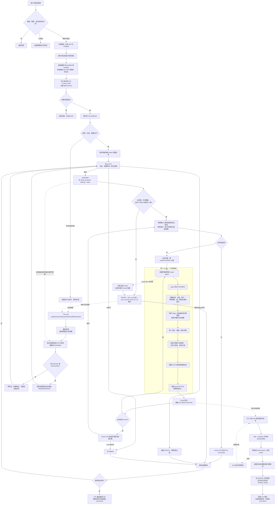

[业务逻辑专辑](/knowledge/business-logic/) / 居民收益付款 / S14

说明付款单作废后的三张底表状态重算、处理范围与执行权、已有查询快照刷新，以及独立事务和失败重试边界，附逐章原文对照。本文保留原文 13 章，正文连续展开，原文对照与流程源码按需展开。

**前置阅读：** [S13 · 付款结果查询快照刷新](/knowledge/business-logic/resident-income/s13-付款结果查询快照刷新/)

**快速阅读：** [阅读起点](#intro) · [核心调用链](#ch3) · [筛选规则](#ch4) · [完整流程](#ch10) · [源码索引](#ch13)

<div class="business-logic-article">

<div id="intro"></div>

## 阅读起点：先跟着一张被作废的付款单走一遍

**以下是帮助理解的假设场景，不是实际运行数据。** 付款单 `1001` 的第 `1` 次提交审核没有通过。创建人希望把这张单作废，让它不再占着相关电站的账单。假设其中一条未付款明细对应平台电站 `501`、账期 `2026-08`。

这里的**站月**（一个电站和一个账期的组合），就是“电站 501 的 2026 年 8 月”。后面刷新状态时，经常以这个组合确定范围，而不是只看付款单号。

用户点击作废后，系统先在一个**本地事务**（这一组数据库操作共同提交或回滚）里完成真正的作废动作：检查权限、原因、提交轮次和状态，把主单改成已作废，处理符合条件的明细，释放这些候选明细上的实际付款锁，写操作日志，并保存一条后续刷新任务。遇到成功或部分付款事实保护的明细，并不是把付款事实抹掉；具体保护规则在第 4 章展开。

这时，主单和真实付款锁已经处理了，但小单账单、合作方账单、差异台账里的状态和金额还需要重新计算。数据库里的**持久化任务**（已经保存下来的待办记录）就是为这件事留下的依据。它保存在 `fi_async_task`，属于 S14。事务提交后，系统可以尝试 **kick**（主动唤起消费者处理这条任务）；主动触发没有执行起来时，定时任务仍可以从任务表找到符合执行条件的记录。

S14 不是再作废一次付款单，也不是把所有账单统一改成“未付款”。它先从这张单的候选明细确定受影响的站月，再读取执行时的真实业务数据，重算三张底表。如果旧单作废后，这个站月又被另一张审核中的付款单占用，计算结果仍可能是“付款审核”，锁引用也应该指向新单。如果这个站月已有其他有效成功付款，相关金额不能因为旧单作废被清零。

三张底表处理后，S14 还会提交 S13，去更新**账单维度快照**（另外保存的一份账单付款状态与金额结果记录）。这里提交的是“只刷新已有快照”的请求，不负责补建缺失快照。**S14 成功表示自己的候选扫描、底表处理和快照任务受理完成，不表示 S13 已经刷新成功。**

把主线压缩成一句话就是：**用户先真正作废付款单，再由 S14 根据当前事实重算账单，最后由独立的 S13 刷新已有快照。** 这条链路没有被原文证明会发送 MQ 消息，也没有被发现执行司库支付指令；它不是一次新的付款操作。

<details class="source-note">
<summary>资料来源与证据边界 · 工作区、HEAD 与未验证事项</summary>

> 居民收益付款单作废之后，账单为什么还需要刷新？本文按原文第 1—13 章逐章展开。
>
> **资料来源与证据边界**：本阅读版仅改写附件《S14-residentIncomePaymentOrderVoidRefreshTask-源码梳理.md》，没有再次访问项目源码、连接数据库、调用业务接口、执行作废或调度任务，也没有运行测试。原文分析日期为 **2026-09-09**，原文证据级别为 **SOURCE\_VERIFIED**（当前本地源码核对）；这不是线上验证结论，也不是本次改写新增的源码核验。
>
> 原文主体工作区为 `/Users/wangyi/BZ/zx-monitor/zxbaif`，HEAD 为 `a1bfacbeb6dfc239d577bd66bf78cd9eb2482efa`；跨服务补充工作区为 `/Users/wangyi/BZ/zx-monitor/zxbaie`，HEAD 为 `21aac5b4821de7e7ae1bd660f896b3e890115cfc`。原文以实际工作区文件为准，两个仓库均有已有未提交改动，原分析未修改业务源码。因此不能仅凭 HEAD 认定文中看到的代码与该提交或部署版本完全一致。
>
> **S14** 是源码中的“作废刷新”阶段编号；**S13** 是后续“快照刷新”阶段编号。它们不是本文的章节号，也与原文存放目录 **S03** 无关。调度频率、线上配置、实际索引、部署版本和真实处理结果，仍然属于原文所说的“暂时无法确认”。

</details>

<details class="original" id="original-0">
<summary>原文对照 · 标题与分析说明</summary>

### residentIncomePaymentOrderVoidRefreshTask 源码梳理

> 分析日期：2026-09-09。证据级别：SOURCE\_VERIFIED（当前本地源码核对）。
>
> 主体源码：`/Users/wangyi/BZ/zx-monitor/zxbaif`，HEAD `a1bfacbeb6dfc239d577bd66bf78cd9eb2482efa`；跨服务补充源码：`/Users/wangyi/BZ/zx-monitor/zxbaie`，HEAD `21aac5b4821de7e7ae1bd660f896b3e890115cfc`。以当前工作区实际文件为准，两个仓库均存在已有未提交改动，本次未修改业务源码。
>
> 本文未连接数据库、未调用业务接口、未执行作废或调度任务。调度频率、线上配置、实际索引、部署版本和真实处理结果均不能由本次源码阅读证明；涉及这些内容均标为“暂时无法确认”。文中 S14 是源码里的作废刷新阶段编号，S13 是下游快照刷新阶段，与文档存放目录 S03 无关。

</details>

<div id="ch1"></div>

## 1. 任务概览

这个任务处理的是“付款单已经作废，但账单展示状态仍然需要收敛”的后续工作。它的起点是 `fi_async_task` 中已有的待办，而不是去所有付款单里搜索“哪些主单已作废”。主单作废、候选明细状态变更、真实付款锁释放，都在生成任务之前的上游作废事务中完成。

业务上，它先找出受影响的电站和账期，再重算小单账单、合作方账单、差异台账，最后提交账单维度快照刷新。技术上，它有定时补偿和提交后主动触发两种入口，但使用同一个消费者。

| 看什么 | 原文中的实际实现，以及应怎样理解 |
| --- | --- |
| XXL-Job Handler（调度平台调用的任务入口名称） | `residentIncomePaymentOrderVoidRefreshTask`。注册了这个名字，不代表已经知道控制台如何调度。 |
| Java 入口 | `ResidentIncomePaymentStatusRefreshJob.residentIncomePaymentOrderVoidRefreshTask(String param)`。 |
| 所属模块 | `zxbaif/baie-business/financial-center`。 |
| 消费服务（真正读取并处理待办的服务） | `ResidentIncomePaymentOrderVoidRefreshAsyncTaskServiceImpl`。 |
| 异步任务类型 | `RESIDENT_INCOME_PAYMENT_ORDER_VOID_REFRESH`。用于从通用任务表中识别 S14。 |
| 业务键（标识是哪张单、哪一轮作废的身份） | `ORDER_VOID:{paymentOrderId}:{submitRound}`。 |
| 任务编码 | `RIPOVR:` 加上业务键的 MD5 十六进制摘要。MD5 在这里用于把业务键转换为固定格式的摘要，不是另外一套业务身份。 |
| 自动消费 | 扫描已到执行时间、且重试次数未耗尽的 `PENDING` 和 `FAILED` 任务。 |
| 定向消费 | 用 `taskCode/taskCodes/businessKey/businessKeys` 找指定任务；找到之后仍然要抢占成功，不能强制绕过限制。 |
| 定时入口的执行方式 | 同一次调用里，任务、页和 chunk（把一页中的站月范围再切出的小批次）都是依次处理；这个循环没有再把工作提交到线程池。 |
| 主动触发 | 上游作废事务提交后，通过主动 kick 线程池，按任务 ID 调用同一消费者。 |
| 单次默认规模 | 最多选 20 个任务；一个任务每页最多读 1000 条候选明细；一个事务最多处理 200 个站月范围。三者是不同层次。 |
| 任务完成的含义 | 候选扫描结束，相关三张底表刷新及快照任务受理完成；不代表下游快照已经完成。 |
| 调度周期、分片与阻塞策略 | 原文只确认了 Handler 注册，无法确认 XXL-Job 控制台中的真实配置。 |

**不要把“20 个任务”理解成“最多处理 20 条明细”，也不要把“一页 1000 条明细”理解成“一次调度只处理一页”。** 单条任务会继续读取后面的页，直到候选页为空。

源码定位：[Job 入口与路由](#source-job)、[消费者](#source-worker)、[任务身份及默认值](#source-support)。

<details class="original" id="original-1">
<summary>原文对照 · 第 1 章</summary>

### 1. 任务概览

**这个任务负责消费“付款单已经作废、账单展示状态仍待刷新”的持久化任务，按受影响的电站和账期重算小单账单、合作方账单、差异台账，再提交账单维度快照刷新。**

它的扫描起点是 `fi_async_task`，不是直接扫描所有已作废付款单。主单作废、候选明细状态更新和真实付款锁释放，在生成任务之前的作废业务事务中完成。

| 项目 | 实际实现 |
| --- | --- |
| XXL-Job Handler | `residentIncomePaymentOrderVoidRefreshTask` |
| Java 入口 | `ResidentIncomePaymentStatusRefreshJob.residentIncomePaymentOrderVoidRefreshTask(String param)` |
| 所属模块 | `zxbaif/baie-business/financial-center` |
| 消费服务 | `ResidentIncomePaymentOrderVoidRefreshAsyncTaskServiceImpl` |
| 异步任务类型 | `RESIDENT_INCOME_PAYMENT_ORDER_VOID_REFRESH` |
| 业务键 | `ORDER_VOID:{paymentOrderId}:{submitRound}` |
| 任务编码 | `RIPOVR:` + 业务键的 MD5 十六进制摘要 |
| 自动消费 | 扫描到期且未耗尽重试次数的 `PENDING`、`FAILED` 任务 |
| 定向消费 | 根据 `taskCode/taskCodes/businessKey/businessKeys` 找指定任务，仍需抢占成功 |
| 定时入口执行方式 | 同一调用内依次处理任务、页和 chunk，没有在该循环中再提交线程池 |
| 主动触发 | 作废事务提交后，通过主动 kick 线程池按任务 ID 调用同一消费者 |
| 单次默认规模 | 最多取 20 个任务；每任务一页 1000 条候选明细；每事务最多 200 个站月范围 |
| 完成含义 | 候选扫描结束、三张底表刷新及快照任务受理完成；不代表下游快照已经完成 |
| 调度周期、分片与阻塞策略 | 源码只有 Handler 注册，XXL-Job 控制台配置暂时无法确认 |

证据：[Job 入口与路由](#source-job)、[消费者](#source-worker)、[任务身份及默认值](#source-support)。

</details>

<div id="ch2"></div>

## 2. 业务目的

<div id="ch2-sub-1"></div>

### 2.1 解决“付款单已作废，账单仍显示占用”的问题

审核不通过，不代表付款单已经自动放弃对账单的占用。用户作废之后，主单状态与真实付款锁虽然已经改变，但用于展示和选单的数据仍需要跟着重算。

这里需要收敛的不只是一个付款状态。原文明确涉及以下几组信息：

| 信息 | 业务上在回答什么 |
| --- | --- |
| 付款状态 | 当前账单处于付款审核、待付款、未付款、付款失败还是已付款；后文还会给出无需付款、部分付款和合作方账单未推送分支。 |
| `locked_payment_order_id`、`locked_order_bill_id` | 账单还在引用哪个付款主单、哪条付款明细？是否仍错误地指向已作废的旧单？ |
| 合作方查询状态、拟付租金校验结果、不合格标识 | 合作方账单当前的校核结论是什么？是否存在有效的不合格结论？ |
| 已付金额、累计已付金额、本次付款金额 | 这个站月已经付了多少，截至账期累计付了多少，本次按当前事实应计算多少。 |
| 账单维度付款快照的金额和状态 | 另外保存的快照结果是否也跟随业务事实更新。 |

这部分计算放在作废事务之后执行。由于刷新待办已经持久化，进程退出、主动触发失败或依赖暂时故障以后，系统仍有补偿入口。但“有补偿入口”不等于无限重试，也不等于已经证明线上最终一定完成；重试上限与其他限制在后文单独说明。

<div id="ch2-sub-2"></div>

### 2.2 为什么不能简单把状态全部改成“未付款”

作废的是一张付款单，不是这个站月的全部业务历史。这个站月可能还有其他付款单、其他成功付款结果、部分付款、不合格结论，也可能收到过合作方账单的变化。

因此处理顺序是：**先根据旧单确定哪些站月需要看，再读取执行时的业务事实，最后交给统一决策服务算结果。** 不能从“旧单作废”直接推出“账单未付款、已付金额为零”。

继续使用开头的假设：旧单作废后，电站 `501` 的 `2026-08` 账单又被新单占用，新单正在审核。刷新时仍应计算为“付款审核”，并引用新单。旧单之外已经存在的有效成功金额，也不会因为旧单作废而被清零。

还有一个特别容易混淆的范围：**候选明细未付款，不等于该站月所有付款事实都为零。** 候选保护是按旧付款单中的具体明细筛选；底表金额汇总则读取站月范围内符合条件的付款结果。两者并不是同一个查询口径。

<div id="ch2-sub-3"></div>

### 2.3 上游究竟已经做了什么

先看业务顺序。作废请求进入后，会检查请求本身、创建人权限、`submitRound`（提交轮次）和作废原因。遇到已经作废的主单，只返回已有任务状态，不重复执行作废副作用。真正进入作废流程的主单，只允许是 `REVIEW_REJECTED(30)`，即审核不通过。

主单变更使用 **CAS**（Compare And Set，只有数据库当前状态仍符合预期才执行更新）。这里要求主单仍是 `REVIEW_REJECTED(30)`，才能改为 `VOIDED(60)`。它不是不检查旧状态就直接覆盖。

对应的实际调用链如下，保留原文的方法与顺序：

```text
voidFiResidentIncomePaymentOrderResult(dto) 〔本地事务〕
  → 校验请求、创建人权限、submitRound、作废原因
  → 已作废：返回已有任务状态，不重复执行副作用
  → 仅允许 REVIEW_REJECTED(30)
  → executeVoidOrder(dto)
      → 主单 CAS：REVIEW_REJECTED(30) → VOIDED(60)
      → 记录受成功/部分付款事实保护的明细样本告警
      → 分批更新候选明细、释放候选明细的 ACTIVE 锁
      → 写作废操作日志
      → submitVoidRefreshTaskSeed(order)
      → 注册 afterCommit kick
  → 事务提交，返回“付款单作废成功，账单释放刷新处理中”
```

其中，候选明细的处理要区分是否有 `ACTIVE`（活跃、正在生效的）付款锁：

| 候选明细的情况 | 上游对明细的处理 |
| --- | --- |
| 有 `ACTIVE` 锁 | 明细改为 `RELEASED(60)`，即释放态。 |
| 没有该锁 | 明细改为 `VOIDED(70)`，即明细作废态。 |

注意，上面两个数字属于**明细状态**；主单的 `VOIDED(60)` 属于**主单状态**。同样的数字在不同状态域里不一定是同一个含义。

锁表还会写入 `RELEASED`、释放时间和释放原因 `ORDER_VOID`，并把锁键改成包含锁 ID 的释放态键。它不仅仅修改账单上的两个锁引用字段。若实际明细更新数、锁释放数与预先统计数不一致，会抛异常，让这次作废事务回滚。

成功或部分付款事实保护的明细会被排除在作废候选之外。原文描述的是：记录受保护明细的样本告警，保留这些明细和付款事实，**不是只要碰到一条受保护明细，就自动否决整张主单作废**。

最后，上游在同一事务里写作废日志、保存 S14 任务种子，并注册 **afterCommit**（事务真正提交之后才执行的回调）。旧注释写的“同事务刷新三表”已经不符合这里的实际调用；真实实现是在事务内保存后续刷新任务种子，三表刷新交给后面的消费者。

源码定位：[上游作废入口](#source-void-entry)、[作废主流程](#source-void-main)、[分批更新与数量核对](#source-void-dml)、[锁释放 SQL](#source-lock-release)。

<details class="original" id="original-2">
<summary>原文对照 · 第 2 章</summary>

#### 2. 业务目的

##### 2.1 解决“付款单已作废，账单仍显示占用”的问题

审核不通过的付款单仍可能占用账单。用户作废后，主单和实际付款锁已改变，但以下展示和选单相关字段也需要同步收敛：

- 账单是否处于付款审核、待付款、未付款、付款失败或已付款。
- `locked_payment_order_id`、`locked_order_bill_id` 是否仍引用旧付款单。
- 合作方查询状态、拟付租金校验结果、不合格标识。
- 已付金额、累计已付金额、本次付款金额。
- 账单维度付款快照中的金额与状态。

该任务把这部分计算放到作废事务之后执行。持久化任务保证进程退出、主动触发失败或暂时性依赖故障之后，仍有补偿入口。

##### 2.2 为什么不能简单把状态全部改成“未付款”

同一个站月可能已有其他付款单、其他成功付款结果、部分付款、不合格结论，或者合作方账单已经发生变化。因此本任务先确定“哪些站月受到作废影响”，再读取执行时的业务事实，交给统一决策服务计算。

例如，旧付款单作废后，账单又被新的审核中付款单占用，刷新结果仍应为“付款审核”，锁引用也应指向新单。已有成功金额也不会因为旧单作废被清零。

注意：**候选明细未付款，不等于该站月所有付款事实都为零。** 候选保护按付款单明细筛选，底表金额汇总则会读取该站月符合条件的付款结果。

##### 2.3 上游究竟已经做了什么

真实调用为：

```text
voidFiResidentIncomePaymentOrderResult(dto) 〔本地事务〕
  → 校验请求、创建人权限、submitRound、作废原因
  → 已作废：返回已有任务状态，不重复执行副作用
  → 仅允许 REVIEW_REJECTED(30)
  → executeVoidOrder(dto)
      → 主单 CAS：REVIEW_REJECTED(30) → VOIDED(60)
      → 记录受成功/部分付款事实保护的明细样本告警
      → 分批更新候选明细、释放候选明细的 ACTIVE 锁
      → 写作废操作日志
      → submitVoidRefreshTaskSeed(order)
      → 注册 afterCommit kick
  → 事务提交，返回“付款单作废成功，账单释放刷新处理中”
```

有 `ACTIVE` 锁的候选明细改为 `RELEASED(60)`；没有该锁的候选明细改为 `VOIDED(70)`。锁表写入 `RELEASED`、释放时间、原因 `ORDER_VOID`，并把锁键改为包含锁 ID 的释放态键。明细更新数、锁释放数与预先统计数不一致，会抛异常回滚。

作废候选排除成功/部分付款事实；遇到受保护明细时，当前实现是保留这些明细和付款事实，而不是自动否决整张主单作废。旧注释中“同事务刷新三表”的描述已不符合这里的真实调用：同事务保存的是后续刷新任务种子。

证据：[上游作废入口](#source-void-entry)、[作废主流程](#source-void-main)、[分批更新与数量核对](#source-void-dml)、[锁释放 SQL](#source-lock-release)。

</details>

<div id="ch3"></div>

## 3. 核心调用链

<div id="ch3-sub-1"></div>

### 3.1 从定时任务入口到单条任务完成

可以先按三个层次理解：**调度入口负责选任务，消费者负责取得任务执行权并翻页，chunk 事务负责一小批站月的实际刷新。** 一条任务不等于一个事务，一页也不等于一个事务。

自动入口和定向入口都会先恢复该类型超时的运行中任务，再查询待处理记录。读到任务以后，必须再通过数据库抢占，才算拿到处理资格。**worker**（执行任务的工作者）在这里需要有自己的身份；**attempt**（某一次执行尝试的标识）用于区分同一任务先后的执行；**lease**（租约，记录本次执行的预期有效时间）则写入任务数据。但租约是否真正决定恢复时间，要看第 4.4 节，不能仅凭字段名推断。

拿到执行权后，先核对任务与已作废主单是否匹配，再读取候选明细。一页里先按站月去重，得到 **scope**（一次刷新所覆盖的站月范围），再拆成多个 chunk。每个 chunk 使用 **scope guard**（以站月为键的数据库保护记录）和 `SELECT FOR UPDATE`（在事务中锁住对应行）来串行保护相关业务刷新。

实际代码链如下。`WithoutGuard` 的含义是“这个统一刷新入口自身不再加那一层 guard”；它并不表示这条 S14 链路完全没有保护，外层 chunk 已经负责了站月 guard。

```text
ResidentIncomePaymentStatusRefreshJob.residentIncomePaymentOrderVoidRefreshTask(param)
  → parseJobParam / unwrapPayload
  → executePaymentOrderVoidRefreshJob
      ├─ 无选择器：executePendingTasks(maxTaskCount)
      └─ 有选择器：executeManualRetry(taskCodes, businessKeys, maxTaskCount)
          → recoverStaleRunningTasks
          → 查询候选 fi_async_task
          → executeTaskList（串行）
              → executeSingleTask
                  → claimTask → doClaimTask
                      → 校验/解析 task_data
                      → 写 workerId、runningAttempt、leaseExpireTime
                      → claimPaymentOrderVoidRefreshTask SQL CAS
                  → validateClaimedTaskIdentity
                  → executeClaimedTask（循环直到候选页为空）
                      → queryPaymentOrderVoidCandidatePage
                      → buildScopeList：按 stationId + billYearMonth 去重
                      → refreshScopeChunks
                          → refreshScopeChunk 〔每个 chunk 一个事务〕
                              → ensure + SELECT FOR UPDATE 站月 guard
                              → guard 标记 RUNNING
                              → refreshStationMonthScopesWithoutGuard
                                  → buildContext
                                  → executeBatchRefreshInTransaction
                                  → doBatchRefresh → doTargetMonthRefresh
                                  → loadBatchRefreshData
                                  → 每个 scope：buildPureRefreshDecision → decide
                                  → applyRefreshDecision → 三张底表 UPDATE
                              → submitRefreshTask（已有快照刷新模式）
                              → guard 释放为 IDLE
                          → chunk 事务提交
                      → 整页完成后推进游标与计数
                  → 候选页为空：markClaimedTaskSuccess
          → 返回选中/成功/失败/跳过数量摘要
  → Result.SUCCESS 映射为 XXL-Job SUCCESS；否则 FAIL
```

`ResidentIncomePaymentClaimHook` 与 inspector（抢占诊断组件）主要帮助观察抢占过程。真正决定能不能执行的条件，仍在 `claimPaymentOrderVoidRefreshTask` SQL 中。日志里“查询到了任务”，不能理解成“已经取得执行权”。

另一个范围边界是：本任务调用 `refreshStationMonthScopesWithoutGuard`，不走通用 `refresh()` 中“额外登记普通状态刷新补偿任务”和“协调付款单主状态”的分支。S14 消费者负责自己的失败重试；每个 chunk 明确提交快照刷新任务。不能把同名服务的其他功能一并算进本任务。

源码定位：[抢占与执行](#source-worker-claim)、[身份、分页与进度](#source-worker-pages)、[chunk 事务](#source-chunk)、[统一批量入口](#source-refresh-entry)、[实际计算与写回循环](#source-refresh-core)。

<div id="ch3-sub-2"></div>

### 3.2 单条任务的身份核验

抢占只是确认“这条任务当前允许我处理”，还要确认“它确实对应这张已作废的主单及本轮提交”。以下五项必须**同时成立，也就是 AND**：

| 核对项 | 精确要求 |
| --- | --- |
| 业务键一致 | 用 `task_data.paymentOrderId + submitRound` 重新生成的业务键，必须等于表中的 `business_key`。 |
| 任务编码一致 | 再用该业务键生成编码，必须等于表中的 `task_code`。 |
| 主单有效存在 | 主单存在，并且 `deleted=0`。 |
| 提交轮次一致 | 主单当前 `submit_round` 等于任务记录的轮次。 |
| 主单已经作废 | 主单当前状态是 `VOIDED(60)`。 |

任意一项不符，都让任务失败，不进入站月刷新。`paymentOrderNo` 只是辅助信息，不参与这组身份判断。

这里**没有**核验 `data_version/current_publish_version`，即数据版本和当前发布版本；任务 JSON 的契约还明确禁止携带这两个版本字段。因此，这里检查了提交轮次，并不等于也检查了发布版本。

<div id="ch3-sub-3"></div>

### 3.3 为什么分页游标按明细 ID

**游标**（记录已经扫描到哪里的位置）使用 `cursorOrderBillId`，不是把整张付款单的明细 ID 数组保存在任务里。下一页按 `id > cursor` 继续读。任务保存主单身份、提交轮次和这个进度位置，就能逐页确定后续范围。

任务的 `task_data` 最大为 **16 KiB**，而且禁止数组。这个约束针对任务 JSON；不能把它误套到支持 `taskCodes/businessKeys` 数组的 Job 入参上。

一页里必须先完成全部 chunk，之后才累计 `processedBillCount`（处理明细计数）、`processedScopeCount`（处理范围计数），并推进游标。页内去重和计数都不能理解成整条任务全局去重；同一个站月可能出现在后续页中。

单条任务会一直处理到候选页为空。`maxTaskCount` 只限制这轮选多少条任务，**不限制每条任务的页数，也不限制它执行多长时间**。页内失败时是否重做已经提交的 chunk，在第 8 章展开。

<details class="original" id="original-3">
<summary>原文对照 · 第 3 章</summary>

#### 3. 核心调用链

##### 3.1 从定时任务入口到单条任务完成

```text
ResidentIncomePaymentStatusRefreshJob.residentIncomePaymentOrderVoidRefreshTask(param)
  → parseJobParam / unwrapPayload
  → executePaymentOrderVoidRefreshJob
      ├─ 无选择器：executePendingTasks(maxTaskCount)
      └─ 有选择器：executeManualRetry(taskCodes, businessKeys, maxTaskCount)
          → recoverStaleRunningTasks
          → 查询候选 fi_async_task
          → executeTaskList（串行）
              → executeSingleTask
                  → claimTask → doClaimTask
                      → 校验/解析 task_data
                      → 写 workerId、runningAttempt、leaseExpireTime
                      → claimPaymentOrderVoidRefreshTask SQL CAS
                  → validateClaimedTaskIdentity
                  → executeClaimedTask（循环直到候选页为空）
                      → queryPaymentOrderVoidCandidatePage
                      → buildScopeList：按 stationId + billYearMonth 去重
                      → refreshScopeChunks
                          → refreshScopeChunk 〔每个 chunk 一个事务〕
                              → ensure + SELECT FOR UPDATE 站月 guard
                              → guard 标记 RUNNING
                              → refreshStationMonthScopesWithoutGuard
                                  → buildContext
                                  → executeBatchRefreshInTransaction
                                  → doBatchRefresh → doTargetMonthRefresh
                                  → loadBatchRefreshData
                                  → 每个 scope：buildPureRefreshDecision → decide
                                  → applyRefreshDecision → 三张底表 UPDATE
                              → submitRefreshTask（已有快照刷新模式）
                              → guard 释放为 IDLE
                          → chunk 事务提交
                      → 整页完成后推进游标与计数
                  → 候选页为空：markClaimedTaskSuccess
          → 返回选中/成功/失败/跳过数量摘要
  → Result.SUCCESS 映射为 XXL-Job SUCCESS；否则 FAIL
```

`ResidentIncomePaymentClaimHook` 和 inspector 主要用于抢占诊断；真正的准入条件仍在 `claimPaymentOrderVoidRefreshTask` SQL 中。不要把诊断日志中的“已查询到任务”当成“已取得执行权”。

本任务调用的是 `refreshStationMonthScopesWithoutGuard`。因此不会走通用 `refresh()` 中额外记录普通状态刷新补偿任务、协调付款单主状态的分支；作废消费者负责自己的失败重试，chunk 显式提交快照任务。

证据：[抢占与执行](#source-worker-claim)、[身份、分页与进度](#source-worker-pages)、[chunk 事务](#source-chunk)、[统一批量入口](#source-refresh-entry)、[实际计算与写回循环](#source-refresh-core)。

##### 3.2 单条任务的身份核验

抢占成功后，消费者必须同时确认：

1. 用 `task_data.paymentOrderId + submitRound` 重新生成的业务键等于表中 `business_key`。
2. 用该业务键生成的编码等于表中 `task_code`。
3. 主单存在且 `deleted=0`。
4. 主单当前 `submit_round` 等于任务的轮次。
5. 主单当前状态为 `VOIDED(60)`。

任一不符，任务失败，不进入站月刷新。`paymentOrderNo` 只是辅助信息，不参与身份判定。此处没有校验 `data_version/current_publish_version`，任务 JSON 契约还明确禁止这两个版本字段。

##### 3.3 为什么分页游标按明细 ID

任务只保存主单身份、轮次和 `cursorOrderBillId`，执行时按 `id > cursor` 读取下一页，无需把全部明细 ID 放入 JSON。`task_data` 最大 16 KiB，并禁止数组。

页内先完成全部 chunk，才累计 `processedBillCount/processedScopeCount` 并推进游标。一个任务会连续处理所有页，`maxTaskCount` 只限制本轮取多少个任务，**不限制每个任务处理多少页或执行多久**。

</details>

<div id="ch4"></div>

## 4. 数据筛选规则

<div id="ch4-sub-1"></div>

### 4.1 Job 入参及默认值

这里首先要分清两份 JSON：**Job 入参决定这次调度怎样选任务；任务行中的 `task_data` 决定这条任务怎样分页、分块和记录执行信息。** 它们不是把同一份配置传两次。

Job 支持三种包装：直接传裸 JSON；用 `{"data":{...}}` 包一层对象；或者用 `{"data":"JSON字符串"}` 把 JSON 放在字符串里。以下保留原文示例，ID 和任务编码都是占位值，不是可直接照抄的真实任务：

```json
{"maxTaskCount":20}
```

```json
{"businessKey":"ORDER_VOID:1001:1","maxTaskCount":1}
```

```json
{"data":{"taskCodes":["RIPOVR:实际摘要"],"businessKeys":["ORDER_VOID:1001:1"],"maxTaskCount":5}}
```

`taskCode` 与 `taskCodes`、`businessKey` 与 `businessKeys` 的单值和列表会合并，去掉空值与两端空格，服务层再去重。任务编码和业务键同时给出时是 **OR**：匹配指定编码，**或者**匹配指定业务键，就可以进入选择范围，不要求两者同时匹配。

默认值和上限必须按所属输入分别看：

| 所属输入与字段 | 默认值 | 上限 | 当前实现真正怎样使用 |
| --- | --- | --- | --- |
| Job 顶层 `maxTaskCount` | 20 | 200 | 这次最多选多少条任务；为空或非正数时取默认值。 |
| 任务 JSON `pageSize` | 1000 | 5000 | 每页最多读取多少条付款单候选明细。 |
| 任务 JSON `scopeChunkSize` | 200 | 1000 | 每个事务最多处理多少个站月范围。 |
| 任务 JSON `runningTimeoutMinutes` | 30 | 1440 | 抢占时用来生成 JSON 中的租约到期时间；不等于超时恢复 SQL 实际使用它。 |
| 任务 JSON `maxTaskCount` | 20 | 200 | 种子代码把它写入 `max_retry_count`。这是字段语义错用疑点，不应解释成合理设计。 |
| 任务 JSON `workerConcurrency` | 1 | 8 | 有校验和归一化，但当前消费循环没有用它控制并发。 |
| 任务 JSON `grayEnabled` | false | — | 有校验和归一化，但当前自动消费没有按它过滤任务。 |

这里的**归一化**（按代码规则整理参数值），不能理解为所有字段都已经连到了执行逻辑。`workerConcurrency` 有值，不代表任务已经并发消费；`grayEnabled=false` 也不代表这条任务不会被自动扫描。

向 Job 传 `pageSize`、`scopeChunkSize`、`runningTimeoutMinutes`、`workerConcurrency` 或 `grayEnabled`，不能据此认为已有任务的 `task_data` 已被修改。`Support` 中即使定义了配置键字符串，也不等于已经接入外部配置；原文确认的主要读取路径是 DTO（承载数据的 Java 对象）默认值和任务 JSON。

**参数格式错误时，当前入口不会拒绝执行。** 解析失败只记 warn 警告日志，返回空参数对象，然后进入默认自动扫描。因此，操作者本来想“只补跑某个任务”，一旦参数格式错误，实际可能变成“按默认条件选一批任务”。这不是本阅读版替代码补上的保护行为，而是必须保留的原文风险。

<div id="ch4-sub-2"></div>

### 4.2 自动扫描 fi\_async\_task

自动入口找的是“未删除、类型正确、状态可执行、时间已到、次数未耗尽”的任务。这些不同组之间都是 **AND**；时间条件内部才是“为空 **OR** 不晚于现在”。

实际查询由 `QueryWrapper`（在 Java 代码中组装 SQL 条件的对象）生成，下面是原文给出的等价 SQL 语义，不是声称程序直接执行这段手写文本：

```sql
SELECT *
FROM fi_async_task
WHERE deleted = 0
  AND task_type = 'RESIDENT_INCOME_PAYMENT_ORDER_VOID_REFRESH'
  AND task_status IN (0, 3)
  AND (next_execute_time IS NULL OR next_execute_time <= :now)
  AND IFNULL(retry_count, 0) < IFNULL(max_retry_count, 3)
ORDER BY next_execute_time ASC, retry_count ASC, id ASC
LIMIT :normalizedMaxTaskCount;
```

其中 `task_status IN (0,3)` 分别是 `PENDING` 和 `FAILED`。`IFNULL(retry_count,0)` 把空重试次数按 0 看待；`IFNULL(max_retry_count,3)` 只在数据库上限为空时才按 3 看待。比较使用严格的小于号 **`<`**，等于上限就不符合条件。

排序依次是 `next_execute_time ASC`、`retry_count ASC`、`id ASC`，最后由归一化后的 `maxTaskCount` 限量。这条真实扫描路径没有调用 XML 中的 `queryNextPaymentOrderVoidRefreshExecutableTask(limit 1)` 方法，不能因为看到那个方法就推断这里只拿一条任务。

查询本身没有按租户、合作方、付款单作废日期或“最近几天”过滤。部署环境若存在全局 SQL 拦截器，是否额外补了条件，原文暂时无法确认。

<div id="ch4-sub-3"></div>

### 4.3 定向查询与实际可执行条件并不相同

手工入口中的“定向”，只表示**查询时优先找指定身份的任务**，不是强制执行，也不是重置失败状态和计数。

| 阶段 | 检查什么 | 没有因此获得什么能力 |
| --- | --- | --- |
| 定向查询 | `deleted=0`、指定任务类型、`task_status IN (0,3)`，再加编码/业务键选择器，按 ID 升序限量。 | 查询阶段不检查时间与次数，可能选中暂时不能执行的记录。 |
| 真正抢占 | 数据库状态仍是 `PENDING/FAILED`；`next_execute_time` 为空或已到；`retry_count < max_retry_count`，空上限按 3 处理。 | 即使刚刚被定向查出来，也不能绕过这些条件。 |

所以，未到重试时间或已耗尽次数的指定任务，会出现“选中但 skipped（跳过）”。`SUCCESS/CANCELLED` 不在可选状态里；手工入口不是让成功或取消任务重新运行的强制重置入口。

还有一个容易忽略的操作范围：自动和手工入口在查询前，都会恢复**该类型的所有超时 RUNNING 任务**。手工给出的编码或业务键，只限制后续定向选取，不限制前面的超时恢复范围。

<div id="ch4-sub-4"></div>

### 4.4 超时 RUNNING 的筛选

任务长时间没有更新时，后续调用可以把它恢复到可重试的状态。但原文确认的判断依据是任务表时间，而不是 JSON 租约。

恢复 SQL 使用以下条件，四项同时成立：

```text
deleted = 0
task_type = 作废刷新类型
task_status = RUNNING(1)
COALESCE(update_time, create_time) <= 当前时间 - 30 分钟
```

`COALESCE(update_time,create_time)` 的意思是优先使用更新时间，更新时间为空才使用创建时间。边界是 **`<= 当前时间 - 30 分钟`**，不是“必须严格超过 30 分钟才算”。

这个 SQL **不读取 `leaseExpireTime`，也不读取每条任务的 `runningTimeoutMinutes`**。因此，不能把任务 JSON 里设置较长超时，解释成恢复逻辑也会跟着延后。

整页进度更新成功，会刷新任务的 `update_time`；单个 chunk 完成，本身不会刷新这条任务的时间。也就是说，一页内部即使已经做成多个 chunk，只要整页进度尚未成功落库，恢复判断看到的时间仍可能很旧。

恢复时会把重试次数加一，并将 `next_execute_time` 设为当前时间。增加后尚未到上限，改为 `PENDING`；达到上限，改为 `FAILED`。已有任务 JSON 和游标保留，不会因为恢复就自动从第一条明细开始。

<div id="ch4-sub-5"></div>

### 4.5 候选付款单明细

S14 需要知道“这张作废单的哪些明细可以作为刷新范围来源”。主表是 `fi_resident_income_payment_order_bill b`；付款事实保护查询使用 `fi_resident_income_payment_result`。

下面每一行筛选项之间都是 **AND**。一条明细必须全部通过，才会进入候选页。表格内部出现的 **OR** 也要保留，不能改成同时满足。

| 筛选项 | 精确条件及业务含义 |
| --- | --- |
| 主单和轮次 | `b.payment_order_id = paymentOrderId AND b.submit_round = submitRound`。只取这个主单、本提交轮次的明细。 |
| 未删除 | `b.deleted = 0`。 |
| 明细类型 | `b.line_type = PAYABLE(10)`。只扫描应付款类型，不扫描 `UNQUALIFIED(20)` 不合格类型。 |
| 明细状态 | `b.line_status <> PAYMENT_SUCCESS(30)`。要求不是支付成功，而不是要求“必须已经是 RELEASED 或 VOIDED”。 |
| 明细结果摘要 | `payment_result_status IS NULL OR NOT IN (PAY_SUCCESS=30, PARTIAL_PAYMENT=60)`。摘要为空可以通过；不为空时不能是成功或部分付款。 |
| 明细已付金额 | `paid_amount IS NULL OR paid_amount = 0`。只能是空或恰好为零。 |
| 最新结果保护 | `latest_result_id` 指向的付款结果，不能有成功/部分付款状态，也不能有 `paid_amount > 0`。任一保护条件命中都会挡住候选。 |
| 全部关联结果保护 | 该 `order_bill_id` 下，不能存在任何成功/部分付款状态或 `paid_amount > 0` 的结果。不是只检查最新那一条。 |
| 游标与排序 | `b.id > COALESCE(cursorOrderBillId,0)`，按 `b.id ASC` 排序，`LIMIT pageSize`。ID 等于游标的那条不会再次进入下一页。 |

有几处边界尤其值得放在一起看。

**第一，“不是成功”不等于“任何其他值都能进”。** 上游把候选明细改为 `RELEASED(60)` 或 `VOIDED(70)` 后，它们仍满足“不是 30”，所以能继续提供范围。但 SQL 中 `line_status <> 30` 不包含 NULL；不能把 NULL 当成普通的“非成功状态”。同样，明细 `paid_amount` 为负数也不是 NULL 或 0，不能通过明细已付金额条件。

**第二，结果保护比“只看最新有效结果”更保守。** 两个保护子查询没有按结果来源、结果类型或“仅最新有效结果”过滤。只要其检查范围内的某个结果有正金额，就可能挡住候选；不能因为它不是最新、不是某种来源，就自行排除这个保护影响。

**第三，这里没有发布版本筛选。** 候选查询不限制 `data_version/current_publish_version`。后续统一刷新加载相关付款明细时，却会限制“当前已发布明细”。两次查询的版本边界不同，不能为了叙述顺畅把它们合并成一套条件。

**第四，页内去重会保留第一条明细的定位信息。** 读取一页后，使用 `stationId + 归一化账期` 去重，只保留首条携带的定位字段。这里的 **locator**（精确定位账单及其关联对象的一组 ID），包括原文明确点名的 `diffId`（差异台账 ID）、`partnerBillId`（合作方账单 ID）、`partnerCustomerAccountId`（合作方账户 ID）。原文没有穷举所有定位字段，本阅读版不自行补出未列明字段。

这次去重只在当前页内发生，不跨页。账期归一化的具体转换规则，原文也没有展开。多个 locator 在同站月内被去重丢弃的可能后果，见第 9.4 节。

源码定位：[候选及付款事实保护 SQL](#source-candidate)、[分页 SQL](#source-candidate-page)。

<div id="ch4-sub-6"></div>

### 4.6 刷新时加载的业务事实

候选明细只是用来决定“刷新哪里”，并不能独自决定“刷成什么”。一个 chunk 会先由 `loadBatchRefreshData` 批量加载业务事实，再按站月逐个作出决策。

这些付款事实**不限于原作废单**。例如，是否有新单占用、这个月累计成功付了多少，都需要看执行时符合规则的数据。

| 数据来源 | 关键读取规则 | 用来回答的问题或保留的边界 |
| --- | --- | --- |
| 小单账单 `fi_customer_bill` | 按精确的 `(station_id,bill_yearmonth)` pairs，也就是电站与账期成对的组合读取；同范围多条时由内存映射择取记录。 | 取得该站月小单账单。原文未展开多条时具体如何择取，不能自行认定必定唯一。 |
| 合作方账单、差异台账 | 有 locator 时按差异 ID、合作方账单 ID、合作方账户 ID 精确加载，并校验关系；只有无 locator 的兼容范围才走站月查询。 | 精确定位与宽范围兼容查询是不同分支。 |
| `fi_customer_account`、`fi_customer_account_partner` | 从账单和 locator 关联账户。 | 提供合作方、站点、收益起算日、当前应付截止月。 |
| 付款锁 `fi_resident_income_payment_bill_lock` | 读取 `RESERVED/ACTIVE`；关联明细与主单都必须未删除；主单 `build_status='PUBLISHED'`，发布版本、轮次与明细一致。 | 判断当前是否仍有有效占用，可能来自别的付款单。 |
| 相关付款单明细 | 站月内 `PAYABLE/UNQUALIFIED`；明细和主单未删除；主单已发布，当前版本及轮次一致；还关联 `selection_session_item` 的手工调整信息。 | 注意这里会读取不合格类型，和第 4.5 节仅扫描 `PAYABLE` 的候选规则不同。 |
| 最近付款结果 | 根据明细 `latest_result_id` 批量取结果；真实司库/导入来源的优先级高于定时兜底失败；同优先级按更新时间、ID 取最近明细。 | 不是简单地拿到任意最新失败就覆盖真实付款结果。 |
| 本月已付汇总 | 站月内结果状态 `PAY_SUCCESS`、结果类型 `NORMAL_PAYMENT`，来源为 `TREASURY_RESERVED/OFFLINE_IMPORT`。 | 金额聚合 SQL 不按原作废单过滤，也不按合作方过滤；状态、类型、来源条件需共同满足。 |
| 累计已付和目标月校验 | 读取 `fi_resident_income_paid_opening_balance`、成功正常付款的月度汇总、小单账户范围内的月度租金。 | 期初已付可以理解为累计计算的起点数据，但不能据此补写原文没有给出的具体公式。 |
| 累计抵扣 | 合作方账单抵扣及 `fi_customer_deduction_opening_balance`。 | 按整站口径参与可用应付校验，不是只看原作废单。 |
| 主站映射 | 通过 property-center 校验平台站、小单站、合作方站的对应关系。 | 防止不同来源的站点标识指向不一致的业务对象。 |
| 付款周期 | 通过 base-center 读取 `fin_partner_profile.payment_cycle/partner_config_version`；复合周期按条件继续补读电站或分段规则。 | 周期及配置版本会影响相关校验；远程依赖的失败分支见第 7.3、9.5 节。 |

有任一 locator 后，不能在合作方账单缺失时就随意退回“按站月随便找一条”。精确定位缺失、关联关系冲突、平台站不匹配，都**可能**使当前 chunk 失败。原文没有把它描述成“遇到任何缺失都一定失败”，也没有声称总有宽泛查询兜底。

源码定位：[批量事实加载](#source-facts)、[locator 组装器](#source-assembler)、[相关明细 SQL](#source-related-bills)、[占用锁 SQL](#source-related-locks)、[成功金额聚合](#source-paid-sql)。

<details class="original" id="original-4">
<summary>原文对照 · 第 4 章</summary>

#### 4. 数据筛选规则

##### 4.1 Job 入参及默认值

支持裸 JSON、`{"data":{...}}` 和 `{"data":"JSON字符串"}`。

```json
{"maxTaskCount":20}
```

```json
{"businessKey":"ORDER_VOID:1001:1","maxTaskCount":1}
```

```json
{"data":{"taskCodes":["RIPOVR:实际摘要"],"businessKeys":["ORDER_VOID:1001:1"],"maxTaskCount":5}}
```

示例中的 ID、编码均为占位值。单值与列表会合并，去空、去两端空格，服务层再去重。任务编码和业务键同时给出时是 **OR**，不是交集。

| 参数/任务数据 | 默认值 | 上限 | 当前消费者用途 |
| --- | --- | --- | --- |
| Job `maxTaskCount` | 20 | 200 | 本次最多选择多少个任务；空、非正数取默认 |
| JSON `pageSize` | 1000 | 5000 | 每页付款单明细数量 |
| JSON `scopeChunkSize` | 200 | 1000 | 单事务站月范围数量 |
| JSON `runningTimeoutMinutes` | 30 | 1440 | 抢占时生成租约到期时间 |
| JSON `maxTaskCount` | 20 | 200 | 被种子代码用于写 `max_retry_count`，见风险章节 |
| JSON `workerConcurrency` | 1 | 8 | 有校验/归一化，当前执行循环未使用它控制并发 |
| JSON `grayEnabled` | false | — | 有校验/归一化，当前自动消费不按它过滤 |

这些 JSON 字段与 Job 顶层参数不是一套输入。向 Job 传 `pageSize` 等字段不会修改已有任务的分页配置。`Support` 中定义配置键字符串不等于已接入外部配置；当前读取路径主要是 DTO 默认值和任务 JSON。

**参数格式错误的行为：** 解析失败仅记 warn，返回空参数对象，随后走默认自动扫描，不会拒绝执行。这可能与操作者“仅补跑指定任务”的原意不同。

##### 4.2 自动扫描 fi\_async\_task

实际由 `QueryWrapper` 生成，语义如下；这里没有调用 XML 中那个 `queryNextPaymentOrderVoidRefreshExecutableTask(limit 1)` 方法。

```sql
SELECT *
FROM fi_async_task
WHERE deleted = 0
  AND task_type = 'RESIDENT_INCOME_PAYMENT_ORDER_VOID_REFRESH'
  AND task_status IN (0, 3)
  AND (next_execute_time IS NULL OR next_execute_time <= :now)
  AND IFNULL(retry_count, 0) < IFNULL(max_retry_count, 3)
ORDER BY next_execute_time ASC, retry_count ASC, id ASC
LIMIT :normalizedMaxTaskCount;
```

没有按租户、合作方、付款单作废日期或最近几天过滤。若部署存在全局 SQL 拦截器额外加条件，其运行时效果暂时无法确认。

##### 4.3 定向查询与实际可执行条件并不相同

定向查询条件是 `deleted=0`、指定类型、`task_status IN (0,3)`，再加任务编码/业务键选择器，按 ID 升序限量。

查询阶段不检查重试次数和执行时间，但**抢占 SQL 仍检查**：

- 数据库中的状态仍为 `PENDING/FAILED`。
- `next_execute_time` 已到或为空。
- `retry_count < max_retry_count`，空上限兜底为 3。

所以未到重试时间、已耗尽次数的定向任务会“选中但跳过”。`SUCCESS/CANCELLED` 不在可选状态里；手工入口并不是强制重置入口。

自动和手工入口在查询前都会恢复该类型所有超时 RUNNING；手工选择器不限制这一步的范围。

##### 4.4 超时 RUNNING 的筛选

恢复 SQL 条件为：

```text
deleted = 0
task_type = 作废刷新类型
task_status = RUNNING(1)
COALESCE(update_time, create_time) <= 当前时间 - 30 分钟
```

它看的是表的更新时间，**不读取 JSON 的 leaseExpireTime，也不读取每任务 runningTimeoutMinutes**。整页进度成功更新会刷新 `update_time`，chunk 完成本身不会刷新这条任务的时间。

恢复会将重试次数加一、下次执行时间设为当前时间；未到上限改为 `PENDING`，达到上限改为 `FAILED`，同时保留已有任务 JSON 和游标。

##### 4.5 候选付款单明细

主表：`fi_resident_income_payment_order_bill b`；保护查询：`fi_resident_income_payment_result`。

以下条件必须全部成立：

| 筛选项 | 精确条件及含义 |
| --- | --- |
| 主单/轮次 | `b.payment_order_id = paymentOrderId AND b.submit_round = submitRound` |
| 未删除 | `b.deleted = 0` |
| 明细类型 | `b.line_type = PAYABLE(10)`；不扫描 `UNQUALIFIED(20)` |
| 明细状态 | `b.line_status <> PAYMENT_SUCCESS(30)`；并不要求必须为 RELEASED 或 VOIDED |
| 明细结果摘要 | `payment_result_status IS NULL OR NOT IN (PAY_SUCCESS=30, PARTIAL_PAYMENT=60)` |
| 明细已付金额 | `paid_amount IS NULL OR paid_amount = 0` |
| 最新结果保护 | `latest_result_id` 指向的结果不能有成功/部分付款状态或 `paid_amount > 0` |
| 全部关联结果保护 | 该 `order_bill_id` 下不能存在任何成功/部分付款状态或 `paid_amount > 0` 的结果 |
| 分页 | `b.id > COALESCE(cursorOrderBillId,0)`；`ORDER BY b.id ASC LIMIT pageSize` |

几个容易误读的细节：

- 上游改为 `RELEASED(60)/VOIDED(70)` 的明细仍满足“不是支付成功”，因此能继续作为刷新范围来源。
- `line_status <> 30` 不包含 SQL NULL；`paid_amount` 为负数也不满足 NULL/0 条件。
- 保护子查询没有按结果来源、结果类型或“仅最新有效结果”过滤；其中任意正金额也会挡住候选。
- 候选查询没有 `data_version/current_publish_version` 限制；它与后续统一刷新加载“当前已发布明细”的查询条件不同。
- 每页按 `stationId + 归一化账期` 去重，只保留首条明细携带的 `diffId/partnerBillId/partnerCustomerAccountId` 等定位字段。去重不跨页。

证据：[候选及付款事实保护 SQL](#source-candidate)、[分页 SQL](#source-candidate-page)。

##### 4.6 刷新时加载的业务事实

`loadBatchRefreshData` 为一个 chunk 批量加载事实，再逐站月决策。范围来自候选明细，但付款事实并不限于原作废单。

| 数据 | 关键读取规则/用途 |
| --- | --- |
| 小单账单 `fi_customer_bill` | 按精确 `(station_id,bill_yearmonth)` pairs 读取；同范围多条时由内存映射择取记录 |
| 合作方账单、差异台账 | 有 locator 时按差异 ID、合作方账单 ID、合作方账户 ID 精确加载并校验关系；无 locator 的兼容范围才走站月查询 |
| `fi_customer_account` / `fi_customer_account_partner` | 从账单及 locator 关联账户，提供合作方、站点、收益起算日、当前应付截止月等事实 |
| 付款锁 `fi_resident_income_payment_bill_lock` | `RESERVED/ACTIVE`；关联明细和主单必须未删除，主单 `build_status='PUBLISHED'`、发布版本/轮次与明细一致 |
| 相关付款单明细 | 站月内 `PAYABLE/UNQUALIFIED`，明细/主单未删除，主单已发布且当前版本、轮次一致；还关联 `selection_session_item` 的手工调整信息 |
| 最近付款结果 | 根据明细 `latest_result_id` 批量取结果；真实司库/导入来源的优先级高于定时兜底失败，同优先级按更新时间、ID 取最近明细 |
| 本月已付汇总 | 结果表中该站月的 `PAY_SUCCESS`、`NORMAL_PAYMENT`，来源为 `TREASURY_RESERVED/OFFLINE_IMPORT`；金额聚合 SQL 不按原作废单过滤，也不按合作方过滤 |
| 累计已付/目标月校验 | 读取 `fi_resident_income_paid_opening_balance`、成功正常付款月度汇总、小单账户范围内的月度租金 |
| 累计抵扣 | 合作方账单抵扣及 `fi_customer_deduction_opening_balance`；按整站口径参与可用应付校验 |
| 主站映射 | 经 property-center 校验平台站、小单站、合作方站的对应关系 |
| 付款周期 | 经 base-center 获取 `fin_partner_profile.payment_cycle/partner_config_version`；复合周期按条件继续补读电站或分段规则 |

有任一 locator 后，不再把合作方账单缺失等问题简单回退为宽泛站月查找。定位缺失、关系冲突、平台站不匹配可能使当前 chunk 失败。

证据：[批量事实加载](#source-facts)、[locator 组装器](#source-assembler)、[相关明细 SQL](#source-related-bills)、[占用锁 SQL](#source-related-locks)、[成功金额聚合](#source-paid-sql)。

</details>

<div id="ch5"></div>

## 5. 主要状态流转

<div id="ch5-sub-1"></div>

### 5.1 作废刷新任务自身

任务状态回答的是“这条刷新待办做到哪一步”，不是“付款单付没付钱”。S14 在 `fi_async_task` 中使用 `PENDING(0)` 待处理、`RUNNING(1)` 运行中、`SUCCESS(2)` 成功、`FAILED(3)` 失败。

原文给出的流转如下：

```text
新建 PENDING(0)
  → 到期、未超重试次数且抢占成功 → RUNNING(1)
      → 候选页为空且终态 CAS 成功 → SUCCESS(2)
      → 业务/SQL/依赖异常 → FAILED(3)，retry_count + 1，1 分钟后可重试
      → 进度/成功 CAS 不匹配 → 当前执行结果记为 skipped，停止任务回写
      → 长时间未更新 → 下轮恢复：PENDING 或 FAILED，retry_count + 1
```

**重试次数增加发生在失败和超时恢复时，正常抢占不增加。** 任务达到上限以后，不会再自动执行。标为成功后，也不会被正常自动或手工查询再次选中。

成功 SQL 会清除错误信息，但不会清空 `retry_count`、`next_execute_time`，也不会清空 JSON 里的 worker、attempt、lease。因此，看到成功任务仍留着旧重试次数或租约信息，不能单凭这些字段认定它还没完成。判断任务是否完成，首先应看 `task_status`。

这里还有两条完全不同的失败写回路线。

| 失败发生在哪里 | 当前处理 | 需要注意的执行权边界 |
| --- | --- | --- |
| 已抢占后的业务处理 | 正常失败时标为 `FAILED`，次数加一，下一次执行时间设为 1 分钟后。 | 相关进度和终态写回有 owner CAS。owner 指当前任务执行权的持有者，S14 用 JSON 中的 worker 与 attempt 识别。 |
| JSON 解析、校验或抢占阶段异常 | 走 `markTaskFailedDirectly`，写错误并把 `retry_count` 直接设到上限，意图停止自动重试。 | 使用 `updateById`，不是同一套 owner CAS；并发覆盖风险见第 9.3 节。 |

进度或成功 CAS 不匹配时，当前执行结果被记为 skipped，并停止任务回写。它不等于已经提交的业务 chunk 会自动回滚。

<div id="ch5-sub-2"></div>

### 5.2 scope guard

S14 有任务级执行权，同时还需要避免同一个站月被冲突地刷新。后者由 `fi_resident_income_payment_status_refresh_scope_guard` 保护。范围键由平台站 ID 和账期生成。

可以把它理解为“这个站月正在由谁处理”的数据库记录，但必须对应到真实行为：代码通过事务行锁保护它，不是仅靠内存里的一把锁。

```text
不存在 → 插入 IDLE、refresh_version=0
  → 按 station_id、bill_yearmonth 顺序 SELECT FOR UPDATE
  → IDLE 或租约为空/到期时设置 RUNNING
  → 本 chunk 的三表刷新 + 快照任务受理
  → 校验 worker_id/running_attempt 后释放 IDLE，refresh_version + 1
```

不存在的 guard 先插入为 `IDLE`（空闲），`refresh_version=0`。随后按 `station_id`、`bill_yearmonth` 的顺序执行 `SELECT FOR UPDATE`。原文给出的可置为运行中条件是 **IDLE，或者租约为空/到期**，不能改写为“只能从 IDLE 开始”。

RUNNING 时会记录来源 `PAYMENT_ORDER_VOID`、当前任务 ID、worker、attempt、lease 和 heartbeat（心跳时间记录）。三表刷新和快照任务受理完成后，要核验 `worker_id/running_attempt` 再释放为 `IDLE`，并让 `refresh_version + 1`。

成功释放时，会清空当前占用和租约，写最近成功来源与时间；这个 SQL **不会把 `running_attempt` 清零**。

上述动作全部发生在同一个 chunk 事务内。chunk 失败，会回滚该 chunk 的 guard 与业务写入；数据库行锁随事务结束释放。这条路径不是为每一个 guard 再创建一条单独的失败任务。

<div id="ch5-sub-3"></div>

### 5.3 三张底表付款状态的决策优先级

刷新不是按旧状态做一个简单减法，而是按“现在有哪些事实”重新决策。统一入口是 `ResidentIncomePaymentStatusDecisionServiceImpl.resolvePaymentStatus`。

下表是有顺序的判断链，**从上往下，先命中就返回，不再继续往下覆盖**。同一行中需要同时出现的事实仍是 AND，原有的“或”仍是 OR。

| 顺序 | 当前事实与精确限制 | 最终 `payment_status` |
| --- | --- | --- |
| 1 | 占用锁对应的主单处于审核中 **或** 审核不通过。 | `30 PAYMENT_REVIEW`，付款审核。 |
| 2 | 占用锁对应主单为 `WAIT_PAY(40)` **或** `PAID(50)`，**并且**最近明细没有成功/失败终态。 | `40 WAIT_PAYMENT`，待付款。 |
| 3 | 只有小单账单、合作方账单缺失，**但有有效线下导入成功金额**。 | `50 PAID`，已付款。 |
| 4 | 有小单账单、无合作方账单；由于前一项已经优先判断，这里不能省去第 3 项的例外。 | `99 PARTNER_BILL_NOT_PUSHED`，合作方账单未推送。 |
| 5 | 合作方 `pre_rent=0`，即拟付租金恰好为零。 | `10 NO_NEED_PAYMENT`，无需付款。 |
| 6 | 不依靠活跃锁的兜底：最近单为 `WAIT_PAY`，**并且**明细摘要为 `WAIT_PAY`，**并且**已付为 0，**并且**本次金额大于 0。 | `40 WAIT_PAYMENT`，待付款。 |
| 7 | `pre_rent>0`，**并且**已付大于 0，**并且**已付不少于 `pre_rent`。等于拟付租金也命中。 | `50 PAID`，已付款。 |
| 8 | 已付大于 0，**并且** `pre_rent` 大于已付。 | `60 PARTIAL_PAYMENT`，部分付款。 |
| 9 | 最近待付款明细的结果摘要 **或** 明细状态为失败，**并且**本次金额大于 0。 | `70 PAYMENT_FAILED`，付款失败。 |
| 10 | 以上均未命中。 | `20 UNPAID`，未付款。 |

因此，“没有付款事实、没有新占用、正常正拟付金额”的典型情形，旧单作废后可以从 `PAYMENT_REVIEW` 回到 `UNPAID`。但这只是特定条件下的结果；上表里的其他事实仍可能让它保留审核态、变为待付款、已付款、部分付款或其他相应状态。

金额和校核结论也要重算，但不能把它们混成一个状态字段。

| 容易混淆的结果 | 原文确认的计算含义 |
| --- | --- |
| 本次付款金额 `current_payment_amount` | 主要由“合作方最新 `pre_rent - 本站月有效正常成功付款金额`”计算。原文用的是“主要”，没有给出全部细节，不能擅自补成无例外的完整公式。 |
| 累计已付金额 `cumulative_paid_amount` | 结合期初与截至账期的汇总计算，不是只看这一张作废单的历史已付。 |
| 拟付校验 `pre_rent_check_result/pre_rent_check_reason` | 另按付款周期、目标月累计应付、整站累计已付和累计抵扣生成。它与付款状态 `payment_status` 是不同结果。 |
| 合作方查询状态 `partner_query_status` | `10 未校核 / 20 校核通过 / 30 校核不通过`；还考虑有效不合格结论、重推待校核标记和金额原因。 |

作废刷新不会无条件把合作方查询状态设为“校核通过”，也不会无条件清除历史不合格结论。

最后提醒一次状态域的区别：主单 `VOIDED(60)` 是“付款单已作废”；明细 `RELEASED(60)` 是“明细释放”；账单 `PARTIAL_PAYMENT(60)` 是“部分付款”。数字相同不代表业务含义相同，判断时必须带上表、字段和枚举名称。

源码定位：[状态决策入口](#source-decision)、[付款状态优先级](#source-decision-status)、[金额计算](#source-amount)。

<details class="original" id="original-5">
<summary>原文对照 · 第 5 章</summary>

#### 5. 主要状态流转

##### 5.1 作废刷新任务自身

```text
新建 PENDING(0)
  → 到期、未超重试次数且抢占成功 → RUNNING(1)
      → 候选页为空且终态 CAS 成功 → SUCCESS(2)
      → 业务/SQL/依赖异常 → FAILED(3)，retry_count + 1，1 分钟后可重试
      → 进度/成功 CAS 不匹配 → 当前执行结果记为 skipped，停止任务回写
      → 长时间未更新 → 下轮恢复：PENDING 或 FAILED，retry_count + 1
```

重试次数在失败和超时恢复时增加，正常抢占不加一。达到上限后不会再自动执行；成功后不再被正常自动/手工查询选中。成功 SQL 清除错误，但没有清空 retry\_count、next\_execute\_time 或 JSON 中的 worker/attempt/lease；判断完成应以 task\_status 为准。

JSON 解析、校验等抢占阶段异常，会走 `markTaskFailedDirectly`：直接把 `retry_count` 设到上限、写错误，意图停止自动重试。该路径使用 `updateById`，与已抢占任务的 owner CAS 不同，详见风险。

##### 5.2 scope guard

表为 `fi_resident_income_payment_status_refresh_scope_guard`，范围键由平台站 ID 和账期生成。

```text
不存在 → 插入 IDLE、refresh_version=0
  → 按 station_id、bill_yearmonth 顺序 SELECT FOR UPDATE
  → IDLE 或租约为空/到期时设置 RUNNING
  → 本 chunk 的三表刷新 + 快照任务受理
  → 校验 worker_id/running_attempt 后释放 IDLE，refresh_version + 1
```

RUNNING 时记录来源 `PAYMENT_ORDER_VOID`、当前任务 ID、worker、attempt、lease、heartbeat。成功后清空当前占用和租约，写最近成功来源与时间；本 SQL 不会把 `running_attempt` 清零。

以上在同一个 chunk 事务内完成。失败回滚该 chunk 的 guard 与业务写入，数据库行锁随事务结束释放；不是每个 guard 另外创建一条失败任务。

##### 5.3 三张底表付款状态的决策优先级

统一 `ResidentIncomePaymentStatusDecisionServiceImpl.resolvePaymentStatus` 按以下顺序判断，先命中先返回：

| 顺序 | 当前事实 | payment\_status |
| --- | --- | --- |
| 1 | 占用锁对应主单处于审核中或审核不通过 | `30 PAYMENT_REVIEW` 付款审核 |
| 2 | 占用锁对应主单为 WAIT\_PAY(40) 或 PAID(50)，且最近明细没有成功/失败终态 | `40 WAIT_PAYMENT` 待付款 |
| 3 | 只有小单账单、合作方账单缺失，但有有效线下导入成功金额 | `50 PAID` 已付款 |
| 4 | 有小单账单、无合作方账单 | `99 PARTNER_BILL_NOT_PUSHED` |
| 5 | 合作方 `pre_rent=0` | `10 NO_NEED_PAYMENT` 无需付款 |
| 6 | 无需依靠活跃锁的兜底：最近单 WAIT\_PAY、明细摘要 WAIT\_PAY、已付为 0、本次金额大于 0 | `40 WAIT_PAYMENT` |
| 7 | `pre_rent>0`、已付大于 0 且已付不少于 pre\_rent | `50 PAID` |
| 8 | 已付大于 0 且 pre\_rent 大于已付 | `60 PARTIAL_PAYMENT` 部分付款 |
| 9 | 最近待付款明细的结果摘要或明细状态为失败，且本次金额大于 0 | `70 PAYMENT_FAILED` |
| 10 | 其余情况 | `20 UNPAID` 未付款 |

典型的无付款事实、无新占用、正常正拟付金额场景，旧单作废后由 `PAYMENT_REVIEW` 回到 `UNPAID`。但上表其他事实仍可能使其落入不同状态。

金额上，本次付款金额主要由“合作方最新 `pre_rent - 本站月有效正常成功付款金额`”计算；累计已付结合期初及截至账期的汇总计算。拟付校验另按付款周期、目标月累计应付、整站累计已付和累计抵扣生成，不能把它与 `payment_status` 混为一个状态。

合作方查询状态为 `10 未校核 / 20 校核通过 / 30 校核不通过`，还考虑有效不合格结论、重推待校核标记、金额原因。作废刷新不会无条件把它设为“校核通过”，也不会无条件清除历史不合格结论。

证据：[状态决策入口](#source-decision)、[付款状态优先级](#source-decision-status)、[金额计算](#source-amount)。

</details>

<div id="ch6"></div>

## 6. 数据库影响

<div id="ch6-sub-1"></div>

### 6.1 本定时任务直接写入

这一节回答“刷新到底改了哪些表”，不是只列读取依赖。S14 会写自己的任务与站月保护记录，更新三张业务底表，并在 chunk 内受理 S13 快照任务。

为了避免把多张表的字段想象成完全一致，先分别列出写入范围。

| 表 | 主要写入字段 | 更新范围与边界 |
| --- | --- | --- |
| `fi_async_task`，S14 任务行 | `task_status`、`task_data`、`retry_count`、`next_execute_time`、`error_message`、`update_time`、`update_user_id`。 | 用于抢占、进度、重试、终态。S14 的 owner/attempt/lease 在 JSON 中，不能拿普通列 `running_attempt` 代替判断执行权。 |
| `fi_resident_income_payment_status_refresh_scope_guard` | `guard_status`、`refresh_version`、`current_source_*`、`worker_id`、`running_attempt`、`lease_expire_time`、`heartbeat_time`、`last_success_*`。 | 按站月串行保护业务刷新。星号表示原文按字段族描述，没有提供所有完整列名，本阅读版不补造。 |
| `fi_customer_bill`，小单账单 | `payment_status`、`paid_amount`、`cumulative_paid_amount`、`locked_payment_order_id`、`locked_order_bill_id`、`payment_status_update_time`。 | 按 `station_id + bill_yearmonth` 更新。本路径不写 `current_payment_amount`，也不写拟付校验字段。 |
| `fi_customer_bill_partner`，合作方账单 | `payment_status`、`paid_amount`、`cumulative_paid_amount`、`locked_payment_order_id`、`locked_order_bill_id`、`payment_status_update_time`；另有 `partner_query_status`、`pre_rent_check_result`、`pre_rent_check_reason`、`current_payment_amount`、`unqualified_flag`、`unqualified_reason`、`last_unqualified_order_id`、`last_unqualified_time`。 | 优先按决策中的合作方账单 ID 更新；该 ID 为空时，退回站月更新。 |
| `fi_monthly_income_difference`，差异台账 | `payment_status`、`partner_query_status`、`pre_rent_check_result`、`pre_rent_check_reason`、`paid_amount`、`cumulative_paid_amount`、`current_payment_amount`、`locked_payment_order_id`、`locked_order_bill_id`、`unqualified_flag`、`unqualified_reason`、`payment_status_update_time`。 | 优先按 diff ID；其次按 `small_station_no + share_month`；再退回 `station_id + share_month`。这个定位优先级不能调换。 |
| `fi_async_task`，S13 任务行 | 快照请求 JSON、状态、`request_generation`、重试与时间。 | 每个 chunk 受理 `RESIDENT_INCOME_PAYMENT_BILL_DIMENSION_SNAPSHOT_REFRESH` 任务。`request_generation` 是快照请求的代次标识，不是 S14 的页游标。 |

三张底表使用同一份 **decision**（统一计算得出的状态、金额和校核决策结果），但并不写相同的全部字段。例如，不能因为合作方账单写了本次付款金额，就推断小单账单也写了。

当前路径每个 scope 分别调用三次 Mapper update，即小单账单、合作方账单、差异台账各一次。这里没有调用三表批量 DML repository（把数据库写操作集中批量执行的数据访问实现），也没有核对每次 UPDATE 实际命中了多少行。

这意味着“进入了写回调用”不能直接等同于“三张底表的目标行全部存在且被更新”。某些目标行缺失时是否仍完成，要结合第 8、9 章的完成判定边界看。

<div id="ch6-sub-2"></div>

### 6.2 本任务读取、但不负责作废或改写的业务事实

`fi_resident_income_payment_order` 提供主单身份和状态；`fi_resident_income_payment_order_bill` 提供候选和相关明细；`fi_resident_income_payment_bill_lock` 提供当前占用；`fi_resident_income_payment_result` 提供付款事实。

在本任务里，它们主要是读取来源。**S14 不会再次把主单置为作废，不会再次释放这些业务付款锁，也不会创建或作废付款结果。** 账单表里的锁引用会重新计算，不等于又执行了一次锁表释放。

账户、期初已付、期初抵扣和分段规则也参与计算。跨服务读取的 `fin_partner_profile`、`prop_station`、`prop_station_partner` 提供配置与映射。这条链路对这些数据的职责同样是读取，而不是改写。

上游作废事务还会写 `fi_resident_income_payment_order_log`；原文同时提到审计记录，但没有进一步穷举其余名称。不能把上游审计写入算成“S14 每次重试都会再写一条作废日志”。

<div id="ch6-sub-3"></div>

### 6.3 下游快照任务写入

下面三张表属于 S13 后续处理，不是 S14 在当前调用里已经把快照全部算完的证明。

| S13 涉及的表 | 负责保存什么 |
| --- | --- |
| `fi_resident_income_payment_snapshot_refresh_progress` | 运行代次、执行 attempt、worker、游标和租约。 |
| `fi_resident_income_payment_bill_dimension_snapshot_scope_guard` | 快照站月互斥与执行权。它与 S14 三表刷新的 scope guard 不是同一张表。 |
| `fi_resident_income_payment_bill_dimension_snapshot` | 已有账单维度快照的更新结果；按 `id + diff_id` 匹配，当前模式只更新已有行。 |

快照 UPDATE 主要覆盖：实际已付、失败金额与原因、付款次数和失败次数、最近付款时间、账单维度付款状态、外部付款状态、来源、金额异常标记、刷新时间及版本。非空收款信息可以回填。原文没有逐一给出这些自然语言项目的全部列名，本阅读版不另造字段对应。

其中明确给出的公式是：`payment_amount_difference = 新实际支付金额 - 已有 planned_amount`。这里不会覆盖计划金额 `planned_amount`，不能把“金额差异重新计算”理解成“计划金额也跟着被改了”。

源码定位：[S14 任务 SQL](#source-task-sql)、[guard SQL](#source-guard-sql)、[三表写回](#source-writeback)、[快照受理事务](#source-snapshot-tx)、[快照更新 SQL](#source-snapshot-sql)。

<details class="original" id="original-6">
<summary>原文对照 · 第 6 章</summary>

#### 6. 数据库影响

##### 6.1 本定时任务直接写入

| 表 | 主要写入字段 | 更新范围/用途 |
| --- | --- | --- |
| `fi_async_task`（S14） | `task_status/task_data/retry_count/next_execute_time/error_message/update_time/update_user_id` | 抢占、进度、重试与终态；owner/attempt/lease 位于 JSON，不能拿普通列 `running_attempt` 代替判断 S14 的执行权 |
| `fi_resident_income_payment_status_refresh_scope_guard` | `guard_status/refresh_version/current_source_*/worker_id/running_attempt/lease_expire_time/heartbeat_time/last_success_*` | 按站月串行保护业务刷新 |
| `fi_customer_bill` | `payment_status/paid_amount/cumulative_paid_amount/locked_payment_order_id/locked_order_bill_id/payment_status_update_time` | `station_id + bill_yearmonth`；本路径不写 `current_payment_amount` 或拟付校验字段 |
| `fi_customer_bill_partner` | 上述状态/金额/锁字段，另含 `partner_query_status/pre_rent_check_result/pre_rent_check_reason/current_payment_amount/unqualified_flag/unqualified_reason/last_unqualified_order_id/last_unqualified_time` | 优先使用决策中的合作方账单 ID；为空时退回站月更新 |
| `fi_monthly_income_difference` | `payment_status/partner_query_status/pre_rent_check_result/pre_rent_check_reason/paid_amount/cumulative_paid_amount/current_payment_amount/locked_payment_order_id/locked_order_bill_id/unqualified_flag/unqualified_reason/payment_status_update_time` | 优先 diff ID；其次 `small_station_no + share_month`；再退回 `station_id + share_month` |
| `fi_async_task`（S13） | 快照请求 JSON、状态、`request_generation`、重试与时间 | 每 chunk 受理 `RESIDENT_INCOME_PAYMENT_BILL_DIMENSION_SNAPSHOT_REFRESH` 任务 |

三表 UPDATE 使用同一份 decision，但更新字段并非完全相同。每个 scope 分别调用三次 Mapper update，当前路径没有调用三表批量 DML repository，也没有核对每次 UPDATE 的命中行数。

##### 6.2 本任务读取、但不负责作废或改写的业务事实

`fi_resident_income_payment_order`、`fi_resident_income_payment_order_bill`、`fi_resident_income_payment_bill_lock`、`fi_resident_income_payment_result` 在这里主要提供身份、候选、占用和付款事实。本任务不会再次置主单作废、再次释放这些业务锁，也不会创建或作废支付结果。

账户、期初已付、期初抵扣、分段规则也用于计算；远程的 `fin_partner_profile`、`prop_station`、`prop_station_partner` 提供配置和映射。本条链路对它们是读取。

上游作废事务另写 `fi_resident_income_payment_order_log` 等审计记录，不能误记为定时任务每次重试都会再次写一条作废日志。

##### 6.3 下游快照任务写入

- `fi_resident_income_payment_snapshot_refresh_progress`：运行代次、执行 attempt、worker、游标和租约。
- `fi_resident_income_payment_bill_dimension_snapshot_scope_guard`：快照站月互斥和执行权。
- `fi_resident_income_payment_bill_dimension_snapshot`：只更新已有行，按 `id + diff_id` 匹配。

快照 UPDATE 主要覆盖实际已付、失败金额与原因、付款/失败次数、最近付款时间、账单维度付款状态、外部付款状态、来源、金额异常标记、刷新时间及版本等。`payment_amount_difference` 使用新实际支付金额减已有 `planned_amount`，这里不覆盖计划金额。非空收款信息可回填。

证据：[S14 任务 SQL](#source-task-sql)、[guard SQL](#source-guard-sql)、[三表写回](#source-writeback)、[快照受理事务](#source-snapshot-tx)、[快照更新 SQL](#source-snapshot-sql)。

</details>

<div id="ch7"></div>

## 7. 异步/后续处理

<div id="ch7-sub-1"></div>

### 7.1 作废后主动 kick 与定时补偿共用消费者

业务上，系统希望作废提交后就尽快开始刷新，不必只等下一次定时扫描。于是它可以发出一次主动 kick。但主动 kick 只是一条“请处理这个任务 ID”的提示；真正能在进程退出后留下来的依据，还是数据库里的任务种子。

原文跟踪到的调用链如下：

```text
submitVoidRefreshTaskSeed
  → ResidentIncomePaymentAfterCommitKickService.registerAfterCommit
  → 事务真正提交后 dispatchSafely
  → ResidentIncomePaymentKickDispatcher.kick
  → residentIncomePaymentKickExecutor
  → route=S14_ORDER_VOID_REFRESH 的 adapter.kickExact(signal)
  → selectById(taskId)
  → executeTaskList(singletonList)
  → 与 XXL-Job 共用抢占和业务处理
```

`route=S14_ORDER_VOID_REFRESH` 是把提示路由给 S14 的标识。adapter（把这一路由接到具体消费者的适配器）通过 `kickExact(signal)`，按 `taskId` 查询任务，再把这条任务放进单元素列表，进入与 XXL-Job 共用的抢占和业务处理。它不是另写了一套“绕过数据库抢占的快速通道”。

重复信号可以在同一个进程内合并；不同进程之间是否只由一个 worker 真正执行，最终还是靠数据库条件抢占。

线程池与开关要分开看：

| 项目 | 源码中的默认值或实现 |
| --- | --- |
| 核心线程数 | 2。 |
| 最大线程数 | 4。 |
| 队列容量 | 128。 |
| 拒绝策略 | `AbortPolicy`，即无法接纳提交时以拒绝异常处理，而不是把队列无限放大。 |
| 线程名前缀 | `resident-income-kick-`。 |
| 总开关 | 默认 true。 |
| admission（准入开关） | 默认 true。 |
| 阶段开关 | 默认 false。 |
| 灰度比例（只放行部分请求的比例） | 默认 0。 |

因此，看到线程池存在，不能推断 S14 已经在线上主动执行。S14 是否真的通过主动 kick 运行，取决于运行配置，原文暂时无法确认。

也不能拿任务 JSON 的 `grayEnabled=false` 代替这里的阶段开关和灰度配置。它们属于两套不同输入，前者并未实际用于当前自动消费过滤。

afterCommit 派发失败只记录日志，不回滚已经提交的作废事务。阶段关闭、灰度未命中、队列拒绝或进程退出时，持久化种子仍可以由定时入口继续消费。当然，后续消费仍受状态、时间、次数和调度是否实际启用的约束。

源码定位：[afterCommit 派发](#source-kick-after)、[线程池派发](#source-kick-dispatch)、[线程池配置](#source-kick-pool)、[主动触发配置](#source-kick-config)。

<div id="ch7-sub-2"></div>

### 7.2 S14 会再提交独立的 S13 快照任务

三张底表更新之后，账单维度快照还有独立的刷新过程。因此每个 S14 chunk 会在底表刷新后调用快照任务服务，先把请求交给 S13，而不是在这里同步等待整条快照链路完成。

```text
ResidentIncomePaymentBillDimensionSnapshotRefreshTaskService.submitRefreshTask
  → snapshotService.buildContext
  → buildTaskSnapshot
  → SnapshotRefreshTransactionService.acceptRequest
      → 首次插入任务；重复请求推进 request_generation
      → RUNNING 保持运行；其他可受理状态回到 PENDING
      → 已 CANCELLED：抛异常，导致当前 S14 chunk 回滚
  → 当前 chunk 提交后注册 S13_SNAPSHOT_REFRESH kick
```

这次请求的 `writeMode=EXISTING_ONLY_REFRESH`，即“只更新已经存在的快照”；来源是 `PAYMENT_ORDER_VOID`；范围只有**当前 chunk 的电站账期列表**。

在 `SnapshotRefreshTransactionService.acceptRequest` 中，第一次请求插入任务，重复请求推进 `request_generation`。已经 `RUNNING` 的任务继续保持运行；其他可受理状态回到 `PENDING`。如果已有任务是 `CANCELLED`，会抛异常，导致当前 S14 chunk 回滚。

这里的 `request_generation` 可以理解为“这个快照任务又受理到了第几代请求”。它并不是付款单的提交轮次，也不是 S14 的重试次数。原文没有给出完整的代次算法，本阅读版不自行补全。

S13 后续有两种执行入口：主动 kick，或者 `residentIncomePaymentBillDimensionSnapshotRefreshAsyncTask` 定时补偿。它们共同调用 `ResidentIncomePaymentBillDimensionSnapshotAsyncTaskServiceImpl.executeTask`，通过 task 与 progress 的代次/attempt 抢占，再分页处理 scope。

每个 scope 在 `refreshOwnedScope` 事务中校验任务 owner、锁住 progress、锁住快照 guard，然后执行：

```text
snapshotService.refreshScope
  → recalculateExistingScope
  → 查询站月下可见差异台账，逐条按 locator 重算
  → 查询有效付款单明细、相关主单、有效结果与账单付款汇总
  → buildSnapshot
  → snapshotMapper.updateExisting
  → 推进 S13 游标并释放 guard
```

这里会查询站月下的可见差异台账，并逐条按 locator 重算，随后读取有效付款单明细、相关主单、有效结果与账单付款汇总，构建快照并执行 `snapshotMapper.updateExisting`。

要区分两种“没有数据”：

| 情形 | 当前模式的行为 |
| --- | --- |
| 没有差异台账 | 记录跳过。 |
| 有重算范围，但没有已有快照行 | UPDATE 命中 0，仅记录 `UPDATE_MISS`，不会补建。 |

创建快照的业务权限属于另外的“审核通过”模式，不属于这次作废刷新。不能因为本次 S13 执行了，就推断缺失快照会被自动修复。

**S14 SUCCESS 只证明快照任务已经受理，不等待 S13 成功。** S13 失败后由自己的任务状态和重试机制处理，不会把已经完成的 S14 倒退成失败。S13 也可以在 S14 后续 chunk 仍执行时，处理已经提交的范围。

源码定位：[快照种子提交](#source-snapshot-submit)、[S13 消费逻辑](#source-snapshot-worker)、[快照事务与 owner 检查](#source-snapshot-tx)、[已有快照重算](#source-snapshot-existing)。

<div id="ch7-sub-3"></div>

### 7.3 Feign 是本次刷新事务内的同步依赖

**Feign**（这里用于 Java 服务间远程接口调用的客户端机制）不是本链路中的消息通知。S14 为了计算正确的状态与拟付校验，需要在当前刷新过程中等待远程配置或站点事实返回。

这些调用发生在 scope guard 的数据库事务持锁期间。因而“远程依赖是否返回、返回的是数据还是兜底值”既影响结果，也可能影响持锁时间。

**合作方默认付款周期：先按合作方查档案，再决定是否有公式可算。**

实际链路是 `resolveTargetMonthPaymentCycleBasis → queryEffectiveConfigStrict → IFinPartnerProfileServiceFeign.queryPartnerProfileInfo → base-center /partnerProfile/queryPartnerProfileInfo → FinFinPartnerProfileServiceImpl → FinPartnerProfileMapper.queryPage`。

查询使用 `search.id=partnerOrgId`，读取 `fin_partner_profile.payment_cycle/partner_config_version`。如果确实没有配置，就不计算该项公式。直接抛出的异常会让 chunk 失败；但 **fallback**（远程调用失败时返回替代结果的降级实现）可能返回 null，把故障表现成“无配置”，这与直接抛异常不同，见第 9.5 节。

**精确 locator 的平台站映射：核对几条定位路径最终是否指向同一站。**

调用链是 `ResidentIncomePaymentFactAssembler → ResidentIncomePlatformStationDomainService.resolve → ResidentIncomePlatformStationResolver`。

解析器批量调用 `IPropStationServiceFeign.queryPropStationList`，处理小单站 ID/平台站 ID；还调用 `IPropStationPartnerServiceFeign.queryStationAndPatner`，处理合作方站 ID/主站 ID。后一个调用关联 `prop_station_partner.main_station_id=prop_station.id`。原方法名就是 `Patner`，这里保留源码拼写，不改成另一个不存在的方法名。

它要校验多路径映射是否一致；依赖异常、缺失、冲突会反馈给事实校验。不能拿到任意一个站点结果，就跳过其余关系检查。

**阳光复合周期：还需要电站的记录方式。**

链路是 `PaymentCycleCalculateService.calculate → PaymentCycleResolveService.resolveSungrowComposite → IPropStationServiceFeign.queryPropStationInfoById → property-center → PropStationMapper.queryById`。

这里读取 `prop_station.record_way`，据此决定基础付款周期。异常会被转成“无电站事实”；因子缺失会使周期不可计算，最终抛业务异常。它并不是“远程出错就总能用默认周期继续”。

**尚方复合周期：按条件补读账户、分段规则和已生成账期。**

`resolveShangfangComposite` 按条件读取 `fi_customer_account`、`fi_customer_share_rule`，必要时查询最大已生成账期，根据租金方式和变更类型解析基础周期。原文没有给出所有租金方式、变更类型的分支细节，不能在阅读版中自行编造。

已追踪到的 S14 主链及上述后续处理使用数据库任务和本地线程池。原文**未发现**本任务发送 MQ（消息队列）或执行司库支付指令；这是本次跟踪范围内的结论，不能放大成整个居民收益系统都没有 MQ 或支付调用。

真实网络超时、重试、熔断是否启用，客户端依赖 JAR 是否与两个工作区的版本一致，都暂时无法确认。

源码定位：[严格周期查询](#source-cycle-config)、[周期基础加载](#source-cycle-basis)、[Feign 客户端](#source-base-feign)、[Feign fallback](#source-base-fallback)、[平台站解析](#source-station-resolver)、[复合周期补事实](#source-cycle-resolve)。

<details class="original" id="original-7">
<summary>原文对照 · 第 7 章</summary>

#### 7. 异步/后续处理

##### 7.1 作废后主动 kick 与定时补偿共用消费者

```text
submitVoidRefreshTaskSeed
  → ResidentIncomePaymentAfterCommitKickService.registerAfterCommit
  → 事务真正提交后 dispatchSafely
  → ResidentIncomePaymentKickDispatcher.kick
  → residentIncomePaymentKickExecutor
  → route=S14_ORDER_VOID_REFRESH 的 adapter.kickExact(signal)
  → selectById(taskId)
  → executeTaskList(singletonList)
  → 与 XXL-Job 共用抢占和业务处理
```

主动 kick 仅传任务 ID 提示，数据库种子才是持久化依据。重复信号在进程内可合并，跨进程最终仍依靠数据库条件抢占。

线程池源码默认核心 2、最大 4、队列 128，拒绝策略为 `AbortPolicy`，线程名前缀 `resident-income-kick-`。总开关及 admission 默认 true，但阶段开关默认 false、灰度比例默认 0；S14 是否实际主动执行取决于运行配置，暂时无法确认。不能把任务 JSON 的 `grayEnabled=false` 当成这套主动 kick 的阶段配置。

提交后派发异常会记录日志，不回滚已经提交的作废事务。阶段关闭、灰度未命中、队列拒绝或进程退出时，留下的持久化任务可由定时入口继续消费。

证据：[afterCommit 派发](#source-kick-after)、[线程池派发](#source-kick-dispatch)、[线程池配置](#source-kick-pool)、[主动触发配置](#source-kick-config)。

##### 7.2 S14 会再提交独立的 S13 快照任务

chunk 在底表刷新后调用：

```text
ResidentIncomePaymentBillDimensionSnapshotRefreshTaskService.submitRefreshTask
  → snapshotService.buildContext
  → buildTaskSnapshot
  → SnapshotRefreshTransactionService.acceptRequest
      → 首次插入任务；重复请求推进 request_generation
      → RUNNING 保持运行；其他可受理状态回到 PENDING
      → 已 CANCELLED：抛异常，导致当前 S14 chunk 回滚
  → 当前 chunk 提交后注册 S13_SNAPSHOT_REFRESH kick
```

请求中的 `writeMode=EXISTING_ONLY_REFRESH`，来源 `PAYMENT_ORDER_VOID`，范围仅为这一 chunk 的电站账期列表。

后续有两条执行入口：S13 主动 kick，或 `residentIncomePaymentBillDimensionSnapshotRefreshAsyncTask` 定时补偿。共同调用 `ResidentIncomePaymentBillDimensionSnapshotAsyncTaskServiceImpl.executeTask`，通过 task + progress 的代次/attempt 抢占，分页处理 scope。

每个 scope 在 `refreshOwnedScope` 事务中校验任务 owner、锁 progress、锁快照 guard，再执行：

```text
snapshotService.refreshScope
  → recalculateExistingScope
  → 查询站月下可见差异台账，逐条按 locator 重算
  → 查询有效付款单明细、相关主单、有效结果与账单付款汇总
  → buildSnapshot
  → snapshotMapper.updateExisting
  → 推进 S13 游标并释放 guard
```

没有差异台账时记录跳过；没有已有快照行时 UPDATE 命中 0，只记录 `UPDATE_MISS`，不会补建。需要创建快照的业务权限属于另外的审核通过模式。

**S14 SUCCESS 只证明快照任务已经受理，不等待 S13 成功。** S13 执行失败由自己的任务状态和重试处理，不倒退已经完成的 S14。

证据：[快照种子提交](#source-snapshot-submit)、[S13 消费逻辑](#source-snapshot-worker)、[快照事务与 owner 检查](#source-snapshot-tx)、[已有快照重算](#source-snapshot-existing)。

##### 7.3 Feign 是本次刷新事务内的同步依赖

| 场景 | 关键调用链 | 业务字段与失败行为 |
| --- | --- | --- |
| 合作方默认付款周期 | `resolveTargetMonthPaymentCycleBasis → queryEffectiveConfigStrict → IFinPartnerProfileServiceFeign.queryPartnerProfileInfo → base-center /partnerProfile/queryPartnerProfileInfo → FinFinPartnerProfileServiceImpl → FinPartnerProfileMapper.queryPage` | `search.id=partnerOrgId`，读取 `fin_partner_profile.payment_cycle/partner_config_version`；真实无配置则不计算该项公式。直接抛出的异常会使 chunk 失败，但 Feign fallback 返回 null 的情况见风险 |
| 精确 locator 的平台站映射 | `ResidentIncomePaymentFactAssembler → ResidentIncomePlatformStationDomainService.resolve → ResidentIncomePlatformStationResolver` | 批量调用 `IPropStationServiceFeign.queryPropStationList`（小单站 ID/平台站 ID）及 `IPropStationPartnerServiceFeign.queryStationAndPatner`（合作方站 ID/主站 ID）；后者关联 `prop_station_partner.main_station_id=prop_station.id`。校验多路径是否一致；依赖异常、缺失、冲突会反馈给事实校验 |
| 阳光复合周期 | `PaymentCycleCalculateService.calculate → PaymentCycleResolveService.resolveSungrowComposite → IPropStationServiceFeign.queryPropStationInfoById → property-center → PropStationMapper.queryById` | 读取 `prop_station.record_way` 决定基础付款周期；异常被转为无电站事实，因子缺失会使周期不可计算，最终抛业务异常 |
| 尚方复合周期 | `resolveShangfangComposite` | 条件读取 `fi_customer_account`、`fi_customer_share_rule`，必要时查询最大已生成账期；根据租金方式及变更类型解析基础周期 |

这些调用发生在 scope guard 的数据库事务持锁期间，不是消息通知。已追踪到的 S14 主链及上述后续处理使用数据库任务和本地线程池，未发现本任务发送 MQ 或执行司库支付指令。真实网络超时、重试、熔断是否启用以及客户端依赖 JAR 是否与这两份工作区一致，暂时无法确认。

证据：[严格周期查询](#source-cycle-config)、[周期基础加载](#source-cycle-basis)、[Feign 客户端](#source-base-feign)、[Feign fallback](#source-base-fallback)、[平台站解析](#source-station-resolver)、[复合周期补事实](#source-cycle-resolve)。

</details>

<div id="ch8"></div>

## 8. 异常与重复执行

<div id="ch8-sub-1"></div>

### 8.1 事务边界决定“失败后保留什么”

不能只问“失败了会不会回滚”，必须问“失败发生在哪个事务、哪些事务已经提交”。上游作废是一个事务，每个 S14 chunk 又是一个事务，S13 则是后续独立处理。它们不是一个从点击作废到全部快照完成的大事务。

| 失败位置 | 已完成部分会怎样 | 当前实现的后续处理 |
| --- | --- | --- |
| 上游作废事务尚未提交 | 主单、候选明细、付款锁、日志、任务种子一起回滚。 | 没有已提交的 S14 工作，afterCommit 不执行。 |
| 自动扫描或超时恢复异常 | 尚未处理的任务不变。 | 外层返回失败，XXL-Job 为 FAIL。 |
| `task_data` 解析或抢占阶段异常 | 尚未刷新底表。 | `markTaskFailedDirectly` 写 FAILED，并将次数设到上限。 |
| 抢占 SQL 未命中 | 可能已由其他 worker 处理，也可能未到时间或次数已耗尽。 | 记 skipped，不刷新。 |
| 抢占成功后身份核验不符 | 上游已经提交的主单作废事实不会因此回滚。 | S14 为 FAILED，失败次数加一，1 分钟后可重试，直到上限。 |
| 某个 chunk 失败 | 当前 chunk 回滚；前面已经提交的 chunk 保留。 | S14 失败。当前页游标通常仍停在页开始，重试会重做本页已经成功过的 chunk。 |
| 页游标写入抛异常 | 这一页的业务 chunk 已经提交。 | 若失败回写成功，会带上内存中已前移的游标；若进程退出或失败回写也失败，数据库游标可能仍旧，后续重放。不能一概说必定重做整页。 |
| 进度 CAS 或成功 CAS 返回 0 | 已提交的 chunk 不回滚。 | 视为旧 owner 失效，停止任务回写，并记 skipped。 |
| 进程退出，或长时间没有页进度 | 已提交 chunk 保留；正在进行的数据库事务按其最终结果处理。 | 后续自动/手工入口按 30 分钟未更新条件恢复。不能凭“进程退出”猜测当时数据库事务最终是否提交。 |
| S13 执行失败 | S14 与底表已经提交。 | S13 独立补偿，S14 不因此重新失败。 |

失败信息最多保留 **1000 个字符**。chunk 错误会包含任务编码和站月摘要，便于确定失败范围。

还有一个外层边界：如果失败回写本身继续抛异常，可能中断这轮剩余任务，再被自动/手工入口外层捕获为整体失败。因此，“单条业务失败被记录后继续处理”和“连失败状态都没写成功”不是一回事。

用一个明确标注的**假设例子**理解页与事务：假设某页拆成 3 个 chunk，前两个已提交，第 3 个失败，那么前两个的业务结果保留，但页游标通常还没有推进。下次重试可能重做前两个。这个例子只用于说明事务边界，不是实际处理统计，也没有把“通常”改成“始终”。

<div id="ch8-sub-2"></div>

### 8.2 “任务成功”有三个不同层次

调度界面、S14 任务表、S13 快照，各自回答不同问题。

| 看到的成功 | 它能说明什么 | 它不能单独证明什么 |
| --- | --- | --- |
| **XXL-Job SUCCESS** | 调用没有发生未被内部吸收的整体异常。消费者用 `Result.succeed(summary)` 返回处理汇总，即使 `failedCount > 0`。 | 不能证明选中的每条 S14 都成功，也不能证明任何快照正确。 |
| **S14 的 `fi_async_task.SUCCESS`** | 这条任务的候选扫描结束，相应 chunk 已完成，快照请求已经受理。 | 不能证明 S13 完成，也不能证明三张底表每次 UPDATE 都命中行。 |
| **S13 SUCCESS / 快照读回正常** | 独立快照处理已完成；实际快照内容还需要读回来确认。 | S13 成功本身不保证缺失快照已补齐，因为本模式可能只记录 `UPDATE_MISS`。 |

所以，调度页面变绿，不能替代查看 S14 单条任务状态；查看 S14 成功，也不能替代快照验证。

还有一种完全正常的完成路径：候选明细一条也没有，S14 仍会标记 SUCCESS。它表示“没有后续候选需要处理”，不是“一定更新过业务表”。

<div id="ch8-sub-3"></div>

### 8.3 重复执行与幂等

**幂等**（重复请求或重复处理时，避免不受控地重复产生业务结果）在这条链路里有多层实现，但不能简化为“每个站月只处理一次”。

先看任务身份：同主单、同轮次使用稳定 `task_code`，重复提交任务种子会查询或复用相同身份。原文中的 **upsert**（根据已有记录情况插入或更新）策略如下：

| 已有 S14 状态 | 重复提交种子的行为 |
| --- | --- |
| `PENDING/RUNNING/SUCCESS` | 不重新创建任务。 |
| `FAILED` | 种子 upsert 可以恢复为 `PENDING`，但不重置已处理游标，也不重置失败次数。 |
| `CANCELLED` | 阻断种子受理。 |

但用户重复点击“作废”时，如果主单已经作废，只回显现有任务状态，**不会再次调用种子提交来修复失败任务**。因此，不能把“FAILED 种子 upsert 有恢复逻辑”解释成“重复点击一定会触发它”。

再看执行并发：正常抢占时，只有一个 worker 能把任务从 `PENDING/FAILED` 改成 `RUNNING`。后续 S14 的进度和终态 CAS 会检查 JSON 中的 `workerId`、`runningAttempt`。这组检查有保护作用，但并没有覆盖所有业务写入位置，限制见第 9.2、9.3 节。

最后看业务结果：重试允许重复重算，状态和金额是按当前事实覆盖，而不是每次重试就再追加一笔付款金额。本任务不会新增实际支付结果。

不过，页内部分 chunk 成功后失败或崩溃，仍可能重放部分范围；`processedScopeCount` 也不是整条任务全局去重后的站月数。重做还会增加 guard 的刷新版本，并可能推进 S13 请求代次。这些都是可观察到的重复副作用，不能声称完全“只执行一次”。

源码定位：[种子复用策略](#source-seed)、[失败回写](#source-worker-failure)、[任务 SQL](#source-task-sql)、[上游幂等返回](#source-void-entry)。

<details class="original" id="original-8">
<summary>原文对照 · 第 8 章</summary>

#### 8. 异常与重复执行

##### 8.1 事务边界决定“失败后保留什么”

| 失败位置 | 已完成部分 | 后续处理 |
| --- | --- | --- |
| 上游作废事务未提交 | 主单、候选明细、锁、日志、种子一起回滚 | 不存在已提交的 S14 工作，afterCommit 不执行 |
| 自动扫描/超时恢复异常 | 尚未处理的任务不变 | 外层返回失败，XXL-Job FAIL |
| task\_data 解析/抢占阶段异常 | 尚未刷新底表 | `markTaskFailedDirectly` 写 FAILED，并把次数设到上限 |
| 抢占 SQL 未命中 | 任务可能已被其他 worker 处理，或未到时间/已耗尽次数 | 记 skipped，不刷新 |
| 抢占后身份不符 | 主单已作废的既有业务事实不被回滚 | S14 FAILED、加一次失败，1 分钟后可重试，直到上限 |
| 某 chunk 失败 | 本 chunk 回滚；前面已提交的 chunk 保留 | 任务 FAILED；当前页游标通常仍停在页开始，重试会重做该页成功过的 chunk |
| 页游标写入异常 | 本页业务 chunk 已提交 | 如果失败回写成功，它会带上内存中已前移游标；若进程退出或回写也失败，数据库游标可能仍旧，后续重放 |
| 进度或成功 CAS 返回 0 | 已提交 chunk 不回滚 | 视为旧 owner 失效，停止任务回写并记 skipped |
| 进程退出、长时间无页进度 | 已提交 chunk 保留，正在进行的数据库事务按其最终结果处理 | 后续自动/手工入口按 30 分钟未更新条件恢复 |
| S13 执行失败 | S14 和底表已提交 | S13 独立补偿，S14 不因此重新失败 |

失败信息最长保留 1000 个字符，chunk 错误中包括任务编码和站月摘要。失败回写自身如果继续抛异常，可能中断本轮剩余任务，并被自动/手工入口外层捕获为整体失败。

##### 8.2 “任务成功”有三个不同层次

1. **XXL-Job SUCCESS**：调用没有发生未被内部吸收的整体异常。消费者始终用 `Result.succeed(summary)` 返回汇总，即使 `failedCount > 0`。
2. **S14 的 fi\_async\_task.SUCCESS**：该任务扫描结束，候选范围的 chunk 已完成，快照请求已受理。
3. **S13 SUCCESS/快照读回正常**：独立快照刷新已完成；已有快照缺失时本模式仍可能仅记录 UPDATE\_MISS。

因此“调度页面绿色”不能替代查看 S14 单条任务状态，也不能替代快照验证。无候选明细的 S14 也会正常标记 SUCCESS，它不代表一定更新过业务表。

##### 8.3 重复执行与幂等

- 同主单同轮次使用稳定 `task_code`，重复种子提交会查询/复用同一身份。
- 现有 PENDING/RUNNING/SUCCESS 不重新创建；FAILED 的种子 upsert 可恢复 PENDING，但不重置已处理游标或失败次数；CANCELLED 会阻断种子受理。
- 用户重复点击“作废”遇到已作废主单时，仅回显任务状态，不会重新调用种子提交来修复失败任务。
- 正常并发抢占仅一个 worker 能从 PENDING/FAILED 更新到 RUNNING。后续 S14 进度和终态 CAS 检查 JSON 中的 workerId、runningAttempt。
- 重试允许重复重算。状态金额是按当前事实覆盖，不是重复追加付款金额；实际支付结果不会由本任务新增。
- 页内成功 chunk 后失败或崩溃会重放部分范围；`processedScopeCount` 也不代表整张任务全局去重后的站月数量。
- 重做会再次增加 guard 刷新版本，并可能推进 S13 请求代次。这是可见的重复副作用，不能声称“每个站月只处理一次”。

证据：[种子复用策略](#source-seed)、[失败回写](#source-worker-failure)、[任务 SQL](#source-task-sql)、[上游幂等返回](#source-void-entry)。

</details>

<div id="ch9"></div>

## 9. 风险与疑点

下面保留原文能够定位的行为与条件风险。它们**不等于已经在生产发生**，本次改写也没有做并发数据库测试、线上验证或性能压测。对于原文尚未确认的部分，不把合理猜测写成既成事实。

<div id="ch9-sub-1"></div>

### 9.1 重试上限使用了“单次任务数”字段

**遇到的问题：字段名称说的是一件事，实际写入的却是另一件事。** 种子构建明确执行：

```java
task.setMaxRetryCount(taskData.getMaxTaskCount());
```

`taskData.maxTaskCount` 默认是 20，描述是“单次调度最大任务数”。但是这行代码把它当成重试次数上限。消费者里的 `DEFAULT_MAX_RETRY_COUNT=3`，只是相应空值场景的兜底，不能覆盖这个明确写入的 20。

**当前真正发生的行为：正常新建任务默认重试上限是 20，而不是 3。** 本阅读版不把它悄悄改成“系统设计了一个单独的 20 次重试参数”，因为原文指出的是明确的字段语义错用疑点。

**仍未明确的事项：** 是希望继续保留 20 次，还是单独设置重试次数字段，需要业务或实现者确认。此外，源码虽定义了 `workerConcurrency` 和 JSON 灰度字段，却没有把它们实际接入当前消费控制，不能据字段存在推断对应能力已实现。

源码定位：[种子构建第 130 行](#source-seed-build)、[JSON 契约及默认值](#source-support)。

<div id="ch9-sub-2"></div>

### 9.2 任务 owner 的保护没有覆盖 chunk 业务写入

**遇到的问题：任务所有权变了，旧执行者未必立刻停止写业务表。** S14 的进度和终态有 owner CAS，但 `refreshScopeChunk` 并没有锁定或核对 `fi_async_task` 当前 owner。它接收的是内存里传进来的 worker/attempt，取得站月 guard 后就可以刷新业务表。

把风险展开成一个**条件场景，不是已发生的运行记录**：

1. 一页耗时很长，超过 30 分钟还没完成页进度更新；其中一些 chunk 可能已经提交。
2. 另一次调度按任务表时间恢复这条 RUNNING 任务，并由其他 worker 重新抢占。
3. 旧 worker 没有在每个 chunk 开始前检查任务 owner，因此仍可能继续执行已经失去任务所有权的 chunk。
4. 直到页级进度 CAS，它才可能发现 owner 已经变化，停止后续任务回写。

**当前保护能做什么：** 站月行锁可以把重叠范围串行化，避免相同范围的写入同时进行。

**当前保护不能证明什么：** “串行写”不等于“旧 owner 已经停止写”。数据库行锁不能替代任务所有权校验，不能因为 guard 存在，就声称旧执行者不可能再产生业务写入。

这里又叠加了时间口径差异：恢复使用固定 30 分钟的 `update_time` 阈值；JSON 的 `runningTimeoutMinutes/leaseExpireTime` 不决定恢复时刻；页推进时也没有重新计算任务租约。

原文能确认的是存在重复计算、任务 owner 与业务写入脱节的窗口。**是否会造成具体业务覆盖问题，仍需并发数据库测试，暂时无法确认。**

源码定位：[chunk 事务完整入口](#source-chunk)、[页级推进](#source-worker-pages)、[超时恢复 SQL](#source-task-recover)。

<div id="ch9-sub-3"></div>

### 9.3 抢占异常的直接失败写回绕过 owner CAS

**遇到的问题：异常处理可能拿旧任务快照覆盖新状态。** `markTaskFailedDirectly` 拷贝最初查询到的任务对象，再执行 `updateById`，没有附加 `task_status`、`workerId`、`runningAttempt` 或原 `task_data` 条件。

如果这期间另一 worker 已抢占或推进了任务，旧对象上的失败写回存在覆盖新状态、新进度的风险。

**当前正常竞争怎样处理：** 抢占 SQL 返回 0 时，按 skipped 跳过，不会进入这条直接失败路径。因此不能把“两个 worker 同时尝试，后者抢占失败”直接等同于上述覆盖风险。

**风险适用范围：** 抢占流程抛异常、脏 `task_data`，或者其他并发修复场景。结论是不能把所有失败写回都描述成 CAS 安全；不是声称每次失败都会覆盖别人的进度。

源码定位：[直接失败回写](#source-worker-failure)。

<div id="ch9-sub-4"></div>

### 9.4 站月去重可能丢失多个账单 locator

**遇到的问题：范围按站月合并了，后续却按保留下来的单个 locator 精确更新。** `buildScopeList` 按 `stationId + billYearMonth` 去重，只保留第一条的 `diffId/partnerBillId/partnerCustomerAccountId`。后续精确刷新又会根据这些 ID 更新相应合作方账单和差异台账。

用一个**假设数据形态**说明：同一页的两条候选都属于相同平台站、相同账期，但指向不同合作方账单或差异记录。去重只留下第一组 locator，第二组会被丢弃；然而整页处理后，明细游标仍然向前推进。于是第二条底表记录**可能**未被这次 S14 刷新。

**当前已有的后续处理：** S13 重算快照时，已经逐条遍历同站月差异台账。

**仍然存在的限制：** S13 更新快照，不能替代被 S14 遗漏的三张底表刷新。小单账单和付款金额汇总自身又使用站月粒度，也应与多合作方数据模型一起核对。

是否真的存在这类多 locator 数据、哪些唯一约束能阻止它，原文暂时无法确认。不能据此直接断言已经漏刷，也不能未经数据库核验就用“业务上应该唯一”消除风险。

源码定位：[scope 去重](#source-worker-pages)、[精确事实加载](#source-assembler)、[底表更新范围](#source-writeback)、[快照逐差异重算](#source-snapshot-existing)。

<div id="ch9-sub-5"></div>

### 9.5 “Strict” 周期查询仍可能被 Feign fallback 转成无配置

**遇到的问题：调用者想严格处理异常，但客户端可能把异常换成 null。** `queryEffectiveConfigStrict` 自身不吞异常；然而 `IFinPartnerProfileServiceFeign` 指定的 fallback 中，`queryPartnerProfileInfo` 会记录错误后返回 null。

这两条运行路径必须分开理解：

| 实际发生的路径 | 对当前 chunk 和校验结果的影响 |
| --- | --- |
| 没有进入 fallback，Feign 异常直接抛出 | chunk 失败，走正常重试。 |
| 运行时启用了该 fallback，远程故障被转换成 null | 可能被解释为“无档案/无付款周期”，跳过本次目标月公式；任务仍可能完成，相应拟付校验结果落为 null。 |

**当前行为的矛盾点：** 名称中的 Strict 表达不吞异常的意图，但它不能控制下层客户端已经返回的 null。“真无配置”与“远程故障被降级成无配置”在这里可能混在一起。

**仍未验证：** fallback 是否实际生效、部署客户端版本是否一致，原文都暂时无法确认。可以保留源码合同不一致的判断，不能把条件风险写成线上一定存在的静默错误。

源码定位：[严格查询实现](#source-cycle-config)、[客户端](#source-base-feign)、[fallback 返回 null](#source-base-fallback)、[无周期时跳过](#source-cycle-basis)。

<div id="ch9-sub-6"></div>

### 9.6 事务内串行远程调用及逐 scope 写表会延长持锁

**遇到的问题：读取做了批量化，不等于整个事务只访问几次数据库。** 当前每个 scope 仍有三次底表 UPDATE。按默认一个 chunk 包含 200 个不同站月计算，仅这三张底表就约有 `200 × 3 = 600` 次 Mapper 调用，还没算 guard、事实读取和快照任务受理。这是依据默认规模的调用量说明，不是实际耗时测量。

**当前已有的处理：** 事实读取有批量加载；付款周期查询在当前 chunk 内按账户 ID 缓存。

**仍然存在的限制：** 同一合作方下不同账户可能重复查询同一档案；平台站映射、复合周期也可能同步访问 property-center。这些读取都发生在 guard 持锁事务中，慢接口会延长锁占用，并增加页级 30 分钟超时恢复的风险。

单任务没有时间预算退出机制。主动 kick 外层即使有时间片，也不能中断正在执行的 S14 adapter，不能把它当成“每个 S14 最多运行固定时长”的保证。

本次原分析没有测量耗时或执行计划，不能断言现网存在慢 SQL。候选查询中的结果表关联、任务筛选、底表更新，都需要结合真实索引和数据规模再验证。

源码定位：[实际循环与三表 UPDATE](#source-refresh-core)、[写回实现](#source-writeback)、[周期按账户加载](#source-cycle-basis)、[kick dispatcher](#source-kick-dispatch)。

<div id="ch9-sub-7"></div>

### 9.7 候选保护、版本边界及完成判定的运维疑点

下面不是新增设计方案，而是原文要求保留的操作与核验边界。

**历史付款结果的保护口径。** 保护子查询对所有历史结果采用“成功/部分付款，或者正金额”的保守排除。旧结果即使已经作废，只要仍保留正金额，也可能挡住候选。是否符合历史结果撤销口径，需要确认，不能自行改成只看最新有效结果。

**候选查询与事实查询的版本边界不同。** 候选没有限制发布版本，通用事实查询却限制当前发布版本。同一个提交轮次是否可能存在多份未删除版本明细，暂时无法确认。

**底表命中数没有形成完成条件。** S14 的三表 UPDATE 没有核对命中行数，目标底表缺失时也可能继续推进。SUCCESS 不能解释成每条底表记录都已匹配更新。

**调度成功标记不足以做运维判断。** 单条任务失败不一定导致 XXL-Job FAIL；参数解析失败还会退回自动扫描。应结合任务表状态以及选中/失败/跳过摘要判断，而不能只看 Handler 成功标记。

**手工入口不是无条件解锁重试入口。** 它不能绕过次数与时间限制；重复点击已作废主单也不会重新激活失败任务。重试耗尽后的具体修复入口或运维流程，原文暂时无法确认，本阅读版不补写未被证明存在的操作方式。

这些问题应先解释清楚。原文没有据此引入新任务表、消息系统或重构方案，本阅读版也不把风险分析改写成另一份架构改造方案。

<details class="original" id="original-9">
<summary>原文对照 · 第 9 章</summary>

#### 9. 风险与疑点

以下是能够从实际代码定位的行为或条件风险，不等同于已经在生产发生。

##### 9.1 重试上限使用了“单次任务数”字段

种子构建明确执行 `task.setMaxRetryCount(taskData.getMaxTaskCount())`，而该字段默认是 20，描述是“单次调度最大任务数”。消费者的空值兜底才是 3。

因此当前正常新建任务的重试上限默认为 **20**，不能根据 `DEFAULT_MAX_RETRY_COUNT=3` 宣称只重试三次。这是明确的字段语义错用疑点；究竟希望保留 20 次还是另设重试次数，需要业务/实现者确认。源码也没有把 `workerConcurrency`、JSON 灰度字段实际接入消费控制。

证据：[种子构建第 130 行](#source-seed-build)、[JSON 契约及默认值](#source-support)。

##### 9.2 任务 owner 的保护没有覆盖 chunk 业务写入

S14 的任务进度/终态有 owner CAS，但 `refreshScopeChunk` 没有锁定或核对 `fi_async_task` 当前 owner，只接收内存传入的 worker/attempt，取得站月 guard 后就可以刷新业务表。

若一页长时间超过 30 分钟没有完成，另一个调度可能恢复并重新抢占任务；旧 worker 没有在每个 chunk 开始前检查任务 owner，仍可能继续执行已经失去任务所有权的 chunk，直到页级进度 CAS 才发现失效。站月行锁可以串行化重叠范围，却不能证明旧任务 owner 已停止所有业务写入。

此外，恢复使用固定 30 分钟的 `update_time` 阈值；JSON `runningTimeoutMinutes/leaseExpireTime` 并不决定恢复时刻，任务租约也没有在页推进时重新计算。由此存在重复计算、任务 owner 与业务写入脱节的窗口；是否产生业务覆盖问题需要并发数据库测试，暂时无法确认。

证据：[chunk 事务完整入口](#source-chunk)、[页级推进](#source-worker-pages)、[超时恢复 SQL](#source-task-recover)。

##### 9.3 抢占异常的直接失败写回绕过 owner CAS

`markTaskFailedDirectly` 拷贝最初查询的任务对象后 `updateById`，没有附带 task\_status、workerId、runningAttempt 或原 task\_data 的条件。并发期间如果另一 worker 已经抢占或推进，旧快照的失败处理存在覆盖新状态/进度的风险。

正常的“抢占返回 0”会跳过，不走该路径；风险在于抢占流程抛异常、脏 task\_data 或其他并发修复场景。不能把所有失败回写都描述为 CAS 安全。

证据：[直接失败回写](#source-worker-failure)。

##### 9.4 站月去重可能丢失多个账单 locator

`buildScopeList` 以 `stationId + billYearMonth` 去重，保留第一条的 `diffId/partnerBillId/partnerCustomerAccountId`。后续精确刷新又按这些 locator 更新单条合作方账单和差异台账。

若同一页中同一个平台站月存在多个合作方账单/差异记录，后续 locator 会被丢弃，但整页游标仍向前推进；第二条底表记录可能未被此次 S14 刷新。小单账单和付款金额汇总本身仍使用站月粒度，也值得与多合作方数据模型核对。

S13 的快照重算已经逐条遍历同站月差异台账，但它不能替代遗漏的三张底表刷新。是否存在此类实际数据、哪些唯一约束能阻止它，暂时无法确认。

证据：[scope 去重](#source-worker-pages)、[精确事实加载](#source-assembler)、[底表更新范围](#source-writeback)、[快照逐差异重算](#source-snapshot-existing)。

##### 9.5 “Strict” 周期查询仍可能被 Feign fallback 转成无配置

`queryEffectiveConfigStrict` 本身不吞异常，但 `IFinPartnerProfileServiceFeign` 指定的 fallback 中，`queryPartnerProfileInfo` 记录错误后返回 null。若运行时启用了该 fallback，远程故障会被解释为“无档案/无付款周期”，本次目标月公式可能被跳过，任务仍继续完成，并把相应拟付校验结果落为 null。

若没有进入 fallback 而直接抛 Feign 异常，则 chunk 正常失败重试。这两种结果不同。fallback 是否实际生效、部署客户端版本是否一致暂时无法确认，但源码合同明显存在不一致。

证据：[严格查询实现](#source-cycle-config)、[客户端及 fallback](#source-base-feign)、[fallback 返回 null](#source-base-fallback)、[无周期时跳过](#source-cycle-basis)。

##### 9.6 事务内串行远程调用及逐 scope 写表会延长持锁

虽然事实读取有批量化，但每个 scope 仍执行三次 UPDATE。默认 200 个不同站月的 chunk，三张底表更新就有约 600 次 Mapper 调用，尚未包括 guard、读取和快照受理。

付款周期查询按当前 chunk 的账户 ID 缓存，同一合作方下不同账户仍可重复查询相同档案；平台站映射和复合周期也可能同步访问 property-center。上述读取发生在 guard 持锁事务内，慢接口会延长锁占用，也增加页级 30 分钟超时恢复的风险。单任务没有时间预算退出，主动 kick 的外层时间片不能中断一个正在执行的 S14 adapter。

本次未测量耗时或执行计划，不能断言现网存在慢 SQL；候选查询的结果表关联、任务筛选及底表更新应结合真实索引和数据规模再验证。

证据：[实际循环与三表 UPDATE](#source-refresh-core)、[写回实现](#source-writeback)、[周期按账户加载](#source-cycle-basis)、[kick dispatcher](#source-kick-dispatch)。

##### 9.7 候选保护、版本边界及完成判定的运维疑点

- 保护子查询对所有历史结果采用“成功/部分付款或正金额”的保守排除；若旧结果已作废但还保留正金额，仍可能挡住候选。是否符合历史结果撤销口径需要确认。
- 候选查询不限制发布版本，而通用事实查询限制当前发布版本。同轮次是否允许多份未删除版本明细，暂时无法确认。
- S14 三表 UPDATE 没有核对命中数；目标底表缺失时也可能继续推进，不能把 `SUCCESS` 解释成每条底表都匹配更新。
- 单条失败不导致 XXL-Job FAIL；参数解析错误又会退回自动扫描。运维应以任务表状态及选中/失败/跳过摘要判断，而不能只看 Handler 的成功标记。
- 手工重跑不能绕过次数和时间限制；已作废主单重复点击也不重新激活失败任务。耗尽重试后的具体修复入口/运维流程暂时无法确认。

这些边界应优先解释清楚；本文没有据此引入新任务表、消息系统或重构方案。

</details>

<div id="ch10"></div>

## 10. 完整业务流程图（Mermaid）

**Mermaid**（用文本描述节点和箭头的流程图语法）适合在支持它的 Markdown 编辑器里继续维护。下面保留原文完整流程，不用一张简图代替失败、跳过和后续处理分支。

读图时，先认清三个边界：最上方是用户作废事务，中间的 `TX` 是每个 chunk 的本地事务，下方是独立的 S13 快照处理。自动/定向调度与主动 kick 在 S14 抢占处汇合；它们不是两套底表算法。

<figure class="business-logic-flow"><a href="/diagrams/business-logic/s14-flow.svg" target="_blank" rel="noopener"></a><figcaption>点击流程图查看原尺寸，可使用浏览器缩放。完整 Mermaid 源码保留在下方。</figcaption></figure>

*按原文 Mermaid 节点与连线绘制。点击流程图可查看原尺寸并缩放；下方保留可复制的完整 Mermaid 源码。*

<details class="source-note">
<summary>展开 Mermaid 源码 · 保留原文，可复制修改</summary>



</details>

图里的正常路径和失败回路表达的是业务顺序，不表示任务 owner 已经覆盖了所有 chunk 业务写入；第 9.2 节的限制仍然成立。

特别注意 `X1` 的分叉：一个 chunk 提交后，S14 可以继续后续 chunk，S13 也可以并行处理已提交范围。两者没有“先等所有快照成功，再允许 S14 成功”的同步屏障，也没有因为 S13 后来失败，就回滚已经完成的 S14。

<details class="original" id="original-10">
<summary>原文对照 · 第 10 章</summary>

### 10. 完整业务流程图（Mermaid）


图中的正常和失败回路表达业务顺序；S14 任务 owner 不能保护整个 chunk 的限制见 9.2。S13 可以在 S14 后续 chunk 仍执行时并行处理已提交范围，二者没有“等待所有快照完成后再完成 S14”的同步屏障。

</details>

<div id="ch11"></div>

## 11. 核对范围与暂时无法确认的内容

本章保留的是**原文作者的核对范围**，不是本次改写重新执行过的验证。原文核对了 Job、种子生产、消费者、Mapper SQL、状态枚举、chunk 事务、统一状态与金额决策、主动 kick、S13 快照，以及 base/property Feign 的关键调用。

原文还查看了现有 S14 测试用例，涉及分页推进、身份校验、抢占失败、CAS 失效、chunk 冲突、超时恢复和定向重跑场景。但原文明确说**没有执行这些测试，也没有数据库集成验证结果**。“存在相应用例”不能改写成“这些场景已经测试通过”。

以下事项继续保持“暂时无法确认”：

| 核验领域 | 尚无法确认的具体内容 |
| --- | --- |
| XXL-Job 调度 | 实际频率、路由策略、阻塞策略、分片策略、调度是否启用。 |
| 部署与运行配置 | 部署服务版本，Nacos/外部配置，主动 kick 阶段灰度，Feign 超时与 fallback 实际生效情况。 |
| 数据库结构与性能 | 真实表结构、唯一约束、索引是否与源码假设一致，实际数据量和 SQL 执行计划。 |
| 风险数据形态与并发 | 同站月多合作方/多 locator、多版本、异常历史结果、超时并发的真实数据分布。 |
| 快照最终结果 | 线上是否所有 S14 都有对应 S13 完成记录，以及已有快照是否齐全。 |

原文复核时，已经按实际调用删去未接入本任务的普通刷新补偿、bulk worker（批量处理工作者）、审核主状态协调分支，以免把同名服务中的其他功能误算进来。本阅读版仍维持这一核对边界。

<details class="original" id="original-11">
<summary>原文对照 · 第 11 章</summary>

### 11. 核对范围与暂时无法确认的内容

本次核对了 Job、种子生产、消费者、Mapper SQL、状态枚举、chunk 事务、统一状态/金额决策、主动 kick、S13 快照及 base/property Feign 的关键调用。查看了现有 S14 测试用例，其涵盖分页推进、身份校验、抢占失败、CAS 失效、chunk 冲突、超时恢复及定向重跑等场景；**本次没有执行这些测试，也没有数据库集成验证结果**。

以下内容暂时无法确认：

- XXL-Job 实际频率、路由/阻塞/分片策略、调度是否启用。
- 部署服务版本、Nacos/外部配置、主动 kick 阶段灰度、Feign 超时与 fallback 实际生效情况。
- 真实表结构、唯一约束和索引是否与源码假设一致，实际数据量及 SQL 执行计划。
- 同站月多合作方/多 locator、多版本、异常历史结果、超时并发的真实数据分布。
- 线上是否所有 S14 都有对应 S13 完成记录、已有快照是否齐全。

文档复核已按实际调用删去未接入本任务的普通刷新补偿、bulk worker、审核主状态协调等分支，避免把同名服务里的其他功能误算进此任务。

</details>

<div id="ch12"></div>

## 12. 一句话总结整条链路

**审核不通过的付款单作废时，先在上游事务内改主单、处理符合条件的未付款明细并释放真实付款锁；随后 S14 根据持久化任务按站月重算小单账单、合作方账单、差异台账中的当前付款事实，再交给独立 S13 异步刷新已有账单维度快照，通过补偿机制推动作废事实与展示状态最终一致。**

这里的“推动最终一致”说明这条链路要解决的业务问题，不等于已经验证线上每个任务都成功，也不消除重试耗尽、旧 owner 写入窗口、locator 丢失风险、底表 UPDATE 未命中或缺失快照不补建的限制。

<details class="original" id="original-12">
<summary>原文对照 · 第 12 章</summary>

### 12. 一句话总结整条链路

**审核不通过付款单作废时先在事务内改主单、处理未付款明细并释放真实付款锁，随后本任务通过持久化种子按站月重算三张底表的当前付款事实，再异步刷新已有账单维度快照，以补偿机制使作废事实与展示状态最终一致。**

</details>

<div id="ch13"></div>

## 13. 关键源码索引

下面保留原文全部 **44 个源码定位**，包括绝对路径与起始行号，便于回到对应工作区核查。本阅读版没有重新读取这些 Java/XML 文件；这些定位都来自原附件。

主体路径前缀是 `/Users/wangyi/BZ/zx-monitor/zxbaif`；base Feign 与 fallback 的跨服务补充路径前缀是 `/Users/wangyi/BZ/zx-monitor/zxbaie`。这些是原分析者的本地绝对路径，不是公开网页；HEAD、未提交改动和证据边界见开头。

### 入口与消费者

<details class="source-note" id="source-job">
<summary>任务入口、参数与路由 · <code>ResidentIncomePaymentStatusRefreshJob.java:131</code></summary>

原文绝对路径与起始行：

```text
/Users/wangyi/BZ/zx-monitor/zxbaif/baie-business/financial-center/src/main/java/com/baie/financial/xxljob/ResidentIncomePaymentStatusRefreshJob.java:131
```

</details>

<details class="source-note" id="source-worker">
<summary>S14 自动/手工扫描 · <code>ResidentIncomePaymentOrderVoidRefreshAsyncTaskServiceImpl.java:83</code></summary>

原文绝对路径与起始行：

```text
/Users/wangyi/BZ/zx-monitor/zxbaif/baie-business/financial-center/src/main/java/com/baie/financial/service/fi/impl/ResidentIncomePaymentOrderVoidRefreshAsyncTaskServiceImpl.java:83
```

</details>

<details class="source-note" id="source-worker-claim">
<summary>任务抢占 · <code>ResidentIncomePaymentOrderVoidRefreshAsyncTaskServiceImpl.java:264</code></summary>

原文绝对路径与起始行：

```text
/Users/wangyi/BZ/zx-monitor/zxbaif/baie-business/financial-center/src/main/java/com/baie/financial/service/fi/impl/ResidentIncomePaymentOrderVoidRefreshAsyncTaskServiceImpl.java:264
```

</details>

<details class="source-note" id="source-worker-pages">
<summary>身份、分页、scope 去重与进度 · <code>ResidentIncomePaymentOrderVoidRefreshAsyncTaskServiceImpl.java:357</code></summary>

原文绝对路径与起始行：

```text
/Users/wangyi/BZ/zx-monitor/zxbaif/baie-business/financial-center/src/main/java/com/baie/financial/service/fi/impl/ResidentIncomePaymentOrderVoidRefreshAsyncTaskServiceImpl.java:357
```

</details>

<details class="source-note" id="source-worker-failure">
<summary>失败处理与直接失败写回 · <code>ResidentIncomePaymentOrderVoidRefreshAsyncTaskServiceImpl.java:542</code></summary>

原文绝对路径与起始行：

```text
/Users/wangyi/BZ/zx-monitor/zxbaif/baie-business/financial-center/src/main/java/com/baie/financial/service/fi/impl/ResidentIncomePaymentOrderVoidRefreshAsyncTaskServiceImpl.java:542
```

</details>

<details class="source-note" id="source-support">
<summary>任务默认值和身份契约 · <code>ResidentIncomePaymentOrderVoidRefreshTaskDataSupport.java:21</code></summary>

原文绝对路径与起始行：

```text
/Users/wangyi/BZ/zx-monitor/zxbaif/baie-business/financial-center/src/main/java/com/baie/financial/utils/ResidentIncomePaymentOrderVoidRefreshTaskDataSupport.java:21
```

</details>

### 上游作废与种子

<details class="source-note" id="source-void-entry">
<summary>作废入口及幂等返回 · <code>FiResidentIncomePaymentOrderServiceImpl.java:2735</code></summary>

原文绝对路径与起始行：

```text
/Users/wangyi/BZ/zx-monitor/zxbaif/baie-business/financial-center/src/main/java/com/baie/financial/service/fi/impl/FiResidentIncomePaymentOrderServiceImpl.java:2735
```

</details>

<details class="source-note" id="source-void-main">
<summary>作废主流程 · <code>FiResidentIncomePaymentOrderServiceImpl.java:12071</code></summary>

原文绝对路径与起始行：

```text
/Users/wangyi/BZ/zx-monitor/zxbaif/baie-business/financial-center/src/main/java/com/baie/financial/service/fi/impl/FiResidentIncomePaymentOrderServiceImpl.java:12071
```

</details>

<details class="source-note" id="source-void-dml">
<summary>明细更新、锁处理与数量核对 · <code>FiResidentIncomePaymentOrderServiceImpl.java:12181</code></summary>

原文绝对路径与起始行：

```text
/Users/wangyi/BZ/zx-monitor/zxbaif/baie-business/financial-center/src/main/java/com/baie/financial/service/fi/impl/FiResidentIncomePaymentOrderServiceImpl.java:12181
```

</details>

<details class="source-note" id="source-lock-release">
<summary>付款锁释放 SQL · <code>FiResidentIncomePaymentBillLockMapper.xml:829</code></summary>

原文绝对路径与起始行：

```text
/Users/wangyi/BZ/zx-monitor/zxbaif/baie-business/financial-center/src/main/resources/mapper/FiResidentIncomePaymentBillLockMapper.xml:829
```

</details>

<details class="source-note" id="source-seed">
<summary>任务种子复用策略 · <code>ResidentIncomePaymentOrderVoidRefreshTaskSeedServiceImpl.java:36</code></summary>

原文绝对路径与起始行：

```text
/Users/wangyi/BZ/zx-monitor/zxbaif/baie-business/financial-center/src/main/java/com/baie/financial/service/fi/impl/ResidentIncomePaymentOrderVoidRefreshTaskSeedServiceImpl.java:36
```

</details>

<details class="source-note" id="source-seed-build">
<summary>重试上限写入：种子构建第 130 行 · <code>ResidentIncomePaymentOrderVoidRefreshTaskSeedServiceImpl.java:130</code></summary>

原文绝对路径与起始行：

```text
/Users/wangyi/BZ/zx-monitor/zxbaif/baie-business/financial-center/src/main/java/com/baie/financial/service/fi/impl/ResidentIncomePaymentOrderVoidRefreshTaskSeedServiceImpl.java:130
```

</details>

### 任务、候选与互斥

<details class="source-note" id="source-task-sql">
<summary>任务抢占、进度与终态 SQL · <code>FiAsyncTaskMapper.xml:1088</code></summary>

原文绝对路径与起始行：

```text
/Users/wangyi/BZ/zx-monitor/zxbaif/baie-business/financial-center/src/main/resources/mapper/FiAsyncTaskMapper.xml:1088
```

</details>

<details class="source-note" id="source-task-recover">
<summary>超时 RUNNING 恢复 SQL · <code>FiAsyncTaskMapper.xml:1202</code></summary>

原文绝对路径与起始行：

```text
/Users/wangyi/BZ/zx-monitor/zxbaif/baie-business/financial-center/src/main/resources/mapper/FiAsyncTaskMapper.xml:1202
```

</details>

<details class="source-note" id="source-candidate">
<summary>候选与付款事实保护 SQL · <code>FiResidentIncomePaymentOrderBillMapper.xml:184</code></summary>

原文绝对路径与起始行：

```text
/Users/wangyi/BZ/zx-monitor/zxbaif/baie-business/financial-center/src/main/resources/mapper/FiResidentIncomePaymentOrderBillMapper.xml:184
```

</details>

<details class="source-note" id="source-candidate-page">
<summary>候选明细分页 SQL · <code>FiResidentIncomePaymentOrderBillMapper.xml:1327</code></summary>

原文绝对路径与起始行：

```text
/Users/wangyi/BZ/zx-monitor/zxbaif/baie-business/financial-center/src/main/resources/mapper/FiResidentIncomePaymentOrderBillMapper.xml:1327
```

</details>

<details class="source-note" id="source-chunk">
<summary>S14 chunk 事务 · <code>ResidentIncomePaymentOrderVoidRefreshScopeTransactionServiceImpl.java:48</code></summary>

原文绝对路径与起始行：

```text
/Users/wangyi/BZ/zx-monitor/zxbaif/baie-business/financial-center/src/main/java/com/baie/financial/service/fi/impl/ResidentIncomePaymentOrderVoidRefreshScopeTransactionServiceImpl.java:48
```

</details>

<details class="source-note" id="source-guard-sql">
<summary>站月 guard SQL · <code>FiResidentIncomePaymentStatusRefreshScopeGuardMapper.xml:38</code></summary>

原文绝对路径与起始行：

```text
/Users/wangyi/BZ/zx-monitor/zxbaif/baie-business/financial-center/src/main/resources/mapper/FiResidentIncomePaymentStatusRefreshScopeGuardMapper.xml:38
```

</details>

### 事实、决策与底表

<details class="source-note" id="source-refresh-entry">
<summary>统一刷新入口 · <code>ResidentIncomePaymentStatusRefreshServiceImpl.java:388</code></summary>

原文绝对路径与起始行：

```text
/Users/wangyi/BZ/zx-monitor/zxbaif/baie-business/financial-center/src/main/java/com/baie/financial/service/fi/impl/ResidentIncomePaymentStatusRefreshServiceImpl.java:388
```

</details>

<details class="source-note" id="source-refresh-core">
<summary>实际刷新循环 · <code>ResidentIncomePaymentStatusRefreshServiceImpl.java:1308</code></summary>

原文绝对路径与起始行：

```text
/Users/wangyi/BZ/zx-monitor/zxbaif/baie-business/financial-center/src/main/java/com/baie/financial/service/fi/impl/ResidentIncomePaymentStatusRefreshServiceImpl.java:1308
```

</details>

<details class="source-note" id="source-facts">
<summary>批量事实加载 · <code>ResidentIncomePaymentStatusRefreshServiceImpl.java:2450</code></summary>

原文绝对路径与起始行：

```text
/Users/wangyi/BZ/zx-monitor/zxbaif/baie-business/financial-center/src/main/java/com/baie/financial/service/fi/impl/ResidentIncomePaymentStatusRefreshServiceImpl.java:2450
```

</details>

<details class="source-note" id="source-assembler">
<summary>精确 locator 事实组装器 · <code>ResidentIncomePaymentFactAssembler.java:68</code></summary>

原文绝对路径与起始行：

```text
/Users/wangyi/BZ/zx-monitor/zxbaif/baie-business/financial-center/src/main/java/com/baie/financial/service/fi/ResidentIncomePaymentFactAssembler.java:68
```

</details>

<details class="source-note" id="source-related-bills">
<summary>当前已发布的相关明细 SQL · <code>FiResidentIncomePaymentOrderBillMapper.xml:33</code></summary>

原文绝对路径与起始行：

```text
/Users/wangyi/BZ/zx-monitor/zxbaif/baie-business/financial-center/src/main/resources/mapper/FiResidentIncomePaymentOrderBillMapper.xml:33
```

</details>

<details class="source-note" id="source-related-locks">
<summary>有效占用锁 SQL · <code>FiResidentIncomePaymentBillLockMapper.xml:39</code></summary>

原文绝对路径与起始行：

```text
/Users/wangyi/BZ/zx-monitor/zxbaif/baie-business/financial-center/src/main/resources/mapper/FiResidentIncomePaymentBillLockMapper.xml:39
```

</details>

<details class="source-note" id="source-paid-sql">
<summary>成功付款金额聚合 SQL · <code>FiResidentIncomePaymentResultMapper.xml:264</code></summary>

原文绝对路径与起始行：

```text
/Users/wangyi/BZ/zx-monitor/zxbaif/baie-business/financial-center/src/main/resources/mapper/FiResidentIncomePaymentResultMapper.xml:264
```

</details>

<details class="source-note" id="source-decision">
<summary>统一状态决策 · <code>ResidentIncomePaymentStatusDecisionServiceImpl.java:41</code></summary>

原文绝对路径与起始行：

```text
/Users/wangyi/BZ/zx-monitor/zxbaif/baie-business/financial-center/src/main/java/com/baie/financial/service/fi/impl/ResidentIncomePaymentStatusDecisionServiceImpl.java:41
```

</details>

<details class="source-note" id="source-decision-status">
<summary>付款状态判断优先级 · <code>ResidentIncomePaymentStatusDecisionServiceImpl.java:420</code></summary>

原文绝对路径与起始行：

```text
/Users/wangyi/BZ/zx-monitor/zxbaif/baie-business/financial-center/src/main/java/com/baie/financial/service/fi/impl/ResidentIncomePaymentStatusDecisionServiceImpl.java:420
```

</details>

<details class="source-note" id="source-amount">
<summary>本次付款金额计算 · <code>ResidentIncomePaymentStatusRefreshServiceImpl.java:3892</code></summary>

原文绝对路径与起始行：

```text
/Users/wangyi/BZ/zx-monitor/zxbaif/baie-business/financial-center/src/main/java/com/baie/financial/service/fi/impl/ResidentIncomePaymentStatusRefreshServiceImpl.java:3892
```

</details>

<details class="source-note" id="source-writeback">
<summary>三张底表 UPDATE · <code>ResidentIncomePaymentStatusRefreshServiceImpl.java:5117</code></summary>

原文绝对路径与起始行：

```text
/Users/wangyi/BZ/zx-monitor/zxbaif/baie-business/financial-center/src/main/java/com/baie/financial/service/fi/impl/ResidentIncomePaymentStatusRefreshServiceImpl.java:5117
```

</details>

### 主动 kick

<details class="source-note" id="source-kick-after">
<summary>afterCommit 注册与派发 · <code>ResidentIncomePaymentAfterCommitKickServiceImpl.java:33</code></summary>

原文绝对路径与起始行：

```text
/Users/wangyi/BZ/zx-monitor/zxbaif/baie-business/financial-center/src/main/java/com/baie/financial/service/fi/impl/ResidentIncomePaymentAfterCommitKickServiceImpl.java:33
```

</details>

<details class="source-note" id="source-kick-dispatch">
<summary>主动 kick 调度器 · <code>ResidentIncomePaymentKickDispatcherImpl.java:192</code></summary>

原文绝对路径与起始行：

```text
/Users/wangyi/BZ/zx-monitor/zxbaif/baie-business/financial-center/src/main/java/com/baie/financial/service/fi/impl/ResidentIncomePaymentKickDispatcherImpl.java:192
```

</details>

<details class="source-note" id="source-kick-pool">
<summary>线程池配置 · <code>ResidentIncomePaymentKickExecutorConfig.java:15</code></summary>

原文绝对路径与起始行：

```text
/Users/wangyi/BZ/zx-monitor/zxbaif/baie-business/financial-center/src/main/java/com/baie/financial/config/ResidentIncomePaymentKickExecutorConfig.java:15
```

</details>

<details class="source-note" id="source-kick-config">
<summary>主动触发开关与灰度配置 · <code>ResidentIncomePaymentActiveKickProperties.java:19</code></summary>

原文绝对路径与起始行：

```text
/Users/wangyi/BZ/zx-monitor/zxbaif/baie-business/financial-center/src/main/java/com/baie/financial/config/ResidentIncomePaymentActiveKickProperties.java:19
```

</details>

### S13 快照

<details class="source-note" id="source-snapshot-submit">
<summary>S13 请求提交 · <code>ResidentIncomePaymentBillDimensionSnapshotRefreshTaskServiceImpl.java:49</code></summary>

原文绝对路径与起始行：

```text
/Users/wangyi/BZ/zx-monitor/zxbaif/baie-business/financial-center/src/main/java/com/baie/financial/service/fi/impl/ResidentIncomePaymentBillDimensionSnapshotRefreshTaskServiceImpl.java:49
```

</details>

<details class="source-note" id="source-snapshot-worker">
<summary>S13 消费者 · <code>ResidentIncomePaymentBillDimensionSnapshotAsyncTaskServiceImpl.java:211</code></summary>

原文绝对路径与起始行：

```text
/Users/wangyi/BZ/zx-monitor/zxbaif/baie-business/financial-center/src/main/java/com/baie/financial/service/fi/impl/ResidentIncomePaymentBillDimensionSnapshotAsyncTaskServiceImpl.java:211
```

</details>

<details class="source-note" id="source-snapshot-tx">
<summary>快照事务与 owner 检查 · <code>ResidentIncomePaymentSnapshotRefreshTransactionServiceImpl.java:49</code></summary>

原文绝对路径与起始行：

```text
/Users/wangyi/BZ/zx-monitor/zxbaif/baie-business/financial-center/src/main/java/com/baie/financial/service/fi/impl/ResidentIncomePaymentSnapshotRefreshTransactionServiceImpl.java:49
```

</details>

<details class="source-note" id="source-snapshot-existing">
<summary>已有快照逐差异重算 · <code>ResidentIncomePaymentBillDimensionSnapshotServiceImpl.java:359</code></summary>

原文绝对路径与起始行：

```text
/Users/wangyi/BZ/zx-monitor/zxbaif/baie-business/financial-center/src/main/java/com/baie/financial/service/fi/impl/ResidentIncomePaymentBillDimensionSnapshotServiceImpl.java:359
```

</details>

<details class="source-note" id="source-snapshot-sql">
<summary>已有快照 UPDATE SQL · <code>FiResidentIncomePaymentBillDimensionSnapshotMapper.xml:182</code></summary>

原文绝对路径与起始行：

```text
/Users/wangyi/BZ/zx-monitor/zxbaif/baie-business/financial-center/src/main/resources/mapper/FiResidentIncomePaymentBillDimensionSnapshotMapper.xml:182
```

</details>

### 跨服务与周期

<details class="source-note" id="source-cycle-config">
<summary>严格付款周期查询 · <code>ResidentIncomePaymentCycleConfigServiceImpl.java:52</code></summary>

原文绝对路径与起始行：

```text
/Users/wangyi/BZ/zx-monitor/zxbaif/baie-business/financial-center/src/main/java/com/baie/financial/service/fi/impl/ResidentIncomePaymentCycleConfigServiceImpl.java:52
```

</details>

<details class="source-note" id="source-cycle-basis">
<summary>周期基础加载与无周期分支 · <code>ResidentIncomePaymentStatusRefreshServiceImpl.java:4118</code></summary>

原文绝对路径与起始行：

```text
/Users/wangyi/BZ/zx-monitor/zxbaif/baie-business/financial-center/src/main/java/com/baie/financial/service/fi/impl/ResidentIncomePaymentStatusRefreshServiceImpl.java:4118
```

</details>

<details class="source-note" id="source-base-feign">
<summary>base-center Feign 客户端 · <code>IFinPartnerProfileServiceFeign.java:27</code></summary>

原文绝对路径与起始行：

```text
/Users/wangyi/BZ/zx-monitor/zxbaie/baie-business/base-client/src/main/java/com/baie/base/feign/client/IFinPartnerProfileServiceFeign.java:27
```

</details>

<details class="source-note" id="source-base-fallback">
<summary>base Feign fallback 返回 null · <code>FinPartnerProfileFeignFallback.java:64</code></summary>

原文绝对路径与起始行：

```text
/Users/wangyi/BZ/zx-monitor/zxbaie/baie-business/base-client/src/main/java/com/baie/base/feign/fallback/FinPartnerProfileFeignFallback.java:64
```

</details>

<details class="source-note" id="source-station-resolver">
<summary>平台站映射解析 · <code>ResidentIncomePlatformStationResolver.java:192</code></summary>

原文绝对路径与起始行：

```text
/Users/wangyi/BZ/zx-monitor/zxbaif/baie-business/financial-center/src/main/java/com/baie/financial/utils/ResidentIncomePlatformStationResolver.java:192
```

</details>

<details class="source-note" id="source-cycle-resolve">
<summary>阳光/尚方复合周期解析 · <code>ResidentIncomePaymentCycleResolveServiceImpl.java:47</code></summary>

原文绝对路径与起始行：

```text
/Users/wangyi/BZ/zx-monitor/zxbaif/baie-business/financial-center/src/main/java/com/baie/financial/service/fi/impl/ResidentIncomePaymentCycleResolveServiceImpl.java:47
```

</details>

<details class="original" id="original-13">
<summary>原文对照 · 第 13 章</summary>

#### 13. 关键源码索引

下面链接指向本次阅读的绝对路径及起始行，便于回到实际实现核对。

- [任务入口、参数与路由](#source-job)
- [S14 自动/手工扫描](#source-worker) · [抢占](#source-worker-claim) · [分页与处理](#source-worker-pages) · [失败处理](#source-worker-failure)
- [作废入口](#source-void-entry) · [作废主流程](#source-void-main) · [上游明细/锁处理](#source-void-dml)
- [任务种子策略](#source-seed) · [任务默认值和身份契约](#source-support)
- [任务抢占/进度/终态 SQL](#source-task-sql) · [超时恢复 SQL](#source-task-recover)
- [候选保护 SQL](#source-candidate) · [候选分页 SQL](#source-candidate-page)
- [chunk 事务](#source-chunk) · [站月 guard SQL](#source-guard-sql)
- [统一刷新入口](#source-refresh-entry) · [实际刷新循环](#source-refresh-core) · [批量事实](#source-facts) · [三表 UPDATE](#source-writeback)
- [状态决策](#source-decision) · [付款状态优先级](#source-decision-status) · [本次付款金额](#source-amount)
- [主动 kick](#source-kick-after) · [调度器](#source-kick-dispatch) · [线程池](#source-kick-pool) · [开关](#source-kick-config)
- [S13 请求提交](#source-snapshot-submit) · [S13 执行](#source-snapshot-worker) · [S13 事务](#source-snapshot-tx) · [已有快照重算](#source-snapshot-existing) · [快照 UPDATE](#source-snapshot-sql)
- [周期查询](#source-cycle-config) · [base Feign](#source-base-feign) · [base fallback](#source-base-fallback) · [平台站解析](#source-station-resolver) · [复合周期](#source-cycle-resolve)

##### 原文链接定义（完整 44 项）

```text
[job]: /Users/wangyi/BZ/zx-monitor/zxbaif/baie-business/financial-center/src/main/java/com/baie/financial/xxljob/ResidentIncomePaymentStatusRefreshJob.java:131
[worker]: /Users/wangyi/BZ/zx-monitor/zxbaif/baie-business/financial-center/src/main/java/com/baie/financial/service/fi/impl/ResidentIncomePaymentOrderVoidRefreshAsyncTaskServiceImpl.java:83
[worker-claim]: /Users/wangyi/BZ/zx-monitor/zxbaif/baie-business/financial-center/src/main/java/com/baie/financial/service/fi/impl/ResidentIncomePaymentOrderVoidRefreshAsyncTaskServiceImpl.java:264
[worker-pages]: /Users/wangyi/BZ/zx-monitor/zxbaif/baie-business/financial-center/src/main/java/com/baie/financial/service/fi/impl/ResidentIncomePaymentOrderVoidRefreshAsyncTaskServiceImpl.java:357
[worker-failure]: /Users/wangyi/BZ/zx-monitor/zxbaif/baie-business/financial-center/src/main/java/com/baie/financial/service/fi/impl/ResidentIncomePaymentOrderVoidRefreshAsyncTaskServiceImpl.java:542
[support]: /Users/wangyi/BZ/zx-monitor/zxbaif/baie-business/financial-center/src/main/java/com/baie/financial/utils/ResidentIncomePaymentOrderVoidRefreshTaskDataSupport.java:21
[void-entry]: /Users/wangyi/BZ/zx-monitor/zxbaif/baie-business/financial-center/src/main/java/com/baie/financial/service/fi/impl/FiResidentIncomePaymentOrderServiceImpl.java:2735
[void-main]: /Users/wangyi/BZ/zx-monitor/zxbaif/baie-business/financial-center/src/main/java/com/baie/financial/service/fi/impl/FiResidentIncomePaymentOrderServiceImpl.java:12071
[void-dml]: /Users/wangyi/BZ/zx-monitor/zxbaif/baie-business/financial-center/src/main/java/com/baie/financial/service/fi/impl/FiResidentIncomePaymentOrderServiceImpl.java:12181
[lock-release]: /Users/wangyi/BZ/zx-monitor/zxbaif/baie-business/financial-center/src/main/resources/mapper/FiResidentIncomePaymentBillLockMapper.xml:829
[chunk]: /Users/wangyi/BZ/zx-monitor/zxbaif/baie-business/financial-center/src/main/java/com/baie/financial/service/fi/impl/ResidentIncomePaymentOrderVoidRefreshScopeTransactionServiceImpl.java:48
[refresh-entry]: /Users/wangyi/BZ/zx-monitor/zxbaif/baie-business/financial-center/src/main/java/com/baie/financial/service/fi/impl/ResidentIncomePaymentStatusRefreshServiceImpl.java:388
[refresh-core]: /Users/wangyi/BZ/zx-monitor/zxbaif/baie-business/financial-center/src/main/java/com/baie/financial/service/fi/impl/ResidentIncomePaymentStatusRefreshServiceImpl.java:1308
[candidate]: /Users/wangyi/BZ/zx-monitor/zxbaif/baie-business/financial-center/src/main/resources/mapper/FiResidentIncomePaymentOrderBillMapper.xml:184
[candidate-page]: /Users/wangyi/BZ/zx-monitor/zxbaif/baie-business/financial-center/src/main/resources/mapper/FiResidentIncomePaymentOrderBillMapper.xml:1327
[facts]: /Users/wangyi/BZ/zx-monitor/zxbaif/baie-business/financial-center/src/main/java/com/baie/financial/service/fi/impl/ResidentIncomePaymentStatusRefreshServiceImpl.java:2450
[assembler]: /Users/wangyi/BZ/zx-monitor/zxbaif/baie-business/financial-center/src/main/java/com/baie/financial/service/fi/ResidentIncomePaymentFactAssembler.java:68
[related-bills]: /Users/wangyi/BZ/zx-monitor/zxbaif/baie-business/financial-center/src/main/resources/mapper/FiResidentIncomePaymentOrderBillMapper.xml:33
[related-locks]: /Users/wangyi/BZ/zx-monitor/zxbaif/baie-business/financial-center/src/main/resources/mapper/FiResidentIncomePaymentBillLockMapper.xml:39
[paid-sql]: /Users/wangyi/BZ/zx-monitor/zxbaif/baie-business/financial-center/src/main/resources/mapper/FiResidentIncomePaymentResultMapper.xml:264
[decision]: /Users/wangyi/BZ/zx-monitor/zxbaif/baie-business/financial-center/src/main/java/com/baie/financial/service/fi/impl/ResidentIncomePaymentStatusDecisionServiceImpl.java:41
[decision-status]: /Users/wangyi/BZ/zx-monitor/zxbaif/baie-business/financial-center/src/main/java/com/baie/financial/service/fi/impl/ResidentIncomePaymentStatusDecisionServiceImpl.java:420
[amount]: /Users/wangyi/BZ/zx-monitor/zxbaif/baie-business/financial-center/src/main/java/com/baie/financial/service/fi/impl/ResidentIncomePaymentStatusRefreshServiceImpl.java:3892
[writeback]: /Users/wangyi/BZ/zx-monitor/zxbaif/baie-business/financial-center/src/main/java/com/baie/financial/service/fi/impl/ResidentIncomePaymentStatusRefreshServiceImpl.java:5117
[task-sql]: /Users/wangyi/BZ/zx-monitor/zxbaif/baie-business/financial-center/src/main/resources/mapper/FiAsyncTaskMapper.xml:1088
[guard-sql]: /Users/wangyi/BZ/zx-monitor/zxbaif/baie-business/financial-center/src/main/resources/mapper/FiResidentIncomePaymentStatusRefreshScopeGuardMapper.xml:38
[snapshot-tx]: /Users/wangyi/BZ/zx-monitor/zxbaif/baie-business/financial-center/src/main/java/com/baie/financial/service/fi/impl/ResidentIncomePaymentSnapshotRefreshTransactionServiceImpl.java:49
[snapshot-sql]: /Users/wangyi/BZ/zx-monitor/zxbaif/baie-business/financial-center/src/main/resources/mapper/FiResidentIncomePaymentBillDimensionSnapshotMapper.xml:182
[kick-after]: /Users/wangyi/BZ/zx-monitor/zxbaif/baie-business/financial-center/src/main/java/com/baie/financial/service/fi/impl/ResidentIncomePaymentAfterCommitKickServiceImpl.java:33
[kick-dispatch]: /Users/wangyi/BZ/zx-monitor/zxbaif/baie-business/financial-center/src/main/java/com/baie/financial/service/fi/impl/ResidentIncomePaymentKickDispatcherImpl.java:192
[kick-pool]: /Users/wangyi/BZ/zx-monitor/zxbaif/baie-business/financial-center/src/main/java/com/baie/financial/config/ResidentIncomePaymentKickExecutorConfig.java:15
[kick-config]: /Users/wangyi/BZ/zx-monitor/zxbaif/baie-business/financial-center/src/main/java/com/baie/financial/config/ResidentIncomePaymentActiveKickProperties.java:19
[snapshot-submit]: /Users/wangyi/BZ/zx-monitor/zxbaif/baie-business/financial-center/src/main/java/com/baie/financial/service/fi/impl/ResidentIncomePaymentBillDimensionSnapshotRefreshTaskServiceImpl.java:49
[snapshot-worker]: /Users/wangyi/BZ/zx-monitor/zxbaif/baie-business/financial-center/src/main/java/com/baie/financial/service/fi/impl/ResidentIncomePaymentBillDimensionSnapshotAsyncTaskServiceImpl.java:211
[snapshot-existing]: /Users/wangyi/BZ/zx-monitor/zxbaif/baie-business/financial-center/src/main/java/com/baie/financial/service/fi/impl/ResidentIncomePaymentBillDimensionSnapshotServiceImpl.java:359
[cycle-config]: /Users/wangyi/BZ/zx-monitor/zxbaif/baie-business/financial-center/src/main/java/com/baie/financial/service/fi/impl/ResidentIncomePaymentCycleConfigServiceImpl.java:52
[cycle-basis]: /Users/wangyi/BZ/zx-monitor/zxbaif/baie-business/financial-center/src/main/java/com/baie/financial/service/fi/impl/ResidentIncomePaymentStatusRefreshServiceImpl.java:4118
[base-feign]: /Users/wangyi/BZ/zx-monitor/zxbaie/baie-business/base-client/src/main/java/com/baie/base/feign/client/IFinPartnerProfileServiceFeign.java:27
[base-fallback]: /Users/wangyi/BZ/zx-monitor/zxbaie/baie-business/base-client/src/main/java/com/baie/base/feign/fallback/FinPartnerProfileFeignFallback.java:64
[station-resolver]: /Users/wangyi/BZ/zx-monitor/zxbaif/baie-business/financial-center/src/main/java/com/baie/financial/utils/ResidentIncomePlatformStationResolver.java:192
[cycle-resolve]: /Users/wangyi/BZ/zx-monitor/zxbaif/baie-business/financial-center/src/main/java/com/baie/financial/service/fi/impl/ResidentIncomePaymentCycleResolveServiceImpl.java:47
[seed]: /Users/wangyi/BZ/zx-monitor/zxbaif/baie-business/financial-center/src/main/java/com/baie/financial/service/fi/impl/ResidentIncomePaymentOrderVoidRefreshTaskSeedServiceImpl.java:36
[seed-build]: /Users/wangyi/BZ/zx-monitor/zxbaif/baie-business/financial-center/src/main/java/com/baie/financial/service/fi/impl/ResidentIncomePaymentOrderVoidRefreshTaskSeedServiceImpl.java:130
[task-recover]: /Users/wangyi/BZ/zx-monitor/zxbaif/baie-business/financial-center/src/main/resources/mapper/FiAsyncTaskMapper.xml:1202
```

</details>

---

**S14 · 源码阅读版**<br />依据用户提供的源码梳理文档改写；未重新核验代码、数据库、接口或线上结果。

</div>
