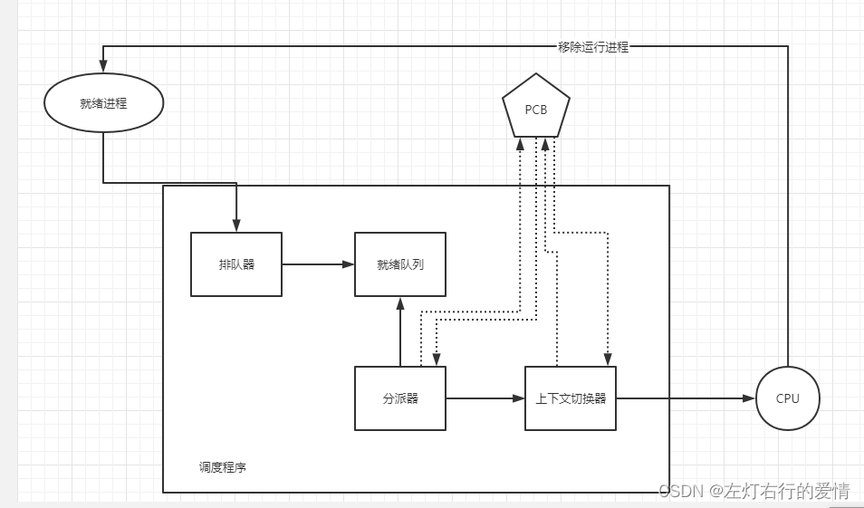
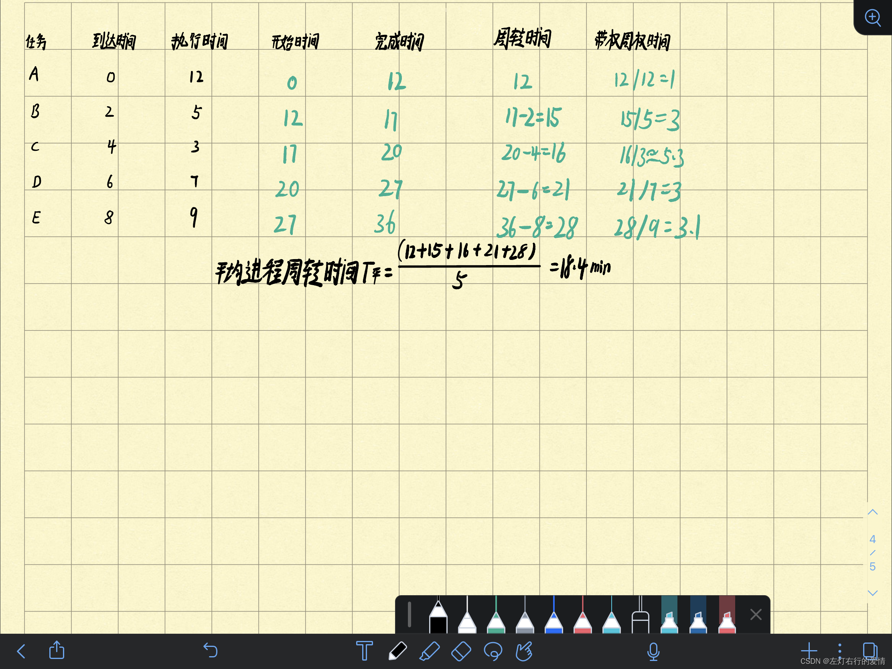
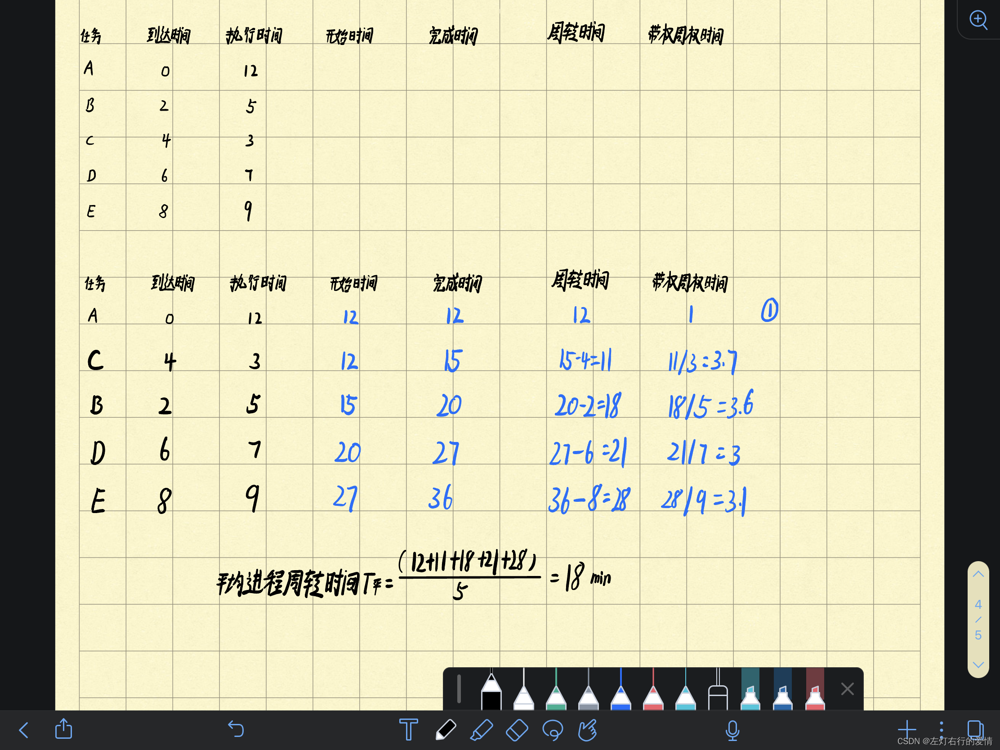
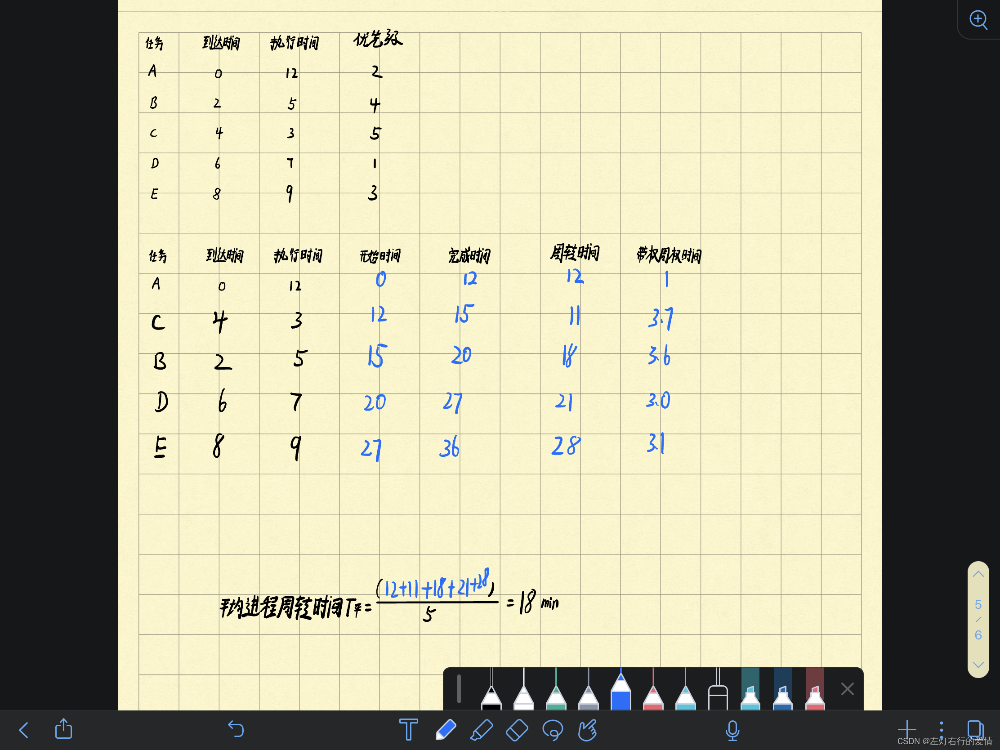
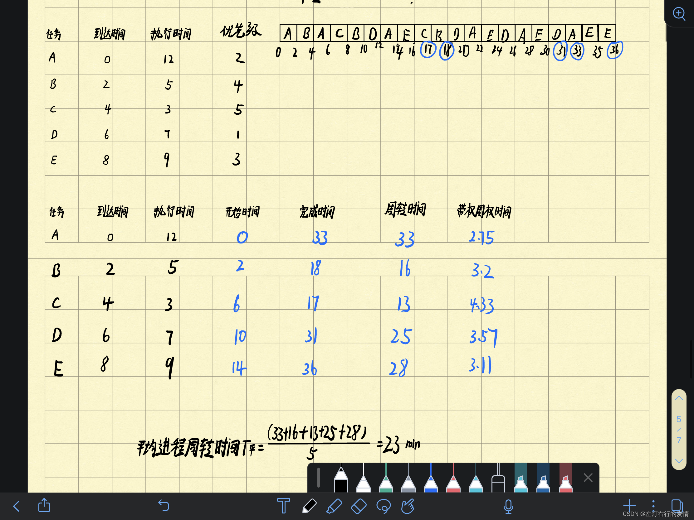
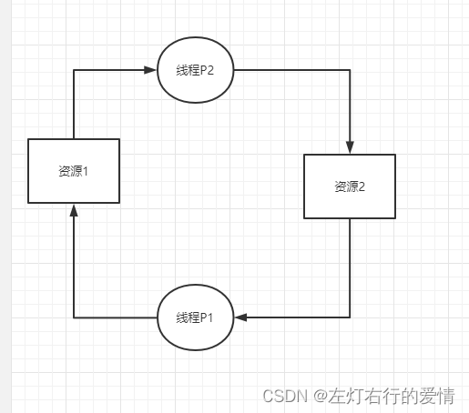
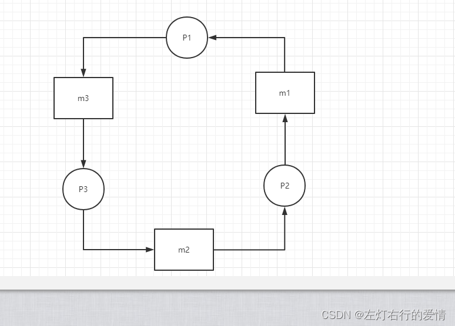

> 原文：[CSDN](https://blog.csdn.net/qq_45852626/article/details/126502482)（历史文章导入，当前状态为草稿）

###### 一：为什么我们需要处理机调度？

多道程序环境下，内存中存在多个进程，数目远大于处理机数目，所以我们需要处理机在某种算法加持下进行调度，使之可以执行。  
我们也知道，调度实质上就是一种资源分配，处理机调度算法可以根据处理机分配策略所规定的处理机来分配算法。

###### 二：处理机调度的层次

1.高级调度  
另称：长程调度或作业调度。  
调度对象：作业  
主要功能：根据某种算法，决定将外存上处于后备队列中的哪几个作业调入内存，为它们创建进程，分配所需要的资源，并放入就绪队列。  
适用场景：多批道处理系统  
2.中级调度  
另称：内存调度  
调度对象：进程  
主要功能：将暂时不能运行的进程调至外存等待（挂起）。当它们具备运行条件且内存有空间时，把外存上的已具备运行条件的就绪进程重新调入内存，就该它们状态为就绪态，挂在就绪队列等待。  
3.低级调度  
另称：短程调度或进程调度  
调度对象：进程  
主要功能：根据某种算法，决定就绪队列中哪个进程应获得处理机，并由分派程序将处理机分配给被选中的进程。  
适用场景：多道批，分时，实时系统。

###### 三：进程调度

1.进程调度任务  
主要任务有三步：  
a.保存CPU现场信息  
b.按某种算法选取进程  
c.把CPU分配给进程

2.进程调度机制

  
1.排队器：  
每当有一个进程变为就绪状态时，排队器便将它插入相应的就绪队列。  
2.分配器：  
a.将进程调度程序所选定的进程从就绪队列中取出  
b.从分配器到新选进程间的上下文切换，以将CPU分配给新选进程  
3.上下文切换器:  
会发生两次上下文切换操作  
a.OS保存当前进程的上下文，将当前进程的CPU寄存器内容保存到该进程的PCB内相应单元。  
b.移除分派程序的上下文，把新选进程的CPU线程信息装入CPU的各个相应寄存器中，以便新程序运行。

###### 四：进程调度方式

早起采用非抢占调度方式，但因为它很难满足交互性作业和实时任务的需求，为此，进程调度中又引入了抢占调度方式。  
1.非抢占调度  
处理机分配给某进程，就会一直让它运行下去，直至进程完成或发生某事件而被阻塞时，才会把分配给该线程的处理机分配给其他线程。  
2.抢占式调度  
根据某种原则去暂停某个正在执行的进程，并将已分配给该进程的处理机重新分配给另一个进程。  
注意：抢占并不是一种任意的行为，必需遵从一定的原则，原则如下：  
a.优先级原则  
b.短进程优先原则  
c.时间片原则

###### 五：调度算法的评价指标

1.CPU利用率  
指的是CPU“忙碌”时间占总时间的比例  
利用率=忙碌时间/总时间，总时间也就是(忙碌时间+空闲时间)

2.系统吞吐量  
指的是单位时间内完成作业的数量  
系统吞吐量=总共完成多少道作业/总共花了多少时间

3.周转时间  
计算机用户有时比较关心自己的作业从提交到完成花多长时间。  
而周转时间就是指从作业被提交到完成为止这段时间间隔。  
这个过程包含了四个部分：  
a.作业在外存后备队列上等待作业调度（高级调度）时间  
b.进程在就绪队列上等待进程调度(低级调度)时间  
c.进程在CPU上执行的时间  
d.进程等待I/O操作完成的时间  
注意：b，c，d在一个作业整个处理过程中，可能会发生多次~

周转时间=作业完成时间-作业提交时间  
平均周转时间=各作业周转时间之和/作业数  
带权周转时间=  
作业周转时间/作业实际运行的时间=  
(作业完成时间-作业提交时间)/作业实际运行的时间

###### 六：调度算法

1.先来先服务FCFS（Frist come First Service）  
算法原理：按作业（进程）到达的先后次序来进行调度。  
缺点：  
带权周转时间长，对长作业有利，短作业不利  
例题：  
有5个任务ABCDE，它们到达时刻分别0,2,4,6,8，预计它们的运行时间为12，5，3，7，9min。其优先级分别为2，4，5，1，3。这里5为最高优先级。计算其平均进程周转时间（进程切换开销可不考虑）。  
答案：  
  
2.短作业优先SJF(Short Job First)  
算法原理：以作业长短来计算优先级，作业越短，优先级越高；  
作业长短以所要求的运行时间来衡量。  
缺点：  
a.必需预先知道作业的运行时间  
b.对长作业非常不利  
c.无法实现人机交互  
d.没有考虑作业紧迫程度  
注意：如果有源源不断短作业/进程来，可能会导致“饥饿”现象，如果一直得不到服务，会发生“饿死”。

解题：  
首先比较此刻时间已经提交的进程，如第一个进程完成时刻，就需要判断下一个谁是作业短的进程，**要从已经提交的进程中选择**，未提交还未到达的进程不能拿来选择。  
题目：  
有5个任务ABCDE，它们到达时刻分别0,2,4,6,8，预计它们的运行时间为12，5，3，7，9min。其优先级分别为2，4，5，1，3。这里5为最高优先级。计算其平均进程周转时间（进程切换开销可不考虑）。  
答案：  
  
注意蓝圈1，第一个进程是肯定要跑的，然后根据完成时间，挑选接下来已经到达进程里执行时间最少的优先运行。

---

3.优先级调度算法  
算法原理：FCFS，SJF两种算法都不能反映进程的紧迫程度。  
而优先级调度算法是外部赋予进程相应的优先级，来体现出进程的紧迫程度，紧迫性进程优先进行。  
如何确定优先级？

> 1. 利用某一范围内一个整数，优先数
> 2. 响应比的大小，谁响应比大，谁优先级就大

**高响应比优先调度算法HRRN（Highest Response Ratio Next）**  
算法原理：谁响应比大，谁先执行获取CPU和系统资源  
优点：  
a.即考虑了作业等待时间，又考虑了作业运行时间；  
b.照顾了短作业，又不会使长作业等待时间过长。  
注意：优先级是动态改变的。优先级=响应比。

计算部分：  
a.等待时间=前一个进程完成时间-后一个作业的提交时间（提交时间!=开始时间）  
b.响应时间（进程进入就绪队列后等待所呆的时间）=  
等待时间+运行时间=  
前一个进程完成时间-该进程提交时间。  
c.响应比=作业周转时间/作业运行时间  
=（作业等待时间+作业运行时间）/作业运行时间  
=1+（等待时间/处理时间）

例题：  
有5个任务ABCDE，它们到达时刻分别0,2,4,6,8，预计它们的运行时间为12，5，3，7，9min。其优先级分别为2，4，5，1，3。这里5为最高优先级。计算其平均进程周转时间（进程切换开销可不考虑）。  
答案：  
  
注意，我们在执行完A线程后，要去分别计算其他线程的响应比，最后从大到小开始执行。

---

3.轮转调度算法  
算法原理：基于时间片轮转，非常公平，就绪队列中的每一个进程每次仅仅运行一个时间片，并且每个进程是轮流运行。  
a.按照先进先服务策略把就绪进程排成一个就绪队列，设置时间片，从第一个进程开始分配处理机。  
b.第一个进程时间片结束后，再从就绪队列中选择新的队首进程开始。  
注意：如果第一个进程是运行完的，那么第一个进程就不在就绪队列队首了，而是从就绪队列删除；若只是时间片用完，则调度程序把它送到末尾。

☆时间片大小的选取非常重要：  
太大：系统会频繁地执行进程调度和进程上下文切换，会增加系统开销。  
太小：RR调度算法便会退化为FCFS调度算法。

例题：  
有5个任务ABCDE，它们到达时刻分别0,2,4,6,8，预计它们的运行时间为12，5，3，7，9min。其优先级分别为2，4，5，1，3。这里5为最高优先级。对于下列每一种调度算法，计算其平均进程周转时间（进程切换开销可不考虑），  
时间片轮转算法(令时间片为2min)。

答案：  

---

##### 死锁

一：死锁的定义  
多个进程在运行过程中因为争夺资源而造成的一种僵局，且当进程处于这种僵持状态时，若没有外力作用，这些进程都无法再向前推进。

二：死锁如何产生的  
1.竞争资源  
资源分为两类：  
a.可抢占资源：这类资源被进程获得后，还可以和被其他进程或系统抢占。  
b.不可抢占资源：一旦系统把资源分配给某进程后，就不能强制收回，只能等待进程用完后其自行释放。  
**竞争不可抢占资源会导致死锁。**  
举例（资源指向线程时----资源已经分配给线程，线程指向资源时—进程请求资源）  

**竞争可抢占资源会导致死锁。**  
通常是消息通信顺序不当。  
举例：  
  
如果三个进程都是先接受，后发送，那么会导致死锁：  
P1请求m3，但是m3在P3手里；  
P3是先接受m2再发送m3，但是m2在P2手里；  
P2先接受m1再发送m2，但是m1在P1手里；  
就这样进程之间都握着一个别人所需的资源，但是又都要先获得自己要的资源，最后谁也获取不到自己所需的资源。

2.进程间推荐顺序非法  
举例：  
当P1运行到P1：Request（R2）时，将因R2已被P2占用而阻塞；  
当P2运行到P2：Request（R1）时，也将因R1已被P1占用而阻塞，于是发生进程死锁。  
如果P1：Request（R1），P2：Request（R2）；  
P1：Reast（R1），P2：Reast（R2）；  
这样不会造成死锁。

三：死锁产生的4个必要条件

> 1.互斥条件： 进程对所分配到的资源进行排他性使用（一段时间内仅被一个进程占用）  
> 2.请求和保持条件：进程已经占有至少一个资源，但是又提出了新的资源请求而导致被阻塞，同时对已获得资源不释放。  
> 3.不可抢占条件：进程已获得资源在未使用完不能被抢占，只能在进程使用完时由其自己释放。  
> 4.循环等待条件：发生死锁时，必然存在一个进程—资源的环形链。

四：如何避免死锁

> 1.破坏请求和保持条件：进程在运行前一次申请完它所需要的全部资源，在它的资源未满足前，不让它投入运行。  
> 2.破坏循环等待条件：首先给系统中的资源编号，规定每个进程必须按编号递增的顺序请求资源，同类资源（即编号相同的资源）一次申请完。  
> 3。破坏不可抢占：当进程提出获取新资源得不到满足时，它必须释放已经保持的所有资源

##### 系统安全状态

避免死锁方法中，把系统分为了安全状态和不安全状态。  
安全状态—不发送死锁。  
不安全状态—**可能**会发生死锁。  
所谓安全状态：系统按某种进程推进顺序，为每个进程分配其所需要的资源，直至满足每个进程对资源的最大需求，进而使每个进程都可顺利完成这样的一种系统状态，此时称进程推进顺序为**安全序列**。

##### 银行家算法

一：一句话简述银行家算法  
当一个进程申请使用资源时，算法会试探分配给该进程资源，然后通过安全性算法判断分配后系统是否处于安全状态，若不安全则试探分配取消，进程继续等待。  
二：数据结构  
1.可利用资源向量Available：含有m个元素的数组，每个元素代表一类可利用资源数目。初值是系统中所配置该类全部可用资源数目。  
2.最大需求矩阵Max：n*m的矩阵，定义了系统中n个进程中的每个进程对m类资源的最大需求  
3.分配矩阵Allocation：n*m的矩阵，定义了系统中每类资源当前已分配给每一进程的资源数。  
4.需求矩阵Need：n\*m的矩阵，表示每个进程还需要的各类资源数。

三：算法操作思路  
先明确一下基本定义：  
Pi：Request是进程Pi的请求向量；  
Pi：Request[j]是进程Pi需要K个Rj类型的资源。  
当Pi发出资源请求后，系统就会按下列步骤检查：

> 1. 如果 Pi：Request[j]<=Available[j],则下一步，否则出错（因为它所需要的资源已经超过它所宣布的最大值）
> 2. 试探性把资源分配给进程Pi，并修改下列数据结构中的数值:  
>    a. Available[j]=Available[j]-Request[j];  
>    b. Allocation[i,j]=Allocation[i,j]+Request[j];  
>    c. Need[i,j]=Need[i.j]-Request[j];  
>    我们看到，分别修改了可利用资源，最大需求，需求矩阵。

系统执行安全性算法，检查资源分配后系统是否处于安全状态。  
如果是—分配资源；  
如果不是—取消分配，回复原来的资源分配状态，让进程等待。

**安全性算法**

> 1. 设置两个向量：  
>    a.工作向量Work：表示系统可提供进程继续运行所需资源数目，开始执行算法时，Work=Available。  
>    b. 完成向量Finish：表示系统是否有足够资源分配给进程，使之运行完成，开始时令Finish[i]=false，有足够资源时，令Finish[i]=true。
> 2. 从进程集合中找到一个满足下述条件的进程：Finish[i]=false;Need[i,j]<=Work[j]。若都能找到，执行3，否则，执行4
> 3. 进程Pi获取资源后，执行：  
>    Work[j]=Work[j]+Allocation[i,j];  
>    Finish[i]=true;  
>    继续执行2（循环）  
>    4.如果所有进程都满足Finish[i]=true,表示系统处于安全状态，否则系统不安全。

个人理解：你作为一个有着上千亿自由资产的富豪，你的资产记作Available,你热衷于投资，银行家算法就像是你的一个理财管家，他能做的事情也不多：  
a.管理你投资的项目还有多少钱可以启动(Need)  
b.你投资这么多项目过程中所用的金额会不会超过你的资产(Available>=Need)（如果超过资产，那么你投的项目又没有足够的金额启动，那么你就会破产死亡）  
c.由于它只是一个理财管家，见不到你的资产，所以它只能用一个标记来记录你资产的变化（Work），刚开始Work肯定是你的最初资产（Work=Available）  
喜欢投资的你肯定知道，投资是一个广撒网的事情，所以你刚开始的时候就为你中意的比特币相关的项目（5个）分别投入不同的资产。  
他们在你投资前说了他们的项目最终分别需要多少预算（Max），现在你投入了一些资金，他们会告诉你还需要多少资金（Need）。  
由于我们是一个比较无脑的投资者，看见什么就想投什么，我们的管家会不断纠正你的投资路线，给你营造一种预投资，确保你投一个项目后并且回本后，接下来依旧可以投满剩余的项目，如果不可以，那么管家还可与收回你之前投的资产。  
所以银行家算法对于喜欢投资的你是非常重要的，结合上面的内容，相信你已经深刻了解你的管家了。

##### 总结

例题我们后面会做一个总结，目前先赶知识点，题目敲起来太耽误时间了= =。
