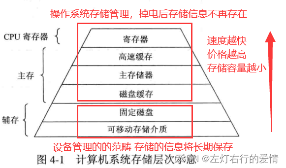
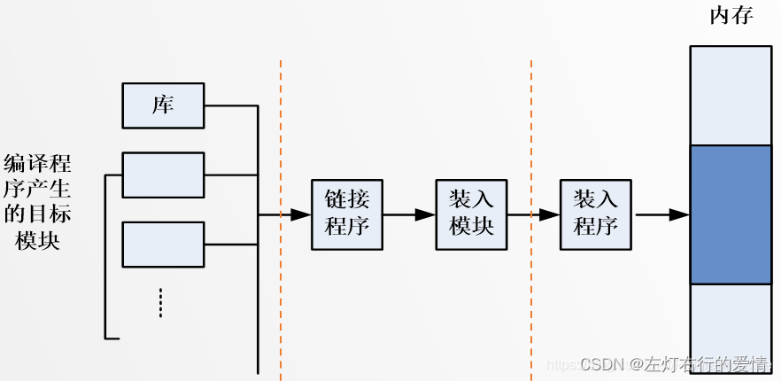
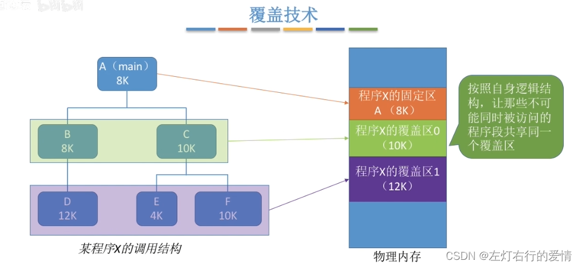
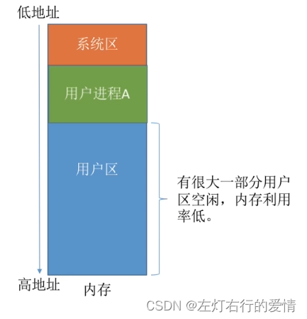
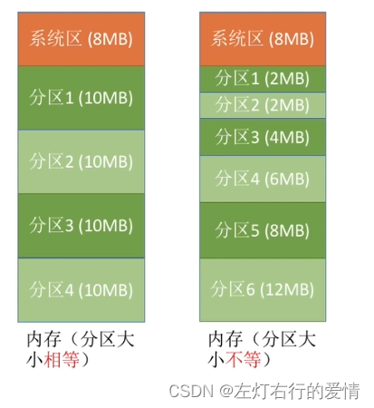
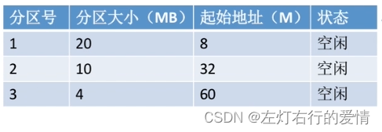

> 原文：[CSDN](https://blog.csdn.net/qq_45852626/article/details/126671877)（历史文章导入，当前状态为草稿）

#### 前言

存储器太重要了兄弟们，计算机想要自动执行程序（指令和数据），就必需有存储器来记忆，并且可以被译码器自动读取到。  
 译码器从存储器中自动取到指令，也叫寻址。  
 并且要想上电就自动执行程序，必须有掉电时不丢失数据的存储器来存储程序。  
 当存储器小的时候，用起来简单，但是显然小的存储器不满足我们的需求。当存储器越来越大时，用起来就复杂很多，因为系统软件和应用软件在种类，功能等方面都在急剧膨胀，存储器发展的速度远远赶不上现代软件的发展需要，所以存储器是一种宝贵又稀缺的资源。  
 

这就导致了我们使用难度进一步加大，要考虑的问题有很多，比如：存储器的使用效率，读写性能等。

#### 一：存储器的层次结构

##### 1.多层结构的处理器

计算机执行指令时，几乎每条指令都涉及对存储器的访问，所以要求**计算机对存储器的访问速度**能跟的上**处理机的运行速度**，换句话说：存储器速度必须非常非常非常快快快！快到能与处理机的速度相匹配，否则就会非常明显影响处理机运行。  
 而且光快也不行，还有大！不光要大，还不准你价格高，这么多苛刻的条件，使得存储器接受不了，我tm直接裂开，演变成了多层结构的存储器。

##### 2.多层结构解析

存储器裂开可不是简单的裂开，只可谓裂的恰到好处，简单来说分3层：  
 最高统治层（寄存器）：CPU寄存器  
 中流砥柱层（主存）：高速缓存，主存储器，磁盘缓存  
 接盘小能手（辅存）：固定磁盘，可移动存储介质  
   
 我们从这个金字塔图可以很明显看出来地位高低，并且我们也了解到，接盘小能手无论是断电还是插电，数据都不会丢失。

##### 3.可执行存储器

寄存器和主存被称为可执行存储器。  
 对于存放在其中的信息，与存放在辅存的信息相比而言，计算机所采用的访问机制是不同的，所耗费时间也不同，原因在于：  
 进程可以在很短的时钟周期使用简单指令对可执行存储器进行访问；  
 而对辅存而言则需要通过IO设备实现。  
 速度差了3个数量级左右甚至更多。

#### 二：程序的装入与连接

简单介绍：  
 系统运行用户程序，必需先将其装入内存中，然后转变为一个可以执行的程序，这一过程要经过以下3个步骤  
 1.编译–对用户源程序进行编译（源程序： 是指未经编译的，按照一定的程序设计语言规范书写的，人类可读的文本文件。通常由高级语言编写。）  
 2.链接–由链接程序将编译后形成的一组目标模块以及它们所需要的库函数链接在一起，形成一个**完整的装入模块**。  
 3.装入–也称加载，由装入程序将装入模块装入内存。  
 

##### 1.逻辑地址与物理地址

有个问题：这些步骤中，地址会有不同的表现形式，它们是什么样的呢？  
 源程序中：地址常用符号来表示，如变量count。  
 编译器：将这些符号地址绑定到可重定位的地址或者相对地址（如本模块开始第14个字节）上。  
 链接程序或装入程序：将相对地址绑定到绝对地址（如内存的第74010个字节）。  
 注意：  
 CPU生成的地址------逻辑地址（相对地址）  
 内存单元看到的地址-----物理地址（绝对地址）

##### 2.内存保护

系统在完成地址变换时，保证操作的正确是很重要的，为了确保系统操作正确，应该保证OS不被用户访问。  
 在多用户系统，还应该保证用户程序间不互相影响，这种保证用硬件来实现（因为OS一般不干预CPU对内存的访问，这样会导致性能损失）。  
 首先：我们要确保每个进程都有一个**单独的内存空间**（这点很容易理解，防止在多个进程加载到内存且执行并发时相互影响）

其次：为了分开内存空间，需要确定一个进程可以访问的**合法地址范围**，并确保进程只能访问这些合法地址。  
 我们通过两个寄存器实现，基地址寄存器，界限寄存器（基地址寄存器保存最小合法物理地址，界限寄存器指定合法范围大小）

最后：CPU硬件对用户态下产生的物理地址与寄存器的地址进行比较（即判断：基地址<=物理地址<(基地址+界限地址））是否成立；  
 如果访问到OS内存，或其他用户内存 ，OS内存会当成致命错误来处理。  
 补充：加载基地址寄存器和界限寄存器必须使用特权指令，所以只能在内核态下执行，因此只有OS内核才可以加载这两个寄存器（这很合理，如果用户可以轻易改变，那么这两个寄存器提供的保护没有意义）

所以我们可以看出：这种方案可以很有效防止用户程序“无意”修改OS以及其他用户的代码或数据。

##### 3.程序的装入

###### 绝对装入方式

适用环境：单道程序环境  
 实现方式：知道程序驻留在内存什么位置，在用户程序编译后，产生绝对地址（物理地址）的目标代码，之后装入程序就会按装入模块里面已经生成的物理地址放进内存去运行。  
 （因为单批道时没有操作系统，所以编译程序做转换地址的工作）  
 缺点：  
 内存大小限制，能装入内存并发的进程数太少了。  
 对程序员要求高（要熟悉内存使用情况），并且如果程序或者数据被修改，很可能改变程序中所有地址（因此，会选择符号地址，在编译时转换为绝对地址）

###### 可重定位装入方式（静态重定位）

适用环境：多批道程序环境（在多道程序下，编译程序不可能预知所得到的若干个目标模块应放在内存何处）  
 实现方式：  
 多个目标模块的起始地址通常从0开始，其他地址则是相对于0的相对地址，即**目标模块采用的是相对地址**；  
 根据内存情况，在装入时，对程序里一些指令和数据各个地址进行修改的过程（**相对地址到物理地址的映射**）就叫做重定位，地址变换在装入时一次完成；  
 装入转换后就不会再修改，所以也叫静态重定位。  
 缺点：  
 重定位后在内存中无法移动。  
 要求程序存储空间是连续的，不能把程序放在若干个不连续的区域中。

###### 动态运行时装入方式（动态重定位）

**为什么出现动态运行装入方式？**  
 弥补可重入转入方式不允许程序运行时在内存中移动位置。  
 因为程序在内存中的移动，引发物理位置发生变化-----必须修改程序和数据的地址（绝对地址）  
 然而，在运行过程中它在内存中的位置经常被改变，比如拥有对换功能的系统。  
 这时就要使用动态运行时装入方式。  
 适用环境：多批道程序环境  
 实现方式：  
 把装入模块装入内存后，并不会立即把装入模块中的相对地址变换为绝对地址，而是把地址变换推迟到程序真正要执行时才进行。  
 所以，装入内存后所有地址都是相对地址，等待每次访问内存单元前才将要访问的程序或数据的相对地址变换为物理地址。  
 为了使地址的变化不影响指令的执行速度，需要一个重定位寄存器来提供支持。  
 缺点：  
 需要硬件支持（贵东西的缺点就是鬼）  
 

##### 4.程序的链接

###### 静态链接

什么是静态链接？  
 在程序装入前，将各个目标模块及它们所需的库函数链接成一个完整的装配模块，以后不再拆开，我们把链接以后不再拆开的方式，称为静态链接。  
 实现过程中有哪些难点？  
 1.修改相对地址：我们知道，由编译程序产生的目标模块，使用的是相对地址，他们起始位置都为0；  
 每个模块中的地址都是相对起始地址计算。  
 比如有三个模块A,B,C，他们大小为L，M，N;A为头，那么A的起始地址为0,j将他们链接后，原模块B，C的起始位置就不是0了，需要修改B,C的相对地址，即模块B中所有相对地址+L，模块C则是加上L+M  
 2.变换外部调用符号  
 模块中的所用的外部调用符号也要变换为相对地址，把B的起始位置变为L，C的变为L+M。

###### 装入时动态链接

用户源程序得到一组目标模块，在装入内存时，采用边装入边链接的链接方式：  
 装入一个目标模块时，若发生一个外部模块调用事件，则将引起程序找出相应的外部目标模块，并将它装入内存，并且要去修改目标模块的相对地址  
 好处：  
 1.便于修改和更新：各目标模块是分开放的，要修改还是更新目标模块非常容易  
 2.便于实现目标模块的贡献：静态链接中，每个应用模块都必须含有其目标模块的复制版本，所以无法共享，采用动态链接后，OS容易将一个目标模块链接到几个应用程序上，实现多个应用程序对该目标模块的共享。

###### 运行时动态链接

应用程序在运行时，每次要运行的模块可能是不相同的。  
 但无法事先知道本次运行哪些模块，所以只能将所有可能要运行的模块全部装入内存，并拼接到一起，但是由于某些目标模块可能根本不执行，这显然是低效的。

而运行时动态链接，是将某些模块的链接推迟到程序执行时才进行，凡是在执行过程中没有用到的目标模块，都不会调入内存和被链接到装入模块上，不仅加快程序的装入过程，而且节省内存空间。

#### 三：对换和覆盖

当内存空间不足或进程需要的空间大于能提供的空间时，系统如何满足进程的请求呢？  
   
 除了拒绝以外，我们可以使用内存“扩充”技术，在现有物理内存的基础上扩大内存的使用效率。  
 常用的内存扩充技术：对换，覆盖，紧凑，虚拟存储器等，我们会慢慢介绍。

##### 多道程序环境下对换技术

###### 1.对换

对换：指把内存中暂时不能运行的进程或者暂时不用的程序和数据，转移到外存上，以腾出足够的内存空间，再把已经具备运行条件的进程或进程所需要的程序和数据存入内存，进而实现对换。

###### 2.对换类型

每次对换，都会将一定数量的程序或数据换入或换出内存，根据每次对换所对换的数量，可分为两类：  
 a.整体对换：对换以整个进程为单位，也称为处理机的中级调度  
 b.页面（分段）对换：对换以进程一个“页面”或“分段”为单位而进行，统称部分对换，这种对换方法是实现后面我们要了解到的请求分页和请求分段存储管理的基础，目的是支持虚拟存储系统。

###### 3.进程的换出和换入

当内核要执行某操作但发现空间不足时，便会调用（唤醒）对换进程，它的主要任务是实现进程的换出与换入。

**换出**  
 进程的换出：将内存中某些进程调出至对换区，以便腾出内存空间。  
 换出过程分为下面两步：  
 1：选择被换出的进程----检查所有驻留在内存汇总的进程，首先选择处于阻塞，睡眠状态的进程，如果有多个这样的进程，优先选择优先级最低的进程作为换出进程。  
 2：换出进程----进程进行换出时，只能换出非共享的程序和数据段，先申请对换区，申请成功则启动磁盘，将进程的程序和数据传送到磁盘的对换区上，若这一过程中没发生错误，则可回收进程所占用的内存空间，并对该进程的PCB和内存分配表等数据结构做相应的修改。

**换出**  
 对换进程将定时执行换入操作。  
 首先：查看PCB集合中所有进程的状态，找出就绪状态但已经被换出的进程。如果有多个这样的进程，选择其中已换出到磁盘且时间最久的进程换入进程，并申请内存空间。  
 其次：如果申请成功，则可直接将进程从外存换入内存；  
 如果申请失败，则须先将内存中的某些进程换出，腾出足够的内存空间后，再将进程换入。

###### 4.缺点

交换一个进程需要很多时间。

##### 覆盖

使用覆盖技术，可以让进程的大小比它所分配的内存空间大。  
 覆盖思想：任何时候只在内存中保留所需的指令和数据；  
 当需要其他指令和数据时，他们就会被装入刚刚不被需要的指令和数据所占用的空间。  
 具体实现：  
 只在内存中保留哪些在任何时候都需要的指令和数据；  
 程序其余部分则根据它们自身逻辑结构，使它们共享同一块内存区域。  
 缺点：  
 覆盖结构的程序比较复杂，需要我们对程序结构，数据结构有完全的了解。

##### 连续分配存储管理方式

###### 1.单一连续分配

单道环境下，早起存储器管理方式是把内存分为系统区（仅供os使用，放在内存地址部分）和用户区（仅有一道用户程序）两部分。  
 

###### 2.固定分区分配

目的：为了使内存中装入多道程序，且程序之间互不干扰。  
 实现：将整个用户空间划分为若干个固定大小的区域（分区），并在每个分区只装入一道作业。  
 分区的划分：  
 a.分区大小相等  
 特点：若程序太小，浪费内存空间；若程序太大，一个分区又装不下，导致程序无法运行，缺乏灵活性。  
 b.分区大小不等  
 特点：弥补了分区大小相等导致灵活性不足的缺点。  
   
 内存分配：  
 按分区的大小进行排队，并为之建立一张固定分区使用表（包含每个分区起始地址，大小及状态

###### 3.动态分区分配

动态分区分配属于可变分区分配，根据进程需要，动态为之分配内存空间。

问题：系统要用什么样的数据结构记录内存的使用情况呢？  
 数据结构：  
 用于描述空闲分区和已分配分区。  
 两种形式：  
 1.空闲分区表：  
 记录每个空间分区的情况而设计。  
 每个空闲分区占一个表目（包含分区号，分区大小，分区起始等数据项）  
 2.空闲分区链：  
 为了实现对空闲分区的**分配和链接**而设计。  
 在每个分区的头部，设置一些用于控制分区分配的信息和链接各分区所用的前向指针；  
 在每个分区的尾部，设置一个后向指针。  
 通过前后指针将所有空闲分区链接成一个双向链。  
 为了检索方便， 在分区尾部重复设置状态位和分区大小表目，根据分区是否被分配出去，将状态位设置为0/1。  
   
   
 问题：把新作业装入内存中，该如何设计算法提升系统性能。  
 一：基于顺序搜索的动态分区分配算法（顺序分配算法）  
 为了实现动态分区分配，系统中空闲分区一般链接成一条链。  
 顺序搜索就是：依次搜索空闲分区链上的空闲分区，寻找一个大小满足要求的分区。  
 1.首次适应算法（First Fit，FF）

> 要求：空闲分区链以地址递增的次序链接。  
>  实现：  
>  a.分配内存时，从链首开始顺序查找，直到找到一个大小能满足要求的空闲分区为止；  
>  b.按作业大小，从该分区划出一块内存空间分配给请求者，余下的空闲分区仍留在空闲链中。  
>  c.若链首直至链尾都找不到一个能满足要求的分区，则表名系统已经没有足够大的内存分配给该进程，内存分配失败，返回。

2.循环首次适应算法（Next Fit，NF）

> 目的：为了避免低址部分留下许多很小的空闲分区，以及减少查找可用空闲分区时的开销。  
>  实现：  
>  a.不再每次从链首开始查找，而是从上次找到的空闲分区的下一个空闲分区开始查找，直到找到一个大小能满足要求的空闲分区为止；  
>  b.从中划出一块与请求大小相等的内存空间分配给作业。  
>  c.如果最后一个（链尾）空闲分区，应返回第一个空闲分区并比较其大小看是否满足要求（注意是循环）。  
>  数据结构：  
>  设计一个起始查询指针----用于指示下一次起始查询的空闲分区

3.最佳适应算法（Bset Fit）

> 每次分配作业时，总能把满足要求且最小的空闲分区分配给作业。  
>  思想：为了加速寻找，要求将所有空闲分区按容量从小到大的顺序，排成一个空闲分区链。  
>  实现：和首次适应算法一样

4.最坏适应算法（Worst Fit ，WF）

> 每次分配作业时，跳出一个最大的空闲区分配给作业。  
>  思想：减少小碎片，但是会导致缺乏大的空闲分区。

上面四种方法非常容易理解，也容易记忆，多比较一下。

------------- 后面内容补更 -------
