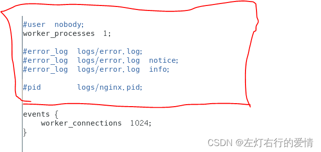
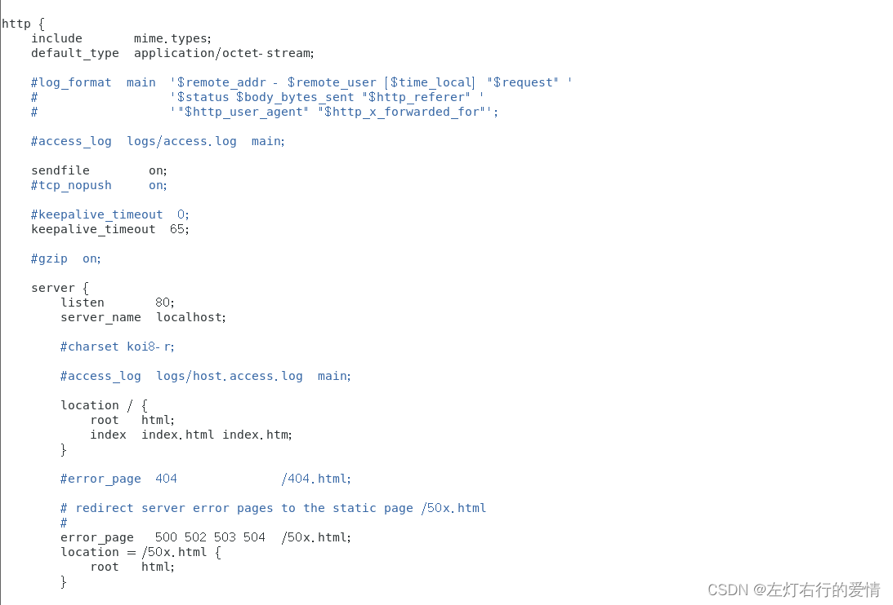
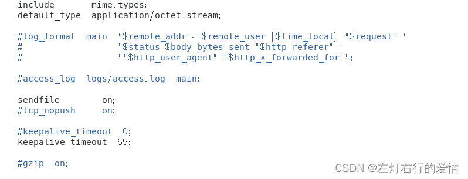
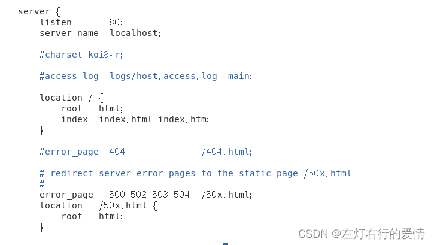

> 原文：[CSDN](https://blog.csdn.net/qq_45852626/article/details/128285043)（历史文章导入，当前状态为草稿）

## 什么是Nginx

## Nginx命令

1.使用Nginx操作命令前提：必须进入nginx的目录，举例：/usr/local/nginx/sbin  
 2. 查看nginx的版本号：./nginx -v  
 3. 启动nginx ./nginx  
 4. 关闭nginx ./nginx - -s stop  
 5. 重新加载nginx ./nginx -s reload

## Nginx 配置文件

配置文件的位置： /usr/local/nginx/conf/nginx.conf。

### 文件组成

#### 全局块：配置服务器整体运行的配置指令

从配置文件开始到events块之间的内容，主要会设置一些**影响nginx服务器整体运行的配置指令**，主要包括：配置运行Nginx服务器的用户（组），允许生成的worker process数，进程PID存放路径，日志存放路径和类型以及配置文件的引入等。  
   
 比如上面第一行配置的，是Nginx服务器并发处理服务的关键配置，worker\_processes值越大，可以支持的并发处理量也越多，但是会受到硬件，软件等设备的制约。

#### Events块：影响Nginx服务器与用户的网络连接

Events块涉及的指令主要影响**Nginx服务器与用户的网络连接**，常用的设置包括是否开启对多work process下的网络连接进行序列化，是否运  
 允许同时接受多个网络连接，选取哪种事件驱动模型来处理连接请求，每个word process可以同时支持的最大连接数等。  
   
 上面表示每个work process支持的最大连接数为1024。  
 这部分的配置对Nginx的性能影响较大，在实际中应该灵活配置。

#### Http块

Nginx服务器配置中最频繁的部分，代理，缓存和日志定义等绝大多数和第三方模块的配置都在这里。  
 需要注意的是：Http块也可以包括Http全局块，Server块。  
 

##### Http全局块

包括文件引入，MIME-TYPE定义，日志自定义，连接超时时间，单链接请求数上限等。  
 

##### Server块

这块和虚拟主机有密切关系，每个Http块可以包括多个Server块，而每个Server块就相当于一个虚拟主机。  
 而每个Server块也分为全局Server块，以及可以同时包含多个location块。  
 

###### 全局Server快

最常见的配置是本虚拟机的监听配置和本虚拟机主机的名称或IP配置。

###### Location块

一个Server块可以配置多个Location块。  
 这块的主要作用是基于Nginx服务器接受到的请求字符串（例如server\_name/uri-string），对虚拟主机名称（也可以是IP别名）之外的字符串（例如，前面的/uri-string）进行匹配，对特定的请求进行处理。  
 地址定向，数据缓存和应答控制等功能，还有许多第三方模块的配置也在这里进行。

## 配置实例

### Nginx配置实例——反向代理

1.实现效果  
 2.准备工作

后续填坑
