> 原文：[CSDN](https://blog.csdn.net/qq_45852626/article/details/126458558)（历史文章导入，当前状态为草稿）

引言：  
开操作系统这篇，希望自己梳理一下这方面的知识体系，和JVM的一些概念对比着学习，还有就是通过学校的考试，画图说明一些知识和课后的习题解析，应该对复习或者初学的伙伴有一些帮助。  
然后更新和文章思路：目前优先服务于考试内容，后续慢慢添加补充内容和深度知识（汇编等内容）。

#### 什么是操作系统

首先要知道我们为什么需要操作系统？  
1946年，世界上第一台通用计算机埃尼阿克（ENIAC）在美国宾夕法尼亚大学诞生，用了 18000 个电子管，占地 170 平方米，重达 30 吨，每当这台计算机开机时，费城的灯就会变暗。  
ENIAC没有操作系统，如果你想操作它需要手动去调整硬件面板的按钮（不多，也就成千上万个而已）  
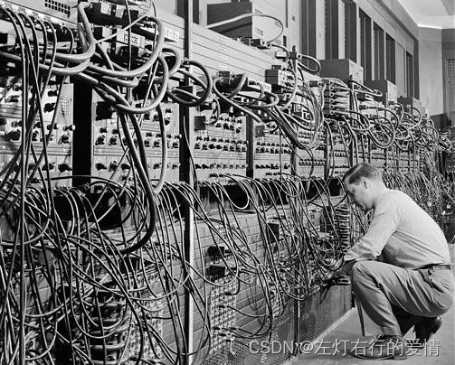  
如此“简单”的操作，引出了我们计算机的救世主—操作系统。  
它最主要的功能就是：管理硬件设备，提高它们的利用率和系统吞吐量，并为**用户**和**应用程序**提供一个简单的接口，以便用户和应用程序使用硬件设备。  
有了它，我们可以坐在曹船上，运筹千里之外。

我们对操作系统没什么感觉，是因为我们身处的时代给了我们太多福利，当我们操作计算机时，良好的图形界面，通过鼠标点击操作，使得操作计算机门槛已经低到地心。  
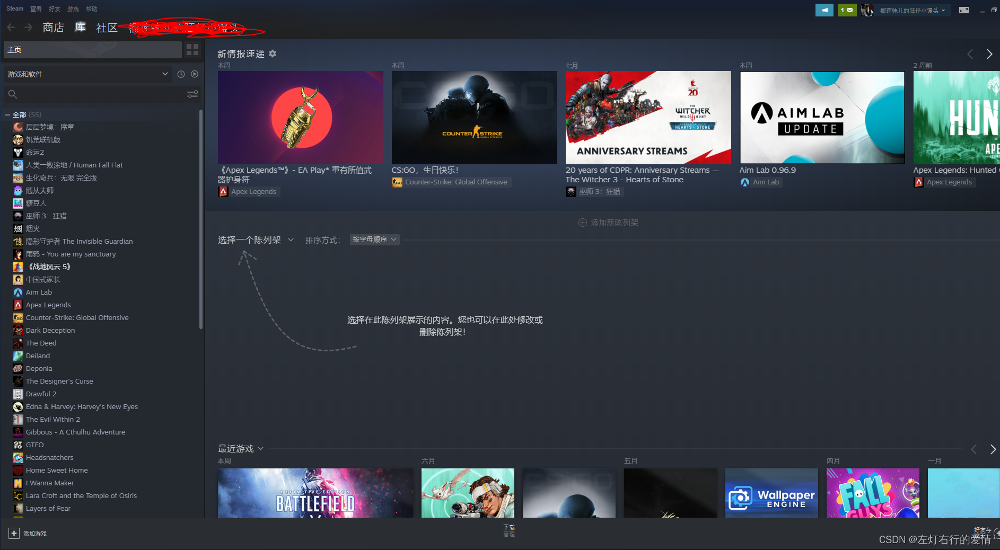  
而早期操作系统DOS是什么样呢  
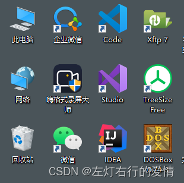  
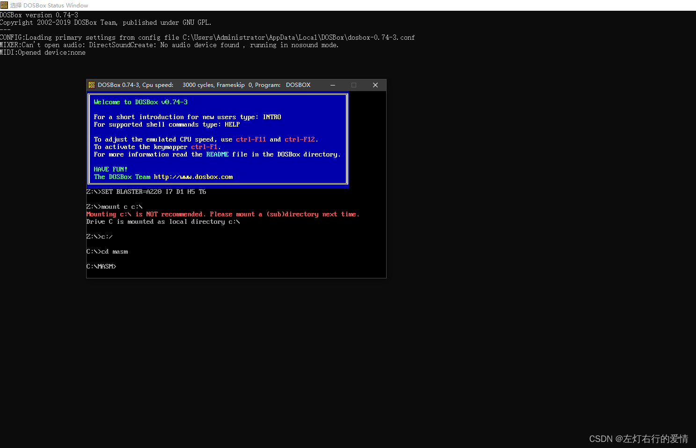  
当满屏都是黑框框，相信有网瘾的都是资深计算机爱好者。  
所以总结一下，操作系统是硬件与各种软件沟通的桥梁，功能大致分为两个部分：  
1.管理计算机硬件与软件资源  
2.向用户提供一个与系统交互的操作界面。

#### 操作系统的目标，作用和功能

##### 一：目标

主要目标：  
1.方便性  
如果我们想着计算机硬件上运行自己所写的程序，就必需使用机器语言编程。  
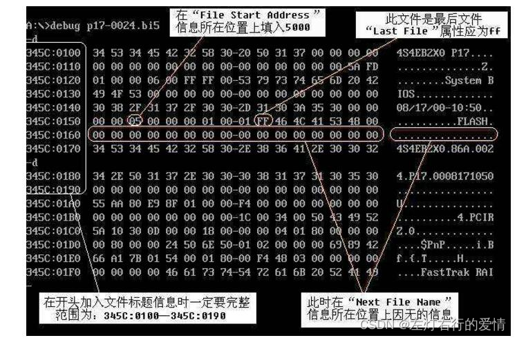  
相信聪明的你一定不难看懂。  
如果我们配置了OS，则可以使用编译命令来采用高级语言编写，或直接通过OS所提供的各种命令来操作计算机。  
2.有效性  
a.提高系统资源的利用率—因为io设备等经常处于空闲状态，资源无法充分利用。  
b.提高系统的吞吐量—合理组织计算机工作流程，加速程序的运行，缩短程序运行周期。  
3.可扩充性  
这个没什么好说的，没有扩充性的任何软件都会面临不同程序的落寞。  
4.开放性  
系统遵从国际标准，尤其是遵从开放系统互联（OSI），所有遵从国际标准开发的硬件和软件都能彼此兼容，并方便实现互联。  
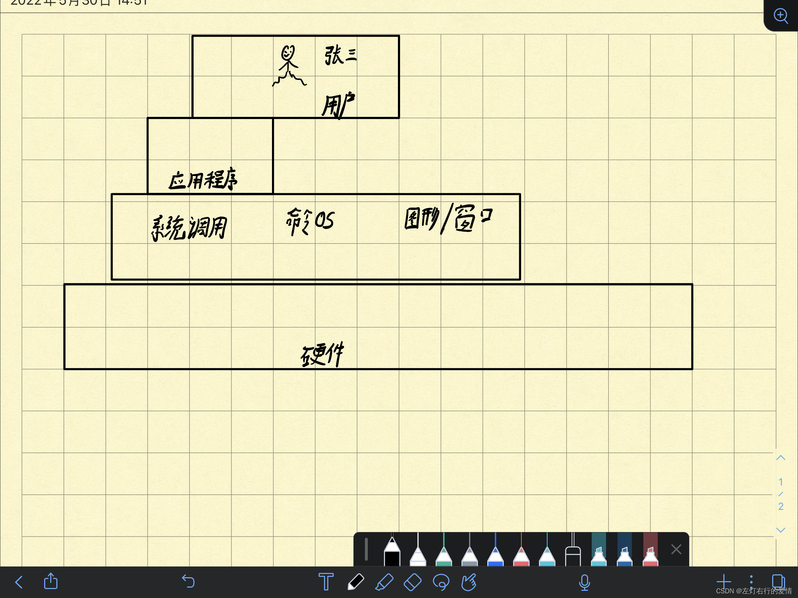

##### 二：作用

1：OS作为用户与计算机硬件系统之间的接口  
  
2：OS作为计算机系统资源的管理者  
计算机包含了硬件和软件资源。  
OS主要功能对于这四类的管理：  
a.处理机的分配与控制  
b.IO设备的分配与操纵  
c.文件管理的存储，共享与保护等  
d.存储器内存分配与回收

3：OS实现了对计算机资源的抽象  
a.如果OS没有实现对计算机资源的抽象，那么计算机向用户提供的是硬件接口（物理接口），用户必须对物理接口的实现细节有充分的了解，这使得用户不方便使用计算机（我们必须用机器指令去操作。  
b.我们为了方便去使用计算机的功能，这时我们在裸机（无软件的计算机系统）上覆盖IO设备管理软件，那么就会隐藏IO设备的具体细节，向上提供了一组抽象的IO设备。  
c.我们通常把覆盖了上述软件的设备为虚机器（它给用户提供了 一个可以对硬件进行操作的抽象模型），使得用户无需了解物理接口的实现细节，也可以使用计算机硬件资源。  
d.同理，也可以在第一层抽象之上再去覆盖一层管理文件的软件，这样我们得到一台功能更强虚机器。  
e.综上可知，OS是铺设在计算机硬件上的多层软件的集合，不仅增强了系统的功能，还隐藏了对硬件操作的具体细节，实现了对计算机硬件操作的多个层次的抽象模型。

##### TODO.操作系统的基本功能

这个等到我们复习完整个操作系统，来系统的回顾比较好，因为包含了所有我们要去聊的内容。

##### 单道批处理系统和多道批处理系统

###### 一：单道批处理系统

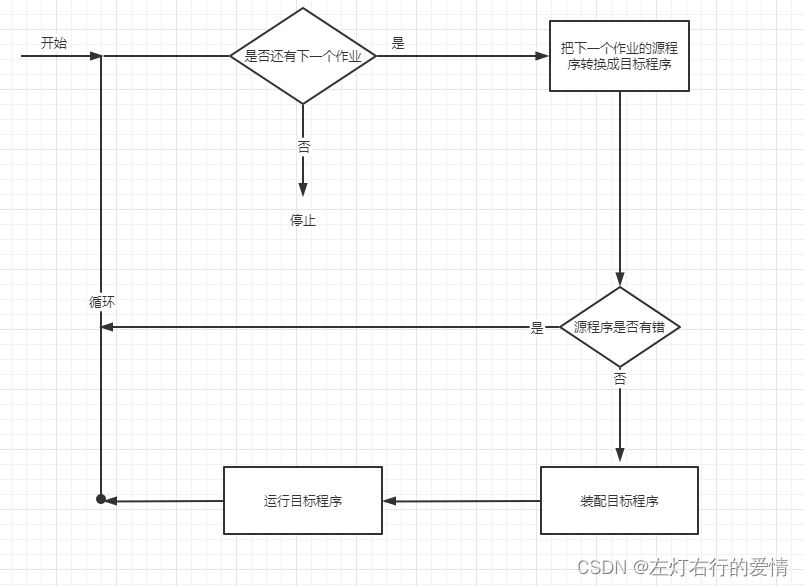  
监督程序将磁带上的第一个作业装入内存，并把运行控制权交给该作业;当该作业处理完成时，又把控制权交还给监督程序，再由监督程序把磁带上的第二个作业调入内存。计算机系统就这样自动地一个作业紧接一个作业地进行处理，直至磁带上的所有作业全部完成，这样便形成了早期的批处理系统。  
虽然系统对作业的处理是成批进行的，但在内存中始终只保持一道作业，故称为单道批处理系统 。  
特点：

1. 自动：作业自动运行，无需干预
2. 批量：磁带上的各个作业按顺序地进入内存，先进先出。
3. 单道：内存中只有一道程序运行

CPU利用率：  
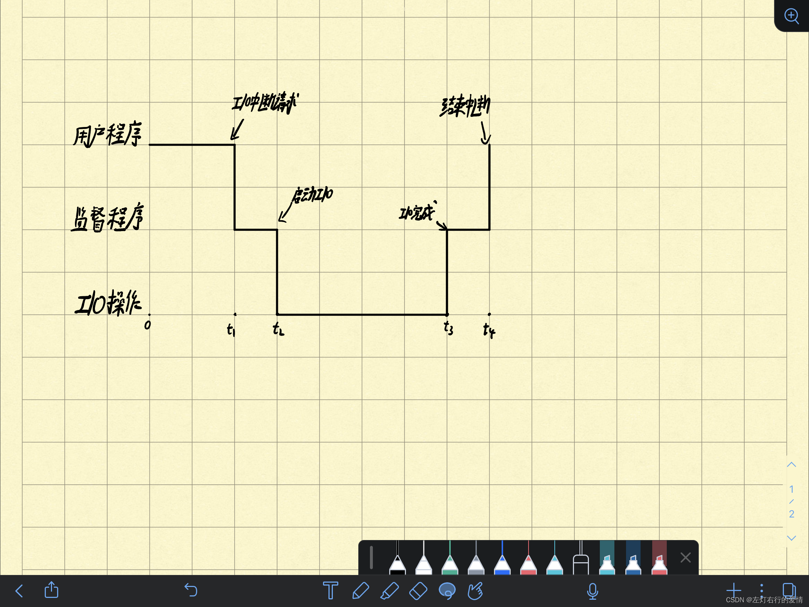  
0-t4中，我们可以很明显看出，由于IO设备的低速性，高速的CPU要等待低速的I/O操作完成，t2-t3时间间隔内CPU空闲时间较长，利用率显著降低。

**系统中某资源的利用率计算**  
CPU利用率=CPU有效工作时间/（CPU有效工作时间+CPU+空闲等待时间）

缺点：

1. 内存中仅能装入一道程序
2. 当前作业执行完毕后才可以执行下一道作业
3. 难以发挥系统中各类型资源的并行处理能力
4. 系统中的资源得不到充分的利用。

我们可以很明显看出----单道批系统是要解决CPU与IO设备速度不匹配矛盾中形成，但是仍然不可以充分利用系统资源。

###### 二：多批道处理系统

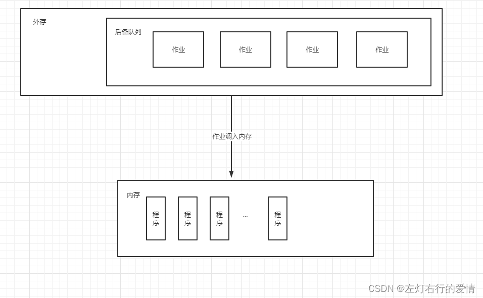  
1.用户提交的作业先放到外存上，排成一个队列（后备队列）。  
2.作业调度程序按一定算法冲后备队列中选择若干个作业调入内存（它们共享CPU和系统中各个资源）  
3.内存（装有若干道程序）可以调度多个程序运行。

CPU占用情况：  
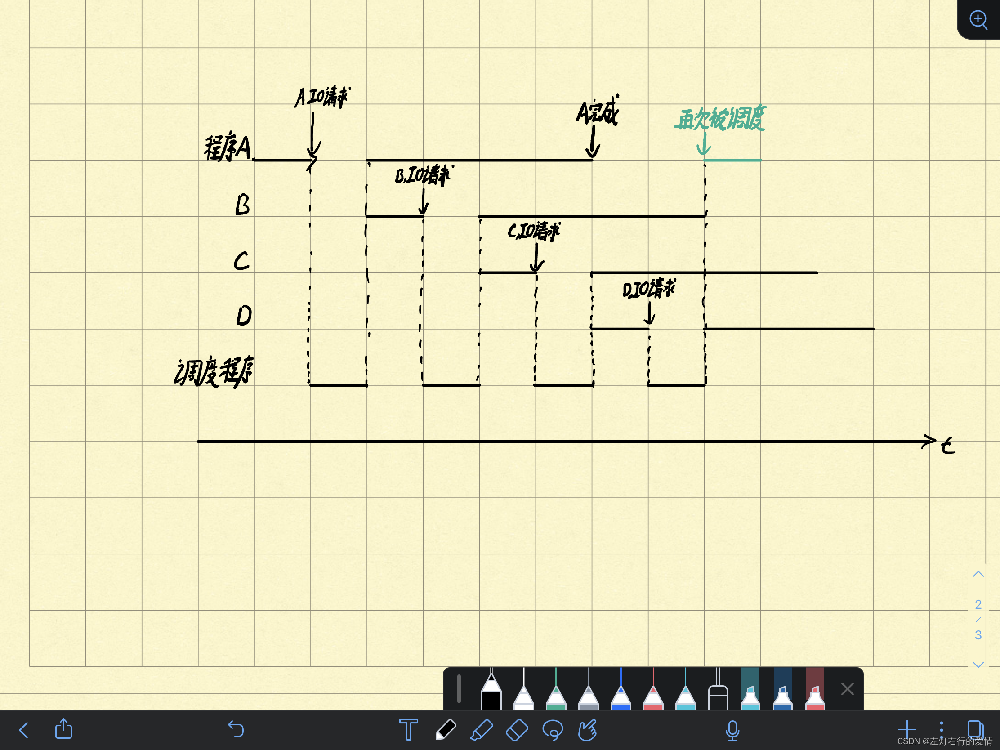

优点：  
1.资源利用率高：  
多道程序机制使多道程序交替运行，CPU一直处于忙碌。  
内存装入多道程序，提高内存利用率，还提高了IO设备利用率。  
2.系统吞吐量大：  
CPU和其他资源保持“忙碌”状态。  
仅当作业完成或者运行不下去时才切换，系统开销小。

应试回答：

1. 内存中可同时装入多道程序，共享CPU和系统的各种资源
2. 能够充分发挥系统中各类型资源的并行处理能力
3. 多道程序交替进行，保持CPU处于忙碌状态

缺点：  
1.平均周转时间长：作业需要排队并且是依次处理。  
2.无交互能力：作业提交给系统直至作业完成，用户不能与作业进行交互。

##### 操作系统的结构

一：内核  
内核是操作系统的核心组件，它负责管理所有进程，内存，文件等。  
内核功能在操作系统的最低级别，充当用户级应用程序和硬件之间的接口，所以，内核实现了软件和硬件之间的通信。

二：体系结构  
对程序员而言是指计算机逻辑结构和功能特征，包括各个硬，软部件之间的相互关系。  
对计算机系统设计者是指研究计算机的基本思想和由此产生的逻辑结构。  
对程序设计者是指对系统的功能描述。

目前主要的体系结构：大内核和微内核

从体系结构的概念我们知道大内核和微内核是通过功能特征进行划分的逻辑结构。  
操作系统在核心态为应用程序提供多种公共服务，如：  
1.进程管理/存储器管理/文件管理/设备管理  
2.中断操作/时钟管理等。

用一张图来解析如何通过功能来区别大内核和微内核:  
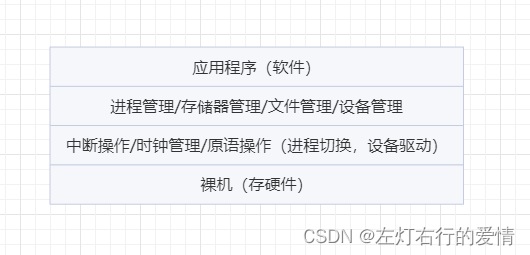  
大内核：第二层与第三层（顶部为第一层）  
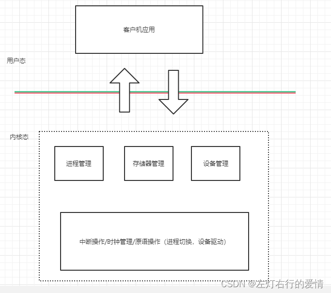  
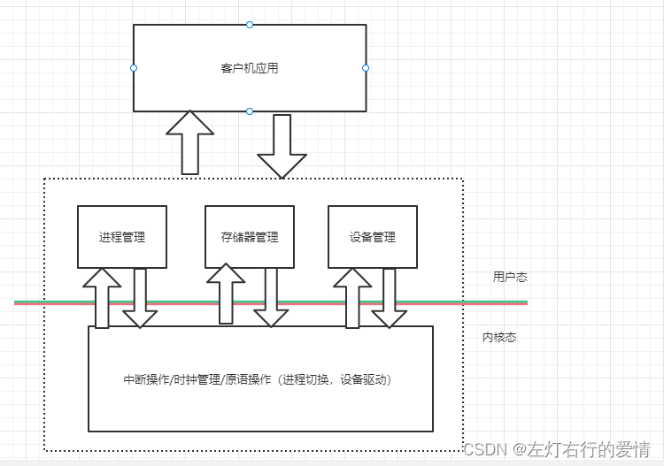

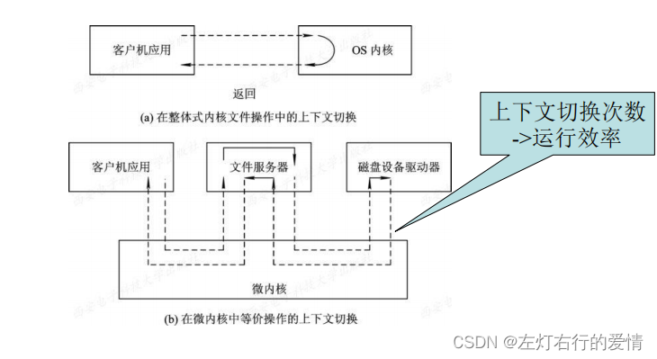

应试：  
微内核结构的特点：

1. 足够小的内核
2. 基于客户/服务器模式
3. 采用策略与机制分离原则
4. 采用面向对象技术

---

微内核的优点

1. 提高了系统可扩展性
2. 增强了系统的可靠性
3. 增强了系统的可移植性
4. 提供了对分布式系统的支持
5. 融入了面向对象技术

---

微内核的缺点

1. 运行效率降低，上下文切换次数增加。

##### 应试题(后面继续补充，每天更新一道）

###### 单批道处理系统例题在这里插入图片描述

###### 多批道处理系统例题

设设某计算机系统有CPU、I/O设备1、 I/O设备2。现有两个进  
程同时进入就绪态，且进程A先运行，进程B后运行。  
进程A：计算20ms，设备1运行50ms，设备2运行20ms，再计  
算20ms。  
进程B：计算20ms，设备1运行30ms，再计算10ms。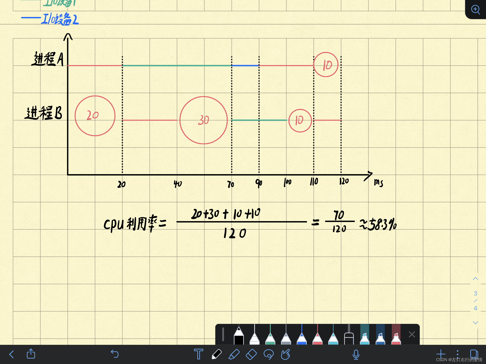
