> 原文：[CSDN](https://blog.csdn.net/qq_45852626/article/details/126529493)（历史文章导入，当前状态为草稿）

##### 一：概念

异步环境下一组并发进程因为**直接制约**而互相发送消息，互相合作，互相等待是的，使得各进程按一定的速度执行的过程。  
同步机制主要任务：执行次序上对多个协作进程进行协调，使并发执行的诸多协作进程之间能按照一定的规则（时序）共享系统资源，并良好相互协作，是的程序的执行有**可再现性**。

**两种形式的制约关系**  
1.间接相互制约关系（互斥关系）  

多线程 
环境下，并发执行的进程之间会形成相互制约关系。  
2.直接相互制约关系（同步关系）  
应用程序为了完成某项任务，会建立多个进程，这些进程为了完成统一任务而相互合作

**临界资源&&临界区**  
1.进程在使用某些资源时需要采用互斥方式，这些资源称为临界资源（既可以是硬件资源又可以是软件资源）。  
2.临界资源是多个进程必须互斥地对它们进行访问，我们把每个进程中访问临界资源的那段代码称为临界区。  
临界区上面的检查代码称为进入区。  
临界区下面的代码称为退出区。

**访问临界资源需要遵循的原则**  
1.空闲让进  
临界区空闲时，允许一个请求进入临界区的进程立即进入临界区  
2.忙则等待  
当已有进程进入临界区，其他试图进入临界区的进程必须等待  
3.有限等待  
对请求访问的进程，应保证能在有限时间内进入临界区（保证不会饥饿）  
4.让权等待  
进程不能进入临界区，应当立即释放处理机，防止进程忙等待

##### 进程互斥的软件实现方法

1.单标志法  
思想：一个进程访问完临界区后会把使用临界区的权限交给另一个进程，即每个进程是否能进入临界区的权限只能被另一个进程赋予。  
代码实现如下：  
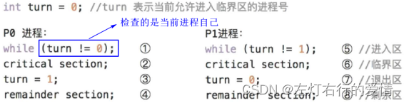  
当P0访问临界区，turn为0，此时P1一直在⑤循环，无法进入临界区；  
当P0访问完，修改turn为1，P1此时会跳出循环，进入临界区。

注意：  
1.该算法可以实现同一时刻最多只允许一个进程访问临界区  
2.如果此时允许P0进入临界区，但是P0一直不访问，那么这时会导致，虽然临界区空闲，但是也不允许P1访问。

所以我们可以看到，单标志法存在的问题是：违背了空闲让进原则。

2.双标志先检查法  
思想：设置一个布尔数组flag[],表示数组中各元素各进程是否想进入临界区，true–想进，false–不想进；  
每个进程在进入临界区前先检查当前有没有别的进程想进入临界区，如果没有，把自身对应的标志flag[i]改为true，之后访问临界区。  
代码实现：  
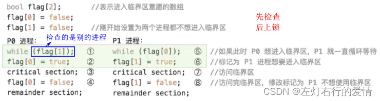  
存在的问题：  
P0进程进入之后，在修改P0位ture之前，  
如果此时切换到P1，P1检查没有别的进程想进入临界区，P1也会改为true，导致两个进程都为ture，同时访问，违背了忙则等待原则。  
注意：出现这种情况的原因是检查和上锁不是一体的。

3.双标志后检查法  
思想：双标志先检查版的改版，先上锁后检查，谁想进谁直接将自身改为true，不关系其他进程，改为true后，再检查有没有其他进程想访问。  
代码实现：  
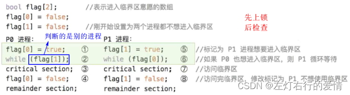  
存在的问题：  
P0想进入，把P0改为了true；  
此时恰好切换到了P1，P1想进入，也改为了true；  
导致两个进程都为true，谁也无法访问临界区，产饥饿现象。  
注意：  
1.双标志后检查法解决了忙则等待的问题，但是又违背了空闲让进和有限等待原则。  
2.出现的原因是：进入区的检查和上锁不是一体的

4.Peterson算法  
思想：双标志后检查法的改版，若两个进程都想进入临界区，可以主动让对方优先访问临界区。  
代码实现：  
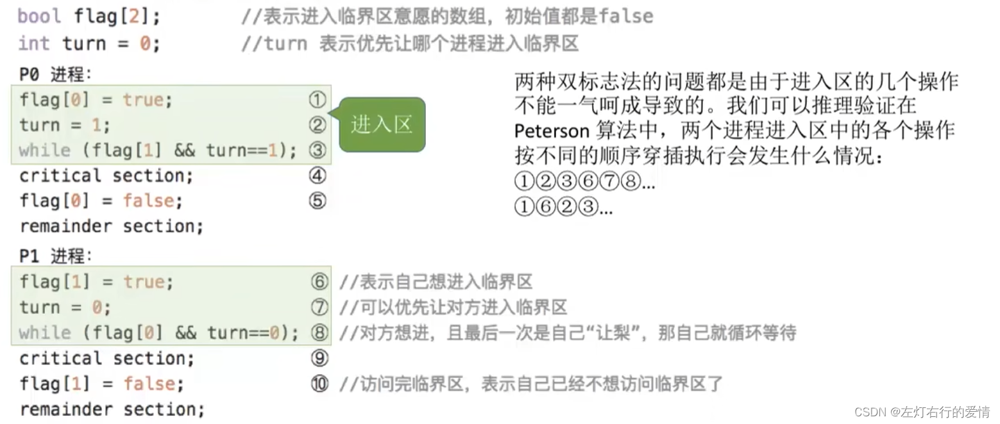  
流程步骤举例：  
1.P0想进入，P0改为true；  
2.P1想进入，P1改为true；  
3.切换到P0，检查前，让给对方（将trun改为1），检查发现，P1true且trun1，P0死等到时间片到  
4.切换到P1，检查前，让给对方（trun改为0），检查发现，P0true且trun0，P1死等到时间片到  
5.切换到P0，检查发现，turn！=1，向下执行，访问临界区。

所以我们发现，Peterson算法解决了空闲让进，忙则等待，有限等待三个原则，但违背了让劝等待原则（发生忙等）。

我们可以发现，利用软件进行进程同步似乎都或多或少有点问题，而且也有点难度，那么有没有更好一点的解决方式呢？  
答案很显然是有的，接下来我们了解硬件同步机制。

##### 硬件同步机制

1.中断屏蔽方法  
利用开/关中断指令实现，与原语思想相同，即某进程开始访问临界区到结束访问为止都不允许被中断，也就不能发生进程切换，因此也不可能出现两个进程同时访问临界区的情况。  
缺点：  
1.不适用多处理机；只适用于内核进程，不适用于用户进程。  
2.滥用可能会导致严重后果

2.TestAndSet指令（TS指令）  
又称TestAndSetLock指令（TSL指令）  
TSL指令是用硬件实现，执行过程中不允许被中断  
实现代码如下：  
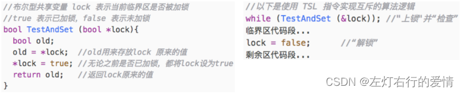  
如果lock是false（没有进程访问临界区），TSL返回值是false，不会死等，此进程可以访问临界区；  
如果lock为true（有进程访问临界区），TSL返回值为true，发生死等，直至访问临界区的进程访问结束，将lock修改为false，此进程才可以进入临界区。

缺点：不满足让权等待原则，暂时无法进入临界区的进程会占用
CPU 
并循环执行TSL指令，从而导致忙等。

3.Swap 指令  
也成Exchange指令（XCHG指令）  
Swap指令是用硬件实现的，执行的过程不允许被中断  
代码实现：  
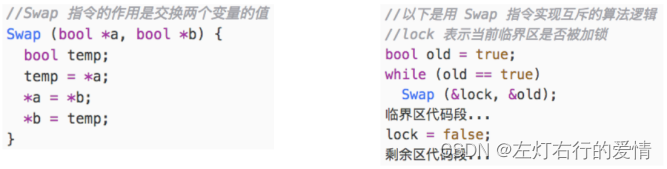  
当lock为false（无进程访问临界区时），才可以跳出循环，访问临界区

缺点：不满足让权等待原则。

##### 信号量机制

一：为什么要学信号量机制？  
我们上面了解到了进程互斥的四种软件实现方法，三种硬件实现方法都无法实现让劝等待，也就是进程无法进入临界区时，会占用处理机一直循环（我们理想情况是直接切换进程，而不是一直循环），  
信号量机制就可以为我们解决这个问题。

二：什么是信号量机制  
原理：为实现进程的互斥与同步，多个进程通过相互传递信号进行合作，迫使某个进程收到信号自动暂停执行（阻塞等待），直到它收到唤醒信号。

三：信号量  
1.整形信号量  
最初整形信号量定义为一个用于表示资源数目的整形量S，但是与一般整形量不同，除了
初始化 
，还可以通过两个标准的原子操作来访问—wait（S），singal（S）。  
实现如下：  
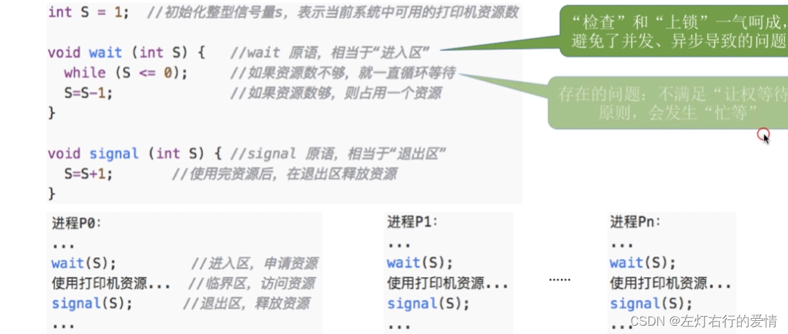  
我们可以看出，这里面还存在着让权等待。

2.记录型信号量  
在整形信号量（不满足让权等待）的基础上进行改进，使用记录型数据结构表示信号量：  
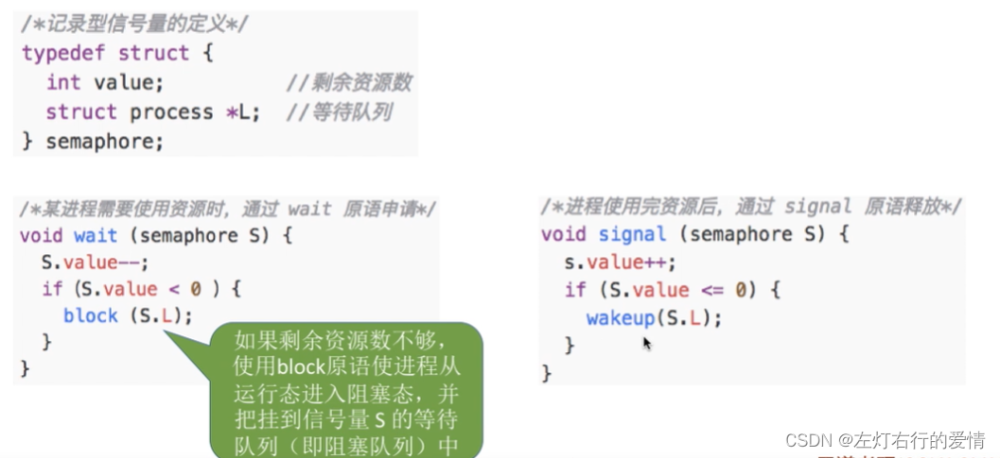  
我们一般称原语的简写为：  
Wait（S）—P操作P（S）  
Signal（S）—V操作V（S）  
如果你学过并发编程中的AQS，或者Semaphore，相信会更好理解这个概念。

##### 信号量实现进程互斥，同步，前驱关系

一：信号量机制实现进程互斥  
设互斥信号量为mutex，初值为1，实现如下：  
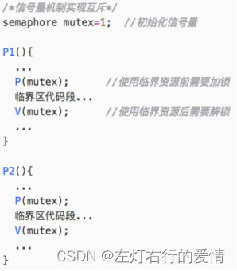  
注意：P，V操作必须要成对出现，缺P无法保证互斥访问，缺V无法唤醒等待线程与解锁

2.信号量机制实现进程同步  
实现进程同步，必须保证进程执行是有先后次序，即一前一后。  
1：设置同步信号量S，初值为0（开始没有资源，P1进程想使用必须通过P2产生资源）  
2：在“前操作”之后执行V（S）  
3：在“后操作”之后执行P（S）

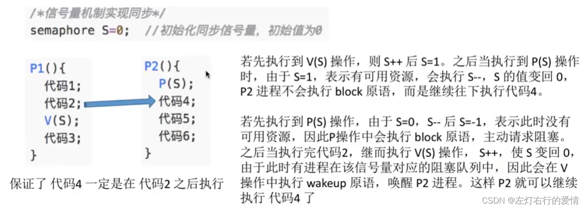

3.信号量机制实现前驱关系  
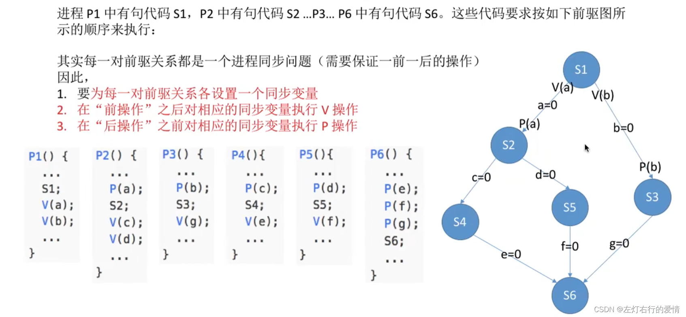

##### 总结

生产者消费者等问题，后面会更，先把知识点更了，后面读者什么的也会更。
