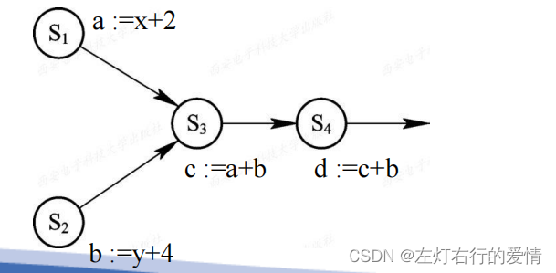
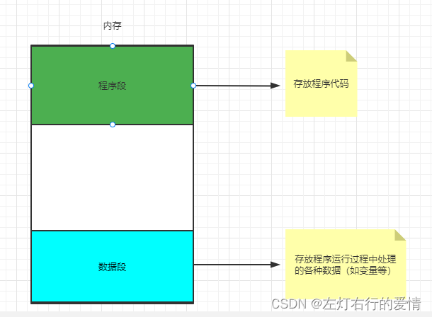
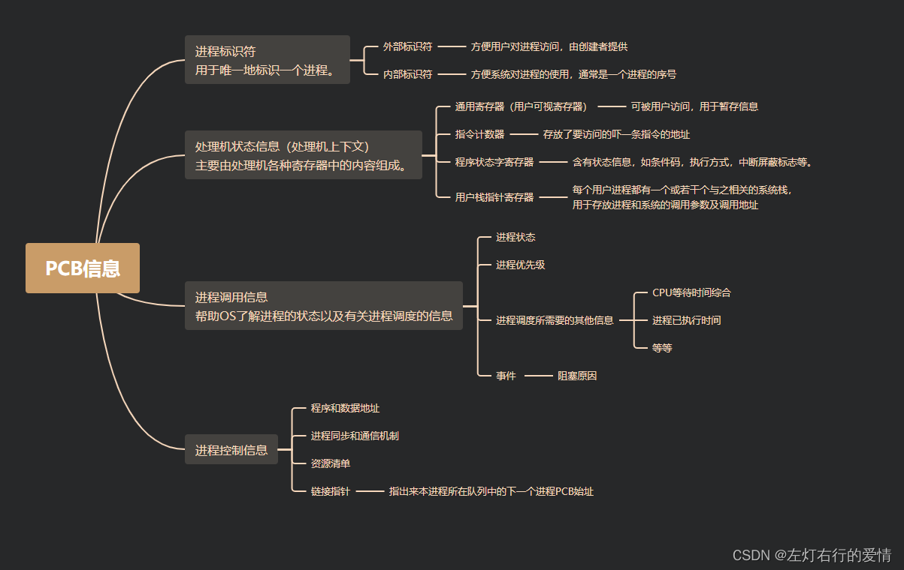
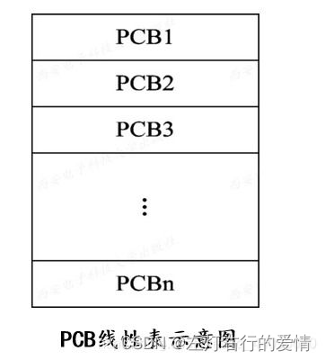
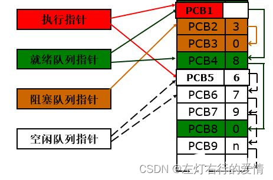
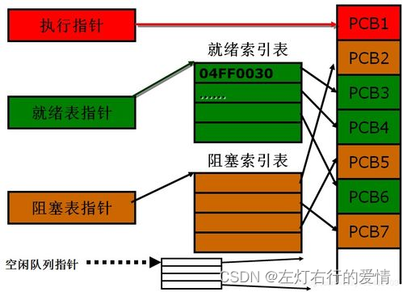
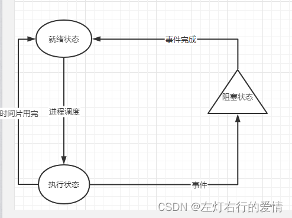
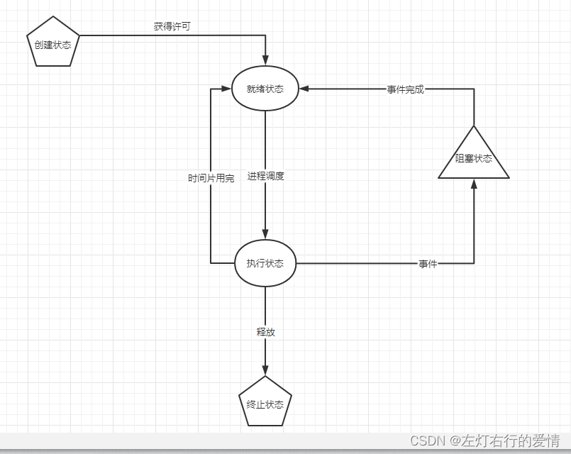
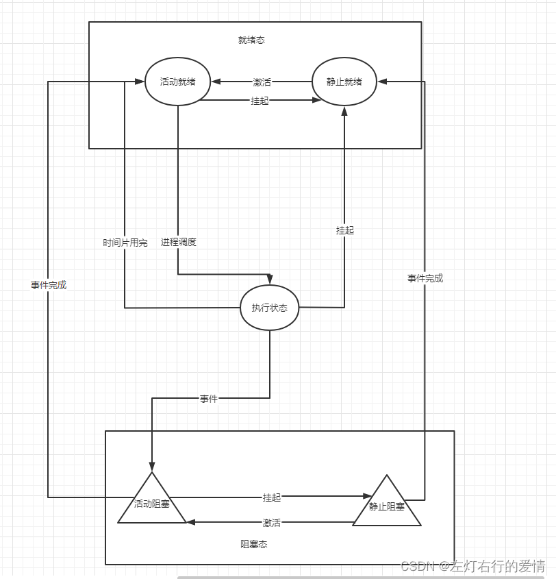
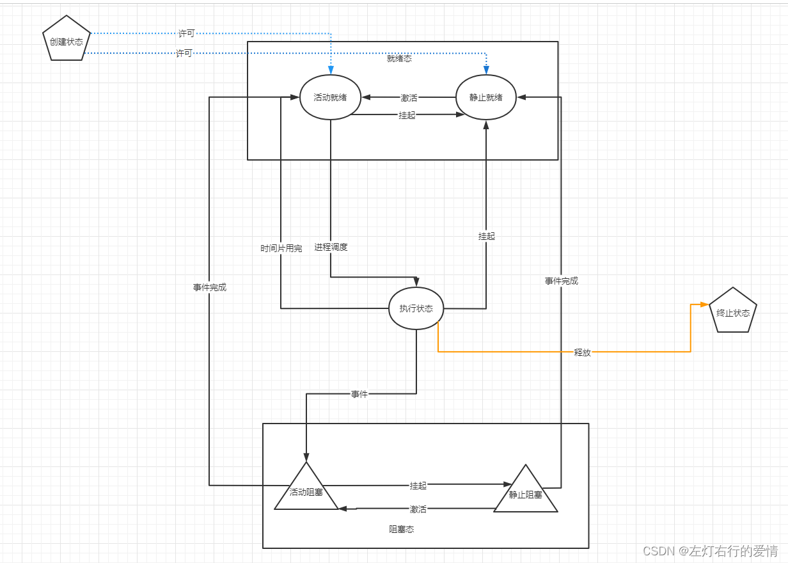

> 原文：[CSDN](https://blog.csdn.net/qq_45852626/article/details/126490915)（历史文章导入，当前状态为草稿）

## 前言

进程是一个非常重要的概念，资源分配和独立运行的基本单位都是进程，OS所具有的四大特征也是基于进程而形成。

## 前驱图

前驱图为有向无环，用于描述进程之间执行的先后顺序。  
 结构：  
 1.节点：表示一个进程或者一段程序，甚至是一条语句  
 2.有向边：两个节点之间所存在的偏序（或前驱关系→）  
 3.初始节点：没有前驱的节点  
 4.终止节点：没有后驱的节点  
 5.权重：节点所含有的程序量或程序执行时间  
 6.前驱关系：A→B，则在B开始执行之前，A要完成。  
 注意：前驱图不能有循环。

举例：  
 对于具有下述四条语句的程序段  
 S1: a :=x+2  
 S2: b :=y+4  
 S3: c :=a+b  
 S4: d :=c+b  
 如何使用前趋图表示它们的执行顺序？

解析：  
 1.S3必须在a和b被赋值后方能执行；  
 2.S4必须在S3之后执行；  
 3.S1和S2则可以并发执行，因为它们彼此互不依赖。  
 

## 进程概念

从JVM的角度我们分析过进程，现在我们要站在OS角度来看，结合起来更全面了解进程。  
 一：为什么会出现进程？  
 a.多道程序环境下，程序的执行属于并发执行，因此，是多个程序共享系统中的各种资源,因而这些资源的状态将由多个程序来改变；  
 b.并发执行的程序执行的顺序不同可能有不同的执行结果以及间断性（间断性不明白去看后面PCB深入解析，细分各个功能的B点）  
 如此来看，程序是不可以参加并发执行的，否则程序的执行失去了意义（具体为什么失去意义：看后面PCB深入解析，细分各个功能的B点）。  
 那么，为了使程序可以参与并发执行，我们对参与并发执行的程序用些手段来加以控制与描述。  
 这个手段就是引入了“**进程**”。

引入进程概念的原因角度解析：  
 1.从理论角度看，是对正在运行的程序过程的抽象；  
 2.从实现角度看，是一种数据结构，目的在于清晰地刻画动态系统的内在规律，有效管理和调度进入计算机系统主存储器运行的程序。

二：进程的定义  
 ☆☆☆ **进程是程序关于某数据集合上的一次运行活动，是系统进行资源分配和调度的基本单位。**  
 用书上的话来说：进程是程序的执行过程，是系统进行资源分配和调度的一个独立单位。  
 早期面向进程设计的计算机结构中：进程是程序的基本执行实体；  
 当代面向线程设计的计算机结构中：进程是线程的容器。

程序是指令极其组织形式的描述，进程是程序的实体。

关于进程的特性：  
 1.我们要深刻认识到进程的**动态性**，进程是由动态产生，动态消亡的。  
 2.而并发性不必多说，你如果仔细看进程如何来的就明白了。  
 3.独立性这个读读进程概念就明白了，肯定是一个能独立运行的基本单位，同时也是系统分配资源和调度的独立单位。  
 4.异步性肯定是有的，因为进程间相互制约，使得进程具有执行的间断性，按各自独立，不可预知的速度向前推进。

## 进程结构分析

问题：程序被载入到内存之后，它会被划分为什么部分呢（假设只有一道用户程序）  
 答：如下图  
 那么我们怎么知道，在内存中进程的程序段和数据段在哪个位置？  
 早期内存只支持一道应用程序，我们知道进程里的程序段和数据段放在固定位置；  
 那么现在是多到程序并发运行，OS如何记录这些进程的程序段和数据段的位置呢？  
 这里引出了PCB（进程控制块）的数据结构来存放这些信息（具体如何实现后面会说）。  
 所以，现在我们可以理解进程的结构部分了  
 进程的结构有三个部分：  
 1.程序段  
 2.相关数据段  
 3.PCB（进程控制块 process control block）  
 懂了PCB大概是干嘛的，到这是不是突然想起来课本上在描述进程特性里面有补充过一句话：未建立PCB是没有一些特性的（并发性，独立性），现在我们不太明确的结构部分只有PCB了。

---

### **PCB深入解析**（分割线展示排面）

一：PCB的作用  
 总体来说：  
 描述进程当前情况以及管理进程运行状态的全部信息，属于记录性数据结构，是的一个在多道环境下不能独立运行的程序（含数据），成为一个能独立运行的基本单位，即，能与其他进程并发执行的进程。  
 细分各个功能：  
 A：作为独立运行基本单位的标志----当一个程序配置PCB后，代表是可以在多道程序环境下独立运行，合法的基本单位，系统在进程创建时会创建一个PCB，进程结束时又会收回PCB，进程也随之消亡，**系统是通过PCB来感知程序的**。

B：实现间断性运行方式—多道环境下，程序采用“走走停停”间断性的方式运行（当进程因阻塞暂停运行时，必须要保留自己运行时的CPU现场信息，系统把CPU现场信息保存在PCB中，以供进程再次被调度运行恢复CPU现场信息时使用，所以，在多道程序环境下，传统意义的静态程序，不具有保护或保存自己运行现场的手段，所以无法保证运行结果再现性，从而失去运行的意义）。  
 C：提供现场管理所需要的信息—调度程序调度某个进程时，只会根据这个进程中的PCB里记录的程序和数据在内存或外存起始地址去找响应的程序和数据；  
 同时，进程访问文件或IO设备，也都需要借助PCB中信息。可见，OS总是根据PCB来实施对进程的控制与管理。  
 D：提供进程调度所需要的信息。  
 E：实现与其他进程的同步与通信。

二：PCB结构  
 源码解析（部分），仅供了解，看看图个乐。

```
struct task_struct {
volatile long state;  //说明了该进程是否可以执行,还是可中断等信息
unsigned long flags;  //Flage 是进程号,在调用fork()时给出
intsigpending;   //进程上是否有待处理的信号
mm_segment_taddr_limit; //进程地址空间,区分内核进程与普通进程在内存存放的位置不同
                       //0-0xBFFFFFFF foruser-thead
                       //0-0xFFFFFFFF forkernel-thread
//调度标志,表示该进程是否需要重新调度,若非0,则当从内核态返回到用户态,会发生调度
volatilelong need_resched;
int lock_depth;  //锁深度
longnice;       //进程的基本时间片
//进程的调度策略,有三种,实时进程:SCHED_FIFO,SCHED_RR,分时进程:SCHED_OTHER
unsigned long policy;
struct mm_struct *mm; //进程内存管理信息
int processor;
//若进程不在任何CPU上运行, cpus_runnable 的值是0，否则是1这个值在运行队列被锁时更新
unsigned long cpus_runnable, cpus_allowed;
struct list_head run_list; //指向运行队列的指针
unsigned longsleep_time;  //进程的睡眠时间
//用于将系统中所有的进程连成一个双向循环链表,其根是init_task
struct task_struct *next_task, *prev_task;
struct mm_struct *active_mm;
struct list_headlocal_pages;       //指向本地页面      
unsigned int allocation_order, nr_local_pages;
struct linux_binfmt *binfmt;  //进程所运行的可执行文件的格式
int exit_code, exit_signal;
intpdeath_signal;    //父进程终止是向子进程发送的信号
unsigned longpersonality;
//Linux可以运行由其他UNIX操作系统生成的符合iBCS2标准的程序
intdid_exec:1; 
pid_tpid;    //进程标识符,用来代表一个进程
pid_tpgrp;   //进程组标识,表示进程所属的进程组
pid_t tty_old_pgrp;  //进程控制终端所在的组标识
pid_tsession;  //进程的会话标识
pid_t tgid;
intleader;     //表示进程是否为会话主管
struct task_struct*p_opptr,*p_pptr,*p_cptr,*p_ysptr,*p_osptr;
struct list_head thread_group;  //线程链表
struct task_struct*pidhash_next; //用于将进程链入HASH表
struct task_struct**pidhash_pprev;
wait_queue_head_t wait_chldexit;  //供wait4()使用
struct completion*vfork_done;  //供vfork()使用
unsigned long rt_priority; //实时优先级，用它计算实时进程调度时的weight值

//it_real_value，it_real_incr用于REAL定时器，单位为jiffies,系统根据it_real_value
//设置定时器的第一个终止时间.在定时器到期时，向进程发送SIGALRM信号，同时根据
//it_real_incr重置终止时间，it_prof_value，it_prof_incr用于Profile定时器，单位为jiffies。
//当进程运行时，不管在何种状态下，每个tick都使it_prof_value值减一，当减到0时，向进程发送
//信号SIGPROF，并根据it_prof_incr重置时间.
//it_virt_value，it_virt_value用于Virtual定时器，单位为jiffies。当进程运行时，不管在何种
//状态下，每个tick都使it_virt_value值减一当减到0时，向进程发送信号SIGVTALRM，根据
//it_virt_incr重置初值。
unsigned long it_real_value, it_prof_value, it_virt_value;
unsigned long it_real_incr, it_prof_incr, it_virt_value;
struct timer_listreal_timer;   //指向实时定时器的指针
struct tmstimes;     //记录进程消耗的时间
unsigned longstart_time;  //进程创建的时间
//记录进程在每个CPU上所消耗的用户态时间和核心态时间
longper_cpu_utime[NR_CPUS],per_cpu_stime[NR_CPUS]; 
//内存缺页和交换信息:
//min_flt, maj_flt累计进程的次缺页数（Copyon　Write页和匿名页）和主缺页数（从映射文件或交换
//设备读入的页面数）；nswap记录进程累计换出的页面数，即写到交换设备上的页面数。
//cmin_flt, cmaj_flt,cnswap记录本进程为祖先的所有子孙进程的累计次缺页数，主缺页数和换出页面数。
//在父进程回收终止的子进程时，父进程会将子进程的这些信息累计到自己结构的这些域中
unsignedlong min_flt, maj_flt, nswap, cmin_flt, cmaj_flt, cnswap;
int swappable:1; //表示进程的虚拟地址空间是否允许换出
//进程认证信息
//uid,gid为运行该进程的用户的用户标识符和组标识符，通常是进程创建者的uid，gid
//euid，egid为有效uid,gid
//fsuid，fsgid为文件系统uid,gid，这两个ID号通常与有效uid,gid相等，在检查对于文件
//系统的访问权限时使用他们。
//suid，sgid为备份uid,gid
uid_t uid,euid,suid,fsuid;
gid_t gid,egid,sgid,fsgid;
int ngroups; //记录进程在多少个用户组中
gid_t groups[NGROUPS]; //记录进程所在的组
//进程的权能，分别是有效位集合，继承位集合，允许位集合
kernel_cap_tcap_effective, cap_inheritable, cap_permitted;
int keep_capabilities:1;
struct user_struct *user;
struct rlimit rlim[RLIM_NLIMITS];  //与进程相关的资源限制信息
unsigned shortused_math;   //是否使用FPU
charcomm[16];   //进程正在运行的可执行文件名
 //文件系统信息
int link_count, total_link_count;
//NULL if no tty进程所在的控制终端，如果不需要控制终端，则该指针为空
struct tty_struct*tty;
unsigned int locks;
//进程间通信信息
struct sem_undo*semundo;  //进程在信号灯上的所有undo操作
struct sem_queue *semsleeping; //当进程因为信号灯操作而挂起时，他在该队列中记录等待的操作
//进程的CPU状态，切换时，要保存到停止进程的task_struct中
structthread_struct thread;
  //文件系统信息
struct fs_struct *fs;
  //打开文件信息
struct files_struct *files;
  //信号处理函数
spinlock_t sigmask_lock;
struct signal_struct *sig; //信号处理函数
sigset_t blocked;  //进程当前要阻塞的信号，每个信号对应一位
struct sigpendingpending;  //进程上是否有待处理的信号
unsigned long sas_ss_sp;
size_t sas_ss_size;
int (*notifier)(void *priv);
void *notifier_data;
sigset_t *notifier_mask;
u32 parent_exec_id;
u32 self_exec_id;

spinlock_t alloc_lock;
void *journal_info;
};


```

三：PCB中信息  
 这部分信息有点杂，我梳理一个思维导图如下，这些内容如果你仔细在上面源码找是都可以找到的：  
   
 四：PCB组织方式  
 我们知道，一个系统中PCB的数量非常之多，那么我们该如何管理PCB呢？  
 1：线性方式：所有PCB都在一张线性表中，表的起始地址存放在内存的一个专用区域里。  
 

2：链接方式：通过PCB中的链接字，具有相同状态的进程PCB链接成一个队列。  
 

3：索引方式：根据进程状态不同，建立索引表，把索引表在内存中的起始地址记录在内存一些专用单元中。  
 

## 进程的基本状态与转换

我们学习状态转换时，一定要有一定的考虑，即，进程的大环境（多道批环境），也可以说是并发，如果你的并发编程学的还可以，这部分内容相信看一眼就明白了。  
 并发基础不好的小伙伴，可以去看看我前边的文章，里面从java的角度来聊了聊进程，链接：  
 [并发编程JUC深度学习（一）进程与线程（文字描述部分](https://blog.csdn.net/qq_45852626/article/details/125789204?spm=1001.2014.3001.5501)  
 [并发编程JUC深度学习(五）线程生命周期](https://blog.csdn.net/qq_45852626/article/details/126028316?spm=1001.2014.3001.5501)

### 进程的基础三种转换状态

我们之前了解到，当多进程在并发执行共享系统资源，在执行过程中呈现间断性规律，那么进程在其生命周期会具有多种状态。  
 我们先来看最基本的状态。  
 1.就绪态：指进程处于准备好执行的状态，已经分配到除CPU以外的所有必要资源，只要获取到CPU，可立即执行。

2.执行状态：进程获取到CPU后程序“正在执行”的状态。

3.阻塞状态：正在执行的进程由于发生某事件（IO请  
 求，申请缓冲区失败）而暂时无法继续执行，使得程序的执行受到阻塞。这时会引发进程调度，OS会把处理机分配给另外的就绪进程，并让阻塞进程暂停。  
 

### 五种基本状态

看完上面三种基本状态我们发现，进程是从就绪态开始的，并且进程要一直处于执行和阻塞吗？

为了进程控制块（PCB）对数据与操作的完整性要求以及增强管理灵活性做了补充。

我们上面也知道PCB的创建和返还对应着的是进程的创建和结束，所以就引出了另外两个状态，进程创建，进程结束。

1.创建状态：创建进程是一个很复杂的过程。  
 具体而言：  
 a.进程申请PCB，并填入用于控制和管理进程的信息  
 b.为进程分配运行时所必需的资源  
 c.进程状态转换为就绪，并插入就绪队列中  
 注意：如果进程必需的资源不能得到满足（内存不够等），创建工作没有完成，进程拿到CPU不能被处理机调度，此时就处于创建状态。

2.终止状态：系统删除该进程，将其PCB清零，并将PCB空间返还给OS。



### 引入挂起后的五状态模型

OS为了满足系统和用户观察和分析的需要，引入了面向进程的重要操作——挂起。  
 挂起进程在OS中被定义为淘汰出内存的进程。因为不在内存中，所以自然暂停执行了，当我们需要进程运行时，再唤回到内存中。

它的具体作用是什么？  
 1.终端用户的需要：终端用户发现自己程序运行期间有可疑问题，需要研究其执行情况或进行修改。  
 2.父进程的需要：父进程想要考查或者修改子进程，或者需要协调各子进程间的活动。  
 3.负荷调节的需要：系统工作负荷重，可能会影响对任务的控制，把不必要的进程挂起，确保自身可以正常运行。在微服务中我们可以参考类比熔断的服务降级HystrixCommand。  
 4.OS的需要：想要检查进程运行中资源的使用情况或需要记账（CPU使用时间等）。  
 可以看到，如果没有挂起，当我们去操作线程时，表现的比较无力，有了挂起，我们可以暂停进程，当有用户本身有需要的时候我们再将其唤醒，而不是系统资源充足了，自动将阻塞进程唤醒，造成不必要的麻烦。

阻塞和挂起的共同点：  
 1.进程都暂停执行  
 2.进程都释放了CPU，都会设计上下文切换

阻塞和挂起的不同点:  
 1.对系统资源占用不同：虽然都释放了CPU，但是挂起的进程通过对换技术从内存换出到外存（磁盘）中；而阻塞进程仍然在内存中。  
 2.发生时机不同：阻塞一般在进程等待资源（IO资源，信号量等）时发生；  
 而挂起则是用户和系统的需要。  
 3.恢复时机不同：阻塞在等待资源得到满足后，才会进入就绪状态，等待被调度而执行；  
 被挂起的进程由将其挂起的对象（用户，系统）在时机符合（调试结束等）时将其主动激活。

了解上面内容后，我们再来看状态图就比较简单了。  
 下面的图猛一看很懵，但是仔细观察是有一定的对称性。

  
 下面我们来好好聊一聊，为什么要把就绪态和阻塞态分别拆分为活动就绪，静止就绪和活动阻塞与静止阻塞。  
 首先如果你设计出了挂起这个操作，那么你该如何设置挂起后进程该以什么进程状态在生命周期呢？

我们知道，所有进程都应该处于3种基本状态之一：就绪，执行，阻塞。  
 那么如何区别挂起前就绪，阻塞，和挂起后就绪阻塞状态呢？  
 所以，根据挂起的特性我们把就绪，阻塞分为了活动与静止。

我们不需要把它们看的多复杂，只需要记得，它就是三个状态，无非就是就绪和阻塞里面区别了是否挂起而已，举个例子（例子有点长，我语言表述能力不够精简，如果你要看的话，最好拿个笔稍微画一下更好）：  
 进程处于执行状态，接着请求IO事件发生，线程变为了阻塞态，那么此时线程被挂起了吗？显然没有，没有就是活动阻塞。  
 突然我们发现这个进程里面有一些错误（阻塞后我们获取不到要获取的资源，也就是说无法进入到就绪态）需要更改，这时我们将进程挂起，活动阻塞挂起后就转为了静止阻塞。  
 接下来我们更正了错误，接着要获取的资源满足了，进程进入到就绪态，那么进程被激活了吗，没有！没有就是进入到了静止就绪，等到我们用户或系统什么时候挂起，这个进程才是真正可以运行，进入到活动就绪态。  
 那么我们正在执行态，我直接挂起，我们会进入到就绪态，因为挂起，我们进入到了静止就绪。

上面这个例子我们走一遍这个进程状态图，相信聪明的你已经掌握了它！

### 引入挂起操作后五个基本状态间的转换

这玩意更简单，如果上面那个看会，这个就是增加了创建态与就绪态的细分  
 如果系统性能和内存容量都允许，创建态转到就绪态（活动就绪）  
 如果系统资源和性能要求不允许，进程状态为就绪态（静止就绪），注意，此时进程被安置在外存，不参与调度，而且进程创建工作也没有完成。

所以进程状态图就很简单了：



## 总结

虽然我很想再去写写通信，但是考试不考，时间也比较紧，就先写到这了，线程的话考试也不考，前面并发专辑也写的有，感兴趣的话上面贴的有链接。  
 习题后面会补更，我先把知识点更完，后面有考试习题专辑。
