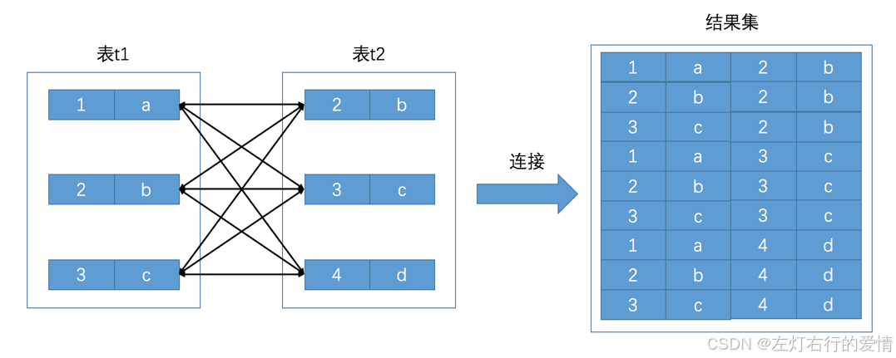
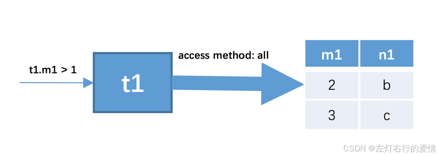
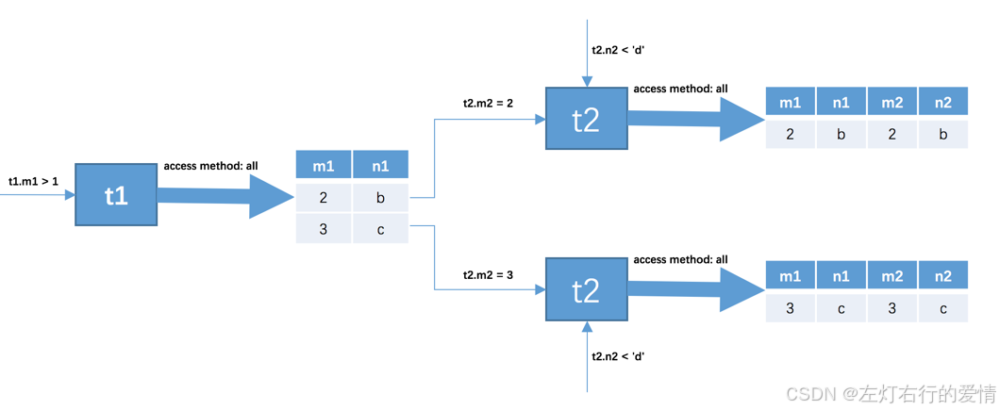
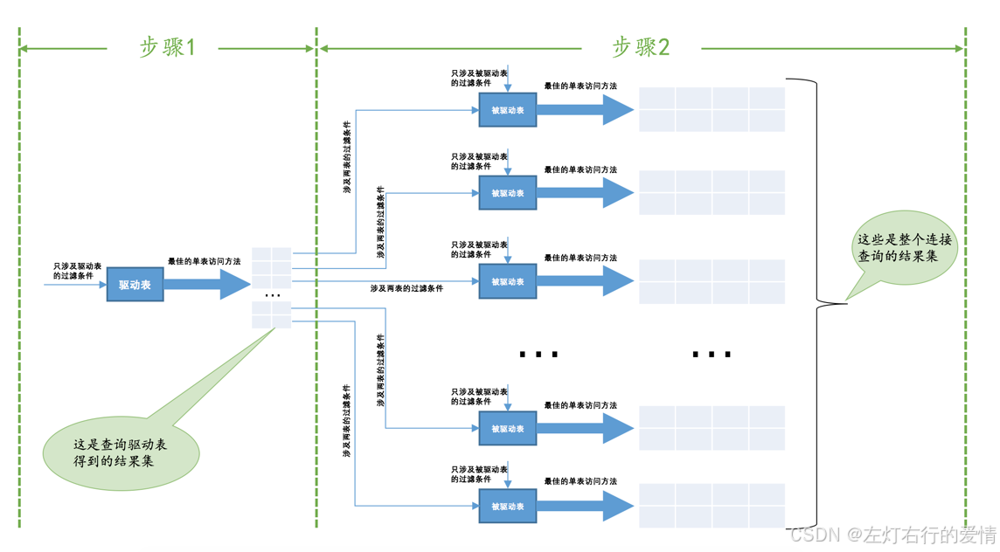
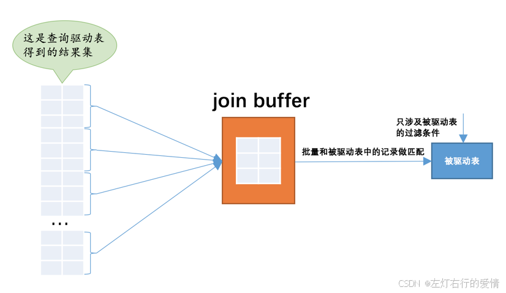
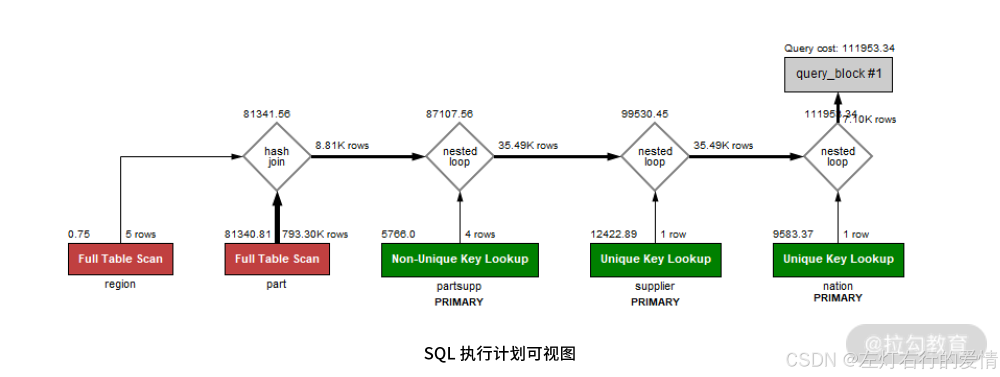

> 原文：[CSDN](https://blog.csdn.net/qq_45852626/article/details/145455589)（历史文章导入，当前状态为草稿）

### 前言

这篇文章是对知识内容进行整合加上自己的理解,文章内容来自于各种文章,书籍,工作号内容.  
 下面的内容我会列举是在哪里看的,然后写一下我自己的理解和总结.  
 如果感觉不清楚的,可以去看一下原创.

### Join到底能不能用

网上有些帖子说JOIN会降低SQL性能,于是就将一条多表 SQL 拆成单表的一条条查询,这样真的对吗?  
 有些人业务第一,再复杂的查询也用在一个连接语句中搞定.  
 那这个Join到底怎么用,能不能用?  
 对此如果说你不了解JOIN的实现过程,对于开发人员来说那就是一个黑盒,用错的概率还挺高的.

### 连接基本概念

#### 连接的本质

先建立两个表方便展示

```
 CREATE TABLE t1 (m1 int, n1 char(1));
 CREATE TABLE t2 (m2 int, n2 char(1));
 INSERT INTO t1 VALUES(1, 'a'), (2, 'b'), (3, 'c');
 INSERT INTO t2 VALUES(2, 'b'), (3, 'c'), (4, 'd');


```

连接的本质:  
 **把各个连接表中的记录都取出来依次匹配的组合加入结果集并返回给用户.**  
 我们把t1,t2两个表连接起来的过程如下图:  
   
 这个过程看起来就是把t1表的记录和t2的记录连起来组成新的更大的记录，所以这个查询过程称之为连接查询。  
 查询sql如下:

```
SELECT * FROM t1, t2;


```

我们可以发现:  
 连接查询的结果集中包含一个表中的每一条记录与另一个表中的每一条记录相互匹配的组合，像这样的结果集就可以称之为笛卡尔积。因为表t1中有3条记录，表t2中也有3条记录，所以这两个表连接之后的笛卡尔积就有3×3=9行记录。

#### 连接过程

如果我们乐意，我们可以连接任意数量张表，但是如果没有任何限制条件的话，这些表连接起来产生的笛卡尔积可能是非常巨大的。比方说3个100行记录的表连接起来产生的笛卡尔积就有100×100×100=1000000行数据.  
  所以在连接的时候过滤掉特定记录组合是有必要的，在连接查询中的过滤条件可以分成两种：

* 涉及单表的条件  
   这种只设计单表的过滤条件我们之前都提到过一万遍了，我们之前也一直称为搜索条件，比如t1.m1 > 1是只针对t1表的过滤条件，t2.n2 < 'd’是只针对t2表的过滤条件。
* 涉及两表的条件  
   这种过滤条件我们之前没见过，比如t1.m1 = t2.m2、t1.n1 > t2.n2等，这些条件中涉及到了两个表，我们稍后会仔细分析这种过滤条件是如何使用的。

下面我们举个例子来说明

```
SELECT * FROM t1, t2 WHERE t1.m1 > 1 AND t1.m1 = t2.m2 AND t2.n2 < 'd';


```

在这个查询中我们指明了这三个过滤条件：

* t1.m1 > 1
* t1.m1 = t2.m2
* t2.n2 < ‘d’  
   执行流程如下:

1. 首先确定第一个需要查询的表，这个表称之为驱动表。
2. 针对上一步骤中从驱动表产生的结果集中的每一条记录，分别需要到t2表中查找匹配的记录，所谓匹配的记录，指的是符合过滤条件的记录。

对于步骤一而言:  
 此处假设使用t1作为驱动表，那么就需要到t1表中找满足t1.m1 > 1的记录，因为表中的数据太少，我们也没在表上建立二级索引，所以此处查询t1表的访问方法就设定为all吧，也就是采用全表扫描的方式执行单表查询。  
   
 我们可以看到，t1表中符合t1.m1 > 1的记录有两条。

对于步骤二而言:  
 因为是根据t1表中的记录去找t2表中的记录，所以t2表也可以被称之为被驱动表。上一步骤从驱动表中得到了2条记录，所以需要查询2次t2表。此时涉及两个表的列的过滤条件t1.m1 = t2.m2就派上用场了：

* 当t1.m1 = 2时，过滤条件t1.m1 = t2.m2就相当于t2.m2 = 2，所以此时t2表相当于有了t2.m2 = 2、t2.n2 < 'd’这两个过滤条件，然后到t2表中执行单表查询。
* 当t1.m1 = 3时，过滤条件t1.m1 = t2.m2就相当于t2.m2 = 3，所以此时t2表相当于有了t2.m2 = 3、t2.n2 < 'd’这两个过滤条件，然后到t2表中执行单表查询。  
   具体如下图:  
     
   从上面两个步骤可以看出来，我们上面介绍的这个两表连接查询共需要查询1次`t1`表，2次`t2`表。  
   当然这是在特定的过滤条件下的结果，如果我们把`t1.m1 > 1`这个条件去掉，那么从`t1`表中查出的记录就有3条，就需要查询3次`t2`表了。**也就是说在两表连接查询中，驱动表只需要访问一次，被驱动表可能被访问多次。**

#### 内连接AND外连接

```
CREATE TABLE student (
    number INT NOT NULL AUTO_INCREMENT COMMENT '学号',
    name VARCHAR(5) COMMENT '姓名',
    major VARCHAR(30) COMMENT '专业',
    PRIMARY KEY (number)
) Engine=InnoDB CHARSET=utf8 COMMENT '学生信息表';

CREATE TABLE score (
    number INT COMMENT '学号',
    subject VARCHAR(30) COMMENT '科目',
    score TINYINT COMMENT '成绩',
    PRIMARY KEY (number, score)
) Engine=InnoDB CHARSET=utf8 COMMENT '学生成绩表';


```

我们新建了一个学生信息表，一个学生成绩表，然后我们向上述两个表中插入一些数据，为节省篇幅，具体插入过程就不介绍了，插入后两表中的数据如下：

```
mysql> SELECT * FROM student;
+----------+-----------+--------------------------+
| number   | name      | major                    |
+----------+-----------+--------------------------+
| 20180101 | 杜子腾    | 软件学院                 |
| 20180102 | 范统      | 计算机科学与工程         |
| 20180103 | 史珍香    | 计算机科学与工程         |
+----------+-----------+--------------------------+
3 rows in set (0.00 sec)

mysql> SELECT * FROM score;
+----------+-----------------------------+-------+
| number   | subject                     | score |
+----------+-----------------------------+-------+
| 20180101 | 母猪的产后护理              |    78 |
| 20180101 | 论萨达姆的战争准备          |    88 |
| 20180102 | 论萨达姆的战争准备          |    98 |
| 20180102 | 母猪的产后护理              |   100 |
+----------+-----------------------------+-------+
4 rows in set (0.00 sec)


```

现在我们想把每个学生的考试成绩都查询出来就需要进行两表连接了（因为score中没有姓名信息，所以不能单纯只查询score表）。  
 连接过程就是从student表中取出记录，在score表中查找number相同的成绩记录，所以过滤条件就是student.number = socre.number，整个查询语句就是这样：

```
mysql> SELECT * FROM student, score WHERE student.number = score.number;
+----------+-----------+--------------------------+----------+-----------------------------+-------+
| number   | name      | major                    | number   | subject                     | score |
+----------+-----------+--------------------------+----------+-----------------------------+-------+
| 20180101 | 杜子腾    | 软件学院                 | 20180101 | 母猪的产后护理              |    78 |
| 20180101 | 杜子腾    | 软件学院                 | 20180101 | 论萨达姆的战争准备          |    88 |
| 20180102 | 范统      | 计算机科学与工程         | 20180102 | 论萨达姆的战争准备          |    98 |
| 20180102 | 范统      | 计算机科学与工程         | 20180102 | 母猪的产后护理              |   100 |
+----------+-----------+--------------------------+----------+-----------------------------+-------+
4 rows in set (0.00 sec)

mysql> SELECT s1.number, s1.name, s2.subject, s2.score FROM student AS s1, score AS s2 WHERE s1.number = s2.number;
+----------+-----------+-----------------------------+-------+
| number   | name      | subject                     | score |
+----------+-----------+-----------------------------+-------+
| 20180101 | 杜子腾    | 母猪的产后护理              |    78 |
| 20180101 | 杜子腾    | 论萨达姆的战争准备          |    88 |
| 20180102 | 范统      | 论萨达姆的战争准备          |    98 |
| 20180102 | 范统      | 母猪的产后护理              |   100 |
+----------+-----------+-----------------------------+-------+
4 rows in set (0.00 sec)


```

从上述查询结果中我们可以看到，各个同学对应的各科成绩就都被查出来了，可是有个问题，史珍香同学，也就是学号为20180103的同学因为某些原因没有参加考试，所以在score表中没有对应的成绩记录。  
 那如果老师想查看所有同学的考试成绩，即使是缺考的同学也应该展示出来，但是到目前为止我们介绍的连接查询是无法完成这样的需求的。  
 我们稍微思考一下这个需求，其本质是想：**驱动表中的记录即使在被驱动表中没有匹配的记录，也仍然需要加入到结果集。**  
 为了解决这个问题，就有了内连接和外连接的概念：

* 对于内连接的两个表  
   驱动表中的记录在被驱动表中找不到匹配的记录，该记录不会加入到最后的结果集，我们上面提到的连接都是所谓的内连接。
* 对于外连接的两个表  
   驱动表中的记录即使在被驱动表中没有匹配的记录，也仍然需要加入到结果集。  
   在MySQL中,根据选取驱动表的不同，外连接仍然可以细分为2种：

1. 左外连接:选取左侧的表为驱动表。
2. 右外连接:选取右侧的表为驱动表。

可是这样仍然存在问题，即使对于外连接来说，\*\*有时候我们也并不想把驱动表的全部记录都加入到最后的结果集。\*\*这就犯难了，有时候匹配失败要加入结果集，有时候又不要加入结果集，这咋办，  
 那这就要求对过滤条件进行更细分,才可以解决这个问题,所以不同地方的过滤条件是有不同的语义的:

* WHERE子句中的过滤条件  
   WHERE子句中的过滤条件就是我们平时见的那种，不论是内连接还是外连接，凡是不符合WHERE子句中的过滤条件的记录都不会被加入最后的结果集。
* ON子句中的过滤条件  
   对于外连接的驱动表的记录来说，如果无法在被驱动表中找到匹配ON子句中的过滤条件的记录，那么该记录仍然会被加入到结果集中，对应的被驱动表记录的各个字段使用NULL值填充。

需要注意:  
 **ON子句是专门为外连接驱动表中的记录在被驱动表找不到匹配记录时应不应该把该记录加入结果集这个场景下提出的，所以如果把ON子句放到内连接中，MySQL会把它和WHERE子句一样对待，也就是说：内连接中的WHERE子句和ON子句是等价的。**

一般情况下，我们都把只涉及单表的过滤条件放到WHERE子句中，把涉及两表的过滤条件都放到ON子句中，我们也一般把放到ON子句中的过滤条件也称之为连接条件。

##### 左(外)连接的语法

比如我们要把t1表和t2表进行左外连接查询可以这么写：

```
SELECT * FROM t1 LEFT [OUTER] JOIN t2 ON 连接条件 [WHERE 普通过滤条件];


```

中括号里的OUTER单词是可以省略的。  
 对于LEFT JOIN
类 
型的连接来说，我们把放在左边的表称之为外表或者驱动表，右边的表称之为内表或者被驱动表。所以上述例子中t1就是外表或者驱动表，t2就是内表或者被驱动表。  
 **需要注意的是，对于左（外）连接和右（外）连接来说，必须使用ON子句来指出连接条件。**

再次回到我们上面那个现实问题中来，看看怎样写查询语句才能把所有的学生的成绩信息都查询出来，即使是缺考的考生也应该被放到结果集中：

```
mysql> SELECT s1.number, s1.name, s2.subject, s2.score FROM student AS s1 LEFT JOIN score AS s2 ON s1.number = s2.number;
+----------+-----------+-----------------------------+-------+
| number   | name      | subject                     | score |
+----------+-----------+-----------------------------+-------+
| 20180101 | 杜子腾    | 母猪的产后护理              |    78 |
| 20180101 | 杜子腾    | 论萨达姆的战争准备          |    88 |
| 20180102 | 范统      | 论萨达姆的战争准备          |    98 |
| 20180102 | 范统      | 母猪的产后护理              |   100 |
| 20180103 | 史珍香    | NULL                        |  NULL |
+----------+-----------+-----------------------------+-------+
5 rows in set (0.04 sec)


```

虽然史珍香并没有对应的成绩记录，但是由于采用的是连接类型为左（外）连接，所以仍然把她放到了结果集中，只不过在对应的成绩记录的各列使用NULL值填充而已。

##### 右(外)连接的语法

右（外）连接和左（外）连接的原理是一样一样的，语法也只是把LEFT换成RIGHT而已：

```
SELECT * FROM t1 RIGHT [OUTER] JOIN t2 ON 连接条件 [WHERE 普通过滤条件];


```

只不过驱动表是右边的表，被驱动表是左边的表，具体就不介绍了。

##### 内连接的语法

内连接和外连接的根本区别就是**在驱动表中的记录不符合ON子句中的连接条件时不会把该记录加入到最后的结果集.**  
 我们最开始介绍的那些连接查询的类型都是内连接。

```
SELECT * FROM t1 [INNER | CROSS] JOIN t2 [ON 连接条件] [WHERE 普通过滤条件];


```

不过之前仅仅提到了一种最简单的内连接语法，就是直接把需要连接的多个表都放到FROM子句后边。其实针对内连接，MySQL提供了好多不同的语法，我们以t1和t2表为例看看：

```
SELECT * FROM t1 [INNER | CROSS] JOIN t2 [ON 连接条件] [WHERE 普通过滤条件];


```

也就是说在MySQL中，下面这几种内连接的写法都是等价的：

* SELECT \* FROM t1 JOIN t2;
* SELECT \* FROM t1 INNER JOIN t2;
* SELECT \* FROM t1 CROSS JOIN t2;  
   上面的这些写法和直接把需要连接的表名放到FROM语句之后，用逗号,分隔开的写法是等价的：

```
 SELECT * FROM t1, t2;


```

### 连接的原理

上面的介绍都只是为了唤醒大家对连接、内连接、外连接这些概念的
记忆 
，这些基本概念是为了真正进入本章主题做的铺垫。那接下来，我们就来关注 JOIN 的工作原理，再在此基础上了解 JOIN 实现的算法和应用场景，从而让你放心大胆地使用 JOIN。

#### Join连接算法

##### 前置知识- OLTP && OLAP

###### OLTP

OLTP (Online Transaction Processing) 是一种数据库处理模式，主要用于支持日常事务处理和数据操作。其特点是处理大量简单的、短小的、频繁的事务，通常涉及插入、更新、删除操作。OLTP系统的目标是实现高并发、
低延迟 
和高可靠性。  
 一些OLTP系统的特点包括：

1. 高并发访问：支持大量用户同时进行读写操作。
2. 实时数据处理：快速响应用户请求，通常需要保证较低的响应时间。
3. 事务支持：每个操作通常是一个独立的事务，必须遵守ACID（原子性、一致性、隔离性、持久性）原则，确保数据的完整性和一致性。
4. 数据更新频繁：OLTP系统中的数据经常发生插入、删除、更新操作，这些操作一般都是较小粒度的。
5. 数据量：OLTP 系统的查询虽然处理的是大量的事务数据，但这些数据通常是“短小”的，单次查询的数据量相对较小。虽然总体数据量可能很大，但每个查询所涉及的表数据量通常是局部的。  
    常见的OLTP应用包括银行交易、订单处理、库存管理、企业资源计划（ERP）等系统。

###### OLAP

OLAP（Online Analytical Processing）是用于多维数据分析的一种技术，主要支持数据的查询和分析操作，特别适用于复杂的分析任务和报表生成。与OLTP（在线事务处理）相比，OLAP更关注对大量数据进行聚合和分析，而不是频繁的数据操作。

OLAP的主要特点包括：

多维数据
模型 
：OLAP系统通常采用多维数据模型，数据可以从多个维度进行分析。例如，可以根据时间、地区、产品等不同维度查看销售数据的汇总信息。  
 数据分析和查询：OLAP的核心目标是支持复杂的查询和数据分析任务，用户可以进行数据切片、切块、旋转、汇总等操作。它允许用户根据不同的维度对数据进行详细的探索。  
 高性能查询：OLAP系统设计用于快速响应复杂的查询请求，通常会利用预计算的汇总数据（如数据立方体）来加速查询性能。  
 聚合和汇总功能：OLAP系统支持对数据进行聚合操作，如计算总和、平均值、最大值、最小值等，以帮助用户提取有价值的业务洞察。  
 历史数据分析：OLAP通常用于分析历史数据和趋势，帮助企业做出基于过去数据的预测和决策。

常见的OLAP应用  
 OLAP常用于数据分析和商业智能（BI）应用，尤其是在以下领域：

销售分析：例如，分析不同地区、不同时间段、不同产品的销售情况。  
 财务报表：生成公司财务的多维分析报表，帮助分析利润、成本、现金流等关键财务指标。  
 市场营销：分析广告效果、客户行为、市场趋势等。  
 企业资源规划（ERP）和供应链管理：分析库存、生产、运输等多个方面的业务数据。  
 总体来说，OLAP系统强调对数据的深度分析和洞察，适用于支持决策的环境。

---

个人理解:

* **OLTP，全称是联机事务处理 (Online Transaction Processing)。**

  + **主要用途**：它主要用于处理企业日常的、高并发的业务**事务**，比如银行的存取款、电商的订单处理、机票预订等。
  + **核心特点**：关注的是数据的**快速录入、修改和查询**，保证事务的**实时性、一致性和准确性**。数据库设计上通常采用**高范式**来减少冗余。
  + **操作特征**：主要是大量的、短小的读写操作，对**并发处理能力和数据一致性**要求非常高。性能上我们关注的是**TPS（每秒事务处理量）和响应时间**。
* **OLAP，全称是联机分析处理 (Online Analytical Processing)。**

  + **主要用途**：它主要用于支持复杂的**数据分析和决策制定**，比如销售趋势分析、用户行为分析、财务报表生成等。
  + **核心特点**：关注的是从**大量历史数据中快速提取洞见**，支持多维度的数据分析。数据库设计上常采用**星型或雪花模型**，有时为了查询性能会进行**反范式化**。
  + **操作特征**：主要是针对大量数据的复杂查询，读操作远多于写操作（数据通常是批量导入的）。性能上我们关注的是**复杂查询的响应速度和数据分析的灵活性**。

**简单总结一下关键区别**：

* **目的不同**：OLTP 是为了\*\*“处理业务”**，OLAP 是为了**“分析数据做决策”\*\*。
* **数据不同**：OLTP 处理的是**当前、实时的细粒度数据**；OLAP 分析的是**历史的、聚合的、多维度的数据**。
* **操作不同**：OLTP 是**高并发的短事务和频繁的增删改**；OLAP 是**低并发的复杂长查询，主要是读密集型**。

在实际应用中，OLTP 系统通常是企业运营数据的来源，这些数据经过ETL（抽取、转换、加载）过程后，导入到OLAP系统（如数据仓库）中进行分析，两者共同构成了企业数据处理和分析的完整体系。”

---

MySQL 8.0 版本支持两种 JOIN 算法用于表之间的关联：

* Nested Loop Join(嵌套循环连接)；
* Block Nested Loop Join(块嵌套循环连接);
* Hash Join(哈希连接)。  
   通常认为，在 OLTP 业务中，因为查询数据量较小、语句相对简单，大多使用索引连接表之间的数据。这种情况下，优化器大多会用 Nested Loop Join 算法；而 OLAP 业务中的查询数据量较大，关联表的数量非常多，所以用 Hash Join 算法，直接扫描全表效率会更高。

注意，这里仅讨论最新的 MySQL 8.0 版本中 JOIN 连接的算法，同时也推荐你在生产环境时优先用 MySQL 8.0。

##### 嵌套循环连接(Nested-Loop Join)

对于两表连接来说，驱动表只会被访问一遍，但被驱动表却要被访问到好多遍，具体访问几遍取决于对驱动表执行单表查询后的结果集中的记录条数。  
 对于内连接来说，选取哪个表为驱动表都没关系，而外连接的驱动表是固定的,也就是说左（外）连接的驱动表就是左边的那个表，右（外）连接的驱动表就是右边的那个表。  
 我们从2个表内连接开始看:  
 步骤1：选取驱动表，使用与驱动表相关的过滤条件，选取代价最低的单表访问方法来执行对驱动表的单表查询。  
 步骤2：对上一步骤中查询驱动表得到的结果集中每一条记录，都分别到被驱动表中查找匹配的记录。  
 通用的两表连接过程如下图所示：  
   
 那如果我们有3个表呢?

那么步骤2中得到的结果集就像是新的驱动表，然后第三个表就成为了被驱动表，重复上面过程，也就是步骤2中得到的结果集中的每一条记录都需要到t3表中找一找有没有匹配的记录，用伪代码表示一下这个过程就是这样：

```
for each row in t1 {   #此处表示遍历满足对t1单表查询结果集中的每一条记录
    
    for each row in t2 {   #此处表示对于某条t1表的记录来说，遍历满足对t2单表查询结果集中的每一条记录
    
        for each row in t3 {   #此处表示对于某条t1和t2表的记录组合来说，对t3表进行单表查询
            if row satisfies join conditions, send to client
        }
    }
}


```

这个过程就像是一个嵌套的循环，所以这种**驱动表只访问一次，但被驱动表却可能被多次访问，访问次数取决于对驱动表执行单表查询后的结果集中的记录条数**的连接执行方式称之为嵌套循环连接（Nested-Loop Join），这是最简单，也是最笨拙的一种连接查询算法。

###### 使用索引加快连接速度

嵌套循环连接的步骤2中可能需要访问多次被驱动表，如果访问被驱动表的方式都是全表扫描的话，那得要扫描非常多次数.  
 但是别忘了，查询t2表其实就相当于一次单表扫描，我们可以利用索引来加快查询速度。  
 举个例子:

```
SELECT * FROM t1, t2 WHERE t1.m1 > 1 AND t1.m1 = t2.m2 AND t2.n2 < 'd';


```

  
 查询驱动表t1后的结果集中有两条记录，嵌套循环连接算法需要对被驱动表查询2次,具体来说：

* 当t1.m1 = 2时，去查询一遍t2表，对t2表的查询语句相当于：

```
SELECT * FROM t2 WHERE t2.m2 = 2 AND t2.n2 < 'd';


```

* 当t1.m1 = 3时，再去查询一遍t2表，此时对t2表的查询语句相当于：

```
SELECT * FROM t2 WHERE t2.m2 = 3 AND t2.n2 < 'd';


```

可以看到，原来的t1.m1 = t2.m2这个涉及两个表的过滤条件在针对t2表做查询时关于t1表的条件就已经确定了,所以我们只需要单单优化对t2表的查询了.  
 我们就拿它来优化看看  
 上述两个对t2表的查询语句中利用到的列是m2和n2列，我们可以：

* 在m2列上建立索引  
   因为对m2列的条件是等值查找，比如t2.m2 = 2、t2.m2 = 3等，所以可能使用到ref的访问方法，假设使用ref的访问方法去执行对t2表的查询的话，需要回表之后再判断t2.n2 < d这个条件是否成立。  
   这里有一个比较特殊的情况，就是假设m2列是t2表的主键或者唯一二级索引列，那么使用t2.m2 = 常数值这样的条件从t2表中查找记录的过程的代价就是常数级别的。  
   我们知道在单表中使用主键值或者唯一二级索引列的值进行等值查找的方式称之为const，而设计MySQL的大佬把在连接查询中对被驱动表使用主键值或者唯一二级索引列的值进行等值查找的查询执行方式称之为：eq\_ref。
* 在n2列上建立索引  
   涉及到的条件是t2.n2 < ‘d’，可能用到range的访问方法，假设使用range的访问方法对t2表的查询的话，需要回表之后再判断在m2列上的条件是否成立。

假设m2和n2列上都存在索引的话，那么就需要从这两个里边儿挑一个代价更低的去执行对t2表的查询。当然，建立了索引不一定使用索引，只有在二级索引 + 回表的代价比全表扫描的代价更低时才会使用索引。

**注意:**  
 有时候连接查询的查询列表和过滤条件中可能只涉及被驱动表的部分列，而这些列都是某个索引的一部分，这种情况下即使不能使用eq\_ref、ref、ref\_or\_null或者range这些访问方法执行对被驱动表的查询的话，也可以使用索引扫描，也就是index的访问方法来查询被驱动表。所以我们建议在真实工作中最好不要使用\*作为查询列表，最好把真实用到的列作为查询列表。

##### 基于块的嵌套循环连接(Block Nested-Loop Join)

扫描一个表的过程其实是先把这个表从磁盘上加载到内存中，然后从内存中比较匹配条件是否满足。  
 实生活中的表可不像t1、t2这种只有3条记录，成千上万条记录都是少的，几百万、几千万甚至几亿条记录的表到处都是。  
 内存里可能并不能完全存放的下表中所有的记录，所以在扫描表前面记录的时候后边的记录可能还在磁盘上，等扫描到后边记录的时候可能内存不足，所以需要把前面的记录从内存中释放掉。  
 前面提到过:  
 采用嵌套循环连接算法的两表连接过程中，被驱动表可是要被访问好多次的，如果这个被驱动表中的数据特别多而且不能使用索引进行访问，那就相当于要从磁盘上读好几次这个表，这个I/O代价就非常大了，所以我们得想办法：尽量减少访问被驱动表的次数。

当被驱动表中的数据非常多时，每次访问被驱动表，被驱动表的记录会被加载到内存中，在内存中的每一条记录只会和驱动表结果集的一条记录做匹配，之后就会被从内存中清除掉。然后再从驱动表结果集中拿出另一条记录，再一次把被驱动表的记录加载到内存中一遍，周而复始，驱动表结果集中有多少条记录，就得把被驱动表从磁盘上加载到内存中多少次。

上面这种做法想想就已经窒息了.  
 所以我们可不可以在把被驱动表的记录加载到内存的时候，一次性和多条驱动表中的记录做匹配，这样就可以大大减少重复从磁盘上加载被驱动表的代价了。  
 当前可以!设计MySQL的大佬提出了一个join buffer的概念.  
 join buffer就是执行连接查询前申请的一块固定大小的内存，先把若干条驱动表结果集中的记录装在这个join buffer中，然后开始扫描被驱动表，每一条被驱动表的记录一次性和join buffer中的多条驱动表记录做匹配，因为匹配的过程都是在内存中完成的，所以这样可以显著减少被驱动表的I/O代价。使用join buffer的过程如下图所示：  
   
 最好的情况是join buffer足够大，能容纳驱动表结果集中的所有记录，这样只需要访问一次被驱动表就可以完成连接操作了。设计MySQL的大佬把这种加入了join buffer的嵌套循环连接算法称之为基于块的嵌套连接（Block Nested-Loop Join）算法。  
  这个join buffer的大小是可以通过启动参数或者系统变量join\_buffer\_size进行配置，默认大小为262144字节（也就是256KB），最小可以设置为128字节。当然，对于优化被驱动表的查询来说，最好是为被驱动表加上效率高的索引，如果实在不能使用索引，并且自己的机器的内存也比较大可以尝试调大join\_buffer\_size的值来对连接查询进行优化。

##### Hash Join

Hash Join 用于两张表之间连接条件没有索引的情况。  
 可能你会问,没有连接，那创建索引不就可以了吗？或许可以，但：

1. 如果有些列是**低选择度的索引**，那么创建索引在导入数据时要对数据排序，影响导入性能；
2. **二级索引会有回表问题**，若筛选的数据量比较大，则直接全表扫描会更快。  
    对于 OLAP 业务查询来说，Hash Join 是必不可少的功能，MySQL 8.0 版本开始支持 Hash Join 算法，加强了对于 OLAP 业务的支持。  
    Hash Join算法的伪代码如下：

```
foreach row r in R with matching condition:

    create hash table ht on r

foreach row s in S with matching condition:

    search s in hash table ht:

    if (found)

        send to client


```

Hash Join会扫描关联的两张表：

1. 首先会在扫描驱动表的过程中创建一张哈希表；
2. 接着扫描第二张表时，会在哈希表中搜索每条关联的记录，如果找到就返回记录。  
    Hash Join 选择驱动表和 Nested Loop Join 算法大致一样，都是较小的表作为驱动表。如果驱动表比较大，创建的哈希表超过了内存的大小，MySQL 会自动把结果转储到磁盘。  
    我们举个例子来说:

```
SELECT 

    s_acctbal,

    s_name,

    n_name,

    p_partkey,

    p_mfgr,

    s_address,

    s_phone,

    s_comment

FROM

    part,

    supplier,

    partsupp,

    nation,

    region

WHERE

    p_partkey = ps_partkey

        AND s_suppkey = ps_suppkey

        AND p_size = 15

        AND p_type LIKE '%BRASS'

        AND s_nationkey = n_nationkey

        AND n_regionkey = r_regionkey

        AND r_name = 'EUROPE';


```

上面这条 SQL 语句是要找出商品类型为 %BRASS，尺寸为 15 的欧洲供应商信息。

因为商品表part 不包含地区信息，所以要从关联表 partsupp 中得到商品供应商信息，然后再从供应商元数据表中得到供应商所在地区信息，最后在外表 region 连接，才能得到最终的结果。  
 最后执行结果如下图  
   
 从上图可以发现，其实最早进行连接的是表 supplier 和 nation，接着再和表 partsupp 连接，然后和 part 表连接，再和表 part 连接。上述左右连接算法都是 Nested Loop Join。这时的结果集记录大概有 79,330 条记录

最后和表 region 进行关联，表 region 过滤得到结果5条，这时可以有 2 种选择：

1. 在 73390 条记录上创建基于 region 的索引，然后在内表中通过索引进行查询；
2. 对表 region 创建哈希表，73390 条记录在哈希表中进行探测；  
    选择 1 就是 MySQL 8.0 不支持 Hash Join 时优化器的处理方式，缺点是：如关联的数据量非常大，创建索引需要时间；其次可能需要回表，优化器大概率会选择直接扫描内表。  
    选择 2 只对大约 5 条记录的表 region 创建哈希索引，时间几乎可以忽略不计，其次直接选择对内表扫描，没有回表的问题。很明显，MySQL 8.0 会选择Hash Join。  
    了解完优化器的选择后，最后看一下命令 EXPLAIN FORMAT=tree 执行计划的最终结果：

```
-> Nested loop inner join  (cost=101423.45 rows=79)

    -> Nested loop inner join  (cost=92510.52 rows=394)

        -> Nested loop inner join  (cost=83597.60 rows=394)

            -> Inner hash join (no condition)  (cost=81341.56 rows=98)

                -> Filter: ((part.P_SIZE = 15) and (part.P_TYPE like '%BRASS'))  (cost=81340.81 rows=8814)

                    -> Table scan on part  (cost=81340.81 rows=793305)

                -> Hash

                    -> Filter: (region.R_NAME = 'EUROPE')  (cost=0.75 rows=1)

                        -> Table scan on region  (cost=0.75 rows=5)

            -> Index lookup on partsupp using PRIMARY (ps_partkey=part.p_partkey)  (cost=0.25 rows=4)

        -> Single-row index lookup on supplier using PRIMARY (s_suppkey=partsupp.PS_SUPPKEY)  (cost=0.25 rows=1)

    -> Filter: (nation.N_REGIONKEY = region.r_regionkey)  (cost=0.25 rows=0)

        -> Single-row index lookup on nation using PRIMARY (n_nationkey=supplier.S_NATIONKEY)  (cost=0.25 rows=1)


```

##### OLTP业务能不能写JOIN?

OLTP 业务是海量并发，要求响应非常及时，在毫秒级别返回结果，如淘宝的电商业务、支付宝的支付业务、美团的外卖业务等。

如果 OLTP 业务的 JOIN 带有 WHERE 过滤条件，并且是根据主键、索引进行过滤，那么驱动表只有一条或少量记录，这时进行 JOIN 的开销是非常小的。  
 比如在淘宝的电商业务中，用户要查看自己的订单情况，其本质是在数据库中执行类似如下的 SQL 语句：

```
SELECT o_custkey, o_orderdate, o_totalprice, p_name FROM orders,lineitem, part

WHERE o_orderkey = l_orderkey

  AND l_partkey = p_partkey

  AND o_custkey = ?

ORDER BY o_orderdate DESC

LIMIT 30;


```

有些开发人员会以为上述 SQL 语句的 JOIN 开销非常大，因此认为拆成 3 条简单 SQL 会好一些，比如：

```
SELECT * FROM orders 

WHERE o_custkey = ? 

ORDER BY o_orderdate DESC;

SELECT * FROM lineitem

WHERE l_orderkey = ?;

SELECT * FROM part

WHERE p_part = ?


```

其实你完全不用人工拆分语句，因为你拆分的过程就是优化器的执行结果，而且优化器更可靠，速度更快，而拆成三条 SQL 的方式，本身网络交互的时间开销就大了 3 倍。

所以，放心写 JOIN，你要相信数据库的优化器比你要聪明，它更为专业。上述 SQL 的执行计划如下：

```
AIN: -> Limit: 30 row(s)  (cost=27.76 rows=30)

    -> Nested loop inner join  (cost=27.76 rows=44)

        -> Nested loop inner join  (cost=12.45 rows=44)

            -> Index lookup on orders using idx_custkey_orderdate (O_CUSTKEY=1; iterate backwards)  (cost=3.85 rows=11)

            -> Index lookup on lineitem using PRIMARY (l_orderkey=orders.o_orderkey)  (cost=0.42 rows=4)

        -> Single-row index lookup on part using PRIMARY (p_partkey=lineitem.L_PARTKEY)  (cost=0.25 rows=1)


```

由于驱动表的数据是固定 30 条，因此不论表 orders、lineitem、part 的数据量有多大，哪怕是百亿条记录，由于都是通过主键进行关联，上述 SQL 的执行速度几乎不变。

所以，OLTP 业务完全可以大胆放心地写 JOIN，但是要确保 JOIN 的索引都已添加， DBA 们在业务上线之前一定要做 SQL Review，确保预期内的索引都已创建。

### 总结

MySQL 数据库中支持 JOIN 连接的算法有 Nested Loop Join 和 Hash Join 两种，前者通常用于 OLTP 业务，后者用于 OLAP 业务。在 OLTP 可以写 JOIN，优化器会自动选择最优的执行计划。但若使用 JOIN，要确保 SQL 的执行计划使用了正确的索引以及索引覆盖，因此索引设计显得尤为重要，这也是DBA在架构设计方面的重要工作之一。
