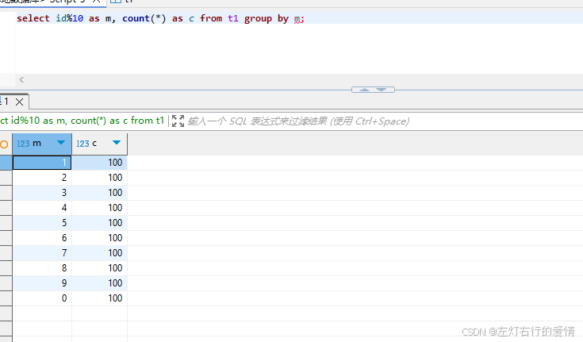
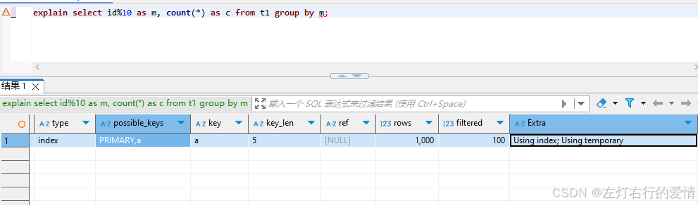
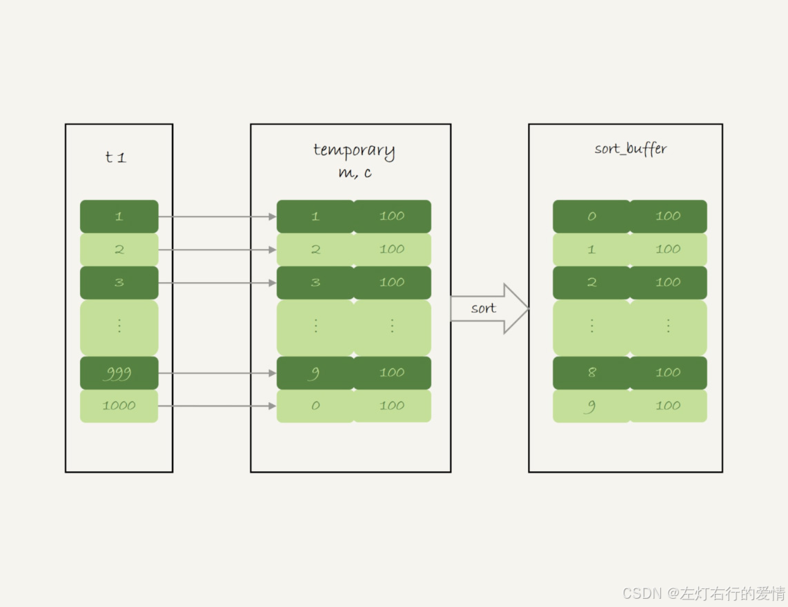
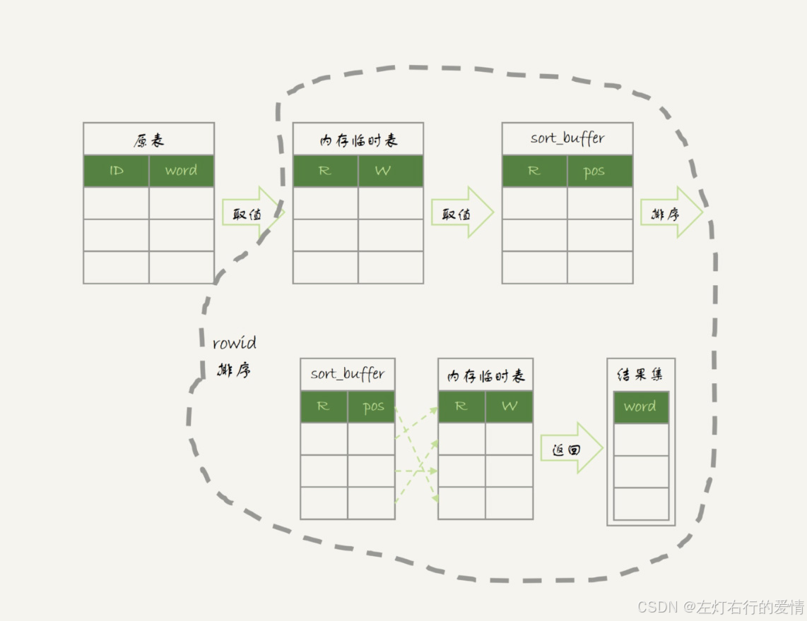
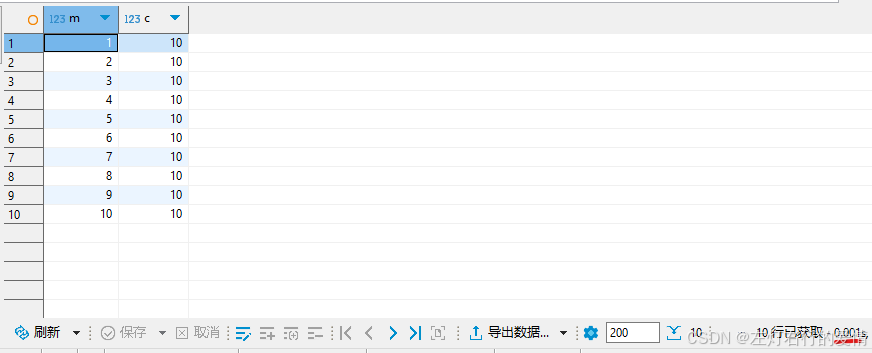
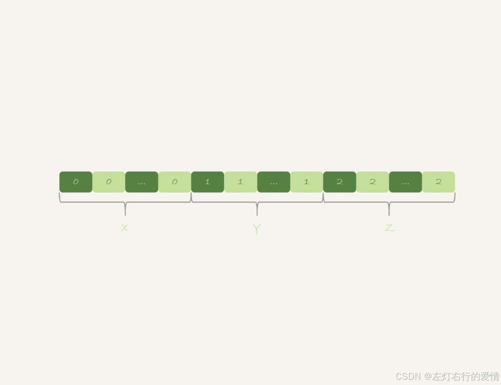
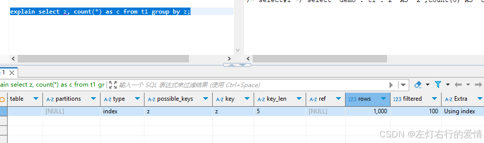
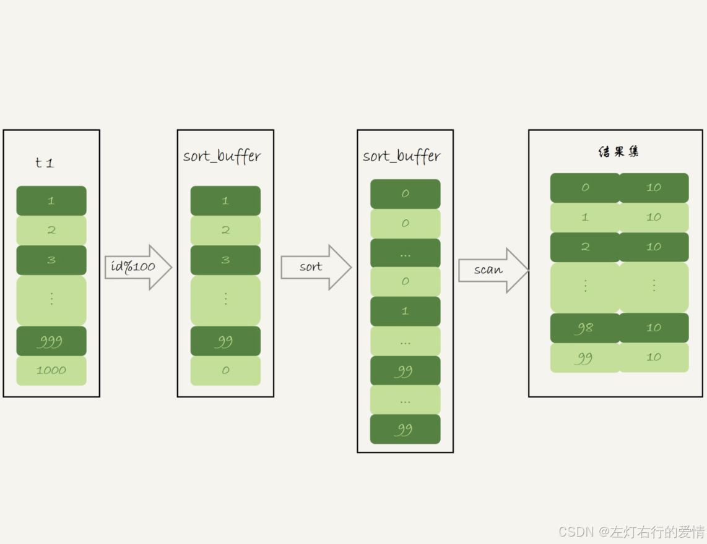
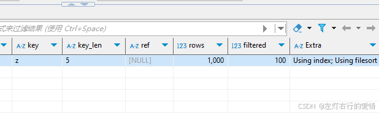

> 原文：[CSDN](https://blog.csdn.net/qq_45852626/article/details/145465483)（历史文章导入，当前状态为草稿）

### 前言

group by 是用来对数据进行分组的，一般与聚合函数一起使用，对分组后的数据进行聚合。  
 但由于**GROUP BY 实际上也同样会进行排序操作，而且与ORDER BY 相比，GROUP BY 主要只是多了排序之后的分组操作。**  
 所以，在GROUP BY 的实现过程中，与 ORDER BY 一样也可以利用到索引。

### group by的执行流程

我们创建一个表并填入数据

```
create table t1(id int primary key, a int, b int, index(a));
CREATE PROCEDURE idata()
BEGIN
  DECLARE i INT DEFAULT 1;

  WHILE i <= 1000 DO
    INSERT INTO t1 VALUES (i, i, i);
    SET i = i + 1;
  END WHILE;
END;
call idata();


```

这个语句的逻辑是把表 t1 里的数据，按照 id%10 进行分组统计，并按照 m 的结果排序后输出。结果如下:  
   
 它的 explain 结果如下：  
   
 在 Extra 字段里面，我们可以看到三个信息：

Using index，表示这个语句使用了覆盖索引，选择了索引 a，不需要回表；  
 Using temporary，表示使用了临时表；

为什么查询 m, c 能用上索引 a？  
 因为：

* m 的计算只需要 id（索引 a 就是 id 列的索引）
* c 的计算只需要统计行数（索引扫描就能计数）
* 不需要访问表的其他列

---

这个语句的执行流程是这样的：

1. 创建内存临时表，表里有两个字段 m 和 c，主键是 m；
2. 扫描表 t1 的索引 a，依次取出叶子节点上的 id 值，计算 id%10 的结果，记为 x；

* 如果临时表中没有主键为 x 的行，就插入一个记录 (x,1);
* 如果表中有主键为 x 的行，就将 x 这一行的 c 值加 1；

3. 遍历完成后，再根据字段 m 做排序，得到结果集返回给客户端。(**注意,这里的排序不是一定的,如果数据已经排好了,那么这里就不需要排序了**)  
      
    整个流程如下:  
    

#### 内存临时表已满怎么办

由于表 t1 中的 id 值是从 1 开始的，因此返回的结果集中第一行是 id=1；扫描到 id=10 的时候才插入 m=0 这一行，因此结果集里最后一行才是 m=0。

这个例子里由于临时表只有 10 行，内存可以放得下，因此全程只使用了内存临时表。但是，内存临时表的大小是有限制的，参数 tmp\_table\_size 就是控制这个内存大小的，默认是 16M。  
 那如果我执行下面的语句：

```
set tmp_table_size=1024;
select id%100 as m, count(*) as c from t1 group by m order by null limit 10;


```

把内存临时表的大小限制为最大 1024 字节，并把语句改成 id % 100，这样返回结果里有 100 行数据。但是，这时的内存临时表大小不够存下这 100 行数据，也就是说，执行过程中会发现内存临时表大小到达了上限（1024 字节）。

那么，这时候就会把**内存临时表转成磁盘临时表**，磁盘临时表默认使用的引擎是 InnoDB。  
   
 如果说t1的数据量很大,这个查询需要的磁盘临时表会占用大量的磁盘空间.

### 如何优化Group By

#### 创建索引

可以看到，不论是使用内存临时表还是磁盘临时表，**group by 逻辑都需要构造一个带唯一索引的表(确保分组唯一性)**，执行代价都是比较高的。如果表的数据量比较大，上面这个 group by 语句执行起来就会很慢，我们有什么优化的方法呢？  
 要解决 group by 语句的优化问题，你可以先想一下这个问题：**执行 group by 语句为什么需要临时表？**  
 group by 的语义逻辑，是统计不同的值出现的个数。但是，由于每一行的 id%100 的结果是无序的，所以我们就需要有一个临时表，来记录并统计结果。

那么，如果扫描过程中可以保证出现的数据是有序的，是不是就简单了呢？

假设，现在有一个类似的这么一个数据结构，我们来看看 group by 可以怎么做。  
   
 可以看到，如果可以确保输入的数据是有序的，那么计算 group by 的时候，就只需要从左到右，顺序扫描，依次累加。也就是下面这个过程：  
 当碰到第一个 1 的时候，已经知道累积了 X 个 0，结果集里的第一行就是 (0,X);  
 当碰到第一个 2 的时候，已经知道累积了 Y 个 1，结果集里的第二行就是 (1,Y);

按照这个逻辑执行的话，扫描到整个输入的数据结束，就可以拿到 group by 的结果，不需要临时表，也不需要再额外排序。

你一定想到了，**InnoDB 的索引，就可以满足这个输入有序的条件。**

在 MySQL 5.7 版本支持了 generated column 机制，用来实现列数据的关联更新。你可以用下面的方法创建一个列 z，然后在 z 列上创建一个索引（如果是 MySQL 5.6 及之前的版本，你也可以创建普通列和索引，来解决这个问题）。

```
alter table t1 add column z int generated always as(id % 100), add index(z);


```

这样，索引 z 上的数据就有序了。上面的 group by 语句就可以改成：

```
select z, count(*) as c from t1 group by z;


```

优化后的 group by 语句的 explain 结果，如下图所示：  
   
 从 Extra 字段可以看到，这个语句的执行不再需要临时表，也不需要排序了。

再举个例子:  
 假设处理 1000 万行数据，有 1000 个不同的分组:

* 无索引: 平均每行需要检查 500 个分组 → 50 亿次比较
* 有哈希索引: 每行 1 次哈希查找 → 1000 万次操作

性能差异可达 500 倍。

这就是为什么数据库引擎在执行 GROUP BY  
 时，几乎总是会构造某种形式的索引结构来维护分组的唯一性和快速访问。

#### 直接排序

所以，如果可以通过加索引来完成 group by 逻辑就再好不过了。但是，如果碰上不适合创建索引的场景，我们还是要老老实实做排序的。那么，这时候的 group by 要怎么优化呢？

如果我们明明知道，一个 group by 语句中需要放到临时表上的数据量特别大，却还是要按照“先放到内存临时表，插入一部分数据后，发现内存临时表不够用了再转成磁盘临时表”，看上去就有点儿傻。  
 那么，我们就会想了，**MySQL 有没有让我们直接走磁盘临时表的方法呢？**  
 答案是，有的。

**在 group by 语句中加入 SQL\_BIG\_RESULT 这个提示（hint），就可以告诉优化器：这个语句涉及的数据量很大，请直接用磁盘临时表。**

MySQL 的优化器一看，磁盘临时表是 B+ 树存储，存储效率不如数组来得高。所以，既然你告诉我数据量很大，那从磁盘空间考虑，还是直接用数组来存吧。

因此，下面这个语句

```
select SQL_BIG_RESULT id%100 as m, count(*) as c from t1 group by m;


```

的执行流程就是这样的：

1. 初始化 sort\_buffer，确定放入一个整型字段，记为 m；
2. 扫描表 t1 的索引 a，依次取出里面的 id 值, 将 id%100 的值存入 sort\_buffer 中；
3. 扫描完成后，对 sort\_buffer 的字段 m 做排序（如果 sort\_buffer 内存不够用，就会利用磁盘临时文件辅助排序）；
4. 排序完成后，就得到了一个有序数组。  
    根据有序数组，得到数组里面的不同值，以及每个值的出现次数。这一步的逻辑，你已经从前面的图 10 中了解过了。  
    下面两张图分别是执行流程图和执行 explain 命令得到的结果。  
      
      
    从 Extra 字段可以看到，这个语句的执行没有再使用临时表，而是直接用了排序算法。

#### 小结

1. 如果语句执行过程可以一边读数据，一边直接得到结果，是不需要额外内存的，否则就需要额外的内存，来保存中间结果；
2. join\_buffer 是无序数组，sort\_buffer 是有序数组，临时表是二维表结构；
3. 如果执行逻辑需要用到二维表特性，就会优先考虑使用临时表。比如我们的例子中， group by 还需要用到另外一个字段来存累积计数。

### 总结

我们谈到 group by 的几种实现算法，从中可以总结一些使用的指导原则：

1. 如果对 group by 语句的结果没有排序要求，要在语句后面加 order by null；
2. 尽量让 group by 过程用上表的索引，确认方法是 explain 结果里没有 Using temporary 和 Using filesort；
3. 如果 group by 需要统计的数据量不大，尽量只使用内存临时表；也可以通过适当调大 tmp\_table\_size 参数，来避免用到磁盘临时表；
4. 如果数据量实在太大，使用 SQL\_BIG\_RESULT 这个提示，来告诉优化器直接使用排序算法得到 group by 的结果。
