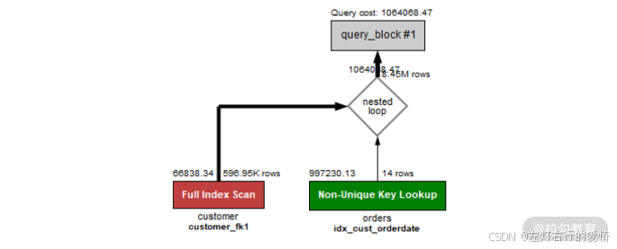
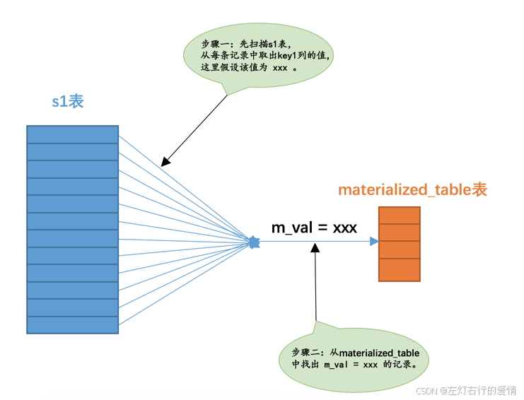
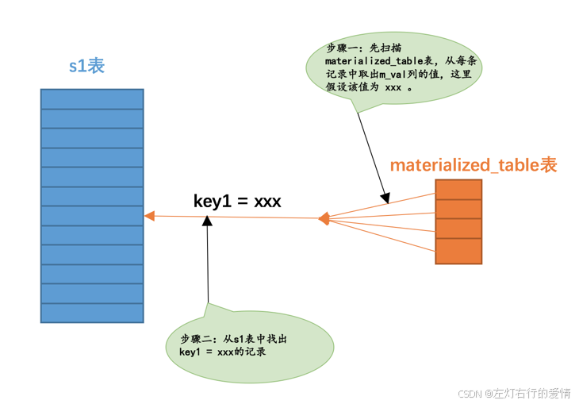
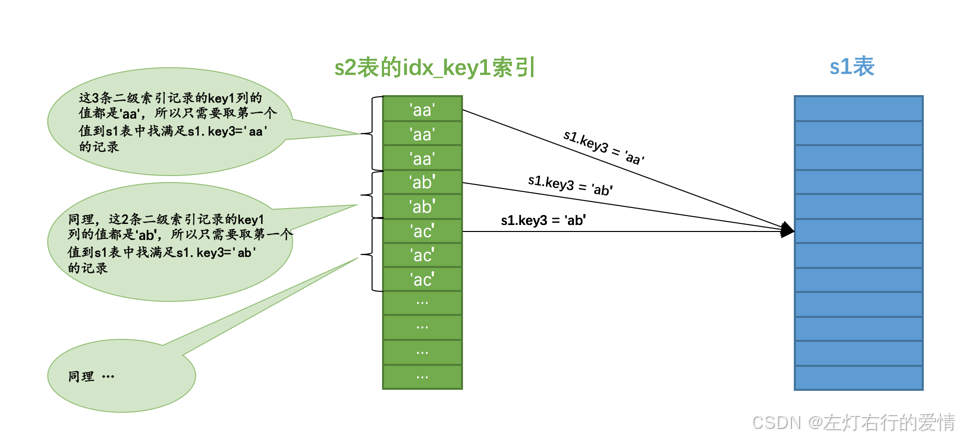
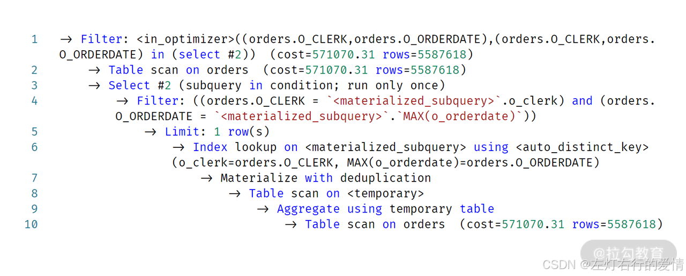
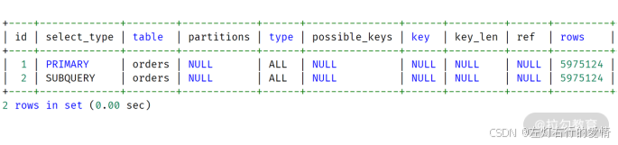
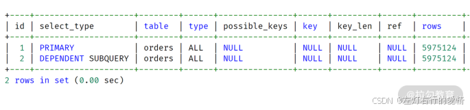
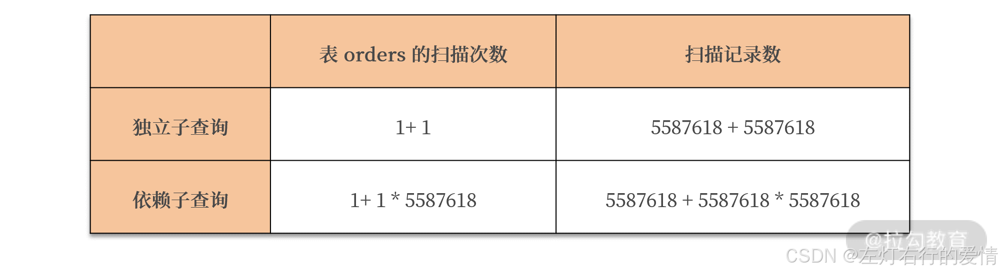
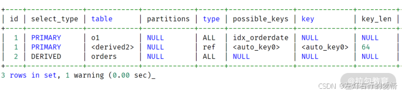
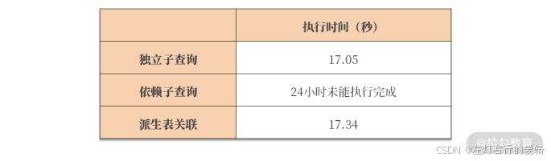

> 原文：[CSDN](https://blog.csdn.net/qq_45852626/article/details/145467951)（历史文章导入，当前状态为草稿）

### 前言

老版本的MySQL数据库中对子查询优化有限，所以很多 OLTP 业务场合下，开发人员都被要求在线业务尽可能不用子查询。  
 然而，MySQL 8.0 版本中，子查询的优化得到大幅提升。所以从现在开始，放心大胆地在MySQL 中使用子查询吧！

### 为什么开发人员喜欢写子查询

举一个简单的例子，如果让开发同学“找出1993年，没有下过订单的客户数量”，大部分开发人员会用子查询来写这个需求，比如：

```
SELECT

    COUNT(c_custkey) cnt

FROM

    customer

WHERE

    c_custkey NOT IN (

        SELECT

            o_custkey

        FROM

            orders

        WHERE

            o_orderdate >=  '1993-01-01'

            AND o_orderdate <  '1994-01-01'

	);


```

从中可以看到，子查询的逻辑非常清晰：通过 NOT IN 查询不在订单表的用户有哪些。

不过上述查询是一个典型的 LEFT JOIN 问题（即在表 customer 存在，在表 orders 不存在的问题）。所以，这个问题如果用 LEFT JOIN 写，那么 SQL 如下所示：

```
SELECT

    COUNT(c_custkey) cnt

FROM

    customer

        LEFT JOIN

    orders ON

            customer.c_custkey = orders.o_custkey

            AND o_orderdate >= '1993-01-01'

            AND o_orderdate < '1994-01-01'

WHERE

    o_custkey IS NULL;


```

可以发现，虽然 LEFT JOIN 也能完成上述需求，但不容易理解，**因为 LEFT JOIN 是一个代数关系，而子查询更偏向于人类的思维角度进行理解。**  
 所以，大部分人都更倾向写子查询，即便是天天与数据库打交道的 DBA 。

不过从优化器的角度看，LEFT JOIN 更易于理解，能进行传统 JOIN 的两表连接，而子查询则要求优化器聪明地将其转换为最优的 JOIN 连接。

我们来看一下，在 MySQL 8.0 版本中，对于上述两条 SQL，最终的执行计划都是：  
   
 可以看到，不论是子查询还是 LEFT JOIN，最终都被转换成了 Nested Loop Join，所以上述两条 SQL 的执行时间是一样的。  
 即，在 MySQL 8.0 中，优化器会自动地将 IN 子查询优化，优化为最佳的 JOIN 执行计划，这样一来，会显著的提升性能。

### 查询重写

通过上面的例子,你或许有疑问,为什么我写的子查询会被转化为关联查询呢?  
 大家别忘了MySQL本质上是一个软件，设计MySQL的大佬并不能要求使用这个软件的人个个都是数据库高高手，就像我写这篇博客的时候并不能要求各位在学之前就会了里边儿的知识。  
 也就是说我们无法避免某些同学写一些执行起来十分耗费性能的语句。即使是这样，**设计MySQL的大佬还是依据一些规则，竭尽全力的把这个很糟糕的语句转换成某种可以比较高效执行的形式，这个过程也可以被称作查询重写**（就是人家觉得你写的语句不好，自己再重写一遍）。  
 下面我们就介绍一些比较重要的重写规则

#### 条件化简

##### 移除不必要的括号

有时候表达式里有许多无用的括号，比如这样：  
 `((a = 5 AND b = c) OR ((a > c) AND (c < 5)))`  
 优化器会把用不到的括号干掉,如:  
 `(a = 5 and b = c) OR (a > c AND c < 5)`

##### 常量传递（constant\_propagation）

有时候某个表达式是某个列和某个常量做等值匹配，比如这样：  
 `a=5`  
 当这个表达式和其他涉及列a的表达式使用AND连接起来时，可以将其他表达式中的a的值替换为5，比如这样：  
 `a = 5 AND b > a`  
 就可以被转换为：  
 `a = 5 AND b > 5`

##### 移除没用的条件（trivial\_condition\_removal）

对于一些明显永远为TRUE或者FALSE的表达式，优化器会移除掉它们，比如这个表达式：  
 `(a < 1 and b = b) OR (a = 6 OR 5 != 5)`  
 很明显，b = b这个表达式永远为TRUE，5 != 5这个表达式永远为FALSE，所以简化后的表达式就是这样的：  
 `(a < 1 and TRUE) OR (a = 6 OR FALSE)`  
 可以继续被简化为：  
 `a < 1 OR a = 6`

##### HAVING子句和WHERE子句的合并

如果查询语句中没有出现诸如SUM、MAX等等的聚集函数以及GROUP BY子句，优化器就把HAVING子句和WHERE子句合并起来。

#### 常量表检测

设计MySQL的大佬觉得下面这两种查询运行的特别快：

* 查询的表中一条记录没有，或者只有一条记录。
* 使用主键等值匹配或者唯一二级索引列等值匹配作为搜索条件来查询某个表。  
   设计MySQL的大佬觉得这两种查询花费的时间特别少，少到可以忽略，所以也把通过这两种方式查询的表称之为常量表（英文名：constant tables）。优化器在分析一个查询语句时，先首先执行常量表查询，然后把查询中涉及到该表的条件全部替换成常数，最后再分析其余表的查询成本，比方说这个查询语句：

```
SELECT * FROM table1 INNER JOIN table2
    ON table1.column1 = table2.column2 
    WHERE table1.primary_key = 1;


```

这个查询可以使用主键和常量值的等值匹配来查询table1表，也就是在这个查询中table1表相当于常量表，在分析对table2表的查询成本之前，就会执行对table1表的查询，并把查询中涉及table1表的条件都替换掉，也就是上面的语句会被转换成这样：

```
SELECT table1表记录的各个字段的常量值, table2.* FROM table1 INNER JOIN table2 
    ON table1表column1列的常量值 = table2.column2;


```

#### 外连接消除

内连接的驱动表和被驱动表的位置可以相互转换，而左（外）连接和右（外）连接的驱动表和被驱动表是固定的。这就导致内连接可能通过优化表的连接顺序来降低整体的查询成本，而外连接却无法优化表的连接顺序。  
 外连接 vs. 内连接  
 内连接（INNER JOIN）：只有在两个表中都匹配的记录才会出现在最终结果集中。  
 外连接（LEFT JOIN / RIGHT JOIN）：即使被驱动表（右表）没有匹配的记录，也会返回驱动表（左表）的所有记录，未匹配的列用 NULL 填充。  
 **WHERE 会对子句的影响**  
 假设你有这样一个查询：

```
SELECT a.*, b.*
FROM A 
LEFT JOIN B ON A.id = B.a_id
WHERE B.a_id IS NOT NULL;


```

虽然 LEFT JOIN 本来是希望保留 A 表中的所有记录，即使 B 表没有匹配项，但 WHERE B.a\_id IS NOT NULL 这一条件会把 B.a\_id 为 NULL 的行过滤掉。

最终效果：  
 这条查询的结果集实际上和 INNER JOIN 没有区别，因为所有 NULL 值的记录都被 WHERE 过滤掉了，等效于：

```
SELECT a.*, b.*
FROM A 
INNER JOIN B ON A.id = B.a_id;


```

**在被驱动表的WHERE子句符合空值拒绝的条件后，外连接和内连接可以相互转换**。这种转换带来的好处就是**查询优化器可以通过评估表的不同连接顺序的成本，选出成本最低的那种连接顺序来执行查询。**

---

上面你看过这么多优化后,心里大概明白一点了,查询优化器当然在处理子查询的时候也会做一些优化,但是我们先介绍一下什么是子查询.

### 子查询

#### 子查询语法

MySQL 子查询是嵌套一个语句中的查询语句，也被称为内部查询。子查询经常用在 WHERE 子句中。例如:

* SELECT子句中  
   也就是我们平时说的查询列表中，比如这样：

```
mysql> SELECT (SELECT m1 FROM t1 LIMIT 1);
+-----------------------------+
| (SELECT m1 FROM t1 LIMIT 1) |
+-----------------------------+
|                           1 |
+-----------------------------+
1 row in set (0.00 sec)
其中的(SELECT m1 FROM t1 LIMIT 1)就是我们介绍的所谓的子查询。


```

* From子句中

```
SELECT m, n FROM (SELECT m2 + 1 AS m, n2 AS n FROM t2 WHERE m2 > 2) AS t;
+------+------+
| m    | n    |
+------+------+
|    4 | c    |
|    5 | d    |
+------+------+
2 rows in set (0.00 sec)
  这个例子中的子查询是：(SELECT m2 + 1 AS m, n2 AS n FROM t2 WHERE m2 > 2)，很特别的地方是它出现在了FROM子句中。


```

FROM子句里边儿不是存放我们要查询的表的名称么，这里放进来一个子查询是个什么鬼？其实这里我们可以把子查询的查询结果当作是一个表，子查询后边的AS t表明这个子查询的结果就相当于一个名称为t的表，这个名叫t的表的列就是子查询结果中的列，比如例子中表t就有两个列：m列和n列。这个放在FROM子句中的子查询本质上相当于一个表，但又和我们平常使用的表有点儿不一样，设计MySQL的大佬把这种由子查询结果集组成的表称之为**派生表**。

* WHERE或ON子句中  
   把子查询放在外层查询的WHERE子句或者ON子句中可能是我们最常用的一种使用子查询的方式了，比如这样：

```
mysql> SELECT * FROM t1 WHERE m1 IN (SELECT m2 FROM t2);
+------+------+
| m1   | n1   |
+------+------+
|    2 | b    |
|    3 | c    |
+------+------+
2 rows in set (0.00 sec)


```

这个查询表明我们想要将(SELECT m2 FROM t2)这个子查询的结果作为外层查询的IN语句参数，整个查询语句的意思就是我们想找t1表中的某些记录，这些记录的m1列的值能在t2表的m2列找到匹配的值。

#### 按返回的结果集区分子查询

因为子查询本身也算是一个查询，所以可以按照它们返回的不同结果集类型而把这些子查询分为不同的类型：

##### 标量子查询

那些只返回一个单一值的子查询称之为标量子查询，比如这样：

```
SELECT (SELECT m1 FROM t1 LIMIT 1);
 ```
或者这样
```sql
SELECT * FROM t1 WHERE m1 = (SELECT MIN(m2) FROM t2);


```

这两个查询语句中的子查询都返回一个单一的值，也就是一个标量。这些标量子查询可以作为一个单一值或者表达式的一部分出现在查询语句的各个地方。

##### 行子查询

顾名思义，就是返回一条记录的子查询，不过这条记录需要包含多个列（只包含一个列就成了标量子查询了）。比如这样：

```
SELECT * FROM t1 WHERE (m1, n1) = (SELECT m2, n2 FROM t2 LIMIT 1);


```

其中的(SELECT m2, n2 FROM t2 LIMIT 1)就是一个行子查询，整条语句的含义就是要从t1表中找一些记录，这些记录的m1和n2列分别等于子查询结果中的m2和n2列。

##### 列子查询

列子查询自然就是查询出一个列的数据喽，不过这个列的数据需要包含多条记录（只包含一条记录就成了标量子查询了）。比如这样：

```
SELECT * FROM t1 WHERE m1 IN (SELECT m2 FROM t2);


```

其中的(SELECT m2 FROM t2)就是一个列子查询，表明查询出t2表的m2列的值作为外层查询IN语句的参数。

##### 表子查询

顾名思义，就是子查询的结果既包含很多条记录，又包含很多个列，比如这样：

```
SELECT * FROM t1 WHERE (m1, n1) IN (SELECT m2, n2 FROM t2);


```

其中的(SELECT m2, n2 FROM t2)就是一个表子查询，这里需要和行子查询对比一下，行子查询中我们用了LIMIT 1来保证子查询的结果只有一条记录，表子查询中不需要这个限制。

#### 按外层关系来区分子查询

##### 不相关子查询

如果子查询可以单独运行出结果，而不依赖于外层查询的值，我们就可以把这个子查询称之为不相关子查询。我们前面介绍的那些子查询全部都可以看作不相关子查询，所以也就不举例子了。

##### 相关子查询

如果子查询的执行需要依赖于外层查询的值，我们就可以把这个子查询称之为相关子查询。比如：

```
SELECT * FROM t1 WHERE m1 IN (SELECT m2 FROM t2 WHERE n1 = n2);


```

例子中的子查询是(SELECT m2 FROM t2 WHERE n1 = n2)，可是这个查询中有一个搜索条件是n1 = n2，别忘了n1是表t1的列，也就是外层查询的列，也就是说子查询的执行需要依赖于外层查询的值，所以这个子查询就是一个相关子查询。

##### 子查询中布尔表达式的使用

你说写下面这样的子查询有什么意义：

```
SELECT (SELECT m1 FROM t1 LIMIT 1);


```

貌似没什么意义～ 我们平时用子查询最多的地方就是把它作为布尔表达式的一部分来作为搜索条件用在WHERE子句或者ON子句里。所以我们这里来总结一下子查询在布尔表达式中的使用场景。

###### 使用=、>、<、>=、<=、<>、!=、<=>作为布尔表达式的操作符

`操作数 comparison_operator (子查询)`  
 这里的操作数可以是某个列名，或者是一个常量，或者是一个更复杂的表达式，甚至可以是另一个子查询。但是需要注意的是，这里的子查询只能是标量子查询或者行子查询，也就是子查询的结果只能返回一个单一的值或者只能是一条记录。比如这样（标量子查询）：

```
SELECT * FROM t1 WHERE m1 < (SELECT MIN(m2) FROM t2);
或者这样（行子查询）：
SELECT * FROM t1 WHERE (m1, n1) = (SELECT m2, n2 FROM t2 LIMIT 1);


```

###### [NOT] IN/ANY/SOME/ALL子查询

对于列子查询和表子查询来说，它们的结果集中包含很多条记录，这些记录相当于是一个集合，所以就不能单纯的和另外一个操作数使用comparison\_operator来组成布尔表达式了，MySQL通过下面的语法来支持某个操作数和一个集合组成一个布尔表达式：

* IN或者NOT IN  
   具体语法格式如下:

```
操作数 [NOT] IN (子查询)
用来判断某个操作数在不在由子查询结果集组成的集合中
SELECT * FROM t1 WHERE (m1, n2) IN (SELECT m2, n2 FROM t2);


```

* ANY/SOME（ANY和SOME是同义词）  
   只要子查询结果集中存在某个值和给定的操作数做comparison\_operator比较结果为TRUE，那么整个表达式的结果就为TRUE，否则整个表达式的结果就为FALSE。  
   具体语法格式如下:

```
操作数 comparison_operator ANY/SOME(子查询)
SELECT * FROM t1 WHERE m1 > ANY(SELECT m2 FROM t2);


```

* ALL  
   子查询结果集中所有的值和给定的操作数做comparison\_operator比较结果为TRUE，那么整个表达式的结果就为TRUE，否则整个表达式的结果就为FALSE。  
   具体语法格式如下:

```
操作数 comparison_operator ALL(子查询)
SELECT * FROM t1 WHERE m1 > ALL(SELECT m2 FROM t2);


```

* EXISTS子查询  
   有的时候我们仅仅需要判断子查询的结果集中是否有记录，而不在乎它的记录具体是什么，可以使用把EXISTS或者NOT EXISTS放在子查询语句前面，就像这样：  
   具体语法格式如下:

```
[NOT] EXISTS (子查询)
SELECT * FROM t1 WHERE EXISTS (SELECT 1 FROM t2);


```

#### 子查询语法注意事项

* 子查询必须用小括号扩起来
* 在SELECT子句中的子查询必须是标量子查询。
* 在想要得到标量子查询或者行子查询，但又不能保证子查询的结果集只有一条记录时，应该使用LIMIT 1语句来限制记录数量。
* 对于[NOT] IN/ANY/SOME/ALL子查询来说，子查询中不允许有LIMIT语句。
* 不允许在一条语句中增删改某个表的记录时同时还对该表进行子查询。

#### 子查询在MySQL中是怎么执行的

创建一张表:

```
CREATE TABLE single_table (
    id INT NOT NULL AUTO_INCREMENT,
    key1 VARCHAR(100),
    key2 INT,
    key3 VARCHAR(100),
    key_part1 VARCHAR(100),
    key_part2 VARCHAR(100),
    key_part3 VARCHAR(100),
    common_field VARCHAR(100),
    PRIMARY KEY (id),
    KEY idx_key1 (key1),
    UNIQUE KEY idx_key2 (key2),
    KEY idx_key3 (key3),
    KEY idx_key_part(key_part1, key_part2, key_part3)
) Engine=InnoDB CHARSET=utf8;

插入数据
CREATE PROCEDURE InsertTestData()
BEGIN
    DECLARE i INT DEFAULT 1;
    WHILE i <= 10000 DO
        INSERT INTO single_table (key1, key2, key3, key_part1, key_part2, key_part3, common_field)
        VALUES (
            CONCAT('key1_', i), 
            i, 
            CONCAT('key3_', i), 
            CONCAT('part1_', i), 
            CONCAT('part2_', i), 
            CONCAT('part3_', i), 
            CONCAT('common_', i)
        );
        SET i = i + 1;
    END WHILE;
END ;
CALL InsertTestData();


```

##### 新手眼里的子查询执行方式

* 如果该子查询是不相关子查询，比如下面这个查询

```
SELECT * FROM s1 
    WHERE key1 IN (SELECT common_field FROM s2);


```

1. 先单独执行(SELECT common\_field FROM s2)这个子查询。
2. 然后在将上一步子查询得到的结果当作外层查询的参数再执行外层查询`SELECT * FROM s1 WHERE key1 IN (...)。`

* 如果该子查询是相关子查询，比如下面这个查询：

```
SELECT * FROM s1 
    WHERE key1 IN (SELECT common_field FROM s2 WHERE s1.key2 = s2.key2);


```

这个查询中的子查询中出现了s1.key2 = s2.key2这样的条件，意味着该子查询的执行依赖着外层查询的值，所以我年少时觉得这个查询的执行方式是这样的：  
 a. 先从外层查询中获取一条记录，本例中也就是先从s1表中获取一条记录。  
 b. 然后从上一步骤中获取的那条记录中找出子查询中涉及到的值，本例中就是从s1表中获取的那条记录中找出s1.key2列的值，然后执行子查询。  
 c. 最后根据子查询的查询结果来检测外层查询WHERE子句的条件是否成立，如果成立，就把外层查询的那条记录加入到结果集，否则就丢弃。  
 d. 再次执行第一步，获取第二条外层查询中的记录，依次类推～

上面我年少时说的这种情况是基本理论的情况,其实设计MySQL的大佬想了一系列的办法来优化子查询的执行，大部分情况下这些优化措施其实挺有效的，但是保不齐有的时候马失前蹄，下面我们详细介绍各种不同类型的子查询具体是怎么执行的。

##### 标量子查询、行子查询的执行方式

###### 不相关的标量子查询或行子查询

我们经常在下面两个场景中使用到标量子查询或者行子查询：

* SELECT子句中，我们前面说过的在查询列表中的子查询必须是标量子查询。
* 子查询使用=、>、<、>=、<=、<>、!=、<=>等操作符和某个操作数组成一个布尔表达式，这样的子查询必须是标量子查询或者行子查询。

对于上述两种场景中的不相关标量子查询或者行子查询来说，它们的执行方式是简单的，比方说下面这个查询语句：

```
SELECT * FROM s1 
    WHERE key1 = (SELECT common_field FROM s2 WHERE key3 = 'a' LIMIT 1);


```

它的执行方式:

* 先单独执行(SELECT common\_field FROM s2 WHERE key3 = ‘a’ LIMIT 1)这个子查询。
* 然后在将上一步子查询得到的结果当作外层查询的参数再执行外层查询SELECT \* FROM s1 WHERE key1 = …。  
   **对于包含不相关的标量子查询或者行子查询的查询语句来说，MySQL会分别独立的执行外层查询和子查询，就当作两个单表查询就好了。**

###### 相关的标量子查询或者行子查询

```
SELECT * FROM s1 WHERE 
    key1 = (SELECT common_field FROM s2 WHERE s1.key3 = s2.key3 LIMIT 1);


```

它的执行方式

1. 先从外层查询中获取一条记录，本例中也就是先从s1表中获取一条记录。
2. 然后从上一步骤中获取的那条记录中找出子查询中涉及到的值，本例中就是从s1表中获取的那条记录中找出s1.key3列的值，然后执行子查询。
3. 最后根据子查询的查询结果来检测外层查询WHERE子句的条件是否成立，如果成立，就把外层查询的那条记录加入到结果集，否则就丢弃。
4. 再次执行第一步，获取第二条外层查询中的记录，依次类推～

##### IN子查询优化

###### 不相干的IN子查询

```
SELECT * FROM s1 
    WHERE key1 IN (SELECT common_field FROM s2 WHERE key3 = 'a');


```

我们最开始的感觉就是这种不相关的IN子查询和不相关的标量子查询或者行子查询是一样一样的，都是把外层查询和子查询当作两个独立的单表查询来对待.  
 设计MySQL的大佬为了优化IN子查询倾注了太多心血（毕竟IN子查询是我们日常生活中最常用的子查询类型），所以整个执行过程并不像我们想象的那么简单.  
 对于不相关的IN子查询来说，如果子查询的结果集中的记录条数很少，那么把子查询和外层查询分别看成两个单独的单表查询效率还是蛮高的，但是如果单独执行子查询后的结果集太多的话，就会导致这些问题：

* 结果集太多,内存放不下
* 对于外层查询而言,如果子查询结果集太多,意味IN子句中参数特别多,导致两个后果:

1. 无法有效使用索引,只能对外层查询进行全表扫描
2. 在对外层查询执行全表扫描时，由于IN子句中的参数太多，这会导致检测一条记录是否符合和IN子句中的参数匹配花费的时间太长。

于是乎设计MySQL的大佬想了一个招：不直接将不相关子查询的结果集当作外层查询的参数，而是将该结果集写入一个临时表里。写入临时表的过程是这样的：

* 该临时表的列就是子查询结果集中的列。
* 写入临时表的记录会被去重。
* 一般情况下子查询结果集不会大的离谱，所以会为它建立基于内存的使用Memory存储引擎的临时表，而且会为该表建立希索引。  
   如果子查询的结果集非常大，超过了系统变量tmp\_table\_size或者max\_heap\_table\_size，临时表会转而使用基于磁盘的存储引擎来保存结果集中的记录，索引类型也对应转变为B+树索引。

###### 物化表

设计MySQL的大佬把这个\*\*将子查询结果集中的记录保存到临时表的过程称之为物化（英文名：Materialize）。\*\*为了方便起见，我们就把那个存储子查询结果集的临时表称之为物化表。正因为物化表中的记录都建立了索引（基于内存的物化表有哈希索引，基于磁盘的有B+树索引），通过索引执行IN语句判断某个操作数在不在子查询结果集中变得非常快，从而提升了子查询语句的性能。

###### 物化表转连接

我们还得重新审视一下最开始的那个查询语句：

```
SELECT * FROM s1 
    WHERE key1 IN (SELECT common_field FROM s2 WHERE key3 = 'a');


```

把子查询物化后，假设子查询物化表的名称为materialized\_table，该物化表存储的子查询结果集的列为m\_val，那么这个查询其实可以从下面两种角度来看待：

* 从表s1的角度来看待  
   整个查询的意思其实是：对于s1表中的每条记录来说，如果该记录的key1列的值在子查询对应的物化表中，则该记录会被加入最终的结果集。画个图表示一下就是这样：  
   
* 从子查询物化表的角度来看待  
   整个查询的意思其实是：对于子查询物化表的每个值来说，如果能在s1表中找到对应的key1列的值与该值相等的记录，那么就把这些记录加入到最终的结果集。画个图表示一下就是这样：  
     
   也就是说其实上面的查询就相当于表s1和子查询物化表materialized\_table进行内连接：

```
SELECT s1.* FROM s1 INNER JOIN materialized_table ON key1 = m_val;


```

转化成内连接之后就有意思了，查询优化器可以评估不同连接顺序需要的成本是多少，选取成本最低的那种查询方式执行查询。我们分析一下上述查询中使用外层查询的表s1和物化表materialized\_table进行内连接的成本都是由哪几部分组成的：

* 如果使用s1表作为驱动表的话，总查询成本由下面几个部分组成：

1. 物化子查询时需要的成本
2. 扫描s1表时的成本
3. s1表中的记录数量 × 通过m\_val = xxx对materialized\_table表进行单表访问的成本（我们前面说过物化表中的记录是不重复的，并且为物化表中的列建立了索引，所以这个步骤显然是非常快的）。

* 如果使用materialized\_table表作为驱动表的话，总查询成本由下面几个部分组成：

1. 物化子查询时需要的成本
2. 扫描物化表时的成本
3. 物化表中的记录数量 × 通过key1 = xxx对s1表进行单表访问的成本（非常庆幸key1列上建立了索引，所以这个步骤是非常快的）。

MySQL查询优化器会通过运算来选择上述成本更低的方案来执行查询。

###### 将子查询转换为semi-join

虽然将子查询进行物化之后再执行查询都会有建立临时表的成本，但是不管怎么说，我们见识到了将子查询转换为连接的强大作用.  
 设计MySQL的大佬继续开脑洞：能不能不进行物化操作直接把子查询转换为连接呢？让我们重新审视一下上面的查询语句：

```
SELECT * FROM s1 
    WHERE key1 IN (SELECT common_field FROM s2 WHERE key3 = 'a');


```

我们可以把这个查询理解为:  
 对于s1表中的某条记录，如果我们能在s2表（准确的说是执行完WHERE s2.key3 = 'a’之后的结果集）中找到一条或多条记录，这些记录的common\_field的值等于s1表记录的key1列的值，那么该条s1表的记录就会被加入到最终的结果集。这个过程其实和把s1和s2两个表连接起来的效果很像：

```
SELECT s1.* FROM s1 INNER JOIN s2 
    ON s1.key1 = s2.common_field 
    WHERE s2.key3 = 'a';


```

只不过我们不能保证对于s1表的某条记录来说，在s2表（准确的说是执行完WHERE s2.key3 = 'a’之后的结果集）中有多少条记录满足s1.key1 = s2.common\_field这个条件，不过我们可以分三种情况讨论：

* 情况一  
   对于s1表的某条记录来说，s2表中没有任何记录满足s1.key1 = s2.common\_field这个条件，那么该记录自然也不会加入到最后的结果集。
* 情况二  
   对于s1表的某条记录来说，s2表中有且只有记录满足s1.key1 = s2.common\_field这个条件，那么该记录会被加入最终的结果集。
* 情况三  
   对于s1表的某条记录来说，s2表中至少有2条记录满足s1.key1 = s2.common\_field这个条件，那么该记录会被多次加入最终的结果集。

对于s1表的某条记录来说，由于我们只关心s2表中是否存在记录满足s1.key1 = s2.common\_field这个条件，而不关心具体有多少条记录与之匹配，又因为有情况三的存在，我们上面所说的IN子查询和两表连接之间并不完全等价。

但是将子查询转换为连接又真的可以充分发挥优化器的作用，所以设计MySQL的大佬在这里提出了一个新概念 — 半连接（英文名：semi-join）。  
 **将s1表和s2表进行半连接的意思就是：对于s1表的某条记录来说，我们只关心在s2表中是否存在与之匹配的记录是否存在，而不关心具体有多少条记录与之匹配，最终的结果集中只保留s1表的记录。**

为了让大家有更直观的感受，我们假设MySQL内部是这么改写上面的子查询的：

```
SELECT s1.* FROM s1 SEMI JOIN s2
    ON s1.key1 = s2.common_field
    WHERE key3 = 'a';
小贴士：semi-join只是在MySQL内部采用的一种执行子查询的方式，MySQL并没有提供面向用户的semi-join语法，所以我们不需要，也不能尝试把上面这个语句放到黑框框里运行，我只是想说明一下上面的子查询在MySQL内部会被转换为类似上面语句的半连接～


```

###### 半连接实现

###### Table Pullout(子查询表上拉)

当子查询的查询列表处只有主键或者唯一索引列时，可以直接把子查询中的表上拉到外层查询的FROM子句中，并把子查询中的搜索条件合并到外层查询的搜索条件中，比如这个:

```
SELECT * FROM s1 
    WHERE key2 IN (SELECT key2 FROM s2 WHERE key3 = 'a');


```

由于key2列是s2表的唯一二级索引列，所以我们可以直接把s2表上拉到外层查询的FROM子句中，并且把子查询中的搜索条件合并到外层查询的搜索条件中，上拉之后的查询就是这样的：

```
SELECT s1.* FROM s1 INNER JOIN s2 
    ON s1.key2 = s2.key2 
    WHERE s2.key3 = 'a';


```

为什么当子查询的查询列表处只有主键或者唯一索引列时，就可以直接将子查询转换为连接查询呢？哎呀，\*\*主键或者唯一索引列中的数据本身就是不重复的嘛！\*\*所以对于同一条s1表中的记录，你不可能找到两条以上的符合s1.key2 = s2.key2的记录呀～

###### DuplicateWeedout Execution Strategy(重复值消除)

对于这个查询来说：

```
SELECT * FROM s1 
    WHERE key1 IN (SELECT common_field FROM s2 WHERE key3 = 'a');


```

转换为半连接查询后，s1表中的某条记录可能在s2表中有多条匹配的记录，所以该条记录可能多次被添加到最后的结果集中，为了消除重复，我们可以建立一个临时表，比方说这个临时表长这样：

```
CREATE TABLE tmp (
    id PRIMARY KEY
);


```

这样在执行连接查询的过程中，每当某条s1表中的记录要加入结果集时，就首先把这条记录的id值加入到这个临时表里，如果添加成功，说明之前这条s1表中的记录并没有加入最终的结果集，现在把该记录添加到最终的结果集；如果添加失败，说明这条之前这条s1表中的记录已经加入过最终的结果集，这里直接把它丢弃就好了，这种使用临时表消除semi-join结果集中的重复值的方式称之为DuplicateWeedout。

###### 松散索引扫描

大家看这个查询：

```
SELECT * FROM s1 
    WHERE key3 IN (SELECT key1 FROM s2 WHERE key1 > 'a' AND key1 < 'b');


```

在子查询中，对于s2表的访问可以使用到key1列的索引，而恰好子查询的查询列表处就是key1列，这样在将该查询转换为半连接查询后，如果将s2作为驱动表执行查询的话，那么执行过程就是这样：  
    
 如图所示，在s2表的idx\_key1索引中，值为’aa’的二级索引记录一共有3条，那么只需要取第一条的值到s1表中查找s1.key3 = 'aa’的记录，如果能在s1表中找到对应的记录，那么就把对应的记录加入到结果集。依此类推，其他值相同的二级索引记录，也只需要取第一条记录的值到s1表中找匹配的记录，这种虽然是扫描索引，但只取值相同的记录的第一条去做匹配操作的方式称之为松散索引扫描。

###### Semi-join Materialization execution strategy

我们之前介绍的先把外层查询的IN子句中的不相关子查询进行物化，然后再进行外层查询的表和物化表的连接本质上也算是一种semi-join，只不过由于物化表中没有重复的记录，所以可以直接将子查询转为连接查询。

###### FirstMatch execution strategy （首次匹配）

FirstMatch是一种最原始的半连接执行方式，跟我们认为的相关子查询的执行方式是一样一样的，就是说先取一条外层查询的中的记录，然后到子查询的表中寻找符合匹配条件的记录，如果能找到一条，则将该外层查询的记录放入最终的结果集并且停止查找更多匹配的记录，如果找不到则把该外层查询的记录丢弃掉；然后再开始取下一条外层查询中的记录，重复上面这个过程。  
 对于某些使用IN语句的相关子查询，比方这个查询：

```
SELECT * FROM s1 
  WHERE key1 IN (SELECT common_field FROM s2 WHERE s1.key3 = s2.key3);


```

它也可以很方便的转为半连接，转换后的语句类似这样：

```
SELECT s1.* FROM s1 SEMI JOIN s2 
    ON s1.key1 = s2.common_field AND s1.key3 = s2.key3;


```

然后就可以使用我们上面介绍过的DuplicateWeedout、LooseScan、FirstMatch等半连接执行策略来执行查询，当然，如果子查询的查询列表处只有主键或者唯一二级索引列，还可以直接使用table pullout的策略来执行查询，但是需要大家注意的是，由于相关子查询并不是一个独立的查询，所以不能转换为物化表来执行查询。

###### semi-join的适用条件

并不是所有包含IN子查询的查询语句都可以转换为semi-join，只有形如这样的查询才可以被转换为semi-join：

```
SELECT ... FROM outer_tables 
    WHERE expr IN (SELECT ... FROM inner_tables ...) AND ...
或
SELECT ... FROM outer_tables 
    WHERE (oe1, oe2, ...) IN (SELECT ie1, ie2, ... FROM inner_tables ...) AND ...


```

用文字总结一下，只有符合下面这些条件的子查询才可以被转换为semi-join：

1. 该子查询必须是和IN语句组成的布尔表达式，并且在外层查询的WHERE或者ON子句中出现。
2. 外层查询也可以有其他的搜索条件，只不过和IN子查询的搜索条件必须使用AND连接起来。
3. 该子查询必须是一个单一的查询，不能是由若干查询由UNION连接起来的形式。
4. 该子查询不能包含GROUP BY或者HAVING语句或者聚集函数。

#### 小结

如果IN子查询符合转换为semi-join的条件，查询优化器会优先把该子查询为semi-join，然后再考虑下面5种执行半连接的策略中哪个成本最低：

1. Table pullout
2. DuplicateWeedout
3. LooseScan
4. Materialization
5. FirstMatch  
    选择成本最低的那种执行策略来执行子查询。  
    如果IN子查询不符合转换为semi-join的条件，那么查询优化器会从下面两种策略中找出一种成本更低的方式执行子查询：

* 先将子查询物化之后再执行查询
* 执行IN to EXISTS转换。

#### 实践一些内容

##### 子查询IN和EXISTS,哪个性能更好

要回答这个问题，我们看一个例子。  
 针对开篇的 NOT IN 子查询，你可以改写为 NOT EXISTS 子查询，重写后的 SQL 如下所示：

```
SELECT

    COUNT(c_custkey) cnt

FROM

    customer

WHERE

    NOT EXISTS (

        SELECT

            1

        FROM

            orders

        WHERE

            o_orderdate >=  '1993-01-01'

            AND o_orderdate <  '1994-01-01'

            AND c_custkey = o_custkey

    );


```

你要注意，千万不要盲目地相信网上的一些文章，有的说 IN 的性能更好，有的说 EXISTS 的子查询性能更好。你只关注 SQL 执行计划就可以，如果两者的执行计划一样，性能没有任何差别。

接着说回来，对于上述 NOT EXISTS，它的执行计划如下图所示：  
   
 你可以看到，它和 NOT IN 的子查询执行计划一模一样，所以二者的性能也是一样的。  
 所以我们只关注他的SQL执行计划是不是一样的即可.这不是一个定式!

###### 实践子查询优化

在 MySQL 8.0 版本之前，MySQL 对于子查询的优化并不充分。所以在子查询的执行计划中会看到 DEPENDENT SUBQUERY 的提示，这表示是一个依赖子查询，子查询需要依赖外部表的关联。

如果你看到这样的提示，就要警惕， 因为 DEPENDENT SUBQUERY 执行速度可能非常慢，大部分时候需要你手动把它转化成两张表之间的连接。  
 我们以下面这条 SQL 为例：

```
SELECT

    *

FROM

    orders

WHERE

    (o_clerk , o_orderdate) IN (

        SELECT

            o_clerk, MAX(o_orderdate)

        FROM

            orders

        GROUP BY o_clerk);


```

上述 SQL 语句的子查询部分表示“计算出每个员工最后成交的订单时间”，然后最外层的 SQL表示返回订单的相关信息。  
 这条 SQL 在最新的 MySQL 8.0 中，其执行计划如下所示：  
   
 通过命令 EXPLAIN FORMAT=tree 输出执行计划，你可以看到，第 3 行有这样的提示：Select #2 (subquery in condition; run only once)。这表示子查询只执行了一次，然后把最终的结果保存起来了。  
 执行计划的第 6 行Index lookup on ，表示对表 orders 和子查询结果所得到的表进行 JOIN 连接，最后返回结果。  
 所以，当前这个执行计划是对表 orders 做2次扫描，每次扫描约 5587618 条记录：

第 1 次扫描，用于内部的子查询操作，计算出每个员工最后一次成交的时间；  
 第 2 次表 oders 扫描，查询并返回每个员工的订单信息，即返回每个员工最后一笔成交的订单信息。  
 最后，直接用命令 EXPLAIN 查看执行计划，如下图所示：  
 

如果是老版本的 MySQL 数据库，它的执行计划将会是依赖子查询，执行计划如下所示：  
   
 对比 MySQL 8.0，只是在第二行的 select\_type 这里有所不同，一个是 SUBQUERY，一个是DEPENDENT SUBQUERY。  
 接着通过命令 EXPLAIN FORMAT=tree 查看更详细的执行计划过程：  
 可以发现，第 3 行的执行技术输出是：Select #2 (subquery in condition; dependent)，并不像先前的执行计划，提示只执行一次。另外，通过第 1 行也可以发现，这条 SQL 变成了 exists 子查询，每次和子查询进行关联。  
 所以，上述执行计划其实表示：先查询每个员工的订单信息，接着对每条记录进行内部的子查询进行依赖判断。也就是说，先进行外表扫描，接着做依赖子查询的判断。所以，子查询执行了5587618，而不是1次！！！

所以，两者的执行计划，扫描次数的对比如下所示：  
   
 对于依赖子查询的优化，就是要避免子查询由于需要对外部的依赖，而需要对子查询扫描多次的情况。所以可以通过派生表的方式，将外表和子查询的派生表进行连接，从而降低对于子查询表的扫描，从而提升 SQL 查询的性能。

那么对于上面的这条 SQL ，可将其重写为：

```
SELECT * FROM orders o1,

(

    SELECT

        o_clerk, MAX(o_orderdate)

    FROM

        orders

    GROUP BY o_clerk

) o2

WHERE

    o1.o_clerk = o2.o_clerk

    AND o1.o_orderdate = o2.orderdate;


```

可以看到，我们将子查询改写为了派生表 o2，然后将表 o2 与外部表 orders 进行关联。关联的条件是：o1.o\_clerk = o2.o\_clerk AND o1.o\_orderdate = o2.orderdate。 通过上面的重写后，派生表 o2 对表 orders 进行了1次扫描，返回约 5587618 条记录。派生表o1 对表 orders 扫描 1 次，返回约 1792612 条记录。这与 8.0 的执行计划就非常相似了，其执行计划如下所示：

  
 最后，来看下上述 SQL 的执行时间：  
   
 可以看到，经过 SQL 重写后，派生表的执行速度几乎与独立子查询一样。所以，若看到依赖子查询的执行计划，记得先进行 SQL 重写优化。

### 总结

1. 子查询相比 JOIN 更易于人类理解，所以受众更广，使用更多；
2. 当前 MySQL 8.0 版本可以“毫无顾忌”地写子查询，对于子查询的优化已经相当完备；
3. 对于老版本的 MySQL，请 Review 所有子查询的SQL执行计划， 对于出现 DEPENDENT SUBQUERY 的提示，请务必即使进行优化，否则对业务将造成重大的性能影响；
4. DEPENDENT SUBQUERY 的优化，一般是重写为派生表进行表连接。表连接的优化就是我们12讲所讲述的内容。
