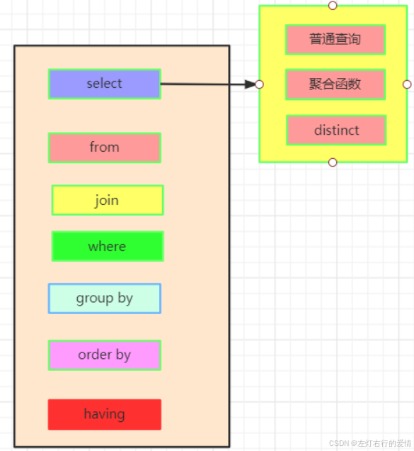
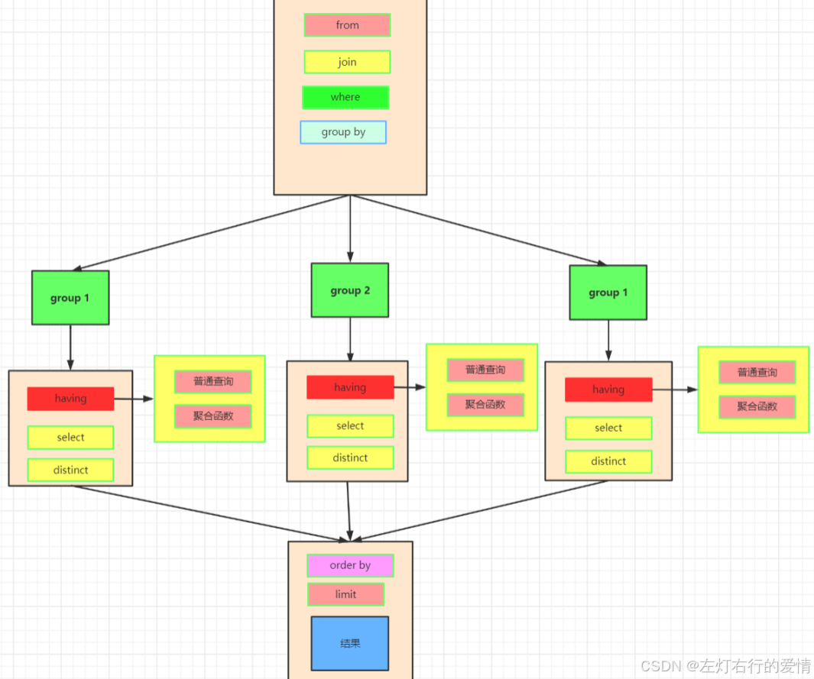
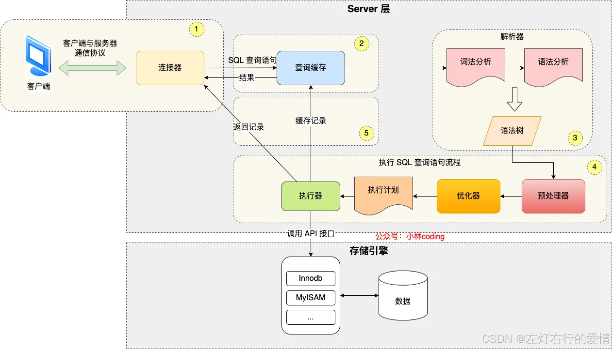
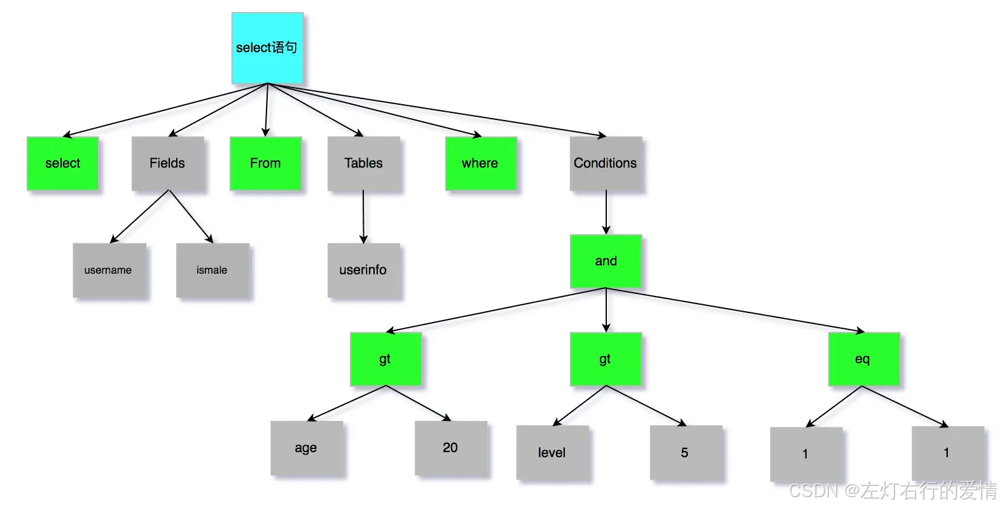

> 原文：[CSDN](https://blog.csdn.net/qq_45852626/article/details/145474586)（历史文章导入，当前状态为草稿）

#### SQL的执行顺序和流程
### SQL的执行顺序

这是一条标准的查询语句:  
   
 但实际上并不是从上到下去解析的,真实的执行顺序是:

1. 我们先执行from,join来确定表之间的连接关系，得到初步的数据
2. where对数据进行普通的初步的筛选
3. group by 分组
4. 各组分别执行having中的普通筛选或者聚合函数筛选。
5. 然后把再根据我们要的数据进行select，可以是普通字段查询也可以是获取聚合函数的查询结果，如果是集合函数，select的查询结果会新增一条字段
6. 将查询结果去重distinct
7. 最后合并各组的查询结果，按照order by的条件进行排序

  
 那么为什么会是这样的顺序呢?  
 可能我们猛一下会认为先执行select,然后依次往下走,但仔细一想这实际上是不可能的.  
 因为一开始就select,数据源都不知道是什么?而且也没有处理过数据,如何select呢?  
 说白了我们写的是一个人类理解的格式,但是到计算机手里,它要去分解这个格式,我们探究运行原理,肯定要站在计算机的角度去看.  
 那SQL到底为什么要这样去处理呢?

1. 首先要确认数据来源,(FROM/JOIN),因为不确定数据来源，后续操作就无法进行。
2. 再筛选原始数据 (WHERE)，减少数据量，提高效率。
3. 然后分组 (GROUP BY)，为聚合函数计算做准备。
4. 对分组后的数据进行二次筛选 (HAVING)，让聚合函数发挥作用.
5. 确定最终返回的列 (SELECT)，获取需要的字段或计算结果。
6. 去重 (DISTINCT)，确保数据唯一性。
7. 排序 (ORDER BY)，决定展示顺序。
8. 限制返回的行数 (LIMIT)，控制查询结果。  
    这个顺序是 SQL 语法和数据库优化的结果，遵循这样的逻辑可以保证 SQL 查询能够高效执行，同时符合数据处理的逻辑顺序。

### 执行一条select语句,发生了什么呢

上面的话换句话问,MySQL执行流程是什么样子的  
 先来一张上帝视角图,解释了执行一条SQL查询语句.MySQL内部架构里的各个功能模块  
 

MySQL 的架构共分为两层：Server 层和存储引擎层.

* Server 层负责建立连接、分析和执行 SQL.  
   大多数核心功能模块都在之类实现.  
   主要是连接器,连接器，查询缓存、解析器、预处理器、优化器、执行器等.  
   所有的内置函数和跨存储引擎的功能(存储过程,视图,触发器等)也在Server层实现.
* 存储引擎层负责数据的存储和提取.  
   支持 InnoDB、MyISAM、Memory 等多个存储引擎，不同的存储引擎共用一个 Server 层.

#### 连接器

连接器负责MySQL的连接工作,因为MySQL是基于TCP实现的协议,所以首先需要经过TCP三次握手来启动MySQL服务,然后通过验证用户输入的用户名和密码,然后为此次连接的用于授予相应的权限.  
 查看MySQL服务被多少个客户端连接的命令:`show processlist`;  
 在MySQL中,空闲连接(建立好连接后不进行任何操作)是不能长期存在的,有wait\_timeout参数控制,默认最大时长为8h.  
 MySQL中也存在长连接和短连接.长连接可以避免不必要的连接的资源消耗.但在长连接中,每次查询会使用内存连接管理对象,这些连接对象会在连接断开时释放,如果连接迟迟不断开,MySQL服务会占用过多内存资源.  
 解决方案  
 a. 定期关闭长连接  
 b. 客户端主动重连:MySQL5.7实现了`mysql_reset_connection()`接口,当连接中占用很多内存资源后,客户端会重置连接,将连接恢复到刚开始连接的状态(不需要重连和权限验证).  
 连接器做的工作:

```
1. 经过TCP三次握手启动MySQL服务
2. 验证用户输入的用户名和密码
3. 读取用户的权限并在连接中使用该权限


```

#### 查询缓存

查询缓存中的记录是 以key-value的形式存储的,key是SQL语句,value是SQL语句对应的结果.  
 能够一定程度上提高查询的效率,但这种提升微乎其微.因为中缓存的记录会随着更新操作而清空.只要出现一个更新操作,查询缓存中的记录就会随之清空.因此在MySQL8.0中就将查询缓存删掉了,在MySQL8.0之前可以通过`query_cache_type`来手动关闭查询缓存

#### 解析SQL

MySQL服务在收到SQL语句后会对SQL语句解析.而解析的工作通过解析器来执行.解析器会做2件事情

1. 词法分析:将SQL语句中的关键字识别出来构建成SQL语法树.  
    关键字| 非关键字| 关键字 |非关键字  
    select |username |from |userinfo
2. 语法分析:根据**词法分析的结果**和**语法规则**判断SQL语句是否符合MySQL语法.  
    

如果语法不对,会在解析时将错误返回给客户端.注意:表不存在或字段不存在的错误无法再解析时被检测出来

#### 执行SQL

执行SQL分为三个阶段

1. prepare 阶段，也就是预处理阶段
2. optimize 阶段，也就是优化阶段
3. execute 阶段，也就是执行阶段

##### 预处理器

1. 检查 SQL 查询语句中的表或者字段是否存在.
2. 将 select \* 中的 \* 符号，扩展为表上的所有列.

##### 优化器

预处理阶段后，还需要为 SQL 查询语句先制定一个执行计划，这个工作是优化器完成的.  
 主要负责将 SQL 查询语句的执行方案确定下来，比如在表里面有多个索引的时候,优化器会基于查询成本的考虑，来决定选择使用哪个索引.

##### 执行器

真正执行语句是交给执行器去完成.  
 在执行的过程中，执行器就会和存储引擎交互了,交互是以记录为单位.

### 总结

最后回看这张图是不是很清晰了  
 
