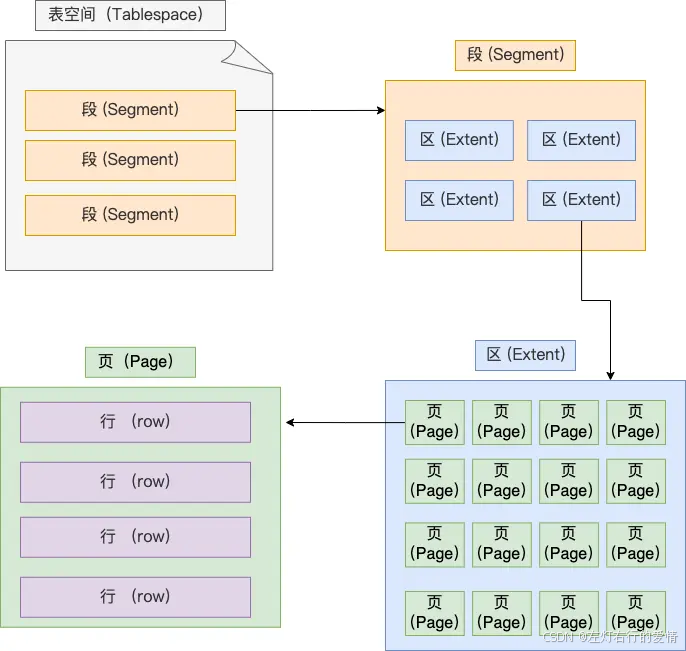
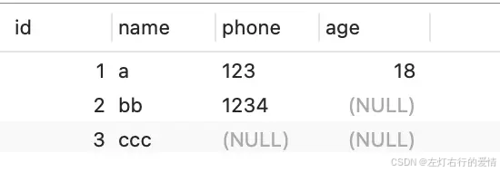
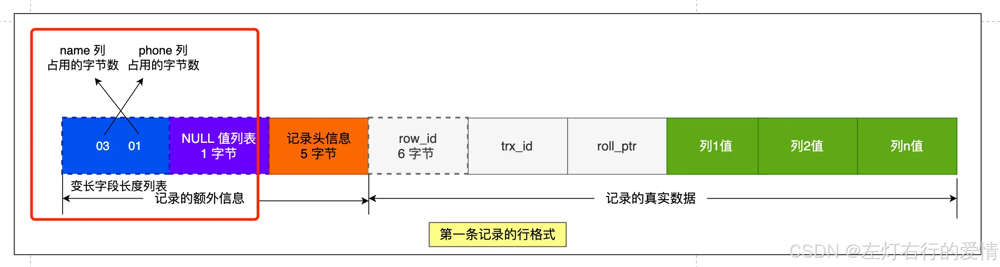
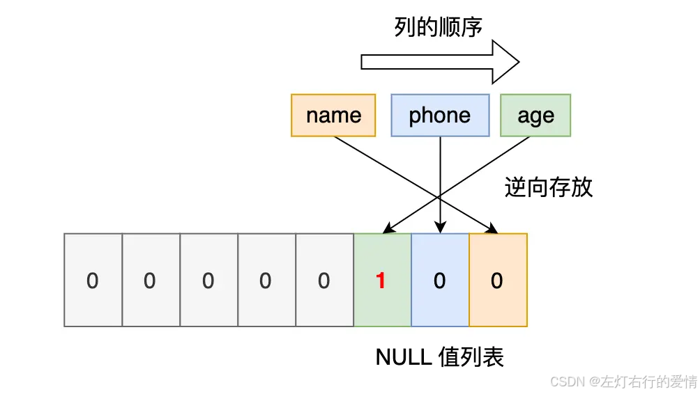
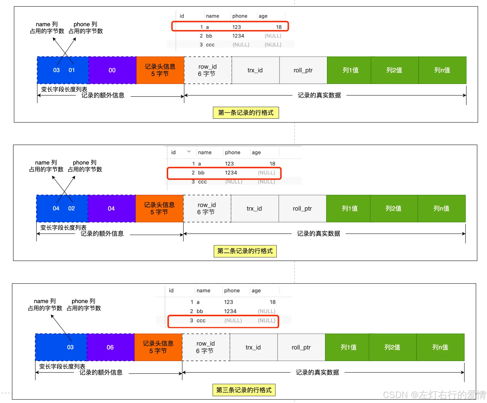
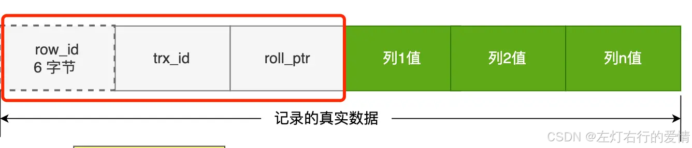

> 原文：[CSDN](https://blog.csdn.net/qq_45852626/article/details/145475832)（历史文章导入，当前状态为草稿）

### 前言

使用MySQL的时候,MySQL对于我们来说还是一个黑盒，我们只负责使用客户端发送请求并等待服务器返回结果，表中的数据到底存到了哪里？以什么格式存放的？MySQL是以什么方式来访问的这些数据？这些问题我们统统不知道.  
 MySQL服务器上负责对表中数据的读取和写入工作的部分是存储引擎，而服务器又支持不同类型的存储引擎，比如InnoDB、MyISAM、Memory什么的，不同的存储引擎一般是由不同的人为实现不同的特性而开发的，**真实数据在不同存储引擎中存放的格式一般是不同的**，甚至有的存储引擎比如Memory都不用磁盘来存储数据，也就是说关闭服务器后表中的数据就消失了。由于InnoDB是MySQL默认的存储引擎，也是我们最常用到的存储引擎，我们也没有那么多时间去把各个存储引擎的内部实现都看一遍，所以本章要介绍的是使用InnoDB作为存储引擎的数据存储结构，了解了一个存储引擎的数据存储结构之后，其他的存储引擎都是依葫芦画瓢，等我们用到了再说。

### InnoDB页简介

InnoDB是一个将**表中的数据存储到磁盘上的存储引擎**，所以即使关机后重启我们的数据还是存在的。  
 而**真正处理数据的过程是发生在内存中的**，所以需要把磁盘中的数据加载到内存中，如果是处理写入或修改请求的话，还需要把内存中的内容刷新到磁盘上。  
 而我们知道读写磁盘的速度非常慢，和内存读写差了几个数量级，所以当我们想从表中获取某些记录时，InnoDB存储引擎需要一条一条的把记录从磁盘上读出来么？不，那样会慢死，InnoDB采取的方式是：\*\*将数据划分为若干个页，以页作为磁盘和内存之间交互的基本单位，InnoDB中页的大小一般为 16 KB。\*\*也就是在一般情况下，一次最少从磁盘中读取16KB的内容到内存中，一次最少把内存中的16KB内容刷新到磁盘中。

#### 数据存放在哪个空间

* 表结构的信息存放在.frm文件中，表数据存放在.ibd文件中，而.opt文件存储的是当前数据库的默认字符集和字符校验规则
* 另外，在MySQL5.6.6之后，每一张表的数据才会单独存放在一个独立表空间文件.ibd文件中，之前都是存放在一个共享表空间文件中

#### 表空间的结构是怎么样的

表空间由段（segment）、区（extent）、页（page）、行（row）组成  
 

##### 行(row)

数据库表中的记录都是按行（row）进行存放的，每行记录根据不同的行格式，有不同的存储结构.

##### 页(page)

1. 记录是按行存储的，但是读取并不以【行】读写，否则一次读取（也就是一次IO操作）只能处理一行，效率低
2. InnoDB的数据是以【页】为单位进行读写，是InnoDB存储引擎磁盘管理的最小单元，默认每个页大小为16KB
3. 页有多种类型，常见的比如数据页、溢出页、undo日志页。表中的数据存储在数据页

##### 区(Extent)

InnoDB是用B+数来组织数据的.  
 B+数每一层通过双向链表连接起来的,如果是页为单位来分配存储空间,那么链表相邻的两个页之间物理位置并不连续,可能离的非常远,那么磁盘查询时会有大量的随机I/O,是非常慢的.

在表数据量大的时候，不以页为单位分配空间，而是以区为单位空间，这样一个区里的多个页在物理地址上连续，磁盘查询就能进行顺序IO，而不是随机IO。每个区大小为1M，对于16KB的页，连续的64个页就会被划为一个区.  
 我来解释为什么会有大量随机I/O：

1. 在B+树中，逻辑上相邻的页（通过双向链表连接）在物理存储位置上可能相距很远
2. 当进行范围查询时，需要沿着叶子节点的链表顺序访问多个页
3. 如果这些页在磁盘上分散存储，每访问一个新页就需要磁盘寻道到新的物理位置
4. 磁盘寻道是非常耗时的操作，远比顺序读取慢

以区为单位分配空间后，64个连续页被存储在物理上连续的1MB空间内，这样在访问同一个区内的多个页时，磁盘头不需要频繁移动，可以进行顺序读取，大大提高了I/O效率。  
 简单来说：随机I/O慢是因为磁盘需要不断寻道到新位置，而以区为单位可以减少寻道次数，提高性能。

##### 段(Segment)

表空间由各个段组成，一个段包含多个区。段分为数据段、索引段、回滚段

* 索引段：存放B+树非叶子节点的区
* 数据段：存放B+树叶子节点的区
* 回滚段：存放回滚数据的区

### InnoDB行格式

我们平时是以记录为单位来向表中插入数据的，这些记录在磁盘上的存放方式也被称为行格式或者记录格式。设计InnoDB存储引擎的大佬们到现在为止设计了4种不同类型的行格式，分别是Compact、Redundant、Dynamic和Compressed行格式，随着时间的推移，他们可能会设计出更多的行格式，但是不管怎么变，在原理上大体都是相同的。  
 这里我们只了解COMPACT行格式.

### COMPACT行格式

它长这样:  
   
 一条完整的记录分为「记录的额外信息」和「记录的真实数据」两个部分.

#### 记录的额外信息

包含 3 个部分：变长字段长度列表、NULL 值列表、记录头信息.

##### 变长字段长度列表

varchar(n) 和 char(n) 的区别是什么,在于char 是定长的，varchar 是变长的,变长字段实际存储的数据的长度（大小）不固定的.  
 所以,在存储数据的时候，也要把数据占用的大小存起来,就存在这个[变长字段长度列表]里面,读取数据的时候才能根据这个「变长字段长度列表」去读取对应长度的数据.  
 举个例子来说  
   
 里面有三条记录  
 这些变长字段的真实数据占用的字节数会按照列的顺序逆序存放.  
 所以「变长字段长度列表」里的内容是「 03 01」,而不是 「01 03」.  
 

###### 为什么变长字段长度列表按逆序存放

主要是因为「记录头信息」中指向下一个记录的指针,指向的是下一条记录的「记录头信息」和「真实数据」之间的位置，这样的好处是向左读就是记录头信息，向右读就是真实数据，比较方便.  
 「变长字段长度列表」中的信息之所以要逆序存放，是因为这样可以使得位置靠前的记录的真实数据和数据对应的字段长度信息可以同时在一个 CPU Cache Line 中,这样就可以提高 CPU Cache 的命中率.  
 我再解释一下:  
 这是一种优化设计:

1. 变长字段长度列表存储在记录的前部
2. 真实数据也是从记录的前部开始存放
3. 当按逆序存放变长字段长度信息时，前面字段的长度信息会更靠近其对应的真实数据  
    这样设计的好处：

* CPU一次加载数据到缓存是以缓存行(Cache Line)为单位的，通常是64字节
* 当访问字段的实际数据时，其长度信息很可能已经在同一个Cache Line中
* 系统不需要再从内存中额外加载数据，直接从CPU缓存中获取

###### 每个数据库表的行格式都有「变长字段字节数列表」吗?

变长字段字节数列表不是必须的!  
 当数据表没有变长字段的时候,这时候表里的行格式就不会有「变长字段长度列表」.

##### NULL值

表中的某些列可能会存储 NULL 值,如果把这些 NULL 值都放到记录的真实数据中会比较浪费空间,所以 Compact 行格式把这些值为 NULL 的列存储到 NULL值列表中.  
 每个列对应一个二进制位（bit）,二进制位按照列的顺序逆序排列.  
 二进制位的值为1时，代表该列的值为NULL,否则不为NULL.  
 举个例子:  
   
 第一条记录:  
   
 第二条记录:

  
 第三条记录:  
 

---

目前三条记录的行格式如下:  
   
   
 

###### 每个数据库表的行格式都有「NULL 值列表」吗？

当数据表的字段都定义成 NOT NULL 的时候，这时候表里的行格式就不会有 NULL 值列表了。  
 设计数据库表的时候，通常都是建议将字段设置为 NOT NULL,这样可以至少节省 1 字节的空间.

###### 「NULL 值列表」是固定 1 字节空间吗？

「NULL 值列表」的空间不是固定 1 字节的。  
 假如当一条记录有 9 个字段值都是 NULL，那么就会创建 2 字节空间的「NULL 值列表」，以此类推

##### 记录头信息

###### delete\_mask(删除标识)

标识此条数据是否被删除。从这里可以知道，我们执行 detele 删除记录的时候,并不会真正的删除记录，只是将这个记录的 delete\_mask 标记为 1。

###### next\_record(下一条记录)

下一条记录的位置。从这里可以知道，记录与记录之间是通过链表组织的。在前面我也提到了，指向的是下一条记录的「记录头信息」和「真实数据」之间的位置,这样的好处是向左读就是记录头信息，向右读就是真实数据，比较方便。

###### record\_type(记录类型)

表示当前记录的类型，0表示普通记录，1表示B+树非叶子节点记录，2表示最小记录，3表示最大记录.

#### 记录的真实数据

记录真实数据部分除了我们定义的字段，还有三个隐藏字段,分别为：row\_id、trx\_id、roll\_pointer.  
 

##### row\_id

如果我们建表的时候指定了主键或者唯一约束列，那么就没有 row\_id 这个隐藏字段了.  
 如果既没有指定主键，又没有唯一约束，那么 InnoDB 就会为记录添加 row\_id 隐藏字段。row\_id不是必需的，占用 6 个字节。

##### trx\_id

事务id，表示这个数据是由哪个事务生成的。trx\_id是必需的，占用 6 个字节。

##### roll\_pointer

这条记录上一个版本的指针。roll\_pointer 是必需的，占用 7 个字节。

#### 行溢出后,MySQL如何处理

如果一个数据页存不了一条记录，InnoDB 存储引擎会自动将溢出的数据存放到「溢出页」中.  
 当发生行溢出时，在记录的真实数据处只会保存该列的一部分数据，而把剩余的数据放在「溢出页」中,然后真实数据处用 20 字节存储指向溢出页的地址，从而可以找到剩余数据所在的页。如下图:  
 

#### varchar(n)中的n最大取值为多少

MySQL 规定除了 TEXT、BLOBs 这种大对象类型之外，其他所有的列（不包括隐藏列和记录头信息）占用的字节长度加起来不能超过 65535 个字节。注意是一行的总长度，不是一列。  
 varchar(n) 字段类型的 n 代表的是最多存储的字符数量，并不是字节大小哦.  
 要算 varchar(n) 最大能允许存储的字节数，还要看数据库表的字符集，因为字符集代表着，1个字符要占用多少字节，比如 ascii 字符集， 1 个字符占用 1 字节，那么 varchar(100) 意味着最大能允许存储 100 字节的数据。  
 一行记录最大能存储65535字节的数据，65535包括【变长字段长度列表】和【NULL值列表】，所以计算varchar(n)时，要减去这两个所占用的字节
