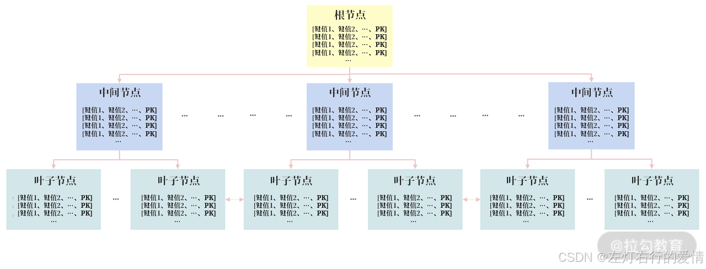
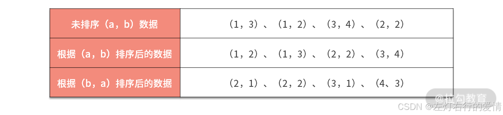
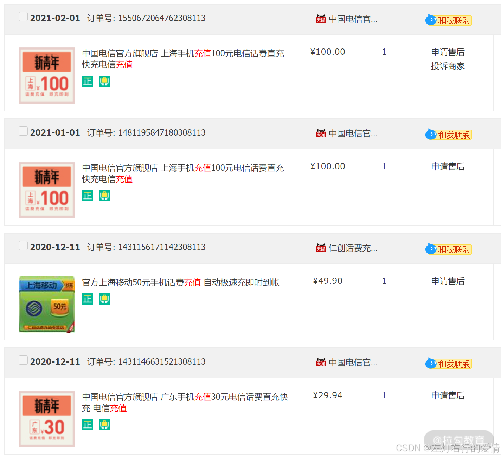

> 原文：[CSDN](https://blog.csdn.net/qq_45852626/article/details/145489856)（历史文章导入，当前状态为草稿）

### 前言

在实际业务中，我们会遇到很多复杂的场景，比如对多个列进行查询。这时，可能会要求用户创建多个列组成的索引，如列 a 和 b 创建的组合索引，但究竟是创建（a，b）的索引，还是（b，a）的索引，结果却是完全不同的。  
 下面我们聊如何在业务中用好组合索引，进一步提升系统的性能。

### 什么是组合索引

组合索引: 多个列组合而成的B+数索引.  
 它既可以是主键索引,也可以是二级索引,如下例:  
   
 上图可以看到,组合索引只是排序的键值从1个变成了多个.  
 本质还是一颗B+树索引.  
 **但是（a，b）和（b，a）这样的组合索引，其排序结果是完全不一样的.**  
   
 对组合索引（a，b）来说，因为其对列 a、b 做了排序，所以它可以对下面两个查询进行优化：

```
SELECT * FROM table WHERE a = ?
SELECT * FROM table WHERE a = ？ AND b = ？


```

上述SQL查询中,WHERE后查询列a和b顺序无关,即使先写 b = ? AND a = ？依然可以使用组合索引（a，b）。  
 但是下面的 SQL 无法使用组合索引（a，b），因为（a，b）排序并不能推出（b，a）排序：

```
SELECT * FROM table WHERE b = ?


```

再举个例子,同样由于索引（a，b）已排序，因此下面这条 SQL 依然可以使用组合索引（a，b），以此提升查询的效率：

```
SELECT * FROM table WHERE a = ？ ORDER BY b DESC


```

同样的原因，索引（a，b）排序不能得出（b，a）排序，因此下面的 SQL 无法使用组合索引（a，b）：

```
SELECT * FROM table WHERE b = ？ ORDER BY a DESC


```

### 业务索引设计实战

#### 避免额外的排序

在真实的业务场景中，你会遇到根据某个列进行查询，然后按照时间排序的方式逆序展示。  
 比如在微博业务中:用户的微博展示的就是根据用户 ID 查询出用户订阅的微博，然后根据时间逆序展示；  
 又比如在电商业务中:用户订单详情页就是根据用户 ID 查询出用户的订单数据，然后根据购买时间进行逆序展示。  
   
 我们对核心业务表rders设计如下:

```
CREATE TABLE `orders` (

  `O_ORDERKEY` int NOT NULL,

  `O_CUSTKEY` int NOT NULL,

  `O_ORDERSTATUS` char(1) NOT NULL,

  `O_TOTALPRICE` decimal(15,2) NOT NULL,

  `O_ORDERDATE` date NOT NULL,

  `O_ORDERPRIORITY` char(15) NOT NULL,

  `O_CLERK` char(15) NOT NULL,

  `O_SHIPPRIORITY` int NOT NULL,

  `O_COMMENT` varchar(79) NOT NULL,

  PRIMARY KEY (`O_ORDERKEY`),

  KEY `ORDERS_FK1` (`O_CUSTKEY`),

  CONSTRAINT `orders_ibfk_1` FOREIGN KEY (`O_CUSTKEY`) REFERENCES `customer` (`C_CUSTKEY`)

) ENGINE=InnoDB DEFAULT


```

其中：

* 字段 o\_orderkey 是 INT 类型的主键；
* 字段 o\_custkey 是一个关联字段，关联表 customer；
* 字段 o\_orderdate(下单的时间)、o\_orderstatus(当前订单的状态)、o\_totalprice(订单的总价)、o\_orderpriority(订单的优先级) 用于描述订单的基本详情.  
   在有了上述订单表后，当用户查看自己的订单信息，并且需要根据订单时间排序查询时，可通过下面的 SQL：

```
SELECT * FROM orders
WHERE o_custkey = 147601 
ORDER BY o_orderdate DESC


```

但由于上述表结构的索引设计时，索引 ORDERS\_FK1 仅对列 O\_CUSTKEY 排序，因此在取出用户 147601 的数据后，还需要一次额外的排序才能得到结果，可通过命令EXPLAIN验证：

```
EXPLAIN SELECT * FROM orders

WHERE o_custkey = 147601 ORDER BY o_orderdate DESC 

*************************** 1. row ***************************

           id: 1

  select_type: SIMPLE

        table: orders

   partitions: NULL

         type: ref

possible_keys: ORDERS_FK1

          key: ORDERS_FK1

      key_len: 4

          ref: const

         rows: 19

     filtered: 100.00

        Extra: Using filesort

1 row in set, 1 warning (0.00 sec)


```

SQL执行流程:  
 通过 ORDERS\_FK1 先定位到 O\_CUSTKEY = 147601 的所有订单（但这些订单是无序的，因为索引 ORDERS\_FK1 并不会对 O\_ORDERDATE 排序）。  
 由于查询要求 按 O\_ORDERDATE DESC 排序，数据库需要在取出数据后，额外执行一次 排序操作，导致额外的计算开销。

SQL 语句的确可以使用索引 ORDERS\_FK1，但在 Extra 列中显示的 Using filesort，表示还需要一次额外的排序才能得到最终的结果。  
 由于已对列 o\_custky 创建索引，因此上述 SQL 语句并不会执行得特别慢，但是在海量的并发业务访问下，每次 SQL 执行都需要排序就会对业务的性能产生非常明显的影响，比如 CPU 负载变高，QPS 降低。

**要解决这个问题，最好的方法是：在取出结果时已经根据字段 o\_orderdate 排序，这样就不用额外的排序了。**

为此，我们在表 orders 上创建新的组合索引 idx\_custkey\_orderdate，对字段（o\_custkey，o\_orderdate）进行索引：

```
ALTER TABLE orders ADD INDEX 
idx_custkey_orderdate(o_custkey,o_orderdate);


```

这时再进行之前的 SQL，根据时间展示用户的订单信息，其执行计划为：

```
EXPLAIN FORMAT=tree 

SELECT * FROM orders

WHERE o_custkey = 147601 ORDER BY o_orderdate 

*************************** 1. row ***************************

EXPLAIN: -> Index lookup on orders using idx_custkey_orderdate (O_CUSTKEY=147601)  (cost=6.65 rows=19)


```

可以看到，这时优化器使用了我们新建的索引 idx\_custkey\_orderdate，而且没有了 Sort 排序第二个过程。

#### 避免回表,性能提升n倍

前面文章我们聊过二级索引会有回表这一说法,即:SQL 需要通过二级索引查询得到主键值，然后再根据主键值搜索主键索引，最后定位到完整的数据。  
 但是因为二级索引的叶子节点,包含索引和主键值,那如果我们查询的字段在二级所以叶子节点中,则就直接返回结果,无需回表。**这种通过组合索引避免回表的优化技术也称为索引覆盖（Covering Index）。**  
 如下面的SQL语句：

```
SELECT o_custkey,o_orderdate,o_totalprice 
FROM orders WHERE o_custkey = 147601


```

它的执行过程:

```
           id: 1

  select_type: SIMPLE

        table: orders

   partitions: NULL

         type: ref

possible_keys:

idx_custkey_orderdate,ORDERS_FK1

          key: idx_custkey_orderdate

      key_len: 4

          ref: const

         rows: 19

     filtered: 100.00

        Extra: NULL


```

执行计划显示上述SQL会使用到之前新创建的组合索引 idx\_custkey\_orderdate，但是，由于组合索引的叶子节点只包含（o\_custkey，o\_orderdate，\_orderid），没有字段 o\_totalprice 的值，所以需要通过 o\_orderkey 回表找到对应的 o\_totalprice。  
 再用explain看一下:

```
EXPLAIN FORMAT=tree 

SELECT o_custkey,o_orderdate,o_totalprice 

FROM orders WHERE o_custkey = 147601\G

*************************** 1. row ***************************

EXPLAIN: -> Index lookup on orders using idx_custkey_orderdate (O_CUSTKEY=147601)  (cost=6.65 rows=19)


```

cost=6.65 表示的就是这条 SQL 当前的执行成本。不用关心 cost 的具体单位，你只需明白cost 越小，开销越小，执行速度越快。  
 解决办法:  
 想要避免回表，可以通过索引覆盖技术，创建(o\_custkey，o\_orderdate，o\_totalprice）的组合索引，如：

```
ALTER TABLE `orders` ADD INDEX
idx_custkey_orderdate_totalprice(o_custkey,o_orderdate,o_totalprice);


```

然后再次通过命令 EXPLAIN 观察执行计划：

```
EXPLAIN 

SELECT o_custkey,o_orderdate,o_totalprice 

FROM orders WHERE o_custkey = 147601\G

*************************** 1. row ***************************

           id: 1

  select_type: SIMPLE

        table: orders

   partitions: NULL

         type: ref

possible_keys:

idx_custkey_orderdate,ORDERS_FK1,idx_custkey_orderdate_totalprice

          key: idx_custkey_orderdate_totalprice

      key_len: 4

          ref: const

         rows: 19

     filtered: 100.00

        Extra: Using index


```

可以看到，这时优化器选择了新创建的组合索引 idx\_custkey\_orderdate\_totalprice，同时这时Extra 列不为 NULL，而是显示 Using index，这就表示优化器使用了索引覆盖技术。  
 再次观察 SQL 的执行成本，可以看到 cost 有明显的下降，从 6.65 下降为了 2.94：

```
EXPLAIN FORMAT=tree 

SELECT o_custkey,o_orderdate,o_totalprice 

FROM orders WHERE o_custkey = 147601\G

*************************** 1. row ***************************

EXPLAIN: -> Index lookup on orders using idx_custkey_orderdate_totalprice (O_CUSTKEY=147601)  (cost=2.94 rows=19)


```

当前表格sql执行后会返回19条记录,**这意味着在未使用索引覆盖技术前，这条 SQL 需要总共回表 19 次.**

如果你想看索引覆盖技术的巨大威力，可以执行下面这条 SQL：

```
SELECT o_custkey,SUM(o_totalprice) 

FROM orders GROUP BY o_custkey;


```

这条 SQL 表示返回每个用户购买订单的总额，业务可以根据这个结果对用户进行打标，删选出大客户，VIP 客户等。  
 我们先将创建的组合索引 idx\_custkey\_orderdate\_totalprice 设置为不可见，然后查看原先的执行计划：

```
ALTER TABLE orders 

ALTER INDEX idx_custkey_orderdate_totalprice INVISIBLE;

EXPLAIN SELECT o_custkey,SUM(o_totalprice) 

FROM orders GROUP BY o_custkey

*************************** 1. row ***************************

           id: 1

  select_type: SIMPLE

        table: orders

   partitions: NULL

         type: index

possible_keys:

idx_custkey_orderdate,ORDERS_FK1

          key: ORDERS_FK1

      key_len: 4

          ref: NULL

         rows: 5778755

     filtered: 100.00

        Extra: NULL

EXPLAIN FORMAT=tree 

SELECT o_custkey,SUM(o_totalprice) 

FROM orders GROUP BY o_custkey\G

*************************** 1. row ***************************

EXPLAIN: -> Group aggregate: sum(orders.O_TOTALPRICE)

    -> Index scan on orders using ORDERS_FK1  (cost=590131.50 rows=5778755)


```

可以看到，这条 SQL 优化选择了索引 ORDERS\_FK1，但由于该索引没有包含字段o\_totalprice，因此需要回表，根据 rows 预估出大约要回表 5778755 次。

同时，根据 FORMAT=tree 可以看到这条 SQL 语句的执行成本在 590131.5，对比前面单条数据的回表查询，显然成本高了很多。

所以，执行这条 GROUP BY的SQL，总共需要花费 12.35 秒的时间。  
 **再来对比启用索引覆盖技术后的 SQL 执行计划情况：**

```
ALTER TABLE orders 

ALTER INDEX idx_custkey_orderdate_totalprice VISIBLE;

EXPLAIN SELECT o_custkey,SUM(o_totalprice) 

FROM orders GROUP BY o_custkey\G

*************************** 1. row ***************************

           id: 1

  select_type: SIMPLE

        table: orders

   partitions: NULL

         type: index

possible_keys:

idx_custkey_orderdate,ORDERS_FK1,idx_custkey_orderdate_totalprice

          key: idx_custkey_orderdate_totalprice

      key_len: 14

          ref: NULL

         rows: 5778755

     filtered: 100.00

        Extra: Using index

1 row in set, 1 warning (0.00 sec)


```

可以看到，这次的执行计划提升使用了组合索引 idx\_custkey\_orderdate\_totalprice，并且通过Using index 的提示，表示使用了索引覆盖技术。

```
SELECT o_custkey,SUM(o_totalprice) 

FROM orders GROUP BY o_custkey;

...

399987 rows in set (1.04 sec)


```

再次执行上述 SQL 语句，可以看到执行时间从之前的 12.35 秒缩短为了 1.04 秒，SQL 性能提升了 10 倍多。  
 这就是索引覆盖技术的威力，而且这还只是基于 orders 表总共 600 万条记录。若表 orders 的记录数越多，需要回表的次数也就越多，通过索引覆盖技术性能的提升也就越明显。
