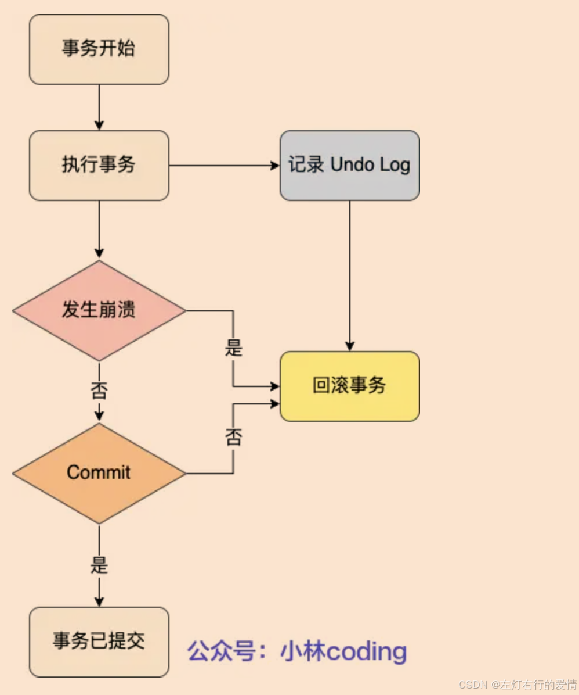
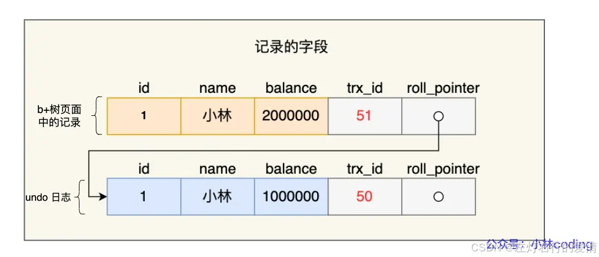

> 原文：[CSDN](https://blog.csdn.net/qq_45852626/article/details/145584538)（历史文章导入，当前状态为草稿）

### 前言

一个事务在执行过程中，在还没有提交事务之前，如果 MySQL 发生了崩溃，要怎么回滚到事务之前的数据呢？这时候就要依靠我们下面聊的undo log了.

### 概念

undo log是一种用于撤销回退的日志，在事务没提交之前，MySQL会先记录更新前的数据到 undo log日志文件里面，当事务回滚时或者数据库崩溃时，可以利用 undo log来进行回退。

### 作用

#### 提供回滚操作

undo log是一种用于撤销回退的日志，在事务没提交之前，MySQL会先记录更新前的数据到 undo log日志文件里面，当事务回滚时或者数据库崩溃时，可以利用 undo log来进行回退。如下图：  
 

每当 InnoDB 引擎对一条记录进行操作（修改、删除、新增）时，要把回滚时需要的信息都记录到 undo log 里，比如：

1. 在插入一条记录时，要把这条记录的主键值记下来，这样之后回滚时只需要把这个主键值对应的记录删掉就好了；
2. 在删除一条记录时，要把这条记录中的内容都记下来，这样之后回滚时再把由这些内容组成的记录插入到表中就好了；
3. 在更新一条记录时，要把被更新的列的旧值记下来，这样之后回滚时再把这些列更新为旧值就好了。  
    **发生回滚时，就读取 undo log 里的数据，然后做原先相反操作。**  
    **针对 delete 操作和 update 操作会有一些特殊的处理：**

* delete操作实际上不会立即直接删除，而是将delete对象打上delete flag,标记为删除，最终的删除操作是purge线程完成的。
* update分为两种情况：update的列是否是主键列。
  + 如果不是主键列,在undo log中直接反向记录是如何update的。即update是直接进行.
  + 如果是主键列，update分两部执行：先删除该行，再插入一行目标行.

#### 实现MVCC关键因素

一条记录的每一次更新操作产生的 undo log 格式都有一个 roll\_pointer 指针和一个 trx\_id 事务id：

* 通过 trx\_id 可以知道该记录是被哪个事务修改的；
* 通过 roll\_pointer 指针可以将这些 undo log 串成一个链表，这个链表就被称为版本链；  
   如下图:  
   那么通过ReadView 和undo log 可以实现MVCC(多版本并发控制).

#### 总结

undo log 两大作用:

* 实现事务回滚，保障事务的原子性。  
   事务处理过程中，如果出现了错误或者用户执 行了ROLLBACK 语句，MySQL 可以利用 undo log 中的历史数据将数据恢复到事务开始之前的状态。
* 实现 MVCC（多版本并发控制）关键因素之一。  
   MVCC 是通过 ReadView + undo log 实现的。undo log 为每条记录保存多份历史数据，MySQL 在执行快照读（普通 select 语句）的时候，会根据事务的 Read View 里的信息，顺着 undo log 的版本链找到满足其可见性的记录。

### undo log如何刷盘(持久化)

undo log 和数据页的刷盘策略是一样的，都需要通过 redo log 保证持久化。  
 buffer pool 中有 undo 页，对 undo 页的修改也都会记录到 redo log。  
 redo log 会每秒刷盘，提交事务时也会刷盘，数据页和 undo 页都是靠这个机制保证持久化的。

### 总结

基础概念和作用要结合之前我们聊过的内容去理解就容易很多,MVCC那一张算是已经对undo log进行了铺垫,所以这里很好理解.
