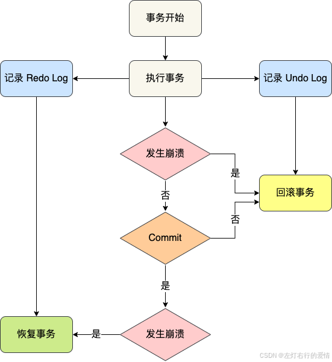
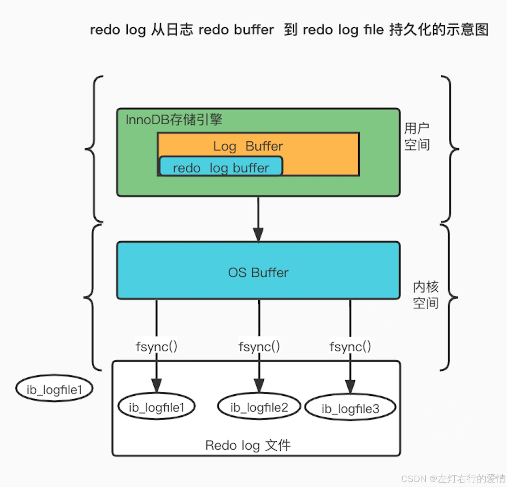
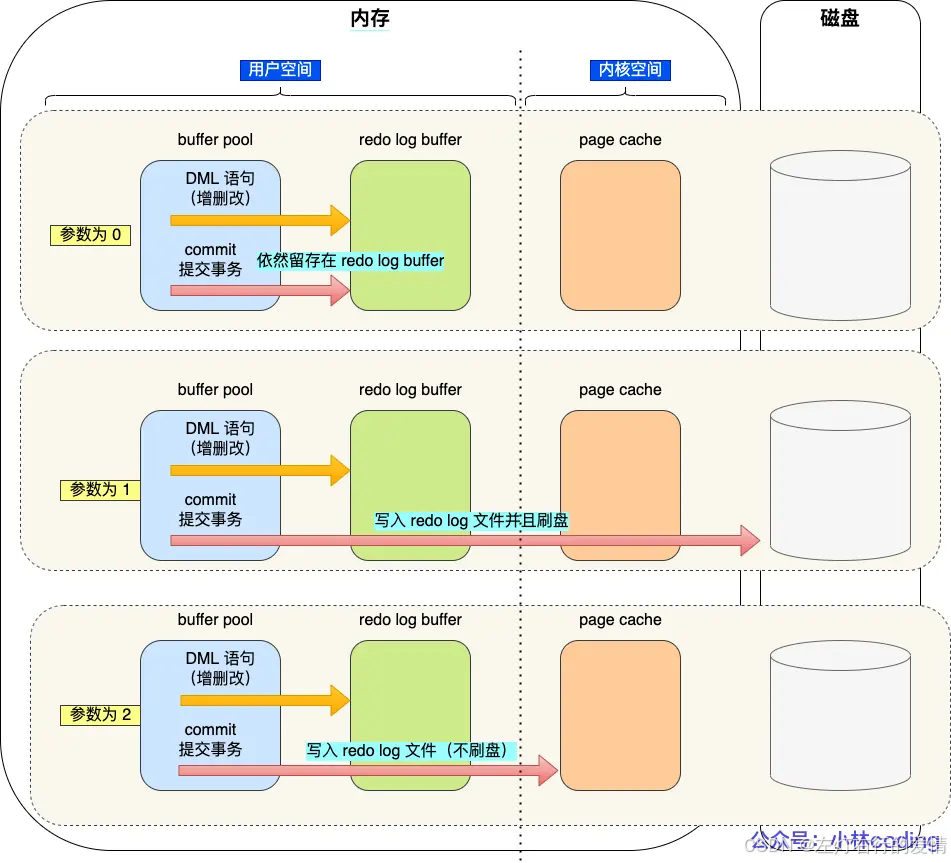
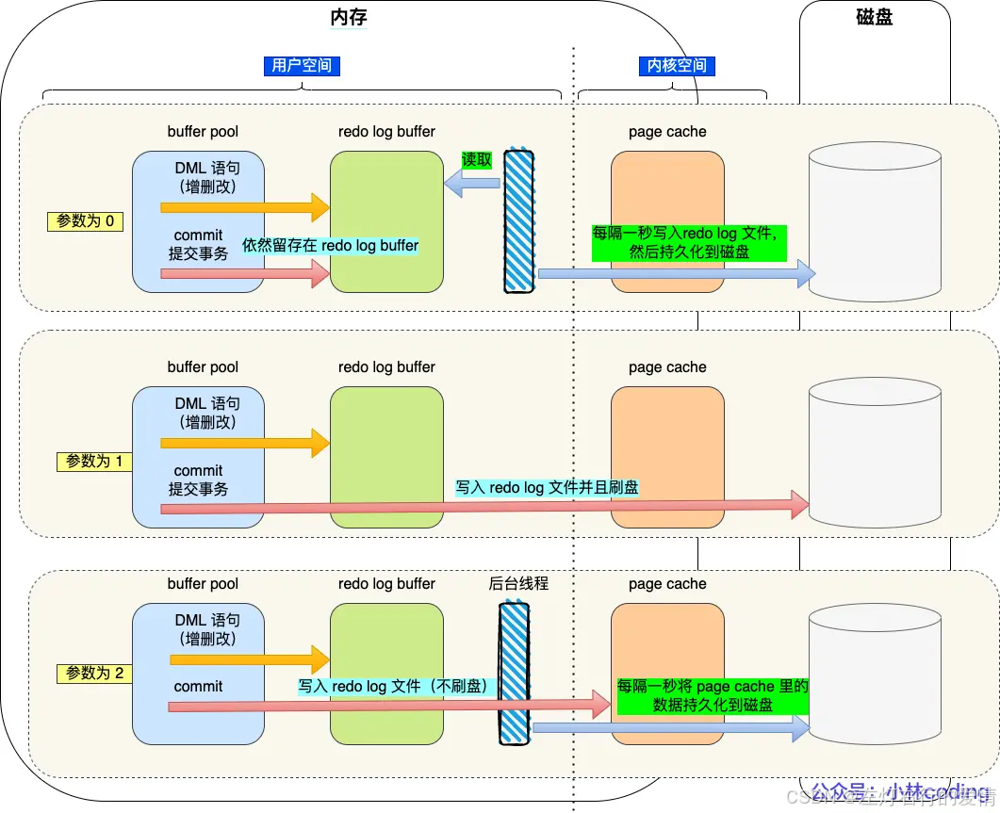
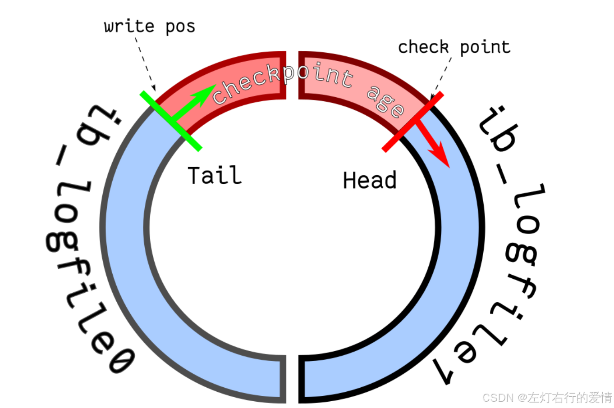

> 原文：[CSDN](https://blog.csdn.net/qq_45852626/article/details/145585470)（历史文章导入，当前状态为草稿）

#### redo log的工作原理
### 前言

你知道什么是存储引擎、随机 IO 和顺序 IO吗？你知道 MySQL 中的缓冲池吗？binlog 听说过吗？都有什么用？  
 如果你对上面的问题还有疑问或者没听过,建议你先去看一下相关的知识点再来看本章内容(我前面文章都有聊过这些内容,你可以看一下).

### 概念

Redo Log一种物理日志，记录对数据页的修改内容，用于保证事务的持久性和数据库或操作系统崩溃后的故障恢复。内部记录了需要修改的数据页、页中数据的偏移量、修改的字段和修改的值。  
 比如对 XXX 表空间中的 YYY 数据页 ZZZ 偏移量的地方做了AAA 更新.  
 每当执行一个事务就会产生这样 的一条或者多条物理日志。  
 在事务提交时，只要先将 redo log 持久化到磁盘即可，可以不需要等到将缓存在 Buffer Pool 里的脏页数据持久化到磁盘。  
 当系统崩溃时，虽然脏页数据没有持久化，但是 redo log 已经持久化，接着 MySQL 重启后，可以根据 redo log 的内容，将所有数据恢复到最新的状态。

### 为什么需要redo log

数据页在缓冲池中被修改会变成脏页。如果这时宕机，脏页就会失效，这就导致我们修改的数据丢失了，也就无法保证事务的持久性。保证数据不丢.  
 为了防止断电导致数据丢失的问题，当有一条记录需要更新的时候，InnoDB 引擎就会先更新内存（同时标记为脏页），然后将本次对这个页的修改以 redo log 的形式记录下来，这个时候更新就算完成了。  
 就是 redo log 的一个重要功能。

### 修改undo页面,会记录对应的redo log吗

需要的.  
 开启事务后，InnoDB 层更新记录前，首先要记录相应的 undo log,开启事务后，InnoDB 层更新记录前，首先要记录相应的 undo log.  
 开启事务后，InnoDB 层更新记录前，首先要记录相应的 undo log.

### redo log 和undo log 区别在哪

这两种日志是属于 InnoDB 存储引擎的日志，它们的区别在于：

* redo log 记录了此次事务「修改后」的数据状态，记录的是更新之后的值，主要用于事务崩溃恢复，保证事务的持久性。
* undo log 记录了此次事务「修改前」的数据状态，记录的是更新之前的值，主要用于事务回滚，保证事务的原子性。

事务提交之前发生了崩溃（这里的崩溃不是宕机崩溃，而是事务执行错误，mysql 还是正常运行的。如果是宕机崩溃的话，其实就不需要通过 undo log 回滚了，因为事务没有提交，事务的数据并不会持久化，还是在内存中，宕机崩溃了数据就丢失了，因为事务没有提交，事务的数据并不会持久化，还是在内存中，宕机崩溃了数据就丢失了),重启后会通过 undo log 回滚事务。  
 事务提交之后发生了崩溃（这里的崩溃是宕机崩溃），重启后会通过 redo log 恢复事务，如下图：  
   
 所以有了 redo log，再通过 WAL 技术，InnoDB 就可以保证即使数据库发生异常重启，之前已提交的记录都不会丢失，这个能力称为 crash-safe（崩溃恢复）。  
 可以看出来， redo log 保证了事务四大特性中的持久性。

### 什么是WAL技术

WAL全名为Write-Ahead Logging，是一种在数据库系统中用于保证数据持久性和恢复性的技术。  
 在数据库操作中，数据的写入操作不是直接写入到磁盘中，而是先写入一个WAL日志文件，然后再写入到磁盘中。

### redo log要写入磁盘,数据也要写入磁盘,为什么多此一举

写入 redo log 的方式使用了追加操作， 所以磁盘操作是顺序写.  
 写入数据需要先找到写入位置，然后才写到磁盘，所以磁盘操作是随机写。  
 磁盘的「顺序写 」比「随机写」 高效的多，因此 redo log 写入磁盘的开销更小,提升语句的执行性能,然后在合适的时间再更新到磁盘上.  
 简单来说如下:

* 实现事务的持久性，让 MySQL 有 crash-safe 的能力.
* 将写操作从「随机写」变成了「顺序写」，提升 MySQL 写入磁盘的性能.

### 产生的redo log直接写入磁盘吗

不是的.  
 如果直接写入磁盘，这样会产生大量的 I/O 操作，而且磁盘的运行速度远慢于内存。  
 所以，redo log 也有自己的缓存—— redo log buffer.  
 所以，redo log 也有自己的缓存—— redo log buffer.  
   
 redo log buffer 默认大小 16 MB，可以通过 innodb\_log\_Buffer\_size 参数动态的调整大小，增大它的大小可以让 MySQL 处理「大事务」是不必写入磁盘，进而提升写 IO 性能。

### redo log 什么时候刷盘

缓存在 redo log buffer 里的 redo log 还是在内存中，它什么时候刷新到磁盘.  
 主要有下面几个时机：

* MySQL 正常关闭时
* 当 redo log buffer 中记录的写入量大于 redo log buffer 内存空间的一半时，会触发落盘；
* InnoDB 的后台线程每隔 1 秒，将 redo log buffer 持久化到磁盘。
* 每次事务提交时都将缓存在 redo log buffer 里的 redo log 直接持久化到磁盘.

#### innodb\_flush\_log\_at\_trx\_commit 参数

默认行为:  
 **单独执行一个更新语句的时候，InnoDB 引擎会自己启动一个事务.  
 在执行更新语句的过程中，生成的 redo log 先写入到 redo log buffer 中,在执行更新语句的过程中，生成的 redo log 先写入到 redo log buffer 中.**  
 InnoDB 还提供了另外两种策略，由参数innodb\_flush\_log\_at\_trx\_commit控制,可取的值有：0、1、2，默认值为 1,这三个值分别代表的策略如下:

* 当设置该参数为 0 时  
   每次事务提交时 ，还是将 redo log 留在 redo log buffer 中,该模式下在事务提交时不会主动触发写入磁盘的操作。
* 当设置该参数为 1 时  
   每次事务提交时，都将缓存在 redo log buffer 里的 redo log 直接持久化到磁盘，这样可以保证 MySQL 异常重启之后数据不会丢失。
* 当设置该参数为 2 时  
   每次事务提交时，都只是缓存在 redo log buffer 里的 redo log写到 redo log 文件，注意写入到「 redo log 文件」并不意味着写入到了磁盘，因为操作系统的文件系统中有个 Page Cache，Page Cache 是专门用来缓存文件数据的，所以写入「 redo log文件」意味着写入到了操作系统的文件缓存。  
   如下图:  
   

##### 参数为0 和2时,什么时候将redo log 写入到磁盘.

InnoDB 的后台线程每隔 1 秒:

* 参数0  
   会把缓存在 redo log buffer 中的 redo log ，通过调用 write() 写到操作系统的 Page Cache,然后调用 fsync() 持久化到磁盘。  
   **MySQL 进程的崩溃会导致上一秒钟所有事务数据的丢失;**
* 参数2  
   调用 fsync，将缓存在操作系统中 Page Cache 里的 redo log 持久化到磁盘.  
   较取值为 0 情况下更安全，因为 MySQL 进程的崩溃并不会丢失数据，只有在操作系统崩溃或者系统断电的情况下,上一秒钟所有事务数据才可能丢失.

刷盘时机如下图:  
 

##### 应用场景是什么

数据安全性：参数 1 > 参数 2 > 参数 0  
 写入性能：参数 0 > 参数 2> 参数 1  
 数据安全性和写入性能是熊掌不可得兼的

* 对数据安全性要求比较高的场景中,参数1 合适
* 可以容忍数据库崩溃时丢失 1s 数据的场景中,参数0合适
* 安全性和性能折中的方案就是参数 2

### redo log 文件写满了怎么办

默认情况下， InnoDB 存储引擎有 1 个重做日志文件组( redo log Group），「重做日志文件组」由有 2 个 redo log 文件组成，这两个 redo 日志的文件名叫 ：ib\_logfile0 和 ib\_logfile1 。  
   
 在重做日志组中，每个 redo log File 的大小是固定且一致的,在重做日志组.中，每个 redo log File 的大小是固定且一致的,假设每个 redo log File 设置的上限是 1 GB，那么总共就可以记录 2GB 的操作。  
 **重做日志文件组是以循环写的方式工作的，从头开始写，写到末尾就又回到开头，相当于一个环形。**  
   
 redo log 是为了防止 Buffer Pool 中的脏页丢失而设计的,Buffer Pool 的脏页刷新到了磁盘中，那么 redo log 对应的记录也就没用了,这时候我们擦除这些旧记录，以腾出空间记录新的更新操作。  
 InnoDB 用 write pos 表示 redo log 当前记录写到的位置，用 checkpoint 表示当前要擦除的位置.如下图:  
   
 图中:

* write pos 和 checkpoint 的移动都是顺时针方向；
* write pos ～ checkpoint 之间的部分（图中的红色部分），用来记录新的更新操作；
* check point ～ write pos 之间的部分（图中蓝色部分）：待落盘的脏数据页记录；

当write pos == checkpoint-意味着edo log 文件满了.  
 这时 MySQL 不能再执行新的更新操作，也就是说 MySQL 会被阻塞,此时会停下来将 Buffer Pool 中的脏页刷新到磁盘中,然后标记 redo log 哪些记录可以被擦除，接着对旧的 redo log 记录进行擦除,等擦除完旧记录腾出了空间，checkpoint 就会往后移动（图中顺时针）.

### 总结

redo log 的核心作用是保证已提交事务的修改不会丢失，它是实现事务持久性（Durability）的关键技术之一。通过记录已提交事务的修改操作并在崩溃后恢复这些操作，redo log 能够有效地防止数据丢失，确保数据库恢复到一致的状态。
